# 一、Java 入门

欢迎来到 Java。这一章通过关注基本原理来启动你的技术之旅。首先，您会收到“什么是 Java？”问题。如果你以前没有接触过 Java，答案可能会让你大吃一惊。接下来，将向您介绍一些有助于您开始开发 Java 程序的基本工具，以及简化这些程序开发的 NetBeans 集成开发环境。最后，您将探索基本的语言特性。

### Java 是什么？

Java 是一种描述程序的语言，Java 是一个运行用 Java 和其他语言(例如 Groovy、Jython 和 JRuby)编写的程序的平台。本节向您介绍 Java 语言和 Java 平台。

 **注**要发现 Java 的历史，可以查看维基百科的“Java(编程语言)”(`[http://en.wikipedia.org/wiki/Java_(programming_language)#History](http://en.wikipedia.org/wiki/Java_(programming_language)#History)`)和“Java(软件平台)”(`[http://en.wikipedia.org/wiki/Java_(software_platform)#History](http://en.wikipedia.org/wiki/Java_(software_platform)#History)`)词条。

#### Java 是一种语言

Java 是一种通用的、基于类的、面向对象的语言，模仿了 C 和 C++的模式，使得现有的 C/C++开发人员更容易移植到这种语言。毫不奇怪，Java 借鉴了这些语言的元素。下表列出了其中的一些元素:

*   Java 支持与 C/C++中相同的单行和多行注释样式来记录源代码。
*   Java 提供了在 C 和 C++语言中可以找到的`if`、`switch`、`while`、`for`和其他保留字。Java 还提供了`try`、`catch`、`class`、`private`以及其他在 C++中可以找到但在 C 中找不到的保留字
*   与 C 和 C++一样，Java 支持字符、整数和其他基本类型。此外，Java 共享相同的保留字来命名这些类型；比如`char`(表示字符)`int`(表示整数)。
*   Java 支持许多与 C/C++相同的操作符:算术操作符(`+`、`-`、`*`、`/`和`%`)和条件操作符(`?:`)就是例子。
*   Java 还支持使用大括号字符`{`和`}`来分隔语句块。

虽然 Java 与 C 和 C++相似，但在许多方面也有所不同。下面的列表详细列出了其中的一些差异:

*   Java 支持另一种称为 Javadoc 的注释风格。
*   Java 提供了`transient`、`synchronized`、`strictfp`，以及其他 C 或 C++中没有的保留字。
*   Java 的字符类型比 C 和 C++中的字符类型更大，Java 的整数类型不包括这些类型的无符号变体(例如，Java 没有 C/C++无符号长整型的等效类型)，Java 的基本类型有保证的大小，而对于等效的 C/C++类型没有保证。
*   Java 并不支持所有的 C/C++运算符。比如没有`sizeof`运算符。另外，Java 提供了一些 C/C++中没有的操作符。比如`>>>`(无符号右移)`instanceof`都是 Java 独占的。
*   Java 提供了带标签的 break 和 continue 语句。C/C++ break 和 continue 语句的这些变体为 C/C++的 goto 语句提供了更安全的替代方法，Java 不支持 goto 语句。

 **注**注释、保留字、类型、操作符和语句都是基本语言特性的例子，这将在本章后面讨论。

一个 Java 程序开始时是符合 Java *语法*的源代码，即把符号组合成有意义的实体的规则。Java 编译器将存储在文件扩展名为“`.java`”的文件中的源代码翻译成等价的可执行代码，称为“T4”字节码，并存储在文件扩展名为“`.class`”的文件中。

 **注意**存储编译后的 Java 代码的文件被称为*class file*，因为它们经常存储 Java 类的运行时表示，这是一个在第 2 章的[中讨论的语言特性。](02.html#ch2)

Java 语言的设计考虑了可移植性。理想情况下，Java 开发人员编写一次 Java 程序的源代码，将该源代码编译成字节码，然后在支持 Java 的任何平台(例如，Windows、Linux 和 Mac OS X)上运行该字节码，而不必改变源代码并重新编译。可移植性部分是通过确保基元类型跨平台具有相同的大小来实现的。例如，Java 的整数类型的大小总是 32 位。

Java 语言在设计时也考虑到了健壮性。Java 程序应该比 C/C++程序更不容易崩溃。Java 实现健壮性的部分原因是没有实现某些会降低程序健壮性的 C/C++特性。例如，*指针*(存储其他变量地址的变量)增加了程序崩溃的可能性，这也是 Java 不支持这个 C/C++特性的原因。

#### Java 是一个平台

Java 是一个执行基于 Java 的程序的平台。与具有物理处理器(例如，英特尔处理器)和操作系统(例如，Windows 7)的平台不同，Java 平台由虚拟机和执行环境组成。

一个*虚拟机*是一个基于软件的处理器，拥有自己的指令集。Java 虚拟机(JVM)的相关*执行环境*由一个巨大的预建功能库组成，通常被称为*标准类库*，Java 程序可以使用它来执行日常任务(例如，打开文件并读取其内容)。执行环境还包括将 JVM 连接到底层操作系统的“粘合”代码。

 **注意**“粘合”代码由特定于平台的库组成，用于访问操作系统的窗口、网络和其他子系统。它还包含使用 Java 本地接口(JNI)在 Java 和操作系统之间架起桥梁的代码。我在附录 c 中讨论了 JNI。您可能还想查看维基百科的“Java Native Interface”条目(`[http://en.wikipedia.org/wiki/Java_Native_Interface](http://en.wikipedia.org/wiki/Java_Native_Interface)`)来了解 JNI。

当 Java 程序启动器启动 Java 平台时，JVM 被启动并被告知通过一个称为*类加载器*的组件将 Java 程序的起始类文件加载到内存中。加载类文件后，将执行以下任务:

*   验证类文件的字节码指令序列，以确保它们不会危及 JVM 和底层环境的安全。验证确保指令序列不会找到利用 JVM 破坏环境和窃取敏感信息的方法。处理这个任务的组件被称为*字节码验证器*。
*   执行类文件的字节码指令的主序列。处理这个任务的组件被称为*解释器*，因为指令是被*解释的*(被识别并用于选择适当的本机处理器指令序列，以执行字节码指令所表示的等价内容)。当解释器发现一个字节码指令序列被重复执行时，它通知*实时(JIT)编译器*组件将这个序列编译成一个等价的本地指令序列。JIT 有助于 Java 程序获得比仅仅通过解释更快的执行速度。注意，JIT 和将源代码编译成字节码的 Java 编译器是两个独立的编译器，有两个不同的目标。

在执行过程中，一个类文件可能会引用另一个类文件。在这种情况下，使用类加载器来加载被引用的类文件，然后字节码验证器验证该类文件的字节码，解释器/JIT 执行另一个类文件中适当的字节码序列。

Java 平台的设计考虑了可移植性。通过提供底层操作系统的抽象，字节码指令序列应该在 Java 平台上一致地执行。然而，这并不总是在实践中得到证实。例如，许多 Java 平台依赖底层操作系统来调度线程(在[第 4 章](04.html#ch4)中讨论过)，线程调度实现因操作系统而异。因此，你必须小心确保程序被设计来适应这些变化。

Java 平台的设计也考虑到了安全性。除了字节码验证器，该平台还提供了一个安全框架来帮助确保恶意程序不会破坏程序运行的底层环境。附录 C 讨论了 Java 的安全框架。

### 安装和使用 JDK 7

有三种软件开发工具包(SDK)用于开发不同种类的 Java 程序:

*   Java SE(标准版)软件开发工具包(被称为 JDK)用于创建面向桌面的*独立应用*和被称为*小程序*的网络浏览器嵌入式应用。本节稍后将向您介绍独立的应用。我不讨论小程序，因为它们不像以前那样受欢迎了。
*   Java ME(移动版)SDK 用于创建称为 MIDlets 和 Xlets 的应用。MIDlets 的目标是移动设备，这些设备具有小型图形显示器、简单的数字键盘接口和有限的基于 HTTP 的网络访问。Xlets 通常以面向电视的设备为目标，如蓝光光盘播放器。Java ME SDK 还要求安装 JDK。我不讨论 MIDlets 或 Xlets。
*   Java EE(企业版)SDK 用于创建基于组件的企业应用。组件包括*servlet*，它可以被认为是小程序的服务器等价物，以及基于 servlet 的 Java 服务器页面(JSP)。Java EE SDK 还要求安装 JDK。我不讨论 servlets。

本节首先向您展示如何安装这个最新的主要 Java SE 版本，从而向您介绍 JDK 7(也称为 *Java 7* ，这是后面章节中使用的术语)。然后向您展示如何使用 JDK 7 工具开发一个简单的独立应用——从现在开始，我将使用更简短的*应用*术语。

#### 安装 JDK 7

将您的浏览器指向`[http://www.oracle.com/technetwork/java/javase/downloads/index-jsp-138363.html](http://www.oracle.com/technetwork/java/javase/downloads/index-jsp-138363.html)`，并按照出现的网页上的说明下载适用于您的 Windows、Solaris 或 Linux 平台的 JDK 7 安装 exe 或 gzip tarball 文件。

下载完成后，运行 Windows 可执行文件或解压缩 Solaris/Linux gzip tarball，并修改您的`PATH`环境变量以包含生成的主目录的`bin`子目录，以便您可以从文件系统中的任何位置运行 JDK 7 工具。例如，在 Windows 平台上，您可以将`C:\Program Files\Java\jdk1.7.0`主目录包含在`PATH`中。你还应该更新你的`JAVA_HOME`环境变量以指向 JDK 7 的主目录，以确保任何依赖于 Java 的软件都能找到这个目录。

JDK 7 的主目录包含几个文件(如`README.html`、`LICENSE`)和子目录。从本书的角度来看，最重要的子目录是`bin`，它包含了我们将在本书中用到的各种工具。下表列出了其中的一些工具:

*   `jar`:将类文件和资源文件打包成特殊 ZIP 文件的工具，文件扩展名为“`.jar`
*   `java`:运行应用的工具
*   `javac`:启动 Java 编译器编译一个或多个源文件的工具
*   从 Javadoc 注释中生成基于 HTML 的特殊文档的工具

JDK 的工具运行在命令行环境中。您可以通过启动命令窗口(Windows)或 shell (Linux/Solaris)来实现这一点，它会显示一系列提示，提示您输入*命令*(程序名及其参数)。例如，命令窗口(在 Windows 平台上)提示您通过提供驱动器号和路径组合(如`C:\`)来输入命令。

您可以通过键入命令来响应提示，然后按回车键告诉操作系统执行该命令。例如，`javac x.java`后按回车键/回车键会导致操作系统启动`javac`工具，并将正在编译的源文件的名称(`x.java`)作为其命令行参数传递给该工具。如果您指定了星号(`*`)通配符，如在`javac *.java`，`javac`将编译当前目录中的所有源文件。要了解更多关于使用命令行的信息，请查看维基百科的“命令行界面”条目(`[http://en.wikipedia.org/wiki/Command-line_interface](http://en.wikipedia.org/wiki/Command-line_interface)`)。

另一个重要的子目录是`jre`，它存储了 JDK 的 Java 运行时环境(JRE)的私有副本。JRE 实现了 Java 平台，使得运行 Java 程序成为可能。对运行(而不是开发)Java 程序感兴趣的用户可以下载公共 JRE。因为 JDK 包含自己的 JRE 副本，所以开发人员不需要下载并安装公共 JRE。

 **注意** JDK 7 附带了外部文档，其中广泛引用了 Java 的许多*API*(参见`[http://en.wikipedia.org/wiki/Application_programming_interface](http://en.wikipedia.org/wiki/Application_programming_interface)`了解这个术语)。您可以从`[http://www.oracle.com/technetwork/java/javase/downloads/index-jsp-138363.html](http://www.oracle.com/technetwork/java/javase/downloads/index-jsp-138363.html)`下载文档档案，这样您就可以离线查看该文档。然而，因为档案相当大，您可能更喜欢在`[http://download.oracle.com/javase/7/docs/index.html](http://download.oracle.com/javase/7/docs/index.html)`在线查看文档。

#### 与 JDK 合作 7

一个应用由一个带有名为`main`的入口点方法的类组成。虽然对类和方法的适当讨论必须等到第二章才能进行，但是现在只要把类看作是创建对象的工厂就足够了(在第二章的[中也讨论了)，把方法看作是一个命名的指令序列，当方法被调用时执行。清单 1-1](02.html#ch2) 向您介绍了您的第一个应用。

***清单 1-1。**来自爪哇的问候*

```java
class HelloWorld
{
   public static void main(String[] args)
   {
      System.out.println("Hello, world!");
   }
}
```

[清单 1-1](#list_1_1) 声明了一个名为`HelloWorld`的类，为这个简单的应用提供了一个框架。它还在这个类中声明了一个名为`main`的方法。当您运行这个应用时，您将很快了解如何这样做，调用的是这个入口点方法，执行的是它的指令。

`main()`方法包括一个标识该方法的头和一个位于左大括号(`{`)和右大括号(`}`)之间的代码块。除了命名此方法之外，标头还提供了以下信息:

*   `public`:这个保留字使得`main()`对调用这个方法的启动代码可见。如果`public`不存在，编译器会输出一条错误消息，指出它找不到`main()`方法。
*   `static`:这个保留字使这个方法与类相关联，而不是与从这个类创建的任何对象相关联。因为调用`main()`的启动代码没有从类中创建一个对象来调用这个方法，所以它要求这个方法被声明为`static`。虽然如果`static`丢失，编译器不会报告错误，但是将无法运行`HelloWorld`，如果正确的`main()`方法不存在，它将不是一个应用。
*   `void`:这个保留字表示该方法不返回值。如果您将`void`更改为某个类型的保留字(如`int`)，然后插入一条返回该类型值的语句(如`return 0;`)，编译器将不会报告错误。然而，您将无法运行`HelloWorld`，因为合适的`main()`方法将不存在。
*   `(String[] args)`:该参数表由一个名为`args`的`String[]`类型的参数组成。启动代码将一系列命令行参数传递给`args`，这使得在`main()`中执行的代码可以使用这些参数。您将在第 2 章中了解参数和自变量。

代码块由一个单独的`System.out.println("Hello, world!");`方法调用组成。从左到右，`System`标识系统工具的标准类，`out`标识位于`System`中的对象变量，其方法允许您将各种类型的值输出到标准输出设备，可选地后跟一个换行符，`println`标识将其参数后跟一个换行符打印到标准输出的方法， 而`"Hello, world!"`是一个*字符串*(一个由双引号`"`字符分隔的字符序列，被视为一个单元)作为参数传递给`println`并写入标准输出(不写入开始的`"`和结束的`"`双引号字符； 这些字符分隔但不是字符串的一部分)。

 **注意**所有桌面 Java/非 Java 应用都可以在命令行运行。在图形用户使用其控件输入和输出值(如文本字段)之前，这些应用在*标准 I/O* 的帮助下获得输入并生成输出，这是一种源于 Unix 操作系统的输入/输出机制，由标准输入、标准输出和标准错误设备组成。

用户将通过标准输入设备(通常是键盘，但也可以指定一个文件——Unix 将所有东西都视为文件)输入数据。应用的输出将出现在标准输出设备上(通常是计算机屏幕，但也可以是文件或打印机)。表示错误的输出消息将被输出到标准的错误设备(屏幕、文件或打印机),以便这些消息可以被单独处理。

现在您已经理解了清单 1-1 是如何工作的，您将想要创建这个应用。完成以下步骤来完成此任务:

1.  将清单 1-1 中的[复制到名为`HelloWorld.java`的文件中。](#list_1_1)
2.  执行`javac HelloWorld.java`来编译这个源文件。如果您不指定“`.java`”文件扩展名，`javac`将会投诉。

如果一切顺利，您应该会在当前目录中看到一个`HelloWorld.class`文件。现在执行`java HelloWorld`来运行这个类文件的`main()`方法。不要指定“`.class`”文件扩展名，否则`java`会投诉。您应该观察到以下输出:

```java
Hello, world!
```

恭喜你！您已经运行了第一个基于 Java 的应用。在本书中，你将有机会运行更多的应用。

### 安装和使用 NetBeans 7

对于小项目，在命令行使用 JDK 工具没什么大不了的。因为您可能会发现这种场景对于大型项目来说很乏味(甚至不可行)，所以您应该考虑获得一个集成开发环境(IDE)工具。

三种流行的 Java 开发 ide 分别是 Eclipse ( `[http://www.eclipse.org/](http://www.eclipse.org/)`)、IntelliJ IDEA ( `[http://www.jetbrains.com/idea/](http://www.jetbrains.com/idea/)`)，可以免费试用但如果想继续使用就必须购买，还有 NetBeans ( `[http://netbeans.org/](http://netbeans.org/)`)。因为 NetBeans 7 IDE 支持 JDK 7，所以我在这一部分重点介绍它。(IntelliJ IDEA 10.5 也支持 JDK 7。)

 **注意**有关 JDK 7 特有的 NetBeans 7 IDE 增强功能列表，请查看位于`[http://wiki.netbeans.org/NewAndNoteworthyNB70#JDK7_support](http://wiki.netbeans.org/NewAndNoteworthyNB70#JDK7_support)`的页面。

本节将向您介绍如何安装 NetBeans 7 IDE。然后在开发`HelloWorld`时向您介绍这个 IDE。

 **注意** NetBeans 不仅仅是一个 IDE。它还是一个平台框架，通过利用模块化 NetBeans 体系结构，开发人员可以更快地创建应用。

#### 安装 NetBeans 7

将浏览器指向`[http://netbeans.org/downloads/](http://netbeans.org/downloads/)`并执行以下任务:

1.  选择适当的 IDE 语言(默认为英语)。
2.  选择适当的平台(默认为 Windows)。
3.  单击最左边一列(Java EE)下面的下载按钮，启动相应安装程序文件的下载过程。我选择下载 Windows 平台的英文 Java EE 安装程序，它是一个名为 netbeans-7.x-ml-javaee-windows.exe 的文件。(因为我在《Java 7 入门》中没有研究 Java EE，所以安装 NetBeans 的 Java EE 版本似乎没有意义。不过，如果你在读完这本书后决定探索 Java EE，你不妨现在就安装这个软件。)

运行安装程序。配置完成后，安装程序会显示一个欢迎对话框，让您选择要随 IDE 一起安装的应用服务器。确保 GlassFish Server 和 Apache Tomcat 复选框都处于选中状态(在探索 Java EE 时，您可能希望同时使用这两个应用服务器)，然后单击 Next 按钮。

在出现的许可协议对话框中，阅读协议，通过选中复选框表示接受，然后单击下一步。在随后的 JUnit 许可协议对话框中重复此过程。

出现的 NetBeans IDE 7.0 安装对话框显示了 NetBeans 的默认安装位置(`C:\Program Files\NetBeans 7.0`在我的平台上)和 JDK 7 主目录位置(`C:\Program Files\Java\jdk1.7.0`在我的平台上)。如有必要，更改这些位置，然后单击下一步。

出现的 GlassFish 3.1 安装对话框显示了安装 GlassFish 应用服务器的默认位置(在我的平台上为`C:\Program Files\glassfish-3.1`)。如有必要，请更改此位置，然后单击“下一步”。

出现的 Apache Tomcat 7.0.11 安装对话框显示了 Apache Tomcat 应用服务器的默认安装位置(在我的平台上为`C:\Program Files\Apache Software Foundation\Apache Tomcat 7.0.11`)。如有必要，请更改此位置，然后单击“下一步”。

出现的“摘要”对话框显示了您选择的选项以及所有正在安装的软件的组合安装大小。查看这些信息后，单击“安装”按钮开始安装。

安装需要几分钟，最后会出现一个安装完成对话框。查看该对话框的信息后，单击“完成”按钮完成安装。

假设安装成功，启动这个 IDE。NetBeans 在执行各种初始化任务时首先显示一个闪屏，然后显示一个类似于图 1-1 所示的主窗口。

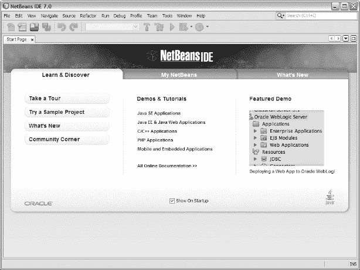

***图 1-1。**NetBeans 7 IDE 的主窗口最初会显示一个起始页选项卡。*

如果您使用过以前版本的 NetBeans IDE，您可能希望单击“浏览”按钮来了解版本 7 与以前版本的不同之处。您将被带到一个提供 IDE 视频教程的网页，如 NetBeans IDE 7.0 概述。

#### 使用 NetBeans 7

NetBeans 提供了一个用户界面，其主窗口分为菜单栏、工具栏、工作区和状态栏。工作区提供了一个起始页选项卡，用于了解 NetBeans、访问 NetBeans 项目等。

为了帮助您熟悉这个 IDE，我将向您展示如何创建一个重用清单 1-1 的源代码的`HelloWorld`项目。我还将向您展示如何编译和运行`HelloWorld`应用。完成以下步骤来创建`HelloWorld`项目:

1.  从“文件”菜单中选择“新建项目”。
2.  在生成的“新建项目”对话框的“选择项目”窗格中，确保 Java 是选定的类别，Java Application 是它们各自类别和项目列表中的选定项目。单击下一步。
3.  在出现的名称和位置窗格中，在项目名称文本字段中输入`**HelloWorld**`。注意`helloworld.HelloWorld`出现在 Create Main Class 复选框(必须选中)右边的文本字段中。这个字符串的`helloworld`部分指的是存储这个字符串的`HelloWorld`类部分的包。(封装在第 3 章的[中讨论。)点击完成。](03.html#ch3)

NetBeans 花了一些时间创建了`HelloWorld`项目。完成后，NetBeans 会显示如图 1-2 所示的工作区。

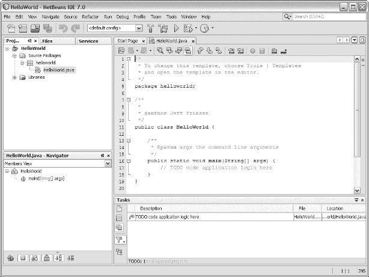

***图 1-2。**工作空间分为多个工作区域。*

创建`HelloWorld`后，NetBeans 将工作区组织成项目、编辑器、导航器和任务工作区。“项目”区域可帮助您管理项目，分为以下几个选项卡:

*   “项目”选项卡是项目的源文件和资源文件的主要入口点。它呈现了重要项目内容的逻辑视图。
*   “文件”选项卡提供了基于目录的项目视图。此视图包括“项目”选项卡上未显示的任何文件和文件夹。
*   “服务”选项卡显示了在 IDE 中注册的资源的逻辑视图，例如服务器、数据库和 web 服务。

编辑器区域帮助您编辑项目的源文件。每个文件都与其自己的选项卡相关联，选项卡上标有文件名。例如，[图 1-2](#fig_1_2) 显示了一个 HelloWorld.java 标签，它提供了这个源文件内容的框架版本。

navigator 区域显示 Navigator 选项卡，它提供了当前所选文件的紧凑视图，并且简化了文件各部分(例如，类和方法头)之间的导航。

最后，任务区域显示了一个 Tasks 选项卡，该选项卡显示了项目的各个文件需要解决的待办事项列表。每一项都由一个描述、一个文件名和文件中必须进行解析的位置组成。

用清单 1-1 中的[替换 HelloWorld.java 标签的内容，将`package helloworld;`语句保留在文件的顶部，以防止 NetBeans 抱怨不正确的包。接下来，从“运行”菜单中选择“运行主项目”来编译和运行此应用。](#list_1_1)[图 1-3](#fig_1_3) 的输出页签显示`HelloWorld`的问候。

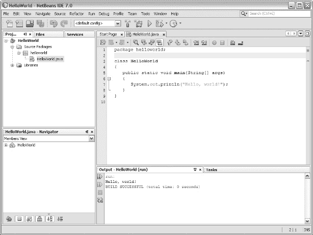

***图 1-3。**任务左侧出现一个输出选项卡，显示`HelloWorld`的问候。*

 **提示**要将命令行参数传递给应用，首先从文件菜单中选择项目属性。在出现的项目属性对话框中，在类别树中选择 Run，并输入参数(用空格分隔；例如，在结果窗格的“参数”文本字段中输入`**first second third**`。

有关 NetBeans 7 IDE 的更多信息，请通过“起始页”选项卡学习教程，通过“帮助”菜单访问 IDE 帮助，并浏览位于`[http://netbeans.org/kb/](http://netbeans.org/kb/)`的 NetBeans 知识库。

### Java 语言基础

大多数计算机语言支持注释、标识符、类型、变量、表达式和语句。Java 也不例外，这一节将从 Java 的角度向您介绍这些基本的语言特性。

#### 评论

一个程序的源代码需要被文档化，以便你(和任何其他必须维护它的人)现在和以后都能理解它。源代码应该在编写时和修改时进行记录。如果这些修改影响现有文档，则必须更新文档，以便准确解释代码。

Java 提供了在源代码中嵌入文档的*注释*特性。编译源代码时，Java 编译器会忽略所有注释——不生成字节码。支持单行、多行和 Javadoc 注释。

##### 单行注释

一个*单行注释*占据了一行源代码的全部或者部分。该注释以`//`字符序列开始，并以解释文本继续。编译器忽略从`//`到出现`//`的行尾的所有内容。以下示例显示了单行注释:

```java
int x = (int) (Math.random()*100); // Obtain a random x coordinate from 0 through 99.
```

单行注释对于在代码中插入简短但有意义的源代码解释非常有用。不要用它们来插入无用的信息。比如在声明变量的时候，不要插入`// this variable is an integer`之类无意义的注释。

##### 多行注释

一个*多行注释*占据了一行或多行源代码。该注释以`/*`字符序列开始，以说明性文本继续，以`*/`字符序列结束。编译器会忽略从`/*`到`*/`的所有内容。以下示例演示了多行注释:

`static boolean isLeapYear(int year)
{
   /*` `      A year is a leap year if it is divisible by 400, or divisible by 4 but
      not also divisible by 100.
   */
   if (year%400 == 0)
      return true;
   else
   if (year%100 == 0)
      return false;
   else
   if (year%4 == 0)
      return true;
   else
      return false;
}`

此示例介绍了一种确定年份是否为闰年的方法。理解这段代码的重要部分是多行注释，它阐明了决定`year`的值是否代表闰年的表达式。

 **注意**不能将一个多行注释放在另一个多行注释中。例如，`/*/* Nesting multiline comments is illegal! */*/`不是有效的多行注释。

##### Javadoc 注释

一个 *Javadoc 注释*(也称为*文档注释*)占据一行或多行源代码。该注释以`/**`字符序列开始，以说明性文本继续，以`*/`字符序列结束。编译器会忽略从`/**`到`*/`的所有内容。以下示例演示了 Javadoc 注释:

```java
/**
 * Application entry point
 *
 * @param args array of command-line arguments passed to this method
 */
public static void main(String[] args)
{
   // TODO code application logic here
}
```

这个例子以描述`main()`方法的 Javadoc 注释开始。夹在`/**`和`*/`之间的是对方法的描述，它可以(但不包括)包括 HTML 标签(比如`<p>`和`<code>` / `</code>`)，以及`@param` *Javadoc 标签*(一个`@`前缀的指令)。

下表列出了几种常用的标签:

*   `@author`标识源代码的作者。
*   `@deprecated`标识不应再使用的源代码实体(例如，方法)。
*   `@param`标识方法的一个参数。
*   `@see`提供另见参考。
*   `@since`标识实体最初发布的软件版本。
*   `@return`标识该方法返回的值的种类。

[清单 1-2](#list_1_2) 用描述`HelloWorld`类及其`main()`方法的文档注释展示了我们的`HelloWorld`应用。

***清单 1-2。**来自 Java 的问候和文档注释*

```java
/**
    A simple class for introducing a Java application.

    @author Jeff Friesen
*/
class HelloWorld
{
   /**
      Application entry point

      @param args array of command-line arguments passed to this method
   */
   public static void main(String[] args)
   {
      System.out.println("hello, world!");
   }
}
```

我们可以通过使用 JDK 的`javadoc`工具将这些文档注释提取到一组 HTML 文件中，如下所示:

```java
javadoc -private HelloWorld.java
```

`javadoc`默认为`public`类和这些类的`public` / `protected`成员生成基于 HTML 的文档——你将在[第 2 章](02.html#ch2)中了解这些概念。因为`HelloWorld`不是`public`，指定`javadoc HelloWorld.java`会导致`javadoc`抱怨没有找到`public`或`protected`类来记录。补救方法是指定`javadoc`的`-private`命令行选项。

`javadoc`通过输出以下消息进行响应:

`Loading source file HelloWorld.java...
Constructing Javadoc information...
Standard Doclet version 1.7.0
Building tree for all the packages and classes...
Generating \HelloWorld.html...
Generating \package-frame.html...
Generating \package-summary.html...
Generating \package-tree.html...
Generating \constant-values.html...
Building index for all the packages and classes...
Generating \overview-tree.html...` `Generating \index-all.html...
Generating \deprecated-list.html...
Building index for all classes...
Generating \allclasses-frame.html...
Generating \allclasses-noframe.html...
Generating \index.html...
Generating \help-doc.html...`

它还生成几个文件，包括`index.html`入口点文件。将你的浏览器指向这个文件，你应该会看到一个类似于图 1-4 所示的页面。

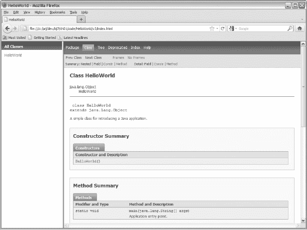

***图 1-4。**进入`HelloWorld`的 javadoc 的入口点页面提供了对文档的简单访问。*

 **注意** JDK 7 的外部文档具有与[图 1-4](#fig_1_4) 相似的外观和组织，因为该文档也是由`javadoc`生成的。

#### 标识符

类和方法等源代码实体需要命名，以便可以从代码中的其他地方引用它们。Java 为此提供了标识符特性。

一个*标识符*由字母(a-z，A-Z，或其他人类字母表中的等价大写/小写字母)、数字(0-9 或其他人类字母表中的等价数字)、连接标点符号(例如下划线)和货币符号(例如美元符号$)组成。该名称必须以字母、货币符号或连接标点符号开头。并且它的长度不能超过它所在的行。

有效标识符的例子包括`i`、`counter`、`loop10`、`border$color`和`_char`。无效标识符的例子包括`50y`(以数字开头)和`first#name` ( `#`不是有效的标识符符号)。

 **注意** Java 是一种*区分大小写的语言*，这意味着只有大小写不同的标识符被认为是单独的标识符。例如，`salary`和`Salary`是独立的标识符。

几乎可以选择任何有效的标识符来命名类、方法或其他源代码实体。然而，一些标识符是为特殊目的而保留的；它们被称为*保留字*。Java 保留了以下标识符:`abstract`、`assert`、`boolean`、`break`、`byte`、`case`、`catch`、`char`、`class`、`const`、`continue`、`default`、`do`、`double`、`enum`、`else`、`extends`、`false`、`final`、`finally`、`float`、`for`、`goto`、`if`、`implements`、`import`。 `short`、`static`、`strictfp`、`super`、`switch`、`synchronized`、`this`、`throw`、`throws`、`transient`、`true`、`try`、`void`、`volatile`、`while`。 如果您试图在这些保留字的用法上下文之外使用它们中的任何一个，编译器都会输出一条错误消息。

 **注**Java 的大部分保留字也被称为*关键字*。三个例外是`false`、`null`和`true`，它们是*文字*(逐字指定的值)的示例。

#### 类型

程序处理不同类型的值，如整数、浮点值、字符和字符串。*类型*标识一组值(以及它们在内存中的表示)和一组将这些值转换成该组中其他值的操作。例如，整数类型标识没有小数部分和面向整数的数学运算的数值，例如将两个整数相加得到另一个整数。

 **注意** Java 是一种强类型语言，这意味着每个表达式、变量等等都有一个编译器已知的类型。这种能力有助于编译器在编译时检测与类型相关的错误，而不是让这些错误在运行时显示出来。表达式和变量将在本章后面讨论。

Java 将类型分为基本类型、用户定义类型和数组类型。

##### 原始类型

*原始类型*是由语言定义的类型，其值不是对象。Java 支持布尔、字符、字节整数、短整数、整数、长整数、浮点和双精度浮点原语类型。在[表 1-1](#tab_1_1) 中有描述。

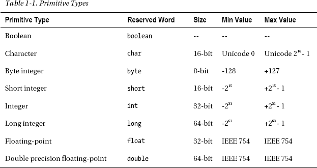

[表 1-1](#tab_1_1) 描述了每个原语类型的保留字、大小、最小值和最大值。“-”条目表示它所在的列不适用于该条目的行中描述的基元类型。

size 列根据该类型的值在内存中所占的*位*(二进制数字—每个数字为 0 或 1)的数量来标识每个原始类型的大小。除了 Boolean(其大小取决于实现——一个 Java 实现可能用一位存储一个布尔值，而另一个实现为了提高性能可能需要一个八位的*字节*)之外，每个原语类型的实现都有一个特定的大小。

最小值和最大值列标识每种类型可以表示的最小和最大值。除了 Boolean(其值只有 true 和 false)之外，每个基本类型都有一个最小值和一个最大值。

字符类型的最小值和最大值指的是 *Unicode* ，它是世界上大多数书写系统所表达的文本的一致编码、表示和处理的标准。Unicode 是与通用字符集(T4)一起开发的，通用字符集是一种对组成世界书面语言的各种符号进行编码的标准。 **Unicode 0** 是“第一个 Unicode 码位”的简写——*码位*是一个整数，表示一个符号(例如，A)或一个控制字符(例如，换行符或制表符)，或者与其他码位组合形成一个符号。查看 Wikipedia 的“Unicode”条目(`[http://en.wikipedia.org/wiki/Unicode](http://en.wikipedia.org/wiki/Unicode)`)以了解有关该标准的更多信息，查看 Wikipedia 的“通用字符集”条目(`[http://en.wikipedia.org/wiki/Universal_Character_Set](http://en.wikipedia.org/wiki/Universal_Character_Set)`)以了解有关该标准的更多信息。

 **注意**字符类型的限制意味着该类型是无符号的(所有字符值都是正的)。相反，每个数字类型都是有符号的(它支持正值和负值)。

字节整数、短整数、整数和长整数类型的最小值和最大值表明负值比正值多一个(0 通常不被视为正值)。这种不平衡的原因与整数的表示方式有关。

Java 将一个整数值表示为一个*符号位*(最左边的位—0 表示正值，1 表示负值)和*幅度位*(符号位右边的所有剩余位)的组合。如果符号位为 0，则直接存储幅度。然而，如果符号位为 1，则幅度使用*二进制补码*表示法存储，其中所有 1 都翻转为 0，所有 0 都翻转为 1，结果加 1。使用二进制补码是为了让负整数可以自然地与正整数共存。例如，将-1 的表示形式与+1 相加得到 0。[图 1-5](#fig_1_5) 显示了字节整数 2 的直接表示和字节整数 2 的二进制补码表示。

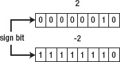

***图 1-5。**双字节整数值的二进制表示以符号位开始。*

浮点和双精度浮点类型的最小值和最大值参考 *IEEE 754* ，这是一个在内存中表示浮点值的标准。查看维基百科的“IEEE 754-2008”条目(`[http://en.wikipedia.org/wiki/IEEE_754](http://en.wikipedia.org/wiki/IEEE_754)`)来了解关于这个标准的更多信息。

 **注意**认为 Java 应该只支持对象的开发人员对在语言中包含基本类型并不满意。然而，Java 被设计成包括基本类型，以克服 20 世纪 90 年代早期设备的速度和内存限制，这也是 Java 最初的目标。

##### 用户定义的类型

*用户定义类型*是由开发人员使用类、接口、枚举或注释类型定义的类型；其值是对象。比如 Java 的`String`类定义了字符串自定义类型；它的值描述字符串，它的方法执行各种字符串操作，比如将两个字符串连接在一起。第 2 章讨论了类、接口和方法。第 3 章讨论枚举和注释类型。

用户定义的类型也被称为*引用类型*，因为该类型的变量存储了对存储该类型对象的内存区域的*引用*(内存地址或其他标识符)。相反，基本类型的变量直接存储值；它们不存储对这些值的引用。

##### 数组类型

一个*数组类型*是一个特殊的引用类型，表示一个*数组*，一个在大小相等的连续槽中存储值的内存区域，通常被称为*元素*。

这个类型由元素类型(一个原始类型或者一个用户定义的类型)和一对或多对方括号组成，这些方括号表示了*维度*(范围)的数量。一对括号表示一维数组(向量)，两对括号表示二维数组(表)，三对括号表示二维数组的一维数组(表的向量)，依此类推。例如，`int[]`表示一维数组(元素类型为`int`)，而`double[][]`表示二维数组(元素类型为`double`)。

#### 变量

程序操作存储在内存中的值，这些值通过使用变量特性在源代码中象征性地表示出来。一个*变量*是一个存储某种类型值的命名内存位置。存储引用的变量通常被称为*引用变量*。

变量必须在使用前声明。一个声明至少由一个类型名组成，可选地后跟一系列方括号对，再后跟一个名称，可选地后跟一系列方括号对，并以分号(`;`)结束。考虑下面的例子:

```java
int counter;
double temperature;
String firstName;
int[] ages;
char gradeLetters[];
float[][] matrix;
```

第一个示例声明一个名为`counter`的整数变量，第二个示例声明一个名为`temperature`的双精度浮点变量，第三个示例声明一个名为`firstName`的字符串变量，第四个示例声明一个名为`ages`的一维整数数组变量，第五个示例声明一个名为`gradeLetters`的一维字符数组变量，第六个示例声明一个名为`matrix`的二维浮点数组变量。没有字符串与`firstName`相关联，也没有数组与`ages`、`gradeLetters`和`matrix`相关联。

 **注意**方括号可以出现在类型名之后，也可以出现在变量名之后，但不能同时出现在两个地方。比如编译器遇到`int[] x[];`就报错。通常的做法是将方括号放在类型名之后(如在`int[] ages;`中)，而不是变量名之后(如在`char gradeLetters[];`)。

您可以在一行中声明多个变量，方法是用逗号将每个变量与其前一个变量分隔开，如以下示例所示:

```java
int x, y[], z;
```

这个例子声明了三个名为`x`、`y`和`z`的变量。每个变量共享相同的类型，恰好是整数。与存储单个整数值的`x`和`z`不同，`y[]`表示元素类型为整数的一维数组——每个元素存储一个整数值。还没有与`y`相关联的数组。

当数组与其他变量声明在同一行时，方括号必须出现在变量名之后。如果您将方括号放在变量名之前，如在`int x, []y, z;`中，编译器会报告一个错误。如果将方括号放在类型名之后，如在`int[] x, y, z;`中，所有三个变量都表示一维整数数组。

#### 表情

先前声明的变量没有显式初始化为任何值。因此，它们要么被初始化为默认值(例如，`int`为 0，`double`为 0.0)，要么保持未初始化，这取决于它们出现的上下文(在类中声明或在方法中声明)。[第 2 章](02.html#ch2)从字段、局部变量和参数的角度讨论变量上下文。

Java 为初始化变量和其他目的提供了表达式特性。一个*表达式*是文字、变量名、方法调用和操作符的组合。在运行时，它计算出一个值，该值的类型称为表达式的类型。如果表达式被赋值给一个变量，表达式的类型必须与变量的类型一致；否则，编译器会报告错误。

Java 将表达式分为简单表达式和复合表达式。

##### 简单的表情

一个*简单表达式*是一个*文字*(一个逐字表达的值)，一个变量名(包含一个值)，或者一个方法调用(返回值)。Java 支持几种文字:字符串、布尔`true`和`false`、字符、整数、浮点和`null`。

 **注意**不返回值的方法调用——被调用的方法称为 *void 方法*——是一种特殊的简单表达式；比如`System.out.println("hello, world!");`。此独立表达式不能赋给变量。试图这样做(如在`int i = System.out.println("x");`中)会导致编译器报告一个错误。

一个*字符串文字*由一对双引号括起来的 Unicode 字符序列组成；例如，`"the quick brown fox jumps over the lazy dog." It`还可能包含*转义序列*，这是一种特殊的语法，用于表示某些可打印和不可打印的字符，否则这些字符将不会出现在文本中。例如，`"the quick brown \"fox\" jumps over the lazy dog."`使用`\"`转义序列将`fox`用双引号括起来。

[表 1-2](#tab_1_2) 描述了所有支持的转义序列。

T2】

最后，字符串可能包含 *Unicode 转义序列*，这是表示 Unicode 字符的特殊语法。Unicode 转义序列以`\u`开始，以四个十六进制数字(`0` - `9`、`A` - `F`、`a` - `f`)继续，中间没有空格。例如，`\u0041`代表大写字母 A，`\u20ac`代表欧盟的欧元货币符号。

一个*布尔文字*由保留字`true`或保留字`false`组成。

一个*字符文字*由一个 Unicode 字符和一对单引号组成(`'A'`就是一个例子)。您还可以将转义序列(例如，`'\''`)或 Unicode 转义序列(例如，`'\u0041'`)表示为字符文字。

一个*整数文字*由一系列数字组成。如果文字要表示一个长整型值，那么它的后缀必须是大写的`L`或者小写的`l` ( `L`更容易阅读)。如果没有后缀，文字表示 32 位整数(一个`int`)。

整数可以用十进制、十六进制、八进制和二进制格式指定:

*   十进制格式是默认格式；比如`127`。
*   十六进制格式要求文字以`0x`或`0X`开头，以十六进制数字(`0` - `9`、`A` - `F`、`a` - `f`)继续；比如`0x7F`。
*   八进制格式要求文字以`0`为前缀，以八进制数字(`0` - `7`)为续；比如`0177`。
*   二进制格式要求文字以`0b`或`0B`为前缀，并以`0` s 和`1` s 继续；例如，`0b01111111`。

为了提高可读性，可以在数字之间插入下划线；比如`204_555_1212`。尽管您可以在数字之间插入多个连续的下划线(如在`0b1111__0000`中)，但您不能指定前导下划线(如在`_123`中)，因为编译器会将文字视为一个标识符。此外，不能指定尾部下划线(如`123_`)。一个*浮点字面值*由整数部分、小数点(用句点字符[ `.` ]表示)、小数部分、指数(以字母`E`或`e`开头)和类型后缀(字母`D`、`d`、`F`或`f`)组成。大多数部分是可选的，但是必须有足够的信息来区分浮点文字和整数文字。示例包括`0.1`(双精度浮点)、`89F`(浮点)、`600D`(双精度浮点)和 1 `3.08E+23`(双精度浮点)。与整数文字一样，您可以通过在数字之间放置下划线来使浮点文字更容易阅读(例如，`3.141_592_654`)。

最后，将`null`文字赋给引用变量，以表明该变量不引用对象。

以下示例使用文本来初始化前面提供的变量:

```java
int counter = 10;
double temperature = 98.6; // Assume Fahrenheit scale.
String firstName = "Mark";
int[] ages = { 52, 28, 93, 16 };
char gradeLetters[] = { 'A', 'B', 'C', 'D', 'F' };
float[][] matrix = { { 1.0F, 2.0F, 3.0F }, { 4.0F, 5.0F, 6.0F }};
int x = 1, y[] = { 1, 2, 3 }, z = 3;
```

最后四个例子使用数组初始化器来初始化`ages`、`gradeletters`、`matrix`和`y`数组。一个*数组初始化器*由一个用括号和逗号分隔的表达式列表组成，这些表达式(如`matrix`示例所示)本身可能就是数组初始化器。`matrix`示例生成如下所示的表格:

```java
1.0F 2.0F 3.0F
4.0F 5.0F 6.0F
```

**组织内存中的变量**

也许你对变量在内存中是如何组织的很好奇。[图 1-6](#fig_1_6) 展示了`counter`、`ages`和`matrix`变量的一个可能的高层组织，以及分配给`ages`和`matrix`的数组。

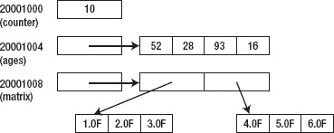

***图 1-6。**`counter`变量存储一个四字节的整数值，而`ages`和`matrix`存储对它们各自数组的四字节引用。*

[图 1-6](#fig_1_6) 显示了`counter`、`ages`和`matrix`中的每一个都存储在一个内存地址(在本例中从一个虚构的 20001000 值开始)并能被 4 整除(每个变量存储一个 4 字节的值)，并且`counter`的 4 字节值存储在这个地址，`ages`和`matrix`的 4 字节内存位置中的每一个都存储其各自数组的 32 位地址(64 位地址最有可能在 64 位上使用此外，一维数组存储为值列表，而二维数组存储为地址的一维行数组，其中每个地址标识该行的值的一维列数组。

尽管[图 1-6](#fig_1_6) 暗示数组地址存储在`ages`和`matrix`中，这等同于地址引用，Java 实现可能等同于*句柄*(标识列表中槽的整数值)。对于`ages`及其参考阵列，该替代方案在[图 1-7](#fig_1_7) 中给出。

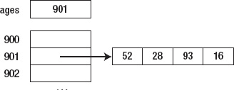

***图 1-7。**在`ages`中存储一个句柄，由该句柄标识的列表项存储相关数组的地址。*

句柄使得在垃圾收集期间在内存区域中移动变得容易(在第 2 章中讨论过)。如果多个变量通过同一个地址引用同一个数组，那么当数组移动时，每个变量的地址值都必须更新。但是，如果多个变量通过同一个句柄引用数组，那么只需要更新句柄的列表条目。使用句柄的一个缺点是，通过句柄访问内存比通过地址直接访问内存要慢。不管引用是如何实现的，为了提高可移植性，这个实现细节对 Java 开发人员是隐藏的。

以下示例显示了一个简单的表达式，其中一个变量被赋予另一个变量的值:

```java
int counter1 = 1;
int counter2 = counter1;
```

最后，下面的例子展示了一个简单的表达式，它将方法调用的结果赋给一个名为`isLeap`的变量:

```java
boolean isLeap = isLeapYear(2011);
```

前面的例子假设只有那些类型与它们正在初始化的变量的类型相同的表达式才能被赋给那些变量。然而，在某些情况下，有可能分配一个不同类型的表达式。例如，Java 允许将某些整数文字赋给短整型变量，如在`short s = 20;`中，并将短整型表达式赋给整型变量，如在`int i = s;`中。

Java 允许前一种赋值，因为`20`可以表示为一个短整数(不会丢失任何信息)。相比之下，Java 会抱怨`short s = 40000;`，因为整数文字`40000`不能表示为短整数(32767 是短整数变量中可以存储的最大正整数)。Java 允许后一种赋值，因为当 Java 从一个值集较小的类型转换到一个值集较大的类型时，不会丢失任何信息。

Java 通过扩展转换规则支持以下基本类型转换:

*   字节整数到短整数、整数、长整数、浮点或双精度浮点
*   短整数到整数、长整数、浮点或双精度浮点
*   字符转换为整数、长整数、浮点或双精度浮点
*   整数到长整数、浮点或双精度浮点
*   长整数到浮点或双精度浮点
*   浮点到双精度浮点

 **注意**从小整数转换到大整数时，Java 会将小整数的符号位复制到大整数的多余位。

[第 2 章](02.html#ch2)讨论在用户定义和数组类型的上下文中执行类型转换的扩展转换规则。

##### 复合表达式

一个*复合表达式*是一系列简单的表达式和操作符，其中一个*操作符*(源代码中象征性表示的一系列指令)将其*操作数*表达式值转换为另一个值。例如，`-6`是一个复合表达式，由运算符`-`和作为其操作数的整数文字`6`组成。这个表达式将`6`转换成它的负等价物。同样，`x+5`是一个复合表达式，由变量名`x`，整数文字`5`，以及夹在这些操作数之间的运算符`+`组成。当这个表达式被求值时，变量`x`的值被取出并加到`5`中。总和成为表达式的值。

 **注意**如果`x`的类型为字节整数或短整型，则该变量的值被加宽为整数。但是，如果`x`的类型是长整型、浮点型或双精度浮点型，`5`将被扩展到适当的类型。加法运算在扩大转换发生后执行。

Java 提供了各种各样的操作符，这些操作符是根据它们接受的操作数的数量来分类的。一个*一元运算符*只取一个操作数(一元减[ `-` ]为例)，一个*二元运算符*取两个操作数(加法[ `+` ]为例)，Java 的单个*三元运算符*(条件[ `?:` ])取三个操作数。

运算符也分为前缀、后缀和中缀。一个*前缀运算符*是一元运算符，位于其操作数之前(如在`-6`中)，一个*后缀运算符*是一元运算符，位于其操作数之后(如在`x++`中)，一个*中缀运算符*是一个二元或三元运算符，夹在二元运算符的两个或三个操作数之间(如在`x+5`中)。[表 1-3](#tab_1_3) 显示了所有支持的运算符的符号、描述和优先级——优先级的概念将在本节末尾讨论。各种运算符描述都提到了“整数类型”，这是指定任何字节整数、短整数、整数或长整数的简写，除非“整数类型”被限定为 32 位整数。此外，“数字类型”是指除浮点和双精度浮点之外的任何整数类型。

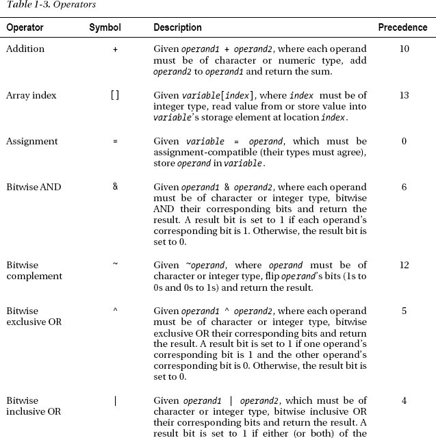

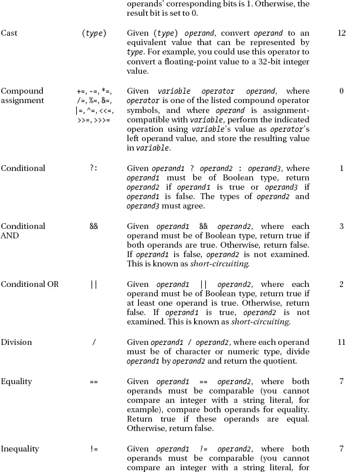


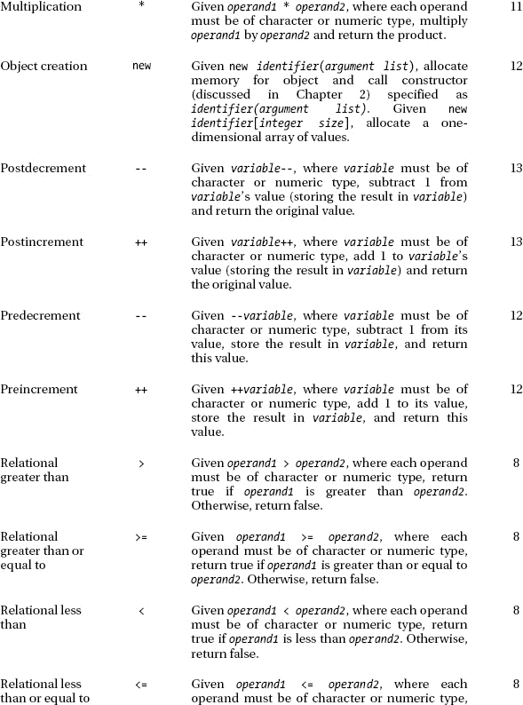

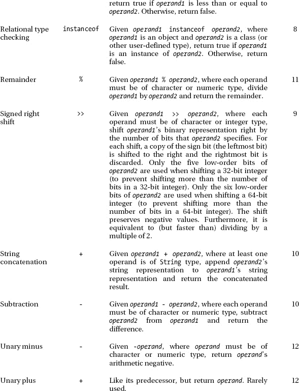

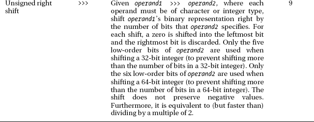

[表 1-3](#tab_1_3) 的运算符可分为加法、数组索引、赋值、按位、转换、条件、相等、逻辑、成员访问、方法调用、乘法、对象创建、关系、移位和一元减/加。

###### 加法运算符

加法运算符由加法(`+`)、减法(`-`)、后减量(`--`)、后增量(`++`)、前增量(`--`)、前增量(`++`)和字符串连接(`+`)组成。加法返回其操作数之和(例如，`6+4`返回 10)，减法返回其操作数之差(例如，`6-4`返回 2，`4-6`返回 2)，后减量从其变量操作数中减去 1 并返回变量的先前值(例如，`x--`)，后增量向其变量操作数加 1 并返回变量的先前值(例如，`x++`)，前增量从其变量操作数中减去 1 并返回变量的新值(例如 preincrement 为其变量操作数加 1 并返回变量的新值(如`++x`)，string concatenation 合并其字符串操作数并返回合并后的字符串(如`"A"+"B"`返回`"AB"`)。

加法、减法、后减量、后增量、前增量和前增量运算符可以生成溢出或下溢结果值类型限制的值。例如，将两个大的 32 位正整数值相加会产生一个无法表示为 32 位整数值的值。结果据说溢出来了。Java 不检测溢出和下溢。

Java 提供了一种特殊的扩大转换规则，用于字符串操作数和字符串连接运算符。如果任一操作数不是字符串，则在字符串串联之前，操作数首先被转换为字符串。例如，当使用`"A"+5`时，编译器生成的代码首先将`5`转换为`"5"`，然后执行字符串串联操作，得到`"A5"`。

###### 数组索引运算符

数组索引运算符(`[]`)通过将数组元素的位置表示为整数*索引*来访问该元素。该运算符在数组变量的名称后指定；比如`ages[0]`。

索引是相对于 0 的，这意味着`ages[0]`访问第一个元素，而`ages[6]`访问第七个元素。索引必须大于或等于 0，并且小于数组的长度；否则，JVM 抛出`ArrayIndexOutOfBoundsException`(参考[第 3 章](03.html#ch3)了解异常)。

通过将“`.length`”附加到数组变量来返回数组的长度。例如，`ages.length`返回`ages`引用的数组的长度(其中元素的数量)。类似地，`matrix.length`返回`matrix`二维数组中行元素的数量，而`matrix[0].length`返回分配给该数组第一行元素的列元素的数量。

###### 赋值运算符

赋值运算符(`=`)将表达式的结果赋给一个变量(如`int x = 4;`)。变量和表达式的类型必须一致；否则，编译器会报告错误。

Java 还支持几个复合赋值操作符，它们执行一个特定的操作并将结果赋给一个变量。例如，`+=`运算符计算右边的数值表达式，并将结果添加到左边变量的内容中。其他复合赋值运算符的行为方式类似。

###### 按位运算符

按位运算符由按位 AND ( `&`)、按位补码(`~`)、按位异或(`^`)和按位异或(`|`)组成。这些运算符设计用于处理字符或整数操作数的二进制表示。因为如果您以前没有在另一种语言中使用过这些运算符，这个概念可能很难理解，所以下面的示例演示了这些运算符:

```java
~0B00000000000000000000000010110101 results in 11111111111111111111111101001010
0B00011010&0B10110111 results in 00000000000000000000000000010010
0B00011010^0B10110111 results in 00000000000000000000000010101101
0B00011010|0B10110111 results in 00000000000000000000000010111111
```

最后三行中的`&`、`^`和`|`操作符在执行操作之前，首先将它们的字节整数操作数转换为 32 位整数值(通过*符号位扩展*，将符号位的值复制到额外的位中)。

###### 演员表

cast 运算符—`(*type*)`—试图将其操作数的类型转换为*类型*。此运算符的存在是因为编译器不允许您将一个值从一种类型转换为另一种类型，如果不指定您的意图，信息将会丢失(通过 cast 运算符)。例如，当使用`short s = 1.65+3;`时，编译器会报告一个错误，因为试图将双精度浮点值转换为短整数会导致分数`.65` — `s`丢失，该分数将包含 4 而不是 4.65。

认识到信息丢失可能并不总是一个问题，Java 允许您通过强制转换到目标类型来明确表达您的意图。比如，`short s = (short) 1.65+3;`告诉编译器，你希望`1.65+3`转换成短整数，你意识到分数会消失。

下面的示例提供了需要强制转换运算符的另一个示例:

```java
char c = 'A';
byte b = c;
```

编译器在遇到`byte b = c;`时会报告一个关于精度损失的错误。原因是`c`可以表示从 0 到 65535 的任何无符号整数值，而`b`只能表示从-128 到+127 的有符号整数值。即使`'A'`等于+65，这符合`b`的范围，但是`c`很容易被初始化为`'\u0323'`，这不符合。

这个问题的解决方案是引入一个`(byte)`转换，如下所示，这将导致编译器生成代码来将`c`的字符类型转换为字节整数:

```java
byte b = (byte) c;
```

Java 通过强制转换运算符支持以下基本类型转换:

*   字节整数到字符
*   短整数到字节整数或字符
*   字符到字节整数或短整数
*   整数到字节整数、短整数或字符
*   长整数到字节整数、短整数、字符或整数
*   浮点到字节整数、短整数、字符、整数或长整数
*   双精度浮点到字节整数、短整数、字符、整数、长整数或浮点

当从更多位转换到更少位，并且没有发生数据丢失时，并不总是需要转换运算符。例如，当遇到`byte b = 100;`时，编译器生成将整数 100 赋给字节整数变量`b`的代码，因为 100 可以很容易地放入赋给该变量的 8 位存储位置。

###### 条件运算符

条件运算符由条件与(`&&`)、条件或(`||`)和条件(`?:`)组成。前两个运算符总是计算其左操作数(计算结果为 true 或 false 的布尔表达式)，并有条件地计算其右操作数(另一个布尔表达式)。第三个运算符基于第三个布尔操作数计算两个操作数之一。

条件，并且总是计算其左操作数，并且仅当其左操作数的计算结果为 true 时，才计算其右操作数。比如`age > 64 && stillWorking`先评估`age > 64`。如果该子表达式为真，则计算`stillWorking`，其真值或假值(`stillWorking`为布尔变量)将作为整个表达式的值。如果`age > 64`为假，则`stillWorking`不被评估。

条件 OR 始终计算其左操作数，仅当其左操作数的计算结果为 false 时，才计算其右操作数。比如`value < 20 || value > 40`先评估`value < 20`。如果该子表达式为 false，则计算`value > 40`，其 true 或 false 值将作为整个表达式的值。如果`value < 20`为真，则不评估`value > 40`。

条件 AND 和条件 OR 通过防止不必要的子表达式求值来提高性能，这被称为*短路*。例如，如果其左操作数为 false，则条件 and 的右操作数无法改变整个表达式的计算结果为 false 的事实。

如果不小心的话，短路可能会阻止*副作用*(子表达式求值后持续存在的子表达式的结果)的执行。例如，`age > 64 && ++numEmployees > 5`仅对那些年龄大于 64 岁的雇员增加`numEmployees`。递增`numEmployees`是副作用的一个例子，因为`numEmployees`中的值在子表达式`++numEmployees > 5`求值后仍然存在。

条件运算符通过根据第三个操作数的值评估并返回两个操作数中的一个来做出决策，这是非常有用的。以下示例将布尔值转换为其等效的整数(1 表示真，0 表示假):

```java
boolean b = true;
int i = b ? 1 : 0; // 1 assigns to i
```

###### 等式运算符

等式运算符由等式(`==`)和不等式(`!=`)组成。这些运算符比较它们的操作数，以确定它们是否相等。前一个运算符在相等时返回 true 后一个运算符在不相等时返回 true。例如，`2 == 2`和`2 != 3`中的每一个评估为真，而`2 == 4`和`4 != 4`中的每一个评估为假。

当涉及到对象操作数时(在第 2 章的[中讨论)，这些操作符不比较它们的内容。例如，`"abc" == "xyz"`不会将`a`与`x`进行比较。相反，因为字符串实际上是存储在内存中的`String`对象(](02.html#ch2)[第 4 章](04.html#ch4)进一步讨论了这个概念)，`==`比较对这些对象的引用。

###### 逻辑运算符

逻辑运算符包括逻辑与(`&`)、逻辑补码(`!`)、逻辑异或(`^`)和逻辑异或(`|`)。虽然这些运算符与按位运算符相似，它们的操作数必须是整数/字符，但传递给逻辑运算符的操作数必须是布尔型的。例如，`!false`返回 true。此外，当遇到`age > 64 & stillWorking`时，逻辑 AND 会评估两个子表达式。这种模式同样适用于逻辑异或和逻辑包含或。

###### 会员权限操作员

成员访问操作符(`.`)用于访问类的成员或对象的成员。例如，`String s =` `"Hello"; int len = s.length();`返回赋给变量`s`的字符串长度。它通过调用`String`类的`length()`方法成员来实现。第 2 章更详细地讨论了这个话题。

数组是只有一个成员的特殊对象。当您指定一个数组变量，后跟成员访问操作符和`length`时，结果表达式将数组中的元素数作为 32 位整数返回。例如，`ages.length`返回`ages`引用的数组的长度(其中元素的数量)。

###### 方法调用操作符

方法调用操作符`()`——用于表示一个方法(在[第 2 章](02.html#ch2)中讨论)正在被调用。此外，它还标识了传递给方法的参数的数量、顺序和类型，这些参数将由方法的参数选取。`System.out.println("Hello");`就是一个例子。

###### 乘法运算符

乘法运算符由乘法(`*`)、除法(`/`)和余数(`%`)组成。乘法返回其操作数的乘积(例如，`6*4`返回 24)，除法返回其左操作数除以其右操作数的商(例如，`6/4`返回 1)，余数返回其左操作数除以其右操作数的余数(例如，`6%4`返回 2)。

乘法、除法和余数运算符可以生成溢出或下溢结果值类型限制的值。例如，将两个大的 32 位正整数值相乘会产生一个无法用 32 位整数值表示的值。结果据说溢出来了。Java 不检测溢出和下溢。

将数值除以 0(通过除法或余数运算符)也会产生有趣的行为。将整数值除以整数 0 导致操作符抛出一个`ArithmeticException`对象([第 3 章](03.html#ch3)涵盖异常)。将浮点/双精度浮点值除以 0 会导致运算符返回+无穷大或-无穷大，具体取决于被除数是正数还是负数。最后，将浮点 0 除以 0 会导致运算符返回 NaN(不是数字)。

###### 对象创建操作员

对象创建操作符(`new`)从一个类创建一个对象，也从一个初始化器创建一个数组。这些话题将在第二章中讨论。

###### 关系运算符

关系运算符包括关系大于(`>`)、关系大于等于(`>=`)、关系小于(`<`)、关系小于等于(`<=`)和关系类型检查(`instanceof`)。前四个运算符比较它们的操作数，如果左操作数(分别)大于、大于或等于、小于或小于或等于右操作数，则返回 true。例如，`5.0 > 3`、`2 >= 2`、`16.1 < 303.3`和`54.0 <= 54.0`中的每一个都评估为真。

关系类型检查运算符用于确定对象是否属于特定类型。这个主题在第 2 章中讨论。

###### 移位操作符

移位运算符包括左移(`<<`)、有符号右移(`>>`)和无符号右移(`>>>`)。左移将左操作数的二进制表示向左移动右操作数指定的位数。每次移位相当于乘以 2。例如，`2 << 3`将 2 的二进制表示左移 3 位；结果相当于 2 乘以 8。

每个有符号和无符号右移都将其左操作数的二进制表示向右移动由其右操作数指定的位置数。每次移位相当于除以 2。例如，`16 >> 3`将 16 的二进制表示右移 3 位；结果相当于 16 除以 8。

有符号右移和无符号右移的区别在于移位过程中符号位的变化。有符号右移位包括移位中的符号位，而无符号右移位忽略符号位。因此，有符号右移保留负数，但无符号右移不保留负数。例如，`-4 >> 1`(相当于`-4/2`)的计算结果为-2，而`–4 >>> 1`的计算结果为 2147483646。

 **提示**移位运算符比乘以或除以 2 的幂要快。

###### 一元减/加运算符

一元减号(`-`)和一元加号(`+`)是所有运算符中最简单的。一元减号返回其操作数的负数(如`-5`返回`-5`、`--5`返回`5`)，而一元加号则逐字返回其操作数(如`+5`返回`5`、`+-5`返回`-5`)。一元加号不常用，但为了完整性而出现。

###### 优先级和结合性

当计算一个复合表达式时，Java 会考虑每个操作符的*优先级*(重要性级别)，以确保表达式的计算符合预期。例如，当用表达式`60+3*6`表示时，我们期望乘法在加法之前执行(乘法的优先级高于加法)，最终结果是 78。我们不期望加法首先发生，产生 378 的结果。

 **注** [表 1-3](#tab_1_3) 的最右栏给出了一个值，表示一个运算符的优先级:数字越大，优先级越高。例如，加法的优先级别是 10，乘法的优先级别是 11，这意味着乘法在加法之前执行。

可以通过在表达式中引入左括号和右括号`(`和`)`来规避优先级，其中首先计算最里面的一对嵌套括号。例如，2* `((60+3)*6)`导致首先评估`(60+3)`，其次评估`(60+3)*6`，最后评估整体表达式。类似地，在表达式`60/(3-6)`中，在除法之前执行减法。

在评估期间，具有相同优先级的操作符(例如，加法和减法，都具有第 10 级)根据它们的*结合性*进行处理(该属性确定当缺少括号时，具有相同优先级的操作符如何分组)。

例如，表达式`9*4/3`被视为`(9*4)/3`，因为`*`和`/`是从左到右的关联运算符。相比之下，表达式`x=y=z=100`的计算就好像是`x=(y=(z=100))` — `100`被赋给`z` , `z`的新值(100)被赋给`y`,`y`的新值(100)被赋给`x`——因为`=`是一个从右到左的关联运算符。

Java 的大多数操作符都是从左到右关联的。从右到左的关联运算符包括赋值、按位补码、强制转换、复合赋值、条件、逻辑补码、对象创建、预递增、预递增、一元减号和一元加号。

 **注意**与 C++等语言不同，Java 不会让你重载运算符。然而，Java 重载了`+`、`++`和`--`操作符。

#### 报表

语句是程序的核心。它们给变量赋值，通过决策和/或重复执行其他语句来控制程序流程，并执行其他任务。*语句*可以表示为简单语句或复合语句:

*   *简单语句*是用于执行某些任务的单个独立源代码指令；它以分号结束。
*   *复合语句*是夹在左大括号和右大括号之间的简单语句和其他复合语句的(可能是空的)序列——一个*分隔符*是标记某个部分的开始或结束的字符。方法体(例如，`main()`方法体)就是一个例子。复合语句可以出现在简单语句出现的任何地方，或者被称为*块*。

本节将向您介绍 Java 的许多语句。其他声明将在后面的章节中介绍。比如[第二章](02.html#ch2)讨论 return 语句。

##### 赋值语句

*赋值语句*是给变量赋值的表达式。该语句以变量名开始，以赋值操作符(`=`)或复合赋值操作符(如`+=`)继续，以表达式和分号结束。下面是三个例子:

```java
x = 10;
ages[0] = 25;
counter += 10;
```

第一个例子将整数`10`赋给变量`x`，该变量可能也是整数类型。第二个例子将整数`25`分配给`ages`数组的第一个元素。第三个示例将`10`加到存储在`counter`中的值，并将总和存储在`counter`中。

 **注意**在变量的声明中初始化一个变量(如`int counter = 1;`)可以认为是一种特殊形式的赋值语句。

##### 决策陈述

前面描述的条件运算符(`?:`)对于在两个要评估的表达式之间进行选择很有用，但不能用于在两个语句之间进行选择。为此，Java 提供了三个决策语句:if、if-else 和 switch。

###### If 语句

if 语句计算一个布尔表达式，并在该表达式计算结果为 true 时执行另一条语句。该语句具有以下语法:

```java
if (*Boolean expression*)
   *statement*
```

如果由保留字`if`，后跟括号中的 *`Boolean expression`* ，后跟 *`statement`* 组成，当 *`Boolean expression`* 评估为真时执行。

以下示例演示了该语句:

```java
if (numMonthlySales > 100)
   wage += bonus;
```

如果月销售额超过 100，`numMonthlySales > 100`的计算结果为真，并且执行`wage += bonus;`赋值语句。否则，该赋值语句不会执行。

###### If-Else 语句

if-else 语句计算一个布尔表达式，并根据该表达式的计算结果是 true 还是 false 来执行两个语句之一。该语句具有以下语法:

```java
if (*Boolean expression*)
   *statement1*
else
   *statement2*
```

If-else 由保留字`if`组成，后跟括号中的 *`Boolean expression`* ，后跟 *`statement1`* 当 *`Boolean expression`* 评估为真时执行，后跟 *`statement2`* 当 *`Boolean expression`* 评估为假时执行。

以下示例演示了该语句:

```java
if ((n&1) == 1)
   System.out.println("odd");
else
   System.out.println("even");
```

这个例子假设存在一个名为`n`的`int`变量，它已经被初始化为一个整数。然后，它继续确定该整数是奇数(不能被 2 整除)还是偶数(能被 2 整除)。

布尔表达式首先对`n&1`求值，然后用`1`对`n`的值进行位与运算。然后将结果与`1`进行比较。如果相等，则输出一条消息，说明`n`的值是奇数；否则，会输出一条消息，说明`n`的值为偶数。

括号是必需的，因为`==`的优先级高于`&`。如果没有这些括号，表达式的求值顺序将变为首先对`1 == 1`求值，然后尝试对布尔结果与`n`的整数值进行按位 and 运算。由于类型不匹配，这种顺序会导致编译器错误信息:不能将整数与布尔值进行位 AND 运算。

您可以重写这个 if-else 语句示例以使用条件运算符，如下所示:`System.out.println((n&1) == 1 ? "odd" : "even");`。但是，在以下示例中，您无法做到这一点:

```java
if ((n&1) == 1)
   odd();
else
   even();
```

这个例子假设存在不返回任何东西的`odd()`和`even()`方法。因为条件运算符要求其第二个和第三个操作数的值都是一个值，所以编译器在试图编译`(n&1) == 1 ? odd() : even()`时会报告一个错误。

您可以将多个 if-else 语句链接在一起，产生以下语法:

```java
if (*Boolean expression1*)
   *statement1*
else
if (*Boolean expression2*)
   *statement2*
else
*   …*
else
*   statementN*
```

如果 *`Boolean expression1`* 评估为真， *`statement1`* 执行。否则，如果 *`Boolean expression2`* 评估为真，则 *`statement2`* 执行。这种模式会一直持续下去，直到其中一个表达式的值为真，相应的语句执行，或者到达最后的`else`，执行 *`statementN`* (默认语句)。

以下示例演示了这种链接:

```java
if (testMark >= 90)
{
   gradeLetter = 'A';
   System.out.println("You aced the test.");
}
else
if (testMark >= 80)
{
   gradeLetter = 'B';
   System.out.println("You did very well on this test.");
}
else
if (testMark >= 70)
{
   gradeLetter = 'C';
   System.out.println("Not bad, but you need to study more for future tests.");
}
else
if (testMark >= 60)
{
   gradeLetter = 'D';
   System.out.println("Your test result suggests that you need a tutor.");
else
{
   gradeLetter = 'F';
   System.out.println("Your test result is pathetic; you need summer school.");
}
```

**悬空-目不斜视问题**

当 if 和 if-else 一起使用时，如果源代码没有正确缩进，就很难确定哪个 if 与 else 相关联。例如:

```java
if (car.door.isOpen())
   if (car.key.isPresent())
      car.start();
else car.door.open();
```

开发人员是否打算让 else 与内部 if 匹配，但却错误地格式化了代码，使其看起来不匹配？例如:

```java
if (car.door.isOpen())
   if (car.key.isPresent())
      car.start();
   else
      car.door.open();
```

如果`car.door.isOpen()`和`car.key.isPresent()`都返回 true，`car.start()`执行。如果`car.door.isOpen()`返回真且`car.key.isPresent()`返回假，则`car.door.open();`执行。试图打开一扇敞开的门毫无意义。

开发人员肯定希望 else 匹配外部 if，但是忘记了 else 匹配最近的 if。这个问题可以通过用大括号将内部 if 括起来来解决，如下所示:

```java
if (car.door.isOpen())
{
   if (car.key.isPresent())
      car.start();
}
else
   car.door.open();
```

当`car.door.isOpen()`返回 true 时，复合语句执行。当这个方法返回 false 时，`car.door.open();`执行，这是有意义的。

忘记 else 匹配最近的 if 并使用糟糕的缩进来掩盖这一事实被称为*悬空-else 问题*。

###### 切换语句

switch 语句允许您以比等效的链式 if-else 语句更有效的方式从几个执行路径中进行选择。该语句具有以下语法:

```java
switch (*selector expression*)
{
   case *value1*: *statement1* [break;]
   case *value2*: *statement2* [break;]
   …
   case *valueN*: *statementN* [break;]
   [default: *statement*]
}
```

Switch 由保留字`switch`组成，后面是圆括号中的 *`selector expression`* ，后面是正文。 *`selector expression`* 是任何计算结果为整数、字符或字符串值的表达式。例如，它可能计算 32 位整数或 16 位字符。

每种情况都以保留字`case`开始，以文字值和冒号(`:`继续，以要执行的语句继续，并可选地以 break 语句结束，这导致在 switch 语句之后继续执行。

在评估了 *`selector expression`* 之后，switch 将该值与每个案例的值进行比较，直到找到匹配为止。如果匹配，则执行 case 语句。例如，如果 *`selector expression`* 的值匹配 *`value1`* ， *`statement1`* 执行。

可选的 break 语句(方括号中的任何内容都是可选的)，由保留字`break`后跟一个分号组成，阻止执行流继续执行下一个 case 语句。而是继续执行 switch 后面的第一条语句。

 **注意**你通常会在一个案件陈述后放一个中断陈述。忘记包含 break 会导致一个很难发现的 bug。但是，有些情况下，您希望将几个案例组合在一起，并让它们执行相同的代码。在这种情况下，您可以从参与案例中省略 break 语句。

如果没有一个 case 的值与 *`selector expression`* 的值相匹配，并且如果存在一个默认 case(由后面跟一个冒号的`default`保留字表示)，则执行默认 case 的语句。

以下示例演示了该语句:

```java
switch (direction)
{
   case 0: System.out.println("You are travelling north."); break;
   case 1: System.out.println("You are travelling east."); break;
   case 2: System.out.println("You are travelling south."); break;
   case 3: System.out.println("You are travelling west."); break;
   default: System.out.println("You are lost.");
}
```

这个例子假设`direction`存储一个整数值。如果该值在 0-3 的范围内，则输出适当的方向消息；否则，输出关于丢失的消息。

 **注意**这个例子硬编码了值 0、1、2 和 3，这在实践中并不是一个好主意。相反，应该使用常数。[第 2 章](02.html#ch2)向你介绍常数。

##### 循环语句

经常需要重复执行一条语句，这种重复执行被称为*循环*。Java 提供了三种循环语句:for、while 和 do-while。本节首先讨论这些陈述。然后，它检查了空语句循环的主题。最后，本节讨论了 break、标记为 break、continue 和标记为 continue 的语句，用于提前结束全部或部分循环。

###### 对于声明

for 语句允许您对一条语句进行特定次数的循环，甚至可以无限循环。该语句具有以下语法:

```java
for ([*initialize*]; [*test*]; [*update*])
   *statement*
```

For 由保留字`for`组成，后面是括号中的头，后面是要执行的语句。标题由可选的 *`initialize`* 段、可选的 *`test`* 段、可选的 *`update`* 段组成。一个非可选的分号将前两个部分与下一个部分分开。

*`initialize`* 部分由逗号分隔的变量声明或变量赋值列表组成。这些变量中的一些或全部通常用于控制循环的持续时间，被称为*循环控制变量*。

*`test`* 部分由一个布尔表达式组成，它决定了循环执行的时间。只要该表达式的计算结果为 true，执行就会继续。

最后， *`update`* 部分由逗号分隔的表达式列表组成，这些表达式通常修改循环控制变量。

For 非常适合*在数组上迭代*(循环)。每个*迭代*(循环执行)通过一个 *`array`* `[*index*]`表达式访问数组的一个元素，其中 *`array`* 是被访问元素的数组， *`index`* 是被访问元素的从零开始的位置。

以下示例使用 for 语句迭代传递给`main()`方法的命令行参数数组:

```java
public static void main(String[] args)
{
   for (int i = 0; i < args.length; i++)
      switch (args[i])
      {
         case "-v":
         case "-V": System.out.println("version 1.0");
                    break;
         default  : showUsage();
      }
}
```

For 的初始化段声明变量`i`用于控制循环，其测试段将`i`的当前值与`args`数组的长度进行比较，以确保该值小于数组的长度，其更新段将`i`递增 1。循环继续，直到`i`的值等于数组的长度。

每次迭代通过`args[i]`表达式访问数组的一个值。这个表达式返回这个数组的第`i`个值(在这个例子中恰好是一个`String`对象)。第一个值存储在`args[0]`中。

`args[i]`表达式充当 switch 语句的选择器表达式。如果这个`String`对象包含`-V`，则执行第二种情况，调用`System.out.println()`输出版本号消息。随后的 break 语句防止执行陷入默认情况，即当使用意外参数调用`main()`时，调用`showUsage()`输出使用信息。

如果这个`String`对象包含`-v`，在第一个案例之后缺少 break 语句会导致第二个案例的执行，调用`System.out.println()`。这个例子演示了偶尔需要对案例进行分组来执行公共代码。

 **注意**虽然我已经将包含命令行参数的数组命名为`args`，但这个名称不是强制性的。我可以很容易地把它命名为`arguments`(甚至是`some_other_name`)。

以下示例使用 for 语句输出先前声明的`matrix`数组的内容，为了方便起见，这里重新声明了该数组:

```java
float[][] matrix = { { 1.0F, 2.0F, 3.0F }, { 4.0F, 5.0F, 6.0F }};
for (int row = 0; row < matrix.length; row++)
{
   for (int col = 0; col < matrix[row].length; col++)
      System.out.print(matrix[row][col]+" ");
   System.out.print("\n");
}
```

表达式`matrix.length`返回该表格数组中的行数。对于每一行，表达式`matrix[row].length`返回该行的列数。后一个表达式表明每一行可以有不同的列数，尽管在本例中每一行都有相同的列数。

`System.out.print()`与`System.out.println()`密切相关。与后一种方法不同，`System.out.print()`输出参数时不带尾随换行符。

此示例生成以下输出:

```java
1.0 2.0 3.0
4.0 5.0 6.0
```

###### While 语句

while 语句在其布尔表达式计算为 true 时重复执行语句。该语句具有以下语法:

```java
while (*Boolean expression*)
   *statement*
```

While 由保留字`while`组成，后面跟着一个带圆括号的 *`Boolean expression`* 头，后面跟着一个 *`statement`* 来反复执行。

while 语句首先对 *`Boolean expression`* 求值。如果为真，则执行另一个 *`statement`* 。再次对 *`Boolean expression`* 进行评估。如果仍然为真，则重新执行 *`statement`* 。这种循环模式继续下去。

提示用户输入特定字符是 while 有用的一种情况。例如，假设您希望提示用户输入一个特定的大写字母或其小写等效字母。以下示例提供了一个演示:

```java
int ch = 0;
while (ch != 'C' && ch != 'c')
{
   System.out.println("Press C or c to continue.");
   ch = System.in.read();
}
```

这个例子从初始化变量`ch`开始。此变量必须初始化；否则，当编译器试图在 while 语句的布尔表达式中读取`ch`的值时，它将报告一个未初始化的变量。

该表达式使用条件 AND 运算符(`&&`)来测试`ch`的值。这个操作符首先计算它的左操作数，恰好是表达式`ch != 'C'`。(在比较之前，`!=`操作符将`'C'`从 16 位无符号`char`类型转换为 32 位有符号`int`类型。)

如果`ch`不包含`C`(此时不包含——`0`刚刚被赋值给`ch`)，则该表达式的计算结果为真。

接下来,`&&`操作符计算它的右操作数，恰好是表达式`ch != 'c'`。因为该表达式的计算结果也为 true，所以条件表达式返回 true，而 while 执行复合语句。

复合语句首先通过`System.out.println()`方法调用输出一条消息，提示用户在有或没有 Shift 键的情况下按 C 键。接下来，它通过`System.in.read()`读取输入的按键，将其整数值保存在`ch`中。

从左到右，`System`表示系统工具的标准类别，`in`表示位于`System`中的对象，该对象提供从标准输入设备输入一个或多个字节的方法，`read()`返回下一个字节(如果没有更多的字节，则返回-1)`.`

在这个赋值之后，复合语句结束，while 重新计算它的布尔表达式。

假设`ch`包含 C 的整数值。条件和评估`ch != 'C'`，它评估为假。看到表达式已经为 false，条件 AND 通过不计算其右操作数来缩短其计算，并返回 false。while 语句随后检测到该值并终止。

假设`ch`包含 c 的整数值。条件和评估`ch != 'C'`，它评估为真。看到表达式为真，条件和评估`ch != 'c'`，评估为假。while 语句再次终止。

 **注意**一个 for 语句可以编码成 while 语句。例如，

```java
for (int i = 0; i < 10; i++)
   System.out.println(i);
```

相当于

```java
int i = 0;
while (i < 10)
{
   System.out.println(i);
   i++;
}
```

###### Do-While 语句

do-while 语句在其布尔表达式计算为 true 时重复执行语句。与在循环顶部计算布尔表达式的 while 语句不同，do-while 在循环底部计算布尔表达式。该语句具有以下语法:

```java
do
   *statement*
while(*Boolean expression*);
```

Do-while 由`do`保留字组成，后面跟着一个 *`statement`* 来重复执行，后面跟着`while`保留字，后面跟着一个带圆括号的 *`Boolean expression`* 头，后面跟着一个分号。

do-while 语句首先执行另一个 *`statement`* 。然后它评估 *`Boolean expression`* 。如果为真，do-while 执行另一个 *`statement`* 。再次对 *`Boolean expression`* 进行求值。如果仍然为真，do-while 重新执行 *`statement`* 。这种循环模式继续下去。

下列范例示范 do-while 提示使用者输入特定的大写字母或其小写对等字母:

```java
int ch;
do
{
   System.out.println("Press C or c to continue.");
   ch = System.in.read();
}
while (ch != 'C' && ch != 'c');
```

这个例子与其前身相似。因为在测试之前不再执行复合语句，所以不再需要初始化`ch`—`ch`在布尔表达式求值之前被赋予`System.in.read()`的返回值。

###### 循环空语句

Java 引用一个分号字符作为空语句。循环语句重复执行空语句有时很方便。loop 语句执行的实际工作发生在语句头中。考虑以下示例:

```java
for (String line; (line = readLine()) != null; System.out.println(line));
```

这个示例使用 for 来呈现一个编程习惯用法，用于将从某个源读取的文本行(在这个示例中通过虚构的`readLine()`方法)复制到某个目的地(在这个示例中通过`System.out.println()`)。复制继续，直到`readLine()`返回 null。注意行尾的分号(空语句)。

 **注意**小心空语句，因为它会给你的代码带来微妙的错误。例如，下面的循环应该在十行中输出字符串`Hello`。相反，只输出这个字符串的一个实例，因为它是空语句，而不是执行了十次的`System.out.println()`:

```java
for (int i = 0; i < 10; i++); // this ; represents the empty statement
   System.out.println("Hello");
```

###### Break 和带标签的 Break 语句

`for(;;);`、`while(true);`和`do;while(true);`有什么共同点？这些循环语句中的每一个都代表了一个 *`infinite loop`* (一个永不结束的循环)的极端例子。无限循环是应该避免的，因为它的无休止执行会导致应用挂起，从应用用户的角度来看，这是不可取的。

 **注意**无限循环也可能由循环头的布尔表达式产生，该表达式通过相等或不等运算符将浮点值与非零值进行比较，因为许多浮点值具有不精确的内部表示。例如，下面的代码片段永远不会结束，因为`0.1`没有确切的内部表示:

```java
for (double d = 0.0; d != 1.0; d += 0.1)
   System.out.println(d);
```

然而，有时候使用前面提到的编程习惯来编写一个循环，就好像它是无限的一样，这是很方便的。例如，您可以编写一个`while(true)`循环，反复提示特定的击键，直到按下正确的键。当按下正确的键时，循环必须结束。Java 为此提供了 break 语句。

break 语句将执行转移到 switch 语句(如前所述)或循环之后的第一条语句。在这两种情况下，该语句都由保留字`break`后跟一个分号组成。

以下示例使用 break 和 if decision 语句，在用户按下 C 或 C 键时退出基于`while(true)`的无限循环:

```java
int ch;
while (true)
{
   System.out.println("Press C or c to continue.");
   ch = System.in.read();
   if (ch == 'C' || ch == 'c')
      break;
}
```

break 语句在有限循环的上下文中也很有用。例如，考虑这样一个场景，在一个值数组中搜索一个特定的值，当找到这个值时，您希望退出循环。以下示例揭示了这种情况:

```java
int[] employeeIDs = { 123, 854, 567, 912, 224 };
int employeeSearchID = 912;
boolean found = false;
for (int i = 0; i < employeeIDs.length; i++)
   if (employeeSearchID == employeeIDs[i])
   {
      found = true;
      break;
   }
System.out.println((found) ? "employee "+employeeSearchID+" exists"
                           : "no employee ID matches "+employeeSearchID);
```

该示例使用 for 和 if 来搜索雇员 ID 数组，以确定特定的雇员 ID 是否存在。如果找到这个 ID，If 的复合语句将`true`赋给`found`。因为继续搜索没有意义，所以它使用 break 退出循环。

带标签的 break 语句将执行转移到循环后面的第一条语句，该语句前面有一个*标签*(一个后跟冒号的标识符)。它由保留字`break`组成，后面跟着一个匹配标签必须存在的标识符。此外，标签必须紧接在循环语句之前。

标签 break 对于跳出*嵌套循环*(循环中的循环)很有用。以下示例显示了标记为 break 的语句将执行转移到外部 for 循环后面的第一条语句:

```java
outer:
for (int i = 0; i < 3; i++)
   for (int j = 0; j < 3; j++)
      if (i == 1 && j == 1)
         break outer;
      else
         System.out.println("i="+i+", j="+j);
System.out.println("Both loops terminated.");
```

当`i`的值为 1，`j`的值为 1 时，执行`break outer;`终止两个 for 循环。这条语句将执行转移到外层 for 循环之后的第一条语句，恰好是`System.out.println("Both loops terminated.");`。

将生成以下输出:

```java
i=0, j=0
i=0, j=1
i=0, j=2
i=1, j=0
Both loops terminated.
```

###### Continue 和带标签的 Continue 语句

continue 语句跳过当前循环迭代的剩余部分，重新计算头的布尔表达式，并执行另一次迭代(如果为真)或终止循环(如果为假)。Continue 由保留字`continue`后跟一个分号组成。

考虑一个 while 循环，它从源中读取行，并以某种方式处理非空行。因为它不应处理空行，而在检测到空行时会跳过当前迭代，如以下示例所示:

```java
String line;
while ((line = readLine()) != null)
{
   if (isBlank(line))
      continue;
   processLine(line);
}
```

这个例子使用了一个虚构的`isBlank()`方法来确定当前读取的行是否是空白的。如果此方法返回 true，则执行 continue 语句以跳过当前迭代的剩余部分，并在检测到空行时读取下一行。否则，调用虚构的`processLine()`方法来处理该行的内容。

仔细看看这个例子，你应该意识到 continue 语句是不需要的。相反，这个清单可以通过*重构*(重写源代码以提高其可读性、组织性或可重用性)来缩短，如下例所示:

```java
String line;
while ((line = readLine()) != null)
{
   if (!isBlank(line))
      processLine(line);
}
```

本例的重构将 if 的布尔表达式修改为使用逻辑补码运算符(`!`)。每当`isBlank()`返回 false 时，该操作符将该值翻转为 true，并执行`processLine()`。虽然在这个例子中 continue 不是必需的，但是您会发现在重构不容易执行的更复杂的代码中使用这个语句很方便。

带标签的 continue 语句跳过一个或多个嵌套循环的剩余迭代，并将执行转移到带标签的循环。它由保留字`continue`组成，后跟一个标识符，必须存在与之匹配的标签。此外，标签必须紧接在循环语句之前。

带标签的 continue 对于在继续执行带标签的循环的同时跳出嵌套循环非常有用。以下示例显示了终止内部 for 循环迭代的带标签的 continue 语句:

```java
outer:
for (int i = 0; i < 3; i++)
   for (int j = 0; j < 3; j++)
      if (i == 1 && j == 1)
         continue outer;
      else
         System.out.println("i="+i+", j="+j);
System.out.println("Both loops terminated.");
```

当`i`的值为 1 且`j`的值为 1 时，执行`continue outer;`以终止内部 for 循环，并在其下一个值`i`处继续外部 for 循环。两个循环都继续，直到结束。

将生成以下输出:

```java
i=0, j=0
i=0, j=1
i=0, j=2
i=1, j=0
i=2, j=0
i=2, j=1
i=2, j=2
Both loops terminated.
```

**练习**

以下练习旨在测试您对应用和语言基础的理解:

1.  声明一个`EchoArgs`类，其`main()`方法输出其命令行参数，每行一个参数。将这个类存储在一个名为`EchoArgs.java`的文件中。编译此源代码(`javac EchoArgs.java`)并运行应用；例如，`java EchoArgs A B C`。您应该会看到`A`、`B`和`C`分别出现在单独的一行上。
2.  声明一个`Circle`类，其`main()`方法声明一个名为`PI`的双精度浮点变量，该变量初始化为`3.14159`，声明一个名为`radius`的双精度浮点变量，该变量初始化为`15`，计算并输出圆的周长(`PI`乘以直径)，计算并输出圆的面积(`PI`乘以半径的平方)。编译并运行该应用。
3.  声明一个`Input`类，其`main()`方法声明如下:`public static void main(String[] args) throws java.io.IOException`—不用担心`throws java.io.IOException`；你将在第 3 章中了解这一语言特性。继续，将“中断和带标签的中断语句”一节中的“循环，直到输入 C 或 C”示例插入到`main()`方法中。编译并运行该应用。出现提示时，键入一个键，然后按 Enter/Return 键。当您键入多个键(例如 **abc** )并按 Enter/Return 键时会发生什么？
4.  Declare a `Triangle` class whose `main()` method uses a pair of nested for statements along with `System.out.print()` to output a 10-row triangle of asterisks, where each row contains an odd number of asterisks (1, 3, 5, 7, and so on), as follows: `                   *
                      ***
                     *****
                    *******
                   *********
                  ***********
                 *************
                ***************
               *****************
              *******************`

    编译并运行该应用。

5.  声明一个`OutputReversedInt`类，其`main()`方法声明一个名为`x`的`int`变量，该变量被赋予一个正整数。这个声明后面是一个 while 循环，它反向输出这个整数的数字。例如，`876432094`输出为`490234678`。

### 总结

Java 是一种描述程序的语言。这种通用的、基于类的、面向对象的语言模仿了 C 和 C++的模式，使现有的 C/C++开发人员更容易迁移到 Java。

Java 也是一个运行用 Java 和其他语言(例如 Groovy、Jython 和 JRuby)编写的程序的平台。与具有物理处理器(例如，英特尔处理器)和操作系统(例如，Windows 7)的平台不同，Java 平台由虚拟机和执行环境组成。

在开发 Java 程序之前，您需要确定要开发哪种程序，然后安装合适的软件。使用 JDK 开发独立的应用和小程序，使用 Java ME SDK 开发 MIDlets 和 Xlets，使用 Java EE SDK 开发 servlets 和 JSP。

对于小项目，在命令行使用 JDK 工具没什么大不了的。因为对于较大的项目，您可能会发现这种情况很乏味(甚至不可行)，所以您还应该考虑获得一个 IDE，如 NetBeans 7，它包括对 JDK 7 引入的那些语言功能的支持。

大多数计算机语言支持注释、标识符、类型、变量、表达式和语句。注释让你记录你的源代码；标识符命名事物(例如，类和方法)；类型标识值的集合(以及它们在内存中的表示)和将这些值转换成该集合中其他值的操作集合；变量存储值；表达式组合了变量、方法调用、文字和运算符；and 语句是程序的核心，包括赋值、判定、循环、break 和标签 break，以及 continue 和标签 continue。

现在您已经对 Java 的基本语言特性有了基本的了解，您已经准备好学习 Java 对类和对象的语言支持了。[第 2 章](02.html#ch2)向您介绍这种支持。