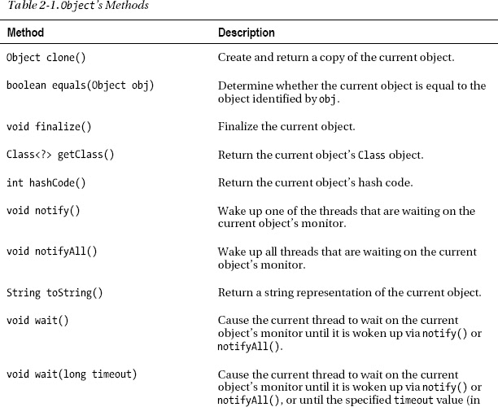
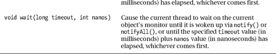

# 二、探索类和对象

第 1 章通过主要关注从注释到语句的基本语言特性，温和地向你介绍了 Java 语言。仅使用这些特性，您就可以创建简单的应用(如`HelloWorld`和本章练习中提到的应用),这些应用让人想起用 c 等结构化编程语言编写的应用。

 **注** *结构化编程*是一种编程范式，它通过*数据结构*(命名的数据项集合)*函数*(命名的代码块，将值返回给调用它们的代码【将程序执行传递给它们】)和*过程*(命名的代码块，不向它们的调用者返回值)在程序上实施逻辑结构。结构化程序使用顺序(一个语句跟在另一个语句后面)、选择/选择(if/switch)、重复/迭代(for/while/do)编程构造；不鼓励使用可能有害的 GOTO 语句(见`[http://en.wikipedia.org/wiki/GOTO](http://en.wikipedia.org/wiki/GOTO)`)。

结构化程序将数据与行为分开。这种分离使得对现实世界的实体(比如银行账户和雇员)建模变得困难，并且当程序变得复杂时，经常导致维护上的麻烦。相比之下，类和对象将数据和行为组合成程序实体；基于类和对象的程序通常更容易理解和维护。

第 2 章通过关注 Java 对类和对象的支持，带你更深入地了解 Java 语言。您首先学习如何声明类并从这些类创建对象，然后学习如何通过字段和方法将状态和行为封装到这些程序实体中。在学习了类和对象初始化之后，通过探索 Java 的面向继承和面向多态的语言特性，您将超越这个*基于对象的编程*模型，进入*面向对象的编程*。

至此，本章介绍了 Java 的一个更令人困惑的语言特性:接口。您将学习什么是接口，它们如何与类相关，以及是什么让它们如此有用。

Java 程序创建占用内存的对象。为了降低内存不足的可能性，Java 虚拟机(JVM)的垃圾收集器偶尔会通过定位不再使用的对象并删除这些垃圾来释放内存，从而执行垃圾收集。第 2 章最后向您介绍垃圾收集过程。

### 声明类和创建对象

结构化程序创建组织和存储数据项的数据结构，并通过函数和过程操纵存储在这些数据结构中的数据。结构化程序的基本单元是它的数据结构和操作它们的函数或过程。尽管 Java 允许您以类似的方式创建应用，但这种语言实际上是关于声明类和从这些类创建对象。这些程序实体是 Java 程序的基本单元。

本节首先向您展示如何声明一个类，然后向您展示如何在`new`操作符和构造函数的帮助下从这个类创建对象。这一节将向您展示如何指定构造函数参数和局部变量。最后，您将学习如何使用用于从类创建对象的相同的`new`操作符来创建数组。

#### 声明类别

一个*类*是制造*对象*(名为代码和数据的集合)的模板，也称为*类实例*，简称*实例*。类概括了现实世界中的实体，而对象是这些实体在程序级别上的具体表现。您可能会认为类是 cookie cutter，对象是 cookie cutter 创建的 cookie。

因为不能实例化不存在的类中的对象，所以必须首先声明该类。声明由一个标题和一个正文组成。至少，头文件由保留字`class`组成，后跟一个标识类的名称(这样就可以在源代码的其他地方引用它)。正文以左括号字符(`{`)开始，以右括号(`}`)结束。夹在这些分隔符之间的是各种声明。考虑清单 2-1 中的。

***清单 2-1。**声明一个骨骼`Image`类*

```java
class Image
{
   // various member declarations
}
```

清单 2-1 声明了一个名为`Image`的类，它大概描述了某种在屏幕上显示的图像。按照惯例，类名以大写字母开头。此外，多单词类名中每个后续单词的第一个字母都要大写。这就是所谓的*驼绒*。

#### 用 new 运算符和构造函数创建对象

`Image`是一个用户定义类型的例子，从中可以创建对象。通过使用带有构造函数的`new`操作符来创建这些对象，如下所示:

```java
Image image = new Image();
```

`new`操作符分配内存来存储由`new`的唯一操作数指定类型的对象，在本例中恰好是`Image()`。对象存储在一个叫做*堆*的内存区域中。

`Image`后面的括号(圆括号)表示一个*构造器*，它是一段代码，通过以某种方式初始化来构造一个对象。`new`操作符*在分配内存存储对象后立即调用*(调用)构造函数。

当构造函数结束时，`new`返回一个对对象的*引用*(一个内存地址或其他标识符)，这样它就可以在程序的其他地方被访问。对于新创建的`Image`对象，其引用存储在一个名为`image`的变量中，该变量的类型被指定为`Image`。(通常将变量称为对象，如在`image`对象中，尽管它只存储对象的引用而不是对象本身。)

 **注意** `new`返回的引用在源代码中用关键字`this`表示。无论`this`出现在哪里，它都代表当前对象。同样，存储引用的变量被称为*引用变量*。

`Image`没有显式声明构造函数。当一个类没有声明构造函数时，Java 会隐式地为这个类创建一个构造函数。创建的构造函数被称为*默认无参数构造函数*，因为当调用构造函数时，在它的`(`和`)`字符之间没有出现参数(稍后讨论)。

 **注意**当声明了至少一个构造函数时，Java 不会创建默认的无参数构造函数。

#### 指定构造函数参数和局部变量

通过指定类名后跟一个*参数列表*，可以在类体内显式声明一个构造函数，参数列表是一个圆括号分隔的逗号分隔的零个或多个参数声明的列表。*参数*是一个构造函数或方法变量，当它被调用时，接收传递给构造函数或方法的表达式值。这个表达式值被称为*自变量*。

[清单 2-2](#list_2_2) 增强了[清单 2-1](#list_2_1) 的`Image`类，声明了三个构造函数，它们的参数列表声明了零个、一个或两个参数；和一个测试这个类的`main()`方法。

***清单 2-2。**用三个构造函数和一个`main()`方法*声明一个`Image`类

`class Image
{
   Image()
   {
      System.out.println("Image() called");
   }
   Image(String filename)
   {
      this(filename, null);
      System.out.println("Image(String filename) called");
   }
   Image(String filename, String imageType)
   {
      System.out.println("Image(String filename, String imageType) called");
      if (filename != null)
      {
         System.out.println("reading "+filename);` `         if (imageType != null)
            System.out.println("interpreting "+filename+" as storing a "+
                               imageType+" image");
      }
      // Perform other initialization here.
   }
   public static void main(String[] args)
   {
      Image image = new Image();
      System.out.println();
      image = new Image("image.png");
      System.out.println();
      image = new Image("image.png", "PNG");
   }
}`

[清单 2-2](#list_2_2) 的`Image`类首先声明了一个无参数构造函数，用于将`Image`对象初始化为默认值(无论它们是什么)。这个构造函数通过调用`System.out.println()`来模拟默认的初始化，以输出一个表示它已经被调用的消息。

`Image`接下来声明一个`Image(String filename)`构造函数，它的参数列表由单个参数声明组成——参数声明由变量类型和变量名称组成。`java.lang.String`参数命名为`filename`，表示该构造函数从文件中获取图像内容。

 **注意**在本书的所有章节中，我通常会在预定义类型(比如`String`)的第一次使用前加上存储该类型的包层次结构。例如，`String`存储在`java`包的`lang`子包中。我这样做是为了帮助您了解类型存储在哪里，以便您可以更容易地指定将这些类型导入到源代码中的导入语句(而不必首先搜索类型的包)——您不必导入存储在`java.lang`包中的类型，但是为了完整起见，我仍然将`java.lang`包作为类型名的前缀。在第 3 章中，我会对包和导入声明有更多的说明。

一些构造函数依赖其他构造函数来帮助它们初始化它们的对象。这样做是为了避免冗余代码，冗余代码会增加对象的大小，并不必要地从堆中取走可用于其他目的的内存。例如，`Image(String filename)`依靠`Image(String filename, String imageType)`将文件的图像内容读入内存。

虽然看起来不是这样，但是构造函数没有名字(虽然通常通过指定类名和参数列表来引用构造函数)。一个构造函数通过使用关键字`this`和圆括号分隔的逗号分隔的参数列表调用另一个构造函数。例如，`Image(String filename)`执行`this(filename, null);`来执行`Image(String filename, String imageType)`。

 **注意**你必须使用`this`来调用另一个构造函数——你不能像在`Image()`中那样使用类名。`this()`构造函数调用(如果存在)必须是在构造函数中执行的第一个代码。该规则防止您在同一个构造函数中指定多个`this(`构造函数调用。最后，您不能在方法中指定`this()`——构造函数只能由其他构造函数调用，并且只能在对象创建期间调用。(我将在本章后面讨论方法。)

如果存在，构造函数调用必须是构造函数中指定的第一个代码；否则，编译器会报告错误。因此，调用另一个构造函数的构造函数只能在另一个构造函数完成后执行额外的工作。例如，`Image(String filename)`在被调用的`Image(String filename, String imageType)`构造函数完成后执行`System.out.println("Image(String filename) called");`。

`Image(String filename, String imageType)`构造函数声明了一个`imageType`参数，它表示存储在文件中的图像类型——例如，可移植网络图形(PNG)图像。据推测，构造函数通过不检查文件内容来学习图像格式，从而使用`imageType`来加速处理。当`null`被传递给`imageType`时，正如`Image(String filename)`构造函数所发生的那样，`Image(String filename, String imageType)`检查文件内容以学习格式。如果`null`也被传递给了`filename`，`Image(String filename, String imageType)`不会读取文件，但是可能会通知试图创建`Image`对象的代码一个错误条件。

在声明了构造函数之后，[清单 2-2](#list_2_2) 声明了一个`main()`方法，让您创建`Image`对象并查看输出消息。`main()`创建三个`Image`对象，调用第一个不带参数的构造函数，第二个带参数的构造函数`"image.png"`，第三个带参数的构造函数`"image.png"`和`"PNG"`。

 **注意**传递给构造函数或方法的参数的数量，或者运算符操作数的数量被称为构造函数、方法或运算符的 *arity* 。

每个对象的引用被分配给一个名为`image`的引用变量，替换先前存储的第二个和第三个对象分配的引用。(每次出现`System.out.println();`输出一个空行，使输出更容易阅读。)

`main()`的出现将`Image`从仅仅一个类变成了一个应用。您通常将`main()`放在用于创建对象的类中，以便测试这样的类。当构建一个供其他人使用的应用时，通常在一个类中声明`main()`,目的是运行一个应用，而不是从那个类创建一个对象——然后应用只从那个类运行。见[第 1 章](01.html#ch1)的`HelloWorld`类举例。

将[清单 2-2](#list_2_2) 保存到`Image.java`后，通过在命令行执行`javac Image.java`来编译这个文件。假设没有错误消息，通过指定`java Image`来执行应用。您应该观察到以下输出:

`Image() called

Image(String filename, String imageType) called` `reading image.png
Image(String filename) called

Image(String filename, String imageType) called
reading image.png
interpreting image.png as storing a PNG image`

第一行输出表明已经调用了 noargument 构造函数。随后的输出行表明已经调用了第二个和第三个构造函数。

除了声明参数之外，构造函数还可以在其主体中声明变量，以帮助它执行各种任务。例如，前面提到的`Image(String filename, String imageType)`构造函数可能会从一个(假设的)`File`类中创建一个对象，提供读取文件内容的方法。在某些时候，构造函数实例化该类，并将实例的引用赋给一个变量，如下所示:

```java
Image(String filename, String imageType)
{
   System.out.println("Image(String filename, String imageType) called");
   if (filename != null)
   {
      System.out.println("reading "+filename);
      File **file** = new File(filename);
      // Read file contents into object.
      if (imageType != null)
         System.out.println("interpreting "+filename+" as storing a "+
                            imageType+" image");
      else
         // Inspect image contents to learn image type.
         ; // Empty statement is used to make if-else syntactically valid.
   }
   // Perform other initialization here.
}
```

与`filename`和`imageType`参数一样，`file`是一个对于构造函数来说是局部的变量，并且被称为*局部变量*以区别于参数。尽管这三个变量都是构造函数的局部变量，但参数和局部变量之间有两个主要区别:

*   `filename`和`imageType`参数在构造函数开始执行时存在，并一直存在到执行离开构造函数。相比之下，`file`在其声明点出现，并继续存在，直到声明它的块被终止(通过一个右括号字符)。参数或局部变量的这个属性被称为*生存期*。
*   可以从构造函数的任何地方访问`filename`和`imageType`参数。相比之下，`file`只能从它的声明点到声明它的块的末尾被访问。不能在声明前或声明块后访问局部变量，但嵌套子块可以访问局部变量。参数或局部变量的这种属性被称为*范围*。

 **注意**生存期和范围(也称为可见性)属性也适用于类、对象和字段(稍后讨论)。当加载到内存中时，类就存在了，当从内存中卸载时，类就不存在了，通常是在应用退出时。此外，加载的类通常对其他类是可见的，但情况并非总是如此——附录 C 在介绍类加载器时会对此问题有更多的说明。

对象的生命周期从通过`new`操作符创建它开始，直到被垃圾收集器从内存中删除。它的范围取决于各种因素，例如当它的引用被赋给局部变量或字段时。我将在本章后面讨论字段。

字段的生存期取决于它是实例字段还是类字段。如果该字段属于一个对象，那么它在该对象被创建时存在，在该对象从内存中消失时消失。如果该字段属于一个类，则当该类被加载时，该字段开始存在，当该类从内存中移除时，该字段消失。与对象一样，字段的范围取决于各种因素，例如字段是否被声明为具有私有访问权限——您将在本章的后面了解私有访问权限。

局部变量不能与参数同名，因为参数总是与局部变量具有相同的范围。但是，一个局部变量可以与另一个局部变量同名，前提是这两个变量位于不同的范围内(即位于不同的块内)。例如，您可以在 if-else 语句的 if 块中指定`int x = 1;`,在该语句对应的 else 块中指定`double x = 2.0;`,每个局部变量都是不同的。

 **注意**对构造函数参数、自变量和局部变量的讨论也适用于方法参数、自变量和局部变量——我将在本章后面讨论方法。

#### 用 new 运算符创建数组

操作符`new`也用于在堆中创建一个对象数组，它是第一章中数组初始化器的一个替代。

 **注意**一个数组被实现为一个特殊的 Java 对象，它的只读`length`字段包含数组的大小(元素的数量)。您将在本章的后面了解字段。

创建数组时，指定`new`，后跟一个标识数组中存储的值的类型的名称，后跟一对或多对方括号，表示数组占用的维数。最左边的一对方括号必须包含指定数组大小(元素数量)的整数表达式，而其余的一对方括号包含整数表达式或为空。

例如，您可以使用`new`创建对象引用的一维数组，如以下示例所示，该示例创建了一个可以存储十个`Image`对象引用的一维数组:

```java
Image[] imArray = new Image[10];
```

当您创建一维数组时，`new`将每个数组元素的存储位置中的位置零，您在源代码级别将这些位解释为文字值`false`、`'\u0000'`、`0`、`0L`、`0.0`、`0.0F`或`null`(取决于元素类型)。在前面的例子中，`imArray`的每个元素都被初始化为`null`，这代表了*的空引用*(对无对象的引用)。

创建数组后，需要为其元素分配对象引用。以下示例通过创建`Image`对象并将其引用分配给`imArray`元素来演示此任务:

```java
for (int i = 0; i < imArray.length; i++)
   imArray[i] = new Image("image"+i+".png"); // image0.png, image1.png, and so on
```

`"image"+i+".png"`表达式使用字符串连接运算符(`+`)将`image`与存储在变量`i`中的整数值的字符串等效项`.png`组合起来。结果字符串被传递给`Image`的`Image(String filename)`构造函数。

 **警告**根据循环的长度，在循环上下文中使用字符串连接操作符会导致大量不必要的`String`对象创建。我会在[第 4 章](04.html#ch4)向你介绍`String`类的时候讨论这个话题。

您还可以使用`new`来创建原始类型值的数组(比如整数或双精度浮点数)。例如，假设您要创建一个双精度浮点温度值的二维三行两列数组。以下示例完成了这项任务:

```java
double[][] temperatures = new double[3][2];
```

创建一个二维数组后，您会希望用合适的值填充它的元素。下面的例子通过`Math.random()`将每个`temperatures`元素初始化为一个随机生成的温度值，我将在第 4 章的[中解释:](04.html#ch4)

```java
for (int row = 0; row < temperatures.length; row++)
   for (int col = 0; col < temperatures[row].length; col++)
      temperatures[row][col] = Math.random()*100;
```

随后，您可以使用 for 循环以表格格式输出这些值，如以下示例所示，该代码不会尝试对齐完美列中的温度值:

`for (int row = 0; row < temperatures.length; row++)` `{
   for (int col = 0; col < temperatures[row].length; col++)
      System.out.print(temperatures[row][col]+" ");
   System.out.println();
}`

Java 提供了创建多维数组的另一种方法，在这种方法中，您可以单独创建每个维度。例如，以这种方式通过`new`创建一个二维数组，首先创建一个一维行数组(外部数组)，然后创建一个一维列数组(内部数组)，如下所示:

```java
// Create the row array.
double[][] temperatures = new double[3][]; // Note the extra empty pair of brackets.
// Create a column array for each row.
for (int row = 0; row < temperatures.length; row++)
   temperatures[row] = new double[2]; // 2 columns per row
```

这种数组被称为*不规则数组*，因为每行可以有不同数量的列；该阵列不是矩形的，而是参差不齐的。

 **注意**当创建行数组时，你必须额外指定一对空括号作为`new`后面表达式的一部分。(对于三维数组——表格的一维数组，其中该数组的元素引用行数组——您必须指定两对空括号作为跟随`new`的表达式的一部分。)

如果需要，你可以将第一章的数组初始化语法与`new`结合起来。例如，`Image[] imArray = new Image[] { new Image("image0.png"), new Image("image1.png") };`创建一对`Image`对象和一个两元素的`Image`数组对象，初始化为`Image`对象的引用，并将数组的引用赋给`imArray`。

以这种方式创建数组时，不允许在方括号之间指定整数表达式。比如编译器遇到`Image[] imArray = new Image[2] { new Image("image0.png"), new Image("image1.png") };`就报错。要纠正此错误，请移除方括号之间的`2`。

### 封装状态和行为

类从模板的角度模拟现实世界的实体；例如，汽车和储蓄账户。对象表示特定的实体；例如，John 的红色丰田凯美瑞(汽车实例)和 Cuifen 的余额为两万美元的储蓄帐户(储蓄帐户实例)。

实体有*属性*，比如颜色红色，制造丰田，型号凯美瑞，余额两万美元。一个实体的属性集合被称为其*状态*。实体也有*行为*，如开门、开车、显示油耗、存款、取款、显示账户余额。

类及其对象通过将状态和行为组合成一个单元来对实体建模——类抽象状态，而其对象提供具体的状态值。这种状态和行为的结合被称为*封装*。与结构化编程不同，在结构化编程中，开发人员专注于通过结构化代码对行为进行建模，并通过存储结构化代码要操作的数据项的数据结构对状态进行建模，使用类和对象的开发人员专注于模板化实体，方法是声明封装状态和行为的类，用这些类中的特定状态值实例化对象以表示特定的实体，并通过它们的行为与对象进行交互。

本节首先向您介绍 Java 表示状态的语言特性，然后向您介绍它表示行为的语言特性。因为一些状态和行为支持该类的内部架构，并且不应该对那些想要使用该类的人可见，所以本节最后给出了信息隐藏的重要概念。

#### 通过字段表示状态

Java 让你通过*字段*来表示状态，这些字段是在类体内声明的变量。实体属性通过*实例字段*描述。因为 Java 也支持与类而不是对象相关联的状态，所以 Java 提供了*类字段*来描述这个类状态。

首先学习如何声明和访问实例字段，然后学习如何声明和访问类字段。在了解了如何声明只读实例和类字段之后，您将回顾从不同上下文访问字段的规则。

##### 声明和访问实例字段

您可以声明一个实例字段，方法是至少指定一个类型名，后跟一个命名该字段的标识符，再跟一个分号字符(`;`)。[清单 2-3](#list_2_3) 展示了一个带有三个实例字段声明的`Car`类。

***清单 2-3。**用`make`、`model`和`numDoors`实例字段*声明一个`Car`类

```java
class Car
{
   String make;
   String model;
   int numDoors;
}
```

清单 2-3 声明了两个名为`make`和`model`的`String`实例字段。它还声明了一个名为`numDoors`的`int`实例字段。按照惯例，字段名以小写字母开头，多词字段名中每个后续单词的第一个字母大写。

当创建一个对象时，实例字段被初始化为缺省的零值，您在源代码级别将它解释为文字值`false`、`'\u0000'`、`0`、`0L`、`0.0`、`0.0F`或`null`(取决于元素类型)。例如，如果您要执行`Car car = new Car();`，那么`make`和`model`将被初始化为`null`，而`numDoors`将被初始化为`0`。

您可以使用成员访问运算符(`.`)为对象的实例字段赋值或从中读取值；左操作数指定对象的引用，右操作数指定要访问的实例字段。清单 2-4 使用这个操作符来初始化一个`Car`对象的`make`、`model`和`numDoors`实例字段。

***清单 2-4。**初始化一个`Car`对象的实例字段*

`class Car
{
   String make;
   String model;` `   int numDoors;
   public static void main(String[] args)
   {
      Car car = new Car();
      car.make = "Toyota";
      car.model = "Camry";
      car.numDoors = 4;
   }
}`

清单 2-4 展示了一个实例化`Car`的`main()`方法。`car`实例的`make`实例字段被赋予`"Toyota"`字符串，其`model`实例字段被赋予`"Camry"`字符串，其`numDoors`实例字段被赋予整数文字`4`。(字符串的双引号分隔字符串的字符序列，但不是字符串的一部分。)

您可以在声明实例字段时显式初始化该字段，以提供非零默认值，该值将覆盖默认的零值。清单 2-5 展示了这一点。

***清单 2-5。**将`Car`的`numDoors`实例字段初始化为默认非零值*

```java
class Car
{
   String make;
   String model;
   int numDoors = 4;
   Car()
   {
   }
   public static void main(String[] args)
   {
      Car johnDoeCar = new Car();
      johnDoeCar.make = "Chevrolet";
      johnDoeCar.model = "Volt";
   }
}
```

[清单 2-5](#list_2_5) 明确地将`numDoors`初始化为`4`，因为开发者已经假设这个类建模的大多数汽车都有四个门。当通过`Car()`构造函数初始化`Car`时，开发者只需要初始化那些有四个门的汽车的`make`和`model`实例字段。

直接初始化一个对象的实例字段通常不是一个好主意，当我讨论信息隐藏(在本章的后面)的时候你会知道为什么。相反，你应该在类的构造函数中执行这个初始化——参见[清单 2-6](#list_2_6) 。

***清单 2-6。**通过构造函数*初始化`Car`的实例字段

`class Car
{
   String make;
   String model;
   int numDoors;
   Car(String make, String model)
   {
      this(make, model, 4);` `   }
   Car(String make, String model, int nDoors)
   {
      this.make = make;
      this.model = model;
      numDoors = nDoors;
   }
   public static void main(String[] args)
   {
      Car myCar = new Car("Toyota", "Camry");
      Car yourCar = new Car("Mazda", "RX-8", 2);
   }
}`

[清单 2-6](#list_2_6) 的`Car`类声明了`Car(String make, String model)`和`Car(String make, String model, int nDoors)`构造函数。第一个构造函数让您指定品牌和型号，而第二个构造函数让您指定三个实例字段的值。

第一个构造函数执行`this(make, model, 4);`来将它的`make`和`model`参数的值以及默认值`4`传递给第二个构造函数。这样做展示了一种显式初始化实例字段的替代方法，从代码维护的角度来看，这种方法更可取。

`Car(String make, String model, int numDoors)`构造函数演示了关键字`this`的另一种用法。具体来说，它演示了构造函数参数与类的实例字段同名的场景。在变量名前加上“`this.`”会导致 Java 编译器创建访问实例字段的字节码。例如，`this.make = make;`将`make`参数的`String`对象引用分配给这个(当前)`Car`对象的`make`实例字段。如果指定了`make = make;`,那么通过将`make`的值赋给它自己，它将一事无成；Java 编译器可能不会生成代码来执行不必要的赋值。相比之下，`this.`对于`numDoors = nDoors;`赋值是不必要的，它从`nDoors`参数值初始化`numDoors`字段。

##### 声明和访问类字段

在许多情况下，您只需要实例字段。但是，您可能会遇到这样的情况:无论创建了多少个对象，您都需要一个字段的单一副本。

例如，假设您想要跟踪已经创建的`Car`对象的数量，并在这个类中引入一个`counter`实例字段(初始化为 0)。您还可以在类的构造函数中放置代码，在创建对象时将`counter`的值增加 1。但是，因为每个对象都有自己的`counter`实例字段的副本，所以这个字段的值不会超过 1。清单 2-7 通过将`counter`声明为一个类字段，在字段声明前加上关键字`static`，解决了这个问题。

***清单 2-7。**给`Car`* 增加一个`counter`类字段

`class Car
{
   String make;
   String model;
   int numDoors;
   static int counter;` `   Car(String make, String model)
   {
      this(make, model, 4);
   }
   Car(String make, String model, int numDoors)
   {
      this.make = make;
      this.model = model;
      this.numDoors = numDoors;
      counter++;
   }
   public static void main(String[] args)
   {
      Car myCar = new Car("Toyota", "Camry");
      Car yourCar = new Car("Mazda", "RX-8", 2);
      System.out.println(Car.counter);
   }
}`

[清单 2-7](#list_2_7) 的`static`前缀意味着`counter`字段只有一个副本，而不是每个对象一个副本。当一个类被加载到内存中时，类字段被初始化为缺省的零值。例如，`counter`被初始化为`0`。(与实例字段一样，您也可以在其声明中为类字段赋值。)每创建一个对象，`counter`就会增加 1，这要感谢`Car(String make, String model, int numDoors)`构造函数中的`counter++`表达式。

与实例字段不同，类字段通常通过成员访问操作符直接访问。虽然您可以通过对象引用访问类字段(如在`myCar.counter`中)，但是通常使用类名访问类字段，如在`Car.counter`中。(也更容易看出代码正在访问一个类字段。)

 **注意**因为`main()`方法是[清单 2-7](#list_2_7) 的`Car`类的成员，你可以直接访问`counter`，就像在`System.out.println(counter);`中一样。然而，要在另一个类的`main()`方法的上下文中访问`counter`，您必须指定`Car.counter`。

如果你运行[清单 2-7](#list_2_7) ，你会注意到它输出`2`，因为已经创建了两个`Car`对象。

##### 声明只读实例和类字段

先前声明的字段既可以写入也可以读取。但是，您可能希望声明一个只读字段；例如，命名诸如 pi (3.14159…)等常数值的字段。Java 通过提供保留字`final`让您完成这项任务。

每个对象都接收自己的只读实例字段副本。此字段必须初始化，作为字段声明的一部分或在类的构造函数中。如果在构造函数中初始化，只读实例字段被称为*空白 final* ，因为它没有值，直到在构造函数中给它赋值。因为构造函数可能会给每个对象的 blank final 赋予不同的值，所以这些只读变量并不是真正的常量。

如果您想要一个真正的*常量*，它是一个对所有对象都可用的只读值，您需要创建一个只读类字段。您可以通过在该字段的声明中包含保留字`static`和`final`来完成这项任务。

清单 2-8 展示了如何声明一个只读的类字段。

***清单 2-8。**在`Employee`类中声明一个真常数*

```java
class Employee
{
   final static int RETIREMENT_AGE = 65;
}
```

[清单 2-8](#list_2_8) 的`RETIREMENT_AGE`声明是*编译时常数*的一个例子。因为它的值只有一个副本(由于`static`关键字)，并且因为这个值永远不会改变(由于`final`关键字)，编译器可以通过将常量值插入到所有使用它的计算中来自由地优化编译后的代码。代码运行得更快，因为它不必访问只读的类字段。

##### 查看字段访问规则

前面的字段访问示例可能看起来有些混乱，因为有时您可以直接指定字段的名称，而在其他时候您需要在字段名称前面加上对象引用或类名以及成员访问操作符。以下规则通过指导您如何从各种上下文中访问字段来消除这种混淆:

*   从与类字段声明相同的类中的任意位置指定类字段的名称。示例:`counter`
*   指定类字段的类的名称，后跟成员访问运算符，再后跟该类外部的类字段的名称。示例:`Car.counter`
*   将实例字段的名称指定为与实例字段声明相同的类中的任何实例方法、构造函数或实例初始值设定项(稍后讨论)。示例:`numDoors`
*   指定一个对象引用，后面是成员访问操作符，后面是实例字段的名称，该实例字段来自与实例字段声明相同的类内的任何类方法或类初始化器(稍后讨论),或者来自类外。例:`Car car =` `new Car(); car.numDoors = 2;`

尽管后一条规则似乎暗示您可以从类上下文中访问实例字段，但事实并非如此。相反，您是从对象上下文中访问该字段。

前面的访问规则并不详尽，因为还有两种字段访问场景需要考虑:声明一个与实例字段或类字段同名的局部变量(甚至是参数)。在任一场景中，局部变量/参数被称为*隐藏*(隐藏或屏蔽)字段。

如果发现声明了隐藏字段的局部变量或参数，可以重命名局部变量/参数，也可以使用带保留字的成员访问运算符`this`(实例字段)或类名(类字段)来显式标识字段。例如，[清单 2-6](#list_2_6) 的`Car(String make, String model, int nDoors)`构造函数通过指定像`this.make = make;`这样的语句来区分实例字段和同名参数，从而演示了后一种解决方案。

#### 通过方法表现行为

Java 让你通过*方法*来表现行为，这些方法是在类的主体中声明的代码块。实体行为通过*实例方法*来描述。因为 Java 也支持与类而不是对象相关联的行为，所以 Java 提供了*类方法*来描述这些类行为。

首先学习如何声明和调用实例方法，然后学习如何创建实例方法调用链。接下来，您将了解如何声明和调用类方法，了解关于向方法传递参数的更多细节，并探索 Java 的 return 语句。在学习了如何递归调用方法作为迭代的替代方法，以及如何重载方法之后，您将回顾从不同上下文调用方法的规则。

##### 声明和调用实例方法

您可以通过以下方式声明实例方法:最低限度地指定一个返回类型名称，后跟一个命名该方法的标识符，再跟一个参数列表，最后跟一个大括号分隔的主体。[清单 2-9](#list_2_9) 展示了一个带有`printDetails()`实例方法的`Car`类。

***清单 2-9。**在`Car`类*中声明一个`printDetails()`实例方法

```java
class Car
{
   String make;
   String model;
   int numDoors;
   Car(String make, String model)
   {
      this(make, model, 4);
   }
   Car(String make, String model, int numDoors)
   {
      this.make = make;
      this.model = model;
      this.numDoors = numDoors;
   }
   void printDetails()
   {
      System.out.println("Make = "+make);
      System.out.println("Model = "+model);
      System.out.println("Number of doors = "+numDoors);
      System.out.println();
   }
   public static void main(String[] args)
   {
      Car myCar = new Car("Toyota", "Camry");
      myCar.printDetails();
      Car yourCar = new Car("Mazda", "RX-8", 2);
      yourCar.printDetails();
   }
}
```

[清单 2-9](#list_2_9) 声明了一个名为`printDetails()`的实例方法。按照惯例，方法名以小写字母开头，多单词方法名中每个后续单词的第一个字母大写。

方法类似于构造函数，因为它们有参数列表。当您呼叫方法时，会将引数传递给这些参数。因为`printDetails()`没有参数，所以它的参数列表是空的。

 **注意**一个方法的名字和它的参数的数量、类型和顺序被称为它的*签名*。

当一个方法被调用时，其主体中的代码被执行。对于`printDetails()`，该方法的主体执行一系列的`System.out.println()`方法调用，以输出其`make`、`model`和`numDoors`实例字段的值。

与构造函数不同，方法被声明为具有返回类型。返回类型标识该方法返回的值的种类(例如，`int count()`返回 32 位整数)。如果一个方法不返回值(并且`printDetails()`也不返回值)，那么它的返回类型将被关键字`void`替换，如`void printDetails()`所示。

 **注意**构造函数没有返回类型，因为它们不能返回值。如果一个构造函数可以返回一个任意值，那么这个值将如何返回呢？毕竟，`new`操作符返回一个对象的引用，而`new`怎么可能返回一个构造函数的值呢？

使用成员访问运算符调用方法；左操作数指定对象的引用，右操作数指定要调用的方法。例如，`myCar.printDetails()`和`yourCar.printDetails()`表达式调用`myCar`和`yourCar`对象上的`printDetails()`实例方法。

编译[清单 2-9](#list_2_9) ( `javac Car.java`)并运行这个应用(`java Car`)。您应该观察到以下输出，其不同的实例字段值证明了`printDetails()`与一个对象相关联:

```java
Make = Toyota
Model = Camry
Number of doors = 4

Make = Mazda
Model = RX-8
Number of doors = 2
```

当实例方法被调用时，Java 将一个隐藏的参数传递给该方法(作为参数列表中最左边的参数)。该参数是对调用该方法的对象的引用，通过保留字`this`在源代码级别表示。每当您试图访问一个实例字段名，而这个实例字段名又不是一个参数的名称时，您不需要在方法中为这个实例字段名加上前缀“`this.`”，因为在这种情况下会假定使用“`this.`”。

**方法调用栈**

方法调用需要一个*方法调用栈*(也称为*方法调用栈*)来跟踪执行必须返回的语句。把方法调用栈想象成自助餐厅中一堆干净托盘的模拟——你*从这堆托盘的顶部弹出*(移除)干净托盘，洗碗机将*把下一个干净托盘推到这堆托盘的顶部。*

当一个方法被调用时，JVM 将它的参数和第一条语句的地址推到方法调用堆栈上，该语句将在被调用的方法之后执行。JVM 还为方法的局部变量分配堆栈空间。当方法返回时，JVM 删除局部变量空间，将地址和参数弹出堆栈，并将执行转移到该地址的语句。

##### 将实例方法调用链接在一起

两个或多个实例方法调用可以通过成员访问操作符链接在一起，从而产生更紧凑的代码。为了完成实例方法调用链接，你需要稍微不同地重新架构你的实例方法，如清单 2-10 所示。

***清单 2-10。**实现实例方法，这样对这些方法的调用可以链接在一起*

```java
class SavingsAccount
{
   int balance;
   SavingsAccount deposit(int amount)
   {
      balance += amount;
      return this;
   }
   SavingsAccount printBalance()
   {
      System.out.println(balance);
      return this;      
   }
   public static void main(String[] args)
   {
      new SavingsAccount().deposit(1000).printBalance();
   }
}
```

[清单 2-10](#list_2_10) 显示你必须指定类名作为实例方法的返回类型。每个`deposit()`和`printBalance()`必须指定`SavingsAccount`作为返回类型。另外，您必须指定`return this;`(返回当前对象的引用)作为最后一条语句——我将在后面讨论 return 语句。

例如，`new SavingsAccount().deposit(1000).printBalance();`创建一个`SavingsAccount`对象，使用返回的`SavingsAccount`引用调用`SavingsAccount`的`deposit()`实例方法，向储蓄账户添加一千美元(为了方便起见，我忽略了美分)，最后使用`deposit()`返回的`SavingsAccount`引用(与`SavingsAccount`实例相同)调用`SavingsAccount`的`printBalance()`实例方法输出账户余额。

##### 声明和调用类方法

在许多情况下，实例方法就是您所需要的。但是，您可能会遇到需要描述独立于任何对象的行为的情况。

例如，假设您想引入一个*工具类*(一个由【T0【class】方法组成的类)，它的方法执行各种类型的转换(比如从摄氏度转换到华氏度)。您不想从这个类创建一个对象来执行转换。相反，您只是想调用一个方法并获得它的结果。清单 2-11 通过提供一个带有一对类方法的`Conversions`类来解决这个需求。这些方法不需要创建一个`Conversions`对象就可以被调用。

***清单 2-11。**一个`Conversions`工具类和一对类方法*

```java
class Conversions
{
   static double c2f(double degrees)
   {
      return degrees*9.0/5.0+32;
   }
   static double f2c(double degrees)
   {
      return (degrees-32)*5.0/9.0;
   }
}
```

[清单 2-11](#list_2_11) 的`Conversions`类声明了`c2f()`和`f2c()`方法，用于将摄氏度转换为华氏度，反之亦然，并返回这些转换的结果。每个*方法头*(方法签名和其他信息)都以关键字`static`为前缀，将方法转换成类方法。

要执行一个类方法，通常要在它的名字前面加上类名。例如，您可以执行`Conversions.c2f(100.0);`来找出相当于 100 摄氏度的华氏温度，执行`Conversions.f2c(98.6);`来找出相当于正常体温的摄氏温度。你不需要实例化`Conversions`，然后通过那个实例调用这些方法，尽管你可以这样做(但这不是好的形式)。

 **注意**每个应用至少有一个类方法。具体来说，应用必须指定`public static void main(String[] args)`作为应用的入口点。`static`保留字使这个方法成为一个类方法。(我将在本章后面解释保留字`public`。)

因为类方法不是用引用当前对象的隐藏参数调用的，`c2f()`、`f2c()`和`main()`不能访问对象的实例字段或调用其实例方法。这些类方法只能访问类字段和调用类方法。

##### 向方法传递参数

方法调用包括传递给该方法的一系列(零个或多个)参数。Java 通过一种称为*按值传递*的参数传递方式将参数传递给方法，下面的示例演示了这种方式:

```java
Employee emp = new Employee("John ");
int recommendedAnnualSalaryIncrease = 1000;
printReport(emp, recommendAnnualSalaryIncrease);
printReport(new Employee("Cuifen"), 1500);
```

按值传递将变量的值(例如，存储在`emp`中的引用值或存储在`recommendedAnnualSalaryIncrease`中的 1000 值)或一些其他表达式的值(例如`new Employee("Cuifen")`或`1500`)传递给方法。

由于传递值，您不能通过此参数的`printReport()`参数从`printReport()`内部将不同的`Employee`对象的引用分配给`emp`。毕竟，您只是向方法传递了一份`emp`值的副本。

许多方法(和构造函数)在被调用时需要传递固定数量的参数。然而，Java 也可以传递可变数量的参数——这样的方法/构造函数通常被称为 *varargs 方法/构造函数*。若要声明采用可变数量的参数的方法(或构造函数),请在该方法/构造函数的最右侧参数的类型名称后指定三个连续的句点。以下示例展示了一个接受可变数量参数的`sum()`方法:

```java
double sum(double... values)
{
   int total = 0;
   for (int i = 0; i < values.length; i++)
      total += values[i];
   return total;
}
```

`sum()`的实现合计传递给此方法的参数数；比如`sum(10.0, 20.0)`或者`sum(30.0, 40.0, 50.0)`。(在幕后，这些参数存储在一维数组中，如`values.length`和`values[i]`所示。)在对这些值求和之后，通过 return 语句返回这个总数。

##### 通过 Return 语句从一个方法返回

在不返回值(其返回类型设置为`void`)的方法中，语句的执行从第一条语句流向最后一条语句。然而，Java 的 return 语句让一个方法(或构造函数)在到达最后一个语句之前退出。如[清单 2-12](#list_2_12) 所示，这种形式的 return 语句由保留字`return`后跟一个分号组成。

***清单 2-12。**使用 return 语句从方法中提前返回*

```java
class Employee
{
   String name;
   Employee(String name)
   {
      setName(name);
   }
   void setName(String name)
   {
      if (name == null)
      {
         System.out.println("name cannot be null");
         return;
      }
      else
         this.name = name;
   }
   public static void main(String[] args)
   {
      Employee john = new Employee(null);
   }
}
```

[清单 2-12](#list_2_12) 的`Employee(String name)`构造函数调用`setName()`实例方法来初始化`name`实例字段。为此提供一个单独的方法是一个好主意，因为它允许您在构造时以及以后初始化实例字段。(也许员工改变了他或她的名字。)

 **注意**当你从同一个类的构造函数或方法中调用一个类的实例或类方法时，你只需要指定方法的名称。不要用成员访问操作符和对象引用或类名作为方法调用的前缀。

`setName()`使用 if 语句检测向`name`字段分配空引用的企图。当检测到这种尝试时，它输出“`name cannot be null`”错误消息，并过早地从方法中返回，以便不能分配空值(并替换以前分配的名称)。

 **注意**使用 return 语句时，可能会遇到编译器报告“代码不可达”错误信息的情况。当它检测到永远不会执行的代码并不必要地占用内存时，它就会这样做。您可能会在 switch 语句中遇到这个问题。例如，假设您指定`case "-v": printUsageInstructions(); return; break;`作为该语句的一部分。编译器在检测到 return 语句后面的 break 语句时会报告一个错误，因为 break 语句是不可访问的；它永远不会被执行。

return 语句的前一种形式在返回值的方法中是非法的。对于这样的方法，Java 提供了 return 的替代版本，允许方法返回值(其类型必须与方法的返回类型相匹配)。以下示例演示了此版本:

```java
double divide(double dividend, double divisor)
{
   if (divisor == 0.0)
   {
      System.out.println("cannot divide by zero");
      return 0.0;
   }
   return dividend/divisor;
}
```

`divide()`使用 if 语句检测将其第一个参数除以 0.0 的尝试，并在检测到该尝试时输出错误消息。此外，它返回`0.0`来表示这个尝试。如果没有问题，则执行除法并返回结果。

 **注意**不能在构造函数中使用这种形式的 return 语句，因为构造函数没有返回类型。

##### 递归调用方法

一个方法通常执行可能包含对其他方法的调用的语句，比如`printDetails()`调用`System.out.println()`。然而，偶尔有一个方法调用本身是很方便的。这个场景被称为*递归*。

例如，假设您需要编写一个方法来返回一个*阶乘*(一个特定整数之前的所有正整数的乘积)。比如 3！(该！是阶乘的数学符号)等于 3×2×1 或 6。

编写此方法的第一种方法可能由以下示例中的代码组成:

```java
int factorial(int n)
{
   int product = 1;
   for (int i = 2; i <= n; i++)
      product *= i;
   return product;
}
```

虽然这段代码完成了它的任务(通过迭代)，`factorial()`也可以按照下面例子的递归方式编写。

```java
int factorial(int n)
{
   if (n == 1)
      return 1; // base problem
   else
      return n*factorial(n-1);
}
```

递归方法利用了能够用更简单的术语来表达问题的优势。根据这个例子，最简单的问题，也就是大家熟知的*基数问题*，是 1！(1).

当一个大于 1 的参数被传递给`factorial()`时，该方法通过用下一个更小的参数值调用自己，将问题分解成一个更简单的问题。最终会达到基数问题。

例如，调用`factorial(4)`会导致下面的表达式堆栈:

```java
4*factorial(3)
3*factorial(2)
2*factorial(1)
```

最后一个表达式在栈顶。当`factorial(1)`返回 1 时，这些表达式在堆栈开始展开时被计算:

*   `2*factorial(1)`现在变成了 2*1 (2)
*   `3*factorial(2)`现在变成了 3*2 (6)
*   `4*factorial(3)`现在变成了 4*6 (24)

递归为表达许多问题提供了一种优雅的方式。其他示例包括在基于树的数据结构中搜索特定值，以及在分层文件系统中，查找并输出包含特定文本的所有文件的名称。

 **注意**递归会消耗堆栈空间，所以要确保你的递归最终以一个基数问题结束；否则，您将耗尽堆栈空间，您的应用将被迫终止。

##### 重载方法

Java 允许您将名称相同但参数列表不同的方法引入到同一个类中。这个特性被称为*方法重载*。当编译器遇到方法调用表达式时，它会将被调用方法的参数列表与每个重载方法的参数列表进行比较，以寻找要调用的正确方法。

当两个同名方法的参数列表中的参数数量或顺序不同时，它们会被重载。比如 Java 的`String`类提供了重载的`public int indexOf(int ch)`和`public int indexOf(int ch, int fromIndex)`方法。这些方法在参数计数上有所不同。(我在第四章的[中探索`String`。)](04.html#ch4)

当至少有一个参数的类型不同时，两个同名的方法被重载。比如 Java 的`java.lang.Math`类提供了重载的`public static double abs(double a)`和`public static int abs(int a)`方法。一个方法的参数是一个`double`；另一个方法的参数是一个`int`。(我在第四章的[中探索`Math`。)](04.html#ch4)

不能通过仅更改返回类型来重载方法。比如`double sum(double... values)`和`int sum(double... values)`没有过载。这些方法没有被重载，因为当编译器在源代码中遇到`sum(1.0, 2.0)`时，它没有足够的信息来选择调用哪个方法。

##### 检查方法调用规则

前面的方法调用示例可能看起来很混乱，因为有时您可以直接指定方法名，而在其他时候您需要在方法名前面加上对象引用或类名以及成员访问操作符。以下规则通过指导您如何从各种上下文中调用方法来消除这种混淆:

*   从与类方法相同的类中的任意位置指定类方法的名称。示例:`c2f(37.0);`
*   指定类方法的类的名称，后跟成员访问运算符，再后跟该类外部的类方法的名称。例子:`Conversions.c2f(37.0);`(你也可以通过一个对象实例调用一个类方法，但是这被认为是不好的形式，因为它隐藏了一个类方法被调用的事实。)
*   指定实例方法的名称，该名称来自与实例方法在同一类中的任何实例方法、构造函数或实例初始值设定项。示例:`setName(name);`
*   指定一个对象引用，后面是成员访问运算符，再后面是实例方法的名称，该实例方法来自与实例方法相同的类内的任何类方法或类初始值设定项，或者来自类外。示例:`Car car = new Car("Toyota", "Camry"); car.printDetails();`

尽管后一条规则似乎意味着您可以从类上下文中调用实例方法，但事实并非如此。相反，您可以从对象上下文中调用该方法。

此外，不要忘记确保传递给方法的参数的数量，以及这些参数传递的顺序，并且这些参数的类型与它们在被调用的方法中对应的参数一致。

 **注意**字段访问和方法调用规则组合在表达式`System.out.println();`中，其中最左边的成员访问操作符访问`java.lang.System`类中的`out`类字段(类型为`java.io.PrintStream`),最右边的成员访问操作符调用该字段的`println()`方法。你将在第 8 章的[和第 4 章](08.html#ch8)的[中了解到`PrintStream`。](04.html#ch4)

#### 隐藏信息

每一个 *`X`* 类都公开了一个*接口*(一个由构造函数、方法和【可能】字段组成的协议，它们可供从其他类创建的对象使用，用于创建 *`X`* 的对象并与之通信)。

一个接口作为一个类和它的*客户端*之间的单向契约，客户端是外部构造函数、方法和其他(面向初始化的)类实体(在本章后面讨论),它们通过调用构造函数和方法以及访问字段(通常是`public static final`字段或常量)与类的实例进行通信。契约是这样的，类承诺不改变它的接口，这将破坏依赖于该接口的客户端。

*`X`* 还提供了一个*实现*(公开的方法中的代码，以及可选的助手方法和可选的不应该公开的支持字段)，它对接口进行编码。*辅助方法*是辅助暴露方法的方法，不应该被暴露。

当设计一个类时，你的目标是公开一个有用的接口，同时隐藏该接口实现的细节。隐藏实现是为了防止开发人员意外访问不属于该类接口的部分，这样您就可以在不破坏客户端代码的情况下自由更改实现。隐藏实现通常被称为*信息隐藏*。此外，许多开发人员认为实现隐藏是封装的一部分。

Java 通过提供四个级别的访问控制来支持实现隐藏，其中三个级别通过保留字来表示。您可以使用下列访问控制级别来控制对字段、方法和构造函数的访问，并使用其中两个级别来控制对类的访问:

*   *Public* :声明为`public`的字段、方法或构造函数可以从任何地方访问。类也可以被声明为`public`。
*   *受保护的*:声明为`protected`的字段、方法或构造函数可以从与成员类相同的包中的所有类中访问，也可以从该类的子类中访问，而不考虑包。(我将在第三章中讨论软件包。)
*   *私有*:声明为`private`的字段、方法或构造函数不能从声明它的类之外访问。
*   *Package-private* :在没有访问控制保留字的情况下，一个字段、方法或构造函数只能被同一个包中的类访问，就像成员的类一样。非`public`类也是如此。`public`、`protected`或`private`的缺席意味着包私有。

 **注意**声明为`public`的类必须保存在同名文件中。例如，一个`public` `Image`类必须存储在`Image.java`中。一个源文件只能声明一个`public`类。

您通常会将类的实例字段声明为`private`，并提供特殊的`public`实例方法来设置和获取它们的值。按照惯例，设置字段值的方法名称以`set`开头，被称为*设置器*。类似地，获取字段值的方法的名称带有前缀`get`(或`is`，对于布尔字段，称为*getter*。[清单 2-13](#list_2_13) 在`Employee`类声明的上下文中演示了这种模式。

***清单 2-13。**接口与实现的分离*

```java
public class Employee
{
   private String name;
   public Employee(String name)
   {
      setName(name);
   }
   public void setName(String empName)
   {
      name = empName; // Assign the empName argument to the name field.
   }
   public String getName()
   {
      return name;
   }
}
```

清单 2-13 展示了一个由`public` `Employee`类、它的`public`构造函数和它的`public` setter/getter 方法组成的接口。这个类和这些成员可以从任何地方访问。该实现由`private` `name`字段和构造函数/方法代码组成，只能在`Employee`类中访问。

当您可以简单地省略`private`并直接访问`name`字段时，这么做似乎毫无意义。但是，假设您被告知要引入一个新的构造函数，它接受单独的姓和名参数，并引入新的方法，将雇员的姓和名设置/获取到这个类中。此外，假设已经确定名字和姓氏将比整个名字被更频繁地访问。[清单 2-14](#list_2_14) 揭示了这些变化。

***清单 2-14。**在不影响现有接口的情况下修改实现*

`public class Employee
{
   private String firstName;
   private String lastName;
   public Employee(String name)
   {
      setName(name);
   }
   public Employee(String firstName, String lastName)
   {
      setName(firstName+" "+lastName);
   }
   public void setName(String name)
   {
      // Assume that the first and last names are separated by a
      // single space character. indexOf() locates a character in a
      // string; substring() returns a portion of a string.
      setFirstName(name.substring(0, name.indexOf(' ')));
      setLastName(name.substring(name.indexOf(' ')+1));
   }
   public String getName()` `   {
      return getFirstName()+" "+getLastName();
   }
   public void setFirstName(String empFirstName)
   {
      firstName = empFirstName;
   }
   public String getFirstName()
   {
      return firstName;
   }
   public void setLastName(String empLastName)
   {
      lastName = empLastName;
   }
   public String getLastName()
   {
      return lastName;
   }
}`

[清单 2-14](#list_2_14) 显示`name`字段已经被删除，取而代之的是新的`firstName`和`lastName`字段，它们是为了提高性能而添加的。因为`setFirstName()`和`setLastName()`将比`setName()`被更频繁地调用，并且因为`getFirstName()`和`getLastName()`将比`getName()`被更频繁地调用，所以(在每种情况下)让前两个方法设置/获取`firstName`和`lastName`的值比将任一值合并到`name`的值中/从`name`的值中提取该值更有性能。

[清单 2-14](#list_2_14) 还揭示了`setName()`调用`setFirstName()`和`setLastName()`，以及`getName()`调用`getFirstName()`和`getLastName()`，而不是直接访问`firstName`和`lastName`字段。虽然在这个例子中避免直接访问这些字段是不必要的，但是设想另一个实现变化，向`setFirstName()`、`setLastName()`、`getFirstName()`和`getLastName()`添加更多代码；不调用这些方法将导致新代码无法执行。

*当`Employee`的实现从[清单 2-13](#list_2_13) 变为[清单 2-14](#list_2_14) 所示时，客户端代码*(实例化并使用类的代码，如`Employee`)不会中断，因为原始接口保持不变，尽管接口已经被扩展。这种缺少破损是由于隐藏了清单 2-13 的实现，尤其是 T2 字段。

 **注意** `setName()`调用`String`类的`indexOf()`和`substring()`方法。你将在第 4 章中了解这些和其他`String`方法。

Java 提供了一个鲜为人知的信息隐藏相关语言特性，让一个对象(或类方法/初始化器)访问另一个对象的`private`字段或调用其`private`方法。[清单 2-15](#list_2_15) 提供了一个演示。

***清单 2-15。**一个对象访问另一个对象的`private`字段*

```java
class PrivateAccess
{
   private int x;
   PrivateAccess(int x)
   {
      this.x = x;
   }
   boolean equalTo(PrivateAccess pa)
   {
      return **pa.x** == x;
   }
   public static void main(String[] args)
   {
      PrivateAccess pa1 = new PrivateAccess(10);
      PrivateAccess pa2 = new PrivateAccess(20);
      PrivateAccess pa3 = new PrivateAccess(10);
      System.out.println("pa1 equal to pa2: "+pa1.equalTo(pa2));
      System.out.println("pa2 equal to pa3: "+pa2.equalTo(pa3));
      System.out.println("pa1 equal to pa3: "+pa1.equalTo(pa3));
      System.out.println(**pa2.x**);
   }
}
```

[清单 2-15](#list_2_15) 的`PrivateAccess`类声明了一个名为`x`的`private` `int`字段。它还声明了一个接受`PrivateAccess`参数的`equalTo()`方法。其思想是将参数对象与当前对象进行比较，以确定它们是否相等。

通过使用`==`操作符将参数对象的`x`实例字段的值与当前对象的`x`实例字段的值进行比较来确定是否相等，当它们相同时返回布尔值 true。令人困惑的是，Java 允许您指定`pa.x`来访问参数对象的`private`实例字段。另外，`main()`能够通过`pa2`对象直接访问`x`。

我之前介绍了 Java 的四个访问控制级别，并介绍了以下关于私有访问控制级别的声明:“声明了`private`的字段、方法或构造函数不能从声明它的类之外访问。”当你仔细考虑这个声明并检查清单 2-15 中的[时，你会意识到`x`没有被声明它的`PrivateAccess`类之外的类访问。因此，没有违反私有访问控制级别。](#list_2_15)

唯一可以访问这个`private`实例字段的代码是位于`PrivateAccess`类中的代码。如果您试图通过在另一个类的上下文中创建的`PrivateAccess`对象访问`x`，编译器会报告一个错误。

能够从`PrivateAccess`内部直接访问`x`是一种性能增强；直接访问这个实现细节比调用返回其值的方法更快。

编译`PrivateAccess.java` ( `javac PrivateAccess.java`)并运行应用(`java PrivateAccess`)。您应该观察到以下输出:

```java
pa1 equal to pa2: false
pa2 equal to pa3: false
pa1 equal to pa3: true
20
```

 **提示**养成在隐藏实现的同时开发有用接口的习惯，因为这将为你在维护类时省去很多麻烦。

### 初始化类和对象

类和对象在使用前需要正确初始化。你已经知道了类装入后类字段被初始化为缺省的零值，随后可以通过*类字段初始化器*在声明中给它们赋值来初始化；比如`static int counter = 1;`。类似地，当一个对象的内存通过`new`被分配时，实例字段被初始化为默认值，并且随后可以通过*实例字段初始化器*在它们的声明中给它们赋值来初始化；例如，`int numDoors = 4;`。

已经讨论过的初始化的另一个方面是构造函数，它用于初始化一个对象，通常是通过给各种实例字段赋值，但也能够执行任意代码，例如打开文件并读取文件内容的代码。

Java 提供了两个额外的初始化特性:类初始化器和实例初始化器。在向您介绍了这些特性之后，本节将讨论所有 Java 初始化器执行工作的顺序。

##### 类初始化器

构造函数执行对象的初始化任务。从类初始化的角度来看，它们的对应物是类初始化器。

一个*类初始化器*是一个`static`前缀的块，它被引入到类体中。它用于通过一系列语句初始化一个加载的类。例如，我曾经使用一个类初始化器来加载一个定制的数据库驱动程序类。[清单 2-16](#list_2_16) 显示了加载细节。

***清单 2-16。**通过类初始化器加载数据库驱动*

`class JDBCFilterDriver implements Driver
{
   static private Driver d;
   **static**
   **{**
      // Attempt to load JDBC-ODBC Bridge Driver and register that
      // driver.
      try
      {
         Class c = Class.forName("sun.jdbc.odbc.JdbcOdbcDriver");
         d = (Driver) c.newInstance();
         DriverManager.registerDriver(new JDBCFilterDriver());
      }
      catch (Exception e)
      {
         System.out.println(e);
      }
   **}**` `   //...
}`

[清单 2-16](#list_2_16) 的`JDBCFilterDriver`类使用其类初始化器来加载和实例化描述 Java 的 JDBC-ODBC 桥驱动程序的类，并向 Java 的数据库驱动程序注册一个`JDBCFilterDriver`实例。虽然这个清单中面向 JDBC 的代码现在对您来说可能毫无意义，但是这个清单展示了类初始化器的用处。(我在[第九章](09.html#ch9)中讨论 JDBC。)

一个类可以声明类初始化器和类字段初始化器的混合，如清单 2-17 所示。

***清单 2-17。**混合类初始化器和类字段初始化器*

```java
class C
{
   static
   {
      System.out.println("class initializer 1");
   }
   static int counter = 1;
   static
   {
      System.out.println("class initializer 2");
      System.out.println("counter = "+counter);
   }
}
```

[清单 2-17](#list_2_17) 声明了一个名为`C`的类，它指定了两个类初始化器和一个类字段初始化器。当 Java 编译器将声明了至少一个类初始值设定项或类字段初始值设定项的类编译到类文件中时，它会创建一个特殊的`void <clinit>()`类方法，按照所有类初始值设定项和类字段初始值设定项出现的顺序(从上到下)存储它们的字节码等价物。

 **注意** `<clinit>`不是一个有效的 Java 方法名，但是从运行时的角度来看是一个有效的名称。尖括号被选作名称的一部分，以防止与您可能在该类中声明的任何`clinit()`方法发生名称冲突。

对于类`C`，`<clinit>()`将首先包含等同于`System.out.println("class initializer 1");`的字节码，然后包含等同于`static int counter = 1;`的字节码，最后包含等同于`System.out.println("class initializer 2"); System.out.println("counter = "+counter);`的字节码。

当类`C`加载到内存中时，`<clinit>()`立即执行并生成以下输出:

```java
class initializer 1
class initializer 2
counter = 1
```

##### 实例初始化器

不是所有的类都可以有构造函数，当我介绍匿名类时，你会在第 3 章中发现。对于这些类，Java 提供了实例初始化器来处理实例初始化任务。

一个*实例初始化器*是一个被引入到类主体中的块，与作为方法或构造函数的主体被引入相反。实例初始化器用于通过一系列语句初始化一个对象，如[清单 2-18](#list_2_18) 所示。

***清单 2-18。**通过实例初始化器初始化一对数组*

```java
class Graphics
{
   double[] sines;
   double[] cosines;
   **{**
      sines = new double[360];
      cosines = new double[sines.length];
      for (int i = 0; i < sines.length; i++)
      {
         sines[i] = Math.sin(Math.toRadians(i));
         cosines[i] = Math.cos(Math.toRadians(i));
      }
   **}**
}
```

[清单 2-18](#list_2_18) 的`Graphics`类使用一个实例初始化器来创建一个对象的`sines`和`cosines`数组，并将这些数组的元素初始化为范围从 0 到 359 度的正弦和余弦。这样做是因为读取数组元素比在其他地方重复调用`Math.sin()`和`Math.cos()`要快；性能很重要。([第四章](04.html#ch4)介绍`Math.sin()`和`Math.cos()`。)

一个类可以声明实例初始化器和实例字段初始化器的混合，如[清单 2-19](#list_2_19) 所示。

***清单 2-19。**混合实例初始化器和实例字段初始化器*

```java
class C
{
   {
      System.out.println("instance initializer 1");
   }
   int counter = 1;
   {
      System.out.println("instance initializer 2");
      System.out.println("counter = "+counter);
   }
}
```

清单 2-19 声明了一个名为`C`的类，它指定了两个实例初始化器和一个实例字段初始化器。当 Java 编译器将一个类编译成 classfile 时，它会创建一个特殊的`void <init>()`方法，当没有显式声明构造函数时，该方法表示默认的无参数构造函数；否则，它为每个遇到构造函数创建一个`<init>()`方法。此外，它在每个构造函数中按照出现的顺序(从上到下)存储所有实例初始化器和实例字段初始化器的字节码等价物。

 **注意** `<init>`不是一个有效的 Java 方法名，但是从运行时的角度来看是一个有效的名称。尖括号被选作名称的一部分，以防止与您可能在该类中声明的任何`init()`方法发生名称冲突。

对于类`C`，`<init>()`将首先包含等同于`System.out.println("instance initializer 1");`的字节码，然后包含等同于`int counter = 1;`的字节码，最后包含等同于`System.out.println("instance initializer 2"); System.out.println("counter = "+counter);`的字节码。

当`new C()`执行时，`<init>()`立即执行并产生以下输出:

```java
instance initializer 1
instance initializer 2
counter = 1
```

 **注意**您应该很少需要使用实例初始化器，这在工业中并不常见。

##### 初始化顺序

类的主体可以包含类字段初始值设定项、类初始值设定项、实例字段初始值设定项、实例初始值设定项和构造函数的混合。(你应该更喜欢构造函数而不是实例字段初始值设定项，尽管我很抱歉没有始终如一地这样做，并且将实例初始值设定项的使用限制在匿名类中。)此外，类字段和实例字段初始化为默认值。理解所有这些初始化发生的顺序对于防止混淆是必要的，所以查看清单 2-20 。

***清单 2-20。**一个完整的初始化演示*

`class InitDemo
{
   static double double1;
   double double2;
   static int int1;
   int int2;
   static String string1;
   String string2;
   static
   {
      System.out.println("[class] double1 = "+double1);
      System.out.println("[class] int1 = "+int1);
      System.out.println("[class] string1 = "+string1);
      System.out.println();
   }
   {` `System.out.println("[instance] double2 = "+double2);
      System.out.println("[instance] int2 = "+int2);
      System.out.println("[instance] string2 = "+string2);
      System.out.println();
   }
   static
   {
      double1 = 1.0;
      int1 = 1000000000;
      string1 = "abc";
   }
   {
      double2 = 1.0;
      int2 = 1000000000;
      string2 = "abc";
   }
   InitDemo()
   {
      System.out.println("InitDemo() called");
      System.out.println();
   }
   static double double3 = 10.0;
   double double4 = 10.0;
   static
   {
      System.out.println("[class] double3 = "+double3);
      System.out.println();
   }
   {
      System.out.println("[instance] double4 = "+double3);
      System.out.println();
   }
   public static void main(String[] args)
   {
      System.out.println ("main() started");
      System.out.println();
      System.out.println("[class] double1 = "+double1);
      System.out.println("[class] double3 = "+double3);
      System.out.println("[class] int1 = "+int1);
      System.out.println("[class] string1 = "+string1);
      System.out.println();
      for (int i = 0; i < 2; i++)
      {
         System.out.println("About to create InitDemo object");
         System.out.println();
         InitDemo id = new InitDemo();
         System.out.println("id created");
         System.out.println();
         System.out.println("[instance] id.double2 = "+id.double2);
         System.out.println("[instance] id.double4 = "+id.double4);
         System.out.println("[instance] id.int2 = "+id.int2);
         System.out.println("[instance] id.string2 = "+id.string2);` `         System.out.println();
      }
   }
}`

[清单 2-20](#list_2_20) 的`InitDemo`类为双精度浮点原始类型声明了两个类字段和两个实例字段，为整数原始类型声明了一个类字段和一个实例字段，为`String`引用类型声明了一个类字段和一个实例字段。它还引入了一个显式初始化的类字段、一个显式初始化的实例字段、三个类初始值设定项、三个实例初始值设定项和一个构造函数。如果您编译并运行此代码，您将会看到以下输出:

`[class] double1 = 0.0
[class] int1 = 0
[class] string1 = null

[class] double3 = 10.0

main() started

[class] double1 = 1.0
[class] double3 = 10.0
[class] int1 = 1000000000
[class] string1 = abc

About to create InitDemo object

[instance] double2 = 0.0
[instance] int2 = 0
[instance] string2 = null

[instance] double4 = 10.0

InitDemo() called`  `id created

[instance] id.double2 = 1.0
[instance] id.double4 = 10.0
[instance] id.int2 = 1000000000
[instance] id.string2 = abc

About to create InitDemo object

[instance] double2 = 0.0
[instance] int2 = 0
[instance] string2 = null

[instance] double4 = 10.0

InitDemo() called

id created

[instance] id.double2 = 1.0
[instance] id.double4 = 10.0
[instance] id.int2 = 1000000000
[instance] id.string2 = abc`

当您结合前面对类初始化器和实例初始化器的讨论来研究这个输出时，您会发现一些关于初始化的有趣事实:

*   类字段在类加载后立即初始化为默认值或显式值。在一个类加载之后，所有的类字段都被归零为默认值。`<clinit>()`方法中的代码执行显式初始化。
*   所有的类初始化都发生在`<clinit>()`方法返回之前。
*   实例字段在对象创建期间初始化为默认值或显式值。当`new`为一个对象分配内存时，它将所有实例字段归零为默认值。`<init>()`方法中的代码执行显式初始化。
*   所有实例初始化都发生在`<init>()`方法返回之前。

此外，因为初始化以自顶向下的方式发生，所以试图在声明类字段之前访问该字段的内容，或者试图在声明实例字段之前访问该字段的内容会导致编译器报告一个*非法前向引用*。

### 继承状态和行为

我们倾向于用“汽车是交通工具”或“储蓄账户是银行账户”这样的话来对事物进行分类通过这些陈述，我们实际上是在说，汽车继承了车辆状态(例如，品牌和颜色)和行为(例如，停放和显示里程)，储蓄账户继承了银行账户状态(例如，余额)和行为(例如，存款和取款)。汽车、车辆、储蓄账户和银行账户是真实世界实体类别的示例，而*继承*是相似实体类别之间的层次关系，其中一个类别从至少一个其他实体类别继承状态和行为。从单一类别继承称为*单一继承*，从至少两个类别继承称为*多重继承*。

Java 支持单继承和多继承以方便代码重用——为什么要多此一举？Java 支持类上下文中的单一继承，其中一个类通过类扩展从另一个类继承状态和行为。因为涉及到类，Java 把这种继承称为*实现继承*。

Java 只在接口上下文中支持多重继承，在接口上下文中，类通过接口实现从一个或多个接口继承行为模板，或者接口通过接口扩展从一个或多个接口继承行为模板。因为涉及到接口，Java 把这种继承称为*接口继承*。(我将在本章后面讨论接口。)

本节通过首先关注类扩展，向您介绍 Java 对实现继承的支持。然后介绍一个特殊的类，它位于 Java 类层次结构的顶端。在向您介绍了组合(重用代码的实现继承的替代方法)之后，本节将向您展示如何使用组合来克服实现继承的问题。

#### 扩展类

Java 提供了保留字`extends`来指定两个类之间的层次关系。例如，假设您有一个`Vehicle`类，并想引入扩展了`Vehicle`的`Car`和`Truck`类。清单 2-21 使用`extends`来巩固这些关系。

***清单 2-21。**通过`extends`关联类*

```java
class Vehicle
{
   // member declarations
}
class Car extends Vehicle
{
   // member declarations
}
class Truck extends Vehicle
{
   // Member declarations
}
```

[清单 2-21](#list_2_21) 编纂了被称为“是-a”关系的关系:汽车或卡车是一种交通工具。在这个关系中，`Vehicle`被称为*基类*、*父类*或*超类*；并且`Car`和`Truck`中的每一个都被称为*派生类*、*子类*或*子类*。

 **注意**不能扩展`final`类。例如，如果您将`Vehicle`声明为`final class Vehicle`，编译器会在遇到`class Car extends Vehicle`或`class Truck extends Vehicle`时报告一个错误。当开发人员不希望这些类被扩展时(出于安全或其他原因)，他们会声明自己的类`final`。

除了能够提供自己的成员声明，`Car`和`Truck`都能够从其`Vehicle`超类继承成员声明。如清单 2-22 所示，`Car`和`Truck`类的成员可以访问非`private`继承的成员。

***清单 2-22。**继承成员*

`class Vehicle
{
   private String make;
   private String model;
   private int year;
   Vehicle(String make, String model, int year)
   {
      this.make = make;
      this.model = model;
      this.year = year;` `}
   String getMake()
   {
      return make;
   }
   String getModel()
   {
      return model;
   }
   int getYear()
   {
      return year;
   }
}
class Car extends Vehicle
{
   private int numWheels;
   Car(String make, String model, int year, int numWheels)
   {
      super(make, model, year);
      this.numWheels = numWheels;
   }
   public static void main(String[] args)
   {
      Car car = new Car("Toyota", "Camry", 2011, 4);
      System.out.println("Make = "+car.getMake());
      System.out.println("Model = "+car.getModel());
      System.out.println("Year = "+car.getYear());
      System.out.println("Number of wheels = "+car.numWheels);
      System.out.println();
      car = new Car("Aptera Motors", "Aptera 2e/2h", 2012, 3);
      System.out.println("Make = "+car.getMake());
      System.out.println("Model = "+car.getModel());
      System.out.println("Year = "+car.getYear());
      System.out.println("Number of wheels = "+car.numWheels);
   }
}
class Truck extends Vehicle
{
   private boolean isExtendedCab;
   Truck(String make, String model, int year, boolean isExtendedCab)
   {
      super(make, model, year);
      this.isExtendedCab = isExtendedCab;
   }
   public static void main(String[] args)
   {
      Truck truck = new Truck("Chevrolet", "Silverado", 2011, true);
      System.out.println("Make = "+truck.getMake());
      System.out.println("Model = "+truck.getModel());
      System.out.println("Year = "+truck.getYear());
      System.out.println("Extended cab = "+truck.isExtendedCab);` `   }
}`

[清单 2-22](#list_2_22) 的`Vehicle`类声明了`private`字段，用于存储车辆的品牌、型号和年份；将这些字段初始化为传递的参数的构造函数；和 getter 方法来检索这些字段的值。

`Car`子类提供了一个`private` `numWheels`字段，一个初始化`Car`对象的`Vehicle`和`Car`层的构造函数，以及一个用于测试该类的`main()`类方法。类似地，`Truck`子类提供了一个`private` `isExtendedCab`字段，一个初始化`Truck`对象的`Vehicle`和`Truck`层的构造函数，以及一个用于测试该类的`main()`类方法。

`Car`和`Truck`的构造函数使用保留字`super`调用`Vehicle`的带有面向`Vehicle`参数的构造函数，然后分别初始化`Car`的`numWheels`和`Truck`的`isExtendedCab`实例字段。`super()`调用类似于指定`this()`调用同一个类中的另一个构造函数，但是调用的是超类构造函数。

 **注意**`super()`调用只能出现在构造函数中。此外，它必须是构造函数中指定的第一个代码。如果没有指定`super()`，并且超类没有无参数构造函数，编译器会报告错误，因为当`super()`不存在时，子类构造函数必须调用无参数超类构造函数。

`Car`的`main()`方法创建两个`Car`对象，将每个对象初始化为特定的品牌、型号、年份和车轮数量。四个`System.out.println()`方法调用随后输出每个对象的信息。类似地，`Truck`的`main()`方法创建一个单独的`Truck`对象，并将该对象初始化为一个特定的品牌、型号、年份和*标志*(布尔值 true/false ),表明卡车是一个扩展的驾驶室。前三个`System.out.println()`方法调用通过调用`Car`或`Truck`实例继承的`getMake()`、`getModel()`和`getYear()`方法来检索它们的信息片段。

最后的`System.out.println()`方法调用直接访问实例的`numWheels`或`isExtendedCab`实例字段。虽然直接访问实例字段通常不是一个好主意(因为它违反了信息隐藏)，但是提供这种访问的`Car`和`Truck`类的`main()`方法中的每一个都只是为了测试这些类，而不会存在于使用这些类的实际应用中。

假设[清单 2-22](#list_2_22) 存储在一个名为`Vehicle.java`的文件中，执行`javac Vehicle.java`将这个源代码编译成`Vehicle.class`、`Car.class`和`Truck.class`类文件。然后执行`java Car`来测试`Car`类。该执行会产生以下输出:

```java
Make = Toyota
Model = Camry
Year = 2011
Number of wheels = 4

Make = Aptera Motors
Model = Aptera 2e/2h
Year = 2012
Number of wheels = 3
```

继续执行`java Truck`来测试`Truck`类。该执行会产生以下输出:

```java
Make = Chevrolet
Model = Silverado
Year = 2011
Extended cab = true
```

 **注意**一个实例不能被修改的类被称为*不可变类*。`Vehicle`就是一个例子。如果没有`Car`和`Truck`的`main()`方法，它们可以直接读/写`numWheels`或`isExtendedCab`，那么`Car`和`Truck`也将是不可变类的例子。此外，类不能继承构造函数，也不能继承私有字段和方法。例如，`Car`不继承`Vehicle`的构造函数，也不继承`Vehicle`的私有`make`、`model`和`year`字段。

子类可以*覆盖*(替换)一个继承的方法，这样子类的方法版本被调用。[清单 2-23](#list_2_23) 展示了覆盖方法必须指定与被覆盖方法相同的名称、参数列表和返回类型。

***清单 2-23。**覆盖一个方法*

`class Vehicle
{
   private String make;
   private String model;
   private int year;
   Vehicle(String make, String model, int year)
   {
      this.make = make;
      this.model = model;
      this.year = year;
   }
   void describe()
   {
      System.out.println(year+" "+make+" "+model);
   }
}
class Car extends Vehicle
{
   private int numWheels;
   Car(String make, String model, int year, int numWheels)
   {
      super(make, model, year);
   }
   void describe()
   {
      System.out.print("This car is a "); // Print without newline – see [Chapter 1](01.html#ch1).
      super.describe();
   }
   public static void main(String[] args)` `   {
      Car car = new Car("Ford", "Fiesta", 2009, 4);
      car.describe();
   }
}`

[清单 2-23](#list_2_23) 的`Car`类声明了一个`describe()`方法，该方法覆盖了`Vehicle`的`describe()`方法以输出一个面向汽车的描述。该方法使用保留字`super`通过`super.describe();`调用`Vehicle`的`describe()`方法。

 **注意**通过在方法名前加上保留字`super`和成员访问操作符，从覆盖的子类方法中调用超类方法。如果不这样做，最终会递归调用子类的覆盖方法。使用`super`和成员访问操作符从子类中访问非`private`超类字段，通过声明同名字段来屏蔽这些字段。

如果您要编译[清单 2-23](#list_2_23) ( `javac Vehicle.java`)并运行`Car`应用(`java Car`)，您会发现执行`Car`的覆盖`describe()`方法而不是`Vehicle`的覆盖`describe()`方法，并输出`This car is a 2009 Ford Fiesta`。

 **注意**不能覆盖`final`方法。例如，如果`Vehicle`的`describe()`方法被声明为`final void describe()`，编译器会在遇到试图在`Car`类中覆盖该方法时报告一个错误。开发人员声明他们的方法`final`时，他们不希望这些方法被覆盖(出于安全或其他原因)。此外，您不能使重写方法的可访问性低于它所重写的方法。例如，如果`Car`的`describe()`方法被声明为`private void describe()`，编译器会报告一个错误，因为私有访问比默认的包访问更难访问。然而，`describe()`可以通过声明它`public`而变得更容易访问，就像在`public void describe()`中一样。

假设您要用下面显示的方法替换清单 2-23 中的`describe()`方法:

```java
void describe(String owner)
{
   System.out.print("This car, which is owned by "+owner+", is a ");
   super.describe();
}
```

修改后的`Car`类现在有两个`describe()`方法，前面显式声明的方法和从`Vehicle`继承的方法。`void describe(String owner)`方法不会覆盖`Vehicle`的`describe()`方法。相反，它重载此方法。

Java 编译器通过让你在子类的方法头前加上`@Override`注释，帮助你在编译时检测重载而不是覆盖方法的企图，如下所示——我在[第 3 章](03.html#ch3)中讨论了注释:

```java
@Override
void describe()
{
   System.out.print("This car is a ");
   super.describe();
}
```

指定`@Override`告诉编译器这个方法覆盖了另一个方法。如果改为重载方法，编译器会报告错误。如果没有这个注释，编译器不会报告错误，因为方法重载是一个有效的特性。

 **提示**养成用`@Override`注释作为覆盖方法前缀的习惯。这个习惯将帮助你更快地发现重载错误。

我在前面介绍了类和对象的初始化顺序，从中您了解到类成员总是首先被初始化，并且是按照自顶向下的顺序(同样的顺序也适用于实例成员)。实现继承增加了一些细节:

*   超类的类初始化器总是在子类的类初始化器之前执行。
*   在初始化子类层之前，子类的构造函数总是调用超类构造函数来初始化对象的超类层。

Java 对实现继承的支持只允许你扩展一个类。您不能扩展多个类，因为这样做会导致问题。例如，假设 Java 支持多实现继承，你决定通过[清单 2-24](#list_2_24) 所示的类结构来建模一个*飞马*(来自希腊神话)。

***清单 2-24。**多重实现继承的虚构演示*

`class Horse
{
   void describe()
   {
      // Code that outputs a description of a horse's appearance and behaviors.
   }
}
class Bird
{
   void describe()
   {
      // Code that outputs a description of a bird's appearance and behaviors.
   }
}
class FlyingHorse extends Horse, Bird
{
   public static void main(String[] args)
   {` `      FlyingHorse pegasus = new FlyingHorse();
      pegasus.describe();
   }
}`

这个类结构揭示了由于每个`Horse`和`Bird`声明一个`describe()`方法而导致的歧义。`FlyingHorse`继承了这些方法中的哪一个？一个相关的歧义来自于同名字段，可能是不同的类型。哪个字段是继承的？

#### 终极超类

一个没有显式扩展另一个类的类隐式扩展了 Java 的`Object`类(位于`java.lang`包中——我会在下一章讨论包)。例如，[清单 2-1](#list_2_1) 的`Image`类扩展`Object`，而[清单 2-21](#list_2_21) 的`Car`和`Truck`类扩展`Vehicle`，后者扩展`Object`。

是 Java 的终极超类，因为它是所有其他类的祖先，但它本身并不扩展任何其他类。`Object`提供了一组其他类继承的通用方法。[表 2-1](#tab_2_1) 描述了这些方法。





我将很快讨论`clone()`、`equals()`、`finalize()`、`hashCode()`和`toString()`方法，但是将`getClass()`、`notify()`、`notifyAll()`和`wait()`方法的讨论推迟到第 4 章的[部分。](04.html#ch4)

 **注** [第 6 章](06.html#ch6)向您介绍了`java.util.Objects`类，它提供了几个空安全或允许空的类方法，用于比较两个对象，计算对象的哈希代码，要求引用不能为空，以及返回对象的字符串表示。

##### 克隆

`clone()`方法*克隆*(复制)一个对象而不调用构造函数。它将每个原语或引用字段的值复制到它在克隆中的对应物，这个任务被称为*浅复制*或*浅克隆*。清单 2-25 展示了这种行为。

***清单 2-25。**浅浅克隆一个`Employee`物体*

```java
class Employee implements Cloneable
{
   String name;
   int age;
   Employee(String name, int age)
   {
      this.name = name;
      this.age = age;
   }
   public static void main(String[] args) throws CloneNotSupportedException
   {
      Employee e1 = new Employee("John Doe", 46);
      Employee e2 = (Employee) e1.clone();
      System.out.println(e1 == e2); // Output: false
      System.out.println(e1.name == e2.name); // Output: true
   }
}
```

清单 2-25 声明了一个带有`name`和`age`实例字段的`Employee`类，以及一个初始化这些字段的构造函数。`main()`方法使用这个构造函数初始化一个新的`Employee`对象的这些字段的副本到`John Doe`和`46`。

 **注意**一个类必须实现`java.lang.Cloneable`接口，否则它的实例不能通过`Object`的`clone()`方法被简单地克隆——该方法执行运行时检查，以查看该类是否实现了`Cloneable`。(我将在本章后面讨论接口。)如果一个类没有实现`Cloneable`，`clone()`抛出`java.lang.CloneNotSupportedException`。(因为`CloneNotSupportedException`是一个被检查的异常，所以[清单 2-25](#list_2_25) 有必要通过将`throws CloneNotSupportedException`附加到`main()`方法的头来满足编译器。我将在下一章讨论异常。)`String`是一个没有实现`Cloneable`的类的例子；因此，`String`对象不能被浅克隆。

在将`Employee`对象的引用赋给局部变量`e1`后，`main()`调用该变量的`clone()`方法复制该对象，然后将结果引用赋给变量`e2`。因为`clone()`返回`Object`，所以需要`(Employee)`强制转换。

为了证明其引用被分配给`e1`和`e2`的对象是不同的，`main()`接下来通过`==`比较这些引用并输出布尔结果，结果恰好为假。为了证明`Employee`对象是浅克隆的，`main()`接下来通过`==`比较两个`Employee`对象的`name`字段中的引用，并输出布尔结果，结果恰好为真。

 **注意** `Object`的`clone()`方法最初被指定为`public`方法，这意味着可以从任何地方克隆任何对象。出于安全原因，这个访问后来被改为`protected`，这意味着只有与要调用其`clone()`方法的类在同一个包内的代码，或者这个类的子类内的代码(不考虑包)才能调用`clone()`。

浅层克隆并不总是可取的，因为原始对象及其克隆通过它们的等效引用字段引用同一个对象。例如，[清单 2-25](#list_2_25) 的两个`Employee`对象中的每一个都通过其`name`字段引用同一个`String`对象。

虽然对于实例不可变的`String`来说不是问题，但是通过克隆的引用字段改变可变对象会导致原始(非克隆)对象通过其引用字段看到相同的改变。例如，假设您向`Employee`添加了一个名为`hireDate`的引用字段。该字段属于`Date`类型，具有`year`、`month`和`day`实例字段。因为`Date`是可变的，所以您可以在分配给`hireDate`的`Date`实例中更改这些字段的内容。

现在，假设您计划更改克隆的日期，但希望保留原始`Employee`对象的日期。使用浅层克隆无法做到这一点，因为原始的`Employee`对象也可以看到这一变化。要解决这个问题，您必须修改克隆操作，以便它为`Employee`克隆的`hireDate`字段分配一个新的`Date`引用。这个任务被称为*深度复制*或*深度克隆*，在[清单 2-26](#list_2_26) 中演示。

***清单 2-26。**深度克隆一个`Employee`物体*

`class Date
{
   int year, month, day;` `   Date(int year, int month, int day)
   {
      this.year = year;
      this.month = month;
      this.day = day;
   }
}
class Employee implements Cloneable
{
   String name;
   int age;
   Date hireDate;
   Employee(String name, int age, Date hireDate)
   {
      this.name = name;
      this.age = age;
      this.hireDate = hireDate;
   }
   @Override
   protected Object clone() throws CloneNotSupportedException
   {
      Employee emp = (Employee) super.clone();
      if (hireDate != null) // no point cloning a null object (one that does not exist)
         emp.hireDate = new Date(hireDate.year, hireDate.month, hireDate.day);
      return emp;
   }
   public static void main(String[] args) throws CloneNotSupportedException
   {
      Employee e1 = new Employee("John Doe", 46, new Date(2000, 1, 20));
      Employee e2 = (Employee) e1.clone();
      System.out.println(e1 == e2); // Output: false
      System.out.println(e1.name == e2.name); // Output: true
      System.out.println(e1.hireDate == e2.hireDate); // Output: false
      System.out.println(e2.hireDate.year+" "+e2.hireDate.month+" "+
                         e2.hireDate.day); // Output: 2000 1 20
   }
}`

清单 2-26 声明了`Date`和`Employee`类。`Date`类声明了`year`、`month`和`day`字段以及一个构造函数。

`Employee`覆盖`clone()`方法来深度克隆`hireDate`字段。该方法首先调用`Object`的`clone()`方法，浅克隆当前`Employee`对象的实例字段，然后将新对象的引用存储在`emp`中。接下来，它将新的`Date`对象的引用分配给`emp`的`hireDate`字段；该对象的字段被初始化为与原始`Employee`对象的`hireDate`实例相同的值。

此时，您有了一个带有浅克隆的`name`和`age`字段的`Employee`克隆，以及一个深克隆的`hireDate`字段。`clone()`方法通过返回这个`Employee`克隆来结束。

 **注意**如果你不是从一个覆盖的`clone()`方法中调用`Object`的`clone()`方法(因为你更喜欢深度克隆引用字段，并自己对非引用字段进行浅层复制)，那么包含覆盖的`clone()`方法的类就没有必要实现`Cloneable`，但是为了一致性，它应该实现这个接口。`String`不覆盖`clone()`，所以`String`对象不能被深度克隆。

##### 平等

`==`和`!=`操作符比较两个原始值(如整数)是否相等(`==`)或不相等(`!=`)。这些操作符还比较两个引用，看它们是否引用同一个对象。后一种比较被称为*身份检查*。

您不能使用`==`和`!=`来确定两个对象在逻辑上是否相同。例如，具有相同字段值的两个`Truck`对象在逻辑上是等价的。但是，`==`报告它们不相等，因为它们的引用不同。

 **注意**因为`==`和`!=`执行可能最快的比较，并且因为字符串比较需要快速执行(特别是当排序大量字符串时)，`String`类包含特殊支持，允许通过`==`和`!=`比较文字字符串和字符串值常量表达式。(我将在第 4 章的[中介绍`String`时讨论这种支持。)以下语句演示了这些比较:](04.html#ch4)

```java
System.out.println("abc" == "abc"); // Output: true
System.out.println("abc" == "a"+"bc"); // Output: true
System.out.println("abc" == "Abc"); // Output: false
System.out.println("abc" != "def"); // Output: true
System.out.println("abc" == new String("abc")); // Output: false
```

认识到除了引用相等还需要支持逻辑相等，Java 在`Object`类中提供了一个`equals()`方法。因为这个方法默认比较引用，所以需要覆盖`equals()`来比较对象内容。

在覆盖`equals()`之前，确保这是必要的。例如，Java 的`java.lang.StringBuffer`类(在[第四章](04.html#ch4)中讨论过)不会覆盖`equals()`。也许这个类的设计者认为没有必要确定两个`StringBuffer`对象在逻辑上是否等价。

您不能用任意代码覆盖`equals()`。这样做可能会给应用带来灾难性的后果。相反，您需要遵守 Java 文档中为该方法指定的契约，这是我接下来要介绍的。

`equals()`方法实现了非空对象引用的等价关系:

*   *是自反的*:对于任何非空的参考值 *`x`* ， *`x`* `.equals(*x*)`返回 true。
*   *对称*:对于任何非空的参考值*`x`**`y`*，*`.equals(*y*)`返回 true 当且仅当 *`y`* `.equals(*x*)`返回 true。*
**   *是传递性的*:对于任何非空的参考值 *`x`* 、 *`y`* 、 *`z`* ，如果 *`x`* `.equals(*y*)`返回 true， *`y`* `.equals(*z*)`返回 true，那么 *`x`* `.equals(*z*)`返回 true。*   *一致*:对于任何非空的参考值 *`x`* 和 *`y`* ，多次调用 *`x`* `.equals(*y*)`一致返回真或一致返回假，前提是没有修改对象上`equals()`比较中使用的信息。*   对于任何非空的参考值 *`x`* ， *`x`* `.equals(null)`返回 false。*

 *虽然这份合同可能看起来有点吓人，但满足它并不困难。为了证明，看一下[清单 2-27](#list_2_27) 的`Point`类中`equals()`方法的实现。

***清单 2-27。**逻辑上比较`Point`对象*

`class Point
{
   private int x, y;
   Point(int x, int y)
   {
      this.x = x;
      this.y = y;
   }
   int getX() { return x; }
   int getY() { return y; }
   @Override
   public boolean equals(Object o)
   {
      if (!(o instanceof Point))
         return false;
      Point p = (Point) o;
      return p.x == x && p.y == y;
   }
   public static void main(String[] args)
   {
      Point p1 = new Point(10, 20);
      Point p2 = new Point(20, 30);
      Point p3 = new Point(10, 20);
      // Test reflexivity
      System.out.println(p1.equals(p1)); // Output: true
      // Test symmetry
      System.out.println(p1.equals(p2)); // Output: false
      System.out.println(p2.equals(p1)); // Output: false
      // Test transitivity
      System.out.println(p2.equals(p3)); // Output: false
      System.out.println(p1.equals(p3)); // Output: true
      // Test nullability
      System.out.println(p1.equals(null)); // Output: false
      // Extra test to further prove the instanceof operator's usefulness.
      System.out.println(p1.equals("abc")); // Output: false` `   }
}`

[清单 2-27](#list_2_27) 的覆盖`equals()`方法以 if 语句开始，该语句使用`instanceof`操作符来确定传递给参数`o`的变量是否是`Point`类的实例。如果不是，If 语句执行`return false;`。

`o instanceof Point`表达式满足契约的最后一部分:对于任何非空的引用值 *`x`* ， *`x`* `.equals(null)`返回 false。因为空引用不是任何类的实例，所以将该值传递给`equals()`会导致表达式计算为 false。

在将一个对象而不是一个`Point`对象传递给`equals()`的情况下，`o instanceof Point`表达式还可以防止通过表达式`(Point) o`抛出一个`java.lang.ClassCastException`实例。(我将在下一章讨论异常。)

在转换之后，契约的自反性、对称性和传递性要求通过只允许通过表达式`p.x == x && p.y == y`将`Point`与其他`Point`进行比较来满足。

通过确保`equals()`方法是确定性的，满足了最终的契约要求，即一致性。换句话说，这个方法不依赖于任何可能随方法调用而改变的字段值。

 **提示**你可以优化耗时的`equals()`方法的性能，首先使用`==`来确定`o`的引用是否标识当前对象。简单地指定`if (o == this) return true;`作为`equals()`方法的第一条语句。这种优化在[清单 2-27](#list_2_27) 的`equals()`方法中是不必要的，该方法具有令人满意的性能。

在重写`equals()`时，务必重写`hashCode()`方法。我没有在清单 2-27 中这样做，因为我还没有正式介绍`hashCode()`。

##### 定稿

*终结*指的是通过`finalize()`方法进行清理，这个方法被称为*终结器*。`finalize()`方法的 Java 文档声明,`finalize()`是“当垃圾收集器确定不再有对对象的引用时，由垃圾收集器在对象上调用的”。一个子类覆盖了`finalize()`方法来释放系统资源或执行其他清理。

`Object`的版本`finalize()`什么都不做；您必须用任何需要的清理代码重写此方法。因为 JVM 可能永远不会在应用终止前调用`finalize()`，所以您应该提供一个显式的清理方法，并让`finalize()`调用这个方法作为安全网，以防这个方法没有被调用。

 **注意**永远不要依赖`finalize()`来释放有限的资源，如图形上下文或文件描述符。例如，如果一个应用对象打开文件，期望它的`finalize()`方法将关闭它们，当一个迟缓的 JVM 调用`finalize()`很慢时，应用可能发现自己无法打开额外的文件。使这个问题变得更糟的是，`finalize()`可能在另一个 JVM 上被更频繁地调用，导致这个太多打开文件的问题没有暴露出来。因此，开发人员可能会错误地认为应用在不同的 JVM 上表现一致。

如果你决定覆盖`finalize()`，你的对象的子类层必须给它的超类层一个完成的机会。您可以通过将`super.finalize();`指定为方法中的最后一条语句来完成这项任务，下面的示例演示了这一点:

```java
@Override
protected void finalize() throws Throwable
{
   try
   {
      // Perform subclass cleanup.
   }
   finally
   {
      super.finalize();
   }
}
```

该示例的`finalize()`声明将`throws Throwable`附加到方法头，因为清理代码可能会抛出异常。如果抛出一个异常，执行离开方法，如果没有 try-finally，`super.finalize();`永远不会执行。(我将在第三章中讨论例外情况并最终尝试。)

为了防止这种可能性，子类的清理代码在保留字`try`后面的块中执行。如果抛出一个异常，Java 的异常处理逻辑会执行跟在`finally`保留字后面的代码块，而`super.finalize();`会执行超类的`finalize()`方法。

`finalize()`方法经常被用来执行*复活*(使一个未被引用的对象被引用)，以实现对象池，当这些对象创建起来很昂贵(时间方面)时，这些对象池回收相同的对象(数据库连接对象就是一个例子)。

当您将`this`(对当前对象的引用)赋给一个类或实例字段(或另一个长期变量)时，就会发生复活。例如，您可以在`finalize()`中指定`r = this;`，将标识为`this`的未引用对象分配给名为`r`的类字段。

由于复活的可能性，对于覆盖了`finalize()`的对象的垃圾收集会有严重的性能损失。你将在[第 4 章](04.html#ch4)中了解到这个惩罚和一个更好的替代方案。

 **注意**复活的对象的终结器不能被再次调用。

##### 哈希码

`hashCode()`方法返回一个 32 位整数，标识当前对象的*散列码*，一个对潜在的大量数据应用数学函数得到的小值。这个值的计算被称为*哈希*。

当覆盖`equals()`时，您必须覆盖`hashCode()`，并且根据`hashCode()`的 Java 文档中指定的以下合同:

*   只要在 Java 应用的执行过程中对同一对象多次调用，`hashCode()`方法必须始终返回相同的整数，前提是在对象的`equals(Object)`比较中使用的信息没有被修改。这个整数不需要从一个应用的一次执行到同一应用的另一次执行保持一致。
*   根据`equals(Object)`方法，如果两个对象相等，那么在这两个对象上调用`hashCode()`方法必须产生相同的整数结果。
*   根据`equals(Object)`方法，如果两个对象不相等，那么对这两个对象中的每一个调用`hashCode()`方法必须产生不同的整数结果。但是，程序员应该知道，为不相等的对象生成不同的整数结果可能会提高哈希表的性能。

如果不遵守这个契约，那么你的类的实例将不能与 Java 的基于散列的集合框架类一起正常工作，比如`java.util.HashMap`。(我将在第五章的[中讨论`HashMap`和其他集合框架类。)](05.html#ch5)

如果你覆盖了`equals()`而没有覆盖`hashCode()`，那么最重要的是违反了契约中的第二条:同等对象的 hash 码也必须相等。这种违反可能会导致严重的后果，如下例所示:

```java
java.util.Map<Point, String> map = new java.util.HashMap<>();
map.put(p1, "first point");
System.out.println(map.get(p1)); // Output: first point
System.out.println(map.get(new Point(10, 20))); // Output: null
```

假设这个例子的语句被附加到[清单 2-27](#list_2_27) 的`main()`方法中——前缀`java.util.`、`<Point, String>`和`<>`与包和泛型有关，我将在[第 3 章](03.html#ch3)中讨论。

在`main()`创建其`Point`对象并调用其`System.out.println()`方法后，它执行该示例的语句，这些语句执行以下任务:

*   第一条语句实例化了`HashMap`，它在`java.util`包中。
*   第二条语句调用`HashMap`的`put()`方法将[清单 2-27](#list_2_27) 的`p1`对象键和`"first point"`值存储在散列表中。
*   第三条语句通过`HashMap`的`get()`方法检索 hashmap 条目的值，该条目的`Point`键在逻辑上等于`p1`。
*   第四个语句相当于第三个语句，但是返回空引用而不是`"first point"`。

虽然对象`p1`和`Point(10, 20)`在逻辑上是等价的，但是这些对象有不同的散列码，导致每个对象引用 hashmap 中不同的条目。如果一个对象没有存储(通过`put()`)在那个条目中，`get()`返回 null。

纠正这个问题需要覆盖`hashCode()`来为逻辑上等价的对象返回相同的整数值。当我在第五章的[中讨论`HashMap`时，我会告诉你如何完成这个任务。](05.html#ch5)

##### 字符串表示法

`toString()`方法返回当前对象的基于字符串的表示。这种表示默认为对象的类名，后跟`@`符号，再后跟对象散列码的十六进制表示。

例如，如果你要执行`System.out.println(p1);`来输出[清单 2-27](#list_2_27) 的`p1`对象，你会看到一行类似于`Point@3e25a5`的输出。(`System.out.println()`调用`p1`在幕后继承的`toString()`方法。)

您应该努力覆盖`toString()`,以便它返回一个简洁但有意义的对象描述。例如，你可以在[清单 2-27](#list_2_27) 的`Point`类中声明一个类似如下的`toString()`方法:

```java
@Override
public String toString()
{
   return "("+x+", "+y+")";
}
```

这一次，执行`System.out.println(p1);`会产生更有意义的输出，比如`(10, 20)`。

#### 构成

实现继承和组合提供了两种不同的重用代码的方法。正如您所了解的，实现继承与用新类扩展一个类有关，这是基于它们之间的“是-a”关系:例如，`Car`是`Vehicle`。

另一方面，*合成*关注于从其他类中合成类，这是基于它们之间的“has-a”关系。例如，一个`Car`有一个`Engine`、`Wheel`和一个`SteeringWheel`。

在这一章中你已经看到了作文的例子。例如，[清单 2-3](#list_2_3) 的`Car`类包括`String make`和`String model`字段。清单 2-28 的`Car`类提供了另一个组合的例子。

***清单 2-28。**一个`Car`类，它的实例由其他对象组成*

```java
class Car extends Vehicle
{
   private Engine engine;
   private Wheel[] wheels;
   private SteeringWheel steeringWheel;
}
```

清单 2-28 展示了组合和实现继承并不相互排斥。虽然没有显示出来，但是除了提供自己的`engine`、`wheels`和`steeringwheel`实例字段之外，`Car`从其`Vehicle`超类继承了各种成员。

#### 实现继承的麻烦

实现继承有潜在的危险，尤其是当开发人员不能完全控制超类，或者超类的设计和记录没有考虑扩展的时候。

问题是实现继承破坏了封装。子类依赖于超类中的实现细节。如果这些细节在超类的新版本中发生了变化，那么即使子类没有被改变，子类也可能会被破坏。

例如，假设您已经购买了一个 Java 类库，其中一个类描述了一个约会日历。尽管你不能访问这个类的源代码，但是假设清单 2-29 描述了它的部分代码。

***清单 2-29。**约会日历类*

```java
public class ApptCalendar
{
   private final static int MAX_APPT = 1000;
   private Appt[] appts;
   private int size;
   public ApptCalendar()
   {
      appts = new Appt[MAX_APPT];
      size = 0; // redundant because field automatically initialized to 0
                // adds clarity, however
   }
   public void addAppt(Appt appt)
   {
      if (size == appts.length)
         return; // array is full
      appts[size++] = appt;
   }
   public void addAppts(Appt[] appts)
   {
      for (int i = 0; i < appts.length; i++)
         addAppt(appts[i]);
   }
}
```

[清单 2-29](#list_2_29) 的`ApptCalendar`类存储了一个约会数组，每个约会由一个`Appt`实例描述。对于这个讨论，`Appt`的细节无关紧要——它可能像`class Appt {}`一样微不足道。

假设您想在一个文件中记录每个约会。因为没有提供日志记录功能，所以您用[清单 2-30 的](#list_2_30)的`LoggingApptCalendar`类扩展了`ApptCalendar`，它在重写`addAppt()`和`addAppts()`方法中添加了日志记录行为。

***清单 2-30。**扩展约会日历类*

```java
public class LoggingApptCalendar extends ApptCalendar
{
   // A constructor is not necessary because the Java compiler will add a
   // noargument constructor that calls the superclass's noargument
   // constructor by default.
   @Override
   public void addAppt(Appt appt)
   {
      Logger.log(appt.toString());
      super.addAppt(appt);
   }
   @Override
   public void addAppts(Appt[] appts)
   {
      for (int i = 0; i < appts.length; i++)
         Logger.log(appts[i].toString());
      super.addAppts(appts);
   }
}
```

[清单 2-30](#list_2_30) 的`LoggingApptCalendar`类依赖于一个`Logger`类，它的`void log(String msg)`类方法将一个字符串记录到一个文件中(细节并不重要)。注意使用`toString()`将一个`Appt`对象转换成一个`String`对象，然后传递给`log()`。

尽管这个类看起来不错，但它并不像您预期的那样工作。假设您实例化了这个类，并通过`addAppts()`向这个实例添加了几个`Appt`实例，如下所示:

```java
LoggingApptCalendar lapptc = new LoggingApptCalendar();
lapptc.addAppts(new Appt[] {new Appt(), new Appt(), new Appt()});
```

如果你也给`Logger`的`log(String msg)`方法添加一个`System.out.println(msg);`方法调用，把这个方法的参数输出到标准输出，你会发现`log()`总共输出了六条消息；预期的三条消息(每个`Appt`对象一条)都是重复的。

当调用`LoggingApptCalendar`的`addAppts()`方法时，它首先为传递给`addAppts()`的`appts`数组中的每个`Appt`实例调用`Logger.log()`。这个方法然后通过`super.addAppts(appts);`调用`ApptCalendar`的`addAppts()`方法。

`ApptCalendar`的`addAppts()`方法为其`appts`数组参数中的每个`Appt`实例调用`LoggingApptCalendar`的覆盖`addAppt()`方法。`addAppt()`执行`Logger.log(appt.toString());`来记录它的`appt`参数的字符串表示，最后会有三条额外的记录消息。

如果您没有覆盖`addAppts()`方法，这个问题就会消失。然而，子类将被绑定到一个实现细节:`ApptCalendar`的`addAppts()`方法调用`addAppt()`。

当细节没有被记录时，依赖于实现细节不是一个好主意。(我之前说过你无权访问`ApptCalendar`的源代码。)当一个细节没有被记录时，它可以在类的新版本中改变。

因为基类的改变会破坏子类，这个问题被称为*脆弱基类问题*。脆弱性的一个相关原因也与重写方法有关，它发生在新方法被添加到后续版本的超类中时。

例如，假设一个新版本的库在`ApptCalendar`类中引入了一个新的`public void addAppt(Appt appt, boolean unique)`方法。当`unique`为假时，该方法将`appt`实例添加到日历中，当`unique`为真时，只有当`appt`实例以前没有被添加时，该方法才会添加它。

因为这个方法是在创建了`LoggingApptCalendar`类之后添加的，`LoggingApptCalendar`不会通过调用`Logger.log()`来覆盖新的`addAppt()`方法。因此，传递给新的`addAppt()`方法的`Appt`实例不会被记录。

这里还有另一个问题:你在子类中引入了一个不在超类中的方法。超类的新版本提供了一个匹配子类方法签名和返回类型的新方法。您的子类方法现在覆盖了超类方法，并且可能不履行超类方法的契约。

有一种方法可以让这些问题消失。不是扩展超类，而是在一个新类中创建一个私有字段，并让这个字段引用“超类”的一个实例这个任务演示了组合，因为您正在新类和“超类”之间形成“has-a”关系

此外，让每个新类的实例方法通过保存在私有字段中的“超类”实例调用相应的“超类”方法，并返回被调用方法的返回值。这个任务被称为*转发*，新的方法被称为*转发方法*。

[清单 2-31](#list_2_31) 展示了一个改进的`LoggingApptCalendar`类，它使用组合和转发来永远消除脆弱的基类问题和意外方法覆盖的额外问题。

***清单 2-31。**一个由日志记录组成的约会日历类*

```java
public class LoggingApptCalendar
{
   private ApptCalendar apptCal;
   public LoggingApptCalendar(ApptCalendar apptCal)
   {
      this.apptCal = apptCal;
   }
   public void addAppt(Appt appt)
   {
      Logger.log(appt.toString());
      apptCal.addAppt(appt);
   }
   public void addAppts(Appt[] appts)
   {
      for (int i = 0; i < appts.length; i++)
         Logger.log(appts[i].toString());
      apptCal.addAppts(appts);
   }
}
```

[清单 2-31](#list_2_31) 的`LoggingApptCalendar`类不依赖于`ApptCalendar`类的实现细节。你可以给`ApptCalendar`添加新方法，它们不会破坏`LoggingApptCalendar`。

 **注意** [清单 2-31](#list_2_31) 的`LoggingApptCalendar`类是*包装类*的一个例子，该类的实例包装其他实例。每个`LoggingApptCalendar`实例包装一个`ApptCalendar`实例。`LoggingApptCalendar`也是*装饰设计模式*的一个例子，在 Erich Gamma，Richard Helm，Ralph Johnson 和 John Vlissides (Addison-Wesley，1995；ISBN: 0201633612)。

什么时候应该扩展一个类，什么时候应该使用包装类？当超类和子类之间存在“is-a”关系时，扩展一个类，并且要么你对超类有控制权，要么超类已经为类扩展而设计和记录。否则，使用包装类。

“类扩展的设计和文档”是什么意思？设计意味着提供挂钩到类内部工作的`protected`方法(以支持编写高效的子类)，并确保构造函数和`clone()`方法从不调用可重写的方法。文档意味着清楚地陈述重写方法的影响。

 **注意**包装类不应该用在*回调框架*中，这是一个对象框架，其中一个对象将自己的引用传递给另一个对象(通过`this`)，这样后一个对象可以在以后调用前一个对象的方法。这种“回调前一个对象的方法”被称为*回调*。因为被包装的对象不知道它的包装类，所以它只传递它的引用(通过`this`)，结果回调不涉及包装类的方法。

### 改变形态

一些现实世界的实体可以改变它们的形态。例如，水(相对于星际空间而言，在地球上)天然是液体，但冷冻时会变成固体，加热到沸点时会变成气体。像蝴蝶这样经历蜕变的昆虫是另一个例子。

这种改变形式的能力被称为*多态性*，对编程语言中的建模非常有用。例如，绘制任意形状的代码可以通过引入单个`Shape`类及其`draw()`方法，并通过为每个`Circle`实例、`Rectangle`实例和存储在数组中的其他`Shape`实例调用该方法来更简洁地表达。当对数组实例调用`Shape`的`draw()`方法时，调用的是`Circle`、`Rectangle`或其他`Shape`实例的`draw()`方法。我们说`Shape`的`draw()`方法有多种形式，或者说这个方法是多态的。

Java 支持四种多态性:

*   *强制*:一个操作通过隐式的类型转换服务于多种类型。例如，除法允许您将一个整数除以另一个整数，或者将一个浮点值除以另一个浮点值。如果一个操作数是整数，另一个操作数是浮点值，编译器*会强制*(隐式转换)整数为浮点值，以防止类型错误。(没有支持整数操作数和浮点操作数的除法运算。)将子类对象引用传递给方法的超类参数是强制多态的另一个例子。编译器将子类类型强制转换为超类类型，以限制对超类的操作。
*   *重载*:相同的操作符或方法名可以在不同的上下文中使用。例如，`+`可用于执行整数加法、浮点加法或字符串连接，具体取决于其操作数的类型。同样，多个同名的方法可以出现在一个类中(通过声明和/或继承)。
*   *参数化*:在一个类声明中，一个字段名可以关联不同的类型，一个方法名可以关联不同的参数和返回类型。然后，字段和方法可以在每个类实例中采用不同的类型。例如，一个字段可能是`java.lang.Integer`类型，一个方法可能在一个类实例中返回一个`Integer`引用，同样的字段可能是`String`类型，同样的方法可能在另一个类实例中返回一个`String`引用。Java 通过泛型支持参数多态，我将在第 3 章的[中讨论。](03.html#ch3)
*   *子类型*:一个类型可以作为另一个类型的子类型。当子类型实例出现在超类型上下文中时，对子类型实例执行超类型操作会导致该操作的子类型版本执行。例如，假设`Circle`是`Point`的子类，并且两个类都包含一个`draw()`方法。将一个`Circle`实例分配给一个`Point`类型的变量，然后通过这个变量调用`draw()`方法，导致`Circle`的`draw()`方法被调用。子类型多态性与实现继承相结合。

许多开发人员不认为强制和重载是有效的多态类型。他们认为强制和重载只不过是类型转换和*语法糖*(简化语言的语法，使其使用起来更“甜蜜”)。相反，参数和子类型被认为是有效的多态类型。

本节通过向上转换和后期绑定向您介绍子类型多态性。然后我们继续学习抽象类和抽象方法，向下转换和运行时类型识别，以及协变返回类型。

#### 上抛和后期绑定

[清单 2-27](#list_2_27) 的`Point`类将一个点表示为一个 x-y 对。因为圆(在本例中)是一个表示其中心的 x-y 对，并且半径表示其范围，所以您可以使用引入了`radius`字段的`Circle`类来扩展`Point`。查看[清单 2-32](#list_2_32) 。

***清单 2-32。**一个`Circle`类扩展了`Point`类*

`class Circle extends Point
{
   private int radius;` `   Circle(int x, int y, int radius)
   {
      super(x, y);
      this.radius = radius;
   }
   int getRadius()
   {
      return radius;
   }
}`

[清单 2-32](#list_2_32) 的`Circle`类将一个`Circle`描述为一个带有`radius`的`Point`，这意味着你可以将一个`Circle`实例视为一个`Point`实例。通过将`Circle`实例分配给`Point`变量来完成这项任务，如下所示:

```java
Circle c = new Circle(10, 20, 30);
Point p = c;
```

cast 操作符不需要从`Circle`转换到`Point`，因为通过`Point`的接口访问`Circle`实例是合法的。毕竟，一辆`Circle`至少是一辆`Point`。这种赋值被称为*向上转换*，因为你隐式地向上转换类型层次结构(从`Circle`子类到`Point`超类)。这也是*协方差*的一个例子，具有较宽范围值的类型(`Circle`)被转换为具有较窄范围值的类型(`Point`)。

在将`Circle`提升为`Point`之后，你不能调用`Circle`的`getRadius()`方法，因为这个方法不是`Point`接口的一部分。在将子类型缩小到超类之后，失去对子类型特性的访问似乎没有什么用处，但是对于实现子类型多态性是必要的。

除了将子类实例向上转换为超类类型的变量之外，子类型多态性还包括在超类中声明一个方法，并在子类中覆盖这个方法。例如，假设`Point`和`Circle`是图形应用的一部分，您需要在每个类中引入一个`draw()`方法来分别绘制一个点和一个圆。你以清单 2-33 中的[所示的类结构结束。](#list_2_33)

***清单 2-33。**声明图形应用的`Point`和`Circle`类*

`class Point
{
   private int x, y;
   Point(int x, int y)
   {
      this.x = x;
      this.y = y;
   }
   int getX()
   {
      return x;
   }
   int getY()
   {
      return y;
   }
   @Override
   public String toString()` `   {
      return "("+x+", "+y+")";
   }
   void draw()
   {
      System.out.println("Point drawn at "+toString ());
   }
}
class Circle extends Point
{
   private int radius;
   Circle(int x, int y, int radius)
   {
      super(x, y);
      this.radius = radius;
   }
   int getRadius()
   {
      return radius;
   }
   @Override
   public String toString()
   {
      return ""+radius;
   }
   @Override
   void draw()
   {
      System.out.println("Circle drawn at "+super.toString()+
                         " with radius "+toString());
   }
}`

[清单 2-33](#list_2_33) 的`draw()`方法将最终绘制图形形状，但是在图形应用的早期测试阶段，通过`System.out.println()`方法调用模拟它们的行为就足够了。

现在您已经暂时完成了`Point`和`Circle`，您想要在图形应用的模拟版本中测试它们的`draw()`方法。为了实现这个目标，你编写[清单 2-34](#list_2_34) 的`Graphics`类。

*清单 2-34**。**一个`Graphics`类，用于测试`Point`和`Circle`的`draw()`方法*

```java
class Graphics
{
   public static void main(String[] args)
   {
      Point[] points = new Point[] { new Point(10, 20),
                                     new Circle(10, 20, 30) };
      for (int i = 0; i < points.length; i++)
         points[i].draw();
   }
}
```

[清单 2-34](#list_2_34) 的`main()`方法首先声明一个`Point`的数组。向上转换是通过首先让数组的初始化器实例化`Circle`类，然后将这个实例的引用赋给`points`数组中的第二个元素来演示的。

继续，`main()`使用 for 循环调用每个`Point`元素的`draw()`方法。因为第一次迭代调用了`Point`的`draw()`方法，而第二次迭代调用了`Circle`的`draw()`方法，所以您会观察到以下输出:

```java
Point drawn at (10, 20)
Circle drawn at (10, 20) with radius 30
```

Java 如何“知道”它必须在第二次循环迭代时调用`Circle`的`draw()`方法？难道它不应该调用`Point`的`draw()`方法，因为`Circle`由于向上转换而被视为`Point`方法吗？

在编译时，编译器不知道调用哪个方法。它所能做的就是验证超类中存在一个方法，并验证方法调用的参数列表和返回类型与超类的方法声明相匹配。

编译器在编译后的代码中插入一条指令，在运行时获取并使用`points[1]`中的任何引用来调用正确的`draw()`方法，而不是知道调用哪个方法。这个任务被称为*后期绑定*。

后期绑定用于调用非`final`实例方法。对于所有其他方法调用，编译器知道要调用哪个方法，并在编译后的代码中插入一条指令，该指令调用与变量的类型(而不是其值)相关联的方法。这个任务被称为*早期绑定*。

如果要向上转换的数组是另一个数组的子类型，也可以从一个数组向上转换到另一个数组。考虑清单 2-35 中的。

***清单 2-35。**演示阵法升级*

`class Point
{
   private int x, y;
   Point(int x, int y)
   {
      this.x = x;
      this.y = y;
   }
   int getX() { return x; }
   int getY() { return y; }
}
class ColoredPoint extends Point
{
   private int color;
   ColoredPoint(int x, int y, int color)
   {
      super(x, y);
      this.color = color;
   }
   int getColor() { return color; }
}
class UpcastArrayDemo
{
   public static void main(String[] args)
   {
      ColoredPoint[] cptArray = new ColoredPoint[1];` `      cptArray[0] = new ColoredPoint(10, 20, 5);
      Point[] ptArray = cptArray;
      System.out.println(ptArray[0].getX()); // Output: 10
      System.out.println(ptArray[0].getY()); // Output: 20
//      System.out.println(ptArray[0].getColor()); // Illegal
   }
}`

[清单 2-35](#list_2_35) 的`main()`方法首先创建一个由一个元素组成的`ColoredPoint`数组。然后实例化这个类，并将对象的引用分配给这个元素。因为`ColoredPoint[]`是`Point[]`的一个子类型，`main()`能够将`cptArray`的`ColoredPoint[]`类型向上转换为`Point[]`，并将其引用赋给`ptArray`。`main()`然后通过`ptArray[0]`调用`ColoredPoint`实例的`getX()`和`getY()`方法。它不能调用`getColor()`，因为`ptArray`的范围比`cptArray`窄。换句话说，`getColor()`不是`Point`接口的一部分。

#### 抽象类和抽象方法

假设新的需求要求您的图形应用必须包含一个`Rectangle`类。此外，这个类必须包含一个`draw()`方法，并且这个方法必须以类似于[清单 2-34](#list_2_34) 的`Graphics`类中所示的方式进行测试。

与具有半径的`Point`的`Circle`相反，将`Rectangle`视为具有宽度和高度的`Point`是没有意义的。更确切地说，`Rectangle`实例可能由一个表示其来源的`Point`和一个表示其宽度和高度范围的`Point`组成。

因为圆、点和矩形都是形状的例子，所以用自己的`draw()`方法声明一个`Shape`类比指定`class Rectangle extends Point`更有意义。[清单 2-36](#list_2_36) 展示了`Shape`的声明。

***清单 2-36。**声明一个`Shape`类*

```java
class Shape
{
   void draw()
   {
   }
}
```

[清单 2-36](#list_2_36) 的`Shape`类声明了一个空的`draw()`方法，它的存在只是为了被覆盖和演示子类型多态性。

你现在可以重构[清单 2-33](#list_2_33) 的`Point`类来扩展[清单 2-36](#list_2_36) 的`Shape`类，保持`Circle`不变，并引入一个扩展`Shape`的`Rectangle`类。然后你可以重构[清单 2-34](#list_2_34) 的`Graphics`类的`main()`方法来考虑`Shape`。检查以下`main()`方法:

```java
public static void main(String[] args)
{
   Shape[] shapes = new Shape[] { new Point(10, 20), new Circle(10, 20, 30),
                                  new Rectangle(20, 30, 15, 25) };
   for (int i = 0; i < shapes.length; i++)
      shapes[i].draw();
}
```

因为`Point`和`Rectangle`直接扩展了`Shape`，又因为`Circle`通过扩展`Point`间接扩展了`Shape`，所以`main()`通过调用正确子类的`draw()`方法来响应`shapes[i].draw();`。

虽然`Shape`让代码更加灵活，但是有一个问题。如何阻止某人实例化`Shape`并将这个无意义的实例添加到`shapes`数组中，如下所示？

```java
Shape[] shapes = new Shape[] { new Point(10, 20), new Circle(10, 20, 30),
                               new Rectangle(20, 30, 15, 25), new Shape() };
```

实例化`Shape`是什么意思？因为这个类描述的是一个抽象的概念，画一个通用的形状是什么意思？幸运的是，Java 为这个问题提供了一个解决方案，如清单 2-37 所示。

***清单 2-37。**抽象出`Shape`类*

```java
abstract class Shape
{
   abstract void draw(); // semicolon is required
}
```

[清单 2-37](#list_2_37) 使用 Java 的`abstract`保留字来声明一个不能被实例化的类。如果试图实例化该类，编译器会报告错误。

 **提示**养成声明描述通用类别的类的习惯(例如，形状、动物、车辆和账户)`abstract`。这样，您就不会无意中实例化它们。

`abstract`保留字也用于声明一个没有主体的方法——当你提供一个主体或者省略分号时，编译器会报告一个错误。`draw()`方法不需要主体，因为它不能绘制抽象的形状。

 **注意**当你试图声明一个既抽象又最终的类时，编译器会报告一个错误。例如，`abstract final class Shape`是一个错误，因为抽象类不能被实例化，最终类不能被扩展。当您将一个方法声明为抽象方法，但没有将其类声明为抽象方法时，编译器也会报告错误。例如，从清单 2-37 中的`Shape`类的头中删除`abstract`会导致错误。这种移除是错误的，因为当非`abstract`(具体)类包含抽象方法时，它不能被实例化。最后，当你扩展一个抽象类时，扩展类必须覆盖所有抽象类的抽象方法，否则扩展类本身必须被声明为抽象的；否则，编译器将报告错误。

除了`abstract`方法之外，抽象类还可以包含非`abstract`方法，或者用非`abstract`方法代替`abstract`方法。例如，[清单 2-22](#list_2_22) 的`Vehicle`类可以被声明为`abstract`。构造函数仍然存在，用于初始化私有字段，即使您不能实例化结果类。

#### 向下转换和运行时类型识别

通过向上转换在类型层次中向上移动会导致无法访问子类型特征。例如，给`Point`变量`p`分配一个`Circle`实例意味着你不能用`p`调用`Circle`的`getRadius()`方法。

但是，通过执行显式的强制转换操作，可以再次访问`Circle`实例的`getRadius()`方法；例如，`Circle c = (Circle) p;`。这种赋值被称为*向下转换*，因为你是显式地向下移动类型层次结构(从`Point`超类到`Circle`子类)。这也是*逆变*的一个例子，具有较窄值域(`Point`)的类型被转换为具有较宽值域(`Circle`)的类型。

虽然向上转换总是安全的(超类的接口是子类接口的子集)，但是向下转换就不一样了。清单 2-38 向你展示了当向下转换使用不当时，你会陷入什么样的麻烦。

***清单 2-38。**向下抛掷的麻烦*

```java
class A
{
}
class B extends A
{
   void m() {}
}
class DowncastDemo
{
   public static void main(String[] args)
   {
      A a = new A();
      B b = (B) a;
      b.m();
   }
}
```

清单 2-38 展示了一个由名为`A`的超类和名为`B`的子类组成的类层次结构。虽然`A`没有声明任何成员，但是`B`声明了一个`m()`方法。

第三个名为`DowncastDemo`的类提供了一个`main()`方法，该方法首先实例化`A`，然后尝试将该实例向下转换为`B`，并将结果赋给变量`b`。编译器不会抱怨，因为在同一类型层次结构中从超类向下转换到子类是合法的。

但是，如果允许赋值，应用在试图执行`b.m();`时无疑会崩溃。崩溃的发生是因为 JVM 试图调用一个不存在的方法——类`A`没有`m()`方法。

幸运的是，这种情况永远不会发生，因为 JVM 会验证强制转换是合法的。因为它检测到`A`没有`m()`方法，所以它不允许通过抛出`ClassCastException`类的实例进行强制转换。

JVM 的 cast 验证说明了*运行时类型标识*(或简称为 RTTI)。强制转换验证通过检查强制转换运算符的操作数类型来执行 RTTI，以确定是否应该允许强制转换。显然，演员不应该被允许。

RTTI 的第二种形式涉及到`instanceof`操作符。该运算符检查左操作数是否是右操作数的实例，如果是，则返回 true。下面的例子介绍`instanceof`到[清单 2-38](#list_2_38) 防止`ClassCastException`:

`if (a instanceof B)` `{
   B b = (B) a;
   b.m();
}`

`instanceof`操作符检测到变量`a`的实例不是从`B`创建的，并返回 false 来表明这一事实。因此，执行非法强制转换的代码将不会执行。(过度使用`instanceof`大概说明软件设计很差。)

因为子类型是一种超类型，所以当其左操作数是其右操作数超类型的子类型实例或超类型实例时，`instanceof`将返回 true。以下示例演示了:

```java
A a = new A();
B b = new B();
System.out.println(b instanceof A); // Output: true
System.out.println(a instanceof A); // Output: true
```

这个例子假设了[清单 2-38](#list_2_38) 中所示的类结构，并实例化了超类`A`和子类`B`。第一个`System.out.println()`方法调用输出`true`，因为`b`的引用标识了`A`子类的一个实例；第二个`System.out.println()`方法调用输出`true`，因为`a`的引用标识了超类`A`的一个实例。

还可以从一个数组向下转换到另一个数组，前提是被向下转换的数组是另一个数组的超类型，并且其元素类型是子类型的元素类型。考虑清单 2-39 中的。

***清单 2-39。**演示阵下投*

`class Point
{
   private int x, y;
   Point(int x, int y)
   {
      this.x = x;
      this.y = y;
   }
   int getX() { return x; }
   int getY() { return y; }
}
class ColoredPoint extends Point
{
   private int color;
   ColoredPoint(int x, int y, int color)
   {
      super(x, y);
      this.color = color;
   }
   int getColor() { return color; }
}
class DowncastArrayDemo
{
   public static void main(String[] args)
   {
      ColoredPoint[] cptArray = new ColoredPoint[1];
      cptArray[0] = new ColoredPoint(10, 20, 5);` `      Point[] ptArray = cptArray;
      System.out.println(ptArray[0].getX()); // Output: 10
      System.out.println(ptArray[0].getY()); // Output: 20
//      System.out.println(ptArray[0].getColor()); // Illegal
      if (ptArray instanceof ColoredPoint[])
      {
         ColoredPoint cp = (ColoredPoint) ptArray[0];
         System.out.println(cp.getColor());
      }
   }
}`

[清单 2-39](#list_2_39) 类似于[清单 2-35](#list_2_35) ，除了它也演示了向下转换。注意它使用了`instanceof`来验证`ptArray`的引用对象是否属于`ColoredPoint[]`类型。如果该运算符返回 true，则可以安全地将`ptArray[0]`从`Point`向下转换到`ColoredPoint`，并将引用分配给`ColoredPoint`。

到目前为止，你已经遇到了两种形式的 RTTI。Java 还支持第三种形式，即反射。当我在第四章讲述反射时，我会向你介绍这种形式的 RTTI。

#### 协变返回类型

*协变返回类型*是一种方法返回类型，在超类的方法声明中，它是子类的覆盖方法声明中返回类型的超类型。[清单 2-40](#list_2_40) 展示了这个特性。

***清单 2-40。**协变回报类型的演示*

`class SuperReturnType
{
   @Override
   public String toString()
   {
      return "superclass return type";
   }
}
class SubReturnType extends SuperReturnType
{
   @Override
   public String toString()
   {
      return "subclass return type";
   }
}
class Superclass
{
   SuperReturnType createReturnType()
   {
      return new SuperReturnType();
   }
}
class Subclass extends Superclass
{` `   @Override
   **SubReturnType** createReturnType()
   {
      return new **SubReturnType**();
   }
}
class CovarDemo
{
   public static void main(String[] args)
   {
      SuperReturnType suprt = new Superclass().createReturnType();
      System.out.println(suprt); // Output: superclass return type
      **SubReturnType subrt = new Subclass().createReturnType();**
      System.out.println(subrt); // Output: subclass return type
   }
}`

[清单 2-40](#list_2_40) 声明了`SuperReturnType`和`Superclass`超类，以及`SubReturnType`和`Subclass`子类；`Superclass`和`Subclass`都声明了一个`createReturnType()`方法。`Superclass`的方法将其返回类型设置为`SuperReturnType`，而`Subclass`的覆盖方法将其返回类型设置为`SubReturnType`，即`SuperReturnType`的子类。

协变返回类型最小化了向上转换和向下转换。例如，`Subclass`的`createReturnType()`方法不需要将其`SubReturnType`实例向上转换为其`SubReturnType`返回类型。此外，在给变量`subrt`赋值时，这个实例不需要向下转换为`SubReturnType`。

在没有协变返回类型的情况下，您会以清单 2-41 中的[结束。](#list_2_41)

***清单 2-41。**在没有协变返回类型的情况下向上转换和向下转换*

`class SuperReturnType
{
   @Override
   public String toString()
   {
      return "superclass return type";
   }
}
class SubReturnType extends SuperReturnType
{
   @Override
   public String toString()
   {
      return "subclass return type";
   }
}
class Superclass
{
   SuperReturnType createReturnType()
   {
      return new SuperReturnType();
   }
}` `class Subclass extends Superclass
{
   @Override
   **SuperReturnType** createReturnType()
   {
      return new **SubReturnType**();
   }
}
class CovarDemo
{
   public static void main(String[] args)
   {
      SuperReturnType suprt = new Superclass().createReturnType();
      System.out.println(suprt); // Output: superclass return type
      SubReturnType subrt = (**SubReturnType**) new Subclass().createReturnType();
      System.out.println(subrt); // Output: subclass return type
   }
}`

在清单 2-41 的[中，第一个加粗的代码显示了从`SubReturnType`到`SuperReturnType`的向上转换，第二个加粗的代码在分配给`subrt`之前，使用所需的`(SubReturnType)`转换运算符从`SuperReturnType`向下转换到`SubReturnType`。](#list_2_41)

### 形式化类接口

在我对信息隐藏的介绍中，我说过每个类 *`X`* 都公开了一个*接口*(一个由构造函数、方法和【可能】字段组成的协议，它们对从其他类创建的对象可用，用于创建和与 *`X`* 的对象通信)。

Java 通过提供保留字`interface`来形式化接口概念，保留字用于引入一个没有实现的类型。Java 还提供了声明、实现和扩展接口的语言特性。在查看了接口声明、实现和扩展之后，本节将解释使用接口的基本原理。

#### 声明接口

一个接口声明由一个标题和一个主体组成。报头至少由保留字`interface`组成，后跟一个标识接口的名称。正文以左大括号字符开始，以右大括号结束。夹在这些分隔符之间的是常量和方法头声明。考虑清单 2-42 中的。

***清单 2-42。**声明一个`Drawable`界面*

```java
interface Drawable
{
   int RED = 1;   // For simplicity, integer constants are used. These
   int GREEN = 2; // constants are not that descriptive, as you will see.
   int BLUE = 3;
   int BLACK = 4;
   void draw(int color);
}
```

[清单 2-42](#list_2_42) 声明了一个名为`Drawable`的接口。按照惯例，接口的名称以大写字母开头。此外，多词界面名称中每个后续词的第一个字母都要大写。

 **注意**许多接口名称都以`able`后缀结尾。例如，Java 的标准类库包括名为`Adjustable`、`Callable`、`Comparable`、`Cloneable`、`Iterable`、`Runnable`和`Serializable`的接口。使用这个后缀不是强制性的；标准类库还提供了名为`CharSequence`、`Collection`、`Composite`、`Executor`、`Future`、`Iterator`、`List`、`Map`、`Set`的接口。

`Drawable`声明识别颜色常数的四个字段。`Drawable`还声明了一个`draw()`方法，必须用这些常量中的一个来调用它，以指定用来绘制某物的颜色。

 **注意**你可以在`interface`之前加上`public`，让你的接口可以被它的包之外的代码访问。(我将在第 3 章中讨论包。)否则，该接口只能由其包中的其他类型访问。您也可以在`interface`之前加上`abstract`，以强调接口是抽象的。因为接口已经是抽象的，所以在接口的声明中指定`abstract`是多余的。接口的字段被隐式声明为`public`、`static`和`final`。因此，用这些保留字来声明它们是多余的。因为这些字段是常量，所以必须显式初始化；否则，编译器会报告错误。最后，接口的方法被隐式声明为`public`和`abstract`。因此，用这些保留字来声明它们是多余的。因为这些方法必须是实例方法，所以不要声明它们`static`，否则编译器会报告错误。

`Drawable`标识指定做什么(画什么)但不指定如何做的类型。它将实现细节留给实现该接口的类。这些类的实例被称为 *drawables* ，因为它们知道如何绘制自己。

T5】注意没有声明成员的接口被称为*标记接口*或*标记接口*。它将元数据与类相关联。例如，`Cloneable`标记/标签接口声明它的实现类的实例可以被简单地克隆。RTTI 用于检测对象的类是否实现了标记/标签接口。例如，当`Object`的`clone()`方法通过 RTTI 检测到调用实例的类实现了`Cloneable`时，它会简单地克隆对象。

#### 实现接口

接口本身是没有用的。为了让应用受益，接口需要由一个类来实现。Java 为此任务提供了`implements`保留字。清单 2-43 展示了如何使用`implements`来实现前面提到的`Drawable`接口。

***清单 2-43。**实现`Drawable`接口*

`class Point implements Drawable
{
   private int x, y;
   Point(int x, int y)
   {
      this.x = x;
      this.y = y;
   }
   int getX()
   {
      return x;
   }
   int getY()
   {
      return y;
   }
   @Override
   public String toString()
   {
      return "("+x+", "+y+")";
   }
   @Override
   public void draw(int color)
   {
      System.out.println("Point drawn at "+toString()+" in color "+color);
   }
}
class Circle extends Point implements Drawable
{
   private int radius;
   Circle(int x, int y, int radius)
   {
      super(x, y);
      this.radius = radius;
   }
   int getRadius()
   {
      return radius;
   }
   @Override
   public String toString()
   {
      return ""+radius;
   }` `   @Override
   public void draw(int color)
   {
      System.out.println("Circle drawn at "+super.toString()+
                         " with radius "+toString()+" in color "+color);
   }
}`

[清单 2-43](#list_2_43) 改进了[清单 2-33](#list_2_33) 的类层次结构，以利用[清单 2-42](#list_2_42) 的`Drawable`接口。您会注意到每个类`Point`和`Circle`都通过将`implements Drawable`子句附加到类头来实现这个接口。

若要实现接口，该类必须为每个接口方法头指定一个方法，该方法的头与接口的方法头具有相同的签名和返回类型，并指定一个与方法头一起使用的代码体。

 **注意**当实现一个方法时，不要忘记接口的方法是隐式声明的`public`。如果您忘记在实现方法的声明中包含`public`,编译器将会报告一个错误，因为您试图将较弱的访问分配给实现方法。

当一个类实现一个接口时，该类继承接口的常量和方法头，并通过提供实现覆盖方法头(因此有了`@Override`注释)。这就是所谓的*接口继承*。

原来`Circle`的头不需要`implements Drawable`子句。如果这个子句不存在，`Circle`继承`Point`的`draw()`方法，并且仍然被认为是`Drawable`，不管它是否覆盖这个方法。

接口指定一种类型，其数据值是其类实现接口的对象，其行为是由接口指定的。这一事实意味着，只要对象的类实现了接口，就可以将对象的引用赋给接口类型的变量。以下示例提供了一个演示:

```java
public static void main(String[] args)
{
   Drawable[] drawables = new Drawable[] { new Point(10, 20),
                                           new Circle(10, 20, 30) };
   for (int i = 0; i < drawables.length; i++)
      drawables[i].draw(Drawable.RED);
}
```

因为`Point`和`Circle`实例通过这些实现`Drawable`接口的类是可绘制的，所以将`Point`和`Circle`实例引用分配给`Drawable`类型的变量(包括数组元素)是合法的。

当您运行此方法时，它会生成以下输出:

```java
Point drawn at (10, 20) in color 1
Circle drawn at (10, 20) with radius 30 in color 1
```

[清单 2-42](#list_2_42) 的`Drawable`界面对于绘制一个形状的轮廓很有用。假设您还需要填充形状的内部。你可以通过声明清单 2-44 的的`Fillable`接口来满足这个需求。

***清单 2-44。**声明一个`Fillable`界面*

```java
interface Fillable
{
   int RED = 1;
   int GREEN = 2;
   int BLUE = 3;
   int BLACK = 4;
   void fill(int color);
}
```

给定[清单 2-42](#list_2_42) 和[清单 2-44](#list_2_44) ，您可以通过指定`class Point implements Drawable, Fillable`和`class Circle implements Drawable, Fillable`来声明`Point`和`Circle`类实现了这两个接口。然后你可以修改`main()`方法，也将可绘制内容视为*可填充内容*，这样你就可以填充这些形状，如下所示:

```java
public static void main(String[] args)
{
   Drawable[] drawables = new Drawable[] { new Point(10, 20),
                                           new Circle(10, 20, 30) };
   for (int i = 0; i < drawables.length; i++)
      drawables[i].draw(Drawable.RED);
   Fillable[] fillables = new Fillable[drawables.length];
   for (int i = 0; i < drawables.length; i++)
   {
      fillables[i] = (Fillable) drawables[i];
      fillables[i].fill(Fillable.GREEN);
   }
}
```

在调用每个 drawable 的`draw()`方法后，`main()`创建一个与`Drawable`数组长度相同的`Fillable`数组。然后，它继续将每个`Drawable`数组元素复制到一个`Fillable`数组元素，然后调用 fillable 的`fill()`方法。造型是必要的，因为 drawable 不是 fillable。这个强制转换操作将会成功，因为被复制的`Point`和`Circle`实例实现了`Fillable`和`Drawable`。

 **提示**通过在`implements`后面指定一个逗号分隔的接口名称列表，您可以列出您需要实现的任意多的接口。

实现多个接口会导致名称冲突，编译器会报告错误。例如，假设你试图编译[清单 2-45](#list_2_45) 的接口和类声明。

***清单 2-45。**碰撞界面*

```java
interface A
{
   int X = 1;
   void foo();
}
interface B
{
   int X = 1;
   int foo();
}
class Collision implements A, B
{
   @Override
   public void foo();
   @Override
   public int foo() { return X; }
}
```

清单 2-45 中每个的`A`和`B`接口都声明了一个名为`X`的常量。尽管每个常量都有相同的类型和值，但是当编译器在`Collision`的第二个`foo()`方法中遇到`X`时，它会报告一个错误，因为它不知道哪个`X`正在被继承。

说到`foo()`，编译器在遇到`Collision`的第二个`foo()`声明时报错，因为`foo()`已经被声明了。不能通过仅更改方法的返回类型来重载方法。

编译器可能会报告额外的错误。例如，Java 7 编译器在被告知编译清单 2-45 中的[时会这样说:](#list_2_45)

```java
Collision.java:16: error: foo() is already defined in Collision
   public int foo() { return X; }
              ^
Collision.java:11: error: Collision is not abstract and does not override abstract method
foo() in B
class Collision implements A, B
^
Collision.java:14: error: foo() in Collision cannot implement foo() in B
   public void foo();
               ^
  return type void is not compatible with int
Collision.java:16: error: reference to X is ambiguous, both variable X in A and variable X
in B match
   public int foo() { return X; }
                             ^
4 errors
```

#### 扩展接口

正如子类可以通过保留字`extends`扩展超类一样，你可以使用这个保留字让一个*子接口*扩展一个*超接口*。这也被称为*接口继承*。

例如，当你在一个实现类中单独指定颜色常量的名字时，`Drawable`和`Fillable`中重复的颜色常量会导致名字冲突。为了避免这些名字冲突，在名字前面加上接口名和成员访问操作符，或者把这些常量放在它们自己的接口中，让`Drawable`和`Fillable`扩展这个接口，如[清单 2-46](#list_2_46) 所示。

***清单 2-46。**扩展`Colors`接口*

```java
interface Colors
{
   int RED = 1;
   int GREEN = 2;
   int BLUE = 3;
   int BLACK = 4;
}
interface Drawable extends Colors
{
   void draw(int color);
}
interface Fillable extends Colors
{
   void fill(int color);
}
```

对于编译器来说，`Drawable`和`Fillable`各自从`Colors`继承常数不是问题。这些常量只有一个副本(在`Colors`中),没有名称冲突的可能性，所以编译器是满意的。

如果一个类可以通过在`implements`后声明一个逗号分隔的接口名称列表来实现多个接口，那么看起来一个接口应该可以用类似的方式扩展多个接口。清单 2-47 展示了这个特性。

***清单 2-47。**扩展一对接口*

```java
interface A
{
   int X = 1;
}
interface B
{
   double X = 2.0;
}
interface C extends A, B
{
}
```

[清单 2-47](#list_2_47) 将会编译，即使`C`继承了两个同名的常量`X`，它们具有不同的返回类型和初始化器。然而，如果你实现了`C`，然后试图访问`X`，如清单 2-48 中的[所示，你将会遇到名称冲突。](#list_2_48)

***清单 2-48。**发现域名冲突*

```java
class Collision implements C
{
   public void output()
   {
      System.out.println(**X**); // Which X is accessed?
   }
}
```

假设您在接口`A`中引入了一个`void foo();`方法头声明，在接口`B`中引入了一个`int foo();`方法头声明。这一次，当您试图编译修改后的[清单 2-47](#list_2_47) 时，编译器会报告一个错误。

#### 为什么要使用接口？

既然声明、实现和扩展接口的机制已经不存在了，我们可以把重点放在使用它们的基本原理上。不幸的是，刚接触 Java 接口特性的人经常被告知，这个特性是为了解决 Java 不支持多实现继承的问题而创建的。虽然接口在这方面很有用，但这不是它们存在的理由。相反， ***Java 的**I**interfaces 特性是通过将接口从实现中分离出来，为开发人员设计应用提供最大的灵活性。您应该始终编写接口代码。***

那些坚持*敏捷软件开发*(一组基于迭代开发的软件开发方法，强调保持代码简单，频繁测试，并在可交付时交付应用的功能部分)的人知道灵活编码的重要性。他们不能将他们的代码绑定到一个特定的实现上，因为下一次迭代的需求变化可能会导致一个新的实现，并且他们可能会发现他们自己重写了大量的代码，这浪费了时间并且减慢了开发。

接口通过将接口与实现分离来帮助您实现灵活性。例如，[清单 2-36](#list_2_36) 后面的`main()`方法从`Shape`类的子类创建一个对象数组，然后遍历这些对象，调用每个对象的`draw()`方法。唯一可以绘制的对象是那些子类`Shape`的对象。

假设你也有一个层次结构的类来模拟电阻、晶体管和其他电子元件。每个元件都有自己的符号，可以在电子电路的原理图中显示。也许您想为每个绘制组件符号的类添加一个绘制功能。

你可以考虑将`Shape`指定为电子元件类层次的超类。然而，电子元件不是形状(尽管它们有形状),所以将这些类放在以`Shape`为根的类层次结构中是没有意义的。

然而，您可以让每个组件类实现`Drawable`接口，该接口允许您将实例化这些类的表达式添加到出现在[清单 2-44](#list_2_44) 之前的`main()`方法中的`drawables`数组中(这样您就可以绘制它们的符号)。这是合法的，因为这些实例是可提取的。

只要有可能，您应该努力在代码中指定接口而不是类，以使您的代码能够适应变化。当使用 Java 的集合框架时尤其如此，我将在第五章详细讨论。

现在，考虑一个简单的例子，它由集合框架的`java.util.List`接口及其`java.util.ArrayList`和`java.util.LinkedList`实现类组成。以下示例展示了基于`ArrayList`类的不灵活代码:

`ArrayList<String> arrayList = new ArrayList<String>();` `void dump(ArrayList<String> arrayList)
{
   // suitable code to dump out the arrayList
}`

这个例子使用基于泛型的参数化类型语言特性(我将在第三章的[中讨论)来识别存储在`ArrayList`实例中的对象种类。在这个例子中，`String`对象被存储。](03.html#ch3)

这个例子是不灵活的，因为它将`ArrayList`类硬连接到多个位置。这种硬连接使开发人员特别关注数组列表，而不是一般意义上的列表。

当需求发生变化，或者由*分析*(分析正在运行的应用以检查其性能)带来的性能问题，表明开发人员应该使用`LinkedList`时，缺乏关注是有问题的。

这个例子只需要很少的修改就可以满足新的需求。相比之下，更大的代码库可能需要更多的更改。尽管您只需要将`ArrayList`改为`LinkedList`，为了让编译器满意，请考虑将`arrayList`改为`linkedList`，以保持*语义*(含义)清晰——您可能需要在整个源代码中多次更改引用一个`ArrayList`实例的名称。

开发人员在重构代码以适应`LinkedList`的同时必然会浪费时间。相反，开发人员可以通过编写这个示例来使用等效的常量，从而节省时间。换句话说，这个例子可以被写成依赖于接口，并且只在一个地方指定`ArrayList`。以下示例向您展示了结果代码的外观:

```java
List<String> list = new ArrayList<String>();
void dump(List<String> list)
{
   // suitable code to dump out the list
}
```

这个例子比前一个例子灵活得多。如果一个需求或配置文件的变化建议使用`LinkedList`而不是`ArrayList`，只需用`Linked`替换`Array`就可以了。您甚至不必更改参数名。

**接口与抽象类**

Java 提供了描述*抽象类型*(不能实例化的类型)的接口和抽象类。抽象类型代表抽象概念(例如，drawable 和 shape)，这种类型的实例是没有意义的。

接口通过缺少实现来提高灵活性— `Drawable`和`List`展示了这种灵活性。它们不依赖于任何单一的类层次结构，而是可以由任何层次结构中的任何类来实现。

抽象类支持实现，但是可以是真正的抽象(例如，[清单 2-37](#list_2_37) 的抽象`Shape`类)。但是，它们仅限于出现在类层次结构的上层。

接口和抽象类可以一起使用。例如，集合框架的`java.util`包提供了`List`、`Map`和`Set`接口；以及`AbstractList`、`AbstractMap`和`AbstractSet`抽象类，它们提供这些接口的框架实现。

框架实现使您可以轻松创建自己的接口实现，以满足您独特的需求。如果它们不能满足您的需要，您可以选择让您的类直接实现适当的接口。

### 收集垃圾

对象是通过保留字`new`创建的，但是它们是如何被销毁的呢？如果没有销毁对象的方法，它们最终会填满堆的可用空间，应用将无法继续运行。Java 没有为开发人员提供从内存中删除它们的能力。相反，Java 通过提供一个*垃圾收集器*来处理这个任务，垃圾收集器是在后台运行的代码，偶尔会检查未被引用的对象。当垃圾收集器发现一个未被引用的对象(或多个相互引用的对象，并且彼此之间没有其他引用，例如，只有 A 引用 B，而只有 B 引用 A)时，它会从堆中删除该对象，从而释放更多的堆空间。

*未引用的对象*是一个不能从应用中的任何地方访问的对象。例如，`new Employee("John", "Doe");`是一个未引用的对象，因为由`new`返回的`Employee`引用被丢弃了。相反，*引用对象*是应用存储至少一个引用的对象。例如，`Employee emp =` `new Employee("John", "Doe");`是一个被引用的对象，因为变量`emp`包含对`Employee`对象的引用。

当应用移除其最后存储的引用时，被引用的对象变得不被引用。例如，如果`emp`是一个局部变量，它包含对一个`Employee`对象的唯一引用，那么当声明了`emp`的方法返回时，这个对象就变得不被引用了。应用也可以通过将`null`赋值给引用变量来删除已存储的引用。例如，`emp = null;`删除之前存储在`emp`中的`Employee`对象的引用。

Java 的垃圾收集器消除了不依赖垃圾收集器的 C++实现中的一种内存泄漏。在这些 C++实现中，开发人员必须在动态创建的对象超出范围之前销毁它们。如果它们在毁灭前消失，它们将留在堆中。最终，堆填满，应用停止。

尽管这种形式的内存泄漏在 Java 中不是问题，但一种相关形式的泄漏却是有问题的:不断地创建对象而忘记删除对每个对象的一个引用会导致堆被填满，应用最终会停止运行。这种形式的内存泄漏通常发生在*集合*(存储对象的基于对象的数据结构)的上下文中，对于长时间运行的应用来说是一个主要问题——web 服务器就是一个例子。对于寿命较短的应用，您通常不会注意到这种形式的内存泄漏。

考虑清单 2-49 中的。

***清单 2-49。**内存泄漏堆栈*

`public class Stack
{
   private Object[] elements;
   private int top;
   public Stack(int size)
   {
      elements = new Object[size];
      top = -1; // indicate that stack is empty
   }
   public void push(Object o)
   {` `      if (top+1 == elements.length)
      {
         System.out.println("stack is full");
         return;
     }
     elements[++top] = o;
   }
   public Object pop()
   {
      if (top == -1)
      {
         System.out.println("stack is empty");
         return null;
      }
      Object element = elements[top--];
//      elements[top+1] = null;
      return element;
   }
   public static void main(String[] args)
   {
      Stack stack = new Stack(2);
      stack.push("A");
      stack.push("B");
      stack.push("C");
      System.out.println(stack.pop());
      System.out.println(stack.pop());
      System.out.println(stack.pop());
   }
}`

清单 2-49 描述了一个被称为*栈*的集合，这是一个按照后进先出的顺序存储元素的数据结构。堆栈对于记忆东西很有用，比如当一个方法停止执行并且必须返回到它的调用者时返回的指令。

`Stack`提供了一个`push()`方法，用于将任意对象推送到堆栈的*顶部*，以及一个`pop()`方法，用于按照对象被推的相反顺序将对象从堆栈顶部弹出。

在创建一个最多可以存储两个对象的`Stack`对象后，`main()`调用`push()`三次，将三个`String`对象推到堆栈上。因为堆栈的内部数组只能存储两个对象，所以当`main()`试图推`"C"`时，`push()`会输出一个错误消息。

此时，`main()`试图从堆栈中弹出三个`Object`，将每个对象输出到标准输出设备。前两个`pop()`方法调用成功，但是最后一个方法调用失败并输出错误消息，因为调用时堆栈为空。

当您运行此应用时，它会生成以下输出:

```java
stack is full
B
A
stack is empty
null
```

`Stack`类有一个问题:它会泄漏内存。当你把一个对象推到堆栈上时，它的引用被存储在内部的`elements`数组中。当您从堆栈中弹出一个对象时，会获得该对象的引用，并且`top`会递减，但是该引用会保留在数组中(直到您调用`push()`)。

想象一个场景，其中`Stack`对象的引用被分配给一个类字段，这意味着`Stack`对象在应用的生命周期中一直存在。此外，假设您已经将三个 50 兆字节的`Image`对象推到堆栈上，然后将它们弹出堆栈。使用这些对象后，您将`null`分配给它们的引用变量，认为它们将在下一次垃圾收集器运行时被垃圾收集。然而，这不会发生，因为`Stack`对象仍然维护着它对这些对象的引用，所以 150 兆字节的堆空间对应用来说是不可用的，并且应用可能会耗尽内存。

这个问题的解决方案是让`pop()`在返回引用之前显式地将`null`赋值给`elements`条目。只需取消[清单 2-49](#list_2_49) 中的`elements[top+1] = null;`行的注释就可以实现这一点。

您可能会认为，当不再需要引用变量的被引用对象时，应该总是将`null`赋给引用变量。然而，经常这样做并不能提高性能或者释放大量的堆空间，并且在不小心的时候会导致抛出`java.lang.NullPointerException`类的实例。(我在[第 3 章](03.html#ch3)关于 Java 面向异常的语言特性的内容中讨论了`NullPointerException`)。通常在管理自己内存的类中取消引用变量，比如前面提到的`Stack`类。

 **注意**垃圾收集是一个复杂的过程，并导致了为 JVM 开发的各种垃圾收集器。如果您想了解更多关于垃圾收集的知识，我建议您从阅读位于`[http://www.oracle.com/technetwork/java/javase/tech/memorymanagement-whitepaper-1-150020.pdf](http://www.oracle.com/technetwork/java/javase/tech/memorymanagement-whitepaper-1-150020.pdf)`的“Java HotSpot 虚拟机中的内存管理”白皮书开始。接下来，您将想要了解垃圾优先收集器，这是 Java 7 中的新特性。查看“垃圾优先的垃圾收集器”白皮书(`[http://www.oracle.com/technetwork/java/javase/tech/g1-intro-jsp-135488.html](http://www.oracle.com/technetwork/java/javase/tech/g1-intro-jsp-135488.html)`)来了解这个垃圾收集器。有关 Java 垃圾收集过程的更多信息，您可以在`[http://www.oracle.com/technetwork/java/javase/tech/index-jsp-140228.html](http://www.oracle.com/technetwork/java/javase/tech/index-jsp-140228.html)`的 Oracle“Java 热点垃圾收集”页面上浏览其他白皮书。

[第 4 章](04.html#ch4)通过向您介绍 Java 的参考 API，进一步追求垃圾收集，它让您的应用在对象即将终结或已经终结时接收通知。

 **注**在整本书中，我经常在广义和狭义的上下文中提到 *API* 。一方面，我将引用称为 API，但我也将引用的各个类称为 API 本身。

**演习**

以下练习旨在测试您对类和对象的理解:

1.  清单 2-2 展示了一个有三个构造函数的`Image`类和一个测试这个类的`main()`方法。通过引入名为`width`和`height`的私有`int`字段和名为`image`的私有一维字节数组字段来扩展`Image`。重构`Image()`构造函数，通过`this(null)`调用`Image(String filename)`构造函数。重构`Image(String filename, String imageType)`构造函数，使得当`filename`引用不为空时，它创建一个任意大小的字节数组，可能借助于像`(int) (Math.random()*100000)`这样的表达式(返回一个随机生成的 0 到 99999 之间的整数，包括 0 和 99999)，并将这个数组的引用分配给`image`字段。类似地，它为`width`字段指定任意宽度，为`height`字段指定任意高度。如果`filename`包含空值，它将为`width`和`height`分别赋值-1。接下来，引入返回各自字段值的`getWidth()`、`getHeight()`和`getImage()`方法，并引入返回分配给`image`字段的数组长度的`getSize()`方法(如果`image`包含空引用，则返回 0)。最后，重构`main()`方法，使得对于每个构造函数，下面的方法调用序列发生:`System.out.println("Image = "+image.getImage());
    System.out.println("Size = "+image.getSize());
    System.out.println("Width = "+image.getWidth());
    System.out.println("Height = "+image.getHeight());`。
2.  Model part of an animal hierarchy by declaring `Animal`, `Bird`, `Fish`, `AmericanRobin`, `DomesticCanary`, `RainbowTrout`, and `SockeyeSalmon` classes:

    `Animal`是`public`和`abstract`，声明基于`private` `String`的`kind`和`appearance`字段，声明将这些字段初始化为传入参数的`public`构造函数，声明不接受参数且返回类型为`void`的`public`和`abstract` `eat()`和`move()`方法，并覆盖`toString()`方法以输出`kind`和`appearance`的内容。

    `Bird`是`public`和`abstract`，扩展`Animal`，声明一个`public`构造函数，将它的`kind`和`appearance`参数值传递给它的超类构造函数，重写它的`eat()`方法输出`eats seeds and insects`(通过`System.out.println()`)，重写`move()`方法输出`flies through the air`。

    `Fish`是`public`和`abstract`，扩展`Animal`，声明一个`public`构造函数，将它的`kind`和`appearance`参数值传递给它的超类构造函数，重写它的`eat()`方法输出`eats krill, algae, and insects`，重写它的`move()`方法输出`swims through the water`。

    `AmericanRobin`是`public`，扩展了`Bird`，声明了一个`public`无参数构造器，将`"americanrobin"`和`"red breast"`传递给它的超类构造器。

    `DomesticCanary`是`public`，扩展了`Bird`，并声明了一个`public`无参数构造函数，将`"domesticcanary"`和`"yellow, orange, black, brown, white, red"`传递给它的超类构造函数。

    `RainbowTrout`是`public`，扩展了`Fish`，并声明了一个`public`无参数构造函数，将`"rainbowtrout"`和`"bands of brilliant speckled multicolored stripes running nearly the whole length of its body"`传递给它的超类构造函数。

    `SockeyeSalmon`是`public`，扩展了`Fish`，并声明了一个`public`无参数构造函数，将`"sockeyesalmon"`和`"bright red with a green head"`传递给它的超类构造函数。

    为了简洁起见，我省略了`Animal`层次中概括知更鸟、金丝雀、鳟鱼和鲑鱼的`abstract`、`Canary`、`Trout`和`Salmon`类。也许您可能想在层次结构中包含这些类。

    虽然这个练习展示了使用继承的自然场景的精确建模，但是它也揭示了*类爆炸*的可能性——太多的类可能被引入来建模一个场景，并且维护所有这些类可能是困难的。在使用继承建模时，请记住这一点。

3.  继续上一个练习，用一个`main()`方法声明一个`Animals`类。该方法首先声明一个初始化为`AmericanRobin`、`RainbowTrout`、`DomesticCanary`和`SockeyeSalmon`对象的`animals`数组。该方法然后遍历这个数组，首先输出`animals[i]`(这导致`toString()`被调用)，然后调用每个对象的`eat()`和`move()`方法(演示子类型多态性)。
4.  继续上一个练习，用一个`String getID()`方法声明一个`public` `Countable`接口。修改`Animal`来实现`Countable`，并让这个方法返回`kind`的值。修改`Animals`将`animals`数组初始化为`AmericanRobin`、`RainbowTrout`、`DomesticCanary`、`SockeyeSalmon`、`RainbowTrout`和`AmericanRobin`对象。此外，引入计算每种动物数量的代码。这段代码将使用在清单 2-50 中声明的`Census`类。

***清单 2-50。**`Census`类存储四种动物的普查数据*

`public class Census
{
   public final static int SIZE = 4;
   private String[] IDs;
   private int[] counts;
   public Census()` `   {
      IDs = new String[SIZE];
      counts = new int[SIZE];
   }
   public String get(int index)
   {
      return IDs[index]+" "+counts[index];
   }
   public void update(String ID)
   {
      for (int i = 0; i < IDs.length; i++)
      {
         // If ID not already stored in the IDs array (which is indicated by
         // the first null entry that is found), store ID in this array, and
         // also assign 1 to the associated element in the counts array, to
         // initialize the census for that ID.
         if (IDs[i] == null)
         {
            IDs[i] = ID;
            counts[i] = 1;
            return;
         }

         // If a matching ID is found, increment the associated element in
         // the counts array to update the census for that ID.
         if (IDs[i].equals(ID))
         {
            counts[i]++;
            return;
         }
      }
   }
}`

### 总结

结构化程序创建组织和存储数据项的数据结构，并通过函数和过程操纵存储在这些数据结构中的数据。结构化程序的基本单元是它的数据结构和操作它们的函数或过程。尽管 Java 允许您以类似的方式创建应用，但这种语言实际上是关于声明类和从这些类创建对象。

类是制造对象(代码和数据的命名集合)的模板，这些对象也称为类实例，或简称为实例。类概括了现实世界中的实体，而对象是这些实体在程序级别上的具体表现。

类从模板的角度模拟现实世界的实体。对象代表特定的实体。实体有属性。实体的属性集合被称为其状态。实体也有行为。

类及其对象通过将状态和行为组合成一个单元来对实体建模——类抽象状态，而其对象提供具体的状态值。这种状态和行为的结合被称为封装。与结构化编程不同，在结构化编程中，开发人员关注于通过结构化代码对行为进行建模，并通过存储结构化代码要操作的数据项的数据结构对状态进行建模，使用类和对象的开发人员关注于通过声明类来对实体进行模板化，这些类封装了表示为字段和方法的状态和行为，用这些类中的特定字段值对对象进行实例化以表示特定的实体，并通过调用它们的方法与对象进行交互。

我们倾向于用“汽车是交通工具”或“储蓄账户是银行账户”这样的话来对事物进行分类通过这些陈述，我们实际上是在说，汽车继承了车辆状态(如品牌和颜色)和行为(如停车和显示里程)，类似地，储蓄账户继承了银行账户状态(如余额)和行为(如存款和取款)。汽车、车辆、储蓄帐户和银行帐户是真实世界实体类别的示例，继承是相似实体类别之间的层次关系，其中一个类别从至少一个其他实体类别继承状态和行为。从单一类别继承称为单一继承，从至少两个类别继承称为多重继承。

Java 支持单继承和多继承以方便代码重用——为什么要多此一举？Java 支持类上下文中的单一继承，即一个类通过类扩展从另一个类继承字段和方法。因为涉及到类，Java 把这种继承称为实现继承。

Java 只在接口上下文中支持多重继承，在接口上下文中，类通过接口实现从一个或多个接口继承方法模板，或者接口通过接口扩展从一个或多个接口继承方法模板。因为涉及到接口，所以 Java 把这种继承称为接口继承。

一些现实世界的实体可以改变它们的形态。例如，水自然是液体，但冻结时会变成固体，加热到沸点时会变成气体。像蝴蝶这样经历蜕变的昆虫是另一个例子。

改变形式的能力被称为多态，这对于用编程语言建模很有用。例如，绘制任意形状的代码可以通过引入单个`Shape`类及其`draw()`方法，并通过为每个`Circle`实例、`Rectangle`实例和存储在数组中的其他`Shape`实例调用该方法来更简洁地表达。当对数组实例调用`Shape`的`draw()`方法时，调用的是`Circle`、`Rectangle`或其他`Shape`实例的`draw()`方法。我们说`Shape`的`draw()`方法有多种形式，或者说这个方法是多态的。

每个类 *`X`* 都公开一个接口(一个由构造函数、方法和[可能的]字段组成的协议，这些接口对从其他类创建的对象可用，用于创建和与 *`X`* 的对象通信)。Java 通过提供保留字`interface`来形式化接口概念，该保留字用于在没有实现的情况下引入类型。尽管许多人认为这种语言特性是作为 Java 缺乏对多实现继承支持的一种变通方法而创建的，但这并不是它存在的真正原因。相反，Java 的接口特性是通过将接口从实现中分离出来，为开发人员设计应用提供最大的灵活性。

对象是通过保留字`new`创建的，但是它们是如何被销毁的呢？如果没有销毁对象的方法，它们最终会填满堆的可用空间，应用将无法继续运行。Java 没有为开发人员提供从内存中删除它们的能力。相反，Java 通过提供垃圾收集器来处理这项任务，垃圾收集器是在后台运行的代码，偶尔会检查未引用的对象。当垃圾收集器发现一个未被引用的对象(或多个相互引用的对象，并且彼此之间没有其他引用，例如，只有 A 引用 B，而只有 B 引用 A)时，它会从堆中删除该对象，从而释放更多的堆空间。

现在您已经理解了 Java 对类和对象的支持，您已经准备好探索这种语言对更高级特性的支持，比如包和泛型。第 3 章向你介绍 Java 对这些和其他高级语言特性的支持。*