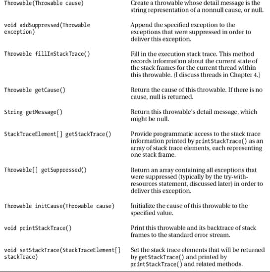

# 三、探索高级语言功能

第 1 章和第 2 章[向你介绍了 Java 的基本语言特性以及它对类和对象的支持。](02.html#ch2)[第 3 章](#ch3)在此基础上向您介绍 Java 的高级语言特性，特别是那些与嵌套类型、包、静态导入、异常、断言、注释、泛型和枚举相关的特性。

### 嵌套类型

在任何类之外声明的类被称为*顶级类*。Java 还支持*嵌套的*类，这些类被声明为其他类或作用域的成员。嵌套类有助于实现顶级类架构。

有四种嵌套类:静态成员类、非静态成员类、匿名类和本地类。后三个类别被称为*内部类*。

本节向您介绍静态成员类和内部类。对于每一种嵌套类，我都为您提供了一个简短的介绍、一个抽象的示例和一个更实用的示例。然后，这一节简要分析了在类中嵌套接口的主题。

#### 静态成员类

一个*静态成员类*是封闭类的`static`成员。虽然是封闭的，但它没有该类的封闭实例，并且不能访问封闭类的实例字段和调用其实例方法。然而，它可以访问封闭类的`static`字段并调用其`static`方法，甚至是那些被声明为`private`的成员。清单 3-1 给出了一个静态成员类声明。

***清单 3-1。**声明一个静态成员类*

```java
class EnclosingClass
{
   private static int i;
   private static void m1()
   {
      System.out.println(i);
   }
   static void m2()
   {
      EnclosedClass.accessEnclosingClass();
   }
   static class EnclosedClass
   {
      static void accessEnclosingClass()
      {
         i = 1;
         m1();
      }
      void accessEnclosingClass2()
      {
         m2();
      }
   }
}
```

[清单 3-1](#list_3_1) 声明了一个名为`EnclosingClass`的顶级类，带有类字段`i`，类方法`m1()`和`m2()`，以及静态成员类`EnclosedClass`。另外，`EnclosedClass`声明了类方法`accessEnclosingClass()`和实例方法`accessEnclosingClass2()`。

因为`accessEnclosingClass()`被声明为`static`，`m2()`必须在这个方法的名字前加上`EnclosedClass`和成员访问操作符来调用这个方法。

[清单 3-2](#list_3_2) 给出了一个应用的源代码，演示了如何调用`EnclosedClass`的`accessEnclosingClass()`类方法，实例化`EnclosedClass`并调用其`accessEnclosingClass2()`实例方法。

***清单 3-2。**调用静态成员类的类和实例方法*

```java
class SMCDemo
{
   public static void main(String[] args)
   {
      EnclosingClass.EnclosedClass.accessEnclosingClass(); // Output: 1
      EnclosingClass.EnclosedClass ec = new EnclosingClass.EnclosedClass();
      ec.accessEnclosingClass2(); // Output: 1
   }
}
```

[清单 3-2](#list_3_2) 的`main()`方法揭示了你必须在一个封闭类的名字前加上其封闭类的名字来调用一个类方法；比如`EnclosingClass.EnclosedClass.accessEnclosingClass();`。

这个清单还揭示了在实例化封闭类时，必须在封闭类的名称前加上其封闭类的名称；比如`EnclosingClass.EnclosedClass ec = new EnclosingClass.EnclosedClass();`。然后，您可以以正常方式调用实例方法；比如`ec.accessEnclosingClass2();`。

静态成员类有它们的用途。例如，[清单 3-3](#list_3_3) 的`Double`和`Float`静态成员类提供了它们的封闭`Rectangle`类的不同实现。`Float`版本因其 32 位`float`字段而占用更少的内存，而`Double`版本因其 64 位`double`字段而提供更高的精度。

***清单 3-3。**使用静态成员类声明其封闭类的多个实现*

```java
abstract class Rectangle
{
   abstract double getX();
   abstract double getY();
   abstract double getWidth();
   abstract double getHeight();
   static class Double extends Rectangle
   {
      private double x, y, width, height;
      Double(double x, double y, double width, double height)
      {
         this.x = x;
         this.y = y;
         this.width = width;
         this.height = height;
      }
      double getX() { return x; }
      double getY() { return y; }
      double getWidth() { return width; }
      double getHeight() { return height; }
   }
   static class Float extends Rectangle
   {
      private float x, y, width, height;
      Float(float x, float y, float width, float height)
      {
         this.x = x;
         this.y = y;
         this.width = width;
         this.height = height;
      }
      double getX() { return x; }
      double getY() { return y; }
      double getWidth() { return width; }
      double getHeight() { return height; }
   }
   // Prevent subclassing. Use the type-specific Double and Float
   // implementation subclass classes to instantiate.
   private Rectangle() {}
   boolean contains(double x, double y)
   {
      return (x >= getX() && x < getX()+getWidth()) &&
             (y >= getY() && y < getY()+getHeight());
   }
}
```

清单 3-3 的`Rectangle`类展示了嵌套的子类。每个`Double`和`Float`静态成员类继承抽象`Rectangle`类，提供私有浮点或双精度浮点字段，并覆盖`Rectangle`的抽象方法以返回这些字段的值作为`double`

`Rectangle`是抽象的，因为实例化这个类没有意义。因为用新的实现直接扩展`Rectangle`也没有意义(嵌套的`Double`和`Float`子类应该足够了)，所以它的默认构造函数被声明为`private`。相反，你必须实例化`Rectangle.Float`(为了节省内存)或`Rectangle.Double`(当需要准确性时)，如[清单 3-4](#list_3_4) 所示。

***清单 3-4。**实例化嵌套子类*

```java
class SMCDemo
{
   public static void main(String[] args)
   {
      Rectangle r = new Rectangle.Double(10.0, 10.0, 20.0, 30.0);
      System.out.println("x = "+r.getX());
      System.out.println("y = "+r.getY());
      System.out.println("width = "+r.getWidth());
      System.out.println("height = "+r.getHeight());
      System.out.println("contains(15.0, 15.0) = "+r.contains(15.0, 15.0));
      System.out.println("contains(0.0, 0.0) = "+r.contains(0.0, 0.0));
      System.out.println();
      r = new Rectangle.Float(10.0f, 10.0f, 20.0f, 30.0f);
      System.out.println("x = "+r.getX());
      System.out.println("y = "+r.getY());
      System.out.println("width = "+r.getWidth());
      System.out.println("height = "+r.getHeight());
      System.out.println("contains(15.0, 15.0) = "+r.contains(15.0, 15.0));
      System.out.println("contains(0.0, 0.0) = "+r.contains(0.0, 0.0));
   }
}
```

[清单 3-4](#list_3_4) 首先通过`new Rectangle.Double(10.0, 10.0, 20.0, 30.0)`实例化`Rectangle`的`Double`子类，然后调用其各种方法。继续，[清单 3-4](#list_3_4) 在调用这个实例上的`Rectangle`方法之前，通过`new Rectangle.Float(10.0f, 10.0f, 20.0f, 30.0f)`实例化`Rectangle`的`Float`子类。

编译这两个清单(`javac SMCDemo.java`或`javac *.java`)并运行应用(`java SMCDemo`)。然后，您将看到以下输出:

```java
x = 10.0
y = 10.0
width = 20.0
height = 30.0
contains(15.0, 15.0) = true
contains(0.0, 0.0) = false

x = 10.0
y = 10.0
width = 20.0
height = 30.0
contains(15.0, 15.0) = true
contains(0.0, 0.0) = false
```

Java 的类库包含了很多静态成员类。例如，`java.lang.Character`类包含一个名为`Subset`的静态成员类，其实例代表 Unicode 字符集的子集。其他的例子有`java.util.AbstractMap.SimpleEntry`、`java.io.ObjectInputStream.GetField`和`java.security.KeyStore.PrivateKeyEntry`。

 **注意**当你编译一个包含静态成员类的封闭类时，编译器为静态成员类创建一个类文件，其名称由封闭类的名称、美元符号字符和静态成员类的名称组成。例如，编译[清单 3-1](#list_3_1) ，你会发现`EnclosingClass$EnclosedClass.class`和`EnclosingClass.class`。这种格式也适用于非静态成员类。

#### 非静态成员类

*非静态成员类*是封闭类的非`static`成员。非静态成员类的每个实例都隐式地与封闭类的一个实例相关联。非静态成员类的实例方法可以调用封闭类中的实例方法，并访问封闭类实例的非静态字段。清单 3-5 展示了一个非静态成员类声明。

***清单 3-5。**声明一个非静态成员类*

```java
class EnclosingClass
{
   private int i;
   private void m()
   {
      System.out.println(i);
   }
   class EnclosedClass
   {
      void accessEnclosingClass()
      {
         i = 1;
         m();
      }
   }
}
```

清单 3-5 声明了一个名为`EnclosingClass`的顶级类，带有实例字段`i`、实例方法`m()`和非静态成员类`EnclosedClass`。此外，`EnclosedClass`声明了实例方法`accessEnclosingClass()`。

因为`accessEnclosingClass()`是非静态的，所以在调用这个方法之前必须实例化`EnclosedClass`。这个实例化必须通过`EnclosingClass`的一个实例发生。清单 3-6 完成了这些任务。

***清单 3-6。**调用非静态成员类的实例方法*

```java
class NSMCDemo
{
   public static void main(String[] args)
   {
      EnclosingClass ec = new EnclosingClass();
      ec.new EnclosedClass().accessEnclosingClass(); // Output: 1
   }
}
```

[清单 3-6](#list_3_6) 的`main()`方法首先实例化`EnclosingClass`并将它的引用保存在局部变量`ec`中。然后，`main()`使用这个引用作为`new`操作符的前缀，实例化`EnclosedClass`，然后使用其引用调用`accessEnclosingClass()`，后者输出`1`。

 **注意**很少在`new`前面加上对封闭类的引用。相反，您通常会从构造函数或其封闭类的实例方法中调用封闭类的构造函数。

假设您需要维护一个待办事项列表，其中每个项目都由一个名称和一个描述组成。经过一番思考后，您创建了清单 3-7 中的[和](#list_3_7)的`ToDo`类来实现这些项目。

***清单 3-7。**将待办事项实现为名称-描述对*

```java
class ToDo
{
   private String name;
   private String desc;
   ToDo(String name, String desc)
   {
      this.name = name;
      this.desc = desc;
   }
   String getName()
   {
      return name;
   }
   String getDesc()
   {
      return desc;
   }
   @Override
   public String toString()
   {
      return "Name = "+getName()+", Desc = "+getDesc();
   }
}
```

接下来创建一个`ToDoList`类来存储`ToDo`实例。`ToDoList`使用它的`ToDoArray`非静态成员类在一个可增长的数组中存储`ToDo`实例——你不知道会存储多少实例，而 Java 数组有固定的长度。参见[清单 3-8](#list_3_8) 。

***清单 3-8。**在一个`ToDoArray`实例*中最多存储两个`ToDo`实例

```java
class ToDoList
{
   private ToDoArray toDoArray;
   private int index = 0;
   ToDoList()
   {
      toDoArray = new ToDoArray(2);
   }
   boolean hasMoreElements()
   {
      return index < toDoArray.size();
   }
   ToDo nextElement()
   {
      return toDoArray.get(index++);
   }
   void add(ToDo item)
   {
      toDoArray.add(item);
   }
   private class ToDoArray
   {
      private ToDo[] toDoArray;
      private int index = 0;
      ToDoArray(int initSize)
      {
         toDoArray = new ToDo[initSize];
      }
      void add(ToDo item)
      {
         if (index >= toDoArray.length)
         {
            ToDo[] temp = new ToDo[toDoArray.length*2];
            for (int i = 0; i < toDoArray.length; i++)
               temp[i] = toDoArray[i];
            toDoArray = temp;
         }
         toDoArray[index++] = item;
      }
      ToDo get(int i)
      {
         return toDoArray[i];
      }
      int size()
      {
         return index;
      }
   }
}
```

除了提供一个`add()`方法来将`ToDo`实例存储在`ToDoArray`实例中，`ToDoList`还提供了`hasMoreElements()`和`nextElement()`方法来迭代并返回存储的实例。清单 3-9 展示了这些方法。

***清单 3-9。**创建并迭代`ToDo`个实例中的`ToDoList`个*

```java
class NSMCDemo
{
   public static void main(String[] args)
   {
      ToDoList toDoList = new ToDoList();
      toDoList.add(new ToDo("#1", "Do laundry."));
      toDoList.add(new ToDo("#2", "Buy groceries."));
      toDoList.add(new ToDo("#3", "Vacuum apartment."));
      toDoList.add(new ToDo("#4", "Write report."));
      toDoList.add(new ToDo("#5", "Wash car."));
      while (toDoList.hasMoreElements())
         System.out.println(toDoList.nextElement());
   }
}
```

编译所有三个清单(`javac NSMCDemo.java`或`javac *.java`)并运行应用(`java NSMCDemo`)。然后，您将看到以下输出:

```java
Name = #1, Desc = Do laundry.
Name = #2, Desc = Buy groceries.
Name = #3, Desc = Vacuum apartment.
Name = #4, Desc = Write report.
Name = #5, Desc = Wash car.
```

Java 的类库提供了许多非静态成员类的例子。例如，`java.util`包的`HashMap`类声明私有的`HashIterator`、`ValueIterator`、`KeyIterator`和`EntryIterator`类，用于迭代 hashmap 的值、键和条目。(我会在[第五章](05.html#ch5)讨论`HashMap`。)

 **注意**封闭类中的代码可以通过用封闭类的名称和成员访问操作符限定保留字`this`来获得对其封闭类实例的引用。例如，如果`accessEnclosingClass()`中的代码需要获得对其`EnclosingClass`实例的引用，它会指定`EnclosingClass.this`。

#### 匿名班级

匿名类是没有名字的类。此外，它不是其封闭类的成员。相反，一个匿名类被同时声明(作为一个类的匿名扩展或者作为一个接口的匿名实现)并且在任何合法指定表达式的地方被实例化。清单 3-10 展示了一个匿名的类声明和实例化。

***清单 3-10。**声明并实例化一个扩展了一个类的匿名类*

```java
abstract class Speaker
{
   abstract void speak();
}
class ACDemo
{
   public static void main(final String[] args)
   {
      new Speaker()
      {
         String msg = (args.length == 1) ? args[0] : "nothing to say";
         @Override
         void speak()
         {
            System.out.println(msg);
         }
      }
      .speak();
   }
}
```

清单 3-10 引入了一个名为`Speaker`的抽象类和一个名为`ACDemo`的具体类。后一个类的`main()`方法声明了一个扩展`Speaker`并覆盖其`speak()`方法的匿名类。当这个方法被调用时，它输出`main()`的第一个命令行参数，如果没有参数，则输出一个默认消息；比如`java ACDemo Hello`输出`Hello`。

匿名类没有构造函数(因为匿名类没有名字)。但是，它的 classfile 包含一个执行实例初始化的`<init>()`方法。这个方法调用超类的 noargument 构造函数(在任何其他初始化之前)，这就是在`new`之后指定`Speaker()`的原因。

匿名类实例应该能够访问周围范围的局部变量和参数。但是，实例可能比设计它的方法活得长(由于将实例的引用存储在字段中)，并且在方法返回后尝试访问不再存在的局部变量和参数。

因为 Java 不允许这种非法访问，这很可能会导致 Java 虚拟机(JVM)崩溃，所以它只允许匿名类实例访问声明为`final`的局部变量和参数。在匿名类实例中遇到最终的局部变量/参数名时，编译器会做两件事之一:

*   如果变量的类型是原语(例如，`int`或`double`)，编译器会用变量的只读值替换它的名称。
*   如果变量的类型是引用(例如，`java.lang.String`)，编译器会在类文件中引入一个*合成变量*(一个人造变量)和在合成变量中存储局部变量/参数引用的代码。

清单 3-11 展示了另一种匿名类声明和实例化。

***清单 3-11。**声明并实例化一个实现接口的匿名类*

```java
interface Speakable
{
   void speak();
}
class ACDemo
{
   public static void main(final String[] args)
   {
      new Speakable()
      {
         String msg = (args.length == 1) ? args[0] : "nothing to say";
         @Override
         public void speak()
         {
            System.out.println(msg);
         }
      }
      .speak();
   }
}
```

[清单 3-11](#list_3_11) 与[清单 3-10](#list_3_10) 非常相似。然而，这个清单中的匿名类实现了一个名为`Speakable`的接口，而不是子类化一个`Speaker`类。除了`<init>()`方法调用`java.lang.Object()`(接口没有构造函数)之外，[清单 3-11](#list_3_11) 的行为类似于[清单 3-10](#list_3_10) 。

尽管匿名类没有构造函数，但是您可以提供一个实例初始化器来处理复杂的初始化。例如，`new Office() {{addEmployee(new Employee("John Doe"));}};`实例化`Office`的匿名子类，并通过调用`Office`的`addEmployee()`方法向该实例添加一个`Employee`对象。

为了方便起见，您经常会发现自己在创建和实例化匿名类。例如，假设您需要返回一个包含所有带有“`.java`”后缀的文件名的列表。下面的例子向您展示了匿名类如何简化使用`java.io`包的`File`和`FilenameFilter`类来实现这个目标:

```java
String[] list = new File(directory).list(new FilenameFilter()
                {
                   @Override
                   public boolean accept(File f, String s)
                   {
                      return s.endsWith(".java");
                   }
                });
```

#### 地方班

一个*局部类*是一个在声明局部变量的任何地方声明的类。此外，它的作用域与局部变量相同。与匿名类不同，局部类有一个名字，可以重用。像匿名类一样，局部类只有在非静态上下文中使用时才有封闭实例。

局部类实例可以访问周围作用域的局部变量和参数。但是，被访问的局部变量和参数必须声明为`final`。例如，[清单 3-12](#list_3_12) 的局部类声明访问一个最终参数和一个最终局部变量。

***清单 3-12。**声明一个本地类*

```java
class EnclosingClass
{
   void m(final int x)
   {
      final int y = x*2;
      class LocalClass
      {
         int a = x;
         int b = y;
      }
      LocalClass lc = new LocalClass();
      System.out.println(lc.a);
      System.out.println(lc.b);
   }
}
```

[清单 3-12](#list_3_12) 用它的实例方法`m()`声明了一个名为`LocalClass`的局部类`EnclosingClass`。这个局部类声明了一对实例字段(`a`和`b`)，当`LocalClass`被实例化时，它们被初始化为`final`参数`x`和`final`局部变量`y`的值:例如`new EnclosingClass().m(10);`。

清单 3-13 展示了这个局部类。

***清单 3-13。**演示一个本地类*

```java
class LCDemo
{
   public static void main(String[] args)
   {
      EnclosingClass ec = new EnclosingClass();
      ec.m(10);
   }
}
```

实例化`EnclosingClass`，[清单 3-13](#list_3_13) 的`main()`方法调用`m(10)`。被调用的`m()`方法将该参数乘以 2，实例化`LocalClass`，其`<init>()`方法将该参数和双精度值分配给它的一对实例字段(代替使用构造函数来执行该任务)，并输出`LocalClass`实例字段。以下输出结果:

```java
10
20
```

局部类有助于提高代码的清晰度，因为它们可以被移动到离需要它们的地方更近的地方。例如，[清单 3-14](#list_3_14) 声明了一个`Iterator`接口和一个重构的`ToDoList`类，其`iterator()`方法返回其本地`Iter`类的一个实例作为`Iterator`实例(因为`Iter`实现了`Iterator`)。

***清单 3-14。**`Iterator`接口和重构后的`ToDoList`类*

```java
interface Iterator
{
   boolean hasMoreElements();
   Object nextElement();
}
class ToDoList
{
   private ToDo[] toDoList;
   private int index = 0;
   ToDoList(int size)
   {
      toDoList = new ToDo[size];
   }
   Iterator iterator()
   {
      class Iter implements Iterator
      {
         int index = 0;
         @Override
         public boolean hasMoreElements()
         {
            return index < toDoList.length;
         }
         @Override
         public Object nextElement()
         {
            return toDoList[index++];
         }
      }
      return new Iter();
   }
   void add(ToDo item)
   {
      toDoList[index++] = item;
   }
}
```

[清单 3-15](#list_3_15) 展示了`Iterator`，重构后的`ToDoList`类，以及[清单 3-7](#list_3_7) 的`ToDo`类。

***清单 3-15。**使用可重用的迭代器*创建并迭代`ToDo`个实例中的`ToDoList`

```java
class LCDemo
{
   public static void main(String[] args)
   {
      ToDoList toDoList = new ToDoList(5);
      toDoList.add(new ToDo("#1", "Do laundry."));
      toDoList.add(new ToDo("#2", "Buy groceries."));
      toDoList.add(new ToDo("#3", "Vacuum apartment."));
      toDoList.add(new ToDo("#4", "Write report."));
      toDoList.add(new ToDo("#5", "Wash car."));
      Iterator iter = toDoList.iterator();
      while (iter.hasMoreElements())
         System.out.println(iter.nextElement());
   }
}
```

从`iterator()`返回的`Iterator`实例返回的`ToDo`条目的顺序与它们被添加到列表中的顺序相同。虽然你只能使用返回的`Iterator`对象一次，但是当你需要一个新的`Iterator`对象时，你可以调用`iterator()`。这个功能比清单 3-9 中的单次迭代器有了很大的改进。

#### 类内的接口

接口可以嵌套在类中。一旦被声明，接口就被认为是静态的，即使它没有被声明`static`。例如，[清单 3-16](#list_3_16) 声明了一个名为`X`的封闭类以及两个名为`A`和`B`的嵌套静态接口。

***清单 3-16。**在一个类中声明一对接口*

```java
class X
{
   interface A
   {
   }
   static interface B
   {
   }
}
```

你可以用同样的方式访问[清单 3-16](#list_3_16) 的界面。例如，您可以指定`class C implements X.A {}`或`class D implements X.B {}`。

与嵌套类一样，嵌套接口通过嵌套类来实现，从而有助于实现顶级类架构。总的来说，这些类型是嵌套的，因为它们不能(如在[清单 3-14](#list_3_14) 的`Iter`局部类中)或者不需要出现在与顶级类相同的级别上并污染它的包命名空间。

 **注** [第 2 章](02.html#ch2)的接口介绍向你展示了如何在接口体中声明常量和方法头。也可以在接口体中声明接口和类。因为很少有好的理由这样做(在第 5 章的[中讨论的`java.util.Map.Entry`，是一个例外)，所以最好避免在接口中嵌套接口和/或类。](05.html#ch5)

### 套餐

层次结构根据项目之间存在的层次关系来组织项目。例如，一个文件系统可能包含一个带有多个年份子目录的`taxes`目录，其中每个子目录包含与该年相关的税务信息。此外，封闭类可能包含多个嵌套类，这些嵌套类只在封闭类的上下文中有意义。

分层结构也有助于避免名称冲突。例如，在非分层文件系统(由单个目录组成)中，两个文件不能同名。相比之下，分层文件系统允许同名文件存在于不同的目录中。类似地，两个封闭类可以包含同名的嵌套类。不存在名称冲突，因为项目被划分到不同的*名称空间*。

Java 还支持将顶级用户定义的类型划分为多个名称空间，以更好地组织这些类型，并防止名称冲突。Java 使用包来完成这些任务。

本节向您介绍包。在定义了这个术语并解释了为什么包名必须是唯一的之后，本节介绍了 package 和 import 语句。接下来解释了 JVM 如何搜索包和类型，然后给出了一个展示如何使用包的例子。本节最后向您展示如何将一个类文件包封装到 JAR 文件中。

 **提示**除了最普通的顶级类型和(通常)那些作为应用入口点的类，你应该考虑将你的类型(尤其是如果它们是可重用的)存储在包中。

#### 什么是套餐？

一个*包*是一个惟一的名称空间，可以包含顶级类、其他顶级类型和子包的组合。只有声明为`public`的类型才能从包外部访问。此外，描述类接口的常量、构造函数、方法和嵌套类型必须声明为`public`才能从包外访问。

 **注意**在本书中，我通常不声明顶级类型及其可访问成员`public`，除非我正在创建一个包。

每个包都有一个名称，它必须是一个不可保留的标识符。成员访问操作符将包名与子包名分开，并将包或子包名与类型名分开。例如，`graphics.shapes.Circle`中的两个成员访问操作符将包名`graphics`和`shapes`子包名分开，并将子包名`shapes`和`Circle`类型名分开。

 **注**标准类库将其众多类和其他顶级类型组织成多个包。这些包中有许多是标准`java`包的子包。例子有`java.io`(与输入/输出操作相关的类型)`java.lang`(面向语言的类型)`java.lang.reflect`(面向反射的语言类型)`java.net`(面向网络的类型)`java.util`(工具类型)。

##### 包名必须是唯一的

假设您有两个不同的`graphics.shapes`包，并且假设每个`shapes`子包包含一个具有不同接口的`Circle`类。当编译器在源代码中遇到`System.out.println(new Circle(10.0, 20.0, 30.0).area());`时，它需要验证`area()`方法是否存在。

编译器将搜索所有可访问的包，直到找到包含一个`Circle`类的`graphics.shapes`包。如果找到的包包含适当的带有`area()`方法的`Circle`类，一切正常；否则，如果`Circle`类没有`area()`方法，编译器会报告一个错误。

这个场景说明了选择唯一的包名的重要性。具体来说，顶层包名必须是唯一的。选择这个名字的惯例是取你的互联网域名，然后反过来。例如，我会选择`ca.tutortutor`作为我的顶级包名，因为`tutortutor.ca`是我的域名。然后我会指定`ca.tutortutor.graphics.shapes.Circle`来访问`Circle`。

 **注意**反向互联网域名并不总是有效的包名。它的一个或多个组件名可能以数字(`6.com`)开头，包含连字符(`-`)或其他非法字符(`aq-x.com`)，或者是 Java 的保留字之一(`int.com`)。惯例要求在数字前面加上下划线(`com._6`)，用下划线(`com.aq_x`)替换非法字符，用下划线(`com.int_`)作为保留字的后缀。

#### 套餐声明

package 语句标识源文件的类型所在的包。该语句由保留字`package`组成，后面是成员访问操作符分隔的包和子包名称列表，后面是分号。

例如，`package graphics;`指定源文件的类型位于名为`graphics`的包中，`package graphics.shapes;`指定源文件的类型位于`graphics`包的`shapes`子包中。

按照惯例，包名用小写表示。如果名称由多个单词组成，除了第一个单词以外，每个单词都要大写。

源文件中只能出现一个 package 语句。当它存在时，除了注释之外，在该语句之前不能有任何内容。

 **注意**在源文件中指定多个 package 语句或在 package 语句上方放置除注释之外的任何内容都会导致编译器报告错误。

Java 实现将包和子包的名称映射到同名的目录。例如，一个实现会将`graphics`映射到一个名为`graphics`的目录，并将`graphics.shapes`映射到`graphics`的一个`shapes`子目录。Java 编译器将实现包类型的类文件存储在相应的目录中。

 **注意**如果一个源文件不包含包语句，那么这个源文件的类型就被认为属于*未命名包*。这个包对应于当前目录。

#### 进口声明

想象一下，在源代码中，必须为该类型的每次出现重复指定`ca.tutortutor.graphics.shapes.Circle`或其他冗长的包限定类型名。Java 提供了一种替代方法，让您不必指定包的细节。这个替代语句就是 import 语句。

import 语句通过告诉编译器在编译过程中何处查找非限定类型名来从包中导入类型。该语句由保留字`import`组成，后面是成员访问操作符分隔的包和子包名称列表，后面是类型名或`*`(星号)，后面是分号。

`*`符号是一个通配符，代表所有非限定的类型名。它告诉编译器在 import 语句的指定包中查找这样的名称，除非在以前搜索的包中找到了类型名。(使用通配符不会降低性能，也不会导致代码膨胀，但是会导致名称冲突，您将会看到这一点。)

例如，`import ca.tutortutor.graphics.shapes.Circle;`告诉编译器在`ca.tutortutor.graphics.shapes`包中存在一个不合格的`Circle`类。类似地，`import ca.tutortutor.graphics.shapes.*;`告诉编译器如果遇到`Rectangle`类、`Triangle`类，甚至`Employee`类(如果还没有找到`Employee`，就在这个包中查找。

 **提示**您应该避免使用`*`通配符，这样其他开发人员可以很容易地看到源代码中使用了哪些类型。

因为 Java 是区分大小写的，所以在 import 语句中指定的包和子包名称的大小写必须与 package 语句中使用的大小写相同。

当导入语句出现在源代码中时，只有包语句和注释可以在它们之前。

 **注意**在导入语句上放置除了 package 语句、import 语句、static import 语句(稍后讨论)和注释之外的任何内容都会导致编译器报告错误。

当使用通配符版本的 import 语句时，您可能会遇到名称冲突，因为任何非限定的类型名都与通配符匹配。例如，您有`graphics.shapes`和`geometry`包，每个包包含一个`Circle`类，源代码以`import geometry.*;`和`import graphics.shape.*;`语句开始，并且它还包含一个未限定的`Circle`事件。因为编译器不知道`Circle`是指`geometry`的`Circle`类还是`graphics.shape`的`Circle`类，所以它会报告一个错误。您可以通过用正确的包名限定`Circle`来解决这个问题。

 **注意**编译器自动从`java.lang`包中导入`String`类和其他类型，这就是为什么不需要用`java.lang`限定`String`的原因。

#### 搜索包和类型

第一次开始使用包的 Java 新手经常会因为“没有找到类定义”和其他错误而感到沮丧。通过理解 JVM 如何搜索包和类型，可以部分避免这种挫折。

本节解释了搜索过程的工作原理。要理解这个过程，您需要认识到编译器是一个特殊的 Java 应用，它在 JVM 的控制下运行。此外，还有两种不同形式的搜索。

##### 编译时搜索

当编译器在源代码中遇到类型表达式(如方法调用)时，它必须找到该类型的声明，以验证表达式是合法的(例如，类型的类中存在一个方法，其参数类型与方法调用中传递的参数类型相匹配)。

编译器首先搜索 Java 平台包(包含类库类型)。然后它搜索扩展包(寻找扩展类型)。如果在启动 JVM 时指定了`-sourcepath`命令行选项(通过`javac`，编译器将搜索指定路径的源文件。

 **注意** Java 平台的包存储在`rt.jar`和其他几个重要的 JAR 文件中。扩展包存储在一个名为`ext`的特殊扩展目录中。

否则，编译器会在用户类路径中(按从左到右的顺序)搜索包含该类型的第一个用户类文件或源文件。如果没有用户类路径，则搜索当前目录。如果没有包匹配或者仍然找不到类型，编译器会报告一个错误。否则，编译器会将包信息记录在类文件中。

 **注意**用户类路径是通过用于启动 JVM 的`-classpath`选项指定的，或者如果不存在的话，通过`CLASSPATH`环境变量指定。

##### 运行时搜索

当编译器或任何其他 Java 应用运行时，JVM 将遇到类型，并且必须通过称为*类加载器*的特殊代码加载它们相关的类文件(在附录 C 中讨论)。JVM 将使用先前存储的与遇到的类型相关联的包信息来搜索该类型的类文件。

JVM 搜索 Java 平台包，然后是扩展包，接着是用户类路径(从左到右的顺序)，以找到包含该类型的第一个类文件。如果没有用户类路径，则搜索当前目录。如果没有匹配的包或找不到类型，则报告“找不到类定义”错误。否则，类文件被加载到内存中。

 **注意**无论是使用`-classpath`选项还是`CLASSPATH`环境变量来指定用户类路径，都有一个必须遵循的特定格式。在 Windows 下，这种格式表示为`path1;path2;...`，其中`path1`、`path2`等是包目录的位置。在 Unix 和 Linux 下，这种格式变为`path1:path2:...`。

#### 玩包裹

假设您的应用需要将消息记录到控制台、文件或另一个目的地。它可以在日志库的帮助下完成这项任务。我对这个库的实现由一个名为`Logger`的接口、一个名为`LoggerFactory`的抽象类和一对名为`Console`和`File`的包私有类组成。

 **注意**我介绍的日志库是*抽象工厂设计模式*的一个例子，它在 Erich Gamma，Richard Helm，Ralph Johnson 和 John Vlissides (Addison-Wesley，1995；ISBN: 0201633612)。

清单 3-17 展示了`Logger`接口，它描述了记录消息的对象。

***清单 3-17。**描述通过`Logger`接口*记录消息的对象

```java
package logging;

public interface Logger
{
   boolean connect();
   boolean disconnect();
   boolean log(String msg);
}
```

每个`connect()`、`disconnect()`和`log()`方法在成功时返回 true，在失败时返回 false。(在本章的后面，你会发现一种处理失败的更好的技巧。)这些方法没有被显式声明`public`，因为接口的方法是隐式的`public`。

清单 3-18 展示了`LoggerFactory`抽象类。

***清单 3-18。**获得一个日志记录器，用于将消息记录到特定目的地*

```java
package logging;

public abstract class LoggerFactory
{
   public final static int CONSOLE = 0;
   public final static int FILE = 1;
   public static Logger newLogger(int dstType, String... dstName)
   {
      switch (dstType)
      {
         case CONSOLE: return new Console(dstName.length == 0 ? null
                                                              : dstName[0]);
         case FILE   : return new File(dstName.length == 0 ? null
                                                           : dstName[0]);
         default     : return null;
      }
   }
}
```

`newLogger()`返回一个`Logger`实例，用于将消息记录到适当的目的地。它使用可变数量的参数特性(参见[第 2 章](02.html#ch2))来选择性地接受额外的`String`参数，用于那些需要该参数的目的地类型。例如，`FILE`需要一个文件名。

[清单 3-19](#list_3_19) 展示了包私有的`Console`类——这个类在`logging`包中的类之外是不可访问的，因为保留字`class`前面没有保留字`public`。

***清单 3-19。**将消息记录到控制台*

```java
package logging;

class Console implements Logger
{
   private String dstName;
   Console(String dstName)
   {
      this.dstName = dstName;
   }
   @Override
   public boolean connect()
   {
      return true;
   }
   @Override
   public boolean disconnect()
   {
      return true;
   }
   @Override
   public boolean log(String msg)
   {
      System.out.println(msg);
      return true;
   }
}
```

`Console`的 package-private 构造函数保存它的参数，很可能是`null`，因为不需要`String`参数。也许`Console`的未来版本会使用这个参数来标识多个控制台窗口中的一个。

清单 3-20 展示了包私有的`File`类。

***清单 3-20。**将消息记录到文件中(最终)*

```java
package logging;

class File implements Logger
{
   private String dstName;
   File(String dstName)
   {
      this.dstName = dstName;
   }
   @Override
   public boolean connect()
   {
      if (dstName == null)
         return false;
      System.out.println("opening file "+dstName);
      return true;
   }
   @Override
   public boolean disconnect()
   {
      if (dstName == null)
         return false;
      System.out.println("closing file "+dstName);
      return true;
   }
   @Override
   public boolean log(String msg)
   {
      if (dstName == null)
         return false;
      System.out.println("writing "+msg+" to file "+dstName);
      return true;
   }
}
```

与`Console`不同，`File`需要一个 onnull 参数。每个方法首先验证这个参数不是`null`。如果参数是`null`，方法返回 false 表示失败。(在第八章的[中，我重构了`File`，加入了适当的文件编写代码。)](08.html#ch8)

日志库允许我们在应用中引入可移植的日志代码。除了对`newLogger()`的调用之外，该代码将保持不变，而不管日志记录的目的地是哪里。清单 3-21 展示了一个测试这个库的应用。

***清单 3-21。**测试测井库*

```java
import logging.Logger;
import logging.LoggerFactory;

class TestLogger
{
   public static void main(String[] args)
   {
      Logger logger = LoggerFactory.newLogger(LoggerFactory.CONSOLE);
      if (logger.connect())
      {
         logger.log("test message #1");
         logger.disconnect();
      }
      else
         System.out.println("cannot connect to console-based logger");
      logger = LoggerFactory.newLogger(LoggerFactory.FILE, "x.txt");
      if (logger.connect())
      {
         logger.log("test message #2");
         logger.disconnect();
      }
      else
         System.out.println("cannot connect to file-based logger");
      logger = LoggerFactory.newLogger(LoggerFactory.FILE);
      if (logger.connect())
      {
         logger.log("test message #3");
         logger.disconnect();
      }
      else
         System.out.println("cannot connect to file-based logger");
   }
}
```

按照以下步骤(假设已经安装了 JDK)创建`logging`包和`TestLogger`应用，并运行这个应用:

1.  创建一个新目录，并使该目录成为当前目录。
2.  在当前目录下创建一个`logging`目录。
3.  将[清单 3-17](#list_3_17) 复制到`logging`目录下一个名为`Logger.java`的文件中。
4.  将[清单 3-18](#list_3_18) 复制到`logging`目录下一个名为`LoggerFactory.java`的文件中。
5.  将[清单 3-19](#list_3_19) 复制到`logging`目录下一个名为`Console.java`的文件中。
6.  将[清单 3-20](#list_3_20) 复制到`logging`目录下一个名为`File.java`的文件中。
7.  将清单 3-21 中的[复制到当前目录下一个名为`TestLogger.java`的文件中。](#list_3_21)
8.  执行`javac TestLogger.java`，它也编译`logger`的源文件。
9.  执行`java TestLogger`。

完成最后一步后，您应该观察到来自`TestLogger`应用的以下输出:

```java
test message #1
opening file x.txt
writing test message #2 to file x.txt
closing file x.txt
cannot connect to file-based logger
```

当`logging`被移动到另一个位置时会发生什么？例如，将`logging`移动到根目录并运行`TestLogger`。现在，您将看到一条错误消息，提示 JVM 没有找到`logging`包及其`LoggerFactory`类文件。

您可以通过在运行`java`工具时指定`-classpath`或者将`logging`包的位置添加到`CLASSPATH`环境变量中来解决这个问题。您可能会发现使用前一个选项更方便，如以下特定于 Windows 的命令行所示:

```java
java -classpath \;. TestLogger
```

反斜杠代表 Windows 中的根目录。(我可以指定一个正斜杠作为替代。)此外，句点代表当前目录。如果它丢失了，JVM 会报错没有找到`TestLogger`类文件。

 **提示**如果您发现一条错误消息，其中 JVM 报告它找不到应用类文件，请尝试在类路径后面附加一个句点字符。这样做可能会解决问题。

#### 包和 JAR 文件

[第 1 章](01.html#ch1)简单介绍了一下 JDK 的`jar`工具，它用于归档 JAR 文件中的类文件，也用于提取 JAR 文件的类文件。您可以将包存储在 JAR 文件中，这可能不足为奇，因为这极大地简化了基于包的类库的分发。

为了向您展示在 JAR 文件中存储一个包是多么容易，我们将创建一个包含`logging`包的四个类文件(`Logger.class`、`LoggerFactory.class`、`Console.class`和`File.class`)的`logger.jar`文件。完成以下步骤来完成此任务:

1.  确保当前目录包含先前创建的`logging`目录及其四个类文件。
2.  执行`jar cf logger.jar logging\*.class`。您也可以执行`jar cf logger.jar logging/*.class`。(`c`选项代表“创建新的归档文件”，而`f`选项代表“指定归档文件的文件名”)

现在，您应该在当前目录中找到一个`logger.jar`文件。为了证明这个文件包含四个类文件，执行`jar tf logger.jar`。(`t`选项代表“目录列表”)

您可以通过将`logger.jar`添加到类路径中来运行`TestLogger.class`。比如你可以通过`java -classpath logger.jar;. TestLogger`在 Windows 下运行`TestLogger`。

### 静态导入

接口应该只用于声明类型。然而，一些开发人员违反了这一原则，使用接口只导出常量。这样的接口被称为*常量接口*，清单 3-22 中的[给出了一个例子。](#list_3_22)

***清单 3-22。**声明一个常量接口*

```java
interface Directions
{
   int NORTH = 0;
   int SOUTH = 1;
   int EAST = 2;
   int WEST = 3;
}
```

采用常量接口的开发人员这样做是为了避免在常量名称前加上其类名(如在`Math.PI`中，其中`PI`是`java.lang.Math`类中的常量)。他们通过实现接口来做到这一点——参见清单 3-23 。

***清单 3-23。**实现一个常量接口*

```java
class TrafficFlow implements Directions
{
   public static void main(String[] args)
   {
      showDirection((int)(Math.random()*4));
   }
   static void showDirection(int dir)
   {
      switch (dir)
      {
         case NORTH: System.out.println("Moving north"); break;
         case SOUTH: System.out.println("Moving south"); break;
         case EAST : System.out.println("Moving east"); break;
         case WEST : System.out.println("Moving west");
      }
   }
}
```

[清单 3-23](#list_3_23) 的`TrafficFlow`类实现`Directions`的唯一目的是不必指定`Directions.NORTH`、`Directions.SOUTH`、`Directions.EAST`和`Directions.WEST`。

这是一个令人震惊的接口误用。这些常量只不过是一个实现细节，不允许泄露到类的导出接口中，因为它们可能会使类的用户困惑(这些常量的目的是什么？).此外，它们代表了未来的承诺:即使当类不再使用这些常量时，接口也必须保留以确保二进制兼容性。

Java 5 引入了一种替代方案，既满足了对常量接口的需求，又避免了它们的问题。这个静态导入特性允许您导入一个类的`static`成员，这样您就不必用它们的类名来限定它们。它是通过对 import 语句的一个小修改来实现的，如下所示:

```java
import static *packagespec* . *classname* . ( *staticmembername* | * );
```

静态导入语句在`import`后指定`static`。然后，它指定一个成员访问操作符分隔的包和子包名称列表，后面是成员访问操作符和类名。再次指定成员访问操作符，后跟一个静态成员名或星号通配符。

 **注意**在静态导入语句上放置除了 package 语句、import/static import 语句和注释之外的任何内容都会导致编译器报告错误。

您可以指定一个静态成员名称，以便只导入该名称:

```java
import static java.lang.Math.PI;  // Import the PI static field only.
import static java.lang.Math.cos; // Import the cos() static method only.
```

相反，您可以指定通配符来导入所有静态成员名称:

```java
import static java.lang.Math.*;   // Import all static members from Math.
```

现在，您可以引用静态成员，而不必指定类名:

```java
System.out.println(cos(PI));
```

使用多个静态导入语句会导致名称冲突，从而导致编译器报告错误。例如，假设您的`geom`包包含一个带有名为`PI`的静态成员的`Circle`类。现在假设你在源文件的顶部指定了`import static java.lang.Math.*;`和`import static geom.Circle.*;`。最后，假设您在该文件的代码中指定了`System.out.println(PI);`。编译器报告一个错误，因为它不知道`PI`是属于`Math`还是`Circle`。

### 异常情况

在理想世界中，应用运行时不会发生任何不好的事情。例如，当应用需要打开文件时，文件总是存在的，应用总是能够连接到远程计算机，当应用需要实例化对象时，JVM 会耗尽内存。

相比之下，现实世界中的应用偶尔会尝试打开不存在的文件，尝试连接到无法与之通信的远程计算机，并且需要比 JVM 所能提供的更多的内存。您的目标是编写适当响应这些和其他异常情况(异常)的代码。

本节将向您介绍异常。在定义了这个术语之后，本节将着眼于在源代码中表示异常。然后讨论抛出和处理异常的主题，最后讨论如何在方法返回之前执行清理任务，不管是否抛出了异常。

#### 什么是例外？

一个*异常*是与应用正常行为的背离。例如，应用试图打开一个不存在的文件进行读取。正常行为是成功打开文件并开始读取其内容。但是，如果文件不存在，则无法读取该文件。

这个例子说明了一个不可避免的异常。然而，一个变通办法是可能的。例如，应用可以检测到该文件不存在，并采取替代的操作过程，这可能包括告诉用户该问题。不可避免的例外情况，如果有可能的解决办法，一定不能忽视。

由于代码编写得不好，可能会出现异常。例如，应用可能包含访问数组中每个元素的代码。由于疏忽，数组访问代码可能试图访问一个不存在的数组元素，从而导致异常。这种异常可以通过编写正确的代码来避免。

最后，可能会发生无法阻止的异常，并且没有解决方法。例如，JVM 可能会耗尽内存，或者可能找不到类文件。这种被称为*错误*的异常非常严重，以至于无法(或者至少是不可取的)解决；应用必须终止，向用户显示一条消息，解释它终止的原因。

#### 表示源代码中的异常

异常可以通过错误代码或对象来表示。在讨论了每一种表示并解释了为什么对象更优越之后，我将向您介绍 Java 的异常和错误类层次结构，强调检查异常和运行时异常之间的区别。我通过讨论自定义异常类来结束关于在源代码中表示异常的讨论。

##### 错误代码与对象

在源代码中表示异常的一种方法是使用错误代码。例如，一个方法可能在成功时返回 true，在发生异常时返回 false。或者，一个方法可能在成功时返回 0，并返回一个非零的整数值来标识特定类型的异常。

开发人员传统上设计方法来返回错误代码；我在清单 3-17 的`Logger`接口中的三个方法中的每一个中展示了这一传统。每个方法在成功时返回 true，或者返回 false 来表示异常(例如，无法连接到记录器)。

尽管必须检查方法的返回值以确定它是否代表异常，但是错误代码很容易被忽略。例如，懒惰的开发人员可能会忽略来自`Logger`的 `connect()`方法的返回代码，并试图调用`log()`。忽略错误代码是发明一种处理异常的新方法的原因之一。

这种新方法是基于对象的。当异常发生时，表示异常的对象由异常发生时正在运行的代码创建。描述异常周围上下文的详细信息存储在对象中。稍后将检查这些细节以解决异常。

然后对象被*抛出*，或者交给 JVM 去搜索一个*处理程序*，可以处理异常的代码。(如果异常是一个错误，应用不应该提供一个处理程序，因为错误是如此严重(例如，JVM 已经用完了内存)以至于实际上对它们无能为力。)当处理程序被定位时，它的代码被执行以提供一个解决方法。否则，JVM 终止应用。

 **注意**处理异常的代码可能是错误的来源，因为它通常没有经过彻底的测试。请务必测试任何处理异常的代码。

除了太容易被忽略之外，错误代码的布尔值或整数值还不如对象名有意义。比如`fileNotFound`不言自明，但是`false`是什么意思？此外，对象可以包含导致异常的信息。这些细节有助于找到合适的解决方法。

##### 可抛出的类层次结构

Java 提供了表示不同类型异常的类的层次结构。这些类根植于`java.lang.Throwable`，是所有*可抛出对象*(异常和错误对象——简称为异常和错误——可以被抛出)的最终超类。[表 3-1](#tab_3_1) 标识并描述了大多数`Throwable`的构造函数和方法。

T2】



一个类的公共方法调用抛出各种异常的助手方法并不少见。公共方法可能不会记录从助手方法抛出的异常，因为它们是实现细节，通常对公共方法的调用方是不可见的。

但是，因为此异常可能有助于诊断问题，所以公共方法可以将较低级别的异常包装在公共方法的契约接口中记录的较高级别的异常中。包装的异常被称为*原因*，因为它的存在导致更高级别的异常被抛出。原因是通过调用`Throwable(Throwable cause)`或`Throwable(String message, Throwable cause)`构造函数创建的，它们调用`initCause()`方法来存储原因。如果不调用任何一个构造函数，也可以直接调用`initCause()`，但是必须在创建 throwable 之后立即调用。调用`getCause()`方法返回原因。

当一个异常引发另一个异常时，通常会捕获第一个异常，然后抛出第二个异常作为响应。换句话说，这两个例外之间存在因果联系。相比之下，有些情况下，两个独立的异常可以在兄弟代码块中抛出；例如，在 try-with-resources 语句的 try 块(将在本章后面讨论)和编译器生成的关闭资源的 finally 块中。在这些情况下，只能传播一个抛出的异常。

在 try-with-resources 语句中，当有两个这样的异常时，来自 try 块的异常被传播，并且来自 finally 块的异常被添加(通过`addSuppressed()`方法)到被来自 try 块的异常抑制的异常*列表中。当异常展开堆栈时，它会累积多个隐藏的异常。可以通过调用`getSuppressed()`来检索隐藏表达式的数组。*

当抛出异常时，它会留下一堆未完成的方法调用。`Throwable`的构造函数调用`fillInStackTrace()`记录这个*栈跟踪*信息，通过调用`printStackTrace()`输出。

`getStackTrace()`方法通过以一组`java.lang.StackTraceElement`实例的形式返回信息来提供对堆栈跟踪的编程访问——每个实例代表一个堆栈条目。`StackTraceElement`提供返回堆栈跟踪信息的方法。例如，`String getMethodName()`返回一个未完成方法的名称。

`setStackTrace()`方法是为远程过程调用(RPC)框架(RPC 在[第 11 章](11.html#ch11)中简要讨论)和其他高级系统设计的，允许客户端在构造 throwable 时覆盖由`fillInStackTrace()`生成的默认堆栈跟踪，或者在从序列化流中读取 throwable 时反序列化。(我将在第八章的[中讨论连载。)](08.html#ch8)

除了`Throwable(String message, Throwable cause, boolean enableSuppression, boolean writableStackTrace)`之外，每个`Throwable`构造器总是将抑制视为启用，并且总是调用`fillInStackTrace()`。相比之下，这个构造函数允许您通过将`false`传递给`enableSuppression`来禁用抑制，并通过将`false`传递给`writableStackTrace`来防止`fillInStackTrace()`被调用。当您计划覆盖默认堆栈跟踪并希望避免不必要的`fillInStackTrace()`方法调用时，将`false`传递给`writableStackTrace`。类似地，当重复捕捉和重新抛出同一个异常对象时(例如实现两个子系统之间的控制流)或者在其他异常情况下，传递`false`到`enableSuppression`。

您会注意到,`Throwable(String message, Throwable cause, boolean enableSuppression, boolean writableStackTrace)`被表示为一个`protected`构造函数。此外，它的 Java 文档包括下面的句子:“`Throwable`的子类应该记录任何禁用抑制的情况和堆栈跟踪不可写的情况。”这是一个“类扩展的设计和文档”的例子，我将在第二章的[中讨论。](02.html#ch2)

沿着 throwable 层次向下，您会遇到`java.lang.Exception`和`java.lang.Error`类，它们分别代表异常和错误。每个类都提供了五个构造函数，将它们的参数传递给它们的`Throwable`对手，但是除了那些从`Throwable`继承的方法之外，没有提供其他方法。

`Exception`本身又被`java.lang.CloneNotSupportedException`(在[第二章](02.html#ch2)中讨论过)、`java.io.IOException`(在[第八章](08.html#ch8)中讨论过)和其他类所子类化。类似地，`Error`本身又被`java.lang.AssertionError`(将在本章后面讨论)、`java.lang.OutOfMemoryError`和其他类子类化。

 **注意**曾经实例化过`Throwable`、`Exception`或者`Error`。产生的对象没有意义，因为它们太普通了。

###### 检查异常与运行时异常

一个*检查异常*是一个异常，它代表了一个可能恢复的问题，开发者必须提供一个解决方法。编译器检查(检验)代码，以确保异常在抛出它的方法中得到处理，或者被显式标识为在其他地方得到处理。

`Exception`和除了`java.lang.RuntimeException`之外的所有子类(及其子类)描述了被检查的异常。例如，`CloneNotSupportedException`和`IOException`类描述了被检查的异常。(`CloneNotSupportedException`)不应该被检查，因为对于这种异常没有运行时解决方法。)

运行时异常是一个代表编码错误的异常。这种异常也被称为*未检查异常*，因为它不需要被处理或显式识别——错误必须被修复。因为这些异常可能在许多地方发生，所以强制处理它们会很麻烦。

`RuntimeException`及其子类描述未检查的异常。例如，`java.lang.ArithmeticException`描述的是整数被零除等算术问题。再比如`java.lang.ArrayIndexOutOfBoundsException`。(事后看来，`RuntimeException`应该被命名为`UncheckedException`，因为所有的异常都发生在运行时。)

 **注意**许多开发人员不喜欢检查异常，因为处理它们涉及到很多工作。当库提供的方法应该抛出未检查的异常时，却抛出已检查的异常，这使得问题变得更加严重。因此，许多现代语言只支持未检查的异常。

##### 自定义异常类

您可以声明自己的异常类。在这样做之前，问问你自己，Java 的标准类库中现有的异常类是否满足你的需要。如果你找到一个合适的类，你应该重用它。(为什么要多此一举？)其他开发人员将已经熟悉现有的类，这些知识将使您的代码更容易学习。

如果没有现有的类满足你的需求，考虑一下是子类化`Exception`还是`RuntimeException`。换句话说，您的异常类是被选中还是未被选中？根据经验，如果你认为`RuntimeException`将描述一个编码错误，你的类应该继承它。

 **提示**命名类时，遵循提供一个`Exception`后缀的惯例。这个后缀表明你的类描述了一个异常。

假设您正在创建一个`Media`类，它的静态方法执行各种面向媒体的工具任务。例如，一种方法是将 on-MP3 媒体格式的声音文件转换成 MP3 格式。此方法将被传递源文件和目标文件参数，并将源文件转换为目标文件扩展名所暗示的格式。

在执行转换之前，该方法需要验证源文件的格式是否与其文件扩展名所暗示的格式一致。如果没有协议，就必须抛出一个异常。此外，这个异常必须存储预期的和现有的媒体格式，以便处理程序在向用户显示消息时可以识别它们。

因为 Java 的类库没有提供合适的异常类，所以你决定引入一个名为`InvalidMediaFormatException`的类。检测到无效的媒体格式并不是编码错误的结果，因此您还决定扩展`Exception`来指示异常已被检查。[清单 3-24](#list_3_24) 展示了这个类的声明。

***清单 3-24。**声明自定义异常类*

```java
package media;

public class InvalidMediaFormatException extends Exception
{
   private String expectedFormat;
   private String existingFormat;
   public InvalidMediaFormatException(String expectedFormat,
                                      String existingFormat)
   {
      super("Expected format: "+expectedFormat+", Existing format: "+
            existingFormat);
      this.expectedFormat = expectedFormat;
      this.existingFormat = existingFormat;
   }
   public String getExpectedFormat()
   {
      return expectedFormat;
   }
   public String getExistingFormat()
   {
      return existingFormat;
   }
}
```

`InvalidMediaFormatException`提供了一个构造函数，该构造函数调用`Exception`的`public Exception(String message)`构造函数，并提供了一个包含预期格式和现有格式的详细消息。在详细消息中捕获这样的细节是明智的，因为导致异常的问题可能很难重现。

`InvalidMediaFormatException`还提供了返回这些格式的`getExpectedFormat()`和`getExistingFormat()`方法。也许处理程序会在消息中向用户提供这些信息。与详细消息不同，该消息可能是*本地化的*，以用户语言(法语、德语、英语等)表达。

#### 抛出异常

现在您已经创建了一个`InvalidMediaFormatException`类，您可以声明`Media`类并开始编写它的`convert()`方法。此方法的初始版本验证其参数，然后验证源文件的媒体格式是否与其文件扩展名所暗示的格式一致。查看清单 3-25 。

***清单 3-25。**从`convert()`方法中抛出异常*

```java
package media;

import java.io.IOException;

public **final** class Media
{
   public static void convert(String srcName, String dstName)
      throws InvalidMediaFormatException, IOException
   {
      if (srcName == null)
         throw new ullPointerException(srcName+" is ull");
      if (dstName == null)
         throw new nullPointerException(dstName+" is null");
      // Code to access source file and verify that its format matches the
      // format implied by its file extension.
      //
      // Assume that the source file's extension is RM (for Real Media) and
      // that the file's internal signature suggests that its format is
      // Microsoft WAVE.
      String expectedFormat = "RM";
      String existingFormat = "WAVE";
      throw new InvalidMediaFormatException(expectedFormat, existingFormat);
   }
}
```

[清单 3-25](#list_3_25) 将`Media`类声明为`final`，因为这个类将只包含类方法，没有理由扩展它。

`Media`的`convert()`方法将`throws InvalidMediaFormatException, IOException`附加到它的头部。一个 *throws 子句*标识所有被检查的异常，这些异常被抛出方法，并且必须由一些其他方法处理。它由保留字`throws`组成，后跟一个逗号分隔的检查过的异常类名列表，并且总是被附加到方法头。`convert()`方法的 throws 子句表明该方法能够向 JVM 抛出一个`InvalidMediaFormatException`或`IOException`实例。

`convert()`还演示了 throw 语句，它由保留字`throw`后跟一个`Throwable`或子类的实例组成。(您通常实例化一个`Exception`子类。)该语句将实例抛出给 JVM，然后 JVM 搜索合适的处理程序来处理异常。

throw 语句的第一个用途是当空引用作为源或目标文件名传递时抛出一个`java.lang.NullPointerException`实例。这种未经检查的异常通常被抛出，以指示通过传递的空引用违反了协定。([第 6 章](06.html#ch6)对`java.util.Objects`类的讨论提出了另一种处理传递给参数的空引用的方法。)例如，您不能将空文件名传递给`convert()`。

throw 语句的第二个用途是当预期的媒体格式与现有格式不匹配时抛出一个`media.InvalidMediaFormatException`实例。在这个虚构的例子中，抛出了异常，因为预期的格式是 RM，而现有的格式是 WAVE。

与`InvalidMediaFormatException`不同，`NullPointerException`没有列在`convert()`的 throws 子句中，因为`NullPointerException`实例没有被检查。它们可能发生得如此频繁，以至于迫使开发人员正确处理这些异常的负担太重。相反，开发人员应该编写尽量减少这种情况发生的代码。

尽管没有从`convert()`抛出，`IOException`还是被列在这个方法的 throws 子句中，为重构这个方法做准备，以便在文件处理代码的帮助下执行转换。

是一种异常，当一个参数被证明无效时抛出。`java.lang.IllegalArgumentException`类概括了非法参数场景，以包括其他类型的非法参数。例如，当数字参数为负时，下面的方法抛出一个`IllegalArgumentException`实例:

```java
public static double sqrt(double x)
{
   if (x < 0)
      throw new IllegalArgumentException(x+" is negative");
   // Calculate the square root of x.
}
```

使用 throws 子句和 throw 语句时，还需要记住一些其他事项:

*   您可以将 throws 子句追加到构造函数中，并在构造函数执行过程中出错时抛出异常。将不会创建结果对象。
*   当应用的`main()`方法抛出异常时，JVM 终止应用并调用异常的`printStackTrace()`方法，将抛出异常时等待完成的嵌套方法调用序列打印到控制台。
*   如果超类方法声明了一个 throws 子句，则重写子类方法不必声明 throws 子句。但是，如果子类方法确实声明了 throws 子句，则该子句不得包含未包含在超类方法的 throws 子句中的已检查异常类的名称，除非它们是异常子类的名称。例如，给定超类方法`void foo() throws IOException {}`，覆盖子类方法可以声明为`void foo() {}`、`void foo() throws IOException {}`或`void foo() throws FileNotFoundException`—`java.io.FileNotFoundException`类的子类`IOException`。
*   当检查的异常类名的超类名出现时，它不需要出现在 throws 子句中。
*   当方法引发已检查的异常，并且不处理该异常或在其 throws 子句中列出该异常时，编译器会报告错误。
*   不要在 throws 子句中包含未检查的异常类的名称。这些名称不是必需的，因为这样的异常应该会发生。此外，它们只会弄乱源代码，并可能使试图理解这些代码的人感到困惑。
*   你可以在一个方法的 throws 子句中声明一个检查过的异常类名，而不用从该方法中抛出这个类的实例。(也许这个方法还没有完全编码。)但是，Java 要求您提供代码来处理这个异常，即使它没有被抛出。

#### 处理异常

方法通过指定包含一个或多个适当 catch 块的 try 语句来指示其处理一个或多个异常的意图。try 语句由保留字`try`组成，后跟一个大括号分隔的主体。将引发异常的代码放入该块中。

catch 块由保留字`catch`组成，后面是圆括号分隔的单参数列表，指定异常类名，后面是大括号分隔的主体。您将处理异常的代码放置在此块中，这些异常的类型与 catch 块的参数列表的异常类参数的类型相匹配。

catch 块紧跟在 try 块之后指定。当抛出异常时，JVM 通过首先检查 catch 块来搜索处理程序，以查看它的参数类型是否与抛出的异常的超类类型相匹配。

如果找到了 catch 块，它的主体就会执行，并处理异常。否则，JVM 将继续执行方法调用堆栈，查找 try 语句包含适当 catch 块的第一个方法。除非找到 catch 块或者执行离开了`main()`方法，否则这个过程会继续。

以下示例说明了 try and catch:

```java
try
{
   int x = 1/0;
}
catch (ArithmeticException ae)
{
   System.out.println("attempt to divide by zero");
}
```

当执行进入 try 块时，会尝试将整数 1 除以整数 0。JVM 通过实例化`ArithmeticException`并抛出这个异常来响应。然后它检测 catch 块，该块能够处理抛出的`ArithmeticException`对象，并将执行转移到该块，该块调用`System.out.println()`来输出合适的消息——异常被处理。

因为`ArithmeticException`是未检查异常类型的一个例子，并且因为未检查异常表示必须修复的编码错误，所以您通常不会捕捉到它们，如前所述。相反，您应该修复导致抛出异常的问题。

 **提示**您可能希望使用上一节中显示的缩写样式来命名 catch 块参数。这种约定不仅会产生更有意义的面向异常的参数名(`ae`意味着已经抛出了一个`ArithmeticException`对象)，而且有助于减少编译器错误。例如，为了方便起见，通常将 catch 块的参数命名为`e`。(为什么要打长名字？)然而，当先前声明的局部变量或参数也使用`e`作为其名称时，编译器将报告错误——多个同名的局部变量和参数不能存在于同一个范围内。

##### 处理多种异常类型

可以在 try 块后指定多个 catch 块。例如，[清单 3-25](#list_3_25) 的`convert()`方法指定了一个 throws 子句，表示`convert()`可以抛出当前抛出的`InvalidMediaFormatException`，以及重构`convert()`时将抛出的`IOException`。这种重构将导致`convert()`在无法从源文件读取或写入目标文件时抛出`IOException`，在无法打开源文件或创建目标文件时抛出`FileNotFoundException`(`IOException`的子类)。所有这些异常都必须处理，如清单 3-26 所示。

***清单 3-26。**处理不同种类的异常*

```java
import java.io.FileNotFoundException;
import java.io.IOException;

import media.InvalidMediaFormatException;
import media.Media;

class Converter
{
   public static void main(String[] args)
   {
      if (args.length != 2)
      {
         System.err.println("usage: java Converter srcfile dstfile");
         return;
      }
      try
      {
         Media.convert(args[0], args[1]);
      }
      catch (InvalidMediaFormatException imfe)
      {
         System.out.println("Unable to convert "+args[0]+" to "+args[1]);
         System.out.println("Expecting "+args[0]+" to conform to "+
                            imfe.getExpectedFormat()+" format.");
         System.out.println("However, "+args[0]+" conformed to "+
                            imfe.getExistingFormat()+" format.");
      }
      catch (FileNotFoundException fnfe)
      {
      }
      catch (IOException ioe)
      {
      }
   }
}
```

对[清单 3-26](#list_3_26) 中`Media`的`convert()`方法的调用被放在一个 try 块中，因为这个方法能够抛出被检查的`InvalidMediaFormatException`、`IOException`或`FileNotFoundException`类的一个实例——被检查的异常必须通过附加到该方法的 throws 子句来处理或声明抛出。

`catch (InvalidMediaFormatException imfe)`块的语句旨在向用户提供一条描述性的错误消息。更复杂的应用会将这些名称本地化，以便用户可以用自己的语言阅读消息。不输出面向开发人员的详细消息，因为在这个普通的应用中不需要。

 **注意**面向开发人员的详细消息通常不会本地化。而是用开发者的语言来表达。用户应该可以看到详细消息。

虽然没有抛出，但是需要一个针对`IOException`的 catch 块，因为这个被检查的异常类型出现在`convert()`的 throws 子句中。因为`catch (IOException ioe)`块也可以处理抛出的`FileNotFoundException`实例(因为`FileNotFoundException`有`IOException`的子类)，所以`catch (FileNotFoundException fnfe)`块在这一点上是不必要的，但是它的存在是为了分离一种情况的处理，即一个文件不能被打开来读或者不能被创建来写(这个问题将在`convert()`被重构为包含文件代码后解决)。

假设当前目录包含[清单 3-26](#list_3_26) 和一个包含`InvalidMediaFormatException.java`和`Media.java`的`media`子目录，编译这个清单(`javac Converter.java`，它也编译`media`的源文件，并运行应用，如`java Converter A B`所示。`Converter`通过显示以下输出做出响应:

```java
Unable to convert A to B
Expecting A to conform to RM format.
However, A conformed to WAVE format.
```

[清单 3-26](#list_3_26) 的空`FileNotFoundException`和`IOException` catch 块说明了一个常见的问题，将 catch 块留空是因为它们不方便编码。除非有充分的理由，否则不要创建空的 catch 块。它吞掉了异常，而您不知道异常被抛出了。(为了简洁起见，我并不总是在本书的例子中编写 catch 块。)

 **注意**当您在 try 主体后指定两个或更多具有相同参数类型的 catch 块时，编译器会报告错误。例子:`try {} catch (IOException ioe1) {} catch (IOException ioe2) {}`。您必须将这些 catch 块合并成一个块。

尽管可以按任何顺序编写 catch 块，但当一个 catch 块的参数是另一个 catch 块的参数的超类型时，编译器会限制这种顺序。子类型参数 catch 块必须在超类型参数 catch 块之前；否则，将会执行子类型参数 catch 块。

例如，`FileNotFoundException` catch 块必须在`IOException` catch 块之前。如果编译器允许先指定`IOException` catch 块，那么`FileNotFoundException` catch 块就会执行，因为`FileNotFoundException`实例也是其`IOException`超类的实例。

###### 多批次

假设您有两个或多个代码相同或早期相同的 catch 块。为了消除这种冗余，您可能会尝试将这段代码重构为一个具有公共超类异常类型(比如`catch (Exception e) {}`)的 catch 块。然而，捕捉过于宽泛的异常并不是一个好主意，因为这样做会掩盖处理程序的目的(例如，catch `(Exception e) {}`处理哪些异常)。此外，单个 catch 块可能会无意中处理应该在其他地方处理的抛出异常。(也许这些异常是重构代码的结果。)

Java 提供了 *multicatch* 语言特性，以避免冗余以及捕捉过于宽泛的异常所固有的问题。Multicatch 允许您在 catch 块中指定多个异常类型，其中每个后续类型都通过在这些类型之间放置竖线(|)与其前一个类型分隔开。考虑以下示例:

```java
try
{
   Media.convert(args[0], args[1]);
}
catch (InvalidMediaFormatException | UnsupportedMediaFormatException imfeumfe)
{
   // common code to respond to these similar exceptions
}
```

这个例子假设`convert()`也能够在检测到它不能处理的媒体格式(比如视频格式)时抛出`media.UnsupportedMediaFormatException`。当`convert()`抛出`InvalidMediaFormatException`或`UnsupportedMediaFormatException`时，catch 块将处理任一异常。

当 catch 块的单个参数列表中列出多个异常类型时，该参数被隐式视为`final`。因此，您不能更改该参数的值。例如，您不能更改存储在示例的`imfeumfe`参数中的引用。

多批次并不总是必要的。例如，你不需要指定`catch (FileNotFoundException | IOException fnfeioe) { /* suitable common code */ }`来处理`FileNotFoundException`和`IOException`，因为`catch (IOException ioe)`通过捕捉`FileNotFoundException`和`IOException`来完成相同的任务。因此，当编译器检测到 catch 块的参数列表异常类型包括超类型和子类型时，它会报告错误。

 **注意**编译一个处理多种异常类型的 catch 块产生的字节码将比编译几个 catch 块产生的字节码要小，每个 catch 块只处理一种列出的异常类型。处理多种异常类型的 catch 块在编译期间不会产生重复的字节码。换句话说，字节码不包含复制的异常处理程序。

##### 重新抛出异常

在讨论`Throwable`类时，我讨论了在较高级别的异常中包装较低级别的异常。此活动通常发生在 catch 块中，如下例所示:

```java
catch (IOException ioe)
{
   throw new ReportCreationException(ioe);
}
```

这个例子假设一个 helper 方法刚刚抛出了一个通用的`IOException`实例，作为尝试创建一个报告的结果。公共方法的契约声明在这种情况下抛出`ReportCreationException`。为了满足约定，抛出后一个异常。为了让负责调试有问题的应用的开发人员满意，`IOException`实例被包装在`ReportCreationException`实例中，该实例被抛出给公共方法的调用者。

有时，catch 块可能无法完全处理异常。也许它需要访问方法调用堆栈中某个祖先方法提供的信息。但是，catch 块可能能够部分处理该异常。在这种情况下，它应该部分处理异常，然后重新抛出异常，以便祖先方法中的处理程序可以完成异常的处理。下面的示例演示了这种情况:

```java
catch (FileNotFoundException fnfe)
{
   // Provide code to partially handle the exception here.
   throw fnfe; // Rethrow the exception here.
}
```

###### 最终重新抛出

Java 7 的编译器比它的前辈更精确地分析重新抛出的异常，但只有在没有给重新抛出的异常的 catch 块参数赋值时(该参数实际上是`final`)。当异常源自前面的 try 块并且是参数类型的超类型/子类型时，编译器抛出所捕获异常的实际类型，而不是抛出参数的类型(如以前的 Java 版本中所做的)。

这个 *final rethrow* 特性的目的是方便在代码块周围添加一个 try 语句来拦截、处理和重新抛出一个异常，而不会影响从代码中抛出的静态确定的异常集。此外，这个特性允许您提供一个通用的异常处理程序，在抛出异常的地方处理部分异常，并在其他地方提供更精确的处理程序来处理再次抛出的异常。考虑[清单 3-27](#list_3_27) 。

***清单 3-27。**压力模拟*

```java
class PressureException extends Exception
{
   PressureException(String msg)
   {
      super(msg);
   }
}
class TemperatureException extends Exception
{
   TemperatureException(String msg)
   {
      super(msg);
   }
}
class MonitorEngine
{
   public static void main(String[] args)
   {
      try
      {
         monitor();
      }
      catch (Exception e)
      {
         if (e instanceof PressureException)
            System.out.println("correcting pressure problem");
         else
            System.out.println("correcting temperature problem");
      }
   }
   static void monitor() throws Exception
   {
      try
      {
         if (Math.random() < 0.1)
            throw new PressureException("pressure too high");
         else
         if (Math.random() > 0.9)
            throw new TemperatureException("temperature too high");
         else
            System.out.println("all is well");
      }
      catch (Exception e)
      {
         System.out.println(e.getMessage());
         throw e;
      }
   }
}
```

清单 3-27 模拟实验火箭发动机的测试，看看发动机的压力或温度是否超过安全阈值。它通过`monitor()`助手方法执行这个测试。

`monitor()`的 try 块在检测到压力极值时抛出`PressureException`，在检测到温度极值时抛出`TemperatureException`。(因为这只是模拟，所以使用随机数字。我会在第四章中对[中的随机数字有更多的说明。)try 块后面是 catch 块，该块设计为通过输出警告消息来部分处理异常。然后这个异常被再次抛出，这样`monitor()`的调用方法就可以完成对异常的处理。](04.html#ch4)

在 Java 7 之前，你不能在`monitor()`的 throws 子句中指定`PressureException`和`TemperatureException`，因为 catch 块的`e`参数是`Exception`类型的，重新抛出异常被视为抛出参数的类型。从 Java 7 开始，可以在 throws 子句中指定这些异常类型，因为编译器确定`throw e`抛出的异常来自 try 块，并且只有`PressureException`和`TemperatureException`可以从这个块抛出。

因为现在可以指定`static void monitor() throws PressureException, TemperatureException`，所以可以在调用`monitor()`的地方提供更精确的处理程序，如下例所示:

```java
try
{
   monitor();
}
catch (PressureException pe)
{
   System.out.println("correcting pressure problem");
}
catch (TemperatureException te)
{
   System.out.println("correcting temperature problem");
}
```

由于 final rethrow 提供了改进的类型检查，在以前版本的 Java 下编译的源代码可能无法在 Java 7 下编译。例如，考虑清单 3-28 中的[。](#list_3_28)

***清单 3-28。**演示最终再次抛出导致的代码破坏*

```java
class SuperException extends Exception
{
}
class SubException1 extends SuperException
{
}
class SubException2 extends SuperException
{
}
class BreakageDemo
{
   public static void main(String[] args) throws SuperException
   {
      try
      {
         throw new SubException1();
      }
      catch (SuperException se)
      {
         try
         {
            throw se;
         }
         catch (SubException2 se2)
         {
         }
      }
   }
}
```

[清单 3-28](#list_3_28) 在 Java 6 和更早版本下编译。然而，它在 Java 7 下无法编译，Java 7 的编译器检测并报告了在相应的 try 语句体中抛出了`SubException2`的事实。

虽然不太可能发生，但还是有可能遇到这个问题。与其抱怨这种破坏，不如考虑让编译器检测冗余代码源的价值，删除冗余代码会产生更干净的源代码和更小的类文件。

#### 执行清理

在某些情况下，您可能希望在执行方法的清理代码之前防止方法引发异常。例如，您可能希望关闭一个已打开但无法写入的文件，这可能是因为磁盘空间不足。Java 为这种情况提供了 finally 块。

finally 块由保留字`finally`组成，后面跟着一个主体，它提供了清理代码。finally 块跟在 catch 块或 try 块后面。在前一种情况下，异常在最终执行之前被处理(并且可能被重新抛出)。在后一种情况下，最终会在引发和处理异常之前执行。

清单 3-29 展示了文件复制应用环境中的 finally 块。

***清单 3-29。**处理抛出异常后清理*

`import java.io.FileInputStream;
import java.io.FileOutputStream;
import java.io.FileNotFoundException;
import java.io.IOException;

class Copy
{
   public static void main(String[] args)
   {
      if (args.length != 2)
      {
         System.err.println("usage: java Copy srcfile dstfile");
         return;
      }
      FileInputStream fis = null;
      try
      {
         fis = new FileInputStream(args[0]);
         FileOutputStream fos = null;
         try
         {
            fos = new FileOutputStream(args[1]);
            int b; // I chose b instead of byte because byte is a reserved word.
            while ((b = fis.read()) != -1)
               fos.write(b);
         }
         catch (FileNotFoundException fnfe)
         {
            String msg = args[1]+" could not be created, possibly because "+
                         "it might be a directory";
            System.err.println(msg);
         }
         catch (IOException ioe)` `         {
            String msg = args[0]+" could not be read, or "+args[1]+
                         " could not be written";
            System.err.println(msg);
         }
         finally
         {
            if (fos != null)
               try
               {
                  fos.close();
               }
               catch (IOException ioe)
               {
                  System.err.println("unable to close "+args[1]);
               }
         }
      }
      catch (FileNotFoundException fnfe)
      {
         String msg = args[0]+" could not be found or might be a directory";
         System.err.println(msg);
      }
      finally
      {
         if (fis != null)
            try
            {
               fis.close();
            }
            catch (IOException ioe)
            {
               System.err.println("unable to close "+args[0]);
            }
      }
   }
}`

 **注意**如果你发现这个清单的面向文件的代码很难掌握，不要担心；我将在第八章的[中正式介绍 I/O 和清单的面向文件的类型。我在这里展示这段代码是因为文件复制提供了一个 finally 块的完美例子。](08.html#ch8)

[清单 3-29](#list_3_29) 展示了一个应用，它通过一对嵌套的 try 块将字节从源文件复制到目标文件。外部 try 块使用一个`java.io.FileInputStream`对象打开源文件进行读取；内部 try 块使用一个`java.io.FileOutputStream`对象来创建要写入的目标文件，并且还包含文件复制代码。

如果`fis = new FileInputStream(args[0]);`表达式抛出`FileNotFoundException`，执行将流入外部 try 语句的`catch (FileNotFoundException fnfe)`块，该块向用户输出合适的消息。然后执行进入外部 try 语句的 finally 块。

外部 try 语句的 finally 块关闭一个打开的源文件。然而，当抛出`FileNotFoundException`时，源文件没有打开——没有给`fis`分配引用。finally 块使用`if (fis != null)`来检测这种情况，并且不试图关闭文件。

如果`fis = new FileInputStream(args[0]);`成功，执行将流入内部 try 块，该块将执行`fos = new FileOutputStream(args[1]);`。如果这个表达式抛出了`FileNotFoundException`，执行将进入内部 try 的`catch (FileNotFoundException fnfe)`块，它将向用户输出一条合适的消息。

这一次，继续执行内部 try 语句的 finally 块。因为没有创建目标文件，所以没有尝试关闭该文件。相反，开放的源文件必须关闭，这是在执行从内部 finally 块移到外部 finally 块时完成的。

当文件没有打开时，`FileInputStream`和`FileOutputStream`的`close()`方法抛出`IOException`。因为`IOException`被勾选，所以这些异常必须被处理；否则，有必要在`main()`方法头中添加一个`throws IOException`子句。

您可以只使用 finally 块来指定 try 语句。当您不准备处理封闭方法(或封闭 try 语句，如果存在)中的异常，但需要在引发的异常导致执行离开方法之前执行清理时，您应该这样做。清单 3-30 提供了一个演示。

***清单 3-30。**在处理抛出的异常之前进行清理*

```java
import java.io.FileInputStream;
import java.io.FileOutputStream;
import java.io.FileNotFoundException;
import java.io.IOException;

class Copy
{
   public static void main(String[] args)
   {
      if (args.length != 2)
      {
         System.err.println("usage: java Copy srcfile dstfile");
         return;
      }
      try
      {
         copy(args[0], args[1]);
      }
      catch (FileNotFoundException fnfe)
      {
         String msg = args[0]+" could not be found or might be a directory,"+
                      " or "+args[1]+" could not be created, "+
                      "possibly because "+args[1]+" is a directory";
         System.err.println(msg);
      }
      catch (IOException ioe)
      {
         String msg = args[0]+" could not be read, or "+args[1]+
                      " could not be written";
         System.err.println(msg);
      }
   }
   static void copy(String srcFile, String dstFile) throws IOException
   {
      FileInputStream fis = new FileInputStream(srcFile);
      try
      {
         FileOutputStream fos = new FileOutputStream(dstFile);
         try
         {
            int b;
            while ((b = fis.read()) != -1)
               fos.write(b);
         }
         finally
         {
            try
            {
               fos.close();
            }
            catch (IOException ioe)
            {
               System.err.println("unable to close "+dstFile);
            }
         }
      }
      finally
      {
         try
         {
            fis.close();
         }
         catch (IOException ioe)
         {
            System.err.println("unable to close "+srcFile);
         }
      }
   }
}
```

清单 3-30 为清单 3-29 的[提供了一个替代方案，试图提高可读性。它通过引入一个`copy()`方法来完成这个任务，该方法使用一对嵌套的 try-finally 构造来执行文件复制操作，并且无论是否抛出异常，都关闭每个打开的文件。如果`FileInputStream fis = new FileInputStream(srcFile);`表达式导致抛出`FileNotFoundException`，执行将离开`copy()`而不进入外部 try 语句。该语句仅在`FileInputStream`对象被创建后输入，表示源文件已被打开。](#list_3_29)

如果`FileOutputStream fos = new FileOutputStream(dstFile);`表达式导致抛出`FileNotFoundException`，执行将离开`copy()`，而不进入内部 try 语句。然而，执行仅在进入与外部 try 块配对的 finally 块之后才离开`copy()`。这个 finally 块关闭了打开的源文件。

如果内部 try 语句体中的`read()`或`write()`方法抛出一个`IOException`对象，则执行与内部 try 块关联的 finally 块。这个 finally 块关闭打开的目标文件。然后，执行流入外部的 finally 块，该块关闭了开放的源文件，并从`copy()`继续执行。

 **注意**如果 try 语句体抛出一个异常，并且如果 finally 块导致另一个异常被抛出，这个新的异常将替换之前丢失的异常。

尽管[清单 3-30](#list_3_30) 比[清单 3-29](#list_3_29) 更具可读性，但是由于每个 finally 块都需要一个 try 语句来关闭文件，所以仍然有很多样板文件。这个样板文件是必要的；它的移除导致一个新的`IOException`可能从 catch 块中被抛出，这将屏蔽先前抛出的`IOException`。

##### 自动资源管理

清单 3-29 和 [3-30](#list_3_30) 很可怕，因为需要大量代码来确保每个文件都被关闭。然而，您不必这样编码。相反，您可以使用 Java 的 try-with-resources 语句来代表您自动关闭*资源*(不再需要时必须关闭的对象)。

try-with-resources 语句至少包含一个 try 块，其语法如下:

```java
try ([*resource declaration*; ...] *resource declaration*)
{
   // code to execute
}
```

保留字`try`后面是圆括号分隔和分号分隔的资源声明列表。当执行离开 try 块时，每个声明的资源都将被关闭，无论是正常情况下还是通过抛出异常。以下示例使用 try-with-resources 来大大缩短[清单 3-30](#list_3_30) 的`copy()`方法:

```java
static void copy(String srcFile, String dstFile) throws IOException
{
   try (FileInputStream fis = new FileInputStream(srcFile);
        FileOutputStream fos = new FileOutputStream(dstFile))
   {
      int b;
      while ((b = fis.read()) != -1)
         fos.write(b);
   }
}
```

该示例的 try-with-resources 语句声明了两个必须关闭的文件资源；资源声明用强制分号分隔。当`copy()`方法结束(正常情况下或通过抛出的异常)，调用`fis`和`fos`的`close()`方法，但顺序与创建这些资源的顺序相反(`fis`在`fos`之前创建)。因此，`fos.close()`在`fis.close()`之前被调用。

假设`fos.write(buffer, 0, n)`抛出了一个`IOException`实例。现在假设幕后的`fos.close()`方法调用产生了一个抛出的`IOException`实例。后一个异常被抑制，由`fos.write(buffer, 0, n)`抛出的异常是由`copy()`方法抛出的异常。被抑制的异常可以通过调用`Throwable`的`Throwable[] getSuppressed()`方法来检索，我之前已经介绍过了。

 **注意**一个 try-with-resources 语句可以包含 catch 和 finally。这些块在所有声明的资源关闭后执行。

为了在您自己的类中利用 try-with-resources，请记住资源类必须实现`java.lang.AutoCloseable`接口或其`java.lang.Closeable`子接口。每个接口都提供了一个执行关闭操作的`close()`方法。

与`Closeable`的`close()`方法声明只抛出`IOException`(或子类型)不同，`AutoCloseable`的`close()`方法声明抛出`Exception`。因此，实现`AutoCloseable`、`Closeable`或子接口的类可以声明它们的`close()`方法来抛出任何类型的异常。应该声明`close()`方法来抛出一个更具体的异常，或者(就像`java.util.Scanner`的`close()`方法一样)如果方法不会失败就不抛出异常。

 **注意`Closeable`的`close()`方法的**实现为*幂等*；对`close()`的后续调用对资源没有影响。相比之下，`AutoCloseable`的`close()`方法的实现并不要求是幂等的，但是建议将其设为幂等的。

### 断言

写源代码不是一件容易的事情。太多时候，*bug*(缺陷)被引入到代码中。如果在编译源代码之前没有发现 bug，那么它就会进入运行时代码，而运行时代码很可能会意外失败。此时，很难确定失败的原因。

开发人员经常对应用的正确性做出假设，一些开发人员认为，在注释位置指定注释来陈述他们认为什么是真的就足以确定正确性。然而，注释对于防止错误是没有用的，因为编译器会忽略它们。

许多语言通过提供一种称为断言的语言特性来解决这个问题，这种语言特性允许开发人员编写关于应用正确性的假设。当应用运行时，如果断言失败，应用将终止，并显示一条消息，帮助开发人员诊断失败的原因。

本节向您介绍 Java 的断言语言特性。在定义了这个术语，向您展示了如何声明断言，并提供了示例之后，本节将着眼于使用和避免断言。最后，您将学习如何通过`javac`编译器工具的命令行参数有选择地启用和禁用断言。

#### 声明断言

*断言*是一个让你通过布尔表达式表达程序正确性假设的语句。如果该表达式的计算结果为 true，则继续执行 ext 语句。否则，将引发一个标识失败原因的错误。

断言语句有两种形式，每种形式都以保留字`assert`开头:

```java
assert *expression1* ;
assert *expression1* : *expression2* ;
```

在这两种形式的语句中， *`expression1`* 都是布尔表达式。在第二种形式中， *`expression2`* 是任何返回值的表达式。它不能调用返回类型为`void`的方法。

当 *`expression1`* 评估为 false 时，该语句实例化`AssertionError`类。第一个语句表单调用这个类的 noargument 构造函数，它没有将标识失败细节的消息与`AssertionError`实例相关联。

第二种形式调用一个类型与 *`expression2`* 的值类型相匹配的`AssertionError`构造函数。该值被传递给构造函数，其字符串表示形式被用作错误的详细信息。

当抛出错误时，源文件的名称和抛出错误的行号作为抛出错误的堆栈跟踪的一部分输出到控制台。在许多情况下，这些信息足以确定导致失败的原因，应该使用断言语句的第一种形式。

清单 3-31 展示了断言语句的第一种形式。

***清单 3-31。**抛出一个没有详细信息的断言错误*

```java
class AssertionDemo
{
   public static void main(String[] args)
   {
      int x = 1;
      assert x == 0;
   }
}
```

当启用断言时(我将在后面讨论这个任务)，运行前面的应用会产生以下输出:

```java
Exception in thread "main" java.lang.AssertionError
        at AssertionDemo.main(AssertionDemo.java:6)
```

在其他情况下，需要更多的信息来帮助诊断失败的原因。例如，假设 *`expression1`* 比较变量`x`和`y`，当`x`的值超过`y`的值时抛出错误。因为这种情况总是会发生，所以您可能会使用第二种语句形式来输出这些值，以便可以诊断问题。

清单 3-32 展示了断言语句的第二种形式。

***清单 3-32。**抛出一个带有详细信息的断言错误*

```java
class AssertionDemo
{
   public static void main(String[] args)
   {
      int x = 1;
      assert x == 0: x;
   }
}
```

同样，假设断言是启用的。运行前面的应用会产生以下输出:

```java
Exception in thread "main" java.lang.AssertionError: 1
        at AssertionDemo.main(AssertionDemo.java:6)
```

`x`中的值被附加到第一个输出行的末尾，这有点神秘。为了使这个输出更有意义，您可能希望指定一个表达式，其中也包括变量的名称:例如:`assert x == 0: "x = "+x;`。

#### 使用断言

在很多情况下都应该使用断言。这些情况被组织成内部不变量、控制流不变量和契约设计类别。不变量是不会改变的东西。

##### 内部不变量

一个*内部不变量*是面向表达式的行为，不期望改变。例如，[清单 3-33](#list_3_33) 通过链式 if-else 语句引入了一个内部不变量，它根据水的温度输出水的状态。

***清单 3-33。**发现内部不变量可以变化*

`class IIDemo
{
   public static void main(String[] args)
   {
      double temperature = 50.0; // Celsius
      if (temperature **< 0.0**)
         System.out.println("water has solidified");
      else
      if (temperature >= 100.0)
         System.out.println("water is boiling into a gas");
      else
      {
         // temperature > 0.0 and temperature < 100.0
         assert(temperature > 0.0 && temperature < 100.0): temperature;
         System.out.println("water is remaining in its liquid state");` `      }
   }
}`

开发人员可能只指定一个注释来陈述一个假设，即什么表达式导致最终的`else`到达。因为注释可能不足以检测潜在的`< 0.0`表达式错误，所以断言语句是必要的。

内部不变量的另一个例子与没有默认情况的 switch 语句有关。因为开发人员相信所有的路径都被覆盖了，所以避免了默认的情况。然而，这并不总是正确的，如清单 3-34 所示。

***清单 3-34。**另一个漏洞百出的内部不变量*

```java
class IIDemo
{
   final static int NORTH = 0;
   final static int SOUTH = 1;
   final static int EAST = 2;
   final static int WEST = 3;
   public static void main(String[] args)
   {
      int direction = (int) (Math.random()***5**);
      switch (direction)
      {
         case NORTH: System.out.println("travelling north"); break;
         case SOUTH: System.out.println("travelling south"); break;
         case EAST : System.out.println("travelling east"); break;
         case WEST : System.out.println("travelling west"); break;
         default   : assert false;
      }
   }
}
```

[清单 3-34](#list_3_34) 假设 switch 测试的表达式将只计算四个整型常量中的一个。但是，`(int) (Math.random()*5)`也可以返回 4，导致默认情况下执行`assert false;`，总是抛出`AssertionError`。(您可能需要运行这个应用几次才能看到断言错误，但是首先您需要学习如何启用断言，这将在本章的后面讨论。)

 **提示**当断言被禁用时，`assert false;`不会执行，bug 不会被发现。要一直检测这个 bug，用`throw new AssertionError(direction);`替换`assert false;`。

##### 控制流不变量

*控制流*不变量是不期望改变的控制流。例如，[清单 3-34](#list_3_34) 使用一个断言来测试一个假设，即开关的默认情况不会执行。[清单 3-35](#list_3_35) ，修复了[清单 3-34](#list_3_34) 的 bug，提供了另一个例子。

***清单 3-35。**一个漏洞百出的控制流不变量*

```java
class CFDemo
{
   final static int NORTH = 0;
   final static int SOUTH = 1;
   final static int EAST = 2;
   final static int WEST = 3;
   public static void main(String[] args)
   {
      int direction = (int)(Math.random()*4);
      switch (direction)
      {
         case NORTH: System.out.println("travelling North"); break;
         case SOUTH: System.out.println("travelling south"); break;
         case EAST : System.out.println("travelling east"); break;
         case WEST : System.out.println("travelling west");
         default   : assert false;
      }
   }
}
```

因为最初的错误已经被修复，所以应该会达到默认情况。然而，终止`case WEST`的 break 语句的省略导致执行到达默认情况。这个控制流不变量被打破了。(同样，您可能需要运行这个应用几次才能看到断言错误，但是首先您需要学习如何启用断言，这将在本章后面讨论。)

 **警告**使用断言语句来检测应该执行的代码时要小心。如果根据詹姆斯·高斯林、比尔·乔伊、盖伊·斯蒂尔和吉拉德·布拉查(Addison-Wesley，2005；ISBN: 0321246780)(也可以在(`[http://java.sun.com/docs/books/jls/third_edition/html/j3TOC.html](http://java.sun.com/docs/books/jls/third_edition/html/j3TOC.html)`)找到)，编译器会报错。例如，`for(;;); assert false;`导致编译器报告一个错误，因为无限 For 循环阻止断言语句执行。

##### 合同设计

*契约式设计*(见`[http://en.wikipedia.org/wiki/Design_by_contract](http://en.wikipedia.org/wiki/Design_by_contract)`)是一种基于前置条件、后置条件和不变量(内部、控制流和类)来设计软件的方法。断言语句支持非正式的契约式设计风格的开发。

###### 前提条件

一个*前提条件*是当一个方法被调用时必须为真的东西。断言语句通常用于通过检查参数是否合法来满足助手方法的前提条件。[清单 3-36](#list_3_36) 提供了一个例子。

***清单 3-36。**验证前提条件*

`class Lotto649
{
   public static void main(String[] args)
   {
      // Lotto 649 requires that six unique umbers be chosen.
      int[] selectedNumbers = new int[6];
      // Assign a unique random umber from 1 to 49 (inclusive) to each slot
      // in the selectedNumbers array.
      for (int slot = 0; slot < selectedNumbers.length; slot++)
      {
           int um;
           // Obtain a random umber from 1 to 49\. That umber becomes the
           // selected umber if it has not previously been chosen.
           try_again:
           do
           {
               num = rnd(49)+1;
               for (int i = 0; i < slot; i++)
                    if (selectedNumbers[i] == um)
                        continue try_again;
               break;
           }
           while (true);
           // Assign selected umber to appropriate slot.
           selectedNumbers[slot] = um;
      }
      // Sort all selected umbers into ascending order and then print these
      // umbers.
      sort(selectedNumbers);
      for (int i = 0; i < selectedNumbers.length; i++)
           System.out.print(selectedNumbers[i]+" ");
   }
   static int rnd(int limit)
   {
      // This method returns a random umber (actually, a pseudorandom umber)
      // ranging from 0 through limit-1 (inclusive).
      assert limit > 1: "limit = "+limit;
      return (int) (Math.random()*limit);
   }
   static void sort(int[] x)
   {
      // This method sorts the integers in the passed array into ascending
      // order.
      for (int pass = 0; pass < x.length-1; pass++)` `         for (int i = x.length-1; i > pass; i--)
            if (x[i] < x[pass])
            {
               int temp = x[i];
               x[i] = x[pass];
               x[pass] = temp;
            }
   }
}`

[清单 3-36](#list_3_36) 的应用模拟了 Lotto 6/49，这是加拿大的国家彩票游戏之一。`rnd()` helper 方法返回一个在 0 和`limit` -1 之间随机选择的整数。断言语句验证了前提条件，即`limit`的值必须等于或大于 2。

 **注意**`sort()`助手方法*通过实现一个叫做*冒泡排序*的*算法*(完成某项任务的诀窍)将*(排序)数组`selectedNumbers`的整数按升序排序。

冒泡排序的工作原理是对数组进行多次遍历。在每一遍中，各种比较和交换确保 ext 最小的元素值向数组的顶部“冒泡”,这将是索引 0 处的元素。

冒泡排序效率不高，但对于排序六元素数组来说绰绰有余。虽然我可以使用位于`java.util`包的`Arrays`类中的一个有效的`sort()`方法(例如，`Arrays.sort(selectedNumbers);`完成了与[清单 3-36 的](#list_3_36)的`sort(selectedNumbers);`方法调用相同的目标，但是这样做更有效)，但是我选择使用冒泡排序，因为我更喜欢等到[第 5 章](05.html#ch5)之后再进入`Arrays`类。

###### 后置条件

一个*后置条件*是在一个方法成功完成后必须为真的东西。断言语句通常用于通过检查结果是否合法来满足助手方法的后置条件。[清单 3-37](#list_3_37) 提供了一个例子。

***清单 3-37。**验证后置条件和前提条件*

`class MergeArrays
{
   public static void main(String[] args)
   {
      int[] x = { 1, 2, 3, 4, 5 };
      int[] y = { 1, 2, 7, 9 };
      int[] result = merge(x, y);
      for (int i = 0; i < result.length; i++)` `         System.out.println(result[i]);
   }
   static int[] merge(int[] a, int[] b)
   {
      if (a == null)
         throw new nullPointerException("a is null");
      if (b == null)
         throw new nullPointerException("b is null");
      int[] result = new int[a.length+b.length];
      // Precondition
      assert result.length == a.length+b.length: "length mismatch";
      for (int i = 0; i < a.length; i++)
         result[i] = a[i];
      for (int i = 0; i < b.length; i++)
         result[a.length+i-1] = b[i];
      // Postcondition
      assert containsAll(result, a, b): "value missing from array";
      return result;
   }
   static boolean containsAll(int[] result, int[] a, int[] b)
   {
      for (int i = 0; i < a.length; i++)
         if (!contains(result, a[i]))
            return false;
      for (int i = 0; i < b.length; i++)
         if (!contains(result, b[i]))
            return false;
      return true;
   }
   static boolean contains(int[] a, int val)
   {
      for (int i = 0; i < a.length; i++)
         if (a[i] == val)
            return true;
      return false;
   }
}`

[清单 3-37](#list_3_37) 使用一个断言语句来验证一个后置条件，即被合并的两个数组中的所有值都出现在合并后的数组中。然而，后置条件并不满足，因为这个清单包含一个 bug。

清单 3-37 也显示了前置条件和后置条件一起使用。唯一的前提条件验证合并后的数组长度等于在合并逻辑之前被合并的数组的长度。

###### 类不变量

一个*类不变量*是一种内部不变量，它在任何时候都适用于一个类的每个实例，除了当一个实例从一个一致状态转换到另一个一致状态的时候。

例如，假设一个类的实例包含数组，数组的值按升序排序。您可能希望在类中包含一个`isSorted()`方法，如果数组仍然是按排序的，则该方法返回 true，并验证修改数组的每个构造函数和方法在退出前都指定了`assert isSorted();`，以满足当构造函数/方法存在时数组仍然是按排序的假设。

#### 避免断言

尽管有很多情况下应该使用断言，但也有一些情况下应该避免使用断言。例如，您不应该使用断言来检查传递给公共方法的参数，原因如下:

*   检查公共方法的参数是该方法及其调用方之间存在的契约的一部分。如果您使用断言来检查这些参数，并且如果断言被禁用，那么就违反了该契约，因为参数将不会被检查。
*   断言还防止引发适当的异常。例如，当一个非法参数被传递给一个公共方法时，抛出`IllegalArgumentException`或`NullPointerException`是很常见的。然而，`AssertionError`反而被抛出。

您还应该避免使用断言来执行应用正常运行所需的工作。这项工作通常是作为断言的布尔表达式的副作用来执行的。当断言被禁用时，工作不会被执行。

例如，假设您有一个`Employee`对象的列表和一些空引用也存储在这个列表中，并且您想要移除所有的空引用。通过下面的断言语句删除这些引用是不正确的:

```java
assert employees.removeAll(null);
```

尽管断言语句不会抛出`AssertionError`，因为在`employees`列表中至少有一个空引用，但是当断言被禁用时，依赖于该语句执行的应用将会失败。

与其依赖前面的代码来移除空引用，不如使用类似下面的代码:

```java
boolean allNullsRemoved = employees.removeAll(null);
assert allNullsRemoved;
```

这一次，无论断言是启用还是禁用，所有的空引用都将被删除，并且您仍然可以指定一个断言来验证空引用是否被删除。

#### 启用和禁用断言

编译器在类文件中记录断言。但是，断言在运行时被禁用，因为它们会影响性能。断言可能会调用一个需要一段时间才能完成的方法，这会影响正在运行的应用的性能。

在测试关于类行为的假设之前，必须启用类文件的断言。在运行`java`应用启动工具时，通过指定`-enableassertions`或`-ea`命令行选项来完成这项任务。

`-enableassertions`和`-ea`命令行选项允许您基于以下参数之一启用各种粒度的断言(除了 oargument 场景，您必须使用冒号将选项与其参数分隔开):

*   *无参数*:断言在除系统类之外的所有类中都启用。
*   *`PackageName...`* :通过指定包名后跟`...`，断言在指定的包及其子包中被启用。
*   *`...`* :断言在未命名的包中启用，这个包恰好是当前的目录。
*   *`ClassName`* :通过指定类名，在命名类中启用断言。

例如，当通过`java -ea MergeArrays`运行`MergeArrays`应用时，您可以启用除系统断言之外的所有断言。此外，您可以通过指定`java -ea:logging TestLogger`来启用本章的`logging`包中的任何断言。

通过指定`-disableassertions`或`-da`命令行选项，可以禁用断言，也可以在不同的粒度上禁用断言。这些选项采用与`-enableassertions`和`-ea`相同的参数。

例如，`java -ea -da:*loneclass* *mainclass*`启用除了 *`loneclass`* 中的断言之外的所有断言。( *`loneclass`* 和 *`mainclass`* 是您指定的实际类的占位符。)

前面的选项适用于所有的类装入器(在附录 C 中讨论)。除了不带参数时，它们也适用于系统类。这个异常简化了除系统类之外的所有类中断言语句的启用，这通常是所希望的。

要启用系统断言，请指定`-enablesystemassertions`或`-esa`；例如，`java -esa -ea:logging TestLogger`。指定`-disablesystemassertions`或`-dsa`来禁用系统断言。

### 注释

在开发 Java 应用时，您可能想要注释各种应用元素，或者将元数据(描述其他数据的数据)与它们相关联。例如，您可能想要标识未完全实现的方法，以便不会忘记实现它们。Java 的注释语言特性让您可以完成这项任务。

本节向您介绍注释。在定义了这个术语并给出了三种编译器支持的注释作为例子之后，本节将向您展示如何声明您自己的注释类型并使用这些类型来注释源代码。最后，您会发现如何处理自己的注释来完成有用的任务。

 **注意** Java 一直支持特设注释机制。例如，`java.lang.Cloneable`接口标识了其实例可以通过`Object`的`clone()`方法浅克隆的类，`transient`保留字标记了序列化期间将被忽略的字段(在[第 8 章](08.html#ch8)中讨论过)，以及`@deprecated` `javadoc`标记了不再受支持的方法。Java 6 通过引入注释语言特性，正式确定了对注释的需求。

#### 发现注释

一个*注释*是一个注释类型的实例，它将元数据与应用元素相关联。它在源代码中是通过在类型名前面加上`@`符号来表达的。例如，`@Readonly`是一个注释，`Readonly`是它的类型。

 **注意**可以使用注释将元数据与构造函数、字段、局部变量、方法、包、参数、类型(注释、类、枚举、接口)关联起来。

编译器支持`Override`、`Deprecated`、`SuppressWarnings`和`SafeVarargs`注释类型。这些类型位于`java.lang`包中。

注释对于表达子类方法覆盖超类中的方法是有用的，而不是重载那个方法。下面的示例显示了此批注用于作为重写方法的前缀:

```java
@Override
public void draw(int color)
{
   // drawing code
}
```

`@Deprecated`注释对于指示标记的应用元素是*弃用的*(淘汰的)并且不应该再被使用是有用的。当不推荐使用的代码访问不推荐使用的应用元素时，编译器会向您发出警告。

相比之下，`@deprecated` `javadoc`标签和相关文本警告您不要使用不推荐使用的项目，并告诉您使用什么来代替。下面的例子说明了`@Deprecated`和`@deprecated`可以一起使用:

```java
/**
 * Allocates a <code>Date</code> object and initializes it so that
 * it represents midnight, local time, at the beginning of the day
 * specified by the <code>year</code>, <code>month</code>, and
 * <code>date</code> arguments.
 *
 * @param   year    the year minus 1900.
 * @param   month   the month between 0-11.
 * @param   date    the day of the month between 1-31.
 * @see     java.util.Calendar
 * @deprecated As of JDK version 1.1,
 * replaced by <code>Calendar.set(year + 1900, month, date)</code>
 * or <code>GregorianCalendar(year + 1900, month, date)</code>.
 */
@Deprecated
public Date(int year, int month, int date)
{
   this(year, month, date, 0, 0, 0);
}
```

这个例子摘录了 Java 的`Date`类中的一个构造函数(位于`java.util`包中)。它的 Javadoc 注释揭示了`Date(int year, int month, int date)`已经被弃用，取而代之的是在`Calendar`类(也位于`java.util`包中)中使用`set()`方法。(我在附录 c 中探索了`Date`和`Calendar`。)

当编译单元(通常是类或接口)引用不推荐使用的类、方法或字段时，编译器会取消警告。这个特性允许你修改遗留的 API 而不产生反对警告，在[清单 3-38](#list_3_38) 中有演示。

***清单 3-38。**在同一个类声明中引用一个不推荐使用的字段*

```java
class Employee
{
   /**
    * Employee's name
    * @deprecated new version uses firstName and lastName fields.
    */
   @Deprecated
   String name;
   String firstName;
   String lastName;
   public static void main(String[] args)
   {
      Employee emp = new Employee();
      emp.name = "John Doe";
   }
}
```

[清单 3-38](#list_3_38) 声明了一个带有`name`字段的`Employee`类，该字段已被弃用。虽然`Employee`的`main()`方法引用了`name`，但是编译器会抑制一个弃用警告，因为弃用和引用发生在同一个类中。

假设您通过引入一个新的`UseEmployee`类并将`Employee`的`main()`方法移动到这个类来重构这个清单。清单 3-39 展示了最终的类结构。

***清单 3-39。**从另一个类声明中引用不推荐使用的字段*

`class Employee
{
   /**
    * Employee's name
    * @deprecated new version uses firstName and lastName fields.
    */
   @Deprecated
   String name;
   String firstName;
   String lastName;
}
class UseEmployee
{
   public static void main(String[] args)
   {
      Employee emp = new Employee();
      emp.name = "John Doe";` `   }
}`

如果您试图通过`javac`编译器工具编译该源代码，您会发现以下消息:

```java
Note: Employee.java uses or overrides a deprecated API.
Note: Recompile with -Xlint:deprecation for details.
```

您需要将`-Xlint:deprecation`指定为`javac`的命令行参数之一(如在`javac -Xlint:deprecation Employee.java`中),以发现不推荐使用的项目和引用该项目的代码:

```java
Employee.java:17: warning: [deprecation] name in Employee has been deprecated
      emp.name = "John Doe";
         ^
1 warning
```

`@SuppressWarnings`注释对于通过`"deprecation"`或`"unchecked"`参数抑制反对或未检查的警告很有用。(当混合使用泛型和前泛型遗留代码的代码时，会出现未检查的警告。我将在本章后面讨论泛型和未检查的警告。)

例如，当`UseEmployee`类的`main()`方法中的代码访问`Employee`类的`name`字段时，[清单 3-40](#list_3_40) 使用带有`"deprecation"`参数的`@SuppressWarnings`来抑制编译器的反对警告。

***清单 3-40。**抑制先前的弃用警告*

```java
class Employee
{
   /**
    * Employee's name
    * @deprecated new version uses firstName and lastName fields.
    */
   @Deprecated
   String name;
   String firstName;
   String lastName;
}
class UseEmployee
{
   @SuppressWarnings("deprecation")
   public static void main(String[] args)
   {
      Employee emp = new Employee();
      emp.name = "John Doe";
   }
}
```

 **注意**从风格上来说，你应该总是在嵌套最深的元素上指定`@SuppressWarnings`，在那里它是有效的。例如，如果您想要取消特定方法中的警告，您应该注释该方法而不是它的类。

最后，`@SafeVarargs`注释对于断言被注释的方法或构造函数的主体不会对其可变的参数数量执行潜在的不安全操作是很有用的。当我在本章后面介绍泛型的时候，我会对这个注释说得更多。

#### 声明注释类型和注释源代码

在注释源代码之前，您需要可以实例化的注释类型。Java 提供了许多注释类型以及`Override`、`Deprecated`、`SuppressWarnings`和`SafeVarargs`。Java 也允许你声明你自己的类型。

通过指定符号`@`，紧接着是保留字`interface`，然后是类型名，最后是主体，来声明一个注释类型。例如，[清单 3-41](#list_3_41) 使用`@interface`来声明一个名为`Stub`的注释类型。

***清单 3-41。**声明`Stub`注释类型*

```java
public @interface Stub
{
}
```

除了名称之外不提供任何数据的注释类型的实例——它们的主体是空的——被称为*标记注释*,因为它们出于某种目的标记应用元素。如清单 3-42 所示，`@Stub`用于标记空方法(存根)。

***清单 3-42。**注释一个被剔除的方法*

```java
public class Deck // Describes a deck of cards.
{
   @Stub
   public void shuffle()
   {
      // This method is empty and will presumably be filled in with appropriate
      // code at some later date.
   }
}
```

[清单 3-42](#list_3_42) 的`Deck`类声明了一个空的`shuffle()`方法。这个事实是通过实例化`Stub`并在`shuffle()`的方法头前加上结果`@Stub`注释来表示的。

 **注意**虽然标记接口(在第 2 章中介绍)看起来已经被标记注释所取代，但事实并非如此，因为标记接口比标记注释更有优势。一个优点是,标记接口指定了由标记类实现的类型，这让您可以在编译时捕捉问题。例如，如果一个类没有实现`Cloneable`接口，它的实例就不能通过`Object`的`clone()`方法被简单地克隆。如果`Cloneable`已经被实现为一个标记注释，这个问题直到运行时才会被发现。

虽然标记注释很有用`(@Override`和`@Deprecated`就是很好的例子)，但是您通常会希望增强注释类型，以便可以通过它的实例存储元数据。您可以通过向类型中添加元素来完成此任务。

一个*元素*是一个出现在注释类型主体中的方法头。它不能有参数或 throws 子句，其返回类型必须是基元类型(如`int`)、`String`、`Class`、枚举、批注类型或前面类型的数组。但是，它可以有默认值。

清单 3-43 给`Stub`增加了三个元素。

***清单 3-43。**添加三个元素到`Stub`注释类型*

```java
public @interface Stub
{
   int id(); // A semicolon must terminate an element declaration.
   String dueDate();
   String developer() default "unassigned";
}
```

`id()`元素指定了一个标识存根的 32 位整数。元素指定了一个基于 T2 的日期，该日期标识了方法存根何时被实现。最后，`developer()`指定了负责编码方法存根的开发人员的基于`String`的名字。

与`id()`和`dueDate()`不同，`developer()`是用`default`值、`"unassigned"`来声明的。当您实例化`Stub`并且不为该实例中的`developer()`赋值时，如清单 3-44 中的[所示，该默认值被赋给`developer()`。](#list_3_44)

***清单 3-44。**初始化`Stub`实例的元素*

```java
public class Deck
{
   @Stub
   (
      id = 1,
      dueDate = "12/21/2012"
   )
   public void shuffle()
   {
   }
}
```

[清单 3-44](#list_3_44) 揭示了一个`@Stub`注释，它将其`id()`元素初始化为`1`，将其`dueDate()`元素初始化为`"12/21/2012"`。每个元素名称没有尾随的`()`，两个元素初始化器的逗号分隔列表出现在`(`和`)`之间。

假设您决定用单个`String value()`元素替换`Stub`的`id()`、`dueDate()`和`developer()`元素，该元素的字符串指定了逗号分隔的 ID、到期日和开发人员姓名值。清单 3-45 展示了两种初始化`value`的方法。

***清单 3-45。**初始化每个`Stub`实例的`value()`元素*

```java
public class Deck
{
   @Stub(value = "1,12/21/2012,unassigned")
   public void shuffle()
   {
   }
   @Stub("2,12/21/2012,unassigned")
   public Card[] deal(int cards)
   {
      return null;
   }
}
```

[清单 3-45](#list_3_45) 揭示了对`value()`元素的特殊处理。当它是注释类型的唯一元素时，可以从初始化器中省略`value()`的名字和`=`。我用这个事实来指定清单 3-40 中的`@SuppressWarnings("deprecation")`。

##### 在注释类型声明中使用元注释

每个`Override`、`Deprecated`和`SuppressWarnings`注释类型本身都用元注释进行注释(注释注释类型的注释)。例如，[清单 3-46](#list_3_46) 展示了`SuppressWarnings`注释类型是用两个元注释来注释的。

***清单 3-46。**带注释的`SuppressWarnings`类型声明*

```java
@Target({TYPE, FIELD, METHOD, PARAMETER, CONSTRUCTOR, LOCAL_VARIABLE})
@Retention(RetentionPolicy.SOURCE)
public @interface SuppressWarnings
```

位于`java.lang.annotation`包中的`Target`注释类型标识了注释类型所适用的应用元素的种类。`@Target`表示`@SuppressWarnings`注释可以用来注释类型、字段、方法、参数、构造函数和局部变量。

每个`TYPE`、`FIELD`、`METHOD`、`PARAMETER`、`CONSTRUCTOR`和`LOCAL_VARIABLE`都是`ElementType` enum 的成员，该 enum 也位于`java.lang.annotation`包中。

分配给`Target`的`value()`元素的逗号分隔的值列表周围的`{`和`}`字符表示一个数组——`value()`的返回类型是`String[]`。尽管这些括号是必要的(除非数组由一个元素组成)，但是在初始化`@Target`时可以省略`value=`，因为`Target`只声明了一个`value()`元素。

位于`java.lang.annotation`包中的`Retention`注释类型标识了注释类型的注释的保留期(也称为生存期)。`@Retention`表示`@SuppressWarnings`注释的生命周期仅限于源代码——它们在编译后不存在。

`SOURCE`是`RetentionPolicy` enum 的成员之一(位于`java.lang.annotation`包中)。其他成员是`CLASS`和`RUNTIME`。这三个成员指定了以下保留策略:

*   `CLASS`:编译器在类文件中记录注释，但是 JVM 不保留它们(为了节省内存空间)。这是默认策略。
*   `RUNTIME`:编译器在类文件中记录注释，JVM 保留它们，以便在运行时可以通过反射 API(在[第 4 章](04.html#ch4)中讨论)读取它们。
*   `SOURCE`:编译器在使用注释后将其丢弃。

在[清单 3-41](#list_3_41) 和[清单 3-43](#list_3_43) 中显示的`Stub`注释类型有两个问题。首先，缺少一个`@Target`元注释意味着您可以注释任何应用元素`@Stub`。然而，这种注释只有在应用于方法和构造函数时才有意义。查看清单 3-47 。

***清单 3-47。**标注不需要的应用元素*

```java
@Stub("1,12/21/2012,unassigned")
public class Deck
{
   @Stub("2,12/21/2012,unassigned")
   private Card[] cardsRemaining = new Card[52];
   @Stub("3,12/21/2012,unassigned")
   public Deck()
   {
   }
   @Stub("4,12/21/2012,unassigned")
   public void shuffle()
   {
   }
   @Stub("5,12/21/2012,unassigned")
   public Card[] deal(@Stub("5,12/21/2012,unassigned") int cards)
   {
      return null;
   }
}
```

[清单 3-47](#list_3_47) 使用`@Stub`来注释`Deck`类、`cardsRemaining`字段和`ncards`参数以及注释构造函数和两个方法。前三个应用元素不适合注释，因为它们不是存根。

您可以通过在`Stub`注释类型声明前面加上`@Target({ElementType.METHOD, ElementType.CONSTRUCTOR})`来解决这个问题，这样`Stub`只适用于方法和构造函数。这样做之后，当您试图编译[清单 3-47](#list_3_47) 时，`javac`编译器工具将输出以下错误信息:

```java
Deck.java:1: error: annotation type not applicable to this kind of declaration
@Stub("1,12/21/2012,unassigned")
^
Deck.java:4: error: annotation type not applicable to this kind of declaration
   @Stub("2,12/21/2012,unassigned")
   ^
Deck.java:15: error: annotation type not applicable to this kind of declaration
   public Card[] deal(@Stub("5,12/21/2012,unassigned") int cards)
                      ^
3 errors
```

第二个问题是默认的`CLASS`保留策略使得在运行时无法处理`@Stub`注释。您可以通过在`Stub`类型声明前面加上`@Retention(RetentionPolicy.RUNTIME)`来解决这个问题。

[清单 3-48](#list_3_48) 展示了带有期望的`@Target`和`@Retention`元注释的`Stub`注释类型。

***清单 3-48。**一个改版的`Stub`注解式*

```java
import java.lang.annotation.ElementType;
import java.lang.annotation.Retention;
import java.lang.annotation.RetentionPolicy;
import java.lang.annotation.Target;

@Target({ElementType.METHOD, ElementType.CONSTRUCTOR})
@Retention(RetentionPolicy.RUNTIME)
public @interface Stub
{
   String value();
}
```

 **注意** Java 还在`java.lang.annotation`包中提供了`Documented`和`Inherited`元注释类型。`@Documented`-带注释的注释类型的实例将由`javadoc`和类似的工具记录，而`@Inherited`-带注释的注释类型的实例将被自动继承。根据`Inherited`的 Java 文档，如果“用户查询一个类声明上的注释类型，而该类声明没有该类型的注释，那么该类的超类将自动查询该注释类型。这个过程将一直重复，直到找到这个类型的注释，或者到达类层次结构的顶端(`Object`)。如果没有超类具有这种类型的注释，那么查询将指示所讨论的类没有这样的注释。”

#### 加工标注

声明一个注释类型并使用该类型注释源代码是不够的。除非您对这些注释做一些特殊的处理，否则它们将保持休眠状态。完成特定任务的一种方法是编写处理注释的应用。清单 3-49 的`StubFinder`应用就是这么做的。

***清单 3-49。**`StubFinder`申请*

`import java.lang.reflect.Method;

class StubFinder
{
   public static void main(String[] args) throws Exception
   {` `      if (args.length != 1)
      {
         System.err.println("usage: java StubFinder classfile");
         return;
      }
      Method[] methods = Class.forName(args[0]).getMethods();
      for (int i = 0; i < methods.length; i++)
         if (methods[i].isAnnotationPresent(Stub.class))
         {
            Stub stub = methods[i].getAnnotation(Stub.class);
            String[] components = stub.value().split(",");
            System.out.println("Stub ID = "+components[0]);
            System.out.println("Stub Date = "+components[1]);
            System.out.println("Stub Developer = "+components[2]);
            System.out.println();
         }
   }
}`

`StubFinder`加载一个类文件，其名称被指定为命令行参数，并输出与每个`public`方法头之前的每个`@Stub`注释相关联的元数据。这些注释是[清单 3-48](#list_3_48) 的`Stub`注释类型的实例。

`StubFinder` next 使用一个名为`Class`(在`java.lang`包中)的特殊类及其`forName()`类方法来加载一个类文件。`Class`还提供了一个`getMethods()`方法，该方法返回一个`Method`对象的数组，这些对象描述了加载的类的公共方法。

对于每一次循环迭代，调用一个`Method`对象的`isAnnotationPresent()`方法，以确定该方法是否用由`Stub`类(称为`Stub.class`)描述的注释进行了注释。

如果`isAnnotationPresent()`返回 true，调用`Method`的`getAnnotation()`方法返回注释`Stub`实例。调用该实例的`value()`方法来检索存储在注释中的字符串。

接下来，`String`的`split()`方法被调用来将字符串的逗号分隔的 ID、日期和开发者值列表分割成一个`String`对象数组。然后每个对象连同描述性文本一起输出。

`Class`的`forName()`方法能够抛出各种异常，这些异常必须作为方法头的一部分进行处理或显式声明。为了简单起见，我选择在`main()`方法的头部添加一个`throws Exception`子句。

 **小心**`throws Exception`有两个问题。首先，处理异常并给出合适的错误消息比通过抛出`main()`来“推卸责任”要好。其次，`Exception`是通用的——它隐藏了被抛出的异常类型的名称。然而，在一次性工具中指定`throws Exception`很方便。

如果你不明白`Class`、`forName()`、`getMethods()`、`Method`、`isAnnotationPresent()`、`.class`、`getAnnotation()`和`split()`，请不要担心。您将在第 4 章中了解这些项目。

编译完`StubFinder` ( `javac StubFinder.java`)、`Stub` ( `javac Stub.java`)和[清单 3-45](#list_3_45) 的`Deck`类(`javac Deck.java`)后，运行`StubFinder`，将`Deck`作为其单一命令行参数(`java StubFinder Deck`)。您将看到以下输出:

```java
Stub ID = 2
Stub Date = 12/21/2012
Stub Developer = unassigned

Stub ID = 1
Stub Date = 12/21/2012
Stub Developer = unassigned
```

如果您期望输出反映出`Deck.java`中`@Stub`注释的出现顺序，您可能会对输出的无序顺序感到惊讶。这种无序是由`getMethods()`造成的。根据这个方法的 Java 文档，“返回的数组中的元素没有排序，也没有任何特定的顺序。”

 **注** Java 5 引入了一个用于处理注释的`apt`工具。从 Java 6 开始，这个工具的功能已经集成到编译器中—`apt`正在被淘汰。我的“Java 工具注释处理器”教程(`[http://tutortutor.ca/cgi-bin/makepage.cgi?/tutorials/ct/jtap](http://tutortutor.ca/cgi-bin/makepage.cgi?/tutorials/ct/jtap)`)提供了使用 Java 编译器处理注释的教程。

### 仿制药

Java 5 引入了*泛型*，用于声明和使用与类型无关的类和接口的语言特性。当使用 Java 的集合框架时(我在第五章的[中介绍过)，这些特性帮助你避免抛出`java.lang.ClassCastException`类的实例。](05.html#ch5)

 **注意**虽然泛型的主要用途是集合框架，但是 Java 的类库也包含了与这个框架无关的*泛型化*(为利用泛型而改造的)类:`java.lang.Class`、`java.lang.ThreadLocal`和`java.lang.ref.WeakReference`就是三个例子。

本节向您介绍泛型。首先学习泛型如何在集合框架类的上下文中促进类型安全，然后在泛型类型和泛型方法的上下文中探索泛型。在学习了数组上下文中的泛型之后，您将学习如何使用`SafeVarargs`注释类型。

#### 集合和类型安全的需要

Java 的集合框架使得在各种对象容器(称为集合)中存储对象并在以后检索这些对象成为可能。例如，您可以将对象存储在列表、集合或映射中。然后，您可以检索单个对象，或者循环访问集合并检索所有对象。

在 Java 5 改革集合框架以利用泛型之前，没有办法阻止集合包含混合类型的对象。在将对象添加到集合之前，编译器没有检查对象的类型以确定它是否合适，这种静态类型检查的缺乏导致了`ClassCastException` s。

清单 3-50 展示了生成一个`ClassCastException`是多么容易。

***清单 3-50。**缺乏类型安全导致运行时`ClassCastException`*

```java
import java.util.ArrayList;
import java.util.Iterator;
import java.util.List;

class Employee
{
   private String name;
   Employee(String name)
   {
      this.name = name;
   }
   String getName()
   {
      return name;
   }
}
class TypeSafety
{
   public static void main(String[] args)
   {
      List employees = new ArrayList();
      employees.add(new Employee("John Doe"));
      employees.add(new Employee("Jane Smith"));
      employees.add("Jack Frost");
      Iterator iter = employees.iterator();
      while (iter.hasNext())
      {
         Employee emp = (Employee) iter.next();
         System.out.println(emp.getName());
      }
   }
}
```

[清单 3-50](#list_3_50) 的`main()`方法首先实例化`java.util.ArrayList`，然后使用这个列表集合对象的引用将一对`Employee`对象添加到列表中。然后它添加了一个`String`对象，这违反了隐含契约，即`ArrayList`应该只存储`Employee`对象。

继续，`main()`获得一个`java.util.Iterator`实例，用于迭代`Employee`的列表。只要`Iterator`的`hasNext()`方法返回 true，就会调用它的`next()`方法返回一个存储在数组列表中的对象。

`next()`返回的`Object`必须向下转换为`Employee`，这样就可以调用`Employee`对象的`getName()`方法来返回员工的姓名。该方法返回的字符串通过`System.out.println()`输出到标准输出设备。

`(Employee)` cast 检查由`next()`返回的每个对象的类型，以确保它是`Employee`。虽然前两个对象是这样，但第三个对象不是这样。试图将`"Jack Frost"`转换为`Employee`会导致`ClassCastException`。

因为假设列表是*同质的*，所以出现了`ClassCastException`。换句话说，列表只存储单一类型或一系列相关类型的对象。实际上，该列表是*异构的*，因为它可以存储任何`Object`。

[清单 3-51](#list_3_51) 的基于泛型的同质列表避免了`ClassCastException`。

***清单 3-51。**缺乏类型安全导致编译器错误*

```java
import java.util.ArrayList;
import java.util.Iterator;
import java.util.List;

class Employee
{
   private String name;
   Employee(String name)
   {
      this.name = name;
   }
   String getName()
   {
      return name;
   }
}
class TypeSafety
{
   public static void main(String[] args)
   {
      List<Employee> employees = new ArrayList<Employee>();
      employees.add(new Employee("John Doe"));
      employees.add(new Employee("Jane Smith"));
      employees.add("Jack Frost");
      Iterator<Employee> iter = employees.iterator();
      while (iter.hasNext())
      {
         Employee emp = iter.next();
         System.out.println(emp.getName());
      }
   }
}
```

[清单 3-51](#list_3_51) 的重构的`main()`方法说明了泛型的核心特征，即*参数化类型*(一个类或接口名，后跟一个尖括号分隔的类型列表，标识在该上下文中什么类型的对象是合法的)。

例如，`List<Employee>`表示只有`Employee`对象可以存储在`List`中。如图所示，`<Employee>`指定可以用`ArrayList`重复，如在`Arraylist<Employee>`中，它是存储`Employee`的集合实现。因为编译器可以从上下文中找出这个类型参数，所以您可以从`ArrayList`的`<`和`>`字符之间省略多余的`Employee`类型名称，从而得到`List<Employee> employees = new ArrayList<>();`。

 **注**由于其外观，很多开发者将`<>`字符序列称为*钻石运算符*。我不认为`<>`是一个真正的操作符，这也是为什么我没有把它包含在[表 1-3](01.html#tab_1_3) 的 Java 操作符列表中。

另外，`Iterator<Employee>`——在这个上下文中不能使用菱形操作符——表示`iterator()`返回一个`Iterator`,它的`next()`方法只返回`Employee`对象。没有必要将`iter.next()`的返回值强制转换为`Employee`，因为编译器会代表您插入强制转换。

如果您试图编译这个清单，编译器会在遇到`employees.add("Jack Frost");`时报告一个错误。错误消息会告诉你编译器在`java.util.List<Employee>`接口中找不到`add(java.lang.String)`方法。

与声明了一个`add(Object)`方法的前泛型`List`接口不同，泛型化的`List`接口的`add()`方法参数反映了接口的参数化类型名。例如，`List<Employee>`寓意`add(Employee)`。

[清单 3-50](#list_3_50) 揭示了导致`ClassCastException` ( `employees.add("Jack Frost");`)的不安全代码和触发异常的代码(`(Employee) iter.next()`)非常接近。但是，在较大的应用中，它们之间的距离往往更远。

您不必在寻找最终导致`ClassCastException`的不安全代码时处理愤怒的客户，您可以依靠编译器通过在编译期间检测到代码时报告错误来为您节省这种挫折和精力。在编译时检测类型安全违规是使用泛型的好处。

#### 通用类型

一个*泛型类型*是一个类或接口，它通过声明一个*形式类型参数列表*(尖括号之间的一个逗号分隔的*类型参数*名称列表)来引入一族参数化类型。该语法表示如下:

```java
class *identifier*<*formal_type_parameter_list*> {}
interface *identifier*<*formal_type_parameter_list*> {}
```

例如，`List<E>`是一个泛型类型，其中`List`是一个接口，类型参数`E`标识列表的元素类型。类似地，`Map<K, V>`是一个泛型类型，其中`Map`是一个接口，类型参数`K`和`V`标识映射的键和值类型。

 **注意**声明泛型类型时，习惯上指定单个大写字母作为类型参数名。此外，这些名称应该有意义。例如，`E`表示元素，`T`表示类型，`K`表示键，`V`表示值。如果可能，您应该避免选择在使用它的地方没有意义的类型参数名称。例如，`List<E>`是元素列表的意思，但是`List<S>`是什么意思呢？

参数化类型实例化泛型类型。每个参数化类型都用类型名替换泛型类型的类型参数。例如，`List<Employee>`(`Employee`的`List`)和`List<String>`(`String`的`List`)就是基于`List<E>`的参数化类型的例子。类似地，`Map<String, Employee>`是基于`Map<K, V>`的参数化类型的一个例子。

替换类型参数的类型名称为*实际类型参数*。泛型支持五种实际类型参数:

*   *具体类型*:将类或接口的名称传递给类型参数。例如，`List<Employee> employees;`指定列表元素是`Employee`实例。
*   *具体参数化类型*:参数化类型的名称被传递给类型参数。例如，`List<List<String>> nameLists;`指定列表元素是字符串列表。
*   *数组类型*:数组被传递给类型参数。例如，`List<String[]> countries;`指定列表元素是由`String`组成的数组，可能是城市名。
*   *类型参数*:类型参数传递给类型参数。例如，给定的类声明`class X<E> { List<E> queue; }`，`X`的类型参数`E`被传递给`List`的类型参数`E`。
*   *通配符*:将`?`传递给类型参数，表示未知的实际类型参数。例如，`List<?> list;`指定列表元素未知。你将在本章的后面学习通配符。

泛型类型还标识了一个*原始类型*，它是一个没有类型参数的泛型类型。比如`List<Employee>`的 raw 类型是`List`。原始类型是非泛型的，可以保存任何`Object`。

 **注意** Java 允许原始类型与泛型混合，以支持在泛型出现之前编写的大量遗留代码。但是，每当编译器在源代码中遇到原始类型时，它都会输出一条警告消息。

##### 声明和使用你自己的泛型类型

声明自己的泛型类型并不难。除了指定一个正式的类型参数列表之外，泛型类型还在它的整个实现过程中指定它的类型参数。例如，[清单 3-52](#list_3_52) 声明了一个`Queue<E>`泛型类型。

***清单 3-52。**声明和使用`Queue<E>`泛型类型*

`class Queue<E>
{
   private E[] elements;
   private int head, tail;
   @SuppressWarnings("unchecked")
   Queue(int size)` `{
      if (size < 2)
         throw new IllegalArgumentException(""+size);
      elements = (E[]) new Object[size];
      head = 0;
      tail = 0;
   }
   void insert(E element) throws QueueFullException
   {
      if (isFull())
         throw new QueueFullException();
      elements[tail] = element;
      tail = (tail+1)%elements.length;
   }
   E remove() throws QueueEmptyException
   {
      if (isEmpty())
         throw new QueueEmptyException();
      E element = elements[head];
      head = (head+1)%elements.length;
      return element;
   }
   boolean isEmpty()
   {
      return head == tail;
   }
   boolean isFull()
   {
      return (tail+1)%elements.length == head;
   }
   public static void main(String[] args)
      throws QueueFullException, QueueEmptyException
   {
      Queue<String> queue = new Queue<>(6);
      System.out.println("Empty: "+queue.isEmpty());
      System.out.println("Full: "+queue.isFull());
      System.out.println("Adding A");
      queue.insert("A");
      System.out.println("Adding B");
      queue.insert("B");
      System.out.println("Adding C");
      queue.insert("C");
      System.out.println("Adding D");
      queue.insert("D");
      System.out.println("Adding E");
      queue.insert("E");
      System.out.println("Empty: "+queue.isEmpty());
      System.out.println("Full: "+queue.isFull());
      System.out.println("Removing "+queue.remove());
      System.out.println("Empty: "+queue.isEmpty());
      System.out.println("Full: "+queue.isFull());
      System.out.println("Adding F");` `      queue.insert("F");
      while (!queue.isEmpty())
         System.out.println("Removing "+queue.remove());
      System.out.println("Empty: "+queue.isEmpty());
      System.out.println("Full: "+queue.isFull());
   }
}
class QueueEmptyException extends Exception
{
}
class QueueFullException extends Exception
{
}`

[清单 3-52](#list_3_52) 声明了`Queue`、`QueueEmptyException`和`QueueFullException`类。后两个类描述了从前一个类的方法中抛出的检查异常。

`Queue`实现了一个*队列*，一个按照先进先出顺序存储元素的数据结构。在*尾部*插入一个元件，在*头部*移除一个元件。当头等于尾时，队列为空，当尾比头少一个时，队列为满。因此，一个大小为 *n* 的队列最多可以存储 *n* -1 个元素。

注意`Queue<E>`的`E`类型参数出现在整个源代码中。例如，`E`出现在`elements`数组声明中，表示数组的元素类型。`E`也被指定为`insert()`的参数类型和`remove()`的返回类型。

`E`也出现在`elements = (E[]) new Object[size];`中。(我将在后面解释为什么我指定这个表达式，而不是指定更紧凑的`elements = new E[size];`表达式。)

`E[]`强制转换导致编译器警告该强制转换未被检查。编译器担心从`Object[]`向下转换到`E[]`可能会导致违反类型安全，因为任何类型的对象都可以存储在`Object[]`中。

在这个例子中，编译器的担心是不合理的。on- `E`对象不可能出现在`E[]`数组中。因为警告在这个上下文中没有意义，所以通过在构造函数前面加上`@SuppressWarnings("unchecked")`来取消警告。

 **注意**抑制未检查的警告时要小心。你必须先证明一个`ClassCastException`不可能发生，然后才能抑制警告。

当您运行此应用时，它会生成以下输出:

`Empty: true
Full: false
Adding A
Adding B
Adding C
Adding D
Adding E
Empty: false
Full: true
Removing A
Empty: false` `Full: false
Adding F
Removing B
Removing C
Removing D
Removing E
Removing F
Empty: true
Full: false`

##### 类型参数界限

`List<E>`的`E`类型参数和`Map<K, V>`的`K`和`V`类型参数是*无界类型参数*的例子。您可以将任何实际类型参数传递给未绑定的类型参数。

有时有必要限制可以传递给类型参数的实际类型变量的种类。例如，你可能想声明一个类，它的实例只能存储抽象`Shape`类的子类的实例(比如`Circle`和`Rectangle`)。

为了限制实际类型参数，您可以指定一个*上限*，这是一个可以作为实际类型参数的类型上限的类型。上限是通过保留字`extends`后跟类型名来指定的。

例如，`ShapesList<E extends Shape>`将`Shape`标识为上界。你可以指定`ShapesList<Circle>`、`ShapesList<Rectangle>`，甚至`ShapesList<Shape>`，但不能指定`ShapesList<String>`，因为`String`不是`Shape`的子类。

通过使用&符号(`&`)分隔绑定名称，可以为类型参数分配多个上限，其中第一个绑定是类或接口，每个附加的上限是接口。考虑清单 3-53 中的。

***清单 3-53。**为类型参数分配多个上限*

`abstract class Shape
{
}
class Circle extends Shape implements Comparable<Circle>
{
   private double x, y, radius;
   Circle(double x, double y, double radius)
   {
      this.x = x;
      this.y = y;
      this.radius = radius;
   }
   @Override
   public int compareTo(Circle circle)
   {
      if (radius < circle.radius)
         return -1;
      else
      if (radius > circle.radius)
         return 1;
      else` `         return 0;
   }
   @Override
   public String toString()
   {
      return "("+x+", "+y+", "+radius+")";
   }
}
class SortedShapesList<S extends Shape&Comparable<S>>
{
   @SuppressWarnings("unchecked")
   private S[] shapes = (S[]) new Shape[2];
   private int index = 0;
   void add(S shape)
   {
      shapes[index++] = shape;
      if (index < 2)
         return;
      System.out.println("Before sort: "+this);
      sort();
      System.out.println("After sort: "+this);
   }
   private void sort()
   {
      if (index == 1)
         return;
      if (shapes[0].compareTo(shapes[1]) > 0)
      {
         S shape = (S) shapes[0];
         shapes[0] = shapes[1];
         shapes[1] = shape;
      }
   }
   @Override
   public String toString()
   {
      return shapes[0].toString()+" "+shapes[1].toString();
   }
}
class SortedShapesListDemo
{
   public static void main(String[] args)
   {
      SortedShapesList<Circle> ssl = new SortedShapesList<>();
      ssl.add(new Circle(100, 200, 300));
      ssl.add(new Circle(10, 20, 30));
   }
}`

[清单 3-53](#list_3_53) 的`Circle`类扩展了`Shape`并实现了`java.lang.Comparable`接口，用于指定`Circle`对象的*自然排序*。接口的`compareTo()`方法通过返回值反映顺序来实现这种排序:

*   如果当前对象应该在以某种方式传递给`compareTo()`的对象之前，则返回负值。
*   如果当前对象和参数对象相同，则返回零值。
*   如果当前对象应该在 argument 对象之后，则返回一个正值。

`Circle`的覆盖`compareTo()`方法根据半径比较两个`Circle`对象。该方法将半径较小的`Circle`实例排在半径较大的`Circle`实例之前。

`SortedShapesList`类指定`<S extends Shape&Comparable<S>>`作为它的参数列表。传递给`S`参数的实际类型参数必须是`Shape`的子类，并且它还必须实现`Comparable`接口。

 **注意**包含类型参数的类型参数界限被称为*递归类型界限*。比如`S extends Shape&Comparable<S>`中的`Comparable<S>`就是递归类型绑定。递归类型界限很少见，通常与`Comparable`接口一起出现，用于指定类型的自然排序。

`Circle`满足两个标准:它继承了`Shape`并实现了`Comparable`。因此，当遇到`main()`方法的`SortedShapesList<Circle> ssl = new SortedShapesList<>();`语句时，编译器不会报告错误。

上限提供额外的静态类型检查，保证参数化类型遵守其界限。这种保证意味着可以安全地调用上限的方法。比如，`sort()`可以调用`Comparable`的`compareTo()`方法。

如果您运行这个应用，您会发现下面的输出，它显示了两个`Circle`对象按照半径的升序排序:

```java
Before sort: (100.0, 200.0, 300.0) (10.0, 20.0, 30.0)
After sort: (10.0, 20.0, 30.0) (100.0, 200.0, 300.0)
```

 **注意**类型参数不能有下限。Angelika Langer 在她的“Java 泛型常见问题”中解释了这种限制的基本原理(见`[http://www.angelikalanger.com/GenericsFAQ/FAQSections/TypeParameters.html#FAQ107](http://www.angelikalanger.com/GenericsFAQ/FAQSections/TypeParameters.html#FAQ107)`)。

##### 类型参数范围

类型参数的范围(可见性)是其泛型类型，除非被屏蔽(隐藏)。此范围包括类型参数是其成员的形式类型参数列表。比如`SortedShapesList<S extends Shape&Comparable<S>>`中的`S`的范围就是`SortedShapesList`和形参表的全部。

可以通过在嵌套类型的形式类型参数列表中声明同名的类型参数来屏蔽类型参数。例如，[清单 3-54](#list_3_54) 屏蔽了一个封闭类的`T`类型参数。

***清单 3-54。**屏蔽一个类型变量*

```java
class EnclosingClass<T>
{
   static class EnclosedClass<T extends Comparable<T>>
   {
   }
}
```

`EnclosingClass`的`T`类型参数被`EnclosedClass`的`T`类型参数屏蔽，后者指定了一个上限，在这个上限上，只有那些实现了`Comparable`接口的类型才能被传递给`EnclosedClass`。从`EnclosedClass`内部引用`T`是指有界的`T`，而不是传递给`EnclosingClass`的无界的`T`。

如果不需要屏蔽，最好为类型参数选择不同的名称。例如，您可以指定`EnclosedClass<U extends Comparable<U>>`。虽然`U`不像`T`那样是一个有意义的名字，但这种情况证明了这个选择的合理性。

##### 对通配符的需求

假设你已经创建了一个`String`的`List`并想要输出这个列表。因为您可能会创建一个`Employee`的`List`和其他类型的列表，所以您希望这个方法输出一个任意的`Object`的`List`。您最终创建了清单 3-55 中的。

***清单 3-55。**试图输出一个`Object`的`List`或*

```java
import java.util.ArrayList;
import java.util.List;

class OutputList
{
   public static void main(String[] args)
   {
      List<String> ls = new ArrayList<>();
      ls.add("first");
      ls.add("second");
      ls.add("third");
      outputList(ls);
   }
   static void outputList(List<Object> list)
   {
      for (int i = 0; i < list.size(); i++)
         System.out.println(list.get(i));
   }
}
```

现在你已经完成了你的目标(或者你认为如此)，你通过`javac OutputList.java`编译[清单 3-55](#list_3_55) 。令您惊讶的是，您会收到以下错误消息:

```java
OutputList.java:12: error: method outputList in class OutputList cannot be applied to given
types;
      outputList(ls);
      ^
  required: List<Object>
  found: List<String>
  reason: actual argument List<String> cannot be converted to List<Object> by method
invocation conversion
1 error
```

这个错误消息是由于没有意识到泛型类型的基本规则:对于给定类型 *y* 的子类型 *x* 的**，并且给定 *G* 作为原始类型声明，*G<x>T8】不是 *G < y >**** 的子类型。

为了理解这个规则，你必须刷新你对子类型多态性的理解(见[第二章](02.html#ch2))。基本上，一个子类型是一种特殊的超类型。例如，`Circle`是`Shape`的一种特殊类型，`String`是`Object`的一种特殊类型。这种多态行为也适用于具有相同类型参数的相关参数化类型(例如，`List<Object>`是一种特殊的`java.util.Collection<Object>`)。

但是，这种多态行为不适用于仅在一个类型参数是另一个类型参数的子类型方面不同的多个参数化类型。比如`List<String>`就不是`List<Object>`的专门种类。下面的示例揭示了为什么只有类型参数不同的参数化类型不是多态的:

```java
List<String> ls = new ArrayList<>();
List<Object> lo = ls;
lo.add(new Employee());
String s = ls.get(0);
```

此示例不会编译，因为它违反了类型安全。如果它被编译，运行时会抛出一个`ClassCastException`,因为在最后一行会隐式转换为`String`。

第一行实例化了`String`的一个`List`，第二行将其引用向上转换为`Object`的一个`List`。第三行向`Object`的`List`添加一个新的`Employee`对象。第四行通过`get()`获得`Employee`对象，并试图将其赋给`String`引用变量的`List`。然而，`ClassCastException`被抛出是因为隐式转换为`String`——一个`Employee`不是一个`String`。

 **注意**虽然您不能将`List<String>`向上转换为`List<Object>`，但是您可以将`List<String>`向上转换为原始类型`List`，以便与遗留代码进行互操作。

前述错误信息显示`String`的`List`并不是`Object`的`List`。要在不违反类型安全的情况下调用清单 3-55 的`outputList()`方法，只能传递一个`List<Object>`类型的参数，这限制了该方法的有用性。

然而，泛型提供了一个解决方案:通配符参数(`?`)，它代表任何类型。通过将`outputList()`的参数类型从`List<Object>`改为`List<?>`，可以用`String`的`List`、`Employee`的`List`来调用`outputList()`，以此类推。

#### 通用方法

假设您需要一个方法将任何类型对象的一个`List`复制到另一个`List`。尽管您可能会考虑编写一个`void copyList(List<Object> src, List<Object> dest)`方法，但是这个方法的用处有限，因为它只能复制元素类型为`Object`的列表。例如，你不能复制一部`List<Employee>`。

如果您想要传递其元素为任意类型的源列表和目的列表(但是它们的元素类型一致)，您需要指定通配符作为该类型的占位符。例如，您可以考虑编写下面的`copyList()`类方法，该方法接受任意类型对象的集合作为其参数:

```java
static void copyList(List<?> src, List<?> dest)
{
   for (int i = 0; i < src.size(); i++)
      dest.add(src.get(i));
}
```

这个方法的参数列表是正确的，但是还有一个问题:编译器遇到`dest.add(src.get(i));`时输出如下错误信息:

```java
CopyList.java:18: error: no suitable method found for add(Object)
         dest.add(src.get(i));
             ^
    method List.add(int,CAP#1) is not applicable
      (actual and formal argument lists differ in length)
    method List.add(CAP#1) is not applicable
      (actual argument Object cannot be converted to CAP#1 by method invocation conversion)
  where CAP#1 is a fresh type-variable:
    CAP#1 extends Object from capture of ?
1 error
```

该错误消息假设`copyList()`是名为`CopyList`的类的一部分。尽管它看起来不可理解，但这个消息基本上意味着`dest.add(src.get(i))`方法调用违反了类型安全。因为`?`意味着任何类型的对象都可以作为列表的元素类型，所以目标列表的元素类型可能与源列表的元素类型不兼容。

例如，假设您创建一个`String`的`List`作为源列表，创建一个`Employee`的`List`作为目的列表。试图将源列表的`String`元素添加到目标列表，这违反了类型安全。如果这个复制操作被允许，那么当试图获取目标列表的元素时会抛出一个`ClassCastException`实例。

您可以通过指定`void copyList(List<String> src, List<String> dest)`来避免这个问题，但是这个方法头限制您只能复制`String`对象的列表。或者，您可以限制通配符参数，如下所示:

```java
static void copyList(List<? extends String> src,
                     List<? super String> dest)
{
   for (int i = 0; i < src.size(); i++)
      dest.add(src.get(i));
}
```

这个方法演示了通配符参数的一个特性:您可以提供一个上限或下限(与类型参数不同)来限制可以作为实际类型参数传递给泛型类型的类型。通过`extends`指定一个上界，在`?`之后是上界类型，通过`super`指定一个下界，在`?`之后是下界类型。

您将`? extends String`解释为任何实际类型参数(即`String`或子类)都可以被传递，而将`? super String`解释为任何实际类型参数(即`String`或超类)都可以被传递。因为`String`不能被子类化，这意味着你只能传递`String`的源列表和`String`或`Object`的目的列表。

将任意元素类型的列表复制到其他列表的问题可以通过使用*泛型方法*(具有类型一般化实现的类或实例方法)来解决。泛型方法在语法上表示如下:

```java
<*formal_type_parameter_list*> *return_type* *identifier*(*parameter_list*)
```

*`formal_type_parameter_list`* 与指定泛型类型时相同:它由具有可选边界的类型参数组成。类型参数可以作为方法的 *`return_type`* 出现，类型参数可以出现在 *`parameter_list`* 中。编译器从调用方法的上下文中推断实际的类型参数。

您将在集合框架中发现许多泛型方法的例子。例如，它的`java.util.Collections`类提供了一个`public static <T extends Object & Comparable<? super T>> T min(Collection<? extends T> coll)`方法，用于根据提供的`java.util.Comparator`实例指定的顺序返回给定`Collection`中的最小元素。

通过在返回类型前加前缀`<T>`，并用`T`替换每个通配符，可以很容易地将`copyList()`转换成泛型方法。产生的方法头是`<T> void copyList(List<T> src, List<T> dest)`，而[清单 3-56](#list_3_56) 将其源代码作为应用的一部分，该应用将`Circle`的一个`List`复制到`Circle`的另一个`List`。

***清单 3-56。**声明和使用`copyList()`泛型方法*

`import java.util.ArrayList;
import java.util.List;

class Circle
{
   private double x, y, radius;
   Circle(double x, double y, double radius)
   {
      this.x = x;
      this.y = y;
      this.radius = radius;
   }
   @Override
   public String toString()
   {
      return "("+x+", "+y+", "+radius+")";
   }
}
class CopyList
{
   public static void main(String[] args)
   {
      List<String> ls = new ArrayList<String>();
      ls.add("A");
      ls.add("B");` `      ls.add("C");
      outputList(ls);
      List<String> lsCopy = new ArrayList<String>();
      copyList(ls, lsCopy);
      outputList(lsCopy);
      List<Circle> lc = new ArrayList<Circle>();
      lc.add(new Circle(10.0, 20.0, 30.0));
      lc.add(new Circle (5.0, 4.0, 16.0));
      outputList(lc);
      List<Circle> lcCopy = new ArrayList<Circle>();
      copyList(lc, lcCopy);
      outputList(lcCopy);
   }
   static <T> void copyList(List<T> src, List<T> dest)
   {
      for (int i = 0; i < src.size(); i++)
         dest.add(src.get(i));
   }
   static void outputList(List<?> list)
   {
      for (int i = 0; i < list.size(); i++)
         System.out.println(list.get(i));
      System.out.println();
   }
}`

泛型方法的类型参数是从调用该方法的上下文中推断出来的。例如，编译器确定`copyList(ls, lsCopy);`将`String`的一个`List`复制到`String`的另一个`List`。同样，它确定`copyList(lc, lcCopy);`将`Circle`的一个`List`复制到`Circle`的另一个`List`。

当您运行此应用时，它会生成以下输出:

```java
A
B
C

A
B
C

(10.0, 20.0, 30.0)
(5.0, 4.0, 16.0)

(10.0, 20.0, 30.0)
(5.0, 4.0, 16.0)
```

#### 数组和泛型

在展示了[清单 3-52](#list_3_52) 的`Queue<E>`泛型类型后，我提到我将解释为什么我指定了`elements = (E[]) new Object[size];`而不是更紧凑的`elements = new E[size];`表达式。由于 Java 的泛型实现，不可能指定包含类型参数(例如，`new E[size]`或`new List<E>[50]`)或实际类型参数(例如，`new Queue<String>[15]`)的数组创建表达式。如果您试图这样做，编译器将报告一个`generic array creation`错误消息。

在我给出一个例子来说明为什么允许包含类型参数或实际类型实参的数组创建表达式是危险的之前，您需要理解数组上下文中的具体化和协方差，以及擦除，这是泛型实现的核心。

*具体化*将抽象表现为具体——例如，使内存地址可以被其他语言结构直接操作。Java 数组是具体化的，因为它们知道自己的元素类型(元素类型存储在内部)，并且可以在运行时强制使用这些类型。试图在数组中存储无效元素会导致 JVM 抛出一个`java.lang.ArrayStoreException`类的实例。

[清单 3-57](#list_3_57) 教你数组操作如何导致`ArrayStoreException`:

***清单 3-57。**一个`ArrayStoreException`如何产生*

```java
class Point
{
   int x, y;
}
class ColoredPoint extends Point
{
   int color;
}
class ReificationDemo
{
   public static void main(String[] args)
   {
      ColoredPoint[] cptArray = new ColoredPoint[1];
      Point[] ptArray = cptArray;
      ptArray[0] = new Point();
   }
}
```

[清单 3-57](#list_3_57) 的`main()`方法首先实例化一个可以存储一个元素的`ColoredPoint`数组。与这种合法的赋值相反(类型是兼容的)，指定`ColoredPoint[] cptArray = new Point[1];`是非法的(并且不会被编译),因为它会在运行时导致一个`ClassCastException`——数组知道这种赋值是非法的。

 **注意**如果不明显，`ColoredPoint[] cptArray = new Point[1];`是非法的，因为`Point`实例比`ColoredPoint`实例(`x`、`y`、`color`)成员少(只有`x`和`y`)。试图从`ColoredPoint`数组中的条目访问`Point`实例不存在的`color`字段将导致内存冲突(因为没有内存分配给`color`)，并最终导致 JVM 崩溃。

第二行(`Point[] ptArray = cptArray;`)是合法的，因为*协方差*(超类型引用数组是子类型引用数组的超类型)。在这种情况下，`Point`引用数组是`ColoredPoint`引用数组的超类型。onarray 的类比是子类型也是超类型。例如，`Throwable`实例是一种`Object`实例。

协方差被滥用是危险的。例如，第三行(`ptArray[0] = new Point();`)在运行时产生`ArrayStoreException`，因为`Point`实例不是`ColoredPoint`实例。如果没有这个异常，试图访问不存在的成员`color`会导致 JVM 崩溃。

与数组不同，泛型类型的类型参数没有具体化。它们在运行时是不可用的，因为它们在源代码编译后就被扔掉了。这种“丢弃类型参数”是*删除*的结果，这也涉及到当代码类型不正确时向适当的类型插入强制转换，并用类型参数的上限替换它们(如`Object`)。

 **注**编译器执行擦除，让泛型代码与遗留(非泛型)代码互操作。它将通用源代码转换成非通用运行时代码。擦除的一个后果是，除了无限制的通配符类型之外，不能对参数化类型使用`instanceof`操作符。例如，指定`List<Employee> le = null; if (le instanceof ArrayList<Employee>) {}`是非法的。相反，您必须将`instanceof`表达式改为`le instanceof ArrayList<?>`(无界通配符)或`le instanceof ArrayList`(原始类型，这是首选用法)。

假设您可以指定一个包含类型参数或实际类型参数的数组创建表达式。为什么这不好？为了回答这个问题，考虑下面的例子，这个例子应该生成一个`ArrayStoreException`而不是一个`ClassCastException`，但是没有这样做:

```java
List<Employee>[] empListArray = new List<Employee>[1];
List<String> strList = new ArrayList<>();
strList.add("string");
Object[] objArray = empListArray;
objArray[0] = strList;
Employee e = empListArray[0].get(0);
```

让我们假设第一行是合法的，它创建了一个单元素数组，其中该元素存储了一个`Employee`的`List`。第二行创建了一个`String`的`List`，第三行在这个列表中存储了一个`String`对象。

第四行将`empListArray`赋给`objArray`。这种赋值是合法的，因为数组是协变的，擦除将`List<Employee>[]`转换为`List`运行时类型，以及`List`子类型`Object`。

因为擦除，JVM 遇到`objArray[0] = strList;`时不会抛出`ArrayStoreException`。毕竟，我们在运行时将一个`List`引用赋给了一个`List[]`数组。然而，如果泛型类型被具体化，这个异常就会被抛出，因为我们会将一个`List<String>`引用赋给一个`List<Employee>[]`数组。

但是，有一个问题。一个`List<String>`实例被存储在一个只能容纳`List<Employee>`实例的数组中。当编译器插入的 cast 操作符试图将`empListArray[0].get(0)`的返回值(`"string"`)转换为`Employee`时，cast 操作符抛出一个`ClassCastException`对象。

也许 Java 的未来版本将具体化类型参数，使得指定包含类型参数或实际类型实参的数组创建表达式成为可能。

#### 变元和泛型

当您调用一个 varargs(变量个数)方法，其参数被声明为参数化类型时(如`List<String>`)，编译器会在调用时发出一条警告消息。这条消息可能会引起混淆，并且会阻碍在第三方 API 中使用 varargs。

该警告消息与*堆污染*有关，当参数化类型的变量引用不属于该参数化类型的对象时，就会出现这种情况。只有当应用执行的操作会在编译时引发未检查的警告时，才会发生堆污染。(*《Java 语言规范》，第三版*讨论了堆污染的概念[ `[http://java.sun.com/docs/books/jls/third_edition/html/typesValues.html#4.12.2.1](http://java.sun.com/docs/books/jls/third_edition/html/typesValues.html#4.12.2.1)` ])。

未检查的警告出现在对其参数类型不可重用的 varargs 方法的调用中。换句话说，由于擦除，参数的类型信息在运行时不能被完全表达。

变量是通过数组实现的，数组是具体化的。换句话说，数组的元素类型存储在内部，并在各种运行时类型检查需要时使用。但是，此存储的类型信息不能包含表示可枚举的参数化类型所需的信息。

当调用方法时，向方法传递物化(和物化)参数化类型的物化数组之间的这种不匹配是未检查警告的核心。

在 Java 5 中，调用这些方法之一会导致编译时警告；声明这样的方法不会导致类似的警告。虽然这种 varargs 方法的存在不会导致堆污染，但它的存在通过提供一种简单的方法来导致堆污染，从而导致堆污染。此外，它通过提供要调用的方法来影响堆污染。因此，导致堆污染的方法声明应该得到编译器警告，就像导致堆污染的方法调用已经得到警告一样。

Java 7 编译器在这两个位置都输出警告，清单 3-58 给出了导致这些警告的场景。

***清单 3-58。**合并可变数量的`String`的`List`的*

`import java.util.ArrayList;
import java.util.List;

class SafeVarargsDemo
{
   public static void main(String[] args)
   {
      List<String> list1 = new ArrayList<>();
      list1.add("A");
      list1.add("B");
      List<String> list2 = new ArrayList<>();
      list2.add("C");
      list2.add("D");
      list2.add("E");
      System.out.println(merge(list1, list2)); // Output: [A, B, C, D, E]
   }
   //@SafeVarargs
   static List<String> merge(List<String>... lists)
   {
      List<String> mergedLists = new ArrayList<>();
      for (int i = 0; i < lists.length; i++)
         mergedLists.addAll(lists[i]);` `      return mergedLists;
   }
}`

[清单 3-58](#list_3_58) 声明了一个`merge()`方法，其目的是将可变数量的`String`参数的`List`合并成该方法返回的单个`String`参数的`List`。因为擦除将方法的`List<String>`参数类型转换为`List`，所以这个数组参数有可能引用一个不存储`String`对象的`List`，这是堆污染的一个例子。因此，当您通过`javac -Xlint:unchecked SafeVarargsDemo.java`编译[清单 3-58](#list_3_58) 时，编译器会发出以下警告:

```java
SafeVarargsDemo.java:15: warning: [unchecked] unchecked generic array creation for varargs parameter of type List<String>[]
      System.out.println(merge(list1, list2)); // Output: [A, B, C, D, E]
                              ^
SafeVarargsDemo.java:18: warning: [unchecked] Possible heap pollution from parameterized vararg type List<String>
   static List<String> merge(List<String>... lists)
                                             ^
2 warnings
```

`merge()`方法不做任何会导致`ClassCastException`的事情。因此，这些警告消息是虚假的，可以通过用`@SafeVarargs`注释`merge()`来断言`merge()`方法的主体不会对其 varargs 参数执行潜在的不安全操作，从而忽略这些警告消息。

取消清单 3-58 中[的`//@SafeVarargs`的注释并重新编译。你会发现这些警告信息消失了。](#list_3_58)

 **注意**各种标准类库方法，比如`Arrays`类的`public static <T> List<T> asList(T... a)`方法，被标注为`@SafeVarargs`，因为当编译器使用适当的类型推断创建它们的 varargs 数组参数时，它们不会抛出`ClassCastException` s。

### 列举

一个*枚举类型*是一个指定相关常量的命名序列作为其合法值的类型。日历中的月份、货币中的硬币和星期几都是枚举类型的例子。

Java 开发人员传统上使用命名整数常量集来表示枚举类型。因为这种表示形式被证明是有问题的，Java 5 引入了 enum 替代方案。

本节向您介绍 enums。在讨论了传统枚举类型的问题之后，本节介绍了枚举的替代方法。然后，它向您介绍了枚举起源的`Enum`类。

#### 传统枚举类型的麻烦

[清单 3-59](#list_3_59) 声明了一个`Coin`枚举类型，其常量集标识了一种货币中不同种类的硬币。

***清单 3-59。**一种枚举型识别硬币*

```java
class Coin
{
   final static int PENNY = 0;
   final static int ICKEL = 1;
   final static int DIME = 2;
   final static int QUARTER = 3;
}
```

[清单 3-60](#list_3_60) 声明了一个`Weekday`枚举类型，它的常量集标识了一周中的几天。

***清单 3-60。**标识工作日的枚举类型*

```java
class Weekday
{
   final static int SUNDAY = 0;
   final static int MONDAY = 1;
   final static int TUESDAY = 2;
   final static int WEDNESDAY = 3;
   final static int THURSDAY = 4;
   final static int FRIDAY = 5;
   final static int SATURDAY = 6;
}
```

清单 3-59 和 [3-60](#list_3_60) 表示枚举类型的方法是有问题的，其中最大的问题是缺乏编译时类型安全性。例如，您可以将一枚硬币传递给一个需要工作日的方法，编译器不会抱怨。

你也可以把硬币比作工作日，就像在`Coin.NICKEL == Weekday.MONDAY`中一样，指定甚至更无意义的表达式，比如`Coin.DIME+Weekday.FRIDAY-1/Coin.QUARTER`。编译器不会抱怨，因为它只看到了`int` s

依赖于枚举类型的应用是脆弱的。因为类型的常量被编译到应用的类文件中，所以更改常量的`int`值需要重新编译相关的应用，否则会有行为不稳定的风险。

枚举类型的另一个问题是`int`常量不能被翻译成有意义的字符串描述。比如调试一个有故障的应用时 4 是什么意思？能够看到`THURSDAY`而不是`4`会更有帮助。

 **注意**你可以通过使用`String`常量来规避前面的问题。例如，您可以指定`final static String THURSDAY = "THURSDAY";`。虽然常量值更有意义，但是基于`String`的常量会影响性能，因为您无法使用`==`有效地比较任何旧字符串(正如您将在[第 4 章](04.html#ch4)中发现的)。与基于`String`的常量相关的其他问题包括将常量的值(`"THURSDAY"`)而不是常量的名称(`THURSDAY`)硬编码到源代码中，这使得以后很难更改常量的值；以及拼错了一个硬编码的常量(`"THURZDAY"`)，它可以正确编译，但在运行时会有问题。

#### 枚举替代

Java 5 引入了枚举作为传统枚举类型的更好替代。enum 是通过保留字`enum`表示的枚举类型。下面的例子使用`enum`来声明[清单 3-59](#list_3_59) 和[清单 3-60](#list_3_60) 的枚举类型:

```java
enum Coin { PENNY, ICKEL, DIME, QUARTER }
enum Weekday { SUNDAY, MONDAY, TUESDAY, WEDNESDAY, THURSDAY, FRIDAY, SATURDAY }
```

尽管它们与 C++和其他语言中基于`int`的枚举类型相似，但这个例子的枚举是类。每个常量都是一个`public static final`字段，表示其枚举类的一个实例。

因为常量是最终的，并且因为您不能调用枚举的构造函数来创建更多的常量，所以您可以使用`==`来高效且安全地比较常量(不同于字符串常量比较)。比如可以指定`c == Coin.NICKEL`。

枚举通过防止您比较不同枚举中的常数来提高编译时类型安全性。比如编译器遇到`Coin.PENNY == Weekday.SUNDAY`会报错。

编译器也不赞成将错误枚举类型的常数传递给方法。例如，您不能将`Weekday.FRIDAY`传递给参数类型为`Coin`的方法。

依赖枚举的应用并不脆弱，因为枚举的常量并没有编译到应用的类文件中。同样，enum 提供了一个`toString()`方法来返回一个更有用的常量值的描述。

因为枚举非常有用，Java 5 增强了 switch 语句来支持它们。[清单 3-61](#list_3_61) 演示了该语句在前面例子的`Coin`枚举中打开一个常量。

***清单 3-61。**使用带有枚举的 switch 语句*

`class EnhancedSwitch
{
   enum Coin { PENNY, ICKEL, DIME, QUARTER }
   public static void main(String[] args)
   {
      Coin coin = Coin.NICKEL;
      switch (coin)
      {
         case PENNY  : System.out.println("1 cent"); break;
         case ICKEL : System.out.println("5 cents"); break;
         case DIME   : System.out.println("10 cents"); break;
         case QUARTER: System.out.println("25 cents"); break;
         default     : assert false;
      }
   }` `}`

清单 3-61 演示了打开一个枚举的常量。这个增强的语句只允许您将常量的名称指定为 case 标签。如果您在名称前加上 enum，如在`case Coin.DIME`中，编译器会报告一个错误。

##### 增强枚举

您可以向枚举添加字段、构造函数和方法，甚至可以让枚举实现接口。例如，[清单 3-62](#list_3_62) 向`Coin`添加了一个字段、一个构造函数和两个方法，以将一个面额值与一个`Coin`常量相关联(比如 1 代表便士，5 代表 ickel)并将便士转换成面额。

***清单 3-62。**增强`Coin`枚举*

```java
enum Coin
{
   PENNY(1),
   NICKEL(5),
   DIME(10),
   QUARTER(25);

   private final int denomValue;
   Coin(int denomValue)
   {
      this.denomValue = denomValue;
   }
   int denomValue()
   {
      return denomValue;
   }
   int toDenomination(int umPennies)
   {
      return umPennies/denomValue;
   }
}
```

[清单 3-62](#list_3_62) 的构造函数接受一个命名值，它将该值赋给一个名为`denomValue`的空白最终字段`private`——所有字段都应该声明为`final`，因为常量是不可变的。注意，这个值在创建过程中被传递给每个常量(例如，`PENNY(1)`)。

 **注意**当逗号分隔的常量列表后跟除枚举右括号以外的任何内容时，必须用分号终止列表，否则编译器会报告错误。

此外，这个清单的`denomValue()`方法返回`denomValue`，它的`toDenomination()`方法返回该面值硬币的数量，这些硬币包含在作为参数传递给这个方法的便士数量中。例如，16 个便士中包含 3 个镍币。

[清单 3-63](#list_3_63) 展示了如何使用增强的`Coin`枚举。

***清单 3-63。**锻炼增强型`Coin`枚举*

```java
class Coins
{
   public static void main(String[] args)
   {
      if (args.length == 1)
      {
         int umPennies = Integer.parseInt(args[0]);
         System.out.println(numPennies+" pennies is equivalent to:");
         int umQuarters = Coin.QUARTER.toDenomination(numPennies);
         System.out.println(numQuarters+" "+Coin.QUARTER.toString()+
                            (numQuarters != 1 ? "s," : ","));
         numPennies -= umQuarters*Coin.QUARTER.denomValue();
         int umDimes = Coin.DIME.toDenomination(numPennies);
         System.out.println(numDimes+" "+Coin.DIME.toString()+
                            (numDimes != 1 ? "s, " : ","));
         numPennies -= umDimes*Coin.DIME.denomValue();
         int umNickels = Coin.NICKEL.toDenomination(numPennies);
         System.out.println(numNickels+" "+Coin.NICKEL.toString()+
                            (numNickels != 1 ? "s, " : ", and"));
         numPennies -= umNickels*Coin.NICKEL.denomValue();
         System.out.println(numPennies+" "+Coin.PENNY.toString()+
                            (numPennies != 1 ? "s" : ""));
      }
      System.out.println();
      System.out.println("Denomination values:");
      for (int i = 0; i < Coin.values().length; i++)
         System.out.println(Coin.values()[i].denomValue());
   }
}
```

[清单 3-63](#list_3_63) 描述了一个应用，它将单独的“便士”命令行参数转换成以 25 美分、10 美分、5 美分和 1 美分表示的等价金额。除了调用`Coin`常量的`denomValue()`和`toDenomValue()`方法，应用还调用`toString()`来输出硬币的字符串表示。

另一个被调用的 enum 方法是`values()`。该方法返回在`Coin`枚举中声明的所有`Coin`常量的数组(在本例中，`value()`的返回类型是`Coin[]`)。当您需要迭代这些常量时，这个数组非常有用。例如，[清单 3-63](#list_3_63) 调用这个方法来输出每枚硬币的面额。

当您使用`119`作为命令行参数(`java Coins 119`)运行这个应用时，它会生成以下输出:

`119 pennies is equivalent to:
4 QUARTERs,
1 DIME,
1 ICKEL, and
4 PENNYs

Denomination values:` `1
5
10
25`

输出显示`toString()`返回一个常量的名称。重写此方法以返回更有意义的值有时很有用。例如，从字符串中提取*标记*(命名字符序列)的方法可能使用`Token`枚举来列出标记名，并通过一个覆盖的`toString()`方法来列出值——参见[清单 3-64](#list_3_64) 。

*清单 3-64**。**覆盖`toString()`返回一个`Token`常量的值*

```java
enum Token
{
   IDENTIFIER("ID"),
   INTEGER("INT"),
   LPAREN("("),
   RPAREN(")"),
   COMMA(",");
   private final String tokValue;
   Token(String tokValue)
   {
      this.tokValue = tokValue;
   }
   @Override
   public String toString()
   {
      return tokValue;
   }
   public static void main(String[] args)
   {
      System.out.println("Token values:");
      for (int i = 0; i < Token.values().length; i++)
         System.out.println(Token.values()[i].name()+" = "+
                            Token.values()[i]);
   }
}
```

[清单 3-64](#list_3_64) 的`main()`方法调用`values()`返回`Token`常量数组。对于每个常量，它调用常量的`name()`方法返回常量的名称，并隐式调用`toString()`返回常量的值。如果您要运行此应用，您将会看到以下输出:

```java
Token values:
IDENTIFIER = ID
INTEGER = INT
LPAREN = (
RPAREN = )
COMMA = ,
```

增强枚举的另一种方法是给每个常量分配不同的行为。您可以通过在枚举中引入一个抽象方法并在常量的匿名子类中重写该方法来完成此任务。[清单 3-65](#list_3_65) 的`TempConversion`枚举展示了这种技术。

***清单 3-65。**使用匿名子类改变枚举常量的行为*

```java
enum TempConversion
{
   C2F("Celsius to Fahrenheit")
   {
      @Override
      double convert(double value)
      {
         return value*9.0/5.0+32.0;
      }
   },
   F2C("Fahrenheit to Celsius")
   {
      @Override
      double convert(double value)
      {
         return (value-32.0)*5.0/9.0;
      }
   };
   TempConversion(String desc)
   {
      this.desc = desc;
   }
   private String desc;
   @Override
   public String toString()
   {
      return desc;
   }
   abstract double convert(double value);
   public static void main(String[] args)
   {
      System.out.println(C2F+" for 100.0 degrees = "+C2F.convert(100.0));
      System.out.println(F2C+" for 98.6 degrees = "+F2C.convert(98.6));
   }
}
```

当您运行此应用时，它会生成以下输出:

```java
Celsius to Fahrenheit for 100.0 degrees = 212.0
Fahrenheit to Celsius for 98.6 degrees = 37.0
```

#### 枚举类

编译器将`enum`视为语法糖。当它遇到一个枚举类型声明(`enum Coin {}`)时，它生成一个类，其名称(`Coin`)由声明指定，并且它还子类化抽象的`Enum`类(在`java.lang`包中)，所有基于 Java 的枚举类型的公共基类。

如果你检查一下`Enum`的 Java 文档，你会发现它覆盖了`Object`的`clone()`、`equals()`、`finalize()`、`hashCode()`和`toString()`方法:

*   `clone()`被覆盖，以防止常数被克隆，从而使得常数有多个副本；否则，常量无法通过`==`进行比较。
*   `equals()`被覆盖，通过引用比较常量—相同恒等式(`==`)的常量必须有相同的内容(`equals()`)，不同的恒等式意味着不同的内容。
*   `finalize()`被覆盖，以确保常数不能被最终确定。
*   因为`equals()`被覆盖，所以`hashCode()`被覆盖。
*   `toString()`被覆盖以返回常量的名称。

除了`toString()`，所有的覆盖方法都被声明为`final`，这样它们就不能在子类中被覆盖。

`Enum`也提供了自己的方法。这些方法包括`final`、`Enum`实现`Comparable`、`getDeclaringClass()`、`name()`和`ordinal()`方法:

*   `compareTo()`将当前常数与作为参数传递的常数进行比较，以查看在枚举中哪个常数在另一个常数之前，并返回一个值来指示它们的顺序。这个方法可以对未排序的常量数组进行排序。
*   `getDeclaringClass()`返回当前常量枚举对应的`Class`对象。例如，当调用`enum Coin { PENNY, ICKEL, DIME, QUARTER }`的`Coin.PENNY.getDeclaringClass()`时，返回`Coin`的`Class`对象。同样，当调用【清单 3-65 的`TempConversion`枚举的`TempConversion.C2F.getDeclaringClass()`时，返回`TempConversion`。`compareTo()`方法使用`Class`的`getClass()`方法和`Enum`的`getDeclaringClass()`方法来确保只比较属于同一个枚举的常量。否则，抛出一个`ClassCastException`。(我会在第四章的[中讨论`Class`。)](04.html#ch4)
*   `name()`返回常量的名称。除非被覆盖以返回更具描述性的内容，`toString()`还会返回常量的名称。
*   `ordinal()`返回一个从零开始的*序号*，一个标识枚举类型中常量位置的整数。`compareTo()`比较序数。

`Enum`还提供了`public static <T extends Enum<T>> T valueOf(Class<T> enumType, String name)`方法，用于从具有指定名称的指定枚举中返回枚举常量:

*   `enumType`标识从其返回常数的枚举的`Class`对象。
*   `name`标识要返回的常量的名称。

例如，`Coin penny = Enum.valueOf(Coin.class, "PENNY");`将名为`PENNY`的`Coin`常量赋给`penny`。

你不会在`Enum`的 Java 文档中发现一个`values()`方法，因为编译器*在生成类时合成了*(制造)这个方法。

##### 扩展枚举类

`Enum`的通用类型是`Enum<E extends Enum<E>>`。尽管形式类型参数列表看起来很可怕，但理解起来并不难。但是首先，看一下[清单 3-66](#list_3_66) 。

***清单 3-66。**从其类文件*的角度来看的`Coin`类

```java
final class Coin extends Enum<Coin>
{
   public static final Coin PENNY = new Coin("PENNY", 0);
   public static final Coin ICKEL = new Coin("NICKEL", 1);
   public static final Coin DIME = new Coin("DIME", 2);
   public static final Coin QUARTER = new Coin("QUARTER", 3);
   private static final Coin[] $VALUES = { PENNY, ICKEL, DIME, QUARTER };
   public static Coin[] values()
   {
      return Coin.$VALUES.clone();
   }
   public static Coin valueOf(String name)
   {
      return Enum.valueOf(Coin.class, "Coin");
   }
   private Coin(String name, int ordinal)
   {
      super(name, ordinal);
   }
}
```

在幕后，编译器将`enum Coin { PENNY, ICKEL, DIME, QUARTER }`转换成类似于[清单 3-66](#list_3_66) 的类声明。

以下规则向您展示了如何在`Coin extends Enum<Coin>`的上下文中解释`Enum<E extends Enum<E>>`:

*   任何`Enum`的子类都必须为`Enum`提供一个实际的类型参数。例如，`Coin`的头指定了`Enum<Coin>`。
*   实际的类型参数必须是`Enum`的子类。例如，`Coin`是`Enum`的子类。
*   `Enum`(比如`Coin`)的子类必须遵循这样的习惯用法:它提供自己的名字(`Coin`)作为实际的类型参数。

第三条规则允许`Enum`声明方法——`compareTo()`、`getDeclaringClass()`和`valueOf()`——它们的参数和/或返回类型是根据子类`Coin`而不是根据`Enum`指定的。这样做的理由是为了避免必须指定强制转换。例如，您不需要将`valueOf()`的返回值强制转换为`Coin penny = Enum.valueOf(Coin.class, "PENNY");`中的`Coin`。

 **注意**你不能编译[清单 3-66](#list_3_66) ，因为编译器不会编译任何扩展`Enum`的类。它也会抱怨`super(name, ordinal);`。

**练习**

以下练习旨在测试您对嵌套类型、包、静态导入、异常、断言、注释、泛型和枚举的理解:

1.  2D 图形软件包支持二维绘图和转换(旋转、缩放、平移等)。这些转换需要一个 3x 3 的矩阵(一个表格)。声明一个包含一个`private` `Matrix`非静态成员类的`G2D`类。除了声明一个`Matrix(int rows, int cols)`构造函数，`Matrix`还声明了一个`void dump()`方法，以表格格式将矩阵值输出到标准输出。在`G2D`的无参数构造函数中实例化`Matrix`，将`Matrix`实例初始化为*单位矩阵*(一个矩阵，除了左上角到右下角的元素为 1 外，其他元素都为 0。然后从构造函数中调用这个实例的`dump()`方法。包括一个`main()`方法来测试`G2D`。
2.  扩展`logging`包以支持一个空设备，其中的消息被丢弃。
3.  Continuing from Exercise 1, introduce the following matrix-multiplication method into `Matrix`: `              Matrix multiply(Matrix m)
                  {
                     Matrix result = new Matrix(matrix.length, matrix[0].length);
                     for (int i = 0; i < matrix.length; i++)
                        for (int j = 0; j < m.matrix[0].length; j++)
                           for (int k = 0; k < m.matrix.length; k++)
                              result.matrix[i][j] = result.matrix[i][j]+
                                                    matrix[i][k]*m.matrix[k][j];
                     return result;
                  }`

    接下来，在`G2D`中声明一个`void rotate(double angle)`方法。这个方法的第一个任务是否定它的`angle`参数(确保逆时针旋转)，该参数指定了以度为单位的旋转角度。然后，它创建一个 3 乘 3 的旋转`Matrix`，并初始化以下(行，列)条目:(0，0)为角度的余弦，(1，0)为角度的正弦，(0，1)为角度正弦的负值，(1，1)为角度的余弦，以及(2，2)为 1.0。静态导入所有必需的`Math`类方法。最后，`rotate()`将在`G2D`的构造器中创建的单位矩阵乘以这个旋转矩阵，并调用`dump()`来转储结果。通过执行`G2D g2d = new G2D(); g2d.rotate(45);`从`main()`方法中测试`rotate()`。您应该观察到以下输出:

    `1.0 0.0 0.0
    0.0 1.0 0.0
    0.0 0.0 1.0

    0.7071067811865476 0.7071067811865475 0.0` `-0.7071067811865475 0.7071067811865476 0.0
    0.0 0.0 1.0`
4.  修改`logging`包，使得`Logger`的`connect()`方法在无法连接到其日志目的地时抛出`CannotConnectException`，另外两个方法在`connect()`未被调用或抛出`CannotConnectException`时各抛出`NotConnectedException`。修改`TestLogger`以适当地响应抛出的`CannotConnectException`和`NotConnectedException`对象。
5.  继续练习 3，在`G2D`的构造函数结束之前，使用断言来验证转换矩阵被初始化为单位矩阵的类不变量。
6.  声明一个`ToDo`标记注释类型，它只注释类型元素，并且还使用默认的保留策略。
7.  重写`StubFinder`应用以使用[清单 3-43](#list_3_43) 的`Stub`注释类型(带有适当的`@Target`和`@Retention`注释)和[清单 3-44](#list_3_44) 的`Deck`类。
8.  以类似于[清单 3-52](#list_3_52) 的`Queue`类的方式实现一个`Stack<E>`通用类型。`Stack`必须声明`push()`、`pop()`和`isEmpty()`方法(它也可以声明一个`isFull()`方法，但该方法在本练习中不是必需的)，`push()`必须在栈满时抛出一个`StackFullException`实例，而`pop()`必须在栈空时抛出一个`StackEmptyException`实例。(您必须创建自己的`StackFullException`和`StackEmptyException`助手类，因为 Java 的标准类库中没有为您提供它们。)声明一个类似的`main()`方法，并在该方法中插入两个断言，以验证您关于堆栈在创建后立即为空以及弹出最后一个元素后立即为空的假设。
9.  用`NORTH`、`SOUTH`、`EAST`和`WEST`成员声明一个`Compass`枚举。声明一个`UseCompass`类，它的`main()`方法随机选择这些常量中的一个，然后打开那个常量。switch 语句的每个案例都应该输出一条消息，比如`heading north`。

### 总结

Java 支持与嵌套类型、包、静态导入、异常、断言、注释、泛型和枚举相关的高级语言特性。

在任何类之外声明的类称为顶级类。Java 还支持嵌套类，嵌套类是声明为其他类或作用域的成员的类，它帮助您实现顶级类架构。

有四种嵌套类:静态成员类、非静态成员类、匿名类和本地类。后三类被称为内部类。

Java 支持将顶级类型划分为多个名称空间，以更好地组织这些类型，并防止名称冲突。Java 使用包来完成这些任务。

package 语句标识源文件的类型所在的包。import 语句通过告诉编译器在编译过程中何处查找非限定类型名来从包中导入类型。

异常是与应用正常行为的差异。尽管可以用错误代码或对象来表示，但是 Java 使用对象，因为错误代码没有意义，并且不能包含导致异常的信息。

Java 提供了表示不同类型异常的类的层次结构。这些类根植于`Throwable`。沿着 throwable 层次结构向下，您会遇到`Exception`和`Error`类，它们代表非错误异常和错误。

`Exception`及其子类，除了`RuntimeException`(及其子类)描述了被检查的异常。之所以检查它们，是因为编译器会检查代码，以确保异常在抛出或被识别为在其他地方处理时得到处理。

`RuntimeException`及其子类描述未检查的异常。您不必处理这些异常，因为它们代表编码错误(修复错误)。尽管它们的类名可以出现在 throws 子句中，但这样做会增加混乱。

throw 语句向 JVM 抛出一个异常，JVM 会搜索一个合适的处理程序。如果检查了异常，它的名称必须出现在方法的 throws 子句中，除非异常的超类的名称在该子句中列出。

方法通过指定 try 语句和适当的 catch 块来处理一个或多个异常。无论是否引发异常，以及在引发的异常离开方法之前，都可以包含 finally 块来执行清理代码。

断言是一种语句，它允许您通过布尔表达式来表达应用正确性的假设。如果该表达式的计算结果为 true，则继续执行 ext 语句；否则，将引发一个标识失败原因的错误。

在很多情况下都应该使用断言。这些情况被组织成内部不变量、控制流不变量和契约设计类别。不变量是不变的东西。

尽管有很多情况下应该使用断言，但也有一些情况下应该避免使用断言。例如，您不应该使用断言来检查传递给公共方法的参数。

编译器在类文件中记录断言。但是，断言在运行时被禁用，因为它们会影响性能。在测试关于类行为的假设之前，必须启用类文件的断言。

注释是注释类型的实例，并将元数据与应用元素相关联。它们在源代码中是通过在类型名前加上`@`符号来表达的。例如，`@Readonly`是一个注释，`Readonly`是它的类型。

Java 提供了各种各样的注释类型，包括面向编译器的`Override`、`Deprecated`、`SuppressWarnings`和`SafeVarargs`类型。然而，您也可以通过使用`@interface`语法来声明自己的注释类型。

注释类型可以用元注释进行注释，元注释标识它们可以作为目标的应用元素(例如构造函数、方法或字段)、它们的保留策略以及其他特征。

通过`@Retention`标注为其类型分配了运行时保留策略的标注，可以使用定制应用或 Java 的`apt`工具在运行时进行处理，其功能已经集成到从 Java 6 开始的编译器中。

Java 5 引入了泛型，这是声明和使用与类型无关的类和接口的语言特性。当使用 Java 的集合框架时，这些特性可以帮助您避免`ClassCastException` s。

泛型类型是一个类或接口，它通过声明一个正式的类型参数列表来引入一系列参数化类型。替换类型参数的类型名称为实际类型参数。

有五种实际类型参数:具体类型、具体参数化类型、数组类型、类型参数和通配符。此外，泛型类型还标识原始类型，即没有类型参数的泛型类型。

许多类型参数是无限的，因为它们可以接受任何实际的类型参数。若要限制实际类型参数，可以指定一个上限，该类型作为可选择作为实际类型参数的类型的上限。上限是通过保留字`extends`后跟类型名来指定的。但是，不支持下限。

除非被屏蔽，否则类型参数的范围是其泛型类型。此范围包括类型参数是其成员的形式类型参数列表。

为了保护类型安全，不允许违反泛型类型的基本规则:**对于类型 *y* 的给定子类型 *x* ，并且给定 *G* 作为原始类型声明， *G < x >* 不是 *G < y >*** 的子类型。换句话说，仅在一个类型参数是另一个类型参数的子类型方面不同的多个参数化类型不是多态的。比如`List<String>`就不是`List<Object>`的专门种类。

通过使用通配符，可以在不违反类型安全的情况下命名此限制。例如，`void output(List<Object> list)`方法只能输出包含`Object`的`List`(为了遵守前述规则)，而`void output(List<?> list)`方法可以输出任意对象的`List`。

单独使用通配符无法解决将一个`List`复制到另一个的问题。解决方案是使用一个泛型方法，一个具有类型泛化实现的`static`或 on- `static`方法。例如，`<T> void copyList(List<T> src, List<T> dest)`方法可以将任意对象(其类型由`T`指定)的源`List`复制到任意对象(具有相同类型)的另一个`List`。编译器从调用方法的上下文中推断实际的类型参数。

具体化是将抽象表示为具体的——例如，使内存地址可供其他语言结构直接操作。Java 数组是具体化的，因为它们知道自己的元素类型(元素类型存储在内部)，并且可以在运行时强制使用这些类型。试图在数组中存储无效元素会导致 JVM 抛出一个`ArrayStoreException`类的实例。

与数组不同，泛型类型的类型参数没有具体化。它们在运行时是不可用的，因为它们在源代码编译后就被扔掉了。这种“丢弃类型参数”是擦除的结果，这也涉及到当代码类型不正确时插入对适当类型的强制转换，并用类型参数的上限替换它们(例如`Object`)。

当你调用一个参数被声明为参数化类型的 varargs 方法时(如`List<String>`)，编译器会在调用时发出一条警告消息。这条消息可能会引起混淆，并且会阻碍在第三方 API 中使用 varargs。

该警告消息与堆污染有关，当参数化类型的变量引用不属于该参数化类型的对象时，会发生堆污染。

如果声明了一个 varargs 方法，导致出现这个警告消息，并且如果 varargs 方法没有对它的 varargs 参数执行潜在的不安全操作，那么您可以对方法`@SafeVarargs`进行注释，并消除这个警告消息。

枚举类型是将相关常数的命名序列指定为合法值的类型。Java 开发人员传统上使用命名整数常量集来表示枚举类型。

因为命名整数常量集被证明是有问题的，Java 5 引入了 enum 替代方法。enum 是通过保留字`enum`表示的枚举类型。

您可以向 enum 添加字段、构造函数和方法——您甚至可以让 enum 实现接口。此外，您可以覆盖`toString()`来提供一个更有用的常量值描述，并子类化常量来分配不同的行为。

编译器将`enum`视为一个子类`Enum`的语法糖。这个抽象类覆盖了各种`Object`方法来提供默认行为(通常是出于安全原因)，并为各种目的提供了额外的方法。

本章大体上完成了我们对 Java 语言的探索。然而，还有一些更高级的语言特性需要探索。在第 4 章中，你会遇到几个这样的小特性，这是对位于 Java 标准类库中的额外类型的多章节探索的开始。