# 一、Java 语言 API

Java 的标准类库提供了各种面向语言的 API。这些 API 中的大多数驻留在`java.lang`包及其子包中，尽管有少数 API 驻留在`java.math`中。[第四章](#ch4)先给大家介绍一下`java.lang`/子包`Math`和`StrictMath`、`Package`，原语类型包装类、引用、反射、`String`、`StringBuffer`和`StringBuilder`、`System`，以及线程 API。本章然后向您介绍`java.math`的`BigDecimal`和`BigInteger`API。

### 数学和严格数学

`java.lang.Math`类声明了表示自然对数底值(2.71828)的`double`常量`E`和`PI`...)和圆周与其直径的比率(3.14159...).`E`被初始化为`2.718281828459045`，而`PI`被初始化为`3.141592653589793`。`Math`还声明了各种类方法来执行各种数学运算。表 4-1 描述了其中的许多方法。

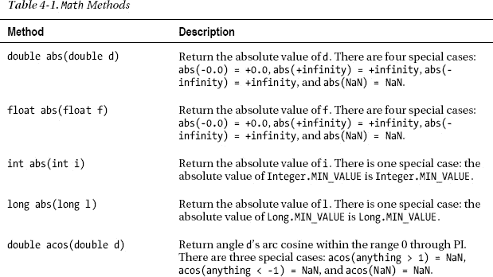

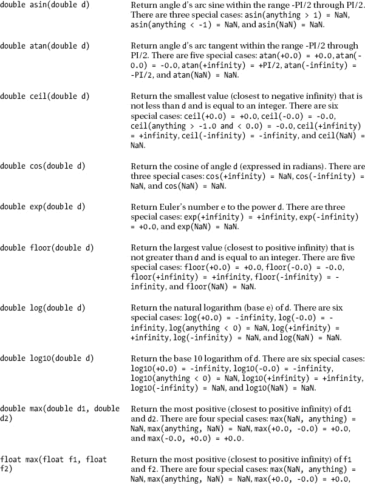

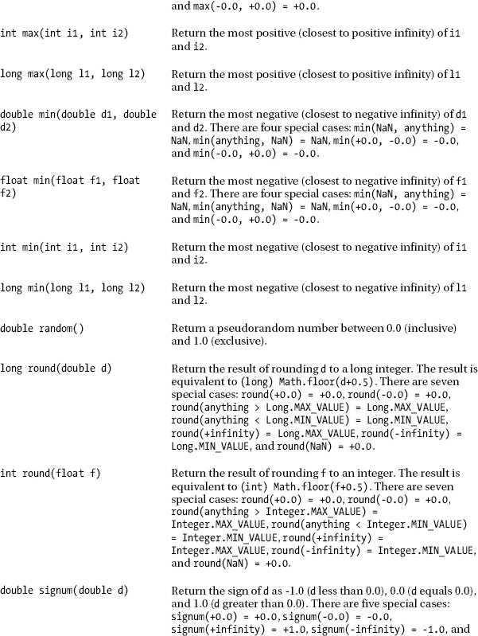

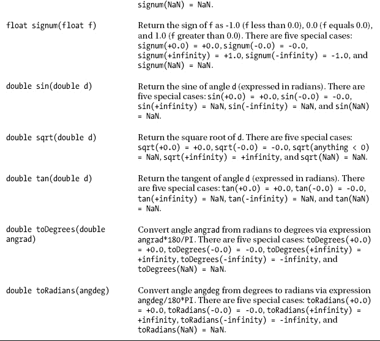

表 4-1 揭示了各种各样有用的面向数学的方法。例如，每个`abs()`方法返回其参数的*绝对值*(不考虑符号的数字)。

`abs(double)`和`abs(float)`用于安全地比较双精度浮点和浮点值。例如，`0.3 == 0.1+0.1+0.1`的计算结果为 false，因为 0.1 没有精确的表示。但是，您可以将这些表达式与`abs()`和一个公差值进行比较，公差值表示可接受的误差范围。例如，`Math.abs(0.3-(0.1+0.1+0.1)) < 0.1`返回 true，因为`0.3`和`0.1+0.1+0.1`之间的绝对差值小于 0.1 容差值。

前几章演示了其他的`Math`方法。例如，[第二章](02.html#ch2)演示了`Math`的`random()`、`sin()`、`cos()`和`toRadians()`方法。

正如[第三章](03.html#ch3)的`Lotto649`应用所揭示的那样，`random()`(它返回一个看似随机选择的数字，但实际上是通过可预测的数学计算选择的，因此是*伪随机*)在模拟中(以及在游戏和任何需要概率元素的地方)是有用的。然而，它的 0.0 到(几乎)1.0 的双精度浮点范围并不实用。为了让`random()`更有用，它的返回值必须转换成更有用的范围，可能是 0 到 49 的整数值，也可能是-100 到 100。您会发现下面的`rnd()`方法有助于进行这些转换:

```java
static int rnd(int limit)
{
   return (int) (Math.random()*limit);
}
```

`rnd()`将`random()`的 0.0 到(几乎)1.0 双精度浮点范围转换为 0 到`limit` -1 的整数范围。例如，`rnd(50)`返回 0 到 49 之间的整数。另外，`-100+rnd(201)`通过添加一个合适的偏移量并传递一个合适的`limit`值，将 0.0 到(几乎)1.0 转换成-100 到 100。

 **注意**不要指定`(int) Math.random()*limit`，因为这个表达式的值总是 0。该表达式首先转换`random()`的双精度浮点小数值(0.0 到 0.99999。。。)通过截断小数部分转换为整数 0，然后将 0 乘以`limit`，得到 0。

`sin()`和`cos()`方法实现正弦和余弦三角函数——参见`[http://en.wikipedia.org/wiki/Trigonometric_functions](http://en.wikipedia.org/wiki/Trigonometric_functions)`。这些函数的用途从研究三角形到模拟周期现象(如简谐运动——见`[http://en.wikipedia.org/wiki/Simple_harmonic_motion](http://en.wikipedia.org/wiki/Simple_harmonic_motion)`)。

我们可以用`sin()`和`cos()`来产生和显示正弦波和余弦波。[清单 4-1](#list_4_1) 给出了一个应用的源代码。

***清单 4-1。**绘制正弦和余弦波*

`class Graph
{
   final static int ROWS = 11; // Must be odd
   final static int COLS= 23;
   public static void main(String[] args)
   {
      char[][] screen = new char[ROWS][];
      for (int row = 0; row < ROWS; row++)
         screen[row] = new char[COLS];
      double scaleX = COLS/360.0;
      for (int degree = 0; degree < 360; degree++)
      {
         int row = ROWS/2+
                   (int) Math.round(ROWS/2*Math.sin(Math.toRadians(degree)));
         int col = (int) (degree*scaleX);
         screen[row][col] = 'S';
         row = ROWS/2+
               (int) Math.round(ROWS/2*Math.cos(Math.toRadians(degree)));
         screen[row][col] = (screen[row][col] == 'S') ? '*' : 'C';
      }
      for (int row = ROWS-1; row >= 0; row--)` `      {
         for (int col = 0; col < COLS; col++)
            System.out.print(screen[row][col]);
         System.out.println();
      }
   }
}`

[清单 4-1](#list_4_1) 引入了一个`Graph`类，它首先声明了一对常量:`NROWS`和`NCOLS`。这些常量指定在其上生成图形的数组的维数。`NROWS`必须赋一个奇整数；否则，抛出一个`java.lang.ArrayIndexOutOfBoundsException`类的实例。

提示尽可能使用常量是个好主意。源代码更容易维护，因为您只需要在一个地方更改常量的值，而不必在整个源代码中更改每个相应的值。

`Graph` next 声明了它的`main()`方法，该方法首先创建一个字符的二维`screen`数组。这个数组用于模拟一个老式的基于字符的屏幕来查看图形。

`main()`接下来计算水平比例值，用于水平缩放每个图形，以便 360 个水平(度)位置适合`NCOLS`指定的列数。

继续，`main()`进入 for 循环，对于每个正弦和余弦图形，为每个度数值创建(行，列)坐标，并在这些坐标处为`screen`数组分配一个字符。正弦图的字符为`S`，余弦图的字符为`C`，余弦图与正弦图相交时的字符为`*`。

行计算调用`toRadians()`将其`degree`参数转换为弧度，这是`sin()`和`cos()`方法所需要的。从`sin()`或`cos()` (-1 到 1)返回的值然后乘以`ROWS/2`以将该值缩放为`screen`数组中行数的一半。在通过`long round(double d)`方法将结果舍入到最接近的长整数后，使用强制转换将长整数转换为整数，并将该整数添加到`ROW/2`中以偏移行坐标，使其相对于数组的中间行。列计算更简单，将度数值乘以水平比例因子。

`screen`数组通过一对嵌套的 for 循环转储到标准输出设备。外部 for 循环反转屏幕，使其正面朝上——第 0 行应该最后输出。

编译[清单 4-1](#list_4_1) ( `javac Graph.java`)并运行应用(`java Graph`)。您会看到以下输出:

```java
CC  SSSS             CC
 CSSS  SS           CC
 S*C    SS         CC  
 S CC    SS       CC   
SS  CC    SS     CC    
S    CC    S    CC    S
      C    SS   C    SS
      CC    SS CC    S
       CC    SCC    SS
        CC   CSS  SSS  
         CCCCC SSSS        
```

 **注意**当我创建`screen`数组时，我利用了每个元素都被初始化为 0 的事实，这被解释为空字符。当一个`System.out.print()`或`System.out.println()`方法检测到这个字符时，它输出一个空格字符。

[表 4-1](#tab_4_1) 还揭示了几个以+无穷大、-无穷大、+0.0、-0.0、NaN(非数字)开头的奇闻。

Java 的浮点计算能够返回+infinity、-infinity、+0.0、-0.0 和 NaN，因为 Java 很大程度上符合 IEEE 754 ( `[http://en.wikipedia.org/wiki/IEEE_754](http://en.wikipedia.org/wiki/IEEE_754)`)，这是一种浮点计算的标准。以下是产生这些特殊值的情况:

*   +infinity 返回试图将一个正数除以 0.0 的结果。比如`System.out.println(1.0/0.0);`输出`Infinity`。
*   -infinity 从试图将负数除以 0.0 返回。比如`System.out.println(-1.0/0.0);`输出`-Infinity`。
*   NaN 从尝试将 0.0 除以 0.0、尝试计算负数的平方根以及尝试其他奇怪的运算返回。比如`System.out.println(0.0/0.0);`和`System.out.println(Math.sqrt(-1.0));`各自输出`NaN`。
*   +0.0 是试图将正数除以+无穷大的结果。比如`System.out.println(1.0/(1.0/0.0));`输出`+0.0`。
*   -0.0 是试图将负数除以+无穷大的结果。比如`System.out.println(-1.0/(1.0/0.0));`输出`-0.0`。

一旦运算产生+无穷大、-无穷大或 NaN，表达式的其余部分通常等于该特殊值。比如`System.out.println(1.0/0.0*20.0);`输出`Infinity`。此外，首先产生+无穷大或-无穷大的表达式可能会转化为 NaN。例如，`1.0/0.0*0.0`产生+无穷大(`1.0/0.0`，然后是 NaN(+无穷大`*0.0`)。

另一个好奇心是`Integer.MAX_VALUE`、`Integer.MIN_VALUE`、`Long.MAX_VALUE`和`Long.MIN_VALUE`。这些项中的每一项都是一个基元类型包装类常数，它标识可由该类的关联基元类型表示的最大值或最小值。(我将在本章后面讨论基本类型包装类。)

最后，你可能想知道为什么`abs()`、`max()`和`min()`重载方法不包括`byte`和`short`版本，就像在`byte abs(byte b)`和`short abs(short s)`中一样。不需要这些方法，因为字节和短整数的有限范围使它们不适合计算。如果你需要这样的方法，查看清单 4-2 。

***清单 4-2。**获取字节整数和短整数的绝对值*

```java
class AbsByteShort
{
   static byte abs(byte b)
   {
      return (b < 0) ? (byte) -b : b;
   }
   static short abs(short s)
   {
      return (s < 0) ? (short) -s : s;
   }
   public static void main(String[] args)
   {
      byte b = -2;
      System.out.println(abs(b)); // Output: 2
      short s = -3;
      System.out.println(abs(s)); // Output: 3
   }
}
```

[清单 4-2](#list_4_1) 的`(byte)`和`(short)`转换是必要的，因为`-b`将`b`的值从`byte`转换为`int`，而`-s`将`s`的值从`short`转换为`int`。相比之下，`(b < 0)`和`(s < 0)`不需要这些类型转换，它们在与基于`int`的`0`进行比较之前，会自动将`b`和`s`的值转换为一个`int`。

 **提示**它们在`Math`中的缺席表明`byte`和`short`在方法声明中不是很有用。但是，当声明其元素存储小值(如二进制文件的字节值)的数组时，这些类型很有用。如果您声明了一个由`int`或`long`组成的数组来存储这些值，那么您最终会浪费堆空间(甚至可能会耗尽内存)。

在 Java 文档中搜索`java.lang`包时，您可能会遇到一个名为`StrictMath`的类。除了一个更长的名字，这个职业看起来和`Math`一样。这些类别之间的差异可以总结如下:

*   `StrictMath`的方法在所有平台上返回完全相同的结果。相比之下，`Math`的一些方法可能会返回因平台不同而略有不同的值。
*   因为`StrictMath`不能利用平台特定的特性，比如扩展精度的数学协处理器，所以`StrictMath`的实现可能不如`Math`的实现有效。

在大多数情况下，`Math`的方法调用它们的`StrictMath`对应物。两个例外是`toDegrees()`和`toRadians()`。尽管这些方法在两个类中有相同的代码体，但是`StrictMath`的实现在方法头中包含了保留字`strictfp`:

```java
public static strictfp double toDegrees(double angrad)
public static strictfp double toRadians(double angdeg)
```

维基百科的“strictfp”条目(`http://en.wikipedia.org/wiki/Strictfp`)提到`strictfp`限制浮点计算以保证可移植性。这个保留字在中间浮点表示和上溢/下溢(生成太大或太小而不适合表示的值)的上下文中实现了可移植性。

 **注意**之前引用的“strictfp”文章中说`Math`包含了`public static strictfp double abs(double);`和其他`strictfp`方法。如果你在 Java 7 下检查这个类的源代码，你不会在源代码的任何地方找到`strictfp`。然而，许多`Math`方法(如`sin()`)调用它们的`StrictMath`对应方法，这些方法是在特定于平台的库中实现的，并且该库的方法实现是严格的。

如果没有`strictfp`，中间计算就不局限于 Java 支持的 IEEE 754 32 位和 64 位浮点表示。相反，计算可以在支持这种表示的平台上利用更大的表示(可能是 128 位)。

当中间计算的值以 32/64 位表示时会上溢/下溢，而当其值以更多位表示时可能不会上溢/下溢。由于这种差异，可移植性受到了损害。`strictfp`通过要求所有平台使用 32/64 位进行中间计算来平衡竞争环境。

当应用于一个方法时，`strictfp`确保在该方法中执行的所有浮点计算都是严格符合的。然而，`strictfp`可以在类头声明中使用(如在`public strictfp class FourierTransform`中)，以确保该类中执行的所有浮点计算都是严格的。

 **注意** `Math`和`StrictMath`被声明为`final`，所以不能扩展。此外，它们声明私有的空无参数构造函数，因此它们不能被实例化。最后，`Math`和`StrictMath`是工具类的例子，因为它们作为`static`方法的占位符存在。

### 包装

`java.lang.Package`类提供了对包信息的访问(见[第 3 章](03.html#ch3)关于包的介绍)。这些信息包括关于 Java 包的实现和规范的版本细节、包的名称，以及包是否已经被*密封*的指示(包中的所有类都归档在同一个 JAR 文件中)。

[表 4-2](#tab_4_2) 描述了`Package`的一些方法。

T2】

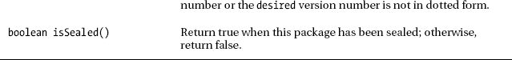

我已经创建了一个`PackageInfo`应用，演示了大多数[表 4-2](#tab_4_2) 的`Package`方法。[清单 4-3](#list_4_3) 展示了这个应用的源代码。

***清单 4-3。**获取包裹信息*

```java
class PackageInfo
{
   public static void main(String[] args)
   {
      if (args.length == 0)
      {
         System.err.println("usage: java PackageInfo packageName [version]");
         return;
      }
      Package pkg = Package.getPackage(args[0]);
      if (pkg == null)
      {
         System.err.println(args[0]+" not found");
         return;
      }
      System.out.println("Name: "+pkg.getName());
      System.out.println("Implementation title: "+
                         pkg.getImplementationTitle());
      System.out.println("Implementation vendor: "+
                         pkg.getImplementationVendor());
      System.out.println("Implementation version: "+
                         pkg.getImplementationVersion());
      System.out.println("Specification title: "+
                         pkg.getSpecificationTitle());
      System.out.println("Specification vendor: "+
                         pkg.getSpecificationVendor());
      System.out.println("Specification version: "+
                         pkg.getSpecificationVersion());
      System.out.println("Sealed: "+pkg.isSealed());
      if (args.length > 1)
         System.out.println("Compatible with "+args[1]+": "+
                            pkg.isCompatibleWith(args[1]));
   }
}
```

编译完[清单 4-3](#list_4_3) ( `javac PackageInfo.java`)之后，在运行这个应用时，在命令行上至少指定一个包名。例如，`java PackageInfo java.lang`在 Java 7 下返回以下输出:

`Name: java.lang
Implementation title: Java Runtime Environment` `Implementation vendor: Oracle Corporation
Implementation version: 1.7.0
Specification title: Java Platform API Specification
Specification vendor: Oracle Corporation
Specification version: 1.7
Sealed: false`

`PackageInfo`还允许您确定软件包的规范是否与特定的版本号兼容。包与其前身兼容。

例如，`java PackageInfo java.lang 1.7`输出`Compatible with 1.7: true`，而`java PackageInfo java.lang 1.8`输出`Compatible with 1.8: false`。

你也可以在你自己的包中使用`PackageInfo`，这些包是你在[第三章](03.html#ch3)中学到的。例如，那一章提出了一个`logging`包。

将`PackageInfo.class`复制到包含`logging`包目录(包含编译后的类文件)的目录下，执行`java PackageInfo logging`。

`PackageInfo`通过显示以下输出进行响应:

```java
logging not found
```

出现这个错误消息是因为`getPackage()`在返回一个描述这个包的`Package`对象之前，需要从这个包加载至少一个 classfile。

消除前面错误信息的唯一方法是从包中加载一个类。通过将下面的代码片段合并到[清单 4-3](#list_4_3) 中来完成这项任务。

```java
if (args.length == 3)
try
{
   Class.forName(args[2]);
}
catch (ClassNotFoundException cnfe)
{
   System.err.println("cannot load "+args[2]);
   return;
}
```

这段代码片段必须在`Package pkg = Package.getPackage(args[0]);`之前，它加载由修改后的`PackageInfo`应用的第三个命令行参数命名的类文件。(我将在本章后面讨论`Class.forName()`。)

通过`java PackageInfo logging 1.5 logging.File`运行新的`PackageInfo`应用，您将观察到以下输出——该命令行将`logging`的`File`类标识为要加载的类:

```java
Name: logging
Implementation title: null
Implementation vendor: null
Implementation version: null
Specification title: null
Specification vendor: null
Specification version: null
Sealed: false
Exception in thread "main" java.lang.NumberFormatException: Empty version string
        at java.lang.Package.isCompatibleWith(Package.java:228)
        at PackageInfo.main(PackageInfo.java:42)
```

看到所有这些`null`值并不奇怪，因为没有包信息被添加到`logging`包中。此外，`NumberFormatException`从`isCompatibleWith()`抛出，因为`logging`包不包含点格式的规范版本号(为空)。

也许将包信息放入`logging`包的最简单的方法是以类似于[第 3 章](03.html#ch3)中所示的方式创建一个`logging.jar`文件。但是首先，您必须创建一个包含包信息的小文本文件。您可以为文件选择任何名称。[清单 4-4](#list_4_4) 揭示了我对`manifest.mf`的选择。

***清单 4-4。** `manifest.mf`包含包裹信息*

```java
Implementation-Title: Logging Implementation
Implementation-Vendor: Jeff Friesen
Implementation-Version: 1.0a
Specification-Title: Logging Specification
Specification-Vendor: Jeff Friesen
Specification-Version: 1.0
Sealed: true
```

 **注意**确保在最后一行结束时按回车键(`Sealed: true`)。否则，您可能会在输出中看到`Sealed: false`，因为这个条目不会被 JDK 的`jar`工具存储在`logging`包中— `jar`有点古怪。

执行下面的命令行来创建一个 JAR 文件，该文件包括`logging`及其文件，其*清单*，一个名为`MANIFEST.MF`的特殊文件，存储了关于 JAR 文件内容的信息，包含了[清单 4-4](#list_4_4) 的内容:

```java
jar cfm logging.jar manifest.mf logging/*.class
```

这个命令行创建一个名为`logging.jar`的 JAR 文件(通过`c` [create]和`f` [file]选项)。它还将`manifest.mf`的内容(通过`m`【清单】选项)合并到`MANIFEST.MF`中，存储在包的`META-INF`目录中。

 **注意**要了解关于 JAR 文件清单的更多信息，请阅读 JDK 文档“JAR 文件规范”页面的“JAR 清单”部分(`[http://download.oracle.com/javase/7/docs/technotes/guides/jar/jar.html#JAR Manifest](http://download.oracle.com/javase/7/docs/technotes/guides/jar/jar.html#JARManifest)`)。

假设`jar`工具没有显示错误信息，执行下面的面向 Windows 的命令行(或者适合您平台的命令行)来运行`PackageInfo`,并从`logging`包中提取包信息:

```java
java -cp logging.jar;. PackageInfo logging 1.0 logging.File
```

这一次，您应该会看到以下输出:

```java
Name: logging
Implementation title: Logging Implementation
Implementation vendor: Jeff Friesen
Implementation version: 1.0a
Specification title: Logging Specification
Specification vendor: Jeff Friesen
Specification version: 1.0
Sealed: true
Compatible with 1.0: true
```

### 原始类型包装类

`java.lang`包包括`Boolean`、`Byte`、`Character`、`Double`、`Float`、`Integer`、`Long`、`Short`。这些类被称为*原始类型包装类*，因为它们的实例将自己包装在原始类型的值周围。

 **注意**原始类型包装类也被称为*值类*。

Java 提供这八个基本类型包装类有两个原因:

*   集合框架(在第 5 章中讨论)提供了只能存储对象的列表、集合和映射；它们不能存储原始值。您将基元值存储在基元类型包装类实例中，并将该实例存储在集合中。
*   这些类提供了一个将有用的常量(如`MAX_VALUE`和`MIN_VALUE`)和类方法(如`Integer`的`parseInt()`方法和`Character`的`isDigit()`、`isLetter()`和`toUpperCase()`方法)与原始类型关联起来的好地方。

本节将向您介绍这些原始类型包装器类和一个名为`Number`的`java.lang`类。

#### 布尔值

`Boolean`是最小的原始类型包装类。这个类声明了三个常量，包括`TRUE`和`FALSE`，它们表示预先创建的`Boolean`对象。它还声明了一对用于初始化`Boolean`对象的构造函数:

*   `Boolean(boolean value)`将`Boolean`对象初始化为`value`。
*   `Boolean(String s)`将`s`的文本转换为 true 或 false 值，并将该值存储在`Boolean`对象中。

第二个构造函数将`s`的值与`true`进行比较。因为比较是不区分大小写的，所以这四个字母的任何大写/小写组合(比如`true`、`TRUE`或`tRue`)都会导致 true 被存储在对象中。否则，构造函数在对象中存储 false。

 **注** `Boolean`的构造函数用`boolean booleanValue()`补，返回包装后的布尔值。

`Boolean`还声明或覆盖以下方法:

*   `int compareTo(Boolean b)`将当前的`Boolean`对象与`b`进行比较，以确定它们的相对顺序。当当前对象包含与`b`相同的布尔值时，该方法返回 0；当当前对象包含 true 且`b`包含 false 时，该方法返回正值；当当前对象包含 false 且`b`包含 true 时，该方法返回负值。
*   `boolean equals(Object o)`将当前的`Boolean`对象与`o`进行比较，当`o`不为空，`o`的类型为`Boolean`，且两个对象包含相同的布尔值时，返回 true。
*   当由`name`标识的系统属性(将在本章后面讨论)存在并且等于 true 时，`static boolean getBoolean(String name)`返回 true。
*   `int hashCode()`返回一个合适的散列码，允许`Boolean`对象用于基于散列的集合(在[第 5 章](05.html#ch5)中讨论)。
*   `static boolean parseBoolean(String s)`解析`s`，如果`s`等于`"true"`、`"TRUE"`、`"True"`或任何其他大写/小写组合，则返回 true。否则，此方法返回 false。(*解析*将一个字符序列分解成有意义的成分，称为*记号*。)
*   当当前`Boolean`实例包含 true 时，`String toString()`返回`"true"`；否则，该方法返回`"false"`。
*   当`b`包含 true 时，`static String toString(boolean b)`返回`"true"`；否则，该方法返回`"false"`。
*   当`b`为真时`static Boolean valueOf(boolean b)`返回`TRUE`，当`b`为假时`FALSE`。
*   当`s`等于`"true"`、`"TRUE"`、`"True"`或这些字母的任何其他大写/小写组合时，`static Boolean valueOf(String s)`返回`TRUE`。否则，该方法返回`FALSE`。

 **注意**新加入`Boolean`类的人通常认为`getBoolean()`返回一个`Boolean`对象的真/假值。然而，`getBoolean()`返回一个基于布尔值的系统属性的值——我将在本章后面讨论系统属性。如果你需要返回一个`Boolean`对象的真/假值，请使用`booleanValue()`方法。

使用`TRUE`和`FALSE`通常比创建`Boolean`对象更好。例如，假设您需要一个方法，当该方法的`double`参数为负时，该方法返回包含 true 的`Boolean`对象，当该参数为零或正时，该方法返回 false。您可以像下面的`isNegative()`方法一样声明您的方法:

```java
Boolean isNegative(double d)
{
   return new Boolean(d < 0);
}
```

虽然这个方法很简洁，但它不必要地创建了一个`Boolean`对象。当频繁调用该方法时，会创建许多消耗堆空间的`Boolean`对象。当堆空间不足时，垃圾收集器会运行并降低应用的速度，从而影响性能。

下面的例子揭示了一种编码`isNegative()`的更好方法:

```java
Boolean isNegative(double d)
{
   return (d < 0) ? Boolean.TRUE : Boolean.FALSE;
}
```

这个方法通过返回预先创建的`TRUE`或`FALSE`对象来避免创建`Boolean`对象。

 **提示**你应该努力创建尽可能少的对象。您的应用不仅内存占用更少，而且性能更好，因为垃圾收集器不会像以前那样频繁运行。

#### 人物

`Character`是最大的原始类型包装类，包含许多常量、一个构造函数、许多方法和三个嵌套类(`Subset`、`UnicodeBlock`和`UnicodeScript`)。

 **注意** `Character`的复杂性来源于 Java 对 Unicode ( `[y](http://en.wikipedia.org/wiki/Unicode)`)的支持。为了简洁起见，我忽略了大部分`Character`与 Unicode 相关的复杂性，这超出了本章的范围。

`Character`声明了一个单独的`Character(char value)`构造函数，用来将一个`Character`对象初始化为`value`。这个构造函数由`char charValue()`补充，它返回包装的字符值。

当您开始编写应用时，您可能会编写像`ch >= '0' && ch <= '9'`(测试`ch`以查看它是否包含一个数字)和`ch >= 'A' && ch <= 'Z'`(测试`ch`以查看它是否包含一个大写字母)这样的表达式。您应该避免这样做，原因有三:

*   在表达式中引入 bug 太容易了。例如，`ch > '0' && ch <= '9'`引入了一个微妙的 bug，在比较中没有包括`'0'`。
*   这些表达式不能很好地描述他们正在测试的东西。
*   表达式偏向于拉丁数字(0-9)和字母(a-z 和 A-Z)。它们不考虑在其他语言中有效的数字和字母。例如，`'\u0beb'`是代表泰米尔语中一个数字的字符文字。

`Character`声明了几个比较和转换类方法来解决这些问题。这些方法包括以下内容:

*   当`ch`包含一个数字(通常是 0 到 9，但也可以是其他字母中的数字)时，`static boolean isDigit(char ch)`返回 true。
*   当`ch`包含一个字母(通常是 a-z 或 A-Z，但也包括其他字母表中的字母)时，`static boolean isLetter(char ch)`返回 true。
*   当`c` h 包含一个字母或数字(通常是 a-z、A-Z 或 0-9；也包括其他字母表中的字母或数字)。
*   当`ch`包含小写字母时，`static boolean isLowerCase(char ch)`返回 true。
*   当`ch`包含大写字母时，`static boolean isUpperCase(char ch)`返回 true。
*   当`ch`包含空白字符(通常是空格、水平制表符、回车符或换行符)时，`static boolean isWhitespace(char ch)`返回 true。
*   `static char toLowerCase(char ch)`返回`ch`的大写字母的小写等价物；否则，这个方法返回`ch`的值。
*   `static char toUpperCase(char ch)`返回`ch`小写字母的大写等价物；否则，这个方法返回`ch`的值。

例如，`isDigit(ch)`比`ch >= '0' && ch <= '9'`更好，因为它避免了错误的来源，可读性更好，并且对于非拉丁数字(例如，`'\u0beb'`)以及拉丁数字都返回 true。

#### 浮动双精度

`Float`和`Double`分别在`Float`和`Double`对象中存储浮点和双精度浮点值。这些类声明下列常量:

*   `MAX_VALUE`表示可以用`float`或`double`表示的最大值。
*   `MIN_VALUE`表示可以用`float`或`double`表示的最小值。
*   `NaN`代表`0.0F/0.0F`为`float`，`0.0/0.0`为`double`。
*   `NEGATIVE_INFINITY`用一个`float`或`double`来表示-无穷大。
*   `POSITIVE_INFINITY`将+无穷大表示为`float`或`double`。

`Float`和`Double`还声明了以下用于初始化其对象的构造函数:

*   `Float(float value)`将`Float`对象初始化为`value`。
*   `Float(double value)`将`Float`对象初始化为`value`的`float`等价物。
*   `Float(String s)`将`s`的文本转换为浮点值，并将该值存储在`Float`对象中。
*   `Double(double value)`将`Double`对象初始化为`value`。
*   `Double(String s)`将`s`的文本转换为双精度浮点值，并将该值存储在`Double`对象中。

`Float`的构造函数由`float floatValue()`补充，后者返回包装的浮点值。类似地，`Double`的构造函数由`double doubleValue()`补充，它返回包装的双精度浮点值。

`Float`声明了几个实用方法和`floatValue()`。这些方法包括以下内容:

*   `static int floatToIntBits(float value)`将`value`转换为 32 位整数。
*   当`f`的值为+无穷大或-无穷大时，`static boolean isInfinite(float f)`返回 true。当当前`Float`对象的值为+infinity 或-infinity 时，相关的`boolean isInfinite()`方法返回 true。
*   当`f`的值为 NaN 时，`static boolean isNaN(float f)`返回 true。当当前`Float`对象的值为 NaN 时，相关的`boolean isNaN()`方法返回 true。
*   `static float parseFloat(String s)`解析`s`，返回浮点值的`s`文本表示的浮点等价物，或者当该表示无效时抛出`NumberFormatException`(例如，包含字母)。

`Double`声明了几个实用方法和`doubleValue()`。这些方法包括以下内容:

*   `static long doubleToLongBits(double value)`将`value`转换为长整数。
*   当`d`的值为+无穷大或-无穷大时，`static boolean isInfinite(double d)`返回 true。当当前`Double`对象的值为+infinity 或-infinity 时，相关的`boolean isInfinite()`方法返回 true。
*   当`d`的值为 NaN 时，`static boolean isNaN(double d)`返回 true。当当前`Double`对象的值为 NaN 时，相关的`boolean isNaN()`方法返回 true。
*   `static double parseDouble(String s)`解析`s`，返回与`s`的双精度浮点值的文本表示等价的双精度浮点值，或者当这个表示无效时抛出`NumberFormatException`。

`floatToIntBits()`和`doubleToIntBits()`方法在`equals()`和`hashCode()`方法的实现中使用，它们必须考虑`float`和`double`字段。`floatToIntBits()`和`doubleToIntBits()`允许`equals()`和`hashCode()`正确响应以下情况:

*   当`f1`和`f2`包含`Float.NaN`(或者`d1`和`d2`包含`Double.NaN`)时和`equals()`必须返回 true。如果`equals()`以类似于`f1.floatValue() == f2.floatValue()`(或`d1.doubleValue() == d2.doubleValue()`)的方式实现，这个方法将返回 false，因为 NaN 不等于任何东西，包括它本身。
*   当`f1`包含+0.0 而`f2`包含-0.0 时`equals()`必须返回 false(反之亦然)，或者`d1`包含+0.0 而`d2`包含-0.0 时(反之亦然)。如果`equals()`以类似于`f1.floatValue() == f2.floatValue()`(或`d1.doubleValue() == d2.doubleValue()`)的方式实现，这个方法将返回 true，因为`+0.0 == -0.0`返回 true。

这些需求是基于散列的集合(在第 5 章的[中讨论)正常工作所必需的。](05.html#ch5)[清单 4-5](#list_4_5) 展示了它们如何影响`Float`和`Double`的`equals()`方法:

*清单 4-5**。**演示 NaN 上下文中的`Float'`的`equals()`方法和+/-0.0 上下文中的`Double`的`equals()`方法*

```java
class FloatDoubleDemo
{
   public static void main(String[] args)
   {
      Float f1 = new Float(Float.NaN);
      System.out.println(f1.floatValue());
      Float f2 = new Float(Float.NaN);
      System.out.println(f2.floatValue());
      System.out.println(f1.equals(f2));
      System.out.println(Float.NaN == Float.NaN);
      System.out.println();
      Double d1 = new Double(+0.0);
      System.out.println(d1.doubleValue());
      Double d2 = new Double(-0.0);
      System.out.println(d2.doubleValue());
      System.out.println(d1.equals(d2));
      System.out.println(+0.0 == -0.0);
   }
}
```

编译[清单 4-5](#list_4_5) ( `javac FloatDoubleDemo.java`)并运行这个应用(`java FloatDoubleDemo`)。下面的输出证明了`Float`的`equals()`方法正确处理了 NaN，`Double`的`equals()`方法正确处理了+/-0.0:

```java
NaN
NaN
true
false

0.0
-0.0
false
true
```

 **提示**如果您想测试`float`或`double`值是否等于+无穷大或-无穷大(但不是两者都等于)，请不要使用`isInfinite()`。相反，通过`==`将该值与`NEGATIVE_INFINITY`或`POSITIVE_INFINITY`进行比较。比如`f == Float.NEGATIVE_INFINITY`。

你会发现`parseFloat()`和`parseDouble()`在很多情况下都很有用。例如，[清单 4-6](#list_4_6) 使用`parseDouble()`将命令行参数解析成`double`

***清单 4-6。**将命令行参数解析成双精度浮点值*

```java
class Calc
{
   public static void main(String[] args)
   {
      if (args.length != 3)
      {
         System.err.println("usage: java Calc value1 op value2");
         System.err.println("op is one of +, -, *, or /");
         return;
      }
      try
      {
         double value1 = Double.parseDouble(args[0]);
         double value2 = Double.parseDouble(args[2]);
         if (args[1].equals("+"))
            System.out.println(value1+value2);
         else
         if (args[1].equals("-"))
            System.out.println(value1-value2);
         else
         if (args[1].equals("*"))
            System.out.println(value1*value2);
         else
         if (args[1].equals("/"))
            System.out.println(value1/value2);
         else
            System.err.println("invalid operator: "+args[1]);
      }
      catch (NumberFormatException nfe)
      {
         System.err.println("Bad number format: "+nfe.getMessage());
      }
   }
}
```

指定`java Calc 10E+3 + 66.0`来试用`Calc`应用。这个应用通过输出`10066.0`来响应。如果您指定了`java Calc 10E+3 + A`，您会看到`Bad number format: For input string: "A"`作为输出，这是对第二个`parseDouble()`方法调用抛出一个`NumberFormatException`对象的响应。

尽管`NumberFormatException`描述了一个未检查的异常，并且尽管未检查的异常通常不会被处理，因为它们代表编码错误，但是`NumberFormatException`在这个例子中不符合这个模式。该异常不是由编码错误引起的；它源于有人向应用传递了非法的数字参数，这是无法通过正确的编码来避免的。也许`NumberFormatException`应该被实现为一个检查异常类型。

#### 整数、长整型、短整型和字节型

`Integer`、`Long`、`Short`和`Byte`分别在`Integer`、`Long`、`Short`和`Byte`对象中存储 32 位、64 位、16 位和 8 位的整数值。

每个类都声明了`MAX_VALUE`和`MIN_VALUE`常量，它们标识了最大值和最小值，这些值可以由相关的原语类型来表示。这些类还声明了以下用于初始化其对象的构造函数:

*   `Integer(int value)`将`Integer`对象初始化为`value`。
*   `Integer(String s)`将`s`的文本转换为 32 位整数值，并将该值存储在`Integer`对象中。
*   `Long(long value)`将`Long`对象初始化为`value`。
*   `Long(String s)`将`s`的文本转换为 64 位整数值，并将该值存储在`Long`对象中。
*   `Short(short value)`将`Short`对象初始化为`value`。
*   `Short(String s)`将`s`的文本转换为 16 位整数值，并将该值存储在`Short`对象中。
*   `Byte(byte value)`将`Byte`对象初始化为`value`。
*   `Byte(String s)`将`s`的文本转换为 8 位整数值，并将该值存储在`Byte`对象中。

`Integer`的构造函数由`int intValue()`补充，`Long`的构造函数由`long longValue()`补充，`Short`的构造函数由`short shortValue()`补充，`Byte`的构造函数由`byte byteValue()`补充。这些方法返回包装的整数。

这些类声明了各种有用的面向整数的方法。例如，`Integer`声明了以下实用方法，用于根据特定的表示形式(二进制、十六进制、八进制和十进制)将 32 位整数转换为`java.lang.String`实例:

*   `static String toBinaryString(int i)`返回一个包含`i`的二进制表示的`String`对象。例如，`Integer.toBinaryString(255)`返回一个包含 11111111 的`String`对象。
*   `static String toHexString(int i)`返回一个包含`i`的十六进制表示的`String`对象。例如，`Integer.toHexString(255)`返回一个包含 ff 的`String`对象。
*   `static String toOctalString(int i)`返回一个包含`i`的八进制表示的`String`对象。例如，`toOctalString(64)`返回一个包含 100 的`String`对象。
*   `static String toString(int i)`返回一个包含`i`的十进制表示的`String`对象。例如，`toString(255)`返回一个包含 255 的`String`对象。

在二进制字符串前面加上零通常很方便，这样就可以在列中对齐多个二进制字符串。例如，您可能希望创建一个显示以下对齐输出的应用:

```java
11110001
+
00000111
--------
11111000
```

不幸的是，`toBinaryString()`并没有让你完成这个任务。例如，`Integer.toBinaryString(7)`返回一个包含 111 的`String`对象，而不是 00000111。[清单 4-7](#list_4_7) 的`toAlignedBinaryString()`方法解决了这个疏忽。

***清单 4-7。**对齐二进制字符串*

```java
class AlignBinary
{
   public static void main(String[] args)
   {
      System.out.println(toAlignedBinaryString(7, 8));
      System.out.println(toAlignedBinaryString(255, 16));
      System.out.println(toAlignedBinaryString(255, 7));
   }
   static String toAlignedBinaryString(int i, int numBits)
   {
      String result = Integer.toBinaryString(i);
      if (result.length() > numBits)
         return null; // cannot fit result into numBits columns
      int numLeadingZeros = numBits-result.length();
      String zerosPrefix = "";
      for (int j = 0; j < numLeadingZeros; j++)
         zerosPrefix += "0";
      return zerosPrefix+result;
   }
}
```

`toAlignedBinaryString()`方法有两个参数:第一个参数指定了要转换成二进制字符串的 32 位整数，第二个参数指定了字符串所包含的位列数。

在调用`toBinaryString()`返回`i`的不带前导零的等价二进制字符串后，`toAlignedBinaryString()`验证该字符串的数字是否能符合`numBits`指定的位列数。如果它们不匹配，此方法将返回 null。(在本章的后面，你会学到`length()`和其他`String`方法。)

继续，`toAlignedBinaryString()`计算前置到`result`的前导`"0"`的数量，然后使用 for 循环创建一串前导零。此方法通过返回结果字符串前面的前导零字符串来结束。

虽然在一个循环中使用带有赋值操作符(`+=`)的复合字符串串联来构建一个字符串看起来没问题，但这是非常低效的，因为中间的`String`对象被创建并被丢弃。然而，我使用了这个低效的代码，这样我就可以将它与我在本章后面介绍的更高效的代码进行对比。

当您运行此应用时，它会生成以下输出:

```java
00000111
0000000011111111
null
```

#### 数字

每个`Float`、`Double`、`Integer`、`Long`、`Short`和`Byte`都提供了其他类的`*x*Value()`方法和自己的`*x*Value()`方法。例如，`Float`提供`doubleValue()`、`intValue()`、`longValue()`、`shortValue()`、`byteValue()`以及`floatValue()`。

这六个方法都是`Number`的成员，T0 是`Float`、`Double`、`Integer`、`Short`和`Byte`的抽象超类，而`Number`的`floatValue()`、`doubleValue()`、`intValue()`和`longValue()`方法是抽象的。`Number`也是`java.math.BigDecimal`和`java.math.BigInteger`的超类(本章稍后讨论)，以及一对并发相关的类(其中一个类在[第 6 章](06.html#ch6)中介绍)。

`Number`的存在是为了简化对`Number`子类对象集合的迭代。例如，您可以声明一个`java.util.List<Number>`类型的变量，并将其初始化为一个`java.util.ArrayList<Number>`(或简称为`ArrayList<>`)的实例。然后，您可以在集合中存储一个混合的`Number`子类对象，并通过多态地调用一个子类方法来迭代这个集合。

### 参考

第 2 章向您介绍了垃圾收集，在这里您了解了当一个对象不再被引用时，垃圾收集器会从堆中移除该对象。你很快就会发现，这种说法并不完全正确。

[第 2 章](02.html#ch2)还向您介绍了`java.lang.Object`的`finalize()`方法，在这里您了解到垃圾收集器在从堆中移除对象之前调用这个方法。`finalize()`方法给对象一个执行清理的机会。

本节继续第 2 章的内容，向您介绍 Java 的参考 API。在熟悉了一些基本术语之后，它将向您介绍 API 的`Reference`和`ReferenceQueue`类，然后是 API 的`SoftReference`、`WeakReference`和`PhantomReference`类。这些类让应用以有限的方式与垃圾收集器交互。

 **注**除了这一节，你还会发现 Brian Goetz 的《Java 理论与实践:用软引用堵塞内存泄漏》(`[http://www.ibm.com/developerworks/java/library/j-jtp01246/index.html](http://www.ibm.com/developerworks/java/library/j-jtp01246/index.html)`)和《Java 理论与实践:用弱引用堵塞内存泄漏》(`[http://www.ibm.com/developerworks/java/library/j-jtp11225/index.html](http://www.ibm.com/developerworks/java/library/j-jtp11225/index.html)`)教程有助于理解参考 API。

#### 基本术语

当一个应用运行时，它的执行揭示了一个*根引用集*，一个当前存在的局部变量、参数、类字段和实例字段的集合，并且包含(可能为空)对对象的引用。这个根集随着应用的运行而变化。例如，参数在方法返回后消失。

许多垃圾收集器在运行时都会识别这个根集。他们使用根集来确定一个对象是*可达*(引用，也称为*活*)还是*不可达*(未引用)。垃圾收集器无法收集可到达的对象。相反，它只能收集从根引用集开始无法到达的对象。

 **注意**可达对象包括从根集变量间接可达的对象，这意味着通过可从那些变量直接可达的活对象可达的对象。任何根集变量的任何路径都无法到达的对象都有资格进行垃圾收集。

从 Java 1.2 开始，可达对象被分为强可达、软可达、弱可达和幻影可达。与强可达对象不同，软可达对象、弱可达对象和幻像可达对象可以被垃圾收集。

从最强到最弱，可达性的不同级别反映了对象的生命周期。它们的定义如下:

*   一个对象是*强可达的*，如果它可以从某个线程到达而不遍历任何`Reference`对象。一个新创建的对象(比如由`Double d = new Double(1.0);`中的`d`引用的对象)对于创建它的线程来说是强可及的。(我将在本章后面讨论线程。)
*   一个对象是*软可达的*，如果它不是强可达的，但是可以通过遍历一个*软引用*(一个对该对象的引用，其中该引用存储在一个`SoftReference`对象中)。对该对象的最强引用是软引用。当对一个软可及对象的软引用被清除时，该对象变得有资格终结(在第 2 章中讨论)。
*   如果一个对象既不是强可达的也不是软可达的，那么它就是弱可达的(T2)，但是可以通过遍历一个弱引用(对该对象的引用，该引用存储在一个对象中)。对此对象的最强引用是弱引用。当对弱可达对象的弱引用被清除时，该对象就有资格终结。(除了垃圾收集器更渴望清理弱可达对象之外，弱引用完全类似于软引用。)
*   一个对象是*幻影可达的*如果它既不是强可达的、软可达的，也不是弱可达的，那么它已经被终结，并且它被某个*幻影引用*(一个对对象的引用，其中引用存储在一个`PhantomReference`对象中)。对此对象的最强引用是幻影引用。
*   最后，一个对象是不可到达的，因此在下一个垃圾收集周期，当它不能以上述任何方式到达时，有资格从内存中移除。

其引用存储在`SoftReference`、`WeakReference`或`PhantomReference`对象中的对象被称为*引用对象*。

#### 引用和引用队列

参考 API 由位于`java.lang.ref`包中的五个类组成。这个方案的核心是`Reference`和`ReferenceQueue`。

`Reference`是这个包的具体`SoftReference`、`WeakReference`和`PhantomReference`子类的抽象超类。

`ReferenceQueue`是一个具体的类，它的实例描述了队列数据结构。当您将一个`ReferenceQueue`实例与一个`Reference`子类对象(简称为`Reference`对象)相关联时，当`Reference`对象的封装引用所引用的对象成为垃圾时，该对象将被添加到队列中。

 **注意**通过将`ReferenceQueue`对象传递给一个适当的`Reference`子类构造函数，你可以将一个`ReferenceQueue`对象与一个`Reference`对象相关联。

`Reference`被声明为泛型类型`Reference<T>`，其中`T`标识引用对象的类型。该类提供了以下方法:

*   `void clear()`将空值赋给存储的引用；调用此方法的`Reference`对象没有*入队*(插入)到其关联的引用队列中(如果有关联的引用队列)。(垃圾收集器直接清除引用；它不叫`clear()`。相反，此方法由应用调用。)
*   `boolean enqueue()`将调用该方法的`Reference`对象添加到关联的引用队列中。当这个`Reference`对象进入队列时，这个方法返回 true 否则，该方法返回 false—这个`Reference`对象在创建时已经入队或者没有与队列相关联。(垃圾收集器直接将`Reference`对象入队；它不叫`enqueue()`。相反，此方法由应用调用。)
*   `T get()`返回这个`Reference`对象的存储引用。当应用或垃圾收集器清除了存储的引用时，返回值为 null。
*   当这个`Reference`对象已经被应用或垃圾收集器排队时，`boolean isEnqueued()`返回 true。否则，该方法返回 false—这个`Reference`对象在创建时没有与队列相关联。

 **注** `Reference`也声明构造函数。因为这些构造函数是包私有的，所以只有`java.lang.ref`包中的类可以继承`Reference`。这个限制是必要的，因为`Reference`的子类的实例必须与垃圾收集器紧密合作。

`ReferenceQueue`被声明为泛型类型`ReferenceQueue<T>`，其中`T`标识引用对象的类型。该类声明了以下构造函数和方法:

*   `ReferenceQueue()`初始化一个新的`ReferenceQueue`实例。
*   `Reference<? extends T> poll()`轮询该队列以检查可用的`Reference`对象。如果有可用的对象，则从队列中移除并返回该对象。否则，此方法立即返回一个空值。
*   `Reference<? extends T> remove()`从队列中移除下一个`Reference`对象并返回该对象。这个方法无限期地等待一个`Reference`对象变得可用，并在等待被中断时抛出`java.lang.InterruptedException`。
*   `Reference<? extends T> remove(long timeout)`从队列中移除下一个`Reference`对象并返回该对象。这个方法一直等到一个`Reference`对象变得可用或者已经过了`timeout`毫秒——将 0 传递给`timeout`会导致该方法无限期等待。如果`timeout`的值过期，该方法返回 null。当`timeout`的值为负时，这个方法抛出`java.lang.IllegalArgumentException`，或者当这个等待被中断时，抛出`InterruptedException`。

#### 软参考

`SoftReference`类描述了一个`Reference`对象，其 referent 是软可及的。除了继承`Reference`的方法和覆盖`get()`之外，这个泛型类还提供了以下用于初始化`SoftReference`对象的构造函数:

*   `SoftReference(T r)`封装了`r`的引用。`SoftReference`对象表现为对`r`的软引用。没有`ReferenceQueue`对象与此`SoftReference`对象相关联。
*   `SoftReference(T r, ReferenceQueue<? super T> q)`封装了`r`的引用。`SoftReference`对象表现为对`r`的软引用。由`q`标识的`ReferenceQueue`对象与该`SoftReference`对象相关联。将`null`传递到`q`表示没有队列的软引用。

`SoftReference`对于实现创建(例如数据库连接)时间开销大和/或占用大量堆空间的对象(例如大型图像)的缓存非常有用。图像缓存将图像保存在内存中(因为从磁盘加载图像需要时间)，并确保重复的(可能非常大的)图像不会存储在内存中。

图像缓存包含对已经在内存中的图像对象的引用。如果这些引用是强有力的，这些图像将会留在记忆中。然后，您需要找出哪些图像不再需要，并将它们从内存中删除，以便可以对它们进行垃圾收集。

必须手动删除图像重复了垃圾收集器的工作。但是，如果您将对图像对象的引用包装在`SoftReference`对象中，垃圾收集器将确定何时移除这些对象(通常是在堆内存不足时)并代表您执行移除。

清单 4-8 展示了如何使用`SoftReference`来缓存图像。

***清单 4-8。**缓存图像*

```java
import java.lang.ref.SoftReference;

class Image
{
   private byte[] image;
   private Image(String name)
   {
      image = new byte[1024*1024*100];
   }
   static Image getImage(String name)
   {
      return new Image(name);
   }
}
class ImageCache
{
   public static void main(String[] args)
   {
      Image image = Image.getImage("large.png");
      System.out.println("caching image");
      SoftReference<Image> cache = new SoftReference<>(image);
      image = null;
      byte[] b = new byte[1024];
      while (cache.get() != null)
      {
         System.out.println("image is still cached");
         b = new byte[b.length*10];
      }
      System.out.println("image is no longer cached");
      b = null;
      System.out.println("reloading and recaching image");
      cache = new SoftReference<>(Image.getImage("large.png"));
      int counter = 0;
      while (cache.get() != null && ++counter != 7)
         System.out.println("image is still cached");
   }
}
```

[清单 4-8](#list_4_8) 声明了一个模拟加载大图像的`Image`类和一个演示基于`SoftReference`的`Image`对象缓存的`ImageCache`类。

`main()`方法首先通过调用`getImage()`类方法创建一个`Image`实例；实例的私有`image`数组占用 100MB 内存。

`main()`接下来创建一个`SoftReference`对象，该对象被初始化为一个`Image`对象的引用，并通过将`null`赋值给`image`来清除对`Image`对象的强引用。如果这个强引用没有被删除，`Image`对象将一直被缓存，应用很可能会耗尽内存。

在创建了一个用于演示`SoftReference`的字节数组后，`main()`进入应用的主循环，只要`cache.get()`返回一个非空引用(`Image`对象仍在缓存中),主循环就会一直循环下去。对于每次循环迭代，`main()`输出一条消息，表明`Image`对象仍然被缓存，并将字节数组的大小加倍。

在某些时候，数组加倍会耗尽堆空间。然而，在抛出`java.lang.OutOfMemoryError`类的实例之前，Java 虚拟机(JVM)将试图通过清除`SoftReference`对象的`Image`引用，并从堆中移除`Image`对象来获得足够的内存。

下一次循环迭代将通过发现`get()`返回 null 来检测这种情况。循环结束，`main()`输出一个合适的消息，确认`Image`对象不再被缓存。

`main()`现在将`null`分配给`b`，以确保有足够的内存来重新加载大图像(通过`getImage()`，并再次将其存储在基于`SoftReference`的缓存中。

最后，`main()`进入一个有限循环，以证明重新加载的`Image`对象仍然在缓存中。

编译[清单 4-8](#list_4_8) ( `javac ImageCache.java`)并运行应用(`java ImageCache`)。您应该会发现类似如下所示的输出:

```java
caching image
image is still cached
image is still cached
image is still cached
image is still cached
image is still cached
image is no longer cached
reloading and recaching image
image is still cached
image is still cached
image is still cached
image is still cached
image is still cached
image is still cached
```

#### 软弱的指称

`WeakReference`类描述了一个`Reference`对象，它的 referent 是弱可达的。除了继承`Reference`的方法，这个通用类还提供了以下用于初始化`WeakReference`对象的构造函数:

*   `WeakReference(T r)`封装了`r`的引用。`WeakReference`对象表现为对`r`的弱引用。没有`ReferenceQueue`对象与此`WeakReference`对象相关联。
*   `WeakReference(T r, ReferenceQueue<? super T> q)`封装了`r`的引用。`WeakReference`对象表现为对`r`的弱引用。由`q`标识的`ReferenceQueue`对象与该`WeakReference`对象相关联。将`null`传递到`q`表示没有队列的弱引用。

`WeakReference`有助于防止与 hashmaps 相关的内存泄漏。当您不断地向 hashmap 添加对象而从不移除它们时，就会发生内存泄漏。对象保留在内存中，因为散列表存储了对它们的强引用。

理想情况下，只有当应用中的其他地方强烈引用这些对象时，它们才应该保留在内存中。当一个对象的最后一个强引用(除了 hashmap 强引用)消失时，这个对象应该被垃圾回收。

这种情况可以通过存储对 hashmap 条目的弱引用来弥补，这样当不存在对它们的键的强引用时，它们就会被丢弃。Java 的`java.util.WeakHashMap`类(在第五章的[中讨论过)完成了这项任务，它的私有`Entry`静态成员类扩展了`WeakReference`。](05.html#ch5)

 **注意**引用队列在`WeakReference`中比在`SoftReference`中更有用。在`WeakHashMap`的上下文中，这些队列提供已经被移除的弱引用键的通知。`WeakHashMap`中的代码使用队列提供的信息删除所有不再有有效键的 hashmap 条目，以便与这些无效键相关联的值对象可以被垃圾收集。然而，与`SoftReference`相关的队列可以提醒应用堆空间开始变少。

#### 幻影参照

`PhantomReference`类描述了一个`Reference`对象，其 referent 是幻影可达的。除了继承`Reference`的方法和覆盖`get()`之外，这个泛型类还提供了一个用于初始化`PhantomReference`对象的构造函数:

*   `PhantomReference(T r, ReferenceQueue<? super T> q)`封装了`r`的引用。`PhantomReference`对象表现为对`r`的幻影引用。由`q`标识的`ReferenceQueue`对象与该`PhantomReference`对象相关联。将`null`传递给`q`是没有意义的，因为`get()`被覆盖以返回 null，而`PhantomReference`对象将永远不会排队。

虽然您不能访问一个`PhantomReference`对象的 referent(它的`get()`方法返回 null)，但是这个类是有用的，因为将`PhantomReference`对象入队表明 referent 已经完成，但是它的内存空间还没有被回收。该信号允许您在不使用`finalize()`方法的情况下执行清理。

`finalize()`方法是有问题的，因为垃圾收集器需要至少两个垃圾收集周期来确定覆盖`finalize()`的对象是否可以被垃圾收集。当第一个周期检测到对象符合垃圾收集条件时，它调用`finalize()`。因为这个方法可能会执行复活(见[第 2 章](02.html#ch2))，这使得不可到达的对象可到达，所以需要第二个垃圾收集周期来确定复活是否已经发生。这个额外的周期减慢了垃圾收集的速度。

如果`finalize()`没有被覆盖，垃圾收集器就不需要调用那个方法，并认为对象已经完成。因此，垃圾收集器只需要一个周期。

虽然您不能通过`finalize()`执行清理，但是您仍然可以通过`PhantomReference`执行清理。因为没有办法访问 referent ( `get()`返回 null)，所以复活不可能发生。

清单 4-9 展示了如何使用`PhantomReference`来检测一个大对象的终结。

***清单 4-9。**检测大对象的终结*

`import java.lang.ref.PhantomReference;
import java.lang.ref.ReferenceQueue;` 
```java
class LargeObject
{
   private byte[] memory = new byte[1024*1024*50]; // 50 megabytes
}
class LargeObjectDemo
{
   public static void main(String[] args)
   {
      ReferenceQueue<LargeObject> rq;
      rq = new ReferenceQueue<LargeObject>();
      PhantomReference<LargeObject> pr;
      pr = new PhantomReference<LargeObject>(new LargeObject(), rq);
      byte[] b = new byte[1024];
      while (rq.poll() == null)
      {
         System.out.println("waiting for large object to be finalized");
         b = new byte[b.length*10];
      }
      System.out.println("large object finalized");
      System.out.println("pr.get() returns "+pr.get());
   }
}
```

[清单 4-9](#list_4_9) 声明了一个`LargeObject`类，它的私有`memory`数组占用了 50MB。如果您的 JVM 在运行`LargeObject`时抛出`OutOfMemoryError`，您可能需要减小数组的大小。

`main()`方法首先创建一个描述队列的`ReferenceQueue`对象，最初包含一个`LargeObject`引用的`PhantomReference`对象将在该队列中排队。

`main()`接下来创建`PhantomReference`对象，将对新创建的`LargeObject`对象的引用和对先前创建的`ReferenceQueue`对象的引用传递给构造函数。

在创建一个用于演示`PhantomReference`的字节数组后，`main()`进入一个轮询循环。

轮询循环从调用`poll()`开始，以检测`LargeObject`对象的终结。只要该方法返回 null，这意味着`LargeObject`对象仍未终结，循环就输出一条消息，并将字节数组的大小加倍。

在某个时刻，堆空间将耗尽，垃圾收集器将试图获得足够的内存，首先清除`PhantomReference`对象的`LargeObject`引用，并在将`LargeObject`对象从堆中移除之前完成该对象。然后`PhantomReference`对象排队到`rq`引用的`ReferenceQueue`上；`poll()`返回`PhantomReference`对象。

`main()`现在退出循环，输出一条确认大对象终结的消息，并输出`pr.get()`的返回值，该值为空，证明您不能访问`PhantomReference`对象的 referent。此时，可以执行与终结对象相关的任何其他清理操作(例如关闭在文件的构造函数中打开但没有关闭的文件)。

编译[清单 4-9](#list_4_9) 并运行应用。您应该会看到类似如下所示的输出:

`waiting for large object to be finalized
waiting for large object to be finalized
waiting for large object to be finalized
waiting for large object to be finalized
waiting for large object to be finalized
large object finalized` `pr.get() returns null`

 **注**关于`PhantomReference`更有用的例子，请看 Keith D Gregory 的“Java 引用对象”博客文章(`[http://www.kdgregory.com/index.php?page=java.refobj](http://www.kdgregory.com/index.php?page=java.refobj)`)。

### 反思

[第二章](02.html#ch2)提到了*反射*(也称为*自省*)作为运行时类型标识的第三种形式(RTTI)。Java 的反射 API 让应用了解加载的类、接口、枚举(一种类)和注释类型(一种接口)。它还允许应用动态加载类、实例化类、查找类的字段和方法、访问字段、调用方法，以及反射性地执行其他任务。

[第 3 章](03.html#ch3)展示了一个`StubFinder`应用，它使用反射 API 的一部分来加载一个类，并识别所有加载的类的公共方法，这些方法都用`@Stub`注释进行了注释。这个工具是使用反射是有益的一个例子。另一个例子是*类浏览器*，一个枚举类成员的工具。

 **告诫**反思不可乱用。应用的性能会受到影响，因为使用反射比不使用反射执行操作需要更长的时间。此外，面向反射的代码可能更难阅读，缺少编译时类型检查可能会导致运行时失败。

`java.lang`包的`Class`类是反射 API 的入口点，其类型主要存储在`java.lang.reflect`包中。`Class`一般被声明为`Class<T>`，其中`T`标识由`Class`对象建模的类、接口、枚举或注释类型。当建模的类型未知时，`T`可以替换为`?`(如`Class<?>`)。

[表 4-3](#tab_4_3) 描述了`Class`的一些方法。

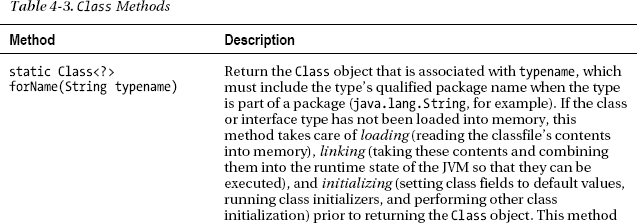

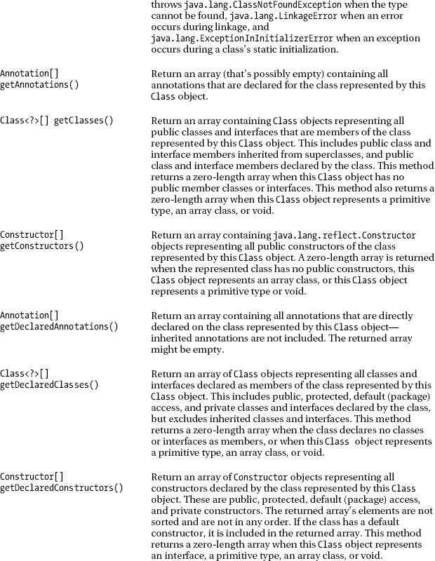

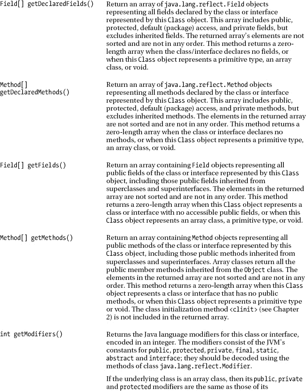

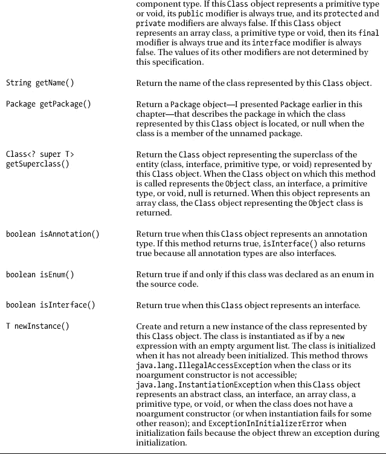

[表 4-3](#tab_4_3) 对`forName()`方法的描述揭示了一种获得`Class`对象的方法。这个方法加载、链接并初始化一个不在内存中的类或接口，并返回一个代表该类或接口的`Class`对象。[清单 4-10](#list_4_10) 展示了`forName()`和此表中描述的其他方法。

***清单 4-10。**使用反射反编译一个类型*

`import java.lang.reflect.Constructor;
import java.lang.reflect.Field;
import java.lang.reflect.Method;
import java.lang.reflect.Modifier;

class Decompiler
{
   public static void main(String[] args)
   {
      if (args.length != 1)
      {
         System.err.println("usage: java Decompiler classname");
         return;
      }
      try
      {
         decompileClass(Class.forName(args[0]), 0);
      }
      catch (ClassNotFoundException cnfe)
      {
         System.err.println("could not locate "+args[0]);
      }
   }
   static void decompileClass(Class<?> clazz, int indentLevel)
   {
      indent(indentLevel*3);
      System.out.print(Modifier.toString(clazz.getModifiers())+" ");
      if (clazz.isEnum())
         System.out.println("enum "+clazz.getName());
      else
      if (clazz.isInterface())
      {
         if (clazz.isAnnotation())
            System.out.print("@");
         System.out.println(clazz.getName());
      }
      else
         System.out.println(clazz);
      indent(indentLevel*3);
      System.out.println("{");
      Field[] fields = clazz.getDeclaredFields();
      for (int i = 0; i < fields.length; i++)
      {
         indent(indentLevel*3);
         System.out.println("   "+fields[i]);
      }` `Constructor[] constructors = clazz.getDeclaredConstructors();
      if (constructors.length != 0 && fields.length != 0)
         System.out.println();
      for (int i = 0; i < constructors.length; i++)
      {
         indent(indentLevel*3);
         System.out.println("   "+constructors[i]);
      }
      Method[] methods = clazz.getDeclaredMethods();
      if (methods.length != 0 &&
          (fields.length != 0 || constructors.length != 0))
         System.out.println();
      for (int i = 0; i < methods.length; i++)
      {
         indent(indentLevel*3);
         System.out.println("   "+methods[i]);
      }
      Method[] methodsAll = clazz.getMethods();
      if (methodsAll.length != 0 &&
          (fields.length != 0 || constructors.length != 0 ||
           methods.length != 0))
         System.out.println();
      if (methodsAll.length != 0)
      {
         indent(indentLevel*3);
         System.out.println("   ALL PUBLIC METHODS");
         System.out.println();
      }
      for (int i = 0; i < methodsAll.length; i++)
      {
         indent(indentLevel*3);
         System.out.println("   "+methodsAll[i]);
      }
      Class<?>[] members = clazz.getDeclaredClasses();
      if (members.length != 0 && (fields.length != 0 ||
          constructors.length != 0 || methods.length != 0 ||
          methodsAll.length != 0))
         System.out.println();
      for (int i = 0; i < members.length; i++)
         if (clazz != members[i])
         {
            decompileClass(members[i], indentLevel+1);
            if (i != members.length-1)
               System.out.println();
         }
      indent(indentLevel*3);
      System.out.println("}");
   }
   static void indent(int numSpaces)
   {
      for (int i = 0; i < numSpaces; i++)
         System.out.print(' ');
   }` `}`

清单 4-10 将源代码呈现给一个反编译器工具，该工具使用反射来获取关于该工具的唯一命令行参数的信息，该参数必须是 Java 引用类型(如类)。反编译器让你输出类的字段、构造函数、方法和嵌套类型的类型和名称信息；它还允许您输出接口、枚举和注释类型的成员。

在验证一个命令行参数已经被传递给这个应用之后，`main()`调用`forName()`来尝试返回一个`Class`对象，该对象代表由这个参数标识的类或接口。如果成功，返回的对象的引用被传递给`decompileClass()`，后者反编译该类型。

`forName()`在找不到类的类文件时抛出被检查的`ClassNotFoundException`类的一个实例(可能类文件在执行应用之前被删除了)。当一个类的类文件格式错误时，它还抛出`LinkageError`，当一个类的静态初始化失败时，它抛出`ExceptionInInitializerError`。

 **注意** `ExceptionInInitializerError`通常是由于类初始化器抛出未检查的异常而抛出的。例如，下面的`FailedInitialization`类中的类初始化器产生了`ExceptionInInitializerError`，因为`someMethod()`抛出了`NullPointerException`:

```java
class FailedInitialization
{
   static
   {
      someMethod(null);
   }
   static void someMethod(String s)
   {
      int len = s.length(); // s contains null
      System.out.println(s+"'s length is "+len+" characters");
   }
   public static void main(String[] args)
   {
   }
}
```

大部分打印代码都是为了让输出看起来更好。例如，这段代码管理缩进，只允许输出一个换行符来分隔不同的部分；除非换行符前后出现内容，否则不输出换行符。

清单 4-10 是递归的，因为它为每个遇到的嵌套类型调用`decompileClass()`。

编译[清单 4-10](#list_4_10) ( `javac Decompiler.java`)并使用`java.lang.Boolean`作为其唯一的命令行参数(`java Decompiler java.lang.Boolean`)运行该应用。您将看到以下输出:

```java
public final class java.lang.Boolean
{
   public static final java.lang.Boolean java.lang.Boolean.TRUE
   public static final java.lang.Boolean java.lang.Boolean.FALSE
   public static final java.lang.Class java.lang.Boolean.TYPE
   private final boolean java.lang.Boolean.value
   private static final long java.lang.Boolean.serialVersionUID

   public java.lang.Boolean(java.lang.String)
   public java.lang.Boolean(boolean)

   public int java.lang.Boolean.hashCode()
   public boolean java.lang.Boolean.equals(java.lang.Object)
   public java.lang.String java.lang.Boolean.toString()
   public static java.lang.String java.lang.Boolean.toString(boolean)
   public static int java.lang.Boolean.compare(boolean,boolean)
   public int java.lang.Boolean.compareTo(java.lang.Object)
   public int java.lang.Boolean.compareTo(java.lang.Boolean)
   public static java.lang.Boolean java.lang.Boolean.valueOf(boolean)
   public static java.lang.Boolean java.lang.Boolean.valueOf(java.lang.String)
   public boolean java.lang.Boolean.booleanValue()
   public static boolean java.lang.Boolean.getBoolean(java.lang.String)
   public static boolean java.lang.Boolean.parseBoolean(java.lang.String)
   private static boolean java.lang.Boolean.toBoolean(java.lang.String)

   ALL PUBLIC METHODS

   public int java.lang.Boolean.hashCode()
   public boolean java.lang.Boolean.equals(java.lang.Object)
   public java.lang.String java.lang.Boolean.toString()
   public static java.lang.String java.lang.Boolean.toString(boolean)
   public static int java.lang.Boolean.compare(boolean,boolean)
   public int java.lang.Boolean.compareTo(java.lang.Object)
   public int java.lang.Boolean.compareTo(java.lang.Boolean)
   public static java.lang.Boolean java.lang.Boolean.valueOf(boolean)
   public static java.lang.Boolean java.lang.Boolean.valueOf(java.lang.String)
   public boolean java.lang.Boolean.booleanValue()
   public static boolean java.lang.Boolean.getBoolean(java.lang.String)
   public static boolean java.lang.Boolean.parseBoolean(java.lang.String)
   public final native java.lang.Class java.lang.Object.getClass()
   public final native void java.lang.Object.notify()
   public final native void java.lang.Object.notifyAll()
   public final void java.lang.Object.wait(long,int) throws java.lang.InterruptedException
   public final void java.lang.Object.wait() throws java.lang.InterruptedException
   public final native void java.lang.Object.wait(long) throws java.lang.InterruptedException
}
```

输出揭示了调用`getDeclaredMethods()`和`getMethods()`的区别。例如，与`getDeclaredMethods()`相关的输出包括私有的`toBoolean()`方法。同样，与`getMethods()`相关的输出包括没有被`Boolean`覆盖的`Object`方法；`getClass()`就是一个例子。

在[清单 4-10](#list_4_10) 中没有展示的[表 4-3](#tab_4_3) 的方法之一是`newInstance()`，它对于实例化一个动态加载的类是有用的，只要这个类有一个无参数的构造函数。

假设您计划创建一个查看器应用，让用户查看不同类型的文件。例如，查看器可以查看反汇编的 Windows EXE 文件的指令序列、PNG 文件的图形内容或某些其他文件的内容。此外，用户可以选择以信息方式(描述性标签和内容；例如，EXE HEADER: MZ)，或者作为十六进制值的表。

查看器应用开始时只有几个查看器，但是您计划随着时间的推移添加更多的查看器。您不希望将查看器源代码与应用源代码集成在一起，因为每次添加新的查看器(例如，允许您查看 Java 类文件内容的查看器)时，您都必须重新编译应用及其所有查看器。

相反，您可以在一个单独的项目中创建这些查看器，并且只分发它们的类文件。此外，设计应用以在应用开始运行时枚举其当前可访问的查看器(查看器可能存储在一个 JAR 文件中)，并将该列表呈现给用户。当用户从这个列表中选择一个特定的查看器时，应用加载查看器的类文件，并通过它的`Class`对象实例化这个类。然后，应用可以调用该对象的方法。

清单 4-11 展示了所有查看器类都必须扩展的`Viewer`超类。

***清单 4-11。**抽象出一个观者*

```java
abstract class Viewer
{
   enum ViewMode { NORMAL, INFO, HEX };
   abstract void view(byte[] content, ViewMode vm);
}
```

`Viewer`声明一个枚举来描述三种查看模式。它还声明了一个`view()`方法，该方法根据其`vm`参数指定的查看器模式显示其字节数组参数的内容。

清单 4-12 展示了一个用于查看 EXE 文件内容的`Viewer`子类。

***清单 4-12。**用于查看 EXE 内容的查看器*

`class ViewerEXE extends Viewer
{
   @Override
   void view(byte[] content, ViewMode vm)
   {
      switch (vm)
      {
         case NORMAL:
            System.out.println("outputting EXE content normally");
            break;
         case INFO:
            System.out.println("outputting EXE content informationally");
            break;` `         case HEX:
            System.out.println("outputting EXE content in hexadecimal");
      }
   }
}`

`ViewerEXE`的`view()`方法演示了如何使用 switch 语句打开一个枚举常量。为了简洁起见，我将这个方法限制为将消息打印到标准输出。此外，我没有给出相应的`ViewPNG`类，它有类似的结构。

[清单 4-13](#list_4_13) 展示了一个应用，它动态加载`ViewerEXE`或`ViewerPNG`，通过`newInstance()`实例化加载的类，并调用`view()`方法。

***清单 4-13。**加载、实例化和使用`Viewer`子类*

```java
class ViewerDemo
{
   public static void main(String[] args)
   {
      if (args.length != 1)
      {
         System.err.println("usage  : java ViewerDemo filetype");
         System.err.println("example: java ViewerDemo EXE");
         return;
      }
      try
      {
         Class<?> clazz = Class.forName("Viewer"+args[0]);
         Viewer viewer = (Viewer) clazz.newInstance();
         viewer.view(null, Viewer.ViewMode.HEX);
      }
      catch (ClassNotFoundException cnfe)
      {
         System.err.println("Class not found: "+cnfe.getMessage());
      }
      catch (IllegalAccessException iae)
      {
         System.err.println("Illegal access: "+iae.getMessage());
      }
      catch (InstantiationException ie)
      {
         System.err.println("Unable to instantiate loaded class");
      }
   }
}
```

假设您已经编译了所有的源文件(例如`javac *.java`，执行`java ViewerDemo EXE`。您应该观察到以下输出:

```java
outputting EXE content in hexadecimal
```

如果您要执行`java ViewerDemo PNG`，您应该会看到类似的输出。

假设你试图通过`java ViewerDemo ""`加载并实例化抽象的`Viewer`类。尽管这个类会被加载，`newInstance()`会抛出一个`InstantiationException`类的实例，您会看到下面的输出:

```java
Unable to instantiate loaded class
```

[表 4-3](#tab_4_3) 对`getAnnotations()`和`getDeclaredAnnotations()`方法的描述揭示了每个方法返回一个`Annotation`数组，一个位于`java.lang.annotation`包中的接口。`Annotation`是`Override`、`SuppressWarnings`和所有其他注释类型的超级界面。

[表 4-3](#tab_4_3) 的方法描述也参考了`Constructor`、`Field`、`Method`。这些类的实例代表一个类的构造函数和一个类或接口的字段和方法。

`Constructor`代表一个构造函数，一般声明为`Constructor<T>`，其中`T`标识声明了`Constructor`所代表的构造函数的类。`Constructor`声明各种方法，包括以下方法:

*   `Annotation[] getDeclaredAnnotations()`返回在构造函数上声明的所有注释的数组。当没有注释时，返回的数组长度为零。
*   `Class<T> getDeclaringClass()`返回一个`Class`对象，代表声明构造函数的类。
*   `Class[]<?> getExceptionTypes()`返回一个由`Class`对象组成的数组，这些对象表示构造函数的 throws 子句中列出的异常类型。当没有 throws 子句时，返回的数组长度为零。
*   `String getName()`返回构造函数的名称。
*   `Class[]<?> getParameterTypes()`返回代表构造函数参数的`Class`对象的数组。当构造函数未声明参数时，返回的数组长度为零。

 **提示**如果你想通过带参数的构造函数实例化一个类，你不能使用`Class`的`newInstance()`方法。相反，你必须使用`Constructor`的`T newInstance(Object... initargs)`方法来执行这个任务。与`Class`的`newInstance()`方法不同，它绕过了编译时异常检查，否则将由编译器执行，`Constructor`的`newInstance()`方法通过将构造函数抛出的任何异常包装在`java.lang.reflect.InvocationTargetException`类的实例中来避免这个问题。

`Field`表示一个字段并声明各种方法，包括以下 getter 方法:

*   `Object get(Object object)`返回指定`object`的字段值。
*   `boolean getBoolean(Object object)`返回指定`object`的布尔字段的值。
*   `byte getByte(Object object)`返回指定`object`的字节整数字段的值。
*   `char getChar(Object object)`返回指定`object`的字符字段值。
*   `double getDouble(Object object)`返回指定`object`的双精度浮点字段的值。
*   `float getFloat(Object object)`返回指定`object`的浮点字段值。
*   `int getInt(Object object)`返回指定`object`的整数字段的值。
*   `long getLong(Object object)`返回指定`object`的长整型字段的值。
*   `short getShort(Object object)`返回指定`object`的短整型字段的值。

`get()`返回任意类型字段的值。相比之下，其他列出的方法返回特定类型字段的值。当`object`是`null`并且字段是实例字段时，这些方法抛出`NullPointerException`，当`object`不是声明底层字段的类或接口的实例(或者不是子类或接口实现者的实例)时抛出`IllegalArgumentException`，当底层字段不能被访问时抛出`IllegalAccessException`(例如，它是私有的)。

[清单 4-14](#list_4_14) 展示了`Field`的`getInt(Object)`方法及其对应的`void setInt(Object obj, int i)`方法。

***清单 4-14。**反射式获取和设置实例和类字段的值*

`import java.lang.reflect.Field;

class X
{
   public int i = 10;
   public static final double PI = 3.14;
}
class FieldAccessDemo
{
   public static void main(String[] args)
   {
      try
      {
         Class<?> clazz = Class.forName("X");
         X x = (X) clazz.newInstance();
         Field f = clazz.getField("i");
         System.out.println(f.getInt(x)); // Output: 10
         f.setInt(x, 20);
         System.out.println(f.getInt(x)); // Output: 20
         f = clazz.getField("PI");
         System.out.println(f.getDouble(null)); // Output: 3.14
         f.setDouble(x, 20);
         System.out.println(f.getDouble(null)); // Never executed
      }
      catch (Exception e)
      {` `         System.err.println(e);
      }
   }
}`

[清单 4-14](#list_4_14) 声明了类`X`和`FieldAccessDemo`。为了方便起见，我将`X`的源代码和`FieldAccessDemo`的源代码放在了一起。但是，您可以想象这个源代码存储在一个单独的源文件中。

`FieldAccessDemo`的`main()`方法首先尝试加载`X`，然后尝试通过`newInstance()`实例化这个类。如果成功，实例被分配给引用变量`x`。

`main()`接下来调用`Class`的`Field getField(String name)`方法返回一个`Field`实例，代表由`name`标识的`public`字段，恰好是`i`(第一种情况)和`PI`(第二种情况)。当命名字段不存在时，这个方法抛出`java.lang.NoSuchFieldException`。

接下来，`main()`调用`Field`的`getInt()`和`setInt()`方法(使用对象引用)来获取实例字段的初始值，将该值更改为另一个值，并获取新值。输出初始值和新值。

至此，`main()`以类似的方式演示了类字段访问。然而，它将`null`传递给`getInt()`和`setInt()`，因为访问类字段不需要对象引用。因为`PI`被声明为`final`，所以对`setInt()`的调用导致了一个`IllegalAccessException`类的抛出实例。

 **注意**我已经指定了`catch (Exception e)`以避免必须指定多个 catch 块。你也可以在适当的时候使用多批次(见[第三章](03.html#ch3))。

`Method`表示一个方法，并声明各种方法，包括以下方法:

*   `int getModifiers()`返回一个 32 位整数，其位字段标识方法的保留字修饰符(如`public`、`abstract`或`static`)。这些位域必须通过`Modifier`类来解释。例如，您可以指定`(method.getModifiers()&Modifier.ABSTRACT) == Modifier.ABSTRACT`来确定方法(由`Method`对象表示，该对象的引用存储在`method`中)是否是抽象的——当方法是抽象的时，该表达式的计算结果为 true。
*   `Class<?> getReturnType()`返回一个代表方法返回类型的`Class`对象。
*   `Object invoke(Object receiver, Object... args)`调用由`receiver`标识的对象上的方法(当该方法是类方法时被忽略)，将由`args`标识的可变数量的参数传递给被调用的方法。当`receiver`为`null`并且被调用的方法是实例方法时，`invoke()`方法抛出`NullPointerException`，当方法不可访问时(例如，它是私有的)，当传递给方法的参数数量不正确时(以及其他原因)，抛出`IllegalArgumentException`，当被调用的方法抛出异常时，抛出`InvocationTargetException`。
*   当方法被声明为接收可变数量的参数时，返回 true。

[清单 4-15](#list_4_15) 演示了`Method`的`invoke(Object, Object...)`方法。

***清单 4-15。**反射性地调用实例和类方法*

```java
import java.lang.reflect.Method;

class X
{
   public void objectMethod(String arg)
   {
      System.out.println("Instance method: "+arg);
   }
   public static void classMethod()
   {
      System.out.println("Class method");
   }
}
class MethodInvocationDemo
{
   public static void main(String[] args)
   {
      try
      {
         Class<?> clazz = Class.forName("X");
         X x = (X) clazz.newInstance();
         Class[] argTypes = { String.class };
         Method method = clazz.getMethod("objectMethod", argTypes);
         Object[] data = { "Hello" };
         method.invoke(x, data); // Output: Instance method: Hello
         method = clazz.getMethod("classMethod", (Class<?>[]) null);
         method.invoke(null, (Object[]) null); // Output: Class method
      }
      catch (Exception e)
      {
         System.err.println(e);
      }
   }
}
```

清单 4-15 声明了类`X`和`MethodInvocationDemo`。`MethodInvocationDemo`的`main()`方法首先尝试加载`X`，然后尝试通过`newInstance()`实例化这个类。如果成功，实例被分配给引用变量`x`。

`main()`接下来创建一个描述`objectMethod()`参数列表类型的单元素`Class`数组。该数组在随后对`Class`的`Method getMethod(String name, Class<?>... parameterTypes)`方法的调用中使用，以返回一个`Method`对象，用于调用带有该参数列表的`public`方法`objectMethod`。当命名方法不存在时，这个方法抛出`java.lang.NoSuchMethodException`。

接下来，`main()`创建一个`Object`数组，指定要传递给方法参数的数据；在这种情况下，数组由一个`String`参数组成。然后，它反射性地调用`objectMethod()`，将这个数组以及存储在`x`中的对象引用传递给`invoke()`方法。

至此，`main()`展示了如何反射性地调用一个类方法。`(Class<?>[])`和`(Object[])`强制转换用于抑制与可变数量的参数和空引用有关的警告消息。注意，调用类方法时，传递给`invoke()`的第一个参数是`null`。

`java.lang.reflect.AccessibleObject`类是`Constructor`、`Field`和`Method`的超类。这个超类提供了报告构造函数、字段或方法的可访问性的方法(它是私有的吗？)并将不可访问的构造函数、字段或方法变为可访问的。`AccessibleObject`的方法包括以下几种:

*   `T getAnnotation(Class<T> annotationType)`返回指定类型的构造函数、字段或方法的注释(如果有这样的注释的话)。否则，null 返回。
*   当构造函数、字段或方法可访问时，返回 true。
*   当在构造函数、字段或方法上声明了由`annotationType`指定的类型的注释时，`boolean isAnnotationPresent(Class<? extends Annotation> annotationType)`返回 true。该方法考虑了继承的注释。
*   当`flag`为`true`时，`void setAccessible(boolean flag)`试图将不可访问的构造函数、字段或方法变为可访问的。

 **注意**`java.lang.reflect`包还包含一个`Array`类，它的类方法使得反射式创建和访问 Java 数组成为可能。

我之前向您展示了如何通过`Class`的`forName()`方法获得一个`Class`对象。另一种获得`Class`对象的方法是在对象引用上调用`Object`的`getClass()`方法；比如`Employee e = new Employee(); Class<? extends Employee> clazz = e.getClass();`。因为创建对象的类已经存在于内存中，所以`getClass()`方法不会抛出异常。

还有一种方法可以获得一个`Class`对象，那就是使用一个*类文字*，它是一个表达式，由类名、句点分隔符、保留字`class`组成。类文字的例子包括`Class<Employee> clazz = Employee.class;`和`Class<String> clazz = String.class`。

也许您想知道如何在`forName()`、`getClass()`和类文字之间进行选择。为了帮助您做出选择，以下列表对每个竞争对手进行了比较:

*   `forName()`非常灵活，因为您可以通过包限定名动态指定任何引用类型。如果该类型不在内存中，则加载、链接并初始化它。然而，缺乏编译时类型安全会导致运行时失败。
*   `getClass()`返回一个描述其引用对象类型的`Class`对象。如果在包含子类实例的超类变量上调用，则返回代表子类类型的`Class`对象。因为类在内存中，所以类型安全是有保证的。
*   一个类文字返回一个代表其指定类的`Class`对象。类文本是紧凑的，当编译器找不到文本的指定类时，它通过拒绝编译源代码来强制类型安全。

 **注意**你可以使用原始类型的类文字，包括`void`。例子包括`int.class`、`double.class`和`void.class`。返回的`Class`对象表示由原始类型包装类的`TYPE`字段或`java.lang.Void.TYPE`标识的类。例如，`int.class == Integer.TYPE`和`void.class == Void.TYPE`中的每一个都评估为真。

您还可以将类文本用于基于类型的基元数组。例子有`int[].class`和`double[].class`。对于这些例子，返回的`Class`对象代表`Class<int[]>`和`Class<double[]>`。

### 字符串

`String`是本书提出的第一个预定义引用类型(在[第一章](01.html#ch1))。这种类型的实例表示字符序列，或*字符串。*

与其他引用类型不同，Java 语言通过提供简化字符串处理的语法糖，对`String`类进行了特殊处理。例如，Java 将`String favLanguage = "Java";`识别为字符串文字`"Java"`到`String`变量`favLanguage`的赋值。没有这个糖，你就得指定`String favLanguage = new String("Java");`。Java 语言还重载了`+`和`+=`操作符来执行字符串连接。

[表 4-4](#tab_4_4) 描述了一些`String`的构造函数和方法，用于初始化`String`对象和处理字符串。

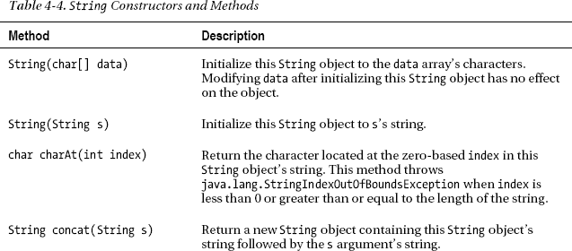

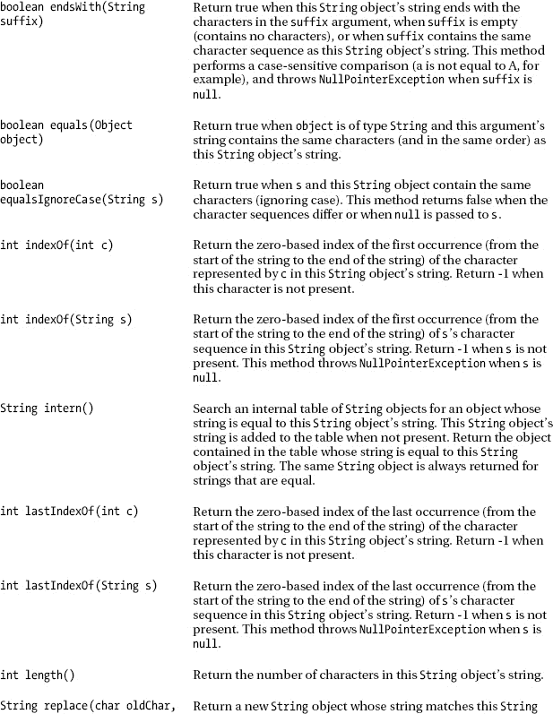


表 4-4 揭示了几个关于`String`的有趣项目。首先，这个类的`String(String s)`构造函数没有将`String`对象初始化为字符串文字。相反，它的行为类似于 C++复制构造函数，将`String`对象初始化为另一个`String`对象的内容。这种行为表明，字符串文字不仅仅是它看起来的样子。

实际上，字符串是一个`String`对象。你可以通过执行`System.out.println("abc".length());`和`System.out.println("abc" instanceof String);`来证明这一点。第一个方法调用输出`3`，它是`"abc"` `String`对象的字符串长度，第二个方法调用输出`true` ( `"abc"`是一个`String`对象)。

 **注意**字符串被存储在一个叫做*常量池*的类文件数据结构中。当加载一个类时，为每个字面值创建一个`String`对象，并存储在一个`String`对象的内部表中。

第二个有趣的项目是`intern()`方法，该方法*在`String`对象的内部表中实习*(存储一个`String`对象的唯一副本)。`intern()`可以通过字符串的引用和`==`或`!=`来比较字符串。这些运算符是比较字符串的最快方法，在对大量字符串进行排序时尤其有用。

默认情况下，由文字字符串(`"abc"`)和字符串值常量表达式(`"a"+"bc"`)表示的`String`对象被保留在该表中，这就是为什么`System.out.println("abc" == "a"+"bc");`输出`true`的原因。然而，通过`String`构造函数创建的`String`对象并没有被 interned，这就是为什么`System.out.println("abc" == new String("abc"));`会输出`false`。相比之下，`System.out.println("abc" == new String("abc").intern());`输出`true`。

 **警告**小心使用这种字符串比较技术(它只比较引用),因为当被比较的字符串之一没有被保留时，你很容易引入一个错误。如有疑问，使用`equals()`或`equalsIgnoreCase()`方法。

[表 4-4](#tab_4_4) 还揭示了`charAt()`和`length()`方法，这对于迭代字符串的字符很有用。例如，`String s = "abc"; for (int i = 0; i < s.length(); i++) System.out.println(s.charAt(i));`返回`s`的`a`、`b`和`c`字符，并在单独的行上输出每个字符。

最后，[表 4-4](#tab_4_4) 展示了`split()`，这是我在[第 3 章](03.html#ch3)的`StubFinder`应用中使用的一种方法，用于将一个字符串的逗号分隔的值列表分割成一个`String`对象数组。此方法使用一个正则表达式来标识字符串拆分所围绕的字符序列。(我在附录 c 中讨论正则表达式。)

 **注意** `StringIndexOutOfBoundsException`和`ArrayIndexOutOfBoundsException`是共享一个公共`java.lang.IndexOutOfBoundsException`超类的兄弟类。

### StringBuffer 和 StringBuilder

`String`对象是不可变的:你不能修改`String`对象的字符串。各种看似修改了`String`对象的`String`方法实际上返回了一个修改了字符串内容的新的`String`对象。因为返回新的`String`对象通常很浪费，所以 Java 提供了`java.lang.StringBuffer`和`java.lang.StringBuilder`类作为解决方法。这些类是相同的，除了`StringBuffer`可以在多线程的环境中使用(在本章后面讨论)，并且`StringBuilder`比`StringBuffer`快，但是在没有显式同步的情况下不能在多线程的环境中使用(也在本章后面讨论)。

[表 4-5](#tab_4_5) 描述了一些`StringBuffer`的构造函数和方法，用于初始化`StringBuffer`对象和处理字符串缓冲区。`StringBuilder`的构造函数和方法是相同的。

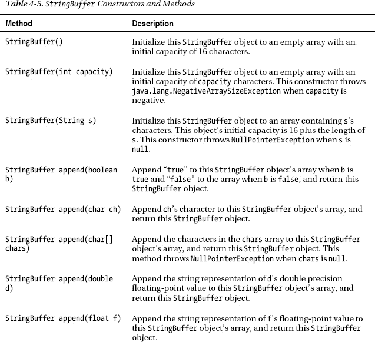

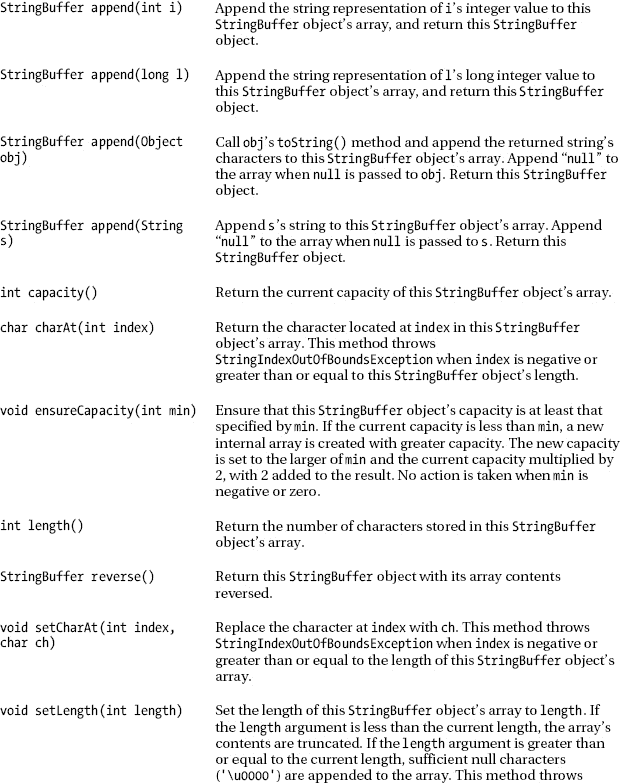


一个`StringBuffer`或`StringBuilder`对象的内部数组与容量和长度的概念相关联。*容量*指的是在数组增长以容纳更多字符之前，数组中可以存储的最大字符数。 *Length* 指数组中已经存储的字符数。

本章前面介绍的`toAlignedBinaryString()`方法在其实现中包含以下低效循环:

```java
int numLeadingZeros = numBits-result.length();
String zerosPrefix = "";
for (int j = 0; j < numLeadingZeros; j++)
   zerosPrefix += "0";
```

这个循环是低效的，因为每次迭代都创建一个`StringBuilder`对象和一个`String`对象。编译器将该代码片段转换为以下片段:

```java
int numLeadingZeros = 3;
String zerosPrefix = "";
for (int j = 0; j < numLeadingZeros; j++)
   zerosPrefix = new StringBuilder().append(zerosPrefix).append("0").toString();
```

对前一个循环进行编码的一种更有效的方法包括在进入循环之前创建一个`StringBuffer` / `StringBuilder`对象，在循环中调用适当的`append()`方法，并在循环之后调用`toString()`。以下代码片段演示了这种更高效的场景:

```java
int numLeadingZeros = 3;
StringBuilder sb = new StringBuilder();
for (int j = 0; j < numLeadingZeros; j++)
   sb.append("0");
String zerosPrefix = sb.toString();
```

 **注意**避免在冗长的循环中使用字符串连接操作符，因为这会导致创建许多不必要的`StringBuilder`和`String`对象。

### 系统

`java.lang.System`类提供对面向系统的资源的访问，包括标准输入、标准输出和标准错误。

`System`声明了分别支持标准输入、标准输出和标准误差的`in`、`out`和`err`类字段。第一个字段属于类型`java.io.InputStream`，最后两个字段属于类型`java.io.PrintStream`。(我会在[第 8 章](08.html#ch8)正式介绍这些类。)

`System`还声明了各种`static`方法，包括那些在[表 4-6](#tab_4_6) 中描述的方法。

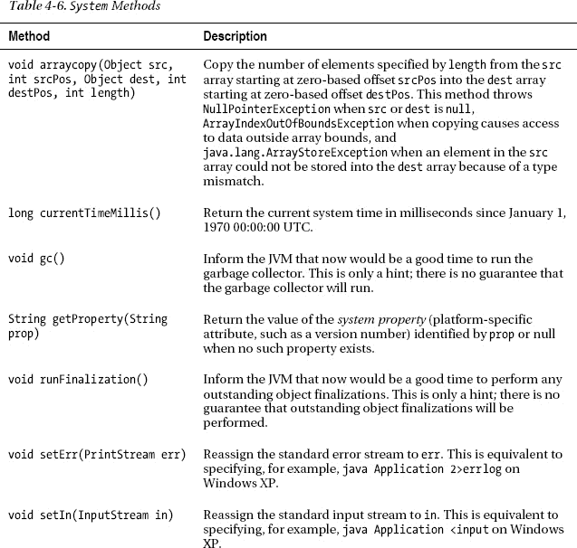

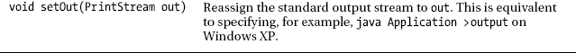

[清单 4-16](#list_4_16) 展示了`arraycopy()`、`currentTimeMillis()`和`getProperty()`方法。

***清单 4-16。**试验`System`方法*

```java
class SystemTasks
{
   public static void main(String[] args)
   {
      int[] grades = { 86, 92, 78, 65, 52, 43, 72, 98, 81 };
      int[] gradesBackup = new int[grades.length];
      System.arraycopy(grades, 0, gradesBackup, 0, grades.length);
      for (int i = 0; i < gradesBackup.length; i++)
         System.out.println(gradesBackup[i]);
      System.out.println("Current time: "+System.currentTimeMillis());
      String[] propNames =
      {
         "java.vendor.url",
         "java.class.path",
         "user.home",
         "java.class.version",
         "os.version",
         "java.vendor",
         "user.dir",
         "user.timezone",
         "path.separator",
         "os.name",
         "os.arch",
         "line.separator",
         "file.separator",
         "user.name",
         "java.version",
         "java.home"
      };
      for (int i = 0; i < propNames.length; i++)
         System.out.println(propNames[i]+": "+
                            System.getProperty(propNames[i]));
   }
}
```

[清单 4-16](#list_4_16) 的`main()`方法从演示`arraycopy()`开始。它使用这个方法将一个`grades`数组的内容复制到一个`gradesBackup`数组中。

 **提示**`arraycopy()`方法是将一个数组复制到另一个数组的最快方法。同样，当你编写一个类，它的方法返回一个对内部数组的引用时，你应该使用`arraycopy()`来创建一个数组的副本，然后返回该副本的引用。这样，您可以防止客户端直接操作(并且可能搞砸)内部数组。

`main()` next 调用`currentTimeMillis()`以毫秒值返回当前时间。因为这个值不是人类可读的，所以您可能想要使用`java.util.Date`类(在附录 C 中讨论)。`Date()`构造函数调用`currentTimeMillis()`，它的`toString()`方法将这个值转换成可读的日期和时间。

`main()`通过在 for 循环中演示`getProperty()`得出结论。这个循环遍历所有的[表 4-6](#tab_4_6) 的属性名，输出每个名称和值。

当我在我的平台上运行这个应用时，它会生成以下输出:

```java
86
92
78
65
52
43
72
98
81
Current time: 1312236551718
java.vendor.url: http://java.oracle.com/
java.class.path: .
user.home: C:\Documents and Settings\Jeff Friesen
java.class.version: 51.0
os.version: 5.1
java.vendor: Oracle Corporation
user.dir: C:\prj\dev\bj7\ch04\code\SystemTasks
user.timezone:
path.separator: ;
os.name: Windows XP
os.arch: x86
line.separator:

file.separator: \
user.name: Jeff Friesen
java.version: 1.7.0
java.home: C:\Program Files\Java\jdk1.7.0\jre
```

 **注意** `line.separator`存储的是实际的行分隔符字符/字符，而不是其表示形式(如`\r\n`)，这也是为什么`line.separator:`后面会出现一个空行的原因。

### 穿线

应用通过*线程*执行，这些线程是应用代码的独立执行路径。当多个线程正在执行时，每个线程的路径可以不同于其他线程的路径。例如，一个线程可能执行 switch 语句的一个案例，而另一个线程可能执行该语句的另一个案例。

 **注意**应用使用线程来提高性能。一些应用可以只使用默认的主线程来执行它们的任务，但其他应用需要额外的线程来在后台执行时间密集型任务，以便它们能够对用户做出响应。

JVM 为每个线程提供了自己的方法调用堆栈，以防止线程相互干扰。独立的堆栈让线程能够跟踪它们要执行的下一条指令，这些指令可能因线程而异。堆栈还为线程提供自己的方法参数、局部变量和返回值的副本。

Java 通过其线程 API 支持线程。这个 API 由`java.lang`包中的一个接口(`Runnable`)和四个类(`Thread`、`ThreadGroup`、`ThreadLocal`和`InheritableThreadLocal`)组成。在探索了`Runnable`和`Thread`(在这个探索过程中提到了`ThreadGroup`)之后，本节将探讨线程同步、`ThreadLocal`和`InheritableThreadLocal`。

 **注意** Java 5 引入了`java.util.concurrent`包作为低级线程 API 的高级替代。(我会在[第 6 章](06.html#ch6)讨论这个包。)尽管`java.util.concurrent`是处理线程的首选 API，但您也应该对线程有所了解，因为它在简单的线程场景中很有帮助。此外，您可能需要分析其他人依赖线程的源代码。

#### 可运行和线程

Java 提供了`Runnable`接口来识别那些为线程提供代码的对象，线程通过这个接口唯一的`void run()`方法来执行——线程不接收参数，也不返回值。类实现了`Runnable`来提供这段代码，其中一个类是`Thread`。

`Thread`为底层操作系统的线程架构提供一致的接口。(操作系统通常负责创建和管理线程。)`Thread`使代码与线程相关联，以及启动和管理那些线程成为可能。每个`Thread`实例与一个线程相关联。

`Thread`声明了几个用于初始化`Thread`对象的构造函数。这些构造函数中的一些采用了`Runnable`参数:你可以提供代码来运行，而不必扩展`Thread`。其他构造函数不接受`Runnable`参数:您必须扩展`Thread`并覆盖它的`run()`方法来提供要运行的代码。

例如，`Thread(Runnable runnable)`将新的`Thread`对象初始化为指定的`runnable`，其代码将被执行。相反，`Thread()`不会将`Thread`初始化为`Runnable`参数。相反，你的`Thread`子类提供了一个调用`Thread()`的构造函数，并且子类也覆盖了`Thread`的`run()`方法。

在没有显式名称参数的情况下，每个构造函数给`Thread`对象分配一个唯一的默认名称(以`Thread-`开始)。名字使得区分线程成为可能。与选择默认名称的前两个构造函数不同，`Thread(String threadName)`让您指定自己的线程名称。

`Thread`还声明了启动和管理线程的方法。表 4-7 描述了许多更有用的方法。

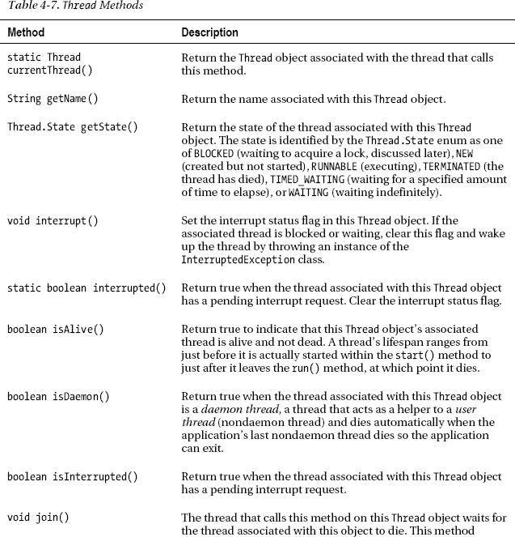

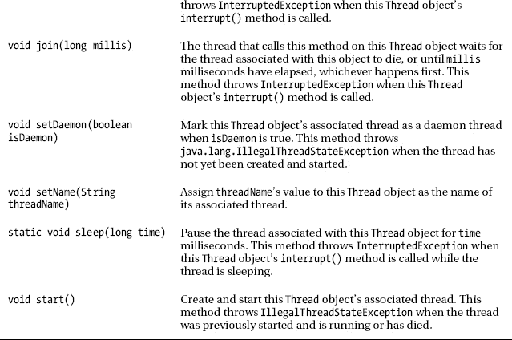

[清单 4-17](#list_4_17) 通过演示`Runnable`、`Thread(Runnable runnable)`、`currentThread()`、`getName()`和`start()`的`main()`方法向您介绍线程 API。

***清单 4-17。**一对计数线*

`class CountingThreads
{
   public static void main(String[] args)
   {
      Runnable r = new Runnable()
                   {
                      @Override
                      public void run()
                      {
                         String name = Thread.currentThread().getName();
                         int count = 0;
                         while (true)
                            System.out.println(name+": "+count++);
                      }
                   };
      Thread thdA = new Thread(r);
      Thread thdB = new Thread(r);
      thdA.start();` `      thdB.start();
   }
}`

根据[清单 4-17](#list_4_17) ，执行`main()`的默认主线程首先实例化一个实现`Runnable`的匿名类。然后它创建两个`Thread`对象，将每个对象初始化为 runnable，并调用`Thread`的`start()`方法来创建和启动两个线程。完成这些任务后，主线程退出`main()`并死亡。

两个启动的线程都执行 runnable 的`run()`方法。它调用`Thread`的`currentThread()`方法以获得其关联的`Thread`实例，使用该实例调用`Thread`的`getName()`方法以返回其名称，将`count`初始化为 0，并进入一个无限循环，在该循环中输出`name`和`count`，并在每次迭代中递增`count`。

 **提示**要停止一个没有结束的应用，同时按下 Ctrl 和 C 键(至少在 Windows 平台上)。

当我在 Windows XP 平台上运行这个应用时，我观察到两个线程交替执行。一次运行的部分输出如下所示:

```java
Thread-0: 0
Thread-0: 1
Thread-0: 2
Thread-0: 3
Thread-0: 4
Thread-0: 5
Thread-0: 6
Thread-0: 7
Thread-1: 0
Thread-1: 1
Thread-1: 2
Thread-1: 3
```

操作系统为每个处理器或内核分配一个单独的线程，因此线程同时执行*(同时)。当计算机没有足够的处理器和/或内核时，线程必须等待轮到它使用共享的处理器/内核。*

 *操作系统使用一个*调度器* ( `[http://en.wikipedia.org/wiki/Scheduling_(computing)](http://en.wikipedia.org/wiki/Scheduling_(computing))`)来决定一个等待线程何时执行。下表列出了三种不同的调度程序:

*   Linux 2.6 到 2.6.22 使用 O(1)调度程序(`[http://en.wikipedia.org/wiki/O(1)_scheduler](http://en.wikipedia.org/wiki/O(1)_scheduler)`)。
*   Linux 2.6.23 使用完全公平调度器(`[http://en.wikipedia.org/wiki/Completely_Fair_Scheduler](http://en.wikipedia.org/wiki/Completely_Fair_Scheduler)`)。
*   基于 Windows NT 的操作系统(如 NT、2000、XP、Vista 和 7)使用多级反馈队列调度程序(`[http://en.wikipedia.org/wiki/Multilevel_feedback_queue](http://en.wikipedia.org/wiki/Multilevel_feedback_queue)`)。

计数线程应用之前的输出是通过 Windows XP 的*多级反馈队列*调度程序运行该应用产生的。由于这个调度程序，两个线程轮流执行。

 **注意**虽然这个输出表示第一个线程开始执行，但是千万不要认为与第一个调用了`start()`方法的`Thread`对象相关联的线程是第一个执行的线程。虽然这可能适用于某些调度程序，但可能不适用于其他调度程序。

多级反馈队列和许多其他线程调度器考虑了*优先级*(线程相对重要性)的概念。他们经常将*抢占式调度*(优先级较高的线程*抢占*—中断并运行，而不是——优先级较低的线程)与*循环调度*(优先级相等的线程被给予相等的时间片，这些时间片被称为*时间片*，轮流执行)。

`Thread`通过其`void setPriority(int priority)`方法(将该`Thread`对象线程的优先级设置为`priority`，范围从`Thread.MIN_PRIORITY`到`Thread.MAX_PRIORITY` — `Thread.NORMAL_PRIORITY`标识默认优先级)和`int getPriority()`方法(返回当前优先级)支持优先级。

 **注意**使用`setPriority()`方法会影响应用跨平台的可移植性，因为不同的调度程序可以用不同的方式处理优先级的变化。例如，一个平台的调度程序可能会延迟低优先级线程的执行，直到高优先级线程完成。这种延迟会导致*无限期推迟*或*饥饿*，因为优先级较低的线程在无限期等待执行时会“饥饿”,这会严重损害应用的性能。另一个平台的调度程序可能不会无限期地延迟较低优先级的线程，从而提高应用的性能。

[清单 4-18](#list_4_18) 重构[清单 4-17](#list_4_17) 的`main()`方法，给每个线程一个非默认的名字，输出`name`和`count`后让每个线程休眠。

***清单 4-18。**重温一对数数线*

`class CountingThreads
{
   public static void main(String[] args)
   {
      Runnable r = new Runnable()
                   {
                      @Override
                      public void run()
                      {
                         String name = Thread.currentThread().getName();
                         int count = 0;` `                         while (true)
                         {
                            System.out.println(name+": "+count++);
                            try
                            {
                               Thread.sleep(100);
                            }
                            catch (InterruptedException ie)
                            {
                            }
                         }
                      }
                   };
      Thread thdA = new Thread(r);
      thdA.setName("A");
      Thread thdB = new Thread(r);
      thdB.setName("B");
      thdA.start();
      thdB.start();
   }
}`

[清单 4-18](#list_4_18) 显示线程 A 和 B 执行`Thread.sleep(100);`休眠 100 毫秒。这种休眠会导致每个线程更频繁地执行，如以下部分输出所示:

```java
A: 0
B: 0
A: 1
B: 1
A: 2
B: 2
A: 3
B: 3
```

一个线程偶尔会启动另一个线程来执行冗长的计算、下载大文件或执行其他一些耗时的活动。在完成其他任务后，启动工作线程的线程准备好处理工作线程的结果，并等待工作线程完成和终止。

可以通过使用 while 循环来等待工作线程死亡，该循环在工作线程的`Thread`对象上重复调用`Thread`的`isAlive()`方法，并在该方法返回 true 时休眠一段时间。然而，[清单 4-19](#list_4_19) 展示了一个不那么冗长的替代方法:`join()`方法。

***清单 4-19。**加入默认主线程和后台线程*

`class JoinDemo
{
   public static void main(String[] args)
   {
      Runnable r = new Runnable()
                   {
                      @Override
                      public void run()
                      {` `                         System.out.println("Worker thread is simulating "+
                                            "work by sleeping for 5 seconds.");
                         try
                         {
                            Thread.sleep(5000);
                         }
                         catch (InterruptedException ie)
                         {
                         }
                         System.out.println("Worker thread is dying");
                      }
                   };
      Thread thd = new Thread(r);
      thd.start();
      System.out.println("Default main thread is doing work.");
      try
      {
         Thread.sleep(2000);
      }
      catch (InterruptedException ie)
      {
      }
      System.out.println("Default main thread has finished its work.");
      System.out.println("Default main thread is waiting for worker thread "+
                         "to die.");
      try
      {
         thd.join();
      }
      catch (InterruptedException ie)
      {
      }
      System.out.println("Main thread is dying");
   }
}`

[清单 4-19](#list_4_19) 演示了默认主线程启动一个工作线程，执行一些工作，然后通过工作线程的`thd`对象调用`join()`来等待工作线程死亡。当您运行此应用时，您将发现类似如下的输出(消息顺序可能会有所不同):

```java
Default main thread is doing work.
Worker thread is simulating work by sleeping for 5 seconds.
Default main thread has finished its work.
Default main thread is waiting for worker thread to die.
Worker thread is dying
Main thread is dying
```

每个`Thread`对象都属于某个`ThreadGroup`对象；`Thread`声明了一个返回该对象的`ThreadGroup getThreadGroup()`方法。您应该忽略线程组，因为它们并不那么有用。如果需要对`Thread`对象进行逻辑分组，应该使用数组或集合。

 **小心**各种`ThreadGroup`方法都有漏洞。例如，当`threads`数组参数太小而无法存储它们的`Thread`对象时，`int enumerate(Thread[] threads)`将不会在其枚举中包含所有活动线程。虽然您可能认为可以使用来自`int activeCount()`方法的返回值来适当地调整这个数组的大小，但是不能保证这个数组足够大，因为`activeCount()`的返回值会随着线程的创建和死亡而波动。

然而，您仍然应该知道`ThreadGroup`,因为它在处理线程执行时抛出的异常方面做出了贡献。[清单 4-20](#list_4_20) 通过呈现一个试图将整数除以 0 的`run()`方法，为学习异常处理搭建了舞台，这导致了一个抛出的`java.lang.ArithmeticException`实例。

***清单 4-20。**从`run()`方法中抛出异常*

```java
class ExceptionThread
{
   public static void main(String[] args)
   {
      Runnable r = new Runnable()
                   {
                      @Override
                      public void run()
                      {
                         int x = 1/0;
                      }
                   };
      Thread thd = new Thread(r);
      thd.start();
   }
}
```

运行这个应用，您将看到一个异常跟踪，它标识了抛出的`ArithmeticException`:

```java
Exception in thread "Thread-0" java.lang.ArithmeticException: / by zero
        at ExceptionThread$1.run(ExceptionThread.java:10)
        at java.lang.Thread.run(Thread.java:722)
```

当从`run()`方法中抛出异常时，线程终止，并发生以下活动:

*   JVM 寻找通过`Thread`的`void setUncaughtExceptionHandler(Thread.UncaughtExceptionHandler eh)`方法安装的`Thread.UncaughtExceptionHandler`的实例。当找到这个处理程序时，它将执行传递给实例的`void uncaughtException(Thread t, Throwable e)`方法，其中`t`标识抛出异常的线程的`Thread`对象，而`e`标识抛出的异常或错误——可能是抛出了一个`OutOfMemoryError`实例。如果这个方法抛出一个异常/错误，JVM 会忽略这个异常/错误。
*   假设没有调用`setUncaughtExceptionHandler()`来安装处理程序，JVM 将控制权传递给关联的`ThreadGroup`对象的`uncaughtException(Thread t, Throwable e)`方法。假设`ThreadGroup`没有被扩展，并且它的`uncaughtException()`方法没有被覆盖来处理异常，当父`ThreadGroup`存在时，`uncaughtException()`将控制传递给父`ThreadGroup`对象的`uncaughtException()`方法。否则，它检查是否安装了默认的未捕获异常处理程序(通过`Thread`的`static void setDefaultUncaughtExceptionHandler(Thread.UncaughtExceptionHandler handler)`方法)。)如果已经安装了一个默认的未捕获异常处理程序，那么用同样的两个参数调用它的`uncaughtException()`方法。否则，`uncaughtException()`检查它的`Throwable`参数以确定它是否是`java.lang.ThreadDeath`的实例。如果是，则不做任何特殊处理。否则，如[清单 4-20](#list_4_20) 的异常消息所示，包含线程名称的消息(从线程的`getName()`方法返回)和堆栈回溯(使用`Throwable`参数的`printStackTrace()`方法)被打印到标准错误流。

[清单 4-21](#list_4_21) 演示了`Thread`的`setUncaughtExceptionHandler()`和`setDefaultUncaughtExceptionHandler()`方法。

***清单 4-21。**演示未捕获的异常处理程序*

`class ExceptionThread
{
   public static void main(String[] args)
   {
      Runnable r = new Runnable()
                   {
                      @Override
                      public void run()
                      {
                         int x = 1/0;
                      }
                   };
      Thread thd = new Thread(r);
      Thread.UncaughtExceptionHandler uceh;
      uceh = new Thread.UncaughtExceptionHandler()
             {
                public void uncaughtException(Thread t, Throwable e)
                {
                   System.out.println("Caught throwable "+e+" for thread "+t);
                }
             };` `      thd.setUncaughtExceptionHandler(uceh);
      uceh = new Thread.UncaughtExceptionHandler()
             {
                public void uncaughtException(Thread t, Throwable e)
                {
                   System.out.println("Default uncaught exception handler");
                   System.out.println("Caught throwable "+e+" for thread "+t);
                }
             };
      thd.setDefaultUncaughtExceptionHandler(uceh);
      thd.start();
   }
}`

当您运行此应用时，您将观察到以下输出:

```java
Caught throwable java.lang.ArithmeticException: / by zero for thread Thread[Thread-0,5,main]
```

您也不会看到默认的未捕获异常处理程序的输出，因为默认处理程序没有被调用。要查看输出，您必须注释掉`thd.setUncaughtExceptionHandler(uceh);`。如果你也注释掉`thd.setDefaultUncaughtExceptionHandler(uceh);`，你会看到[清单 4-20](#list_4_20) 的输出。

 **注意** `Thread`声明了几个不推荐使用的方法，包括`stop()`(停止正在执行的线程)。这些方法已被弃用，因为它们不安全。不要*而不是*使用这些被否决的方法。(我将在本章的后面向你展示如何安全地停止一个线程。)此外，您应该避免使用`static void yield()`方法，该方法旨在将执行从当前线程切换到另一个线程，因为它会影响可移植性并损害应用性能。尽管在某些平台上`yield()`可能会切换到另一个线程(这可以提高性能)，但在其他平台上`yield()`可能只会返回到当前线程(这会影响性能，因为`yield()`调用只是浪费了时间)。

#### 线程同步

在整个执行过程中，每个线程都与其他线程相隔离，因为每个线程都有自己的方法调用堆栈。然而，当线程访问和操作共享数据时，它们仍然会相互干扰。这种干扰会破坏共享数据，这种破坏会导致应用失败。

例如，考虑一个丈夫和妻子共同使用的支票账户。假设夫妻双方同时决定清空这个账户，而不知道对方也在做同样的事情。清单 4-22 展示了这个场景。

***清单 4-22。**一个有问题的支票账户*

`class CheckingAccount
{
   private int balance;
   CheckingAccount(int initialBalance)
   {
      balance = initialBalance;
   }
   boolean withdraw(int amount)
   {
      if (amount <= balance)
      {
         try` `         {
            Thread.sleep((int)(Math.random()*200));
         }
         catch (InterruptedException ie)
         {
         }
         balance -= amount;
         return true;
      }
      return false;
   }
   public static void main(String[] args)
   {
      final CheckingAccount ca = new CheckingAccount(100);
      Runnable r = new Runnable()
                   {
                      public void run()
                      {
                         String name = Thread.currentThread().getName();
                         for (int i = 0; i < 10; i++)
                             System.out.println (name+" withdraws $10: "+
                                                 ca.withdraw(10));
                      }
                   };
      Thread thdHusband = new Thread(r);
      thdHusband.setName("Husband");
      Thread thdWife = new Thread(r);
      thdWife.setName("Wife");
      thdHusband.start();
      thdWife.start();
   }
}`

这个应用允许提取比账户中可用金额更多的钱。例如，以下输出显示，当只有 100 美元可用时，提取了 110 美元:

`Wife withdraws $10: true
Wife withdraws $10: true
Husband withdraws $10: true
Wife withdraws $10: true
Husband withdraws $10: true
Wife withdraws $10: true
Husband withdraws $10: true
Husband withdraws $10: true
Husband withdraws $10: true
Husband withdraws $10: true
Husband withdraws $10: false
Husband withdraws $10: false
Husband withdraws $10: false
Husband withdraws $10: false
Wife withdraws $10: true
Wife withdraws $10: false` `Wife withdraws $10: false
Wife withdraws $10: false
Wife withdraws $10: false
Wife withdraws $10: false`

提取的钱比可用于提取的钱多的原因是在丈夫和妻子线程之间存在竞争条件。

 **注意** A *竞争条件*是多个线程同时或几乎同时更新同一个对象的场景。对象的一部分存储由一个线程写入的值，对象的另一部分存储由另一个线程写入的值。

竞争条件的存在是因为检查取款金额以确保其少于余额中出现的金额并从余额中扣除该金额的操作不是*原子*(不可分割)操作。(虽然原子是可分的， *atomic* 通常用来指不可分的东西。)

 **注意**`Thread.sleep()`方法调用会休眠一段可变的时间(最长可达 199 毫秒),这样您可以观察到提取的钱比可提取的钱多。如果没有这个方法调用，您可能需要执行应用数百次(或更多次)才能看到这个问题，因为调度器可能很少在`amount <= balance`表达式和`balance -= amount;`表达式语句之间暂停线程——代码执行得很快。

考虑以下场景:

*   丈夫线程执行`withdraw()`的`amount <= balance`表达式，返回 true。调度程序暂停丈夫线程，让妻子线程执行。
*   妻子线程执行`withdraw()`的`amount <= balance`表达式，返回 true。
*   妻子线程执行撤回。调度程序暂停妻子线程，让丈夫线程执行。
*   丈夫线程执行撤回。

这个问题可以通过同步对`withdraw()`的访问来解决，这样一次只有一个线程可以在这个方法中执行。通过在方法的返回类型之前将保留字`synchronized`添加到方法头，可以在方法级别同步访问；例如，`synchronized boolean withdraw(int amount)`。

正如我稍后演示的，您还可以通过指定`synchronized(*object*) { /* synchronized statements */ }`来同步对语句块的访问，其中 *`object`* 是任意的对象引用。在执行离开方法/块之前，任何线程都不能进入同步的方法或块；这就是所谓的*互斥*。

同步是根据监视器和锁实现的。一个*监视器*是一个并发结构，用于控制对一个*临界区*的访问，这是一个必须自动执行的代码区域。它在源代码级别被标识为同步方法或同步块。

*锁*是一个令牌，在监视器允许线程在监视器的临界区内执行之前，线程必须获取这个令牌。当线程退出监视器时，令牌被自动释放，以便给另一个线程一个获取令牌并进入监视器的机会。

 **注意**一个已经获得锁的线程在调用`Thread`的`sleep()`方法之一时不会释放这个锁。

进入同步实例方法的线程获取与调用该方法的对象相关联的锁。进入同步类方法的线程获取与该类的`Class`对象相关联的锁。最后，进入同步块的线程获得与该块的控制对象相关联的锁。

 **提示** `Thread`声明一个`static boolean holdsLock(Object o)`方法，当调用线程持有对象`o`上的监视器锁时，该方法返回 true。您会发现这种方法在断言语句中非常方便，比如`assert Thread.holdsLock(o);`。

同步的需求通常是微妙的。例如，[清单 4-23](#list_4_23) 的`ID`工具类声明了一个`getNextID()`方法，该方法返回一个唯一的基于`long`的 ID，可能会在生成唯一的文件名时使用。尽管您可能不这么认为，但此方法可能会导致数据损坏并返回重复值。

***清单 4-23。**一个用于返回唯一 id 的工具类*

```java
class ID
{
   private static long nextID = 0;
   static long getNextID()
   {
      return nextID++;
   }
}
```

`getNextID()`有两个不同步的问题。因为 32 位 JVM 实现需要两步来更新一个 64 位长的整数，所以给`nextID`加 1 不是原子性的:调度程序可能会中断一个只更新了一半`nextID`的线程，这会破坏这个变量的内容。

 **注意:`long`和`double`类型的**变量在 32 位 JVM 上的非同步上下文中被写入时会被破坏。对于`boolean`、`byte`、`char`、`float`、`int`或`short`类型的变量，不会出现这个问题；每种类型占用 32 位或更少。

假设多线程调用`getNextID()`。因为 postincrement ( `++`)分两步读写`nextID`字段，所以多个线程可能会检索到相同的值。例如，线程 A 执行`++`，读取`nextID`，但是在被调度器中断之前不增加它的值。线程 B 现在执行并读取相同的值。

这两个问题都可以通过同步对`nextID`的访问来解决，这样只有一个线程可以执行这个方法的代码。所需要做的就是在方法的返回类型之前将`synchronized`添加到方法头中；例如，`static synchronized int getNextID()`。

同步也用于线程之间的通信。例如，你可以设计自己的机制来停止一个线程(因为你不能使用`Thread`的不安全的`stop()`方法来完成这个任务)。[清单 4-24](#list_4_24) 展示了如何完成这项任务。

***清单 4-24。**试图停止一个线程*

```java
class ThreadStopping
{
   public static void main(String[] args)
   {
      class StoppableThread extends Thread
      {
         private boolean stopped = false;
         @Override
         public void run()
         {
            while(!stopped)
              System.out.println("running");
         }
         void stopThread()
         {
            stopped = true;
         }
      }
      StoppableThread thd = new StoppableThread();
      thd.start();
      try
      {
         Thread.sleep(1000); // sleep for 1 second
      }
      catch (InterruptedException ie)
      {
      }
      thd.stopThread();
   }
}
```

[清单 4-24](#list_4_24) 引入了一个`main()`方法，该方法带有一个名为`StoppableThread`的局部类，该局部类是`Thread`的子类。`StoppableThread`声明了一个初始化为`false`的`stopped`字段，一个将该字段设置为`true`的`stopThread()`方法，以及一个`run()`方法，其无限循环在每次循环迭代时检查`stopped`以查看其值是否已更改为`true`。

实例化`StoppableThread`后，默认主线程启动与这个`Thread`对象关联的线程。然后它休眠一秒钟，并在死亡前调用`StoppableThread`的`stop()`方法。当您在单处理器/单核机器上运行这个应用时，您可能会看到应用停止了。

当应用在多处理器计算机或具有多个内核的单处理器计算机上运行时，您可能看不到这种停止。出于性能原因，每个处理器或内核可能都有自己的缓存，其中有自己的`stopped`副本。当一个线程修改这个字段的副本时，另一个线程的`stopped`的副本不会改变。

[清单 4-25](#list_4_25) 重构[清单 4-24](#list_4_24) 以保证应用能在各种机器上正确运行。

***清单 4-25。**在多处理器/多核机器上保证停止*

```java
class ThreadStopping
{
   public static void main(String[] args)
   {
      class StoppableThread extends Thread
      {
         private boolean stopped = false;
         @Override
         public void run()
         {
            while(!isStopped())
              System.out.println("running");
         }
         synchronized void stopThread()
         {
            stopped = true;
         }
         private synchronized boolean isStopped()
         {
            return stopped;
         }
      }
      StoppableThread thd = new StoppableThread();
      thd.start();
      try
      {
         Thread.sleep(1000); // sleep for 1 second
      }
      catch (InterruptedException ie)
      {
      }
      thd.stopThread();
   }
}
```

[清单 4-25](#list_4_25) 的`stopThread()`和`isStopped()`方法被同步以支持线程通信(在调用`stopThread()`的默认主线程和在`run()`内部执行的启动线程之间)。当一个线程进入这些方法之一时，它保证访问`stopped`字段的一个共享副本(不是缓存副本)。

同步是支持互斥或者互斥结合线程通信所必需的。然而，当唯一的目的是在线程之间通信时，有一种替代同步的方法。这个选项是保留字`volatile`，清单 4-26 展示了这个选项。

***清单 4-26。**线程通信同步的`volatile`替代*

```java
class ThreadStopping
{
   public static void main(String[] args)
   {
      class StoppableThread extends Thread
      {
         private volatile boolean stopped = false;
         @Override
         public void run()
         {
            while(!stopped)
              System.out.println("running");
         }
         void stopThread()
         {
            stopped = true;
         }
      }
      StoppableThread thd = new StoppableThread();
      thd.start();
      try
      {
         Thread.sleep(1000); // sleep for 1 second
      }
      catch (InterruptedException ie)
      {
      }
      thd.stopThread();
   }
}
```

[清单 4-26](#list_4_26) 声明`stopped`为`volatile`；访问该字段的线程将始终访问单个共享副本(而不是多处理器/多核机器上的缓存副本)。除了生成不那么冗长的代码，`volatile`还可能提供比同步更好的性能。

当一个字段被声明为`volatile`时，它也不能被声明为`final`。如果你依赖于波动性的语义，你仍然会从 T2 领域得到这些。在他的“Java 理论和实践:修复 Java 内存模型，第 2 部分”文章(`[http://www.ibm.com/developerworks/library/j-jtp03304/](http://www.ibm.com/developerworks/library/j-jtp03304/)`)中，Brian Goetz 对这个问题有这样的看法:“新的 JMM [Java 内存模型]还试图提供一种新的初始化安全保证——只要对象被正确地构造(这意味着在构造函数完成之前没有发布对对象的引用)，那么所有线程都将看到在其构造函数中设置的最终字段的值，不管是否使用同步来将引用从一个线程传递到另一个线程。此外，可以通过正确构造的对象的 final 字段到达的任何变量，例如由 final 字段引用的对象的字段，也保证对其他线程可见。这意味着，如果一个 final 字段包含对一个`LinkedList`的引用，那么除了引用的正确值对其他线程可见之外，该`LinkedList`的内容在构造时对其他线程也是可见的，而无需同步。其结果是对`final`意义的重大强化——final 字段可以在不同步的情况下安全地访问，编译器可以假设 final 字段不会改变，因此可以优化多次读取。”

 **注意**你应该只在线程通信的上下文中使用`volatile`。此外，您只能在字段声明的上下文中使用该保留字。虽然您可以声明`double`和`long`字段`volatile`，但是您应该避免在 32 位 JVM 上这样做，因为访问`double`或`long`变量的值需要两次操作，并且需要通过同步互斥来安全地访问它们的值。

`Object`的`wait()`、`notify()`和`notifyAll()`方法支持一种线程通信形式，其中一个线程自愿等待某个*条件*(继续执行的先决条件)出现，此时另一个线程通知等待的线程它可以继续执行。`wait()`使其调用线程等待一个对象的监视器，`notify()`和`notifyAll()`唤醒一个或所有等待监视器的线程。

 **注意**因为`wait()`、`notify()`和`notifyAll()`方法依赖于锁，所以不能从同步方法或同步块的外部调用它们。如果您没有注意到这个警告，您将会遇到一个抛出的`java.lang.IllegalMonitorStateException`类实例。同样，一个已经获得锁的线程在调用`Object`的`wait()`方法之一时释放这个锁。

涉及条件的线程通信的一个经典例子是生产者线程和消费者线程之间的关系。生产者线程产生将由消费者线程消费的数据项。每个产生的数据项都存储在一个共享变量中。

假设线程没有通信，并且以不同的速度运行。生产者可能会生成一个新的数据项，并在消费者检索前一个数据项进行处理之前将其记录在共享变量中。此外，消费者可能会在生成新的数据项之前检索共享变量的内容。

为了克服这些问题，生产者线程必须等待，直到它被通知先前产生的数据项已经被消费，并且消费者线程必须等待，直到它被通知新的数据项已经被产生。[清单 4-27](#list_4_27) 向你展示了如何通过`wait()`和`notify()`来完成这个任务。

***清单 4-27。**生产者-消费者关系*

`class PC
{` `public static void main(String[] args)
   {
      Shared s = new Shared();
      new Producer(s).start();
      new Consumer(s).start();
   }
}
class Shared
{
   private char c = '\u0000';
   private boolean writeable = true;
   synchronized void setSharedChar(char c)
   {
      while (!writeable)
         try
         {
            wait();
         }
         catch (InterruptedException e) {}
      this.c = c;
      writeable = false;
      notify();
   }
   synchronized char getSharedChar()
   {
      while (writeable)
         try
         {
            wait();
         }
         catch (InterruptedException e) {}
      writeable = true;
      notify();
      return c;
   }
}
class Producer extends Thread
{
   private Shared s;
   Producer(Shared s)
   {
      this.s = s;
   }
   @Override
   public void run()
   {
      for (char ch = 'A'; ch <= 'Z'; ch++)
      {
         synchronized(s)
         {
            s.setSharedChar(ch);` `            System.out.println(ch+" produced by producer.");
         }
      }
   }
}
class Consumer extends Thread
{
   private Shared s;
   Consumer(Shared s)
   {
      this.s = s;
   }
   @Override
   public void run()
   {
      char ch;
      do
      {
         synchronized(s)
         {
            ch = s.getSharedChar();
            System.out.println(ch+" consumed by consumer.");
         }
      }
      while (ch != 'Z');
   }
}`

应用创建了一个`Shared`对象和两个线程，这两个线程获得了对象引用的副本。生产者调用对象的`setSharedChar()`方法来保存 26 个大写字母中的每一个；消费者调用对象的`getSharedChar()`方法来获取每个字母。

`writeable`实例字段跟踪两个条件:生产者等待消费者消费一个数据项，消费者等待生产者产生一个新的数据项。它有助于协调生产者和消费者的执行。下面的场景说明了这种协调，在该场景中，使用者首先执行:

1.  消费者执行`s.getSharedChar()`来检索一封信。
2.  在该同步方法内部，消费者调用`wait()`，因为`writeable`包含 true。消费者现在一直等到收到来自生产者的通知。
3.  生产者最终执行`s.setSharedChar(ch);`。
4.  当生产者进入那个同步方法时(这是可能的，因为消费者在等待之前释放了`wait()`方法内部的锁)，生产者发现`writeable`的值为真，并且不调用`wait()`。
5.  生产者保存角色，将`writeable`设置为`false`(这将导致生产者在消费者尚未消费该角色时等待下一个`setSharedChar()`调用)，并调用`notify()`来唤醒消费者(假设消费者正在等待)。
6.  生产者退出`setSharedChar(char c)`。
7.  消费者醒来(并重新获得锁)，将`writeable`设置为`true`(这将导致消费者等待下一个`getSharedChar()`调用，而此时生产者还没有产生一个字符)，通知生产者唤醒该线程(假设生产者正在等待)，并返回共享字符。

尽管同步工作正常，但您可能会观察到输出(在某些平台上)在消费消息之前显示多个生产消息。例如，在应用输出的开始，您可能会看到`A produced by producer.`，然后是`B produced by producer.`，然后是`A consumed by consumer.`。

这种奇怪的输出顺序是由于对`setSharedChar()`的调用后跟随其同伴`System.out.println()`方法调用不是原子的，以及对`getSharedChar()`的调用后跟随其同伴`System.out.println()`方法调用不是原子的。通过将这些方法调用对包装在同步块中来纠正输出顺序，该同步块在`s`引用的`Shared`对象上同步。

当您运行这个应用时，它的输出应该总是以相同的交替顺序出现，如下所示(为简洁起见，只显示了前几行):

```java
A produced by producer.
A consumed by consumer.
B produced by producer.
B consumed by consumer.
C produced by producer.
C consumed by consumer.
D produced by producer.
D consumed by consumer.
```

 **注意**不要在循环之外调用`wait()`。该循环在调用`wait()`之前和之后测试条件(在前面的例子中是`!writeable`或`writeable`)。在调用`wait()`之前测试条件可以确保*的活性*。如果该测试不存在，并且如果条件成立并且在调用`wait()`之前已经调用了`notify()`，则等待线程不太可能会醒来。调用`wait()`后重新测试条件确保*安全*。如果重新测试没有发生，并且如果在线程从`wait()`调用中唤醒后条件不成立(当条件不成立时，可能另一个线程意外地调用了`notify()`)，线程将继续破坏锁的受保护不变量。

太多的同步可能会有问题。如果不小心的话，您可能会遇到这样的情况:锁被多个线程获取，没有一个线程持有自己的锁，而是持有其他线程所需的锁，没有一个线程能够进入并在以后退出其临界区以释放其持有的锁，因为其他线程持有该临界区的锁。[清单 4-28](#list_4_28) 的非典型例子演示了这个场景，它被称为*死锁*。

***清单 4-28。**一个死结的病理案例*

`class Deadlock` `{
   private Object lock1 = new Object();
   private Object lock2 = new Object();
   void instanceMethod1()
   {
      synchronized(lock1)
      {
         synchronized(lock2)
         {
            System.out.println("first thread in instanceMethod1");
            // critical section guarded first by
            // lock1 and then by lock2
         }
      }
   }
   void instanceMethod2()
   {
      synchronized(lock2)
      {
         synchronized(lock1)
         {
            System.out.println("second thread in instanceMethod2");
            // critical section guarded first by
            // lock2 and then by lock1
         }
      }
   }
   public static void main(String[] args)
   {
      final Deadlock dl = new Deadlock();
      Runnable r1 = new Runnable()
                    {
                       @Override
                       public void run()
                       {
                          while(true)
                             dl.instanceMethod1();
                       }
                    };
      Thread thdA = new Thread(r1);
      Runnable r2 = new Runnable()
                    {
                       @Override
                       public void run()
                       {
                          while(true)
                             dl.instanceMethod2();
                       }
                    };
      Thread thdB = new Thread(r2);
      thdA.start();
      thdB.start();` `   }
}`

[清单 4-28](#list_4_28) 的线程 A 和线程 B 分别在不同的时间调用`instanceMethod1()`和`instanceMethod2()`。考虑以下执行顺序:

1.  线程 A 调用`instanceMethod1()`，获取分配给`lock1`引用对象的锁，并进入其外部临界区(但尚未获取分配给`lock2`引用对象的锁)。
2.  线程 B 调用`instanceMethod2()`，获取分配给`lock2`引用对象的锁，并进入其外部临界区(但尚未获取分配给`lock1`引用对象的锁)。
3.  线程 A 试图获取与`lock2`相关联的锁。JVM 强制线程在内部临界区之外等待，因为线程 B 持有那个锁。
4.  线程 B 试图获取与`lock1`相关联的锁。JVM 强制线程在内部临界区之外等待，因为线程 A 持有那个锁。
5.  两个线程都无法继续，因为另一个线程持有所需的锁。我们遇到了死锁情况，程序(至少在两个线程的上下文中)冻结了。

尽管前面的例子清楚地标识了死锁状态，但是检测死锁通常并不容易。例如，您的代码可能包含不同类之间的以下循环关系(在几个源文件中):

*   类 A 的同步方法调用类 B 的同步方法。
*   B 类的同步方法调用 C 类的同步方法。
*   C 类的同步方法调用 A 类的同步方法。

如果线程 A 调用类 A 的 synchronized 方法，而线程 B 调用类 C 的 synchronized 方法，那么当线程 B 试图调用类 A 的 synchronized 方法，而线程 A 仍在该方法内部时，线程 B 将会阻塞。线程 A 将继续执行，直到它调用类 C 的 synchronized 方法，然后阻塞。死锁结果。

 **注意**Java 语言和 JVM 都没有提供防止死锁的方法，所以这个负担就落在了你的身上。防止死锁发生的最简单方法是避免同步方法或同步块调用另一个同步方法/块。虽然这个建议防止了死锁的发生，但是它是不切实际的，因为您的一个同步方法/块可能需要调用 Java API 中的一个同步方法，并且这个建议是多余的，因为被调用的同步方法/块可能不会调用任何其他同步方法/块，所以不会发生死锁。

您有时会想要将每个线程的数据(比如用户 ID)与一个线程相关联。虽然您可以使用局部变量来完成这项任务，但是您只能在局部变量存在时才能这样做。您可以使用实例字段将这些数据保存更长时间，但是这样您就必须处理同步问题。幸运的是，Java 提供了`ThreadLocal`作为一个简单(并且非常方便)的选择。

`ThreadLocal`类的每个实例描述了一个*线程本地变量*，这个变量为每个访问该变量的线程提供了一个单独的存储槽。您可以将线程局部变量视为一个多槽变量，其中每个线程可以在同一个变量中存储不同的值。每个线程只看到自己的值，不知道其他线程在这个变量中有自己的值。

`ThreadLocal`一般被声明为`ThreadLocal<T>`，其中`T`标识存储在变量中的值的类型。该类声明了以下构造函数和方法:

*   创建一个新的线程局部变量。
*   `T get()`返回调用线程存储槽中的值。如果线程调用这个方法时条目不存在，`get()`调用`initialValue()`。
*   创建调用线程的存储槽，并在该槽中存储一个初始值(默认值)。初始值默认为 null。你必须子类化`ThreadLocal`并覆盖这个`protected`方法来提供一个更合适的初始值。
*   移除调用线程的存储槽。如果这个方法后面跟随着`get()`，没有中间的`set()`，`get()`调用`initialValue()`。
*   `void set(T value)`将调用线程的存储槽的值设置为`value`。

清单 4-29 展示了如何使用`ThreadLocal`将不同的用户 ID 与两个线程相关联。

***清单 4-29。**不同线程的不同用户 id*

`class ThreadLocalDemo
{
   private static volatile ThreadLocal<String> userID =
      new ThreadLocal<String>();
   public static void main(String[] args)
   {
      Runnable r = new Runnable()
                   {
                      @Override
                      public void run()
                      {
                         String name = Thread.currentThread().getName();
                         if (name.equals("A"))
                            userID.set("foxtrot");
                         else
                            userID.set("charlie");
                         System.out.println(name+" "+userID.get());
                      }
                   };
      Thread thdA = new Thread(r);
      thdA.setName("A");
      Thread thdB = new Thread(r);` `      thdB.setName("B");
      thdA.start();
      thdB.start();
   }
}`

在实例化`ThreadLocal`并将引用分配给名为`userID`的`volatile`类字段(该字段为`volatile`，因为它由不同的线程访问，这可能在多处理器/多核机器上执行)之后，默认主线程创建另外两个线程，在`userID`中存储不同的`String`对象并输出它们的对象。

当您运行此应用时，您将观察到以下输出(可能不是这个顺序):

```java
A foxtrot
B charlie
```

存储在线程局部变量中的值是不相关的。当一个新线程被创建时，它获得一个包含`initialValue()`值的新存储槽。也许你更愿意将一个值从一个父线程(一个创建另一个线程的线程)传递给一个*子线程*(一个被创建的线程)。你用`InheritableThreadLocal`完成这个任务。

`InheritableThreadLocal`是`ThreadLocal`的子类。除了声明一个`InheritableThreadLocal()`构造函数，这个类还声明了下面的`protected`方法:

*   `T childValue(T parentValue)`在创建子线程时，根据父线程的值计算子线程的初始值。在子线程启动之前，从父线程调用此方法。该方法返回传递给`parentValue`的参数，并且应该在需要另一个值时被覆盖。

[清单 4-30](#list_4_30) 展示了如何使用`InheritableThreadLocal`将父线程的`Integer`对象传递给子线程。

***清单 4-30。**不同线程的不同用户 id*

`class InheritableThreadLocalDemo
{
   private static volatile InheritableThreadLocal<Integer> intVal =
     new InheritableThreadLocal<Integer>();
   public static void main(String[] args)
   {
      Runnable rP = new Runnable()
                    {
                       @Override
                       public void run()
                       {
                          intVal.set(new Integer(10));
                          Runnable rC = new Runnable()
                                        {
                                           public void run()
                                           {
                                              Thread thd;
                                              thd = Thread.currentThread();
                                              String name = thd.getName();
                                              System.out.println(name+" "+` `                                                                 intVal.get());
                                           }
                                        };
                          Thread thdChild = new Thread(rC);
                          thdChild.setName("Child");
                          thdChild.start();
                       }
                    };
      new Thread(rP).start();
   }
}`

在实例化`InheritableThreadLocal`并将其分配给一个名为`intVal`的`volatile`类字段后，默认主线程创建一个父线程，它在`intVal`中存储一个包含 10 的`Integer`对象。父线程创建子线程，子线程访问`intVal`并检索其父线程的`Integer`对象。

当您运行此应用时，您将观察到以下输出:

```java
Child 10
```

### BigDecimal

[第 2 章](02.html#ch2)给你介绍了一个带`balance`字段的`SavingsAccount`类。我将这个字段声明为类型`int`，并提到`balance`代表可以提取的美元数。或者，我可以声明`balance`代表可以提取的便士数量。

也许你想知道为什么我没有声明`balance`是类型`double`或者`float`。这样，`balance`可以存储 18.26 这样的值(整数部分为 18 美元，小数部分为 26 便士)。我没有将`balance`声明为`double`或`float`，原因如下:

*   并非所有可以表示货币数量(美元和美分)的浮点值都可以准确地存储在内存中。例如，0.1(可以用来表示 10 美分)没有精确的存储表示。如果您执行`double total = 0.1; for (int i = 0; i < 50; i++) total += 0.1; System.out.println(total);`，您将观察到`5.099999999999998`而不是正确的`5.1`作为输出。
*   每个浮点计算的结果都需要四舍五入到最接近的分。否则会引入微小的误差，导致最终结果与正确结果不同。虽然`Math`提供了一对`round()`方法，您可能会考虑使用它们来将计算四舍五入到最接近的美分，但是这些方法四舍五入到最接近的整数(美元)。

清单 4-31 的`InvoiceCalc`应用演示了这两个问题。然而，第一个问题并不严重，因为它对不准确性的贡献很小。更严重的问题发生在执行计算后未能舍入到最接近的分。

***清单 4-31。**基于浮点的发票计算导致混乱的结果*

`import java.text.NumberFormat;

class InvoiceCalc
{` `   final static double DISCOUNT_PERCENT = 0.1; // 10%
   final static double TAX_PERCENT = 0.05; // 5%
   public static void main(String[] args)
   {
      double invoiceSubtotal = 285.36;
      double discount = invoiceSubtotal*DISCOUNT_PERCENT;
      double subtotalBeforeTax = invoiceSubtotal-discount;
      double salesTax = subtotalBeforeTax*TAX_PERCENT;
      double invoiceTotal = subtotalBeforeTax+salesTax;
      NumberFormat currencyFormat = NumberFormat.getCurrencyInstance();
      System.out.println("Subtotal: "+currencyFormat.format(invoiceSubtotal));
      System.out.println("Discount: "+currencyFormat.format(discount));
      System.out.println("SubTotal after discount: "+
                         currencyFormat.format(subtotalBeforeTax));
      System.out.println("Sales Tax: "+currencyFormat.format(salesTax));
      System.out.println("Total: "+currencyFormat.format(invoiceTotal));
   }
}`

[清单 4-31](#list_4_31) 依赖于`NumberFormat`类(位于`java.text`包中)和它的`format()`方法将双精度浮点值格式化成一种货币——我在附录 c 的国际化部分讨论了`NumberFormat`。当你运行`InvoiceCalc`时，你会发现下面的输出:

```java
Subtotal: $285.36
Discount: $28.54
SubTotal after discount: $256.82
Sales Tax: $12.84
Total: $269.67
```

此输出显示正确的小计、折扣、折扣后小计和销售税。相比之下，它错误地将 269.67 而不是 269.66 显示为最终总数。即使根据浮点计算，269.67 是正确的值，客户也不会愿意多付一分钱:

```java
Subtotal: 285.36
Discount: 28.536
SubTotal after discount: 256.824
Sales Tax: 12.8412
Total: 269.6652
```

这个问题是由于在执行下一次计算之前，没有将每次计算的结果四舍五入到最接近的分位。因此，256.824 中的 0.024 和 12.84 中的 0.0012 构成了最终值，导致`NumberFormat`的`format()`方法将该值四舍五入为 269.67。

 **注意**千万不要用`float`或`double`来表示货币值。

Java 以`BigDecimal`类的形式为这两个问题提供了解决方案。这个不可变的类(一个`BigDecimal`实例不能被修改)代表一个任意*精度*(位数)的有符号十进制数(比如 23.653)和一个关联的*小数位数*(指定小数点后位数的整数)。

`BigDecimal`声明了三个方便常数:`ONE`、`TEN`和`ZERO`。每个常数都是 1、10 和 0 的`BigDecimal`等效值，刻度为零。

 **注意** `BigDecimal`声明了几个`ROUND_`前缀的常量。这些常量很大程度上已经过时了，应该避免使用，还有`BigDecimal divide(BigDecimal divisor, int scale, int roundingMode)`和`BigDecimal setScale(int newScale, int roundingMode)`方法，它们仍然存在，因此相关的遗留代码可以继续编译。

`BigDecimal`还声明了各种有用的构造函数和方法。在[表 4-8](#tab_4_8) 中描述了其中一些构造函数和方法。

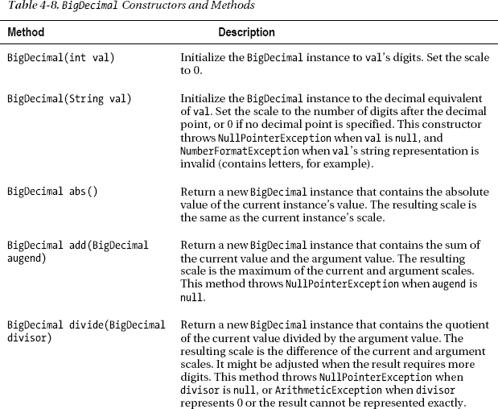

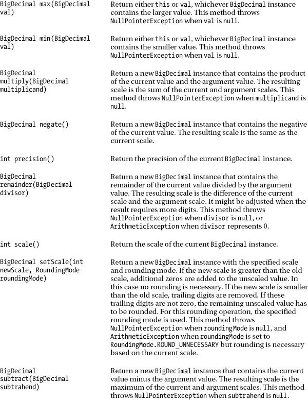

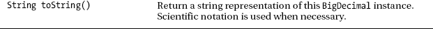

[表 4-8](#tab_4_8) 指的是`java.math.RoundingMode`，是包含各种舍入模式常数的枚举。这些常数在[表 4-9](#tab_4_9) 中描述。

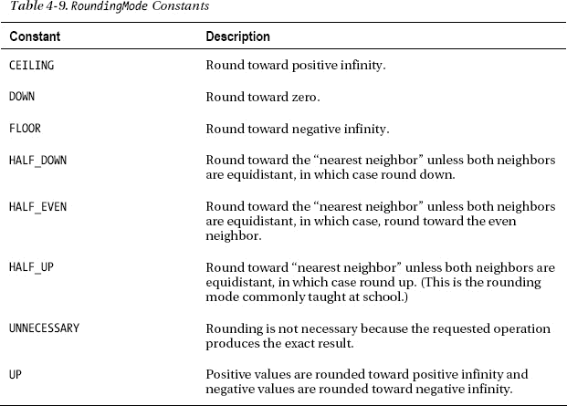

适应`BigDecimal`的最好方法是尝试一下。[清单 4-32](#list_4_32) 使用这个类来正确执行清单 4-31 中[给出的发票计算。](#list_4_31)

***清单 4-32。** `BigDecimal`基于发票的计算不会导致混乱的结果*

`import java.math.BigDecimal;
import java.math.RoundingMode;

class InvoiceCalc
{
   public static void main(String[] args)
   {
      BigDecimal invoiceSubtotal = new BigDecimal("285.36");
      BigDecimal discountPercent = new BigDecimal("0.10");
      BigDecimal discount = invoiceSubtotal.multiply(discountPercent);` `      discount = discount.setScale(2, RoundingMode.HALF_UP);
      BigDecimal subtotalBeforeTax = invoiceSubtotal.subtract(discount);
      subtotalBeforeTax = subtotalBeforeTax.setScale(2, RoundingMode.HALF_UP);
      BigDecimal salesTaxPercent = new BigDecimal("0.05");
      BigDecimal salesTax = subtotalBeforeTax.multiply(salesTaxPercent);
      salesTax = salesTax.setScale(2, RoundingMode.HALF_UP);
      BigDecimal invoiceTotal = subtotalBeforeTax.add(salesTax);
      invoiceTotal = invoiceTotal.setScale(2, RoundingMode.HALF_UP);
      System.out.println("Subtotal: "+invoiceSubtotal);
      System.out.println("Discount: "+discount);
      System.out.println("SubTotal after discount: "+subtotalBeforeTax);
      System.out.println("Sales Tax: "+salesTax);
      System.out.println("Total: "+invoiceTotal);
   }
}`

[清单 4-32](#list_4_32) 的`main()`方法首先创建`BigDecimal`对象`invoiceSubtotal`和`discountPercent`，它们分别被初始化为`285.36`和`0.10`。然后将`invoiceSubtotal`乘以`discountPercent`，并将`BigDecimal`的结果赋给`discount`。

至此，`discount`包含 28.5360。除了尾随零，该值与清单 4-31 中[的`invoiceSubtotal*DISCOUNT_PERCENT`生成的值相同。应该存储在`discount`中的值是 28.54。为了在执行另一个计算之前纠正这个问题，`main()`用这些参数调用`discount`的`setScale()`方法:](#list_4_31)

*   `2`:小数点后两位
*   `RoundingMode.HALF_UP`:传统的舍入方法

设置好比例和适当的舍入方式后，`main()`从`invoiceSubtotal`中减去`discount`，并将得到的`BigDecimal`实例赋给`subtotalBeforeTax`。`main()`调用`subtotalBeforeTax`上的`setScale()`,以便在进行下一次计算之前正确舍入其值。

`main()`接下来创建一个名为`salesTaxPercent`的`BigDecimal`对象，它被初始化为`0.05`。然后，它将`subtotalBeforeTax`乘以`salesTaxPercent`，将结果赋给`salesTax`，并在这个`BigDecimal`对象上调用`setScale()`来适当地舍入它的值。

继续，`main()`将`salesTax`与`subtotalBeforeTax`相加，将结果保存在`invoiceTotal`中，并通过`setScale()`对结果进行舍入。这些对象中的值通过`System.out.println()`发送到标准输出设备，后者调用它们的`toString()`方法返回`BigDecimal`值的字符串表示。

当您运行这个新版本的`InvoiceCalc`时，您将发现以下输出:

```java
Subtotal: 285.36
Discount: 28.54
SubTotal after discount: 256.82
Sales Tax: 12.84
Total: 269.66
```

 **注意** `BigDecimal`声明了一个`BigDecimal(double val)`构造函数，您应该尽可能避免使用它。这个构造函数将`BigDecimal`实例初始化为存储在`val`中的值，当`double`值不能准确存储时，这个实例可以反映一个无效的表示。例如， `BigDecimal(0.1)`导致`0.1000000000000000055511151231257827021181583404541015625`存储在实例中。相比之下，`BigDecimal("0.1")`恰恰存储了`0.1`。

### 大整数

`BigDecimal`将带符号的十进制数存储为 32 位整数刻度的无刻度值。未缩放的值存储在`BigInteger`类的实例中。

`BigInteger`是一个不可变的类，表示任意精度的有符号整数。它以*二进制补码格式*存储它的值(所有位都翻转，从 1 到 0 和从 0 到 1，结果加 1，以与 Java 的字节整数、短整数、整数和长整数类型使用的二进制补码格式兼容)。

 **注**查看维基百科的“二进制补码”词条(`[http://en.wikipedia.org/wiki/Two's_complement](http://en.wikipedia.org/wiki/Two's_complement)`)了解更多关于二进制补码的知识。

`BigInteger`声明了三个方便常数:`ONE`、`TEN`和`ZERO`。每个常数都是 1、10 和 0 的`BigInteger`等价物。

`BigInteger`还声明了各种有用的构造函数和方法。在[表 4-10](#tab_4_10) 中描述了其中一些构造函数和方法。

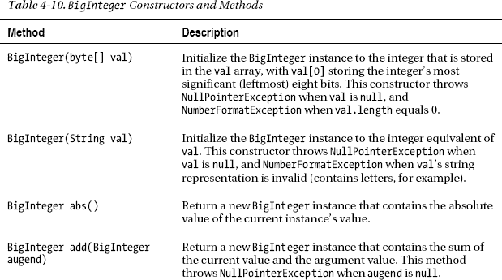

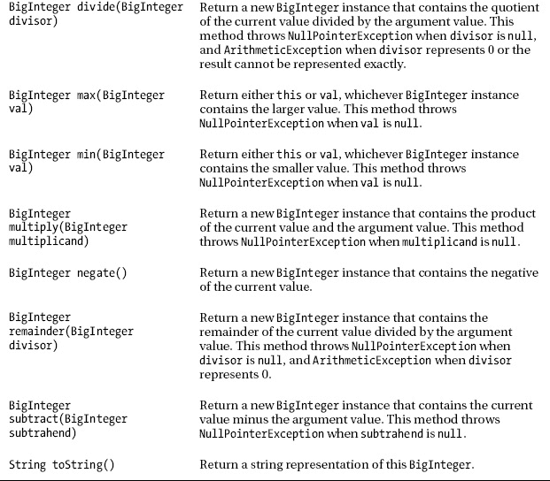

 **注意** `BigInteger`还声明了几个面向位的方法，比如`BigInteger`、`(BigInteger val)`、`BigInteger flipBit(int n)`、`BigInteger shiftLeft(int n)`。当您需要执行低级位操作时，这些方法非常有用。

适应`BigInteger`的最好方法是尝试一下。[清单 4-33](#list_4_33) 在`factorial()`方法比较上下文中使用了这个类。

***清单 4-33。**对比`factorial()`方法*

`import java.math.BigInteger;` 
```java
class FactComp
{
   public static void main(String[] args)
   {
      System.out.println(factorial(12));
      System.out.println();
      System.out.println(factorial(20L));
      System.out.println();
      System.out.println(factorial(170.0));
      System.out.println();
      System.out.println(factorial(new BigInteger("170")));
      System.out.println();
      System.out.println(factorial(25.0));
      System.out.println();
      System.out.println(factorial(new BigInteger("25")));
   }
   static int factorial(int n)
   {
      if (n == 0)
         return 1;
      else
         return n*factorial(n-1);
   }
   static long factorial(long n)
   {
      if (n == 0)
         return 1;
      else
         return n*factorial(n-1);
   }
   static double factorial(double n)
   {
      if (n == 1.0)
         return 1.0;
      else
         return n*factorial(n-1);
   }
   static BigInteger factorial(BigInteger n)
   {
      if (n.equals(BigInteger.ZERO))
         return BigInteger.ONE;
      else
         return n.multiply(factorial(n.subtract(BigInteger.ONE)));
   }
}
```

清单 4-33 比较了递归`factorial()`方法的四个版本。这种比较揭示了在返回的阶乘值变得没有意义之前可以传递给前三个方法的最大参数，因为数值类型可以精确表示的值的范围是有限的。

第一个版本基于`int`，有一个从 0 到 12 的有用参数范围。传递任何大于 12 的参数都会导致阶乘无法精确地表示为`int`。

您可以通过将参数和返回类型更改为`long`来增加`factorial()`的有用范围，但不会增加太多。做了这些改变后，你会发现有用范围的上限是 20。

为了进一步扩大有用的范围，您可以创建一个版本的`factorial()`，它的参数和返回类型都是`double`。这是可能的，因为整数可以精确地表示为`double` s。然而，可以传递的最大有用参数是 170.0。高于该值的任何值都会导致`factorial()`返回+无穷大。

您可能需要计算更高的阶乘值，也许是在计算涉及组合或排列的统计问题时。精确计算这个值的唯一方法是使用基于`BigInteger`的`factorial()`版本。

当您运行这个应用时，如`java FactComp`所示，它会生成以下输出:

```java
479001600

2432902008176640000

7.257415615307994E306

7257415615307998967396728211129263114716991681296451376543577798900561843401706157852350749242617459511490991237838520776666022565442753025328900773207510902400430280058295603966612599658257104398558294257568966313439612262571094946806711205568880457193340212661452800000000000000000000000000000000000000000

1.5511210043330986E25

15511210043330985984000000
```

前三个值表示基于`int`、`long`和`double`的`factorial()`方法可以返回的最高阶乘。第四个值代表最高`double`阶乘的`BigInteger`等效值。

请注意，`double`方法无法准确表示 170！(!是阶乘的数学符号)。它的精度简直太小了。尽管该方法试图对最小的数字进行舍入，但舍入并不总是有效，因为数字以 7994 而不是 7998 结尾。正如最后两行输出所显示的，舍入只在参数 25.0 之前是准确的。

 **注意** RSA 加密、`BigDecimal`和阶乘是`BigInteger`有用的实际例子。然而，你也可以以不寻常的方式使用`BigInteger`。例如，我在 2006 年 2 月发表的标题为“用 Java 穿越时间”(`[http://www.javaworld.com/javaworld/jw-02-2006/jw-0213-funandgames.html](http://www.javaworld.com/javaworld/jw-02-2006/jw-0213-funandgames.html)`)的文章，是我的 Java 趣味和游戏系列的一部分，使用`BigInteger`将图像存储为一个非常大的整数。这个想法是用`BigInteger`方法进行实验，寻找过去存在、未来存在或可能永远不存在的人和地方的图像(可能通过发现数学模式)。如果这种疯狂吸引你，看看我的文章。

**演习**

以下练习旨在测试您对 Java 语言 API 的理解:

1.  一个*素数*是一个大于 1 的正整数，可以被 1 和它本身整除。创建一个`PrimeNumberTest`应用，确定它的单个整数参数是素数还是非素数，并输出一个合适的消息。例如，`java PrimeNumberTest 289`应该输出消息`289 is not prime`。检查素性的一个简单方法是从 2 开始循环到整数参数的平方根，并在循环中使用余数运算符来确定参数是否被循环索引整除。例如，因为`6/2`产生余数 0 (2 被 6 整除)，所以整数 6 不是素数。
2.  反射在设备驱动程序上下文中很有用，应用需要与不同版本的驱动程序进行交互。如果检测到旧版本，应用将调用其方法。如果检测到较新的版本，应用可以调用较旧的方法或调用这些方法的较新版本。创建两个版本的`Driver`类。第一个版本声明了一个返回“`basic capabilities`”的`String getCapabilities()`方法，第二个版本声明了这个方法和一个返回“`extended capabilities`”的`String getCapabilitiesEx()`方法。创建一个`DriverDemo`类，它使用反射来确定当前的`Driver.class`类文件是否支持`getCapabilitiesEx()`，如果支持，就调用那个方法。如果该方法不存在，使用反射来确定它是否支持`getCapabilities()`，如果支持，则调用该方法。否则，输出一条错误消息。
3.  Java arrays have fixed lengths. Create a growable array class, `GArray<E>`, whose instances store objects of the type specified by the actual type argument passed to `E`. This class declares a `GArray(int initCapacity)` constructor that creates an internal array with the number of elements specified by `initCapacity`. Also, this class declares `E get(int index)` and `void set(int index, E value)` methods that respectively return the object at the `index` position within the internal array, and store the specified value in the array at the `index` position. The `get()` method must throw `ArrayIndexOutOfBoundsException` when the argument passed to `index` is out of range (negative or greater than/equal to the array's length). The `set()` method must throw the same exception when the argument passed to `index` is negative. However, when the argument is positive, it must create a new internal array whose size is twice that of the old array, copy elements from the old array to the new array via `System.arraycopy()`, and store the new value at the `index` position. This class also declares an `int size()` method that returns the array's size. Test this class with the `GArrayDemo` application described in [Listing 4-34](#list_4_34).

    ***清单 4-34。**展示可扩展阵列*

    `import ca.tutortutor.collections.GArray;

    class GArrayDemo
    {
       public static void main(String[] args)
       {
          GArray<String> ga = new GArray<>(10);
          System.out.println("Size = "+ga.size());
          ga.set(3, "ABC");
          System.out.println("Size = "+ga.size());
          ga.set(22, "XYZ");
          System.out.println("Size = "+ga.size());
          System.out.println(ga.get(3));
          System.out.println(ga.get(22));
          System.out.println(ga.get(20));
          ga.set(20, "PQR");
          System.out.println(ga.get(20));
          System.out.println("Size = "+ga.size());
       }
    }`

    当您运行此应用时，它应该生成以下输出:

    `Size = 0
    Size = 4
    Size = 23
    ABC
    XYZ
    null
    PQR
    Size = 23`
4.  修改清单 4-17 的`CountingThreads`应用，将两个计数线程标记为守护线程。运行结果应用时会发生什么？
5.  修改[清单 4-17](#list_4_17) 的`CountingThreads`应用，增加当用户按下回车键时停止两个线程计数的逻辑。默认主线程应该在终止前调用`System.in.read()`，并在该方法调用返回后将`true`赋给一个名为`stopped`的变量。每个计数线程应该在每次循环迭代开始时测试这个变量，看它是否包含 true，只有当变量包含 false 时才继续循环。

### 总结

Java 的标准类库通过`java.lang`和`java.math`包提供了各种面向语言的 API。这些 API 包括`Math`和`StrictMath`、`Package`、原始类型包装类、引用、反射、`String`、`StringBuffer`和`StringBuilder`、`System`、线程、`BigDecimal`和`BigInteger`。

`Math`和`StrictMath`类提供了各种有用的面向数学的方法，用于计算三角值、生成伪随机数等等。`StrictMath`不同于`Math`，它确保所有这些数学运算在所有平台上都产生相同的结果。

`Package`类提供了对包信息的访问。该信息包括关于 Java 包的实现和规范的版本细节、包的名称以及包是否被密封的指示。

`Boolean`、`Byte`、`Character`、`Double`、`Float`、`Integer`、`Long`和`Short`原始类型包装类的实例将自己包装在原始类型的值周围。这些类对于在集合中存储原始值很有用，并且提供了一个很好的地方来将有用的常量(如`MAX_VALUE`和`MIN_VALUE`)和类方法(如`Integer`的`parseInt()`方法和`Character`的`isDigit()`、`isLetter()`和`toUpperCase()`方法)与原始类型相关联。

引用 API 使得应用能够以有限的方式与垃圾收集器进行交互。这个 API 由类`Reference`、`ReferenceQueue`、`SoftReference`、`WeakReference`和`PhantomReference`组成。

`SoftReference`有助于实现图像缓存，`WeakReference`有助于防止与 hashmaps 相关的内存泄漏，`PhantomReference`有助于了解对象何时被终结，以便清理其资源。

反射 API 让应用了解加载的类、接口、枚举(一种类)和注释类型(一种接口)。它还允许应用动态加载类、实例化类、查找类的字段和方法、访问字段、调用方法，以及反射性地执行其他任务。

反射 API 的入口点是一个名为`Class`的特殊类。附加类别包括`Constructor`、`Field`、`Method`、`AccessibleObject`和`Array`。

`String`类将一个字符串表示为一个字符序列。因为这个类的实例是不可变的，所以 Java 提供了`StringBuffer`和`StringBuilder`来更有效地构建字符串。前一个类可以在多线程上下文中使用，而后一个类更具性能。

`System`类提供对标准输入、标准输出、标准错误和其他面向系统的资源的访问。例如，`System`提供了`arraycopy()`方法，作为将一个数组复制到另一个数组的最快的可移植方法。

Java 通过其低级线程 API 支持线程。这个 API 由一个接口(`Runnable`)和四个类(`Thread`、`ThreadGroup`、`ThreadLocal`和`InheritableThreadLocal`)组成。

在整个执行过程中，每个线程都与其他线程相隔离，因为每个线程都有自己的方法调用堆栈。然而，当线程访问和操作共享数据时，它们仍然会相互干扰。这种干扰会破坏共享数据，这种破坏会导致应用失败。Java 提供了线程同步机制来防止这种干扰。

货币绝不能用浮点和双精度浮点变量来表示，因为不是所有的货币值都能精确表示。相比之下，`BigDecimal`类让您可以准确地表示和操作这些值。

`BigDecimal`依赖于`BigInteger`类来表示其未缩放的值。一个`BigInteger`实例描述了一个任意长度的整数值(受 JVM 内存的限制)。

本章简要介绍了集合框架，同时介绍了基本类型包装类 API。第 5 章向您介绍了这个用于收集对象的广泛的实用 API。*