# 五、收集对象

应用通常必须管理对象集合。尽管您可以为此使用数组，但它们并不总是一个好的选择。例如，数组有固定的大小，当您需要存储可变数量的对象时，很难确定最佳大小。此外，数组只能由整数索引，这使得它们不适合将任意对象映射到其他对象。

Java 的标准类库提供了集合框架和遗留 API 来代表应用管理集合。[第 5 章](#ch5)首先介绍这个框架，然后向你介绍这些遗留 API(万一你在遗留代码中遇到)。因为框架和遗留 API 可能不能满足特定的需求，所以本章最后关注于创建特殊用途的集合 API。

 **注意** Java 的并发工具(在[第 6 章](06.html#ch6)中讨论)扩展了集合框架。

### 集合框架

*集合框架*是表示和操作集合的标准架构，集合是存储在为此目的设计的类实例中的对象组。在概述了这个框架的架构之后，本节将向您介绍促成这个架构的各种类型(主要位于`java.util`包中)。

#### 架构概述

集合框架的架构分为三个部分:

*   核心接口(Core interfaces):框架提供了核心接口，用于独立于集合的实现来操作集合。
*   *实现类*:框架提供了提供不同核心接口实现的类，以解决性能和其他需求。
*   *工具类*:框架提供了工具类，它们的方法可以让您对数组进行排序，获得同步的集合，并执行其他操作。

核心接口包括`java.lang.Iterable`、`Collection`、`List`、`Set`、`SortedSet`、`NavigableSet`、`Queue`、`Deque`、`Map`、`SortedMap`、`NavigableMap`。`Collection`延伸`Iterable`；`List`、`Set`、`Queue`各延伸`Collection`；`SortedSet`延伸`Set`；`NavigableSet`延伸`SortedSet`；`Deque`延伸`Queue`；`SortedMap`延伸`Map`；`NavigableMap`延伸出`SortedMap`。

[图 5-1](#fig_5_1) 展示了核心接口的层次结构(箭头指向父接口)。

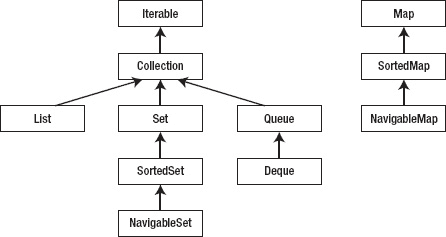

***图 5-1。**集合框架基于核心接口的层次结构。*

框架的实现类包括`ArrayList`、`LinkedList`、`TreeSet`、`HashSet`、`LinkedHashSet`、`EnumSet`、`PriorityQueue`、`ArrayDeque`、`TreeMap`、`HashMap`、`LinkedHashMap`、`IdentityHashMap`、`WeakHashMap`和`EnumMap`。每个具体类的名称都以核心接口名称结尾，标识它所基于的核心接口。

 **注意**额外的实现类是并发工具的一部分。

框架的实现类还包括抽象的`AbstractCollection`、`AbstractList`、`AbstractSequentialList`、`AbstractSet`、`AbstractQueue`和`AbstractMap`类。这些类提供了核心接口的框架实现，以便于创建具体的实现类。

最后，框架提供了两个工具类:`Arrays`和`Collections`。

##### 可比与比较

集合实现以某种*顺序*(排列)存储其元素。这个顺序可能是无序的，也可能是根据某种标准(如字母、数字或时间)排序的。

一个排序的集合实现默认按照元素的自然排序(T2)来存储元素。比如`String`对象的自然排序是*字典序*或*字典序*(也称字母顺序)。

集合不能依靠`equals()`来指定自然排序，因为这种方法只能确定两个元素是否等价。相反，元素类必须实现`java.lang.Comparable<T>`接口及其`int compareTo(T o)`方法。

 **注**根据`Comparable`的 Java 文档，这个接口被认为是集合框架的一部分，尽管它是`java.lang`包的成员。

已排序的集合使用`compareTo()`来确定该方法的元素参数`o`在集合中的自然顺序。`compareTo()`将参数`o`与当前元素(调用`compareTo()`的元素)进行比较，并执行以下操作:

*   当当前元素应该在`o`之前时，它返回一个负值。
*   当当前元素和`o`相同时，返回零值。
*   当当前元素应该在`o`之后时，它返回一个正值。

当你需要实现`Comparable`的`compareTo()`方法时，有一些规则是你必须遵守的。下面列出的这些规则类似于第 2 章中的[所示的实施`equals()`方法的规则:](02.html#ch2)

*   *`compareTo()`必须是自反的*:对于任何非空的参考值 *`x`* ， *`x`* `.compareTo(*x*)`必须返回 0。
*   *`compareTo()`必须对称*:对于任何非空参考值*`x`**`y`*， *`x`* `.compareTo(*y*) == -y.compareTo(x)`必须持有。
*   *`compareTo()`必须传递*:对于任何非空的参考值*`x`**`y`**`z`*，如果 *`x`* `.compareTo(*y*) > 0`为真，如果 *`y`* `.compareTo(*z*) > 0`为真，那么 *`x`* `.compareTo(*z*) > 0`也必须为真。

另外，当空引用被传递给这个方法时，`compareTo()`应该抛出`NullPointerException`。但是，您不需要检查 null，因为当这个方法试图访问一个 null 引用的成员时会抛出`NullPointerException`。

 **注意**在 Java 5 及其引入泛型之前，`compareTo()`的参数是类型`java.lang.Object`的，在进行比较之前必须转换成适当的类型。当参数的类型与强制转换不兼容时，强制转换操作符会抛出一个`java.lang.ClassCastException`实例。

您可能偶尔需要在集合中存储以不同于自然顺序的某种顺序排序的对象。在这种情况下，您需要提供一个比较器来提供这种排序。

一个*比较器*是一个对象，它的类实现了`Comparator`接口。这个接口的泛型类型是`Comparator<T>`，它提供了下面一对方法:

*   `int compare(T o1, T o2)`比较两个参数的顺序。该方法在`o1`等于`o2`时返回 0，在`o1`小于`o2`时返回负值，在`o1`大于`o2`时返回正值。
*   当`o`“等于”这个`Comparator`时， `boolean equals(Object o)`返回 true，因为`o`也是一个`Comparator`，并采用相同的排序。否则，此方法返回 false。

 **注意** `Comparator`声明`equals()`是因为这个接口在这个方法的契约上加了一个额外的条件。*此外，只有当指定的对象也是一个比较器，并且与该比较器采用相同的排序时，该方法才能返回 true。*你不必覆盖`Object`的`equals()`方法，但是这样做*可以通过允许程序确定两个不同的比较器施加相同的顺序来提高性能*。

[第 3 章](03.html#ch3)提供了一个说明实现`Comparable`的例子，在本章的后面你会发现另一个例子。此外，本章还将展示实现`Comparator`的例子。

#### 可迭代和集合

大部分核心接口都植根于`Iterable`及其`Collection`子接口。它们的通用类型是`Iterable<T>`和`Collection<E>`。

`Iterable`描述任何能够以某种顺序返回其包含对象的对象。这个接口声明了一个`Iterator<T> iterator()`方法，该方法返回一个`Iterator`实例，用于迭代所有包含的对象。

`Collection`表示被称为*元素*的对象集合。该接口提供了许多集合所基于的`Collection`子接口所共有的方法。[表 5-1](#tab_5_1) 描述了这些方法。

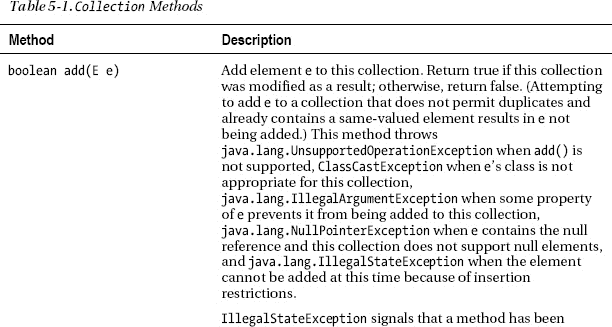

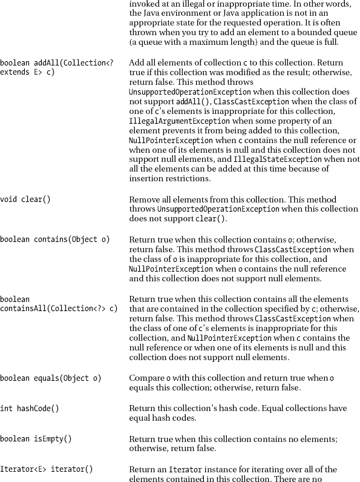

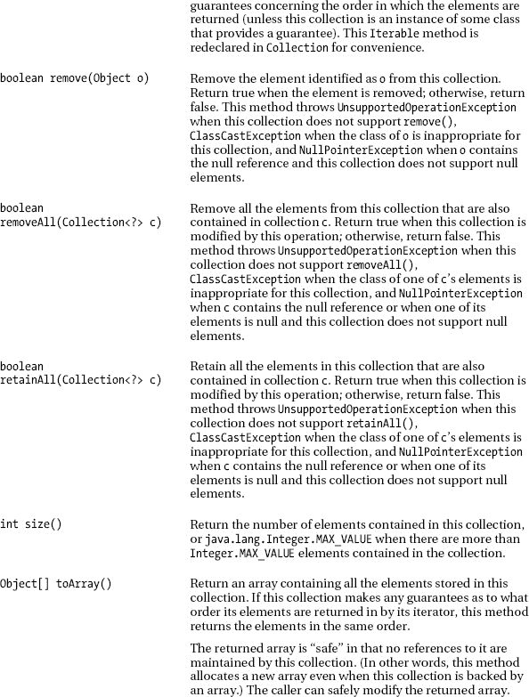

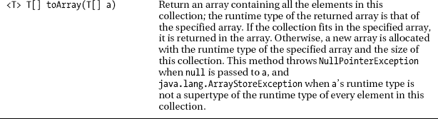

[表 5-1](#tab_5_1) 揭示了各种`Collection`方法的三个例外。首先，一些方法可以抛出`UnsupportedOperationException`类的实例。例如，当您试图将一个对象添加到一个*不可变的*(不可修改的)集合中时，`add()`抛出`UnsupportedOperationException`(这将在本章后面讨论)。

其次，`Collection`的一些方法可以抛出`ClassCastException`类的实例。例如，当您试图从键为`String` s 的基于树的映射中删除一个条目(也称为映射)时，`remove()`抛出`ClassCastException`，但是指定了一个非`String`键。

最后，`Collection`的`add()`和`addAll()`方法会在要添加的元素的某个*属性*(属性)阻止它被添加到这个集合时抛出`IllegalArgumentException`实例。例如，第三方集合类的`add()`和`addAll()`方法可能会在检测到负的`Integer`值时抛出这个异常。

 **注意**也许你想知道为什么`remove()`被声明为接受任何`Object`参数，而不是只接受那些类型是集合的对象。换句话说，为什么`remove()`没有被宣布为`boolean remove(E e)`？此外，为什么不使用类型为`Collection<? extends E>`的参数声明`containsAll()`、`removeAll()`和`retainAll()`，以确保集合参数只包含与调用这些方法的集合类型相同的元素？这些问题的答案是需要保持向后兼容性。集合框架是在 Java 5 及其泛型引入之前引入的。为了让版本 5 之前编写的遗留代码继续编译，这四个方法被声明为具有较弱的类型约束。

##### 迭代器和增强的 For 语句

通过扩展`Iterable` , `Collection`继承了该接口的`iterator()`方法，这使得迭代集合成为可能。`iterator()`返回一个类的实例，该类实现了`Iterator`接口，其泛型类型表示为`Iterator<E>`，并声明了以下三个方法:

*   当此`Iterator`实例有更多元素要返回时，`boolean hasNext()`返回 true 否则，此方法返回 false。
*   `E next()`返回集合中与这个`Iterator`实例相关联的下一个元素，或者当没有更多元素要返回时抛出`java.util.NoSuchElementException`。
*   `void remove()`从与这个`Iterator`实例相关的集合中删除`next()`返回的最后一个元素。每次`next()`调用只能调用一次该方法。当底层集合在迭代过程中被修改时，除了调用`remove()`之外，`Iterator`实例的行为是不确定的。当这个`Iterator`不支持这个方法时，这个方法抛出`UnsupportedOperationException`，当`remove()`已经被调用而没有先前对`next()`的调用时，或者当多个`remove()`调用发生而没有中间的`next()`调用时，这个方法抛出`IllegalStateException`。

以下示例向您展示了如何在调用`iterator()`返回`Iterator`实例后迭代集合:

```java
Collection<String> col = ... // This code does not compile because of the “...”.
// Add elements to col.
Iterator iter = col.iterator();
while (iter.hasNext())
   System.out.println(iter.next());
```

while 循环反复调用迭代器的`hasNext()`方法来确定迭代是否应该继续，并且(如果应该继续)调用`next()`方法来返回相关集合中的下一个元素。

因为这种习惯用法很常用，所以 Java 5 在 for 语句中引入了语法糖来简化这种习惯用法的迭代。这种糖使该语句看起来像在 Perl 等语言中发现的 foreach 语句，并在下面简化的上一个示例中显示出来:

```java
Collection<String> col = ... // This code does not compile because of the “...”.
// Add elements to col.
for (String s: col)
   System.out.println(s);
```

这个 sugar 隐藏了`col.iterator()`，一个方法调用返回一个`Iterator`实例来迭代`col`的元素。它还隐藏了对这个实例上的`Iterator`的`hasNext()`和`next()`方法的调用。您将这个 sugar 解释如下:“对于`col`中的每个`String`对象，在循环迭代开始时将这个对象分配给`s`。”

 **注意**增强的 for 语句在数组上下文中也很有用，它隐藏了数组索引变量。考虑以下示例:

```java
String[] verbs = { "run", "walk", "jump" };
for (String verb: verbs)
   System.out.println(verb);
```

本例读作“对于`verbs`数组中的每个`String`对象，在循环迭代开始时将该对象分配给`verb`”，相当于下面的例子:

```java
String[] verbs = { "run", "walk", "jump" };
for (int i = 0; i < verbs.length; i++)
   System.out.println(verbs[i]);
```

增强的 for 语句的局限性在于，在需要访问迭代器来从集合中移除元素的情况下，不能使用该语句。此外，在遍历期间必须替换集合/数组中的元素的情况下，它是不可用的，在必须并行迭代多个集合或数组的情况下，它也是不可用的。

 **提示**为了让你的类支持增强的 for 语句，设计这些类来实现`java.lang.Iterable`接口。

##### 汽车尾气排放与消毒

认为 Java 应该只支持引用类型的开发人员抱怨过 Java 对基本类型的支持。Java 类型系统二分法的一个明显体现是集合框架:可以在集合中存储对象，但不能存储基于类型的原始值。

虽然您不能在集合中直接存储基于基元类型的值，但是您可以通过首先将该值包装在从基元类型包装类(参见[第 4 章](04.html#ch4))如`Integer`创建的对象中，然后将该基元类型包装类实例存储在集合中来间接存储该值——参见以下示例:

```java
Collection<Integer> col = ...; // This code does not compile because of the “...”.
int x = 27;
col.add(new Integer(x)); // Indirectly store int value 27 via an Integer object.
```

反过来的情况也是繁琐的。当你想从`col`中检索`int`时，你必须调用`Integer`的`intValue()`方法(如果你还记得的话，它是从`Integer`的`java.lang.Number`超类继承而来的)。继续这个例子，您可以指定`int y = col.iterator().next().intValue();`将存储的 32 位整数分配给`y`。

为了减轻这种乏味，Java 5 引入了自动装箱和取消装箱，这是一对互补的基于糖的语法语言特性，使原始值看起来更像对象。(这个“花招”并不完整，因为您不能指定像`27.doubleValue()`这样的表达式。)

*自动装箱*自动*装箱*(包装)每当指定了原始类型但需要引用时，在适当的原始类型包装类的对象中的原始值。例如，您可以将示例的第三行改为`col.add(x);`，并将编译器框`x`转换成一个`Integer`对象。

*自动取消装箱**取消装箱*(打开包装)无论何时指定了引用但需要原始类型时，都会从其包装对象中取消原始值。例如，您可以指定`int y = col.iterator().next();`并让编译器在赋值之前将返回的`Integer`对象解装箱为`int`值 27。

虽然引入自动装箱和取消装箱是为了简化在集合上下文中使用基元值，但是这些语言特性也可以在其他上下文中使用，这种任意使用可能会导致一个问题，如果不了解幕后发生的事情，就很难理解这个问题。考虑以下示例:

```java
Integer i1 = 127;
Integer i2 = 127;
System.out.println(i1 == i2); // Output: true
System.out.println(i1 < i2); // Output: false
System.out.println(i1 > i2); // Output: false
System.out.println(i1+i2); // Output: 254
i1 = 30000;
i2 = 30000;
System.out.println(i1 == i2); // Output: false
System.out.println(i1 < i2); // Output: false
System.out.println(i1 > i2); // Output: false
i2 = 30001;
System.out.println(i1 < i2); // Output: true
System.out.println(i1+i2); // Output: 60001
```

除了一个例外，这个例子的输出和预期的一样。例外是`i1 == i2`比较，其中`i1`和`i2`都包含 30000。`i1`和`i2`都包含 127 的情况下，`i1 == i2`返回假，而不是返回真。是什么导致了这个问题？

检查生成的代码，你会发现`Integer i1 = 127;`被转换为`Integer i1 = Integer.valueOf(127);`，`Integer i2 = 127;`被转换为`Integer i2 = Integer.valueOf(127);`。根据`valueOf()`的 Java 文档，这种方法利用缓存来提高性能。

 **注** `valueOf()`也用于向集合添加原始值。例如，`col.add(27)`转换为`col.add(Integer.valueOf(27))`。

`Integer`在一个小范围的值上维护唯一的`Integer`对象的内部缓存。此范围的下限是-128，上限默认为 127。然而，你可以通过给系统属性`java.lang.Integer.IntegerCache.high`分配一个不同的值来改变上限(通过`java.lang.System`类的`String setProperty(String prop, String value)`方法——我在第 4 章的[中演示了这个方法的`getProperty()`)。](04.html#ch4)

 **注意**`Byte`、`Long`和`Short`中的每一个还分别维护唯一的`Byte`、`Long`和`Short`对象的内部缓存。

由于缓存，每个`Integer.valueOf(127)`调用返回相同的`Integer`对象引用，这就是为什么`i1 == i2`(比较引用)评估为真。因为 30000 位于默认范围之外，所以每个`Integer.valueOf(30000)`调用都返回一个对新的`Integer`对象的引用，这就是为什么`i1 == i2`评估为 false。

与`==`和`!=`不同，它们在比较之前不会对装箱后的值进行拆箱，像`<`、`>`和`+`这样的操作符在执行它们的操作之前会对这些值进行拆箱。结果，`i1 < i2`转换为`i1.intValue() < i2.intValue()`，`i1+i2`转换为`i1.intValue()+i2.intValue()`。

 **注意**不要假设自动装箱和取消装箱是在`==`和`!=`操作符的上下文中使用的。

#### 列表

一个*列表*是一个有序集合，也称为*序列*。元素可以通过整数索引存储在特定的位置，也可以从特定的位置访问。其中一些元素可能是重复的或空的(当列表的实现允许空元素时)。列表由`List`接口描述，其通用类型是`List<E>`。

`List`扩展了`Collection`并重新声明了它继承的方法，部分是为了方便。它还重新声明了`iterator()`、`add()`、`remove()`、`equals()`和`hashCode()`，以便在合同上附加额外条件。例如，`List`对`add()`的约定指定它将一个元素追加到列表的末尾，而不是将该元素添加到集合中。

`List`还声明了[表 5-2](#tab_5_2) 的列表特定方法。

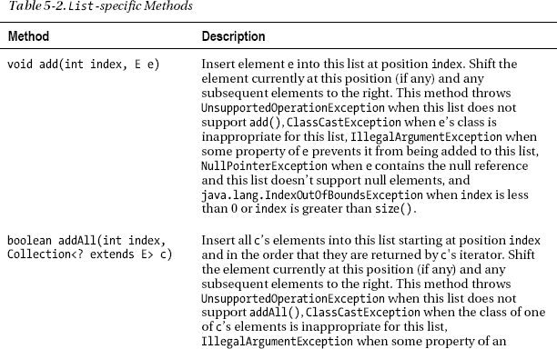

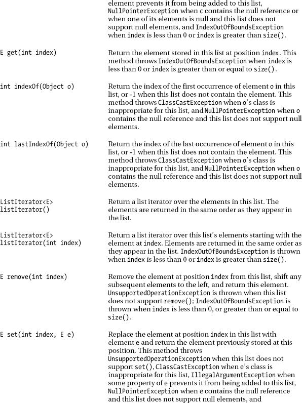

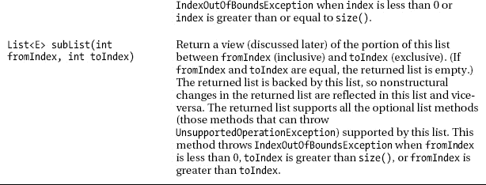

[表 5-2](#tab_5_2) 引用了`ListIterator`接口，它比它的`Iterator`超级接口更加灵活，因为`ListIterator`提供了在任意方向上迭代列表、在迭代过程中修改列表以及获取迭代器在列表中的当前位置的方法。

 **注意**`ArrayList`和`LinkedList` `List`实现类中的`iterator()`和`listIterator()`方法返回的`Iterator`和`ListIterator`实例是*快速失效*:在迭代器创建后，当列表被结构性修改(例如，通过调用实现的`add()`方法添加新元素)时，除了通过迭代器自己的`add()`或`remove()`方法，迭代器抛出`ConcurrentModificationException`。因此，面对并发修改，迭代器会快速而干净地失败，而不是冒着在未来某个时间出现任意、不确定行为的风险。

`ListIterator`声明以下方法:

*   `void add(E e)`将`e`插入到被迭代的列表中。这个元素被插入到下一个由`next()`返回的元素(如果有的话)之前，以及下一个由`previous()`返回的元素(如果有的话)之后。当这个列表迭代器不支持`add()`时，这个方法抛出`UnsupportedOperationException`，当`e`的类不适合这个列表时抛出`ClassCastException`，当`e`的某个属性阻止它被添加到这个列表时抛出`IllegalArgumentException`。
*   `boolean hasNext()`正向遍历列表时，当该列表迭代器有更多元素时，返回 true。
*   `boolean hasPrevious()`当这个列表迭代器在反向遍历列表时有更多元素时返回 true。
*   `E next()`返回列表中的下一个元素并提升光标位置。当没有下一个元素时，这个方法抛出`NoSuchElementException`。
*   `int nextIndex()`返回对`next()`的后续调用将返回的元素的索引，或者当在列表末尾时返回列表的大小。
*   返回列表中的前一个元素，并向后移动光标位置。当没有前一个元素时，这个方法抛出`NoSuchElementException`。
*   `int previousIndex()`返回对`previous()`的后续调用将返回的元素的索引，或者在列表开始时返回-1。
*   `void remove()`从列表中删除由`next()`或`previous()`返回的最后一个元素。每次呼叫`next()`或`previous()`只能呼叫一次。此外，只有在最后一次调用`next()`或`previous()`后没有调用`add()`时，才能进行。当这个列表迭代器不支持`remove()`时，该方法抛出`UnsupportedOperationException`，当`next()`和`previous()`都没有被调用，或者在最后一次调用`next()`或`previous()`后已经调用了`remove()`或`add()`时，该方法抛出`IllegalStateException`。
*   `void set(E e)`用元素`e`替换`next()`或`previous()`返回的最后一个元素。只有在最后一次调用`next()`或`previous()`后，既没有调用`remove()`也没有调用`add()`时，才能进行此次调用。当这个列表迭代器不支持`set()`时，这个方法抛出`UnsupportedOperationException`，当`e`的类不适合这个列表时，抛出`IllegalArgumentException`，当`e`的某个属性阻止它被添加到这个列表时，抛出`IllegalStateException`，当`next()`和`previous()`都没有被调用，或者在最后一次调用`next()`或`previous()`之后已经调用了`remove()`或`add()`时，抛出`IllegalStateException`。

一个`ListIterator`实例没有当前元素的概念。相反，它有一个用于浏览列表的*光标*的概念。`nextIndex()`和`previousIndex()`方法返回*光标位置*，它总是位于调用`previous()`返回的元素和调用`next()`返回的元素之间。长度为 *n* 的列表的列表迭代器有 *n* +1 个可能的光标位置，如每个脱字符号(`^`)所示，如下所示:

```java
                     Element(0)   Element(1)   Element(2)   ... Element(n-1)
cursor positions:  ^            ^            ^            ^                  ^
```

`remove()`和`set()`方法不是根据光标位置定义的；它们被定义为对调用`next()`或`previous()`返回的最后一个元素进行操作。

 **注意**只要小心，可以混合调用`next()`和`previous()`。请记住，对`previous()`的第一次调用返回与对`next()`的最后一次调用相同的元素。此外，在对`previous()`的一系列调用之后，对`next()`的第一次调用返回与对`previous()`的最后一次调用相同的元素。

[表 5-2](#tab_5_2) 对`subList()`方法的描述指的是一个*视图*的概念，它是一个由另一个列表支持的列表。对视图所做的更改会反映在此支持列表中。视图可以覆盖整个列表，或者，正如`subList()`的名字所暗示的，只覆盖列表的一部分。

`subList()`方法对于以紧凑的方式在列表上执行*范围视图*操作很有用。例如，`list.subList(fromIndex, toIndex).clear();`从`list`中删除一系列元素，其中第一个元素位于`fromIndex`，最后一个元素位于`toIndex-1`。

 **注意**当后备列表发生变化时，视图的含义变得不明确。因此，只要需要在后备列表上执行一系列范围操作，就应该临时使用`subList()`。

##### 阵列列表

`ArrayList`类提供了一个基于内部数组的列表实现(参见第一章和第二章)。因此，对列表元素的访问很快。但是，因为必须移动元素以打开插入空间或在删除后关闭空间，所以元素的插入和删除很慢。

`ArrayList`提供三个构造函数:

*   `ArrayList()`创建一个空数组列表，初始*容量*(存储空间)为十个元素。一旦达到这个容量，就会创建一个更大的数组，将当前数组中的元素复制到这个更大的数组中，这个更大的数组就成为新的当前数组。随着更多的元素被添加到数组列表中，这个过程会重复进行。
*   `ArrayList(Collection<? extends E> c)`创建一个数组列表，按照`c`的迭代器返回的顺序包含`c`的元素。当`c`包含空引用时，抛出`NullPointerException`。
*   `ArrayList(int initialCapacity)`创建一个初始容量为`initialCapacity`个元素的空数组列表。当`initialCapacity`为负时，抛出`IllegalArgumentException`。

[清单 5-1](#list_5_1) 展示了一个数组列表。

***清单 5-1。**基于数组列表的演示*

`import java.util.ArrayList;
import java.util.List;

class ArrayListDemo
{
   public static void main(String[] args)
   {
      List<String> ls = new ArrayList<>();
      String[] weekDays = {"sun", "mon", "tue", "wed", "thu", "fri", "sat"};
      for (String weekDay: weekDays)
         ls.add(weekDay);
      dump("ls:", ls);
      ls.set(ls.indexOf("wed"), "wednesday");
      dump("ls:", ls);` `      ls.remove(ls.lastIndexOf("fri"));
      dump("ls:", ls);
   }
   static void dump(String title, List<String> ls)
   {
      System.out.print(title+" ");
      for (String s: ls)
         System.out.print(s+" ");
      System.out.println();
   }
}`

`List<String> ls = new ArrayList<>();`任务揭示了一些需要注意的事项:

*   我已经将变量`ls`声明为`List<String>`接口类型，并给这个变量分配了一个对实现这个接口的`ArrayList`类实例的引用。使用集合框架时，通常的做法是将变量声明为接口类型。当您需要使用不同的实现类时，这样做可以消除大量的代码更改；比如`List<String> ls = new LinkedList<>();`。查看[第二章](02.html#ch2)的“为什么使用接口？”一节，以获得关于这一实践的更多信息。
*   *菱形操作符*`<>`(Java 7 中新增的)通过强制编译器推断泛型类构造函数的实际类型参数来减少冗长性。如果没有这个操作符，我将需要指定`String`作为传递给`ArrayList<E>`的实际类型参数，导致更长的`List<String> ls = new ArrayList<String>();`而不是更短的`List<String> ls = new ArrayList<>();`。(我并没有把钻石运算符当做真正的运算符，这也是我没有把它包含在[第一章](01.html#ch1)的运算符表— [表 1-3](01.html#tab_1_3) 中的原因。)

`dump()`方法的增强 for 语句在幕后使用了`iterator()`、`hasNext()`和`next()`。

当您运行此应用时，它会生成以下输出:

```java
ls: Sun Mon Tue Wed Thu Fri Sat
ls: Sun Mon Tue Wednesday Thu Fri Sat
ls: Sun Mon Tue Wednesday Thu Sat
```

##### 链接列表

`LinkedList`类提供了一个基于链接节点的列表实现。因为必须遍历链接，所以对列表元素的访问很慢。但是，因为只需要更改节点引用，所以元素的插入和删除很快。(我将在本章的后面向您介绍节点。)

`LinkedList`提供两个构造函数:

*   创建一个空的链表。
*   `LinkedList(Collection<? extends E> c)`创建一个链表，包含`c`的元素，按照`c`的迭代器返回的顺序排列。当`c`包含空引用时，抛出`NullPointerException`。

清单 5-2 展示了一个链表。

***清单 5-2。**节点链表的演示*

```java
import java.util.LinkedList;
import java.util.List;
import java.util.ListIterator;

class LinkedListDemo
{
   public static void main(String[] args)
   {
      List<String> ls = new LinkedList<>();
      String[] weekDays = {"sun", "mon", "tue", "wed", "thu", "fri", "sat"};
      for (String weekDay: weekDays)
         ls.add(weekDay);
      dump("ls:", ls);
      ls.add(1, "sunday");
      ls.add(3, "monday");
      ls.add(5, "tuesday");
      ls.add(7, "wednesday");
      ls.add(9, "thursday");
      ls.add(11, "friday");
      ls.add(13, "saturday");
      dump("ls:", ls);
      ListIterator<String> li = ls.listIterator(ls.size());
      while (li.hasPrevious())
         System.out.print(li.previous()+" ");
      System.out.println();
   }
   static void dump(String title, List<String> ls)
   {
      System.out.print(title+" ");
      for (String s: ls)
         System.out.print(s+" ");
      System.out.println();
   }
}
```

这个应用演示了当向列表中添加更长的工作日名称时，每个连续的`add()`方法调用必须将其索引增加 2，以考虑之前添加的元素。它还向您展示了如何以相反的顺序输出一个列表:返回一个列表迭代器，它的光标经过列表的末尾被初始化，并重复调用`previous()`。

当您运行此应用时，它会生成以下输出:

```java
ls: Sun Mon Tue Wed Thu Fri Sat
ls: Sun Sunday Mon Monday Tue Tuesday Wed Wednesday Thu Thursday Fri Friday Sat Saturday
Saturday Sat Friday Fri Thursday Thu Wednesday Wed Tuesday Tue Monday Mon Sunday Sun
```

#### 设定

一个*集合*是一个不包含重复元素的集合。换句话说，一个集合不包含元素对 *`e1`* 和 *`e2`* 使得`*e1*.equals(*e2*)`返回真。此外，一个集合最多可以包含一个空元素。集合由`Set`接口描述，其类属类型为`Set<E>`。

为了方便起见， `Set`扩展了`Collection`并重新声明了其继承的方法，同时也为`add()`、`equals()`和`hashCode()`的契约添加了规定，以解决它们在设定的上下文中的行为。另外，`Set`的文档声明所有实现类的构造函数必须创建不包含重复元素的集合。

`Set`不引入新方法。

##### TreeSet

`TreeSet`类提供了一个基于树数据结构的 set 实现。因此，元素按排序顺序存储。然而，访问这些元素比使用其他`Set`实现(没有排序)要慢一些，因为必须遍历链接。

 **注**查看维基百科的“树(数据结构)”词条(`[http://en.wikipedia.org/wiki/Tree_(data_structure)](http://en.wikipedia.org/wiki/Tree_(data_structure))`)了解树。

`TreeSet`提供四个构造函数:

*   创建一个新的空树集合，根据其元素的自然排序进行排序。插入到集合中的所有元素都必须实现`Comparable`接口。
*   `TreeSet(Collection<? extends E> c)`创建一个包含`c`元素的新树集合，根据其元素的自然排序进行排序。插入到新集合中的所有元素都必须实现`Comparable`接口。当`c`的元素没有实现`Comparable`或者不能相互比较时，这个构造函数抛出`ClassCastException`，当`c`包含空引用时，抛出`NullPointerException`。
*   `TreeSet(Comparator<? super E> comparator)`创建一个新的空树集合，根据指定的`comparator`进行排序。将`null`传递给`comparator`意味着将使用自然排序。
*   `TreeSet(SortedSet<E> s)`创建一个新的树集合，包含与`s`相同的元素并使用相同的排序。(我将在本章后面讨论有序集合。)当`s`包含空引用时，这个构造函数抛出`NullPointerException`。

清单 5-3 展示了一个树集合。

***清单 5-3。**一个树集合的演示，其中`String`个元素按照它们的自然顺序排序*

`import java.util.Set;
import java.util.TreeSet;

class TreeSetDemo
{
   public static void main(String[] args)
   {` `      Set<String> ss = new TreeSet<>();
      String[] fruits = {"apples", "pears", "grapes", "bananas", "kiwis"};
      for (String fruit: fruits)
         ss.add(fruit);
      dump("ss:", ss);
   }
   static void dump(String title, Set<String> ss)
   {
      System.out.print(title+" ");
      for (String s: ss)
         System.out.print(s+" ");
      System.out.println();
   }
}`

因为`String`实现了`Comparable`，所以这个应用使用`TreeSet()`构造函数将`fruits`数组的内容插入到集合中是合法的。

当您运行此应用时，它会生成以下输出:

```java
ss: apples bananas grapes kiwis pears
```

##### 哈希集

`HashSet`类提供了一个由散列表数据结构支持的 set 实现(实现为一个`HashMap`实例，稍后讨论，它提供了一种快速确定元素是否已经存储在该结构中的方法)。虽然这个类没有为它的元素提供排序保证，但是`HashSet`比`TreeSet`要快得多。此外，`HashSet`允许将空引用存储在其实例中。

 **注**查看维基百科的“哈希表”条目(`[http://en.wikipedia.org/wiki/Hash_table](http://en.wikipedia.org/wiki/Hash_table)`)了解哈希表。

`HashSet`提供四个构造函数:

*   `HashSet()`创建一个新的空 hashset，其中 backing `HashMap`实例的初始容量为 16，加载因子为 0.75。当我在本章后面讨论`HashMap`的时候，你会知道这些项目的意思。
*   `HashSet(Collection<? extends E> c)`创建一个包含`c`元素的新 hashset。背衬`HashMap`的初始容量足以容纳`c`的元件，装载系数为 0.75。当`c`包含空引用时，这个构造函数抛出`NullPointerException`。
*   `HashSet(int initialCapacity)`创建一个新的空 hashset，其中后台`HashMap`实例的容量由`initialCapacity`指定，负载系数为 0.75。当`initialCapacity`的值小于 0 时，该构造函数抛出`IllegalArgumentException`。
*   `HashSet(int initialCapacity, float loadFactor)`创建一个新的空哈希表，其中后台`HashMap`实例具有由`initialCapacity`指定的容量和由`loadFactor`指定的加载因子。当`initialCapacity`小于 0 或者`loadFactor`小于等于 0 时，该构造函数抛出`IllegalArgumentException`。

清单 5-4 展示了一个 hashset。

***清单 5-4。**一个散列表的演示，其中`String`个元素是无序的*

```java
import java.util.HashSet;
import java.util.Set;

class HashSetDemo
{
   public static void main(String[] args)
   {
      Set<String> ss = new HashSet<>();
      String[] fruits = {"apples", "pears", "grapes", "bananas", "kiwis",
                         "pears", null};
      for (String fruit: fruits)
         ss.add(fruit);
      dump("ss:", ss);
   }
   static void dump(String title, Set<String> ss)
   {
      System.out.print(title+" ");
      for (String s: ss)
         System.out.print(s+" ");
      System.out.println();
   }
}
```

在[清单 5-3](#list_5_3) 的`TreeSetDemo`应用中，我没有将`null`添加到`fruits`数组中，因为`TreeSet`在检测到试图添加该元素时会抛出`NullPointerException`。相反，`HashSet`允许添加`null`，这就是为什么[清单 5-4](#list_5_4) 在`HashSetDemo`的`fruits`数组中包含了`null`。

当您运行此应用时，它会生成如下所示的无序输出:

```java
ss: null grapes bananas kiwis pears apples
```

假设您想将类的实例添加到一个 hashset 中。和`String`一样，你的类必须覆盖`equals()`和`hashCode()`；否则，可能会在 hashset 中存储重复的类实例。例如，[清单 5-5](#list_5_5) 给出了一个应用的源代码，这个应用的`Planet`类覆盖了`equals()`，但是没有覆盖`hashCode()`。

***清单 5-5。**一个自定义`Planet`类不可覆盖`hashCode()`T5】*

`import java.util.HashSet;
import java.util.Set;

class CustomClassAndHashSet
{
   public static void main(String[] args)` `   {
      Set<Planet> sp = new HashSet<>();
      sp.add(new Planet("mercury"));
      sp.add(new Planet("venus"));
      sp.add(new Planet("earth"));
      sp.add(new Planet("mars"));
      sp.add(new Planet("jupiter"));
      sp.add(new Planet("saturn"));
      sp.add(new Planet("uranus"));
      sp.add(new Planet("neptune"));
      sp.add(new Planet("fomalhaut b"));
      Planet p1 = new Planet("51 pegasi b");
      sp.add(p1);
      Planet p2 = new Planet("51 pegasi b");
      sp.add(p2);
      System.out.println(p1.equals(p2));
      System.out.println(sp);
   }
}
class Planet
{
   private String name;
   Planet(String name)
   {
      this.name = name;
   }
   @Override
   public boolean equals(Object o)
   {
      if (!(o instanceof Planet))
         return false;
      Planet p = (Planet) o;
      return p.name.equals(name);
   }
   String getName()
   {
      return name;
   }
   @Override
   public String toString()
   {
      return name;
   }
}`

[清单 5-5](#list_5_5) 的`Planet`类声明了一个`String`类型的`name`字段。虽然用单个`String`字段声明`Planet`可能看起来毫无意义，因为我可以重构这个清单来删除`Planet`并使用`String`，但我可能希望将来在`Planet`中引入额外的字段(也许是为了存储行星的质量和其他特征)。

当您运行此应用时，它会生成如下所示的无序输出:

`true` `[Venus, Fomalhaut b, Uranus, Mars, Neptune, Jupiter, Earth, Mercury, Saturn, 51 Pegasi b, 51
Pegasi b]`

这个输出揭示了 hashset 中的两个`51 Pegasi b`元素。虽然从重写`equals()`方法的角度来看，这些元素是相等的(第一个输出行`true`证明了这一点)，但是重写`equals()`并不足以避免在 hashset 中存储重复的元素:还必须重写`hashCode()`。

覆盖清单 5-5 的`Planet`类中的`hashCode()`的最简单方法是让覆盖方法调用`name`字段的`hashCode()`方法并返回其值。(这种技术只适用于单个引用字段的类提供有效的`hashCode()`方法的类。)[清单 5-6](#list_5_6) 展示了这个覆盖的`hashCode()`方法。

***清单 5-6。**一个自定义`Planet`类覆盖`hashCode()`T5】*

`import java.util.HashSet;
import java.util.Set;

class CustomClassAndHashSet
{
   public static void main(String[] args)
   {
      Set<Planet> sp = new HashSet<>();
      sp.add(new Planet("mercury"));
      sp.add(new Planet("venus"));
      sp.add(new Planet("earth"));
      sp.add(new Planet("mars"));
      sp.add(new Planet("jupiter"));
      sp.add(new Planet("saturn"));
      sp.add(new Planet("uranus"));
      sp.add(new Planet("neptune"));
      sp.add(new Planet("fomalhaut b"));
      Planet p1 = new Planet("51 pegasi b");
      sp.add(p1);
      Planet p2 = new Planet("51 pegasi b");
      sp.add(p2);
      System.out.println(p1.equals(p2));
      System.out.println(sp);
   }
}
class Planet
{
   private String name;
   Planet(String name)
   {
      this.name = name;
   }
   @Override
   public boolean equals(Object o)
   {
      if (!(o instanceof Planet))
         return false;
      Planet p = (Planet) o;` `      return p.name.equals(name);
   }
   String getName()
   {
      return name;
   }
   @Override
   public int hashCode()
   {
      return name.hashCode();
   }
   @Override
   public String toString()
   {
      return name;
   }
}`

编译[清单 5-6](#list_5_6) ( `javac CustomClassAndHashSet.java`)并运行应用(`java CustomClassAndHashSet`)。您将观察到没有重复元素的输出(类似于下面所示):

```java
true
[Saturn, Earth, Uranus, Fomalhaut b, 51 Pegasi b, Venus, Jupiter, Mercury, Mars, Neptune]
```

 **注意** `LinkedHashSet`是`HashSet`的子类，它使用链表来存储其元素。因此，`LinkedHashSet`的迭代器按照元素被插入的顺序返回元素。例如，如果清单 5-4 中的[指定了`Set<String> ss = new LinkedHashSet<>();`，那么应用的输出将会是`ss: apples pears grapes bananas kiwis null`。此外，`LinkedHashSet`提供比`HashSet`更慢的性能和比`TreeSet`更快的性能。](#list_5_4)

##### 列举集

第 3 章向你介绍了传统的枚举类型和它们的枚举替换。(enum 是通过保留字`enum`表示的枚举类型。)下面的示例演示了传统的枚举类型:

```java
static final int SUNDAY = 1;
static final int MONDAY = 2;
static final int TUESDAY = 4;
static final int WEDNESDAY = 8;
static final int THURSDAY = 16;
static final int FRIDAY = 32;
static final int SATURDAY = 64;
```

虽然 enum 比传统的枚举类型有很多优点，但是在将常量组合成一个集合时，传统的枚举类型使用起来不那么笨拙；比如`static final int DAYS_OFF = SUNDAY | MONDAY;`。

`DAYS_OFF`是基于整数的固定长度的*比特集*的一个例子，它是一个比特集，其中当该比特被设置为 1 时，每个比特指示其相关联的成员属于该集合，而当该比特被设置为 0 时，该成员不在该集合中。

 **注意**一个基于`int`的位集不能包含超过 32 个成员，因为`int`的大小是 32 位。类似地，基于`long`的位集不能包含超过 64 个成员，因为`long`的大小是 64 位。

这个位集是通过按位异或运算符(`|`)对传统枚举类型的整数常量进行按位异或运算而形成的:您也可以使用`+`。每个常数必须是 2 的唯一幂(从 1 开始)，因为否则就不可能区分这个位集的成员。

若要确定某个常数是否属于位集，请创建一个包含位 AND 运算符(&)的表达式。例如，`((DAYS_OFF&MONDAY) == MONDAY)`对`DAYS_OFF` (3)与`MONDAY` (2)进行按位与运算，结果为 2。这个值通过`==`与`MONDAY` (2)进行比较，表达式的结果为真:`MONDAY`是`DAYS_OFF`位集的成员。

通过实例化一个适当的`Set`实现类并多次调用`add()`方法来存储集合中的常量，您可以用 enum 完成相同的任务。[清单 5-7](#list_5_7) 展示了这个更尴尬的选择。

***清单 5-7。**创造了相当于`DAYS_OFF`* 的`Set`

```java
import java.util.Set;
import java.util.TreeSet;

enum Weekday
{
   SUNDAY, MONDAY, TUESDAY, WEDNESDAY, THURSDAY, FRIDAY, SATURDAY
}
class DaysOff
{
   public static void main(String[] args)
   {
      Set<Weekday> daysOff = new TreeSet<>();
      daysOff.add(Weekday.SUNDAY);
      daysOff.add(Weekday.MONDAY);
      System.out.println(daysOff);
   }
}
```

当您运行此应用时，它会生成以下输出:

```java
[SUNDAY, MONDAY]
```

 **注意**存储在树集中的是常量的序数，而不是它们的名字，这就是为什么名字看起来是无序的，即使常量是按照它们序数的排序顺序存储的。

除了比位集更难使用(也更冗长)之外，`Set`替代方案需要更多的内存来存储每个常量，而且速度也不够快。因为这些问题，`EnumSet`被引入。

`EnumSet`类提供了一个基于位集的`Set`实现。它的元素是常量，必须来自同一个枚举，该枚举是在创建枚举集时指定的。不允许空元素；任何存储空元素的尝试都会导致抛出`NullPointerException`。

清单 5-8 演示了`EnumSet`。

***清单 5-8。**创造了相当于`DAYS_OFF`* 的`EnumSet`

```java
import java.util.EnumSet;
import java.util.Iterator;
import java.util.Set;

enum Weekday
{
   SUNDAY, MONDAY, TUESDAY, WEDNESDAY, THURSDAY, FRIDAY, SATURDAY
}
class EnumSetDemo
{
   public static void main(String[] args)
   {
      Set<Weekday> daysOff = EnumSet.of(Weekday.SUNDAY, Weekday.MONDAY);
      Iterator<Weekday> iter = daysOff.iterator();
      while (iter.hasNext())
         System.out.println(iter.next());
   }
}
```

`EnumSet`，泛型类型为`EnumSet<E extends Enum<E>>`，提供了各种类方法，方便构造枚举集。例如，`<E extends Enum<E>> EnumSet<E> of(E e1, E e2)`返回一个由元素`e1`和`e2`组成的`EnumSet`实例。在这个例子中，那些元素是`Weekday.SUNDAY`和`Weekday.MONDAY`。

当您运行此应用时，它会生成以下输出:

```java
SUNDAY
MONDAY
```

 **注意**除了提供几个重载的`of()`方法，`EnumSet`还提供了其他方便创建枚举集的方法。例如，`allOf()`返回一个包含所有枚举常量的`EnumSet`实例，其中该方法的唯一参数是一个标识枚举的类文字:

```java
Set<Weekday> allWeekDays = EnumSet.allOf(Weekday.class);
```

类似地，`range()`返回一个`EnumSet`实例，该实例包含一个枚举元素范围(该范围的限制由该方法的两个参数指定):

```java
for (WeekDay wd : EnumSet.range(WeekDay.MONDAY, WeekDay.FRIDAY))
   System.out.println(wd);
```

#### 排序集

`TreeSet`是有序集合的一个例子，它是一个以升序维护其元素的集合，根据它们的自然顺序或根据创建有序集合时提供的比较器进行排序。排序后的集合由`SortedSet`接口描述。

`SortedSet`，其通用类型为`SortedSet<E>`，扩展了`Set`。除了两个例外，它从`Set`继承的方法在排序集合上的行为与在其他集合上的行为相同:

*   从`iterator()`返回的`Iterator`实例按照元素升序遍历排序后的集合。
*   由`toArray()`返回的数组包含有序集合的元素。

 **注意**虽然没有保证，但是集合框架中`SortedSet`实现的`toString()`方法(比如`TreeSet`)会返回一个包含所有有序集合元素的字符串。

`SortedSet`的文档要求一个实现必须提供我在讨论`TreeSet`时提出的四个标准构造函数。此外，该接口的实现必须实现[表 5-3](#tab_5_3) 中描述的方法。

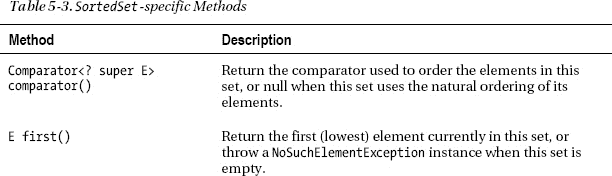

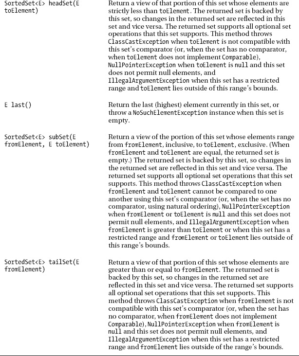

从`headSet()`、`subSet()`和`tailSet()`返回的基于集合的范围视图类似于从`List`的`subList()`方法返回的基于列表的范围视图，除了基于集合的范围视图保持有效，甚至当支持排序的集合被修改时。因此，基于集合的范围视图可以使用很长一段时间。

 **注意**与端点是后备列表中的元素的基于列表的范围视图不同，基于集合的范围视图的端点是元素空间中的绝对点，允许基于集合的范围视图充当集合的元素空间的一部分的窗口。对基于集合的范围视图所做的任何更改都被写回到后备排序集合，反之亦然。

由`headSet()`、`subSet()`或`tailSet()`返回的每个范围视图是*半开*，因为它不包括它的高端点(`headSet()`和`subSet()`)或它的低端点(`tailSet()`)。对于前两种方法，高端点由参数`toElement`指定；对于最后一种方法，低端点由参数`fromElement`指定。

 **注意**你也可以把返回的范围视图看作是*半封闭的*，因为它只包括它的一个端点。

清单 5-9 展示了一个基于树集合的有序集合。

***清单 5-9。**一组经过排序的水果和蔬菜名称*

`import java.util.SortedSet;
import java.util.TreeSet;

class SortedSetDemo
{
   public static void main(String[] args)
   {
      SortedSet<String> sss = new TreeSet<>();
      String[] fruitAndVeg =
      {
         "apple", "potato", "turnip", "banana", "corn", "carrot", "cherry",
         "pear", "mango", "strawberry", "cucumber", "grape", "banana",
         "kiwi", "radish", "blueberry", "tomato", "onion", "raspberry",
         "lemon", "pepper", "squash", "melon", "zucchini", "peach", "plum",
         "turnip", "onion", "nectarine"
      };
      System.out.println("array size = "+fruitAndVeg.length);
      for (String fruitVeg: fruitAndVeg)
         sss.add(fruitVeg);
      dump("sss:", sss);
      System.out.println("sorted set size = "+sss.size());
      System.out.println("first element = "+sss.first());` `      System.out.println("last element = "+sss.last());
      System.out.println("comparator = "+sss.comparator());
      dump("hs:", sss.headSet("n"));
      dump("ts:", sss.tailSet("n"));
      System.out.println("count of p-named fruits & vegetables = "+
                         sss.subSet("p", "q").size());
      System.out.println("incorrect count of c-named fruits & vegetables = "+
                         sss.subSet("carrot", "cucumber").size());
      System.out.println("correct count of c-named fruits & vegetables = "+
                         sss.subSet("carrot", "cucumber\0").size());
   }
   static void dump(String title, SortedSet<String> sss)
   {
      System.out.print(title+" ");
      for (String s: sss)
         System.out.print(s+" ");
      System.out.println();
   }
}`

当您运行此应用时，它会生成以下输出:

```java
Array size = 29
sss: apple banana blueberry carrot cherry corn cucumber grape kiwi lemon mango melon
nectarine onion peach pear pepper plum potato radish raspberry squash strawberry tomato
turnip zucchini
Sorted set size = 26
First element = apple
Last element = zucchini
Comparator = null
hs: apple banana blueberry carrot cherry corn cucumber grape kiwi lemon mango melon
ts: nectarine onion peach pear pepper plum potato radish raspberry squash strawberry tomato
turnip zucchini
Count of p-named fruits & vegetables = 5
Incorrect count of c-named fruits & vegetables = 3
Correct count of c-named fruits & vegetables = 4
```

这个输出显示，排序后的集合的大小小于数组的大小，因为集合不能包含重复的元素:重复的`banana`、`turnip`和`onion`元素没有存储在排序后的集合中。

`comparator()`方法返回 null，因为排序集不是用比较器创建的。相反，有序集合依赖于`String`元素的自然排序，以有序的顺序存储它们。

使用参数`"n"`调用`headSet()`和`tailSet()`方法，以分别返回一组元素，这些元素的名称以严格小于`n`的字母和大于或等于`n`的字母开头。

最后，输出告诉您在向`subSet()`传递一个上限时必须小心。如您所见，`ss.subSet("carrot", "cucumber")`在返回的范围视图中不包括`cucumber`，因为`cucumber`是`subSet()`的高端点。

要将`cucumber`包含在范围视图中，需要形成一个*闭合范围*或*闭合区间*(包含两个端点)。使用`String`对象，您可以通过将`\0`附加到字符串来完成这项任务。比如`ss.subSet("carrot", "cucumber\0")`包含`cucumber`，因为它小于`cucumber\0`。

同样的技术可以应用于任何需要形成*开放范围*或*开放区间*的地方(不包括端点)。例如，`ss.subSet("carrot\0", "cucumber")`不包括`carrot`，因为它小于`carrot\0`。此外，它不包括高端点`cucumber`。

 **注意**当你想为从你自己的类中创建的元素创建封闭和开放的范围时，你需要提供某种形式的`predecessor()`和`successor()`方法来返回一个元素的前任和继任者。

在设计使用有序集合的类时，您需要非常小心。例如，当您计划将该类的实例存储在一个有序集合中时，该类必须实现`Comparable`，在该集合中，这些元素根据它们的自然顺序进行排序。考虑清单 5-10 中的。

***清单 5-10。**一个自定义的`Employee`类没有实现`Comparable`T5】*

```java
import java.util.SortedSet;
import java.util.TreeSet;

class CustomClassAndSortedSet
{
   public static void main(String[] args)
   {
      SortedSet<Employee> sse = new TreeSet<>();
      sse.add(new Employee("sally doe"));
      sse.add(new Employee("bob doe")); // ClassCastException thrown here
      sse.add(new Employee("john doe"));
      System.out.println(sse);
   }
}
class Employee
{
   private String name;
   Employee(String name)
   {
      this.name = name;
   }
   @Override
   public String toString()
   {
      return name;
   }
}
```

当您运行此应用时，它会生成以下输出:

`Exception in thread "main" java.lang.ClassCastException: Employee cannot be cast to
java.lang.Comparable
        at java.util.TreeMap.compare(TreeMap.java:1188)` `        at java.util.TreeMap.put(TreeMap.java:531)
        at java.util.TreeSet.add(TreeSet.java:255)
        at CustomClassAndSortedSet.main(CustomClassAndSortedSet.java:9)`

在第二个`add()`方法调用期间抛出了`ClassCastException`实例，因为排序集实现(T2 的一个实例)无法调用第二个`Employee`元素的`compareTo()`方法，因为`Employee`没有实现`Comparable`。

这个问题的解决方案是让这个类实现`Comparable`，这正是清单 5-11 中展示的[。](#list_5_11)

***清单 5-11。**使`Employee`元素具有可比性*

```java
import java.util.SortedSet;
import java.util.TreeSet;

class CustomClassAndSortedSet
{
   public static void main(String[] args)
   {
      SortedSet<Employee> sse = new TreeSet<>();
      sse.add(new Employee("sally doe"));
      sse.add(new Employee("bob doe"));
      Employee e1 = new Employee("john doe");
      Employee e2 = new Employee("john doe");
      sse.add(e1);
      sse.add(e2);
      System.out.println(sse);
      System.out.println(e1.equals(e2));
   }
}
class Employee implements Comparable<Employee>
{
   private String name;
   Employee(String name)
   {
      this.name = name;
   }
   @Override
   public int compareTo(Employee e)
   {
      return name.compareTo(e.name);
   }
   @Override
   public String toString()
   {
      return name;
   }
}
```

[清单 5-11](#list_5_11) 的`main()`方法与[清单 5-10](#list_5_10) 的不同之处在于，它还创建了两个初始化为`"john doe"`的`Employee`对象，将这些对象添加到排序集合中，并通过 `equals()`比较这些对象是否相等。此外，[清单 5-11](#list_5_11) 声明`Employee`实现`Comparable`，将`compareTo()`方法引入`Employee`。

当您运行此应用时，它会生成以下输出:

```java
[Bob Doe, John Doe, Sally Doe]
false
```

该输出显示只有一个`"john doe" Employee`对象存储在排序后的集合中。毕竟，一个集合不能包含重复的元素。然而，`false`值(由`equals()`比较得出)也表明排序后集合的自然排序与`equals()`不一致，这违反了`SortedSet`的约定:

*如果有序集合要正确实现`Set`接口，有序集合维护的顺序(无论是否提供显式比较器)必须与`equals()`一致。这是因为`Set`接口是根据`equals()`操作定义的，但是一个有序集合使用它的`compareTo()`(或`compare()`)方法执行所有元素比较，所以从有序集合的角度来看，被该方法视为相等的两个元素是相等的。*

因为应用工作正常，为什么`SortedSet`的合同有关系？尽管契约似乎与`SortedSet`的`TreeSet`实现无关，但在实现该接口的第三方类的上下文中可能会有关系。

清单 5-12 向您展示了如何纠正这个问题，并让`Employee`实例与一个有序集合的任何实现一起工作。

***清单 5-12。**符合合同的`Employee`级*

`import java.util.SortedSet;
import java.util.TreeSet;

class CustomClassAndSortedSet
{
   public static void main(String[] args)
   {
      SortedSet<Employee> sse = new TreeSet<>();
      sse.add(new Employee("sally doe"));
      sse.add(new Employee("bob doe"));
      Employee e1 = new Employee("john doe");
      Employee e2 = new Employee("john doe");
      sse.add(e1);
      sse.add(e2);
      System.out.println(sse);
      System.out.println(e1.equals(e2));
   }
}
class Employee implements Comparable<Employee>
{
   private String name;
   Employee(String name)
   {
      this.name = name;
   }
   @Override
   public int compareTo(Employee e)
   {` `      return name.compareTo(e.name);
   }
   @Override
   public boolean equals(Object o)
   {
      if (!(o instanceof Employee))
         return false;
      Employee e = (Employee) o;
      return e.name.equals(name);
   }
   @Override
   public String toString()
   {
      return name;
   }
}`

[清单 5-12](#list_5_12) 通过覆盖`equals()`纠正了`SortedSet`合同违反。运行生成的应用，您会看到输出的第一行是`[Bob Doe, John Doe, Sally Doe]`,第二行是`true`:排序后的集合的自然排序现在与`equals()`一致。

 **注意**尽管每当你重写`equals()`时重写`hashCode()`是很重要的，但是我没有重写[清单 5-12](#list_5_12) 的`Employee`类中的`hashCode()`(尽管我重写了`equals()`，以强调基于树的排序集合忽略`hashCode()`。

#### 适航设置

`TreeSet`是可导航集合的一个例子，它是一个排序集合，可以以降序和升序迭代，并且可以报告给定搜索目标的最接近匹配。导航集由`NavigableSet`接口描述，其通用类型为`NavigableSet<E>`，扩展了`SortedSet`，在[表 5-4](#tab_5_4) 中有描述。

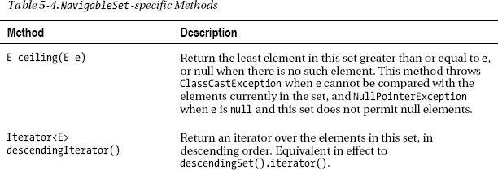

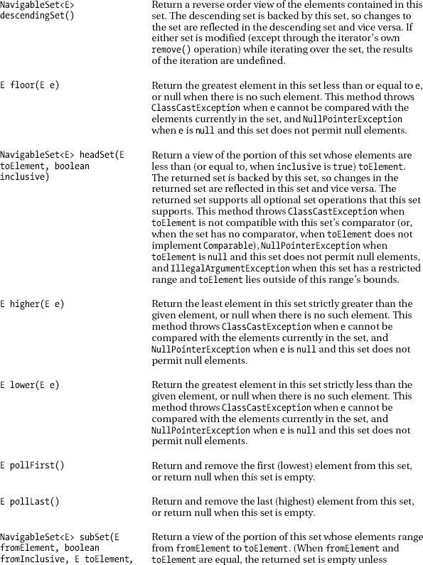

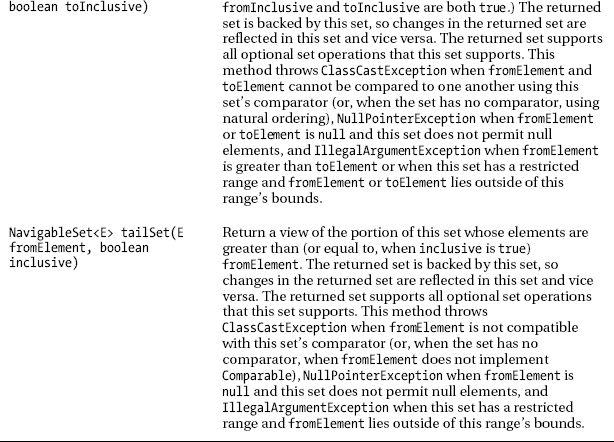

清单 5-13 展示了一个基于树集合的可导航集合。

***清单 5-13。**导航一组整数*

`import java.util.Iterator;
import java.util.NavigableSet;
import java.util.TreeSet;

class NavigableSetDemo
{
   public static void main(String[] args)
   {
      NavigableSet<Integer> ns = new TreeSet<>();
      int[] ints = { 82, -13, 4, 0, 11, -6, 9 };
      for (int i: ints)
         ns.add(i);
      System.out.print("ascending order: ");` `      Iterator iter = ns.iterator();
      while (iter.hasNext())
         System.out.print(iter.next()+" ");
      System.out.println();
      System.out.print("descending order: ");
      iter = ns.descendingIterator();
      while (iter.hasNext())
         System.out.print(iter.next()+" ");
      System.out.println("\n");
      outputClosestMatches(ns, 4);
      outputClosestMatches(ns.descendingSet(), 12);
   }
   static void outputClosestMatches(NavigableSet<Integer> ns, int i)
   {
      System.out.println("element < "+i+" is "+ns.lower(i));
      System.out.println("element <= "+i+" is "+ns.floor(i));
      System.out.println("element > "+i+" is "+ns.higher(i));
      System.out.println("element >= "+i+" is "+ns.ceiling(i));
      System.out.println();
   }
}`

[清单 5-13](#list_5_13) 创建一组可导航的`Integer`元素。它利用自动装箱来确保`int`被转换成`Integers`。

当您运行此应用时，它会生成以下输出:

```java
Ascending order: -13 -6 0 4 9 11 82
Descending order: 82 11 9 4 0 -6 -13

Element < 4 is 0
Element <= 4 is 4
Element > 4 is 9
Element >= 4 is 4

Element < 12 is 82
Element <= 12 is 82
Element > 12 is 11
Element >= 12 is 11
```

以`Element`开头的前四个输出行属于一个升序集合，其中匹配的元素(`4`)是该集合的成员。第二个四个`Element`前缀的行属于降序集合，其中匹配的元素(`12`)不是成员。

除了让您通过最接近匹配方法(`ceiling()`、`floor()`、`higher()`和`lower()`)方便地定位集合元素之外，`NavigableSet`还让您返回包含特定范围内所有元素的集合视图，如以下示例所示:

*   `ns.subSet(-13, true, 9, true)`:返回从`-13`到`9`的所有元素。
*   `ns.tailSet(-6, false)`:返回所有大于`-6`的元素。
*   `ns.headSet(4, true)`:返回所有小于等于`4`的元素。

最后，您可以通过调用`pollFirst()`从集合中返回和移除第一个(最低的)元素，通过调用`pollLast()`返回和移除最后一个(最高的)元素。比如`ns.pollFirst()`移除并返回`-13`，`ns.pollLast()`移除并返回`-82`。

#### 队列

一个*队列*是一个集合，其中的元素以特定的顺序存储和检索。大多数队列分为以下几类:

*   *先进先出(FIFO)队列*:在队列的*尾部*插入元素，在队列的*头部*移除元素。
*   *后进先出(LIFO)队列*:在队列的一端插入和移除元素，使得插入的最后一个元素是检索的第一个元素。这种队列表现为一个*栈*。
*   *优先级队列*:根据元素的自然排序，或者根据提供给队列实现的比较器来插入元素。

泛型类型为`Queue<E>`的`Queue`扩展了`Collection`，重新声明了`add()`以调整其契约(如果可以在不违反容量限制的情况下立即将指定的元素插入到该队列中)，并从`Collection`继承了其他方法。[表 5-5](#tab_5_5) 描述了`add()`和其他`Queue`的具体方法。

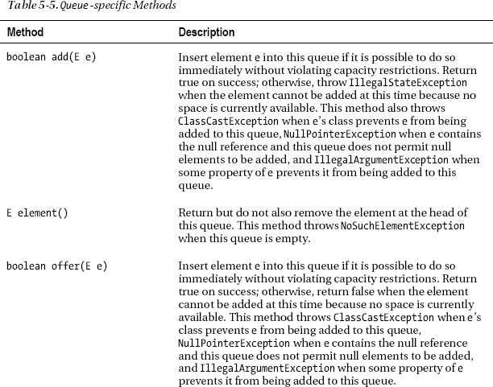


[表 5-5](#tab_5_5) 揭示了两组方法:一组中，一个方法(如`add()`)在操作失败时抛出异常；在另一组中，一个方法(比如`offer()`)在出现故障时返回一个特殊值(false 或 null)。返回特殊值的方法在容量受限的`Queue`实现环境中很有用，在这种环境中，失败是经常发生的事情。

 **注意**在使用容量受限队列时，`offer()`方法通常比`add()`更好，因为`offer()`不会抛出`IllegalStateException`。

Java 提供了许多`Queue`实现类，其中大多数类都是`java.util.concurrent`包的成员:`LinkedBlockingQueue`、`LinkedTransferQueue`和`SynchronousQueue`就是例子。相比之下，`java.util`包提供了`LinkedList`和`PriorityQueue`作为它的`Queue`实现类。

 **注意**许多`Queue`实现类不允许添加空元素。然而，有些类(比如`LinkedList`)允许空元素。您应该避免添加 null 元素，因为 null 被`peek()`和`poll()`方法用作一个特殊的返回值来指示队列为空。

##### 优先权队列

`PriorityQueue`类提供了一个*优先级队列*的实现，这是一个队列，它根据元素的自然顺序或队列实例化时提供的比较器对其元素进行排序。当依赖自然排序时，优先级队列不允许空元素，也不允许插入非`Comparable`对象。

优先级队列头部的元素是指定排序中最小的元素。如果多个元素并列为最小元素，则任意选择其中一个元素作为最小元素。类似地，优先级队列尾部的元素是最大的元素，当出现平局时任意选择。

优先级队列是无限的，但是有一个容量来控制用于存储优先级队列元素的内部数组的大小。容量值至少与队列的长度一样大，并且随着元素被添加到优先级队列中而自动增长。

`PriorityQueue`(其泛型类型为`PriorityQueue<E>`)提供了六个构造函数:

*   `PriorityQueue()`创建一个初始容量为 11 个元素的`PriorityQueue`实例，并根据元素的自然顺序对其进行排序。
*   `PriorityQueue(Collection<? extends E> c)`创建一个包含`c`元素的`PriorityQueue`实例。如果`c`是一个`SortedSet`或`PriorityQueue`实例，这个优先级队列将按照相同的顺序进行排序。否则，该优先级队列将根据其元素的自然顺序进行排序。当`c`的元素不能按照优先级队列的顺序相互比较时，这个构造函数抛出`ClassCastException`，当`c`或它的任何元素包含空引用时，抛出`NullPointerException`。
*   `PriorityQueue(int initialCapacity)`用指定的`initialCapacity`创建一个`PriorityQueue`实例，并根据元素的自然顺序对其进行排序。当`initialCapacity`小于 1 时，这个构造函数抛出`IllegalArgumentException`。
*   `PriorityQueue(int initialCapacity, Comparator<? super E> comparator)`用指定的`initialCapacity`创建一个`PriorityQueue`实例，并根据指定的`comparator`对其元素进行排序。当`comparator`包含空引用时，使用自然排序。当`initialCapacity`小于 1 时，这个构造函数抛出`IllegalArgumentException`。
*   `PriorityQueue(PriorityQueue<? extends E> pq)`创建一个包含`pq`元素的`PriorityQueue`实例。该优先级队列将按照与`pq`相同的顺序进行排序。当`pq`的元素不能按照`pq`的顺序相互比较时，这个构造函数抛出`ClassCastException`，当`pq`或其任何元素包含空引用时，抛出`NullPointerException`。
*   `PriorityQueue(SortedSet<? extends E> ss)`创建一个包含`ss`元素的`PriorityQueue`实例。该优先级队列将按照与`ss`相同的顺序进行排序。当`sortedSet`的元素不能按照`ss`的顺序相互比较时，这个构造函数抛出`ClassCastException`，当`sortedSet`或其任何元素包含空引用时，抛出`NullPointerException`。

清单 5-14 展示了一个优先级队列。

***清单 5-14。**向优先级队列添加随机生成的整数*

`import java.util.PriorityQueue;
import java.util.Queue;

class PriorityQueueDemo
{
   public static void main(String[] args)
   {
      Queue<Integer> qi = new PriorityQueue<>();
      for (int i = 0; i < 15; i++)` `         qi.add((int) (Math.random()*100));
      while (!qi.isEmpty())
         System.out.print(qi.poll()+" ");
      System.out.println();
   }
}`

创建优先级队列后，主线程向该队列添加 15 个随机生成的整数(范围从 0 到 99)。然后它进入一个 while 循环，重复轮询下一个元素的优先级队列，并输出该元素，直到队列为空。

当您运行这个应用时，它从左到右按数字升序输出一行 15 个整数。例如，我在一次运行中观察到以下输出:

```java
11 21 29 35 40 53 66 70 72 75 80 83 87 88 89
```

因为当没有更多的元素时,`poll()`返回 null，我可以将这个循环编码如下:

```java
Integer i;
while ((i = qi.poll()) != null)
   System.out.print(i+" ");
```

假设您想颠倒前一个应用的输出顺序，使最大的元素出现在左边，最小的元素出现在右边。如清单 5-15 所示，你可以通过向适当的`PriorityQueue`构造函数传递一个比较器来完成这个任务。

***清单 5-15。**使用带有优先级队列的比较器*

```java
import java.util.Comparator;
import java.util.PriorityQueue;
import java.util.Queue;

class PriorityQueueDemo
{
   final static int NELEM = 15;
   public static void main(String[] args)
   {
      Comparator<Integer> cmp;
      cmp = new Comparator<Integer>()
            {
               public int compare(Integer e1, Integer e2)
               {
                  return e2-e1;
               }
            };
      Queue<Integer> qi = new PriorityQueue<>(NELEM, cmp);
      for (int i = 0; i < NELEM; i++)
         qi.add((int) (Math.random()*100));
      while (!qi.isEmpty())
         System.out.print(qi.poll()+" ");
      System.out.println();
   }
}
```

[清单 5-15](#list_5_15) 与[清单 5-14](#list_5_14) 相似，但也有一些不同。首先，我声明了一个`NELEM`常量，这样我就可以通过在一个地方指定新值来轻松地改变优先级队列的初始容量和插入到优先级队列中的元素数量。

其次，[清单 5-15](#list_5_15) 声明并实例化了一个实现`Comparator`的匿名类。它的`compareTo()`方法从元素`e1`中减去元素`e2`,以实现数字降序。编译器通过将`e2-e1`转换为`e2.intValue()-e1.intValue()`来处理取消`e2`和`e1`装箱的任务。

最后，[清单 5-15](#list_5_15) 将`NELEM`元素的初始容量和实例化的比较器传递给`PriorityQueue(int initialCapacity, Comparator<? super E> comparator)`构造函数。优先级队列将使用该比较器对这些元素进行排序。

运行这个应用，您将会看到一个由 15 个整数组成的输出行，按照从左到右的降序排列。例如，我观察到这样的输出行:

```java
90 86 78 74 65 53 45 44 30 28 18 9 9 7 5
```

#### Deque

一个*队列*(发音为 deck)是一个双端队列，其中元素的插入或移除发生在其头部或尾部。Deques 可以用作队列或堆栈。

`Deque`，其泛型类型为`Deque<E>`，扩展了`Queue`，其中继承的`add(E e)`方法在队列尾部插入了`e`。[表 5-6](#tab_5_6) 描述了`Deque`的具体方法。

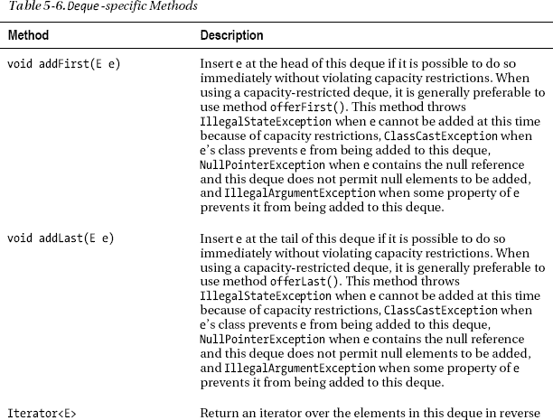

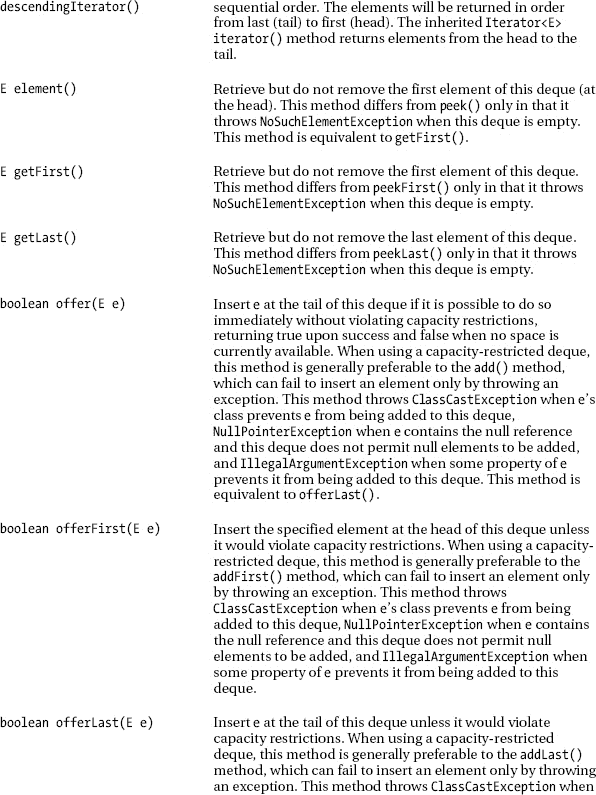

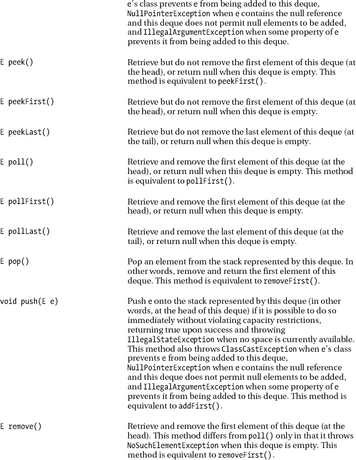

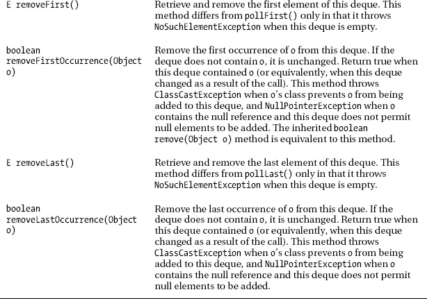

如[表 5-6](#tab_5_6) 所示，`Deque`声明了访问队列两端元素的方法。提供了插入、移除和检查元素的方法。这些方法中的每一个都以两种形式存在:一个在操作失败时抛出异常，另一个返回特殊值(null 或 false，取决于操作)。后一种形式的插入操作是专门为容量受限的`Deque`实现而设计的；在大多数实现中，插入操作不会失败。

[图 5-2](#fig_5_2) 展示了`Deque`的 Java 文档中的一个表格，该表格很好地总结了头部和尾部的插入、移除和检查方法的两种形式。

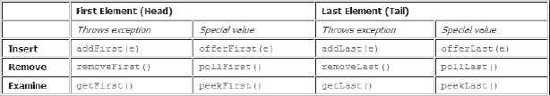

***图 5-2。** `Deque`声明了十二种方法，用于插入、移除和检查队列头部或尾部的元素。*

当一个队列用作队列时，会产生 FIFO(先进先出)行为。元素被添加到队列的末尾，并从开头移除。从`Queue`接口继承的方法完全等同于[表 5-7](#tab_5_7) 中所示的`Deque`方法。

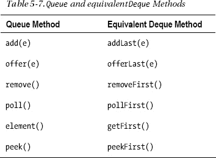

最后，deques 也可以用作 LIFO(后进先出)堆栈。当一个队列被用作堆栈时，元素从队列的开始被推入和弹出。因为堆栈的`push(e)`方法等同于`Deque`的`addFirst(e)`方法，其`pop()`方法等同于`Deque`的`removeFirst()`方法，其`peek()`方法等同于`Deque`的`peekFirst()`方法，`Deque`声明了`E peek()`、`E pop()`和`void push(E e)`面向堆栈的便利方法。

##### array deqo

*`ArrayDeque`类提供了`Deque`接口的可调整大小的数组实现。它禁止将空元素添加到 deque 中，并且它的`iterator()`方法返回失败快速迭代器。*

`ArrayDeque`提供三个构造函数:

*   创建一个初始容量为 16 个元素的空数组列表。
*   `ArrayDeque(Collection<? extends E> c)`创建一个包含`c`元素的数组队列，按照`c`的迭代器返回的顺序排列。(由`c`的迭代器返回的第一个元素成为 deque 的第一个元素或前面。)`NullPointerException`在`c`包含空引用时抛出。
*   `ArrayDeque(int numElements)`创建一个空数组队列，其初始容量足以容纳`numElements`个元素。当传递给`numElements`的参数小于或等于零时，不会抛出异常。

清单 5-16 展示了一个数组队列。

***清单 5-16。**使用数组队列作为堆栈*

```java
import java.util.ArrayDeque;
import java.util.Deque;

class ArrayDequeDemo
{
   public static void main(String[] args)
   {
      Deque<String> stack = new ArrayDeque<>();
      String[] weekdays = { "Sunday", "Monday", "Tuesday", "Wednesday",
                            "Thursday", "Friday", "Saturday" };
      for (String weekday: weekdays)
         stack.push(weekday);
      while (stack.peek() != null)
         System.out.println(stack.pop());
   }
}
```

当您运行此应用时，它会生成以下输出:

```java
Saturday
Friday
Thursday
Wednesday
Tuesday
Monday
Sunday
```

#### 地图

一个*映射*是一组键/值对(也称为条目)。因为关键字标识一个条目，所以映射不能包含重复的关键字。此外，每个键最多只能映射到一个值。地图由`Map`接口描述，该接口没有父接口，其泛型类型为`Map<K,V>` ( `K`是键的类型；`V`是值的类型)。

[表 5-8](#tab_5_8) 描述了`Map`的方法。

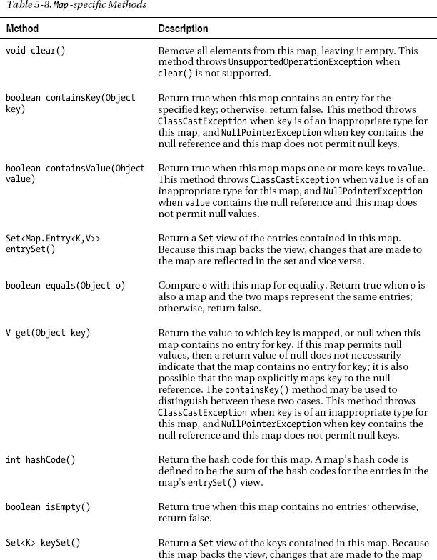

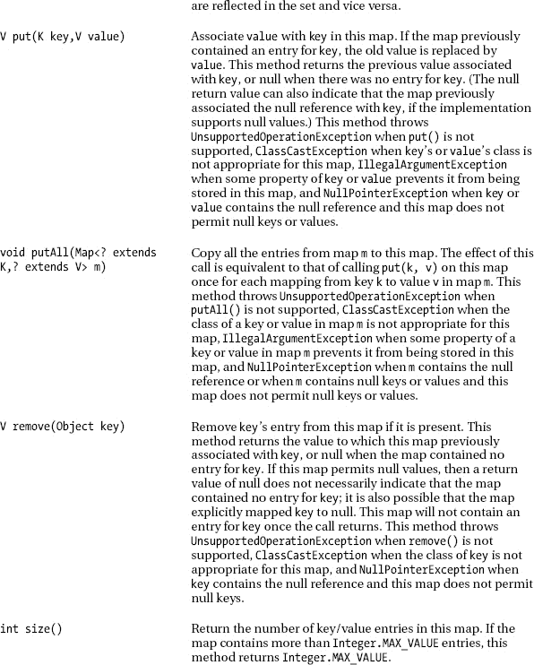

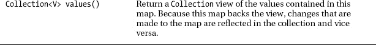

与`List`、`Set`、`Queue`不同，`Map`不延伸`Collection`。然而，通过调用`Map`的`keySet()`、`values()`和`entrySet()`方法，可以将映射作为`Collection`实例来查看，这些方法分别返回键的`Set`、值的`Collection`和键/值对条目的`Set`。

 **注意**`values()`方法返回`Collection`而不是`Set`，因为多个键可以映射到同一个值，然后`values()`会返回同一个值的多个副本。

这些方法返回的`Collection`视图(回想一下，a `Set`是一个`Collection`，因为`Set`扩展了`Collection`)提供了迭代 a `Map`的唯一方法。例如，假设您用三个`Color`常量、`RED`、`GREEN`和`BLUE`声明了[清单 5-17](#list_5_17) 的`Color`枚举。

***清单 5-17。**五彩缤纷的 enum*

```java
enum Color
{
   RED(255, 0, 0),
   GREEN(0, 255, 0),
   BLUE(0, 0, 255);
   private int r, g, b;
   private Color(int r, int g, int b)
   {
      this.r = r;
      this.g = g;
      this.b = b;
   }
   @Override
   public String toString()
   {
      return "r = "+r+", g = "+g+", b = "+b;
   }
}
```

以下示例声明了一个由`String`键和`Color`值组成的映射，向该映射添加了几个条目，并对键和值进行了迭代:

`Map<String, Color> colorMap = ...; // ... represents creation of a Map implementation
colorMap.put("red", Color.RED);
colorMap.put("blue", Color.BLUE);
colorMap.put("green", Color.GREEN);
colorMap.put("RED", Color.RED);
for (String colorKey: colorMap.keySet())` `   System.out.println(colorKey);
Collection<Color> colorValues = colorMap.values();
for (Iterator<Color> it = colorValues.iterator(); it.hasNext();)
   System.out.println(it.next());`

当针对`colorMap`的 hashmap 实现(稍后讨论)运行这个示例时，您应该观察到类似如下的输出:

```java
red
blue
green
RED
r = 255, g = 0, b = 0
r = 0, g = 0, b = 255
r = 0, g = 255, b = 0
r = 255, g = 0, b = 0
```

前四个输出行标识映射的键；接下来的四个输出行标识地图的值。

`entrySet()`方法返回一个`Map.Entry`对象的`Set`。这些对象中的每一个都将单个条目描述为一个键/值对，并且是实现`Map.Entry`接口的类的实例，其中`Entry`是`Map`的嵌套接口。[表 5-9](#tab_5_9) 描述了`Map.Entry`的方法。

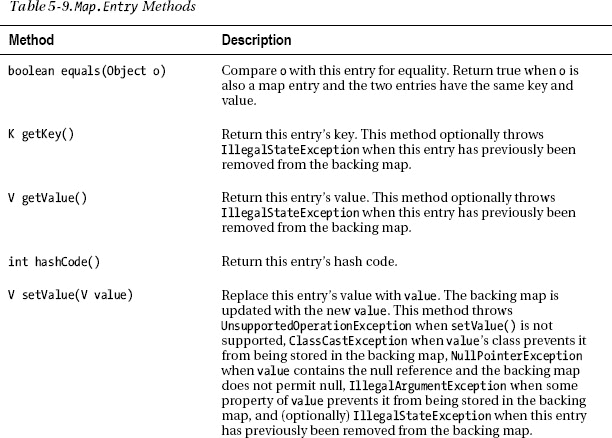

以下示例向您展示了如何迭代上一示例的地图条目:

```java
for (Map.Entry<String, Color> colorEntry: colorMap.entrySet())
   System.out.println(colorEntry.getKey()+": "+colorEntry.getValue());
```

当针对前面提到的 hashmap 实现运行这个示例时，您会看到以下输出:

```java
red: r = 255, g = 0, b = 0
blue: r = 0, g = 0, b = 255
green: r = 0, g = 255, b = 0
RED: r = 255, g = 0, b = 0
```

##### 树图

`TreeMap`类提供了一个基于红黑树的 map 实现。因此，条目按其键的排序顺序存储。然而，访问这些条目比使用其他`Map`实现(没有排序)要慢一些，因为必须遍历链接。

 **注**查看维基百科的“红黑树”词条(`[http://en.wikipedia.org/wiki/Red-black_tree](http://en.wikipedia.org/wiki/Red-black_tree)`)了解红黑树。

`TreeMap`提供四个构造函数:

*   `TreeMap()`创建一个新的空的树形图，根据其关键字的自然顺序进行排序。所有插入到 map 中的键都必须实现`Comparable`接口。
*   `TreeMap(Comparator<? super K> comparator)`根据指定的`comparator`创建一个新的、空的树形图。将`null`传递给`comparator`意味着将使用自然排序。
*   `TreeMap(Map<? extends K, ? extends V> m)`创建一个包含`m`条目的新树形图，根据其关键字的自然顺序进行排序。所有插入新地图的键必须实现`Comparable`接口。当`m`的键没有实现`Comparable`或者不能相互比较时，这个构造函数抛出`ClassCastException`，当`m`包含空引用时，抛出`NullPointerException`。
*   `TreeMap(SortedMap<K, ? extends V> sm)`创建一个新的树形图，包含与`sm`相同的条目并使用相同的排序。(我将在本章后面讨论排序地图。)当`sm`包含空引用时，这个构造函数抛出`NullPointerException`。

清单 5-18 展示了一个树形图。

***清单 5-18。**根据基于`String`的关键字*的自然排序对地图条目进行排序

```java
import java.util.Map;
import java.util.TreeMap;

class TreeMapDemo
{
   public static void main(String[] args)
   {
      Map<String, Integer> msi = new TreeMap<>();
      String[] fruits = {"apples", "pears", "grapes", "bananas", "kiwis"};
      int[] quantities = {10, 15, 8, 17, 30};
      for (int i = 0; i < fruits.length; i++)
         msi.put(fruits[i], quantities[i]);
      for (Map.Entry<String, Integer> entry: msi.entrySet())
         System.out.println(entry.getKey()+": "+entry.getValue());
   }
}
```

当您运行此应用时，它会生成以下输出:

```java
apples: 10
bananas: 17
grapes: 8
kiwis: 30
pears: 15
```

##### 哈希映射

`HashMap`类提供了一个基于哈希表数据结构的 map 实现。这个实现支持所有的`Map`操作，并允许空键和空值。它不保证条目的存储顺序。

哈希表在一个*哈希函数*的帮助下将键映射到整数值。Java 以`Object`的`hashCode()`方法的形式提供这个函数，类覆盖这个函数以提供适当的哈希代码。

一个*散列码*标识哈希表的数组元素之一，它被称为*桶*或*槽*。对于一些哈希表，桶可以存储与键相关联的值。图 5-3 说明了这种散列表。

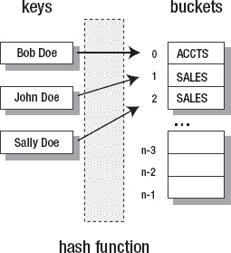

***图 5-3。**一个简单的哈希表将键映射到存储与这些键相关的值的桶。*

散列函数将`Bob Doe`散列到`0`，这标识了第一个桶。这个桶包含`ACCTS`，它是`Bob Doe`的员工类型。散列函数还将`John Doe`和`Sally Doe`散列到`1`和`2`(分别)，它们的桶包含`SALES`。

完美的散列函数将每个键散列成一个唯一的整数值。然而，这个理想很难实现。实际上，一些键将散列到相同的整数值。这种不唯一的映射被称为*碰撞*。

为了解决冲突，大多数哈希表将条目的链表与桶相关联。桶不包含值，而是包含链表中第一个节点的地址，每个节点包含一个冲突条目。参见图 5-4 。

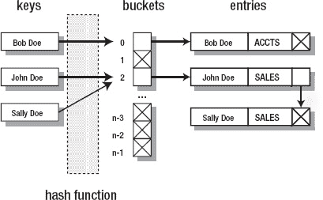

***图 5-4。**一个复杂的哈希表将键映射到存储链表引用的桶，链表的节点值是从相同的键散列而来的。*

在哈希表中存储值时，哈希表使用哈希函数将关键字哈希到其哈希代码中，然后搜索适当的链表以查看是否存在具有匹配关键字的条目。如果有条目，它的值会用新值更新。否则，将创建一个新节点，用键和值填充，并附加到列表中。

当从哈希表中检索值时，哈希表使用哈希函数将键哈希到其哈希代码，然后搜索适当的链表以查看是否存在具有匹配键的条目。如果有条目，则返回其值。否则，哈希表可能会返回一个特殊值来指示没有条目，或者可能会引发异常。

桶的数量被称为哈希表的容量。存储条目的数量除以存储桶的数量的比率被称为哈希表的*加载因子*。选择正确的负载系数对于平衡性能和内存使用非常重要:

*   当负载因子接近 1 时，冲突的概率和处理冲突的成本(通过搜索冗长的链表)会增加。
*   当负载因子接近 0 时，散列表的大小随着存储桶数量的增加而增加，而搜索成本几乎没有提高。
*   对于许多哈希表来说，0.75 的加载因子接近最佳值。这个值是`HashMap`的哈希表实现的默认值。

`HashMap`提供四个构造函数:

*   创建一个新的空散列表，初始容量为 16，装载系数为 0.75。
*   `HashMap(int initialCapacity)`创建一个新的空散列表，其容量由`initialCapacity`指定，加载因子为 0.75。当`initialCapacity`的值小于 0 时，该构造函数抛出`IllegalArgumentException`。
*   `HashMap(int initialCapacity, float loadFactor)`创建一个新的空散列表，其容量由`initialCapacity`指定，负载系数由`loadFactor`指定。当`initialCapacity`小于 0 或者`loadFactor`小于等于 0 时，该构造函数抛出`IllegalArgumentException`。
*   `HashMap(Map<? extends K, ? extends V> m)`创建一个包含`m`条目的新散列表。当`m`包含空引用时，这个构造函数抛出`NullPointerException`。

清单 5-19 展示了一个散列表。

***清单 5-19。**使用散列表计算命令行参数*

`import java.util.HashMap;
import java.util.Map;

class HashMapDemo
{
   public static void main(String[] args)
   {
      Map<String, Integer> argMap = new HashMap<>();
      for (String arg: args)
      {
         Integer count = argMap.get(arg);` `         argMap.put(arg, (count == null) ? 1 : count+1);
      }
      System.out.println(argMap);
      System.out.println("Number of distinct arguments = "+argMap.size());
   }
}`

`HashMapDemo`创建一个由`String`键和`Integer`值组成的散列表。每个键都是传递给该应用的命令行参数之一，其值是该参数在命令行中出现的次数。

例如，`java HashMapDemo how much wood could a woodchuck chuck if a woodchuck could chuck wood`生成以下输出:

```java
{wood=2, could=2, how=1, if=1, chuck=2, a=2, woodchuck=2, much=1}
Number of distinct arguments = 8
```

因为`String`类覆盖了`equals()`和`hashCode()`，[清单 5-19](#list_5_19) 可以使用`String`对象作为散列表中的键。当创建一个其实例将用作键的类时，必须确保重写这两个方法。

[清单 5-6](#list_5_6) 向您展示了一个类的覆盖`hashCode()`方法可以调用一个引用字段的`hashCode()`方法并返回它的值，只要这个类声明一个引用字段(并且没有原始类型字段)。

更常见的情况是，类声明多个字段，并且需要更好地实现`hashCode()`方法。实现应该尝试生成最小化冲突的哈希代码。

没有关于如何最好地实现`hashCode()`的规则，各种*算法*(完成任务的方法)被创造出来。我最喜欢的算法出现在约书亚·布洛赫(Addison-Wesley，2008；ISBN: 0321356683)。

以下算法假设存在一个被称为 *`X`* 的任意类，该算法与 Bloch 的算法非常相似，但并不相同:

1.  将`int`变量`hashCode`(名称任意)初始化为任意非零整数值，比如 19。该变量被初始化为非零值，以确保它考虑了散列码为零的任何初始字段。如果你将`hashCode`初始化为 0，最终的散列码将不会受到这些字段的影响，你将冒增加冲突的风险。
2.  对于在 *`X`* 的`equals()`方法中使用的每个字段`f`，计算`f`的哈希码，并将其分配给`int`变量`hc`，如下所示:
    1.  如果`f`是布尔类型，则计算`hc = f?1:0`。
    2.  如果`f`是字节整数、字符、整数或短整数类型，则计算`hc = (int) f`。整数值是散列码。
    3.  如果`f`是长整型，则计算`hc = (int) (f^(f>>>32))`。该表达式将长整数的最低有效 32 位与其最高有效 32 位进行异或运算。
    4.  如果`f`是浮点类型，则计算`hc = Float.floatToIntBits(f)`。此方法考虑了+无穷大、-无穷大和 NaN。
    5.  如果`f`是双精度浮点类型，则计算`long l = Double.doubleToLongBits(f); hc = (int) (l^(l>>>32))`。
    6.  如果`f`是空引用的引用字段，则计算`hc = 0`。
    7.  如果`f`是一个非空引用的引用字段，如果 *`X`* 的`equals()`方法通过递归调用`equals()`来比较字段(如[清单 5-12](#list_5_12) 的`Employee`类)，计算`hc = f.hashCode()`。然而，如果`equals()`使用更复杂的比较，创建字段的*规范*(最简单的可能)表示，并在这个表示上调用`hashCode()`。
    8.  如果`f`是一个数组，通过递归地应用该算法并组合`hc`值，将每个元素视为一个单独的字段，如下一步所示。
3.  将`hc`与`hashCode`组合如下:`hashCode = hashCode*31+hc`。将`hashCode`乘以`31`使得结果哈希值依赖于字段在类中出现的顺序，当一个类包含多个相似的字段(例如，几个`int`)时，这会提高哈希值。我选择 31 是为了和`String`类的`hashCode()`方法保持一致。
4.  从`hashCode()`返回`hashCode`。

 **提示**您可能会发现使用`HashCodeBuilder`类比使用这种或另一种算法来创建哈希代码更容易(参见`[http://commons.apache.org/lang/api-2.4/org/apache/commons/lang/builder/HashCodeBuilder.html](http://commons.apache.org/lang/api-2.4/org/apache/commons/lang/builder/HashCodeBuilder.html)`了解该类的解释)。这个类遵循 Bloch 的规则，是 Apache Commons Lang 组件的一部分，可以从`[http://commons.apache.org/lang/](http://commons.apache.org/lang/)`下载。

在[第 2 章](02.html#ch2)，[清单 2-27](02.html#list_2_27) 的`Point`类覆盖`equals()`但不覆盖`hashCode()`。我后来展示了一小段代码，它必须附加到`Point`的`main()`方法中，以演示不覆盖`hashCode()`的问题。我在这里重申这个问题:

*虽然对象`p1`和`Point(10, 20)`在逻辑上是等价的，但是这些对象有不同的哈希码，导致每个对象引用哈希表中不同的条目。如果一个对象没有存储(通过`put()`)在那个条目中，`get()`返回 null。*

[清单 5-20](#list_5_20) 通过声明一个`hashCode()`方法来修改[清单 2-27](02.html#list_2_27) 的`Point`类。这个方法使用前面提到的算法来确保逻辑上等价的`Point`对象散列到同一个条目。

***清单 5-20。**使用散列表计算命令行参数*

`import java.util.HashMap;
import java.util.Map;

class Point
{
   private int x, y;
   Point(int x, int y)
   {
      this.x = x;
      this.y = y;
   }
   int getX()` `   {
      return x;
   }
   int getY()
   {
      return y;
   }
   @Override
   public boolean equals(Object o)
   {
      if (!(o instanceof Point))
         return false;
      Point p = (Point) o;
      return p.x == x && p.y == y;
   }
   @Override
   public int hashCode()
   {
      int hashCode = 19;
      int hc = x;
      hashCode = hashCode*31+hc;
      hc = y;
      hashCode = hashCode*31+hc;
      return hc;
   }
   public static void main(String[] args)
   {
      Point p1 = new Point(10, 20);
      Point p2 = new Point(20, 30);
      Point p3 = new Point(10, 20);
      // Test reflexivity
      System.out.println(p1.equals(p1)); // Output: true
      // Test symmetry
      System.out.println(p1.equals(p2)); // Output: false
      System.out.println(p2.equals(p1)); // Output: false
      // Test transitivity
      System.out.println(p2.equals(p3)); // Output: false
      System.out.println(p1.equals(p3)); // Output: true
      // Test nullability
      System.out.println(p1.equals(null)); // Output: false
      // Extra test to further prove the instanceof operator's usefulness.
      System.out.println(p1.equals("abc")); // Output: false
      Map<Point, String> map = new HashMap<Point, String>();
      map.put(p1, "first point");
      System.out.println(map.get(p1)); // Output: first point
      System.out.println(map.get(new Point(10, 20))); // Output: null
   }
}`

[清单 5-20](#list_5_20) 的`hashCode()`方法有点冗长，因为它将`x`和`y`分别赋给局部变量`hc`，而不是在哈希代码计算中直接使用这些字段。然而，我决定采用这种方法来更好地反映哈希代码算法。

当您运行这个应用时，它的最后两行输出是您最感兴趣的。应用现在正确地在这两行上显示了`first point`和`first point`，而不是在两行上显示`first point`和`null`。

 **注意** `LinkedHashMap`是`HashMap`的子类，它使用链表来存储条目。因此，`LinkedHashMap`的迭代器按照条目被插入的顺序返回条目。例如，如果清单 5-19 中的[指定了`Map<String, Integer> argMap = new LinkedHashMap<>();`，那么`java HashMapDemo how much wood could a woodchuck chuck if a woodchuck could chuck wood`的应用输出将会是`{how=1, much=1, wood=2, could=2, a=2, woodchuck=2, chuck=2, if=1}`后跟`Number of distinct arguments = 8`。](#list_5_19)

##### 身份识别哈希图

`IdentityHashMap`类提供了一个`Map`实现，它在比较键和值时使用引用相等(`==`)而不是对象相等(`equals()`)。这是对`Map`总合同的故意违反，总合同要求在比较元素时使用`equals()`。

`IdentityHashMap`通过`System`的`static int identityHashCode(Object x)`方法获取哈希码，而不是通过每个 key 的`hashCode()`方法。`identityHashCode()`为`x`返回与`Object`的`hashCode()`方法返回相同的哈希代码，不管`x`的类是否覆盖`hashCode()`。空引用的哈希代码为零。

这些特征使`IdentityHashMap`比其他`Map`实现具有性能优势。另外，`IdentityHashMap`支持*可变键*(用作键的对象，当它们的字段值在映射中改变时，它们的散列码也会改变)。清单 5-21 对比了`IdentityHashMap`和`HashMap`中的可变键。

***清单 5-21。**在可变键上下文*中对比`IdentityHashMap`和`HashMap`

`import java.util.IdentityHashMap;
import java.util.HashMap;
import java.util.Map;

class IdentityHashMapDemo
{
   public static void main(String[] args)
   {
      Map<Employee, String> map1 = new IdentityHashMap<>();
      Map<Employee, String> map2 = new HashMap<>();
      Employee e1 = new Employee("John Doe", 28);
      map1.put(e1, "SALES");
      System.out.println(map1);
      Employee e2 = new Employee("Jane Doe", 26);
      map2.put(e2, "MGMT");
      System.out.println(map2);
      System.out.println("map1 contains key e1 = "+map1.containsKey(e1));
      System.out.println("map2 contains key e2 = "+map2.containsKey(e2));` `      e1.setAge(29);
      e2.setAge(27);
      System.out.println(map1);
      System.out.println(map2);
      System.out.println("map1 contains key e1 = "+map1.containsKey(e1));
      System.out.println("map2 contains key e2 = "+map2.containsKey(e2));
   }
}
class Employee
{
   private String name;
   private int age;
   Employee(String name, int age)
   {
      this.name = name;
      this.age = age;
   }
   @Override
   public boolean equals(Object o)
   {
      if (!(o instanceof Employee))
         return false;
      Employee e = (Employee) o;
      return e.name.equals(name) && e.age == age;
   }
   @Override
   public int hashCode()
   {
      int hashCode = 19;
      hashCode = hashCode*31+name.hashCode();
      hashCode = hashCode*31+age;
      return hashCode;
   }
   void setAge(int age)
   {
      this.age = age;
   }
   void setName(String name)
   {
      this.name = name;
   }
   @Override
   public String toString()
   {
      return name+" "+age;
   }
}`

[清单 5-21](#list_5_21) 的`main()`方法创建了`IdentityHashMap`和`HashMap`实例，每个实例存储一个由`Employee`键和`String`值组成的条目。因为`Employee`实例是可变的(因为`setAge()`和`setName()` ), `main()`改变它们的年龄，而这些键存储在它们的映射中。这些更改会产生以下输出:

```java
{John Doe 28=SALES}
{Jane Doe 26=MGMT}
map1 contains key e1 = true
map2 contains key e2 = true
{John Doe 29=SALES}
{Jane Doe 27=MGMT}
map1 contains key e1 = true
map2 contains key e2 = false
```

最后四行显示更改的条目保留在它们的映射中。但是，`map2`的`containsKey()`方法报告其`HashMap`实例不再包含其`Employee`键(应该是`Jane Doe 27`)，而`map1`的`containsKey()`方法报告其`IdentityHashMap`实例仍然包含其`Employee`键，现在是`John Doe 29`。

 **注意** `IdentityHashMap`的文档指出“这个类的一个典型用途是保持拓扑的对象图转换，比如序列化或深度复制。”(我在[第 8 章](08.html#ch8)讨论序列化。)它还声明如下:“该类的另一个典型用途是维护代理对象。”同样，回应 stackoverflow 的“Identity HashMap 的用例”主题(`[http://stackoverflow.com/questions/838528/use-cases-for-identity-hashmap](http://stackoverflow.com/questions/838528/use-cases-for-identity-hashmap)`)的开发人员提到，当键是`Class`对象时，使用`IdentityHashMap`比`HashMap`快得多。

##### WeakHashMap

`WeakHashMap`类提供了基于弱可达键的`Map`实现。因为每个键对象都是作为弱引用的被引用对象间接存储的，所以只有在垃圾收集器清除了对该键的所有弱引用(映射内部和外部)之后，该键才会自动从映射中删除。

 **注意**查看[第 4 章](04.html#ch4)的“引用 API”部分，了解弱可达和弱引用。

相反，值对象是通过强引用存储的(不应该直接或间接地强引用它们自己的键，因为这样做可以防止它们的关联键被丢弃)。当从映射中删除一个键时，其关联的值对象也被删除。

清单 5-22 提供了一个`WeakHashMap`类的简单演示。

***清单 5-22。**检测弱散列表条目的移除*

`import java.util.Map;
import java.util.WeakHashMap;

class LargeObject` `{
   private byte[] memory = new byte[1024*1024*50]; // 50 megabytes
}
class WeakHashMapDemo
{
   public static void main(String[] args)
   {
      Map<LargeObject, String> map = new WeakHashMap<>();
      LargeObject lo = new LargeObject();
      map.put(lo, "Large Object");
      System.out.println(map);
      lo = null;
      while (!map.isEmpty())
      {
         System.gc();
         new LargeObject();
      }
      System.out.println(map);
   }
}`

[清单 5-22](#list_5_22) 的`main()`方法在弱哈希表中存储一个 50MB 的`LargeObject`键和一个`String`值，然后通过将`null`赋值给`lo`来移除键的强引用。`main()` next 进入 while 循环，该循环一直执行到 map 为空为止(`map.isEmpty()`返回 true)。

每个循环迭代从一个`System.gc()`方法调用开始，这可能会也可能不会导致垃圾收集的发生(取决于平台)。为了鼓励垃圾收集，迭代会创建一个`LargeObject`对象并丢弃它的引用。这个活动最终会导致垃圾收集器运行并删除 map 的唯一条目。

当我在我的 Windows XP 平台上运行这个应用时，我观察到以下输出—如果您发现该应用处于无限循环中，您可能需要修改代码:

```java
{LargeObject@5224ee=Large Object}
{}
```

 **注** `WeakHashMap`对于避免内存泄漏很有用，Brian Goetz 的文章《Java 理论与实践:用弱引用堵塞内存泄漏》(`[http://www.ibm.com/developerworks/java/library/j-jtp11225/](http://www.ibm.com/developerworks/java/library/j-jtp11225/)`)中有解释。

##### 编号

`EnumMap`类提供了一个`Map`实现，它的键是同一个枚举的成员。不允许空键；任何存储空键的尝试都会导致抛出`NullPointerException`。因为枚举映射在内部表示为数组，所以枚举映射在性能方面接近数组。

`EnumMap`提供以下构造函数:

*   `EnumMap(Class<K> keyType)`用指定的`keyType`创建一个空的枚举映射。当`keyType`包含空引用时，这个构造函数抛出`NullPointerException`。
*   `EnumMap(EnumMap<K,? extends V> m)`使用与`m`相同的关键字类型和`m`的条目创建一个枚举映射。当`m`包含空引用时，这个构造函数抛出`NullPointerException`。
*   `EnumMap(Map<K,? extends V> m)`创建一个用`m`的条目初始化的枚举映射。如果`m`是一个`EnumMap`实例，这个构造函数的行为就像前面的构造函数一样。否则，`m`必须包含至少一个条目，以便确定新枚举映射的键类型。当`m`包含空引用时，这个构造函数抛出`NullPointerException`，当`m`不是`EnumMap`实例并且为空时，抛出`IllegalArgumentException`。

清单 5-23 演示了`EnumMap`。

***清单 5-23。**常量`Coin`的枚举图*

```java
import java.util.EnumMap;
import java.util.Map;

enum Coin
{
   PENNY, NICKEL, DIME, QUARTER
}
class EnumMapDemo
{
   public static void main(String[] args)
   {
      Map<Coin, Integer> map = new EnumMap<>(Coin.class);
      map.put(Coin.PENNY, 1);
      map.put(Coin.NICKEL, 5);
      map.put(Coin.DIME, 10);
      map.put(Coin.QUARTER, 25);
      System.out.println(map);
      Map<Coin,Integer> mapCopy = new EnumMap<>(map);
      System.out.println(mapCopy);
   }
}
```

当您运行此应用时，它会生成以下输出:

```java
{PENNY=1, NICKEL=5, DIME=10, QUARTER=25}
{PENNY=1, NICKEL=5, DIME=10, QUARTER=25}
```

#### 分类地图

`TreeMap`是一个排序映射的例子，这是一个按升序维护条目的映射，根据键的自然顺序或创建排序映射时提供的比较器进行排序。排序后的地图由`SortedMap`接口描述。

`SortedMap`，其泛型为`SortedMap<K,V>`，扩展了`Map`。除了两个例外，它从`Map`继承的方法在排序地图上的行为与在其他地图上的行为相同:

*   由任何已排序地图的`Collection`视图上的`iterator()`方法返回的`Iterator`实例按顺序遍历集合。
*   由`Collection`视图的`toArray()`方法返回的数组按顺序包含键、值或条目。

 **注意**虽然没有保证，但是集合框架中`SortedSet`实现的`Collection`视图的`toString()`方法(比如`TreeMap`)会返回一个包含所有视图元素的字符串。

`SortedMap`的文档要求一个实现必须提供我在讨论`TreeMap`时提出的四个标准构造函数。此外，该接口的实现必须实现[表 5-10](#tab_5_10) 中描述的方法。

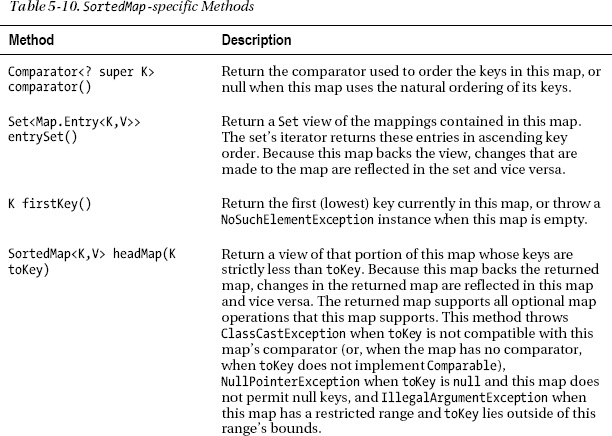

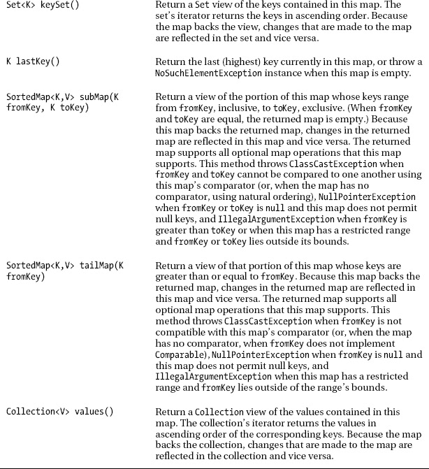

清单 5-24 展示了一个基于树形图的排序图。

***清单 5-24。**办公用品名称及数量分类图*

`import java.util.Comparator;
import java.util.SortedMap;
import java.util.TreeMap;` `class SortedMapDemo
{
   public static void main(String[] args)
   {
      SortedMap<String, Integer> smsi = new TreeMap<>();
      String[] officeSupplies =
      {
         "pen", "pencil", "legal pad", "CD", "paper"
      };
      int[] quantities =
      {
         20, 30, 5, 10, 20
      };
      for (int i = 0; i < officeSupplies.length; i++)
          smsi.put(officeSupplies[i], quantities[i]);
      System.out.println(smsi);
      System.out.println(smsi.headMap("pencil"));
      System.out.println(smsi.headMap("paper"));
      SortedMap<String, Integer> smsiCopy;
      Comparator<String> cmp;
      cmp = new Comparator<String>()
                {
                   public int compare(String key1, String key2)
                   {
                      return key2.compareTo(key1); // descending order
                   }
                };
      smsiCopy = new TreeMap<String, Integer>(cmp);
      smsiCopy.putAll(smsi);
      System.out.println(smsiCopy);
   }
}`

当您运行此应用(`java SortedMapDemo`)时，它会生成以下输出:

```java
{CD=10, legal pad=5, paper=20, pen=20, pencil=30}
{CD=10, legal pad=5, paper=20, pen=20}
{CD=10, legal pad=5}
{pencil=30, pen=20, paper=20, legal pad=5, CD=10}
```

#### 航海图

`TreeMap`是可导航地图的一个例子，这是一个排序的地图，可以按照降序和升序迭代，并且可以报告给定搜索目标的最接近匹配。导航地图由`NavigableMap`接口描述，其通用类型为`NavigableMap<K,V>`，扩展了`SortedMap`，在[表 5-11](#tab_5_11) 中有描述。

T2】

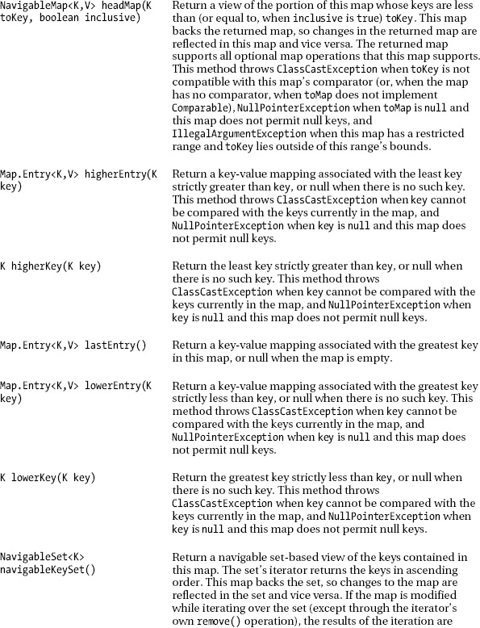

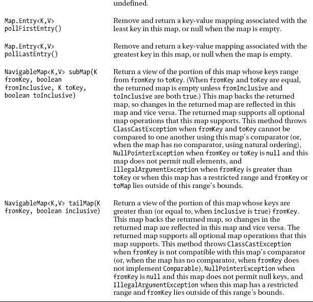

[表 5-11](#tab_5_11) 的方法描述了[表 5-4](#tab_5_4) 中呈现的`NavigableSet`方法的`NavigableMap`等价物，甚至在两个实例中返回`NavigableSet`实例。

清单 5-25 展示了一个基于树形地图的导航地图。

***清单 5-25。**导航地图(鸟类，在小面积内计数)条目*

`import java.util.Iterator;
import java.util.NavigableMap;
import java.util.NavigableSet;
import java.util.TreeMap;

class NavigableMapDemo` `{
   public static void main(String[] args)
   {
      NavigableMap<String,Integer> nm = new TreeMap<>();
      String[] birds = { "sparrow", "bluejay", "robin" };
      int[] ints = { 83, 12, 19 };
      for (int i = 0; i < birds.length; i++)
         nm.put(birds[i], ints[i]);
      System.out.println("Map = "+nm);
      System.out.print("Ascending order of keys: ");
      NavigableSet<String> ns = nm.navigableKeySet();
      Iterator iter = ns.iterator();
      while (iter.hasNext())
         System.out.print(iter.next()+" ");
      System.out.println();
      System.out.print("Descending order of keys: ");
      ns = nm.descendingKeySet();
      iter = ns.iterator();
      while (iter.hasNext())
         System.out.print(iter.next()+" ");
      System.out.println();
      System.out.println("First entry = "+nm.firstEntry());
      System.out.println("Last entry = "+nm.lastEntry());
      System.out.println("Entry < ostrich is "+nm.lowerEntry("ostrich"));
      System.out.println("Entry > crow is "+nm.higherEntry("crow"));
      System.out.println("Poll first entry: "+nm.pollFirstEntry());
      System.out.println("Map = "+nm);
      System.out.println("Poll last entry: "+nm.pollLastEntry());
      System.out.println("Map = "+nm);
   }
}`

[清单 5-25](#list_5_25) 的`System.out.println("Map = "+nm);`方法调用依赖于`TreeMap`的`toString()`方法来获得可导航地图的内容。

运行该应用时，您会看到以下输出:

```java
Map = {bluejay=12, robin=19, sparrow=83}
Ascending order of keys: bluejay robin sparrow
Descending order of keys: sparrow robin bluejay
First entry = bluejay=12
Last entry = sparrow=83
Entry < ostrich is bluejay=12
Entry > crow is robin=19
Poll first entry: bluejay=12
Map = {robin=19, sparrow=83}
Poll last entry: sparrow=83
Map = {robin=19}
```

#### 工具

没有它的`Arrays`和`Collections`工具类，集合框架是不完整的。每个类都提供各种类方法，在数组和集合的上下文中实现有用的算法。

以下是`Arrays`类的面向数组的实用方法的示例:

*   `static <T> List<T> asList(T... a)`返回一个由数组`a`支持的固定大小的列表。(对返回列表的更改“直写”到数组。)例如，`List<String> birds = Arrays.asList("Robin", "Oriole", "Bluejay");`将`String`的三元素数组(回想一下，变量参数序列被实现为数组)转换为`List`，其引用被分配给`birds`。
*   `static int binarySearch(int[] a, int key)`使用二分搜索法算法在数组`a`中搜索条目`key`(在下面的列表中解释)。调用此方法之前，必须对数组进行排序；否则，结果是不确定的。此方法返回搜索关键字的索引(如果它包含在数组中)；否则，返回(-(插入点)-1)。插入点是`key`将被插入到数组中的点(第一个元素的索引大于`key`，或者如果数组中的所有元素都小于`key`，则为`a.length`，并且当且仅当找到`key`时，保证返回值将大于或等于 0。例如，`Arrays.binarySearch(new String[] {"Robin", "Oriole", "Bluejay"}, "Oriole")`返回 1，`"Oriole"`的索引。
*   `static void fill(char[] a, char ch)`将`ch`存储在指定字符数组的每个元素中。例如，`Arrays.fill(screen[i], ' ');`用空格填充 2D `screen`数组的第`i`行。
*   `static void sort(long[] a)`将长整数数组`a`中的元素按数字升序排序；例如，`long lArray = new long[] { 20000L, 89L, 66L, 33L}; Arrays.sort(lArray);`。
*   使用比较器`c`对数组`a`中的元素进行排序。例如，当给定`Comparator<String> cmp = new Comparator<String>() { public int compare(String e1, String e2) { return e2.compareTo(e1); } }; String[] innerPlanets = { "Mercury", "Venus", "Earth", "Mars" };`，`Arrays.sort(innerPlanets, cmp);`使用`cmp`来帮助将`innerPlanets`排序为其元素的降序:`Venus`，`Mercury`，`Mars`，`Earth`是结果。

在数组中搜索特定元素有两种常见的算法。*线性搜索*从索引 0 到被搜索元素的索引或数组的结尾，逐个元素地搜索数组。平均来说，必须搜索一半的元素；更大的数组需要更长的搜索时间。但是，数组不需要排序。

相比之下，*二分搜索法*在有序数组 *a* 的 *n* 项中搜索元素 *e* 的时间要快得多。它通过递归执行以下步骤来工作:

1.  将低索引设置为 0。
2.  将高索引设置为 n-1。
3.  如果低索引>高索引，则打印“无法找到”e. End。
4.  将中间指数设置为(低指数+高指数)/2。
5.  如果 e > a[中间索引]，则将低索引设置为中间索引+1。转到第 3 节。
6.  如果 e < a[中间索引]，则将高索引设置为中间索引-1。转到第 3 节。
7.  打印“找到”e“在索引”中间索引。

该算法类似于在电话簿中最优地查找名字。从打开书到正中间开始。如果名字不在那一页上，就把书翻到前半部分或后半部分的正中间，这取决于名字出现在哪一半。重复，直到找到名称(或找不到)。

对 4，000，000，000 个元素应用线性搜索会导致大约 2，000，000，000 次比较(平均)，这需要时间。相比之下，对 4，000，000，000 个元素应用二分搜索法最多会产生 32 个比较。这就是为什么`Arrays`包含`binarySearch()`方法而不是`linearSearch()`方法。

以下是`Collections`类的面向集合的类方法的示例:

*   `static <T extends Object&Comparable<? super T>> T min(Collection<? extends T> c)`根据元素的自然排序返回集合`c`的最小元素。例如，`System.out.println(Collections.min(Arrays.asList(10, 3, 18, 25)));`输出`3`。所有`c`的元素都必须实现`Comparable`接口。此外，所有要素必须相互可比。当`c`为空时，该方法抛出`NoSuchElementException`。
*   `static void reverse(List<?> l)`反转列表`l`元素的顺序。例如，`List<String> birds = Arrays.asList("Robin", "Oriole", "Bluejay"); Collections.reverse(birds); System.out.println(birds);`导致`[Bluejay, Oriole, Robin]`作为输出。
*   `static <T> List<T> singletonList(T o)`返回一个只包含对象`o`的不可变列表。例如，`list.removeAll(Collections.singletonList(null));`从`list`中删除所有的`null`元素。
*   `static <T> Set<T> synchronizedSet(Set<T> s)`返回由集合`s`支持的同步(线程安全)集合；例如，`Set<String> ss = Collections.synchronizedSet(new HashSet<String>());`。为了保证串行访问，对后备集的所有访问都必须通过返回集来完成，这一点至关重要。
*   `static <K,V> Map<K,V> unmodifiableMap(Map<? extends K,? extends V> m)`返回地图`m`的不可修改视图；例如，`Map<String, Integer> msi = Collections.synchronizedMap(new HashMap<String, Integer>());`。对返回的地图的查询操作“通读”指定的地图，并试图修改返回的地图，无论是直接还是通过它的集合视图，都会导致一个`UnsupportedOperationException`。

 **注意**由于性能原因，集合实现是不同步的——不同步的集合比同步的集合有更好的性能。然而，要在多线程环境中使用集合，您需要获得该集合的同步版本。您可以通过调用诸如`synchronizedSet()`这样的方法来获得该版本。

您可能想知道`Collections`类中各种“`empty`”类方法的用途。例如，`static final <T> List<T> emptyList()`返回一个不可变的空列表，如`List<String> ls = Collections.emptyList();`所示。这些方法之所以存在，是因为它们提供了一种在特定上下文中返回 null(并避免潜在的 T4)的有用替代方法。考虑[清单 5-26](#list_5_26) 。

***清单 5-26。**空的和非空的`Bird` s 中的`List`s*

```java
import java.util.ArrayList;
import java.util.Collections;
import java.util.Iterator;
import java.util.List;

class Birds
{
   private List<String> birds;
   Birds()
   {
      birds = Collections.emptyList();
   }
   Birds(String... birdNames)
   {
      birds = new ArrayList<String>();
      for (String birdName: birdNames)
         birds.add(birdName);
   }
   @Override
   public String toString()
   {
      return birds.toString();
   }
}

class EmptyListDemo
{
   public static void main(String[] args)
   {
      Birds birds = new Birds();
      System.out.println(birds);
      birds = new Birds("Swallow", "Robin", "Bluejay", "Oriole");
      System.out.println(birds);
   }
}
```

[清单 5-26](#list_5_26) 声明了一个`Birds`类，它在一个列表中存储了各种鸟类的名字。这个类提供了两个构造函数，一个是无参数构造函数，另一个是采用可变数量的`String`参数来标识不同的鸟的构造函数。

noargument 构造函数调用`emptyList()`将它的私有`birds`字段初始化为空的`String` — `emptyList()`的`List`是一个泛型方法，编译器从它的上下文推断它的返回类型。

如果你想知道`emptyList()`的必要性，看看`toString()`方法。注意，这个方法计算的是`birds.toString()`。如果我们没有将一个对空`List<String>`的引用分配给`birds`，`birds`将包含`null`(创建对象时该实例字段的默认值)，并且当试图评估`birds.toString()`时将抛出一个`NullPointerException`实例。

当您运行此应用(`java EmptyListDemo`)时，它会生成以下输出:

```java
[]
[Swallow, Robin, Bluejay, Oriole]
```

`emptyList()`方法实现如下:`return (List<T>) EMPTY_LIST;`。该语句返回分配给`Collections`类中的`EMPTY_LIST`类字段的单个`List`实例。

你可能想直接使用`EMPTY_LIST`，但是如果你这样做，你会遇到一个未检查的警告消息，因为`EMPTY_LIST`被声明为原始类型`List`，混合原始类型和泛型类型会导致这样的消息。虽然您可以取消警告，但是最好使用`emptyList()`方法。

假设您向`Birds`添加了一个`void setBirds(List<String> birds)`方法，并向该方法传递一个空列表，如在`birds.setBirds(Collections.emptyList());`中所示。编译器将响应一条错误消息，指出它要求参数的类型为`List<String>`，但是参数的类型为`List<Object>`。它这样做是因为编译器无法从上下文中找出正确的类型，所以它选择了`List<Object>`。

有一个方法可以解决这个问题，这个方法看起来可能会很奇怪。指定`birds.setBirds(Collections.<String>emptyList());`，其中形式类型参数列表及其实际类型参数出现在成员访问操作符之后、方法名之前。编译器现在知道正确的类型参数是`String`，并且`emptyList()`将返回`List<String>`。

### 传统集合 API

Java 1.2 引入了集合框架。在 Java 包含框架之前，开发人员有两种选择:创建他们自己的框架，或者使用 Java 1.0 引入的`Vector`、`Enumeration`、`Stack`、`Dictionary`、`Hashtable`、`Properties`和`BitSet`类型。

`Vector`是一个描述可增长数组的具体类，很像`ArrayList`。与`ArrayList`实例不同的是，`Vector`实例是同步的。`Vector`已经被通用化并被改进以支持集合框架，这使得像`List<String> list = new Vector<String>();`这样的语句变得合法。

集合框架提供了`Iterator`来迭代集合的元素。相反，`Vector`的`elements()`方法通过`Enumeration`的`hasMoreElements()`和`nextElement()`方法返回实现*枚举*(迭代并返回)`Vector`实例元素的`Enumeration`接口的类的实例。

`Vector`由具体的`Stack`类子类化，它代表一个 LIFO 数据结构。`Stack`提供了一个`E push(E item)`方法，用于将一个对象推到堆栈上，一个`E pop()`方法，用于从堆栈顶部弹出一个项目，以及其他一些方法，比如用于确定堆栈是否为空的`boolean empty()`。

`Stack`是糟糕的 API 设计的一个很好的例子。通过从`Vector`继承，可以调用`Vector`的`void add(int index, E element)`方法在任意位置添加元素，并破坏`Stack` 实例的完整性。事后看来，`Stack`应该在设计中使用组合:使用一个`Vector`实例来存储一个`Stack`实例的元素。

`Dictionary`是将键映射到值的子类的抽象超类。具体的`Hashtable`类是`Dictionary`的唯一子类。与`Vector`一样，`HashTable`实例被同步，`HashTable`被通用化，`HashTable`被改进以支持集合框架。

`Hashtable`被`Properties`子类化，这是一个具体的类，表示一组持久的*属性*(标识应用设置的基于`String`的键/值对)。`Properties`提供了用于存储属性的`Object setProperty(String key, String value)`，以及用于返回属性值的`public String getProperty(String key)`。

 **注意**应用的各种用途的使用属性。例如，如果您的应用有一个图形用户界面，您可以通过一个`Properties`对象将其主窗口的屏幕位置和大小保存到一个文件中，这样应用就可以在下次运行时恢复窗口的位置和大小。

`Properties`是糟糕的 API 设计的另一个好例子。通过从`Hashtable`继承，您可以调用`Hashtable`的`V put(K key, V value)`方法来存储一个带有非`String`键和/或非`String`值的条目。事后看来，`Properties`应该利用组合:将一个`Properties`实例的元素存储在一个`Hashtable`实例中。

 **注** [第 2 章](02.html#ch2)讨论包装类，这就是`Stack`和`Properties`应该如何实现的。

最后，`BitSet`是一个具体的类，它描述了一组可变长度的位。这个类表示任意长度的位集的能力与前面描述的基于整数的固定长度位集形成对比，固定长度位集有最大成员数限制:基于`int`的位集有 32 个成员，基于`long`的位集有 64 个成员。

`BitSet`提供了一对用于初始化`BitSet`实例的构造函数:`BitSet()`初始化实例以初始存储依赖于实现的位数，而`BitSet(int nbits)`初始化实例以初始存储`nbits`位。`BitSet`还提供了多种方法，包括以下几种:

*   `void and(BitSet bs)`用`bs`对该位集进行位与运算。修改该位集，使得当它和`bs`中相同位置的位为 1 时，该位被设置为 1。
*   `void andNot(BitSet bs)`将该位集中的所有位设置为 0，其对应的位在`bs`中设置为 1。
*   `void clear()`将该位集中的所有位设置为 0。
*   `Object clone()`克隆该位集以产生新的位集。克隆的位设置为 1，与此位集完全相同。
*   `boolean get(int bitIndex)`返回该位集的位的值，作为从零开始的`bitIndex`的布尔真/假值(真为 1，假为 0)。当`bitIndex`小于 0 时，该方法抛出`IndexOutOfBoundsException`。
*   `int length()`返回该位集的“逻辑大小”，即最高 1 位加 1 的索引，或者当该位集不包含 1 位时返回 0。
*   `void or(BitSet bs)`用`bs`对该位集进行位异或运算。修改该位集，使得当该位或`bs`中相同位置的位为 1 时，或者当两个位都为 1 时，该位被设置为 1。
*   `void set(int bitIndex, boolean value)`将从零开始的`bitIndex`位设置为`value`(真转换为 1；false 转换为 0)。当`bitIndex`小于 0 时，该方法抛出`IndexOutOfBoundsException`。
*   `int size()`返回该位集用来表示位值的位数。
*   `String toString()`根据为 1 的位的位置返回该位集的字符串表示形式；比如`{4, 5, 9, 10}`。
*   `void xor(BitSet set)`用`bs`对该位集进行按位异或运算。修改该位集，使得当该位或`bs`中相同位置的位(但不是两者)为 1 时，该位被设置为 1。

清单 5-27 展示了一个应用，它演示了其中的一些方法，并让你更深入地了解按位 AND ( `&`)、按位异或(`|`)和按位异或(`^`)运算符是如何工作的。

***清单 5-27。**使用可变长度位集*

`import java.util.BitSet;

class BitSetDemo
{
   public static void main(String[] args)
   {
      BitSet bs1 = new BitSet();
      bs1.set(4, true);
      bs1.set(5, true);
      bs1.set(9, true);
      bs1.set(10, true);
      BitSet bsTemp = (BitSet) bs1.clone();
      dumpBitset("        ", bs1);
      BitSet bs2 = new BitSet();
      bs2.set(4, true);
      bs2.set(6, true);
      bs2.set(7, true);
      bs2.set(9, true);
      dumpBitset("        ", bs2);
      bs1.and(bs2);
      dumpSeparator(Math.min(bs1.size(), 16));
      dumpBitset("AND (&) ", bs1);` `      System.out.println();
      bs1 = bsTemp;
      dumpBitset("        ", bs1);
      dumpBitset("        ", bs2);
      bsTemp = (BitSet) bs1.clone();
      bs1.or(bs2);
      dumpSeparator(Math.min(bs1.size(), 16));
      dumpBitset("OR (|)  ", bs1);
      System.out.println();
      bs1 = bsTemp;
      dumpBitset("        ", bs1);
      dumpBitset("        ", bs2);
      bsTemp = (BitSet) bs1.clone();
      bs1.xor(bs2);
      dumpSeparator(Math.min(bs1.size(), 16));
      dumpBitset("XOR (^) ", bs1);
   }
   static void dumpBitset(String preamble, BitSet bs)
   {
      System.out.print(preamble);
      int size = Math.min(bs.size(), 16);
      for (int i = 0; i < size; i++)
         System.out.print(bs.get(i) ? "1" : "0");
      System.out.print("  size("+bs.size()+"), length("+bs.length()+")");
      System.out.println();
   }
   static void dumpSeparator(int len)
   {
      System.out.print("        ");
      for (int i = 0; i < len; i++)
         System.out.print("-");
      System.out.println();
   }
}`

为什么我在`dumpBitset()`中指定了`Math.min(bs.size(), 16)`，并且给`dumpSeparator()`传递了一个类似的表达式？我想精确地显示 16 位和 16 个破折号(为了美观)，并且需要考虑位集的大小小于 16。虽然这不会发生在 JDK 的`BitSet`级上，但它可能会发生在非 JDK 的变体上。

当您运行此应用时，它会生成以下输出:

`0000110001100000  size(64), length(11)
        0000101101000000  size(64), length(10)
        ----------------
AND (&) 0000100001000000  size(64), length(10)

        0000110001100000  size(64), length(11)
        0000101101000000  size(64), length(10)
        ----------------
OR (|)  0000111101100000  size(64), length(11)

        0000110001100000  size(64), length(11)` `        0000101101000000  size(64), length(10)
        ----------------
XOR (^) 0000011100100000  size(64), length(11)`

 **小心**与`Vector`和`Hashtable`不同，`BitSet`不是同步的。当在多线程环境中使用`BitSet`时，您必须在外部同步对此类的访问。

集合框架已经使`Vector`、`Stack`、`Dictionary`和`Hashtable`过时了。这些类型仍然是标准类库的一部分，以支持遗留代码。

框架的`Iterator`接口已经在很大程度上淘汰了`Enumeration`接口。但是，因为`java.util.StringTokenizer`类(这个类有些用处，在[第 6 章](06.html#ch6)中有简要讨论)使用了`Enumeration`，这个接口还是有一定可信度的。

Preferences API(参见附录 C)已经让`Properties`大部分过时了。然而，标准类库仍然在不同的地方使用`Properties`(比如在 XSLT 的上下文中，在[第 10 章](10.html#ch10)中讨论过)。这个类可能也有一些用途。

因为`BitSet`仍然相关，所以这个类继续改进。比如 Java 7 在这个类中引入了新的`valueOf()`类方法(比如`static BitSet valueOf(byte[] bytes)`)和实例方法(比如`int previousSetBit(int fromIndex)`)。

 **注意**当您意识到可变长度位集的有用性时，`BitSet`仍在被改进就不足为奇了(直到撰写本文时的 Java 7)。由于其紧凑性和其他优点，变长位集通常用于实现操作系统的优先级队列，并有助于内存页面分配。面向 Unix 的文件系统也使用位集来帮助分配*索引节点*(信息节点)和磁盘扇区。比特集在霍夫曼编码中很有用，霍夫曼编码是一种实现无损数据压缩的数据压缩算法。

### 打造自己的收藏

数组、集合框架和诸如`BitSet`之类的遗留类适合于组织对象组(或者，在`BitSet`的情况下，被解释为布尔值 true/false 的位集合)，在创建自己的集合 API 之前，您应该尽可能地使用它们。毕竟，为什么要“重新发明轮子？”

集合框架支持列表、集合、队列、队列和映射。如果您的收集需求符合这些类别之一，那么就使用这个框架。请记住，您还可以利用`TreeSet`和`TreeMap`实现上下文中的树，以及 deque 上下文中的堆栈。

也许您需要集合框架核心接口的不同实现。如果是这样，您可以通过实现接口来扩展这个框架，或者通过子类化一个更方便的“`Abstract`”类，比如`AbstractQueue`。例如，作者凯·霍斯特曼演示了如何扩展这个类来实现循环数组队列(参见 `[http://www.java2s.com/Code/Java/Collections-Data-Structure/Howtoextendthecollectionsframework.htm](http://www.java2s.com/Code/Java/Collections-Data-Structure/Howtoextendthecollectionsframework.htm)`)。

**遵守合同**

当您实现一个核心接口或扩展一个`Abstract`类时，您应该确保您的实现类不会偏离 Java 文档中为这些接口描述的各种契约。例如，`List`对它从`Collection`继承的`hashCode()`方法做出如下规定:

*列表的哈希码被定义为以下计算的结果:*

```java
int hashCode = 1;
for (E e: list)
   hashCode = 31*hashCode+(e==null ? 0 : e.hashCode());
```

*该计算确保`list1.equals(list2)`对于`Object.hashCode()`总包要求的`list1`和`list2`两个清单中的任意一个来说都意味着`list1.hashCode() == list2.hashCode()`。*

部分实现了`List`的`AbstractList`类对`hashCode()` : *做了如下描述:这个实现使用了在`List.hashCode()`方法的文档中用来定义列表散列函数的代码。*

说到列表，您还应该知道`RandomAccess`接口:

*`ArrayList`实现了`RandomAccess`接口，这是一个标记接口，由`List`实现类使用，以表明它们支持快速(通常是常数时间)随机访问。该接口的主要目的是允许通用算法改变它们的行为，以便在应用于随机或顺序访问列表时提供良好的性能。*

*操纵随机访问`List`实现(如`ArrayList`)的最佳算法，在应用于顺序访问`List`实现(如`LinkedList`)时，可以产生二次行为。鼓励通用列表算法在应用一个如果应用于顺序访问列表会提供较差性能的算法之前，检查给定列表是否是该接口的实例(通过`instanceof`),并在必要时改变它们的行为以保证可接受的性能。*

*随机访问和顺序访问之间的区别通常很模糊。例如，一些`List`实现提供了渐近线性(到给定曲线的距离趋向于零)的访问时间，如果它们在实践中获得了巨大但恒定的访问时间。这样的`List`实现类一般应该实现这个接口。作为一个经验法则，`List`实现类应该实现这个接口，如果，对于类的典型实例，下面的循环:*

```java
for (int i=0, n=list.size(); i < n; i++) list.get(i);
```

*运行速度比以下循环快:*

```java
for (Iterator i=list.iterator(); i.hasNext();) i.next();
```

记住这些建议，你会发现扩展集合框架更容易。

您可能需要一个不受集合框架支持的集合(或者您可能只是认为它不受支持)。例如，你可能想要建立一个*稀疏矩阵*，一个许多或大部分元素为零的表格(见`[http://en.wikipedia.org/wiki/Sparse_matrix](http://en.wikipedia.org/wiki/Sparse_matrix)`)。例如，稀疏矩阵是实现电子表格的良好数据结构。

如果元素代表位，你可以用`BitSet`来代表矩阵。如果元素是对象，可以使用数组。这两种方法的问题都在于可伸缩性和堆空间的限制。例如，假设您需要一个有 100，000 行和 100，000 列的表，最多产生 100 亿个元素。

你可以忘记使用`BitSet`(假设每个条目占用一位)因为 10，000，000，000 对于传递给`BitSet(int nbits)`构造函数来说太大了；将这个长整型强制转换为整型时，会丢失一些信息。您也可以忘记使用数组，因为您将耗尽 JVM 的内存并在运行时获得一个`java.lang.OutOfMemoryError`。

因为您处理的是一个稀疏矩阵，所以假设任何时候非零的表条目都不超过 25，000 个。毕竟，稀疏矩阵的非零元素数量很少。这更容易管理。

您不会使用`BitSet`来表示这个矩阵，因为您将假设每个矩阵条目都是一个对象。您不能使用二维数组来存储这些对象，因为该数组需要 100，000 行乘以 100，000 列来正确地索引稀疏矩阵，并且您会因为存储零值(或者 null，在 object 的情况下)而耗尽内存。

还有另一种方法来表示这个矩阵，那就是创建一个节点链表。

一个*节点*是一个由值和链接字段组成的对象。与数组不同，在数组中，每个元素存储同一基元类型或引用超类型的单个值，而节点可以存储不同类型的多个值。它还可以存储*链接*(对其他节点的引用)。

考虑清单 5-28 中的`Node`类:

***清单 5-28。**节点由值字段和链接字段组成*

```java
class Node
{
   // value field

   String name;
   // link field

   Node next;
}
```

`Node`描述简单节点，其中每个节点由一个`name`值字段和一个`next`链接字段组成。注意`next`和声明它的类是同一个类型。这种安排让一个节点实例在这个字段中存储对另一个节点实例(即下一个节点)的引用。产生的节点被*链接*在一起。

[清单 5-29](#list_5_29) 展示了一个`Nodes`类，它演示了将`Node`连接到一个*链表*，然后遍历这个链表来输出`name`字段的值。

***清单 5-29。**创建并迭代节点链表*

`class Nodes
{
   public static void main(String[] args)
   {
      Node top = new Node();` `      top.name = "node 1";
      top.next = new Node();
      top.next.name = "node 2";
      top.next.next = new Node();
      top.next.next.name = "node 3";
      top.next.next.next = null;
      Node temp = top;
      while (temp != null)
      {
         System.out.println(temp.name);
         temp = temp.next;
      }
   }
}`

[清单 5-29](#list_5_29) 展示了一个*单链表*(一个每个节点由一个链接字段组成的列表)的创建。第一个`Node`实例由引用变量`top`指向，它标识列表的顶部。该链表中的每个后续节点都是从其前任的`next`字段中引用的。最后的`next`字段被设置为`null`以表示链表的结束。(这种显式初始化是不必要的，因为在实例初始化期间，该字段默认为空引用，但为了清楚起见，它仍然存在)。

[图 5-5](#fig_5_5) 揭示了这个三节点链表。


***图 5-5。**引用变量`top`指向这个三节点链表中的第一个节点。*

[列表 5-29](#list_5_29) 也向您展示了如何通过跟随每个`Node`对象的`next`字段来遍历这个单链表。遍历之前，将`top`的引用分配给变量`temp`，以保留该链表的开始，从而可以执行进一步的操作(节点插入、移除、更新)和搜索。

while 循环迭代，直到`temp`包含空引用，输出每个节点的`name`字段，并将当前节点的`next`字段中的引用赋给`temp`。

当您运行此应用时，它会生成以下输出:

```java
node 1
node 2
node 3
```

您可以声明下面的`Cell`类来表示电子表格的稀疏矩阵节点，它被称为*单元格*:

```java
class Cell
{
   int row;
   int col;
   Object value;
   Node next;
}
```

当被调用来更新屏幕上的电子表格时，您的电子表格应用的呈现代码遍历它的`Cell`节点链表。对于每个单元格，它首先检查(`row`、`col`)以了解该单元格是否可见以及是否应该被呈现。如果单元格可见，`instanceof`操作符用于确定`value`的类型，然后显示`value`。一旦遇到`null`，呈现代码就知道没有更多的电子表格元素要呈现了。

在创建你自己的链表类来存储`Cell`实例之前，你应该意识到这样做是没有必要的。相反，您可以利用集合框架的`LinkedList`类来存储`Cell`实例(没有不必要的`next`字段)。尽管您可能偶尔需要创建自己的基于节点的集合，但这个练习的寓意是，在发明自己的 API 来收集对象之前，您应该始终考虑使用数组、集合框架或诸如`BitSet`之类的遗留类。

**练习**

以下练习旨在测试你对系列的理解:

1.  作为数组列表有用性的一个例子，创建一个`JavaQuiz`应用，展示一个关于 Java 特性的基于多项选择的测验。`JavaQuiz`类的`main()`方法首先用`QuizEntry`数组中的条目填充数组列表(例如，`new QuizEntry("what was java's original name?", new String[] { "Oak", "Duke", "J", "None of the above" },'a')`)。每个条目由一个问题、四个可能的答案和正确答案的字母(A、B、C 或 D)组成。`main()`然后使用数组列表的`iterator()`方法返回一个`Iterator`实例，这个实例的`hasNext()`和`next()`方法迭代列表。每次迭代输出问题和四个可能的答案，然后提示用户输入正确的选择。用户输入 A、B、C 或 D(通过`System.in.read()`)后，`main()`输出一条消息，说明用户是否做出了正确的选择。
2.  创建一个单词计数应用(`WC`)，它从标准输入(通过`System.in.read()`)中读取单词，并将它们和它们的频率计数一起存储在一个映射中。在这个练习中，一个单词只由字母组成；使用`java.lang.Character`类的`isLetter()`方法来做这个决定。此外，使用`Map`的`get()`和`put()`方法，利用自动装箱来记录新条目或更新现有条目的计数——第一次看到一个单词时，它的计数被设为 1。使用`Map`的`entrySet()`方法返回一个`Set`条目，并遍历这些条目，将每个条目输出到标准输出。
3.  `Collections`提供了`static int frequency(Collection<?> c, Object o)`方法来返回集合中与`o`相等的`c`元素的数量。创建一个`FrequencyDemo`应用，该应用读取其命令行参数，并将除最后一个参数之外的所有参数存储在一个列表中，然后调用`frequency()`，将列表和最后一个命令行参数作为该方法的参数。然后，它输出该方法的返回值(最后一个命令行参数在前面的命令行参数中出现的次数)。比如`java FrequencyDemo`要输出`Number of occurrences of null = 0`，`java FrequencyDemo how much wood could a woodchuck chuck if a woodchuck could chuck wood wood`要输出`Number of occurrences of wood = 2`。

### 总结

集合框架是表示和操作集合的标准架构，集合是存储在为此目的而设计的类实例中的对象组。这个框架主要由核心接口、实现类和工具类组成。

核心接口使得独立于集合的实现来操作集合成为可能。它们包括`Iterable`、`Collection`、`List`、`Set`、`SortedSet`、`NavigableSet`、`Queue`、`Deque`、`Map`、`SortedMap`、`NavigableMap`。`Collection`延伸`Iterable`；`List`、`Set`、`Queue`各延伸`Collection`；`SortedSet`延伸`Set`；`NavigableSet`延伸`SortedSet`；`Deque`延伸`Queue`；`SortedMap`延伸`Map`；`NavigableMap`伸出`SortedMap`。

框架的实现类包括`ArrayList`、`LinkedList`、`TreeSet`、`HashSet`、`LinkedHashSet`、`EnumSet`、`PriorityQueue`、`ArrayDeque`、`TreeMap`、`HashMap`、`LinkedHashMap`、`IdentityHashMap`、`WeakHashMap`和`EnumMap`。每个具体类的名称都以核心接口名称结尾，标识它所基于的核心接口。

框架的实现类还包括抽象的`AbstractCollection`、`AbstractList`、`AbstractSequentialList`、`AbstractSet`、`AbstractQueue`和`AbstractMap`类。这些类提供了核心接口的框架实现，以便于创建具体的实现类。

没有它的`Arrays`和`Collections`工具类，集合框架是不完整的。每个类都提供各种类方法，在数组和集合的上下文中实现有用的算法。

在 Java 1.2 引入集合框架之前，开发人员在集合方面有两种选择:创建自己的框架，或者使用 Java 1.0 引入的`Vector`、`Enumeration`、`Stack`、`Dictionary`、`Hashtable`、`Properties`和`BitSet`类型。

集合框架已经使`Vector`、`Stack`、`Dictionary`和`Hashtable`过时了。框架的`Iterator`接口已经在很大程度上淘汰了`Enumeration`接口。Preferences API 已经让`Properties`在很大程度上过时了。因为`BitSet`仍然相关，所以这个类继续改进。

数组、集合框架和诸如`BitSet`之类的遗留类适合于组织对象组(或者，在`BitSet`的情况下，被解释为布尔值 true/false 的位集合)，在创建自己的集合 API 之前，您应该尽可能地使用它们。

然而，您可能需要集合框架核心接口之一的不同实现。如果是这样，您可以通过实现接口来扩展这个框架，或者通过子类化一个更方便的“`Abstract`”类，比如`AbstractQueue`。

您可能需要一个不受集合框架支持的集合(或者您可能只是认为它不受支持)。例如，您可能想要建立一个稀疏矩阵的模型，这是一个许多或大多数元素为零的表。例如，稀疏矩阵是实现电子表格的良好数据结构。

要对电子表格或其他稀疏矩阵建模，您可以使用节点，这些节点是由值和链接字段组成的对象。与数组不同，在数组中，每个元素存储同一基元类型或引用超类型的单个值，而节点可以存储不同类型的多个值。它还可以存储对其他节点的引用，这就是所谓的链接。

您可以将节点连接到链表中，但是(至少对于单向链表来说)没有必要这样做，因为您可以利用 Collections 框架的`LinkedList`类来完成这项任务。毕竟，你不应该“重新发明轮子”

概括地说，集合框架是工具 API 的一个例子。第 6 章继续关注工具 API，向您介绍 Java 的并发工具，它扩展了集合框架、`java.util.Objects`类等等。