# 七、创建和丰富图形用户界面

前几章中介绍的应用具有基于标准 I/O 的用户界面。尽管这些简单的面向字符的用户界面对于演示 Java 特性或与小型实用应用(如[第 3 章](03.html#ch3)的`StubFinder`应用)进行交互很方便，但对于更复杂的需求，如填写表格或查看 HTML 页面，它们是不够的。然而，Java 也提供了 API，让您创建和丰富更复杂的图形用户界面(GUI)。

抽象窗口工具包(AWT)是 Java 最初的面向 GUI 的 API。在将 AWT 引入 Java 之后，Sun Microsystems 引入了 Java 基础类(JFC ),作为具有许多新功能的 AWT 超集。JFC 的主要 API 有 Swing(用于创建更复杂的 GUI)、Accessibility(用于支持辅助技术)、Java 2D(用于创建高质量的图形)和 Drag and Drop(用于拖放 AWT/Swing GUI 组件，如按钮或文本字段)。

第 7 章通过向您介绍 AWT、Swing 和 Java 2D，继续探索标准类库。附录 C 向您介绍了可访问性和拖放。

### 抽象窗口工具包

*抽象窗口工具包(AWT)* 是 Java 独创的独立于窗口系统的 API，用于创建基于组件、容器、布局管理器和事件的 GUI。AWT 还支持图形、颜色、字体、图像、数据传输等等。

标准类库将 AWT 的许多类型组织成`java.awt`包和子包。然而，并不是所有的`java.awt`类型和子包都属于 AWT。比如`java.awt.Graphics2D`和`java.awt.geom`都属于爪哇 2D。这种安排之所以存在，是因为基于`java.awt`的包结构为各种非 AWT 类型提供了天然的适应性。(如今，AWT 通常被视为 JFC 的一部分。)

本节首先介绍工具包，向您介绍 AWT。然后探讨组件、容器、布局管理器和事件。在探讨了图形、颜色和字体之后，本节将重点放在图像上。最后讨论 AWT 对数据传输的支持。

**AWT 历史记录**

在 JDK 1.0 发布之前(1996 年 1 月 23 日)，Sun Microsystems 的开发人员负责将当时的各种窗口系统及其附带的*小部件* (GUI 控件，如按钮——Java 将 GUI 控件称为*组件*)抽象成 Java 应用可以针对的可移植窗口系统。AWT 诞生了，并被包含在 JDK 1.0 中。(传说[见 `[http://www.cs.jhu.edu/~scott/oos/java/doc/TIJ3/html/TIJ316.htm](http://www.cs.jhu.edu/~scott/oos/java/doc/tij3/html/tij316.htm)`，例如]第一个 AWT 版本必须在一个月内设计并实现。)

JDK 1.0.1 和 1.0.2 版本纠正了各种 AWT 错误，JDK 1.1 版本提供了改进的事件处理模型，极大地简化了应用对 GUI 事件(如按钮点击和按键)的响应。随后的 JDK 版本带来了额外的改进。例如，JDK 1.2 引入了 JFC，JDK 6 引入了桌面、闪屏和系统托盘 API，JDK 7 对 JDK 6 更新 10 (build 12)中首次引入的半透明和异形窗口的支持进行了标准化。

附录 C 涵盖了桌面、闪屏、系统托盘和半透明/异形窗口。

#### 工具包

AWT 使用工具包对窗口系统进行抽象。一个*工具包*是 AWT 的抽象`java.awt.Toolkit`类的具体实现。AWT 为 Windows、Solaris、Linux 和 Mac OS 平台使用的每个窗口系统提供了单独的工具包。

`Toolkit`声明 AWT 调用的各种方法，以获取关于平台窗口系统的信息，并执行各种特定于窗口系统的任务。例如，`void beep()`会发出音频蜂鸣声。

大多数应用不应该直接调用`Toolkit`的任何方法；它们是供 AWT 使用的。但是，您可能偶尔会发现调用这些方法会有所帮助。

例如，您可能希望应用在长时间运行的任务完成时发出一声或多声哔哔声，以提醒可能没有看屏幕的用户。您可以通过指定类似如下的代码来完成此任务:

```java
Toolkit toolkit = Toolkit.getDefaultToolkit();
for (int i = 0 ; i < 5; i++)
{
   toolkit.beep();
   try { Thread.sleep(200); } catch (InterruptedException ie) {}
}
```

这个例子揭示了在调用`Toolkit`方法之前必须获得一个`Toolkit`实例，并且通过调用`Toolkit`的`Toolkit getDefaultToolkit()`类方法来实现。它还揭示了您可能希望在连续的哔哔声之间放置一个小的延迟，以确保每个哔哔声都是不同的。

#### 组件、容器、布局管理器和事件

AWT 允许您创建基于组件、容器、布局管理器和事件的 GUI。

一个*组件*是一个出现在屏幕窗口中的图形小部件；标签、按钮或文本字段就是一个例子。一个窗口由一个称为*容器*的特殊组件表示。

布局管理器是一个在容器中组织组件和容器的对象。它用于创建有用的 GUI(例如，由标签、文本字段和按钮组成的表单)。

*事件*是描述按钮点击或其他 GUI 交互的对象。应用向组件注册*事件监听器*对象来监听特定事件，以便应用代码能够响应它们。

##### 组件概述

AWT 在`java.awt`包中提供了各种各样的组件类。图 7-1 展示了 AWT 的非菜单组件类的层次结构。

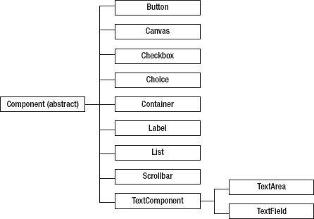

***图 7-1。** AWT 的非菜单组件类层次植根于`java.awt.Component`。*

AWT 的抽象`Component`类是所有 AWT 非菜单组件(和 Swing 组件)的根类。在`Component`的正下方是`Button`、`Canvas`、`Checkbox`、`Choice`、`Container`、`Label`、`List`、`Scrollbar`和`TextComponent`:

*   `Button`描述一个可点击的标签。
*   `Canvas`描述一个空白的矩形区域。您可以子类化`Canvas`来引入您自己的 AWT 组件。
*   `Checkbox`描述对/错的选择。你可以使用`Checkbox`和`java.awt.CheckboxGroup`来创建一组互斥的单选按钮。
*   `Choice`描述字符串的下拉列表(也称为弹出菜单)。
*   `Container`描述存储其他组件的组件。这种嵌套功能让您可以创建任意复杂的 GUI，而且非常强大。(能够将容器表示为组件是*复合设计模式*的一个例子，这在 Erich Gamma，Richard Helm，Ralph Johnson 和 John Vlissides 的*设计模式:可重用面向对象软件的元素*的[第 163 页](03.html#page_163)中有介绍【Addison-Wesley，1995；ISBN: 0201633612】。)
*   `Label`描述单行静态文本，为用户提供视觉帮助。
*   `List`描述字符串的非下拉列表。
*   `Scrollbar`描述一个数值范围。
*   `TextComponent`描述任何输入文本的组件。它的`TextArea`子类描述了用于输入多行文本的文本组件，而它的`TextField`子类描述了用于输入单行文本的文本组件。

图 7-2 展示了菜单组件类的层次结构。

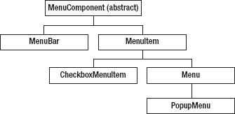

***图 7-2。** AWT 的菜单组件类层次植根于`java.awt.MenuComponent`。*

AWT 的抽象`MenuComponent`类(没有扩展`Component`)是所有 AWT 菜单组件的根类。在`MenuComponent`的正下方是`MenuBar`和`MenuItem`:

*   封装了一个绑定到框架窗口的菜单栏的窗口系统概念。它包含一系列的`Menu`组件，其中每个`Menu`组件包含一系列的`MenuItem`组件。
*   描述单个菜单项。它的`CheckboxMenuItem`子类描述了一个通过复选框实现的 menuitem。它的`Menu`子类描述了一个从菜单栏部署的下拉菜单组件。(`Menu`扩展了`MenuItem`来创建任意复杂的菜单。)`Menu`被`PopupMenu`子类化，描述一个组件内指定位置可以动态弹出的菜单。

`Component`声明了许多面向组件的非菜单方法。例如，`Component`声明以下方法来通知调用者组件的可显示、可见和显示状态:

*   当一个组件处于*可显示状态*时，`boolean isDisplayable()`返回 true(该组件连接到一个本机屏幕资源【不久定义】，通常是通过添加到一个容器中)。
*   当组件处于*可见状态*时`boolean isVisible()`返回 true(组件出现在屏幕上)。伴随的`void setVisible(boolean b)`方法让你显示(`b`是`true`)或者隐藏(`b`是`false`)一个组件。
*   当一个组件处于*显示状态*时`boolean isShowing()`返回 true(该组件是可见的，并且包含在一个也是可见和显示的容器中)。此方法对于确定一个组件是否被另一个组件遮挡很有用。它在被遮挡时返回 false，而`isVisible()`将继续返回 true。

`MenuComponent`的曲目方法要短得多。但是，它与`Component`有一些共同之处。例如，两个类都声明了指定组件字体的方法。

有些`Component`和`MenuComponent`的方法已经被否决，不应该使用。比如`Component`申报`java.awt.peer.ComponentPeer getPeer()`，`MenuComponent`申报`java.awt.peer.MenuComponentPeer getPeer()`。这两种不推荐使用的方法都暗示了 AWT 是如何实现其预定义组件的。

AWT 利用平台的窗口系统来创建各种组件。当您将组件添加到容器中时，AWT 会创建一个对等对象，该对象的类实现了一个`ComponentPeer`或`MenuComponentPeer`子接口。例如，当您向容器添加一个`Button`组件类实例时，AWT 会创建一个`java.awt.peer.ButtonPeer`实例。

 **注意**每个 AWT 工具包实现都包含自己的一组对等接口实现。

在后台，组件对象与对等对象通信，对等对象与 JDK 库中的本机代码通信。该代码与平台的窗口系统通信，该系统管理出现在屏幕上的*本地屏幕资源*(一个本地窗口)。

例如，当您向容器中添加一个`Button`实例时，AWT 调用`Component`的`void addNotify()`方法，该方法获取当前的工具包并调用其`ButtonPeer createButton(Button target)`方法来创建这个工具包的`Button`对等体。

最终，窗口系统被要求创建一个按钮本地屏幕资源。例如，在 32 位 Windows 操作系统上，可以通过调用`CreateWindow()`或`CreateWindowEx()` Win32 API 函数来获得本机屏幕资源。

除了那些从直接扩展`Component`或`Container`的非预定义类创建的 AWT 组件之外，其他 AWT 组件都被称为*重量级组件*，因为它们有相应的对等接口和本机屏幕资源。从自定义`Component`和`Container`子类创建的组件被称为*轻量级组件*，因为它们没有对等接口和原生屏幕资源(它们重用其最近祖先的对等接口，这就是 Swing 的工作方式)。你可以调用`Component`的`boolean isLightweight()`方法来确定一个组件是否是轻量级的。

 **注意**重量级和轻量级组件可以混合在一个组件层次结构中，前提是整个层次结构*有效*(非容器组件的大小正确；容器组件布局了它们所包含的组件)。当层次结构被*无效*(例如，在改变*组件边界*(相对于组件的父容器的宽度、高度和位置)之后，例如当改变按钮的文本时，或者在容器中添加/移除组件之后)，AWT *通过调用层次结构的最顶层无效容器上的`Container`的`void validate()`方法来验证*。

当您浏览各种组件类的 JDK 文档时，您会发现许多有用的构造函数和方法。例如，`Button`声明了一个`Button(String label)`构造函数，用于将一个按钮初始化为指定的`label`文本。或者，您可以调用`Button()`构造函数来创建一个没有标签的`Button`。无论使用哪种构造函数，您都可以调用`Button`的`void setLabel(String label)`和`String getLabel()`方法来指定和检索显示在按钮上的标签文本。(更改按钮的显示文本会使按钮无效；然后，AWT 执行验证，这将导致组件层次结构被重新布局。)

组件很容易创建，如下面的示例所示，该示例创建了一个“是”按钮:

```java
Button btnYes = new Button("Yes");
```

 **注意**我喜欢给一个组件变量加前缀来表示它的种类。例如，我给按钮加上前缀`btn`。

##### 集装箱概述

按钮、标签、文本字段和其他组件不能直接放在屏幕上。它们需要放在直接放在屏幕上的容器窗口中。

AWT 在`java.awt`包中提供了几个容器类。[图 7-3](#fig_7_3) 展示了他们的层级。

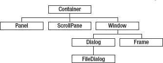

***图 7-3。** AWT 的容器类层次结构根植于`Container`。*

AWT 的`Container`类是所有 AWT 容器的根类。在`Container`的正下方是`Panel`、`ScrollPane`和`Window`:

*   `Panel`是最简单的容器。它提供了应用可以附加任何其他组件(包括其他面板)的空间。
*   `ScrollPane`实现单个*子*(包含)组件的自动水平和/或垂直滚动。包含组件的容器被称为该组件的*父*。
*   `Window`是没有边框的顶层窗口。它的`Dialog`子类描述了一个*对话框*(一个请求用户输入的窗口)，它的`Frame`子类描述了一个*框架窗口*(一个带有边框的顶级窗口，包括一个标题栏)。`Dialog`的`FileDialog`子类描述了一个选择文件的对话框。

声明了许多面向容器的方法。例如，`Component add(Component comp)`将组件`comp`附加到容器中，`Component[] getComponents()`返回容器组件的数组，`int getComponentCount()`返回容器中组件的数量。

`Window`声明了一个`void pack()`方法，用于创建一个足够大的顶级窗口，以它们的*首选*(自然)大小显示其所有组件。另外，`pack()`使窗口(以及窗口的任何所有者——对话框通常为其他窗口所有)在不可显示时也可显示。

`Window`还声明了一个`void setSize(int width, int height)`方法，让你将窗口调整到一个特定的大小(以像素为单位)。

继续上一个示例，假设您想要将“是”按钮添加到一个面板中(该面板也可能包含“否”按钮)。以下示例向您展示了如何完成此任务:

```java
Panel pnl = new Panel();
pnl.add(btnYes);
```

##### 布局管理器概述

容器可以包含组件，但不能将它们布置在屏幕上(例如，以行、网格或其他方式)。布局管理器处理这项任务。布局管理器通常与容器相关联，以对容器的组件进行布局。

 **注意**布局管理器提供了一种与屏幕大小无关的方式来显示 GUI。如果没有它们，应用将不得不获取当前的屏幕大小，并根据屏幕大小调整容器/组件的大小。这样做可能需要编写数百行代码，这是一个乏味的任务。

AWT 在`java.awt`包中提供了几个布局管理器:`BorderLayout`(在一个容器的北、南、东、西、中心区域布局不超过五个组件)，`CardLayout`(将每个包含的组件视为一张卡片；一次只能看到一张卡片，容器充当一叠卡片)、`FlowLayout`(将组件排列成水平行)、`GridBagLayout`(垂直、水平或沿组件的*基线*(用作布局原点的线)布局组件，不要求组件大小相同)，以及`GridLayout`(将组件布局成矩形网格)。

布局管理器类实现了`java.awt.LayoutManager`接口，该接口声明了当容器的组件需要布局时 AWT 调用的方法。除非您打算创建自己的布局管理器，否则不需要了解这些方法。如果是这样的话，您还需要注意一个子接口`java.awt.LayoutManager2`，一个`LayoutManager`。

布局管理器通过调用`Component`的`Dimension getPreferredSize()`、`Dimension getMaximumSize()`和`Dimension getMinimumSize()`方法来了解组件/容器的首选、最大和最小尺寸。(前面提到的布局管理器类没有考虑最大尺寸，因为这些类是在 JDK 1.0 中引入的，对最大尺寸的支持直到 JDK 1.1 才通过`LayoutManager2`引入。)

 **注意**`java.awt.Dimension`类声明了包含组件宽度和高度的公共`width`和`height`字段(类型为`int`)。尽管直接访问这些字段违反了信息隐藏，但这个类的设计者可能认为直接访问这些字段更有效率。此外，`Dimension`是一个可能永远不会改变的职业。

每个容器都有一个默认的布局管理器。例如，`Frame`的默认布局经理是`BorderLayout`，而`Panel`的默认布局经理是`FlowLayout`。您可以通过调用`Container`的`void setLayout(LayoutManager mgr)`方法来安装您自己的布局管理器来替换这个默认设置，如下所示:

```java
Panel pnl = new Panel();
pnl.setLayout(new GridLayout(3, 2));
```

第一行创建一个默认为`FlowLayout`的`Panel`。第二行用一个`GridLayout`替换了这个布局管理器，它在一个三行两列的网格中最多布局了六个组件。

##### 事件概述

用户按键、单击按钮、移动鼠标、选择菜单项以及执行其他 GUI 交互。每个交互被称为一个*事件*，由抽象`java.awt.AWTEvent`类的一个具体的`java.awt.event`子类来描述。

`AWTEvent`由几个事件类细分:`ActionEvent`、`AdjustmentEvent`、`AncestorEvent`、`ComponentEvent`、`HierarchyEvent`、`InputMethodEvent`、`InternalFrameEvent`、`InvocationEvent`、`ItemEvent`、`TextEvent`。

`ComponentEvent`是`ContainerEvent`、`FocusEvent`、`InputEvent`、`PaintEvent`和`WindowEvent`的超类。`InputEvent`是`KeyEvent`的抽象超类，由`MenuKeyEvent`子类化，`MouseEvent`由`MenuDragMouseEvent`和`MouseWheelEvent`子类化。

 **注意**并非所有这些事件都被 AWT 使用。例如，`MenuDragMouseEvent`是特定于 Swing 的。此外，事件可以分为高级或低级。一个*高级事件*来自与 GUI 的低级交互。例如，动作事件源于按键或鼠标点击。相比之下，面向键盘和面向鼠标的事件都是*低级事件*。

生成事件的组件被称为*事件源*。当事件发生时，`AWTEvent`子类实例被创建来描述它们。每个实例都被发送到一个*事件队列*，随后*被分派*(发送)到先前向事件源注册的适当的事件监听器。事件侦听器以某种方式响应这些事件，这通常涉及更新 GUI。

通过在组件实例上调用组件类的适当的`add*x*Listener()`方法，向组件注册事件侦听器，其中 *`x`* 被替换为不带`Event`后缀的事件类名。例如，您可以通过调用`Button`的`void addActionListener(ActionListener al)`方法来注册一个带有按钮的动作监听器。

`ActionListener`是`java.awt.event`包中的一个接口。当动作事件发生时，AWT 用`ActionEvent`对象调用它的`void actionPerformed(ActionEvent ae)`方法。

以下示例使用先前创建的“是”按钮注册了一个操作侦听器:

`btnYes.addActionListener(new ActionListener()
                         {
                            public void actionPerformed(ActionEvent ae)
                            {
                               System.out.println("yes was clicked");` `                            }
                         });`

当用户点击 Yes 按钮时，AWT 调用`actionPerformed()`,用一个`ActionEvent`对象作为这个方法的参数。监听器通过在标准输出设备上输出消息来响应。

`Button`还声明了一个`void removeActionListener(ActionListener al)`方法，用于注销先前注册的动作监听器，该监听器标识为`al`。其他组件类也声明自己的`remove*x*Listener(*x*Listener)`方法。

`ActionListener`声明单个方法，但是有些监听器声明多个方法。例如，`WindowListener`声明了七个方法。因为在需要实现接口的任何地方覆盖每个方法都很繁琐，所以 AWT 还提供了*适配器*的概念，这是一个方便的类，通过提供每个方法的空版本来实现多方法接口。例如，`java.awt.event`包包含了一个`WindowAdapter`类，您将很快看到它的演示。

##### 演示组件、容器、布局管理器和事件

现在，您已经了解了组件、容器、布局管理器和事件(以及事件监听器)的一些基础知识，让我们看看如何将它们组合成一个有用的基于 AWT 的 GUI。我已经创建了一个简单的温度转换应用，它提供了一个 GUI 来获取度数输入，显示度数输出，并触发到摄氏度/华氏度的转换。清单 7-1 展示了源代码。

***清单 7-1** 。由两个标签、两个文本字段和两个按钮组成的简单 GUI*

`import java.awt.Button;
import java.awt.EventQueue;
import java.awt.Frame;
import java.awt.GridLayout;
import java.awt.Label;
import java.awt.Panel;
import java.awt.TextField;
import java.awt.Window;

import java.awt.event.ActionEvent;
import java.awt.event.ActionListener;
import java.awt.event.WindowAdapter;
import java.awt.event.WindowEvent;

class TempVerter extends Frame
{
   TempVerter()
   {
      super("tempverter");
      addWindowListener(new WindowAdapter()
                        {
                           @Override
                           public void windowClosing(WindowEvent we)
                           {
                              System.out.println("window closing");
                              dispose();
                           }` `@Override
                           public void windowClosed(WindowEvent we)
                           {
                              System.out.println("window closed");
                           }
                        });
      Panel pnlLayout = new Panel();
      pnlLayout.setLayout(new GridLayout(3, 2));
      pnlLayout.add(new Label("degrees"));
      final TextField txtDegrees = new TextField(10);
      pnlLayout.add(txtDegrees);
      pnlLayout.add(new Label("result"));
      final TextField txtResult = new TextField(30);
      pnlLayout.add(txtResult);
      ActionListener al;
      al = new ActionListener()
           {
              @Override
              public void actionPerformed(ActionEvent ae)
              {
                 try
                 {
                    double value = Double.parseDouble(txtDegrees.getText());
                    double result = (value-32.0)*5.0/9.0;
                    txtResult.setText("celsius = "+result);
                 }
                 catch (NumberFormatException nfe)
                 {
                    System.err.println("bad input");
                 }
              }
           };` `      Button btnConvertToCelsius = new Button("convert to celsius");
      btnConvertToCelsius.addActionListener(al);
      pnlLayout.add(btnConvertToCelsius);
      al = new ActionListener()
           {
              @Override
              public void actionPerformed(ActionEvent ae)
              {
                 try
                 {
                    double value = Double.parseDouble(txtDegrees.getText());
                    double result = value*9.0/5.0+32.0;
                    txtResult.setText("fahrenheit = "+result);
                 }
                 catch (NumberFormatException nfe)
                 {
                    System.err.println("bad input");
                 }
              }
           };
      Button btnConvertToFahrenheit = new Button("convert to fahrenheit");
      btnConvertToFahrenheit.addActionListener(al);
      pnlLayout.add(btnConvertToFahrenheit);
      add(pnlLayout);
      pack();
      setResizable(false);
      setVisible(true);
   }
   public static void main(String[] args)
   {
      Runnable r = new Runnable()
                   {
                      @Override
                      public void run()
                      {
                         new TempVerter();
                      }
                   };
      EventQueue.invokeLater(r);
   }
}`

在几个导入语句之后，[清单 7-1](#list_7_1) 展示了温度转换应用的`TempVerter`类，它扩展了`Frame`类来描述显示 GUI 的框架窗口。

`TempVerter`声明一个无参数的构造函数来构造 GUI。它的`main()`方法实例化`TempVerter`并调用它的 noargument 构造函数来创建 GUI。

`main()`不直接执行`new TempVerter();`。这样做会在主线程上构造 GUI。相反，`main()`将 GUI 的创建委托给一个特殊的 AWT 线程，称为*事件调度线程(EDT)* 。它通过创建一个`java.lang.Runnable`实例，其`run()`方法执行`new TempVerter();`，并将这个 runnable 传递给`java.awt.EventQueue`类的`void invokeLater(Runnable runnable)`类方法，后者在 EDT 上执行 runnable。

为了避免潜在的线程同步问题，将 GUI 创建推迟到 EDT。因为讨论这些问题超出了本章的范围，所以请查看 Java 教程 ( `[http://download.oracle.com/javase/tutorial/uiswing/concurrency/dispatch.html](http://download.oracle.com/javase/tutorial/uiswing/concurrency/dispatch.html)`)和“Swing 线程和事件调度线程”文章(`[http://www.javaworld.com/javaworld/jw-08-2007/jw-08-swingthreading.html](http://www.javaworld.com/javaworld/jw-08-2007/jw-08-swingthreading.html)`)以获得更多信息。(虽然这些资料是在 Swing 环境中讨论这个主题的，但是其他资料也包括 AWT。因此，您应该在 EDT 上创建基于 AWT 和基于 Swing 的 GUI。)

`TempVerter()`首先通过`super(“tempverter”);`调用`Frame(String title)`构造函数，这样`TempVerter`就会出现在框架窗口的标题栏上。然后，它向框架窗口注册一个窗口侦听器，以便当用户关闭窗口时(例如，通过单击窗口标题栏上的 X 按钮)，该窗口将关闭(并且应用将结束)。

监听器是一个`WindowAdapter`匿名子类的实例，它覆盖了`WindowListener`的`void windowClosing(WindowEvent we)`和`void windowClosed(WindowEvent we)`方法。点击 X 或从窗口的系统菜单中选择关闭会触发对`windowClosing()`的调用。您通常会重写此方法以保存更改(例如，文本编辑器未保存的编辑)。

为了正确地终止应用，`windowClosing()`必须调用`Window`的`void dispose()`方法，该方法释放窗口使用的所有本机屏幕资源，并向应用的事件队列发送一个窗口关闭事件。AWT 随后通过调用 `windowClosed()`来调度该事件，以表示窗口已经关闭。任何最后的清理都可以用这种方法进行。

 **注意**有些人更喜欢调用`java.lang.System`类的`void exit(int status)`方法来终止应用。要了解更多信息，请查看 Oracle 在`[http://download.oracle.com/javase/7/docs/api/java/awt/doc-files/AWTThreadIssues.html](http://download.oracle.com/javase/7/docs/api/java/awt/doc-files/AWTThreadIssues.html)`的“AWT 线程问题”页面。

接下来，构造函数实例化`Panel`来包含 GUI 的组件。然后，它为这个容器分配一个三行两列的布局管理器来管理它的组件。

前两行网格中的每一行都显示了`Label`和`TextField`实例。标签告诉用户要输入什么，或者表明文本字段正在显示结果。文本字段请求输入或显示输出。传递给每个`TextField`构造函数的值根据可显示的列来指定 textfield 的宽度，其中*列*被定义为近似的平均字符宽度(并且依赖于平台)。

最后一个网格行显示了一对用于执行转换的`Button`实例。每个实例都被分配了一个动作监听器，它通过获取顶部 textfield 的文本(通过`TextField`的`String getText()`方法，该方法继承自`TextField`的`TextComponent`超类)，将其转换为一个数字，并通过调用`TextField`的 overriding `void setText(String t)`方法将其分配给底部 textfield，来响应按钮点击。

填充面板后，构造函数将面板添加到框架窗口中。然后，它调用`pack()`来确保框架窗口足够大，能够以它们喜欢的尺寸显示它的组件，调用`Frame`的`void setResizable(boolean resizable)`方法和一个`false`参数来防止用户调整框架窗口的大小(并使它看起来难看)，调用`setVisible()`和一个`true`参数来显示框架及其组件。

构造函数返回到`main()`后，这个类方法退出。然而，框架窗口仍然在屏幕上，因为它连接到一个本地屏幕资源，并且因为运行的 EDT 是一个非守护线程(在第四章中讨论)。

编译[清单 7-1](#list_7_1) ( `javac TempVerter.java`)并运行这个应用(`java TempVerter`)。[图 7-4](#fig_7_4) 显示了在 Windows XP 平台上生成的 GUI。

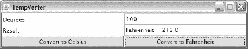

***图 7-4。**点击 X 按钮关闭该窗口并终止应用。*

当您输入非数字文本或将度数文本字段留空时，`TempVerter`会向标准输出设备输出一条“`bad input`消息。此外，当您关闭窗口时，该应用在不同的行上输出“`window closing`”和“`window closed`”消息。

 **注意**按 Tab 键可以前进到下一个组件，按 Shift-Tab 键可以后退到上一个组件。当您跳转到的组件可以获得输入时，它就会获得*焦点*——唯一能够获得焦点的`TempVerter`组件是两个文本字段和两个按钮。当您禁用一个输入组件时，通过在组件实例上调用带有`false`参数的`Component`的`void setEnabled(boolean b)`方法，它不再具有焦点。

[图 7-4](#fig_7_4) 揭示了所有组件具有相同的尺寸，这是由于`GridLayout`忽略了组件的首选尺寸。最终的 GUI 看起来并不专业，但是我们可以通过一点点努力来改善 GUI 的外观，如清单 7-2 中的[所示。](#list_7_2)

***清单 7-2** 。改进`TempVerter`的 GUI*

`import java.awt.Button;
import java.awt.EventQueue;
import java.awt.Frame;
import java.awt.GridLayout;
import java.awt.Label;
import java.awt.Panel;
import java.awt.TextField;

import java.awt.event.ActionEvent;
import java.awt.event.ActionListener;
import java.awt.event.WindowAdapter;
import java.awt.event.WindowEvent;

class TempVerter
{
   static Panel createGUI()
   {
      Panel pnlLayout = new Panel();
      pnlLayout.setLayout(new GridLayout(3, 1));
      Panel pnlTemp = new Panel();
      pnlTemp.add(new Label("Degrees"));` `final TextField txtDegrees = new TextField(10);
      pnlTemp.add(txtDegrees);
      pnlLayout.add(pnlTemp);
      pnlTemp = new Panel();
      pnlTemp.add(new Label("result"));
      final TextField txtResult = new TextField(30);
      pnlTemp.add(txtResult);
      pnlLayout.add(pnlTemp);
      pnlTemp = new Panel();
      ActionListener al;
      al = new ActionListener()
           {
              @Override
              public void actionPerformed(ActionEvent ae)
              {
                 try
                 {
                    double value = Double.parseDouble(txtDegrees.getText());
                    double result = (value-32.0)*5.0/9.0;
                    txtResult.setText("celsius = "+result);
                 }
                 catch (NumberFormatException nfe)
                 {
                    System.err.println("bad input");
                 }
              }
           };
      Button btnConvertToCelsius = new Button("convert to celsius");
      btnConvertToCelsius.addActionListener(al);
      pnlTemp.add(btnConvertToCelsius);
      al = new ActionListener()
           {
              @Override
              public void actionPerformed(ActionEvent ae)
              {
                 try
                 {
                    double value = Double.parseDouble(txtDegrees.getText());
                    double result = value*9.0/5.0+32.0;
                    txtResult.setText("fahrenheit = "+result);
                 }
                 catch (NumberFormatException nfe)
                 {
                    System.err.println("bad input");
                 }
              }
           };
      Button btnConvertToFahrenheit = new Button("convert to fahrenheit");
      btnConvertToFahrenheit.addActionListener(al);
      pnlTemp.add(btnConvertToFahrenheit);
      pnlLayout.add(pnlTemp);
      return pnlLayout;` `   }
   public static void main(String[] args)
   {
      Runnable r = new Runnable()
                   {
                      @Override
                      public void run()
                      {
                         final Frame f = new Frame("tempverter");
                         f.addWindowListener(new WindowAdapter()
                         {
                              @Override
                              public void windowClosing(WindowEvent we)
                              {
                                 f.dispose();
                              }
                         });
                         f.add(createGUI());
                         f.pack();
                         f.setResizable(false);
                         f.setVisible(true);
                      }
                   };
      EventQueue.invokeLater(r);
   }
}`

清单 7-2 给出了创建 GUI 的另一种架构。不是子类化`Frame`，而是直接实例化这个类，调用各种方法来配置和显示框架窗口。(创建一个返回包含整个 GUI 的`Panel`对象的类方法很方便，比如`createGUI()`。返回的`Panel`实例被传递给`Frame`的`add()`方法来安装 GUI。)

[图 7-5](#fig_7_5) 展示了改进后的图形用户界面。

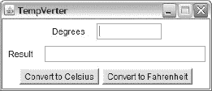

***图 7-5。**一个更好看的 GUI 是通过将组件包装在嵌套面板中实现的。*

请注意，组件以其首选大小显示。这是由于添加了一个标签和一个文本字段，或者将这两个按钮添加到一个嵌套面板(其布局管理器是 flow)，然后将该面板添加到主布局面板。(流动布局让每个组件呈现其自然[首选]大小。)

虽然[图 7-5](#fig_7_5) 的 GUI 看起来比[图 7-4](#fig_7_4) 中显示的 GUI 更好，但仍有改进的空间。例如，我们可以将学位和结果标签以及文本字段左对齐。我们还可以确保每个按钮都有相同的大小。[图 7-6](#fig_7_6) 向你展示了最终的 GUI 会是什么样子。

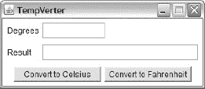

***图 7-6。**通过对齐组件和调整组件大小，可以获得更好看的 GUI。*

通过对存储标签和文本字段的两个`pnlTemp`变量中的每一个执行`((FlowLayout) pnlTemp.getLayout()).setAlignment(FlowLayout.LEFT);`来左对齐标签。这个方法调用获得`pnlTemp`的默认流布局管理器，并在这个实例上调用`FlowLayout`的`void setAlignment(int alignment)`方法，以将面板的组件与容器的左边缘对齐(由于`FlowLayout`的`LEFT`常量)——`FlowLayout`在面板的每一侧留下默认的 5 像素间隙作为边距。

但是，文本字段没有左对齐。为了对齐它们，我们需要将较宽的度数标签的首选大小设置为较窄的结果标签的首选大小。类似地，我们需要将转换为摄氏按钮的首选大小设置为转换为华氏按钮的首选大小，以便它们具有相等的宽度。

通过将下面的`void fixGUI(Frame)`类方法引入到`TempVerter`类中，可以部分地完成这些任务:

```java
static void fixGUI(Frame f)
{
   Panel pnl = (Panel) f.getComponents()[0]; // 1
   Panel pnlRow = (Panel) pnl.getComponents()[0]; // 2
   Label l1 = (Label) pnlRow.getComponents()[0]; // 3
   pnlRow = (Panel) pnl.getComponents()[1]; // 4
   Label l2 = (Label) pnlRow.getComponents()[0]; // 5
   l1.setPreferredSize(l2.getPreferredSize()); // 6
   pnlRow = (Panel) pnl.getComponents()[2]; // 7
   Button btnToC = (Button) pnlRow.getComponents()[0]; // 8
   Button btnToF = (Button) pnlRow.getComponents()[1]; // 9
   btnToC.setPreferredSize(btnToF.getPreferredSize()); // 10
}
```

通过对`TempVerter`框架窗口的引用来调用`fixGUI(Frame)`(`TempVerter.this`提供了该引用)。它首先调用`f.getComponents()[0]`来获取添加到框架窗口的面板。([清单 7-2](#list_7_2) 将该面板标识为`pnlLayout`。)

`pnl` / `pnlLayout`包含三个`Panel`实例(回想一下`pnlTemp`)。第二行获取第一个实例，并将其引用分配给`pnlRow`。第三行提取度数标签组件，这是该面板中的第一个组件(位置 0)。

第四行获取第二个`Panel`实例，该实例包含结果标签及其关联的 textfield。第五行提取这个标签。

第六行调用结果标签上的`getPreferredSize()`，然后用这个首选大小调用`Component`的`void setPreferredSize(Dimension preferredSize)`方法来收缩学位标签的宽度，这样两个文本字段都是左对齐的。

第七行获取第三个`Panel`实例，它包含两个按钮，第八和第九行提取这些按钮，第十行将转换为摄氏按钮的首选大小设置为更宽的转换为华氏按钮的大小。

将`fixGUI(Frame)`引入`TempVerter`只是解决方案的一部分。我们还必须调用这个方法，这样做的合适位置是在框架窗口的`pack()`和`setVisible()`方法调用之间。

`fixGUI()`必须在`pack()`之后调用，因为直到调用`pack()`之后才知道首选大小。该方法必须在`setVisible()`之前调用，因为它改变了首选尺寸。`setVisible()`当这些变化在这个方法被调用之前发生时，可以适应这些变化。但是，当它们在调用`setVisible()`后产生时，`pack()`将必须被第二次调用。

 **注意**虽然`fixGUI()`对于琐碎的应用来说很方便，但是在了解了更多关于布局管理的知识之后，你就不需要使用它了(不幸的是这已经超出了本章的范围)。`fixGUI()`编码可能会很繁琐，无论何时更改 GUI，您都需要修改它。图形、颜色和字体

`Component`类声明了一个`void paint(Graphics g)`方法来绘制组件。当一个组件第一次展示时，或者当它被损坏(部分或完全被另一个组件遮挡)并被重新展示时，就会发生喷漆。

传递给该方法的参数描述了一个*图形上下文*，一个从抽象`java.awt.Graphics`类的具体子类创建的对象。该对象描述了一个在其上绘制像素的*绘图表面*(例如，一个监视器屏幕、一个打印机页面或一个图像缓冲区)。

绘图表面有一个二维坐标系，其(0，0)原点在左上角，水平(X)轴从左到右正向增加，垂直(Y)轴从上到下正向增加。[图 7-7](#fig_7_7) 所示为该坐标系。

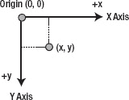

***图 7-7。**绘图表面的坐标系锚定在左上角的原点。*

`Graphics`声明在表面上绘图和设置上下文状态的各种方法。其绘制方法包括以下几种:

*   `void drawLine(int x1, int y1, int x2, int y2)`用当前颜色从(`x1`、`y1`)到(`x2`、`y2`)画一条线。
*   `void drawOval(int x, int y, int width, int height)`用当前颜色绘制一个椭圆的轮廓，使该椭圆符合左上角在(`x`、`y`)且范围为(`width`、`height`)的*边界框*(最小的外接矩形)。椭圆形覆盖的区域宽`width+1`像素，高`height+1`像素。
*   `void drawRect(int x, int y, int width, int height)`用当前颜色绘制一个左上角在(`x`、`y`)、范围在(`width`、`height`)的矩形轮廓，使右边缘位于`x+width`，下边缘位于`y+height`。
*   `void drawString(String str, int x, int y)`用当前颜色和当前字体绘制由`str`指定的字符。最左边字符的基线在(`x`、`y`)。
*   `void fillOval(int x, int y, int width, int height)`用当前颜色绘制一个实心椭圆，使该椭圆适合左上角位于(`x`、`y`)且范围为(`width`、`height`)的边界框。
*   `void fillRect(int x, int y, int width, int height)`用当前颜色绘制一个左上角在(`x`、`y`)、范围在(`width`、`height`)的填充矩形，使右边缘位于`x+width-1`，下边缘位于`y+height-1`。

状态方法包括以下内容:

*   `void setColor(Color c)`为传递给`c`的`java.awt.Color`实例设置当前颜色。`Color`声明了几个用于常见颜色的大写/小写`Color`常量(例如`RED` / `red`、`GREEN` / `green`和`BLUE` / `blue`)和用于描述任意颜色的构造函数——通常使用大写颜色常量。一个伴随的`Color getColor()`方法返回当前颜色。
*   `void setFont(Font f)`将当前字体设置为传递给`f`的`java.awt.Font`实例。一个伴随的`Font getFont()`方法返回当前字体。

下面的示例演示了各种绘制和状态方法:

```java
public void paint(Graphics g)
{
   g.setColor(Color.RED);
   g.drawLine(10, 10, 20, 20);
   g.setFont(new Font("Arial", Font.BOLD, 10));
   g.drawString("Hello", 35, 35);
}
```

第一条语句将当前颜色设置为`Color.RED`，第二条语句用该颜色从起点(`10`、`10`)到终点(`20`、`20`)画一条线。(如果在绘制之前没有指定颜色，颜色默认为组件的背景色，这是从`Component`的`Color getBackground()`方法返回的。)

第三条语句调用`Font`的`Font(String name, int style, int size)`构造函数来创建一个`Font`对象，该对象描述一个名为`Arial`的字体，其样式为`BOLD`，磅值为`10`—*磅值*是一种印刷度量，大约为 1/72 英寸。(其他支持的样式有`PLAIN`、`ITALIC`和`ITALIC`结合`BOLD.`)然后这个对象作为当前字体安装。

字体名称可以是*字体族名*(如 Arial)或*字体面名*(结合样式信息的字体族名，如 Arial Bold)。当指定字体系列名称时，`style`参数用于从系列中选择最合适的字体。当一个字体名称被指定时，字体的样式和`style`参数被合并，以从同一个系列中找到最匹配的字体。例如，当字体名称“Arial Bold”用样式`Font.ITALIC`指定时，AWT 在“Arial”系列中查找粗体和斜体的字体，并且可以将字体实例与物理字体“Arial Bold Italic”相关联。`style`参数与指定的脸型合并，不相加或减去。这意味着，指定加粗字体和加粗样式不会使字体加粗，指定加粗字体和普通样式不会使字体变浅。

Java 支持逻辑字体和物理字体。一种*逻辑字体*是一种保证在所有平台上都受支持的字体；将`Font`预定义的`DIALOG`、`DIALOG_INPUT`、`MONOSPACED`、`SERIF`、`String`常量之一传递给`Font()`以选择逻辑字体。*物理字体*是一种非逻辑字体，不一定在所有平台上都受支持。Arial 是广泛支持的物理字体的一个例子——它可能在 Java 运行的所有平台上都可用。

 **注意**指定字体名称时要小心，因为并非所有平台上都有所有字体。在这一章的后面，我会告诉你如何识别所有支持的字体名称。

最后，第四条语句以当前颜色和字体绘制`Hello`，基线在(`35`、`35`)。

我之前将*基线*定义为用作布局原点的线。这个术语也被定义为字体上升和下降的分界线，如图[图 7-8](#fig_7_8) 所示。

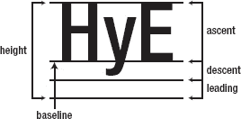

***图 7-8。**字体的上升和下降是相对于基线的。*

每种字体都与不同的尺寸相关联。*上升*是字体字符高于基线的部分；*下降*是这些字符在基线以下的部分。文本行之间添加的额外空格被称为*前导*。当上升、下降和前导加在一起时，形成字体的*高度*。最后，*前进*粗略指定下一个字符应该出现的基线位置。

AWT 的`java.awt.FontMetrics`类封装了这些测量信息。您可以通过调用`Graphics`类的`FontMetrics getFontMetrics()`方法获得该类的实例，该方法返回当前字体的字体度量。在它的各种方法中，您会发现`int stringWidth(String str)`方法(它返回当前字体中显示`str`字符的总前进宽度)对于水平居中字符串很有用。

虽然您可以通过子类化 component 类并覆盖`paint()`在任何组件(包括容器)上绘图，但是您应该尽量避免这样做，以避免混淆用户或审查您代码的人。相反，您应该利用 AWT 的`Canvas`类，它就是为此目的而设计的。

要使用`Canvas`，必须扩展这个类并覆盖`paint()`。您还需要指定它的首选大小，以便可以在屏幕上查看画布。通过覆盖`getPreferredSize()`来返回包含画布范围的`Dimension`对象，或者通过调用包含首选大小的`Dimension`对象的`setPreferredSize()`来完成这个任务(如`fixGUI()`所示)。

我已经创建了一个演示`Canvas`的`Geometria`应用。(虽然`Geometria`只是一个呈现基于`Canvas`的闪屏组件的框架，但它可以变成一个用于基础几何教学的成熟应用。)[清单 7-3](#list_7_3) 摘录了这个应用的`SplashCanvas`类。

***清单 7-3** 。创建闪屏*

`class SplashCanvas extends Canvas
{
   private Dimension d;
   private Font f;
   private String title;
   private boolean invert; // defaults to false (no invert)
   SplashCanvas()
   {
      d = new Dimension(250, 250);
      f = new Font("arial", Font.BOLD, 50);
      title = "geometria";
      addMouseListener(new MouseAdapter()
                       {
                          @Override
                          public void mouseClicked(MouseEvent me)
                          {
                             invert = !invert;
                             repaint();
                          }
                       });
   }
   @Override
   public Dimension getPreferredSize()
   {
      return d;
   }
   @Override
   public void paint(Graphics g)
   {
      int width = getWidth();
      int height = getHeight();
      g.setColor(invert ? Color.BLACK : Color.WHITE);
      g.fillRect(0, 0, width, height);
      g.setColor(invert ? Color.WHITE : Color.BLACK);
      for (int y = 0; y < height; y += 5)
         for (int x = 0; x < width; x += 5)
            g.drawLine(x, y, width-x, height-y);
      g.setColor(Color.YELLOW);
      g.setFont(f);
      FontMetrics fm = g.getFontMetrics();
      int strwid = fm.stringWidth(title);
      g.drawString(title, (width-strwid)/2, height/2);
      g.setColor(Color.RED);
      strwid = fm.stringWidth(title);
      g.drawString(title, (width-strwid)/2+3, height/2+3);
      g.setColor(Color.GREEN);` `      g.fillOval(10, 10, 50, 50);
      g.setColor(Color.BLUE);
      g.fillRect(width-60, height-60, 50, 50);
   }
}`

[清单 7-3](#list_7_3) 的`SplashCanvas`类模拟了一个*闪屏*，一个出现在 GUI 出现之前的窗口。当应用初始化时，闪屏经常呈现给用户以吸引他们的注意力。(我将在附录 c 中详细介绍闪屏。)

有几个有趣的地方:

*   我预先创建了`Dimension`、`Font`和`String`对象，以避免不必要的对象创建。
*   我声明了一个名为`invert`的布尔变量，它(当 true 时)导致 splash 画布的背景部分被反转。
*   我声明了一个向画布注册鼠标监听器的构造函数。当鼠标光标位于该组件上时，只要用户单击鼠标按钮，鼠标监听器的`void mouseClicked(MouseEvent me)`方法就会被调用。这个方法切换`invert`并调用`Component`的`void repaint()`方法，这告诉 AWT 尽快调用`paint()`。
*   我调用`Component`的`int getWidth()`和`int getHeight()`方法来获取画布的宽度和高度(以像素为单位)。
*   我调用`fillRect()`使用当前颜色(黑色或白色)绘制画布的所有像素。
*   我使用一对嵌套循环来画线。您应该避免在`paint()`方法中使用冗长的循环，因为它们会降低用户界面的性能。较短的回路不是问题。
*   我通过从画布的宽度中减去总前进宽度(从`stringWidth()`返回)并将结果除以 2 来水平居中底部的字符串。我将画布的高度除以 2，使字符串的基线垂直居中。
*   我首先用黄色(阴影颜色)绘制底部的字符串，然后用红色绘制相同的字符串，但是水平偏移三个像素，垂直偏移三个像素，从而实现投影效果。

[图 7-9](#fig_7_9) 显示了未反转的画布，黄色文本上有红色，一个绿色椭圆形和一个蓝色矩形。

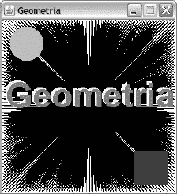

***图 7-9。**画布可以用来绘制应用的闪屏。*

关于绘画，我还有更多的话要说，但由于篇幅有限，我无法这样做。例如，`Component`还声明了一个用于更新重量级组件的`void update(Graphics g)`方法，以响应一个`repaint()`方法调用。你可以通过阅读“在 AWT 和 Swing 中绘画”(`[http://java.sun.com/products/jfc/tsc/articles/painting/index.html](http://java.sun.com/products/jfc/tsc/articles/painting/index.html)`)和浏览`Component`和`Container`类的 JDK 文档来了解这种方法和更多内容。

#### 图片

AWT 通过`java.awt.Image`、`Toolkit`和其他类支持 GIF、JPEG 和 PNG 图像。因为 Java 2D 很大程度上消除了使用这些类的需要，所以我不会详细讨论 AWT 对图像的支持。但是，您应该对这种支持有所了解，因为各种 JFC 类(如`javax.swing.ImageIcon`)都与`Image`一起工作，甚至提供了接受`Image`参数并(就方法而言)返回`Image`实例的构造函数和/或方法。

`Toolkit`类声明了几个`createImage()`方法，用于创建和返回来自不同来源的`Image`对象。例如，`Image createImage(String filename)`返回一个`Image`对象，该对象代表由`filename`标识的文件中定义的图像。

`Toolkit`还声明了创建和返回`Image`对象的两个`getImage()`方法。与它们的`createImage()`对应物不同，`getImage()`方法缓存`Image`对象，并且可以将相同的对象返回给不同的调用者。这种共享机制有助于 AWT 节省堆空间，尤其是在加载大型图像时。相比之下，`createImage()`方法总是返回不在调用者之间共享的新的`Image`对象。

`Image`对象代表图像，但不包含图像:一个加载的图像与一个`Image`对象相关联。这种二分法的存在是因为 Java 最初主要用于 web 浏览器环境。

当时，计算机和网络连接比现在慢得多，通过网络加载大型图像是一个非常耗时的过程。与其强迫一个 *applet* (一个基于浏览器的应用)一直等到图像完全加载完毕(并惹恼用户)，不如决定加载图像的方法通过后台线程异步加载图像，同时将用户的注意力吸引到别处。

当您调用一个`createImage()`或`getImage()`方法时，一个后台线程开始加载图像，`createImage()` / `getImage()`立即返回一个`Image`对象。

因为图像可能在方法返回后的某个时间才被完全加载，所以您不能立即获得图像的宽度和高度，甚至不能绘制整个图像。因此，Java 提供了`java.awt.image.ImageObserver`接口来提供当前的图像加载状态。

`infoflags`由各种`ImageObserver`常量(如`SOMEBITS`和`ERROR`)组成，这些常量通过按位异或运算符组合在一起。其他参数取决于`infoflags`。例如，当`infoflags`设置为`SOMEBITS`时，它们为新加载的像素定义一个边界框。

各种`Image`和`Graphics`方法用`ImageObserver`参数声明。例如，`Image`的`int getWidth(ImageObserver observer)`和`int getHeight(ImageObserver observer)`方法是通过一个图像观察器调用的，该观察器帮助这些方法确定图像已经加载到可以返回其宽度或高度的程度，或者宽度/高度仍然不可用，在这种情况下，它们返回-1。

类似地，调用`Graphics`类的`boolean drawImage(Image img, int x, int y, ImageObserver observer)`方法时会使用一个图像观察器，帮助它确定要绘制图像的哪一部分——图像的左上角位于(`x`、`y`)。当图像没有完全加载时，图像观察器调用`Component`的`repaint()`方法之一，重新调用`paint()`，以便后续调用`drawImage()`来绘制新加载的像素。

 **注意**你不需要实现`ImageObserver`(除非有特殊原因)因为`Component`已经代表你实现了这个接口。

我已经创建了一个`ImageViewer`应用，向您展示如何加载和显示图像。这个应用由`ImageViewer`和`ImageCanvas`类组成，[清单 7-4](#list_7_4) 给出了`ImageViewer`。

***清单 7-4** 。通用图像浏览器*

`import java.awt.Dimension;
import java.awt.EventQueue;
import java.awt.FileDialog;
import java.awt.Frame;
import java.awt.Menu;
import java.awt.MenuBar;
import java.awt.MenuItem;
import java.awt.Panel;
import java.awt.ScrollPane;
import java.awt.Toolkit;` `import java.awt.event.ActionEvent;
import java.awt.event.ActionListener;
import java.awt.event.WindowAdapter;
import java.awt.event.WindowEvent;

class ImageViewer
{
   static ImageCanvas ic;
   static ScrollPane sp;
   static Toolkit tk = Toolkit.getDefaultToolkit();
   static ImageCanvas createGUI(final Frame f)
   {
      MenuBar mb = new MenuBar();
      Menu mFile = new Menu("File");
      MenuItem miOpen = new MenuItem("Open...");
      ActionListener al;
      al = new ActionListener()
           {
              @Override
              public void actionPerformed(ActionEvent ae)
              {
                 FileDialog fd = new FileDialog(f, "Open file");
                 fd.setVisible(true);
                 String curFile = fd.getFile();
                 if (curFile != null)
                 {
                    ic.setImage(tk.getImage(fd.getDirectory()+curFile));
                    sp.doLayout();
                 }
              }
           };
      miOpen.addActionListener(al);
      mFile.add(miOpen);
      MenuItem miExit = new MenuItem("Exit");
      miExit.addActionListener(new ActionListener()
                               {
                                  @Override
                                  public void actionPerformed(ActionEvent ae)
                                  {
                                     f.dispose();
                                  }
                               });
      mFile.add(miExit);
      mb.add(mFile);
      f.setMenuBar(mb);
      return new ImageCanvas();
   }
   public static void main(String[] args)
   {
      Runnable r = new Runnable()
                   {
                      @Override
                      public void run()` `                      {
                         final Frame f = new Frame("ImageViewer");
                         WindowAdapter wa;
                         wa = new WindowAdapter()
                              {
                                 @Override
                                 public void windowClosing(WindowEvent we)
                                 {
                                    f.dispose();
                                 }
                              };
                         f.addWindowListener(wa);
                         sp = new ScrollPane();
                         sp.setPreferredSize(new Dimension(300, 300));
                         sp.add(ic = createGUI(f));
                         f.add(sp);
                         f.pack();
                         f.setVisible(true);
                      }
                   };
      EventQueue.invokeLater(r);
   }
}`

`ImageViewer`声明一个`ImageCanvas`类字段，该字段引用用于显示图像的图像画布。它还声明了一个`ScrollPane`类字段，其 scrollpane 包含图像画布，这样您就可以水平和垂直地滚动那些太大而无法在当前屏幕分辨率下完整显示的图像，还声明了一个`Toolkit`实例，其`getImage()`方法用于启动用户选择的图像的图像加载过程。

`ImageCanvas createGUI(final Frame f)`方法创建一个 GUI，由一个菜单栏和一个文件菜单和一个图像画布组成。文件由打开和退出菜单项组成。

当用户选择 Open… ( `...`表示将显示一个对话框)时，Open 的动作监听器被调用。这个监听器首先实例化`FileDialog`并显示它；用户会看到一个特定于平台的对话框，用于选择文件。

当用户关闭该对话框时，调用`FileDialog`的`String curFile(`方法返回所选文件的名称；当没有选择文件时，此方法返回 null。

如果没有返回 null，那么调用`FileDialog`的`String getDirectory()`方法返回目录名，这个目录名被加在文件名的前面，这样就可以定位所选的文件。产生的路径名被传递给`Toolkit`的`getImage()`方法，返回的`Image`实例被传递给`ImageCanvas`的`setImage()`方法来加载和显示图像。`ScrollPane`的`void doLayout()`方法通过将它的子容器(图像画布)调整到它的首选大小来布局这个容器。

当用户选择 Exit 时，将调用 Exit 的操作监听器。它调用框架窗口上的`dispose()`来释放这个窗口(以及包含的组件)的本地屏幕资源。此外，窗口关闭事件被触发，框架窗口的窗口监听器的`windowClosing()`方法被调用。

`main()`方法在 EDT 上创建 GUI。它实例化一个 scrollpane，并将其首选大小设置为一个任意值，作为框架窗口的默认大小(在一个`pack()`方法调用之后)。

`createGUI()`方法调用在其`Frame`参数上安装 menubar，并返回图像画布，该图像画布保存在`ImageCanvas`类字段中，以便可以从打开的 menuitem 侦听器中访问。图像画布也被添加到 scrollpane，scrollpane 被添加到框架窗口。

[清单 7-5](#list_7_5) 呈现`ImageCanvas`。

***清单 7-5** 。显示用户选择的图像*

```java
import java.awt.Canvas;
import java.awt.Dimension;
import java.awt.Graphics;
import java.awt.Image;
import java.awt.MediaTracker;

class ImageCanvas extends Canvas
{
   private Image image;
   @Override
   public void paint(Graphics g)
   {
      // drawImage() does nothing when image contains the null reference.
      g.drawImage(image, 0, 0, null);
   }
   void setImage(Image image)
   {
      MediaTracker mt = new MediaTracker(this);
      mt.addImage(image, 1);
      try
      {
         mt.waitForID(1);
      }
      catch (InterruptedException ie)
      {
         assert false;
      }
      setPreferredSize(new Dimension(image.getWidth(null),
                                     image.getHeight(null)));
      this.image = image;
   }
}
```

`ImageCanvas`声明一个`Image`字段，该字段存储对要显示的图像的引用。它还覆盖了`paint()`方法来调用`drawImage()`。当`Image`参数为空引用时，这个方法什么也不做；这是在用户选择图像之前调用`paint()`的情况。`null`作为`ImageObserver`参数传递，因为此时图像已经完全加载，您会发现这一点。

调用`setImage()`方法来加载图像，设置它的首选大小来影响[清单 7-4](#list_7_4) 的`sp.doLayout();`方法调用，并保存`Image`字段中的`Image`参数，以便可以从后续的`paint()`调用中引用它，这是响应`doLayout()`而发生的。

图像加载是通过使用`java.awt.MediaTracker`类完成的。`MediaTracker`声明了一个`void addImage(Image image, int id)`方法，该方法将一个`Image`对象添加到被跟踪的`Image`对象列表中。关联的`id`值稍后被`MediaTracker`的`void waitForID(int id)`方法用来开始加载已识别的`Image`对象，并等待直到所有这些图像都已完成加载。

在`waitForID()`返回后，图像被完全加载，其宽度和高度可用。该信息在随后的`getWidth()`和`getHeight()`通话中获得。虽然这些调用需要一个图像观察器，这可以通过将`this`作为一个参数来指定(因为`Component`实现了`ImageObserver`)，但是这样做是不必要的，因为图像已经被加载了。

宽度和高度随后用于构造一个传递给`setPreferredSize()`的`Dimension`对象。这个首选大小将被`sp.doLayout();`考虑在内，它在调用`ImageCanvas`的`setImage()`方法之后执行——参见[清单 7-4](#list_7_4) 。

[图 7-10](#fig_7_10) 展示了`ImageViewer`的图形用户界面，其中有一幅已加载的图像。

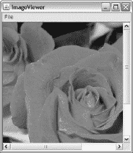

***图 7-10。**玫瑰换个名字也会一样香，这是真的吗？*

 **注意** AWT 也支持图像处理。例如，您可以将彩色图像灰度化、模糊图像等。因为 Java 2D 简化了图像处理，并且因为我将在本章后面向您介绍 Java 2D 的图像处理支持，所以我不讨论基于 AWT 的图像处理。

#### 数据传输

基于 GUI 的应用经常需要在它们之间或内部传输数据。例如，文本编辑器的用户可能想要将选定的文本剪切到系统剪贴板，然后将剪贴板的文本粘贴到正在编辑的文档中的另一个位置。

AWT 支持通过*系统剪贴板*在应用间传输任意对象，通过*私有剪贴板*在应用内传输对象。该支架由`java.awt.datatransfer`包及其`ClipboardOwner`、`FlavorListener`、`FlavorMap`、`FlavorTable`和`Transferable`接口组成；以及`Clipboard`、`DataFlavor`、`FlavorEvent`、`StringSelection`、`SystemFlavorMap`、`MimeTypeParseException`和`UnsupportedFlavorException`类。

`Clipboard`提供一种通过剪切/复制/粘贴操作将数据传输到剪贴板的机制。您可以通过调用`Toolkit`的`Clipboard getSystemClipboard()`方法获得一个 *singleton* (单实例)`Clipboard`对象，该对象提供对平台窗口系统提供的本地剪贴板工具的访问；例如，`Clipboard clipboard = Toolkit.getDefaultToolkit.getSystemClipboard();`。或者，您可以通过实例化`Clipboard`来获得私有剪贴板。

`Clipboard`声明一个`void setContents(Transferable contents, ClipboardOwner owner)`方法，将剪贴板的当前内容设置为指定的可转移对象，并将指定的剪贴板所有者注册为新内容的所有者。当剪贴板当前不可用时，这个方法抛出`java.lang.IllegalStateException`。

传递给`contents`的可转移对象是根据以下三种方法从实现`Transferable`接口的类中创建的:

*   `Object getTransferData(DataFlavor flavor)`返回包含正在传输的数据的对象。`DataFlavor`参数通过封装数据的多用途互联网邮件扩展(MIME)类型— `[http://en.wikipedia.org/wiki/MIME](http://en.wikipedia.org/wiki/mime)`和`[http://en.wikipedia.org/wiki/Internet_media_type](http://en.wikipedia.org/wiki/Internet_media_type)`讨论 MIME——以及描述这种数据格式的人类可表达的名称，来识别这种数据的*风格*(格式)(例如，字符串或 JPEG 图像)。当数据在所请求的风格中不再可用时，该方法抛出`java.io.IOException`，当所请求的数据风格不受支持时，抛出`UnsupportedFlavorException`。
*   `DataFlavor[] getTransferDataFlavors()`返回一个由`DataFlavor`对象组成的数组，这些对象表示这个可转移对象可以提供的数据类型。
*   `boolean isDataFlavorSupported(DataFlavor flavor)`表示是否支持指定的口味；支持`flavor`时返回 true。

每次调用`setContents()`，传递给`owner`的对象就是剪贴板内容的所有者。如果你用不同的所有者调用这个方法，AWT 通过调用`ClipboardOwner`的`void lostOwnership(Clipboard clipboard, Transferable contents)`方法通知前一个所有者它不再是所有者了(剪贴板上还有一些其他内容)。

因为用户通常想要复制、剪切和粘贴文本，`java.awt.datatransfer`提供了`StringSelection`作为`Transferable`的实现，而`ClipboardOwner` ( `lostOwnership()`为空；当您需要这个通知时，您必须子类化`StringSelection`并覆盖`lostOwnership()`。您可以使用`StringSelection`在剪贴板上来回传递字符串。

下面的例子展示了`copy()`、`cut()`和`paste()`方法，向您展示了如何在`TextArea`类的上下文中执行复制、剪切和粘贴操作。该示例指定了一个引用`TextArea`实例的`ta`变量和一个引用`Clipboard`实例的`clipboard`变量:

`void copy()
{
   StringSelection ss = new StringSelection(ta.getSelectedText());
   clipboard.setContents(ss, ss);
}
void cut()
{
   copy();
   ta.replaceRange("", ta.getSelectionStart(), ta.getSelectionEnd());
}
void paste()
{
   Transferable clipData = clipboard.getContents(this);
   if (clipData != null)
      try
      {` `         if (clipData.isDataFlavorSupported(DataFlavor.stringFlavor))
         {
            String text = (String) clipData.getTransferData(DataFlavor.stringFlavor);
            ta.replaceRange(text, ta.getSelectionStart(),
                            ta.getSelectionEnd());
         }
      }
      catch (UnsupportedFlavorException ufe)
      {
         ta.setText("flavor not supported");
      }
      catch (IOException ioe)
      {
         ta.setText("no data to paste");
      }
}`

`copy()`的第一个任务是通过调用`TextComponent`的`String getSelectedText()`方法从文本区中提取选中的文本。然后，它将该文本传递给`StringSelection(String data)`构造函数，以创建包含该文本的可转移对象。

继续，`copy()`通过调用`clipboard.setContents(ss, ss)`将该对象传递到剪贴板。因为`StringSelection`实现了`Transferable`和`ClipboardOwner`，所以同一个`StringSelection`对象(`ss`)作为可转移对象和剪贴板拥有者被传递。

`cut()`简单多了。这个方法首先调用`copy()`将选中的文本复制到剪贴板。然后它调用`TextArea`的`void replaceRange(String str, int start, int end)`方法，用空字符串替换所选文本(由从`TextComponent`的`int getSelectionStart()`和`int getSelectionEnd()`方法返回的整数值分隔)。

`paste()`是三种方法中最复杂的一种。它首先调用`Clipboard`的`Transferable getContents(Object requestor)`方法返回一个表示剪贴板当前内容的可转移对象(或者当剪贴板为空时返回 null)。`requestor`参数目前未被使用；它可能会在`java.awt.datatransfer`包的未来版本中实现。

如果返回的 transferable 不为空，`paste()`用`DataFlavor.stringFlavor`作为参数调用这个对象上的`isDataFlavorSupported()`。当支持请求的风格时，此方法返回 true。换句话说，当剪贴板包含文本时，`isDataFlavorSupported()`返回 true 例如，当剪贴板包含图像时，它将返回 false。

如果`isDataFlavorSupported()`返回 true，`paste()`调用`getTransferData()`返回字符串，然后用这个内容替换选中的字符串。

`TextArea`包含通过按 Ctrl-C、Ctrl-X 和 Ctrl-V 组合键来执行复制、剪切和粘贴操作的内置支持。然而，`TextArea`和它的`TextComponent`超类都没有提供执行这些任务的方法。因此，当您希望以编程方式执行这些操作时(可能是为了响应用户从编辑菜单中选择复制、剪切或粘贴)，您必须提供自己的`copy()`、`cut()`和`paste()`方法(如前面所示)。

我已经创建了一个`CopyCutAndPaste`应用，它通过前面的`copy()`、`cut()`和`paste()`方法演示了对文本区域的复制、剪切和粘贴。查阅这本书的代码文件以获得`CopyCutAndPaste`的源代码。(本书的介绍给出了获取代码文件的说明。)

### 摇摆

Swing 是一个独立于窗口系统的 API，用于创建基于组件、容器、布局管理器和事件的 GUI。尽管 Swing 扩展了 AWT(您可以在 Swing GUIs 中使用 AWT layout 管理器和事件)，但这个 API 在几个方面与它的前身不同，包括:

*   基于 AWT 的 GUI 采用了运行它们的窗口系统的外观和感觉(行为),因为它们利用了窗口系统的本机屏幕资源。例如，一个按钮看起来和感觉起来像 Windows 上的 Windows 按钮和 X Window-Motif 上的 Motif 按钮。相比之下，Swing GUI 可以在任何窗口系统上运行，或者(由开发人员决定)采用运行它的窗口系统的外观。
*   为了独立于窗口系统，AWT 组件采用组件特性的最小公分母。例如，如果一个窗口系统上的按钮可以显示带有文本的图像，而另一个窗口系统上的按钮只能显示文本，那么 AWT 就不能提供用于选择性显示图像的按钮功能。相比之下，Swing 的非容器组件和一些容器完全由 Java 管理，因此它们可以拥有任何必要的特性(例如工具提示)；这些功能不受窗口系统的影响。出于同样的原因，Swing 可以提供并非在每个窗口系统上都可用的组件；例如，表格和树。

标准类库将 Swing 的许多类型组织成`javax.swing`包和各种子包。例如，`javax.swing.table`子包存储支持 Swing 的表组件的类型。

本节通过展示 Swing 的体系结构和示例 Swing 组件向您介绍 Swing。

#### 扩展架构

通过扩展 AWT，Swing 共享 AWT 的架构。然而，Swing 通过提供一个扩展的架构超越了 AWT 所能提供的。这个架构很大程度上基于新的重量级容器、新的轻量级组件和容器、UI 委托以及可插拔的外观。

##### 新型重量级集装箱

`javax.swing`包包括`JDialog`、`JFrame`和`JWindow`容器类，它们扩展了它们的`java.awt.Dialog`、`java.awt.Frame`和`java.awt.Window`对应类。这些重量级容器管理它们包含的轻量级组件(比如`javax.swing.JButton`)和容器(比如`javax.swing.JPanel`)。

`JDialog`、`JFrame`、`JWindow`和另外两个 Swing 容器使用*窗格*(特殊用途容器)来组织它们包含的组件/容器。Swing 支持根、分层、内容和玻璃窗格:

*   *根窗格*包含分层窗格和玻璃窗格。它是通过`javax.swing.JRootPane`类实现的。
*   *分层窗格*包含应用的菜单栏和内容窗格。它是通过`javax.swing.JLayeredPane`类实现的。
*   *内容窗格*是一个`Container`子类实例，存储 GUI 的非菜单内容。
*   *玻璃窗格*是覆盖分层窗格的透明`Component`实例。

图 7-11 展示了一个基于窗格的容器架构。

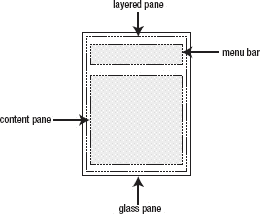

***图 7-11。**使用窗格构建图形用户界面。*

支持窗格的容器类存储单个`JRootPane`实例。这个实例存储了一个`JLayeredPane`实例和一个用作玻璃窗格的`Component`实例。`JLayeredPane`实例存储了一个`javax.swing.JMenuBar`实例和一个作为内容窗格的`Container`子类实例。

下面的示例演示了如何创建带有单个按钮的框架窗口:

```java
JFrame f = new JFrame();
JRootPane rp = f.getRootPane();
Container cp = rp.getContentPane();
cp.add(new JButton("Ok")); // Add the button to the frame's content pane.
f.pack();
f.setVisible(true);
```

支持窗格的容器类实现了`javax.swing.RootPaneContainer`接口，该接口为访问根窗格以及设置/获取内容、玻璃和分层窗格提供了方便的方法。例如，`RootPaneContainer`的`Container getContentPane()`方法就像你调用了`getRootPane().getContentPane()`一样。它允许您将前面的示例缩短为以下内容:

```java
JFrame f = new JFrame();
getContentPane().add(new JButton("Ok")); // Add the button to the frame's content pane.
f.pack();
f.setVisible(true);
```

`RootPaneContainer`用一个`void setContentPane(Container content)`方法补充了`getContentPane()`，当你想用一个新的内容窗格替换当前的内容窗格时，你会发现这个方法很有帮助。下面的例子通过创建一个新面板、填充面板(如注释所述)并使用`setContentPane()`用这个面板替换现有的内容面板来演示`setContentPane()`:

```java
JFrame f = new JFrame();
JPanel pnl = new JPanel();
// Populate the panel.
f.setContentPane(pnl);
```

 **提示**因为玻璃窗格是最后绘制的，所以可以在 GUI 上绘制。此外，因为事件首先被发送到玻璃窗格，所以您可以使用此窗格来阻止鼠标和其他事件到达 GUI。

`JFrame`声明了一个`void setDefaultCloseOperation(int operation)`方法，用于指定当用户选择关闭该窗口时默认发生的操作。传递给`operation`的参数是以下常量之一(在`javax.swing.WindowConstants`接口中声明，由`JFrame`和`JDialog`实现):

*   `DO_NOTHING_ON_CLOSE`:什么都不做；要求程序处理已注册的`WindowListener`对象的`windowClosing()`方法中的操作。这个操作相当于前面讨论的 AWT 中的操作。
*   `HIDE_ON_CLOSE`:调用任何注册的`WindowListener`对象后自动隐藏框架窗口。这是默认操作。
*   `DISPOSE_ON_CLOSE`:调用任何注册的`WindowListener`对象后，自动隐藏并处理框架窗口。
*   `EXIT_ON_CLOSE`(也在`JFrame`中声明):通过`System.exit()`退出应用。

 **注** `EXIT_ON_CLOSE`在 Java 1.3 中被引入`JFrame`类，随后在 Java 1.4 中被添加到`WindowsConstants`(为了完整性)。

##### 新型轻质部件和容器

Swing 的轻量级组件和容器是由抽象的`javax.swing.JComponent`类的子类实现的，它扩展了`Container`。(我之前提到过，从定制的`Component`和`Container`子类中创建的组件和容器被称为轻量级组件和容器。)它们没有对等体，但是重用它们最接近的重量级祖先的对等体。毕竟，Swing 最终必须确保平台的窗口系统能够显示它们。

`JComponent`引入了几个新功能，包括工具提示、边框和创建非矩形组件的选项:

*   一个*工具提示*是一个小的(通常是矩形的)窗口，出现在一个组件上，带有少量的帮助文本。`JComponent`声明了一个用于指定组件工具提示文本的`void setToolTipText(String text)`方法。
*   一个*边框*是一个位于 Swing 组件边缘和它的容器边缘之间的对象。`JComponent`声明了一个`void setBorder(Border border)`方法，用于将边框设置为`border`，这是一个实现了`javax.swing.border.Border`接口的类的实例。`javax.swing.BorderFactory`类声明了几个返回不同种类的边框的类方法。例如，`Border createEtchedBorder(int type)`通过实例化`javax.swing.border.EtchedBorder`类创建一个蚀刻边框。传递给`type`的参数必须是`EtchedBorder.RAISED`或`EtchedBorder.LOWERED`之一。
*   预定义的 AWT 组件(比如按钮)是矩形的，因为它们的本机屏幕资源是矩形的。当你创建自己的组件(通过子类化`JComponent`)时，你可以通过将`false`传递给`JComponent`的`void setOpaque(boolean isOpaque)`方法来使它们不呈矩形，这表明不是每个像素都被绘制(因此背景像素可以显示出来)。将`true`传递给这个方法表明组件绘制了每个像素。(默认值为 false。)

我将在本章后面演示工具提示和边框。

 **注意** AWT 提供了`java.awt.Insets`类来指定容器在其边缘留出的空间量。例如，`Frame`有一个顶部嵌入，对应于框架窗口标题栏的高度。边框扩展了 insets 的概念，允许您选择一个对象来绘制空白区域。边框利用插入。例如，`Border`声明`Insets getBorderInsets(Component c)`返回指定容器组件的 insets。

##### UI 代表

在 20 世纪 70 年代末，施乐 PARC 公司发明了模型-视图-控制器(MVC)架构，作为将应用逻辑与用户界面分离的架构模式，以简化 GUI 的创建。

MVC 由以下实体组成:

*   *模型*维护组件的状态，比如按钮的按下信息或者出现在文本字段中的字符。
*   *视图*呈现了模型的可视化表示，赋予组件其*外观*。例如，按钮视图通常会根据按钮模型的按下状态显示按钮是按下还是未按下。
*   *控制器*决定一个组件如何(甚至是否)响应来自输入设备(如鼠标和键盘)的输入事件，给予组件*的感觉*。例如，当用户按下按钮时，控制器通知模型更新其被按下的状态，并通知视图重新绘制按钮。

经验表明，管理集成的视图和控制器比单独处理它们更容易。集成的结果被称为*用户界面(UI)委托*。

Swing 组件是基于模型和 UI 委托的，其中 UI 委托使得组件看起来相同，而不管 GUI 下面是什么窗口系统。模型和 UI 代理是独立的，通过事件进行通信，使得一个 UI 代理可以关联多个模型，一个模型可以关联多个 UI 代理。

Swing 组件由一个名称以 J 开头的主类、一个当前模型和一个当前 UI 委托组成。主类将模型连接到 UI 委托，并用于创建组件。

例如，`JButton`类描述了一个按钮组件。它与由`javax.swing.ButtonModel`接口描述的模型相关联。模型通过调用`void setModel(ButtonModel model)`附加到组件上，而`JButton`从它的`javax.swing.AbstractButton`超类继承而来。

`JButton`与抽象`javax.swing.plaf.ButtonUI`类描述的 UI 委托相关联，抽象`javax.swing.plaf.ButtonUI`类扩展了抽象`javax.swing.plaf.ComponentUI`类。Swing 通过调用`void setUI(ButtonUI ui)`将 UI 委托附加到组件上，而`JButton`继承了`AbstractButton`。

##### 可插拔的外观

一个*外观和感觉*是一组 UI 代理，每个组件有一个 UI 代理。例如，Swing 提供了使 Swing GUI 看起来像 Windows XP GUI 的外观。它还提供了使 GUI 看起来和感觉起来都一样的外观和感觉，而不管底层的窗口系统如何。

Swing 还提供了一种选择特定外观和感觉的机制。因为这种机制用于在 GUI 显示之前(甚至在显示之后)将观感插入 GUI，所以观感也被称为*可插入观感(PLAF)* 。

支持以下 PLAFs:

*   *Basic* 是一个抽象的 PLAF，作为其他 plaf 的基础。它位于`javax.swing.plaf.basic`包中，它的主类是`BasicLookAndFeel`。
*   *金属*是跨平台的 PLAF，也是默认的。它位于`javax.swing.plaf.metal`包中，它的主类是`MetalLookAndFeel`。
*   *Multi* 是组合 PLAF 的多路复用 PLAF。它位于`javax.swing.plaf.multi`包中，它的主类是`MultiLookAndFeel`。(每个多路复用 UI 委托管理其子 UI 委托。创建 Multi 主要是为了与可访问性 API 一起使用。)
*   *Nimbus* 是一款经过改进的跨平台 PLAF，它使用基于 Java 2D 的矢量图形绘制 GUI，因此在任何分辨率下看起来都很清晰。光轮位于`javax.swing.plaf.nimbus`包中；它的主类是`NimbusLookAndFeel`。
*   *Synth* 是一个基于 XML 文件的可换肤 PLAF。它位于`javax.swing.plaf.synth`包中，它的主类是`SynthLookAndFeel`。
*   *GTK* 是一个 PLAF，它实现了面向 X 窗口的 GTK 小部件工具包的外观。它位于`com.sun.java.swing.plaf.gtk`包中，它的主类是`GTKLookAndFeel`。
*   *Motif* 是一个 PLAF，它实现了面向 X 窗口的 Motif 小部件工具包的外观。它位于`com.sun.java.swing.plaf.motif`包中，它的主类是`MotifLookAndFeel`。
*   *Windows* 是一个 PLAF，实现了当前 Windows 平台(例如，经典 Windows、Windows XP 或 Windows Vista)的外观和感觉。它位于`com.sun.java.swing.plaf.windows`包中，它的主类是`WindowsLookAndFeel`。

主要的 PLAF 类最终扩展了抽象的`javax.swing.LookAndFeel`类。此外，出于许可的原因，Swing 只允许您在基于 X 窗口的平台上使用 GTK PLAF，并且只允许您在 Windows 平台上使用 Windows PLAF。

`javax.swing.UIManager`类提供了在显示 GUI 之前安装外观的`void setLookAndFeel(String className)`类方法。当无法找到由`className`命名的`LookAndFeel`子类时，该方法抛出`java.lang.ClassNotFoundException`中的一个；当无法反射性地创建类的新实例时，抛出`java.lang.InstantiationException`；当类或初始化器不可访问时，抛出`java.lang.IllegalAccessException`；当 PLAF 无法在当前平台上运行时，抛出`javax.swing.UnsupportedLookAndFeelException`；当`className`标识一个没有扩展`LookAndFeel`的类时，抛出`java.lang.ClassCastException`。

以下示例尝试在创建 GUI 之前安装 Nimbus 作为当前外观:

```java
try
{
   UIManager.setLookAndFeel("javax.swing.plaf.nimbus.NimbusLookAndFeel");
   new GUI();
}
catch (Exception e)
{
}
```

假设您的应用提供了一个菜单，让用户选择 GUI 的外观和感觉。选择 menuitem 后，必须更新可见的 GUI 以反映选择。Swing 允许您从 menuitem 的动作监听器(或从 EDT 上的其他地方)完成这项任务，如下所示:

```java
try
{
   UIManager.setLookAndFeel("javax.swing.plaf.nimbus.NimbusLookAndFeel");
   SwingUtilities.updateComponentTreeUI(frame); frame.pack();
}
catch (Exception e)
{
}
```

`javax.swing.SwingUtilities`类声明了一个`void updateComponentTreeUI(Component c)`类方法，该方法通过调用位于以`c`为根的组件树中的每个组件的`void updateUI()`方法来改变外观，该方法通常引用一个框架窗口。`updateUI()`调用`UIManager`的`ComponentUI getUI(JComponent target)`方法返回新外观的 UI 委托，并将该委托传递给组件的`setUI()`方法。例如，`JButton`的`updateUI()`方法实现如下:

```java
public void updateUI()
{
   setUI((ButtonUI) UIManager.getUI(this));
}
```

`frame.pack();`将组件的大小调整到他们喜欢的大小，因为在新的外观和感觉下，这些大小可能会改变。

 **注意**有关 PLAFs 的更多信息，请查看 Java 教程的“修改外观”一课(`[http://download.oracle.com/javase/tutorial/uiswing/lookandfeel/index.html](http://download.oracle.com/javase/tutorial/uiswing/lookandfeel/index.html)`)。

#### 采样摆动组件

Swing 提供了各种各样的组件，您可以通过运行`SwingSet2`演示应用来探索这些组件，您可能在安装《JDK 7》时与其他演示程序一起安装了这些组件(有关安装说明，请参见[第 1 章](01.html#ch1))。如果您没有安装演示，请重新运行 JDK 7 安装程序，并确保它已配置为安装它们。

要运行`SwingSet2`，切换到 JDK 7 主目录的`demo\jfc\SwingSet2`目录并执行`java -jar SwingSet2.jar`。[图 7-12](#fig_7_12) 显示这个应用提供了一个 GUI，包括一个菜单、一个工具栏和一个选项卡式工作区，让你在与不同组件演示交互和查看当前演示的源代码之间切换。

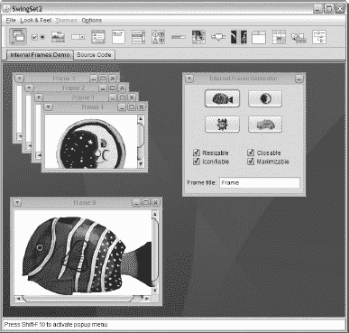

***图 7-12。** `SwingSet2`允许您在不同的外观和感觉上下文中查看 Swing 组件并与之交互。*

当`SwingSet2`开始运行时，它基于默认的 Metal(也称为 Java)外观和感觉呈现它的 GUI。但是，您可以通过从外观&手感菜单中选择来改变另一种外观和手感。例如，[图 7-12](#fig_7_12) 展示了`SwingSet2`的 GUI 在外观和感觉被改成光轮后的样子。

 **注**不幸的是，出于简洁的需要，我无法在本章中全面介绍 Swing 组件。您将在后续章节和附录 c 中找到其他组件内容。

##### 重访温度转换器

我之前展示了一个演示 AWT 容器、组件、布局管理器和事件的`TempVerter`应用。清单 7-6 展示了这个应用的一个 Swing 版本，帮助你比较和对比 Swing GUI 代码和它的 AWT 对应物。

***清单 7-6** 。为 Swing* 重构`TempVerter`

`import java.awt.Container;
import java.awt.EventQueue;
import java.awt.FlowLayout;
import java.awt.GridLayout;

import java.awt.event.ActionEvent;
import java.awt.event.ActionListener;

import javax.swing.BorderFactory;
import javax.swing.ImageIcon;
import javax.swing.JButton;
import javax.swing.JFrame;
import javax.swing.JLabel;
import javax.swing.JPanel;
import javax.swing.JTextField;

import javax.swing.border.Border;
import javax.swing.border.EtchedBorder;

class TempVerter
{
   static JPanel createGUI()
   {
      JPanel pnlLayout = new JPanel();
      pnlLayout.setLayout(new GridLayout(3, 1));
      JPanel pnlTemp = new JPanel();` `((FlowLayout) pnlTemp.getLayout()).setAlignment(FlowLayout.LEFT);
      pnlTemp.add(new JLabel("degrees"));
      final JTextField txtDegrees = new JTextField(10);
      txtDegrees.setToolTipText("enter a numeric value in this field.");
      pnlTemp.add(txtDegrees);
      pnlLayout.add(pnlTemp);
      pnlTemp = new JPanel();
      ((FlowLayout) pnlTemp.getLayout()).setAlignment(FlowLayout.LEFT);
      pnlTemp.add(new JLabel("result"));
      final JTextField txtResult = new JTextField(30);
      txtResult.setToolTipText("don't enter anything in this field.");
      pnlTemp.add(txtResult);
      pnlLayout.add(pnlTemp);
      pnlTemp = new JPanel();
      ImageIcon ii = new ImageIcon("thermometer.gif");
      ActionListener al;
      al = new ActionListener()
           {
              @Override
              public void actionPerformed(ActionEvent ae)
              {
                 try
                 {
                    double value = Double.parseDouble(txtDegrees.getText());
                    double result = (value-32.0)*5.0/9.0;
                    txtResult.setText("Celsius = "+result);
                 }
                 catch (NumberFormatException nfe)
                 {
                    System.err.println("bad input");
                 }
              }
           };
      JButton btnConvertToCelsius = new JButton("Convert to Celsius", ii);
      btnConvertToCelsius.addActionListener(al);
      pnlTemp.add(btnConvertToCelsius);
      al = new ActionListener()
           {
              @Override
              public void actionPerformed(ActionEvent ae)
              {
                 try
                 {
                    double value = Double.parseDouble(txtDegrees.getText());
                    double result = value*9.0/5.0+32.0;
                    txtResult.setText("Fahrenheit = "+result);
                 }
                 catch (NumberFormatException nfe)
                 {
                    System.err.println("bad input");
                 }
              }
           };
      JButton btnConvertToFahrenheit = new JButton("Convert to Fahrenheit", ii);
      btnConvertToFahrenheit.addActionListener(al);
      pnlTemp.add(btnConvertToFahrenheit);
      Border border = BorderFactory.createEtchedBorder(EtchedBorder.LOWERED);
      pnlTemp.setBorder(border);
      pnlLayout.add(pnlTemp);` `      return pnlLayout;
   }
   static void fixGUI(Container c)
   {
      JPanel pnlRow = (JPanel) c.getComponents()[0];
      JLabel l1 = (JLabel) pnlRow.getComponents()[0];
      pnlRow = (JPanel) c.getComponents()[1];
      JLabel l2 = (JLabel) pnlRow.getComponents()[0];
      l2.setPreferredSize(l1.getPreferredSize());
      pnlRow = (JPanel) c.getComponents()[2];
      JButton btnToC = (JButton) pnlRow.getComponents()[0];
      JButton btnToF = (JButton) pnlRow.getComponents()[1];
      btnToC.setPreferredSize(btnToF.getPreferredSize());
   }
   public static void main(String[] args)
   {
      Runnable r = new Runnable()
                   {
                      @Override
                      public void run()
                      {
                         final JFrame f = new JFrame("TempVerter");
                         f.setDefaultCloseOperation(JFrame.DISPOSE_ON_CLOSE);
                         Border b = BorderFactory.createEmptyBorder(5, 5, 5, 5);
                         f.getRootPane().setBorder(b);
                         f.setContentPane(createGUI());
                         fixGUI(f.getContentPane());
                         f.pack();
                         f.setResizable(false);
                         f.setVisible(true);
                      }
                   };
      EventQueue.invokeLater(r);
   }
}`

[清单 7-6](#list_7_6) 展示了与[清单 7-2](#list_7_2) 类似的架构。然而，它也展示了各种 Swing 特性，包括 Swing 组件/容器、`ImageIcon`、工具提示、边框和`setDefaultCloseOperation()`。

因为 Swing 组件类与它们的 AWT 对应物具有相似的 API，所以您通常可以在 AWT 类名前面加上`J`来引用等价的 Swing 类——不要忘记更改 import 语句。例如，在`Label`前面加上`J`，从 AWT 的`Label`类变成`javax.swing.JLabel`。

`ImageIcon`被实例化以加载温度计图标图像——在幕后`MediaTracker`用于确保图像被完全加载。然后，`ImageIcon`实例被传递给每个`JButton`实例的构造函数，这样按钮就会显示这个图标及其标签。

工具提示可以方便地显示小的帮助信息，帮助用户与 GUI 交互。[清单 7-6](#list_7_6) 通过在每个`txtDegrees`和`txtResult`文本字段上调用`setToolTipText()`来演示这个特性。当用户将鼠标移动到文本字段上时，会出现一个工具提示来显示它的帮助信息。

[清单 7-6](#fig_7_6) 在一对按钮周围的面板上附加一个蚀刻的边框，将它们与其他组件区分开来。因为这个边框与框架窗口对接，所以创建了一个空边框，并将其分配给框架的根窗格，以便在这个窗口的边缘留下一些空间。

`setDefaultCloseOperation()`方法和它的`DISPOSE_ON_CLOSE`参数通过释放一个窗口(响应用户关闭请求)来减少冗长性，而不必安装一个窗口监听器。

你可能已经注意到，我把`void fixGUI(Container c)`类方法放在了`pack()`方法调用之前，而不是放在`pack()`之后，正如我在[清单 7-2](#list_7_2) 中所讨论的那样。我之前建议将`fixGUI()`放在`pack()`之后，因为(在 AWT 中)首选大小直到`pack()`方法调用之后才可用，而`fixGUI()`需要访问首选大小。在 Swing 中，在调用`pack()`之前，首选大小是可用的，而在调用`pack()`之后更改它们将需要再次调用`pack()`，以确保 GUI 大小合适。

编译[清单 7-6](#list_7_6) 并运行这个应用。[图 7-13](#fig_7_13) 显示了生成的 GUI。

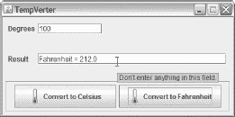

***图 7-13。**当你将鼠标光标移到一个文本字段上时，会出现一个工具提示。*

 **注** `TempVerter`演示了 Swing 的许多组件中的一些，这些组件位于`javax.swing`包中。你会发现其他有用的组件包括`JScrollPane` (Swing 版本的`ScrollPane`)、`JTextArea` (Swing 版本的`TextArea`)和`JOptionPane`(一个使弹出标准对话框变得容易的类，该对话框提示用户输入一个值或通知他们一些事情)。`JOptionPane`声明`showConfirmDialog()`、`showInputDialog()`、`showMessageDialog()`和`showOptionDialog()`类方法来询问确认问题(是/否/取消)，提示输入，告诉用户已经发生的事情，并将确认与输入和消息显示结合起来。

###### TempVerter 遇上 JLayer

假设您计划将您的 Swing 应用作为共享软件发布(参见`[http://en.wikipedia.org/wiki/Shareware](http://en.wikipedia.org/wiki/Shareware)`)，并希望在 GUI 上显示一条半透明的未注册消息，直到用户注册了它们的副本。您可以通过直接使用玻璃面板来完成这个任务，或者您可以使用 Java 7 中新增的`javax.swing.JLayer`类。

`JLayer`的 Javadoc 将该类描述为“Swing 组件的通用装饰器，它使您能够实现各种高级绘画效果，并接收在其边界内生成的所有`AWTEvent`的通知。”`JLayer`代表你用玻璃窗格工作。

要使用`JLayer`，首先扩展`javax.swing.plaf.LayerUI`类，覆盖各种方法来定制绘画和事件处理。接下来，将这个类的一个实例和被修饰的组件一起传递给`JLayer(V view, LayerUI<V> ui)`构造函数(`JLayer`的泛型类型是`JLayer<V extends Component>`；`LayerUI`的通用类型是`LayerUI<V extends Component>`。)

传递给这个构造函数的第一个参数是你想要修饰的组件，它被称为*视图*。第二个参数标识了*装饰者*对象。

以下摘录自[清单 7-6](#list_7_6) 的修订版，向您展示了如何使用`JLayer`在`TempVerter`的 GUI 中心添加半透明的未注册消息:

```java
public static void main(String[] args)
{
   Runnable r = new Runnable()
                {
                   @Override
                   public void run()
                   {
                      final JFrame f = new JFrame("TempVerter");
                      f.setDefaultCloseOperation(JFrame.DISPOSE_ON_CLOSE);
                      Border b = BorderFactory.createEmptyBorder(5, 5, 5, 5);
                      f.getRootPane().setBorder(b);
                      LayerUI<JPanel> layerUI;
                      layerUI = new LayerUI<JPanel>()
                      {
                         final Color PALE_BLUE = new Color(0.0f, 0.0f,
                                                           1.0f, 0.1f);
                         final Font FONT = new Font("Arial", Font.BOLD, 30);
                         final String MSG = "UNREGISTERED";
                         @Override
                         public void paint(Graphics g, JComponent c)
                         {
                            super.paint(g, c); // Paint the view.
                            g.setColor(PALE_BLUE);
                            g.setFont(FONT);
                            int w = g.getFontMetrics().stringWidth(MSG);
                            int h = g.getFontMetrics().getHeight();
                            g.drawString(MSG, (c.getWidth()-w)/2,
                                         c.getHeight()/2+h/4);
                         }
                      };
                      JLayer<JPanel> layer;
                      layer = new JLayer<JPanel>(createGUI(), layerUI);
                      f.setContentPane(layer);
                      fixGUI(f.getContentPane());
                      f.pack();
                      f.setResizable(false);
                      f.setVisible(true);
                   }
                };
   EventQueue.invokeLater(r);
}
```

要创建一个装饰器，您至少要覆盖`LayerUI`的`void paint(Graphics g, JComponent c)`方法。传递给`c`的组件是视图。

第一个绘制步骤是通过`super.paint(g, c);`方法调用来绘制视图。后续代码中绘制的任何内容都会出现在视图上。

继续，通过`setColor()`安装淡蓝色。这种颜色是通过`Color(0.0f, 0.0f, 1.0f, 0.1f)`创建的——前三个参数代表红色、绿色和蓝色的百分比(在`0.0f`和`1.0f`之间)，最后一个参数代表不透明度(从`0.0f`，透明，到`1.0f`，不透明)。

然后安装一种字体，以确保正在绘制的消息足够大，可以被看到。

此时，剩下要做的就是获取消息的宽度和高度，并使用这些值来确定第一个消息字符和基线的位置，然后绘制文本。

创建这个装饰器后，它和视图(从`createGUI()`返回)被传递到一个新的`JLayer`实例，该实例作为内容窗格安装。

[图 7-14](#fig_7_14) 显示了带有居中半透明未注册消息的结果图形用户界面。

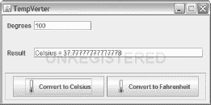

***图 7-14。**未注册消息位于框架窗口的边框中心。*

##### 摇摆台

AWT 提供了`Canvas`类，它的`paint()`方法可以被覆盖以在其表面绘制图形或图像。您可以通过子类化`JComponent`并覆盖其`paint()`方法来引入自己的基于 Swing 的 canvas 类，如下所示:

```java
class SwingCanvas extends JComponent
{
   private Dimension d;
   SwingCanvas()
   {
      d = new Dimension(300, 300); // Create object here to avoid unnecessary
                                   // object creation should getPreferredSize()
                                   // be called more than once.
      // perform other initialization (such as registering a mouse listener) here
   }
   @Override
   public Dimension getPreferredSize()
   {
      return d;
   }
   @Override
   public void paint(Graphics g)
   {
     // perform painting here
   }
}
```

在 Swing 的上下文中重写`paint()`通常不是一个好主意，因为`JComponent`重写这个方法是为了将绘制工作委托给三个受保护的方法:`paintComponent()`、、T3】和`paintChildren()`。按此顺序调用这些方法，以确保子组件出现在组件的顶部。

一般来说，组件及其子组件不应该在分配给边框的 insets 区域中绘制。

尽管子类可以覆盖这个方法，但是一个只想专门化 UI 委托的`paint()`方法的子类应该只覆盖`paintComponent()`。

如果您不关心 UI 代理、边框和子元素，前面的`SwingCanvas`类应该可以满足您的需求。有关更多信息，请查看 Java 教程的“执行自定义绘画”一课(`[http://download.oracle.com/javase/tutorial/uiswing/painting/index.html](http://download.oracle.com/javase/tutorial/uiswing/painting/index.html)`)。

### 爪哇 2D

*Java 2D* 是 AWT 扩展的集合，提供高级的二维图形、文本和图像功能。这个 API 提供了一个灵活的框架，通过艺术线条(也称为矢量图形，见`[http://en.wikipedia.org/wiki/Vector_graphics](http://en.wikipedia.org/wiki/Vector_graphics)`)、文本和图像来开发更丰富的 GUI。

Java 2D 由位于`java.awt`和`java.awt.image`包中的各种类型，以及特定于 Java 2D 的`java.awt.color`、`java.awt.font`、`java.awt.geom`、`java.awt.image.renderable`和`java.awt.print`包来实现。

本节介绍 Java 2D，首先介绍`java.awt`包的`GraphicsEnvironment`、`GraphicsDevice`和`GraphicsConfiguration`类。然后探讨了`Graphics2D`类，以及 Java 2D 对形状和缓冲图像的支持。(为了简洁起见，我不探究文本或打印。)

#### 图形环境、图形设备和图形配置

Java 2D 提供了一个`GraphicsEnvironment`类，应用可以使用它来了解它们的图形环境(例如，可用的字体系列名称和图形设备)并执行专门的任务(例如，注册字体或创建一个`Graphics2D`实例以绘制到缓冲图像中)。

在使用`GraphicsEnvironment`之前，您需要获得这个类的一个实例。通过调用`GraphicsEnvironment`的`GraphicsEnvironment getLocalGraphicsEnvironment()`类方法返回平台的`GraphicsEnvironment`实例来完成这个任务，如下所示:

```java
GraphicsEnvironment ge = GraphicsEnvironment.getLocalGraphicsEnvironment();
```

`GraphicsEnvironment`的 Java 文档声明返回的`GraphicsEnvironment`实例的资源可能是本地的或者位于远程机器上。例如，Linux 平台允许用户使用安全外壳(参见`[http://en.wikipedia.org/wiki/Secure_Shell](http://en.wikipedia.org/wiki/Secure_Shell)`)在另一台机器上运行 GUI 应用，并在本地机器上查看 GUI。(如果您有兴趣了解更多这方面的内容，请查看“X Over ssh 2-A Tutorial”`[http://www.vanemery.com/Linux/XoverSSH/X-over-SSH2.html](http://www.vanemery.com/Linux/XoverSSH/X-over-SSH2.html)`。)

一旦应用有了一个`GraphicsEnvironment`实例，它就可以调用`GraphicsEnvironment`的 String[]getAvailableFontFamilyNames()方法来枚举字体系列名称(如 Arial)，如[清单 7-7](#list_7_7) 所示。

***清单 7-7** 。枚举字体系列名称*

`import java.awt.EventQueue;
import java.awt.GraphicsEnvironment;

class EnumFontFamilyNames
{` `   public static void main(String[] args)
   {
      Runnable r = new Runnable()
                   {
                      @Override
                      public void run()
                      {
                         enumerate();
                      }
                   };
      EventQueue.invokeLater(r);
   }
   static void enumerate()
   {
      GraphicsEnvironment ge;
      ge = GraphicsEnvironment.getLocalGraphicsEnvironment();
      String[] ffns = ge.getAvailableFontFamilyNames();
      for (String ffn: ffns)
         System.out.println(ffn);
   }
}`

应用可能需要枚举字体系列名称并将该列表呈现给用户。例如，自定义字体选择器对话框可能会让用户根据字体系列名称、样式和大小的列表来选择字体。

`GraphicsEnvironment`还声明了一个返回一组`GraphicsDevice`实例的`GraphicsDevice[] getScreenDevices()`方法。每个实例描述了应用可用的图像缓冲区、打印机或*光栅屏幕*(像素屏幕)。(因为图像缓冲区和打印机不是屏幕，将这个方法命名为`getGraphicsDevices()`会更容易理解。)

假设`ge`引用了一个`GraphicsEnvironment`实例，执行下面一行来获得这个数组:

```java
GraphicsDevice[] gd = ge.getScreenDevices();
```

您可以通过调用`GraphicsDevice`的`int getType()`方法并将结果与`GraphicsDevice`的`TYPE_IMAGE_BUFFER`、`TYPE_PRINTER`和`TYPE_RASTER_SCREEN`常量之一进行比较，找出特定的`GraphicsDevice`实例代表哪种图形设备。

 **注意**你可以通过调用`GraphicsEnvironment`的`GraphicsDevice getDefaultScreenDevice()`方法来访问默认的图形设备。如果只有一个受支持的设备，`getDefaultScreenDevice()`相当于`getScreenDevices()[0]`。

`getScreenDevices()`在*无头平台*(不支持键盘、鼠标或显示器的平台)上被调用时抛出`java.awt.HeadlessException`。例如，该平台可能是*服务器群*的一部分(参见`[http://en.wikipedia.org/wiki/Server_farm](http://en.wikipedia.org/wiki/Server_farm)`)。如果您担心这种可能性，您可以让您的应用首先调用`GraphicsEnvironment`的`boolean isHeadless()`类方法，当平台是无头的时，它返回 true。

一旦你有了图形设备，你可以通过调用`GraphicsDevice`的`GraphicsConfiguration[] getConfigurations()`方法获得所有支持的*配置*(颜色模型、*边界*【设备坐标中的原点和范围】等等)。

假设`gd`引用了一个`GraphicsDevice`实例，执行下面一行来获得这个数组:

```java
GraphicsConfiguration[] gc = gd.getConfigurations();
```

有了一个`GraphicsConfiguration`实例后，可以通过调用`ColorModel getColorModel()`了解它的颜色模型，通过调用`Rectangle getBounds()`了解它的边界，等等。

 **注意**您可以通过调用`GraphicsDevice`的`GraphicsConfiguration getDefaultConfiguration()`方法来访问默认配置。如果只有一个支持的配置，`getDefaultConfiguration()`相当于`getConfigurations()[0]`。

在获得一组`GraphicsConfiguration`之后，应用可以确定它是运行在单屏幕环境中还是多屏幕环境中。

**多屏环境**

一个*多屏幕环境*由两个或多个独立屏幕组成，两个或多个屏幕，其中一个屏幕是默认屏幕，其他屏幕显示默认屏幕上出现的内容的副本，或者两个或多个屏幕组成一个*虚拟桌面*，也称为*虚拟设备*。[图 7-15](#fig_7_15) 展示了一个多屏环境。


***图 7-15。**本例中每个屏幕的分辨率都是 1024x768 像素。*

当两个或多个屏幕组合成一个虚拟桌面时，Java 2D 会建立一个*虚拟坐标系*。该坐标系存在于任何屏幕边界之外，用于识别虚拟桌面内的像素坐标。

其中一个屏幕被称为默认屏幕，其左上角位于(0，0)。如果默认屏幕不在屏幕网格的左上角，Java 2D 可能会要求您使用负坐标，如图 7-15 所示。

应用通过调用`getConfigurations()`返回的每个`GraphicsConfiguration`上的`Rectangle getBounds()`来完成这个任务，然后检查原点是否是(0，0)之外的某个值。`GraphicsConfiguration`的`getBounds()`方法返回一个`java.awt.Rectangle`实例，其`x`、`y`、`width`和`height`字段(类型为`int`)反映了虚拟坐标系。如果任意(`x`，`y`)原点不是(0，0)，则该环境是虚拟设备环境。

我已经创建了一个`IsVDE`应用来确定它的环境是否是虚拟设备环境。清单 7-8 展示了这个应用的源代码。

***清单 7-8** 。检测虚拟设备环境*

```java
import java.awt.EventQueue;
import java.awt.GraphicsConfiguration;
import java.awt.GraphicsDevice;
import java.awt.GraphicsEnvironment;
import java.awt.Rectangle;

class IsVDE
{
   public static void main(String[] args)
   {
      Runnable r = new Runnable()
                   {
                      public void run()
                      {
                         test();
                      }
                   };
      EventQueue.invokeLater(r);
   }
   static void test()
   {
      GraphicsEnvironment ge;
      ge = GraphicsEnvironment.getLocalGraphicsEnvironment();
      GraphicsDevice[] gds = ge.getScreenDevices();
      for (GraphicsDevice gd: gds)
      {
         GraphicsConfiguration[] gcs = gd.getConfigurations();
         for (GraphicsConfiguration gc: gcs)
         {
            Rectangle rect = gc.getBounds();
            if (rect.x != 0 || rect.y != 0)
            {
               System.out.println("virtual device environment detected");
               return;
            }
         }
         System.out.println("no virtual device environment detected");
      }
   }
}
```

假设环境是一个虚拟设备环境，你可以通过调用合适的构造函数，比如`Frame(GraphicsConfiguration gc)`，创建引用不同图形设备的`Frame`、`javax.swing.JFrame`、`Window`或`javax.swing.JWindow`容器窗口。

在多屏幕环境中，桌面区域可能跨越多个物理屏幕设备，`GraphicsConfiguration`对象的边界是相对于虚拟坐标系的。在该坐标系中设置组件的位置时，使用`getBounds()`获得所需`GraphicsConfiguration`的边界，并用这些坐标偏移位置，如下例所示:

```java
Frame f = new Frame(gc); // Assume gc is a GraphicsConfiguration instance.
Rectangle bounds = gc.getBounds();
f.setLocation(10+bounds.x, 10+bounds.y);
```

#### 图形 2D

Java 2D 的抽象`Graphics2D`类(一个`Graphics`子类)描述了一个*逻辑绘图表面*，在其上绘制*图形图元* (2D 形状【如矩形和椭圆】、文本和图像)。

逻辑绘图表面与*用户空间*相关联，用户空间是 2D 笛卡尔(x/y)平面，其像素被称为*逻辑像素*，并且具有浮点坐标。于是，各种`Graphics2D`方法接受浮点坐标值；比如`void drawString(String str, float x, float y)`。

在讨论 AWT 图形时，我之前提到过将一个`Graphics`子类实例传递给组件的`paint()`方法。在 Java 1.2 之前，情况总是如此。从 Java 1.2 开始，一个`Graphics2D`子类实例被传递给`paint()`。您可以将该实例作为一个`Graphics`实例使用，或者(在将`Graphics`转换为`Graphics2D`后)作为一个`Graphics2D`实例使用。

传递给组件的`paint()`方法的`Graphics2D`子类实例用一个*物理绘图表面*(例如，光栅屏幕或打印机页面)标识一个*输出设备*(例如，监视器或打印机)。该表面与*设备空间*相关联，该设备空间是 2D 笛卡尔平面，其像素被称为*物理像素*，并且具有整数坐标。

通常，输出设备是默认的监视器，或者是与传递给包含组件的`Frame`、`JFrame`、`Window`或`JWindow`构造函数的`GraphicsConfiguration`相关联的监视器。

在某些时候，`Graphics2D`必须将逻辑像素映射到物理像素。它通过一种*仿射变换*(一种将直线转化为直线，将平行线转化为平行线的数学变换)来完成这项任务。

默认情况下，Java 2D 指定了一个仿射变换，该变换将用户空间与设备空间对齐，因此您最终会得到如图 7-7 所示的坐标系。此外，它将 72 个用户空间坐标映射到一个物理英寸。(某些缩放可以在幕后执行，以确保这种关系在特定的输出设备上保持不变。)

您通常不需要关心设备空间和这个映射过程。请记住默认的 72 用户空间坐标到一英寸的映射，Java 2D 将确保您的 Java 2D 创建在各种输出设备上以正确的大小出现。

##### 渲染管道

`Graphics2D`也是一个*渲染管道*，它将形状、文本和图像渲染(处理)成特定于设备的像素颜色。此渲染管道维护由以下属性组成的内部状态:

*   *绘制*:纯色，*渐变*(两种纯色之间的过渡)，或*纹理*(复制图像)应用于形状内部和形状的轮廓形状。
*   *描边*:创建一个形状来指定另一个形状轮廓的对象。生成的*轮廓形状*，也称为*描边轮廓*，填充有绘画属性。轮廓形状没有轮廓。
*   *Font* : Java 2D 通过创建代表文本字符的形状来呈现文本。字体属性选择为这些字符创建的形状。然后填充这些形状。
*   *变换*:图元在被描边和填充之前，进行几何变换。它们可以被旋转、*平移、*(移动)、*(缩放)*(拉伸)，或者以其他方式被操纵。transformation 属性将图形图元从用户空间转换到设备空间；默认转换将 72 个用户空间坐标映射到输出设备上的 1 英寸。
*   *复合规则* : `Graphics2D`通过使用复合规则将图形的原始颜色与绘图表面的现有颜色相结合，复合规则决定了结合发生的方式。
*   *裁剪形状* : `Graphics2D`将其渲染操作限制在裁剪形状的内部；此形状之外的像素不受影响。剪裁形状默认为整个绘图图面。
*   *渲染提示* : `Graphics2D`识别各种渲染提示，可以指定这些提示来控制渲染。例如，您可以指定*抗锯齿*来移除形状(如线条)和文本周围的锯齿边缘。

图元通过各种`Graphics`方法(例如`drawLine()`和`fillOval()`)和下面的`Graphics2D`方法进入该流水线:

*   `void fill(Shape s)`用当前的颜料填充形状的内部。形状实现了`Shape`接口。
*   `void draw(Shape s)`用当前颜料绘制形状的轮廓。
*   `drawstring()`方法使用当前颜料通过字符形状绘制文本。
*   `drawImage()`方法绘制图像。

 **注意**虽然你可以调用`Graphics`方法来绘制形状，但是这些方法的局限性在于它们只接受整数坐标。此外，这些形状(基于多边形的形状除外)不可重复使用。关于多边形，它们只能由直线段组成。相比之下，Java 2D 的`Shape`类(我将在本章后面简要介绍)没有这些限制。

[图 7-16](#fig_7_16) 将渲染管道概念化为独立的操作。可以在特定的实现中组合操作。

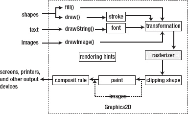

***图 7-16。**渲染过程显示笔画、字体和绘画属性不适用于图像。*

图元通过各种方法调用呈现给渲染管道，这些方法调用决定渲染如何进行:

*   传递给`fill()`的形状没有描边。相反，它们首先被转换，最终被绘制(填充)。
*   传递到`draw()`的形状首先被描边，结果轮廓形状被转换。
*   文本字符首先被转换为当前字体指定的形状。这些字符形状然后被转换。
*   首先变换图像轮廓。

如图[图 7-16](#fig_7_16) 所示，`Graphics2D`只填充形状和绘制图像。绘制轮廓形状和字符形状是形状填充操作的变体。

栅格化跟随在变换步骤之后。*光栅化器*将基于矢量的形状转换为 *alpha* (覆盖)值，这些值决定了形状下的每个目标像素被形状覆盖的程度。关于图像，只有图像轮廓被光栅化。光栅化器会考虑任何指定的渲染提示。

栅格化结果通过当前裁剪形状进行裁剪。未被裁剪丢弃的填充形状部分将通过当前绘画着色。图像没有彩色化，因为它们的像素提供了颜色。

最后，`Graphics2D`根据其当前的合成规则，将彩色像素(源像素)与已有的目标像素合并，形成新的像素。

###### 栅格化和合成

光栅化器创建一个只包含 alpha 值的矩形图像。在这一点上没有颜色。alpha 值的范围从 0(无覆盖)到 255(全覆盖)，图像的 alpha 值集合称为其 *alpha 通道*。(Alpha 值也可以表示为范围从 0.0 到 1.0 的浮点值。)

光栅化器默认选择 255 或 0 的 alpha 值。因为生成的源像素要么完全覆盖现有的目标像素，要么不覆盖该像素，所以线条、文本和其他几何图元将倾向于具有锯齿状边缘。这被称为*混叠*。

当您将抗锯齿指定为渲染提示时，光栅化器会稍微变慢(它有更多工作要做)，但会选择更大范围的 alpha 值，以便图形图元看起来更平滑。这种平滑度是通过组合源像素和当前目标像素的红色、绿色和蓝色分量(其值的范围从 0[最暗]到 255[最亮])的百分比而得到的，以便当绘制新的目标像素时，当前目标像素的一部分显示出来。

渲染过程的最后一步是将源像素与目标像素相结合。这一步是根据当前的复合规则执行的，复合规则决定了这种组合是如何发生的。

复合规则考虑了字母值百分比。例如，“源覆盖”规则(这是最直观的)将源像素的 100%颜色(取决于其 alpha)与目标像素的颜色百分比(恰好是(255-源像素的 alpha 值)/255*100)相结合。

考虑一个 alpha 为 255 的源像素(它对最终颜色的贡献是 100%)。根据该等式，目标像素的 alpha 值为 0(占 0%)，这意味着目标像素被完全覆盖。如果源像素的 alpha 为 0(无任何贡献)，目标像素的 alpha 将为 255(贡献所有)，这意味着源像素不可见。中间 alpha 值组合了源像素和目标像素的不同百分比。

##### 渲染属性

现在您已经掌握了`Graphics2D`渲染管道的基础知识，您已经准备好进一步探索它的渲染属性了。为了帮助您进行探索，我创建了一个基于 Swing 的`Graphics2DAttribDemo`应用。[图 7-17](#fig_7_17) 显示了这个菜单驱动应用的初始屏幕。

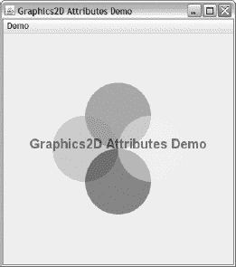

***图 7-17。**从演示菜单中选择一个菜单项，查看相关属性的演示。*

###### 作画

`Graphics2D`声明`void setPaint(Paint paint)`用于设置绘画属性。将类实现了`java.awt.Paint`接口的任何对象传递给`paint`。调用`Paint getPaint()`返回当前的油漆。

几个类实现了`Paint`，包括`java.awt`包的`Color`、`GradientPaint`和`TexturePaint`类。这些类的实例可以传递给`setPaint()`或从`getPaint()`返回。

 **注**`Graphics`类的`setColor()`方法相当于调用`setPaint()`。

`Color`让您创建纯色。在它的各种构造函数中有`Color(int r, int g, int b)`用于创建不透明的纯色和`Color(int r, int g, int b, int a)`用于创建带有 alpha 值的纯色。

您并不局限于指定范围从 0 到 255 的基于整数的组件值。如果您喜欢范围从 0.0 到 1.0 的值，您可以调用诸如`Color(float r, float g, float b)`和`Color(float r, float g, float b, float a)`这样的构造函数。

为了方便起见，`Color`声明了几个预先创建的`Color`常量:`BLACK`、`BLUE`、`CYAN`、`DARK_GRAY`、`GRAY`、`GREEN`、`LIGHT_GRAY`、`MAGENTA`、`ORANGE`、`PINK`、`RED`、`WHITE`和`YELLOW`。尽管全小写的变体是可用的，但是您应该避免使用它们——常量应该是大写的。

`GradientPaint`让您创建渐变。它声明了几个构造函数，包括`GradientPaint(float x1, float y1, Color color1, float x2, float y2, Color color2)`，它描述了在用户空间中从左上角(`x1`、`y1`)过渡到左下角(`x2`、`y2`)的渐变。(`x1`、`y1`)处的颜色为`color1`，(`x2`、`y2`)处的颜色为`color2`。

 **注意** Java 6 引入了一个抽象的`java.awt.MultipleGradientPaint`类和具体的`java.awt.LinearGradientPaint`和`java.awt.RadialGradientPaint`子类来创建基于多种(通常多于两种)颜色的不同种类的渐变。我探索了这些类，并在我的“Java 2D 多色渐变绘画”教程(`[http://tutortutor.ca/cgi-bin/makepage.cgi?/tutorials/ct/j2dmcgp](http://tutortutor.ca/cgi-bin/makepage.cgi?/tutorials/ct/j2dmcgp)`)中展示了演示。

`TexturePaint`让你创建一个纹理。它声明了一个`TexturePaint(BufferedImage txtr, Rectangle2D anchor)`构造函数，用于从缓冲图像(指定纹理所基于的图像)和矩形锚(标识要复制的图像的矩形部分)的组合中创建纹理。

[图 7-18](#fig_7_18) 展示了纯色(左上角)、渐变(右上角)和纹理(底部)颜料。

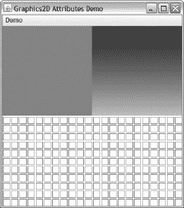

***图 7-18。**从演示菜单中选择油漆，查看油漆演示。*

###### 中风

`Graphics2D`声明`void setStroke(Stroke stroke)`用于设置笔画属性。将类实现了`java.awt.Stroke`接口的任何对象传递给`stroke`。调用`Stroke getStroke()`返回当前笔画。

**抚摸是如何工作的**

*描边*是画出形状轮廓的动作。第一步是调用`setStroke()`来指定轮廓的绘制方式(例如，它的宽度以及它是实心的还是由虚线和空格混合组成)。下一步是调用`setPaint()`来指定如何绘制轮廓(例如，使用纯色、渐变或纹理)。最后一步是通过`Graphics2D`的`draw()`方法画出轮廓。

当调用`draw()`时，`Graphics2D`使用传递给`setStroke()`的对象来计算轮廓的样子，并使用传递给`setPaint()`的对象来绘制轮廓的像素。

唯一实现该接口的类是`java.awt.BasicStroke`，它允许您根据钢笔宽度(垂直于钢笔轨迹测量)、端帽、连接样式、斜接限制和破折号属性来定义形状轮廓。

形状的轮廓是无限细的，并且是用具有特定宽度的笔绘制的，该宽度表示为浮点值。生成的轮廓形状延伸到该轮廓之外，并延伸到形状的内部。

线段两端可以画有或没有装饰。这些装饰被称为*端盖*。`BasicStroke`声明`CAP_BUTT`、`CAP_ROUND`和`CAP_SQUARE`常量以指示不存在端帽，半径等于笔宽一半的半圆出现在两端，或者长度等于笔宽一半的矩形出现在两端。

当两条线段相遇时，`Graphics2D`使用*连接样式*将它们连接在一起，这样它们就不会呈现出参差不齐的边缘。`BasicStroke`声明`JOIN_BEVEL`、`JOIN_MITER`和`JOIN_ROUND`常量，以指示*斜面*(方形)、*斜接*(削尖为三角形点)或圆形连接。当斜接超出指定的斜接限制时，连接将被斜接。

最后，`BasicStroke`允许您通过提供虚线数组和虚线相位值来指定虚线。*虚线数组*包含代表可见和不可见线段的用户空间长度的浮点值。偶数索引数组元素确定可见部分的长度；奇数索引数组元素确定不可见部分的长度。

例如，考虑一个[8.0，6.0]的破折号数组。该数组的第一个(偶数)元素表示可见线段的长度为 8.0 个单位，第二个(奇数)元素表示不可见线段的长度为 6.0 个单位。你最终得到 8 个可见单元，6 个不可见单元，8 个可见单元，6 个不可见单元，等等。

*虚线相位*是由虚线数组指定的虚线模式的浮点偏移量；它不是数组中的偏移量。当虚线相位为 0 时，线段将被描边，如前一示例所示。但是，当指定非零虚线相位时，第一条线段从第一个数组条目提供的值开始虚线相位单位。

例如，给定前面的数组，假设您指定了 3.0 的破折号相位。该值表示第一个可见线段的长度为 8-3 或 5 个单位，后面是 6 个不可见单位、8 个可见单位、6 个不可见单位，依此类推。

`BasicStroke`声明了几个构造函数，包括`BasicStroke(float width, int cap, int join, float miterlimit, float[] dash, float dash_phase)`，它可以让你完全控制笔画的特征，还有一个更短的`BasicStroke(float width, int cap, int join)`构造函数，它画的是实线。

演示了这两个构造函数以及笔宽、端帽、连接样式、斜接限制和破折号属性。这些特征如图 7-19 所示。

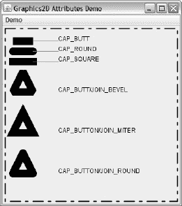

***图 7-19。**从演示菜单中选择笔画，查看笔画演示。*

###### 字体

`Graphics2D`继承`Graphics` ) `void setFont(Font font)`为指定的`Font`对象设置字体属性。调用`Font getFont()`(也继承自`Graphics`)返回当前字体。

[图 7-20](#fig_7_20) 显示了 Arial 字体的普通、粗体、斜体和粗体加斜体样式。

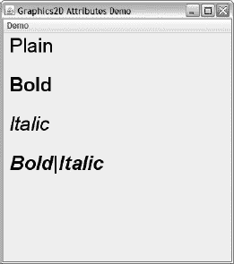

***图 7-20。**从演示菜单中选择字体，查看字体演示。*

###### 转型

`Graphics2D`包含一个内部转换矩阵(transform ),用于在渲染过程中对图元进行几何重定向。图元可以被*转换*(移动)、*缩放*(调整大小)、旋转、*剪切*(横向移动)，或者以开发人员指定的其他方式进行转换。

内部变换矩阵是`java.awt.geom.AffineTransform`类的一个实例，保证直线映射到直线，平行线映射到平行线。初始仿射变换代表*恒等式变换*，其中没有任何变化(例如，不执行旋转)。

您可以用几种方法修改这个矩阵。例如，您可以调用`Graphics2D`的`void setTransform(AffineTransform Tx)`方法，用传递给`Tx`的仿射变换替换当前的变换矩阵。或者，您可以调用`Graphics2D`的`void transform(AffineTransform Tx)`方法将`Tx`连接到现有的转换矩阵。

 **提示**使用`transform()`而不是`setTransform()`是一个好主意，因为传递给组件的`paint()`方法的`Graphics2D`实例是用默认转换设置的，它给出了图 7-7 所示的坐标系。调用`setTransform()`可能会改变这个组织，导致混乱的结果，除非你知道你在做什么。

对于常见的转换，`Graphics2D`声明了`void rotate(double theta)`、`void scale(double sx, double sy)`和`void translate(double tx, double ty)`等方法。这些方法为实例化`AffineTransform`并将该实例传递给`transform()`提供了一种方便的替代方法。

 **注意** `Graphics2D`声明一个`void translate(int x, int y)`方法，用于将`Graphics2D`上下文的原点平移到当前坐标系中的点(`x`、`y`)。当您传递整数参数时，调用这个方法而不是`translate(double, double)`，所以在传递参数时要小心，否则您可能会得到意想不到的结果。

[图 7-21](#fig_7_21) 显示了未变换(蓝色)、旋转(渐变绿色到红色)和剪切(渐变绿色到红色，几乎没有绿色)的矩形。

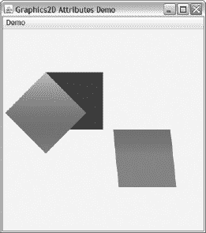

***图 7-21。**从演示菜单中选择转换，查看转换演示。*

###### 复合规则

`Graphics2D`声明`void setComposite(Composite comp)`用于设置复合规则属性。将类实现了`java.awt.Composite`接口的任何对象传递给`comp`。调用`Composite getComposite()`返回当前的复合规则。

唯一实现这个接口的类是`java.awt.AlphaComposite`，它实现了基本的 alpha 复合规则，用于组合源和目标颜色，以实现图形和图像的混合和透明效果。这个类实现的特定规则是 T. Porter 和 T. Duff 的“合成数字图像”论文(SIGGRAPH 1984，[第 253 页](04.html#page_253)–[第 259 页](04.html#page_259))中描述的 12 个规则的基本集合。

`AlphaComposite`声明描述这些规则的`CLEAR`、`DST`、`DST_ATOP`、`DST_IN`、`DST_OUT`、`DST_OVER`、`SRC`、`SRC_ATOP`、`SRC_IN`、`SRC_OUT`、`SRC_OVER`、`XOR`整数常量，默认为`SRC_OVER`。它还声明了预先创建的`AlphaComposite`实例常量，名为`Clear`、`Dst`、`DstAtop`、`DstIn`、`DstOut`、`DstOver`、`Src`、`SrcAtop`、`SrcIn`、`SrcOut`、`SrcOver`和`Xor`。

这两组常数之间的差异与 alpha 值有关。预先创建的`AlphaComposite`实例被关联到 alpha 值 1.0(不透明)。整数常量和特定的浮点 alpha 值可以传递给`AlphaComposite`的`AlphaComposite getInstance(int rule, float alpha)`类方法。这个 alpha 值在用于`AlphaComposite`的 Java 文档中描述的混合公式之前，用于修改每个源像素的不透明度或覆盖范围。

[图 7-22](#fig_7_22) 显示了应用这些规则的结果。

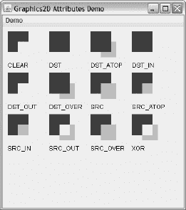

***图 7-22。**从演示菜单中选择复合规则，查看复合规则演示。*

[图 7-22](#fig_7_22) 向你展示了 alpha 值为 1.0 的规则。但是，您也可以使用`getInstance(int rule, float alpha)`来改变 alpha 值。我在图 7-17 中展示了这样做的结果。如果我没有这样做，你会看到如图 7-23 所示的窗口。

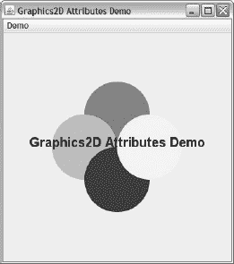

***图 7-23。**应用 alpha 值为 1.0 的默认`SRC_OVER`规则。*

###### 剪裁形状

`Graphics2D`声明`void clip(Shape clipShape)`并从`Graphics`继承`void setClip(Shape clipShape)`来设置裁剪形状属性。调用`clip()`使整体裁剪形状变小；调用`setClip()`使整体裁剪形状变大。将类实现了`java.awt.Shape`接口的任何对象传递给`clipShape`。调用`Shape getClip()`(继承自`Graphics`)返回当前裁剪形状；当剪辑形状是整个绘图图面时，返回 null。

Java 2D 提供了一组`Shape`实现类。此外，早于 Java 2D 的`java.awt.Polygon`类已经被改进来实现这个接口。以下示例演示了如何创建和安装基于`Polygon`的矩形剪辑:

```java
Polygon polygon = new Polygon();
polygon.addPoint(30, 30);
polygon.addPoint(60, 30);
polygon.addPoint(60, 60);
polygon.addPoint(30, 60);
g.clip(polygon);
```

[图 7-24](#fig_7_24) 显示了安装夹子后，试图将整个图纸表面涂成绿色的结果。

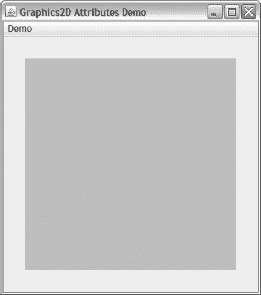

***图 7-24。**从演示菜单中选择裁剪形状，查看裁剪形状演示。*

###### 渲染提示

`Graphics2D`声明`void setRenderingHint(RenderingHints.Key hintKey, Object hintValue)`用于设置光栅化器使用的渲染提示之一。调用它的同伴`Object getRenderingHint(RenderingHints.Key hintKey)`方法来返回指定呈现提示的当前值。

传递给`hintKey`的值是在`RenderingHints`类中声明的`java.awt.RenderingHints.Key`常量(例如`KEY_ANTIALIASING`)。该值是该类中声明的值常量之一(例如，`VALUE_ANTIALIAS_ON`)。

以下示例显示了如何激活抗锯齿功能:

```java
g.setRenderingHint(RenderingHints.KEY_ANTIALIASING,
                   RenderingHints.VALUE_ANTIALIAS_ON);
```

[图 7-25](#fig_7_25) 揭示了锯齿和抗锯齿文本之间的区别。

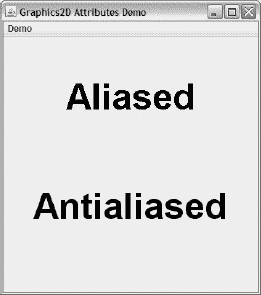

***图 7-25。**从演示菜单中选择渲染提示，查看渲染提示演示。*

 **注意** `Graphics2D`也声明`void setRenderingHints(Map<?,?> hints)`用于丢弃所有渲染提示，只安装指定贴图中的那些渲染提示。

#### 形状

`Shape`界面表示基于矢量的几何形状，如矩形或椭圆形。它声明了`getBounds()`、`contains()`、`intersects()`和`getPathIterator()`方法:

*   `getBounds()`方法返回包围形状边界的矩形；这些矩形充当边界框。
*   形状有内部和外部。方法告诉你一个点或者一个矩形是否在一个形状里面。
*   方法告诉你矩形的任何部分是否与形状的内部相交。
*   `getPathIterator()`方法返回形状轮廓。

前三个方法类别在很多任务中都很有用，比如基于游戏的*碰撞检测*(两个形状占用同一个空间吗？)和基于图形应用的*点击测试*(按下鼠标按钮时，鼠标光标是否在特定的形状上？)—也许图形应用允许用户拖动选定的形状。后一种方法有助于渲染管道获得形状轮廓。

其中一个`contains()`方法带有一个`java.awt.geom.Point2D`参数。该类的实例指定用户空间中的点。(`Point2D`实例不是形状，因为`Point2D`没有实现`Shape`。)

`Point2D`揭示形状类遵循的模式。这个抽象类包含一对嵌套的`Double`和`Float`具体子类，它们覆盖了它的抽象方法。实例化`Double`以提高精度，实例化`Float`以提高性能。

以下示例显示了如何实例化`Point2D`，以指定用户空间中的点:

```java
Point2D pt1 = new Point2D.Double(10.0, 20.0);
Point2D pt2 = new Point2D.Float(20.0f, 30.0f);
```

`java.awt.geom`包包含了实现`Shape`的各种几何类:`Arc2D`、`Area`、`CubicCurve2D`、`Ellipse2D`、`GeneralPath`、`Line2D`、`Path2D`、`QuadCurve2D`、`Rectangle2D`、`RectangularShape`和`RoundRectangle2D`。`RectangularShape`是`Arc2D`、`Ellipse2D`、`Rectangle2D`和`RoundRectangle2D`的抽象超类。另外，我在本章前面介绍的`java.awt.Rectangle`类已经被改进来扩展`Rectangle2D`。最后，`GeneralPath`是一个继承的 final 类(你不能扩展它)，它扩展了`Path2D.Float`。

`RoundRectangle2D`描述具有特定半径圆角的矩形。它嵌套的`Double`和`Float`子类声明了无参数构造函数来构造一个新的`RoundRectangle2D`实例，该实例被初始化为位置(0.0，0.0)、大小(0.0，0.0)和半径为 0.0 的角弧。它们还声明了用于指定位置、大小和角弧的构造函数。

如果您调用无参数构造函数，您可以随后调用`Double`或`Float`的`setRoundRect()`方法来指定位置、大小和圆角半径。然而，如果你只有一个`RoundRectangle2D`引用(不是`RoundRectangle2D.Double`或`RoundRectangle2D.Float`引用)，你可以调用`RoundRectangle2D`的`void setRoundRect(double x, double y, double w, double h, double arcWidth, double arcHeight)`方法。(您会发现这个构造函数/集合模式在其他形状类中重复出现。)

我已经创建了一个演示了`RoundRectangle2D`和`Shape`的`boolean contains(double x, double y)`方法的`DragRect`应用。`DragRect`向你展示了如何在它的绘图表面上拖动这个圆形矩形，而[清单 7-9](#list_7_9) 展示了它的源代码。

***清单 7-9** 。拖动一个圆角矩形*

`import java.awt.Color;
import java.awt.Dimension;
import java.awt.EventQueue;
import java.awt.Graphics;
import java.awt.Graphics2D;
import java.awt.RenderingHints;

import java.awt.event.MouseEvent;
import java.awt.event.MouseAdapter;
import java.awt.event.MouseMotionAdapter;

import java.awt.geom.RoundRectangle2D;

import javax.swing.JComponent;
import javax.swing.JFrame;

class DragRect
{
   public static void main(String[] args)` `{
      Runnable r = new Runnable()
                   {
                      @Override
                      public void run()
                      {
                         JFrame f = new JFrame("Drag Rectangle");
                         f.setDefaultCloseOperation(JFrame.EXIT_ON_CLOSE);
                         f.setContentPane(new DragRectPane());
                         f.pack();
                         f.setVisible(true);
                      }
                   };
      EventQueue.invokeLater(r);
   }
}
final class DragRectPane extends JComponent
{
   private boolean dragging;
   private double dragX, dragY;
   private Dimension d;
   private RoundRectangle2D rect;
   DragRectPane()
   {
      d = new Dimension(200, 200);
      rect = new RoundRectangle2D.Double(0.0, 0.0, 30.0, 30.0, 10.0, 10.0);
      addMouseListener(new MouseAdapter()
                       {
                          @Override
                          public void mousePressed(MouseEvent me)
                          {
                             if (!rect.contains(me.getX(), me.getY()))
                                return;
                             dragX = me.getX();
                             dragY = me.getY();
                             dragging = true;
                          }
                          @Override
                          public void mouseReleased(MouseEvent me)
                          {
                             dragging = false;
                          }
                       });
      addMouseMotionListener(new MouseMotionAdapter()
                             {
                                @Override
                                public void mouseDragged(MouseEvent me)
                                {
                                   if (!dragging)
                                      return;
                                   double x = rect.getX()+me.getX()-dragX;
                                   double y = rect.getY()+me.getY()-dragY;` `                                   rect.setRoundRect(x, y, rect.getWidth(),
                                                     rect.getHeight(),
                                                     rect.getArcWidth(),
                                                     rect.getArcHeight());
                                   repaint();
                                   dragX = me.getX();
                                   dragY = me.getY();
                                }
                             });
   }
   @Override
   public Dimension getPreferredSize()
   {
      return d;
   }
   @Override
   public void paint(Graphics g)
   {
      Graphics2D g2d = (Graphics2D) g;
      g2d.setRenderingHint(RenderingHints.KEY_ANTIALIASING,
                           RenderingHints.VALUE_ANTIALIAS_ON);
      g2d.setColor(Color.RED);
      g2d.fill(rect);
   }
}`

[清单 7-9](#list_7_9) 的`DragRectPane`类子类`JComponent`，给出了一个无参数构造函数，并覆盖了`getPreferredSize()`和`paint()`。

构造函数首先实例化`Dimension`和`RoundRectangle2D.Double`，然后用这个组件注册鼠标和运动监听器。

当用户按下鼠标按钮启动拖动操作时(鼠标光标移动时按住鼠标按钮)，鼠标监听器的`void mousePressed(MouseEvent me)`方法被调用。这个方法首先调用它的`MouseEvent`参数上的`int getX()`和`int getY()`方法，以获得当鼠标按钮被按下时鼠标光标的组件相对位置。

这些鼠标坐标被传递给圆角矩形的`contains()`方法，以确定按钮按下时鼠标光标是否在该形状上。如果鼠标光标不在圆角矩形上，则此方法返回。

否则，鼠标坐标被保存在`dragX`和`dragY`变量中，以记录拖动操作的原点，并且`dragging`布尔变量被赋值`true`，以便当拖动操作开始时，仅当鼠标光标在形状上时，形状才被拖动。

在拖动操作过程中，鼠标运动监听器的`void mouseDragged(MouseEvent me)`方法被调用。它的第一个任务是测试`dragging`,看看鼠标光标是否在形状上。如果此变量包含 false，此方法将返回。(如果没有此测试，当鼠标光标不在圆角矩形上时按下鼠标按钮，然后开始拖动鼠标光标，会导致形状吸附到拖动位置，随后被拖动。)

如果`dragging`包含 true，`mouseDragged()`接着通过用当前鼠标坐标和保存在`dragX`和`dragY`中的坐标之间的差值来偏移当前原点，计算圆角矩形的新左上角原点。然后它通过一个`setRoundRect()`方法调用将新的原点连同当前尺寸和圆弧半径传递给圆角矩形。

继续，对`repaint()`的调用导致圆角矩形在新位置被重新绘制，并且一对赋值语句将`dragX`和`dragY`更新到当前鼠标坐标，以便对`mouseDragged()`的下一个调用计算相对于刚刚计算的原点的新圆角矩形原点。

当鼠标按钮被释放时，鼠标监听器的`void mouseReleased(MouseEvent me)`方法被调用。该方法将`false`分配给`dragging`，这样当拖动操作随后开始时，形状不会被拖动，但是当操作开始时，鼠标光标不会在形状上。

编译这个源代码(`javac DragRect.java`)并运行应用(`java DragRect`)。[图 7-26](#fig_7_26) 显示了拖拽操作正在进行的结果 GUI。

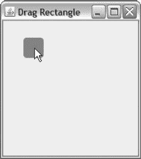

***图 7-26。**将鼠标指针放在圆形矩形上，开始拖动该形状。*

##### 建设性区域几何图形

*构造性区域几何(CAG)* 通过对两个现有形状执行布尔运算来创建一个新形状。这些操作包括布尔 OR(创建一个合并了现有形状像素的新形状)、布尔 NOT(创建一个仅包含一个形状中的像素但不包含另一个形状中的像素的新形状)、布尔 AND(创建一个仅包含重叠像素的新形状)和布尔 XOR(创建一个仅包含不重叠像素的新形状)。布尔 OR 又称为并集，布尔 NOT 又称为减法，布尔 and 又称为交集。

Java 2D 通过其`void add(Area rhs)`【联合】、`void subtract(Area rhs)`、`void intersect(Area rhs)`和`void exclusiveOr(Area rhs)`方法提供了用于执行布尔运算的`java.awt.geom.Area`类。每个方法对当前的`Area`对象及其`Area`对象参数执行指定的布尔运算，并将结果存储在当前的`Area`对象中。

要使用`Area`，首先将一个`Shape`对象传递给它的`Area(Shape s)`构造函数，然后在这个`Area`对象上调用上述方法之一来执行操作。因为`Area`也实现了`Shape`，所以可以将带有布尔结果的`Area`对象传递给`Graphics2D`的`draw()`和`fill()`方法。

下面的示例演示了对一对椭圆的联合运算:

```java
Ellipse2D ell1 = new Ellipse2D.Double(10.0, 10.0, 40.0, 40.0);
Ellipse2D ell2 = new Ellipse2D.Double(30.0, 10.0, 40.0, 40.0);
Area area1 = new Area(ell1);
Area area2 = new Area(ell2);
area1.add(area2);
```

创建两个椭圆形状后，该示例创建两个`Area`对象，其中每个对象包含一个椭圆。然后调用第一个`Area`对象上的`add()`，在从左上角(`10.0`、`10.0`)到右下角(`70.0`、`50.0`)的区域内创建一个像素联合。结果存储在第一个`Area`对象中。

我已经创建了一个 CAG 应用来演示这些布尔运算——该应用的源代码可以在本书附带的代码文件中找到。该应用的输出显示在图 7-27 的[中。](#fig_7_27)

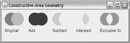

***图 7-27。**将鼠标指针放在圆形矩形上，开始拖动该形状。*

#### 缓冲图像

AWT 的`Image`类与彩色像素的矩形阵列相关联。虽然您可以绘制这些像素(通过`drawImage()`)，但是您需要使用 AWT 有些乏味的生产者/消费者模型(为了简洁起见，我不讨论这个模型)来访问它们。相比之下，Java 2D 的`java.awt.image.BufferedImage`类扩展了`Image`，使得这些像素对应用可用，并且更容易使用。

例如，您可以调用`BufferedImage`的`int getWidth()`和`int getHeight()`方法来获得图像的宽度和高度，而无需处理图像观察者。(因为`BufferedImage`扩展了`Image`，面向图像观察者的宽度和高度获取方法也是可用的。)

`BufferedImage`声明了三个构造函数，其中`BufferedImage(int width, int height, int imageType)`是最简单的。传递给此构造函数的参数标识缓冲图像的宽度(以像素为单位)、高度(以像素为单位)和类型(用于存储像素的格式)。

虽然`BufferedImage`声明了几个类型常量，但是通常使用的是`TYPE_INT_RGB`(每个像素都有红色、绿色和蓝色分量，但没有 alpha 分量)`TYPE_INT_ARGB`(每个像素都有 alpha、红色、绿色和蓝色分量)`TYPE_INT_ARGB_PRE`(与`TYPE_INT_ARGB`相同，只是每个像素的颜色分量值都与其 alpha 值预乘)。

 **注意**渲染管道的合成部分通常需要将每个像素的颜色分量乘以其 alpha 值。因为这需要时间，`BufferedImage`允许您通过预乘每个像素的颜色分量并将结果存储为新的颜色分量值来优化此过程。

以下示例实例化`BufferedImage`来描述存储 RGB 类型像素的 100 列 50 行缓冲图像:

```java
BufferedImage bi = new BufferedImage(100, 50, BufferedImage.TYPE_INT_RGB);
```

`BufferedImage`将每个像素的颜色分量归零，使图像最初为空。如果缓冲的图像是`TYPE_INT_RGB`，这些像素是黑色的。如果缓冲的图像是`TYPE_INT_ARGB`，这些像素是透明的。在目标上绘制透明缓冲图像只会显示目标像素。

填充缓冲图像的一种方法是调用它的`void setRGB(int x, int y, int rgb)`方法。`setRGB()`将像素(`x`、`y`)设置为 32 位`rgb`值。如果指定一个 alpha 分量(最高 8 位)，当类型为`TYPE_INT_RGB`时，alpha 分量被忽略。然而，当类型为`TYPE_INT_ARGB`时，alpha 分量与红色、绿色和蓝色分量一起存储。

以下示例将先前创建的缓冲图像的一个像素设置为特定值:

```java
bi.setRGB(10, 10, 0x80ff0000);
```

本例将(`10`、`10`)处的像素设置为`0x80ff0000`。您将这个 32 位十六进制值(从左到右)解释为 50%半透明、亮红色、无绿色和无蓝色。因为缓冲图像是作为`TYPE_INT_RGB`创建的，所以 alpha 分量被忽略。

您可以通过调用`int getRGB(int x, int y)`来访问像素值。以下示例返回存储在位置(`10`、`10`)的值:

```java
int rgb = bi.getRGB(10, 10);
```

 **注意**不管缓冲图像的类型如何，`setRGB()`和`getRGB()`方法总是访问缓冲图像，就好像它是以 RGB/ARGB 格式创建的一样。`setRGB()`和`getRGB()`与底层格式相互转换。

填充缓冲图像的另一种方法是创建一个`Image`实例，并在图像完全加载后将它的相关图像绘制到缓冲图像上。您可以按如下方式完成此任务:

```java
Image image = Toolkit.getDefaultToolkit().getImage("image.png");
MediaTracker mt = new MediaTracker(this); // this represents current component
mt.addImage(image, 1);
try { mt.waitForID(1); } catch (InterruptedException ie) { assert false; }
BufferedImage bi = new BufferedImage(image.getWidth(null), image.getHeight(null),
                                     BufferedImage.TYPE_INT_ARGB);
Graphics2D bg = bi.createGraphics();
bg.drawImage(image, 0, 0, null);
bg.dispose(); // Always dispose of a created Graphics2D context.
```

我将`TYPE_INT_ARGB`指定为缓冲图像的类型，因为 PNG 图像与 alpha 通道相关联。此外，我将`null`传递给了`getWidth()`、`getHeight()`和`drawImage()`，因为在图像被完全加载后就不需要图像观察器了。

`BufferedImage`声明一个`Graphics2D createGraphics()`方法，该方法返回一个`Graphics2D`实例，用于在缓冲图像上绘制图像或图形。完成绘制后，您必须处理此上下文。

前面的例子很冗长，因为它在绘制之前使用了`MediaTracker`来加载图像。您可以通过使用 Swing 的`ImageIcon`类来消除图像加载的冗长性，如下所示:

```java
ImageIcon ii = new ImageIcon("image.png");
BufferedImage bi = new BufferedImage(ii.getIconWidth(), ii.getIconHeight(),
                                     BufferedImage.TYPE_INT_ARGB);
Graphics2D bg = bi.createGraphics();
bg.drawImage(ii.getImage(), 0, 0, null);
bg.dispose();
```

##### 缓冲图像架构

现在你已经有足够的知识来处理缓冲图像了。(我还在附录 c 中向您展示了如何将缓冲图像保存到文件中。)但是，因为您可能希望提高使用缓冲图像的应用代码的性能(或者出于其他原因)，您还应该了解缓冲图像架构。考虑[图 7-28](#fig_7_28) 。

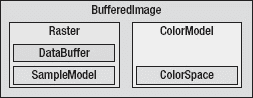

***图 7-28。**缓冲图像包含一个光栅和一个颜色模型。*

[图 7-28](#fig_7_28) 显示了一个缓冲图像封装了一个光栅和一个颜色模型。*光栅*根据提供颜色查找信息的*样本值*存储每个像素。对于 RGB 图像，每个像素存储三个样本，而对于 ARGB 图像存储四个样本。

样本存储在一个*数据缓冲区*中，该缓冲区由一个或多个原始类型值(如字节或短整数)的数组组成。对于 RGB 图像，所有红色样本将存储在一个阵列中，所有绿色样本将存储在第二个阵列中，所有蓝色样本将存储在第三个阵列中。每个样本阵列被称为*波段*或*通道*。

与数据缓冲区相关联的是一个*样本模型*，它与数据缓冲区通信以存储样本值并代表栅格检索样本值。

最后，*颜色模型*根据特定的*颜色空间*将像素的样本解释为一种颜色(参见`[http://en.wikipedia.org/wiki/Color_space](http://en.wikipedia.org/wiki/color_space)`)。

当您调用`getRGB()`来获取像素的红色、绿色、蓝色和(可能)alpha 分量(取决于缓冲区的类型)时，该方法告诉栅格获取像素样本，栅格告诉样本模型查找样本，样本模型从数据缓冲区获取样本，并将它们传递给栅格，栅格将它们传递给`getRGB()`。此时，`getRGB()`告诉颜色模型将样本转换成颜色信息。颜色模型使用颜色空间来帮助它执行这种转换。

当您调用`setRGB()`来设置像素的颜色分量时，该方法告诉颜色模型获取对应于颜色分量的样本值，然后告诉光栅存储这些样本。栅格告诉样本模型存储像素的样本，样本模型将这些样本存储在数据缓冲区中。

 **注意**光栅和颜色模型需要兼容。换句话说，样本数量(每像素)必须等于颜色模型组件的数量。

`java.awt.image`包包含一个用于描述只读栅格的具体`Raster`类、一个用于描述数据缓冲区的抽象`DataBuffer`类、一个用于描述样本模型的抽象`SampleModel`类和一个用于描述颜色模型的抽象`ColorModel`类。`java.awt.color`包包含一个抽象的`ColorSpace`类，用于描述色彩空间。查阅 Java 文档以了解更多关于这些类及其子类的信息(例如，`Raster`的`WritableRaster`子类)。

##### 缓冲图像处理

*图像处理*是信号处理(`[http://en.wikipedia.org/wiki/Signal_processing](http://en.wikipedia.org/wiki/signal_processing)`)的一种形式，其中数学变换将数字图像转换成其他数字图像。变换的作用是模糊、锐化、着色、浮雕、棕褐色调，以及对图像应用其他类型的操作。

通过提供`java.awt.image.BufferedImageOp`和`java.awt.image.RasterOp`接口，Java 2D 允许您处理缓冲图像或它们的栅格。虽然这些接口是相似的(例如，每个接口都声明了执行相同任务的五个方法)，但是它们的不同之处在于`BufferedImageOp`可以访问缓冲图像的颜色模型，而`RasterOp`不能访问颜色模型。另外，`RasterOp`比`BufferedImageOp`更具表演性，但合作起来也更复杂一些。

 **注** `BufferedImageOp`和/或`RasterOp`实现称为*图像操作符*。它们也被称为*滤镜*，因为每个接口都声明了一个`filter()`方法——滤镜用于摄影。

`BufferedImageOp`接口的核心方法是`BufferedImage filter(BufferedImage src, BufferedImage dest)`，它*将源`BufferedImage`实例的内容过滤*(转换)成存储在目标`BufferedImage`实例中的结果。如果两个缓冲图像的颜色模型不匹配，则执行到目标缓冲图像的颜色模型的颜色转换。如果您将`null`传递给`dest`，就会创建一个带有适当`ColorModel`实例的`BufferedImage`实例。当源和/或目标缓冲图像与实现该接口的类所允许的图像类型不兼容时，该方法抛出`java.lang.IllegalArgumentException`。

`RasterOp`接口的核心方法是`WritableRaster filter(Raster src, WritableRaster dest)`，它将源`Raster`实例的内容过滤成存储在目标`WritableRaster`实例中的结果。如果将`null`传递给`dest`，就会创建一个`WritableRaster`实例。当源和/或目标栅格与实现该接口的类所允许的栅格类型不兼容时，该方法可能会抛出`IllegalArgumentException`。

 **注意**根据实现类的不同，`BufferedImageOp`和/或`RasterOp`的`filter()`方法可能允许*就地过滤*，其中源和目标缓冲图像/光栅是相同的。

Java 2D 提供了五个实现这两个接口的`java.awt.image`类:`AffineTransformOp`、`ColorConvertOp`、`ConvolveOp`、`LookupOp`和`RescaleOp`。此外，这个包提供了`BandCombineOp`类，它只实现了`RasterOp`:

*   `AffineTransformOp`对缓冲的图像颜色或光栅样本进行几何变换(如旋转)。
*   `BandCombineOp`根据一组系数值组合光栅样本阵列。您可以使用此类来反转颜色分量带的等效样本，并有效地执行其他操作。
*   `ColorConvertOp`将缓冲图像颜色/光栅样本从一个颜色空间转换到另一个颜色空间。
*   `ConvolveOp`允许您执行*空间卷积*(组合源像素和相邻像素的颜色/样本)，如模糊和锐化。
*   `LookupOp`允许您通过查找表修改像素分量值。
*   `RescaleOp`将像素分量值乘以一个比例因子，然后向结果添加一个偏移量。这个类对于使图像变亮和变暗很有用(尽管查找表也可以用于这个目的)。

 **注意**`LookupOp``WritableRaster filter(Raster src, WritableRaster dst)`方法的 Java 文档声明，当您将`null`传递给`dst`时，会创建一个新的栅格。然而，将`null`传递给`dst`会导致`java.lang.NullPointerException`被抛出。

###### 卷积图像

`ConvolveOp`将源像素的 alpha(当存在时)和颜色分量的一部分与其紧邻像素的分量的一部分进行组合，以生成目标像素。要组合的每个像素的分量值的百分比从浮点值表中获得，该表被称为*内核*。组件的值乘以相应的内核值，然后对结果求和。每个和被箝位到最小值 0/0.0(最暗/透明)和最大值 255/1.0(最亮/不透明)。

`ConvolveOp`在图像上移动内核以卷积每个像素。内核的中心值(或最接近中心的值)应用于被卷积的源像素，而其他值应用于相邻像素。

除了中心值被设置为 1.0 之外，*同一性内核*的所有值都被设置为 0.0。这个特殊的内核不会改变图像，因为将源像素的分量值乘以 1.0 不会改变这些分量，而将相邻像素的分量值乘以 0.0 会得到 0.0 的值，这在添加到乘法结果时没有任何贡献。

内核由`java.awt.image.Kernel`类的实例表示。要创建一个内核，首先创建一个浮点百分比值的数组，然后将这个数组连同表的宽度(列数)和高度(行数)一起传递给`Kernel(int width, int height, float[] data)`构造函数。

以下示例显示了如何创建基于身份的内核:

```java
float[] identityKernel =
{
   0.0f, 0.0f, 0.0f,
   0.0f, 1.0f, 0.0f,
   0.0f, 0.0f, 0.0f
};
Kernel kernel = new Kernel(3, 3, identityKernel);
```

这个内核描述了一个应用于每个源像素及其八个紧邻像素的 3x 3 值表。要涉及更多的邻居，增加浮点数组的大小和的行数和列数。例如，您可以创建一个 5 乘 5 的内核，其中包含源像素及其 24 个紧邻像素。

 **注意**虽然`Kernel`不需要奇数的宽度和高度参数，但是您可能会发现奇数列和奇数行的内核更容易理解。

创建内核后，您需要考虑当内核位于图像边缘的像素上时会发生什么。一些内核元素将没有相应的图像像素。例如，当 3 乘 3 内核被定位成其中心行在顶部图像行上方时，内核的顶部邻居值行没有对应的图像像素行。

`ConvolveOp`通过声明`EDGE_ZERO_FILL`和`EDGE_NO_OP`常量来解决这种情况。指定`EDGE_ZERO_FILL`会导致`ConvolveOp`将边缘目标像素设置为零，这被解释为黑色(RGB)或透明(ARGB)。`EDGE_NO_OP`使`ConvolveOp`将源边缘像素不变地复制到目标。

要使用这个内核执行卷积，首先实例化`ConvolveOp`，如下所示:

```java
BufferedImageOp identityOp = new ConvolveOp(kernel);
RasterOp identityOp = new ConvolveOp(kernel);
```

`ConvolveOp(Kernel kernel)`构造函数将边缘行为设置为`EDGE_ZERO_FILL`。

 **提示**使用`ConvolveOp(Kernel kernel, int edgeCondition, RenderingHints hints)`构造函数选择边缘行为和渲染提示，以控制光栅化器。

通过调用`filter()`方法继续，如下所示:

```java
BufferedImage biResult = identityOp.filter(bi, null);
WriteableRaster wrResult = identityOp.filter(bi.getRaster(), null);
```

第一个`filter()`方法调用被传递给一个名为`bi`的现有`BufferedImage`实例作为它的第一个参数。它的第二个参数是`null`，告诉`filter()`创建一个新的`BufferedImage`实例作为目的地。您不能将同一个`BufferedImage`实例作为第二个参数传递，因为`ConvolveOp`不支持缓冲图像的就地过滤。

第二个`filter()`方法调用被传递缓冲图像的光栅(通过调用`BufferedImage`的`WritableRaster getRaster()`方法获得)作为它的第一个参数。它也被作为第二个参数传递给`null`，因为`ConvolveOp`不支持栅格的就地过滤。

 **注**为了方便起见，我重点介绍基于缓冲图像的处理。此外，我在本书代码中包含的一个`BIP`应用的上下文中演示了各种过滤器/图像操作符。

您可以创建一个模糊内核，通过组合等量的源像素和相邻像素分量值来模糊图像。生成的内核出现在这里:

```java
float ninth = 1.0f/9.0f;
float[] blurKernel =
{
   ninth, ninth, ninth,
   ninth, ninth, ninth,
   ninth, ninth, ninth
};
Kernel kernel = new Kernel(3, 3, blurKernel);
```

[图 7-29](#fig_7_29) 显示了模糊内核的结果——与[图 7-10](#fig_7_10) 相比较。

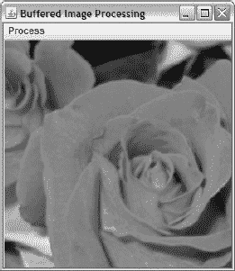

***图 7-29。**从“处理”菜单中选择“模糊”来模糊图像。*

如果您要将模糊内核应用到 ARGB 图像，其中所有 alpha 分量值都是 255(或 1.0)以表示不透明图像，则目标图像的 alpha 值将与源图像的 alpha 值相同。原因是模糊内核将源和相邻 alpha 值除以 9，然后将结果相加，得到源像素的原始 alpha 值。

您可以通过从源像素分量中减去相邻像素分量来创建强调图像边缘的边缘内核。生成的内核出现在这里:

```java
float[] edgeKernel =
{
    0.0f, -1.0f,  0.0f,
   -1.0f,  4.0f, -1.0f,
    0.0f, -1.0f,  0.0f
};
Kernel kernel = new Kernel(3, 3, edgeKernel);
```

[图 7-30](#fig_7_30) 显示了边缘内核的结果。

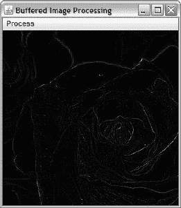

***图 7-30。**从处理菜单中选择边缘，生成仅显示边缘的图像。*

如果您要将边缘内核应用于 ARGB 图像，其中所有 alpha 分量值都是 255/1.0，则目标图像将是透明的，因为边缘内核会将每个 alpha 值设置为 0(透明)。

最后，您可以通过将身份内核添加到边缘内核来创建锐化内核。生成的内核如下所示:

```java
float[] sharpenKernel =
{
    0.0f, -1.0f,  0.0f,
   -1.0f,  5.0f, -1.0f,
    0.0f, -1.0f,  0.0f
};
Kernel kernel = new Kernel(3, 3, sharpenKernel);
```

[图 7-31](#fig_7_31) 显示了锐化内核的结果。

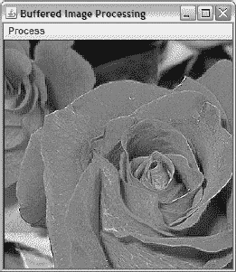

***图 7-31。**从处理菜单中选择锐化来锐化图像。*

如果您要将锐化内核应用于 ARGB 图像，其中所有 alpha 分量值都是 255/1.0，则目标图像的 alpha 值将与源图像的 alpha 值相同。原因是锐化内核将源像素的 alpha 值乘以 4，并从相乘结果中减去其相邻像素的四个 alpha 值，得到源像素的原始 alpha 值。

 **注意**内核的元素总和为 1.0，保持图像的亮度，如模糊和锐化内核所示。元素总和小于 1.0 的核生成较暗的图像，边缘核证明了这一点。元素总和大于 1.0 的核生成更亮的图像。

###### 使用查找表

`LookupOp`允许您使用查找表处理缓冲图像，其中查找表包含一个或多个由像素分量值索引的值数组。

查找表由抽象的`java.awt.image.LookupTable`类的具体子类来描述，具体来说就是`java.awt.image.ByteLookupTable`和`java.awt.image.ShortLookupTable`，它们分别存储字节整数和短整数。这两个子类都可以使用，尽管您可能会使用`ShortLookupTable`，因为您可以很容易地表示无符号字节整数。相反，当选择`ByteLookupTable`时，您必须使用负值来表示从 128 到 255 的字节值。

要创建适用于所有组件的短整数查找表，首先创建其基础数组，如下所示:

```java
short[] invert = new short[256];
for (int i = 0; i < invert.length; i++)
   invert[i] = (short) 255-i;
```

该数组旨在反转像素的颜色(和 alpha，如果存在的话)分量，并用于`ShortLookupTable`。

通过实例化`ShortLookupTable`继续，如下所示:

```java
LookupTable table = new ShortLookupTable(0, invert);
```

第一个参数是在索引到数组之前要从组件值中减去的偏移量。我传递`0`是因为我不想减去一个偏移量。第二个参数是数组本身。

最后，通过调用`LookupOp(LookupTable lookup, RenderingHints hints)`的构造函数实例化`LookupOp`，如下所示:

```java
BufferedImageOp invertOp = new LookupOp(new ShortLookupTable(0, invert), null);
```

我选择不指定渲染提示，将`null`作为第二个参数传递。

在处理 ARGB 图像时使用单个数组有一个问题，因为它可能会破坏 alpha 通道——查找表也适用于 alpha。要解决这种情况，您可以通过为每个组件提供一个数组来单独处理 alpha 通道，如下所示:

```java
short[] alpha = new short[256];
short[] red = new short[256];
short[] green = new short[256];
short[] blue = new short[256];
for (int i = 0; i < alpha.length; i++)
{
   alpha[i] = 255;
   red[i] = (short) (255-i);
   green[i] = (short) (255-i);
   blue[i] = (short) (255-i);
}
short[][] invert = { red, green, blue, alpha };
BufferedImageOp invertOp = new LookupOp(new ShortLookupTable(0, invert), null);
```

这个例子首先创建一个单独的数组来反转除 alpha 之外的每一个组件——每个`alpha`数组条目被赋予`255`来指定不透明。接下来，这些数组被传递给一个二维的`invert`数组——必须最后传递`alpha`数组。最后，使用二维`invert`数组和一个`0`偏移量作为参数调用另一个`ShortLookupTable`构造函数。结果表连同`null`(表示没有呈现提示)被传递给`LookupOp`的构造函数。

[图 7-32](#fig_7_32) 显示了该图像操作器的结果。

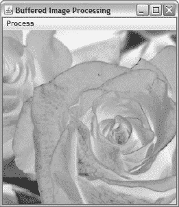

***图 7-32。**从处理菜单中选择负片，反转像素成分。*

**练习**

以下练习旨在测试您对 AWT、Swing 和 Java 2D 的理解:

1.  创建一个名为`RandomCircles`的 AWT 应用，它提供一个画布来显示填充的圆形椭圆(通过`fillOval()`呈现)。在应用启动时，以及每次鼠标指针出现在画布上时按下鼠标按钮，通过`paint()`方法显示一个新的随机颜色、随机位置、随机大小(宽度和高度为 5 到 35 个像素，每个范围使用相同的值)的填充圆。启动时，您可能会注意到画布首先显示一个随机颜色/位置/大小的圆，然后立即显示另一个。这与 AWT 在启动时至少调用两次`paint()`方法有关。因为你不知道`paint()`会被调用多少次，所以千万不要依靠`paint()`来改变组件的状态。相反，您必须仅使用此方法来呈现组件以响应当前状态。
2.  修改清单 7-6 的基于 Swing 的`TempVerter`应用，在创建 GUI 之前安装 Nimbus 外观。
3.  Swing 的`AbstractButton`类(由`JButton`扩展)声明了一个`void setMnemonic(int mnemonic)`方法，用于设置键盘*助记符*(内存辅助)，作为点击鼠标按钮的键盘快捷方式。传递给`mnemonic`的参数是在`KeyEvent`类中声明的虚拟键常量之一(例如`VK_C`)。当您调用此方法时，由助记符定义的第一个出现的字符(在按钮标签上从左到右)带有下划线。当您使用当前外观的无鼠标修饰键(通常是`Alt`键)按下该键时，按钮被单击。修改[清单 7-6](#list_7_6) 的基于 Swing 的`TempVerter`应用，将`VK_C`助记符分配给转换为摄氏按钮，将`VK_F`助记符分配给华氏按钮。
4.  由[清单 7-3](#list_7_3) 的`SplashCanvas`类创建的伪启动屏幕遭受锯齿的困扰，使得文本和图形看起来参差不齐。您可以通过在渲染图形之前安装抗锯齿渲染提示来解决此问题。创建一个利用抗锯齿的新版本的`SplashCanvas`。
5.  添加上一个练习对抗锯齿的支持会降低渲染速度。因此，您可能会注意到重新绘制伪闪屏需要时间，并且 GUI 对鼠标点击的响应变得缓慢。您可以通过借助`BufferedImage`类预先创建非反转和反转图像来解决不可调整组件的这个问题。创建一个新版本的`SplashCanvas`来完成这个任务。
6.  因为你可能会发现[图 7-29](#fig_7_29) 的模糊图像很难与[图 7-10](#fig_7_10) 区分开来，所以修改`BIP`添加一个模糊更多的菜单项。关联的监听器将创建一个 5 乘 5 元素的内核，其中每个元素都设置为`1.0f/25.0f`。涉及更多的相邻像素会导致更多的模糊。比较模糊更多和模糊的结果来看看自己。
7.  `ColorSpace`和`ColorConvertOp`类可用于创建彩色图像的灰度版本。向`BIP`引入一个灰度菜单项，并让其关联的监听器使用这些类来生成玫瑰的灰度版本。

### 总结

抽象窗口工具包是 Java 独创的独立于窗口系统的 API，用于创建基于组件、容器、布局管理器和事件的 GUI。AWT 还支持图形、颜色、字体、图像、数据传输等等。

Swing 是一个独立于窗口系统的 API，用于创建基于组件、容器、布局管理器和事件的 GUI。虽然 Swing 扩展了 AWT(您可以在 Swing GUI 中使用 AWT 布局管理器和事件)，但这个 API 与它的前身不同，因为 Swing GUI 在任何窗口系统上运行时都具有相同的外观，或者(由开发人员决定)采用它所运行的窗口系统的外观。此外，Swing 的非容器组件和一些容器完全由 Java 管理，因此它们可以拥有任何必要的特性(比如工具提示)；这些功能不受窗口系统的影响。此外，Swing 可以提供并非在每个窗口系统上都可用的组件；例如，表格和树。

最后，Java 2D 是 AWT 扩展的集合，提供高级的二维图形、文本和图像功能。这个 API 为通过艺术线条、文本和图像开发更丰富的 GUI 提供了一个灵活的框架。

应用经常与文件系统交互，以向文件输出数据和/或从文件输入数据。第 8 章向你介绍标准类库的经典 I/O API 来完成这些任务。