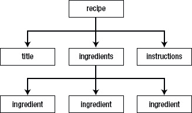
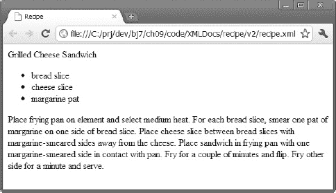
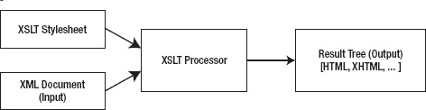
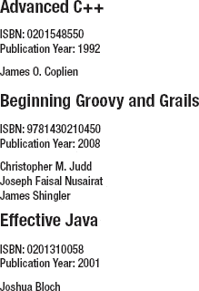

# 十、解析、创建和转换 XML 文档

应用通常使用 XML 文档来存储和交换数据。Java 通过 SAX、DOM、StAX、XPath 和 XSLT APIs 为 XML 提供了广泛的支持。理解这些 API 是探索依赖于 XML 的其他 Java APIs 的先决条件；例如，web 服务(在[第 11 章](11.html#ch11)中讨论)。

第 10 章向您介绍 SAX、DOM、StAX、XPath 和 XSLT。在深入研究这些 API 之前，本章为那些不熟悉这项技术的人提供了 XML 的介绍。

 **注意** SAX、DOM、StAX、XPath 和 XSLT 是一个更广泛的 API 的独立 API 成员，该 API 被称为用于 XML 处理的 Java API(JAXP)。创建 JAXP 是为了让应用使用 *XML 处理器*独立于处理器实现来解析、创建、转换或执行 XML 文档上的其他操作，通过提供一个可插拔层，让供应商提供他们自己的实现，而无需在应用代码中引入依赖性。Java 7 支持 JAXP 1.4.5。

### 什么是 XML？

*XML* (可扩展标记语言)是一种*元语言*(一种用于描述其他语言的语言)，用于定义*词汇*(自定义标记语言)，这是 XML 的重要性和普及性的关键。基于 XML 的词汇表(例如 XHTML)让您能够以有意义的方式描述文档。

XML 词汇表文档类似于 HTML(参见`[http://en.wikipedia.org/wiki/HTML](http://en.wikipedia.org/wiki/HTML)`)文档，因为它们是基于文本的，由*标记*(文档逻辑结构的编码描述)和*内容*(不被解释为标记的文档文本)组成。标记通过*标签*(尖括号分隔的语法结构)来证明，每个标签都有一个名称。此外，一些标签有*属性*(名称-值对)。

 **注** XML 和 HTML 是*标准通用标记语言(SGML)* 的后代，是创建词汇的原始元语言——XML 本质上是 SGML 的限制形式，而 HTML 是 SGML 的*应用*。XML 和 HTML 之间的关键区别在于，XML 邀请您使用自己的标签和规则创建自己的词汇表，而 HTML 为您提供一个预先创建的词汇表，它有自己固定的标签和规则集。XHTML 和其他基于 XML 的词汇表是 *XML 应用*。创建 XHTML 是为了更清晰地实现 HTML。

如果您以前没有接触过 XML，您可能会对它的简单性和它的词汇与 HTML 的相似程度感到惊讶。学习如何创建 XML 文档并不需要成为火箭科学家。为了证明这一点，请查看清单 10-1 。

***清单 10-1。**基于 XML 的烤奶酪三明治食谱*

```java
<recipe>
   <title>
      Grilled Cheese Sandwich
   </title>
   <ingredients>
      <ingredient qty="2">
         bread slice
      </ingredient>
      <ingredient>
         cheese slice
      </ingredient>
      <ingredient qty="2">
         margarine pat
      </ingredient>
   </ingredients>
   <instructions>
      Place frying pan on element and select medium heat. For each bread slice, smear
      one pat of margarine on one side of bread slice. Place cheese slice between bread
      slices with margarine-smeared sides away from the cheese. Place sandwich in frying
      pan with one margarine-smeared side in contact with pan. Fry for a couple of
      minutes and flip. Fry other side for a minute and serve.
   </instructions>
</recipe>
```

清单 10-1 展示了一个 XML 文档，描述了制作烤奶酪三明治的食谱。这个文档类似于 HTML 文档，因为它由标签、属性和内容组成。然而，相似之处也就到此为止了。这种非正式的菜谱语言呈现了自己的`<recipe>`、`<ingredients>`和其他标签，而不是 HTML 标签，比如`<html>`、`<head>`、``和`<p>`。

 **注意**虽然[清单 10-1](#list_10_1) 的`<title>`和`</title>`标签也可以在 HTML 中找到，但是它们与它们的 HTML 对应物不同。Web 浏览器通常会在标题栏中显示这些标签之间的内容。相比之下，[清单 10-1](#list_10_1) 的`<title>`和`</title>`标签之间的内容可能会显示为标题、大声朗读或以其他方式呈现，这取决于解析该文档的应用。

XML 文档基于 XML 声明、元素和属性、字符引用和 CDATA 节、名称空间以及注释和处理指令。学习完这些基础知识后，您将了解 XML 文档的良好格式意味着什么，以及 XML 文档的有效性意味着什么。

#### XML 声明

XML 文档通常以 *XML 声明*开始，这是一种特殊的标记，通知 XML 解析器该文档是 XML。在[清单 10-1](#list_10_1) 中缺少 XML 声明表明这种特殊的标记不是强制性的。当 XML 声明存在时，它前面不能出现任何内容。

XML 声明至少看起来像`<?xml version="1.0"?>`，其中非可选的`version`属性标识文档符合的 XML 规范的版本。该规范的初始版本(1.0)于 1998 年推出，并得到了广泛的实施。

 **注意**维护 XML 的万维网联盟(W3C)在 2004 年发布了 1.1 版本。该版本主要支持使用 EBCDIC 平台上使用的行尾字符(见`[http://en.wikipedia.org/wiki/EBCDIC](http://en.wikipedia.org/wiki/EBCDIC)`)，以及使用 Unicode 3.2 中没有的脚本和字符(见`[http://en.wikipedia.org/wiki/Unicode](http://en.wikipedia.org/wiki/Unicode)`)。与 XML 1.0 不同，XML 1.1 没有被广泛实现，应该只由那些需要其独特特性的人使用。

XML 支持 Unicode，这意味着 XML 文档完全由 Unicode 字符集中的字符组成。文档的字符被编码成字节以便存储或传输，编码是通过 XML 声明的可选属性`encoding`指定的。一种常见的编码是 *UTF-8* (见`[http://en.wikipedia.org/wiki/UTF-8](http://en.wikipedia.org/wiki/UTF-8)`)，这是 Unicode 字符集的可变长度编码。UTF-8 是 ASCII 的严格超集(见`[http://en.wikipedia.org/wiki/Ascii](http://en.wikipedia.org/wiki/Ascii)`)，这意味着纯 ASCII 文本文件也是 UTF-8 文档。

 **注意**在没有 XML 声明的情况下，或者当 XML 声明的`encoding`属性不存在时，XML 解析器通常会在文档的开头寻找一个特殊的字符序列来确定文档的编码。这个字符序列被称为*字节顺序标记(BOM)* ，由编辑程序(如微软 Windows 记事本)根据 UTF-8 或其他编码保存文档时创建。例如，十六进制序列 EF BB BF 表示编码为 UTF-8。同样，FE FF 表示 UTF-16 大端(见`[http://en.wikipedia.org/wiki/UTF-16/UCS-2](http://en.wikipedia.org/wiki/UTF-16/UCS-2)`)，FF FE 表示 UTF-16 小端，00 00 FE FF 表示 UTF-32 大端(见`[http://en.wikipedia.org/wiki/UTF-16/UCS-2](http://en.wikipedia.org/wiki/UTF-16/UCS-2)`)，FF FE 00 00 表示 UTF-32 小端。如果没有物料清单，则假定为 UTF-8。

如果除了 ASCII 字符集之外你从来不使用字符，你可能会忘记`encoding`属性。但是，如果您的母语不是英语，或者如果您被要求创建包含非 ASCII 字符的 XML 文档，您需要正确地指定`encoding`。例如，如果您的文档包含来自非英语西欧语言的 ASCII plus 字符(例如，法语、葡萄牙语和其他语言中使用的 cedilla)，您可能希望选择`ISO-8859-1`作为`encoding`属性的值——以这种方式编码的文档可能比使用 UTF-8 编码的文档更小。清单 10-2 向您展示了生成的 XML 声明。

***清单 10-2。**包含非汉字字符的编码文档*

```java
<?xml version="1.0" **encoding="ISO-8859-1"**?>
<movie>
   <name>Le Fabuleux Destin d'Amélie Poulain</name>
   <language>français</language>
</movie>
```

可以出现在 XML 声明中的最后一个属性是`standalone`。这个可选属性决定了 XML 文档是否依赖于外部 DTD(将在本章后面讨论)——它的值是`no`——或者不是——它的值是`yes`。值默认为`no`，暗示有外部 DTD。然而，因为没有 DTD 的保证，`standalone`很少使用，也不会进一步讨论。

#### 元素和属性

XML 声明之后是元素的*层次*(树)结构，其中*元素*是由*开始标签*(如`<name>`)和*结束标签*(如`</name>`)分隔的文档的一部分，或者是一个*空元素标签*(名称以正斜杠`/`结尾的独立标签，如`<break/>`)。开始标签和结束标签包围内容和可能的其他标记，而空元素标签不包围任何东西。[图 10-1](#fig_10_1) 展示了[清单 10-1](#list_10_1) 的 XML 文档树结构。



***图 10-1。** [清单 10-1](#list_10_1) 的树形结构根植于`recipe`元素。*

与 HTML 文档结构一样，XML 文档的结构锚定在一个*根元素*(最顶层的元素)中。在 HTML 中，根元素是`html`(`<html>`和`</html>`标签对)。与 HTML 不同，您可以为 XML 文档选择根元素。[图 10-1](#fig_10_1) 显示根元素为`recipe`。

不像其他元素有*父元素*，`recipe`没有父元素。同样，`recipe`和`ingredients`有*子元素* : `recipe`的子元素是`title`、`ingredients`和`instructions`；而 `ingredients`的孩子就是`ingredient`的三个实例。`title`、`instructions`和`ingredient`元素没有子元素。

元素可以包含子元素、内容或者*混合内容*(子元素和内容的组合)。[清单 10-2](#list_10_2) 揭示了`movie`元素包含`name`和`language`子元素，还揭示了这些子元素中的每一个都包含内容(例如，`language`包含`français`)。清单 10-3 给出了另一个例子，展示了混合内容以及子元素和内容。

***清单 10-3。**包含混合内容的`abstract`元素*

```java
<?xml version="1.0"?>
<article title="the rebirth of javafx" lang="en">
   <abstract>
      JavaFX 2.0 marks a significant milestone in the history of JavaFX. Now that
      Sun Microsystems has passed the torch to Oracle, we have seen the demise of
      JavaFX Script and the emerge of Java APIs (such as
      <code-inline>javafx.application.Application</code-inline>) for interacting
      with this technology. This article introduces you to this new flavor of
      JavaFX, where you learn about JavaFX 2.0 architecture and key APIs.
   </abstract>
   <body>
   </body>
</article>
```

这个文档的根元素是`article`，它包含了`abstract`和`body`子元素。`abstract`元素将内容与包含内容的`code-inline`元素混合在一起。相反，`body`元素是空的。

 **注意**与[清单 10-1](#list_10_1) 和[清单 10-2](#list_10_2) ，[清单 10-3](#list_10_3) 也包含*空格*(不可见的字符，如空格、制表符、回车符和换行符)。XML 规范允许在文档中添加空白。内容中出现的空白(如单词之间的空格)被视为内容的一部分。相反，解析器通常会忽略结束标记和下一个开始标记之间出现的空白。这样的空白不被认为是内容的一部分。

XML 元素的开始标记可以包含一个或多个属性。例如，[清单 10-1](#list_10_1) 的`<ingredient>`标签有一个`qty`(数量)属性，[清单 10-3](#list_10_3) 的`<article>`标签有`title`和`lang`属性。属性提供了关于元素的附加信息。例如，`qty`表示可以添加的成分的量，`title`表示文章的标题，`lang`表示文章使用的语言(`en`表示英语)。属性可以是可选的。例如，如果未指定`qty`，则采用默认值`1`。

 **注意**元素和属性名称可以包含来自英语或其他语言的任何字母数字字符，也可以包含下划线(`_`)、连字符(`-`)、句点(`.`)和冒号(`:`)标点字符。冒号应该只用于名称空间(将在本章后面讨论)，并且名称不能包含空格。

#### 字符引用和 CDATA 节

某些字符不能按字面意思出现在开始标记和结束标记之间的内容中，也不能出现在属性值中。例如，不能在开始标记和结束标记之间放置文字字符`<`,因为这样做会使 XML 解析器误以为遇到了另一个标记。

这个问题的一个解决方案是用一个*字符引用*替换字面字符，这是一个代表字符的代码。字符引用分为数字字符引用或字符实体引用:

*   *数字字符引用*通过字符的 Unicode 码位引用字符，遵循格式`&#nnnn;`(不限四位)或`&#xhhhh;`(不限四位)，其中 *`nnnn`* 提供码位的十进制表示， *`hhhh`* 提供十六进制表示。例如，`&#0931;`和`&#x03A3;`代表希腊文大写字母 sigma。虽然 XML 要求`&#x*hhhh*;`中的`x`是小写的，但是它很灵活，前导零在两种格式中都是可选的，并且允许您为每个 *`h`* 指定大写或小写字母。因此，`&#931;`、`&#x3A3;`和`&#x03a3;`也是希腊大写字母 sigma 的有效表示。
*   一个*字符实体引用*通过一个*实体*(别名数据)的名称引用一个字符，该实体指定所需的字符作为其替换文本。字符实体引用是由 XML 预定义的*，格式为`&*name*;`，其中 *`name`* 是实体的名称。XML 预定义了五个字符实体引用:`&lt;`(`<`)`&gt;`(`>`)`&amp;`(`&`)`&apos;`(`'`)和`&quot;` ( `"`)。*

 *考虑一下`<expression>6 < 4</expression>`。你可以用数字参考`&#60;`代替`<`，产生`<expression>6 &#60; 4</expression>`，或者更好的是用`&lt;`，产生`<expression>6 &lt; 4</expression>`。第二种选择更清晰，更容易记忆。

假设您想在一个元素中嵌入一个 HTML 或 XML 文档。为了使嵌入的文档能够被 XML 解析器接受，您需要将每个文字字符`<`(标签的开始)和`&`(实体的开始)替换为它的`&lt;`和`&amp;`预定义的字符实体引用，这是一项繁琐且可能容易出错的工作——您可能会忘记替换其中的一个字符。为了避免繁琐和潜在的错误，XML 以 CDATA(字符数据)部分的形式提供了一种替代方法。

一个 *CDATA 部分*是由前缀`<![CDATA[`和后缀`]]>`包围的一段文字 HTML 或 XML 标记和内容。您不需要在 CDATA 部分中指定预定义的字符实体引用，如[清单 10-4](#list_10_4) 所示。

***清单 10-4。**将一个 XML 文档嵌入另一个文档的 CDATA 部分*

`<?xml version="1.0"?>
<svg-examples>
   <example>` `      The following Scalable Vector Graphics document describes a blue-filled and
      black-stroked rectangle.
      <**![CDATA[**<svg width="100%" height="100%" version="1.1"
           >
         <rect width="300" height="100"
               style="fill:rgb(0,0,255);stroke-width:1; stroke:rgb(0,0,0)"/>
      </svg>**]]>**
   </example>
</svg-examples>`

[清单 10-4](#list_10_4) 在 SVG 示例文档的`example`元素中嵌入了一个可缩放矢量图形(SVG)【参见`[http://en.wikipedia.org/wiki/Svg](http://en.wikipedia.org/wiki/Svg)`】XML 文档。SVG 文档被放在 CDATA 部分，这样就不需要用`&lt;`预定义的字符实体引用替换所有的`<`字符。

#### 名称空间

创建结合不同 XML 语言特性的 XML 文档是很常见的。当元素和其他 XML 语言特性出现时，命名空间用于防止名称冲突。如果没有名称空间，XML 解析器就无法区分同名元素或其他具有不同含义的语言特性，例如，来自两种不同语言的两个同名`title`元素。

 **注意**名称空间不是 XML 1.0 的一部分。它们是在这个规范发布一年后出现的。为了确保向后兼容 XML 1.0，名称空间利用了冒号字符，这是 XML 名称中的合法字符。不识别名称空间的解析器返回包含冒号的名称。

*名称空间*是一个基于统一资源标识符(URI)的容器，通过为其包含的标识符提供唯一的上下文来帮助区分 XML 词汇表。命名空间 URI 与一个*命名空间前缀*(URI 的别名)相关联，通常是通过在 XML 文档的根元素上指定`xmlns`属性本身(表示默认命名空间)或`xmlns:*prefix*`属性(表示被标识为 *`prefix`* 的命名空间)，并将 URI 分配给该属性。

 **注意**一个名称空间的作用域从声明它的元素开始，应用于该元素的所有内容，除非被另一个具有相同前缀名称的名称空间声明覆盖。

当指定了 *`prefix`* 时，它和一个冒号字符被添加到属于该名称空间的每个元素标签的名称前面——参见[清单 10-5](#list_10_5) 。

***清单 10-5。**引入一对名称空间*

```java
<?xml version="1.0"?>
<h:html xmlns:h="http://www.w3.org/1999/xhtml"
        xmlns:r="http://www.tutortutor.ca/">
   <h:head>
      <h:title>
         Recipe
      </h:title>
   </h:head>
   <h:body>
   <r:recipe>
      <r:title>
         Grilled Cheese Sandwich
      </r:title>
      <r:ingredients>
         <h:ul>
         <h:li>
         <r:ingredient qty="2">
            bread slice
         </r:ingredient>
         </h:li>
         <h:li>
         <r:ingredient>
            cheese slice
         </r:ingredient>
         </h:li>
         <h:li>
         <r:ingredient qty="2">
            margarine pat
         </r:ingredient>
         </h:li>
         </h:ul>
      </r:ingredients>
      <h:p>
      <r:instructions>
         Place frying pan on element and select medium heat. For each bread slice, smear
         one pat of margarine on one side of bread slice. Place cheese slice between
         bread slices with margarine-smeared sides away from the cheese. Place sandwich
         in frying pan with one margarine-smeared side in contact with pan. Fry for a
         couple of minutes and flip. Fry other side for a minute and serve.
      </r:instructions>
      </h:p>
   </r:recipe>
   </h:body>
</h:html>
```

[清单 10-5](#list_10_5) 描述了一个文档，它将 XHTML 语言(见`[http://en.wikipedia.org/wiki/XHTML](http://en.wikipedia.org/wiki/XHTML)`)中的元素与菜谱语言中的元素结合起来。所有与 XHTML 相关的元素标签都以`h:`为前缀，所有与菜谱语言相关的元素标签都以`r:`为前缀。

`h:`前缀与`[http://www.w3.org/1999/xhtml](http://www.w3.org/1999/xhtml)` URI 相关联，`r:`前缀与`[http://www.tutortutor.ca/](http://www.tutortutor.ca/)` URI 相关联。XML 不要求 URIs 指向文档文件。它只要求它们是唯一的，以保证名称空间的唯一性。

本文档将菜谱数据从 XHTML 元素中分离出来，这使得保存该数据的结构成为可能，同时也允许符合 XHTML 的网络浏览器(例如，Google Chrome)通过网页呈现菜谱(见[图 10-2](#fig_10_2) )。



***图 10-2。**谷歌 Chrome 通过 XHTML 标签呈现菜谱数据。*

当标签的属性属于元素时，这些属性不需要加上前缀。比如`<r:ingredient qty="2">`中没有前缀`qty`。但是，属于其他名称空间的属性需要前缀。例如，假设您想要向文档的`<r:title>`标签添加一个 XHTML `style`属性，以便在通过应用显示时为菜谱标题提供样式。您可以通过在 title 标签中插入一个 XHTML 属性来完成这项任务，如下所示:`<r:title h:style="font-family: sans-serif;">`。XHTML `style`属性带有前缀`h:`，因为该属性属于 XHTML 语言名称空间，而不属于 recipe 语言名称空间。

当涉及多个名称空间时，将其中一个名称空间指定为默认名称空间会很方便，这样可以减少输入名称空间前缀的繁琐。考虑清单 10-6 中的。

***清单 10-6。**指定默认名称空间*

`<?xml version="1.0"?>
<html
      xmlns:r="http://www.tutortutor.ca/">
   <head>
      <title>
         Recipe
      </title>
   </head>
   <body>
   <r:recipe>
      <r:title>
         Grilled Cheese Sandwich` `      </r:title>
      <r:ingredients>
         <ul>
         <li>
         <r:ingredient qty="2">
            bread slice
         </r:ingredient>
         </li>
         <li>
         <r:ingredient>
            cheese slice
         </r:ingredient>
         </li>
         <li>
         <r:ingredient qty="2">
            margarine pat
         </r:ingredient>
         </li>
         </ul>
      </r:ingredients>
      <p>
      <r:instructions>
         Place frying pan on element and select medium heat. For each bread slice, smear
         one pat of margarine on one side of bread slice. Place cheese slice between
         bread slices with margarine-smeared sides away from the cheese. Place sandwich
         in frying pan with one margarine-smeared side in contact with pan. Fry for a
         couple of minutes and flip. Fry other side for a minute and serve.
      </r:instructions>
      </p>
   </r:recipe>
   </body>
</html>`

[清单 10-6](#list_10_6) 指定了 XHTML 语言的默认名称空间。没有 XHTML 元素标签需要以`h:`为前缀。然而，配方语言元素标签仍然必须以前缀`r:`为前缀。

#### 注释和处理说明

XML 文档可以包含注释，注释是以`<!--`开始，以`-->`结束的字符序列。例如，您可以将`<!-- Todo -->`放在[清单 10-3](#list_10_3) 的`body`元素中，以提醒自己需要完成该元素的编码。

注释用于阐明文档的各个部分。它们可以出现在 XML 声明之后的任何地方，除了在标记内，不能嵌套，不能包含双连字符(`--`)，因为这样做可能会使 XML 解析器混淆，认为注释已经结束，出于同样的原因，不应该包含连字符(`-`)，并且通常在处理过程中被忽略。评论不内容。

XML 还允许存在处理指令。*处理指令*是对解析文档的应用可用的指令。指令以`<?`开始，以`?>`结束。在`<?`前缀之后是一个名为*目标*的名字。该名称通常标识处理指令所针对的应用。处理指令的其余部分包含适合应用格式的文本。处理指令的两个例子是`<?xml-stylesheet href="modern.xsl" type="text/xml"?>`(将可扩展样式表语言【XSL】样式表【参见`[http://en.wikipedia.org/wiki/XSL](http://en.wikipedia.org/wiki/XSL)`与 XML 文档相关联)和`<?php /* PHP code */ ?>`(将 PHP 代码片段传递给应用)。虽然 XML 声明看起来像一个处理指令，但事实并非如此。

 **注意**XML 声明不是处理指令。

#### 格式良好的文档

HTML 是一种松散的语言，在这种语言中，可以无序地指定元素，可以省略结束标记，等等。web 浏览器页面布局代码的复杂性部分是由于需要处理这些特殊情况。相比之下，XML 是一种更严格的语言。为了使 XML 文档更容易解析，XML 要求 XML 文档遵循某些规则:

*   *所有元素必须有开始和结束标签，或者由空元素标签组成*。例如，与通常没有对应的`</p>`标签的 HTML `<p>`标签不同，`</p>`也必须从 XML 文档的角度存在。
*   *标签必须正确嵌套*。例如，虽然您可能在 HTML 中指定了`<b><i>JavaFX</b></i>`,但是 XML 解析器会报告一个错误。相比之下，`<b><i>JavaFX</i></b>`不会导致错误。
*   *所有属性值都必须加上引号*。单引号(`'`)或双引号(`"`)都是允许的(尽管双引号是更常见的指定引号)。省略这些引号是错误的。
*   空元素必须被正确格式化。例如，HTML 的`<br>`标签在 XML 中必须被指定为`<br/>`。您可以在标签名称和`/`字符之间指定一个空格，尽管空格是可选的。
*   *小心箱子*。XML 是一种区分大小写的语言，其中大小写不同的标签(如`<author>`和`<Author>`)被认为是不同的。将不同大小写的开始和结束标签混在一起是错误的，例如，`<author>`和`</Author>`。

意识到名称空间的 XML 解析器执行两个额外的规则:

*   所有元素和属性名称不得包含一个以上的冒号字符。
*   实体名称、处理指令目标或符号名称(稍后讨论)都不能包含冒号。

符合这些规则的 XML 文档是*格式良好的*。该文档具有逻辑清晰的外观，并且更容易处理。XML 解析器只会解析格式良好的 XML 文档。

#### 有效证件

对于 XML 文档来说，格式良好并不总是足够的；在许多情况下，文件也必须是有效的。一个*有效的*文档遵守约束。例如，可以对清单 10-1 的菜谱文档 [设置一个约束，以确保`ingredients`元素总是在`instructions`元素之前；也许一个申请必须首先处理`ingredients`。](#list_10_1)

 **注** XML 文档验证类似于编译器分析源代码，以确保代码在机器上下文中有意义。例如，`int`、`count`、`=`、`1`和`;`都是有效的 Java 字符序列，但是`1 count ; int =`不是有效的 Java 结构(而`int count = 1;`是有效的 Java 结构)。

一些 XML 解析器执行验证，而其他解析器不执行验证，因为验证解析器更难编写。执行验证的解析器将 XML 文档与语法文档进行比较。与该文档的任何偏差都将作为错误报告给应用—该文档无效。应用可以选择修复错误或拒绝文档。与良构性错误不同，有效性错误不一定是致命的，解析器可以继续解析文档。

 **注意**默认情况下，验证 XML 解析器通常不进行验证，因为验证非常耗时。必须指导他们执行验证。

语法文件是用一种特殊的语言写的。JAXP 支持的两种常用语法语言是文档类型定义和 XML 模式。

##### 单据类型定义

*文档类型定义(DTD)* 是规定 XML 文档语法的最古老的语法语言。DTD 语法文档(称为 DTD)是根据一种严格的语法编写的，该语法规定了什么元素可以出现在文档的什么部分，元素中包含什么(子元素、内容或混合内容)以及可以指定什么属性。例如，DTD 可能会指定一个`recipe`元素必须有一个`ingredients`元素，后跟一个`instructions`元素。

[清单 10-7](#list_10_7) 给出了一个配方语言的 DTD，该配方语言用于构建[清单 10-1](#list_10_1) 的文档。

***清单 10-7。**配方语言的 DTD*

```java
<!ELEMENT recipe (title, ingredients, instructions)>
<!ELEMENT title (#PCDATA)>
<!ELEMENT ingredients (ingredient+)>
<!ELEMENT ingredient (#PCDATA)>
<!ELEMENT instructions (#PCDATA)>
<!ATTLIST ingredient qty CDATA "1">
```

该 DTD 首先声明配方语言的元素。元素声明采用`<!ELEMENT *name* *content-specifier*>`的形式，其中 *`name`* 是任何合法的 XML 名称(例如，它不能包含空格)，而 *`content-specifier`* 标识元素中可以出现的内容。

第一个元素声明声明 XML 文档中只能出现一个`recipe`元素——这个声明并不意味着`recipe`是根元素。此外，这个元素必须包含`title`、`ingredients`和`instructions`子元素中的一个，并且按照这个顺序。子元素必须指定为逗号分隔的列表。此外，列表总是用括号括起来。

第二个元素声明声明`title`元素包含*解析的字符数据*(非标记文本)。第三个元素声明声明至少一个`ingredient`元素必须出现在`ingredients`中。`+`字符是表示一个或多个的正则表达式的一个例子。其他可能使用的表达式有`*`(零或更多)和`?`(一次或根本不使用)。第四个和第五个元素声明与第二个类似，声明`ingredient`和`instructions`元素包含解析的字符数据。

 **注意**元素声明支持其他三种内容说明符。您可以指定`<!ELEMENT *name* ANY>`来允许任何类型的元素内容，或者指定`<!ELEMENT *name* EMPTY>`来禁止任何元素内容。要声明一个元素包含混合内容，您可以指定`#PCDATA`和一个元素名称列表，用竖线(`|`)分隔。例如，`<!ELEMENT ingredient (#PCDATA | measure | note)*>`声明`ingredient`元素可以包含已解析的字符数据、零个或多个`measure`元素以及零个或多个`note`元素。它没有指定解析的字符数据和这些元素出现的顺序。但是，`#PCDATA`必须是列表中指定的第一项。在此上下文中使用正则表达式时，它必须出现在右括号的右侧。

清单 10-7 的 DTD 最后声明了菜谱语言的属性，其中只有一个:`qty`。属性声明采用`<!ATTLIST *ename aname type default-value*>`的形式，其中 *`ename`* 是属性所属元素的名称， *`aname`* 是属性的名称， *`type`* 是属性的类型， *`default-value`* 是属性的默认值。

属性声明将`qty`标识为`ingredient`的属性。它还说明了`qty`的类型是`CDATA`(任何不包括&符号、小于或大于符号或双引号的字符串都可能出现；这些字符可以分别通过`&amp;`、`&lt;`、`&gt;`或`&quot;`来表示，并且`qty`是可选的，当不存在时采用默认值`1`。

**关于属性的更多信息**

DTD 允许您指定附加的属性类型:`ID`(为标识元素的属性创建唯一的标识符)、`IDREF`(属性值是位于文档中其他位置的元素)、`IDREFS`(值由多个`IDREF`组成)、`ENTITY`(可以使用外部二进制数据或未解析的实体)、`ENTITIES`(值由多个实体组成)、`NMTOKEN`(值限于任何有效的 XML 名称)、`NMTOKENS`(值由多个 XML 名称组成)、`NOTATION`(值已经通过指定)值用竖线分隔)。

您可以不逐字指定默认值，而是指定`#REQUIRED`来表示属性必须始终具有某个值`(<!ATTLIST *ename aname type* #REQUIRED` >)，`#IMPLIED`来表示属性是可选的，并且不提供默认值`(<!ATTLIST *ename aname type* #IMPLIED>`，或者`#FIXED`来表示属性是可选的，并且在使用时必须始终采用 DTD 分配的默认值`(<!ATTLIST *ename aname type* #FIXED "value">`。

您可以在一个`ATTLIST`声明中指定属性列表。例如，`<!ATTLIST *ename aname1 type1 default-value1 aname2 type2 default-value2*>`声明了两个标识为 *`aname1`* 和 *`aname2`* 的属性。

基于 DTD 的验证 XML 解析器在验证文档之前，要求文档包含一个*文档类型声明*,用于标识指定文档语法的 DTD。

 **注意**单据类型定义和单据类型声明是两回事。DTD 首字母缩略词标识文档类型定义，从不标识文档类型声明。

文档类型声明紧跟在 XML 声明之后，并以下列方式之一指定:

*   `<!DOCTYPE *root-element-name* SYSTEM *uri*>`通过 *`uri`* 引用外部但私有的 DTD。引用的 DTD 不可用于公众审查。例如，我可能将我的食谱语言的 DTD 文件(`recipe.dtd`)存储在我的`[www.tutortutor.ca](http://www.tutortutor.ca)`网站上的私有`dtds`目录中，并使用`<!DOCTYPE recipe SYSTEM "http://www.tutortutor.ca/dtds/recipe.dtd">`通过系统标识符`[http://www.tutortutor.ca/dtds/recipe.dtd](http://www.tutortutor.ca/dtds/recipe.dtd)`来标识该 DTD 的位置。
*   `<!DOCTYPE *root-element-name* PUBLIC *fpi uri*>`通过 *`fpi`* 、一个*正式公共标识符*(参见`[http://en.wikipedia.org/wiki/Formal_Public_Identifier](http://en.wikipedia.org/wiki/Formal_Public_Identifier)`)*`uri`*引用一个外部的但是公共的 DTD。如果验证 XML 解析器不能通过公共标识符 *`fpi`* 定位 DTD，它可以使用系统标识符 *`uri`* 定位 DTD。例如，`<!DOCTYPE html PUBLIC "-//W3C//DTD XHTML 1.0 Transitional//EN" "http://www.w3.org/TR/xhtml1/DTD/xhtml1-transitional.dtd">`首先通过公共标识符`-//W3C//DTD XHTML 1.0 Transitional//EN`引用 XHTML 1.0 DTD，然后通过系统标识符`[http://www.w3.org/TR/xhtml1/DTD/xhtml1-transitional.dtd](http://www.w3.org/TR/xhtml1/DTD/xhtml1-transitional.dtd)`引用。
*   参考一个内部 DTD，一个嵌入在 XML 文档中的 DTD。内部 DTD 必须出现在方括号中。

[清单 10-8](#list_10_8) 用内部 DTD 呈现了[清单 10-1](#list_10_1) (减去了`<recipe>`和`</recipe>`标签之间的子元素)。

***清单 10-8。**带有内部 DTD 的配方文件*

```java
<?xml version="1.0"?>
<!DOCTYPE recipe [
   <!ELEMENT recipe (title, ingredients, instructions)>
   <!ELEMENT title (#PCDATA)>
   <!ELEMENT ingredients (ingredient+)>
   <!ELEMENT ingredient (#PCDATA)>
   <!ELEMENT instructions (#PCDATA)>
   <!ATTLIST ingredient qty CDATA "1">
]>
<recipe>
   <!-- Child elements removed for brevity. -->
</recipe>
```

 **注意**一个文档可以有内部和外部 DTDs 比如`<!DOCTYPE recipe SYSTEM "http://www.tutortutor.ca/dtds/recipe.dtd" [ <!ELEMENT ...>]>`。内部 DTD 被称为*内部 DTD 子集*，外部 DTD 被称为*外部 DTD 子集*。任何一个子集都不能覆盖另一个子集的元素声明。

您还可以在 dtd 中声明符号、一般实体和参数实体。*符号*是一段任意的数据，通常描述未解析的二进制数据的格式，通常具有`<!NOTATION *name* SYSTEM *uri*>`的形式，其中 *`name`* 标识符号， *`uri`* 标识某种插件，该插件可以代表解析 XML 文档的应用处理数据。例如，`<!NOTATION image SYSTEM "psp.exe">`声明了一个名为`image`的符号，并将 Windows 可执行文件`psp.exe`标识为处理图像的插件。

通过互联网媒体类型使用符号指定二进制数据类型也很常见(见`[http://en.wikipedia.org/wiki/Internet_media_type](http://en.wikipedia.org/wiki/Internet_media_type)`)。例如，`<!NOTATION image SYSTEM "image/jpeg">`声明了一个`image`符号，它为联合图像专家组图像标识了`image/jpeg`互联网媒体类型。

*通用实体*是通过*通用实体引用*从 XML 文档内部引用的实体，格式为`&*name*;`的语法结构。例如预定义的`lt`、`gt`、`amp`、`apos`和`quot`角色实体，其`&lt;`、`&gt;`、`&amp;`、`&apos;`和`&quot;`角色实体引用分别是角色`<`、`>`、`&`、`'`和`"`的别名。

一般实体分为内部实体和外部实体。*内部通用实体*是一个通用实体，其值存储在 DTD 中，其形式为`<!ENTITY *name* *value*>`，其中 *`name`* 标识实体， *`value`* 指定其值。例如，`<!ENTITY copyright "Copyright &copy; 2011 Jeff Friesen. All rights reserved.">`声明了一个名为`copyright`的内部通用实体。这个实体的值可能包括另一个声明的实体，比如`&copy;`(版权符号的 HTML 实体)，并且可以通过指定`&copyright;`从 XML 文档中的任何地方引用。

*外部通用实体*是一个通用实体，其值存储在 DTD 之外。该值可能是文本数据(如 XML 文档)，也可能是二进制数据(如 JPEG 图像)。外部通用实体分为外部已解析通用实体和外部未解析实体。

*外部解析的通用实体*引用存储实体文本数据的外部文件，当在文档中指定了通用实体引用时，该文件将被插入到文档中并由验证解析器进行解析，该文件的形式为`<!ENTITY *name* SYSTEM *uri*>`，其中 *`name`* 标识实体， *`uri`* 标识外部文件。例如，`<!ENTITY chapter-header SYSTEM "http://www.tutortutor.ca/entities/chapheader.xml">`将`chapheader.xml`标识为存储要插入到 XML 文档中`&chapter-header;`出现的任何地方的 XML 内容。可指定替代的`<!ENTITY *name* PUBLIC *fpi* *uri*>`形式。

 **注意**因为外部文件的内容可能会被解析，所以这些内容必须是格式良好的。

*外部未解析实体*引用存储实体二进制数据的外部文件，格式为`<!ENTITY *name* SYSTEM *uri* NDATA *nname*>`，其中 *`name`* 标识实体， *`uri`* 定位外部文件，`NDATA`标识名为 *`nname`* 的符号声明。该符号通常标识用于处理二进制数据或该数据的互联网媒体类型的插件。例如，`<!ENTITY photo SYSTEM "photo.jpg" NDATA image>`将名称`photo`与外部二进制文件`photo.png`和符号`image`相关联。可以指定替代的`<!ENTITY *name* PUBLIC *fpi* *uri* NDATA *nname*>`形式。

 **注意** XML 不允许对外部通用实体的引用出现在属性值中。例如，您不能在属性值中指定`&chapter-header;`。

*参数实体*是通过*参数实体引用*从 DTD 内部引用的实体，形式为`%*name*;`的语法结构。它们有助于消除元素声明中的重复内容。例如，您正在为一家大公司创建一个 DTD，这个 DTD 包含三个元素声明:`<!ELEMENT salesperson (firstname, lastname)>`、`<!ELEMENT lawyer (firstname, lastname)>`和`<!ELEMENT accountant (firstname, lastname)>`。每个元素都包含重复的子元素内容。如果你需要添加另一个子元素(比如`middleinitial`，你需要确保所有的元素都被更新；否则，您将面临 DTD 格式错误的风险。参数实体可以帮你解决这个问题。

参数实体分为内部实体和外部实体。*内部参数实体*是其值存储在 DTD 中的参数实体，其形式为`<!ENTITY % *name* *value*>`，其中 *`name`* 标识实体， *`value`* 指定其值。例如，`<!ENTITY % person-name "firstname, lastname">`用值`firstname, lastname`声明了一个名为`person-name`的参数实体。一旦声明，这个实体可以在前面的三个元素声明中被引用，如下:`<!ELEMENT salesperson (%person-name;)>`、`<!ELEMENT lawyer (%person-name;)>`和`<!ELEMENT accountant (%person-name;)>`。不是像以前那样将`middleinitial`添加到`salesperson`、`lawyer`和`accountant`中，而是像在`<!ENTITY % person-name "firstname, middleinitial, lastname">`中那样将这个子元素添加到`person-name`中，并且这个更改将被应用到这些元素声明中。

*外部参数实体*是其值存储在 DTD 外部的参数实体。其形式为`<!ENTITY % *name* SYSTEM *uri*>`，其中 *`name`* 标识实体， *`uri`* 定位外部文件。例如，`<!ENTITY % person-name SYSTEM "http://www.tutortutor.ca/entities/names.dtd">`将`names.dtd`标识为存储要插入到 DTD 中`%person-name;`出现的地方的`firstname, lastname`文本。可指定替代的`<!ENTITY % *name* PUBLIC *fpi* *uri*>`形式。

 **注**这个讨论总结了 DTD 的基础知识。另外一个没有涉及的主题(为了简洁)是*条件包含*，它允许您指定 DTD 中可供解析器使用的部分，通常与参数实体引用一起使用。

##### XML 模式

*XML 模式*是一种语法语言，用于声明 XML 文档的结构、内容和*语义*(意思)。这种语言的语法文档被称为模式，模式本身就是 XML 文档。模式必须符合 XML 模式 DTD(见`[http://www.w3.org/2001/XMLSchema.dtd](http://www.w3.org/2001/XMLSchema.dtd)`)。

W3C 引入了 XML Schema 来克服 DTD 的局限性，比如 DTD 缺乏对名称空间的支持。此外，XML Schema 提供了一种面向对象的方法来声明 XML 文档的语法。这种语法语言提供了比 DTD 的 CDATA 和 PCDATA 类型更多的基本类型。例如，您会发现整数、浮点、各种日期和时间以及字符串类型都是 XML 模式的一部分。

 **注** XML Schema 预定义了 19 种原语类型，通过以下标识符表示:`anyURI`、`base64Binary`、`boolean`、`date`、`dateTime`、`decimal`、`double`、`duration`、`float`、`hexBinary`、`gDay`、`gMonth`、`gMonthDay`、`gYear`、`gYearMonth`、`NOTATION`、`QName`、`string`和`time`。

XML Schema 提供了*限制*(通过约束减少允许值的集合)、*列表*(允许值的序列)和*联合*(允许从多个类型中选择值)派生方法，用于从这些原始类型创建新的*简单类型*。比如 XML Schema 通过限制从`decimal`派生出 13 个整数类型；这些类型通过以下标识符表示:`byte`、`int`、`integer`、`long`、`negativeInteger`、`nonNegativeInteger`、`nonPositiveInteger`、`positiveInteger`、`short`、`unsignedByte`、`unsignedInt`、`unsignedLong`和`unsignedShort`。它还支持从简单类型创建复杂类型。

熟悉 XML 模式的一个好方法是通过一个例子，比如为清单 10-1 的菜谱语言文档创建一个模式。创建这个配方语言模式的第一步是识别它的所有元素和属性。要素有`recipe`、`title`、`ingredients`、`instructions`、`ingredient`；`qty`是孤属性。

下一步是根据 XML Schema 的*内容模型*对元素进行分类，内容模型指定了元素中可以包含的子元素和文本*节点*(参见`[http://en.wikipedia.org/wiki/Node_(computer_science)](http://en.wikipedia.org/wiki/Node_(computer_science))`)的类型。当元素没有子元素或文本节点时，该元素被视为*空*，当只接受文本节点时被视为*简单*，当只接受子元素时被视为*复杂*，当接受子元素和文本节点时被视为*混合*。清单 10-1 的元素都没有空的或者混合的内容模型。然而，`title`、`ingredient`和`instructions`元素具有简单的内容模型；并且`recipe`和`ingredients`元素具有复杂的内容模型。

对于具有简单内容模型的元素，我们可以区分有属性的元素和没有属性的元素。XML Schema 将具有简单内容模型并且没有属性的元素分类为简单类型。此外，它将具有简单内容模型和属性的元素或者来自其他内容模型的元素分类为复杂类型。此外，XML Schema 将属性分类为简单类型，因为它们只包含文本值——属性没有子元素。[清单 10-1](#list_10_1) 的`title`和`instructions`元素及其`qty`属性都是简单类型。它的`recipe`、`ingredients`和`ingredient`元素是复杂类型。

至此，我们可以开始声明模式了。以下示例展示了介绍性的`schema`元素:

```java
<xs:schema xmlns:xs="http://www.w3.org/2001/XMLSchema">
```

元素介绍了语法。它还将常用的`xs`名称空间前缀分配给标准 XML 模式名称空间；`xs:`随后被添加到 XML 模式元素名称的前面。

接下来，我们使用`element`元素来声明`title`和`instructions`简单类型元素，如下所示:

```java
<xs:element name="title" type="xs:string"/>
<xs:element name="instructions" type="xs:string"/>
```

XML Schema 要求每个元素都有一个名称，并且(与 DTD 不同)与一个类型相关联，该类型标识元素中存储的数据类型。例如，第一个`element`声明通过其`name`属性将`title`标识为名称，通过其`type`属性将`string`标识为类型(字符串或字符数据出现在`<title>`和`</title>`标记之间)。`xs:string`中的`xs:`前缀是必需的，因为`string`是预定义的 W3C 类型。

继续，我们现在使用`attribute`元素来声明`qty`简单类型属性，如下所示:

```java
<xs:attribute name="qty" type="xs:unsignedInt" default="1"/>
```

这个`attribute`元素声明了一个名为`qty`的属性。我选择了`unsignedInt`作为这个属性的`type`，因为数量是非负值。此外，我已经指定了`1`作为未指定`qty`时的`default`值— `attribute`元素默认声明可选属性。

 **注意**元素和属性声明的顺序在模式中并不重要。

既然我们已经声明了简单类型，我们可以开始声明复杂类型了。首先，我们将声明`recipe`，如下所示:

```java
<xs:element name="recipe">
   <xs:complexType>
      <xs:sequence>
         <xs:element ref="title"/>
         <xs:element ref="ingredients"/>
         <xs:element ref="instructions"/>
      </xs:sequence>
   </xs:complexType>
</xs:element>
```

该声明声明`recipe`是一个复杂类型(通过`complexType`元素),由一个`title`元素、一个`ingredients`元素和一个`instructions`元素组成(通过`sequence`元素)。这些元素中的每一个都由一个不同的`element`声明，这个不同的`element`由它的`element`的`ref`属性引用。

下一个要声明的复杂类型是`ingredients`。下面的示例提供了它的声明:

```java
<xs:element name="ingredients">
   <xs:complexType>
      <xs:sequence>
         <xs:element ref="ingredient" maxOccurs="unbounded"/>
      </xs:sequence>
   </xs:complexType>
</xs:element>
```

这个声明声明`ingredients`是一个复杂类型，由一个或多个`ingredient`元素组成。“或更多”是通过包含`element`的`maxOccurs`属性并将该属性的值设置为`unbounded`来指定的。

 **注意**`maxOccurs`属性标识一个元素可以出现的最大次数。一个类似的`minOccurs`属性标识了一个元素出现的最小次数。每个属性可以被赋予 0 或正整数。此外，您可以为`maxOccurs`指定`unbounded`，这意味着元素的出现次数没有上限。每个属性的默认值为 1，这意味着当两个属性都不存在时，一个元素只能出现一次。

最后要声明的复杂类型是`ingredient`。虽然`ingredient`只能包含文本节点，这意味着它应该是一个简单的类型，但正是`qty`属性的存在使它变得复杂。查看以下声明:

```java
<xs:element name="ingredient">
   <xs:complexType>
      <xs:simpleContent>
         <xs:extension base="xs:string">
            <xs:attribute ref="qty"/>
         </xs:extension>
      </xs:simpleContent>
   </xs:complexType>
</xs:element>
```

名为`ingredient`的元素是一个复杂类型(因为它有可选的`qty`属性)。`simpleContent`元素表示`ingredient`只能包含简单的内容(文本节点)，`extension`元素表示`ingredient`是一个新类型，扩展了预定义的`string`类型(通过`base`属性指定)，意味着`ingredient`继承了`string`的所有属性和结构。此外，`ingredient`被赋予了一个附加的`qty`属性。

清单 10-9 将前面的例子合并成一个完整的模式。

***清单 10-9。**配方文档的模式*

`<?xml version="1.0"?>
<xs:schema xmlns:xs="http://www.w3.org/2001/XMLSchema">
<xs:element name="title" type="xs:string"/>
<xs:element name="instructions" type="xs:string"/>` `<xs:attribute name="qty" type="xs:unsignedInt" default="1"/>
<xs:element name="recipe">
   <xs:complexType>
      <xs:sequence>
         <xs:element ref="title"/>
         <xs:element ref="ingredients"/>
         <xs:element ref="instructions"/>
      </xs:sequence>
   </xs:complexType>
</xs:element>
<xs:element name="ingredients">
   <xs:complexType>
      <xs:sequence>
         <xs:element ref="ingredient" maxOccurs="unbounded"/>
      </xs:sequence>
   </xs:complexType>
</xs:element>
<xs:element name="ingredient">
   <xs:complexType>
      <xs:simpleContent>
         <xs:extension base="xs:string">
            <xs:attribute ref="qty"/>
         </xs:extension>
      </xs:simpleContent>
   </xs:complexType>
</xs:element>`

创建模式后，您会希望从一个食谱文档中引用它。通过在文档的根元素开始标记(`<recipe>`)上指定`xmlns:xsi`和`xsi:schemaLocation`属性来完成这个任务，如下所示:

```java
<recipe
        xmlns:xsi="http://www.w3.org/2001/XMLSchema-instance"
        xsi:schemaLocation="http://www.tutortutor.ca/schemas recipe.xsd">
```

`xmlns`属性将`[http://www.tutortutor.ca/](http://www.tutortutor.ca/)`标识为文档的默认名称空间。无前缀的元素及其无前缀的属性属于此命名空间。

`xmlns:xsi`属性将传统的`xsi` (XML 模式实例)前缀与标准的`[http://www.w3.org/2001/XMLSchema-instance](http://www.w3.org/2001/XMLSchema-instance)`名称空间相关联。文档中唯一以`xsi:`为前缀的项目是`schemaLocation`。

`schemaLocation`属性用于定位模式。该属性的值可以是多对空格分隔的值，但在本例中被指定为一对这样的值。第一个值(`[http://www.tutortutor.ca/schemas](http://www.tutortutor.ca/schemas)`)标识模式的目标名称空间，第二个值(`recipe.xsd`)标识模式在这个名称空间中的位置。

 **注意**符合 XML Schema 语法的模式文件通常被指定为`.xsd`文件扩展名。

如果一个 XML 文档声明了一个名称空间(`xmlns` default 或`xmlns:*prefix*`)，那么这个名称空间必须对模式可用，以便验证解析器可以解析对该名称空间的元素和其他模式组件的所有引用。我们还需要提到模式描述了哪个名称空间，我们通过在`schema`元素上包含`targetNamespace`属性来做到这一点。例如，假设我们的配方文档声明了一个默认的 XML 名称空间，如下所示:

```java
<?xml version="1.0"?>
<recipe >
```

至少，我们需要修改[清单 10-9](#list_10_9) 的`schema`元素，以包含`targetNameSpace`和菜谱文档的默认名称空间作为`targetNameSpace`的值，如下所示:

```java
<xs:schema targetNamespace="http://www.tutortutor.ca/"
           xmlns:xs="http://www.w3.org/2001/XMLSchema">
```

也许您想知道为什么您需要学习 XML Schema，而 DTD 对于您的 XML 项目来说已经足够好了。学习 XML 模式的原因是[第 11 章](11.html#ch11)向您介绍了基于 XML 的 Web 服务描述语言(WSDL ),在那一章中给出的 WSDL 的例子包括了一个基于 XML 模式的模式。

### 用 SAX 解析 XML 文档

*XML 的简单 API(SAX)*是一个基于事件的 API，用于从开始到结束顺序解析 XML 文档。当面向 SAX 的解析器遇到来自文档的*信息集*(描述 XML 文档信息的抽象数据模型——参见`[http://en.wikipedia.org/wiki/XML_Information_Set](http://en.wikipedia.org/wiki/XML_Information_Set)`)的项目时，它通过调用应用的一个*处理程序*(解析器调用其方法以提供事件信息的对象)中的一个方法，将该项目作为*事件*提供给应用，应用之前已经向解析器注册了该处理程序。然后，应用可以通过以某种方式处理 infoset 项来使用这个事件。

 **注**据其官网(`[http://www.saxproject.org/](http://www.saxproject.org/)`)介绍，SAX 起源于 Java 的 XML 解析 API。然而，SAX 并不是 Java 的专利。微软也支持 SAX。NET 框架(见`[http://saxdotnet.sourceforge.net/](http://saxdotnet.sourceforge.net/)`)。

在浏览了 SAX API 之后，本节提供了该 API 的简单演示，以帮助您熟悉其基于事件的解析范例。然后向您展示如何创建自定义实体解析器。

#### 探索 SAX API

SAX 有两个主要版本。Java 通过`javax.xml.parsers`包的抽象`SAXParser`和`SAXParserFactory`类实现 SAX 1，通过`org.xml.sax`包的`XMLReader`接口和`org.xml.sax.helpers`包的`XMLReaderFactory`类实现 SAX 2。`org.xml.sax`、`org.xml.sax.ext`和`org.xml.sax.helpers`包提供了各种类型来增强这两种 Java 实现。

 **注意**我只研究 SAX 2 的实现，因为 SAX 2 提供了关于 XML 文档的附加信息集项目(比如注释和 CDATA 节通知)。

实现`XMLReader`接口的类描述了基于 SAX 2 的解析器。这些类的实例是通过调用`XMLReaderFactory`类的`createXMLReader()`方法获得的。例如，下面的示例调用该类的`static XMLReader createXMLReader()`方法来创建并返回一个`XMLReader`实例:

```java
XMLReader xmlr = XMLReaderFactory.createXMLReader();
```

这个方法调用返回一个`XMLReader`实现类的实例，并将其引用分配给`xmlr`。

 **注意**在幕后，`createXMLReader()`试图从系统默认值创建一个`XMLReader`实例，根据查找过程，首先检查`org.xml.sax.driver`系统属性以查看它是否有值。如果是这样，这个属性的值被用作实现`XMLReader`的类的名称，并尝试实例化这个类并返回实例。当`createXMLReader()`不能获得一个合适的类或者实例化该类时，抛出`org.xml.sax.SAXException`类的一个实例。

返回的`XMLReader`对象提供了几种配置解析器和解析文档内容的方法。这些方法描述如下:

*   `ContentHandler getContentHandler()`返回当前的内容处理程序，它是一个实现`org.xml.sax.ContentHandler`接口的类的实例，或者当没有注册时返回空引用。
*   `DTDHandler getDTDHandler()`返回当前的 DTD 处理程序，它是实现`org.xml.sax.DTDHandler`接口的类的实例，或者当没有注册时返回空引用。
*   `EntityResolver getEntityResolver()`返回当前实体解析器，它是实现`org.xml.sax.EntityResolver`接口的类的实例，或者当没有注册时返回空引用。
*   `ErrorHandler getErrorHandler()`返回当前的错误处理程序，它是实现`org.xml.sax.ErrorHandler`接口的类的实例，或者当没有注册时返回空引用。
*   `boolean getFeature(String name)`返回对应于由`name`标识的特征的布尔值，该值必须是全限定的 URI。当名字没有被识别为特性时，这个方法抛出`org.xml.sax.SAXNotRecognizedException`，当名字被识别但在调用`getFeature()`时不能确定关联值时，抛出`org.xml.sax.SAXNotSupportedException`。`SAXNotRecognizedException`和`SAXNotSupportedException`是`SAXException`的子类。
*   `Object getProperty(String name)`返回对应于由`name`标识的属性的`java.lang.Object`实例，该属性必须是完全限定的 URI。当名字没有被识别为属性时，这个方法抛出`SAXNotRecognizedException`，当名字被识别但在调用`getProperty()`时不能确定相关值时，抛出`SAXNotSupportedException`。
*   解析 XML 文档，直到文档被解析后才返回。`input`参数存储了对一个`org.xml.sax.InputSource`实例的引用，该实例描述了文档的来源(比如一个`java.io.InputStream`实例，或者甚至是一个基于`java.lang.String`的系统标识符 URI)。当无法读取源代码时，该方法抛出`java.io.IOException`，当解析失败时抛出`SAXException`，这可能是由于违反了良好格式。
*   `void parse(String systemId)`通过执行`parse(new InputSource(systemId));`来解析 XML 文档。
*   `void setContentHandler(ContentHandler handler)`向解析器注册由`handler`标识的内容处理器。`ContentHandler`接口提供了 11 个回调方法，调用这些方法来报告各种解析事件(比如元素的开始和结束)。
*   `void setDTDHandler(DTDHandler handler)`向解析器注册由`handler`标识的 DTD 处理程序。`DTDHandler`接口提供了一对回调方法，用于报告符号和外部未解析的实体。
*   `void setEntityResolver(EntityResolver resolver)`向解析器注册由`resolver`标识的实体解析器。`EntityResolver`接口为解析实体提供了单一的回调方法。
*   `void setErrorHandler(ErrorHandler handler)`向解析器注册由`handler`标识的错误处理程序。`ErrorHandler`接口提供了三个回调方法，用于报告*致命错误*(阻止进一步解析的问题，比如违反良构性)；*可恢复错误*(不会阻止进一步解析的问题，比如验证失败)，以及*警告*(不需要解决的错误，比如在元素名称前加上 W3C 保留的前缀`xml`)。
*   `void setFeature(String name, boolean value)`将`value`分配给由`name`识别的特征，该特征必须是完全合格的 URI。当名字没有被识别为特性时，这个方法抛出`SAXNotRecognizedException`，当名字被识别但在调用`setFeature()`时不能设置相关值时，抛出`SAXNotSupportedException`。
*   `void setProperty(String name, Object value)`将`value`分配给`name`标识的房产，该房产必须是完全合格的 URI。当名字没有被识别为属性时，这个方法抛出`SAXNotRecognizedException`，当名字被识别但在调用`setProperty()`时不能设置相关值时，抛出`SAXNotSupportedException`。

如果没有安装处理程序，所有与该处理程序相关的事件都会被忽略。不安装错误处理程序可能会有问题，因为正常的处理可能无法继续，应用也不会意识到有什么地方出错了。如果没有安装实体解析器，解析器将执行自己的默认解析。在这一章的后面我会有更多关于实体解析的内容。

 **注意**您可以在解析文档时安装新的内容处理程序、DTD 处理程序、实体解析程序或错误处理程序。当下一个事件发生时，解析器开始使用处理程序。

获得一个`XMLReader`实例后，您可以通过设置其特性和属性来配置该实例。一个*特性*是描述解析器模式的名称-值对，比如验证。相比之下，*属性*是一个名称-值对，它描述了解析器接口的一些其他方面，比如一个词法处理程序，它通过提供用于报告注释、CDATA 分隔符和一些其他语法结构的回调方法来扩充内容处理程序。

特性和属性有名称，名称必须是以`http://`前缀开头的绝对 URIs。一个特性的值总是一个布尔真/假值。相反，属性值是一个任意的对象。下面的示例演示如何设置功能和属性:

```java
xmlr.setFeature("http://xml.org/sax/features/validation", true);
xmlr.setProperty("http://xml.org/sax/properties/lexical-handler",
                 new LexicalHandler() { /* … */ });
```

`setFeature()`调用启用了`validation`特性，以便解析器执行验证。特征名称以`[http://xml.org/sax/features/](http://xml.org/sax/features/)`为前缀。

 **注意**解析器必须支持`namespaces`和`namespace-prefixes`特性。`namespaces`决定是否将 URIs 和本地名字传递给`ContentHandler`的`startElement()`和`endElement()`方法。默认为`true`—这些名字都是经过的。当`false`时，解析器可以传递空字符串。`namespace-prefixes`决定名称空间声明的`xmlns`和`xmlns:*prefix*`属性是否包含在传递给`startElement()`的`Attributes`列表中，还决定限定名是否作为方法的第三个参数传递——一个*限定名*是一个前缀加一个本地名。默认为`false`，意思是不包含`xmlns`和`xmlns:*prefix*`，解析器不用传递限定名。没有强制的属性。JDK 文档的`org.xml.sax`包页面列出了标准的 SAX 2 特性和属性。

`setProperty()`调用将实现`org.xml.sax.ext.LexicalHandler`接口的类的一个实例分配给`lexical-handler`属性，这样就可以调用接口方法来报告注释、CDATA 部分等等。属性名以`[http://xml.org/sax/properties/](http://xml.org/sax/properties/)`为前缀。

 **注意**与`ContentHandler`、`DTDHandler`、`EntityResolver`和`ErrorHandler`不同，`LexicalHandler`是一个扩展(它不是核心 SAX API 的一部分)，这就是为什么`XMLReader`没有声明一个`void setLexicalHandler(LexicalHandler handler)`方法。如果你想安装一个词法处理程序，你必须使用`XMLReader`的`setProperty()`方法来安装这个处理程序作为`[http://xml.org/sax/properties/lexical-handler](http://xml.org/sax/properties/lexical-handler)`属性的值。

要素和属性可以是只读的，也可以是读写的。(在极少数情况下，功能或属性可能是只写的。)当设置或读取特性或属性时，可能会抛出`SAXNotSupportedException`或`SAXNotRecognizedException`实例。例如，如果你试图修改一个只读的特征/属性，就会抛出一个`SAXNotSupportedException`类的实例。如果在解析过程中调用`setFeature()`或`setProperty()`，也会抛出这个异常。试图为不执行验证的解析器设置验证特性是一种抛出`SAXNotRecognizedException`类实例的情况。

由`setContentHandler()`、`setDTDHandler()`和`setErrorHandler()`安装的处理程序，由`setEntityResolver()`安装的实体解析器，以及由`lexical-handler`属性/ `LexicalHandler`接口安装的处理程序提供了各种回调方法，您需要理解这些方法，然后才能对它们进行编码以有效地响应解析事件。`ContentHandler`声明了以下面向内容的信息回调方法:

*   `void characters(char[] ch, int start, int length)`通过`ch`数组报告一个元素的字符数据。传递给`start`和`length`的参数标识了数组中与该方法调用相关的部分。字符通过一个`char[]`数组传递，而不是通过一个`String`实例来优化性能。解析器通常将大量文档存储在一个数组中，并反复将对该数组的引用以及更新后的`start`和`length`值传递给`characters()`。
*   `void endDocument()`报告已到达文档的结尾。应用可能会使用此方法来关闭输出文件或执行一些其他清理。
*   `void endElement(String uri, String localName, String qName)`报告已经到达元素的结尾。`uri`标识元素的命名空间 URI，或者当没有命名空间 URI 或命名空间处理尚未启用时为空。`localName`标识元素的本地名称，即没有前缀的名称(例如`html`或`h:html`中的`html`)。`qName`引用限定名；比如没有前缀时的`h:html`或者`html`。当检测到结束标签时，调用`endElement()`，或者当检测到空元素标签时，紧接着`startElement()`调用。
*   `void endPrefixMapping(String prefix)`报告已经到达名称空间前缀映射的结尾(例如，`xmlns:h`)，并且`prefix`报告这个前缀(例如，`h`)。
*   `void ignorableWhitespace(char[] ch, int start, int length)`报告*可忽略的空格*(位于标签之间的空格，DTD 不允许混合内容)。这个空白通常用于缩进标签。这些参数的作用与`characters()`方法中的参数相同。
*   `void processingInstruction(String target, String data)`报告一个处理指令，其中`target`标识指令指向的应用，`data`提供指令的数据(无数据时为空引用)。
*   `void setDocumentLocator(Locator locator)`报告一个`org.xml.sax.Locator`对象(一个实现`Locator`接口的类的实例)，其`int getColumnNumber()`、`int getLineNumber()`、`String getPublicId()`和`String getSystemId()`方法可以被调用来获得任何文档相关事件结束位置的位置信息，即使解析器没有报告错误。这个方法在`startDocument()`之前被调用，是保存`Locator`对象的好地方，这样就可以从其他回调方法中访问它。
*   `void skippedEntity(String name)`报告所有跳过的实体。验证解析器解析所有一般的实体引用，但是非验证解析器可以选择跳过它们，因为非验证解析器不读取声明这些实体的 dtd。如果非验证解析器不读取 DTD，它就不知道实体是否被正确声明。非验证解析器不是试图读取 DTD 并报告实体的替换文本，而是用实体的名称调用`skippedEntity()`。
*   `void startDocument()`报告已到达文档的开头。应用可能使用此方法来创建输出文件或执行一些其他初始化。
*   `void startElement(String uri, String localName, String qName, Attributes attributes)`报告已经到达元素的开始。`uri`标识元素的命名空间 URI，或者当没有命名空间 URI 或命名空间处理尚未启用时为空。`localName`标识元素的本地名，`qName`引用其限定名，`attributes`引用标识元素属性的`org.xml.sax.Attribute`对象的数组——当没有属性时，该数组为空。当检测到开始标签或空元素标签时，调用`startElement()`。
*   `void startPrefixMapping(String prefix, String uri)`报告已经到达名称空间前缀映射的开始(`xmlns:h="http://www.w3.org/1999/xhtml"`，例如，】报告该前缀(例如，`h`),`uri`报告该前缀映射到的 URI(例如，`[http://www.w3.org/1999/xhtml](http://www.w3.org/1999/xhtml)`)。

除了`setDocumentLocator()`之外的每个方法都被声明为抛出`SAXException`，覆盖回调方法可能会选择在检测到问题时抛出。

`DTDHandler`声明了以下面向 DTD 的信息回调方法:

*   `void notationDecl(String name, String publicId, String systemId)`报告一个批注声明，其中`name`提供该声明的`name`属性值，`publicId`提供该声明的`public`属性值(该值不可用时为空引用)，`systemId`提供该声明的`system`属性值。
*   `void unparsedEntityDecl(String name, String publicId, String systemId, String notationName)`报告一个外部未解析的实体声明，其中`name`提供该声明的`name`属性的值，`publicId`提供`public`属性的值(该值不可用时为空引用)，`systemId`提供`system`属性的值，`notationName`提供`NDATA`名称。

每个方法都被声明为抛出`SAXException`，重载的回调方法可能会选择在检测到问题时抛出。

`EntityResolver`声明了下面的回调方法:

*   调用`InputSource resolveEntity(String publicId, String systemId)`让应用通过返回基于不同 URI 的自定义`InputSource`实例来解析外部实体(比如外部 DTD 子集)。该方法被声明为在检测到面向 SAX 的问题时抛出`SAXException`,还被声明为在遇到 I/O 错误时抛出`IOException`,这可能是为了响应为正在创建的`InputSource`创建一个`InputStream`实例或`java.io.Reader`实例。

`ErrorHandler`声明了以下面向错误的信息回调方法:

*   `void error(SAXParseException exception)`报告发生了可恢复的解析器错误(通常文档无效)；细节通过传递给`exception`的参数指定。该方法通常被覆盖，通过命令窗口报告错误(见[第 1 章](01.html#ch1))或将其记录到文件或数据库中。
*   `void fatalError(SAXParseException exception)`报告发生了不可恢复的解析器错误(文档格式不正确)；细节通过传递给`exception`的参数指定。此方法通常被重写，以便应用可以在停止处理文档之前记录错误(因为文档不再可靠)。
*   `void warning(SAXParseException e)`报告发生了非错误(例如，元素名称以保留的`xml`字符序列开始);细节是通过传递给`exception`的参数指定的。此方法通常被重写以通过控制台报告警告，或者将其记录到文件或数据库中。

每个方法都被声明为抛出`SAXException`，重载的回调方法可能会选择在检测到问题时抛出。

`LexicalHandler`声明了以下附加的面向内容的信息回调方法:

*   `void comment(char[] ch, int start, int length)`通过`ch`数组报告注释。传递给`start`和`length`的参数标识了数组中与该方法调用相关的部分。
*   `void endCDATA()`报告 CDATA 段的结尾。
*   `void endDTD()`报告 DTD 的结束。
*   `void endEntity(String name)`报告由`name`标识的实体的开始。
*   `void startCDATA()`报告 CDATA 段的开始。
*   `void startDTD(String name, String publicId, String systemId)`报告由`name`识别的 DTD 的开始。`publicId`指定外部 DTD 子集声明的公共标识符，或者当没有声明时为空引用。类似地，`systemId`为外部 DTD 子集指定声明的系统标识符，或者当没有声明时为空引用。
*   `void startEntity(String name)`报告由`name`标识的实体的开始。

每个方法都被声明为抛出`SAXException`，重载的回调方法可能会选择在检测到问题时抛出。

因为在每个接口中实现所有方法可能很繁琐，所以 SAX API 方便地提供了`org.xml.sax.helpers.DefaultHandler`适配器类来减轻您的负担。`DefaultHandler`实现`ContentHandler`、`DTDHandler`、`EntityResolver`、`ErrorHandler`。SAX 也提供了`org.xml.sax.ext.DefaultHandler2`，它继承了`DefaultHandler`，也实现了`LexicalHandler`。

#### 演示 SAX API

我创建了一个`SAXDemo`应用来演示 SAX API。该应用由一个`SAXDemo`入口点类和一个`DefaultHandler2`的`Handler`子类组成。清单 10-10 向`SAXDemo`展示源代码。

***清单 10-10。**T4`SAXDemo`*

`import java.io.FileReader;
import java.io.IOException;

import org.xml.sax.InputSource;
import org.xml.sax.SAXException;
import org.xml.sax.XMLReader;

import org.xml.sax.helpers.XMLReaderFactory;

class SAXDemo
{
   public static void main(String[] args)
   {
      if (args.length < 1 || args.length > 2)
      {
         System.err.println("usage: java SAXDemo xmlfile [v]");
         return;
      }
      try
      {
         XMLReader xmlr = XMLReaderFactory.createXMLReader();
         if (args.length == 2 && args[1].equals("v"))
            xmlr.setFeature("http://xml.org/sax/features/validation", true);
         xmlr.setFeature("http://xml.org/sax/features/namespace-prefixes",` `                         true);
         Handler handler = new Handler();
         xmlr.setContentHandler(handler);
         xmlr.setDTDHandler(handler);
         xmlr.setEntityResolver(handler);
         xmlr.setErrorHandler(handler);
         xmlr.setProperty("http://xml.org/sax/properties/lexical-handler", handler);
         xmlr.parse(new InputSource(new FileReader(args[0])));
      }
      catch (IOException ioe)
      {
         System.err.println("IOE: "+ioe);
      }
      catch (SAXException saxe)
      {
         System.err.println("SAXE: "+saxe);
      }
   }
}`

`SAXDemo`将从命令行运行。在确认已经指定了一两个命令行参数(XML 文档的名称，后面可选地跟着小写字母 v，它告诉`SAXDemo`创建一个验证解析器)之后，`main()`创建一个`XMLReader`实例；有条件地启用`validation`功能，并启用`namespace-prefixes`功能；实例化伴生的`Handler`类；安装这个`Handler`实例作为解析器的内容处理程序、DTD 处理程序、实体解析程序和错误处理程序。安装这个`Handler`实例作为`lexical-handler`属性的值；创建输入源以从文件中读取文档；并解析文档。

`Handler`类的源代码显示在[清单 10-11](#list_10_11) 中。

***清单 10-11。**T4`Handler`*

`import org.xml.sax.Attributes;
import org.xml.sax.InputSource;
import org.xml.sax.Locator;
import org.xml.sax.SAXParseException;

import org.xml.sax.ext.DefaultHandler2;

class Handler extends DefaultHandler2
{
   private Locator locator;
   @Override
   public void characters(char[] ch, int start, int length)
   {
      System.out.print("characters() [");
      for (int i = start; i < start+length; i++)
         System.out.print(ch[i]);
      System.out.println("]");
   }
   @Override
   public void comment(char[] ch, int start, int length)` `{
      System.out.print("characters() [");
      for (int i = start; i < start+length; i++)
         System.out.print(ch[i]);
      System.out.println("]");
   }
   @Override
   public void endCDATA()
   {
      System.out.println("endCDATA()");
   }
   @Override
   public void endDocument()
   {
      System.out.println("endDocument()");
   }
   @Override
   public void endDTD()
   {
      System.out.println("endDTD()");
   }
   @Override
   public void endElement(String uri, String localName, String qName)
   {
      System.out.print("endElement() ");
      System.out.print("uri=["+uri+"], ");
      System.out.print("localName=["+localName+"], ");
      System.out.println("qName=["+qName+"]");
   }
   @Override
   public void endEntity(String name)
   {
      System.out.print("endEntity() ");
      System.out.println("name=["+name+"]");
   }
   @Override
   public void endPrefixMapping(String prefix)
   {
      System.out.print("endPrefixMapping() ");
      System.out.println("prefix=["+prefix+"]");
   }
   @Override
   public void error(SAXParseException saxpe)
   {
      System.out.println("error() "+saxpe);
   }
   @Override
   public void fatalError(SAXParseException saxpe)
   {
      System.out.println("fatalError() "+saxpe);
   }
   @Override` `public void ignorableWhitespace(char[] ch, int start, int length)
   {
      System.out.print("ignorableWhitespace() [");
      for (int i = start; i < start+length; i++)
         System.out.print(ch[i]);
      System.out.println("]");
   }
   @Override
   public void notationDecl(String name, String publicId, String systemId)
   {
      System.out.print("notationDecl() ");
      System.out.print("name=["+name+"]");
      System.out.print("publicId=["+publicId+"]");
      System.out.println("systemId=["+systemId+"]");
   }
   @Override
   public void processingInstruction(String target, String data)
   {
      System.out.print("processingInstruction() [");
      System.out.println("target=["+target+"]");
      System.out.println("data=["+data+"]");
   }
   @Override
   public InputSource resolveEntity(String publicId, String systemId)
   {
      System.out.print("resolveEntity() ");
      System.out.print("publicId=["+publicId+"]");
      System.out.println("systemId=["+systemId+"]");
      // Do not perform a remapping.
      InputSource is = new InputSource();
      is.setPublicId(publicId);
      is.setSystemId(systemId);
      return is;
   }
   @Override
   public void setDocumentLocator(Locator locator)
   {
      System.out.print("setDocumentLocator() ");
      System.out.println("locator=["+locator+"]");
      this.locator = locator;
   }
   @Override
   public void skippedEntity(String name)
   {
      System.out.print("skippedEntity() ");
      System.out.println("name=["+name+"]");
   }
   @Override
   public void startCDATA()
   {
      System.out.println("startCDATA()");
   }` `@Override
   public void startDocument()
   {
      System.out.println("startDocument()");
   }
   @Override
   public void startDTD(String name, String publicId, String systemId)
   {
      System.out.print("startDTD() ");
      System.out.print("name=["+name+"]");
      System.out.print("publicId=["+publicId+"]");
      System.out.println("systemId=["+systemId+"]");
   }
   @Override
   public void startElement(String uri, String localName, String qName,
                            Attributes attributes)
   {
      System.out.print("startElement() ");
      System.out.print("uri=["+uri+"], ");
      System.out.print("localName=["+localName+"], ");
      System.out.println("qName=["+qName+"]");
      for (int i = 0; i < attributes.getLength(); i++)
         System.out.println("  Attribute: "+attributes.getLocalName(i)+", "+
                            attributes.getValue(i));
      System.out.println("Column number=["+locator.getColumnNumber()+"]");
      System.out.println("Line number=["+locator.getLineNumber()+"]");
   }
   @Override
   public void startEntity(String name)
   {
      System.out.print("startEntity() ");
      System.out.println("name=["+name+"]");
   }
   @Override
   public void startPrefixMapping(String prefix, String uri)
   {
      System.out.print("startPrefixMapping() ");
      System.out.print("prefix=["+prefix+"]");
      System.out.println("uri=["+uri+"]");
   }
   @Override
   public void unparsedEntityDecl(String name, String publicId,
                                  String systemId, String notationName)
   {
      System.out.print("unparsedEntityDecl() ");
      System.out.print("name=["+name+"]");
      System.out.print("publicId=["+publicId+"]");
      System.out.print("systemId=["+systemId+"]");
      System.out.println("notationName=["+notationName+"]");
   }
   @Override
   public void warning(SAXParseException saxpe)` `   {
      System.out.println("warning() "+saxpe);
   }
}`

`Handler`子类非常简单；它根据特性和属性设置输出关于 XML 文档的每一条可能的信息。您会发现这个类对于探索事件发生的顺序以及各种特性和属性非常方便。

编译完`Handler`的源代码后，执行`java SAXDemo svg-examples.xml`(见[清单 10-4](#list_10_4) )。`SAXDemo`通过显示以下输出做出响应:

```java
setDocumentLocator()
locator=[com.sun.org.apache.xerces.internal.parsers.  AbstractSAXParser$LocatorProxy@1f98d58]
startDocument()
startElement() uri=[], localName=[svg-examples], qName=[svg-examples]
Column number=[15]
Line number=[2]
characters() [
   ]
startElement() uri=[], localName=[example], qName=[example]
Column number=[13]
Line number=[3]
characters() [
      The following Scalable Vector Graphics document describes a blue-filled and ]
characters() [
      black-stroked rectangle.
      ]
startCDATA()
characters() [<svg width="100%" height="100%" version="1.1"
           >
         <rect width="300" height="100"
               style="fill:rgb(0,0,255);stroke-width:1; stroke:rgb(0,0,0)"/>
      </svg>]
endCDATA()
characters() [
   ]
endElement() uri=[], localName=[example], qName=[example]
characters() [
]
endElement() uri=[], localName=[svg-examples], qName=[svg-examples]
endDocument()
```

第一个输出行(`@1f98d58`值可能会不同)证明了`setDocumentLocator()`被首先调用。它还标识了`Locator`实例，当`startElement()`被调用时，其`getColumnNumber()`和`getLineNumber()`方法被调用以输出解析器位置——这些方法返回从 1 开始的列号和行号。

也许您对以下输出的三个实例感到好奇:

```java
characters() [
   ]
```

跟在`endCDATA()`输出后面的这个输出的实例报告了一个回车/换行符组合，这个组合没有包含在前面的`character()`方法调用中，传递给它的是 CDATA 部分的内容减去这些行结束符。相比之下，在对`svg-examples`的`startElement()`调用之后和对`example`的`endElement()`调用之后的输出实例就有些奇怪了。`<svg-examples>`和`<example>`之间没有内容，`</example>`和`</svg-examples>`之间也没有内容，还是有？

您可以通过修改`svg-examples.xml`来包含一个内部 DTD 来满足这种好奇心。在 XML 声明和`<svg-examples>`开始标记之间放置下面的 DTD(表示一个`svg-element`包含一个或多个`example`元素，一个`example`元素包含解析的字符数据):

```java
<!DOCTYPE svg-examples [
<!ELEMENT svg-examples (example+)>
<!ELEMENT example (#PCDATA)>
]>
```

继续，执行`java SAXDemo svg-examples.html`。这一次，您应该会看到以下输出:

```java
setDocumentLocator()
locator=[com.sun.org.apache.xerces.internal.parsers.  AbstractSAXParser$LocatorProxy@1f98d58]
startDocument()
startDTD() name=[svg-examples]publicId=[null]systemId=[null]
endDTD()
startElement() uri=[], localName=[svg-examples], qName=[svg-examples]
Column number=[15]
Line number=[6]
ignorableWhitespace() [
   ]
startElement() uri=[], localName=[example], qName=[example]
Column number=[13]
Line number=[7]
characters() [
      The following Scalable Vector Graphics document describes a blue-filled and
      black-stroked rectangle.]
characters() [
      ]
startCDATA()
characters() [<svg width="100%" height="100%" version="1.1"
           >
         <rect width="300" height="100"
               style="fill:rgb(0,0,255);stroke-width:1; stroke:rgb(0,0,0)"/>
      </svg>]
endCDATA()
characters() [
   ]
endElement() uri=[], localName=[example], qName=[example]
ignorableWhitespace() [
]
endElement() uri=[], localName=[svg-examples], qName=[svg-examples]
endDocument()
```

这个输出表明`ignorableWhitespace()`方法是在`startElement()`之后为`svg-examples`调用的，在`endElement()`之后为`example`调用的。产生奇怪输出的前两个对`characters()`的调用报告了可忽略的空白。

回想一下，我之前将*可忽略空白*定义为 DTD 不允许混合内容的标签之间的空白。例如，DTD 指出`svg-examples`应该只包含`example`元素，不包含`example`元素和解析的字符数据。然而，`<svg-examples>`标签后面的行结束符和`<example>`前面的前导空格是解析的字符数据。解析器现在通过调用`ignorableWhitespace()`来报告这些字符。

这一次，以下输出只出现了两次:

```java
characters() [
```

]

第一次出现时，将行结束符与`example`元素的文本分开报告(在 CDATA 部分之前)；它以前没有这样做，这证明了用元素的全部或部分内容调用了`characters()`。再次，第二次出现报告 CDATA 部分后面的行结束符。

假设您想要验证`svg-examples.xml`,而不需要之前给出的内部 DTD。如果您尝试这样做(通过执行`java SAXDemo svg-examples.xml v`)，您会在它的输出中发现类似于下面所示的几行:

```java
error() org.xml.sax.SAXParseException; lineNumber: 2; columnNumber: 14; Document is invalid:
no grammar found.
error() org.xml.sax.SAXParseException; lineNumber: 2; columnNumber: 14; Document root
element "svg-examples", must match DOCTYPE root "null".
```

这几行显示没有找到 DTD 语法。此外，解析器报告了`svg-examples`(它认为第一个遇到的元素是根元素)和`null`(它认为在没有 DTD 的情况下`null`是根元素的名称)之间的不匹配。这两种违规都不被认为是致命的，这就是为什么叫`error()`而不是`fatalError()`的原因。

将内部 DTD 添加到`svg-examples.xml`，并重新执行`java SAXDemo svg-examples.xml v`。这一次，您应该在输出中看不到带有`error()`前缀的行。

 **注意** SAX 2 验证默认为根据 DTD 进行验证。相反，要验证基于 XML 模式的模式，需要将带有`[http://www.w3.org/2001/XMLSchema](http://www.w3.org/2001/XMLSchema)`值的`schemaLanguage`属性添加到`XMLReader`实例中。通过在`xmlr.parse(new InputSource(new FileReader(args[0])));`之前指定`xmlr.setProperty("http://java.sun.com/xml/jaxp/properties/schemaLanguage", "http://www.w3.org/2001/XMLSchema");`，为`SAXDemo`完成该任务。

#### 创建自定义实体解析器

在探索 XML 时，我向您介绍了*实体*的概念，它们是别名数据。然后，我讨论了一般实体和参数实体的内部和外部变体。

不同于其值在 DTD 中指定的内部实体，外部实体的值在 DTD 之外指定，并通过公共和/或系统标识符来标识。系统标识符是 URI，而公共标识符是正式的公共标识符。

XML 解析器通过连接到适当系统标识符的`InputSource`实例读取外部实体(包括外部 DTD 子集)。在许多情况下，您向解析器传递一个系统标识符或`InputSource`实例，让解析器发现在哪里可以找到从当前文档实体引用的其他实体。

但是，出于性能或其他原因，您可能希望解析器从不同的系统标识符中读取外部实体的值，例如本地 DTD 副本的系统标识符。您可以通过创建一个使用公共标识符选择不同系统标识符的*实体解析器*来完成这项任务。当遇到外部实体时，解析器调用自定义实体解析器来获取这个标识符。

考虑[清单 10-12](#list_10_12) 对[清单 10-1](#list_10_1) 的烤奶酪三明治配方的正式说明。

***清单 10-12。**用食谱标记语言指定的基于 XML 的烤奶酪三明治食谱*

```java
<?xml version="1.0" encoding="UTF-8"?>
<!DOCTYPE recipeml PUBLIC "-//FormatData//DTD RecipeML 0.5//EN"
                          "http://www.formatdata.com/recipeml/recipeml.dtd">
<recipeml version="0.5">
   <recipe>
      <head>
         <title>Grilled Cheese Sandwich</title>
      </head>
      <ingredients>
         <ing>
            <amt><qty>2</qty><unit>slice</unit></amt>
            <item>bread</item>
         </ing>
         <ing>
            <amt><qty>1</qty><unit>slice</unit></amt>
            <item>cheese</item>
         </ing>
         <ing>
            <amt><qty>2</qty><unit>pat</unit></amt>
            <item>margarine</item>
         </ing>
      </ingredients>
      <directions>
         <step>Place frying pan on element and select medium heat.</step>
         <step>For each bread slice, smear one pat of margarine on one side of
               bread slice.</step>
         <step>Place cheese slice between bread slices with margarine-smeared
               sides away from the cheese.</step>
         <step>Place sandwich in frying pan with one margarine-smeared size in
               contact with pan.</step>
         <step>Fry for a couple of minutes and flip.</step>
         <step>Fry other side for a minute and serve.</step>
      </directions>
   </recipe>
</recipeml>
```

[清单 10-12](#list_10_12) 用*菜谱标记语言(RecipeML)* 指定了烤奶酪三明治菜谱，这是一种基于 XML 的菜谱标记语言。(一家名为 *FormatData* 【参见`[http://www.formatdata.com/](http://www.formatdata.com/)`)的公司在 2000 年发布了这种格式。)

文档类型声明将`-//FormatData//DTD RecipeML 0.5//EN`报告为正式的公共标识符，将`[http://www.formatdata.com/recipeml/recipeml.dtd](http://www.formatdata.com/recipeml/recipeml.dtd)`报告为系统标识符。让我们将这个正式的公共标识符映射到`recipeml.dtd`，一个 DTD 文件本地副本的系统标识符，而不是保留默认的映射。

为了创建一个定制的实体解析器来执行这个映射，我们声明了一个类，该类根据它的`InputSource resolveEntity(String publicId, String systemId)`方法实现了`EntityResolver`接口。然后，我们使用传递的`publicId`值作为指向所需`systemId`值的映射的键，然后使用这个值创建并返回一个定制的`InputSource`。清单 10-13 展示了结果类。

***清单 10-13。**T4`LocalRecipeML`*

```java
import java.util.HashMap;
import java.util.Map;

import org.xml.sax.EntityResolver;
import org.xml.sax.InputSource;
import org.xml.sax.SAXException;

class LocalRecipeML implements EntityResolver
{
   private Map<String, String> mappings = new HashMap<>();
   LocalRecipeML()
   {
      mappings.put("-//FormatData//DTD RecipeML 0.5//EN", "recipeml.dtd");
   }
   @Override
   public InputSource resolveEntity(String publicId, String systemId)
   {
      if (mappings.containsKey(publicId))
      {
         System.out.println("obtaining cached recipeml.dtd");
         systemId = mappings.get(publicId);
         InputSource localSource = new InputSource(systemId);
         return localSource;
      }
      return null;
   }
}
```

[清单 10-13](#list_10_13) 声明`LocalRecipeML`。这个类的构造函数在一个 map 中存储 RecipeML DTD 的正式公共标识符和这个 DTD 文档的本地副本的系统标识符——注意 Java 7 的 diamond 操作符(`<>`)的使用简化了 hashmap 实例化表达式。

在另一种情况下，您可能会发现地图非常方便。例如，使用映射比在自定义实体解析器中使用一系列 if 语句更容易，该解析器映射 XHTML 的严格、过渡和框架集正式公共标识符，还将其各种实体集映射到这些文档文件的本地副本。

覆盖的`resolveEntity()`方法使用`publicId`的参数在映射中定位相应的系统标识符——忽略`systemId`参数值，因为它从不引用`recipeml.dtd`的本地副本。找到映射后，会创建并返回一个`InputSource`对象。如果找不到映射，将返回空引用。

要在`SAXDemo`中安装这个自定义实体解析器，请在`parse()`方法调用之前指定`xmlr.setEntityResolver(new LocalRecipeML());`。重新编译源代码后，执行`java SAXDemo gcs.xml`，其中`gcs.xml`存储[清单 10-12](#list_10_12) 的文本。在结果输出中，您应该在调用`startEntity()`之前观察到消息“`obtaining cached recipeml.dtd`”。

 **提示**SAX API 包括一个`org.xml.sax.ext.EntityResolver2`接口，它为解析实体提供了改进的支持。如果你喜欢实现`EntityResolver2`而不是`EntityResolver`，你必须用一个`setFeature()`调用替换`setEntityResolver()`调用来安装实体解析器，这个调用的特性名是`use-entity-resolver2`(别忘了前缀`[http://xml.org/sax/features/](http://xml.org/sax/features/)`)。

### 用 DOM 解析和创建 XML 文档

*文档对象模型(DOM)* 是一个 API，用于将 XML 文档解析成内存中的节点树，并从节点树创建 XML 文档。在 DOM 解析器创建了文档树之后，应用使用 DOM API 导航并从树的节点中提取信息集项目。

 **注意** DOM 起源于 Netscape Navigator 3 和 Microsoft Internet Explorer 3 web 浏览器的对象模型。这些实现统称为 DOM Level 0。因为每个供应商的 DOM 实现彼此之间只有轻微的兼容性，W3C 随后负责 DOM 的开发以促进标准化，并且到目前为止已经发布了 DOM 级别 1、2 和 3。Java 7 通过其 DOM API 支持所有三个 DOM 级别。

与 SAX 相比，DOM 有两大优势。首先，DOM 允许随机访问文档的信息集项，而 SAX 只允许串行访问。其次，DOM 还允许您创建 XML 文档，而您只能用 SAX 解析文档。但是，SAX 优于 DOM，因为它可以解析任意大小的文档，而由 DOM 解析或创建的文档的大小受到用于存储文档的基于节点的树结构的可用内存量的限制。

本节首先向您介绍 DOM 的树结构。然后，它将带您游览 DOM API 您将学习如何使用这个 API 来解析和创建 XML 文档。

#### 节点树

DOM 将 XML 文档视为由几种节点组成的树。该树只有一个根节点，除了根节点之外的所有节点都有一个父节点。此外，每个节点都有一个子节点列表。如果这个列表是空的，那么这个子节点就是一个*叶节点。*

 **注意** DOM 允许不属于树结构的节点存在。例如，元素节点的属性节点不被视为元素节点的子节点。此外，可以创建节点，但不能将其插入树中；它们也可以从树中删除。

每个节点都有一个*节点名*，它是有名称(如元素或属性的前缀名)的节点的完整名称，`#*node-type*`是未命名的节点，其中 *`node-type`* 是`cdata-section`、`comment`、`document`、`document-fragment`或`text`之一。节点也有*本地名称*(没有前缀的名称)、前缀和名称空间 URIs(尽管这些属性对于某些类型的节点可能是空的，比如注释)。最后，节点有字符串值，恰好是文本节点、评论节点，以及类似的面向文本的节点的内容；属性的规范化值；其他的都是空的。

DOM 将节点分为 12 种类型，其中 7 种类型可以视为 DOM 树的一部分。这里描述了所有这些类型:

*   *属性节点*:元素的属性之一。它有一个名称、一个本地名称、一个前缀、一个命名空间 URI 和一个规范化的字符串值。通过解析任何实体引用并将空白序列转换为单个空白字符，该值被*规范化*。属性节点有子节点，这些子节点是构成其值的文本和任何实体引用节点。属性节点不被视为其关联元素节点的子节点。
*   *CDATA 节节点*:CDATA 节的内容。它的名字是`#cdata-section`，它的值是 CDATA 部分的文本。
*   *评论节点*:文档评论。它的名字是`#comment`，它的值是注释文本。注释节点有一个父节点，它是包含注释的节点。
*   *文档片段节点*:备选根节点。它的名字是`#document-fragment`，包含一个元素节点可以包含的任何东西(比如其他元素节点，甚至注释节点)。解析器从不创建这种类型的节点。但是，当应用提取 DOM 树的一部分并将其移动到其他地方时，它可以创建文档片段节点。文档片段节点允许您使用子树。
*   *文档节点*:DOM 树的根。它的名字是`#document`，它总是有一个单一的元素节点子节点，当文档有文档类型声明时，它也会有一个文档类型子节点。此外，它还可以有额外的子节点，这些子节点描述出现在根元素的开始标记之前或之后的注释或处理指令。树中只能有一个文档节点。
*   *单据类型节点*:单据类型声明。它的名称是由根元素的文档类型声明指定的名称。此外，它还有一个(可能为空的)公共标识符、一个必需的系统标识符、一个内部 DTD 子集(可能为空)、一个父节点(包含文档类型节点的文档节点)以及 DTD 声明的符号和一般实体的列表。它的值总是设置为 null。
*   *元素节点*:单据的元素。它有一个名称、一个本地名称、一个前缀(可能为空)和一个名称空间 URI，当元素不属于任何名称空间时，该名称空间为空。元素节点包含子节点，包括文本节点，甚至注释和处理指令节点。
*   *实体节点*:在文档的 DTD 中声明的已解析和未解析的实体。当一个解析器读取一个 DTD 时，它会将一个实体节点映射(由实体名索引)附加到文档类型节点上。实体节点有一个名称和一个系统标识符，如果在 DTD 中出现了一个公共标识符，它也可以有一个公共标识符。最后，当解析器读取实体时，实体节点会得到一个包含实体替换文本的只读子节点列表。
*   *实体引用节点*:对 DTD 声明的实体的引用。每个实体引用节点都有一个名称，当解析器没有用实体引用的值替换实体引用时，它会包含在树中。解析器从不包含字符引用的实体引用节点(如`&amp;`或`&#0931;`)，因为它们被各自的字符替换并包含在文本节点中。
*   *符号节点*:DTD 声明的符号。读取 DTD 的解析器将符号节点的映射(由符号名索引)附加到文档类型节点。每个符号节点都有一个名称、一个公共标识符或一个系统标识符，无论哪个标识符用于在 DTD 中声明符号。符号节点没有子节点。
*   *处理指令节点*:出现在单据中的处理指令。它有一个名称(指令的目标)、一个字符串值(指令的数据)和一个父节点(它的包含节点)。
*   *文本节点*:文档内容。它的名字是`#text`，当必须创建一个中间节点(例如注释)时，它代表元素内容的一部分。通过字符引用在文档中表示的字符如`<`和`&`被它们所表示的文字字符所替代。当这些节点被写入文档时，这些字符必须被转义。

尽管这些节点类型存储了大量关于 XML 文档的信息，但是也有一些限制(比如不要在根元素之外暴露空白)。相比之下，大多数 DTD 或模式信息，比如元素类型`(<!ELEMENT...>)`和属性类型`<xs:attribute...>`，都不能通过 DOM 访问。

DOM Level 3 解决了 DOM 的各种限制。例如，虽然 DOM 没有为 XML 声明提供节点类型，但是 DOM Level 3 使得通过文档节点的属性访问 XML 声明的`version`、`encoding`和`standalone`属性值成为可能。

 **注意**非根节点从来不是孤立存在的。例如，元素节点永远不会不属于文档或文档片段。即使当这些节点与主树断开连接时，它们仍然知道它们所属的文档或文档片段。

#### 探索 DOM API

Java 通过`javax.xml.parsers`包的抽象`DocumentBuilder`和`DocumentBuilderFactory`类，以及非抽象`FactoryConfigurationError`和`ParserConfigurationException`类来实现 DOM。`org.w3c.dom`、`org.w3c.dom.bootstrap`、`org.w3c.dom.events`和`org.w3c.dom.ls`包提供了各种类型来增强这种实现。

使用 DOM 的第一步是通过调用它的一个`newInstance()`方法来实例化`DocumentBuilderFactory`。例如，下面的例子调用了`DocumentBuilderFactory`的`static DocumentBuilderFactory newInstance()`方法:

```java
DocumentBuilderFactory dbf = DocumentBuilderFactory.newInstance();
```

在幕后，`newInstance()`遵循一个有序的查找过程来识别要加载的`DocumentBuilderFactory`实现类。这个过程首先检查`javax.xml.parsers.DocumentBuilderFactory`系统属性，最后在找不到其他类时选择 Java 平台的默认`DocumentBuilderFactory`实现类。如果一个实现类不可用(也许由`javax.xml.parsers.DocumentBuilderFactory`系统属性标识的类不存在)或者不能被实例化，`newInstance()`抛出一个`FactoryConfigurationError`类的实例。否则，它实例化该类并返回其实例。

获得一个`DocumentBuilderFactory`实例后，可以调用各种配置方法来配置工厂。例如，您可以用一个`true`参数调用`DocumentBuilderFactory`的`void setNamespaceAware(boolean awareness)`方法，告诉工厂任何返回的解析器(称为 DOM 的*文档构建器*)必须提供对 XML 名称空间的支持。您还可以使用`true`作为参数调用`void setValidating(boolean validating)`来根据文档的 dtd 验证文档，或者调用`void setSchema(Schema schema)`来根据由`schema`标识的`javax.xml.validation.Schema`实例验证文档。

**验证 API**

JAXP 包含了验证 API 来分离文档解析和验证，这使得应用可以更容易地利用支持其他模式语言的专用验证库(例如，Relax NG—参见`[http://en.wikipedia.org/wiki/RELAX_NG](http://en.wikipedia.org/wiki/RELAX_NG)`)，并且可以更容易地指定模式的位置。

验证 API 与`javax.xml.validation`包相关联，它由六个类组成:`Schema`、`SchemaFactory`、`SchemaFactoryLoader`、`TypeInfoProvider`、`Validator`和`ValidatorHandler`。`Schema`是一个中心类，它代表一种语法的不可变内存表示。

DOM API 通过`DocumentBuilderFactory`的`void setSchema(Schema schema)`和`Schema getSchema()`方法支持验证 API。类似地，SAX 1.0 支持通过`SAXParserFactory`的`void setSchema(Schema schema)`和`Schema getSchema()`方法进行验证。SAX 2.0 和 StAX 不支持验证 API。

以下示例演示了 DOM 上下文中的验证 API:

```java
// Parse an XML document into a DOM tree.
DocumentBuilder parser =

   DocumentBuilderFactory.newInstance().newDocumentBuilder();

Document document = parser.parse(new File("instance.xml"));
// Create a SchemaFactory capable of understanding W3C XML Schema (WXS).
SchemaFactory factory =
   SchemaFactory.newInstance(XMLConstants.W3C_XML_SCHEMA_NS_URI);
// Load a WXS schema, represented by a Schema instance.
Source schemaFile = new StreamSource(new File("mySchema.xsd"));
Schema schema = factory.newSchema(schemaFile);
// Create a Validator instance, which is used to validate an XML document.
Validator validator = schema.newValidator();
// Validate the DOM tree.
try
{
   validator.validate(new DOMSource(document));
}
catch (SAXException saxe)
{
   // XML document is invalid!
}
```

这个例子引用了 XSLT 类型，比如`Source`。我将在本章后面探讨 XSLT。

配置完工厂后，调用它的`DocumentBuilder newDocumentBuilder()`方法返回一个支持配置的文档生成器，如下所示:

```java
DocumentBuilder db = dbf.newDocumentBuilder();
```

如果一个文档构建器不能被返回(也许工厂不能创建一个支持 XML 名称空间的文档构建器)，这个方法抛出一个`ParserConfigurationException`实例。

假设您已经成功地获得了一个文档生成器，接下来会发生什么取决于您是想要解析还是创建一个 XML 文档。

##### 解析 XML 文档

`DocumentBuilder`提供了几个重载的`parse()`方法，用于将 XML 文档解析成节点树。这些方法在获取文档的方式上有所不同。例如，`Document parse(String uri)`解析由基于字符串的 URI 参数标识的文档。

 **注意**当`null`作为方法的第一个参数传递时，每个`parse()`方法抛出`java.lang.IllegalArgumentException`，当出现输入/输出问题时抛出`IOException`，当文档无法解析时抛出`SAXException`。最后一种异常类型意味着`DocumentBuilder`的`parse()`方法依赖 SAX 来处理实际的解析工作。因为它们更多地参与构建节点树，所以 DOM 解析器通常被称为*文档构建器*。

返回的`org.w3c.dom.Document`对象通过`DocumentType getDoctype()`之类的方法提供对已解析文档的访问，这使得通过`org.w3c.dom.DocumentType`接口可以使用文档类型声明。从概念上讲，`Document`是文档节点树的根。

 **注意**除了`DocumentBuilder`、`DocumentBuilderFactory`等少数几个类，DOM 是基于接口的，其中`Document`和`DocumentType`就是例子。在幕后，DOM 方法(如`parse()`方法)返回其类实现这些接口的对象。

`Document`和所有其他描述不同类型节点的`org.w3c.dom`接口都是`org.w3.dom.Node`接口的子接口。因此，它们继承了`Node`的常量和方法。

`Node`声明十二个常数，代表各种类型的节点；`ATTRIBUTE_NODE`和`ELEMENT_NODE`就是例子。当您想要识别给定的`Node`对象所代表的节点类型时，调用`Node`的`short getNodeType()`方法，并将返回值与这些常量之一进行比较。

 **注意**使用`getNodeType()`和这些常量，而不是使用`instanceof`和一个类名的基本原理是，DOM(对象模型，而不是 Java DOM API)被设计成与语言无关的，而诸如 AppleScript 之类的语言没有等同的`instanceof`。

`Node`声明了几个获取和设置公共节点属性的方法。这些方法包括`String getNodeName()`、`String getLocalName()`、`String getNamespaceURI()`、`String getPrefix()`、`void setPrefix(String prefix)`、`String getNodeValue()`和`void setNodeValue(String nodeValue)`，它们允许您获取和(对于某些属性)设置节点的名称(如`#text`)、本地名称、命名空间 URI、前缀和规范化的字符串值属性。

 **注意**各种`Node`方法(例如`setPrefix()`和`getNodeValue()`)在出错时抛出`org.w3c.dom.DOMException`类的实例。例如，当`prefix`参数包含非法字符、节点是只读的或者参数格式不正确时，`setPrefix()`会抛出这个异常。类似地，当`getNodeValue()`返回的字符多于实现平台上的`DOMString`(W3C 类型)变量所能容纳的字符时，`getNodeValue()`抛出`DOMException`。`DOMException`声明了一系列常量(如`DOMSTRING_SIZE_ERR`)对异常原因进行分类。

`Node`声明了几种导航节点树的方法。它的三种导航方法是`boolean hasChildNodes()`(当一个节点有子节点时返回 true)`Node getFirstChild()`(返回节点的第一个子节点)和`Node getLastChild()`(返回节点的最后一个子节点)。对于有多个子节点的节点，您会发现`NodeList getChildNodes()`方法非常方便。这个方法返回一个`org.w3c.dom.NodeList`实例，它的`int getLength()`方法返回列表中的节点数，它的`Node item(int index)`方法返回列表中第`index`个位置的节点(或者当`index`的值无效时为 null 小于 0 或者大于等于`getLength()`的值)。

`Node`声明了通过插入、移除、替换和追加子节点来修改树的四种方法。`Node insertBefore(Node newChild, Node refChild)`方法在`refChild`指定的现有节点前插入`newChild`并返回`newChild`，`Node removeChild(Node oldChild)`从树中移除`oldChild`标识的子节点并返回`oldChild`，`Node replaceChild(Node newChild, Node oldChild)`用`newChild`替换`oldChild`并返回`oldChild`，`Node appendChild(Node newChild)`将`newChild`添加到当前节点子节点的末尾并返回`newChild`。

最后，`Node`声明了几个实用方法，包括`Node cloneNode(boolean deep)`(创建并返回当前节点的副本，当`true`传递给`deep`时递归克隆其子树)，以及`void normalize()`(从给定节点开始向下遍历树，合并所有相邻的文本节点，删除那些空的文本节点)。

 **提示**获取一个元素节点的属性，首先调用`Node`的`NamedNodeMap getAttributes()`方法。当节点代表一个元素时，这个方法返回一个`org.w3c.dom.NamedNodeMap`实现；否则，它返回 null。除了通过名字声明访问这些节点的方法(例如`Node getNamedItem(String name)`)之外，`NamedNodeMap`通过`index`声明返回所有属性节点的`int getLength()`和`Node item(int index)`方法。然后，您将通过调用诸如`getNodeName()`这样的方法来获得`Node`的名称。

除了继承`Node`的常量和方法，`Document`还声明了自己的方法。例如，您可以调用`Document`的`String getXmlEncoding()`、`boolean getXmlStandalone()`和`String getXmlVersion()`方法来分别返回 XML 声明的`encoding`、`standalone`和`version`属性值。

`Document`声明了定位一个或多个元素的三种方法:`Element getElementById(String elementId)`、`NodeList getElementsByTagName(String tagname)`和`NodeList getElementsByTagNameNS(String namespaceURI,String localName)`。第一种方法返回具有与由`elementId`指定的值匹配的`id`属性(如在``中)的元素，第二种方法返回与指定的`tagName`匹配的文档元素的节点列表(按文档顺序)，第三种方法与第二种方法基本相同，只是在节点列表中只返回与给定的`localName`和`namespaceURI`匹配的元素。将`"` * `"`传递给`namespaceURI`以匹配所有名称空间；传递`"` * `"`到`localName`来匹配所有本地名称。

返回的元素节点和列表中的每个元素节点都实现了`org.w3c.dom.Element`接口。该接口声明了返回树中派生元素的节点列表、与元素相关的属性等的方法。例如，`String getAttribute(String name)`返回由`name`标识的属性的值，而`Attr getAttributeNode(String name)`通过名称返回属性节点。返回的节点是`org.w3c.dom.Attr`接口的一个实现。

现在，您已经有了足够的信息来开发一个应用，用于解析 XML 文档并从结果 DOM 树中输出元素和属性信息。清单 10-14 展示了这个应用的源代码。

***清单 10-14。** `DOMDemo`(第一版)*

`import java.io.IOException;

import javax.xml.parsers.DocumentBuilder;
import javax.xml.parsers.DocumentBuilderFactory;
import javax.xml.parsers.FactoryConfigurationError;
import javax.xml.parsers.ParserConfigurationException;

import org.w3c.dom.Attr;
import org.w3c.dom.Document;
import org.w3c.dom.Element;
import org.w3c.dom.NamedNodeMap;
import org.w3c.dom.Node;
import org.w3c.dom.NodeList;

import org.xml.sax.SAXException;` `class DOMDemo
{
   public static void main(String[] args)
   {
      if (args.length != 1)
      {
         System.err.println("usage: java DOMDemo xmlfile");
         return;
      }
      try
      {
         DocumentBuilderFactory dbf = DocumentBuilderFactory.newInstance();
         dbf.setNamespaceAware(true);
         DocumentBuilder db = dbf.newDocumentBuilder();
         Document doc = db.parse(args[0]);
         System.out.println("Version = "+doc.getXmlVersion());
         System.out.println("Encoding = "+doc.getXmlEncoding());
         System.out.println("Standalone = "+doc.getXmlStandalone());
         System.out.println();
         if (doc.hasChildNodes())
         {
            NodeList nl = doc.getChildNodes();
            for (int i = 0; i < nl.getLength(); i++)
            {
               Node node = nl.item(i);
               if (node.getNodeType() == Node.ELEMENT_NODE)
                  dump((Element) node);
            }
         }
      }
      catch (IOException ioe)
      {
         System.err.println("IOE: "+ioe);
      }
      catch (SAXException saxe)
      {
         System.err.println("SAXE: "+saxe);
      }
      catch (FactoryConfigurationError fce)
      {
         System.err.println("FCE: "+fce);
      }
      catch (ParserConfigurationException pce)
      {
         System.err.println("PCE: "+pce);
      }
   }
   static void dump(Element e)
   {
      System.out.println("Element: "+e.getNodeName()+", "+e.getLocalName()+
                         ", "+e.getPrefix()+", "+e.getNamespaceURI());` `      NamedNodeMap nnm = e.getAttributes();
      if (nnm != null)
         for (int i = 0; i < nnm.getLength(); i++)
         {
            Node node = nnm.item(i);
            Attr attr = e.getAttributeNode(node.getNodeName());
            System.out.printf("  Attribute %s = %s%n", attr.getName(),
                              attr.getValue());
         }
      NodeList nl = e.getChildNodes();
      for (int i = 0; i < nl.getLength(); i++)
      {
         Node node = nl.item(i);
         if (node instanceof Element)
            dump((Element) node);
      }
   }
}`

`DOMDemo`设计为在命令行运行。在验证已经指定了一个命令行参数(XML 文档的名称)之后，`main()`创建一个文档构建器工厂，通知工厂它需要一个能够识别名称空间的文档构建器，并让工厂返回这个文档构建器。

继续，`main()`将文档解析成节点树；输出 XML 声明的版本号、编码和独立属性值。并递归地转储所有元素节点(从根节点开始)及其属性值。

 **注意**关于多 catch 块，把它当作一个用多 catch 替换它们的练习。

注意清单的一部分使用了`getNodeType()`,另一部分使用了`instanceof`。`getNodeType()`方法调用是不必要的(它只是为了演示才出现的)，因为可以用`instanceof`来代替。然而，在`dump()`方法调用中从`Node`类型到`Element`类型的转换是必要的。

假设您已经编译了源代码，执行`java DOMDemo article.xml`来转储[清单 10-3](#list_10_3) 的文章 XML 内容。您应该观察到以下输出:

```java
Version = 1.0
Encoding = null
Standalone = false

Element: article, article, null, null
  Attribute lang = en
  Attribute title = The Rebirth of JavaFX
Element: abstract, abstract, null, null
Element: code-inline, code-inline, null, null
Element: body, body, null, null
```

每个以`Element`为前缀的行输出节点名，接着是本地名，接着是名称空间前缀，接着是名称空间 URI。节点和本地名称是相同的，因为没有使用名称空间。出于同样的原因，名称空间前缀和名称空间 URI 都是`null`。

继续执行`java DOMDemo recipe.xml`，其中`recipe.xml`包含[清单 10-5](#list_10_5) 中显示的内容。这一次，您会看到以下输出，其中包括名称空间信息:

```java
Version = 1.0
Encoding = null
Standalone = false

Element: h:html, html, h, http://www.w3.org/1999/xhtml
  Attribute xmlns:h = http://www.w3.org/1999/xhtml
  Attribute xmlns:r = http://www.tutortutor.ca/
Element: h:head, head, h, http://www.w3.org/1999/xhtml
Element: h:title, title, h, http://www.w3.org/1999/xhtml
Element: h:body, body, h, http://www.w3.org/1999/xhtml
Element: r:recipe, recipe, r, http://www.tutortutor.ca/
Element: r:title, title, r, http://www.tutortutor.ca/
Element: r:ingredients, ingredients, r, http://www.tutortutor.ca/
Element: h:ul, ul, h, http://www.w3.org/1999/xhtml
Element: h:li, li, h, http://www.w3.org/1999/xhtml
Element: r:ingredient, ingredient, r, http://www.tutortutor.ca/
  Attribute qty = 2
Element: h:li, li, h, http://www.w3.org/1999/xhtml
Element: r:ingredient, ingredient, r, http://www.tutortutor.ca/
Element: h:li, li, h, http://www.w3.org/1999/xhtml
Element: r:ingredient, ingredient, r, http://www.tutortutor.ca/
  Attribute qty = 2
Element: h:p, p, h, http://www.w3.org/1999/xhtml
Element: r:instructions, instructions, r, http://www.tutortutor.ca/
```

##### 创建 XML 文档

`DocumentBuilder`声明了创建文档树的抽象`Document newDocument()`方法。返回的`Document`对象声明了创建该树的各种`create`和其他方法。例如，`Element createElement(String tagName)`创建一个名为`tagName`的元素，返回一个具有指定名称的新的`Element`对象，但是它的本地名称、前缀和名称空间 URI 设置为 null。

[清单 10-15](#list_10_15) 展示了`DOMDemo`应用的另一个版本，它简要地展示了文档树的创建。

***清单 10-15。** `DOMDemo`(第二版)*

`import javax.xml.parsers.DocumentBuilder;
import javax.xml.parsers.DocumentBuilderFactory;
import javax.xml.parsers.FactoryConfigurationError;
import javax.xml.parsers.ParserConfigurationException;

import org.w3c.dom.Document;
import org.w3c.dom.Element;` `import org.w3c.dom.Node;
import org.w3c.dom.NodeList;
import org.w3c.dom.Text;

class DOMDemo
{
   public static void main(String[] args)
   {
      try
      {
         DocumentBuilderFactory dbf = DocumentBuilderFactory.newInstance();
         DocumentBuilder db = dbf.newDocumentBuilder();
         Document doc = db.newDocument();
         // Create the root element.
         Element root = doc.createElement("movie");
         doc.appendChild(root);
         // Create name child element and add it to the root.
         Element name = doc.createElement("name");
         root.appendChild(name);
         // Add a text element to the name element.
         Text text = doc.createTextNode("Le Fabuleux Destin d'Amélie Poulain");
         name.appendChild(text);
         // Create language child element and add it to the root.
         Element language = doc.createElement("language");
         root.appendChild(language);
         // Add a text element to the language element.
         text = doc.createTextNode("français");
         language.appendChild(text);
         System.out.println("Version = "+doc.getXmlVersion());
         System.out.println("Encoding = "+doc.getXmlEncoding());
         System.out.println("Standalone = "+doc.getXmlStandalone());
         System.out.println();
         NodeList nl = doc.getChildNodes();
         for (int i = 0; i < nl.getLength(); i++)
         {
            Node node = nl.item(i);
            if (node.getNodeType() == Node.ELEMENT_NODE)
               dump((Element) node);
         }
      }
      catch (FactoryConfigurationError fce)
      {
         System.err.println("FCE: "+fce);
      }
      catch (ParserConfigurationException pce)
      {
         System.err.println("PCE: "+pce);
      }
   }
   static void dump(Element e)
   {
      System.out.println("Element: "+e.getNodeName()+", "+e.getLocalName()+` `                         ", "+e.getPrefix()+", "+e.getNamespaceURI());
      NodeList nl = e.getChildNodes();
      for (int i = 0; i < nl.getLength(); i++)
      {
         Node node = nl.item(i);
         if (node instanceof Element)
            dump((Element) node);
         else
         if (node instanceof Text)
            System.out.println("Text: "+((Text) node).getWholeText());
      }
   }
}`

`DOMDemo`创建[清单 10-2](#list_10_2) 的电影文档。它使用`Document`的`createElement()`方法创建根`movie`元素和`movie`的`name`和`language`子元素。它还使用`Document`的`Text createTextNode(String data)`方法创建附加到`name`和`language`节点的文本节点。注意对`Node`的`appendChild()`方法的调用，将子节点(例如`name`)追加到父节点(例如`movie`)。

在创建这个树之后，`DOMDemo`输出树的元素节点和其他信息。该输出如下所示:

```java
Version = 1.0
Encoding = null
Standalone = false

Element: movie, null, null, null
Element: name, null, null, null
Text: Le Fabuleux Destin d'Amélie Poulain
Element: language, null, null, null
Text: français
```

输出和预期的差不多，但是有一个问题:XML 声明的`encoding`属性没有被设置为`ISO-8859-1`。事实证明，您无法通过 DOM API 完成这项任务。相反，您需要使用 XSLT API 来完成这项任务。在探索 XSLT 的过程中，您将学习如何设置`encoding`属性，还将学习如何将这个树输出到 XML 文档文件中。

然而，在我们将注意力转向 XSLT 之前，还有一个文档解析和文档创建 API 需要探索(并完成 XPath API 之旅)。

### 使用 StAX 解析和创建 XML 文档

*Streaming API for XML (StAX)* 是一个用于从开始到结束顺序解析 XML 文档的 API。它也是一个文档创建 API。StAX 在 Java 6 版本中成为核心 Java API(在 2006 年末)。

**STAX 对比 SAX 和 DOM**

因为 Java 已经支持用于文档解析的 SAX 和 DOM 以及用于文档创建的 DOM，所以您可能想知道为什么还需要另一个 XML API。以下几点证明了 StAX 在 core Java 中的存在:

*   StAX(像 SAX 一样)可以用来解析任意大小的文档。相比之下，DOM 解析的文档的最大大小受到可用内存的限制，这使得 DOM 不适合内存有限的移动设备。
*   StAX(像 DOM 一样)可以用来创建任意大小的文档。相比之下，DOM 创建的文档的最大大小受到可用内存的限制。SAX 不能用来创建文档。
*   StAX(像 SAX 一样)使得应用几乎可以立即使用 infoset 项。相比之下，DOM 在构建完节点树之后才能使用这些项目。
*   StAX(像 DOM 一样)采用*拉模型*，应用在准备好接收下一个信息集项目时告诉解析器。这个模型基于*迭代器设计模式*(参见`[http://sourcemaking.com/design_patterns/iterator](http://sourcemaking.com/design_patterns/iterator)`)，这使得应用更容易编写和调试。相比之下，SAX 采用*推送模型*，其中解析器通过事件将信息集项目传递给应用，不管应用是否准备好接收它们。该模型基于*观察者设计模式*(参见`[http://sourcemaking.com/design_patterns/observer](http://sourcemaking.com/design_patterns/observer)`)，这导致应用通常更难编写和调试。

总之，StAX 可以解析或创建任意大小的文档，使应用几乎可以立即使用 infoset 项，并使用 pull 模型来管理应用。SAX 和 DOM 都没有提供所有这些优势。

Java 通过存储在`javax.xml.stream`、`javax.xml.stream.events`和`javax.xml.stream.util`包中的类型实现 StAX。本节将向您介绍前两个包中的各种类型，同时展示如何使用 StAX 解析和创建 XML 文档。

**基于流与基于事件的读取器和写入器**

StAX 解析器被称为*文档阅读器*，StAX 文档创建者被称为*文档作者*。StAX 将文档阅读器和文档编写器分为基于流的和基于事件的。

基于*流的阅读器*通过*光标*(信息集项目指针)从输入流中提取下一个信息集项目。类似地，基于流的编写器将下一个 infoset 项写入光标位置处的输出流。光标一次只能指向一个项目，并且总是向前移动，通常移动一个信息集项目。

在为 Java ME 等内存受限的环境编写代码时，基于流的读取器和写入器是合适的，因为您可以使用它们来创建更小、更高效的代码。它们还为低级别的库提供了更好的性能，在低级别的库中，性能是很重要的。

基于事件的读取器通过获取事件从输入流中提取下一个信息集项目。类似地，基于事件的编写器通过向输出流添加事件，将下一个 infoset 项写入流中。与基于流的读取器和编写器相比，基于事件的读取器和编写器没有游标的概念。

基于事件的读取器和编写器适合创建 *XML 处理* *管道*(转换前一个组件的输入并将转换后的输出传递给序列中的下一个组件的组件序列)，适合修改事件序列，等等。

#### 解析 XML 文档

文档阅读器是通过调用在`javax.xml.stream.XMLInputFactory`类中声明的各种`create`方法获得的。这些创建方法分为两类:创建基于流的读取器的方法和创建基于事件的读取器的方法。

在获得基于流或基于事件的读取器之前，您需要通过调用一个`newFactory()`类方法来获得工厂的实例，比如`XMLInputFactory newFactory()`:

```java
XMLInputFactory xmlif = XMLInputFactory.newFactory();
```

 **注意**您也可以调用`XMLInputFactory newInstance()`类方法，但可能不希望这样做，因为为了保持 API 的一致性，它的同名但参数化的同伴方法已被弃用，而且`newInstance()`也可能被弃用。

`newFactory()`方法遵循一个有序的查找过程来定位`XMLInputFactory`实现类。这个过程首先检查`javax.xml.stream.XMLInputFactory`系统属性，最后选择 Java 平台的默认`XMLInputFactory`实现类的名称。如果这个过程找不到类名，或者如果这个类不能被加载(或实例化)，这个方法抛出一个`javax.xml.stream.FactoryConfigurationError`类的实例。

创建工厂后，调用`XMLInputFactory`的`void setProperty(String name, Object value)`方法，根据需要设置各种特性和属性。例如，您可以执行`xmlif.setProperty(XMLInputFactory.IS_VALIDATING, true);` ( `true`通过自动装箱作为`Boolean`对象传递，在[第 5 章](05.html#ch5)中讨论)来请求一个验证 DTD 的基于流的阅读器。然而，默认的 StAX 工厂实现抛出了`IllegalArgumentException`，因为它不支持 DTD 验证。类似地，您可以执行`xmlif.setProperty(XMLInputFactory.IS_NAMESPACE_AWARE, true);`来请求一个支持名称空间感知的基于事件的读取器。

##### 使用基于流的阅读器解析文档

基于流的阅读器是通过调用`XMLInputFactory`的`createXMLStreamReader()`方法之一创建的，比如`XMLStreamReader createXMLStreamReader(Reader reader)`。当不能创建基于流的读取器时，这些方法抛出`javax.xml.stream.XMLStreamException`。

以下示例创建了一个基于流的读取器，其源是一个名为`recipe.xml`的文件:

`Reader reader = new FileReader("recipe.xml");` `XMLStreamReader xmlsr = xmlif.createXMLStreamReader(reader);`

底层的`XMLStreamReader`接口提供了用 StAX 读取 XML 数据的最有效的方法。当有下一个 infoset 项要获取时，该接口的`boolean hasNext()`方法返回 true 否则，它返回 false。`int next()`方法将光标向前移动一个信息集项目，并返回一个标识该项目的类型的整数代码。

不是将`next()`的返回值与一个整数值进行比较，而是将这个值与一个`javax.xml.stream.XMLStreamConstants`信息集常量进行比较，比如`START_ELEMENT`或`DTD`——`XMLStreamReader`扩展了`XMLStreamConstants`接口。

 **注意**你也可以通过调用`XMLStreamReader`的`int getEventType()`方法来获取光标所指向的 infoset 项的类型。在这个方法的名称中指定“`Event`”是很不幸的，因为它混淆了基于流的读取器和基于事件的读取器。

下面的例子使用了`hasNext()`和`next()`方法来编写一个解析循环，该循环检测每个元素的开始和结束:

```java
while (xmlsr.hasNext())
{
   switch (xmlsr.next())
   {
      case XMLStreamReader.START_ELEMENT: // Do something at element start.
                                          break;
      case XMLStreamReader.END_ELEMENT  : // Do something at element end.
   }
}
```

`XMLStreamReader`还声明了提取信息集信息的各种方法。例如，`next()`返回`XMLStreamReader.START_ELEMENT`或`XMLStreamReader.END_ELEMENT`时，`QName getName()`返回光标位置元素的限定名(作为`javax.xml.namespace.QName`实例)。

 **注** `QName`将限定名描述为名称空间 URI、本地部分和前缀部分的组合。在实例化这个不可变的类(通过一个像`QName(String namespaceURI, String localPart, String prefix)`这样的构造函数)之后，您可以通过调用`QName`的`String getNamespaceURI()`、`String getLocalPart()`和`String getPrefix()`方法来返回这些组件。

[清单 10-16](#list_10_16) 将源代码呈现给一个`StAXDemo`应用，该应用通过基于流的阅读器报告 XML 文档的开始和结束元素。

***清单 10-16。** `StAXDemo`(第一版)*

`import java.io.FileNotFoundException;
import java.io.FileReader;

import javax.xml.stream.FactoryConfigurationError;
import javax.xml.stream.XMLInputFactory;
import javax.xml.stream.XMLStreamException;
import javax.xml.stream.XMLStreamReader;

class StAXDemo
{
   public static void main(String[] args)
   {
      if (args.length != 1)
      {
         System.err.println("usage: java StAXDemo xmlfile");
         return;
      }
      try
      {
         XMLInputFactory xmlif = XMLInputFactory.newFactory();
         XMLStreamReader xmlsr;
         xmlsr = xmlif.createXMLStreamReader(new FileReader(args[0]));
         while (xmlsr.hasNext())
         {
            switch (xmlsr.next())
            {
               case XMLStreamReader.START_ELEMENT:
                  System.out.println("START_ELEMENT");
                  System.out.println("  Qname = "+xmlsr.getName());
                  break;
               case XMLStreamReader.END_ELEMENT:
                  System.out.println("END_ELEMENT");
                  System.out.println("  Qname = "+xmlsr.getName());
            }
         }
      }
      catch (FactoryConfigurationError fce)
      {
         System.err.println("FCE: "+fce);
      }
      catch (FileNotFoundException fnfe)
      {
         System.err.println("FNFE: "+fnfe);
      }
      catch (XMLStreamException xmlse)
      {
         System.err.println("XMLSE: "+xmlse);
      }
   }` `}`

在验证了命令行参数的数量之后，[清单 10-16](#list_10_16) 的`main()`方法创建一个工厂，使用该工厂创建一个基于流的读取器，该读取器从由单独的命令行参数标识的文件中获取 XML 数据，然后进入一个解析循环。每当`next()`返回`XMLStreamReader.START_ELEMENT`或`XMLStreamReader.END_ELEMENT`时，就会调用`XMLStreamReader`的`getName()`方法来返回元素的限定名。

例如，当您对[清单 10-2](#list_10_2) 的电影文档文件(`movie.xml`)执行`StAXDemo`时，该应用会生成以下输出:

```java
START_ELEMENT
  Qname = movie
START_ELEMENT
  Qname = name
END_ELEMENT
  Qname = name
START_ELEMENT
  Qname = language
END_ELEMENT
  Qname = language
END_ELEMENT
  Qname = movie
```

 **注意** : `XMLStreamReader`声明了一个`void close()`方法，当您的应用被设计为长时间运行时，您将希望调用该方法来释放与这个基于流的读取器相关联的任何资源。调用此方法不会关闭基础输入源。

##### 用基于事件的阅读器解析文档

基于事件的阅读器是通过调用`XMLInputFactory`的`createXMLEventReader()`方法之一创建的，比如`XMLEventReader createXMLEventReader(Reader reader)`。当无法创建基于事件的读取器时，这些方法抛出`XMLStreamException`。

以下示例创建了一个基于事件的读取器，其源是一个名为`recipe.xml`的文件:

```java
Reader reader = new FileReader("recipe.xml");
XMLEventReader xmler = xmlif.createXMLEventReader(reader);
```

高级的`XMLEventReader`接口提供了一种效率稍低但更面向对象的方式来用 StAX 读取 XML 数据。当有下一个事件要获取时，该接口的`boolean hasNext()`方法返回 true 否则，它返回 false。`XMLEvent nextEvent()`方法将下一个事件作为一个对象返回，该对象的类实现了`javax.xml.stream.events.XMLEvent`接口的子接口。

 **注意** `XMLEvent`是处理标记事件的基础接口。它声明适用于所有子接口的方法；例如，`Location getLocation()`(返回一个`javax.xml.stream.Location`对象，其`int getCharacterOffset()`和其他方法返回事件的位置信息)和`int getEventType()`(将事件类型作为`XMLStreamConstants` infoset 常量返回，如`START_ELEMENT`和`PROCESSING_INSTRUCTION` — `XMLEvent`扩展`XMLStreamConstants`)。`XMLEvent`由其他`javax.xml.stream.events`接口子类型化，这些接口根据返回 infoset 项目特定信息的方法(例如`Attribute`的`QName getName()`和`String getValue()`方法)描述不同种类的事件(例如`Attribute`)。

下面的例子使用了`hasNext()`和`nextEvent()`方法来编写一个解析循环，该循环检测元素的开始和结束:

```java
while (xmler.hasNext())
{
   switch (xmler.nextEvent().getEventType())
   {
      case XMLEvent.START_ELEMENT: // Do something at element start.
                                   break;
      case XMLEvent.END_ELEMENT  : // Do something at element end.
   }
}
```

[清单 10-17](#list_10_17) 将源代码呈现给一个`StAXDemo`应用，该应用通过基于事件的阅读器报告 XML 文档的开始和结束元素。

***清单 10-17。** `StAXDemo`(第二版)*

`import java.io.FileNotFoundException;
import java.io.FileReader;

import javax.xml.stream.FactoryConfigurationError;
import javax.xml.stream.XMLEventReader;
import javax.xml.stream.XMLInputFactory;
import javax.xml.stream.XMLStreamException;

import javax.xml.stream.events.EndElement;
import javax.xml.stream.events.StartElement;
import javax.xml.stream.events.XMLEvent;

class StAXDemo
{
   public static void main(String[] args)
   {
      if (args.length != 1)
      {
         System.err.println("usage: java StAXDemo xmlfile");` `         return;
      }
      try
      {
         XMLInputFactory xmlif = XMLInputFactory.newFactory();
         XMLEventReader xmler;
         xmler = xmlif.createXMLEventReader(new FileReader(args[0]));
         while (xmler.hasNext())
         {
            XMLEvent xmle = xmler.nextEvent();
            switch (xmle.getEventType())
            {
               case XMLEvent.START_ELEMENT:
                  System.out.println("START_ELEMENT");
                  System.out.println("  Qname = "+
                                     ((StartElement) xmle).getName());
                  break;
               case XMLEvent.END_ELEMENT:
                  System.out.println("END_ELEMENT");
                  System.out.println("  Qname = "+
                                     ((EndElement) xmle).getName());
            }
         }
      }
      catch (FactoryConfigurationError fce)
      {
         System.err.println("FCE: "+fce);
      }
      catch (FileNotFoundException fnfe)
      {
         System.err.println("FNFE: "+fnfe);
      }
      catch (XMLStreamException xmlse)
      {
         System.err.println("XMLSE: "+xmlse);
      }
   }
}`

在验证了命令行参数的数量之后，[清单 10-17](#list_10_17) 的`main()`方法创建一个工厂，使用该工厂创建一个基于事件的读取器，该读取器从由单独的命令行参数标识的文件中获取 XML 数据，然后进入一个解析循环。每当`nextEvent()`返回`XMLEvent.START_ELEMENT`或`XMLEvent.END_ELEMENT`时，就会调用`StartElement`或`EndElement`的`getName()`方法来返回元素的限定名。

例如，当您对[清单 10-3](#list_10_3) 的文章文档文件(`article.xml`)执行`StAXDemo`时，该应用生成以下输出:

`START_ELEMENT
  Qname = article
START_ELEMENT
  Qname = abstract
START_ELEMENT` `  Qname = code-inline
END_ELEMENT
  Qname = code-inline
END_ELEMENT
  Qname = abstract
START_ELEMENT
  Qname = body
END_ELEMENT
  Qname = body
END_ELEMENT
  Qname = article`

 **注意**你也可以通过调用`XMLInputFactory`的`createFilteredReader()`方法之一，比如`XMLEventReader createFilteredReader(XMLEventReader reader, EventFilter filter)`，创建一个过滤的基于事件的阅读器来接受或拒绝各种事件。`javax.stream.xml.EventFilter`接口声明了一个`boolean accept(XMLEvent event)`方法，当指定的事件是事件序列的一部分时，该方法返回 true 否则，它返回 false。

#### 创建 XML 文档

文档编写器是通过调用在`javax.xml.stream.XMLOutputFactory`类中声明的各种`create`方法获得的。这些创建方法分为两类:创建基于流的编写器的方法和创建基于事件的编写器的方法。

在获得基于流或基于事件的编写器之前，您需要通过调用一个`newFactory()`类方法来获得工厂的实例，比如`XMLOutputFactory newFactory()`:

```java
XMLOutputFactory xmlof = XMLOutputFactory.newFactory();
```

 **注意**您也可以调用`XMLOutputFactory newInstance()`类方法，但可能不希望这样做，因为为了保持 API 的一致性，它的同名但参数化的同伴方法已被弃用，而且`newInstance()`也可能被弃用。

`newFactory()`方法遵循一个有序的查找过程来定位`XMLOutputFactory`实现类。这个过程首先检查`javax.xml.stream.XMLOutputFactory`系统属性，最后选择 Java 平台的默认`XMLOutputFactory`实现类的名称。如果这个过程找不到类名，或者如果这个类不能被加载(或实例化)，这个方法抛出一个`FactoryConfigurationError`类的实例。

创建工厂后，调用`XMLOutputFactory`的`void setProperty(String name, Object value)`方法，根据需要设置各种特性和属性。目前所有作家支持的唯一财产是`XMLOutputFactory.IS_REPAIRING_NAMESPACES`。启用时(通过将`true`或`Boolean`对象，如`Boolean.TRUE`传递给`value`)，文档编写器负责所有名称空间绑定和声明，只需应用提供最少的帮助。就名称空间而言，输出总是格式良好的。但是，启用该属性会给编写 XML 的工作增加一些开销。

##### 使用基于流的编写器创建文档

基于流的编写器是通过调用`XMLOutputFactory`的`createXMLStreamWriter()`方法之一创建的，比如`XMLStreamWriter createXMLStreamWriter(Writer writer)`。当无法创建基于流的编写器时，这些方法抛出`XMLStreamException`。

以下示例创建了一个基于流的编写器，其目标是一个名为`recipe.xml`的文件:

```java
Writer writer = new FileWriter("recipe.xml");
XMLStreamWriter xmlsw = xmlof.createXMLStreamWriter(writer);
```

底层的`XMLStreamWriter`接口声明了几个将 infoset 项写到目的地的方法。下面的列表描述了其中的一些方法:

*   关闭这个基于流的编写器并释放所有相关的资源。基础编写器未关闭。
*   将任何缓存的数据写入底层编写器。
*   `void setPrefix(String prefix, String uri)`标识了`uri`值绑定到的名称空间`prefix`。这个`prefix`由`writeStartElement()`、`writeAttribute()`和`writeEmptyElement()`方法的变体使用，这些方法接受名称空间参数而不接受前缀。同样，它保持有效，直到对应于最后一次`writeStartElement()`调用的`writeEndElement()`调用。此方法不创建任何输出。
*   `void writeAttribute(String localName, String value)`将由`localName`标识并具有指定的`value`的属性写入底层编写器。不包括名称空间前缀。该方法转义`&`、`<`、`>`、`"`。
*   `void writeCharacters(String text)`将`text`的字符写入底层编写器。这种方法逃不过`&`、`<,`、`>`。
*   关闭所有开始标签，并将相应的结束标签写入底层编写器。
*   `void endElement()`将结束标记写入底层编写器，依靠基于流的编写器的内部状态来确定标记的前缀和本地名称。
*   将命名空间写入底层编写器。必须调用此方法以确保写入由`setPrefix()`指定并在此方法调用中复制的名称空间；否则，从名称空间的角度来看，生成的文档将不是格式良好的。
*   将 XML 声明写入底层编写器。
*   `void writeStartElement(String namespaceURI, String localName)`用传递给`namespaceURI`和`localName`的参数写一个开始标签给底层编写器。

[清单 10-18](#list_10_18) 将源代码呈现给一个`StAXDemo`应用，该应用通过一个基于流的编写器创建一个包含许多[清单 10-5](#list_10_5) 的信息集项目的`recipe.xml`文件。

***清单 10-18。** `StAXDemo`(第三版)*

`import java.io.FileWriter;
import java.io.IOException;

import javax.xml.stream.FactoryConfigurationError;
import javax.xml.stream.XMLOutputFactory;
import javax.xml.stream.XMLStreamException;
import javax.xml.stream.XMLStreamWriter;

class StAXDemo
{
   public static void main(String[] args)
   {
      try
      {
         XMLOutputFactory xmlof = XMLOutputFactory.newFactory();
         XMLStreamWriter xmlsw;
         xmlsw = xmlof.createXMLStreamWriter(new FileWriter("recipe.xml"));
         xmlsw.writeStartDocument();
         xmlsw.setPrefix("h", "http://www.w3.org/1999/xhtml");
         xmlsw.writeStartElement("http://www.w3.org/1999/xhtml", "html");
         xmlsw.writeNamespace("h", "http://www.w3.org/1999/xhtml");
         xmlsw.writeNamespace("r", "http://www.tutortutor.ca/");
         xmlsw.writeStartElement("http://www.w3.org/1999/xhtml", "head");
         xmlsw.writeStartElement("http://www.w3.org/1999/xhtml", "title");
         xmlsw.writeCharacters("Recipe");
         xmlsw.writeEndElement();
         xmlsw.writeEndElement();
         xmlsw.writeStartElement("http://www.w3.org/1999/xhtml", "body");
         xmlsw.setPrefix("r", "http://www.tutortutor.ca/");
         xmlsw.writeStartElement("http://www.tutortutor.ca/", "recipe");
         xmlsw.writeStartElement("http://www.tutortutor.ca/", "title");
         xmlsw.writeCharacters("Grilled Cheese Sandwich");
         xmlsw.writeEndElement();
         xmlsw.writeStartElement("http://www.tutortutor.ca/", "ingredients");
         xmlsw.setPrefix("h", "http://www.w3.org/1999/xhtml");
         xmlsw.writeStartElement("http://www.w3.org/1999/xhtml", "ul");
         xmlsw.writeStartElement("http://www.w3.org/1999/xhtml", "li");
         xmlsw.setPrefix("r", "http://www.tutortutor.ca/");
         xmlsw.writeStartElement("http://www.tutortutor.ca/", "ingredient");
         xmlsw.writeAttribute("qty", "2");
         xmlsw.writeCharacters("bread slice");
         xmlsw.writeEndElement();
         xmlsw.setPrefix("h", "http://www.w3.org/1999/xhtml");
         xmlsw.writeEndElement();
         xmlsw.writeEndElement();
         xmlsw.setPrefix("r", "http://www.tutortutor.ca/");
         xmlsw.writeEndElement();` `         xmlsw.writeEndDocument();
         xmlsw.flush();
         xmlsw.close();
      }
      catch (FactoryConfigurationError fce)
      {
         System.err.println("FCE: "+fce);
      }
      catch (IOException ioe)
      {
         System.err.println("IOE: "+ioe);
      }
      catch (XMLStreamException xmlse)
      {
         System.err.println("XMLSE: "+xmlse);
      }
   }
}`

尽管[清单 10-18](#list_10_18) 很容易理解，但是您可能会对在`setPrefix()`和`writeStartElement()`方法调用中重复的名称空间 URIs 感到困惑。例如，你可能想知道`xmlsw.setPrefix("h", "http://www.w3.org/1999/xhtml");`中的重复 URIs 和它的`xmlsw.writeStartElement("http://www.w3.org/1999/xhtml", "html");`继任者。

`setPrefix()`方法调用创建名称空间前缀(值)和 URI(键)之间的映射，而不生成任何输出。`writeStartElement()`方法调用指定了 URI 键，该方法使用该键来访问前缀值，然后在将该标签写入底层编写器之前，将该前缀值(用冒号字符)添加到`html`开始标签的名称之前。

##### 使用基于事件的编写器创建文档

基于事件的编写器是通过调用`XMLOutputFactory`的`createXMLEventWriter()`方法之一创建的，比如`XMLEventWriter createXMLEventWriter(Writer writer)`。当无法创建基于事件的编写器时，这些方法抛出`XMLStreamException`。

以下示例创建一个基于事件的编写器，其目标是一个名为`recipe.xml`的文件:

```java
Writer writer = new FileWriter("recipe.xml");
XMLEventWriter xmlew = xmlof.createXMLEventWriter(writer);
```

高级的`XMLEventWriter`接口声明了`void add(XMLEvent event)`方法，用于将描述信息集项目的事件添加到底层编写器实现的输出流中。传递给`event`的每个参数都是一个类的实例，该类实现了`XMLEvent`的子接口(比如`Attribute`和`StartElement`)。

 **提示** `XMLEventWriter`还声明了一个`void add(XMLEventReader reader)`方法，您可以用它将一个`XMLEventReader`实例链接到一个`XMLEventWriter`实例。

为了省去你实现这些接口的麻烦，StAX 提供了`javax.xml.stream.EventFactory`。这个工具类声明了创建`XMLEvent`子接口实现的各种工厂方法。例如，`Comment createComment(String text)`返回一个对象，该对象的类实现了`XMLEvent`的`javax.xml.stream.events.Comment`子接口。

因为这些工厂方法被声明为`abstract`，所以您必须首先获得一个`EventFactory`类的实例。您可以通过调用`EventFactory`的`XMLEventFactory newFactory()`类方法轻松完成这项任务，如下所示:

```java
XMLEventFactory xmlef = XMLEventFactory.newFactory();
```

然后，您可以获得一个`XMLEvent`子接口实现，如下所示:

```java
XMLEvent comment = xmlef.createComment("ToDo");
```

[清单 10-19](#list_10_19) 将源代码呈现给一个`StAXDemo`应用，该应用通过一个基于事件的编写器创建一个包含许多[清单 10-5](#list_10_5) 的信息集项目的`recipe.xml`文件。

***清单 10-19。** `StAXDemo`(第四版)*

`import java.io.FileWriter;
import java.io.IOException;

import java.util.Iterator;

import javax.xml.stream.FactoryConfigurationError;
import javax.xml.stream.XMLEventFactory;
import javax.xml.stream.XMLEventWriter;
import javax.xml.stream.XMLOutputFactory;
import javax.xml.stream.XMLStreamException;

import javax.xml.stream.events.Attribute;
import javax.xml.stream.events.Namespace;
import javax.xml.stream.events.XMLEvent;

class StAXDemo
{
   public static void main(String[] args)
   {
      try
      {
         XMLOutputFactory xmlof = XMLOutputFactory.newFactory();
         XMLEventWriter xmlew;
         xmlew = xmlof.createXMLEventWriter(new FileWriter("recipe.xml"));
         final XMLEventFactory xmlef = XMLEventFactory.newFactory();
         XMLEvent event = xmlef.createStartDocument();
         xmlew.add(event);
         Iterator<Namespace> nsIter;
         nsIter = new Iterator<Namespace>()
         {
            int index = 0;
            Namespace[] ns;
            {
               ns = new Namespace[2];` `ns[0] = xmlef.createNamespace("h",
                                             "http://www.w3.org/1999/xhtml");
               ns[1] = xmlef.createNamespace("r",
                                             "http://www.tutortutor.ca/");
            }
            public boolean hasNext()
            {
               return index != 2;
            }
            public Namespace next()
            {
               return ns[index++];
            }
            public void remove()
            {
               throw new UnsupportedOperationException();
            }
         };
         event = xmlef.createStartElement("h", "http://www.w3.org/1999/xhtml",
                                          "html", null, nsIter);
         xmlew.add(event);
         event = xmlef.createStartElement("h", "http://www.w3.org/1999/xhtml",
                                          "head");
         xmlew.add(event);
         event = xmlef.createStartElement("h", "http://www.w3.org/1999/xhtml",
                                          "title");
         xmlew.add(event);
         event = xmlef.createCharacters("Recipe");
         xmlew.add(event);
         event = xmlef.createEndElement("h", "http://www.w3.org/1999/xhtml",
                                        "title");
         xmlew.add(event);
         event = xmlef.createEndElement("h", "http://www.w3.org/1999/xhtml",
                                        "head");
         xmlew.add(event);
         event = xmlef.createStartElement("h", "http://www.w3.org/1999/xhtml",
                                          "body");
         xmlew.add(event);
         event = xmlef.createStartElement("r", "http://www.tutortutor.ca/",
                                          "recipe");
         xmlew.add(event);
         event = xmlef.createStartElement("r", "http://www.tutortutor.ca/",
                                          "title");
         xmlew.add(event);
         event = xmlef.createCharacters("Grilled Cheese Sandwich");
         xmlew.add(event);
         event = xmlef.createEndElement("r", "http://www.tutortutor.ca/",
                                        "title");
         xmlew.add(event);
         event = xmlef.createStartElement("r", "http://www.tutortutor.ca/",
                                          "ingredients");
         xmlew.add(event);` `event = xmlef.createStartElement("h", "http://www.w3.org/1999/xhtml",
                                          "ul");
         xmlew.add(event);
         event = xmlef.createStartElement("h", "http://www.w3.org/1999/xhtml",
                                          "li");
         xmlew.add(event);
         Iterator<Attribute> attrIter;
         attrIter = new Iterator<Attribute>()
         {
            int index = 0;
            Attribute[] attrs;
            {
               attrs = new Attribute[1];
               attrs[0] = xmlef.createAttribute("qty", "2");
            }
            public boolean hasNext()
            {
               return index != 1;
            }
            public Attribute next()
            {
               return attrs[index++];
            }
            public void remove()
            {
               throw new UnsupportedOperationException();
            }
         };
         event = xmlef.createStartElement("r", "http://www.tutortutor.ca/",
                                          "ingredient", attrIter, null);
         xmlew.add(event);
         event = xmlef.createCharacters("bread slice");
         xmlew.add(event);
         event = xmlef.createEndElement("r", "http://www.tutortutor.ca/",
                                        "ingredient");
         xmlew.add(event);
         event = xmlef.createEndElement("h", "http://www.w3.org/1999/xhtml",
                                        "li");
         xmlew.add(event);
         event = xmlef.createEndElement("h", "http://www.w3.org/1999/xhtml",
                                        "ul");
         xmlew.add(event);
         event = xmlef.createEndElement("r", "http://www.tutortutor.ca/",
                                        "ingredients");
         xmlew.add(event);
         event = xmlef.createEndElement("r", "http://www.tutortutor.ca/",
                                        "recipe");
         xmlew.add(event);
         event = xmlef.createEndElement("h", "http://www.w3.org/1999/xhtml",
                                        "body");
         xmlew.add(event);
         event = xmlef.createEndElement("h", "http://www.w3.org/1999/xhtml",` `                                        "html");
         xmlew.add(event);
         xmlew.flush();
         xmlew.close();
      }
      catch (FactoryConfigurationError fce)
      {
         System.err.println("FCE: "+fce);
      }
      catch (IOException ioe)
      {
         System.err.println("IOE: "+ioe);
      }
      catch (XMLStreamException xmlse)
      {
         System.err.println("XMLSE: "+xmlse);
      }
   }
}`

[清单 10-19](#list_10_19) 应该很容易理解；它是基于事件的清单 10-18 中的[的等价物。注意，这个清单包括从实现这个接口的匿名类创建的`java.util.Iterator`实例。创建这些迭代器是为了将名称空间或属性传递给`XMLEventFactory`的`StartElement createStartElement(String prefix, String namespaceUri, String localName, Iterator attributes, Iterator namespaces)`方法。(当迭代器不适用时，可以将`null`传递给这个参数；例如，当开始标签没有属性时。)](#list_10_18)

### 用 XPath 选择 XML 文档节点

XPath 是一种非 XML 声明性查询语言(由 W3C 定义),用于选择 XML 文档的信息集项目作为一个或多个节点。例如，您可以使用 XPath 定位清单 10-1 的第三个`ingredient`元素并返回这个元素节点。

XPath 通常用于简化对 DOM 树节点的访问，也用于 XSLT 的上下文中(将在下一节讨论)，通常用于选择那些要复制到输出文档的输入文档元素(通过 XPath 表达式)。Java 7 通过 JAXP 的 XPath API 支持 XPath 1.0，该 API 被分配了包`javax.xml.xpath`。

本节首先让您熟悉 XPath 1.0 语言。然后演示 XPath 如何简化 DOM 树节点的选择。最后，本节向您介绍三个高级 XPath 主题。

#### XPath 语言入门

XPath 将 XML 文档视为从根节点开始的节点树。XPath 识别七种节点:元素、属性、文本、名称空间、处理指令、注释和文档。XPath 不识别 CDATA 节、实体引用或文档类型声明。

 **注意**树的根节点(DOM `Document`实例)与文档的根元素不同。根节点包含整个文档，包括根元素、出现在根元素开始标记之前的任何注释或处理指令，以及出现在根元素结束标记之后的任何注释或处理指令。

XPath 为选择节点提供了位置路径表达式。一个*位置路径表达式*通过一系列*步骤*定位节点，从*上下文节点*(根节点或当前节点的某个其他文档节点)开始。返回的节点集可能为空，也可能包含一个或多个节点。

最简单的位置路径表达式选择文档的根节点，由一个正斜杠字符(`/`)组成。下一个最简单的位置路径表达式是元素的名称，它选择具有该名称的上下文节点的所有子元素。例如，`ingredient`指的是[清单 10-1](#list_10_1) 的 XML 文档中上下文节点的所有`ingredient`子元素。当`ingredients`是上下文节点时，这个 XPath 表达式返回一组三个`ingredient`节点。但是，如果`recipe`或`instructions`恰好是上下文节点，`ingredient`不会返回任何节点(`ingredient`只是`ingredients`的子节点)。当表达式以`/`开头时，该表达式表示从根节点开始的绝对路径。例如，`/movie`选择[清单 10-2](#list_10_2) 的 XML 文档中根节点的所有`movie`子元素。

属性也由位置路径表达式处理。要选择元素的属性，请指定`@`，后跟属性的名称。例如，`@qty`选择上下文节点的`qty`属性节点。

在大多数情况下，您将使用根节点、元素节点和属性节点。但是，您可能还需要使用名称空间节点、文本节点、处理指令节点和注释节点。与通常由 XSLT 处理的名称空间节点不同，您更可能需要处理注释、文本和处理指令。XPath 提供了用于选择注释、文本和处理指令节点的`comment()`、`text()`和`processing-instruction()`函数。

`comment()`和`text()`函数不需要参数，因为注释和文本节点没有名称。每个注释都是一个单独的注释节点，每个文本节点指定没有被标签打断的最长文本串。可以用一个标识处理指令目标的参数调用`processing-instruction()`函数。如果不带参数调用，则选择上下文节点的所有处理指令子节点。

XPath 为选择未知节点提供了三个通配符。`*`通配符匹配任何元素节点，不管节点的类型如何。它不匹配属性、文本节点、注释或处理指令节点。当您在*前面放置名称空间前缀时，只有属于该名称空间的元素才匹配。`node()`通配符是一个匹配所有节点的函数。最后，`@*`通配符匹配所有属性节点。

 **注意** XPath 允许您使用竖线(`|`)进行多重选择。例如，`author/*|publisher/*`选择`author`的子节点和`publisher`的子节点，`*|@*`匹配所有元素和属性，但不匹配文本、注释或处理指令节点。

XPath 允许您通过使用`/`字符来分隔步骤，从而将步骤组合成*复合路径*。对于以`/`开头的路径，第一个路径步长是相对于根节点的；否则，第一个路径步骤相对于另一个上下文节点。例如，`/movie/name`从根节点开始，选择根节点的所有`movie`元素子节点，选择所选`movie`节点的所有`name`子节点。如果您想返回所选的`name`元素的所有文本节点，您可以指定`/movie/name/text()`。

复合路径可以包括`//`来从上下文节点的所有后代中选择节点(包括上下文节点)。当放置在表达式的开始时，`//`从整个树中选择节点。例如，`//ingredient`选择树中的所有`ingredient`节点。

对于允许您用单个句点(`.`)标识当前目录，用双句点(`..`)标识其父目录的文件系统，您可以指定单个句点来表示当前节点，并用双句点来表示当前节点的父节点。(通常在 XSLT 中使用一个句点来表示您想要访问当前匹配元素的值。)

可能有必要缩小 XPath 表达式返回的节点的选择范围。例如，`/recipe/ingredients/ingredient`返回所有的`ingredient`节点，但是也许您只想返回第一个`ingredient`节点。您可以通过在位置路径中包含谓词来缩小选择范围。

一个*谓词*是一个方括号分隔的布尔表达式，针对每个选择的节点进行测试。如果表达式的计算结果为 true，则该节点包含在 XPath 表达式返回的节点集中；否则，该节点不包含在集合中。例如，`/recipe/ingredients/ingredient[1]`选择第一个`ingredient`元素，它是`ingredients`元素的子元素。

谓词可以包括预定义的函数(例如，`last()`和`position()`)、操作符(例如，`-`、`<`和`=`)以及其他项目。例如，`/recipe/ingredients/ingredient[last()]`选择最后一个`ingredient`元素，它是`ingredients`元素的子元素，`/recipe/ingredients/ingredient[last()-1]`选择倒数第二个`ingredient`元素，它是`ingredients`元素的子元素，`/recipe/ingredients/ingredient[position()<3]`选择前两个`ingredient`元素，它们是`ingredients`元素的子元素，`//ingredient[@qty]`选择所有具有`qty`属性的`ingredient`元素(无论它们位于何处)，而`//ingredient[@qty='1']`或`//ingredient[@qty="1"]`选择所有`ingredient`元素(无论它们位于何处

尽管谓词应该是布尔表达式，但谓词可能不会计算为布尔值。例如，它可以计算数字或字符串—XPath 支持布尔值、数字(IEEE 754 双精度浮点值)、字符串表达式类型以及位置路径表达式的节点集类型。如果谓词的计算结果是一个数字，当它等于上下文节点的位置时，XPath 会将该数字转换为 true 否则，XPath 会将该数字转换为 false。如果谓词的计算结果是一个字符串，当字符串不为空时，XPath 会将该字符串转换为 true 否则，XPath 会将该字符串转换为 false。最后，如果谓词的计算结果是一个节点集，当节点集非空时，XPath 会将该节点集转换为 true 否则，XPath 会将该节点集转换为 false。

 **注意**前面给出的位置路径表达式示例演示了 XPath 的简化语法。然而，XPath 还支持一种完整的语法，这种语法更好地描述了正在发生的事情，并且基于一个*轴说明符*，它指示 XML 文档的树表示中的导航方向。例如，`/movie/name`使用缩写语法选择根节点的所有`movie`子元素，然后选择`movie`元素的所有`name`子元素，`/child::movie/child::name`使用扩展语法完成相同的任务。查看维基百科的“XPath 1.0”条目(`[http://en.wikipedia.org/wiki/XPath_1.0](http://en.wikipedia.org/wiki/XPath_1.0)`)了解更多信息。

位置路径表达式(返回节点集)是 XPath 表达式的一种。XPath 还支持评估为布尔值(例如谓词)、数字或字符串类型的*通用表达式*；比如`position()=2`、`6.8`、`"Hello"`。XSLT 中经常使用通用表达式。

XPath 布尔值可以通过关系运算符`<`、`<=`、`>`、`>=`、`=`和`!=`进行比较。布尔表达式可以通过使用操作符`and`和`or`来组合。XPath 预定义了`boolean()`函数将其参数转换为字符串，`not()`函数在其布尔参数为 false 时返回 true，反之亦然，`true()`函数返回 true，`false()`函数返回 false，`lang()`函数返回 true 或 false，这取决于上下文节点的语言(由`xml:lang`属性指定)是否与参数字符串指定的语言相同，或者是否是该语言的子语言。

XPath 提供了用于处理数字的`+`、`-`、`*`、`div`和`mod`(余数)运算符——正斜杠不能用于除法，因为该字符用于分隔位置步骤。所有五个操作符的行为都像 Java 语言中的操作符一样。XPath 还预定义了`number()`函数，用于将其参数转换为数字，`sum()`用于返回其 nodeset 参数中节点表示的数值之和，`floor()`用于返回不大于其 number 参数的最大(最接近正无穷大)整数，`ceiling()`用于返回不小于其 number 参数的最小(最接近负无穷大)整数，`round()`用于返回最接近该参数的整数。当有两个这样的数字时，返回最接近正无穷大的一个。

XPath 字符串是用单引号或双引号括起来的有序字符序列。字符串文字不能包含同样用于分隔字符串的引号。例如，包含单引号的字符串不能用单引号分隔。XPath 提供了用于比较字符串的`=`和`!=`操作符。XPath 还预定义了`string()`函数将其参数转换为字符串，`concat()`函数返回其字符串参数的串联，`starts-with()`函数在第一个参数字符串以第二个参数字符串开始时返回 true(否则返回 false)，而`contains()`函数在第一个参数字符串包含第二个参数字符串时返回 true(否则返回 false)， `substring-before()`返回第一个参数字符串中第二个参数字符串第一次出现之前的第一个参数字符串的子字符串，或者当第一个参数字符串不包含第二个参数字符串时返回空字符串，`substring-after()`返回第一个参数字符串中第二个参数字符串第一次出现之后的第一个参数字符串的子字符串， 或者当第一个参数字符串不包含第二个参数字符串时为空字符串，`substring()`返回第一个(字符串)参数的子字符串，从第二个(数字)参数中指定的位置开始，长度在第三个(数字)参数中指定，`string-length()`返回其字符串参数中的字符数(或者在没有参数的情况下转换为字符串时上下文节点的长度)， `normalize-space()`返回带有空格的参数字符串，通过去除前导和尾随空格并将空格字符序列替换为单个空格(或者在没有参数的情况下转换为字符串时对上下文节点执行相同的操作)，以及`translate()`返回第一个参数字符串，其中第二个参数字符串中出现的字符被第三个参数字符串中相应位置的字符替换。

最后，XPath 预定义了几个用于节点集的函数:`last()`返回一个标识最后一个节点的数字，`position()`返回一个标识节点位置的数字，`count()`返回其节点集参数中的节点数，`id()`通过元素的惟一 id 选择元素并返回这些元素的节点集，`local-name()`返回其节点集参数中第一个节点的限定名的本地部分，`namespace-uri()`返回其节点集参数中第一个节点的限定名的名称空间部分，`name()`返回其节点集参数中第一个节点的限定名

#### XPath 和 DOM

假设你需要有人在你家买一袋糖。你可以告诉这个人“请给我买些糖。”或者，你可以这样说:“请打开前门。走到人行道上。向左转。沿着人行道走三个街区。向右转。沿着人行道走一个街区。进入商店。去 7 号通道。沿着过道走两米。拿起一袋糖。走向收银台。付钱买糖。折回你的家。”大多数人都希望接受较短的指导，如果你养成了提供较长指导的习惯，他们可能会让你去某个机构。

遍历节点的 DOM 树类似于提供更长的指令序列。相比之下，XPath 让您通过简洁的指令遍历这棵树。要亲自了解这种差异，请考虑这样一个场景:您有一个基于 XML 的 contacts 文档，其中列出了您的各种专业联系人。清单 10-20 给出了这样一个文档的简单例子。

***清单 10-20。**基于 XML 的联系人数据库*

```java
<?xml version="1.0"?>
<contacts>
   <contact>
      <name>John Doe</name>
      <city>Chicago</city>
      <city>Denver</city>
   </contact>
   <contact>
      <name>Jane Doe</name>
      <city>New York</city>
   </contact>
   <contact>
      <name>Sandra Smith</name>
      <city>Denver</city>
      <city>Miami</city>
   </contact>
   <contact>
      <name>Bob Jones</name>
      <city>Chicago</city>
   </contact>
</contacts>
```

清单 10-20 展示了一个简单的 XML 语法，它由一个包含一系列`contact`元素的`contacts`根元素组成。每个`contact`元素包含一个`name`元素和一个或多个`city`元素(您的联系人经常出差，在每个城市花费大量时间)。(为了保持示例简单，我没有提供 DTD 或模式。)

假设您想查找并输出每年至少有一部分时间住在芝加哥的所有联系人的姓名。[清单 10-21](#list_10_21) 将源代码呈现给一个用 DOM API 完成这项任务的`DOMSearch`应用。

***清单 10-21。**使用 DOM API 定位芝加哥联系人*

`import java.io.IOException;

import java.util.ArrayList;
import java.util.List;` `import javax.xml.parsers.DocumentBuilder;
import javax.xml.parsers.DocumentBuilderFactory;
import javax.xml.parsers.FactoryConfigurationError;
import javax.xml.parsers.ParserConfigurationException;

import org.w3c.dom.Document;
import org.w3c.dom.Element;
import org.w3c.dom.Node;
import org.w3c.dom.NodeList;

import org.xml.sax.SAXException;

class DOMSearch
{
   public static void main(String[] args)
   {
      try
      {
         DocumentBuilderFactory dbf = DocumentBuilderFactory.newInstance();
         DocumentBuilder db = dbf.newDocumentBuilder();
         Document doc = db.parse("contacts.xml");
         List<String> contactNames = new ArrayList<String>();
         NodeList contacts = doc.getElementsByTagName("contact");
         for (int i = 0; i < contacts.getLength(); i++)
         {
            Element contact = (Element) contacts.item(i);
            NodeList cities = contact.getElementsByTagName("city");
            boolean chicago = false;
            for (int j = 0; j < cities.getLength(); j++)
            {
               Element city = (Element) cities.item(j);
               NodeList children = city.getChildNodes();
               StringBuilder sb = new StringBuilder();
               for (int k = 0; k < children.getLength(); k++)
               {
                  Node child = children.item(k);
                  if (child.getNodeType() == Node.TEXT_NODE)
                     sb.append(child.getNodeValue());
               }
               if (sb.toString().equals("Chicago"))
               {
                  chicago = true;
                  break;
               }
            }
            if (chicago)
            {
               NodeList names = contact.getElementsByTagName("name");
               contactNames.add(names.item(0).getFirstChild().getNodeValue());
            }
         }` `         for (String contactName: contactNames)
            System.out.println(contactName);
      }
      catch (IOException ioe)
      {
         System.err.println("IOE: "+ioe);
      }
      catch (SAXException saxe)
      {
         System.err.println("SAXE: "+saxe);
      }
      catch (FactoryConfigurationError fce)
      {
         System.err.println("FCE: "+fce);
      }
      catch (ParserConfigurationException pce)
      {
         System.err.println("PCE: "+pce);
      }
   }
}`

在解析`contacts.xml`并构建 DOM 树之后，`main()`使用`Document`的`getElementsByTagName()`方法返回一个`contact`元素节点的`NodeList`。对于这个列表的每个成员，`main()`提取`contact`元素节点，并使用这个节点和`getElementsByTagName()`返回一个`contact`元素节点的`city`元素节点的`NodeList`。

对于`cities`列表的每个成员，`main()`提取`city`元素节点，并使用这个节点和`getElementsByTagName()`返回`city`元素节点的子节点的`NodeList`——在这个例子中只有一个子文本节点，但是注释或处理指令的出现会增加子节点的数量。例如，`<city>Chicago<!--The windy city--></city>`将子节点的数量增加到 2。

如果子节点类型指示它是文本节点，则子节点的值(通过`getNodeValue()`获得)存储在字符串生成器中——在本例中，字符串生成器中只存储一个子节点。如果构建器的内容表明已经找到了`Chicago`，则`chicago`标志被设置为真，并且执行离开`cities`循环。

如果在`cities`循环退出时设置了`chicago`标志，则调用当前`contact`元素节点的`getElementsByTagName()`方法来返回`contact`元素节点的`name`元素节点的`NodeList`(其中应该只有一个，我可以通过 DTD 或 schema 来实施)。现在很简单，从这个列表中提取第一个项目，调用这个项目上的`getFirstChild()`返回文本节点(我假设只有文本出现在`<name>`和`</name>`之间)，调用文本节点上的`getNodeValue()`获得它的值，然后将它添加到`contactNames`列表中。

编译完源代码后，运行应用。您应该观察到以下输出:

```java
John Doe
Bob Jones
```

遍历 DOM 的节点树在最好的情况下是一项乏味的工作，在最坏的情况下容易出错。幸运的是，XPath 可以大大简化这种情况。

在编写清单 10-21 的 XPath 等价物之前，定义一个位置路径表达式是有帮助的。对于本例，该表达式是`//contact[city="Chicago"]/name/text()`，它使用一个谓词选择包含一个`Chicago` `city`节点的所有`contact`节点，然后从这些`contact`节点中选择所有子`name`节点，最后从这些`name`节点中选择所有子文本节点。

[清单 10-22](#list_10_22) 给出了一个`XPathSearch`应用的源代码，该应用使用这个 XPath 表达式和 XPath API 来定位 Chicago 联系人。

***清单 10-22。**使用 XPath API 定位芝加哥联系人*

`import java.io.IOException;

import javax.xml.parsers.DocumentBuilder;
import javax.xml.parsers.DocumentBuilderFactory;
import javax.xml.parsers.FactoryConfigurationError;
import javax.xml.parsers.ParserConfigurationException;

import javax.xml.xpath.XPath;
import javax.xml.xpath.XPathConstants;
import javax.xml.xpath.XPathException;
import javax.xml.xpath.XPathExpression;
import javax.xml.xpath.XPathFactory;

import org.w3c.dom.Document;
import org.w3c.dom.NodeList;

import org.xml.sax.SAXException;

class XPathSearch
{
   public static void main(String[] args)
   {
      try
      {
         DocumentBuilderFactory dbf = DocumentBuilderFactory.newInstance();
         DocumentBuilder db = dbf.newDocumentBuilder();
         Document doc = db.parse("contacts.xml");
         XPathFactory xpf = XPathFactory.newInstance();
         XPath xp = xpf.newXPath();
         XPathExpression xpe;
         xpe = xp.compile("//contact[city='Chicago']/name/text()");
         Object result = xpe.evaluate(doc, XPathConstants.NODESET);
         NodeList nl = (NodeList) result;
         for (int i = 0; i < nl.getLength(); i++)
            System.out.println(nl.item(i).getNodeValue());
      }
      catch (IOException ioe)
      {
         System.err.println("IOE: "+ioe);
      }
      catch (SAXException saxe)
      {
         System.err.println("SAXE: "+saxe);
      }
      catch (FactoryConfigurationError fce)
      {
         System.err.println("FCE: "+fce);` `      }
      catch (ParserConfigurationException pce)
      {
         System.err.println("PCE: "+pce);
      }
      catch (XPathException xpe)
      {
         System.err.println("XPE: "+xpe);
      }
   }
}`

在解析了`contacts.xml`并构建了 DOM 树之后，`main()`通过调用它的`XPathFactory newInstance()`方法实例化了`XPathFactory`。产生的`XPathFactory`实例可以通过调用它的`void setFeature(String name, boolean value)`方法来设置特性(比如安全处理，安全地处理 XML 文档)，通过调用它的`XPath newXPath()`方法来创建一个`XPath`对象，等等。

`XPath`声明了一个`XPathExpression compile(String expression)`方法，用于编译指定的`expression`(一个 XPath 表达式)，并将编译后的表达式作为实现`XPathExpression`接口的类的实例返回。当表达式不能被编译时，这个方法抛出`XPathExpressionException`(一个`XMLException`的子类)。

`XPath`还声明了几个重载的`evaluate()`方法，用于立即计算表达式并返回结果。因为计算一个表达式需要时间，所以当您计划多次计算这个表达式时，您可能会选择先编译一个复杂的表达式(以提高性能)。

编译完表达式后，`main()`调用`XPathExpression`的`Object evaluate(Object item, QName returnType)`方法对表达式求值。第一个参数是表达式的上下文节点，在本例中恰好是一个`Document`实例。第二个参数指定了由`evaluate()`返回的对象的种类，并被设置为`XPathConstants.NODESET`，这是 XPath 1.0 节点集类型的限定名，通过 DOM 的`NodeList`接口实现。

 **注意**XPath API 将 XPath 的布尔、数字、字符串和节点集类型分别映射到 Java 的`java.lang.Boolean`、`java.lang.Double`、`String`和`org.w3c.dom.NodeList`类型。当调用`evaluate()`方法时，通过`XPathConstants`常量(`BOOLEAN`、`NUMBER`、`STRING`和`NODESET`)指定 XPath 类型，该方法负责返回适当类型的对象。`XPathConstants`还声明了一个`NODE`常量，它不映射到 Java 类型。相反，它用来告诉`evaluate()`您只希望结果节点集包含单个节点。

在将`Object`转换为`NodeList`之后，`main()`使用这个接口的`getLength()`和`item()`方法来遍历节点列表。对于这个列表中的每一项，调用`getNodeValue()`来返回节点的值，该值随后被输出。`XPathDemo`产生与`DOMDemo`相同的输出。

#### 高级 XPath

XPath API 提供了三个高级特性来克服 XPath 1.0 语言的局限性。这些特性是名称空间上下文、扩展函数和函数解析器，以及变量和变量解析器。

##### 名称空间上下文

当 XML 文档的元素属于一个名称空间(包括默认名称空间)时，查询文档的 XPath 表达式必须考虑这个名称空间。对于非默认的名称空间，表达式不需要使用相同的名称空间前缀；它只需要使用相同的 URI。但是，当文档指定默认名称空间时，即使文档不使用前缀，表达式也必须使用前缀。

为了理解这种情况，假设[清单 10-20](#list_10_20) 的`<contacts>`标签被声明为`<contacts >`以引入默认名称空间。此外，假设[清单 10-22](#list_10_22) 在实例化`DocumentBuilderFactory`的行之后包含了`dbf.setNamespaceAware(true);`。如果您要对修改后的`contacts.xml`文件运行修改后的`XPathDemo`应用，您将看不到任何输出。

您可以通过实现`javax.xml.namespace.NamespaceContext`将任意前缀映射到名称空间 URI 来纠正这个问题，然后用`XPath`实例注册这个名称空间上下文。清单 10-23 展示了一个`NamespaceContext`接口的最小实现。

***清单 10-23。**最低限度实现`NamespaceContext`*

`import java.util.Iterator;

import javax.xml.XMLConstants;

import javax.xml.namespace.NamespaceContext;

class NSContext implements NamespaceContext
{
   @Override
   public String getNamespaceURI(String prefix)
   {
      if (prefix == null)
         throw new IllegalArgumentException("prefix is null");
      else
      if (prefix.equals("tt"))
         return "http://www.tutortutor.ca/";
      else
         return null;
   }
   @Override
   public String getPrefix(String uri)
   {
      return null;
   }
   @Override
   public Iterator getPrefixes(String uri)` `   {
      return null;
   }
}`

向`getNamespaceURI()`方法传递一个必须映射到 URI 的`prefix`参数。如果这个参数是`null`，那么必须抛出一个`IllegalArgumentException`对象(根据 Java 文档)。当参数是所需的前缀值时，将返回命名空间 URI。

在实例化了`XPath`类之后，您将实例化`NSContext`并通过调用`XPath`的`void setNamespaceContext(NamespaceContext nsContext)`方法向`XPath`实例注册该实例。例如，您可以在`XPath xp = xpf.newXPath();`之后指定`xp.setNamespaceContext(new NSContext());`来用`xp`注册`NSContext`实例。

剩下要做的就是将前缀应用到 XPath 表达式，该表达式现在变成了`//tt:contact[tt:city='Chicago']/tt:name/text()`，因为`contact`、`city`和`name`元素现在是默认名称空间的一部分，其 URI 被映射到`NSContext`实例的`getNamespaceURI()`方法中的任意前缀`tt`。

编译并运行修改后的`XPathSearch`应用，你会看到`John Doe`和`Bob Jones`在不同的行上。

##### 扩展函数和函数解析器

XPath API 允许您定义函数(通过 Java 方法),通过提供尚未提供的新特性来扩展 XPath 的预定义函数集。这些 Java 方法不会有副作用，因为 XPath 函数可以按任意顺序计算多次。此外，它们不能覆盖预定义的函数；永远不会执行与预定义函数同名的 Java 方法。

假设您修改了[清单 10-20](#list_10_20) 的 XML 文档，以包含一个`birth`元素，该元素以 YYYY-MM-DD 格式记录联系人的出生日期信息。清单 10-24 显示了生成的 XML 文件。

***清单 10-24。**带有出生信息的基于 XML 的联系人数据库*

`<?xml version="1.0"?>
<contacts >
   <contact>
      <name>John Doe</name>
      <birth>1953-01-02</birth>
      <city>Chicago</city>
      <city>Denver</city>
   </contact>
   <contact>
      <name>Jane Doe</name>
      <birth>1965-07-12</birth>
      <city>New York</city>
   </contact>
   <contact>
      <name>Sandra Smith</name>
      <birth>1976-11-22</birth>
      <city>Denver</city>
      <city>Miami</city>
   </contact>
   <contact>` `      <name>Bob Jones</name>
      <birth>1958-03-14</birth>
      <city>Chicago</city>
   </contact>
</contacts>`

现在假设您想根据出生信息选择联系人。例如，您只想选择出生日期大于 1960 年 1 月 1 日的联系人。因为 XPath 没有为您提供这个函数，所以您决定声明一个`date()`扩展函数。你的第一步是声明一个实现了`XPathFunction`接口的`Date`类——参见[清单 10-25](#list_10_25) 。

***清单 10-25。**一个扩展函数，将日期作为毫秒值返回*

```java
import java.text.ParsePosition;
import java.text.SimpleDateFormat;

import java.util.List;

import javax.xml.xpath.XPathFunction;
import javax.xml.xpath.XPathFunctionException;

import org.w3c.dom.Node;
import org.w3c.dom.NodeList;

class Date implements XPathFunction
{
   private final static ParsePosition POS = new ParsePosition(0);
   private SimpleDateFormat sdf = new SimpleDateFormat("yyyy-mm-dd");
   @Override
   public Object evaluate(List args) throws XPathFunctionException
   {
      if (args.size() != 1)
         throw new XPathFunctionException("Invalid number of arguments");
      String value;
      Object o = args.get(0);
      if (o instanceof NodeList)
      {
         NodeList list = (NodeList) o;
         value = list.item(0).getTextContent();
      }
      else
      if (o instanceof String)
         value = (String) o;
      else
         throw new XPathFunctionException("Cannot convert argument type");
      POS.setIndex(0);
      return sdf.parse(value, POS).getTime();
   }
}
```

`XPathFunction`声明了一个单独的`Object evaluate(List args)`方法，XPath 在需要执行扩展函数时会调用这个方法。向`evaluate()`传递一个`java.util.List`对象，这些对象描述由 XPath 计算器传递给扩展函数的参数。此外，这个方法返回一个适合扩展函数类型的值(`date()`的长整数返回类型与 XPath 的数字类型兼容)。

`date()`扩展函数旨在用单个参数调用，该参数可以是 nodeset 类型，也可以是 string 类型。当参数的数量(由列表的大小表示)不等于 1 时，这个扩展函数抛出`XPathFunctionException`。

当参数类型为`NodeList`(节点集)时，获取节点集中第一个节点的文本内容；该内容被假定为 YYYY-MM-DD 格式的年份值(为了简洁，我忽略了错误检查)。当参数类型为`String`时，它被假定为这种格式的年值。任何其他类型的参数都会导致抛出一个`XPathFunctionException`实例。

通过将日期转换为毫秒值，简化了日期比较。这个任务是在`java.text.SimpleDateFormat`和`java.text.ParsePosition`类的帮助下完成的。重置`ParsePosition`对象的索引(通过`setIndex(0)`)后，调用`SimpleDateFormat`的`Date parse(String text, ParsePosition pos)`方法根据`SimpleDateFormat`实例化时建立的模式解析字符串，从`ParsePosition`索引标识的解析位置开始。这个索引在`parse()`方法调用之前被重置，因为`parse()`更新了这个对象的索引。

`parse()`方法返回一个`java.util.Date`实例，其`long getTime()`方法被调用以返回由解析的日期表示的毫秒数。(我在附录 C 的国际化部分讨论了`SimpleDateFormat`、`ParsePosition`和`Date`。)

在实现了扩展函数之后，您需要创建一个*函数解析器*，它是一个对象，其类实现了`XPathFunctionResolver`接口，并告诉 XPath 评估器关于扩展函数的信息。[清单 10-26](#list_10_26) 展示了`DateResolver`类。

***清单 10-26。**用于`date()`扩展函数*的函数解析器

```java
import javax.xml.namespace.QName;

import javax.xml.xpath.XPathFunction;
import javax.xml.xpath.XPathFunctionResolver;

class DateResolver implements XPathFunctionResolver
{
   private static final QName name = new QName("http://www.tutortutor.ca/",
                                               "date", "tt");
   @Override
   public XPathFunction resolveFunction(QName name, int arity)
   {
      if (name.equals(this.name) && arity == 1)
         return new Date();
      return null;
   }
}
```

`XPathFunctionResolver`声明了一个单独的`XPathFunction resolveFunction(QName functionName, int arity)`方法，XPath 调用该方法来识别扩展函数的名称，并获得一个 Java 对象的实例，该对象的`evaluate()`方法实现了该函数。

`functionName`参数标识函数的限定名，因为所有的扩展函数必须存在于一个名称空间中，并且必须通过一个前缀来引用(该前缀不必与文档中的前缀匹配)。因此，您还必须通过名称空间上下文将名称空间绑定到前缀(如前所述)。`arity`参数标识了扩展函数接受的参数数量，在重载扩展函数时非常有用。如果`functionName`和`arity`值可以接受，扩展函数的 Java 类被实例化并返回；否则，`null`就返回了。

最后，通过调用`XPath`的`void setXPathFunctionResolver(XPathFunctionResolver resolver)`方法，函数解析器类被实例化并注册到 XPath 实例。

以下示例演示了在 XPath 表达式`//tt:contact[tt:date(tt:birth)>tt:date('1960-01-01')]/tt:name/text()`中使用`date()`的所有任务，该表达式仅返回出生日期大于 1960-01-01 ( `Jane Doe`后跟`Sandra Smith`)的联系人:

```java
DocumentBuilderFactory dbf = DocumentBuilderFactory.newInstance();
dbf.setNamespaceAware(true);
DocumentBuilder db = dbf.newDocumentBuilder();
Document doc = db.parse("contacts.xml");
XPathFactory xpf = XPathFactory.newInstance();
XPath xp = xpf.newXPath();
xp.setNamespaceContext(new NSContext());
xp.setXPathFunctionResolver(new DateResolver());
XPathExpression xpe;
String expr;
expr = "//tt:contact[tt:date(tt:birth)>tt:date('1960-01-01')]"+
       "/tt:name/text()";
xpe = xp.compile(expr);
Object result = xpe.evaluate(doc, XPathConstants.NODESET);
NodeList nl = (NodeList) result;
for (int i = 0; i < nl.getLength(); i++)
   System.out.println(nl.item(i).getNodeValue());
```

##### 变量和变量解析器

所有以前指定的 XPath 表达式都是基于文本的。XPath 还允许您指定变量来参数化这些表达式，方式类似于在 SQL 预准备语句中使用变量。

变量出现在表达式中的方式是在其名称(可能有也可能没有名称空间前缀)前加上一个`$`。例如，`/a/b[@c=$d]/text()`是一个 XPath 表达式，它选择根节点的所有`a`元素，以及具有包含由变量`$d`标识的值的`c`属性的所有`a`的`b`元素，并返回这些`b`元素的文本。这个表达式对应于[清单 10-27](#list_10_27) 的 XML 文档。

***清单 10-27。**演示 XPath 变量的简单 XML 文档*

```java
<?xml version="1.0"?>
<a>
   <b c="x">b1</b>
   <b>b2</b>
   <b c="y">b3</b>
   <b>b4</b>
   <b c="x">b5</b>
</a>
```

要指定其值在表达式求值期间获得的变量，您必须用您的`XPath`对象注册一个变量解析器。一个*变量解析器*是一个类的实例，它根据它的`Object resolveVariable(QName variableName)`方法实现了`XPathVariableResolver`接口，并告诉求值器关于变量的信息。

`variableName`参数包含变量名的限定名——记住变量名可以以名称空间前缀为前缀。此方法验证限定名是否恰当地命名了变量，然后返回其值。

创建变量解析器后，通过调用`XPath`的`void setXPathVariableResolver(XPathVariableResolver resolver)`方法将它注册到`XPath`实例中。

下面的示例演示了在 XPath 表达式`/a/b[@c=$d]/text()`中指定`$d`的所有任务，该表达式返回`b1`后跟`b5`。它假设清单 10-27 中的[存储在一个名为`example.xml`的文件中:](#list_10_27)

```java
DocumentBuilderFactory dbf = DocumentBuilderFactory.newInstance();
DocumentBuilder db = dbf.newDocumentBuilder();
Document doc = db.parse("example.xml");
XPathFactory xpf = XPathFactory.newInstance();
XPath xp = xpf.newXPath();
XPathVariableResolver xpvr;
xpvr = new XPathVariableResolver()
       {
          @Override
          public Object resolveVariable(QName varname)
          {
             if (varname.getLocalPart().equals("d"))
                return "x";
             else
                return null;
          }
       };
xp.setXPathVariableResolver(xpvr);
XPathExpression xpe;
xpe = xp.compile("/a/b[@c=$d]/text()");
Object result = xpe.evaluate(doc, XPathConstants.NODESET);
NodeList nl = (NodeList) result;
for (int i = 0; i < nl.getLength(); i++)
   System.out.println(nl.item(i).getNodeValue());
```

 **注意**当用名称空间前缀限定变量名时(如在`$ns:d`中)，还必须注册一个名称空间上下文来解析前缀。

### 使用 XSLT 转换 XML 文档

*可扩展样式表语言(XSL)* 是一系列用于转换和格式化 XML 文档的语言。 *XSL 转换(XSLT)* 是用于将 XML 文档转换成其他格式的 XSL 语言，例如 HTML(用于通过 web 浏览器呈现 XML 文档的内容)。

XSLT 通过使用 XSLT 处理器和样式表来完成它的工作。 *XSLT 处理器*是一个软件组件，它将 *XSLT 样式表*(基于 XML 的*模板*由内容和转换指令组成)应用到输入文档(不修改文档)，并将转换后的结果复制到*结果树*，该结果树可以输出到文件或输出流，甚至可以通过管道传输到另一个 XSLT 处理器进行其他转换。[图 10-3](#fig_10_3) 说明了转换过程。



***图 10-3。**XSLT 处理器将 XML 输入文档转换成结果树。*

XSLT 的美妙之处在于，您不需要开发定制的软件应用来执行转换。相反，您只需创建一个 XSLT 样式表，并将其与需要转换到 XSLT 处理器的 XML 文档一起输入。

本节首先向您介绍 Java 的 XSLT API。然后给出了 XSLT 有用性的两个例子。

#### 探索 XSLT API

Java 通过`javax.xml.transform`、`javax.xml.transform.dom`、`javax.xml.transform.sax`、`javax.xml.transform.stax`和`javax.xml.transform.stream`包中的类型实现 XSLT。`javax.xml.transform`包定义了通用 API，用于处理转换指令，以及执行从源(XSLT 处理器的输入来源)到结果(处理器的输出发送到该处)的转换。其余的包定义了获取不同种类的源和结果的 API。

`javax.xml.transform.TransformerFactory`类是使用 XSLT 的起点。通过调用它的一个`newInstance()`方法来实例化`TransformerFactory`。下面的例子使用`TransformerFactory`的`static TransformerFactory newInstance()`方法创建工厂:

```java
TransformerFactory tf = TransformerFactory.newInstance();
```

在幕后，`newInstance()`遵循一个有序的查找过程来识别要加载的`TransformerFactory`实现类。该过程首先检查 `javax.xml.transform.TransformerFactory`系统属性，最后在找不到其他类时选择 Java 平台的默认`TransformerFactory`实现类。如果一个实现类不可用(也许由`javax.xml.transform.TransformerFactory`系统属性标识的类不存在)或者不能被实例化，`newInstance()`抛出一个`javax.xml.transform.TransformerFactoryConfigurationError`类的实例。否则，它实例化该类并返回其实例。

获得一个`TransformerFactory`实例后，可以调用各种配置方法来配置工厂。例如，您可以调用`TransformerFactory`的`void setFeature(String name, boolean value)`方法来启用一个特性(比如安全处理，安全地转换 XML 文档)。

按照工厂的配置，调用它的一个`newTransformer()`方法来创建和返回`javax.xml.transform.Transformer`类的实例。下面的例子调用`Transformer newTransformer()`来完成这个任务:

```java
Transformer t = tf.newTransformer();
```

noargument `newTransformer()`方法将源输入复制到目标，不做任何修改。这种转变被称为*身份转变*。

要更改输入，需要指定一个样式表，通过调用工厂的`Transformer newTransformer(Source source)`方法来完成这个任务，其中的`javax.xml.transform.Source`接口描述了样式表的来源。以下示例演示了这项任务:

```java
Transformer t = tf.newTransformer(new StreamSource(new FileReader("recipe.xsl")));
```

这个例子创建了一个转换器，它通过一个连接到文件阅读器的`javax.xml.transform.stream.StreamSource`实例从名为`recipe.xsl`的文件中获取样式表。习惯上使用`.xsl`或`.xslt`扩展名来标识 XSLT 样式表文件。

当`newTransformer()`方法不能返回对应于工厂配置的`Transformer`实例时，它们抛出`TransformerConfigurationException`。

在获得一个`Transformer`实例之后，您可以调用它的`void setOutputProperty(String name, String value)`方法来影响一个转换。`javax.xml.transform.OutputKeys`类声明了常用键的常量。例如，`OutputKeys.METHOD`是指定输出结果树的方法的键(如 XML、HTML、纯文本或其他)。

 **提示**要在一个方法调用中设置多个属性，创建一个`java.util.Properties`对象，并将该对象作为参数传递给`Transformer`的`void setOutputProperties(Properties prop)`方法。由`setOutputProperty()`和`setOutputProperties()`设置的属性覆盖样式表的`xsl:output`指令设置。

在执行转换之前，您需要获得实现`Source`和`javax.xml.transform.Result`接口的类的实例。然后将这些实例传递给`Transformer`的`void transform(Source xmlSource, Result outputTarget)`方法，当转换过程中出现问题时，该方法抛出一个`javax.xml.transform.TransformerException`类的实例。

以下示例说明如何获取源和结果，并执行转换:

```java
Source source = new DOMSource(doc);
Result result = new StreamResult(System.out);
t.transform(source, result);
```

第一行实例化了`javax.xml.transform.dom.DOMSource`类，它作为一个 DOM 树的持有者，这个 DOM 树植根于由`doc`指定的`Document`对象。第二行实例化了`javax.xml.transform.stream.StreamResult`类，它充当标准输出流的容器，转换后的数据被发送到该输出流。第三行从`Source`实例读取数据，并将转换后的数据输出到`Result`实例。

 **提示**尽管 Java 的默认转换器支持位于`javax.xml.transform.dom`、`javax.xml.transform.sax`、`javax.xml.transform.stax`和`javax.xml.transform.stream`包中的各种`Source`和`Result`实现类，但非默认转换器(可能通过`javax.xml.transform.TransformerFactory`系统属性指定)可能会受到更多限制。因此，每个`Source`和`Result`实现类都声明了一个`FEATURE`字符串常量，可以传递给`TransformerFactory`的`boolean getFeature(String name)`方法。当支持`Source`或`Result`实现类时，该方法返回 true。例如，当支持流源时，`tf.getFeature(StreamSource.FEATURE)`返回 true。

`javax.xml.transform.sax.SAXTransformerFactory`类提供了您可以使用的额外的特定于 SAX 的工厂方法，但是只有当`TransformerFactory`实例也是该类的实例时才可以使用。为了帮助您做出决定，`SAXTransformerFactory`还声明了一个`FEATURE`字符串常量，您可以将它传递给`getFeature()`。例如，当从`tf`引用的转换器工厂是`SAXTransformerFactory`的实例时，`tf.getFeature(SAXTransformerFactory.FEATURE)`返回 true。

大多数 JAXP 接口实例和返回它们的工厂都不是线程安全的。这种情况也适用于变压器。尽管您可以在同一线程上多次重用同一个转换器，但是您不能从多个线程访问该转换器。

这个问题可以通过使用实现`javax.xml.transform.Templates`接口的类的实例来解决。这个接口的 Java 文档是这样说的:*对于一个并发运行的多线程的给定实例，模板必须是线程安全的，并且可以在一个给定的会话中多次使用。*除了促进线程安全之外，`Templates`实例还可以提高性能，因为它们代表编译的 XSLT 样式表。

以下示例显示了如何在没有`Templates`对象的情况下执行转换:

```java
TransformerFactory tf = TransformerFactory.newInstance();
StreamSource ssStyleSheet = new StreamSource(new FileReader("recipe.xsl"));
Transformer t = tf.newTransformer(ssStyleSheet);
t.transform(new DOMSource(doc), new StreamResult(System.out));
```

您不能从多个线程访问`t`的转换器。相比之下，下面的例子向您展示了如何从一个`Templates`对象构建一个转换器，以便可以从多个线程访问它:

`TransformerFactory tf = TransformerFactory.newInstance();
StreamSource ssStyleSheet = new StreamSource(new FileReader("recipe.xsl"));
Templates te = tf.newTemplates(ssStylesheet);` `Transformer t = te.newTransformer();
t.transform(new DOMSource(doc), new StreamResult(System.out));`

不同之处在于调用`Transformerfactory`的`Templates newTemplates(Source source)`方法来创建并返回其类实现了`Templates`接口的对象，以及调用该接口的`Transformer newTransformer()`方法来获得`Transformer`实例。

#### 演示 XSLT API

[清单 10-15](#list_10_15) 展示了一个`DOMDemo`应用，它基于[清单 10-2](#list_10_2) 的电影 XML 文档创建一个 DOM 文档树。不幸的是，不可能使用 DOM API 将`ISO-8859-1`分配给 XML 声明的`encoding`属性。此外，不可能使用 DOM 将该树输出到文件或其他目的地。这些问题可以通过使用 XSLT 来解决，如下例所示:

```java
TransformerFactory tf = TransformerFactory.newInstance();
Transformer t = tf.newTransformer();
t.setOutputProperty(OutputKeys.METHOD, "xml");
t.setOutputProperty(OutputKeys.ENCODING, "iso-8859-1");
t.setOutputProperty(OutputKeys.INDENT, "yes");
t.setOutputProperty("{http://xml.apache.org/xslt}indent-amount", "3");
Source source = new DOMSource(doc);
Result result = new StreamResult(System.out);
t.transform(source, result);
```

在创建了一个 transformer 工厂并从这个工厂获得了一个 transformer 之后，指定了四个输出属性来影响转换。`OutputKeys.METHOD`指定结果树将被写成 XML，`OutputKeys.ENCODING`指定`ISO-8859-1`将是 XML 声明的`encoding`属性的值，`OutputKeys.INDENT`指定转换器可以输出额外的空白。

额外的空白用于跨多行输出 XML，而不是在一行中输出。因为指出缩进 XML 行的空格数会很好，而且因为这个信息不能通过`OutputKeys`属性指定，所以非标准的`"{http://xml.apache.org/xslt}indent-amount"`属性(属性键以大括号分隔的 URIs 开始)被用来指定一个适当的值(比如 3 个空格)。在这个例子中指定这个属性是可以的，因为 Java 的默认 XSLT 实现是基于 Apache 的 XSLT 实现的。

设置属性后，获得一个源(DOM 文档树)和一个结果(标准输出流)，调用`transform()`将源转换为结果。

虽然这个例子向您展示了如何输出一个 DOM 树，以及如何为生成的 XML 文档的 XML 声明指定一个`encoding`值，但是这个例子并没有真正展示 XSLT 的强大功能，因为(除了设置`encoding`属性值之外)它执行一个身份转换。一个更有趣的例子是利用样式表。

考虑这样一个场景，您想要将清单 10-1 的菜谱文档转换成 HTML 文档，以便通过 web 浏览器呈现。[清单 10-28](#list_10_28) 展示了一个样式表，转换器可以用它来执行转换。

***清单 10-28。**将菜谱文档转换成 HTML 文档的 XSLT 样式表*

```java
<?xml version="1.0"?>
<xsl:stylesheet version="1.0"
                xmlns:xsl="http://www.w3.org/1999/xsl/transform">
<xsl:template match="/recipe">
<html>
   <head>
      <title>Recipes</title>
   </head>

   <body>
      <h2>
         <xsl:value-of select="normalize-space(title)"/>
      </h2>

      <h3>Ingredients</h3>

      <ul>
      <xsl:for-each select="ingredients/ingredient">
        <li>
           <xsl:value-of select="normalize-space(text())"/>
           <xsl:if test="@qty"> (<xsl:value-of select="@qty"/>)</xsl:if>
        </li>
      </xsl:for-each>
      </ul>

      <h3>Instructions</h3>

      <xsl:value-of select="normalize-space(instructions)"/>
   </body>
</html>
</xsl:template>
</xsl:stylesheet>
```

[清单 10-28](#list_10_28) 揭示了样式表是一个 XML 文档。它的根元素是`stylesheet`，标识样式表的标准名称空间。习惯上指定`xsl`作为引用 XSLT 指令元素的名称空间前缀，尽管可以指定任何前缀。

样式表基于控制元素及其内容如何转换的`template`元素。模板关注于通过`match`属性识别的单个元素。这个属性的值是一个 XPath 位置路径表达式，它匹配根元素节点的所有`recipe`子节点。关于[清单 10-1](#list_10_1) ，将只匹配和选择单个`recipe`根元素。

一个`template`元素可以包含文字文本和样式表指令。例如，`<xsl:value-of select="normalize-space(title)"/>`中的`value-of`指令指定检索`title`元素的值(它是`recipe`上下文节点的子节点)并将其复制到输出中。因为该文本被空格和换行符包围，所以在复制标题之前，调用 XPath 的`normalize-string()`函数来删除这些空格。

XSLT 是一种功能强大的声明性语言，包括控制流指令，如`for-each`和`if`。在`<xsl:for-each select="ingredients/ingredient">`的上下文中，`for-each`使得`ingredients`节点的所有`ingredient`子节点被一次一个地选择和处理。对于每个节点，执行`<xsl:value-of select="normalize-space(text())"/>`来复制 `ingredient`节点的内容，规范化以删除空白。此外，`<xsl:if test="@qty"> (<xsl:value-of select="@qty"/>)`中的`if`指令确定配料节点是否有一个`qty`属性，并且(如果有)将一个空格字符和该属性值(用括号括起来)复制到输出中。

 **注意**除了这个简短的例子之外，XSLT 还有很多内容可以展示。要了解更多关于 XSLT 的知识，我推荐您阅读林洋·坦尼森写的一本关于从新手到专业人员的【XSLT 2.0 入门 ( `[http://www.apress.com/9781590593240](http://www.apress.com/9781590593240)`)。XSLT 2.0 是 XSLT 1.0 的超集—Java 7 支持 XSLT 1.0。

以下摘自本书代码中包含的一个`XSLTDemo`应用，向您展示了如何编写 Java 代码来通过[清单 10-28](#list_10_28) 的样式表处理[清单 10-1](#list_10_1) :

```java
DocumentBuilderFactory dbf = DocumentBuilderFactory.newInstance();
DocumentBuilder db = dbf.newDocumentBuilder();
Document doc = db.parse("recipe.xml");
TransformerFactory tf = TransformerFactory.newInstance();
StreamSource ssStyleSheet;
ssStyleSheet = new StreamSource(new FileReader("recipe.xsl"));
Transformer t = tf.newTransformer(ssStyleSheet);
t.setOutputProperty(OutputKeys.METHOD, "html");
t.setOutputProperty(OutputKeys.INDENT, "yes");
Source source = new DOMSource(doc);
Result result = new StreamResult(System.out);
t.transform(source, result);
```

这段摘录揭示了 output 方法被设置为`html`，也揭示了结果 HTML 应该缩进。然而，输出只是部分缩进，如清单 10-29 所示。

***清单 10-29。**清单 10-1 的食谱文档*的 HTML 等价物

`<html>
<head>
<META http-equiv="content-type" content="text/html; charset=utf-8">
<title>Recipes</title>
</head>
<body>
<h2>Grilled Cheese Sandwich</h2>
<h3>Ingredients</h3>
<ul>
<li>bread slice (2)</li>
<li>cheese slice</li>
<li>margarine pat (2)</li>
</ul>
<h3>Instructions</h3>Place frying pan on element and select medium heat. For each bread slice,
smear one pat of margarine on one side of bread slice. Place cheese slice between bread slices
with margarine-smeared sides away from the cheese. Place sandwich in frying pan with one` `margarine-smeared side in contact with pan. Fry for a couple of minutes and flip. Fry other
side for a minute and serve.</body>
</html>`

`OutputKeys.INDENT`和它的`"yes"`值允许你跨多行输出 HTML，而不是在一行中输出 HTML。然而，XSLT 处理器不执行额外的缩进，并忽略通过代码(如`t.setOutputProperty("{http://xml.apache.org/xslt}indent-amount", "3");`)指定缩进的空格数的尝试。

 **注意**当`OutputKeys.METHOD`设置为`"html"`时，XSLT 处理器输出一个`<META>`标签。

**练习**

以下练习旨在测试您对 XML 文档创建以及 SAX、DOM、StAX、XPath 和 XSLT APIs 的理解:

1.  用一个`books`根元素创建一个`books.xml`文档文件。`books`元素必须包含一个或多个`book`元素，其中`book`元素必须包含一个`title`元素、一个或多个`author`元素和一个`publisher`元素(按此顺序)。此外，`book`元素的`<book>`标签必须包含`isbn`和`pubyear`属性。在第一个`book`元素中记录`Advanced C++` / `James Coplien` / `Addison Wesley` / `0201548550` / `1992`，在第二个`book`元素中记录`Beginning Groovy and Grails`/`Christopher M. Judd`/`Joseph Faisal Nusairat`/`James Shingler`/`Apress`/`9781430210450`/`2008`，在第三个`book`元素中记录`Effective Java` / `Joshua Bloch` / `Addison Wesley` / `0201310058` / `2001`。
2.  修改`books.xml`以包含满足练习 1 要求的内部 DTD。使用[清单 10-10](#list_10_10) 的`SAXDemo`应用来验证`books.xml`的 DTD ( `java SAXDemo books.xml -v`)。
3.  创建一个`SAXSearch`应用，它在`books.xml`中搜索那些`book`元素，这些元素的`publisher`子元素包含的文本等于应用的单个命令行发布者名称参数。一旦有匹配，输出`title`元素的文本，后跟`book`元素的`isbn`属性值。例如，`java SAXSearch Apress`应该输出`title = Beginning Groovy and Grails, isbn = 9781430210450`，而`java SAXSearch "addison wesley"`应该输出`title = Advanced C++, isbn = 0201548550`，然后在单独的行上输出`title = Effective Java, isbn = 0201310058`。如果命令行发布者名称参数与`publisher`元素的文本不匹配，则不应输出任何内容。
4.  创建一个相当于练习 3 的`SAXSearch`应用的`DOMSearch`应用。
5.  创建一个`ParseXMLDoc`应用，它使用一个基于 StAX 流的阅读器来解析它的单个命令行参数，一个 XML 文档。在创建了这个阅读器之后，应用应该验证已经检测到了一个`START_DOCUMENT`信息集项目，然后进入一个循环，读取下一个项目，并使用一个 switch 语句输出一个与已经读取的项目相对应的消息:`ATTRIBUTE`、`CDATA`、`CHARACTERS`、`COMMENT`、`DTD`、`END_ELEMENT`、`ENTITY_DECLARATION`、`ENTITY_REFERENCE`、`NAMESPACE`、`NOTATION_DECLARATION`、`PROCESSING_INSTRUCTION`、`SPACE`或`START_ELEMENT`。检测到`START_ELEMENT`时，输出该元素的名称和本地名称，输出所有属性的本地名称和值。当检测到`END_DOCUMENT`信息集项目时，循环结束。显式关闭流读取器，然后关闭它所基于的文件读取器。用练习 1 的`books.xml`文件测试这个应用。
6.  通过将`<name>John Doe</name>`更改为`<Name>John Doe</Name>`来修改[清单 10-20](#list_10_20) 的联系人文档。因为当您运行[清单 10-22](#list_10_22) 的`XPathSearch`应用时，您在输出中不再看到`John Doe`(您只看到`Bob Jones`)，所以修改这个应用的位置路径表达式，以便您看到`John Doe`后面跟着`Bob Jones`。
7.  创建一个`books.xsl`样式表文件和一个`MakeHTML`应用，其结构与处理清单 10-28 的`recipe.xsl`样式表的应用相似。`MakeHTML`使用`books.xsl`将练习 1 的`books.xml`内容转换成 HTML。当在网络浏览器中查看时，HTML 应该会产生一个类似于图 10-4 所示页面的网页。



***图 10-4。**练习 1 的`books.xml`内容通过网页呈现。*

### 总结

应用经常使用 XML 文档来存储和交换数据。在理解这些文档之前，您需要理解 XML。这种理解需要了解 XML 声明、元素和属性、字符引用和 CDATA 节、名称空间、注释和处理指令。它还包括了解文档的良好格式意味着什么，以及就 dtd 和基于 XML 模式的模式而言，文档的有效性意味着什么。

您还需要学习如何通过 JAXP 的 SAX、DOM、StAX、XPath 和 XSLT APIs 处理 XML 文档。SAX 用于通过回调范式解析文档，DOM 用于从节点树解析和创建文档，StAX 用于在基于流或基于事件的上下文中解析和创建文档，XPath 用于以比 DOM API 更简洁的方式搜索节点树，XSLT(在 XPath 的帮助下)用于将 XML 内容转换为 XML、HTML 或其他格式。

现在您已经理解了 XML 和用于处理 XML 文档的 JAXP API，您将在第 11 章中很好地运用这些知识，在那里您将了解 Java 对 web 服务的支持。*