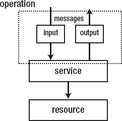
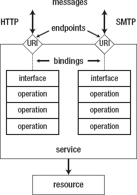
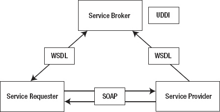
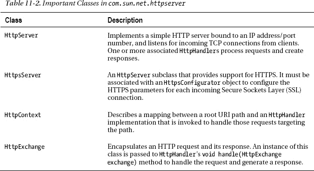
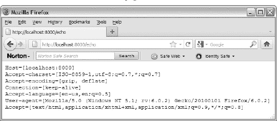
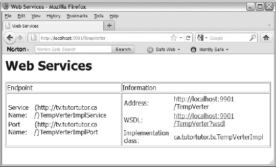
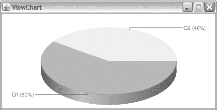
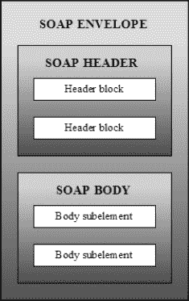
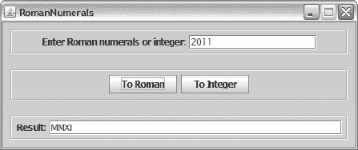

# 十一、使用 Web 服务

Web 服务很流行，应用也很广泛，Java 支持它们的开发。本章向您展示了如何使用 Java 的 web 服务开发特性来创建您自己的 web 服务和/或访问他人创建的 web 服务。

第 11 章首先向你介绍 web 服务的主题，强调基于 SOAP 和 RESTful 类别。本章随后揭示了 Java 在其面向 web 服务的 API、注释和工具方面对 web 服务开发的支持。您还将了解 Java 的轻量级 HTTP 服务器，它用于将您的 web 服务部署到一个简单的 web 服务器上，并在这个环境中测试它们。

有了对 web 服务和 Java 对其开发的支持的基本理解，接下来您将学习如何开发基于 SOAP 和 RESTful 的 web 服务。对于每个 web 服务类别，您将学习如何创建和访问自己的 web 服务，然后学习如何访问外部 web 服务。

第 11 章最后介绍了五个高级 web 服务主题:通过 SAAJ API 访问基于 SOAP 的 web 服务，安装 JAX-WS 处理程序来记录 SOAP 消息流，安装定制的轻量级 HTTP 服务器来执行身份验证，从 RESTful web 服务向客户端发送附件，以及使用提供者的调度客户端。

### 什么是 Web 服务？

web 服务还没有标准的定义，因为这个术语对不同的人有不同的含义。比如有人把 web 服务定义为 web 应用；其他人根据应用用来在 web 上通信的协议(例如，SOAP)来定义 Web 服务。也许定义 web 服务的最佳方式是首先定义这个术语的各个部分:

*   *Web* **:** 一个巨大的互联资源网络，其中*资源*是统一资源标识符(URI)命名的数据源，如电子表格文档、数字化视频、网页，甚至是应用。这些资源可以通过标准的互联网协议(例如，HTTP 或 SMTP)来访问。
*   *服务* **:** 基于服务器的应用或软件组件，根据*消息交换模式*(MEP)——参见`[http://en.wikipedia.org/wiki/Message_Exchange_Pattern](http://en.wikipedia.org/wiki/Message_Exchange_Pattern)`——通过消息交换向客户端公开资源。*请求-响应* MEP 是典型的。

有了这些定义，我们可以将 *web 服务*定义为基于服务器的应用/软件组件，它通过消息交换向客户端公开基于 web 的资源。这些消息可能基于也可能不基于 XML，并且可以被认为是调用 web 服务功能和接收调用结果。[图 11-1](#fig_11_1) 说明了这种信息交换。


***图 11-1。**客户端与 web 服务交换消息以访问资源。*

 **注意** Web 服务是*面向服务架构(SOA)* 的一种实现——参见`[http://www.xml.com/lpt/a/1292](http://www.xml.com/lpt/a/1292)`。将 SOA 视为一组设计原则或框架，用于将业务逻辑实现为可重用的服务，这些服务可以以不同的方式组合起来，以满足不断发展的业务需求。SOA 关注的是规范，而不是实现。

Web 服务可以分为简单的和复杂的。简单 web 服务不与其他 web 服务交互；例如，一个独立的基于服务器的应用，具有一个返回指定时区的当前时间的函数。相反，复杂的 web 服务经常与其他 web 服务交互。例如，一个通用的社交网络 web 服务可能会与 Twitter 和脸书 web 服务进行交互，以获取特定个人的所有 Twitter 和所有脸书信息，并将其返回给客户端。复杂的 web 服务也被称为 *mashups* ，因为它们*mashup*(组合)来自多个 web 服务的数据。

**网络服务的基本原理**

公司在历史上依赖于客户机/服务器系统，其中客户机应用通过夹在它们之间的基于服务器的中间件软件与基于服务器的后端软件通信。传统的中间件一直受到各种问题的困扰，例如获取和维护成本高、无法通过互联网与后端软件和客户端应用通信以及不灵活。

Web 服务是一种基于 Web 和(典型的)XML 的新型中间件。它们克服了这些和其他传统中间件的问题，因为它们基于自由和开放的标准，因为它们的可维护性，因为它们涉及网络，因为它们是灵活的。例如，不同于传统的基于远程过程调用(RPC)的中间件(参见`[http://en.wikipedia.org/wiki/Remote_procedure_call](http://en.wikipedia.org/wiki/Remote_procedure_call)`中对 RPC 的简要介绍)，它依赖于紧密耦合的连接(当应用被修改时很容易中断，从而导致维护问题)，RESTful web 服务(稍后讨论)依赖于松散耦合的连接，这将应用更改的影响最小化。web 服务接口(通常是一个 XML 文件)提供了客户端和服务器软件之间的抽象，因此更改其中一个组件不会自动要求更改另一个组件。维护成本降低了，可重用性提高了，因为相同的接口使得在其他应用中重用 web 服务变得更加容易。

web 服务的另一个好处是它们保留了公司在遗留软件上的大量投资。为了满足不断发展的业务需求(这可能是一项成本高昂的任务),不必从头开始重写该软件(通常是用各种语言编写的),该软件可以通过 web 服务向客户端公开，web 服务可以与其他 web 服务混合，以经济高效的方式实现这些需求。

#### 基于 SOAP 的网络服务

基于 SOAP 的 web 服务是一种广泛使用的基于 SOAP 的 web 服务类别，SOAP 是一种 XML 语言，用于定义网络连接两端都能理解的消息(抽象函数调用或它们的响应)。SOAP 消息的交换被称为操作，对应于一个函数调用及其响应，如图[图 11-2](#fig_11_2) 所示。



***图 11-2。**web 服务操作由输入和输出消息组成。*

相关的操作经常被分组到一个*接口*中，这个接口在概念上类似于 Java 接口。一个*绑定*提供了接口如何绑定到消息协议(特别是 SOAP)的具体细节，以便通过网络传递命令、错误代码和其他项目。

一个绑定和一个*网络地址*(一个 IP 地址和一个端口)URI 的组合被称为一个*端点*，端点的集合就是一个 web 服务。[图 11-3](#fig_11_3) 展示了这种架构。



***图 11-3。**操作的接口可以通过它们的端点来访问。*

尽管 SOAP 可以单独使用，正如本章后面对 SAAJ API 的讨论中所展示的，但是 SOAP 通常与 *Web 服务描述语言* (WSDL，发音为 whiz-dull)，一种用于定义服务所提供的操作的 XML 语言一起使用。不像 WSDL，SOAP，曾经代表简单对象访问协议，不再被认为是一个缩写。(SOAP 既不简单，也不与对象相关。)

WSDL 文档是基于 SOAP 的 web 服务和它的客户端之间的正式契约，提供了与 web 服务交互所需的所有细节。这个文档允许您将消息分组到操作中，将操作分组到接口中。它还允许您为每个接口以及端点地址定义一个绑定。在本章的后面部分，你将在学习如何创建一个基于 SOAP 的 web 服务的同时，探索 WSDL 文档架构。

除了支持 WSDL 文档，基于 SOAP 的 web 服务还具有以下属性:

*   *解决复杂的非功能性需求的能力，比如安全性和事务*:这些需求通过各种各样的规范变得可用。为了促进这些规范之间的互操作性，一个被称为 *Web 服务互操作性组织* (WS-I)的行业联盟成立了。WS-I 已经建立了一组概要文件，其中一个*概要文件*是在特定修订级别上的一组命名的 web 服务规范，以及一组实现和互操作性指南，推荐如何使用这些规范来开发可互操作的 web 服务。例如，第一个概要文件 WS-I Basic Profile 1.0 由以下一组非专有的 web 服务规范组成:SOAP 1.1、WSDL 1.1、UDDI 2.0、XML 1.0(第二版)、XML 模式第 1 部分:结构、XML 模式第 2 部分:数据类型、RFC2246:传输层安全协议版本 1.0、RFC2459: Internet X.509 公钥基础设施证书和 CRL 概要、RFC2616:超文本传输协议 1.1、RFC 2818:HTT 其他概要文件示例包括 WS-I 基本安全概要文件和简单 SOAP 绑定概要文件。有关这些和其他概要的更多信息，请访问 WS-I 网站`[http://www.ws-i.org/](http://www.ws-i.org/)`。Java 7 支持 WS-I 基本概要。
*   *与 web 服务异步交互的能力* : Web 服务客户端应该能够以非阻塞、异步的方式与 Web 服务交互。Java 7 中提供了对 web 服务操作的客户端异步调用支持。

基于 SOAP 的 web 服务在一个包括服务请求者(客户机)、服务提供者和服务代理的环境中执行。这种环境如图[图 11-4](#fig_11_4) 所示。



***图 11-4。**基于 SOAP 的 web 服务包括服务请求者、服务提供者和服务代理(例如 UDDI)。*

服务请求者，通常是客户端应用(例如，web 浏览器)，或者可能是另一个 web 服务，首先以某种方式定位服务提供者。例如，服务请求者可能向服务代理发送一个 WSDL 文档，服务代理用另一个标识服务提供者位置的 WSDL 文档进行响应。然后，服务请求者通过 SOAP 消息与服务提供者通信。

需要发布服务提供商，以便其他人可以找到并使用它们。2000 年 8 月，一项名为*通用描述、发现和集成* (UDDI)的开放行业倡议启动，让企业发布服务列表、相互发现并定义服务或软件应用如何在互联网上交互。然而，这种独立于平台、基于 XML 的注册中心没有被广泛采用，目前也没有使用。许多开发人员发现 UDDI 过于复杂且缺乏功能，于是选择了其他方式，比如在网站上发布信息。例如，谷歌通过其`[http://code.google.com/more/](http://code.google.com/more/)`网站提供其公共网络服务(如谷歌地图)。

在服务请求者和服务提供者之间流动的 SOAP 消息通常是不可见的，作为请求和响应在他们的 *web 服务协议栈*的 SOAP 库之间传递(参见`[http://en.wikipedia.org/wiki/Web_services_protocol_stack](http://en.wikipedia.org/wiki/Web_services_protocol_stack)`)。然而，正如您将在本章后面发现的那样，直接访问这些消息是可能的。

 **注意**基于 SOAP 的 web 服务也被称为*大型 web 服务*，因为它们基于许多规范，比如前面提到的 WS-I 规范。

#### RESTful Web 服务

基于 SOAP 的 web 服务可以通过各种协议来交付，例如 HTTP、SMTP、FTP 和更新的 Blocks 可扩展交换协议——参见`[http://www.rfc-editor.org/rfc/rfc3080.txt](http://www.rfc-editor.org/rfc/rfc3080.txt)`。通过 HTTP 传递 SOAP 消息可以被认为是 RESTful web 服务的一个特例。

*表述性状态转移(REST)* 是一种用于分布式*超媒体系统*(图像、文本和其他资源位于网络周围并可通过超链接访问的系统)的软件架构风格。web 服务上下文中感兴趣的超媒体系统是万维网。

 **注** Roy Fielding(超文本传输协议[HTTP]规范 1.0 和 1.1 版本的主要作者之一，Apache 软件基金会的共同创始人)早在 2000 年的博士论文中就引入并定义了 REST。(Fielding 认为 REST 是 Web 的架构风格，尽管他是在 Web 成为一个持续关注的事物之后很久才写的。)REST 被广泛认为是基于 SOAP 的 web 服务日益增长的复杂性的解决方案。

REST 的核心部分是 URI 可识别的资源。REST 通过多用途互联网邮件扩展(MIME)类型来标识资源(比如`text/xml`)。此外，资源具有由它们的表示捕获的状态。当客户机从 RESTful web 服务请求资源时，服务向客户机发送资源的 MIME 类型表示。

客户端使用 HTTP 的`POST`、`GET`、`PUT`和`DELETE`动词来检索资源的表示并操作资源——REST 将这些动词视为 API，并将它们映射到数据库创建、读取、更新和删除(CRUD)操作上(参见`[http://en.wikipedia.org/wiki/Create,_read,_update_and_delete](http://en.wikipedia.org/wiki/Create,_read,_update_and_delete)`中的 CRUD 介绍)。[表 11-1](#tab_11_1) 揭示了这种映射。

T2】

每个动词后面都有一个标识资源的 URI。(这种非常简单的方法与 SOAP 向单个资源发送编码消息的方法根本不兼容。)URI 可能指的是一个集合，比如`[http://tutortutor.ca/library](http://tutortutor.ca/library)`，也可能指的是集合中的一个元素，比如`[http://tutortutor.ca/library/9781430234135](http://tutortutor.ca/library/9781430234135)`——这些 URIs 只是举例说明。

对于`POST`和`PUT`请求，基于 XML 的资源数据作为请求体传递。例如，您可以将`POST http://tutortutor.ca/library HTTP/ 1.1`(其中`HTTP/ 1.1`描述了请求者的 HTTP 版本)解释为将`POST`的 XML 数据插入到`[http://tutortutor.ca/library](http://tutortutor.ca/library)`集合资源中的请求。

对于`GET`和`DELETE`请求，数据通常作为查询字符串传递，其中*查询字符串*是 URI 中以“`?`字符开头的部分。例如，`GET http://tutortutor.ca/library`可能会返回图书馆资源中所有书籍的标识符列表，`GET http://tutortutor.ca/library?isbn=9781430234135`可能会返回书籍资源的表示，其查询字符串标识国际标准书号(ISBN) `9781430234135`。

 **注意**要获得 HTTP 动词与其 CRUD 对应项之间映射的完整描述，请查看维基百科的“表述性状态转移”条目(`[http://en.wikipedia.org/wiki/Representational_State_Transfer](http://en.wikipedia.org/wiki/Representational_State_Transfer)`)中的“RESTful Web 服务 HTTP 方法”表。

除了在发出请求时依赖 HTTP 动词和 MIME 类型之外，REST 还依赖 HTTP 的标准响应代码(如 404(未找到请求的资源)和 200(资源操作成功))以及 MIME 类型(当检索资源表示时)来获得响应。

 **提示**如果您想知道是使用 SOAP 还是 REST 来开发 web 服务，请查看“RESTful Web 服务与“大型”Web 服务:做出正确的架构决策”(`[http://www.jopera.org/files/www2008-restws-pautasso-zimmermann-leymann.pdf](http://www.jopera.org/files/www2008-restws-pautasso-zimmermann-leymann.pdf)`)。

### Java 和网络服务

在 Java 6 之前，基于 Java 的 web 服务是专门用 Java EE SDK 开发的。虽然从生产的角度来看，Java EE 是开发 web 服务的首选方法，因为基于 Java EE 的服务器提供了非常高的可伸缩性、安全基础设施、监控设施等等，但是将 web 服务重复部署到 Java EE 容器是非常耗时的，并且会降低开发速度。

Java 6 通过将 API、注释、工具和一个轻量级 HTTP 服务器(用于将 web 服务部署到一个简单的 web 服务器，并在这个环境中测试它们)合并到其核心中，简化并加速了 web 服务的开发。Java 7 也支持这些组件。

**为核心 JAVA 争议增加 WEB 服务支持**

许多人认为 Sun Microsystems 不应该在 Java 6 中增加对 web 服务的支持。一种批评是 JAX-WS(主要的 web 服务 API)鼓励自底向上的方法来构建 web 服务——首先开发一个 Java 类，然后开发 WSDL 契约。相反，那些喜欢自顶向下方法的人认为首先创建 WSDL 和模式为互操作性提供了最好的机会(特别是当连接两端的技术和平台不同时)，因为这样做鼓励了基于接口的设计方法，提供了最大的重用和互操作性。

Davanum Srinivas 在他的“为什么在 Java6 中捆绑 JAX-WS 是一个坏主意！”博文(`[http://blogs.cocoondev.org/dims/archives/004717.html](http://blogs.cocoondev.org/dims/archives/004717.html)`)。首先，他指出需要依靠 *Java 认可的标准覆盖机制*(见`[http://download.oracle.com/javase/6/docs/technotes/guides/standards/](http://download.oracle.com/javase/6/docs/technotes/guides/standards/)`)来使用 JAX-WS 的后续版本(带有新特性和/或错误修复)。例如，JAX-WS 2.0 附带了 Java 6。要使用它的 JAX-WS 2.1 后继版本，您必须使用 Java 认可的标准覆盖机制，如 Vivek Pandey 的“JDK 6 中的 web 服务”博客文章(`[http://weblogs.java.net/blog/vivekp/archive/2006/12/webservices_in.html](http://weblogs.java.net/blog/vivekp/archive/2006/12/webservices_in.html)`)中所述。Srinivas 的第二个抱怨是 Java 6 的 web 服务实现不支持 WS-I 概要文件，比如 WS-Security。

将 web 服务支持集成到 Java6 中的 Sun Microsystems 团队的成员 Arun Gupta 在他的博客文章“Java 6 中的 Web 服务本地支持”中反驳了这些批评。

#### Web 服务 API

Java 提供了几个支持 web 服务的 API。除了我在第 10 章中讨论的各种 JAXP API 之外(除了 web 服务之外也使用这些 API)，Java 还提供了 JAX-WS、JAXB 和 SAAJ API:

*   *Java API for XML Web Services(JAX-WS)*:构建通过 XML 通信的 Web 服务和客户机(用 Java)的主要 API。JAX-WS 取代了旧的 Java 远程过程调用 Web 服务(JAX-RPC) API，并被分配了包`javax.xml.ws`和各种子包。Java 7 支持 JAX-WS 2.2.4。
*   *Java Architecture for XML Binding(JAXB)*:将基于 XML 模式的数据类型映射到 Java 对象的 API，反之亦然——参见[第 10 章](10.html#ch10)了解 XML 模式。JAX-WS 将数据绑定任务委托给 JAXB。这个 API 被分配了包`javax.xml.bind`和各种子包。Java 7 支持 JAXB 2.2.4。
*   *Soap with Attachments API for Java(SAAJ)*:创建、发送和接收带/不带附件的 Soap 消息的 API。根据 Jitendra Kotamraju 在`[http://weblogs.java.net/blog/jitu/archive/2007/09/no_saaj_ri_depe_1.html](http://weblogs.java.net/blog/jitu/archive/2007/09/no_saaj_ri_depe_1.html)`发表的“JAX-WS RI 中没有 SAAJ RI 依赖”的博客文章，JAX-WS 对于 SOAP 消息对 SAAJ 的依赖在 JAX-WS 2.1.3 的参考实现中被移除(称为 *Metro* ，参见`[http://jax-ws.java.net/](http://jax-ws.java.net/)`)。这个 API 被分配了`javax.xml.soap`包。Java 7 支持 SAAJ 1.3。

我将在这一章探索 JAX-WS 和 SAAJ，但是(为了简洁)不会探索 JAXB。如果您想要关于这个 API 的详细教程，我建议您查看位于`[http://jaxb.java.net/tutorial/](http://jaxb.java.net/tutorial/)`的广泛的 JAXB 教程。

#### Web 服务注释

Java 6 引入了几种便于 web 服务开发的 web 服务注释类型，允许您通过元数据以声明方式描述 web 服务——参见第 3 章的注释介绍。没有这些注释类型，您仍然可以开发 web 服务，但是如果您决定不使用它们，您将很快体会到它们的便利。

大多数 web 服务注释类型要么是 Web 服务元数据 API 的一部分(参见 http://jcp.org/en/jsr/detail?id=181)，它被分配了包`javax.jws`和`javax.jws.soap`，要么属于`javax.xml.ws`包。`javax.jws`包提供了以下注释类型:

*   将 web 服务与外部定义的处理程序链相关联。我将在本章后面从客户端的角度讨论处理程序链。
*   `Oneway`表示给定的`@WebMethod`注释只有输入消息，没有输出消息。
*   定制作为 web 服务操作公开的方法。
*   `WebParam`定制单个参数到 WSDL `message`元素的`part`元素的映射。
*   `WebResult`定制返回值到 WSDL `message`元素的`part`元素的映射。
*   `WebService`将 Java 类标记为实现 web 服务，或者将 Java 接口标记为定义服务端点接口。

以下注释类型属于`javax.jws.soap`包(其中三种不推荐使用，支持使用`HandlerChain`注释类型):

*   `InitParam`描述初始化参数(在初始化期间传递给处理程序的名称/值对)。此批注类型已被否决。
*   指定 web 服务到 SOAP 协议的映射。
*   指定在 web 服务的业务方法之前和之后运行的单个 SOAP 消息处理程序。调用此处理程序是为了响应以服务为目标的 SOAP 消息。此批注类型已被否决。
*   `SOAPMessageHandlers`指定在 web 服务的业务方法之前和之后运行的 SOAP 协议处理程序的列表。调用这些处理程序是为了响应以服务为目标的 SOAP 消息。此批注类型已被否决。

最后，从 RESTful webservice 的角度来看，`javax.xml.ws`最重要的注释类型是`WebServiceProvider`和`Binding`。我将在本章后面讨论这些注释类型。

#### 网络服务工具

Java 提供了四个基于命令行的工具来促进 web 服务开发。其中两个工具用于在基于 XML 模式的模式(参见[第 10 章](10.html#ch10))和 Java 类之间进行转换，另一对工具用于 WSDL 文档的上下文中:

*   `schemagen` : WSDL 文档使用 XML Schema 数据类型来描述 web 服务函数返回和参数类型。这个工具从 Java 类生成一个模式(通常存储在扩展名为`.xsd`的文件中)——为每个引用的名称空间创建一个模式文件。创建模式后， *XML 实例文档*(符合其模式的 XML 文档)可以通过 JAXB 在 Java 对象之间进行转换。这些类包含 JAXB 解析 XML 所需的所有信息，用于*封送*(将 Java 对象转换成 XML)和解封*(将 XML 转换成 Java 对象)——应用不执行 XML 解析。*
*   `wsgen`:这个工具读取一个已编译的 web 服务端点接口，并为 web 服务部署和调用生成 JAX-WS 可移植工件。它也可以生成一个 WSDL 文件和相应的 XML 模式文档(当指定了它的`-wsdl`选项时)。通过`Endpoint.publish()`发布 web 服务时不需要这个工具，它会自动生成工件和 WSDL/模式。你将在本章的后面了解到`Endpoint.publish()`。
*   这个工具从给定的 WSDL 文档中生成客户端支持的 Java 类(工件)。这些类有助于针对服务编写客户端。
*   这个工具从模式中生成 Java 类。生成的类包含映射到模式中定义的 XML 元素和属性的属性。

为了简洁，我在这一章只演示了`wsimport`。对于`schemagen`和`xjc`的演示，请分别查看“使用 JAXB schemagen 工具从 Java 类生成 XML 模式文件”(`[http://publib.boulder.ibm.com/infocenter/wasinfo/v7r0/index.jsp?topic=/com.ibm.websphere.express.doc/info/exp/ae/twbs_jaxbjava2schema.html](http://publib.boulder.ibm.com/infocenter/wasinfo/v7r0/index.jsp?topic=/com.ibm.websphere.express.doc/info/exp/ae/twbs_jaxbjava2schema.html)` ) 和“用于 XML 绑定的 Java 架构(JAXB)”(`[http://www.oracle.com/technetwork/articles/javase/index-140168.html](http://www.oracle.com/technetwork/articles/javase/index-140168.html)`)。

#### 轻量级 HTTP 服务器

Java 7 参考实现包括一个用于部署和测试 web 服务的轻量级 HTTP 服务器。服务器实现支持 HTTP 和 HTTPS 协议，其相关的 API 可用于创建定制的 web 服务器，以增强您的 web 服务测试或用于其他目的。

服务器的 API 不是 Java 的正式部分，这意味着它不能保证是非引用 Java 实现的一部分。因此，轻量级 HTTP 服务器 API 存储在以下包中，而不是分布在`java.net.httpserver`和`java.net.httpserver.spi`等包中:

*   `com.sun.net.httpserver`:这个包为构建嵌入式 HTTP 服务器提供了一个高级的 HTTP 服务器 API。
*   `com.sun.net.httpserver.spi`:这个包提供了一个可插入的服务提供者 API，用于安装 HTTP 服务器替换实现。

`com.sun.net.httpserver`包包含一个`HttpHandler`接口，在创建自己的 HTTP 服务器时，必须实现这个接口来处理 HTTP 请求-响应交换。这个包也包含十七个类；四个最重要的等级在[表 11-2](#tab_11_2) 中有描述。



实现您自己的轻量级 HTTP 服务器包括三个任务:

1.  创建服务器。抽象的`HttpServer`类提供了一个`HttpServer create(InetSocketAddress addr, int backlog)`类方法来创建一个处理 HTTP 协议的服务器。这个方法的`addr`参数指定了一个`java.net.InetSocketAddress`对象，它包含服务器监听套接字的 IP 地址和端口号。`backlog`参数指定在等待服务器接受时可以排队的最大 TCP 连接数；小于或等于零的值会导致使用系统默认值。或者，您可以将`null`传递给`addr`或者调用`HttpServer`的`HttpServer create()`类方法来创建一个不绑定到地址/端口的服务器。如果您选择这种方法，您将需要调用`HttpServer`的`void bind(InetSocketAddress addr, int backlog)`方法，然后才能使用服务器。
2.  创建一个上下文。创建服务器之后，您需要创建至少一个上下文(抽象`HttpContext`类的子类的实例),它将根 URI 路径映射到`HTTPHandler`的实现。上下文帮助您组织服务器运行的应用(通过 HTTP 处理程序)。(`HttpServer` Java 文档显示了传入的请求 URIs 如何映射到`HttpContext`路径。)您通过调用`HttpServer`的`HttpContext createContext(String path, HttpHandler handler)`方法创建一个上下文，其中`path`指定根 URI 路径，而`handler`指定处理所有指向该路径的请求的`HttpHandler`实现。如果您愿意，可以在不指定初始处理程序的情况下调用`HttpContext createContext(String path)`。稍后您将通过调用`HttpContext`的`void setHandler(HttpHandler h)`方法来指定处理程序。
3.  启动服务器。在创建了服务器和至少一个上下文(包括合适的处理程序)之后，最后的任务是启动服务器。通过调用`HttpServer`的`void start()`方法来完成这个任务。

我已经创建了一个最小的 HTTP 服务器应用来演示所有这三个任务。这个应用的源代码出现在[清单 11-1](#list_11_1) 中。

***清单 11-1。**一个最小的 HTTP 服务器应用*

```java
import java.io.IOException;
import java.io.OutputStream;

import java.net.InetSocketAddress;

import java.util.List;
import java.util.Map;
import java.util.Set;

import com.sun.net.httpserver.Headers;
import com.sun.net.httpserver.HttpExchange;
import com.sun.net.httpserver.HttpHandler;
import com.sun.net.httpserver.HttpServer;

class MinimalHTTPServer
{
   public static void main(String[] args) throws IOException
   {
      HttpServer server = HttpServer.create(new InetSocketAddress(8000), 0);
      server.createContext("/echo", new Handler());
      server.start();

   }
}
class Handler implements HttpHandler
{
   @Override
   public void handle(HttpExchange xchg) throws IOException
   {
      Headers headers = xchg.getRequestHeaders();
      Set<Map.Entry<String, List<String>>> entries = headers.entrySet();
      StringBuffer response = new StringBuffer();
      for (Map.Entry<String, List<String>> entry: entries)
         response.append(entry.toString()+"\n");
      xchg.sendResponseHeaders(200, response.length());
      OutputStream os = xchg.getResponseBody();
      os.write(response.toString().getBytes());
      os.close();
   }
}
```

该处理程序演示了以下`HttpExchange`抽象方法:

*   返回 HTTP 请求头的不可变映射。
*   `void sendResponseHeaders(int rCode, long responseLength)`开始使用当前一组响应头和`rCode`的数字代码向客户端发回响应；200 表示成功。
*   `OutputStream getResponseBody()`返回响应体输出到的输出流。这个方法必须在调用`sendResponseHeaders()`之后调用。

总的来说，这些方法用于将传入请求的标头回显到客户端。[图 11-5](#fig_11_5) 显示了发送到服务器后的这些头。不要忘记在`echo`之前放置任何路径项都会导致 404 Not Found 页面。



***图 11-5。**将传入请求的头回显给客户端。*

在调用`start()`之前，可以指定一个`java.util.concurrent.Executor`实例(见[第 6 章](06.html#ch6))处理所有 HTTP 请求。这个任务是通过调用`HttpServer`的`void setExecutor(Executor executor)`方法完成的。也可以调用`Executor getExecutor()`返回当前执行人(没有设置执行人时返回值为 null)。如果在启动服务器之前没有调用`setExecutor()`，或者如果将`null`传递给这个方法，那么将使用基于`start()`创建的线程的默认实现。

您可以通过调用`HttpServer`的`void stop(int delay)`方法来停止一个已启动的服务器。此方法关闭侦听套接字，并防止处理任何排队的交换。然后，它会一直阻塞，直到所有当前的交换处理程序都已完成，或者经过了`delay`秒(以先到者为准)。当`delay`小于零时，抛出`java.lang.IllegalArgumentException`类的一个实例。接着，所有打开的 TCP 连接都被关闭，由`start()`方法创建的线程结束。停止的`HttpServer`不能重新启动。

本章的大多数例子依赖于默认的轻量级 HTTP 服务器，它是在你调用`javax.xml.ws.EndPoint`类的`publish()`方法时创建的。但是，在本章的后面，我还将向您展示如何创建和安装一个定制的轻量级 HTTP 服务器来执行身份验证。

### 使用基于 SOAP 的 Web 服务

JAX-WS 支持基于 SOAP 的 web 服务。本节首先向您展示如何创建和访问您自己的基于 SOAP 的温度转换 web 服务，如何通过默认的轻量级 HTTP 服务器在本地发布该 web 服务，以及如何通过简单的客户端访问该服务。然后向您展示如何访问斯隆数字巡天的基于 SOAP 的图像剪切 web 服务来获取天文图像。

#### 创建和访问温度转换 Web 服务

我将温度转换 web 服务命名为 TempVerter，它由一对将华氏温度转换为摄氏温度的函数组成，反之亦然。尽管这个例子可以被设计成一个单独的 Java 类，但是我选择遵循最佳实践，将其设计成一个 Java 接口和一个 Java 类。清单 11-2 展示了 web 服务的`TempVerter`接口。

***清单 11-2。** TempVerter 的服务端点接口*

```java
package ca.tutortutor.tv;

import javax.jws.WebMethod;
import javax.jws.WebService;

@WebService
public interface TempVerter
{
   @WebMethod double c2f(double degrees);
   @WebMethod double f2c(double degrees);
}
```

`TempVerter`描述了一个*服务端点接口(SEI)* ，这是一个 Java 接口，以抽象 Java 方法的形式公开了 web 服务接口的操作。客户端通过它们的 sei 与基于 SOAP 的 web 服务通信。

通过`@WebService`注释将`TempVerter`声明为 SEI。当一个 Java 接口或类被注释为`@WebService`时，其参数、返回值和声明的异常的所有`public`方法都遵循 JAX-RPC 1.1 规范 ( `[http://download.oracle.com/otndocs/jcp/jax_rpc-1_1-mrel-oth-JSpec/](http://download.oracle.com/otndocs/jcp/jax_rpc-1_1-mrel-oth-JSpec/)`)的第 5 节中定义的规则来描述 web 服务操作。因为只有`public`方法可以在接口中声明，所以在声明`c2f()`和`f2c()`时不需要`public`保留字。这些方法是隐式的`public`。

每个`c2f()`和`f2c()`也被标注为`@WebMethod`。虽然`@WebMethod`在这个例子中并不重要，但它的存在强调了一个事实，即带注释的方法公开了一个 web 服务操作。

清单 11-3 展示了 web 服务的`TempVerterImpl`类。

***清单 11-3。** TempVerter 的服务实现 Bean*

```java
package ca.tutortutor.tv;

import javax.jws.WebService;

@WebService(endpointInterface = "ca.tutortutor.tv.tempverter")
public class TempVerterImpl implements TempVerter
{
   public double c2f(double degrees)
   {
      return degrees*9.0/5.0+32;
   }
   public double f2c(double degrees)
   {
      return (degrees-32)*5.0/9.0;
   }
}
```

`TempVerterImpl`描述了一个*服务实现 Bean (SIB)* ，它提供了 SEI 的一个实现。这个类通过`@WebService(endpointInterface = "ca.tutortutor.tv.tempverter")`注释被声明为 SIB。`endpointInterface`元素将这个 SIB 连接到它的 SEI，这对于在运行后面介绍的客户端应用时避免未定义的端口类型错误是必要的。

条款不是绝对必要的。如果这个子句不存在，那么`TempVerter`接口将被忽略(并且是多余的)。然而，保留`implements TempVerter`是个好主意，这样编译器可以验证 SEI 的方法已经在 SIB 中实现了。

SIB 的方法头没有注释`@WebMethod`,因为这个注释通常用在 SEI 的上下文中。然而，如果您要向 SIB 添加一个`public`方法(它符合 JAX-RPC 1.1 规范第 5 节中的规则)，并且如果这个方法不公开 web 服务操作，您将注释方法头`@WebMethod(exclude = true)`。通过将`true`分配给`@WebMethod`的`exclude`元素，可以防止该方法与操作相关联。

此 web 服务已准备好发布，以便可以从客户端访问它。清单 11-4 展示了一个`TempVerterPublisher`应用，它在默认的轻量级 HTTP 服务器的上下文中完成这个任务。

***清单 11-4。**发布时间*

```java
import javax.xml.ws.Endpoint;

import ca.tutortutor.tv.TempVerterImpl;

class TempVerterPublisher
{
   public static void main(String[] args)

   {
      Endpoint.publish("http://localhost:9901/tempverter",
                       new TempVerterImpl());
   }
}
```

发布 web 服务包括对`EndPoint`类的`Endpoint publish(String address, Object implementor)`类方法进行一次调用。`address`参数标识分配给 web 服务的 URI。我选择通过指定`localhost`(相当于 IP 地址 127.0.0.1)和端口号 9901(这是最有可能的)在本地主机上发布这个 web 服务。另外，我任意选择了`/TempVerter`作为发布路径。`implementor`参数标识 TempVerter 的 SIB 实例。

`publish()`方法在给定的`address`为指定的`implementor`对象创建并发布一个端点，并使用`implementor`的注释创建 WSDL 和 XML 模式文档。它导致 JAX-WS 实现基于一些默认配置创建和配置必要的服务器基础设施。此外，此方法会导致应用无限期运行。(在 Windows 机器上，同时按 Ctrl 和 C 键终止应用。)

假设当前目录包含`TempVerterPublisher.java`和一个`ca`子目录(包含一个`tutortutor`子目录，包含一个`tv`子目录，包含`TempVerter.java`和`TempVerterImpl.java`，执行`javac TempVerterPublisher.java`来编译这个源文件连同[清单 11-2](#list_11_2) 和 [11-3](#list_11_3) 。

 **提示**`javac`编译器工具提供了一个`-d`选项，可以用来指定放置生成的类文件的目录。这样，你就不会混淆源文件和类文件。

如果源代码编译成功，执行`java TempVerterPublisher`来运行这个应用。您应该看不到任何消息，应用也不会返回到命令提示符。

您可以使用 web 浏览器来测试这个 web 服务并访问它的 WSDL 文档。启动你喜欢的网页浏览器，在其地址栏输入**[http://localhost:9901/temp verter](http://localhost:9901/TempVerter)**。[图 11-6](#fig_11_6) 显示了在 Mozilla Firefox 网络浏览器中生成的网页。



***图 11-6。** TempVerter 的网页提供了已发布网络服务的详细信息。*

[图 11-6](#fig_11_6) 显示了 web 服务端点的合格服务和端口名。(注意，包名被颠倒了——从`ca.tutortutor.tv`变成了`tv.tutortutor.ca`)。客户端使用这些名称来访问服务。

[图 11-6](#fig_11_6) 还显示了 web 服务的地址 URI，web 服务的 WSDL 文档的位置(web 服务 URI 的后缀是`?wsdl`查询字符串)，以及 web 服务实现类的包限定名。WSDL 文档的位置显示为一个链接，您可以点击该链接查看该文档——参见[清单 11-5](#list_11_5) 。

***清单 11-5。**滕弗特尔的 WSDL 文件*

```java
<?xml version="1.0" encoding="UTF-8"?>
<definitions targetNamespace="http://tv.tutortutor.ca/" name="TempVerterImplService">
   <types>
      <xsd:schema>
         <xsd:import namespace="http://tv.tutortutor.ca/" schemaLocation="http://localhost:9901/TempVerter?xsd=1"/>
      </xsd:schema>
   </types>
   <message name="c2f">
      <part name="parameters" element="tns:c2f"/>
   </message>
   <message name="c2fResponse">
      <part name="parameters" element="tns:c2fResponse"/>
   </message>
   <message name="f2c">
      <part name="parameters" element="tns:f2c"/>
   </message>

   <message name="f2cResponse">
      <part name="parameters" element="tns:f2cResponse"/>
   </message>
   <portType name="TempVerter">
      <operation name="c2f">
         <input wsam:Action="http://tv.tutortutor.ca/TempVerter/c2fRequest"
message="tns:c2f"/>
         <output wsam:Action="http://tv.tutortutor.ca/TempVerter/c2fResponse"

message="tns:c2fResponse"/>
      </operation>
      <operation name="f2c">
         <input wsam:Action="http://tv.tutortutor.ca/TempVerter/f2cRequest"
message="tns:f2c"/>
         <output wsam:Action="http://tv.tutortutor.ca/TempVerter/f2cResponse"
message="tns:f2cResponse"/>
      </operation>
   </portType>
   <binding name="TempVerterImplPortBinding" type="tns:TempVerter">
      <soap:binding transport="http://schemas.xmlsoap.org/soap/http" style="document"/>
      <operation name="c2f">
         <soap:operation soapAction=""/>
         <input>
            <soap:body use="literal"/>
         </input>
         <output>
            <soap:body use="literal"/>
         </output>
      </operation>
      <operation name="f2c">
         <soap:operation soapAction=""/>
         <input>
            <soap:body use="literal"/>
         </input>
         <output>
            <soap:body use="literal"/>
         </output>
      </operation>
   </binding>
   <service name="TempVerterImplService">
      <port name="TempVerterImplPort" binding="tns:TempVerterImplPortBinding">
         <soap:address location="http://localhost:9901/TempVerter"/>
      </port>
   </service>
</definitions>
```

WSDL 文档是一个带有根元素的 XML 文档，这使得 WSDL 文档只不过是一组定义。属性为 WSDL 文档中所有用户定义的元素创建一个名称空间(比如通过具有此名称的`message`元素定义的`c2f`元素)。这个名称空间用于区分当前 WSDL 文档的用户定义元素和导入的 WSDL 文档的用户定义元素，后者通过 WSDL 的`import`元素来标识。以类似的方式，出现在基于 XML 模式的文件的`schema`元素上的`targetNamespace`属性为其用户定义的简单类型元素、属性元素和复杂类型元素创建一个名称空间。

`name`属性标识 web 服务，仅用于记录服务。

 **注意**生成的`<definitions>`标签不完整。一个完整的标记应该包括默认的名称空间，以及前缀`soap`、`tns`、`wsam`和`xsd`的名称空间，如下所示:`<definitions
name="TempVerterImplService" targetNamespace="http://tv.tutortutor.ca/"
xmlns:soap="http://schemas.xmlsoap.org/wsdl/soap/"
xmlns:tns="http://tv.tutortutor.ca/"
xmlns:wsam="http://www.w3.org/2007/05/addressing/metadata"
xmlns:xsd="http://www.w3.org/2001/XMLSchema">`。看来 JAX-WS 做了假设。

嵌套在`definitions`中的是`types`、`message`、`portType`、`binding`和`service`元素:

*   `types`表示数据类型系统下用户自定义的数据类型(用于`message`元素的上下文中)。尽管可以使用任何类型定义语言，但 XML Schema 是由基本概要 1.0 中的 WS-I 规定的。`types`可以包含零个或多个`schema`元素。这个例子有一个单独的`schema`元素，它导入一个外部模式。`types`元素是可选的。当服务只使用内置于简单类型(如字符串和整数)的 XML 模式时，它不存在。
*   `message`定义一个单向请求或响应消息(概念上是一个函数调用或调用响应)，它可能由一个或多个部分组成(概念上等同于函数参数或返回值)。每个部分由一个`part`元素描述，元素的`name`属性标识一个参数/返回值元素。`element`属性标识另一个元素(在别处定义),其值被传递给该参数或提供响应值。可以指定零个或多个`part`元素，以及零个或多个`message`元素。
*   `portType`通过操作描述 web 服务接口。每个`operation`元素包含基于 MEP 的`input`和/或`output`元素。清单 11-5 包含了这两个元素。(当有`output`元素时，可以指定用于传递错误信息的`fault`元素。)在 WS-Addressing 的上下文中，`wsam:Action`属性与消息路由一起使用—参见`[http://en.wikipedia.org/wiki/WS-Addressing](http://en.wikipedia.org/wiki/WS-Addressing)`。`message`属性标识通过其`name`属性描述消息的`message`元素(还提供描述参数和返回值的`part`元素)。`operation`元素是可选的；必须至少指定一个`portType`元素。
*   `binding`提供了一个`portType`操作(如`c2f`或`f2c`)如何通过线路传输的细节。这个元素的`type`属性标识了文档前面定义的`portType`元素。嵌套的`soap:binding`元素表示正在使用 SOAP 1.1 绑定。它的`transport`属性的 URI 值将 HTTP 标识为传输协议(HTTP 上的 SOAP)，它的`style`属性将`document`标识为默认服务风格。每个`operation`元素由`soap:operation`、`input`和`output`元素组成。`soap:operation`元素是一个 SOAP 扩展元素，它在操作级别提供额外的绑定信息。服务器(如防火墙)可以使用`SOAPAction`属性的 URI 值(如果存在)来过滤通过 HTTP 发送的 SOAP 请求消息。`input`和`output`元素包含`soap:body`元素，这些元素的`use`属性指示消息部分如何出现在 SOAP 的`Body`元素中——我将在本章后面介绍 SOAP 的概述。`literal`值意味着这些部分按字面意思出现，而不是被编码。可以指定多个`binding`元素。
*   `service`根据暴露绑定的嵌套的`port`元素定义端点的集合——一个`port`元素的`binding`属性标识一个`binding`元素。此外，`port`元素标识服务的地址；因为我们正在处理一个 SOAP 服务，`port`包含了一个`soap:address`元素，它的`location`属性指定了这个地址。

`types`、`message`和`portType`元素是 web 服务接口的抽象定义。它们构成了 web 服务和应用之间的接口。`binding`和`service`元素提供了这个接口如何映射到通过网络传输的消息的具体细节。JAX-WS 代表应用处理这些细节。

**样式和用途**

`soap:binding`元素的`style`属性通过指示操作是面向文档的(消息包含文档)——值为`document`——还是面向 RPC 的(消息包含参数和返回值)——值为`rpc`，来影响如何构建 SOAP 消息的`Body`元素。我将在本章的后面讨论 SOAP 消息架构。

`soap:body`元素的`use`属性表示 WSDL 文档的`message`元素的`part`子元素是否定义了消息的具体模式——值为`literal`—或者通过某种编码规则进行编码——值为`encoded`。

当`use`被设置为`literal`时，每个`part`元素使用`element`或`type`属性引用一个具体的模式定义。对于`element`，引用的元素将直接出现在 SOAP 消息的`Body`元素下(对于`document`样式绑定)，或者出现在以消息部分命名的访问器元素下(对于`rpc`样式绑定)。对于`type`，被引用的类型成为封闭元素的模式类型(对于`document`样式为`Body`，对于`rpc`样式为部件访问器元素)。

当`use`被设置为`encoded`时，每个`part`元素使用`type`属性引用一个抽象类型。这些抽象类型通过应用 SOAP 消息的`encodingStyle`属性指定的编码来产生具体的消息。

关于`style`和`use`属性的更多信息，请查看“我应该使用哪种风格的 WSDL？”(`[http://www.ibm.com/developerworks/webservices/library/ws-whichwsdl/](http://www.ibm.com/developerworks/webservices/library/ws-whichwsdl/)`)。

`types`元素的`schema`元素标识存储每个操作的返回和参数类型的模式的位置。`xsd:import`标签的`schemaLocation`属性将这个位置标识为`[http://localhost:9901/TempVerter?xsd=1](http://localhost:9901/TempVerter?xsd=1)`。当您将浏览器指向这个位置时，您会看到清单 11-6 中的。

***清单 11-6。**WSDL 文档引用的 XML 模式文档*

```java
<xs:schema version="1.0" targetNamespace="http://tv.tutortutor.ca/">
   <xs:element name="c2f" type="tns:c2f"/>
   <xs:element name="c2fResponse" type="tns:c2fResponse"/>
   <xs:element name="f2c" type="tns:f2c"/>
   <xs:element name="f2cResponse" type="tns:f2cResponse"/>
   <xs:complexType name="f2c">
      <xs:sequence>
         <xs:element name="arg0" type="xs:double"/>
      </xs:sequence>
   </xs:complexType>
   <xs:complexType name="f2cResponse">
      <xs:sequence>
         <xs:element name="return" type="xs:double"/>
      </xs:sequence>
   </xs:complexType>
   <xs:complexType name="c2f">
      <xs:sequence>
         <xs:element name="arg0" type="xs:double"/>
      </xs:sequence>
   </xs:complexType>
   <xs:complexType name="c2fResponse">
      <xs:sequence>
         <xs:element name="return" type="xs:double"/>
      </xs:sequence>
   </xs:complexType>
</xs:schema>
```

你可能想参考第 10 章，重温一下 XML 模式文档是如何形成的。完成后，查看清单 11-7 的`TempVerterClient.java`源代码，它向您展示了客户机如何访问 TempVerter web 服务。

***清单 11-7。**用于访问 TempVerter web 服务的客户端*

```java
import java.net.URL;

import javax.xml.namespace.QName;

import javax.xml.ws.Service;

import ca.tutortutor.tv.TempVerter;

class TempVerterClient

{
   public static void main(String[] args) throws Exception
   {
      URL url = new URL("http://localhost:9901/TempVerter?wsdl");
      QName qname = new QName("http://tv.tutortutor.ca/",
                              "TempVerterImplService");
      Service service = Service.create(url, qname);
      qname = new QName("http://tv.tutortutor.ca/", "TempVerterImplPort");
      TempVerter tv = service.getPort(qname, TempVerter.class);
//      TempVerter tv = service.getPort(TempVerter.class);
      System.out.println(tv.c2f(37.0));
      System.out.println(tv.f2c(212.0));
   }
}
```

`TempVerterClient`首先创建一个`java.net.URL`实例来标识 web 服务的 WSDL 文件。然后它创建一个`javax.xml.namespace.QName`实例来标识端点的合格服务名(参见[图 11-6](#fig_11_6) )。这些实例被传递给`javax.xml.ws.Service`类的`Service create(URL wsdlDocumentLocation, QName serviceName)`类方法以返回一个`Service`实例，该实例提供了 web 服务的客户端视图。

然后在`Service`实例上调用`Service`的`T getPort(QName portName, Class<T> serviceEndpointInterface)`方法，以返回一个代理，用于通过 web 服务的端点与 web 服务进行通信。传递给`portName`的限定名标识了端点的限定端口名(参见[图 11-6](#fig_11_6) )，它标识了要访问其操作的 web 服务接口——本例中只有一个接口。传递给`serviceEndpointInterface`的`java.lang.Class`实例标识了`TempVerter` SEI。这个方法返回一个代理对象，它的类实现了`TempVerter`，或者在出错时抛出`javax.xml.ws.WebServiceException`(比如在`TempVerterImpl` SIB 的`@WebService`注释中没有指定`endpointInterface`，调用`Service`的`T getPort(Class<T> serviceEndpointInterface)`方法，该方法使用`endpointInterface`来访问 SEI)。

假设`getPort()`成功，返回的对象用于调用`c2f()`和`f2c()`方法，参数分别代表以摄氏度表示的体温和以华氏度表示的水的沸点。

编译这个类(通过`javac TempVerterClient.java`，假设当前目录包含这个源文件和一个`ca`子目录，包含一个`tutortutor`子目录，包含一个`tv`子目录，包含[清单 11-2](#list_11_2) 的`TempVerter.java`源文件)。如果编译成功，执行`java TempVerterClient`来运行这个应用，它将生成如下输出:

```java
98.6
100.0
```

因为清单 11-5 的[中的 WSDL 文档和清单 11-6](#list_11_5) 的[中的 XML 模式文档包含了足够的信息让客户端与 web 服务进行通信，所以您也可以使用`wsimport`工具从这个文档中生成客户端支持代码，以便于创建客户端。在 TempVerter 的上下文中，您可以按如下方式使用该工具:](#list_11_6)

```java
wsimport -keep –p client http://localhost:9901/TempVerter?wsdl
```

`wsimport`输出“解析 WSDL…”、“生成代码…”和“编译代码…”消息；并生成客户机访问该 web 服务所需的类文件。`-keep`选项使`wsimport`也保存这些类文件的源代码，这有助于我们了解客户端如何访问 web 服务，并使添加客户端处理程序来拦截消息成为可能(在本章后面讨论)。

`-p`选项标识存储生成的源文件和/或类文件的包目录。你可以指定任何有意义的名字(比如`client`),`wsimport`会用这个名字创建一个包目录，并在下面存储这个包目录结构。

 **注意**如果不指定`-p`并且当前目录包含 TempVerter 的包目录结构，[清单 11-2](#list_11_2) 的`TempVerter`接口源代码(和类文件)将被生成的`TempVerter.java`源文件(和类文件)的内容覆盖。

除了类文件，`wsimport`还在`client`目录中存储了`TempVerter.java`、`TempVerterImplService.java`和其他源文件。前一个源文件的 Java 接口声明了与[清单 11-2](#list_11_2) 的`TempVerter` SEI 接口相同的方法，但是用`c2F`和`f2C`方法名代替了`c2f`和`f2c`，以符合 JAXB 命名约定，其中方法名中每个后续单词的第一个字母都是大写的。

后一个文件的类出现在[清单 11-8](#list_11_8) 中，它提供了一个无参数构造函数来实例化这个类，以及一个`getTempVerterImplPort()`方法来返回生成的`TempVerter`接口的一个实例；客户端在这个实例上执行 web 服务的操作。

***清单 11-8。**用于访问 TempVerter web 服务的清理后的服务实现类*

```java
package client;

import java.net.MalformedURLException;
import java.net.URL;

import javax.xml.namespace.QName;

import javax.xml.ws.Service;
import javax.xml.ws.WebEndpoint;
import javax.xml.ws.WebServiceClient;
import javax.xml.ws.WebServiceException;
import javax.xml.ws.WebServiceFeature;

/**
 * This class was generated by the JAX-WS RI.
 * JAX-WS RI 2.2.4-b01
 * Generated source version: 2.2
 *
 */
@WebServiceClient(name = "TempVerterImplService",
                  targetNamespace = "http://tv.tutortutor.ca/",
                  wsdlLocation = "http://localhost:9901/TempVerter?wsdl")
public class TempVerterImplService extends Service
{
   private final static URL TEMPVERTERIMPLSERVICE_WSDL_LOCATION;
   private final static WebServiceException TEMPVERTERIMPLSERVICE_EXCEPTION;
   private final static QName TEMPVERTERIMPLSERVICE_QNAME =
      new QName("http://tv.tutortutor.ca/", "TempVerterImplService");

   static
   {
      URL url = null;
      WebServiceException e = null;
      try
      {
         url = new URL("http://localhost:9901/TempVerter?wsdl");
      }
      catch (MalformedURLException ex)
      {
         e = new WebServiceException(ex);
      }
      TEMPVERTERIMPLSERVICE_WSDL_LOCATION = url;
      TEMPVERTERIMPLSERVICE_EXCEPTION = e;
   }
**   public TempVerterImplService()**
   {
      super(__getWsdlLocation(), TEMPVERTERIMPLSERVICE_QNAME);
   }
   public TempVerterImplService(WebServiceFeature... features)
   {
      super(__getWsdlLocation(), TEMPVERTERIMPLSERVICE_QNAME, features);
   }
   public TempVerterImplService(URL wsdlLocation)
   {
      super(wsdlLocation, TEMPVERTERIMPLSERVICE_QNAME);
   }
   public TempVerterImplService(URL wsdlLocation, WebServiceFeature... features)
   {
      super(wsdlLocation, TEMPVERTERIMPLSERVICE_QNAME, features);
   }
   public TempVerterImplService(URL wsdlLocation, QName serviceName)
   {
      super(wsdlLocation, serviceName);
   }
   public TempVerterImplService(URL wsdlLocation, QName serviceName,
                                WebServiceFeature... features)
   {
      super(wsdlLocation, serviceName, features);
   }
   /**
    *
    * @return
    *     returns TempVerter
    */
   @WebEndpoint(name = "TempVerterImplPort")
   **public TempVerter getTempVerterImplPort()**
   {
      return super.getPort(new QName("http://tv.tutortutor.ca/",
                                     "TempVerterImplPort"), TempVerter.class);
   }
   /**

    *
    * @param features
    *     A list of {@link javax.xml.ws.WebServiceFeature} to configure on the
    *     proxy. Supported features not in the <code>features</code> parameter
    *     will have their default values.
    * @return
    *     returns TempVerter
    */
   @WebEndpoint(name = "TempVerterImplPort")
   public TempVerter getTempVerterImplPort(WebServiceFeature... features)
   {
      return super.getPort(new QName("http://tv.tutortutor.ca/",
                           "TempVerterImplPort"), TempVerter.class, features);
   }
   private static URL __getWsdlLocation()
   {
      if (TEMPVERTERIMPLSERVICE_EXCEPTION!= null)
      {
         throw TEMPVERTERIMPLSERVICE_EXCEPTION;
      }
      return TEMPVERTERIMPLSERVICE_WSDL_LOCATION;
   }
}
```

`TempVerterImplService`扩展了`Service`类来提供 web 服务的客户端视图。有两点需要注意:

*   noargument 构造函数相当于[清单 11-7](#list_11_7) 的`Service.create()`方法调用。
*   `getTempVerterImplPort()`相当于[清单 11-7 中](#list_11_7)的`getPort()`方法调用。

[清单 11-9](#list_11_9) 展示了一个`TempVerterClient`类的源代码，该类演示了客户端如何使用`TempVerter`和`TempVerterImplService`来访问 web 服务。

***清单 11-9。**访问 TempVerter web 服务的简化客户端*

```java
import client.TempVerter;
import client.TempVerterImplService;

class TempVerterClient
{
   public static void main(String[] args) throws Exception
   {
      **TempVerterImplService tvis = new TempVerterImplService();**
      **TempVerter tv = tvis.getTempVerterImplPort();**
      System.out.println(tv.c2F(37.0));
      System.out.println(tv.f2C(212.0));
   }
}
```

假设 web 服务正在运行，并且当前目录包含`TempVerterClient.java`和`client`子目录，执行`javac TempVerterClient.java`到来编译这个源代码。然后执行`java TempVerterClient`来运行这个应用。如果一切顺利，您应该观察到以下输出:

```java
98.6
100.0
```

#### 访问图像剪切网络服务

虽然您可以创建和访问自己的基于 SOAP 的 web 服务，但是您可能希望访问其他人创建的基于 SOAP 的 web 服务。例如，斯隆数字巡天(`[http://www.sdss.org](http://www.sdss.org)`)通过其图像剪切网络服务从其图像档案中提供天文图像。

在`[http://casjobs.sdss.org/ImgCutoutDR5/ImgCutout.asmx?wsdl](http://casjobs.sdss.org/ImgCutoutDR5/ImgCutout.asmx?wsdl)`的 WSDL 文档中描述了图像剪切的操作。例如，这个 WSDL 文档标识了一个名为`GetJpeg`的操作，用于返回一个夜空区域的 JPEG 图像，该区域根据右方位角(参见`[http://en.wikipedia.org/wiki/Right_ascension](http://en.wikipedia.org/wiki/Right_ascension)`)和赤纬角(参见`[http://en.wikipedia.org/wiki/Declination](http://en.wikipedia.org/wiki/Declination)`)度数值来定位。

在编写允许您访问这个 web 服务以获取(然后显示)任意图像的 Java 应用之前，您需要创建允许这个应用与 web 服务交互的工件(以 Java 类的形式)。您可以通过执行下面的`wsimport`命令行来生成这些工件:

```java
wsimport -keep http://casjobs.sdss.org/ImgCutoutDR5/ImgCutout.asmx?wsdl
```

`wsimport`在当前目录下创建一个`org`目录。`org`包含一个`sdss`子目录，该子目录包含一个`skyserver`子目录，该子目录存储生成的类文件。此外，`skyserver`存储它们的源文件(多亏了`-keep`选项)。

生成的`ImgCutout.java`源文件揭示了一个无参数的`ImgCutout`构造函数和一个`ImgCutoutSoap getImgCutoutSoap()`方法。此外，`ImgCutoutSoap`声明了一个对应于`GetJpeg`操作的`public byte[] getJpeg(double ra, double dec, double scale, int width, int height, String opt)`方法。您的应用通过这个构造函数和这些方法与图像剪切进行交互。

`getJpeg()`方法的参数描述如下:

*   `ra`和`dec`根据赤经和赤纬值指定图像的中心坐标，每个值以度表示。
*   `scale`以每像素弧秒为单位指定缩放值。一弧秒等于圆的 1/1296000。
*   `width`和`height`标识返回图像的尺寸。
*   `opt`标识用于绘制图像的字符代码序列；例如，`G`(在图像上绘制网格)、`L`(给图像加标签)、以及`I`(反转图像)。

`getJpeg()`方法以字节数组的形式返回图像。它从不返回空引用。当发生错误时，方法会传回呈现错误讯息的影像。

有了这些信息，接下来您需要弄清楚如何调用`getJpeg()`。以下步骤完成了这项任务:

1.  从`org.sdss.skyserver`包中导入`ImgCutout`和`ImgCutoutSoap`。
2.  实例化`ImgCutout`。
3.  在`ImgCutout`实例上调用`getImgCutoutSoap()`。
4.  在返回的`ImgCutoutSoap`实例上调用`getJpeg()`。

我创建了一个`SkyView`应用来演示这些任务。这个应用提供了一个基于 Swing 的用户界面，用于输入`getJpeg()`所需的值，并显示结果图像。[清单 11-10](#list_11_10) 展示了这个应用的源代码。

***清单 11-10。**用于访问图像剪切 web 服务的客户端*

```java
import java.awt.BorderLayout;
import java.awt.Dimension;
import java.awt.EventQueue;
import java.awt.FlowLayout;
import java.awt.GridLayout;

import java.awt.event.ActionEvent;
import java.awt.event.ActionListener;

import javax.swing.BorderFactory;
import javax.swing.ImageIcon;
import javax.swing.JButton;
import javax.swing.JFrame;
import javax.swing.JLabel;
import javax.swing.JOptionPane;
import javax.swing.JPanel;
import javax.swing.JTextField;

import org.sdss.skyserver.ImgCutout;
import org.sdss.skyserver.ImgCutoutSoap;

class SkyView extends JFrame
{
   final static int IMAGE_WIDTH = 300;
   final static int IMAGE_HEIGHT = 300;
   static ImgCutoutSoap imgcutoutsoap;
   SkyView()
   {
      super("SkyView");
      setDefaultCloseOperation(EXIT_ON_CLOSE);
      setContentPane(createContentPane());
      pack();
      setResizable(false);
      setVisible(true);
   }
   JPanel createContentPane()
   {
      JPanel pane = new JPanel(new BorderLayout(10, 10));
      pane.setBorder(BorderFactory.createEmptyBorder(10, 10, 10, 10));
      final JLabel lblImage = new JLabel("", JLabel.CENTER);
      lblImage.setPreferredSize(new Dimension(IMAGE_WIDTH+9,
                                                IMAGE_HEIGHT+9));

      lblImage.setBorder(BorderFactory.createEtchedBorder());
      pane.add(new JPanel() {{ add(lblImage); }}, BorderLayout.NORTH);
      JPanel form = new JPanel(new GridLayout(4, 1));
      final JLabel lblRA = new JLabel("Right ascension:");
      int width = lblRA.getPreferredSize().width+20;
      int height = lblRA.getPreferredSize().height;
      lblRA.setPreferredSize(new Dimension(width, height));
      lblRA.setDisplayedMnemonic('R');
      final JTextField txtRA = new JTextField(15);
      lblRA.setLabelFor(txtRA);
      form.add(new JPanel()
               {{
                   add(lblRA); add(txtRA);
                   setLayout(new FlowLayout(FlowLayout.CENTER, 0, 5));
               }});
      final JLabel lblDec = new JLabel("Declination:");
      lblDec.setPreferredSize(new Dimension(width, height));
      lblDec.setDisplayedMnemonic('D');
      final JTextField txtDec = new JTextField(15);
      lblDec.setLabelFor(txtDec);
      form.add(new JPanel()
               {{
                   add(lblDec); add(txtDec);
                   setLayout(new FlowLayout(FlowLayout.CENTER, 0, 5));
               }});
      final JLabel lblScale = new JLabel("Scale:");
      lblScale.setPreferredSize(new Dimension(width, height));
      lblScale.setDisplayedMnemonic('S');
      final JTextField txtScale = new JTextField(15);
      lblScale.setLabelFor(txtScale);
      form.add(new JPanel()
               {{
                   add(lblScale); add(txtScale);
                   setLayout(new FlowLayout(FlowLayout.CENTER, 0, 5));
               }});
      final JLabel lblDO = new JLabel("Drawing options:");
      lblDO.setPreferredSize(new Dimension(width, height));
      lblDO.setDisplayedMnemonic('o');
      final JTextField txtDO = new JTextField(15);
      lblDO.setLabelFor(txtDO);
      form.add(new JPanel()
                {{
                   add(lblDO); add(txtDO);
                   setLayout(new FlowLayout(FlowLayout.CENTER, 0, 5));
                }});

      pane.add(form, BorderLayout.CENTER);
      final JButton btnGP = new JButton("Get Picture");
      ActionListener al;
      al = new ActionListener()
           {
              @Override

              public void actionPerformed(ActionEvent e)
              {
                 try
                 {
                    double ra = Double.parseDouble(txtRA.getText());
                    double dec = Double.parseDouble(txtDec.getText());
                    double scale = Double.parseDouble(txtScale.getText());
                    String dopt = txtDO.getText().trim();
                    byte[] image = imgcutoutsoap.getJpeg(ra, dec, scale,
                                                         IMAGE_WIDTH,
                                                         IMAGE_HEIGHT,
                                                         dopt);
                    lblImage.setIcon(new ImageIcon(image));
                 }
                 catch (Exception exc)
                 {
                    JOptionPane.showMessageDialog(SkyView.this,
                                                  exc.getMessage());
                 }
              }
           };
      btnGP.addActionListener(al);
      pane.add(new JPanel() {{ add(btnGP); }}, BorderLayout.SOUTH);
      return pane;
   }
   public static void main(String[] args)
   {
      ImgCutout imgcutout = new ImgCutout();
      imgcutoutsoap = imgcutout.getImgCutoutSoap();
      Runnable r = new Runnable()
                   {
                      @Override
                      public void run()
                      {
                         new SkyView();
                      }
                   };
      EventQueue.invokeLater(r);
   }
}
```

清单 11-10 主要关注的是创建`SkyView`的用户界面。([第 7 章](07.html#ch7)解释了在它的构造中使用的类和方法。)像`new JPanel () {{ add (lblImage); }}`这样的表达式是通过匿名类(参见[第 3 章](03.html#ch3))子类化`javax.swing.JPanel`的一个方便的简写，创建子类 panel 的一个实例，(对于这个例子)通过它的对象初始化器将指定的组件添加到 panel，并返回 panel 实例。

假设当前目录包含`SkyView.java`和`org`子目录，调用`javac SkyView.java`来编译这个应用的源代码。编译之后，调用`java SkyView`来运行应用。[图 11-7](#fig_11_7) 显示了当您在图的文本字段中指定值时，您将会看到的内容。


***图 11-7。**观看新银河星表(NGC) 5792 的图像，这是一个几乎从侧面看到的螺旋星系。这颗明亮的红星位于银河系。*

 **注**在斯隆数字巡天/天空服务器网站(`[http://cas.sdss.org/](http://cas.sdss.org/)`)查看“著名地方”页面(`[http://cas.sdss.org/dr6/en/tools/places/](http://cas.sdss.org/dr6/en/tools/places/)`)，获取各种天文图像的赤经和赤纬值。

### 使用 RESTful Web 服务

JAX-WS 也支持 RESTful web 服务。本节首先向您展示如何创建和访问您自己的 RESTful 库 web 服务，如何通过默认的轻量级 HTTP 服务器在本地发布这个 web 服务，以及如何通过一个简单的客户端访问这个服务。然后向您展示如何访问 Google 的 RESTful Charts web 服务，以获得与输入的数据值相对应的图表图像。

 **注** Java EE 为 RESTful web 服务(JAX-RS)提供 Java API，通过各种注释简化 RESTful Web 服务的创建。例如，`@GET`是一个请求方法(HTTP 动词)指示符，对应于类似命名的 HTTP 动词。用这个请求方法指示符注释的 Java 方法处理 HTTP `GET`请求。查看 Java EE 6 教程第 19 章“用 JAX-RS 构建 RESTful Web 服务”(见`[http://download.oracle.com/javaee/6/tutorial/doc/giepu.html](http://download.oracle.com/javaee/6/tutorial/doc/giepu.html)`)来了解 JAX-RS。

#### 创建和访问图书馆网络服务

我将图书馆 web 服务命名为 library，它由四个 HTTP 操作组成，这些操作处理删除特定图书(通过 ISBN 标识)或所有图书、获取特定图书(通过 ISBN 标识)或所有图书的 ISBN、插入新书或更新现有图书的请求。[清单 11-11](#list_11_11) 展示了 web 服务的`Library`端点类。

***清单 11-11。**库的端点类*

```java
import java.beans.XMLDecoder;
import java.beans.XMLEncoder;

import java.io.BufferedInputStream;
import java.io.BufferedOutputStream;
import java.io.FileInputStream;
import java.io.FileOutputStream;
import java.io.IOException;
import java.io.StringReader;

import java.util.ArrayList;
import java.util.HashMap;
import java.util.Iterator;
import java.util.List;
import java.util.Map;
import java.util.Set;

import javax.annotation.Resource;

import javax.xml.transform.Source;
import javax.xml.transform.Transformer;
import javax.xml.transform.TransformerException;
import javax.xml.transform.TransformerFactory;

import javax.xml.transform.dom.DOMResult;

import javax.xml.transform.stream.StreamSource;

import javax.xml.ws.BindingType;
import javax.xml.ws.Endpoint;
import javax.xml.ws.Provider;
import javax.xml.ws.ServiceMode;
import javax.xml.ws.WebServiceContext;
import javax.xml.ws.WebServiceProvider;

import javax.xml.ws.handler.MessageContext;

import javax.xml.ws.http.HTTPBinding;
import javax.xml.ws.http.HTTPException;

import javax.xml.xpath.XPath;
import javax.xml.xpath.XPathConstants;
import javax.xml.xpath.XPathExpressionException;
import javax.xml.xpath.XPathFactory;

import org.w3c.dom.NodeList;

@WebServiceProvider
@ServiceMode(value = javax.xml.ws.Service.Mode.MESSAGE)
@BindingType(value = HTTPBinding.HTTP_BINDING)
class Library implements Provider<Source>
{
   private final static String LIBFILE = "library.ser";
   @Resource
   private WebServiceContext wsContext;
   private Map<String, Book> library;
   Library()
   {
      try
      {
         library = deserialize();
      }
      catch (IOException ioe)
      {
         library = new HashMap<>();
      }
   }
   @Override
   public Source invoke(Source request)
   {
      if (wsContext == null)
         throw new RuntimeException("dependency injection failed on wscontext");
      MessageContext msgContext = wsContext.getMessageContext();
      switch ((String) msgContext.get(MessageContext.HTTP_REQUEST_METHOD))
      {
         case "delete": return doDelete(msgContext);
         case "get"   : return doGet(msgContext);
         case "post"  : return doPost(msgContext, request);
         case "put"   : return doPut(msgContext, request);
         default      : throw new HTTPException(405);

      }
   }
   private Source doDelete(MessageContext msgContext)
   {
      try
      {
         String qs = (String) msgContext.get(MessageContext.QUERY_STRING);
         if (qs == null)
         {
            library.clear();
            serialize();
            StringBuilder xml = new StringBuilder("<?xml version=\"1.0\"?>");
            xml.append("<response>all books deleted</response>");
            return new StreamSource(new StringReader(xml.toString()));
         }
         else
         {
            String[] pair = qs.split("=");
            if (!pair[0].equalsIgnoreCase("isbn"))
               throw new HTTPException(400);

            String isbn = pair[1].trim();
            library.remove(isbn);
            serialize();
            StringBuilder xml = new StringBuilder("<?xml version=\"1.0\"?>");
            xml.append("<response>book deleted</response>");
            return new StreamSource(new StringReader(xml.toString()));
         }
      }
      catch (IOException ioe)
      {
         throw new HTTPException(500);
      }
   }
   private Source doGet(MessageContext msgContext)
   {
      String qs = (String) msgContext.get(MessageContext.QUERY_STRING);
      if (qs == null)
      {
         Set<String> keys = library.keySet();
         Iterator<String> iter = keys.iterator();
         StringBuilder xml = new StringBuilder("<?xml version=\"1.0\"?>");
         xml.append("<isbns>");
         while (iter.hasNext())
            xml.append("<isbn>"+iter.next()+"</isbn>");
         xml.append("</isbns>");
         return new StreamSource(new StringReader(xml.toString()));
      }
      else
      {
         String[] pair = qs.split("=");
         if (!pair[0].equalsIgnoreCase("isbn"))
            throw new HTTPException(400);
         String isbn = pair[1].trim();
         Book book = library.get(isbn);
         if (book == null)
            throw new HTTPException(404);
         StringBuilder xml = new StringBuilder("<?xml version=\"1.0\"?>");
         xml.append("<book isbn=\""+book.getisbn()+"\" "+
                    "pubyear=\""+book.getpubyear()+"\">");
         xml.append("<title>"+book.getTitle()+"</title>");
         for (Author author: book.getAuthors())
            xml.append("<author>"+author.getName()+"</author>");
         xml.append("<publisher>"+book.getPublisher()+"</publisher>");
         xml.append("</book>");
         return new StreamSource(new StringReader(xml.toString()));
      }
   }
   private Source doPost(MessageContext msgContext, Source source)
   {
      try
      {
         DOMResult dom = new DOMResult();
         Transformer t = TransformerFactory.newInstance().newTransformer();
         t.transform(source, dom);
         XPathFactory xpf = XPathFactory.newInstance();
         XPath xp = xpf.newXPath();
         NodeList books = (NodeList) xp.evaluate("/book", dom.getNode(),
                                                 XPathConstants.NODESET);
         String isbn = xp.evaluate("@isbn", books.item(0));
         if (library.containsKey(isbn))
            throw new HTTPException(400);
         String pubYear = xp.evaluate("@pubyear", books.item(0));
         String title = xp.evaluate("title", books.item(0)).trim();
         String publisher = xp.evaluate("publisher", books.item(0)).trim();
         NodeList authors = (NodeList) xp.evaluate("author", books.item(0),
                                                   XPathConstants.NODESET);
         List<Author> auths = new ArrayList<>();
         for (int i = 0; i < authors.getLength(); i++)
            auths.add(new Author(authors.item(i).getFirstChild()
                                        .getNodeValue().trim()));
         Book book = new Book(isbn, title, publisher, pubYear, auths);
         library.put(isbn, book);
         serialize();
      }
      catch (IOException | TransformerException e)
      {
         throw new HTTPException(500);
      }
      catch (XPathExpressionException xpee)
      {
         throw new HTTPException(400);
      }
      StringBuilder xml = new StringBuilder("<?xml version=\"1.0\"?>");
      xml.append("<response>book inserted</response>");

      return new StreamSource(new StringReader(xml.toString()));
   }
   private Source doPut(MessageContext msgContext, Source source)
   {
      try
      {
         DOMResult dom = new DOMResult();
         Transformer t = TransformerFactory.newInstance().newTransformer();
         t.transform(source, dom);
         XPathFactory xpf = XPathFactory.newInstance();
         XPath xp = xpf.newXPath();
         NodeList books = (NodeList) xp.evaluate("/book", dom.getNode(),
                                                 XPathConstants.NODESET);
         String isbn = xp.evaluate("@isbn", books.item(0));
         if (!library.containsKey(isbn))
            throw new HTTPException(400);
         String pubYear = xp.evaluate("@pubyear", books.item(0));
         String title = xp.evaluate("title", books.item(0)).trim();
         String publisher = xp.evaluate("publisher", books.item(0)).trim();
         NodeList authors = (NodeList) xp.evaluate("author", books.item(0),
                                                   XPathConstants.NODESET);
         List<Author> auths = new ArrayList<>();
         for (int i = 0; i < authors.getLength(); i++)
            auths.add(new Author(authors.item(i).getFirstChild()
                                        .getNodeValue().trim()));
         Book book = new Book(isbn, title, publisher, pubYear, auths);
         library.put(isbn, book);
         serialize();
      }
      catch (IOException | TransformerException e)
      {
         throw new HTTPException(500);
      }
      catch (XPathExpressionException xpee)
      {
         throw new HTTPException(400);
      }
      StringBuilder xml = new StringBuilder("<?xml version=\"1.0\"?>");
      xml.append("<response>book updated</response>");
      return new StreamSource(new StringReader(xml.toString()));
   }
   private Map<String, Book> deserialize() throws IOException
   {
      try (BufferedInputStream bis
             = new BufferedInputStream(new FileInputStream(LIBFILE));
           XMLDecoder xmld = new XMLDecoder(bis))
      {
         @SuppressWarnings("unchecked")
         Map<String, Book> result = (Map<String, Book>) xmld.readObject();
         return result;
      }
   }

   private void serialize() throws IOException
   {
      try (BufferedOutputStream bos
             = new BufferedOutputStream(new FileOutputStream(LIBFILE));
           XMLEncoder xmle = new XMLEncoder(bos))
      {
         xmle.writeObject(library);
      }
   }
   public static void main(String[] args)
   {
      Endpoint.publish("http://localhost:9902/library", new Library());
   }
}
```

在各种导入语句之后，[清单 11-11](#list_11_11) 给出了`Library`类，其前缀为`@WebServiceProvider`、`@ServiceMode`和`@Binding`注释。

`@WebServiceProvider`指定`Library`是一个 web 服务端点类，根据它的`T invoke(T request)`方法实现了`javax.xml.ws.Provider<T>`接口(需要在 XML 消息级别工作的服务的 SEI 的一个替代方案)。传递给类型参数`T`的实际类型参数标识请求和响应数据的来源，并且是`javax.xml.transform.Source`、`javax.activation.DataSource`或`javax.xml.soap.SOAPMessage`中的一个。对于 RESTful web 服务提供者，您应该为`T`指定`Source`或`DataSource`。

 **注意**尽管您可以直接通过 web 服务提供者处理 SOAP 消息，但是通常通过使用`@WebService`——带注释的 sei 和 sib 来忽略这些消息，如前所述。此外，通过使用 SAAJ API，你可以从 API 的角度处理 SOAP 消息，我将在本章后面介绍它。

当向 RESTful web 服务发出请求时，将使用字节源调用提供者类的`invoke()`方法，例如`POST`请求的 XML 文档。`invoke()`方法以某种适当的方式响应请求，以 XML 格式返回构成服务响应的字节源。当出错时，这个方法抛出一个`WebServiceException`运行时异常类的实例或者它的一个子类(例如`javax.xml.ws.http.HTTPException`)。

 **注意**用`@WebService`标注的类为每个 web 服务操作公开了一个单独的方法。例如，`TempVerter`为摄氏到华氏和华氏到摄氏消息公开了`c2f()`和`f2c()`方法。相比之下，`@WebServiceProvider`公开了一个单独的`invoke()`方法来处理所有操作。

`@ServiceMode`指定`Library`的`invoke()`方法通过将其`value()`元素初始化为`javax.xml.ws.Service.Mode.MESSAGE`来接收整个协议消息(而不是消息有效载荷)。当该注释不存在时，`value()`默认为`javax.xml.ws.Service.Mode.PAYLOAD`。

 **注意** `@ServiceMode`在 RESTful web 服务的上下文中是不必要的，在 RESTful web 服务中，协议消息和有效负载是相同的——我在[清单 11-11](#list_11_11) 中包含了这个注释，以引起您的注意。然而，当处理 SOAP 消息(通过实现`Provider<SOAPMessage>`)并希望处理整个消息而不仅仅是有效负载时，`@ServiceMode`是必要的。在本章的后面，当我介绍 SAAJ API 的时候，你会学到 SOAP 消息架构。

`@BindingType`指定`Library`的`invoke()`方法通过将其`value()`元素初始化为`HTTPBinding.HTTP_BINDING`来接收 HTTP 上的任意 XML 消息——默认绑定是 HTTP 上的 SOAP 1.1。与`@ServiceMode`不同，`@BindingType`必须在此初始化中指定；否则，当 RESTful 客户机向这个 web 服务提供者发送非 SOAP 请求消息时，您会收到一个运行时异常。

`Library`首先声明一个`LIBFILE`常量，它标识存储图书馆中书籍信息的文件的名称。我本可以使用 JDBC 来创建和访问图书馆数据库，但是决定使用一个文件来防止[清单 11-11](#list_11_11) 变得更长。

这个字符串常量被初始化为`library.ser`，其中`ser`表示文件存储的是序列化数据。存储的数据是一个包含`Book`和`Author`实例的映射的 XML 编码——我将展示这个映射，讨论它的编码/解码，并很快展示这些类。

`LIBFILE`常量声明之后是`wsContext`字段声明，其中`wsContext`被声明为`javax.xml.ws.WebServiceContext`类型，并用`@Resource`进行注释。`WebServiceContext`是一个接口，它使得 web 服务端点实现类能够访问请求消息的上下文和其他信息。`@Resource`注释使得这个接口的实现被注入到一个端点实现类中，并且使得这个实现类的一个实例(一个依赖项)被分配给变量。

 **注** *依赖注入*是指将一个类插入到另一个类中，并将被插入类的对象插入到一个类实例中。插入的对象被称为*依赖关系*，因为插入这些对象的类的实例依赖于它们。依赖注入通过将开发人员的任务卸载到依赖注入框架来降低类的复杂性。

在`wsContext`声明之后是`library`字段声明，其中`library`被声明为类型`Map<String, Book>`。该变量将图书存储在地图中，其中图书的 ISBN 作为地图条目的键，图书的信息记录在一个作为地图条目值的`Book`对象中。

`Library`接下来声明一个无参数构造函数，它的任务是初始化`library`。构造函数首先试图通过调用`deserialize()`方法(稍后解释)将`library.ser`的内容反序列化为一个`java.util.HashMap`实例，并将该实例的引用分配给`library`。如果这个文件不存在，`java.io.IOException`被抛出，一个空的`HashMap`实例被创建并分配给`library`——注意 Java 7 的菱形操作符的使用，以避免必须重新指定映射的`java.lang.String`和`Book`实际类型参数。

现在已经声明了`invoke()`方法。它的第一个任务是通过测试`wsContext`来确定它是否包含空引用，从而验证依赖注入是否成功。如果是这样的话，依赖注入就失败了，并且用合适的消息创建了一个`java.lang.RuntimeException`类的实例并抛出。

继续，`invoke()`调用`WebServiceContext`的`MessageContext getMessageContext()`方法返回实现`javax.xml.ws.handler.MessageContext`接口的类的实例。此实例抽象了调用此方法时所服务的请求的消息上下文。

`MessageContext`扩展了`Map<String, Object>`，使`MessageContext`成为一种特殊的地图。该接口声明了与继承的`Object get(String key)`方法一起使用的各种常量，以获得关于请求的信息。例如，`get(MessageContext.HTTP_REQUEST_METHOD)`返回一个`String`对象，标识 RESTful 客户端想要执行的 HTTP 操作；比如`POST`。

此时，您可能希望将字符串的内容转换为大写，并删除任何前导或尾随空格。我不执行这些任务，因为我稍后介绍的客户机不允许指定不完全大写和/或前面/后面有空格的 HTTP 动词。

Java 7 的 switch-on-string 语言特性用于简化调用对应于 HTTP 动词的方法的逻辑。传递给`doDelete()`、`doGet()`、`doPost()`和`doPut()`助手方法的第一个参数是`MessageContext`实例(分配给`msgContext`)。虽然没有被`doPost()`和`doPut()`使用，但是为了一致性，这个实例被传递给这些方法——将来我可能想从`doPost()`和`doPut()`访问消息上下文。相比之下，`invoke()`的`request`参数只传递给`doPost()`和`doPut()`，这样这些方法就可以访问请求的字节源，它由要插入或更新的图书的 XML 组成。

如果任何其他 HTTP 动词(比如`HEAD`)应该作为请求方法传递，`invoke()`通过抛出一个带有 405 响应代码的`HTTPException`类的实例来响应(不允许请求方法)。

`doDelete()`方法首先获取查询字符串，该字符串通过 ISBN 标识要删除的图书(如在`?isbn=9781430234135`中)。它通过调用传递给该方法的`msgContext`参数上的`get(MessageContext.QUERY_STRING)`来实现。

如果空引用返回，则没有查询字符串，并且`doDelete()`通过执行`library.clear()`删除映射中的所有条目。然后这个方法调用`serialize()`方法将库映射持久化到`library.ser`，这样这个 web 服务的下一次调用将找到一个空库。

如果传递了一个查询字符串，它将以 *`key1`* `= *value1* & *key2* = *value2* &` …的形式返回。`doDelete()`假设只传递了一个 *`key`* = *`value`* 对，并将这个对拆分成一个有两个条目的数组。

`doDelete()`首先验证密钥是`isbn`、`ISBN`之一，还是这些字母的任何其他大/小写混合。当这个键是任何其他字符组合时，`doDelete()`抛出`HTTPException`，并给出一个 400 响应代码，表示一个错误的请求。对于单个键来说，这种验证并不重要，但是如果传递了多个键/值对，就需要执行验证来区分键。

提取 ISBN 值后，`doDelete()`将这个值传递给`library.remove()`，后者从`library`地图中删除 ISBN `String`对象键/ `Book`对象值条目。然后它调用`serialize()`将新的映射持久化到`library.ser`，并创建一个 XML 响应消息发送回客户端。消息作为封装在`java.io.StringReader`实例中的`String`对象从`invoke()`返回，该实例封装在`javax.xml.transform.stream.StreamSource`对象中。

如果`doDelete()`遇到问题，它抛出一个`HTTPException`实例，响应代码 500 表示内部错误。

`doGet()`方法类似于`doDelete()`。但是，它通过返回包含所有 ISBN 列表的 XML 文档，或者包含特定 ISBN 的图书信息的 XML 文档，来响应查询字符串的存在与否。

`doPost()`和`doPut()`方法也有类似的架构。每个方法首先将传递给它的`source`参数(它标识了`POST`或`PUT`请求的 XML 主体)的变量转换成一个`javax.xml.transform.dom.DOMResult`实例。然后通过 XPath 表达式搜索该实例，首先搜索单个`book`元素，然后搜索`<book>`标签的`isbn`和`pubyear`属性，最后搜索`book`元素的嵌套`title`、`author`和`publisher`元素——可能存在多个`author`元素。收集的信息用于构造`Author`和`Book`对象，其中`Author`对象存储在`Book`对象中。得到的`Book`对象存储在`library`映射中，映射被序列化为`library.ser`，一个合适的 XML 消息被发送到客户端。

除了提供稍微不同的响应消息之外，`doPost()`和`doPut()`的不同之处还在于图书是否已经记录在地图中(由其 ISBN 决定)。如果调用了`doPost()`，并且地图中有该书的条目，`doPost()`抛出`HTTPException`，响应代码为 400(错误请求)。如果调用了`doPut()`，而该书的条目不在地图中，`doPut()`抛出同样的异常。

`doPut()`方法后面是`deserialize()`和`serialize()`方法，分别负责反序列化来自`library.ser`的序列化库映射和序列化这个映射到`library.ser`。这些方法在`java.beans.XMLDecoder`和`java.beans.XMLEncoder`类的帮助下完成它们的任务。根据他们的文档，`XMLEncoder`和`XMLDecoder`分别被设计为将 JavaBean 组件序列化为基于 XML 的文本表示，并将该表示反序列化为 JavaBean 组件。

**JAVABEANS**

JavaBeans 是用于创建自包含和可重用组件的 Java 架构，这些组件被称为*bean*。bean 是从至少遵守以下三个约定的类实例化的:

*   该类必须包含一个`public`无参数构造函数。
*   每个类的属性必须包含一个以`get`或`is`为前缀的访问器方法(对于布尔属性)和一个以`set`为前缀的赋值器方法。首字母大写的属性名必须跟在前缀后面。例如，`String name;`属性声明将包含一个`String getName()`访问器方法和一个`void setName(String name)`赋值器方法。
*   该类的实例必须是可序列化的。

第一个约定允许应用和框架轻松地实例化 bean，第二个约定允许它们自动检查和更新 bean 状态，第三个约定允许它们可靠地将 bean 状态存储到持久性存储(如文件)中，并从持久性存储中恢复 bean 状态。

创建 JavaBeans 是为了让可视化编辑器可以呈现 Swing 组件的调色板(例如，`JList`和`JButton`)，开发人员可以访问这些组件来快速创建图形用户界面。然而，JavaBeans 适用于任何类型的面向组件的编辑器。

JavaBeans 对于*激活框架*也很有用，激活框架可以确定任意数据的类型，封装对数据的访问，发现数据的可用操作，并实例化适当的 bean 来执行这些操作。

例如，如果一个基于 Java 的浏览器获得了一个 JPEG 图像，JavaBeans 激活框架将使浏览器能够将该数据流识别为一个 JPEG 图像。根据该类型，浏览器可以定位并实例化一个对象来操作或查看该图像。

有关 JavaBeans 的更多信息，请查看 Oracle 在线 Java 教程(`[http://download.oracle.com/javase/tutorial/javabeans/TOC.html](http://download.oracle.com/javase/tutorial/javabeans/TOC.html)`)中的“JavaBeans Trail”。

在为`library.ser`创建必要的输出流并通过 Java 7 的 try-with-resources 语句实例化`XMLEncoder`之后(无论是否抛出异常，都要确保适当的资源清理)，`serialize()`调用`XMLEncoder`的`void writeObject(Object o)`方法，并将`library`作为该方法的参数，这样整个地图将被序列化。`deserialize()`方法为`library.ser`创建必要的输入流，实例化`XMLDecoder`，调用这个类的`XMLDecoder`的`Object readObject()`方法，并将这个方法返回的反序列化对象在强制转换为`Map<String, Book>`后返回。

最后，[清单 11-11](#list_11_11) 声明了一个`main()`方法，通过执行`Endpoint.publish("http://localhost:9902/library", new Library());`在本地主机端口 9902 的路径`/library`上发布这个 web 服务。

为了完整起见，[清单 11-12](#list_11_12) 给出了`Book`类，它的 beans 存储了关于单本书的信息。

***清单 11-12。**图书馆的`Book`班*

```java
import java.util.List;

**public** class Book implements java.io.Serializable
{
   private String isbn;
   private String title;
   private String publisher;
   private String pubYear;
   private List<Author> authors;
   **public** Book() {} // Constructor and class must be **public** for instances to
                    // be treated as beans.
   Book(String isbn, String title, String publisher, String pubYear,
        List<Author> authors)
   {
      setISBN(isbn);
      setTitle(title);
      setPublisher(publisher);
      setPubYear(pubYear);
      setAuthors(authors);
   }
   List<Author> getAuthors() { return authors; }
   String getISBN() { return isbn; }
   String getPublisher() { return publisher; }
   String getPubYear() { return pubYear; }
   String getTitle() { return title; }
   void setAuthors(List<Author> authors) { this.authors = authors; }
   void setISBN(String isbn) { this.isbn = isbn; }
   void setPublisher(String publisher) { this.publisher = publisher; }
   void setPubYear(String pubYear) { this.pubYear = pubYear; }
   void setTitle(String title) { this.title = title; }
}
```

`Book`依赖于一个`Author`类，它的 beans 存储了单个作者的名字，这在[清单 11-13](#list_11_13) 中给出。

***清单 11-13。**图书馆的`Author`班*

```java
public class Author implements java.io.Serializable
{
   private String name;
   public Author() {}
   Author(String name) { setName(name); }
   String getName() { return name; }
   void setName(String name) { this.name = name; }
}
```

现在您已经了解了库 web 服务是如何实现的，您需要一个客户机来测试这个 web 服务。[清单 11-14](#list_11_14) 的`LibraryClient.java`源代码演示了客户端如何通过`java.net.HttpURLConnection`类访问图书馆 web 服务。

***清单 11-14。**访问图书馆网络服务的客户端*

```java
import java.io.BufferedReader;
import java.io.InputStreamReader;
import java.io.OutputStream;
import java.io.OutputStreamWriter;

import java.net.HttpURLConnection;
import java.net.URL;

class LibraryClient
{
   final static String LIBURI = "http://localhost:9902/library";
   public static void main(String[] args) throws Exception
   {
      String book1 = "<?xml version=\"1.0\"?>"+
                     "<book isbn=\"0201548550\" pubyear=\"1992\">"+
                     "  <title>"+
                     "    advanced c+"+
                     "  </title>"+
                     "  <author>"+
                     "    james o. coplien"+
                     "  </author>"+
                     "  <publisher>"+
                     "    addison wesley"+
                     "  </publisher>"+
                     "</book>";
      doPost(book1);
      String book2 = "<?xml version=\"1.0\"?>"+
                     "<book isbn=\"9781430210450\" pubyear=\"2008\">"+
                     "  <title>"+
                     "    beginning groovy and grails"+
                     "  </title>"+
                     "  <author>"+
                     "    christopher m. judd"+
                     "  </author>"+

                     "  <author>"+
                     "    joseph faisal nusairat"+
                     "  </author>"+
                     "  <author>"+
                     "    james shingler"+
                     "  </author>"+
                     "  <publisher>"+
                     "    apress"+
                     "  </publisher>"+
                     "</book>";
      doPost(book2);
      doGet(null);
      doGet("0201548550");
      doGet("9781430210450");
      String book1u = "<?xml version=\"1.0\"?>"+
                      "<book isbn=\"0201548550\" pubyear=\"1992\">"+
                      "  <title>"+
                      "    advanced c++"+
                      "  </title>"+
                      "  <author>"+
                      "    james o. coplien"+
                      "  </author>"+
                      "  <publisher>"+
                      "    addison wesley"+
                      "  </publisher>"+
                      "</book>";
      doPut(book1u);
      doGet("0201548550");
      doDelete("0201548550");
      doGet(null);
   }
   static void doDelete(String isbn) throws Exception
   {
      URL url = new URL(LIBURI+((isbn != null) ? "?isbn="+isbn : ""));
      HttpURLConnection httpurlc = (HttpURLConnection) url.openConnection();
      httpurlc.setRequestMethod("delete");
      httpurlc.setDoInput(true);
      InputStreamReader isr;
      isr = new InputStreamReader(httpurlc.getInputStream());
      BufferedReader br = new BufferedReader(isr);
      StringBuilder xml = new StringBuilder();
      String line;
      while ((line = br.readLine()) != null)
         xml.append(line);
      System.out.println(xml);
      System.out.println();
   }
   static void doGet(String isbn) throws Exception
   {
      URL url = new URL(LIBURI+((isbn != null) ? "?isbn="+isbn : ""));
      HttpURLConnection httpurlc = (HttpURLConnection) url.openConnection();
      httpurlc.setRequestMethod("GET");

      httpurlc.setDoInput(true);
      InputStreamReader isr;
      isr = new InputStreamReader(httpurlc.getInputStream());
      BufferedReader br = new BufferedReader(isr);
      StringBuilder xml = new StringBuilder();
      String line;
      while ((line = br.readLine()) != null)
         xml.append(line);
      System.out.println(xml);
      System.out.println();
   }
   static void doPost(String xml) throws Exception
   {
      URL url = new URL(LIBURI);
      HttpURLConnection httpurlc = (HttpURLConnection) url.openConnection();
      httpurlc.setRequestMethod("post");
      httpurlc.setDoOutput(true);
      httpurlc.setDoInput(true);
      httpurlc.setRequestProperty("content-type", "text/xml");
      OutputStream os = httpurlc.getOutputStream();
      OutputStreamWriter osw = new OutputStreamWriter(os, "utf-8");
      osw.write(xml);
      osw.close();
      if (httpurlc.getResponseCode() == 200)
      {
         InputStreamReader isr;
         isr = new InputStreamReader(httpurlc.getInputStream());
         BufferedReader br = new BufferedReader(isr);
         StringBuilder sb = new StringBuilder();
         String line;
         while ((line = br.readLine()) != null)
            sb.append(line);
         System.out.println(sb.toString());
      }
      else
         System.err.println("cannot insert book: "+httpurlc.getResponseCode());
      System.out.println();
   }
   static void doPut(String xml) throws Exception
   {
      URL url = new URL(LIBURI);
      HttpURLConnection httpurlc = (HttpURLConnection) url.openConnection();
      httpurlc.setRequestMethod("put");
      httpurlc.setDoOutput(true);
      httpurlc.setDoInput(true);
      httpurlc.setRequestProperty("content-type", "text/xml");
      OutputStream os = httpurlc.getOutputStream();
      OutputStreamWriter osw = new OutputStreamWriter(os, "utf-8");
      osw.write(xml);
      osw.close();
      if (httpurlc.getResponseCode() == 200)

      {
         InputStreamReader isr;
         isr = new InputStreamReader(httpurlc.getInputStream());
         BufferedReader br = new BufferedReader(isr);
         StringBuilder sb = new StringBuilder();
         String line;
         while ((line = br.readLine()) != null)
            sb.append(line);
         System.out.println(sb.toString());
      }
      else
         System.err.println("cannot update book: "+httpurlc.getResponseCode());
      System.out.println();
   }
}
```

`LibraryClient`被分成一个`main()`方法和四个`do`前缀的方法，用于执行`DELETE`、`GET`、`POST`和`PUT`操作。`main()`调用每个`do`方法发出请求并输出响应。

一个“`do`”方法首先实例化了`URL`类；当用非空的`isbn`参数调用这些方法时，`doDelete()`和`doGet()`将查询字符串附加到它们的 URI 参数上。然后，该方法调用`URL`的`URLConnection openConnection()`方法返回应用和`URL`实例之间的通信链接，作为抽象`java.net.URLConnection`类的具体子类的实例。这个具体的子类是`HttpConnection`，因为传递给`URL`的构造函数的参数中有`http://`前缀。

然后调用`HttpURLConnection`的`void setRequestMethod(String method)`来指定 HTTP 动词，它必须以大写形式出现，不能有空格。根据“`do`方法的不同，要么用`true`参数调用`void setDoInput(boolean doinput)`，要么用`true`参数调用`void setDoInput(boolean doinput)`和`void setDoOutput(boolean dooutput)`，以表示需要一个输入流或输入和输出流来与 web 服务通信。

每个`doPost()`和`doPut()`都需要将`Content-Type`请求头设置为`text/xml`，这是通过将这个头和 MIME 类型传递给`void setRequestProperty(String key, String value)`方法来实现的。忘记将内容类型设置为`text/xml`会导致 JAX-WS 基础设施以内部错误响应代码进行响应(500)。

`doDelete()`和`doGet()`从连接的输入流中读取 XML，并将这个 XML 内容输出到标准输出设备。在幕后，JAX-WS 基础设施使封装在`StringReader`实例中的字符串在输入流上可用，该字符串封装在从`invoke()`返回的`StreamSource`实例中。

`doPost()`和`doPut()`访问连接的输出流，并将它们的 XML 内容输出到流中。在幕后，JAX-WS 使这些内容对`invoke()`可用，作为实现`Source`接口的类的实例。假设 web 服务用一个成功代码(200)响应，每个方法从连接的输入流中读取 XML 回复，并将该内容输出到标准输出流。

编译`Library.java` ( `javac Library.java`)和`LibraryClient.java` ( `javac LibraryClient.java`)。在一个命令窗口(`java Library`)运行`Library`，在另一个命令窗口(`java LibraryClient`)运行`LibraryClient`。如果一切顺利，`LibraryClient`应该生成以下输出:

```java
<response>book inserted</response>

<response>book inserted</response>

<isbns><isbn>9781430210450</isbn><isbn>0201548550</isbn></isbns>

<book isbn="0201548550" pubyear="1992"><title>Advanced C+</title><author>James O. Coplien</author><publisher>Addison Wesley</publisher></book>

<book isbn="9781430210450" pubyear="2008"><title>Beginning Groovy and Grails</title><author>Christopher M. Judd</author><author>Joseph Faisal Nusairat</author><author>James Shingler</author><publisher>Apress</publisher></book>

<response>book updated</response>

<book isbn="0201548550" pubyear="1992"><title>Advanced C++</title><author>James O. Coplien</author><publisher>Addison Wesley</publisher></book>

<response>book deleted</response>

<isbns><isbn>9781430210450</isbn></isbns>
```

第二次运行`LibraryClient`，您应该观察到第二条`<response>book inserted</response>`消息已经被替换为`cannot insert book: 400`。输出此消息是因为`library`映射已经包含一个条目，其关键字标识 ISBN 9781430210450。

 **注意**当您重新运行`LibraryClient`并观察`cannot insert book: 400`消息时，您可能还会观察到奇怪的`Library`输出。具体来说，您可能会注意到一个抛出的异常，它的第一行以日期和时间开始，以`com.sun.xml.internal.ws.server.provider.SyncProviderInvokerTube processRequest`结尾，第二行由`SEVERE: null`组成，第三行由`javax.xml.ws.http.HTTPException`组成。这个奇怪的输出来自于`doPost()`检测到重新插入一本已经插入的书的尝试，然后将`HTTPException`抛出到`Library`的`invoke()`方法，然后从`invoke()`抛出——从`invoke()`抛出这个异常是合法的，它被记录为抛出`WebServiceException`(而`HTTPException`是这个类的后代)。当我第一次发现这个问题时，我联系了 Oracle(在 Java 7 发布前几天),并被告知提交一份错误报告。我提交了“Bug ID: 7068897 -从 Provider < Source > invoke()方法抛出 HTTPException 时的奇怪错误”,这个 Bug 报告在奇怪地消失之前保留了几天。也许我在 Windows XP Service Pack 3 上运行`Library`时遇到了异常。然而，这可能是一个真正的 Java bug。

#### 访问谷歌图表网络服务

访问别人的 RESTful web 服务比创建自己的服务更容易，因为你可以忘记 JAX-WS，只需要处理`HttpURLConnection`来发出请求和检索必要的数据。此外，您并不局限于检索 XML 数据。例如，Google 的 RESTful Charts web 服务(`[http://code.google.com/apis/chart/image/docs/making_charts.html](http://code.google.com/apis/chart/image/docs/making_charts.html)`)，也称为 Chart API，允许您动态创建和返回条形图、饼图和其他类型图表的图像。

谷歌图表是通过`[https://chart.googleapis.com/chart](https://chart.googleapis.com/chart)` URI 访问的。您可以向该 URI 追加一个查询字符串，用于标识图表类型、大小、数据、标签和任何其他需要的信息。例如，查询字符串“`?cht=p3&chs=450x200&chd=t:60,40&chl=Q1%20(60%)|Q2%20(40%)`”描述了以下图表类型、大小、数据和标签参数:

*   `cht=p3`将图表类型指定为三维饼图。
*   `chs=450x200`将图表大小指定为 450 像素宽 200 像素高—图表的宽度至少应为其高度的 2 . 5 倍，以便所有标签完全可见。
*   `chd=t:60,40`以简单的文本格式指定图表数据—此格式由一系列逗号分隔的值组成；通过使用竖线将一个系列与下一个系列分开来指定多个系列，其中第一个数据项(对于第一个饼图扇区)是 60，第二个数据项(对于第二个扇区)是 40。
*   `chl=Q1%20(60%)|Q2%20(40%)`将饼图扇区的图表标签指定为 Q1 (60%)和 Q2(40%)—标签由竖线分隔，并且必须是 URL 编码的(这就是为什么每个空格字符都替换为`%20`)。

Google Charts 默认将图表作为 PNG 图像返回。您可以通过在查询字符串中包含`chof=gif`参数来返回 GIF 图像，或者甚至通过包含`chof=json`参数来返回 JavaScript 对象符号(JSON)格式的文档(参见`[http://en.wikipedia.org/wiki/JSON](http://en.wikipedia.org/wiki/JSON)`)。

我已经创建了一个`ViewChart`应用，它将前面提到的带有查询字符串的 URI 传递给 Google Charts，获取生成的 3D 饼图的 PNG 图像，并显示这个图像。清单 11-15 展示了这个应用的源代码。

***清单 11-15。**访问谷歌图表网络服务的客户端*

```java
import java.io.InputStream;
import java.io.IOException;

import java.net.HttpURLConnection;
import java.net.URL;

import javax.swing.ImageIcon;
import javax.swing.JFrame;
import javax.swing.JLabel;
import javax.swing.JOptionPane;

class ViewChart
{
   final static String BASEURI = "https://chart.googleapis.com/chart?";
   public static void main(String[] args)
   {
      String qs = "cht=p3&chs=450x200&chd=t:60,40&chl=q1%20(60%)|q2%20(40%)";
      ImageIcon ii = doGet(qs);
      if (ii != null)
      {
         JFrame frame = new JFrame("viewchart");
         frame.setDefaultCloseOperation(JFrame.EXIT_ON_CLOSE);
         frame.setContentPane(new JLabel(ii));

         frame.pack();
         frame.setResizable(false);
         frame.setVisible(true);
      }
   }
   static ImageIcon doGet(String qs)
   {
      try
      {
         URL url = new URL(BASEURI+qs);
         HttpURLConnection httpurlc;
         httpurlc = (HttpURLConnection) url.openConnection();
         httpurlc.setRequestMethod("get");
         httpurlc.setDoInput(true);
         if (httpurlc.getResponseCode() == 200)
         {
            InputStream is = httpurlc.getInputStream();
            byte[] bytes = new byte[10000];
            int b, i = 0;
            while ((b = is.read()) != -1)
            {
               bytes[i++] = (byte) b;
               if (i == bytes.length)
               {
                  byte[] bytes2 = new byte[bytes.length*2];
                  System.arraycopy(bytes, 0, bytes2, 0, i);
                  bytes = bytes2;
               }
            }
            byte[] bytes2 = new byte[i];
            System.arraycopy(bytes, 0, bytes2, 0, i);
            return new ImageIcon(bytes2);
         }
         throw new IOException("http error: "+httpurlc.getResponseCode());
      }
      catch (IOException e)
      {
         JOptionPane.showMessageDialog(null, e.getMessage(), "viewchart",
                                       JOptionPane.ERROR_MESSAGE);
         return null;
      }
   }
}
```

清单 11-15 相当简单。它的`main()`方法用查询字符串调用`doGet()`。如果该方法返回一个`javax.swing.ImageIcon`对象，则创建一个基于 Swing 的框架窗口，当用户单击窗口标题栏上的 X 按钮时，该窗口被告知终止应用(对于 Windows 和类似的操作系统)，创建一个基于图标的标签并将其分配给框架窗口作为其内容窗格，窗口被标签的*打包*(调整到首选大小)(该标签采用图像图标的图像大小作为其首选大小)，窗口被设为不可调整大小，并且窗口被显示。

`doGet()`方法创建一个`URL`对象，打开一个到`URL`实例的 HTTP 连接，指定`GET`为请求方法，告诉连接它只想输入内容，当响应代码为 200(成功)时继续读取内容。

内容存储在字节数组中。如果数组太小，无法容纳所有内容，那么可以通过创建一个更大的数组，并在`System.arraycopy()`的帮助下将原始数组的内容复制到新数组中，从而动态调整数组的大小。读取完所有字节后，这个数组被传递给`ImageIcon`的`ImageIcon(byte[] imageData)`构造函数，以存储 PNG 图像作为从`doGet()`返回的`ImageIcon`对象的基础。

如果出错，就会抛出一个`IOException`类或它的一个子类的实例(比如`java.net.MalformedURLException`，这表示传递给`URL`的构造函数的参数是非法的)。catch 块通过调用`javax.swing.JOptionPane`的`void showMessageDialog(Component parentComponent, Object message, String title, int messageType)`来处理这个异常，通过弹出对话框显示一个合适的错误消息。

编译[清单 11-15](#list_11_15) ( `javac ViewChart.java`)并运行应用(`java ViewChart`)。[图 11-8](#fig_11_8) 显示了结果图表。



***图 11-8。**谷歌 RESTful Charts 网络服务返回一个三维饼图图像。*

 **注意**访问`[http://www.programmableweb.com/apis/directory/](http://www.programmableweb.com/apis/directory/)`了解 RESTful 和基于 SOAP 的 web 服务的其他示例。

### 高级 Web 服务主题

既然创建和访问基于 SOAP 和 RESTful 的 web 服务的基础知识已经介绍完毕，您可能已经准备好学习更高级的内容了。本节介绍五个高级 web 服务主题。

您首先会了解到在较低层次上使用基于 SOAP 的 web 服务的 SAAJ API。然后，您将学习如何创建 JAX-WS 处理程序来记录 SOAP 消息流。接下来，您将学习如何创建和安装一个定制的轻量级 HTTP 服务器来执行身份验证，还将学习如何创建一个 RESTful web 服务来将附件(例如，一个 JPEG 图像)返回给客户机。最后，通过探索提供者和调度客户机之间的相互作用，您将更深入地了解 JAX-WS，，并学习如何创建一个调度客户机，它通过另一个库客户机应用中的另一个`Source`实例来访问从 web 服务提供者的`invoke()`方法返回的`Source`实例。

#### 与 SAAJ 合作

Soap with Attachments API for Java(SAAJ)是用于创建、发送和接收 SOAP 消息的 Java API，这些消息可能有也可能没有 MIME 类型的附件。对于发送和接收 SOAP 消息，SAAJ 是 JAX-WS 的一个低级替代方案。

在概述了 SOAP 消息架构之后，我将带您游览一下 SAAJ。当本文结束时，我将展示一个应用，它使用这个 API 来访问一个基于 SOAP 的 web 服务，以便在整数值和罗马数字之间进行转换。这个应用加强了你对 SAAJ 的理解。

##### SOAP 消息架构

SOAP 消息是从初始的 SOAP 发送方节点发送到最终的 SOAP 接收方节点的 XML 文档，很可能沿着它的路径通过中间的 SOAP 发送方/接收方节点。SOAP 节点是对 SOAP 消息进行操作的处理逻辑。

SOAP 文档由一个`Envelope`根元素组成，它封装了一个可选的`Header`元素和一个非可选的`Body`元素——参见[图 11-9](#fig_11_9) 。



***图 11-9。**SOAP 消息的架构由一个可选的`Header`元素和一个强制的`Body`元素组成，后者位于一个`Envelope`元素内。*

`Header`元素通过称为*头块*的直接子元素指定应用相关的信息(比如验证谁发送了消息的认证细节)。头块表示数据的逻辑分组，它可以以中间 SOAP 节点或最终接收节点为目标。

虽然标题块是由应用定义的，但是它们的开始标记可能包含以下 SOAP 定义的属性，以指示 SOAP 节点应该如何处理它们:

*   `encodingStyle`标识用于序列化 SOAP 消息各部分的规则
*   `role`标识头块的目标 SOAP 节点(通过 URI)——这个 SOAP 1.2 引入的属性取代了 SOAP 1.1 `actor`属性，后者执行相同的功能
*   `mustUnderstand`表示头块的处理是否是强制性的(SOAP 1.1 中的值`1`；SOAP 1.2 中的`true`或 SOAP 1.1 中的可选值`0`；`false`在肥皂 1.2)
*   `relay`表示如果不处理，以 SOAP 接收者为目标的头块是否必须中继到另一个节点——这个属性是在 SOAP 1.2 中引入的

`Body`元素包含以最终接收者节点为目标的信息。该信息被称为*有效负载*，由描述*错误*(web 服务报告的错误)的 SOAP 定义的`Fault`子元素或特定于 web 服务的子元素组成。

元素包含 web 服务返回给客户端的错误和状态信息。SOAP 1.1 指定了`Fault`的以下子元素:

*   `faultcode`:该强制元素以软件可处理的形式提供有关故障的信息。SOAP 定义了一小组涵盖基本错误的 SOAP 错误代码；这个集合可以通过应用进行扩展。
*   `faultstring`:该强制元素以人类可读的格式提供关于故障的信息。
*   `faultactor`:该元素包含产生错误的 SOAP 节点的 URI。不是最终 SOAP 接收者的 SOAP 节点在创建错误时必须包含`faultactor`；最终的 SOAP 接收者不一定要包含这个元素，但是可能会选择这样做。
*   `detail`:该元素携带与`Body`元素相关的应用特定的错误信息。当`Body`的内容不能被成功处理时，它必须存在。`detail`元素不得用于携带属于标题块的错误信息；属于标题块的详细错误信息被携带在这些块中。

SOAP 1.2 指定了`Fault`的以下子元素:

*   `Code`:该强制元素以软件可处理的形式提供有关故障的信息。它包含一个`Value`元素和一个可选的`Subcode`元素。
*   `Reason`:该强制元素以人类可读的格式提供关于故障的信息。`Reason`包含一个或多个`Text`元素，每个元素包含不同语言的故障信息。
*   `Node`:这个元素包含了产生错误的 SOAP 节点的 URI。不是最终 SOAP 接收者的 SOAP 节点在创建错误时必须包含`Node`；最终的 SOAP 接收者不一定要包含这个元素，但是可能会选择这样做。
*   `Role`:该元素包含一个 URI，用于识别故障发生时节点所扮演的角色。
*   `Detail`:该可选元素包含与描述故障的 SOAP 故障代码相关的应用特定的错误信息。它的存在对于错误 SOAP 消息的哪一部分被处理没有任何意义。

清单 11-16 给出了一个 SOAP 消息的例子。

***清单 11-16。**一条 SOAP 消息，用于调用基于 SOAP 的图书馆 web 服务的`getTitle()`函数，在给定书号的情况下检索书名*

```java
<SOAP-ENV:Envelope xmlns:SOAP-ENV="http://schemas.xmlsoap.org/soap/envelope/"
                   xmlns:xsd="http://www.w3.org/2001/xmlschema"
                   xmlns:xsi="http://www.w3.org/2001/xmlschema-instance">
   <SOAP-ENV:Header />
   <SOAP-ENV:Body>
      <lns:getTitle xmlns:lns="http://tutortutor.ca/library">
         <isbn xsi:type="xsd:string">9781430234135</isbn>
      </lns:getTitle>
   </SOAP-ENV:Body>
</SOAP-ENV:Envelope>
```

这个 SOAP 消息描述了对库 web 服务执行其`getTitle()`功能的请求。此外，它描述了传递给该函数的`isbn`参数的 ISBN 参数的类型和值。

消息以前缀为`SOAP-ENV`的`<Envelope>`标记开始，它描述了 SOAP 消息的信封。常用的`SOAP-ENV`前缀对应于为 SOAP 信封提供模式的 SOAP 1.1 名称空间。`xsd`和`xsi`前缀对应于 XML 模式结构和 XML 模式实例名称空间，用于表示 XML 模式类型，该类型描述了通过`isbn`元素传递给`getTitle()`(一个字符串)的数据类型。

空的`Header`元素表示没有 SOAP 头。相反，`Body`元素标识单个`getTitle`操作请求。

按照 SOAP 1.1 和 1.2 规范的建议，`getTitle`元素是名称空间限定的。相比之下，`getTitle`的`isbn`子元素不是名称空间限定的，因为它继承了`getTitle`的名称空间 SOAP 1.1 和 1.2 规范不要求这样的子元素是名称空间限定的。

##### SAAJ API 概述

SAAJ 是一个小 API，允许您执行以下任务:

*   创建端点到端点的连接
*   创建 SOAP 消息
*   创建 XML 片段
*   将内容添加到 SOAP 消息的报头中
*   向 SOAP 消息体添加内容
*   创建附件部件并向其添加内容
*   访问/添加/修改部分 SOAP 消息
*   创建/添加/修改 SOAP 错误信息
*   从 SOAP 消息中提取内容
*   发送 SOAP 请求-响应消息

SAAJ 与包含 14 个接口和 13 个类的`javax.xml.soap`包相关联。各种接口和类扩展了它们在`org.w3c.dom`包中的对应部分，这意味着 SOAP 消息的一部分被组织为节点树。

以下类和接口用于指定 SOAP 消息的结构:

*   `SOAPMessage`代表整个 SOAP 消息。它包含一个`SOAPPart`实例和零个或多个`AttachmentPart`实例。
*   `SOAPPart`包含一个`SOAPEnvelope`实例，它代表实际的 SOAP `Envelope`元素。
*   `SOAPEnvelope`可选地包含一个`SOAPHeader`实例，也包含一个强制的`SOAPBody`实例。
*   `SOAPHeader`表示 SOAP 消息的头块。
*   `SOAPBody`包含一个`SOAPFault`对象或一个`SOAPBodyElement`对象，其中包含实际的 SOAP 有效负载 XML 内容。
*   `SOAPFault`存储 SOAP 故障信息。

使用 SAAJ 包括创建 SOAP 连接、创建 SOAP 消息、用内容和可选附件填充每条消息、将消息发送到端点以及检索回复。

您可以通过使用`SOAPConnectionFactory`和`SOAPConnection`类来创建连接。顾名思义，`SOAPConnectionFactory`是一个工厂类，用于检索`SOAPConnection`实例(实际上是抽象`SOAPConnection`类的子类的实例)。一个`SOAPConnection`实例代表一个到 web 服务的端到端连接；客户端和 web 服务通过这个连接交换消息。以下示例显示了如何实例化工厂并获取 SOAP 连接:

```java
SOAPConnectionFactory soapcf = SOAPConnectionFactory.newInstance();
SOAPConnection soapc = soapcf.createConnection();
```

通过调用`SOAPConnectionFactory`的`SOAPConnectionFactory newInstance()`方法实例化工厂。当无法创建`SOAPConnectionFactory`实例时，该方法抛出`SOAPException`。如果一个非 Oracle Java 实现不支持 SAAJ 通信基础设施，这个方法抛出一个`java.lang.UnsupportedOperationException`类的实例。

实例化`SOAPConnectionFactory`后，调用该实例的`SOAPConnection createConnection()`方法创建并返回一个新的`SOAPConnection`对象。该方法在无法创建该对象时抛出`SOAPException`。

通过使用`MessageFactory`和`SOAPMessage`类创建一个 SOAP 消息。`MessageFactory`提供了一对返回`MessageFactory`实例的方法:

*   `MessageFactory newInstance()`基于默认的 SOAP 1.1 实现创建一个`MessageFactory`对象。这个方法遵循一个有序的查找过程来定位`MessageFactory`实现类。该过程首先检查`javax.xml.soap.MessageFactory`系统属性，最后调用`SAAJMetaFactory`类的`MessageFactory newMessageFactory(String protocol)`方法的一个实例来返回该工厂。该方法在无法创建工厂时抛出`SOAPException`。
*   `MessageFactory newInstance(String protocol)`创建一个基于由`protocol`参数指定的 SOAP 实现的`MessageFactory`对象，该参数是`SOAPConstants`接口的`DEFAULT_SOAP_PROTOCOL`、`DYNAMIC_SOAP_PROTOCOL`、`SOAP_1_1_PROTOCOL`或`SOAP_1_2_PROTOCOL`常量之一。该方法在无法创建工厂时抛出`SOAPException`。

实例化`MessageFactory`后，调用以下方法之一创建一个`SOAPMessage`实例:

*   `SOAPMessage createMessage()`用默认的`SOAPPart`、`SOAPEnvelope`、`SOAPBody`(最初为空)和`SOAPHeader`对象创建并返回一个新的`SOAPMessage`对象(实际上是这个抽象类的一个具体子类的实例)。当无法创建`SOAPMessage`实例时，该方法抛出`SOAPException`，当`MessageFactory`实例的协议为`DYNAMIC_SOAP_PROTOCOL`时，抛出`UnsupportedOperationException`。
*   将给定的`java.io.InputStream`对象的内容内化到一个新的`SOAPMessage`对象中，并返回这个对象。`MimeHeaders`实例指定了描述 SOAP 消息各种附件的特定于传输的头。当无法创建`SOAPMessage`实例时，该方法抛出`SOAPException`，当从输入流读取数据时抛出`IOException`，当`MessageFactory`实例要求传递给`headers`的参数中存在一个或多个 MIME 头而这些头丢失时抛出`IllegalArgumentException`。

下面的例子展示了如何实例化工厂并创建一个准备好被填充的`SOAPMessage`对象:

```java
MessageFactory mf = MessageFactory.newInstance();
SOAPMessage soapm = mf.createMessage();
```

描述一个 SOAP 消息，后面可选地跟有 MIME 类型的附件。该对象的 SOAP 消息部分由抽象`SOAPPart`类的具体子类的实例定义。

`SOAPPart`封装了实现`SOAPEnvelope`接口的类的实例，`SOAPEnvelope`实例封装了实现`SOAPHeader`和`SOAPBody`接口的类的实例。调用`SOAPMessage`的`SOAPPart getSOAPPart()`方法返回`SOAPPart`实例。然后可以调用`SOAPPart`的`SOAPEnvelope getEnvelope()`方法返回`SOAPEnvelope`实例，调用`SOAPEnvelope`的`SOAPBody getBody()`和`SOAPHeader getHeader()`方法返回`SOAPEnvelope`实例的`SOAPBody`和`SOAPHeader`实例。

 **提示**因为一个`SOAPEnvelope`实例默认存储一个空的`SOAPHeader`实例，所以当不需要这个`SOAPHeader`实例时，可以通过调用`SOAPHeader`的 inherited(从`javax.xml.soap.Node`接口)`void detachNode()`方法将其移除。

以下示例向您展示了如何从`SOAPMessage`实例中获取`SOAPPart`、`SOAPEnvelope`和`SOAPBody`实例，以及如何分离`SOAPHeader`实例:

```java
SOAPPart soapp = soapm.getSOAPPart();
SOAPEnvelope soape = soapp.getEnvelope();
SOAPBody soapb = soape.getBody();
soape.getHeader().detachNode();
```

 **提示** `SOAPMessage`声明了`SOAPBody getSOAPBody()`和`SOAPHeader getSOAPHeader()`方法，方便您访问`SOAPBody`和`SOAPHeader`实例，而不必经过`getEnvelope()`。调用这些方法相当于分别调用`getEnvelope().getBody()`和`getEnvelope().getHeader()`。

`SOAPEnvelope`和其他各种接口扩展了`SOAPElement`，提供了适用于不同种类元素实现实例的方法。例如，`SOAPElement addNamespaceDeclaration(String prefix, String uri)`方法对于将带有指定的`prefix`和`uri`值的名称空间声明添加到`SOAPEnvelope`实例非常有用。以下示例显示了如何将[清单 11-16](#list_11_16) 中所示的`xsd`和`xsi`名称空间的声明添加到其`Envelope`元素中:

```java
soape.addNamespaceDeclaration("xsd", "http://www.w3.org/2001/xmlschema");
soape.addNamespaceDeclaration("xsi", "http://www.w3.org/2001/xmlschema-instance");
```

`SOAPBody`实例包含内容或错误。向正文添加内容首先需要您创建`SOAPBodyElement`对象(以存储该内容)并将这些对象添加到`SOAPBody`实例。这个任务是通过调用`SOAPBody`的两个`addBodyElement()`方法中的任何一个来完成的，这两个方法创建`SOAPBodyElement`对象，将它添加到`SOAPBody`对象，并返回一个对所创建对象的引用，这样您就可以创建方法调用链(参见[第 2 章](02.html#ch2)中关于链接方法调用的讨论)。

创建 SOAP `Body`元素的新子元素时，必须以`Name`实例或`QName`实例的形式指定一个完全限定名。因为`Name`接口的 Java 文档声明它可能会因支持`QName`而被弃用，所以您应该养成使用`QName`而不是`Name`的习惯。因此，您应该使用`SOAPBody`的`SOAPBodyElement addBodyElement(QName qname)`方法，而不是使用该接口的`SOAPBodyElement addBodyElement(Name name)`方法，如下所示:

```java
QName name = new QName("http://tutortutor.ca/library", "gettitle", "lns");
SOAPElement soapel = soapb.addBodyElement(name);
```

`SOAPBodyElement`实例存储子元素实例。您创建这些子元素，并通过调用`SOAPElement`的各种`addChildElement()`方法将它们添加到`SOAPBodyElement`实例中，例如`SOAPElement addChildElement(String localName)`，它创建一个具有指定`localName`的子元素对象，将这个子元素对象添加到调用该方法的`SOAPBodyElement`对象中，并返回对所创建的`SOAPElement`对象的引用，以便将方法调用链接在一起。

然后，您可以通过调用`SOAPElement`的`SOAPElement addTextNode(String text)`方法将文本节点附加到主体元素或子元素。您还可以调用`SOAPElement`的`void setAttribute(String name, String value)`方法(从`SOAPElement`的`org.w3c.dom.Element`祖先接口继承而来)来适当地向子元素添加属性。以下示例演示了:

```java
soapel.addChildElement("isbn").addTextNode("9781430234135").setAttribute("xsi:type",
                                                                         "xsd:string");
```

附件是抽象`AttachmentPart`类的具体子类的实例。如果您需要在 SOAP 消息中包含一个附件，调用`SOAPMessage`的`createAttachmentPart()`方法之一来创建并返回一个`AttachmentPart`对象。配置完这个对象后，调用`SOAPMessage`的`void addAttachmentPart(AttachmentPart attachmentPart)`方法将给定的`attachmentPart`引用的对象添加到这个`SOAPMessage`对象中。

要发送 SOAP 消息并接收回复，调用`SOAPConnection`的`SOAPMessage call(SOAPMessage request, Object to)`方法。指定的请求消息被发送到由`to`标识的端点，该端点可以是一个`String`或`URL`实例。当一个 SOAP 问题发生时，这个方法抛出`SOAPException`，并且阻塞，直到它接收到一个 SOAP 消息，它作为一个`SOAPMessage`对象返回。以下示例提供了一个演示:

```java
String endpoint = "http://tutortutor.ca/library/gettitle";
// Send the request message identified by soapm to the web service at the specified
// endpoint and return the response message.
SOAPMessage response = soapc.call(soapm, endpoint);
```

或者，您可以调用`SOAPConnection`的`SOAPMessage get(Object to)`方法来请求 SOAP 消息。和`call()`一样，`get()`阻塞直到有回复，当出现 SOAP 问题时抛出`SOAPException`。

在完成您的`call()`和/或`get()`调用之后，调用`SOAPConnection`的`void close()`方法来关闭到端点的连接。如果这个方法已经被调用，那么随后关闭连接的尝试将导致抛出一个`SOAPException`实例。

##### 罗马数字和 SAAJ

为了在更实际的环境中演示 SAAJ，我创建了一个`RomanNumerals`应用，它使用这个 API 与基于 SOAP 的罗马数字转换 web 服务进行通信，该服务在罗马数字和十进制整数值之间进行转换。这个 web 服务的 WSDL 文档位于`[http://www.ebob42.com/cgi-bin/Romulan.exe/wsdl/IRoman](http://www.ebob42.com/cgi-bin/Romulan.exe/wsdl/IRoman)`，并出现在[清单 11-17](#list_11_17) 中。

***清单 11-17。** WSDL 为罗马数字/10 进制整数值转换的 web 服务。*

```java
<definitions name="iromanservice" targetNamespace="http://ebob42.org/">
   <message name="inttoroman0request">
      <part name="Int" type="xs:int"/>
   </message>
   <message name="IntToRoman0response">

      <part name="return" type="xs:string"/>
   </message>
   <message name="romantoint1request">
      <part name="rom" type="xs:string"/>
   </message>
   <message name="romantoint1response">
      <part name="return" type="xs:int"/>
   </message>
   <portType name="iroman">
      <operation name="**IntToRoman**">
         <input message="tns:inttoroman0request"/>
         <output message="tns:inttoroman0response"/>
      </operation>
      <operation name="**RomanToInt**">
         <input message="tns:romantoint1request"/>
         <output message="tns:romantoint1response"/>
      </operation>
   </portType>
   <binding name="iromanbinding" type="tns:iroman">
      <soap:binding style="rpc" transport="http://schemas.xmlsoap.org/soap/http"/>
      <operation name="inttoroman">
         <soap:operation soapAction="urn:Roman-IRoman#IntToRoman" style="rpc"/>
         <input message="tns:inttoroman0request">
            <soap:body use="encoded"
                       encodingStyle="http://schemas.xmlsoap.org/soap/encoding/"
                       namespace="urn:Roman-IRoman"/>
         </input>
         <output message="tns:IntToRoman0Response">
            <soap:body use="encoded"
                       encodingStyle="http://schemas.xmlsoap.org/soap/encoding/"
                       namespace="urn:Roman-IRoman"/>
         </output>
      </operation>
      <operation name="romantoint">
         <soap:operation soapAction="urn:Roman-IRoman#romantoint" style="rpc"/>
         <input message="tns:romantoint1request">
            <soap:body use="encoded"
                       encodingStyle="http://schemas.xmlsoap.org/soap/encoding/"
                       namespace="urn:Roman-IRoman"/>
         </input>
         <output message="tns:romantoint1response">
            <soap:body use="encoded"
                       encodingStyle="http://schemas.xmlsoap.org/soap/encoding/"
                       namespace="urn:Roman-IRoman"/>
         </output>
      </operation>
   </binding>
   <service name="IRomanservice">
      <port name="IRomanport" binding="tns:IRomanbinding">
         <soap:address
               location="http://www.ebob42.com/cgi-bin/romulan.exe/soap/IRoman"/>
      </port>

   </service>
</definitions>
```

[清单 11-17](#list_11_17) 的 WSDL 文档提供了构造 SOAP 请求和响应消息的重要信息——注意缺少了一个`types`元素，因为服务只使用简单类型中内置的 XML 模式；再者，文档样式是`rpc`。这些信息包括`IntToRoman`和`RomanToInt`操作名(应用调用它们来执行转换)以及参数和返回类型信息。这个清单还显示了服务的端点地址。

清单 11-18 揭示了`RomanNumerals.java`。

***清单 11-18。**使用 SAAJ 访问罗马数字转换 web 服务*

```java
import java.awt.BorderLayout;
import java.awt.Color;
import java.awt.EventQueue;
import java.awt.GradientPaint;
import java.awt.Graphics;
import java.awt.Graphics2D;

import java.awt.event.ActionEvent;
import java.awt.event.ActionListener;

import java.io.IOException;

import java.util.Iterator;

import javax.swing.BorderFactory;
import javax.swing.JButton;
import javax.swing.JFrame;
import javax.swing.JLabel;
import javax.swing.JOptionPane;
import javax.swing.JPanel;
import javax.swing.JTextField;

import javax.swing.border.Border;

import javax.xml.namespace.QName;

import javax.xml.soap.MessageFactory;
import javax.xml.soap.SOAPBody;
import javax.xml.soap.SOAPBodyElement;
import javax.xml.soap.SOAPConnection;
import javax.xml.soap.SOAPConnectionFactory;
import javax.xml.soap.SOAPConstants;
import javax.xml.soap.SOAPElement;
import javax.xml.soap.SOAPEnvelope;
import javax.xml.soap.SOAPException;
import javax.xml.soap.SOAPHeader;
import javax.xml.soap.SOAPMessage;

class RomanNumerals extends JFrame
{

   private JTextField txtResult;
   RomanNumerals()
   {
      super("romannumerals");
      setDefaultCloseOperation(EXIT_ON_CLOSE);
      // Create a gradient panel in which to present the GUI.
      GPanel pnl = new GPanel();
      pnl.setLayout(new BorderLayout());
      // Build input panel.
      JPanel pnlInput = new JPanel();
      Border inner = BorderFactory.createEtchedBorder();
      Border outer = BorderFactory.createEmptyBorder(10, 10, 10, 10);
      pnlInput.setBorder(BorderFactory.createCompoundBorder(outer, inner));
      pnlInput.setOpaque(false);
      pnlInput.add(new JLabel("enter roman numerals or integer:"));
      final JTextField txtInput = new JTextField(15);
      pnlInput.add(txtInput);
      pnl.add(pnlInput, BorderLayout.NORTH);
      // Build buttons panel.
      JPanel pnlButtons = new JPanel();
      inner = BorderFactory.createEtchedBorder();
      outer = BorderFactory.createEmptyBorder(10, 10, 10, 10);
      pnlButtons.setBorder(BorderFactory.createCompoundBorder(outer, inner));
      pnlButtons.setOpaque(false);
      JButton btnToRoman = new JButton("to roman");
      ActionListener alToRoman;
      alToRoman = new ActionListener()
                  {
                     @Override
                     public void actionPerformed(ActionEvent ae)
                     {

                        try
                        {
                           String roman = toRoman(txtInput.getText());
                           txtResult.setText(roman);
                        }
                        catch (SOAPException se)
                        {
                           JOptionPane.showMessageDialog(RomanNumerals.this,
                                                         se.getMessage());
                        }
                     }
                  };
      btnToRoman.addActionListener(alToRoman);
      pnlButtons.add(btnToRoman);
      JButton btnToInteger = new JButton("to integer");
      ActionListener alToInteger;
      alToInteger = new ActionListener()
                    {
                       @Override
                       public void actionPerformed(ActionEvent ae)
                       {
                          try
                          {
                             String integer = toInteger(txtInput.getText());
                             txtResult.setText(integer);
                          }
                          catch (SOAPException se)
                          {
                             JOptionPane.showMessageDialog(RomanNumerals.this,
                                                           se.getMessage());
                          }
                       }
                    };
      btnToInteger.addActionListener(alToInteger);
      pnlButtons.add(btnToInteger);
      pnl.add(pnlButtons, BorderLayout.CENTER);
      // Build result panel.
      JPanel pnlResult = new JPanel();
      inner = BorderFactory.createEtchedBorder();
      outer = BorderFactory.createEmptyBorder(10, 10, 10, 10);
      pnlResult.setBorder(BorderFactory.createCompoundBorder(outer, inner));
      pnlResult.setOpaque(false);
      pnlResult.add(new JLabel("result:"));
      txtResult = new JTextField(35);
      pnlResult.add(txtResult);
      pnl.add(pnlResult, BorderLayout.SOUTH);
      setContentPane(pnl);
      pack();
      setResizable(false);
      setLocationRelativeTo(null); // center on the screen
      setVisible(true);
   }
   String toInteger(String input) throws SOAPException
   {
      // Build a request message. The first step is to create an empty message
      // via a message factory. The default SOAP 1.1 message factory is used.
      MessageFactory mfactory = MessageFactory.newInstance();
      SOAPMessage request = mfactory.createMessage();
      // The request SOAPMessage object contains a SOAPPart object, which
      // contains a SOAPEnvelope object, which contains an empty SOAPHeader
      // object followed by an empty SOAPBody object.
      // Detach the header since a header is not required. This step is
      // optional.
      SOAPHeader header = request.getSOAPHeader();
      header.detachNode();
      // Access the body so that content can be added.
      SOAPBody body = request.getSOAPBody();
      // Add the RomanToInt operation body element to the body.
      QName bodyName = new QName("http://ebob42.org/", "romantoint", "tns");
      SOAPBodyElement bodyElement = body.addBodyElement(bodyName);
      // Add the Rom child element to the RomanToInt body element.
      QName name = new QName("rom");
      SOAPElement element = bodyElement.addChildElement(name);

      element.addTextNode(input).setAttribute("xsi:type", "xs:string");
      // Add appropriate namespaces and an encoding style to the envelope.
      SOAPEnvelope env = request.getSOAPPart().getEnvelope();
      env.addNamespaceDeclaration("env",
                                  "http://schemas.xmlsoap.org/soap/envelop/");
      env.addNamespaceDeclaration("enc",
                                  "http://schemas.xmlsoap.org/soap/encoding/");
      env.setEncodingStyle(SOAPConstants.URI_NS_SOAP_ENCODING);
      env.addNamespaceDeclaration("xs", "http://www.w3.org/2001/xmlschema");
      env.addNamespaceDeclaration("xsi",
                                  "http://www.w3.org/2001/xmlschema-instance");
      // Output the request just built to standard output, to see what the
      // SOAP message looks like (which is useful for debugging).
      System.out.println("\nsoap request:\n");
      try
      {
         request.writeTo(System.out);
      }
      catch (IOException ioe)
      {
         JOptionPane.showMessageDialog(RomanNumerals.this,
                                       ioe.getMessage());
      }
      System.out.println();
      // Prepare to send message by obtaining a connection factory and creating
      // a connection.
      SOAPConnectionFactory factory = SOAPConnectionFactory.newInstance();
      SOAPConnection con = factory.createConnection();
      // Identify the message's target.
      String endpoint = "http://www.ebob42.com/cgi-bin/romulan.exe/soap/IRoman";
      // Call the Web service at the target using the request message. Capture
      // the response message and send it to standard output.
      SOAPMessage response = con.call(request, endpoint);
      System.out.println("\nsoap response:\n");
      try
      {
         response.writeTo(System.out);
      }
      catch (IOException ioe)
      {
         JOptionPane.showMessageDialog(RomanNumerals.this,
                                       ioe.getMessage());
      }
      // Close the connection to release resources.
      con.close();
      // Return a response consisting of the reason for a SOAP Fault or the
      // value of the RomanToIntResponse body element's return child element.
      if (response.getSOAPBody().hasFault())
         return response.getSOAPBody().getFault().getFaultString();
      else
      {
         body = response.getSOAPBody();

         bodyName = new QName("urn:Roman-IRoman", "romantointresponse", "ns1");
         Iterator iter = body.getChildElements(bodyName);
         bodyElement = (SOAPBodyElement) iter.next();
         iter = bodyElement.getChildElements(new QName("return"));
         return ((SOAPElement) iter.next()).getValue();
      }
   }
   String toRoman(String input) throws SOAPException
   {
      // Build a request message. The first step is to create an empty message
      // via a message factory. The default SOAP 1.1 message factory is used.
      MessageFactory mfactory = MessageFactory.newInstance();
      SOAPMessage request = mfactory.createMessage();
      // The request SOAPMessage object contains a SOAPPart object, which
      // contains a SOAPEnvelope object, which contains an empty SOAPHeader
      // object followed by an empty SOAPBody object.
      // Detach the header since a header is not required. This step is
      // optional.
      SOAPHeader header = request.getSOAPHeader();
      header.detachNode();
      // Access the body so that content can be added.
      SOAPBody body = request.getSOAPBody();
      // Add the IntToRoman operation body element to the body.
      QName bodyName = new QName("http://ebob42.org/", "inttoroman", "tns");
      SOAPBodyElement bodyElement = body.addBodyElement(bodyName);
      // Add the Int child element to the IntToRoman body element.
      QName name = new QName("int");
      SOAPElement element = bodyElement.addChildElement(name);
      element.addTextNode(input).setAttribute("xsi:type", "xs:int");
      // Add appropriate namespaces and an encoding style to the envelope.
      SOAPEnvelope env = request.getSOAPPart().getEnvelope();
      env.addNamespaceDeclaration("env",
                                  "http://schemas.xmlsoap.org/soap/envelop/");
      env.addNamespaceDeclaration("enc",
                                  "http://schemas.xmlsoap.org/soap/encoding/");
      env.setEncodingStyle(SOAPConstants.URI_NS_SOAP_ENCODING);
      env.addNamespaceDeclaration("xs", "http://www.w3.org/2001/xmlschema");
      env.addNamespaceDeclaration("xsi",
                                  "http://www.w3.org/2001/xmlschema-instance");
      // Output the request just built to standard output, to see what the
      // SOAP message looks like (which is useful for debugging).
      System.out.println("\nsoap request:\n");
      try
      {
         request.writeTo(System.out);
      }
      catch (IOException ioe)
      {
         JOptionPane.showMessageDialog(RomanNumerals.this,
                                       ioe.getMessage());
      }
      System.out.println();

      // Prepare to send message by obtaining a connection factory and creating
      // a connection.
      SOAPConnectionFactory factory = SOAPConnectionFactory.newInstance();
      SOAPConnection con = factory.createConnection();
      // Identify the message's target.
      String endpoint = "http://www.ebob42.com/cgi-bin/romulan.exe/soap/IRoman";
      // Call the Web service at the target using the request message. Capture
      // the response message and send it to standard output.
      SOAPMessage response = con.call(request, endpoint);
      System.out.println("\nsoap response:\n");
      try
      {
         response.writeTo(System.out);
      }
      catch (IOException ioe)
      {
         JOptionPane.showMessageDialog(RomanNumerals.this,
                                       ioe.getMessage());
      }
      // Close the connection to release resources.
      con.close();
      // Return a response consisting of the reason for a SOAP Fault or the
      // value of the IntToRomanResponse body element's return child element.
      if (response.getSOAPBody().hasFault())
         return response.getSOAPBody().getFault().getFaultString();
      else
      {
         body = response.getSOAPBody();
         bodyName = new QName("urn:Roman-IRoman", "inttoromanresponse", "ns1");
         Iterator iter = body.getChildElements(bodyName);
         bodyElement = (SOAPBodyElement) iter.next();
         iter = bodyElement.getChildElements(new QName("return"));
         return ((SOAPElement) iter.next()).getValue();
      }
   }
   public static void main(String[] args)
   {
      Runnable r = new Runnable()
                   {
                      @Override
                      public void run()
                      {
                         new RomanNumerals();
                      }
                   };
      EventQueue.invokeLater(r);
   }
}
class GPanel extends JPanel
{
   private GradientPaint gp;
   @Override

   public void paintComponent(Graphics g)
   {
      if (gp == null)
         gp = new GradientPaint(0, 0, Color.pink, 0, getHeight(), Color.orange);
      // Paint a nice gradient background with pink at the top and orange at
      // the bottom.
      ((Graphics2D) g).setPaint(gp);
      g.fillRect(0, 0, getWidth(), getHeight());
   }
}
```

[清单 11-18](#list_11_18) 将创建用户界面的 Swing/Abstract Window Toolkit 代码和与罗马数字转换 web 服务通信的 SAAJ 代码结合起来。

用户界面由一对文本字段和一对按钮组成。其中一个文本字段用于输入要转换的值的罗马数字或十进制整数位数。另一个文本字段显示转换结果。单击其中一个按钮，将罗马数字转换为整数；单击其他按钮实现相反的转换。为响应按钮点击，调用`String toInteger(String input)`方法或`String toRoman(String input)`方法来执行转换。

因为我在第 7 章中广泛讨论了 Java 用户界面 API 的基础知识，所以我在这里不再赘述。相反，考虑一下`GPanel`(渐变面板)类。

我引入了`GPanel`,这样我就可以为应用的窗口生成彩色背景。一些用户界面设计师可能不同意将粉色到橙色的渐变(从初始颜色到最终颜色的渐变)作为窗口背景，但是我喜欢。(毕竟，情人眼里出西施。)

`GPanel`扩展了`JPanel`来描述一个定制面板，每当调用它继承的`void paintComponent(Graphics g)`方法时，它的表面就被涂上一层渐变。当窗口第一次显示时，以及当窗口最小化后恢复时(至少在 Windows 平台上)，会发生这种情况。

`GPanel`使用`java.awt.GradientPaint`类绘制渐变。(我本来可以用 Java 6 引入的`java.awt.LinearGradientPaint`类来代替，但是抛了个硬币，最后用了`GradientPaint`。)传递给这个类的构造函数的前两个参数标识绘制渐变的矩形区域的左上角(在用户空间中——见[第 7 章](07.html#ch7))，第三个参数指定渐变顶部的颜色，第四个和第五个参数标识矩形区域的右下角，最后一个参数标识渐变底部的颜色。

 **注意**`GradientPaint`的实例化演示了*惰性初始化*，其中一个对象直到第一次被需要时才被创建。查看 Wikipedia 的“惰性初始化”条目(`[http://en.wikipedia.org/wiki/Lazy_initialization](http://en.wikipedia.org/wiki/Lazy_initialization)`)了解更多关于这种模式的信息。

理想情况下，用户界面的组件出现在渐变背景上，而不是中间背景上。但是，因为用户界面是从添加到渐变面板的组件面板创建的，所以渐变面板的表面将不会通过这些“上部”面板显示，除非通过使用`false` 作为参数调用它们的`void setOpaque(boolean opaque)`方法使它们透明。例如，`pnlInput.setOpaque(false);`使输入面板(包含标签和输入文本字段的面板)透明，以便渐变背景显示出来。

[清单 11-18](#list_11_18) 使用`SOAPMessage`的`void writeTo(OutputStream out)`方法向标准输出流输出请求或响应消息。您会发现这个特性有助于理解 SAAJ API 调用和构造的 SOAP 消息之间的关系，尤其是当您很难理解 API 调用时。当您已经用 SEI 和 SIB 创建了一个基于 SOAP 的 web 服务，并试图创建一个基于 SAAJ 的客户端时，这个特性也很有帮助。

编译[清单 11-18](#list_11_18) ( `javac RomanNumerals.java`)并运行这个应用(`java RomanNumerals`)。[图 11-10](#fig_11_10) 显示了从 2011 年到 MMXI 转换的示例窗口。



***图 11-10。**将 2011 转换为罗马数字。*

另外`RomanNumerals`输出以下请求和响应 SOAP 消息:

```java
Soap request:

<SOAP-ENV:Envelope xmlns:SOAP-ENV="http://schemas.xmlsoap.org/soap/envelope/"
xmlns:enc="http://schemas.xmlsoap.org/soap/encoding/"
xmlns:env="http://schemas.xmlsoap.org/soap/envelop/"
xmlns:xs="http://www.w3.org/2001/XMLSchema" xmlns:xsi="http://www.w3.org/2001/XMLSchema-
instance" SOAP-ENV:encodingStyle="http://schemas.xmlsoap.org/soap/encoding/"><SOAP-
ENV:Body><tns:IntToRoman xmlns:tns="http://eBob42.org/"><Int
xsi:type="xs:int">**2011**</Int></tns:IntToRoman></SOAP-ENV:Body></SOAP-ENV:Envelope>

Soap response:

<?xml version="1.0"?>
<SOAP-ENV:Envelope xmlns:SOAP-ENV="http://schemas.xmlsoap.org/soap/envelope/"
xmlns:xsd="http://www.w3.org/2001/XMLSchema"
xmlns:xsi="http://www.w3.org/2001/XMLSchema-instance" xmlns:SOAP-
ENC="http://schemas.xmlsoap.org/soap/encoding/"><SOAP-ENV:Body SOAP-
ENC:encodingStyle="http://schemas.xmlsoap.org/soap/envelope/"><NS1:IntToRomanResponse
xmlns:NS1="urn:Roman-IRoman"><return
xsi:type="xsd:string">**MMXI**</return></NS1:IntToRomanResponse></SOAP-ENV:Body></SOAP-
ENV:Envelope>
```

尽管输出被紧密地打包在一起，难以阅读，但是您可以清楚地看到请求`2011`和响应`MMXI`的值。

清单 11-18 的`toInteger()`和`toRoman()`方法中的每一个都通过首先检查响应消息的正文来提取响应值，以了解它是否描述了一个错误。这个任务是通过调用`SOAPBody`的`boolean hasFault()`方法完成的。如果该方法返回 true，`SOAPBody`的`SOAPFault getFault()`方法被调用以返回一个对象，该对象根据`SOAPFault`接口的方法描述故障，并且`SOAPFault`的`String getFaultString()`方法被调用以返回基于字符串的故障消息。

如果`hasFault()`返回 false，消息体提供必须提取的响应值。以下摘自`toRoman()`方法的摘录处理了这个提取任务:

```java
body = response.getSOAPBody();
bodyName = new QName("urn:Roman-IRoman", "IntToRomanResponse", "NS1");
Iterator iter = body.getChildElements(bodyName);
bodyElement = (SOAPBodyElement) iter.next();
iter = bodyElement.getChildElements(new QName("return"));
return ((SOAPElement) iter.next()).getValue();
```

在调用`SOAPMessage`的`SOAPBody getSOAPBody()`便利方法返回描述 SOAP 消息体的`SOAPBody`对象后，摘录创建了一个`QName`对象，它标识了`IntToRomanResponse`元素的限定名。然后这个对象被传递给`SOAPBody`的继承的`Iterator getChildElements(QName qname)`方法以返回一个`java.util.Iterator`实例，该实例将用于迭代`Body`元素的所有`IntToRomanResponse`子元素。

因为只有一个这样的子元素，所以只需调用一次`next()`就可以返回这个元素，作为一个`SOAPBodyElement`实例。这个实例用于调用`getChildElements()`，但是这次使用的是`return`元素的限定名。调用返回的迭代器的`next()`方法提取`return`元素作为`SOAPElement`实例，在这个实例上调用`getValue()`返回`return`元素的值，恰好是`MMXI`。

#### 用 JAX-WS 处理程序记录 SOAP 消息

`RomanNumerals`应用使用`SOAPMessage`的`void writeTo(OutputStream out)`方法将 SOAP 消息转储到标准输出流。如果您想在[清单 11-7](#list_11_7) 的`TempVerterClient`应用的上下文中完成这项任务，您需要安装一个 JAX-WS 处理程序。

JAX-WS 允许您在 web 服务类、客户端类或两者上安装处理程序链，以执行请求和响应消息的定制处理。例如，您可以使用处理程序向消息中添加安全信息或记录消息详细信息。

一个*处理程序*是一个类的实例，它最终通过以下方法实现了`javax.xml.ws.handler.Handler<C extends MessageContext>`接口:

*   在 MEP 结束时，JAX-WS 运行时发送消息、故障或异常之前，调用`void close(MessageContext context)`。此方法让处理程序清理用于处理仅请求或请求-响应消息交换的任何资源。
*   调用`boolean handleFault(C context)`进行故障信息处理。当处理程序希望继续处理错误消息时，此方法返回 true 否则，它返回 false。它可能抛出`javax.xml.ws.ProtocolException`(`WebServiceException`的子类)或`RuntimeException`来使 JAX-WS 运行时停止处理程序的错误处理并分派错误。
*   `boolean handleMessage(C context)`被调用用于入站和出站消息的正常处理。当处理程序希望继续处理此类消息时，此方法返回 true 否则，它返回 false。它可能抛出`ProtocolException`或`RuntimeException`，导致 JAX-WS 运行时停止处理程序的正常消息处理，并生成一个错误。

每个方法都用一个`MessageContext`或子接口参数调用，该参数存储了一个属性映射，供处理程序相互通信或用于其他目的。例如，`MessageContext.MESSAGE_OUTBOUND_PROPERTY`存储一个标识消息方向的`Boolean`对象。在请求过程中(从客户端到 web 服务)，从客户端处理程序的角度来看，这个属性的值是`Boolean.TRUE`，从 web 服务处理程序的角度来看，这个属性的值是`Boolean.FALSE`。

JAX WS 支持逻辑和协议处理程序。一个*逻辑处理器*独立于消息协议(它只能访问消息有效载荷)并且与`javax.xml.ws.handler.LogicalMessageContext`和`javax.xml.ws.handler.LogicalHandler<C extends LogicalMessageContext>`接口相关联。相比之下，*协议处理器*被绑定到特定的协议；JAX-WS 支持带有`javax.xml.ws.handler.soap.SOAPMessageContext`和`javax.xml.ws.handler.soap.SOAPHandler`接口的 SOAP 协议处理程序。

为了记录 SOAP 消息流，我们需要使用`SOAPMessageContext`和`SOAPHandler`。[清单 11-19](#list_11_19) 展示了一个`SOAPLoggingHandler`类，它实现了`SOAPHandler<SOAPMessageContext>`通过将 SOAP 消息输出到标准输出设备来记录消息流。

***清单 11-19。**将 SOAP 消息记录到标准输出*

```java
import java.io.IOException;
import java.io.PrintStream;

import java.util.Map;
import java.util.Set;

import javax.xml.namespace.QName;

import javax.xml.soap.SOAPException;
import javax.xml.soap.SOAPMessage;

import javax.xml.ws.handler.MessageContext;

import javax.xml.ws.handler.soap.SOAPHandler;
import javax.xml.ws.handler.soap.SOAPMessageContext;

class SOAPLoggingHandler implements SOAPHandler<SOAPMessageContext>
{
   private static PrintStream out = System.out;
   @Override
   public Set<QName> getHeaders()
   {
      return null;
   }
   @Override
   public void close(MessageContext messageContext)
   {
   }
   @Override

   public boolean handleFault(SOAPMessageContext soapmc)
   {
      log(soapmc);
      return true;
   }
   @Override
   public boolean handleMessage(SOAPMessageContext soapmc)
   {
      log(soapmc);
      return true;
   }
   private void log(SOAPMessageContext soapmc)
   {
      Boolean outboundProperty = (Boolean)
         soapmc.get(MessageContext.MESSAGE_OUTBOUND_PROPERTY);
      if (outboundProperty.booleanValue())
         out.println("Outbound message:");
      else
         out.println("Inbound message:");
      SOAPMessage soapm = soapmc.getMessage();
      try
      {
         soapm.writeTo(out);
         out.println("\n");
      }
      catch (IOException|SOAPException e)
      {
         out.println("Handler exception: "+e);
      }
   }
}
```

`SOAPLoggingHandler`首先声明一个名为`out`的`java.io.PrintStream`字段来标识目的地。虽然`System.out`被分配给了`out`，但是您可以为该字段分配不同的输出流，以便将 SOAP 消息记录到另一个目的地。

`SOAPHandler`引入了一个`Set<QName> getHeaders()`方法，用于通知 JAX-WS 运行时处理程序负责处理的 SOAP 消息头。该方法为处理程序可以处理的 SOAP 消息头块返回一组限定名。尽管我们必须实现这个方法，但它返回`null`，因为没有要处理的头。

 **注意**吉姆·怀特的“在 JAX-WS SOAPHandlers 中使用标题”博客文章(`[http://www.intertech.com/Blog/post/Working-with-Headers-in-JAX-WS-SOAPHandlers.aspx](http://www.intertech.com/Blog/post/Working-with-Headers-in-JAX-WS-SOAPHandlers.aspx)`)展示了`getHeaders()`的用处。

覆盖的`close()`方法什么也不做，因为没有需要清理的资源。相反，`handleFault()`和`handleMessage()`调用私有的`log()`方法来记录 SOAP 消息。

`log()`方法使用其`SOAPMessageContext`参数来获取标识为`MessageContext.MESSAGE_OUTBOUND_PROPERTY`的属性的值。返回值决定记录的是`Inbound message`字符串还是`Outbound message`字符串。`log()` next 使用该参数调用`SOAPMessage getMessage()`方法，该方法返回一个`SOAPMessage`对象，调用该对象的`write(Object o)`方法将 SOAP 消息写入由`out`标识的流。

您需要实例化这个类，并将结果实例添加到客户端或 web 服务的处理程序链中。使用`@HandlerChain`注释将这个处理程序添加到 web 服务的处理程序链中。相比之下，[清单 11-20](#list_11_20) 揭示了向客户端的处理程序链添加处理程序的编程方法。

***清单 11-20。**将`SOAPHandler`实例添加到客户端的处理程序链*

```java
import java.net.URL;

import java.util.List;

import javax.xml.namespace.QName;

import javax.xml.ws.Binding;
import javax.xml.ws.BindingProvider;
import javax.xml.ws.Service;

import javax.xml.ws.handler.Handler;

import ca.tutortutor.tv.TempVerter;

class TempVerterClient
{
   public static void main(String[] args) throws Exception
   {
      URL url = new URL("http://localhost:9901/TempVerter?wsdl");
      QName qname = new QName("http://tv.tutortutor.ca/",
                              "TempVerterImplService");
      Service service = Service.create(url, qname);
      qname = new QName("http://tv.tutortutor.ca/", "TempVerterImplPort");
      TempVerter tv = service.getPort(qname, TempVerter.class);
//      TempVerter tv = service.getPort(TempVerter.class);
      BindingProvider bp = (BindingProvider) tv;
      Binding binding = bp.getBinding();
      List<Handler> hc = binding.getHandlerChain();
      hc.add(new SOAPLoggingHandler());
      binding.setHandlerChain(hc);
      System.out.println(tv.c2f(37.0)+"\n");
      System.out.println(tv.f2c(212.0)+"\n");
   }
}
```

[清单 11-20](#list_11_20) 的`main()`方法访问客户端的处理程序链，并通过完成以下步骤将`SOAPLoggingHandler`的一个实例插入该链:

1.  将从`getPort()`返回的代理实例转换为`javax.xml.ws.BindingProvider`，因为代理实例的类实现了这个接口。`BindingProvider`为请求和响应消息处理提供对协议绑定和相关上下文对象的访问。
2.  调用`BindingProvider`的`Binding getBinding()`方法返回协议绑定实例，该实例是最终实现`javax.xml.ws.Binding`接口的类的实例——该类实际上实现了`Binding`的`javax.xml.ws.soap.SOAPBinding`子接口。
3.  在这个实例上调用`Binding`的`List<Handler> getHandlerChain()`方法来返回处理程序链的副本。
4.  实例化`SOAPLoggingHandler`并将该实例添加到`Handler`实例的`java.util.List`实例中。
5.  将这个处理程序列表传递给`Binding`的`void setHandlerChain(List<Handler> chain)`方法。

编译[清单 11-20](#list_11_20) 的内容。假设`TempVerterPublisher`正在运行，运行`TempVerterClient`。您应该观察到以下输出:

```java
Outbound message:
<S:Envelope xmlns:S="http://schemas.xmlsoap.org/soap/envelope/"><S:Body><ns2:c2f xmlns:ns2="http://tv.tutortutor.ca/"><arg0>37.0</arg0></ns2:c2f></S:Body></S:E
nvelope>

Inbound message:
<S:Envelope xmlns:S="http://schemas.xmlsoap.org/soap/envelope/"><S:Header/><S:Body><ns2:c2fResponse xmlns:ns2="http://tv.tutortutor.ca/"><return>98.6</return></ns2:c2fResponse></S:Body></S:Envelope>

98.6

Outbound message:
<S:Envelope xmlns:S="http://schemas.xmlsoap.org/soap/envelope/"><S:Body><ns2:f2c xmlns:ns2="http://tv.tutortutor.ca/"><arg0>212.0</arg0></ns2:f2c></S:Body></S:Envelope>

Inbound message:
<S:Envelope xmlns:S="http://schemas.xmlsoap.org/soap/envelope/"><S:Header/><S:Body><ns2:f2cResponse xmlns:ns2="http://tv.tutortutor.ca/"><return>100.0</return></ns2:f2cResponse></S:Body></S:
Envelope>

100.0
```

`S:`和`ns2:`名称空间前缀由 JAX-WS 生成。

 **注意**要了解关于 SOAP 消息处理程序的更多信息(尤其是关于使用`@HandlerChain`)，请查看 Oracle 的“创建和使用 SOAP 消息处理程序”教程(`[http://download.oracle.com/docs/cd/E12840_01/wls/docs103/webserv_adv/handlers.html](http://download.oracle.com/docs/cd/E12840_01/wls/docs103/webserv_adv/handlers.html)`)。

#### 认证和定制轻量级 HTTP 服务器

您可以创建一个定制的轻量级 HTTP 服务器，为测试 web 服务提供额外的特性，并用您的服务器替换为响应`Endpoint.publish()`调用而启动的默认轻量级 HTTP 服务器。使这成为可能的是，`Endpoint`的`void publish(Object serverContext)`方法可以接受抽象`com.sun.net.httpserver.HTTPContext`类的子类的实例作为它的参数。

 **注意**你可以在`[http://download.oracle.com/javase/7/docs/jre/api/net/httpserver/spec/com/sun/net/httpserver/package-summary.html](http://download.oracle.com/javase/7/docs/jre/api/net/httpserver/spec/com/sun/net/httpserver/package-summary.html)`找到关于`HTTPContext`和其余`com.sun.net.httpserver`包的接口和类的 JDK 7 文档。

例如，假设你想测试你的 web 服务的基本认证——我在第九章中介绍了这个主题。在客户端，您安装一个默认的身份验证器，它向 web 服务提供用户名和密码。[清单 11-21](#list_11_21) 在`TempVerterClient`的上下文中揭示了这个认证器。

***清单 11-21。**支持与`TempVerterClient`应用*的基本认证

```java
import java.net.Authenticator;
import java.net.PasswordAuthentication;
import java.net.URL;

import javax.xml.namespace.QName;

import javax.xml.ws.Service;

import ca.tutortutor.tv.TempVerter;

class TempVerterClient
{
   public static void main(String[] args) throws Exception
   {
      Authenticator auth;
      auth = new Authenticator()
      {
         @Override
         protected PasswordAuthentication getPasswordAuthentication()
         {
            return new PasswordAuthentication("x", new char[] { 'y' });
         }
      };
      Authenticator.setDefault(auth);
      URL url = new URL("http://localhost:9901/TempVerter?wsdl");
      QName qname = new QName("http://tv.tutortutor.ca/",

                              "TempVerterImplService");
      Service service = Service.create(url, qname);
      qname = new QName("http://tv.tutortutor.ca/", "TempVerterImplPort");
      TempVerter tv = service.getPort(qname, TempVerter.class);
//      TempVerter tv = service.getPort(TempVerter.class);
      System.out.println(tv.c2f(37.0));
      System.out.println(tv.f2c(212.0));
   }
}
```

为了简单起见，[清单 11-21](#list_11_21) 在源代码中嵌入了`x`作为用户名和`y`作为密码。一个更有用、更安全的应用会提示这些信息。在运行时，Java 虚拟机调用`getPasswordAuthentication()`来获取这些凭证，并在 HTTP 服务器请求时让它们可用。

如果 HTTP 服务器没有发出请求，这个方法就不会被调用，我们当前版本的`TempVerterPublisher`永远不会导致 HTTP 服务器发出这个请求。然而，您可以安装一个定制的服务器来产生这个请求，清单 11-22 中的[提供了一个增强的`TempVerterPublisher`应用来完成这个任务。](#list_11_22)

***清单 11-22。**支持与`TempVerterPublisher`应用*的基本认证

```java
import java.io.IOException;

import java.net.InetSocketAddress;

import javax.xml.ws.Endpoint;

import com.sun.net.httpserver.BasicAuthenticator;
import com.sun.net.httpserver.HttpContext;
import com.sun.net.httpserver.HttpServer;

import ca.tutortutor.tv.TempVerterImpl;

class TempVerterPublisher
{
   public static void main(String[] args) throws IOException
   {
      HttpServer server = HttpServer.create(new InetSocketAddress(9901), 0);
      HttpContext context = server.createContext("/TempVerter");
      BasicAuthenticator auth;
      auth = new BasicAuthenticator("myAuth")
      {
         @Override
         public boolean checkCredentials(String username, String password)
         {
            return username.equals("x") && password.equals("y");
         }
      };
      context.setAuthenticator(auth);
      Endpoint endpoint = Endpoint.create(new TempVerterImpl());
      endpoint.publish(context);
      server.start();

   }
}
```

`main()`方法首先创建一个`HTTPServer`实例，描述连接到本地主机端口 9901 的 HTTP 服务器。这个方法接下来创建`/TempVerter`上下文，并返回结果`HttpContext`子类对象。

接下来，抽象的`com.sun.net.httpserver.BasicAuthenticator`类被匿名子类化以描述 HTTP 基本认证的服务器端实现；它的`boolean checkCredentials(String username, String password)`方法被调用来在基本认证者领域的上下文中验证给定的名称和密码。对于有效的凭据，此方法返回 true，当凭据无效时，返回 false。

将`BasicAuthenticator`实例传递给`HttpContext`的`Authenticator setAuthenticator(Authenticator auth)`方法后，调用`Endpoint`的`Endpoint create(Object implementor)`方法，以指定的`TempVerterImpl`实例作为`implementor`的参数创建一个`Endpoint`实例。然后用之前的上下文调用这个方法的`void publish(Object serverContext)`方法，并启动`HttpServer`实例。

如果您要运行`TempVerterPublisher`和`TempVerterClient`，您将在两行连续的输出中观察到`98.6`后面跟着`100.0`。但是，如果您修改了`TempVerterClient`的凭证，您将会看到一个抛出的异常，即当`Service service = Service.create(url, qname);`试图执行时，无法访问 wouldWSDL 不可访问，因为身份验证失败。

 **注意**通过查看 Illya Yalovyy 在`[http://etfdevlab.blogspot.com/2009/12/http-basic-authentication-with-jax-ws.html](http://etfdevlab.blogspot.com/2009/12/http-basic-authentication-with-jax-ws.html)`发表的“JAX-WS(客户端)的 HTTP 基本认证”博文，了解更多关于 JAX-WS 和基本认证的信息。

#### RESTful Web 服务和附件

实现`Provider<Source>`的 RESTful web 服务不能返回任意 MIME 类型的数据(例如，JPEG 图像)。它们只能返回不带附件的 XML 消息。如果你想返回一个附件(比如一个图片文件)，你的 web 服务类必须实现`Provider<DataSource>`接口；`javax.activation.DataSource`接口为 JavaBeans 激活框架提供了任意数据集合的抽象。

[清单 11-23](#list_11_23) 展示了一个 Image Publisher RESTful web 服务，它演示了如何使用`DataSource`和另外两个`javax.activation`包类型向客户端返回 JPEG 图像。

***清单 11-23。**响应 GET 请求返回 JPEG 图像*

```java
import javax.activation.DataSource;
import javax.activation.FileDataSource;
import javax.activation.MimetypesFileTypeMap;

import javax.annotation.Resource;

import javax.xml.ws.BindingType;
import javax.xml.ws.Endpoint;

import javax.xml.ws.Provider;
import javax.xml.ws.ServiceMode;
import javax.xml.ws.WebServiceContext;
import javax.xml.ws.WebServiceProvider;

import javax.xml.ws.handler.MessageContext;

import javax.xml.ws.http.HTTPBinding;
import javax.xml.ws.http.HTTPException;

@WebServiceProvider
@ServiceMode(value = javax.xml.ws.Service.Mode.MESSAGE)
@BindingType(value = HTTPBinding.HTTP_BINDING)
class ImagePublisher implements Provider<DataSource>
{
   @Resource
   private WebServiceContext wsContext;
   @Override
   public DataSource invoke(DataSource request)
   {
      if (wsContext == null)
         throw new RuntimeException("dependency injection failed on wsContext");
      MessageContext msgContext = wsContext.getMessageContext();
      switch ((String) msgContext.get(MessageContext.HTTP_REQUEST_METHOD))
      {
         case "GET"   : return doGet();
         default      : throw new HTTPException(405);
      }
   }
   private DataSource doGet()
   {
      FileDataSource fds = new FileDataSource("balstone.jpg");
      MimetypesFileTypeMap mtftm = new MimetypesFileTypeMap();
      mtftm.addMimeTypes("image/jpeg jpg");
      fds.setFileTypeMap(mtftm);
      System.out.println(fds.getContentType());
      return fds;
   }
   public static void main(String[] args)
   {
      Endpoint.publish("http://localhost:9902/Image", new ImagePublisher());
   }
}
```

清单 11-23 的`ImagePublisher`类描述了一个简单的 RESTful web 服务，它的`invoke()`方法只支持 HTTP `GET`动词。它的`doGet()`方法通过向客户端返回`balstone.jpg`图像文件的内容来响应`GET`请求。

`doGet()`首先实例化`javax.activation.FileDataSource`类，它实现了`DataSource`，并且封装了一个要作为附件返回的文件。`doGet()`将这个文件的名称传递给`FileDataSource(String name)`构造函数。`doGet()`接下来实例化`javax.activation.MimetypesFileTypeMap`类，这样它可以根据文件扩展名`jpg`将 MIME 类型与 JPEG 文件相关联。这个映射是通过调用`MimetypesFileTypeMap`的`void addMimeTypes(String mime_types)`方法来执行的，传递`"image/jpeg jpg"`作为参数(`image/jpeg`是 MIME 类型，`jpg`是文件扩展名)。

继续，`doGet()`调用`FileDataSource`的`void setFileTypeMap(FileTypeMap map)`方法将`MimetypesFileTypeMap`实例与`FileDataSource`实例关联起来。

在调用`FileDataSource`的`String getContentType()`方法返回文件的 MIME 类型并输出其返回值后，`doGet()`将`FileDataSource`对象返回给`invoke()`，后者将该对象返回给 JAX-WS 运行时。

我已经创建了一个用于`ImagePublisher`的`ImageClient`应用。因为这个应用的源代码非常类似于[清单 11-15](#list_11_15) 的`ViewChart`源代码，所以我不会在这里展示它的代码(为了简洁)——`ImageClient.java`包含在本书的源代码中。

相反，我将在 web 浏览器环境中演示`ImagePublisher`。编译`ImagePublisher.java`并执行这个应用。一旦这个应用运行，启动一个网络浏览器，并在其地址栏中输入**[http://localhost:9902/Image](http://localhost:9902/Image)**。[图 11-11](#fig_11_11) 显示了 Mozilla Firefox web 浏览器中的结果——您还应该在`ImagePublisher`应用的命令窗口中观察到`image/jpeg`。


***图 11-11。**犹他州东部拱门国家公园的平衡石。(图片由公共领域图片提供，* `[http://www.public-domain-image.com/nature-landscapes-public-domain-images-pictures/rock-*formations-public-domain-images-pictures/balanced-stone-at-arches-national-park.jpg.html*](http://www.public-domain-image.com/nature-landscapes-public-domain-images-pictures/rock-formations-public-domain-images-pictures/balanced-stone-at-arches-national-park.jpg.html)`)

修改[清单 11-23](#list_11_23) ，要么移除`balstone.jpg`中的`.jpg`扩展，要么注释掉`mtftm.addMimeTypes("image/jpeg jpg");`。重新编译`ImagePublisher.java`后，重新执行该应用。

在浏览器中重新加载当前网页。您应该(在 Firefox 下)看到一个对话框，将`application/octet-stream`标识为 MIME 类型，并提示您保存文件或选择查看器——您还会在`ImagePublisher`的命令窗口中看到此 MIME 类型，而不是看到图像被重新显示。

MIME 类型改变的原因与`MimetypesFileTypeMap`的`String getContentType(String filename)`方法有关。在某些时候，调用此方法返回指定文件名的内容类型。当这个名字缺少扩展名，或者文件扩展名的 MIME 类型没有被注册(通过调用`addMimeTypes()`)，`getContentType()`返回默认的`application/octet-stream` MIME 类型。

在定制使用 HTTP `Accept`请求头的`ImagePublisher`(和一个客户机)时，您可能想记住这个场景。(客户端[通过`URLConnection`的`void setRequestProperty(String key, String value)`方法]指定一个具有一个或多个 MIME 类型的`Accept`头，告诉服务器客户端想要接收哪种数据；服务器检查该报头，并在报头包含服务器可以接受的 MIME 类型时返回该数据。)

 **注**如果你想知道[清单 11-23](#list_11_23) 中为什么指定`@ServiceMode(value = javax.xml.ws.Service.Mode.MESSAGE)`，答案是`Provider<DataSource>`用于发送附件，也就是说`javax.xml.ws.Service.Mode.PAYLOAD`模式无效。

#### 供应商和派遣客户

本章介绍了使用 JAX-WS 的高级和低级方法。高级方法要求您与 sei 和 sib 一起工作；它简化并隐藏了 Java 方法调用和相应的基于 SOAP 的 XML 消息之间的转换细节。低级方法允许您直接处理 XML 消息，并且必须遵循该方法来实现 RESTful web 服务。

在讨论如何用 JAX-WS 实现 RESTful web 服务时，我向您介绍了这个 API 的`Provider<T>`接口，客户端调用它的`invoke()`方法来接收和处理请求，并返回响应。然后，我演示了客户端如何使用`HttpURLConnection`类与提供者通信。在幕后，JAX-WS 运行时获取从 URL 连接接收的信息，并创建适当的对象传递给`invoke()`。它还获取从`invoke()`返回的对象，并通过 URL 连接的输出流使其内容对客户端可用。

JAX-WS 还提供了`javax.xml.ws.Dispatch<T>`接口作为`Provider`的客户端伴侣。一个客户端使用`Dispatch`将消息或消息有效负载构造为 XML，被称为*调度客户端*。与`Provider`一样，`Dispatch`提供了一种`T invoke(T)`方法。调度客户端调用此方法将消息同步发送到提供者，并从该方法的返回值获取提供者响应。

 **注意** `Dispatch`提供了额外的调用方法，比如用于异步调用`Provider`的`invoke()`方法的`Response<T> invokeAsync(T msg)`。此方法立即返回；在将来的某个时刻，`Provider`的`invoke()`方法的结果在返回的`Response<T>`对象中可用——`javax.xml.ws.Response`接口扩展了`java.util.concurrent.Future<T>`接口，我将在第 6 章的[中讨论。](06.html#ch6)

调度客户端通过调用`Service`的`createDispatch()`方法之一来获得一个对象，该对象的类实现了`Dispatch<T>`。例如，`Dispatch<T> createDispatch(QName portName, Class<T> type, Service.Mode mode)`使用传递给`Provider<T>`的实际类型参数的指定`Source`、`SOAPMessage`或`DataSource`对应物，并通过传递给`mode`的服务模式(消息或有效负载)，返回一个通过`portName`标识的端口与 web 服务通信的`Dispatch`实例。

获得`Dispatch`实例后，调度客户端将创建一个符合传递给`T`的实际类型参数的对象，并通过调用`Dispatch`的`invoke()`方法将该实例传递给 web 服务提供者。为了理解调度客户机和提供者之间的相互作用，考虑一个客户机调用了`Dispatch<Source>`的`invoke()`方法，并通过`Source`参数提供了一个 XML 文档。出现以下序列:

*   提供者的 JAX-WS 运行时将客户端请求分派给`Provider<Source>`的`invoke()`方法。
*   提供者将`Source`实例转换成适当的`javax.xml.transform.Result`实例(比如 DOM 树)，以某种方式处理这个`Result`实例，并将包含 XML 内容的`Source`实例返回给 JAX-WS，后者将内容传输给`Dispatch`的`invoke()`方法。
*   `Dispatch`的`invoke()`方法返回另一个包含 XML 内容的`Source`实例，调度客户机将其转换成适当的`Result`实例进行处理。

清单 11-24 通过提供出现在清单 11-14 的`LibraryClient`应用中的`doGet()`方法的替代版本来演示这种相互作用。替代的`doGet()`方法与`Service`和`Dispatch`一起工作，而不是与`HttpURLConnection`一起工作。

*清单 11-24**。**修改了`LibraryClient`应用的`doGet()`方法作为调度客户端*

```java
static void doGet(String isbn) throws Exception
{
   Service service = Service.create(new QName(""));
   String endpoint = "http://localhost:9902/library";
   service.addPort(new QName(""), HTTPBinding.HTTP_BINDING, endpoint);
   Dispatch<Source> dispatch;
   dispatch = service.createDispatch(new QName(""), Source.class,
                                     Service.Mode.MESSAGE);
   Map<String, Object> reqContext = dispatch.getRequestContext();
   reqContext.put(MessageContext.HTTP_REQUEST_METHOD, "get");
   if (isbn != null)

      reqContext.put(MessageContext.QUERY_STRING, "isbn="+isbn);
   Source result;
   try
   {
      result = dispatch.invoke(null);
   }
   catch (Exception e)
   {
      System.err.println(e);
      return;
   }
   try
   {
      DOMResult dom = new DOMResult();
      Transformer t = TransformerFactory.newInstance().newTransformer();
      t.transform(result, dom);
      XPathFactory xpf = XPathFactory.newInstance();
      XPath xp = xpf.newXPath();
      if (isbn == null)
      {
         NodeList isbns = (NodeList) xp.evaluate("/isbns/isbn/text()",
                                                 dom.getNode(),
                                                 XPathConstants.NODESET);
         for (int i = 0; i < isbns.getLength(); i++)
            System.out.println(isbns.item(i).getNodeValue());
      }
      else
      {
         NodeList books = (NodeList) xp.evaluate("/book", dom.getNode(),
                                                 XPathConstants.NODESET);
         isbn = xp.evaluate("@isbn", books.item(0));
         String pubYear = xp.evaluate("@pubyear", books.item(0));
         String title = xp.evaluate("title", books.item(0)).trim();
         String publisher = xp.evaluate("publisher", books.item(0)).trim();
         NodeList authors = (NodeList) xp.evaluate("author", books.item(0),
                                                   XPathConstants.NODESET);
         System.out.println("title: "+title);
         for (int i = 0; i < authors.getLength(); i++)
            System.out.println("author: "+authors.item(i).getFirstChild()
                                                 .getNodeValue().trim());
         System.out.println("isbn: "+isbn);
         System.out.println("publication year: "+pubYear);
         System.out.println("publisher: "+publisher);
      }
   }
   catch (TransformerException e)
   {
      System.err.println(e);
   }
   catch (XPathExpressionException xpee)
   {
      System.err.println(xpee);

   }
   System.out.println();
}
```

该方法首先调用`Service`的`Service create(QName serviceName)`方法来创建一个`Service`实例，该实例提供 web 服务的客户端视图。与从 WSDL 文件创建的`Service`实例相反，其中服务实现类的限定名和其他信息对于`Service`实例是已知的，由调度客户端创建的`Service`实例在创建时不需要知道服务；信息将很快提供给这个实例。因此，带有空限定名的`QName`实例可以传递给`create()`。

一个`Dispatch<T>`实例在使用前必须绑定到一个特定的端口和端点。因此，`doGet()`接下来调用`Service`的`void addPort(QName portName, String bindingId, String endpointAddress)`方法为服务创建一个新端口。(用这种方法创建的端口不包含 WSDL 端口类型信息，只能用于创建`Dispatch`实例。)传递给`portName`的`QName`参数可以包含一个空的限定名。然而，必须通过基于`String`的绑定标识符来指定适当的绑定。这个例子指定了`HTTPBinding.HTTP_BINDING`，因为我们通过 HTTP 与 RESTful web 服务通信。此外，目标服务的端点地址必须被指定为 URI，在本例中恰好是`[http://localhost:9902/library](http://localhost:9902/library)`。

在向`Service`对象添加一个端口后，`doGet()`调用前面解释过的`createDispatch()`。再一次，带有空限定名的`QName`对象被传递，因为没有 WSDL 来指示端口名。

调用返回的`Dispatch<Source>`对象的`Map<String,Object> getRequestContext()`方法(`Dispatch`从其`BindingProvider`超接口继承而来)来获取用于初始化请求消息的消息上下文的上下文。`doGet()`将请求方法动词(`GET`)和查询字符串(`isbn=*isbn*`)插入到这个映射中，提供者可以使用这个映射。

此时，`doGet()`执行`Source result = dispatch.invoke(null);`，传递`null`而不是`Source`对象作为参数，因为提供者的`doGet()`方法期望以查询字符串的形式接收其数据。如果在调用过程中出现异常，catch 块输出异常信息并退出`doGet()`。否则，`result`对象的 XML 内容被转换成一个`DOMResult`对象，通过`XPath`表达式对其进行处理以获得结果数据，然后输出。

如果您使用[清单 11-24](#list_11_24) 的`doGet()`方法运行`LibraryClient`，并且如果您使用本章前面介绍的与图书相关的相同数据，您将会看到以下输出:

```java
<response>book inserted</response>

<response>book inserted</response>

9781430210450
0201548550

Title: Advanced C+
Author: James O. Coplien
ISBN: 0201548550
Publication Year: 1992
Publisher: Addison Wesley

Title: Beginning Groovy and Grails
Author: Christopher M. Judd
Author: Joseph Faisal Nusairat
Author: James Shingler
ISBN: 9781430210450

Publication Year: 2008
Publisher: Apress

<response>book updated</response>

Title: Advanced C++
Author: James O. Coplien
ISBN: 0201548550
Publication Year: 1992
Publisher: Addison Wesley

<response>book deleted</response>

9781430210450
```

 **注意**为了简化本章对 web 服务的讨论，我一直避免提及线程和线程同步，直到现在。根据 JAX-WS 2.2 规范(`[http://download.oracle.com/otndocs/jcp/jaxws-2.2-mrel3-evalu-oth-JSpec/](http://download.oracle.com/otndocs/jcp/jaxws-2.2-mrel3-evalu-oth-JSpec/)`)，客户端代理实例(从`Service`的`getPort()`方法返回)不能保证是线程安全的。另外，`Dispatch`实例(从`Service`的`createDispatch()`方法返回)不是线程安全的。无论哪种情况，当从多个线程访问这些实例时，都必须使用线程同步。

**练习**

以下练习旨在测试您对 Java web 服务支持的理解:

1.  创建一个基于 SOAP 的库 web 服务，它识别两个操作，通过方法`void addBook(String isbn, String title)`和`String getTitle(String isbn)`表达。创建一个`LibraryClient`应用，调用`addBook()`然后调用`getTitle()`来测试这个 web 服务。
2.  创建一个使用 SAAJ 执行相当于`LibraryClient`任务的`LibraryClientSAAJ`应用。使用`SOAPMessage`的`writeTo()`方法输出`addBook`和`getTitle`操作的每个请求和响应消息。
3.  由[清单 11-11](#list_11_11) 的`Library`类描述的 RESTful web 服务是有缺陷的，因为当请求删除一本不存在的书时,`doDelete()`方法没有通知客户端。如何修改这个方法来报告这种尝试？

### 总结

Web 服务是基于服务器的应用/软件组件，通过消息交换向客户端公开 Web 资源。公司使用 web 服务是因为它们通过基于自由和开放标准、可维护性、涉及 Web 和灵活性来克服传统中间件的问题。此外，它们帮助公司保护他们在遗留软件上的大量投资。

Web 服务主要分为两类:基于 SOAP 的和 RESTful 的。基于 SOAP 的 web 服务涉及根据 SOAP XML 语言协议格式化的 XML 消息在端点之间的流动，其将网络地址与绑定相结合，其中绑定提供了关于如何将操作接口(其中操作由消息组成)绑定到 SOAP 消息协议的具体细节，以通过网络传递命令、错误代码和其他项目。

基于 SOAP 的 web 服务通常依赖 WSDL 文档来标识服务提供的操作。基于 XML 的 WSDL 文档充当基于 SOAP 的 web 服务及其客户端之间的正式契约，提供与 web 服务交互所需的所有细节。这个文档允许您将消息分组到操作中，将操作分组到接口中。它还允许您为每个接口以及端点地址定义一个绑定。

RESTful web 服务基于万维网的 REST 软件架构风格。REST 的核心部分是 URI 可识别的资源。REST 通过 MIME 类型来标识资源(例如，`text/xml`)。此外，资源具有由它们的表示捕获的状态。当客户机从 RESTful web 服务请求资源时，服务向客户机发送资源的 MIME 类型表示。客户端使用 HTTP 的`POST`、`GET`、`PUT`和`DELETE`动词来检索资源的表示和操作资源——REST 将这些动词视为 API，并将它们映射到数据库 CRUD 操作上。

Java 通过将 API、注释、工具和一个轻量级 HTTP 服务器(用于将您的 web 服务部署到一个简单的 web 服务器并在这个环境中测试它们)合并到其核心中，简化并加速了 web 服务的开发。关键的 API 是 JAX-WS、JAXB 和 SAAJ。重要注释包括`WebService`、`WebMethod`、`WebServiceProvider`、`Binding`、`ServiceMode`。还提供了四个工具来简化开发:`schemagen`、`wsgen`、`wsimport`和`xjc`。轻量级 HTTP 服务器基于 Oracle Java 参考实现的`com.sun.net.httpserver`包中的类型包。通过 JAX-WS 的`Endpoint.publish()`方法调用发布的 Web 服务通常会导致启动默认的轻量级 HTTP 服务器，尽管您可以创建自己的 HTTP 服务器，使其上下文对`Endpoint.publish()`可用，并启动该服务器。

在学习了如何创建和访问自己的基于 SOAP 和 RESTful 的 web 服务，以及如何访问他人创建的基于 SOAP 和 RESTful 的 web 服务之后，您可能会想学习一些高级的 web 服务主题。第 11 章部分满足了这一需求，向您展示了如何通过 SAAJ API 访问基于 SOAP 的 web 服务，安装 JAX-WS 处理程序来记录 SOAP 消息流，安装定制的轻量级 HTTP 服务器来执行身份验证，从 RESTful web 服务向客户端发送附件，以及使用提供者调度客户端。

现在来点不同的！第 12 章通过向你介绍 Android 并向你展示如何创建一个 Android 应用来结束这本书的非附录部分。