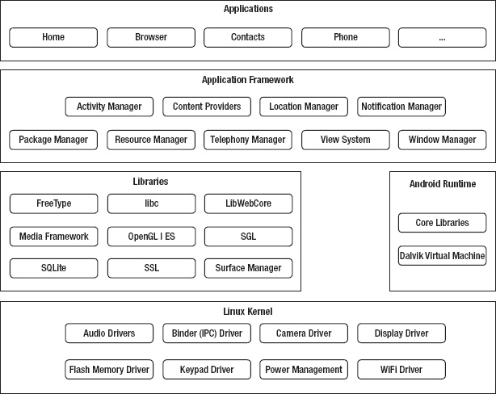
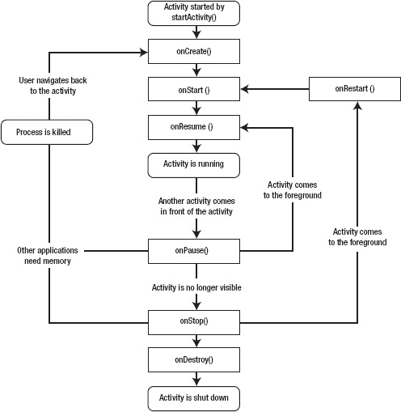
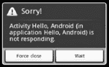
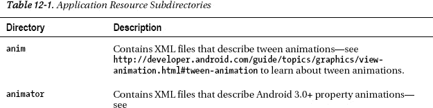
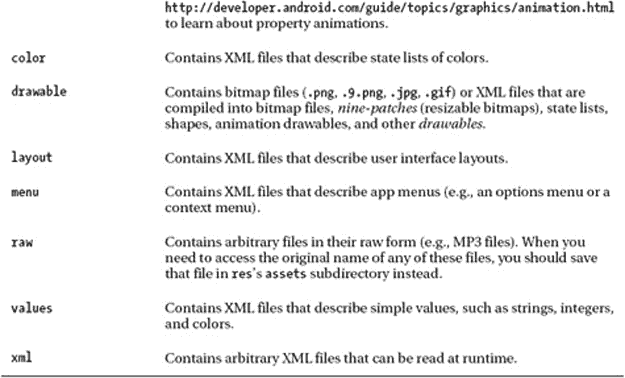
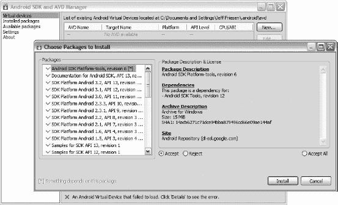
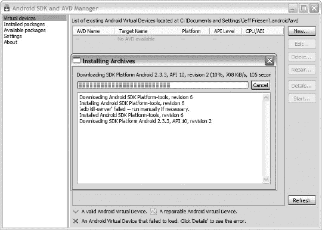
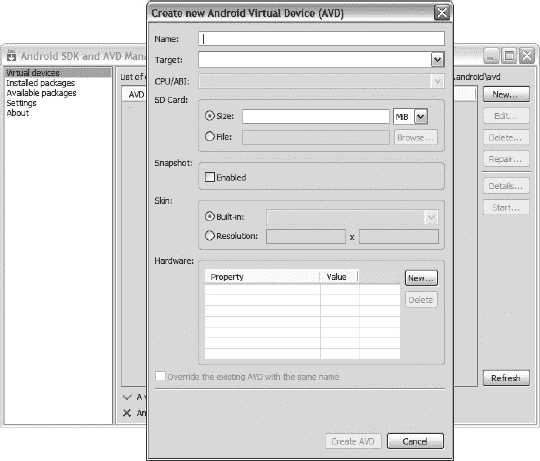
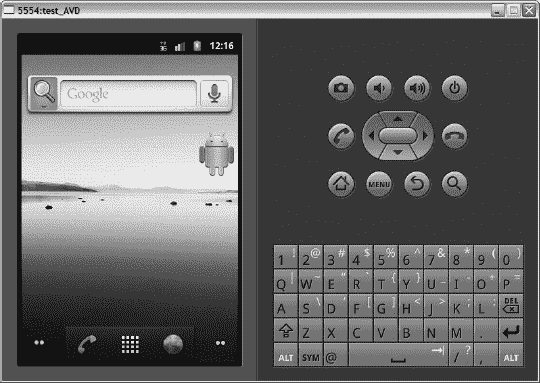
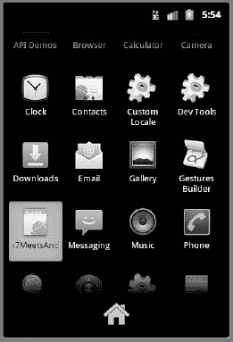

# 十二、Java 7 遇上安卓

为 Android 设备开发应用如今很流行。也许你想学习如何用 Java 7 开发自己的 Android 应用(尽管你不能使用比 Java 5 更新的 API 和语言特性)。

第 12 章简要介绍了应用开发。你首先了解 Android 架构和 Android 应用的架构。然后，您将学习如何安装 Android SDK 和一个平台，这样您就有了开始应用开发的工具和环境。因为 SDK 提供了一个模拟器来模拟 Android 设备，所以接下来您将学习如何创建和启动一个 Android 虚拟设备(AVD ),您可以用它来代替实际的 Android 设备来测试您的应用。最后，向您介绍一个简单的应用，了解如何通过 SDK 创建这个应用，以及如何在 AVD 上安装和运行这个应用。

 **注**如果你想在读完这一章后了解更多关于 Android 的知识，请查阅马克·墨菲(Apress，2011；ISBN: 978-1-4302-3297-1)。你可能还想看看戴夫·史密斯和杰夫·弗里森的*安卓食谱*(2011 年出版；ISBN: 978-1-4302-3413-5)。 *Android Recipes* 向您传授额外的 Android 应用架构基础知识，向您展示如何安装 Eclipse IDE 并使用该 IDE 开发应用，介绍各种应用开发问题的解决方案，向您介绍各种第三方开发工具和 Android NDK，向您展示如何创建自己的库和使用第三方库，并介绍应用设计指南。

### 探索 Android 和 Android 应用架构

Android 开发人员指南(`[http://developer.android.com/guide/index.html](http://developer.android.com/guide/index.html)`)将 Android 定义为移动设备的软件栈(交付全功能解决方案所需的一组软件子系统)。这个堆栈包括操作系统(Linux 内核的修改版本)、中间件(将低级操作系统连接到高级应用的软件)和关键应用(用 Java 编写)，如 web 浏览器(称为浏览器)和联系人管理器(称为联系人)。

Android 提供以下功能:

*   支持重复使用和替换应用组件的应用框架
*   蓝牙、EDGE、3G 和 WiFi 支持(取决于硬件)
*   摄像头、GPS、指南针和加速度计支持(取决于硬件)
*   针对移动设备优化的 Dalvik 虚拟机
*   GSM 电话支持(取决于硬件)
*   基于开源 WebKit 引擎的集成浏览器
*   对常见音频、视频和静止图像格式(MPEG4、H.264、MP3、AAC、AMR、JPG、PNG、GIF)的媒体支持
*   由定制 2D 图形库支持的优化图形；基于 OpenGL ES 1.0 规范的 3D 图形(可选硬件加速)
*   用于结构化数据存储的 SQLite

 **注意**尽管不是 Android 设备软件栈的一部分，Android 丰富的开发环境(包括一个设备仿真器和一个 Eclipse IDE 插件)也可以被认为是 Android 的一个特性。

Android 应用是用 Java 编写的，只能访问`[http://developer.android.com/reference/packages.html](http://developer.android.com/reference/packages.html)`的 API 参考中描述的 Java APIs(以及面向 Android 的第三方 API)。他们不能访问 Java 5 以外的 Java APIs。这个限制影响了 Java 7 的 try-with-resources 语句，该语句基于新的`java.lang.AutoCloseable`接口和 API 对抑制异常的支持。您不能在 Android 源代码中使用 try-with-resources。

 **注意**Android 并不支持所有 Java 5(及之前版本)的 API。例如，Android 不支持抽象窗口工具包(AWT)或 Swing。相反，它提供了一组更小的用户界面 API。

#### 安卓架构

Android 软件栈由顶部的应用、中间的中间件(由应用框架、库和 Android 运行时组成)和底部的带有各种驱动程序的 Linux 内核组成。图 12-1 显示了这种分层架构。



***图 12-1。** Android 的分层架构由几大部分组成。*

用户关心应用，Android 附带了各种有用的核心应用，包括浏览器、联系人和电话。所有的 app 都是用 Java 写的。应用构成了 Android 架构的顶层。

在应用层的正下方是*应用框架*，这是一组用于创建应用的高级构建模块。应用框架预装在 Android 设备上，由以下组件组成:

*   *活动管理器*:这个组件提供了一个应用的*生命周期*，并维护一个共享的活动堆栈，用于在应用内部和应用之间导航。(我将在本章后面介绍活动时讨论这两个概念。)
*   *内容提供者*:这些组件封装了可以在应用之间共享的数据(例如，浏览器应用的书签)。
*   位置管理器(Location Manager):这个组件使得 Android 设备能够知道自己的物理位置。
*   *通知管理器*:这个组件让一个应用通知用户一个重要的事件(例如，一条消息的到达)，而不打断用户当前正在做的事情。
*   *包管理器*:这个组件让一个应用了解当前安装在设备上的其他应用包。(本章稍后将讨论应用包。)
*   资源管理器(Resource Manager):这个组件让一个应用访问它的应用资源，这个主题我将在本章后面讨论。
*   *电话管理器*:这个组件让应用了解设备的电话服务。它还处理拨打和接听电话。
*   *视图系统*:该组件管理用户界面元素和面向用户界面的事件生成。(我将在本章后面简要讨论这些主题。)
*   窗口管理器(Window Manager):这个组件将屏幕空间组织到窗口中，分配绘图表面，并执行其他与窗口相关的任务。

应用框架的组件依赖一组 C/C++库来执行它们的工作。开发人员通过框架 API 与以下库进行交互:

*   *FreeType* :这个库支持位图和矢量字体渲染。
*   libc :这个库是标准 C 系统库的 BSD 派生实现，针对基于嵌入式 Linux 的设备进行了调整。
*   *LibWebCore* :这个库提供了一个现代化的快速网络浏览器引擎，支持 Android 浏览器和嵌入式网络视图。它基于 WebKit ( `[http://en.wikipedia.org/wiki/WebKit](http://en.wikipedia.org/wiki/WebKit)`)，也用于谷歌 Chrome 和苹果 Safari 浏览器。
*   *媒体框架*:这些基于 PacketVideo 的 OpenCORE 的库，支持许多流行的音频和视频格式的回放和录制，以及处理静态图像文件。支持的格式包括 MPEG4、H.264、MP3、AAC、AMR、JPEG 和 PNG。
*   *OpenGL | ES* :这些 3D 图形库提供了基于 OpenGL ES 1.0 APIs 的 OpenGL 实现。他们使用硬件 3D 加速(如果可用)或内置的(高度优化的)3D 软件光栅化器。
*   SGL:这个库提供了底层的 2D 图形引擎。
*   SQLite :这个库提供了一个强大的轻量级关系数据库引擎，所有应用都可以使用，Mozilla Firefox 和苹果的 iPhone 也使用这个引擎进行持久存储。
*   SSL:这个库为网络通信提供了基于安全套接字层的安全性。
*   *Surface Manager* :这个库管理对显示子系统的访问，并无缝合成来自多个应用的 2D 和 3D 图形层。

Android 提供了一个运行时环境，由核心库(实现 Apache Harmony Java 5 实现的子集)和 Dalvik 虚拟机(一个基于处理器寄存器而不是基于堆栈的非 Java 虚拟机)组成。

 **注**谷歌的丹·博恩施泰因创造了达尔维克，并以他的一些祖先居住的冰岛渔村命名了这个虚拟机。

每个 Android 应用默认运行在自己的 Linux 进程中，该进程托管一个 Dalvik 实例。该虚拟机的设计使得设备可以高效地运行多个虚拟机。这种效率在很大程度上是由于 Dalvik 执行基于 Dalvik 可执行文件(DEX)的文件——DEX 是一种针对最小内存占用而优化的格式。

 **注意** Android 在应用的任何部分需要执行时启动一个进程，在不再需要和其他应用需要环境资源时关闭该进程。

也许您想知道如何让非 Java 虚拟机运行 Java 代码。答案是 Dalvik 不运行 Java 代码。相反，Android 将编译后的 Java 类文件转换成 DEX 格式，Dalvik 执行的就是这些结果代码。

最后，库和 Android 运行时依赖于 Linux 内核(2.6 版。用于底层核心服务，如线程、低级内存管理、网络堆栈、进程管理和驱动程序模型。此外，内核充当硬件和软件堆栈其余部分之间的抽象层。

**安卓安全模式**

Android 的架构包括一个安全模型，可以防止应用执行被认为对其他应用、Linux 或用户有害的操作。这种安全模型主要基于通过标准 Linux 特性(如用户和组 id)的进程级实施，将进程放在安全沙箱中。

默认情况下，沙盒会阻止应用读取或写入用户的私人数据(例如，联系人或电子邮件)，读取或写入另一个应用的文件，执行网络访问，保持设备唤醒，访问摄像头，等等。需要访问网络或执行其他敏感操作的应用必须首先获得许可。

Android 以各种方式处理权限请求，通常是根据证书自动允许或拒绝请求，或者提示用户授予或撤销权限。应用所需的权限在应用的清单文件中声明(将在本章后面讨论)，以便在安装应用时 Android 知道它们。这些权限不会随后更改。

#### App 架构

Android 应用的架构不同于在桌面上运行的应用的架构。应用架构基于通过意图相互通信的组件，由清单描述，并可能使用应用资源。总的来说，这些项目存储在一个应用包中。

##### 组件

Android 应用是在 Linux 进程中运行并由 Android 管理的组件(活动、广播接收器、内容提供者和服务)的集合。这些组件共享一组环境资源，包括数据库、首选项、文件系统和 Linux 进程。

 **注意**并非所有这些组件都需要出现在一个应用中。例如，一个应用可能只包含活动，而另一个应用可能包含活动和服务。

这种面向组件的架构允许一个应用重用其他应用的组件，前提是这些其他应用允许重用它们的组件。组件重用减少了整体内存占用，这对于内存有限的设备非常重要。

例如，假设您正在创建一个绘图应用，让用户从调色板中选择一种颜色，并假设另一个应用已经开发了一个合适的颜色选择器，并允许重用该组件。在这种情况下，绘图应用可以调用其他应用的颜色选择器，让用户选择一种颜色，而不是提供自己的颜色选择器。绘图应用不包含其他应用的颜色选择器，甚至也不链接到其他应用。相反，它会在需要时启动其他应用的颜色选择器组件。

当需要应用的任何部分(例如，前面提到的颜色选择器)时，Android 启动一个进程，并为该部分实例化 Java 对象。这就是为什么 Android 的应用没有单一的入口点(例如，没有 C 风格的`main()`功能)。相反，应用使用根据需要实例化和运行的组件。

**通过意图沟通**

活动、广播接收器和服务通过*意图*相互通信，意图是描述要执行的操作(例如，发送电子邮件或选择照片)的消息，或者(在广播的情况下)提供已经发生的外部事件的描述(例如，设备的摄像头被激活)和正在被宣布的消息。

因为 Android 中几乎所有的东西都包含意图，所以有很多机会用你自己的组件替换现有的组件。例如，Android 提供发送电子邮件的意图。您的应用可以发送该意图来激活标准邮件应用，或者它可以注册一个活动(稍后讨论)来响应“发送电子邮件”意图，有效地用它自己的活动替换标准邮件应用。

这些消息被实现为`android.content.Intent`类的实例。一个`Intent`对象根据以下项目的某种组合来描述一条消息:

*   *Action* :命名要执行的动作的字符串，或者在广播意图的情况下，命名已经发生并正在报告的动作。动作由`Intent`常量描述，如`ACTION_CALL`(发起电话呼叫)、`ACTION_EDIT`(显示数据供用户编辑)和`ACTION_MAIN`(启动作为初始活动)。您还可以定义自己的操作字符串来激活应用中的组件。这些字符串应该包括应用包作为前缀(例如，`"com.example.project.SELECT_COLOR"`)。
*   *类别*:一个字符串，提供关于应该处理意图的组件种类的附加信息。例如，`CATEGORY_LAUNCHER`表示调用活动应该作为顶级应用出现在设备的应用启动器中。(app launcher 将在本章稍后简要讨论。)
*   *组件名*:一个字符串，指定用于 intent 的组件类的完全限定名(包加名称)。组件名称是可选的。设置后，`Intent`对象被传递给指定类的一个实例。未设置时，Android 使用`Intent`对象中的其他信息来定位合适的目标。
*   *数据*:要操作的数据的统一资源标识符(URI)(例如，联系人数据库中的个人记录)。
*   *Extras* :一组键值对，提供应该交付给处理意图的组件的附加信息。例如，给定一个发送电子邮件的操作，该信息可以包括邮件的主题、正文等。
*   *标志:*位值，指示 Android 如何启动一个活动(例如，该活动应属于哪个任务——任务将在本章稍后讨论)以及如何在启动后处理该活动(例如，该活动是否可被视为最近的活动)。标志由`Intent`类中的常数表示；例如，`FLAG_ACTIVITY_NEW_TASK`指定该活动将成为该历史堆栈上一个新任务的开始—该历史堆栈将在本章稍后讨论。
*   *Type* :意向数据的多用途互联网邮件扩展(MIME)类型。通常情况下，Android 会从数据中推断出一种类型。通过指定类型，可以禁用该推断。

意图可以分为显性和隐性。一个*显式意图*通过名称指定目标组件(前面提到的组件名称项被赋值)。因为其他应用的开发人员通常不知道组件名称，所以显式意图通常用于应用内部消息(例如，一个活动启动位于同一应用内的另一个活动)。Android 向指定目标类的实例传递了一个明确的意图。只有`Intent`对象的组件名对确定哪个组件应该得到意图有影响。

一个*隐含意图*没有命名一个目标(组件名没有赋值)。隐式意图通常用于启动其他应用中的组件。Android 搜索最佳组件(执行请求动作的单个活动或服务)或组件(响应广播通知的一组广播接收器)来处理隐含的意图。在搜索过程中，Android 将`Intent`对象的内容与*意图过滤器*进行比较，意图过滤器是与可能接收意图的组件相关联的清单信息。

过滤器通告组件的能力，并且只识别组件可以处理的那些意图。它们向组件开放了接收广告类型的隐含意图的可能性。当一个组件没有意图过滤器时，它只能接收明确的意图。相比之下，带有过滤器的组件可以接收显式和隐式意图。Android 在将意图与意图过滤器进行比较时会参考`Intent`对象的动作、类别、数据和类型。它不考虑额外费用和旗帜。

###### 活动

活动是提供用户界面的组件，以便用户可以与应用进行交互。例如，Android 的联系人应用包括输入新联系人的活动，其电话应用包括拨打电话号码的活动，其计算器应用包括执行基本计算的活动(见[图 12-2](#fig_12_2) )。


***图 12-2。**安卓计算器应用的主要活动是让用户进行基本的计算。*

虽然一个应用可以包含单个活动，但更常见的是应用包含多个活动。例如，Calculator 还包括一个“高级面板”活动，让用户计算平方根、执行三角学以及执行其他高级数学运算。

 **注意**因为活动是使用最频繁的组件，所以我对它们的讨论比广播接收器、内容提供者和服务更详细。查看 *Android 菜谱*，了解这些其他组件类别的详细报道。

活动由`android.app.Activity`类的子类描述，它是抽象`android.content.Context`类的间接子类。

 **注** `Context`是一个抽象类，其方法让应用访问关于其环境的全局信息(例如，其应用资源)，并允许应用执行上下文操作，例如启动活动和服务、广播意图和打开私人文件。

`Activity`子类覆盖 Android 在活动生命周期中调用的各种`Activity` *生命周期回调方法*。例如，[清单 12-1](#list_12_1) 的`SimpleActivity`类，它被放在一个包中，因为 Android 要求一个应用的组件被存储在一个唯一的包中，它扩展了`Activity`，也覆盖了`void onCreate(Bundle bundle)`和`void onDestroy()`生命周期回调方法。

***清单 12-1。**骨骼活动*

```java
package ca.tutortutor.simpleapp;

import android.app.Activity;

import android.os.Bundle;

public class SimpleActivity extends Activity
{
   @Override
   public void onCreate(Bundle savedInstanceState)
   {
      super.onCreate(savedInstanceState); // Always call superclass method first.
      System.out.println("oncreate(bundle) called");
   }
   @Override
   public void onDestroy()
   {
      super.onDestroy(); // Always call superclass method first.
      System.out.println("ondestroy() called");
   }
}
```

`SimpleActivity`的覆盖`onCreate(Bundle)`和`onDestroy()`方法首先调用它们的超类对应物，这是在覆盖`void onStart()`、`void onRestart()`、`void onResume()`、`void onPause()`和`void onStop()`生命周期回调方法时必须遵循的模式。

*   首次创建活动时会调用`onCreate(Bundle)`。此方法用于创建活动的用户界面，根据需要创建后台线程，以及执行其他全局初始化。当状态被捕获时，`onCreate()`被传递一个包含活动先前状态的`android.os.Bundle`对象；否则，传递空引用。Android 总是在调用`onCreate(Bundle)`之后调用`onStart()`方法。
*   `onStart()`在活动对用户可见之前被调用。Android 在活动来到前台时调用`onStart()`后调用`onResume()`方法，在活动变为隐藏时调用`onStart()`后调用`onStop()`方法。
*   `onRestart()`在活动停止之后，再次开始之前被调用。Android 总是在调用`onRestart()`之后调用`onStart()`。
*   在活动开始与用户交互之前调用`onResume()`。此时，活动获得焦点，用户输入指向该活动。Android 总是在调用`onResume()`之后调用`onPause()`方法，但只是在活动必须暂停的时候。
*   当 Android 将要恢复另一个活动时，调用`onPause()`。此方法通常用于保存未保存的更改、停止可能消耗处理器周期的动画等。它应该很快执行它的工作，因为下一个活动在它返回之前不会恢复。Android 在活动开始与用户交互时调用`onPause()`后调用`onResume()`，在活动变得对用户不可见时调用`onStop()`。
*   当活动对用户不再可见时，调用`onStop()`。这可能是因为该活动正在被销毁，或者因为另一个活动(现有活动或新活动)已经恢复并覆盖了该活动。Android 在调用`onStop()`之后调用`onRestart()`，当活动即将回来与用户交互时，调用`onDestroy()`方法，当活动即将离去时。
*   `onDestroy()`在活动被销毁之前被调用，除非内存紧张，Android 强制杀死活动的进程。在这种情况下，`onDestroy()`永远不会被调用。如果`onDestroy()`被调用，这将是该活动收到的最后一个调用。

 **注意** Android 可以在`onPause()`、`onStop()`或`onDestroy()`返回后随时杀死托管活动的进程。从`onPause()`返回到`onResume()`被调用，活动处于可终止状态。在`onPause()`返回之前，该活动不会再次被取消。

这七种方法定义了活动的整个生命周期，并描述了以下三个嵌套循环:

*   活动的*整个生命周期*被定义为从第一次调用`onCreate(Bundle)`到最后一次调用`onDestroy()`的所有内容。一个活动在`onCreate(Bundle)`执行其所有“全局”状态的初始设置，并在`onDestroy()`释放所有剩余的环境资源。例如，当活动有一个线程在后台运行以从网络下载数据时，它可能会在`onCreate(Bundle)`中创建该线程，并在`onDestroy()`中停止该线程。
*   活动的*可见生存期*被定义为从调用`onStart()`到相应调用`onStop()`的所有内容。在此期间，用户可以在屏幕上看到活动，尽管它可能不在前台并与用户交互。在这两种方法之间，活动可以维护向用户显示自身所需的资源。例如，它可以在`onStart()`中注册一个广播接收器，以监视影响其用户界面的变化，并在用户看不到活动显示的内容时在`onStop()`中注销该对象。随着活动在对用户可见和隐藏之间交替，可以多次调用`onStart()`和`onStop()`方法。
*   活动的*前台生存期*被定义为从对`onResume()`的调用到对`onPause()`的相应调用的所有内容。在此期间，该活动位于屏幕上所有其他活动的前面，并与用户进行交互。活动可以频繁地在恢复和暂停状态之间转换；例如，`onPause()`在设备进入睡眠或新活动开始时被调用，而`onResume()`在活动结果或新意图被传递时被调用。这两种方法中的代码应该相当轻量级。

 **注意**每个生命周期回调方法都是一个钩子，活动可以覆盖它来执行适当的工作。当活动对象第一次被实例化时，所有活动都必须实现`onCreate(Bundle)`来执行初始设置。许多活动还实现了`onPause()`来提交数据更改，或者准备停止与用户的交互。

图 12-3 用这七种方法说明了一个活动的生命周期。



***图 12-3。**一项活动的生命周期表明，不能保证`onDestroy()`会被调用。*

因为`onDestroy()`可能不会被调用，所以你不应该指望使用这个方法作为保存数据的地方。例如，当一个活动正在编辑内容提供商的数据时，这些编辑通常应该在`onPause()`中提交。

相比之下，`onDestroy()`通常被实现来释放与活动相关联的环境资源(例如，线程),以便被破坏的活动不会在其应用的其余部分仍在运行时留下这样的东西。

[图 12-3](#fig_12_3) 显示一个活动是通过调用`startActivity()`开始的。更具体地说，活动是通过创建一个描述显式或隐式意图的`Intent`对象，并将该对象传递给`Context`的`void startActivity(Intent intent)`方法(启动一个新活动；完成时不返回任何结果)。

或者，可以通过调用`Activity`的`void startActivityForResult(Intent intent, int requestCode)`方法来启动活动。指定的`int`结果作为参数返回给`Activity`的`void onActivityResult(int requestCode, int resultCode, Intent data)`回调方法。

 **注意**响应活动可以通过调用`Activity`的`Intent getIntent()`方法来查看导致其启动的初始意图。Android 调用活动的`void onNewIntent(Intent intent)`方法(也位于`Activity`类中)将任何后续意图传递给活动。

[清单 12-1](#list_12_1) 的 package 语句隐含了一个名为`SimpleApp`的 app。除了作为其主要活动的`SimpleActivity`之外，让我们假设这个应用包含一个描述查看 JPEG 图像的活动的`SimpleActivity2`类。假设你想从`SimpleActivity`的`onCreate(Bundle)`方法开始`SimpleActivity2`。以下示例向您展示了如何完成此任务:

```java
Intent intent = new Intent(SimpleActivity.this, SimpleActivity2.class);
SimpleActivity.this.startActivity(intent);
```

第一行创建一个描述明确意图的`Intent`对象。它通过将当前`SimpleActivity`实例的引用和`SimpleActivity2`的`java.lang.Class`实例传递给`Intent(Context packageContext, Class<?> clazz)`构造函数来初始化这个对象。

第二行将这个`Intent`对象传递给`startActivity(Intent)`，后者负责启动由`SimpleActivity2.class`描述的活动。如果`startActivity(Intent)`无法找到指定的活动(这不应该发生)，它将抛出一个`android.content.ActivityNotFoundException`实例。

以下示例显示了如何隐式启动`SimpleActivity2`:

```java
Intent intent = new Intent();
intent.setAction(Intent.ACTION_VIEW); // Use Intent constants instead of literal ...
intent.setType("image/jpeg");
intent.addCategory(Intent.CATEGORY_DEFAULT); // ... strings to reduce errors.
SimpleActivity.this.startActivity(intent);
```

前四行创建一个描述隐含意图的`Intent`对象。传递给`Intent`的`Intent setAction(String action)`、`Intent setType(String type)`和`Intent addCategory(String category)`方法的值指定了意图的动作、MIME 类型和类别。它们帮助 Android 将`SimpleActivity2`识别为要开始的活动。

**活动、任务和活动堆栈**

Android 将一系列相关活动称为一个*任务*，并提供一个*活动堆栈*(也称为*历史堆栈*或*后台堆栈*)来记住这个序列。启动任务的活动是推入堆栈的初始活动，称为*根活动*。该活动通常是用户通过设备的应用启动器选择的活动。当前正在运行的活动位于堆栈的顶部。

当当前活动启动另一个活动时，新活动被推送到堆栈上并获得焦点(成为正在运行的活动)。前一个活动保留在堆栈上，但已停止。当活动停止时，系统保留其用户界面的当前状态。

当用户按下设备的 BACK 键时，当前活动从堆栈中弹出(活动被销毁)，之前的活动作为正在运行的活动恢复操作(其用户界面的先前状态被恢复)。

堆栈中的活动不会被重新排列，只会从堆栈中推出和弹出。当当前活动启动时，活动被推到堆栈上，当用户通过 BACK 键离开时，活动弹出堆栈。

每次用户按 BACK，一个活动就会弹出堆栈，显示前一个活动。这一直持续到用户返回到主屏幕或者任务开始时正在运行的任何活动。当所有活动都从堆栈中移除时，任务就不再存在。

查看 Google 在线 Android 文档中的“任务和后台堆栈”部分，了解更多关于活动和任务的信息:`[http://developer.android.com/guide/topics/fundamentals/tasks-and-back-stack.html](http://developer.android.com/guide/topics/fundamentals/tasks-and-back-stack.html)`。

###### 广播接收机

广播接收器是接收广播并对广播做出反应的组件。许多广播源自系统代码；例如，时区已更改或电池电量低的通知。

应用也可以发起广播。例如，一个应用可能希望让其他应用知道一些数据已经从网络下载到设备，现在可供他们使用。

 **注**抽象`android.content.BroadcastReceiver`类实现广播接收机。

###### 内容提供商

内容提供商是一个组件，它使一个应用的特定数据集可供其他应用使用。数据可以存储在 Android 文件系统、SQLite 数据库或任何其他有意义的方式中。

内容提供者比直接访问原始数据更可取，因为它们将组件代码从原始数据格式中分离出来。这种分离防止了格式改变时的代码中断。

 **注**抽象`android.content.ContentProvider`类实现内容提供者。

###### 服务

服务是在后台无限期运行的组件，它不提供用户界面。与活动一样，服务在流程的主线程上运行；它必须产生另一个线程来执行耗时的操作。服务分为本地服务和远程服务:

*   一个*本地服务*与应用的其余部分在相同的进程中运行。这样的服务使得实现后台任务变得容易。
*   一个远程服务在一个单独的进程中运行。这种服务允许您执行进程间通信。

 **注意**服务不是一个独立的进程，尽管它可以被指定在一个独立的进程中运行。此外，服务不是线程。相反，一项服务让应用告诉 Android 它想在后台做的事情(即使用户没有直接与应用交互)，并让应用向其他应用公开它的一些功能。

考虑一个服务，它通过一个活动播放音乐来响应用户的音乐选择。用户通过该活动选择要播放的歌曲，并且响应于该选择启动服务。使用服务来播放音乐的基本原理是，用户希望即使在启动音乐的活动离开屏幕后，音乐也能继续播放。

该服务在另一个线程上播放音乐，以防止出现应用不响应对话框(见[图 12-4](#fig_12_4) )。



***图 12-4。**可怕的应用不响应对话框可能会导致用户卸载应用。*

 **注**抽象`android.app.Service`类实现服务。

##### 清单

Android 通过检查应用的 XML 结构清单文件`AndroidManifest.xml`来了解应用的各种组件(以及更多)。例如，[清单 12-2](#list_12_2) 展示了这个文件如何声明[清单 12-1](#list_12_1) 的活动组件。

***清单 12-2。** `SimpleApp`的货单文件*

```java
<?xml version="1.0" encoding="utf-8"?>
<manifest xmlns:android="http://schemas.android.com/apk/res/android"
          package="ca.tutortutor.simpleapp">
   <application android:label="@string/app_name" android:icon="@drawable/icon">
      <activity android:name=".simpleactivity" android:label="@string/app_name">

         <intent-filter>
            <action android:name="android.intent.action.main" />
            <category android:name="android.intent.category.launcher" />
         </intent-filter>
      </activity>
      <!-- ... -->
   </application>
</manifest>
```

[清单 12-2](#list_12_2) 以`<?xml version="1.0" encoding="utf-8"?>`序言开始，它将该文件标识为 XML 1.0 版文件，其内容根据 UTF-8 编码标准进行编码。([第 10 章](10.html#ch10)向您介绍 XML。)

[清单 12-2](#list_12_2) 接下来呈现的是`manifest`元素，这是这个 XML 文档的根元素:`android`标识 Android 名称空间，`package`标识应用的 Java 包——每个应用必须有自己的 Java 包，在本例中是`ca.tutortutor.simpleapp`。可以指定附加属性。例如，当您想要识别版本信息时，您可以指定`versionCode`和`versionName`属性。

嵌套在`manifest`中的是`application`，它是 app 组件元素的父元素。它的`label`和`icon`属性指的是 Android 设备显示的代表应用的标签和图标应用资源，这些资源作为开始标签没有指定这些属性的单个组件的默认值。(我稍后将讨论应用资源。)

 **注意**应用资源由前缀`@`标识，后跟类别名称(如`string`或`drawable`)、`/`和应用资源 ID(如`app_name`或`icon`)。

嵌套在`application`中的是一个描述活动组件的`activity`元素。属性`name`标识了一个实现活动的类(`SimpleActivity`)。这个名字以句点字符开头，暗示它与`ca.tutortutor.simpleapp`相关。

 **注意**在命令行创建`AndroidManifest.xml`时，句点不存在。然而，当这个文件在 Eclipse 中创建时，这个字符是存在的。无论如何，`SimpleActivity`是相对于`<manifest>`的`package`值(`ca.tutortutor.simpleapp`)。

`activity`元素可以用自己特定于组件的`label`和`icon`属性覆盖`application`的`label`和`icon`属性。当任一属性不存在时，`activity`继承`application`的`label`或`icon`属性值。

嵌套在`activity`中的是`intent-filter`。该元素声明由封闭元素描述的组件的功能。例如，它通过嵌套的`action`和`category`元素声明了`SimpleActivity`组件的功能:

*   `action`标识要执行的动作。例如，这个元素的`name`属性可以被赋值为`"android.intent.action.main"`，以将活动标识为应用的入口点(用户启动应用时运行的第一个活动)。
*   `category`标识一个组件类别。这个标签的`name`属性被赋予`"android.intent.category.launcher"`来标识需要在应用启动器中显示的活动(稍后讨论)。

 **注意**其他组件的声明类似:广播接收器通过`receiver`元素声明，内容提供者通过`provider`元素声明，服务通过`service`元素声明。除了可以在运行时创建的广播接收器之外，清单中没有声明的组件不是由 Android 创建的。

注释标签表明一个清单可以定义多个组件。比如我在讨论活动的时候参考了一个`SimpleActivity2`类。在开始这个活动(显式或隐式)之前，您需要在清单中引入一个`activity`元素。

考虑下面的`activity`元素:

```java
<activity android:name=".simpleactivity2" ...>
    <intent-filter>
        <action android:name="android.intent.action.view" />
        <data android:mimeType="image/jpeg" />
        <category android:name="android.intent.category.default" />
    </intent-filter>
</activity>
```

`SimpleActivity2`的`intent-filter`元素帮助 Android 确定当`Intent`对象的值匹配以下标签属性值时，该活动将被启动:

*   `<action>`的`name`属性被赋予`"android.intent.action.view"`。
*   `<data>`的`mimeType`属性被赋予了`"image/jpeg"` MIME 类型。
*   `<category>`的`name`属性被分配给`"android.intent.category.default"`，以允许在没有明确指定其组件的情况下启动活动。

 **注意**`data`元素描述了意图操作的数据。它的`mimeType`属性标识数据的 MIME 类型。可以指定附加属性。例如，您可以指定`path`来标识数据的位置 URI。

`AndroidManifest.xml`可能包含额外的信息，例如命名应用需要链接的任何库(除了默认的 Android 库)，以及识别所有应用对其他应用强制的权限(通过`permission`元素)，例如控制谁可以启动应用的活动。

此外，清单可能包含`uses-permission`元素来标识应用需要的权限。例如，一个需要使用摄像头的应用会指定以下元素:`<uses-permission android:name="android.permission.camera" />`。

 **注意** `uses-permission`元素嵌套在`manifest`元素中——它们与`application`元素出现在同一级别。

在应用安装时，应用请求的权限(通过`uses-permission`)由 Android 的包安装程序授予，基于对声明这些权限的应用的数字签名和/或与用户的交互的检查。

应用运行时，不会对用户进行任何检查。它在安装时被授予了特定的权限，可以根据需要使用该功能，或者权限未被授予，任何使用该功能的尝试都将失败，而不会提示用户。

##### 应用资源

除了为其组件共享一组环境资源(例如，数据库、首选项、文件系统、线程和 Linux 进程)之外，应用还可以拥有自己的应用资源:属性动画、补间动画、颜色状态列表、可绘制图形、布局、菜单、原始文件、简单值(例如，字符串)和任意 XML 文件。


Android 要求应用将其应用资源文件存储在应用的`res`目录的[表 12-1](#tab_12_1) 的子目录中(以及它们的子目录，如果合适的话)。





从 Android 1.6 开始，Android 首先在`res`的`drawable-hdpi`、`drawable-mdpi`或`drawable-ldpi`子目录中寻找可绘制对象，具体取决于设备的屏幕分辨率是高(hdpi)、中(mdpi)还是低(ldpi)。如果在那里没有找到 drawable，它就在`res`的`drawable`子目录中查找。

当我在本章的后面向你介绍`Java7MeetsAndroid`应用时，我会有更多关于应用资源的内容要说。

 **注**要了解更多关于应用资源的信息，请查看谷歌的“应用资源”指南(`[http://developer.android.com/guide/topics/resources/index.html](http://developer.android.com/guide/topics/resources/index.html)`)。

##### 应用包

Android 应用是用 Java 编写的。为应用组件编译的 Java 代码被进一步转换成 Dalvik 的 DEX 格式。生成的代码文件以及任何其他所需的数据和应用资源随后被捆绑到一个应用包(APK)中，该文件由后缀`.apk`标识。

APK 不是一个应用，但用于分发应用的至少一部分并将其安装在移动设备上。它不是一个应用，因为它的组件可能会重用另一个 APK 的组件，而且(在这种情况下)不是所有的应用都驻留在一个 APK 中。此外，它可能只分发应用的一部分。然而，通常称一个 APK 代表一个应用。

一个 APK 必须用一个证书来签名(这个证书标识了这个应用的作者),证书的私钥由它的开发者持有。证书不需要由证书颁发机构签名。相反，Android 允许用自签名证书对 apk 进行签名，这很典型。(*安卓食谱*讨论 APK 签约。)

**apk、用户 id 和安全性**

安装在 Android 设备上的每个 APK 都有自己唯一的 Linux 用户 id，只要 APK 驻留在该设备上，这个用户 ID 就保持不变。

因为安全实施发生在进程级，包含在任何两个 APK 中的代码通常不能在同一个进程中运行，因为每个 APK 的代码需要作为不同的 Linux 用户运行。然而，通过在每个 APK 的`AndroidManifest.xml`文件中给`<manifest>`标签的`sharedUserId`属性分配相同名称的用户 ID，可以让两个 apk 中的代码在同一个进程中运行。当你进行这些分配时，你告诉 Android 这两个包将被视为相同的应用，具有相同的用户 id 和文件权限。

为了保持安全性，只有用相同签名签名的两个 apk(并且在其清单中请求相同的`sharedUserId`值)将被给予相同的用户 ID。

### 安装 Android SDK 和 Android 平台

现在你已经对 Android 和 Android 应用架构有了基本的了解，你可能想要创建一个应用。但是，在安装 Android SDK 和 Android 平台之前，您不能这样做。本节将向您展示如何完成这些任务。

#### 访问系统要求

Google 为 Windows、基于英特尔的 Mac OS X 和 Linux (i386)操作系统提供了 Android SDK 分发文件。在下载和安装该文件之前，您必须了解 SDK 的要求。当您的开发平台不满足这些要求时，您不能使用 SDK。

Android SDK 支持以下操作系统:

*   Windows XP (32 位)、Vista (32 位或 64 位)或 Windows 7 (32 位或 64 位)
*   Mac OS X 10.5.8 或更高版本(仅限 x86)
*   Linux(在 Ubuntu Linux，Lucid Lynx 上测试):需要 GNU C 库(`glibc` ) 2.11 或更高版本。64 位发行版必须能够运行 32 位应用。要了解如何添加对 32 位应用的支持，请参阅位于`[http://developer.android.com/sdk/installing.html#troubleshooting](http://developer.android.com/sdk/installing.html#troubleshooting)`的 Ubuntu Linux 安装说明。

你会很快发现 Android SDK 被组织成各种组件:SDK 工具、SDK 平台工具、不同版本的 *Android 平台*(也称为 Android 软件栈)、SDK 插件、Windows 的 USB 驱动程序、示例和离线文档。每个组件都需要一个最小量的磁盘存储空间；所需空间总量取决于您选择安装的组件:

*   *SDK 工具*:SDK 的工具需要大约 35MB 的磁盘存储空间，必须安装。
*   *SDK 平台工具*:SDK 的平台工具需要大约 6MB 的磁盘存储空间，必须安装。
*   *Android 平台*:每个 Android 平台对应一个特定版本的 Android，需要大约 150MB 的磁盘存储空间。必须至少安装一个 Android 平台。
*   *SDK 插件*:每个可选的 SDK 插件(例如 Google APIs 或第三方供应商的 API 库)需要大约 100MB 的磁盘存储空间。
*   *用于 Windows 的 USB 驱动程序*:用于 Windows 平台的可选 USB 驱动程序需要大约 10MB 的磁盘存储空间。当你在 Mac OS X 或 Linux 上开发时，你不需要安装 USB 驱动程序。
*   *样例*:每个 Android 平台的可选 app 样例都需要大约 10MB 的磁盘存储空间。
*   *离线文档*:无需在线访问 Android 文档，您可以选择下载文档，这样即使没有连接到互联网也可以查看。脱机文档需要大约 250MB 的磁盘存储空间。

最后，您应该确保安装了以下附加软件:

*   JDK 5、JDK 6 或 JDK 7:你需要安装这些 Java 开发工具包(JDK)中的一个来编译 Java 代码。仅仅安装 Java 运行时环境(JRE)是不够的。此外，不能使用依赖于比 Java 5 更新的 API 的 Java 7 语言特性；try-with-resources 语句不可用。
*   *Apache Ant* :需要安装 Ant 1.8 或更高版本，这样才能构建 Android 项目。

 **注意**当您的开发平台上已经安装了一个 JDK 时，花一点时间来确保它满足前面列出的版本需求(5、6 或 7)。一些 Linux 发行版可能包含 JDK 1.4，Android 开发不支持该版本。此外，Gnu 编译器 Java 版也不受支持。

#### 安装 Android SDK

将您的浏览器指向`[http://developer.android.com/sdk/index.html](http://developer.android.com/sdk/index.html)`并下载适用于您平台的 Android SDK 的当前版本。例如，您可以下载`android-sdk_r12-windows.zip` (Windows)、`android-sdk_r12-mac_x86.zip` (Mac OS X [Intel])和`android-sdk_r12-linux_x86.tgz` (Linux [i386])中的一个来安装 Android SDK Release 12。(我在这一章中关注的是 Release 12，因为在我写作的时候它是最新的；本书出版时，可能会有新的版本。)

 **注** Windows 开发者有下载运行`installer_r12-windows.exe`的选项。Google 建议您使用这个工具，它可以自动完成大部分安装过程。

比如你运行 Windows，下载`android-sdk_r12-windows.zip`。在解压缩这个文件之后，将解压缩的`android-sdk-windows`主目录移动到文件系统中一个方便的位置；例如，您可能会将未归档的`C:\unzipped\android-sdk_r12-windows\android-sdk-windows`主目录移动到 C:驱动器上的根目录，从而产生`C:\android-sdk-windows`。

 **注意**要完成安装，请将`tools`子目录添加到您的`PATH`环境变量中，以便您可以从文件系统中的任何位置访问 SDK 的命令行工具。

对`android-sdk-windows`的后续检查显示，该主目录包含以下子目录和文件:

*   *`add-ons`* :这个最初为空的目录存储了来自谷歌和其他厂商的插件；例如，Google APIs 附加组件就存储在这里。
*   *`platforms`* :这个最初为空的目录将 Android 平台存储在单独的子目录中。例如，Android 2.3 将存储在一个`platforms`子目录中，而 Android 2.2 将存储在另一个`platforms`子目录中。
*   *`tools`* :这个目录包含一组平台无关的开发和剖析工具。该目录中的工具可能会随时更新，与 Android 平台版本无关。
*   *`SDK Manager.exe`* :一个启动 Android SDK 和 AVD 管理器工具的特殊工具，您可以使用它向您的 SDK 添加组件。
*   *`SDK Readme.txt`* :这个文本文件欢迎您使用 Android SDK，并讨论安装 Android 平台。

`tools`目录包含各种有用的工具，包括:

*   *`android`* :创建和更新 Android 项目；用新的平台、插件和文档更新 Android SDK 并且创建、删除和查看*avd*(描述虚拟设备的描述符)。
*   *`emulator`* :运行完整的 Android 软件堆栈，下至内核级别，包括一组您可以访问的预装应用(例如浏览器)。`emulator`工具启动 *AVD* 。
*   *`sqlite3`* :管理 Android 应用创建的 SQLite 数据库。
*   *`zipalign`* :对 apk 执行归档对齐优化。

#### 安装安卓平台

安装 Android SDK 不足以开发 Android 应用；您还必须安装至少一个 Android 平台。您可以通过`SDK Manager`工具完成这项任务。

运行`SDK Manager`。该工具显示 Android SDK 和 AVD 管理器对话框，随后是刷新源代码和选择要安装的软件包对话框。

 **注意**你也可以使用`android`工具来显示 Android SDK 和 AVD。通过在命令行中单独指定`android`来完成这项任务。

Android SDK 和 AVD 管理器对话框标识虚拟设备、已安装的软件包和可用的软件包。它还允许您配置代理服务器和其他设置。

首次出现此对话框时，对话框右侧列表中的虚拟设备条目会突出显示，列表右侧的窗格会标识所有已创建的 avd(此列表可能为空)。

显示该对话框后，`SDK Manager`扫描 Google 的服务器，寻找可安装的组件包。“刷新源”对话框显示其进度。

在`SDK Manager`完成扫描(这可能需要几分钟)后，它会显示选择要安装的软件包对话框(参见[图 12-5](#fig_12_5) )让您选择要安装的 SDK 组件。(如果你已经安装了 Android SDK Release 12，并且之前没有安装 Android，那么唯一安装的组件是 Android SDK Tools，revision 12。)



***图 12-5。**软件包列表标识了那些可以安装的软件包。*

选择要安装的软件包对话框显示了一个软件包列表，它标识了那些可以安装的软件包。它会在已接受安装的软件包旁边显示复选标记，并在尚未接受的软件包旁边显示问号。

对于突出显示的软件包,“软件包说明和许可证”提供了软件包说明、依赖于正在安装的此软件包的其他软件包列表、有关包含该软件包的归档文件的信息以及其他信息。此外，您可以选择一个单选按钮来接受或拒绝该包。如果您拒绝突出显示的包，X 图标将替换复选标记或问号图标。

 **注意**在某些情况下，一个 SDK 组件可能需要另一个组件或 SDK 工具的特定最低版本。除了记录这些依赖关系的包描述&许可证之外，当有需要解决的依赖关系时，开发工具会通知您调试警告。

Android 平台 3.0 及以上版本是指面向平板电脑的 Android。3.0 以下版本指的是面向智能手机的 Android。因为本章重点介绍 Android 2.3.3，所以您需要安装的唯一软件包是 Android SDK 平台-工具，修订版 6 和 SDK 平台 Android 2.3.3，API 10，修订版 2。通过单击相应窗格上的拒绝选项单选按钮(或双击列表条目)，可以取消选中所有其他选中的包条目。

 **注意**如果你计划开发可以在旧版本 Android 设备上运行的应用，你可能想在旧版本旁边留下复选标记。然而，此时没有必要这样做，因为您可以随时回来通过`SDK Manager`或`android`添加这些版本。

确保只检查了这些条目后，单击 Install 按钮开始安装。[图 12-6](#fig_12_6) 显示了产生的安装档案对话框。



***图 12-6。**Installing Archives 对话框显示下载和安装每个所选软件包档案的进度。*

安装归档文件可能会显示“adb kill-server”失败—如有必要，请手动运行”消息。这个消息指的是一个名为`adb`的平台工具，代表 Android Debug Bridge (ADB)。

ADB 管理仿真器实例或 Android 驱动设备的状态。它包括一个在开发机器上作为后台进程运行的服务器。安装程序必须在安装平台工具之前终止该进程。当这个过程没有运行时，您会看到前面提到的消息。

您可能会遇到 ADB 重启对话框，它告诉您依赖于 Android Debug Bridge (ADB)的一个包已经更新，并询问您是否要立即重启 ADB。此时，您单击哪个按钮并不重要-当 ADB 服务器进程在您开始安装软件包之前已经运行，并且您希望在安装之后继续该进程时，您可能会单击“是”。

单击“安装归档文件”对话框中的“关闭”以完成安装。

现在，您应该注意到 Android SDK 和 AVD 管理器的已安装软件包窗格显示了 Android SDK 平台工具，修订版 6 和 SDK 平台 Android 2.3.3，API 10，修订版 2 以及 Android SDK 工具，修订版 12。您还应该观察以下新子目录:

*   `platform-tools`(在`android-sdk-windows`中)
*   android-10(在`android-sdk-windows/platforms`中)

platform-tools 包含的开发工具可能会随着每个平台版本的发布而更新。其工具包括`aapt` (Android 资产打包工具——查看、创建、更新兼容 Zip 的档案(`.zip`、`.jar`、`.apk`)；并将资源编译成二进制资产)、前面提到的`adb`工具、`dx` (Dalvik 可执行文件——从 Java“`.class`”文件生成 Dalvik DEX 代码)。`android-10`存储 Android 2.3.3 数据和面向用户界面的文件。

 **提示**您可能想要将`platform-tools`添加到您的`PATH`环境变量中，以便您可以从文件系统中的任何地方访问这些工具。

### 创建和启动 AVD

安装 Android SDK 和 Android 平台后，您就可以开始开发 Android 应用了。如果你没有真正的 Android 设备来安装和运行这些应用，你可以使用`emulator`工具来模拟一个设备。该工具与 AVD 协同工作，AVD 是描述仿真设备的各种特征(例如，屏幕大小)的描述符。

 **提示**即使你有一个真正的 Android 设备，你也应该用模拟器测试你的应用，看看它们在不同屏幕尺寸下的表现。

本节首先向您展示如何创建 AVD 来描述仿真设备。然后向您展示如何启动 AVD，并带您浏览其用户界面。

#### 创建一个 AVD

通过`SDK Manager`或`android`启动 Android SDK 和 AVD 管理器对话框。您可能更喜欢使用`android`，它可以防止刷新源代码和选择要安装的软件包对话框出现。如图[图 12-5](#fig_12_5) 和[图 12-6](#fig_12_6) 所示，虚拟设备窗格中没有列出任何 avd。

单击新建按钮。图 12-7 显示了创建新的 Android 虚拟设备(AVD)对话框。



***图 12-7。**AVD 由名称、目标平台和其他特征组成。*

[图 12-7](#fig_12_7) 揭示了一个 AVD 有一个名字，目标是一个特定的 Android 平台，等等。输入 **`test_AVD`** 作为名称，选择`Android 2.3.3 – API Level 10`作为目标平台，在 SD 卡的尺寸字段输入`100`。

选择`Android 2.3.3 – API Level 10`会导致为 AVD 的皮肤选择`Default (WVGA800)`。此外，它还提供以下三种硬件属性:

*   抽象的 LCD 密度，设置为每英寸 240 点
*   最大虚拟机应用堆大小，设置为 24MB
*   设备 ram 大小，设置为 256MB

 **提示**要在 1024x768 的平台屏幕分辨率下查看整个设备屏幕，您需要将皮肤从默认的(WVGA800)更改为更低的，例如 HVGA。切换到 HVGA 也改变抽象的 LCD 密度为 160。

保留屏幕默认设置和/或进行更改后，点击创建 AVD。然后在出现的 Android 虚拟设备管理器对话框中单击 OK，该对话框总结了 AVD。“虚拟设备”窗格现在包含一个 test_AVD 条目。

#### 启动 AVD

在安装和运行应用之前，您必须启动 AVD，这可能需要几分钟时间。通过突出显示 test_AVD 条目(在虚拟设备窗格上)并单击开始按钮来完成此任务。

出现启动选项对话框，确定 AVD 的皮肤和屏幕密度。它还提供了未选中的复选框，用于缩放模拟器显示的分辨率以匹配物理设备的屏幕大小，以及擦除用户数据。

 **注意**当你更新你的应用时，你将定期打包并安装在仿真设备上，这将在用户数据磁盘分区中跨 AVD 重启保留应用及其状态数据。为了确保应用在更新时正常运行，您可能需要删除 AVD 的用户数据分区，这可以通过选中擦除用户数据来完成。

单击“启动选项”对话框中的“启动”按钮，启动带有 AVD 的仿真器。出现一个启动 Android 模拟器对话框，随后是命令窗口(在 Windows XP 上)和 AVD 的主窗口。

主窗口分为左窗格和右窗格，左窗格在黑色背景上显示 Android 徽标，然后是主屏幕，右窗格显示手机控制和键盘。[图 12-8](#fig_12_8) 显示了`test_AVD`装置的这些窗格。



***图 12-8。**AVD 窗口在其左侧呈现主屏幕，在其右侧呈现电话控制和键盘。*

如果你以前用过 Android 设备，你可能对主屏幕、手机控制和键盘很熟悉。如果没有，请记住以下几点:

*   *主屏幕*(见[图 12-8](#fig_12_8) 的左窗格)是一个特殊的应用，作为使用 Android 设备的起点。它显示背景壁纸。您可以通过单击菜单按钮(在电话控制中)并在弹出菜单中选择壁纸来更改壁纸。
*   主屏幕(以及每个应用屏幕)上方会出现一个状态栏。*状态栏*显示当前时间、电池剩余电量等信息；并且还提供对通知的访问。
*   主屏幕显示壁纸背景。单击电话控件中的菜单按钮，然后在弹出菜单中单击壁纸，以更改壁纸。
*   主屏幕能够显示*小工具*，这是可以嵌入主屏幕和其他应用屏幕的微型应用视图，并接收定期更新。例如，谷歌搜索小工具出现在[图 12-8](#fig_12_8) 的主屏幕顶部附近。
*   *应用启动器*出现在主屏幕底部附近。单击其矩形网格图标切换到应用图标的应用启动器屏幕，并单击这些图标中的任何一个来启动相应的应用。该启动器还显示了用于启动常用电话和浏览器应用的图标。
*   主屏幕由多个窗格组成。单击应用启动器任一侧的点，将当前窗格替换为左侧或右侧的下一个窗格。左侧或右侧仍待访问的窗格数量由应用启动器左侧或右侧的圆点数量表示。
*   房子图标电话控制按钮带你从任何地方到主屏幕。
*   菜单手机控制按钮提供了一个上下文菜单，为当前运行的应用的当前屏幕提供了特定于应用的选项。
*   弯曲的箭头图标(后退)电话控制按钮将带您返回到*活动堆栈*中的上一个活动，该堆栈是以前访问过的屏幕的堆栈。

当 AVD 运行时，您可以通过使用鼠标“触摸”触摸屏和键盘“按下”设备键来与它进行交互。下表列出了从 AVD 键到开发计算机键盘键的一些映射:

*   回家地图
*   菜单(左软键)映射到 F2 或向上翻页
*   星号(右侧软键)映射到 Shift-F2 或 Page Down
*   反向映射到 Esc
*   切换到以前的布局方向(例如，纵向或横向)映射到 KEYPAD_7，Ctrl-F11
*   切换到下一个布局方向映射到小键盘 _9，Ctrl-F12

 **提示**在使用键盘按键之前，您必须首先禁用开发计算机上的 NumLock。

[图 12-8](#fig_12_8) 标题栏显示 5554:test_AVD。5554 值标识了一个控制台端口，您可以使用它来动态查询和控制 AVD 的环境。

 **注意** Android 最多支持 16 个并发执行的 avd。每个 AVD 都分配有一个从 5554 开始的偶数控制台端口号。

### 创建、安装和运行应用

现在，您已经安装了 Android SDK，安装了 Android 平台，并创建和启动了 AVD，您已经准备好创建一个应用，并在 AVD 上安装和运行这个应用。本节向您介绍一款名为`Java7MeetsAndroid`的应用。在介绍和讨论了应用的源代码和相关文件之后，它将向您展示如何创建这个应用，并在之前启动的 AVD 上安装和运行它。

#### 【Java7MeetsAndroid 简介

`Java7MeetsAndroid`是一个单活动的应用，呈现一个图像和一个按钮。这张图片展示了一个发光的 7 上的 Java 吉祥物杜克。点击标记为 Wave 的按钮时，会播放杜克挥手的动画。

 **注**查看“杜克，Java 吉祥物”(`[http://kenai.com/projects/duke/pages/Home](http://kenai.com/projects/duke/pages/Home)`)了解更多关于这个酷角色的信息。

清单 12-3 展示了`Java7MeetsAndroid`类。

***清单 12-3。**制造公爵波的活动*

```java
package ca.tutortutor.j7ma;

import android.app.Activity;

import android.graphics.drawable.AnimationDrawable;

import android.os.Bundle;

import android.view.View;

import android.widget.Button;
import android.widget.ImageView;

public class Java7MeetsAndroid extends Activity
{
    AnimationDrawable dukeAnimation;
    @Override
    public void onCreate(Bundle savedInstanceState)
    {
        super.onCreate(savedInstanceState);
        setContentView(R.layout.main);
        ImageView dukeImage = (ImageView) findViewById(R.id.duke);
        dukeImage.setBackgroundResource(R.drawable.duke_wave);
        dukeAnimation = (AnimationDrawable) dukeImage.getBackground();
        final Button btnWave = (Button) findViewById(R.id.wave);

        View.OnClickListener ocl;
        ocl = new View.OnClickListener()
        {
           @Override
           public void onClick(View v)
           {
              dukeAnimation.stop();
              dukeAnimation.start();
           }
        };
        btnWave.setOnClickListener(ocl);
    }
}
```

[清单 12-3](#list_12_3) 以一个 package 语句开始，该语句命名存储其`Java7MeetsAndroid`类的包(`ca.tutortutor.j7ma`)，后面是一系列导入各种 Android API 类型的 import 语句。这个清单接下来描述了扩展了`Activity`的`Java7MeetsAndroid`类。

`Java7MeetsAndroid`首先声明一个类型为`android.graphics.drawable.AnimationDrawable`的`dukeAnimation`实例字段。类型`AnimationDrawable`的对象描述逐帧动画，其中当前的可绘制对象被替换为动画序列中的下一个可绘制对象。

 **注意** `AnimationDrawable`间接扩展了抽象`android.graphics.drawable.Drawable`类，它是对一个 *drawable* 的通用抽象，可以被绘制的东西(例如一个图像)。

应用的所有工作都发生在`Java7MeetsAndroid`的覆盖`onCreate(Bundle)`方法中:不需要其他方法，这有助于保持这个应用的简单。

首先调用它的同名超类方法，这是一个所有覆盖活动方法都必须遵循的规则。

然后这个方法执行`setContentView(R.layout.main)`来建立应用的用户界面。`R.layout.main`是应用资源的标识符(ID ),它位于一个单独的文件中。您对该 ID 的解释如下:

*   `R`是构建应用时生成的类的名称(由`aapt`工具生成)。这个类被命名为`R`，因为它的内容标识了各种应用资源(例如，布局、图像、字符串和颜色)。
*   `layout`是嵌套在`R`中的类的名称。其 id 存储在该类中的所有应用资源描述特定的布局资源。每种应用资源都与一个以相似方式命名的嵌套类相关联。例如，`string`标识字符串资源。
*   `main`是在`layout`中声明的`int`常量的名称。该资源 ID 标识主布局资源。具体来说，`main`指的是一个存储主活动布局信息的`main.xml`文件。`main`是`Java7MeetsAndroid`唯一的布局资源。

`R.layout.main`被传递给`Activity`的`void setContentView(int layoutResID)`方法，告诉 Android 使用`main.xml`中存储的布局信息创建一个用户界面屏幕。在幕后，Android 创建了在`main.xml`中描述的用户界面组件，并根据`main.xml`的布局数据将它们放置在屏幕上。

该屏幕基于*视图*(用户界面组件的抽象)和*视图组*(对相关用户界面组件进行分组的视图)。视图是子类化`android.view.View`类的实例，类似于 AWT/Swing 组件。视图组是抽象`android.view.ViewGroup`类的子类实例，类似于 AWT/Swing 容器。Android 将特定的视图(如按钮或微调器)称为*小部件*。

 **注意**不要把这里的 widget 和 Android 主屏幕上显示的 widget 混淆了。虽然使用了相同的术语，但是用户界面部件和主屏幕部件是不同的。

继续，`onCreate(Bundle)`执行`ImageView dukeImage = (ImageView) findViewById(R.id.duke);`。该语句首先调用`View`的`View findViewById(int id)`方法，找到`main.xml`中声明的标识为`duke`的`android.widget.ImageView`元素，实例化`ImageView`并初始化为其声明性信息。然后，该语句将该对象的引用保存在局部变量`dukeImage`中。

随后的`dukeImage.setBackgroundResource(R.drawable.duke_wave);`语句调用`ImageView`的 inherited (from `View` ) `void setBackgroundResourceMethod(int resID)`方法，将视图的背景设置为由`resID`标识的资源。`R.drawable.duke_wave`参数标识一个名为`duke_wave.xml`(稍后介绍)的 XML 文件，该文件存储动画信息，并存储在`res`的`drawable`子目录中。`setBackgroundResource()`调用将`dukeImage`视图链接到由`duke_wave.xml`描述的图像序列，并将在该视图上绘制；该方法调用的结果是绘制初始图像。

让一个应用通过调用`AnimationDrawable`方法来动画显示一系列的可绘制图形。在应用可以这样做之前，它必须获得`ImageView`的`AnimationDrawable`。下面的`dukeAnimation = (AnimationDrawable) dukeImage.getBackground();`赋值语句通过调用`ImageView`的 inherited (from `View` ) `Drawable getBackground()`方法返回这个`ImageView`的`AnimationDrawable`来完成这个任务，这个`AnimationDrawable`随后被赋值给`dukeAnimation`字段。`AnimationDrawable`实例用于开始和停止动画(稍后讨论)。

`onCreate(Bundle)`现在将注意力转向创建波形按钮。它调用`findByViewId(int)`从`main.xml`获取按钮信息，然后实例化`android.widget.Button`类。

然后使用`View`类的嵌套`onClickListener`接口创建一个监听器对象，每当用户点击按钮时，就会调用该对象的`void onClick(View v)`方法。监听器通过调用`View`的`void setOnClickListener(AdapterView.OnClickListener listener)`方法注册到它的`Button`对象。

Wave 的 click listener 调用`dukeAnimation.stop();`然后调用`dukeAnimation.start();`来停止然后开始动画。在`start()`之前调用`stop()`方法，以确保随后单击波形按钮会导致新的动画开始。

与清单 12-3 的`Java7MeetsAndroid.java`源文件一起，`Java7MeetsAndroid`依赖于三个 XML 资源文件和几个 PNG 图像。清单 12-4 展示了`main.xml`，它描述了屏幕布局。

***清单 12-4。**存储布局信息的`main.xml`文件，包括一对小工具*

```java
<?xml version="1.0" encoding="utf-8"?>
<LinearLayout xmlns:android="http://schemas.android.com/apk/res/android"
              android:orientation="vertical"
              android:layout_width="fill_parent"
              android:layout_height="fill_parent"
              android:gravity="center"
              android:background="#ffffff">
   <ImageView android:id="@+id/duke"
              android:layout_width="wrap_content"
              android:layout_height="wrap_content"
              android:layout_marginBottom="10dip"/>
   <Button android:id="@+id/wave"
              android:layout_width="wrap_content"
              android:layout_height="wrap_content"
              android:text="@string/wave"/>
</LinearLayout>
```

在 XML 声明之后，[清单 12-4](#list_12_4) 声明了一个`LinearLayout`元素，它指定了一个*布局*(一个视图组，以某种方式在 Android 设备的屏幕上排列包含的视图)，用于在屏幕上水平或垂直排列包含的小部件(包括嵌套布局)。

标签指定了几个属性来控制这个线性布局。这些属性包括以下内容:

*   `orientation`将线性布局标识为水平或垂直——包含的小部件水平或垂直布局。默认方向是水平的。`"horizontal"`和`"vertical"`是唯一可以分配给该属性的合法值。
*   `layout_width`标识布局的宽度。合法值包括`"fill_parent"`(与父级一样宽)和`"wrap_content"`(足够宽以包含内容)。`fill_parent`在 Android 2.2 中更名为`match_parent`，但仍被支持和广泛使用。
*   `layout_height`标识布局的高度。合法值包括`"fill_parent"`(与父项一样高)和`"wrap_content"`(足够高以包含内容)。
*   `gravity`标识布局相对于屏幕的位置。例如，`"center"`指定布局应该在屏幕上水平和垂直居中。
*   `background`标识背景图像、渐变或纯色。为了简单起见，我硬编码了一个十六进制颜色标识符来表示纯白色背景(`#ffffff`)。

`LinearLayout`元素封装了`ImageView`和`Button`元素。这些元素中的每一个都指定了一个`id`属性来标识元素，以便可以从代码中引用它。分配给该属性的*资源标识符*(以`@`开头的特殊语法)以`@+id`前缀开始。对于示例，`@+id/duke`将`ImageView`元素标识为`duke`；通过指定`R.id.duke`从代码中引用该元素。

这些元素还指定了`layout_width`和`layout_height`属性，用于确定它们的内容是如何布局的。每个属性都被赋予了`wrap_content`，这样元素就会以其自然大小出现。

`ImageView`指定一个`layout_marginBottom`属性来标识其自身和垂直跟随的按钮之间的空格分隔符。该空间被指定为 10 个倾角，或*与密度无关的像素*(应用可以使用虚拟像素以与屏幕密度无关的方式表达布局尺寸/位置)。

 **注意**一个与密度无关的像素相当于 160 dpi 屏幕上的一个物理像素，这是 Android 假定的基线密度。在运行时，Android 透明地处理所需 dip 单位的任何缩放，基于使用中的屏幕的实际密度。倾角单位通过等式像素=倾角*(密度/ 160)转换为屏幕像素。例如，在 240 dpi 的屏幕上，1 个 dip 等于 1.5 个物理像素。Google 建议使用 dip 单位来定义应用的用户界面，以确保 UI 在不同屏幕上的正确显示。

元素的属性被赋值为`@string/wave`，它引用了一个名为`wave`的字符串资源。这个字符串资源存储在一个名为`strings.xml`的 XML 文件中，该文件存储在`res`的`values`子目录中。

[清单 12-5](#list_12_5) 描述了`strings.xml`的内容。

***清单 12-5。**存储应用字符串的`strings.xml`文件*

```java
<?xml version="1.0" encoding="utf-8"?>
<resources>
   <string name="app_name">Java7MeetsAndroid</string>
   <string name="wave">Wave</string>
</resources>
```

除了`wave`，[清单 12-5](#list_12_5) 揭示了一个标识为`app_name`的字符串资源。该资源 ID 标识应用的名称，并从应用的清单中引用，通常从`application`元素开始标记的`label`属性中引用(参见[清单 12-2](#list_12_2) )。

[清单 12-6](#list_12_6) 呈现`duke_wave.xml`。

***清单 12-6。**保存 app 动画可绘制项目列表的`duke_wave.xml`文件*

```java
<animation-list xmlns:android="http://schemas.android.com/apk/res/android"
                android:oneshot="true">
   <item android:drawable="@drawable/duke0" android:duration="100" />
   <item android:drawable="@drawable/duke1" android:duration="100" />
   <item android:drawable="@drawable/duke2" android:duration="100" />
   <item android:drawable="@drawable/duke3" android:duration="100" />
   <item android:drawable="@drawable/duke4" android:duration="100" />
   <item android:drawable="@drawable/duke5" android:duration="100" />
   <item android:drawable="@drawable/duke6" android:duration="100" />
   <item android:drawable="@drawable/duke7" android:duration="100" />

   <item android:drawable="@drawable/duke8" android:duration="100" />
   <item android:drawable="@drawable/duke9" android:duration="100" />
   <item android:drawable="@drawable/duke0" android:duration="100" />
</animation-list>
```

[清单 12-6](#list_12_6) 展示了通过`dukeImage.setBackgroundResource(R.drawable.duke_wave);`语句连接到`dukeImage`的可绘制图形的动画列表。

 **注意**`animation-list`元素的`oneshot`属性决定动画是循环播放(当该属性被赋予`"false"`时)还是只出现一次(当该属性被赋予`"true"`时)。当`"true"`被赋值给`oneshot`时，你必须在`AnimationDrawable()`的`stop()`方法之前调用它的`start()`方法来生成另一个单镜头动画序列。

嵌套在`animation-list`元素中的是一系列`item`元素。每个`item`元素通过其`drawable`属性在动画序列中标识一个可绘制元素。`@drawable/duke*x*`资源引用(其中 *`x`* 范围从`0`到`9`)标识`res`的`drawable`目录中名称以`duke`开头的图像文件。`duration`属性标识在显示下一个`item`元素的 drawable 之前必须经过的毫秒数。

[清单 12-7](#list_12_7) 展示了`Java7MeetsAndroid`的`AndroidManifest.xml`文件。

***清单 12-7。**描述`Java7MeetAndroid` app*

```java
<?xml version="1.0" encoding="utf-8"?>
<manifest xmlns:android="http://schemas.android.com/apk/res/android"
          package="ca.tutortutor.j7ma"
          android:versionCode="1"
          android:versionName="1.0">
   <application android:label="@string/app_name" android:icon="@drawable/icon">
      <activity android:name="java7meetsandroid"
                android:label="@string/app_name">
         <intent-filter>
            <action android:name="android.intent.action.main" />
            <category android:name="android.intent.category.launcher" />
         </intent-filter>
      </activity>
   </application>
</manifest>
```

#### 创建 Java7MeetsAndroid

创建`Java7MeetsAndroid`必须遵循几个步骤。第一步是使用`android`工具创建一个项目。以这种方式使用时，`android`要求您遵守以下语法(为了可读性，该语法分布在多行中):

```java
android create project --target *target_ID*
                       --name *your_project_name*

                       --path /*path*/*to*/*your*/*project*/*project_name*
                       --activity *your_activity_name*
                       --package *your_package_namespace*
```

除了指定项目名称的`--name`(或`–n`)(如果提供了此名称，则在您构建应用时，此名称将用于生成的`.apk`文件名)之外，以下所有选项都是必需的:

*   `--target`(或`-t`)选项指定了应用的构建目标。 *`target_ID`* 值是标识 Android 平台的整数值。您可以通过调用`android list targets`来获得这个值。如果您只安装了 Android 2.3.3 平台，这个命令应该输出一个标识为 integer ID 1 的 Android 2.3.3 平台目标。
*   `--path`(或`-p`)选项指定项目目录的位置。如果目录不存在，则创建该目录。
*   `--activity`(或`-a`)选项指定默认活动类的名称。生成的 classfile 在`/*path*/*to*/*your*/*project*/*project_name*/*src*/*your_package_namespace*/`中创建，如果没有指定`--name`(或`-n`)的话，它将被用作`.apk`文件名。
*   `--package`(或`-k`)选项指定项目的包名称空间，它必须遵循 Java 语言中指定的包规则。

假设一个 Windows XP 平台，并假设一个`C:\prj\dev`层次结构，其中`Java7MeetsAndroid`项目将存储在`C:\prj\dev\Java7MeetsAndroid`中，从文件系统中的任何地方调用以下命令来创建`Java7MeetsAndroid`:

```java
android create project -t 1 -p C:\prj\dev\Java7MeetsAndroid -a Java7MeetsAndroid -k
ca.tutortutor.j7ma
```

该命令创建各种目录，并向其中一些目录添加文件。它在`C:\prj\dev\Java7MeetsAndroid`中专门创建了以下文件和目录结构:

*   `AndroidManifest.xml`是正在构建的应用的清单文件。该文件与之前通过`--activity`或`-a`选项指定的`Activity`子类同步。
*   `bin`是 Apache Ant 构建脚本的输出目录。
*   `build.properties`是构建系统的可定制属性文件。您可以编辑该文件以覆盖 Apache Ant 使用的默认构建设置，并提供一个指向您的密钥库和密钥别名的指针，以便构建工具可以在以发布模式构建您的应用时对其进行签名(在 *Android Recipes* 中讨论)。
*   `build.xml`是该项目的 Apache Ant 构建脚本。
*   `default.properties`是构建系统的默认属性文件。不要修改这个文件。
*   `libs`包含私有库(需要时)。
*   `local.properties`包含 Android SDK 主目录的位置。
*   `proguard.cfg`包含了 *ProGuard* 的配置数据，这是一个 SDK 工具，允许开发人员将他们的代码混淆(使代码很难逆向工程)作为发布版本的一个集成部分。
*   `res`包含项目的应用资源。
*   `src`包含项目的源代码。

`res`包含以下目录:

*   `drawable-hdpi`包含用于高密度屏幕的可绘制资源(如图标)。
*   `drawable-ldpi`包含低密度屏幕的可提取资源。
*   `drawable-mdpi`包含中密度屏幕的可抽取资源。
*   `layout`包含布局文件。
*   `values`包含值文件。

另外，`src`包含了`ca\tutortutor\j7ma`目录结构，最后的`j7ma`子目录包含了一个骨架`Java7MeetsAndroid.java`源文件。

在创建此应用之前，您需要执行以下任务:

*   用清单 12-3 中的[替换骨架`Java7MeetsAndroid.java`源文件。](#list_12_3)
*   将`layout`子目录的骨架`main.xml`文件替换为[清单 12-4](#list_12_4) 。
*   将`values`子目录的骨架`strings.xml`文件替换为[清单 12-5](#list_12_5) 。
*   在`res`下创建一个`drawable`目录。将本书代码文件中的`duke0.png`到`duke9.png`图片连同[清单 12-6](#list_12_6) 的`duke_wave.xml`文件一起复制到`drawable`。

生成的`AndroidManifest.xml`文件应该没问题，尽管如果需要，您可以用清单 12-7 中的[替换它。](#list_12_7)

假设`C:\prj\dev\Java7MeetsAndroid`是最新的，在 Apache 的`ant`工具的帮助下构建这个应用，默认处理这个目录的`build.xml`文件。在命令行中，指定`ant`，后跟`debug`或`release`，以指示构建模式:

*   *调试模式*:搭建 app 进行测试调试。构建工具用调试密钥对结果 APK 进行签名，并用`zipalign`优化 APK。指定`ant debug`。
*   *发布方式*:构建 app 发布给用户。您必须用您的私钥签署结果 APK，然后用`zipalign`优化 APK。(我在 *Android 食谱*中讨论了这些任务。)指定`ant release`。

通过从`C:\prj\dev\Java7MeetsAndroid`目录调用`ant debug`在调试模式下构建`Java7MeetsAndroid`。该命令创建一个包含`ant`生成的`R.java`文件的`gen`子目录(在`ca\tutortutor\j7ma`目录层次中)，并将创建的`Java7MeetsAndroid-debug.apk`文件存储在`bin`子目录中。

#### 安装并运行 Java7MeetsAndroid

如果你成功创建了`Java7MeetsAndroid-debug.apk`，你可以在之前启动的 AVD 上安装这个 APK。您可以使用`adb`工具完成这项任务，如下所示:

```java
adb install C:\prj\dev\Java7MeetsAndroid\bin\Java7MeetsAndroid-debug.apk
```

过一会儿，您应该会看到几条类似如下所示的消息:

```java
325 KB/s (223895 bytes in 0.671s)
        pkg: /data/local/tmp/Java7MeetsAndroid-debug.apk
Success
```

如果您遇到“设备脱机”错误消息，您可能需要重复几次上述命令行。

选择主屏幕底部的应用启动器(网格)图标。[图 12-9](#fig_12_9) 显示了高亮显示的`Java7MeetsAndroid`条目。



***图 12-9。**高亮显示的`Java7MeetsAndroid`应用入口显示标准图标和标签，当图标和标签高亮显示时，自动水平滚动。*

 **注意**`res`目录下的`drawable-hdpi`、`drawable-mdpi`和`drawable-ldpi`子目录下都包含一个`icon.png`文件，该文件呈现了[图 12-9](#fig_12_9) 所示的不同大小的默认图标。如果需要，您可以用自己的图标替换所有三个版本的图标。

单击突出显示的图标，您应该会看到如图[图 12-10](#fig_12_10) 所示的屏幕——我已经单击了波形按钮，因此该屏幕正在显示动画的一帧。


***图 12-10。**每次你点击挥手，杜克都会向你挥手。*

当你厌倦了玩这个应用时，单击手机控制中的后退(弯曲的箭头)按钮或按 Esc 键返回到上一个屏幕，这应该是带有应用图标的应用启动器。

您可以卸载此应用，方法是单击菜单按钮(在应用启动器屏幕上)，从弹出菜单中选择管理应用，在应用列表中高亮显示`Java7MeetsAndroid`，单击此条目，然后单击卸载按钮。

 **提示**在开发过程中，你会发现使用`adb`工具卸载一个 app 更简单快捷。例如，指定`adb uninstall ca.tutortutor.j7ma`卸载`Java7MeetsAndroid`。您必须指定应用的软件包名称才能卸载它。

**练习**

以下练习旨在测试您对 Android 应用开发的理解:

1.  使用[清单 12-1](#list_12_1) 创建`SimpleApp`作为这个应用的`SimpleActivity.java`源文件的源代码。您应该在`bin`子目录中找到一个`SimpleApp-debug.apk`文件。(提示:你需要使用`android`工具的`-n`命令行选项。)在运行的 test_AVD 仿真设备上安装此 APK。
2.  当你在应用启动器屏幕上查看这个应用的图标和标签时，你会注意到标签上写的是`SimpleActivity`而不是`SimpleApp`。为什么呢？
3.  如何从 test_AVD 中卸载`SimpleApp`？
4.  通过包含一个`SimpleActivity2.java`源文件来扩展`SimpleApp`，该源文件的`onCreate(Bundle)`方法类似于`SimpleActivity.java`的`onCreate(Bundle)`方法，但由`super.onCreate(savedInstanceState);`后跟`Toast.makeText(this, getIntent().toString(), Toast.LENGTH_LONG).show();`组成。(`android.widget.Toast`类用于代替使用`System.out.println()`简单显示简短的调试消息，只有在调用`adb logcat`后才能查看其输出。因为如此多的消息被输出到这个日志中，所以可能很难找到`System.out.println()`的内容，这就是为什么您可能会发现`Toast`更有用。)重构`SimpleActivity`的`onCreate(Bundle)`方法，通过隐式意图启动`SimpleActivity2`，如本章前面所演示的。
5.  继续练习 4，创建`SimpleApp`(确保重构`AndroidManifest.xml`以解释`SimpleActivity2`)。安装好重构后的`SimpleApp`后，点击它的 app launcher `StartActivity`图标。会发生什么？

### 总结

《Android 开发人员指南》将 Android 定义为移动设备的软件栈(交付全功能解决方案所需的一组软件子系统)。这个堆栈包括操作系统(Linux 内核的修改版本)、中间件(将低级操作系统连接到高级应用的软件)和关键应用(用 Java 编写)，如 web 浏览器(称为浏览器)和联系人管理器(称为联系人)。

Android 提供了一个分层的架构，包括应用框架(活动管理器、内容提供者、位置管理器、通知管理器、包管理器、资源管理器、电话管理器、视图系统和窗口管理器)、库(FreeType、libc、LibWebCore、Media Framework、OpenGL | ES、SGL、SQLite、SSL 和 Surface Manager)、Android 运行时(核心库和 Dalvik 虚拟机)以及 Linux 内核。

Android 应用的架构不同于在桌面上运行的应用的架构。应用架构基于组件(活动、广播接收器、内容提供者和服务)，这些组件通过意图相互通信，由清单描述，并且可能使用应用资源。总的来说，这些项目存储在一个应用包中，也称为 APK。

在创建应用之前，您需要安装 Android SDK 和 Android 平台。然后，您需要创建一个 AVD 并启动 AVD，然后才能安装和运行您的应用。

描述了一个呈现图像和按钮的单活动应用。这张图片展示了一个发光的 7 上的 Java 吉祥物杜克。点击标记为 Wave 的按钮时，会播放杜克挥手的动画。除了其`Java7MeetsAndroid.java`源文件之外，该应用还包括`main.xml`、`strings.xml`、`duke_wave.xml`以及`duke0.png`到`duke9.png`应用资源文件。它也有自己的`AndroidManifest.xml`清单。