# 一、设置 Java 8 游戏开发环境

欢迎阅读《Java 8 游戏开发入门》一书！让我们从创建本书使用的坚实的开发软件基础开始。这个基础的核心将是 Java SDK(软件开发工具包)8，也称为 JDK (Java 开发工具包)8。我还将为您设置 NetBeans IDE 8.0(集成开发环境)，这将使编写 Java 8 游戏变得容易得多。之后，我将向您介绍最新的开源新媒体内容创作软件包，用于数字插图(Inkscape)、数字成像(GIMP [GNU 图像处理器])、数字视频(EditShare Lightworks)、数字音频(Audacity)以及 3D 建模和动画(Blender)。在本章的最后，我还会推荐一些其他的专业级软件包，你应该考虑把它们添加到你将在本章的课程中创建的专业游戏开发工作站中。

为了从所有这些免费的专业级软件中获得最佳效果，您将需要一个现代化的 64 位工作站，至少具有 4GB 的系统内存(6GB 或 8GB 更好)和一个多核处理器(中央处理器[CPU])，如 AMD FX-6300(六核)、AMD FX-8350(八核)或英特尔 i7(四核)。诸如此类的工作站已经成为商品，可以在沃尔玛或 [`Pricewatch.com`](https://Pricewatch.com) 以实惠的价格购买。

在本章中，您要做的第一件事是确保您已经删除了任何过时的 Java 版本，如 Java 7 或 Java 6，或者任何过时的 NetBeans 版本，如 NetBeans 7 或 NetBeans 6。这包括从您的工作站卸载(移除或完全删除)这些较旧的开发软件版本。

您将使用 Windows 程序管理实用程序程序和功能来完成此操作，这些程序和功能可以在 Windows 操作系统管理实用程序的 Windows 操作系统(OS)控制面板套件中找到。在 Linux 和 Mac 平台上也有类似的工具，如果你碰巧使用了这些不常用的操作系统。因为大多数开发人员使用 Windows 7、8 或 9，所以对于本书中的示例，您将使用 Windows 64 位平台。

接下来，我将向您展示在互联网上的确切位置可以获得这些软件包，所以请准备好启动您的快速互联网连接，以便您可以下载近 1g 的全新游戏内容制作软件！下载所有这些软件的最新版本后，您将安装编程和内容开发包，并对它们进行配置以用于本书。

执行这些软件安装的顺序很重要，因为 Java JDK 8 和 Java 8 运行时环境(JRE)构成了 NetBeans IDE 8.0 的基础。这是因为 NetBeans IDE 8.0 最初是使用 Java 编程语言编写的，所以您会看到使用这种语言的软件是多么的专业。因此，Java 8 软件将是您安装的第一个软件。

安装 Java 8 后，您将安装 NetBeans 8.0，以便在 Java 编程语言之上拥有一个图形用户界面(GUI)，这将使 Java 软件开发工作过程更容易。安装这两个主要的软件开发工具后，您将获得大量新的媒体内容创建软件包，可以与 Java 8 和 NetBeans 8.0 结合使用来创建 2D 和 3D 游戏。

## 为 Java 8 游戏开发准备工作站

假设你已经有一个专业级的工作站用于新媒体内容开发和游戏开发，你需要删除所有过时的 JDK 和 ide，并确保你有最新的 V8(不是饮料，傻瓜！)Java 和 NetBeans 软件已安装在您的系统上，随时可以使用。如果你是新手，没有适合游戏的工作站，去沃尔玛或 Pricewatch.com，购买一台经济实惠的多核(使用 4 核、6 核或 8 核)64 位计算机，运行 Windows 8.1(或 9.0，如果有)，至少有 4GB、6GB 或 8GB 的 DDR3 (1333 或 1600 内存访问速度)系统内存和 750GB，甚至 1TB 的硬盘驱动器。

删除旧软件的方法是通过 Windows 控制面板及其一组实用程序图标，其中一个是程序和功能图标(Windows 7 和 8)，如图 [1-1](#Fig1) 所示。请注意，在 Windows 的早期版本中，该实用程序图标的标签可能会有所不同，可能是“添加或删除程序”之类的标签。

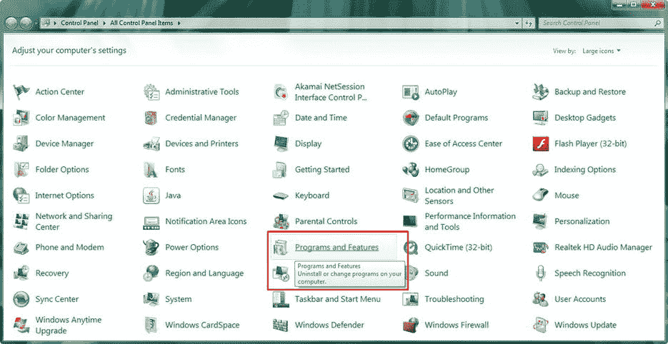

图 1-1。

Use the Programs and Features utility icon to uninstall or change programs on your computer workstation

单击“程序和功能”链接，或者在以前版本的 Windows 中双击图标，以启动该实用程序。然后，向下滚动查看您的工作站上是否安装了任何旧版本的 Java 开发工具(Java 5、Java 6 或 Java 7)。请注意，如果您有一个全新的工作站，您应该会发现您的系统上没有预装的 Java 或 NetBeans 版本。如果您确实找到了它们，请归还系统，因为它以前可能已经被使用过了！

如图 [1-2](#Fig2) 所示，在我的 Windows 7 HTML5 开发工作站上，我安装了一个旧版本的 Java，Java 7(2013 年 11 月 29 日)，占用了 344MB 的空间。要删除某个软件，请通过单击选择它(它将变为浅蓝色)，然后单击图顶部显示的卸载按钮。我留下了屏幕截图中显示的工具提示，“卸载该程序”，这样您就可以看到，如果您将鼠标悬停在程序和功能实用程序中的任何内容上，它会告诉您该功能的用途。

单击卸载按钮后，该实用程序将删除旧版本的 Java。如果您想要保留旧的 Java 项目文件，请确保备份您的 Java 项目文件文件夹(如果您还没有这样做的话)。确保定期备份工作站的硬盘驱动器，以免丢失任何工作。

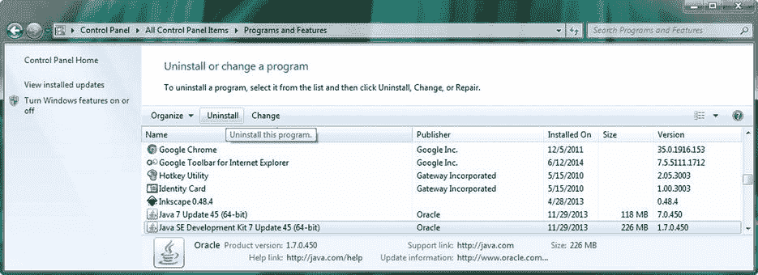

图 1-2。

Select any version of Java older than the current version (Java 8), and click the Uninstall button at the top

还要确保卸载所有版本的 Java 在我的例子中，有 64 位 Java 7 update 45 和 Java SDK 7u45，用于运行或执行 ide，如 NetBeans(或 Eclipse)，它们是用 Java 编程语言编写的。

接下来，您需要确定您的工作站上是否有任何旧版本的 NetBeans IDE。在我的例子中，如图 [1-3](#Fig3) 所示，我的 64 位 Windows 7 工作站上确实安装了 NetBeans 7 IDE。我选择了要删除的，然后单击了卸载/更改按钮，如左边所示，这将弹出一个自定义卸载摘要对话框，如右边所示。

制造商(在本例中是 NetBeans 开发团队)可以为他们的产品创建自定义的卸载摘要对话框，以便在卸载过程中使用，正如您在此处看到的。此对话框允许您选择是否要卸载 GlassFish Server 4 和 NetBeans UserDir 配置文件夹。因为您正在安装 NetBeans 和 GlassFish 的新版本，所以请选中这两个复选框，然后单击“卸载”按钮。

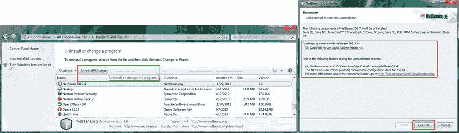

图 1-3。

Find and select any version of NetBeans that is older than version 8.0; also, uninstall old GlassFish versions

## 下载 Java JDK 8 和 NetBeans 8.0

既然已经从您的工作站上删除了 Java 和 NetBeans 的过时版本，那么您将需要访问 Internet，分别访问 Oracle 和 NetBeans 网站，以获得最新的开发 SDK 和 ide。在写这本书的时候，我将向你展示如何使用谷歌的搜索引擎(我使用这种方法是为了防止下载链接或 URL 发生变化)以及演示当前的直接下载 URL。

让我们先来看看 Java 8，因为它是你阅读本书时将要做的所有事情的基础。谷歌搜索 Java JDK 8 会给你甲骨文 Java 下载页面的搜索结果，该页面位于甲骨文技术网部分，如图 [1-4](#Fig4) 截图顶部所示。此页面的 URL 当前为 [`www.oracle.com/technetwork/java/javase/downloads/jdk8-downloads-2133151.html`](http://www.oracle.com/technetwork/java/javase/downloads/jdk8-downloads-2133151.html) 。值得注意的是，这个网址可能会在未来的任何时候改变，你可以随时使用谷歌搜索找到最新的。在下载 64 位 Windows 7/8 的 170MB SDK 安装程序文件之前，您需要单击 Java 8 下载表左上角显示的接受许可协议选项旁边的单选按钮。一旦您接受许可协议，这 11 个特定于操作系统的链接将被激活使用。

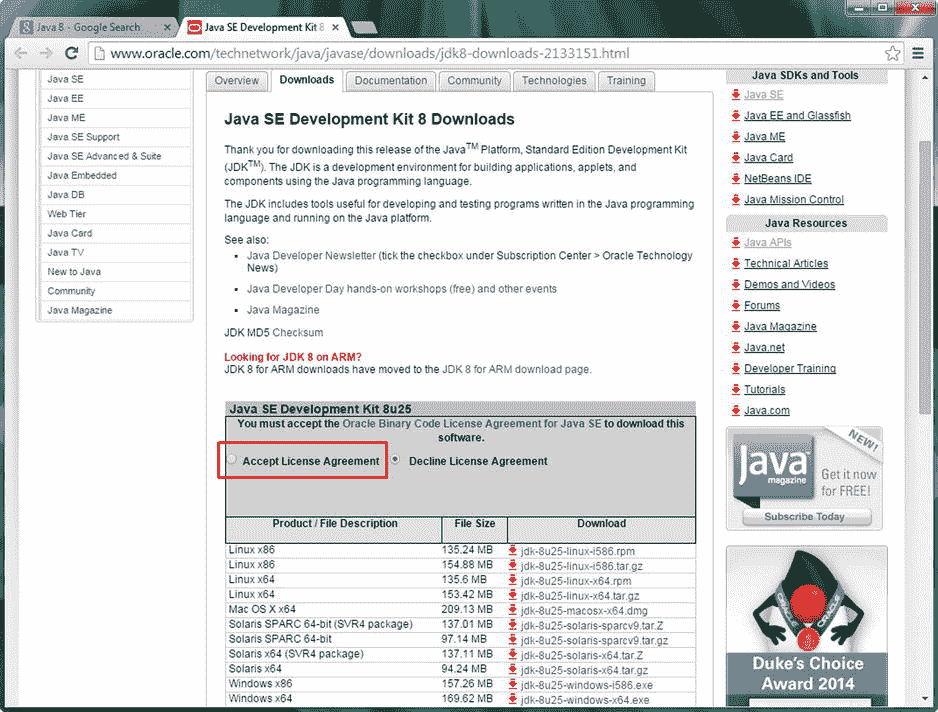

图 1-4。

Google the term “Java JDK 8,” open the JDK 8 Downloads page, and select Accept License Agreement

确保下载的 Java JDK 8 软件符合您的操作系统和位级别(x86 表示 32 位级别的操作系统)。大多数现代工作站使用 64 位 Linux、Mac、Solaris (Oracle)、Windows 7 或 Windows 8 操作系统。这将用操作系统名称后的 x64 描述来指定。

要找出操作系统的位级别，在 Windows 7 上，打开“开始”菜单，右键单击计算机条目，然后选择上下文菜单底部的“属性”选项。在 Windows 8 上，单击开始(如果您处于 Windows 7 桌面模式，则是桌面左下角的窗口窗格图标)，然后单击左下角的向下箭头图标，再单击电脑设置紫色齿轮图标，最后单击屏幕左下角的电脑信息条目。在这两个用例中，都应该有一个文本条目，说明系统类型和 32 位操作系统或 64 位操作系统。

现在您已经下载了 Java JDK 8 安装程序，接下来您需要做的是下载 NetBeans IDE 8.0。在谷歌上搜索 NetBeans 8.0，如图 [1-5](#Fig5) 顶部所示，点击下载搜索结果选项，将会进入 NetBeans IDE 8.0.1 下载页面(目前为 [`https://netbeans.org/downloads`](https://netbeans.org/downloads) )。如果您想像我一样在浏览器中保持两个选项卡都打开，那么右键单击下载链接，并选择在新选项卡中打开链接选项。

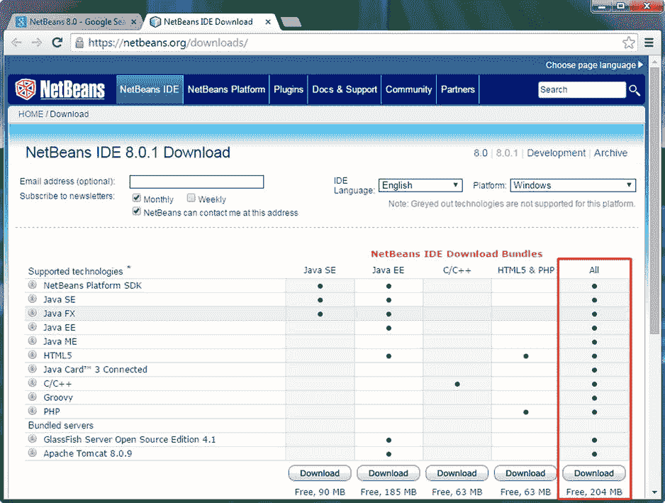

图 1-5。

Google the term “NetBeans 8.0,” open the NetBeans IDE 8.0.1 Download page, and download all versions

进入 NetBeans IDE 8.0 下载页面后，从页面右上角的下拉菜单中选择您正在使用的语言和平台(OS)。我选了英语和 Windows。现在，您可以单击页面底部三个下载按钮中的一个来下载支持 JavaFX 8 新媒体(因此将支持游戏开发)编程语言(应用编程接口[API])的 NetBeans IDE 8.0。当我详细讲述 Java 编程语言时，你会在第 3 章中了解到更多关于 API 的知识。

如果你只打算开发面向个人的 Java SE(标准版)和 JavaFX 应用(游戏)，那么点击第一个按钮。如果你要开发 Java EE(企业版)和 JavaFX 应用(游戏)用于企业(商务)，那么点击第二个按钮。如果您打算同时开发 JavaFX 和 HTML5 应用(游戏)，这也是我为自己的业务所做的，那么您可以单击第五个下载按钮，下载 NetBeans IDE 8.0 的“全部”版本。该版本将允许您使用 NetBeans 支持的所有编程语言进行开发！

因为 NetBeans IDE 是免费的，并且您的工作站硬盘驱动器可以处理大量数据，所以我建议您安装这个 204MB All 版本的 IDE，以防您需要 NetBeans IDE 8.0 作为软件开发人员能够为您提供的任何其他功能(Java EE、Java ME、PHP、HTML5、Groovy、GlassFish、Tomcat、C++)。如果您要安装客户端或 Java SE IDE 版本，这需要额外的 120MB 磁盘空间，但是如果您要安装服务器端或 Java EE IDE 版本，这需要不到 20MB 的额外磁盘空间。

单击下载按钮后，软件下载将开始。完成后，您就可以安装 Java 8 和 NetBeans IDE 8.0 了。最后，为了完成全面的 Java 8 游戏开发工作站的设置，您将获得一些辅助的新媒体内容工具。当你通读这本书时，你将能够使用工作站来创建可交付的 epic Java 8 游戏！越来越令人兴奋了！

## 安装 Java 8 软件开发环境

NetBeans IDE 8.0 需要安装 Java 才能运行，因此您需要先安装 JDK 和 JRE。因为你想用最新的、功能最丰富的 Java 版本开发游戏，所以你要安装 2014 年发布的 Java 8。安装最新版本的软件可以确保您拥有最新的功能和最少的错误。确保经常检查您是否使用了所有软件包的最新版本；毕竟，这些都是开源的，可以免费下载、升级和使用！

第一步是找到您将安装程序文件下载到系统中的位置。默认值应设置为 Windows 中的下载文件夹。我把我的下载到一个`C:/Clients/Java8`文件夹，如图 [1-6](#Fig6) 所示。

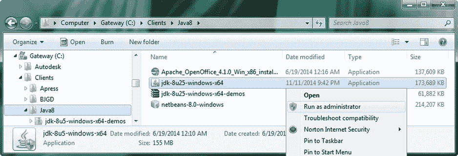

图 1-6。

Find the JDK 8 install file on your hard disk drive, right-click it, and select Run as administrator

该文件将使用格式 jdk-version-platform-bitlevel 命名，因此要找到最新的版本(在本例中，它是`jdk-8u25-windows-x64`)。右键单击它，并选择 Run as administrator 选项，这样安装程序就拥有了创建文件夹、向其中传输文件等所需的所有操作系统“权限”。

启动安装程序后，您会看到欢迎对话框，如图 [1-7](#Fig7) (左)所示。点击下一步按钮进入选择要安装的功能对话框，如图 [1-7](#Fig7) (右图)所示，并接受默认值。

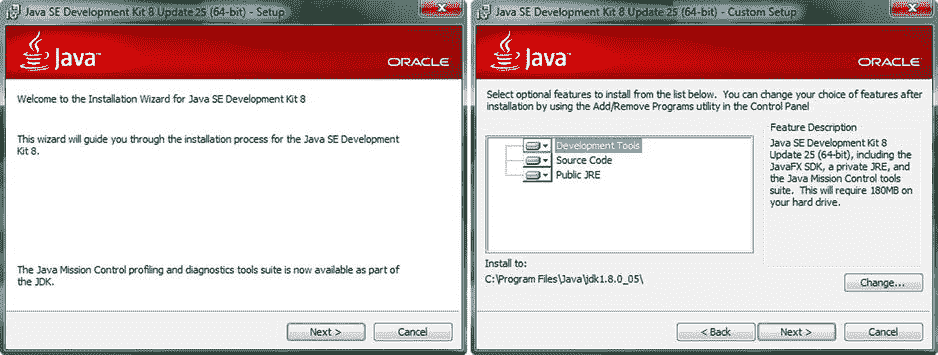

图 1-7。

Click Next in the Welcome dialog to advance to the Select Features to Install dialog, and then click the Next button

如你所见，安装程序会将 180MB 的软件安装到你工作站上的`C:\ProgramFiles\Java\jdk1.8.0_25`文件夹中。单击下一步按钮开始安装过程，安装过程将提取安装文件，然后使用动画进度条将它们复制到您的系统上，如图 [1-8](#Fig8) (左图)所示。

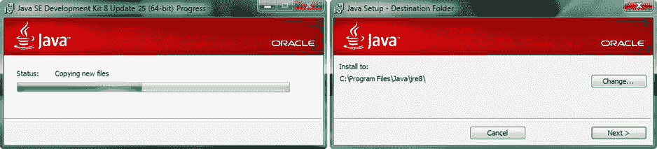

图 1-8。

Java 8 installation will extract and copy install files (left) and then suggest the installation directory (right)

在你的系统上安装了 Java SDK 之后，你会看到 JRE 安装对话框，如图 [1-8](#Fig8) (右图)所示。请确保您接受此 JRE 的默认安装位置；它应该安装在`\Java\jre8`文件夹中。最好允许 Oracle (Java SDK)将软件放在行业标准的文件夹位置，因为您将使用的使用此 JRE 的其他软件包(如 NetBeans IDE 8.0)将首先在那里查找它。单击“下一步”按钮安装 JRE。

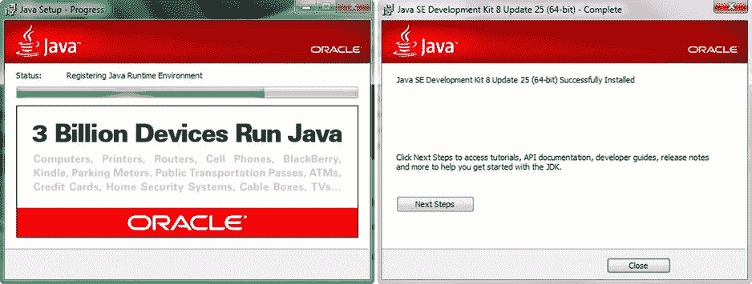

图 1-9。

During installation a progress bar shows you what is installing (left) and then gives you a completed dialog (right)

安装过程中会显示一个进度条，如图 [1-9](#Fig9) (左图)所示。完成后会显示安装成功对话框，如图 [1-9](#Fig9) (右图)所示。如果您想要访问教程、API 文档、开发人员指南、版本发布说明等等，您可以单击“后续步骤”按钮。

## 安装 NetBeans IDE 8.0

现在，你已经准备好安装 NetBeans 了，所以找到你的`netbeans-8.0-windows`文件(见图 [1-6](#Fig6) )。右键单击它，并选择“以管理员身份运行”选项来启动安装程序。一旦启动，你会看到如图 [1-10](#Fig10) 所示的对话框，它给你一个定制按钮，你可以用它来定制安装。

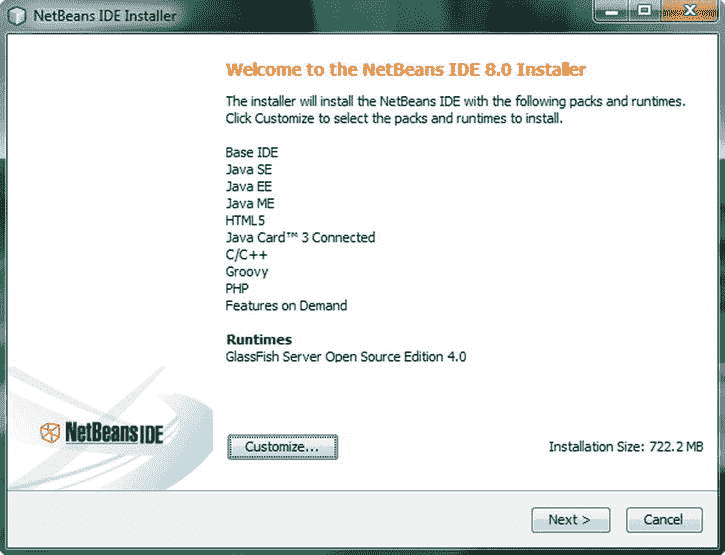

图 1-10。

The Welcome to the NetBeans IDE 8.0 Installer dialog

单击下一步按钮开始默认(完全)安装，您将看到 NetBeans IDE 8.0 许可协议对话框，如图 [1-11](#Fig11) (左图)所示。选中“我接受许可协议中的条款”复选框，并单击“下一步”按钮前进到“JUnit 许可协议”对话框，如图 [1-11](#Fig11) (右图)所示。

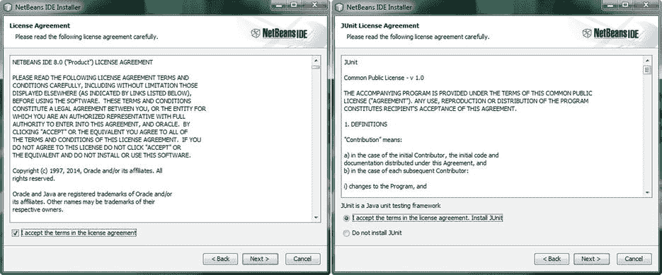

图 1-11。

Accept the terms of the license agreement, click the Next button (left), and then do the same for JUnit (right)

在 JUnit 许可协议对话框中，如图 [1-11](#Fig11) (右图)所示，单击我接受许可协议声明中的条款旁边的单选按钮，然后单击下一步按钮继续安装。如图 [1-12](#Fig12) 所示，接下来的两个安装程序对话框将允许您指定 NetBeans 8.0 和 GlassFish 4.0 在系统上的安装位置。我建议也接受这两个对话框中的默认安装位置。您会注意到，NetBeans 安装程序也在默认位置找到了您的 Java 安装。

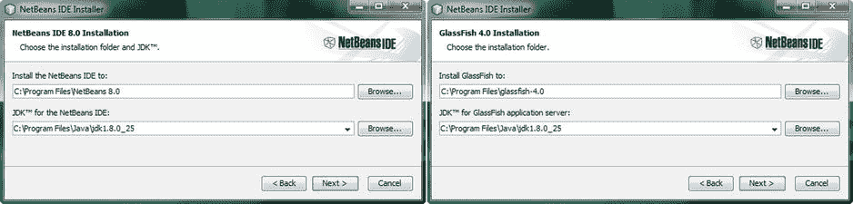

图 1-12。

Accept the default installation directory suggestions for NetBeans IDE (left) and GlassFish 4.0 (right)

一旦您接受了这些默认的安装位置，并单击 Next 按钮在这些对话框中前进，您将得到一个摘要对话框，如图 [1-13](#Fig13) (左)所示。此对话框包含一个“安装”按钮，该按钮将触发您在前面五个 NetBeans IDE 8.0 安装对话框中设置的安装。

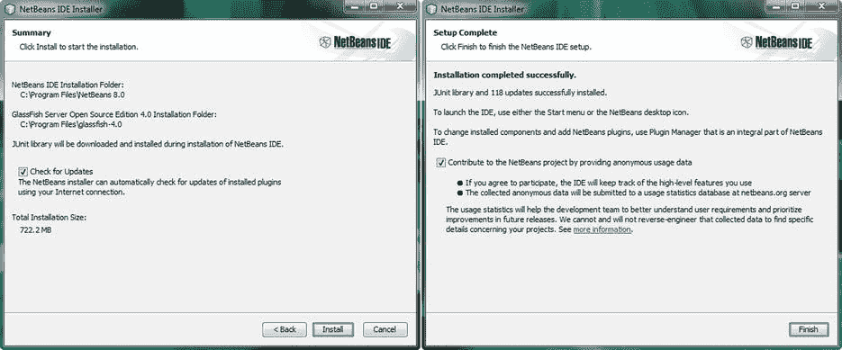

图 1-13。

Select the Check for Updates check box, and click the Install button (left) and the Finish button (right)

在安装过程中，您会看到安装对话框及其进度条，如图 [1-14](#Fig14) 所示，它会告诉您安装已完成的确切百分比，以及当前正在您的工作站上提取和安装哪些 IDE 文件。

当安装过程完成时，您将看到设置完成对话框，如图 [1-13](#Fig13) (右图)所示。现在，您可以在您的工作站上开发 Java 8 和 JavaFX 应用(游戏)了。

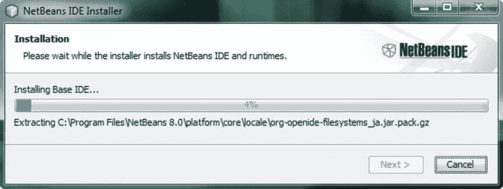

图 1-14。

The Installation progress dialog, showing the percentage of install complete

接下来，让我们下载五个最流行的免费开源新媒体内容开发软件包，这样您就拥有了 Java 8 游戏开发业务所需的所有工具！

之后，您将会看到我在工作站上使用的其他一些令人印象深刻的开源软件。这样，如果您愿意，甚至在完成本章之前，您就可以组装出终极软件开发工作站，仅用硬件(和操作系统)的成本就可以创建一个非常有价值的内容制作工作站！

## 安装新媒体内容制作软件

JavaFX 支持许多新媒体元素或资产的“类型”, Java FX 是 Java 8(和 Java 7)中的新媒体引擎，也是 Java 8 游戏开发的基础。新媒体的主要类型包括数字插图、数字图像、数字音频、数字视频和 3D，您将在本章的剩余部分安装领先的开源软件。

### 下载并安装 Inkscape

因为 JavaFX 支持数字插图软件包(如 Adobe Illustrator 和 FreeHand)中常用的 2D(或矢量)技术，所以您将下载并安装流行的开源数字插图软件包 Inkscape。

Inkscape 适用于 Linux、Windows 和 Mac 操作系统，就像你在本章中安装的所有软件包一样，所以你可以使用任何你喜欢的平台来开发游戏！

在网上找 Inkscape 软件包，去 Google 搜索，输入 Inkscape，如图 [1-15](#Fig15) ，左上方。单击下载链接(或右键单击，并在单独的选项卡中打开)，然后单击代表您正在使用的操作系统的图标。企鹅代表 Linux(最左边的图标)，窗口代表 Windows(中间的图标)，风格化的苹果代表 Mac(最右边的图标)。

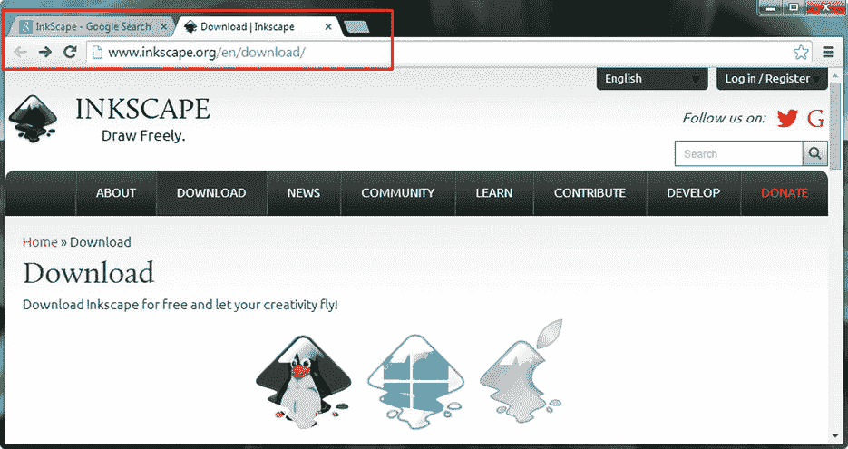

图 1-15。

Google the term “InkScape,” go to the Inkscape Download page, and click the icon that matches your OS

如果您想使用 64 位 Windows 版本的 Inkscape，请向下滚动，查看这三个图标下面的文本链接，以访问特定的操作系统下载。下载完软件后，右键单击它并以管理员身份运行，然后在您的工作站上安装软件。如果您有以前版本的 Inkscape，安装程序会将其升级到最新版本。您不需要使用本章前面使用的程序和功能实用程序来卸载 SDK 和 ide，它们不会像新媒体制作软件包那样升级以前的版本。

安装软件后，在任务栏上创建一个快速启动图标，这样只需单击鼠标即可启动 Inkscape。接下来，您将安装一个流行的数字图像软件包 GIMP，它允许您以 JavaFX 支持的 JPEG、PNG 或 GIF 数字图像文件格式为您的游戏创建“光栅”或基于像素(位图)的艺术作品。光栅图像不同于矢量，或形状，插图，所以你需要 GIMP。

### 下载和安装 GIMP

JavaFX 还支持使用光栅图像技术的 2D 图像，该技术将图像表示为像素阵列，常用于数字图像合成软件包，如 Adobe Photoshop 和 Corel Painter。在本节中，您将下载并安装流行的开源数字图像编辑和合成软件包 GIMP。该软件适用于 Linux、Windows、Solaris、FreeBSD 和 Mac 操作系统。

在网上找 GIMP 软件，去 Google 搜索，输入 GIMP，如图 [1-16](#Fig16) 所示。

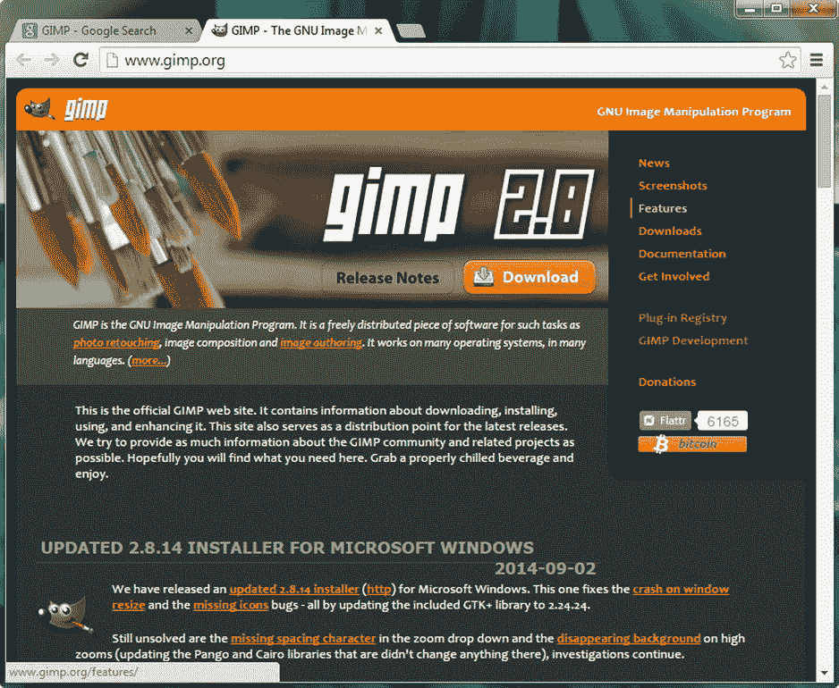

图 1-16。

Google the term “GIMP,” go to the GIMP Downloads page, and click the Download GIMP link

单击下载链接(或右键单击，并在单独的选项卡中打开它)，然后单击下载 GIMP 2.8.14(或代表您正在使用的操作系统的最新版本)。下载页面将自动检测您正在使用的操作系统，并为您提供正确的操作系统版本；对我来说，是 Windows。下载并安装最新版本的 GIMP，然后为您的工作站任务栏创建一个快速启动图标，就像您为 Inkscape 所做的那样。接下来，您将安装一个强大的数字音频编辑和音频效果软件包，名为 Audacity。

### 下载并安装 Audacity

JavaFX 支持使用数字音频技术的数字音频序列。数字音频通过采集数字音频样本来表示模拟音频。数字音频内容通常使用数字音频合成和序列器软件包创建，如 Propellerhead Reason 和 Cakewalk Sonar。在本节中，您将下载并安装流行的开源数字音频编辑和优化软件包 Audacity。Audacity 可用于 Linux、Windows 和 Mac 操作系统，因此您可以使用任何您喜欢的操作系统平台来为基于 Java 8 和 JavaFX 的游戏创建和优化数字音频。

要在网上找到 Audacity 软件包，使用谷歌搜索引擎，输入 Audacity，如图 [1-17](#Fig17) 左上角所示。单击下载链接(或者右键单击，并在单独的选项卡中打开)，然后单击 Audacity for Windows(或者代表您正在使用的操作系统的版本)。

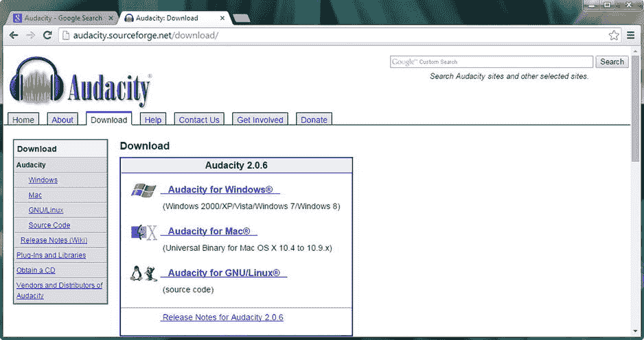

图 1-17。

Google the term “Audacity,” go to the Audacity Download page, and click a link matching your OS

下载并安装 Audacity 的最新版本(目前是 2.0.6)，然后为您的工作站任务栏创建一个快速启动图标，就像您为 Inkscape 和 GIMP 所做的那样。接下来，您将安装一个强大的数字视频编辑和特效软件包，名为 EditShare Lightworks。

### 下载并安装 EditShare Lightworks

JavaFX 还支持数字视频，它使用基于光栅像素的运动视频技术。光栅将视频表示为一系列帧，每个帧包含一个基于像素阵列的数字图像。数字视频资产通常是使用数字视频编辑和特效软件包创建的，如 Adobe After Effects 和 Sony Vegas。在本节中，您将下载并安装名为 Lightworks 的开源数字视频编辑软件。

EditShare 的 Lightworks 曾经是一个付费软件包，直到它被开源。您必须在 Lightworks 网站上注册才能下载和使用该软件。该软件包适用于 Linux、Windows 和 Mac 操作系统。要在网上找到 Lightworks，进入谷歌搜索，输入 Lightworks，如图 [1-18](#Fig18) 所示，在左上方。单击下载链接(或右键单击，并在单独的选项卡中打开)，然后单击相应的下载按钮和代表您正在使用的操作系统的选项卡。下载页面将自动检测您正在使用的操作系统，并选择正确的操作系统选项卡；在我的情况下，Windows。

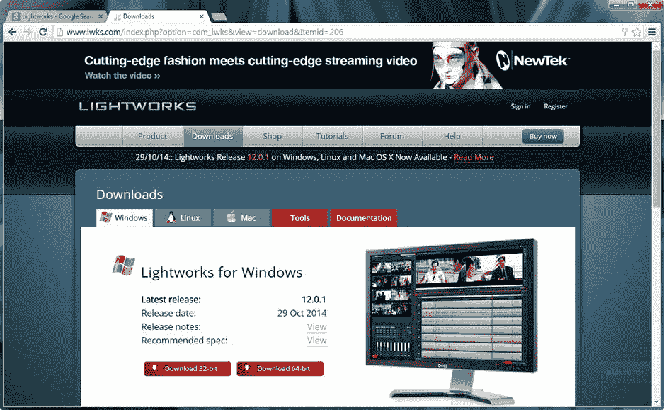

图 1-18。

Google the term “Lightworks,” go to the Lightworks Downloads page, and click the tab that matches your OS

如果您还没有注册，请在 Lightworks 网站上注册。一旦获得批准，您就可以下载并安装最新版本的 Lightworks。安装软件，并为您的任务栏创建一个快速启动图标，就像您对其他软件所做的那样。接下来，您将安装一个名为 Blender 的 3D 建模和动画包。

### 下载和安装 Blender

JavaFX 最近开始支持在 JavaFX 环境之外创建的 3D 新媒体资产，这意味着您将能够使用第三方软件包创建 3D 模型、纹理和动画，例如 Autodesk 3D Studio Max 或 Maya 和 NewTek Lightwave 3D。在本节中，您将下载并安装流行的开源三维建模和动画软件包 Blender。Blender 适用于 Linux、Windows 和 Mac 操作系统，因此您可以使用任何您喜欢的操作系统平台来创建和优化 3D 模型、3D 纹理映射和 3D 动画，以便在 Java 8 和 JavaFX 游戏中使用。

要在网上找到 Blender 软件，使用谷歌搜索引擎，输入 Blender，如图 [1-19](#Fig19) 所示。点击正确的下载链接下载并安装 Blender，然后创建快速启动图标。

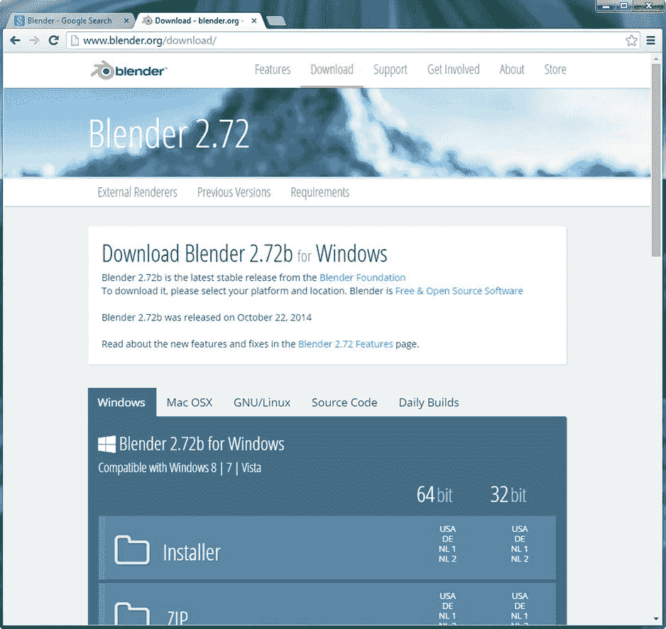

图 1-19。

Google the term “Blender,” go to the Blender Download page, and click the tab for your OS

## 其他感兴趣的开放源码软件包

我在我的新媒体内容制作业务中使用了许多其他的专业级开源软件包，我想我应该让你知道一下，以防你没有听说过它们。这将为您到目前为止构建的新媒体制作工作站增加更多功能和多样性。值得注意的是，您已经为自己节省了数千美元，否则在进行所有这些大量下载和安装的过程中，您将花费在类似的付费内容制作软件包上。我想你可能会说我的座右铭是，“第一次就做对，并确保一直做下去”，所以让我告诉你一些其他免费的，甚至一些更实惠的新媒体内容制作软件包，我已经安装在我自己的内容制作工作站上。

除了过去售价高达六位数的 EditShare Lightworks 软件包之外，开源软件的最佳价值之一是一个商业生产力软件套件，Oracle 在收购 Sun Microsystems 后将其开源。甲骨文将其 OpenOffice 软件套件转移到流行的 Apache 开源项目中。OpenOffice 4.1 是一个完整的办公效率软件套件，包含六个成熟的商务效率软件包！因为您的内容制作代理实际上是一个成熟的企业，您可能应该了解这个软件，因为它是一个非常可靠的开源软件产品。可以在 [`www.openoffice.org`](http://www.openoffice.org/) 找到；这个流行的商业软件包已经被像你这样精明的专业人士下载了超过一亿次，所以正如他们所说的，这不是一个玩笑！

Audacity 数字音频编辑软件的一个很好的补充是 Rosegarden MIDI sequencing 和 music composition and scoring 软件，它可以用于音乐创作和打印音乐出版的结果乐谱。玫瑰园，目前在 14.02 版本，正在从 Linux 移植到 Windows，可以通过谷歌搜索或在 [`www.rosegardenmusic.com`](http://www.rosegardenmusic.com/) 找到。

另一个令人印象深刻的音频、MIDI 和声音设计软件包是 Qtractor 如果您运行的是 Linux 操作系统，请务必通过谷歌搜索或前往 [`https://Qtractor.SourceForge.net`](https://Qtractor.SourceForge.net) 下载并安装这个专业级数字音频合成软件包。

对于 3D 角色建模和动画，有机会一定要去看看 DAZ Studio 的 3D 软件包( [`www.daz3d.com`](http://www.daz3d.com) )。DAZ Studio Pro 目前的版本是 4.6，没错，是免费的！你必须登录并注册，就像你在 EditShare Lightworks 上做的那样，但这只是小小的代价！这个网站上还有一个免费的 3D 建模软件包，名为 Hexagon 2.5，还有一个不到 20 美元的流行地形生成软件包，名为 Bryce 7.1 Pro。DAZ Studio 网站上最贵的软件是 Carrara (150 美元)和 Carrara Pro (285 美元)。DAZ 工作室的大部分收入来自销售各种类型的角色模型，所以看看吧，因为它是 3D 内容(虚拟)世界中不可忽视的力量！

另一个令人印象深刻(基本版免费)的世界级软件包是英国 Planetside Software 公司的 Terragen 3.2。你可以从 [`https://planetside.co.uk`](https://planetside.co.uk) 下载基础版，也可以加入它的论坛。我已经在我的几本 Android 应用开发书中使用过这个软件，所以我知道它对多媒体应用和游戏很有效。它也被专业电影制作人使用，因为它的质量水平是原始的。

Caligari TrueSpace 7.61 也是非常优秀的免费 3D 建模和动画软件。节目，也就是“自由而活着！”根据 Caligari 的网站( [`https://Caligari.us`](https://Caligari.us) )，你仍然可以从那里下载它，当它最初由 Caligari 公司的创始人罗曼·奥曼迪(后来被微软收购)开发时，它曾花费近 1000 美元。一个专业级的 3D 建模和动画软件包，这个程序在全盛时期拥有数百万用户。这是一个非常酷的软件，有一个有趣的用户界面，所以一定要抓住它！

另一个你应该看看的 3D 渲染软件是 POV-Ray(视觉光线跟踪器的持久性)，它可以与任何 3D 建模和动画软件包配合使用，使用高级光线跟踪渲染算法来生成令人印象深刻的 3D 场景。POV-Ray 网站上的最新版本([www.povray.org](http://www.povray.org/))是 3.7，与 64 位和多核(多线程)兼容，可以免费下载！

Bishop3D 是一个很酷的 3D 建模软件包，专门设计用于 POV-Ray。该软件可用于创建自定义 3D 对象，然后可将其导入 POV-Ray(然后导入 JavaFX)以在您的游戏中使用。最新的版本是 Windows 7 版的 1.0.5.2，下载量为 8MB。该软件可以在 [`www.bishop3d.com`](http://www.bishop3d.com/) 找到，目前可以免费下载！

另一个值得研究的免费 3D 建模软件是 Wings 3D。这个软件可以用来创建自定义的 3D 对象，然后可以导入到 JavaFX 中，在您的游戏中使用。最新版本是 64 位、16MB 的下载版本，是 1.5.3，于 2014 年 4 月发布，适用于 Windows 7、Mac OS X 和 Ubuntu Linux。该软件可以在 [`www.wings3d.com`](http://www.wings3d.com/) 找到，目前可以免费下载！

对于 UI 设计原型，Evolus 的免费软件包 Pencil 2.0.6 允许您在用 Java、Android 或 HTML5 创建 UI 设计之前，轻松地进行原型设计。该软件位于 [`http://pencil.evolus.vn`](http://pencil.evolus.vn/) ，可用于 Linux、Windows 和 Mac OSs。

接下来，您将看到我是如何在任务栏上组织一些基本的操作系统实用程序和开源软件的。

## 在任务栏区域组织快速启动图标

对于某些操作系统实用程序，如计算器、文本编辑器(记事本)和文件管理器(资源管理器)，我会在任务栏上创建快速启动图标，因为这些实用程序在编程和新媒体内容开发工作流程中经常使用。我还将各种新媒体开发、编程和办公效率应用作为快速启动图标。图 [1-20](#Fig20) 显示了一打这样的程序，包括你刚刚安装的所有程序，按照你安装的顺序，还有一些其他的程序，比如 OpenOffice 4.1，DAZ Studio Pro 4.6 和 Bryce 7.1 Pro。

图 1-20。

Make taskbar Quick Launch icons for key system utilities, NetBeans 8.0, and new media production software

有几种方法可以创建这些快速启动图标:您可以将程序从“开始”菜单拖放到任务栏上，或者右键单击桌面上或资源管理器文件管理器中的图标，然后从上下文菜单中选择“将该程序固定到任务栏”。一旦图标出现在任务栏上，你可以简单地通过向左或向右拖动来改变它们的位置。

恭喜您，您已经建立了一个高度优化的新媒体 Java 8 游戏开发工作站，它将允许您创建您或您的客户可以想象的任何新媒体 Java 8 游戏！

## 摘要

在第一章中，我确保您拥有开发出色的 Java 8 游戏所需的一切，包括最新版本的 Java 8、JavaFX 和 NetBeans 8.0 以及所有最新的开源新媒体软件。

您首先下载并安装了最新的 Java JDK 8 和 NetBeans IDE 8.0 软件。然后，你对大量专业开源新媒体工具做了同样的事情。

在下一章中，我将向您展示如何使用 NetBeans 8.0 创建一个 Java 8 项目。