# 二、设置 Java 8 IDE：NetBeans 8.0 简介

让我们从第 2 章的[开始，考虑 NetBeans IDE 8.0，因为它是您将用来创建 Java 8 游戏的主要软件。尽管 Java JDK 8 是 Java 8 游戏和 NetBeans 8.0 的基础，但您将从了解 NetBeans 开始您的旅程，因为它是“前端”，是您查看 Java 游戏项目的窗口。](02.html)

NetBeans 8.0 是 Java JDK 8 的官方集成开发环境，因此，它将是你在本书中使用的。这并不是说您不能使用另一个 IDE，例如 Eclipse 或 IntelliJ，它们分别是 Android 4.x (32 位)和 Android 5.x (64 位)的官方 IDE，但是我更喜欢使用 NetBeans 8.0 来开发我的新媒体应用以及 Java 8、JavaFX 8、HTML5、CSS3(级联样式表 3)和 JavaScript 软件开发标记和编程范例的游戏开发。

这不仅是因为 NetBeans 8.0 集成了 JavaFX Scene Builder，您将在本书的第 5 章中了解到这一点，还因为它也是一个 HTML5 IDE，我使用 Java 8、JavaFX 8、Android 4.x 或 Android 5.x 以及 HTML5 为我的客户创建我设计的所有东西。我这样做是为了让内容可以在封闭的或专有的操作系统和平台上工作。正如你在[第一章](01.html)中观察到的，我更喜欢开源软件和平台。

首先，您将了解 NetBeans 8.0 的新增功能。该版本 NetBeans 与 Java 8 同时发布，版本号同步并非巧合。您将会发现为什么您希望使用 NetBeans 8.0，而不是较旧的 NetBeans 版本，例如 NetBeans 7.4 或更早的版本。

接下来，您将研究 NetBeans IDE 8.0 的各种属性，这些属性使它成为 Java 8 游戏开发的宝贵工具。您将无法获得本章中所有特性的实际操作经验，但是您将在本书的过程中探索它能为您做的所有很酷的事情(您将需要将一个高级代码库放在适当的位置，以真正锻炼一些特性)。

最后，您将学习如何使用 NetBeans 8.0 创建您的 Java 8 和 JavaFX 项目，以便在阅读本书的过程中创建您将要开发的 Java 8 游戏。

## NetBeans 8.0 的主要属性:智能 IDE

假设您已经为新媒体内容和游戏开发准备好了专业级工作站，您需要删除所有过时的 JDK 和 ide，并确保您的系统上安装了最新的 V8 Java 和 NetBeans 软件，并准备就绪。如果你是新手，没有适合游戏的工作站，去沃尔玛或 PriceWatch.com，购买一台经济实惠的多核(使用 4 核、6 核或 8 核)64 位计算机，运行 Windows 8.1(或 9.0，如果有)，至少有 4GB、6GB 或 8GB 的 DDR3 (1333 或 1600 内存访问速度)系统内存和 750GB，甚至 1TB 的硬盘驱动器。

### NetBeans 8.0 很聪明:将您的代码编辑放入 Hyperdrive

虽然 IDE 确实像一个文字处理器，只是适合于编写代码文本而不是创建业务文档，但是像 NetBeans 这样的编程集成开发环境为您的编程工作过程所做的工作比文字处理器为您的文档创作工作过程所做的工作多得多。

例如，您的文字处理器不会就您为业务编写的内容提出实时建议，而 NetBeans IDE 会在您编写代码时查看您正在编写的内容，并帮助您编写代码语句和结构。

NetBeans 要做的事情之一是为您完成代码行，并对代码语句应用颜色以突出不同类型的构造(类、方法、变量、常量、引用等)(有关更多详细信息，请参见[第 3 章](03.html))。NetBeans 还将应用代码缩进的行业标准，以使您的代码更易于阅读(对于您自己和游戏应用开发团队的其他成员来说)。

此外，NetBeans 将提供匹配的代码结构括号、冒号和分号，以便您在创建复杂、深度嵌套或异常密集的编程结构时不会迷路。从 Java 8 game 初学者到 Java 8 game developer，您将创建这样的结构，我将指出您遇到的密集、复杂或深度嵌套的 Java 8 代码。

NetBeans 还可以提供引导代码，例如您将在本章稍后创建的 JavaFX 游戏应用引导代码(请参见“创建您的 Java 8 项目:InvinciBagel”一节)，以及代码模板(您可以填写和自定义)、编码提示和技巧以及代码重构工具。随着您的 Java 代码变得越来越复杂，它也成为代码重构的更好候选，这可以使代码更容易理解，更容易升级，并且更高效。NetBeans 还可以自动重构您的代码。

如果你想知道，代码重构是改变现有计算机代码的结构，使其更有效或可伸缩，而不改变其外部行为，即它完成的任务。例如，您可以使用 Java 8，通过实现 Lambda 表达式，获得 Java 6 或 Java 7 代码并使其更高效。

此外，NetBeans 提供了各种类型的弹出帮助器对话框，其中包含方法、常量、资产引用(请参见[第 3 章](03.html))，甚至是关于如何构造代码语句的建议，例如，何时使用强大的新 Java 8 Lambda 表达式功能来使您的代码更加简化并与多线程兼容可能是合适的。

### NetBeans 8.0 是可扩展的:用多种语言进行代码编辑

您的文字处理器不能做的另一件事是允许您向它添加功能，而 NetBeans 可以使用其插件体系结构做到这一点。描述这种类型的体系结构的术语是可扩展的，这意味着如果需要，它可以扩展以包括附加的特性。因此，例如，如果您想扩展 NetBeans 8.0 以允许您使用 Python 编程，您可以这样做。NetBeans 8.0 也可以以这种方式支持较旧的语言，如 COBOL 和 BASIC，尽管目前大多数流行的消费电子设备都使用 Java、XML、JavaScript 和 HTML5，但我真的不知道为什么有人愿意花时间这样做。不过，我在谷歌上搜索了一下，有人在 NetBeans 8.0 中用 Python 和 COBOL 编写代码，所以有现实证明 IDE 确实是可扩展的。

可能是因为它的可扩展性，NetBeans IDE 8.0 支持许多流行的编程语言，包括客户端的 C、C++、Java SE、JavaScript、XML、HTML5 和 CSS，以及服务器端的 PHP、Groovy、Java EE 和 JavaServer Pages (JSP)。客户端软件在终端用户持有或使用的设备上运行(在 iTV 的情况下)；服务器端软件在服务器上远程运行，当软件在服务器上运行时，它通过互联网或类似的网络与最终用户对话。客户端软件效率更高，因为它位于运行它的硬件设备的本地，因此更具可伸缩性:随着越来越多的人在任何给定的时间点使用该软件，不需要服务器经历过载。

### NetBeans 8.0 是高效的:有组织的项目管理工具

一个好的编程 IDE 需要能够管理可以变得非常大的项目，包括包含在项目文件夹层次结构中的数百个文件夹中的超过一百万行代码，以及数千个文件和新媒体资产。因此，项目管理功能在任何主流 IDE 中都必须非常健壮。NetBeans 8.0 包含大量的项目管理功能，允许您以多种不同的方式查看 Java 8 游戏开发项目及其相应的文件以及它们之间的相互关系。

有四种主要的项目管理视图或“窗格”,可以用来查看项目中不同类型的相互关系。(我称它们为窗格，因为整个 IDE 都在我称之为窗口的地方)。我跳到前面(跳到这一章的末尾，一旦你的 Java 8 游戏项目已经创建好了)并创建了图 [2-1](#Fig1) 中的截图。这个屏幕截图显示了在这个新项目中打开的四个项目管理窗格，以便您可以准确地看到它们将向您显示什么。

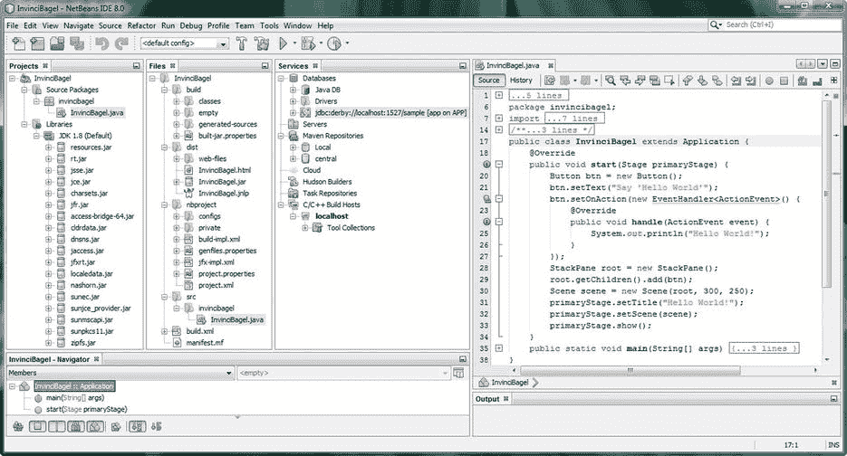

图 2-1。

Project management panes, at the left of the IDE, include Projects, Files, Services, and Navigator

屏幕左侧的项目窗格显示了构成您的(游戏)项目的 Java 源代码包和库。下一个窗格是文件窗格，它包含硬盘上的项目文件夹和文件层次结构。服务窗格包含数据库、服务器、存储库和构建主机，如果它们在项目中使用的话(这些主要是服务器端技术，以及开发团队使用的技术，所以我不打算详细讨论这些)。

项目窗格应该一直保持打开状态(如图 [2-7](#Fig7) 到 [2-21](#Fig21) 所示)。项目窗格为您提供了 Java 8 游戏项目中所有项目源代码和资源(内容)的主要访问点。“文件”窗格不仅显示项目文件夹和文件层次结构，还显示每个文件中的数据和 FXML 标记(JavaFX)或 Java 8 代码层次结构。

导航窗格(底部)显示了 Java 代码结构中存在的关系。在这种情况下，它们是`InvinciBagel`类、`.start()`方法和`.main()`方法(更多信息，参见[第 3 章](03.html))。

### NetBeans 8.0 是用户界面设计友好的:UI 设计工具

NetBeans 8.0 还为大量平台设计了 GUI 拖放设计工具，包括 Java SE、Java EE、Java ME、JavaFX 和 Java Swing 以及 C、C++、PHP、HTML5 和 CSS3。NetBeans 提供了可视编辑器，可以为您编写应用的 UI 代码，因此您所要做的就是让屏幕上的可视内容看起来像您希望它在游戏应用中的样子。由于游戏使用 JavaFX 新媒体(游戏)引擎，您将在本书的第 5 章中了解 JavaFX Scene Builder，这是一种基于 FXML 的高级可视化设计编辑器。

JavaFX 拥有 Prism 游戏引擎和 3D(使用 OpenGL ES[OpenGL for Embedded Systems])支持，因此我将重点介绍 JavaFX 场景图和 JavaFX APIs。这里的假设是，你可能想要构建最先进的 Java 8 游戏，利用 JavaFX 引擎(现在是 Java 8 的一部分，还有 Lambda 表达式)将是实现这一目标的方法。开发游戏的最快方法是利用 Java 8 和 JavaFX 环境慷慨提供的高级代码和编程结构，用于创建包含强大新媒体元素的尖端应用(在这里是游戏)。

### NetBeans 8.0 对错误不友好:用调试器来消除错误

所有的计算机编程语言都有一个假设，即“bug”或不完全符合您要求的代码对您的编程项目的负面影响，会随着它保持未修复状态的时间越长而越大，因此 bug 必须在它们“出生”时就被消灭。NetBeans bug 查找代码分析工具，集成的 NetBeans 调试器，以及与第三方 FindBugs 项目的集成，正如您现在从经验(Audacity)中了解到的，可以在 SourceForge 网站( [`http://findbugs.sourceforge.net`](http://findbugs.sourceforge.net/) )(如果您想要独立版本)，所有这些都补充了我前面讨论的实时“随键入”代码纠正和效率工具(请参见“NetBeans 8.0 是智能的:将您的代码编辑放入 Hyperdrive”一节)。

您的 Java 代码不会很复杂，直到本书的稍后部分，所以一旦您的知识库稍微高级一点，我将介绍当您需要使用这些工具时它们是如何工作的。

### NetBeans 8.0 是一个速度狂:用分析器优化代码

NetBeans 还有一个叫做 Profiler 的东西，它会在 Java 8 代码运行时查看代码，然后告诉您它使用内存和 CPU 周期的效率。这允许您优化代码，使其更有效地使用关键系统资源，这对 Java 8 游戏开发非常重要，因为这将影响在功能不太强大的系统上(例如，在单核和双核 CPU 上)玩游戏的流畅度。

这个分析器是一个动态的软件分析工具，因为它在 Java 代码运行时查看您的代码，而 FindBugs 代码分析工具是一个静态的软件分析工具，因为它只是在编辑器中查看您的代码，而您的代码并没有在系统内存中编译和运行。NetBeans 调试器允许您在代码运行时逐句通过代码，因此可以将该工具视为从静态(编辑)到动态(执行)代码分析模式的混合体。

在创建了 Java 8 (JavaFX)游戏引擎的基础之后(在以下几节中)，您将运行 Profiler 来查看它在 NetBeans IDE 8.0 中是如何工作的。我将在前面尽可能多地介绍 NetBeans 的关键特性，以便您能够熟悉这个软件。

## 创建您的 Java 8 游戏项目:InvinciBagel

让我们言归正传，为你的游戏创造基础。我将演示如何创建一个原创游戏，以便您可以看到开发一个尚不存在的游戏所涉及的过程，这与大多数游戏编程书籍相反，它们复制了市场上已经存在的游戏。我得到了我的客户 Ira Harrison-Rubin 的许可，他是 BagelToons 系列的漫画家/作家/幽默作家，让读者在这本书的过程中看到他的 InvinciBagel 卡通游戏的创作过程。

单击任务栏上的快速启动图标(或双击桌面上的图标)启动 NetBeans 8.0，您将看到 NetBeans 启动屏幕，如图 [2-2](#Fig2) 所示。此屏幕包含一个进度条(红色),将告诉您如何配置 NetBeans IDE 以供使用。这包括将 IDE 的各种组件加载到您的计算机系统内存中，以便在开发过程中可以流畅地实时使用它们。

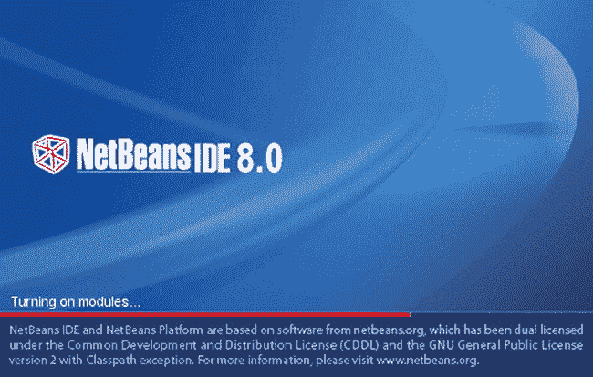

图 2-2。

Launch NetBeans 8.0, using the Quick Launch icon

将 NetBeans IDE 8.0 加载到系统内存后，屏幕上将显示 NetBeans 8.0 起始页，如图 [2-3](#Fig3) 所示。单击“起始页”选项卡右侧的“x”关闭此页面。

这将显示我称之为处女 IDE，没有项目活动。现在就享受吧，因为你很快就会在这个 IDE 中填满你的项目组件的窗格(你可以在图 [2-4](#Fig4) 中看到这个空 IDE 的一部分，它包含菜单和快捷图标，除此之外没什么)。

如果您想知道，每次启动 NetBeans IDE 时都会显示起始页，如果您想稍后打开起始页选项卡，也许是为了浏览媒体库部分(演示)和教程，您可以这样做！要随时打开起始页，可以使用 NetBeans IDE 8.0 的“帮助”菜单和“起始页”子菜单。为了将来参考，我通常这样标注菜单顺序:帮助➤开始菜单。

在 NetBeans IDE 8.0 中，您要做的第一件事就是创建一个新的 InvinciBagel 游戏项目！为此，您将使用 NetBeans 8.0 新项目系列对话框。这是我之前提到的那些有用的 Java 编程特性之一(参见“NetBeans IDE 8.0 是智能的:将您的编辑放入 Hyperdrive”一节)，它使用正确的 JavaFX 库、`.main()`和`.start()`方法以及导入语句创建一个引导项目(有关更多详细信息，请参见[第 3 章](03.html))。

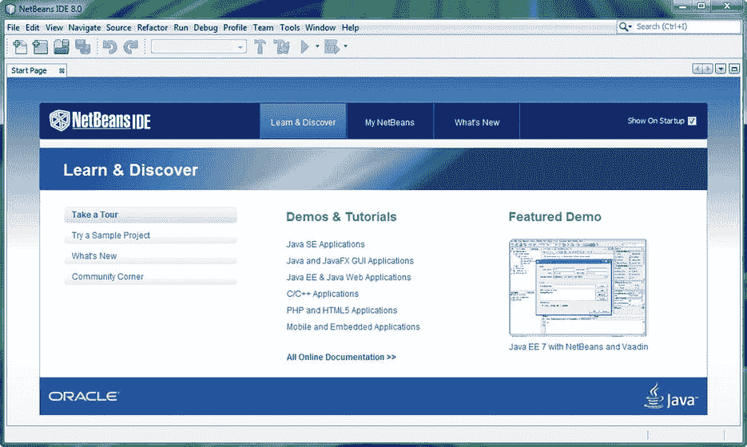

图 2-3。

Close the Start Page tab, at the top left of the screen, by clicking the “x” at the right of the tab to reveal NetBeans IDE 8.0

点击 DE 左上角的文件菜单，如图 [2-4](#Fig4) (左图)，然后选择新建项目(第一个菜单项)。注意，在这个选项的右边，有一个键盘快捷键(Ctrl+Shift+N)，以防你想记住它。

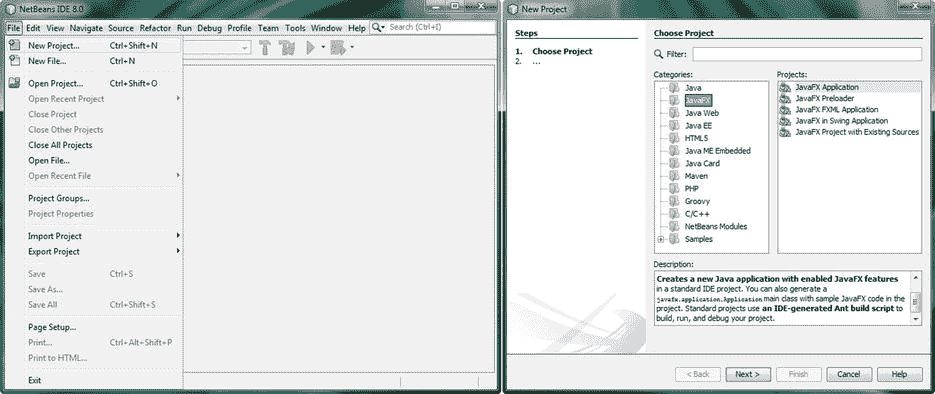

图 2-4。

Showing virgin NetBeans 8.0 IDE (left) and a JavaFX New Project dialog (right)

如果您想要使用此键盘快捷方式来调出新的项目系列对话框，请按住键盘上的 CTRL 和 Shift 键(同时按住),并在按住它们的同时按下 N 键。这将做同样的事情使用文件➤新项目菜单序列。

系列中的第一个是选择项目对话框，如图 [2-4](#Fig4) (右图)所示。因为您将在游戏中使用强大的 JavaFX 新媒体引擎，所以从“类别”窗格的编程语言类别列表中选择 JavaFX，并且因为游戏是一种应用，所以从“项目”窗格中选择 JavaFX 应用。

请记住，Oracle 使 JavaFX 成为 Java 7 和 Java 8 的一部分，因此 JavaFX 游戏也是 Java 游戏，而在 Java 7 之前(在 Java 6 中)，JavaFX 是它自己独立的编程语言！JavaFX 引擎必须重新编码为 Java (7 和 8) API(一组库),才能成为 Java 编程语言的无缝部分。JavaFX API 取代了 AWT (Abstract Windowing Toolkit)和 Swing，虽然这些旧的 UI 设计库仍然可以在 Java 项目中使用，但它们通常只由遗留(旧的)Java 代码使用，以便这些项目可以在 Java 7 和 8 中编译和运行。在本章的稍后部分，您将编译并运行您在这里创建的新项目。

请注意，在其他窗格下面有一个描述窗格，它会告诉您您的选择会给你带来什么。在这种情况下，这将是一个启用了 JavaFX 特性的新 Java 应用；这里，“enabled”表示 JavaFX API 库将包含(并启动)在 Java 应用项目的类和方法中，您将很快在代码中看到这一点(有关代码含义的更多信息，请参见[第 3 章](03.html))。

点击下一个按钮，进入系列中的下一个对话框，即查找特征对话框，如图 [2-5](#Fig5) 所示。该对话框在“激活 JavaFX 2”时显示进度条，这相当于在项目代码基础结构中安装 JavaFX API 库。你会发现有时候 JavaFX 8 还是被称为 JavaFX 2 (2.3 是人们开始使用 JavaFX 8 这个名字之前 JavaFX 的最新版本，可能是为了和 Java 8 同步)。我也看到了关于 JavaFX 3 的讨论，它现在被称为 JavaFX 8，因为 JavaFX 现在是 Java 8 的一部分，所以在本书中我将简称它为 JavaFX。

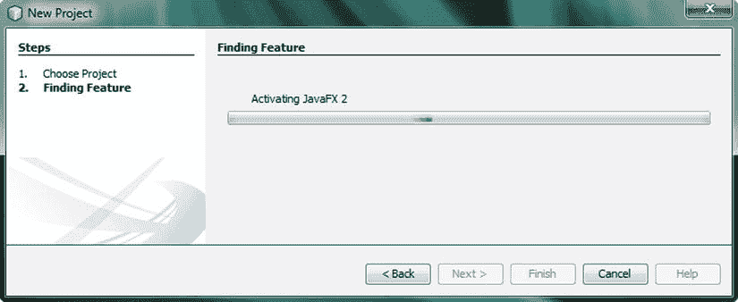

图 2-5。

Step 2: Finding Feature dialog, showing the progress bar for the process of activating JavaFX

一旦 Finding Feature 对话框为你的游戏项目激活了 JavaFX，你将得到 Name and Location 对话框，如图 [2-6](#Fig6) 所示。将项目命名为 InvinciBagel，保留默认的项目位置、项目文件夹、JavaFX 平台，并按照 NetBeans 8.0 的配置方式创建应用类设置。

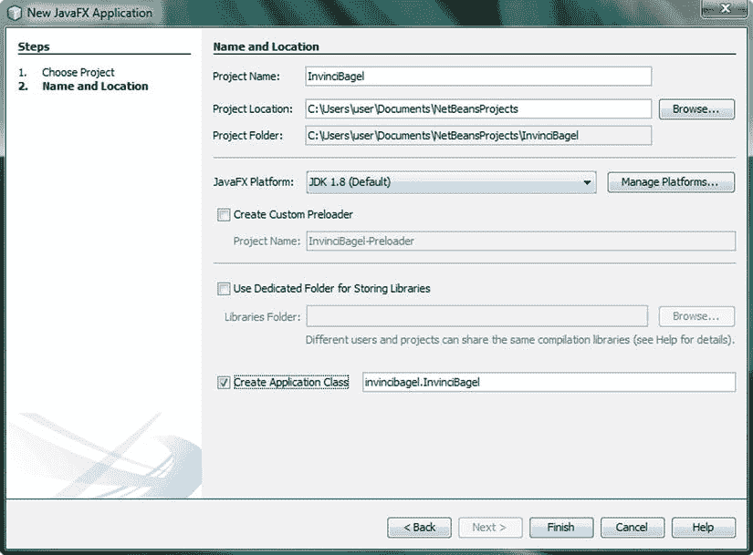

图 2-6。

Name the project InvinciBagel, and leave the other settings as they are

让 NetBeans 8.0 为您做事通常是个好主意。如您所见，NetBeans 在您的用户文件夹和我的文档子文件夹中为项目位置数据字段创建了逻辑`C:\Users\user\My Documents\NetBeansProjects`文件夹。

对于您的项目文件夹数据字段，NetBeans 同样会在 NetBeansProjects 文件夹下创建一个名为 InvinciBagel 的子文件夹，就像您自己所做的一样。

对于 JavaFX 平台下拉菜单，NetBeans 8.0 默认为最新的 JDK 8，也称为 JDK 1.8，并具有最新的 JavaFX 8(应该是 JavaFX 3.0)。

因为您不会创建共享库的多个应用，所以请不要选中“使用专用文件夹存储库”复选框。最后，选择 Create Application Class，它将被命名为 invincibagel，并将位于 InvinciBagel 包中；因此，完整的路径和类名如下:`invincibagel.InvinciBagel`(遵循`packagename.ClassName` Java 命名范例和风格)。

(您将在[第 3 章](03.html)中了解更多关于包、类和方法的信息，但您最终将在这里接触到其中的一些信息，因为 NetBeans 8.0 将编写一些引导 Java 代码，这些代码将为您的 InvinciBagel Java 8 游戏提供基础。我将查看图 [2-7](#Fig7) 中所示的 Java 代码的一些基本组件，但在本章中我将主要关注 NetBeans IDE 8.0，并在[第 3 章](03.html)中关注 Java 8 编程语言。)

如图所示，NetBeans 编写了 package 语句、七个 JavaFX import 语句、类声明以及`.start()`和`.main()`方法。NetBeans 8.0 将 Java 关键编程语句单词涂成蓝色，注释涂成灰色。数据值为橙色，输入/输出为绿色。

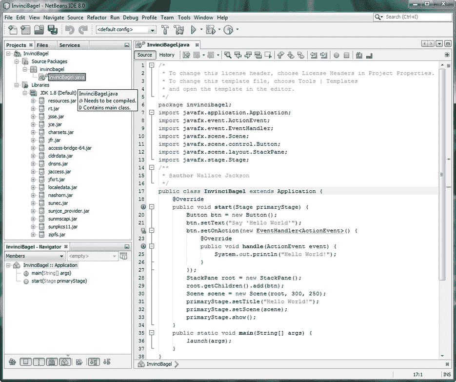

图 2-7。

Examine the bootstrap JavaFX code that NetBeans created for you, based on the New JavaFX Application dialog

在运行此引导代码之前，为了确保 NetBeans 8.0 为您编写的代码能够正常工作，您需要将其编译为可执行格式，并在系统内存中运行。

## 在 NetBeans 8.0 中编译您的 Java 8 游戏项目

在向您展示如何在运行(测试)Java 8 代码之前编译它的过程中，我在这里展示了“漫长的道路”,这样您就可以了解编译/运行 Java 8 代码测试过程的每一步。点击运行菜单，然后选择编译文件(第十一个菜单项)来编译你的 Java 代码，或者使用 F9 键盘快捷键，如选择右侧所示，如图 [2-8](#Fig8) 所示。现在您的项目已经准备好运行了！

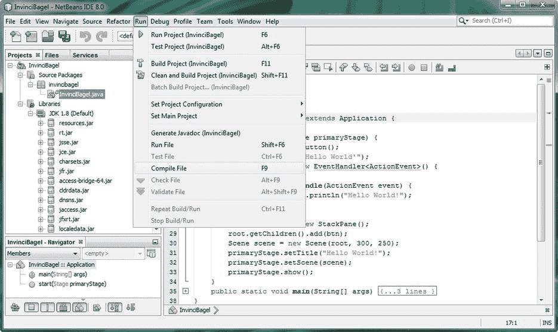

图 2-8。

Click the Run menu, at the top of the IDE, and then select Compile File, or press the F9 function key

图 [2-9](#Fig9) 展示了编译进度条，在编译过程中它会出现在 IDE 的底部。

图 2-9。

The Compile progress bar is shown at the bottom of the screen, along with expand and collapse icon functionality

这里还需要注意的是，当您使用“文件”“保存”菜单序列(或 CTRL-S 键盘快捷键)时，NetBeans 将编译项目代码，因此，如果您在创建引导代码后立即使用 NetBeans IDE 的“保存”功能，您就不必执行我刚才向您展示的编译过程，因为该过程是在每次保存游戏项目时“自动地”(而不是手动地)完成的。

图中还显示，在编译进度条的正上方，突出显示了一段代码，这段代码在图 [2-7](#Fig7) 中是可见的，但我已经使用代码编辑器窗格左侧的减号图标将其折叠。您可以在代码编辑器窗格的中间看到三个未折叠的减号图标(在 InvinciBagel 类下),在代码编辑器窗格的顶部看到三个折叠的图标，分别代表两个注释和 import 语句代码块。减号图标会变成加号图标，以便可以展开折叠的代码视图。现在，您已经了解了如何在 NetBeans 中编译项目，以及如何折叠和展开项目代码的逻辑块(组件)视图，现在是运行代码的时候了。

## 在 NetBeans 8.0 中运行 Java 8 游戏项目

现在您已经创建并编译了您的 bootstrap Java 8/JavaFX 游戏项目，是时候运行或执行 bootstrap 代码，看看它做了什么。您可以通过使用运行➤运行项目菜单序列来完成此操作(参见图 [2-8](#Fig8) ，或者您可以使用 IDE 顶部的快捷图标(类似于视频传输播放按钮)，如图 [2-10](#Fig10) 所示。

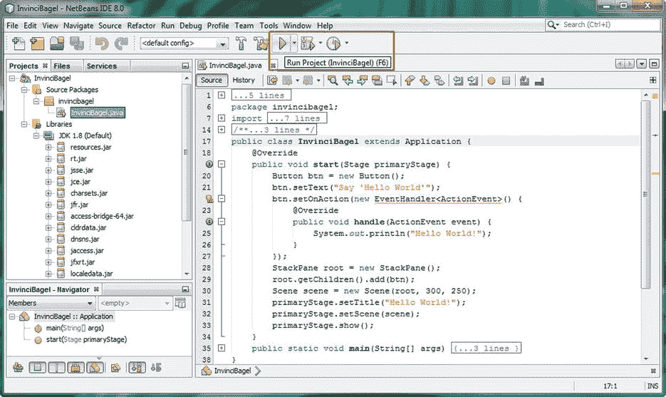

图 2-10。

Click the Run Project shortcut icon (green play button), at the top middle of the IDE (tool tip pop-up shown)

一旦你运行了编译好的 Java 代码，一个窗口将会打开，你的软件在其中运行，在屏幕的右边，如图 [2-11](#Fig11) 所示。目前，该程序使用流行的“Hello World！”示例应用。

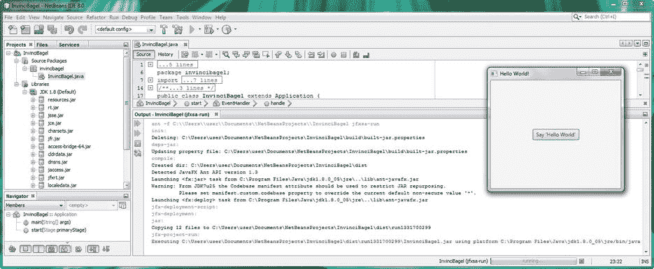

图 2-11。

Drag the separator bar upward to reveal the Compile Output area of the IDE (running the application seen at right)

单击代码编辑器窗格和底部输出选项卡之间的分隔线，按住鼠标按钮，向上拖动分隔线，显示输出选项卡的内容，如图 2-11 所示。

“输出”选项卡将包含 NetBeans 中不同类型的输出，例如 Ant 的编译操作输出、运行操作输出(如图所示)、探查器操作输出(您将在下一节中探讨)，甚至是应用本身的输出。

您可能已经注意到，在图 [2-10](#Fig10) 中，这个 bootstrap Java 8/JavaFX 应用的代码在第 25 行包含了一个`(System.out.println("Hello World!");` Java 语句，所以如果您想将当前正在运行的应用打印到输出窗格(有时在编程界称为输出控制台)，请单击“Hello World！”中的“Hello World”按钮应用(运行在 IDE 之上)。

一旦你点击这个按钮，“你好，世界！”将出现在 Output 选项卡中，在红色文本下面，表示它正在执行 InvinciBagel.jar 文件。一个`.jar` (Java 归档)文件是 Java 应用的可分发格式。编译过程的一部分是创建这个文件，所以如果您的编译版本工作正常，您就可以准备好分发`.jar`文件，如果您的应用设计和编程已经完成的话！

一个`.jar`文件并不包含您实际的 Java 8 代码，而是一个压缩的、加密的“Java 字节流”版本的应用，JRE 可以执行和运行它(就像 NetBeans 8.0 现在正在做的那样)。附加在`InvinciBagel.jar`文件前面的路径告诉您编译后的`.jar`文件驻留在哪里，以及 NetBeans 当前从哪里访问它来运行它。在我的系统上，这个位置是 C:\ Users \ user \ Documents \ netbeans projects \ InvinciBagel \ dist \ run 1331700299 \ InvinciBagel . jar。

让我们看看其他一些输出选项卡文本，看看 NetBeans 做了什么来达到可以为这个项目运行`.jar`文件的程度。首先，编译器删除并重建 build-jar-properties 文件，该文件位于`\NetBeansProjects\InvinciBagel\build`文件夹中，基于游戏应用的独特属性。

接下来，Ant 创建一个`\NetBeansProjects\InvinciBagel\dist\`分发文件夹来保存项目`.jar`文件，然后检测 JavaFX 的使用情况，启动`ant-javafx.jar`来向 Ant 构建引擎添加 JavaFX 功能，这将创建`.jar`文件。最后，您将看到一条警告，要求将`manifest.custom.codebase`属性从星号值(这意味着“一切”)更改为特定值。我可能会在本书的后面进入应用开发的清单和权限领域，在您更深入一点之后。然后启动 JavaFX，并构建`.jar`文件。

Ant 是创建您的`.jar`文件的构建引擎或构建工具。其他构建引擎，如 Maven 和 Gradle，也可以在 NetBeans 中使用，因为正如您现在所知道的，NetBeans 是可扩展的！

Ant 也在 Eclipse IDE 中使用，并且是一个已经存在很长时间的 Apache 开源项目。要了解更多关于 Ant 构建系统及其功能的信息，请访问 Ant 网站`(` [`http://ant.apache.org`](http://ant.apache.org/) `)`。

接下来，您将探索 NetBeans 8.0 中的分析功能，它可以在运行时分析您的代码，并让您知道您的 Java 8 代码运行的效率如何。这对于游戏来说很重要，尤其是街机游戏或者任何在用户屏幕上实时移动精灵的游戏。你将在本书第 6 章中学习游戏概念和设计。

## 在 NetBeans 8.0 中分析您的 Java 8 游戏项目

要启动 Java 8 代码分析实用程序，使用 IDE 顶部的 Profile 菜单，选择 Profile Project (InvinciBagel)(第一个菜单项)，如图 [2-12](#Fig12) 所示，或者使用 Profile Project 快捷图标，该图标在图 [2-13](#Fig13) 中给出的折叠屏幕视图中可见(您可以通过代码编辑器窗格中的 Java 代码行编号看出我折叠了该屏幕截图，该窗格仅包含第 1 行和第 38 行，即该范围中的第一个和最后一个数字；我用 Photoshop 去掉了第 2-37 行。

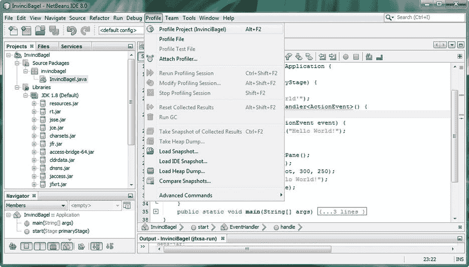

图 2-12。

Click the NetBeans IDE 8.0 Profile menu, and select the Profile Project (InvinciBagel) menu option

正如您在屏幕顶部的 Profile 菜单和 Profile Project 图标工具提示中所看到的，Profile Project 工具的键盘快捷键是 ALT+F2(按住键盘上的 ALT 键，同时按下键盘左上角的 F2 功能键)。

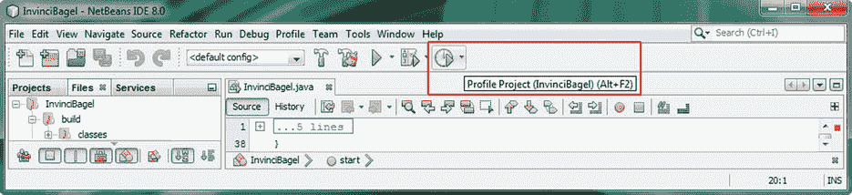

图 2-13。

The shortcut icon for the Profile Project utility, with tool tip (screen collapsed)

### 剖析 Java 8 游戏应用的 CPU 使用情况

使用 Profile Project 菜单项或快捷图标会打开 Profile InvinciBagel(你的游戏项目名称)对话框，如图 [2-14](#Fig14) 所示。让我们单击对话框左侧的中央 CPU 按钮，这将使对话框处于分析性能(选择特征)模式。稍后您将看到内存使用情况分析(参见“分析 Java 8 游戏应用内存使用情况”一节)。Monitor (button)选项支持实时线程监控，可以在编写 Java 代码时使用。

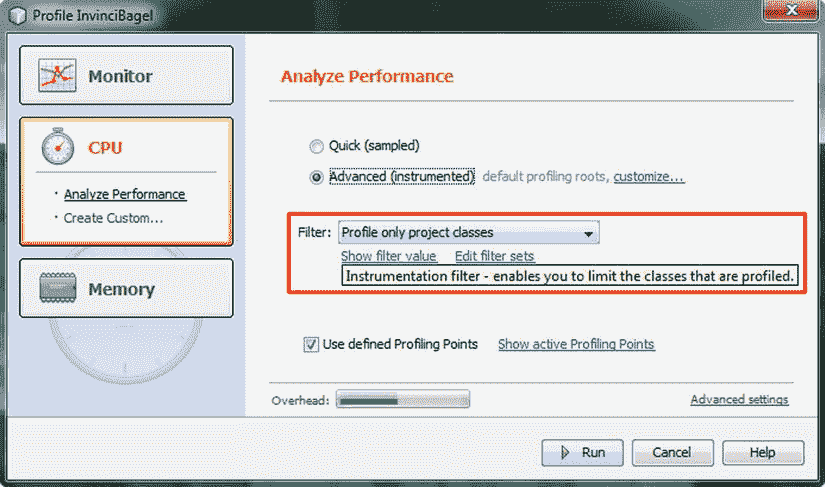

图 2-14。

Set the filter, using the drop-down menu in the Profile Project dialog, and select the Advanced (instrumented) output setting

在此对话框中，您可以选择快速配置文件或高级配置文件，它们具有可视化显示性能的图形工具。正如您所看到的，这是从 Instrumentation Filter 下拉菜单中选择的选项以及 Profile only project classes 选项。保持选中“使用已定义的分析点”,以使 NetBeans 8.0 尽可能完成最多的分析工作。还要注意对话框底部的顶置量规(指示器),指示 50%的值。

第一次运行 NetBeans 分析工具时，它需要校准您的工作站，因为每个工作站都有不同的特征，例如内存量和 CPU 内核或处理器的数量。

图 [2-15](#Fig15) 显示校准信息对话框，该对话框提示在校准过程中只有 NetBeans 在您的工作站上运行，并告诉您将来如何再次校准(如果您更改系统硬件配置)，使用配置文件➤高级命令➤管理校准数据菜单序列。

还有一个警告，说你应该禁用动态 CPU 频率切换(这通常被称为超频)，这是最近常见的功能。

因为我想测试较慢的 CPU 速度，所以我没有这么做，因为这涉及到进入工作站主板上的系统 BIOS(基本输入/输出系统),不是初学者可以随便玩的东西。

最终，测试游戏应用的最彻底的方法是在各种不同的操作系统和硬件配置上进行，但我想向您展示这种评测功能，因为这是获得应用性能良好基线的一种很好的方法，您可以在改进代码时对其进行改进(然后反复运行评测器，将结果与原始基线测量结果进行比较)。

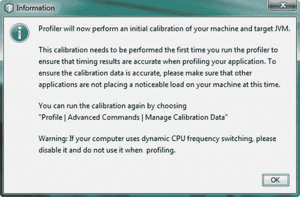

图 2-15。

The first time you profile, a calibration is performed

单击“确定”按钮后，NetBeans IDE 8.0 将根据您的系统硬件特征来校准其分析工具，这在快速的现代多核工作站上应该不会花费很长时间。

如果您运行的是 Windows 操作系统(如这里所见，在 64 位 Windows 7 版本中)，您可能会得到一个 Windows 防火墙已经阻止了此程序的某些功能的 Windows 安全警告对话框。您希望拥有 NetBeans 8.0 的所有功能，因此接下来让我们看看如何在 Windows 中允许访问 Java SE 8 平台。

#### 通过 Windows 防火墙解除对 Java 8 平台二进制文件的封锁

如果出现可怕的阻止功能网络对话框，如图 [2-16](#Fig16) 所示，选择允许 Java Platform SE 二进制文件在专用网络(如我的家庭或工作网络)上通信复选框，然后单击允许访问按钮，这将允许 Java 8 platform SE 二进制文件通过 Windows 防火墙进行通信。

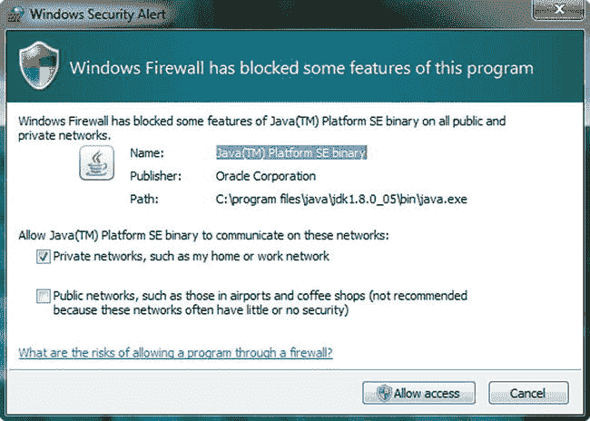

图 2-16。

Allow Java features to be used by clicking Allow access

在您允许访问`Java 8 platform` SE `binary`之后，NetBeans 8.0 性能分析工具可以(并将)运行，并将生成基本的性能分析遥测结果。在接下来的几节中，您将更深入地了解这些，这几节讨论了如何分析性能分析结果，以及它们揭示了应用如何使用内存和 CPU 资源。

#### 分析 NetBeans IDE 8.0 游戏项目 CPU 分析工具结果

NetBeans Profiler 主要查看内存使用情况和用于执行代码的 CPU 时间。使用的内存越少，CPU 时间越快(相当于执行代码所需的 CPU 处理周期越少)，应用的优化就越好。分析器还关注与代码(软件)相关的东西，比如方法调用和线程状态，这些你将在本书的课程中学到。

运行 NetBeans 8.0 Profiler 后，您会看到 IDE 左侧的“项目”、“文件”和“服务”选项卡中添加了一个 Profiler 选项卡，如图 [2-17](#Fig17) 所示。您已经在本章的前面检查了这三个选项卡(请参见“NetBeans 8.0 是高效的:有组织的项目管理工具”一节)，所以现在让我们来研究一下 Profiler 选项卡。

“Profiler”选项卡的顶部是“Controls”部分，带有“Stop(termin ate)Profiled Application”、“Reset Collected Profiling Results Buffer”、“Garbage Collection”、“Modify Profiling Session”和“VM Telemetry Overview”图标。

下面是 Status 部分，显示您选择的分析类型(在本例中是 CPU)、配置(分析性能)和状态(正在运行)。

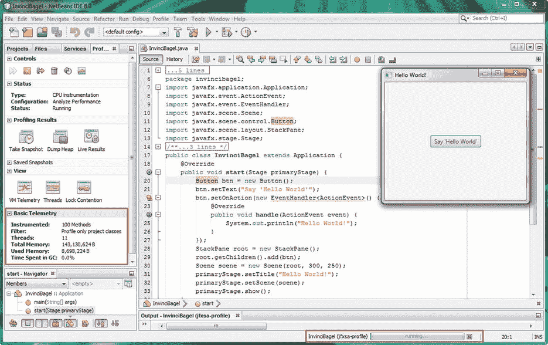

图 2-17。

Profile’s Basic Telemetry section, at the left of the IDE, under the Profile tab, shows methods, threads, and total and used memory

“性能分析结果”部分包含打开“代码编辑器”部分中关于性能分析数据结果(报告)的选项卡的图标，而“视图”部分对虚拟内存(VM)遥测、线程和线程锁争用做同样的事情。在下一节中，当您分析内存使用情况时(您当前正在分析 CPU 使用情况)，您将会看到其中的一些。

在代码分析会话期间，您可以在“保存的快照”部分保存不同时间点的快照。基本遥测部分显示关于分析会话的统计信息，包括方法数量、过滤器设置、运行的线程和内存使用情况。

单击性能分析结果部分的实时结果图标，打开一个实时性能分析结果选项卡，如图 [2-18](#Fig18) 所示，在顶部标有 CPU 时间(2:12:09 pm)。

正如您所看到的，您可以打开您的代码层次结构，包括`.main()`方法、`.start()`方法和`.handle()`方法，并查看它们所用总 CPU 时间的百分比以及实际使用的 CPU 时间(以毫秒为单位),这是 Java 8 和 JavaFX 的 Java 编程中使用的时间值，甚至是 HTML5、JavaScript 和 Android 应用开发中使用的时间值。

最后，正如您在图底部的输出窗格中看到的，还有文本输出，就像这个输出窗格用于显示编译、运行和执行的代码一样，也显示了分析器正在做什么。在“你好，世界！”通过单击应用的“Hello World”按钮，可以看到 Profiler 代理正在初始化、缓存类等等。在 NetBeans 的这个区域中有大量的选项卡和选项，我无法在这一基本的 NetBeans 概述章节中一一介绍，所以您可以随意使用您在屏幕上看到的内容！

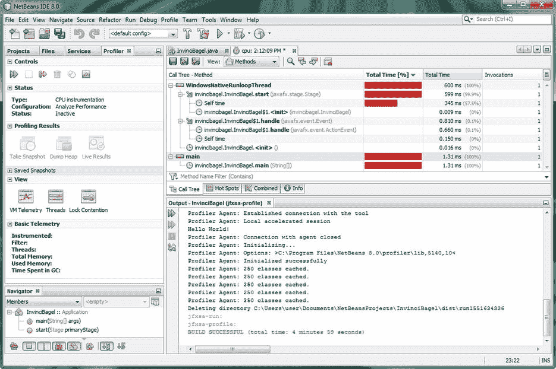

图 2-18。

NetBeans Profiler output, shown in the cpu tab, at the top right, and the Output tab, at the bottom right

### 剖析 Java 8 游戏应用的内存使用情况

接下来让我们看看内存分析。点击 Profile 项目图标，打开分析内存对话框，如图 [2-19](#Fig19) 所示。正如您所看到的，如果您为分配选择记录堆栈跟踪，分析器将使用更多的系统开销。

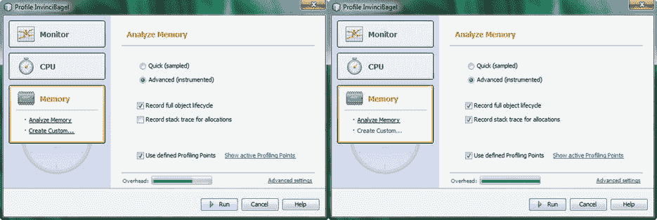

图 2-19。

Select the Memory section of the Profile InvinciBagel dialog and select Record stack trace for allocation

一旦内存分析器运行，使用如图 [2-20](#Fig20) (顶部)所示的窗口➤分析➤虚拟机遥测概述菜单序列，打开虚拟机遥测概述选项卡(底部)。该选项卡显示分配的内存和使用的内存。您可以将鼠标悬停在可视栏上，以获得任何时间点的准确读数。用编程术语来说，将鼠标悬停在某处将会在代码中使用“鼠标悬停”来访问

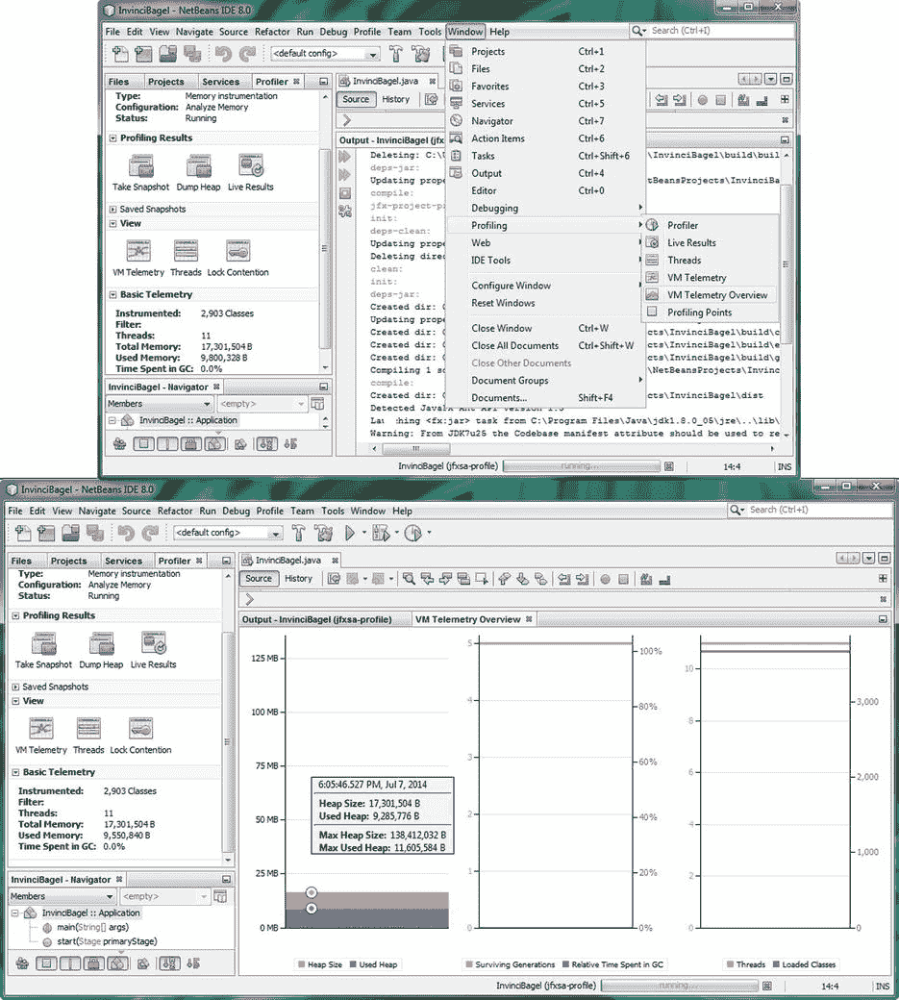

图 2-20。

Use the Window ➤ Profiling menu sequence to access the visual profiling tabs

查看窗口➤分析菜单序列中的一些其他可视报告选项卡。图 [2-21](#Fig21) 中显示的是线程选项卡，显示所有 11 个线程(参见屏幕左侧的基本遥测窗格)，包括每个线程正在做什么(线程正在运行什么代码)，以及虚拟机遥测选项卡，显示虚拟内存随时间的使用情况。

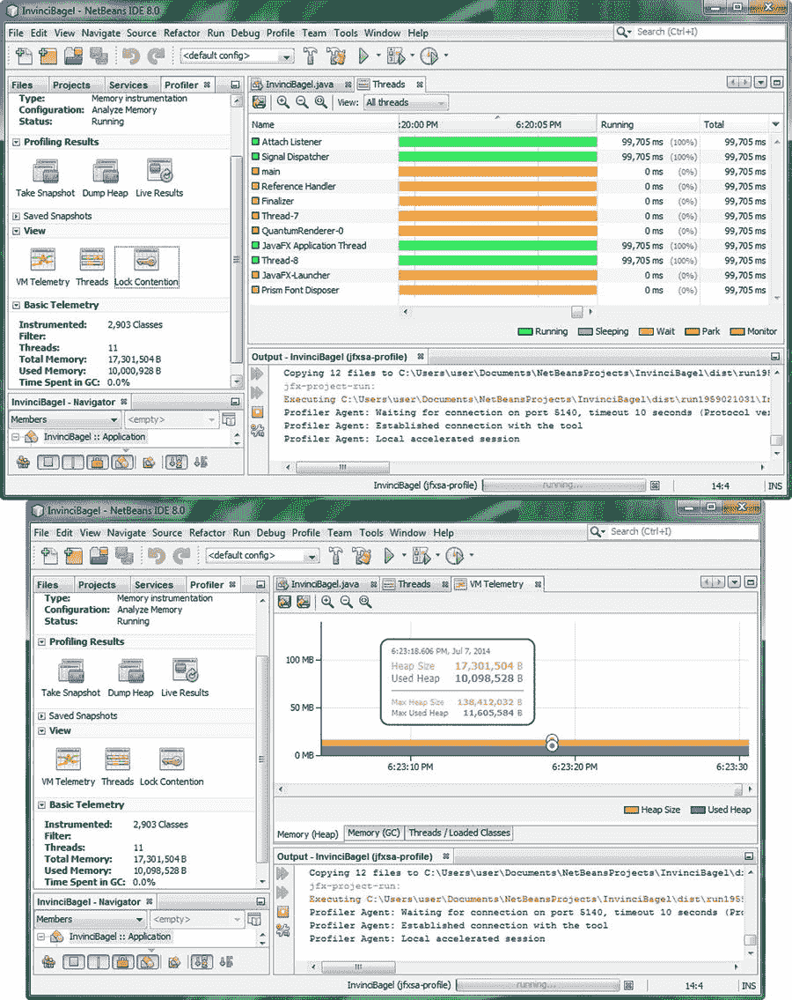

图 2-21。

Use the Window ➤ Profiling menu sequence to access the Threads and VM Telemetry tabs

随着时间的推移，您将学会如何使用 NetBeans Profiler，首先是通过实验，然后随着您对 Profiler 功能的熟悉，在您自己的项目变得越来越复杂时使用它，并观察您的代码库在线程、CPU 使用以及内存分配和使用方面的情况。NetBeans Profiler 是一个强大而有用的工具，它将作为 Java 8 游戏开发的代码开发基础。我将它包含在本章中是为了给你一个坚实的概述，因为这个知识库将帮助你利用这个软件，最大限度地发挥它的潜力和能力。

显然，这是一个高级的 IDE 和软件开发工具，不可能在一个简短的章节(也许是一本书；但是，这不是 NetBeans 8.0 游戏开发的标题)，所以您将在本书的几乎所有章节中更多地了解 NetBeans 8.0 可以为您做什么，因为 NetBeans 8.0 和 Java 8(以及 JavaFX 8)不可避免地交织在一起。

## 摘要

在第二章中，您学习了 NetBeans IDE 8.0，它将作为 Java 8 游戏开发工作流程的基础和主要工具。这个 IDE 是编写、编译、运行、测试和调试 Java 8(和 JavaFX 8)代码的地方，也是使用 NetBeansProject 文件夹及其子文件夹存储和引用新媒体(图像、音频、视频、3D、字体、形状等)资源的地方。

您首先了解了 NetBeans 8.0 及其高级特性，这些特性使其成为 Java 8 的官方 IDE，并帮助程序员第一次快速、高效地开发代码(即，使代码没有错误)。在这个概述之后，您创建了您的 Java 8 游戏项目，使用我为一个主要客户开发的真实世界游戏项目作为模型。

您浏览了新的 Java 应用系列对话框，并为您的游戏创建了 JavaFX 框架，这将允许您使用新的媒体资源，如图像、音频、视频和 3D。然后，您探索了如何使用 NetBeans 8.0 编译和运行应用。您还学习了 Output 选项卡，以及如何将它用于编译器输出、运行时输出和概要分析输出，这是您接下来要考虑的。

您研究了 NetBeans 8.0 中的 CPU 分析和内存分析；学习了如何设置和启动分析项目工具；并研究了 NetBeans Profiler 可以根据您的 Java 8 游戏项目为您创建的一些输出、统计和可视化报告。

在下一章中，我将介绍 Java 8 编程语言的概述，以确保您了解 Java 8 的工作原理；一个 Java 入门章节，如果你愿意的话。