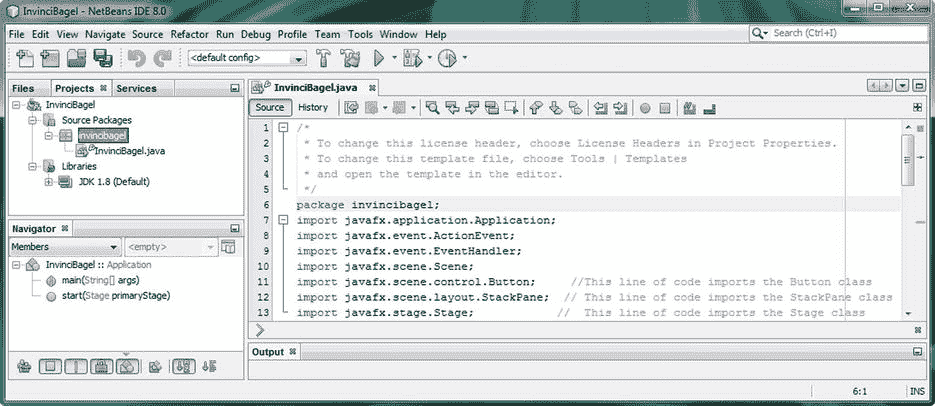
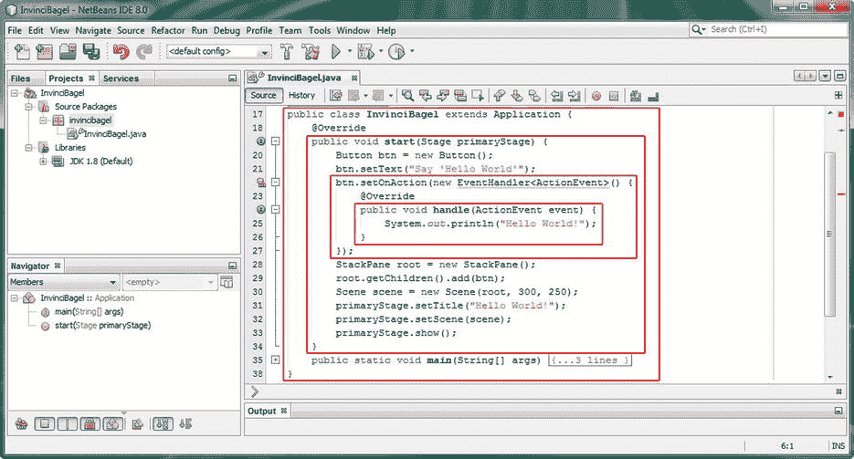

# 三、Java 8 入门：Java 8 概念和原则的介绍

让我们以您在前一章中获得的关于 NetBeans IDE 8.0 的知识为基础，探索 Java 8 编程语言背后的基本概念和原理。Java JDK 8 将是您的 Java 8 游戏以及 NetBeans IDE 8.0 的基础，因此花时间学习本章是很重要的，这是一本 Java 8“初级读本”，它为您提供了这种国际流行的计算机(和设备)编程语言的概述。

当然，在阅读本书的过程中，您会学到更多高级的概念，比如 Lambda 表达式，以及其他 Java 8 组件，比如最近的 JavaFX 多媒体引擎，所以请注意，本章将涵盖最基础的 Java 编程语言概念、技术和原则，涵盖目前在计算机、ITV 和手持设备上广泛使用的三个主要 Java SE 版本。

这些被数十亿用户使用的 Java 版本包括 Java 6，用于 32 位 Android 4.x 操作系统和应用；Java 7，用于 64 位 Android 5.x 操作系统和应用；以及 Java 8，它在许多流行的操作系统中使用，如微软 Windows、苹果 OS X、Oracle Solaris 和大量流行的 Linux“发行版”或发行版(定制的 Linux 操作系统版本，如 SUSE、Ubuntu、Mint、Mandrake、Fedora 和 Debian)。

您将从最简单的概念(Java 的最高级别)开始，并逐步学习更难的概念(Java 编程结构的核心)。您将从学习 Java 语法或行话开始，包括什么是 Java 关键字，Java 如何界定其编程结构，以及如何注释您的代码。首先检查这一点将使您在阅读 Java 代码方面有一个良好的开端，因为能够从关于代码的注释(通常由 Java 代码的作者使用注释编写)中辨别 Java 代码是很重要的。

然后，您将考虑 API 的顶级概念，包是什么，以及如何导入和使用 Java 包提供的预先存在的代码。这些 Java 包是 Java 8 API 的一部分，值得注意的是，您可以创建自己的定制 Java 包，包含您的游戏或应用。

之后，您将考虑这些 Java 包中的构造，它们被称为 Java 类。Java 类是 Java 编程的基础，可用于构建您的应用(在这种情况下，您的 Java 8 游戏)。您将了解这些类包含的方法、变量和常量，以及什么是超类和子类，什么是嵌套类和内部类，以及如何利用它们。

最后，您将发现什么是 Java 对象，并了解它们如何构成面向对象编程(OOP)的基础。您还将了解什么是构造函数方法，以及它如何创建 Java 对象，方法是使用一种特殊的方法，称为构造函数方法，它与包含它的类同名。让我们开始吧——我们有很多内容要谈！

## Java 的语法:注释和代码分隔符

关于语法，也就是 Java 如何用它的编程语言写东西，有几件事你需要马上考虑。这些主要的语法规则允许 Java 编译器理解你是如何构建你的 Java 代码的。Java 编译是 Java 编程过程的一部分，在这个过程中，JDK 编译器(程序)将 Java 代码转换成由 Java 运行时引擎(JRE)执行或运行的字节码。这个 JRE，在本例中是 JRE 8，安装在最终用户的计算机系统上。Java 编译器需要知道您的 Java 代码块在哪里开始和结束，您的各个 Java 编程语句或指令在这些 Java 代码块中在哪里开始和结束，您的代码的哪些部分是 Java 编程逻辑，哪些部分是对您自己的注释，或者对您的游戏项目编程团队的其他成员的注释(注释)。

让我们从注释开始，因为这个主题是最容易掌握的，而且你已经在你的 InvinciBagel 游戏 bootstrap Java 代码中看到了注释，在[第二章](02.html)中。有两种方法可以将注释添加到 Java 代码中:单行注释，也称为“行内”注释，放置在一行 Java 代码逻辑之后；多行注释，或“块”注释，放置在一行 Java 代码或一个 Java 代码块(Java 代码结构)之前(或之后)。

单行注释通常用于添加关于那一行 Java 逻辑(我喜欢称之为 Java 编程“语句”)正在做什么的注释，也就是说，那一行 Java 代码在整个代码结构中要完成什么。Java 中的单行注释以双正斜杠序列开始。例如，如果你想在你在第 2 章中创建的 InvinciBagel 引导代码中注释一个 import 语句，你可以在代码行后添加两个正斜杠。这是你的 Java 代码被注释后的样子(参见图 [3-1](#Fig1) ，右下方):

`import javafx.stage.Stage` `// This line of code imports the Stage class from JavaFX.stage package`

接下来，让我们看看多行注释，它们显示在图 [3-1](#Fig1) 的顶部，在包语句的上方(你将在下一节中学习)。如您所见，这些 Java 块注释的处理方式不同，使用星号旁边的单个正斜杠开始注释，以及与此相反，在单个正斜杠旁边的星号结束多行注释。



图 3-1。

Multiline comments (first five lines of code, at the top) and single-line comments (last three lines of code, at the bottom)

正如您在 NetBeans 8.0 的“InvinciBagel.java 代码编辑”选项卡中所看到的，正如我排列单行注释以使其看起来漂亮(酷)且有条理一样，块注释中的 Java 约定也是排列星号，一个作为开始注释分隔符，一个作为结束注释分隔符。

Definition

Java 编程中的“约定”是大多数(如果不是全部)Java 程序员实现 Java 构造的方式。在这种情况下，这就是 Java 代码块注释的样式。

还有第三种类型的注释，称为 Javadoc 注释，您不会在 Java 8 游戏开发中使用它，因为您的代码旨在用于创建游戏，而不是向公众发布。如果您打算编写一个 Java 游戏引擎，供其他人用来创建游戏，这时您应该使用 Javadoc 注释向您的 Java 8 游戏引擎添加文档。JDK 中的 javadoc.exe 工具可以使用 Javadoc 注释，根据您放入 Javadoc 注释中的文本内容，为包含 Javadoc 注释的 Java 类生成 HTML 文档。

Javadoc 注释类似于多行注释，但它使用两个星号来创建开始 Javadoc 注释分隔符，如下所示:

`/**` `This is an example of a Java Documentation (Javadoc) type of Java code comment.`

```java
This is a type of comment which will automatically generate Java documentation!

*/
```

如果您想在 Java 语句或编程结构的中间插入一个注释(作为一名专业的 Java 程序员，您绝不能这样做)，请使用多行注释格式，如下所示:

`i``mport``/* This line of code imports the Stage class */`T3】

这不会产生任何错误，但是会让代码的读者感到困惑，所以不要用这种方式注释代码。但是，在 NetBeans 8.0 中，以下使用双正斜杠注释此代码的单行注释方式会生成编译器错误:

`i``mport``// This line of code imports the Stage class`T3】

这里，编译器将只看到单词 import，因为单行注释位于行尾，而多行注释则使用块注释分隔符序列(星号和正斜杠)结束。因此，编译器将为第二个未正确注释的代码抛出一个错误，本质上是问“导入什么？”

正如 Java 编程语言使用双正斜杠和斜杠-星号对来分隔 Java 代码中的注释一样，其他一些关键字符也用于分隔 Java 编程语句和整个 Java 编程逻辑块(我经常称之为 Java 代码结构)。

分号在 Java(所有版本)中用来分隔或分开 Java 编程语句，比如图 [3-1](#Fig1) 中看到的 package 和 import 语句。Java 编译器寻找一个 Java 关键字，该关键字开始一个 Java 语句，然后将该关键字之后的所有内容作为 Java 代码语句的一部分，直到分号(这是告诉 Java 编译器“我已经完成了这个 Java 语句的编码工作”的方式)。例如，在你的 Java 应用的顶部声明 Java 包，你使用 Java 包关键字，你的包的名字，然后一个分号，如下所示(参见图 [3-1](#Fig1) ):

`package` `invincibagel;`

Import 语句也使用分号分隔，如图所示。import 语句提供 import 关键字、要导入的包和类，最后是分号分隔符，如下面的 Java 编程语句所示:

`import` `javafx.application.Application;`

接下来，您应该看看花括号({。。。})分隔符，和多行注释分隔符一样，它有一个左花括号，用来分隔(也就是说，它显示了编译器)Java 语句集合的开始，还有一个右花括号，用来分隔 Java 编程语句集合的结束。花括号允许您在许多 Java 构造中使用多个 Java 编程语句，包括在 Java 类、方法、循环、条件语句、lambda 表达式和接口中，所有这些都将在本书的课程中学习。

如图 [3-2](#Fig2) 所示，用花括号分隔的 Java 代码块可以相互嵌套(包含),允许更复杂的 Java 代码结构。使用花括号的第一个(最外面的)代码块是 InvinciBagel 类，其他构造嵌套如下:start()方法。setOnAction()方法和 handle()方法。随着本章的深入，您将会看到所有这些代码都做了什么。我想让你现在想象一下(借助图 3.2 中的红色方块)花括号是如何允许你的方法(和类)定义它们自己的代码块(结构)的，每个代码块都是一个更大的 Java 结构的一部分，最大的 Java 结构是 InvinciBagel.java 类本身。请注意，每个左花括号都有一个匹配的右花括号。还要注意代码的缩进，最里面的 Java 代码结构向右缩进得最远。每个代码块额外缩进四个字符或空格。如您所见，该类没有缩进(0)，start()方法在。setOnAction()方法在中是 8 个空格，handle()方法在中是 12 个空格。NetBeans 8.0 将为您缩进每一个 Java 代码结构！另请注意，NetBeans 8.0 在 ide 中绘制了非常精细的(灰色)缩进参考线，这样，如果您愿意，就可以直观地排列代码结构。



图 3-2。

Nested Java code blocks for the InvinciBagel class, start method, setOnAction method, and handle method

每个红色方块中的 Java 代码以花括号开始，以花括号结束。现在，您已经熟悉了各种 Java 8 代码注释方法，以及 Java 8 游戏编程语句需要如何分隔，无论是单独的还是作为 Java 代码块，接下来您将学习各种 Java 代码结构本身——它们是如何使用的，它们可以为您的应用和游戏做些什么，以及使用哪些重要的 Java 关键字来实现它们。

## Java APIs:使用包按功能组织

在一个编程平台的最高层，比如谷歌的 32 位 Android 4，用的是 Java SE 6；64 位 Android 5，使用 Java SE 7；当前的 Oracle Java SE 平台(最近发布为 Java SE 8)有一个包含类、接口、方法和常量的包集合，它们共同构成了 API。应用(在本例中是游戏)开发人员可以使用这些 Java 代码集合(在本例中是 Java 8 API)来创建跨许多操作系统、平台和消费电子设备的专业级软件，这些设备包括计算机、笔记本电脑、上网本、笔记本、平板电脑、iTV 电视机、游戏控制台、智能手表和智能手机。

要安装给定版本的 API 级别，您需要安装 SDK(软件开发工具包)。Java SDK 有一个特殊的名字，JDK (Java 开发工具包)。熟悉 Android(Linux 之上的 Java SE)操作系统开发的人都知道，每次添加一些新特性时，都会发布不同的 API 级别。这是因为这些新的硬件功能需要支持，而不是因为谷歌的高管们觉得每隔几个月就要发布一个新的 SDK。Android 有 24 个不同的 API 级别，而 Java SE 只有 8 个，并且目前只有 3 个 Java 的 API 级别(Java 6、Java 7、Java 8)在使用。

Java SE 6 配合 Eclipse ADT(Android Developer Tools)IDE 使用，为 32 位 Android(1.5 到 4.5 版本)开发；Java SE 7 配合 IntelliJ IDEA 使用，为 64 位 Android(5.0 及以上版本)开发；Java 8 与 NetBeans IDE 配合使用，用于在 Windows、Mac OS X、Linux 和 Oracle Solaris 操作系统上开发 JavaFX 和 Java 8。我有三个不同的工作站，分别针对这些 Java API 平台和 IDE 软件包进行了优化，这样我就可以同时为 Android 4 (Java 6)、Android 5 (Java 7)和 JavaFX (Java 8)开发应用。幸运的是，你只需要花几百块钱就可以在 [`PriceWatch.com`](http://pricewatch.com/) 上获得一台强大的 Windows 8.1 六核或八核 64 位 AMD 工作站！

除了 API 级别(您安装并正在使用的 SDK)，Java 编程语言中最高级别的构造是包。Java 包使用 package 关键字在 Java 代码的顶部声明应用的包。这必须是声明的第一行代码，而不是注释(见图[3-1](#Fig1)；参见[第二章](02.html)。您在[第 2 章](02.html)中使用的 NetBeans 中的新项目系列对话框将为您创建您的包，并根据您希望在应用中执行的操作导入您需要使用的其他包。在本例中，这些是 JavaFX 包，因此您可以使用 JavaFX 新媒体引擎。

正如您可能已经从名称中确定的那样，Java 包收集了所有的 Java 编程结构。这些包括与您的应用相关的类、接口和方法，因此 InvinciBagel 包将包含您的所有代码，以及您为使用代码而导入的代码，以创建、编译和运行 invinciBagel 游戏。

当然，Java 包对于组织和包含您自己的所有应用代码很有用，但是对于组织和包含 SDK(API)的 Java 代码更有用，您将使用这些代码以及您自己的 Java 编程逻辑来创建您的 Java 8 应用。通过使用 Java import 关键字，您可以使用作为您的目标 API 的一部分的任何类，该关键字与您想要使用的包和类一起构成了一个 import 语句。

import 语句以 import 关键字开始，后面是完全限定的类名，即包名、任何子包名和作为完整命名引用路径的类名(类的完整专有名称)。分号终止 import 语句。正如您已经在图 [3-1](#Fig1) 中看到的，用于从 javafx.event 包中导入 JavaFX EventHandler 类的 import 语句应该如下所示:

`import` `javafx.event.EventHandler;`

import 语句告诉 Java 编译器，您将使用被引用的类中的方法(或常量)，使用 import 关键字，以及该类存储在哪个包中。如果您在自己的 Java 类中使用一个类、方法或接口，如 InvinciBagel 类(见图 [3-2](#Fig2) )，并且您还没有使用 import 语句声明要使用的类，Java 编译器将抛出一个错误，直到您在类的顶部添加所需的 import 语句(在 Java 包声明语句之后，在 Java 类声明语句之前)。

Note

可以使用完全限定的类名来代替 Java import 关键字，也就是说，在 Java 代码中，类名的前面加上包名。惯例规定使用 import 语句；然而，如果你想打破标准 Java 编程惯例，图 [3-2](#Fig2) 中的第 20 行可以写成`javafx.scene.control.Button btn = new javafx.scene.control.Button();`。

## Java 类:构建的逻辑 Java 结构

包级别下的下一个逻辑 Java 编程构造是 Java 类级别，正如您在 import 语句中看到的，它引用包含类的包和类本身。正如包组织所有相关的类一样，类也组织所有相关的方法、变量和常量，有时还组织其他嵌套类。

因此，Java 类用于在功能组织的下一个逻辑级别组织您的 Java 代码，因此您的类将包含为您的应用添加功能的 Java 代码构造。这些可能包括方法、变量、常量、嵌套类或内部类。

Java 类也可以用来创建 Java 对象。Java 对象是使用 Java 类构造的，并且与 Java 类和该类的构造方法同名。

正如你在图 3-2 中看到的，你使用一个 Java class 关键字和你的类名来声明你的类。您还可以在声明的前面加上 Java 修饰符关键字，您将在本章的后面学习这些关键字(参见“Java 修饰符关键字:访问控制及其他”一节)。Java 修饰符关键字总是放在 Java class 关键字之前，使用以下格式:

`<modifier keywords>``class`T2】

Java 类的一个强大特性是，它们可以用来模块化您的 Java 游戏代码，这样您的核心游戏应用特性就可以成为一个高级类的一部分，该高级类可以被子类化以创建该类的更专业的版本。在 Java 类层次术语中，一旦一个类被子类化，它就成为一个超类。一个类总是使用一个 Java extends 关键字来子类化一个超类。如果一个类没有以这种方式扩展给定的超类，那么它会自动扩展 Java master class:Java . lang . object。

使用 Java extends 关键字告诉编译器，您希望将超类的能力和功能添加(扩展)到您的类中，一旦使用该 extends 关键字，该类就成为子类。子类扩展了超类提供的核心功能。要扩展您的类定义以包含超类，您可以使用以下格式添加(或扩展，没有双关的意思)现有的类声明:

`<modifier keywords>``class``<your custom classname>``extends`T4】

当你用你的类扩展一个超类时，它现在是那个超类的一个子类，你可以在你的子类中使用超类的所有特性(嵌套类、内部类、方法、变量、常量),而不需要把它们都显式地写(编码)在你的类的主体中，那样会是多余的(和混乱的)。

Note

如果您正在扩展的超类(或者，如果您喜欢，子类化)中的任何数据字段或方法已经使用 private access control 关键字声明，则这些变量(或常量)和方法将被保留，仅供该超类使用(或者在该超类中使用)，因此您的子类将无法访问它们。同样的规则也适用于嵌套类和内部类；这些类结构不能使用任何在包含它们的 Java 构造中声明为私有的代码(或者在它们之上的代码)。

您的类的主体在花括号内编码(见图 [3-2](#Fig2) ，最外面的红框)，花括号跟在您的类(在本例中，还有 javafx.application.Application 超类)声明之后。这就是为什么您首先学习了 Java 语法，并且您正在使用类声明和包含类定义(变量、常量、方法、构造函数、嵌套类)结构的 Java 语法来构建它。

如图所示，InvinciBagel 类从 JavaFX 包中扩展了一个应用超类。因此，当前超类到子类层次结构的继承图(我将在整本书中使用该工具，向您展示在整个 Java 和 JavaFX API 模式中事物的来源)将如下所示:

```java
> java.lang.Object

> javafx.application.Application
```

`> invincibagel.` `InvinciBagel`

通过扩展 javafx.application 包及其应用类，您将为 InvinciBagel 类提供托管(或运行)javafx 应用所需的一切。JavaFX 应用类“构造”一个应用对象，以便它可以使用系统内存；打电话给安。init()方法，初始化任何可能需要初始化的东西；并调用一个. start()方法(见图 [3-2](#Fig2) ，第二个最外面的红框)，该方法将最终启动 InvinciBagel Java 8 游戏应用所需的东西放置到位。

当最终用户使用完 InvinciBagel 游戏应用时，application 类使用 Application()构造函数方法创建的 Application 对象将调用它的。stop()方法并从系统内存中删除应用，从而释放内存空间供最终用户使用。您将很快学习 Java 8 方法、构造函数和对象，因为您正在从高级包和类构造向较低级的方法和对象构造前进，因此您正在从高级概述向较低级移动。您可能想知道 Java 类是否可以相互嵌套，也就是说，Java 类是否包含其他 Java 类。答案是肯定的，他们当然可以(也确实可以)！接下来让我们看看 Java 嵌套类的概念。

### 嵌套类:存在于其他类中的 Java 类

Java 中的嵌套类是定义在另一个 Java 类内部的类。嵌套类是它所嵌套的类的一部分，这种嵌套意味着这两个类打算以某种方式一起使用。嵌套类有两种类型:静态嵌套类，通常简称为嵌套类；非静态嵌套类，通常称为内部类。

静态嵌套类(我将称之为嵌套类)用于创建与包含它们的类一起使用的实用程序，有时仅用于保存与该类一起使用的常量。开发 Android 应用的人非常熟悉嵌套类，因为它们在 Android API 中非常常用，用于保存实用程序方法或 Android 常量，这些方法或常量用于定义屏幕密度设置、动画运动插值曲线类型、对齐常量和用户界面元素缩放设置等内容。如果你正在寻找关于静态概念的理解，它可以被认为是固定的，或者不能被改变。照片是静态图像，而视频不是静态的。在本书中，我们会经常看到这个概念。

嵌套类使用 Java 中通常所说的点符号来引用嵌套类“脱离”其主类或父类，即包含类。比如大师级。NestedClass 将是引用格式，用于通过主类(包含类)名称引用嵌套类，这里使用泛型类类型名称。如果您创建了 InvinciBagel SplashScreen 嵌套类来绘制 Java 游戏的闪屏，那么它将在 Java 代码中被引用为 InvinciBagel。SplashScreen，使用 Java 8 点符号语法。

例如，让我们看一下 JavaFX 应用类，它包含一个参数嵌套类。这个嵌套类封装或包含您可以为 JavaFX 应用设置的参数。因此，这个应用。参数嵌套类将是与应用类相同的 javafx.application 包的一部分，并且如果使用 import 语句，将被引用为 Java FX . Application . Application . parameters。

类似地，构造函数方法可以写成 Application。参数()，因为构造函数方法必须与包含它的类具有完全相同的命名模式。除非您正在为其他开发人员编写代码，这是嵌套类最常用的时候(如 JavaFX 应用类或许多嵌套的实用程序或常量提供者类，您将在 Android OS 中找到)，否则您更有可能使用非静态嵌套类(通常称为 Java 内部类)。

嵌套类可以通过使用 Java static 关键字来声明。Java 关键字有时也被称为 Java 修饰符。因此，如果你要做一个`InvinciBagel.SplashScreen`嵌套类，`InvinciBagel`类和它的`SplashScreen`嵌套类声明(Java 8 编程结构)看起来会像这样:

```java
public class InvinciBagel extends Application {
```

`static` `class SplashScreen {`

```java
// The Java code that creates and displays your splashscreen is in here

}

}
```

需要注意的是，如果您使用`import javafx.application.Application.Parameters`来导入一个嵌套类，那么您可以在您的类中引用该嵌套类，只使用参数类名，而不是完整的类名路径，该路径显示了您的类的代码如何通过`Application.Parameter (ClassName.NestedClassName)`点标记语法引用穿过父类到达它的嵌套类。

正如您将在本书中多次看到的，Java 方法也可以使用点符号来访问。因此，不使用类名。如果您使用 import 语句来导入这个嵌套类，那么只需使用`NestedClassName.MethodName`。这是因为 Java import 语句已经被用来建立这个嵌套类的完整引用路径，通过它的包含类，所以您不需要提供这个完整路径引用，编译器就能知道您引用的是什么代码构造！

接下来，让我们看看非静态嵌套类，它们通常被称为 Java 内部类。

### 内部类:不同类型的非静态嵌套类

Java 内部类也是嵌套类，但是它们不是在 class 关键字和类名之前使用 static 关键字修饰符声明的，这就是它们被称为非静态嵌套类的原因。因此，在另一个不使用 static (keyword)修饰符的类中的任何类声明在 Java 中都被称为内部类。Java 中有三种类型的内部类:成员类、本地类和匿名类。在本节中，您将发现这些内部类之间的区别，以及它们是如何实现的。

像嵌套类一样，成员类是在包含(父)类的主体中定义的。您可以在包含类的体中的任何地方声明成员类。如果您想访问属于包含类的数据字段(变量或常量)和方法，而不必提供数据字段或方法(`ClassName.DataField or ClassName.Method`)的路径(通过点符号)，您可以声明一个成员类。成员类可以被认为是不使用 Java static modifier 关键字的嵌套类。

尽管嵌套类是通过其包含类(或顶级类)引用的，使用静态嵌套类的点标记路径，但成员类由于不是静态的，所以是特定于实例的，这意味着通过该类创建的对象(实例)可以彼此不同(对象是类的唯一实例)，而静态(固定)嵌套类将只有一个版本，不会改变。例如，私有内部类只能由包含它的父类使用。编码为私有类的内部类看起来像这样:

```java
public class InvinciBagel extends Application {
```

`private` `class SplashScreen {`

```java
// The Java code that creates and displays your splashscreen is in here

}

}
```

因为这个类被声明为私有的，所以它是供您自己的应用使用的(特别是包含类的使用)。因此，这不是供其他类、应用或开发人员使用的实用程序或常量类。您也可以在不使用 private access 修饰符关键字的情况下声明您的内部类，类似于下面的 Java 编程结构:

```java
public class InvinciBagel extends Application {

class SplashScreen {

// The Java code that creates and displays your splashscreen is in here

}

}
```

这种级别的访问控制称为包或包私有，是应用于任何类、接口、方法或数据字段的默认访问控制级别，这些类、接口、方法或数据字段在声明时不使用任何其他 Java 访问控制修饰符关键字(public、protected、private)。这种类型的内部类不仅可以被顶级类或包含类访问，还可以被包含该类的包中的任何其他类成员访问。这是因为包含类被声明为 public，内部类被声明为 package private。如果希望内部类在包外可用，可以使用下面的 Java 代码结构将其声明为 public:

```java
public class InvinciBagel extends Application {
```

`public` `class SplashScreen {`

```java
// The Java code that creates and displays your splashscreen is in here

}

}
```

还可以声明一个内部类 protected，这意味着它只能被父类的任何子类访问。如果在不是类的低级 Java 编程结构中声明一个类，比如方法或迭代控制结构(通常称为循环)，从技术上讲，它被称为局部类。局部类只在代码块内部可见；因此，它不允许(或者说使用)类修饰符，比如 static、public、protected 或 private。局部类的用法类似于局部变量，只是它是一个复杂的 Java 编码结构，而不是一个简单的局部使用的数据字段值。

最后，有一种内部类叫做匿名类。匿名类是没有给定类名的局部类。您可能会比本地类更频繁地遇到匿名类。这是因为程序员经常不命名他们的本地类(使它们成为匿名类)；本地类包含的逻辑只在本地用于它们的声明，所以这些类实际上不需要名字——它们只是在 Java 代码块内部被引用。

## Java 方法:核心 Java 函数代码构造

在类内部，通常有方法和这些方法使用的数据字段(变量或常量)。因为我们是从外部到内部，或者从顶层结构到底层结构，所以接下来我将介绍方法。在其他编程语言中，方法有时被称为函数。图 [3-2](#Fig2) 提供了一个。start()方法，展示了该方法如何保存创建基本“Hello World！”应用。该方法中的编程逻辑使用 Java 编程语句来创建 Stage 对象和 Scene 对象，在 StackPane 对象中的屏幕上放置一个按钮，并定义事件`-`处理逻辑，以便当单击按钮时，引导 Java 代码编写“Hello World！”文本到 NetBeans IDE 输出区域。

方法声明以访问修饰符关键字开始，可以是 public、protected、private 或 package private(这是通过根本不使用任何访问控制修饰符来指定的)。如图所示，已经使用公共访问控制修饰符声明了`.` `start()`方法。

在这个访问控制修饰符之后，您需要声明该方法的返回类型。这是该方法在被调用后将返回的数据类型。因为。start()方法执行设置操作，但不返回特定类型的值，它使用 void 返回类型，这表示该方法执行任务，但不向调用实体返回任何结果数据。在这种情况下，调用实体是 JavaFX 应用类，因为。start()方法是关键方法之一(其他方法是。停止()和。init()方法)来控制 JavaFX 应用的生命周期阶段。

接下来，您将提供方法名，按照惯例(编程规则)，它应该以小写字母(或单词，最好是动词)开头，任何后续的(内部)单词(名词或形容词)都以大写字母开头。例如，显示闪屏的方法将被命名为。showSplashScreen()或。displaySplashScreen()并且因为它执行某些操作但不返回值，所以将使用以下代码进行声明:

```java
public void displaySplashScreen() { Java code to display splashscreen goes in here }
```

如果您需要传递参数，这些参数是命名的数据值，必须在方法体(花括号内的部分)中进行操作，这些参数放在方法名的括号内。在图 [3-2](#Fig2) 中。start()方法为您的引导“HelloWorld！”JavaFX 应用使用以下 Java 方法声明语法接收一个名为 primaryStage 的 Stage 对象:

```java
public void start(Stage primaryStage) { bootstrap Java code to start Application goes in here }
```

您可以使用数据类型和参数名称对来提供任意数量的参数，每对之间用逗号分隔。方法也可以没有参数，在这种情况下，参数括号是空的，左括号和右括号紧挨着，例如。start()和。停止()。

定义方法的编程逻辑将包含在方法体中，如前所述，方法体位于定义方法开始和结束的花括号内。方法中的 Java 编程逻辑可以包括变量声明、程序逻辑语句和迭代控制结构(循环)，您将利用所有这些来创建您的 Java 游戏。

在继续之前，让我们关注另一个适用于方法的 Java 概念，即重载 Java 方法。重载一个 Java 方法意味着使用相同的方法名，但是不同的参数列表配置。这意味着，如果您定义了多个同名的方法，Java 可以通过查看传递给被调用方法的参数，然后通过匹配参数列表数据类型和名称以及它们出现的顺序，使用该参数列表来辨别要使用的方法(同名的),从而确定要使用哪个(重载的)方法。当然，为了让这个 Java 方法重载特性正常工作，您的参数列表配置必须都是惟一的。

你将在本书的课程中学习如何使用和如何编写 Java 方法，从第 4 章开始，所以我在这里不打算花太多时间在它们上面，除了定义它们是什么以及它们在 Java 类中如何声明和使用的基本规则。

然而，我将要详细介绍的一种特殊的方法是构造函数方法。这是一种可用于创建对象的方法。Java 对象是 OOP 的基础，所以接下来您将看一看构造函数方法，因为在学习 Java 对象本身之前这样做是很重要的，您将在本章的后面学习 Java 对象(参见“Java 对象:虚拟现实，使用 Java 构造”一节)。

### 创建 Java 对象:调用类的构造函数方法

一个 Java 类可以包含一个与该类同名的构造函数方法，该方法可用于使用该类创建 Java 对象。构造函数方法使用它的 Java 类像蓝图一样在内存中创建该类的一个实例，这样就创建了一个 Java 对象。构造函数方法总是返回一个 Java 对象，因此不使用其他方法通常使用的任何 Java 返回类型(void、String 等)。使用 Java new 关键字调用构造函数方法，因为您正在创建一个新对象。

你可以在图 [3-2](#Fig2) (ll)所示的引导 JavaFX 代码中看到这样的例子。20、28 和 30)，其中通过使用以下对象声明、命名和创建 Java 代码结构，分别创建新按钮、StackPane 和 Scene 对象:

`<Java class name> <your object instance name> =``new`T2】

以这种方式声明 Java 对象的原因是因为 Java 对象是 Java 类的一个实例，在一个以分号结束的 Java 语句中使用类名、正在构造的对象名、Java new 关键字和类的构造函数方法名(以及参数，如果有的话)。

例如，让我们看一下在当前 Java 代码的第 20 行创建的按钮对象。这里，通过 equals 操作符左侧的 Java 语句部分，您告诉 Java 语言编译器，您想要创建一个名为 btn 的按钮对象，使用 JavaFX 按钮类作为对象蓝图。这将声明 Button 类(对象类型)并给它一个惟一的名称。

因此，创建对象的第一部分称为对象声明。创建 Java 对象的第二部分称为对象实例化，从 equals 操作符的右边可以看出，这部分对象创建过程包括一个构造函数方法和 Java new 关键字。

要实例化一个 Java 对象，需要调用 Java new 关键字，并调用对象构造器方法。因为这发生在 equals 操作符的右边，所以对象实例化的结果放在声明的对象中，该对象在 Java 语句的左边。正如你将在本章稍后看到的，当我讨论操作符时(参见“Java 操作符:在应用中操作数据”一节)，这就是 equals 操作符的作用，它是一个有用的操作符。

这就完成了声明(类名)、命名(对象名)、创建(使用 new 关键字)、配置(使用构造函数方法)和加载(使用 equals 操作符)您自己的定制 Java 对象的过程。

值得注意的是，这个过程的声明和实例化部分也可以使用单独的 Java 代码行进行编码。例如，按钮对象实例化(见图 [3-2](#Fig2) ，l. 20)可以编码如下:

```java
Button btn;
```

`btn =``new`T2】

这一点很重要，因为以这种方式编写对象创建代码允许您在类的顶部声明一个对象，其中类中使用或访问这些对象的每个方法都可以看到该对象。在 Java 中，除非使用修饰符声明，否则对象或数据字段只在声明它的 Java 编程结构(类或方法)中可见。

如果你在你的类中声明一个对象，因此在类中包含的所有方法之外，那么你的类中的所有方法都可以访问(使用)那个对象。类似地，在方法中声明的任何内容都是该方法的局部内容，并且仅对该方法的其他成员可见(方法范围分隔符中的 Java 语句)。如果您想实现这个单独的对象声明(在类中，在方法之外)和对象实例化(在。start()方法)在您当前的 InvinciBagel 类中，InvinciBagel 类的前几行 Java 代码将更改为如下所示的 Java 编程逻辑:

```java
public class InvinciBagel extends Application {

Button btn;

@Override

public void start(Stage primaryStage) {

btn = new Button();

btn.setText("Say 'Hello World'");

// The other programming statements continue underneath here

}

}
```

当对象声明和实例化被分开时，它们可以根据可见性的需要放在方法内部(或外部)。在前面的代码中，InvinciBagel 类的其他方法可以调用。setText()方法调用显示 Java 编译器没有抛出错误。图 [3-2](#Fig2) 中按钮对象的声明方式，只有。start()方法可以看到对象，因此只有。start()方法可以使用这个 btn.setText()方法调用。

### 创建构造函数方法:对对象的结构进行编码

构造函数方法更像是一种在系统内存中创建对象的方法，而其他方法(或函数，如果使用不同的编程语言)通常用于执行某种类型的计算或处理。构造函数方法用于在内存中创建 Java 对象，而不是执行其他一些编程功能，这一点可以通过使用 Java new 关键字来证明，该关键字在内存中创建新对象。因此，构造函数方法将定义对象的结构，并允许调用实体使用构造函数方法的参数列表用自定义数据值填充对象结构。

在本节中，您将创建两个示例构造函数方法，以了解如何实现这一点以及构造函数方法通常包含的内容。假设您正在为您的游戏创建 InvinciBagel 对象，那么您使用以下 Java 代码结构声明一个公共 InvinciBagel()构造函数方法:

```java
public InvinciBagel() {

int lifeIndex = 1000;  // Defines units of lifespan

int hitsIndex = 0;    //  Defines units of damage ("hits" on the object)

String directionFacing = "E";        // Direction that the object is facing

Boolean currentlyMoving = false;  //  Flag showing if the object is in motion

}
```

当使用`InvinciBagel mortimer = new InvinciBagel();` Java 方法调用时，这个构造函数方法创建一个名为 mortimer 的 InvinciBagel 对象，它有 1000 个生命单位，没有命中，面向东方，当前没有移动。

接下来，让我们探讨一下重载构造函数方法的概念，您在前面已经学过了(参见“Java 方法:Java 核心函数代码构造”一节)，并创建另一个构造函数方法，该方法具有允许您在创建 InvinciBagel 对象时定义其 lifeIndex 和 directionFacing 变量的参数。此构造函数方法如下所示:

`public InvinciBagel(``int lifespan, String direction`T2】

```java
int lifeIndex;

int hitsIndex;

String directionFacing = null;

Boolean currentlyMoving = false;

lifeIndex = lifespan;

directionFacing = direction;

}
```

在这个版本中，顶部的 lifeIndex 和 hitsIndex 变量被初始化为 0，这是一个整数的默认值，因此您不必在代码中使用 lifeIndex = 0 或 hitsIndex = 0。Java 编程语言支持方法重载，所以如果您使用一个`InvinciBagel bert = new InvinciBagel(900, "W");`方法调用来实例化 InvinciBagel 对象，将会使用正确的构造函数方法来创建该对象。名为 bert 的 InvinciBagel 对象的生命指数为 900 个生命单位，没有生命命中，面向西方，目前不会移动。

您可以拥有任意多的(重载的)构造函数方法，只要它们都是 100%唯一的。这意味着重载的构造函数必须有不同的参数列表配置，包括参数列表长度(参数的数量)和参数列表类型(数据类型的顺序)。如您所见，参数列表(长度、数据类型、顺序)允许 Java 编译器区分重载方法。

## Java 变量和常量:数据字段中的值

下一层(从 API、包、类、方法，到 Java 类和方法中操作的实际数据值)是数据字段。数据值保存在一个叫做变量的东西里；如果数据是固定的，或者是永久的，它就叫做常量。常量是一种特殊类型的变量(我将在下一节中介绍)，因为正确声明一个常量比声明一个 Java 变量要复杂(高级)一些。

在 Java 行话中，在类的顶部声明的变量被称为成员变量、字段或数据字段，尽管所有的变量和常量都可以被认为是数据字段。在方法中声明的变量或在类或方法中声明的其他低级 Java 编程结构称为局部变量，因为它只能在花括号分隔的编程结构中局部看到。最后，在方法声明或方法调用的参数列表区域中声明的变量被称为参数，这并不奇怪。

变量是一个数据字段，它保存了 Java 对象或软件的一个属性，这个属性会随着时间的推移而改变。可以想象，这对于游戏编程来说尤其重要。最简单的变量声明形式可以通过使用 Java 数据类型关键字，以及您希望在 Java 程序逻辑中使用的变量名称来实现。在上一节中，使用构造函数方法，您声明了一个名为 hitsIndex 的整数变量来保存 InvinciBagel 对象在游戏过程中受到的伤害或命中。您使用以下 Java 变量声明编程语句定义了变量数据类型，并将其命名为:

`int` `hitsIndex; // This could also be coded as: int hitsIndex = 0; (the default Integer is Zero)`

正如您在该部分中看到的，您可以使用等号运算符将变量初始化为初始值，以及与声明的数据类型相匹配的数据值:例如:

`String` `facingDirection = "E";`

这个 Java 语句声明了一个 String 数据类型变量，并将其命名为 facingDirection，位于 equals 运算符的左侧，然后将声明的变量设置为值“E”，这表示方向是东或右。这类似于对象的声明和实例化，只是 Java new 关键字和构造函数方法被数据值本身所取代，因为现在声明的是变量(数据字段)，而不是创建的对象。你将在本章后面了解不同的数据类型(我已经介绍过整数、字符串和对象)(参见“Java 数据类型:在应用中定义数据”一节)。

您还可以在变量声明中使用 Java 修饰符关键字，这一点我将在下一节中介绍，届时我将向您展示如何声明一个不可变的变量，也称为常量，它在内存中是固定的或锁定的，并且不能更改。

既然我已经差不多完成了从最大的 Java 结构到最小的(数据字段)结构的讨论，我将开始讨论适用于 Java 所有层次(类、方法、变量)的主题。这些概念通常会随着您阅读 Java 8 入门章节的结束而变得更加复杂。

### 在内存中固定数据值:在 Java 中定义数据常量

如果您已经熟悉计算机编程，您会知道通常需要数据字段总是包含相同的数据值，并且在应用运行周期期间不会改变。这些被称为常量，它们是使用特殊的 Java 修饰符关键字定义或声明的，这些关键字用于固定内存中的内容，使它们不能被更改。还有一些 Java 修饰符关键字将限制(或取消限制)对象实例，或者对 Java 类或包内部或外部的某些类的访问(您将在下一节中详细研究)。

要声明固定的 Java 变量，必须使用 Java final 修饰符关键字。“最终”和你父母说某事是最终的意思是一样的:它固定在一个地方，是一个事实，永远不会改变。因此，创建常数的第一步是添加这个 final 关键字，将其放在声明中的数据类型关键字之前。

在声明 Java 常量(以及其他编程语言中的常量)时，一个约定是使用大写字符，每个单词之间带有下划线，这表示代码中的常量。

如果你想为你的游戏创建屏幕宽度和屏幕高度常量，你可以这样做:

`final` `int SCREEN_HEIGHT_PIXELS = 480;`

`final` `int SCREEN_WIDTH_PIXELS  = 640;`

如果希望类的构造函数方法创建的所有对象都能够看到并使用该常量，可以添加 Java static modifier 关键字，将其放在 final modifier 关键字的前面，如下所示:

`static final` `int SCREEN_HEIGHT_PIXELS = 480;`

`static final` `int SCREEN_WIDTH_PIXELS = 640;`

如果您只希望您的类以及由此类创建的对象能够看到这些常量，您可以通过在 static modifier 关键字之前放置 Java private modifier 关键字来声明这些常量，使用以下代码:

`private static final` `int SCREEN_HEIGHT_PIXELS = 480;`

`private static final` `int SCREEN_WIDTH_PIXELS = 640;`

如果您希望任何 Java 类，甚至那些在您的包之外的类(即任何其他人的 Java 类)，能够看到这些常量，您可以通过在 static modifier 关键字之前放置 Java public modifier 关键字来声明这些常量，使用下面的 Java 代码:

`public static final` `int SCREEN_HEIGHT_PIXELS = 480;`

`public static final` `int SCREEN_WIDTH_PIXELS = 640;`

正如您所看到的，为您的类声明一个常量比声明一个简单的变量涉及到更详细的 Java 语句！接下来，您将更深入地了解 Java 修饰符关键字，因为它们允许您控制诸如对类、方法和变量的访问，以及锁定它们以防被修改，以及类似的相当复杂的高级 Java 代码控制概念。

## Java 修饰符关键字:访问控制等等

Java 修饰符关键字是保留的 Java 关键字，用于修改主要类型的 Java 编程结构中的代码的访问、可见性或持久性(在应用执行期间内存中存在的时间)。修饰符关键字是第一个在 Java 代码结构之外声明的关键字，因为该结构的 Java 逻辑(至少对于类和方法来说)包含在花括号分隔符内，该分隔符位于类关键字和类名之后，或者方法名和参数列表之后。修饰符关键字可以用于 Java 类、方法、数据字段(变量和常量)和接口。

如您在图 [3-2](#Fig2) 底部所见，对于。main()方法，由 NetBeans 为您的 InvinciBagel 类定义创建，它使用 public 修饰符，您可以使用多个 Java 修饰符关键字。那个。main()方法首先使用 public 修饰符关键字，这是一个访问控制修饰符关键字，然后使用 static 修饰符关键字，这是一个非访问控制修饰符关键字。

### 访问控制修饰符:公共、受保护、私有、包私有

让我们先介绍访问控制修饰符，因为它们是首先声明的，在非访问修饰符关键字或返回类型关键字之前，并且因为它们在概念上更容易理解。有四种访问控制修饰符级别适用于任何 Java 代码结构。如果没有声明 access control 修饰符关键字，那么默认的访问控制级别 package private 将应用于该代码结构，这使得它对于 Java 包(在本例中是 invincibagel)中的任何 Java 编程结构都是可见的，因此也是可用的。

其他三个访问控制修饰符级别有自己的访问控制修饰符关键字，包括 public、private 和 protected。这些都是根据它们所做的事情来命名的，所以您可能很清楚如何应用它们来公开共享您的代码或防止它被公开使用，但是让我们在这里详细地讨论每一个，只是为了确保安全，因为访问(安全性)是当今的一个重要问题，无论是在您的代码内部还是在外部世界。我先从最少的访问控制开始！

#### Java 的 Public 修饰符:允许公众访问 Java 程序结构

Java 公共访问修饰符关键字可以被类、方法、构造函数、数据字段(变量和常量)和接口使用。如果你声明一个公共的东西，它就可以被公众访问！这意味着它可以被世界上任何其他类、任何其他包导入和使用。本质上，您的代码可以在任何使用 Java 编程语言创建的软件中使用。正如您将在 Java 或 JavaFX 编程平台(API)中使用的类中看到的，public 关键字最常用于开源编程 Java 平台或用来创建定制应用(如游戏)的包中。

需要注意的是，如果您试图访问和使用的公共类存在于您自己的包之外的包中(在您的例子中，是 invincibagel)，那么 Java 编程约定是使用 Java import 关键字创建一个允许使用该公共类的 import 语句。这就是为什么当您阅读完本书时，您的 InvinciBagel.java 类的顶部将会有几十个 import 语句，因为您将会利用代码库中已存在的 Java 和 JavaFX 类，这些类已经使用 public access control 修饰符关键字进行了编码、测试、精炼和公开，因此您可以随心所欲地使用它们来创建 Java 8 游戏！

由于 Java 中的类继承概念，公共类中的所有公共方法和公共变量都将被该类的子类继承(一旦被子类化，就成为超类)。图 [3-2](#Fig2) 在`InvinciBagel`类关键字前面提供了一个公共访问控制修饰符关键字的例子。

#### Java 的 Protected 修饰符:变量和方法允许子类访问

Java protected access modifier 关键字可由数据字段(变量和常量)和方法(包括构造函数方法)使用，但不能由类或接口使用。protected 关键字允许超类中的变量、方法和构造函数只被其他包(如 invincibagel 包)中该超类的子类访问，或者被包含这些受保护成员的类(Java 构造)的同一个包中的任何类访问。

这个访问修饰符关键字本质上保护了一个类中的方法和变量，该类通过被其他开发人员子类化(扩展)而成为(希望被用作)一个超类。除非您拥有包含这些受保护的 Java 构造的包(事实上您没有)，否则您必须扩展超类并从该超类创建您自己的子类，以便能够使用受保护的方法。

您可能想知道，为什么要这样做，以这种方式保护 Java 代码结构？当你在设计一个大的项目时，比如 Android OS API，你通常会希望不要直接在那个类之外或之内使用更高级的方法和变量，而是在一个定义更好的子类结构中使用。

您可以通过保护这些方法和变量构造不被直接使用来实现这种直接的使用预防，这样它们就只成为其他类中更详细的实现的蓝图，而不能被直接使用。本质上，保护一个方法或变量只是把它变成一个蓝图或定义。

#### Java 的私有修饰符:变量、方法和类只能进行本地访问

Java private access control 修饰符关键字可由数据字段(变量或常量)和方法(包括构造函数方法)使用，但不能由类或接口使用。private 修饰符可以由嵌套类使用；但是，它不能被外部类或主(最顶层)类使用。private access control 关键字允许类中的变量、方法和构造函数只能在该类内部被访问。private access control 关键字允许 Java 实现一个称为封装的概念，在这个概念中，一个类(以及使用该类创建的对象)可以封装自己，可以说对 Java 世界之外隐藏了它的“内部”。封装的 OOP 概念可以在大型项目中使用，以允许团队创建(更重要的是，调试)他们自己的类和对象。这样，其他任何人的 Java 代码都无法破解存在于这些类内部的代码，因为它们的方法、变量、常量和构造函数都是私有的！

access modifier 关键字本质上是将类中的方法或变量私有化，这样它们只能在该类中本地使用，或者由该类的构造函数方法创建的对象使用。除非您拥有包含这些私有 Java 构造的类，否则您不能访问或使用这些方法或数据字段。这是 Java 中最严格的访问控制级别。如果从类内部访问私有变量的公共方法称为公共方法，则可以在类外部访问声明为私有的变量。get()方法调用被声明为公共的，因此提供了通过该公共方法访问私有变量或常量中的数据的路径(或门道)。

#### Java 的包私有修饰符:包中的变量、方法和类

如果没有声明 Java 访问控制修饰符关键字，那么默认的访问控制级别(也称为包私有访问控制级别)将应用于该 Java 构造(类、方法、数据字段或接口)。这意味着这些 Java 构造对于包含它们的 Java 包中的任何其他 Java 类都是可见的，或者是可用的。这种包私有级别的访问控制最容易与您的方法、构造函数、常数和变量一起使用，因为它只需通过不显式声明访问控制修饰符关键字来应用。

您将在自己的 Java 应用(游戏)编程中经常使用这个默认的访问控制级别，因为通常您是在自己的包中创建自己的应用，供用户在编译后的可执行状态下使用。但是，如果您正在开发游戏引擎供其他游戏开发者使用，您将会使用更多我在本节中讨论的访问控制修饰符关键字来控制其他人如何使用您的代码。

### 非访问控制修饰符:final、static、abstract、volatile、synchronized

不专门为 Java 构造提供访问控制特性的 Java 修饰符关键字被称为非访问控制修饰符关键字。这些包括经常使用的 final、static 和 abstract 修饰符关键字，以及不经常使用的 synchronized 和 volatile 修饰符关键字，它们用于更高级的线程控制，我不会在这个初级编程标题中讨论它们，除非描述它们的含义和作用，以防您在 Java 世界旅行中遇到它们。

我将按照复杂性的顺序来介绍这些概念，也就是说，从初学者最容易理解的概念到面向对象编程初学者最难理解的概念。面向对象编程就像冲浪，因为它看起来很难，直到你练习多次，然后突然你就明白了！

#### Java 的最后一个修饰符:不可修改的变量、方法和类

您已经研究了 final 修饰符关键字，因为它与 static 关键字一起用于声明常数。最终数据字段变量只能初始化(设置)一次。final 引用变量是一种特殊类型的 Java 变量，它包含对内存中对象的引用，不能被更改(重新分配)来引用不同的对象；然而，保存在(最终)被引用对象中的数据是可以更改的，因为只有对对象本身的引用才是最终引用变量，最终引用变量实际上是用 Java final 关键字锁定的。

Java 方法也可以使用 final 修饰符关键字来锁定。当一个 Java 方法成为 final 时，如果包含该方法的 Java 类被子类化，那么这个 final 方法不能在子类的主体中被覆盖或修改。这基本上锁定了方法代码结构内部的内容。例如，如果您想要。InvinciBagel 类的 start()方法(如果它曾经被子类化过的话)总是做与 InvinciBagel 超类相同的事情(准备一个 JavaFX 登台环境)，您使用下面的代码:

```java
public class InvinciBagel extends Application {

Button btn;

@Override
```

`public``final`T2】

```java
btn = new Button();

// The other method programming statements continue here

}

}
```

这可以防止任何子类(public class InvinciBagelReturns 扩展 InvinciBagel)改变 InvinciBagel 游戏引擎(JavaFX)的初始设置，这就是。start()方法确实适合你的游戏应用(见第四章[)。使用 final modifier 关键字声明的类不能被扩展或子类化，从而锁定该类以备将来使用。](04.html)

#### Java 的静态修饰符:存在于类中的变量或方法(不在对象中)

正如您已经看到的，static 关键字可以与 final 关键字结合使用来创建一个常量。static 关键字用于创建独立存在的 Java 构造(方法或变量),或者在使用定义静态变量或静态方法的类创建的任何对象实例之外。一个类中的静态变量将强制该类的所有实例共享该变量中的数据，就从该类创建的对象而言，几乎就像它是一个全局变量一样。类似地，静态方法也将存在于该类的实例化对象之外，并将由所有这些对象共享。静态方法不会引用自身外部的变量，例如实例化对象的变量。

一般来说，静态方法有自己的内部(局部或静态)变量和常数，还会使用方法参数列表接收变量，然后根据这些参数和自己的内部(静态局部)常数(如果需要)提供处理和计算。因为 static 是一个应用于类实例的概念，因此比任何类本身的级别都低，所以不能使用 static 修饰符关键字来声明类。

#### Java 的抽象修饰符:要扩展和实现的类和方法

Java abstract modifier 关键字更多的是保护您的实际代码，而不是运行时放在内存中的代码(对象实例和变量等等)。abstract 关键字允许您指定如何将代码用作超类，也就是说，一旦代码被扩展，它如何在子类中实现。因此，它仅适用于类和方法，不适用于数据字段(变量和常量)。

使用 abstract modifier 关键字声明的类不能被实例化，它旨在用作超类(蓝图)来创建(扩展)其他类。因为 final 类不能扩展，所以不能在类级别同时使用 final 和 abstract 修饰符关键字。如果一个类包含任何使用 abstract modifier 关键字声明的方法，则该类本身必须声明为抽象类。然而，抽象类不必包含任何抽象方法。

使用 abstract modifier 关键字声明的方法是声明用于子类但没有当前实现的方法。这意味着它的方法体中没有 Java 代码，如你所知，在 Java 中是用花括号描述的。任何扩展抽象类的子类都必须实现所有这些抽象方法，除非该子类也被声明为抽象，在这种情况下，抽象方法被传递到下一个子类级别。

#### Java 的 Volatile 修饰符:对数据字段的高级多线程控制

Java volatile modifier 关键字在开发多线程应用时使用，在基本的游戏开发中不打算这样做，因为您希望对游戏进行足够好的优化，以便它只使用一个线程。volatile 修饰符告诉运行应用的 Java 虚拟机(JVM)将声明为 volatile 的数据字段(变量或常量)的私有(线程的)副本与系统内存中该变量的主副本合并。

这类似于 static modifier 关键字，区别在于静态变量(数据字段)由多个对象实例共享，而可变数据字段(变量或常量)由多个线程共享。

#### Java 的 Synchronized 修饰符:对方法的高级多线程控制

Java synchronized 修饰符关键字也在开发多线程应用时使用，在这里您不会为基本的游戏开发这样做。synchronized 修饰符告诉运行应用的 JVM，声明为 synchronized 的方法一次只能被一个线程访问。这个概念类似于同步数据库访问的概念，它可以防止记录访问冲突。synchronized 修饰符关键字同样可以防止访问您的方法(在系统内存中)的线程之间的冲突，方法是将访问序列化为一次一个，这样就不会出现多个线程并行(同时)访问内存中的一个方法的情况。

既然您已经学习了主要的 Java 构造(类、方法和字段)和基本的修饰符关键字(public、private、protected、static、final、abstract 等等)，现在让我们进入花括号，了解用于创建 Java 编程逻辑的工具，这些逻辑将最终定义您的游戏应用的游戏玩法。

## Java 数据类型:在应用中定义数据类型

因为您已经了解了一些 Java 数据类型中遇到的变量和常量，所以接下来让我们来研究这些变量和常量，因为这对于您当前从简单到复杂的主题的进展来说并不太难！

Java 中有两种主要的数据类型分类:原始数据类型，如果您使用过不同的编程语言，这是您最熟悉的数据类型；引用(对象)数据类型，如果您使用过另一种 OOP 语言，如 Lisp、Python、Objective-C、C++或 C# (C Sharp)，您就会知道这种数据类型。

### 原始数据类型:字符、数字和布尔值(标志)

Java 编程语言中有八种原始数据类型，如表 [3-1](#Tab1) 所示。您将在本书中使用它们来创建您的 InvinciBagel 游戏，所以我现在不打算详细介绍它们中的每一个，只是说 Java 布尔数据变量用于标志或开关(开/关)，char 用于 Unicode 字符或创建字符串对象(char 数组)，其余的用于保存不同大小和分辨率的数值。整数值保存整数，而浮点值保存分数(小数点值)。对于变量的使用范围，使用正确的数值数据类型是很重要的，因为，正如你在表 [3-1](#Tab1) 的二进制大小一栏中看到的，大数值数据类型比小数值数据类型多使用八倍的内存。

表 3-1。

Java Primitive Data Types, Along with Their Default Values, Size in Memory, Definition, and Numeric Range

     
| 数据类型 | 默认 | 二进制大小 | 定义 | 范围 |
| --- | --- | --- | --- | --- |
| 布尔 | 错误的 | 1 位 | 真值或假值 | 0 到 1(假或真) |
| 茶 | \u0000 | 16 位 | Unicode 字符 | \u0000 到\ uffff |
| 字节 | Zero | 8 位 | 有符号整数值 | –128 到 127(总共 256 个值) |
| 短的 | Zero | 16 位 | 有符号整数值 | –-32768 到 32767(总共 65，536 个值) |
| （同 Internationalorganizations）国际组织 | Zero | 32 位 | 有符号整数值 | –2147483648 转 2147483647 |
| 长的 | Zero | 64 位 | 有符号整数值 | –9223372036854775808 转 922337203685 |
| 漂浮物 | Zero | 32 位 | IEEE 754 浮点值 | 1.4E-45 至 3.4028235E+38 |
| 两倍 | Zero | 64 位 | IEEE 754 浮点值 | 4.9E-324 至 1.7976931348623157E+308 |

### 引用数据类型:对象和数组

(OOP 语言也有引用数据类型，它在内存中提供对另一个包含更复杂数据结构的结构的引用，比如对象或数组。这些更复杂的数据结构是使用代码创建的；在 Java 中，这是一个类。有各种类型的 Java 数组类可以创建数据数组(如简单的数据库)以及 Java 类中的构造函数方法，它可以在内存中创建对象结构，包含 Java 代码(方法)和数据(字段)。

## Java 操作符:操纵应用中的数据

在本节中，您将了解 Java 编程语言中一些最常用的运算符，尤其是那些对游戏编程最有用的运算符。这些包括算术运算符，用于数学表达式；关系运算符，用于确定数据值之间的关系(等于、不等于、大于、小于等)；逻辑运算符，用于布尔逻辑；赋值运算符，它执行算术运算，并在一次紧凑运算中将值赋给另一个变量(运算符)；以及条件运算符，也称为三元运算符，它根据真或假(布尔)计算的结果为变量赋值。

还有概念上更高级的按位运算符，用于在二进制数据(零和一)级别执行运算，其逻辑超出了本书的初学者范围，并且在 Java 游戏编程中的使用不像这些其他更主流类型的运算符那样常见，在本书的过程中，您将使用其中的每一种运算符来完成游戏逻辑中的各种编程目标。

### Java 算术运算符

Java 算术运算符是编程中最常用的，尤其是在街机类型的游戏中，游戏中的东西在屏幕上以离散的像素数量移动。从小学到大学，你已经在数学课上学过，使用这些基本的算术运算符可以创建许多更复杂的方程。

表 [3-2](#Tab2) 中显示的算术运算符中，您可能不太熟悉的是模运算符，它将在除法运算完成后返回余数(剩余的部分),以及递增和递减运算符，它们分别从一个值中加 1 或减 1。这些用于实现您的计数器逻辑。计数器(使用递增和递减操作符)最初用于循环，(我将在下一节介绍)；然而，这些递增和递减运算符对游戏编程也非常有用(点数、寿命损失、游戏棋子移动和类似的进展)。

表 3-2。

Java Arithmetic Operators, Their Operation Type, and a Description of the Arithmetic Operation

   
| 操作员 | 操作 | 描述 |
| --- | --- | --- |
| 加号+ | 添加 | 将运算符两边的操作数相加 |
| 减号– | 减法 | 从左操作数中减去右操作数 |
| 相乘* | 增加 | 将运算符两边的操作数相乘 |
| 划分/ | 分开 | 用左操作数除以右操作数 |
| 模数% | 剩余物 | 将左操作数除以右操作数，返回余数 |
| 增量++ | 添加 1 | 将操作数的值增加 1 |
| 减量- | 减去 1 | 将操作数的值减 1 |

要实现算术运算符，请将希望接收算术运算结果的数据字段(变量)放在等于赋值运算符的左侧，将希望执行算术运算的变量放在等号的右侧。以下是添加 x 和 y 变量并将结果赋给 z 变量的示例:

`Z = X``+`T2】

如果你想从 x 中减去 y，你用减号而不是加号；如果你想把 x 和 y 值相乘，你用星号而不是加号；如果你想用 x 除以 y，你要用正斜杠而不是加号。这些操作如下所示:

`Z = X``-`T2】

`Z = X``*`T2】

`Z = X``/`T2】

你会经常用到这些算术运算符，所以在你读完这本书之前，你会得到一些很好的练习。接下来让我们更仔细地看看关系运算符，因为有时您会想要比较值而不是计算它们。

### Java 关系运算符

在某些情况下，Java 关系运算符用于在两个变量之间或者变量和常量之间进行逻辑比较。这些应该是你在学校熟悉的，包括等于、不等于、大于、小于、大于或等于和小于或等于。在 Java 中，equal to 在被比较的数据字段之间使用两个等号，并在等号前使用一个感叹号来表示“不等于”表 [3-3](#Tab3) 显示了关系运算符，以及每个运算符的示例和描述。

表 3-3。

Java Relational Operators, an Example in Which A = 25 and B = 50, and a Description of the Relational Operation

   
| 操作员 | 例子 | 描述 |
| --- | --- | --- |
| == | 不正确 | 两个操作数的比较:如果它们相等，那么条件等于真 |
| ！= | (答！= B)为真 | 两个操作数的比较:如果它们不相等，则条件等于真 |
| > | 不正确 | 两个操作数的比较:如果左操作数大于右操作数，则等于真 |
| < | (A < B)为真 | 两个操作数的比较:如果左操作数小于右操作数，则等于真 |
| >= | (A >= B)不正确 | 比较两个操作数:如果左操作数大于或等于右操作数等于真 |
| <= | (A <= B)为真 | 比较两个操作数:如果左操作数小于或等于右操作数，则等于真 |

大于符号是向右的箭头，小于符号是向左的箭头。它们用在等号前，分别创建大于或等于和小于或等于关系运算符，如表 [3-3](#Tab3) 底部所示。

这些关系运算符返回布尔值 true 或 false，因此在 Java 的控制(循环)结构中使用得相当多，在游戏编程逻辑中也用于控制游戏将采取的路径(结果)。例如，假设你想确定游戏屏幕的左边缘在哪里，这样当不可战胜的怪物向左移动时，他就不会离开屏幕。使用这种关系比较:

`boolean` `changeDirection =` `false` `; // Create boolean variable changeDirection,` `initialize`

`changeDirection =``(invinciBagelX <= 0)``; //  boolean changeDirection is``TRUE`T4】

请注意，我使用了< =小于或等于(是的，Java 也支持负数)，因此，如果 invincibegel 越过了屏幕的左侧(x=0)，changeDirection 布尔标志将被设置为 true 值，sprite 移动编程逻辑可以通过改变移动方向(因此 invincibegel 从墙上弹开)或完全停止移动(因此 invincibegel 粘在墙上)来处理这种情况。

在本书中，你将会接触到大量的关系操作符，因为它们在创建游戏逻辑时非常有用，所以我们很快就会从中获得很多乐趣。接下来让我们看看逻辑运算符，这样我们就可以处理布尔集合，分组比较事物，这对游戏也很重要。

### Java 逻辑运算符:

Java 逻辑运算符类似于布尔运算(并集、交集等。)，并允许您确定两个布尔变量是否具有相同的值(和)，或者其中一个布尔变量是否与另一个不同(或)。还有一个 NOT 运算符，它反转任何比较的布尔操作数的值。表 [3-4](#Tab4) 显示了 Java 的三个逻辑操作符，以及每个操作符的例子和描述。

表 3-4。

Java Logical Operators, an Example in Which A = True and B = False, and a Description of Logical Operation

   
| 操作员 | 例子 | 描述 |
| --- | --- | --- |
| && | (A && B)是假的 | 当两个操作数的值相同时，逻辑 AND 运算符等同于 true。 |
| &#124;&#124; | (A &#124;&#124; B)是真的 | 当两个操作数的值相同时，逻辑 OR 运算符等同于 true。 |
| ！ | ！(A && B)是真的 | 逻辑 NOT 运算符会反转应用它的运算符(或集合)的逻辑状态。 |

让我们使用逻辑运算符来增强上一节中的游戏逻辑示例，包括 InvinciBagel 在屏幕上移动的方向。现有的 facingDirection 字符串变量将控制 InvinciBagel 面对的方向(如果在运动，还会向内移动)。现在，您可以使用以下逻辑运算符来确定 InvinciBagel 是否面向左侧(W 或 West)；如果 travelingWest 布尔变量为 true 如果屏幕左侧的 hit(或 passed)布尔变量 hitLeftSideScrn 也等于 true。为此，修改后的代码将包括另外两个布尔变量声明和初始化，如下所示:

`boolean` `changeDirection =` `false` `; // Create boolean variable changeDirection,` `initialize`

`boolean` `hitLeftSideScrn =` `false` `; // Create boolean variable hitLeftSideScrn,` `initialize`

`boolean` `travelingWest =` `false` `;   // Create boolean variable travelingWest,` `initialize`

`hitLeftSideScrn =``(invinciBagelX <= 0)``; //  boolean hitLeftSideScrn is``TRUE`T4】

`travelingWest =``(facingDirection == "W")``// boolean travelingWest is``TRUE``if facingDirection="``W`T6】

`changeDirection =` `(hitLeftSideScrn` `&&` `travelingWest)` `// Change Direction, if` `both` `equate to` `TRUE`

为了查明 InvinciBagel 是否面向西方(或者如果也在移动，则正在行进)，您创建了另一个 travelingWest 布尔变量，并将其初始化(将其设置为 equal)为 false(因为您的初始 facingDirection 设置为 East)。然后，创建一个名为 hitLeftSideScrn 的布尔变量，将其设置为(invinciBagelX <= 0)关系运算符语句。

最后，用`travelingWest = (facingDirection == "W")`逻辑创建一个关系操作符语句，然后准备将 changeDirection 布尔变量用于新的逻辑操作符。该逻辑运算符将使用`changeDirection = (hitLeftSideScrn && travelingWest)`逻辑运算编程语句，确保 hitLeftSideScrn 和 travelingWest 布尔变量都设置为真。

现在，您已经开始练习声明和初始化变量，并使用关系和逻辑操作符来确定主要游戏棋子的方向和位置(在街机游戏中称为精灵；关于游戏设计术语的更多信息，请参见第 6 章。接下来，让我们看看赋值操作符。

### Java 赋值运算符

Java 赋值运算符将赋值运算符右侧的逻辑构造中的值赋给赋值运算符左侧的变量。最常见的赋值运算符也是 Java 编程语言中最常用的运算符，即等号运算符。等号运算符可以以任何算术运算符开头，以创建也执行算术运算的赋值运算符，如表 [3-5](#Tab5) 所示。当变量本身成为等式的一部分时，这允许创建更“密集”的编程语句。因此，不需要写 C = C + A，你可以简单地使用 C+=A 并获得相同的最终结果。在你的游戏逻辑设计中，你会经常用到这个赋值操作符快捷键。

表 3-5。

Java Assignment Operators, What Each Assignment Is Equal to in Code, and a Description of the Operator

   
| 操作员 | 例子 | 描述 |
| --- | --- | --- |
| = | C=A+B | 基本赋值运算符:将右侧操作数的值赋给左侧操作数 |
| += | C+=A 等于 C=C+A | 加法赋值运算符:将右操作数与左操作数相加；将结果放入左操作数 |
| -= | 等于 C=C-A | 子赋值运算符:从左操作数中减去右操作数；将结果放入左操作数 |
| *= | C*=A 等于 C=C*A | MULT 赋值运算符:将右操作数和左操作数相乘；将结果放入左操作数 |
| /= | C/=A 等于 C=C/A | DIV 赋值运算符:将左操作数除以右操作数；将结果放入左操作数 |
| %= | C%=A 等于 C=C%A | 模赋值运算符:用左操作数除以右操作数；将余数放入左侧操作数 |

最后，你要看看条件操作符，它也允许你编写强大的游戏逻辑。

### Java 条件运算符

Java 语言也有一个条件运算符，它可以计算一个条件，并根据该条件的解析，只使用一个紧凑的编程结构为您进行变量赋值。条件运算符的通用 Java 编程语句总是使用以下基本格式:

`Variable` `=` `(evaluated expression)` `?` `Set this value if TRUE` `:` `Set this value if FALSE` `;`

所以，在等号的左边，你有一个变量，它会根据等号右边的内容而改变(被设置)。这与你到目前为止所学的一致。

在等号的右边，有一个计算表达式，例如，“x 等于 3”，后面是一个问号，然后是两个用冒号分隔的数值，最后是一个分号来结束条件运算符语句。如果要在 x 等于 3 时将变量 y 的值设置为 25，而在 x 不等于 3 时将变量 y 的值设置为 10，则可以使用以下 Java 编程逻辑编写条件运算符编程语句:

`y``=``(x``==``3)``?``25``:``10``;`

接下来，您将看到 Java 逻辑控制结构，它利用了您刚刚学习的操作符。

## Java 条件控制:决策还是循环

正如您刚才看到的，许多 Java 操作符可以有相当复杂的结构，并使用很少的 Java 编程逻辑字符提供很大的处理能力。Java 还有几个更复杂的条件控制结构，一旦你通过编写 Java 逻辑控制结构为那些决策或任务重复设置了条件，它就可以自动为你做出决策或执行重复的任务。

在本节中，您将首先探索决策控制结构，例如 Java switch-case 结构和 if-else 结构。然后，您将了解 Java 的循环控制结构，包括 for、while 和 do-while。

### 决策控制结构:开关盒和 If-Else

一些最强大的 Java 逻辑控制结构允许您定义在应用运行时希望程序逻辑为您做出的决策。一个这样的结构提供了一个逐案的“平面”决策矩阵；另一个有级联(如果这个，做这个；如果没有，就这样做；如果没有，就这样做；依此类推)一种结构类型，它按照您希望的检查顺序对事物进行评估。

让我们从 Java switch 语句开始，它使用 Java switch 关键字和这个决策树顶部的一个表达式，然后使用 Java case 关键字为这个表达式求值的每个结果提供 Java 语句块。如果表达式求值没有调用(使用)switch 语句结构(花括号)中的任何一种情况，您还可以提供一个 Java default 关键字和 Java 语句代码块来完成您想要做的事情。

case 语句中使用的变量可以是四种 Java 数据类型之一:char(字符)、byte、short 或 int(整数)。您通常希望在每个 case 语句代码块的末尾添加一个 Java break 关键字，至少在这样的用例中是这样，在这种用例中，需要在值之间进行切换，并且对于 switch 语句的每次调用，只有一个是可行的(或允许的)。默认语句“如果其中任何一个不匹配”是开关内的最后一个语句，不需要这个 break 关键字。

如果您没有在每个 case 逻辑块中提供 Java break 关键字，那么在通过 switch 语句的同一次传递中，可以对多个 case 语句进行求值。这将在表达式求值树从顶部(第一个 case 代码块)到底部(最后一个 case 代码块或默认关键字代码块)的过程中完成。因此，如果您有一个布尔“标志”的集合，如 hasValue、isAlive、isFixed 等，这些都可以通过使用一个根本不使用任何 break 语句的 switch-case 语句结构在一次“传递”中处理。

这样做的意义在于，您可以根据 case 语句的求值顺序，以及是否将 break 关键字放在任何给定 case 语句代码块的末尾，创建一些相当复杂的决策树。

切换情况决策树编程构造的一般格式如下所示:

`switch` `(expression) {`

`case` `value1 :`

```java
programming statement one;

programming statement two;

break;
```

`case` `value2 :`

```java
programming statement one;

programming statement two;

break;
```

`default` `:`

```java
programming statement one;

programming statement two;

}
```

假设你想在你的游戏中决定当不可战胜的怪物被击中时(被击中，被打成肉泥，被击中，等等)调用哪个不可战胜的怪物死亡动画。死亡动画例程(方法)将被调用，基于无敌手被击中时的活动状态，例如飞行(F)、跳跃(J)、奔跑(R)或空闲(I)。假设这些状态保存在一个名为 ibState 的数据字段中，类型为 char，它保存一个字符。一旦命中发生，使用这些游戏块状态指示器来调用正确方法的开关情况代码结构将是:

`switch` `(ibState) {            // Evaluate ibState char and execute case code blocks accordingly`

`case` `'F' :`

```java
deathLogicFlying();  // Java method controlling death sequence if InvinciBagel flying
```

`break` `;`

`case` `'J' :`

```java
deathLogicJumping(); // Java method controlling death sequence if InvinciBagel jumping
```

`break` `;`

`case` `'R' :`

```java
deathLogicRunning(); // Java method controlling death sequence if InvinciBagel running
```

`break` `;`

`default` `:`

```java
deathLogicIdle();    // Java method controlling death sequence if InvinciBagel is idle
```

这个 switch-case 逻辑构造在 switch()语句的求值部分中对 ibState char 变量求值(注意，这是一个 Java 方法)，然后为每个游戏角色状态(飞行、跳跃、奔跑)提供一个 case 逻辑块，并为空闲状态提供一个默认逻辑块(这是设置它的一种逻辑方式)。

因为一个游戏棋子不能同时空闲、奔跑、飞行和跳跃，所以需要使用 break 关键字来使这个决策树的每个分支都是唯一的(唯一的)。

switch-case 决策结构通常被认为比 if-else 决策结构更有效、更快，if-else 决策结构只能使用 if 关键字进行简单评估，如下所示:

`if``(expression =``true`T3】

```java
programming statement one;

programming statement two;

}
```

您还可以添加一个 else 关键字，使这个决策结构评估在布尔变量(true 或 false 条件)评估为 false 而不是 true 时需要执行的语句，这使这个结构更强大(也更有用)。这种通用编程结构将如下所示:

`if``(expression =``true`T3】

```java
programming statement one;

programming statement two;
```

`}``else``{                         // Execute this code block if (expression =``false`T4】

```java
programming statement one;

programming statement two;

}
```

此外，可以嵌套 if-else 结构，从而创建 if{}-{else if}-{else if}-else{}结构。如果这些结构嵌套得太深，那么您会希望切换到 switch-case 结构，相对于嵌套的 if-case 结构，if-else 嵌套得越深，这将变得越来越有效。例如，您之前为 InvinciBagel 游戏编写的 switch-case 语句，如果转换为嵌套的 if-else 决策结构，将类似于下面的 Java 编程结构:

`if``(ibState = '``F`T3】

```java
deathLogicFlying();
```

`}``else if``(ibState = '``J`T4】

```java
deathLogicJumping();
```

`}``else if``(ibState = '``R`T4】

```java
deathLogicRunning();
```

`}``else`T2】

```java
deathLogicIdle();

}
```

正如您所看到的，这个 if-else 决策树结构与您之前创建的 switch-case 非常相似，只是决策代码结构相互嵌套，而不是包含在一个平面结构中。根据经验，我将使用 if 和 if-else 进行一值和二值评估，使用 switch-case 进行三值和更高值的评估。我在关于 Android 的书中大量使用了这种开关盒结构。

接下来，让我们看看 Java 中广泛使用的其他类型的条件控制结构，即循环编程结构。这些函数允许您执行一个编程语句块预定义的次数(使用 for 循环)或直到实现一个目标(使用 while 或 do-while 循环)。

### 循环控制结构:While、Do-While 和 For

尽管决策树类型的控制结构被遍历了固定的次数(除非遇到 break [switch-case]或 resolved expression [if-else],否则遍历一次),但循环控制结构会随着时间的推移而不断执行，这对于 while 和 do-while 结构来说，有点危险，因为如果不小心使用编程逻辑，可能会产生无限循环！for 循环结构执行有限数量的循环(数量在 for 循环的定义中指定)，您将在本节中看到。

让我们从有限循环开始，首先介绍 for 循环。Java for 循环使用以下通用格式:

`for` `(initialization; boolean expression; update equation) {`

```java
programming statement one;

programming statement two;

}
```

如您所见，for 循环求值区域的三个部分在括号内，用分号分隔，因为每个部分都包含一个编程语句。第一个是变量声明和初始化，第二个是布尔表达式求值，第三个是显示如何在每次循环中递增循环的更新方程。

要在屏幕上沿 X 和 Y 方向移动 InvinciBagel 40 像素`diagonally`, for 循环如下:

`for``(int x=0; x < 40; x = x + 1) {   // Note: an x = x + 1 statement could also be coded as`T2】

```java
invinciBagelX++;  // Note: invinciBagelX++ could be coded invinciBagelX = invinciBagelX + 1;

invinciBagelY++;  // Note: invinciBagelY++ could be coded invinciBagelY = invinciBagelY + 1;

}
```

相反，while(或 do-while)类型的循环不会在有限数量的处理周期内执行，而是使用以下结构执行循环内的语句，直到满足条件:

`while` `(boolean expression) {`

```java
programming statement one;

programming statement two;

}
```

使用 while 循环结构对 for 循环进行编码，将 InvinciBagel 移动 40 个像素，如下所示:

`int` `x = 0;`

`while` `(x < 40) {`

```java
invinciBagelX++;

invinciBagelY++;

x++

}
```

do-while 循环和 while 循环之间的唯一区别是，对于后者，循环逻辑编程语句是在计算之前而不是之后执行的。因此，使用 do-while 循环编程结构，前面的示例将编写如下:

`int` `x = 0;`

`do` `{`

```java
invinciBagelX++;

invinciBagelY++;

x++
```

`}``while`T2】

正如您所看到的，Java 编程逻辑结构在花括号内，跟在 Java do 关键字后面，在右花括号后有 while 语句。注意，while 求值语句(以及整个构造)必须以分号结束。

如果要确保 while 循环结构中的编程逻辑至少执行一次，请使用 do-while，因为求值是在循环逻辑执行之后执行的。如果您想确保循环中的逻辑只在计算成功后(无论何时)才执行，这是更安全的编码方式，请使用 while 循环结构。

## Java 对象:虚拟现实，使用 Java 结构

我把最好的 Java 对象留到了最后，因为它们可以用一种或另一种方式使用我在这一章中介绍的所有概念来构造，还因为它们是 OOP 语言(在这种情况下，是 Java 8)的基础。事实上，Java 8 编程语言中的一切都是基于 Java 的 Object 超类(我喜欢称之为 masterclass)，它在 java.lang 包中，因此它的 import 语句将引用 java.lang.Object，Java Object 类的完整路径名。

Java 对象是用来“虚拟化”现实的，它允许你在日常生活中看到的周围的物体，或者，在你的游戏中，你根据你的想象创造的物体，被逼真地模拟。这是通过使用数据字段(变量和常量)和您在本章中学习的方法来完成的。这些 Java 编程结构将组成对象特征或属性(常量)；状态(变量)；和行为(方法)。Java 类构造组织每个对象定义(常量、变量和方法),并使用类的构造函数方法生成该对象的实例，该类通过各种 Java 关键字和构造来设计和定义对象。

### 创建 InvinciBagel 对象:属性、状态和行为

让我们以 InvinciBagel 对象为例，展示常量如何定义特征，变量如何定义状态，方法如何定义行为。我们将使用到目前为止你在本章中学到的 Java 编码结构来完成这项工作，包括你已经在某种程度上定义的常量、变量和方法。

让我们从特征开始，特征是关于一个物体的不会改变的东西，因此可以用常数来表示，这些常数是不会(不能)改变的变量。百吉饼的一个重要特征是类型(风味)。我们都有自己的最爱；我的有原味、鸡蛋、黑麦、洋葱和粗面包。另一个特点是百吉饼的大小；众所周知，有迷你百吉饼，正常大小的百吉饼，还有巨型百吉饼。

`private static final` `String FLAVOR_OF_BAGEL = "Pumpernickel";`

`private static final` `String SIZE_OF_BAGEL = "Mini Bagel";`

因此，常量用于定义对象的特征或属性。如果您正在定义一辆汽车、一艘船或一架飞机，颜色(油漆)、引擎(类型)和传输(类型)是属性(常量)，因为它们通常不会改变，除非您是一名机械师或拥有一家车身修理厂！

关于将改变的对象的事情，例如它的位置、方向、它是如何行进的(飞行、驾驶、行走、奔跑)等等，被称为状态，并且使用变量来定义，这些变量可以基于现实生活中正在发生的事情实时地不断改变。这些变量将允许任何 Java 对象模仿或虚拟化它们在 Java 世界的虚拟现实中创建的真实世界的对象。当然，在游戏中尤其如此，这也是为什么本书的主题《Java 和游戏》特别相关和适用的原因。

InvinciBagel 的状态(变量)会比属性(常量)多，因为它是游戏的一部分，会特别积极地试图挽救它的洞和得分。您想要定义为变量的一些状态包括屏幕(x，y)位置、方向、行进方向、行进类型、击中次数和使用寿命。

`public int` `invinciBagelX = 0;                    // X screen location of the InvinciBagel`

`public int` `invinciBagelY = 0;                   //  Y screen location of the InvinciBagel`

`public String` `bagelOrientation = "side";       //   Defines bagel orientation (front, side, top)`

`public int` `lifeIndex = 1000;                  //    Defines units of lifespan used`

`public int` `hitsIndex = 0;                    //     Defines units of damage (hits taken)`

`public String` `directionFacing = "E";        //      Direction that the object is facing`

`public String` `movementType = "idle"        //  Type of movement (idle, fly, run, jump)`

`public boolean` `currentlyMoving = false;   //   Flag showing if the object is in motion`

随着您继续阅读本书并创建 invincibegel 游戏，您将添加属性、状态和行为，使 invincibegel 及其游戏环境和游戏玩法更加逼真、有趣和令人兴奋，就像您在现实生活中所做的一样。事实上，您正在使用 Java 对象和 Java 构造来建模一个真实的虚拟世界，在这个世界中，InvinciBagel 玩家可以战胜邪恶，并向美味的目标发射奶油芝士球。

让我们来看几个控制 InvinciBagel 行为的方法。在本书的过程中，您将创建复杂的方法来完成游戏目标，因此我将在这里向您介绍方法如何为对象提供行为，以演示如何创建反映真实世界对象功能的对象。

对于您的 InvinciBagel 游戏，主要行为将是相对于 x(宽度)和 y(高度)维度在屏幕上的 2D 移动，这将访问、使用和更新整数 invinciBagelX、invinciBagelY 和前面讨论的布尔 currentlyMoving 数据字段；InvinciBagel 角色的方向(正面、侧面、朝下等)，这将访问、使用和更新 bagelOrientation 字符串字段；InvinciBagel 的预期寿命，它将访问、使用和更新 lifeIndex 变量；InvinciBagel 的运行状况，它将访问、使用和更新 hitsIndex 变量。InvinciBagel 行进的方向(东或西)，这将访问、使用和更新 directionFacing 字符串变量。以及 InvinciBagel 正在使用的运动类型(飞、跳、跑、闲)，这将访问、使用和更新 movementType 字符串变量。

下面是如何声明这些方法(行为)以及关于它们将要做什么的伪代码:

`public void` `moveInvinciBagel(int x, int y) {`

```java
currentlyMoving = true;

invinciBagelX = x;

invinciBagelY = y;

}
```

`public String` `getInvinciBagelOrientation() {`

```java
return bagelOrientation;

}
```

`public void` `setInvinciBagelOrientation(String orientation) {`

```java
bagelOrientation = orientation;

}
```

`public int` `getInvinciBagelLifeIndex() {`

```java
return lifeIndex;

}
```

`public void` `setInvinciBagelLifeIndex(int lifespan) {`

```java
lifeIndex = lifespan;

}
```

`public String` `getInvinciBagelDirection() {`

```java
return directionFacing;

}
```

`public void` `setInvinciBagelDirection(String direction) {`

```java
directionFacing = direction;

}
```

`public int` `getInvinciBagelHitsIndex() {`

```java
return hitsIndex;

}
```

`public void` `setInvinciBagelHitsIndex(int damage) {`

```java
hitsIndex = damage;

}
```

`public String` `getInvinciBagelMovementType() {`

```java
return movementType;

}
```

`public void` `setInvinciBagelMovementType(String movement) {`

```java
movementType = movement;

}
```

惯例是创建。get()和。set()方法，就像这里所做的那样。这些允许您的 Java 代码轻松访问您的对象状态(变量)。现在，是时候将所有这些属性(常量)、状态(变量)和行为(方法)安装到对象的蓝图中了。如前所述，这是使用 Java 类编程结构完成的。

### 创建无敌蓝图:创建游戏片类

让我们将所有这些 InvinciBagel 虚拟化代码安装到一个游戏片类中，以创建一个用于游戏片对象的类和构造函数方法:

`public class` `GamePiece`

`private static final` `String FLAVOR_OF_BAGEL = "Pumpernickel"; // Flavor (or type) of bagel`

`private static final` `String SIZE_OF_BAGEL = "Mini Bagel";    // Size (classification) of bagel`

`public int` `invinciBagelX = 0;                    // X screen location of the InvinciBagel`

`public int` `invinciBagelY = 0;                   //  Y screen location of the InvinciBagel`

`public String` `bagelOrientation = "side";       //  Define bagel orientation (front, side, top)`

`public int` `lifeIndex = 1000;                  //   Defines units of lifespan used`

`public int` `hitsIndex = 0;                    //    Defines units of damage (hits taken)`

`public String` `directionFacing = "E";        //  Direction that the bagel object is facing`

`public String` `movementType = "idle";       //   Type of movement (idle, fly, run, jump)`

`public boolean` `currentlyMoving = false; //    Flag showing if the object is in motion`

`public void` `moveInvinciBagel(int x, int y) {        // Movement Behavior`

```java
currentlyMoving = true;

invinciBagelX = x;

invinciBagelY = y;

}
```

`public String` `getInvinciBagelOrientation() {        // Get Method for Orientation`

```java
return bagelOrientation;

}
```

`public void` `setInvinciBagelOrientation(String orientation) {     // Set Method for Orientation`

```java
bagelOrientation = orientation;

}
```

`public int` `getInvinciBagelLifeIndex() {             // Get Method for Lifespan`

```java
return lifeIndex;

}
```

`public void` `setInvinciBagelLifeIndex(int lifespan) {             // Set Method for Lifespan`

```java
lifeIndex = lifespan;

}
```

`public String` `getInvinciBagelDirection() {          // Get Method for Facing Direction`

```java
return directionFacing;

}
```

`public void` `setInvinciBagelDirection(String direction) {         // Set Method for Direction`

```java
directionFacing = direction;

}
```

`public int` `getInvinciBagelHitsIndex() {             // Get Method for Hits (damage)`

```java
return hitsIndex;

}
```

`public void` `setInvinciBagelHitsIndex(int damage) {           // Set Method for Hits (damage)`

```java
hitsIndex = damage;

}
```

`public String` `getInvinciBagelMovementType() {         // Get Method for Movement Type`

```java
return movementType;

}
```

`public void` `setInvinciBagelMovementType(String movement) {   // Set Method for Movement Type`

```java
movementType = movement;

}

}
```

值得注意的是，这些常量、变量和方法用于演示类、方法和数据字段关键字如何让开发人员创建(虚拟化)他们的游戏组件。随着游戏的开发，这些可能会改变，因为游戏开发是一个改进的过程，在这个过程中，您会不断地改变和增强 Java 代码库，以添加特性和功能。

现在，你所要做的就是添加你的 GamePiece()构造函数方法，这将创建一个新的对象，该对象具有你希望默认游戏块包含的初始化变量设置。然后，您将创建第二个重载构造函数方法。第二个构造函数方法将允许参数传递到构造函数方法中，以便您可以为这些相同的变量(状态)提供自定义(非默认)设置。这样，如果调用 GamePiece()，就得到一个默认对象；如果你调用 GamePiece(这里有参数列表)，你会得到一个自定义对象。

### 创建一个 GamePiece()构造函数:重载一个 GamePiece

最后，让我们创建构造函数方法(实际上是两个),它从 GamePiece 类获取状态(变量)并创建一个默认对象。您将使用此对象创建自定义重载构造函数方法。第一个构造函数方法将使用包私有访问控制方法，不使用 access modifier 关键字，这样 invincibagel 包中的任何代码都可以调用这个构造函数方法。然后，您将使用以下 Java 代码设置默认变量:

```java
GamePiece() {

invinciBagelX = 0;

invinciBagelY = 0;

bagelOrientation = "side";

lifeIndex = 1000;

hitsIndex = 0;

directionFacing = "E";

movementType = "idle";

currentlyMoving = false;

}
```

重载的构造函数方法将在方法参数列表区域为那些逻辑上允许对象创建时发生变化的变量声明参数。唯一不允许变化的两个变量是 hitsIndex(一个新对象不会有任何伤害点，因此需要为 0)和 currentlyMoving(一个新对象出现时不会移动，即使只是一秒钟的一部分)，您将初始化这两个变量，就像您对默认构造函数所做的那样。其他五个变量(状态)将使用通过参数列表传递的参数来设置，使用一个等于赋值操作符。这是使用以下代码完成的:

`GamePiece(int``x``, int``y``, String``orientation``, int``lifespan``, String``direction``, String``movement``) {`

`invinciBagelX =``x`T2】

`invinciBagelY =``y`T2】

`bagelOrientation =``orientation`T2】

`lifeIndex =``lifespan`T2】

```java
hitsIndex = 0;
```

`directionFacing =``direction`T2】

`movementType =``movement`T2】

```java
currentlyMoving = false;

}
```

我在参数列表中加粗了变量，以及它们在构造函数方法中的使用位置，以设置对象的状态(变量)。这些变量是在 GamePiece 类的顶部声明的，您已经用它来设计、定义和创建 GamePiece 对象。第二个构造函数方法可以说是重载了第一个构造函数方法，因为它使用了完全相同的方法调用(方法名)，带有不同的参数列表(充满参数，而不是空的或没有参数)。这给了你一个默认的对象构造方法和一个自定义的对象构造方法，所以在你的游戏逻辑中，你可以创建一个默认的或者自定义的游戏角色。

## 摘要

在第三章中，您了解了 Java 8 编程语言中一些更重要的概念和结构。当然，我不可能在一章中涵盖 Java 的所有内容，所以在本书的过程中，我坚持使用你将用来创建游戏的概念、构造和关键字。大多数 Java 书籍都有 800 页或更多，所以如果你想真正深入了解 Java，我建议从基肖里·莎兰的《Java 8 基础》开始(Apress，2014)。

您首先从 Java 的高级角度出发，考虑它的语法，包括 Java 注释和分隔符、API 以及 Java API 包含的 Java 包。您还学习了 Java 类，包括嵌套类和内部类，因为 Java 包包含 Java 类。然后你进入 Java 的下一个层次，到方法，就像其他编程语言中的函数，以及一种特殊的 Java 方法，叫做构造函数方法。

接下来，您探索了 Java 如何表示数据，使用字段或数据字段，研究了不同的类型，如常量、固定数据字段、变量或可以改变其值的数据字段。之后，您仔细查看了 Java 修饰符关键字，包括 public、private 和 protected 访问控制关键字，以及 final、static、abstract、volatile 和 synchronized 非访问控制修饰符关键字。

在完成了基本的代码结构以及如何修改它们之后，您转到了主要的 Java 数据类型，比如 boolean、char、byte、int、float、short、long 和 double，然后探索了用于处理这些数据类型或者将这些数据类型过渡到您的编程逻辑的 Java 操作符。您学习了算术运算符，用于数值；逻辑运算符，用于布尔值；关系运算符，用于考虑数据值之间的关系；条件运算符，允许您建立任何条件变量赋值；和赋值运算符，它们允许您为变量赋值(或在变量之间赋值)。

然后，您查看了 Java 逻辑控制结构，包括决策控制结构(我喜欢称之为决策树)和循环或迭代逻辑控制结构。您了解了 Java switch-case 结构、if-else 结构、for 循环结构和 do-while 循环结构。最后，您研究了 Java 对象，发现了如何使用 Java 类、方法和构造函数方法定义对象属性、状态和行为。

在下一章中，我将概述 JavaFX 多媒体引擎及其类和功能，因为您将利用 JavaFX 向游戏添加媒体元素，如图像、视频和音频，并使用 JavaFX 对象构造(类)控制游戏，如 Stage、Scene 和 StackPane。