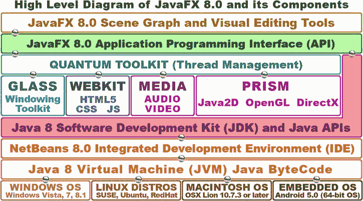
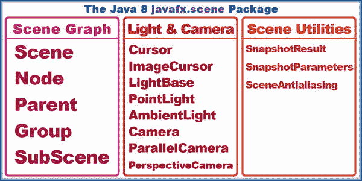
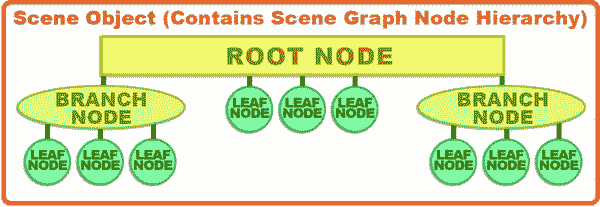
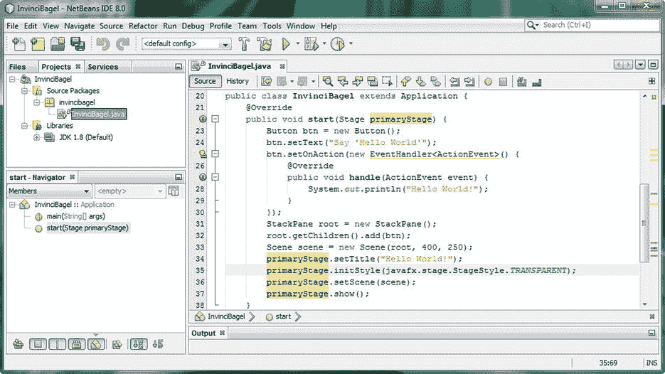
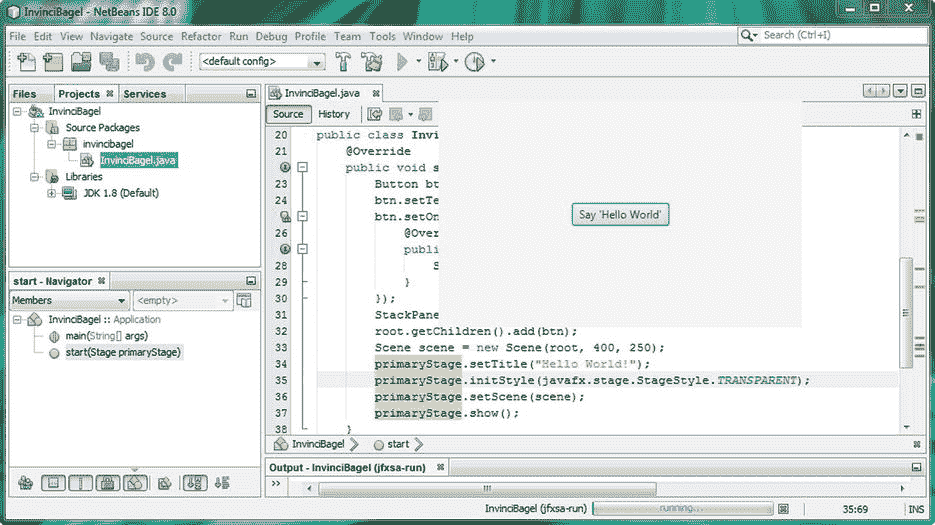
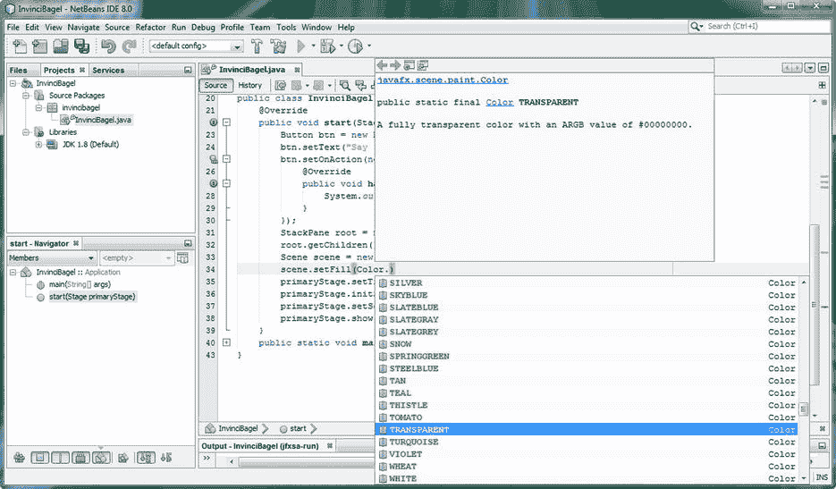
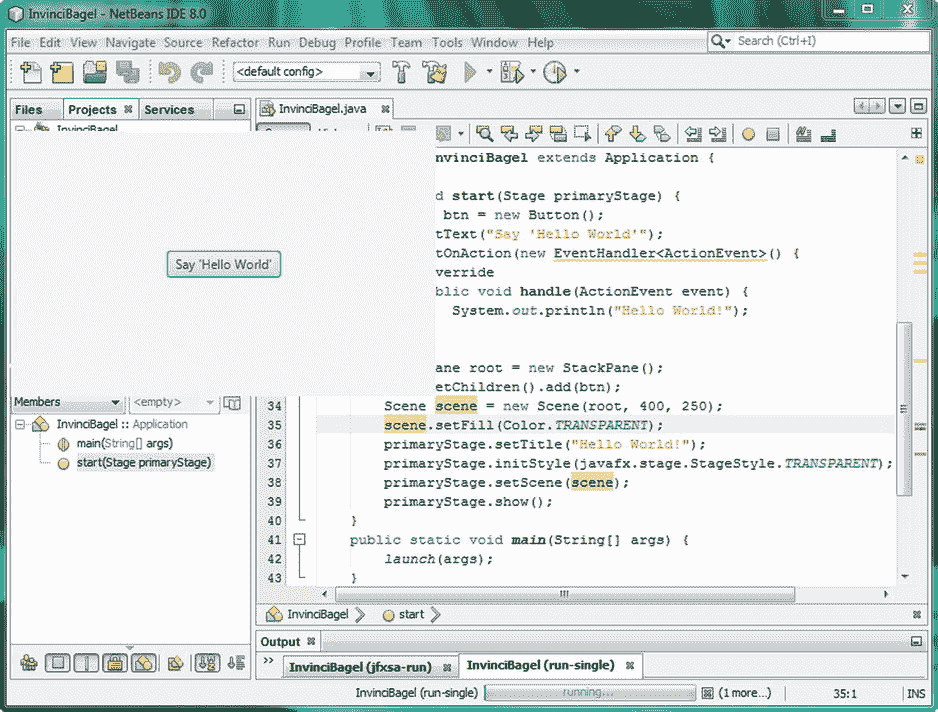
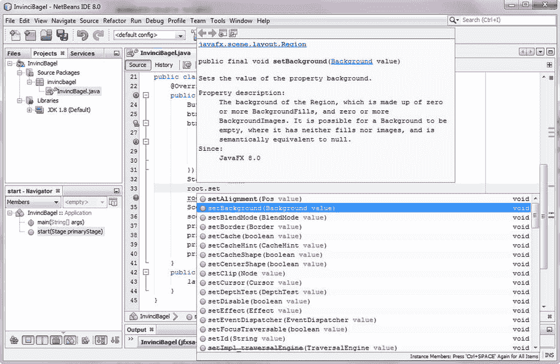
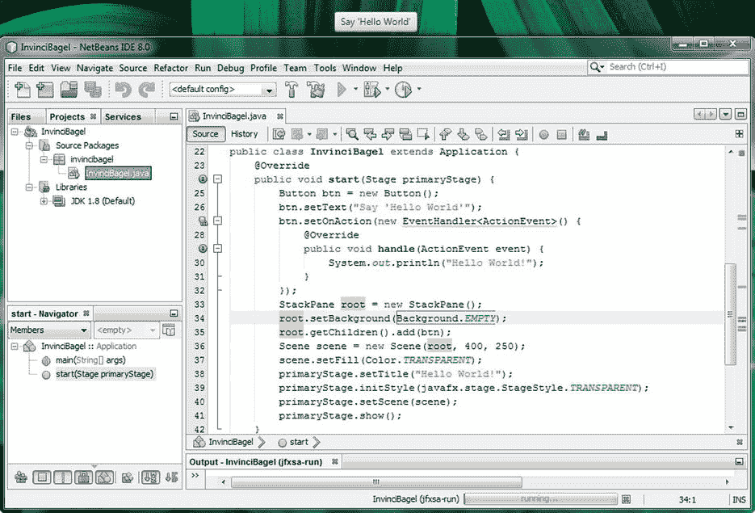

# 四、JavaFX 8 简介：探索 Java 8 多媒体引擎的功能

让我们通过学习构成 JavaFX 8 多媒体引擎的功能、组件和类，在前面章节[第 4 章](04.html)中学习 Java 编程语言的知识。这个令人惊叹的 JavaFX 8 API 是使用 JavaFX 包添加到 Java 8 中的，你在[第 2 章](02.html)和[第 3 章](03.html)中看到了这个包，它是与 Java 8 一起发布的。JavaFX 8 包对游戏编程很重要，因为它包含了你想用于游戏编程的高级形式的类，包括使用场景图组织游戏组件的类；用户界面布局和设计的类；2D 数字插图类(也称为矢量图形)；以及用于数字成像(也称为光栅图形)的类；2D 动画；数字视频；数字音频；3D；网络引擎(WebKit)；还有更多，所有这些我都将在本章中介绍，这样您就可以确切地知道您可以得到什么，现在这些 JavaFX 8 库已经被添加到 Java 8 编程语言中了。

深入研究这些细节的理由不仅是为了让您知道 JavaFX 8.0 可以为您的 Java 8 游戏开发做些什么，而且是为了让您对这个 JavaFX 多媒体引擎的各个组件是如何组合在一起的有一个总体的了解。您将了解 JavaFX Quantum Toolkit、Prism 渲染技术、WebKit web 引擎、Glass Windowing Toolkit、音频和视频媒体引擎以及场景图形 API。

在您真正开始在游戏中使用 JavaFX 之前，您需要这份 Java FX 工作方式的高级概述，因为它是一组相当复杂的 API(我喜欢称之为引擎)。这是因为它为在 Java 8 应用(在这里是游戏)中实现用户界面(UI)和用户体验(UX)带来了强大的力量。因此，在这些基础章节中，请耐心听我讲述如何掌握您的 IDE (NetBeans 8.0)、编程语言(Java 8)以及这种新的媒体引擎(JavaFX 8)，它现在是 Java 8 编程平台的一部分，在国际上的影响力和受欢迎程度都在快速增长。

一旦您研究了 JavaFX 8.0 是如何在最高级别上组合在一起的(就像您在第 3 章中所做的那样)，您将考虑一些您可能用来构建 Java 8 游戏的关键类，例如 Node 类以及 Stage、Scene、Group、StackPane、Animation、Layout、Shape、Geometry、Control、Media、Image、Camera、Effect、Canvas 和 Paint 类。您已经学习了 JavaFX 应用类(参见[第 2 章](02.html)和[第 3 章](03.html))，所以现在您将重点关注可用于构建复杂多媒体项目的类，如 Java 8 游戏。

最后，您将深入了解您在[第 2 章](02.html)中生成的引导 JavaFX 应用，以及 Java。main()方法和 JavaFX。start()方法使用 Stage()构造函数方法创建 primaryStage Stage 对象，并在其中使用 scene()构造函数方法创建名为 Scene 的场景对象。您将探索如何使用 Stage 类中的方法来设置场景和标题并显示舞台，以及如何创建和使用 StackPane 和 Button 类(对象)，并向按钮添加 EventHandler。

## JavaFX 概述:从场景图到操作系统

和上一章一样，在 Java 8 上，我从最高级别的 JavaFX 开始这个概述，使用场景图形 API 和可视化编辑工具，它们包含在一个名为 Scene Builder 的 JavaFX 应用中，我们不会使用它(Scene Builder 是用于应用 UI 设计而不是游戏设计的)；我们将使用 GIMP 来代替。正如您在[第 1 章](01.html)中所观察到的那样(参见图 1-5)，Scene Builder 集成到了 NetBeans 8.0 中(JavaFX 被列为专门支持在 NetBeans 中使用，主要是因为 Scene Builder 已经成为 NetBeans GUI 的一个组成部分)。

如图 [4-1](#Fig1) 所示，这些 JavaFX 应用构建工具存在于 JavaFX 8 API(Java FX 包的集合，如 javafx.scene 和 javafx.application)的“顶部”，这最终允许您构建(使用场景图)和 UI 设计(使用场景生成器)您的 Java FX 新媒体作品(在本例中，是 Java 8 游戏)。请注意，JavaFX 8.0 API 不仅连接(这里使用钢轴承来表示插头)到它上面的场景图形和场景生成器，还连接到它下面的 Java JDK 8 和 Quantum 工具包。正如您所看到的，Java JDK 8(和 API)然后将 JavaFX 新媒体引擎连接到 NetBeans、JVM 和 Java 当前支持的各种平台以及未来的平台，如 Android 4 (32 位 Android)、Android 5 (64 位 Android)和 iOS。



图 4-1。

How JavaFX 8 is stratified, from the Scene Graph at the top down through Java 8, NetBeans 8.0, JVMs, and OSs

Quantum Toolkit 连接到 JavaFX 8.0 API，将您将要学习的所有强大的新媒体引擎联系在一起。Quantum Toolkit 还处理所有这些的线程管理，因此您的游戏代码和游戏的新媒体(音频、视频、3D 等)可以在双核、四核、六核和八核 CPU 上使用单独的处理器，这些处理器在当今的计算机和消费电子设备中非常常见。

Glass Windowing Toolkit 控制 JavaFX 8.0 的窗口管理，并负责显示屏上的所有离散区域，如舞台和弹出窗口，包括对话框。Glass 还管理事件处理队列，将事件传递给 JavaFX 进行处理，并设置计时器。

如图所示，还有一个 WebKit 引擎和一个媒体(播放器)引擎，由 Quantum Toolkit 管理。WebKit 引擎呈现您的 HTML5 和 CSS3 web 内容，媒体播放器媒体播放引擎分别播放您的数字音频和数字视频资产。

Quantum Toolkit 下面最重要的新媒体引擎是 Prism(游戏)引擎，它使用 Java 2D 渲染 2D 内容，如果您的用户使用 Windows Vista、Windows 7 或 Windows 8.1 平台，则使用 OpenGL (Mac、Linux、嵌入式操作系统)或 DirectX 渲染 3D 内容。Windows XP 支持于 2014 年 4 月停止，因为现在大多数计算机和消费电子设备都支持 64 位(XP 仅为 32 位)。

Prism 桥接了主要操作系统平台和消费电子(嵌入式)设备上的强大 3D 游戏引擎(DirectX、OpenGL ),因此 JavaFX 8.0 可以将复杂的渲染任务处理从 NVIDIA (GeForce)、AMD (ATI 镭龙)和英特尔卸载到图形处理单元(GPU)硬件。这使得 JavaFX(以及 Java 8)游戏速度更快，并允许游戏使用更少的 CPU 处理能力来将游戏资产渲染到屏幕上。这反过来允许更多的 CPU 处理能力用于游戏逻辑，如人工智能和碰撞检测。在本书的第四章中，当你掌握了 JavaFX 引擎之后，你将会学到游戏设计的这些领域。

值得注意的是，游戏开发人员不需要了解 Quantum(线程)、Glass(窗口)或 Prism(渲染)引擎的内部工作原理，就可以利用它们惊人的强大功能。在整本书中，您将关注图的顶层(场景图和场景生成器)以及 JavaFX 和 Java 8 API 层。我还将介绍 NetBeans IDE 8.0 级别，您将在第 2 章中了解到这一级别，但您也将在本书的剩余部分进一步探索这一级别。

至于图中的较低层，NetBeans 8.0 将生成一个 Java 字节码文件，供每个操作系统平台的定制 JVM 读取。图底部所示的 JVM 可以通过下载 Java 8 JRE 安装在任何给定的操作系统平台上，你已经在第 1 章中遇到过，当你把它作为 Java JDK 8 的一部分安装时。

这个 JVM 层允许你的游戏作为一个应用安装在所有流行的操作系统平台和嵌入式设备上，这些设备也支持 JavaFX 8。此外，您可以将您的 Java 8 游戏生成为一个 Java applet，它可以嵌入到一个网站中，甚至还有一个部署模型，在该模型中，应用可以从网站拖到您的桌面上，在那里它被安装为一个完整的 Java 8 应用。

此外，已经有一种方法可以在 iOS 8 以及 Android 4.4 和 5.0 上运行 JavaFX 8 应用。如果你对这方面的最新信息感兴趣，只需谷歌“Android 上的 JavaFX”或“iOS 上的 Java FX”；你可以打赌，到 2015 年，Android 5.0 和 Chrome OS 设备将“本机”运行 JavaFX 应用，这意味着有一天(很快)你将能够使用 IntelliJ 直接将 Java(和 JavaFX 引擎)应用导出到 Android 5.0，或使用 NetBeans 8.0 导出到 Chrome OS。有了这个 Java 8 和 JavaFX 8.0 动态组合，您最终将能够“一次编码，随处运行”！Oracle 最近发布了 Java 8 SE Embedded、Java 8 ME 和 Java 8 ME Embedded 版本，都支持 JavaFX。

Note

JetBrains IntelliJ IDEA 现在是用于创建 64 位 Android 5.0 应用的官方 IDE。这个 IDE 在我的 Android Apps for Absolute 初学者，第三版(Apress，2014)中进行了讨论，其中包括使用 Eclipse IDE 和 Java 6 开发 32 位 Android 4.0 应用，以及使用 IntelliJ IDEA 和 Java 7 开发 64 位 Android 5.0 应用。

让我们从图的顶部开始，看一下 JavaFX 场景图和 javafx.scene 包，它在 JavaFX API 中实现了场景图(下一章将介绍 Scene Builder)。

## JavaFX 场景包:16 个核心 Java 8 类

在我们的高级概述之后，我想做的第一件事是介绍最重要的 JavaFX 包之一，javafx.scene 包。在[第二章](02.html)和[第三章](03.html)中，你会发现不止一个 JavaFX 包。正如你在《T4》第三章(见图 3-1)中看到的，InvinciBagel 游戏应用使用了四个不同的 JavaFX 包。javafx.scene 包包含 16 个强大的 Java 8 类(记住，javafx 是在 Java 8 中重新编码的)，包括 Camera、ParallelCamera 和 PerspectiveCamera、Cursor 和 ImageCursor、LightBase、PointLight 和 AmbientLight 类；场景图类(节点、父、组和子场景)；以及一些实用程序类(见图 [4-2](#Fig2) )。



图 4-2。

The javafx.scene package and its 16-core Scene Graph, Scene utility, Lighting, Camera, and Cursor classes

我对这 16 个 javafx.scene 包类进行了逻辑分组。Scene 类位于图的 Scene Graph 部分，因为使用 Scene 类创建的 Scene 对象包含 Scene Graph 对象，这些对象是使用这四个与 Scene Graph 相关的类(Node、Parent、Group、SubScene)及其子类创建的。我将在本章后面详细介绍场景图类(参见“JavaFX 场景图:组织场景，使用父节点”一节)

JavaFX 中的场景图架构类从最高级别开始，有一个节点超类及其父类，包括 Group 和 SubScene 类，它们是父类的子类。这些核心类用于创建 JavaFX 场景图形层次结构，以及组织和分组使用 JavaFX 包中的其他 JavaFX 类创建的对象。

有三个我称之为场景实用程序的类，它们允许你在任何时候对你的场景或它的任何场景图节点进行快照(像截图一样),如果你在一个场景中使用 3D 基本体的话，还可以打开和关闭场景初始化。javafx.scene 包中的另一半(八个)类用于场景照明、场景摄影机和场景的光标控制。我将在本章后面讨论这些类(参见“JavaFx 场景内容:灯光、摄像机、光标、动作！”)，在您看了场景图类之后，这些类创建、分组、管理和操作 JavaFX 场景内容。因此，我将按照您最有可能使用 javafx.scene 包的顺序，从图的左侧到右侧，从最少到最多，介绍图中所示的 Java FX . scene 包类。

### JavaFX 场景类:场景大小和颜色以及场景图形节点

javafx.scene 包中的两个主要类是 scene 类和 Node 类。我将在下一节介绍 Node 类及其父类、组类和子场景子类，因为这些类及其子类(如 InvinciBagel 类中使用的 StackPane 类)用于实现 JavaFX 中的场景图架构。此外，在某种意义上(在我的图中), Node 类及其子类可以被视为在 Scene 类之下，尽管 Node 类不是 Scene 类的子类。事实上，节点(场景图)类和子类，或者说使用这些类创建的对象，包含在场景对象本身中。

因此，您将首先考虑如何使用 Scene 类及其 Scene()构造函数方法为 JavaFX 应用创建场景对象。本节将强化你在第 3 章学到的关于重载构造方法的知识，因为创建一个场景对象需要几种不同的方法。

Scene 类用于创建一个 Scene 对象，使用 Scene()构造函数类，根据您选择使用六个(重载的)构造函数方法中的哪一个，该类使用一个到五个参数。这些方法包括以下构造函数方法，以及它们的六种不同的(因此也是重载的)参数列表数据字段配置:

`Scene(``Parent`T2】

`Scene(``Parent``root,``double``width,``double`T6】

`Scene(``Parent``root,``double``width,``double``height,``boolean``depthBuffer)`

`Scene(``Parent``root,``double``width,``double``height,``boolean``depthBuffer,``SceneAntialiasing``aAlias)`

`Scene(``Parent``root,``double``width,``double``height,``Paint``fill)`

`Scene(``Parent``root,``Paint`T4】

当前在您的引导 Java 和 JavaFX 代码中使用的构造函数是第二个，调用如下:

`Scene scene =``new`T2】

如果您想给场景添加黑色背景，您可以选择第五个重载的构造函数方法，使用一种颜色。Color 类中的 BLACK 常量(这是一个 Paint 对象，因为 Color 是 Paint 子类)作为填充数据(在本例中为填充颜色)。您可以通过使用以下 Scene()对象构造函数方法调用来实现这一点:

`Scene scene =``new``Scene(root, 300, 250,``Color.BLACK`T4】

请注意，根对象是一个父子类，称为 StackPane 类，它是使用 StackPane()构造函数方法(在 Scene()构造函数方法调用上方两行)通过使用以下 Java 代码行创建的:

`StackPane root =``new`T2】

正如您所看到的，任何类都可以在构造函数中使用，只要它是为该构造函数参数位置(数据)声明(必需)的对象(类)类型的子类。您可以在参数列表中使用 Color 和 StackPane 对象，因为它们分别来自 Paint 和 Parent 类。

如果您想知道，布尔 depthBuffer 参数用于 3D 场景组件。因为这些场景组件是 3D 的并且具有深度(除了 2D x 和 y 组件之外，还有一个 z 组件)，所以如果要创建 3D 场景或组合 2D 和 3D 场景组件，则需要包含此参数，并将其设置为 true 值。最后，在第四个构造函数方法的参数列表中传递的 SceneAntialiasing 对象(和类)为 3D 场景组件提供实时平滑。

### JavaFX 场景图:组织场景，使用父节点

场景图不是 JavaFX 独有的，在很多新媒体内容创作软件包中都可以看到，它是一种类似倒置的树的数据结构，根节点在顶部，分支节点和叶节点从根节点开始。我第一次看到场景图设计方法是在我使用 Realsoft Oy 的名为 Real 3D 的 Amiga 软件包进行 3D 建模的时候。从那时起，这种方法被许多 3D、数字视频和数字图像软件包复制，现在是 JavaFX 组织内容和场景的一部分。出于这个原因，你们中的许多人可能对这种设计范例很熟悉(也很舒服)。

JavaFX 场景图数据结构不仅允许您设计、组织和设计 JavaFX 场景及其内容，而且如果您正确设置了场景图，还可以将不透明度、状态、事件处理器、变换和特殊效果应用于场景图层次的整个逻辑分支。图 [4-3](#Fig3) 是基本的场景图树，顶部是根节点，下面是分支和叶子节点。



图 4-3。

JavaFX Scene Graph hierarchy, starting with the root node and progressing to branch and leaf nodes

根节点是最顶端的节点，这就是为什么它被称为根，即使它在顶部，而不是底部，就像植物世界中的根一样。根节点没有父节点，也就是说，在场景图形层次中，它上面没有任何东西。根节点本身是其下的分支节点和叶节点的父节点。

场景图树中第二个最强大(也是最复杂)的结构是分支节点，它使用 javafx.scene.Parent 类作为其超类，并且可以包含子类(这是合乎逻辑的，因为它扩展了一个名为 Parent 的类)。分支节点可以包含其他分支节点以及叶节点，因此它可以用于创建一些非常复杂和强大的场景图层次结构(或场景图架构)。

层次结构中的最后一级是叶节点。叶节点是分支的末端，因此不能有子节点。值得注意的是，叶节点可以直接脱离根节点，如图 4-3 所示。可以使用父类、组类或子场景类(见图 [4-2](#Fig2) )或它们的任何子类来创建分支节点，例如 WebView、PopupControl、Region、Pane 或 StackPane 类。

叶节点的示例包括 JavaFX 类(作为对象)，这些类可以使用参数(如形状、文本或 ImageView)进行配置，但它们本身是设计或内容组件，并且没有被设计为具有子级(子对象)。

因此，在 JavaFX 场景图层次结构中，叶节点将始终包含一个 JavaFX 类，该类没有从父类子类化(扩展),并且其本身也没有被专门设计为在其中或其下具有子元素(子对象)。

父类的四个子类都可以用作分支节点，包括 Group 类，用于对子(叶节点)对象进行分组，以便可以对它们应用不透明度、变换和效果；Region 类，用于将子(叶节点)对象分组以形成屏幕布局，这也可以使用 CSS 来设置样式；Control 类，可用于创建自定义用户界面元素(JavaFX 中称为控件)；以及 WebView 类，用于包含 JavaFX WebEngine 类(该类将 HTML5 和 CSS3 内容呈现到 WebView 中)。

### JavaFX 场景内容:灯光，摄像机，光标，动作！

接下来，我们来看看图 [4-2](#Fig2) 中列在中间一栏的八个类。它们提供了强大的多媒体工具来控制您的应用的光标，并为您的 2D 和 3D JavaFX 应用(在这种情况下，是游戏，但也可以是电子书、iTV 节目或任何其他需要 JavaFX 通过 Java 语言提供的强大新媒体功能的内容)提供定制的灯光特效和定制的相机功能。

图中更一般化的类(Cursor、LightBase、Camera)是父类，更专门化的类(ImageCursor、PointLight、ParallelCamera 等)列在每个类之后，是这些父类的子类。除了 LightBase 类，这似乎是显而易见的！

正如您可能已经猜到的(正确)，JavaFX Cursor 类可用于控制在任何给定时间使用的应用光标图形(箭头、手形、闭合的手形、十字准线等)。ImageCursor 子类可用于定义和提供基于图像的自定义光标以及自定义光标图像中的 x 和 y 位置，该位置定义了光标点(也称为光标热点)的位置。

LightBase 类及其 PointLight 和 AmbientLight 子类可用于照亮场景。这些类主要用于 3D 场景，它们需要在游戏运行的任何平台上具有 3D 功能，这在当今并不是一个真正的问题，因为大多数主要的 CPU 制造商也制造(并包括)GPU。此外，值得注意的是，如果渲染游戏的平台上没有 3D 处理模拟，Prism 游戏引擎将使用 3D 处理模拟来模拟 3D 环境(GPU)。此外，如果你设置正确，你可以在你的 2D 游戏中使用光照类，或者在混合 2D 3D 游戏中使用光照。

Camera 类及其 ParallelCamera 和 PerspectiveCamera 子类可用于在 3D 和 2D(以及混合)游戏应用中拍摄或录制场景。其中两个相机类 camera 和 ParallelCamera 不要求在运行 JavaFX 应用(在本例中为游戏)的平台上具备 3D (GPU)功能。

Camera 类的子类提供了两种不同的专用类型的摄像机。ParallelCamera 类可用于渲染场景，无需任何深度透视校正，这在 3D 行业中称为正交投影。这意味着这个类非常适合用于 2D 场景(和 2D 游戏)。

PerspectiveCamera 类有一个更复杂的相机，用于 3D 场景，它将支持 3D 查看量。与 LightBase 类及其子类一样，PerspectiveCamera 类需要在运行应用(或游戏)的硬件平台上具有 3D 功能。

PerspectiveCamera 类有一个 fieldOfView 属性(state 或 variable)，可以用来改变它的查看体积，就像一个真正的相机变焦镜头，当你从广角放大它的时候。fieldOfView 属性的默认设置是 30 度的锐角。如果你还记得你高中时的几何，你可以通过向下看相机的 y(垂直)轴来想象这个视野。如你所料，确实有。getFieldOfView()和。setFieldOfView(double)方法调用来控制此摄像机类属性。

接下来，让我们仔细看看场景实用程序类。之后，您将检查一些 javafx.scene 子包，例如 javafx.scene.text、javafx.scene.image、javafx.scene.shape 和 javafx.scene.layout。

### JavaFX 场景工具:场景快照和抗锯齿

最后，您应该快速查看一下图 [4-2](#Fig2) 中右栏所示的三个实用程序类，因为它们可用于提高用户设备屏幕上的场景输出质量(使用抗锯齿)，以及为您的用户(用于社交媒体共享)或您的游戏逻辑本身提供屏幕捕捉功能。

我们先来考察一下 SceneAntialiasing 类。抗锯齿是一个数字图像行业术语，指的是一种平滑两种颜色交汇处锯齿状边缘的算法，通常位于对角线上或图像合成的圆形区域中。图像合成是将两个独立的图像分层放置以形成一个图像。有时，这两个(或更多)图像层的图像组件之间的边缘需要平滑。平滑(抗锯齿)是必需的，以便最终的合成看起来是一个无缝的图像，这是艺术家或游戏设计师的意图。有趣的是，您已经使用 StackPane 类(窗格是层)在 InvinciBagel 应用中实现了 JavaFX“层引擎”。“层叠”图像合成方法在游戏和软件中很常见，如 Photoshop 和 GIMP。

SceneAntialiasing 类为 3D 场景提供抗锯齿处理(算法),以便可以在 2D 场景背景上合成 3D 场景，无论这是默认颜色。白色或任何其他颜色值；2D 图像(创建混合的 2D-3D 应用)；或者其他任何事。scene aliasing 类允许您将静态 scene aliasing 数据字段设置为 DISABLED(关闭抗锯齿)或 BALANCED(打开抗锯齿)值。平衡选项提供了质量和性能的平衡，这意味着设备硬件的处理能力越强，处理的抗混叠质量就越高。

接下来，让我们探索 SnapshotParameters 类(object)，它用于设置(包含)将由 SnapshotResult 类(object)使用的渲染属性参数。这些参数包括要使用的相机对象的类型(平行或透视)；depthBuffer(用于 3D)是打开的(对于 3D 为真)还是关闭的(对于 2D 为假)；一个画图对象，用于包含图像数据；一个转换对象，用于包含任何转换数据；和 Rectangle2D 对象，用于定义要渲染的视口区域(即快照尺寸)。

您将在本章中看到所有这些 javafx.scene 子包类和概念，并在本书的课程中使用它们中的许多。您将在 Java 8 游戏开发中使用的许多功能都可以在这些 JavaFX 8.0 子包中找到。

SnapshotResult 类(更重要的是，使用该类创建的对象)包含生成的快照图像数据、生成该数据的参数以及生成该数据的场景图中的源节点。因此，该类支持的三种方法应该是显而易见的。getImage()方法将获得快照图像。getSource()方法获取源节点信息，而。getSnapshotParameters()方法将获取 SnapshotParameters 对象内容。

## 场景子包:其他 13 个场景包

你可能在想，“咻！javafx.scene 包概述中包含了很多内容！，“而且确实核心的 javafx.scene 包里面有很多类，涵盖场景创建；场景图组织；以及场景实用工具，比如灯光、相机、光标、截图(或者我们应该称这些为 sceneshots？).在 javafx.scene 包中，在我所称的子包中，或者在 javafx.scene 包下面的包中，有更多的内容，使用另一个点和另一个包名(描述)来引用。事实上，还有 13 个 javafx.scene 包(见表 [4-1](#Tab1) )，涵盖了绘图、绘画、图表、UI 设计、成像、特效、媒体(音频和视频)回放、输入输出、文本、形状(2D 几何)、变换和网页(用 HTML5、JavaScript 和 CSS3 创建的内容)呈现等内容。在本节中，您将探索这些场景包类。

表 4-1。

Thirteen Second-Level JavaFX Scene Subpackages, Their Primary Functions, and a Description of Classes

   
| 包名 | 功能 | 内容描述 |
| --- | --- | --- |
| javafx.scene .画布 | 图画 | 画布类(和画布对象)；对于自定义绘图图面 |
| javafx.scene.chart | 制图 | 图表类:饼图、折线图、XYChart、条形图、面积图、气泡图 |
| javafx .场景.控件 | 用户界面控件 | UI 控件类:按钮、菜单、滑块、标签、滚动条、文本字段 |
| javafx.scene.effect | 特技 | 特殊效果类:发光，混合，开花，阴影，反射，运动模糊 |
| javafx.scene.image | 成像 | 数字图像类:图像、图像视图、可写图像视图、像素格式 |
| javafx.scene.input | 输入(事件) | 与将用户输入获取到 JavaFX 应用相关的类 |
| javafx.scene.layout | UI 布局 | UI 布局容器类:TilePane、GridPane、FlowPane、Border |
| javafx.scene.media | 媒体播放机 | 媒体播放类:MediaPlayer、MediaView、Track、AudioTrack、AudioClip |
| javafx.scene.paint | 绘画 | 绘画类:绘画、颜色、线性渐变、径向渐变、停止、材质等等 |
| javafx.scene.shape | 几何学 | 2D 和 3D 几何类:网格、形状、Shape3D、圆弧、圆、直线、路径等 |
| javafx.scene.text | 文本和字体 | 文本呈现和字体呈现类:字体、文本、文本流等等 |
| javafx.scene.transform | 转换 | 变换类:变换，缩放，旋转，剪切，平移，仿射 |
| javafx.scene.web | WebKit | Web 支持类:WebView、WebEvent、WebEngine、HTMLEditor |

让我们从类最少的包开始。该表按字母顺序列出了子包，但是第一个子包 javafx.scene.canvas 恰好只包含一个类，canvas 类，顾名思义，它用于创建一个 Canvas 对象，该对象用作画布，您可以用它来创建东西！列出的下一个子包是 Java FX . scene . chart；这本书有图表类，如饼图、折线图、XYChart、条形图、面积图和 BubbleChart，供业务应用使用，这是完全不同的一本书，所以我将不讨论图表。

下一个子包 javafx.scene.control 提供了所有的 UI 控件(Android 中的 widget)类，比如 Button、Menu、CheckBox、RadioButton、DatePicker、ColorPicker、ProgressBar、Slider、Label、Scrollbar、TextField 和其他 80 多个类。因为 javafx.scene.control 中大约有一百个类，所以我甚至不打算在这里介绍它；关于这个子包，可能可以写一整本书！如果您想复习这些类，只需在 Google 或 Oracle Java 网站上参考“javafx.scene.control ”,您就可以连续几天仔细阅读这些类能做什么。对于这个子包，“reference”是关键词，因为当您需要实现一个给定的 UI 元素时，您会希望单独引用这个包及其类。

下一个子包 javafx.scene.effect 提供了所有的特效类，差不多有 24 个。这些对于 Java 8 游戏开发非常有用，因此这是我将在本节中详细介绍的少数几个子包之一。

javafx.scene.image 子包用于在 javafx 中实现数字影像，它包含 image、ImageView、WritableImage、PixelFormat 和 WritablePixelFormat 类。ImageView 类是您通常用来保存数字图像资产的类，如果您想要进行更高级的(算法)基于像素的数字图像创建，则更高级的 PixelFormat 类允许您逐个像素地创建数字图像。

javafx.scene.input 子包包括用于从 javafx 应用的用户获取输入的类。这个输入使用事件处理能力进行处理，你将在本书的课程中详细研究，并且你已经在你的 JavaFX 应用中体验过了，在[第 3 章](03.html)(见图 3-2，ll。第 22 至 24 页)。

javafx.scene.layout 子包包含用于创建 UI 设计布局以及用于屏幕布局设计的类。这些布局类包括控制和管理背景的类；添加边框并设置其样式；并提供 UI 窗格管理，如 StackPane、TilePane、GridPane、FlowPane 和 AnchorPane。这些 UI 类为 JavaFX 中的 UI 控件提供了自动屏幕布局算法。Background 类(及其子类)提供了屏幕背景实用程序，Border 类(及其子类)提供了屏幕边框实用程序，可用于为 UI 屏幕增加图形设计的趣味。

javafx.scene.media 子包包含用于播放音频或视频媒体的类，包括 media、MediaPlayer 和 MediaView 类。媒体类(实际上是对象)引用并包含媒体(音频或视频)资产，MediaPlayer 播放该资产，MediaView(对于视频)显示该资产。这个子包还有一个 Track 超类和 AudioTrack、VideoTrack、SubtitleTrack 子类，以及 AudioClip、AudioEqualizer 和 EquilizerBand 类，它们提供高级音频(均衡器)控件和短格式音频剪辑，或非常适合在游戏中使用的音频片段。你将在本书的后面使用 AudioClip 类(见[第 1 章](01.html) 5)。

javafx.scene.paint 子包包含 Stop 类和 paint 超类及其 Color、ImagePattern、LinearGradient 和 RadialGradient 子类，以及 Material 超类及其 PhongMaterial 子类。熟悉 3D 内容制作的人会认识这种 Phong 着色器算法，它允许模拟不同的表面外观(塑料、橡胶等)。Material 和 PhongMaterial 类需要 3D 功能才能在播放硬件上成功运行，就像 SceneAntialiasing、PerspectiveCamera 和 LightBase 类(及其子类)一样。Paint 类创建您的 Paint 对象，Color 类为该对象着色(用一种颜色填充它)，LinearGradient 和 RadialGradient 类用颜色渐变填充 Paint 对象，Stop 类允许您定义渐变颜色在渐变中的开始和停止位置。最后，还有一个 ImagePattern 类，它可以用可平铺的图像模式填充 Paint 对象(这对游戏非常有用)。

javafx.scene.shape 子包为 2D 几何图形(通常称为图形)和 3D 几何图形(通常称为网格)提供了类。Mesh 超类及其 TriangleMesh 子类处理 3D 几何，Shape3D 超类及其 Box、Sphere、Cylinder 和 MeshView 子类也是如此。形状超类有更多的子类(11)；这些是 2D 几何元素，包括圆弧、圆、三次曲线、椭圆、直线、路径、多边形、折线、四次曲线、矩形和 SVGPath 类。PathElement 超类及其 ArcTo、ClosePath、CubicCurveTo、HLineTo、LineTo、MoveTo、QuadCurveTo 和 VLineTo 子类也提供了路径支持，即定义为开放形状的路径(我喜欢称之为样条曲线，因为我是 3D 建模师)，它允许您绘制样条曲线来创建自己的自定义形状！

javafx.scene.text 子包包含将文本形状和字体渲染到场景中的类。这包括 Font 类和 Text 类，前者用于使用您可能想要使用的任何非 JavaFX 系统字体的字体，后者用于创建一个将使用该字体显示文本值的文本节点。还有一个专门的布局容器类，称为 TextFlow，用于流动文本，就像您在文字处理器上看到的那样。

javafx.scene.transform 子包提供了用于渲染 2D 和 3D 空间变换的类，例如 transform 超类的 Scale、Rotate、Shear、Translate 和 Affine (3D rotation)子类。这些可以应用于场景图中的任何节点对象。这允许您的场景图中的任何内容(文本、UI 控件、形状、网格、图像、媒体等等)以您喜欢的任何方式进行转换，这为 JavaFX 游戏开发人员提供了大量的创造力。如果你想知道，平移是整个物体的线性运动；剪切是 2D 平面上两个不同方向的线性运动，或者是 2D 平面的另一部分固定时的一个方向的运动。想象移动一个平面的顶部，而底部保持固定，这样正方形就变成了平行四边形，或者向不同方向移动同一平面(正方形)的顶部和底部。

javafx.scene.web 子包提供了用于将 web 资源渲染到场景中的类，使用了一组类，包括 WebView、WebEvent、WebEngine、WebHistory 和 HTMLEditor。正如您可能想象的那样，WebEngine(请参阅，其他人也称之为引擎)类在 JavaFX 中执行显示 HTML5 + CSS3 + JS 的处理，WebView 类创建用于在场景图中显示 WebEngine 输出的节点。WebHistory 类(最终是对象)保存所访问网页的会话历史(从 WebEngine 实例化到从内存中删除), WebEvent 将 JavaScript web 事件处理与 JavaFX 事件处理联系起来。

既然您已经查看了 javafx.scene 包及其相关子包中大量重要且有用的类(对象),那么让我们来看看 15 个顶级 javafx 包，以便更好地了解 JavaFX 为应用开发提供的关键功能(当然，重点是那些可用于游戏开发的功能)。

## 其他 JavaFX 包:15 个顶级包

有 15 个顶级包(javafx.packagename 是我认为的顶级包)，其中一些包也有子包级别，就像您看到的 javafx.scene 包和子包一样。表 [4-2](#Tab2) 概述了这些包装并描述了其内容。

表 4-2。

JavaFX Top-Level Packages, Their Primary Functions, and a Description of Their Functional Classes

   
| 包名 | 功能 | 内容描述 |
| --- | --- | --- |
| javafx.animation | 动画 | 时间轴，转场，动画计时器，插值器，关键帧，键值 |
| javafx .应用 | 应用 | 应用(初始化、启动、停止方法)、预加载程序、参数、平台 |
| javafx.beans | JavaFX beans | 定义最一般形式的可观察性的 Java 接口 |
| javafx.collections | 收集 | 定义最一般形式的可观察性的 Java 集合 |
| javafx.concurrent | 穿线 | 线程类:任务、服务、计划服务、工作状态事件 |
| javafx.css | 半铸钢ˌ钢性铸铁(Cast Semi-Steel) | 与在 JavaFX 中实现 CSS 相关的类 |
| javafx.embed | 使...嵌入 | 嵌入废弃的 Java Swing 和 Java AWT GUI 范例 |
| javafx.event | 事件处理器 | 事件处理类:Event、ActionEvent、EventType、WeakEventHandler |
| javafx.fxml | 断续器 | 断续器 |
| javafx.geometry | 3D 几何图形 | 3D 几何类 |
| javafx.print | 印刷 | 打印类别 |
| javafx.scene | 场景控制 | 与场景创建、组织、控制和实现相关的课程 |
| javafx.stage | 舞台创作 | 舞台创作课 |
| javafx.util | JavaFX 实用程序 | JavaFX 实用程序类 |
| netscape.javascript | Java Script 语言 | 允许 Java 代码调用 JavaScript 方法并检查 JavaScript 属性 |

我已经讨论过其中的一些，比如 javafx.application 包(参见第 2 章和第 3 章[)和 javafx.scene 包(参见“JavaFX Scene 包:十六个强大的 Java 8 类”一节)。这里有几个其他的 JavaFX 包您应该仔细看看，因为它们(和 javafx.scene 包一起)包含了您想要在 Java 8 游戏开发中使用的类(还有其他的，比如 javafx.print、javafx.fxml、javafx.beans 和 javafx.embed 包不太可能在您的 Java 游戏设计和开发工作过程中使用)；它们是 javafx.animation、javafx.stage、javafx.geometry、javafx.concurrent 和 javafx.event，接下来让我们深入看看这些包为您的游戏开发目标提供了什么。](03.html)

### 游戏的 JavaFX 动画:使用 javafx.animation 类

javafx.animation 包包含 animation 超类，该超类包含 Timeline 和 Transition 子类以及 AnimationTimer、Interpolator、KeyFrame 和 KeyValue 类。动画是 Java 8 游戏中一个重要的设计元素，多亏了 JavaFX，这些动画类已经为我们编码好了，所以你所要做的就是正确地使用它们来为你的游戏添加动画！

#### JavaFX Animation 类:动画对象的基础

Animation 类(实际上是对象)提供了 JavaFX 中动画的核心功能。Animation 类包含两个(重载的)Animation()构造函数方法；它们是 Animation()和 Animation(double target frame rate)，它们将在内存中创建动画对象，该对象将控制动画及其播放特征和生命周期。

动画类包含。play()方法。playFrom(cuePoint)或。playFrom(持续时间)方法和. playFromStart()方法。这些方法用于开始播放动画对象。也有。pause()方法可以暂停动画播放，而. stop()方法可以停止动画播放。那个。jumpTo(持续时间)和。jumpTo(cuePoint)方法用于跳转到动画中预定义的位置。

您可以使用 rate 属性设置动画播放速度(也称为帧速率或每秒帧数[FPS])。cycleCount 属性(变量)允许您指定动画循环的次数，delay 属性允许您指定动画开始前的延迟时间。如果动画正在循环，此延迟属性将指定循环之间的延迟时间，这可以帮助您创建一些逼真的效果。

您可以通过将 cycleCount 属性或特性(变量)设置为不定，然后使用 autoReverse 属性(设置为 false)来指定无缝动画循环，也可以通过为 autoReverse 属性指定 true 值来使用 pong(来回)动画循环。如果不希望动画无限循环，也可以将 cycleCount 设置为一个数值(如果希望动画只播放一次，请使用 1)。

那个。setRate()方法设置动画播放速率属性。setDelay()方法设置 Delay 属性，而。setCycleCount()和。setCycleDuration()方法控制循环特性。也有类似的。get()方法来“获取”这些动画对象变量(特性、属性、参数或特征；但是您更喜欢查看这些数据字段是可以的)。

使用 ActionEvent 对象加载的 onFinished 属性，可以指定动画播放完成时要执行的动作。当动画到达每个循环的结尾时，动作将被执行，正如你可以想象的那样，一些非常强大的东西可以在具有这种特定功能的游戏中被触发。

还有只读变量(属性)，您可以随时“轮询”这些变量，以找到每个动画对象的状态、当前时间、当前速率、循环更新和总持续时间。例如，可以使用 currentTime 属性查看动画播放周期中任何时间点的播放头(帧指针)位置。

##### JavaFX TimeLine 类:用于属性时间轴管理的动画子类

JavaFX Timeline 类是 JavaFX Animation 超类的子类，因此它的继承层次结构从 Java 8 master class Java . lang . object 开始，向下发展到 Timeline 类，如下所示:

```java
> java.lang.Object

> javafx.animation.Animation
```

`> javafx.animation.` `Timeline`

Timeline 对象可用于定义一种特殊的动画对象，该对象由对象类型 WritableValue 的 JavaFX 值(属性)组成。因为所有的 JavaFX 属性都是这种类型，所以这个类可以用来制作 JavaFX 中任何东西的动画，这意味着它的使用只受您的想象力的限制。

如前所述，时间轴动画是使用通过 KeyFrame 类创建的 KeyFrame 对象定义的，key frame 类既创建又管理这些对象。根据时间变量(通过 KeyFrame.time 访问)和要设置动画的属性(使用 KeyFrame 对象的 values 变量(通过 KeyFrame.values 访问)定义)，由时间轴对象处理 KeyFrame 对象。

请务必注意，您需要在开始运行时间轴对象之前设置关键帧对象，因为您不能在正在运行的时间轴对象中更改关键帧对象。这是因为一旦启动，它就会被放入系统内存中。如果您想以任何方式更改正在运行的时间轴对象中的关键帧对象，首先，停止时间轴对象；然后，对关键帧进行更改；最后，再次启动时间轴对象。这将使用新值将时间轴对象及其修订的关键帧对象重新加载到内存中。

Interpolator 类根据时间轴方向在时间轴对象中插入这些 KeyFrame.values。插值是根据开始值和结束值创建中间(或补间)帧的过程。如果您想知道方向是如何推断出来的，它保存在 Animation 超类的 rate 和只读 currentRate 属性中(它是 extended Timeline 子类的一部分)。

反转 rate 属性的值(即，使其为负)将反转(切换)回放方向；在读取 currentRate 属性时，同样的原则也适用(负值表示相反的方向)。最后，KeyValue 类(object)用于保存 KeyFrame 对象中的值。

##### JavaFX 过渡类:过渡效果应用的动画子类

JavaFX Transition 类是 JavaFX Animation 超类的子类，因此它的继承层次结构从 Java 8 master class Java . lang . object 开始，向下发展到 Transition 类，如下所示:

```java
> java.lang.Object

> javafx.animation.Animation
```

`> javafx.animation.` `Transition`

transition 类是一个公共抽象类，因此，它只能用于(子类化或扩展)创建 Transition 子类。事实上，已经为您创建了十个这样的子类，用于创建您自己的过渡特效；这些是 SequentialTransition、FadeTransition、FillTransition、PathTransition、PauseTransition、RotateTransition、ScaleTransition、TranslateTransition、ParallelTransition 和 StrokeTransition 类。作为动画的子类，过渡类包含了动画的所有功能。

您可能最终会直接使用这十个自定义过渡类，因为它们提供了您可能想要使用的不同类型的过渡(渐变、填充、基于路径、基于笔画、旋转、缩放、移动等)。接下来我将继续讨论 AnimationTimer 类，因为在本书中我们将使用这个类作为游戏引擎。

#### JavaFX AnimationTimer 类:帧处理、纳秒和脉冲

JavaFX AnimationTimer 类不是 JavaFX Animation 超类的子类，因此它的继承层次结构从 Java 8 master class Java . lang . object 开始，如下所示:

```java
> java.lang.Object
```

`> javafx.animation.` `AnimationTimer`

这意味着 AnimationTimer 类是专门为 JavaFX 提供 AnimationTimer 功能的临时代码，它与 Animation(或时间轴或过渡)类或子类没有任何关系。因此，如果您将该类与占用 javafx.animation 包的 Animation、Interpolator、KeyFrame 和 KeyValue 类组合在一起，那么该类的名称可能会有些误导，因为它与这些类没有任何关系！

像 Transition 类一样，AnimationTimer 类也被声明为公共抽象类。因为是抽象类，所以只能用来(子类化或者扩展)创建 AnimationTimer 子类。与 Transition 类不同，它没有为您创建的子类；你必须从头开始创建你自己的 AnimationTimer 子类，我们将在本书的后面创建我们的 GamePlayLoop.java 类。

AnimationTimer 类看似简单，因为它只有一个您必须重写或替换的方法，包含在公共抽象类中。handle()方法。此方法提供了您希望在 JavaFX 引擎的舞台和场景处理周期的每一帧上执行的编程逻辑，它被优化为以 60FPS 播放(这对游戏来说是完美的)。JavaFX 使用脉冲系统，该系统基于新的 Java 8 纳秒时间单位(以前版本的 Java 使用毫秒)。

##### JavaFX 脉冲同步:场景图形元素的异步处理

JavaFX 脉冲是一种同步(计时)事件，它同步为 JavaFX 应用(游戏)创建的任何给定场景图结构中包含的元素的状态。JavaFX 中的脉冲系统由 Glass Windowing Toolkit 管理。脉冲使用高分辨率(纳秒)定时器，从 Java 8 API 开始，使用 System.nanoTime()方法的 Java 程序员也可以使用这种定时器。

JavaFX 中的脉冲管理系统被限制为 60FPS。这是为了让所有 JavaFX 线程都有“处理空间”来做它们需要做的事情。根据您在应用逻辑中所做的事情，JavaFX 应用将自动生成多达三个线程。一个基本的业务应用可能只使用主要的 JavaFX 线程，但是一个 3D 游戏也会产生 Prism 渲染线程，如果该游戏使用音频或视频，或者两者都使用，它通常会产生一个媒体播放线程。

在您的游戏开发过程中，您将使用音频、2D、3D，可能还有视频，因此您的 JavaFX 游戏应用肯定会是多线程的！正如您将看到的，JavaFX 被设计为能够利用多线程和纳秒计时功能以及 3D 渲染硬件(Prism)支持来创建游戏。

每当场景图中发生变化时，比如 UI 控件定位、CSS 样式定义或动画播放，都会调度一个 脉冲事件，并最终触发它来同步场景图中元素的状态。JavaFX 游戏设计中的诀窍是优化脉冲事件，以便它们专注于游戏运行逻辑(动画、碰撞检测等)；因此，您将最小化 脉冲引擎查看的其他更改(UI 控件位置、CSS 样式更改等)。您将通过使用场景图作为固定的设计系统来实现这一点，这意味着您将使用场景图来设计您的游戏结构，但不会使用动态编程逻辑实时操纵场景图上的节点，因为脉冲系统将执行更新。

JavaFX 脉冲系统允许开发人员异步处理事件，就像在纳秒级调度任务的批处理系统，而不是像旧大型机时代的批处理调度程序那样每天一次。接下来，让我们研究如何使用. handle()方法在脉冲中调度代码。

##### 利用 JavaFX 脉冲引擎:扩展 AnimationTimer 类以生成脉冲事件

扩展 AnimationTimer 类是让 JavaFX 脉冲系统为它处理的每个脉冲处理代码的一个好方法。您的实时游戏编程逻辑将放在。handle(long now)方法，可以通过使用另外两个 AnimationTimer 方法随意启动和停止。开始()和。停止()。

那个。开始()和。stop()方法是从 AnimationTimer 超类调用的，尽管这两个方法也可以被覆盖；只是要确保最终在重写代码方法中调用 super.start()和 super.stop()。如果作为内部类添加到当前 JavaFX public void 中。start()方法结构，代码结构可能看起来如下(参见第三章[，图 3-2):](03.html)

```java
public void start(Stage primaryStage) {

Button btn = new Button;
```

`new` `AnimationTimer() {`

```java
@Override
```

`public void``handle(long now)`T2】

```java
// Program logic that gets processed on every 脉冲 that JavaFX processes

}
```

`}` `.start();`

```java
}
```

上面的编程逻辑展示了 AnimationTimer 内部类是如何构造的，以及 Java 点链接是如何工作的。那个。对 AnimationTimer 超类的 start()方法调用被附加到新的 AnimationTimer(){。。。}代码构造，以便将整个 AnimationTimer 创建(使用 new)、声明(使用花括号)和执行(使用. start()方法调用)链接到 AnimationTimer 对象构造。

如果您想为游戏逻辑的核心部分创建一个更复杂的 AnimationTimer 子类，比如碰撞检测，那么让这个游戏逻辑成为它自己的自定义 AnimationTimer 子类将是一个更好的主意(Java 代码设计方法)。

如果您要创建多个 AnimationTimer 子类来进行脉冲事件控制的高速处理，这一点尤其正确。没错，您可以同时运行多个 AnimationTimer 子类(只是不要忘乎所以，使用太多的 animation timer)。您可以使用 extends 关键字实现这一点，使用以下类定义创建您自己的 AnimationTimer 类，称为 GamePlayLoop:

`public class GamePlayLoop``extends`T2】

```java
@Override
```

`public void``handle(long now)`T2】

```java
// Program logic that gets processed on every 脉冲 that JavaFX processes

}

@Override
```

`public void``start()`T2】

```java
super.start();

}

@Override
```

`public void``stop()`T2】

```java
super.stop();

}

}
```

接下来，让我们研究一下 JavaFX Stage 类(object)，它被传递到您的 InvinciBagel 中。start()方法！

### JavaFX 屏幕和窗口控件:使用 javafx.stage 类

javafx.stage 包中包含的类可以被视为 javafx 应用(在本例中是一个游戏)显示的顶级类。这个显示在最终游戏的顶部，因为它向应用的最终用户显示了游戏的场景。Stage 对象内部是场景对象，这些对象内部是场景图形节点对象，它们包含组成应用的元素。

相比之下，从操作系统的角度来看，这个包中的类可以被认为是相当低级的；它们是 Stage、Screen、Window、WindowEvent、PopupWindow、Popup、DirectoryChooser 和 FileChooser 类以及 FileChooser。ExtensionFilter 嵌套类。这些类可用于连接设备的显示硬件、操作系统软件的窗口管理、文件管理和目录(文件夹)管理功能。

要获得运行 JavaFX 应用的设备所使用的显示硬件的描述，您需要使用 Screen 类。该类支持多屏幕(通常称为第二屏幕)方案，使用。getScreens()方法，该方法可以访问 ObservableList 对象，该对象将包含一个包含所有当前可用屏幕的列表(数组)。使用访问主屏幕。getPrimary()方法调用。您可以通过使用. getDpi()方法调用来获取主屏幕硬件的物理分辨率。也有。getBounds()和。getVisualBounds()方法调用可用的分辨率。

JavaFX 最终用户可以使用 Window 超类及其 Stage 和 PopupWindow 子类与您的应用进行交互。正如你在[第 3 章](03.html)中看到的(见图 3-2)，这是使用名为 primaryStage 的 Stage 对象完成的，它被传递到你的。start()方法，或者使用 PopupWindow(对话框、工具提示、上下文菜单、通知等)子类，如 Popup 或 PopupControl 对象。

您可以使用 Stage 类在 JavaFX 应用编程逻辑中创建辅助阶段。主 Stage 对象总是由 JavaFX 平台使用公共 void start(Stage primaryStage)方法调用来构造，正如您已经在 NetBeans 创建的 bootstrap JavaFX 应用的第 2 章和第 3 章[中看到的那样。](03.html)

所有 JavaFX Stage 对象都必须使用构造，并在主 JavaFX 应用线程中修改，这一点我在上一节中已经讨论过了。因为阶段等同于它所运行的操作系统平台上的窗口，所以某些属性或特性是只读的，因为它们需要在操作系统级别被控制；这些是布尔属性(变量):alwaysOnTop、全屏、图标化和最大化。

所有 Stage 对象都有一个 StageStyle 属性和一个 Modality 属性，可以使用常量进行设置。stageStyle 常量是 StageStyle。装饰，舞台风格。无装饰，舞台风格。TRANSPARENT 和 StageStyle.UTILITY。通道常量是通道。无，模态。应用模态和模态。窗口 _ 模态。在下一节中，我将向您展示如何使用 StageStyle 属性和透明常量来做一些真正令人印象深刻的事情，这将使您的 JavaFX 应用在市场中脱颖而出。

Popup 类可用于从头开始创建自定义弹出通知，甚至自定义游戏组件。或者，您可以使用 PopupControl 类及其 ContextMenu 和 Tooltip 子类来提供这些预定义的(编码的)JavaFX UI 控件。

DirectoryChooser 和 FileChooser 类支持将标准 OS 文件选择和目录导航对话框传递到 JavaFX 应用中。文件选择器。ExtensionFilter 嵌套类提供了一个实用程序，用于根据文件类型(文件扩展名)过滤将出现在 FileChooser 对话框中的文件。

接下来，让我们将您当前的 InvinciBagel Stage 对象提升到下一个级别，并使其成为一个无窗口(浮动)应用。这是 JavaFX 令人印象深刻的特性之一，是 Flash 或其他游戏引擎无法比拟的。

#### 使用 JavaFX 主 Stage 对象:创建浮动的无窗口应用

让我们将 InvinciBagel 应用的主阶段设置为透明的，这样按钮 UI 控件就可以悬浮在操作系统桌面上。这是 JavaFX 可以做到的，但你并不经常看到，它允许你创建浮动在操作系统桌面之上的 3D 应用(对于 3D 虚拟对象，这被称为无窗口 ActiveX 控件)。

这是通过使用 StageStyle 实现的。透明常数，与。initStyle()方法，来自 Stage 类。如图 [4-4](#Fig4) 所示，我还使用了我在[第 3 章](03.html)中告诉过你的技术(这种技术不遵循正确的 Java 编码惯例，为你计划使用的类声明一个导入语句)。在代码的第 35 行，我通过在 primary stage . init style(stage style style)方法调用中使用完全限定的类名(package . subpackage . class . constant)、Java FX . stage . stage style . transparent 来引用常量。这是通过下面一行 Java 代码完成的:

`primaryStage.initStyle(javafx.stage.StageStyle.``TRANSPARENT`T2】



图 4-4。

Call an .initStyle() method with the StageStyle.TRANSPARENT constant, off the primaryStage Stage object

正如您所看到的，我在 NetBeans IDE 8.0 的代码编辑区域中单击了 primaryStage Stage 对象，它会显示(跟踪)该对象在代码中的用法。Stage 对象是使用。setTitle()，。initStyle()，。setScene()和。show()方法调用。

我要离开了。在代码中调用 setTitle()方法，但是要记住，一旦你让这种无窗口的应用处理工作起来，标题栏就是窗口的“chrome”或 UI 元素的一部分，当这些元素(包括标题栏)消失时，标题的这种设置就没有意义了。

如果您一直在担心内存优化，那么在应用开发工作过程的这一点上，您应该删除。setTitle()方法调用，因为标题不会使用 StageStyle 显示。StageStyle 属性的透明常数。

接下来，使用运行图标(或运行菜单)，运行应用。如图 [4-5](#Fig5) 所示，你试图实现的并没有成功:窗口的铬元素不见了，透明度值也不明显。



图 4-5。

Run the project to see if the Stage object is transparent; clearly, something is set to White

在处理管道中一定有其他东西还没有使用透明度值定义它的背景。透明度使用十六进制值#00000000 来定义，这表示所有 aarggbb(alpha 通道，红色，绿色，蓝色)颜色和不透明度值都已关闭。您需要开始将应用的 JavaFX 组件视为层(目前，它们是 stage-scene-stackPane-button)。随着这本书的进展，你将学习数字成像概念，如色深、alpha 通道、图层、混合，以及所有与处理 2D 平面中的像素相关的技术信息。

您应该尝试设置的下一个透明值是 JavaFX 场景图层次结构中从舞台向下的下一级，它包含场景图本身。如前所述，下一个最顶层的组件是场景对象，它也有一个背景颜色值参数或属性。

像 Stage 类(object)一样，Scene 类(object)也没有透明的样式常量，因此您必须使用不同的方法和常量，以不同的方式将 Scene 对象的背景设置为透明值。您应该知道的一件事是，JavaFX 中所有将自身写入屏幕的东西都会以某种方式支持透明性，以允许 JavaFX 应用中的多层合成。

如果您阅读场景类文档，您会注意到有一个方法。setFill(颜色值)，它接受一个颜色(类或对象)值，所以让我们接下来试试。如图 [4-6](#Fig6) 所示，我调用了。setFill()关闭名为 Scene 的场景对象，使用一个`scene.setFill(Color.TRANSPARENT);`语句，这是 NetBeans 帮我构造的！



图 4-6。

Call the .setFill() method with the Color.TRANSPARENT constant, off the Scene object named scene

再次运行应用，查看透明度是否显示出来。如图 [4-7](#Fig7) 所示，并不是！



图 4-7。

Run the project to look at the transparent Stage object; something is still set to White

因为您使用 StackPane 对象来实现 InvinciBagel 应用中的层，所以这是您需要尝试设置透明度值的下一个级别。显然，JavaFX 使用了一种颜色。其所有对象的白色默认背景色值。如果我是 JavaFX 设计团队的一员，我会主张将它改为彩色。透明常数，但是，当然，这可能会混淆新用户，因为阿尔法通道和合成层是先进的概念。

javafx.scene.layout.StackPane 类是 javafx.scene.layout.Region 类的子类，该类具有用于设置背景(类或对象)值的. setBackground()方法。同样，透明值常量必须可用，因为您总是需要将背景值设置为透明的，尤其是对于 Java 8 游戏设计。

有趣的是，在 Java 编程中，事情并不总是像您希望的那样简单和一致，因为，为了获得完全相同的最终结果(为设计元素安装透明的背景色/图像板)，到目前为止，您已经使用了三个不同的方法调用，传递了三个自定义对象类型:。initStyle(StageStyle 对象)。setFill(颜色对象)，以及。setBackground(背景对象)。

这一次，您将调用。setBackground(背景值)方法，还有另一个背景类(对象)常量，为空。如图 [4-8](#Fig8) 所示，一旦使用以下 Java 语句调用名为 root 的 StackPane 对象的方法，NetBeans 将帮助您找到该常量:root.setBackground(Background。空)；。NetBeans 提供了一个方法选择器下拉框，一旦您选择了一个方法，就会出现一个信息对话框，显示该方法的来源(超类)以及它的作用和深入的描述。在这种情况下，空(无)、零颜色填充或零图像集等同于透明。现在，您已经准备好通过使用 run project 工作流程来测试您的无窗口(透明)应用版本了。



图 4-8。

Call a .setBackground() method with a Background.EMPTY constant, off the StackPane object named root

正如你在图 [4-9](#Fig9) 中看到的，你现在已经实现了你的目标，在桌面上只有按钮对象是可见的。我将 NetBeans IDE 8.0 的顶部向下拉了一点，这样您就可以看到它的效果有多好，并且仍然可以看到您为实现这一最终结果而添加的三行 Java 代码。使用 2D、3D 和 alpha 通道，可以通过这种 StageStyle 创建一些非常酷的应用。透明功能，所以我想我应该在本书的早期向您展示它，并在 JavaFX 概述章节中获得一些 JavaFX 应用 Java 编码经验。



图 4-9。

Windowless JavaFX application seen at the top; completed Java and JavaFX code that achieves it seen in the IDE

既然您已经研究了 javafx.stage 包，接下来让我们研究 javafx.geometry 包！

### JavaFX 边界和尺寸:使用 javafx.geometry 类

尽管术语“几何体”在技术上适用于 2D 和 3D 资源，但是它们包含在 javafx.scene.shape 包中，我在前面已经介绍过了(参见“场景子包:13 个其他场景包”一节)。javafx.geometry 包更像是一个实用程序包，包含从头开始构建 2D 和 3D 构造的基础类。因此，该包提供了 Bounds 超类及其 BoundingBox 子类等类，以及 Insets、Point2D、Point3D、Dimension2D 和 Rectangle2D 几何内容创建实用程序类。

javafx.geometry 包中的所有类，除了 BoundingBox 类，都是直接从 java.lang.Object master 类扩展而来的，这意味着它们都是从头开始开发(编码)的，用于提供点(也称为顶点)、矩形、尺寸、边界和 insets(内部边界)作为 javafx 应用开发的几何实用程序。

Point2D 和 Point3D 类(最终是对象)保存 2D 平面上 2D 点的 x，y 坐标或 3D 空间中 3D 点的 x，y，z 坐标。这些点对象将用于构建由点集合组成的更复杂的 2D 或 3D 结构，如 2D 路径或 3D 网格。Point2D 和 Point3D 构造函数方法调用没有重载，它们分别使用以下标准格式:

`Point2D(double``X,``double`T3)

`Point3D(double` `X,` `double` `Y,` `double` `Z`

Rectangle2D 类(object)可用于定义一个矩形 2D 区域，通常称为平面，正如您所想象的，它在图形编程中有许多用途。Rectangle2D 对象在指定矩形的左上角有一个起点，使用一个`x`和一个`y`坐标位置以及一个尺寸(宽乘高)。Rectangle2D 对象的构造函数方法具有以下标准格式，并且未被重载:

`Rectangle2D(double``minX``, double``minY``, double``width``, double``height``)`

此外，Dimension2D 类(object)仅指定宽度和高度尺寸，并不使用`x, y`位置在屏幕上放置尺寸(这会使其成为矩形)。该类的构造函数方法如下:

`Dimension2D(double``width``, double``height`T4】

Insets 类(object)类似于 Dimension2D 类，因为它不提供插入的位置值，但根据顶部、底部、左侧和右侧的偏移距离提供矩形插入区域的偏移。Insets 方法实际上是重载的，因此可以使用以下代码指定等距插入或自定义插入:

`Insets(double``topRightBottomLeft`T2】

`Insets(double``top``, double``right``, double``bottom``, double``left``)`

Bounds 类是一个公共抽象类，永远不会是一个对象，而是一个创建节点边界类的蓝图，比如它的 BoundingBox 子类。Bounds 超类也允许一个负值，用来表示一个边界区域是空的(可以认为它是空的，或者未使用的)。BoundingBox 类使用以下(重载)构造函数方法创建 2D(第一个构造函数)或 3D(第二个构造函数)BoundingBox 对象:

`BoundingBox(double``minX``, double``minY``, double``width``, double``height``)`

`BoundingBox(double``minX``, double``minY``, double``minZ``, double``width``, double``height``, double``depth``)`

接下来，让我们看看 JavaFX 中的事件和动作事件处理，因为这将为您的游戏添加交互性。

### 游戏的 JavaFX 输入控件:使用 javafx.event 类

因为游戏本质上是交互式的，所以接下来让我们看看 javafx.event 包；它为我们提供了 Eventsuperclass 及其 ActionEvent 子类，用于处理动作事件，例如 UI 元素的使用和动画关键帧的处理。因为您将在 JavaFX 游戏(应用)中使用 ActionEvent，所以我在这里描述它的类继承层次，因为这也将向您展示 Event 类的起源:

```java
Java.lang.Object

> java.util.EventObject

> javafx.event.Event
```

`> javafx.event.` `ActionEvent`

您的 InvinciBagel 游戏应用已经在使用这个 ActionEvent 类(object ),带有 EventHandler 接口和它的。handle()方法，由您自己编写代码来告诉您的应用在事件发生(触发)后如何“处理”事件(ActionEvent)。那个。handle()方法捕获这个触发的事件，然后根据。handle()方法。

Java 接口是一个提供空方法的类，这些方法被声明供使用，但还不包含任何 Java 编程结构。未实现的方法在使用时必须由 Java 程序员来实现。这个 Java 接口只定义了要实现的方法(在本例中，是处理 ActionEvent 的方法，以便以某种方式处理事件)。需要注意的是，Java 接口定义了需要编码的方法，但并没有为您编写方法代码，因此它是一个路线图，说明了您必须做些什么来完成现有的编程结构(在本例中，是用于处理 ActionEvent 对象的 Java 编程结构，即触发的操作事件)。

现在，让我们看看 JavaFX 中的多线程，这是高级游戏的另一个重要概念，以此来结束对 JavaFX API 和包层次结构中与 2D 和 3D(游戏)相关的一切的探索。

### 游戏的 JavaFX 线程控制:javafx.concurrent 包

游戏需要后台或异步处理。这可以使用除 JavaFX 应用线程、Prism 渲染线程和媒体播放线程之外的其他线程来完成，这些线程都是根据您在场景图形中使用的类(对象)自动创建的。您的应用编程逻辑可以生成自己的工作线程进行处理，这样您就不会使主 JavaFX 应用线程过载。接下来让我们看一下 javafx.concurrent 包，因为它为我们提供了 Service 超类及其 ScheduledService 子类，用于创建 Worker 对象，还提供了 Task 类，用于一次性任务处理。

因为您将在 JavaFX 游戏(应用)中使用 Service 和 ScheduledService，所以我在这里演示 ScheduledService 类继承层次结构，因为这也将向您展示服务类的 java.lang.Object 起源:

```java
Java.lang.Object

> javafx.concurrent.Service
```

`> javafx.concurrent.` `ScheduledService`

而任务(类)对象只使用一次，为了完成一个给定的任务，一个`service`正在进行，一个服务对象和一个调度服务(类)对象可以被重用，也就是说，它们随时准备执行它们的`service`。这更适合于玩游戏的处理，因为玩游戏会持续很长一段时间，这里的假设是，在玩游戏期间，随着时间的推移，也需要计算所涉及的游戏逻辑处理的类型，而不是像任务类(对象)那样，只计算一次。

Worker Java 构造实际上是一个接口，Task、Service 和 ScheduledService 类都是基于这个 Worker 接口为您创建的(这比`EventHandler`接口更好，您必须自己实现它！).

Worker 对象使用后台线程执行处理，可以是可重用的(如在 Service 类中)，也可以是不可重用的(如在 Task 类中)。工作线程状态由工作线程控制。状态类(对象)并包含工作线程的生命周期阶段。这些应用于 javafx.concurrent 包中的三个主要类，因为它们实现了 Worker 接口及其相关的嵌套类。如前一章所述，嵌套类是通过点符号访问的，因此 State 类嵌套在`Worker interface (class`中。因为在你使用一个工作线程之前，理解它的状态是非常重要的，所以我将以表格的形式详细描述它们，这样你就一目了然了(见表 [4-3](#Tab3) )。

表 4-3。

Worker Thread Life Cycle States, as Defined by the Worker.State Nested Class for Use with a Worker Interface

  
| 工人。状态常数 | 意义 |
| --- | --- |
| 准备好的 | 工作对象(线程)已经初始化(或重新初始化)并准备好使用。 |
| 预定的 | 工作对象(线程)已计划执行，但当前没有运行。 |
| 运转 | 工作对象(线程)当前正在运行，并且正在执行 Java 编程逻辑。 |
| 成功 | 工作对象(线程)已成功执行，有效结果在 value 属性中。 |
| 不成功的 | 由于某些意外情况，工作对象(线程)未能成功执行。 |
| 取消 | 已通过调用 Worker.cancel()方法取消了工作对象(线程)。 |

正如本 JavaFX 8 多媒体引擎概述章节中的其他内容一样，在应用这些 JavaFX 编程结构和概念时，您将在本书的过程中深入了解如何使用这些包、类、嵌套类、接口、方法、常量和变量的细节！

## 摘要

在第四章中，您仔细查看了 JavaFX 8 API 中一些更重要的包、概念、组件、类、构造函数、常量和变量(属性), Java FX 8 API 是一个令人印象深刻的 36 个 Java FX . package name . sub pagename 包的集合，我在表格中列出了这些包，并根据多媒体 2D 和 3D(以及混合 2D-3D)游戏开发的需要逐一进行了介绍。我说的“概述”就是概述！

当然，我不能在一章中讨论 JavaFX 中的每个功能类，所以我首先概述了 JavaFX 引擎，以及它如何与上面的 JavaFX Scene Builder 工具和 JavaFX Scene Graph `API`集成，以及如何与下面的 Java 8 API、NetBeans 8.0 和目标操作系统集成，这为 JavaFX 提供了跨众多流行平台和设备以及主流 web 浏览器的扩展操作系统支持。

我展示了 JavaFX 的高级技术视图，详细介绍了它的结构，包括 JavaFX 场景图、API、Quantum、Prism、Glass、WebKit 和媒体引擎。您了解了这些多线程、渲染、窗口、媒体和 web 引擎如何与 Java 8 API 和 Java JDK 8 以及 NetBeans 8.0 及其生成的 JVM 字节码进行交互，这些字节码由当前运行在十几种不同消费电子设备类型上的各种操作系统平台读取。

您还了解了 JavaFX 的核心概念，如`JavaFX Scene Graph`和 JavaFX 脉冲 events 系统，您将在阅读本书时利用它们来创建 Java 8 游戏，从下一章开始，我将解释如何在 NetBeans 中使用 JavaFX Scene Builder 可视化编辑工具。

然后，深入研究游戏设计的一些关键 JavaFX 包和子包，比如`Application, Scene, Shape, Effect, Layout, Control, Media, Image, Stage, Animation, Geometry, Event, and Concurrent`，以及它们的包类和子类，甚至在某些情况下，它们的接口、嵌套类和常量。

您甚至花了一点时间向 InvinciBagel 应用添加了一些代码，将它变成了一个无窗口应用，并学习了如何使用 alpha 通道和十六进制#00000000 或颜色使`stage, scene, and stackPane`背景板透明。透明，背景。空，和场景样式。透明常数。我不得不在本章中加入一些关于 NetBeans IDE 8.0、Java 8 编程语言和 JavaFX API 的内容！

在下一章中，您将探索 JavaFX Scene Builder，它使得您在本章中学习的场景图结构的构建变得容易。你也将开始构建你的游戏启动画面，因为我知道你渴望开始一个游戏基础设施，即使它只是一个启动画面！