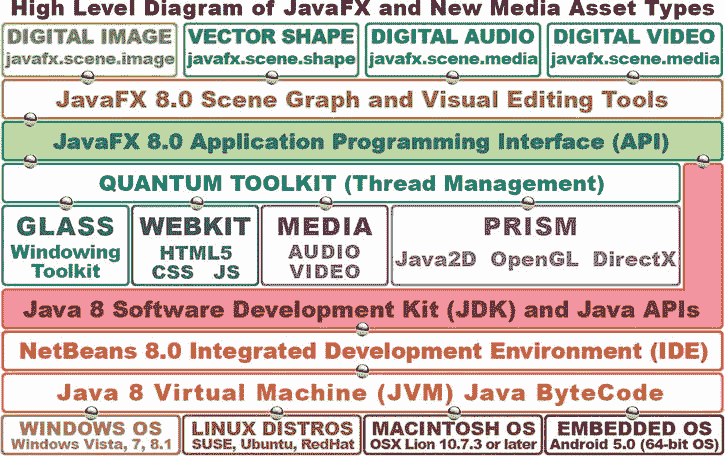
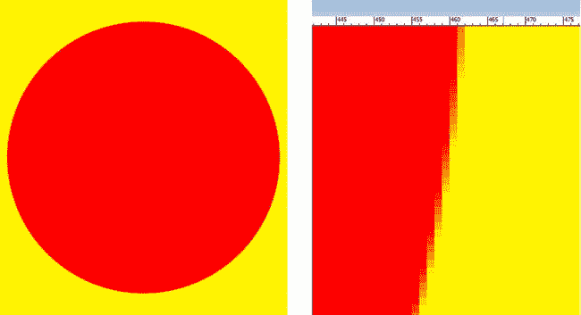
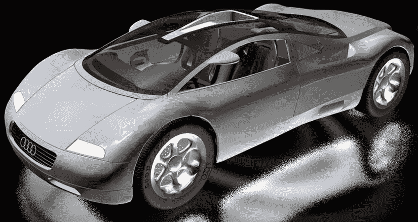
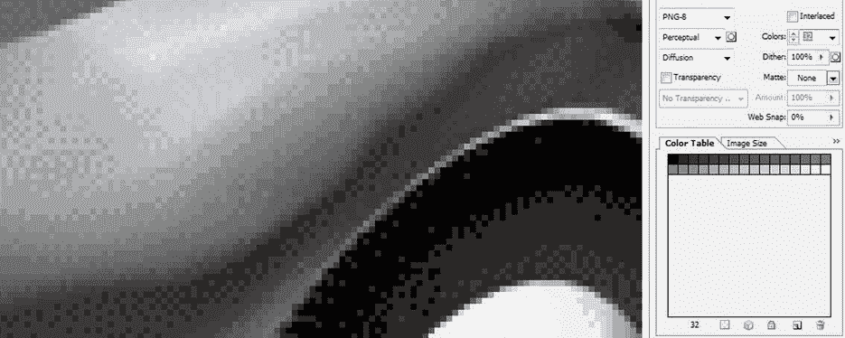

# 五、游戏设计介绍：概念、多媒体和使用场景生成器

在本章中，您将通过学习在 JavaFX 中使用场景图范例的最佳方式，了解 JavaFX Scene Builder 工具和 FXML，以及为什么(或为什么不)在某些类型的 Java 游戏开发场景中使用这些工具，来建立您对 JavaFX 多媒体引擎的了解。您还将研究基本的游戏设计优化概念、游戏类型以及适用于 Java 平台的游戏引擎，包括物理引擎，如 JBox2D 和 Dyn4J，以及 3D 游戏引擎，如 LWJGL 和 JMonkey。最后，你将考虑新媒体的概念，你将需要了解整合数字图像，数字音频，数字视频和动画到你的游戏制作管道。我们还将看看一些免费的开源多媒体制作工具，它们是你在第一章中安装的，现在可以用来制作 Java 8 游戏。

首先，你将重温静态(固定)与动态(实时)的基本概念，这在[第 3 章](03.html)(常量与变量)和[第 4 章](04.html)(脉冲)中有所涉及，也是游戏优化的基本原则之一。这一点很重要，因为您会希望您的游戏能够在用于玩游戏的所有不同平台和设备上流畅运行，即使设备只使用单处理器(这在当今实际上很少见，大多数设备都采用双核(双处理器)或四核(四处理器)CPU)。

接下来，你将学习游戏设计的概念、技术和术语，包括精灵、碰撞检测、物理模拟、背景板、动画、图层、关卡、逻辑和人工智能。你还将研究可以设计的不同类型的游戏，以及它们之间的区别。

然后，您将探索多媒体资产在当今视觉(和听觉)令人印象深刻的游戏中所扮演的角色。您将了解数字成像、数字视频、动画以及数字音频的原理，因为您将在本书的课程中使用许多这些新媒体资产类型，并且需要这些基础知识才能使用它们。

最后，您将深入了解您在第 2 章中生成的引导 JavaFX 应用代码，以及 Java。main()方法和 JavaFX。start()方法使用 Stage()构造函数方法创建 primaryStage Stage 对象，并在其中使用 scene()构造函数方法创建一个名为 Scene 的场景对象。您将了解如何使用 Stage 类中的方法来设置场景、标题舞台和显示舞台，以及如何创建和使用 StackPane 和 Button 类(对象)以及如何向按钮添加 EventHandler。

## 高级概念:静态与动态

我想从一个高层次的概念开始，涉及到我将在本章中谈到的一切，从您可以创建的游戏类型，到游戏优化，到 JavaFX 场景生成器和 JavaFX 场景图。不管你是否意识到，在探索 Java 常量的概念时，你已经在第 3 章回顾了这个概念，Java 常量是固定的或静态的，不会改变，而 Java 变量是动态的，会实时改变。类似地，JavaFX 场景图中的 UI 设计可以是静态的(固定的和不可移动的)或动态的(动画的、可拖动的或可换肤的，这意味着您可以更改 UI 外观以适应您的个人喜好)。

这些概念在游戏设计和开发中非常重要的原因是，您设计用来运行或渲染游戏的游戏引擎必须不断检查其动态部分，以查看它们是否发生了变化并需要响应(更新分数、移动精灵位置、播放动画帧、更改游戏角色的状态、计算碰撞检测、计算物理，等等)。这种对每个帧更新的检查(以及随后的处理)(在 JavaFX 中称为脉冲；参见[第 4 章](04.html))，以确保你所有的变量、位置、状态、动画、碰撞、物理等都符合你的 Java 游戏引擎逻辑，真的可以加起来，而且，在某些时候，做所有这些工作的处理器可能会过载，这会降低它的速度！

这种增强游戏动态性的所有实时、逐帧检查过载的结果是，游戏运行的帧速率将会降低。没错，像数字视频和动画一样，Java 8 游戏也有帧率，但是 Java 8 游戏帧率是基于你的编程逻辑的效率。你游戏的帧率越低，游戏玩起来就越不流畅，至少对于动态的、实时的游戏来说是这样，比如街机游戏；一款游戏玩起来有多流畅，关系到玩家的用户体验有多流畅。

出于这个原因，静态与动态的概念对于游戏设计的每个方面都非常重要，并且使某些类型的游戏比其他类型的游戏更容易实现出色的用户体验。我将在本章后面讨论不同类型的游戏(参见“游戏类型:谜题、棋盘游戏、街机游戏、混合游戏”一节)，但是，正如你可能想象的，棋盘游戏本质上更静态，街机游戏更动态。也就是说，有一些优化方法可以让游戏保持动态，也就是说，看起来好像有很多事情在进行，而从处理的角度来看，实际发生的事情是很容易管理的。这是游戏设计的众多技巧之一，说到底，这是关于优化的。

Android (Java)编程中最重要的静态与动态设计问题之一是使用 XML 的 UI 设计(静态设计)与使用 Java 的 UI 设计(动态设计)。Android 平台允许使用 XML 而不是 Java 来完成 UI 设计，这样非程序员(设计者)可以为应用进行前端设计。JavaFX 允许使用 FXML 做完全相同的事情。要做到这一点，你必须创建一个 FXML JavaFX 应用，正如你在[第 2 章](02.html)中看到的那样(参见图 2-4，右侧，第三个选项，“JavaFX FXML 应用”)。这样做会将 javafx.fxml 包和类添加到应用中，让您设计 UI，使用 fxml，然后让您的 Java 编程逻辑“膨胀”它们，以便设计由 JavaFX UI 对象组成。

值得注意的是，使用 FXML 会给应用开发和编译过程增加另一层，其中包含 FXML 标记及其翻译和处理。我将在本章后面演示如何做到这一点，以防您的设计团队希望使用 FXML 而不是 Java 进行 UI 设计工作流程(参见“JavaFX Scene Builder:使用 FXML 进行 UI 设计”一节)。我这样做是因为我想涵盖 JavaFX 中的所有设计选项，包括 FXML，以确保这本书完整地涵盖了使用 Java 8 和 JavaFX 8.0 可以做些什么。然而，归根结底，这是一个 Java 8 编程的题目，所以我在本书中的主要焦点将是使用 Java 8，而不是 FXML。

在任何情况下，我关于使用 XML(或 FXML)创建 UI 设计的观点是，这种方法可以被视为静态的，因为设计是预先使用 XML 创建的，并且在编译时使用 Java“膨胀”。Java 膨胀方法使用设计者提供的 FXML 结构来创建场景图，该场景图基于使用 FXML 创建的 UI 设计结构(层次结构)填充有 JavaFX UI(类)对象。我将在本章的后面向您概述这是如何工作的，这样您就可以了解这是如何工作的(参见“JavaFX Scene Builder:使用 FXML 进行 UI 设计”一节)。

## 游戏优化:平衡静态元素与动态元素

游戏优化归结为平衡不需要实时处理的静态元素和需要持续处理的动态元素。过多的动态处理，尤其是在不需要的时候，会让你的游戏变得不稳定。这就是为什么游戏编程是一种艺术形式:它需要平衡以及伟大的人物，故事线，创造力，幻觉，预期，准确性，最后，优化。

表 [5-1](#Tab1) 中列出了动态游戏中一些不同的游戏组件优化考虑事项。如您所见，游戏的许多方面都可以进行优化，使处理器的工作负载明显不那么“繁忙”如果这些主要的动态游戏处理区域中有一个因为处理器每帧的宝贵周期而“失控”，这将极大地影响游戏的用户体验。我将在本章的下一节介绍游戏术语(精灵、碰撞检测、物理模拟等等)。

表 5-1。

Aspects of Game Play That Can Be Optimized to Minimize System Memory and Processor Cycle Usage

  
| 游戏方面 | 基本优化原则 |
| --- | --- |
| 精灵位置(移动) | 移动精灵尽可能多的像素，以实现屏幕上的平滑移动。 |
| 冲突检出 | 仅在必要时检查屏幕上对象之间的碰撞(非常接近)。 |
| 物理模拟 | 尽量减少场景中需要进行物理计算的对象数量。 |
| 精灵动画 | 最大限度地减少需要循环的帧数，以创建流畅的动画效果。 |
| 背景动画 | 最小化有动画的背景区域，使整个背景看起来有动画，但实际上没有。 |
| 游戏逻辑 | 尽可能高效地编程游戏逻辑(模拟或人工智能)。 |
| 记分板更新 | 仅在得分时更新记分牌，并将得分更新最小化至每秒最多一次。 |
| 用户界面设计 | 使用静态 UI 设计，以便脉冲事件不用于 UI 元素定位或 CSS3。 |

考虑到所有这些游戏编程领域，使得游戏编程成为一项极其棘手的工作！

值得注意的是，这些方面中的一些共同作用，为玩家创造了一个特定的幻觉。例如，精灵动画将创建角色奔跑、跳跃或飞行的幻觉，但如果不将该代码与精灵定位(运动)代码相结合，将无法实现幻觉的真实性。为了微调一个错觉，动画的速度(帧速率)和移动的距离(每帧像素)可能需要调整(我喜欢称之为微调)以获得最真实的结果。我们将在第 1 章 3 节[中做这件事。](01.html)

如果你可以移动游戏元素(主要玩家精灵，目标精灵，敌人精灵，背景)更多的像素和更少的次数，你将节省处理周期。花费处理时间的是移动的部分，而不是距离(移动了多少像素)。类似地，对于动画，实现令人信服的动画所需的帧越少，保存这些帧所需的内存就越少。请记住，您正在优化内存使用以及处理周期。检测碰撞是游戏编程逻辑的主要部分；重要的是不要检查游戏元素之间的冲突，这些元素不是“在玩”(在屏幕上)，也不是活动的，并且彼此不靠近。

自然力(物理模拟)和游戏逻辑(如果没有很好地编码(优化)，是处理器最密集的方面。这些都是我将在本书的后面部分涉及的主题，当你更高级的时候(见第 16 章和第 17 章)。

## 游戏设计概念:精灵，物理，碰撞

让我们来看看构建游戏需要了解的各种游戏设计组件，以及可以用来实现游戏的这些方面的 Java 8(或 JavaFX)包和类，我喜欢称之为游戏组件。这些可以包括游戏元素本身(通常称为精灵)以及处理引擎，您可以自己编写代码，或者导入预先存在的 Java 代码库，如物理模拟和碰撞检测。

精灵是游戏的基础，定义你的主角，用来伤害主角的投射物，以及发射这些投射物的敌人。精灵是 2D 图形元素，可以是静态的(固定的，单个图像)或动态的(动画，几个图像的无缝循环)。精灵将基于编程逻辑在屏幕上移动，这决定了游戏如何运行。精灵需要与背景图像和其他游戏元素以及其他精灵合成，因此用于创建精灵的图形需要支持透明背景。

在第四章中，我向你介绍了阿尔法通道和透明度的概念。你需要用你的精灵来达到同样的最终效果，来创造一个无缝的游戏视觉体验。游戏的下一个最重要的方面是碰撞检测，因为如果你的精灵只是在屏幕上从彼此身边飞过，并且当他们相互接触或“相交”时，从来没有做过任何酷的事情，那么你真的不会有一个很好的游戏！一旦你添加了一个碰撞检测引擎(由交叉逻辑处理例程组成),你的游戏就可以确定任何两个精灵何时接触(边缘)或彼此重叠。碰撞检测将调用(触发)其他逻辑处理例程，这些例程将确定当任何两个给定的精灵(如投射物和主要角色)相交时会发生什么。例如，当投射物与主角相交时，伤害点可能会增加，生命力指数可能会降低，或者死亡动画可能会开始。相比之下，如果一件宝物与主角相交(被主角捡到)，则可能会产生能量或能力点，生命力指数可能会增加，或者可能会启动“我找到了”的庆祝动画。正如你所看到的，除了精灵(角色、投射物、宝物、敌人、障碍等等)本身，游戏的碰撞检测是游戏的基本设计元素之一，这就是为什么我在本书的早期就介绍了这个概念。

对你的游戏来说，下一个重要的概念是真实世界的物理模拟。像重力这样的东西的加入；摩擦；弹跳；拖；加速度；运动曲线，如 JavaFX 插值器类提供的；和高度精确的碰撞检测的基础上增加了额外的真实感。

最后，添加到游戏中的最专有的属性或逻辑结构(Java 代码)是自定义游戏逻辑，它使您的游戏在市场中真正独一无二。这个逻辑应该保存在它自己的 Java 类或方法中，与物理模拟和碰撞检测代码分开。毕竟，如果您学习了 OOP 概念并将它们应用到您的编程逻辑中，Java 8 会使您的代码模块化结构良好！

当你开始把所有这些游戏组件加在一起时，它们开始让游戏变得更可信，也更专业。一个伟大游戏的关键目标之一是暂停信念，这意味着你的玩家完全相信前提、角色、目标和游戏。这是任何内容制作人，无论是电影制作人、电视制作人、作家、歌曲作者、Java 8 游戏程序员还是应用开发人员，都追求的目标。如今，游戏的创收能力与任何其他内容分发类型一样，如果不是更多的话。

接下来，让我们看看可以创建的不同类型的游戏，以及这些游戏在应用精灵、碰撞检测、物理模拟和游戏逻辑等核心游戏组件方面有何不同。

## 游戏类型:谜题、棋盘游戏、街机游戏、混合游戏

就像我在这一章中谈到的其他东西一样，游戏本身可以通过使用静态和动态的分类方法来分类。静态游戏不受处理器限制，因为它们本质上倾向于基于回合而不是基于手眼协调，因此，在某种意义上，它们更容易流畅地工作；只有游戏规则的编程逻辑和吸引人的图形需要被放置和调试。对于开发新类型的游戏类型来说，也存在一个重要的机会，这种游戏类型以前所未见的创造性的新方式使用静态和动态游戏玩法的混合组合。我自己正在研究其中的一些！

因为这是一个 Java 8 编程的标题，所以我将从这个角度来处理所有事情，这恰好是将游戏分成不同类别(静态、动态、混合)的一个好方法，所以让我们先讨论静态(固定图形)、回合制游戏。这些游戏包括棋类游戏、益智游戏、知识游戏、记忆游戏和策略游戏，所有这些游戏的受欢迎程度和可销售性都不容小觑。

静态游戏的酷之处在于，它们可以像动态游戏一样有趣，而且处理开销明显更少，因为它们不必达到 60FPS 的实时处理目标，就可以流畅、专业地玩游戏。这是因为游戏的本质根本不是基于移动，而是基于做出正确的战略移动，但只有当轮到你这样做的时候。

在静态游戏中可能涉及一些形式的碰撞检测，关于哪个游戏棋子已经移动到游戏棋盘或游戏面上的给定位置；然而，没有碰撞检测使处理器过载的危险，因为游戏板的其余部分是静态的，除了在特定玩家的回合中被有策略地移动的一个棋子。

策略游戏的处理逻辑更多的是基于策略逻辑的编程，在给定正确的移动顺序的情况下，允许玩家获得最终的胜利，而动态游戏编程逻辑更多地关注游戏精灵之间发生的冲突。动态游戏的重点是分数，躲避弹丸，寻找宝藏，完成水平目标，杀死敌人。

具有大量相关规则的复杂策略游戏，如国际象棋，可能比动态游戏有更多的编程逻辑例程。然而，因为代码的执行对时间不敏感，所以无论平台和 CPU 有多强大，最终的游戏都将是流畅的。当然，游戏规则集逻辑必须完美无缺，这种类型的游戏才能真正做到专业，所以，最终，静态和动态游戏都很难编码，尽管原因不同。

动态游戏可以被称为动作游戏或街机游戏，并且包括显示屏上的大量运动。这些高度动态的游戏几乎总是涉及射击，例如在第一人称射击游戏(例如，Doom，Half-Life)以及第三人称射击游戏(生化危机，侠盗猎车手)类型中，或者偷东西，或者躲避东西。还有就是障碍赛导航范式，常见于平台游戏，比如大金刚，超级马里奥。

值得注意的是，任何类型的游戏都可以使用 2D 或 3D 图形和资源，甚至是 2D 和 3D 资源的组合来制作，正如我在第 4 章中指出的，这是 JavaFX 允许的。

有这么多流行的游戏类型，总是有机会通过使用静态(策略)游戏类型和动态(动作)游戏类型的混合方法来创建一种全新的游戏类型。

## 游戏设计资产:新媒体内容概念

让你的游戏变得高度专业并让买家满意的最强大的工具之一是你在第一章中下载并安装的多媒体制作软件。在我继续讲下去之前，我需要花一些时间向您提供关于 Java 8 中支持的四种主要新媒体资产类型的基础知识，使用 JavaFX 8 多媒体引擎:数字图像，用于精灵、背景图像和 2D 动画；向量形状，用于 2D 插图、碰撞检测、3D 对象、路径和曲线；数字音频，用于音效、旁白和背景音乐；数字视频，在游戏中用于动画背景循环(天空中飞翔的鸟，飘动的云，等等)曾经高度优化。如图 [5-1](#Fig1) 所示，这四个主要流派，或者区域，都是通过 JavaFX 场景图安装的，使用了我在[第四章](04.html)中描述的包。将使用的一些主要类是 ImageView、AudioClip、Media、MediaView、MediaPlayer、Line、Arc、Path、Circle、Rectangle、Box、Sphere、Cylinder、Shape3D、Mesh 和 MeshView。



图 5-1。

How new media assets are implemented, using Scene Graph through the JavaFX API in Java 8 via NetBeans

因为在 Java 8 游戏设计和编程管道中使用这些新媒体元素之前，您需要有一定的技术基础，所以我将从数字图像和矢量插图开始，介绍这四个新媒体领域的基本概念。

### 数字成像概念:分辨率、色深、Alpha、图层

JavaFX(因此 Java8)支持大量流行的数字图像文件(数据)格式，这给了游戏设计者极大的灵活性。其中一些已经存在很久了，例如 CompuServe 的图形交换格式(GIF)和联合图像专家组(JPEG)格式。有些 JavaFX 图形文件格式更现代，比如可移植网络图形(PNG 发音为“ping”)，这是您将在游戏中使用的文件格式，因为它可以产生最高的质量水平并支持图像合成。Java 支持的所有这些主流数字图像文件格式在 HTML5 浏览器中也受支持，并且因为 Java 应用可以与 HTML 应用和网站一起使用，这确实是一个非常合乎逻辑的协同作用！

最古老的 CompuServe GIF 格式是无损数字图像文件格式。之所以称为无损压缩，是因为它不会丢弃图像数据来获得更好的压缩结果。GIF 压缩算法不像 PNG 格式的压缩算法那样精细(强大), GIF 只支持索引颜色，这是它获得压缩(较小文件大小)的方式。如果您的游戏图像资产已经以 GIF 格式创建，您将能够毫无问题地在 Java 8 游戏应用中使用它们(除了效率较低的图像压缩算法和没有合成功能)。

Java 8 (JavaFX)支持的最流行的数字图像文件格式是 JPEG，它使用“真彩色”色深，而不是索引色深，以及所谓的有损数字图像压缩，其中压缩算法“丢弃”图像数据，以便它可以实现更小的文件大小(图像数据将永远丢失，除非您聪明地保存您的原始图像！).

如果您在压缩后放大 JPEG 图像，您将看到一个变色区域(效果),这在原始图像中是不存在的。图像中的一个或多个退化区域通常被称为压缩伪影。这只会发生在有损图像压缩中，在 JPEG(和运动图像专家组[MPEG])压缩中很常见。

Tip

我建议您在 Java 8 游戏中使用 PNG 数字图像格式。这是一种专业的图像合成格式，你的游戏本质上是一个实时精灵合成引擎，所以你需要使用 PNG32 图像。

PNG 有两个真彩色文件版本:PNG24(不能用于图像合成)和 PNG32(带有用于定义透明度的 alpha 通道)。

我为你的游戏推荐 PNG，因为它有一个不错的图像压缩算法，并且是一种无损图像格式。这意味着 PNG 有很好的图像质量以及合理的数据压缩效率，这将使你的游戏发行文件更小。PNG32 格式的真正力量在于它能够使用透明度和抗锯齿(通过其 alpha 通道)与其他游戏图像合成。

#### 数字图像分辨率和纵横比:定义图像大小和形状

您可能知道，数字图像是由 2D(二维)像素阵列组成的(“像素”代表图片[pix]元素[el])。图像的清晰度由其分辨率表示，分辨率是图像宽度(或 W，有时称为 x 轴)和高度(或 H，有时称为 y 轴)维度中的像素数量。图像的像素越多，分辨率越高。这类似于数码相机的工作原理，因为图像捕捉设备(称为相机 CCD)的像素越多，可以实现的图像质量就越高。

要计算图像像素的总数，请将宽度像素乘以高度像素。例如，一个宽视频图形阵列(VGA) 800 × 480 图像包含 384，000 个像素，正好是八分之三兆字节。这就是你如何找到你的图像的大小，包括使用的千字节(或兆字节)和显示屏上的高度和宽度。

使用图像纵横比来指定数字图像资产的形状。纵横比是数字图像的宽高比，定义了正方形(1:1 纵横比)或矩形(也称为宽屏)数字图像形状。具有 2:1(宽屏)宽高比的显示器，例如 2，160 × 1，080 分辨率，现在已经上市。

1:1 纵横比的显示器(或图像)总是完美的正方形，2:2 或 3:3 纵横比的图像也是如此。例如，你可能会在智能手表上看到这个长宽比。值得注意的是，定义图像或屏幕形状的是这两个宽度和高度(x 和 y)变量之间的比率，而不是实际的数字本身。

纵横比应该始终表示为冒号两边可以达到(减少)的最小数字对。如果你在高中时注意学习最小公分母，那么长宽比对你来说很容易计算。我通常通过继续将冒号的每一边一分为二来计算长宽比。比如你拿 SXGA 1280×1024 分辨率来说，1280×1024 的一半是 640 × 512，640 × 512 的一半是 320×256；320 × 256 的一半是 160 × 128，再一半是 80 × 64，再一半是 40 × 32，再一半是 20×16；20 × 16 的一半是 10 × 8，其中的一半给出了 SXGA 的 5 × 4 纵横比，这可以通过在两个数字之间使用冒号来表示，例如纵横比为 5:4。

#### 数字图像色彩理论和色彩深度:定义精确的图像像素颜色

每个数字图像像素的颜色值可以由红、绿和蓝(RGB)三种不同颜色的量来定义，这三种颜色在每个像素中以不同的量存在。消费电子显示屏利用加色，其中每个 RGB 颜色通道的光波长相加在一起，产生 1680 万种不同的颜色值。加色用于液晶显示器(LCD)、发光二极管(LED)和有机发光二极管(有机发光二极管)显示器。它与印刷中使用的减色法相反。为了向您展示不同的结果，在减色模式下，将红色与绿色(油墨)混合将产生紫色，而在加色模式下，将红色与绿色(浅色)混合将产生鲜艳的黄色。加色可以提供比减色更宽的颜色范围。

为每个像素保存的每个红色、绿色和蓝色值有 256 个亮度级别。这允许您为每个红色、绿色和蓝色值设置 8 位值控制颜色亮度变化，从最小值 0 (#00 或关闭，全暗或黑色)到最大值 255 (#FF 或全开，最大颜色贡献)。用于表示数字图像像素颜色的位数被称为图像的色深。

数字成像行业中使用的常见色深包括 8 位、16 位、24 位和 32 位。我将在这里概述这些，以及它们的格式。最低色深存在于 8 位索引的彩色图像中。这些具有最多 256 个颜色值，并使用 GIF 和 PNG8 图像格式来保存这种索引颜色类型的数据。

中等色深图像具有 16 位色深，因此包含 65，536 种颜色(计算为 256 × 256)。它受 TARGA (TGA)和标记图像文件格式(TIFF)数字图像格式支持。如果您想在 Java 8 游戏中使用 GIF、JPEG 和 PNG 之外的数字图像格式，请导入第三方 ImageJ 库。

真彩色颜色深度图像将具有 24 位颜色深度，因此将包含超过 1600 万种颜色。这被计算为 256 × 256 × 256，产生 16，777，216 种颜色。支持 24 位颜色深度的文件格式包括 JPEG(或 JPG)、PNG、BMP、XCF、PSD、TGA、TIFF 和 WebP。JavaFX 支持其中的三种:JPG、PNG24 (24 位)和 PNG32 (32 位)。使用 24 位色深将为您提供最高的质量水平。这就是为什么我推荐你的 Java 游戏使用 PNG24 或 PNG32。接下来，让我们看看如何通过 alpha 通道表示图像像素透明度值，以及如何在 Java 8 游戏中使用这些值实时合成数字图像！

#### 数字图像合成:在图层中使用 Alpha 通道和透明度

合成是将多层数字影像无缝融合在一起的过程。正如你所想象的，这对于游戏设计和开发来说是一个极其重要的概念。当您想要在显示器上创建一个看起来像是单个图像(或动画)的图像，而实际上它是两个或多个合成图像层的无缝集合时，合成非常有用。您想要设置图像或动画合成的一个主要原因是，通过将它们放在不同的层上，允许对这些图像中的各种元素进行编程控制。

要实现这一点，您需要一个 alpha 通道透明度值，该值可用于控制给定像素与其他层(在其上方和下方)上的另一个像素(在相同的 x，y 图像位置)的混合量的精度。

像其他 RGB 通道一样，alpha 通道有 256 个透明度级别。在 Java 编程中，alpha 通道由# AARRGGBB 数据值的十六进制表示中的前两个槽来表示(我将在下一节中详细介绍)。Alpha 通道 ARGB 数据值使用八个数据槽(32 位)而不是 24 位图像中使用的六个数据槽(#RRGGBB)，24 位图像实际上是一个没有 alpha 通道数据的 32 位图像。

因此，24 位(PNG24)图像没有 alpha 通道，不会用于合成，除非它是合成层堆栈中的底部图像板。相比之下，PNG32 图像将用作 PNG24(背景板)或 PNG32(较低的 z 顺序合成层)之上的合成层，这将需要此 alpha 通道功能来显示(通过 alpha 通道透明度值)图像合成中的某些像素位置。

数字图像 alpha 通道和图像合成的概念是如何影响 Java 游戏设计的？主要的优点是能够将游戏画面以及画面中的精灵、投射物和背景图形元素分解成多个组件层。这样做的原因是为了能够将 Java 8 编程逻辑(或 JavaFX 类)应用于单独的图形图像元素，以控制游戏屏幕的某些部分，否则如果它是一个单独的图像，您将无法单独控制这些部分。

图像合成的另一部分，称为混合模式，也是专业图像合成功能的重要因素。JavaFX 混合模式通过使用 Blend 类和 javafx.scene.effect 子包中的 BlendMode 常量值来应用(参见[第 4 章](04.html))。这个 JavaFX 混合效果包为 Java 游戏开发人员提供了许多与 Photoshop(和 GIMP)为数字图像制作人员提供的相同的图像合成模式。这将 Java 8(通过 JavaFX)变成了一个强大的图像合成引擎，就像 Photoshop 一样，混合算法可以在非常灵活的水平上进行控制，使用自定义的 Java 8 代码。JavaFX 混合模式常量包括 ADD、SCREEN、OVERLAY、DARKEN、LIGHT、MULTIPLY、DIFFERENCE、EXCLUSION、SRC_ATOP、SRC_OVER、SOFT_LIGHT、HARD_LIGHT、COLOR_BURN 和 COLOR_DODGE。

#### 用 Java 8 游戏代码表示颜色和 Alpha:使用十六进制记数法

现在您已经知道了什么是色深和 alpha 通道，以及在任何给定的数字图像中使用四种不同的图像通道(alpha、红色、绿色和蓝色[ARGB])的组合来表示颜色和透明度，重要的是理解作为程序员，您应该如何在 Java 8 和 JavaFX 中表示这四种 ARGB 图像颜色和透明度通道值。

在 Java 编程语言中，颜色和 alpha 不仅用于 2D 数字图像(通常称为位图图像)，还用于 2D 插图(通常称为矢量图像)。颜色和透明度值也经常在许多不同的颜色设置选项中使用。正如您已经看到的 Stage 对象和 Scene 对象，您可以为舞台、场景、布局容器(StackPane)或 UI 控件等设置背景色(或透明度值)。

在 Java 中(JavaFX 也是如此),不同级别的 ARGB 颜色强度值用十六进制表示。十六进制(或 hex)是基于原始的 16 进制计算机记数法。这在很久以前被用来表示 16 位数据值。与更常见的从 0 到 9 计数的 Base10 不同，Base16 记数法从 0 到 F 计数，其中 F 表示 15 的 Base10 值(0 到 15 产生 16 个数据值)。

Java 中的十六进制值总是以 0 和 x 开头，就像这样:0xFFFFFF。这个十六进制颜色值表示颜色。白色常数，不使用 alpha 通道。在这种 24 位十六进制表示中，六个槽中的每一个都代表一个 16 进制值，因此要获得每种 RGB 颜色所需的 256 个值需要两个槽，即 16 × 16 = 256。因此，要使用十六进制表示法表示 24 位图像，您需要在井号后有六个槽来保存六个十六进制数据值(每个数据对表示 256 个级别的值)。如果您乘以 16 × 16 × 16 × 16 × 16 × 16，您将获得 16，777，216 种颜色，这在使用 24 位真彩色图像数据时是可能的。

十六进制数据槽以下列格式表示 RGB 值:0xRRGGBB。对于 Java 常量颜色。白色，十六进制颜色数据值表示中的所有红色、绿色和蓝色通道都处于全亮度(最大颜色值)设置。如果你把所有这些颜色加在一起，你会得到白光。

黄色表示红色和绿色通道打开，蓝色通道关闭，因此颜色是十六进制表示。因此，黄色为 0xFFFF00，其中红色和绿色通道槽完全打开(FF 或 255 Base10 数据值)，蓝色通道槽完全关闭(00 或 0 值)。

ARGB 值的八个十六进制数据槽将使用以下格式保存数据:0xAARRGGBB。因此，对于颜色。白色，十六进制颜色数据值表示中的所有阿尔法、红色、绿色和蓝色通道将处于它们的最大亮度(或不透明度)，并且阿尔法通道将完全不透明，即不透明，如 FF 值所表示的。因此，颜色的十六进制值。白色常数将是 0xFFFFFFFF。

100%透明的 alpha 通道可以通过将 alpha 槽设置为 0 来表示，正如您在创建一个无窗口的 Java 8 应用时所观察到的那样(参见[第 4 章](04.html))。因此，您可以使用 0x00000000 和 0x00FFFFFF 之间的任何值来表示透明图像像素值。重要的是要注意，如果 alpha 通道值等于完全透明，那么可以包含在其他六个(RGB)十六进制数据值槽中的 16，777，216 个颜色值将完全无关紧要，因为该像素是透明的，将被评估为不存在，因此不会合成在最终图像或动画合成图像中。

#### 数字图像遮罩:使用 Alpha 通道创建游戏精灵

alpha 通道在游戏设计中的主要应用之一是遮蔽图像或动画(一系列图像)的区域，以便它可以在游戏图像合成场景中用作游戏精灵。蒙版是使用 alpha 通道透明度值从数字图像中剪切出主题的过程，以便主题可以放置在它自己的虚拟层上。这是使用数字成像软件包完成的，例如 GIMP。

数字图像-合成软件包，如 Photoshop 和 GIMP，包含用于遮罩和图像合成的工具。如果不进行有效的遮罩，就无法进行有效的图像合成，因此对于希望将图形元素(如图像精灵和精灵动画)集成到游戏设计中的游戏设计人员来说，这是一个需要掌握的重要领域。数字图像蒙版技术已经存在很长时间了！

遮罩可以自动为您完成，使用专业的蓝屏(或绿屏)背景，以及可以自动提取那些精确颜色值的计算机软件来创建遮罩，遮罩被转换为 alpha 通道(透明度)信息(数据)。也可以使用数字图像软件，通过算法选择工具之一，结合各种锐化和模糊算法，手动进行遮罩。

在本书的过程中，你会学到很多关于这个工作过程的知识，使用常见的开源软件包，比如 GIMP。掩蔽可能是一个复杂的工作过程。这一章的目的是让你接触到基础知识，这些知识是你阅读这本书的过程的基础。

遮罩过程中的一个关键考虑因素是在被遮罩的对象(主题)周围获得平滑、清晰的边缘。这是为了当你把一个被遮罩的物体(在这种情况下，是一个游戏精灵)放到新的背景图像上时，它看起来就像是在第一个地方被拍摄的一样。成功做到这一点的关键在于你的选择工作过程，这需要以适当的方式使用数字图像软件选择工具，如 GIMP 中的剪刀工具，或 Photoshop 中的魔棒工具。选择正确的工作流程至关重要！

例如，如果您想要遮罩的对象周围有统一颜色的区域(可能您是对着蓝色屏幕拍摄的)，您将使用具有适当阈值设置的魔棒工具来选择除对象之外的所有内容。然后，反转选择，这将为您提供包含该对象的选择集。通常，正确的工作流程需要以相反的方式进行。其他选择工具包含复杂的算法，可以查看像素之间的颜色变化。这些对于边缘检测非常有用，您可以将其用于其他选择方法。

#### 平滑数字图像合成:使用抗锯齿平滑图像边缘

抗锯齿是一种流行的数字图像合成技术，在这种技术中，数字图像中的两种相邻颜色沿着两种颜色区域的边界混合在一起。当图像缩小时，这会欺骗观众的眼睛看到更平滑(更少锯齿)的边缘，从而消除所谓的图像锯齿。抗锯齿通过使用平均颜色值(一个颜色范围，是两种颜色结合在一起的中间部分)提供了令人印象深刻的结果，沿着边缘只有几个需要平滑的彩色像素。

让我们看一个例子，看看我在说什么。图 [5-2](#Fig2) 显示了一个图层上看起来非常清晰的红色圆圈，覆盖了一个背景图层上的黄色填充颜色。我放大了红色圆圈的边缘，然后制作了另一个截图，放在缩小的圆圈的右边。此屏幕截图显示了一系列抗锯齿颜色值(黄色-橙色、橙色到橙色、红色-橙色),正好位于红色和黄色的边缘，即圆形与背景的交界处。



图 5-2。

A red circle composited on a yellow background (left) and a zoomed-in view (right) showing antialiasing

值得注意的是，JavaFX 引擎将使用 Java2D 软件渲染器或使用 Prism 引擎渲染的硬件(可以使用 OpenGL 或 DirectX ),针对所有背景颜色和背景图像对 2D 形状和 3D 对象进行抗锯齿处理。您仍将负责正确合成，即使用每个图像的 alpha 通道为多层图像提供抗锯齿。

#### 数字图像优化:使用压缩、索引颜色和抖动

影响数字图像压缩的因素有很多，您可以使用一些基本的技术以较小的数据占用量获得较高质量的结果。这是优化数字图像的主要目标；为您的应用(在本例中为游戏)获得尽可能小的数据占用空间，同时获得最高质量的视觉效果。让我们从对数据占用空间影响最大的几个方面入手，研究一下对于任何给定的数字图像来说，这些方面是如何对数据占用空间优化产生影响的。有趣的是，它们的重要性顺序与我迄今为止提出的数字成像概念的顺序相似。

影响最终数字图像资产文件大小的最关键因素是我所称的数据足迹，即数字图像的像素数量或分辨率。这是合乎逻辑的，因为需要存储每个像素，以及包含在它们的三个(24 位)或四个(32 位)通道中的颜色和 alpha 值。在保持图像清晰的同时，分辨率越小，生成的文件也就越小。

对于 24 位 RBG 图像，原始(或未压缩)图像的大小计算为宽×高× 3，对于 32 位 ARGB 图像，为宽×高× 4。例如，未压缩的 24 位真彩色 VGA 图像将具有 640 × 480 × 3，相当于 921，600B 的原始(raw)未压缩数字图像数据。要确定此原始 VGA 图像中的千字节数，您需要进行如下划分:921，600 ÷ 1，024，这是一千字节中的字节数，在 truecolor VGA 图像中会有 900KB 的数据。

通过优化数字影像分辨率来优化原始(未压缩)图像大小非常重要。这是因为一旦图像从游戏应用文件解压缩到系统内存中，这就是它将要占用的内存量，因为图像将使用 24 位(RGB)或 32 位(ARGB)表示法逐个像素地存储在内存中。这也是我游戏开发用 PNG24 和 PNG32，而不是索引色(GIF 或 PNG8)的原因之一；如果操作系统要将颜色转换到 24 位色彩空间，那么出于质量原因，您应该使用 24 位色彩空间，并处理(接受)稍大的应用文件大小。

图像颜色深度是压缩图像的数据足迹的第二个最重要的因素，因为图像中的像素数乘以 1 (8 位)、2 (16 位)、3 (24 位)或 4 (32 位)颜色数据通道。这种小文件大小是 8 位索引彩色图像仍然被广泛使用的原因，尤其是 GIF 图像格式。

如果用于构成图像的颜色变化不太大，索引色图像可以模拟真彩色图像。索引彩色影像仅使用 8 位数据(256 种颜色)来定义图像像素颜色，使用多达 256 种最佳选择颜色的调色板，而不是 3 个 RGB 颜色通道或 4 个 ARGB 颜色通道，每个通道包含 256 种颜色级别。同样，需要注意的是，一旦您使用 GIF 或 PNG8 编解码器将 24 位图像压缩为 8 位图像，您就只能使用原始的 16，777，216 种颜色中的(最多)256 种。这就是为什么我提倡使用 PNG24 或 PNG32 图像，而不是 GIF 或 PNG1 (2 色)、PNG2 (4 色)、PNG4 (16 色)或 PNG8 (256 色)图像，JavaFX 也支持这些图像。

根据任何给定的 24 位源图像中使用的颜色数量，使用 256 种颜色来表示最初包含 16，777，216 种颜色的图像可能会导致一种称为条带的效果。这是由于(通过压缩)得到的 256 色(或更少)调色板中相邻颜色之间的转换不是渐变的，因此看起来不是平滑的颜色渐变。索引的彩色图像有一个视觉校正条带的选项，称为抖动。

抖动是一种算法过程，它沿着图像中任何相邻颜色之间的边缘制作点图案，以欺骗眼睛看到第三种颜色。抖动会给你一个最大的颜色感知数量(65，536；256 × 256)，但只有当这 256 种颜色中的每一种都与其他 256 种颜色中的每一种相邻时，才会出现这种情况。尽管如此，您仍然可以看到创建额外颜色的潜力，并且您会对索引颜色格式在某些压缩场景中(对于某些图像)可以达到的效果感到惊讶。

让我们拍摄一张真彩色图像，如图 [5-3](#Fig3) 所示，并将其保存为 PNG5 索引彩色图像格式，向您展示这种抖动效果。需要注意的是，虽然 PNG5 在 Android 和 HTML5 中受支持，但在 JavaFX 中不受支持，所以如果您自己做这个练习，请选择 2 色、4 色、16 色或 256 色选项！该图展示了奥迪 3D 图像中驾驶员侧后挡泥板上的抖动效果，因为它包含灰色渐变。



图 5-3。

A truecolor PNG24 image created with Autodesk 3ds Max, which you are going to compress as PNG5

有趣的是，在 8 位索引彩色图像中，使用小于 256 色的最大值是允许的。这通常是为了进一步减少影像的数据足迹。例如，仅使用 32 种颜色就可以获得良好效果的图像实际上是一个 5 位图像，从技术上来说，它被称为 PNG5，尽管这种格式本身通常被称为用于索引颜色使用级别的 PNG8。

我已经设置了这张索引色 PNG 图像，如图 [5-4](#Fig4) 所示，使用 5 位颜色(32 色，或 PNG5)来清晰地说明这种抖动效果。正如您在图像预览区域中看到的那样，在图的左侧，抖动算法在相邻的颜色之间制作点图案，以创建额外的颜色。

另外，请注意，您可以设置使用抖动的百分比。我经常选择 0%或 100%的设置；但是，您可以在这两个极端值之间的任何地方微调抖动效果。您也可以在抖动算法之间进行选择，因为正如您可能已经猜到的那样，抖动效果是使用抖动算法创建的，抖动算法是索引文件格式(在本例中为 PNG8)压缩例程的一部分。

我使用扩散抖动，这给了不规则形状的梯度一个平滑的效果，就像在汽车挡泥板上看到的那样。您也可以使用更随机的噪波选项，或者不太随机的模式选项。扩散选项通常给出最好的结果，这就是为什么我在使用索引色时选择它(这并不常见)。

正如你所想象的，抖动给图像增加了更难压缩的数据模式。这是因为对于压缩算法来说，图像中的平滑区域(如梯度)比尖锐过渡(边缘)或随机像素模式(如相机 CCD 的抖动或“噪声”)更容易压缩。

因此，应用抖动选项总是会增加几个百分点的数据占用空间。请务必检查应用和不应用抖动(在“导出”对话框中选择)的结果文件大小，以查看它是否值得提供更好的视觉效果。请注意，索引彩色 PNG 图像也有一个透明度选项(复选框),但 PNG8 图像中使用的 alpha 通道只有 1 位(开/关),而不是 PNG32 中的 8 位。



图 5-4。

Setting dithering to the diffusion algorithm and 32 colors (5 bit), with 100 percent dithering for PNG5 output

您还可以通过添加 alpha 通道来定义合成的透明度，从而增加图像的数据足迹。这是因为通过添加一个 alpha 通道，你将在被压缩的图像中添加另一个 8 位颜色通道(或者透明通道)。如果您需要 alpha 通道来定义图像的透明度，以支持未来的合成要求，例如将图像用作游戏精灵，那么除了包含 alpha 通道数据之外，没有太多选择。

如果您的 alpha 通道包含全零(或使用全黑填充颜色)，这将定义您的图像为完全透明，或者包含全 FF 值(或使用全白填充颜色)，这将定义您的图像为完全不透明，您将基本上(实际上)定义一个不包含任何有用的 alpha 数据值的 alpha。因此，需要移除透明图像，并且需要将不透明图像定义为 PNG24 而不是 PNG32。

最后，大多数用于遮罩数字图像 RGB 层中的对象的 alpha 通道应该能够很好地压缩。这是因为 alpha 通道主要是白色(不透明)和黑色(透明)的区域，在这两种颜色之间的边缘有一些中灰度值来反走样蒙版(见图 [5-2](#Fig2) )。这些灰色区域包含 alpha 通道中的抗锯齿值，并将在图像的 RGB 层中的对象与任何背景颜色或可能在它后面使用的背景图像之间提供视觉上平滑的边缘过渡。

其原因是，在 alpha 通道图像蒙版中，8 位透明度渐变(从白到黑)定义了透明度级别，这可以被认为是每像素混合(不透明度)强度。因此，蒙版(包含在 alpha 通道中)中每个对象的边缘上的中灰度值将基本上用于平均对象边缘和任何目标背景的颜色，无论它可能包含什么颜色(或图像)值。这为任何可能使用的目标背景(包括动画背景)提供了实时抗锯齿。

### 数字视频和动画:帧、速率、循环、方向

有趣的是，我刚刚谈到的所有关于数字图像的概念同样适用于数字视频和动画，因为这两种格式都使用数字图像作为其内容的基础。数字视频和动画通过使用帧将数字成像扩展到第四维(时间)。这两种格式由有序的帧序列组成，随时间快速显示。

术语“帧”来自电影工业，在电影工业中，即使在今天，电影帧也以每秒 24 帧(24FPS)的速度通过电影放映机，这产生了运动的幻觉。因为数字视频和动画都是由包含数字图像的帧的集合组成的，所以当涉及到内存数据占用优化工作过程(对于动画资产)以及数字视频文件大小数据占用优化工作过程时，以每秒帧数表示的帧速率的概念也是非常重要的。如前所述，在 JavaFX 中，动画的这个属性存储在动画对象速率变量中(见第 4 章[)。](04.html)

关于动画对象或数字视频资源中的帧的优化概念与关于图像中的像素(数字图像的分辨率)的优化概念非常相似:使用的越少越好！这是因为动画或视频中的帧数会使每一帧所使用的系统内存和文件大小数据占用空间都成倍增加。在数码视频中，不仅每帧(图像)的分辨率，帧速率(在“压缩设置”对话框中指定)也会影响文件大小。在本章的前面，您已经了解到，如果您将图像中的像素数乘以其颜色通道数，您将获得图像的原始数据足迹。对于动画和数字视频，您现在将再次将该数字乘以需要用于创建运动错觉的帧数。

因此，如果您的游戏有一个动画 VGA (RGB)背景板(请记住，每帧为 900KB ),它使用五帧来创建运动的幻觉，那么您正在使用 900KB × 5 或 4，500KB (4.5MB)的系统内存来保存该动画。当然，这对于一个背景来说占用了太多的内存，这也是为什么你将使用静态背景和精灵覆盖来在不到一兆字节的空间内达到完全相同的效果。数字视频的计算有点不同，因为它有数百或数千帧。对于数字视频，您可以将原始图像数据大小乘以数字视频设置为回放的每秒帧数(帧速率)(此帧速率值在压缩过程中指定)，然后将结果乘以视频文件中包含的内容持续时间的总秒数。

继续 VGA 示例，您知道 24 位 VGA 图像有 900KB。这使得将这带到下一个级别的计算变得容易。数字视频传统上以 30FPS 运行，因此 1 秒钟的标准清晰度原始(未压缩)数字视频将是 30 个图像帧，每个图像帧为 900KB，总数据量为 27，000KB！您可以看到为什么 MPEG-4 H.264 AVC 等视频压缩文件格式非常重要，它可以压缩数字视频所产生的大量原始数据。JavaFX 媒体包使用最令人印象深刻的视频压缩编解码器之一(“codec”代表 code-decode)，它在 HTML5 和 Android 中也受支持，即前面提到的 MPEG-4 H.264 AVC(高级视频编解码器)。这对于开发人员资产优化非常方便，因为一个数字视频资产可以跨 JavaFX、HTML5 和 Android 应用使用。万一你想在你的游戏背景中使用数字视频(我不推荐)，接下来我将讲述数字视频压缩和优化的基础知识。

#### 数字视频压缩概念:比特率、数据流、标清、高清、UHD

让我们从商业视频中使用的主要或标准分辨率开始。这些也是常见的设备屏幕分辨率，可能是因为如果屏幕像素分辨率与屏幕上全屏播放的视频像素分辨率匹配，将会出现零缩放，这可能会导致缩放伪像。在高清晰度出现之前，视频是标准清晰度(SD)，使用 480 像素的垂直分辨率。VGA 是标清分辨率，720 × 480 可以称为宽标清分辨率。高清(HD)视频有两种分辨率，1，280 × 720，我称之为伪高清，1，920×1080，业界称之为真高清。这两种高清分辨率都具有 16:9 的宽高比，用于电视和独立电视、智能手机、平板电脑、电子书阅读器和游戏控制台。现在还有一种超高清(UHD)分辨率，具有 4，096 × 2，160 像素。

视频流是一个比分辨率更复杂的概念，因为它涉及到在大范围内播放视频数据，例如 Java 8 游戏应用和远程视频数据服务器之间的视频数据，远程视频数据服务器将保存您潜在的大量数字视频资产。此外，运行 Java 游戏应用的设备将与远程数据服务器实时通信，在视频播放时接收视频数据包(之所以称为流，是因为视频从视频服务器通过互联网流入硬件设备)。MPEG-4 H.264 AVC 格式编解码器(编码器-解码器对)支持视频流。

你需要理解的最后一个概念是比特率。比特率是视频压缩过程中使用的关键设置，因为比特率代表您的目标带宽，或每秒钟能够容纳一定数量的比特流的数据管道大小。比特率设置还应该考虑任何给定的支持 Java 的设备中存在的 CPU 处理能力，使您的数字视频的数据优化更具挑战性。幸运的是，如今大多数设备都配备了双核或四核 CPU！

一旦比特通过数据管道，它们也需要被处理并显示在设备屏幕上。因此，数字视频资产的比特率不仅要针对带宽进行优化，还要考虑到 CPU 处理能力的变化。一些单核 CPU 可能无法在不丢帧的情况下解码高分辨率、高比特率的数字视频资产，因此，如果您打算将较旧或较便宜的消费电子设备作为目标，请确保优化低比特率视频资产。

#### 数字视频数据足迹优化:使用编解码器及其设置

如前所述，您的数字视频资产将被压缩，使用称为编解码器的软件工具。视频编解码器有两个“方面”:一方面编码视频数据流，另一方面解码视频数据流。视频解码器将是使用它的操作系统、平台(JavaFX)或浏览器的一部分。解码器主要针对速度进行优化，因为回放的平滑度是一个关键问题，而编码器则针对减少其生成的数字视频资产的数据占用量进行了优化。因此，编码过程可能需要很长时间，这取决于工作站包含多少个处理核心。大多数数字视频内容制作工作站应该支持八个处理器内核，比如我的 64 位 AMD 八核工作站。

编解码器(编码器端)类似于插件，因为它们可以安装到不同的数字视频编辑软件包中，使它们能够编码不同的数字视频资源文件格式。因为 Java 和 JavaFX 8 支持 MPEG-4 H.264 AVC 格式，所以您需要确保您使用的数字视频软件包之一支持使用这种数字视频文件格式对数字视频数据进行编码。不止一家软件制造商生产 MPEG-4 编码软件，因此在编码速度和文件大小方面，会有不同的 MPEG-4 AVC 编解码器产生不同的(更好或更差的)结果。如果你想制作专业的数字视频，我强烈推荐你使用的专业解决方案是 Sorenson Squeeze Pro。

还有一个名为 EditShare LightWorks 12 的开源解决方案，计划到 2014 年原生支持输出到 MPEG4 编解码器。优化(设置压缩设置)数字视频数据文件大小时，有许多变量会直接影响数字视频数据的占用空间。我将按照对视频文件大小的影响，从最重要到最不重要的顺序来讨论这些参数，以便您知道调整哪些参数来获得您想要的结果。

与数字图像压缩一样，视频每帧的分辨率或像素数是开始优化过程的最佳位置。如果您的用户使用 800 × 480 或 1，280 × 720 的智能手机、电子阅读器或平板电脑，那么您不需要使用真正的高清 1，920 × 1，080 分辨率来获得数字视频资产的良好视觉效果。有了超高密度(小点距)显示器，你可以将 1，280 的视频放大 33 %,看起来相当不错。这种情况的例外可能是高清或 UHD(通常称为 4K 独立电视)游戏的目标是独立电视；对于这些巨大的 55 至 75 英寸(屏幕)场景，您可能希望使用行业标准的真正高清 1，920 × 1，080 分辨率。

假设数字视频本身的实际秒数无法缩短，下一个优化级别将是每秒视频使用的帧数(或 FPS)。如前所述，这就是所谓的帧速率，与其设置视频标准 30FPS 帧速率，不如考虑使用电影标准 24FPS 帧速率，甚至多媒体标准 20FPS 帧速率。您甚至可以使用 15FPS 的帧速率，这是视频标准的一半，具体取决于内容中的移动量(和速度)。请注意，15FPS 的数据量是 30FPS 的一半(编码数据减少了 100%)。对于某些视频内容，这将与 30FPS 内容一样回放(看起来)。对此进行测试的唯一方法是在编码过程中尝试帧速率设置。

获得较小数据占用空间的下一个最佳设置是您为编解码器设置的比特率。比特率等于所应用的压缩量，因此设定了数字视频数据的质量水平。值得注意的是，您可以简单地使用 30FPS、1，920 分辨率的高清视频，并指定低比特率上限。如果您这样做，结果将不会像您尝试使用较低的帧速率和分辨率以及较高(质量)的比特率设置那样好看。对此没有固定的规则，因为每个数字视频资源都包含完全唯一的数据(从编解码器的角度来看)。

获得较小数据占用空间的第二个最有效的设置是编解码器用来对数字视频进行采样的关键帧的数量。视频编解码器通过查看每一帧，然后在接下来的几帧中仅对变化或偏移进行编码来应用压缩，从而编解码器算法不必对视频数据流中的每一帧进行编码。这就是为什么会说话的头部视频比每个像素都在每帧上移动的视频(如使用快速摄像机平移或快速视野[FOV]缩放的视频)编码更好。

关键帧是编解码器中的一项设置，它强制编解码器不时对您的视频数据资源进行新的采样。关键帧通常有一个自动设置，它允许编解码器决定采样多少关键帧，还有一个手动设置，它允许您指定关键帧采样的频率，通常是每秒特定次数或整个视频的持续时间(总帧数)。

大多数编解码器通常具有质量或清晰度设置(滑块)，用于控制压缩前应用到视频帧的模糊量。如果您不熟悉这个技巧，对图像或视频应用轻微的模糊(这通常是不可取的)可以实现更好的压缩，因为图像中的尖锐过渡(边缘)比柔和过渡更难编码，需要更多的数据来再现。也就是说，我会将质量(或清晰度)滑块保持在 80%到 100%之间，并尝试使用我在这里讨论的其他变量之一来减少您的数据占用量，例如降低分辨率、帧速率或比特率。

最终，对于任何给定的数字视频数据资产，您都需要微调许多不同的变量，以实现最佳的数据占用空间优化。重要的是要记住，对于数字视频编解码器来说，每个视频资源看起来都是不同的(数学上)。由于这个原因，不可能有可以被开发来实现任何给定压缩结果的标准设置。也就是说，随着时间的推移，调整各种设置的经验最终会让您感受到，为了获得所需的最终结果，您必须根据不同的压缩参数来更改各种设置。

### 数字音频概念:振幅、频率、样本

你们这些音响发烧友知道，声音是通过在空气中发送声波脉冲而产生的。数字音频很复杂；这种复杂性的一部分来自于需要将使用扬声器纸盆创建的模拟音频技术与数字音频编解码器连接起来。模拟扬声器通过脉冲产生声波。我们的耳朵以完全相反的方式接收模拟音频，捕捉和接收那些空气脉冲或不同波长的振动，然后将它们转换回我们大脑可以处理的数据。这就是我们“听到”声波的方式；然后，我们的大脑将不同的音频声波频率解释为不同的音符或音调。

声波产生各种音调，这取决于声波的频率。宽的或不常见的(长的)波产生低音，而更频繁的(短的)波长产生高音。有趣的是，不同频率的光会产生不同的颜色，所以模拟声音(音频)和模拟光(颜色)有着密切的相关性。你很快就会看到，数字图像(和视频)之间还有许多其他相似之处，这些相似之处也将贯穿到你的数字新媒体内容制作中。

声波的音量将由其振幅或波的高度(或大小)决定。因此，如果你在 2D 观察，声波的频率等于声波在 x 轴上的间距，振幅等于声波在 y 轴上的高度。

声波可以独特地成形，允许它们“搭载”各种声音效果。一种“纯”或基线类型的声波称为正弦波(您在高中三角学中学过，使用正弦、余弦和正切数学函数)。熟悉音频合成的人都知道，其他类型的声波也用于声音设计，例如锯齿波，它看起来像锯子的边缘(因此得名)，以及脉冲波，它仅使用直角进行整形，产生即时的开和关声音，转换为音频脉冲(或突发)。

甚至在声音设计中使用随机波形(如噪声)来获得尖锐的声音效果。通过使用最近获得的数据足迹优化知识，您可能已经确定，声波(以及一般的新媒体数据)中出现的“混乱”或噪声越多，编解码器就越难压缩。因此，由于数据中的混乱，更复杂的声波将导致更大的数字音频文件。

#### 将模拟音频转换为数字音频数据:采样、精度、高清音频

将模拟音频(声波)转换为数字音频数据的过程称为采样。如果你在音乐行业工作，你可能听说过一种叫做采样器的键盘(甚至是架装式设备)。采样是将模拟音频波分割成片段的过程，以便您可以使用数码音频格式将波形存储为数码音频数据。这就把无限精确的模拟声波变成了离散的数字数据，也就是说，变成了 0 和 1。使用的 0 和 1 越多，无限精确(原始)模拟声波的再现就越精确。

采样的音频声波的每个数字段称为样本，因为它在精确的时间点对声波进行采样。您想要的采样精度(分辨率)将决定用于再现模拟声波的 0 和 1 的数量，因此采样精度由用于定义每个波切片高度的数据量决定。与数字成像一样，这种精度被称为分辨率，或者更准确地说(没有双关语)，样本分辨率。采样分辨率通常用 8 位、12 位、16 位、24 位或 32 位分辨率来定义。游戏大多利用 8 位分辨率来实现爆炸等效果，清晰度在这些效果中并不重要；12 位分辨率，用于清晰的口语对话和更重要的音频元素；背景音乐可能是 16 位分辨率。

在数字成像和数字视频中，分辨率由像素数来量化，而在数字音频中，则由用于定义每个模拟音频样本的数据位数来量化。同样，与数字成像一样，像素越多，质量越好，而数字音频的样本分辨率越高，声音再现越好。因此，更高的采样分辨率，使用更多的数据来再现给定的声波样本，将产生更高质量的音频回放，代价是更大的数据足迹。这就是 16 位音频(通常称为 CD 音质音频)听起来比 8 位音频更好的原因。根据所涉及的音频，12 位音频可能是一个很好的折衷方案。

在数字音频领域，有一种新型的音频样本，在消费电子行业被称为高清音频。HD 数字音频广播电台使用 24 位样本分辨率，因此每个音频样本或声波片段包含 16，777，216 位样本分辨率。一些较新的硬件设备现在支持高清音频，如你看到的智能手机广告中的“高清音频”，这意味着它们有 24 位音频硬件。如今，笔记本电脑(包括 PC)以及游戏机和 ITV 也标配了 24 位音频播放硬件。

需要注意的是，对于 Java 8 游戏来说，HD 音频可能不是必需的，除非您的游戏是面向音乐的，并且使用了高质量的音乐，在这种情况下，您可以通过 WAVE 文件格式使用 HD 音频样本。

另一个考虑因素是数字音频采样频率(也称为采样速率)，它衡量在 1 秒的采样时间帧内，以特定采样分辨率采样的数量。就数字图像编辑而言，采样频率类似于数字图像中包含的颜色数量。您可能很熟悉“CD 音质音频”这个术语，它被定义为使用 16 位采样分辨率和 44.1kHz 采样速率(采集 44，100 个样本，每个样本具有 16 位采样分辨率，即 65，536 位音频数据)。您可以通过将采样比特率乘以采样频率，再乘以音频片段中的秒数，来确定音频文件中的原始数据量。显然，这可能是一个巨大的数字！音频编解码器在优化数据方面非常出色，数据占用空间非常小，音质损失非常小。

因此，数字图像和数字视频中存在的完全相同的权衡也发生在数字音频中:包含的数据越多，结果质量越高，但总是以更大的数据足迹为代价。在视觉媒体中，数据覆盖区的大小是使用色深、像素来定义的，在数字视频和动画的情况下，还使用帧来定义。在听觉媒体中，它是通过采样分辨率结合采样率来定义的。数字音频行业目前最常见的采样率包括 8kHz、22kHz、32kHz、44.1kHz、48kHz、96KHz、192kHz，甚至 384kHz。

较低的采样率，如 8kHz、11kHz 和 22kHz，是您将在游戏中使用的采样率，因为经过精心优化，这些采样率可以产生高质量的音效和街机音乐。这些速率对于采样任何基于语音的数字音频也是最佳的，例如电影对白或电子书旁白轨道。较高的音频采样速率(如 44.1kHz)更适合音乐，需要高动态范围(高保真)的声音效果(如隆隆雷声)可以使用 48kHz。更高的采样率将允许音频再现展示电影院(THX)的声音质量，但这不是大多数游戏所要求的。

#### 数字音频流:专属音频与流音频

与数字视频数据一样，数字音频数据既可以包含在应用分发文件(对于 Java，是. JAR 文件)中，也可以使用远程数据服务器进行流式传输。与数字视频类似，流式数字音频数据的优势在于它可以减少应用文件的数据占用量。缺点是可靠性。许多相同的概念同样适用于音频和视频。流式音频将节省数据空间，因为您不必在中包含所有繁重的新媒体数字音频数据。JAR 文件。所以，如果你计划编写一个自动点唱机应用，你可能想考虑流式传输你的数字音频数据；否则，请尝试优化您的数字音频数据，以便您可以将它们(受控)包含在中。JAR 文件。这样，当应用的用户需要时，数据总是可用的！

流式数字音频的缺点是，如果用户的连接(或音频数据服务器)中断，您的数字音频文件可能并不总是呈现给最终用户使用您的游戏应用播放和收听！数字音频数据的可靠性和可用性是流传输和捕获之间权衡的另一个关键因素。这同样适用于数字视频资产。

同样，与数字视频一样，数字音频流的一个主要概念是数字音频数据的比特率。正如您在上一节中了解到的，比特率是在压缩过程中定义的。需要支持较低比特率带宽的数字音频文件将对音频数据进行更多的压缩，这将导致较低的质量。这些将在更多的设备上更平滑地传输(回放),因为更少的比特可以更容易地快速传输和处理。

#### JavaFX 中的数字音频:支持的数字音频编解码器和数据格式

JavaFX 中的数字音频编解码器比数字视频编解码器多得多，因为只有一种视频编解码器，即 MPEG-4 H.264 AVC。Android 音频支持包括. MP3 (MPEG-3)文件，Windows WAVE(脉码调制[PCM]音频)。WAV 文件、. MP4(或. M4A) MPEG-4 AAC(高级音频编码)音频和 Apple 的 AIFF (PCM)文件格式。JavaFX(以及 Java 8)支持的最常见的格式是流行的. MP3 数字音频文件格式。由于音乐下载网站，如 Napster 或 Soundcloud，你们大多数人都熟悉 MP3 数字音频文件，我们大多数人收集这种格式的歌曲用于 MP3 播放器和基于 CD-ROM 或 DVD-ROM 的音乐收藏。MP3 数字音频文件格式很受欢迎，因为它具有相当好的压缩比和质量，并得到广泛支持。

在 Java 8 应用中，MP3 是一种可以接受的格式，只要使用最佳的编码工作流程，尽可能获得最高的质量水平。值得注意的是，像 JPEG(用于图像)一样，MP3 是一种有损音频文件格式，其中一些音频数据(以及质量)在压缩过程中被丢弃，并且无法恢复。

JavaFX 有两种无损音频压缩编解码器，AIFF 和 WAVE。你们中的许多人对这些都很熟悉，因为它们分别是苹果 Macintosh 和微软 Windows 操作系统使用的原始音频格式。这些文件使用 PCM 音频，这是无损的(在这种情况下，因为没有应用任何压缩！).“PCM”，如上所述，代表“脉冲编码调制”，指的是它所保存的数据格式。

PCM 音频通常用于 CD-ROM 内容以及电话应用。这是因为 PCM WAVE audio 是一种未压缩的数字音频格式，没有对数据流应用 CPU 密集型压缩算法。因此，解码(CPU 数据处理)对于电话设备或 CD 播放器来说不是问题。

因此，当您开始将数字音频资产压缩成各种文件格式时，您可以使用 PCM 作为基准文件格式。它允许您查看 PCM (WAVE)与 MP3 和 MP4 音频压缩结果之间的差异，以了解您的 JAR 文件获得了多少数据占用优化；更重要的是，你还可以看到你的采样分辨率和采样频率优化将如何影响游戏音频效果所使用的系统内存。即使您使用 MP3 或 MP4 格式，在音频资产可以与 AudioClip 类一起使用并在 Java 8 游戏中用作声音效果之前，仍然必须将其解压缩到内存中。

因为 WAVE 或 AIFF 文件不会有任何质量损失(因为也不需要解压缩)，PCM 数据可以直接从 JAR 文件放入系统内存！这使得 PCM 音频非常适合持续时间短(0.1 到 1 秒)的游戏音效，并且可以高度优化，使用 8 位和 12 位采样分辨率以及 8kHz、22kHz 或 32kHz 采样频率。最终，对于任何给定的数字音频数据，要找出 JavaFX 支持的哪种音频格式具有最佳的数字音频压缩结果，唯一真正的方法是使用您知道受支持且高效的主要编解码器对您的数字音频进行编码。稍后我将概述这一工作过程，当您向游戏添加音频时，您将使用相同的源音频样本观察不同格式之间的相对数据足迹结果(参见[第 1 章](01.html) 5)。然后，您将听取音频播放质量，这样您就可以做出关于质量和文件大小之间最佳平衡的最终决定。这是开发 JavaFX 数字音频资产以在 Java 8 游戏中使用的工作流程。

JavaFX 还支持流行的 MPEG-4 AAC 编解码器。这些数字音频数据可以包含在 MPEG4 容器(. mp4、. m4a、. m4v)或文件扩展名中，并且可以使用任何操作系统回放。值得注意的是，JavaFX 不包含 MPEG-4 解码器，而是支持所谓的多媒体容器，这意味着 JavaFX 使用操作系统的 MPEG-4 解码器。

出于这个原因，并且因为在线听力研究已经得出结论，MP3 格式比 MP4 具有更好的质量(对于音乐)，您将通过 Media 和 MediaPlayer 类使用 MP3 格式来获得更长形式的音频(游戏背景音乐循环)。您将通过 JavaFX 慷慨提供的 audio clip digital audio sequencing engine(class)使用 PCM WAVE audio 格式的短格式(1 秒或更短)音频(游戏音效，如枪声、铃声、叫喊声、咕哝声、笑声、欢呼声和其他此类数字音频资产)。

#### 数字音频优化:从 CD 质量的音频开始，然后反向工作

优化您的数字音频资产以便在市场上最广泛的硬件设备上播放，将比优化您的数字视频或数字图像(以及动画)更容易。这是因为目标屏幕分辨率和显示器宽高比之间的差异比硬件设备之间的数字音频播放硬件支持类型之间的差异大得多(具有 24 位高清音频播放硬件兼容性的新硬件可能除外)。所有硬件都可以很好地播放数字音频资产，因此音频优化是一个“一个音频资产影响所有设备”的场景，而对于视觉(视频、图像、动画)部分，您可以看到大到 4，096 × 2，160 像素(4K iTV 电视机)和小到 320 × 320 像素(翻盖手机和智能手表)的显示屏。

重要的是要记住，用户的耳朵不能感知数字音频的质量差异，而用户的眼睛可以感知数字图像、2D 动画和数字视频的质量差异。一般来说，对于 Java 游戏音频的支持，在所有硬件设备上有三个主要的数字音频支持“最佳点”。

通过使用 8kHZ 或 22kHz 的采样速率以及 8 位或 12 位的采样分辨率，较低质量的音频(如短旁白轨道、人物感叹词和短时声音效果)可以获得非常高的质量。中等质量的音频，如长旁白轨道、持续时间较长的声音效果和循环背景(环境)音频，通过使用 22kHz 或 32kHz 采样速率以及 12 位或 16 位采样分辨率，可以达到非常高的质量水平。

高质量的音频资产，如音乐，应进行优化，以接近 CD 质量的音频，并将使用 32kHz 或 44.1kHz 的采样速率，以及 16 位数据采样分辨率。对于处于音频频谱超高端的高清质量音频，您可以使用 48kHz 采样速率和 24 位数字音频数据采样分辨率。还有一种未命名的“中间某处”高端音频规格，使用 48kHz 采样率，以及 16 位数据采样分辨率，这恰好是杜比 THX 过去在电影院使用的高端音频体验技术(过去)。

最终，它归结为数字音频数据足迹优化工作流程中出现的质量-文件大小平衡结果，这可能是惊人的。因此，在所有这些硬件设备上优化数字音频资产的初始工作流程是创建 44.1kHz 或 48kHz 的基准 16 位资产，然后使用 JavaFX 支持的不同格式对其进行优化(压缩)。一旦工作流程完成，您就可以看到哪些数字音频资产提供了最小的数据占用空间，以及最高质量的数字音频回放。之后，您可以将 44.1KHz 或 48kHz 数据降低到 32kHz 并保存下来，首先使用 16 位分辨率，然后使用 12 位分辨率。接下来，重新打开原始的 48kHz 数据，下采样至 22kHz 采样频率，并使用 16 位和 12 位分辨率导出该数据，依此类推。稍后，当您将数字音频资产添加到 Java 8 游戏中时，您将执行此工作流程，因此您将看到整个流程(参见[第 1 章](01.html) 5)。

接下来，我们来看看 JavaFX Scene Builder，以及它是如何使用 FXML 来让设计人员可视化地设计 JavaFX 应用的。在本书的课程中，我不会使用 Scene Builder 或 FXML(只是 Java 8 代码和 JavaFX 类),所以请注意！

## JavaFX 场景生成器:使用 FXML 进行 UI 设计

JavaFX Scene Builder 是一个可视化设计工具，可生成 FXML (JavaFX 标记语言)UI 场景图结构，以定义 JavaFX 应用的前端设计。然后，可以在 Java 8 中“膨胀”这个 FXML UI 定义，以创建应用的 JavaFX 场景图、节点、组和 SubScene 对象，其中填充了定义 UI 设计的 javafx.scene.control 包类(对象)。Oracle 提供 Scene Builder 可视化开发工具和 FXML 的目的是允许非程序员(表面上是 UI 设计师)为他们的 Java 8 应用设计前端 UI，以便 Java 程序员可以专注于后端功能应用任务处理逻辑。

因为 FXML 和 Scene Builder 针对 UI 设计进行了优化(排列控件，如按钮、文本输入字段、单选按钮、复选框等)，所以在本书的整个过程中，我不打算使用 Scene Builder 和 FXML。不过，我将在本章中介绍它，以便您知道如何在其他 JavaFX 应用中使用它。我的理由是，除了最初的游戏闪屏，它包含一些 UI 按钮对象，显示游戏说明，列出贡献者，跟踪高分，保存当前游戏状态，并开始玩游戏，UI 设计不会是本书的主要焦点。

要使用 FXML，在使用 Scene Builder 可视化 UI 设计工具后不久，您必须创建一种特殊的 FXML 应用，正如您在[第 2 章](02.html)(见图 2-4)中创建 JavaFX 游戏时所学。创建 FXML 应用会导入 javafx.fxml 包和类。这允许 Java 8 代码膨胀由 UI 设计者创建的 FXML 结构，以便程序员可以使用它们将 Java 逻辑附加到各种 UI 控件。Android 操作系统也是这样做的，使用基本的 XML，但是在 Android 中这种方法不是可选的；这是做事方式的一部分。在 JavaFX 8 中(如图 2-4 所示)，它只是一个选项。如果你想进一步研究基于 XML 的 Android UI 设计，可以看看我的书 Pro Android UI (Apress，2014)。

为您编写 FXML UI 设计构造的 Scene Builder 可视化布局工具是一个所见即所得的拖放界面设计工具。设计者所要做的就是将任何 JavaFX UI 控件从包含 javafx.scene.control 包中每个控件类(对象)的 UI 控制面板拖放到编辑屏幕上(参见[第 4 章](04.html))。这个场景生成器集成到 NetBeans 8.0 中，以便于访问和与 JavaFX 集成，以防程序员也需要使用它来快速为他们的客户端设计 UI 原型。对于不想在 NetBeans IDE 中工作的设计人员，还有一个独立版本的场景构建器工具，版本 2.0。

您可以在 FXML 编辑和预览之间实时切换，查看 UI 设计和布局的变化，而无需编译 Java 应用。您还可以将所有 CSS 样式实时应用于场景构建器工具和 FXML 结构，并查看这些代码更改的结果，同样，无需任何 Java 编译！此外，您可以使用第三方 JAR 文件或 FXML 定义将自定义 UI 控件添加到 UI 控制面板库中。

场景构建器工具包 API 是开源的。这使您可以自定义 Scene Builder 的 UI 面板和控件的集成，允许您将 Scene Builder 集成到其他 ide 中，如 Eclipse 或 IntelliJ IDEA。GUI 组件(控件)库中最近添加了一个富文本 TextFlow 容器，提供了富文本编辑功能。有了这些新功能，您可以构建多节点、富文本结构，将其他 UI 元素或新的媒体元素类型与 TextFlow 元素集成在一起。

对于 3D“发烧友”来说，Scene Builder 可视化设计编辑器和 FXML 也完全支持 3D。可以使用场景构建器工具加载甚至保存 3D 对象，并且可以使用检查器面板实时编辑(和查看)对象的所有属性。现在还不能使用 Scene Builder 从头开始创建 3D 对象，您也不能在此时分配或编辑复杂的网格或材质属性，但我相信这些功能会随着计划添加到 JavaFX 8 中的高级 3D OpenGL ES 功能一起出现。

接下来，让我们深入了解一下 FXML 标记语言。之后，您将检查一个实际的 FXML UI 定义结构，并且您将确切地看到当前 JavaFX 应用的 UI 设计是如何使用 FXML UI 定义构造的。正如您将看到的，FXML 使 UI 设计变得更加容易！

### FXML 定义:XML UI 定义结构的剖析

FXML 结构基于 JavaFX 类(对象)及其属性，FXML 标记和参数结构(您可以轻松创建)允许您使用标记语言更轻松地“模拟”前端 UI。FXML 结构使您可以更容易地构建场景图层次，FXML 标记及其参数(您将在下一节中看到)与 JavaFX API 类 1:1 匹配。

一旦创建了 UI 设计，Java 程序员就可以使用 javafx.fxml 类和方法，根据 Java 对象将 UI 布局容器和 UI 控件排列扩展到 javafx 场景和场景图结构中。然后，可以在应用 Java 代码中使用 UI 设计。如前所述，FXML 对于设计包含大量按钮、表单、复选框等的复杂、静态(固定)UI 设计布局非常有用。

### Hello World UI FXML 定义:使用 FXML 复制当前的 UI 设计

在 FXML 结构中定义的第一件事是 FXML 处理指令。每个处理指令都以小于号、问号序列() and ends with the reversal of that sequence (question mark, greater-than sign [?>)开始。第一个处理指令声明了 XML 语言的用法、版本(1.0)和要使用的文本字符集语言编码格式(在本例中，是 UTF-8[通用字符集转换格式，8 位])。因为它是 8 位的，所以在这个国际字符集中有 256 个字符，它被设计成跨越许多基于日耳曼字符的语言，即使用 A 到 Z 字母表(包括重音字符)的语言。

XML 语言和字符集声明之后是处理指令。它们导入 Java 语言、实用程序和 javafx.scene 包以及 javafx.scene.layout 和 javafx.scene.control 包，这些包用于设计 UI 布局和布局包含的 UI 控件。

例如，您在当前应用中使用的 StackPane UI 布局容器位于 javafx.scene.layout 包中，而 button UI 控件元素位于 javafx.scene.control 包中。因为 <stackpane>FXML UI 布局容器是这个结构中的父元素，所以它首先出现，或者在您将要创建的嵌套 FXML UI 定义结构之外。</stackpane>

在<stackpane>中，您将嵌套 StackPane 类(object)的子类，使用<子类>标签(XML 标签使用<箭头括号>编码)。嵌套在这些<子>标签中的是 UI 控件元素(在本例中，是一个按钮控件，所以您将使用<按钮>标签)。请注意，在箭头括号内使用了类(对象)的专有名称来创建 FXML 标签，因此这是非常符合逻辑的，应该很容易学习并融入到您的 UI 设计工作过程中:</stackpane>

`<?``xml``version="1.0" encoding="``UTF-8`T4】

```java
<? import java.lang.* ?>

<? import java.util.* ?>

<? import javafx.scene.* ?>

<? import javafx.scene.layout.* ?>

<? import javafx.scene.control.* ?>
```

`<``StackPane``id="root" prefHeight="250" prefWidth="300"`T3】

```java
<children>
```

`<``Button``id="btn" text="Say 'Hello World'" layoutX="125" layoutY="116"`T3】

```java
</children>

</StackPane>
```

接下来，让我们看一下标签和参数语法，以便您总是知道如何构造 FXML UI 布局和控件定义文件。一个没有子元素的 UI 元素，比如之前的 <button>UI 控件，将使用一个简写的标签开闭语法，使用<类名开始标签和正斜杠，大于号结束标签(/ >，像这样:</button>

`<Button``id="btn" text="Say 'Hello World'" layoutX="125" layoutY="116"`T2】

请注意，配置标记的参数(等同于对象的属性(或创建对象的类中的变量))嵌套在标记本身中，并使用变量名和等于运算符，以及引号中指定的数据值，如前面的代码所示。

嵌套了<children>对象的 FXML 标签将使用这个不同的<类名>开始标签。在这个标签内(后)列出的嵌套标签之后是一个< /ClassName >结束标签。这允许标记语法指定(成为)其内部的<子>标记的容器，正如您在这里的示例中看到的，其中开始和结束 FXML 标记根据它们的嵌套(内部)层次结构进行排序:</children>

`<StackPane``id="root" prefHeight="250" prefWidth="300"`T2】

```java
<children>
```

`<Button``id="btn" text="Say 'Hello World'" layoutX="125" layoutY="116"`T2】

```java
</children>

</StackPane>
```

如您所见，可以将参数放在父标记的开始标记中，方法是将它们放在开始标记的< ClassName 部分和大于号之间。如果需要的话，这就是为任何参数配置父标记的方式，就像指定 StackPane 大小和名称(在 FXML 中称为 id)一样。

## 摘要

在第五章中，您仔细了解了一些更重要的游戏设计和新媒体概念，您将在 Java 8 游戏开发工作流程中使用这些概念，这样您就拥有了创建游戏所必需的基础知识。您还学习了 JavaFX Scene Builder 和 FXML，只是为了掌握这些概念，因为我将使用 Java 8 代码和 JavaFX 类来完成本书中的所有工作，以满足我的 Android 书籍读者的要求(“我们如何仅使用 Java 代码来完成这些工作？我们不想使用 XML 来创建我们的应用！”是我这几天不断听到的口头禅)。

首先，您研究了静态与动态的关键概念，以及这对游戏设计和游戏优化的重要性，因为如果游戏优化不是游戏设计、开发和优化过程中的一个持续考虑因素，过多的动态会使旧的单核甚至双核 CPU 过载。

接下来，您探索了游戏设计(和开发)的一些关键组件，如精灵、碰撞检测、物理模拟、背景动画、UI 设计、评分引擎和游戏逻辑。您看了一下这些如何应用于静态游戏，或没有连续运动的游戏，如策略游戏、棋盘游戏、谜题、知识游戏、记忆游戏和动态游戏，以及使用连续运动的游戏，如平台游戏、街机游戏、第一人称射击游戏、第三人称射击游戏、驾驶游戏等。

您对新媒体资产类型以及数字图像、动画、数字视频和数字音频的概念和术语进行了高水平的技术概述。你学习了像素；决议；以及纵横比如何定义图像、动画或视频的形状，以及颜色深度和 alpha 通道透明度，以及如何使用十六进制表示法定义这些内容。然后，您研究了时间的第四维度，了解了帧、帧速率和比特率，并查看了数字音频、采样频率和采样分辨率。最后，您学习了 JavaFX 场景图和 FXML 如何工作以及如何在您当前的游戏中使用它们。

在下一章中，您将研究 JavaFX 场景图并为 Java 8 游戏应用创建基础设施，包括闪屏(游戏的主屏幕和主 UI)。