# 六、游戏设计的基础:JavaFX 场景图和`InvinciBagel`游戏基础设施

在这一章中，你将开始从用户界面(UI)和用户体验的角度，以及从“引擎盖下”游戏引擎、精灵引擎、碰撞引擎和物理引擎的角度来设计你的 InvinciBagel 游戏的基础设施。你将记住优化，因为你必须通过这本书的其余部分工作，所以你不会得到一个如此广泛或复杂的场景图，脉冲系统不能有效地更新一切。这意味着保持主要的游戏 UI 屏幕(场景或子场景节点)最少(三个或四个)；确保 3D 和媒体引擎(数字音频和数字视频)使用自己的线程；并检查驱动游戏的功能性“引擎”都是逻辑编码的，使用它们自己的类和适当的 Java 8 编程约定、结构、变量、常数和修饰符(见[第 3 章](03.html))。

首先，您将了解游戏将为用户提供的顶级、正面 UI 屏幕设计，包括用户在启动应用时看到的 InvinciBagel“品牌”闪屏。该屏幕上有按钮控件，用于访问其他信息屏幕，您可能希望尽量减少这些信息屏幕的数量，因为它们可能是场景节点(主游戏屏幕)或 ImageView 节点(其他信息屏幕)。这些游戏支持屏幕将包含用户为了有效地玩游戏而需要知道的东西，例如游戏说明和高分屏幕。您还将包括一个法律免责声明屏幕(以使您的法律部门满意)，其中还将包含为创建游戏引擎和游戏资产而工作的各种程序员和新媒体工匠的学分。

您将开发的 InvinciBagel 游戏设计基础的下一个级别是 InvinciBagel 游戏的底层或背面(游戏用户看不到)，游戏引擎组件 Java 类设计方面。其中包括一个游戏引擎，它将使用一个 Java FX . animation . animation timer 类来控制对游戏界面屏幕的游戏更新；一个精灵引擎，它将使用 Java 列表数组和集合来管理游戏精灵；碰撞引擎，当两个精灵之间发生碰撞时，它将进行检测并做出响应；一个物理引擎，它将把力和类似的物理模拟应用到游戏中，以便精灵加速并逼真地对重力做出反应；和一个演员引擎，它将管理 InvinciBagel 游戏中每个演员的特征。

最后，您将修改现有的 InvinciBagel.java 应用子类，为游戏播放屏幕和其他三个功能信息屏幕实现一个新的闪屏和按钮，为 InvinciBagel 游戏应用提供这些顶级 UI 特性和基础 UI 屏幕基础结构。这将最终让你进入一些 Java 和 JavaFX 编程，因为你为游戏创造了基础。

## 游戏设计基础:主要功能屏幕

你要设计的第一件事就是你的游戏用户将与之交互的顶级或者最高级别的用户界面。这些都将通过包含在主要 InvinciBagel 船级社代码中的 InvinciBagel splash(品牌)屏幕进行访问。如前所述，此 Java 代码将扩展 javafx.application.Application 类，并将启动应用，显示其闪屏，以及查看指令、玩游戏、查看高分或查看游戏的法律免责声明和游戏创作者(程序员、艺术家、作家、作曲家、声音设计师等)的选项。在图 [6-1](#Fig1) 中可以看到一个显示游戏的高级图表，从顶部的功能 UI 屏幕开始，向下发展到操作系统级别。


图 6-1。

Primary game functional screens and how they are implemented through Java and JavaFX API, using a JVM

这将需要向 StackPane 布局容器父节点添加另外三个按钮节点，并为闪屏背景图像容器添加一个 ImageView 节点。必须首先将 ImageView 节点添加到 StackPane 中，使其成为 StackPane 中的第一个子节点(z-order = 0)，因为这个 ImageView 包含我称之为闪屏 UI 设计的背景板。因为它在背景中，所以图像需要在按钮 UI 控件元素的后面，这些元素的 z 顺序值为 1 到 4。

这意味着您将在应用的场景图中使用六个节点对象(一个父节点和五个子节点)来创建 InvinciBagel 闪屏！说明和信用屏幕将使用另一个 ImageView 节点，因此您已经有了六个节点，高分屏幕可能会使用另外两个(ImageView 和 TableView)节点，因此在您考虑为游戏屏幕添加节点之前，您可能会在场景图中有八个以上的节点来创建游戏支持基础结构，当然，这是您希望游戏获得最佳性能的地方。

如果你考虑一下，这真的没有那么糟糕，因为这些屏幕都是静态的，不需要更新，也就是说，它们包含的(UI)元素是固定的，不需要使用 脉冲系统更新，所以你应该仍然有 JavaFX 脉冲引擎的 99%的能力来处理 InvinciBagel 游戏 GamePlayLoop 引擎。事实上，随着 Java 8 和 JavaFX 8 继续提高其平台 API 和类的效率，您实际上可能会有更多的处理能力用于游戏(精灵运动、碰撞、物理、动画等)，因此将处于良好的状态。

GamePlayLoop 将使用 javafx.animation 包及其 AnimationTimer 类为您处理游戏代码。你总是需要知道你要求脉冲引擎处理多少场景图节点对象，因为，如果这个数字变得太大，它将开始影响游戏的性能。

## Java 类结构设计:游戏引擎支持

接下来，让我们来看看 InvinciBagel 游戏的功能结构将如何被整合，也就是说，在你的 Java 8 游戏编程代码中，这就是本书的全部内容！正面 UI 屏幕的外观和底层编程逻辑的外观之间确实没有关联，因为大多数编程代码都将用于在游戏屏幕上创建游戏体验。游戏说明和法律和信用屏幕将只是图像(ImageView)，并将在图像中嵌入文本(导致使用更少的场景图形节点)或在 ImageView 的顶部合成一个透明的 TextView。高分屏幕将需要一点编程逻辑，这将在游戏开发的最后完成，因为游戏逻辑必须被创建和播放，才能在第一时间产生高分(参见[第 17 章](17.html))！

图 [6-2](#Fig2) 显示了完成 InvinciBagel 游戏所需的主要功能区组件。该图显示了位于层次顶部的 InvinciBagel 应用子类，它创建了顶层和场景，以及包含在它下面(或里面)的场景图。

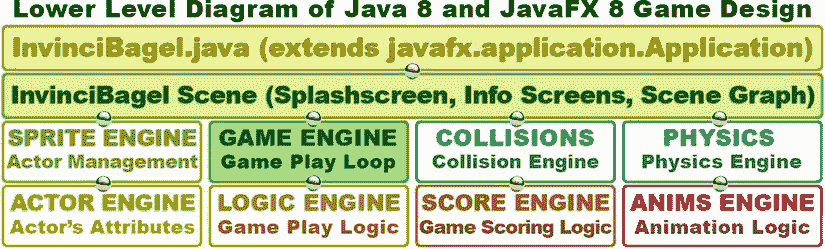

图 6-2。

Primary game functional classes and how they are implemented under the Scene and Scene Graph levels

在 InvinciBagel 场景对象(实际上是在 InvinciBagel 应用子类中创建的)下面，是功能类的更广泛的结构设计，您将需要在本书的剩余部分中编写代码。图中所示的引擎(类)将创建您的游戏功能，如游戏引擎(游戏循环)、逻辑引擎(游戏播放逻辑)、精灵引擎(演员管理)、演员引擎(演员属性)、得分引擎(游戏得分逻辑)、动画引擎(动画逻辑)、碰撞检测和物理模拟。您将必须创建所有这些 Java 类函数来完全实现 InvinciBagel 游戏的全面的 2D 游戏引擎。

我称之为 GamePlayLoop 类的游戏引擎是创建 AnimationTimer 对象的主要类，该对象调用连续处理游戏循环的脉冲事件。如您所知，这个循环将调用。handle()方法，该方法又包含方法调用，这些方法调用最终将访问您将创建的用于管理 actors (sprite 引擎)的其他类；在屏幕上移动它们(演员引擎)；检测任何碰撞(碰撞引擎)；检测到碰撞后应用游戏逻辑(逻辑引擎)；并应用物理的力量来为游戏提供逼真的效果，如重力和加速度(物理引擎)。

从第 7 章开始，你将构建这些不同的引擎，它们将被用来创造游戏体验。我将根据每个引擎和它们需要做什么来对章节主题进行分层，这样从学习和编码的角度来看，一切都是有逻辑的。

## JavaFX 场景图设计:最小化 UI 节点

最小化场景图的技巧是使用尽可能少的节点来实现一个完整的设计，如图 [6-3](#Fig3) 所示，这可以通过一个 StackPane 根节点、一个 VBox 分支(父)节点和七个叶(子)节点(一个 TableView、两个 ImageView 和四个按钮 UI 控件)来实现。当你接下来开始编码场景图时(最后！)，您将仅使用 14 个对象，仅导入 12 个类，来使您在上一节中设计的 InvinciBagel 游戏的整个顶层成为现实。TableView 将覆盖 ImageView 组合，其中包含设计的信息屏幕层。这个 TableView 对象将在游戏设计的后期添加。ImageView 背板将包含 InvinciBagel 艺术品；ImageView 合成层将包含三个不同的透明图像，根据 ActionEvents(按钮控件的点击)无缝覆盖背板图像；VBox 父 UI 布局容器将包含四个按钮控件。您还将创建一个 Insets 对象来保存填充值，以微调按钮库对齐方式。

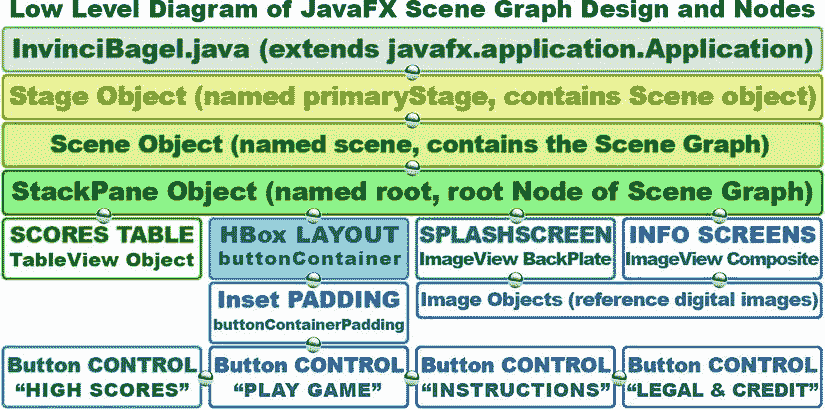

图 6-3。

Primary splash screen Scene Graph node hierarchy, the objects it contains, and the assets it references

因为按钮对象不能单独定位，所以我不得不使用 HBox 类以及 Insets 类和 Pos 类来包含和定位按钮控件。在这一章中，我将介绍你将用于这个高级设计的类，这样你就可以对你将要添加到 InvinciBagel 类中来创建这个顶级 UI 设计的每个类有一个大概的了解。

我为匹配四个不同按钮所需的四个不同屏幕优化场景图形使用的方法是使用一个 ImageView 作为背板来包含 InvinciBagel 闪屏插图，然后再使用一个 ImageView 来包含使用透明度(alpha 通道)的不同合成图像(覆盖)。这样，您可以仅使用两个 ImageView 场景图形节点对象来模拟四个不同的屏幕。

最后，TableView 场景图节点将包含高分表的表结构。这将通过分数引擎创建，你将在最后创建，在你完成整个游戏设计和编程。现在，你将离开高分和玩游戏按钮代码未实现。

### 场景图代码:优化你当前的 InvinciBagel 类

我知道您渴望在 InvinciBagel 类代码上工作，所以让我们清理、组织和优化现有的 Java 代码来实现这个顶级 UI 屏幕设计。首先，将对象声明和命名 Java 代码放在 InvinciBagel 类的顶部。这更有组织性，你的类中的所有方法将能够看到和引用这些对象，而不需要使用 Java 修饰关键字。正如你在图 [6-4](#Fig4) 中看到的，这些包括你现有的场景 scene 对象，根 StackPane 对象，和 btn 按钮对象(我把它重命名为 gameButton)。我添加了另外三个按钮对象，分别名为 helpButton、scoreButton 和 legalButton，它们都是使用一行 Java 代码声明和命名的，还添加了两个 ImageView 对象，分别名为 splashScreenbackplate 和 splashScreenTextArea。您还需要创建四个 Image 对象来保存数字图像资产，这些资产将显示在 ImageView 节点中；我已经用一个复合 Java 语句将它们命名为 splashScreen、instructionLayer、legalLayer 和 scoresLayer 并声明了它们。最后，声明并命名 buttonContainer VBox 对象和 buttonContainerPadding Insets 对象。只要您使用 Alt+Enter 快捷键，选择正确的 javafx 包和类路径，NetBeans 就会为您编写导入语句。进口显示在图的顶部。

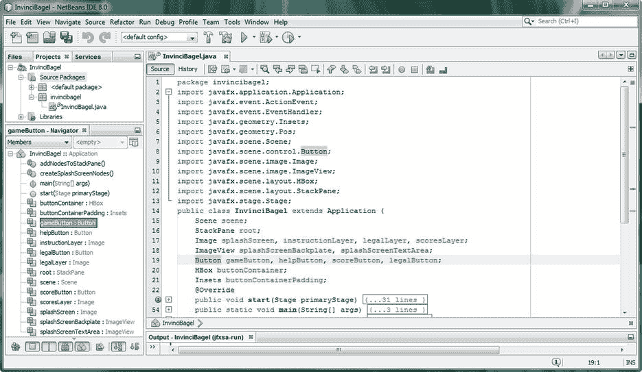

图 6-4。

Declaring and naming the 14 objects that will make up your Scene Graph hierarchy at the top of the class

在本章中，您将详细了解所有这些 JavaFX 类，以便了解它们的用途以及它们能为您的 Java 应用做些什么。

### 场景图设计:简化现有的。start()方法

现在，您可以优化。start()方法，这样它只有一二十行代码。首先，将场景图节点创建 Java 例程模块化到它们自己的 createSplashScreenNodes()方法中，该方法将在。start()方法，如图 [6-5](#Fig5) 所示。在此方法中创建所有节点后，创建一个 addNodesToStackPane()方法将节点添加到 StackPane 根节点，然后让三行 primaryStage 代码配置和管理 Stage 对象，最后是 ActionEvent 处理代码例程，这些例程将按钮 UI 控件“连接”到单击按钮时要执行的 Java 代码。

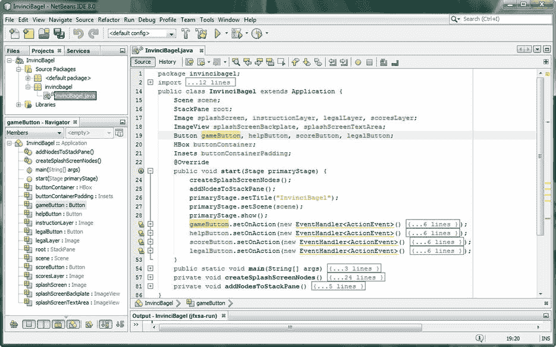

图 6-5。

Organize the .start() method with the createSplashScreenNodes() and addNodesToStackPane() methods

如您所见，在复制了。对于每个按钮对象，当您折叠 EventHandler 例程时，您有九行代码:一行用于创建节点，一行用于向根添加节点，三行用于 Stage 对象设置，四行用于 UI 按钮事件处理。如果你考虑到你在游戏结构顶层增加的功能数量(游戏、指令、法律、积分、记分牌)，这是非常紧凑的。

按照正确的顺序做事很重要，因为一些 Java 代码是基于其他 Java 代码的。因此，对象声明排在第一位；然后在。start()方法，创建(实例化)节点。一旦声明、命名和实例化(创建)了它们，就可以将它们添加到 StackPane 根节点，然后配置(使用。setTitle()方法)并将场景 scene 对象添加到 primaryStage Stage 对象中。setScene()方法。在你的对象进入系统内存之后，你才能够处理 ActionEvent 处理例程，这些例程被附加到你的四个按钮 UI 控件上。接下来，让我们确保将在 createSplashScreenNodes()方法中引用的数字图像资产位于正确的 NetBeans 文件夹中。

#### 场景图形资源:在项目中安装 ImageView 的图像资源

要在 Java 代码中引用 JAR 文件中的数字图像资产，必须在文件名前插入一个正斜杠。但是，在引用文件之前，您必须将这些图像文件从图书存储库中复制到计算机/计算机名/用户/用户/my documents/netbeans projects/InvinciBagel/src 文件夹中，如图 [6-6](#Fig6) 的左侧(和顶部)所示。您还可以看到这些数字图像资产是如何合成的，因为 invincibagelsplash PNG24 的背景板上有一个位置可以覆盖其他三个 PNG32 图像。复合 ImageView 资产中看到的白色区域实际上是透明的！现在，你准备好了！


图 6-6。

Windows 7 Explorer file management utility, showing a PNG24 splash screen and three PNG32 overlays

## JavaFX UI 类:HBox、Pos、Insets 和 ImageView

让我们从编码中休息一下，深入了解一些新的类，您将使用它们来完成您的顶级游戏应用 UI 设计。其中包括 Pos 类(定位)；Insets 类(填充)；HBox 类(UI 布局容器)；图像类(数字图像容器)；ImageView 类(数字图像显示)；以及 TableView 类(表格数据显示)，您将在这里学习该类，但在游戏完全完成后，您将在游戏开发的后续代码中实现该类。您将按照从最简单(Pos)到最复杂(TableView)的顺序检查这些，然后编写。createSplashScreenNodes()和。addNodesToStackPane()方法，它们使用这些新的类(对象)。

### JavaFX Pos 类:通用屏幕位置常量

Pos 类是一个 Enum <pos>类，代表“枚举”这个类包含一个常量列表，这些常量被转换成整数值以在代码中使用。常量值(在本例中是定位常量，如 TOP、CENTER 和 BASELINE)使程序员更容易在代码中使用这些值。</pos>

Pos 类的 Java 类扩展层次结构从 java.lang.Object masterclass 开始，逐步发展到 java.lang.Enum <pos>类，最后以 javafx.geometry.Pos 类结束。如图 [6-4](#Fig4) 所示(l. 6)，Pos 位于 JavaFX geometry 包中，并使用以下子类层次结构:</pos>

```java
java.lang.Object

> java.lang.Enum<Pos>
```

`> javafx.geometry.` `Pos`

Pos 类有一组常量，用于提供通用的水平和垂直定位和对齐(见表 [6-1](#Tab1) )。正如您将在下一节中看到的，您将不得不使用 Insets 类和对象来获得您想要的像素精确定位。您将使用 BOTTOM_LEFT 常量将按钮控件组定位在初始屏幕的左下角。

表 6-1。

Pos Class Enum Constants That Can Be Used for Positioning and Alignment in JavaFX

  
| 位置常数 | 定位结果(对象) |
| --- | --- |
| 基线 _ 中心 | 在基线上，垂直地；在中心，水平地 |
| 基线 _ 左侧 | 在基线上，垂直地；在左边，水平地 |
| 基线 _ 右侧 | 在基线上，垂直地；在右边，水平地 |
| 底部中心 | 在底部，垂直地；在中心，水平地 |
| 左下角 | 在底部，垂直地；在左边，水平地 |
| 右下 | 在底部，垂直地；在右边，水平地 |
| 中心 | 在中心，垂直和水平 |
| 中央 _ 左侧 | 在中心，垂直地；在左边，水平地 |
| 中间 _ 右侧 | 在中心，垂直地；在右边，水平地 |
| 顶部 _ 中间 | 在顶部，垂直地；在中心，水平地 |
| 左上角 | 在顶部，垂直地；在左边，水平地 |
| 右上方 | 在顶部，垂直地；在右边，水平地 |

因为 Pos 类提供了一般化的定位，所以它应该与 Insets 类结合使用，以实现像素级的精确定位。接下来让我们看看 Insets 类，因为它也在 javafx.geometry 包中。

### JavaFX Insets 类:为用户界面提供填充值

insets 类是一个公共类，它直接扩展了 java.lang.Object masterclass，这意味着 Insets 类是从头开始编写的，以提供矩形区域内的 Insets 或 offsets。想象一个相框，在里面放一块垫子，或者在相框外面和里面的图片之间放一个漂亮的边框。这就是 insets 类用两个构造函数方法做的事情:一个提供相等或均匀的 insets，另一个提供不相等或不均匀的 Insets。

您将使用提供不相等 insets 值的构造函数，如果您正在构建一幅图片，这将看起来非常不专业！Insets 类的 Java 类层次结构从 java.lang.Object 主类开始，并使用该类创建 javafx.geometry.Insets 类。如图 [6-4](#Fig4) 所示(l. 5)，Insets 包含在 JavaFX geometry 包中，就像 Pos 类一样，并使用以下类层次结构:

```java
java.lang.Object
```

`> javafx.geometry.` `Insets`

Insets 类提供了一组四个双偏移值，用于指定矩形的四个边(上、右、下、左),在构造函数方法中应该按照这个顺序指定。您将使用 Insets 类(对象)来微调按钮控件组的位置，您将使用 HBox 布局容器来创建该控件组。将这些 Insets 对象视为在另一个框内绘制一个框的方式，它显示了您希望矩形内的对象围绕其边缘“尊重”的间距。Insets 对象的简单构造函数将使用以下格式:

`Insets(double``topRightBottomLeft`T2】

此构造函数对所有间距边使用单个值(topRightBottomLeft)，重载的构造函数允许您分别指定每个值，如下所示:

`Insets(double``top``, double``right``, double``bottom``, double``left``)`

这些值需要按此顺序指定。记住这一点的简单方法是使用模拟时钟。钟的顶部有“12”，右边有“3”，底部有“6”，左边有“9”。所以，从正午开始(对于你们这些西方流派的爱好者来说)，总是顺时针工作，就像指针绕着钟面移动一样，你将有一个很好的方法来记住如何在“不均匀值”构造方法中指定 Insets 值。您将很快使用 insets 类来定位按钮控件组，该控件组最初“卡”在初始屏幕设计的左下角，远离屏幕的左侧和底部，使用这四个 Insets 定位参数中的两个。

### JavaFX HBox 类:在设计中使用布局容器

因为按钮对象不容易定位，所以我将把这四个按钮对象放在 javafx.scene.layout 包中的一个布局容器中，该包名为 HBox，代表水平框。这个公共类将事情安排在一行中，因为您希望按钮在闪屏的底部对齐，所以您使用四个按钮控件节点的父节点，这些节点将成为这个 HBox 分支节点的子节点(叶节点)。这将创建一组 UI 按钮，它们可以作为闪屏设计的一个单元一起定位(移动)。

HBox 类是一个公共类，它直接扩展 javafx.layout.Pane 超类，后者又扩展 javafx.layout.Region 超类。javafx.layout.Region 超类扩展了 javafx.scene.parent 超类，后者又扩展了 javafx.scene.Node 超类，后者扩展了 java.lang.Object 主类。如图 [6-4](#Fig4) 所示(l. 11)，HBox 包含在 javafx.scene.layout 包中，就像 StackPane 类一样，它使用如下的类层次结构:

```java
java.lang.Object

> javafx.scene.Node

> javafx.scene.Parent

> javafx.scene.layout.Region

> javafx.scene.layout.Pane
```

`> javafx.scene.layout.` `HBox`

如果 HBox 指定了边框或填充值，HBox 布局容器的内容将遵循该边框或填充规范。填充值是使用 Insets 类指定的，您将在这个微调的 UI 控件库应用中使用它。

您将使用 HBox 类(object ),以及 Pos 类常量和 Insets 类(object ),将 UI 按钮对象分组在一起，然后，微调它们作为按钮控件库的位置。因此，这个 HBox 布局容器将成为按钮 UI 控件(或叶节点)的父节点(或分支节点)。

可以把 HBox 对象想象成一种水平排列子对象的方式。这些可能是您的图像资产，它将使用基本的 HBox 构造函数(零间距)，或者 UI 控件，如按钮，它们排列在一起但有间距，使用重载的构造函数之一。创建 HBox 对象的最简单的构造函数将使用下面的空构造函数方法调用格式:

```java
HBox()
```

您将用于创建 HBox 对象的重载构造函数将使用一个间距值在 HBox 内的子按钮对象之间留出一些空间，使用以下构造函数方法调用格式:

`HBox(double``spacing`T2】

还有另外两种重载构造函数方法调用格式。这将允许您在构造函数方法调用本身中指定子节点对象(在本例中为按钮对象)，如下所示:

`HBox(double``spacing``, Nodes...``children``) - or, with``zero spacing`T6】

`HBox(Nodes...``children`T2】

你将会使用“长表格”。getChildren()。addAll()方法链，但是您也可以通过使用以下构造函数来声明 HBox 及其按钮节点对象:

```java
HBox buttonContainer = new HBox(12, gameButton, helpButton, scoreButton, legalButton);
```

如果子对象被设置为可调整大小，HBox 布局容器将基于不同的屏幕大小、纵横比和物理分辨率来控制子元素的大小调整。如果 HBox 区域将容纳子对象的首选宽度，它们将被设置为该值。此外，fillHeight 属性(布尔变量)设置为 true 作为默认值，指定子对象是否应该填充(放大)HBox 高度值。

HBox 的对齐是由 Alignment 属性(属性或变量)控制的，该属性默认为 Pos 类(Pos)中的 TOP_LEFT 常量。TOP_LEFT)。如果 HBox 的大小超过了其指定的宽度，子对象将使用它们的首选宽度值，多余的空间不会被使用。值得注意的是，HBox 布局引擎将对托管子元素进行布局，而不考虑它们的可见性属性(属性或变量)设置。

现在，我已经讨论了 JavaFX geometry 和 layout 类，您将使用它们来创建 UI(一组按钮对象)设计，让我们来看看 javafx.scene.image 包中与数字图像相关的类，它将允许您实现数字图像合成管道，您将在 HBox UI 布局容器对象中保存的这四个 JavaFX 按钮 UI 控件元素对象的后面放置该管道。

### JavaFX Image 类:在设计中引用数字图像

Image 类是一个公共类，它直接扩展了 java.lang.Object masterclass，这意味着 Image 类也是从头开始编写的，以提供图像加载(引用)和缩放(调整大小)。您可以锁定缩放的纵横比，并指定缩放算法(质量)。支持 java.net.URL 类支持的所有 URL。这意味着你可以从网上加载图片([`www.servername.com/image.png`](http://www.servername.com/image.png))；从 OS(文件:image . png)；或者从 JAR 文件中，使用正斜杠(/image.png)。

Image 类的 Java 类层次结构从 java.lang.Object 主类开始，并使用该类创建 javafx.scene.image.Image 类。如图 [6-4](#Fig4) 所示(l. 9)，Image 包含在 JavaFX image 包中，就像 ImageView 类一样，使用如下的类层次结构:

```java
java.lang.Object
```

`> javafx.scene.image.` `Image`

Image 类提供了六种不同的(重载的)Image()构造函数方法。这些函数从简单的 URL 到一组指定 URL、宽度、高度、比例、平滑和预加载选项的参数值。当您使用所有构造函数方法中最复杂的方法编写 Image()构造函数时，您将很快看到，这些方法应该在构造函数方法中按此顺序指定，其格式如下:

`Image(String``url``, double``requestedWidth``, double``requestedHeight``, boolean``preserveRatio,``boolean``smooth,``boolean``backgroundLoading``)`

Image 对象的简单构造函数仅指定 URL，并使用以下格式:

`Image(String``url`T2】

如果您要加载图像，并让构造函数方法将图像缩放到不同的宽度和高度(通常较小，以节省内存)，同时使用最高质量的重新采样(平滑像素缩放)锁定(保留)纵横比，则该图像对象构造函数使用以下格式:

`Image(String``url``, double``scaleWidth``, double``scaleHeight``, boolean``preserveAspect``, boolean``smooth``)`

如果希望在后台(异步)加载图像，使用其“本机”或物理分辨率和本机纵横比，image()构造函数使用以下格式:

`Image(String``url``, boolean``backgroundLoading`T4】

两个 Image()构造函数方法也使用 java.io.InputStream 类，该类向 Image()构造函数方法提供输入数据的实时流(类似于视频或音频流，只针对 java 应用进行了定制)。这两种图像对象构造器格式采用以下格式(简单和复杂):

`Image(InputStream``is`T2】

`Image(InputStream``is,``double``newWidth``, double``newHeight``, boolean``preserveAspect``, boolean``smooth``)`

因此，Image 类(对象)用于准备数字图像资产以供使用，即从 URL 读取其数据；如果有必要，调整它们的大小(使用你喜欢的平滑和纵横比锁定)；并异步加载它们，而应用中的其他事情正在进行。需要注意的是，图像类(或对象)并不显示图像资产:图像类只是加载它；如果需要，缩放它；并将它放在系统内存中供您的应用使用。

要显示图像对象，您需要使用第二个类(对象)，称为 ImageView 类。ImageView 对象可以用作场景图和引用上的节点，然后将图像对象数据“绘制”到布局容器上，该容器保存 ImageView 节点(在这种情况下，是叶 ImageView 节点的 StackPane 场景图根和父节点)。我将在下一节介绍 ImageView 类。

从数字图像合成的角度来看，StackPane 类(对象)是图像合成引擎，也可以称为层管理器，每个 ImageView 对象代表层堆栈中的一个层。图像对象包含图像视图层中的数字图像数据，或者如果需要，包含多个图像视图中的数字图像数据，因为图像对象和图像视图对象是分离的，并且彼此独立存在。

### JavaFX ImageView 类:在设计中显示数字图像

ImageView 类是一个公共类，它直接扩展 javafx.scene.Node 超类，后者是 java.lang.Object 的扩展(参见[第 4 章](04.html))。因此，ImageView 对象是 JavaFX 场景图中的一种节点对象，用于使用 Image 对象中包含的数据绘制视图。该类具有允许图像重采样(调整大小)的方法，并且与 image 类一样，您可以锁定缩放的纵横比以及指定重采样算法(平滑质量)。

ImageView 类的 Java 类层次结构从 java.lang.Object 主类开始，并使用该类创建 javafx.scene.Node 类，然后使用该类创建 ImageView 节点子类。如图 [6-4](#Fig4) 所示(l. 10)，和 Image 类一样，ImageView 包含在 JavaFX image 包中。ImageView 类使用以下 Java 类继承层次结构:

```java
java.lang.Object

> javafx.scene.Node
```

`> javafx.scene.image.` `ImageView`

ImageView 类提供了三种不同的(重载的)ImageView()构造函数方法。这些范围从一个空的构造函数(这是您稍后将在代码中使用的一个构造函数)；转换为一个将图像对象作为其参数的函数；转换为以 URL 字符串对象作为参数并自动创建图像对象的方法。要创建 ImageView 对象，简单(空)ImageView()构造函数方法使用以下格式:

```java
ImageView()
```

您将使用这个构造函数方法，这样我就可以向您展示如何使用？setImage()方法调用将图像对象加载到 ImageView 对象中。如果您想避免使用。setImage()方法调用时，可以使用重载的构造函数方法，其格式如下:

`ImageView(Image``image`T2】

因此，要“显式”设置一个 ImageView 并将其连接到 Image 对象，如下所示:

`splashScreenBackplate =``new`T2】

`splashScreenBackplate.setImage(``splashScreen`T2】

您可以使用重载的构造函数方法将其压缩成一行代码，结构如下:

`splashScreenBackplate =``new``ImageView(``splashScreen`T4】

如果您想绕过创建和加载图像对象的过程，也有一个构造函数方法，它使用以下格式:

`ImageView(String``url`T2】

要在后台(异步)加载图像，使用其本机(默认)分辨率和本机纵横比，image()构造函数使用以下格式:

`splashScreen` `= new Image("/invincibagelsplash.png", 640, 400, true, false, true);`

```java
splashScreenBackplate = new ImageView();
```

`splashScreenBackplate.setImage(``splashScreen`T2】

如果不想指定图像尺寸、背景图像加载和平滑缩放，或者不想锁定任何缩放的纵横比，可以将前面三行 Java 代码压缩到以下构造函数中:

```java
splashScreenBackplate = new ImageView("/invincibagel.png");   // uses third constructor method
```

至少在开始时(出于学习目的)，我会用长时间的方式来做这件事，我会一直使用 Image()构造函数方法显式地加载图像对象，这样您就可以指定所有不同的属性，并看到您在这个 Java 编程逻辑中使用的所有不同的图像资产。我想在这里向您展示快捷方式代码，因为一旦您开始使用 ImageViews 作为精灵，您将在本书的后面使用这种方法(参见第 8 章)。你可以对你的精灵使用这种快捷方式，因为你不需要缩放它们，也因为它们已经高度优化，不需要后台加载。

接下来，让我们快速看一下 TableView 类，它将保存高分表。虽然你不会在这里实现它，但我会介绍这个类，因为它是你在本章中创建和实现的顶级 UI 设计的一部分。

### JavaFX TableView 类:在设计中显示数据表

TableView 类是直接扩展 javafx.scene.control.Control 超类的公共类，javafx.scene.layout.Region 是 javafx.scene.layout.Region 的扩展，javafx.scene.Parent 是 javafx.scene.Node 场景图超类的扩展(见[第四章](04.html))。因此，TableView < S >对象是一种 UI 控件(表格)和 JavaFX 场景图中的节点对象，用于使用 S 对象构建表格，每个对象都包含要在表格中显示的数据。在本书的后面部分，你将使用这些 S 对象将数据写入一个 TableView < S >对象，在得分超过当前列表中的得分之后。

TableView 类的 Java 类层次结构从 java.lang.Object 主类开始，并使用该类创建 javafx.scene.Node 类，然后使用该类创建父类。这用于创建一个区域类，该区域类又创建一个控件类，该控件类用于创建 TableView 类。TableView 类具有以下 Java 类继承层次结构:

```java
java.lang.Object

> javafx.scene.Node

> javafx.scene.Parent

> javafx.scene.layout.Region

> javafx.scene.control.Control
```

`> javafx.scene.control.` `TableView<S>`

TableView 类提供了两种不同的(重载的)TableView()构造函数方法，一种是空的构造函数，另一种是接受 ObservableList ~~对象的构造函数，该对象以表数据项作为参数。创建空 TableView 对象的简单(空)TableView()构造函数方法将使用以下格式:~~

```java
TableView()
```

第二种构造函数类型使用 javafx.collections 包中的 ObservableList <e>类(object ),这是一种列表类型，它允许数据更改事件侦听器跟踪列表中发生的任何更改。此 TableView 对象构造函数方法调用使用以下格式:</e>

`TableView(ObservableList<S>``items`T2】

我认为现在已经有足够的类背景信息了，所以让我们开始为你的第一个类编写代码。createSplashScreenNodes()方法，该方法将实例化并设置场景图形的所有节点对象！

## 场景图形节点:。createSplashScreenNodes()

使用 createSplashScreenNodes()方法要做的第一件事是编写空方法结构的代码，并添加已经存在于引导代码中的节点对象创建代码，引导代码是 NetBeans 在第 2 章中为您生成的。这包括按钮节点的节点对象、StackPane 根节点和名为 Scene 的场景对象。您将在。start()方法，因为该对象是使用。start(Stage primaryStage)构造函数方法调用。Button 对象已经被重命名为 gameButton(原来是 btn)，所以您有三行对象实例化代码和一行配置代码，如下所示:

`root` `= new StackPane();`

`scene = new Scene(``root`T2】

```java
gameButton = new Button();

gameButton.setText("PLAY GAME");
```

需要注意的是，因为在场景 scene 对象的构造函数方法调用中使用了根 StackPane 对象，所以这一行代码需要放在前面(在使用它之前，必须先创建您的根对象！).接下来您需要创建的是 HBox 布局容器对象，它将保存您的四个按钮 UI 控件。您还将为 HBox 设置对齐属性；添加一个 Insets 对象以包含填充值；然后使用这四行 Java 代码将这些填充添加到 4 HBox 对象中:

`buttonContainer = new HBox(``12`T2】

`buttonContainer.setAlignment(Pos.``BOTTOM_LEFT`T2】

`buttonContainerPadding` `= new Insets(0, 0, 10, 16);`

`buttonContainer.setpadding(``buttonContainerPadding`T2】

接下来，让我们采用一种方便的程序员快捷方式，将两行 gameButton(实例化和配置)代码复制并粘贴到 HBox 代码下面(因为按钮在 HBox 内部，这只是为了视觉组织，而不是为了使代码工作)，然后在单独的行上再复制并粘贴三次。这将允许您通过创建以下四个按钮 Java 代码，分别将游戏更改为帮助、得分和合法:

```java
gameButton = new Button();

gameButton.setText("PLAY GAME");

helpButton = new Button();

helpButton.setText("INSTRUCTIONS");

scoreButton = new Button();

scoreButton.setText("HIGH SCORES");

legalButton = new Button();

legalButton.setText("LEGAL & CREDITS");
```

现在您已经创建了 HBox 按钮 UI 控件布局容器和按钮，您还需要再编写一行代码，使用。getChildren()。addAll()方法链，像这样:

`buttonContainer.``getChildren``().``addAll`T4】

接下来，让我们添加您的图像合成节点对象(image 和 ImageView ),以便您可以为 InvinciBagel 闪屏添加插图，以及装饰您的说明、法律免责声明和制作人员名单的面板覆盖图，并为您的(最终)游戏高分表添加背景和屏幕标题。我使用两个 ImageView 对象来包含这两层；让我们首先设置最底部的背板图像层，方法是使用以下 Java 代码实例化 image 对象，然后实例化 ImageView 对象，并将它们连接在一起:

```java
splashScreen = new Image("/invincibagelsplash.png", 640, 400, true, false, true);

splashScreenBackplate = new ImageView();

splashScreenBackplate.setImage(splashScreen);   // this Java statement connects the two objects
```

最后，让我们对图像合成板做同样的事情，也就是说，ImageView 将保存包含 alpha 通道(透明度)值的不同图像对象，这些图像对象将为 InvinciBagel 闪屏插图(由才华横溢的 2D 艺术家 Patrick Harrington 创建)创建面板图像的覆盖图:

```java
instructionLayer = new Image("/invincibagelinstruct.png", 640, 400, true, false, true);

splashScreenTextArea = new ImageView();

splashScreenTextArea.setImage(instructionLayer); // this Java statement connects the two objects
```

如图 [6-7](#Fig7) 所示，你的场景图节点创建(见 InvinciBagel 类的顶部)和节点对象实例化和配置(见 createSplashScreenNodes()方法)已经就绪并且没有错误。您仍然需要为其他两个屏幕添加图像对象，但是这里有足够的代码能够使用 addNodesToStackPane()方法将这些节点对象添加到场景图中，然后测试代码以确保它能够工作。根据 NetBeans IDE，此代码没有错误！

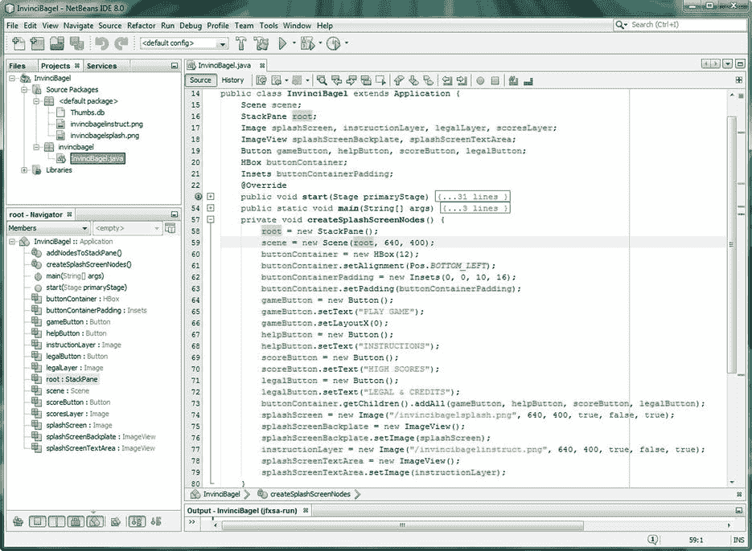

图 6-7。

Coding the createSplashScreenNodes() method; instantiating and configuring the nodes in the Scene Graph

接下来，让我们在 addNodesToStackPane()方法中将节点对象添加到 StackPane 场景图形根对象中。

### 向场景图添加节点:。addStackPaneNodes()

最后，您必须创建一个方法，将您已经创建的节点对象添加到场景图形根，在本例中是一个 StackPane 对象。您将使用。getChildren()。add()方法链将子节点对象添加到父 StackPane 根场景图节点。这是通过三行简单的 Java 代码完成的，如下所示:

```java
root.getChildren().add(splashScreenBackplate);

root.getChildren().add(splashScreenTextArea);

root.getChildren().add(buttonContainer);
```

正如你在图 [6-8](#Fig8) 中看到的，Java 代码是没有错误的，根对象在类的顶部看到了它的声明。单击代码中的根对象会创建这种突出显示，它通过代码跟踪对象的使用。这是一个非常酷的 NetBeans 8.0 技巧，当您想要跟踪代码中的对象时，应该使用它。

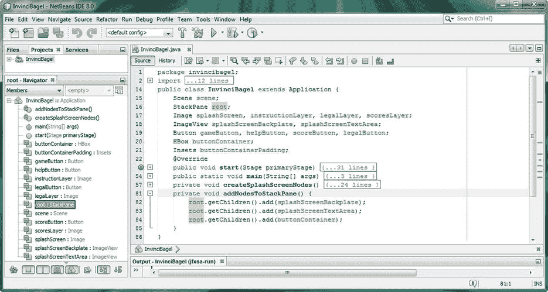

图 6-8。

Coding the addNodesToStackPane() method, using the .getChildren() method chained to the .add() method

这里要注意的重要事情是节点对象添加到 StackPane 根场景图形对象的顺序。这会影响图像合成的合成层顺序，以及这些数字图像元素之上的 UI 元素合成。添加到 StackPane 的第一个节点将位于层堆栈的底部；这需要是 splashScreenBackplate ImageView 节点对象，如图所示。

下一个要添加的节点将是 splashScreenTextArea ImageView 节点对象，因为带有面板覆盖的透明图像需要放在 Pat Harrington 的 InvinciBagel 闪屏 2D 作品的正上方。之后，您可以放置 UI 设计，在本例中，可以使用 buttonContainer HBox 节点对象一次性完成，该节点对象包含所有的按钮对象。请注意，您不必向这个 StackPane 根场景图形对象添加按钮，因为您已经使用了。getChildren()。addAll()方法链，用于将按钮 UI 控件添加到 HBox(父对象)节点分支对象下的场景图形层次中。现在，您可以开始测试了！

## 测试 InvinciBagel 应用:脉动场景图形

单击 NetBeans IDE 顶部的绿色播放箭头，然后运行项目。这将弹出如图 [6-9](#Fig9) 所示的窗口(我已经删除了在[第四章](04.html)中添加的 Java 代码，演示如何创建一个无窗口应用)。所以，你又有了 windows“chrome ”,至少现在是这样。正如您所看到的，您只使用了十几条 import 语句(外部类)、几十行 Java 代码和场景图根(StackPane)对象下的六个子节点，就获得了非常好的结果。如您所见，JavaFX 在将背板、合成图像覆盖和按钮库覆盖合成为一个无缝、专业的结果方面做得非常好！

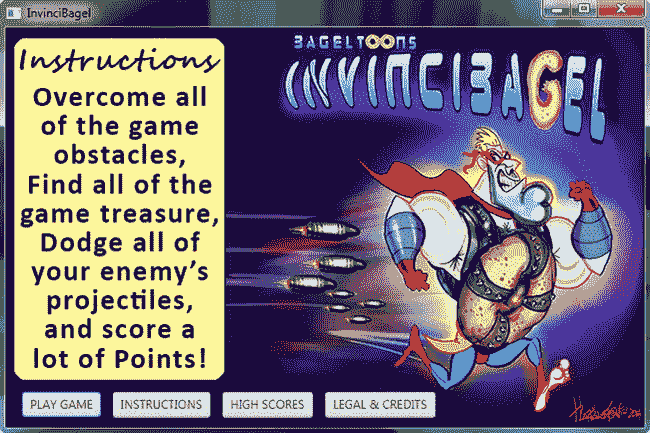

图 6-9。

Run the InvinciBagel application, and make sure that the StackPane compositing class is working correctly

因为您只复制和粘贴了每个按钮的 EventHandler 例程，并且更改了按钮对象的名称，而没有更改这些例程中的代码，所以按钮对象仍然可以正常工作(将文本写入控制台)并且不会导致编译器错误。但是，他们不会做您希望他们做的事情，即更改图像覆盖，以便设计左侧的面板包含您希望它向用户显示的标题和文本。

这将通过调用。setImage()方法，该方法将根据用户单击的按钮 UI 控件，将 splashScreenTextArea ImageView 对象设置为 instructionLayer、scoresLayer 或 legalLayer Image 对象。在添加最后两个 Image 对象实例之前，您不能实现这个事件处理代码！

## 完成 InvinciBagel UI 屏幕设计:添加图像

让我们以 createSplashScreenNodes()方法结束，在该方法的末尾再添加两行，以添加两个图像对象，引用 invincibagelcreds.png 和 invincibagelscores.png 的 32 位 PNG32 数字图像资产。这是通过使用下面两行使用 new 关键字的 Java 对象实例化代码来实现的:

```java
legalLayer = new Image( "/invincibagelcreds.png", 640, 400, true, false, true );

scoresLayer = new Image( "/invincibagelscores.png", 640, 400, true, false, true );
```

如图 [6-10](#Fig10) 所示，代码是没有错误的，因为你已经将四个 PNG 文件复制到你的项目的/src 文件夹中。您不需要其他代码行(ImageView 对象实例化，。setImage())，因为您将使用 splashScreenTextArea ImageView 对象来保存这最后两个图像对象。因此，您可以节省所使用的场景图节点对象，因为您使用单个 ImageView 场景图节点对象来基于按钮事件显示三个不同的图像对象(覆盖)。

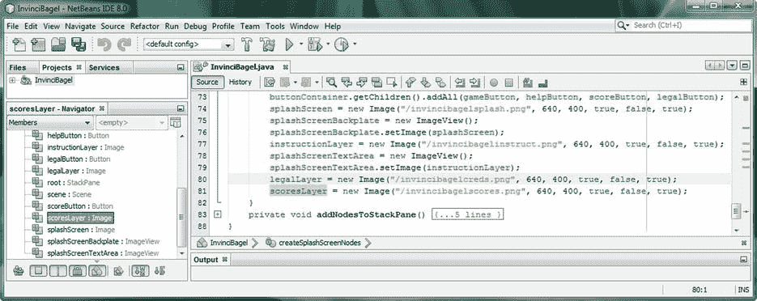

图 6-10。

Adding legalLayer and scoresLayer Image object instantiations to add the other image composite plates

这意味着，您将对 splashScreenTextArea ImageView 对象进行的 splashScreenTextArea.setImage()方法调用将被放置在三个按钮对象的 ActionEvent EventHandler 编程构造中，这三个按钮对象在被单击时会触发图像合成覆盖。第四个按钮对象将启动游戏，所以现在，在按钮事件处理结构中只有一个 Java 注释，使它成为一个“空”逻辑结构。现在，让我们看看如何完成这些 EventHandler 构造的编码，这样您就可以完成这个 UI 设计，并继续创建前面提到的游戏引擎。

## 交互性:连接 InvinciBagel 按钮以供使用

在所有这些重复的按钮事件处理结构中，您需要用对。setImage()方法，以便您可以将图像合成板 ImageView 设置为 Image 对象，该对象包含您想要覆盖由 Pat Harrington 创建的 InvinciBagel 背板作品的数字图像资产。您已经在 createSplashScreenNodes()方法中编写了两次这个代码结构，所以如果您想要一个快捷方式，您可以将代码行直接复制到您刚刚编写的两个 Image 对象实例化之上。

那个。因此，setOnAction()事件处理 Java 代码结构如下所示:

`helpButton` `.setOnAction(new EventHandler<ActionEvent>() {`

```java
@Override

public void handle(ActionEvent event) {
```

`splashScreenTextArea.setImage(``instructionLayer`T2】

```java
}

});
```

`scoreButton` `.setOnAction(new EventHandler<ActionEvent>() {`

```java
@Override

public void handle(ActionEvent event) {
```

`splashScreenTextArea.setImage(``scoresLayer`T2】

```java
}

});
```

`legalButton` `.setOnAction(new EventHandler<ActionEvent>() {`

```java
@Override

public void handle(ActionEvent event) {
```

`splashScreenTextArea.setImage(``legalLayer`T2】

```java
}

});
```

如图 [6-11](#Fig11) 所示，您的事件处理代码没有错误，您已经准备好再次运行和测试了！

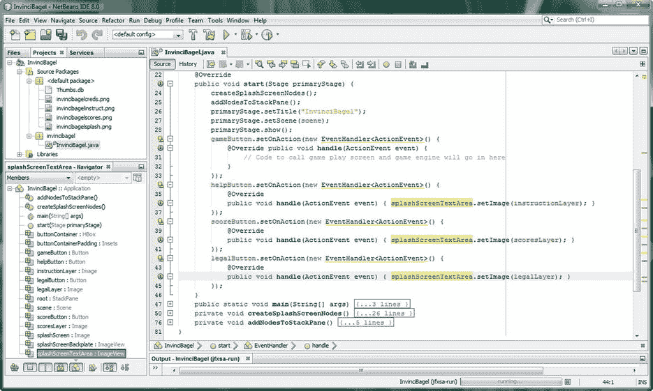

图 6-11。

Modify the body of the .handle() method for each of four Button controls to complete the infrastructure

如您所见，您暂时将 gameButton.setOnAction()事件处理结构保留为空；在下一章中，您将创建主要的游戏界面和一个脉冲事件处理引擎(结构),该引擎将通过调用您将在本书过程中编写的各种功能引擎来运行该游戏。

您现在也将高分屏幕的底部保留为空白，以便您可以在场景图形根堆栈窗格中用 TableView 节点对象覆盖两个 ImageView 层。在开发完 Java 8 游戏之后，您将完成高分按钮 UI 元素的复合。

现在，是时候对游戏应用的顶层 UI 部分进行最终测试了，以确保所有的 UI 按钮元素(对象)都能正常工作，并按照您的设计(编码)完成它们的功能。之后，您将再次运行 NetBeans 8.0 Profiler，以确保您刚刚创建的场景图形层次结构确实为您将从现在开始创建的游戏引擎留出了 99%的可用 CPU 处理能力。

### 测试最终的 InvinciBagel UI 设计

再次单击 NetBeans IDE 8.0 顶部的绿色播放箭头，然后运行您的项目。这将调出如图 [6-12](#Fig12) 所示的窗口。正如您所看到的，当您单击“法律和学分”按钮 UI 元素时，该覆盖图与 InvinciBagel artwork 背板无缝合成，如图左侧所示；当您单击“高分”按钮 UI 元素(控件)时，高分表格背景将就位，如图右侧所示。如您所见，javafx.image 包中的类提供了关于合成的原始结果

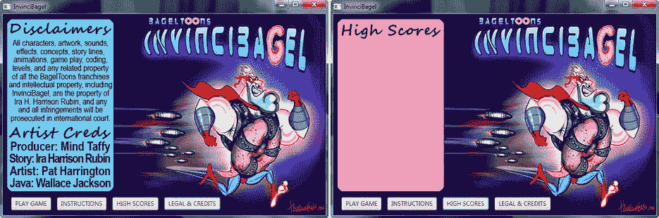

图 6-12。

The other two Image objects shown composited, using the background plate and compositing ImageViews

接下来，让我们来看看你在本章中编写的场景图实现占用了多少 CPU 周期，因为你想确保 100%静态的顶级 UI 设计，以便游戏中使用的唯一动态元素是游戏引擎(和相关引擎)本身。因为脉冲分辨率引擎遍历场景图层次可能会变得“昂贵”，所以这里需要非常小心！

请记住，您的主要目标是创建一个顶级的 UI 设计，用于启动游戏播放屏幕和循环，同时还实现一个允许您的用户显示说明、法律免责声明和制作人员名单的 UI，并负责设置一个用于显示高分表的区域。同时，您的任务是节省 99%的处理能力供以后使用，通过 JavaFX 脉冲引擎处理游戏逻辑、精灵运动、精灵动画、碰撞检测、得分和物理。

### 剖析 InvinciBagel 场景图的脉冲效率

重要的是，游戏 UI 设计不要从 CPU 中取走任何处理能力，因为游戏引擎将需要所有的处理能力。如图 [6-13](#Fig13) 所示，您可以使用 Profile>Profile Project(InvinciBagel)菜单序列来运行 Profiler，并对当前(顶层 UI)应用的 CPU 统计数据进行截图。


图 6-13。

Profiling the Scene Graph UI design thus far to make sure that it does not use any perceptible CPU cycles

正如您在图的右侧的 Total Time 列中所看到的，createSplashScreenNodes()方法需要 279 毫秒，或者大约十分之三秒的时间来执行，并且您的场景图被创建。执行 addNodesToStackPane()方法大约需要 3 毫秒，即千分之三秒。

如果您查看线程分析输出并单击 UI 按钮元素，您将会看到线程上出现一个彩色点，显示了按钮单击的处理开销，正如您所看到的，每次单击不到十分之一秒(查看最右边的调用列，了解我测试了多少次按钮单击函数)。我突出显示了 threads 视图，在那里我单击了 High Scores，然后是 Legal 和 Credits 按钮 UI 元素(参见图 [6-14](#Fig14) )。正如您在这个视图中看到的，当前的设计使用了最少的资源。

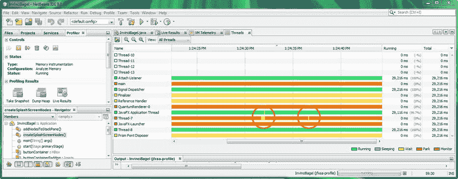

图 6-14。

Profiling the Scene Graph UI design thus far to make sure that it does not use any perceptible thread overhead

Java 8 及其 JavaFX 引擎衍生了近十几个线程，所以你的游戏应用已经是高度多线程的了，甚至不需要在这个时间点！Oracle 的团队正在努力使 JavaFX 成为首屈一指的游戏引擎，所以性能会越来越好，这对 Java 8 游戏开发者来说是个好消息！

## 摘要

在第六章中，您已经开始着手为您的游戏进行实际的顶级 UI 设计，概述底层游戏引擎组件设计，并找出最有效的场景图节点设计。然后，您回到 Java 8 游戏编程，并重新设计了您现有的引导 Java 8 代码，这些代码最初是由 NetBeans 8.0 创建的。

因为 NetBeans 生成的 Java 代码设计并不适合您的目的，所以您完全重写了它，使它更有条理。这是通过创建两个自定义 Java 方法来实现的。createSplashScreenNodes()和。addNodesToStackPane()，用于模块化场景图节点创建过程，以及将三个父(和叶)节点对象添加到场景图根(在本例中，是 StackPane 对象，它用于其多层 UI 对象合成功能)。

接下来，您从 javafx.geometry 包中了解了一些用于实现这些新方法的 JavaFX 类，包括 Pos 类和 Insets 类；javafx.scene.image 包中的 Image 和 ImageView 类；HBox 类，来自 javafx.scene.layout 包；以及 javafx.scene.control 包中的 TableView 类。你编写了新的。createSplashScreenNodes()方法，该方法使用 Insets 对象、Image 和 ImageView 对象以及四个 Button 对象来实例化和配置 HBox 对象。一旦实例化和配置了所有这些场景图节点，您就可以编写一个。addNodesToStackPane()方法将节点对象添加到 StackPane 根对象，以便它们可以由 Stage 对象显示，Stage 对象引用场景图形的根对象。接下来，您测试了您的顶级游戏应用 UI 设计。然后，添加最后几个图像对象，并添加 ActionEvent EventHandler 程序逻辑。最后，您对应用进行了概要分析，以确保它是高效的。

在下一章中，我将介绍 JavaFX 脉冲引擎和 AnimationTimer 类，以便您可以为 Java 8 游戏引擎创建基础结构，该引擎将实时处理您的游戏事件。