# 七、游戏循环的基础：JavaFX 脉冲系统和游戏处理架构

现在，您已经为您的用户创建了学习如何玩游戏、开始游戏、查看高分以及查看法律免责声明和 Ira H. Harrison Rubin 的 InvinciBagel 知识产权游戏制作致谢名单所需的顶级 UI 屏幕，让我们进入正题，为您的 InvinciBagel 游戏创建游戏播放计时循环。从用户体验的角度来看，这是最重要的，并且对于您将在本书剩余部分创建的不同游戏引擎的正常运行也是至关重要的，包括精灵引擎、碰撞检测引擎、动画引擎、评分引擎和物理引擎。你将永远记住游戏的流畅度；JavaFX 脉冲系统的高效、优化实现在游戏的这个阶段是至关重要的(没有双关语)。为此，我将在本章中详细介绍 javafx.animation 包，以及它的所有函数类之间的区别。

首先，您将探索 javafx.animation 包中的两个动画超类:Animation 和 AnimationTimer。之后，您将了解动画、时间轴和过渡，以及这些类及其任何子类(如 PathAnimation 和 TranslateAnimation)如何允许您访问 JavaFX 脉冲事件计时系统。现在，你需要使用脉冲，如果你想创建一个面向行动的街机类型的 Java 8 游戏！

您还将仔细查看整个 javafx.animation 包的整体结构，因为您需要在 Java 8 游戏循环中使用其中一个类。您将通过使用整个包的图表来完成这个任务，这样您就可以对它的所有类是如何相互关联的有一个总体的了解。然后，您将详细检查所有 JavaFX 动画类之间的类层次结构。除了 AnimationTimer、Interpolator、KeyFrame 和 KeyValue，所有这些 javafx.animation 包类都使用 JavaFX Animation 超类进行子类化(使用 Java extends 关键字)。

最后，您将把新的 GamePlayLoop 类添加到 invincibagel 包中，该包将作为 invincibagel 应用子类中的 GamePlayLoop 对象创建，实现定时循环。这个 GamePlayLoop 类将包含一个. handle()方法，以及一个. start()方法和一个. stop()方法，这将允许您在 GamePlayLoop 运行时控制 GamePlayLoop 计时事件，并确定它何时处于潜伏状态(停止或暂停)。

我将创建一个图表，显示这个 InvinciBagel 游戏的类和对象层次结构，这样您就可以开始想象您正在编写的这些类和您正在创建的对象是如何组合在一起的。这就好像使用 Java 8 和 JavaFX 编写游戏代码本身就是一个(益智)游戏！很酷的东西。

## 游戏循环处理:利用 JavaFX 脉冲

即使在开发团队中的 Oracle 员工中，一个主要问题是实现游戏计时循环引擎的哪种设计方法应该与 JavaFX 动画包(类套件)中包含的类一起使用。事实上，这正是本章的全部内容:使用 javafx.animation 包及其类，这些类利用了 JavaFX 脉冲事件计时引擎。在包的类层次结构的顶层，如图 [7-1](#Fig1) 所示，AnimationTimer 和 Animation 类提供了获取这些脉冲事件的主要方法，以便它们为您进行实时处理。在这一部分，你将看到它们的不同之处以及它们的设计用途，包括它们应该用于的游戏种类。除了插值器(运动曲线应用)、关键帧(关键帧定义)和 KeyValue(关键帧自定义)之外，javafx.animation 包中的所有类都可以用于控制脉冲事件。

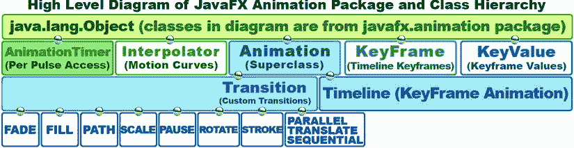

图 7-1。

Javafx.animation package subclass hierarchy; top level classes all coded from scratch with java.lang.Object

有四种基本方法来实现(访问)JavaFX 脉冲事件计时系统，以创建游戏计时循环。这些不同的方法适用于不同类型的游戏，我之前已经讨论过了(见[第 5 章](05.html))。这些游戏类型从需要使用 脉冲事件引擎来实现特殊效果(过渡子类)或自定义动画(时间轴类，结合关键帧类和可能的 KeyValue 类)的静态游戏(棋盘游戏、益智游戏)到需要以每秒 60 次的游戏播放刷新率对 脉冲事件系统进行必要的核心访问的高度动态游戏(AnimationTimer 类)。

最高级别(视觉上，最低级别，显示在图的左下方)是使用 javafx.animation 包中预先构建的 Transition 子类，如 PathTransition 类(或对象)，用于游戏精灵或投射物的路径，或 TranslateTransition，用于翻译(移动)屏幕上的东西。所有这些过渡子类都是为你编码的；你所要做的就是使用它们，这就是为什么在这个特殊的讨论中，我把它标为最高的功能级别。这种高水平的预建功能带来了内存和处理价格；这是因为，正如你从 Java 继承中所了解到的(参见第 3 章), path transition 类包含了它所有的方法、变量和常量，以及在类层次结构中位于它之上的所有类的方法、变量和常量。

这意味着整个 PathTransition 类、Transition 超类、Animation 超类和 java.lang.Object masterclass 都包含在该类的内存占用中，并且还可能包含处理开销，这取决于如何使用该类实现对象。这是一个需要考虑的问题，因为你在 JavaFX 动画包中的位置越低，它就越昂贵，你对为你编写的代码的控制就越多，而不是你自己编写的定制代码。

编码自定义游戏循环的下一个最高级别的方法是子类化 javafx.animation.Transition 类，以创建您自己的自定义过渡子类。这一级和前一级都被认为是顶级方法，最适用于静态但有动画效果的游戏，或者动态性较差的游戏。

中级解决方案是使用 Timeline 类及其相关的 KeyFrame 和 KeyValue 类，它们非常适合于实现拖放工具(如 Flash)中基于时间轴的动画类型。您会发现，如果您在网上查看 JavaFX 游戏引擎讨论，这是一种流行的方法，因为许多动画都是通过创建单个关键帧对象，然后使用时间轴对象来处理脉冲事件来实现的。

使用时间轴对象方法允许您指定处理游戏循环的帧速率，例如 30FPS。这将适用于可以使用较低帧速率的动态性较低的游戏，因为它们不涉及大量的帧间游戏处理，如精灵移动、精灵动画、碰撞检测或物理计算。请务必注意，如果使用 Timeline 对象(类)，您将在系统内存中为帧速率和至少一个关键帧对象引用(这些是 Timeline 类定义的一部分)定义变量，以及从 Animation 超类继承的属性(变量)，如 status、duration、delay、cycleCount、cycleDuration、autoReverse、currentRate、currentTime 和 on finished(action event)object property。

如果您熟悉创建动画，您会看到时间轴，以及至少一个关键帧对象和存储在每个关键帧对象中的潜在的大量 KeyValue 对象，显然是为创建基于时间轴的动画而设计的(优化的)。虽然这是一个非常强大的功能，但它也意味着使用时间轴和关键帧对象进行游戏循环处理将会创建近十几个内存分配区域，这些区域甚至可能不会在您的游戏中使用，或者可能不会针对您的游戏设计实现进行优化设计(编码)。

幸运的是，还有另一个与 javafx.animation 包计时相关的类，它没有这种预构建类的开销，所以我称之为最底层的方法，在这种方法中，您必须在一个简单的。handle()函数，它在每次传递时访问 JavaFX 脉冲引擎。

低级的解决方案包括使用 AnimationTimer 类，这样命名是因为 Java (Swing)已经有了一个 Timer 类(javax.swing.Timer)，Java 的实用程序类(java.util.Timer)也是如此，如果您是一个足够高级的程序员，也可以使用它来处理所有线程同步问题(和编码)。

因为这是一本初学者级别的书，所以您将坚持使用 Java 8 游戏引擎(JavaFX 8)循环您的游戏。JavaFX 在 javafx.animation 包中有自己的 Timer 类，称为 AnimationTimer，以免与 Swing GUI Toolkit 的 Timer 类混淆(由于遗留代码的原因，它仍然受支持)。许多新开发人员对这个类名的“动画”部分感到困惑；不要假设这个定时器类是用于动画的；它的核心是为了计时。就访问 javafx 脉冲计时系统而言，该类是 javafx.animation 包中最低级别的类，本质上仅用于访问脉冲计时系统。其他的都被剥离了。

因此，AnimationTimer 类是为您实现提供最少系统开销(使用的内存)的类。在全速 60FPS 时，它将具有最高的性能，假设。handle()方法得到了很好的优化。这是用于快速、高动态游戏的类，例如街机游戏或射击游戏。出于这个原因，这是您将在游戏中使用的类，因为您可以继续构建游戏引擎框架并添加功能，而不会耗尽电量。

在本书中，您将使用最底层的方法，以防您将 Java 8 游戏开发推向极限，并且正在创建一个高度动态的、充满动作的游戏。JavaFX AnimationTimer 超类非常适合这种类型的游戏应用，因为它处理它的。每个 JavaFX 脉冲事件的 handle()方法。脉冲事件目前被限制在 60FPS，这是专业动作游戏的标准帧速率(也称为刷新率)。您将从 AnimationTimer 超类中派生出 GamePlayLoop.java 类的子类。

有趣的是，大多数现代 iTV LCD、有机发光二极管和 LED 显示屏产品也以这种精确的刷新率(60Hz)更新，尽管较新的显示器将以两倍于此的速率(120Hz)更新。具有 240Hz 刷新率的显示器也即将问世，但因为这些 120Hz 和 240Hz 刷新率显示器使用 60Hz 的偶数倍(2 倍或 4 倍)，所以 60FPS 是为当今的消费电子设备开发游戏的合理帧速率。接下来，让我们在你的游戏中实现 GamePlayLoop.java 类，它将子类化 AnimationTimer 来访问脉冲。

## 创建一个新的 Java 类:GamePlayLoop.java

让我们使用 javafx.animation 包中的 AnimationTimer 超类来创建一个自定义的 GamePlayLoop 类(以及最终的对象)和所需的。handle()方法来处理您的游戏进行计算。如图 [7-2](#Fig2) 所示，在 NetBeans 8.0 中，右键单击项目层次结构窗格中的 invincibagel 包文件夹即可完成此操作。这将向 NetBeans 显示在创建新的 Java 类后，您希望将它放在哪里。

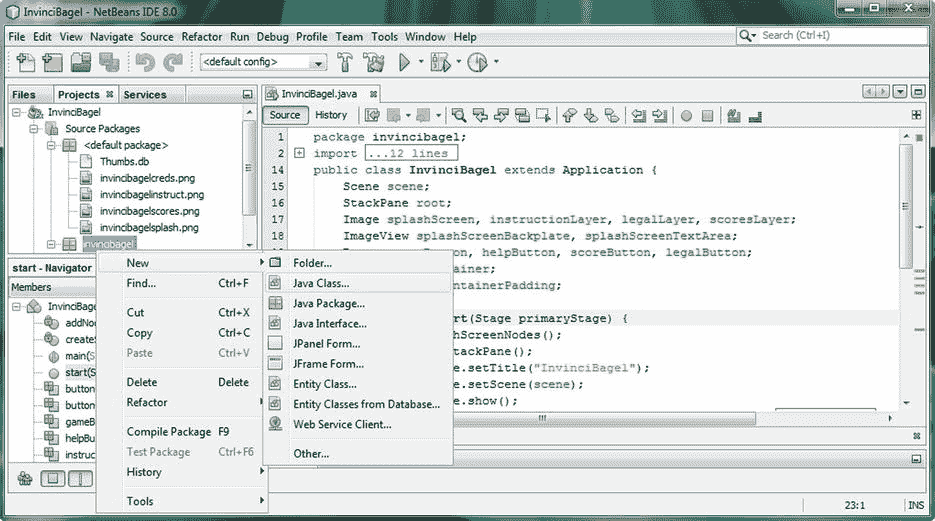

图 7-2。

Right-click the invincibagel package folder, and use the New ➤ Java Class menu sequence

点击新建➤ Java 类，将打开新建 Java 类对话框，如图 [7-3](#Fig3) 所示。将该类命名为 GamePlayLoop，保留 NetBeans 设置的其他默认值，具体取决于您右键单击 invincibagel 包文件夹，然后单击 Finish。

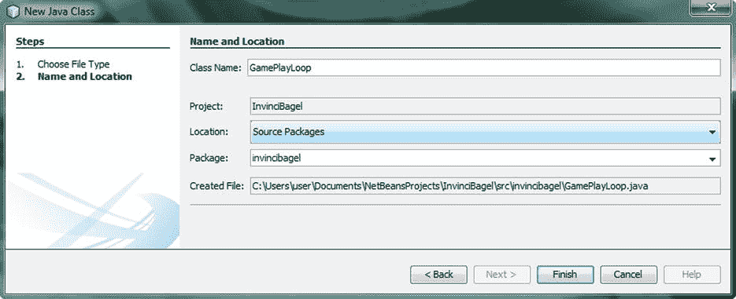

图 7-3。

Name the new Java class GamePlayLoop, and let NetBeans set up the other fields

NetBeans 将为 GamePlayLoop.java 类创建一个引导基础结构，带有一个包和一个类声明，如图 [7-4](#Fig4) 所示。现在，添加一个 extends 关键字和 AnimationTimer。

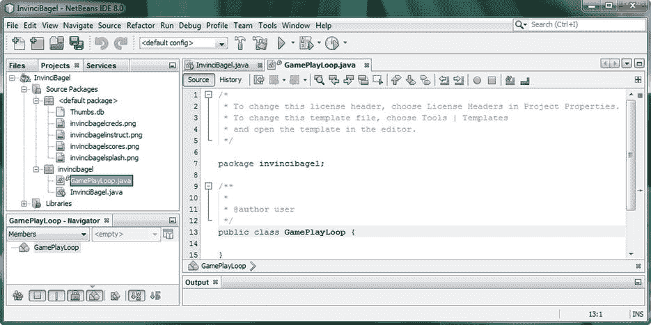

图 7-4。

NetBeans creates a GamePlayLoop.java class and opens it in an editing tab in the IDE, for you to edit

鼠标悬停在错误上，按 Alt+Enter，选择添加导入，如图 [7-5](#Fig5) 所示。

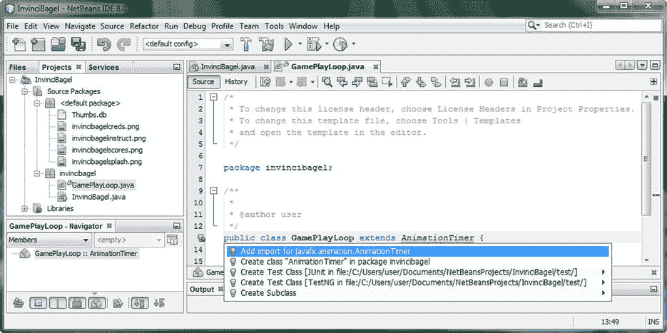

图 7-5。

Subclass an AnimationTimer superclass with an extends keyword: press Alt+Enter, and select Add import

一旦 NetBeans 添加了`import javafx.animation.AnimationTimer;`编程语句，您就可以开始创建这个类了，它将为您利用 JavaFX 脉冲引擎，并包含您所有的核心游戏循环处理，或者对将执行各种类型处理的类和方法的调用，例如精灵移动、精灵动画、碰撞检测、物理模拟、游戏逻辑、音频处理、AI、记分牌更新等等。

## 创建 GamePlayLoop 类结构:实现你的。handle()方法

请注意，一旦 NetBeans 为您编写了 import 语句，GamePlayLoop 类名下方就会出现另一个红色波浪状错误高亮显示。将鼠标放在上面，查看与这个最新错误相关的错误消息。如图 [7-6](#Fig6) 所示。每个 AnimationTimer 子类所需的 handle()方法还没有在这个 GamePlayLoop.java 类中实现(也称为 overridden ),所以接下来必须这样做。也许你甚至可以让 NetBeans 帮你写代码；让我们来看看，看看！

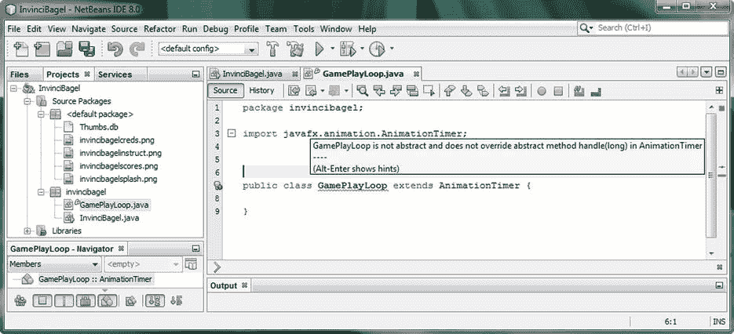

图 7-6。

Once you extend and import AnimationTimer, NetBeans throws an error: class does not implement the .handle()

正如您在弹出的错误消息的左下方看到的，您可以使用 Alt+Enter 组合键来打开一个帮助器对话框，它将为您提供几个解决方案，其中一个将实际编写未实现的。handle()方法。选择实现所有抽象方法，如图 [7-7](#Fig7) 所示，以蓝色突出显示。双击此选项后，NetBeans 将为您编写此方法结构:

```java
@Override
```

`public void handle (long``now`T2】

```java
throw new UnsupportedOperationException("Not supported yet.");

}
```

请注意，an @Override 关键字位于公共 void 句柄方法访问关键字、返回类型关键字和方法名称之前。这告诉 Java 编译器。handle()方法将替换(覆盖)AnimationTimer 的。handle()方法，这就是为什么该错误指示您必须重写抽象方法。手柄(长)。

你肯定不希望你的。handle()方法在游戏循环中每秒抛出 60 个 UnsupportedOperationException()错误；但是，您现在将把它留在这里，以便您可以看到它的作用，并了解更多关于 NetBeans 错误控制台的信息。

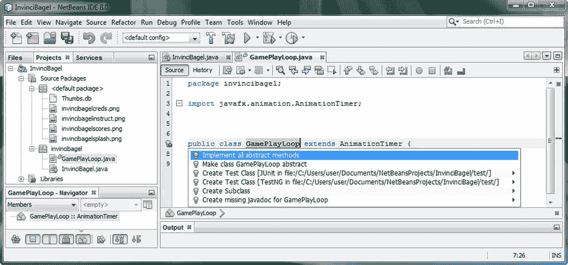

图 7-7。

Take a coding shortcut: press Alt+Enter to bring up a helper dialog, and select Implement all abstract methods

如图 [7-8](#Fig8) 所示，一旦选择了实现所有抽象方法选项，Java 代码就没有错误了，类的基本包-导入-类-方法结构也就就位了。现在，您应该能够使用该类创建一个 GamePlayLoop 对象，所以让我们换个方式，在 InvinciBagel Java 类中进行一些编程，在该类中，您创建一个 GamePlayLoop 对象，然后分析应用以查看它做了什么。

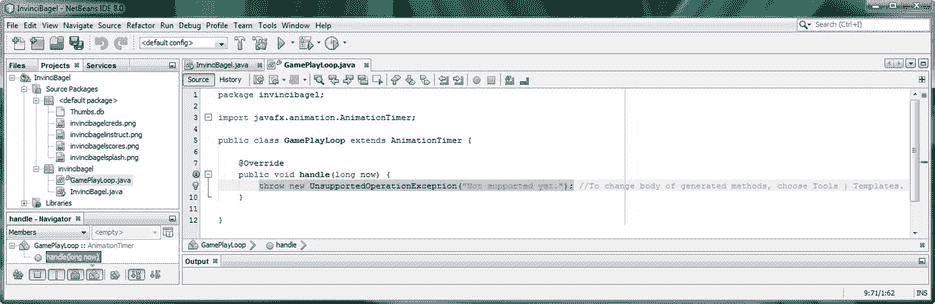

图 7-8。

NetBeans creates a public void handle(long now) bootstrap method with UnsupportedOperationException

## 创建 GamePlayLoop 对象:添加脉冲控制

接下来，您需要声明、命名和实例化一个名为 gamePlayLoop 的 GamePlayLoop 对象，使用您创建的新类，结合 Java new 关键字。点击 InvinciBagel.java 选项卡，如图 [7-9](#Fig9) 所示，在声明 gamePlayLoop 对象的 Insets 对象声明下添加一行代码，命名为 GamePlayLoop，如下所示:

`GamePlayLoop``gamePlayLoop`T2】

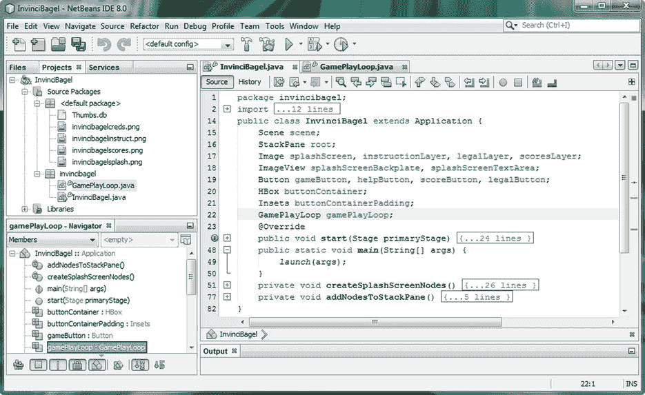

图 7-9。

Click the InvinciBagel.java editing tab, and declare a GamePlayLoop object named gamePlayLoop at the top

正如您所看到的，代码是没有错误的，因为 NetBeans 已经找到了您的 GamePlayLoop 类，它包含了被覆盖的。handle()方法，其父 AnimationTimer 类有一个构造函数方法，可以使用 GamePlayLoop 类创建 AnimationTimer(类型)对象，扩展 AnimationTimer。

现在，您必须使用 Java new 关键字在内存中实例化或创建 GamePlayLoop 对象的实例。这在游戏第一次开始时完成一次，这意味着实例需要放入。start()方法。

您可以在创建所有其他场景图节点对象和 ActionEvent EventHandler 对象后，使用以下 Java 代码行来完成此操作(另请参见图 [7-10](#Fig10) ):

`gamePlayLoop =``new`T2】

这个代码放置的逻辑(在最后)是根据创建和配置来设置所有静态对象，然后在最后创建动态对象，该对象将处理脉冲相关的逻辑。

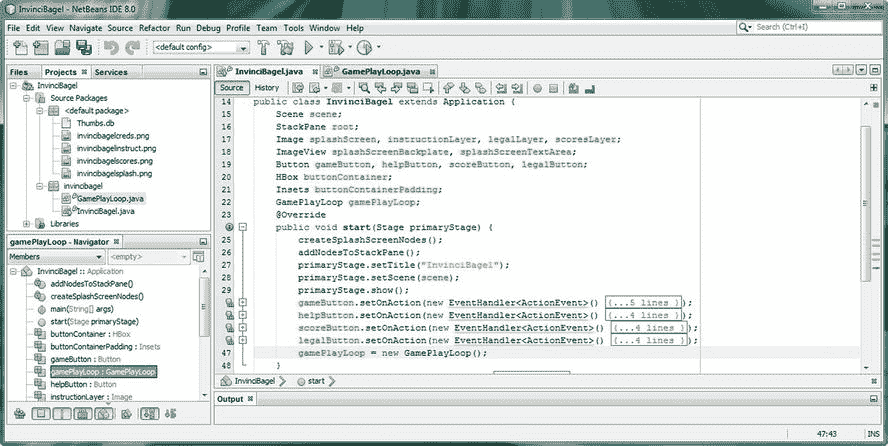

图 7-10。

At the end of the .start() method, instantiate the gamePlayLoop object by using the Java new keyword

## 分析 GamePlayLoop 对象:运行 NetBeans Profiler

让我们使用配置文件➤项目配置文件菜单序列来运行 NetBeans Profiler，以确定您是否可以在任何配置文件视图中看到您创建的 GamePlayLoop 对象。如图 [7-11](#Fig11) 所示，GamePlayLoop < init >调用用了不到 2 毫秒的时间在内存中设置 GamePlayLoop 对象供您使用，使用的开销很小。

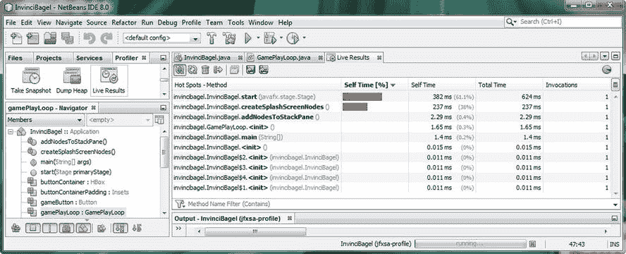

图 7-11。

Use a Profile ➤ Profile Project menu sequence to start the Profiler and look at GamePlayLoop memory use

接下来，让我们通过向下滚动 Profiler 选项卡来研究 threads analysis 窗格，如图 [7-11](#Fig11) 的左上角所示。查找线程图标 NetBeans 会询问您是否要启动线程分析工具；一旦你同意，它将打开螺纹标签(见图 [7-12](#Fig12) )。

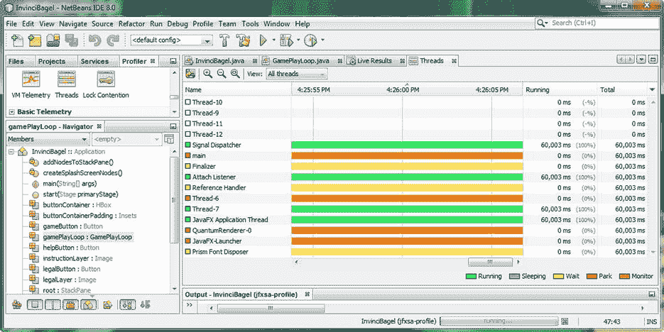

图 7-12。

Click the Threads icon, seen at the left of the screen, and open the Threads tab; the same eleven threads are running

如果您想知道为什么在图 [7-12](#Fig12) 所示的线程对象中看不到任何“信号”,就像您在上一章中单击按钮对象时所做的那样，您的假设是正确的，您应该在该图的某个地方看到 JavaFX 脉冲 engine 计时事件，所有的线程栏都是纯色的，因此没有动作或脉冲事件触发。我将让您根据需要经常使用 NetBeans profiling 实用程序，以便熟悉它，因为许多开发人员都避免使用该工具，因为他们还不习惯使用它。

你没有看到任何事件的原因是仅仅创建游戏循环对象是不够的。它内部的 handle()方法来抓取脉冲事件。因为它是一个定时器对象(确切地说，是一个动画定时器)，像任何定时器一样，它需要启动和停止。接下来让我们为游戏循环创建这些方法。

## 控制你的游戏循环:。开始( )和。停止( )

因为 AnimationTimer 超类具有。开始()和。stop()方法控制类(对象)何时(使用. start()方法调用)和何时(不使用. stop()方法调用)处理脉冲事件，您只需在方法代码中使用 Java super 关键字将这些函数“向上”传递给 AnimationTimer 超类。您将重写。使用 Java @Override 关键字启动()方法，然后使用以下方法编程结构将方法调用功能传递给 AnimationTimer 超类:

```java
@Override

public void start() {
```

`super` `.start();`

```java
}
```

的。stop()方法结构将被覆盖，方法功能以完全相同的方式传递给超类，使用下面的 Java 方法编程结构:

```java
@Override

public void stop() {
```

`super` `.stop();`

```java
}
```

如图 [7-13](#Fig13) 所示，GamePlayLoop 类代码是无错误的，现在您可以在 InvinciBagel 类中编写启动 GamePlayLoop AnimationTimer 对象的代码，这样您就可以在分析应用时看到 脉冲对象。

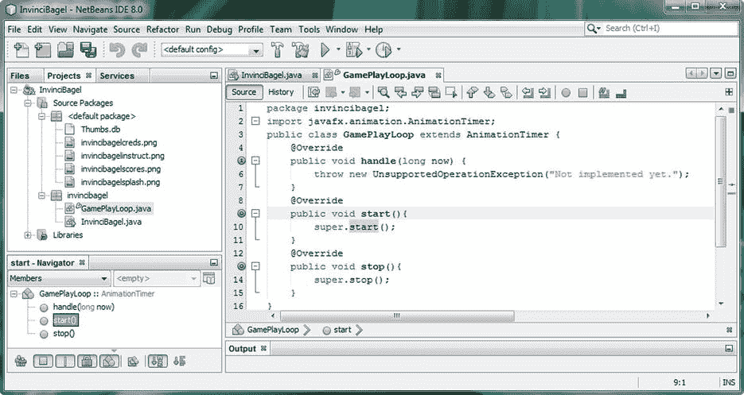

图 7-13。

Adding .start() and .stop() methods to the GamePlayLoop class and using the Java super keyword properly

你需要打这个电话。start()方法关闭名为 gamePlayLoop 的 GamePlayLoop 对象。您刚刚创建的 start()方法。点击 InvinciBagel.java 选项卡，如图 [7-14](#Fig14) 所示，在 GamePlayLoop 对象实例化下面添加一行代码，调用。start()方法关闭名为 gamePlayLoop 的 GamePlayLoop 对象，如下所示:

`gamePlayLoop.``start`T2】

如您所见，方法调用已经就绪，Java 代码没有错误，因为 NetBeans 现在可以找到。GamePlayLoop 类中的 start()方法。接下来，让我们使用运行➤项目序列并测试一两个脉冲，以确定现在将会发生什么，GamePlayLoop AnimationTimer 子类已经使用。start()方法调用。看看在。handle()方法就可以了！

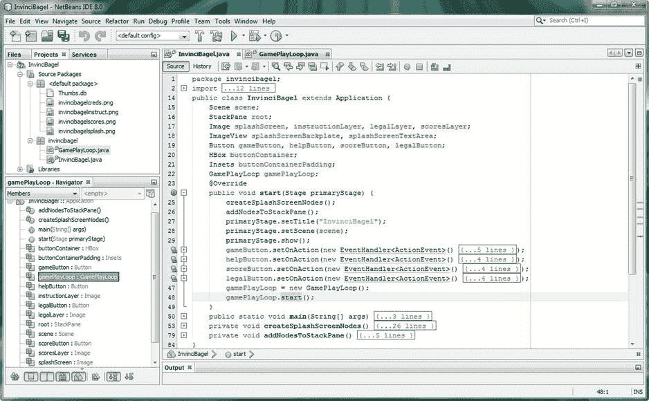

图 7-14。

Call a .start() method off the gamePlayLoop object to start GamePlayLoop AnimationTimer

如图 [7-15](#Fig15) 所示，您会得到与中的内容相关的重复错误。handle()方法。

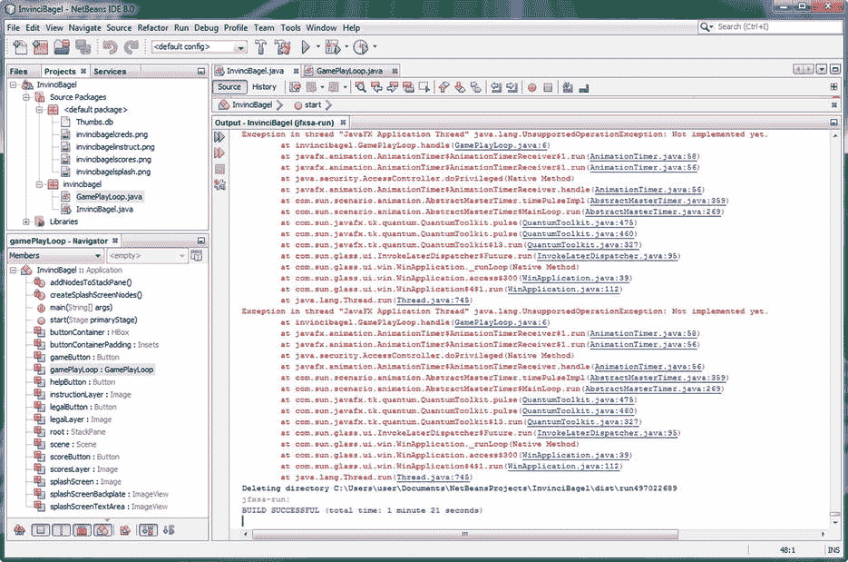

图 7-15。

Click Run ➤ Project, and open the Output pane to see errors being generated in .handle()

显然，NetBeans 8.0 并不总是为它为我们编写的引导方法编写最佳代码，所以让我们删除代码的`throw new UnsupportedOperationException("Not implemented yet.");`行(参见图 [7-13](#Fig13) )。在它的位置，你将插入一个 Java 注释，这会创建一个空方法，如图 [7-16](#Fig16) 所示。这将允许您的游戏应用运行。虽然游戏应用窗口启动时抛出了错误，但是场景图形的组件没有写入场景，只能看到默认的白色背景色。如果您在 NetBeans 中继续学习，您将会观察到这一点。

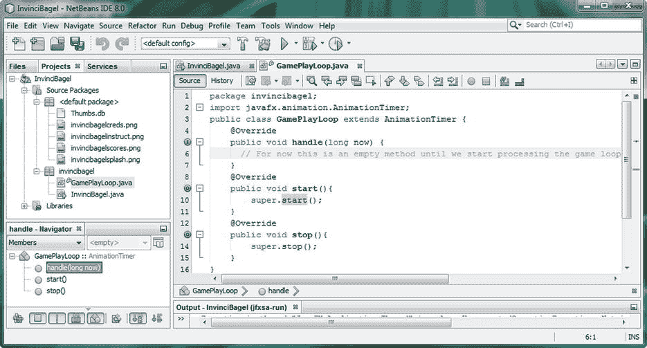

图 7-16。

Replace throw new UnsupportedOperationException(); with a comment, creating an empty method

现在，让我们再次使用“剖析➤剖析项目”( InvinciBagel)工作流程，看看 NetBeans 的“实时结果”和“线程”选项卡中是否出现了新内容。点击图 [7-17](#Fig17) 左侧所示的实时结果图标，并在选项卡中启动实时结果分析器。注意，GamePlayLoop 对象是使用< init >创建的，而 AnimationTimer 是使用 invincibagel 启动的。分析器输出中的 GamePlayLoop.start()条目。

如您所见，初始化每个事件队列只需要几分之一毫秒，包括 脉冲事件和所有四个 ActionEvent EventHandler 事件处理队列。这与我们的最大游戏优化方法一致，使用静态场景图节点，并且不在 GamePlayLoop 内做任何事情，这些事情会消耗更多的系统资源(内存和处理周期),而不是在创建充满动作的街机游戏时完成各种任务所绝对需要的资源。

现在您已经创建并启动了 GamePlayLoop 对象，让我们来看看线程档案器！

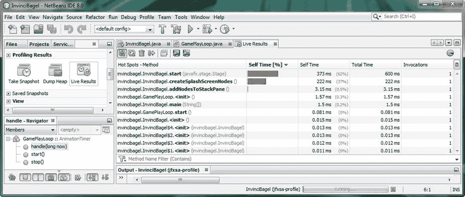

图 7-17。

Use a Profile ➤ Profile Project menu sequence to start the Profiler, and look at GamePlayLoop memory use

再次，向下滚动图 [7-17](#Fig17) 左上角所示的 Profiler 选项卡，找到图 [7-18](#Fig18) 左上角显示的 Threads 图标。NetBeans 将询问您是否要启动线程分析工具；一旦你同意，它将打开线程标签。如图 [7-18](#Fig18) 所示，脉冲引擎正在运行，显示线程 6 的几个脉冲事件。有趣的是，一旦 JavaFX 确定。handle()方法为空，脉冲事件系统不会继续处理这个空。handle()方法并使用不必要的脉冲事件，这表明 JavaFX 脉冲事件系统具有一定的智能。

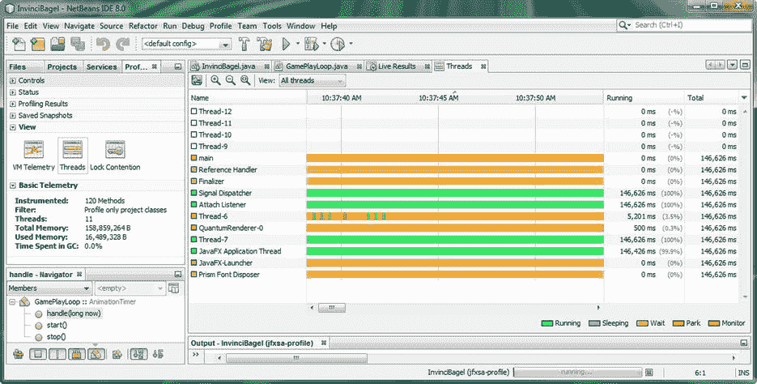

图 7-18。

Click the Threads icon, seen at the left side of the screen, and open a Threads tab; AnimationTimer pulses can be observed on Thread-6

## InvinciBagel 图:包、类和对象

接下来，让我们以图表的形式看看你当前的包、类和对象层次结构(见图 [7-19](#Fig19) )，看看你在创建你的游戏引擎方面处于什么位置。在图的右侧是 InvinciBagel 类，它保存场景图，以及 Stage、Scene 和 StackPane 对象，这些对象保存并显示您的闪屏 UI 设计。图的左边是 gamePlayLoop 类，它将包含游戏处理逻辑调用，并在 InvinciBagel 类中声明和实例化为 GamePlayLoop 对象，但不是场景图形层次的一部分。很快，您将开始构建图表中显示的其他功能区域，以便您可以控制您的精灵，检测精灵之间的碰撞，并模拟真实世界的物理力，使游戏更加逼真。随着您阅读本书并创建您的 Java 8 游戏，您将会看到该图的补充。

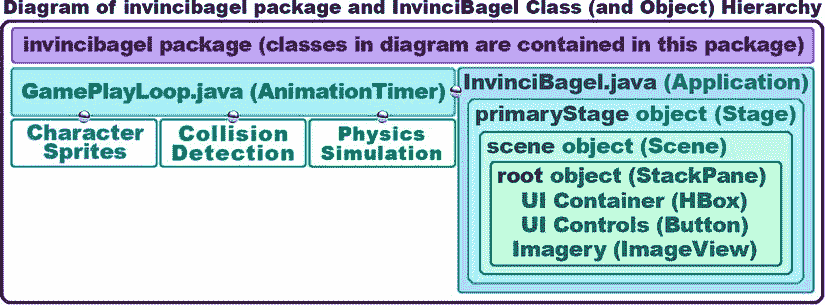

图 7-19。

Current invincibagel package, class, and object hierarchy, after addition of the GamePlayLoop

接下来，在进入 GamePlayLoop AnimationTimer 类和对象之前，您将在当前空的中放置一些相对简单的 Java 代码。handle()方法。您将这样做，以确保脉冲引擎正在处理，并看看 60FPS 有多快！(我不得不承认，我的好奇心占了上风！).

## 测试 GamePlayLoop:制作 UI 容器动画

让我们围绕 InvinciBagel 闪屏逆时针移动一个现有的场景图节点，例如 HBox 布局容器父(分支)节点，它包含四个 UI 按钮控件元素。您将通过使用一个简单的 if-else Java 循环控制编程结构来读取(使用. get()方法)和控制(使用. set()方法)控制(在本例中)屏幕位置角的 Pos 常量。

首先，在 GamePlayLoop 类的顶部声明一个名为 location 的 Pos 对象。然后，单击突出显示的错误消息，按 Alt+Enter，并选择“导入 Pos 类”选项，以便 NetBeans 为您编写导入语句。接下来在。handle()方法，添加一个 if-else 条件语句，该语句计算这个名为 location 的 Pos 对象，并将其与表示显示屏四个角的四个 Pos 类常量进行比较，这四个角包括 BOTTOM_LEFT、BOTTOM_RIGHT、TOP_RIGHT 和 TOP_LEFT。您的 Java 代码应该类似于下面的 if-else 条件语句 Java 程序结构(参见图 [7-20](#Fig20) ):

`Pos``location`T2】

```java
@Override

public void handle(long now) {
```

`location``= InvinciBagel.buttonContainer.``getAlignment()`T3】

`if` `(location == Pos.BOTTOM_LEFT) {`

```java
InvinciBagel.buttonContainer.setAlignment(Pos.BOTTOM_RIGHT);
```

`}``else if`T2】

```java
InvinciBagel.buttonContainer.setAlignment(Pos.TOP_RIGHT);
```

`}``else if`T2】

```java
InvinciBagel.buttonContainer.setAlignment(Pos.TOP_LEFT);
```

`}``else if`T2】

```java
InvinciBagel.buttonContainer.setAlignment(Pos.BOTTOM_LEFT);

}

}
```

如图所示，您的代码没有错误，您已经准备好使用“运行➤项目”工作流程并观看 60FPS 的焰火了！准备好享受炫目的速度吧！

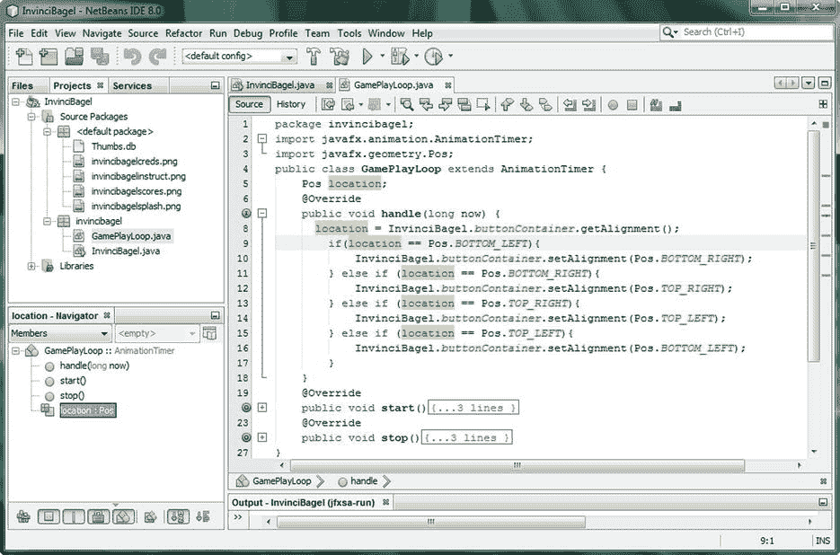

图 7-20。

Create an if-else loop that moves the HBox UI counterclockwise around the four corners of a splash screen

接下来，让我们最后一次运行实时结果分析器和线程分析器，看看您的脉冲引擎是否正在启动！一旦你这样做了，你就会知道你已经成功地为你的游戏实现了你的 GamePlayLoop 计时引擎，然后你就可以把你的注意力转移到开发你的游戏精灵，碰撞检测，物理和逻辑上了！

## 剖析游戏循环:脉冲引擎

现在，让我们最后一次使用“剖析➤剖析项目”( invincibagel)工作流程，看看 NetBeans 的“实时结果”和“线程”选项卡中是否出现了新内容。点击图 [7-21](#Fig21) 左侧所示的实时结果图标，并在选项卡中启动实时结果分析器。注意，GamePlayLoop 对象是使用< init >创建的；使用 invincibagel 启动了一个动画定时器。分析器输出中的 GamePlayLoop.start()条目；有一个不可战胜的怪物。GamePlayLoop.handle(long)条目，这意味着您的游戏计时循环正在被处理。

正如您所看到的，调用列显示了有多少脉冲访问了。GamePlayLoop 中的 handle()方法。处理 3，532 个脉冲只需要 40.1 毫秒，因此使用新的 Java 8 计时分辨率，每个脉冲相当于 0.0114 毫秒，即 114 纳秒。因此，您当前用于测试脉冲的代码，或者至少是 JavaFX 脉冲引擎，是高效运行的。


图 7-21。

Run the Live Results Profiler

当然，您需要从。handle()方法，然后进入下一章，在下一章中，您将开始处理这个方法中的游戏资产和逻辑。

接下来，让我们最后一次向下滚动图 [7-21](#Fig21) 左上角显示的 Profiler 选项卡，点击图 [7-22](#Fig22) 左上角显示的 Threads 图标，打开 Threads 选项卡。正如您所看到的，脉冲引擎正在运行，可以看到在 Thread-6 和 JavaFX 应用线程中处理脉冲事件。

鉴于空虚。handle()方法处理来自 Thread-6 中的 GamePlayLoop 对象(见图 [7-18](#Fig18) )，可以假设 Thread-6 中的脉冲事件来自 GamePlayLoop AnimationTimer 子类。这意味着 JavaFX 应用线程中显示的脉冲事件显示了。handle()方法正在访问 InvinciBagel 类中 stackPane 场景图形根中包含的 buttonContainer HBox 对象。

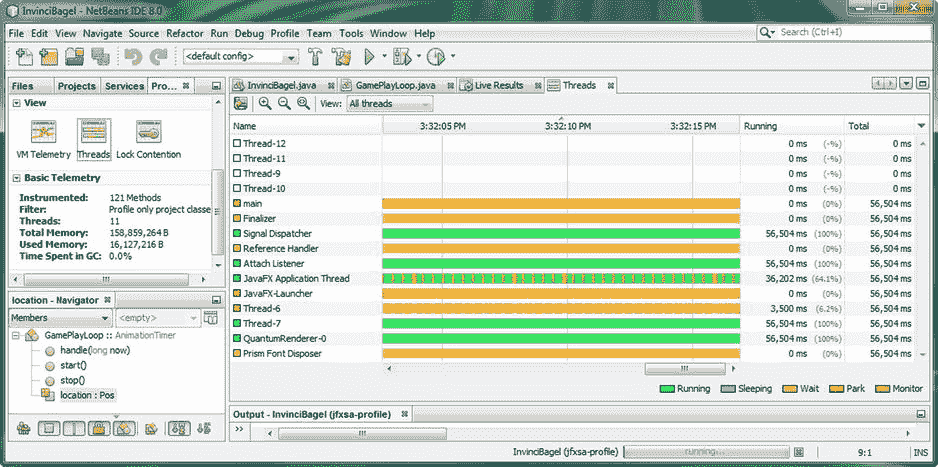

图 7-22。

Run the Threads Profiler

现在，您已经有了一个低开销、速度极快的游戏处理循环，您可以开始创建您的其他(精灵、碰撞、物理、得分、逻辑等等)游戏引擎了！一个搞定了，还有一大堆要做！

## 摘要

在第七章中，您编写了在本书的课程中将设计和编码的许多游戏引擎中的第一个，GamePlayLoop 游戏播放计时类和对象，它们允许您利用强大的 JavaFX 脉冲事件处理系统。

首先，您研究了 javafx.animation 包中的不同类，以及使用 animation、Transition、Timeline 和 AnimationTimer 类来利用 JavaFX 脉冲事件处理系统的不同方法。

之后，您学习了如何在 NetBeans 中创建新的 Java 类，然后扩展了 AnimationTimer 超类以创建 GamePlayLoop 子类，它将以 60FPS 的速度处理您的游戏逻辑。您看到了如何使用 NetBeans 来帮助您编写这个新子类的大部分代码，包括 package 和 class 语句、import 语句和 bootstrap。handle()方法。

接下来，您进入 InvinciBagel.java 类，使用您创建的新类声明并命名了一个新的 gamePlayLoop GamePlayLoop 对象。然后，您测试了代码并对其进行了概要分析，以查看 Threads Live Results 选项卡中是否出现了任何新条目。您还测试了。NetBeans 为您编码的 handle()方法，并将其更改为空方法，以消除由脉冲事件引擎引发的重复错误。接下来，您实现了。开始()和。stop()方法，使用 Java super 关键字，这样您就可以控制对 脉冲引擎的使用，如果您想要添加额外的 Java 语句，比如保存游戏状态，稍后，当 脉冲引擎启动和停止时。您再次测试并分析了应用，以观察您的进展。最后，您将一些测试代码放在。handle()方法，这样您就可以再次测试和分析应用，以确保脉冲事件引擎快速一致地处理您放在。handle()方法。

在下一章，你将会看到如何创建和实现抽象类，这些抽象类将会被用来创建你的游戏精灵。一旦我们有了这些，它将允许我们在后面的章节中实时地在你的新游戏循环引擎中的显示屏上显示它们，制作它们的动画，并处理它们的运动。