# 九、控制你的演员形象：实现 Java 事件处理器和使用 Lambda 表达式

既然我们已经在第 8 章中创建了公共抽象演员和英雄类，我称之为“演员引擎”，让我们回到第 9 章中的 InvinciBagel 主要应用类代码，并创建事件处理框架，我们可以用它来控制我们游戏的主要英雄，InvinciBagel 本人。实现玩家和游戏编程逻辑之间的接口的事件处理可以被看作是你的游戏的“交互引擎”，如果我们遵循我们到目前为止一直使用的引擎范式。有许多与游戏交互的方式，包括箭头键(也称为消费电子设备的 DPAD)、键盘、鼠标或轨迹球、游戏控制器、触摸屏，甚至高级硬件，如陀螺仪和加速度计。你将为你的游戏开发做出的选择之一将是玩家将如何与游戏交互，使用他们玩游戏的硬件设备，以及它支持的输入能力。

在这一章中，我们将对你的 InvinciBagel.java 类进行一些升级。首先是以 Java 常量的形式添加对游戏宽度和高度变量的支持。这些将允许我们改变游戏表面的宽度和高度，游戏表面是弹出的游戏窗口内部的区域，或者如果您的游戏玩家使用消费电子设备，则是整个屏幕。

我们要做的第二个升级是添加 Java 代码，这将为我们在接下来的几章中设计游戏创建一个空白的白色屏幕。我们将通过安装一种颜色来实现这一点。Scene()构造函数方法调用中的白色背景颜色(以及我们新的 width 和 height 变量)，然后将 Java 代码安装到已经就位的按钮控件事件处理器结构中，以隐藏我们用于闪屏 UI 设计的图像合成的两个 ImageView“plates”。我们也可以在以后使用这两个 ImageView 节点对象来保存我们游戏的背景图像，一旦我们进入那个设计层次。请记住，保持场景图形中的节点数量最少是很重要的，因此我们将重用节点对象，而不是添加更多。

我们将添加的第三个升级是向我们的场景对象添加键盘事件处理例程，该例程将处理我们将在游戏中使用的箭头键支持，以跨越任何具有箭头键键盘或 DPAD 的硬件设备。这将处理场景顶层到 StackPane(场景图)层次的所有事件。这将把用户按下的箭头键值传递给我们的节点对象。这将最终允许运动控制代码在游戏中移动演员，这是我们将在下一章更详细讨论的内容。

除了升级我们的 InvinciBagel.java 代码，增加键盘事件处理，我们还将在本章学习 lambda 表达式，以确保我在本书中涵盖了 Java 8 中的所有新内容。这些 lambda 表达式有些高级，不适合在本初学者手册中介绍，但是由于它们是 Java 8 的一个主要新特性，并且提供了多线程支持和更紧凑的代码结构，所以我将在本章中介绍它们，部分原因是 NetBeans 8(不出所料)愿意为您编写它们！

## 游戏表面设计:增加分辨率的灵活性

我想对 InvinciBagel.java 代码做的第一件事是为游戏应用添加宽度和高度常量，该代码应该已经在 NetBeans 的选项卡中打开(如果没有打开，请使用右键单击并打开工作流程)。这样做的原因是，您可能希望为上网本或平板电脑(1024×600)、iTV 电视机或电子阅读器(1280×720)或 HDTV 应用(1920×1080)甚至新的 4K iTV 电视机(4096×2160)提供定制版本。有了高度和宽度变量，您就不必在以后更改 Scene()构造函数方法调用，并使用这些变量而不是整个代码中的“硬编码”数值来进行某些屏幕边界计算。正如你在图 [9-1](#Fig1) 的顶部所看到的，我已经用一行 Java 代码为这两个变量创建了一个常量声明，这就是我们在前一章所学的复合语句。这个声明的 Java 代码可以在图 [9-1](#Fig1) 中的类的顶部看到，应该如下所示:

`static final double``WIDTH``= 640,``HEIGHT`T4】

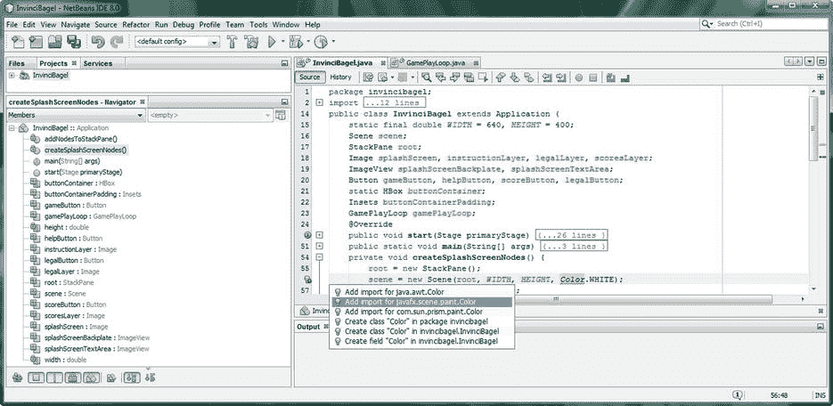

图 9-1。

Add private static final double WIDTH and HEIGHT constants; install these, and Color.WHITE, in Scene()

接下来我们要做的是升级我们的 Stage()构造函数方法调用，以使用另一个重载的构造函数方法，该方法允许我们指定背景颜色值。让我们使用颜色类常量 WHITE，以及我们新的宽度和高度显示屏幕大小常量，并使用下面一行 Java 代码创建这个新的构造函数方法调用，这些代码也显示在图 [9-1](#Fig1) 的底部(充满错误):

`scene = new Scene(root,``WIDTH``,``HEIGHT``,``Color.WHITE`T6】

正如您在图 [9-1](#Fig1) 中所看到的，在您的颜色类引用下将有一条红色波浪错误下划线，直到您使用 Alt-Enter 工作进程调出助手对话框(如图所示)，并选择指定“为 javafx.scene.paint.Color 添加导入”的选项，以便让 NetBeans 为您编写 Java 导入语句。一旦你这样做了，你的代码就不会有错误，我们将准备写一些代码来放置背景颜色。

为此，我们需要隐藏保存全屏(splashScreenbackplate)和覆盖(splashScreenTextArea)图像资产的 ImageView 节点对象。我们将通过将 visible 属性(或者特性，或者参数，如果您愿意的话)设置为 false 值来实现这一点，这将允许我们设置的白色背景颜色显示出来。

## 完成 UI 设计:编写一个游戏按钮

下一件事，我们将需要做的是完成按钮控制事件处理代码，以便当我们单击游戏播放按钮对象时，白色背景显示出来，供我们开发我们的游戏。稍后，我们可以使用 ImageView 板来支持闪屏，为游戏提供背景图像合成，使游戏在视觉上更加有趣。我们在场景图中隐藏两个 ImageView 节点对象的方法是调用。setVisible()方法从。附加到 PLAY GAME UI 按钮对象的 handle()方法。这可以在图 [9-2](#Fig2) 的底部看到，可以使用下面两行 Java 代码在。handle()EventHandler<action event>方法结构:

`splashScreenBackplate.setVisible(``false`T2】

`splashScreenTextArea.setVisible(``false`T2】

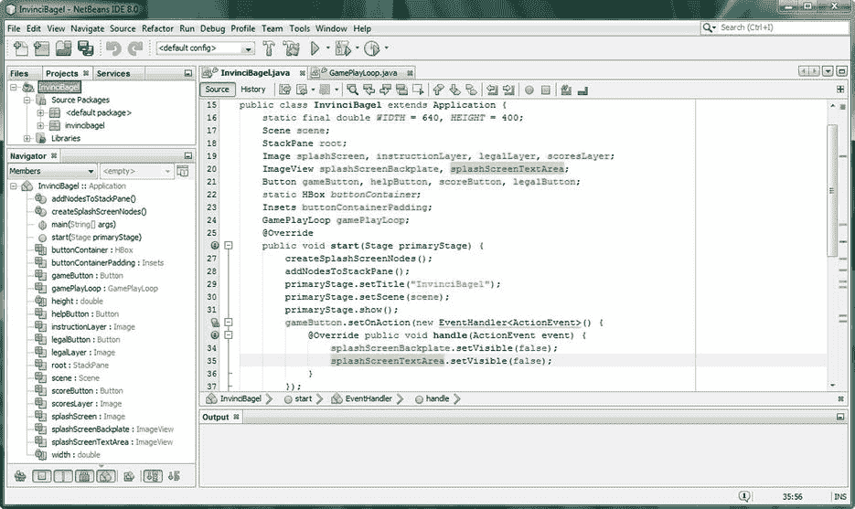

图 9-2。

Use a .setVisible() method for the ImageView class to hide background image plates and reveal White color

正如您所看到的，在这个事件处理结构的 EventHandler <actionevent>部分下还有一个黄色的警告高亮显示，它与 Java lambda 表达式相关。在我们完成实现所有按钮的最终 UI 设计代码之后，这些代码控制着玩家可以看到什么，以及显示给他们的图像，我将进入 lambda 表达式，我们也将在代码中消除这些警告消息。之后，我们将继续实现箭头键事件处理结构，以便用户可以在屏幕上导航 InvinciBagel。</actionevent>

首先，让我们测试我们放入之前空的 PLAY GAME 按钮事件处理结构中的代码。

### 测试游戏按钮:确保你的代码工作

使用运行➤项目(或 IDE 顶部看起来像视频播放传输按钮的运行图标)启动 invincibagel 游戏，然后单击窗口左下角的播放游戏按钮。正如您在图 [9-3](#Fig3) 中看到的，屏幕变成白色，因为两个 ImageView 图像板不再可见，并且您的白色背景颜色正在透过！你会注意到，如果你点击其他三个按钮控制，他们不再工作。实际上他们正在工作，但是他们不再可见，所以 UI 设计现在看起来是坏的！

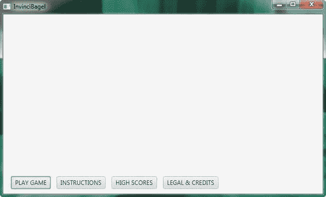

图 9-3。

Run the Project, and test the PLAY GAME Button to reveal white background

所以现在我们有能力看到我们正在做什么进入我们的游戏设计章节，这是本书接下来的八章。我们现在要做的就是修复(或者说升级)其他三个按钮控件事件处理结构，以包含方法调用，从而确保 ImageView 节点对象可见，以便它们可以显示我们希望它们向玩家显示的图像内容。让我们接下来处理这个问题，因为我们正在为 InvinciBagel 游戏进行按钮 UI 设计，然后我们可以看看新的 Java 8 lambda 表达式。

### 升级其他 UI 按钮代码:使 ImageView 可见

让我们向三个现有的按钮事件处理结构中的每一个添加几行代码，以确保两个 ImageView 图像板都设置为在单击这些按钮控件对象时可见。我们之所以需要将这些代码放入其他三个 UI 按钮事件处理结构中，是因为我们不知道用户点击按钮的顺序，所以我们需要将这些语句放入每个按钮事件处理器中。如果当这些语句被触发时，ImageView 节点对象已经被设置为可见，那么它们将仅仅保持可见，因为它们之前已经是可见的！Java 方法调用将如下所示:

`splashScreenBackplate.setVisible(``false`T2】

`splashScreenTextArea.setVisible(``false`T2】

正如你在图 [9-4](#Fig4) 中突出显示的，我已经在其他三个按钮事件处理结构中安装了这两个语句(除了它们引用的图像对象之外，其他都一样)。这些语句可以放在每个现有方法调用之前或之后。handle()方法。

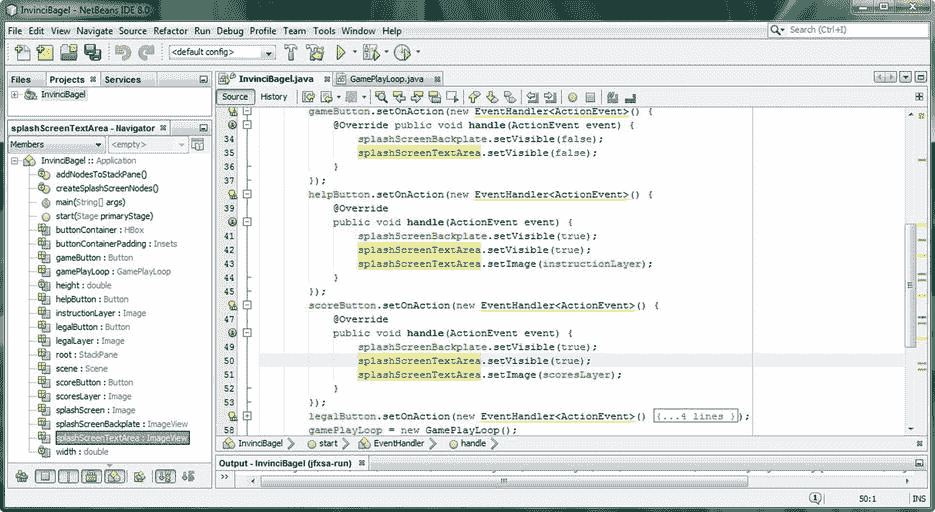

图 9-4。

Add in the .setVisible(true) method calls for the splashScreenBackplate and splashScreenTextArea objects

现在你会看到，当你使用你的运行➤项目的工作过程中，你所有的按钮用户界面控件将做他们应该做的事情，并会显示一个白色的游戏背景或信息屏幕背后有 InvinciBagel 闪屏艺术作品。现在我们准备学习 Java lambda 表达式。

## Lambda 表达式:一个强大的 Java 8 新特性

Java 8 在 2014 年发布的主要新特性之一是 lambda 表达式。使用 lambda 表达式可以使您的代码更加紧凑，并允许您使用 Java 8 的新 lambda->“arrow”操作符将方法转换为简单的 Java 语句。lambda 表达式提供了一种 Java 代码快捷方式，通过使用 lambda 表达式来构造一个单一的方法接口。

Java 8 lambda 表达式具有与 Java 方法结构相同的特性，因为它需要传入一系列参数，还需要指定代码“主体”。lambda 表达式调用的代码可以是单个 java 语句，也可以是包含多个 Java 编程语句的代码块。将利用传递到 lambda 表达式中的参数来表达该语句。简单 lambda 表达式的基本 Java 8 语法应该编写如下:

`(the parameter list)``->`T2】

您还可以通过使用 Java 中使用的花括号来创建一个复杂的 lambda 表达式，该花括号用于结合 lambda 表达式定义整个 Java 代码语句块。这将通过使用以下格式来完成:

```java
(the parameter list) -> { statement one; statement two; statement three; statement n; }
```

需要注意的是，您不必使用 lambda 表达式来替换传统的 Java 方法！事实上，如果你希望你的代码与 Java 7 兼容，例如，如果你希望你的代码也能在使用 Java 7 的 Android 5.0 中工作，你就不必使用 lambda 表达式。然而，由于这是一个专门的 Java 8 游戏开发标题，由于 lambda 表达式是 Java 8 的主要新特性，由于 NetBeans 会将您的 Java 方法转换为 lambda 表达式，正如您将要看到的，我决定在本书中使用它们。

让我们仔细看看让 NetBeans 将 Java 方法转换成 lambda 表达式的工作过程。正如你在图 [9-5](#Fig5) 中看到的，你当前在你的代码中有波浪形的黄色警告高亮。

当你把鼠标放在这些上面时，它们会给你一个“这个匿名的内部类创建可以被转换成一个 lambda 表达式”的消息。这让你知道 NetBeans 8.0 可能愿意为你写一些 lambda 表达式代码，真的很俏皮。

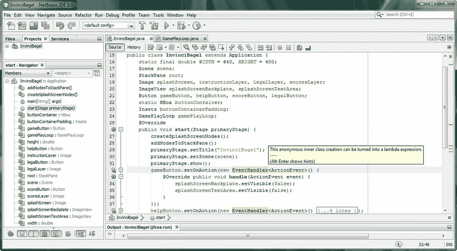

图 9-5。

Mouse-over wavy yellow warning highlight, and reveal a “inner class can be turned into a lambda” pop-up

要找到答案，您需要利用您信任的 Alt-Enter 工作流程，正如您所看到的，有一个 lambda 表达式选项，它将让 NetBeans 将代码重写为 lambda 表达式。原始代码如下所示:

```java
gameButton.setOnAction(new EventHandler<ActionEvent>() {

@Override public void handle(ActionEvent event) {

splashScreenBackplate.setVisible(false);

splashScreenTextArea.setVisible(false);

}

});
```

NetBeans 编码的 lambda 表达式要简洁得多，看起来像下面的 Java 8 代码:

```java
gameButton.setOnAction((ActionEvent event) -> {

splashScreenBackplate.setVisible(false);

splashScreenTextArea.setVisible(false);

});
```

正如您在图 [9-6](#Fig6) 中看到的，NetBeans 为您编写的这个 lambda 表达式本身并不是没有警告，因为有一个“参数事件未使用”警告，所以我们接下来将删除该事件，以使 lambda 表达式更加简洁！在某个时间点，Oracle 将更新这段编写 lambda 表达式的代码，以便它查看您的方法代码块内部，发现没有引用事件对象，并将删除它，这样就不会再生成警告。在那之前，我们需要自己编辑 NetBeans 的代码。

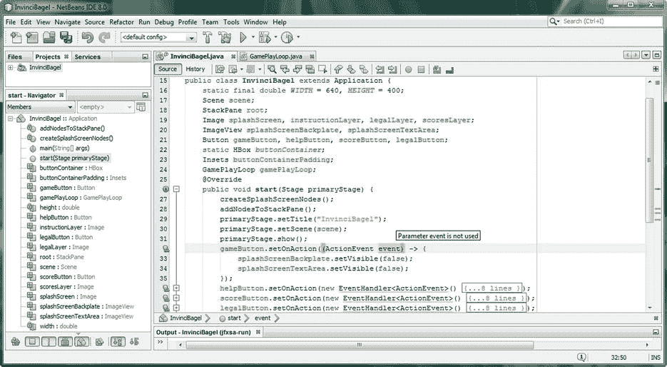

图 9-6。

The lambda expression that NetBeans writes for you has a warning message “Parameter event is not used”

因为我们在这个 lambda 表达式的代码体中没有使用 event 变量，所以我们可以删除它，得到下面这个最终的 Java 8 lambda 表达式代码，它比原始代码简单得多:

`gameButton.setOnAction((``ActionEvent`T2】

```java
splashScreenBackplate.setVisible(false);

splashScreenTextArea.setVisible(false);

});
```

如您所见，lambda 表达式要求 Java 编译器为您创建 ActionEvent 对象，用它创建的 ActionEvent 对象替换新的 EventHandler <actionevent>()构造函数方法调用。如果您想知道为什么 lambda 表达式被添加到 Java 8 中，以及它们如何使它变得更好，它们允许 Java 函数(方法)，尤其是“一次”或内部方法，像语句一样编写。它们也有助于多线程。</actionevent>

在我们开始学习 Java 8 和 JavaFX 中的事件处理类之前，让我们先来看看我在写这一章时遇到的一个更新，以及出现的几个警告亮点，它们并不准确。

### 处理 NetBeans 意外更新和错误警告

当我“升级”我的 UI 按钮事件处理代码结构以使用 lambda 表达式时，如图 [9-7](#Fig7) 所示，我注意到了一些事情，我想在进入事件处理之前用几页纸来解决。首先，有一个错误的警告“未使用参数 ActionEvent”，这是不正确的，因为事件处理构造固有地使用 ActionEvent 对象，除此之外，为什么上面和下面的其他相同构造没有显示相同的警告？我运行了代码，一切运行良好，所以我忽略了 NetBeans 中的这一亮点。我还在 IDE 的右下角看到一条“发现 39 个更新”的消息，因此我单击了蓝色链接“单击此处更新您的 IDE”，并拍摄了几张屏幕截图，展示了我更新 IDE 的工作过程。我不确定 NetBeans 是从哪里得到 39 的，因为安装程序对话框中列出了数百个更新，如图 [9-7](#Fig7) 的右侧所示。正如您所看到的，对 JavaFX、Java 8 和相关包以及 NetBeans 8 支持的非 Java 包进行了大量更新。我点击了下一步按钮，并调用了下载和更新过程，这需要几分钟。


图 9-7。

Showing the incorrect lambda expression warning message and the 39 updates found notification message

正如您在图 [9-8](#Fig8) 的左侧所看到的，您必须阅读并接受所有相关的许可协议，这些许可协议是您下载并安装所有软件包升级所必需的，这些软件包升级是自您最初安装 Java 8 和 NetBeans(或自您上次更新 ide)以来升级到的。

选择“我接受所有许可协议中的条款”复选框，然后单击“更新”按钮，开始下载和安装过程。正如您在图 [9-8](#Fig8) 的右下方看到的，进度条会告诉您已经下载了多少，以及正在下载和安装到系统上的内容。

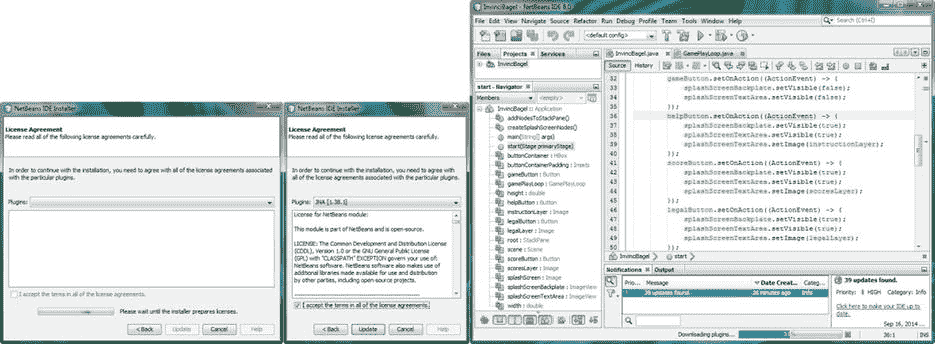

图 9-8。

Showing the License Agreement dialog (left) and the download and update progress bar (right) in NetBeans

让我们用本章的剩余部分来看看事件处理，以及 Java 和 JavaFX 中与事件相关的类，我们可以用它们来为我们的 Java 8 游戏开发工作提供不同类型的事件处理。

## 事件处理:增加游戏的互动性

有人可能会说，事件处理是游戏开发的基础和核心，因为如果没有一种与游戏逻辑和演员进行交互的方式，你就真的没有一款游戏。我将在本章的这一节讲述 Java 和 JavaFX 事件处理相关的类，然后我们将实现键盘事件处理，这样我们就可以支持使用箭头键在屏幕上导航我们的 InvinciBagel 角色。之后，我们将把兼容 Java 7 的代码转换成兼容 Java 8 的 lambda 表达式，然后我们将在本书的下一章讨论精灵在屏幕上的移动。在我们开始剖析 Java 和 JavaFX 类之前，我想说的第一件事是为游戏处理的不同类型的事件，从箭头键(智能手机上的 DPAD)到键盘(或 iTV 的遥控器)，到鼠标(或智能手机上的轨迹球)，到触摸屏(智能手机和平板电脑)，到游戏控制器(游戏控制台和 iTV 电视机)，到陀螺仪和加速度计(智能手机和平板电脑)，再到运动控制器，如 Leap Motion 和 Razer Hydra Portal。

### 控制器的类型:我们应该处理什么类型的事件？

要考虑的一个关键问题是什么是支持游戏相关事件的最符合逻辑的方法，比如箭头键；鼠标点击；触摸屏事件；游戏控制器按钮(A、B、C 和 D)；以及更先进的控制器，如 Android、Kindle、Tizen 和 iOS 消费电子设备上可用的陀螺仪和加速度计。这个决定是由游戏运行的硬件设备决定的；如果一个游戏需要在任何地方运行，那么最终将需要处理不同事件类型的代码，甚至是不同的事件处理编程方法。我们将看看 Java 8 目前支持哪些输入事件。

有趣的是，Java 8 和 JavaFX 应用已经在这些嵌入式平台上运行，我会把钱花在开放平台(Android、Tizen、Chrome、Ubuntu)和目前支持 Java 技术的专有平台(Windows、黑莓、三星 Bada、LGE WebOS、Firefox OS、Opera 等)的原生支持上。)，在近期的某个时间点。Java 8 的未来是光明的，感谢 JavaFX 和硬件平台的支持！

## Java 8 和 JavaFX 事件:javafx.event 和 java.util

如您所见，javafx.event 包的 EventHandler 公共接口扩展了 java.util 包的 EventListenerinterface，它是创建和处理事件对象的方式，可以使用匿名内部类(Java 7)结构，也可以使用 lambda 表达式(Java 8)。现在，您已经熟悉了如何编写这两种类型的事件处理结构，在本书中，我将继续使用 Java 7(匿名内部类)方法编写方法，然后我将使用 NetBeans 将它们转换为 Java 8 lambda 表达式，以便您可以创建与 Java 7 (Android)和 Java 8 (PC OS)游戏代码交付管道兼容的游戏。

到目前为止，您在本书中用于用户界面按钮控件事件处理的 Actionevent 类(和对象)是 Event 超类的子类，Event 超类是 java.util 包的 EventObject 超类的子类，Event object 超类是 java.lang.Object 主类的子类。整个类层次结构如下所示:

```java
java.lang.Object

> java.util.EventObject

> javafx.event.Event
```

`> javafx.event.` `ActionEvent`

ActionEvent 类也与 EventHandler 公共接口一起位于 javafx.event 包中。从现在开始，我们将使用的所有其他事件相关类都包含在 javafx.scene.input 包中。我将在本章的剩余部分重点介绍 javafx.scene.input 包，因为您已经学习了如何在 Java 7 中使用 EventHandler <actionevent>{…}结构，在 Java 8 中使用(ActionEvent) -> {…}结构，所以是时候学习如何在我们的 Java 8 游戏开发工作流程中使用其他类型的事件，称为输入事件。</actionevent>

接下来让我们看看这个重要的 JavaFX 场景输入事件包，以及它提供给我们用于 Java 8 游戏开发的 25 个输入事件类。

### JavaFX 输入事件类:javafx.scene.input 包

尽管 java.util 和 javafx.event 包包含核心 eventObject、Event 和 EventHandler 类来“处理”事件，但在确保事件得到处理(处理)的基础级别，还有另一个名为 javafx.scene.input 的 javafx 包，它包含我们有兴趣用来处理(处理)玩家对您可能创建的不同类型游戏的输入的类。我将称之为“输入事件”，因为它们不同于我们在本书中遇到的动作事件和脉冲(计时)事件。一旦我们在本章中讲述了输入事件，您将会熟悉许多您想要在自己的 Java 8 游戏开发中使用的不同类型的事件。在本章的后面，我们还将实现一个 KeyEvent 对象来处理游戏中箭头键盘(或 DPAD 和游戏控制器)的使用。

有趣的是，javafx.scene.input 包中支持的许多输入事件类型更适合消费电子(行业术语是“嵌入式”)设备，如智能手机或平板电脑，这告诉我 javafx 正被定位(设计)用于 Android 或 Chrome 等开源平台。JavaFX 有专门的事件，如 GestureEvent、SwipeEvent、TouchEvent 和 ZoomEvent，它们支持新的嵌入式设备市场中的特定功能。这些输入事件类支持高级触摸屏设备特征，例如手势、页面滑动、触摸屏输入处理和多点触摸显示，这些都是这些设备所需的特征，它们支持高级输入范例，例如双指(收缩或展开)触摸输入，例如放大和缩小屏幕上的内容。

我们将在本书中涵盖更多“通用”输入类型，这些类型在个人电脑(台式机、笔记本电脑、笔记本电脑、上网本和较新的“专业”平板电脑，如 Surface Pro 3)以及嵌入式设备(包括智能手机、平板电脑、电子阅读器、iTV 电视机、游戏控制台、家庭媒体中心、机顶盒等)上都受支持。这些设备还将处理这些更广泛的(在它们的实现中)按键事件和鼠标事件类型的输入事件，因为鼠标和按键事件总是被传统软件包支持。

有趣的是，触摸屏显示器将“处理”鼠标事件和触摸事件，这非常方便，可以确保您的游戏在尽可能多的不同平台上运行。我经常在我的 Android 书籍标题中使用这种使用鼠标事件处理的方法，以便用户可以使用触摸屏和 DPAD 中心(点击)按钮来生成鼠标点击事件，而不必专门使用触摸事件。对于触摸屏用户来说，尽可能使用鼠标(点击)事件的另一个优点是，如果您使用触摸事件，您将无法进行其他操作，也就是说，您的游戏应用只能在触摸屏设备上运行，而不能在具有某种类型鼠标硬件的设备(如 iTV 电视机、笔记本电脑、台式机、上网本等)上运行。

同样的原则也适用于按键事件，尤其是我们将在这个游戏中使用的箭头键，因为这些键可以在键盘和遥控器的箭头小键盘上、游戏控制器上以及大多数智能手机的 DPAD 上找到。我还将向您展示如何包含备用键映射，以便您的玩家可以决定他们更喜欢使用哪种输入法来玩您的 Java 8 游戏。接下来让我们看看 KeyCode 和 KeyEvent 类。

#### KeyCode 类:使用枚举常量来定义玩家在游戏中使用的键

由于我们将在游戏中使用箭头小键盘，并且可能使用 A-S-D-W 键，以及未来游戏控制器的 GAME_A、GAME_B、GAME_C 和 GAME_D 按钮，所以让我们先仔细看看 KeyCode 类。这个类是一个公共枚举类，保存枚举常量值。这个类是 KeyEvent 类获取 KeyCode 常量值的地方，KeyCode 常量值用于(处理)确定播放器在任何特定的键事件调用中使用了哪个键。KeyCode 类的 Java 8 和 JavaFX 类层次结构如下所示:

```java
java.lang.Object

> java.lang.Enum<KeyCode>
```

`> javafx.scene.input.` `KeyCode`

keycode 类中包含的常量值使用大写字母，并以 KeyCode 支持的键命名。例如，A、S、W 和 d 键码是 A、S、W 和 d。箭头键盘键码是上、下、左和右，游戏控制器按钮键码是 GAME_A、GAME_B、GAME_C 和 GAME_D

在我们介绍了这些用于输入事件处理的基础包和类之后，我们将在 EventHandler 对象中实现 KeyCode 常量和 KeyEvent 对象。您很快就会看到，这与设置 ActionEvent 的处理方式非常相似，KeyEvents 可以使用 Java 7 内部类方法或 Java 8 lambda 表达式进行编码。

我们将以非常模块化的方式设置我们的 KeyEvent 对象处理，以便事件键码评估结构为每个键码映射设置布尔标志变量。事件处理的本质是它是一个实时引擎，就像脉冲引擎一样，所以这些布尔标志将提供玩家在任何给定纳秒内按下或释放了什么键的准确“视图”。然后，可以通过在我们的其他游戏引擎类中使用 Java 游戏编程逻辑来读取和操作这些布尔值，这些游戏引擎类将实时处理这些关键事件。

#### KeyEvent 类:使用 KeyEvent 对象来保存玩家正在使用的键码

接下来，让我们仔细看看 KeyEvent 类。该类被指定为 public final KeyEvent，它扩展了 InputEvent 超类，后者用于创建 javafx.scene.input 包中的所有输入事件子类。使用 EventHandler 类将 KeyEvent 类设置为 motion，并处理 KeyCode 类常量值。该类的层次结构从 java.lang.Object 主类开始，经过 java.util.EventObject 事件超类，到 javafx.event.Event 类，后者用于创建 KeyEvent 类扩展的 javafx.scene.input.InputEvent 类(子类)。有趣的是，我们在这里跨越了四个不同的包！

KeyEvent 类的 Java 8 和 JavaFX 类层次结构从 java.lang 包跳转到 java.util 包、javafx.event 包、javafx.scene.input 包。KeyEvent 类的层次结构如下所示:

```java
java.lang.Object

> java.util.EventObject

> javafx.event.Event

> javafx.scene.input.InputEvent
```

`> javafx.scene.input.` `KeyEvent`

EventHandler 对象生成的 KeyEvent 对象表示发生了击键。KeyEvent 通常在场景图节点中生成，例如可编辑的文本 UI 控件，但是在我们的示例中，我们将场景图节点层次结构之上的事件处理直接附加到名为 Scene 的场景对象，希望避免将事件处理附加到场景图中的任何节点对象(在我们的示例中，当前是名为 root 的 StackPane 对象)而导致的任何场景图处理开销。

每当按下并按住、释放或键入(按下并立即释放)某个键时，就会生成一个 KeyEvent 对象。根据这个按键操作本身的性质，您的 KeyEvent 对象被传递到一个。onKeyPressed()，一个。onKeyTyped()或。onKeyReleased()方法，以便在嵌套的。handle()方法，它将保存游戏特有的编程逻辑。

游戏通常使用按键和按键释放事件，因为用户通常按住按键来移动游戏中的角色。另一方面，键入事件往往是“高级”事件，通常不依赖于操作系统平台或键盘布局。键入的按键事件(。onKeyTyped()方法调用)将在输入 Unicode 字符时生成，并用于为 UI 控件(如文本字段)获取字符输入，并用于业务应用(如日历和文字处理器)。

在一个简单的例子中，击键事件将通过使用一次击键及其立即释放来产生。此外，可以使用按键事件的组合来产生替换字符，例如，可以使用 SHIFT 按键和“A”按键类型(按下并立即释放)来产生大写字母 A。

生成键类型的 KeyEvent 对象通常不需要按键释放。需要注意的是，在某些极端情况下，直到释放按键时才会生成按键类型的事件；这方面的一个很好的例子是输入 ASCII 字符代码序列的过程，使用的是老式的 Alt 键和数字键盘输入方法，这种方法在“过去”用于 DOS，并保留到 Windows 操作系统中。

需要注意的是，对于不生成任何 Unicode 字符的键，不会生成键类型的 KeyEvent 对象。这将包括动作键或修饰键，尽管它们会生成按键和释放按键的 KeyEvent 对象，因此可以用于游戏！一般来说，这不是一个好的用户界面设计(或用户体验设计)方法，因为这些键是用来修改其他键行为的。

KeyEvent 类有一个字符变量(我倾向于称之为字符特征，但我不会这样做),对于键入键的事件，它总是包含一个有效的 Unicode 字符，对于按下键或释放键的事件，它总是包含 CHAR_UNDEFINED。字符输入仅针对键入的事件进行报告，因为按键和按键释放事件不一定与字符输入相关联。因此，字符变量保证只对键类型的事件有意义。在某种意义上，通过不使用键类型事件，我们节省了内存和 CPU 处理，因为不必处理这个 Unicode 字符变量。

对于按键和按键释放的 KeyEvent 对象，KeyEvent 类中的 code 变量将包含您的 KeyEvent 对象的 keycode，该 KeyCode 是使用您之前学习过的 KeyCode 类定义的。对于键入事件，这个代码变量总是包含常量 KeyCode.UNDEFINED。所以正如你所看到的，按下键和释放键的用法与键入不同，这就是我们在游戏事件处理中使用它们的原因。

按键和按键释放事件是低级别的，取决于平台或键盘布局。每当按下或释放给定的键时都会生成字符输入，这是“轮询”不生成字符输入的键的唯一方式。被按下或释放的键由 code 变量指示，该变量包含一个虚拟键码。

## 添加键盘事件处理:使用 KeyEvents

我认为这是足够的背景信息，让我们继续实现游戏的按键事件处理，所以在你的屏幕宽度和高度常量声明后添加一行代码，并使用一个复合声明语句声明四个名为 up、down、left 和 right 的布尔变量，如图 [9-9](#Fig9) 所示。由于任何布尔值的缺省值都是 false(这将表示一个键没有被按下，也就是说，一个键当前被释放)，我们不必显式初始化这些变量。这是通过使用下面一行 Java 代码完成的，它也显示在图 [9-9](#Fig9) 的顶部，没有错误:

```java
boolean up, down, left, right;
```

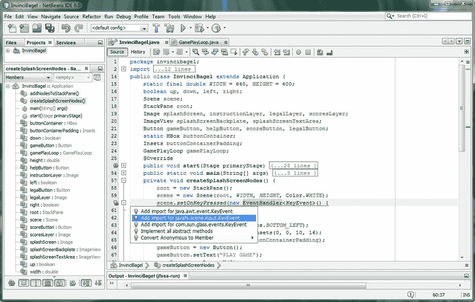

图 9-9。

Add a .setOnKeyPressed() function call off a scene object and create a new EventHandler<KeyEvent> object

正如你在图 [9-9](#Fig9) 的底部看到的，我用。setOnKeyPressed()方法调用名为 Scene 的场景对象，我已经在前面的代码行中实例化了该对象。在这个方法调用中，我创建了一个新的 EventHandler < KeyEvent >，就像我们为动作事件所做的一样。如您所见，在您导入 KeyEvent 类之前，这段代码附有一条错误消息，如下所示:

`scene``.setOnKeyPressed`T2】

使用 Alt-Enter 工作流程选择导入 javafx.scene.input.KeyEvent 选项，如图 [9-9](#Fig9) 所示，以消除此错误消息。接下来，我们来看看。我们需要编写 handle()方法来处理 KeyEvent。

### 处理 KeyEvent:使用 Switch-Case 语句

KeyEvent 对象处理是实现 Java 高效 switch-case 语句的完美应用。我们可以为每种类型的 KeyCode 常量添加一个 case 语句，该常量包含在传递到。handle()方法。可以使用. getCode()方法从 KeyEvent 对象中提取键码。在 switch()评估区域内，对名为 Event 的 KeyEvent 对象调用此方法。在 switch{}主体内部，case 语句将自己与提取的 KeyCode 常量进行比较，如果匹配，就处理冒号后面的语句。休息；语句允许处理退出开关情况评估，这是一种优化。

该事件处理开关案例结构应通过使用以下 Java 编程结构来实现，该结构也在图 [9-10](#Fig10) 中突出显示:

`scene``.setOnKeyPressed`T2】

```java
@Override
```

`public void handle(KeyEvent``event`T2】

`switch (``event`T2】

```java
case UP:    up    = true; break;

case DOWN:  down  = true; break;

case LEFT:  left  = true; break;

case RIGHT: right = true; break;

}

}

});
```

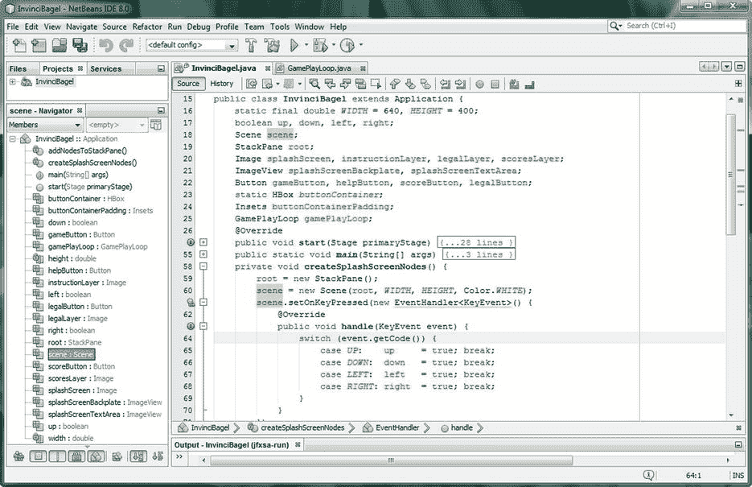

图 9-10。

Add a switch-case statement inside of the public void handle() method setting Boolean direction variables

现在我们有了基本的按键事件处理结构，稍后我们会添加到这个结构中，让 NetBeans 将 Java 7 代码转换成 Java 8 lambda 表达式！之后，我们可以通过使用块复制和粘贴操作来创建一个按键释放事件处理结构。将 setOnKeyPressed()改为。setOnKeyReleased()，并将真值转换为假值。编程快捷方式几乎和让 NetBeans 为我们编写代码一样酷！

#### 转换 KeyEvent 处理结构:使用 Java 8 Lambda 表达式

接下来，让 NetBeans 将我们的 EventHandler <keyevent>代码结构重新编码为 lambda 表达式，这将大大简化它，将它从三层嵌套的代码块减少到只有两层嵌套的代码块，并将 11 行代码减少到只有 8 行。这些 lambda 表达式非常适合编写紧凑的代码，并且它们是为多线程环境设计的，所以只要有可能，它们的使用就能带来更好的线程使用效果！得到的 Java 8 lambda 表达式代码结构应该如下图所示，如图 [9-11](#Fig11) :</keyevent>

`scene``.setOnKeyPressed``(KeyEvent``event`T4】

`switch (``event`T2】

```java
case UP:    up    = true; break; // UP, DOWN, LEFT, RIGHT constants from KeyCode class

case DOWN:  down  = true; break;

case LEFT:  left  = true; break;

case RIGHT: right = true; break;

}

});
```

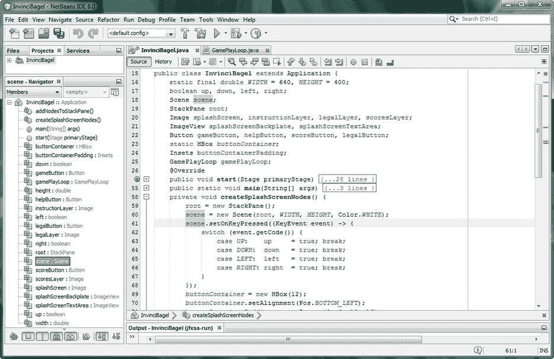

图 9-11。

Convert the KeyEvent method to a lambda expression; notice that the event variable is used in the switch

接下来，让我们使用块复制和粘贴操作，并将。OnKeyPressed() KeyEvent 处理自身下面的结构，将其更改为。OnKeyReleased KeyEvent 处理结构，用 false 值代替 true。

### 创建按键事件处理结构

下一件事，我们需要做的是创建 OnKeyPressed 结构的极性相反，并创建 OnKeyReleased 结构。这将使用相同的代码结构，只是真值将变成假值，而。setOnKeyPressed()方法调用将改为. setOnKeyReleased()方法调用。最简单的方法是选择。setOnKeyPressed()结构，并将其复制粘贴到自身下面。如图 [9-12](#Fig12) 所示的 Java 代码应该是这样的 Java 结构:

`scene``.setOnKeyReleased``(KeyEvent``event`T4】

`switch (``event`T2】

```java
case UP:    up    = false; break;

case DOWN:  down  = false; break;

case LEFT:  left  = false; break;

case RIGHT: right = false; break;

}

});
```

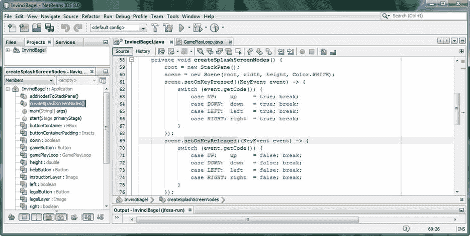

图 9-12。

Use a block copy and paste operation to create .setOnKeyReleased() code block, using .setOnKeyPressed()

使用 lambda 表达式通过“隐式”声明和使用类(如本章实例中的 EventHandler 类)所做的一件有趣的事情是，它减少了类代码顶部的 import 语句的数量。这是因为，如果在代码中没有专门使用某个类(写下了它的名称),则该类的 import 语句不必与其他 import 语句一起放在代码的顶部。

另外，请注意 NetBeans 左边的代码折叠加号和减号图标也不见了！这是因为 lambda 表达式是一个基本的 Java 代码语句，而不是一个构造，比如在转换为 lambda 表达式之前的方法或内部类。如果你看一下图 [9-12](#Fig12) ，你的事件处理代码看起来非常干净，结构良好，然而，仅仅十几行代码，它实际上为你的游戏做了很多。

接下来，让我们来看看您的导入语句代码块(尤其是当您的导入代码块已折叠时)，因为您已经让 NetBeans 8 为您创建了 lambda 表达式。看看有没有不需要的导入！

#### 优化导入语句:删除 EventHandler 类导入语句

单击 NetBeans 左上方的+号图标，展开 import 语句部分，查看是否有一个未使用的 import Java FX . event . eventhandler 语句，该语句下面带有黄色波浪下划线警告突出显示。我有这个，如图 [9-13](#Fig13) 所示，当我将鼠标悬停在它上面时，我会得到“未使用的导入”警告消息。我使用 Alt-Enter work process 调出 solutions options helper 对话框，果然，有一个“Remove Import Statement”选项。因此，NetBeans 将在为您编写代码的同时为您解开代码！相当惊人的功能！

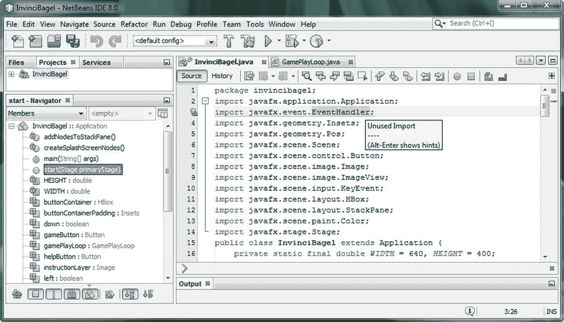

图 9-13。

Mouse-over the import EventHandler warning highlight, and display the pop-up “Unused Import” warning

接下来，让我们添加传统的 ASDW 游戏按键事件处理，让我们的用户可以选择使用这些按键或使用双手来玩游戏！这将向您展示如何在现有的事件处理代码中添加可选键映射支持，只需在高效的 switch-case 语句中使用几行代码。

## 添加备用按键事件映射:使用 A-S-D-W

现在我们已经有了这些 KeyEvent 处理结构，让我们来看看添加一个备用键映射到游戏中常用的 ASDW 键有多容易。这是通过为键盘上的 A、S、D 和 W 字符添加一些 case 语句，并将它们设置为我们已经设置好的上、下、左和右布尔等价物来实现的。举例来说，这将允许用户用左手使用 A 和 D 字符，用右手使用上下箭头来更容易地玩游戏。

稍后，如果您想在游戏中添加更多功能，使用您的游戏控制器及其对 KeyCode 类的 GAME_A (Jump)、GAME_B (Fly)、GAME_C (climb)和 GAME_D (crawl)常量的支持，您所要做的就是将这些新功能添加到您的游戏中，在屏幕顶部的上、下、左、右位置添加另外四个布尔变量(Jump、Fly、climb 和 crawl ),并添加另外四个 case 语句。

这四个 W(上)、S(下)、A(左)和 D(右)case 语句，一旦添加到 switch 语句中，将使您的 KeyEvent 对象及其事件处理 Java 代码结构只有十几行 Java 代码。你的新。修改后，setOnKeyPressed()事件处理结构将类似于以下代码块:

`scene``.setOnKeyPressed``(KeyEvent``event`T4】

`switch (``event`T2】

```java
case UP:    up    = true; break;

case DOWN:  down  = true; break;

case LEFT:  left  = true; break;

case RIGHT: right = true; break;

case W:     up    = true; break;

case S:     down  = true; break;

case A:     left  = true; break;

case D:     right = true; break;

}

});
```

如你所见，现在用户可以使用任意一组按键，或者同时使用两组按键来控制游戏。既然你已经做了。setOnKeyPressed()事件处理结构对游戏玩家来说更灵活(也更强大)，让我们对。setOnKeyReleased()事件处理结构，当用户释放键盘、遥控器或设备键盘和小键盘上的 A 或 left、W 或 up、S 或 down、D 或 right 键时，该结构将改为为 UP、DOWN、LEFT 和 RIGHT 布尔标志变量设置 false 值。

你的。在 switch 语句体的末尾添加这些 case 语句后，setOnKeyReleased()事件处理 Java 代码应该如下所示:

`scene``.setOnKeyReleased``(KeyEvent``event`T4】

`switch (``event`T2】

```java
case UP:    up    = false; break;

case DOWN:  down  = false; break;

case LEFT:  left  = false; break;

case RIGHT: right = false; break;

case W:     up    = false; break;

case S:     down  = false; break;

case A:     left  = false; break;

case D:     right = false; break;

}

});
```

现在，您已经添加了另一组玩家移动控制键，供您的玩家用来控制游戏，您的代码没有错误，并且具有简单有效的结构，如图 [9-14](#Fig14) 所示。我们在名为 Scene 的场景对象的最顶端处理一次事件，在该事件处理“计算”中不涉及任何场景图形节点对象，并且仅使用几个字节的内存来保存八个布尔值(开/关)。

这与我们优化内存和 CPU 周期的目标是一致的，因此它们可用于我们游戏中更高级的部分，如游戏逻辑、碰撞检测或物理计算。

我们还添加了常数，允许我们以后缩放这个 640 乘 400 的游戏原型，以适应不同分辨率的显示屏，如伪高清(1280 乘 720)、真高清(1920 乘 1080)和 UHD (4096 乘 2160)。这些也可以用在游戏逻辑中，计算屏幕区域的大小，确定移动边界。

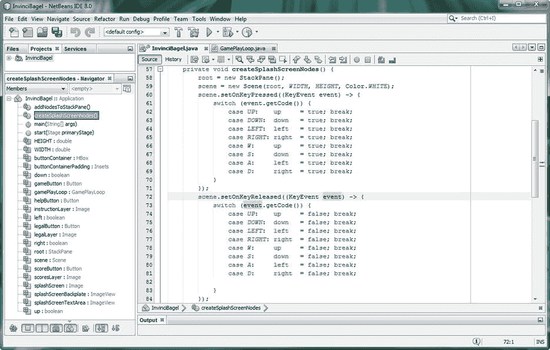

图 9-14。

Add the case statements for ASDW keys to give users two key options, or to allow two-handed game play

到目前为止，我们已经添加了我们的演员和支持演员引擎，以及我们的基本事件处理过程，以便我们可以开始确定这个 InvinciBagel 游戏英雄在下一章中如何在屏幕上移动。我们有。句柄()以及。更新()和。collide()方法来保存代码，这将激活一个角色，并最终激活敌人，无论是单人还是未来的多人版本。

接下来，让我们重温一下这个游戏设计的概览图，看看 InvinciBagel 包、InvinciBagel 类以及 GamePlayLoop 和演员和英雄类，它们为我们的游戏玩法处理和演员(以及投射物、宝藏、敌人和障碍或“道具”)创建提供了基础。

## 更新我们的游戏设计:增加事件处理

让我们更新我在第 7 章[(图 7-19)和第 8 章](07.html)[(图 8-17)中介绍的图表，以包括 EventHandler 类的 ActionEvent 和 KeyEvent 处理。正如你在图](08.html) [9-15](#Fig15) 中看到的，我在图中添加了 EventHandler 事件处理类，以及处理我们的 UI 设计控件的 ActionEvent 对象和我们将要用来在屏幕上移动 InvinciBagel actor 的 KeyEvent。自从。setOnKeyPressed()和。setOnKeyReleased()方法是从名为 scene 的 scene 场景对象中调用的，ActionEvent 也包含在 Scene 对象下，我将它们放在了图中的 Scene 对象中。

由 KeyEvent switch-case 语句设置的布尔标志将在。update()方法，并将移动 InvinciBagel。那个。GamePlayLoop 对象中的 handle()方法将调用。update()方法，所以这里也有一个连接。我们仍然在稳步推进我们的游戏引擎框架，增加了事件处理！

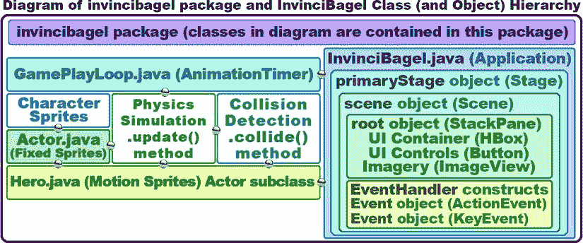

图 9-15。

The current InvinciBagel package class (object) hierarchy, now that we have added Actor and Hero classes

## 摘要

在第九章中，我们在游戏场景对象的创建中添加了常量，这样我们就可以在未来的任何时候改变支持的显示分辨率，并添加颜色。使用其他重载 Scene()构造函数方法之一的白色背景色。我们这样做是为了完成我们的 UI 设计并实现 PLAY GAME UI 按钮控件，这样它将隐藏两个 ImageView 图像合成板，这两个图像合成板当前包含闪屏资产，以后可以包含游戏背景数字图像资产。

我们学习了 ImageView 类(和对象)的可见特征(或属性，或变量)，以及如何使用。setVisible()方法调用使用 true 或 false 值切换给定 ImageView 图像板的可见性。因为我们在“玩游戏”按钮的 ActionEvent 处理结构中关闭了 ImageView 图像合成板的可见性，所以我们当然必须确保将其他三个按钮 UI 控件的 visible 属性设置回 true (on 或 visible ),以防您的游戏玩家稍后想要查看这些屏幕。

接下来，我们讲述了如何使用 NetBeans 将 Java 7 兼容的匿名内部类事件处理结构转换成 Java 8 lambda 表达式。我想在本书中介绍 Java 8 lambda 表达式，尽管它们是一个高级特性，因为它们是 Java 8 的主要新特性之一，这是 Java 8 编程的一个标题。

最后，我们开始向我们的 Java 8 游戏编程基础设施添加新功能，并了解了输入事件(input event)类和子类，以及事件处理器(event handler)类结构是如何设置的，以及它们如何跨越 java.lang、java.util、javafx.event 和 javafx.scene.input 包。我们看了一下 KeyCode 常量和 KeyEvent 类，然后使用。setOnKeyPressed()和。setOnKeyReleased()事件处理器结构，用于 Java 7 和 Java 8 的兼容性。

在下一章中，我们将看看如何使用我们在本章中创建的 KeyEvent 事件处理结构在屏幕上移动游戏精灵，以及如何确定屏幕的边界(边缘)、角色方向、移动速度以及相关的动画和移动注意事项。