# 十、指导演员阵容：创建选角指导引擎和创建`Bagel`演员类

既然我们已经在第八章第一节创建了公共的抽象演员和英雄类(演员引擎)，在第九章第三节创建了一些基本的按键事件处理，现在是时候在第十章第五节把更多的游戏基础设施放在这里了。我们将创建另一个 Java 类来管理我们的演员阵容，名为 CastingDirector.java(演员阵容引擎)。我们将这样做，以便我们可以跟踪游戏屏幕上的演员对象，这些对象是使用我们的演员和英雄抽象类创建的。在游戏中的任何给定时间(或关卡)，知道屏幕上(或舞台上，或布景上，如果你喜欢我们正在使用的电影制作行话)当前有什么游戏组件(演员)是很重要的。

在这一章中，我们还需要学习更多关于 List 和 ArrayList 类以及 Set 和 HashSet 类的知识，并使用它们。这些 Java“集合”类将管理 List 对象和 Set 对象，我们将使用它们来跟踪屏幕上游戏中涉及的当前 Actor 对象。我们将在本章的开始部分详细介绍这些 java.util 包类，所以准备好学习 java 数组对象，以及其他一些相当高级的 Java 编程概念，这对初学者来说可能是一个挑战。但是，在你的 Java 8 游戏标题开发工作过程中，它们会非常有用，所以我决定将它们包含在本书中。

我们还想为游戏创建我们的第一个演员，InvinciBagel 角色演员，因为我不想离我们在第 8 章写的代码太远而没有实现它(用它来创建一个演员)。我们将通过创建一个 Bagel.java 类来实现这一点，该类将使用 Java extends 关键字来继承一个 Hero.java 抽象类。这使得 Bagel.java 成为一个子类，而 Hero.java 成为一个超类。

一旦我们有了一个 Bagel.java 类，我们将使用 Java new 关键字和 Bagel()构造方法为 Bagel 类创建一个名为 iBagel 的 Bagel 对象。我们将用一些临时 SVG 数据加载 iBagel 对象，至少直到我们在第 16 章讨论碰撞检测的[中讨论如何创建复杂的 SVG 碰撞形状数据。我们还将传递一个 X 和 Y 坐标，将 iBagel 演员放在屏幕中间，最后是 9 字符运动精灵“cels”，这是我们在《T2》第 8 章](16.html)中首次看到的。

我们将这样做，这样你就可以开始利用我们在公共抽象 Actor 和 Hero 类基础设施中安装的主要数据字段(变量、属性或特性)，这些是我们在第 8 章中精心设计的。

我们还将在第 10 章中再次使用我们的 InvinciBagel.java 主应用类，并将在一个新的。createGameActor()方法，这样我们就可以将我们的主角绑定到 GamePlayLoop 类的。handle()方法。这将访问(调用)Bagel 类。update()方法，这样我们就可以开始控制游戏的主要英雄 InvinciBagel 本人的动作。

## 游戏设计:添加我们的 CastingDirector.java 类

我想做的第一件事是更新我们的 invincibagel 包和类结构图，向您展示我们将在本章中使用 Java ArrayList 和 HashSet 类(对象)开发的新 actor (sprite)管理类。正如你在图 [10-1](#Fig1) 中看到的，我将这个类命名为 CastingDirector。java，因为它就像任何娱乐项目的选角导演一样，为项目添加演员，并在场景结束时移除他们。这个类还将包含一个 Java 集合(Java ListArray 是有序集合，Java HashSet 是无序集合)，我们将在本书后面开始实现冲突检测时用到它。随着你的游戏关卡和场景变得越来越复杂，你会很高兴有一个 CastingDirector 类来保持你的游戏角色有组织，并根据游戏编程逻辑的需要从游戏中添加和删除角色。准确跟踪场景中有多少演员(固定精灵)和英雄(运动精灵)对象是很重要的，以便在碰撞检测代码(算法)中只涉及尽可能少的演员。这是一个优化游戏编程逻辑的功能，因此游戏可以在所有平台上运行。

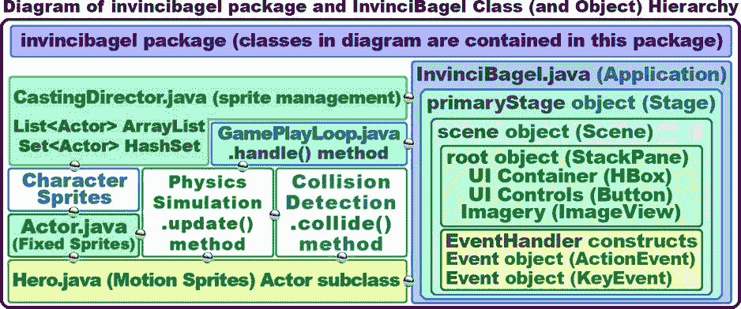

图 10-1。

Create a CastingDirector.java actor casting and tracking engine to keep track of Actor and Hero objects

在我们编写 CastingDirector.java 类之前，让我们花点时间了解一下 Java 集合、泛型，以及我们将用来创建这些参与者管理工具的 List、ListArray、Set 和 HashSet 类。

## 列表和数组列表:使用 java.util 列表管理

首先，让我们来看看公共类 ArrayList <e>，因为它是一个类，然后我们将 List 看作是一个接口，而不是一个 Java 类。如果你想知道<e>代表什么，它代表元素，如果你看到代表键的<k>，如果你看到代表类型的<t>，如果你看到代表值的<v>。<e>被一个你在数组列表中使用的元素(对象)代替。在我们的例子中，ArrayList <actor>是 CastingDirector.java 类 ArrayList(和 Set)将引用 Actor 对象(Actor 超类的子类)。类的层次结构如下:</actor></e></v></t></k></e></e>

```java
java.lang.Object

> java.util.AbstractCollection<E>

> java.util.AbstractList<E>
```

`> java.util.` `ArrayList<E>`

这个类是 Java Collections 框架的一个成员，正如您可能已经猜到的那样，作为一个列表和一个数组，两者都包含数据集合，就像数据结构(或数据存储)一样，只是格式更简单。ArrayList <e>类可以“实现”或支持以下 Java 接口:Serializable、Cloneable、Iterable <e>、Collection <e>、List <e>和 RandomAccess。我们将使用 List <e>或者，在我们的例子中，List <actor>Java 接口，我们将在 List <e>的下一节学习 Java 接口时看到它。</e></actor></e></e></e></e></e>

实际上，ArrayList 类(和对象)创建了 List <e>接口的可调整大小的数组实现。因此，ArrayList 对象实现了所有可选的列表操作，并允许所有类型的列表元素，包括 null。除了实现 List <e>Java 接口，这个类还提供了方法调用，包括一个. removeAll()，。addAll()和。clear()，我们将在我们的类中使用它来操作列表内容和 ArrayList 对象的大小，该对象在内部用于存储所使用的演员列表(对于 List <actor>)或图像列表(对于 List )。</actor></e></e>

每个数组列表对象实例都有一个容量。容量是用来存储 List <e>实现中的元素(对象)的数组的大小:在我们的例子中，是 List <actor>。容量将始终至少与列表大小一样大。随着元素(Actor 对象)被添加到 ArrayList 中，它的容量将自动增长，这使它非常适合我们的 CastingDirector 类，因为我们可以使游戏的级别越来越复杂，也就是说，它可以在 List <actor>的 ArrayList <actor>中利用更多的 Actor 对象。</actor></actor></actor></e>

值得注意的是，List <e>实现不是同步的(能够同时在多个线程上运行)。如果您需要让多个线程同时访问一个 ArrayList 实例，并且这些线程中至少有一个修改了您的 List < Actor >结构，那么它必须在外部同步(手动，使用您的代码)。当一个敌人被杀死，或者一个投射物被射出，或者一个宝藏被发现(被收集)的时候，我们会特别的调用 CastingDirector 职业，并且不会让它在一个脉冲上被持续的调用。</e>

ArrayList 对象的结构修改是添加或移除一个或多个元素的操作；仅仅在 ArrayList 中设置元素(Actor)的值不会被认为是结构修改。

### Java 接口:定义实现类的规则

在我们看列表 <e>Java 接口之前，让我们看一下 Java 接口一般都做些什么，因为我们没有足够的篇幅来涵盖第三章中所有的 Java 编程语言。因此，我将介绍一些更高级的 Java 主题，因为我们需要在本书中学习它们。一个很好的例子是第 9 章的[中的 lambda 表达式和第 10 章](09.html)中的 Java 接口。使用 Java 接口的原因是为了确保其他将要使用你的代码的程序员正确地实现它；也就是说，包括代码正常工作所必需的一切。</e>

本质上，一个接口指定的只是另一个开发人员实现您的类所需的一组相关方法。这些是用“空方法”代码体指定的。例如，如果您想让其他开发人员使用 Hero 类，您可以指定一个 Hero 接口。这将使用以下 Java 代码来完成:

`public``interface`T2】

`public void``update`T2】

`public boolean``collide`T2】

```java
}
```

如您所见，这与我们使用。Actor 超类中的 update()方法，因为没有像通常在方法中那样指定{code body}。因此，在某种意义上，Java 接口也以一种抽象的方式被用来定义“实现”Java 接口的类中需要包含什么。正如您可能已经猜到的，您将在类声明中使用 Java implements 关键字来实现 Java 接口。

因此，如果您定义了一个 Hero 接口，并希望在您的某个类中实现它，在这种情况下，Java 编译器会监视代码并确保您实现了必要的方法结构，代码的类定义行和类体中的方法将如下所示:

`public class SuperHero``implements`T2】

```java
protected boolean flagVariable1, flagVariable2;
```

`public void``update`T2】

```java
// Java statements to process on each update

}
```

`public boolean``collide`T2】

```java
// Java statements to process for collision detection

}

}
```

对于我们之前看到的 java.util ArrayList 类，技术类定义如下:

`public``class``ArrayList<E>``extends``AbstractList<E>``implements`T6】

ArrayList <e>类也实现了 RandomAccess、Cloneable 和 Serializable，但是我们现在不会使用它们，所以我只是向您展示了 ArrayList <e>类定义中与我们将在本章中学习的内容相关的部分，而不是完整的`public class ArrayList<E> extends AbstractList<E> implements List<E>, RandomAccess, Cloneable, Serializable`类定义，如果您在线查看 ArrayList < E >类的 Java 类文档，就会看到这一点。</e></e>

需要注意的是。addAll()，。removeAll()和。我们将与 ArrayList <e>类一起使用的 clear()方法调用被实现，因为 List <e>Java 接口要求它们被实现，所以这是类之间的联系，也是为什么我们将使用以下代码指定 ArrayList <>对象的声明:</e></e>

`private List<``Actor`T2】

您可能想知道为什么我们不需要在声明和实例化语句的两边显式指定 Actor 对象类型。在 Java 7 之前，您需要在这个语句的两边，ArrayList <>()构造函数方法调用的内部指定您的 Actor 对象类型。因此，如果您正在编写需要与 Java 5 和 Java 6 兼容的游戏代码，您可以使用下面一行 Java 代码编写这条语句:

`private List<``Actor``> CURRENT_CAST = new ArrayList<``Actor`T4】

既然我们已经了解了什么是 Java 接口，那么我们就来详细了解一下 List <e>public interface。</e>

### List <e>公共接口:Java 对象的列表集合</e>

List <e>公共接口也是 Java 集合框架的成员。Java 公共接口列表<e>扩展了集合<e>公共接口，后者扩展了 Iterable <t>公共接口。因此，超级接口到子接口的层次结构看起来就像下面的列表 <e>Java 接口层次结构:</e></t></e></e></e>

```java
Interface Iterable<T>

> Interface Collection<E>
```

`> Interface` `List<E>`

列表<e>是一个有序的集合< E >，也可以被认为是一个对象序列。在我们的例子中，列表< Actor >将是 Actor 对象的有序序列。List 界面的用户可以精确控制每个元素(在我们的例子中是 Actor 对象)在列表中的插入位置。用户可以使用整数索引(即列表中的位置)访问元素，在列表名称后使用括号。您也可以在列表中搜索元素。</e>

例如，在 Actor.java 类中，我们在类的顶部声明了下面一行代码:

```java
protected List<Image> imageStates = new ArrayList<>();
```

为了访问第一个 Actor 类 imageState 图像对象列表 sprite，我们将使用以下 Java 语句:

```java
imageStates.get(0);
```

不像 Set 对象，我们将在本章的下一节学习，你的 List <e>接口符合 ArrayList 对象通常允许重复元素。游戏应用的一个例子可能包括投射物(比如说子弹)，如果你对游戏进行了编码，允许敌人向百吉饼射击。当然，出于优化的目的，我们会尽量减少游戏中的重复元素，但是如果我们需要在游戏场景中有重复的元素，那么在 List <actor>实现中有这个功能是很好的。</actor>T3】</e>

List <e>接口提供了四种方法，通过在方法调用中使用整数索引来对列表元素(对象)进行位置(索引)访问。这些方法包括`.get(int index)`方法，从列表中获取一个对象；`.remove(int index)`方法，从列表中删除一个对象；`.set(int index, E element)`方法，它将替换列表中的一个对象；和一个`.listIterator()`方法，它从列表中返回一个 ListIterator 对象。ListIterator 对象允许您一次对多个列表元素执行操作(添加、移除、设置/替换),以防您想知道 ListIterator 的用途。</e>

List 接口提供了这个特殊的迭代器<e>实现，称为 ListIterator < E >，它是迭代器< E >超级接口的子接口，允许多个元素的插入和替换。除了迭代器< E >接口提供的正常操作之外，ListIterator < E >还提供双向列表访问。</e>

那个。我们前面讨论过的 listIterator()方法是用来获取从列表中指定位置开始的 ListIterator 对象的。因此，使用 imageStates List  ArrayList 对象，`imageStates.listIterator()`方法调用将产生 ListIteration 对象，该对象包含对整个 imageStates ArrayList 对象的迭代。这将为我们提供 imageStates(0)，起始列表元素，以及 ArrayList 构造中该列表的剩余部分，它们将被引用为 imageStates(1)，imageStates(2)，最后一个将被引用为 imageStates(8)。Java 列表类使用 ()引用列表对象，而 Java 数组类使用[]方括号。Java 列表是“动态的”(幸运的是，我们已经讨论了静态和动态)；也就是说，它是开放的，而 Java 数组是“静态的”，即固定的，这意味着它的长度需要在创建时定义。

实现 List <e>的对象使用零开始它们的编号模式，就像所有 Java 数组对象一样。这并不奇怪，因为大多数 Java 编程构造也将从零开始计数，而不是从一开始计数。从优化的角度来看，值得注意的是，迭代 List < E >中的元素通常比通过编号对其进行索引更可取(更优化)，例如使用 for 循环，这可能就是为什么对这个 ListIterator 接口的支持是 List < E >接口规范的一部分，因此也是 ArrayList 类的一部分，该类别无选择，只能实现 List < E >接口规范，因为它使用 Java implements 关键字。</e>

List <e>接口还提供了三种方法，允许使用指定的对象访问列表。这些包括`.indexOf(Object object)`、`.contains(Object object)`和`.remove(Object object)`。同样，从性能的角度来看，应该谨慎使用这些方法，因为必须将一个“输入”对象与列表中的每个对象进行比较，这将比简单地使用列表中对象的索引占用更多的内存和 CPU 周期。毕竟，这就是指数的用途！在许多实现中，这将执行高成本的“线性”对象搜索，从 ListElement[0]开始，遍历整个列表比较对象。如果你的对象在这个列表的“头”上，这一点也不昂贵。另一方面，如果您的对象位于包含大量对象元素的列表的末尾，那么使用这些“面向对象”的方法，您很可能会发现性能下降。好吧，所有的方法都是面向对象的，所以，让我们巧妙地把这些方法称为“对象参数化”吧！</e>

List <e>接口还提供了两种方法来有效地读取或删除列表中任意点的多个列表元素。`.removeRange(int fromIndex, int toIndex)`删除列表元素的范围，`.subList(int fromIndex, int toIndex)`返回指定的 fromIndex 和 toIndex 之间的列表部分的视图。fromIndex 包含在返回的子列表中，但是 toIndex 不包含在内。</e>

最后，List <e>接口提供了三个方法，使用一个方法操作整个列表。因为我们使用列表来管理当前场景中的所有 Actor 对象，所以我们将主要使用这些方法，这些方法在本章的 ArrayList 部分已经提到过，包括。addAll()，。removeAll()和。清除()。我们还将使用`.add(E element)`方法向 CURRENT_CAST 列表添加一个 Actor 对象。</e>

最后，虽然技术上允许 List <e>将自身包含为一个元素，但这并不被视为“好”的编程实践，所以我不建议这样做。如果您打算这样做，您应该非常小心，因为 equals 和 hashCode 方法在这样的列表中将不再是“定义良好”的。</e>

## Set 和 HashSet:使用 java.util 无序集

Set <e>公共接口也是 Java 集合框架的成员。Java 公共接口集<e>扩展了集合<e>公共接口，后者扩展了 Iterable <t>公共接口。因此，集合<e>的超级接口到子接口的层次结构与列表<e>的相同，并且看起来像下面的接口层次结构:</e></e></t></e></e></e>

```java
Interface Iterable<T>

> Interface Collection<E>
```

`> Interface` `Set<E>`

集合<e>是一个无序的集合< E >，也可以被认为是一个没有特定顺序的对象的随机集合。集合< E >可能不包含重复的元素，并且如果重复的元素被添加到集合< E >中，或者如果任何“可变的”(可以变成其他东西的元素)元素被改变成与集合< E >中已经存在的另一个元素重复的元素，那么集合>将抛出一个错误，称为“异常”。这个无重复规则也意味着一个集合< E >最多只能包含一个空元素。正如所有精通数学的人可能已经猜到的那样，这个 Set < E >界面是仿照你在学校里学过的数学集合设计的。</e>

Set <e>接口在所有构造函数方法的“契约”(对所有非合法类型的要求)以及。add()，。等于()和。hashCode()相关的方法。</e>T3】

根据规则，对这些构造函数方法的附加规定是，所有构造函数必须创建一个包含零个重复元素的集合<e>。</e>

如前所述，如果可变(可更改)对象被用作 Set <e>集合中的元素，您必须小心谨慎。如果一个对象的值以一种影响。equals()方法比较，而可变对象是集合<e>中的一个元素。这种禁止的特殊情况是不允许集合<e>包含自身作为一个元素，而列表<e>可以。</e></e></e></e>

### java.util HashSet 类:使用无序的对象集

接下来，让我们介绍一下公共类 HashSet <e>,它也是 Java 集合框架的成员。这个类为 Set <e>接口规范提供一个 HashSet 对象容器，类似于 ArrayList <e>类为 List <e>接口创建一个 ArrayList 对象容器。HashSet 类可以“实现”或支持以下 Java 接口:Serializable、Cloneable、Iterable <e>、Collection <e>和 Set <e>。我们将在我们的 CastingDirector.java 类中使用 Set <e>，或者在我们的例子中，Set <actor>接口。设置<e>类的层次如下:</e></actor></e></e></e></e></e></e></e></e>

```java
java.lang.Object

> java.util.AbstractCollection<E>

> java.util.AbstractSet<E>
```

`> java.util.` `HashSet<E>`

HashSet 类以哈希表的形式实现 Set <e>接口，这实际上是一个 HashMap 的实例。HashSet 不保证对象集合< E >的迭代顺序；特别是，它不能保证顺序会随时间保持不变。这个类允许使用一个空元素。</e>

需要注意的是，Set <e>的实现是不同步的。如果多个线程同时访问您的 HashSet 对象，并且其中至少有一个线程修改了您的 Set < E >，那么它应该是外部同步的。这通常是通过同步一些自然封装集合< E >的对象来实现的，比如 HashSet。我们以一种非常基本的方式使用 HashSet:保存由于某种原因从游戏中移除的对象，比如发现了宝藏；敌人被消灭；或者类似的游戏设计场景。</e>

HashSet 类(和对象)提供的一个优点是基本数据集操作(如。add()，。remove()，。包含()和。size()方法。对一个 HashSet 对象的迭代将需要一个与 Set <e>对象实例大小之和成比例的时间段，Set <e>对象实例大小由 Set<e>中当前元素的数量和支持 HashMap 对象实例的“容量”决定。</e>T3】</e></e>

## 创造你的铸造引擎:CastingDirector.java

现在您已经对 Java 接口、Java 集合框架及其由 ArrayList <e>和 HashSet <e>类实现的 List <e>和 Set <e>接口有了一些了解，我们可以继续创建我们的基本 CastingDirector 类。该类将保存一个列表对象，其中列出了当前场景中当前“正在播放”的演员对象，以及另一个列表对象，其中列出了应该对哪些演员对象进行碰撞检查。还将有一个 Set 对象来保存需要删除的 Actor 对象。右键单击 NetBeans“项目”窗格中的 invincibagel 包文件夹，选择“新建➤ Java 类”菜单序列，弹出“新建 Java 类”对话框，如图 [10-2](#Fig2) 所示。将新类命名为 CastingDirector，并将其他字段留在对话框中，这些字段由 NetBeans 自动设置。</e></e></e></e>

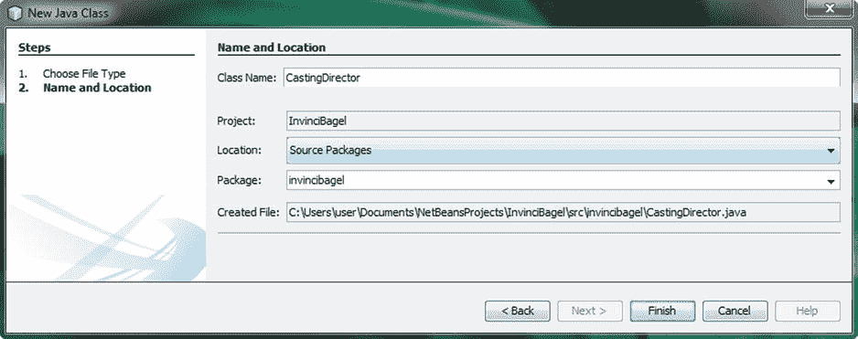

图 10-2。

在 invincibagel 包中创建新的 Java 类；将它命名为 InvinciBagel 项目的 casting director

我们将首先创建列表<actor>数组列表<actor>对象，一个保存当前场景的演员，然后第二个列表<actor>保存要检查碰撞检测的对象。之后我们将创建 Set <actor>HashSet <actor>对象，它将提供一个无序的 Set 对象，它将收集那些需要从场景中移除的 Actor 对象。让我们开始创建公共 CastingDirector 类的主体。</actor></actor></actor></actor></actor>

### 创建 ArrayList 对象:CURRENT_CAST 数据存储列表

我们需要添加到 CastingDirector 类的第一件事是一个私有 List <actor>ArrayList <actor>对象，我将把它命名为 CURRENT_CAST，因为它包含当前在舞台上的 Actor 对象，也就是当前的演员。尽管就在其声明中使用 static 和 final 关键字而言，它在技术上不是一个常量，但它充当了各种数据库的角色(没有双关的意思),所以我使用 ALL_CAPS，以便它在代码中作为一个数据结构脱颖而出。我还将添加一个基本的。get()方法访问 ArrayList <actor>结构，使用 Java return 关键字将对象返回给调用实体。用于声明和实例化 CURRENT_CAST ArrayList 对象以及。getCurrentCast()方法的结构应该看起来像下面的 Java 代码:</actor></actor></actor>

```java
package invincibagel;
```

`public class``CastingDirector`T2】

`private List<Actor>``CURRENT_CAST`T2】

```java
public List<Actor> getCurrentCast() {
```

`return``CURRENT_CAST`T2】

```java
}

}
```

正如您在图 [10-3](#Fig3) 中看到的，在声明和实例化 CURRENT_CAST 对象的代码行中，在您的列表接口引用和 ArrayList 引用下有红色波浪错误突出显示，因此您需要使用 Alt-Enter 工作进程，并让 NetBeans 8 在您的类顶部编写`import java.util.List;`语句。的。getCurrentCast()将是最容易编写的方法，因为它只是将整个 CURRENT _ CAST ArrayList<Actor>对象返回给调用该方法的任何 Java 实体。接下来，我们将看看如何编写更复杂的 ArrayList 数据存储访问方法，这些方法将处理从这个 CURRENT _ CAST ArrayList<Actor>对象添加、移除和重置(清除)Actor 对象。


图 10-3。

Inside the CastingDirector class, add a CURRENT_CAST List<Actor> object, and a .getCurrentCast() method

我们要编码的第一个方法是。addCurrentCast()方法，它将把以逗号分隔的 Actor 对象列表传递给 List(和实现 List 的 ArrayList 类)接口。addAll()方法调用。正如您已经了解到的，在方法参数列表的末尾传递一个逗号分隔的列表，除非它是唯一的参数，就像在本例中一样。

来展示。addCurrentCast()方法，我们将传递多个 Actor 对象到方法体中，我们使用了 Actor...注释，我将把(不止一个)Actor 对象命名为变量 actors。的主体内部。addCurrentCast()方法，我们将调用。使用点标记法从 CURRENT_CAST 对象中删除 addAll()方法。

在里面。addAll()方法我们将嵌套另一个 Java 语句，该语句将使用。asList()方法调用了数组类引用并传递了 actors Actor...逗号分隔的列表。这都是使用下面的 Java 方法构造来完成的:

```java
public void addCurrentCast(Actor... actors) {
```

`CURRENT_CAST.``addAll``( Arrays.``asList`T4】

```java
}
```

正如您在图 [10-4](#Fig4) 中所看到的，您将在 Arrays 类下看到一个红色波浪状的错误高亮显示，因此使用 Alt-Enter 工作进程并让 NetBeans 为您编写您的`import java.util.Arrays;`语句。现在，我们准备编写与 CURRENT_CAST 数据存储相关的另外两个方法，这两个方法将从 List<Actor>ArrayList<Actor>数据存储对象中删除 Actor 对象，还有一个方法将完全清除它(将其重置为未使用)。

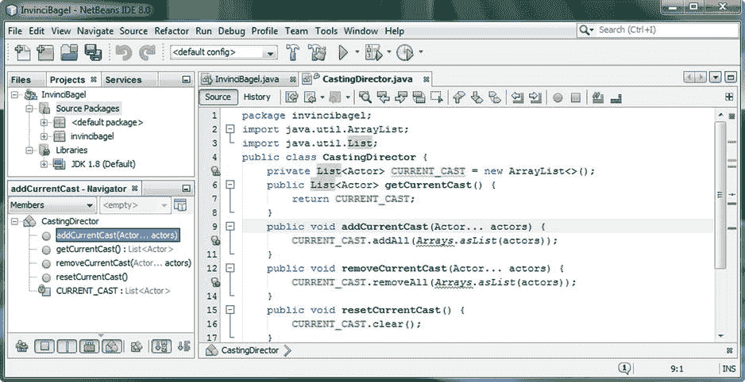

图 10-4。

Add .addCurrentCast(), removeCurrentCast(), and resetCurrentCast methods to the CastingDirector class

我们要编写的第二个方法是。removeCurrentCast()方法，该方法还将把以逗号分隔的 Actor 对象列表传递给 List(和实现 List 的 ArrayList 类)接口。removeAll()方法调用。

来展示这个。removeCurrentCast()方法，我们将传递多个 Actor 对象到方法体中，我们再次使用 Actor...注释，我将再次把这个变量命名为 actors。的主体内部。removeCurrentCast()方法，我们将再次调用。removeAll()方法，并在。removeAll()方法我们将嵌套另一个 Java 语句，该语句将使用。asList()方法调用了数组类引用，再次传递了 Actor...方法中以逗号分隔的命名参与者列表。这是使用图 [10-4](#Fig4) 中的 Java 方法完成的:

`public void``removeCurrentCast`T2】

`CURRENT_CAST.``removeAll``( Arrays.``asList`T4】

```java
}
```

现在您只需要编写一个简单的。resetCurrentCast()方法，该方法调用。clear()方法调用:

`public void``resetCurrentCast`T2】

`CURRENT_CAST.``clear`T2】

```java
}
```

接下来，让我们看看目前为止 CastingDirector.java 代码中的另一个问题，然后我们可以继续。

#### NetBeans 优化建议:最终生成列表<actor>数据存储对象</actor>

正如您在图 [10-5](#Fig5) 中看到的，您的代码没有错误，但也不是没有警告，所以让我们看看 NetBeans 希望我们对与我们的 CURRENT_CAST List < Array >数据存储对象相关的代码做些什么。我用鼠标悬停工作流程，弹出淡黄色提示消息，通知我 CURRENT_CAST 数据字段(变量，是一个对象)可以标记为 final，使用 Java final 关键字。如果我们要这样做，那么 CURRENT_CAST 对象的新声明和实例化语句的基本 Java 8 语法将编写如下:

`private``final`T2】

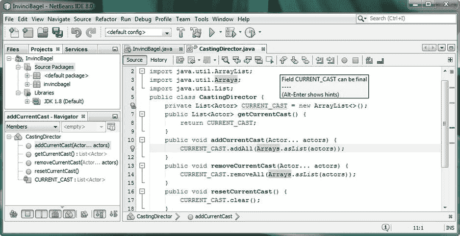

图 10-5。

Mouse-over yellow warning highlight under CURRENT_CAST, and use the Alt-Enter dialog to fix problem

对于这个 Java 修饰符关键字 final 在对象方面的使用，经常会有误解。的确，对于大多数 Java 变量(数字、布尔和字符串),当变量成为最终变量时，变量值本身是不能改变的。许多人认为，final 修饰符在与 Java 对象(变量声明)一起使用时，也会使对象本身成为“final”，因此是“不可变的”，或者在内存中是不可变的。

通常在 Java 中，final 关键字在与对象变量一起使用时指的是内存引用，而 immutable 关键字适用于这些对象本身，意味着它们不能被更改。因此，一个被声明为 final 的对象(引用)仍然可以包含一个可变的对象(可以被改变，正如我们在这里所希望的)。

事实上，final modifier 关键字对内存中的 Java 对象(比如我们的 CURRENT_CAST ArrayList <actor>对象)所做的就是锁定它在内存中的位置，也就是说，完成它。因此，NetBeans 在这里建议的是一种优化，它将允许您的 CURRENT_CAST 数据存储对象始终保留在内存中的位置(在创建后)。</actor>

这并不意味着你的 List <actor>ArrayList <actor>对象本身不能改变。你的游戏的 Java 代码可以扩展、收缩和清除(重置)一个列表<actor>数组列表<actor>对象，这个对象已经在任何时候被声明为最终的，基于你的游戏对。addCurrentCast()，。removeCurrentCast()和。resetCurrentCast()方法。</actor></actor></actor></actor>

这里的优化理论是，JVM 越能“预先锁定”内存位置(在程序启动时，加载到内存中)，它就能越好地优化内存，以及访问内存所需的 CPU 周期。如果你想一想，如果 CPU 不必在内存中“寻找”一个对象，那么它将能够更快地访问它。最终对象也可以在多线程环境中得到更好的使用。

但是，如果您不想使对象引用成为最终引用，可以选择在 NetBeans 中关闭此功能。这可以使用图 [10-6](#Fig6) 左侧的工具➤选项菜单序列来完成，以便进入图 [10-6](#Fig6) 右侧所示的选项对话框。正如您在该选项对话框的顶部所看到的，NetBeans 将其数百个首选项(也称为选项)组织到十个特定区域，甚至还有一个搜索过滤器，也显示在对话框的右上角，以防您不知道在哪里查找给定的选项。如果这些部分有太多的选项显示在对话屏幕上，将会有选项卡(提示选项卡在图 [10-6](#Fig6) 中显示为选中)，您可以使用这些选项卡导航到您想要访问的区域。我们将进入提示部分，从下拉列表中选择 Java 语言，最后打开线程部分。

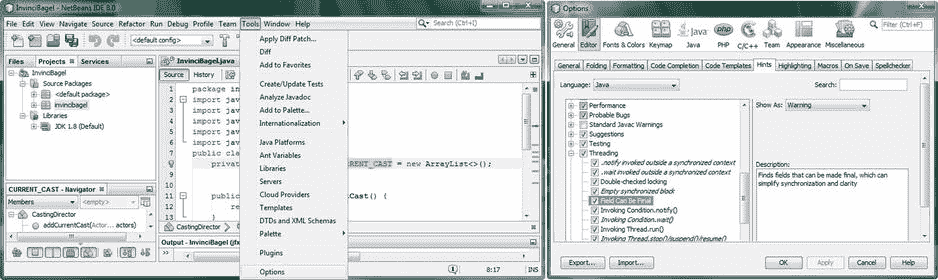

图 10-6。

Setting Editor Hints Preferences using the Tools ➤ Options menu and the Editor ➤ Hints ➤ Java ➤ Threading

现在我们已经讨论了最后一个对象变量问题，并向您展示了处理它的两种方法，让我们继续，并创建第二个名为 COLLIDE_CHECKLIST 的 ArrayList <actor>对象来存储复杂的冲突数据。</actor>

### 另一个 ArrayList 对象:COLLIDE_CHECKLIST 数据存储列表

现在让我们创建第二个 List <actor>ArrayList 数据存储对象，并将其命名为 COLLIDE_CHECKLIST，因为它最终将在。collide()方法；如果你在游戏开发的后期实现复杂的多物体碰撞列表，就会发生这种情况。在本书中，我们不会达到需要实现这一点的高级水平，但我想向您展示如何将一个完整的 CastingDirector 类放在一起，以便当您在游戏开发中需要它时，您可以在游戏中添加更多高级功能。这个对象将保存 CURRENT_CAST ArrayList <actor>的最新副本，并将有两个方法。那个。方法将返回 COLLIDE_CHECKLIST 对象，而。resetCollideCheckList()将通过使用。clear()方法调用，现在，我们将使用。addAll()方法加载 COLLIDE_CHECKLIST ArrayList <actor>对象与 CURRENT_CAST ArrayList <actor>对象的当前版本。稍后，我们可以使用这个列表来保存一个自定义的碰撞清单，该清单只将可能相互碰撞的对象分组到一个列表中。如图 [10-7](#Fig7) 所示，声明和实例化对象所需的 Java 代码应该如下:</actor></actor></actor></actor>

`private``final``List<Actor>``COLLIDE_CHECKLIST`T4】

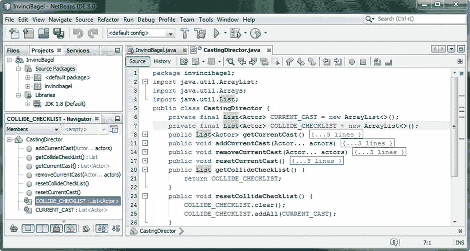

图 10-7。

Add a COLLIDE_CHECKLIST List<Actor> object, .getCollideCheckList(), and resetCollideCheckList() methods

a。getCollideCheckList()方法使用一个 return 关键字，来访问 COLLIDE_CHECKLIST，如下所示:

`public List``getCollideCheckList`T2】

`return``COLLIDE_CHECKLIST`T2】

```java
}
```

a。resetCollideCheckList()方法使用. clear()方法清除 COLLIDE_CHECKLIST，然后使用。addAll()方法将当前 _CAST 对象的内容添加(插入)到 COLLIDE_CHECKLIST 对象中。

`public void``resetCollideCheckList`T2】

`COLLIDE_CHECKLIST` `.clear();`

`COLLIDE_CHECKLIST` `.addAll(CURRENT_CAST);`

```java
}
```

现在我们已经设置了 ArrayList <actor>对象来保存角色成员和高级冲突列表数据集，让我们创建一个 HashSet <actor>对象。这个 Set 对象将用于收集由于某种原因需要从游戏中移除的演员(场景和舞台)。</actor>T3】</actor>

### 创建 HashSet 对象:REMOVED_ACTORS 数据存储集

现在让我们创建我们的第三个 Set <actor>HashSet 数据存储对象，让我们称它为 REMOVED_ACTORS，因为它将用于保存已经从当前阶段删除的 Actor 对象的集合。这个 Set < Actor >对象将保存所有的 Actor 对象，这些 Actor 对象由于某种原因需要从 CURRENT_CAST 列表中删除。REMOVED_ACTORS 数据存储(数据集)将有三个关联的方法。</actor>

那个。getRemovedActors()方法将返回 REMOVED_ACTORS 对象。addToRemovedActors()将是“核心”方法，它将随着游戏过程中发生的事情(寻找宝藏、杀死敌人等)向 REMOVED_ACTORS Set <actor>对象添加 Actor 对象。)从舞台和场景中消除演员对象，而。将使用。removeAll()方法从 CURRENT_CAST ArrayList <actor>对象中移除 Actors，然后使用。对 REMOVED_ACTORS HashSet 对象调用 clear()方法。如图 [10-8](#Fig8) 所示，需要使用 Java new 关键字声明和实例化 HashSet 对象的代码如下:</actor></actor>

`private``final``Set<Actor>``REMOVED_ACTORS``=``new`T6】

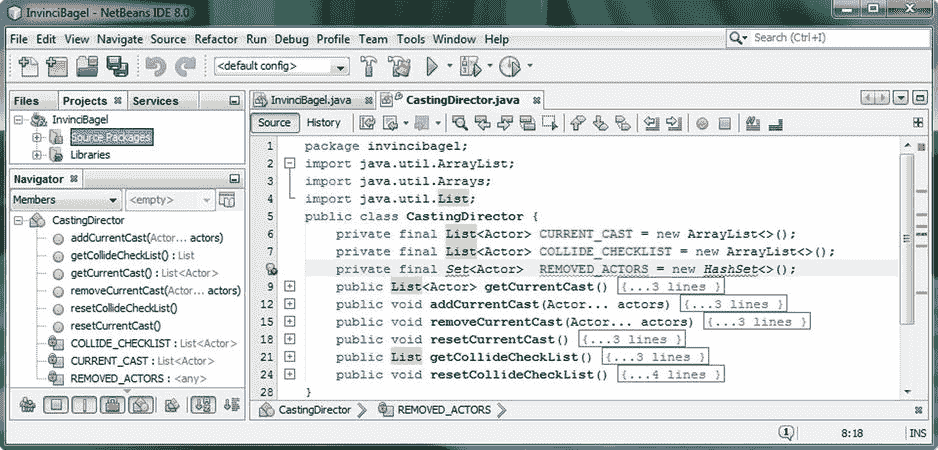

图 10-8。

Add a private final Set named REMOVED_ACTORS and use the Java new keyword to create a HashSet<>

这三种方法中最容易编写的是。getRemovedActors()方法，该方法简单地使用 return 关键字将整个 HashSet <actor>Set 对象传递给一个调用实体。这为 REMOVED_ACTORS 提供了对其他方法的访问，比如我们将在本节稍后编写的方法。Java 代码应该是这样的:</actor>

`public Set``getRemovedActors`T2】

`return``REMOVED_ACTORS`T2】

```java
}
```

我们需要编码的下一个方法是最复杂的，也是最常用的，因为当你的角色发生变化时，你会使用这个方法:例如，一个被杀死的敌人，如无敌面包圈，一个用过的抛射物，如子弹，消耗的食物，如一团奶油奶酪，或发现的宝藏，如一个礼品盒。

那个。addToRemovedActors()方法使用 if-else 语句来确定是在参数列表中传递了多个 Actor 对象(构造的第一个或 if 部分)，还是只需要移除一个 Actor 对象(构造的第二个或 else 部分)。if-else 语句的第一部分使用。length()方法来确定从一个 Actor 开始是否有多个 Actor 对象被传递到使用`if(actors.length > 1)`的方法调用参数列表中...参数允许一个以上的 Actor 对象提交给方法，如图 [10-9](#Fig9) 所示。

如果在 if{...}构造，请使用。addAll()方法将参数列表的内容添加到您的 REMOVED_ACTORS Set <actor>对象中。这是通过使用。addAll()方法调用，它构造名为 actors 的 Actor[]数组，该数组与使用。用一组< E >对象类型调用 addAll()方法。第二个 else{...}部分通过使用 actors[0]注释(第一个 Actor 参数)和一个。使用以下代码调用 add()方法:</actor>

`public void``addToRemovedActors`T2】

`if (``actors.length > 1``) { REMOVED_ACTORS.addAll(``Arrays.asList((Actor[]) actors)`T4】

`else {                   REMOVED_ACTORS.add(``actors[0]`T2】

请注意，由于我们已经转换了演员...参数(它们的目的是一个列表，但还不是一个)到一个数组中(因为编译器可以计算固定数量的项目)，所以我们可以使用 actors[0]符号。

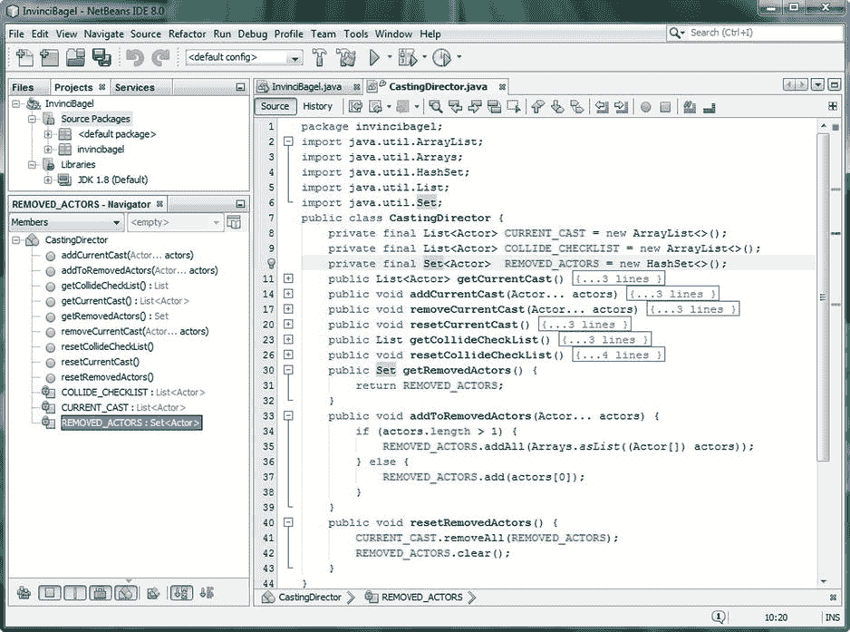

图 10-9。

Add .getRemovedActors(), .addToRemovedActors(), and .resetRemovedActors() method structures

既然我们有了向 REMOVED_ACTORS 集合 <actor>HashSet 添加一个或多个 Actor 对象的方法，那么让我们创建一个. resetRemovedActors()来清除 REMOVED_ACTORS 数据集。在我们清除 Set <actor>对象之前，我们需要确保包含在其中的所有 Actor 对象都从 CURRENT_CAST Actor List 对象中删除，因为这就是它存在的目的，所以这个方法的第一部分将调用。removeAll()方法从 CURRENT_CAST ArrayList <actor>对象中移除，并在该方法内部传递 REMOVED_ACTORS Set <actors>对象。之后，我们可以使用。clear()方法调用 REMOVED_ACTORS 对象，将其重置为空，以便可以再次使用它来收集需要释放的 Actor 对象。如图 [10-9](#Fig9) 所示的 Java 代码应该是这样的:</actors></actor></actor></actor>

`public void``resetRemovedActors`T2】

`CURRENT_CAST.``removeAll`T2】

`REMOVED_ACTORS.``clear`T2】

```java
}
```

接下来，我们将看看如何让 NetBeans 编写 CastingDirector()构造函数方法！

### CastingDirector()构造函数:让 NetBeans 编写代码

有一种方法可以让 NetBeans 为您编写一个构造器方法，由于它有点“隐藏”，我将向您展示如何找到它！我将插入栏光标留在图 [10-10](#Fig10) 中，向您展示我点击了最后一个关键字和出现的黄色灯泡“tip”图标，以及当我将鼠标悬停在 tip 灯泡上时得到的淡黄色弹出工具提示消息。我得到的消息是“将初始化器移动到构造函数”，所以我按了建议的 Alt-Enter 组合键。果然有一个选项是 NetBeans 给我写这个构造器方法代码。

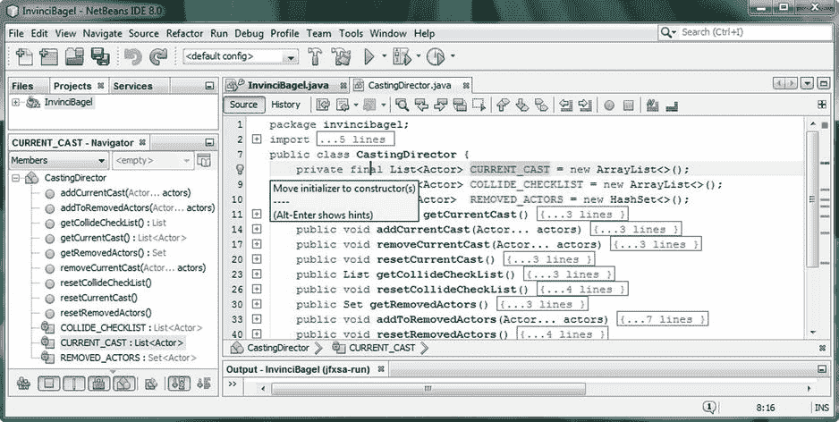

图 10-10。

Mouse-over the yellow light bulb icon in the line number area of the pane and reveal the constructor tip

对于您单击的第一个 final 关键字，按住 Alt-Enter 键，并让 NetBeans 为其编写 CastingDirector()构造函数方法，它将编写公共 CastingDirector(){...}结构，并添加第一个实例化语句。正如您在图 [10-11](#Fig11) 中所看到的，一旦您点击了类顶部的三个 final 关键字中的每一个，并使用相同的工作过程，您就可以让 NetBeans 为您编写整个构造器方法。NetBeans 生成的 Java 代码使用 Java this 关键字(以便 CastingDirector 对象可以引用自身)作为三个数据存储对象的开头，并使用 Java new 关键字创建 ArrayList < E >和 HashSet < E >的新实例，如下所示:

```java
public CastingDirector() {
```

`this``.CURRENT_CAST =``new`T3】

`this``.COLLIDE_CHECKLIST =``new`T3】

`this``.REMOVED_ACTORS =``new`T3】

```java
}
```


图 10-11。

Use Alt-Enter, and have NetBeans write your CastingDirector() constructor method Java code for you

在我们结束这一章之前，我们可能应该为我们游戏的主角，不可战胜的恶魔，创建至少一个演员类(对象)。让我们使用 Hero 抽象类来创建一个 Bagel 类，以便稍后我们可以创建一个 iBagel 对象。我们将在下一章使用这些代码，在那里我们将学习如何在舞台上移动这个无敌的角色，同时也优化我们的 InvinciBagel 类的结构。

## 创造我们的主角:百吉饼英雄子类

让我们创建一个 Bagel.java 类，方法是在 ide 左侧的 NetBeans 项目窗格中右键单击 invincibagel 包文件夹，然后选择“新建➤ Java 类”菜单序列以打开“新建 Java 类”对话框，如图 [10-12](#Fig12) 所示。将该类命名为 Bagel，并接受其他默认项目、位置、包和创建的文件选项字段，方法是单击“完成”按钮，这将创建新的 Bagel.java 类，并在 NetBeans 的选项卡中打开它。

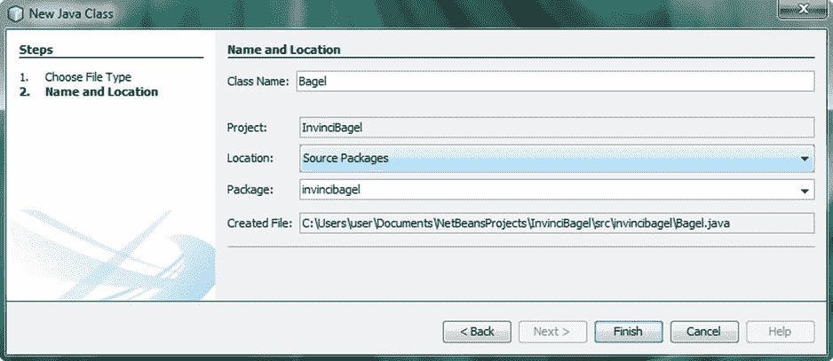

图 10-12。

Use the New Java Class dialog and create the Bagel.java class in the invincibagel package

你要做的第一件事是将 Java extends 关键字添加到 NetBeans 为你编写的`public class Bagel {...}`类声明语句的末尾，这样你的 Bagel 类继承了我们在第 8 章中创建的 Hero 类的所有功能(变量和方法)。这个当前为空的类的 Java 代码应该如下所示:

```java
package invincibagel;
```

`public class Bagel``extends`T2】

```java
// an empty class structure

}
```

我们要写的第一件事是 Bagel()构造函数方法，因为我们想创建一个 Bagel 字符放在屏幕上，这样我们就可以开始处理运动代码，然后是碰撞代码。这段代码将接受 Hero 类 Hero()构造函数方法需要接收的相同参数，并使用 Java super 关键字(我喜欢称之为 super 构造函数)以 super()构造函数方法调用的形式将它们“向上”传递给 Hero 类 Hero()构造函数。这个 Bagel()构造函数方法的 Java 代码应该类似于下面的 Java 类和构造函数方法结构:

```java
public class Bagel extends Hero {

public Bagel(String SVGdata, double xLocation, double yLocation, Image... spriteCels) {
```

`super` `(SVGdata, xLocation, yLocation, spriteCels);`

```java
}

}
```

正如你在图 [10-13](#Fig13) 中看到的，在百吉饼类名下有一个红色波浪下划线高亮显示。如果你把鼠标放在这上面，你会看到“Bagel 不是抽象的，也没有覆盖抽象方法”。update() in Hero”，它告诉您要么需要将 Bagel 设为一个公共抽象类，我们不打算这样做，因为我们希望实际使用这个类来保存角色(对象)及其属性(变量)和功能(方法)，所以消除此错误的另一个选项是添加您的`@Override public void update() {...}`方法结构，即使它现在是一个空方法。

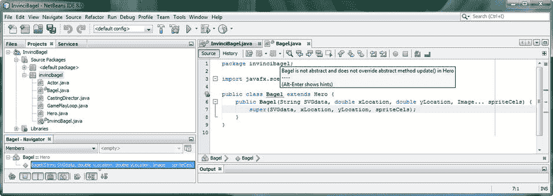

图 10-13。

Code a public Bagel() constructor method that calls a super() constructor method (from Hero superclass)

实现(当前)空的代码。update()方法使用一个 Java @Override 关键字，一旦它就位，错误将会消失，代码将是无错误的，如图 [10-14](#Fig14) 所示。代码如下所示:

```java
@Override
```

`public void``update``() { //``empty method`T4】

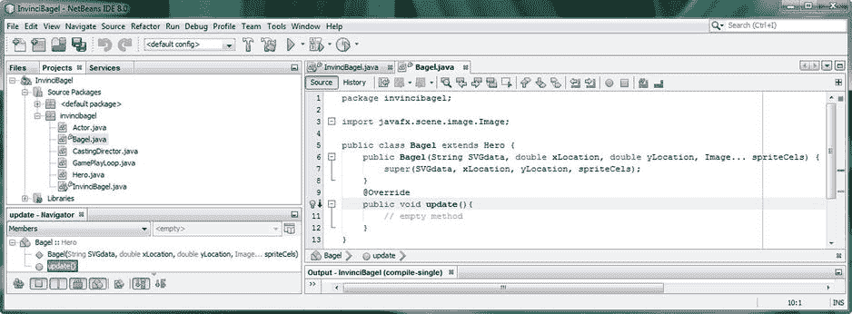

图 10-14。

Add a public void .update() method to override the public abstract void update method in the Hero class

注意在图 [10-14](#Fig14) 的顶部，您必须添加`import javafx.scene.image.Image;`代码语句，以便能够使用图像...公共 Bagel()构造函数方法参数列表中的批注。

为了彻底起见，让我们重写一个公共布尔值。collide()方法，所以我们在 Bagel 类中有它。您可能想知道为什么 NetBeans 没有在图 [10-14](#Fig14) 中给我们一个错误。collide()方法添加到 Bagel 类中。正如你在图 [10-15](#Fig15) 中看到的，它显示了公共的抽象英雄类，我们没有创建。collide()方法是一个公共抽象方法，就像我们用。update()方法。这就是 NetBeans 8 没有生成任何错误突出显示的原因，因为我们不需要实现。所有 Hero 子类中的 collide()方法。

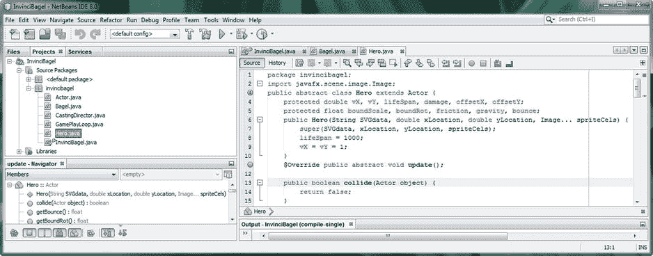

图 10-15。

The Hero abstract class has a public boolean collide() method but since it is not abstract it is not required

你可能想知道为什么我们没有？collide()到一个抽象方法中，需要注意的是，我们可以在未来的任何时间点这样做。原因是，我们可能希望在未来游戏开发的某个时候有(添加)不与场景(游戏)中任何东西冲突的运动精灵，也许是为了添加视觉细节元素，例如一只鸟飞过屏幕顶部。这是您自己的选择，所以如果您希望运动精灵总是与物体碰撞，您可以声明。collide()方法也是抽象的。

需要注意的重要一点是，我们仍然可以重写。collide()方法，这是我接下来要做的，只是为了向您展示，这仍然可以做到，而不必使用 Java 抽象关键字声明该方法，Bagel 类将使用被覆盖的。collide()方法而不是 Hero 超类中的“default”方法，后者返回一个 false 值(无冲突)。

这里需要注意的重要一点是，您可以将您的默认方法代码放入超类中，如果没有在任何给定的子类中被特别覆盖，它将成为您所有子类的默认方法编程逻辑。这允许你在一个地方(超类)实现所有子类的“默认”行为。

当然，您总是可以覆盖这个默认行为，并使用@Override 关键字和完全相同的方法声明格式来实现一个更具体的行为。这可以在靠近屏幕截图底部的图 [10-16](#Fig16) 中看到，如果您将它与图 [10-15](#Fig15) 的底部进行比较，您会看到它们的结构是相同的，除了在 Bagel 子类中使用的@Override 关键字。当我们讨论碰撞检测编程时，我们将用 Bagel 类自己定制的代码替换`return false;`行。collide()碰撞检测行为，随着时间的推移，随着我们向游戏中添加高级功能，这将变得相当复杂。现在我正在安装这个。collide()方法体(本质上是空的，因为它只返回 false ),所以您会看到一个完整的类。

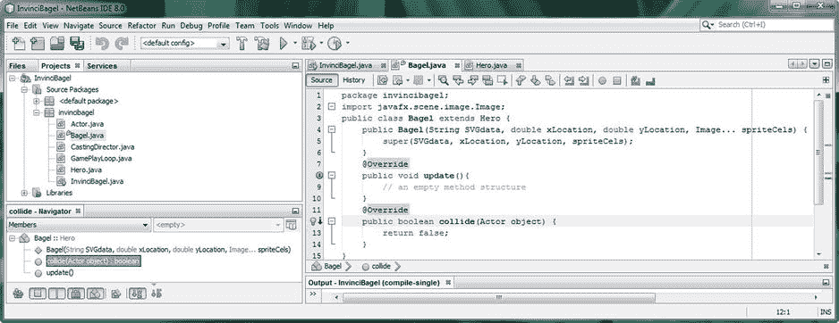

图 10-16。

Override public boolean .collide() method body, for our use later on during a collision detection chapter

我们在这一章取得了很多好的进展，为你的游戏创造了一个选角导演和明星！

## 摘要

在第十章中，我们为游戏添加了两个关键类:CastingDirector.java 类和 Bagel.java 类。第一个执行演员管理和碰撞管理功能，第二个为游戏添加主要演员，这样我们就可以开始研究 InvinciBagel 如何在屏幕上移动。我们看了当前包和类结构的图表，以及新类如何适应我们在本书中实现的整体游戏引擎设计策略。

我们学习了什么是 Java 接口，以及 Java 接口如何允许我们控制其他开发人员对我们的类实现了什么。我们还学习了 Java 集合框架，它提供了数组、列表和集合等东西，用于为我们的 Java 8 和 JavaFX 应用(游戏)提供数据存储功能。

我们学习了 java.util 包及其 List <e>接口，以及 ArrayList <e>类，以及 ArrayList <e>类如何实现这个 List <e>接口。我们学习了<e>元素、<k>键、<v>值和<t>类型。我们了解到 List 和 ArrayList 对象有结构和顺序，而 Set 和 HashSet 对象没有特定的顺序，并且不能有重复的元素。</t></v></k></e></e></e></e></e>

接下来，我们创建了您的 CastingDirector.java 类，来管理需要添加到游戏中和从游戏中移除的演员对象。这个类还将维护列表<actor>结构，该结构将用于冲突检测逻辑，我们将在本书第 16 章的[中添加。](16.html)</actor>

最后，我们创建了第一个与演员相关的类，Bagel 类，它扩展了 Hero 超类，允许我们将主要的 InvinciBagel 演员对象角色放到游戏场景和舞台上。我们创建了 Bagel()构造函数方法，并使用@Override 关键字来覆盖。更新()和。collide()方法，这样我们就可以在本书的剩余部分中构建与这个角色相关的编程逻辑。

在下一章中，我们将看看如何使用我们在本章中创建的 KeyEvent 事件处理结构在屏幕上移动游戏精灵，以及如何确定屏幕的边界(边缘)、角色方向、移动速度以及相关的动画和移动注意事项。