# 十一、在 2D 移动你的演员形象：控制 X 和 Y 显示屏幕坐标

现在我们已经在第 10 章中创建了公共的 CastingDirector 类，我称之为“casting engine”，我们需要回到第 11 章中的 InvinciBagel.javaprimary 应用类代码，并在。createGameActors()方法。我们还将使用 CastingDirector.java 类及其 CastingDirector()构造函数方法创建 castDirector 对象，这是我们在[第 10 章](10.html)中创建的。createCastingDirection()方法，它将管理我们的转换方向类相关的特性。

在我们将代码添加到将创建 iBagel Bagel 对象的 InvinciBagel.java 类中，并创建 castDirector CastingDirector 对象之后，我们将把代码重新组织成逻辑方法结构，用于 InvinciBagel 类中需要处理的主要任务区域。在我们这样做之后，我们将有八个逻辑方法区域。这些方法将作为功能区域的“指南”,当我们在本书的其余部分开发我们的游戏时，我们需要保持更新(添加语句)。例如，如果我们向游戏中添加一个 Actor，我们将通过在. createGameActors()方法中添加(实例化)Actor 对象来完成，然后将 Actor 对象添加到在新的中使用新的 CastingDirector()构造函数方法创建的 cast 对象中。createCastingDirection()方法。

除了。createGameActors()和。createCastingDirector()方法，我们的新方法将包括。loadImageAssets()方法。createSceneEventHandling()方法。createStartGameLoop()方法，而。addGameActorNodes()方法。因此，在这一章中，我们将为你的 InvinciBagel.java 类创建六个新方法，以显著地“增强”游戏核心类的顶层组织结构及其“顶层”。start()方法。只有一种方法可以在这个过程中存活下来，不需要任何修改；那将是。addNodesToStackPane()方法，您在第 6 章的[中创建的方法(请参见图 6-8 以提醒您的记忆)。](06.html)

在我们重组了我们的 InvinciBagel 代码基础设施之后，我们可以继续前进，开始创建程序逻辑，该程序逻辑将用于创建并在以后控制我们游戏的主要英雄，不可战胜的恶魔本人。这将涉及使用 Bagel()和 CastingDirector()构造函数方法，然后使用。add()方法调用和。addCurrentCast()方法分别调用。

在我们创建了 iBagel Actor 之后，我们将连接它的。将()方法更新到 GamePlayLoop。handle()方法，此时我们可以开始构建编程逻辑，在您的舞台上移动这个 InvinciBagel。此时，事情变得更加有趣，因为我们可以开始定义舞台的移动边界、精灵图像状态(九个不同的字符位置)，以及这些与 X(左右)和 Y(上下)键用法的关系。例如，没有运动将会是站立的，左和右将会使用奔跑，向上将会使用跳跃，向下将会着陆，或者稍后在游戏设计中，当我们精炼代码时，特定的组合键可以使一个不可战胜的怪物飞行等等。

## InvinciBagel.java 重新设计:增加逻辑方法

关于 InvinciBagel.java 代码，我想做的第一件事是使用半打新方法重新组织当前代码，这些新方法在逻辑上包含并显示了我们需要解决的不同领域，以便为我们的游戏添加新的参与者。这些包括管理事件处理、添加新的图像资产引用、创建新的游戏演员对象、将新的演员添加到场景图形、将新的演员对象添加到我们在第 10 章中创建的 CURRENT_CAST 列表，以及启动 GamePlayLoop animation timer 脉冲引擎。我们应该做的第一件事是把那些需要先做的 Java 语句放在。代码顶部的 start()方法本身。这些创建场景图形根，一个场景对象，并设置舞台对象:

```java
primaryStage.setTitle(InvinciBagel);
```

`root` `= new StackPane();`

`scene``= new Scene(``root`T3】

`primaryStage.setScene(``scene`T2】

```java
primaryStage.show();
```

正如你在图 [11-1](#Fig1) 中看到的，我们从被调用的方法中取出了根和场景对象实例。createSplashScreenNodes()，并将它们放在。start()方法。我这样做是因为它们是我们无敌游戏(职业)的基础。接下来，我们还将在现有代码中添加六个全新的方法结构。在这个过程中唯一不变的方法是您的。addNodesToStackPane()。你可以看到我是按照逻辑顺序调用这些方法的:添加事件、添加图像、添加演员、添加场景图和添加演员。

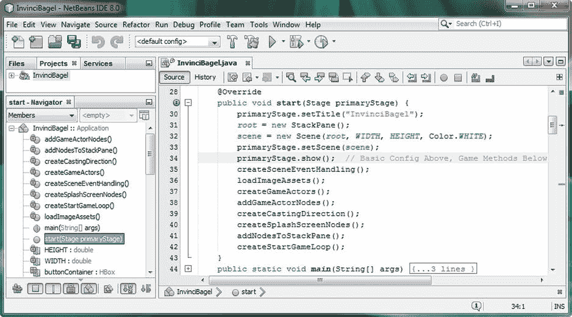

图 11-1。

Place basic configuration statements at top of the .start() method, and then the eight game method calls

在本章的第一部分中，我们将要用到的方法调用涉及到为场景对象创建事件处理器，我们将在设置好名为 Scene 的场景对象后立即执行。在添加到游戏的过程中，我们需要做的下一件事是加载图像对象资产(数字图像引用)，这是您的。loadImageAssets()方法就可以了。一旦您的图像对象被声明和实例化，我们就可以使用。createGameActors()方法和构造器方法调用，我们在自定义 Actor 和 Hero 子类中创建了它们，比如我们在第十章中创建的 Bagel.java 类。一旦我们创建了演员，我们就可以使用。addGameActorNodes()以及使用。createCastingDirection()方法。最后，我们通过调用。createStartGameLoop()方法。那个。createSplashScreenNodes()和。addNodesToStackPane()位于末尾，因为现在闪屏内容制作工作已经完成，所以不会添加它们。我们将在本章中添加的方法调用代码如下所示:

```java
createSceneEventHandling();

loadImageAssets();

createGameActors();

addGameActorNodes();

createCastingDirection();

createSplashScreenNodes();

addNodesToStackPane();

createStartGameLoop();
```

让我们言归正传，开始为 InvinciBagel.java 类实现这个代码重新设计过程。

### 场景事件处理方法:。createSceneEventHandling()

我们要做的第一件事是将游戏的事件处理移到它自己的方法中，我们称之为。createSceneEventHandling()。我创建一个方法来创建场景对象事件处理的原因是，如果以后你想在你的游戏中添加其他类型的输入事件，比如鼠标事件或拖动事件，你已经有了一个逻辑方法来保存这个事件相关的 Java 代码。

这个新的 Java 代码，可以在图 [11-2](#Fig2) 中看到，将涉及到把你的 scene.setOnKeyPressed()和 scene.setOnKeyReleased()方法处理结构，在[第 9 章](09.html)中创建，从你的。createSplashScreenNodes()方法，并将它们放入自己的方法结构中。稍后我们将重新定位所有 ActionEvent 处理器，它们在。start()方法，实际上属于。createSplashScreenNodes()方法，在该方法中，它们将与其他 splashscreen 对象组合在一起。这个新的事件处理代码结构应该类似于下面的 Java 代码:

`private void``createSceneEventHandling()`T2】

```java
scene.setOnKeyPressed((KeyEvent event) -> {

switch (event.getCode()) {

case UP:    up     = true; break;

case DOWN:  down   = true; break;

case LEFT:  left   = true; break;

case RIGHT: right  = true; break;

case W:     up     = true; break;

case S:     down   = true; break;

case A:     left   = true; break;

case D:     right  = true; break;

}

});

scene.setOnKeyReleased((KeyEvent event) -> {

switch (event.getCode()) {

case UP:    up     = false; break;

case DOWN:  down   = false; break;

case LEFT:  left   = false; break;

case RIGHT: right  = false; break;

case W:     up     = false; break;

case S:     down   = false; break;

case A:     left   = false; break;

case D:     right  = false; break;

}

});

}
```

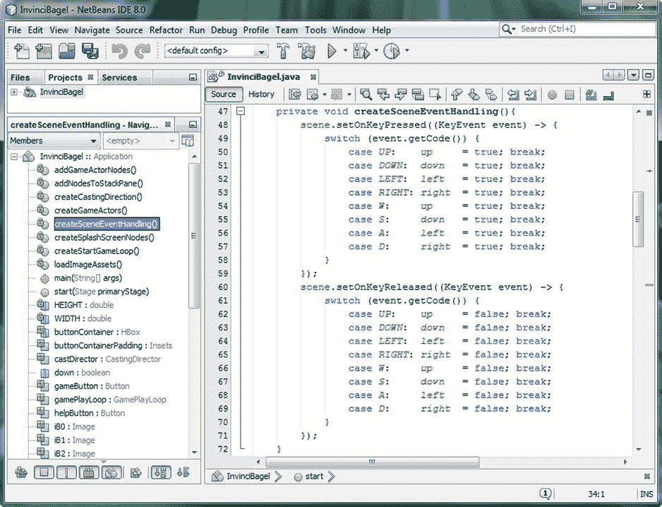

图 11-2。

Create private void createSceneEventHandling() method for OnKeyReleased and OnKeyPressed event handling structures

既然游戏的事件处理已经就绪，在我们编写添加图像、演员和演员导演对象的其余方法结构之前，我们需要声明这些对象，以便在 InvinciBagel.java 类的顶部使用。让我们来完成这项工作，它设置了接下来需要编码的其余方法。

### 添加 InvinciBagel:声明图像、百吉饼和 CastingDirector

由于我们将在本章中开始在游戏屏幕上显示我们的英因西贝戈尔角色，并将我们在前面章节中编写的所有代码集合在一起，创建我们的游戏循环类(第 7 章)、演员和英雄类(第 8 章)、事件处理类(第 9 章)和 CastingDirector 类(第 10 章)，我们需要在 InvinciBagel 类的顶部声明一些对象变量，然后才能在本章中实例化和使用这些对象。我们将使用静态关键字声明名为 iBagel 的 Bagel 对象，正如我们将调用 iBagel 对象一样。从 GamePlayLoop 对象的。handle()方法，这将使 iBagel 在这两个类之间“可见”。我们还将通过使用复合声明来声明九个 Image (sprite 状态)对象，iB0 到 iB8。最后，我们将声明一个 CastingDirector 对象，我们将其命名为 castDirector。我们需要在 InvinciBagel.java 类顶部添加的声明语句参见图 [11-3](#Fig3) 。它们包括位于 InvinciBagel.java 类顶部的以下 Java 变量声明语句:

`static` `Bagel iBagel;`

```java
Image iB0, iB1, iB2, iB3, iB4, iB5, iB6, iB7, iB8;

CastingDirector castDirector;
```

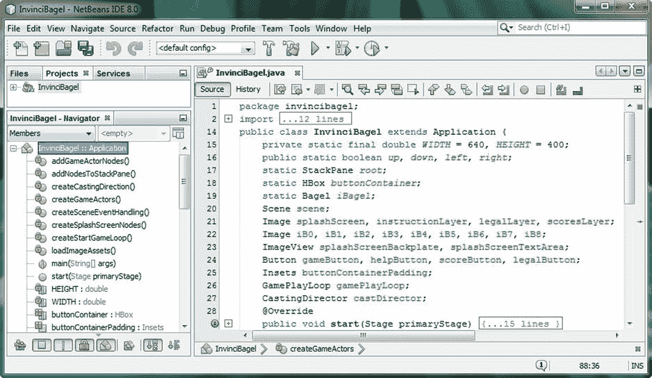

图 11-3。

Add static Bagel iBagel, CastingDirector castDirector and Image object declaration named iB0 through iB8

既然我们已经声明了对象变量，我们将需要在。createGameActors()方法和 CastingDirection 引擎在 createCastingDirection()方法中，让我们继续创建我们的第一个新方法。loadImageAssets()方法，它将包含对 Image()构造函数的所有图像对象实例化调用。我们将把所有图像对象实例化到这个方法中。

### 演员图像资产加载方法:。loadImageAssets()

既然我们已经声明了在 InvinciBagel 类的顶部使用的九个图像对象，接下来我们需要做的就是将九个 PNG32 sprite 图像复制到 InvinciBagel NetBeans 项目的/src 文件夹中，这九个图像被命名为 sprite0.png 到 sprite8.png。这是使用适用于您的操作系统的文件管理实用程序来完成的；在我的 64 位 Windows 7 操作系统的情况下，它是 Windows Explorer 实用程序，如图 [11-4](#Fig4) 所示，图像资产被复制到`C:/Users/user/MyDocuments/NetBeansProjects/InvinciBagel/src`文件夹中。所有 PNG 图像资源都是 PNG32 (24 位 RGB 真彩色数据，带有 8 位 256 灰度级 alpha 通道),除了闪屏的背板是 PNG24，因为它不需要 alpha 通道，因为它是背景图像板。

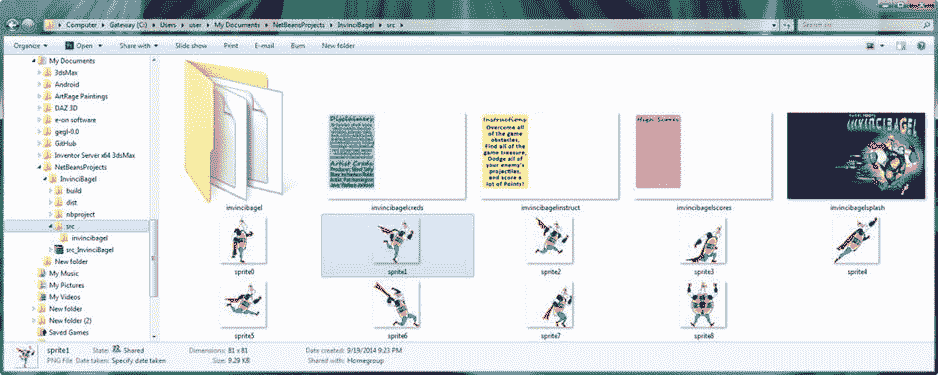

图 11-4。

Copy the sprite0.png through sprite8.png files into your NetBeansProjects/InvinciBagel/src project folder

现在我们准备编写`private void loadImageAssets(){...}`方法。一旦创建了方法体(声明),您将需要从。createSplashScreenNodes()方法，以便游戏应用的所有图像对象加载都在一个中心位置完成。完成之后，您可以复制并粘贴 scoresLayer 映像实例化，并创建 iB0 到 iB8 映像实例化。确保将图像大小设置为 81 像素(X 和 Y ),并使用正确的文件名引用，如以下代码所示:

`private void``loadImageAssets`T2】

```java
splashScreen = new Image("/invincibagelsplash.png", 640, 400, true, false, true);

instructionLayer = new Image("/invincibagelinstruct.png", 640, 400, true, false, true);

legalLayer = new Image("/invincibagelcreds.png", 640, 400, true, false, true);

scoresLayer = new Image("/invincibagelscores.png", 640, 400, true, false, true);

iB0 = new Image("/sprite0.png", 81, 81, true, false, true);

iB1 = new Image("/sprite1.png", 81, 81, true, false, true);

iB2 = new Image("/sprite2.png", 81, 81, true, false, true);

iB3 = new Image("/sprite3.png", 81, 81, true, false, true);

iB4 = new Image("/sprite4.png", 81, 81, true, false, true);

iB5 = new Image("/sprite5.png", 81, 81, true, false, true);

iB6 = new Image("/sprite6.png", 81, 81, true, false, true);

iB7 = new Image("/sprite7.png", 81, 81, true, false, true);

iB8 = new Image("/sprite8.png", 81, 81, true, false, true);

}
```

正如你在图 [11-5](#Fig5) 中所看到的，你的代码是没有错误的，这意味着你已经将你的精灵资产复制到了正确的/src 文件夹中，现在你已经安装了十几个数字图像资产用于你的游戏。

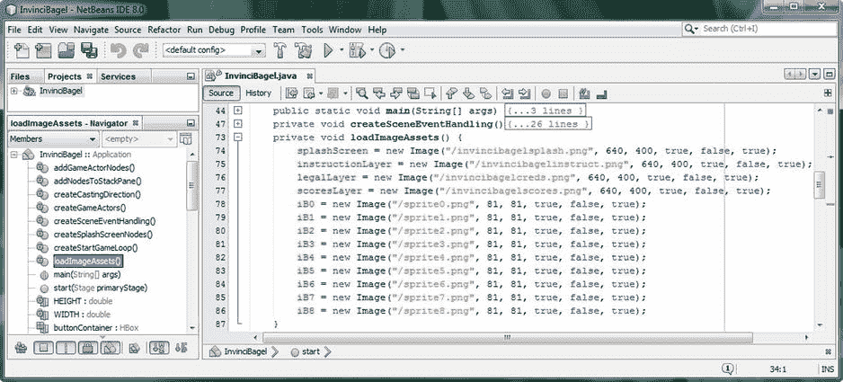

图 11-5。

Create a private void loadImageAssets() method, add the iB0 through iB8 and splashScreen Image objects

现在你需要调用你在第 10 章中创建的 Bagel()构造函数方法的资产已经准备好了，我们可以继续创建一个保存游戏资产创建 Java 代码的方法。这相当于为我们最终创建的每个 Actor 子类调用构造函数方法，其中第一个是 Bagel 类，我们首先创建它，以便我们可以开始让我们的主要角色在屏幕上移动。

### 正在创建您的 InvinciBagel 百吉饼对象:。createGameActors()

加载图像资源后，游戏角色创建过程的下一步是调用游戏角色的构造函数方法。为了能够做到这一点，您必须首先子类化 Actor 超类(用于固定的游戏演员，可以称为“道具”)或 Hero 超类(用于运动游戏演员，例如英雄、他的敌人等等)。我将创建一个. createGameActors()方法来保存这些实例，因为即使最初在这个方法的主体中只有一行代码，最终，随着游戏变得越来越复杂，这个方法将作为我们已经安装的游戏角色资产的“路线图”。该方法将被声明为私有方法，因为 InvinciBagel 类将控制这些游戏角色的创建，并将具有 void 返回类型，因为该方法不向调用实体返回任何值。本例中是 start()方法)。在方法内部，我们将调用 Bagel()构造函数方法，使用一些“占位符”SVG 路径数据，以及一个 0，0 的初始 X，Y 屏幕位置，最后，九个 sprite cels 在构造函数方法调用的末尾使用逗号分隔的列表。方法体和对象实例化将使用以下三行 Java 代码:

`private void``createGameActors()`T2】

`iBagel =``new`T2】

```java
}
```

正如你在图 [11-6](#Fig6) 中看到的，代码是没有错误的，你现在有了一个 iBagel Bagel 对象，你现在可以用它来开始开发 InvinciBagel sprite 在游戏进行阶段的移动，这通常是整个显示屏。在本章的稍后部分，我们将把这个 Bagel Actor 连接到 JavaFX 脉冲计时引擎。

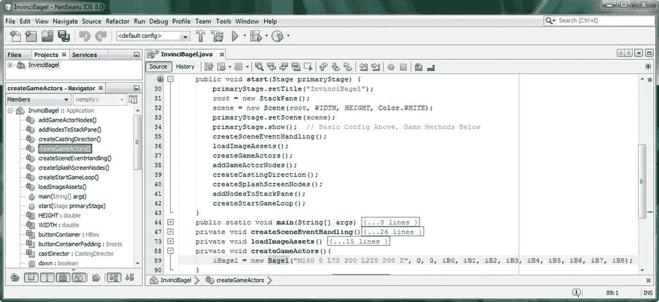

图 11-6。

Add a private void createGameActors() method; add an iBagel object instantiation via Bagel() constructor

如果您想知道 SVGdata 字符串对象“M150 0 L75 200 L225 200 Z”是做什么的，它是以下画线指令(命令)的简写。M 是一个“绝对移动”命令，它告诉画线(或者在这种情况下是路径画)操作从位置 150，0 开始。L 是一个“画线”命令，告诉 SVG 数据在 150，0 到 75，200 之间画一条线。第二个 L 从 75，200 到 225，200 画一条线，给我们三角形的两条边。Z 是一个“关闭形状”命令，如果形状是打开的，就像我们当前的一样，它会画一条线来关闭形状。在这种情况下，这相当于从 225，200 到 150，0 画一条线，给我们三角形的三条边，封闭开放路径，给我们一个有效的碰撞检测边界。

我们将在稍后用一个更复杂的碰撞形状替换它，在第 16 章的[中，涵盖了碰撞检测多边形创建、SVG 数据和碰撞检测逻辑。我们实际的碰撞多边形将包含更多的数字，这使得我们的 Bagel()构造方法调用变得笨拙。正如你可能想象的那样，在游戏的那个点上(没有双关的意思)，我可能会创建一个专门用于构建碰撞形状的工作进程。这个工作流程将向您展示如何使用 GIMP 生成 SVG 多边形数据，以便您可以将 SVG 数据放入它自己的 String 对象中，并在您的 Actor 对象构造函数中引用它。如果你想把碰撞数据的创建也变成它自己的方法，这就是看起来的样子，使用一个(理论上的)。createActorCollisionData()方法:](16.html)

`String``cBagel`T2】

`private void``createActorCollisionData()`T2】

`cBagel` `= "M150 0 L75 500 L225 200 Z";`

```java
}

private void createGameActors() {
```

`iBagel = new Bagel(``cBagel`T2】

```java
}
```

稍后，您还可以创建一个方法来加载图像精灵列表<actor>对象。这将把 ArrayList 作为参数传递，而不是逗号分隔的列表。注意，如果你这样做了，你还需要改变你的 Actor 抽象类构造函数来接受一个 ArrayList <actor>对象，而不是一个图像...图像对象列表。</actor>T3】</actor>

接下来，让我们看看如何将新创建的 iBagel 对象添加到游戏的场景图形对象中，该对象目前是一个名为 root 的 Stackpane 对象。

### 将 iBagel 添加到场景图:。addGameActorNodes()

JavaFX 应用开发人员经常忘记的一个步骤是将他们需要在场景中显示的对象(以及场景对象所附加的舞台)添加到场景图的根对象中。在我们的例子中，这是一个名为 root 的 StackPane 对象。当我们开始开发 Splashscreen 时，我们将需要使用在第 6 章中使用的相同的`root.getChildren().add()`方法调用链，来将我们的 iBagel 对象 ImageView(使用 iBagel.spriteFrame 引用)添加到场景图形根对象。我将在这个阶段添加一个方法，确保我们永远不会忘记这个重要的添加到场景图的步骤。我将通过把演员创作过程中的这个阶段变成它自己的方法来专门解决这个问题，我将称之为。addGameActorNodes()。这个方法体的创建，以及我们的第一个向场景图编程语句添加演员，将使用下面的 Java 代码来完成，这些代码也在图 [11-7](#Fig7) 中显示(突出显示):

`private void``addGameActorNodes()`T2】

`root``.getChildren().add(``iBagel.spriteFrame`T3】

```java
}
```

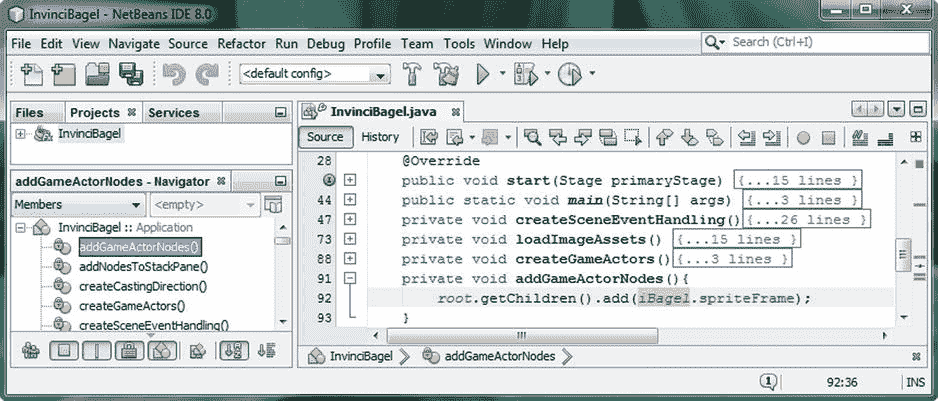

图 11-7。

Create a private void addGameActorNodes() method; .add() iBagel.spriteFrame ImageView to root object

需要注意的是，我称之为。addGameActorNodes()方法，位于 InvinciBagel 类的顶部，在。start()方法，在我调用。addNodesToStackPane()方法。这样做有一个很好的理由，它可以追溯到你在第 4 章中所学的 JavaFX。请记住，您添加到 StackPane 图层管理对象的对象是使用 Z 索引(或 Z 顺序)显示的，这意味着它们“堆叠”在彼此的顶部。如果这些层中的任何一层没有阿尔法通道，我们在[第五章](05.html)中已经了解过，那么它们后面的任何东西都无法显示出来！出于这个原因，让我们的闪屏在玩家点击指令按钮控制对象的任何时间点覆盖我们的游戏的最简单的方法是最后添加这些资产。

通过拥有你的。addNodesToStackPane()方法。addGameActorNodes()方法，您将保证您的游戏资产将始终处于比您的 Splashscreen 资产更低的 Z 索引。这意味着 SplashScreenBackplate 和 splash screen textarea ImageView“plates”将始终位于 StackPane 的顶部 Z-index 层，因此，当它们显示(可见)时，它们将完全覆盖您的游戏。这是因为 SplashScreenBackplate ImageView 包含一个不透明的 PNG24 图像资源，其大小与您的场景(和舞台)对象相同。

当我们测试新的 InvinciBagel 游戏应用时，我们将看到这种方法顺序重组的结果，您将看到我们已经解决了游戏演员显示在闪屏顶部的问题。我们只是通过改变程序代码的执行顺序来实现这一点。这也应该向您指出，Java 编程代码的执行顺序几乎与 Java 编程逻辑本身一样重要！

### 创建和管理您的角色:。createCastingDirection()

现在是时候实现我们在第 10 章中创建的另一个类了，CastingDirector.java 类，以及它的 CastingDirector()构造函数方法。我们将在另一个新的自定义方法中这样做，我们将创建一个名为。createCastingDirection()。该方法将包含名为 castDirector 的 CastingDirector 对象的初始实例化，我们将使用 Java new 关键字和 CastingDirector()构造函数方法创建该对象，并使用。我们在[第 10 章](10.html)中创建的 addCurrentCast()方法。图 [11-8](#Fig8) 中显示的 Java 方法结构没有错误，应该如下所示:

`private void``createCastingDirection()`T2】

`castDirector =``new`T2】

`castDirector``.addCurrentCast`T2】

```java
}
```

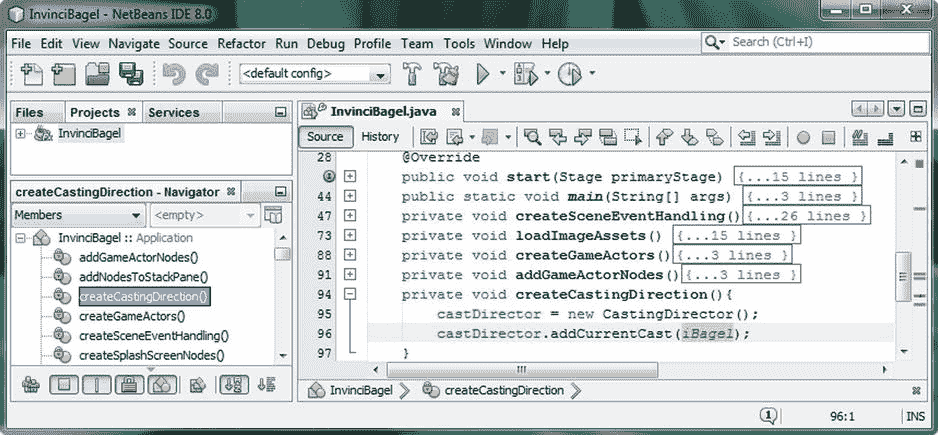

图 11-8。

Create private void createCastingDirection() method with castDirector and .addCurrentCast() statements

现在我们已经将图像资产放置到位，创建了演员对象，将他添加到场景图中，创建了 CastingDirector 引擎，并将 iBagel 添加到角色中，我们已经准备好处理游戏计时引擎了。

### 创建并开始你的游戏循环:。创建 StartGameLoop

我要跳到。createSceneGraphNodes()方法，它仍然是我们最复杂的方法体，我将它保存到最后，并创建一个名为。createStartGameLoop()。在这个方法中，我们将创建并启动我们的 GamePlayLoop 对象，它是我们在第 7 章中使用 GamePlayLoop 类创建的。这个类扩展了 JavaFX AnimationTimer 超类，为我们的游戏提供对 JavaFX 脉冲计时引擎的访问。在里面。createStartGameLoop()方法我们将使用 Java new 关键字，使用 GamePlayLoop()构造函数方法为我们名为 gamePlayLoop 的游戏创建一个脉冲引擎。之后，我们将调用。这个 gamePlayLoop 对象的 start()方法来启动脉冲事件计时引擎。该调用通过使用以下四行 Java 编程逻辑来完成，在图 [11-9](#Fig9) 中也显示为无错误:

`private void``createStartGameLoop()`T2】

`gamePlayLoop =``new`T2】

`gamePlayLoop``.start()`T2】

```java
}
```

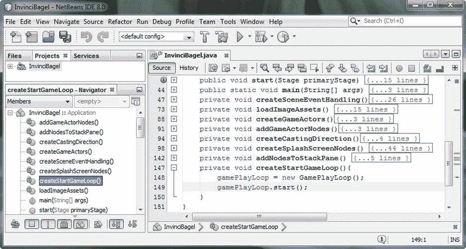

图 11-9。

Create a private void createStartGameLoop() method, and create and .start() the gamePlayLoop object

正如你在图 [11-9](#Fig9) 的底部所看到的，我已经折叠了其他的方法结构，并且它们在代码中的顺序与它们在。start()方法，用于组织目的。我最后启动一个游戏循环，因为我想确保在启动 JavaFX 脉冲引擎启动游戏之前，我已经完成了设置游戏环境所需的所有工作。如你所见，我使用了 Java 方法名和我的游戏代码设计，以提醒我每次添加新的游戏角色时需要做什么，现在我们的英雄已经就位，可能是游戏道具、投射物、敌人、宝藏等等。

### 更新 Splashscreen 场景图:. createsplash screen 节点()

现在是时候重组我们的。createSplashScreenNodes()方法体，然后我们将准备好把我们在 GamePlayLoop.java 类中创建的 JavaFX 脉冲引擎“连接”到我们使用 Actor.java、Hero.java 和 Bagel.java 类创建的 Actor 对象。我们已经从。createSplashScreenNodes()方法，并将它们放入。loadImageAssets()方法，它们更符合逻辑。我们需要做的另一件事是尝试简化我们的。start()方法将 ActionEvent 处理结构与它们各自的对象实例化和配置 Java 语句组合在一起。因此，举例来说，你的 gameButton 对象实例化、配置和事件处理都将保存在一个地方。我们将对 helpButton、scoreButton 和 legalButton 对象做同样的事情。我从。start()方法添加到。createSplashScreenNodes()方法在这里以粗体显示。新的。createSplashScreenNodes()方法体将包含以下三十几行 Java 代码:

`private void``createSplashScreenNodes()`T2】

```java
buttonContainer = new HBox(12);

buttonContainer.setAlignment(Pos.BOTTOM_LEFT);

buttonContainerPadding = new Insets(0, 0, 10, 16);

buttonContainer.setPadding(buttonContainerPadding);

gameButton = new Button();

gameButton.setText("PLAY GAME");

gameButton.setOnAction((ActionEvent) -> {

splashScreenBackplate.setVisible(false);

splashScreenTextArea.setVisible(false);

});

helpButton = new Button();

helpButton.setText("INSTRUCTIONS");

helpButton.setOnAction((ActionEvent) -> {

splashScreenBackplate.setVisible(true);

splashScreenTextArea.setVisible(true);

splashScreenTextArea.setImage(instructionLayer);

});

scoreButton = new Button();

scoreButton.setText("HIGH SCORES");

scoreButton.setOnAction((ActionEvent) -> {

splashScreenBackplate.setVisible(true);

splashScreenTextArea.setVisible(true);

splashScreenTextArea.setImage(scoresLayer);

});

legalButton = new Button();

legalButton.setText("LEGAL & CREDITS");

legalButton.setOnAction((ActionEvent) -> {

splashScreenBackplate.setVisible(true);

splashScreenTextArea.setVisible(true);

splashScreenTextArea.setImage(legalLayer);

});

buttonContainer.getChildren().addAll(gameButton, helpButton, scoreButton, legalButton);

splashScreenBackplate = new ImageView();
```

`splashScreenBackplate.setImage(``splashScreen`T2】

```java
splashScreenTextArea = new ImageView();
```

`splashScreenTextArea.setImage(``instructionLayer`T2】

```java
}
```

请注意，由于。loadImageAssets()方法在。createSplashScreenNodes()方法，我们仍然可以在方法体中保留引用加载的图像资产的最后四行代码。这是因为已经创建了 splashScreen 和 instructionLayer 图像对象，并在。loadImageAssets()方法。因为此方法是在。start()方法放在。createSplashScreenNodes()方法时，可以在该方法体中安全地使用这些对象。

正如你在图 [11-10](#Fig10) 中看到的，新方法是无错误的，所有的对象，包括名为 buttonContainer 的 HBox，名为 gameButton、helpButton、scoreButton 和 legalButton 的按钮，以及名为 splashScreenBackplate 和 splashScreenTextArea 的 ImageView，都在逻辑上组合在一起，并且现在组织得很好。

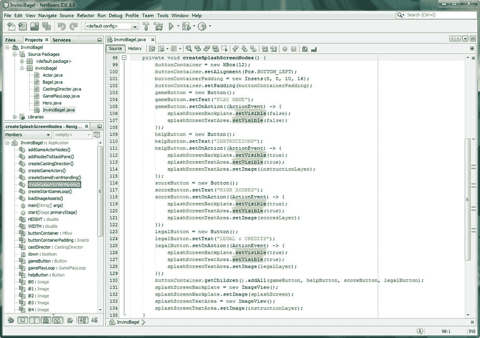

图 11-10。

Copy .setOnAction() event handlers from the .start() method into the .createSplashScreenNodes() method

因为我们不需要对你的。addNodesToStackPane()方法，我们已经完成了我们在这里需要做的代码重组，然后我们将这个游戏带到下一个复杂的级别！时不时地，你需要回去确保你的编程逻辑是最优结构的，这样当你构建更复杂的结构时，你就有了一个坚实的基础，就像你在构建一个真正的建筑结构一样。

## 为 iBagel 演员提供动力:使用游戏循环

接下来，让我们“连线”或连接这些游戏引擎，我们已经在本书前半部分的游戏代码基础设施中放置了这些引擎。我们需要做的第一件事是告诉 GamePlayLoop AnimationTimer 子类中的游戏引擎，我们希望它在每个脉冲上查看(更新)iBagel Bagel 对象。为此，我们需要在 GamePlayLoop.java 类中安装两行主要代码。第一个是对名为 iBagel 的静态 Bagel 对象的引用，我们在图 [11-3](#Fig3) 所示的代码中使用`import static invincibagel.InvinciBagel.iBagel` Java 语句声明了该对象。我们需要安装的第二行代码将位于。handle()方法，并将用于“连接”该。句柄()方法(脉冲引擎)到 iBagel 对象。update()方法。新的 GamePlayLoop 类导入语句和。handle()方法应该看起来像下面的 Java 代码，如图 [11-11](#Fig11) 所示，没有错误:

```java
import javafx.animation.AnimationTimer;

import static invincibagel.InvinciBagel.iBagel;

public class GamePlayLoop extends AnimationTimer {

@Override
```

`public void``handle``(long``now`T4】

```java
iBagel.update();

}

}
```

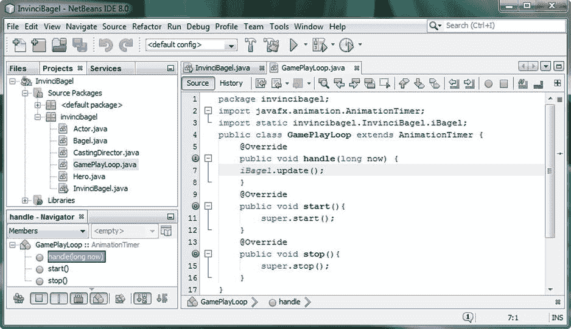

图 11-11。

Add a Java statement inside of the GamePlayLoop .handle() method invoking an iBagel.update() method

Java 语句所做的是调用。在每个脉冲事件上更新名为 iBagel 的 Bagel 对象的()方法。你放进去的任何东西。update()方法每秒将执行 60 次。任何其他想要以 60 FPS 处理的 Actor 对象，只需添加一个类似的。对此的 update()调用。handle()方法。

### 移动 iBagel Actor 对象:编码您的。update()方法

现在我们准备开始开发代码，在屏幕上移动我们的 InvinciBagel Actor 对象。我们将在本书的剩余部分中完善这些 Java 代码，因为一切都围绕着这个主要的演员对象和他的动作。这包括他移动的位置(边界和碰撞)，他移动的速度(速度和物理)，以及他移动时的样子(在精灵图像单元或“状态”之间制作动画)。所有这些代码都源自 iBagel 对象的内部。update()方法，所以我们将通过添加一些基本代码来开始这个漫长的旅程，这些代码查看我们的 InvinciBagel.java 类中的布尔变量，并保存箭头键(或 ASDW 键)按下和释放状态，然后使用条件 If 语句处理这些状态。这个条件语句处理的结果将在屏幕上移动 InvinciBagel 字符(最初，稍后我们将添加更高级的编程逻辑)。我们最终会让这种运动和互动越来越“智能”。我们要做的第一件事是使用 import static 语句使 Boolean 变量 up、down、left 和 right 对 Bagel 类可见，正如我们在本章前面所做的那样，使 iBagel 对象对 GamePlayLoop 类可见。handle()方法。添加的四个导入静态语句如下所示:

```java
package invincibagel;
```

`import static``invincibagel.InvinciBagel.``down`T3】

`import static``invincibagel.InvinciBagel.``left`T3】

`import static``invincibagel.InvinciBagel.``right`T3】

`import static``invincibagel.InvinciBagel.``up`T3】

```java
import javafx.scene.image.Image;

public class Bagel extends Hero {...}
```

正如你在图 [11-12](#Fig12) 中看到的，这段代码没有错误或警告，我们准备好继续添加条件编程逻辑，看看这四个变量中哪些设置为真，哪些设置为假，哪些设置为释放。在这些条件语句中，我们将根据 vX 和 vY(演员移动速度)变量放置移动 iX 和 iY(演员位置)变量的代码。

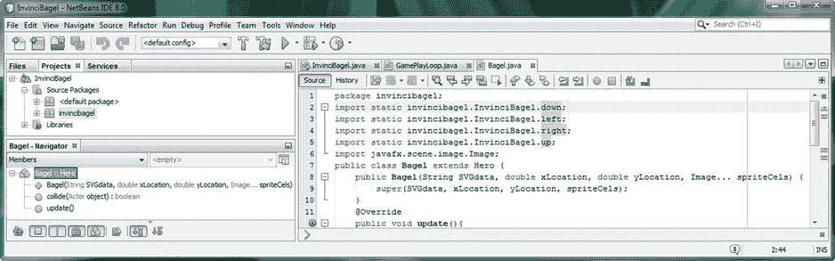

图 11-12。

Add import static invincibagel.InvinciBagel references to static boolean down, left, right, and up variables

由于我们在 Bagel 对象内部编写代码(在我们的例子中，我们实例化并命名它为 iBagel)，我们将有机会利用并理解 iX 和 iY 变量，这将在本章的下一节中进行，届时我们将开发访问和更改 iBagel Bagel 对象的 iX 和 iY 位置属性的代码语句，并添加访问和利用 iBagel Bagel 对象的 vX 和 vY velocity 属性的代码。

#### 构建。update()方法:使用 If 语句确定 X 或 Y 移动

现在是时候在 Bagel 类中添加一些基本的 Java 编程逻辑了。update()方法，该方法将沿 X 轴或 Y 轴移动 iBagel 对象(如果按下了多个键，则沿两个轴移动)。因为我们的 iX 和 iY 变量保存了屏幕上的 Actor 位置，所以我们将在每个 if 语句中使用它们，并分别增加(或减少)每个轴的速度变量数量(如果我们处理 iX，则为 vX；如果我们处理 iY，则为 vY)。我们最初将 vX 和 vY 值设置为 1，这相当于一个相对缓慢的移动。如果 vX 和 vY 设置为 2，iBagel 将移动两倍的速度(它将在每个脉冲事件上移动两个像素，而不是一个像素)。

如果右边的布尔变量为真，我们希望你的 iBagel 对象沿着 X 轴正向移动，所以我们将使用一个`if(right){iX+=vX}`编程语句，使用我们在[第 3 章](03.html)中学到的+=运算符将 vX 速度值加到 iX 位置值上。类似地，如果左边的布尔变量为真，我们将使用一个`if(left){iX-=vX}`编程语句，它将使用-= Java 操作符从 iX 位置值中减去 vX 速度值。

当向上和向下(或 W 和 S)键被按下时，我们将沿着 Y 轴做本质上相同的事情。如果 down 布尔变量为 true，我们希望 iBagel 对象沿着 Y 轴正向移动。因此，我们将使用一个`if(down){iY+=vY}`编程语句，使用+=运算符将 vY 速度值加到 iY 位置值上。在 JavaFX 中，正的 X 值从 0，0 原点向右，而正的 Y 值从 0，0 向下。最后，为了向上移动 iBagel，我们将使用一个`if(up){iY-=vY}`编程语句，它将使用-=操作符从 iY 位置值中减去 vY 速度值。执行这四个条件 if 语句求值的基本 Java 代码，以及它们各自在 Bagel 类中的 X 或 Y sprite 移动计算。update()方法，如图 [11-13](#Fig13) 所示，到目前为止应该看起来像下面的方法体结构:

```java
@Override

public void update() {
```

`if(``right`T2】

`if(``left`T2】

`if(``down`T2】

`if(``up`T2】

```java
}
```

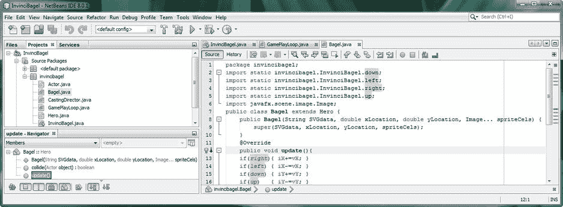

图 11-13。

Add four if statements to the .update() method, one for each right, left, down, and up boolean variable

接下来，让我们使用 ImageView 在屏幕上移动 iBagel。setTranslateX()和。setTranslateY()方法。

#### 移动场景图 ImageView 节点:。setTranslateX()和。setTranslateY()

现在我们已经有了条件语句，它将根据玩家按下(或未按下)的箭头键(或 ASDW 键)来处理 invincibage 在屏幕上的位置，让我们添加 Java 编程语句，这些语句将从 InvinciBagel iX 和 iY 变量中获取数据，并将此 sprite 位置信息传递给 spriteFrame ImageView 节点对象，以实际让它在显示屏上重新定位节点。那个。setTranslateX()和。setTranslateY()方法是节点超类的转换方法的一部分。这些方法还包括将旋转和缩放节点对象的方法调用；在这种情况下，Actor spriteFrame ImageView 节点包含 List  ArrayList 对象中的一个图像资产。

当我们称之为。setTranslate()方法，在 iBagel 对象的 spriteFrame ImageView 节点对象之外，我们引用安装在抽象 Actor 超类内部的 spriteFrame ImageView 对象。由于 Actor 超类用于创建 Hero 超类，而 Hero 超类用于创建 Bagel 类，因此可以通过使用 spriteFrame.setTranslateX)语句在 Bagel 类内部引用 spriteFrame ImageView 对象，如以下 Java 代码所示。update()方法，如图 [11-14](#Fig14) 所示:

```java
public void update() {

if(right) { iX += vX }

if(left)  { iX -= vX }

if(down)  { iY += vY }

if(up)    { iY -= vY }
```

`spriteFrame.``setTranslateX`T2】

`spriteFrame.``setTranslateY`T2】

```java
}
```

正如你在图 [11-14](#Fig14) 中看到的，代码是没有错误和警告的，我们已经准备好测试我们在本章中编写的代码，包括重组的 InvinciBagel.java 类和它的六个新方法，更新的 Bagel.java 类和它的。update()方法和更新后的 GamePlayLoop.java 类，以及它的。handle()方法。

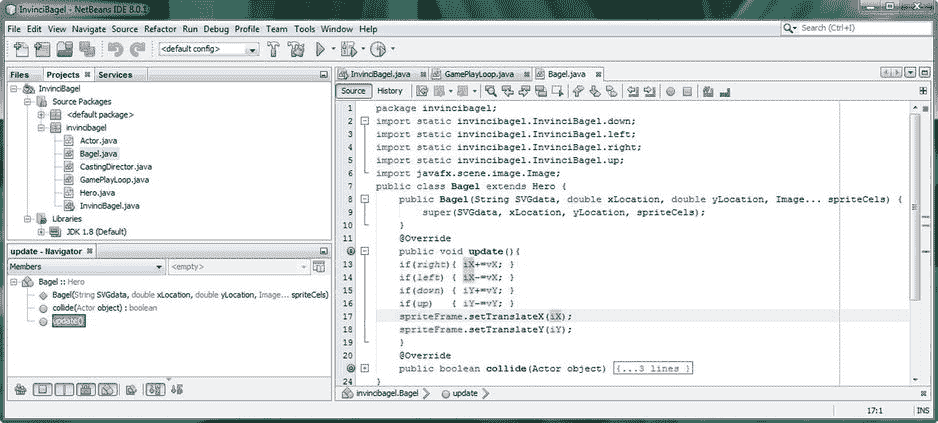

图 11-14。

After the four if statements, add statements calling the .setTranslate() methods off of the spriteFrame

## 测试我们的新游戏设计:移动无敌

在这一章中，我们对我们的游戏应用做了重大的修改，特别是对 InvinciBagel.java 类的结构，增加了六个全新的方法，并完全移动了我们的事件处理代码。我们创建了一个 iBagel Bagel 对象，和一个 castDirector CastingDirector 对象，使用了我们在第 10 章中创建的类。我们使用 JavaFX 脉冲引擎连接了 GamePlayLoop 对象和一个 Actor 对象(一个 iBagel Bagel 对象)。GamePlayLoop.java 类中的 handle()方法和。Bagel.java 类中的 update()方法。现在是时候使用我们的“运行➤项目”工作流程，并确保我们在本章中放置的所有 Java 代码都做了它应该做的事情:也就是说，我们认为它应该做的事情。毕竟，这就是编程实践的全部内容:编写我们认为会做某事的代码，运行它以查看它是否能做，然后调试它以找出它为什么不能工作，如果事实上不能的话。一旦您单击 NetBeans IDE 顶部的“播放”按钮并调用“运行➤项目”过程，代码将会编译，图 [11-15](#Fig15) 中所示的 invincibagel 游戏窗口将会在您的桌面上打开。您应该注意的第一件事是 InvinciBagel sprite 不见了，因为我们先将它添加到了根 StackPane 对象中，而不是最后，因此闪屏和游戏用户界面设计仍按预期工作。

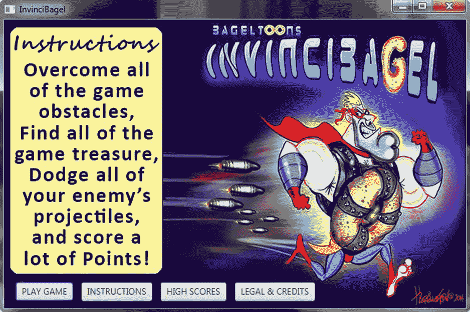

图 11-15。

Use Run ➤ Project to start the game and click the PLAY GAME Button

接下来，让我们通过单击 PLAY GAME 按钮控件对象来测试 ActionEvent 处理，然后测试 KeyEvent 处理。这将隐藏 splashScreenBackplate 和 splashScreenTextArea ImageView 对象，并显示使用颜色为名为 Scene 的场景对象设置的白色背景色。白色常数。

正如你所看到的，在图 [11-16](#Fig16) 的左半部分，情况确实如此，我们的 invincibegel 角色在屏幕上，我们准备测试我们在[第 9 章](09.html)中放置的 KeyEvent 处理，看看我们是否能让 invincibegel(iBagel Bagel 对象)角色在屏幕上移动。随着我们完成每一章，这开始变得越来越令人兴奋！

让我们先测试最坏的情况，看看 JavaFX 脉冲事件和关键事件处理基础设施到底有多强大。同时按向上键和向左箭头键，或 A 键和 W 键。正如你所看到的，InvinciBagel 角色在一个对角线向量上平稳地移动，向左上方。这样做的结果可以在图 [11-16](#Fig16) 的右半部分看到。尝试使用单独的键，以确保它们正常工作。

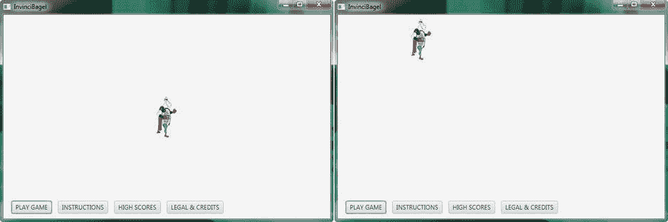

图 11-16。

Hold a left arrow (or A) and up arrow (or W) key down at the same time, and move the Actor diagonally

当你玩你现在启用运动的 InvinciBagel 精灵时，注意你可以将他移动到屏幕底部的 UI 按钮后面，如图 [11-17](#Fig17) 的左半部分所示。这是因为你有你的。addGameActorNodes()方法。调用 addNodesToStackPane()方法，该方法赋予游戏中的所有内容比用户界面设计中的所有内容更低的 Z 索引。还要注意，你可以将 InvinciBagel 移出屏幕(玩家看不到)，我们将在《T2》第 12 章中解决这个问题，届时你将添加到现有代码中，以建立边界并实现其他高级移动功能。最后，请注意，如果您使用左右箭头键(不是 ASDW 键)，按钮控制焦点(蓝色轮廓)也会移动，这意味着我们还必须在未来的章节中通过“消费”我们的 KeyEvents 来解决这个问题如您所见，在我们结束之前，有许多非常酷的代码要写，还有关于 Java 8 和 JavaFX 8.0 的东西要学！

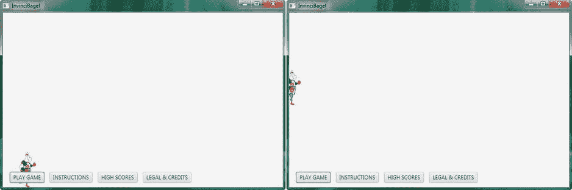

图 11-17。

Notice the InvinciBagel character is using a lower Z-index than the UI elements, and can move off-screen

在本章中，你又一次取得了巨大的进步，优化了你的主要 InvinciBagel.java 类，实现了你在本书中已经编写的所有类，将游戏循环引擎连接到你的主要游戏角色中，测试了你所有的 ActionEvent 和 KeyEvent 处理，并且做得非常好！我认为这是相当成功的一章，我们将继续在每一章中度过美好时光！

## 摘要

在第十一章中，我们重组了我们的主要 InvinciBagel.java 类，提取了五个关键的游戏创建 Java 语句，然后将其余的 Java 代码组织成八个逻辑方法(例程)，其中六个是我们在本章中从头开始创建的。这六个新方法用于打包诸如添加图像资产、创建新的演员对象、将演员添加到场景图、将演员添加到演员阵容、创建和启动游戏引擎以及实现游戏关键事件处理例程之类的事情。我们添加了对象声明，这样我们就可以为游戏的主要角色创建一个新的 iBagel Bagel 对象，还创建了一个 castDirector CastingDirection 引擎，这样我们就可以在后面的章节中管理角色成员。

我们学习了导入静态语句，并了解了如何使用它们将 iBagel Bagel 对象连接到 GamePlayLoop.java 引擎。handle()方法。我们还使用这些导入静态语句来允许我们的 Bagel.java 类处理。update()方法。

接下来，我们讲述了如何使用条件 if 语句来确定游戏玩家正在使用哪些关键事件(保存在四个布尔变量中)。我们将这个逻辑放在了 Bagel 类中。update()方法，我们知道 GamePlayLoop 每秒钟快速执行 60 次。handle() JavaFX 脉冲引擎。

最后，我们测试了本章中添加的所有新方法和 Java 语句，看看基本的游戏精灵运动是否有效。我们观察了一些需要在未来章节中解决的问题，并彻底测试了现有的 KeyEvent 处理方法和抽象 actor 类的 iX、iY、vX 和 vY 属性，我们创建这些抽象 Actor 类作为所有游戏 Actor 资产的基础。

在下一章中，我们将仔细研究 JavaFX Node 类，并研究关于在屏幕上移动游戏精灵的高级概念，以及如何确定屏幕的边界(边缘)、角色方向、移动速度以及相关的动画和移动注意事项。