# 十二、在 2D 为演员形象设置边界：使用节点类`LocalToParent`属性

现在我们已经将你的 Java 代码组织成了 InvinciBagel.java 类中的逻辑方法，并连接了 GamePlayLoop。对百吉饼的 handle()方法。update()方法在[第 10 章](10.html)中，为了确保我们的 KeyEvent 处理器会在屏幕上移动我们的 InvinciBagel 角色，是时候为我们的游戏英雄建立一些边界了，可以说，这样他就不会离开游戏场。要做到这一点，我们需要比在《T2》第四章中更深入地研究 JavaFX 节点超类。我们将看看变换是如何执行的，更重要的是，它们如何相对于父节点起作用，父节点在场景图中位于它们的上方。对于我们的 Actor ImageView 节点，父节点将是场景图根 StackPane 节点。

在我们开始了解代码复杂性之前，比如绝对或相对转换，我们将在本章中讨论，以及诸如碰撞检测和物理模拟之类的事情，我们将在稍后的[第 16 章](16.html)和[第 17 章](17.html)中讨论，我们将需要在[第 12 章](12.html)中回到我们的 InvinciBagel.java 主要应用类 Java 代码，以便我们可以做更多的事情来优化我们游戏的 Java 8 基础。在这本书的第一部分，我们已经把我们的游戏引擎放到了适当的位置，在我开始在我们到目前为止已经放好的位置上构建复杂的代码结构之前，我想确保一切都“符合标准”。我们要确保一切都“锁得紧紧的！”

出于这个原因，我将在本章的前几页去掉那些导入静态 Java 语句，尽管它们工作得很好，正如您所看到的，它们并不是 Java 编程中的“最佳实践”。在类之间有一种更复杂的交流方式，涉及到 Java“this”关键字，所以我将向您展示如何实现更多的私有变量(和更少的静态变量)，然后我将教您如何使用 Java this 关键字表示的引用对象，在类之间发送对象数据变量。

对于一本初学者级别的书来说，这是一个有点高级的主题，但它将允许您编写更专业和“行业标准”的 Java 8 代码，因此值得付出额外的努力。有时候，正确的做事方法比基本的(简单的)编码方法更复杂和详细。这里的假设是你将制作一个商业上可行的游戏，所以你需要一个坚实的基础来构建越来越复杂的代码。

在我们完成了在 InvinciBagel 类中添加额外的代码改进之后，这将尽可能使用私有变量实现 Java“封装”,并且在需要向其他相关类提供对 InvinciBagel 对象的访问的地方添加 this 关键字——在本例中，现在是 GamePlayLoop 和 Bagel 类——我们将开始向我们的 Bagel 类中的 sprite 运动代码添加复杂性。update()方法。

我们将添加代码，告诉你的无敌角色场景和舞台的天花板和地板在哪里，以及屏幕的左右两边在哪里，这样他就不会从他平坦的 2D 世界中掉下来。我们还将组织 Bagel.java 类中的方法，以便。update()方法只调用更高级别的方法，这些方法以一种异常组织良好的方式包含所有 Java 编程逻辑。

## InvinciBagel 私有化:去除静态修饰符

关于 InvinciBagel.java 类 Java 代码，以及 GamePlayLoop.java 类代码和 Bagel.java 类代码，我想做的第一件事是从这两个“worker”类的顶部删除这些导入静态语句，并在 Bagel()构造函数方法和 GamePlayLoop()构造函数方法中使用 Java this 关键字传递 InvinciBagel 类(上下文)对象。此过程的第一步将跨越本章的下几页，将公共静态布尔变量声明复合语句更改为不使用静态修饰符，而使用 private 关键字代替公共访问控制修饰符，如下所示:

`private` `boolean up, down, left, right;`

正如你在图 [12-1](#Fig1) 中看到的，这不会在代码中生成任何红色错误或黄色警告高亮；但是，它会产生灰色波浪下划线。这表示突出显示的代码当前没有被使用。由于 Java 中关于静态修饰符关键字的“约定”或一般规则是将它们与常量一起使用，例如我们在代码的第一行，因此，我将通过移除静态修饰符(首先)，并使许多其他声明私有，来尽可能地“封装”这个 InvinciBagel.java 类中的代码。

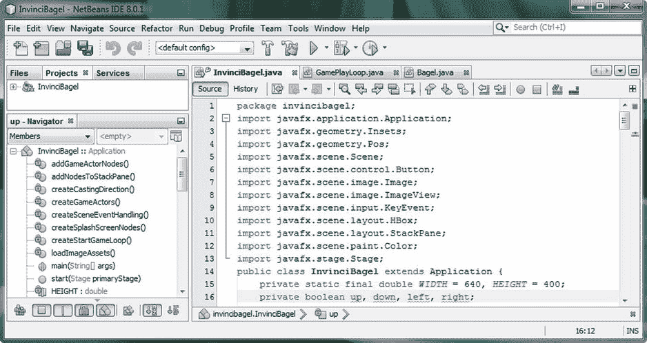

图 12-1。

Change the public static access modifiers for the boolean KeyEvent variables to be private access control

我们接下来要放置的代码将消除这种灰色波浪突出显示，事实上，我们将让 NetBeans 使用源代码➤插入代码➤ Getters 和 Setters 工作进程为我们编写代码，我们在[第 8 章](08.html)中了解了这一点，当时我们创建了 Actor 和 Hero 超类。那个。是()和。我们接下来要生成的 set()方法是一种解决方案，它允许我们消除公共静态变量声明，该声明允许您的 InvinciBagel.java 外部的类“深入内部”(可以认为这是一个安全漏洞)来获取这四个布尔变量。将这些变量设为私有可以防止这种情况。所以我们需要把。是()和。使用更“正式”的方法调用，将()方法设置到强制外部类和方法“请求”该信息的位置。

这一次，我们将使用 NetBeans 生成 getter 和 Setters 对话框，如图 [12-2](#Fig2) 所示，来选择性地写入 getter(即。is()方法)和 setters(方法。set()方法)，它将访问四个布尔变量。从技术上讲，现在我们只需要使用吸气剂。is()方法，所以你可以使用生成➤ Getter 菜单选项，显示在图 [12-2](#Fig2) 中间(用红线包围的)所选 Getter 和 Setter 选项上方的中间(弹出或浮动)生成菜单中。我更喜欢生成这两个方法“方向”，以防在软件开发过程的后期，由于一些与游戏逻辑开发相关的编程原因，我需要设置这些变量(在外部，在另一个类中)。

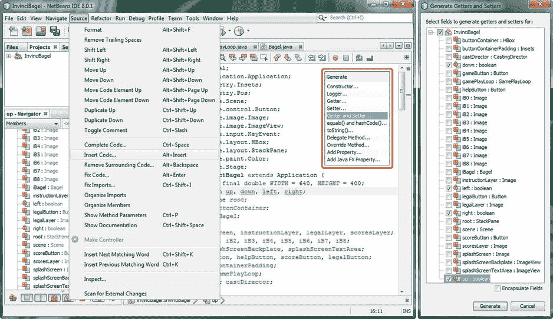

图 12-2。

Use the Source ➤ Insert Code ➤ Getter and Setter dialog to create methods for the four boolean variables

在“生成 Getters 和 Setters”对话框中选择四个布尔变量 down、left、right 和 up，如图 [12-2](#Fig2) 的最右侧所示，单击光标，使其位于类中最后一个花括号的前面(这将告诉 NetBeans 您希望它在当前类结构的末尾编写或放置此代码)，然后单击该对话框底部的“生成”按钮，以生成八个新的布尔变量访问方法结构。

正如你在图 [12-3](#Fig3) 中看到的，在你的 InvinciBagel.java 类的底部有八个新方法。需要注意的是。set()方法都使用 Java this 关键字将传递给方法的布尔变量设置为 up、down、left 或 right(私有)变量。那个。例如，setUp()方法应该是这样的:

`public void``setUp`T2】

`this` `.up = up;`

```java
}
```

在这种情况下，this.up 引用 InvinciBagel 对象(InvinciBagel 类)内部的私有 up 变量。

正如您所看到的，这是一种新的(更复杂，或者至少在代码方面更复杂)方式，我们现在可以访问 up 变量，而不必使用静态修饰符关键字和 Bagel.java 类顶部的导入静态声明来跨类访问，稍后您将看到，我们不再需要使用它。

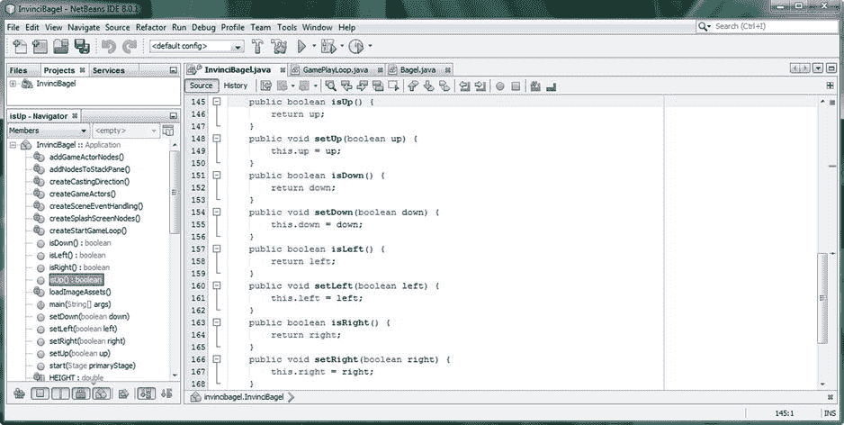

图 12-3。

Place the cursor at the bottom of the class so that the four .set() and .is() methods are the last ones listed

现在，我们通过将布尔变量声明为私有，并为 InvinciBagel 外部的类和对象放置 getter 和 setter 方法以请求该数据，使 InvinciBagel 类封装得更好一些(更私有，更少公开),我们将需要修改 Bagel 类构造函数方法以接收 InvinciBagel 对象的副本，以便调用类具有 InvinciBagel 类(以及对象)必须提供的“数字上下文”。这是通过使用 Bagel()参数列表中的一个附加参数 Java this 关键字来完成的。

### 将上下文从 InvinciBagel 传递到 Bagel:使用此关键字

关于如何消除静态导入语句，并以合法的方式在类(对象)之间进行访问，这个难题的最后一部分是使用 Bagel()构造函数方法将 InvinciBagel 类的当前配置传递给 Bagel 类(对象),该配置保存在上下文对象引用中，this 关键字实际上表示上下文对象引用。一旦 Bagel 类接收到关于 InvinciBagel 类(对象)如何设置、它包括什么以及它做什么的上下文信息(嘿，我没有无缘无故地把这个对象引用称为“上下文”对象引用)，它将能够使用。isUp()方法来“查看”Boolean up 变量的值，而不需要在除常量之外的任何地方进行任何静态声明，这正是导入静态引用应该使用的。

要升级 Bagel 类，我们需要做的第一件事是设置一个变量来保存 invincibegel 上下文对象引用信息，并修改我们当前的 Bagel()构造函数方法，以便它可以接收 invincibegel 对象引用。我们需要在类的顶部添加一个`protected InvinciBagel invinciBagel;`语句，创建一个 invinciBagel 引用对象(该变量将在内存中保存对该对象的引用)来保存这些信息。我进行这种受保护访问的原因是，如果我们使用 Bagel 创建任何子类，它都可以访问这个上下文对象引用信息。这个对象声明将使用下面的 Java 语句，位于 Bagel.java 类的最顶层，如图 [12-4](#Fig4) 所示:

`protected``InvinciBagel``invinciBagel`T3】

接下来，让我们将 InvinciBagel 上下文对象添加到 Bagel()构造函数的参数列表的前面，因为我们不能将它放在参数列表的末尾，因为我们使用参数列表的末尾来保存我们的图像...List(或 Array，在代码中的某个点上是这两者)规范。在构造函数方法本身的内部，您将设置 invinciBagel 引用对象(使用名称 iBagel 传递到构造函数方法中)等于 InvinciBagel 变量，您已经在 Bagel.java 类的顶部声明了该变量。这将通过使用以下修改的 Bagel()构造函数方法结构来完成，可以在图 [12-4](#Fig4) 的顶部看到突出显示:

`public Bagel(InvinviBagel` `iBagel` `, String SVGdata, double xLocation, double yLocation,`

```java
Image... spriteCels)  {

super(SVGdata, xLocation, yLocation, spriteCels);
```

`invinciBagel``=``iBagel`T3】

```java
}
```

正如你在图 [12-4](#Fig4) 中看到的，我们的代码是没有错误的，我们已经准备好返回到我们的 InvinciBagel.java 类中，并将 Java this 关键字添加到 Bagel()构造函数方法调用中。这样做将把 InvinciBagel 类(对象)引用对象传递给 Bagel.java 类(对象),以便我们能够使用。是()和。set()方法，而不必指定任何导入语句。您还可以删除 Bagel.java 类顶部的四个导入静态语句。如图 [12-4](#Fig4) 所示，我已经删除了这些静态导入语句。

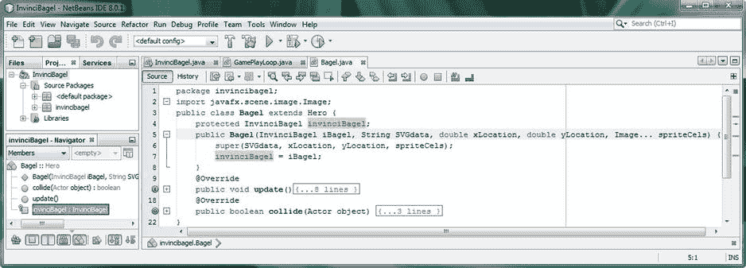

图 12-4。

Add an InvinciBagel object variable named invinciBagel, and add the object into the constructor method

现在让我们回到 InvinciBagel.java NetBeans 的编辑选项卡，并完成两个类的连接。

#### 修改 iBagel 实例化:将 Java this 关键字添加到方法调用中

打开你的。使用 NetBeans 左侧的+扩展图标创建 GameActors()方法结构。在要传递给 Bagel()构造函数方法调用的参数列表的“头”或前面添加一个 this 关键字。您新修改的 Java 语句应该看起来像下面的代码，它也在图 [12-5](#Fig5) 中突出显示:

`iBagel = new Bagel(``this`T2】

正如你在图 [12-5](#Fig5) 中看到的，你的 Java 代码是没有错误的，这意味着你现在已经将你的 InvinciBagel.java 类(或者由它创建的对象，然而你更喜欢看它)的上下文的副本传递到了 Bagel 类中(或者更准确地说，传递到了通过使用 Bagel()构造函数方法创建的对象中)。this 对象的数字上下文结构中包含的内容超出了初学者书籍的范围，但可以说 this 关键字将传递对对象的完整结构引用。这个引用包含了所有的上下文信息，这些信息需要给被传递的对象提供足够的信息，以便能够把所有的东西都放到“数字视角”(上下文)中，关于传递这个引用对象的类，在我们的例子中，这将是 InvinciBagel 类(object ),它把关于它自己的上下文信息传递给 Bagel 类(object)。这将包括你的对象结构(变量、常量、方法等。)以及与涉及系统内存使用和线程使用的更复杂的事情相关的状态信息。可以将使用 Java this 关键字将一个对象的上下文信息传递给另一个对象看作是将它们连接在一起，这样您的接收对象就可以通过使用 this object 引用来查看发送对象。

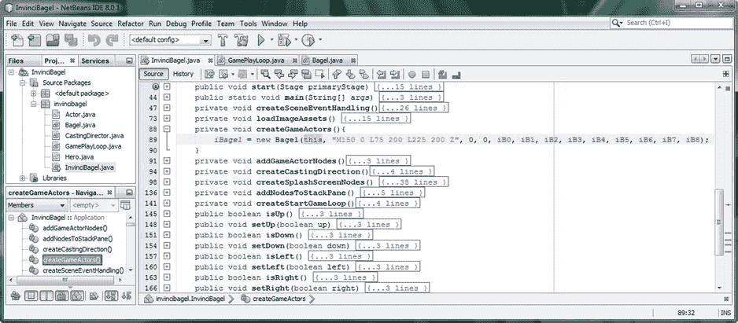

图 12-5。

Modify the iBagel instantiation to add a Java this keyword to the Bagel() constructor method parameters

现在，InvinciBagel 类(对象)的 this 引用(上下文对象)已经通过在 Bagel()构造函数方法中使用 Java this 关键字传递给了 Bagel 类(对象),我们现在已经在这两个类之间创建了一个更加符合行业标准的链接。我们现在可以开始换面包圈了。update()方法，以便它使用新的。is()方法调用从它现在拥有的 InvinciBagel 对象引用中获取四个不同的布尔变量值(状态)。我们需要这些数据来在屏幕上移动我们的无敌角色。

#### 用你的新无敌组合。is()方法:更新你的面包圈。update()方法

消除使用导入静态引用和静态变量的下一步是使用。isUp()、isDown()、isLeft()和 isRight()方法调用。因为我们不再使用静态变量来跨类(对象)访问，所以我们需要替换当前在 Bagel 类的 if()语句中使用的这些实际的上、下、左、右静态变量。update()方法。这些将不再工作，因为它们现在被封装在 InvinciBagel 类中，并且是私有变量，所以我们将不得不使用。isUp()、isDown()、isLeft()和 isRight() "getter "方法，礼貌地敲开 InvinciBagel 的门，并询问这些值！

我们会打电话给我们的四个。is()方法“脱离”invinciBagel 引用对象(使用点符号)，我们已经在 Bagel.java 类的顶部声明并命名了 InvinciBagel。这个变量(对象引用)包含 InvinciBagel 类上下文，我们使用 Java this 关键字将它从 InvinciBagel 类发送到 Bagel 类。这意味着，如果我们在代码中说 invinciBagel.isRight()，我们的 Bagel 类(对象)现在知道这意味着:使用“this”引用对象进入 invinciBagel InvinciBagel 对象(这里只是想显得可爱)，这将向 Bagel 类(对象)显示如何、在哪里到达并执行`public void .isRight() {...}`方法结构，这将传递 invinciBagel 对象中封装的私有 boolean right 变量。这里包含的是 Java OOP“封装”概念的演示

你的新。update()方法体将使用相同的六行 Java 代码，修改后调用。is()方法位于现有条件 if 结构的 if(condition=true)计算部分的内部。新的 Java 代码如图 [12-6](#Fig6) 所示，应该如下所示:

`public void``update()`T2】

`if(invinciBagel.``isRight()`T2】

`if(invinciBagel.``isLeft()`T2】

`if(invinciBagel.``isDown()`T2】

`if(invinciBagel.``isUp()`T2】

```java
spriteFrame.setTranslateX(iX);

spriteFrame.setTranslateY(iY);

}
```

正如你在图 [12-6](#Fig6) 中看到的，代码是没有错误的，你现在有了一个。update()方法，该方法从 InvinciBagel.java 类中访问布尔变量，而无需使用任何导入静态语句。

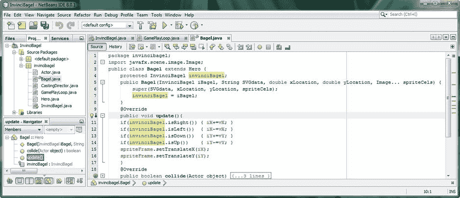

图 12-6。

Insert the invinciBagel.is() method calls inside of the if statements, where the boolean variables used to be

你可能会想，既然这是在我的 Bagel.java 类中去掉导入静态语句的好方法，为什么我不用同样的方法在我的 InvinciBagel.java 类中去掉静态 Bagel iBagel 声明，以及在 GamePlayLoop.java 类中用来访问静态 iBagel Bagel 对象的导入静态语句呢？哇，这是一个奇妙的想法，伙计们，我只是希望我想到了它！事实上，让我们现在就做吧！

### 移除静态 iBagel 引用:修改 Handle()方法

正如你在图 [12-7](#Fig7) 中看到的，我们仍然有相当多的 InvinciBagel 变量是使用静态关键字声明的，事实上它们并不是常量。在本章结束之前，我们将消除这些，因此只有我们的宽度和高度常数使用静态修饰符关键字。因为我们要在 GamePlayLoop()构造函数方法中使用 Java this 关键字将 InvinciBagel 对象引用传递给 GamePlayLoop 类，这意味着我们可以从 InvinciBagel 类顶部的 Bagel iBagel 对象声明语句中删除 static 关键字。这可以使用下面的变量声明来完成，如图 [12-7](#Fig7) 所示(突出显示):

```java
Bagel iBagel;
```

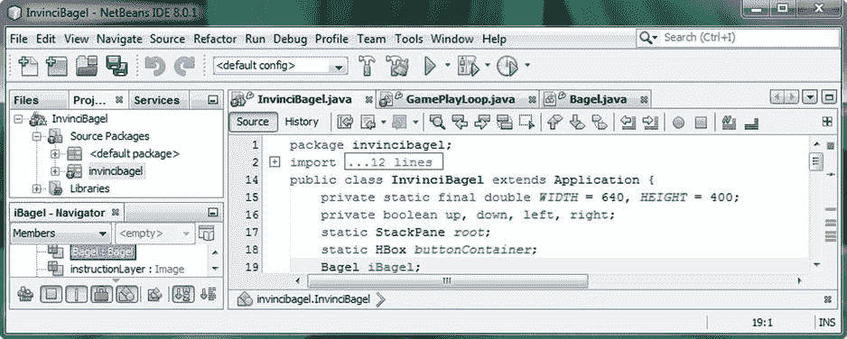

图 12-7。

Remove the Java static modifier keyword from in front of your Bagel iBagel object declaration statement

为了确保 InvinciBagel 和 GamePlayLoop 类(对象)可以相互通信，我们需要做的下一件事是使 GamePlayLoop()构造函数方法兼容(在 InvinciBagel 的参数列表中接受 InvinciBagel 的 this context 引用对象)InvinciBagel 类的 this 对象引用，我们需要将它发送到构造函数方法调用中的 GamePlayLoop 类。因为我们目前依赖 Java 编译器为我们创建 GamePlayLoop()构造函数方法，所以我们需要为自己创建一个！正如你在[第 3 章](03.html)中所学的，如果你没有为一个类显式地创建一个构造函数方法，那么将会为你创建一个。

#### 增强 GamePlayLoop.java:创建 GamePlayLoop()构造函数方法

让我们在 GamePlayLoop.java 课堂上执行一个类似于我们在 Bagel.java 课堂上所做的工作流程。在类的顶部添加一个`protected InvinciBagel invinciBagel;`语句。接下来，创建一个公共的 GamePlayLoop()构造函数方法，在参数列表中有一个名为 iBagel 的 InvinciBagel 对象。在 GamePlayLoop()构造函数方法内部，将 iBagel InvinciBagel 对象引用设置为等于受保护的 InvinciBagel invinciBagel(reference)变量，以便我们可以在 GamePlayLoop 内部使用新的 InvinciBagel InvinciBagel 对象引用。handle()方法。这将允许我们调用。使用 invinciBagel InvinciBagel 引用对象更新 iBagel Bagel 对象的()方法。GamePlayLoop 类和构造函数方法结构，以及新的。在图 [12-8](#Fig8) 中，handle()方法体(包括修改后的 invinciBagel.iBagel.update()方法调用路径(对象引用结构))显示为无错误，应该类似于下面的 Java 代码:

`public class``GamePlayLoop`T2】

`protected``InvinciBagel``invinciBagel`T3】

`public GamePlayLoop(InvinciBagel``iBagel`T2】

`invinciBagel``=``iBagel`T3】

```java
}

@Override

public void handle(long now) {
```

`invinciBagel` `.iBagel.update();.`

```java
}

}
```

正如你在图 [12-8](#Fig8) 中看到的，我点击了 InvinciBagel 变量(invinciBagel 对象引用),因此它被高亮显示，你可以看到它在两种方法中的用法。声明在 GamePlayLoop 类中使用，GamePlayLoop()构造函数方法中的实例使用 InvinciBagel 类 this 关键字(使用 iBagel 参数)设置，变量引用在。handle()方法访问了 Bagel 类。使用 iBagel Bagel 对象和 invinciBagel InvinciBagel 引用对象的 update()方法。Java 很高级，但是很酷。

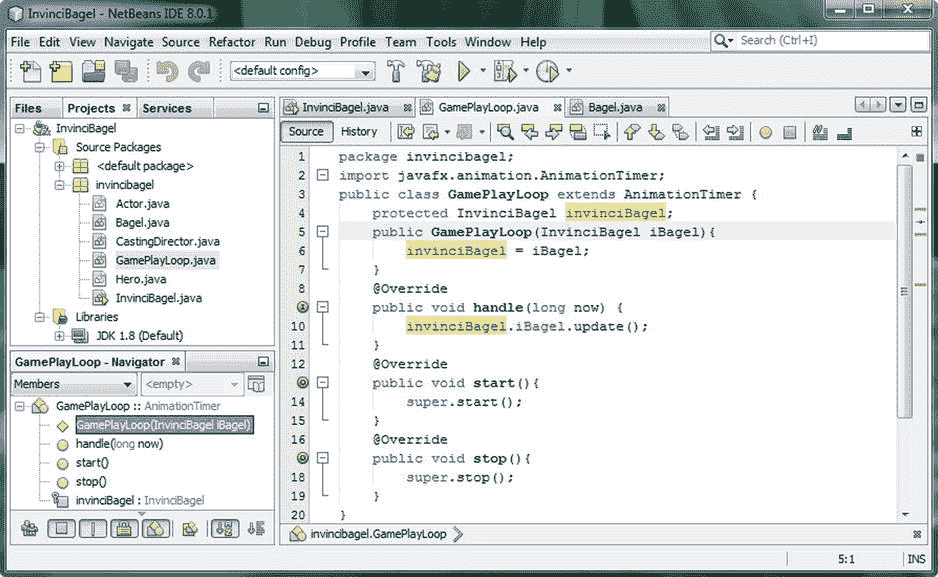

图 12-8。

Make the same change to GamePlayLoop by adding an invinciBagel InvinciBagel variable and constructor

现在，我们已经创建了自定义的 GamePlayLoop()构造函数方法，该方法用于接收名为 iBagel 的 invinciBagel 对象引用，然后将其赋给 InvinciBagel 变量，现在是时候返回到 InvinciBagel.java 代码(NetBeans 中的编辑选项卡)了。

这个(第二个)谜题的最后一块是移除静态的百吉饼 iBagel 声明是在 GamePlayLoop()构造函数方法调用中添加 Java this 关键字。在我们这样做之后，我们的 InvinciBagel、Bagel 和 GamePlayLoop 将相互连接，而不使用任何静态变量(除了宽度和高度常量)。

### 在 GamePlayLoop()构造函数中使用 this:GamePlayLoop(this)

打开你的。创建 StartGameLoop()方法结构，使用 NetBeans 左侧的+ expand 图标，如图 [12-9](#Fig9) 所示。在参数区域中添加 Java this 关键字，以便再次传递 InvinciBagel 对象引用，这一次是对 GamePlayLoop()构造函数方法的调用。这将为该类提供对 InvinciBagel 类及其上下文和结构的引用，就像您对 Bagel 类所做的那样。您新修改的 Java 方法体和构造器方法调用将看起来像下面的代码，它在图 [12-9](#Fig9) 中突出显示:

```java
private void createStartGameLoop() {
```

`gamePlayLoop = new GamePlayLoop(``this`T2】

```java
gamePlayLoop.start();

}
```

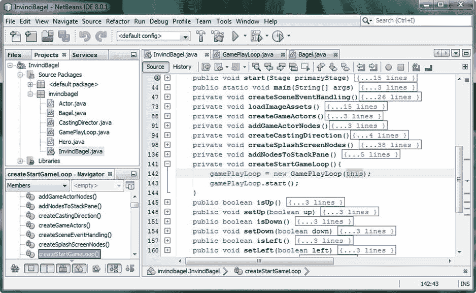

图 12-9。

Add a Java this keyword inside of the GamePlayLoop() constructor method call to provide a context object

只要我们完全封装了 InvinciBagel.java 类，让我们也将 StackPane 根变量设为私有，并去掉静态修饰符。因为我已经将名为 root 的 StackPane 对象移回到。开始()菜单。createSplashScreenNodes()方法，没有理由使用 static modifier 关键字。我正试图移除所有的静态修饰符(不是常量)并尽可能“私有化”这个类。

### 删除剩余的静态变量:StackPane 和 HBox

现在，我将从 InvinciBagel.java 类顶部的变量声明行开始，从我们设为私有的布尔变量(它们是公共静态的)开始，看看这些变量中有哪些我可以设为私有的，而不是包保护的静态的(目前是 StackPane 和 HBox)，或者有哪些是包保护的，可以设为私有的。私有变量将该变量的数据“封装”在类(对象)本身内部；在这种情况下，这将是我们目前正在完善的 InvinciBagel.java 代码。受包保护的变量将数据封装在包内；在这种情况下，这将是不可战胜的软件包。用于声明名为 root 的 StackPane 对象(场景图的根元素)为 InvinciBagel.java 类的私有成员(仅限)的新 Java 语句将使用以下代码完成，如图 [12-10](#Fig10) 所示。

`private` `StackPane root;`

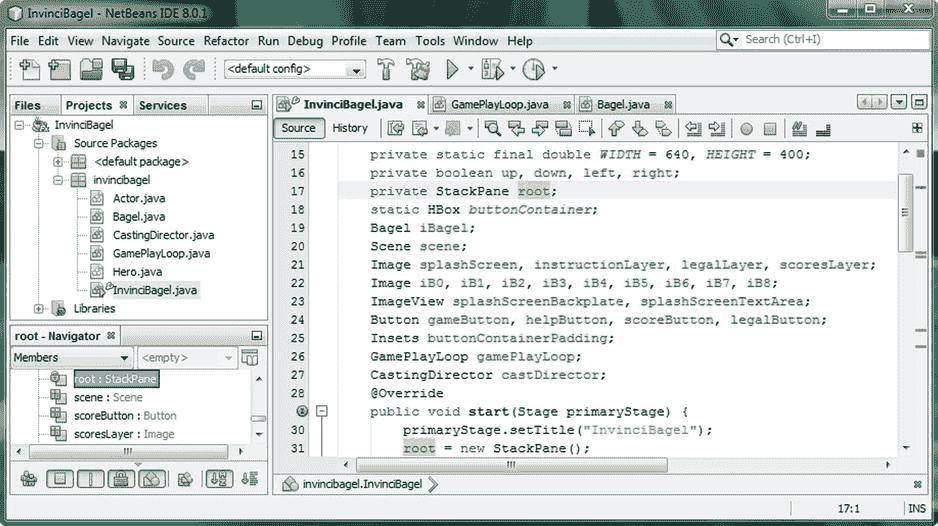

图 12-10。

Change the declaration statement for the StackPane object named root from a static modifier to private

类顶部声明中的下一个静态变量是`static HBox buttonContainer;`，我也将使用下面的 Java 语句将这个变量声明改为私有变量:

`private` `HBox buttonContainer;`

让我们确保。createSplashScreenNodes()方法仍然可以“看到”或引用这个 buttonContainer HBox 对象，正如你在图 [12-11](#Fig11) 中看到的，它们可以。我还点击了 NetBeans 中的 HBox 对象，这样它就向我显示了整个代码中的对象引用(这是一个非常有用的功能，您应该使用它来可视化代码中不同 Java 8 编程语句之间的对象关系)。在 NetBeans 8 的代码中，通过使用黄色字段突出显示颜色来突出显示选定的对象。

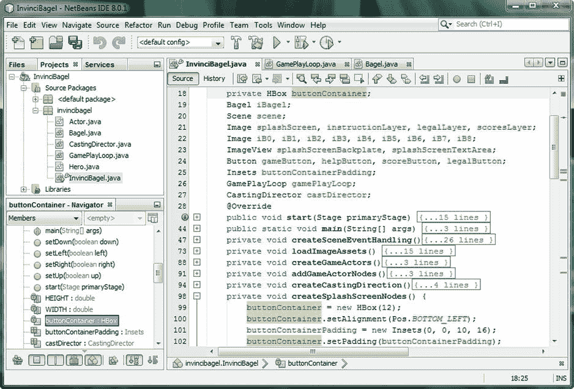

图 12-11。

Change declaration statement for HBox object named buttonContainer from a static modifier to private

我最初声明这些字段是静态的，因为我在互联网上，在几个 Java 编码网站上读到过，这是一个“优化技巧”，它允许 JVM 留出固定的内存区域，并使代码运行得更优化。我已经决定在开发过程中，首先尽可能地封装我的游戏对象，然后在必要的时候再进行优化。

只要我们完全封装了 InvinciBagel.java 类，就让其他变量也成为私有变量。我在将每个变量(在 Bagel iBagel 声明之后)私有后测试了这个游戏，它运行得很好。当我将 Bagel iBagel 设为私有时，游戏挂在白色(背景色)屏幕上，所以我将 Bagel iBagel 声明包保留为受保护的(无访问控制修饰符关键字表示包受保护的访问)。

#### 将剩余的变量私有:完成 InvinciBagel 类的封装

我将其他八行变量声明设为私有而非包保护的工作过程是，将 private Java access control 关键字放在(简单或复合)变量声明的前面，然后使用“运行➤项目”工作过程(或者单击 NetBeans 顶部的绿色 play 图标，这样更快)来测试代码，并使用包保护的访问控制来查看所有功能(包括按钮 UI、闪屏和字符移动)是否都正常工作。如果在软件开发的后期，由于某种原因，我们需要删除 private 修饰符或者用不同的修饰符关键字替换它，我们可以这样做，但是如果可能的话，最好从一开始就从一个完全对象封装的地方开始工作，然后在以后需要时打开对象。用于封装 InvinciBagel 类中所有数据字段的 Java 代码语句如下:

`private` `Scene scene;`

`private` `Image splashScreen, instructionLayer, legalLayer, scoresLayer;`

`private` `Image iB0, iB1, iB2, iB3, iB4, iB5, iB6, iB7, iB8;`

`private` `ImageView splashScreenBackplate, splashScreenTextArea;`

`private` `Button gameButton, helpButton, scoreButton, legalButton,;`

`private` `Insets buttonContainerPadding;`

`private` `GamePlayLoop gamePlayLoop;`

`private` `CastingDirector castDirector;`

正如你在图 [12-12](#Fig12) 中所看到的，到目前为止我们所做的所有类和修改的代码都是无错的，并且我们已经准备好构建更复杂的 Java 语句，在遵循行业标准 Java 8 编程实践的技术上正确的 Java 代码之上控制我们的主要角色精灵。

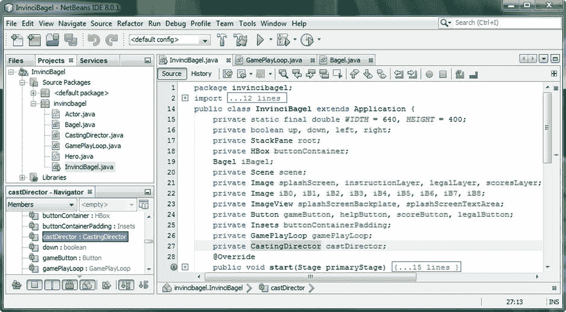

图 12-12。

Make all of the variable declarations after the iBagel Bagel object declaration use private access control

接下来，我们将回到我们的 Bagel.java 课堂。update()方法，并开始将代码提炼(和组织)成更符合逻辑方法，这样我们的。update()方法变得更像是一个“顶级”方法，它调用低级方法“Java 代码块”,实现诸如按键事件处理、字符移动、屏幕边界、sprite 图像状态等等。

这将允许我们把一个更复杂的“工作量”放在百吉饼角色的身上。通过调用逻辑方法来更新()方法。setXYLocation()，。moveInvinciBagel()和。setBoundaries()，以及本书后面的内容。setImageState()，。checkForCollision()和。例如 playAudioClip()。这样，你的。update()方法调用包含逻辑代码块的其他方法。这使您的 Java 代码组织良好，并使编程逻辑更容易可视化。

## 组织。update()方法:。moveInvinciBagel()

因为我们将向。在本书的剩余部分，我想放置一些“方法模块化”,这与我们在[第 11 章](11.html)中为 InvinciBagel 类添加六个新的逻辑方法结构非常相似。因为我们将在。update()方法随着游戏变得越来越复杂，合乎逻辑的是。update()方法应该包含对其他方法的调用，这些方法逻辑地组织我们将需要在每一帧上执行的任务，例如确定按下(或未按下)的键，移动 InvinciBagel 角色，查看他是否离开了屏幕(设置边界)，并最终控制他的视觉状态，检测碰撞，以及应用物理效果。我想做的第一件事是将 sprite 的移动“提取”到一个. moveInvinciBagel()方法中，该方法将执行任何需要使用`moveInvinciBagel(iX, iY);`方法调用来实现的翻译转换。这意味着我们必须创建`private void moveInvinciBagel(double x, double y){...}`方法结构并放置。setTranslate()方法调用，在。使用 update()方法。moveInvinciBagel()方法调用。对 Bagel.java 类执行这些更改的基本 Java 代码如图 [12-13](#Fig13) 所示，如下所示:

```java
@Override

public void update() {

if(invinciBagel.isRight()) { iX += vX }

if(invinciBagel.isLeft())  { iX -= vX }

if(invinciBagel.isDown())  { iY += vY }

if(invinciBagel.isUp())    { iY -= vY }

moveInvinciBagel(iX, iY);

}
```

`private void``moveInvinciBagel``(double``x``, double``y`T6】

`spriteFrame.setTranslateX(``x`T2】

`spriteFrame.setTranslateY(``y`T2】

```java
}
```

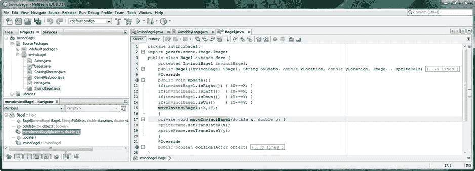

图 12-13。

Create a .moveInvinciBagel() method for .setTranslate() method calls, and call if from .update() method

接下来，让我们使用 ImageView 在屏幕上移动 iBagel。setTranslateX()和。setTranslateY()方法。

### 的进一步模块化。update()方法:。setXYLocation()

您可能认为处理布尔变量的 KeyEvent 需要在。update()方法，但是由于它们只是被简单地求值，然后递增 Bagel 对象的 iX 和 iY 属性，因此可以将其放入自己的。setXYLocation()方法，这样我们在。update()方法。这将使进一步的精灵操作和游戏开发更有组织性，也将帮助我们看到在。更新()周期。我们要做的，也如图 [12-14](#Fig14) 所示，是创建一个. setXYLocation()方法，我们将首先在我们的。update()方法，然后将四个条件 if()语句放在这个新的`private void setXYLocation(){...}`方法结构中。我们 Bagel.java 类的新三方法结构。update()“命令链”将利用以下 Java 代码:

```java
public void update() {

setXYLocation();
```

`moveInvinciBagel(``iX``,``iY`T4】

```java
}
```

`private void``setXYLocation()`T2】

`if(invinciBagel.isRight()) {``iX`T2】

`if(invinciBagel.isLeft())  {``iX`T2】

`if(invinciBagel.isDown())  {``iY`T2】

`if(invinciBagel.isUp())    {``iY`T2】

```java
}
```

`private void moveInvinciBagel(double``x``, double``y`T4】

`spriteFrame.setTranslateX(``x`T2】

`spriteFrame.setTranslateY(``y`T2】

```java
}
```

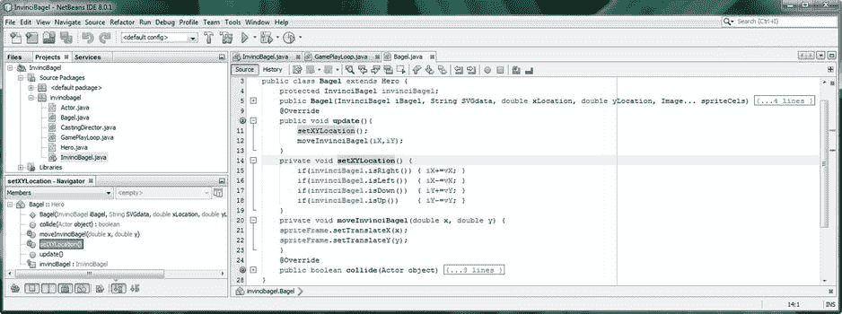

图 12-14。

Create a .setXYLocation() method, install four if() statements inside it, and call it from .update() method

接下来，我们需要编写一些代码来防止我们的无敌角色离开屏幕，以防我们的游戏玩家没有及时改变他的方向。稍后，当我们实现评分时，我们可以添加代码，为“出界”减分，但现在我们只是要停止移动，就好像在游戏区域的边缘(舞台和场景大小的边界)有一个无形的障碍。

## 设置屏幕边界:。setBoundaries()方法

对于 InvinciBagel 游戏来说，下一件最重要的事情是通过在。setXYLocation()方法，该方法计算箭头(或 ASDW)按键组合，并相应地递增 iX 和 iY Bagel 对象属性。moveInvinciBagel()方法，该方法实际执行移动。通过放置。setBoundaries()方法在调用 sprite 移动之前，我们可以在实际调用 move 函数(方法)之前确保 sprite 没有离开屏幕(如果他离开了屏幕，就把他移回到屏幕上)。编写这段代码的第一步是以像素为单位定义 sprite 的大小，这样我们就可以计算它以及我们的宽度和高度阶段大小常数，以确定边界变量值，我们将需要这些值来检查我们的 iX 和 iY sprite 在中的位置。setBoundaries()方法及其条件 if()语句结构。正如你在图 [12-15](#Fig15) 中看到的，我通过使用下面两行 Java 代码，在 Bagel.java 类的顶部定义了这些精灵像素大小常量声明:

`protected static final double``SPRITE_PIXELS_X`T2】

`protected static final double``SPRITE_PIXELS_Y`T2】

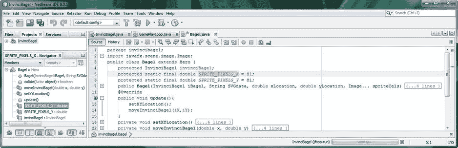

图 12-15。

Declare protected static final double SPRITE_PIXELS_X and SPRITE_PIXELS_Y constants at the top of class

接下来，我们需要使用 InvinciBagel 类中的宽度和高度常量以及我们刚刚在该类顶部定义的 SPRITE_PIXELS_X 和 SPRITE_PIXELS_Y 常量来计算四个屏幕边界值。您可能已经注意到，从我们的 0，0 初始 X，Y Bagel 对象位置坐标将 sprite 放在屏幕中央，JavaFX 使用 X 轴和 Y 轴居中的屏幕寻址范例。这意味着有四个象限，负值(反映正值)向左上方移动，正值向右下方移动。我们实际上可以稍后使用这个范例来快速确定角色在屏幕的哪个象限。因此，我们计算边界的方法是，取屏幕宽度的一半，减去子画面宽度的一半，以找到右边界(正)值，并简单地取左边界的负值。类似的计算适用于顶部和底部边界值限制，为此，我们将取屏幕高度的一半，减去子画面高度的一半，以找到底部(正)边界值，并简单地取其负值作为顶部边界限制值。这些计算的 Java 代码应该如下所示:

`protected static final double``rightBoundary`T2】

`protected static final double``leftBoundary`T2】

`protected static final double``bottomBoundary`T2】

`protected static final double``topBoundary`T2】

正如您在图 [12-16](#Fig16) 中所看到的，NetBeans 在 InvinciBagel 类中看到常量时遇到了问题。

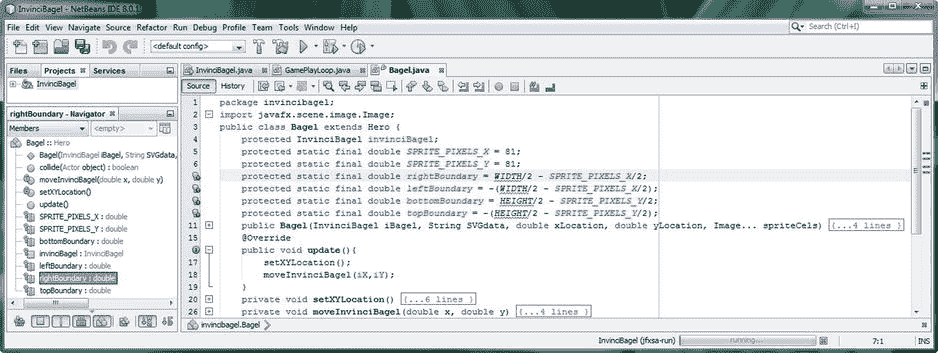

图 12-16。

Hold a left arrow (or A) and up arrow (or W) key down at the same time, and move the Actor diagonally

将鼠标悬停在 NetBeans 中宽度常量下方红色波浪突出显示的错误上，并选择`import static invincibagel.InvinciBagel.WIDTH;`选项，以便 NetBeans 为您编写此导入语句。“正确地”利用导入静态(或者静态导入，如果您愿意的话)的行业标准方法是用于常量的导入和使用，因此我们在这里与 Java 编程标准过程保持高度一致。对高度常数引用下面红色突出显示的错误再次执行相同的工作过程，然后添加。setBoundaries()方法调用。setXYLocation()和。moveInvinciBagel()方法调用。update()方法。这可以通过在。update()方法，如图 [12-17](#Fig17) 所示:

```java
setBoundaries();
```

正如你在图 [12-17](#Fig17) 中看到的，这将在方法调用下产生一个错误，直到我们对方法进行编码。

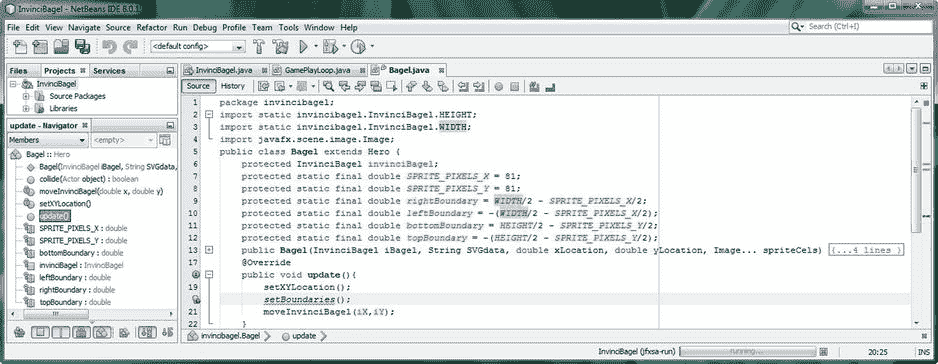

图 12-17。

Create rightBoundary, leftBoundary, bottomBoundary and topBoundary constants at the top of the class

在。setXYLocation()方法结构，以便您的方法与我们从您的。update()方法。接下来，您将放置四个条件 if()结构，每个屏幕边界一个，从 X 轴相关的左右屏幕边界开始，然后是 Y 轴相关的上下屏幕边界。第一个 if 语句需要查看 rightBoundary 值，并将当前的 iX 位置与该值进行比较。如果 iX 值大于或等于 rightBoundary 值限制，则需要将 iX 值设置为 rightBoundary 值。这将使无敌舰队锁定在边界的正确位置。相反的逻辑也适用于屏幕的左侧；如果 iX 值小于或等于 rightBoundary 值限制，那么您需要将 iX 值设置为等于 leftBoundary 值。

第三个 if 语句需要查看 bottomBoundary 值，并将当前 iY 位置与该值进行比较。如果 iY 值大于或等于 bottomBoundary 值限制，则您需要将 iY 值设置为 bottomBoundary 值。这将使你的无敌手锁定在屏幕边界的底部。这个逻辑的反过来也适用于屏幕顶部；如果 iY 值小于或等于 topBoundary 值限制，则需要将 iY 值设置为等于 topBoundary 值。控件的 Java 代码。包含四个 if()语句的 setBoundaries()方法如图 [12-18](#Fig18) 所示，应该如下所示:

`private void``setBoundaries()`T2】

`if (iX``>=`T2】

`if (iX``<=`T2】

`if (iY``>=`T2】

`if (iY``<=`T2】

```java
}
```

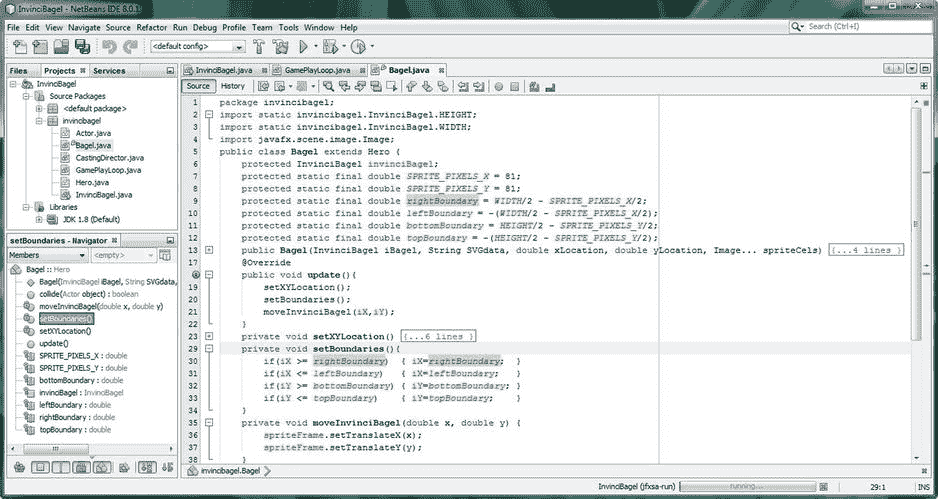

图 12-18。

Create a private void .setBoundaries() method and four if() statements to ascertain and set boundaries

接下来，让我们测试所有这些代码，看看它是否做了我们认为逻辑上应该做的事情！代码组织得很好，也很符合逻辑，所以我看不出它有任何问题，但是在 NetBeans 中测试它是确定的唯一真正的方法！让我们接下来做那件事。这越来越令人兴奋了！

### 测试 invincibagel 精灵边界:运行➤项目

现在是时候使用 NetBeans 运行➤项目工作流程并测试。setBoundaries()方法，该方法现在在。setXYLocation()方法，但在。moveInvinciBagel()方法。因此，现在的逻辑进展是检查按键并基于此设置 X 和 Y 位置，然后检查以确保您没有越过任何边界，然后定位精灵。

正如你在图 [12-19](#Fig19) 中所看到的，InvinciBagel 角色现在停在屏幕的所有四个边缘。在左侧和右侧，他在离屏幕边缘很近的地方停下来，因为精灵在 ImageView 区域的中心，但是一旦我们让他跑起来，我们将在下一章讲述如何制作角色运动的动画，这将看起来更靠近屏幕的边缘。我们总是可以选择在 Bagel.java 类的顶部调整我们的 leftBoundary 和 rightBoundary 变量算法，这允许我们在以后继续改进代码时“调整”边界限制值。


图 12-19。

Testing the InvinciBagel character movement; shown as stopping at the top and bottom boundary limits

现在，我们已经组织和封装了代码，使精灵运动正常工作，并设置了屏幕边缘的边界，我们可以开始考虑实现不同的精灵图像状态，以便当与按键运动结合时，我们可以开始创建一个更真实的 InvinciBagel 角色动作图！

## 摘要

在第十二章中，我们尽可能地私有化了我们的主 InvinciBagel.java 类，并删除了所有与常量(宽度和高度)不相关的静态修饰符关键字。首先，我们删除了公共的静态布尔变量，并使它们成为 InvinciBagel 类的私有变量，然后创建 getter 和 setter 方法，以允许 Bagel 类使用这些变量。is()方法调用。我们还必须使用 Java this 关键字将 InvinciBagel 对象引用传递给 Bagel()构造函数参数列表前面的 Bagel 对象。我们对静态 Bagel iBagel 对象声明做了同样的更改，删除了 static modifier 关键字，并使用 Java this 关键字传递 InvinciBagel 对象上下文，这次是在 GamePlayLoop()构造函数方法调用内部。要做到这一点，我们必须创建自己的自定义 GamePlayLoop()构造函数方法，而不是使用编译器(JVM)创建的方法，如果我们没有特别提供的话。

之后，我们删除了 StackPane 和 HBox 对象上的其他两个静态修饰符关键字，并将所有其他变量设为私有，至少现在是这样，以便为 InvinciBagel (primary)游戏类提供最高级别的封装。

接下来，我们重组了 Bagel.java 类中与。update()方法。我们创建了特定的方法来轮询按键值并设置对象的 iX 和 iY 属性，我们称之为。setXYLocation()方法，以及创建。moveInvinciBagel()方法来调用。setTranslate()方法。

最后，我们创建了新的。Bagel.java 类中的 setBoundaries()方法，该方法在。setXYLocation()方法，但在。moveInvinciBagel()方法，该方法确保我们的主要角色始终停留在屏幕上。

在下一章中，我们将看一下关于使用 List  ArrayList 对象使游戏精灵在屏幕上移动的高级概念，以便我们在进入高级主题如数字音频、碰撞检测和物理模拟之前获得更真实的精灵动画。T3】