# 十三、动画化您的演员形象状态：基于关键事件处理设置图像状态

现在我们已经将你的 Java 代码组织成 Bagel.java 类中的逻辑方法，并且确保我们所有的 Java 代码都符合第 11 章和第 12 章中的标准，是时候进入一些更复杂的代码结构了，当用户移动角色时，这些代码结构将在屏幕上激活我们的无敌角色。例如，如果角色正在正东或正西行进(仅使用左键或右键，沿直线行进)，他应该在跑(在 imageStates(1)和 imageStates(2)列表<图像>元素之间交替)。如果向上键也被按下，他应该向左键或右键的方向跳跃，如果向下键被按下，他应该准备向左键或右键的方向降落。

我们还需要实现 Actor 类的 isFlipH 属性，以便角色根据他行进的方向面向正确的方向。我们将使用 JavaFX 功能来“翻转”或“镜像”任何围绕中心 Y 轴(isFlipH)或中心 X 轴(isFlipV)的图像，而不是使用另一个图像。一旦精灵动画状态与您在上一章中放置的运动代码相结合，您会惊讶于这个角色将变得多么逼真，并且我们仍然只使用了九个精灵状态图像(到目前为止，我们的新媒体资产使用的总数据量不到 84KB)。

在本章中，我们将只使用 Java 代码，并且只使用 Java FX animation timer(GamePlayLoop)超类来制作所有的角色动画。这样，我们通过仅使用 javafx.animation 包中使用最少内存开销的类来访问 脉冲事件计时引擎，从而优化了 JavaFX 脉冲引擎在游戏中的使用。AnimationTimer 类是最简单的类，没有类变量，只有一个要实现的. handle()方法，但它也是最强大的，因为它允许您编写自己的所有代码。

这种方法允许我们编写自定义代码，根据按下的键和移动来激活角色，而不是根据时间轴上的关键帧(及其键值)来触发预定义的时间轴对象。我在游戏引擎方面保持简单，并把所有的复杂性放到我们定制的游戏代码中。这将为我们以后省去很多麻烦，尝试“同步”基于关键帧和基于时间轴的线性动画，这将我们带入一个基于线性时间轴的范例，如 Flash 使用的。从 Java 编码的角度来看，这种 100%的 Java 8 编码方法当然更困难，但它给了我们更大的能力，以实现事件处理、屏幕移动、角色动画、物理和碰撞检测的无缝集成。设置大量预构建的 JavaFX Animation 子类可能最终会得到相同的结果，但代码会不那么优雅，并且可能更难以在其上构建游戏的未来版本。

我们所有的角色状态动画都将使用. setImageState()方法创建，该方法将从。update()方法，所以，我们将继续在我们的角色的运动和动画中进行组织。

## 无敌动画。setImageState()方法

在本章中，我们将创建一个(相当复杂的)方法，称为。setImageState()，它将根据在任何给定时刻按下的键来设置 InvinciBagel 角色的动画或运动状态。方法之前调用. setImageState()方法。中的 moveInvinciBagel()方法。update()方法将用于将角色的九个图像单元(帧)之一与角色的运动相结合。这将创造动画的幻觉，并且将在不使用任何动画时间线的情况下实现这一点。从游戏优化的角度来看，这意味着运行我们的 GamePlayLoop 的 JavaFX 引擎可以将其资源集中在单个动画(脉冲)引擎上。正如你在图 [13-1](#Fig1) 中看到的，我们需要添加一个`.setImageState();`方法调用，在。方法之前的 update()方法。moveInvinciBagel()方法调用并在。setBoundaries()方法调用。这样做之后，您必须创建一个空方法来消除错误突出显示。Java 代码如下所示:

`private void``setImageState()`T2】

如图 [13-1](#Fig1) 所示，这个空的代码框架不会在代码中生成任何红色错误或黄色警告高亮。我们目前非常有条理，通过在这个 Bagel 类中仅使用四个方法调用，完成了所有的 KeyEvent 处理、边界检测、sprite 动画和 sprite 移动。update()方法。

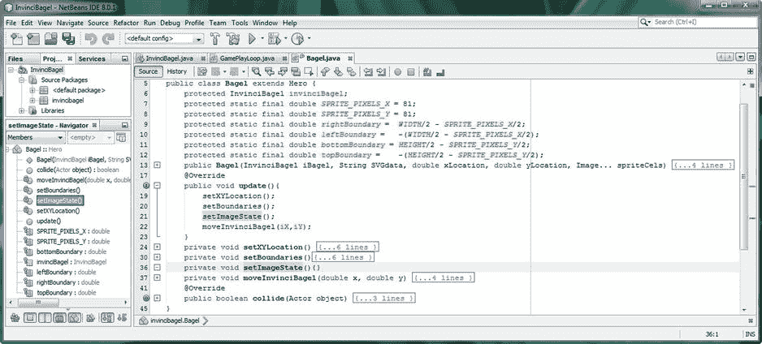

图 13-1。

Create the private void setImageState( ) method; place a setImageState( ) method call in .update( ) method

我们要检查的第一件事是没有移动:也就是说，没有按下任何键，这样我们就可以正确地实现我们在上一章开发精灵移动算法时使用的“等待”InvinciBagel 状态。

### InvinciBagel 等待状态:如果没有按键，则设置 imageState(0)

我们放置的第一个条件 if()语句将是默认或“无按键”状态，即 sprite zero，它显示不耐烦地等待移动和动画的 InvinciBagel。我们想要在圆括号内的 if 求值区域内寻找的是上、下、左、右变量的假值，它们都发生在同一时刻。到目前为止，我们一直在寻找一个真实的值，使用。isUp()，。isDown()，。isLeft()和。isRight()方法调用 invinciBagel 对象引用。在这种情况下，我们希望寻找一个错误的值。

要做到这一点，我们需要使用 Java 一元感叹号！操作员。这反转了布尔值，所以在我们的例子中，来自这些方法调用之一的 false 值将由一个`!invinciBagel.isUp()`构造来表示。为了查明是否有多个值同时为假，我们需要实现 Java 条件 AND 运算符，它使用两个连续的&字符，就像这个&&so；在这种情况下，我们将使用其中的三个& &条件 AND 运算符，来告诉 Java 编译器我们希望 Right 和 Left 以及 Down 和 Up 都为 false。所有这些逻辑都将进入 if()求值区域(在括号内)。在大括号内，如果满足 if()求值区域(如果 up、down、left 和 right 都为 false)的话，我们将使用。setImage()方法调用。在方法调用内部，我们将使用。对 imageStates List < Image >对象调用 get()方法，从 List < Image >对象中获取第一个图像引用 imageStates(0)。这是无敌的“等待”精灵细胞，显示他不耐烦地等待被移动(动画)。该构造的 Java 代码看起来像下面的 Java 编程结构(为了更容易阅读和学习，我对其进行了缩进):

`if``(``!`T3】

`!` `invinciBagel.isLeft()  &&`

`!` `invinciBagel.isDown()  &&`

`!` `invinciBagel.isUp()      ) {`

`spriteFrame.``setImage``(imageStates.``get(0)`T4】

如图 [13-2](#Fig2) 所示，第一个 if()语句表示“如果没有按下任何箭头键”，是无错误的。如果您使用“运行➤项目”工作流程，并测试此代码，您将获得与上一章相同的结果！为了查看这段代码是否有效，我们必须首先让 InvinciBagel 运行，这样当我们使用箭头键停止移动他时，我们会得到这种不耐烦的“等待”状态，这实际上使它更有效(有趣)，当这种等待是在本章中我们将要实现的所有动画运动的上下文中时！

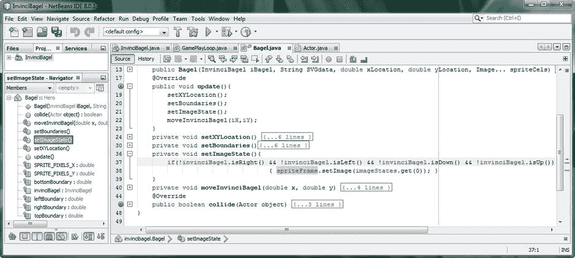

图 13-2。

Add a conditional if() statement that checks for no movement, and sets the wait sprite image state (zero)

接下来，让我们开始实现一些其他的角色图像单元，尝试让我们的角色动画化！

### InvinciBagel 运行状态:如果按键设置图像状态(1 & 2)

正如你在[第八章](08.html)中看到的，我将尝试只用两个精灵元素实现角色的动画运行状态，imageState(1)和 imageState(2)。正如你将要看到的，无论是从图像资产的角度，还是从编码的角度，这都是你能得到的最优化的了。考虑到您不能使用单个图像状态来制作任何东西(如运行周期)的动画，这一点尤其正确。也就是说，我们将在这一章中通过使用单个 cel，设计良好的精灵状态，结合我们在[第 12 章](12.html)中放置的精灵运动代码，来创建许多非常真实的动画。`if(invinciBagel.isRight())`和`if(invinciBagel.isLeft())`语句结构最初会非常简单明了，但是随着我们在本章中增加细化功能，它们会变得更加复杂。我们将首先为这些奠定基础，然后添加 up 和 down 条件 if()语句，然后我们将细化左右键事件处理。在用于左右箭头键(以及 A 和 D 键移动)的 if()构造内部，我们将使用我们在第一个(不耐烦等待状态)if()构造中使用的相同的链式方法调用，只是这里我们将从 List < Image >对象调用 imageStates(1)或 imageStates(2) sprite cels，而不是使用 imageStates(0) sprite cel。如果按下右键或左键(true ),将 sprite 图像状态更改为状态 1 或 2 的 Java 代码应如下所示:

`if(invinciBagel.``isRight`T2】

`spriteFrame.``setImage``(imageStates.``get(1)`T4】

```java
}
```

`if(invinciBagel.``isLeft`T2】

`spriteFrame.``setImage``(imageStates.``get(2)`T4】

```java
}
```

如图 [13-3](#Fig3) 所示，Java 代码没有错误，我们已经准备好使用运行>项目工作流程测试这种初步运行模式。如果你快速连续按下左右箭头键，你会看到无敌跑！

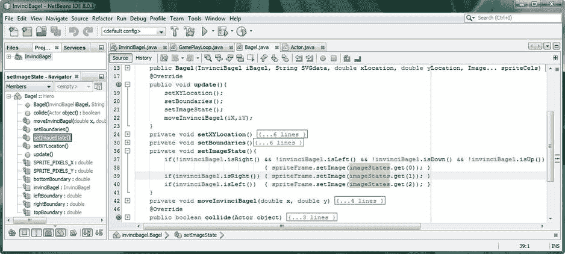

图 13-3。

Add conditional if() statements that check for left/right movement, and sets the run sprite image states

因为这不是我们想让我们的游戏玩家让 InvinciBagel 跑起来的方式(因为它的本质是停止他在屏幕上的移动，因为它只是简单的跛脚)，让我们快速地将你的上下键支持到位，这样我们就可以回来工作，在左右键上工作，这样我们就可以让运行周期工作了！

### InvinciBagel 飞行状态:如果按键设置图像状态(3 & 4)

`if(invinciBagel.isDown())`和`if(invinciBagel.isUp())`条件 if()结构与左右键结构相同，除了它们调用 imageStates(3)和 imageStates(4)列表元素，以允许 InvinciBagel 角色“进来着陆”(cel 3)和“起飞飞行”(cel 4)。随着我们在本章中添加更多的图像状态，并将这个 cel 动画代码与我们的运动和边界代码相结合，您将会越来越有兴趣测试本章的编码结果！如果您想走程序员的捷径，请复制并粘贴。isRight()和。isLeft()构造，只需更改。得到(1)和。开始做某事。得到(3)和。得到(4)。如图 [13-4](#Fig4) 所示，代码目前非常紧凑，组织良好；结构化；和逻辑；在仅仅六行 Java 代码中，我们已经实现了九个图像状态中的一半以上！当然，我们仍然需要添加细化代码，以实现方向改变的精灵镜像和运行周期定时细化。控件的 Java 代码。isUp()和。isDown()方法结构应该如下所示:

```java
if(invinciBagel.isDown()) {
```

`spriteFrame.``setImage``(imageStates.``get(3)`T4】

```java
}

if(invinciBagel.isUp()) {
```

`spriteFrame.``setImage``(imageStates.``get(4)`T4】

```java
}
```

正如你在图 [13-4](#Fig4) 中看到的，我们的代码是没有错误的，我们准备给左右箭头键事件处理代码增加几层复杂性，因为这两个键定义了 InvinciBagel 行进的方向(东和西)。因此，这两个条件 if()语句结构尤其需要变得更加复杂，因为向东(向右)行进将使用原始(isFlipH = false)子画面，而向西(向左)行进将利用每个子画面的镜像版本(isFlipH = true)，围绕中心 Y 轴“翻转”图像资产。

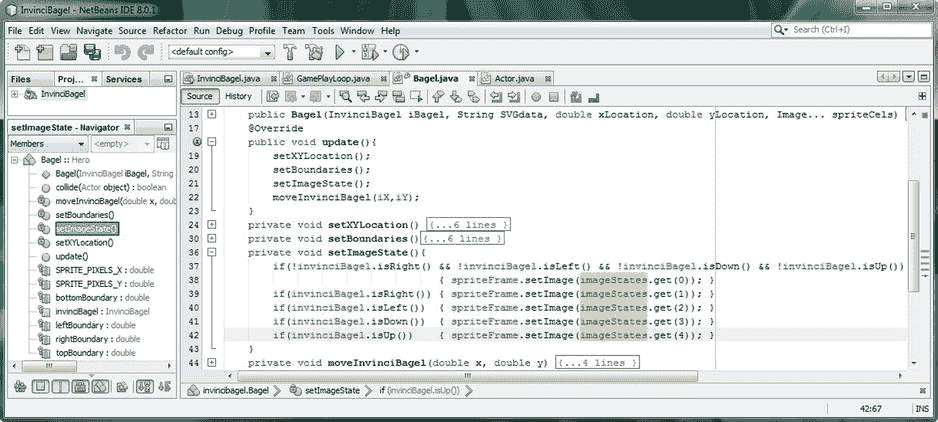

图 13-4。

Add conditional if() statements that check for up/down movement and sets jump/land sprite image state

### 镜像精灵:将你的图像资产从 9 增加到 36

现在让我们回到现有的。isLeft()和。isRight()条件求值语句，在本章的课程中，这些语句将变得相当“健壮”(复杂)，让我们添加恶意镜像功能。JavaFX API 将其镜像功能“隐藏”在 ImageView 类的。setScaleX()方法调用。虽然我们不打算缩放我们的图像资产，因为这样做会导致原始 PNG32 图像资产中的伪像，但有一个鲜为人知的技巧，您可以将-1(负 100%缩放因子)值传递给. setScaleX()方法，以围绕 Y 轴翻转或镜像图像资产(或进入)。setScaleY()方法，绕 X 轴翻转或镜像)。显然，我们还需要在另一个条件 if()结构中“撤销”这一操作，方法是将 1(正 100%缩放因子)传递到同一个方法调用中，这(通常)没有太大意义，因为我们的图像比例已经是 100%(未缩放)，但是考虑到-1 缩放翻转因子可能已经预先设置，这就是我们如何确保镜像被禁用，并且我们再次将原始 sprite 图像资产用于该特定状态。您新升级的实现 sprite 镜像的 Java 语句现在应该看起来像下面的代码，它也在图 [13-5](#Fig5) 中突出显示:

`if(invinciBagel.``isRight`T2】

`spriteFrame.``setImage``(imageStates.``get(1)`T4】

`spriteFrame.``setScaleX`T2】

```java
}
```

`if(invinciBagel.``isLeft`T2】

`spriteFrame.``setImage``(imageStates.``get(1)`T4】

`spriteFrame.``setScaleX``(``-1`T4】

```java
}
```

正如你在图 [13-5](#Fig5) 中看到的，你的 Java 代码仍然没有错误。有趣的是，我们在 spriteFrame ImageView 对象上调用 sprite mirroring 方法，而不是在这个 ImageView 内部的图像资产上。这相当重要，因为这意味着我们可以在。isRight()和。isLeft()来翻转 ImageView 中显示的任何精灵状态(图像)!这是高度优化的编程！

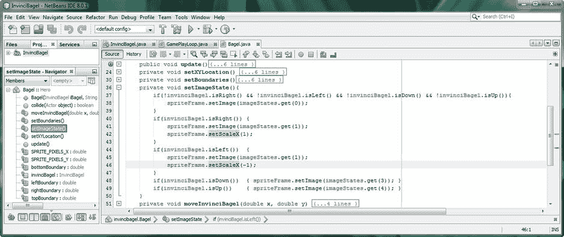

图 13-5。

Add a .setScaleX() method call to the .isRight() and .isLeft() evaluations to flip the sprite around the Y axis

现在，我们的 sprite 镜像代码已经就绪，我们需要处理运行周期的问题，这是通过使用我们的条件 if()处理交替完成 imageStates(1)和 imageStates(2)来实现的。

### 动画您的运行周期:创建一个嵌套的 If-Else 结构

本章中精灵动画的下一步是为我们的角色制作一个运行循环的动画，这是我们通常用 JavaFX 关键帧和时间轴类来做的，但是我们在这里只用十几行代码就完成了。因为我们已经使用了 AnimationTimer 类，所以这是最佳的方法，并且只需要使用一个布尔变量就可以实现。因为我们的运行周期有两个 cel，所以我们可以使用这个布尔变量并在 true 和 false 之间改变它的值。如果这个我们称之为 animator 的布尔值为 false，我们将在 imageStates(1)中显示 cel，这是我们开始奔跑的位置(脚着地)。如果 animator 为 true，我们将在 imageStates(2)中显示 cel，这是我们全力奔跑的位置(双脚全力运动)。在 Bagel.java 类的顶部创建布尔动画变量。NetBeans 给了我一个“变量未初始化”的警告，所以我显式地将它设置为默认的布尔值 false，因为我希望运行周期总是从一只脚离开地面开始。变量声明语句应该如下所示，显示在图 [13-6](#Fig6) 的最上方:

`boolean``animator``=``false`T4】

因为我们希望运行周期总是从 imageStates(1)脚离开地面开始，所以我们将在“没有按下箭头键”代码语句中添加一行`animator=false;`代码。该语句现在将做两件不同的事情:设置 imageStates(0)等待 sprite 图像引用；并确保 animator 变量被初始化为假值，这确保运行周期从脚踏实地开始，就像在现实生活中一样。“没有按下箭头键”条件 if()结构的新 Java 代码应该如下所示:

`if(``!``invinciBagel.isRight()`T3】

`!``invinciBagel.isLeft()`T2】

`!``invinciBagel.isDown()`T2】

`!` `invinciBagel.isUp()       )  {`

`spriteFrame.setImage(imageStates.``get(0)`T2】

`animator=false;` `}`

控件的 Java 代码。isRight()和。isLeft()条件 if()结构现在将变得更加健壮，因为我们将不得不在确定右箭头键是否被按下的语句中嵌套另一个 if-else 条件语句。如果 right 为 true，它会将 ScaleX 属性设置为 1(非镜像)，然后添加一个条件 If()语句来查看 animator 布尔变量的值是否为 false。如果 animator 为 false，我们使用便捷的方法链来获取 imageStates(1)，并将该图像资产设置为 spriteFrame ImageView 将使用的 cel。之后，我们需要将 animator 变量设置为真值，以便稍后可以设置 imageStates(2)完整运行的精灵图像。如果 animator 为真，那么该结构的 else-if 部分将确认 animator 为真，如果为真，则再次使用`spriteFrame.setImage(imageStates.get(2));`方法链获取 imageStates(2)并将 animator 设置为假。该语句的新代码如图 [13-6](#Fig6) 所示，应该如下所示:

`if(invinciBagel.``isRight()`T2】

`spriteFrame.setScaleX(``1`T2】

`if(``!animator`T2】

`spriteFrame.setImage(imageStates.``get(1)`T2】

```java
animator=true;
```

`}   else if(``animator`T2】

`spriteFrame.setImage(imageStates.``get(2)`T2】

```java
animator=false;

}

}
```

值得注意的是，在这种情况下你可以去掉`else if(animator)`，只使用一个没有 if(动画)部分的 else。然而，通过在 if-else-if-else 结构中嵌套更多的代码，我们将使右(左)按键结构变得更加复杂，所以为了可读性以及未来的代码开发目的，我将保持这种方式。如图 [13-6](#Fig6) 所示，代码是无错的。

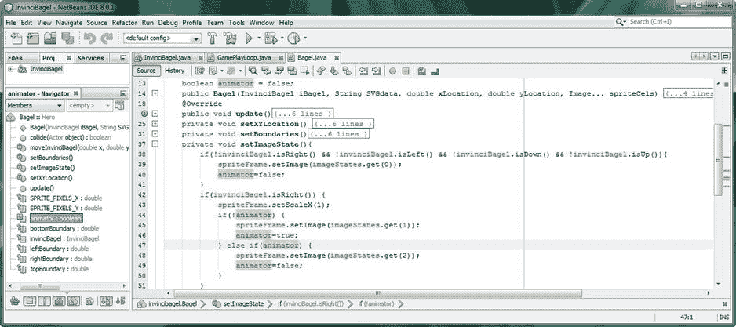

图 13-6。

Nest an if-else logic structure alternating between sprite cels 1 and 2 using the boolean animator variable

现在，您可以将完全相同的代码结构实现到您的。isLeft()条件 if()结构。由于玩家将使用左键或右键(但不是两者一起使用，至少直到我们在游戏开发的后期开始添加那些隐藏的“复活节彩蛋”功能)，我们可以在两个。isRight()和。isLeft()条件 if()构造，允许我们在这里做一点内存使用优化。如您所见，唯一的区别是 ScaleX 属性被设置为镜像 sprite 图像(使用-1 值)，因此,`the if(invinciBagel.isLeft())`条件 if()结构的 Java 代码应该如下所示:

`if(invinciBagel.``isLeft()`T2】

`spriteFrame.setScaleX(``-1`T2】

`if(``!animator`T2】

`spriteFrame.``setImage``(imageStates.``get(1)`T4】

```java
animator=true;
```

`}   else if(``animator`T2】

`spriteFrame.``setImage``(imageStates.``get(2)`T4】

```java
animator=false;

}

}
```

正如你在图 [13-7](#Fig7) 中看到的，这段 Java 代码没有错误，你已经准备好使用你的 Run >项目工作流程，并测试 InvinciBagel 运行周期，这样你就可以看到你的超级英雄能跑多快(或者 JavaFX 中的 脉冲引擎能跑多快，使用你的 GamePlayLoop 类的 AnimationTimer 超类)。当你测试你的 Java 代码时，你会发现你的超级英雄角色跑得比人类可能的速度快得多(也比一个百吉饼跑得快得多)；事实上，精灵动画细胞交替如此之快，它看起来像一个模糊的运行动画！

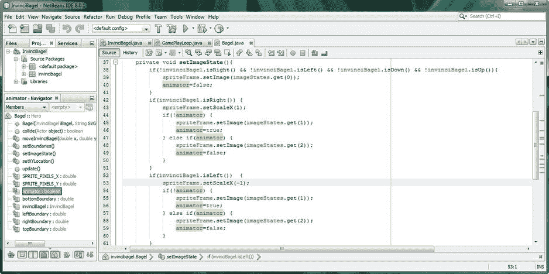

图 13-7。

Duplicate the nested if-else statement in .isLeft() structure, so InvinciBagel character runs both directions

接下来，我们需要添加一些 Java 代码来控制 InvinciBagel 精灵的运行速度。我们将使用两个整数变量来实现这一点:一个用作帧计数器，另一个保存运行速度值，稍后我们可以根据 vX(沿 X 轴的速度)变量来更改该值，以获得运行周期动画速度和精灵在屏幕上移动速度之间的真实匹配。

#### 控制运行周期速度:设置动画节流程序逻辑

为了能够“节流”我们的运行周期 sprite 动画以实现不同的速度，我们需要引入一个名为 framecounter 的“计数器”变量，它将在我们将 false (sprite cel 1) animator 值更改为 true (sprite cel 2)之前计数到一定数量的帧。我们还将使用 runningspeed 变量，这样我们的动画速度就不会被硬编码，而是存在于一个变量中，我们可以在以后更改它。这允许我们对运行周期动画的速度(真实性)进行微调控制。在 Bagel.java 类的顶部声明这两个整数(int)变量，并将 framecounter 变量初始化为零，并将 runningspeed 变量的值设置为 6。既然都是假的(！animator)和 true (animator)二级 if()结构将使用这个“数到 6”变量，我们所做的数学运算将等于 6+6=12，分为 60FPS 脉冲计时循环，这意味着我们将未节流的动画减慢 500%(五倍，因为 60/12=5)。Bagel 类顶部的变量声明语句应该类似于下面的 Java 代码，也显示在图 [13-8](#Fig8) 的中间:

`int``framecounter``=``0`T4】

`int``runningspeed``=``6`T4】

正如你在图 [13-8](#Fig8) 中看到的，我点击了 framecounter 变量，所以它被高亮显示，你可以看到它在初始化语句中的使用，我们需要把它放入“没有按下箭头键”条件 if()结构中，就像我们处理 animator 变量一样。该 if()结构的代码如图 [13-8](#Fig8) 所示，如下所示:

`if(``!``invinciBagel.isRight()`T3】

`!``invinciBagel.isLeft()`T2】

`!``invinciBagel.isDown()`T2】

`!` `invinciBagel.isUp()       )  {`

`spriteFrame.setImage(imageStates.``get(0)`T2】

```java
animator=false;

framecounter=0;

}
```

就像我们希望 animator 布尔变量在所有箭头键未被使用时被重置为 false 值一样，我们也希望 framecounter 整数变量在所有箭头键未被使用时(即，同时处于释放状态)被重置为零值。正如你所看到的，我们不仅在这个条件语句中设置了 sprite 的等待图像状态，我们还用它来重置我们的其他变量。

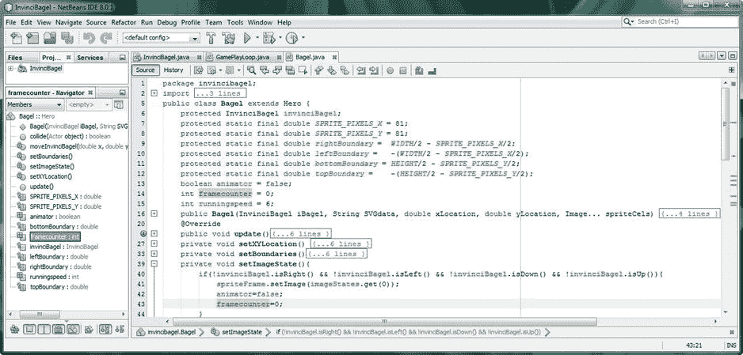

图 13-8。

Add int variables at top of the class for framecounter and runningspeed and set to zero in no movement if

现在我们准备好了。isRight()和。isLeft()条件 if 结构甚至更复杂，因为我们将嵌套我们的 Java 逻辑三嵌套条件 if 结构更深，以允许我们将 framecounter 和 runningspeed 整数变量合并到我们的条件 if()结构中。这将使我们的动画代码在将 animator false 值更改为 true 之前“等待”六个脉冲事件周期，然后在将其改回 false 之前再等待六个脉冲事件周期。

这是相当复杂的 Java 代码，至少对于一个初学 Java 8 的人来说是这样，但是游戏编程本来就是一项复杂的任务，所以让我们继续学习如何为我们的运行周期动画编写这种节流机制的代码。

我想在本书中向您介绍一些高级主题，而这一个(实现速度节流)是我们无法避免的，因为这种使用简单布尔交替图像状态逻辑结构的运行速度在我们的游戏中是不可行的，考虑到 JavaFX 脉冲事件计时引擎令人难以置信的速度及其“控制台游戏”60FPS 的帧速率，这使得我们的 InvinciBagel sprite 运行周期看起来不仅不现实，而且看起来很痛苦！

也就是说，至少这是我们的 Java 8 编码在本章中将要达到的复杂程度，所以请抓紧时间，在下一节中，当我们创建 16 行 Java 代码(嵌套的条件 if()结构)时，请享受这段旅程。这将是大量的工作，但由此产生的运行周期油门控制将是非常值得的努力！

### 编写运行周期节流器:三重嵌套 If-Else 结构

我们要对布尔 animator if()结构进行的修改是在`animator=true;`语句的“周围”放置一个`if(framecounter >= runningspeed){...}`结构，这样 animator 在六个脉冲事件循环发生之前不会变为真。如果 framecounter 等于(或由于某种原因大于)六，animator 变为 true，framecounter 重置为零，并使用 imageStates(2)。如果 framecounter 小于 6，语句的 else 部分使用`framecounter+=1;`语句将 framecounter 递增 1。在这个结构的两个部分中，我们将 framecounter 代码包装在两个`if(animator)`代码周围，如图 [13-9](#Fig9) 所示:

`if(invinciBagel.``isRight()`T2】

`spriteFrame.setScaleX(``1`T2】

`if(``!animator`T2】

`spriteFrame.setImage(imageStates.get(``1`T2】

`if(``framecounter >= runningspeed`T2】

`animator=``true`T2】

```java
framecounter=0;
```

`} else {``framecounter+=1;`T2】

`}   else if(``animator`T2】

`spriteFrame.setImage(imageStates.get(``2`T2】

`if(``framecounter >= runningspeed`T2】

`animator=``false`T2】

```java
framecounter=0;
```

`} else {``framecounter+=1;`T2】

```java
}

}
```

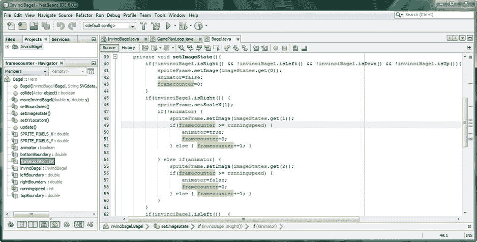

图 13-9。

Add a third level of if-else nesting that prevents cels from alternating too quickly by using a framecounter

现在对条件 if()结构进行同样的修改。唯一的区别是 ScaleX 属性为-1(镜像精灵图像)，如图 [13-10](#Fig10) 中的以下代码所示:

`if(invinciBagel.``isLeft()`T2】

`spriteFrame.setScaleX(``-1`T2】

`if(``!animator`T2】

`spriteFrame.``setImage``(imageStates.get(``1`T4】

`if(``framecounter >= runningspeed`T2】

`animator=` `true;`

```java
framecounter=0;
```

`} else {``framecounter+=1;`T2】

`}   else if(``animator`T2】

`spriteFrame.``setImage``(imageStates.get(``2`T4】

`if(``framecounter >= runningspeed`T2】

`animator=` `false;`

```java
framecounter=0;
```

`} else {``framecounter+=1;`T2】

```java
}

}
```


图 13-10。

Duplicate the if-else structure from the isRight() structure into the isLeft() structure using framecounter

现在又到了使用运行➤项目工作流程和测试运行周期代码的时候了，现在代码展示了一个平滑、均匀、真实的运行周期。您可以使用值 7 或 8 将跑步速度微调为稍慢，或使用值 4 或 5 将跑步速度微调为稍快。当我们为跑步增加更快的 vX 值(比如 vX = 2)时，我们可以将跑步速度设置为 3 或 4 来匹配它，使游戏更加真实。

我在本章测试代码时注意到的另外一件事，我想在这里纠正的是用于着陆的 sprite cel 图像。我一直在使用 imageStates(3)，它是“着陆”的图像，实际上应该更好地用于冲突情况。让我们保存这个 sprite cel 图像状态，以便稍后在碰撞检测代码开发阶段使用，以表示与曲面的碰撞(刚刚着陆或在碰撞图像上)。我想在按下向下箭头键时使用的图像实际上是 imageStates(6)，即“准备着陆”图像。修改后的 Java 代码将如下所示，并在图 [13-11](#Fig11) 中突出显示:

```java
if(invinciBagel.isDown()) {
```

`spriteFrame.``setImage``(imageStates.``get(6)`T4】

```java
}
```

让我们确保我们的 InvinciBagel 精灵动画的专业性随着本章的每一节都在提高，并使用运行➤项目工作流程和测试所有四个箭头键。一定要用左右键(左上、左下、右上和右下)来测试上下键，以真正了解到目前为止您所编写的 Java 代码的能力。我们还有很长的路要走，但已经取得了令人印象深刻的成绩！

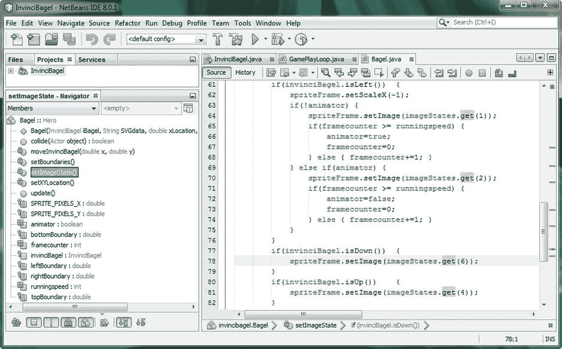

图 13-11。

Change .isDown() sprite cel to imageStates(6) using the imageStates.get(6) method call to use correct cel

#### 优化运行周期处理:关闭飞行和着陆状态的处理

我想做的下一件事在概念上也是先进的，但使用的代码要少得多。作为一个优化迷，我担心的是当玩家使用上下箭头键时，animator、framecounter 和 runningspeed 变量以及使用它们的编程逻辑可能会占用内存，所以我想在条件 if()结构的顶部放一个语句，将。setScaleX() sprite 镜像代码保持不变，但如果使用了 up 和 down 键，则会关闭其余的处理逻辑。排除运行周期逻辑的 Java 代码应该基于上下箭头键变量，它们都显示为 false，表明玩家只使用了左键或右键。这个排除逻辑如图 [13-12](#Fig12) 所示，看起来像下面的 Java 代码(以粗体显示):

`if(invinciBagel.``isRight()`T2】

`spriteFrame.setScaleX(``1`T2】

`if(``!animator``&& (``!invinciBagel.isDown()``&&``!invinciBagel.isUp()`T6】

```java
spriteFrame.setImage(imageStates.get(1));

if(framecounter >= runningspeed) {

animator=true;

framecounter=0;

} else { framecounter+=1; }

}   else if(animator) {

spriteFrame.setImage(imageStates.get(2));

if(framecounter >= runningspeed) {

animator=false;

framecounter=0;

} else { framecounter+=1; }

}

}
```

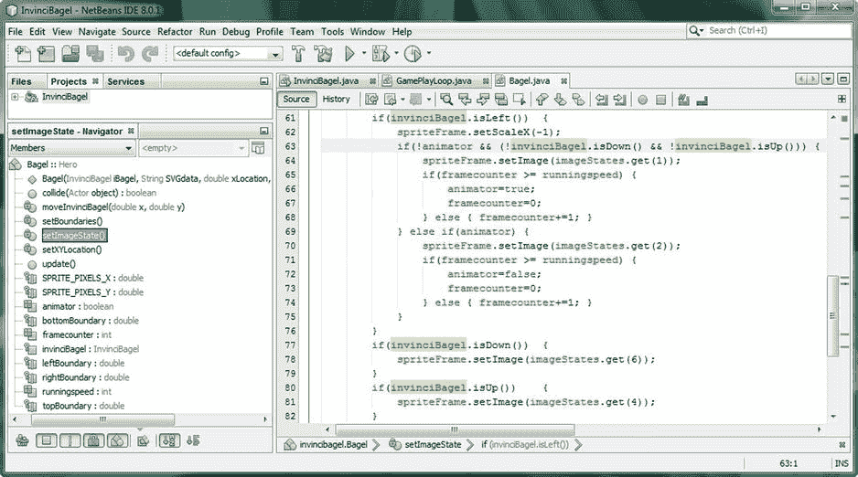

图 13-12。

Add if() statement logic to exclude processing of nested if-else hierarchy if down or up keys being pressed

我这样做的原因是因为当向上或向下键被按下时，跳跃(或飞行)或准备着陆精灵 cel 图像被显示。出于这个原因，优化指示我需要关闭所有“sprite cel 1 和 sprite cel 2 之间的交替”处理代码。我想这样做，以便当 imageStates(1)和 imageStates(2)甚至没有在 spriteFrame ImageView“容器”中使用(显示)时，这种持续的处理不会在内存和线程(CPU)中进行

为了实现这个优化目标，我在第二个嵌套 if()循环的外部添加了一个新的评估级别。这一层包含了使用 animator、framecounter 和 runningspeed 变量以及相关处理的所有 sprite cel 变化(1 到 2 以及相反)。这个新的更复杂的评估语句保证了如果满足新的条件，所有的运行周期处理逻辑都不会被执行。

这个新条件具体说的是，如果 animator 变量为假，并且 up 和 down 键都没有被使用(为假)，则处理剩余的逻辑，在两个 sprite 图像状态之间切换(以及在每次切换之前等待一定数量的脉冲事件)。这意味着，如果按下向上或向下键中的任何一个(从而显示飞行或着陆精灵 cel 图像状态)，则根本不会处理超过该点的任何编程逻辑，从而为我们将添加到游戏中的许多其他事情节省 CPU 处理周期，这些事情将需要将这种“节省”的处理开销用于其他与游戏相关的逻辑。

你可能想知道为什么我没有在这个编程结构的 else if(animator)部分添加同样的扩展条件。原因是循环的这一部分永远不会被执行，除非第一部分得到处理，我们用这个新语句排除了第一部分。这是因为在这个循环的第一部分，我们设置了`animator=true;`,如果按下了向上或向下键，这将永远不会发生(现在我们已经添加了扩展条件)。

真正酷的是，`if(invinciBagel.isRight())`和`if(invinciBagel.isLeft())`条件 if()结构现在可以用于镜像所有 sprite cel 状态图像资产，当您的玩家使用左右键设置角色行进的方向时，并且只有当左右键(仅)用于使角色运行时，该 Java 代码处理的运行周期部分才会发生。

确保你在条件 if()结构的`if(invinciBagel.isLeft())`部分实现了相同的扩展条件，如下所示，也可以在图 [13-13](#Fig13) 中看到。

`if(invinciBagel.``isLeft()`T2】

`spriteFrame.setScaleX(``-1`T2】

`if(``!animator``&& (``!invinciBagel.isDown()``&&``!invinciBagel.isUp()`T6】

```java
spriteFrame.setImage(imageStates.get(1));

if(framecounter >= runningspeed) {

animator=true;

framecounter=0;

} else { framecounter+=1; }

}   else if(animator) {

spriteFrame.setImage(imageStates.get(2));

if(framecounter >= runningspeed) {

animator=false;

framecounter=0;

} else { framecounter+=1; }

}

}
```

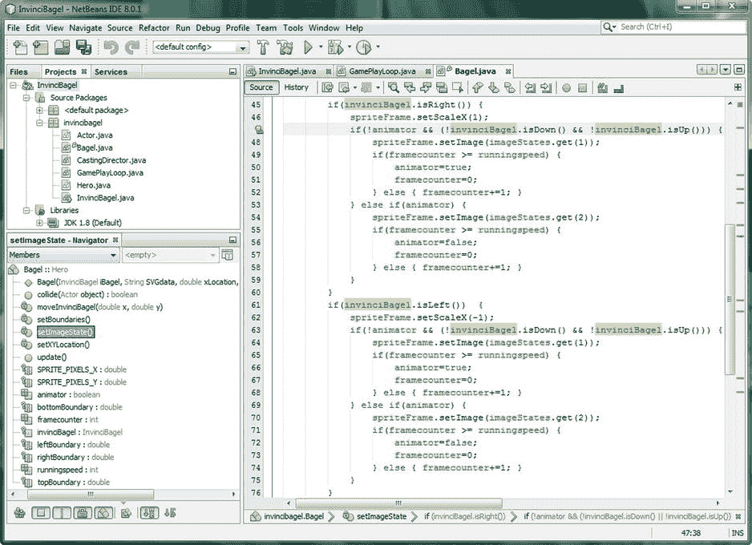

图 13-13。

Add if() statement logic to exclude processing of nested if() hierarchy if down/up keys pressed to isRight()

接下来，让 ASDW 键成为他们自己的精灵控制键，而不是模仿箭头键。

## 添加事件处理:赋予 ASDW 键功能

因为我还需要实现几个 sprite 状态，所以我将升级事件处理器，使用双手游戏场景，使用 ASDW 箭头键或 ABCD(彩色)游戏控制器按钮，使用以下代码升级:

`scene.``setOnKeyPressed`T2】

```java
switch (event.getCode()) {

case UP:    up    = true; break;

case DOWN:  down  = true; break;

case LEFT:  left  = true; break;

case RIGHT: right = true; break;
```

`case W:``wKey`T2】

`case S:``sKey`T2】

`case A:``aKey`T2】

`case D:``dKey`T2】

```java
}

});
```

`scene.``setOnKeyReleased`T2】

```java
switch (event.getCode()) {

case UP:    up    = true; break;

case DOWN:  down  = true; break;

case LEFT:  left  = true; break;

case RIGHT: right = true; break;
```

`case W:``wKey`T2】

`case S:``sKey`T2】

`case A:``aKey`T2】

`case D:``dKey`T2】

```java
}

});
```

正如你在图 [13-14](#Fig14) 中看到的，代码是没有错误的，因为我在位于 InvinciBagel.java 类顶部的布尔上下左右复合声明语句中添加了 wKey、sKey、aKey 和 dKey 变量。

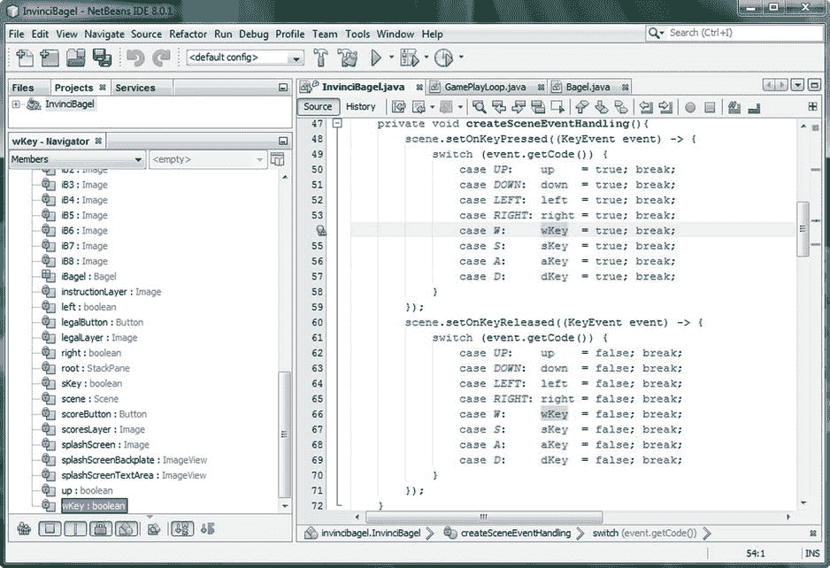

图 13-14。

Create event handling for the WSAD keys specifically, by using wKey, sKey, aKey, and dKey variables

接下来，我们需要使用源代码➤插入代码➤生成➤ Getters 和 Setters 的工作过程，让 NetBeans 编写八个。是()和。set()方法，这样我们就可以访问 Bagel.java 类中的变量。

### 创建 ASDW 键获取和设置方法:NetBeans 插入代码

将光标放在 InvinciBagel.java 类的右花括号前，如图 [13-15](#Fig15) 中的浅蓝色区域所示，使用源代码菜单选择插入代码选项。在生成浮动菜单中选择 Getter 和 Setter 选项以及 aKey、dKey、sKey 和 wKey 选项，如图 [13-15](#Fig15) 所示，这样 NetBeans 将生成 8 个。是()和。基于这个新的布尔声明语句的 set()方法也显示在该图的顶部:

`private boolean up, down, left, right,``wKey``,``aKey``,``sKey``,``dKey``;`

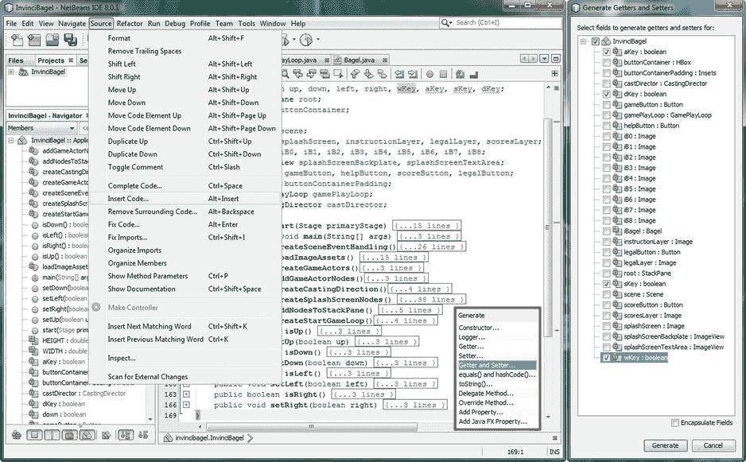

图 13-15。

Use the Source ➤ Insert Code ➤ Generate ➤ Getter and Setter sequence and select aKey, dKey, sKey, wKey

NetBeans 在类末尾生成的八种方法结构类似于下面的 Java 代码:

`public boolean``iswKey()`T2】

```java
return wKey;

}
```

`public void``setwKey(boolean wKey)`T2】

```java
this.wKey = wKey;

}
```

`public boolean``isaKey()`T2】

```java
return aKey;

}
```

`public void``setaKey(boolean aKey)`T2】

```java
this.aKey = aKey;

}
```

`public boolean``issKey()`T2】

```java
return sKey;

}
```

`public void``setsKey(boolean sKey)`T2】

```java
this.sKey = sKey;

}
```

`public boolean``isdKey()`T2】

```java
return dKey;

}
```

`public void``setdKey(boolean dKey)`T2】

```java
this.dKey = dKey;

}
```

正如您在图 [13-16](#Fig16) 中看到的，NetBeans 已经为我们添加到 InvinciBagel.java 类中的新 KeyEvent 处理变量创建了所有八个 getter 和 setter 方法。代码是没有错误的，我们准备回到 Bagel.java 类，并利用这些新的方法调用来实现跳转和回避。

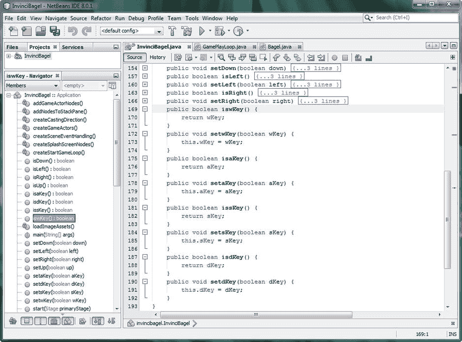

图 13-16。

Hold a left arrow (or A) and up arrow (or W) key down at the same time, and move the Actor diagonally

### 添加跳跃和躲避动画:使用 W 和 S 键

让我们开始为使用另一组四个键的基础设施就位，以使我们的玩家在实现精灵(角色)动作(动画)时有更大的灵活性。使用键盘时，这些将使用 ASDW 键，使用游戏控制器时，这些将使用 JavaFX 键码类常量 GAME_A、GAME_B、GAME_C 和 GAME_D。在添加更多游戏玩法逻辑后，我将在游戏开发过程中稍后添加游戏控制器事件处理。基本跳转和回避(投射)子画面 cel 图像资产的实现将通过使用以下两个基本 Java 条件 if()结构来完成，这两个结构通过`if(invinciBagel.iswKey())`使用 W 键，通过`if(invinciBagel.issKey())`处理结构使用 S 键，如下所示，以及图 [13-17](#Fig17) :

`if(invinciBagel.``iswKey()`T2】

`spriteFrame.``setImage``(imageStates.``get(5)`T4】

```java
}
```

`if(invinciBagel.``issKey()`T2】

`spriteFrame.``setImage``(imageStates.``get(8)`T4】

```java
}
```

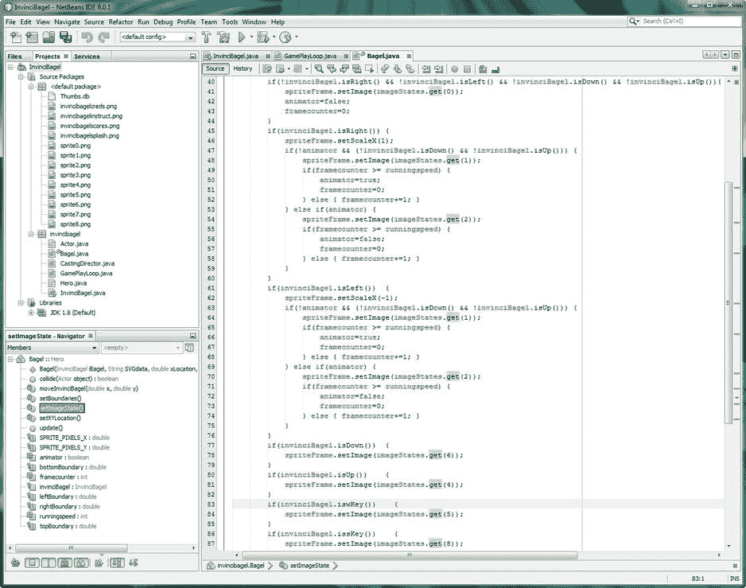

图 13-17。

Add if() statements at the bottom of the method for .iswKey() and issKey for Jump and Evade animation

现在我们已经在游戏事件处理和角色动画处理中实现了 imageStates(0)、imageStates(1)、imageStates(2)、imageStates(4)、imageStates(5)、imageStates(6)和 imageStates(8)。其他精灵更适合用于碰撞检测，所以让我们把它们留到本书后面的章节。

## 最新详细信息:设置 isFlipH 属性

接下来，我想添加两行代码，我称之为“簿记”，因为我们已经在 Actor 超类中安装了 isFlipH 和 isFlipV 属性，所以如果我们镜像 X 或 Y 轴周围的精灵，我们需要确保正确设置这些变量，以反映 Actor 对象的更改(没有双关的意思)，以便我们可以在游戏应用编程逻辑的其他领域中使用这些信息。我们将使用 Java this 关键字来引用我们在 Bagel.java 类中编码的 iBagel 对象，并调用。setIsFlipH()方法，如果 ScaleX 属性设置为 1，则使用 false 值；如果 ScaleX 属性设置为-1，则使用 true 值。需要注意的是，我们并不是绝对必须使用 Java 这个关键字；我使用它是为了意思清楚，所以你也可以简单地使用方法调用而不用点符号，就像这样:`setIsFlipH(false);`如果你喜欢的话。在图 [13-18](#Fig18) 中可以看到做这个简单簿记加法的 Java 代码，如下所示:

`if(invinciBagel.``isRight()`T2】

`spriteFrame.``setScaleX``(``1`T4】

`this``.setIsFlipH(``false`T3】

`} if(invinciBagel.``isLeft()`T2】

`spriteFrame.``setScaleX``(``-1`T4】

`this``.setIsFlipH(``true`T3】

```java
}
```

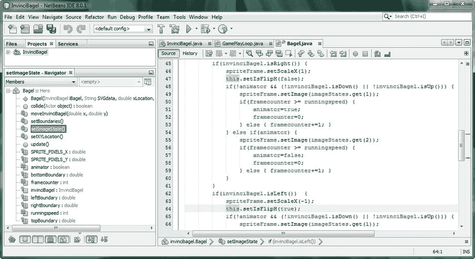

图 13-18。

Be sure to set the isFlipH property for the Bagel object using .setIsFlipH() called off of the this (object)

接下来，让我们测试所有新的精灵动画代码，看看它是否做了我们认为逻辑上应该做的事情！代码很复杂，至少对于主要的左右箭头键字符移动来说是如此，但是它组织得很好，而且非常有逻辑性，从逻辑的角度来看，我看不出它有任何问题，但是使用 NetBeans 彻底测试它是找出答案的唯一方法！让我们接下来做那件事。要查看子画面图像状态，请参考第 8 章(图 8-2)。

### 测试 invincibagel 精灵动画状态:运行➤项目

现在是时候使用 NetBeans 运行➤项目工作流程并测试。setImageState()方法，该方法现在在。setXYLocation()和。setBoundaries()方法，但在。moveInvinciBagel()方法。因此，现在的逻辑进展是检查按键，基于此设置 X 和 Y 位置，检查以确保您没有越过任何边界，设置精灵动画(图像)状态，然后定位精灵。正如你在图 [13-19](#Fig19) 中看到的，当你使用左箭头键或右箭头键时，不可战胜的角色现在真实地在屏幕上运行。

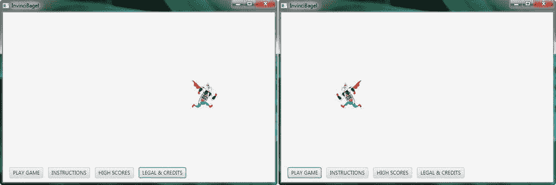

图 13-19。

Testing the InvinciBagel character animation; showing here is the running animation using isFlipH mirror

如果您按下向上箭头键，同时(或之后)您按下向左或向右箭头键，结果如图 [13-20](#Fig20) 所示，InvinciBagel 将起飞并开始朝那个方向飞行，同样具有逼真的动画运动。

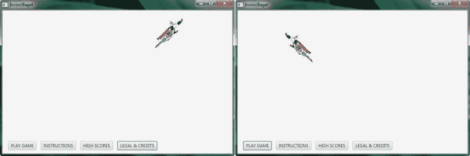

图 13-20。

Testing the InvinciBagel character animation; showing here is the leap up animation, using isFlipH mirror

如果你按下向下箭头键，同时(或甚至之后)你按下向左或向右箭头键，结果，如图 [13-21](#Fig21) 所示，是 InvinciBagel 将在准备着陆时下降，同样具有逼真的动画运动。

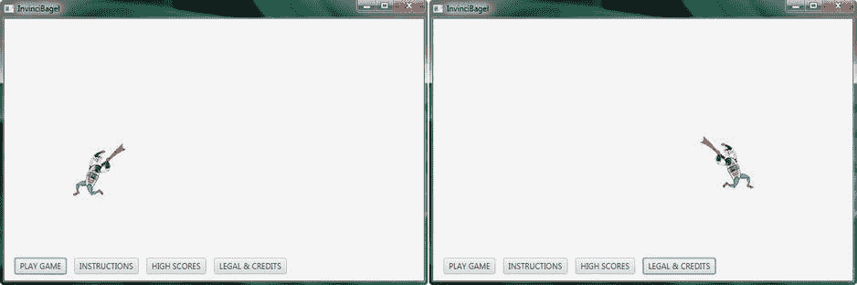

图 13-21。

Testing the InvinciBagel character animation; showing here is the landing animation, using isFlipH mirror

现在我们的箭头键正在调用主要的 run-leap-fly-land 游戏播放状态，让我们测试一下我们在本章末尾放置的这个新的 S 和 W 键逻辑，以便我们可以调用一些不太常用的(躲避子弹和跳过)sprite cel 状态，这将为我们在本章中放置的这个角色动画添加更多的多样性，只使用了大约 56 行代码(InvinciBagel.java 中有 26 行，Bagel.java 中有 36 行)。正如您在图 [13-22](#Fig22) 左侧看到的，当我们使用 S 键时，invincibegel 角色会侧转，这样子弹就会从他面前飞过；在屏幕截图的右侧，您可以看到当我们按下 W 键时，invincibegel 角色会越过物体！

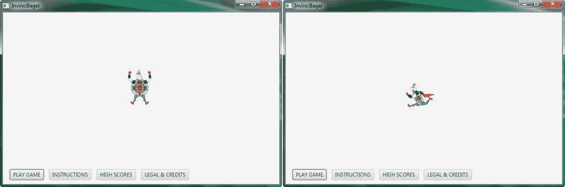

图 13-22。

Testing InvinciBagel character animation; shown here is the evade (left) animation, and jumping (right)

在介绍动画的这一章中，你给这个游戏的主要无敌角色添加了相当多的“惊奇元素”。这将有助于使这款游戏成为各年龄段的流行游戏。

## 摘要

在第十三章中，我们使用高度优化的代码在 InvinciBagel 应用中实现了 sprite 动画。我们将七个基本的精灵形状与我们在第 11 章中开发的按键移动和我们在第 12 章中开发的边界检测结合起来，以创建一个真正活起来的完全动画化的无敌角色，并基于六个基本游戏控制键(上、下、左、右、W 和 S)的使用来实现这一点。

我们学习了如何使用 JavaFX ImageView 类 ScaleX 属性及其特殊用例设置来围绕 Y 轴翻转或镜像 ImageView“图像容器”内部的图像资产。这允许我们仅使用 9 个基本的精灵状态创建 36 个精灵图像状态，我们已经将它们作为图像资产导入到 List  ArrayList 对象中。这是一种优化形式，因为它允许我们使用不到 84KB 的图像资产，而不是 336KB 的图像资产，用于我们的主要游戏超级英雄，不可战胜的角色。

接下来，我们学习了如何实现一个 Boolean animator 变量，我们使用它在两个不同的 sprite cel 运行状态之间制作动画，在我们的列表中是 imageStates(1)和 imageStates(2)。最终的运行周期对于专业使用来说太快了，所以接下来，我们添加了一个 framecounter 变量来减慢移动速度，并添加了一个 runningspeed 变量，允许我们对精灵的运行速度进行微调控制，我们将能够在稍后的游戏逻辑中利用这一点。

接下来，我们优化了我们的代码，这样，如果运行周期没有显示，也就是说，如果 InvinciBagel 正在飞行或着陆，就不会使用用于运行周期的变量和处理代码。我们还确保使用 this.setIsFlipH()方法调用在我们的 Actor 超类中(因此在我们的 Bagel 对象中)设置 isFlipH 属性。

接下来，我们在 InvinciBagel.java 类的事件处理代码中添加了四个新的游戏控制键，添加了四个新的私有布尔变量 aKey、sKey、dKey 和 wKey，并让 NetBeans 自动为它们创建 Getter 和 Setter 方法。在我们进行了增强之后，我们在 S 键上添加了精灵躲避动作图像，在 W 键上添加了精灵跳过动作图像，以使我们的游戏成为一个双手游戏，并为使用专业游戏控制器硬件做好准备。

最后，我们用其余的事件处理、演员和英雄类、CastingDirector 类、GamePlayLoop 类和 Bagel 类 sprite 移动和边界代码测试了这个新的 sprite 动画代码，这些代码是我们在前面六章(第 7 章到第 12 章)中编写的。我们的精灵运动和动画无缝地配合在一起，当我们在游戏舞台上导航无敌的角色时，可以提供专业的效果。

在下一章中，我们将看看如何在游戏中添加固定的游戏精灵(道具演员)对象，这样当我们进入碰撞检测时，我们就有东西可以使用了，这样我们就可以开始真正使用我们最近的 CastingDirector 类了。