# 十四、设置游戏环境：使用`Actor`超类创建固定的精灵类

现在，我们已经在创建你的主要无敌角色方面取得了很大的进展，使用了 Bagel.java 类中的一些关键方法，以及演员和英雄超类，所有这些都与第 7 章到第 13 章中的 GamePlayLoop 类和 CastingDirector 类一起放置到位，现在是时候添加固定的精灵对象了，我称之为“道具”，到场景和舞台上(屏幕上)。这些固定的物体对游戏来说几乎和主角本身一样重要，因为它们可以用来提供障碍、屏障、免受敌人攻击的保护以及主要游戏英雄角色要克服的各种挑战。我们还需要场景中的这些固定对象，以便在我们的碰撞检测程序逻辑中使用，并测试我们的 CastingDirector 类(object)。

如果你还记得，在第八章中，我们用固定精灵创建了演员超类，用运动精灵创建了英雄超类。我从运动精灵开始，因为主要的游戏角色是运动精灵，即使运动精灵更复杂，就其本质而言，玩起来也更有趣！现在我需要拿出一个章节，将 Actor 超类付诸实施，并创建一些与 Prop 相关的子类。我们将使用这些 Actor 子类在我们的场景(舞台)中填充平台、障碍物、障碍、桥梁、宝藏和类似的游戏固定位置对象，您将想要将这些对象添加到场景(舞台)中，以创建游戏世界并增强游戏体验(也称为用户体验)。

我们将使用 Actor 超类创建四个固定道具子类，这将使构建固定场景(当您创建了多个场景时，也称为关卡)变得容易。Prop.java 类将“按原样”使用您的固定 sprite 图像资产，而 PropH.java 类将使用 JavaFX `spriteFrame.setScaleX(-1);` Java 语句将 isFlipH 属性设置为 true，并围绕 Y 轴镜像图像资产。PropV.java 类将使用 JavaFX `spriteFrame.setScaleY(-1);` Java 语句将 isFlipV 属性设置为 true，并围绕 X 轴镜像图像资产。PropB.java 类(B 代表“两者”)将 isFlipV 属性和 isFlipH 属性都设置为 true，这将使用两个 JavaFX `spriteFrame.setScale(-1);` Java 语句镜像 X 和 Y 轴周围的图像资产。

一旦我们创建了这四个道具相关的演员子类，我们将使用它们来放置固定的对象到场景中，以创建这个游戏的第一级。这样，当我们进入碰撞检测章节时，真实游戏中的一切都将就位，我们将能够开始编码碰撞检测逻辑；然后，最终，一个自动攻击引擎；然后是游戏运行逻辑，它决定了如何实现评分引擎。

这一章对于创造一个更有特色的游戏是有价值的。任何游戏设计的主要部分，在这种情况下，它是 Ira H. Harrison Rubin 的 InvinciBagel 角色和游戏，是建立角色(无论是在单人游戏还是多人游戏中，英雄和他或她的敌人)参与的环境对游戏的成功和流行至关重要，因为这些固定元素是为玩家创造游戏挑战的主要部分。

## 创建 Prop.java 类:扩展 Actor.java

在 NetBeans 8 中打开 InvinciBagel 项目，右键单击包含您的。java 文件并选择新的➤ Java 类菜单序列。在如图 [14-1](#Fig1) 所示的“新建 Java 类”对话框中，将类命名为 Prop，并接受 NetBeans 建议的其他默认设置，然后单击“完成”按钮。

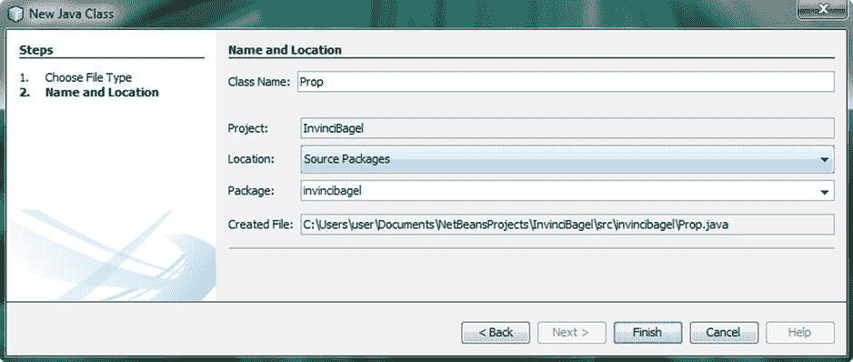

图 14-1。

Right-click on the project folder and select New ➤ Java Class; using a New Java Class dialog, name it Prop

一旦 NetBeans 创建了一个引导类，添加 Java extends 关键字和 Actor，如图 [14-2](#Fig2) 所示。

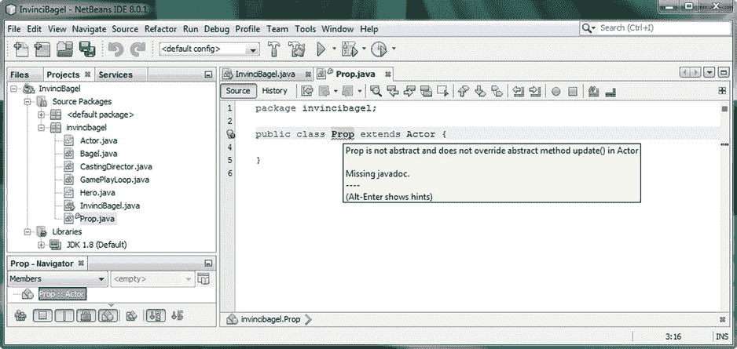

图 14-2。

Add a Java extends keyword and the Actor superclass. Mouse-over the error highlighting underneath Prop

使用建议的 Alt-Enter 工作流程，如图 [14-3](#Fig3) 所示，并选择“实现所有抽象方法”

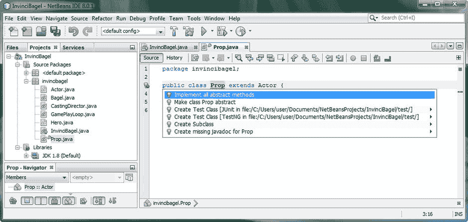

图 14-3。

Use the Alt-Enter work process to pop up a helper dialog filled with suggestions regarding fixing the error

移除 throw new UnsupportedOperationException()并创建一个空的。update()方法。

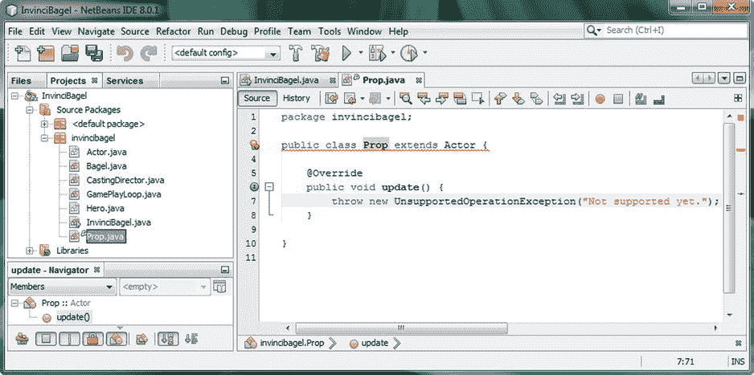

图 14-4。

NetBeans generates abstract method for you; remove the throw new statement; create an empty method

Java 代码在类声明语句下仍然有一个红色波浪状的错误高亮，如图 [14-5](#Fig5) 所示。

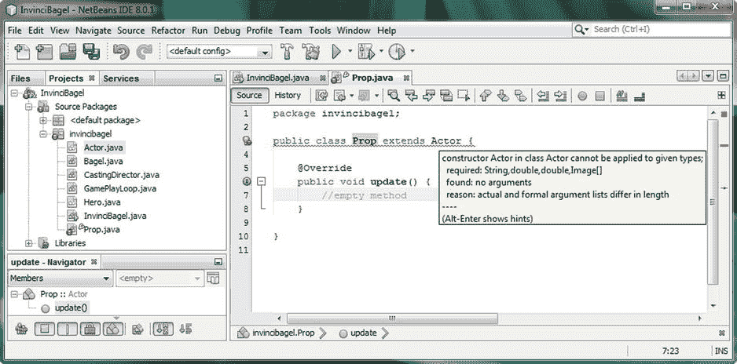

图 14-5。

Overriding .update() method doesn’t remove the error, so mouse-over again, to reveal needed constructor

将鼠标放在上面，您会看到需要使用下面的 Java 代码编写一个 Prop()构造函数方法:

`public``Prop`T2】

要删除图 [14-6](#Fig6) 中的错误，使用 Alt-Enter，选择为 javafx.scene.image.Image 添加导入。

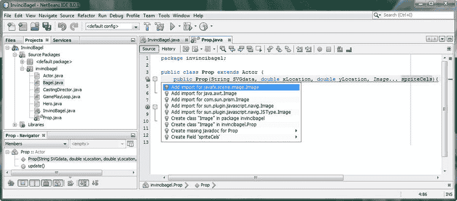

图 14-6。

Add a public Prop() constructor, and mouse-over the error highlight, and select Add import for Image class

如果您仍然看到红色波浪错误突出显示，那么一旦您导入了 Image 类引用，这是因为您需要将 Prop()构造函数方法定义中的参数列表传递到 Actor 类。这是使用 Java super 关键字(有时称为 super()构造函数(方法))完成的，使用以下 Java 语句:

`super` `(SVGdata, xLocation, yLocation, spriteCels);`

因为这个 Prop 类使用了一个默认的，或者说未剪裁(未镜像)的 imageStates(0)图像，所以这是我们需要做的第一件事，来创建一个符合抽象 Actor 类的可用 Prop 类。另外，记住 Actor 类为我们初始化了所有的标志属性，这要感谢一个详细的设计过程。图 [14-7](#Fig7) 中可以看到这个类的 Java 代码，它现在包括了基本的超级构造函数，并且现在是无错误的:

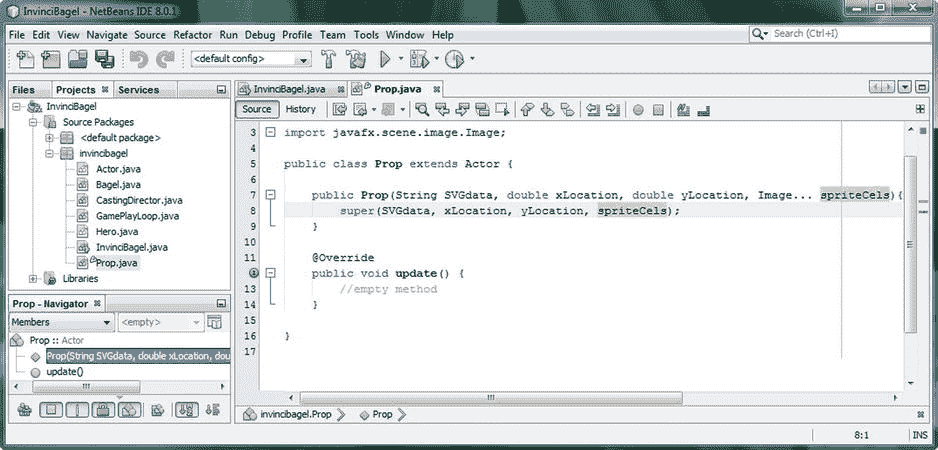

图 14-7。

Add the super() constructor method call inside of the Prop() constructor, to get rid of the error highlight

我们需要做的下一件事是，使用传入构造函数方法的 xLocation 和 yLocation 值来定位固定的 sprite。setTranslateX()和。setTranslateY()方法。请记住，您在第 12 章中使用了这些方法。moveInvinciBagel()方法。在这个 Prop()构造函数方法中，我们将再次使用这些方法，将这些固定的精灵放置在舞台上，在这里，您的构造函数方法参数指示对象构造函数在屏幕上定位它们。

重要的是要记住，由于我们在《T4》第八章中所做的工作，Actor 超类的 Actor()构造方法已经为我们执行了`iX=xLocation;`和`iY=yLocation;` sprite iX 和 iY 属性设置。因此，我们在 Prop()构造函数方法中所要做的就是在构造函数方法内部调用`spriteFrame.setTranslateX(xLocation);`和`spriteFrame.setTranslateY(yLocation);`，并且在我们的 super()构造函数方法调用之后。请注意，在代码中，在 super()构造函数方法调用中以及在。setTranslateX()和。setTranslateY()方法调用，以便在 Prop 对象实例化期间将固定精灵定位在舞台上，这样我们就不必在代码中的其他地方执行此操作。该类的 Java 代码和构造函数方法如下所示:

```java
package invincibagel;

import javafxscene.image.Image;
```

`public class``Prop``extends``Actor`T4】

`public Prop(String SVGdata, double``xLocation``, double``yLocation`T4】

`super` `(SVGdata,` `xLocation` `,` `yLocation`

`spriteFrame.setTranslateX(``xLocation`T2】

`spriteFrame.setTranslateY(``yLocation`T2】

```java
}

@Override

public void update() {

// empty method

}

}
```

正如你在图 [14-8](#Fig8) 中所看到的，这段 Java 代码是没有错误的，并且在场景(舞台)中定义和放置道具所需要的一切都已经就绪，这要感谢 Actor (fixed) sprite 类的良好设计。这包括 SVG 碰撞形状数据、X 和 Y 位置(场景中的位置)以及一个或多个图像资源。我们包含一个。一个固定的 sprite 类中的 update()方法允许我们拥有动画(不止一个图像单元)道具，如果我们想在我们的游戏设计过程中变得有趣，并增加游戏视觉设计的 wow 因素。

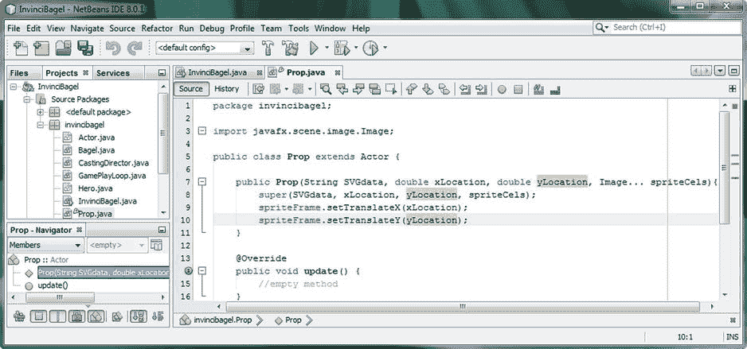

图 14-8。

Position a fixed sprite on the Stage in the constructor method using a .setTranslateX() and .setTranslateY()

接下来让我们创建 PropH、PropV 和 PropB(代表“两者”)类。这些将使用构造函数方法自动为我们围绕 X，Y 或 X 和 Y 轴镜像道具，因此对象将固有地镜像图像。

### 镜像属性类:在构造函数中设置 isFlip 属性

为了使我们构建场景的过程更容易，因为一切(碰撞、位置、动画)都是构造函数方法调用的一部分，道具之间的区别在于它们是如何镜像的(X 轴或 Y 轴，或者两个轴)。在这一节中，我们将在构造函数方法中创建为我们翻转精灵的 Prop 类的变体，这样我们所要做的就是创建 PropX 对象类型来获得我们想要的效果。创建第一个 PropH 类，如图 [14-9](#Fig9) 所示。

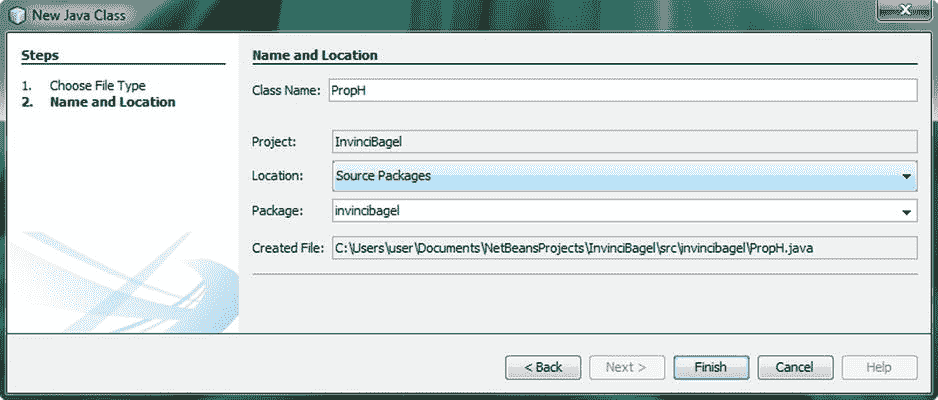

图 14-9。

Right-click on the project folder and select New ➤ Java Class; using a New Java Class dialog, name it PropH

将前面创建的基本 Prop 类的内容，包括 package、import 和 super()构造函数，复制到 PropH 类中，然后将 Prop 改为 PropH，如图 [14-10](#Fig10) 所示。

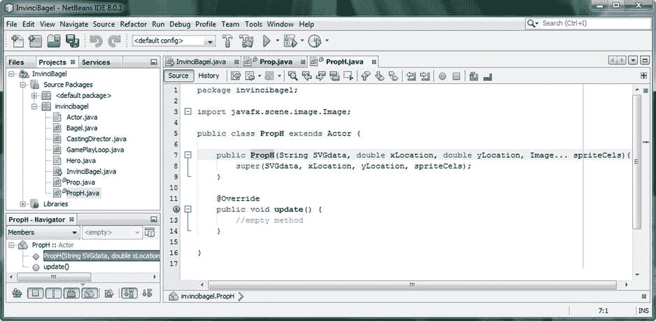

图 14-10。

Create a PropH class structure identical to the Prop class structure, except using PropH, instead of Prop

将 Java this 关键字添加到 super()构造函数下的新行中的 PropH()构造函数方法中，然后使用(键入)句点键打开方便的 NetBeans 方法选择器弹出窗口，如图 [14-11](#Fig11) 所示。

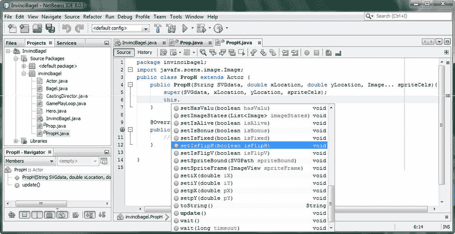

图 14-11。

Add a Java this keyword reference to PropH (object) inside of the constructor and open up method helper

双击。setIsFlipH 方法，在图 [14-11](#Fig11) 中突出显示，并在方法调用参数区插入一个真值。完成的`this.setIsFlipH(true);` Java 语句如图 [14-12](#Fig12) 所示。

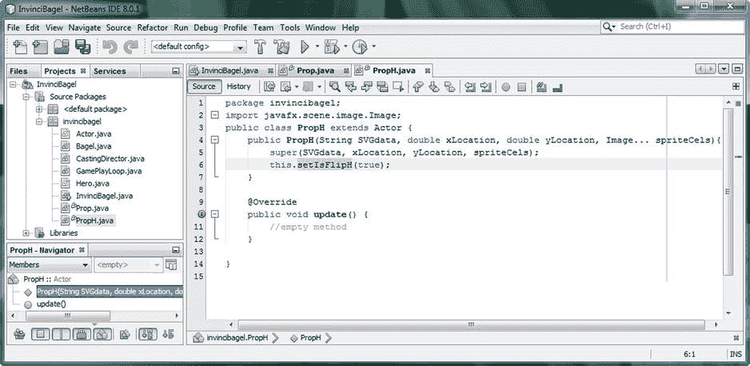

图 14-12。

Call the .setIsFlipH() method, off of a Java this (PropH) object reference, and pass it the true setting value

值得注意的是，如果我们只在构造函数方法中使用`this.setFlipH(true);`方法调用，我们仍然需要观察 isFlipH 是这样设置的，并在代码中的其他地方调用您的`.spriteFrame.setScaleX(-1);`方法调用。让我们继续将这个方法调用放入您的构造函数方法中，这样我们所有的 PropH 对象都将自动使它们的图像资产围绕 Y 轴翻转。如果你想知道为什么？setScaleX(-1)方法镜像 Y 轴周围的图像资产，这也是我想知道的，但我所做的是将 isFlipH 与。setScaleX(-1)(因为 X 是 H 或水平轴)。也就是说，我会。setScaleY(-1)围绕垂直 Y 轴的镜像，对我来说更有意义。添加另一行代码，键入 spriteFrame 并按下句点键，然后选择。在弹出窗口中设置 ScaleX，如图 [14-13](#Fig13) 所示。

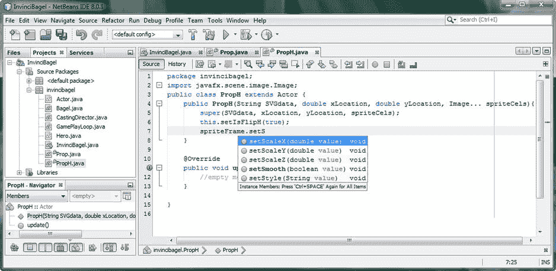

图 14-13。

Call a .setScaleX() method, off of the spriteFrame object variable reference, and pass it a -1 setting value

在弹出的方法选择器中双击 setScaleX(double value) void 选项，然后添加-1 值，完成方法调用。现在所有 PropH 对象将自动镜像图像资源 Y 轴！PropH 构造函数的最终代码。setTranslateX()和。setTranslateY()方法调用将在舞台上实际定位固定的 sprite 位置，如图 [14-14](#Fig14) 所示，类似于下面的 Java 代码:

```java
import javafxscene.image.Image;
```

`public class``PropH``extends``Actor`T4】

`public PropH(String SVGdata, double``xLocation``, double``yLocation`T4】

`super` `(SVGdata,` `xLocation` `,` `yLocation`

`this``.setIsFlipH(``true`T3】

`spriteFrame.``setScaleX``(``-1`T4】

`spriteFrame.setTranslateX(``xLocation`T2】

`spriteFrame.setTranslateY(``yLocation`T2】

```java
}

}
```

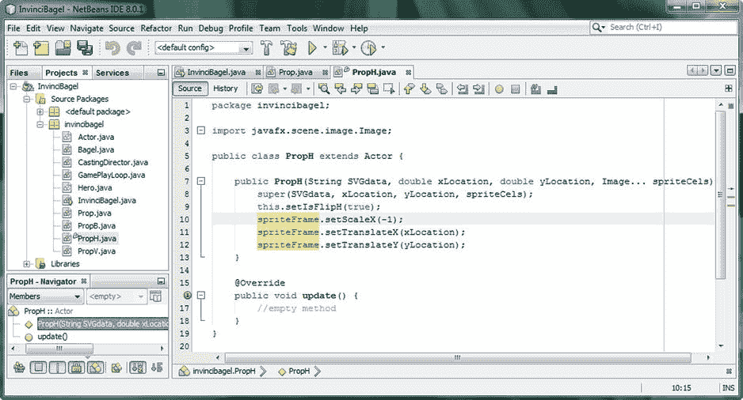

图 14-14。

A completed PropH() constructor method creates a fixed PropH object flipped along the horizontal X axis

接下来，执行与 PropH 类相同的工作过程，创建一个 PropV 类，将 isFlipV 属性设置为 true，并实现`spriteFrame.setScaleY(-1);`方法调用，如图 [14-15](#Fig15) 所示。

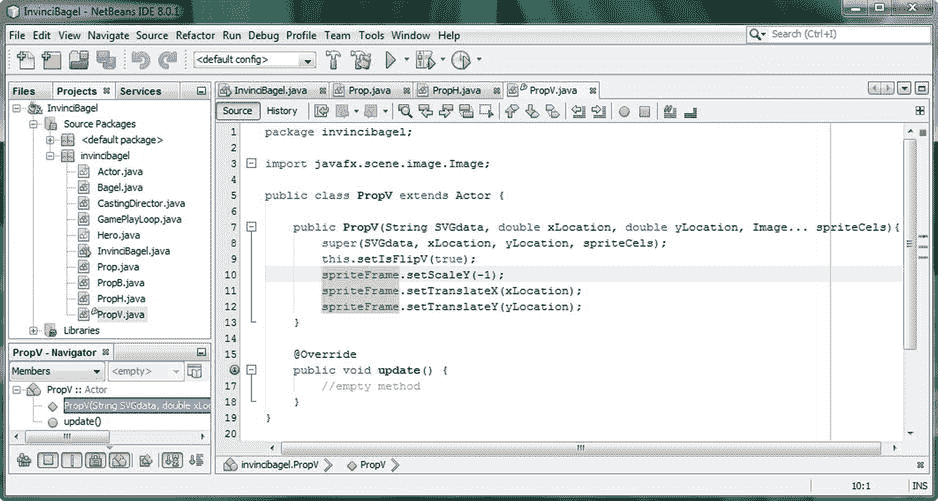

图 14-15。

A completed PropV() constructor method creates a fixed PropV object flipped along the vertical Y axis

接下来，执行与 PropV 类相同的工作过程，并创建 PropB 类。这个类将把 isFlipV 和 isFlipH 属性都设置为 true，并实现一个`spriteFrame.setScaleX(-1);`方法调用和一个`spriteFrame.setScaleY(-1);`方法调用。这最后一个 PropB 类的 Java 类结构将沿 X 和 Y 轴镜像固定道具图像，如图 [14-16](#Fig16) 所示，类似于以下代码:

`public class``PropB``extends``Actor`T4】

`public PropB(String SVGdata, double``xLocation``, double``yLocation`T4】

`super` `(SVGdata,` `xLocation` `,` `yLocation,`

`this.``setIsFlipH``(``true`T4】

`spriteFrame.``setScaleX``(``-1`T4】

`this.``setIsFlipV``(``true`T4】

`spriteFrame.``setScaleY``(``-1`T4】

`spriteFrame.setTranslateX(``xLocation`T2】

`spriteFrame.setTranslateY(``yLocation`T2】

```java
}

}
```

正如你在图 [14-16](#Fig16) 中看到的，代码是没有错误的，你现在有了一个 PropB 类，它将为你的场景创建固定的对象，这些对象同时围绕 X 轴和 Y 轴翻转或镜像！有了这四个不同的固定道具类，我们就可以快速轻松地设计场景(以及最终的游戏关卡)元素，除了声明正确的道具类、引用正确的图像资源以及 X、Y 轨迹(位置)和碰撞多边形 SVG 数据之外，什么都不用做。

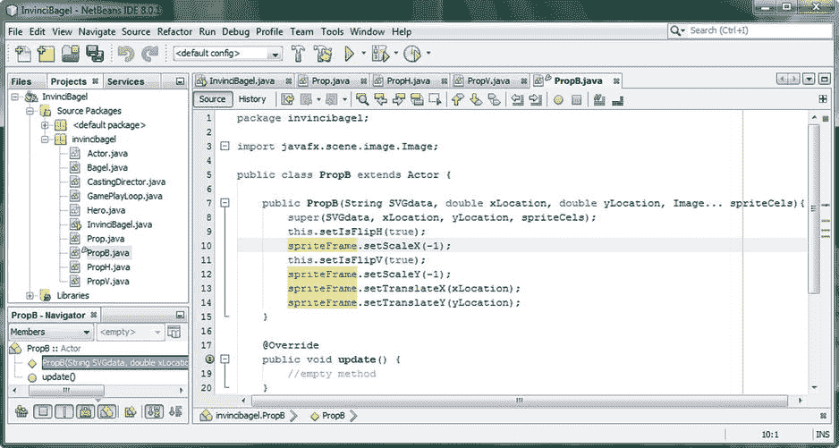

图 14-16。

A completed PropB() constructor method creates a fixed PropB object flipped along both the X and Y axis

现在我们准备使用这四个新的固定精灵类，并学习如何添加场景(舞台)元素。

## 使用道具类:创建固定场景对象

在我们开始编写 InvinciBagel.java 类的代码之前，您应该已经在 NetBeans 中打开了它自己的标签，并使用这些道具类将固定的精灵设计元素添加到我们的游戏中，我想向您展示如何去掉文件名旁边那些讨厌的小扳手图标。在创建了这四个新的道具相关的类之后，你的 IDE 屏幕上现在可能已经有几个了，所以让我们来学习如何让这些消失吧！如图 [14-17](#Fig17) 所示，如果右击扳手图标旁边的文件名，选择编译文件菜单选项，或者使用 F9 功能键，扳手就会消失。本质上，扳手表示您正在处理该文件，也就是说，您已经对该文件中的代码进行了更改，并且没有通过编译它来检查错误并保存它，从而使该代码永久化。

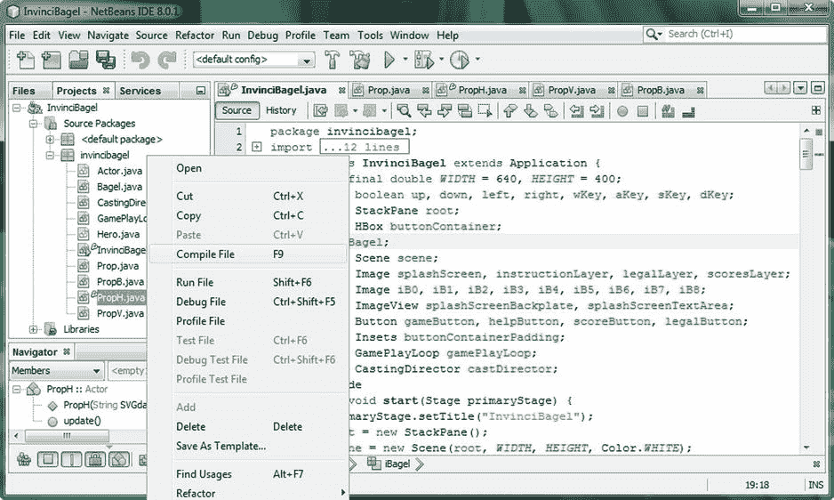

图 14-17。

If you want to get rid of the little wrench icon next to the file name, right-click the file, and Compile File

### 添加属性和图像声明:属性和图像对象

让我们首先声明我们需要创建的对象，以将固定精灵添加到我们游戏的场景和舞台对象中，这些对象最初将是一个名为 iPR0 的道具对象，它代表 InvinciBagel Prop zero，最终随着本章的进行，会有一个名为 iPH0 的 PropH 对象、一个名为 iPV0 的 PropV 对象和一个名为 iPB0 的 PropB 对象，这样您就有了使用所有这些类的经验，并且我们可以确保它们都按照我们设计的方式工作。我们还将在图像 iB0 到 iB8 声明的末尾添加一个 iP0 图像对象声明，然后再添加一个 iP1 图像对象声明。Java 语句如图 [14-18](#Fig18) 所示，如下所示:

`Prop``iPR0`T2】

`private Image iB0, iB1, iB2, iB3, iB4, iB5, iB6, iB7, iB8,``iP0`T2】

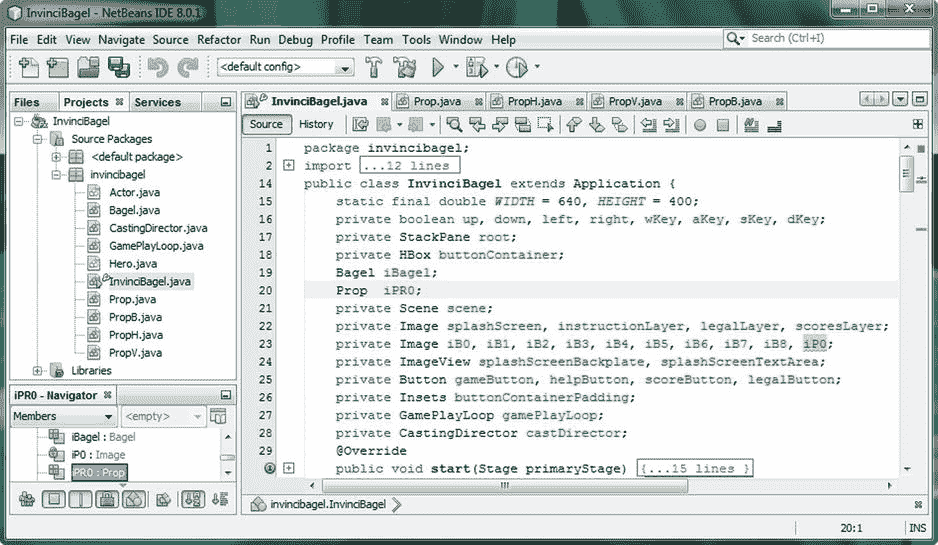

图 14-18。

Add Prop object declaration, name it iPR0 (invincibagel Prop zero), and add an iP0 to Image declaration

在我们可以实例化图像对象之前，我们需要将图像资产复制到/src 文件夹中，因此使用文件管理软件包(我使用的是 Windows Explorer)将 prop0.png 和 prop1.png png 8 图像文件与您已经安装在游戏项目中的其他十几个图像资产一起复制进来，如图 [14-19](#Fig19) 所示。

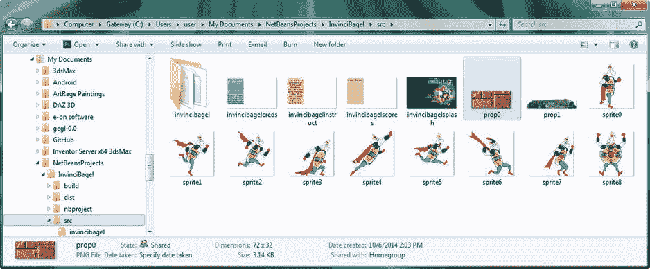

图 14-19。

Use your file management software to copy the prop0 and prop1 PNG8 files into the project /src folder

接下来，让我们实例化包含一个适当图像的图像对象，一个可平铺的砖块，这样我们就可以使用我们的四个 InvinciBagel.java 方法。loadImageAssets()，。createGameActors()，。addGameActorNodes()，最后是。createCastingDirection()将固定道具对象安装到游戏的场景对象和游戏的舞台对象中。

### 实例化图像对象:使用。loadImageAssets()方法

在 NetBeans 中打开“InvinciBagel.java”选项卡，并打开 loadImageAssets()方法。现在添加一个引用 prop0.png 文件及其 72x32 像素大小的 iP0 图像对象实例化语句。创建 iP0 图像对象的 Java 代码，如图 [14-20](#Fig20) 所示，应该类似于下面的 Java 语句:

`iP0` `= new Image("` `/prop0.png` `",` `72` `,` `32` `, true, false, true);`

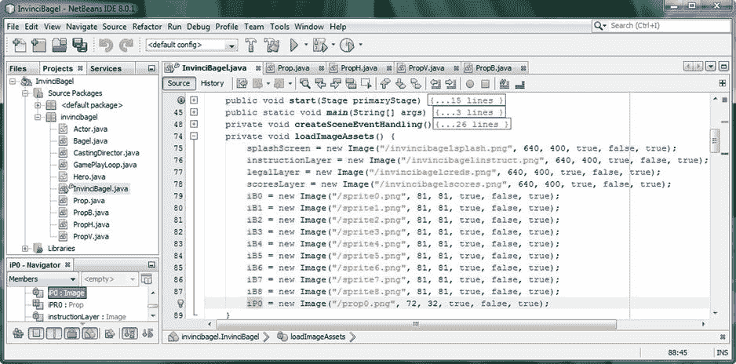

图 14-20。

Add the iP0 Image object instantiation using the prop0.png file name and the 72 by 32 pixel image size

现在我们准备添加我们的第一个道具对象到我们的游戏中来添加一个固定的精灵，这将允许我们使用在本章中放入 invincibagel 包代码库中的类来创建我们的游戏设计。

### 使用道具对象添加固定精灵:。addGameActors()

在你之后。loadImageAssets()方法在游戏设计过程中，我们设计了另外三个方法“容器”,用于向游戏中添加演员对象。这些是按照我们在这个过程中需要使用它们的顺序来调用的，所以让我们继续按照这个顺序来组织和使用它们。我们需要执行的第一个实例化创建了一个新的(使用 Java new 关键字)Prop 对象。现在，我们将再次使用我们的“虚拟”SVG 形状数据，以及屏幕 X 和 Y 位置的 0，0 中心，最后是 iP0 图像资源，我们刚刚在本章的前几节中声明并实例化了它。在图 [14-21](#Fig21) 中可以看到的 Java 实例化语句应该类似于下面的 Java 代码行:

`iPR0` `=` `new` `Prop("M150 0 L75 200 L225 200 Z", 0, 0,` `iP0`

下一步是将 iPR0 属性对象的 ImageView 节点对象添加到场景图形根对象。这是使用. getChildren()完成的。add()方法链引用了 iPR0 属性对象内的 spriteFrame ImageView 对象，使用点标记法，使用以下 Java 语句，如图 [14-21](#Fig21) 所示:

`root``.getChildren().add(``iPR0.spriteFrame`T3】

接下来，使用。addCurrentCast()方法将 iPR0 对象添加到 castDirector 对象，如图 [14-21](#Fig21) 所示:

`castDirector``.addCurrentCast(``iPR0`T3】

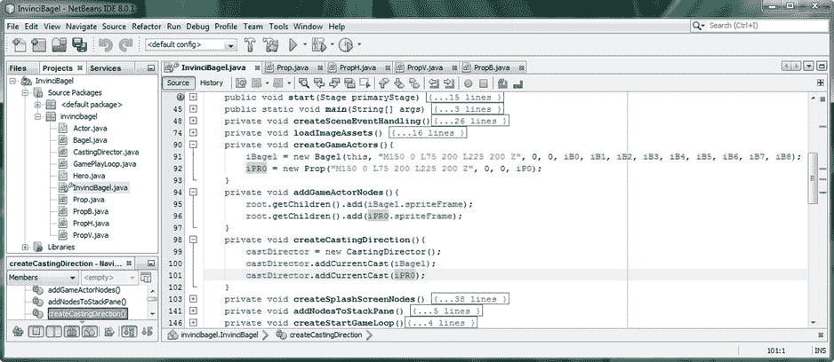

图 14-21。

Instantiate an iPR0 Prop object, add it to the root Scene Graph, and add it to the CurrentCast List<Actor>

接下来，使用运行➤项目工作流程测试代码。结果如图 [14-22](#Fig22) 左侧所示。

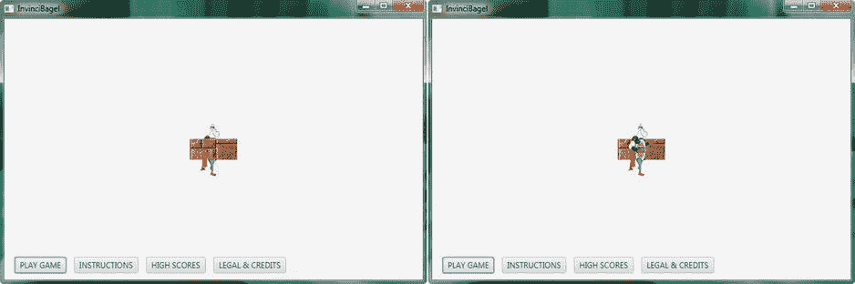

图 14-22。

Testing InvinciBagel 0,0 prop placement (left) and changing the z-index in .addGameActorNodes() (right)

正如您所看到的，InvinciBagel 字符在 Prop 对象的后面，这意味着我们需要改变。addGameActorNodes()方法，因为节点对象添加到场景图的顺序决定了它们的 z 索引或 z 顺序。如图 [14-23](#Fig23) 所示，我已经移动了。add()方法调用将 iPR0 添加到 iBagel 的 IP r0 之上，这样你就可以在图 [14-22](#Fig22) 的右侧看到，InvinciBagel 角色现在位于道具对象的顶部。当然，一旦我们增加了碰撞检测，这就不是问题了。让我们使用相同的工作流程，并在场景中添加一个 PropH 对象，这样我就可以向您展示如何翻转和镜像这个平铺图像，以便为您的 Java 8 游戏开发创建无缝的可平铺结构。

让我们使用相同的命名约定，将 PropH 对象命名为 iPH0。在图 [14-23](#Fig23) 中可以看到的 Java 实例化语句应该类似于下面的 Java 代码行:

`iPH0` `= new` `PropH` `("M150 0 L75 200 L225 200 Z", 0, 0,` `iP0`

添加固定 sprite 属性的下一步是将 iPH0 属性对象的 ImageView 节点对象添加到场景图形根对象中。这是通过使用。getChildren()。add()方法链，该方法链通过使用点标记来引用位于 iPH0 PropH 对象内部的 spriteFrame ImageView 对象。这是使用下面的 Java 语句完成的，该语句也显示在图 [14-23](#Fig23) 中:

`root``.getChildren().add(``iPH0.spriteFrame`T3】

最后，我们将使用。addCurrentCast()方法，我们在[第 10 章](10.html)中创建的，使用下面一行 Java 代码，将这个 iPH0 对象添加到 castDirector CastingDirector 对象内部的 CURRENT _ CAST List<Actor>ArrayList 对象，也显示在图 [14-23](#Fig23) 的底部:

`castDirector``.addCurrentCast(``iPH0`T3】


图 14-23。

Instantiate an iPH0 PropH object, add it to the root Scene Graph, and add it to a CurrentCast List<Actor>

正如你在图 [14-23](#Fig23) 中看到的，我也已经将道具对象的 0，0 坐标改为 0，148，并将道具对象的坐标改为 72，148。这将把 Y 轴镜像的 PropH 对象无缝地放置在 Prop 对象的右侧。如果您现在想查看无缝平铺效果，可以使用“运行➤项目”工作流程。如果您当前没有运行 NetBeans 8 IDE，并且您想要预测图 [14-26](#Fig26) ，您现在可以看到这种平铺(镜像)效果。最后，我还将把 PropV 和 PropB 类(对象)集成到这个镶嵌中。

让我们使用完全相同的工作流程，并在场景中添加一个 PropV 对象，这样我们就可以看到如何围绕 X 轴翻转和镜像这个 tile 图像，从而为 Java 8 游戏开发创建更加复杂的无缝 tileable 构造。让我们使用相同的命名约定，并将这个新的 PropV 对象命名为 iPV0。您的新 Java 实例化语句，可以在图 [14-24](#Fig24) 中看到，应该看起来像下面这行 Java 代码:

`iPV0` `=` `new PropV` `("M150 0 L75 200 L225 200 Z", 0, 0,` `iP0`

添加固定 sprite 属性的下一个逻辑步骤是将该 iPV0 PropV 对象的 ImageView 节点对象添加到场景图形根 StackPane 对象中。这是通过使用。getChildren()。add()方法链，它引用 spriteFrame ImageView 对象，该对象位于 iPV0 PropV 对象内部，使用点标记法。这可以通过使用下面的 Java 编程语句来完成，该语句也显示在图 [14-24](#Fig24) 中:

`root``.getChildren().add(``iPV0.spriteFrame`T3】

最后，我们将使用。addCurrentCast()方法，我们在[第 10 章](10.html)中创建的，使用下面一行 Java 代码，将这个 iPV0 对象添加到 castDirector CastingDirector 对象内部的 CURRENT _ CAST List<Actor>ArrayList 对象，这也显示在图 [14-24](#Fig24) 的最底部:

`castDirector``.addCurrentCast(``iPV0`T3】

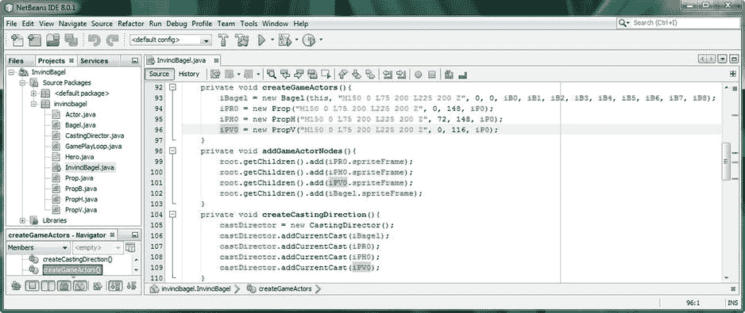

图 14-24。

Instantiate an iPV0 PropV object, add it to the root Scene Graph, and add it to a CurrentCast List<Actor>

最后，让我们将一个 PropB 对象添加到场景中，这样我就可以向您展示如何同时围绕 X 轴和 Y 轴翻转(镜像)可平铺图像。我们将遵循我们的命名约定，将 PropB 对象命名为 iPB0。在图 [14-25](#Fig25) 中可以看到的实例化语句应该类似于下面的 Java 代码:

`iPB0` `=` `new PropB` `("M150 0 L75 200 L225 200 Z", 0, 0,` `iP0`

接下来，让我们将 iPB0 PropB 对象的 ImageView 节点添加到场景图形根对象中。这是使用. getChildren()完成的。add()方法链。这引用了一个 spriteFrame ImageView 对象，它位于 iPB0 PropB 对象内部，使用点标记。这是使用下面的 Java 语句完成的，该语句也显示在图 [14-25](#Fig25) 中:

`root``.getChildren().add(``iPB0.spriteFrame`T3】

最后，我们将使用。我们在第 10 章的[中创建的 addCurrentCast()方法，用于将此 iPB0PropB 对象添加到 castDirector CastingDirector 对象内部的 CURRENT _ CAST List<Actor>ArrayList<Actor>对象，可以在图](10.html) [14-25](#Fig25) 的底部看到，该方法使用以下单行 Java 代码:

`castDirector``.addCurrentCast(``iPB0`T3】

既然我们已经将本章前半部分创建的所有四个 Actor 子类投入使用，我们可以测试应用，看看不同的 X 轴和 Y 轴镜像对 prop0.png 砖块做了什么。

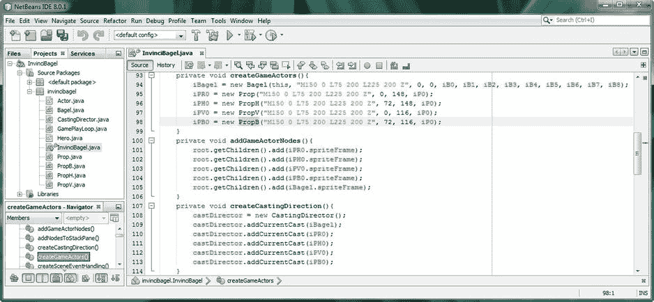

图 14-25。

Instantiate an iPB0 PropB object, add it to the root Scene Graph, and add it to a CurrentCast List<Actor>

使用运行➤项目并测试游戏，看看每个砖块是如何被不同地镜像的，如图 [14-26](#Fig26) 所示。


图 14-26。

Run ➤ Project; Prop, PropH, and PropV shown at the left, and all four Prop subclasses shown at the right

接下来，我们来看看如何使用大型场景道具对象来合成舞台上的背景元素。

## 使用更大的场景道具:用 JavaFX 合成

我们创建的这四个道具演员子类的一个真正好处是，它们允许我们利用 PNG8(背景图像资产)和 PNG32(带有 alpha 通道的真彩色合成图像)图像资产在我们的游戏场景和舞台对象中进行数字图像合成。如果我们不通过实现碰撞检测来对运动精灵游戏角色使用固定道具，并且如果我们在后台保留这些固定道具，通过观察我们在。addGameActorNodes()方法就 Actor z-index 而言，我们可以使用我们为角色和障碍开发的相同合成引擎来优化游戏视觉元素。我们可能根本不需要在游戏中使用任何背景图片。至少，这允许我们添加更简单的背景图片，比如一个有云的基本天空，或者一个日落。这些压缩更好，由于他们的简单，可以使用 PNG8 图像与原始的结果。接下来让我们添加一个更大的固定 sprite 道具，它的宽度接近 500 像素，高度接近 100 像素。如图 [14-27](#Fig27) 所示，我们需要添加的第一件事是另一个道具对象，我们将命名为 iPR1，另一个图像对象，我们将命名为 iP1，使用以下代码:

`Prop``iPR0,``iPR1`T3】

`private``Image``iB0, iB1, iB2, iB3, iB4, iB5, iB6, iB7, iB8, iP0,``iP1`T4】

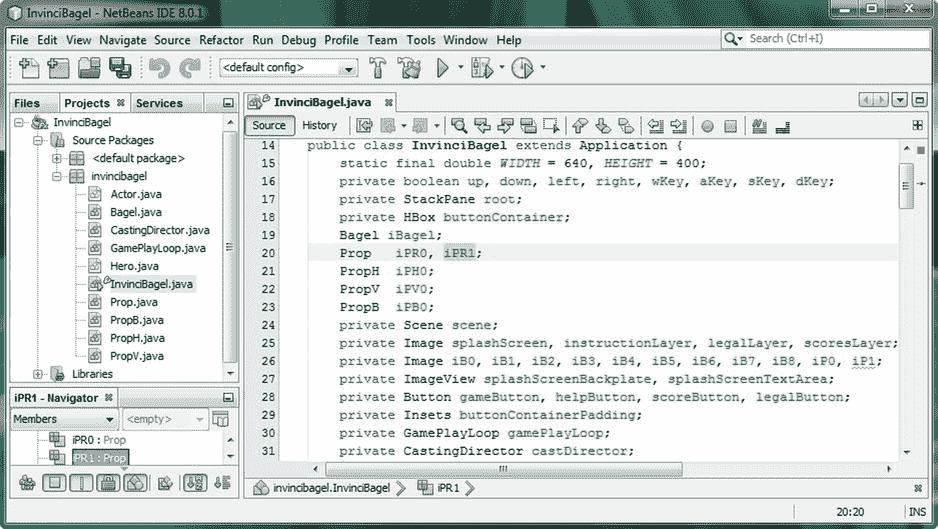

图 14-27。

Add an iPR1 Prop declaration (shown with all other PropH, PropV and PropB declarations) and iP1 Image

复制你的 iP0 镜像实例，创建一个 iP1 镜像，引用 prop1.png，如图 [14-28](#Fig28) 所示。

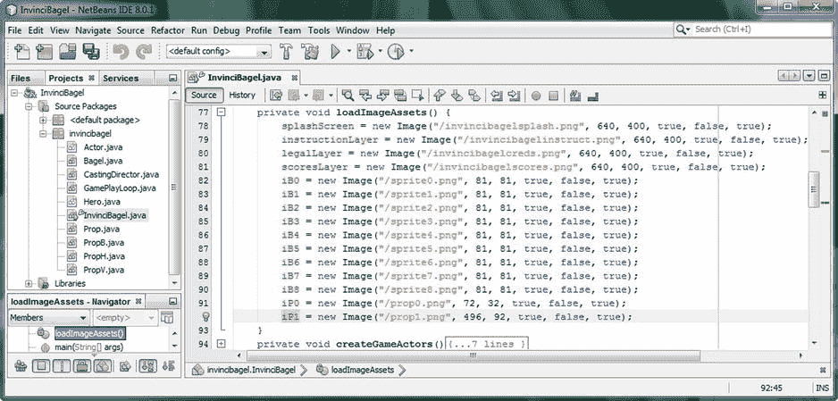

图 14-28。

Add the iP1 Image object instantiation using the prop1.png file name, and the 496 by 92 pixel image size

复制您的 iPR0 对象实例化和添加代码，创建一个 iPR1 对象，如图 [14-29](#Fig29) 所示。

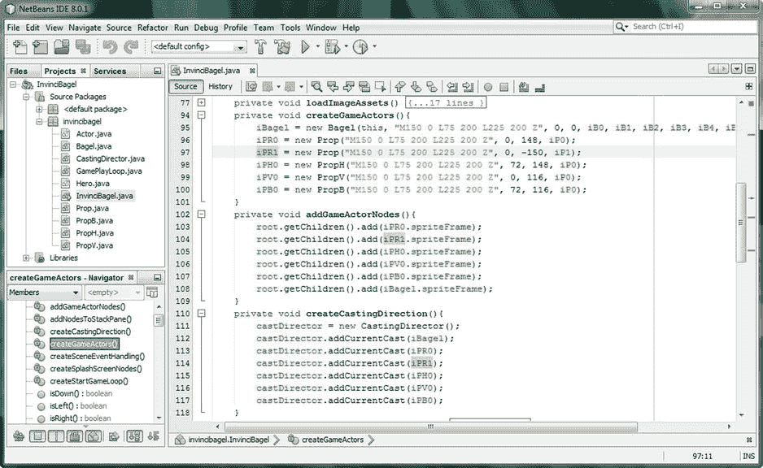

图 14-29。

Instantiate an iPR1 Prop object, add it to the root Scene Graph, and add it to the CurrentCast List<Actor>

为了在屏幕顶部放置一块苔藓，我在构造函数方法调用中使用了 0，-150 屏幕坐标。现在使用运行➤项目工作流程来看看结果，如图 [14-30](#Fig30) 左侧所示。

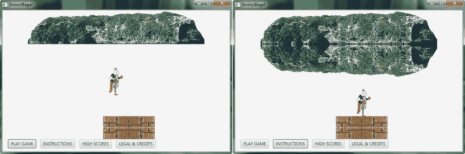

图 14-30。

Run the project; the Prop iPR1 is shown at the left, and iPV1 PropV mirrored object is shown at the right

你也可以“翻转”大型道具，创造一些非常酷的效果。创建一个 iPV1 声明和实例化，如图 [14-31](#Fig31) 所示，并创建一个 PropV 对象，它将沿着 X 轴镜像苔藓岩石。这可以在图 [14-30](#Fig30) 的右侧看到。在这一章中，我们已经在使用固定精灵道具类能力方面取得了很大的进步。

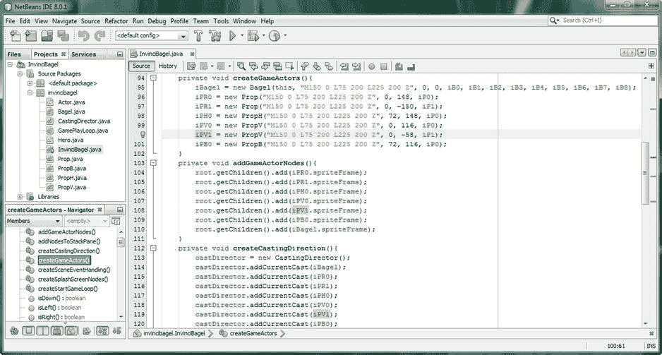

图 14-31。

Instantiate an iPV1 PropV object, add it to the root Scene Graph, and add it to a CurrentCast List<Actor>

## 摘要

在第十四章中，我们创建了固定精灵“道具”类，允许我们设计游戏场景和固定对象，我们的运动精灵演员对象将与之交互。我们首先创建了 Prop 类，它扩展了我们在第 8 章中创建的 Actor 类。我们使用了。setTranslateX()和。setTranslateY()方法在构造函数方法中使用 xLocation 和 yLocation 参数来定位舞台上的 ImageView，类似于我们使用。moveInvinciBagel()类，仅在固定精灵的情况下，在构造函数方法内部，移动仅进行一次，以将道具定位在舞台上的场景中。

接下来，我们创建了更复杂的 PropH 和 PropV 类，它们除了在场景中定位固定的精灵之外，还围绕 Y 轴(PropH)和 X 轴(PropV)自动镜像它们。我们还创建了一个 PropB (B 代表 Both)类，它将自动镜像 X 轴和 Y 轴周围的固定 sprite 图像资产。

接下来，我们学习了如何通过在我们的 InvinciBagel.java 主游戏设计类中声明、实例化和添加(到 JavaFX 场景图以及 CastingDirector 对象)这些道具类来实现它们。我们学习了如何在屏幕上定位我们的固定精灵，以及如何创建无缝的镜像平铺效果，并测试了我们的新道具类，以确保它们可以用于设计游戏关卡。

最后，我们用更大的道具测试了这四个新的固定 sprite 类中的两个，如果我们不通过将它们添加到 CastingDirector 对象中来定义用于碰撞检测的固定 sprite 对象，可以想象它们可以用于场景背景合成。这将有助于减少游戏的数据足迹，最大限度地减少大型 PNG24 背景图像的使用，允许我们用小得多的 PNG8 背景图像替换这些数据繁重的图像。这些可以描绘场景“设置”，如雨天、多云的天空或生动的日落。

在下一章，我们将看看如何在游戏代码中添加一个数字音频音效引擎。这个音频引擎将使用 JavaFX AudioClip 类为游戏添加音效排序功能，以便我们在添加物理和碰撞检测等内容时，所有基本的新媒体元素(固定和运动图像以及音频反馈)都可以工作。通过这种方式，我们可以开始添加多媒体，在游戏体验中利用玩家的所有感官。