# 十六、碰撞检测:为游戏角色创建 SVG 多边形，并编写代码来检测碰撞

现在，我们已经为游戏音效和短循环音乐实现了数字音频，并且实现了创建运动精灵(角色)和固定精灵(道具)的数字图像相关类，我们现在将深入研究新媒体的另一个主要类型或领域:矢量。矢量用于 2D 插图软件(InkScape)以及 3D 建模和动画软件(Blender)，并使用数学来定义用于创建 2D 或 3D 艺术品的形状。这使得 vectors 成为定义自定义碰撞形状的完美解决方案，它可以完美地包围我们的 sprite，因此我们不使用复杂的像素阵列来检测碰撞，而是使用更简单(内存和处理器效率更高)的碰撞多边形，它将完美地包围我们的 sprite。

幸运的是，javafx.scene.shape 包中的 JavaFX SVGPath 类允许我们使用自定义 SVG 路径(形状)数据来定义 sprite 碰撞边界。不仅如此，这个 SVGPath 类(object)也非常高效，因为它没有属性，只有几个方法和一个简单的 SVGPath()构造函数方法，正如你在第 8 章中已经看到的。这意味着使用 SVGPath 类(对象)相对来说是内存和处理器高效的。事实上，我们需要使用的唯一方法是。setContent()方法，我们在[第 8 章](08.html)中的 Actor 类构造函数方法中使用了它。因为我们将在游戏启动时做一次，SVG 路径碰撞数据将被加载到系统内存中，并将在我们的碰撞检测例程中使用，我们将在本章后面的部分中进行处理。

在本章中，我们将详细了解如何定义 SVG 路径数据。这是由万维网(W3)联盟(也称为 W3C)规定的，该组织定义了 HTML5。该规范在他们的 w3.org 网站上，位于 [`http://www.w3.org/TR/SVG/paths.html`](http://www.w3.org/TR/SVG/paths.html) 网址，如果你想查看更多细节。

在我们详细了解了 SVG 或可缩放矢量图形(如果您想知道这代表什么)数据格式之后，我们将开始使用流行的 GIMP 2.8 数字图像编辑软件，您在[第 1 章](01.html)中安装了该软件，并学习如何创建碰撞多边形。我们还将了解如何使用 PhysEd (PhysicsEditor)碰撞多边形生成软件。这是来自一家名为 CodeAndWeb GmbH 的公司，该公司生产专业的、价格合理的游戏资产创建软件。

我们将使用 GIMP 2.8 完成碰撞多边形向量资源创建和优化过程，使用快速和脏工作过程，这允许 GIMP 100%为您创建碰撞多边形形状，以及一个更“复杂”的工作过程，其中您可以使用 GIMP 的路径工具手动创建自己的碰撞多边形。在我们学习了如何创建与 JavaFX SVGPath 类兼容的碰撞多边形之后，我们将在本章的剩余部分讨论 Java 8 游戏编程，创建碰撞检测引擎(代码),它将允许我们检测 InvinciBagel 角色何时与游戏环境中的任何其他演员对象(场景和舞台对象)接触。这是这本书开始变得更高级(有用)的地方。

## SVG 数据格式:手工编码矢量形状

SVG 数据字符串中的数字(2D 空间中的 X，Y 数据点位置)数据可以使用十种不同的字母。每个版本都有大写(绝对参考)和小写(相对参考)版本。我们将使用绝对参考，因为我们需要这些数据点与 sprite 图像中的像素位置匹配，我们将“附加”或分组这些 SVG 路径数据字符串，以提供碰撞检测数据指南。正如您在表 [16-1](#Tab1) 中看到的，SVG 数据命令为您定义 Java 8 游戏开发的自定义曲线提供了很大的灵活性。您甚至可以将所有这些可扩展的矢量命令与您的 Java 8 代码相结合，以创建以前从未体验过的交互式矢量(数字插图)艺术作品，但由于这是一个游戏开发标题，我们将使用这些信息来开发高度优化的碰撞多边形，这些多边形仅使用十几个 X，Y 数据点(介于 12 和 15 之间)来定义一个相对详细的碰撞多边形，它将包含我们的精灵图像，并提供高度精确的(至少从游戏玩家的角度来看)碰撞结果。

表 16-1。

SVG data commands to use for creating SVG path data string (source: Worldwide Web Consortium w3.org)

     
| SVG 命令名 | 标志 | 类型 | 参数 | 描述 |
| --- | --- | --- | --- | --- |
| 动起来了 | M | 绝对的 | x，Y | 使用绝对坐标在 X，Y 处定义路径的起点 |
| 动起来了 | m | 亲戚 | x，Y | 使用相对坐标在 X，Y 处定义路径的起点 |
| 帕尔帕思 | Z | 绝对的 | 没有人 | 通过从最后一个坐标到第一个坐标画一条线来闭合 SVG 路径 |
| 帕尔帕思 | z | 亲戚 | 没有人 | 通过从最后一个坐标到第一个坐标画一条线来闭合 SVG 路径 |
| 利托 | L | 绝对的 | x，Y | 从当前点到下一个坐标绘制一条线 |
| 利托 | l | 亲戚 | x，Y | 从当前点到下一个坐标绘制一条线 |
| 水平直线 | H | 绝对的 | X | 从当前点到下一个坐标绘制一条水平线 |
| 水平直线 | h | 亲戚 | X | 从当前点到下一个坐标绘制一条水平线 |
| 垂直线条 | V | 绝对的 | Y | 从当前点到下一个坐标绘制一条垂直线 |
| 垂直线条 | v | 亲戚 | Y | 从当前点到下一个坐标绘制一条垂直线 |
| 弯曲的 | C | 绝对的 | X，Y，X，Y，X | 从当前点到下一点绘制一条三次贝塞尔曲线 |
| 弯曲的 | c | 亲戚 | X，Y，X，Y，X | 从当前点到下一点绘制一条三次贝塞尔曲线 |
| 短平滑曲线 | S | 绝对的 | X，Y，X，Y | 从当前点到下一点绘制一条三次贝塞尔曲线 |
| 短平滑曲线 | s | 亲戚 | X，Y，X，Y | 从当前点到下一点绘制一条三次贝塞尔曲线 |
| 二次贝塞尔曲线 | Q | 绝对的 | X，Y，X，Y | 绘制二次贝塞尔曲线(当前点到下一点) |
| 二次贝塞尔曲线 | q | 亲戚 | X，Y，X，Y | 绘制二次贝塞尔曲线(当前点到下一点) |
| 短二次贝塞尔曲线 | T | 绝对的 | x，Y | 绘制一个短的二次贝塞尔曲线(当前点到下一点) |
| 短二次贝塞尔曲线 | t | 亲戚 | x，Y | 绘制一个短的二次贝塞尔曲线(当前点到下一点) |
| 椭圆弧 | A | 绝对的 | rX，rY，红色 | 从当前点到下一点绘制椭圆弧 |
| 椭圆弧 | a | 亲戚 | rX，rY，红色 | 从当前点到下一点绘制椭圆弧 |

了解如何使用强大的 SVG 数据“路径绘制”命令的最佳方式是开始学习创建基于 SVG 数据的碰撞多边形路径的工作过程。我们将学习如何使用 GIMP 2.8.14 实现这一点，使用一种“快速而简单”的方法，让 GIMP 完成 100%的路径创建工作。之后，我们将学习另一种使用 GIMP 手工完成这项工作的方法。第二种方法为您提供了 100%的路径创建控制。在这个 SVG 主题的最后，我还将向您展示如何使用另一个专用的碰撞和物理开发工具 PhysEd，它来自一家创新的游戏开发软件工具公司，位于德国乌尔姆，名为 CodeAndWeb GmbH。

## 创建和优化碰撞数据:使用 GIMP

对我们来说幸运的是，流行的开源数字图像编辑软件包 GIMP(目前版本为 2.8.14)具有足够的路径功能，并且能够将其导出为 SVG 数据集，从而允许该软件用作成熟的碰撞多边形创建工具。GIMP 软件使用路径工具支持路径(显示为带有贝塞尔手柄的曲线数据点旁边的老式钢笔笔尖)，您可以在图 [16-1](#Fig1) 中看到(工具箱图标第二行中左起第二个图标)。GIMP 支持路径的原因是，它通常不是一个矢量(基于路径)软件包，而是一个光栅(基于像素)软件包，因为创建路径然后将其“转换”到选择区域的能力对于数字图像合成技术人员来说非常有用。事实上，我们将使用 GIMP 的能力来做与此相反的事情:也就是说，将算法创建的选择集转换成路径数据，这将形成我们完全自动化的、“快速而肮脏的”SVG 路径数据创建过程的基础。我们首先来看看这个，因为它快速、简单、有效(但是“数据量很大”)。让我们从启动 GIMP 开始，并使用文件➤打开过程来打开您的项目/src 文件夹中的 sprite1.png png 32 数字图像资产。正如你在图 [16-1](#Fig1) 中看到的，我已经放大了图像。这允许我看到我们将要使用 GIMP 工具箱创建的碰撞数据路径(最初，这将是一个选择)。

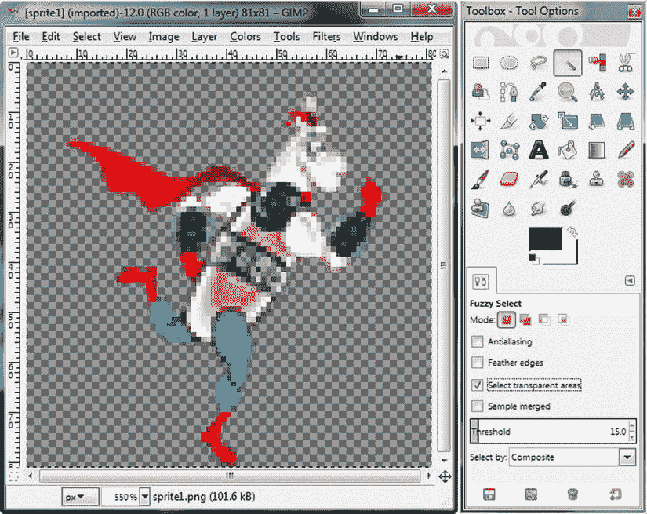

图 16-1。

Launch GIMP, and use File ➤ Open to open the sprite1.png file

点击 GIMP 模糊选择工具(图标看起来像火花或魔杖)，它显示为选中状态(按下，如“陷入”，而不是悲伤)，如图 [16-2](#Fig2) 。单击图像中显示棋盘图案的任何区域，这在任何数字成像软件包以及许多其他类型的软件(例如 CodeAndWeb GmbH 的游戏资产创建软件包)中总是表示透明的。正如你所看到的，在图 [16-2](#Fig2) 中，你会在图像的透明区域周围得到一个动画的“爬行的蚂蚁”轮廓，因为透明区域刚刚被模糊选择工具算法选中，该算法选择连续颜色值的区域。

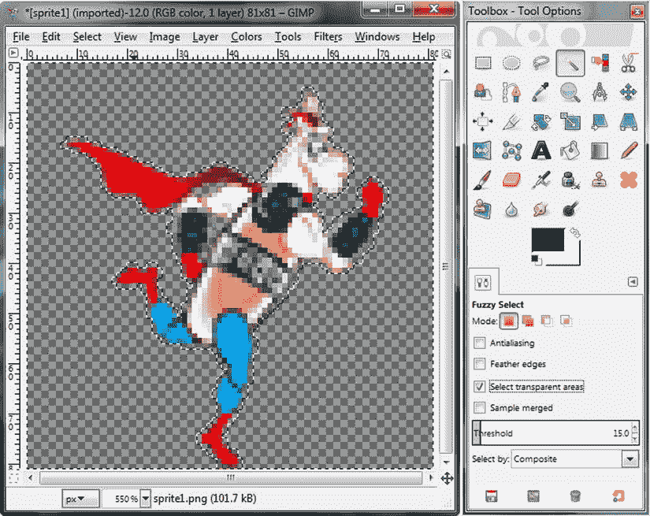

图 16-2。

Click in a transparent area using Fuzzy Select Tool to select Actor

在这种情况下，模糊选择工具选择透明度值。事实上，您应该注意到，您必须选择一个选项来选择图像中的透明区域，使用模糊选择工具选项对话框，该对话框可以在工具箱工具选项浮动调色板的底部看到。正如你所看到的，我已经指示 GIMP 通过选择“选择透明区域”选项，不仅要“查看”图像中的 RGB 板，还要查看 Alpha 板。

现在我们有了包含除了我们想要选择的 sprite 字符之外的所有内容的选择集，我们需要找出一种方法来获得与我们现在选择的内容相反的内容。无可否认，选择透明区域要比选择无敌手角色的不同颜色区域容易得多！幸运的是 GIMP 有一个算法可以完全反转选择，选择所有没有被选中的，取消选中所有被选中的。

在 GIMP 2.8 选择菜单下，找到反转选项，或者使用 Control+I 键盘快捷键，显示在反转选项旁边的菜单上，所有这些都可以在图 [16-3](#Fig3) 的左半部分看到。一旦你这样做了，你会注意到动画“行进的蚂蚁”不再围绕数字图像的正方形周长(范围)行进，它们只围绕 InvinciBagel 字符，这意味着选择已经被反转，我们想要选择的现在包含在选择集中。

下一步是将此光栅像素选择集(数组)转换为矢量(路径)数据表示。我们在 GIMP 中这样做的方法是使用选择➤路径菜单序列，如图 [16-3](#Fig3) 的右半部分所示。这将把 InvinciBagel 字符周围的选择转换为矢量路径数据，这就是我们想要剔除的。

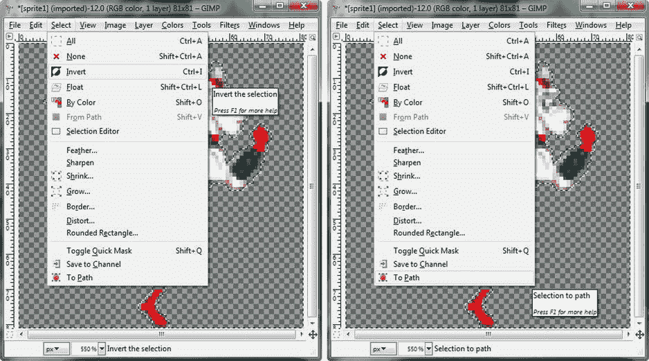

图 16-3。

Invert selection using Select ➤ Invert, so only Actor is selected (left); use Select ➤ To Path to convert to path

一旦你将像素选择转换成矢量路径，你将得到如图 [16-4](#Fig4) 所示的结果。

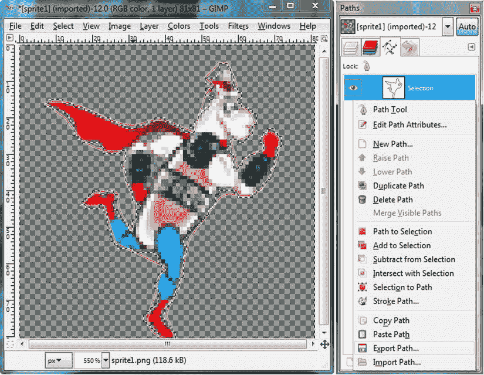

图 16-4。

Right-click on Selection Path in Paths Palette, and Export Path

在另一个浮动调色板中，点击路径选项卡，如图 [16-4](#Fig4) 右侧所示。GIMP 有两个主要的浮动工具窗口；一个是 GIMP 工具箱，包含工具、选项、画笔、图案和渐变，另一个包含四个选项卡，代表您的数字图像的合成层、通道、选择路径，甚至还有一个撤销缓冲区，它为您提供了自启动以来在 GIMP 中所做的每个“移动”的“历史记录”。

选择名为“选择”的路径(名为“选择”的路径图层将变为蓝色)。接下来右键单击名为 Selection 的路径，在您可以对选择路径进行操作的菜单底部，您会看到一个导出路径菜单选项。这是另一个关键的 GIMP 算法，使我们能够创建和输出碰撞多边形的工作过程。

选择这个导出路径选项将为我们导出当前 InvinciBagel 字符选择路径数据，作为包含 SVG 数据的基于文本的(XML)文件，这是我们需要在 Bagel()构造函数方法调用中使用的。该数据将包含在第一个字符串 SVGdata 参数中，并将替换我们到目前为止一直用作占位符的“虚拟数据”。

一旦你调用导出路径菜单选项，你会看到导出路径到 SVG 对话框，如图 [16-5](#Fig5) 所示。如你所见，我选择了对话框底部的“导出活动路径”选项，因为我只想要一个碰撞多边形路径数据对象，我将该文件命名为 sprite1svgdata.svg，并将其保存在我的 C:\ Clients \ BagelToons \ InvinciBagelGame \ Shape _ Data 文件夹中。

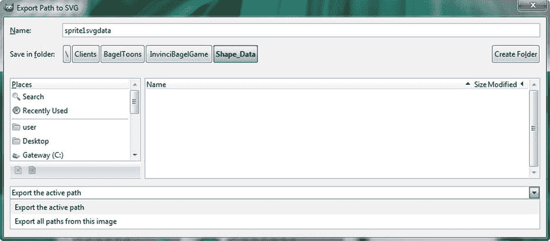

图 16-5。

Select “Export the active path” option, in the Export Path to SVG dialog, and name the file sprite1svgdata

工作流程的下一步是在文本编辑器中打开我们在图 [16-5](#Fig5) 中导出的 sprite1svgdata.svg 文件:对于 Windows 用户，这将是记事本，对于 Macintosh 用户，这将是文本编辑，对于 Linux 用户，这可能是 vi 或 vim。

图 [16-6](#Fig6) 显示了 Windows 记事本的文件打开对话框，你可能会注意到，默认情况下，记事本会查找。txt(文本文件类型)文件扩展名，表示该文件中有文本数据。但是，在。svg 文件扩展名(类型)，以 XML 数据的形式。我们需要使用对话框右下角的下拉菜单来告诉记事本查看所有可用的文件，并允许我们决定哪些文件包含文本数据，哪些不包含文本数据。

一旦你选择了“所有文件”选项，你会看到 sprite1svgdata 文件，你可以双击它打开文件(或者单击它选中它，然后点击打开按钮)。

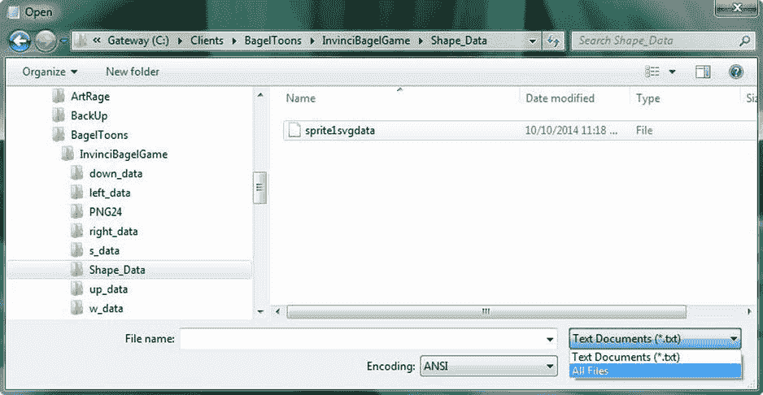

图 16-6。

Use a text editor (like Notepad) and select “All Files” option and Open sprite1svgdata

如果您想在 Java 代码中使用这些数据，只需选择引号中 d =(数据等于)后面的部分，包括引号，您需要用引号来表示一个字符串，如图 [16-7](#Fig7) 中蓝色部分所示。

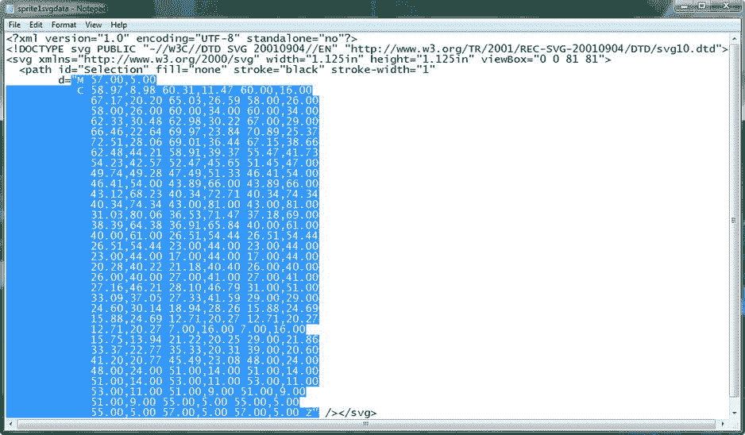

图 16-7。

Select the SVG data (including quote characters) for the SVG Path representation, and use it in your code

如图 [16-7](#Fig7) 所示，有 32 乘以 3 的数据对，接近 100 个数据点，这是一个很大的数据处理量，尤其是当两个都定义了 SVGPath 碰撞检测数据的对象发生碰撞时！

如果你看一下图 [16-4](#Fig4) 中的 InvinciBagel 角色，我们真的应该能够使用 14 到 16 条线定义一个围绕角色的碰撞多边形，这些线完美地封装了角色，并且使用少很多倍(事实上，少 16 倍，正如你将在本章的下一节中看到的)的数据，这相当于少 16 倍的内存，少 16 倍的处理(1600%的效率)开销，如果不是更多的话。

因此，我想向您展示在 GIMP 中定义您自己的自定义碰撞多边形 SVG 数据形状对象的更复杂的工作过程，使用尽可能少的线条(数据点之间)。这实质上等同于碰撞检测 SVG 路径形状数据优化，因为我已经向您展示了其他新媒体元素的数据优化工作流程，现在没有理由停止这种趋势！所以接下来，让我们在本章的下一节详细看看如何将我们的碰撞检测 SVG 路径形状数据开销减少 1600%。

### 创建优化的碰撞多边形:使用路径工具

让我们重新开始，要么关闭前一个项目，并使用文件➤打开重新打开 sprite1.png 文件，或删除路径调板中的前一个选择路径。这一次，而不是模糊选择工具，使用路径凳子，并在工具箱的选项(底部)部分选择设计编辑模式，并选择多边形复选框选项。这将使我们的线条保持漂亮和笔直，就像你在 Blender 等 3D 建模包中看到的多边形一样。在 InvinciBagel 角色的头发中单击，然后在他的左肩上单击另一个点，如图 [16-8](#Fig8) 所示。这将自动为您在两点之间绘制一条线段(折线)。单击肘部的第三个点、手腕的第四个点、脚趾的第五个点、膝盖的第六个点、大腿的第七个点、脚后跟的第八个点，以此类推，使用直线创建一个轮廓，该轮廓完美地包含 InvinciBagel 运行状态。

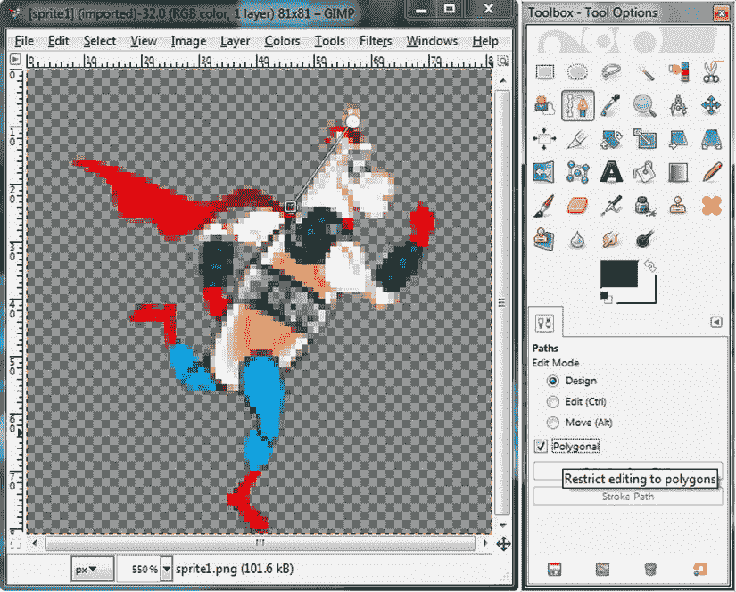

图 16-8。

Open sprite1.png, select the Paths Tool, and start to draw a simple Path

正如你在图 [16-9](#Fig9) 中看到的，我只用了 15 个点创建了碰撞多边形。您可以让多边形保持开放，只需添加您在本书第一部分学到的 Z 字符，即可创建一个闭合的多边形。正如你在图 [16-9](#Fig9) 的右侧所看到的，多边形与精灵非常一致，所以在游戏过程中，碰撞的结果看起来像是发生在精灵的像素上，而不是碰撞多边形上，尽管碰撞多边形路径数据在 GIMP 中是可见的，但在游戏过程中是不可见的。

通过选择并右键单击图 [16-9](#Fig9) 中间显示的未命名路径，导出您的手绘路径，并使用导出路径菜单选项将其导出为文件 sprite1svghand.svg，就像您在图 [16-5](#Fig5) 中所做的一样。如果你想在 GIMP 中命名路径，你可以双击路径对话框中的路径名，如果你愿意，给它一个名字。如果您想在原生 GIMP 中保存您的工作。xcf 文件格式，您也可以使用文件➤保存菜单序列，并给文件命名，如 sprite1svgpath15points.xcf

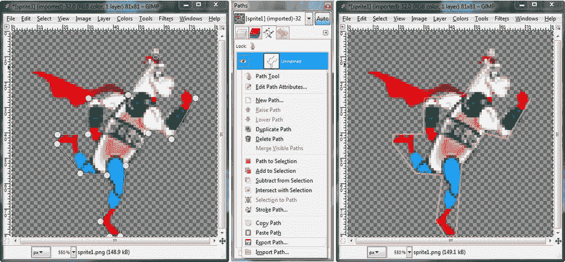

图 16-9。

Insert 15 strategically placed points to define a collision shape and use the Export Path to export SVG data

接下来使用你的文本编辑器(比如记事本)的文件打开对话框，如图 [16-6](#Fig6) 所示，打开最新的 sprite1svghand.svg 文件，这样你就可以看到相对于 GIMP 模糊选择工具选择工作流程在本章第一节为我们提供的近 100 个数据点对，你保存了多少数据。

正如您在图 [16-10](#Fig10) 中看到的，有 14 乘以 3 (42)个数据对，这还不到我们在之前的工作流程中拥有的数据量的一半。这很奇怪，因为理论上应该只有 15 个数据对，所以让我们做一些调查工作，看看这些数据可能会发生什么。

正如 NetBeans 8 并不总是利用“最佳”或正确的工作流程来满足我们特定的 Java 8 游戏创作目标一样，我们也有可能在 GIMP 上遇到相同类型的问题。如果是这种情况，我们将不得不自己动手，并通过添加我们自己的定制工作流程步骤来进行干预，以实现我们知道的 Java 8 游戏开发所需的精确结果。幸运的是，这个 SVG 路径数据使用 XML“容器”中的文本数据，所以如果需要，我们应该能够将自己的步骤添加到这个工作流程中。最后，你会发现开发一个专业的 Java 8 游戏并不像玩游戏本身那么容易！

在对 SVG 数据(d=)进行更仔细的检查后，您首先会看到，所使用的数字精度水平对于这个应用来说是不必要的。因为我们试图将碰撞数据点精度与像素精度相匹配，所以我们可以使用整数，而不是用于 SVG 数据的浮点数。让我们自己动手，将这些浮点数的小数部分向上或向下舍入到最接近的整数。这样做将消除当前使用的浮点精度。这将是我们的第二轮优化(第一次是手绘多边形)。另外，在数据的最末端添加一个“Z”闭合路径命令，如图 [16-10](#Fig10) 所示，形成一个闭合的多边形。

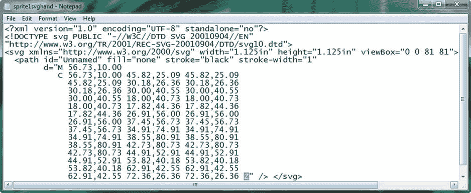

图 16-10。

Open SVG Path data in a text editor and add a Z “close polygon” command to the end of the data

正如你在图 [16-11](#Fig11) 中看到的，第一轮优化会给你明显更少的数据，大大简化了碰撞数据。然而问题是，如果我们把这个 SVG 数据放回 GIMP 2.8，你的碰撞多边形看起来还会完全一样吗？接下来让我们仔细看看可以回答这个问题的工作流程。将该文件保存为 sprite1svghandintegerxml.txt，这样我们在需要时就有了优化的数据，如 16-11 所示。

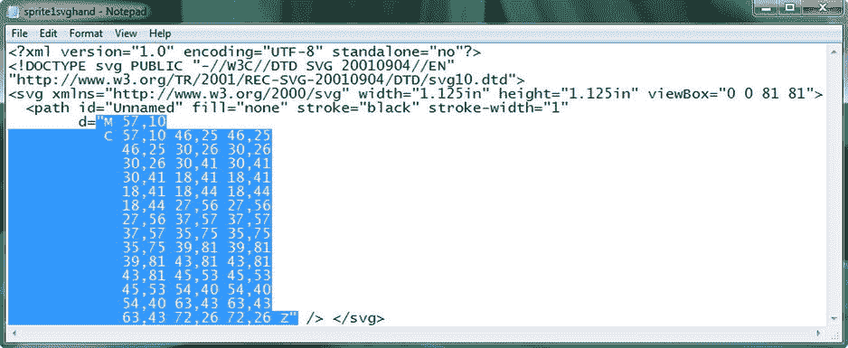

图 16-11。

Remove the floating point values, by rounding them up or down, to the nearest integer values

### 在 GIMP 中优化 SVG 路径冲突形状:使用导入路径

让我们再次开始，要么关闭前一个项目，并使用文件➤打开重新打开 sprite1.png 文件，或删除路径调板中的前一个选择路径。正如你在图 [16-12](#Fig12) 中看到的，路径调色板是空的，我们可以在调色板的空白区域内右击，并选择底部的导入路径选项。

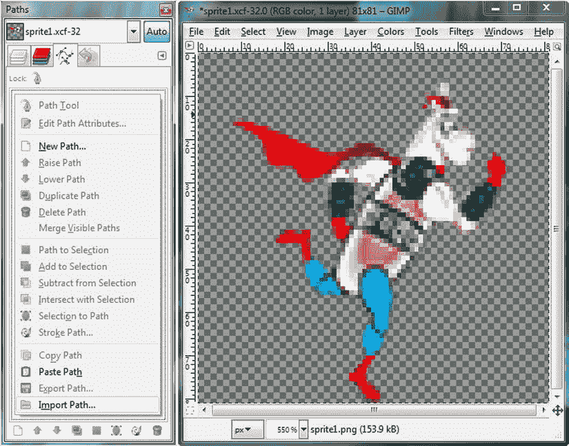

图 16-12。

Right-click in empty Paths palette, select Import Path option

一旦你点击图 [16-12](#Fig12) 中的导入路径菜单项，你将从 SVG 对话框中得到导入路径。选择“所有文件(*。*)"下拉菜单选项，然后点击 sprite1svghandintegerxml.txt 文件然后点击打开按钮，如图 [16-13](#Fig13) 所示。这将在 GIMP 中打开编辑过的整数碰撞路径数据。

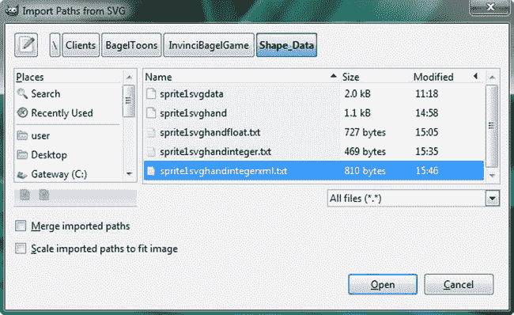

图 16-13。

Open the sprite1svghandintegerxml.txt file

如图 [16-14](#Fig14) 所示，碰撞多边形 SVG 数据的整数表示与浮点表示相同，如图 [16-9](#Fig9) 所示。由于在 SVG 数据字符串的末尾添加了一个 SVG“Z”命令，碰撞多边形现在是闭合的。我们正在让我们的碰撞数据更加优化！

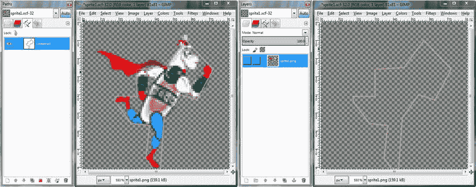

图 16-14。

Collision polygon is correct using integer data (left); deselect visibility in Layers Palette (right) to see SVG

您可能已经注意到，除了起点和终点，每个点都有三个相同的 X，Y 数据点坐标值，对于起点和终点，我们有数据点对而不是数据点三元组。如果你回想一下表 [16-1](#Tab1) ，唯一使用三元组(三个)X，Y 数据点对的 SVG 命令是 C 或三次贝塞尔(样条)曲线。果然，如图 [16-15](#Fig15) 所示，在 M (moveto) opening SVG 命令的正下方是 C 命令。这解释了为什么 GIMP 在你的多边形的每个点上放三个数据点。所有数据点三元组具有相同值的原因是因为我们检查了 GIMP 中的多边形选项。这会将样条曲线控制手柄放在“远离”或看不见的地方，直接放在 X，Y 数据点的顶部。这定义了零曲率，或如图 [16-14](#Fig14) 所示的正方形多边形结构。

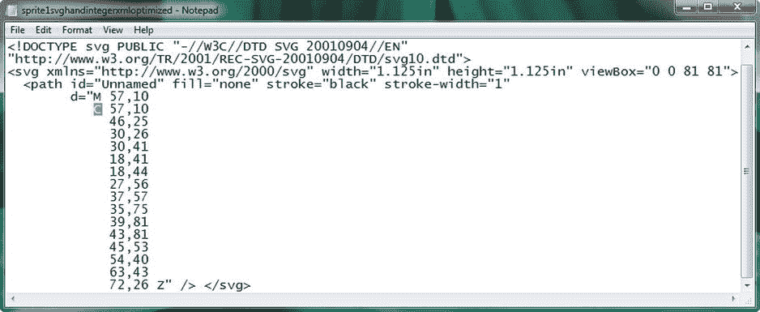

图 16-15。

Remove duplicate point data for those points in the interior of the collision polygon, to further optimize

让我们导出去掉了三元组的 SVG 数据，如图 [16-15](#Fig15) 所示，并使用我们新发现的导入路径工作流程，看看 GIMP 中的结果是什么样的，主要是为了学习，因为我们还没有完全完成优化工作流程。

将图 [16-15](#Fig15) 所示的 XML 数据保存为 sprite 1 svghanditegerxmlpromized . txt，然后使用图 [16-12](#Fig12) 和 6-13 所示的相同导入路径工作流程，将这个进一步优化的 SVG 数据集导入到 GIMP 中。正如你在图 [16-16](#Fig16) 中看到的，从数据集中移除那些三次贝塞尔曲线控制柄也移除了你的碰撞多边形的多边形性质。因此，我们需要对我们的 SVG 数据做一些进一步的工作来纠正这一点。

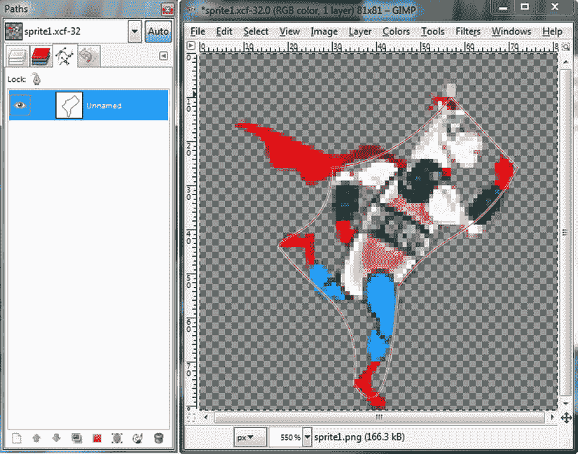

图 16-16。

Import the latest SVG data with data triplets deleted into GIMP to see curve without tension handle data

将这些不一致的(精灵轮廓的)曲线变成我们之前的相同碰撞多边形的解决方案非常简单，你可能已经猜到是什么了。因为我们希望数据点之间是直线，所以我们需要将这个“C”改为“l”。这将把 curveto SVG 命令变成 lineto SVG 命令。

正如你在图 [16-17](#Fig17) 中看到的，我们的碰撞多边形数据几乎在我们预期的地方，包含 16 个数据点对和一个 Z 闭合命令来创建一个 16 边碰撞多边形。我们可以删除第一个重复的数据对，将数据集减少到 15 个数据点对，这是我们在 GIMP 中“制定”的。接下来，让我们再次使用 GIMP 中的导入路径工作流程，看看我们是否得到了如图 [16-14](#Fig14) 所示的相同的正方形多边形结果。

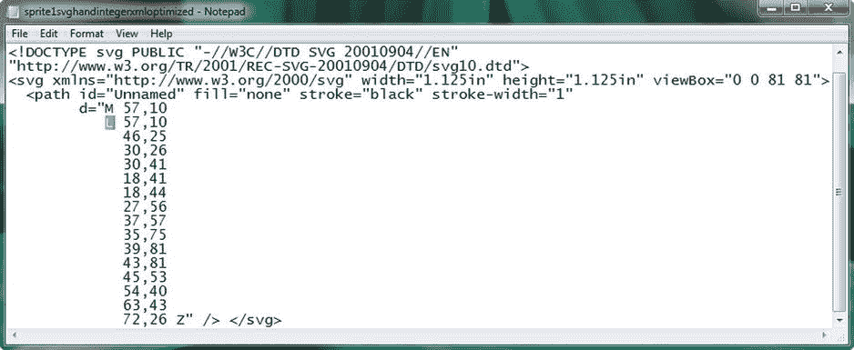

图 16-17。

Change your SVG Path data from using the C (curve) data type to the L (line) data type representation

最终的 SVG 数据集如图 [16-18](#Fig18) 所示，您可以将该数据复制并粘贴到您的 Java 代码以及一个空的记事本文档中，并将其保存为自己的文件，名为 iBshape1svg.txt，这样我们接下来就可以做一些数学运算，看看我们从自动 GIMP 创建的碰撞多边形到我们手动优化的自定义碰撞多边形减少了多少数据。如果您在 GIMP 中导入图 [16-18](#Fig18) 所示的碰撞数据，您将得到图 [16-14](#Fig14) 所示的所需碰撞多边形，有 15 个数据点对，而不是 100！

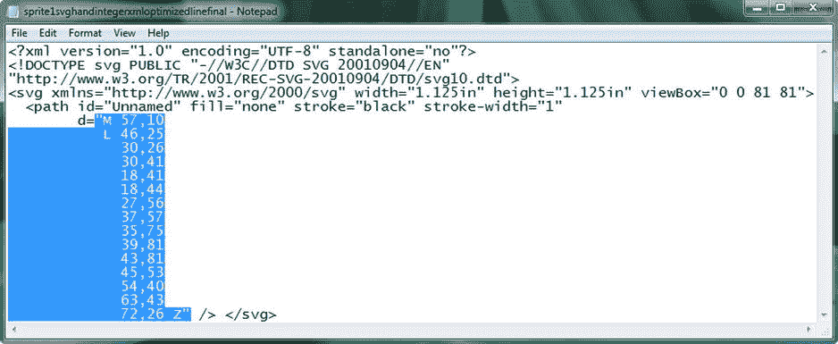

图 16-18。

To use optimized SVG Path data set, select the part after d= (including quotes), and paste into the code

#### 确定冲突数据优化:计算 SVG 数据的数据足迹

让我们算出我们的数据占用优化百分比。从图 [16-18](#Fig18) 所示的文件中挑选出来的 SVG 数据，并放入我们将在 Bagel()构造函数方法调用中使用的格式中，可以在图 [16-19](#Fig19) 的顶部看到。

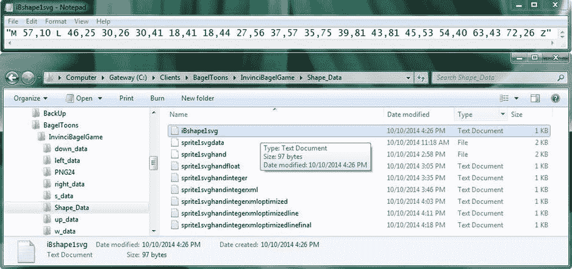

图 16-19。

Open folder in your workstation containing the SVG data, and mouse-over file to see the number of bytes

将鼠标悬停在两个 iBshape1svg 文件上，如图 [16-19](#Fig19) 和 [16-20](#Fig20) 所示，并获取文件大小，或者右键单击文件，并使用属性对话框来查找文件中的字节数。这应该是 97 字节和 1605 字节。

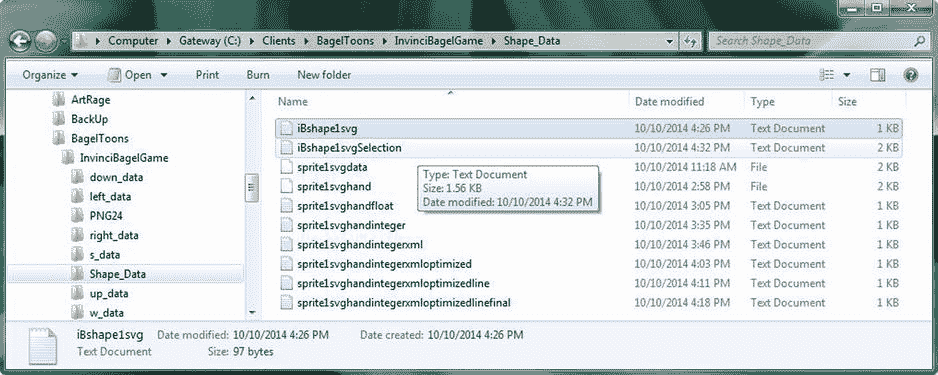

图 16-20。

Mouse-over the original Fuzzy Select Tool generated SVG data to get the data footprint, and do the math

要找出数据占用优化，只需将这些数字相互除即可。如果你用 97 除以 1605 (97/1605=0.0604)，你会发现 97 是 1605 的 6%，数据占用空间减少了 94%。如果将 1605 除以 97 (1605/97=16.546)，则意味着文件减少了 16.546 倍，数据占用空间减少了 16.55 倍。这是计算器上彼此的倒数(1/x ),所以你可以从任何一个方向看。因此，1605 字节比 97 字节多 1，655%的数据，即 97 字节是 1605 字节的 6%(或少 94%的数据)。不管你怎么看，你已经为你的游戏节省了大量的内存、处理和 JAR 文件数据，而这仅仅是为了一个精灵！请记住，一旦您在游戏逻辑中实现了碰撞检测，优化您的碰撞多边形以使用少于 16 倍的内存和少于 16 倍的 CPU 处理开销对您的游戏流畅度非常重要，我们将在查看 CodeAndWeb 的 PhysEd 工具后进行这一操作。

## 创建和优化物理数据:使用 PhysEd

我想用几页纸向您展示 GIMP 的一种替代方案，它将物理和碰撞合并到一个统一的游戏开发工具中，相对于它为游戏开发所做的一切来说，它是非常便宜的。PhysicsEditor 或 PhysEd(或 PE)来自 CodeAndWeb GmbH，该公司由另一位致力于 iOS 游戏开发的作家 Andreas Loew 所有。让我们快速看一下如何使用这个专业的游戏开发工具来定义精灵的碰撞多边形，然后我们就可以开始碰撞检测编码了。使用绿色立方体 PE 图标安装并启动 PE，使用图 [16-21](#Fig21) 所示的导入精灵按钮打开你的 sprite1.png 文件，使用屏幕底部的缩放滑块放大 600%，就像我们在 GIMP 中做的一样。

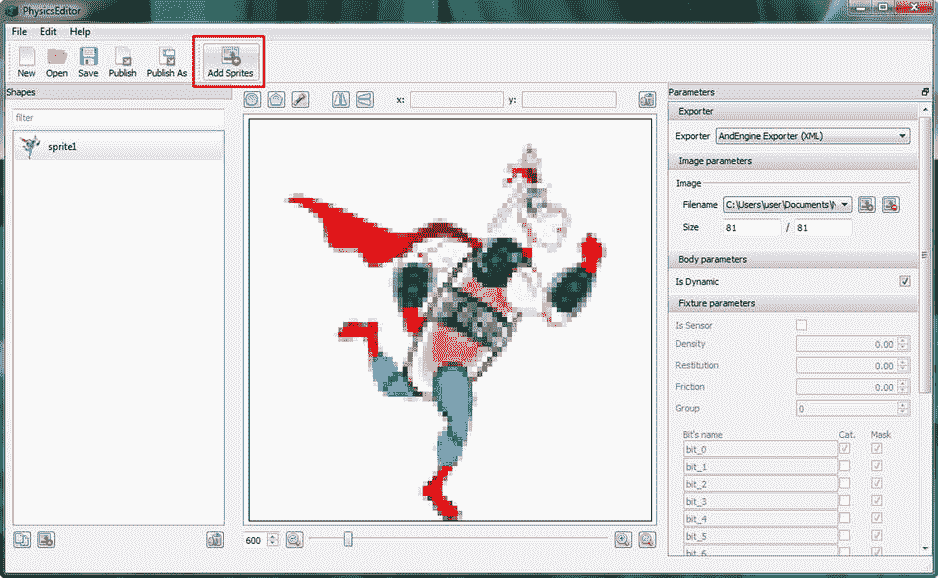

图 16-21。

Launch PhysicsEditor and use the Add Sprites button to open the sprite1.png file and zoom into it 600%

接下来点击精灵编辑区域顶部的追踪器图标(它是中间的图标，看起来像魔棒)，这将打开追踪器对话框，如图 [16-22](#Fig22) 所示。在此对话框中，您可以设置缩放、追踪算法容差、追踪模式和帧模式，并查看作为这些设置结果的顶点数。

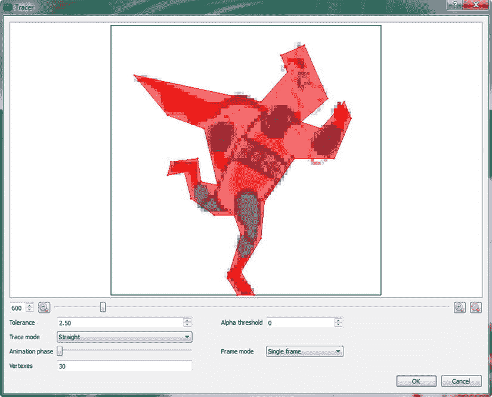

图 16-22。

Using the Tracer utility in PhysEd to set the Tolerance, Trace mode, Frame mode and Vertices

一旦你得到了你想要的视觉效果，这是通过调整各种跟踪对话框设置来实现的，点击 OK 按钮，你将回到 PhysicsEditor 主用户界面窗口。

然后，你可以通过用鼠标点击并拖动这些点来逐个数据点地细化你的碰撞多边形结构数据点，如图 [16-23](#Fig23) 所示。如果你比较图 [16-22](#Fig22) 中的碰撞多边形和图 [16-23](#Fig23) 中的碰撞多边形，你可以看到我已经优化了几个数据点，以更好地符合精灵的轮廓。

碰撞多边形离精灵的轮廓越近，你最好把它放在反走样的上面，反走样位于精灵像素和透明度之间的像素边缘，或者如果你想玩一个更有挑战性的游戏，甚至可以放在反走样的里面。最终，你的碰撞多边形将不得不在你的游戏开发和游戏测试周期中被调整，这样你才能在游戏中得到最真实的结果。如果您正在为强大的平台(如游戏控制台)进行开发，您可以向碰撞多边形添加数据点，如果您正在为单处理器或双处理器平台(如 HTML5 手机或 ITV)进行开发，请使用较少的数据。

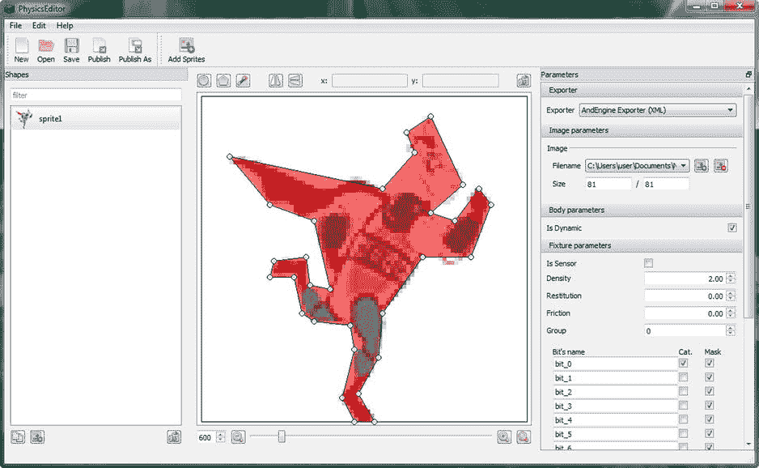

图 16-23。

Fine-tune your vertex placement for the collision polygon in the PhysicsEditor, then select your Exporter

## 替换虚拟碰撞数据:InvinciBagel.java

接下来，让我们对 InvinciBagel.java 类中的 Java 代码做一些修改，这样你就可以真正使用我们在本章中开发的高度优化的碰撞多边形数据。我们将使用只有 15 个数据点的数据集，这样我们就可以在 NetBeans 8.0 代码编辑窗格中看到所有的碰撞多边形数据。正如你在图 [16-24](#Fig24) 中看到的，我们将需要把 Bagel()构造器方法调用放在三个不同的行上:一个用于实例化的`iBagel = new Bagel(this)`部分，另一个用于碰撞多边形 SVG 数据字符串对象，另一个用于 xLocation，yLocation 和 Image 对象列表。我们还将使用我们从表 [16-1](#Tab1) 中学到的 SVG 命令知识，为我们的可平铺砖块元素创建碰撞多边形数据。在本章的后面，我们将使用这些砖块“道具”元素来开发我们的碰撞检测 Java 代码。我们将仅使用我们的大脑来创建这些更简单的碰撞多边形，通过实现与砖块图像的分辨率相关的数字逻辑，以及角像素位置在 X，Y 坐标空间中的位置，结合我们在表 [16-1](#Tab1) 中了解到的 SVG 路径绘制命令。你正在成为一名相当专业的游戏开发人员！

我们还将使用我们在第 3 章学到的 Java 代码注释技术来(暂时)从场景中移除较大的长满苔藓的岩石道具，并将我们的代码放在舞台上有 InvinciBagel 角色和几块砖块的地方。然后，我们可以使用这些基本对象来开始我们的代码开发。collide()方法以及它将如何使用 castDirector CastingDirector 类(object)作为冲突处理指南。

如果您希望看到 iPR1 和 iPV1 对象暂时从中删除。createGameActors()以及您的。addGameActorNodes()和。createCastingDirection()方法，您可以在图 [16-25](#Fig25) 和 [16-26](#Fig26) 中看到这段 Java 代码的注释。接下来，让我们复制并粘贴您在本章前面创建的 SVG 碰撞多边形数据集。打开 iBshape1svg.txt 文件，如图 [16-20](#Fig20) 所示，使用编辑➤复制菜单序列或 CTRL-C 快捷键选择并复制 svg 数据。一定要包括引号。将 Bagel()方法中的数据粘贴到。createGameActors()方法，虚拟 SVG 数据曾经在这里，如图 [16-24](#Fig24) 所示。

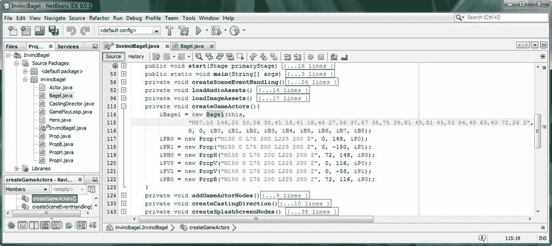

图 16-24。

Copy and paste your 15 data point collision polygon SVG data in place of dummy data in Bagel() method

更新 iBagel Bagel()构造函数方法后，使用碰撞多边形的准确 SVG 数据，更新 iP0 固定演员道具，使用四个角像素的坐标，创建一个方形碰撞多边形，如图 [16-25](#Fig25) 所示。任何图像的左上角原点都将是 0，0，所以第一个 SVG 命令将是 M0，0，或“移动到原点”接下来，我们想使用 L 命令画一个“lineto ”,左下角，它将使用 L0，32 命令和数据集，因为这个砖块图像是 32 像素高(Y ), 72 像素宽(X)。

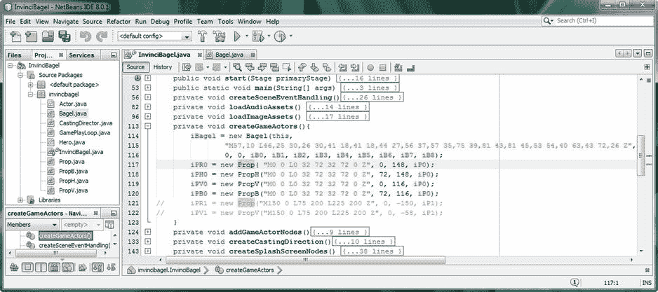

图 16-25。

Create collision polygon SVG data for the iP0 fixed Actor props using a prop0.png image 32´72 resolution

下一个数据对不需要以 L 命令开头，因为如果没有明确指定，SVG 数据解析算法的任何实现都将假定前一个数据对使用的命令。砖块图像的右下角将使用 X，Y 坐标 72，32。该图像的右上角将使用 X，Y 坐标 72，0。Z 命令可以用来连接这个道具图像的右上角和原点，这样我们就可以在砖块的顶部进行碰撞检测，在这个特定的用例中，使用一个闭合的多边形。正如您在图 [16-25](#Fig25) 中看到的，您可以在 SVG 数据中使用逗号或空格，因此这两种方法调用都应该有效:

`iPR0 = new Prop("``M0 0 L0 32 72 32 72 0 Z`T2】

```java
OR:
```

`iPR0 = new Prop("``M0,0 L0,32 72,32 72,0 Z`T2】

第二个示例在 NetBeans 8 中使用了相同的空间，并且更好地显示了数据点对。我将注释掉与 iP1 演员道具对象相关的所有代码，如图 [16-25](#Fig25) 和 [16-26](#Fig26) 所示，以便这些较大的道具演员对象现在被“禁用”，不会出现在舞台上(和场景中)，并且不会干扰我们实现碰撞检测的基本代码开发。

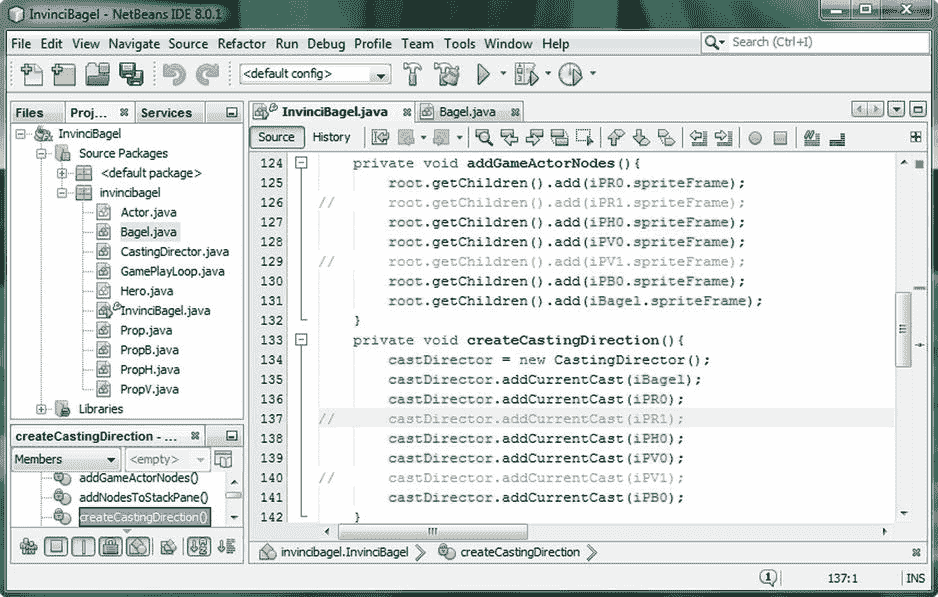

图 16-26。

Comment out code related to iP1 object in addGameActorNodes() and createCastingDirection() methods

现在，我们准备使用“运行➤项目”工作流程，并确保 invincibagel 角色以及我们将用于测试碰撞检测代码的四块金砖都已就位，并且大型苔藓岩石对象不再出现在舞台上的任何地方。正如你在图 [16-27](#Fig27) 中看到的，我们已经设置好了开发基本碰撞检测代码的场景，现在我们可以专注于将 Java 8 游戏代码放在适当的位置，然后我们开始实现进一步的场景设计、游戏设计、游戏逻辑、物理和评分引擎代码，所有这些我们将在下一个[第 17 章](17.html)中实现。

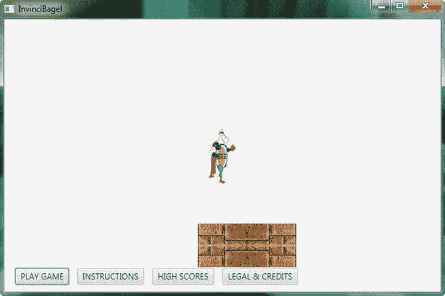

图 16-27。

Use the Run ➤ Project work process and test the game

在我们切换到 Bagel.java 类来实现冲突检测之前，我们需要对 InvinciBagel.java 类做一两个基本的修改。由于我们将在冲突代码中使用 CastingDirector 对象，我们必须删除`CastingDirector castDirector;`声明中的私有访问控制关键字，如图 [16-28](#Fig28) 所示。我们正试图使 InvinciBagel 类中的尽可能多的变量保持私有，以后如果我们需要从另一个类(比如 Bagel.java)访问它们，就让它们受到包保护。

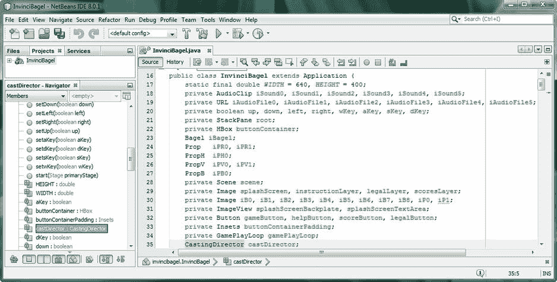

图 16-28。

Remove the private access control modifier keyword for CastingDirector castDirector object declaration

接下来我们要做的是从。createCastingDirection()方法中的 addCurrentCast()方法调用参数列表。我们这样做是为了让 InvinciBagel(我们将检查它与其余 Actor 对象的冲突，这些对象包含在 CURRENT_CAST List <actor>对象中)不检查它自身的冲突！新的更短的方法调用(减去 iBagel 对象)应该看起来像下面的 Java 代码，在图 [16-29](#Fig29) 的底部高亮显示:</actor>

`castDirector.addCurrentCast(``iPR0, iPH0, iPV0, iPB0`T2】

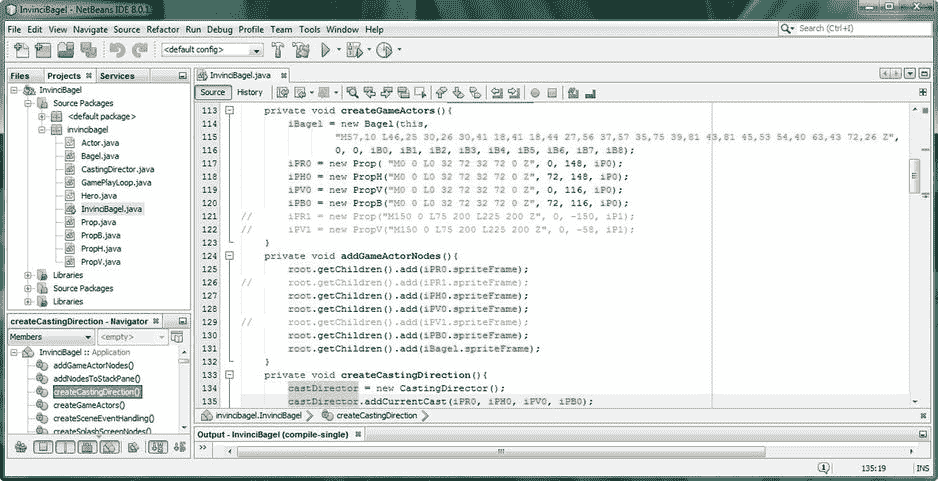

图 16-29。

Remove the iBagel object from the front of the list of objects passed into the .addCurrentCast() method

现在，我们准备开始在 Bagel.java 类中放置方法，该类将通过检查每个对象的节点(ImageView)和碰撞形状(SVGPath)的边界来检查 iBagel 对象与 CURRENT_CAST List <actor>对象中的对象的碰撞。我们接下来要讨论的内容可能会有些复杂，但是如果你真的想创建一个合法的游戏标题，你需要能够知道游戏元素何时相互交叉(在游戏开发术语中称为碰撞)。让我们现在就潜入那个深渊吧！</actor>

## Bagel 类冲突检测:。检查冲突( )

在图 [16-29](#Fig29) 所示的项目窗格中右键单击 Bagel.java 类，并选择打开选项，在 NetBeans 8 中打开 Bagel.java 选项卡。走进去。update()方法，并在代码行的开头使用两个正斜杠注释掉 playAudioClip()方法调用。这将有效地关闭我们现有的按键事件(KeyCode)按键持续呼叫的音频。我这样做的原因是因为我将使用这个音频来“指出”我们将要创建的代码中检测到的冲突。接下来，在方法的末尾创建一个. checkCollision()方法调用。update()方法。这个方法将调用碰撞检测 Java 代码，我们将在本章的剩余部分中对每个被处理的脉冲事件进行处理。这与。update()方法。

新的。图 [16-30](#Fig30) 中所示的 update()方法应该类似于下面的 Java 方法体:

`public void``update`T2】

```java
setXYLocation();

setBoundaries();

setImageState();

moveInvinciBagel();
```

`//` `playAudioClip();`

```java
checkCollision();

}
```

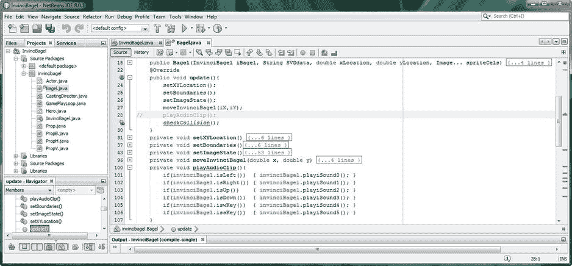

图 16-30。

Comment out the playAudioClip() method call to turn off all audio and add a checkCollision() method call

创建一个空的`public void checkCollision(){}`方法体，这将移除你在图 [16-30](#Fig30) 中看到的红色波浪错误高亮，这样我们就可以开始编写代码来查看当前演员列表<演员>对象，这样我们就可以确定是否有任何演员与游戏舞台上的主要无敌角色相交(发生冲突)。

在这个里面。checkCollision()方法，我们将需要一个 Java for“counter”循环结构。该结构将用于遍历 CURRENT_CAST List <actor>对象数组；在这种情况下，这些是道具对象，用于检查与 InvinciBagel 对象的任何碰撞(相交)。for 循环的第一部分是迭代器变量的声明和初始化，在我们的例子中，`int i=0;`声明名为“I”的整数类型迭代器变量，初始化为一个零计数值。</actor>

for 循环的第二部分是迭代条件，在本例中是“迭代直到到达 CURRENT_CAST List <actor>对象的末尾，或者到达代表列表大小(因此是列表中的最后一项)的`i<invinciBagel.castDirector.getCurrentCast().size()`。for 循环语句条件的第三部分是要迭代的数量，由于我们想要遍历列表中的每个对象< Actor >来检查冲突，我们将在“I”变量或`i++`上使用熟悉的 Java ++操作符。for 循环{…}花括号内是我们希望在循环的每次迭代中执行的内容；在这种情况下，这将用于列表<演员>对象中的每个道具演员对象。这是一个很好的构造，可以用来从第一个元素到最后一个元素迭代任何列表对象。</actor>

在 for 循环内部，我们将创建一个“本地”Actor 对象引用变量，我们将使用`invinciBagel.castDirector.getCurrentCast().get(i)`方法链将它设置为等于 List(i)中的当前元素。Java 方法链是创建紧凑的 Java 代码结构的一种很酷的方式，不是吗？一旦我们用 CURRENT_CAST(i) cast 成员对象加载了该 Actor 对象，我们将调用。collide()方法，使用 collide(object)；Java 语句。记住我们安装了这个抽象。collide()方法，所以在我们了解了更多关于 Node 和 Shape 类的知识，以及它们的一些可用于确定交集(冲突)的关键方法和属性之后，接下来我们必须“覆盖”并编写该方法。

```java
public void checkCollision() {
```

`for(``int i=0``; i``<``invinciBagel.castDirector.getCurrentCast``().size()`T6】

`Actor``object``= invinciBagel.castDirector.getCurrentCast()``.get(i)`T4】

`collide` `(object);`

```java
}

}
```

这是确定冲突的第一个(简单的)部分，在第一个 checkCollision()方法中，从。update()方法，由脉冲事件管理器执行。它遍历列表 <actor>CURRENT_CAST，并为每个 Actor 对象调用`collide(object);`方法，以查看 InvinciBagel 角色是否与它发生了冲突。正如你在图 [16-31](#Fig31) 中看到的，这个 Java 代码是无错的，我们将要编码的下一个 Java 方法体是`public` `boolean collide()`方法，我们之前在[第 8 章](08.html)中在我们的抽象 Hero 类中声明使用它。</actor>

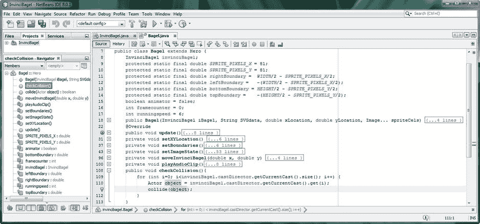

图 16-31。

添加一个 for 循环，使用从 0 计数到 CURRENT_CAST 中的对象数。getCurrentCast()。size()

在我们编写。collide()方法，这是我们将在整本书中编写的较难的方法体之一，我们需要了解一些与 javafx.scene 包的节点类及其 Bounds 属性有关的更复杂的主题。getBoundsInLocal()和。getBoundsInparent()方法调用。我们还将查看 javafx.scene.shape 包的 shape 类及其。intersect(Shape shape1，Shape shape2)方法调用。我们将在我们的`public boolean collide(Actor object) {...}`方法中使用所有这些，所以在我们编写这个复杂而密集(但令人兴奋)的 Java 结构之前，我们需要先掌握这些高级知识。

## 定位节点对象:使用 Bounds 对象

关于碰撞检测，我们需要考虑的第一件事是 javafx.geometry 包的 Bounds 类。这个公共抽象类(及其创建的对象)在 javafx.scene 包的节点类中用于保存节点的边界。正如你可能已经猜到的，这是我们将利用来确定碰撞检测的事情之一，结合我们的碰撞 SVGPath 形状数据，我们将在我们看一下如何限制对象及其相关对象后进入。getBoundsInLocal()和。getBoundsInParent()方法，可以为我们工作。

这个 Bounds 类是使用 java.lang.Object 主类从头开始创建的，包含 X、Y 和 Z 坐标，以及宽度、高度和深度值。由于我们将在 2D 工作，我们将使用 X 和 Y，以及宽度和高度，Bounds 对象的值(属性)。Bounds 类有一个直接已知的子类，称为 BoundingBox。如果您想知道,“直接子类”意味着 BoundingBox 类声明说 BoundingBox 扩展了边界，而“已知”类是已经正式添加到 Java 8 JDK 中的类。

“未知”类的一个例子是你自己定制的边界子类，如果你要写一个的话。javafx.geometry.Bounds 类的 Java 8 类层次结构如下所示:

```java
java.lang.Object
```

`> javafx.geometry.` `Bounds`

Bounds 类用于创建 Bounds 对象。这些用于描述节点对象的边界，我们知道这是 JavaFX 场景图节点对象。Bounds 对象的一个重要特征是它可以有负的宽度、高度或深度。任何 Bounds 对象属性(properties)的负值用于指示 Bounds 对象为空。我们将在后面的代码中使用它来确定何时没有发生冲突。正如我在本书前面指出的，有时你必须采取“相反”的方法来寻找解决方案，或者正确的工作过程，以实现你的游戏设计和编程目标。

### 使用节点局部边界。getBoundsInLocal()方法

JavaFX 场景图节点类中的一个重要方法是公共最终边界。getBoundsInLocal()方法。此方法是 getter 方法，用于检索 boundsInLocal 属性的值。boundsInLocal 属性是“只读”的，它为包含它的节点保存一个矩形 Bounds 对象。它包含的数据表示节点的未变换(原始)局部坐标空间。“未变换”表示旋转、平移或缩放之前的节点坐标，表示节点对象的原始(默认)坐标。

对于扩展 Shape 类的节点类(对象)(我们的 ImageView 节点没有扩展),局部边界还将包括实现非零形状(或路径)笔划所需的空间，因为这可能会扩展到形状几何图形的“外部”,这是由这些位置和大小属性定义的。局部边界对象还包括您可能已经设置的任何剪辑路径区域，以及您可能已经设置的任何特殊效果的范围。

boundsInLocal 属性将始终具有非空值，需要注意的是，该方法不考虑节点对象的可见性，因此计算仅基于节点的几何形状。每当节点对象的几何体发生变化时，都会自动计算 boundsInLocal 属性。

我们将使用。getBoundsInLocal()方法在 InvinciBagel SVGPath 形状数据与另一个场景演员 Prop SVGPath 碰撞形状数据的交叉点上执行，以确定交叉点的宽度是否为负一，边界对象中的-1 是否为空，或者没有交叉点，这表示没有碰撞。接下来，让我们看看 boundsInParent 属性，它包含 boundsInLocal 数据和转换。

### 使用节点父边界。getBoundsInParent()方法

JavaFX 场景图节点类中需要理解的另一个重要方法是公共最终边界。getBoundsInParent()方法。此方法是检索 boundsInParent 属性值的 getter 方法。boundsInParent 属性是一个“只读”属性，用于保存包含它的节点的矩形边界对象。它包含的数据表示节点的变换(修改)坐标空间。“Transformed”表示节点坐标加上自节点对象的默认、初始或原始状态以来发生的任何变换。它被命名为“boundsInParent ”,因为边界对象矩形数据需要相对于父节点对象的坐标系。这表示节点对象的“可视”边界，正如您在屏幕上看到的，在节点被移动、旋转、缩放、倾斜等之后。

boundsInParent 属性是通过获取由 boundsInLocal 属性定义的局部界限，并应用所有已发生的转换(包括对。为以下节点属性设置()方法:scaleX、scaleY、rotate、layoutX、layoutY、translateX、translateY 和 transforms(Java observable list)。就像 boundsInLocal 属性一样，该 boundsInParent 属性将始终包含一个非空值。

结果 Bounds 对象将包含在节点对象的父对象的坐标空间内，但是，为了能够计算 boundsInParent 属性，节点对象不需要有父对象(它可以是场景的场景图形根)。就像。getBoundsInLocal()方法，该方法不考虑节点对象的可见性，所以不要错误地认为可以通过“隐藏”Actor 节点来规避冲突检测代码，在我们的例子中，Actor 节点是一个名为 spriteFrame 的 ImageView 节点子类。

由于它会计算对 boundsInLocal 属性的更改，因此只要节点的几何图形发生更改，或者该节点对象发生任何变换，就会计算 boundsInParent 属性，这是合乎逻辑的。正因为如此，基于依赖于该变量的表达式来计算节点中的任何这些值都是错误的。例如，Node 对象的 X 或 Y 变量或 translateX、translateY 不应使用此 boundsInParent 属性来计算以定位节点，因为先前的定位数据包含在此属性中，因此会创建循环引用(有点类似于臭名昭著的无限循环场景)。

### 使用节点交集。相交(限制对象)方法

JavaFX 场景图节点类中涉及碰撞检测的另一个重要方法是 public boolean intersects(Bounds local Bounds)方法。如果 Bounds 对象与使用参数传递到方法中的 Bounds 对象相交，则此方法将返回 true 值，该 Bounds 对象指定此方法正在调用的节点对象的本地坐标空间，该 Bounds 对象是您尝试确定与之相交的节点的 Bounds 对象。例如，为了确定包含 InvinciBagel 子画面的 ImageView 边界是否与包含 Prop 子画面之一的 ImageView 边界相交，我们将使用以下 Java 代码格式:

`iBagel.spriteFrame.getBoundsInParent()``.intersects`T2】

需要注意的是，就像。getBoundsInLocal()和。getBoundsInParent()方法，该方法也不考虑节点对象的可见性属性。出于这个原因，相交测试将只基于讨论中的节点对象的几何图形，以及我们的 ImageView spriteFrame 节点对象的几何图形，这将是它们的方形(InvinciBagel)或矩形(Prop)图像容器的几何图形(尺寸)。Node 类 intersects(Bounds localBounds)函数的默认行为是检查并查看传入此方法调用的 Bounds 对象的本地坐标是否与。intersects()方法调用正在被“关闭”接下来，让我们仔细看看 Shape 超类，以及它的。intersect()方法。

## 使用形状类相交。intersect()方法

就像一个节点类(对象)有一个交集方法叫做。intersects()用于确定节点对象何时相交，Shape 类也有一个 intersection 方法，可用于 Shape 对象相交。这个方法被称为。intersect()(而不是 intersect)，因此这些方法使用不同的命名约定。这样做可能是为了让开发人员不会混淆 Node.intersects()和 Shape.intersect()方法。我们将在本章后面的碰撞检测代码中使用这两种方法——首先检测一个 ImageView 节点何时与另一个 ImageView 节点重叠，然后在我们的 SVG 数据碰撞多边形(每个 Actor 对象中名为 spriteBounds 的 SVGPath 对象)之间执行布尔相交操作。

Shape 类的静态方法格式。intersect()方法在其参数列表中接受两个 Shape 对象，该方法返回一个新的 Shape 对象。创建的新 Shape 对象表示两个输入形状的交集。正如您所想象的，如果您使用 Shape 类及其子类来实现这一目的，您也可以使用这种方法为您的矢量作品生成布尔交集。该方法的格式是`static Shape intersect(Shape shape1, Shape shape2)`，我们将使用它的方式如下所示:

`Shape``shape``= SVGPath.``intersect``(invinciBagel.``iBagel``.getSpriteBound(),``object``.getSpriteBound());`

Shape 类之所以。intersect()方法对我们的碰撞检测应用如此有效是因为我们以后可以使用. getBoundsInLocal()。getWidth()方法链，通过查找-1 空值来确定是否发生了冲突，或者更确切地说，是否没有发生冲突。我们将调用这个方法链来寻找这个新 Shape 对象的-1，我们将在。collide(object)方法，使用下面一行代码:

`if (intersection.``getBoundsInLocal().getWidth() != -1``) { collisionDetect =``true`T4】

这种方式。intersect()方法的工作原理是，它只处理占据输入形状的几何数据，在我们的应用中，它是 Actor 对象内部的 spriteBound SVGPath 对象。这就是为什么我们使用 SVGPath 形状对象(用于最大碰撞框架或多边形定义)，纯粹是为了它的几何数据值，也是为什么我们在我们的 Actor 对象设计中安装了这个 spriteBounds SVGPath 形状对象容器，因为我们打算将这些几何数据用于我们的碰撞检测，而不是用于矢量插图艺术作品(例如，我们没有抚摸或填充 SVGPath，请不要开玩笑，我们现在正在学习游戏开发)。

这意味着中的算法所考虑的输入形状对象的几何区域。intersect()方法仅“基于数学”。这意味着算法独立于正在处理的形状(子类)的类型，也独立于用于填充或描边的 Paint 对象的配置(为了学习 Java 8 游戏开发，请再次暂时抵制窃笑的诱惑)。

在最终相交计算之前，输入形状对象的区域被转换到父节点对象的坐标空间(想想:boundsInParent)。这样，生成的形状将只包括那些包含在使用参数表传递给该方法的两个输入形状对象的区域中的区域(更准确地说是数学几何区域)。因此，如果在生成的 Shape 对象中有任何数据(除了-1 空数据值之外的数据),我们将在接下来编写的代码中称之为 intersection，那么就存在某种程度的交集，甚至一小块交集区域(重叠)也需要发出检测到碰撞的信号。

现在，我们已经准备好使用我们在本章过去几页中学到的技术 Java 8 类和方法信息，只用大约十几行 Java 代码来创建核心冲突检测逻辑。我们将在本章结束前添加另外十几行代码，来处理我们游戏中的碰撞。

## 重写抽象的 Hero 类:。collide()方法

最后，覆盖和实现公共布尔 collide (Actor object)方法的时候到了，我们在第 8 章的抽象 Hero 类中安装了这个方法。这是我们玩游戏的一个关键方法，因为它决定了我们的主要无敌角色何时与游戏中的其他元素接触。这种接触的结果是得分，以及游戏屏幕上视觉上的变化，所以在下一章中，我们将在 InvinciBagel 游戏中实现游戏元素，这是非常关键的。我们要做的第一件事是安装一个名为 collisionDetect 的布尔“flag”变量，并在。collide()方法。用于设置 collisionDetect 标志的该语句的 Java 代码应如下所示:

`boolean``collisionDetect`T2】

确定是否发生冲突的下一步是使用 Java 条件 if()语句。这允许我们使用 Node 类测试包含 sprite 图像资产的 ImageView 节点对象是否相交。intersects()方法调用与。getBoundsInParent()方法调用每个 spriteFrame ImageView 节点对象。第一个 spriteFrame.getBoundsInParent()方法调用是我们方法链接的调用。intersects()方法调用 off，因为我们试图做的是确定与我们的主要游戏角色的冲突。因为我们想要引用 InvinciBagel 对象(invinciBagel 类)及其 iBagel Actor 对象，所以这个构造将采用 invinciBagel . iBagel . sprite frame . getboundsinparent()的形式。intersects()方法调用结构。因为我们测试冲突的 Actor 对象的 Bounds 对象需要在。intersects(Bounds localBounds)方法调用，我们需要使用。getSpriteFrame()方法调用我们在[第 8 章](08.html)开发的。从我们传递到。collide()方法我们将方法链接到。getBoundsInParent()方法调用，产生 object.getSpriteFrame()。getBoundsInParent()结构，然后将它放在。intersect()方法调用。完整的条件 if()结构如下所示:

`if` `( invinciBagel.` `iBagel` `.spriteFrame.getBoundsInParent().` `intersects`

`object` `.getSpriteFrame().getBoundsInParent() ) ){second level of collision detection in here}`

第一级冲突检测代码将检查 iBagel spriteFrame ImageView 节点与 spriteFrame ImageView 节点对象的交集，该对象包含在将传递到此的每个 Actor 对象中。我们当前正在编写的 collide(Actor object)方法调用。

在我们调用更“昂贵”的形状相交算法之前，这部分代码将检查“顶级”ImageView 节点邻近性(碰撞)，我们接下来将实现该算法，以便确认更确定的碰撞发生(SVGPath 碰撞多边形相交)。请记住我们放入其中的代码。对于调用 collide(Actor 对象)方法的 for 循环的每次迭代(对于每个角色成员),都将处理 collide()方法。

第一个条件 if()语句中的 Java 代码创建一个名为 intersection 的 Shape 对象，并将其设置为 SVGPath.intersect()方法调用的结果，该调用引用 iBagel SVGPath Shape 对象和传递到 collide(Actor 对象)方法中的 SVGPath Shape 对象。这两个对象都调用一个. getSpriteBound()方法，我们在第 8 章的[中创建了这个方法，来访问。intersect(Shape1，Shape2)方法调用格式。为了便于阅读，使用两行代码格式化的 Java 代码应该如下所示:](08.html)

`Shape intersection =``SVGPath.intersect``( invinciBagel.``iBagel`T4】

`object` `.getSpriteBound() );`

有了这个相交数据后，我们将使用另一个条件 if()语句来查看该相交形状对象是否包含任何碰撞数据，如果包含(也就是说，如果它不包含-1 值)，则表示发生了碰撞。

第二个嵌套的 if()语句将利用。getBoundsInLocal()。getWidth()方法链，从交叉点形状对象调用，将检查它是否为空(返回-1 值)，或者是否发生了冲突。如果相交形状对象的 Bounds 对象包含除-1 之外的任何数据值，将发生冲突检测。在 if()语句体中，如果存在任何数据，collisionDetect 布尔标志将设置为 true(用！= -1).条件 if()语句的 Java 代码应该如下所示:

`if(intersection.``getBoundsInLocal().getWidth()``!=``-1``) {``collisionDetect = true;`T6】

为了测试冲突代码，我将 invinciBagel.playiSound0()方法调用放在 if(collisionDetect){}条件语句中。这就是为什么我注释掉了？中的 playAudioClip()方法调用。update()方法，这样在碰撞过程中我唯一能听到的就是音频回放。这是测试碰撞代码的一种快速、简单、有效的方法，至少目前是这样。由于这是公共布尔 collide(Actor object)方法，我还将在 if()体的末尾放置一行代码`return true;`,它从方法调用中返回一个 true 值。我将语句放在这个条件 if()结构中，这样，如果需要，我们可以使用从。collide()方法调用。update()方法进行其他处理，如果我们想的话。这件事的本质。collide()方法的目的是检测是否发生了冲突，然后返回一个值，这样我们就可以在。collide()方法，或者更有效地在。checkCollision()方法，使用一个`if(collide(object)=true){invinciBagel.playiSound0();}`构造，而不是我们在这里用。collide()方法。我这样做的原因是，至少现在是这样，因为我正在测试这个。collide()方法，所以我把允许我测试。collide()方法。collide()方法，因为这是我现在在 ide 中工作的地方。Java 代码如下所示:

`if(``collisionDetect`T2】

```java
invinciBagel.playiSound0();
```

`return``true`T2】

```java
}

return false;
```

完整的。在我们开始操作 CastingDirector 类和对象列表<actor>对象之前，collide(Actor object)方法结构应该如下所示，这也可以在图 [16-32](#Fig32) :</actor> 中看到

```java
@Override
```

`public boolean collide(Actor``object`T2】

`boolean``collisionDetect`T2】

`if ( invinciBagel.iBagel.spriteFrame.``getBoundsInParent()``.``intersects`T4】

`object``.getSpriteFrame().``getBoundsInParent()`T3】

`Shape``intersection`T2】

`SVGPath.``intersect``(invinciBagel.iBagel.getSpriteBound(),``object`T4】

`if (intersection.``getBoundsInLocal().getWidth()``!=``-1`T4】

`collisionDetect``=``true`T3】

```java
}

}
```

`if(``collisionDetect`T2】

```java
invinciBagel.playiSound0();
```

`return true` `;`

```java
}
```

`return false` `;`

```java
}
```

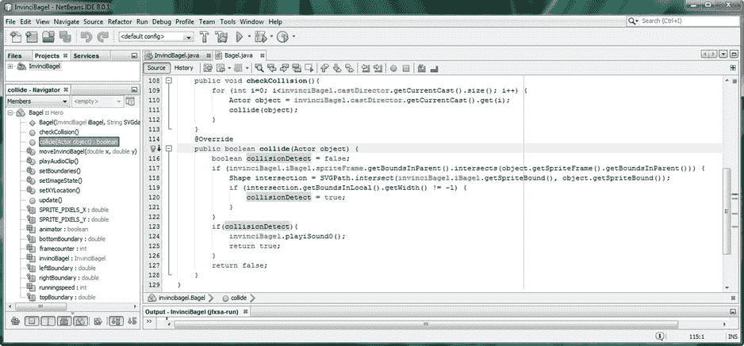

图 16-32。

Creating the basic collision detection code and testing it using the invinciBagel.playiSound0() method call

现在我们准备添加管理 CastingDirector 对象的 Java 代码，以删除 Actor 对象。

### 如果检测到碰撞:操纵 CastingDirector 对象

在. playiSound0()方法调用下添加一行代码，访问 CastingDirector 对象 invinciBagel.castDirector. Next 键入一个句点键，访问一个方法帮助器弹出窗口，如图 [16-33](#Fig33) 所示，并选择。addToRemovedActors()。

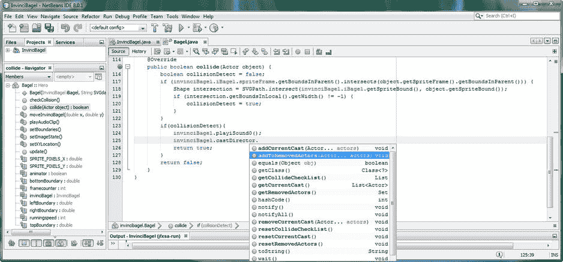

图 16-33。

Add a line of code under the .playiSound0() method call, and type invinciBagel.castDirector, and a period

双击。addToRemoveActors(Actor… actors)选项在这个弹出的帮助器对话框中，你需要使用圆括号内的参数列表区将 Actor 对象，恰当命名的 object，传递到方法调用中，如图 [16-34](#Fig34) 底部突出显示的。这将把这个刚刚卷入碰撞的演员对象(幸运的是，没有人受伤)添加到 REMOVED_ACTORS HashSet <演员>对象中。


图 16-34。

Add Actor object that was passed into the .collide() method to parameter list of addToRemovedActors()

我们不仅需要使用 CastingDirector 类(object)从游戏角色中删除这个冲突的 Actor 对象，我们还需要从场景图形根中删除 ImageView 节点。接下来让我们看看如何去做，然后我们将看看如何从 CURRENT_CAST 列表<actor>中删除 Actor 对象。</actor>

### 从场景图中删除演员:。getChildren()。移除()

现在，我们已经通过将 InvinciBagel 与之冲突的演员添加到 REMOVED_ACTORS HashSet <actor>对象中，有效地将其从角色转换中移除，下一步是将它从 JavaFX 场景图中移除，我们当前使用 StackPane UI 布局容器类来移除它。如果您还记得在本书的前面，我们了解到 StackPane 类可以用作基于图层的布局容器，并使用居中的 XY 网格排列其内容。在本章的后面，我们将学习如何使用一个组对象(类)作为我们的场景图根，来实现更典型的左上角 0，0 XY 位置索引方案，并作为一种优化，因为我们没有特别使用任何 StackPane 类属性或方法，并且因为组类是一个更基本的类，在节点超类层次结构中处于更高的位置。通过这种方式，您将体验到使用中心屏幕 0，0 位置引用(StackPane)，以及传统的左上角 0，0 屏幕位置引用(作为场景图形根的组类)。</actor>

使用. getChildren()从场景图形根中移除节点对象。中的. getChildren.add()方法调用方式完全相反。addGameActorNodes()方法。添加一行代码，键入 invinciBagel.root 和句点，如图 [16-35](#Fig35) 所示，打开方法帮助器弹出。

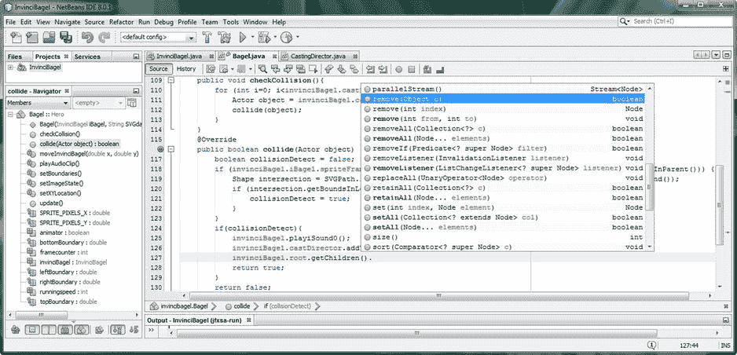

图 16-35。

Add a line of code under an .addToRemovedActors() method call and type invinciBagel.root and a period

因为我们是从 Bagel.java 类中删除 ImageView 节点，所以在添加。getChildren()方法调用，使用下面的 invinciBagel.root.getChildren()代码如图 [16-35](#Fig35) 所示。双击 remove(Object o)选择并将您传递的对象添加到。collide()方法放入。移除()方法，如图 [16-36](#Fig36) 所示。这将创建最终的`invinciBagel.root.getChildren().remove(object);` Java 编程语句。

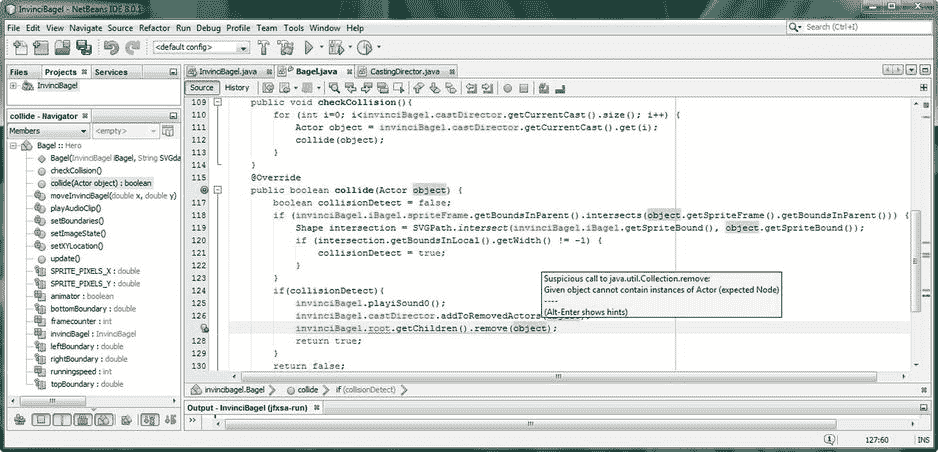

图 16-36。

Investigate red error highlight under the Scene Graph root StackPane object reference in the method call

将鼠标悬停在突出显示的警告上，您将看到 NetBeans 看到我们正在将自定义 Actor 对象传递给。getChildren()。remove()方法链，而不是 ImageView 节点对象。错误消息还告诉我们，InvinciBagel.java 类中的`private StackPane root;`声明不允许我们访问这个对象，除非我们删除这个私有访问控制修饰符关键字。让我们首先修复最严重的(错误)问题，然后通过使用 object.getSpriteFrame()方法调用修复“对 java.util.Collection.remove 的可疑方法调用”。remove()方法调用。

点击 NetBeans 中的 InvinciBagel.java 编辑选项卡，删除`StackPane root;`对象声明前面的私有关键字，如图 [16-37](#Fig37) 突出显示。

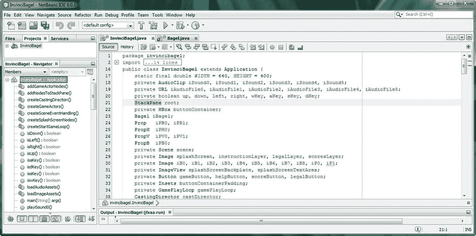

图 16-37。

Remove the private access control modifier keyword from in front of the StackPane root; Java statement

一旦你做了这样的修改，你将会看到在你当前的 Bagel.java 编程语句中的红色波浪错误高亮消失，如图 [16-38](#Fig38) 所示，现在我们所要担心的是移除警告高亮，该警告高亮与传递一个要从场景图中移除的 Actor 对象有关，而不是它所期望的节点对象(spriteFrame ImageView)。这是因为 JavaFX 场景图管理节点类，以及节点子类，如 ImageView，不接受非节点子类，如我们在[第 8 章](08.html)中设计的 Actor 类，并在后续章节中实现。我们的 Actor 类(object)包含一个 Node 对象，一个 ImageView 节点子类，因此我们必须使用 Java 点标记法包含对该对象的引用。remove()方法可以有效地查看 Actor 对象的“内部”,以到达(访问)这个节点对象。

将光标放在。移除我们正在实现的()方法调用，并键入一个句点。这将弹出属性和方法帮助器，如图 [16-38](#Fig38) 所示。双击 getSpriteFrame()方法，我们在第 8 章的[中创建了这个方法，从当前的 Actor 对象中调用它，这个对象已经被传递到。collide()方法。这将把 ImageView 节点对象传递到。remove()方法调用，警告高亮也将消失，留下干净的代码。](08.html)

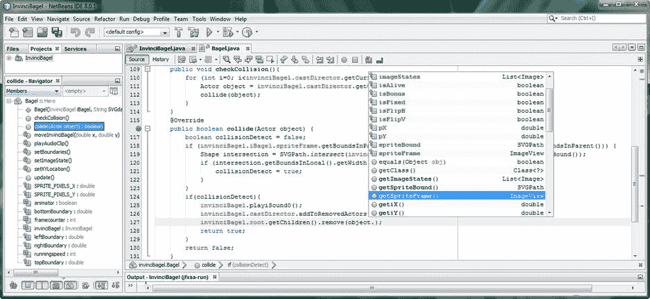

图 16-38。

Add a period after object in the .remove() method to open method helper and select .getSpriteFrame()

如图 [16-39](#Fig39) 所示，您所有的 Java 代码都没有错误，现在您已经播放了一个声音，将这个 Actor 对象添加到 HashSet<Actor>REMOVED _ ACTORS 数据集，并从 JavaFX 场景图根(当前是一个 StackPane 布局容器)中删除了这个 Actor 的 spriteFrame ImageView 节点对象。我们现在准备通过使用一个. resetRemovedActors()方法调用，从当前演员列表<演员>对象中删除这个演员对象。

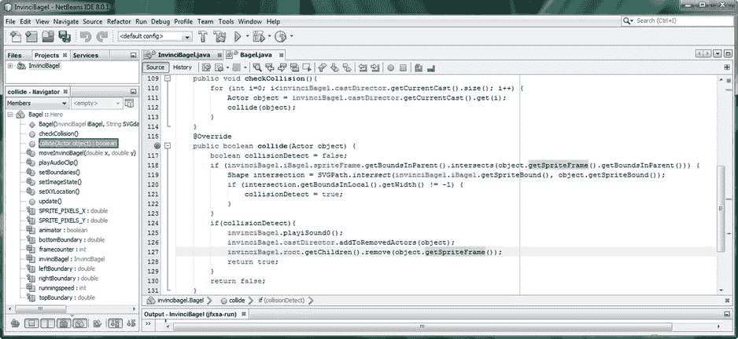

图 16-39。

Remove the currently collided with Actor object ImageView Node from the Scene Graph using .remove()

在我们更新了 CURRENT_CAST 列表之后，我们就完成了基本的冲突管理编码，我们可以看看如何优化。checkCollision()和。collide()方法更有效地协同工作。

### 重置删除的执行元列表:。resetRemovedActors()方法

当冲突发生时，我们需要在一系列编程语句中做的最后一件事是重置 REMOVED_ACTORS HashSet <actor>对象。正如你在[第 1 章](01.html) 0 中回忆的，这个方法从当前演员列表<演员>对象中移除被移除的演员，这样演员对象就完全从游戏中移除了。除了我们使用 ear 测试该方法的. playiSound0()方法调用之外，这是我们必须编写的最简单的 Java 编程语句之一，应该类似于下面的 Java 代码:</actor>

`invinciBagel.castDirector.``resetRemovedActors()`T2】

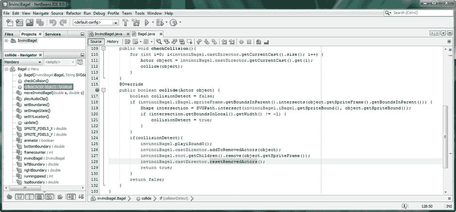

图 16-40。

The finished .collide() method is error-free and only 19 lines of code, and is ready for further optimization

如果您使用运行➤项目工作流程，并且现在测试您的游戏代码，您不仅会听到音频，还会看到道具对象在与 InvinciBagel 对象碰撞后消失。我现在将音频留在这段代码中，这样您就可以测试这些演员对象是否真的消失了，方法是让 InvinciBagel 在道具对象所在的区域上空运行(或飞行)以确保(用您的耳朵)它真的消失了。接下来，我们将进一步优化代码，实现我前面提到的 if(collide(object))方法，让。collide()方法只是返回一个 true(检测到冲突)或 false(没有检测到冲突)值，就像一个行为正常的布尔方法应该做的那样。

### 优化碰撞检测处理:if(collide(object))

为了优化冲突检测过程，我们将冲突时执行的代码移到。Java 代码的一个`if(collide(object)){}`条件 if 块中的 checkCollision()方法。这允许我们从 collide()方法中消除一个布尔 collisionDetect 变量，使它更加精简。我们现在所做的一切。collide()方法将`return true;`语句传递回调用实体，在本例中是。checkCollision()方法，如果检测到冲突。这也允许我们完全消除 if(碰撞检测)结构。

在优化之前，我们在。checkCollision()方法，以及。collide()方法。优化后，我们少了 5 行 Java 代码，每个方法有 10 行代码。这些方法的新 Java 结构是无错误的，如图 [16-41](#Fig41) 所示，看起来像下面的 Java 代码:

`public void``checkCollision`T2】

```java
for(int i=0; i<invinciBagel.castDirector.getCurrentCast().size(); i++) {
```

`Actor``object`T2】

`If (``collide``(``object`T4】

```java
invinciBagel.playiSound0();
```

`invinciBagel.castDirector.addToRemovedActors(``object`T2】

`invinciBagel.root.getChildren().remove(``object`T2】

```java
invinciBagel.castDirector.resetRemovedActors();

}

}

}

@Override
```

`public``boolean collide``(Actor``object`T4】

```java
if (invinciBagel.iBagel.spriteFrame.getBoundsInParent().intersects(
```

`object` `.getSpriteFrame().getBoundsInParent() ) ) {`

```java
Shape intersection =
```

`SVGPath.intersect(invinciBagel.iBagel.getSpriteBound(),``object`T2】

`if (intersection.getBoundsInLocal().getWidth() !=``-1`T2】

```java
return true;

}

}

return false;

}
```

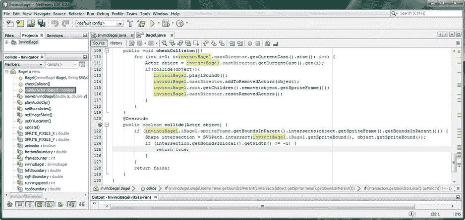

图 16-41。

Optimizing the interaction between the collide() method and the checkCollision() method

使用“运行➤项目”工作流程来确保代码像方法优化前一样工作。

## 优化场景图:使用组类

因为除了闪屏使用之外，我们并没有真正使用 StackPane 进行图像层合成或 UI 设计，所以让我们添加另一个优化，并为我们的游戏使用 Groupclass (object ),因为它在类层次结构的更高层，比更专业的 StackPane 类(object)更接近节点超类。我们将使用更短更简单的对象➤节点➤父➤组层次结构，而不是使用使用更复杂对象➤节点➤父➤区域➤窗格➤堆栈窗格层次结构的类。这种优化的意义在于，使用组根节点会在系统内存中使用更少的代码(属性和方法)。因为我们没有特别使用任何高度专门化的 StackPane 属性或方法，所以我们可以通过使用 Group 类来执行主要的优化。一个组对象(类)使用固定的对象定位，所以我们必须重新编写 HBox 和 Actor 对象的代码，但是只有在我们使用“运行➤项目”工作流程来查看使用组与使用 StackPane 的确切区别之后。毕竟，这都是为了学习这些类是如何工作的！将 StackPane 对象的导入、声明和实例化更改为 Group 对象的 Java 代码应类似于以下 Java 代码，如图 [16-42](#Fig42) 所示:

`import javafx.scene.``Group`T2】

```java
public class InvinciBagel extends Application {    // all other object declarations omitted
```

`Group` `root;`

```java
public void start(Stage primaryStage) {        // all other object instantiations omitted
```

`root = new``Group`T2】

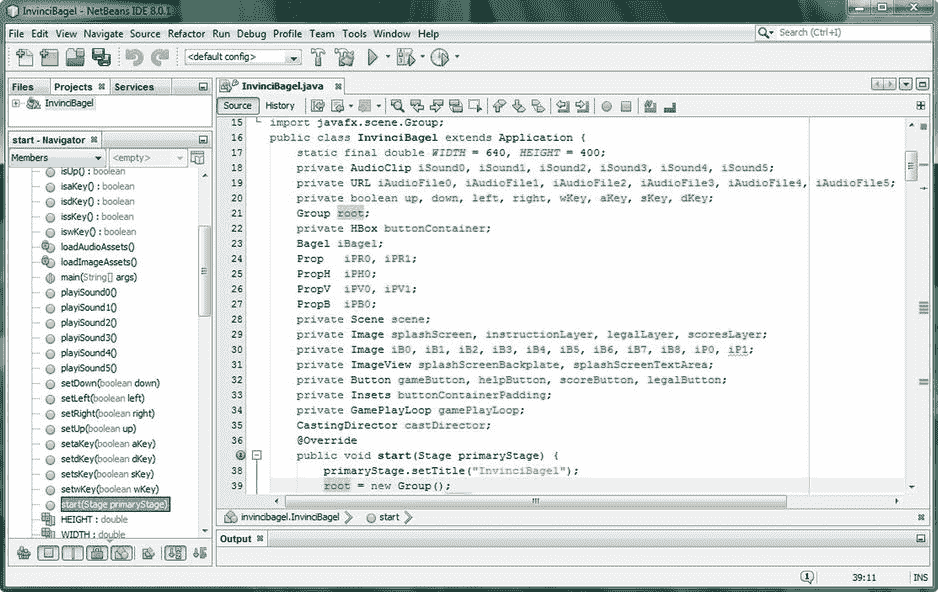

图 16-42。

Replace the StackPane UI container with the Group (Node subclass) import, declaration and instantiation

完成这些更改并运行➤项目后，您将看到图 [16-43](#Fig43) 左半部分所示的结果。游戏现在使用左上角的 0，0 原点，所以我们必须修改现有代码的其余部分。让我们现在做那件事。

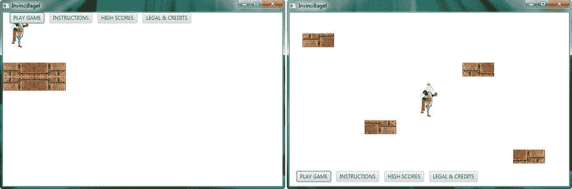

图 16-43。

Showing the Group Scene Graph result (left) and corrective modification to HBox, iBagel and Prop (right)

分别用 WIDTH/2 和 HEIGHT/2 替换对 Bagel()类构造函数的 iBagel 实例化调用中的 0，0 XY 位置。这在构造函数方法调用中使用了屏幕大小常量和计算代码，这将把 iBagel 放在屏幕的中心。在 Prop 对象实例中也添加一些不同的数字，将这些瓷砖放置在屏幕的不同区域，这样我们就可以在 InvinciBagel 拾取它们时开发一些评分代码。最后，用一个`.setLayoutY(365);`方法调用替换`.setAlignment(Pos.BOTTOM_LEFT);`方法调用，实现 HBox UI 按钮元素的固定定位，回到我们使用 StackPane 之前的位置。如果您使用运行➤项目工作流程，您将看到如图 [16-43](#Fig43) 右半部分所示的结果。

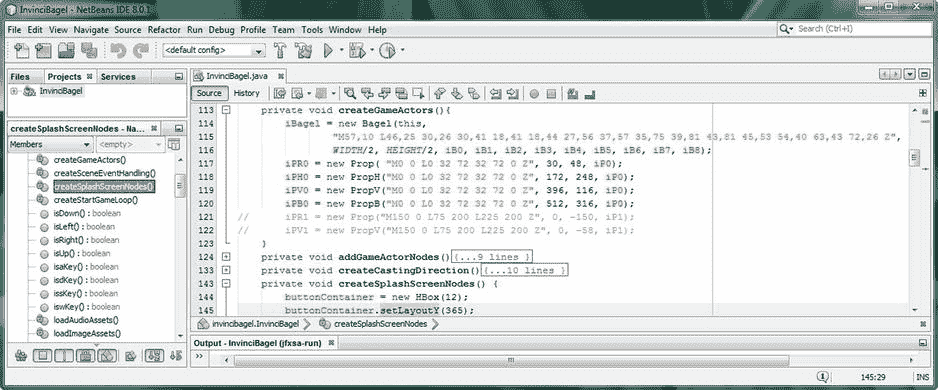

图 16-44。

Use .setLayoutY() method to position HBox, WIDTH/2 and HEIGHT/2 to position iBagel, and new Prop X,Y

当你测试你的碰撞代码时，你会发现你不能到达其中的一些区域！接下来我们来解决这个问题。

进入 Bagel.java 类，修改类顶部的屏幕边界常量，使左边界和上边界使用 0，0 原点值，因为 Group 类使用屏幕的左上角作为参考点，而不是像 StackPane 那样使用屏幕的中心。要计算 rightBoundary 值，您需要使用 sprite_PIXELS_X 常量获取屏幕的宽度并减去 SPRITE 的宽度。类似的方法也可以用于 bottomBoundary 值，它将采用屏幕的高度，并使用 sprite_PIXELS_Y 常量减去 SPRITE 的高度。正如你在图 [16-45](#Fig45) 中看到的，我们不必改变。setBoundaries()方法，这要感谢我们设置代码的模块化、逻辑化和组织化的方式。

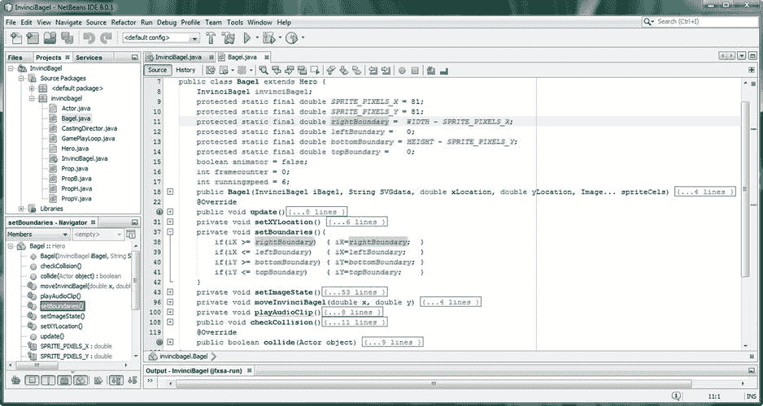

图 16-45。

Update the Bagel.java class with new Boundary values for the right, left, bottom and top Boundary value

在我们结束本章之前，让我们为我们的游戏添加一个评分引擎框架，以便这个碰撞检测例程除了播放声音和从游戏中删除演员之外，还调用一个 scoringine 方法。

## 创建评分引擎方法:。scoringEngine()

在我们结束本章之前，让我们为评分引擎建立一个框架，这样我们就可以把整个下一章的重点放在游戏上。在 checkCollision()方法之后创建一个`private void scoringEngine(Actor object){}`空方法，并在 checkCollision()方法内部的`if(collide(object))`条件 if()结构的末尾添加一个`scoringEngine(object);`方法调用。正如你在图 [16-46](#Fig46) 中看到的，你会在。scoringEngine()方法声明。这是因为对象引用没有在方法体内部实现。

我们将在下一章中介绍这一点，因此我们不必担心来自 NetBeans 的警告，而且我们已经准备好了评分引擎基础结构。

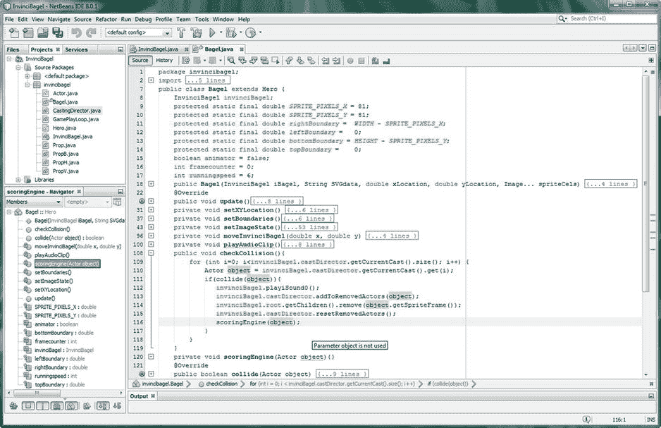

图 16-46。

Add a private void scoringEngine(Actor object) empty method, and call if inside .checkCollision() method

你已经在这一章完成了很多，关于碰撞检测和你的评分引擎。干得好！

## 摘要

在第十六章中，我们开始讨论一些更高级的主题，我们将在本书的最后几章中讨论这些主题。碰撞检测是游戏开发的基本主题之一，无论是使用 Java 8 还是其他平台。在本章中，我们学习了 SVG 数据格式规范，因此我们可以利用 JavaFX SVGPath 类，它允许我们访问自定义路径形状，如果它们是闭合的，通常称为多边形，以及哪些碰撞形状或碰撞多边形通常是闭合的。我们研究了 SVG 规范中的七个主要命令，所有这些命令都可以在绝对或相对模式下使用。

接下来，我们详细了解了如何让 GIMP 2.8 为我们创建自定义的碰撞形状 SVG 数据字符串，这是一个完全自动化的过程，仅使用 GIMP 工具(算法)，允许我们简单地单击透明区域，并让 GIMP 生成选择集。我们将选择集转换为碰撞路径，然后将路径导出为 SVG 数据。这个工作过程允许我们在任何游戏资产数字图像中生成具有透明(alpha 通道数据)区域的复杂碰撞多边形。

这种自动生成的碰撞数据非常“沉重”，因此我们研究了一个更复杂的工作过程，允许我们使用更少的数据点对手动创建碰撞多边形。这个过程包括使用 GIMP 中的路径工具手工创建一个碰撞多边形，这给了我们更多的控制来生成尽可能少的数据点。我们还看了 CodeAndWeb PhysicsEditor 软件，它可以跨所有游戏开发平台使用。

在下一章，我们将看看如何在游戏中实现增强的游戏元素，包括得分引擎、对手、宝藏、自动攻击引擎和物理模拟。