# 十七、增强游戏性：创建得分引擎，增加宝藏和敌人自动攻击引擎

现在，我们已经为游戏实现了碰撞检测，并为评分引擎奠定了基础，让我们完成从。checkCollisions()方法，然后添加一些更多的游戏元素来利用这个评分引擎，以及使游戏玩起来更有趣。为了实现我们的评分引擎显示，我们将在 InvinciBagel.java 类中创建一个 gameScore 整数变量和 scoreText 文本对象。我们还将创建一个 scoreFont 字体对象，并使用它来设置 scoreText 文本对象的样式，使其更加突出。我们还将了解如何在。scoringEngine()方法，并使用它来确定 InvinciBagel 与哪种类型的 Actor 对象发生了冲突。当然，我们会相应地增加 gameScore 变量。

我们还将创建一个 Treasure.java 职业，这样我们就可以给游戏添加有价值的奖励，让我们的无敌猎犬角色在躲避敌人不断的攻击时获得奖励，这些敌人来自无敌猎犬，或简称为 iBeagle，它既可以发射致命子弹(iBullets)，也可以发射奶油干酪球(iCheese)抛射物。在本章中，我们还将创建这些 Enemy.java 和 Projectile.java 类，因此，在本章的课程中，我们将使用您在本书中学到的所有知识来创建一些非常高级的 Java 8 类和方法。

一旦我们有了敌人和抛射职业，真正的挑战是创建一个自动攻击引擎，这样游戏本身就可以和玩家对抗，这样我们就可以创建这个游戏的单人版本。我们将通过将 Enemy.java 类连接到 GamePlayLoop.java 类，通过调用敌人类来实现这一点。来自 GamePlayLoop 类的 update()方法。handle()方法，这将允许我们为 iBeagle 敌人对象利用 JavaFX 脉冲计时引擎。一旦完成，我们就可以给敌人编码，赋予它自己的生命，让它随机出现在屏幕上，并通过发射致命的子弹或美味的奶酪球来攻击无敌面包圈。

我们将逻辑地逐步构建这个自动攻击引擎，首先让 iBeagle 敌人出现在屏幕的两侧，然后翻转以正确面对 iBagel 角色。然后，我们将添加编程逻辑，将 iBeagle 动画到屏幕上，然后退出屏幕。然后我们会让他射出一颗子弹或奶油奶酪球，然后我们会添加一些时间代码，以使他的运动更加真实。

之后，我们将在外观、位置和移动上添加随机性，这样游戏玩家就无法判断 iBeagle 攻击来自哪里。之后，我们将添加物理模拟，以便子弹和奶油干酪球受到阻力和重力的影响，所有这些都将使游戏越来越逼真，随着这一章的进行，直到书的结尾！

我希望你在这本书的过程中享受你的学习经历，就像我喜欢为你写这本书一样。现在，随着我们对 Java 8 和 JavaFX 类以及编程技术的了解越来越多，让我们开始让我们的游戏变得越来越具有挑战性和专业性。

## 创建乐谱 UI 设计:文本和字体对象

要实现评分引擎的显示，我们需要做的第一件事是在 NetBeans 中打开“InvinciBagel.java”选项卡，添加一个整数变量来保存数字分数累积，并添加一个文本 UI 元素对象来在屏幕底部显示分数，与其他 UI 元素放在一起。JavaFX 中的 Text 类用于处理游戏中的文本元素，甚至有自己的 javafx.scene.text 包，因为文本是应用中的重要元素。整数数据类型允许您的游戏玩家获得数十亿分，因此这应该足以容纳您的游戏玩家可以获得的任何数量级的分数。我们将把这些 Java 变量和对象声明(在图 [17-1](#Fig1) 中突出显示)放在 InvinciBagel.java 类的最顶端，就在宽度和高度常量声明之后，Java 代码应该如下所示:

`int``gameScore`T2】

`Text``scoreText`T2】

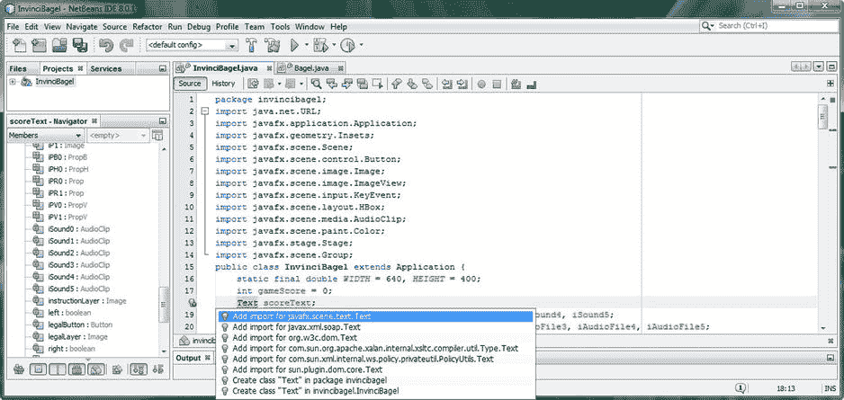

图 17-1。

Add an integer variable named gameScore and initialize it to 0, then add a Text object named scoreText

将鼠标悬停在红色波浪错误突出显示上，并单击包含此错误的代码行旁边，以选择它(用浅蓝色显示)。接下来，使用 Alt-Enter 工作进程弹出错误解决帮助器，如图 [17-1](#Fig1) 底部所示，双击“为 javafx.scene.text.Text 添加导入”选项，让 NetBeans 为您编写此文本类导入语句。

现在我们准备打开。createSplashScreenNodes()方法，并使用 Java new 关键字和 Text()构造函数方法实例化这个名为 scoreText 的文本对象。完成此操作后，您可以调用。setText()方法，并使用 String.valueOf()方法引用 gameScore 整数，并使用。setLayoutX()和。setLayoutX()方法，使用下面的 Java 代码如图 [17-2](#Fig2) 所示:

`scoreText =``new`T2】

`scoreText``.setText``(String.valueOf(``gameScore`T4】

`scoreText``.setLayoutY`T2】

`scoreText``.setLayoutX`T2】

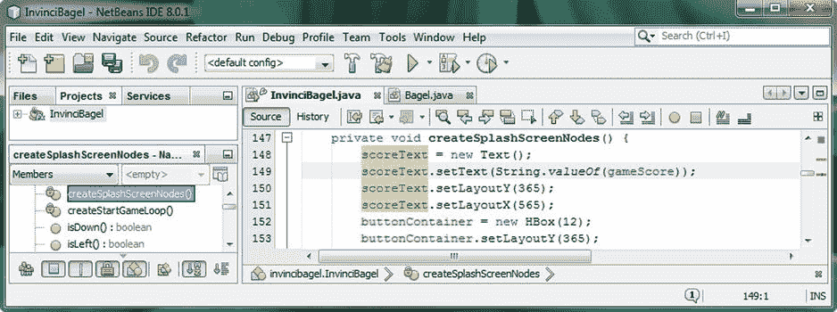

图 17-2。

Instantiate a scoreText object using a Java new keyword and call the .setText() and .setLayout() methods

现在，我们将使用 365，565 的 X，Y 位置值，如图 [17-2](#Fig2) 所示。为了能够样式化这个文本对象，我们需要声明一个私有的字体对象，名为 scoreFont，如图 [17-3](#Fig3) 所示。在红色错误突出显示处再次使用 Alt-Enter 工作流程，并选择“为 javafx.scene.text.Font 添加导入”选项。

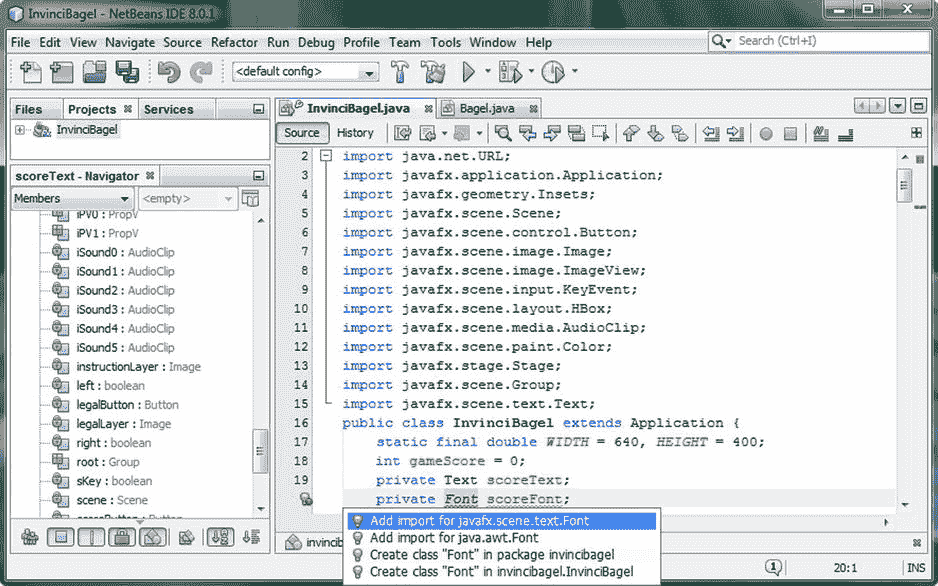

图 17-3。

Add a private Font scoreFont declaration and use Alt-Enter and select “Add import javafx.scene.text.Font”

在我们可以使用这个 scoreFont 字体对象来设置 scoreText 文本对象的样式之前，我们需要使用`root.getChildren().add(scoreText);` Java 语句将这个 scoreText 文本节点对象添加到 JavaFX 场景图中，该语句在图 [17-4](#Fig4) 中突出显示。如果你忘记这样做，当你点击“玩游戏”按钮后，你将只能在游戏屏幕上看到白色！

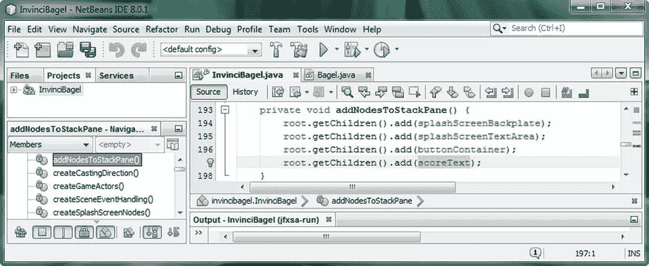

图 17-4。

Add the scoreText Text Node object to the JavaFX Scene Graph, using a .getChildren().add() method chain

现在我们可以看到场景中的文本对象，下一步是使用 Java new 关键字和 Font(String fontName，int fontSize)构造函数方法调用实例化 scoreFont Font 对象。完成此任务的 Java 语句在图 [17-5](#Fig5) 中突出显示，应该如下所示:

`scoreFont =``new``Font(``"Verdana", 20`T4】

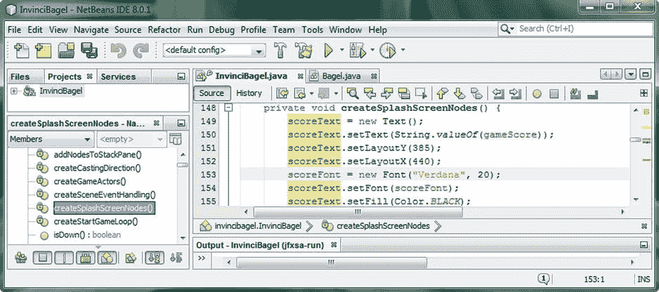

图 17-5。

Instantiate scoreFont object with a Java new keyword and Font(String fontName, int fontSize) constructor

工作流程的下一步是使用。setFont()方法，从 scoreText 对象中调用，并使用以下代码设置文本对象以利用 scoreFont 字体对象，如图 [17-5](#Fig5) 的底部所示。还可以使用对 scoreText 文本对象调用的. setFill()方法来设置文本对象的颜色；现在，我们将使用一种颜色。黑色常数。

`scoreText``.setFont`T2】

`scoreText``.setFill`T2】

现在，我们可以测试 scoreText 文本对象的位置，并优化我们的 X，Y 屏幕位置值，以便分数就在 HBox UI 按钮库的旁边。我发现我必须将 Y 位置向下移动 20 个像素到 385 的像素位置，而我必须将 X 位置向右移动 5 个像素，到 445 的像素位置，如图 [17-6](#Fig6) 所示，在屏幕截图的左半部分，在 InvinciBagel 游戏的右下角，法律按钮旁边。

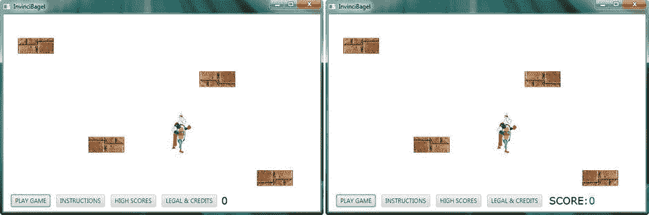

图 17-6。

Test the scoreText and scoreFont objects using the Run ➤ Project work process to refine their placement

我们将在本章的下一节添加一个文本对象标签，上面写着“SCORE:”来标记玩家的分数。第二轮编码的结果显示在图 [17-6](#Fig6) 的右半部分，在右下角。

### 创建乐谱标签:添加第二个文本对象

让我们在 scoreText 文本对象的前面添加一个文本标签，而不是在 UI 按钮库(HBox)的右侧只显示一个数字。我们将创建一个 scoreLabel 文本对象，并使用我们在上一节中创建的相同字体对象来设置该文本对象的样式。我将使用`scoreText.setFill(Color.BLUE);` Java 语句将分数文本的数字部分更改为蓝色，并使用以下 Java 代码将 SCORE: label 改为黑色，这也可以在图 [17-7](#Fig7) 中看到:

`scoreText``.setFill``(``Color.BLUE`T4】

`scoreLabel =``new`T2】

`scoreLabel``.setText``("``SCORE:`T4】

`scoreLabel``.setLayoutY`T2】

`scoreLabel``.setLayoutX`T2】

```java
scoreLabel.setFont(scoreFont);
```

`scoreLabel``.setFill``(``Color.BLACK`T4】

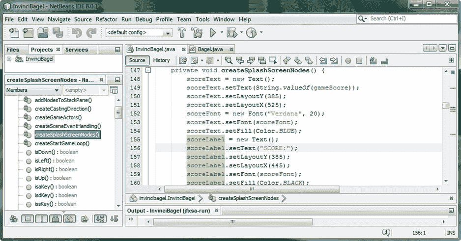

图 17-7。

Add the scoreLabel object instantiation and configuration method calls underneath the scoreText object

正如你在图 [17-8](#Fig8) 中看到的，你需要记住将第二个 scoreLabel 文本节点添加到场景图根对象，它以前是一个 StackPane，但现在是一个 Group 对象。这是使用一个方法链来完成的，现在你应该已经非常熟悉了:`root.getChildren().add(scoreLabel);`注意，addNodesToStackPane()方法已经开始被更多地使用了，因为我们在游戏中加入了更多的 UI 元素。尽管 gameScore 变量会在游戏过程中动态更新，但这些文本对象本质上是静态的，因为它们是在启动时声明、实例化、配置和定位的，就像其他 UI 元素一样。

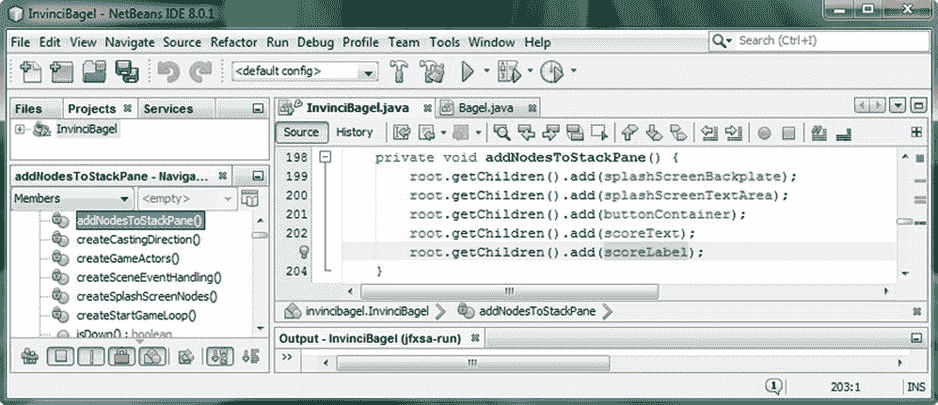

图 17-8。

Add the scoreLabel Text Node object to the JavaFX Scene Graph using a .getChildren().add() method chain

## 正在创建评分引擎逻辑:。scoringEngine()

在这个游戏中，我想评分的基础是对象的类型，因为我们将有固定的 Actor 子类对象供无敌组合评分，例如 Prop、PropV、PropH、PropB、宝藏、投射物、敌人等等。由于 switch-case 结构不支持在其评估逻辑中使用对象，我们将不得不使用条件 if()语句，以及 Java instanceof 操作符，从它的名字就可以看出，它用于确定对象类型或实例；在这种特殊情况下，首先，如果 Actor 对象是 Prop、PropV、PropH 或 PropB 类的实例。scoringEngine()方法的基本 Java 代码结构为每个 Actor 对象类型计算一个 if()，然后在 invinciBagel 对象内部设置由 scoreText 文本对象显示的 gameScore 变量。这种编程逻辑都可以在图 [17-9](#Fig9) 中看到。Java 代码应该是这样的:

`private void``scoringEngine``(Actor``object`T4】

`if(``object instanceof Prop``)  { invinciBagel.gameScore``+=5`T4】

`if(object instanceof``PropV``) { invinciBagel.gameScore``+=4`T4】

`if(object instanceof``PropH``) { invinciBagel.gameScore``+=3`T4】

`if(object instanceof``PropB``) { invinciBagel.gameScore``+=2`T4】

`invinciBagel.scoreText``.setText``(String``.valueOf`T4】

```java
}
```

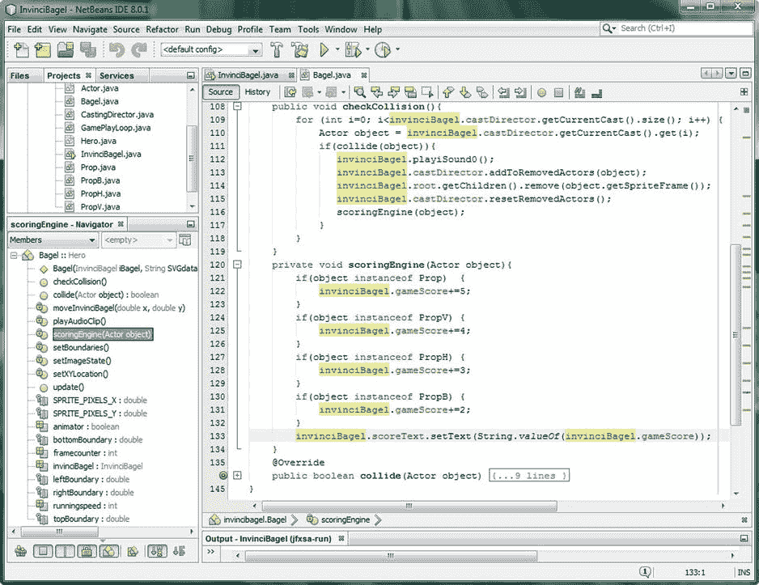

图 17-9。

Code basic conditional if() statements inside of the .scoringEngine() method using instanceof

确保不要在这些条件 if()语句中调用使用. setText()方法更新 scoreText UI 元素的`invinciBagel.scoreText.setText(String.valueOf(invinciBagel.gameScore));`语句。相反，请注意，我把它放在了方法的末尾，在所有这些计算完成之后。我这样做是为了在条件 if()对象处理结构的末尾，只需要调用这一行代码一次。也就是说，如果将这个 scoreText 对象分数更新语句放在每个条件 if()语句代码体结构中，Java 代码仍然可以工作。然而，我试图向您展示如何编写代码，通过使用相对较少(十几行或更少)的代码来完成主要的 Java 8 游戏开发任务，从而完成大量工作。

接下来，我们将从。checkCollision()方法，我们将把它放在 scoringEngine()方法中。只要是这两个方法中的一个，它就会在碰撞时被调用，不管怎样。我这样做的原因是，当玩家发现宝藏或被炮弹击中时，我们可能会想要播放不同的音效。这样，当检测到不同类型的碰撞时，您的音频将与得分和游戏相关联，而不仅仅是为任何碰撞播放音频。

我们的条件 if()结构代码体使用花括号，这允许我们将 Java 语句添加到每种类型的碰撞(计分)对象实例(类型)中。因此，除了增加(或减少，我们将在后面添加)分数，我们还可以为不同的对象使用不同的声音(音频剪辑)。让我们添加。playSound()方法接下来调用这些条件 if()代码块，这样我们就有了代码，当主要角色捡起一个宝藏，或者当他被敌人(无敌猎犬)角色发射的炮弹击中(或接住)时，或者当他与场景中的道具碰撞时，就会触发声音效果。

这是通过使用以下 Java 条件 if()结构来实现的，也可以在图 [17-10](#Fig10) 中看到:

`private void``scoringEngine``(Actor``object`T4】

`if(``object instanceof Prop`T2】

`invinciBagel.``gameScore`T2】

`invinciBagel.``playiSound0`T2】

```java
}
```

`if(object instanceof``PropV`T2】

`invinciBagel.``gameScore`T2】

`invinciBagel.``playiSound1`T2】

```java
}
```

`if(object instanceof``PropH`T2】

`invinciBagel.``gameScore`T2】

`invinciBagel.``playiSound2`T2】

```java
}
```

`if(object instanceof``PropB`T2】

`invinciBagel.``gameScore`T2】

`invinciBagel.``playiSound3`T2】

```java
}
```

`invinciBagel.scoreText``.setText``(String``.valueOf``(invinciBagel.``gameScore`T6】

```java
}
```

现在，我们有了更多的游戏互动，因为记分板将在每次碰撞时立即正确更新，并同时播放一段音频剪辑，以指示已检测到碰撞、已发生的碰撞类型(好的或坏的)以及记分板已更新，因为毕竟这个编程逻辑包含在 scoringine()方法中，因此应该以某种方式与行为或得分相关。

在我们测试了这个条件 if()编程逻辑并确保一切按预期运行之后，我们可以看看如何在其中添加优化。scoringEngine()方法，然后我们将准备添加更多的演员类型，如 Treasure.java 类，我们将添加下一步。之后，我们可以添加一些敌人到 InvinciBagel 游戏中，因为在本章的过程中，我们会继续添加一些功能，使我们的游戏更加有趣和刺激。

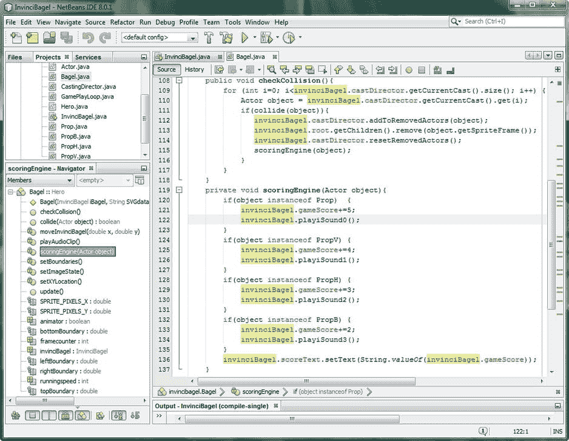

图 17-10。

Add .playiSound() method calls in each if() statement body to play different audio for each type

使用“运行➤项目”工作流程测试游戏。如图 [17-11](#Fig11) 所示，记分牌起作用了！

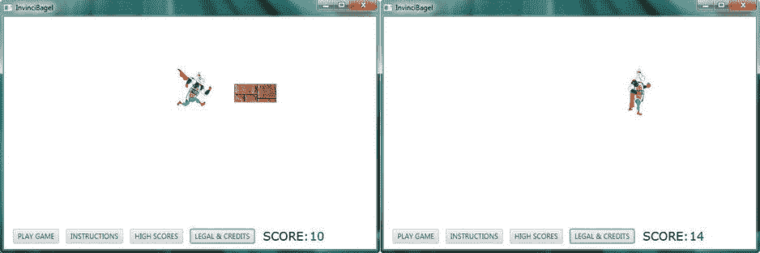

图 17-11。

Use Run ➤ Project to test the game, and collide with the objects on the screen, updating your scoreboard

### 优化 scoringEngine()方法:使用逻辑 If Else If

虽然前面的 if()语句系列可以完成我们在这里尝试的工作，但是我们确实需要模拟`break;`语句，如果我们使用 Java switch-case 语句类型，我们就可以使用它了。为了优化这种方法，一旦确定了碰撞中涉及的物体类型，我们就要打破这种评估系列。我们可以通过使用 Java else-if 功能将所有这些条件 if()语句连接在一起来做到这一点。如果这个结构中的一个条件被满足，if-else-if 结构的其余部分不被评估，这相当于 switch-case 结构中的一个`break;`语句。为了进一步优化，您可能希望将最常见的(该对象类型的场景中可碰撞对象数量最多的)对象放在 if-else-if 结构的顶部，将最不常见的对象放在该结构的底部。你所要做的就是通过使用 Java else 关键字将 if()条件块连接在一起，如图 [17-12](#Fig12) 所示。这创建了一个更紧凑、处理优化的条件求值结构，并使用了更少的 Java 代码行:

`private void scoringEngine(Actor``object`T2】

`if(``object`T2】

```java
invinciBagel.gameScore+=5;

invinciBagel.playiSound0();
```

`}``else if`T2】

```java
invinciBagel.gameScore+=4;

invinciBagel.playiSound1();
```

`}``else if`T2】

```java
invinciBagel.gameScore+=3;

invinciBagel.playiSound2();
```

`}``else if`T2】

```java
invinciBagel.gameScore+=2;

invinciBagel.playiSound3();    }
```

`invinciBagel.scoreText.``setText``(String.valueOf(invinciBagel.``gameScore`T4】

```java
}
```

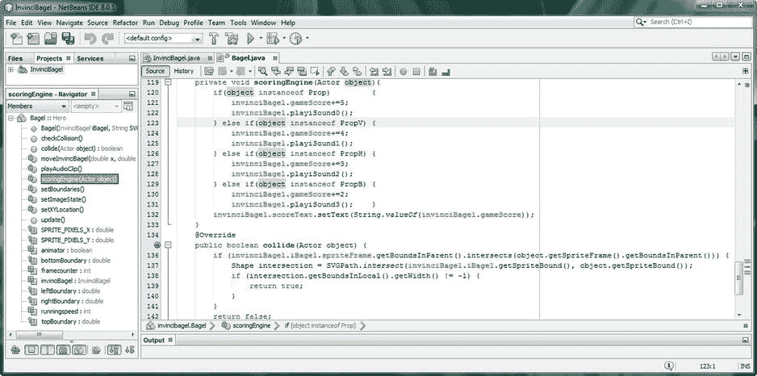

图 17-12。

Make all the previously unrelated if() structures into one if-else-if stucture by inserting else in between ifs

## 增加游戏的赏金:Treasure.java 类

为了让我们的游戏更刺激，让我们添加一个 Treasure.java 类，这样我们的游戏玩家在玩游戏时就有东西可以找了，这样他们就可以在评分引擎就位后给自己的分数加分。这种类型的 Treasure 对象将利用 hasValu 和 isBonus 布尔标志，它们是我们在抽象 Actor 类中安装的，我们将在 Treasure()构造函数方法中将它们设置为 true 值，接下来我们将编写代码，同时覆盖所需的。update()方法，以便在开发的后期我们可以添加动画和宝藏处理逻辑。与 Prop、PropV、PropH 和 PropB 类一样，该类将使用 xLocation 和 yLocation 参数来设置 spriteFrame ImageView 节点对象的 translateX 和 translateY 属性，该对象将作为 Treasure()构造函数方法编程逻辑的一部分，位于 Treasure 对象(Actor 对象类型，也称为 Actor 子类)的内部。该类的 Java 代码也可以在图 [17-13](#Fig13) 中看到，应该如下所示:

```java
package invincibagel;

import javafx.scene.image.Image;
```

`public class``Treasure`T2】

```java
public Treasure(String SVGdata, double xLocation, double yLocation, Image... spriteCels){

super(SVGdata, xLocation, yLocation, spriteCels);

spriteFrame.setTranslateX(xLocation);

spriteFrame.setTranslateY(yLocation);

hasValu = true;

isBonus = true;

}

@Override

public void update() {   // Currently this is an Empty but Implemented Method   }

}
```

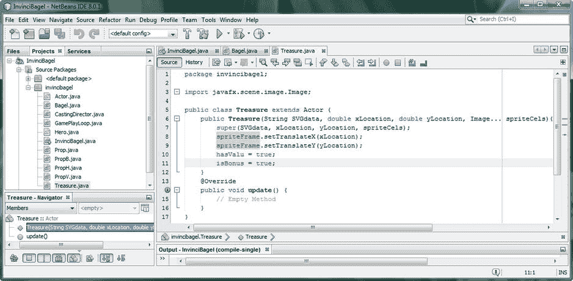

图 17-13。

Create a new Java class named Treasure.java extends Actor and create Treasure() and update() methods

### 使用宝藏类:在游戏中创建宝藏

现在我们有了一个 Treasure.java 类，我们可以为游戏创建宝物了。如你所知，这将在 InvinciBagel.java 课上完成。声明 package protected(因为我们将在 Bagel.java 的 InvinciBagel 之外引用它们)Treasure 对象，并将它们命名为 iTR0 和 iTR1(代表 InvinciBagel Treasure)。将 iT0 和 iT1 图像对象声明添加到私有图像对象复合声明的末尾。分别使用 Java new 关键字、Image()构造函数方法以及 treasure1.png 和 treasure2.png 图像资源实例化 iT0 和 iT1 图像对象。之后，您可以创建 iTR0 和 iTR1 宝藏对象，使用 Treasure()构造函数方法，SVG 路径数据为 0，0，0，64，64 和 64，0，位置分别为 50，105 和 533，206。确保将这些新的 Treasure 对象的 spriteFrame ImageView 节点添加到 JavaFX 场景图中，使用。getChildren()。add()方法链，从根组对象调用。如图 [17-14](#Fig14) 所示，代码没有错误，我们现在准备测试新的 Treasure.java 类和我们添加到 InvinciBagel.java 类中的 Java 代码，看看我们是否能在游戏场景中获得宝藏。您的 Java 代码应该如下所示:

`Treasure``iTR0``,``iTR1`T4】

`private Image iB0, iB1, iB2, iB3, iB4, iB5, iB6, iB7, iB8, iP0, iP1,``iT0``,``iT1`T4】

`iT0` `=  new Image("` `/treasure1.png` `", 64, 64, true, false, true);  //` `.loadImageAssets()`

`iT1``=  new Image("``/treasure2.png`T3】

`iTR0` `= new Treasure("M0 0 L0 64 64 64 64 0 Z",` `50` `,` `105` `, iT0);  //` `.createGameActors()` `Method`

`iTR1` `= new Treasure("M0 0 L0 64 64 64 64 0 Z",` `533` `,` `206`

`root.getChildren().add(``iTR0`T2】

`root.getChildren().add(``iTR1`T2】

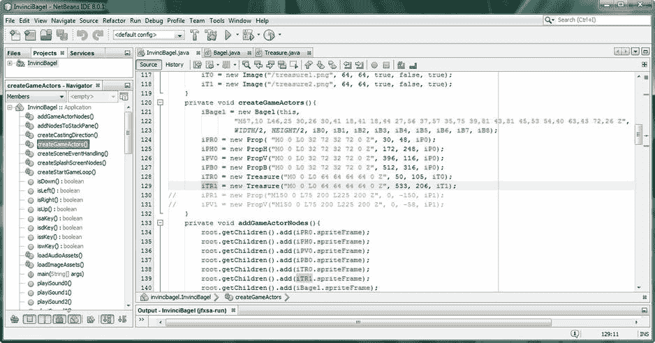

图 17-14。

After adding declarations at the top of the class, instantiate the objects, and add them to a Scene Graph

让我们花一点时间，用一个运行➤项目的工作流程，看看我们的宝贝演员是否在屏幕上！

正如你在图 [17-15](#Fig15) 的左半部分所看到的，所有的宝物在场景中都是可见的，我们已经准备好开始增强我们的视觉效果了。scoringine()方法，支持负面评分以及添加宝藏评分值。

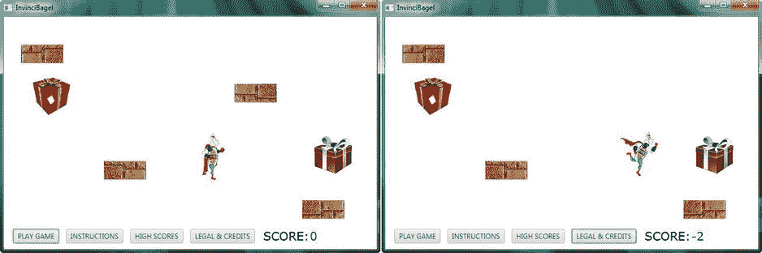

图 17-15。

Check Treasure placement (left) and test negative collision values (right) and Treasure collision detection

正如你很快会看到的(在图 [17-15](#Fig15) 的右边)，Java int (integer)数据类型支持负值，所以你只需要在你的。scoringEngine()方法是将您希望游戏玩家避免的 Actor 对象的+=更改为-=。在我们开发场景中，我们将使用与道具对象的碰撞来给出一个负分。

### 加宝碰撞检测:更新中。scoringEngine()

通过将+=值更改为-=1 或-=2 来更改您的道具演员对象评分，以减少记分板值，然后在现有 if-else-if 链的末尾添加一个 else-if{}部分，以支持宝藏对象，我们将为其评分+=5，以增加 5 分。完成这项工作的 Java 代码，如图 [17-16](#Fig16) 所示，应该如下所示:

`private void scoringEngine(Actor``object`T2】

```java
if(object instanceof Prop)         {
```

`invinciBagel.gameScore``-=1`T2】

```java
invinciBagel.playiSound0();

} else if(object instanceof PropV) {
```

`invinciBagel.gameScore``-=2`T2】

```java
invinciBagel.playiSound1();

} else if(object instanceof PropH) {
```

`invinciBagel.gameScore``-=1`T2】

```java
invinciBagel.playiSound2();

} else if(object instanceof PropB) {
```

`invinciBagel.gameScore``-=2`T2】

```java
invinciBagel.playiSound3();
```

`} else if(``object``instanceof``Treasure`T4】

`invinciBagel.gameScore``+=5`T2】

`invinciBagel.``playiSound4`T2】

```java
invinciBagel.scoreText.setText(String.valueOf(invinciBagel.gameScore));

}
```

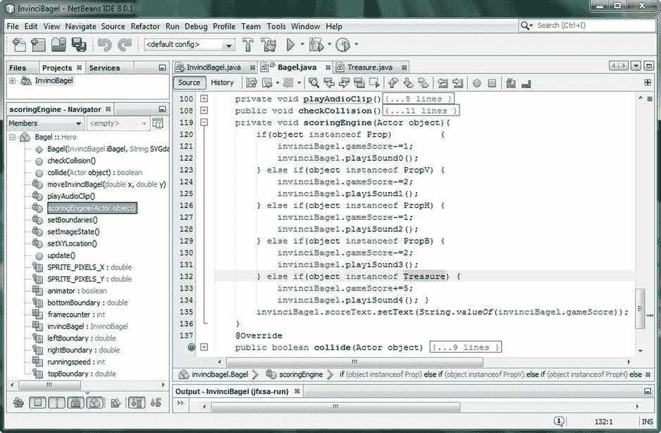

图 17-16。

Add a Treasure else-if structure to end of the .scoringEngine() method conditional if() structure

你需要记住将宝藏对象添加到 castDirector 对象中，如图 [17-17](#Fig17) 所示，因为碰撞检测引擎使用这个 CastingDirector 类(对象)来管理碰撞检测过程。如果你不做这一步，无敌舰队将会直接越过宝藏物体而看不到(撞上)它们！

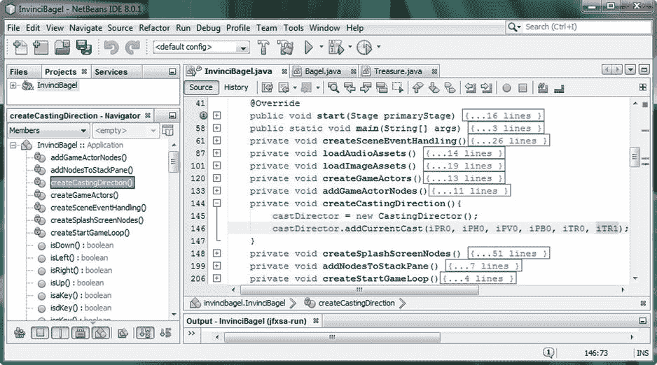

图 17-17。

Add iTR0 and iTR1 Treasure objects inside the .addCurrentCast(Actor. . .) method call

现在，我们已经将这两个宝藏对象添加到 castDirector CastingDirector 对象中，碰撞检测编程逻辑将“看到”它们，并与宝藏对象发生碰撞，从而触发评分引擎对游戏进行正确评分。测试在你的游戏中实现宝藏的最终代码，并确保它可以工作，然后我们可以继续添加对手，让他们向无敌的角色发射射弹。

## 添加敌人:敌人和抛射体类

既然我们已经在游戏中加入了正面的(宝藏)元素，那就让我们在游戏中加入一些负面的(敌人和抛射物)元素，让我们在开发工作过程中保持“平衡”。我们将使用演员超类，而不是英雄超类来创建敌人和投射物类(物体)。这是因为这样做，我们有一个更优化的游戏，因为我们只使用一个单一的。collide()方法(记住每个 Hero 对象都实现了一个. collide()方法)供 JavaFX 脉冲事件引擎处理。当我把这个游戏转换成多人游戏时(这个游戏的代码超出了这个标题的初学者性质)，我会想让敌人职业成为一个英雄子类，这样敌人角色就可以像 InvinciBagel 一样与诸如宝藏和投射物之类的东西碰撞。因为敌人的阶级仍然有一个。update()方法，它可以在屏幕上四处移动，它可以(并将)从隐藏中出来，向 InvinciBagel 角色发射子弹(负面效果)和奶油干酪球(正面效果)。英雄职业的唯一区别是。collide()方法，对于这个版本的游戏，有一个。collide()方法来处理每个脉冲允许我们优化游戏播放处理，同时仍然拥有一个具有街机游戏将包括的不同游戏功能的游戏。正如您在 Enemy()构造函数方法中看到的，敌人角色 isAlive、isBonus 和 hasValue，因此在使用。setTranslateX()和。setTranslateY()，在使用 super()构造函数将 SVG 数据、图像和初始 X，Y 位置数据传递给 Actor()构造函数之后。在图 [17-18](#Fig18) 中可以看到 Enemy.java 类的 Java 代码没有错误，应该看起来像下面的 Java 类结构:

```java
package invincibagel;

import javafx.scene.image.Image;
```

`public class``Enemy``extends``Actor`T4】

`public``Enemy`T2】

```java
super(SVGdata, xLocation, yLocation, spriteCels);

spriteFrame.setTranslateX(xLocation);

spriteFrame.setTranslateY(yLocation);

isAlive = true;

isBonus = true;

hasValu = true;

}

@Override
```

`public void``update`T2】

```java
// Currently Empty Method

}

}
```

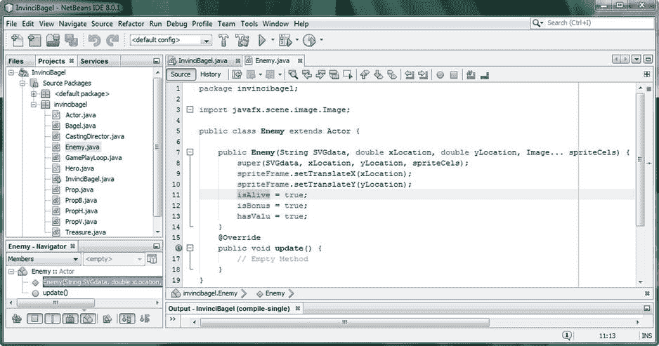

图 17-18。

Create an Enemy.java class, override the .update() method, and code your Enemy() constructor method

工作流程的下一步是使用 GIMP 为敌方物体创建碰撞多边形，如图 [17-19](#Fig19) 所示，仅使用 9 个数据点。使用你在[第 16 章](16.html)中学到的 SVG 数据创建工作流程。

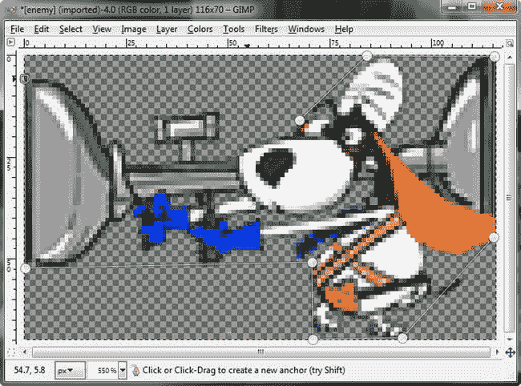

图 17-19。

Use GIMP to create a nine-point collision polygon for your Enemy Actor

在我们进入 InvinciBagel 类来声明和实例化一个名为 iBeagle 的敌人对象之前，让我们创建 Projectile.java 类，这样我们的敌人对象就有抛射物来射向 InvinciBagel 角色！

### 创建奶油干酪子弹:编码 Projectile.java 类

既然我们已经在游戏中加入了正面(宝藏)元素，那我们就在游戏中加入一些负面(敌人和弹丸)元素，让我们在开发工作过程中保持“平衡”！创建一个 Projectile.java 类和构造函数方法，将 isFixed 设置为 false(因为射弹会飞)并将 isBonus 和 hasValu 设置为 true，这样就设置了对象属性。这个 Projectile.java 类的 Java 代码如图 [17-20](#Fig20) 所示，如下所示:

```java
package invincibagel;

import javafx.scene.image.Image;
```

`public class``Projectile`T2】

`public``Projectile`T2】

```java
super(SVGdata, xLocation, yLocation, spriteCels);

spriteFrame.setTranslateX(xLocation);

spriteFrame.setTranslateY(yLocation);

isFixed = false;

isBonus = true;

hasValu = true;

}

@Override
```

`public void``update`T2】

```java
}
```

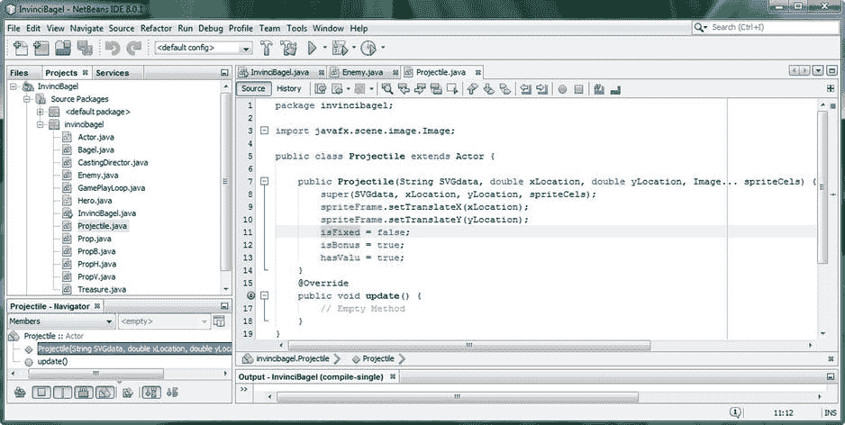

图 17-20。

Create a Projectile.java class, override the .update() method, and code a Projectile() constructor method

### 给游戏增加敌人和投射物:InvinciBagel.java

在 NetBeans 中打开 InvinciBagel.java 选项卡，在 iBagel Bagel 对象下声明一个名为 iBeagle 的敌方对象和两个名为 iBullet 和 iCheese 的抛射体对象，如图 [17-21](#Fig21) 中突出显示的。接下来，通过在第二个私有映像声明的末尾添加对象名，声明三个映像对象 iE0、iC0 和 iC1。

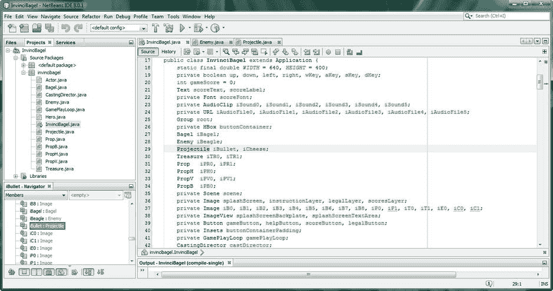

图 17-21。

Declare iBeagle, iBullet, iCheese (Enemy and Projectile) objects, and iE0, iC0, iC1 (Image) objects

将 enemy.png、bullet.png 和 cheese.png 的图像资产复制到/src 文件夹中，如图 [17-22](#Fig22) 所示。

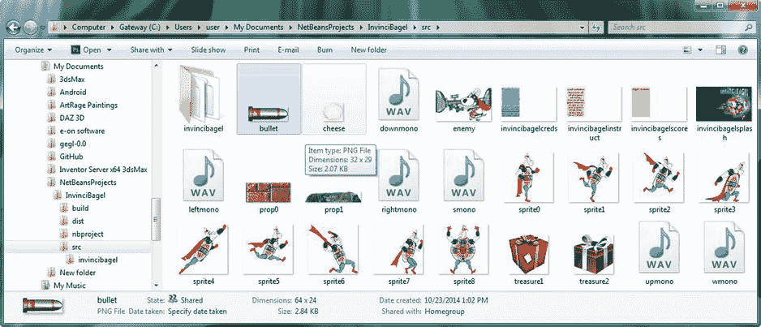

图 17-22。

Copy the enemy.png, bullet.png, and cheese.png image assets into your InvinciBagel/src project folder

然后，你可以通过用鼠标点击并拖动这些点来逐个数据点地细化你的碰撞多边形结构数据点，如图 [17-23](#Fig23) 所示。如果你比较图 [17-22](#Fig22) 中的碰撞多边形和图 [17-23](#Fig23) 中的碰撞多边形，你可以看到我已经优化了几个数据点，以更好地符合精灵的轮廓。

`Enemy``iBeagle`T2】

`Projectile``iBullet``,``iCheese`T4】

`private Image iB0, iB1, iB2, iB3, iB4, iB5, iB6, iB7, iB8, iP0, iP1, iT0, iT1,``iE0``,``iC0``,``iC1`T6】

`iE0` `=  new Image("` `/enemy.png` `", 70, 116, true, false, true);       //` `.loadImageAssets()`

`iC0``=  new Image("``/bullet.png`T3】

`iC1``=  new Image("``/cheese.png`T3】

`iBeagle` `= new Enemy("M0 6 L0 52 70 52 70 70 70 93 115 45 115 0 84 0 68 16 Z",` `520` `,` `160`

`iBullet` `= new Projectile("M0 4 L0 16 64 16 64 4 Z",` `8` `,` `8`

`iCheese` `= new Projectile("M0 0 L0 32 29 32 29 0 Z",` `96` `,` `8` `, iC1); //` `.createGameActors()` `Method`

`root.getChildren().add(``iBeagle`T2】

`root.getChildren().add(``iBullet`T2】

`root.getChildren().add(``iCheese`T2】

`castDirector.addCurrentCast(iPR0, iPH0, iPV0, iPB0, iTR0, iTR1,``iBeagle``,``iBullet``,``iCheese`T6】


图 17-23。

Instantiate Image and Projectile objects and add them to JavaFX Scene Graph and CastingDirector object

当我们向游戏中添加游戏设计元素时，让我们继续学习如何使用 splashscreen ImageView 节点对象来实现游戏背景图像板。我们将这样做，以便我们的白色 iBeagle，以及(奶油)iCheese 和 iBullet 对象，使用增强的蓝色背景颜色，更好地突出显示给游戏玩家。

## 添加背景图像:使用。toBack()方法

在我们开始为敌人和投射物体编写碰撞和得分例程之前，让我们在向游戏添加物体的过程中添加一个图像资产(物体)以在背景板中使用。将图 [17-24](#Fig24) 左下角所示的 skycloud.PNG8 位 png 8 图像资产从图书库中复制到 netbeans projects/InvinciBagel/src 文件夹中。完成此操作后，在闪屏相关图像资产的私有图像对象声明的末尾添加一个 skyCloud 图像对象声明，如图 [17-24](#Fig24) 顶部所示。正如您所看到的，在您在 Java 代码中实现(使用)它之前，这个对象下会有一个警告高亮显示。接下来，实例化一个 skyCloud 对象。loadImageAssets()，如图 [17-24](#Fig24) 底部所示，使用以下代码:

`private Image splashScreen, instructionLayer, legalLayer, scoresLayer,``skyCloud`T2】

`skyCloud` `=` `new` `Image("` `/skycloud.png`

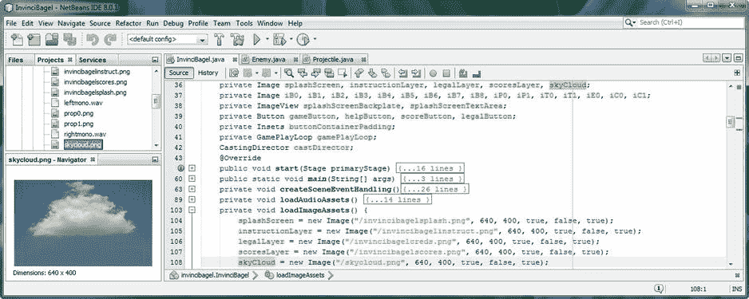

图 17-24。

Declare and instantiate a skyCloud Image object that references a skycloud.png background image asset

现在您有了一个 skyCloud 对象，因此使用. setImage()方法来设置一个 splash screen background ImageView 节点，以便在 GAME Button . setonaction(action event)代码块中使用该图像资源，这样当您单击 PLAY GAME 按钮时，该图像将被设置为背板图像。此外，请确保使用。值为 true 的 setVisible()方法调用，以便 ImageView 节点可见。如图 [17-25](#Fig25) 所示的 Java 代码应该是这样的:

`splashScreenBackground.setImage(``skyCloud`T2】

`splashScreenBackground.setVisible(``true`T2】

由于您已经将此代码添加到了 gameButton 的事件处理代码中，因此您必须“反击”这一举动，方法是使用下面的 Java 代码向其他三个按钮事件处理器添加相同的方法调用，以将图像资产设置回闪屏图像资产，如图 [17-25](#Fig25) 中的其他三个按钮事件处理方法所示:

`splashScreenBackground.setImage(``splashScreen`T2】


图 17-25。

Use a splashScreenBackplate.setImage() method call to install a skyCloud Image object in gameButton

使用运行➤项目来测试代码。正如您在图 [17-26](#Fig26) 左侧看到的，我们有一个 z 索引问题！


图 17-26。

Install the skyCloud background Image (left), and use a .toBack() method call to set proper z-index (right)

因为我们想让我们的背景图像在最低(零)z-index 处，所以它将在我们所有游戏资产的后面，但也让所有闪屏资产在最高 z-index 处，所以那些图像板将覆盖(在)我们所有游戏资产的前面，我们通常必须实现另一个 ImageView 合成板，才能做到这一点。但是，有一组方便的 z 索引相关的节点类方法，允许我们使用 SplashScreenBackplate ImageView 对象同时保存游戏 splashscreen 和游戏背景图像板！这是我想实现的 ImageView 节点优化之一，以保持我们的游戏节点最少，减少内存和处理开销。将 ImageView 放在游戏资源后面的代码将调用。toBack()方法，该方法将该节点重新定位到 JavaFX 场景图形节点堆栈的后面(底层)。这相当于将该节点的 z 索引设置为零。在图 [17-26](#Fig26) 的顶部可以看到用浅蓝色突出显示的 Java 语句，您的`gameButton.setOnAction((ActionEvent)->{}`事件处理结构的完整 Java 代码应该如下所示:

```java
gameButton.setOnAction((ActionEvent) -> {
```

`splashScreenBackplate.setImage(``skyCloud`T2】

`splashScreenBackplate.setVisible(``true`T2】

`splashScreenBackplate``.toBack()`T2】

`splashScreenTextArea.setVisible(``false`T2】

```java
});
```

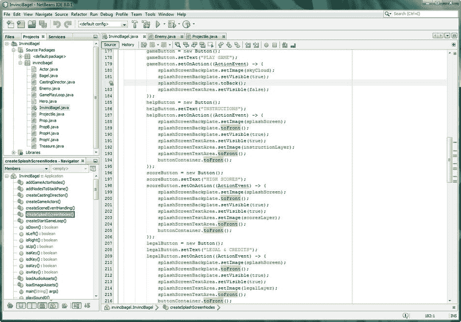

图 17-27。

Use a .toBack() method call in the gameButton code, and .toFront() method call in the other Button code

您可能已经意识到，我们需要在其他三个按钮事件处理结构中“对抗”这种移动。我们将使用。toBack()方法调用，这当然是。toFront()方法调用。如您所见，我们不仅需要调用。toFront()方法，但也可以从 splashScreenBackplate ImageView 节点对象以及保存 UI 按钮控件的 buttonContainer HBox 对象中删除。我们将需要调用所有这些 Splashscreen 和 UI 对象的这个方法，以便所有这些对象都回到 JavaFX 场景图节点堆栈的前面。如图 [17-27](#Fig27) 所示的 Java 代码如下所示:

`helpButton` `.setOnAction((ActionEvent) -> {`

`splashScreenBackplate.setImage(``splashScreen`T2】

```java
splashScreenBackplate.toFront();
```

`splashScreenBackplate.setVisible(``true`T2】

`splashScreenTextArea.setVisible(``true`T2】

```java
splashScreenTextArea.setImage(instructionLayer);

splashScreenTextArea.toFront();

buttonContainer.toFront();

});
```

## 使用随机数生成器:java.util.Random

java.util 包包含编程实用程序，您可以在 Java 8 游戏开发中使用这些程序，您可能已经从包名中猜到了。对于游戏程序员来说，最重要的 Java 工具之一是 Random 类及其 Random()构造函数方法。这个类可以用来创建随机数生成器对象，它生成随机数(或布尔值)供游戏编程逻辑使用。我们将使用这个类来生成 int(整数，用于随机屏幕位置)和 boolean(用于“猜测敌人从哪里来”函数)随机值。这些将确保游戏玩家不能通过在游戏过程中识别模式来预测游戏。Java 8 Random 类是专门使用 Java Object master 类生成随机数的临时代码。Random 类的类层次结构如下所示:

```java
java.lang.Object
```

`> java.util.` `Random`

Random 类有两个构造函数，一个是我们将使用的 Random()构造函数，另一个是重载的 Random(long seed)构造函数，您可以在其中为该类实现的随机数生成器指定种子值。一旦你有了一个随机对象，你可以调用 22 种方法中的一种来生成不同类型的随机值。本章中我们将用到的方法调用是。nextInt(int bound)和。nextBoolean()方法调用。如果您想知道，还有一个. nextInt()方法，但是我们需要生成一个特定范围内的随机数(从零到屏幕底部)，并且。nextInt(int bound)允许在方法调用内部生成一个从零到指定整数界限(boundary)的随机数。

我们将在 Enemy.java 类中使用随机类作为我们敌人的攻击策略(和代码)。让我们继续在 Enemy.java 类的顶部声明并实例化一个名为 randomNum 的随机对象，如图 [17-28](#Fig28) 所示，使用下面的复合(声明加实例化)Java 8 编程语句:

`protected static final Random``randomNum`T2】

在本章的剩余部分，我们将使用这个随机(数字生成器)对象来为我们的敌人 iBeagle 对象添加随机攻击位置、攻击面和子弹，这样他就可以尽最大努力打倒 InvinciBagel 角色(游戏玩家)，或者如果可以的话，至少让他产生大量的负得分点！

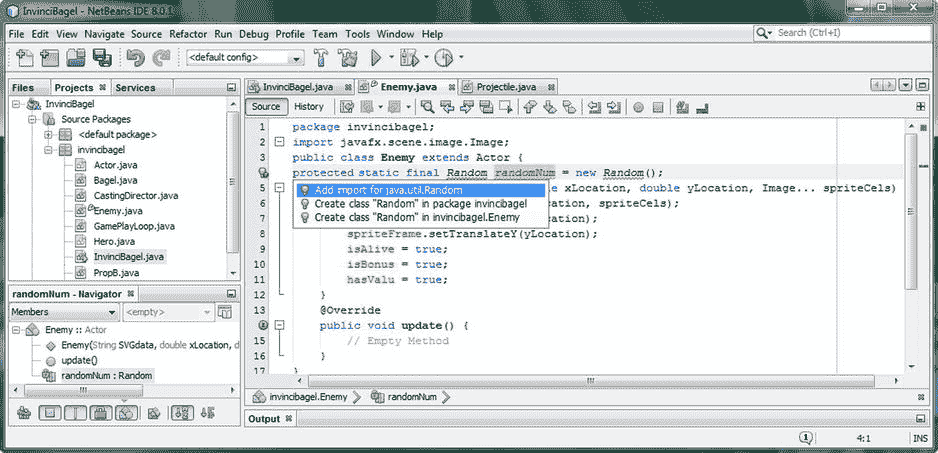

图 17-28。

Declare and instantiate a Random Number Generator at the top of the Enemy.java class using Random()

## 发动攻击:编码敌人的冲击

首先，我们需要使用下面两条 Java 语句声明计数器变量，如图 [17-29](#Fig29) 所示:

`int``attackCounter`T2】

`int``attackFrequency`T2】

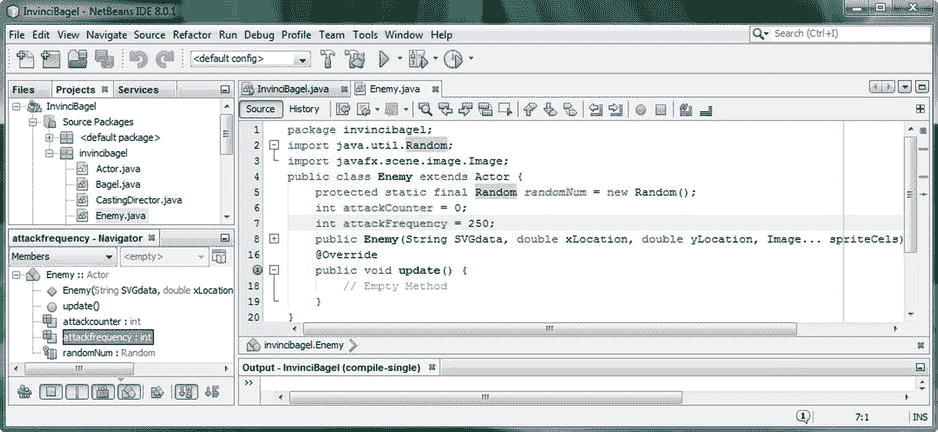

图 17-29。

Add integer variables at the top of the Enemy.java class; set attackCounter=0, and attackFrequency=250

现在我们准备开始在 Enemy.java 类中放置半打相当复杂的方法。这些将使用 GamePlayLoop 类的。handle()方法，利用 JavaFX 60 FPS 脉冲计时事件引擎，驱动完全自动化、完全随机化的敌人攻击。在本章余下的时间里，我们将要编写的代码相当于把计算机处理器变成了我们游戏玩家的对手。我们来写代码吧！

### 敌人阶级攻击的基础。update()方法

让我们从编写我们的 iBeagle 敌人自动攻击引擎的基础开始。我们要做的第一件事是“节流”60 FPS 脉冲引擎，并确保攻击每四秒钟发生一次。这是使用 if()结构中的 attackCounter 和 attackFrequency 变量完成的，这两个变量之间进行计数。如果 attackCounter 达到 250，它将被重置为 0，并调用 initiateAttack()方法。否则，attackCounter 使用+=1 递增。您也可以使用 attackCounter++来完成这个任务。图 [17-30](#Fig30) 中间突出显示的基本条件 if()结构的代码应该类似于下面的 Java 方法:

```java
public void update() {
```

`if(``attackCounter >= attackFrequency`T2】

```java
attackCounter=0;

initiateAttack();

} else {

attackCounter+=1;

}

}
```

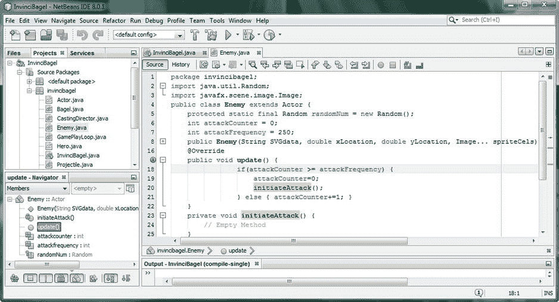

图 17-30。

Create a conditional if using attackCounter inside the .update( ) method that calls initiateAttack( ) method

在这公认的高级章节中，我们将编写的大部分“自动攻击”代码将利用这一点。update()方法，该方法将从。从 GamePlayLoop 类运行游戏的 handle()方法。我安装这个的原因是。update()方法，您需要在每个 Actor 子类中覆盖它，以防您想要在游戏中制作动画。如果参与者是静态的，则。update()方法只是作为一个空的或未使用的方法存在。

### 在屏幕两侧攻击:。initiateAttack()方法

让你的攻击来自屏幕两侧的方法是有一个布尔变量，可以设置为右(真)或左(假)，我们将称之为 takeSides。在敌方类的顶部声明这个变量，然后在你的。update()方法。在这个里面。initiateAttack()方法，创建一个空的 if-else 结构`if(takeSides){}else{}`来保存您的攻击编程逻辑，因此`private void initiateAttack(){if(takeSides){}else{}}`如果您正在编写超级紧凑的 Java 代码(这是有效的 Java 代码，但是到目前为止什么也没有做)。如果您遵循行业标准的 Java 8 代码格式化实践，您将用来实现这个空基础设施的 Java 方法体可以在图 [17-31](#Fig31) 中看到，应该如下所示:

`boolean``takeSides`T2】

`private void``initiateAttack()`T2】

`if(``takeSides`T2】

```java
// Empty Statement

} else { // Empty Statement }

}
```

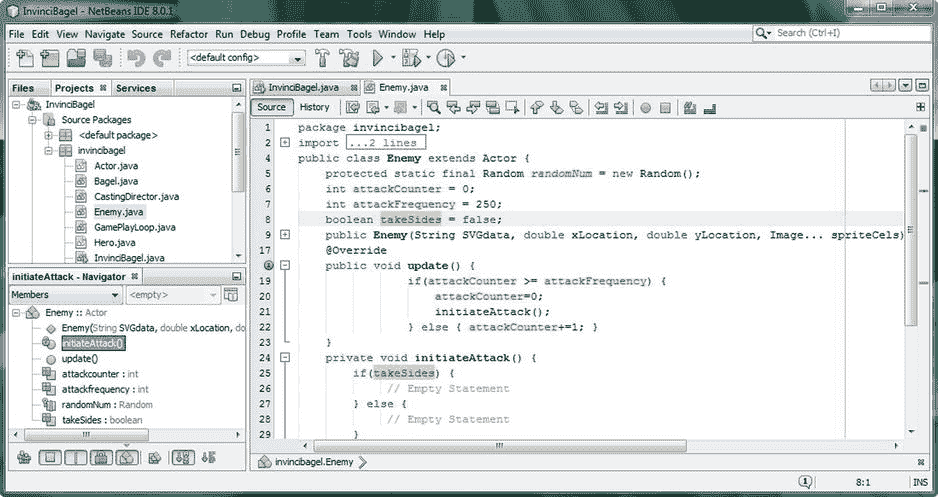

图 17-31。

Add an if-else structure inside of the initiateAttack() method, to alternate between the left and right sides

在 if(takeSides){}结构中，使用`spriteFrame.setTranslateX(500);`将敌人对象(在 InvinciBagel 类中命名为 iBeagle)设置为 X 位置 500，并在屏幕上设置为随机高度，使用 spriteFrame.setTranslateY()方法调用并结合我们在本章上一节中安装的随机数生成器对象。如果你输入你的 randomNum 对象名，然后点击句点键，你会看到一些方法调用选项，如图 [17-32](#Fig32) 所示。双击 nextInt(int bound)选项，并在。setTranslateY()方法。

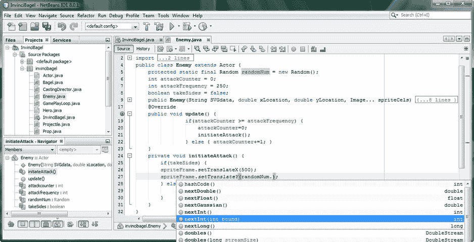

图 17-32。

Use a randomNum Random object inside of the .setTranslateY() method and use a period to call selector

接下来您要做的是声明一个名为 attackBoundary 的整型变量，该变量将在。nextInt()方法调用，这样，如果您愿意，以后可以在 Enemy.java 类顶部的一个易于编辑的位置更改 Y 轴(屏幕底部)边界。Java 语句应该如下所示:

`int``attackBoundary`T2】

现在我们已经准备好完成翻转 iBeagle 敌人角色(sprite)的 Java 代码，这样他就面向正确的方向，然后我们就可以测试代码了。用合乎逻辑的、易于理解的步骤编写复杂的 Java 代码是很重要的。通过这种方式，您可以在编写代码时对其进行测试，确保编程逻辑的每个组件都能正常工作，而不会增加额外的复杂性。在本章中你会看到这个工作过程，因为我们在 Enemy.java 类中开发了一个健壮的自动攻击算法。这个自动攻击代码可以用于你将来创建的任何敌人物体；因此，您在本章中编写的代码将涵盖过多的坏人攻击！

这里需要注意的是，由于 takeSides 是布尔型的，并且只能有两个值——true 或 false，所以我们只需要实现一个简单的条件 if-else 结构。这是因为如果我们的 if(takeSides)条件等于 true，那么我们知道 false 值(else 条件)逻辑结构将处理 takeSides=false 场景。

在这两个 if{}和 else{}攻击逻辑处理结构中，我们将围绕 Y 轴翻转 sprite 图像，记住设置 isFlipH 变量以备将来使用，将 sprite X 位置设置为屏幕的一侧或另一侧，将 sprite Y 位置设置为屏幕上的随机高度值，然后将 takeSides 布尔变量设置为与其当前 true 或 false 数据值相反的值。这样，iBeagle 敌人演员对象将在屏幕的左侧和右侧交替出现。稍后，我们将使用。nextBoolean()方法，来自 Random 类，使攻击不可预测。请记住，我们是从简单开始的，随着代码的开发，复杂性会增加。基本 initiateAttack()方法体的 Java 代码在图 [17-33](#Fig33) 中显示无误，应该如下所示:

`private void``initiateAttack()`T2】

`if(``takeSides`T2】

`spriteFrame.setScaleX(``1`T2】

`this.setIsFlipH(``false`T2】

`spriteFrame.setTranslateX(``500`T2】

`spriteFrame.setTranslateY(``randomNum``.nextInt(``attackBoundary`T4】

`takeSides =``false`T2】

`}``else`T2】

`spriteFrame.setScaleX(``-1`T2】

`this.setIsFlipH(``true`T2】

`spriteFrame.setTranslateX(``100`T2】

`spriteFrame.setTranslateY(``randomNum``.nextInt(``attackBoundary`T4】

`takeSides =``true`T2】

```java
}

}
```

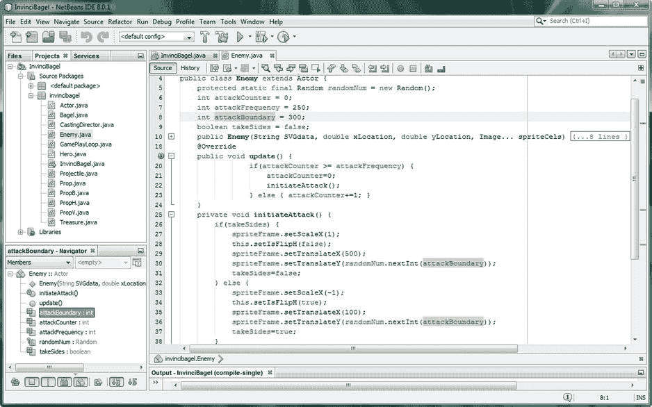

图 17-33。

Add the logic inside the if-else structure that flips the sprite and positions it on either side of the screen

#### 给敌人提供能量。update()方法:使用 GamePlayLoop。handle()方法

在我们开始测试 Enemy.java 类中的代码之前。update()方法，我们必须将其“连接”到。GamePlayLoop.java 类中的 handle()方法。如您所知，该方法是我们进入 JavaFX 脉冲计时事件处理引擎的入口，该引擎以闪电般的 60 FPS 速度驱动我们的游戏。现在我们的游戏循环。handle()方法将更新 iBagel InvinciBagel 字符以及 iBeagle 敌人自动攻击编程逻辑。很容易看出为什么 InvinciBagel 和 InvinciBeagle 是敌人；这是一种身份危机，有点像那些拼错的域名纠纷！如图 [17-34](#Fig34) 所示，您的 Java 代码看起来如下:

```java
@Override
```

`public void``handle`T2】

`invinciBagel.``iBagel`T2】

`invinciBagel.``iBeagel`T2】

```java
}
```

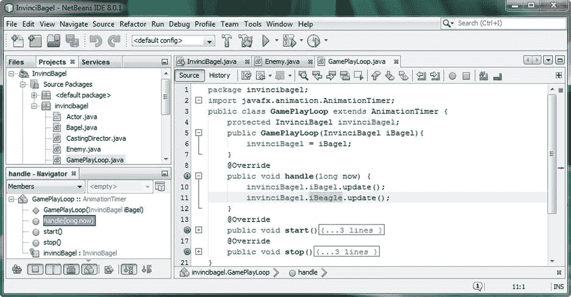

图 17-34。

Add a call to the invinciBagel.iBeagle.update() method inside of the GamePlayLoop .handle() method

使用“运行➤项目”工作流程来测试您的第一轮(级别)敌人自动攻击 Java 代码。如图 [17-35](#Fig35) 所示，InvinciBeagle 出现在屏幕的两侧，沿着 Y 轴的随机位置，并在屏幕的左侧和右侧之间交替出现。我让子弹和奶油干酪球投射体演员对象暂时在屏幕上可见，在左上角。我们最终会把这些放到屏幕外，每隔几秒钟就用无敌小猎犬的强力火箭筒向它射击。

为了保持我们对 JavaFX 场景图节点对象的使用得到优化，我们将在投射体对象击中 InvinciBagel 时重用它们。这种“子弹回收”将在几个方法中使用 Java 编程逻辑来完成，我们将在本章中继续编写越来越高级的游戏编程逻辑。

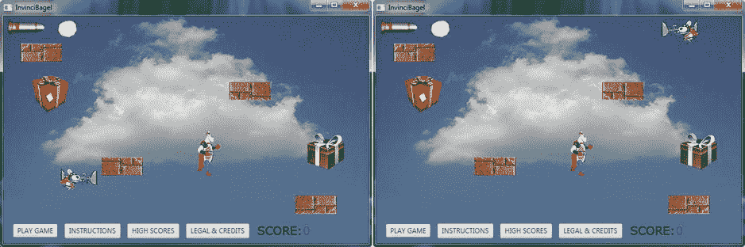

图 17-35。

Use the Run ➤ Project to test your code; left half shows left side attack, right half shows right side attack

现在我们准备让敌人在屏幕上和屏幕外移动，以增加惊喜的元素。我们将对这个动画进行编码，而不是使用另一个动画类，因为我们试图只使用一个 AnimationTimer 类(object)作为优化策略来做所有的事情，到目前为止效果非常好。

### 增加惊奇的元素:动画你的敌人攻击

为了让我们的敌人走上舞台，我们需要定义布尔变量来保持“屏幕上不在屏幕上”的状态，我称之为“屏幕上”,以及一个开关，一旦敌人出现在屏幕上，我可以按下它，告诉他发动攻击，我将命名为 callAttack。我们还需要整数变量来保存当前敌人 sprite 的左右 X 位置，名为 spriteMoveR 和 sprite Mover，以及一个目的变量来保存我们希望敌人停止和发射投射物体的位置。在图 [17-36](#Fig36) 的顶部附近可以看到突出显示的 Java 声明语句，应该类似于下面的 Java 代码:

`boolean``onScreen`T2】

`boolean``callAttack`T2】

`int``spriteMoveR``,``spriteMoveL``,``destination`T6】

我们需要做的第一件事。update()方法，就是添加一个 if(！callAttack) if-else 条件结构围绕着我们已经有的 if(attack counter > = attack frequency)结构。我们将把`attackCounter = 0;`初始化语句留在这个内部循环中，我们将添加一个`spriteMoveR = 700;`和一个`spriteMoveL = -70;`初始化语句。这些会把敌人的精灵放在舞台两边的屏幕外。

callAttack 布尔标志允许我们在。update()和。如您所见，在。update()方法，在 attackCounter (timer)让玩家有足够的时间在敌人攻击后恢复理智之后，这个 callAttack 变量被设置为 true (attack)值。在更复杂的版本中。initiateAttack()方法，您将把这个 callAttack 变量设置为 false(延迟攻击)值，启动 attackCounter。

让我们也做一个 Java 代码优化。我们在 initiateAttack()方法中进行了两次 setTranslateY()方法调用，并且只进行了一次方法调用(这表示随机对象的使用节省了 100%)。nextInt()方法调用)。一旦所有这些编程语句就绪，您就可以最终将 callAttack 布尔变量设置为真值，以便下一次 if(！callAttack)条件 if-else 结构被调用，该结构底部的 else 部分将执行，并将调用 initiateAttack()方法。这种方法是真正繁重的工作，直到将敌人角色动画显示在屏幕上，让他暂停并开火，然后在 InvinciBagel 执行(碰撞)他之前撤退到屏幕外，获得 10 个有价值的得分点。

一旦在条件编程逻辑的 attackCounter timer 部分内将 callAttack 变量设置为 true 值，该 if-else 编程结构的 else 部分将调用 initiateAttack()函数。

一旦您的条件 if()计时器逻辑到期(完成其倒计时)，您的敌人 sprite 将沿 Y 轴随机定位，并使用 spriteMoveR 和 spriteMoveL 变量移动到其起始位置，下次 callAttack 变量设置为 false 时，attackCounter 将重置为零。在 Java 语句的“设置发起攻击”序列的末尾，使用以下代码将 callAttack 设置为 true，如图 [17-36](#Fig36) 所示:

```java
public void update() {
```

`if(``!callAttack`T2】

`if(attackCounter``>=`T2】

`attackCounter =``0`T2】

`spriteFrame.setTranslateY(randomNum.``nextInt`T2】

`spriteMoveR =``700`T2】

`spriteMoveL =``-70`T2】

`callAttack``=``true`T3】

```java
} else { attackCounter+=1; }
```

`}``else``{``initiateAttack()`T4】

```java
}
```

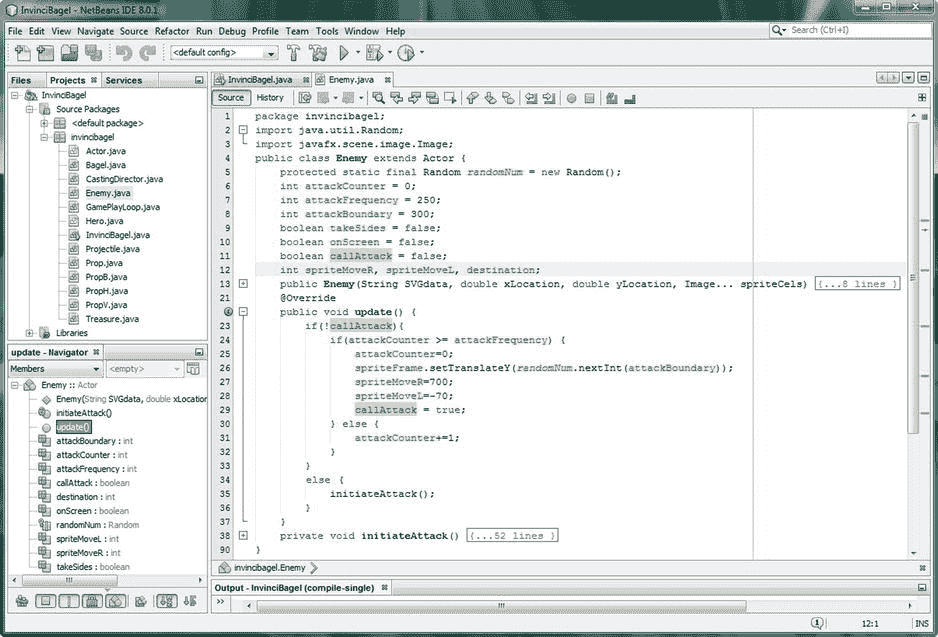

图 17-36。

Add callAttack, spriteMove and destination variables and an if(callAttack)-else programming structure

接下来，我们将重写 if(takeSides)逻辑结构，删除 Y 轴随机数定位语句，重新定位 takeSides 布尔标志程序逻辑，并添加 if(！屏幕上)嵌套结构，位于. setTranslateX()方法调用周围。这将允许我们在屏幕上和屏幕外制作敌人角色精灵的动画。

在 if(！takeSides)结构，您将保留设置 sprite 镜像(面向方向)的前两条语句，但删除。setTranslateY()方法调用，因为现在已经在。update()方法。添加 if(！屏幕上)条件结构，其中您将把目标位置初始化为 500 像素，然后嵌套另一个计数器 if(spriteMoveR >= destination)结构，在该结构中，您将使用`spriteMoveR-=2;`和`spriteFrame.setTranslateX(spriteMoveR);`将 sprite 移动两个像素/脉冲，以便在计数器改变时实际移动 sprite，从而利用 sprite 动画(移动)逻辑中的计数器变量。

if-else 结构的 else 部分将(最终)使用我们即将编写的. shootpulse()方法发射射弹，由于 sprite 现在在屏幕上，我们将把屏幕上的布尔标志变量设置为 true 值，这将触发第二个 if(屏幕上)条件逻辑结构。这将使用敌人精灵出现在屏幕上的一半速度(每次计数器迭代移动一个像素)从屏幕上移除敌人精灵。

第二个嵌套条件 if(屏幕上)结构的逻辑与第一个非常相似。您将把目的地设置为 700 像素(将敌人的精灵放回屏幕外，并再次置于视野之外)，这一次，您将使用+=1 而不是-=2 进行迭代，这不仅会使敌人向相反的方向移动，因为是正的而不是负的，而且还会使用用于发动攻击的初始速度的一半，因为您移动了一个像素而不是两个像素。

if(屏幕上)条件 if-else 结构的真正区别在于编程逻辑的 else 部分，我们不仅将屏幕上的布尔标志变量设置回 false，而且还将 takeSides 布尔变量设置为 true，这样敌人将使用屏幕的另一侧进行下一次攻击尝试。

最后，由于攻击序列已经完成，我们还将 callAttack 布尔标志变量设置为 false。如您所知，这将在。update()方法，这将给你的玩家几秒钟的时间从被攻击中恢复过来。整个 if(！idspnonenote)的 Java 结构。takeSides)条件结构及其嵌套的 if(屏幕上)条件结构在图 [17-37](#Fig37) 中突出显示，应该如下所示:

```java
private void initiateAttack() {
```

`if(``!takeSides`T2】

```java
spriteFrame.setScaleX(1);

this.setIsFlipH(false);
```

`if(``!onScreen`T2】

`destination =``500`T2】

`if(spriteMoveR``>=`T2】

`spriteMoveR``-=2`T2】

`spriteFrame.setTranslateX(``spriteMoveR`T2】

`}``else`T2】

```java
// ShootProjectile();
```

`onScreen``=``true`T3】

```java
}
```

`if(``onScreen`T2】

`destination =``700`T2】

`if(spriteMoveR``<=`T2】

`spriteMoveR``+=1`T2】

`spriteFrame.setTranslateX(``spriteMoveR`T2】

`}``else`T2】

`onScreen``=``false`T3】

`takeSides``=``true`T3】

`callAttack``=``false`T3】

```java
}

}
```

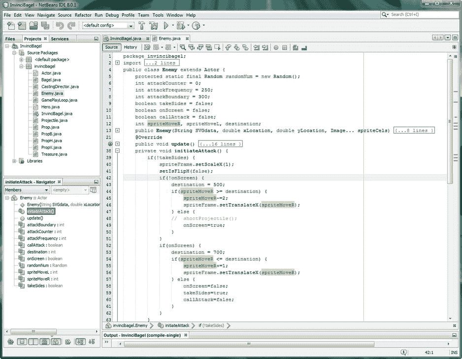

图 17-37。

Add an if(onScreen) level of processing inside the if(!takeSides) logic to animate sprite from the right side

在第二个 if(takeSides)结构中，在 if(！屏幕上)结构，将目标位置初始化为 100 像素，并嵌套另一个计数器 if(spriteMoveL <= destination)结构。这一次，你将使用`spriteMoveL+=2;`和`spriteFrame.setTranslateX(spriteMoveL);`在相反的方向移动精灵，每脉冲移动精灵两个像素。在 else 部分，将屏幕上的布尔标志变量设置为 true 值。

第二个嵌套条件 if(屏幕上)结构的逻辑也与第一个类似。您将目的地设置为-70 像素，这一次，您将使用-=1 而不是+=1 进行迭代。在编程逻辑的 else 部分，我们将再次将屏幕上的布尔标志变量设置回 false，并将 takeSides 布尔变量设置回 false，这样敌人将再次交替使用屏幕的另一边进行下一次攻击。

最后，由于攻击序列已经完成，我们将再次将 callAttack 布尔标志变量设置为 false。如您所知，这将在。update()方法，这将给你的玩家几秒钟的时间从被攻击中恢复过来。图 [17-38](#Fig38) 中突出显示了整个 if(takeSides)条件结构的 Java 结构及其嵌套的 if(onScreen)条件结构，应该如下所示:

`if(``takeSides`T2】

```java
spriteFrame.setScaleX(-1);

this.setIsFlipH(true);
```

`if(``!onScreen`T2】

`destination =``100`T2】

`if(spriteMoveL``<=`T2】

`spriteMoveL``+=2`T2】

`spriteFrame.setTranslateX(``spriteMoveL`T2】

`}``else`T2】

```java
// ShootProjectile();
```

`onScreen``=``true`T3】

```java
}
```

`if(``onScreen`T2】

`destination =``-70`T2】

`if(spriteMoveL``>=`T2】

`spriteMoveL``-=1`T2】

`spriteFrame.setTranslateX(``spriteMoveL`T2】

`}``else`T2】

`onScreen``=``false`T3】

`takeSides``=``false`T3】

`callAttack``=``false`T3】

```java
}

}
```


图 17-38。

Add an if(onScreen) level of processing inside the if(takeSides) logic to animate a sprite from the left side

## 武器化的敌人:射击抛射物体

现在我们已经有了敌人在屏幕两边的动画，我们需要增加的下一个复杂层次是投射物体的射击。我们将首先实现 iBullet 对象(负分数生成)，然后实现 iCheese 对象(正分数生成)，这两个对象都需要我们的 Enemy.java 类能够看到 InvinciBagel 类。因此，我们需要做的第一件事是使用 Java this 关键字修改 Enemy()构造函数方法以接受 InvinciBagel 对象，就像我们对 Bagel()构造函数方法所做的那样。进入 InvinciBagel.java 类，将 this 关键字添加到敌方()构造函数参数列表的前端(开头)，如图 [17-39](#Fig39) 中突出显示的，使用以下修改后的敌方()构造函数方法调用:

`iBeagle = new``Enemy``(``this`T4】

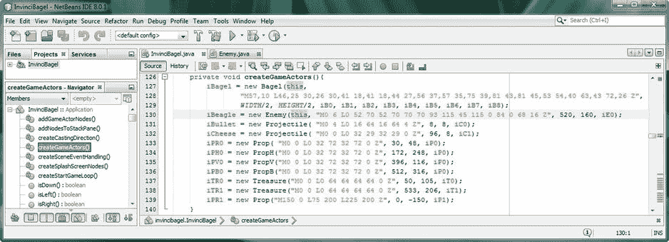

图 17-39。

Add a Java this keyword inside the Enemy() constructor method call to pass over the InvinciBagel object

要做到这一点，您还需要更新您的 Enemy.java 类来容纳 InvinciBagel 对象。在 Enemy.java 类的顶部添加一个`InvinciBagel invinciBagel;`对象声明，并通过在参数列表定义的头端(开头)添加一个 InvinciBagel iBagel 参数来编辑您的 Enemy()构造函数方法以支持该对象。在 Enemy()构造函数方法内部，将 invinciBagel InvinciBagel 对象设置为等于传递到其参数列表中的 Enemy()构造函数方法的 iBagel InvinciBagel 对象引用。修改后的 Enemy()构造函数方法体的 Java 代码如图 [17-40](#Fig40) 所示，应该如下所示:

```java
InvinciBagel invinciBagel;
```

`public Enemy(``InvinciBagel iBagel`T2】

```java
String SVGdata, double xLocation, double yLocation, Image... spriteCels) {

super(SVGdata, xLocation, yLocation, spriteCels);

invinciBagel = iBagel;

spriteFrame.setTranslateX(xLocation);

spriteFrame.setTranslateY(yLocation);

isAlive = true;

isBonus = true;

hasValu = true;

}
```

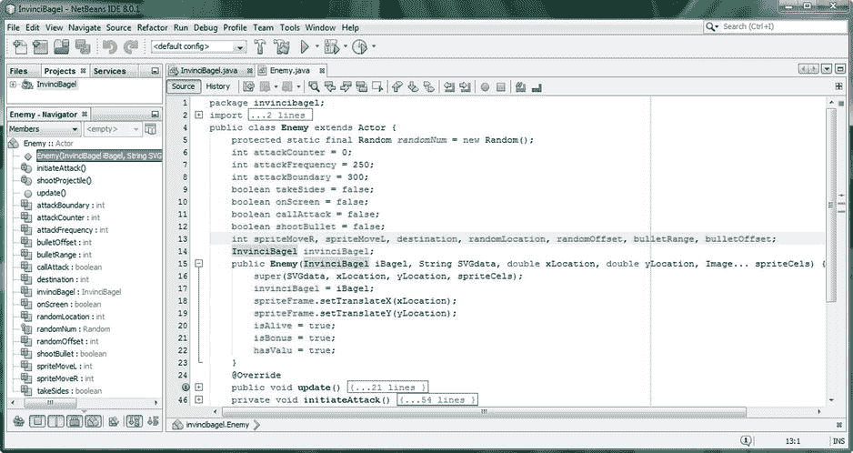

图 17-40。

Modify the Enemy() constructor method in the Enemy class to add an InvinciBagel object named iBagel

现在敌人的职业(对象)可以看到不可战胜的职业(对象)，我们准备添加投射物。

### 创建射弹基础设施:添加射弹变量

为了给敌人职业增加投射支持，我们需要在职业的顶端声明四个新的变量。这些将包括 randomLocation，一个新的变量，我们将用于敌人角色和他发射的炮弹；randomOffset，一个新的变量，它将保持垂直(Y)偏移，允许我们微调射弹的位置，以便它从火箭筒中出来；bulletRange 和 bulletOffset 允许我们进行 X 定位。我们将把 randomLocation 变量设置为等于 random num . nextint(attack boundary)逻辑，它过去位于。setTranslateY()方法调用，并给这个变量加 5，创建 randomOffset 变量的数据值。这些方法的新 Java 结构是无错误的，如图 [17-41](#Fig41) 所示，应该看起来像下面的 Java 代码:

```java
int spriteMoveR, spriteMoveL, destination;
```

`int``randomLocation``,``randomOffset`T4】

```java
public void update() {

if(callAttack) {

if(attackCounter >= attackFrequency) {

attackCounter=0;

spriteMoveR = 700;

spriteMoveL = -70;
```

`randomLocation``=``randomNum.nextInt(attackBoundary)`T3】

`spriteFrame.setTranslateY(``randomLocation`T2】

`randomOffset``=``randomLocation + 5`T3】

```java
callAttack = true;

} else { attackCounter+=1; }

} else {     initiateAttack(); }

}
```

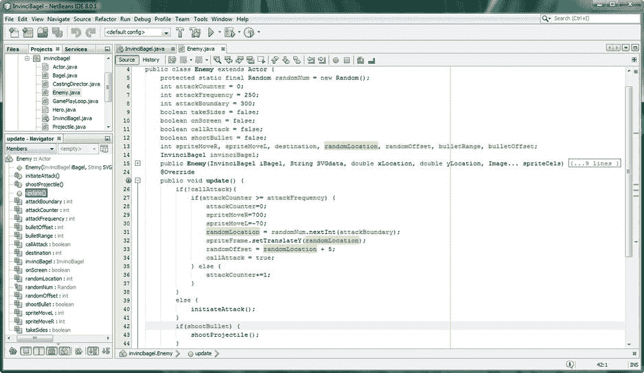

图 17-41。

Add randomLocation, randomOffset, bulletRange, and bulletOffset variables to control bullet placement

还要注意，在图 [17-41](#Fig41) 的底部，我们还添加了一个`if(shootBullet){shootProjectile();}`条件 if 结构到。update()方法，以及在 Enemy.java 类的顶部添加一个`boolean shootBullet = false;`声明。在我们编写。方法，让我们将 shootBullet 标志设置添加到。initiateAttack()方法，以及在 if(！屏幕上)。

### 调用. shootpropellet()方法:将 shootBullet 设置为 True

在每个 if(takeSides)条件 if-else 结构中，在语句的 else 部分添加一个 bulletOffset 变量设置(480 或 120 ),并将 shootBullet 设置为 true。如图 [17-42](#Fig42) 所示，Java 代码将如下所示:

```java
if(takeSides) {

spriteFrame.setScaleX(1);

this.setIsFlipH(false);

if(!onScreen) {

destination = 500;

if(spriteMoveR >= destination) {

spriteMoveR-=2;

spriteFrame.setTranslateX(spriteMoveR);

} else {
```

`bulletOffset``=``480`T3】

`shootBullet``=``true`T3】

```java
onScreen = true;    }
```

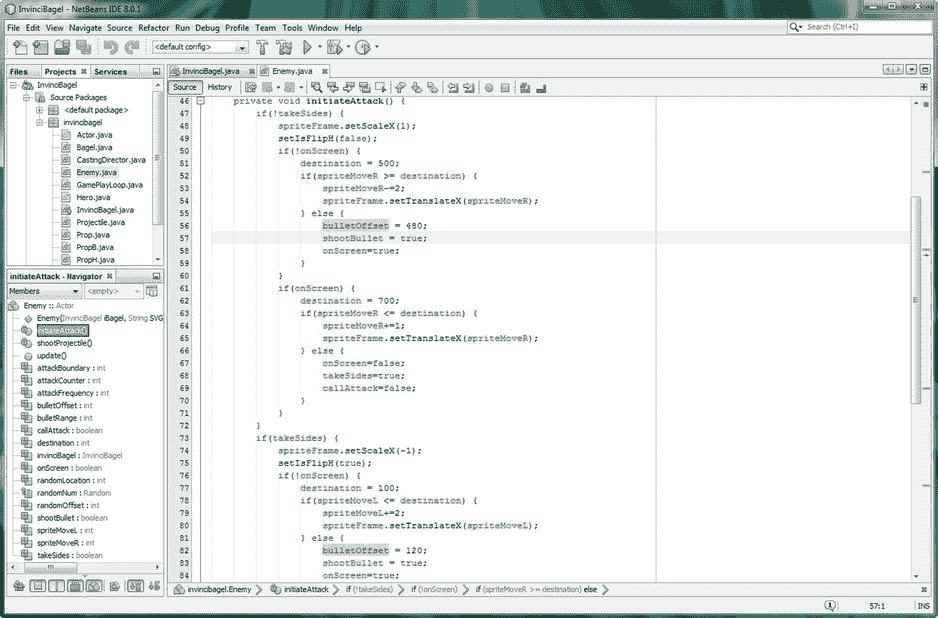

图 17-42。

Add bulletOffset values and shootBullet=true statements into the sprite-reached-destination else body

现在您已经在。update()方法，该方法将调用。shootProjectile()方法从 iBeagle 敌方角色 bazooka 中发射抛射体对象，我们可以开始创建代码，以类似于我们创建敌方动画功能的方式来制作 iBullet 对象(以及后来的 iCheese 对象)的动画。

### 射弹:编码。shootProjectile()方法

如果您还没有创建一个空的`private void shootProjectile(){}`方法结构来消除代码中那些红色的波浪状错误，现在您可以这样做了。在这个方法中，我们将再次使用 if(！takeSides)和 if(takeSides)条件结构，以分离舞台每一侧的不同逻辑。这类似于我们在动画中将敌人角色放到屏幕上。initiateAttack()方法。第一个 Java 语句将定位 Y 位置，这次使用。对 iBullet.spriteFrame ImageView 对象的 setTranslateY()方法调用。randomOffset 变量调整相对于火箭筒的子弹位置。接下来的两个。setScaleX 和。setScaleY()方法调用将项目符号图像比例减半(0.5)，并使用-0.5 值翻转项目符号。有趣的是，任何负值，不仅仅是-1，都会围绕一个轴镜像。下一行代码将 bulletRange 变量设置为-50，然后 if(bullet offset>= bullet range)条件语句使用每脉冲四个像素的高速设置将项目符号设置为动画。它的编码方式与我们对敌人精灵的编码方式相同，即使用 bulletOffset 变量，该变量用于。在条件语句的 if 部分内调用 iBullet.spriteFrame ImageView 对象的 setTranslateX()方法。if-else 语句的 else 部分将 shootProjectile 变量设置为 false，所以只发射一次！

if(takeSides)条件 if 结构的 Java 代码是类似的，只是它使用+=4、bullet range 624 和 if(bulletOffset <= bulletRange) evaluation statement. Your Java code for these if(!takeSides) and if(takeSides) structures inside of the shootProjectile() method body can be seen in Figure [17-43](#Fig43) ，应该如下所示:

`private void``shootProjectile()`T2】

`if(``!takeSides`T2】

`invinciBagel.iBullet.spriteFrame.setTranslateY(``randomOffset`T2】

`invinciBagel.iBullet.spriteFrame.setScaleX(``-0.5`T2】

`invinciBagel.iBullet.spriteFrame.setScaleY(``0.5`T2】

`bulletRange``=``-50`T3】

`if(``bulletOffset >= bulletRange`T2】

`bulletOffset-=4` `;`

`invinciBagel.iBullet.spriteFrame.setTranslateX(``bulletOffset`T2】

`}``else``{``shootBullet``=``false`T6】

```java
}
```

`if(``takeSides`T2】

`invinciBagel.iBullet.spriteFrame.setTranslateY(``randomOffset`T2】

`invinciBagel.iBullet.spriteFrame.setScaleX(``0.5`T2】

`invinciBagel.iBullet.spriteFrame.setScaleY(``0.5`T2】

`bulletRange``=``624`T3】

`if(``bulletOffset <= bulletRange`T2】

`bulletOffset+=4` `;`

`invinciBagel.iBullet.spriteFrame.setTranslateX(``bulletOffset`T2】

`}``else``{``shootBullet``=``false`T6】

```java
}

}
```

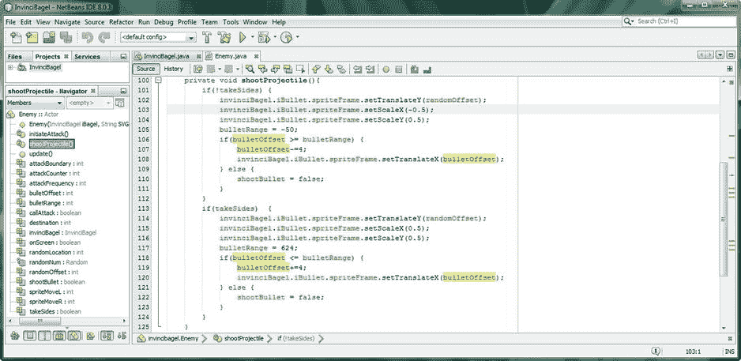

图 17-43。

Add private void shootProjectile() method and code the if(!takeSides) and if(takeSides) if-else statements

如果你现在使用运行➤项目的工作流程，你会看到你的 iBeagle 在屏幕上显示动画，射出一颗子弹，然后迅速退出屏幕。我们需要添加到代码中的下一层真实感是让 iBeagle 在瞄准和发射子弹时暂停一秒钟，因为目前看起来他好像碰到了一个无形的障碍，并从屏幕上反弹回来。我们将通过在。update()方法。让我们接着做，这样我们就有了一个完全专业的敌人自动攻击序列！

### 让敌人在开火前暂停:pauseCounter 变量

为了让敌人在屏幕上暂停，让他的射击动作看起来更真实，也为了让 InvinciBagel 角色有一些时间去尝试擒抱他(稍后我们会给它分配 10 个得分点)，让我们在 Enemy.java 类的顶部添加一个整数 pauseCounter 变量和一个布尔 launchIt 变量，如图 [17-44](#Fig44) 中突出显示的。在 if(shootBullet)条件语句中，在 shootBullet()方法调用之后，放置一个 if(pauseCounter > = 60)条件结构，并在其中将 launchIt 设置为 true，并将 pauseCounter 变量重置为零。在条件的 else 部分，使用 pauseCounter++将 pauseCounter 递增 1，然后我们所要做的就是将 launchIt 布尔标志实现到我们的 initiateAttack()方法中，我们将有一个敌人角色，他在瞄准和射击 InvinciBagel 角色时会从容不迫。你的这个 if(shootBullet) if-else 结构的 Java 代码可以在图 [17-44](#Fig44) 中看到，应该看起来像下面的代码:

`if(``shootBullet`T2】

```java
shootProjectile();
```

`if(``pauseCounter >= 60`T2】

`launchIt = true` `;`

```java
pauseCounter = 0;
```

`}``else``{``pauseCounter++`T4】

```java
}
```

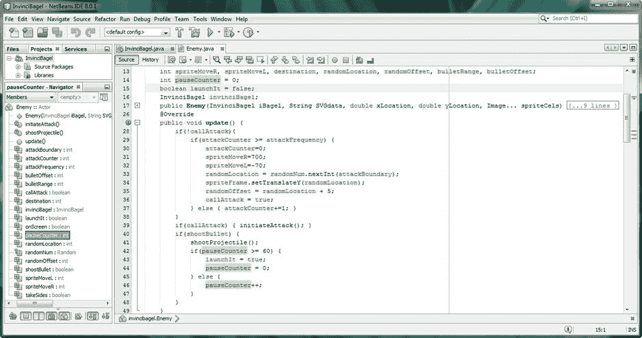

图 17-44。

Add a pauseCounter variable to create a timer, creating a one-second delay, so Enemy doesn't bounce

### 射出子弹:使用 launchIt 变量扣动扳机

在每个 if(takeSides)和 if(！takeSides)条件 if 结构，将 if(屏幕上)结构改为 if(屏幕上&&启动)结构，然后将一个`launchit = false;`语句添加到这个修改后的结构的 else 部分。新 if()结构的 Java 代码如图 [17-45](#Fig45) 所示，如下所示:

`if(``onScreen``&&``launchIt`T4】

```java
destination = 700;

if(spriteMoveR <= destination) {

spriteMoveR+=1;

spriteFrame.setTranslateX(spriteMoveR);

} else {

onScreen   = false;
```

`takeSides  = true;    // This will be``false``if inside of the``if(takeSides)`T4】

```java
callAttack = false;
```

`launchIt``=``false`T3】

```java
}
```

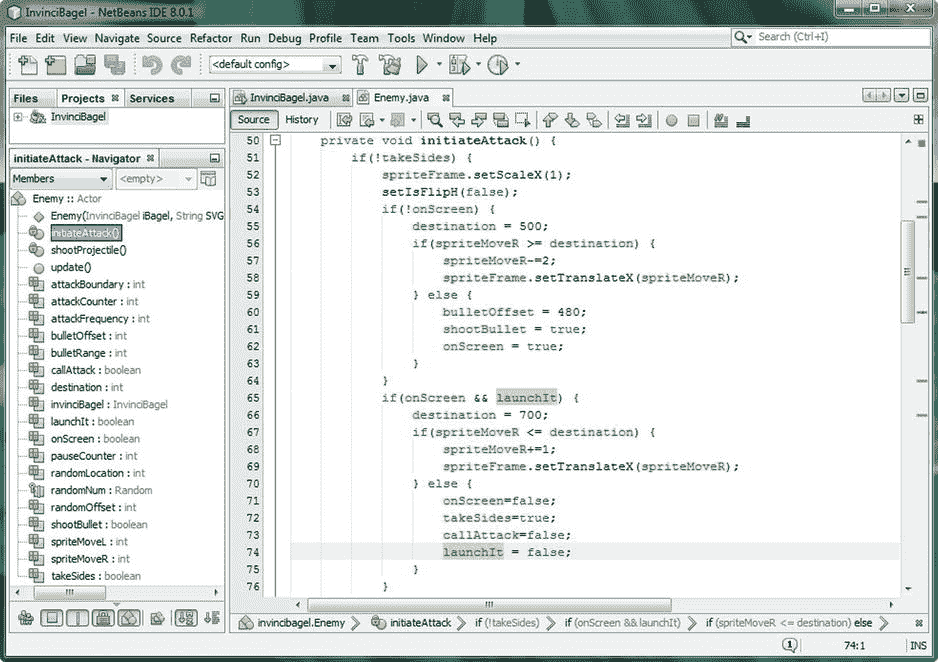

图 17-45。

Add a launchIt flag to the if(onScreen) condition to make that code structure wait for the pauseCounter

对于这个 if(屏幕和启动)结构的 if(takeSides)版本，确保将 destination 更改为-70，使计数器 if(sprite level > = destination)和计数器 update `spriteMoveL-=1;`以及 takeSides 在这个条件结构的 else 部分中等于 false。接下来，让我们在 Bagel 类中更新我们的评分引擎。

## 更新。scoringEngine()方法:使用。等于( )

让我们对最后三个对象使用不同的方法——else-if 结构，而不是使用 if(object instanceof Actor)进行更一般的对象类型比较，我们将使用更精确的。equals()方法，允许我们指定对象本身，比如 if(object . equals(invincibagel . I bullet)。你可以在图 [17-46](#Fig46) 中看到完整的 if-else 结构，最后三个敌方对象的 Java 代码如下所示:

`} else if(object.``equals``(invinciBagel.``iBullet`T4】

`invinciBagel.gameScore``-=5`T2】

```java
invinciBagel.playiSound5;
```

`} else if(object.``equals``(invinciBagel.``iCheese`T4】

`invinciBagel.gameScore``+=5`T2】

```java
invinciBagel.playiSound0;
```

`} else if(object.``equals``(invinciBagel.``iBeagle`T4】

`invinciBagel.gameScore``+=10`T2】

```java
invinciBagel.playiSound0;   }
```

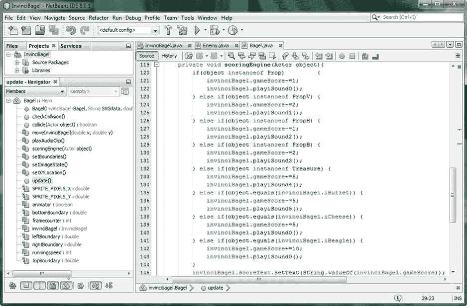

图 17-46。

Adding the iBullet, iCheese and iBeagle object.equals() if-else structures to the .scoringEngine() method

在这一点上，如果您使用运行➤项目工作流程，您应该有一个 iBeagle 拍摄子弹或奶油奶酪球。当你抓到有无敌手角色的 iBeagle，你应该得到十分，或者，如果你抓到一个奶油芝士球，你应该得到五分。如果你被子弹击中，你应该会失去五分。

当你测试 InvinciBagel 游戏应用时，你会注意到，一旦你被子弹、奶酪球击中，或者当你抓住 iBeagle 时，它们就不会回来了！这是因为碰撞检测编程逻辑会在无敌手收集到某个物体(宝藏)或与之发生碰撞(道具或投射物)时将该物体从游戏中移除。

因此，我们开发的下一步将是添加编程逻辑，一旦 iBullet、iCheese 或 iBeagle 对象被您在第 16 章中放置的冲突检测编程逻辑删除，就将它们添加回 castDirector 对象。要做到这一点，我们必须为 CastingDirector.java 类编写一个增强代码，编写新的。loadEnemy()，。loadBullet()和。loadCheese()方法，并将实现这三个新方法的适当编程逻辑添加到。initiateAttack()方法。

## 将项目符号添加到剪辑:更新。addCurrentCast()

因为我们要将单个(一次一个，不是未婚)演员对象添加回 CURRENT_CAST 列表，所以我们需要修改。addCurrentCast()方法，因为它当前只接受一个参与者。。。我们需要它容纳一个添加的 Actor 对象，就像 addToRemovedActors()方法当前所做的那样。你可以看到。图 [17-47](#Fig47) 底部的 addToRemovedActors()方法。的。addCurrentCast()方法被设计为在 InvinciBagel.java 类中静态使用，在 start()方法中，一次添加所有的角色转换成员(记住静态与动态)。现在我将向您展示如何重新设计它，以允许在游戏过程中进行“一次性”添加，这是该方法的动态使用，因为列表<演员>将在游戏过程中实时动态修改。升级。addCurrentCast()方法，只需将。addAll()方法调用在具有 if(actors.length > 1) if-else 结构的方法内，原始代码在 if()部分内，一个`CURRENT_CAST.add(actors[0]);`语句在 else 部分内，以适应单个 Actor 方法调用。新方法结构的 Java 代码如图 [17-47](#Fig47) 所示，应该如下所示:

```java
public void addCurrentCast(Actor... actors) {
```

`if(``actors.length > 1`T2】

```java
CURRENT_CAST.addAll(Arrays.asList(actors));
```

`}``else`T2】

`CURRENT_CAST.add(``actors[0]`T2】

```java
}

}
```

需要注意的是，我们也可以通过重载这个来实现这个目标。addCurrentCast()方法。如果您想以这种方式实现这一点，Java 代码将类似于以下方法体:

`public void addCurrentCast(``Actor... actors`T2】

`CURRENT_CAST.``addAll``(Arrays.asList(``actors`T4】

```java
}
```

`public void addCurrentCast(``Actor actor`T2】

`CURRENT_CAST.``add``(``actor`T4】

```java
}
```

一旦您的游戏设计变得更加高级，并且舞台上有了装饰性的演员对象，您就可以在 if()结构中实现 COLLIDE_CHECKLIST，该结构需要迭代(仅)场景中需要进行碰撞处理的演员对象。

在我们游戏设计的这一点上，我们正在处理所有角色对象的碰撞，因此，我们还不需要实现 COLLIDE_CHECKLIST List <actor>数组。我把它包含在职业设计中是为了更彻底，因为我通过展望未来来设计游戏的基础职业，为了让我创建一个先进的(完整的)游戏引擎，我需要什么。也就是说，我们可能没有足够的页面来让初学者的标题变得更高级，但是如果你需要在游戏中使用它，功能就在那里，在这一章之后，你会有很多使用 if()结构的经验！</actor>

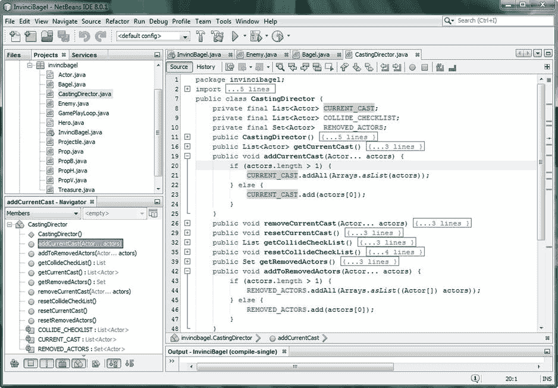

图 17-47。

升级 CastingDirector 类中的 addCurrentCast()方法，以接受参数列表中的单个对象

既然我们可以在单个基础上添加 cast 成员，那么是时候编写允许我们检查 CURRENT_CAST List <actor>数组的方法了，以确保有 iBullet、iCheese 和 iBeagle Actor 对象可供我们在自动攻击引擎的下一次迭代中使用。这些方法要做的是在 CURRENT_CAST 列表中查找这些 Actor 对象，如果它们不存在，就将它们中的一个添加到列表中，这样它就为我们的条件 if()语句和随机数生成器一起创建的任何类型的攻击做好了准备！</actor>

我们将编写三个方法，一个用于致命抛射，称为。load bullet()；一种是健康的抛射物，叫做。loadCheese()；另一个用于敌方对象，称为 loadEnemy()。这将给我们最终的灵活性，在我们游戏开发的后期，在它自己的“补充功能”中调用每种类型的功能性演员对象类型

每个方法都将使用 for()循环和. size()方法调用来遍历整个 CURRENT_CAST 列表。这样，从第一个元素(零)到最后一个元素(列表的大小)，整个列表都被处理。

如果在转换中没有找到该类型的 Actor 对象，也就是说，如果完成了 for()循环，并且在使用 object.equals()在整个 CURRENT_CAST 列表<actor>中查找匹配之后没有找到该类型的对象，那么将执行 for 循环之后的两个语句。</actor>

第一条语句将向 CURRENT_CAST 列表<actor>添加一个该类型的 Actor 对象，然后第二条语句将向 JavaFX SceneGraph 添加一个该类型的 Actor 对象。此时，该方法完成，然后将控制权返回给调用实体。</actor>

如果在 CURRENT_CAST List <actor>数组中找到该类型的 Actor 对象，将调用一个`return` `;`语句来立即退出该方法，并将控制返回给调用实体。这意味着不会执行 for()循环末尾的语句，这些语句将该类型的新 Actor 对象添加到造型中，并将新 Actor 对象添加到 JavaFX 场景图形根对象中。</actor>

这个`return;`语句是使这个方法工作的核心组件，因为如果任何该类型的 Actor 对象存在，一个重复的 Actor 对象将不会被添加到 List < Actor >数组中，这将导致错误发生。这是一个很好的方法来确保我们只为每种类型的投射物和敌人对象使用一个节点，这允许我们优化内存和处理器开销。这三种方法的 Java 8 编程结构非常相似，如图 [17-48](#Fig48) 所示。三个私有 void 方法体应该如下所示:

`private void``loadBullet()`T2】

`for``(int i=0; i<invinciBagel.castDirector.getCurrentCast().``size()`T3】

`Actor``object``= invinciBagel.castDirector.getCurrentCast().``get(i)`T4】

`if(``object.equals``(invinciBagel.``iBullet`T4】

```java
return;

}

}
```

`invinciBagel.castDirector.``addCurrentCast`T2】

`invinciBagel.root.``getChildren().add`T2】

```java
}
```

`private void``loadCheese()`T2】

`for``(int i=0; i<invinciBagel.castDirector.getCurrentCast().``size()`T3】

`Actor``object``= invinciBagel.castDirector.getCurrentCast().``get(i)`T4】

`if(``object.equals``(invinciBagel.``iCheese`T4】

```java
return;

}

}
```

`invinciBagel.castDirector.``addCurrentCast`T2】

`invinciBagel.root.``getChildren().add`T2】

```java
}
```

`private void``loadEnemy()`T2】

`for``(int i=0; i<invinciBagel.castDirector.getCurrentCast().``size()`T3】

`Actor``object``= invinciBagel.castDirector.getCurrentCast().``get(i)`T4】

`if(``object.equals``(invinciBagel.``iBeagle`T4】

```java
return;

}

}
```

`invinciBagel.castDirector.``addCurrentCast`T2】

`invinciBagel.root.``getChildren().add`T2】

```java
}
```

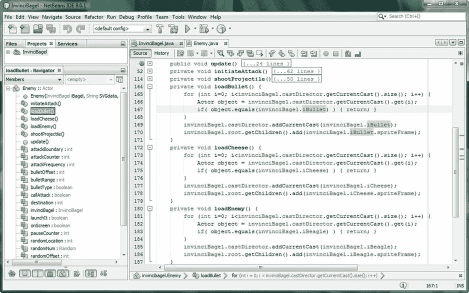

图 17-48。

Create loadBullet(), loadCheese() and loadEnemy() methods, to add another Enemy or Projectile to game

现在所有这些方法都准备好了，我们可以在。initiateAttack()自动攻击方法体，并让它们工作，检查在我们发动下一次攻击之前是否需要添加一个投射物或敌人物体。调用这些方法调用的适当位置应该是在敌人对象出现在屏幕上，并且抛射体对象已经启动之后，这意味着这些方法调用需要出现在 if(屏幕和启动)结构的 else{}代码体的末尾。实现这三个方法调用的 Java 代码如图 [17-49](#Fig49) 所示，应该如下所示:

`if(``onScreen``&&``launchIt`T4】

```java
destination = 700;

if(spriteMoveR <= destination) {

spriteMoveR+=1;

spriteFrame.setTranslateX(spriteMoveR);
```

`}``else`T2】

```java
onScreen   = false;

takeSides  = true;    // This will be false if inside of the if(takeSides) structure

callAttack = false;

launchIt   = false;

loadBullet();

loadCheese();

loadEnemy();

}

}
```


图 17-49。

Add calls to loadBullet(), loadCheese() and loadEnemy() to end of “move Enemy offscreen” else structure

接下来，让我们为我们的游戏添加一个独特的转折，有一个奶油干酪球形式的抛射物，如果无敌面包圈能够将自己置于被它击中的位置，它将产生积极的分数。

## 射击奶油芝士球:不同的子弹类型

为了适应不同类型的射弹，我们需要声明一个新的布尔变量，我们将其命名为 bulletType，这样我们就可以拥有致命的射弹(iBullet)和健康的射弹(iCheese)。在。update()方法，在将 callAttack 设置为 true 以启动攻击序列之前，您将把这个 bulletType 变量设置为调用。由 randomNum 随机对象组成的 nextBoolean()方法。图 [17-50](#Fig50) 中突出显示的 Java 代码应该类似于以下 Java 语句:

`boolean``bulletType`T2】

`bulletType` `= randomNum.nextBoolean();`

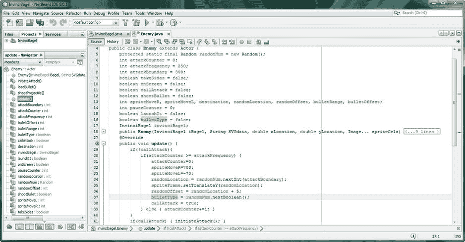

图 17-50。

Add a boolean bulletType variable at top of the Enemy class, then set it equal to .nextBoolean() method

为了实现这个布尔 bulletType 标志，我们需要将您的 if(！idspnonenote)转换为。takeSides) evaluator 成为 if(！bulletType &&！takeSides)赋值器，以便同时考虑屏幕的侧面和项目符号类型的布尔标志。如图 [17-51](#Fig51) 所示，新的条件 if()结构应该类似于下面的 Java 代码:

`if(``!bulletType``&&``!takeSides`T4】

`invinciBagel.``iBullet`T2】

`invinciBagel.``iBullet`T2】

`invinciBagel.``iBullet`T2】

```java
bulletRange = -50;

if(bulletOffset >= bulletRange) {

bulletOffset-=4;
```

`invinciBagel.``iBullet`T2】

```java
} else { shootBullet = false; }

}
```

`if(``!bulletType``&&``takeSides`T4】

`invinciBagel.``iBullet`T2】

`invinciBagel.``iBullet`T2】

`invinciBagel.``iBullet`T2】

```java
bulletRange = 624;

if(bulletOffset <= bulletRange) {

bulletOffset+=4;
```

`invinciBagel.``iBullet`T2】

```java
} else { shootBullet = false; }

}
```

接下来，我们需要对 bulletType 等于 true 值进行同样的转换。这将意味着使用奶油干酪作为抛射体对象类型。一旦我们将这些条件 if()结构放置到位，我们将为 takeSides 和 bulletType 的每个逻辑组合准备一个 if()结构。最后两个条件 if()结构应该如下所示:

`if(``bulletType``&&``!takeSides`T4】

`invinciBagel.``iCheese`T2】

`invinciBagel.``iCheese`T2】

`invinciBagel.``iCheese`T2】

```java
bulletRange = -50;

if(bulletOffset >= bulletRange) {

bulletOffset-=4;
```

`invinciBagel.``iCheese`T2】

```java
} else { shootBullet = false; }

}
```

`if(``bulletType``&&``takeSides`T4】

`invinciBagel.``iCheese`T2】

`invinciBagel.``iCheese`T2】

`invinciBagel.``iCheese`T2】

```java
bulletRange = 624;

if(bulletOffset <= bulletRange) {

bulletOffset+=4;
```

`invinciBagel.``iCheese`T2】

```java
} else { shootBullet = false; }

}
```

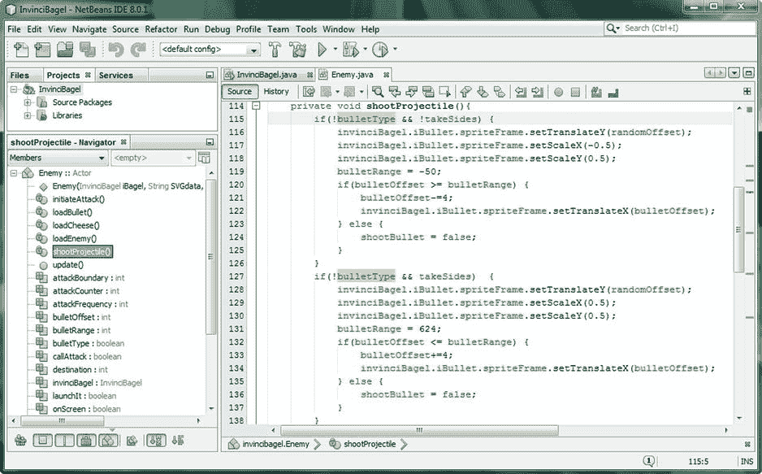

图 17-51。

Add bulletType to conditional if statement evaluation in shootProjectile() method, to shoot cream cheese

## 调整游戏:微调用户体验

现在，让我们花一点时间对代码做一些调整，自动攻击逻辑正在工作，以确保我们的游戏是专业的。在游戏启动时，将 iBeagle、iBullet 和 iCheese 对象置于屏幕之外，方法是使用与 sprite 图像资源的宽度相同(或更大)的负 X 位置值来更改这些对象的每个构造函数方法中的 X 和 Y 位置参数，如图 [17-52](#Fig52) 所示。

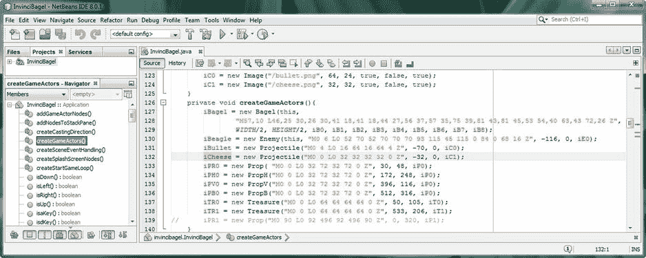

图 17-52。

Modify X and Y parameters for all Enemy and Projectile constructor methods, to place them off-screen

你可能也注意到了投射物在敌人的火箭筒上面，所以让我们改变 iBeagle 对象的 z-index，这样投射物就从枪后面来了。为此，请将您的。在 iBullet 之后，iBagel 之前，在。addGameActorNodes()方法，如图 [17-53](#Fig53) 所示。

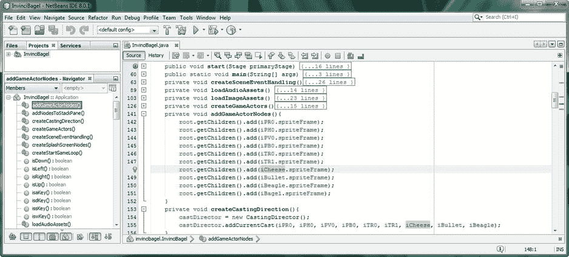

图 17-53。

Change z-index of iCheese and iBullet in the addGameActorNodes() method so they’re before iBeagle

现在让我们给这个自动攻击游戏增加更多的真实感，随机选择敌人精灵从哪边出现，这样玩家就不知道会发生什么。目前，我们正在交替两边，所以我们需要在代码中的战略位置添加一个随机的 takeSides 布尔标志。接下来我们来写这段代码。

### 随机化自动攻击:使用。带 takeSides 的 nextBoolean

尽管我们在完成攻击后退出 initiateAttack()方法之前设置了 takeSides 布尔标志，但并没有说我们不能在调用攻击之前通过在 if(attack counter > = attack frequency)结构中将 callAttack 设置为 true 来再次设置它，您可以在图 [17-54](#Fig54) 中看到我已经使用以下 Java 语句完成了这一点:

```java
takeSides = randomNum.nextBoolean;
```

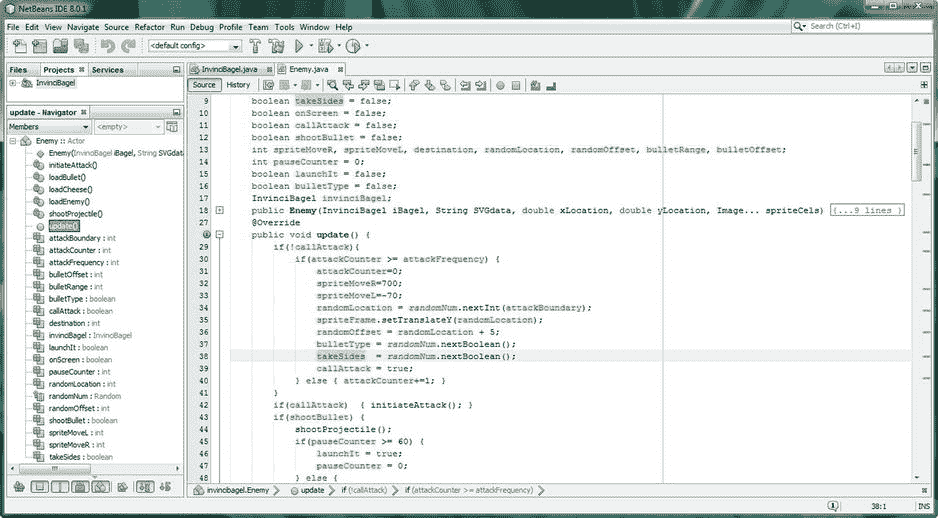

图 17-54。

Set the boolean takeSides variable to use a .nextBoolean() method call off a randomNum Random object

现在您已经在敌人内部以这种方式设置了 takeSides 布尔标志变量。update()方法，您可以通过移除`takeSides = true;`和`takeSides = false;`语句来进一步优化您的代码，这两个语句当前位于您的 if(屏幕上的&T5】launch it)else 语句中(参考图 [17-45](#Fig45) )。

因为这些交替的布尔值现在将被。在 if(！idspnonenote)中调用 nextBoolean()方法。callAttack)结构，它们可以被安全地移除，因为 if(！callAttack)条件结构随机设置这两个布尔值。这样做的结果是，现在 iBeagle 敌人演员对象将随机出现在屏幕的任何一侧，游戏玩家无法预测攻击来自哪里。

使用一个 Run ➤项目工作流程，玩游戏并测试游戏，如图 [17-55](#Fig55) 所示。你会注意到的第一件事是，我们所有的 z 索引字符层排序是正确的。你还会看到你的敌人和投射物在游戏启动时是不可见的，这是向专业的最终用户体验又迈进了一步。

你会注意到让无敌舰队就位要困难得多，因为你不知道敌人的攻击会从哪里、什么时候、从什么方向来！嗯，这并不完全正确，因为我们需要随机化 attackFrequency 变量，以使“当他出现”部分不会在均匀的时间间隔内被触发。既然我们的目标是让这个游戏越来越具有挑战性和专业性，那就让我们开始吧！

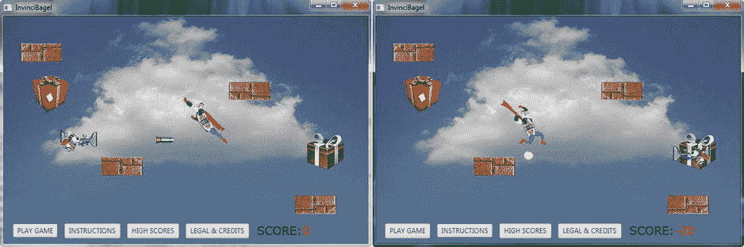

图 17-55。

Use a Run ➤ Project work process to test the game and the enemy attack, bullet types, and scoring engine

在这一章的剩余部分，我们将增加一些功能，使游戏更具挑战性和真实性。我们将添加一些重要的游戏设计元素，如随机化、人工智能和物理模拟，所有这些都将使您的 Java 8 游戏更加专业和受欢迎。在我们完成核心 Java 8 游戏开发周期的第一轮(初学者)之前，您需要对这些概念有所了解。

### 加入出其不意的元素:随机攻击频率

现在，我们已经使屏幕上的进入点以及用于攻击的屏幕侧边完全随机，让我们进入第四维(时间)并使攻击发生的时间也随机。这是通过随机化 attackFrequency 变量来实现的，在此之前我们已经将它设置为 4.167 秒(250/60FPS)。我们将在。initiateAttack()方法，我们在其中设置您的布尔标志设置并调用。load()方法，我们创建这些方法是为了确保自动攻击引擎总是有敌人和投射物可以使用。我们将把一个随机值插入到 if(屏幕和启动)条件结构的 else 部分末尾的 attackFrequency 变量中，这样当。update()方法开始将此变量用于其攻击延迟计数器编程逻辑。自从。nextInt(int bounds)方法调用结构给了我们一个介于零和上限之间的随机整数，为了得到一个介于一秒(60)和九秒(60+480)之间的攻击延迟范围，我们需要将 randomNum 生成的值加上 60。语句的 nextInt (480)部分，然后将 attackFrequency 变量设置为该值。这个攻击频率随机化语句的 Java 代码如图 [17-56](#Fig56) 所示，应该如下所示:

`attackFrequency =``60 +``randomNum.nextInt(``480`T4】

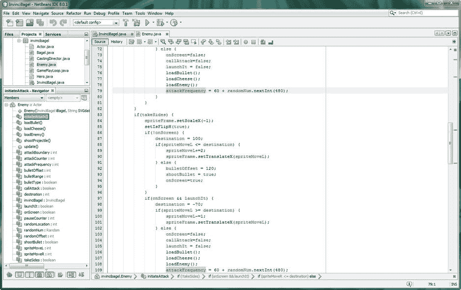

图 17-56。

Add an attackFrequency statement incorporating a .nextInt(bounds) method in if (onScreen && launchIt)

正如您在使用“运行➤项目”工作流程时所看到的，您不再能够计算任何给定的敌人攻击何时开始！让我们让自动攻击引擎变得更加智能，通过告诉它 InvinciBagel 角色在屏幕上的位置(Y 坐标)，这样自动攻击引擎就可以更有效地针对他！

### 瞄准不可战胜的怪物:增加敌人的人工智能

为了让游戏玩起来更有挑战性，我们应该做的下一件事是告诉自动攻击引擎 iBagel 在屏幕上的位置，这是一项人工智能收集任务，因为我们控制了所有的 Java 代码，所以变得更容易！为此，我们将创建一个保存 InvinciBagel Y 屏幕高度位置值的变量，而不是使用 randomLocation 随机 Y 屏幕高度位置值，从而为敌人提供有关 iBagel 对象在屏幕上的位置的内部信息。这是使用 iBagel Hero 对象的 iY 属性完成的，我们使用。getiY() getter 方法，然后在。setTranslateY()方法调用。我们使用 integer(而不是 double)作为 iBagelLocation 数据类型，所以我们需要“转换”从。getiY()方法，以便它与 iBagelLocation 变量兼容。如图 [17-57](#Fig57) 所示的 Java 代码应该如下所示:

`int``iBagelLocation`T2】

`iBagelLocation` `=` `(int)` `invinciBagel.iBagel.` `getiY()`

`spriteFrame.setTranslateY(``iBagelLocation`T2】

`randomOffset =``iBagelLocation`T2】

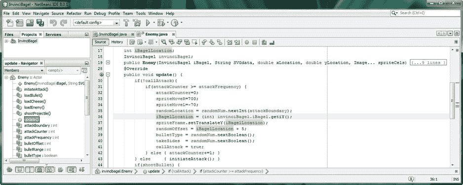

图 17-57。

Declare iBagelLocation integer variable, cast a double iY variable to it, and use it to create randomOffset

如果您使用“运行➤项目”工作流程来测试您的代码，您将会看到投射物现在瞄准了 invincibagel 角色，无论您将他放在屏幕的什么位置！这对于利用致命的 iBullet 抛射体 Actor 对象的攻击来说是非常好的，但是当自动攻击引擎使用 iCheese 抛射体 Actor 对象时，就太容易得分了。因此，如果自动攻击引擎要发射奶油干酪球，我们将需要添加另一层使用 randomLocation 变量的代码，如果自动攻击引擎要发射致命(真实)子弹，则需要添加 iBagelLocation 变量。我们将把这个逻辑结构放在。update()方法，其中我们创建了 randomLocation 和 iBagelLocation 变量值(使用。nextBoolean()或。getiY()方法调用)，就在确定 bulletType 之后，使用 randomNum 随机对象的. nextBoolean()方法调用。

我们将要创建的 if(bulletType)条件 if 结构将使用一个. setTranslateY()方法调用，传递一个 randomLocation 参数，如果 bulletType 等于一个真值(iCheese)，并将使用。如果 bulletType 等于 false 值(iBullet ),则使用 if-else 结构的 else{}部分传递 iBagelLocation 参数的 setTranslateY()方法调用。在 if-else 结构每一部分的第二行代码中，我们将记住设置 randomOffset 变量，在该结构的 if 部分中向 randomLocation 变量添加五个像素，或者在 else 部分中向 iBagelLocation 变量添加五个像素，使用下面的代码，如图 [17-58](#Fig58) 所示:

```java
if(attackCounter >= attackFrequency) {

attackCounter=0;

spriteMoveR = 700;

spriteMoveL = -70;
```

`randomLocation` `= randomNum.nextInt(attackBoundary);`

`iBagelLocation` `= (int) invinciBagel.iBagel.getiY();`

`bulletType` `= randomNum.nextBoolean();`

`if(``bulletType`T2】

`spriteFrame.setTranslateY(``randomLocation`T2】

`randomOffset =``randomLocation`T2】

`}``else`T2】

`spriteFrame.setTranslateY(``iBagelLocation`T2】

`randomOffset =``iBagelLocation`T2】

```java
}

callAttack = true;

} else { attackCounter+=1; }
```

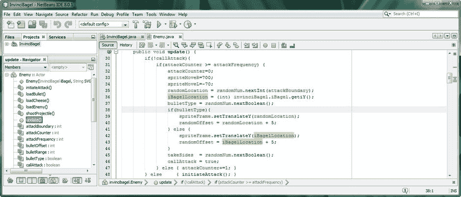

图 17-58。

Add an if-else structure after the bulletType, randomLocation, and iBagelLocation to locate by bulletType

## 给子弹增加重力:游戏物理学导论

由于物理计算倾向于使用分数而不是整数，我们需要将 randomOffset 从复合整数声明中取出，并使其成为一个`double randomOffset;`声明，如图 [17-59](#Fig59) 所示。此外，您需要为 bulletGravity 和 cheeseGravity 声明双变量，并将它们的值设置为 0.2 和 0.1。

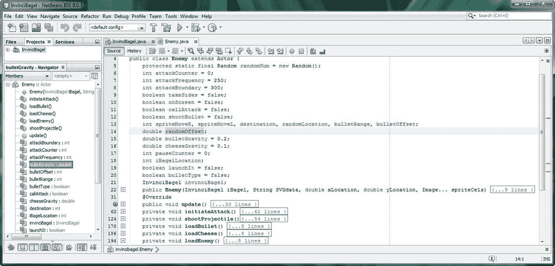

图 17-59。

Declaring bulletGravity and cheeseGravity double variables, and converting randomOffset to a double

我们想要做的是在每一帧的随机偏移(Y 位置)上添加一个 bulletGravity(或 cheeseGravity)因子，这样我们就可以在镜头上获得轻微的“拖尾”效果。这将模拟重力将抛射体拉向地球。我们将把它放在 if(bulletOffset >= bulletRange)计数器循环中，这样重力因子只在投射物在屏幕上飞行可见时应用。在图 [17-60](#Fig60) 中可以看到将 bulletGravity 和 cheeseGravity 调整到投射物体轨迹的 Java 代码，它应该类似于下面的代码:

```java
private void shootProjectile() {

if(!bulletType && !takeSides) {

invinciBagel.iBullet.spriteFrame.setTranslateY(randomOffset);

invinciBagel.iBullet.spriteFrame.setScaleX(-0.5);

invinciBagel.iBullet.spriteFrame.setScaleY(0.5);

bulletRange = -50;

if(bulletOffset >= bulletRange) {
```

`bulletOffset``-=6`T2】

```java
invinciBagel.iBullet.spriteFrame.setTranslateX(bulletOffset);

randomOffset = randomOffset + bulletGravity;

} else { shootBullet = false; }

}

if(!bulletType && takeSides) {

invinciBagel.iBullet.spriteFrame.setTranslateY(randomOffset);

invinciBagel.iBullet.spriteFrame.setScaleX(0.5);

invinciBagel.iBullet.spriteFrame.setScaleY(0.5);

bulletRange = 624;

if(bulletOffset <= bulletRange) {
```

`bulletOffset``+=6`T2】

```java
invinciBagel.iBullet.spriteFrame.setTranslateX(bulletOffset);

randomOffset = randomOffset + bulletGravity;

} else { shootBullet = false; }

}

if(bulletType && !takeSides) {

invinciBagel.iCheese.spriteFrame.setTranslateY(randomOffset);

invinciBagel.iCheese.spriteFrame.setScaleX(-0.5);

invinciBagel.iCheese.spriteFrame.setScaleY(0.5);

bulletRange = -50;

if(bulletOffset >= bulletRange) {
```

`bulletOffset``-=4`T2】

```java
invinciBagel.iCheese.spriteFrame.setTranslateX(bulletOffset);

randomOffset = randomOffset + cheeseGravity;

} else { shootBullet = false; }

}

if(bulletType && takeSides) {

invinciBagel.iCheese.spriteFrame.setTranslateY(randomOffset);

invinciBagel.iCheese.spriteFrame.setScaleX(0.5);

invinciBagel.iCheese.spriteFrame.setScaleY(0.5);

bulletRange = 630;

if(bulletOffset <= bulletRange) {
```

`bulletOffset``+=4`T2】

```java
invinciBagel.iCheese.spriteFrame.setTranslateX(bulletOffset);

randomOffset = randomOffset + cheeseGravity;

} else { shootBullet = false; }

}

}
```

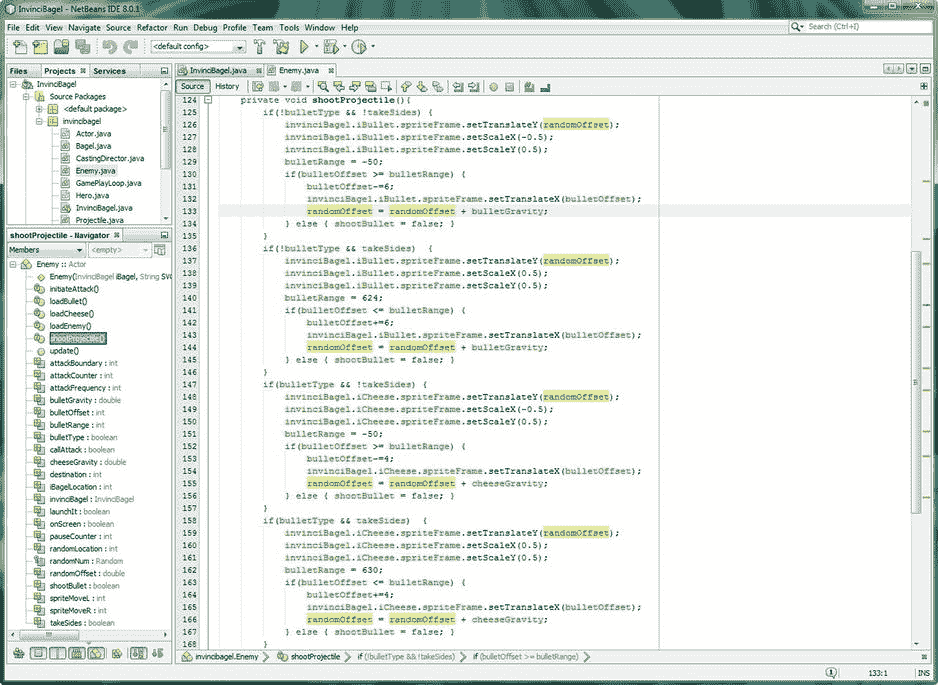

图 17-60。

Adding physics simulation of gravity to the Projectile object's trajectory in the .shootProjectile() method

## 摘要

在第十七章，也是最后一章，我们使用了我们在本书过程中构建的游戏引擎的所有基础元素，并为 InvinciBagel 游戏创建了基本的游戏玩法，包括一个得分引擎和一个自动攻击引擎，以及随机攻击策略和基本的物理模拟来增强真实性。我们学习了如何使用 JavaFX 8.0 Text 和 Font 类来创建游戏上的记分牌输出，以及如何使用 Java 8 Random 类作为随机数生成器来使我们的自动攻击引擎看起来像有自己的生命一样。我们还通过编写一个 Treasure.java 类为游戏添加了奖金，并创建了一个. scoringine()方法来跟踪和组织我们的得分算法。我们学习了更多关于优化的知识，使用带有`break;`的 if-else-if 循环，还学习了如何使用`return;`来提前中断一个方法，我们使用这两种技术在我们的游戏逻辑中获益匪浅。我们在游戏中添加了敌人角色和投射物，并学习了如何在游戏背后实现背景板。我试图超越一本基本的初学者 Java 8 书籍，向您展示创建游戏引擎基础架构所涉及的工作流程，包括设计思维过程，如何利用 Java 8 和 JavaFX 8.0 中的关键类，以及如何使用新的媒体资产和优化技术。