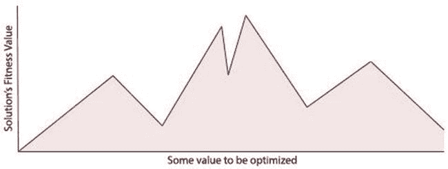
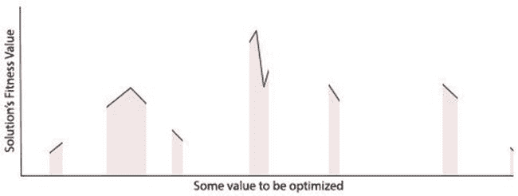
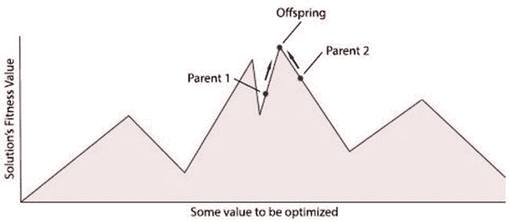
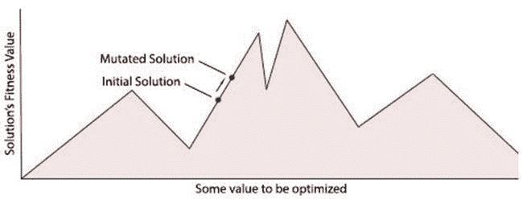
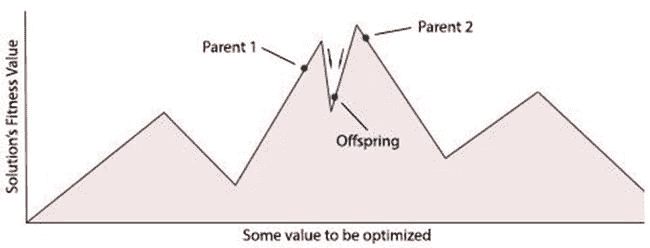
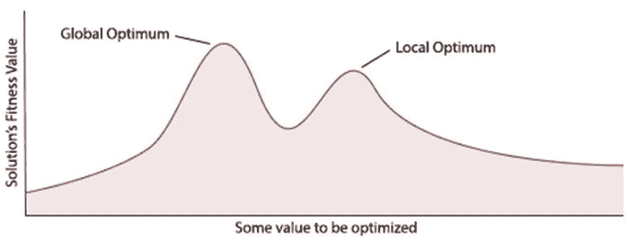
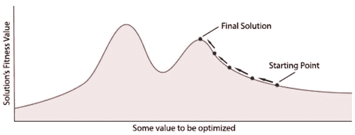
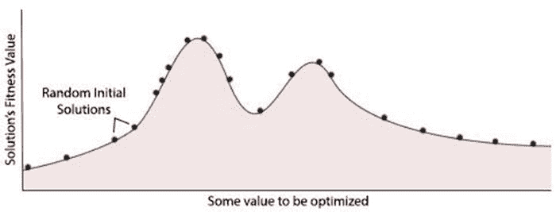
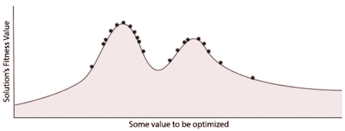
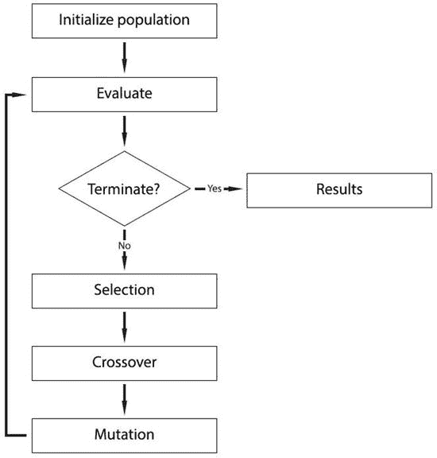

# 一、简介

Electronic supplementary material The online version of this chapter (doi:[10.​1007/​978-1-4842-0328-6_​1](http://dx.doi.org/10.1007/978-1-4842-0328-6_1)) contains supplementary material, which is available to authorized users.

数字计算机和信息时代的兴起彻底改变了现代生活方式。数字计算机的发明使我们能够将生活的许多领域数字化。这种数字化使我们能够将许多繁琐的日常工作外包给计算机，而以前可能需要人类来完成。这方面的一个日常例子是现代文字处理应用，它具有内置的拼写检查功能，可以自动检查文档中的拼写和语法错误。

随着计算机发展得越来越快，计算能力越来越强，我们已经能够使用它们来完成越来越复杂的任务，例如理解人类的语言，甚至在一定程度上准确地预测天气。这种不断的创新使我们能够将越来越多的任务外包给计算机。今天的计算机可能每秒钟能够执行数十亿次运算，但是无论它们在技术上变得多么有能力，除非它们能够学习和适应更好地适应呈现给它们的问题，否则它们将永远受限于我们人类为它们编写的任何规则或代码。

人工智能领域和遗传算法子集正开始解决当今数字世界面临的一些更复杂的问题。通过将遗传算法应用到现实世界的应用中，有可能解决用更传统的计算方法几乎不可能解决的问题。

## 什么是人工智能？

1950 年，艾伦·图灵——一位数学家和早期的计算机科学家——写了一篇名为《计算机械和智能》的著名论文，他在文中质疑道:“计算机能思考吗？”他的问题引起了很多关于什么是真正的智能以及计算机的基本限制是什么的争论。

许多早期的计算机科学家认为，计算机不仅能够展示类似智能的行为，而且在短短几十年的研究中，它们将达到人类的智能水平。这一观点是由司马贺在 1965 年提出的，当时他宣称，“在 20 年内，机器将能够做任何人能做的工作。”当然，现在，50 多年过去了，我们知道西蒙的预测与现实相去甚远，但当时许多计算机科学家同意他的观点，并把创造“强人工智能”机器作为他们的目标。一台强大的人工智能机器仅仅是一台至少和人类一样有能力完成任何任务的机器。

今天，自艾伦·图灵的著名问题提出 50 多年后，机器是否最终能够以类似于人类的方式思考的可能性在很大程度上仍然没有答案。直到今天，他关于“思考”的意义的论文和思想仍然受到哲学家和计算机科学家的广泛争论。

尽管我们还远未创造出能够复制人类智能的机器，但在过去几十年里，我们无疑已经在人工智能方面取得了重大进展。自 20 世纪 50 年代以来，对“强人工智能”和开发可与人类相媲美的人工智能的关注开始转向支持“弱人工智能”。弱人工智能是开发更狭隘的智能机器，这在短期内更容易实现。这种更狭隘的关注让计算机科学家能够创造出实用且看似智能的系统，比如苹果的 Siri 和谷歌的无人驾驶汽车。

当创建一个弱人工智能系统时，研究人员通常会专注于构建一个系统或机器，它只是“智能”到需要完成一个相对较小的问题。这意味着我们可以应用更简单的算法，使用更少的计算能力，同时仍能获得结果。相比之下，强大的人工智能研究侧重于建造一台足够智能的机器，能够解决我们人类可以解决的任何问题。由于问题的范围，这使得使用强 AI 构建最终产品变得不太实际。

在短短几十年里，弱人工智能系统已经成为我们现代生活方式的一个常见组成部分。从下棋，到帮助人类驾驶战斗机，弱人工智能系统已经证明自己在解决曾经认为只有人类才能解决的问题方面是有用的。随着数字计算机变得越来越小，计算能力越来越强，这些系统的有用性可能只会随着时间的推移而增加。

## 生物类似物

当早期的计算机科学家第一次试图建立人工智能系统时，他们经常从大自然中寻找灵感，了解他们的算法如何工作。通过创建模拟自然界中发现的过程的模型，计算机科学家能够赋予他们的算法进化的能力，甚至复制人脑的特征。正是实现了他们受生物启发的算法，使得这些早期的先驱首次赋予他们的机器适应、学习和控制环境的能力。

通过使用不同的生物类比作为开发人工智能系统的指导性隐喻，计算机科学家创造了不同的研究领域。自然，启发了每个研究领域的不同生物系统都有它们自己特定的优势和应用。一个成功的领域，也是我们在本书中关注的领域，是进化计算——其中遗传算法构成了大部分研究。其他领域集中在稍微不同的领域，例如模拟人类大脑。这个研究领域被称为人工神经网络，它使用生物神经系统的模型来模仿其学习和数据处理能力。

## 进化计算的历史

进化计算最初是在 20 世纪 50 年代作为一种优化工具进行探索的，当时计算机科学家正在尝试将达尔文的生物进化思想应用于一群候选解。他们从理论上推断，也许可以应用进化算子，如交叉(类似于生物繁殖)和突变(将新的遗传信息添加到基因组中的过程)。正是这些操作符加上选择压力，使得遗传算法有能力在一段时间后“进化”出新的解决方案。

在 20 世纪 60 年代，Rechenberg (1965，1973)首先提出了“进化策略”——一种应用自然选择和进化思想的优化技术，他的思想后来被 Schwefel (1975，1977)扩展。当时，其他计算机科学家也在类似的研究领域独立工作，如 Fogel L . J；欧文斯，A . J；和 Walsh，M . J .(1966)，他们是第一个引入进化程序设计领域的人。他们的技术包括将候选解表示为有限状态机，并应用变异来创建新的解。

在 20 世纪 50 年代和 60 年代，一些研究进化的生物学家开始尝试用计算机模拟进化。然而，是 Holland，J.H. (1975)在 20 世纪 60 年代和 70 年代首先发明和发展了遗传算法的概念。1975 年，他终于在他的开创性著作《自然和人工系统中的适应》中提出了他的想法。霍兰德的书展示了达尔文进化论是如何通过计算机抽象和建模用于优化策略的。他的书解释了如何将生物染色体建模为 1 和 0 的字符串，以及如何通过实施自然选择中的技术(如突变、选择和交叉)来“进化”这些染色体的种群。

自 20 世纪 70 年代首次引入以来，几十年来，Holland 对遗传算法的最初定义逐渐发生了变化。这在某种程度上是因为最近在进化计算领域工作的研究人员偶尔会将不同方法的想法结合在一起。虽然这模糊了许多方法之间的界限，但它为我们提供了丰富的工具集，可以帮助我们更好地解决具体问题。本书中的术语“遗传算法”将被用来指霍兰德关于遗传算法的经典观点，以及更广泛的、现今的对这些词的解释。

直到今天，计算机科学家仍在研究生物学和生物系统，以便为他们提供创建更好算法的思路。最近受到生物学启发的优化算法之一是蚁群优化算法，它是由 Marco，D. (1992)于 1992 年首次提出的。蚂蚁群体优化将蚂蚁的行为建模为解决各种优化问题(如旅行商问题)的方法。

## 进化计算的优势

智能机器在我们社会中被采用的速度本身就是对它们有用性的认可。我们用计算机解决的绝大多数问题都可以归结为相对简单的静态决策问题。随着可能的输入和输出数量的增加，这些问题会迅速变得更加复杂，并且当解决方案需要适应不断变化的问题时，只会变得更加复杂。除此之外，一些问题可能还需要算法来搜索大量可能的解决方案，以试图找到可行的解决方案。根据需要搜索的解决方案的数量，经典的计算方法可能无法在可用的时间框架内找到可行的解决方案——即使使用超级计算机。正是在这种情况下，进化计算可以伸出援手。

为了给你一个我们可以用经典计算方法解决的典型问题的概念，考虑一个交通灯系统。交通灯是相对简单的系统，只需要基本的智能操作。交通灯系统通常只有几个输入，可以提醒它事件，如等待使用路口的汽车或行人。然后，它需要管理这些输入，并正确地改变信号灯，使汽车和行人能够有效地使用路口，而不会造成任何事故。尽管操作交通灯系统可能需要一定量的知识，但是它的输入和输出是足够基本的，以至于一组操作交通灯系统的指令可以由人类设计和编程而没有太大问题。

我们经常需要一个智能系统来处理更复杂的输入和输出。这可能意味着对人类来说，编写一组指令使机器能够正确地将输入映射到可行的输出不再简单，或者可能是不可能的。在这些情况下，问题的复杂性使得人类程序员无法用代码解决问题，优化和学习算法可以为我们提供一种方法，使用计算机的处理能力来找到问题本身的解决方案。这方面的一个例子可能是构建一个可以根据交易信息识别欺诈交易的欺诈检测系统。虽然交易数据和欺诈交易之间可能存在某种关系，但它可能取决于数据本身的许多细微之处。正是这些输入中的微妙模式可能很难被人类编码，这使得它成为应用进化计算的一个很好的候选。

当人类不知道如何解决问题时，进化算法也很有用。这方面的一个经典例子是，美国国家航空航天局(NASA)正在寻找一种能够满足 2006 年太空任务所有要求的天线设计。美国宇航局编写了一种遗传算法，该算法使天线设计符合所有特定的设计约束，如信号质量、尺寸、重量和成本。在这个例子中，NASA 不知道如何设计一个能满足他们所有要求的天线，所以他们决定写一个能进化出天线的程序。

我们可能想要应用进化计算策略的另一种情况是当问题不断变化，需要一个适应性的解决方案时。在构建算法对股市进行预测时，可以发现这个问题。在一周内对股票市场做出准确预测的算法可能在下一周内也不会做出准确预测。这是因为股票市场的模式和趋势永远在变化，因此预测算法非常不可靠，除非它们能够快速适应不断变化的模式。进化计算可以通过提供一种根据需要对预测算法进行调整的方法来帮助适应这些变化。

最后，有些问题需要在大量的，或者可能是无限量的潜在解决方案中进行搜索，以找到所面临问题的最佳或足够好的解决方案。从根本上说，所有的进化算法都可以被看作是搜索算法，它在一组可能的解决方案中搜索，寻找最好的或者“最合适的”解决方案。如果你把在一个有机体的基因组中发现的所有潜在的基因组合都看作是候选的解决方案，你也许能想象出这一点。生物进化擅长通过搜索这些可能的基因序列来找到一个充分适合其环境的解决方案。在更大的搜索空间中，即使使用进化算法，也可能找不到给定问题的最佳解决方案。然而，对于大多数优化问题来说，这很少是一个问题，因为通常我们只需要一个足够好的解决方案来完成工作。

进化计算提供的方法可以被认为是一种“自底向上”的范例。当算法中出现的所有复杂性都来自简单的、潜在的规则时。另一种方法是“自上而下”的方法，这种方法要求所有算法中的复杂性都由人类来编写。遗传算法开发起来相当简单；这使得它们在需要复杂算法来解决问题时成为一个有吸引力的选择。

下面是一个特征列表，这些特征可以使问题成为进化算法的一个很好的候选:

*   如果问题很难编写代码来解决
*   当一个人不确定如何解决问题时
*   如果问题是不断变化的
*   当搜索每个可能的解决方案不可行时
*   当“足够好”的解决方案可以接受时

## 生物进化

生物进化，通过自然选择的过程，最早是由查尔斯·达尔文(1859 年)在他的著作《物种起源》中提出的。正是他的生物进化概念启发了早期的计算机科学家去适应和使用生物进化作为他们的优化技术的模型，这可以在进化计算算法中找到。

因为遗传算法中使用的许多想法和概念直接源于生物进化，所以对该主题的基本熟悉有助于更深入地理解该领域。也就是说，在我们开始探索遗传算法之前，让我们先浏览一下生物进化的基础知识(有些简化)。

所有生物体都含有 DNA，它编码了构成生物体的所有不同特征。DNA 可以被认为是生命从零开始创造有机体的说明书。改变生物体的 DNA 会改变其特征，如眼睛和头发的颜色。DNA 由单个基因组成，正是这些基因负责编码生物体的特定特征。

一个有机体的基因聚集在染色体中，一套完整的染色体构成了一个有机体的基因组。所有生物都至少有一条染色体，但通常包含更多，例如人类有 46 条染色体，有些物种有超过 1000 条！在遗传算法中，我们通常将染色体称为候选解。这是因为遗传算法通常使用单个染色体来编码候选解。

特定性状的各种可能的设置被称为“等位基因”，该性状在染色体上编码的位置被称为“位点”。我们将特定的基因组称为“基因型”，基因型编码的物理有机体称为“表型”。

当两个生物体交配时，来自两个生物体的 DNA 被带到一起并以这样的方式结合，从而产生的生物体——通常被称为后代——从其第一个父母那里获得 50%的 DNA，另 50%从第二个父母那里获得。生物体 DNA 中的一个基因偶尔会发生突变，为它提供双亲都没有的 DNA。这些突变通过向种群中添加先前无法获得的基因，为种群提供了遗传多样性。群体中所有可能的遗传信息被称为群体的“基因库”。

如果产生的有机体足够适合在它的环境中生存，它可能会自我交配，允许它的 DNA 延续到未来的种群中。然而，如果产生的生物体不适合生存并最终交配，其遗传物质将不会传播到未来的种群中。这就是为什么进化偶尔被称为适者生存——只有最适者才能生存并传递他们的 DNA。正是这种选择性压力慢慢引导进化去寻找越来越适合和更好适应的个体。

### 生物进化的一个例子

为了帮助阐明这个过程将如何逐渐导致越来越健康的个体的进化，考虑下面的例子:

在一个遥远的星球上，存在着一种形状为白色正方形的物种。

白色的方形物种已经和平地生活了几千年，直到最近一个新的物种到来，黑色的圆形。

黑圈物种是食肉动物，开始以白方种群为食。

白色方块没有任何方法来保护自己免受黑色圆圈的攻击。直到有一天，其中一个幸存的白方随机从一个白方突变成了一个黑方。黑色圆圈不再把新的黑色方块视为食物，因为它和自己是同一个颜色。

一些幸存的广场人口交配，创造了新一代的广场。其中一些新方块继承了黑色方块的颜色基因。

然而，白色方块继续被吃掉…

最终，由于它们看起来与黑圈相似的进化优势，它们不再被吃掉。现在，正方形剩下的唯一颜色是黑色正方形。

不再受黑色圆圈的控制，黑色方块再次自由地生活在和平之中。

## 基本术语

遗传算法建立在生物进化的概念上，所以如果你熟悉进化中的术语，你可能会注意到在使用遗传算法时术语的重叠。这些领域之间的相似性当然是由于进化算法，更具体地说，遗传算法类似于自然界中发现的过程。

### 条款

重要的是，在我们深入到遗传算法领域之前，我们首先要理解一些使用的基本语言和术语。随着本书的进展，将根据需要引入更复杂的术语。下面列出了一些比较常见的术语，以供参考。

*   群体——这只是一个候选解决方案的集合，可以应用遗传操作符，如突变和交叉。
*   候选解决方案–给定问题的可能解决方案。
*   基因——构成染色体的不可分割的构件。传统上，一个基因由 0 或 1 组成。
*   染色体——染色体是一串基因。染色体定义了一个特定的候选解。具有二进制编码的典型染色体可能包含类似“01101011”的内容。
*   突变——候选解决方案中的基因被随机改变以创造新性状的过程。
*   交叉——染色体结合产生新的候选解的过程。这有时被称为重组。
*   选择——这是挑选候选解决方案以培育下一代解决方案的技术。
*   适合度–衡量候选解决方案适合给定问题的程度的分数。

## 搜索空间

在计算机科学中，当处理具有许多需要搜索的候选解的优化问题时，我们将解的集合称为“搜索空间”。搜索空间中的每个特定点都充当给定问题的候选解决方案。在这个搜索空间中，有一个距离的概念，距离较近的解决方案比距离较远的解决方案更有可能表达相似的特征。为了理解这些距离在搜索空间上是如何组织的，考虑下面使用二进制遗传表示的例子:

“101”和“111”只差 1 个。这是因为从“101”转换到“111”只需要 1 次改变(将 0 翻转到 1)。这意味着这些解决方案在搜索空间上仅相隔 1 个空间。

另一方面，“000”与“111”相差三个数量级。这使得它的距离为 3，将“000”放置在搜索空间中距离“111”3 个空格的位置。

因为具有较少变化的解决方案被分组为彼此更接近，所以搜索空间上的解决方案之间的距离可以用于提供另一个解决方案所具有的特性的近似。这种理解经常被许多搜索算法用作改善其搜索结果的策略。

### 健身景观

当在搜索空间内找到的候选解被标记为它们各自的适合度水平时，我们可以开始把搜索空间看作一个“适合度景观”。图 [1-1](#Fig1) 提供了一个 2D 健身景观的例子。

图 1-1。

A 2D fitness landscape

在我们的适应度图的底部轴上是我们正在优化的值，在左侧轴上是其相应的适应度值。我应该注意到，这通常是对实践中发现的问题的过度简化。大多数真实世界的应用有多个值，需要优化创建一个多维健身景观。

在上面的例子中，可以看到搜索空间中每个候选解的适应值。这使得很容易看到最适合的解决方案位于何处，然而，为了使这在现实中成为可能，搜索空间中的每个候选解决方案都需要对它们的适合度函数进行评估。对于具有指数搜索空间的复杂问题，评估每个解的适应值是不合理的。在这些情况下，搜索算法的工作是找到最佳解决方案可能驻留的位置，同时被限制为只能看到一小部分搜索空间。图 [1-2](#Fig2) 是一个搜索算法通常会看到的例子。

图 1-2。

A more typical search fitness space

考虑一种算法，该算法在十亿(1，000，000，000)个可能的解决方案的搜索空间中进行搜索。即使每个解决方案只需要 1 秒钟来评估并分配一个适应值，也仍然需要 30 多年来明确搜索每个潜在的解决方案！如果我们不知道搜索空间中每个解决方案的适合度值，那么我们就无法确切地知道最佳解决方案位于何处。在这种情况下，唯一合理的方法是使用能够在可用的时间框架内找到足够好的解决方案的搜索算法。在这种情况下，遗传算法和进化算法在相对较短的时间内找到可行的、接近最优的解决方案是非常有效的。

遗传算法在搜索搜索空间时使用群体方法。作为其搜索策略的一部分，遗传算法将假设两个排序较好的解决方案可以组合起来，以形成更合适的后代。这个过程可以在我们的健身景观上可视化(图 [1-3](#Fig3) )。

图 1-3。

Parent and offspring in the fitness plot

遗传算法中的变异算子允许我们搜索特定候选解的近邻。当突变应用于一个基因时，它的值是随机变化的。这可以通过在搜索空间上单步执行来描绘(图 [1-4](#Fig4) )。

图 1-4。

A fitness plot showing the mutation

在交叉和变异的例子中，有可能得到比我们最初设定的更不合适的解决方案(图 [1-5](#Fig5) )。

图 1-5。

A poor fitness solution

在这种情况下，如果解决方案表现不佳，最终将在选择过程中从基因库中删除。只要群体的平均趋势倾向于更合适的解决方案，单个候选解决方案中的小的负变化是好的。

### 局部最优

当实现优化算法时，应该考虑的一个障碍是该算法在搜索空间中能多好地脱离局部最优位置。为了更好地理解什么是局部最优，请参考图 [1-6](#Fig6) 。

图 1-6。

A local optimum can be deceiving

在这里，我们可以看到健身景观上的两座山峰，它们的高度略有不同。如前所述，优化算法无法看到整个适应度，相反，它能做的最好的事情是找到它认为可能在搜索空间中处于最佳位置的解决方案。正是由于这一特性，优化算法常常会不知不觉地将其搜索集中在搜索空间的次优部分。

当实现一个简单的爬山算法来解决任何足够复杂的问题时，这个问题很快变得显而易见。一个简单的爬山者没有任何固有的方法来处理局部最优，结果常常会在搜索空间的局部最优区域终止搜索。一个简单的随机爬山器相当于一个没有种群和交叉的遗传算法。该算法相当容易理解，它从搜索空间中的一个随机点开始，然后通过评估它的邻近解来试图找到一个更好的解。当爬山者在它的邻居中找到一个更好的解决方案时，它将移动到新的位置并重新开始搜索过程。这一过程将通过逐步爬上它在搜索空间中找到的任何一座山来逐渐找到改进的解决方案——因此得名“爬山者”。当爬山者再也找不到更好的解决方案时，它会认为自己在山顶，并停止搜索。

图 [1-7](#Fig7) 展示了爬山算法的典型运行情况。

图 1-7。

Shows how the hill climber works

上图展示了一个简单的爬山算法如何在搜索空间的一个局部最优区域开始搜索时轻松返回一个局部最优解。

虽然在没有首先评估整个搜索区域的情况下，没有任何保证的方法来避免局部最优，但是有许多算法的变体可以帮助避免局部最优。一种最基本、最有效的方法叫做随机重启爬山法，它简单地从随机的起始位置多次运行爬山算法，然后返回从各次运行中找到的最佳解决方案。这种优化方法相对容易实现，而且效果惊人。其他方法，如模拟退火(见 Kirkpatrick、Gelatt 和 Vecchi (1983))和禁忌搜索(见 Glover (1989)和 Glover (1990))是爬山算法的微小变化，它们都具有有助于减少局部最优解的特性。

遗传算法在避免局部最优和检索接近最优的解方面惊人地有效。实现这一点的方法之一是通过使种群能够对搜索空间的大区域进行采样，从而定位继续搜索的最佳区域。图 [1-8](#Fig8) 显示了初始化时人口的分布情况。

图 1-8。

Sample areas at initialization

在几代人过去之后，群体将开始朝着在前几代中可以找到最佳解决方案的方向一致。这是因为在选择过程中，不太适合的解决方案将被删除，为交叉和变异过程中产生的新的、更适合的解决方案让路(图 [1-9](#Fig9) )。

图 1-9。

The fitness diagram after some generations have mutated

变异算子也起到了避免局部最优的作用。变异允许解从当前位置跳到搜索空间的另一个位置。这个过程通常会导致在搜索空间的更优区域中发现更合适的解决方案。

## 因素

尽管所有的遗传算法都是基于相同的概念，但是它们的具体实现可能会有很大的不同。具体实现的变化方式之一是它们的参数。一个基本的遗传算法至少有几个参数需要在实现过程中考虑。主要的三个是突变率、种群大小，第三个是交叉率。

### 突变率

突变率是溶液染色体中特定基因发生突变的概率。从技术上讲，遗传算法的突变率没有正确的值，但一些突变率会提供比其他突变率好得多的结果。更高的突变率允许群体中有更多的遗传多样性，也可以帮助算法避免局部最优。然而，过高的突变率会导致每一代之间的遗传变异过多，导致它失去在先前种群中找到的好解。

如果变异率太低，算法会花费不合理的长时间在搜索空间中移动，阻碍其找到满意解的能力。过高的突变率也会延长找到可接受的解决方案的时间。虽然，高变异率可以帮助遗传算法避免陷入局部最优，但当它设置得太高时，会对搜索产生负面影响。如前所述，这是由于每一代中的解决方案都发生了很大程度的突变，以至于在应用突变后它们实际上是随机化的。

为了理解为什么一个良好配置的突变率是重要的，考虑两个二进制编码的候选解，“100”和“101”。没有突变，新的解决方案只能来自交叉。然而，当我们交叉我们的解决方案时，后代只有两种可能的结果，“100”或“101”。这是因为父母基因组的唯一差异可以在他们的最后一位找到。如果子代从第一个父代接收到最后一位，它将是“1”，否则如果它来自第二个父代，它将是“0”。如果算法需要找到一个替代解决方案，它需要对现有的解决方案进行变异，给它提供基因库中其他地方没有的新的遗传信息。

变异率应设置为一个值，该值允许足够的多样性以防止算法停滞，但又不至于导致算法丢失来自先前种群的有价值的遗传信息。这种平衡将取决于所解决问题的性质。

### 群体大小

群体大小就是任何一代遗传算法群体中的个体数量。群体的规模越大，算法可以采样的搜索空间就越大。这将有助于将 it 引向更准确、全局最优的解决方案。较小的群体规模通常会导致算法在搜索空间的局部最优区域中找到不太理想的解决方案，然而它们每一代需要较少的计算资源。

同样，与变异率一样，需要找到一个平衡点，以优化遗传算法的性能。同样，所需的人口规模将根据所解决问题的性质而变化。大型丘陵搜索空间通常需要更大的群体规模来找到最佳解决方案。有趣的是，当选择一个群体规模时，存在一个点，在这个点上，增加规模将不再为算法提供它所找到的解决方案的准确性的很大改进。相反，由于处理额外的个体需要额外的计算需求，这将降低执行速度。围绕这一转变的人口规模通常会提供资源和结果之间的最佳平衡。

### 交叉率

应用交叉的频率也对遗传算法的整体性能有影响。改变交叉率可以调整种群中的解应用交叉算子的机会。高速率允许在交叉阶段发现许多新的、潜在的更好的解决方案。较低的比率将有助于保持健康个体的遗传信息完整无缺地传给下一代。交叉率通常应该设置为一个合理的高比率，以促进对新解决方案的搜索，同时允许一小部分人在下一代中不受影响。

## 基因表达

除了参数之外，影响遗传算法性能的另一个因素是所使用的遗传表示。这是遗传信息在染色体中编码的方式。更好的表示将解决方案编码成既有表现力又易于演化的方式。Holland(1975)的遗传算法基于二进制遗传表示。他提议使用由包含 0 和 1 的字符串组成的染色体。这种二进制表示可能是可用的最简单的编码，但是对于许多问题来说，它的表达能力不足以成为合适的首选。考虑这样一个例子，其中二进制表示用于编码一个整数，该整数被优化用于某个函数。在本例中，“000”代表 0，“111”代表 7，这在二进制中很常见。如果染色体中的第一个基因发生突变——通过将该位从 0 翻转到 1，或从 1 翻转到 0——它会将编码值改变 4(“111”= 7，“011”= 3)。然而，如果染色体中的最后一个基因被改变，它只会影响编码值 1(“111”= 7，“110”= 6)。这里，变异算子对候选解有不同的影响，这取决于它的染色体中的哪个基因被操作。这种差异并不理想，因为它会降低算法的性能和可预测性。对于这个例子，使用一个整数和一个互补的变异操作符会更好，它可以对基因值增加或减少相对较小的数量。

除了简单的二进制表示和整数，遗传算法还可以使用:浮点数、基于树的表示、对象以及遗传编码所需的任何其他数据结构。当构建有效的遗传算法时，选择正确的表示是关键。

## 结束

无论需要多长时间，遗传算法都可以继续进化出新的候选解。根据问题的性质，遗传算法可以在任何地方运行几秒到几年！我们称遗传算法完成搜索的条件为终止条件。

一些典型的终止条件是:

*   达到了最大代数
*   已经超过了分配给它的时间限制
*   已找到满足所需标准的解决方案
*   该算法已达到稳定状态

有时，实现多个终止条件可能更好。例如，如果找到了适当的解决方案，可以方便地设定一个最大时间限制，并有可能提前终止。

## 搜索过程

为了结束这一章，让我们一步一步地看看遗传算法背后的基本过程，如图 [1-10](#Fig10) 所示。

Genetic algorithms begin by initializing a population of candidate solutions. This is typically done randomly to provide an even coverage of the entire search space.   Next, the population is evaluated by assigning a fitness value to each individual in the population. In this stage we would often want to take note of the current fittest solution, and the average fitness of the population.   After evaluation, the algorithm decides whether it should terminate the search depending on the termination conditions set. Usually this will be because the algorithm has reached a fixed number of generations or an adequate solution has been found.   If the termination condition is not met, the population goes through a selection stage in which individuals from the population are selected based on their fitness score – the higher the fitness, the better chance an individual has of being selected.   The next stage is to apply crossover and mutation to the selected individuals. This stage is where new individuals are created for the next generation.   At this point the new population goes back to the evaluation step and the process starts again. We call each cycle of this loop a generation.   When the termination condition is finally met, the algorithm will break out of the loop and typically return its finial search results back to the user.  

图 1-10。

A general genetic algorithm process

## 引文

A.M .图灵(1950)。“计算机器和智能”

西蒙，H.A. (1965)。“人和管理的自动化形态”

巴里塞尔，北卡罗来纳州(1975 年)。“通过人工方法实现的共生进化过程”

达尔文，C. (1859)。《物种起源》

Dorigo，M. (1992 年)。优化、学习和自然算法

雷森博格，I. (1965)“一个实验问题的控制论解决途径”

compute Berg，I. (1973)“进化战略:根据生物进化原理优化技术系统”

硫 h-p(1975 年)"进化策略与数值优化"

硫磺，h-p .(1977 年)“利用进化策略对计算机模型进行数值优化”

福格尔 L . J；欧文斯，A . J；和沃尔什，M.J. (1966)“通过模拟进化的人工智能”

霍兰德，J.H. (1975)“自然和人工系统中的适应”

m . dorigo(1992)“最优化、学习和自然算法”

Glover，F. (1989)“禁忌搜索。第一部分"

Glover，F. (1990)“禁忌搜索。第二部分"

柯克帕特里克，S；Gelatt，C . D . Jr .和 Vecchi，M.P. (1983)“模拟退火优化”