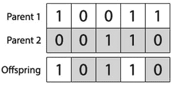

# 二、一种基本遗传算法的实现

在这一章中，我们将开始探索用于实现基本遗传算法的技术。我们在这里开发的程序将被修改，在本书的后续章节中增加新的特性。我们还将探索遗传算法的性能如何随其参数和配置而变化。

要按照本节中的代码进行操作，您需要首先在您的计算机上安装 Java JDK。您可以从 Oracle 网站免费下载并安装 Java JDK:

[T2`oracle.com/technetwork/java/javase/downloads/index.html`](http://oracle.com/technetwork/java/javase/downloads/index.html)

尽管不是必需的，但是除了安装 Java JDK 之外，为了方便起见，您还可以选择安装一个 Java 兼容的 IDE，比如 Eclipse 或 NetBeans。

## 预实施

在实现遗传算法之前，最好先考虑一下遗传算法是否是完成手头任务的正确方法。通常会有更好的技术来解决特定的优化问题，通常是通过利用一些领域相关的试探法。遗传算法是独立于领域的，或“弱方法”，它可以应用于问题，而不需要任何特定的先验知识来帮助其搜索过程。由于这个原因，如果没有任何已知的特定领域的知识来帮助指导搜索过程，遗传算法仍然可以用来发现潜在的解决方案。

当已经确定弱搜索方法是合适的时，还应该考虑所使用的弱方法的类型。这可能仅仅是因为替代方法提供了平均更好的结果，但也可能是因为替代方法更容易实现，需要更少的计算资源，或者可以在更短的时间内找到足够好的结果。

## 基本遗传算法的伪代码

基本遗传算法的伪代码如下:

```java
1: generation = 0;

2: population[generation] = initializePopulation(populationSize);

3: evaluatePopulation(population[generation]);
```

`3:``While``isTerminationConditionMet() == false`T3】

```java
4:     parents = selectParents(population[generation]);

5:    population[generation+1] = crossover(parents);

6:   population[generation+1] = mutate(population[generation+1]);

7:    evaluatePopulation(population[generation]);

8:     generation++;
```

`9:` `End loop;`

伪代码从创建遗传算法的初始种群开始。然后对这个群体进行评估，以找到其个体的适合度值。接下来，运行检查以决定是否满足遗传算法的终止条件。如果没有，遗传算法开始循环，种群在最终被重新评估之前经历第一轮交叉和变异。从这里开始，交叉和变异不断地被应用，直到满足终止条件，遗传算法终止。

这段伪代码演示了遗传算法的基本过程；然而，我们有必要更详细地研究每一步，以充分理解如何创建一个令人满意的遗传算法。

## 关于本书中的代码示例

本书中的每一章都被表示为 Eclipse 项目中的一个包。每个包至少有四个类别:

*   GeneticAlgorithm 类，它抽象了遗传算法本身，并提供了接口方法的特定问题实现，如交叉、变异、适应性评估和终止条件检查。
*   一个单独的类，代表单个候选解及其染色体。
*   人口类，代表人口或一代人，并对他们应用组级操作。
*   一个包含“main”方法、一些引导代码、上述伪代码的具体版本以及特定问题可能需要的任何支持工作的类。这些类将根据它所解决的问题来命名，例如“AllOnesGA”、“RobotController”等。

你最初在这一章中写的遗传算法、种群和个体类将需要在本书后面的每一章中进行修改。

您可以想象这些类实际上是接口的具体实现，如 GeneticAlgorithmInterface、PopulationInterface 和 individual interface——然而，我们保持了 Eclipse 项目的简单布局，避免使用接口。

你将在本书中找到的遗传算法类将总是实现许多重要的方法，如“calcFitness”、“evalPopulation”、“isTerminationConditionMet”、“crossoverPopulation”和“mutatePopulation”。然而，根据手头问题的要求，这些方法的内容在每章中会略有不同。

在遵循本书中的例子时，我们建议将遗传算法、种群和个体类复制到每个新问题中，因为一些方法的实现将在不同的章节中保持相同，但其他的会有所不同。

另外，请务必阅读所附 Eclipse 项目中源代码中的注释！为了节省本书的篇幅，我们省略了冗长的注释和文档块，但是在可供下载的 Eclipse 文件中，我们非常小心地对源代码进行了完整的注释。就像有了第二本书可以读！

在许多情况下，本书的章节会要求你在一个类中添加或修改一个方法。一般来说，在文件中的什么地方添加一个新方法并不重要，所以在这些情况下，我们要么从例子中省略掉类的其余部分，要么只显示函数签名来帮助你理解。

## 基本实现

为了删除任何不必要的细节，并保持初始实现易于遵循，我们将在本书中涵盖的第一个遗传算法将是一个简单的二进制遗传算法。

二进制遗传算法相对容易实现，并且是解决各种优化问题的非常有效的工具。你可能从[第一章](1.html)中还记得，二进制遗传算法是 Holland (1975)提出的遗传算法的最初范畴。

### 问题

首先，让我们回顾一下“全 1”问题，这是一个非常基本的问题，可以使用二进制遗传算法来解决。

这个问题不是很有趣，但它作为一个简单的问题，有助于强调所涉及的基本技术。顾名思义，问题就是找到一个完全由 1 组成的字符串。因此，对于长度为 5 的字符串，最佳解决方案是“11111”。

### 因素

现在我们有一个问题要解决，让我们继续执行。我们要做的第一件事是设置遗传算法参数。如前所述，三个主要参数是群体大小、突变率和交叉率。在本章中，我们还引入了一个叫做“精英主义”的概念，并将它作为遗传算法的参数之一。

首先，创建一个名为 GeneticAlgorithm 的类。如果您使用的是 Eclipse，您可以通过选择文件➤新➤类来实现。我们已经选择根据本书中的章节号来命名包，因此我们将在包“第[章第 2](2.html) 章”中工作。

这个 GeneticAlgorithm 类将包含遗传算法本身操作所需的方法和变量。例如，这个类包括处理交叉、变异、适应性评估和终止条件检查的逻辑。创建类之后，添加一个接受四个参数的构造函数:种群大小、突变率、交叉率和精英成员的数量。

```java
package chapter2;

/**

* Lots of comments in the source that are omitted here!

*/

public class GeneticAlgorithm {

private int populationSize;

private double mutationRate;

private double crossoverRate;

private int elitismCount;

public GeneticAlgorithm(int populationSize, double mutationRate, double crossoverRate, int elitismCount) {

this.populationSize = populationSize;

this.mutationRate = mutationRate;

this.crossoverRate = crossoverRate;

this.elitismCount = elitismCount;

}

/**

* Many more methods implemented later...

*/

}
```

当传递了所需的参数时，此构造函数将使用所需的配置创建 GeneticAlgorithm 类的新实例。

现在我们应该创建我们的引导类——回想一下，每章都需要一个引导类来初始化遗传算法，并为应用提供一个起点。将该类命名为“AllOnesGA ”,并定义一个“main”方法:

```java
package chapter2;

public class AllOnesGA {

public static void main(String[] args) {

// Create GA object

GeneticAlgorithm ga = new GeneticAlgorithm(100, 0.01, 0.95, 0);

// We’ll add a lot more here...

}

}
```

目前，我们将只使用参数的一些典型值，人口规模= 100；突变率= 0.01；交叉率= 0.95，精英主义计数为 0(有效地禁用它——目前)。在完成本章末尾的实现后，您可以试验如何更改这些参数来影响算法的性能。

### 初始化

我们的下一步是初始化潜在解决方案的群体。这通常是随机进行的，但偶尔可能更好的是更系统地初始化群体，可能利用关于搜索空间的已知信息。在这个例子中，群体中的每个个体将被随机初始化。我们可以通过为染色体中的每个基因随机选择值 1 或 0 来做到这一点。

在初始化群体之前，我们需要创建两个类，一个用于管理和创建群体，另一个用于管理和创建群体的个体。例如，正是这些类包含了获取个体适应性的方法，或者获取种群中最适合的个体。

首先让我们从创建单独的类开始。注意，为了节省纸张，我们省略了下面所有的注释和方法文档块！您可以在附带的 Eclipse 项目中找到这个类的完整注释版本。

```java
package chapter2;

public class Individual {

private int[] chromosome;

private double fitness = -1;

public Individual(int[] chromosome) {

// Create individual chromosome

this.chromosome = chromosome;

}

public Individual(int chromosomeLength) {

this.chromosome = new int[chromosomeLength];

for (int gene = 0; gene < chromosomeLength; gene++) {

if (0.5 < Math.random()) {

this.setGene(gene, 1);

} else {

this.setGene(gene, 0);

}

}

}

public int[] getChromosome() {

return this.chromosome;

}

public int getChromosomeLength() {

return this.chromosome.length;

}

public void setGene(int offset, int gene) {

this.chromosome[offset] = gene;

}

public int getGene(int offset) {

return this.chromosome[offset];

}

public void setFitness(double fitness) {

this.fitness = fitness;

}

public double getFitness() {

return this.fitness;

}

public String toString() {

String output = "";

for (int gene = 0; gene < this.chromosome.length; gene++) {

output += this.chromosome[gene];

}

return output;

}

}
```

单个类代表单个候选解，主要负责存储和操作染色体。注意，单个类也有两个构造函数。一个构造函数接受一个整数(代表染色体的长度),并在初始化对象时创建一个随机染色体。另一个构造函数接受一个整数数组，并将其用作染色体。

除了管理个体的染色体之外，它还跟踪个体的适应值，并且知道如何将自身打印为字符串。

下一步是创建 Population 类，它提供管理群体中一组个体所需的功能。

像往常一样，本章省略了注释和文档块；请务必查看 Eclipse 项目以了解更多上下文！

```java
package chapter2;

import java.util.Arrays;

import java.util.Comparator;

public class Population {

private Individual population[];

private double populationFitness = -1;

public Population(int populationSize) {

this.population = new Individual[populationSize];

}

public Population(int populationSize, int chromosomeLength) {

this.population = new Individual[populationSize];

for (int individualCount = 0; individualCount < populationSize; individualCount++) {

Individual individual = new Individual(chromosomeLength);

this.population[individualCount] = individual;

}

}

public Individual[] getIndividuals() {

return this.population;

}

public Individual getFittest(int offset) {

Arrays.sort(this.population, new Comparator<Individual>() {

@Override

public int compare(Individual o1, Individual o2) {

if (o1.getFitness() > o2.getFitness()) {

return -1;

} else if (o1.getFitness() < o2.getFitness()) {

return 1;

}

return 0;

}

});

return this.population[offset];

}

public void setPopulationFitness(double fitness) {

this.populationFitness = fitness;

}

public double getPopulationFitness() {

return this.populationFitness;

}

public int size() {

return this.population.length;

}

public Individual setIndividual(int offset, Individual individual) {

return population[offset] = individual;

}

public Individual getIndividual(int offset) {

return population[offset];

}

public void shuffle() {

Random rnd = new Random();

for (int i = population.length - 1; i > 0; i--) {

int index = rnd.nextInt(i + 1);

Individual a = population[index];

population[index] = population[i];

population[i] = a;

}

}

}
```

人口阶层相当简单；它的主要功能是保存一个个体数组，需要时可以通过类方法方便地访问这些个体。诸如 getFittest()和 setIndividual()的方法是可以访问和更新群体中的个体的方法的例子。除了保存个体之外，它还存储了群体的总适应度，这将在以后实施选择方法时变得很重要。

现在我们有了种群和个体类，我们可以在 GeneticAlgorithm 类中实现它们。为此，只需在 GeneticAlgorithm 类中的任意位置创建一个名为“initPopulatio”的方法。

```java
public class GeneticAlgorithm {

/**

* The constructor we created earlier is up here...

*/

public Population initPopulation(int chromosomeLength) {

Population population = new Population(this.populationSize, chromosomeLength);

return population;

}

/**

* We still have lots of methods to implement down here...

*/

}
```

现在我们有了一个群体和一个个体类，我们可以返回到我们的“AllOnesGA”类，并开始使用“initPopulation”方法。回想一下,“AllOnesGA”类只有一个“main”方法，它代表本章前面提到的伪代码。

在 main 方法中初始化群体时，我们还需要指定个体染色体的长度——这里我们将使用 50:

```java
public class AllOnesGA {

public static void main(String[] args){

// Create GA object

GeneticAlgorithm ga = new GeneticAlgorithm(100, 0.01, 0.95, 0);

// Initialize population

Population population = ga.initPopulation(50);

}

}
```

### 估价

在评估阶段，计算群体中每个个体的适应值并存储以备将来使用。为了计算个体的适应度，我们使用一个被称为“适应度函数”的函数。

遗传算法通过使用选择来引导进化过程朝向更好的个体。因为是适应度函数使这种选择成为可能，所以适应度函数设计得好并为个人的适应度提供准确的值是很重要的。如果适应度函数设计得不好，可能要花更长时间才能找到满足最低标准的解决方案，或者根本找不到可接受的解决方案。

适应度函数通常是遗传算法中计算量最大的部分。正因为如此，适应度函数也得到很好的优化以帮助防止瓶颈并允许算法高效运行是很重要的。

每个特定的优化问题都需要一个独特的适应度函数。在我们的全 1 问题的例子中，适应度函数相当简单，简单地计算在一个个体的染色体中发现的 1 的数量。

现在向 GeneticAlgorithm 类添加一个 calcFitness 方法。这个方法应该计算染色体中 1 的数量，然后通过除以染色体长度将输出归一化到 0 和 1 之间。您可以在 GeneticAlgorithm 类中的任何位置添加此方法，因此我们省略了下面的相关代码:

```java
public double calcFitness(Individual individual) {

// Track number of correct genes

int correctGenes = 0;

// Loop over individual’s genes

for (int geneIndex = 0; geneIndex < individual.getChromosomeLength(); geneIndex++) {

// Add one fitness point for each "1" found

if (individual.getGene(geneIndex) == 1) {

correctGenes += 1;

}

}

// Calculate fitness

double fitness = (double) correctGenes / individual.getChromosomeLength();

// Store fitness

individual.setFitness(fitness);

return fitness;

}
```

我们还需要一个简单的助手方法来循环遍历群体中的每个个体并对他们进行评估(例如，对每个个体调用 calcFitness)。让我们将这个方法称为 evalPopulation，并将其添加到 GeneticAlgorithm 类中。它应该如下所示，同样，您可以在任何地方添加它:

```java
public void evalPopulation(Population population) {

double populationFitness = 0;

for (Individual individual : population.getIndividuals()) {

populationFitness += calcFitness(individual);

}

population.setPopulationFitness(populationFitness);

}
```

此时，GeneticAlgorithm 类中应该有以下方法。为了简洁起见，我们省略了函数体，只显示了该类的折叠视图:

```java
package chapter2;

public class GeneticAlgorithm {

private int populationSize;

private double mutationRate;

private double crossoverRate;

private int elitismCount;

public GeneticAlgorithm(int populationSize, double mutationRate, double crossoverRate, int elitismCount) { }

public Population initPopulation(int chromosomeLength) { }

public double calcFitness(Individual individual) { }

public void evalPopulation(Population population) { }

}
```

如果您缺少这些属性或方法中的任何一个，请现在返回并实现它们。我们在 GeneticAlgorithm 类中还需要实现四个方法:isTerminationConditionMet、selectParent、crossoverPopulation 和 mutatePopulation。

### 终止检查

接下来需要检查我们的终止条件是否已经满足。有许多不同类型的终止条件。有时候，有可能知道最优解是什么(更确切地说，有可能知道最优解的适应值)，在这种情况下，我们可以直接检查正确的解。然而，并不总是能够知道最佳解决方案的适合度是多少，因此我们可以在解决方案变得“足够好”时终止；也就是说，每当解决方案超过某个适合度阈值时。当算法已经运行了太长时间(太多代)时，我们也可以终止，或者当决定终止算法时，我们可以结合许多因素。

由于全 1 问题的简单性，以及我们知道正确的适应度应该是 1 的事实，在这种情况下，当找到正确的解时终止是合理的。不会一直这样的！事实上，这种情况很少发生——但是我们很幸运这是一个简单的问题。

首先，我们必须先构造一个函数来检查我们的终止条件是否已经发生。我们可以通过向 GeneticAlgorithm 类添加以下代码来实现这一点。在任何地方添加它，为了简洁起见，我们像往常一样省略了周围的类。

```java
public boolean isTerminationConditionMet(Population population) {

for (Individual individual : population.getIndividuals()) {

if (individual.getFitness() == 1) {

return true;

}

}

return false;

}
```

上面的方法检查群体中的每个个体，如果群体中任何个体的适合度为 1，将返回 true 表明我们已经找到了终止条件，可以停止。

现在已经建立了终止条件，可以使用新添加的终止检查作为循环条件，将循环添加到 AllOnesGA 类的主 bootstrap 方法中。当终止检查返回真时，遗传算法将停止循环并返回其结果。

为了创建演化循环，修改我们的 executive AllOnesGA 类的 main 方法来表示如下内容。下面代码片段的前两行已经在 main 方法中了。通过添加这些代码，我们将继续实现本章开头给出的伪代码——回想一下,“main”方法是遗传算法伪代码的具体表示。主方法现在应该是这样的:

```java
public static void main(String[] args) {

// These two lines were already here:

GeneticAlgorithm ga = new GeneticAlgorithm(100, 0.001, 0.95, 0);

Population population = ga.initPopulation(50);

// The following is the new code you should be adding:

ga.evalPopulation(population);

int generation = 1;

while (ga.isTerminationConditionMet(population) == false) {

// Print fittest individual from population

System.out.println("Best solution: " + population.getFittest(0).toString());

// Apply crossover

// TODO!

// Apply mutation

// TODO!

// Evaluate population

ga.evalPopulation(population);

// Increment the current generation

generation++;

}

System.out.println("Found solution in " + generation + " generations");

System.out.println("Best solution: " + population.getFittest(0).toString());

}
```

我们添加了一个 evolution 循环来检查 isTerminationConditionMet 的输出。main 方法的另一个新特性是在循环之前和循环期间增加了 evalPopulation 调用，生成变量跟踪生成号，调试消息帮助您了解每一代中的最佳解决方案。

我们还添加了一个结束游戏:当我们退出循环时，我们将打印一些关于最终解决方案的信息。

然而，在这一点上，我们的遗传算法将运行，但它永远不会进化！我们将陷入一个无限循环，除非我们足够幸运，随机生成的个体中有一个恰好全是 1。在 Eclipse 中点击“运行”按钮可以直接看到这种行为；相同的解决方案将会一遍又一遍地出现，循环永无止境。您必须通过点击 Eclipse 控制台上方的“终止”按钮来强制程序停止运行。

为了继续构建我们的遗传算法，我们需要实现两个额外的概念:交叉和变异。这些概念实际上通过随机突变和适者生存推动了种群的进化。

### 交叉

此时，是时候开始通过应用变异和交叉来进化种群了。交叉算子是群体中的个体交换遗传信息的过程，希望创造出一个包含其父母基因组中最好部分的新个体。

在交叉过程中，考虑群体中的每个个体进行交叉；这就是使用交叉率参数的地方。通过将交叉率与一个随机数进行比较，我们可以决定是否应该对该个体应用交叉，或者是否应该将其直接添加到不受交叉影响的下一个种群中。如果一个个体被选择进行杂交，那么就需要找到第二个亲本。为了找到第二个父母，我们需要从许多可能的选择方法中选择一个。

#### 轮盘赌选择

轮盘赌轮选择-也称为适合度比例选择-是一种选择方法，它使用轮盘赌轮的类比来从群体中选择个体。这个想法是，根据个体的适应度值，将群体中的个体放在隐喻的轮盘赌上。个体的适应度越高，轮盘上分配的空间就越大。下图展示了个人在这一过程中的典型定位。


上面轮子上的每个数字代表了群体中的一个个体。个人的健康程度越高，他们在轮盘赌中的份额就越大。如果你现在想象旋转这个轮子，更有可能的是更健康的个体会被选中，因为他们占据了轮子上更多的空间。这就是为什么这种选择方法通常被称为适合度比例选择；因为解决方案的选择是基于它们的适合度与其余人群的适合度的比例。

我们可以使用许多其他选择方法，例如:锦标赛选择([第 3 章](3.html))和随机通用抽样(一种高级形式的健康比例选择)。然而，在这一章中，我们将实现一个最常见的选择方法:轮盘赌选择。在后面的章节中，我们将会看到其他的选择方法以及它们之间的区别。

#### 交叉方法

除了在杂交过程中可以使用的各种选择方法之外，还有不同的方法来交换两个个体之间的遗传信息。不同的问题具有稍微不同的性质，并且使用特定的交叉方法效果更好。例如，全 1 问题只需要一个完全由 1 组成的字符串。一串“00111”与一串“10101”具有相同的适应值——它们都包含三个 1。对于这种类型的遗传算法，情况并不总是这样。假设我们试图创建一个字符串，这个字符串按照数字 1 到 5 的顺序排列。在这种情况下，字符串“12345”具有与“52431”非常不同的适合度值。这是因为我们不仅要寻找正确的数字，还要寻找正确的顺序。对于这样的问题，尊重基因顺序的杂交方法是更可取的。

我们将在这里实现的交叉方法是均匀交叉。在这种方法中，后代的每个基因有 50%的变化来自其第一个父母或第二个父母。



#### 交叉伪码

现在我们有了一个选择和交叉方法，让我们看一些伪代码，这些代码概述了要实现的交叉过程。

`1:``For each``individual``in`T4】

```java
2:      newPopulation = new array;
```

`2:``If`T2】

```java
3:             secondParent = selectParent();

4:            offspring = crossover(individual, secondParent);

5:            newPopulation.push(offspring);
```

`6:` `Else:`

```java
7:            newPopulation.push(individual);
```

`8:` `End if`

`9:` `End loop;`

#### 交叉实施

若要实现轮盘赌选择，请在 GeneticAlgorithm 类中的任意位置添加一个 selectParent()方法。

```java
public Individual selectParent(Population population) {

// Get individuals

Individual individuals[] = population.getIndividuals();

// Spin roulette wheel

double populationFitness = population.getPopulationFitness();

double rouletteWheelPosition = Math.random() * populationFitness;

// Find parent

double spinWheel = 0;

for (Individual individual : individuals) {

spinWheel += individual.getFitness();

if (spinWheel >= rouletteWheelPosition) {

return individual;

}

}

return individuals[population.size() - 1];

}
```

selectParent()方法实质上是反向运行一个轮盘赌；在赌场，轮盘上已经有标记，然后你旋转轮盘，等待球落入位置。然而，在这里，我们首先选择一个随机的位置，然后反向工作以计算出哪个个体位于该位置。从算法上来说，这样更简单。在 0 和总群体适应度之间选择一个随机数，然后遍历每个个体，一边走一边计算他们的适应度，直到到达开始时选择的随机位置。

既然已经添加了选择方法，下一步就是使用 selectParent()方法创建交叉方法来选择交叉配对。首先，将以下交叉方法添加到 GeneticAlgorithm 类中。

```java
public Population crossoverPopulation(Population population) {

// Create new population

Population newPopulation = new Population(population.size());

// Loop over current population by fitness

for (int populationIndex = 0; populationIndex < population.size(); populationIndex++) {

Individual parent1 = population.getFittest(populationIndex);

// Apply crossover to this individual?

if (this.crossoverRate > Math.random() && populationIndex > this.elitismCount) {

// Initialize offspring

Individual offspring = new Individual(parent1.getChromosomeLength());

// Find second parent

Individual parent2 = selectParent(population);

// Loop over genome

for (int geneIndex = 0; geneIndex < parent1.getChromosomeLength(); geneIndex++) {

// Use half of parent1's genes and half of parent2's genes

if (0.5 > Math.random()) {

offspring.setGene(geneIndex, parent1.getGene(geneIndex));

} else {

offspring.setGene(geneIndex, parent2.getGene(geneIndex));

}

}

// Add offspring to new population

newPopulation.setIndividual(populationIndex, offspring);

} else {

// Add individual to new population without applying crossover

newPopulation.setIndividual(populationIndex, parent1);

}

}

return newPopulation;

}
```

在 crossoverPopulation()方法的第一行中，为下一代创建了一个新的空群体。接下来，对种群进行循环，并使用交叉率来考虑每个个体的交叉。(这里还有一个神秘的“精英主义”术语，我们将在下一节讨论。)如果个体没有通过交叉，它直接被添加到下一个种群，否则产生一个新的个体。后代的染色体是通过在亲代染色体上循环并随机将来自每个亲代的基因添加到后代的染色体上来填充的。当对群体中的每个个体完成这种交叉过程时，交叉方法返回下一代群体。

从这里我们可以在 AllOnesGA 类的 main 方法中实现 crossover 函数。下面显示了整个 AllOnesGA 类和 main 方法；然而，与之前唯一的变化是在“应用交叉”注释下面添加了一行调用 crossoverPopulation()的代码。

```java
package chapter2;

public class AllOnesGA {

public static void main(String[] args) {

// Create GA object

GeneticAlgorithm ga = new GeneticAlgorithm(100, 0.001, 0.95, 0);

// Initialize population

Population population = ga.initPopulation(50);

// Evaluate population

ga.evalPopulation(population);

// Keep track of current generation

int generation = 1;

while (ga.isTerminationConditionMet(population) == false) {

// Print fittest individual from population

System.out.println("Best solution: " + population.getFittest(0).toString());

// Apply crossover

population = ga.crossoverPopulation(population);

// Apply mutation

// TODO

// Evaluate population

ga.evalPopulation(population);

// Increment the current generation

generation++;

}

System.out.println("Found solution in " + generation + " generations");

System.out.println("Best solution: " + population.getFittest(0).toString());

}

}
```

此时，运行程序应该工作并返回一个有效的解！通过单击 Eclipse 中的 Run 按钮并观察出现的控制台，亲自尝试一下。

如你所见，光是杂交就足以进化出一个种群。然而，没有变异的遗传算法容易陷入局部最优，永远找不到全局最优。我们不会在如此简单的问题中看到这一点，但在更复杂的问题领域中，我们需要一些机制来推动群体远离局部最优，以尝试看看是否有更好的解决方案。这就是突变的随机性发挥作用的地方:如果一个解决方案在局部最优附近停滞不前，一个随机事件可能会将它踢向正确的方向，并将其送往更好的解决方案。

### 精英主义

在讨论变异之前，我们先来看看我们在交叉方法中引入的“elitismCount”参数。

由于交叉和变异算子的影响，基本遗传算法经常会在两代之间丢失种群中的最佳个体。然而，我们需要这些运营商找到更好的解决方案。要了解这个问题的实际情况，只需编辑您的遗传算法代码，打印出每一代中最适合的个体的适应性。您会注意到，虽然它通常会上升，但在交叉和变异过程中，有时会丢失最合适的解决方案，而代之以不太理想的解决方案。

用于解决这个问题的一个简单的优化技术是总是允许最适合的一个或多个个体被不加改变地添加到下一代群体中。这样，最优秀的个体就不会代代相传。尽管这些个体没有应用交叉，但是它们仍然可以被选择作为另一个个体的亲本，允许它们的遗传信息仍然与群体中的其他人共享。这个为下一代保留最好的过程被称为精英主义。

通常情况下，种群中“精英”个体的最佳数量在总种群规模中所占的比例非常小。这是因为如果该值太高，它将由于保留太多个体导致的遗传多样性的缺乏而减慢遗传算法的搜索过程。与前面讨论的其他参数类似，找到最佳性能的平衡点很重要。

实施精英主义在交叉和变异环境中都很简单。让我们重新看看 crossoverPopulation()中的条件，它检查是否应该应用交叉:

```java
// Apply crossover to this individual?

if (this.crossoverRate > Math.random() && populationIndex >= this.elitismCount) {

// ...

}
```

交叉仅适用于交叉条件得到满足且个人不被视为精英的情况。

是什么造就了个人精英？此时，群体中的个体已经按其适应度排序，因此最强的个体具有最低的指数。因此，如果我们想要三个精英个体，我们应该从考虑中跳过指数 0-2。这将保留最强壮的个体，并让它们不加修改地传递给下一代。我们将在接下来的变异代码中使用相同的精确条件。

### 变化

我们完成进化过程需要添加的最后一件事是突变。像交叉一样，有许多不同的变异方法可供选择。当使用二进制字符串时，一种更常用的方法叫做位翻转突变。您可能已经猜到，位翻转突变涉及将位的值从 1 翻转到 0，或者从 0 翻转到 1，这取决于它的初始值。当染色体使用一些其他表示法编码时，通常会实施不同的突变方法来更好地利用编码。

在选择变异和交叉方法时，最重要的因素之一是确保您选择的方法仍能产生有效的解决方案。我们将在后面的章节中看到这个概念的应用，但是对于这个问题，我们只需要确定 0 和 1 是基因突变的唯一可能值。比如说，一个基因突变到 7 会给我们一个无效的解决方案。

这个建议在本章中似乎没有实际意义而且过于明显，但是考虑一个不同的简单问题，其中您需要对数字 1 到 6 进行排序而不重复(例如，以“123456”结束)。一个简单地在 1 到 6 之间选择一个随机数的突变算法可以产生“126456”，使用“6”两次，这将是一个无效的解决方案，因为每个数字只能使用一次。如你所见，即使是简单的问题有时也需要复杂的技术。

与交叉类似，变异是基于变异率应用于个体的。如果突变率设置为 0.1，那么每个基因在突变阶段有 10%的几率发生突变。

让我们继续将变异函数添加到我们的遗传算法类中。我们可以在任何地方添加这个:

```java
public Population mutatePopulation(Population population) {

// Initialize new population

Population newPopulation = new Population(this.populationSize);

// Loop over current population by fitness

for (int populationIndex = 0; populationIndex < population.size(); populationIndex++) {

Individual individual = population.getFittest(populationIndex);

// Loop over individual’s genes

for (int geneIndex = 0; geneIndex < individual.getChromosomeLength(); geneIndex++) {

// Skip mutation if this is an elite individual

if (populationIndex >= this.elitismCount) {

// Does this gene need mutation?

if (this.mutationRate > Math.random()) {

// Get new gene

int newGene = 1;

if (individual.getGene(geneIndex) == 1) {

newGene = 0;

}

// Mutate gene

individual.setGene(geneIndex, newGene);

}

}

}

// Add individual to population

newPopulation.setIndividual(populationIndex, individual);

}

// Return mutated population

return newPopulation;

}
```

mutatePopulation()方法首先为变异个体创建一个新的空群体，然后开始遍历当前群体。然后循环每个个体的染色体，并使用突变率考虑每个基因的位翻转突变。当一个个体的整个染色体被循环时，这个个体就被加入到新的突变群体中。当所有个体都经历了变异过程后，变异的群体被返回。

现在，我们可以通过向 main 方法添加 mutate 函数来完成进化循环的最后一步。完成的主要方法如下。与上次相比，只有两处不同:首先，我们在“应用变异”注释下面添加了对 mutatePopulation()的调用。此外，我们已经将“new GeneticAlgorithm”构造函数中的“elitismCount”参数从 0 更改为 2，现在我们已经了解了精英主义是如何工作的。

```java
package chapter2;

public class AllOnesGA {

public static void main(String[] args) {

// Create GA object

GeneticAlgorithm ga = new GeneticAlgorithm(100, 0.001, 0.95, 2);

// Initialize population

Population population = ga.initPopulation(50);

// Evaluate population

ga.evalPopulation(population);

// Keep track of current generation

int generation = 1;

while (ga.isTerminationConditionMet(population) == false) {

// Print fittest individual from population

System.out.println("Best solution: " + population.getFittest(0).toString());

// Apply crossover

population = ga.crossoverPopulation(population);

// Apply mutation

population = ga.mutatePopulation(population);

// Evaluate population

ga.evalPopulation(population);

// Increment the current generation

generation++;

}

System.out.println("Found solution in " + generation + " generations");

System.out.println("Best solution: " + population.getFittest(0).toString());

}

}
```

### 执行

你现在已经完成了你的第一个遗传算法。个人和群体类在本章的前面已经完整地打印出来了，你的版本应该和上面的一模一样。最后一个 AllOnesGA 执行类——引导和运行算法的类——就在上面。

GeneticAlgorithm 类相当长，并且您是一点一点地构建的，所以此时请检查您是否实现了以下属性和方法。为了节省空间，我在这里省略了所有的注释和方法体——我只是展示了一个类的折叠视图——但是要确保你的类版本已经如上所述实现了这些方法中的每一个。

```java
package chapter2;

public class GeneticAlgorithm {

private int populationSize;

private double mutationRate;

private double crossoverRate;

private int elitismCount;

public GeneticAlgorithm(int populationSize, double mutationRate, double crossoverRate, int elitismCount) { }

public Population initPopulation(int chromosomeLength) { }

public double calcFitness(Individual individual) { }

public void evalPopulation(Population population) { }

public boolean isTerminationConditionMet(Population population) { }

public Individual selectParent(Population population) { }

public Population crossoverPopulation(Population population) { }

public Population mutatePopulation(Population population) { }

}
```

如果您使用的是 Eclipse IDE，现在可以通过打开 AllOnesGA 文件并单击“run”按钮来运行该算法，该按钮通常位于 IDE 的顶部菜单中。

运行时，算法会将信息打印到控制台，当单击 Run 时，这些信息会自动出现在 Eclipse 中。由于每种遗传算法的随机性，每次运行看起来都会有一点不同，但这里有一个例子可以说明您的输出可能是什么样子:

```java
Best solution: 11001110100110111111010111001001100111110011111111

Best solution: 11001110100110111111010111001001100111110011111111

Best solution: 11001110100110111111010111001001100111110011111111

[ ... Lots of lines omitted here ... ]

Best solution: 11111111111111111111111111111011111111111111111111

Best solution: 11111111111111111111111111111011111111111111111111

Found solution in 113 generations

Best solution: 11111111111111111111111111111111111111111111111111
```

此时，您应该使用已经赋予 GeneticAlgorithm 构造函数的各种参数:populationSize、mutationRate、crossoverRate 和 elitismCount。不要忘记，统计数据决定了遗传算法的性能，所以你不能只运行一次就评估一个算法或设置的性能——在判断其性能之前，你需要对每个不同的设置运行至少 10 次试验。

## 摘要

在这一章中，你已经学习了实现遗传算法的基础。本章开头的伪代码为您将在本书其余部分实现的所有遗传算法提供了一个通用的概念模型:每个遗传算法将初始化并评估一个群体，然后进入一个执行交叉、变异和重新评估的循环。只有满足终止条件，循环才会退出。

在这一章中，你构建了遗传算法的支持组件，特别是个体和群体类，你将在接下来的章节中重用它们。然后，您专门构建了一个 GeneticAlgorithm 类来解决“全 1”问题，并成功运行了它。

您还学到了以下内容:虽然每个遗传算法在概念和结构上是相似的，但不同的问题域将需要不同的评估技术实现(即，适应性评分、交叉技术和变异技术)。

本书的其余部分将通过示例问题来探索这些不同的技术。在接下来的章节中，您将重用群体和个体类，只需稍加修改。然而，接下来的每一章都需要对遗传算法类进行大量修改，因为该类是交叉、变异、终止条件和适合度评估发生的地方。

ExercisesRun the genetic algorithm a few times observing the randomness of the evolutionary process. How many generations does it typically take to find a solution to this problem?   Increase and decrease the population size. How does decreasing the population size affect the speed of the algorithm and does it also affect the number of generations it takes to find a solution? How does increasing the population size affect the speed of the algorithm and how does it affect the number of generations it takes to find a solution?   Set the mutation rate to 0\. How does this affect the genetic algorithms ability to find a solution? Use a high mutation rate, how does this affect the algorithm?   Apply a low crossover rate. How does the algorithm preform with a lower crossover rate?   Decrease and increase the complexity of the problem by experimenting with shorter and larger chromosomes. Do different parameters work better when dealing with shorter or larger chromosomes?   Compare the genetic algorithm’s performance with and without elitism enabled.   Run tests using high elitism values. How does this affect the search performance?