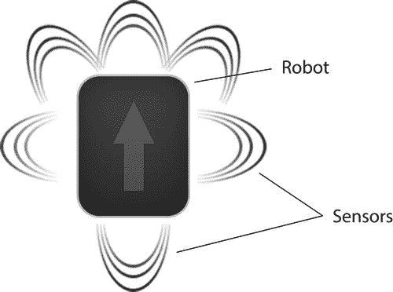
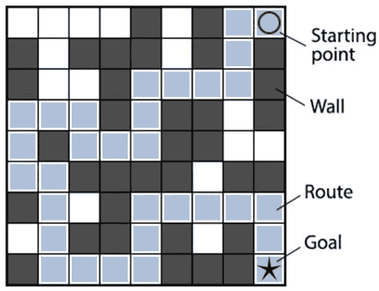
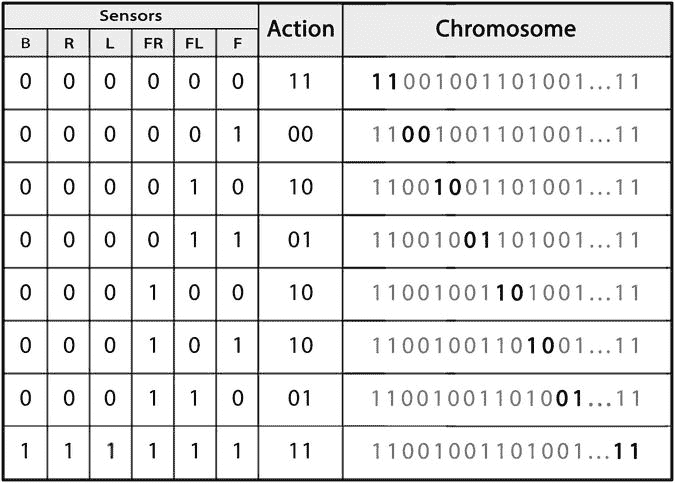
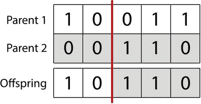
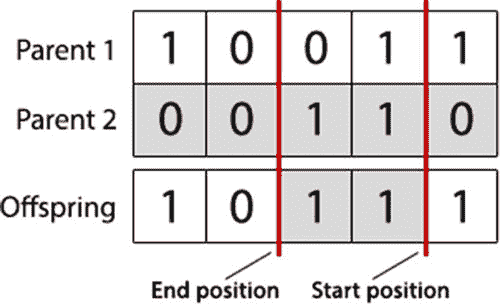

# 三、机器人控制器

## 介绍

在这一章中，我们将利用上一章学到的知识，通过遗传算法来解决一个现实世界中的问题。我们要解决的现实问题是设计机器人控制器。

遗传算法通常应用于机器人，作为设计复杂机器人控制器的方法，使机器人能够执行复杂的任务和行为，消除了手动编码复杂机器人控制器的需要。想象一下，你造了一个可以在仓库里运输货物的机器人。你已经安装了传感器，这使得机器人可以看到它的本地环境，并且你已经给了它轮子，所以它可以根据来自它的传感器的输入来导航。问题是如何将传感器数据与电机动作联系起来，以便机器人能够在仓库中导航。

遗传算法，更一般地说，达尔文进化论的思想被应用于机器人学的人工智能领域被称为进化机器人学。然而，这并不是解决这个问题的唯一自底向上的方法。通过使用强化学习算法来指导学习过程，神经网络也经常用于成功地将机器人传感器映射到输出。

通常，遗传算法将评估大量的个体，以为下一代寻找最佳个体。评估个人是通过运行适应度函数来完成的，该函数基于某些预定义的标准来衡量个人的表现。然而，将遗传算法及其适应度函数应用于物理机器人会带来新的挑战；对每个机器人控制器进行物理评估对于大量人群来说是不可行的。这是由于在物理上测试每个机器人控制器的困难以及这样做所花费的时间。出于这个原因，机器人控制器通常通过将它们应用于真实的物理机器人和环境的模拟模型来进行评估。这使得能够在软件中快速评估每个控制器，随后可以应用于它们的物理对应物。在这一章中，我们将使用二进制遗传算法的知识来设计一个机器人控制器，并开始将其应用于虚拟环境中的虚拟机器人。

## 问题

我们要解决的问题是设计一个机器人控制器，它可以使用机器人传感器来成功地引导机器人通过迷宫。机器人可以采取四种行动:向前移动一步，左转，右转，或者，很少，什么也不做。机器人也有六个传感器:三个在前面，一个在左边，一个在右边，一个在后面。



我们要探索的迷宫由机器人无法穿越的墙壁组成，并且将有一条轮廓分明的路线，如图 [3-1](#Fig1) 所示，我们希望机器人沿着这条路线前进。请记住，本章的目的不是训练机器人解决迷宫。我们的目的是给一个有六个传感器的机器人控制器自动编程，使它不会撞到墙上；我们只是用迷宫作为一个复杂的环境来测试我们的机器人控制器。



图 3-1。

The route we want the robot to follow

机器人的传感器将在检测到传感器附近的墙壁时激活。例如，如果机器人的前传感器检测到机器人前面有墙，它就会激活。

## 履行

### 开始之前

本章将基于你在第 2 章中开发的代码。在开始之前，创建一个新的 Eclipse 或 NetBeans 项目，或者在现有项目中为这本书创建一个名为“第三章的新包。

从第二章的[中复制个体、群体和遗传算法类，并将它们导入到第三章](2.html)的[中。确保更新每个类文件顶部的包名！最上面应该都写着“包章](3.html) [3](3.html) ”。

在本章中，除了将包名改为“chapter [3](3.html) ”之外，您根本不需要修改个体和群体类。

但是，您将修改 GeneticAlgorithm 类中的几个方法。此时，您应该完全删除以下五个方法:calcFitness、evalPopulation、isTerminationConditionMet、selectParent 和 crossoverPopulation。你将在本章中重写这五个方法，现在删除它们将有助于确保你不会意外地重用第 2 章的[实现。](2.html)

本章你还将创建一些额外的类(Robot 和 Maze，以及包含程序主要方法的 executive RobotController 类)。如果你在 Eclipse 中工作，通过文件➤新➤类菜单选项创建一个新类是很容易的。注意包名字段，确保它显示“第[章第 3](3.html) ”。

### 编码

以正确的方式对数据进行编码通常是遗传算法中最棘手的部分。让我们首先定义这个问题:我们需要一个机器人控制器的完整指令集的二进制表示，用于所有可能的输入组合。

如前所述，我们的机器人会有四个动作:什么都不做，向前走一步，左转，右转。这些可以用二进制表示为:

*   “00”:什么都不做
*   “01”:前进
*   “10”:向左转
*   “11”:向右转

我们还有六个不同的开/关传感器，为我们提供了 2 <sup>6</sup> (64)种可能的传感器输入组合。如果每个动作需要 2 位编码，我们可以用 128 位表示控制器对任何可能输入的响应。换句话说，我们有 64 个不同的场景，我们的机器人可以找到自己，我们的控制器需要为每个场景定义一个动作。因为一个动作需要两位，所以我们的控制器需要 64*2 = 128 位的存储空间。

因为遗传算法染色体最容易作为数组来操作，所以我们的染色体将是一个长度为 128 的位数组。在这种情况下，使用我们的变异和交叉方法，你不需要担心他们正在修改哪个特定的指令，他们只需要操纵遗传代码。然而，在我们这边，在我们可以在机器人控制器中使用编码数据之前，我们必须对其进行解包。

假设我们需要 128 位来表示 64 种不同传感器组合的指令，那么我们实际上应该如何构建染色体以便打包和解包呢？也就是说，染色体的每一段对应哪种传感器输入的组合？这些动作的顺序是什么？我们在哪里可以找到染色体内“正面和右前传感器被激活”情况的动作？染色体中的比特代表输出，但是输入是如何表示的呢？

对许多人来说，这将是一个不直观的问题(和解决方案),所以让我们一步一步地解决这个问题。第一步可能是考虑一个简单的、人类可读的输入和输出列表:

```java
Sensor #1 (front): on

Sensor #2 (front-left): off

Sensor #3 (front-right): on

Sensor #4 (left): off

Sensor #5 (right): off

Sensor #6 (back): off
```

指令:向左转(如上定义的动作“10”)

由于需要额外的 63 个条目来表示所有可能的组合，这种格式很难使用。很明显，这种类型的枚举对我们不起作用。让我们再向前迈一小步，把所有东西都缩写，把“开”和“关”翻译成 1 和 0:

```java
#1: 1

#2: 0

#3: 1

#4: 0

#5: 0

#6: 0

Instruction: 10
```

我们正在取得进展，但这仍然不能将 64 条指令打包到 128 位数组中。我们的下一步是获取六个传感器值——输入——并进一步编码。让我们从右到左排列它们，并从输出中去掉单词“Instruction ”:

```java
#6:0, #5:0, #4:0, #3:1, #2:0, #1:1 => 10
```

现在让我们去掉传感器的编号:

```java
000101 => 10
```

如果我们现在将传感器值的位串转换为十进制，我们会得到以下结果:

```java
5 => 10
```

现在我们有所发现了。左手边的“5”代表传感器输入，右手边的“10”代表机器人在面对这些输入(输出)时应该做什么。因为我们从传感器输入的二进制表示得到这里，只有一种传感器组合可以给我们数字 5。

我们可以使用数字 5 作为染色体中代表传感器输入组合的位置。如果我们手工构建这个染色体，并且我们知道“10”(向左转)是对“5”(检测墙壁的前部和右前部传感器)的正确响应，我们会将“1”和“0”放置在染色体中的第 11 个<sup>点</sup>和第 12 个<sup>点</sup>(每个动作需要 2 位，我们从 0 开始计算位置)，如下所示:

```java
xx xx xx xx xx 10 xx xx xx xx (... 54 more pairs...)
```

在上面的假染色体中，第一对(位置 0)表示当传感器输入总数为 0 时要采取的动作:关闭一切。第二对(位置 1)表示当传感器输入总计 1 时采取的动作:只有前传感器检测到墙壁。第三对，位置 2，仅代表左前传感器触发。第四对，位置 3，表示前传感器和左前传感器都处于活动状态。依此类推，直到最后一对，位置 63，它代表所有被触发的传感器。

图 [3-2](#Fig2) 显示了这种编码方案的另一种可视化。最左边的“Sensors”列表示传感器的位域，在将位域转换为十进制后，它映射到一个染色体位置。一旦将传感器的位域转换为十进制，就可以将所需的动作放在染色体的相应位置。



图 3-2。

Mapping the sensor values to actions

这种编码方案初看起来可能很迟钝——而且染色体是不可读的——但它有几个有用的特性。首先，染色体可以作为一个位数组来操作，而不是复杂的树结构或散列表，这使得交叉、变异和其他操作更加容易。其次，每一个 128 位的值都是一个有效的解决方案(尽管不一定是一个好的方案)——在本章的后面会有更多的介绍。

图 [3-2](#Fig2) 描述了典型的染色体如何将机器人的传感器值映射到动作。

### 初始化

在这个实现中，我们首先需要创建并初始化一个迷宫来运行机器人。为此，创建以下迷宫类来管理迷宫。这可以通过下面的代码来完成。通过选择文件➤新➤类，在 Eclipse 中创建一个新类，并确保使用正确的包名，特别是如果您已经从第 2 章中复制了文件。

```java
package chapter3;

import java.util.ArrayList;

public class Maze {

private final int maze[][];

private int startPosition[] = { -1, -1 };

public Maze(int maze[][]) {

this.maze = maze;

}

public int[] getStartPosition() {

// Check if we’ve already found start position

if (this.startPosition[0] != -1 && this.startPosition[1] != -1) {

return this.startPosition;

}

// Default return value

int startPosition[] = { 0, 0 };

// Loop over rows

for (int rowIndex = 0; rowIndex < this.maze.length; rowIndex++) {

// Loop over columns

for (int colIndex = 0; colIndex < this.maze[rowIndex].length; colIndex++) {

// 2 is the type for start position

if (this.maze[rowIndex][colIndex] == 2) {

this.startPosition = new int[] { colIndex, rowIndex };

return new int[] { colIndex, rowIndex };

}

}

}

return startPosition;

}

public int getPositionValue(int x, int y) {

if (x < 0 || y < 0 || x >= this.maze.length || y >= this.maze[0].length) {

return 1;

}

return this.maze[y][x];

}

public boolean isWall(int x, int y) {

return (this.getPositionValue(x, y) == 1);

}

public int getMaxX() {

return this.maze[0].length - 1;

}

public int getMaxY() {

return this.maze.length - 1;

}

public int scoreRoute(ArrayList<int[]> route) {

int score = 0;

boolean visited[][] = new boolean[this.getMaxY() + 1][this.getMaxX() + 1];

// Loop over route and score each move

for (Object routeStep : route) {

int step[] = (int[]) routeStep;

if (this.maze[step[1]][step[0]] == 3 && visited[step[1]][step[0]] == false) {

// Increase score for correct move

score++;

// Remove reward

visited[step[1]][step[0]] = true;

}

}

return score;

}

}
```

这段代码包含一个构造函数，用于从一个 double int 数组创建一个新的迷宫，还包含一些公共方法，用于获取起始位置、检查位置的值以及为迷宫中的路线打分。

scoreRoute 方法是迷宫课程中最重要的方法；它评估机器人走的路线，并根据它踩对的瓷砖数量返回一个健康分数。这个 scoreRoute 方法返回的分数就是我们稍后将在 GeneticAlgorithm 类的 calcFitness 方法中用作个体的适应性分数。

现在我们有了迷宫抽象，我们可以创建我们的执行类——实际执行算法的类——并初始化迷宫，如图 [3-1](#Fig1) 所示。创建另一个名为 RobotController 的新类，并创建程序将从中启动的“main”方法。

`package chapter`3；

```java
public class RobotController {

public static int maxGenerations = 1000;

public static void main(String[] args) {

/**

* 0 = Empty

* 1 = Wall

* 2 = Starting position

* 3 = Route

* 4 = Goal position

*/

Maze maze = new Maze(new int[][] {

{ 0, 0, 0, 0, 1, 0, 1, 3, 2 },

{ 1, 0, 1, 1, 1, 0, 1, 3, 1 },

{ 1, 0, 0, 1, 3, 3, 3, 3, 1 },

{ 3, 3, 3, 1, 3, 1, 1, 0, 1 },

{ 3, 1, 3, 3, 3, 1, 1, 0, 0 },

{ 3, 3, 1, 1, 1, 1, 0, 1, 1 },

{ 1, 3, 0, 1, 3, 3, 3, 3, 3 },

{ 0, 3, 1, 1, 3, 1, 0, 1, 3 },

{ 1, 3, 3, 3, 3, 1, 1, 1, 4 }

});

/**

* We’ll implement the genetic algorithm pseudocode
```

`* from chapter``2`T2】

```java
*/

}

}
```

我们创建的迷宫对象使用整数来表示不同的地形类型:1 定义一堵墙；2 是起始位置，3 是通过迷宫的最佳路线，4 是目标位置，0 是机器人可以越过但不在通往目标的路线上的空位置。

接下来，与前面的实现类似，我们需要初始化一个随机个体群体。这些个体中的每一个都应该有 128 的染色体长度。如前所述，128 位允许我们将所有 64 个输入映射到一个动作。由于不可能为这个问题创建无效的染色体，我们可以像以前一样使用相同的随机初始化——回想一下，这个随机初始化发生在单个类构造函数中，我们从[第 2 章](2.html)中复制了未修改的类构造函数。以这种方式初始化的机器人在面对不同情况时会简单地采取随机行动，通过一代又一代的进化，我们希望改进这种行为。

在我们的主方法中删除第二章中常见的遗传算法伪代码之前，我们应该对从第二章的[中复制的遗传算法类做一个修改。我们将在 GeneticAlgorithm 类和构造函数中添加一个名为“tournamentSize”的属性(我们将在本章后面深入讨论)。](2.html)

修改 GeneticAlgorithm 类的顶部，如下所示:

```java
package chapter3;

public class GeneticAlgorithm {

/**
```

`* See chapter``2`T2】

```java
*/

private int populationSize;

private double mutationRate;

private double crossoverRate;

private int elitismCount;

/**

* A new property we’ve introduced is the size of the population used for

* tournament selection in crossover.

*/

protected int tournamentSize;

public GeneticAlgorithm(int populationSize, double mutationRate, double crossoverRate, int elitismCount,

int tournamentSize) {

this.populationSize = populationSize;

this.mutationRate = mutationRate;

this.crossoverRate = crossoverRate;

this.elitismCount = elitismCount;

this.tournamentSize = tournamentSize;

}

/**

* We’re not going to show the rest of the class here,

* but methods like initPopulation, mutatePopulation,

* and evaluatePopulation should appear below.

*/

}
```

我们做了三个简单的更改:首先，我们在类属性中添加了“protected int tournamentSize”。其次，我们添加了“int tournamentSize”作为构造函数的第五个参数。最后，我们将“this . tournamentSize = tournamentSize”赋值添加到构造函数中。

处理了 tournamentSize 属性后，我们可以继续前进，从第 2 章中删除我们的伪代码。和往常一样，这段代码将放在 executive 类的“main”方法中，在本例中我们将其命名为 RobotController。

当然，下面的代码不会做任何事情——我们还没有实现任何我们需要的方法，并且已经用 TODO 注释替换了所有的内容。但是，以这种方式剔除主方法有助于加强遗传算法的概念执行模型，也有助于我们在仍然需要实现的方法方面保持正轨；此类中有七个 TODOs 需要解决。

更新您的 RobotController 类，如下所示。迷宫的定义和以前一样，但是它下面的所有内容都是这个文件的新内容。

```java
package chapter3;

public class RobotController {

public static int maxGenerations = 1000;

public static void main(String[] args) {

Maze maze = new Maze(new int[][] {

{ 0, 0, 0, 0, 1, 0, 1, 3, 2 },

{ 1, 0, 1, 1, 1, 0, 1, 3, 1 },

{ 1, 0, 0, 1, 3, 3, 3, 3, 1 },

{ 3, 3, 3, 1, 3, 1, 1, 0, 1 },

{ 3, 1, 3, 3, 3, 1, 1, 0, 0 },

{ 3, 3, 1, 1, 1, 1, 0, 1, 1 },

{ 1, 3, 0, 1, 3, 3, 3, 3, 3 },

{ 0, 3, 1, 1, 3, 1, 0, 1, 3 },

{ 1, 3, 3, 3, 3, 1, 1, 1, 4 }

});

// Create genetic algorithm

GeneticAlgorithm ga = new GeneticAlgorithm(200, 0.05, 0.9, 2, 10);

Population population = ga.initPopulation(128);

// TODO: Evaluate population

int generation = 1;

// Start evolution loop

while (/* TODO */ false) {

// TODO: Print fittest individual from population

// TODO: Apply crossover

// TODO: Apply mutation

// TODO: Evaluate population

// Increment the current generation

generation++;

}

// TODO: Print results

}

}
```

这个 RobotController 类和第二章中的 AllOnesGA 类只有细微的区别。AllOnesGA 类没有“maxGenerations”属性，因为我们确切地知道目标适应值是多少。然而，在这种情况下，我们将学习一种不同的方式来结束进化循环。AllOnesGA 类也不需要 Maze 类，但是在实际的遗传算法问题中，您经常会发现像 Maze 这样的支持类。此外，这个版本的 GeneticAlgorithm 类接受 5 个参数，而不是 4 个，因为我们希望在本章引入一个叫做“锦标赛选择”的新概念。最后，这个例子中的染色体长度是 128，而不是《T2》第二章中的 50。在上一章中，染色体长度是任意的，但在这种情况下，染色体长度是有意义的，并由前面讨论的编码方法决定。

### 估价

在评估阶段，我们需要定义一个适应度函数来评估每个机器人控制器。我们可以通过增加个体对路线上每个正确的独特移动的适应度来做到这一点。回想一下，我们之前创建的迷宫类有一个 scoreRoute 方法来执行这个评估。然而，路线本身来自于自主控制下的机器人。因此，在我们可以给迷宫类一条路线进行评估之前，我们需要创建一个可以遵循指令并通过执行这些指令来生成路线的机器人。

创建一个机器人类来管理机器人的功能。在 Eclipse 中，您可以通过选择菜单选项 File ➤新➤类来创建一个新类。确保使用正确的包名。将以下代码添加到文件中:

```java
package chapter3;

import java.util.ArrayList;

/**

* A robot abstraction. Give it a maze and an instruction set, and it will

* attempt to navigate to the finish.

*

* @author bkanber

*

*/

public class Robot {

private enum Direction {NORTH, EAST, SOUTH, WEST};

private int xPosition;

private int yPosition;

private Direction heading;

int maxMoves;

int moves;

private int sensorVal;

private final int sensorActions[];

private Maze maze;

private ArrayList<int[]> route;

/**

* Initalize a robot with controller

*

* @param sensorActions The string to map the sensor value to actions

* @param maze The maze the robot will use

* @param maxMoves The maximum number of moves the robot can make

*/

public Robot(int[] sensorActions, Maze maze, int maxMoves){

this.sensorActions = this.calcSensorActions(sensorActions);

this.maze = maze;

int startPos[] = this.maze.getStartPosition();

this.xPosition = startPos[0];

this.yPosition = startPos[1];

this.sensorVal = -1;

this.heading = Direction.EAST;

this.maxMoves = maxMoves;

this.moves = 0;

this.route = new ArrayList<int[]>();

this.route.add(startPos);

}

/**

* Runs the robot’s actions based on sensor inputs

*/

public void run(){

while(true){

this.moves++;

// Break if the robot stops moving

if (this.getNextAction() == 0) {

return;

}

// Break if we reach the goal

if (this.maze.getPositionValue(this.xPosition, this.yPosition) == 4) {

return;

}

// Break if we reach a maximum number of moves

if (this.moves > this.maxMoves) {

return;

}

// Run action

this.makeNextAction();

}

}

/**

* Map robot’s sensor data to actions from binary string

*

* @param sensorActionsStr Binary GA chromosome

* @return int[] An array to map sensor value to an action

*/

private int[] calcSensorActions(int[] sensorActionsStr){

// How many actions are there?

int numActions = (int) sensorActionsStr.length / 2;

int sensorActions[] = new int[numActions];

// Loop through actions

for (int sensorValue = 0; sensorValue < numActions; sensorValue++){

// Get sensor action

int sensorAction = 0;

if (sensorActionsStr[sensorValue*2] == 1){

sensorAction += 2;

}

if (sensorActionsStr[(sensorValue*2)+1] == 1){

sensorAction += 1;

}

// Add to sensor-action map

sensorActions[sensorValue] = sensorAction;

}

return sensorActions;

}

/**

* Runs the next action

*/

public void makeNextAction(){

// If move forward

if (this.getNextAction() == 1) {

int currentX = this.xPosition;

int currentY = this.yPosition;

// Move depending on current direction

if (Direction.NORTH == this.heading) {

this.yPosition += -1;

if (this.yPosition < 0) {

this.yPosition = 0;

}

}

else if (Direction.EAST == this.heading) {

this.xPosition += 1;

if (this.xPosition > this.maze.getMaxX()) {

this.xPosition = this.maze.getMaxX();

}

}

else if (Direction.SOUTH == this.heading) {

this.yPosition += 1;

if (this.yPosition > this.maze.getMaxY()) {

this.yPosition = this.maze.getMaxY();

}

}

else if (Direction.WEST == this.heading) {

this.xPosition += -1;

if (this.xPosition < 0) {

this.xPosition = 0;

}

}

// We can’t move here

if (this.maze.isWall(this.xPosition, this.yPosition) == true) {

this.xPosition = currentX;

this.yPosition = currentY;

}

else {

if(currentX != this.xPosition || currentY != this.yPosition) {

this.route.add(this.getPosition());

}

}

}

// Move clockwise

else if(this.getNextAction() == 2) {

if (Direction.NORTH == this.heading) {

this.heading = Direction.EAST;

}

else if (Direction.EAST == this.heading) {

this.heading = Direction.SOUTH;

}

else if (Direction.SOUTH == this.heading) {

this.heading = Direction.WEST;

}

else if (Direction.WEST == this.heading) {

this.heading = Direction.NORTH;

}

}

// Move anti-clockwise

else if(this.getNextAction() == 3) {

if (Direction.NORTH == this.heading) {

this.heading = Direction.WEST;

}

else if (Direction.EAST == this.heading) {

this.heading = Direction.NORTH;

}

else if (Direction.SOUTH == this.heading) {

this.heading = Direction.EAST;

}

else if (Direction.WEST == this.heading) {

this.heading = Direction.SOUTH;

}

}

// Reset sensor value

this.sensorVal = -1;

}

/**

* Get next action depending on sensor mapping

*

* @return int Next action

*/

public int getNextAction() {

return this.sensorActions[this.getSensorValue()];

}

/**

* Get sensor value

*

* @return int Next sensor value

*/

public int getSensorValue(){

// If sensor value has already been calculated

if (this.sensorVal > -1) {

return this.sensorVal;

}

boolean frontSensor, frontLeftSensor, frontRightSensor, leftSensor, rightSensor, backSensor;

frontSensor = frontLeftSensor = frontRightSensor = leftSensor = rightSensor = backSensor = false;

// Find which sensors have been activated

if (this.getHeading() == Direction.NORTH) {

frontSensor = this.maze.isWall(this.xPosition, this.yPosition-1);

frontLeftSensor = this.maze.isWall(this.xPosition-1, this.yPosition-1);

frontRightSensor = this.maze.isWall(this.xPosition+1, this.yPosition-1);

leftSensor = this.maze.isWall(this.xPosition-1, this.yPosition);

rightSensor = this.maze.isWall(this.xPosition+1, this.yPosition);

backSensor = this.maze.isWall(this.xPosition, this.yPosition+1);

}

else if (this.getHeading() == Direction.EAST) {

frontSensor = this.maze.isWall(this.xPosition+1, this.yPosition);

frontLeftSensor = this.maze.isWall(this.xPosition+1, this.yPosition-1);

frontRightSensor = this.maze.isWall(this.xPosition+1, this.yPosition+1);

leftSensor = this.maze.isWall(this.xPosition, this.yPosition-1);

rightSensor = this.maze.isWall(this.xPosition, this.yPosition+1);

backSensor = this.maze.isWall(this.xPosition-1, this.yPosition);

}

else if (this.getHeading() == Direction.SOUTH) {

frontSensor = this.maze.isWall(this.xPosition, this.yPosition+1);

frontLeftSensor = this.maze.isWall(this.xPosition+1, this.yPosition+1);

frontRightSensor = this.maze.isWall(this.xPosition-1, this.yPosition+1);

leftSensor = this.maze.isWall(this.xPosition+1, this.yPosition);

rightSensor = this.maze.isWall(this.xPosition-1, this.yPosition);

backSensor = this.maze.isWall(this.xPosition, this.yPosition-1);

}

else {

frontSensor = this.maze.isWall(this.xPosition-1, this.yPosition);

frontLeftSensor = this.maze.isWall(this.xPosition-1, this.yPosition+1);

frontRightSensor = this.maze.isWall(this.xPosition-1, this.yPosition-1);

leftSensor = this.maze.isWall(this.xPosition, this.yPosition+1);

rightSensor = this.maze.isWall(this.xPosition, this.yPosition-1);

backSensor = this.maze.isWall(this.xPosition+1, this.yPosition);

}

// Calculate sensor value

int sensorVal = 0;

if (frontSensor == true) {

sensorVal += 1;

}

if (frontLeftSensor == true) {

sensorVal += 2;

}

if (frontRightSensor == true) {

sensorVal += 4;

}

if (leftSensor == true) {

sensorVal += 8;

}

if (rightSensor == true) {

sensorVal += 16;

}

if (backSensor == true) {

sensorVal += 32;

}

this.sensorVal = sensorVal;

return sensorVal;

}

/**

* Get robot’s position

*

* @return int[] Array with robot’s position

*/

public int[] getPosition(){

return new int[]{this.xPosition, this.yPosition};

}

/**

* Get robot’s heading

*

* @return Direction Robot’s heading

*/

private Direction getHeading(){

return this.heading;

}

/**

* Returns robot’s complete route around the maze

*

* @return ArrayList<int> Robot’s route

*/

public ArrayList<int[]> getRoute(){

return this.route;

}

/**

* Returns route in printable format

*

* @return String Robot’s route

*/

public String printRoute(){

String route = "";

for (Object routeStep : this.route) {

int step[] = (int[]) routeStep;

route += "{" + step[0] + "," + step[1] + "}";

}

return route;

}

}
```

这个类包含创建新机器人的构造函数。它还包含读取机器人传感器的功能，以获得机器人的方向，并在迷宫中移动机器人。这个机器人类是我们模拟一个简单机器人的方式，这样我们就不必在 100 个实际机器人上运行 1000 代进化。在这样的优化问题中，你经常会发现像 Maze 和 Robot 这样的类，在生产硬件中优化你的结果之前，通过软件进行模拟是有成本效益的。

回想一下，从技术上来说，是迷宫类评估了一条路线的适合度。然而，我们仍然需要在 GeneticAlgorithm 类中实现 calcFitness 方法。calcFitness 方法不是直接计算适应性分数，而是通过用个体的染色体(即，传感器控制器指令集)创建新的机器人并对照我们的迷宫对其进行评估，来负责将个体、机器人和迷宫类联系在一起。

在 GeneticAlgorithm 类中编写以下 calcFitness 函数。和往常一样，这个方法可以放在类中的任何地方。

```java
public double calcFitness(Individual individual, Maze maze) {

int[] chromosome = individual.getChromosome();

Robot robot = new Robot(chromosome, maze, 100);

robot.run();

int fitness = maze.scoreRoute(robot.getRoute());

individual.setFitness(fitness);

return fitness;

}
```

在这里，calcFitness 方法接受两个参数，individual 和 maze，它使用这两个参数来创建一个新的机器人，并让它穿过迷宫。机器人的路线然后被评分并存储为个体的适应度。

这段代码将创建一个机器人，把它放在我们的迷宫中，并用进化的控制器测试它。机器人构造器的最后一个参数是允许机器人移动的最大次数。这将防止它陷入死胡同，或在永无止境的圈子里转来转去。然后，我们可以简单地获得机器人路线的分数，并使用 Maze 的 scoreRoute 方法将其作为适应度返回。

有了一个有效的 calcFitness 方法，我们现在可以创建一个 evalPopulation 方法。回想一下第 2 章中的内容，evalPopulation 方法只是简单地对群体中的每个个体进行循环，并为该个体调用 calcFitness，对整个群体的适应性进行求和。事实上，这一章的 evalPopulation 几乎等同于[第二章](2.html)的——但在这种情况下，我们还需要将迷宫对象传递给 calcFitness 方法，所以我们需要稍微修改一下。

将以下方法添加到 GeneticAlgorithm 类中的任意位置:

```java
public void evalPopulation(Population population, Maze maze) {

double populationFitness = 0;

for (Individual individual : population.getIndividuals()) {

populationFitness += this.calcFitness(individual, maze);

}

population.setPopulationFitness(populationFitness);

}
```

这个版本和[第 2 章](2.html)的版本唯一的区别就是包含了“Maze maze”作为第二个参数，同时也将“Maze”作为第二个参数传递给 calcFitness。

此时，您可以解析 RobotController 的“main”方法中的两行“TODO: Evaluate population”。找到显示以下内容的两个位置:

```java
// TODO: Evaluate population
```

并替换为:

```java
// Evaluate population

ga.evalPopulation(population, maze);
```

与[第二章](2.html)不同，该方法需要将迷宫对象作为第二个参数传递。此时，RobotController 的 main 方法中应该只剩下五个“TODO”注释。在下一节中，我们将很快介绍其中的三个。这就是进步！

### 终止检查

我们将在这个实现中使用的终止检查与我们以前的遗传算法中使用的略有不同。这里，我们将在经过最大数量的代之后终止。

若要添加此终止检查，首先要将以下 isTerminationConditionMet 方法添加到 GeneticAlgorithm 类中。

```java
public boolean isTerminationConditionMet(int generationsCount, int maxGenerations) {

return (generationsCount > maxGenerations);

}
```

该方法只接受当前代计数器和允许的最大代，并根据算法是否应该终止返回 true 或 false。事实上，这足够简单，我们可以直接在遗传算法循环的“while”条件中使用该逻辑——然而，为了保持一致性，我们将始终将终止条件检查作为 genetic algorithm 类中的一个方法来实现，即使它是一个像上面这样的普通方法。

现在，我们可以通过向 RobotController 的 main 方法添加以下代码，将我们的终止检查应用于进化循环。我们简单地将代数和最大代数作为参数传递。

通过将终止条件添加到“while”语句中，您实际上是在使循环起作用，因此我们也应该借此机会打印出一些统计信息和调试信息。

下面的更改很简单:首先，更新“while”条件以使用 ga.isTerminationConditionMet。其次，在循环中和循环之后添加对 population.getFittest 和 System.out.println 的调用，以便显示进度和结果。

这是 RobotController 类此时应该的样子；我们刚刚淘汰了三个 TODOs，只剩下两个:

```java
package chapter3;

public class RobotController {

public static int maxGenerations = 1000;

public static void main(String[] args) {

Maze maze = new Maze(new int[][] {

{ 0, 0, 0, 0, 1, 0, 1, 3, 2 },

{ 1, 0, 1, 1, 1, 0, 1, 3, 1 },

{ 1, 0, 0, 1, 3, 3, 3, 3, 1 },

{ 3, 3, 3, 1, 3, 1, 1, 0, 1 },

{ 3, 1, 3, 3, 3, 1, 1, 0, 0 },

{ 3, 3, 1, 1, 1, 1, 0, 1, 1 },

{ 1, 3, 0, 1, 3, 3, 3, 3, 3 },

{ 0, 3, 1, 1, 3, 1, 0, 1, 3 },

{ 1, 3, 3, 3, 3, 1, 1, 1, 4 }

});

// Create genetic algorithm

GeneticAlgorithm ga = new GeneticAlgorithm(200, 0.05, 0.9, 2, 10);

Population population = ga.initPopulation(128);

// Evaluate population

ga.evalPopulation(population, maze);

int generation = 1;

// Start evolution loop

while (ga.isTerminationConditionMet(generation, maxGenerations) == false) {

// Print fittest individual from population

Individual fittest = population.getFittest(0);

System.out.println("G" + generation + " Best solution (" + fittest.getFitness() + "): " + fittest.toString());

// TODO: Apply crossover

// TODO: Apply mutation

// Evaluate population

ga.evalPopulation(population, maze);

// Increment the current generation

generation++;

}

System.out.println("Stopped after " + maxGenerations + " generations.");

Individual fittest = population.getFittest(0);

System.out.println("Best solution (" + fittest.getFitness() + "): " + fittest.toString());

}

}
```

如果你现在点击运行按钮，你会看到算法快速循环通过 1000 代(没有实际的进化！)并自豪地向您展示一个非常非常糟糕的解决方案，从统计学上来说，最有可能是 1.0。

这并不奇怪；我们仍然没有实现交叉或变异！正如你在第二章中所学的，你至少需要其中一种机制来推动进化，但是一般来说，为了避免陷入局部最优，你需要两种机制。

上面的 main 方法中还有两个 TODOs，幸运的是，我们可以很快解决其中一个。我们在[第二章](2.html)中学到的突变技术——比特翻转突变——对这个问题也有效。

当评估变异或交叉算法的可行性时，您必须首先考虑什么是有效染色体的约束。在这种情况下，对于这个特定的问题，一个有效的染色体只有两个约束:必须是二进制的，长度必须是 128 位。只要满足这两个约束，就没有被视为无效的位组合或位序列。因此，我们能够重用第二章中的简单突变方法。

启用突变很简单，与上一章相同。更新“TODO: Mutate population”行以反映以下内容:

```java
// Apply mutation

population = ga.mutatePopulation(population);
```

请尝试在此时再次运行该程序。结果并不引人注目；1000 代后你可能会得到 5 分或者 10 分的适应度。然而，有一件事是清楚的:种群正在进化，我们离终点越来越近了。

我们只剩下一件事要做:交叉。

### 选择方法和交叉

在我们以前的遗传算法中，我们使用轮盘赌选择来选择父代进行统一的交叉操作。回想一下，杂交是一种用于结合双亲遗传信息的技术。在这个实现中，我们将使用一种称为锦标赛选择的新选择方法和一种称为单点交叉的新交叉方法。

#### 锦标赛选择

像轮盘赌选择一样，锦标赛选择提供了一种基于个体的健康值来选择个体的方法。也就是说，个体的适应度越高，该个体被选择进行交叉的机会就越大。

锦标赛选择通过运行一系列“锦标赛”来选择其父项。首先，从人群中随机选择个体并参加比赛。接下来，这些个体可以被认为是通过比较它们的适应值来彼此竞争，然后为父代选择具有最高适应值的个体。

锦标赛选择需要定义锦标赛规模，指定应该从人群中挑选多少人参加锦标赛。与大多数参数一样，根据所选的值，性能会有所折衷。高锦标赛规模会考虑更大比例的人口。这使得更有可能在群体中找到得分较高的个体。另一方面，由于竞争较少，低锦标赛规模将从群体中更随机地选择个体，结果通常选择排名较低的个体。高比赛规模可能导致遗传多样性的损失，其中只有最好的个体被选择作为亲本。相反，由于减少了选择压力，低锦标赛规模会减慢算法的进度。

锦标赛选择是遗传算法中最常用的选择方法之一。它的优点是实现起来相对简单，并且允许通过更新锦标赛规模来改变选择压力。然而，它也有局限性。考虑一下得分最低的个人何时进入锦标赛。人口中的其他个体被添加到锦标赛中并不重要，它永远不会被选择，因为其他个体被保证具有更高的适应值。这个缺点可以通过给算法增加一个选择概率来解决。例如，如果选择概率设置为 0.6，则有 60%的机会选择最适合的个体。如果最适合的个体没有被选中，那么它将继续移动到第二个最适合的个体，以此类推，直到一个个体被选中。虽然这种修改允许偶尔选择甚至排名最差的个体，但它没有考虑个体之间的适合度差异。例如，如果有三个人被选择参加锦标赛，一个人的健康值为 9，一个人的健康值为 2，另一个人的健康值为 1。在这种情况下，如果适合度值为 8，那么适合度值为 2 的个体不太可能被选中。这意味着有时个人被给予不合理的高或低的选择几率。

我们不会在锦标赛选择实现中实现选择概率；然而，对于读者来说，这是一个极好的练习。

要实现锦标赛选择，请将以下代码添加到 GeneticAlgorithm 类中的任意位置:

```java
public Individual selectParent(Population population) {

// Create tournament

Population tournament = new Population(this.tournamentSize);

// Add random individuals to the tournament

population.shuffle();

for (int i = 0; i < this.tournamentSize; i++) {

Individual tournamentIndividual = population.getIndividual(i);

tournament.setIndividual(i, tournamentIndividual);

}

// Return the best

return tournament.getFittest(0);

}
```

首先，我们创建一个新的群体来容纳选择锦标赛中的所有个体。接下来，个体被随机添加到群体中，直到其大小等于锦标赛大小参数。最后，从锦标赛群体中选出最佳个体并返回。

#### 单点交叉

单点交叉是我们之前实现的均匀交叉方法的替代交叉方法。单点杂交是一种非常简单的杂交方法，随机选择基因组中的一个位置来定义哪些基因来自哪个亲本。交叉位置之前的遗传信息来自 parent1，而该位置之后的遗传信息来自 parent2。



单点交叉比较容易实现，并且与均匀交叉相比，单点交叉可以更有效地从父节点传输连续的位组。这是交叉算法的一个有价值的特性。考虑我们的具体问题，其中染色体是基于六个传感器输入的一组编码指令，每个指令的长度超过一位。

想象一个理想的交叉情况如下:parent1 在前 32 次传感器操作中表现出色，parent2 在最后 16 次操作中表现出色。如果我们使用第二章中的统一交叉技术，我们会得到到处都是混乱的比特！由于均匀交叉随机选择位进行交换，单个指令将在交叉中被改变和破坏。两位指令可能根本不会被保留，因为每条指令的两位中的一位可能会被修改。然而，单点交叉让我们能够利用这种理想的情况。如果交叉点直接位于染色体的中间，那么后代将以 64 个不间断的位结束，代表来自父代 1 的 32 条指令，以及来自父代 2 的 16 条指令。因此，后代现在在 64 种可能状态中的 48 种上表现出色。这个概念是遗传算法的基础:后代可能比父母任何一方都强，因为它吸取了双方的最佳品质。

然而，单点交叉并非没有局限性。单点杂交的一个局限是父母基因组的某些组合是不可能的。例如，考虑两个父母:一个基因组为“00100”，另一个基因组为“10001”。孩子“10101”不可能单独通过杂交产生，尽管所需的基因在双亲中都存在。幸运的是，我们也有突变作为进化机制，如果交叉和突变都实施，基因组“10101”是可能的。

单点交叉的另一个限制是，向左的基因偏向于来自父代 1，向右的基因偏向于来自父代 2。为了解决这个问题，可以实现两点交叉，其中使用两个位置，允许分区跨越父代基因组的边缘。我们将两点交叉留给读者作为练习。



若要实现单点交叉，请将以下代码添加到 GeneticAlgorithm 类中。这个 crossoverPopulation 方法依赖于上面实现的 selectParent 方法，因此使用锦标赛选择。请注意，没有要求使用单点交叉的锦标赛选择；您可以使用 selectParent 的任何实现，但是对于这个问题，我们选择了锦标赛选择和单点交叉，因为它们都是非常常见且需要理解的重要概念。

```java
public Population crossoverPopulation(Population population) {

// Create new population

Population newPopulation = new Population(population.size());

// Loop over current population by fitness

for (int populationIndex = 0; populationIndex < population.size(); populationIndex++) {

Individual parent1 = population.getFittest(populationIndex);

// Apply crossover to this individual?

if (this.crossoverRate > Math.random() && populationIndex >= this.elitismCount) {

// Initialize offspring

Individual offspring = new Individual(parent1.getChromosomeLength());

// Find second parent

Individual parent2 = this.selectParent(population);

// Get random swap point

int swapPoint = (int) (Math.random() * (parent1.getChromosomeLength() + 1));

// Loop over genome

for (int geneIndex = 0; geneIndex < parent1.getChromosomeLength(); geneIndex++) {

// Use half of parent1's genes and half of parent2's genes

if (geneIndex < swapPoint) {

offspring.setGene(geneIndex, parent1.getGene(geneIndex));

} else {

offspring.setGene(geneIndex, parent2.getGene(geneIndex));

}

}

// Add offspring to new population

newPopulation.setIndividual(populationIndex, offspring);

} else {

// Add individual to new population without applying crossover

newPopulation.setIndividual(populationIndex, parent1);

}

}

return newPopulation;

}
```

注意，虽然我们在本章中没有提到精英主义，但它仍然出现在上面和变异算法中(与前一章相比没有变化)。

单点杂交之所以受欢迎，既是因为它有利的遗传属性(保留连续基因)，也是因为它易于实施。在上面的代码中，为新个体创建了一个新群体。接下来，循环种群，并按照适合度的顺序提取个体。如果精英主义被启用，精英个体将被跳过并直接添加到新群体中，否则将根据交叉率决定是否交叉当前个体。如果该个体被选择进行杂交，则使用锦标赛选择挑选第二个亲本。

接下来，随机选择一个交叉点。在这一点上，我们将停止使用父母 1 的基因，而开始使用父母 2 的基因。然后，我们简单地在染色体上循环，首先将 parent1 的基因添加到后代，然后在交叉点之后切换到 parent2 的基因。

现在我们可以在 RobotController 的 main 方法中调用 crossover。添加行“population = ga . cross over population(population)”解决了我们的最终任务，您应该会得到一个如下所示的 RobotController 类:

```java
package chapter3;

public class RobotController {

public static int maxGenerations = 1000;

public static void main(String[] args) {

Maze maze = new Maze(new int[][] {

{ 0, 0, 0, 0, 1, 0, 1, 3, 2 },

{ 1, 0, 1, 1, 1, 0, 1, 3, 1 },

{ 1, 0, 0, 1, 3, 3, 3, 3, 1 },

{ 3, 3, 3, 1, 3, 1, 1, 0, 1 },

{ 3, 1, 3, 3, 3, 1, 1, 0, 0 },

{ 3, 3, 1, 1, 1, 1, 0, 1, 1 },

{ 1, 3, 0, 1, 3, 3, 3, 3, 3 },

{ 0, 3, 1, 1, 3, 1, 0, 1, 3 },

{ 1, 3, 3, 3, 3, 1, 1, 1, 4 }

});

// Create genetic algorithm

GeneticAlgorithm ga = new GeneticAlgorithm(200, 0.05, 0.9, 2, 10);

Population population = ga.initPopulation(128);

// Evaluate population

ga.evalPopulation(population, maze);

int generation = 1;

// Start evolution loop

while (ga.isTerminationConditionMet(generation, maxGenerations) == false) {

// Print fittest individual from population

Individual fittest = population.getFittest(0);

System.out.println("G" + generation + " Best solution (" + fittest.getFitness() + "): " + fittest.toString());

// Apply crossover

population = ga.crossoverPopulation(population);

// Apply mutation

population = ga.mutatePopulation(population);

// Evaluate population

ga.evalPopulation(population, maze);

// Increment the current generation

generation++;

}

System.out.println("Stopped after " + maxGenerations + " generations.");

Individual fittest = population.getFittest(0);

System.out.println("Best solution (" + fittest.getFitness() + "): " + fittest.toString());

}

}
```

### 执行

此时，您的 GeneticAlgorithm 类应该具有以下属性和方法签名:

```java
package chapter3;

public class GeneticAlgorithm {

private int populationSize;

private double mutationRate;

private double crossoverRate;

private int elitismCount;

protected int tournamentSize;

public GeneticAlgorithm(int populationSize, double mutationRate, double crossoverRate, int elitismCount, int tournamentSize) { }

public Population initPopulation(int chromosomeLength) { }

public double calcFitness(Individual individual, Maze maze) { }

public void evalPopulation(Population population, Maze maze) { }

public boolean isTerminationConditionMet(int generationsCount, int maxGenerations) { }

public Individual selectParent(Population population) { }

public Population mutatePopulation(Population population) { }

public Population crossoverPopulation(Population population) { }

}
```

如果您的方法签名与上面的不匹配，或者如果您不小心遗漏了一个方法，或者如果您的 IDE 显示任何错误，您应该立即返回并解决它们。

否则，单击运行。

你应该会看到 1000 代的进化，希望你的算法以 29 的适应值结束，这是这个特殊迷宫的最大值。(您可以在迷宫定义中计算“路线”瓷砖的数量(用“3”表示)来获得这个数字。

回想一下，这个算法的目的不是解决迷宫，而是对机器人的传感器控制器进行编程。据推测，我们现在可以在执行结束时取出获胜的染色体，并将其编程到一个物理机器人中，并且对传感器控制器将做出适当的动作来导航不仅是这个迷宫，而且是任何迷宫而不会撞到墙壁有很高的信心。不能保证这个机器人会找到通过迷宫的最有效的路线，因为这不是我们训练它做的，但它至少不会崩溃。

虽然 64 个传感器组合对于手工编程来说似乎不是太令人畏惧，但考虑一下同样的问题，但在三维空间中:一架自主飞行的四轴飞行器无人机可能有 20 个传感器，而不是 6 个。在这种情况下，您必须为传感器输入的 2 <sup>20</sup> 种组合编程，大约一百万种不同的指令。

## 摘要

遗传算法可用于设计复杂的控制器，这对于人工来说可能是困难的或耗时的。机器人控制器由适应度函数来评估，适应度函数通常会模拟机器人及其环境，以节省时间，因为不需要对机器人进行物理测试。

通过给机器人一个迷宫和一条优选路线，可以应用遗传算法来找到一个控制器，该控制器可以使用机器人的传感器来成功地通过迷宫。这可以通过在个体的染色体编码中给每个传感器分配一个动作来实现。通过交叉和变异进行小的随机变化，在选择过程的指导下，逐渐发现更好的控制器。

锦标赛选择是遗传算法中使用的一种比较流行的选择方法。它的工作原理是从群体中随机挑选预定数量的个体，然后比较所选个体的适应值以找到最佳值。具有最高健康值的个人“赢得”锦标赛，然后作为被选中的个人返回。较大的锦标赛规模会导致较大的选择压力，在选择最佳锦标赛规模时需要仔细考虑这一点。

当一个个体被选择后，它将进行交叉；可以使用的一种交换方法是单点交换。在这种交叉方法中，随机选取染色体中的单个点，然后该点之前的任何遗传信息来自父母 A，该点之后的任何遗传信息来自父母 b。这导致父母遗传信息的合理随机混合，但是通常使用改进的两点交叉方法。在两点交叉中，选择一个起点和一个终点，用它们来选择来自亲本 A 的遗传信息，剩下的遗传信息来自亲本 b。

### 练习

Add a second termination condition that terminates the algorithm when the route has been fully explored.   Run the algorithm with different tournament sizes. Study how the performance is affected.   Add a selection probability to the tournament selection method. Test with different probability settings. Examine how it affects the genetic algorithm’s performance.   Implement two-point crossover. Does it improve the results?