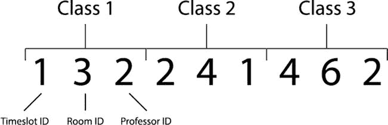

# 五、课程表

## 介绍

在这一章中，我们将创建一个遗传算法来为大学课程表安排课程。我们将考察几个不同的场景，在这些场景中可能会用到排课算法，以及在设计课程表时通常会用到的约束条件。最后，我们将构建一个简单的类调度器，它可以扩展以支持更复杂的实现。

在人工智能中，排课问题是约束满足问题的一个变种。这类问题与问题有关，这些问题有一组变量，需要以避免违反一组已定义的约束的方式进行分配。

约束分为两类:硬约束——产生功能解决方案需要满足的约束，以及软约束——首选但不以牺牲硬约束为代价的约束。

例如，当制造新产品时，产品的功能需求是硬约束，并指定重要的性能需求。没有这些约束，你就没有产品。不能打电话的电话根本算不上电话！然而，你也可能有软约束，虽然不是必需的，但考虑起来仍然很重要，比如产品的成本、重量或美观。

当创建一个排课算法时，通常会有许多硬约束和软约束需要考虑。排课问题的一些典型的硬约束是:

*   教授在任何时候都只能在一个班级
*   教室需要足够大以容纳整个班级
*   教室在任何给定时间只能容纳一个班级
*   教室必须包含任何必需的设备

一些典型的软约束可能是:

*   教室容量应适合班级规模
*   教授的首选教室
*   教授的首选上课时间

有时，多个软约束可能会冲突，需要在它们之间找到一个折衷方案。例如，一个班级可能只有 10 名学生，因此软约束可以奖励分配一个合适的教室，其容量约为 10 人；然而，上课的教授可能更喜欢能容纳 30 名学生的大教室。如果教授偏好被认为是软约束，那么这些配置中的一个将是优选的，并且有希望被课程调度器找到。

在更高级的实现中，还可以对软约束进行加权，以便算法了解哪些软约束是最需要考虑的。

像旅行推销员问题一样，迭代方法可以用来寻找班级调度问题的最优解；然而，随着类别配置数量的增加，找到最佳解决方案变得越来越困难。在这些情况下，当类别配置的可能数量超过通过迭代方法解决的可行数量时，遗传算法是很好的替代方法。虽然他们不能保证找到最优解，但他们非常擅长在合理的时间内找到接近最优的解。

## 问题

在这一章中，我们将讨论的排课问题是一个大学排课器，它可以根据我们提供的数据创建一个大学课程表，比如可用的教授、可用的教室、时间段和学生群体。

我们应该注意，建立大学时间表与建立小学时间表略有不同。小学的时间表要求他们的学生有一个全天的完整时间表，没有空闲时间。相反，典型的大学时间表通常会有自由时间，这取决于学生注册了多少个模块。

每堂课都将被安排一个时间段，一个教授，一个教室和一个学生小组。我们可以通过将学生组的数量乘以每个学生组注册的模块数量相加来计算需要安排的班级总数。

对于我们的应用安排的每个类，我们将考虑以下硬约束:

*   只能安排在免费教室上课
*   一个教授在任何时候只能教一门课
*   教室必须足够大，以容纳学生群体

为了在这个实现中保持简单，我们现在只考虑硬约束；然而，取决于时间表规范，通常会有更多的硬约束。规范中还可能包含许多软约束，现在我们将忽略它们。虽然没有必要，但考虑软约束通常会对遗传算法生成的时间表的质量产生很大影响。

## 履行

是时候使用我们的遗传算法知识来解决这个问题了。在为这个问题建立了一个新的 Java/Eclipse 包之后，我们将从编码染色体开始。

### 开始之前

本章将建立在您在前面所有章节中开发的代码的基础上——因此，密切关注这一部分尤其重要！

在开始之前，创建一个新的 Eclipse 或 NetBeans 项目，或者在现有项目中为这本书创建一个名为“chapter [5](5.html) ”的新包。

从第 [4](4.html) 章复制个体、群体和遗传算法类，并将它们导入第 [5](5.html) 章。确保更新每个类文件顶部的包名！最上面应该都写着“包章 [5](5.html) ”。

打开 GeneticAlgorithm 类并进行以下更改:

*   删除 selectParent 方法，并用第 [3](3.html) 章(锦标赛选择)中的 selectParent 方法替换它
*   删除交叉过剩法，并将其替换为第 [2](2.html) 章中的交叉过剩法(均匀交叉)
*   删除 initPopulation、mutatePopulation、evalPopulation 和 calcPopulation 方法——您将在本章中重新实现它们

Population 和 Individual 类现在可以不考虑，但是请记住，在本章的后面，您将为每个文件添加一个新的构造函数。

### 编码

我们在课程安排应用中使用的编码需要能够有效地编码我们需要的所有课程属性。对于这个实现，它们是:课程安排的时间段、教授上课的教授和课程的教室。

我们可以简单地给每个时间段、教授和教室分配一个数字 ID。然后我们可以使用编码整数数组的染色体——我们熟悉的方法。这意味着每个需要调度的类只需要三个整数来编码，如下所示:



通过将这个数组分成三个块，我们可以检索每个类所需的所有信息。

### 初始化

现在我们已经了解了我们的问题，以及我们将如何对染色体进行编码，我们可以开始实现了。首先，我们需要为我们的调度程序创建一些数据:特别是我们试图围绕其建立时间表的教室、教授、时间段、模块和学生团体。

通常这些数据来自包含完整课程模块和学生数据的数据库。然而，为了实现这个目的，我们将创建一些硬编码的伪数据来使用。

让我们首先设置我们的支持 Java 类。我们将为上面的每种数据类型(房间、班级、小组、教授、模块和时间段)创建一个容器类。虽然每个容器类都非常简单，但它们大多定义了一些类属性、getters 和 setters，没有真正的逻辑。我们将在这里依次打印它们。

首先，创建一个存储教室信息的 Room 类。和往常一样，如果使用 Eclipse，您可以使用文件➤新➤类菜单选项创建这个类。

`package chapter``5`T2】

```java
public class Room {

private final int roomId;

private final String roomNumber;

private final int capacity;

public Room(int roomId, String roomNumber, int capacity) {

this.roomId = roomId;

this.roomNumber = roomNumber;

this.capacity = capacity;

}

public int getRoomId() {

return this.roomId;

}

public String getRoomNumber() {

return this.roomNumber;

}

public int getRoomCapacity() {

return this.capacity;

}

}
```

这个类包含一个构造函数，它接受房间 ID、房间号和房间容量。它还提供了获取房间属性的方法。

接下来，创建一个时隙类；该时间段代表一周中上课的日期和时间。

`package chapter``5`T2】

```java
public class Timeslot {

private final int timeslotId;

private final String timeslot;

public Timeslot(int timeslotId, String timeslot){

this.timeslotId = timeslotId;

this.timeslot = timeslot;

}

public int getTimeslotId(){

return this.timeslotId;

}

public String getTimeslot(){

return this.timeslot;

}

}
```

可以使用构造函数创建一个时隙，并将时隙 ID 和时隙细节作为一个字符串传递给它(细节可能看起来像“Mon 9:00–10:00”)。该类还包含获取对象属性的 getters。

第三个要设立的班级是教授班:

`package chapter``5`T2】

```java
public class Professor {

private final int professorId;

private final String professorName;

public Professor(int professorId, String professorName){

this.professorId = professorId;

this.professorName = professorName;

}

public int getProfessorId(){

return this.professorId;

}

public String getProfessorName(){

return this.professorName;

}

}
```

Professor 类包含一个接受教授 ID 和教授姓名的构造函数；它还包含获取教授属性的 getter 方法。

接下来，添加一个模块类来存储关于课程模块的信息。“模块”是一些人所谓的“课程”，如“微积分 101”或“美国历史 302”，像现实生活中的课程一样，可以有多个部分和学生群体在一周的不同时间与不同的教授一起学习课程。

`package chapter``5`T2】

```java
public class Module {

private final int moduleId;

private final String moduleCode;

private final String module;

private final int professorIds[];

public Module(int moduleId, String moduleCode, String module, int professorIds[]){

this.moduleId = moduleId;

this.moduleCode = moduleCode;

this.module = module;

this.professorIds = professorIds;

}

public int getModuleId(){

return this.moduleId;

}

public String getModuleCode(){

return this.moduleCode;

}

public String getModuleName(){

return this.module;

}

public int getRandomProfessorId(){

int professorId = professorIds[(int) (professorIds.length * Math.random())];

return professorId;

}

}
```

这个模块类包含一个构造函数，它接受模块 ID(数字)、模块代码(类似于“CS101”或“Hist302”)、模块名称和教授 ID 数组，教授 ID 数组可以教授模块。module 类还提供了 getter 方法——以及一个选择随机教授 ID 的方法。

下一个需要的类是 Group class 类，它保存关于学生组的信息。

`package chapter``5`T2】

```java
public class Group {

private final int groupId;

private final int groupSize;

private final int moduleIds[];

public Group(int groupId, int groupSize, int moduleIds[]){

this.groupId = groupId;

this.groupSize = groupSize;

this.moduleIds = moduleIds;

}

public int getGroupId(){

return this.groupId;

}

public int getGroupSize(){

return this.groupSize;

}

public int[] getModuleIds(){

return this.moduleIds;

}

}
```

group 类构造函数接受组 ID、组大小和组采用的模块 ID。它还提供了获取组信息的 getter 方法。

接下来，添加一个“Class”类。可以理解的是，本章中的术语可能会令人困惑——因此，大写的“class”指的是您将要创建的这个 Java 类，而我们将使用小写的“Class”来指代任何其他 Java 类。

Class 代表了以上所有的组合。它代表一个学生小组在特定的时间、特定的教室和特定的教授一起学习某个模块的某个部分。

`package chapter``5`T2】

```java
public class Class {

private final int classId;

private final int groupId;

private final int moduleId;

private int professorId;

private int timeslotId;

private int roomId;

public Class(int classId, int groupId, int moduleId) {

this.classId = classId;

this.moduleId = moduleId;

this.groupId = groupId;

}

public void addProfessor(int professorId) {

this.professorId = professorId;

}

public void addTimeslot(int timeslotId) {

this.timeslotId = timeslotId;

}

public void setRoomId(int roomId) {

this.roomId = roomId;

}

public int getClassId() {

return this.classId;

}

public int getGroupId() {

return this.groupId;

}

public int getModuleId() {

return this.moduleId;

}

public int getProfessorId() {

return this.professorId;

}

public int getTimeslotId() {

return this.timeslotId;

}

public int getRoomId() {

return this.roomId;

}

}
```

现在我们可以创建一个时间表类，将所有这些对象封装成一个时间表对象。到目前为止，时间表类是最重要的类，因为它是唯一理解不同约束应该如何相互作用的类。

Timetable 类还理解如何解析染色体，并创建一个候选时间表进行评估和评分。

`package chapter``5`T2】

```java
import java.util.HashMap;

public class Timetable {

private final HashMap<Integer, Room> rooms;

private final HashMap<Integer, Professor> professors;

private final HashMap<Integer, Module> modules;

private final HashMap<Integer, Group> groups;

private final HashMap<Integer, Timeslot> timeslots;

private Class classes[];

private int numClasses = 0;

/**

* Initialize new Timetable

*

*/

public Timetable() {

this.rooms = new HashMap<Integer, Room>();

this.professors = new HashMap<Integer, Professor>();

this.modules = new HashMap<Integer, Module>();

this.groups = new HashMap<Integer, Group>();

this.timeslots = new HashMap<Integer, Timeslot>();

}

public Timetable(Timetable cloneable) {

this.rooms = cloneable.getRooms();

this.professors = cloneable.getProfessors();

this.modules = cloneable.getModules();

this.groups = cloneable.getGroups();

this.timeslots = cloneable.getTimeslots();

}

private HashMap<Integer, Group> getGroups() {

return this.groups;

}

private HashMap<Integer, Timeslot> getTimeslots() {

return this.timeslots;

}

private HashMap<Integer, Module> getModules() {

return this.modules;

}

private HashMap<Integer, Professor> getProfessors() {

return this.professors;

}

/**

* Add new room

*

* @param roomId

* @param roomName

* @param capacity

*/

public void addRoom(int roomId, String roomName, int capacity) {

this.rooms.put(roomId, new Room(roomId, roomName, capacity));

}

/**

* Add new professor

*

* @param professorId

* @param professorName

*/

public void addProfessor(int professorId, String professorName) {

this.professors.put(professorId, new Professor(professorId, professorName));

}

/**

* Add new module

*

* @param moduleId

* @param moduleCode

* @param module

* @param professorIds

*/

public void addModule(int moduleId, String moduleCode, String module, int professorIds[]) {

this.modules.put(moduleId, new Module(moduleId, moduleCode, module, professorIds));

}

/**

* Add new group

*

* @param groupId

* @param groupSize

* @param moduleIds

*/

public void addGroup(int groupId, int groupSize, int moduleIds[]) {

this.groups.put(groupId, new Group(groupId, groupSize, moduleIds));

this.numClasses = 0;

}

/**

* Add new timeslot

*

* @param timeslotId

* @param timeslot

*/

public void addTimeslot(int timeslotId, String timeslot) {

this.timeslots.put(timeslotId, new Timeslot(timeslotId, timeslot));

}

/**

* Create classes using individual’s chromosome

*

* @param individual

*/

public void createClasses(Individual individual) {

// Init classes

Class classes[] = new Class[this.getNumClasses()];

// Get individual’s chromosome

int chromosome[] = individual.getChromosome();

int chromosomePos = 0;

int classIndex = 0;

for (Group group : this.getGroupsAsArray()) {

int moduleIds[] = group.getModuleIds();

for (int moduleId : moduleIds) {

classes[classIndex] = new Class(classIndex, group.getGroupId(), moduleId);

// Add timeslot

classes[classIndex].addTimeslot(chromosome[chromosomePos]);

chromosomePos++;

// Add room

classes[classIndex].setRoomId(chromosome[chromosomePos]);

chromosomePos++;

// Add professor

classes[classIndex].addProfessor(chromosome[chromosomePos]);

chromosomePos++;

classIndex++;

}

}

this.classes = classes;

}

/**

* Get room from roomId

*

* @param roomId

* @return room

*/

public Room getRoom(int roomId) {

if (!this.rooms.containsKey(roomId)) {

System.out.println("Rooms doesn’t contain key " + roomId);

}

return (Room) this.rooms.get(roomId);

}

public HashMap<Integer, Room> getRooms() {

return this.rooms;

}

/**

* Get random room

*

* @return room

*/

public Room getRandomRoom() {

Object[] roomsArray = this.rooms.values().toArray();

Room room = (Room) roomsArray[(int) (roomsArray.length * Math.random())];

return room;

}

/**

* Get professor from professorId

*

* @param professorId

* @return professor

*/

public Professor getProfessor(int professorId) {

return (Professor) this.professors.get(professorId);

}

/**

* Get module from moduleId

*

* @param moduleId

* @return module

*/

public Module getModule(int moduleId) {

return (Module) this.modules.get(moduleId);

}

/**

* Get moduleIds of student group

*

* @param groupId

* @return moduleId array

*/

public int[] getGroupModules(int groupId) {

Group group = (Group) this.groups.get(groupId);

return group.getModuleIds();

}

/**

* Get group from groupId

*

* @param groupId

* @return group

*/

public Group getGroup(int groupId) {

return (Group) this.groups.get(groupId);

}

/**

* Get all student groups

*

* @return array of groups

*/

public Group[] getGroupsAsArray() {

return (Group[]) this.groups.values().toArray(new Group[this.groups.size()]);

}

/**

* Get timeslot by timeslotId

*

* @param timeslotId

* @return timeslot

*/

public Timeslot getTimeslot(int timeslotId) {

return (Timeslot) this.timeslots.get(timeslotId);

}

/**

* Get random timeslotId

*

* @return timeslot

*/

public Timeslot getRandomTimeslot() {

Object[] timeslotArray = this.timeslots.values().toArray();

Timeslot timeslot = (Timeslot) timeslotArray[(int) (timeslotArray.length * Math.random())];

return timeslot;

}

/**

* Get classes

*

* @return classes

*/

public Class[] getClasses() {

return this.classes;

}

/**

* Get number of classes that need scheduling

*

* @return numClasses

*/

public int getNumClasses() {

if (this.numClasses > 0) {

return this.numClasses;

}

int numClasses = 0;

Group groups[] = (Group[]) this.groups.values().toArray(new Group[this.groups.size()]);

for (Group group : groups) {

numClasses += group.getModuleIds().length;

}

this.numClasses = numClasses;

return this.numClasses;

}

/**

* Calculate the number of clashes

*

* @return numClashes

*/

public int calcClashes() {

int clashes = 0;

for (Class classA : this.classes) {

// Check room capacity

int roomCapacity = this.getRoom(classA.getRoomId()).getRoomCapacity();

int groupSize = this.getGroup(classA.getGroupId()).getGroupSize();

if (roomCapacity < groupSize) {

clashes++;

}

// Check if room is taken

for (Class classB : this.classes) {

if (classA.getRoomId() == classB.getRoomId() && classA.getTimeslotId() == classB.getTimeslotId()

&& classA.getClassId() != classB.getClassId()) {

clashes++;

break;

}

}

// Check if professor is available

for (Class classB : this.classes) {

if (classA.getProfessorId() == classB.getProfessorId() && classA.getTimeslotId() == classB.getTimeslotId()

&& classA.getClassId() != classB.getClassId()) {

clashes++;

break;

}

}

}

return clashes;

}

}
```

这个类包含了在时间表中添加房间、时间段、教授、模块和组的方法。以这种方式，时间表类服务于双重目的:时间表对象知道所有可用的房间、时间段、教授等。，但是时间表对象也可以读取染色体，从该染色体创建类的子集，并帮助评估染色体的适合度。

请密切注意该类中的两个重要方法:createClasses 和 calcClashes。

createClasses 方法接受一个个体(即一个染色体)，并利用它对必须安排的学生组和模块总数的了解，为这些组和模块创建许多类对象。然后，该方法开始读取染色体，并将可变信息(时间段、房间和教授)分配给这些类别中的每一个。因此，createClasses 方法确保每个模块和学生小组都被考虑在内，但它使用遗传算法和结果染色体来尝试不同的时间段、房间和教授组合。Timetable 类在本地缓存这些信息(作为“this.classes”)供以后使用。

一旦构建了类，calcClashes 方法依次检查每个类，并计算“冲突”的数量。在这种情况下，“冲突”是任何硬约束违反，例如教室太小的班级、与教室和时间段的冲突，或者与教授和时间段的冲突。遗传算法的计算方法稍后会使用冲突数。

### 高管阶层

我们现在可以创建一个包含程序的“main”方法的执行类。和前面的章节一样，我们将基于第 2 章中的伪代码构建这个类，用一些“TODO”注释代替我们将在本章中填写的实现细节。

首先，创建一个新的 Java 类，并将其命名为“TimetableGA”。确保它在“package chapter [5](5.html) 中，并向其中添加以下代码:

`package chapter``5`T2】

```java
public class TimetableGA {

public static void main(String[] args) {

// TODO: Create Timetable and initialize with all the available courses, rooms, timeslots, professors, modules, and groups

// Initialize GA

GeneticAlgorithm ga = new GeneticAlgorithm(100, 0.01, 0.9, 2, 5);

// TODO: Initialize population

// TODO: Evaluate population

// Keep track of current generation

int generation = 1;

// Start evolution loop

// TODO: Add termination condition

while (false) {

// Print fitness

System.out.println("G" + generation + " Best fitness: " + population.getFittest(0).getFitness());

// Apply crossover

population = ga.crossoverPopulation(population);

// TODO: Apply mutation

// TODO: Evaluate population

// Increment the current generation

generation++;

}

// TODO: Print final fitness

// TODO: Print final timetable

}

}
```

为了完成这一章，我们给了自己八个待办事项。请注意，交叉不是一个待办事项，我们将重复使用第三章中[的锦标赛选择和第二章](3.html)中[的统一交叉。](2.html)

第一个 TODO 很容易解决，我们现在就做。一般来说，学校课程表的信息来自数据库，但是现在让我们对一些班级和教授进行硬编码。由于下面的代码有点长，让我们在 TimetableGA 类中为它创建一个单独的方法。将此方法添加到您喜欢的任何位置:

```java
private static Timetable initializeTimetable() {

// Create timetable

Timetable timetable = new Timetable();

// Set up rooms

timetable.addRoom(1, "A1", 15);

timetable.addRoom(2, "B1", 30);

timetable.addRoom(4, "D1", 20);

timetable.addRoom(5, "F1", 25);

// Set up timeslots

timetable.addTimeslot(1, "Mon 9:00 - 11:00");

timetable.addTimeslot(2, "Mon 11:00 - 13:00");

timetable.addTimeslot(3, "Mon 13:00 - 15:00");

timetable.addTimeslot(4, "Tue 9:00 - 11:00");

timetable.addTimeslot(5, "Tue 11:00 - 13:00");

timetable.addTimeslot(6, "Tue 13:00 - 15:00");

timetable.addTimeslot(7, "Wed 9:00 - 11:00");

timetable.addTimeslot(8, "Wed 11:00 - 13:00");

timetable.addTimeslot(9, "Wed 13:00 - 15:00");

timetable.addTimeslot(10, "Thu 9:00 - 11:00");

timetable.addTimeslot(11, "Thu 11:00 - 13:00");

timetable.addTimeslot(12, "Thu 13:00 - 15:00");

timetable.addTimeslot(13, "Fri 9:00 - 11:00");

timetable.addTimeslot(14, "Fri 11:00 - 13:00");

timetable.addTimeslot(15, "Fri 13:00 - 15:00");

// Set up professors

timetable.addProfessor(1, "Dr P Smith");

timetable.addProfessor(2, "Mrs E Mitchell");

timetable.addProfessor(3, "Dr R Williams");

timetable.addProfessor(4, "Mr A Thompson");

// Set up modules and define the professors that teach them

timetable.addModule(1, "cs1", "Computer Science", new int[] { 1, 2 });

timetable.addModule(2, "en1", "English", new int[] { 1, 3 });

timetable.addModule(3, "ma1", "Maths", new int[] { 1, 2 });

timetable.addModule(4, "ph1", "Physics", new int[] { 3, 4 });

timetable.addModule(5, "hi1", "History", new int[] { 4 });

timetable.addModule(6, "dr1", "Drama", new int[] { 1, 4 });

// Set up student groups and the modules they take.

timetable.addGroup(1, 10, new int[] { 1, 3, 4 });

timetable.addGroup(2, 30, new int[] { 2, 3, 5, 6 });

timetable.addGroup(3, 18, new int[] { 3, 4, 5 });

timetable.addGroup(4, 25, new int[] { 1, 4 });

timetable.addGroup(5, 20, new int[] { 2, 3, 5 });

timetable.addGroup(6, 22, new int[] { 1, 4, 5 });

timetable.addGroup(7, 16, new int[] { 1, 3 });

timetable.addGroup(8, 18, new int[] { 2, 6 });

timetable.addGroup(9, 24, new int[] { 1, 6 });

timetable.addGroup(10, 25, new int[] { 3, 4 });

return timetable;

}
```

现在，将 main 方法顶部的第一个 TODO 替换为以下内容:

```java
// Get a Timetable object with all the available information.

Timetable timetable = initializeTimetable();
```

main 方法的顶部现在应该看起来像这样:

```java
public class TimetableGA {

public static void main(String[] args) {

// Get a Timetable object with all the available information.

Timetable timetable = initializeTimetable();

// Initialize GA ... (and the rest of the class, unchanged from before!)

GeneticAlgorithm ga = new GeneticAlgorithm(100, 0.01, 0.9, 2, 5);
```

这为我们提供了一个包含所有必要信息的时间表实例，我们创建的 GeneticAlgorithm 对象类似于前面章节中的对象:一个人口为 100 的遗传算法，变异率为 0.01，交叉率为 0.9，2 个精英个体，锦标赛规模为 5。

我们现在还有七个 TODOs。下一个待办事项与初始化填充相关。为了创造一个群体，我们需要知道我们需要的染色体的长度；这是由时间表中小组和模块的数量决定的。

我们需要能够从一个时间表对象初始化一个群体，这意味着我们也需要能够从一个时间表对象初始化一个个体。因此，为了解决这个 TODO，我们必须做三件事:向 GeneticAlgorithm 类添加 initPopulation(Timetable)方法，向接受时间表的群体添加构造函数，向接受时间表的个体添加构造函数。

让我们从底层开始，一步一步往上走。通过添加新的构造函数来更新单个类，该构造函数根据时间表构建单个类。构造函数使用时间表对象来确定必须安排的课程数量，这决定了染色体的长度。染色体本身是通过从时间表中随机抽取房间、时间段和教授来构建的。

将下面的方法添加到单个类中的任意位置:

```java
public Individual(Timetable timetable) {

int numClasses = timetable.getNumClasses();

// 1 gene for room, 1 for time, 1 for professor

int chromosomeLength = numClasses * 3;

// Create random individual

int newChromosome[] = new int[chromosomeLength];

int chromosomeIndex = 0;

// Loop through groups

for (Group group : timetable.getGroupsAsArray()) {

// Loop through modules

for (int moduleId : group.getModuleIds()) {

// Add random time

int timeslotId = timetable.getRandomTimeslot().getTimeslotId();

newChromosome[chromosomeIndex] = timeslotId;

chromosomeIndex++;

// Add random room

int roomId = timetable.getRandomRoom().getRoomId();

newChromosome[chromosomeIndex] = roomId;

chromosomeIndex++;

// Add random professor

Module module = timetable.getModule(moduleId);

newChromosome[chromosomeIndex] = module.getRandomProfessorId();

chromosomeIndex++;

}

}

this.chromosome = newChromosome;

}
```

这个构造函数接受一个时间表对象，并遍历每个学生组和该组注册的每个模块(给出需要安排的班级总数)。对于每个班级，随机选择一个教室、教授和时间段，并将相应的 ID 添加到染色体中。

接下来，将这个构造函数方法添加到 Population 类中。这个构造函数通过简单地调用我们刚刚创建的个体构造函数，从用时间表初始化的个体中构建一个群体。

```java
public Population(int populationSize, Timetable timetable) {

// Initial population

this.population = new Individual[populationSize];

// Loop over population size

for (int individualCount = 0; individualCount < populationSize; individualCount++) {

// Create individual

Individual individual = new Individual(timetable);

// Add individual to population

this.population[individualCount] = individual;

}

}
```

接下来，在 GeneticAlgorithm 类中重新实现 initPopulation 方法，以使用新的 Population 构造函数:

```java
public Population initPopulation(Timetable timetable) {

// Initialize population

Population population = new Population(this.populationSize, timetable);

return population;

}
```

我们最终可以解析下一个 TODO:替换 executive 类的 main 方法中的“TODO: Initialize Population ”,并调用 GeneticAlgorithm 的 initPopulation 方法:

```java
// Initialize population

Population population = ga.initPopulation(timetable);
```

executive TimetableGA 类的主要方法现在应该如下所示。由于我们还没有实现终止条件，这段代码还不会做任何有趣的事情，事实上 Java 编译器可能会抱怨循环内无法到达的代码。我们会尽快解决这个问题。

```java
public static void main(String[] args) {

// Get a Timetable object with all the available information.

Timetable timetable = initializeTimetable();

// Initialize GA

GeneticAlgorithm ga = new GeneticAlgorithm(100, 0.01, 0.9, 2, 5);

// Initialize population

Population population = ga.initPopulation(timetable);

// TODO: Evaluate population

// Keep track of current generation

int generation = 1;

// Start evolution loop

// TODO: Add termination condition

while (false) {

// Print fitness

System.out.println("G" + generation + " Best fitness: " + population.getFittest(0).getFitness());

// Apply crossover

population = ga.crossoverPopulation(population);

// TODO: Apply mutation

// TODO: Evaluate population

// Increment the current generation

generation++;

}

// TODO: Print final fitness

// TODO: Print final timetable

}
```

### 估价

我们的初始种群已经创建，我们需要评估这些个体，并为它们分配适合度值。从前面我们知道，我们的目标是优化我们的课表，以避免打破尽可能多的限制。这意味着个人的适应值将与违反多少约束成反比。

打开并检查时间表类的“createClasses”方法。利用它对需要在特定时间安排到有教授的教室的所有组和模块的了解，它将一个染色体转换成一组类对象，并将它们藏起来以供评估。这个方法不做任何实际的评估，但是它是一个染色体和评估步骤之间的桥梁。

接下来，检查同一个类中的“calcClashes”方法。这种方法将每个班级与其他班级进行比较，如果违反了任何硬约束，例如:如果选定的房间太小，如果该房间的时间安排有冲突，或者如果教授的时间安排有冲突，则添加一个“冲突”。该方法返回它找到的冲突总数。

现在，我们已经准备好创建我们的适应度函数，并最终评估人口中个体的适应度。

打开 GeneticAlgorithm 类，首先添加以下 calcFitness 方法。

```java
public double calcFitness(Individual individual, Timetable timetable) {

// Create new timetable object to use -- cloned from an existing timetable

Timetable threadTimetable = new Timetable(timetable);

threadTimetable.createClasses(individual);

// Calculate fitness

int clashes = threadTimetable.calcClashes();

double fitness = 1 / (double) (clashes + 1);

individual.setFitness(fitness);

return fitness;

}
```

calcFitness 方法克隆给它的时间表对象，调用 createClasses 方法，然后通过 calcClashes 方法计算冲突的数量。适应度定义为碰撞数的倒数-0 碰撞将导致适应度为 1。

也向 GeneticAlgorithm 类添加一个 evalPopulation 方法。和前面的章节一样，这个方法简单地遍历所有的样本，并为每个样本调用 calcFitness。

```java
public void evalPopulation(Population population, Timetable timetable) {

double populationFitness = 0;

// Loop over population evaluating individuals and summing population

// fitness

for (Individual individual : population.getIndividuals()) {

populationFitness += this.calcFitness(individual, timetable);

}

population.setPopulationFitness(populationFitness);

}
```

最后，我们可以在 executive TimetableGA 类的 main 方法中评估总体并解决一些 TODOs。更新具有“TODO:评估人口”的两个位置，改为显示:

```java
// Evaluate population

ga.evalPopulation(population, timetable);
```

此时，应该还有四个 TODOs。此时程序仍然不可运行，因为终止条件尚未定义，循环尚未启用。

### 结束

构建类调度器的下一步是设置终止检查。以前，我们使用世代数和适应度来决定是否要终止我们的遗传算法。这一次，我们将结合这两个终止条件，或者在经过一定数量的代之后，或者如果它找到了有效的解决方案，就终止我们的遗传算法。

因为适应值是基于破坏的约束的数量，所以我们知道完美的解决方案将具有 1 的适应值。保持前面的终止检查不变，并将第二个终止检查添加到 GeneticAlgorithm 类中。我们将在执行循环中使用这两种检查。

```java
public boolean isTerminationConditionMet(Population population) {

return population.getFittest(0).getFitness() == 1.0;

}
```

此时，确认第二个 isTerminationConditionMet 方法(应该已经在 GeneticAlgorithm 类中)如下所示:

```java
public boolean isTerminationConditionMet(int generationsCount, int maxGenerations) {

return (generationsCount > maxGenerations);

}
```

现在，我们可以将两个终止检查添加到我们的 main 方法中，并启用演化循环。打开 executive TimetableGA 类，并按如下方式解决“TODO:Add termination condition”TODO:

```java
// Start evolution loop

while (ga.isTerminationConditionMet(generation, 1000) == false

&& ga.isTerminationConditionMet(population) == false) {

// Rest of the loop in here...
```

第一个 isTerminationConditionMet 调用将我们限制在 1，000 代，而第二个调用检查在群体中是否有任何适合度为 1 的个体。

让我们快速解决另外两个 TODOs。当循环结束时，我们有一些简单的报告要呈现。删除循环后的两个 TODOs(“打印最终健身”和“打印最终时间表”)，替换为以下内容:

```java
// Print fitness

timetable.createClasses(population.getFittest(0));

System.out.println();

System.out.println("Solution found in " + generation + " generations");

System.out.println("Final solution fitness: " + population.getFittest(0).getFitness());

System.out.println("Clashes: " + timetable.calcClashes());

// Print classes

System.out.println();

Class classes[] = timetable.getClasses();

int classIndex = 1;

for (Class bestClass : classes) {

System.out.println("Class " + classIndex + ":");

System.out.println("Module: " +

timetable.getModule(bestClass.getModuleId()).getModuleName());

System.out.println("Group: " +

timetable.getGroup(bestClass.getGroupId()).getGroupId());

System.out.println("Room: " +

timetable.getRoom(bestClass.getRoomId()).getRoomNumber());

System.out.println("Professor: " +

timetable.getProfessor(bestClass.getProfessorId()).getProfessorName());

System.out.println("Time: " +

timetable.getTimeslot(bestClass.getTimeslotId()).getTimeslot());

System.out.println("-----");

classIndex++;

}
```

此时，您应该能够运行程序，观察进化循环，并得到一个结果。没有突变，你可能永远找不到解决方案，但是我们从第 2 章和第 3 章[中重新利用的现有交叉方法通常足以找到解决方案。然而，如果你运行这个程序很多次，但在不到 1000 代的时间里，你从来没有找到一个解决方案，你可能要重新阅读这一章，并确保你没有犯任何错误。](3.html)

我们把熟悉的“交叉”部分从本章中去掉，因为这里没有新的技术。回想一下第二章中的均匀交叉，随机选择染色体并与父代交换，而不保留基因组内的任何连续性。对于这个问题，这是一个很好的方法，因为在这种情况下，基因组(代表教授、房间和时间段的组合)更有可能是有害的，而不是有益的。

### 变化

回想一下，染色体上的约束通常决定了人们为遗传算法选择的突变和交叉技术。在这种情况下，染色体由特定的房间、教授和时间段 id 组成；我们不能简单地选择随机数。此外，由于房间、教授和时间段都有不同的 id 范围，我们也不能简单地在 1 和“X”之间选择一个随机数。潜在地，我们可以为我们正在编码的每一种不同类型的对象(房间、教授和时间段)选择随机数，但这也假设 id 是连续的，它们可能不是！

我们可以从均匀交叉中得到一个提示来解决我们的变异问题。在均匀交叉中，从现有的有效亲本中随机选择基因。父母可能不是群体中最合适的个体，但至少是有效的。

突变可以以类似的方式实现。我们可以创建一个新的随机但有效的个体，并在本质上运行均匀交叉来实现变异，而不是为染色体中的随机基因选择一个随机数！也就是我们可以用我们的个体(时间表)构造器创造一个全新的随机个体，然后从随机个体中选择基因复制到要变异的个体中。这种技术被称为统一突变，它确保我们所有突变的个体都是完全有效的，永远不会选择没有意义的基因。在 GeneticAlgorithm 类中的任意位置添加以下方法:

```java
public Population mutatePopulation(Population population, Timetable timetable) {

// Initialize new population

Population newPopulation = new Population(this.populationSize);

// Loop over current population by fitness

for (int populationIndex = 0; populationIndex < population.size(); populationIndex++) {

Individual individual = population.getFittest(populationIndex);

// Create random individual to swap genes with

Individual randomIndividual = new Individual(timetable);

// Loop over individual’s genes

for (int geneIndex = 0; geneIndex < individual.getChromosomeLength(); geneIndex++) {

// Skip mutation if this is an elite individual

if (populationIndex > this.elitismCount) {

// Does this gene need mutation?

if (this.mutationRate > Math.random()) {

// Swap for new gene

individual.setGene(geneIndex, randomIndividual.getGene(geneIndex));

}

}

}

// Add individual to population

newPopulation.setIndividual(populationIndex, individual);

}

// Return mutated population

return newPopulation;

}
```

在这种方法中，像前几章中的突变一样，群体通过在群体中的非精英个体上循环来突变。与其他倾向于直接修改基因的突变技术不同，这种突变算法创建一个随机但有效的个体，并从中随机复制基因。

我们现在可以在执行类的 main 方法中解析最终的 TODO。将这个一行程序添加到主循环中:

```java
// Apply mutation

population = ga.mutatePopulation(population, timetable);
```

我们现在应该一切就绪，可以运行我们的遗传算法，并创建一个新的大学时间表。如果您的 Java IDE 显示错误，或者如果它此时不能编译，请回顾本章并解决您发现的任何问题。

### 执行

确保您的 TimetableGA 类如下所示:

`package chapter``5`T2】

```java
public class TimetableGA {

public static void main(String[] args) {

// Get a Timetable object with all the available information.

Timetable timetable = initializeTimetable();

// Initialize GA

GeneticAlgorithm ga = new GeneticAlgorithm(100, 0.01, 0.9, 2, 5);

// Initialize population

Population population = ga.initPopulation(timetable);

// Evaluate population

ga.evalPopulation(population, timetable);

// Keep track of current generation

int generation = 1;

// Start evolution loop

while (ga.isTerminationConditionMet(generation, 1000) == false

&& ga.isTerminationConditionMet(population) == false) {

// Print fitness

System.out.println("G" + generation + " Best fitness: " + population.getFittest(0).getFitness());

// Apply crossover

population = ga.crossoverPopulation(population);

// Apply mutation

population = ga.mutatePopulation(population, timetable);

// Evaluate population

ga.evalPopulation(population, timetable);

// Increment the current generation

generation++;

}

// Print fitness

timetable.createClasses(population.getFittest(0));

System.out.println();

System.out.println("Solution found in " + generation + " generations");

System.out.println("Final solution fitness: " + population.getFittest(0).getFitness());

System.out.println("Clashes: " + timetable.calcClashes());

// Print classes

System.out.println();

Class classes[] = timetable.getClasses();

int classIndex = 1;

for (Class bestClass : classes) {

System.out.println("Class " + classIndex + ":");

System.out.println("Module: " +

timetable.getModule(bestClass.getModuleId()).getModuleName());

System.out.println("Group: " +

timetable.getGroup(bestClass.getGroupId()).getGroupId());

System.out.println("Room: " +

timetable.getRoom(bestClass.getRoomId()).getRoomNumber());

System.out.println("Professor: " +

timetable.getProfessor(bestClass.getProfessorId()).getProfessorName());

System.out.println("Time: " +

timetable.getTimeslot(bestClass.getTimeslotId()).getTimeslot());

System.out.println("-----");

classIndex++;

}

}

/**

* Creates a Timetable with all the necessary course information.

* @return

*/

private static Timetable initializeTimetable() {

// Create timetable

Timetable timetable = new Timetable();

// Set up rooms

timetable.addRoom(1, "A1", 15);

timetable.addRoom(2, "B1", 30);

timetable.addRoom(4, "D1", 20);

timetable.addRoom(5, "F1", 25);

// Set up timeslots

timetable.addTimeslot(1, "Mon 9:00 - 11:00");

timetable.addTimeslot(2, "Mon 11:00 - 13:00");

timetable.addTimeslot(3, "Mon 13:00 - 15:00");

timetable.addTimeslot(4, "Tue 9:00 - 11:00");

timetable.addTimeslot(5, "Tue 11:00 - 13:00");

timetable.addTimeslot(6, "Tue 13:00 - 15:00");

timetable.addTimeslot(7, "Wed 9:00 - 11:00");

timetable.addTimeslot(8, "Wed 11:00 - 13:00");

timetable.addTimeslot(9, "Wed 13:00 - 15:00");

timetable.addTimeslot(10, "Thu 9:00 - 11:00");

timetable.addTimeslot(11, "Thu 11:00 - 13:00");

timetable.addTimeslot(12, "Thu 13:00 - 15:00");

timetable.addTimeslot(13, "Fri 9:00 - 11:00");

timetable.addTimeslot(14, "Fri 11:00 - 13:00");

timetable.addTimeslot(15, "Fri 13:00 - 15:00");

// Set up professors

timetable.addProfessor(1, "Dr P Smith");

timetable.addProfessor(2, "Mrs E Mitchell");

timetable.addProfessor(3, "Dr R Williams");

timetable.addProfessor(4, "Mr A Thompson");

// Set up modules and define the professors that teach them

timetable.addModule(1, "cs1", "Computer Science", new int[] { 1, 2 });

timetable.addModule(2, "en1", "English", new int[] { 1, 3 });

timetable.addModule(3, "ma1", "Maths", new int[] { 1, 2 });

timetable.addModule(4, "ph1", "Physics", new int[] { 3, 4 });

timetable.addModule(5, "hi1", "History", new int[] { 4 });

timetable.addModule(6, "dr1", "Drama", new int[] { 1, 4 });

// Set up student groups and the modules they take.

timetable.addGroup(1, 10, new int[] { 1, 3, 4 });

timetable.addGroup(2, 30, new int[] { 2, 3, 5, 6 });

timetable.addGroup(3, 18, new int[] { 3, 4, 5 });

timetable.addGroup(4, 25, new int[] { 1, 4 });

timetable.addGroup(5, 20, new int[] { 2, 3, 5 });

timetable.addGroup(6, 22, new int[] { 1, 4, 5 });

timetable.addGroup(7, 16, new int[] { 1, 3 });

timetable.addGroup(8, 18, new int[] { 2, 6 });

timetable.addGroup(9, 24, new int[] { 1, 6 });

timetable.addGroup(10, 25, new int[] { 3, 4 });

return timetable;

}

}
```

按原样运行类调度器应该生成大约 50 代的解决方案，并且在所有情况下应该呈现零冲突(硬约束)的解决方案。如果您的算法反复达到 1，000 代的限制，或者如果它提供了有冲突的解决方案，那么您的实现可能有问题！

花一分钟时间直观地检查算法返回的时间表结果。确认教授、房间和时间段之间没有实际冲突。

此时，您可能还想尝试在 TimetableGA 的“initializeTimetable”方法中为时间表初始化添加更多教授、模块、时隙、组和房间。能不能强制算法失效？

## 分析和提炼

排课问题是一个很好的例子，它使用遗传算法在解空间中搜索有效解，而不是最优解。这个问题可以有许多适合度为 1 的解，我们所要做的就是找到这些有效解中的一个。当只考虑硬约束时，任何两个有效的解决方案之间没有真正的区别，我们可以简单地选择我们找到的第一个解决方案。

与第四章中的旅行推销员问题不同，排课问题的这一特性意味着算法实际上可以返回无效解。旅行推销员问题中的一个解决方案如果没有访问每个城市一次就可能是无效的，但是因为我们非常小心地设计了我们的初始化、交叉和变异算法，所以使用来自[第 4 章](4.html)的代码，我们不会遇到无效的解决方案。我们的 TSP 求解器返回的所有路径都是有效的，这只是一个寻找最短可能路径的问题。如果我们在任何一代中的任何一点停止 TSP 算法，并随机选择一个群体成员，这将是一个有效的解决方案。

然而，在这一章中，大多数解决方案都是无效的，我们只有在找到第一个有效的解决方案或时间用完时才停下来。这两个问题的区别如下:在旅行推销员问题中，很容易创建一个有效的解决方案(只要确保每个城市都被访问一次；但是，不能保证解决方案的适用性！)，但是在班级调度器中，创建有效的解决方案是困难的部分。

此外，如果没有任何软约束，由类调度器返回的任何两个有效解之间的适合度没有差别。在这种情况下，硬约束决定解决方案是否有效，而软约束决定解决方案的质量。上面的实现并不偏好任何特定的有效解决方案，因为它无法确定解决方案的质量——它只知道解决方案是否有效。

向类调度器添加软约束会显著改变这个问题。我们不再只是寻找任何有效的解决方案，而是想要最好的有效解决方案。

幸运的是，遗传算法特别擅长这种类型的约束杂耍。事实上，一个人只由一个单一的数字来判断——它的适应性——这对我们有利。决定个体适应度的算法对遗传算法来说是完全不透明的——就遗传算法而言，这是一个黑箱。虽然适应值对于遗传算法非常重要，不能随意实现，但它的简单性和不透明性也让我们可以用它来协调各种约束和条件。因为一切都可以归结为一个无量纲的适应度分数，所以我们能够缩放和转换尽可能多的约束，并且该约束的重要性由它对适应度分数的贡献程度来表示。

上面实现的类调度器仅使用硬约束，并将适合度分数限制在 0-1 的范围内。当组合不同类型的约束时，应该确保硬约束对适应性分数具有压倒性的影响，而软约束做出更适度的贡献。

例如，假设您需要向类调度器添加一些软约束，每个软约束的重要性略有不同。当然，硬约束仍然适用。你如何调和软约束和硬约束？现有的适应度分数“1 /(冲突+ 1)”显然不包含软约束，即使它将破坏的软约束视为“冲突”，仍会将它们与硬约束置于同等地位。在该模型下，有可能选择一个无效的解决方案，因为它可能有许多满足的软约束，这些软约束弥补了由于硬约束被破坏而导致的适应性损失。

相反，考虑一个新的适应度评分系统:每个打破的硬约束从适应度分数中减去 100，而任何满足的软约束可能根据其重要性给适应度分数增加 1、2 或 3 分。在这个方案下，我们应该只考虑得分为零或以上的解决方案，因为任何负值都有一个破坏的硬约束。该方案还确保了一个被破坏的硬约束不可能被大量满足的软约束抵消——一个硬约束对适应性分数的贡献如此巨大，以至于软约束不可能弥补一个被破坏的硬约束所扣掉的 100 分。最后，该方案还允许您对软约束进行优先级排序——越重要的约束对适应度分数的贡献越大。

为了进一步说明适合度分数归一化约束的思想；考虑任何地图和方向工具(如谷歌地图)。当您搜索两个位置之间的方向时，健身分数的主要贡献者是从一个地方到另一个地方所需的时间。一个简单的算法可能使用以分钟为单位的旅行时间作为其适应度得分(在这种情况下，我们将它称为“成本得分”，因为越低越好，而适应度的倒数通常称为“成本”)。

花费 60 分钟的路线比花费 70 分钟的路线要好——但是我们知道现实生活中并不总是这样。也许更短的路线有 20 美元的高昂费用。用户可以选择“避免通行费”选项，现在算法必须协调驾驶分钟数和通行费。一美元值多少分钟？如果你决定每一美元给成本分数加一分，那么较短的路线现在的成本是 80，输给了较长但更便宜的路线。另一方面，如果你减少了避免通行费的权重，并决定 1 美元的通行费只给路线增加了 0.25 英镑的成本，则较短的路线仍将以 65 英镑的成本获胜。

最后，当在遗传算法中处理硬约束和软约束时，一定要理解适应度分数代表什么，以及每个约束将如何影响个人的分数。

### 练习

Add soft constraints to the class scheduler. This could include preferred professor time and preferred classrooms.   Implement support for a config file or database connection to add initial timetable data.   Build a class scheduler for a school timetable that requires students to have a class scheduled for each period.  

## 摘要

在这一章中，我们已经讲述了使用遗传算法安排课程的基础知识。我们没有使用遗传算法来寻找最优解，而是使用遗传算法来寻找满足许多硬约束的第一个有效解。

我们还探索了一种新的突变策略，确保突变的染色体仍然有效。我们没有直接修改染色体并增加随机性——在这种情况下，这可能导致无效的染色体——而是创建了一个已知有效的随机个体，并以一种类似于均匀交叉的方式与其交换基因。该算法仍然被认为是一致变异，但是本章中使用的新方法使得确保有效变异变得更加容易。

我们还结合了第 2 章的[的统一交叉和第 3 章](2.html)的[的锦标赛选择，展示了遗传算法的许多方面是模块化的、独立的，并且能够以不同的方式组合。](3.html)

最后，我们讨论了遗传算法中适应值的灵活性。我们了解到，无量纲适合度分数可用于引入软约束，并使它们与硬约束相协调，最终目标是不仅产生有效的结果，还产生高质量的结果。