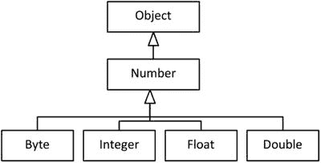
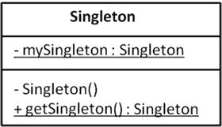

# 二、Java 类设计

  
| 认证目标 |
| --- |
| 实现封装 |
| 实现继承，包括可见性修饰符和组合 |
| 实现多态性 |
| 重写 Object 类的 hashCode、equals 和 toString 方法 |
| 创建和使用单例类和不可变类 |
| 开发在初始化块、变量、方法和类时使用 static 关键字的代码 |

面向对象(OO)是当今大多数主流编程语言的核心。为了创建高质量的设计和软件，很重要的一点是要掌握面向对象的概念。这一章是关于类设计的，下一章是关于高级类设计的，这为你用 Java 创建高质量的设计打下了坚实的基础。

由于 OCAJP 8 是 OCPJP 8 考试的先决条件，我们假设你熟悉基本概念，如方法，字段，以及如何定义一个构造函数。因此，在这一章中，我们开始直接讨论 OCPJP 8 考试题目。在第一部分中，我们讨论了如何使用访问说明符实施封装，以及如何实现继承和多态。在下一节中，我们将深入研究在`Object`类中覆盖方法的细节，定义单例类和不可变类，并分析使用`static`关键字的不同方式。

## 包装

  
| 认证目标 |
| --- |
| 实现封装 |

结构化编程将程序的功能分解成不同的过程(函数)，而不太关心每个过程可以处理的数据。函数可以自由地操作和修改(通常是全局的和无保护的)数据。

在面向对象编程(OOP)中，数据和相关联的行为形成了一个单一的单元，称为类。术语封装是指将数据和相关功能组合成一个单元。例如，在一个`Circle`类中，`radius`和`center`被定义为私有字段。现在您可以添加方法，如`draw()`和`fillColor()`以及字段`radius`和`center`，因为字段和方法彼此紧密相关。该类中的方法所需的所有数据(字段)都可以在该类内部获得。换句话说，该类将其字段和方法封装在一起。

### 访问修饰符

  
| 认证目标 |
| --- |
| 实现继承，包括可见性修饰符和组合 |

访问修饰符决定了 Java 实体(类、方法或字段)的可见性级别。访问修饰符使您能够实施有效的封装。如果一个类的所有成员变量都可以从任何地方访问，那么就没有必要将这些变量放在一个类中，也没有必要将数据和行为封装在一个类中。

OCPJP 8 考试包括关于访问修饰语的直接问题和需要访问修饰语基础知识的间接问题。因此，理解 Java 支持的各种访问修饰符是很重要的。

Java 支持四种类型的访问修饰符:

*   公众
*   私人的
*   保护
*   默认值(未指定访问修饰符)

为了说明这四种类型的访问修饰符，让我们假设在一个绘图应用中有以下类:`Shape, Circle, Circles`和`Canvas`类。`Canvas`级在`appcanvas`包中，其他三级在`graphicshape`包中(见清单 [2-1](#FPar1) )。

Listing 2-1\. Shape.java, Circle.java, Circles.java, and Canvas.java

```java
// Shape.java

package graphicshape;

class Shape {
```

`protected` `int color;`

```java
}

// Circle.java

package graphicshape;

import graphicshape.Shape;
```

`public` `class Circle extends Shape {`

`private` `int radius;     // private field`

`public` `void area() {    // public method`

```java
// access to private field radius inside the class:

System.out.println("area: " + 3.14 * radius * radius);

}

// The fillColor method has default access

void fillColor() {

//access to protected field, in subclass:

System.out.println("color: " + color);

}

}

// Circles.java

package graphicshape;

class Circles {

void getArea() {

Circle circle = new Circle();

// call to public method area() within package:

circle.area();

// calling fillColor() with default access within package:

circle.fillColor();

}

}

// Canvas.java

package appcanvas;

import graphicshape.Circle;

class Canvas {

void getArea() {

Circle  circle = new Circle();

circle.area();   // call to public method area(), outside package

}

}
```

#### 公共访问修饰符

公共访问修饰符是最自由的。如果一个类或它的成员被声明为 public，那么不管包边界如何，它们都可以从任何其他类中被访问。它相当于现实世界中的公共场所，例如公司的自助餐厅，所有员工都可以使用，不管他们属于哪个部门。如清单 [2-1](#FPar1) 所示，`Circle`类中的公共方法`area()`可以在同一个包内访问，也可以在包外访问(在`Canvas`类中)。

只有当一个类被声明为公共的，这个类中的公共方法才可以被外界访问。如果该类没有指定任何访问修饰符(即，它具有默认访问权限)，那么该公共方法只能在包含它的包中访问。

#### 私有访问修饰符

私有访问修饰符是最严格的访问修饰符。不能从类外部访问私有类成员；只有同一类的成员才能访问这些私有成员。它堪比银行里的保险箱室，只有一组授权人员和保险箱所有者才能进入。在清单 [2-1](#FPar1) 中，`Circle`类的私有字段半径只能在`Circle`类内部访问，而不能在任何其他类中访问，不管封装包是什么。

#### 受保护和默认访问修饰符

受保护的和默认的访问修饰符彼此非常相似。如果成员方法或字段被声明为 protected 或 default，则可以在包内访问该方法或字段。请注意，没有显式关键字来提供默认访问；事实上，当没有指定访问修饰符时，该成员具有默认访问权限。另外，请注意，默认访问也称为受包保护的访问。受保护的和默认的访问类似于办公室中只有一个部门可以访问会议室的情况。

受保护的访问和默认访问有什么区别？当我们谈论一个子类属于另一个包而不是它的超类时，这两个访问修饰符之间的一个显著区别就出现了。在这种情况下，受保护的成员在子类中是可访问的，而默认成员则不是。

不能将类(或接口)声明为私有或受保护的。此外，接口的成员方法或字段不能声明为私有或受保护的。

在清单 [2-1](#FPar1) 中，受保护字段`color`在类`Circle`中被访问，默认方法`fillColor()`从类`Circles`中被调用。

表 [2-1](#Tab1) 总结了各种访问修饰符提供的可见性。

表 2-1。

Access Modifiers and Their Visibility

      
| 访问修饰符/可访问性 | 在同一个班级 | 包内的子类 | 包外的子类 | 包内的其他类 | 包外的其他类 |
| --- | --- | --- | --- | --- | --- |
| 公众 | 是 | 是 | 是 | 是 | 是 |
| 私人的 | 是 | 不 | 不 | 不 | 不 |
| 保护 | 是 | 是 | 是 | 是 | 不 |
| 默认 | 是 | 是 | 不 | 是 | 不 |

## 遗产

继承是面向对象编程中的一种可重用机制。通过继承，各种对象的公共属性被用来形成彼此之间的关系。抽象和公共属性在超类中提供，超类可用于更专门化的子类。例如，彩色打印机和黑白打印机是打印机的种类(单一继承)；一体式打印机是打印机、扫描仪和复印机(多重继承)。

为什么继承是一个强大的特性？因为它支持在一个层次结构中建模类，而且这样的层次模型很容易理解。例如，您可以从逻辑上将车辆分类为两轮车、三轮车、四轮车等等。在四轮车类别中，有轿车、货车、公共汽车和卡车。在汽车类别中，有掀背车、轿车和 SUV。当你分层分类时，理解、建模和编写程序就变得容易了。

考虑前面章节中使用的一个简单例子:类`Shape`是一个基类，而`Circle`是一个派生类。换句话说，一只`Circle`就是一只`Shape`；同样，一个`Square`就是一个`Shape`。因此，继承关系可以称为 IS-A 关系。

在 Java 库中，可以看到继承的广泛使用。图 [2-1](#Fig1) 显示了来自`java.lang`库的部分继承层次。`Number`类抽象出各种数值(引用)类型，如`Byte`、`Integer`、`Float`、`Double`、`Short`和`BigDecimal`。



图 2-1。

A partial inheritance hierarchy in java.lang package

类`Number`有许多被派生类继承的公共方法。派生类不必实现由`Number`类实现的公共方法。此外，您可以在需要基类型的地方提供一个派生类型。例如，`Byte`是一个`Number`，这意味着你可以在需要一个`Number`对象的地方提供一个`Byte`对象。为基类型编写方法时，可以编写通用方法(或算法)。清单 [2-2](#FPar2) 显示了一个简单的例子。

Listing 2-2\. TestNumber.java

```java
// Illustrates how abstracting different kinds of numbers in a Number hierarchy

// becomes useful in practice

public class TestNumber {

// take an array of numbers and sum them up

public static double sum(Number []nums) {

double sum = 0.0;

for(Number num : nums) {

sum += num.doubleValue();

}

return sum;

}

public static void main(String []s) {

// create a Number array

Number []nums = new Number[4];

// assign derived class objects

nums[0] = new Byte((byte)10);

nums[1] = new Integer(10);

nums[2] = new Float(10.0f);

nums[3] = new Double(10.0f);

// pass the Number array to sum and print the result

System.out.println("The sum of numbers is: " + sum(nums));

}

}
```

这个程序打印

```java
The sum of numbers is: 40.0
```

在`main()`方法中，您将`nums`声明为一个`Number[]`。一个`Number`引用可以保存它的任何派生类型对象。您正在创建类型为`Byte`、`Integer`、`Float`和`Double`的对象，初始值为 10；`nums`数组保存这些元素。(请注意，您需要在`new Byte((byte) 10)`中进行显式强制转换，而不是普通的`Byte(10)`，因为`Byte`接受一个`byte`参数，而 10 是一个`int`。)

`sum`方法接受一个`Number[]`并返回`Number`元素的总和。`double`类型可以保存最大范围的值，所以使用`double`作为`sum`方法的返回类型。`Number`有一个`doubleValue`方法，这个方法返回由`Number`保存的值作为`double`值。`for`循环遍历数组，添加`double`值，然后在完成后返回`sum`。

如您所见，`sum()`方法是一个通用方法，可以处理任何`Number[]`。从 Java 标准库中可以给出一个类似的例子，其中`java.util.Arrays`类有一个静态方法`binarySearch()`:

```java
static int binarySearch(Object[] a, Object key, Comparator c)
```

这个方法在给定的数组`Objects. Comparator`中搜索一个给定的键(一个`Object`类型)是一个声明`equals`和`compare`方法的接口。您可以将`binarySearch`用于实现这个`Comparator`接口的任何类类型的对象。正如您所看到的，对于编写通用方法来说，继承是一个强大而有用的特性。

## 多态性

  
| 认证目标 |
| --- |
| 实现多态性 |

术语多态性的希腊词根指的是一个实体的“几种形式”。在现实世界中，你传达的每一条信息都有一个语境。根据上下文，消息的含义可能会改变，对消息的响应也可能会改变。类似地，在 OOP 中，根据对象的不同，消息可以有多种解释方式(多态性)。

多态有两种形式:动态和静态。

*   当单个实体的不同形式在运行时(后期绑定)被解析时，这种多态性被称为动态多态性。在上一节关于继承的内容中，我们讨论了重写。重写是运行时多态性的一个例子。
*   当单个实体的不同形式在编译时被解析时(早期绑定)，这种多态性被称为静态多态性。函数重载是静态多态的一个例子，现在让我们来探讨一下。

请注意，抽象方法使用运行时多态性。我们将在下一章讨论接口中的抽象方法和抽象类([第 3 章](03.html)——高级类设计)。

### 运行时多态性

您刚刚学习了基类引用可以引用派生类对象。您可以从基类引用中调用方法；然而，实际的方法调用取决于基类引用所指向的对象的动态类型。基类引用的类型称为对象的静态类型，运行时引用所指向的实际对象称为对象的动态类型。

当编译器从基类引用中看到方法调用时，并且如果该方法是可重写的方法(非静态和非最终方法)，编译器会推迟确定要在运行时调用的确切方法(后期绑定)。在运行时，基于对象的实际动态类型，调用适当的方法。这种机制被称为动态方法解析或动态方法调用。

#### 运行时多态性:一个例子

假设在`Shape`类中有`area()`方法。根据派生类——例如`Circle`或`Square`——`area()`方法将被不同地实现，如清单 [2-3](#FPar3) 所示。

Listing 2-3\. TestShape.java

```java
class Shape {

public double area() { return 0; } // default implementation

// other members

}

class Circle extends Shape {

private int radius;

public Circle(int r) { radius = r; }

// other constructors

public double area() {return Math.PI * radius * radius; }

// other declarations

}

class Square extends Shape {

private int side;

public Square(int a) { side = a; }

public double area() { return side * side; }

// other declarations

}

public class TestShape {

public static void main(String []args) {

Shape shape1 = new Circle(10);

System.out.println(shape1.area());

Shape shape2 = new Square(10);

System.out.println(shape2.area());

}

}
```

这个程序打印

```java
314.1592653589793

100.0
```

这个程序演示了如何基于`Shape`的动态类型调用`area()`方法。在这段代码中，语句`shape1.area();`调用`Circle's area()`方法，而语句`shape2.area();`调用`Square's area()`方法，从而得到结果。

现在，让我们问一个更基本的问题:为什么需要重写方法？在 OOP 中，继承的基本思想是在基类中提供一个默认的或公共的功能；派生类应该提供更具体的功能。在这个`Shape`基类和`Circle`和`Square`派生类中，`Shape`提供了`area()`方法的默认实现。`Circle`和`Square`的派生类定义了覆盖基类`area()`方法的`area()`方法版本。因此，根据您创建的派生对象的类型，从基类引用，对`area()`方法的调用将被解析为正确的方法。覆盖(即运行时多态性)是扩展功能的一个简单而强大的想法。

现在让我们讨论编译时多态性(重载)。在此之后，我们将立即回到运行时多态性的主题，讨论更多的主题，如当在组合和继承之间重写和选择时如何处理可见性修饰符。

### 方法重载

在一个类中，可以定义多少个同名的方法？很多！在 Java 中，只要参数列表互不相同，就可以用相同的名称定义多个方法。换句话说，如果您提供不同类型的参数、不同数量的参数，或者两者都提供，那么您可以用相同的名称定义多个方法。这个特性被称为方法重载。编译器将根据所传递参数的实际数量和/或类型来解析对正确方法的调用。

让我们在`Circle`类中实现一个名为`fillColor()`的方法，用不同的颜色填充一个圆形对象。当你指定一种颜色时，你需要使用一种配色方案，让我们考虑两种方案- RGB 方案和 HSB 方案。

When you represent a color by combining Red, Green, and Blue color components, it is known as RGB scheme. By convention, each of the color values is typically given in the range 0 to 255.   When you represent a color by combining Hue, Saturation, and Brightness values, it is known as HSB scheme. By convention, each of the values is typically given in the range 0.0 to 1.0.  

既然 RGB 值是整数值，HSB 值是浮点值，那么支持这两种方案调用`fillColor()`方法怎么样？

```java
class Circle {

// other members

public void fillColor (int red, int green, int blue) {

/* color the circle using RGB color values – actual code elided */

}

public void fillColor (float hue, float saturation, float brightness) {

/* color the circle using HSB values – actual code elided */

}

}
```

如您所见，两个`fillColor()`方法有完全相同的名称，并且都有三个参数；但是，参数类型是不同的。基于在`Circle`上调用`fillColor()`方法时使用的参数类型，编译器将准确地决定调用哪个方法。例如，考虑以下方法调用:

```java
Circle c1 = new Circle(10, 20, 10);

c1.fillColor(0, 255, 255);

Circle c2 = new Circle(50, 100, 5);

c2.fillColor(0.5f, 0.5f, 1.0f);
```

在这段代码中，对于`c1`对象，对`fillColor()`的调用有整数参数 0、255 和 255。因此，编译器将这个调用解析为方法`fillColor(int red, int green, int blue)`。对于`c2`对象，对`fillColor()`的调用有参数 0.5f、0.5f 和 1.0f 因此，它将调用解析到`fillColor(float hue, float saturation, float brightness)`。

在上面的例子中，方法`fillColor()`是一个重载的方法。该方法具有相同的名称和相同数量的参数，但参数的类型不同。也可以用不同数量的参数重载方法。

这种重载方法有助于避免在不同的函数中重复相同的代码。让我们看看清单 [2-4](#FPar4) 中的一个简单例子。

Listing 2-4\. HappyBirthday.java

```java
class HappyBirthday {

// overloaded wish method with String as an argument

public static void wish(String name) {

System.out.println("Happy birthday " + name + "!");

}

// overloaded wish method with no arguments;

// this method in turn invokes wish(String) method

public static void wish() {

wish("to you");

}

public static void main(String []args) {

wish();

wish("dear James Gosling");

}

}
```

它打印:

```java
Happy birthday to you!

Happy birthday dear James Gosling!
```

这里，方法`wish(String name)`的意思是当知道某人的名字时，祝他“生日快乐”。默认方法`wish()`是祝任何人“生日快乐”。可以看到，`wish()`方法中不用再写`System.out.println`；您可以通过将默认值“to you”作为参数传递给`wish()`来重用`wish(String)`方法定义。这种重用对于大型和相关的方法定义是有效的，因为它节省了编写和测试相同代码的时间。

### 构造函数重载

默认构造函数对于创建具有默认初始化值的对象很有用。当您希望在不同的实例化中用不同的值初始化对象时，可以将它们作为参数传递给构造函数。是的，一个类中可以有多个构造函数，这就是构造函数重载。在一个类中，默认构造函数可以用默认初始值初始化对象，而另一个构造函数可以接受需要用于对象实例化的参数。

这里有一个重载构造函数的`Circle`类的例子(见清单 [2-5](#FPar5) )。

Listing 2-5\. Circle.java

```java
public class Circle {

private int xPos;

private int yPos;

private int radius;

// three overloaded constructors for Circle

public Circle(int x, int y, int r) {

xPos = x;

yPos = y;

radius = r;

}

public Circle(int x, int y) {

xPos = x;

yPos = y;

radius = 10; // default radius

}

public Circle() {

xPos = 20; // assume some default values for xPos and yPos

yPos = 20;

radius = 10; // default radius

}

public String toString() {

return "center = (" + xPos + "," + yPos + ") and radius = " + radius;

}

public static void main(String[]s) {

System.out.println(new Circle());

System.out.println(new Circle(50, 100));

System.out.println(new Circle(25, 50, 5));

}

}
```

这个程序打印

```java
center = (20,20) and radius = 10

center = (50,100) and radius = 10

center = (25,50) and radius = 5
```

正如您所看到的，编译器已经根据参数的数量解析了构造函数调用。默认的构造函数没有参数，在这种情况下，我们为`xPos`、`yPos`和`radius`假设了一些默认值(分别为值 20、20 和 10)。带有两个参数(int `x`和 int `y`)的`Circle`构造函数根据传递的参数值设置`xPos`和`yPos`的位置，并假设 radius 成员的默认值为 10。接受所有三个参数的`Circle`构造函数在`Circle`类中设置相应的字段。

您是否注意到您在这三个构造函数中复制了代码？为了避免代码重复，并减少您的输入工作，您可以从一个构造函数调用另一个构造函数。在这三个构造函数中，采用 x 位置、y 位置和半径的构造函数是最通用的构造函数。其他两个构造函数可以通过调用三个参数构造函数来重写，如下所示:

```java
public Circle(int x, int y, int r) {

xPos = x;

yPos = y;

radius = r;

}

public Circle(int x, int y) {

this(x, y, 10); // passing default radius 10

}

public Circle() {

this(20, 20, 10);

// assume some default values for xPos, yPos and radius

}
```

输出与前一个程序完全相同，但是这个程序更短。在这种情况下，您使用了`this`关键字(指当前对象)从同一个类的另一个构造函数中调用一个构造函数。

### 霸王决议

定义重载方法时，编译器如何知道调用哪个方法？你能猜出清单 [2-6](#FPar6) 中代码的输出吗？

Listing 2-6\. Overloaded.java

```java
class Overloaded {

public static void aMethod (int val)    { System.out.println ("int");    }

public static void aMethod (short val)  { System.out.println ("short");  }

public static void aMethod (Object val) { System.out.println ("object"); }

public static void aMethod (String val) { System.out.println ("String"); }

public static void main(String[] args) {

byte b = 9;

aMethod(b);     // first call

aMethod(9);     // second call

Integer i = 9;

aMethod(i);     // third call

aMethod("9");   // fourth call

}

}
```

它可以打印

```java
short

int

object

String
```

下面是编译器如何解析这些调用:

In the first method call, the statement is `aMethod(b)` where the variable `b` is of type `byte`. There is no `aMethod` definition that takes `byte` as an argument. The closest type (in size) is `short` type and not `int`, so the compiler resolves the call `aMethod(b)` to `aMethod(short val)` definition.   In the second method call, the statement is `aMethod(9)`. The constant value 9 is of type `int`. The closest match is `aMethod(int)`, so the compiler resolves the call `aMethod(9)` to `aMethod(int val)` definition.   The third method call is `aMethod(i)`, where the variable `i` is of type `Integer`. There is no `aMethod` definition that takes `Integer` as an argument. The closest match is `aMethod(Object val)`, so it is called. Why not `aMethod(int val)`? For finding the closest match, the compiler allows implicit upcasts, not downcasts, so `aMethod(int val)` is not considered.   The last method call is `aMethod("9")`. The argument is a `String` type. Since there is an exact match, `aMethod(String val)` is called.  

编译器试图从给定的重载方法定义中解析方法调用的过程称为重载解析。为了解析方法调用，它首先寻找完全匹配的方法——参数数量和参数类型完全相同的方法定义。如果找不到精确匹配，它会使用向上转换来寻找最接近的匹配。如果编译器找不到任何匹配，那么您将得到一个编译器错误，如清单 [2-7](#FPar7) 所示。

Listing 2-7\. OverloadingError.java

```java
class OverloadingError {

public static void aMethod (byte val )  { System.out.println ("byte");  }

public static void aMethod (short val ) { System.out.println ("short"); }

public static void main(String[] args) {

aMethod(9);

}

}
```

以下是编译器错误:

```java
OverloadingError.java:6: error: no suitable method found for aMethod(int)

aMethod(9);

^

method OverloadingError.aMethod(byte) is not applicable

(argument mismatch; possible lossy conversion from int to byte)

method OverloadingError.aMethod(short) is not applicable

(argument mismatch; possible lossy conversion from int to short)

1 error
```

常量 9 的类型是`int`，所以对于调用`aMethod(9)`，没有匹配的`aMethod`定义。正如您之前看到的重载决策，编译器可以对最接近的匹配进行向上转换(例如从`byte`到`int`)，但是它不考虑向下转换(例如从`int`到`byte`或者从`int`到`short`，就像本例中一样)。因此，编译器找不到任何匹配，并向您抛出一个错误。

如果编译器找到两个匹配怎么办？也会变成错误！清单 [2-8](#FPar8) 显示了一个例子。

Listing 2-8\. AmbiguousOverload.java

```java
class AmbiguousOverload {

public static void aMethod (long val1, int val2) {

System.out.println ("long, int");

}

public static void aMethod (int val1, long val2) {

System.out.println ("int, long");

}

public static void main(String[] args) {

aMethod(9, 10);

}

}
```

以下是编译器错误:

```java
AmbiguousOverload.java:11: error: reference to aMethod is ambiguous

aMethod(9, 10);

^

both method aMethod(long,int) in AmbiguousOverload and method aMethod(int,long) in AmbiguousOverload match

1 error
```

为什么这个电话变成了“暧昧”电话？常数 9 和 10 是`int` s，`aMethod`有两种定义:一种是`aMethod(long, int)`，另一种是`aMethod(int, long`。所以没有完全匹配的电话`aMethod(int, int)`。整数可以隐式上推至`long`和`Integer`。编译器会选择哪一个？因为有两个匹配，编译器报错说调用不明确。

如果没有匹配或不明确的匹配，重载决策将失败(并出现编译器错误)。

### 要记住的要点

这里有一些关于方法重载的有趣规则，对你参加 OCPJP 八级考试有帮助:

*   重载决策完全发生在编译时(而不是运行时)。
*   不能仅用返回类型不同的方法重载方法。
*   不能仅用异常规范不同的方法重载方法。
*   要使重载决策成功，您需要定义方法，以便编译器找到一个精确匹配。如果编译器没有为您的调用找到匹配项，或者匹配项不明确，重载决策将失败，编译器将发出一个错误。

方法的签名由方法名、参数数量和参数类型组成。您可以重载名称相同但签名不同的方法。由于返回类型和异常规范不是签名的一部分，因此不能仅基于返回类型或异常规范重载方法。

## 覆盖对象类中的方法

  
| 认证目标 |
| --- |
| 重写 Object 类的 hashCode、equals 和 toString 方法 |

现在让我们讨论覆盖`Object`类中的一些方法。您可以在您的类中覆盖`clone()`、`equals()`、`hashCode()`、`toString()`和`finalize()`方法。因为`getClass(), notify()`、`notifyAll()`和`wait()`方法的重载版本被声明为`final`，所以不能覆盖这些方法。

为什么我们要覆盖`Object`类中的方法？为了回答这个问题，让我们讨论一下当我们不重写`toString()`方法时会发生什么(列出 [2-9](#FPar9) )。

Listing 2-9\. Point.java

```java
class Point {

private int xPos, yPos;

public Point(int x, int y) {

xPos = x;

yPos = y;

}

public static void main(String []args) {

// Passing a Point object to println

// automatically invokes the toString method

System.out.println(new Point(10, 20));

}

}
```

它可以打印

```java
Point@19821f (Actual address might differ on your machine, but a similar string will show up)
```

`toString()`方法是在`Object`类中定义的，它被 Java 中的所有类继承。下面是在`Object`类中定义的`toString()`方法的概述:

```java
public String toString()
```

`toString()`方法不带参数，返回对象的`String`表示。这个方法的默认实现返回对象 hashcode 的`ClassName@hex`版本。这就是为什么您会得到这个不可读的输出。注意，这个十六进制值对于每个实例都是不同的，所以如果您尝试这个程序，您将得到一个不同的十六进制值作为输出。例如，当我们再次运行这个程序时，我们得到了这个输出:`Point@affc70`。因此，我们需要在这个`Point`类中覆盖`toString`方法。

### 覆盖 toString()方法

当您创建新类时，您应该重写此方法以返回您的类的所需文本表示。清单 [2-10](#FPar10) 显示了一个改进版本的`Point`类，其中覆盖了版本的`toString()`方法。

Listing 2-10\. Point.java

```java
// improved version of the Point class with overridden toString method

class Point {

private int xPos, yPos;

public Point(int x, int y) {

xPos = x;

yPos = y;

}

// this toString method overrides the default toString method implementation

// provided in the Object base class

public String toString() {

return "x = " + xPos + ", y = " + yPos;

}

public static void main(String []args) {

System.out.println(new Point(10, 20));

}

}
```

这个程序现在打印

```java
x = 10, y = 20
```

如你所料，这要干净得多。为了清楚起见，下面是这个`Point`类实现中的`main()`方法的一个稍微不同的版本:

```java
public static void main(String []args) {

Object obj = new Point(10, 20);

System.out.println(obj);

}
```

它可以打印

```java
x = 10, y = 20
```

这里，`obj`变量的静态类型是`Object`类，对象的动态类型是`Point`。`println`语句调用`obj`变量的`toString()`方法。这里，派生类的方法`toString()`—`Point`的`toString()`方法由于运行时多态性而被调用。

#### 压倒一切的问题

在重写时，您需要注意访问级别、方法名及其签名。下面是刚刚讨论的`Point`类中的`toString()`方法:

```java
public String toString() {

return "x = " + xPos + ", y = " + yPos;

}
```

在这个方法定义中使用`protected`访问说明符代替`public`怎么样？有用吗？

```java
protected String toString() {

return "x = " + xPos + ", y = " + yPos;

}
```

不，不是的。对于这种变化，编译器会报错

```java
Point.java:12: error: toString() in Point cannot override toString() in Object

protected String toString() {

^

attempting to assign weaker access privileges; was public

1 error
```

在重写时，您可以提供更强的访问权限，而不是更弱的访问权限；否则会变成编译器错误。

下面是另一个稍微修改过的`toString()`方法。有用吗？

```java
public Object toString() {

return "x = " + xPos + ", y = " + yPos;

}
```

您会得到以下编译器错误:

```java
Point.java:12: error: toString() in Point cannot override toString() in Object

public Object toString() {

^

return type Object is not compatible with String

1 error
```

在这种情况下，您会得到一个不匹配的编译器错误，因为重写方法中的返回类型应该与基类方法完全相同。

这是另一个例子:

```java
public String ToString() {

return "x = " + xPos + ", y = " + yPos;

}
```

现在编译器不抱怨了。但这是一个名为`ToString`的新方法，与`Object`中的`toString`方法无关。因此，这个`ToString`方法不会覆盖`toString`方法。

请记住以下几点，以便进行正确的覆盖。重写方法

*   应该具有与基本版本相同的参数列表类型(或兼容类型)。
*   应该具有相同的返回类型。
    *   但是从 Java 5 开始，返回类型可以是一个子类——协变返回类型(您很快就会了解到)。
*   不应具有比基本版本更严格的访问修饰符。
    *   但是它可能具有限制较少的访问修饰符。
*   不应引发新的或更广泛的已检查异常。
    *   但是它可能抛出更少或更窄的检查异常，或者任何未检查的异常。
*   哦，是的，名字应该完全匹配！

请记住，如果没有继承方法，就不能重写它。私有方法不能被重写，因为它们不是继承的。

基方法和重写方法的签名应该兼容，以便进行重写。不正确的重写是 Java 程序中常见的错误来源。在与覆盖相关的问题中，回答问题时要注意覆盖中的错误或问题。

Covariant Return Types

您知道在重写方法时，方法的返回类型应该完全匹配。然而，通过 Java 5 中引入的协变返回类型特性，您可以在覆盖方法中提供返回类型的派生类。嗯，那太好了，但是你为什么需要这个特性呢？签出这些具有相同返回类型的重写方法:

```java
abstract class Shape {

// other methods elided

public abstract Shape copy();

}

class Circle extends Shape {

// other methods elided

public Circle(int x, int y, int radius) { /* initialize fields here */ }

public Shape copy() { /* return a copy of this object */ }

}

class Test {

public static void main(String []args) {

Circle c1 = new Circle(10, 20, 30);

Circle c2 = c1.copy();

}

}
```

这段代码将给出一个编译器错误`"incompatible types: Shape cannot be converted to Circle"`。这是因为在赋值`"Circle c2 = c1.copy();"`中缺少从`Shape`到`Circle`的显式向下转换。

因为您清楚地知道您将分配从`Circle`的 copy 方法返回的`Circle`对象，所以您可以进行显式强制转换来修复编译器错误:

```java
Circle c2 = (Circle) c1.copy();
```

由于提供这种向下转换很繁琐(或多或少没有意义)，Java 提供了协变返回类型，您可以在重写方法中给出返回类型的派生类。换句话说，您可以如下更改`Circle`类中`copy`方法的定义:

```java
public Circle copy() { /* return a copy of this object */ }
```

现在 main 方法`Circle c2 = c1.copy();`中的赋值是有效的，不需要显式向下转换(这很好)。

### 重写 equals()方法

现在让我们覆盖`Point`类中的`equals`方法。在此之前，下面是`Object`类中`equals()`方法的签名:

```java
public boolean equals(Object obj)
```

`Object`类中的`equals()`方法是一个可重写的方法，它将`Object`类型作为参数。它检查当前对象的内容和传递的`obj`参数是否相等。如果是，则`equals()`返回 true 否则返回 false。

现在，让我们增强清单 [2-10](#FPar10) 中的代码，并覆盖名为`Point`的类中的`equals()`方法(参见清单 [2-11](#FPar12) )。这是正确的实现吗？

Listing 2-11\. Point.java

```java
public class Point {

private int xPos, yPos;

public Point(int x, int y) {

xPos = x;

yPos = y;

}

// override the equals method to perform

// "deep" comparison of two Point objects

public boolean equals(Point other){

if(other == null)

return false;

// two points are equal only if their x and y positions are equal

if( (xPos == other.xPos) && (yPos == other.yPos) )

return true;

else

return false;

}

public static void main(String []args) {

Point p1 = new Point(10, 20);

Point p2 = new Point(50, 100);

Point p3 = new Point(10, 20);

System.out.println("p1 equals p2 is " + p1.equals(p2));

System.out.println("p1 equals p3 is " + p1.equals(p3));

}

}
```

这张照片

```java
p1 equals p2 is false

p1 equals p3 is true
```

输出如预期，那么这个`equals()`实现是否正确？不要。让我们在`main()`方法中做如下微小的修改(代码中的修改用下划线突出显示，就像这样):

```java
public static void main(String []args) {
```

`Object` `p1 = new Point(10, 20);`

`Object` `p2 = new Point(50, 100);`

`Object` `p3 = new Point(10, 20);`

```java
System.out.println("p1 equals p2 is " + p1.equals(p2));

System.out.println("p1 equals p3 is " + p1.equals(p3));

}
```

现在可以打印了

```java
p1 equals p2 is false

p1 equals p3 is false
```

为什么呢？两种`main()`方法是等价的。然而，这个更新的`main()`方法使用`Object`类型来声明`p1`、`p2`和`p3`。这三个变量的动态类型是`Point`，所以它应该调用被覆盖的`equals()`方法。然而，重写是错误的:`equals()`方法应该使用`Object`作为参数，而不是`Point`参数！`Point`类中`equals()`方法的当前实现隐藏了`Object`类的`equals()`方法。因此，`main()`方法调用基础版本，这是`Object`类中`Point`的默认实现！

如果基类方法和重写方法的名字或签名不匹配，就会导致微妙的 bug。因此，请确保它们完全相同。

为了克服重载的微妙问题，可以使用 Java 5 中引入的`@Override`注释。这个注释向 Java 编译器明确表达了程序员使用方法覆盖的意图。万一编译器对你重写的方法不满意，它会发出抱怨，这对你来说是一个有用的警告。此外，注释使程序更容易理解，因为方法定义前的`@Override`注释帮助您理解您正在覆盖一个方法。

下面是带有`equals`方法的`@Override`注释的代码:

```java
@Override

public boolean equals(Point other) {

if(other == null)

return false;

// two points are equal only if their x and y positions are equal

if((xPos == other.xPos) && (yPos == other.yPos))

return true;

else

return false;

}
```

您现在会看到这段代码的编译器错误:

```java
Point.java:11: error: method does not override or implement a method from a supertype

@Override

^

1 error
```

你能如何修理它？您需要将`Object`类型传递给`equals`方法的参数。清单 [2-12](#FPar13) 显示了使用固定`equals`方法的程序。

Listing 2-12\. Point.java

```java
public class Point {

private int xPos, yPos;

public Point(int x, int y) {

xPos = x;

yPos = y;

}

// override the equals method to perform "deep" comparison of two Point objects

@Override

public boolean equals(Object other) {

if(other == null)

return false;

// check if the dynamic type of 'other' is Point

// if 'other' is of any other type than 'Point', the two objects cannot be

// equal if 'other' is of type Point (or one of its derived classes), then

// downcast the object to Point type and then compare members for equality

if(other instanceof Point) {

Point anotherPoint = (Point) other;

// two points are equal only if their x and y positions are equal

if((xPos == anotherPoint.xPos) && (yPos == anotherPoint.yPos))

return true;

}

return false;

}

public static void main(String []args) {

Object p1 = new Point(10, 20);

Object p2 = new Point(50, 100);

Object p3 = new Point(10, 20);

System.out.println("p1 equals p2 is " + p1.equals(p2));

System.out.println("p1 equals p3 is " + p1.equals(p3));

}

}
```

现在这个程序打印

```java
p1 equals p2 is false

p1 equals p3 is true
```

这是正确实现`equals`方法后的预期输出。

#### 调用超类方法

在被重写的方法中调用基类方法通常很有用。为此，您可以使用`super`关键字。在派生类构造函数中，可以使用`super`关键字调用基类构造函数。这样的调用应该是构造函数中的第一条语句(如果使用的话)。您也可以使用`super`关键字来引用基类成员。在这些情况下，它不必是方法体中的第一条语句。我们来看一个例子。

您实现了一个属于 2D 点的`Point`类:它有 x 和 y 位置。您还可以使用 x、y 和 z 位置实现 3D 点类。为此，您不需要从头开始实现它:您可以扩展 2D 点并在 3D 点类中添加 z 位置。首先，您将把`Point`类的简单实现重命名为`Point2D`。然后您将通过扩展这个`Point2D`来创建`Point3D`类(参见清单 [2-13](#FPar14) 和 [2-14](#FPar15) )。

Listing 2-13\. Point2D.java

```java
class Point2D {

private int xPos, yPos;

public Point2D(int x, int y) {

xPos = x;

yPos = y;

}

public String toString() {

return "x = " + xPos + ", y = " + yPos;

}

public static void main(String []args) {

System.out.println(new Point2D(10, 20));

}

}
```

Listing 2-14\. Point3D.java

```java
// Here is how we can create Point3D class by extending Point2D class

public class Point3D extends Point2D {

private int zPos;

// provide a public constructors that takes three arguments (x, y, and z values)

public Point3D(int x, int y, int z) {

// call the superclass constructor with two arguments

// i.e., call Point2D(int, int) from Point2D(int, int, int) constructor)

super(x, y); // note that super is the first statement in the method

zPos = z;

}

// override toString method as well

public String toString() {

return super.toString() + ", z = " + zPos;

}

// to test if we extended correctly, call the toString method of a Point3D object

public static void main(String []args) {

System.out.println(new Point3D(10, 20, 30));

}

}
```

这个程序打印

```java
x = 10, y = 20, z = 30
```

在类`Point2D`中，类成员`xPos`和`yPos`是私有的，所以你不能直接访问它们来在`Point3D`构造函数中初始化它们。然而，您可以使用`super`关键字调用超类构造函数并传递参数。这里，`super(x, y);`调用基类构造函数`Point2D(int, int)`。对超类构造函数的这个调用应该是第一条语句；如果你在`zPos = z;`之后调用它，你会得到一个编译错误:

```java
public Point3D(int x, int y, int z) {

zPos = z;

super(x, y);

}

Point3D.java:19: call to super must be first statement in constructor

super(x, y);
```

类似地，您可以使用`super`关键字调用派生类`Point3D`的`toString()`实现中基类`Point2D`的`toString()`方法。

##### 覆盖 hashCode()方法

正确覆盖`equals`和`hashCode`方法对于使用`HashMap`和`HashSet`这样的类很重要，我们将在第 4 章的[中进一步讨论。清单](04.html) [2-15](#FPar16) 是一个简单的`Circle`类示例，因此您可以理解在使用`HashSets`这样的集合时会出现什么问题。

Listing 2-15\. TestCircle.java

```java
// This program shows the importance of overriding equals() and hashCode() methods

import java.util.*;

class Circle {

private int xPos, yPos, radius;

public Circle(int x, int y, int r) {

xPos = x;

yPos = y;

radius = r;

}

public boolean equals(Object arg) {

if(arg == null) return false;

if(this == arg) return true;

if(arg instanceof Circle) {

Circle that = (Circle) arg;

if( (this.xPos == that.xPos) && (this.yPos == that.yPos)

&& (this.radius == that.radius )) {

return true;

}

}

return false;

}

}

class TestCircle {

public static void main(String []args) {

Set<Circle> circleList = new HashSet<Circle>();

circleList.add(new Circle(10, 20, 5));

System.out.println(circleList.contains(new Circle(10, 20, 5)));

}

}
```

它打印的是`false`(不是`true`)！为什么呢？`Circle`类覆盖了`equals()`方法，但是它没有覆盖`hashCode()`方法。当你在标准容器中使用`Circle`的对象时，就成问题了。为了快速查找，容器比较对象的 hashcode。如果没有覆盖`hashCode()`方法，那么——即使传递了具有相同内容的对象——容器也不会找到该对象！所以您需要覆盖`hashCode()`方法。

如果你在像`HashSet`或`HashMap`这样的容器中使用一个对象，确保你正确地覆盖了`hashCode()`和`equals()`方法。如果你不这样做，在使用这些容器时，你会得到令人讨厌的惊喜(错误)!

好的，如何覆盖`hashCode()`方法？在理想情况下，`hashCode()`方法应该为不同的对象返回唯一的散列码。

如果`equals()`方法返回 true，那么`hashCode()`方法应该返回相同的哈希值。如果对象是不同的(因此`equals()`方法返回 false)怎么办？如果对象不同，`hashCode()`最好返回不同的值(尽管不是必需的)。原因是很难编写一个`hashCode()`方法来为每个不同的对象赋予唯一的值。

方法`hashCode()`和`equals()`需要对一个类保持一致。出于实用目的，请确保您遵循这条规则:如果`equals()`方法为两个对象返回 true，那么`hashCode()`方法应该为它们返回相同的哈希值。

当实现`hashCode()`方法时，可以使用类的实例成员的值来创建一个哈希值。下面是`Circle`类的`hashCode()`方法的一个简单实现:

```java
public int hashCode() {

// use bit-manipulation operators such as ^ to generate close to unique

// hash codes here we are using the magic numbers 7, 11 and 53,

// but you can use any numbers, preferably primes

return (7 * xPos) ^ (11 * yPos) ^ (53 * yPos);

}
```

现在，如果您运行`main()`方法，它将打印“true”。在这个`hashCode()`方法的实现中，您将这些值乘以一个质数，并进行逐位运算。如果您想要一个更好的散列函数，您可以为`hashCode()`编写复杂的代码，但是这种实现对于实际目的来说已经足够了。

您可以对`int`值使用位运算符。其他类型呢，比如浮点值或引用类型？举个例子，这里是`java.awt.Point2D`的`hashCode()`实现，有浮点值`x`和`y`。方法`getX()`和`getY()`分别返回`x`和`y`值:

```java
public int hashCode() {

long bits = java.lang.Double.doubleToLongBits(getX());

bits ^= java.lang.Double.doubleToLongBits(getY()) * 31;

return (((int) bits) ^ ((int) (bits >> 32)));

}
```

这个方法使用了`doubleToLongBits()`方法，它接受一个`double`值并返回一个`long`值。对于浮点值`x`和`y`(由`getX`和`getY`方法返回)，您以位的形式获得`long`值，并使用位操作来获得`hashCode()`。

现在，如果类有引用类型成员，如何实现`hashCode`方法？例如，考虑使用`Point`类的实例作为成员，而不是使用`xPos`和`yPos`，它们是基本类型字段:

```java
class Circle {

private int radius;

private Point center;

// other members elided

}
```

在这种情况下，您可以使用`Point`的`hashCode()`方法来实现`Circle`的`hashCode`方法:

```java
public int hashCode() {

return center.hashCode() ^ radius;

}
```

### 对象组成

  
| 认证目标 |
| --- |
| 实现继承，包括可见性修饰符和组合 |

单个抽象提供了某些功能，这些功能需要与其他对象相结合来表示一个更大的抽象:一个由其他更小的对象组成的复合对象。你需要制作这样的复合对象来解决现实生活中的编程问题。在这种情况下，复合对象与包含对象共享 HAS-A 关系，并且底层概念被称为对象组合。

打个比方，计算机是一个包含 CPU、内存和硬盘等其他对象的复合对象。换句话说，计算机对象与其他对象共享一个散列关系。清单 [2-16](#FPar17) 定义了一个`Circle`类，它使用一个`Point`对象来定义`Circle`的中心。

Listing 2-16\. Circle.java

```java
// Point is an independent class and here we are using it with Circle class

class Point {

private int xPos;

private int yPos;

public Point(int x, int y) {

xPos = x;

yPos = y;

}

public String toString() {

return "(" + xPos + "," + yPos + ")";

}

}

// Circle.java

public class Circle {

private Point center;    // Circle "contains" a Point object

private int radius;

public Circle(int x, int y, int r) {

center = new Point(x, y);

radius = r;

}

public String toString() {

return "center = " + center + " and radius = " + radius;

}

public static void main(String []s) {

System.out.println(new Circle(10, 10, 20));

}

// other members (constructors, area method, etc) are elided …

}
```

在这个例子中，`Circle`有一个`Point`对象。换句话说，`Circle`和`Point`共享一个 has-a 关系；换句话说，`Circle`是一个包含`Point`对象的复合对象。这是比拥有独立的整数成员`xPos`和`yPos`更好的解决方案。为什么？您可以重用由`Point`类提供的功能。注意`Circle`类中的`toString()`方法:

```java
public String toString() {

return "center = " + center + " and radius = " + radius;

}
```

这里，变量`center`的使用扩展到了`center.toString()`，因此`Point`的`toString`方法可以在`Circle`的`toString`方法中重用。

### 构成与继承

现在你已经具备了合成和继承的知识(我们在本章前面已经讨论过了)。在某些情况下，很难在两者之间做出选择。重要的是要记住，没有什么是银弹——你不能用一个构造解决所有问题。您需要仔细分析每种情况，并决定哪种结构最适合它。

一个经验法则是分别使用 HAS-A 和 IS-A 短语进行组合和继承。例如，

*   计算机有一个中央处理器。
*   圆形是一种形状。
*   一个圆有一个点。
*   笔记本电脑是一台电脑。
*   向量是一个列表。

这条规则对于识别错误的关系很有用。例如，car 的关系是——轮胎是完全错误的，这意味着在类`Car`和`Tire`之间不能有继承关系。然而，汽车有一个轮胎(意思是汽车有一个或多个轮胎)的关系是正确的——你可以组成一个包含`Tire`对象的`Car`对象。

在真实场景中，关系的区别可能并不明显。您了解到可以创建一个基类，并将许多类的通用功能放入其中。然而，许多人忽略了悬挂在这种实践上的一个大警告标志——总是检查在派生类和基类之间是否存在 IS-A 关系。如果 IS-A 关系不成立，最好使用复合而不是继承。

例如，取一组需要共同功能的类`DynamicDataSet`和`SnapShotDataSet`——比如说，排序。现在，人们可以从排序实现中派生出这些数据集类，如清单 [2-17](#FPar18) 所示。

Listing 2-17\. Sorting.java

```java
import java.awt.List;

public class Sorting {

public List sort(List list) {

// sort implementation

return list;

}

}

class DynamicDataSet extends Sorting {

// DynamicDataSet implementation

}

class SnapshotDataSet extends Sorting {

// SnapshotDataSet implementation

}
```

你认为这是一个好的解决办法吗？不，这不是一个好的解决方案，原因如下:

*   经验法则在这里不适用。`DynamicDataSet`不是`Sorting`类型。如果您在类设计中犯了这样的错误，代价可能会非常高——如果积累了大量错误使用继承关系的代码，以后您可能无法修复它们。比如`Stack`在 Java 库中扩展了`Vector`。然而堆栈显然不是向量，所以它不仅会产生理解问题，还会导致错误。当您创建 Java 库提供的`Stack`类的对象时，您可以在容器中的任何位置添加或删除项目，因为基类是`Vector`，它允许您在 vector 中的任何位置删除。
*   如果这两类数据集类都有一个真正的基类，`DataSet`会怎么样？在这种情况下，要么`Sorting`将成为`DataSet`的基类，要么可以将类`Sorting`放在`DataSet`和两种类型的数据集之间。这两种解决方案都是错误的。
*   还有另一个具有挑战性的问题:如果一个`DataSet`类想要使用一种排序算法(比如 MergeSort ),而另一个数据集类想要使用不同的排序算法(比如 QuickSort ),该怎么办？你会继承实现两种不同排序算法的两个类吗？首先，不能直接从多个类继承，因为 Java 不支持多类继承。其次，即使你能够以某种方式从两个不同的排序类继承(`MergeSort`扩展`QuickSort`，`QuickSort`扩展`DataSet`)，那也是一个更糟糕的设计。

在这种情况下，最好使用组合——换句话说，使用 HAS-A 关系而不是 IS-A 关系。清单 [2-18](#FPar19) 中给出了结果代码。

Listing 2-18\. Sorting.java

```java
import java.awt.List;

interface Sorting {

List sort(List list);

}

class MergeSort implements Sorting {

public List sort(List list) {

// sort implementation

return list;

}

}

class QuickSort implements Sorting {

public List sort(List list) {

// sort implementation

return list;

}

}

class DynamicDataSet {

Sorting sorting;

public DynamicDataSet() {

sorting = new MergeSort();

}

// DynamicDataSet implementation

}

class SnapshotDataSet {

Sorting sorting;

public SnapshotDataSet() {

sorting = new QuickSort();

}

// SnapshotDataSet implementation

}
```

当子类指定基类时使用继承，这样你就可以利用动态多态性。在其他情况下，使用组合来获得易于更改和松散耦合的代码。总的来说，喜欢组合胜过继承。

## 单例类和不可变类

  
| 认证目标 |
| --- |
| 创建和使用单例类和不可变类 |

在许多情况下，您需要创建特殊类型的类。在这一节中，让我们讨论两种特殊的类:单例类和不可变类。

### 创建单例类

有些情况下，您希望确保某个特定类只有一个实例。例如，假设您定义了一个修改注册表的类，或者实现了一个管理打印机假脱机的类，或者实现了一个线程池管理器类。在所有这些情况下，您可能希望通过实例化这些类的不超过一个对象来避免难以发现的错误。在这些情况下，你可以创建一个单例类。

单例类确保只创建该类的一个实例。为了确保访问点，该类控制其对象的实例化。在 Java 开发工具包(JDK)的很多地方都可以找到 Singleton 类，比如`java.lang.Runtime`。

图 [2-2](#Fig2) 显示了一个单例类的类图。它由一个类组成，这个类是你想作为单例创建的。它有一个私有构造函数和一个静态方法来获取 singleton 对象。



图 2-2。

UML class diagram of a singleton class

singleton 类提供了两件事:一个且只有一个类实例，以及一个全局单点访问该对象。

假设您想要实现一个记录应用详细信息的类，以便为调试跟踪应用的执行。为了这个目的，你可能想要确保在你的应用中只存在一个`Logger`类的实例，因此你可以使`Logger`类成为一个单例类(参见清单 [2-19](#FPar20) )。

Listing 2-19\. Logger.java

```java
// Logger class must be instantiated only once in the application; it is to ensure that the

// whole of the application makes use of that same logger instance

public class Logger {

// declare the constructor private to prevent clients

// from instantiating an object of this class directly

private Logger() {    }

// by default, this field is initialized to null

// the static method to be used by clients to get the instance of the Logger class

private static Logger myInstance;

public static Logger getInstance() {

if(myInstance == null) {

// this is the first time this method is called,

// and that's why myInstance is null

myInstance = new Logger();

}

// return the same object reference any time and

// every time getInstance is called

return myInstance;

}

public void log(String s) {

// a trivial implementation of log where

// we pass the string to be logged to console

System.err.println(s);

}

}
```

看看`Logger`类的单例实现。该类的构造函数被声明为私有的，所以不能简单地使用`new`操作符创建一个`Logger`类的新实例。获得该类的实例的唯一方法是通过`getInstance()`方法调用该类的静态成员方法。这个方法检查一个`Logger`对象是否已经存在。如果没有，它创建一个`Logger`实例，并将其赋给静态成员变量。这样，无论何时调用`getInstance()`方法，它总是会返回`Logger`类的同一个对象。

#### 确保您的单例确实是单例

确保你的单例实现只允许类的实例是非常重要的(也是困难的)。例如，清单 [2-19](#FPar20) 中提供的实现只有在你的应用是单线程的情况下才有效。在多线程的情况下，试图获得一个单例对象可能导致创建多个对象，这当然违背了实现单例的目的。清单 [2-20](#FPar21) 展示了在多线程环境中实现单例设计模式的`Logger`类的一个版本。

Listing 2-20\. Logger.java

```java
public class Logger {

private Logger() {

// private constructor to prevent direct instantiation

}

private static Logger myInstance;

public static synchronized Logger getInstance() {

if(myInstance == null)

myInstance = new Logger();

return myInstance;

}

public void log(String s){

// log implementation

System.err.println(s);

}

}
```

注意这个实现中关键字`synchronized`的使用。这个关键字是一种 Java 并发机制，一次只允许一个线程进入同步范围。在关于并发的第 11 章中，你会学到更多关于这个关键词的知识。

因此，您同步了整个方法，以便每次只有一个线程可以访问它。这使它成为一个正确的解决方案，但有一个问题:性能差。您希望仅在第一次调用该方法时使该方法同步，但是由于您将整个方法声明为同步的，因此对该方法的所有后续调用都会使其成为性能瓶颈。

清单 [2-21](#FPar22) 显示了`Logger`类的另一个实现，它基于“按需初始化持有者”习惯用法。这个习惯用法使用内部类，不使用任何同步结构(我们在第 3 章的[中讨论内部类)。它利用了内部类在被引用之前不会被加载的事实。](03.html)

Listing 2-21\. Logger.java

```java
public class Logger {

private Logger() {

// private constructor

}

public static class LoggerHolder {

public static Logger logger = new Logger();

}

public static Logger getInstance() {

return LoggerHolder.logger;

}

public void log(String s) {

// log implementation

System.err.println(s);

}

}
```

对于单线程来说，这是一个有效的解决方案，对于多线程应用也同样适用。然而，在我们结束关于单身族的讨论之前，有两句话要提醒我们。首先，在适当的时候使用单件，但是不要过度使用。第二，确保你的单例实现确保只创建一个实例，即使你的代码是多线程的。

### 不可变类

什么是不可变对象？一旦对象被创建和初始化，就不能修改。我们可以调用访问器方法(即 getter 方法)，复制对象，或者传递对象——但是任何方法都不应该允许修改对象的状态。包装类(如`Integer`和`Float`)和`String`类是不可变类的众所周知的例子。

现在让我们讨论一下`String`类。`String`是不可变的:一旦你创建了一个`String`对象，你就不能修改它。像`trim`这样移除前导和尾随空白字符的方法怎么样——这样的方法会修改`String`对象的状态吗？不。如果有任何前导或尾随空白字符，`trim`方法会删除它们并返回一个新的`String`对象，而不是修改那个`String`对象。

创建不可变对象有很多好处。让我们在`String`类的背景下讨论其中的一些优势:

*   不可变对象比可变对象使用起来更安全。一旦检查了它的值，就可以确保它保持不变，并且不会在背后被修改(被其他代码修改)。因此，当我们使用不可变对象时，就不容易出错。例如，如果您有一个对字符串的引用，并发现它具有字符“contents”，如果您保留该引用并在以后使用它，您可以确保它仍然具有字符“contents”(因为没有代码可以修改它)。
*   不可变对象是线程安全的。例如，一个线程可以访问一个`String`对象，而不用担心当它访问该对象时其他线程是否会改变它——这不可能发生，因为一个`String`对象是不可变的。
*   具有相同状态的不可变对象可以通过内部共享状态来节省空间。例如，当内容相同时，`String`对象共享相同的内容(称为“字符串滞留”)。您可以使用`intern()`方法来确定:

```java
String str1 = new String("contents");

String str2 = new String("contents");

System.out.println("str1 == str2 is " + (str1 == str2));

System.out.println("str1.intern() == str2.intern() is "

+ (str1.intern() == str2.intern()));

// this code prints:

str1 == str2 is false

str1.intern() == str2.intern() is true
```

由于使用不可变对象的好处，Joshua Bloch 在他的书《有效的 Java》中强烈鼓励使用不可变类:“类应该是不可变的，除非有非常好的理由使它们可变……如果一个类不能变得不可变，你仍然应该尽可能地限制它的可变性。”

#### 定义不可变的类

在创建自己的不可变对象时，请记住以下几个方面:

*   使字段成为 final，并在构造函数中初始化它们。对于基本类型，字段值是最终的，在它被初始化后，不可能改变状态。对于引用类型，不能更改引用。
*   对于可变的引用类型，您需要考虑更多的方面来确保不变性。为什么呢？即使您将可变引用类型设为 final，成员也可能引用在类外部创建的对象，或者被其他人引用。在这种情况下，
    *   确保这些方法不会改变那些可变对象内部的内容。
    *   不要共享类外的引用——例如，作为该类中方法的返回值。如果对可变字段的引用可以从类外的代码中访问，它们可能会修改对象的内容。
    *   如果必须返回引用，则返回对象的深层副本(这样，即使返回的对象内部的内容发生了变化，原始内容也保持不变)。
*   只提供访问器方法(即 getter 方法)，但不提供赋值器方法(即 setter 方法)
    *   如果必须对对象的内容进行更改，则创建一个新的不可变对象，并进行必要的更改，然后返回该引用。
*   宣布课程结束。为什么？如果该类是可继承的，则其派生类中的方法可以重写它们并修改字段。

因为`final`关键字是在“高级类设计”题目下作为考试题目提到的，所以我们在下一章([第三章](03.html))中涉及；如果您不熟悉使用`final`关键字，请查看该部分。

现在让我们回顾一下`String`类，以理解在它的实现中是如何处理这些方面的:

*   它的所有字段都是私有的。`String`构造函数初始化字段。
*   有`trim`、`concat,`、`substring`等方法需要改变`String`对象的内容。为了确保不变性，这些方法返回新的`String`对象和修改后的内容。
*   `String`类是 final，所以不能扩展它和覆盖它的方法。

这里有一个不可变的 circle 类。为了简单起见，这个例子只展示了相关的方法来说明如何定义一个不可变的类(清单 [2-22](#FPar23) )。

Listing 2-22\. ImmutableCircle.java

```java
// Point is a mutable class

class Point {

private int xPos, yPos;

public Point(int x, int y) {

xPos = x;

yPos = y;

}

public String toString() {

return "x = " + xPos + ", y = " + yPos;

}

int getX() { return xPos; }

int getY() { return yPos; }

}

// ImmutableCircle is an immutable class – the state of its objects

// cannot be modified once the object is created

public final class ImmutableCircle {

private final Point center;

private final int radius;

public ImmutableCircle(int x, int y, int r) {

center = new Point(x, y);

radius = r;

}

public String toString() {

return "center: " + center + " and radius = " + radius;

}

public int getRadius() {

return radius;

}

public Point getCenter() {

// return a copy of the object to avoid

// the value of center changed from code outside the class

return new Point(center.getX(), center.getY());

}

public static void main(String []s) {

System.out.println(new ImmutableCircle(10, 10, 20));

}

// other members are elided …

}
```

这个程序打印

```java
center: x = 10, y = 10 and radius = 20
```

注意`ImmutableCircle`类定义中的以下方面:

*   声明该类是为了防止继承和覆盖它的方法
*   该类只有最终数据成员，它们是`private`
*   因为`center`是一个可变字段，getter 方法`getCenter()`返回一个`Point`对象的副本

不可变对象也有某些缺点。为了确保不变性，不可变类中的方法最终可能会创建对象的大量副本。例如，每次在`ImmutableCircle`类上调用`getCenter()`时，这个方法都会创建一个`Point`对象的副本并返回它。出于这个原因，我们可能还需要定义一个可变版本的类，例如，一个可变的`Circle`类。

在大多数情况下，`String`类是有用的，如果我们在一个循环中调用诸如`trim`、`concat`或`substring`之类的方法，这些方法可能会创建许多(临时)`String`对象。幸运的是，Java 提供了不可变的`StringBuffer`和`StringBuilder`类。它们提供了类似于`String`的功能，但是您可以改变对象中的内容。因此，根据上下文，我们可以选择使用`String`类或者`StringBuffer`或`StringBuilder`类中的一个。

## 使用“静态”关键字

  
| 认证目标 |
| --- |
| 开发在初始化块、变量、方法和类时使用 static 关键字的代码 |

现在让我们讨论如何在 Java 中以不同的方式使用`static`关键字。假设你想写一个简单的类，计算它的类类型的对象的数量。清单 [2-23](#FPar24) 中的程序能运行吗？

Listing 2-23\. Counter.java

```java
// Counter class should count the number of instances created from that class

public class Counter {

private int count; // variable to store the number of objects created

// for every Counter object created, the default constructor will be called;

// so, update the counter value inside the default constructor

public Counter() {

count++;

}

public void printCount() { // method to print the counter value so far

System.out.println("Number of instances created so far is: " + count);

}

public static void main(String []args) {

Counter anInstance = new Counter();

anInstance.printCount();

Counter anotherInstance = new Counter();

anotherInstance.printCount();

}

}
```

该程序的输出是

```java
Number of instances created so far is: 1

Number of instances created so far is: 1
```

哎呀！从输出中可以清楚地看到，该类没有跟踪所创建的对象的数量。发生了什么事？

您已经使用了一个实例变量`count`来跟踪从该类创建的对象的数量。因为类的每个实例都有值 count，所以它总是打印`1`！你需要的是一个可以被所有实例共享的变量。这可以通过声明一个变量`static`来实现。静态变量与其类相关联，而不是与其对象或实例相关联；因此它们被称为类变量。当程序开始执行时，静态变量只初始化一次。静态变量与该类的所有实例共享其状态。使用静态变量的类名(而不是实例)来访问静态变量。清单 [2-24](#FPar25) 显示了`Counter`类的正确实现，其中`count`变量和`printCount`方法都声明为静态。

Listing 2-24\. Counter.java

```java
// Counter class should count the number of instances created from that class

public class Counter {

private static int count; // variable to store the number of objects created

// for every Counter object created, the default constructor will be called;

// so, update the counter value inside the default constructor

public Counter() {

count++;

}

public static void printCount() { // method to print the counter value so far

System.out.println("Number of instances created so far is: " + count);

}

public static void main(String []args) {

Counter anInstance = new Counter();

// note we call printCount using the class name

// instead of instance variable name

Counter.printCount();

Counter anotherInstance = new Counter();

Counter.printCount();

}

}
```

这个程序打印

```java
Number of instances created so far is: 1

Number of instances created so far is: 2
```

这里，静态变量`count`在执行开始时被初始化。在第一次创建对象时，计数增加到 1。类似地，当第二个对象被创建时，`count`的值变成了 2。如程序输出所示，两个对象都更新了`count`变量的同一个副本。

注意我们如何将对`printCount()`的调用改为使用类名`Counter`，就像在`Counter.printCount()`中一样。编译器将接受前面两次对`anInstance.printCount()`和`anotherInstance.printCount()`的调用，因为使用类名或实例变量名调用静态方法在语义上没有区别。但是，不建议使用实例变量来调用静态方法。习惯上使用实例变量调用实例方法，使用类名调用静态方法。

静态方法只能访问静态变量，并且只能调用静态方法。相反，实例方法(非静态)可以调用静态方法或访问静态变量。

### 静态块

除了静态变量和方法，您还可以在您的类定义中定义一个静态块。这个静态块将由 JVM 在将类加载到内存中时执行。例如，在前面的例子中，您可以定义一个静态块来将 count 变量初始化为默认值 1，而不是默认值 0，如清单 [2-25](#FPar26) 所示。

Listing 2-25\. Counter.java

```java
public class Counter {

private static int count;

static {

// code in this static block will be executed when

// the JVM loads the class into memory

count = 1;

}

public Counter() {

count++;

}

public static void printCount() {

System.out.println("Number of instances created so far is: " + count);

}

public static void main(String []args) {

Counter anInstance = new Counter();

Counter.printCount();

Counter anotherInstance = new Counter();

Counter.printCount();

}

}
```

这个程序打印

```java
Number of instances created so far is: 2

Number of instances created so far is: 3
```

不要混淆静态块和构造函数。当创建类的实例时，将调用构造函数，而当 JVM 加载相应的类时，将调用静态块。

### 要记住的要点

*   开始程序主执行的`main()`方法总是被声明为静态的。为什么呢？如果它是一个实例方法，就不可能调用它。您必须启动程序才能创建实例，然后调用方法，对吗？
*   您不能重写基类中提供的静态方法。为什么呢？基于实例类型，方法调用通过运行时多态性来解决。因为静态方法与类相关联(而不是与实例相关联)，所以您不能重写静态方法，并且静态方法的运行时多态性是不可能的。
*   静态方法不能在其主体中使用`this`关键字。为什么呢？请记住，静态方法是与类相关联的，而不是与实例相关联的。只有实例方法有与之关联的隐式引用；因此，类方法没有与之相关联的`this`引用。
*   静态方法不能在其主体中使用`super`关键字。为什么？使用`super`关键字从派生类中的重写方法调用基类方法。因为不能覆盖静态方法，所以不能在它的主体中使用`super`关键字。
*   因为静态方法不能访问实例变量(非静态变量)，所以它们最适合于实用函数。这就是为什么 Java 里有很多实用方法的原因。例如，`java.lang.Math`库中的所有方法都是静态的。
*   与调用实例方法相比，调用静态方法被认为效率稍高。这是因为与实例方法不同，编译器在调用静态方法时不需要传递隐式的`this`对象引用。

## 摘要

让我们简要回顾一下本章中每个认证目标的要点。请在参加考试之前阅读它。

实现封装

*   封装:将数据和对其进行操作的功能组合成一个单元。
*   您不能访问派生类中基类的私有方法。
*   您可以从同一包中的类(就像包 private 或 default)以及派生类中访问受保护的方法。
*   如果方法在同一个包中，也可以用默认的访问修饰符来访问它。
*   您可以从任何其他类访问某个类的公共方法。

实现继承，包括可见性修饰符和组合

*   继承:在相关类之间创建层次关系。继承也称为“是-是”关系。
*   您使用`super`关键字来调用基类方法。
*   继承意味着是-A，组合意味着有-A 关系。
*   重构图轻继承。

实现多态性

*   多态性:根据上下文用不同的含义解释相同的消息(即方法调用)。
*   基于对象的动态类型解析方法调用被称为运行时多态性。
*   重载是静态多态(早期绑定)的一个例子，而重写是动态多态(后期绑定)的一个例子。
*   方法重载:创建名称相同但参数类型和/或数量不同的方法。
*   你可以重载构造函数。可以使用`this`关键字在另一个构造函数中调用同一个类的构造函数。
*   重载决策是当方法的重载定义可用时，编译器寻求解决调用的过程。
*   在重写中，方法的名称、参数的数量、参数的类型和返回类型应该完全匹配。
*   在协变返回类型中，可以在重写方法中提供返回类型的派生类。

重写 Object 类的 hashCode、equals 和 toString 方法

*   您可以在您的类中覆盖`clone()`、`equals(), hashCode()`、`toString()`和`finalize()`方法。因为`getClass()`、`notify()`、`notifyAll()`和`wait()`方法的重载版本被声明为`final`，所以不能覆盖这些方法。
*   如果你在像`HashSet`或`HashMap`这样的容器中使用一个对象，确保你正确地覆盖了`hashCode()`和`equals()`方法。例如，如果`equals()`方法为两个对象返回 true，确保`hashCode()`方法为它们返回相同的哈希值。

创建和使用单例类和不可变类

*   单例确保只创建其类的一个对象。
*   确保预期的单例实现确实是单例的是一项不简单的任务，尤其是在多线程环境中。
*   一旦不可变对象被创建和初始化，它就不能被修改。
*   不可变对象比可变对象使用起来更安全；此外，不可变对象是线程安全的；此外，具有相同状态的不可变对象可以通过内部共享状态来节省空间。
*   要定义一个不可变的类，就把它变成 final。使其所有字段成为私有的和最终的。只提供存取方法(即 getter 方法)，但不提供变异方法。对于可变引用类型的字段，或者需要改变状态的方法，如果需要，创建对象的深层副本。

开发在初始化块、变量、方法和类时使用 static 关键字的代码

*   有两种类型的成员变量:类变量和实例变量。所有需要类的实例(对象)来访问的变量都称为实例变量。在所有实例之间共享的并且与一个类而不是一个对象相关联的所有变量被称为类变量(使用`static`关键字声明)。
*   所有静态成员都不需要实例来调用/访问它们。您可以使用类名直接调用/访问它们。
*   静态成员只能调用/访问同一类的静态成员。

Question TimeWhat will be the output of this program? `class Color {`      `int red, green, blue;`      `void Color() {`              `red = 10;`              `green = 10;`              `blue = 10;`      `}`      `void printColor() {`            `System.out.println("red: " + red + " green: " + green + " blue: " + blue);`      `}`      `public static void main(String [] args) {`              `Color color = new Color();`              `color.printColor();`      `}` `}` Compiler error: no constructor provided for the class   Compiles fine, and when run, it prints the following: red: 0 green: 0 blue: 0   Compiles fine, and when run, it prints the following: red: 10 green: 10 blue: 10   Compiles fine, and when run, crashes by throwing `NullPointerException`     Consider the following program and predict the behavior of this program: `class Base {`      `public void print() {`              `System.out.println("Base:print");`      `}` `}` `abstract class Test extends Base { //#1`      `public static void main(String[] args) {`              `Base obj = new Base();`              `obj.print(); //#2`      `}` `}` Compiler error “an abstract class cannot extend from a concrete class” at statement marked with comment #1   Compiler error “cannot resolve call to print method” at statement marked with comment #2   The program prints the following: `Base:print`   The program will throw a runtime exception of `AbstractClassInstantiationException`     Consider the following program: `class Base {}` `class DeriOne extends Base {}` `class DeriTwo extends Base {}` `class ArrayStore {`      `public static void main(String []args) {`              `Base [] baseArr = new DeriOne[3];`              `baseArr[0] = new DeriOne();`              `baseArr[2] = new DeriTwo();`              `System.out.println(baseArr.length);`      `}` `}` Which one of the following options correctly describes the behavior of this program? This program prints the following: 3   This program prints the following: 2   This program throws an `ArrayStoreException`   This program throws an `ArrayIndexOutOfBoundsException`     Determine the output of this program: `class Color {`      `int red, green, blue;`      `Color() {`              `Color(10, 10, 10);`      `}`      `Color(int r, int g, int b) {`              `red = r;`              `green = g;`              `blue = b;`      `}`      `void printColor() {`              `System.out.println("red: " + red + " green: " + green + " blue: " + blue);`      `}`      `public static void main(String [] args) {`              `Color color = new Color();`              `color.printColor();`      `}` `}` Compiler error: cannot find symbol   Compiles without errors, and when run, it prints: red: 0 green: 0 blue: 0   Compiles without errors, and when run, it prints: red: 10 green: 10 blue: 10   Compiles without errors, and when run, crashes by throwing `NullPointerException`     Choose the correct option based on this code segment: `class Rectangle { }` `class ColoredRectangle extends Rectangle { }` `class RoundedRectangle extends Rectangle { }` `class ColoredRoundedRectangle extends ColoredRectangle, RoundedRectangle { }` Choose an appropriate option: Compiler error: '{' expected cannot extend two classes   Compiles fine, and when run, crashes with the exception `MultipleClassInheritanceException`   Compiler error: class definition cannot be empty   Compiles fine, and when run, crashes with the exception `EmptyClassDefinitionError`     Consider the following program and determine the output: `class Test {`      `public void print(Integer i) {`              `System.out.println("Integer");`      `}`      `public void print(int i) {`              `System.out.println("int");`      `}`      `public void print(long i) {`              `System.out.println("long");`      `}`      `public static void main(String args[]) {`              `Test test = new Test();`                  `test.print(10);`      `}` `}` The program results in a compiler error (“ambiguous overload”)   `long`   `Integer`   `int`     Consider the following code and choose the right option for the word <access-modifier>: `// Shape.java` `public class Shape {`      `protected void display() {`              `System.out.println("Display-base");`       `}` `}` `// Circle.java` `public class Circle extends Shape {`      `<access-modifier> void display(){`              `System.out.println("Display-derived");`      `}` `}` Only protected can be used   Public and protected both can be used   Public, protected, and private can be used   Only public can be used     Which of the following method(s) from `Object` class can be overridden? (Select all that apply.) `finalize()` method   `clone()` method   `getClass()` method   `notify()` method   `E.wait()` method     Choose the correct option based on the following program: `class Color {`      `int red, green, blue;`      `Color() {`              `this(10, 10, 10);`      `}`      `Color(int r, int g, int b) {`              `red = r;`              `green = g;`              `blue = b;`      `}`      `public String toString() {`              `return "The color is: " + red + green + blue;`      `}`      `public static void main(String [] args) {`              `System.out.println(new Color());`      `}` `}` Compiler error: incompatible types   Compiles fine, and when run, it prints the following: The color is: 30   Compiles fine, and when run, it prints the following: The color is: 101010   Compiles fine, and when run, it prints the following: The color is: red green blue     Choose the best option based on the following program: `class Color {`      `int red, green, blue;`      `Color() {`              `this(10, 10, 10);`      `}`      `Color(int r, int g, int b) {`              `red = r;`              `green = g;`              `blue = b;`          `}`         `String toString() {`              `return "The color is: " + " red = " + red + " green = " + green + " blue = " + blue;`          `}`         `public static void main(String [] args) {`              `// implicitly invoke toString method`              `System.out.println(new Color());`         `}`      `}` Compiler error: attempting to assign weaker access privileges; `toString` was public in `Object`   Compiles fine, and when run, it prints the following: The color is: red = 10 green = 10 blue = 10   Compiles fine, and when run, it prints the following: The color is: red = 0 green = 0 blue = 0   Compiles fine, and when run, it throws `ClassCastException`    

答案:

B. Compiles fine, and when run, it prints the following: red: 0 green: 0 blue: 0 Remember that a constructor does not have a return type; if a return type is provided, it is treated as a method in that class. In this case, since `Color` had void return type, it became a method named `Color()` in the `Color` class, with the default `Color` constructor provided by the compiler. By default, data values are initialized to zero, hence the output.   C. The program prints the following: `Base:print` It is possible for an abstract class to extend a concrete class, though such inheritance often doesn’t make much sense. Also, an abstract class can have static methods. Since you don’t need to create an object of a class to invoke a static method in that class, you can invoke the `main()` method defined in an abstract class.   C. This program throws an `ArrayStoreException` The variable `baseArr` is of type `Base[]`, and it points to an array of type `DeriOne`. However, in the statement `baseArr[2] = new DeriTwo()`, an object of type `DeriTwo` is assigned to the type `DeriOne`, which does not share a parent-child inheritance relationship-they only have a common parent, which is `Base`. Hence, this assignment results in an `ArrayStoreException`.   A. Compiler error: cannot find symbol The compiler looks for the method `Color()` when it reaches this statement: `Color(10, 10, 10);`. The right way to call another constructor is to use the `this` keyword as follows: `this(10, 10, 10);`.   A. Compiler error: ‘{’ expected – cannot extend two classes Java does not support multiple class inheritance. Since `ColoredRectangle` and `RoundedRectangle` are classes, it results in a compiler error when `ColoredRoundedRectangle` class attempts to extend these two classes. Note that it is acceptable for a class to be empty.   D. int If `Integer` and `long` types are specified, a literal will match to `int`. So, the program prints `int`.   B. Public and protected both can be used You can provide only a less restrictive or same-access modifier when overriding a method.   A. `finalize()` method and B. `clone()` method The methods `finalize()` and `clone()` can be overridden. The methods `getClass()`, `notify()`, and `wait()` are `final` methods and so cannot be overridden.   C. Compiles fine, and when run, it prints the following: The color is: 101010 The `toString()` implementation has the expression “The color is:” + red + blue + green. Since the first entry is String, the + operation becomes the string concatenation operator with resulting string “The color is: 10”. Following that, again there is a concatenation operator + and so on until finally it prints “The color is: 101010”.   A. Compiler error: attempting to assign weaker access privileges; `toString` was public in `Object` No access modifier is specified for the `toString()` method. `Object's toString()` method has a public access modifier; you cannot reduce the visibility of the method. Hence, it will result in a compiler error.