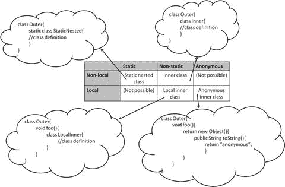
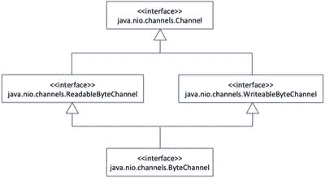

# 三、高级类设计

  
| 认证目标 |
| --- |
| 开发使用抽象类和方法的代码 |
| 开发使用 final 关键字的代码 |
| 创建内部类，包括静态内部类、局部类、嵌套类和匿名内部类 |
| 使用枚举类型，包括枚举类型中的方法和构造函数 |
| 开发声明、实现和/或扩展接口的代码，并使用 atOverride 注释 |
| 创建和使用 Lambda 表达式 |

在前一章中，您学习了 OOP 的基本概念，并使用它们来构建 Java 程序。在这一章中，你将学习高级的类设计概念。您还将了解 Java 8: lambda 表达式中引入的关键函数式编程特性。

OCPJP 考试中很大一部分问题与 Java 语言和 Java 8 函数库的变化有关。本章涵盖了 lambda 表达式，它构成了理解 Stream API 和`java.util.function`包中可用设施的基础。因此，请务必阅读本章中关于 lambda 表达式的接口部分和最后一部分。

## 抽象类

  
| 认证目标 |
| --- |
| 开发使用抽象类和方法的代码 |

在许多编程情况下，您希望指定一个抽象，而不指定实现级别的细节。在这种情况下，您可以使用抽象类或接口。当您想要定义一个具有一些公共功能的抽象时，可以使用抽象类。

考虑一下`Shape`类，它提供了您可以在绘图应用中绘制的不同形状的抽象。

```java
abstract class Shape {

public double area() { return 0; } // default implementation

// other members

}
```

在类定义前加上关键字`abstract`,将该类声明为抽象类。你可以创建`Shapes`的对象比如`Square`、`Circle`，但是直接创建一个`Shape`类本身的对象有意义吗？不，没有名为`Shape`的真实世界物体。

如果你试图创建一个`Shape`类的实例，编译器会给出一个错误，因为抽象类不能被实例化。

在`Shape`类定义中，有一个名为`area()`的方法返回特定形状的面积。这个方法适用于所有形状，这就是为什么它在这个基类`Shape`中。然而，`Shape`类中的`area()`方法的实现应该是怎样的呢？您不能提供默认实现；将这个方法实现为`return 0;`是一个糟糕的解决方案，尽管编译器会很乐意接受它。更好的解决方案是将其声明为抽象方法，如下所示:

```java
public abstract double area(); // note: no implementation (i.e., no method body definition)
```

与声明类抽象类似，通过在方法前面加上关键字`abstract`来声明方法`area()`是抽象的。普通方法和抽象方法的主要区别在于，你不需要为抽象方法提供主体。如果你提供一个主体，它将变成一个错误，就像这样:

```java
public abstract double area() { return 0; } // compiler error!
```

对于这个定义，您会得到一个编译器错误:`"abstract methods cannot have a body"`。抽象方法声明迫使所有子类提供该抽象方法的定义，这就是为什么它不能在抽象类本身中定义的原因。如果派生类没有实现基类中定义的所有抽象方法，则应该将该派生类声明为抽象类，如下例所示:

```java
abstract class Shape {

public abstract double area(); // no implementation

// other members

}

class Rectangle extends Shape { }
```

这个代码片段导致了编译器错误`"Rectangle is not abstract and does not override abstract method area() in Shape"`。要解决这个问题，您需要声明派生类`abstract`或者在派生类中提供`area()`方法的定义。将`Rectangle`声明为抽象是没有意义的；所以你可以这样定义`area()`方法:

```java
class Rectangle extends Shape {

private int length, height;

public double area() { return length * height; }

// other members …

}
```

### 要记住的要点

复习以下关于 OCPJP 八级考试抽象类和抽象方法的要点:

*   `abstract`关键字可以应用于一个类或非静态方法。
*   抽象类可能有声明为静态的方法或字段。然而，`abstract`关键字不能应用于字段或静态方法。
*   一个抽象类可以扩展另一个抽象类，也可以实现一个接口。
*   抽象类可以从具体类派生出来！虽然语言允许，但这样做并不是一个好主意。
*   抽象类不需要声明抽象方法，这意味着抽象类不需要将任何方法声明为抽象。但是，如果一个类有一个抽象方法，它应该被声明为一个抽象类。
*   抽象类的子类需要提供所有抽象方法的实现；否则，您需要将该子类声明为抽象类。

## 使用“最终”关键字

  
| 认证目标 |
| --- |
| 开发使用 final 关键字的代码 |

`final`关键字可以应用于类、方法和变量。不能扩展 final 类，不能重写 final 方法，也不能在 final 变量初始化后更改其值。

### 最终课程

final 类是一个不可继承的类，也就是说，如果你声明一个类为 final，你就不能继承它。您可能不希望一个类被子类化的两个重要原因是:

To prevent a behavior change by subclassing. In some cases, you may think that the implementation of the class is complete and should not change. If overriding is allowed, then the behavior of methods might be changed. You know that a derived object can be used where a base class object is required, and you may not prefer it in some cases. By making a class final, the users of the class are assured the unchanged behavior.   Improved performance. All method calls of a final class can be resolved at compile time itself. As there is no possibility of overriding the methods, it is not necessary to resolve the actual call at runtime for final classes, which translates to improved performance. For the same reason, final classes encourage the inlining of methods. With inlining, a method body can be expanded as part of the calling code itself, thereby avoiding the overhead of making a function call. If the calls are to be resolved at runtime, they cannot be inlined.  

在 Java 库中，很多类都声明为`final`；例如，`String (java.lang.String)`和`System (java.lang.System)`类。这些类在 Java 程序中被广泛使用。如果这两个类没有被声明`final`，有人可能通过子类化来改变这些类的行为，然后整个程序可以开始不同的行为。为了避免这样的问题，像这样广泛使用的类和包装类如`Number`和`Integer`都在 Java 库中做成了`final`。

使一个类成为 final 类的性能增益是适度的；重点应该是在适当的地方使用`final`。OCPJP 8 考试主要会考查你是否知道如何正确使用`final`关键词。你不用担心效率细节。

### 最终方法和变量

在一个类中，你可以声明一个方法为 final。final 方法不能被重写。因此，如果您已经在非 final 类中将某个方法声明为 final，则可以扩展该类，但不能重写 final 方法。但是，基类中的其他非最终方法可以在派生类实现中重写。

考虑一下`Shape`类中的方法`setParentShape()`和`getParentShape()`(列表 [3-1](#FPar1) )。

Listing 3-1\. Shape.java

```java
public abstract class Shape {

// other class members elided

final public void setParentShape(Shape shape) {

// method body

}

public Shape getParentShape() {

// method body

}

}
```

在这种情况下，`Circle`类(`Shape`的子类)只能覆盖`getParentShape()`；如果您试图覆盖 final 方法，您将得到以下错误:`"Cannot override the final method from Shape"`。

Final 变量就像光盘:一旦你在上面写了什么，你就不能再写了。在编程中，像 PI 这样的常量可以被声明为 final，因为你不希望任何人修改它们的值。如果你试图在初始化之后改变一个最终变量，你将得到一个编译器错误。

### 要记住的要点

复习以下要点，因为它们可能会在 OCPJP 八级考试中出现:

*   `final`修饰符可以应用于一个类、方法或变量。final 类的所有方法都是隐式的`final`(因此是不可重写的)。
*   一个`final`变量只能赋值一次。如果变量声明将变量定义为`final`但没有初始化它，那么它被称为 blank final。您需要在类或初始化块中定义的所有构造函数中初始化一个空白的 final。
*   关键字`final`可以应用于参数。一旦分配，`final`参数的值就不能更改。

## 嵌套类的风格

  
| 认证目标 |
| --- |
| 创建内部类，包括静态内部类、局部类、嵌套类和匿名内部类 |

在另一个类(或接口)体内定义的类称为嵌套类。通常定义一个类，它是直接属于包的顶级类。相反，嵌套类是包含在另一个类或接口中的类。

在另一个类或接口中创建类有什么好处？有几个好处。首先，您可以将相关的类放在一起作为一个逻辑组。其次，嵌套类可以访问封闭类的所有类成员，这在某些情况下可能很有用。第三，嵌套类简化了代码。例如，匿名内部类对于用 AWT/Swing 编写更简单的事件处理代码很有用。

Java 中有四种类型或风格的嵌套类:

*   静态嵌套类
*   内部类
*   局部内部类
*   匿名内部类

乍一看，这四种味道之间的区别并不明显。图 [3-1](#Fig1) 有助于阐明它们之间的区别。局部类在代码块(无论是方法、构造函数还是初始化块)中定义，而非局部类在类中定义。静态类使用`static`关键字限定，而非静态类在类定义中不使用`static`关键字。在匿名类中，你不提供类名；你只是定义它的身体。



图 3-1。

Types of nested classes with examples

正如你在图 [3-1](#Fig1) 中看到的，静态嵌套类是静态和非本地的，而内部类是非静态和非本地的。非静态局部嵌套类是局部内部类，局部匿名嵌套类是匿名内部类。

现在，让我们更详细地讨论这四种味道。

### 静态嵌套类(或接口)

您可以将一个类(或接口)定义为另一个类(或接口)内部的静态成员。由于外部类型可以是类或接口，内部类型也可以是类或接口，因此有四种组合。以下是这四种类型的示例，以便您可以了解它们的语法:

```java
class Outer {            // an outer class has a static nested class

static class Inner {}

}

interface Outer {        // an outer interface has a static nested class

static class Inner {}

}

class Outer {            // an outer class has a static nested interface

static interface Inner {}

}

interface Outer {        // an outer interface has a static nested interface

static interface Inner {}

}
```

您不必在嵌套接口中显式使用`static`关键字，因为它是隐式静态的。现在，让我们看一个创建和使用静态嵌套类的例子。

考虑具有字段`m_red`、`m_green,`和`m_blue`的`Color`类(列表 [3-2](#FPar2) )。因为所有形状都可以着色，所以可以在一个`Shape`类中定义`Color`类。

Listing 3-2\. TestColor.java

```java
abstract class Shape {

public static class Color {

int m_red, m_green, m_blue;

public Color() {

// call the other overloaded Color constructor by passing default values

this(0, 0, 0);

}

public Color(int red, int green, int blue) {

m_red = red; m_green = green; m_blue = blue;

}

public String toString() {

return " red = " + m_red + " green = " + m_green + " blue = " + m_blue;

}

// other color members elided

}

// other Shape members elided

}

public class TestColor {

public static void main(String []args) {

// since Color is a static nested class,

// we access it using the name of the outer class, as in Shape.Color

// note that we do not (and cannot) instantiate Shape class for using Color class

Shape.Color white = new Shape.Color(255, 255, 255);

System.out.println("White color has values:" + white);

}

}
```

它可以打印

```java
White color has:  red = 255 green = 255 blue = 255
```

在这段代码中，`Shape`类被声明为`abstract`。您可以看到`Color`类被定义为`Shape`类中定义的`public static`类。`TestColor`类使用语法`Shape.Color`来引用这个类。除了这个微小的区别，`Color`类看起来与在`Shape`类之外定义`Color`类没有什么不同。因此，静态嵌套类与定义为外部类的类一样好，只是有一点不同——它是在另一个类中物理定义的！

#### 要记住的要点

以下是静态嵌套类(和接口)的一些值得注意的方面，将对你的 OCPJP 8 考试有所帮助:

*   可达性`(public, protected,`等。`)`静态嵌套类是由外部类定义的。
*   静态嵌套类的名称用`OuterClassName.NestedClassName`语法表示。
*   当你在一个接口内定义一个内部嵌套类(或接口)时，嵌套类被隐式声明为`public`和`static`。这一点很容易记住:接口中的任何字段都被隐式声明为`public`和`static`，静态嵌套类也有同样的行为。
*   静态嵌套类可以声明为`abstract`或`final`。
*   静态嵌套类可以扩展另一个类，也可以用作基类。
*   静态嵌套类可以有静态成员。(您很快就会看到，该语句不适用于其他类型的嵌套类。)
*   静态嵌套类可以访问外部类的成员(显然只有静态成员)。
*   外部类也可以通过嵌套类的对象访问嵌套类的成员(甚至是`private`成员)。如果不声明嵌套类的实例，外部类就不能直接访问嵌套类元素。

### 内部类

您可以将一个类(或一个接口)定义为另一个类中的非静态成员。在接口内部声明一个类或者一个接口怎么样？正如你在上面关于静态内部类的第三个要点中看到的，当你在一个接口中定义一个类或者一个接口时，它是隐式的`static`。所以，不可能声明一个非静态的内部接口！这就剩下了两种可能性:

```java
class Outer {            // an outer class has an inner class

class Inner {}

}

class Outer {            // an outer class has an inner interface

interface Inner {}

}
```

让我们创建一个`Point`类来实现一个`Circle`的中心。既然您想将每个`Circle`与一个中心`Point`相关联，那么将`Point`作为`Circle`(清单 [3-3](#FPar3) )的内部类是一个好主意。

Listing 3-3\. Circle.java

```java
public class Circle {

// define Point as an inner class within Circle class

class Point {

private int xPos;

private int yPos;

// you can provide constructor for an inner class like this

public Point(int x, int y) {

xPos = x;

yPos = y;

}

// the inner class is like any other class - you can override methods here

public String toString() {

return "(" + xPos + "," + yPos + ")";

}

}

// make use of the inner class for declaring a field

private Point center;

private int radius;

public Circle(int x, int y, int r) {

// note how to make use of the inner class to instantiate it

center = this.new Point(x, y);

radius = r;

}

public String toString() {

return "mid point = " + center + " and radius = " + radius;

}

public static void main(String []s) {

System.out.println(new Circle(10, 10, 20));

}

// other methods such as area are elided

}
```

在这个实现中，您已经将`Point`定义为`Circle`的私有成员。注意您是如何实例化内部类的:

```java
center = this.new Point(x, y);
```

您可能想知道为什么不能使用通常的`new`语句:

```java
center = new Point(x, y);
```

您需要为外部类的对象引用添加前缀，以创建内部类的实例。在这种情况下，它是一个`this`引用，所以您在`new`操作符前加上了前缀`this`。

每个内部类都与外部类的一个实例相关联。换句话说，内部类总是与封闭对象相关联。

外部和内部阶层共享一种特殊的关系，就像朋友或同一家庭的成员。不管访问说明符是什么，成员访问都是有效的，比如`private`。然而，还是有细微的区别。您可以在内部类中访问外部类的成员，而无需创建实例；但是外部类却不是这样。为了访问内部类的成员(任何成员，包括私有成员)，您需要创建一个内部类的实例。

内部类的一个限制是不能在内部类中声明静态成员，如下所示:

```java
class Outer {

class Inner {

static int i = 10;

}

}
```

如果您尝试这样做，将会得到以下编译器错误:

```java
Outer.java:3: inner classes cannot have static declarations

static int i = 10;
```

#### 要记住的要点

以下是一些关于内部类和接口的重要规则，可能会在 OCPJP 8 考试中有用:

*   可达性(`public`、`protected`等)。)是由外部类定义的。
*   就像顶级类一样，内部类可以扩展类或实现接口。类似地，其他类可以扩展内部类，其他类或接口可以扩展或实现内部接口。
*   内部类可以声明为`final`或`abstract`。
*   内部类可以有内部类，但是你将很难阅读或理解如此复杂的类嵌套。(意思:避开他们！)

### 局部内部类

局部内部类是在代码块中定义的(比如在方法、构造函数或初始化块中)。与静态嵌套类和内部类不同，局部内部类不是外部类的成员；它们只是定义它们的方法或代码的局部变量。

以下是局部类的一般语法示例:

```java
class SomeClass {

void someFunction() {

class Local { }

}

}
```

正如您在这段代码中看到的，`Local`是在`someFunction`中定义的一个类。它在`someFunction`之外是不可用的，甚至对`SomeClass`的成员也不可用。因为你不能声明一个局部变量`static`，你也不能声明一个局部类`static`。

因为不能在接口中定义方法，所以在接口中不能有局部类或接口。也不能创建本地接口。换句话说，不能在方法、构造函数和初始化块中定义接口。

现在您已经理解了语法，让我们来看一个实际的例子。之前，您将`Color`类实现为静态嵌套类(清单 [3-2](#FPar2) )。以下是您在讨论中看到的代码:

```java
abstract class Shape {

public static class Color {

int m_red, m_green, m_blue;

public Color() {

this(0, 0, 0);

}

public Color(int red, int green, int blue) {

m_red = red; m_green = green; m_blue = blue;

}

public String toString() {

return " red = " + m_red + " green = " + m_green + " blue = " + m_blue;

}

// other color members elided

}

// other Shape members elided

}
```

现在，这个`toString()`方法显示了一个`Color`的字符串表示。假设您想要以下面的格式显示`Color`字符串:`"You selected a color with RGB values red = 0 green = 0 blue = 0"`。为此，您必须在类`StatusReporter`中定义一个名为`getDescriptiveColor()`的方法。在`getDescriptiveColor()`中，您必须创建一个`Shape.Color`的派生类，其中`toString`方法返回这个描述性消息。清单 [3-4](#FPar4) 是一个使用本地类的实现。

Listing 3-4\. StatusReporter.java

```java
class StatusReporter {

// important to note that the argument "color" is declared final

static Shape.Color getDescriptiveColor(final Shape.Color color) {

// local class DescriptiveColor that extends Shape.Color class

class DescriptiveColor extends Shape.Color {

public String toString() {

return "You selected a color with RGB values" + color;

}

}

return new DescriptiveColor();

}

public static void main(String []args) {

Shape.Color descriptiveColor =

StatusReporter.getDescriptiveColor(new Shape.Color(0, 0, 0));

System.out.println(descriptiveColor);

}

}
```

main 方法检查`StatusReporter`是否工作正常。这个程序打印

```java
You selected a color with RGB values red = 0 green = 0 blue = 0
```

让我们看看局部类是如何定义的。`getDescriptiveColor()`方法接受普通的`Shape.Color`类对象并返回一个`Shape.Color`对象。在`getDescriptiveColor()`方法中，您定义了这个方法的本地类`DescriptiveColor`。这个`DescriptiveColor`是`Shape.Color`的派生类。在`DescriptiveColor`类中，唯一定义的方法是`toString()`方法，它覆盖了基类`Shape.Color toString()`方法。在定义了`DescriptiveColor`类之后，`getDescriptiveColor`类创建一个`DescriptiveColor`类的对象并返回它。

在`Test`类中，您可以看到一个`main()`方法，它只调用了`StatusReporter.getDescriptiveColor()`方法并将结果存储在一个`Shape.Color`引用中。您会注意到，`getDescriptiveColor()`方法返回一个从`Shape.Color`派生的`DescriptiveColor`对象，因此`descriptiveColor`变量初始化工作正常。在`println`中，`descriptiveColor`的动态类型是`DescriptiveColor`对象，因此打印颜色对象的详细描述。

您是否注意到了`getDescriptiveColor()`方法的另一个特性？它的参数声明为`final`。即使你没有提供 final 关键字，编译器也将把 is 视为有效的 final——这意味着你不能给你在局部类中访问的变量赋值。如果您这样做，将会得到一个编译器错误，如:

```java
static Shape.Color getDescriptiveColor(Shape.Color color) {

// local class DescriptiveColor that extends Shape.Color class

class DescriptiveColor extends Shape.Color {

public String toString() {

return "You selected a color with RGB values" + color;

}

}

color = null; // note this assignment – will NOT compile

return new DescriptiveColor();

}
```

您将得到以下编译器错误:

```java
StatusReporter.java:8: error: local variables referenced from an inner class must be final or effectively final

return "You selected a color with RGB values" + color;

^

1 error
```

由于对`color`变量的赋值，它不再是最终变量，因此当局部内部类试图访问该变量时，编译器会给出一个错误。

您只能将最终变量传递给局部内部类。如果你没有声明一个局部内部类访问的变量，编译器会把它视为 final 变量。

#### 要记住的要点

以下几点关于地方班的内容可能会在 OCPJP 八级考试中出现:

*   您可以在代码体内创建一个非静态的局部类。接口不能有本地类，您也不能创建本地接口。
*   局部类只能从定义该类的代码体中访问。局部类在定义该类的代码体之外是完全不可访问的。
*   定义局部类时，可以扩展类或实现接口。
*   局部类可以访问定义它的代码体中所有可用的变量。局部内部类访问的变量实际上被认为是最终变量。

### 匿名内部类

顾名思义，匿名内部类没有名字。该类的声明自动从实例创建表达式中派生。它们也被简称为匿名类。

匿名类在几乎所有可以使用局部内部类的情况下都很有用。局部内部类有名字，而匿名内部类没有——这是主要的区别。另一个区别是匿名内部类不能有任何显式构造函数。构造函数是以类名命名的，因为匿名类没有名字，所以不能定义构造函数！

(在我们继续之前，这里需要注意:没有“匿名接口”这样的东西)

下面是一个理解局部类语法的示例:

```java
class SomeClass {

void someFunction() {

new Object() { };

}

}
```

这个代码看起来很神秘，不是吗？这是怎么回事？在语句`new Object() { };`中，您使用`new`关键字直接声明了一个`Object`的派生类。它不定义任何代码，而是返回该派生对象的一个实例。创建的对象没有在任何地方使用，所以它被忽略。`new`表达式调用这里的默认构造函数；您可以选择通过在`new`表达式中传递参数来调用基类的多参数构造函数。

现在让我们看一个更实际的例子。在前面的例子中(清单 [3-4](#FPar4) ，您看到了在`StatusReporter`类的`getDescriptiveColor`方法中定义的`DescriptiveColor`类。您可以通过将本地类转换成匿名类来简化代码，如清单 [3-5](#FPar5) 所示。

Listing 3-5\. StatusReporter.java

```java
class StatusReporter {

static Shape.Color getDescriptiveColor(final Shape.Color color) {

// note the use of anonymous inner classes here

// -- specifically, there is no name for the class and we construct

// and use the class "on the fly" in the return statement!

return new Shape.Color() {

public String toString() {

return "You selected a color with RGB values" + color;

}

};

}

public static void main(String []args) {

Shape.Color descriptiveColor =

StatusReporter.getDescriptiveColor(new Shape.Color(0, 0, 0));

System.out.println(descriptiveColor);

}

}
```

它可以打印

```java
You selected a color with RGB values red = 0 green = 0 blue = 0
```

真好。程序的其余部分，包括`main()`方法，保持不变，而`getDescriptiveColor()`方法变得更简单了！你没有明确地创建一个有名字的类(名字是`DescriptiveColor`)；相反，您只是在 return 语句中“动态地”创建了一个`Shape.Color`的派生类。注意，关键字`class`也是不需要的。

#### 要记住的要点

请注意以下关于匿名类的要点，它们可能对 OPCJP 8 考试有用:

*   匿名类在`new`表达式本身中定义。
*   定义匿名类时，不能显式扩展类或显式实现接口。

## 枚举数据类型

  
| 认证目标 |
| --- |
| 使用枚举类型，包括枚举类型中的方法和构造函数 |

假设您希望用户从定义几种打印机类型的一组常量中进行选择:

```java
public static final int DOTMATRIX = 1;

public static final int INKJET = 2;

public static final int LASER= 3;
```

解决方案是可行的。然而，在这种情况下，您可以传递任何其他整数(比如 10)，编译器会欣然接受。因此，该解决方案不是类型安全的解决方案。在这种情况下，Java 5 引入了数据类型 enum 来帮助您。

清单 [3-6](#FPar6) 为上面的例子定义了一个枚举类(是的，枚举是特殊的类)。

Listing 3-6\. EnumTest.java

```java
// define an enum for classifying printer types

enum PrinterType {

DOTMATRIX, INKJET, LASER

}

// test the enum now

public class EnumTest {

PrinterType printerType;

public EnumTest(PrinterType pType) {

printerType = pType;

}

public void feature() {

// switch based on the printer type passed in the constructor

switch(printerType){

case DOTMATRIX:

System.out.println("Dot-matrix printers are economical and almost obsolete");

break;

case INKJET:

System.out.println("Inkjet printers provide decent quality prints");

break;

case LASER:

System.out.println("Laser printers provide best quality prints");

break;

}

}

public static void main(String[] args) {

EnumTest enumTest = new EnumTest(PrinterType.LASER);

enumTest.feature();

}

}
```

它可以打印

```java
Laser printers provide best quality prints
```

让我们更详细地回顾一下清单 [3-6](#FPar6) 。

*   在 switch-case 语句中，不需要为枚举元素提供完全限定的名称。这是因为 switch 接受枚举类型的实例，因此 switch-case 理解您在其中指定枚举元素的上下文(类型)。
*   在创建枚举对象 E `numTest`时，我们已经提供了值`PrinterType.LASER`。如果我们提供除枚举值之外的任何其他值，您将会得到一个编译器错误。换句话说，枚举是类型安全的。

注意，您可以在一个单独的文件中声明一个 enum(在本例中为`PrinterType`),就像您可以声明任何其他普通的 Java 类一样。

现在让我们看一个更详细的例子，在这个例子中，您在一个枚举数据类型中定义成员属性和方法(清单 [3-7](#FPar7) )。

Listing 3-7\. EnumTest.java

```java
enum PrinterType {

DOTMATRIX(5), INKJET(10), LASER(50);

private int pagePrintCapacity;

private PrinterType(int pagePrintCapacity) {

this.pagePrintCapacity = pagePrintCapacity;

}

public int getPrintPageCapacity() {

return pagePrintCapacity;

}

}

public class EnumTest {

PrinterType printerType;

public EnumTest(PrinterType pType) {

printerType = pType;

}

public void feature() {

switch (printerType) {

case DOTMATRIX:

System.out.println("Dot-matrix printers are economical");

break;

case INKJET:

System.out.println("Inkjet printers provide decent quality prints");

break;

case LASER:

System.out.println("Laser printers provide the best quality prints");

break;

}

System.out.println("Print page capacity per minute: " +

printerType.getPrintPageCapacity());

}

public static void main(String[] args) {

EnumTest enumTest1 = new EnumTest(PrinterType.LASER);

enumTest1.feature();

EnumTest enumTest2 = new EnumTest(PrinterType.INKJET);

enumTest2.feature();

}

}
```

上述程序的输出如下所示:

```java
Laser printers provide the best quality prints

Print page capacity per minute: 50

Inkjet printers provide decent quality prints

Print page capacity per minute: 10
```

在这个程序中，您为 enum 类定义了一个新属性、一个新构造函数和一个新方法。属性`pagePrintCapacity`由 enum 元素(比如`LASER(50)`)指定的初始值设置，它调用 enum 类的构造函数。但是，枚举类不能有公共构造函数，否则编译器会报错如下消息:`"Illegal modifier for the enum constructor; only private is permitted"`。

枚举类中的构造函数只能指定为私有。

### 要记住的要点

*   枚举被隐式声明为`public`、`static`和`final`，这意味着你不能扩展它们。
*   当您定义一个枚举时，它隐式地继承自`java.lang.Enum`。在内部，枚举被转换为类。此外，枚举常数是枚举类的实例，该常数被声明为该枚举类的成员。
*   您可以对 enum 元素应用`valueOf()`和`name()`方法来返回 enum 元素的名称。
*   如果你在一个类中声明一个枚举，那么默认情况下它是静态的。
*   不能对枚举数据类型使用 new 运算符，即使在枚举类内部也是如此。
*   可以使用==运算符比较两个枚举是否相等。
*   如果枚举常量来自两个不同的枚举，`equals()`方法不返回 true。
*   当枚举常量的`toString()`方法被调用时，它打印枚举常量的名称。
*   当在枚举类型上被调用时，`Enum`类中的静态`values()`方法返回枚举常数的数组。
*   不能克隆枚举常数。试图这样做将导致`CloneNotSupportedException`。

Enum 避免了幻数，提高了源代码的可读性和可理解性。此外，枚举是类型安全的构造。因此，只要需要一组相关的常数，就使用枚举。

## 接口

  
| 认证目标 |
| --- |
| 开发声明、实现和/或扩展接口的代码，并使用 atOverride 注释 |

接口是一组定义协议(即行为契约)的抽象方法。实现接口的类必须实现接口中指定的方法。接口定义了一个协议，实现接口的类遵循该协议。换句话说，一个接口通过定义一个抽象向它的客户承诺某些功能。所有实现接口的类都为承诺的功能提供了自己的实现。

### 声明和实现接口

现在是时候为形状对象实现自己的接口了。一些圆形物体(如`Circle`和`Ellipse`)可以滚动到给定的程度。您可以创建一个`Rollable`接口并声明一个名为`roll()`的方法:

```java
interface Rollable {

void roll(float degree);

}
```

如您所见，您使用`interface`关键字定义了一个接口，该关键字声明了一个名为`roll()`的方法。该方法采用一个参数:滚动的`degree`。现在让我们在一个`Circle`类中实现这个接口(参见清单 [3-8](#FPar8) )。

Listing 3-8\. Circle.java

```java
// Shape is the base class for all shape objects; shape objects that are associated with

// a parent shape object is remembered in the parentShape field

abstract class Shape {

abstract double area();

private Shape parentShape;

public void setParentShape(Shape shape) {

parentShape = shape;

}

public Shape getParentShape() {

return parentShape;

}

}

// Rollable interface can be implemented by circular shapes such as Circle

interface Rollable {

void roll(float degree);

}

abstract class CircularShape extends Shape implements Rollable { }

// Circle is a concrete class that is-a subtype of CircularShape;

// you can roll it and hence implements Rollable through CircularShape base class

public class Circle extends CircularShape {

private int xPos, yPos, radius;

public Circle(int x, int y, int r) {

xPos = x;

yPos = y;

radius = r;

}

public double area() { return Math.PI * radius * radius; }

@Override

public void roll(float degree) {

// implement rolling functionality here...

// for now, just print the rolling degree to console

System.out.printf("rolling circle by %f degrees", degree);

}

public static void main(String[] s) {

Circle circle = new Circle(10,10,20);

circle.roll(45);

}

}
```

在这种情况下，`CircularShape`实现了`Rollable`接口并扩展了`Shape`抽象类。现在像`Circle`这样的具体类可以扩展这个抽象类并定义`roll()`方法。本例中需要注意的几个要点是:

*   抽象类`CircularShape`实现了`Rollable`接口，但不需要定义`roll()`方法。扩展了`CircularShape`的具体类`Circle`稍后定义了这个方法。
*   您使用关键字`implements`来实现一个接口。注意，类定义中的方法名、参数和返回类型应该与接口中给出的完全匹配；如果它们不匹配，则认为该类没有实现该接口。
*   或者，您可以使用`@Override`注释来指示一个方法正在从它的基类型中重写一个方法。在这种情况下，roll 方法在`Circle`类中被覆盖，并使用了`@Override`注释。

一个类也可以同时实现多个接口——直接或间接地通过它的基类。例如，`Circle`类也可以实现标准的`Cloneable`接口(用于创建`Circle`对象的副本)和`Serializable`接口(用于将对象存储在文件中以便以后重新创建对象，等等。)，像这样:

```java
class Circle extends CircularShape implements Cloneable, Serializable {

/* definition of methods such as clone here */

}
```

#### 要记住的要点

以下是一些关于界面的要点，对你参加 OCPJP 八级考试有所帮助:

*   无法实例化接口。对接口的引用可以引用实现它的任何派生类型的对象。
*   一个接口可以扩展另一个接口。使用`extends`(而不是`implements`)关键字来扩展另一个接口。
*   接口不能包含实例变量。如果你在一个接口中声明了一个数据成员，它应该被初始化，所有这样的数据成员都被隐式地当作“`public static final`”成员。
*   一个接口可以有三种方法:抽象方法、默认方法和静态方法。
*   接口可以用空体声明(即没有任何成员的接口)。例如，`java.util`定义了没有主体的接口`EventListener`。
*   一个接口可以在另一个接口或类中声明；这种接口被称为嵌套接口。
*   与只能拥有`public`或`default`访问权的顶级接口不同，嵌套接口可以声明为`public`、`protected`或`private`。
*   如果在抽象类中实现接口，抽象类不需要定义方法。但是，最终一个具体的类必须定义接口中声明的抽象方法。
*   您可以对一个方法使用`@Override`注释来表明它正在从它的基类型中重写一个方法。

### 抽象类与接口

抽象类和接口有很多共同点。例如，两者都可以声明所有派生类都应该定义的方法。它们的相似之处还在于，你既不能创建抽象类的实例，也不能创建接口的实例。那么，抽象类和接口有什么区别呢？表 [3-1](#Tab1) 列出了一些重要的区别。

表 3-1。

Abstract Classes v.s Interfaces

   
|   | 抽象类 | 接口 |
| --- | --- | --- |
| 使用的关键字 | 使用`abstract`和`class`关键字定义一个类别。 | 使用`interface`关键字定义一个接口。 |
| 实现类使用的关键字 | 使用`extends`关键字从抽象类继承。 | 使用`implements`关键字实现一个接口。 |
| 菲尔茨 | 抽象类可以有静态和非静态字段。 | 接口中不能有非静态字段(实例变量)；默认情况下，所有字段都是 public static final(即下一项中讨论的常量) |
| 常数 | 抽象类可以有静态和非静态常量。 | 接口只能有静态常量。如果声明一个字段，它必须被初始化。所有字段都被隐式地认为是`public static`和`final`。 |
| 构造器 | 您可以在抽象类中定义构造函数(例如，这对于初始化字段很有用)。 | 不能在接口中声明/定义构造函数。 |
| 访问说明符 | 抽象类中可以有私有和受保护的成员。 | 接口中不能有任何私有或受保护的成员；默认情况下，所有成员都是公共的。 |
| 单一继承与多重继承 | 一个类只能继承一个类(可以是抽象类，也可以是具体类)。 | 一个类可以实现任意数量的接口。 |
| 目的 | 抽象基类提供协议；此外，它还充当 is-a 关系中的基类。 | 一个接口只提供一个协议。它指定了实现它的类必须提供的功能。 |

#### 抽象、默认和静态方法

您看到的`Rollable`示例只有一个方法— `roll()`。然而，接口拥有多个方法是很常见的。例如，`java.util`将`Iterator`接口定义如下:

```java
public interface Iterator<E> {

boolean hasNext();

E next();

default void remove() {

throw new UnsupportedOperationException("remove");

}

default void forEachRemaining(Consumer<? super E> action) {

Objects.requireNonNull(action);

while (hasNext())

action.accept(next());

}

}
```

该接口用于遍历集合。(不用担心`Iterator<E>`里的`<E>`。它指的是元素类型，属于泛型，我们将在下一章详细介绍)。它声明了两个方法`hasNext()`和`next()`——实现这个接口的类必须定义这两个方法。没有必要使用`abstract`关键字(但是如果你愿意，你可以提供`abstract`关键字),因为没有主体的方法被隐式地认为是抽象的。

该接口还有对`remove()`和`forEachRemaining()`的方法定义。这些方法被称为默认方法，它们是用`default`关键字限定的。实现`Iterator`接口的类继承了这两个方法，并且可以选择覆盖它们。

接口也可以包含静态方法。例如，`java.util.stream.Stream`有静态方法`builder`、`empty`、`of`、`iterate`、`generate`和`concat`。

在 Java 8 之前，接口只能声明方法(也就是说，它们只能提供抽象方法)。为了支持 lambda 函数，Java 8 对接口做了很大的改变:现在可以在接口中定义默认方法和静态方法。

##### 默认方法

在接口中，默认方法是使用关键字`default`用方法体定义的方法。默认方法是实例方法。在默认方法中，`this`关键字是指声明接口。默认方法可以从包含它们的接口中调用方法。

Java 8 为什么要给接口添加默认方法？简答:为了支持 lambda 表达式(我们将在下一节讨论 lambdas)。默认方法使得接口的发展变得容易。怎么会？在 Java 8 之前，不能定义方法——只能声明它们。因此，如果您在现有的接口中添加一个新方法，这样的添加会破坏实现该接口的类，因为它们不会定义该方法。但是在 Java 8 中，使用默认方法，可以更容易地进化接口。

以`java.lang.Iterable`接口为例。在 Java 8 之前，它只有一种方法:

```java
Iterator<T> iterator();
```

在 Java 8 中，`Iterable`接口又扩展了两个方法:`forEach`和`spliterator`方法。为了避免破坏实现该接口的类，这些方法被定义为默认方法。所以所有实现了`Iterable`接口的类(比如`ArrayList`类)现在也有了这两个方法。这里是`Iterable`接口的定义，没有文档注释。

```java
public interface Iterable<T> {

Iterator<T> iterator();

default void forEach(Consumer<? super T> action) {

Objects.requireNonNull(action);

for (T t : this) {

action.accept(t);

}

}

default Spliterator<T> spliterator() {

return Spliterators.spliteratorUnknownSize(iterator(), 0);

}

}
```

在这个接口中添加`forEach`和`spliterator`方法不会破坏实现`Iterator`接口的现有类，因为它们是默认方法。这样，默认方法有助于接口的发展。默认方法也简化了您的生活，因为现在可以在接口中提供具体的定义——所以您不需要覆盖它们。

现有库中的许多类(尤其是`Collections`)都是用 Java 8 中的默认方法添加的。例如，Java 中的`List`接口有这三个在 Java 8 中添加的方法:

```java
default void    sort(Comparator<? super E> c)

default Spliterator<E>  spliterator()

default void    replaceAll(UnaryOperator<E> operator)
```

#### 要记住的要点

以下是一些关于抽象、默认和静态方法的要点，对你参加 OCPJP 八级考试有帮助:

*   您不能将成员声明为`protected`或`private`。只允许接口成员进行`public`访问。因为默认情况下所有方法都是公共的，所以可以省略`public`关键字。
*   接口中声明的所有方法(即没有方法体)都被隐式地认为是抽象的。如果您愿意，可以为该方法显式使用`abstract`限定符。
*   默认方法必须有方法体。默认方法必须使用关键字`default`进行限定。实现接口的类继承默认的方法定义，并且可以被重写。
*   默认方法可以作为抽象方法在派生类中重写；对于这种覆盖，也可以使用`@Override`注释。
*   您不能将默认方法限定为`synchronized`或`final`。
*   静态方法必须有一个方法体，并且使用`static`关键字对它们进行限定。
*   您不能为静态方法提供`abstract`关键字:请记住，您不能在派生类中重写静态方法，所以从概念上讲，通过不提供方法体来使静态方法保持抽象是不可能的。
*   不能对静态方法使用`default`关键字，因为所有默认方法都是实例方法。

#### 钻石问题

在 Java 中，一个接口或类可以扩展多个接口。例如，这里有一个来自`java.nio.channels`包的类层次结构(图 [3-2](#Fig2) )。基础接口是`Channel`。两个接口，`ReadableByteChannel`和`WriteableByteChannel`，扩展了这个基本接口。最后，`ByteChannel`接口扩展了`ReadableByteChannel`和`WriteableByteChannel.`注意继承层次的结果形状看起来像一个“钻石”



图 3-2。

Diamond hierarchy in java.nio.channels package

在这种情况下，基本接口`Channel`没有任何方法。`ReadableByteChannel`接口声明了`read`方法，`WriteableByteChannel`接口声明了`write`方法；`ByteChannel`接口从这些基本类型中继承了`read`和`write`方法。由于这两种方法是不同的，我们没有冲突，因此这个层次结构是好的。

但是如果我们在基类型中有两个具有相同签名的方法定义会怎么样呢？`ByteChannel`接口会继承哪个方法？当这个问题发生时，它被称为“钻石问题”

在我们讨论处理菱形问题的工作示例之前，让我们首先清楚地了解一下菱形问题在 Java 中是何时以及如何发生的。

*   在 Java 中，你不能扩展多个类；因此，因为扩展了两个基类，所以不会出现菱形问题。然而，当抽象类和接口定义具有相同签名的方法时，在派生类中可能会出现菱形问题。
*   当两个基本接口具有相同签名的抽象方法时，这并不会真正导致“钻石问题”，因为它们是方法声明而不是定义(如 Java 8 之前的情况)。
*   接口只能定义方法而不能定义字段(它们只能包含常量)。因此，对于界面中的字段，不会出现菱形问题；它只出现在方法定义中。

幸运的是，当派生类型从不同的基类型继承同名的方法定义时，可以使用规则来解析方法。让我们在这里讨论两个重要的场景。

场景 1:如果两个超接口用相同的签名定义方法，编译器会发出错误。我们必须手动解决冲突(清单 [3-9](#FPar9) )。

Listing 3-9\. Diamond.java

```java
interface Interface1 {

default public void foo() { System.out.println("Interface1's foo"); }

}

interface Interface2 {

default public void foo() { System.out.println("Interface2's foo"); }

}

public class Diamond implements Interface1, Interface2 {

public static void main(String []args) {

new Diamond().foo();

}

}

Error:(9, 8) java: class Diamond inherits unrelated defaults for foo() from types Interface1 and Interface2
```

在这种情况下，通过在`Diamond`类中使用 super 关键字来显式地指出要使用哪个方法定义，从而手动解决冲突:

```java
public void foo() { Interface1.super.foo(); }
```

将该方法定义添加到 Diamond 类中并执行后，该程序将打印:

```java
Interface1's foo
```

场景 2:如果基类和基接口用相同的签名定义方法，则使用类中的方法定义，忽略接口定义(清单 [3-10](#FPar10) )。

Listing 3-10\. Diamond.java

```java
class BaseClass {

public void foo() { System.out.println("BaseClass's foo"); }

}

interface BaseInterface {

default public void foo() { System.out.println("BaseInterface's foo"); }

}

public class Diamond extends BaseClass implements BaseInterface {

public static void main(String []args) {

new Diamond().foo();

}

}
```

这种情况下没有编译器错误:编译器解析类中的定义，接口定义被忽略。这个程序打印“Base foo”。这可以被认为是“阶级胜利”法则。该规则有助于保持与 Java 8 之前版本的兼容性。怎么做？当一个新的默认方法被添加到一个接口中时，它可能碰巧与基类中定义的方法具有相同的签名。通过“类获胜”规则解决冲突，基类中的方法将总是被选择。

##### 功能界面

Java 库中有许多接口声明了一个抽象方法；一些这样的接口是:

```java
// in java.lang package

interface Runnable { void run(); }

// in java.util package

interface Comparator<T> { boolean compare(T x, T y); }

// java.awt.event package:

interface ActionListener { void actionPerformed(ActionEvent e); }

// java.io package

interface FileFilter { boolean accept(File pathName); }
```

Java 8 引入了“函数式接口”的概念，将这一思想形式化。一个函数式接口只指定一个抽象方法。因为函数式接口只指定了一个抽象方法，所以它们有时被称为单一抽象方法(SAM)类型或接口。

注意:函数式接口可以接受通用参数，如上面例子中的`Comparator<T>`和`Callable<T>`接口。我们将在下一章介绍泛型([第 4 章](04.html))。

一个函数式接口的声明产生了一个可以和 lambda 表达式一起使用的“函数式接口类型”。此外，在 Java 8 中引入的`java.util.function`和`java.util.stream`包中广泛使用了函数式接口。鉴于这个主题的重要性，你可以预期在你的 OCPJP 8 考试中会有许多与功能接口相关的问题。

对于被视为函数式接口的接口，它应该只有一个抽象方法。但是，它可能定义了任意数量的默认或静态方法。让我们看几个 Java 库中的例子来理解这一点。

下面是`java.util.function.IntConsumer`接口的定义(不带注释和 javadoc 注释):

```java
public interface IntConsumer {

void accept(int value);

default IntConsumer andThen(IntConsumer after) {

Objects.requireNonNull(after);

return (int t) -> { accept(t); after.accept(t); };

}

}
```

虽然这个接口有两个成员，但是`andThen`方法是默认方法，只有`accept`方法是抽象方法。因此，`IntConsumer`界面是一个功能性界面。

再举一个例子，`java.util.function.Predicate`是一个函数式接口，因为它只有一个抽象方法:

```java
boolean test(T t)
```

但是需要注意的是`Predicate`也有以下默认的方法定义:

```java
default Predicate<T> and(Predicate<? super T> other)

default Predicate<T> negate()

default Predicate<T> or(Predicate<? super T> other)
```

此外，它还定义了一个静态方法`isEqual`:

```java
static <T> Predicate<T> isEqual(Object targetRef)
```

给定所有这些方法定义，`Predicate`仍然是一个函数式接口，因为它只有一个抽象方法`test`。

##### @FunctionalInterface 批注

Java 编译器推断任何具有单一抽象方法的接口都是函数式接口。但是，您可以用`@FunctionalInterface`注释标记函数式接口来确认这一点。推荐的做法是为函数式接口提供`@FunctionalInterface`,因为有了这个注释，编译器可以给出更好的错误/警告。

这里有一个使用`@FunctionalInterface`的例子，它有一个抽象方法，所以它可以干净地编译:

```java
@FunctionalInterface

public abstract class AnnotationTest {

abstract int foo();

}
```

这个怎么样？

```java
@FunctionalInterface

public interface AnnotationTest {

default int foo() {};

}
```

它会导致编译器错误“在接口中没有找到抽象方法”，因为它只提供了一个默认方法，而没有任何抽象方法。这个怎么样？

```java
@FunctionalInterface

public interface AnnotationTest { /* no methods provided */ }
```

此接口没有任何方法。因为它缺少一个抽象方法，但是用`@FunctionalInterface`进行了注释，所以会导致编译器错误。

这是另一种变化:

```java
@FunctionalInterface

public interface AnnotationTest {

int foo();

int bar();

}
```

这段代码还会导致编译器错误“发现多个非重写抽象方法”，因为当一个函数式接口要求恰好提供一个抽象方法时，它有多个抽象方法。

Methods from Object Class in Functional Interfaces

根据 Java 语言规范(8.0 版)，“接口不从 Object 继承，而是隐式声明许多与 Object 相同的方法。”如果你在接口中提供一个来自`Object`类的抽象方法，它仍然是一个功能接口。

例如，考虑声明两个抽象方法的`Comparator`接口:

```java
@FunctionalInterface

public interface Comparator<T> {

int compare(T o1, T o2);

boolean equals(Object obj);

// other methods are default methods or static methods and are elided

}
```

这个接口是一个函数式接口，尽管它声明了两个抽象方法:`compare()`和`equals()`方法。当它有两个抽象方法时，它是一个怎样的函数式接口？因为`equals()`方法签名与`Object`匹配，而`compare()`方法是唯一剩下的抽象方法，因此`Comparator`接口是一个函数式接口。

这个接口定义怎么样？

```java
@FunctionalInterface

interface EqualsInterface {

boolean equals(Object obj);

}
```

编译器给出错误:“`EqualsInterface is not a functional interface: no abstract method found in interface EqualsInterface`”。为什么呢？因为方法`equals`来自`Object`，所以它不被认为是一个函数式接口。

#### 要记住的要点

以下是一些关于功能接口的要点，对你参加 OCPJP 八级考试有帮助:

*   用`@FunctionalInterface`标注功能接口。否则，如果函数式接口不正确(例如，它有两个抽象方法)，编译器将不会发出任何错误。
*   您只能对接口使用`@FunctionalInterface`注释，而不能对类、枚举等使用。
*   如果派生接口只有一个抽象方法或者只继承一个抽象方法，那么它可以是函数式接口。
*   对于函数式接口，在接口中声明来自`Object`类的方法不算抽象方法。

## λ函数

  
| 认证目标 |
| --- |
| 创建和使用 Lambda 表达式 |

Java 8 中主要的新语言特性之一是 lambda 函数。事实上，这是自 Java 1 发布以来最大的变化之一。Lambdas 广泛用于编程语言世界，包括编译到 Java 平台的语言。例如，Groovy 语言可以编译到 Java 平台，并且对 lambda 函数(也称为闭包)有很好的支持。Oracle 决定通过 Java 8 将 lambdas 引入 JVM 上的主流语言——Java 语言本身。

Lambda Function Related Changes in Java 8

lambdas 的引入需要语言、库和 VM 实现的协调变化:

*   用于定义 lambda 函数的箭头操作符(“-->”)，用于方法引用的双冒号操作符(“::”)，以及关键字`default`
*   streams 库以及收藏库与 streams 的集成
*   Lambda 函数是使用 Java 7 中引入的`invokedynamic`指令实现的

为了支持在语言中引入 lambdas，Java 8 中的类型推理也得到了加强。Lambdas 使库作者能够在库中创建并行算法，以利用现代硬件(即多核)中固有的并行性。

在 Java 8 中，`java.util`已经通过使用 lambda 函数得到了很大的增强，我们将在下一章讨论这一点([第 4 章](04.html))。Java 8 增加了两个新的包`java.util.function`和`java.util.streams`。我们将在第 5 章的[中的`java.util.function`和第 6 章](05.html)的[中的`java.util.streams`(称为流 API)中讨论类型。](06.html)

Lambdas 可以极大地改变你设计和编写代码的方式。为什么呢？lambda 支持函数式编程范式——这意味着学习和使用 lambda 将意味着范式的转变。但是你不需要担心做出重大的改变——Java 无缝地将功能性与现有的面向对象特性集成在一起，你可以逐渐地在你的程序中使用越来越多的功能性特性。

在函数式编程范式中，lambda 函数可以存储在变量中，作为参数传递给其他函数，或者从其他函数返回，就像原始类型和引用变量一样。因为“lambda 函数”是可以传递的代码片段，所以可以认为函数范式支持“代码作为数据”传递“可执行代码段”的能力增强了 Java 的表达能力。

### Lambda 函数:语法

lambda 函数由可选参数、箭头标记和主体组成:

```java
LambdaParameters -> LambdaBody
```

*   `LambdaParameters`lambda 函数的参数在左括号“(”和右括号“)”内传递。当传递多个参数时，它们用逗号分隔。
*   箭头运算符。为了支持 lambdas，Java 引入了新的运算符“->”，也称为 lambda 运算符或 arrow 运算符。这个箭头操作符是必需的，因为我们需要从语法上将参数从主体中分离出来。
*   `LambdaBody`可以是表达式，也可以是块。主体可以由单个语句组成(在这种情况下，不需要定义块的显式花括号)；这样的λ体被称为“表达式λ”如果一个 lambda 体中有很多语句，它们需要在一个代码块中；这种λ体被称为“块λ”

编译器对 lambda 表达式执行类型推断:

*   如果没有在 lambda 函数定义中指定类型参数，编译器会推断参数的类型。指定参数类型时，需要指定全部或不指定；否则你会得到一个编译错误。
*   如果只有一个参数，可以省略括号。但是在这种情况下，您不能显式提供类型。您应该让编译器来推断单个参数的类型。
*   lambda 函数的返回类型是从主体中推断出来的。如果 lambda 中的任何代码返回值，那么所有路径都应该返回值；否则你会得到一个编译错误。

有效 lambda 表达式的一些示例(假设相关的函数式接口可用):

*   `(int x) -> x + x`
*   `x -> x % x`
*   `() -> 7`
*   `(int arg1, int arg2) -> (arg1 + arg2) / (arg1 – arg2)`

无效 lambda 表达式的示例:

*   `-> 7` `// if no parameters, then empty parenthesis () must be provided`
*   `(arg1, int arg2) -> arg1 / arg2``// if argument types are provided, then it should be should be  provided`T2】

#### λ函数—一个例子

让我们从一个简单的 lambda 函数的“hello world”示例开始(清单 [3-11](#FPar13) )。

Listing 3-11\. FirstLambda.java

```java
interface LambdaFunction {

void call();

}

class FirstLambda {

public static void main(String []args) {

LambdaFunction lambdaFunction = () -> System.out.println("Hello world");

lambdaFunction.call();

}

}
```

执行时，该程序打印

```java
Hello world
```

在这个程序中，接口`LambdaFunction`声明了一个名为`call()`的抽象方法；因此，它是一个功能接口。在`FirstLambda`类的`main`方法中，一个 lambda 函数被分配给函数式接口类型`LambdaFunction`的一个变量。

```java
LambdaFunction lambdaFunction = () -> System.out.println("Hello world");
```

这里，表达式`() -> System.out.println("Hello world")`是一个λ表达式:

*   语法`()`表示没有参数。
*   箭头操作符`"->"`将方法参数与 lambda 主体分开。
*   语句`System.out.println("Hello world")`是 lambda 表达式的主体。

lambda 表达式和函数式接口`LambdaFunction`有什么关系？它是通过`LambdaFunction`接口内的单一抽象方法:`void call()`。此抽象方法的签名和 lambda 表达式必须匹配:

*   lambda 表达式有`()`表示它没有参数——它与不带参数的`call`方法相匹配。
*   语句`System.out.println("Hello world")`是 lambda 表达式的主体。这个主体充当 lambda 函数的实现。
*   在这个 lambda 表达式体中没有 return 语句，因此编译器将这个表达式的返回类型推断为`void`类型，这与`call`方法的返回类型相匹配。

下一条语句`lambdaFunction.call();`调用 lambda 函数。此函数调用的结果是，控制台上会显示“Hello world”。

为什么 lambda 函数的函数类型要与给定函数式接口中抽象方法的函数类型相匹配？它用于类型检查。如果类型不匹配，您将得到一个编译器错误，如下所示:

`LambdaFunction lambdaFunction = (``int i`T2】

因为这个 lambda 表达式有一个整数参数，但是`LambdaFunction`中的`call()`方法不接受任何参数，所以编译器给出一个错误:“`incompatible types: incompatible parameter types in lambda expression"`”。

##### 兰姆达斯街区

块 lambda 包含在“{”和“}”内的代码块中，如:

`LambdaFunction lambdaFunction = (` `int i` `) ->` `{` `System.out.println("Hello world");`

当您想要在 lambda 主体中提供多个语句时，块 lambda 非常有用(在 lambda 表达式中，您只能有一个语句)。此外，在 block lambda 中，您可以提供一个显式的`return`语句(参见清单 [3-12](#FPar14) )。

Listing 3-12\. BlockLambda.java

```java
class BlockLambda {

interface LambdaFunction {

String intKind(int a);

}

public static void main(String []args) {

LambdaFunction lambdaFunction =

(int i) -> {

if((i % 2)  == 0) return "even";

else return "odd";

};

System.out.println(lambdaFunction.intKind(10));

}

}
```

它打印:

```java
even
```

在这段代码中，我们定义了一个块 lambda。我们从这个 lambda 块返回一个`String`,并且使用了显式的返回语句。在定义 block lambdas 时，我们应该确保为所有路径都提供了 return 语句，就像在这种情况下一样(否则，您会得到一个编译器错误)。返回语句应该与对应函数式接口中定义的抽象方法的返回类型相匹配(这里是`LambdaFunction`接口中`intKind`函数的`String`返回类型)。

##### 匿名内部类与 Lambda 表达式

在 Java 8 之前，作为 Java 程序员，我们习惯于编写匿名内部类。清单 [3-13](#FPar15) 等同于之前的程序(清单 [3-11](#FPar13) ，除了它使用匿名内部类代替 lambda 函数。

Listing 3-13\. AnonymousInnerClass.java

```java
interface Function {

void call();

}

class AnonymousInnerClass {

public static void main(String []args) {

Function function = new Function() {

public void call() {

System.out.println("Hello world");

}

};

function.call();

}

}
```

清单 [3-11](#FPar13) 和清单 [3-12](#FPar14) 中的功能是相同的，但是使用匿名内部类会导致冗长的代码，而 lambda 表达式是简洁的。

思考 lambdas 的一种方式是“匿名函数”或“未命名函数”:它们是没有名称的函数，不与任何类相关联。具体来说，它们不是定义它们的类的静态或实例成员。如果在 lambda 函数中使用`this`关键字，它指的是定义 lambda 的作用域中的对象。

##### 有效最终变量

Lambda 函数可以引用封闭范围内的局部变量。该变量需要显式声明为 final，否则该变量将被视为有效的 final。Effectively final 意味着编译器将变量视为最终变量，如果我们试图在 lambda 函数或函数的其余部分中修改它，将会发出一个错误。lambdas 的这种行为类似于从本地和匿名类访问外部作用域中的变量。他们访问的变量实际上也被认为是最终变量(正如我们前面讨论的)。

这里有一个例子。你听说过“猪拉丁”吗？这是孩子们玩的一种游戏，通过改变单词或添加后缀来创造单词，以创造奇怪的发音。在这个例子中，让我们简单地给一个单词加上后缀“ay”(清单 [3-14](#FPar16) )。

Listing 3-14\. PigLatin.java

```java
interface SuffixFunction {

void call();

}

class PigLatin {

public static void main(String []args) {

String word = "hello";

SuffixFunction suffixFunc = () -> System.out.println(word + "ay");

suffixFunc.call();

}

}
```

该程序打印:

```java
helloay
```

在 lambda 表达式中，我们使用了局部变量`word`。因为在 lambda 表达式中使用，这个变量被认为是`final`(尽管它没有被明确声明为`final`)。尝试这段代码，它有一个附加语句分配给`suffix`(甚至在调用 lambda 函数之前):

```java
String word = "hello";

SuffixFunction suffixFunc = () -> System.out.println(word + "ay");

word = "e";

suffixFunc.call();
```

编译器对这段代码发出一个错误:

```java
PigLatin.java:11: error: local variables referenced from a lambda expression must be final or effectively final

SuffixFunction suffixFunc = () -> System.out.println(word + "ay");

^

1 error
```

这是因为后缀在“e”被初始化后就被赋给了它，因此编译器不能把它当作最终变量。

为什么局部变量在 lambda 表达式中被访问时被认为是 final？原因是这种变异不是线程安全的。

请注意，这一限制不适用于数据成员和类成员。因此，当多个线程同时修改 lambda 表达式中的变量时，您可能会面临风险。此外，effectively final 仅适用于引用，而不适用于引用所指向的值。因此，您可以从 lambda 函数改变局部数组中的值——这不安全，但却是可能的。

#### 要记住的要点

以下是关于 lambda 函数的一些要点，对你参加 OCPJP 8 考试有帮助:

*   Lambda 表达式只能出现在可以进行赋值、函数调用或强制转换的上下文中。
*   lambda 函数被视为嵌套块。因此，就像嵌套块一样，我们不能在封闭块中声明与局部变量同名的变量。
*   Lambda 函数必须从所有分支返回值——否则会导致编译器错误。
*   当声明参数类型时，lambda 被称为“显式类型化”；如果它们是推断出来的，那么它就是“隐式类型化的”
*   如果 lambda 表达式抛出异常会发生什么？如果它是一个检查过的异常，那么函数式接口中的方法应该声明；否则会导致编译错误。

## 摘要

让我们简要回顾一下本章中每个认证目标的要点。请在参加考试之前阅读它。

开发使用抽象类和方法的代码

*   指定支持的功能的抽象，但不公开更精细的细节。
*   您不能创建抽象类的实例。
*   抽象类支持运行时多态性，而运行时多态性又支持松散耦合。

开发使用 final 关键字的代码

*   final 类是不可继承的类(即，您不能从 final 类继承)。
*   final 方法是不可重写的方法(即子类不能重写 final 方法)。
*   final 类的所有方法都是隐式 final 的(即不可重写)。
*   final 变量只能赋值一次。

创建内部类，包括静态内部类、局部类、嵌套类和匿名内部类

*   Java 支持四种类型的嵌套类:静态嵌套类、内部类、局部内部类和匿名内部类。
*   静态嵌套类可能有静态成员，而其他类型的嵌套类则没有。
*   静态嵌套类和内部类可以访问外部类的成员(甚至私有成员)。但是，静态嵌套类只能访问外部类的静态成员。
*   局部类(局部内部类和匿名内部类)可以访问外部作用域中声明的所有变量(无论是方法、构造函数还是语句块)。

使用枚举类型，包括枚举类型中的方法和构造函数

*   枚举是实现用户受限输入的一种类型安全的方法。
*   即使在枚举定义内，也不能对枚举使用 new。
*   默认情况下，枚举类是最终类。
*   所有枚举类都是从`java.lang.Enum`隐式派生的。

开发声明、实现和/或扩展接口的代码，并使用 atOverride 注释

*   一个接口可以有三种方法:抽象方法、默认方法和静态方法。
*   当派生类型继承了基类型中具有相同签名的两个方法定义时，就会出现“菱形问题”。
    *   如果两个超接口有相同的方法名，其中一个有定义，编译器会发出错误；这种冲突必须手动解决。
    *   如果基类和基接口用相同的签名定义方法，则使用类中的方法定义，忽略接口定义。
*   一个函数式接口只包含一个抽象方法，但是可以包含任意数量的默认或静态方法。
*   函数式接口的声明会产生一个“函数式接口类型”,它可以与 lambda 表达式一起使用。
*   对于函数式接口，在接口中声明来自`Object`类的方法不算抽象方法。

创建和使用 Lambda 表达式

*   在 lambda 表达式中，左边的->提供参数；右边，身体。箭头运算符(“-->”)有助于简化 lambda 函数的表达式。
*   您可以创建对函数式接口的引用，并为其分配 lambda 表达式。如果从该接口调用抽象方法，它将调用指定的 lambda 表达式。
*   如果省略，编译器可以执行 lambda 参数的类型推断。声明时，参数可以有修饰符，如`final`。
*   lambda 函数访问的变量实际上被认为是最终变量。

Question TimeWhich ONE of the following statements is TRUE? You cannot extend a concrete class and declare that derived class abstract   You cannot extend an abstract class from another abstract class   An abstract class must declare at least one abstract method in it   You can create an instance of a concrete subclass of an abstract class but cannot create an instance of an abstract class itself     Choose the correct answer based on the following class definition: `public abstract final class Shape { }` Compiler error: a class must not be empty   Compiler error: illegal combination of modifiers abstract and final   Compiler error: an abstract class must declare at least one abstract method   No compiler error: this class definition is fine and will compile successfully     Choose the best option based on this program: `class Shape {`     `public Shape() {`          `System.out.println("Shape constructor");`      `}`      `public class Color {`          `public Color() {`              `System.out.println("Color constructor");`          `}`      `}` `}` `class TestColor {`      `public static void main(String []args) {`         `Shape.Color black = new Shape().Color(); // #1`      `}` `}` Compiler error: the method Color() is undefined for the type Shape   Compiler error: invalid inner class   Works fine: Shape constructor, Color constructor   Works fine: Color constructor, Shape constructor     Choose the best option based on this program: `class Shape {`     `private boolean isDisplayed;`     `protected int canvasID;`     `public Shape() {`          `isDisplayed = false;`          `canvasID = 0;`      `}`      `public class Color {`          `public void display() {`              `System.out.println("isDisplayed: "+isDisplayed);`              `System.out.println("canvasID: "+canvasID);`          `}`      `}` `}` `class TestColor {`      `public static void main(String []args) {`          `Shape.Color black = new Shape().new Color();`          `black.display();`      `}` `}` Compiler error: an inner class can only access public members of the outer class   Compiler error: an inner class cannot access private members of the outer class   Runs and prints this output:   isDisplayed: false   canvasID: 0   Compiles fine but crashes with a runtime exception     Determine the behavior of this program: `public class EnumTest {`     `PrinterType printerType;`     `enum PrinterType {INKJET, DOTMATRIX, LASER};`     `public EnumTest(PrinterType pType) {`         `printerType = pType;`     `}`     `public static void main(String[] args) {`         `PrinterType pType = new PrinterType();`         `EnumTest enumTest = new EnumTest(PrinterType.LASER);`     `}` `}` Prints the output printerType:LASER   Compiler error: enums must be declared static   Compiler error: cannot instantiate the type EnumTest.PrinterType   This program will compile fine, and when run, will crash and throw a runtime exception     Is the enum definition given below correct? `public enum PrinterType {`     `private int pagePrintCapacity;          // #1`     `DOTMATRIX(5), INKJET(10), LASER(50);    // #2`     `private PrinterType(int pagePrintCapacity) {`         `this.pagePrintCapacity = pagePrintCapacity;`     `}`     `public int getPrintPageCapacity() {`         `return pagePrintCapacity;`     `}` `}` Yes, this enum definition is correct and will compile cleanly without any warnings or errors   No, this enum definition is incorrect and will result in compile error(s)   No, this enum definition will result in runtime exception(s) Yes, this enum definition is correct but will compile with warnings.     Determine the behavior of this program: `interface DoNothing {`     `default void doNothing() { System.out.println("doNothing"); }` `}` `@FunctionalInterface` `interface DontDoAnything extends DoNothing {`     `@Override`     `abstract void doNothing();` `}` `class LambdaTest {`     `public static void main(String []args) {`         `DontDoAnything beIdle = () -> System.out.println("be idle");`         `beIdle.doNothing();`     `}` `}` This program results in a compiler error for DontDoAnything interface: cannot override default method to be an abstract method   This program results in a compiler error: DontDoAnything is not a functional interface   This program prints: doNothing   This program prints: be idle     Determine the behavior of this program: `public class EnumTest {`     `public EnumTest() {`         `System.out.println("In EnumTest constructor ");`     `}`     `public void printType() {`         `enum PrinterType { DOTMATRIX, INKJET, LASER }`     `}` `}` This code will compile cleanly without any compiler warnings or errors, and when used, will run without any problems   This code will compile cleanly without any compiler warnings or errors, and when used, will generate a runtime exception   This code will produce a compiler error: enum types must not be local   This code will give compile-time warnings but not any compiler errors     Determine the behavior of this program: `interface BaseInterface {`     `default void foo() { System.out.println("BaseInterface's foo"); }` `}` `interface DerivedInterface extends BaseInterface {`     `default void foo() { System.out.println("DerivedInterface's foo"); }` `}` `interface AnotherInterface {`     `public static void foo() { System.out.println("AnotherInterface's foo"); }` `}` `public class MultipleInheritance implements DerivedInterface, AnotherInterface {`     `public static void main(String []args) {`         `new MultipleInheritance().foo();`     `}` `}` This program will result in a compiler error: Redundant method definition for function foo   This program will result in a compiler error in MultipleInheritance class: Ambiguous call to function foo   The program prints: DerivedInterface’s foo   The program prints: AnotherInterface's foo     Determine the behavior of this program: `class LambdaFunctionTest {`     `@FunctionalInterface`     `interface LambdaFunction {`         `int apply(int j);`         `boolean equals(java.lang.Object arg0);`     `}`     `public static void main(String []args) {`         `LambdaFunction lambdaFunction = i -> i * i;    // #1`         `System.out.println(lambdaFunction.apply(10));`     `}` `}` This program results in a compiler error: interfaces cannot be defined inside classes   This program results in a compiler error: @FunctionalInterface used for LambdaFunction that defines two abstract methods   This program results in a compiler error in code marked with #1: syntax error   This program compiles without errors, and when run, it prints 100 in console    

答案:

D. You can create an instance of a concrete subclass of an abstract class but cannot create an instance of an abstract class itself   B. Compiler error: illegal combination of modifiers abstract and final You cannot declare an abstract class final since an abstract class must to be extended. Class can be empty in Java, including abstract classes. An abstract class can declare zero or more abstract methods.   A. Compiler error: The method Color() is undefined for the type Shape You need to create an instance of outer class Shape in order to create an inner class instance, as in `new Shape().new Color();.`   C. Runs and prints this output: isDisplayed: false canvasID: 0 An inner class can access all members of an outer class, including the private members of the outer class.   C. Compiler error: cannot instantiate the type EnumTest.PrinterType You cannot instantiate an enum type using new.   B. No, this enum definition is incorrect and will result in compile error(s) You need to define enum elements first before any other attribute in an enum class. In other words, this enum definition will compile cleanly if you interchange the statements marked with “#1” and “#2” within comments in this code.   D. This program prints: be idle A default method can be overridden in a derived interface and can be made abstract. DoNothing is a functional interface because it has an abstract method. The call beIdle.doNothing() calls the System.out.println given inside the lambda expression and hence it prints “be idle” on the console.   C. It will produce a compiler error: enum types must not be local An enum can only be defined inside of a top-level class or interface and not within a method.   C. The program prints: DerivedInterface’s foo A default method can be overridden. Since DerivedInterface extends BaseInterface, the default method definition for foo is overridden in the DerivedInterface. Static methods do not cause conflicting definition of foo since they are not overridden, and they are accessed using the interface name, as in AnotherInterface.foo. Hence, the program compiles without errors. In the main method within MultipleInheritance class, the overridden foo method is invoked and hence the call resolves to foo method defined in DerivedInterface.   D. This program compiles without errors, and when run, it prints 100 in console An interface can be defined inside a class. The signature of the equals method matches that of the equal method in Object class; hence it is not counted as an abstract method in the functional interface. It is acceptable to omit the parameter type when there is only one parameter and the parameter and return type are inferred from the LambdaFunction abstract method declaration int apply(int j). Since the lambda function is passed with the value 10, the returned value is 10 * 10, and hence 100 is printed in console.