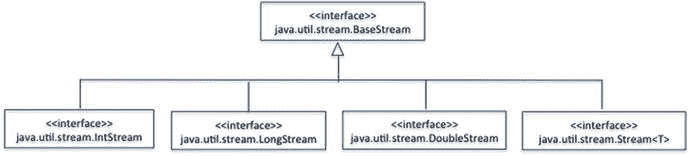
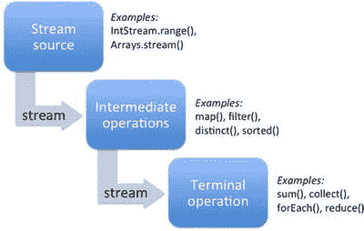

# 四、泛型和集合

  
| 认证目标 |
| --- |
| 创建和使用泛型类 |
| 创建和使用 ArrayList、TreeSet、TreeMap 和 ArrayDeque 对象 |
| 使用 java.util.Comparator 和 java.lang.Comparable 接口 |
| 集合流和过滤器 |
| 使用流和列表的 forEach 方法进行迭代 |
| 描述流接口和流管道 |
| 使用 lambda 表达式筛选集合 |
| 对流使用方法引用 |

每个重要的 Java 应用都使用数据结构和算法。Java 集合的框架提供了大量易于使用的通用数据结构和算法。这些数据结构和算法可以以类型安全的方式用于任何合适的数据类型；这是通过使用一种称为泛型的语言特性来实现的。

Java 中的集合实现数据结构，算法使用泛型和 lambda 函数实现。因此，这些主题在 1Z0-809 考试大纲中被合并为一个主题。在这一章中，我们从讨论泛型开始。因为我们的经验表明，正确回答关于泛型的问题通常很棘手，所以我们将详细讨论泛型。接下来我们讨论重要的集合，也讨论`java.lang.Comparator`和`java.lang.Comparable`接口。最后，我们将详细介绍如何在 Java 集合框架中使用 lambda 函数和流。你可能会在 OCPJP 8 考试中遇到许多关于泛型、集合和流的问题，所以本章提供了考试主题的详细内容。

## 创建和使用泛型类

  
| 认证目标 |
| --- |
| 创建和使用泛型类 |

泛型是 Java 1.5 版中引入的一种语言特性。在 Java 中引入泛型之前，`Object`基类被用作泛型的替代。使用泛型，你为一种类型(比如说`T`)编写适用于所有类型的代码，而不是为每种类型编写单独的类。让我们从一个简单的例子开始。

假设您想要打印方括号内的对象值。例如，要打印一个值为 10 的`Integer`对象，而不是将“10”打印到控制台，您希望在一个“框”内打印该值，如下所示:“[10]”。清单 [4-1](#FPar1) 包含了一个通用版本的`BoxPrinter`类。

Listing 4-1\. BoxPrinterTest.java

```java
// This program shows container implementation using generics

class BoxPrinter<T> {

private T val;

public BoxPrinter(T arg) {

val = arg;

}

public String toString() {

return "[" + val + "]";

}

}

class BoxPrinterTest {

public static void main(String []args) {

BoxPrinter<Integer> value1 = new BoxPrinter<Integer>(new Integer(10));

System.out.println(value1);

BoxPrinter<String> value2 = new BoxPrinter<String>("Hello world");

System.out.println(value2);

}

}
```

它打印以下内容:

```java
[10]

[Hello world]
```

这里有很多需要注意的地方。

See the declaration of `BoxPrinter`: `class BoxPrinter<T>` You gave the `BoxPrinter` class a type placeholder `<T>`—the type name `T` within angle brackets “” following the class name. You can use this type name inside the class to indicate that it is a placeholder for the actual type to be provided later.   Inside the class you first use `T` in field declaration: `private T val;` You are declaring `val` of the generic type—the actual type will be specified later when you use `BoxPrinter`. In `main()`, you declare a variable of type `BoxPrinter` for an `Integer` like this: `BoxPrinter<Integer> value1` Here, you are specifying that T is of type Integer—identifier T (a placeholder) is replaced with the type Integer. So, the val inside BoxPrinter becomes Integer because T gets replaced with Integer.   Now, here is another place where you use `T:` `public BoxPrinter(T arg) {`         `val = arg;` `}`  

类似于类型为`T`的`val`的声明，您是说`BoxPrinter`构造函数的参数属于类型`T`。稍后在`main()`方法中，当在`new`中调用构造函数时，指定`T`的类型为`Integer`:

```java
new BoxPrinter<Integer>(new Integer(10));
```

现在，在`BoxPrinter`构造函数中，`arg`和`val`应该属于同一类型，因为它们都属于类型`T`。例如，如果您按如下方式更改构造函数:

```java
new BoxPrinter<String>(new Integer(10));
```

`BoxPrinter`的类型是`String`，传递的参数的类型是`Integer`，所以在使用泛型时，您会得到一个类型不匹配的编译器错误(这很好，因为您会更早发现问题)。

让我们考虑另一个例子。这里有一个`Pair`泛型类，可以保存两种不同类型的对象，`T1`和`T2`(清单 [4-2](#FPar2) )。

Listing 4-2\. PairTest.java

```java
// It demonstrates the usage of generics in defining classes

class Pair<T1, T2> {

T1 object1;

T2 object2;

Pair(T1 one, T2 two) {

object1 = one;

object2 = two;

}

public T1 getFirst() {

return object1;

}

public T2 getSecond() {

return object2;

}

}

class PairTest {

public static void main(String []args) {

Pair<Integer, String> worldCup = new Pair<Integer, String>(2018, "Russia");

System.out.println("World cup " +  worldCup.getFirst() +

" in " + worldCup.getSecond());

}

}
```

该程序打印以下内容:

```java
World cup 2018 in Russia
```

这里的`T1`和`T2`是类型持有者。您可以在尖括号内给出这些类型占位符:`<T1, T2>`。当使用`Pair`类时，您必须指定您将使用哪些特定类型来代替`T1`和`T2`。例如，您使用`Integer`和`String`来表示`Pair`，就像在`main()`方法中的`Pair<Integer, String>`一样。现在，假设`Pair`类有这样的主体:

```java
// how Pair<Integer, String> can be treated internally

class Pair {

Integer object1;

String object2;

Pair(Integer one, String two) {

object1 = one;

object2 = two;

}

public Integer getFirst() {

return object1;

}

public String getSecond() {

return object2;

}

}
```

换句话说，尝试手动查找并替换类型占位符，并用代码中的实际类型替换它们。这将帮助您理解泛型实际上是如何工作的。这样，您就可以理解`getFirst()`和`getSecond()`方法如何在`main()`方法中返回`Integer`和`String`值。

在声明中

```java
Pair<Integer, String> worldCup = new Pair<Integer, String>(2018, "Russia");
```

请注意，类型完全匹配。如果你尝试

```java
Pair<Integer, String> worldCup = new Pair<String, String>(2018, "Russia");
```

您将得到以下编译器错误:

```java
TestPair.java:20: cannot find symbol

symbol  : constructor Pair(int,java.lang.String)

location: class Pair<java.lang.String,java.lang.String>
```

现在，试试这个说法怎么样？

```java
Pair<Integer, String> worldCup = new Pair<Number, String>(2018, "Russia");
```

您将得到另一个编译器错误，因为声明的类型`worldCup`与初始化表达式中给定的类型不匹配:

```java
TestPair.java:20: incompatible types

found   : Pair<java.lang.Number,java.lang.String>

required: Pair<java.lang.Integer,java.lang.String>
```

现在修改通用的`Pair`类。`Pair<T1, T2>`存储类型为`T1`和`T2`的对象。采用类型`T`并存储该类型的两个对象`T`的通用 pair 类怎么样？显然，一种方法是用相同的类型实例化`Pair<T1, T2>`，比如说`Pair<String, String>`，但这不是一个好的解决方案。为什么呢？没有办法确保用相同的类型实例化`Pair`!清单 [4-3](#FPar3) 是`Pair`的修改版——姑且称之为`PairOfT`——它采用了一个类型占位符`T`。

Listing 4-3\. PairOfT.java

```java
// This program shows how to use generics in your programs

class PairOfT<T> {

T object1;

T object2;

PairOfT(T one, T two) {

object1 = one;

object2 = two;

}

public T getFirst() {

return object1;

}

public T getSecond() {

return object2;

}

}
```

现在，这种说法行得通吗？

```java
PairOfT<Integer, String> worldCup = new PairOfT<Integer, String>(2018, "Russia");
```

不，因为`PairOfT`有一个类型参数，而你在这里给了两个类型参数。所以，你会得到一个编译错误。那么，这个说法怎么样？

```java
PairOfT<String> worldCup = new PairOfT<String>(2018, "Russia");
```

不，您仍然会得到一个编译器错误:

```java
TestPair.java:20: cannot find symbol

symbol  : constructor PairOfT(int,java.lang.String)

location: class PairOfT<java.lang.String>

PairOfT<String> worldCup = new PairOfT<String>(2018, "Russia");
```

原因是 2018 年——当被装箱时——是一个`Integer`,你应该给出一个`String`作为自变量。这个说法怎么样？

```java
PairOfT<String> worldCup = new PairOfT<String>("2018", "Russia");
```

是的，它可以编译并且运行良好。

### 菱形语法

在上一节中，我们讨论了如何创建泛型类型实例，如以下语句所示:

```java
Pair<Integer, String> worldCup = new Pair<Integer, String>(2018, "Russia");
```

我们还讨论了如果这些类型不匹配，编译器会如何出错，如下面的语句所示，它不会编译:

```java
Pair<Integer, String> worldCup = new Pair<String, String>(2018, "Russia");
```

看看确保在声明类型(本例中为`Pair<Integer, String>`)和新对象创建表达式(本例中为`new Pair<String, String>()`)中提供相同类型的参数有多繁琐？

为了简化您的生活，Java 1.7 引入了 diamond 语法，其中可以省略类型参数:您可以让编译器从类型声明中推断类型。因此，声明可以简化为

```java
Pair<Integer, String> worldCup = new Pair<>(2018, "Russia");
```

为了清楚起见，清单 [4-4](#FPar4) 包含了使用这个菱形语法的完整程序。

Listing 4-4\. TestPair.java

```java
// This program shows the usage of the diamond syntax when using generics

class Pair<T1, T2> {

T1 object1;

T2 object2;

Pair(T1 one, T2 two) {

object1 = one;

object2 = two;

}

public T1 getFirst() {

return object1;

}

public T2 getSecond() {

return object2;

}

}

class TestPair {

public static void main(String []args) {

Pair<Integer, String> worldCup = new Pair<>(2018, "Russia");

System.out.println("World cup " +  worldCup.getFirst() +

" in " + worldCup.getSecond());

}

}
```

该程序将干净地编译并打印以下语句:

```java
World cup 2018 in Russia
```

注意，忘记初始化表达式中的菱形操作符`< >`是一个常见的错误，如

```java
Pair<Integer, String> worldCup = new Pair(2018, "Russia");
```

下面是您将从编译器得到的警告(当您将命令行选项`-Xlint:unchecked`传递给 javac 时):

```java
Pair.java:19: warning: [unchecked] unchecked call to Pair(T1,T2) as a member of the raw type Pair

Pair<Integer, String> worldCup = new Pair(2018, "Russia");

^

where T1,T2 are type-variables:

T1 extends Object declared in class Pair

T2 extends Object declared in class Pair

Pair.java:19: warning: [unchecked] unchecked conversion

Pair<Integer, String> worldCup = new Pair(2018, "Russia");

^

required: Pair<Integer,String>

found:    Pair

2 warnings
```

由于`Pair`是一个泛型类型，并且您忘记了使用`<>`或显式提供类型参数，编译器将其视为一个原始类型，其中`Pair`带有两个`Object`类型参数。尽管这种行为在这个特定的代码段中没有引起任何问题，但它是危险的，可能会导致错误，如下一节所示。

### 原始类型和泛型类型的互操作性

可以使用泛型类型而不指定其关联类型。在这种情况下，该类型被称为原始类型。例如，`List<T>`应该与关联的类型一起使用，即`List<String>`；但是，它可以在不指定伴随类型的情况下使用，即仅使用`List`。在后一种情况下，`List`被称为原始类型。

当您使用原始类型时，您将失去泛型提供的类型安全优势。例如，类型`Vector`是一个原始类型。原始类型绕过编译时的类型检查；然而，它们可能抛出运行时异常(例如，`ClassCastException`)。因此，不建议在新代码中使用原始类型。

好了，现在你明白你不应该使用原始类型。但是，你可能会问，为什么编译器本身不为这样的类型声明抛出错误？答案是向后兼容。Java 1.5 中引入了 Java 泛型。Java 支持原始类型，以使基于泛型的代码与遗留代码兼容。但是，强烈建议您不要在代码中使用原始类型。

为什么呢？如果将原始类型与泛型一起使用，会发生什么？让我们在清单 [4-5](#FPar5) 中使用这两种类型，并检查效果。

Listing 4-5\. RawTest1.java

```java
import java.util.List;

import java.util.LinkedList;

import java.util.Iterator;

class RawTest1 {

public static void main(String []args) {

List list = new LinkedList();

list.add("First");

list.add("Second");

List<String> strList = list;  //#1

for(Iterator<String> itemItr = strList.iterator(); itemItr.hasNext();)

System.out.println("Item: " + itemItr.next());

List<String> strList2 = new LinkedList<>();

strList2.add("First");

strList2.add("Second");

List list2 = strList2; //#2

for(Iterator<String> itemItr = list2.iterator(); itemItr.hasNext();)

System.out.println("Item: " + itemItr.next());

}

}
```

你对上述计划有什么期望？你认为它能正确编译/执行吗？嗯，是的——它将编译(有警告)并执行，没有任何问题。它打印以下内容:

```java
Item: First

Item: Second

Item: First

Item: Second
```

清单 [4-6](#FPar6) 引入了一些变化；观察输出。

Listing 4-6\. RawTest2.java

```java
import java.util.List;

import java.util.LinkedList;

import java.util.Iterator;

class RawTest2 {

public static void main(String []args) {

List list = new LinkedList();

list.add("First");

list.add("Second");

List<String> strList = list;

strList.add(10);        // #1: generates compiler error

for(Iterator<String> itemItr = strList.iterator(); itemItr.hasNext();)

System.out.println("Item : " + itemItr.next());

List<String> strList2 = new LinkedList<>();

strList2.add("First");

strList2.add("Second");

List list2 = strList2;

list2.add(10); // #2: compiles fine, results in runtime exception

for(Iterator<String> itemItr = list2.iterator(); itemItr.hasNext();)

System.out.println("Item : " + itemItr.next());

}

}
```

在上面的示例中，您添加了两条语句。第一个声明如下:

```java
strList.add(10);     // #1: generates compiler error
```

您试图在一个`List<String>`类型列表中添加一个整数项，因此您得到一个编译时错误`"no suitable method found for add(int)"`。如前所述，这种编译器级别的检查是好的，因为如果没有它，稍后可能会导致运行时异常。这是您添加的第二条语句:

```java
list2.add(10);     // #2: compiles fine, results in runtime exception
```

这里，`list2`链表(原始类型)用一个泛型类型`List<String>`初始化。初始化之后，您在 list raw 类型中添加了一个整数。这是允许的，因为`list2`是一个原始类型。但是，会产生一个`ClassCastException`。

我们从这个例子中学到的教训是避免在我们的程序中混合原始类型和泛型类型，因为这可能导致运行时的错误行为。如果您需要在程序中同时使用这两种类型，请确保在容器中添加单一类型的项，并使用相同的类型进行检索。

避免将原始类型与泛型类型混合。

### 通用方法

与泛型类类似，您可以创建泛型方法，即采用泛型参数类型的方法。泛型方法对于编写适用于多种类型而功能保持不变的方法非常有用。例如，`java.util.Collections`类中有许多泛型方法。

让我们实现一个名为`fill()`的简单方法。给定一个容器，`fill()`方法用值`val`填充所有容器元素。清单 [4-7](#FPar7) 包含了`Utilities`类中`fill()`方法的实现。

Listing 4-7\. UtilitiesTest.java

```java
// This program demonstrates generic methods

import java.util.List;

import java.util.ArrayList;

class Utilities {

public static <T> void fill(List<T> list, T val) {

for(int i = 0; i < list.size(); i++)

list.set(i, val);

}

}

class UtilitiesTest {

public static void main(String []args) {

List<Integer> intList = new ArrayList<Integer>();

intList.add(10);

intList.add(20);

System.out.println("The original list is: " + intList);

Utilities.fill(intList, 100);

System.out.println("The list after calling Utilities.fill() is: " + intList);

}

}
```

它打印以下内容

```java
The original list is: [10, 20]

The list after calling Utilities.fill() is: [100, 100]
```

让我们一步一步地看看这段代码:

You create a method named `fill()` in the `Utilities` class with this declaration: `public static <T> void fill(List<T> list, T val)` You declare the generic type parameter `T` in this method. After the qualifiers public and static, you put `<T>` and then followed it by return type, method name, and its parameters. This declaration is different from generic classes—you give the generic type parameters after the class name in generic classes.   In the body, you write the code as if it’s a normal method. `for(int i = 0; i < list.size(); i++)`     `list.set(i, val);` You loop over the list from 0 until its size and set each of the elements to value `val` in each iteration. You use the `set()` method in `List`, which takes the index position in the container as the first argument and the actual value to be set as the second argument.   In the `main()` method in the `UtilitiesTest` class, this is how you call the `fill()` method: `Utilities.fill(intList, 100);`  

请注意，您没有显式给出泛型类型参数值。由于`intList`是类型`Integer`并且 100 被装箱为类型`Integer`，编译器推断出`fill()`方法中的类型`T`是类型`Integer`。

### 泛型和子类型

您可以将派生类型对象分配给其基类型引用；这就是你所谓的分型。但是，对于泛型，类型参数应该完全匹配；否则你会得到一个编译错误。换句话说，子类型对于泛型参数不起作用。是的，这是一个很难记住的规则，所以让我们更详细地讨论为什么子类型对于泛型类型参数不起作用。

子类型化适用于类类型:你可以将一个派生类型对象赋给它的基类引用。但是，子类型对泛型类型参数不起作用:不能将派生的泛型类型参数赋给基类型参数。

让我们看看，如果假设可以对泛型类型参数使用子类型，会出现什么问题。

`// illegal code –``assume`T2】

```java
List<Number> intList = new ArrayList<Integer>();

intList.add(new Integer(10)); // okay

intList.add(new Float(10.0f)); // oops!
```

`List<Number>`类型的`intList`应该保存一个数组列表<number>对象。但是，你储存了一个</number> `ArrayList<Integer>`。这看起来很合理，因为`List`延伸了`ArrayList`，而`Integer`延伸了`Number`。但是，您最终可以在`intList`中插入一个`Float`值！回想一下,`intList`的动态类型是`ArrayList<Integer>`类型——所以您在这里违反了类型安全(因此将得到不兼容类型的编译器错误)。由于泛型旨在避免类似这样的类型安全错误，因此不能将派生的泛型类型参数赋给基类型参数。

正如您所看到的，泛型参数类型的子类型化是不允许的，因为它是不安全的——但它仍然是一个不方便的限制。幸运的是，Java 支持通配符参数类型，您可以在其中使用子类型。我们现在将探索这种能力。

泛型的类型参数有一个限制:对于赋值，泛型类型参数应该完全匹配。为了克服这个子类型问题，可以使用通配符类型。

### 通配符参数

在上一节中，您看到了子类型对于泛型类型参数不起作用。所以，

```java
List<Number> intList = new ArrayList<Integer>();
```

给出编译器错误

```java
WildCardUse.java:6: incompatible types

found   : java.util.ArrayList<java.lang.Integer>

required: java.util.List<java.lang.Number>

List<Number> numList = new ArrayList<Integer>();
```

如果您稍微更改语句以使用通配符参数，它将会编译

```java
List<?> wildCardList = new ArrayList<Integer>();
```

通配符是什么意思？就像你在卡牌游戏中用来替代任何一张牌的通配符(啊，玩卡牌游戏太好玩了！)，您可以使用通配符来表示它可以匹配任何类型。对于`List<?>`，你的意思是它是任何类型的`List`——换句话说，你可以说它是一个“未知列表！”

但是等一下……当你想要一个表示“任何类型”的类型时，你使用`Object`类，不是吗？同样的语句，但是使用了`Object`类型参数，怎么样？

```java
List<Object> numList = new ArrayList<Integer>();
```

运气不好——使用`List<Number>`您会得到与上面相同的错误！

```java
WildCardUse.java:6: incompatible types

found   : java.util.ArrayList<java.lang.Integer>

required: java.util.List<java.lang.Object>

List<Object> numList = new ArrayList<Integer>();
```

换句话说，您仍然在尝试对泛型参数使用子类型化——但它仍然不起作用。如你所见，`List<Object>`和`List<?>`不一样。事实上，`List<?>`是任何`List`类型的超类型，这意味着你可以在`List<?>`预期的地方通过`List<Integer>`，或者`List<String>`，甚至`List<Object>`。

让我们在一个例子中使用通配符，看看它是否有效(参见清单 [4-8](#FPar8) )。

Listing 4-8\. WildCardUse.java

```java
// This program demonstrates the usage of wild card parameters

import java.util.List;

import java.util.ArrayList;

class WildCardUse {

static void printList(List<?> list){

for(Object element: list)

System.out.println("[" + element + "]");

}

public static void main(String []args) {

List<Integer> list = new ArrayList<>();

list.add(10);

list.add(100);

printList(list);

List<String> strList = new ArrayList<>();

strList.add("10");

strList.add("100");

printList(strList);

}

}
```

该程序打印以下内容:

```java
[10]

[100]

[10]

[100]
```

好了，它工作了，使用通配符的列表可以传递整数列表和字符串列表。发生这种情况是因为`printList()`方法的参数类型— `List<?>`。太好了！

#### 通配符的限制

让我们考虑下面的代码片段，它试图添加一个元素并打印列表:

```java
List<?> wildCardList = new ArrayList<Integer>();

wildCardList.add(new Integer(10));

System.out.println(wildCardList);
```

您会得到以下编译器错误:

```java
WildCardUse.java:7: cannot find symbol

symbol  : method add(java.lang.Integer)

location: interface java.util.List<capture#145 of ? extends java.lang.Number>

wildCardList.add(new Integer(10));
```

为什么呢？你绝对确定`add()`方法存在于`List`接口中。那编译器为什么不找方法呢？

这个问题需要一些详细的解释。当你使用通配符类型`<?>`时，你对编译器说你忽略了类型信息，那么<？>代表未知类型。每当您试图将参数传递给泛型类型时，java 编译器都会尝试推断所传递参数的类型以及泛型的类型，并证明类型安全。现在，您试图使用`add()`方法在列表中插入一个元素。因为`wildCardList`不知道它持有哪种类型的对象，所以向它添加元素是有风险的。您最终可能会添加一个字符串，例如“hello ”,而不是一个整数值。为了避免这个问题(记住，语言中引入泛型是为了确保类型安全！)，编译器不允许你调用修改对象的方法。因为`add`方法修改了对象，所以您会得到一个错误！错误信息看起来也很混乱，就像在`<capture#145 of ? extends java.lang.Number>`中一样。

一般来说，当你使用通配符参数时，你不能调用修改对象的方法。如果你试图修改，编译器会给出令人困惑的错误信息。但是，您可以调用访问该对象的方法。

### 要记住的要点

以下是一些可能对你的 OCPJP 八级考试有价值的建议:

*   即使类或接口本身不是泛型的，也可以在接口或类中定义或声明泛型方法。
*   不带类型参数的泛型类称为原始类型。当然，原始类型不是类型安全的。Java 支持原始类型，因此可以在比 Java 5 更早的代码中使用泛型类型(注意，泛型是在 Java 5 中引入的)。当您在代码中使用原始类型时，编译器会生成警告。您可以使用`@SuppressWarnings({ "unchecked" })`来抑制与原始类型相关的警告。
*   `List<?>`是任何`List`类型的超类型，这意味着你可以通过`List<Integer>`，或者`List<String>`，甚至是`List<?>`预期的`List<Object>`。
*   泛型的实现本质上是静态的，这意味着 Java 编译器解释源代码中指定的泛型，并用具体类型替换泛型代码。这被称为类型擦除。编译后，代码看起来类似于开发人员用具体类型编写的代码。本质上，使用泛型有两个好处:首先，它引入了一个抽象，使您能够编写泛型实现；其次，它允许您编写具有类型安全的泛型实现。
*   由于类型擦除，泛型有许多限制。几个重要的例子如下:
    *   不能使用 new 运算符实例化泛型类型。例如，假设 mem 是一个字段，下面的语句将导致编译器错误:`T mem = new T();  // wrong usage - compiler error`
    *   不能实例化泛型类型的数组。例如，假设 mem 是一个字段，下面的语句将导致编译器错误:`T[] amem = new T[100]; // wrong usage - compiler error`
    *   可以声明 T 类型的实例字段，但不能声明 T 类型的静态字段。例如，`class X<T> {` `T instanceMem;  // okay` `static T statMem;      // wrong usage - compiler error` `}`
*   不可能有泛型异常类；因此，下面的代码不会被编译:`class GenericException<T> extends Throwable { } // wrong usage - compiler error`
*   不能用基元类型实例化泛型类型——换句话说，`List<int>`不能被实例化。但是，您可以使用装箱的基本类型。

## 创建和使用集合类

  
| 认证目标 |
| --- |
| 创建和使用 ArrayList、TreeSet、TreeMap 和 ArrayDeque 对象 |

Java 库有一个集合框架，它大量使用泛型，并提供了一组容器和算法。在本节中，我们将重点介绍如何使用集合框架。具体来说，我们将讨论重要的集合类，包括`ArrayList`、`TreeSet`、`TreeMap`和`ArrayDeque`对象。

术语集合是一个通用术语，而`Collection`和`Collections`是`java.util`包的特定 API。`Collections`——如在`java.util.Collections`中一样——是一个只包含静态方法的实用程序类。通用术语集合指的是诸如映射、集合、堆栈和队列之类的容器。为了避免混淆，我们将在本章中使用容器这个术语来指代这些集合。

### 抽象类和接口

`java.util`库中的类型层次由许多提供通用功能的抽象类和接口组成。表 [4-1](#Tab1) 列出了这个层次中的一些重要类型。我们将在本节稍后的部分更详细地讨论其中的一些类型。

表 4-1。

Important Abstract Classes and Interfaces in the Collections Framework

  
| 抽象类/接口 | 简短描述 |
| --- | --- |
| `Iterable` | 实现这个接口的类可以用来迭代一个`foreach`语句。 |
| `Collection` | 集合层次结构中类的公共基接口。当你想写非常通用的方法时，可以通过`Collection`接口。例如，`java.util.Collections`中的`max()`方法接受一个`Collection`并返回一个对象。 |
| `List` | 存储元素序列的容器的基本接口。您可以使用索引来访问元素，并在以后检索相同的元素(以便它保持插入顺序)。您可以在一个`List`中存储重复的元素。 |
| `Set`、`SortedSet`、`NavigableSet` | 不允许重复元素的容器接口。`SortedSet`按排序顺序维护集合元素。`NavigableSet al` lows 在集合中搜索最接近的匹配。 |
| `Queue`，`Deque` | `Queue`是容器的基本接口，包含一系列要处理的元素。例如，实现`Queue`的类可以是 LIFO(后进先出—如堆栈数据结构)或 FIFO(先进先出—如队列数据结构)。在`Deque`中，你可以在两端插入或移除元素。 |
| `Map`、`SortedMap`、`NavigableMap` | 将键映射到值的容器的接口。在`SortedMap`中，按键是有序排列的。一个`NavigableMap`允许你搜索并返回给定搜索标准的最接近的匹配。注意，`Map`层次没有扩展`Collection`接口。 |
| `Iterator`，`ListIterator` | 如果一个类实现了`Iterator`接口，你可以正向遍历容器。如果一个类实现了`ListIterator`接口，你可以正向和反向遍历。 |

这些是相当多的基本类型，但不要被它们淹没。您将看到特定的具体类，并使用其中的一些基本类型。我们将只讨论`Collection`接口，然后继续讨论特定的具体类，这些类是集合层次结构的一部分，在考试主题中会提到。

#### 收集界面

`Collection`接口提供了对所有容器通用的方法，如`add()`和`remove()`。表 [4-2](#Tab2) 列出了该接口中最重要的方法。在你使用它们之前，看一看它们。

表 4-2。

Important Methods in the Collection Interface

  
| 方法 | 简短描述 |
| --- | --- |
| `boolean add(Element elem)` | 将`elem`添加到底层容器中。 |
| `void clear()` | 从容器中移除所有元素。 |
| `boolean isEmpty()` | 检查容器是否有任何元素。 |
| `Iterator<Element> iterator()` | 返回一个用于遍历容器的`Iterator<Element>`对象。 |
| `boolean remove(Object obj)` | 如果容器中存在`obj`，则移除该元素。 |
| `int size()` | 返回容器中元素的数量。 |
| `Object[] toArray()` | 返回一个包含容器中所有元素的数组。 |

根据底层容器的不同，`add()`和`remove()`等方法可能会失败。例如，如果容器是只读的，您将无法添加或移除元素。除了这些方法之外，`Collection`接口中还有许多方法适用于容器中的多个元素(表 [4-3](#Tab3) )。

表 4-3。

Methods in the Collection Interface That Apply to Multiple Elements

  
| 方法 | 简短描述 |
| --- | --- |
| `boolean addAll(Collection<? extends Element> coll)` | 将`coll`中的所有元素添加到底层容器中。 |
| `boolean containsAll(Collection<?> coll)` | 检查`coll`中给出的所有元素是否都存在于底层容器中。 |
| `boolean removeAll(Collection<?> coll)` | 从底层容器中移除也存在于`coll`中的所有元素。 |
| `boolean retainAll(Collection<?> coll)` | 仅当元素也出现在`coll`中时，才保留底层容器中的元素；它会删除所有其他元素。 |

### 具体类

`Collection`层次结构中的许多接口和抽象类提供了特定具体类实现/扩展的公共方法。具体的类提供了实际的功能，你只需要学习其中的一小部分就可以为 OCPJP 八级考试做好准备。表 [4-4](#Tab4) 总结了你应该知道的职业特点。

表 4-4。

Important Concrete Classes in Collection Framework

  
| 混凝土类 | 简短描述 |
| --- | --- |
| `ArrayList` | 在内部实现为可调整大小的数组。这是使用最广泛的具体类之一。搜索速度快，但插入或删除速度慢。允许重复。 |
| `LinkedList` | 在内部实现双向链表数据结构。插入或删除元素很快，但搜索元素很慢。另外，当你需要一个堆栈(LIFO)或队列(FIFO)数据结构时，可以使用`LinkedList`。允许重复。 |
| `HashSet` | 在内部实现为哈希表数据结构。用于存储一组元素—它不允许存储重复的元素。快速搜索和检索元素。它不维护存储元素的任何顺序。 |
| `TreeSet` | 内部实现红黑树数据结构。与`HashSet`一样，`TreeSet`不允许存储重复项。然而，与`HashSet`不同的是，它按照排序的顺序存储元素。它使用树数据结构来决定在哪里存储或搜索元素，位置由排序顺序决定。 |
| `HashMap` | 在内部实现为哈希表数据结构。存储键和值对。使用散列法寻找一个位置来搜索或存储一对。搜索或插入速度非常快。它不以任何顺序存储元素。 |
| `TreeMap` | 内部使用红黑树数据结构实现。与`HashMap`不同，`TreeMap`按照排序的顺序存储元素。它使用树数据结构来决定在哪里存储或搜索键，位置由排序顺序决定。 |
| `PriorityQueue` | 使用堆数据结构在内部实现。一个`PriorityQueue`用于基于优先级检索元素。无论插入的顺序如何，当删除元素时，将首先检索优先级最高的元素。 |

有许多旧的`java.util`类(现在称为遗留集合类型)被新的集合类所取代。其中有一些(括号内为较新的类型):`Enumeration`(`Iterator`)`Vector`(`ArrayList`)`Dictionary`(`Map`)`Hashtable`(`HashMap`)。另外，`Stack`和`Properties`是没有直接替换的遗留类。

#### 数组列表类

用于存储一系列元素。您可以使用索引在特定位置插入容器的元素，并在以后检索相同的元素(即，它保持插入顺序)。您可以在列表中存储重复的元素。您需要知道两个具体的类:`ArrayList`和`LinkedList`。

`ArrayList`实现一个可调整大小的数组。当您创建一个本机数组(比如说，`new String[10];`)时，数组的大小在创建时就是已知的(固定的)。然而，`ArrayList`是一个动态数组:它可以根据需要增加大小。在内部，`ArrayList`分配一块内存，并根据需要增长。因此，在`ArrayList`中访问数组元素非常快。但是，当您添加或删除元素时，会在内部复制其余的元素；因此添加/删除元素是一项成本很高的操作。

这里有一个简单的例子来访问`ArrayList`中的元素。您使用一个`ArrayList`并使用`for-each`构造来遍历一个集合:

```java
ArrayList<String> languageList = new ArrayList<>();

languageList.add("C");

languageList.add("C++");

languageList.add("Java");

for(String language : languageList) {

System.out.println(language);

}
```

它打印以下内容:

```java
C

C++

Java
```

这个`for-each`相当于下面的代码，它显式地使用了一个`Iterator`:

```java
for(Iterator<String> languageIter = languageList.iterator(); languageIter.hasNext();) {

String language = languageIter.next();

System.out.println(language);

}
```

该代码段也将打印与之前的`for-each`循环代码相同的输出。下面是这个`for`循环如何工作的逐步描述:

You use the `iterator()` method to get the iterator for that container. Since `languageList` is an `ArrayList` of type `<String>`, you should create `Iterator` with `String`. Name it `languageIter`.   Before entering the loop, you check if there are any elements to visit. You call the `hasNext()` method for checking that. If it returns true, there are more elements to visit; if it returns false, the iteration is over and you exit the loop.   Once you enter the body of the loop, the first thing you have to do is call `next()` and move the iterator. The `next()` method returns the iterated value. You capture that return value in the `language` variable.   You print the `language` value, and then the loop continues.  

这种迭代习惯——您调用`iterator(), hasNext()`和`next()`方法的方式——学习起来很重要；我们将在示例中广泛使用 for-each 循环或这种习惯用法。

注意，您创建了`ArrayList<String>`和`Iterator<String>`，而不是仅仅使用`ArrayList`或`Iterator`(也就是说，您提供了这些类的类型信息)。`Collection`类是泛型类；因此，您需要指定类型参数来使用它们。这里你存储/迭代一个字符串列表，所以你使用`<String>`。

使用迭代器遍历容器时，可以删除元素。让我们创建一个有十个元素的`ArrayList<Integer>`类型的对象。您将遍历这些元素并删除它们(而不是使用`ArrayList`中的`removeAll()`方法)。清单 [4-9](#FPar9) 显示了代码。有用吗？

Listing 4-9\. TestIterator.java

```java
// This program shows the usage of Iterator

import java.util.ArrayList;

import java.util.Iterator;

class TestIterator {

public static void main(String []args) {

ArrayList<Integer> nums = new ArrayList<Integer>();

for(int i = 1; i < 10; i++)

nums.add(i);

System.out.println("Original list " + nums);

Iterator<Integer> numsIter = nums.iterator();

while(numsIter.hasNext()) {

numsIter.remove();

}

System.out.println("List after removing all elements" + nums);

}

}
```

它打印以下内容:

```java
Original list [1, 2, 3, 4, 5, 6, 7, 8, 9]

Exception in thread "main" java.lang.IllegalStateException

at java.util.AbstractList$Itr.remove(AbstractList.java:356)

at TestIterator.main(Main.java:12)
```

哎呀！发生了什么事？问题是在调用`remove()`之前，你还没有调用过`next()`。在`while`循环条件中检查`hasNext()`，使用`next()`移动到元素，并调用`remove()`是移除元素的正确习惯用法。如果你没有正确地遵循它，你可能会陷入困境(即，你会得到`IllegalStateException`)。类似地，如果您两次调用`remove()`而没有在语句之间插入一个`next()`，您将得到这个异常。

让我们通过在调用`remove()`之前调用`next()`来修复这个程序。以下是代码的相关部分:

```java
Iterator<Integer> numsIter = nums.iterator();

while(numsIter.hasNext()) {

numsIter.next();

numsIter.remove();

}

System.out.println("List after removing all elements " + nums);
```

它打印出不含任何元素的列表，如预期的那样:

```java
List after removing all elements []
```

记住`next()`需要在`Iterator`中调用`remove()`之前被调用；否则你会得到一个`IllegalStateException`。类似地，在后续语句中调用`remove()`而不在这些语句之间调用`next()`也会导致这个异常。简而言之，当迭代器遍历容器时，对底层容器的任何修改都会导致这个异常。

#### 使用 Arrays.asList()

`java.util.Arrays`类有一个名为`asList()`的有用方法，它返回一个固定大小的列表。关于返回的`List`对象有一个有趣的方面:您不能添加或删除元素，但是您可以修改由`asList()`方法返回的对象！同样，您通过`List`所做的修改也反映在原始数组中(参见清单 [4-10](#FPar10) )。

Listing 4-10\. ArrayAsList.java

```java
import java.util.List;

import java.util.Arrays;

class ArrayAsList {

public static void main(String []args) {

Double [] temperatureArray = {31.1, 30.0, 32.5, 34.9, 33.7, 27.8};

System.out.println("The original array is: " +

Arrays.toString(temperatureArray));

List<Double> temperatureList = Arrays.asList(temperatureArray);

temperatureList.set(0, 35.2);

System.out.println("The modified array is: " +

Arrays.toString(temperatureArray));

}

}
```

它打印以下内容:

```java
The original array is: [31.1, 30.0, 32.5, 34.9, 33.7, 27.8]

The modified array is: [35.2, 30.0, 32.5, 34.9, 33.7, 27.8]
```

`Arrays`类只提供有限的功能，你可能经常想使用`Collections`类中的方法。为了实现这一点，调用`Arrays.asList()`方法是一种有用的技术。

#### TreeSet 类

正如我们在高中数学课上所学的，没有重复的内容。与`List`不同的是，`Set`不记得你在哪里插入了元素(也就是说，它不记得插入顺序)。

`Set`有两个重要的具体类:`HashSet`和`TreeSet`。`HashSet`用于快速插入和检索元素；它不维护它所保存的元素的任何排序顺序。一个`TreeSet`按照排序的顺序存储元素(它实现了`SortedSet`接口)。

给定一个句子，你如何将句子中使用的字母按字母顺序排序？一个`TreeSet`将这些值按顺序排列，所以你可以使用一个`TreeSet`容器来解决这个问题(参见清单 [4-11](#FPar11) )。

Listing 4-11\. TreeSetTest.java

```java
// This program demonstrates the usage of TreeSet class

import java.util.Set;

import java.util.TreeSet;

class TreeSetTest {

public static void main(String []args) {

String pangram = "the quick brown fox jumps over the lazy dog";

Set<Character> aToZee = new TreeSet<Character>();

for(char gram : pangram.toCharArray())

aToZee.add(gram);

System.out.println("The pangram is: " + pangram);

System.out.print("Sorted pangram characters are: " + aToZee);

}

}
```

它打印以下内容:

```java
The pangram is: the quick brown fox jumps over the lazy dog

Sorted pangram characters are: [ , a, b, c, d, e, f, g, h, i, j, k, l, m, n, o, p, q, r, s, t, u, v, w, x, y, z]
```

盘符是一个至少使用一次字母表中所有字母的句子。你想在集合中存储一个盘符。因为您需要使用容器的引用类型，所以您已经创建了一个`Character`的`TreeSet`。

现在，如何从一个`String`中获取字符？记住数组索引对`String` s 无效。例如，为了获得第一个字符`"t"`，如果你在程序中使用`pangram[0]`，你将得到一个编译器错误。幸运的是，`String`有一个名为`toCharArray()`的方法返回一个`char[]`。所以，你用这个方法遍历字符串，得到所有的字符。当您将字符添加到`TreeSet`中时，字符会按排序顺序存储。所以，当你打印集合时，你会得到所有的小写字母。

请注意，在输出中有一个前导逗号。为什么呢？pangram 字符串有许多空白字符。一个空白也被存储在集合中，所以它也被打印出来！

### 地图界面

一个`Map`存储键和值对。`Map`接口没有扩展`Collection`接口。然而，`Map`接口中有一些方法可以让实现`Collection`接口的对象类解决这个问题。还有，`Map`中的方法名和`Collection`中的方法非常相似，所以很容易理解和使用`Map`。`Map`有两个重要的具体类:`HashMap`和`TreeMap`。

*   A `HashMap`内部使用哈希表数据结构。在`HashMap`中，搜索(或查找元素)是一种快速操作。然而，`HashMap`既不会记住您插入元素的顺序，也不会让元素保持任何排序的顺序。
*   A `TreeMap`内部使用红黑树数据结构。与`HashMap`不同的是，`TreeMap`保持元素有序(即，按键排序)。因此，搜索或插入比`HashMap`要慢一些。

#### NavigableMap 接口和 TreeMap 类

`NavigableMap`接口扩展了`SortedMap`接口。`TreeMap`类是广泛使用的实现`NavigableMap`的类。顾名思义，有了`NavigableMap`，你就可以轻松操控`Map`了。它有许多方法使导航变得容易。您可以获得与给定键匹配的最接近的值、小于给定键的所有值、大于给定键的所有值，以此类推。让我们看一个例子:列侬、麦卡特尼、哈里森和斯塔尔参加了在线考试。在那次考试中，他们的最高分是 100 分，及格分数是 40 分。如果想查找谁通过了考试等细节，并对考试成绩进行升序或降序排序，`NavigableMap`(和`TreeMap`)非常方便(参见清单 [4-12](#FPar12) )。

Listing 4-12\. NavigableMapTest.java

```java
// This program demonstrates the usage of navigable tree interface and TreeMap class

import java.util.NavigableMap;

import java.util.TreeMap;

public class NavigableMapTest {

public static void main(String []args) {

NavigableMap<Integer, String> examScores = new TreeMap<Integer, String>();

examScores.put(90, "Sophia");

examScores.put(20, "Isabella");

examScores.put(10, "Emma");

examScores.put(50, "Olivea");

System.out.println("The data in the map is: " + examScores);

System.out.println("The data descending order is: " + examScores.descendingMap());

System.out.println("Details of those who passed the exam: " + examScores.tailMap(40));

System.out.println("The lowest mark is: " + examScores.firstEntry());

}

}
```

它打印以下内容:

```java
The data in the map is: {10=Emma, 20=Isabella, 50=Olivea, 90=Sophia}

The data descending order is: {90=Sophia, 50=Olivea, 20=Isabella, 10=Emma}

Details of those who passed the exam: {50=Olivea, 90=Sophia}

The lowest mark is: 10=Emma
```

在这个程序中，你有一个`NavigableMap<Integer, String>`来映射考试分数和人名。您创建一个`TreeMap<Integer, String>`来实际存储考试分数。默认情况下，`TreeMap`按升序存储数据。如果您希望数据按降序排列，这很容易:您只需使用`descendingMap()`方法(或者如果您只对键感兴趣，使用`descendingKeySet()`)。

假设及格分数为 40，您可能希望获得包含考试不及格人员数据的地图。为此，您可以使用键值为 40 的`headMap()`方法(因为数据是按升序排列的，所以您希望从给定位置获取地图的“头部”部分)。同样，要得到通过考试的人的数据，可以使用`tailMap()`的方法。

如果您想要高于和低于及格分数的直接分数，您可以分别使用`higherEntry()`和`lowerEntry()`方法。`firstEntry()`和`lastEntry()`方法给出了具有最低和最高键值的条目。所以，当你在`examScores`上使用`firstEntry()`方法时，你得到艾玛 10 分。如果你使用`lastEntry()`，你会得到索菲亚，她有 90 分。

### Deque 接口和 ArrayDeque 类

`Deque`(双端队列)是一种数据结构，允许你从两端插入和删除元素。在 Java 6 的`java.util.collection`包中引入了`Deque`接口。`Deque`接口扩展了`Queue`接口。因此，`Queue`提供的所有方法在`Deque`接口中也是可用的。

`Deque`接口的具体实现有三种:`LinkedList`、`ArrayDeque`和`LinkedBlockingDeque`。让我们用`ArrayDeque`来了解一下`Deque`接口的特点。

考虑实现一个特殊的队列(比如说，支付水电费)，在这个队列中，客户只能被添加到队列的末尾，并且可以从队列的前面(当客户支付账单时)或者从队列的末尾(当客户对长队感到沮丧并自己离开队列时)被删除。清单 [4-13](#FPar13) 展示了如何做到这一点。

Listing 4-13\. SplQueueTest.java

```java
// This program shows the usage of Deque interface

import java.util.ArrayDeque;

import java.util.Deque;

class SplQueue {

private Deque<String> splQ = new ArrayDeque<>();

void addInQueue(String customer){

splQ.addLast(customer);

}

void removeFront(){

splQ.removeFirst();

}

void removeBack(){

splQ.removeLast();

}

void printQueue(){

System.out.println("Special queue contains: " + splQ);

}

}

class SplQueueTest {

public static void main(String []args) {

SplQueue splQ = new SplQueue();

splQ.addInQueue("Harrison");

splQ.addInQueue("McCartney");

splQ.addInQueue("Starr");

splQ.addInQueue("Lennon");

splQ.printQueue();

splQ.removeFront();

splQ.removeBack();

splQ.printQueue();

}

}
```

它打印以下内容:

```java
Special queue contains: [Harrison, McCartney, Starr, Lennon]

Special queue contains: [McCartney, Starr]
```

首先定义一个类——`SplQueue`——它用基本的四个操作定义了一个类型为`ArrayDeque`的容器`splQ`。方法`addInQueue()`在队列末尾添加一个客户，方法`removeBack()`从队列末尾移除一个客户，方法`removeFront()`从队列前面移除一个客户，方法`printQueue()`简单地打印队列的所有元素。您只需使用来自`Deque`接口的`addLast(), removeFirst()`和`removeLast()`方法来实现`SplQueue`类的方法。在您的`main()`方法中，您实例化了`SplQueue`并调用了`SplQueue`类的`addInQueue()`方法。在这之后，您从前面移除一个客户，从末尾移除一个客户，并打印移除前后的队列内容。嗯，正如你所期望的那样。

`ArrayList`和`ArrayDeque`的区别在于，你可以使用索引在数组列表的任意位置添加元素；但是，只能在数组队列的前端或末端添加元素。这使得数组队列中的插入比数组列表更有效；然而，数组队列中的导航比数组列表中的导航开销更大。

## 可比和比较器接口

  
| 认证目标 |
| --- |
| 使用 java.util.Comparator 和 java.lang.Comparable 接口 |

顾名思义，`Comparable`和`Comparator`接口用于比较相似的对象(例如，在执行搜索或排序时)。假设你有一个容器，里面包含了一个`Person`对象的列表。现在，你如何比较两个`Person`物体？有许多可比较的属性，例如 SSN、姓名、驾照号码等等。可以在`SSN`上比较两个物体，也可以在`name`上比较一个人；这个要看上下文。因此，比较`Person`对象的标准不能预先定义；开发人员必须定义这个标准。Java 定义了`Comparable`和`Comparator`接口来实现同样的功能。

`Comparable`接口只有一个方法`compareTo()`，声明如下:

```java
int compareTo(Element that)
```

因为您在一个类中实现了`compareTo()`方法，所以您有`this`引用可用。您可以将`the current element`与传递的`Element`进行比较，并返回一个`int`值。`int`值应该是多少？下面是返回整数值的规则:

```java
return 1 if current object > passed object

return 0 if current object == passed object

return -1 if current object < passed object
```

现在，一个重要的问题:现在>，< or == mean for an 【T0】 ? Hmm, it is left to you to decide how to compare two objects! But the meaning of comparison should be a natural one; in other words, the comparison should mean natural ordering. For example, you saw how 【T1】 s are compared with each other, based on a numeric order, which is the natural order for 【T2】 types. Similarly, you compare 【T3】 s using lexicographic comparison, which is the natural order for 【T4】 s. For user-defined classes, you need to find the natural order in which you can compare the objects. For example, for a 【T5】 class, 【T6】 might be the natural order for comparing 【T7】 objects. Listing [4-14](#FPar14) 实现了一个简单的`Student`类。

Listing 4-14\. ComparatorTest1.java

```java
// This program shows the usage of Comparable interface

import java.util.Arrays;

class Student implements Comparable<Student> {

String id;

String name;

Double cgpa;

public Student(String studentId, String studentName, double studentCGPA) {

id = studentId;

name = studentName;

cgpa = studentCGPA;

}

public String toString() {

return " \n " + id + "  \t  " + name + "  \t  " + cgpa;

}

public int compareTo(Student that) {

return this.id.compareTo(that.id);

}

}

class ComparatorTest1 {

public static void main(String []args) {

Student []students = {  new Student("cs011", "Lennon  ", 3.1),

new Student("cs021", "McCartney", 3.4),

new Student("cs012", "Harrison ", 2.7),

new Student("cs022", "Starr ", 3.7) };

System.out.println("Before sorting by student ID");

System.out.println("Student-ID \t  Name \t  CGPA (for 4.0) ");

System.out.println(Arrays.toString(students));

Arrays.sort(students);

System.out.println("After sorting by student ID");

System.out.println("Student-ID \t  Name \t  CGPA (for 4.0) ");

System.out.println(Arrays.toString(students));

}

}
```

它打印以下内容:

```java
Before sorting by student ID

Student-ID        Name    CGPA (for 4.0)

[

cs011            Lennon         3.1,

cs021            McCartney      3.4,

cs012            Harrison       2.7,

cs022            Starr          3.7]

After sorting by student ID

Student-ID        Name    CGPA (for 4.0)

[

cs011            Lennon         3.1,

cs012            Harrison       2.7,

cs021            McCartney      3.4,

cs022            Starr          3.7]
```

您已经实现了`Comparable<Student>`接口。当您调用`sort()`方法时，它会调用`compareTo()`方法来根据`ID`比较`Student`对象。因为`Student ID`是唯一的，所以这是一种自然的比较顺序，效果很好。

现在，您可能需要根据学生获得的累计平均绩点(CGPA)来安排学生。你甚至可能需要根据它们的`name`来比较`Student`，如果你需要实现两个或更多的方法来比较两个相似的对象，那么你可以实现`Comparator interface`。清单 [4-15](#FPar15) 是一个实现(在`Student`类中没有变化，所以我们在这里不再生产它)。

Listing 4-15\. ComparatorTest2.java

```java
// This program shows the implementation of Comparator interface

import java.util.Arrays;

import java.util.Comparator;

class CGPAComparator implements Comparator<Student> {

public int compare(Student s1, Student s2) {

return (s1.cgpa.compareTo(s2.cgpa));

}

}

class ComparatorTest2 {

public static void main(String []args) {

Student []students = {  new Student("cs011", "Lennon  ", 3.1),

new Student("cs021", "McCartney", 3.4),

new Student("cs012", "Harrison ", 2.7),

new Student("cs022", "Starr ", 3.7) };

System.out.println("Before sorting by CGPA ");

System.out.println("Student-ID \t  Name \t  CGPA (for 4.0) ");

System.out.println(Arrays.toString(students));

Arrays.sort(students, new CGPAComparator());

System.out.println("After sorting by CGPA");

System.out.println("Student-ID \t  Name \t  CGPA (for 4.0) ");

System.out.println(Arrays.toString(students));

}

}
```

它打印以下内容:

```java
Before sorting by CGPA

Student-ID        Name    CGPA (for 4.0)

[

cs011            Lennon         3.1,

cs021            McCartney      3.4,

cs012            Harrison       2.7,

cs022            Starr          3.7]

After sorting by CGPA

Student-ID        Name    CGPA (for 4.0)

[

cs012           Harrison        2.7,

cs011           Lennon          3.1,

cs021           McCartney       3.4,

cs022           Starr           3.7]
```

是的，程序打印按 CGPA 排序的`Student`数据。你没改`Student`类；该类仍然实现了`Comparable<String>`接口并定义了`compareTo()`方法，但是您不需要在程序中使用`compareTo()`方法。您创建了一个名为`CGPAComparator`的独立类，并实现了`Comparator<Student>`接口。您定义了`compare()`方法，它将两个`Student`对象作为参数。通过使用来自`Double`类的`compareTo()`方法来比较参数`s1`和`s2`的 CGPA。除了调用`sort()`方法的方式之外，您没有改变`main()`方法中的任何东西。您创建一个新的`CGPAComparator()`对象，并作为第二个参数传递给`sort()`方法。默认情况下`sort()`使用`compareTo()`方法；因为您是显式传递一个`Comparator`对象，所以它现在使用在`CGPAComparator`中定义的`compare()`方法。因此，`Student`对象现在根据它们的 CGPA 进行比较和排序。

大多数类都有比较对象的自然顺序，所以在那些情况下使用`Comparable`接口。如果你想比较自然顺序之外的对象，或者如果你的类类型没有自然顺序，那么使用`Comparator`接口。

## 收集流和过滤器

  
| 认证目标 |
| --- |
| 集合流和过滤器 |

Java 8 中引入的`java.util.stream`包中提供了新的流 API。这个包中的主要类型是`Stream<T>`接口，它是对象引用的流。`IntStream`、`LongStream`、`DoubleStream`分别是原始类型`int`、`long`和`double`的流。

Java 8 中的`Co` `llection`接口增加了`stream()`和`parallelStream()`方法。流是一系列元素。使用`stream()`方法获得流时，可以执行顺序操作，使用`parallelStream()`方法可以执行并行操作。(我们将在第 11 章中讨论并行流。)由于`List`、`Set`、`Deque`、`Queue`等接口扩展了`Collection`接口，所以可以从实现这些接口的集合类中获得流或并行流。例如，您可以从一个`ArrayList`对象获得一个流。

流提供了管道功能——您可以过滤、映射和搜索数据。换句话说，流操作可以“链接”在一起，形成一个管道，称为“流管道”。我们将在本节稍后介绍流管道，并在专门讨论流的章节中详细介绍它们(Java Stream API 的第 6 章)。

流最常见的来源是集合对象，如集合、映射和列表。但是，请注意，我们可以独立于集合使用 streams API。在本章的其余部分，我们将讨论集合如何与流一起使用。

## 使用 forEach 迭代

  
| 认证目标 |
| --- |
| 使用流和列表的 forEach 方法进行迭代 |

作为 Java 程序员，我们习惯于对集合执行外部迭代。例如，考虑以下字符串列表:

```java
List<String> strings = Arrays.asList("eeny", "meeny", "miny", "mo");
```

当我们使用 for 循环遍历这样一个集合时，我们使用的是外部迭代，如:

```java
for(String string : strings) {

System.out.println(string);

}
```

内部迭代将迭代留给库代码。同样的代码可以转换成下面的等价代码，这些代码使用了 lambda 表达式(清单 [4-16](#FPar16) ):

Listing 4-16\. InternalIteration.java

```java
import java.util.Arrays;

import java.util.List;

public class InternalIteration {

public static void main(String []args) {

List<String> strings = Arrays.asList("eeny", "meeny", "miny", "mo");

strings.forEach(string -> System.out.println(string));

}

}
```

该程序打印:

```java
eeny

meeny

miny

mo
```

注意，`List`接口扩展了`Iterable`接口，后者有一个默认的`forEach`方法(这个方法是在 Java 8 中添加的)。因此，我们能够通过调用`strings`对象上的`forEach`方法来执行内部迭代，并将一个 lambda 表达式作为参数传递给它。

虽然这个例子很简单，但是它说明了 Java 8 方法的一个主要变化:我们正在从外部迭代转移到内部迭代。事实上，整个 Stream API ( [第 6 章](06.html))都是基于内部迭代的概念。

在我们讨论`Stream`接口和流管道之前，让我们讨论一个与 lambda 函数相关的重要话题:方法引用。

## 流的方法引用

  
| 认证目标 |
| --- |
| 对流使用方法引用 |

在清单 [4-16](#FPar16) 中，我们使用了这个 lambda 表达式:

```java
strings.forEach(string -> System.out.println(string));
```

这段代码有些冗长，因为我们采用了`string`参数并将其传递给了`System.out.println`。幸运的是，Java 8 引入了一个称为“方法引用”的特性。方法引用使用“::”运算符。下面是一个使用方法引用的简化表达式:

```java
strings.forEach(System.out::println);
```

方法引用路由给定的参数。在这种情况下，`System.out::println`相当于使用 lambda 表达式`string -> System.out.println(string)`。

把下面的语句简化成使用方法引用怎么样？

```java
strings.forEach(string -> System.out.println(string.toUpperCase()));
```

这段代码中的 lambda 表达式在给定的`String`对象上调用`toUpperCase()`方法。因为方法引用只是传递参数，所以您不能直接使用它们来简化这个 lambda 表达式。另一种方法是将这段代码放在一个方法中，并使用该方法的引用(清单 [4-17](#FPar17) )。

Listing 4-17\. MethodReference.java

```java
import java.util.Arrays;

import java.util.List;

class MethodReference {

public static void printUpperCaseString(String string) {

System.out.println(string.toUpperCase());

}

public static void main(String []args) {

List<String> strings = Arrays.asList("eeny", "meeny", "miny", "mo");

strings.forEach(MethodReference::printUpperCaseString);

}

}
```

该程序打印:

```java
EENY

MEENY

MINY

MO
```

在这种情况下，我们在`MethodReference`类中引入了一个静态方法。`printUpperCaseString`调用传递的`String`参数上的`toUpperCase()`方法，并打印结果字符串。

总而言之，方法引用有两个主要好处:

方法引用是传递参数的一种方式，因此使用它们通常比等效的 lambda 表达式更方便(代码更简洁)。例如，我们在清单 [4-16](#FPar16) 中看到了如何将`System.out::println`用作`arg -> System.out.println(arg)`的等价物。

方法引用语法使得使用方法作为 lambda 表达式变得更加容易(如清单 [4-17](#FPar17) )。

## 了解流接口

  
| 认证目标 |
| --- |
| 描述流接口和流管道 |

`Stream`接口是`java.util.stream`包中提供的最重要的接口。`IntStream`、`LongStream`、`DoubleStream`这三个班级分别是`int`、`long`和`double`的`Stream`专业。图 [4-1](#Fig1) 显示了这些流的继承层次。



图 4-1。

Some important interfaces in java.util.stream package

### 溪流管道

流操作可以“链”在一起，形成一个“流管道”。蒸汽管道由三部分组成(见图 [4-2](#Fig2) ):



图 4-2。

The stream pipeline with examples

*   Source:创建一个流(从一个集合或数组或使用`Stream`方法，如`of()`和`generate()`)。
*   中间操作:可以链接在一起的可选操作(如`Stream`界面中的`map()`、`filter()`、`distinct()`和`sorted()`方法)。
*   终端操作:产生一个结果(如`Stream`界面中的`sum()`、`collect()`、`forEach()`、`reduce()`方法)。

下面是一个流管道的例子(清单 [4-18](#FPar18) )。

Listing 4-18\. StreamPipelineExample.java

```java
import java.util.Arrays;

class StreamPipelineExample {

public static void main(String []args) {

Arrays.stream(Object.class.getMethods())       // source

.map(method -> method.getName())       // intermediate op

.distinct()                            // intermediate op

.forEach(System.out::println);         // terminal operation

}

}
```

这段代码打印出来

```java
wait

equals

toString

hashCode

getClass

notify

notifyAll
```

`Object.class.getMethods()`产生了一个由`Object`类中的`Method`对象组成的数组。操作`map(method -> method.getName())`以数组的形式返回方法的名称(作为`Stream`的一部分)。注意`Object`类中的`wait()`方法是一个重载方法。为了获得唯一的方法名，我们可以使用`distinct()`操作来删除数组中的重复条目。最后，`forEach()`终端操作打印出方法的名称。

理解流管道的一种方法是将管道的组件分解成单独的语句。清单 [4-18](#FPar18) 将零件分解成独立的组件，是清单 [4-19](#FPar19) 的等效代码。

Listing 4-19\. StreamPipelineComponents.java

```java
import java.util.Arrays;

import java.util.stream.Stream;

import java.lang.reflect.Method;

class StreamPipelineComponents {

public static void main(String []args) {

Method[] objectMethods = Object.class.getMethods();

Stream<Method> objectMethodStream = Arrays.stream(objectMethods);

Stream<String> objectMethodNames = objectMethodStream.map(method -> method.getName());

Stream<String> uniqueObjectMethodNames = objectMethodNames.distinct();

uniqueObjectMethodNames.forEach(System.out::println);

}

}
```

在这种情况下，我们通过对`Object.class.getMethod()`的结果调用`Arrays.stream()`方法来获得一个流——这是流的源。`map()`和`distinct()`方法都将流作为输入，并将(修改后的)流作为输出返回。最后，流上的`forEach()`方法是管道中的终端操作。

不要将流中的`map`与`java.util.Map`接口混淆。`map()`方法是一种中间操作，它从传入流中获取元素，应用该操作，并生成元素流作为输出；`Map`接口保存键值对。

### 溪流源头

流有许多来源，包括流接口、集合和数组中的生成器方法。让我们考虑一个简单的任务，获取一个 1 到 5 的整数值流。

You can use `range` or `iterate` factory methods in the `IntStream` interface. `IntStream.range(1, 6)` The `range()` method takes two arguments: it starts from the start value (given as the first argument) and goes on adding 1 to result in stream elements till it reaches the end value (given as the second argument and is excluding that value itself). In this case, we have passed the values 1 and 6, so the `reduce()` method generates the stream of integer values starting from 1, adds the value 1 and results in values 2, 3, 4, and 5, and stops there because it hit the end value 6. `IntStream.iterate(1, i -> i + 1).limit(5)` The `iterate()` method takes two arguments: the initial value (as the first argument) and iteratively calls the given function (as second argument) by using the initial value as the seed. In this case, the first argument is 1, and it iteratively calls `i + 1`, generating the integer values 2, 3, 4, 5, … This is an infinite stream. We limit the stream to the first five values by calling `limit(5)` over this infinite stream of integer values.   You can use the `stream()` method in `java.util.Arrays` class to create a stream from a given array, as in: `Arrays.stream(new int[] {1, 2, 3, 4, 5})` `Arrays.stream(new Integer[] {1, 2, 3, 4, 5})` The `stream()` method was added in the `Arrays` class in Java 8: `// in Arrays class` `public static IntStream stream(int[] array) { /* returns a stream of integers */ }` `public static <T> Stream<T> stream(T[] array) { /* returns a stream of T objects */ }` Overloaded versions of `stream()` method takes `long[]`, `double[]`, and `T[]`. Since we are passing an `int[]` and the `Integer[]`, the calls `stream()` method resolve to `stream(int [])` and `stream(T[])` respectively and a integer stream is returned.   We can also create streams using factories and builders. The `of()` method is a factory method in the `Stream` interface: `Stream.of(1, 2, 3, 4, 5)` `Stream.of(new Integer[]{1, 2, 3, 4, 5})`  

`Stream`接口中重载的`of()`方法接受变量参数列表或`T`类型的元素。此外，您可以使用`builder()`方法，通过添加每个元素来构建`Stream`对象，如下所示:

```java
Stream.builder().add(1).add(2).add(3).add(4).add(5).build()
```

这并不是您可以用来生成整数流的方法的详尽列表—这只是让您知道有许多方法可以获得流。如前所述，`Collection`接口添加了方法`stream()`和`parallelStream()`。因此，任何`Collection`对象都是流的源——您只需要对它调用`stream()`或`parallelStream()`方法。例如:

```java
List<String> strings = Arrays.asList("eeny", "meeny", "miny", "mo");

strings.stream().forEach(string -> System.out.println(string));
```

在这种情况下，我们通过调用`stream()`方法从`List<String>`对象获取流。Java 库中还有许多返回流的其他类型，例如:

*   `java.nio.file.Files`类中的`lines()`方法
*   `java.util.regex.Pattern`类中的`splitAsStream()`方法
*   `java.util.Random`类中的`ints()`方法
*   `java.lang.String`类中的`chars()`方法

这里有一些关于如何使用它们的简单快捷的方法。

The `java.nio.file.Files` class has `lines()` method that returns a `Stream<String>`. This code prints the contents of the file “`FileRead.java`” in the current directory. `Files.lines(Paths.get("./FileRead.java")).forEach(System.out::println);`   The `java.util.Pattern` class has `splitAsStream()` method that returns a `Stream<String>`. This code splits the input string “java 8 streams” based on whitespace and hence prints the strings “java”, “8”, and “streams” on the console. `Pattern.compile(" ").splitAsStream("java 8 streams").forEach(System.out::println);`   The `java.util.Random` class has `ints()` method that returns an `IntStream`. It generates an infinite stream of random integers; so to restrict the number of integers to 5 integers, we call `limit(5)` on that stream. `new Random().ints().limit(5).forEach(System.out::println);`   The `String` class has `chars()` method (newly introduced in Java 8 in `CharSequence`—an interface that `String` class implements). This method returns an `IntStream` (why `IntStream`? Remember that there is no equivalent `char` specialization for `Streams`). This code calls `sorted()` method on this stream, so the stream elements get sorted in ascending order. Because it is a stream of integers, this code uses `"%c"` to explicitly force the conversion from `int` to `char`. `"hello".chars().sorted().forEach(ch -> System.out.printf("%c ", ch));` `// prints e h l l o`  

在这些例子中，我们已经使用了中间操作，如`limit()`和`sorted()`。现在让我们更详细地讨论这种中间操作。

#### 中间操作

中间操作转换流中的元素。表 [4-5](#Tab5) 列出了`Stream<T>`中一些重要的中间操作。我们将在 Streams API 的第 6 章的[中讨论其他中间操作，如`flatMap()`及其变体。](06.html)

表 4-5。

Important Intermediate Operations in the Stream Interface

  
| 方法 | 简短描述 |
| --- | --- |
| `Stream<T> filter(Predicate<? super T> check)` | 删除`check`谓词返回 false 的元素。 |
| `<R> Stream<R> map(Function<? super T,? extends R> transform)` | 对流中的每个元素应用`transform()`函数。 |
| `Stream<T> distinct()` | 移除流中的重复元素；它使用`equals()`方法来确定一个元素是否在流中重复。 |
| `Stream<T> sorted()` `Stream<T> sorted(Comparator<? super T> compare)` | 按自然顺序对元素进行排序。重载版本需要一个`Comparator`——你可以为此传递一个 lambda 函数。 |
| `Stream<T> peek(Consumer<? super T> consume)` | 返回流中的相同元素，但也对元素执行传递的`consume` lambda 表达式。 |
| `Stream<T> limit(long size)` | 如果流中的元素比给定的`size`多，则删除元素。 |

注意，该表中的所有中间操作都返回一个`Stream<T>`作为结果。

中间操作是可选的；在流管道中不需要任何中间操作。这里有一个简单的例子:

```java
Stream.of(1, 2, 3, 4, 5).count();
```

这段代码返回值 5。在这种情况下，`Stream.of()`方法是流源，`count()`方法是终端操作。`count()`方法返回流中元素的数量。

让我们在这个流管道中引入一个中间操作:

```java
Stream.of(1, 2, 3, 4, 5).map(i -> i * i).count();
```

`map()`操作将作为参数传递的给定函数应用于流的元素。在这种情况下，它对流中的元素求平方。这段代码还返回值 5。你能看到在这段代码中应用`map()`方法的检查结果吗？你可以用`peek()`的方法:

`Stream.``of``(1, 2, 3, 4, 5).map(i -> i * i).peek(i -> System.``out`T4】

这段代码打印出来

```java
1 4 9 16 25
```

这个例子还说明了如何将中间操作链接在一起。这之所以成为可能，是因为中间操作返回流。

现在，让我们在调用`map()`方法之前添加一个`peek()`方法，以了解它是如何工作的:

```java
Stream.of(1, 2, 3, 4, 5)

.peek(i -> System.out.printf("%d ", i))

.map(i -> i * i)

.peek(i -> System.out.printf("%d ", i))

.count();
```

这段代码打印出来

```java
1 1 2 4 3 9 4 16 5 25
```

从这个输出可以看出，流管道正在逐个处理元素。每个元素都映射到它的平方值。`peek()`方法帮助我们理解流是如何处理元素的。

`peek()`方法主要用于调试目的。它有助于我们理解元素在管道中是如何转换的。不要在产品代码中使用它。

## 过滤收藏

  
| 认证目标 |
| --- |
| 使用 lambda 表达式筛选集合 |

`Stream`接口中的`filter()`方法用于删除不符合给定条件的元素。这里有一个简单的例子，它使用了`Stream`的`filter()`方法来移除奇数整数(列表 [4-20](#FPar20) )。

Listing 4-20\. EvenNumbers.java

```java
import java.util.stream.IntStream;

class EvenNumbers {

public static void main(String []args) {

IntStream.rangeClosed(0, 10)

.filter(i -> (i % 2) == 0)

.forEach(System.out::println);

}

}
```

这个程序打印

```java
0

2

4

6

8

10
```

在这个例子中，我们使用了`IntStream`类 Stream 对`ints`的专门化之一。`rangeClosed(startValue, endValueInclusiveOfEnd)`方法生成一个从`startValue`到`endValueInclusiveOfEnd`的整数序列。这里，`rangeClosed(0, 10)`产生整数值 0，1，2，…，9，10(注意值 10)。还有一个类似的方法`range(startValue, endValueExclusiveOfEnd)`，生成一个从`startValue`开始直到(不包括)`endValueExclusiveOfEnd`的整数序列。

根据这个`rangeClosed()`方法的结果，我们对其应用`filter()`方法。下面是`filter()`的签名方法:

```java
IntStream filter(IntPredicate predicate)
```

`filter()`方法应用给定的谓词来确定该元素是应该作为返回流的一部分被包含还是被删除(即过滤)。`java.util.function.IntPredicate`函数式接口具有如下签名的函数:

```java
boolean test(int value);
```

这里我们传递一个 lambda 函数`i -> (i % 2) == 0`来匹配返回一个`boolean`值的`IntPredicate`函数式接口。如果当前正在处理的元素返回 true(即，在这种情况下，它是偶数)，那么它是流的一部分，或者它被消除。

或者，可以用`IntPredicate` functional interface 的函数类型定义一个函数，并将其传递给 filter。

```java
// you can define this static function within EvenNumbers class

public static boolean isEven(int i) {

return (i % 2) == 0;

}
```

现在，不用将 lambda 函数传递给`filter()`方法，而是传递一个方法引用，如在`filter(EvenNumbers::isEven)`中。

通常`map()`和`filter()`方法一起使用。例如，下面的程序打印偶数的平方(列出 [4-21](#FPar21) )。

Listing 4-21\. EvenSquares.java

```java
import java.util.stream.IntStream;

class EvenSquares {

public static void main(String []args) {

IntStream.rangeClosed(0, 10)

.map(i -> i * i)

.filter(i -> (i % 2) == 0)

.forEach(System.out::println);

}

}
```

这个程序打印

```java
0

4

16

36

64

100
```

但是，这段代码不必计算奇数的平方(奇数的平方总是奇数)。因此，我们可以改变`map`和`filter`操作的顺序，以消除那些不必要的计算:

```java
IntStream.rangeClosed(0, 10)

.filter(i -> (i % 2) == 0)

.map(i -> i * i)       // call map AFTER calling filter

.forEach(System.out::println);
```

这个输出是一样的。这个简单的例子展示了如何在不改变行为的情况下改变中间操作的顺序。

### 终端操作

您需要在管道的末端提供一个终端操作。这个终端操作通常会产生一个结果，比如在一个`IntStream`上调用方法`sum()`、`min()`、`max()`或`average()`。终端操作也可以执行其他动作，比如用`reduce()`、`collect()`方法累加元素，或者只是执行一个动作，就像调用`forEach()`方法一样。表 [4-6](#Tab6) 列出了`Stream<T>`中一些重要的终端操作。

表 4-6。

Important Terminal Operations in the Stream Interface

  
| 方法 | 简短描述 |
| --- | --- |
| `void forEach(Consumer<? super T> action)` | 为流中的每个元素调用`action`。 |
| `Object[] toArray()` | 返回一个在流中有柠檬的`Object`数组。 |
| `Optional<T> min(Comparator<? super T> compare)` | 返回流中的最小值(使用给定的`compare`函数比较对象)。 |
| `Optional<T> max(Comparator<? super T> compare)` | 返回流中的最大值(使用给定的`compare`函数比较对象)。 |
| `long count()` | 返回流中元素的数量。 |

有许多重要的终端操作，如`reduce()`、`collect()`、`findFirst()`、`findAny()`、`anyMatch()`、`allMatch()`和`noneMatch()`方法。我们将在后面关于流 API 的第 6 章的[中讨论这些方法(以及本表中提到的`Optional<T>`)。此外，`IntStream`、`LongStream`和`DoubleStream`具有诸如`sum()`、`min()`、`max()`和`average()`的方法，分别对`int` s、`long` s 和`double` s 的流进行操作。](06.html)

下面是一个在`Stream`接口中使用`toArray()`方法的例子:

`Object [] words = Pattern.``compile`T2】

`System.``out``.println(Arrays.``stream``(words).mapToInt(str -> Integer.``valueOf`T6】

该程序打印:

```java
15
```

在这个程序中，我们有一个字符串“1 2 3 4 5”并且`splitAsStream()`返回一个流`Strings`。我们已经将`Strings`流转换成一个名为`words`的`Object`数组；然后，我们使用`Arrays.stream(words)`将数组转换回流(只是为了说明如何将流转换成数组，然后再转换回来！).现在，我们将每个`Object`条目映射到一个`String`中，然后映射到一个整数值。最后，我们调用终端操作`sum()`来获得整数之和为 15。

一旦一个终端操作完成，它所操作的流就被认为是“消耗的”。如果你试图再次“使用”这个流，你将得到一个`IllegalStateException`(列表 [4-22](#FPar22) )。

Listing 4-22\. StreamReuse.java

```java
import java.util.stream.IntStream;

public class StreamReuse {

public static void main(String []args) {

IntStream chars =  "bookkeep".chars();

System.out.println(chars.count());

chars.distinct().sorted().forEach(ch -> System.out.printf("%c ", ch));

}

}
```

变量`chars`指向从字符串“bookkeep”创建的流。当我们得到`chars.count()`时，流就被“消耗”了。为什么？因为`count()`方法是一种终端操作。因为我们试图在下一条语句中再次使用这个流，所以这个程序会因为抛出`IllegalStateException`而崩溃。

## 摘要

让我们简要回顾一下本章中每个认证目标的要点。请在参加考试之前阅读它。

创建和使用泛型类

*   泛型将确保任何添加除指定类型之外的类型元素的尝试都会在编译时被捕获。因此，泛型提供了具有类型安全的泛型实现。
*   Java 7 引入了菱形语法，其中类型参数(在新操作符和类名之后)可以省略。编译器将从类型声明中推断类型。
*   泛型不是协变的。也就是说，子类型对泛型不起作用；不能将派生的泛型类型参数赋给基类型参数。
*   避免混合原始类型和泛型类型。在其他情况下，请手动确保类型安全。
*   `<?>`指定了泛型中的未知类型，被称为通配符。例如，`List<?>`指的是一列未知数。

创建和使用 ArrayList、TreeSet、TreeMap 和 ArrayDeque 对象

*   术语集合、集合和集合是不同的。`Collection`—`java.util.Collection<E>`—是集合层次结构中的根接口。`Collections`—`java.util.Collections`—是一个只包含静态方法的实用程序类。通用术语集合指的是像映射、堆栈和队列这样的容器。
*   请记住，您不能向由`Arrays.asList()`方法返回的`List`添加或移除元素。但是，您可以对返回的`List`中的元素进行更改，对该`List`所做的更改会反映到数组中。
*   一个`HashSet`用于快速插入和检索元素；它不维护它所保存的元素的任何排序顺序。一个`TreeSet`按照排序的顺序存储元素(它实现了`SortedSet`接口)。
*   A `HashMap`内部使用哈希表数据结构。在`HashMap`中，搜索(或查找元素)是一种快速操作。然而，`HashMap`既不会记住您插入元素的顺序，也不会让元素保持任何排序的顺序。与`HashMap`不同的是，`TreeMap`保持元素有序(即，按键排序)。因此，搜索或插入比`HashMap`稍慢。
*   `Deque`(双端队列)是一种允许你从两端插入和移除元素的数据结构。`Deque`接口的具体实现有三种:`LinkedList`、`ArrayDeque`和`LinkedBlockingDeque`。
*   `ArrayList`和`ArrayDeque`的区别在于，你可以使用索引在数组列表中的任何地方添加元素；但是，只能在数组队列的前端或末端添加元素。

使用 java.util.Comparator 和 java.lang.Comparable 接口

*   在自然顺序可能的情况下，为您的类实现`Comparable`接口。如果您想比较自然顺序之外的对象，或者如果您的类类型没有自然顺序，那么创建实现`Comparator`接口的单独的类。此外，如果你有多种选择来决定顺序，那么就使用`Comparator`界面。

集合流和过滤器

*   Java 8 中引入的`java.util.stream`包中提供了新的流 API。这个包中的主要类型是`Stream<T>`接口，它是对象引用的流。`IntStream`、`LongStream`和`DoubleStream`分别是原始类型`int`、`long`和`double`的流。
*   流是一系列元素。在 Java 8 中，`Collection`接口增加了`stream()`和`parallelStream()`方法，从这两个方法中可以分别获得顺序流和并行流。

使用流和列表的 forEach 方法进行迭代

*   在 Java 8 中，我们正从外部迭代转向内部迭代。这是 Java 8 函数式编程方法的一个重大变化。
*   接口`Stream`和`Iterable`定义了`forEach()`方法。`forEach()`方法支持内部迭代。

描述流接口和流管道

*   流操作可以“链接”在一起，形成一个称为“流管道”的管道。
*   流管道有开始、中间和结束:源(创建流)、中间操作(由可以链接在一起的可选操作组成)和终端操作(产生结果)。
*   终端操作可以产生一个结果，累积流元素，或者只是执行一个动作。
*   一个流只能使用一次。任何重用流的尝试(例如，通过调用中间或终端操作)都将导致抛出一个`IllegalStateException`。

使用 lambda 表达式筛选集合

*   `Stream`接口中的`filter()`方法用于删除不符合给定条件的元素。

对流使用方法引用

*   当 lambda 表达式只是路由给定的参数时，您可以使用方法引用来代替。
*   因为方法引用是传递参数的一种方式，所以使用它们通常比使用它们的等效 lambda 表达式更方便(因为这会产生更简洁的代码)。

Question TimeChoose the correct option based on this program: `import java.util.*;` `class UtilitiesTest {`      `public static void main(String []args) {`          `List<int> intList = new ArrayList<>();`          `intList.add(10);`          `intList.add(20);`          `System.out.println("The list is: " + intList);`      `}` `}` It prints the following: `The list is: [10, 20]`   It prints the following: `The list is: [20, 10]`   It results in a compiler error   It results in a runtime exception     Choose the correct option based on this program: `import java.util.*;` `class UtilitiesTest {`      `public static void main(String []args) {`          `List<Integer> intList = new LinkedList<>();`          `List<Double> dblList = new LinkedList<>();`          `System.out.println("First type: " + intList.getClass());`          `System.out.println("Second type:" + dblList.getClass());`      `}` `}` It prints the following: First type: class java.util.LinkedList Second type:class java.util.LinkedList   It prints the following: First type: class java.util.LinkedList<Integer> Second type:class java.util.LinkedList<Double>   It results in a compiler error   It results in a runtime exception     Choose the correct option based on this program: `import java.util.Arrays;` `class DefaultSorter {`     `public static void main(String[] args) {`          `String[] brics = {"Brazil", "Russia", "India", "China"};`          `Arrays.sort(brics, null);    // LINE A`          `for(String country : brics) {`              `System.out.print(country + " ");`          `}`     `}` `}` This program will result in a compiler error in line marked with comment LINE A   When executed, the program prints the following: Brazil Russia India China   When executed, the program prints the following: Brazil China India Russia   When executed, the program prints the following: Russia India China Brazil   When executed, the program throws a runtime exception of `NullPointerException` when executing the line marked with comment LINE A   When executed, the program throws a runtime exception of `InvalidComparatorException` when executing the line marked with comment LINE A     Choose the correct option based on this code segment: `"abracadabra".chars().distinct().peek(ch -> System.` `out` `.printf("%c ", ch)).sorted();` It prints: “a b c d r”   It prints: “a b r c d”   It crashes by throwing a `java.util.IllegalFormatConversionException`   This program terminates normally without printing any output in the console     Choose the correct option based on this code segment: `IntStream.rangeClosed(1, 1).forEach(System.out::println);` It prints: 1   It crashes by throwing a `java.lang.UnsupportedOperationException`   It crashes by throwing a `java.lang.StackOverflowError`   It crashes by throwing a `java.lang.IllegalArgumentException`   This program terminates normally without printing any output in the console     Choose the correct option based on this program: `import java.util.stream.DoubleStream;` `public class DoubleUse {`     `public static void main(String []args) {`         `DoubleStream nums = DoubleStream.` `of` `(1.0, 2.0, 3.0).map(i -> -i); // #1`         `System.` `out` `.printf("count = %d, sum = %f", nums.count(), nums.sum());`     `}` `}` This program results in a compiler error in the line marked with comment #1   This program prints: `"count = 3, sum = -6.000000"`   This program crashes by throwing a `java.util.IllegalFormatConversionException`   This program crashes by throwing a `java.lang.IllegalStateException`     Choose the correct option based on this program: `class Consonants {`      `private static boolean removeVowels(int c) {`              `switch(c) {`              `case 'a': case 'e': case 'i': case 'o': case 'u': return true;`              `}`              `return false;`      `}`      `public static void main(String []args) {`              `"avada kedavra".chars()`                      `.filter(Consonants::removeVovels)`                      `.forEach(ch -> System.out.printf("%c", ch));`      `}` `}` This program results in a compiler error   This program prints: `"aaaeaa"`   This program prints: `"vd kdvr"`   This program prints: `"`avada kedavra`"`   This program crashes by throwing a `java.util.IllegalFormatConversionException`   This program crashes by throwing a `java.lang.IllegalStateException`     Choose the correct option based on this program: `import java.util.*;` `class DequeTest {`     `public static void main(String []args) {`         `Deque<Integer> deque = new ArrayDeque<>();`         `deque.addAll(Arrays.asList(1, 2, 3, 4, 5));`         `System.out.println("The removed element is: " + deque.remove()); // ERROR?`     `}` `}` When executed, this program prints the following: “The removed element is: 5”   When executed, this program prints the following: “The removed element is: 1”   When compiled, the program results in a compiler error of “`remove() returns void`” for the line marked with the comment `ERROR`.   When executed, this program throws `InvalidOperationException`.     Determine the behavior of this program: `import java.io.*;` `class LastError<T> {`      `private T lastError;`      `void setError(T t){`          `lastError = t;`          `System.out.println("LastError: setError");`      `}` `}` `class StrLastError<S extends CharSequence> extends LastError<String>{`      `public StrLastError(S s) {`      `}`      `void setError(S s){`         `System.out.println("StrLastError: setError");`      `}` `}` `class Test {`      `public static void main(String []args) {`         `StrLastError<String> err = new StrLastError<String>("Error");`         `err.setError("Last error");`      `}` `}` It prints the following: `StrLastError: setError`   It prints the following: `LastError: setError`   It results in a compilation error   It results in a runtime exception    

答案:

C. It results in a compiler error You cannot specify primitive types along with generics, so `List<int>` needs to be changed to `List<Integer>`.   A. It prints the following: First type: class java.util.LinkedList Second type:class java.util.LinkedList Due to type erasure, after compilation both types are treated as same `LinkedList` type.   C. When executed, the program prints the following: Brazil China India Russia When `null` is passed as a second argument to the `Arrays.sort()` method, it means that the default `Comparable` (i.e., natural ordering for the elements) should be used. The default `Comparator` results in sorting the elements in ascending order. The program does not result in a `NullPointerException` or any other exceptions or a compiler error.   D. This program terminates normally without printing any output in the console A stream pipeline is lazily evaluated. Since there is no terminal operation provided (such as `count`, `forEach`, `reduce,` or `collect`), this pipeline is not evaluated and hence the peek does not print any output to the console.   A. It prints: 1 The `rangeClosed(startValue, endValueInclusiveOfEnd)` method generates a sequence of integers starting with `startValue` till (and inclusive of) `endValueInclusiveOfEnd`. Hence the call `IntStream.rangeClosed(1, 1)` results in a stream with only one element and the forEach() method prints that value.   D. This program crashes by throwing a `java.lang.IllegalStateException` A stream is considered “consumed” when a terminal operation is called on that stream. The methods `count()` and `sum()` are terminal operations in `DoubleStream`. When this code calls `nums.count()`, the underlying stream is already “consumed”. When the `printf` calls `nums.sum()`, this program results in throwing `java.lang.IllegalStateException` due to the attempt to use a consumed stream.   B. This program prints: `"aaaeaa"` Because the `Consonants::removeVowels` returns true when there is a vowel passed, only those characters are retained in the stream by the `filter` method. Hence, this program prints “aaaeaa”.   B. When executed, this program prints the following: “The removed element is: 1”. The `remove()` method is equivalent to `the removeFirst()` method, which removes the first element (head of the queue) of the `Deque` object.   C. It results in a compilation error It looks like the `setError()` method in `StrLastError` is overriding `setError()` in the `LastError` class. However, it is not the case. At the time of compilation, the knowledge of type `S` is not available. Therefore, the compiler records the signatures of these two methods as `setError(String)` in superclass and `setError(S_extends_CharSequence)` in subclass—treating them as overloaded methods (not overridden). In this case, when the call to `setError()` is found, the compiler finds both the overloaded methods matching, resulting in the ambiguous method call error. Here is the error message `Test.java:22: error: reference to setError is ambiguous, both method setError(T) in LastError and method setError(S) in StrLastError match`                 `err.setError("Last error");`                    `^` where T and S are type-variables: T extends `Object` declared in class `LastError`. S extends `CharSequence` declared in class `StrLastError`.