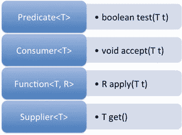
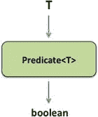
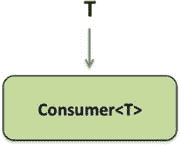
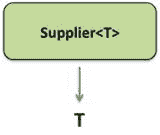

# 五、Lambda 内置函数式接口

  
| 认证目标 |
| --- |
| 使用 java.util.function 包中包含的内置接口，如谓词、使用者、函数和供应商 |
| 开发使用函数式接口原始版本的代码 |
| 开发使用函数式接口二进制版本的代码 |
| 开发使用一元运算符接口的代码 |

`java.util.function`有许多内置接口。Java 库中的其他包(特别是`java.util.stream`包)使用这个包中定义的接口。对于 OCPJP 8 考试，你应该熟悉使用本软件包中提供的关键接口。

正如我们之前讨论的(在第三章中)，一个函数式接口声明了一个抽象方法(但是除此之外，它可以有任意数量的默认或静态方法)。函数式接口对于创建 lambda 表达式很有用。整个`java.util.function`包由功能接口组成。

在定义您自己的功能接口之前，请根据您的需要考虑使用`java.util.function`包中定义的现成的功能接口。如果您正在寻找的 lambda 函数的签名在该库中提供的任何函数式接口中都不可用，您可以定义自己的函数式接口。

## 使用内置的功能接口

  
| 认证目标 |
| --- |
| 使用 java.util.function 包中包含的内置接口，如谓词、使用者、函数和供应商 |

在本节中，让我们讨论一下`java.util.function`包中包含的四个重要的内置接口:`Predicate`、`Consumer`、`Function`和`Supplier`。参见表 [5-1](#Tab1) 和图 [5-1](#Fig1) 获得这些功能接口的概述。



图 5-1。

Abstract method declarations in key functional interfaces in java.util.function package

表 5-1。

Key Functional Interfaces in java.util.function Package

   
| 功能接口 | 简要描述 | 多畜共牧 |
| --- | --- | --- |
| `Predicate<T>` | 检查条件并返回一个布尔值作为结果 | 在`java.util.stream.Stream`中的`filter()`方法中，用于删除流中与给定条件(即谓词)不匹配的元素作为参数。 |
| `Consumer<T>` | 接受参数但不返回任何值的操作 | 在集合中的`forEach()`方法和在`java.util.stream.Stream`中；此方法用于遍历集合或流中的所有元素。 |
| `Function<T, R>` | 接受参数并返回结果的函数 | 在`java.util.stream.Stream`的`map()`方法中，对传递的值进行转换或操作，并返回结果。 |
| `Supplier<T>` | 向调用者返回值的操作(返回值可以是相同或不同的值) | 在`java.util.stream.Stream`中的`generate()`方法创建一个无限元素流。 |

### 谓词接口

在代码中，我们经常需要使用检查条件并返回布尔值的函数。考虑下面的代码段:

```java
Stream.of("hello", "world")

.filter(str -> str.startsWith("h"))

.forEach(System.out::println);
```

这段代码只是在控制台上打印“hello”。只有当传递的字符串以“h”开头时，`filter()`方法才返回 true，因此它从流中“过滤掉”字符串“world ”,因为该字符串不是以“h”开头的。在这段代码中，`filter()`方法将一个`Predicate`作为参数。这里是`Predicate`功能界面:

```java
@FunctionalInterface

public interface Predicate<T> {

boolean test(T t);

// other methods elided

}
```

名为`test()`的抽象方法接受一个参数并返回`true`或`false`(图 [5-2](#Fig2) )。



图 5-2。

A Predicate<T> takes an argument of type T and returns a boolean value as the result

 A `Predicate<T>`“确认”某事为`true`或`false`:它接受一个`T`类型的参数，并返回一个`boolean`值。你可以在一个`Predicate`对象上调用`test()`方法。

这个函数式接口还定义了名为`and()`和`or()`的默认方法，它们接受一个`Predicate`并返回一个`Predicate`。这些方法的行为类似于& &和||操作符。方法`negate()`返回一个`Predicate`，它的行为类似于！操作员。它们有什么用？这里有一个程序说明了在`Predicate`接口中`and()`方法的使用(清单 [5-1](#FPar1) )。

Listing 5-1\. PredicateTest.java

```java
import java.util.function.Predicate;

public class PredicateTest {

public static void main(String []args) {

Predicate<String> nullCheck = arg -> arg != null;

Predicate<String> emptyCheck = arg -> arg.length() > 0;

Predicate<String> nullAndEmptyCheck = nullCheck.and(emptyCheck);

String helloStr = "hello";

System.out.println(nullAndEmptyCheck.test(helloStr));

String nullStr = null;

System.out.println(nullAndEmptyCheck.test(nullStr));

}

}
```

该程序打印:

```java
true

false
```

在这个程序中，对象`nullCheck`是一个`Predicate`，如果给定的`String`参数不是`null`，它将返回`true`。如果给定的字符串不为空,`emptyCheck`谓词返回 true。`nullAndEmptyCheck`谓词通过使用`Predicate`中提供的名为`and()`的默认方法来组合`nullCheck`和`emptyCheck`谓词。由于`helloStr`在第一次调用`nullAndEmptyCheck.test(helloStr)`中指向字符串“hello”，且该字符串不为空，所以返回`true`。然而，在下一个调用中，`nullStr`为空，因此调用`nullAndEmptyCheck.test(nullStr)`返回`false`。

再举一个使用`Predicate` s 的例子，这里有一段代码使用了 Java 8 的`Collection`接口中添加的`removeIf()`方法(清单 [5-2](#FPar2) )。

Listing 5-2\. RemoveIfMethod.java

```java
import java.util.List;

import java.util.ArrayList;

public class RemoveIfMethod {

public static void main(String []args) {

List<String> greeting = new ArrayList<>();

greeting.add("hello");

greeting.add("world");

greeting.removeIf(str -> !str.startsWith("h"));

greeting.forEach(System.out::println);

}

}
```

它在控制台中打印“hello”。在`Collection`接口(`ArrayList`的超级接口)中定义的默认方法`removeIf()`以一个`Predicate`作为参数:

```java
default boolean removeIf(Predicate<? super E> filter)
```

在对`removeIf()`方法的调用中，我们传递了一个 lambda 表达式，它与在`Predicate`接口中声明的抽象方法`boolean test(T t)`相匹配:

```java
greeting.removeIf(str -> !str.startsWith("h"));
```

结果，`ArrayList`对象问候语中的字符串“world”被删除，因此控制台中只显示“hello”。在这段代码中，我们使用了！操作员。除此之外，使用在`Predicate`中定义的等价的`negate()`方法怎么样？是的，这是可能的，下面是更改后的代码:

```java
greeting.removeIf(((Predicate<String>) str -> str.startsWith("h")).negate());
```

当您执行清单 [5-2](#FPar2) 中的程序时，程序会打印“hello”。注意我们是如何在这个表达式中执行显式类型转换`(`到`Predicate<String>)`的。没有这种显式的类型转换——就像在`((str -> str.startsWith("h")).negate())`中一样——编译器不能执行类型推断来确定匹配的函数式接口，因此会报告一个错误。

### 消费者界面

有许多方法接受一个参数，根据该参数执行一些操作，但不向它们的调用者返回任何东西——它们是消费者方法。考虑下面的代码段:

```java
Stream.of("hello", "world")

.forEach(System.out::println);
```

这段代码通过使用在`Stream`接口中定义的`forEach()`方法打印单词“hello”和“world ”,它们是流的一部分。该方法在`java.util.stream.Stream`界面中声明如下:

```java
void forEach(Consumer<? super T> action);
```

`forEach()`将`Consumer`的一个实例作为参数。`Consumer`函数式接口声明了一个名为`accept()`的抽象方法(图 [5-3](#Fig3) ):



图 5-3。

A Consumer<T> takes an argument of type T and returns nothing

```java
@FunctionalInterface

public interface Consumer<T> {

void accept(T t);

// the default andThen method elided

}
```

`accept()`方法“消费”一个对象，不返回任何东西(`void`)。

 A `Consumer<T>`“消费”某物:它接受一个参数(泛型类型`T`)并且不返回任何东西(`void`)。你可以在一个`Consumer`对象上调用`accept()`方法。

下面是一个使用`Consumer`接口的例子:

```java
Consumer<String> printUpperCase = str -> System.out.println(str.toUpperCase());

printUpperCase.accept("hello");

// prints: HELLO
```

在这段代码中，lambda 表达式接受给定的字符串，转换成大写字母，并将其打印到控制台。我们将实际的参数“hello”传递给`accept()`方法。

现在，让我们回到对`forEach()`的讨论:调用`forEach(System.out::println)`是如何工作的？

`System`类有一个名为`out`的静态变量，它的类型是`PrintStream`。`PrintStream`类定义了重载的`println`方法；其中一个重载方法有签名`void println(String)`。在调用`forEach(System.out::println)`中，我们传递的是`println`的方法引用，即`System.out::println`。该方法引用匹配`Consumer`接口中抽象方法的签名，即`void accept(T)`。因此，方法引用`System.out::println`用于实现函数式接口`Consumer`，代码将字符串“hello”和“world”打印到控制台。清单 [5-3](#FPar3) 将代码`Stream.of("hello", "world").forEach(System.out::println);`分成三个不同的语句，只是为了展示它是如何工作的。

Listing 5-3\. ConsumerUse.java

```java
import java.util.stream.Stream;

import java.util.function.Consumer;

class ConsumerUse {

public static void main(String []args) {

Stream<String> strings = Stream.of("hello", "world");

Consumer<String> printString = System.out::println;

strings.forEach(printString);

}

}
```

该程序打印:

```java
hello

world
```

`Consumer`也有一个名为`andThen()`的默认方法；它允许链接对`Consumer`对象的调用。

### 功能界面

考虑这个在`java.util.stream.Stream`接口中使用`map()`方法的例子(列表 [5-4](#FPar4) ):

Listing 5-4\. FunctionUse.java

```java
import java.util.Arrays;

public class FunctionUse {

public static void main(String []args) {

Arrays.stream("4, -9, 16".split(", "))

.map(Integer::parseInt)

.map(i -> (i < 0) ? -i : i)

.forEach(System.out::println);

}

}
```

该程序打印:

```java
4

9

16
```

这个程序通过拆分字符串“4，-9，16”来创建一个`String`流。方法引用`Integer::parseInt`被传递给`map()`方法——这个调用为流中的每个元素返回一个`Integer`对象。在流中对`map()`方法的第二次调用中，我们使用了 lambda 函数(`i -> (i < 0) ? -i : i)`来产生一个非负整数列表(或者，我们可以使用`Math::abs`方法)。我们在这里使用的`map()`方法将一个`Function`作为参数(这个例子是为了说明`Function`接口的用处)。最后，使用`forEach()`方法打印结果整数。

`Function`接口定义了一个名为`apply()`的抽象方法，它接受一个泛型类型`T`的参数并返回一个泛型类型`R`的对象(图 [5-4](#Fig4) ):


图 5-4。

A Function<T, R> takes an argument of type T and returns a value of type R

```java
@FunctionalInterface

public interface Function<T, R> {

R apply(T t);

// other methods elided

}
```

`Function`接口也有默认的方法，比如`compose(), andThen()`和`identity()`。

 A `Function<T, R>`“操作”某物并返回某物:它接受一个参数(泛型类型`T`)并返回一个对象(泛型类型`R`)。你可以在一个`Function`对象上调用`apply()`方法。

下面是一个使用`Function`的简单例子:

```java
Function<String, Integer> strLength = str -> str.length();

System.out.println(strLength.apply("supercalifragilisticexpialidocious"));

// prints: 34
```

这段代码获取一个字符串并返回它的长度。对于调用`strLength.apply`，我们传递字符串“`supercalifragilisticexpialidocious"`。作为调用`apply()`的结果，我们得到字符串 34 的长度作为结果。

让我们将清单 [5-4](#FPar4) 中的早期程序改为使用`andThen()`方法(清单 [5-5](#FPar5) )。

Listing 5-5\. CombineFunctions.java

```java
import java.util.Arrays;

import java.util.function.Function;

public class CombineFunctions {

public static void main(String []args) {
```

`Function<String, Integer> parseInt = Integer::``parseInt`T2】

`Function<Integer, Integer> absInt = Math::``abs`T2】

```java
Function<String, Integer> parseAndAbsInt = parseInt.andThen(absInt);
```

`Arrays.``stream`T2】

```java
.map(parseAndAbsInt)
```

`.forEach(System.``out`T2】

```java
}

}
```

该程序在单独的行中打印 4、9 和 16:与清单 [5-4](#FPar4) 的输出相同，但是在`Stream`中对`map()`方法进行了一次调用。因为`Integer::parseInt()`将一个字符串作为参数，解析它以返回一个`Integer`，我们声明了`Function<String, Integer>`类型的`parseInt()`方法。`Math::abs`方法接受一个整数并返回一个整数，因此我们将其声明为类型`Function<Integer, Integer>`。因为`parseAndAbsInt`接受一个`String`作为参数并返回一个整数作为结果，我们声明它的类型为`Function<String, Integer>`。

`Function`界面中的`andThen()`和`compose()`方法有什么区别？`andThen()`方法在调用当前的`Function`后应用传递的参数(如本例所示)。`compose()`方法在调用当前`Function`之前调用参数，如:

```java
Function<String, Integer> parseAndAbsInt = absInt.compose(parseInt);
```

`Function`中的`identity()`函数只是返回传递的参数，不做任何事情！那它有什么用？它有时用于测试——当你写了一段使用了`Function`的代码并想检查它是否工作时，你可以调用`identity()`,因为它不做任何事情。这里有一个例子:

```java
Arrays.stream("4, -9, 16".split(", "))

.map(Function.identity())

.forEach(System.out::println);
```

在这段代码中，`map(Function.identity())`什么也不做；它只是将流中的元素传递给调用`forEach(System.out::println)`。因此，代码按原样打印元素，即值 4、-9 和 16 在单独的行中。

### 供应商界面

在程序中，我们经常需要使用一种不接受任何输入但返回一些输出的方法。考虑以下生成`Boolean`值的程序(列表 [5-6](#FPar6) ):

Listing 5-6\. GenerateBooleans.java

```java
import java.util.stream.Stream;

import java.util.Random;

class GenerateBooleans {

public static void main(String []args) {

Random random = new Random();

Stream.generate(random::nextBoolean)

.limit(2)

.forEach(System.out::println);

}

}
```

这个程序随机打印两个布尔值，例如，“真”和“假”。`Stream`接口中的`generate()`方法是一个静态成员，以一个`Supplier`作为参数；

```java
static <T> Stream<T> generate(Supplier<T> s)
```

这里，您正在传递在`java.util.Random`类中定义的`nextBoolean`的方法引用。它返回一个随机选择的布尔值:

```java
boolean        nextBoolean()
```

您可以将`nextBoolean`的方法引用传递给`Stream`的`generate()`方法，因为它匹配`Supplier`接口中的抽象方法，即`T get()`图 [5-5](#Fig5) 。



图 5-5。

A Supplier<T > takes no arguments and returns a value of type T

```java
@FunctionalInterface

public interface Supplier<T> {

T get();

// no other methods in this interface

}
```

A`Supplier<T>`“supplies”什么都不带，只返回一些东西:它没有参数，返回一个对象(通用类型`T`)。你可以在一个`Supplier`对象上调用`get()`方法。

下面是一个简单的例子，它不需要任何输入就可以返回值:

```java
Supplier<String> currentDateTime = () -> LocalDateTime.now().toString();

System.out.println(currentDateTime.get());
```

我们已经在`java.time.LocalDateTime`上调用了`now()`方法(我们将在[第 8 章](08.html)中讨论 java 日期和时间 API)。当我们执行它时，它打印:`2015-10-16T12:40:55.164`。当然，如果您尝试这段代码，您将得到不同的输出。这里我们用的是`Supplier<String>`。lambda 表达式不接受任何输出，而是以`String`格式返回当前日期/时间。当我们在`currentDateTime`变量上调用`get()`方法时，我们正在调用 lambda。

#### 构造函数引用

考虑以下代码:

```java
Supplier<String> newString = String::new;

System.out.println(newString.get());

// prints an empty string (nothing) to the console and then a newline character
```

这段代码使用了构造函数引用。此代码相当于:

```java
Supplier<String> newString = () -> new String();

System.out.println(newString.get());
```

通过使用`::new`的方法引用，这个 lambda 表达式得到了简化，如`String::new`所示。如何使用带参数的构造函数？例如，考虑构造函数`Integer(String)`:这个`Integer`构造函数接受一个`String`作为参数，并用该字符串中给定的值创建一个`Integer`对象。下面是如何使用该构造函数:

```java
Function<String, Integer> anotherInteger = Integer::new;

System.out.println(anotherInteger.apply("100"));

// this code prints: 100
```

我们不能在这里使用`Supplier`,因为`Suppliers`不接受任何参数。`Functions`接受参数，这里的返回类型是`Integer`，因此我们可以使用`Function<String, Integer>`。

## 函数式接口的原始版本

  
| 认证目标 |
| --- |
| 开发使用函数式接口原始版本的代码 |

内置接口`Predicate`、`Consumer`、`Function`和`Supplier`作用于引用类型对象。对于原始类型，这些功能接口的`int`、`long`和`double`类型有可用的专门化。考虑对类型为`T`的对象进行操作的`Predicate`，即它是`Predicate<T>`。`int`、`long`和`double`对`Predicate`的专门化分别是`IntPredicate`、`LongPredicate`和`DoublePredicate`。

由于泛型的限制，您不能在函数式接口`Predicate`、`Consumer`、`Function`和`Supplier`中使用基元类型值。但是你可以使用包装器类型，比如`Integer`和`Double`来实现这些功能接口。当您试图在这些函数式接口中使用基本类型时，会导致隐式的自动装箱和取消装箱，例如，`int`值被转换为`Integer`对象，反之亦然。事实上，您甚至经常意识不到您正在使用带有这些功能接口的包装器类型。然而，当我们使用包装器类型时，性能会受到影响:想象一下在一个流中装箱和解箱几百万个整数。为了避免这个性能问题，您可以使用这些函数式接口的相关原语版本。

### 谓词接口的原始版本

考虑这个例子:

```java
IntStream.range(1, 10).filter(i -> (i % 2) == 0).forEach(System.out::println);
```

这里的`filter()`方法将一个`IntPredicate`作为参数，因为底层流是一个`IntStream`。下面是显式使用`IntPredicate`的等价代码:

```java
IntPredicate evenNums = i -> (i % 2) == 0;

IntStream.range(1, 10).filter(evenNums).forEach(System.out::println);
```

表 [5-2](#Tab2) 列出了`java.util.function`包中提供的`Predicate`接口的原始版本。

表 5-2。

Primitive Versions of Predicate Interface

   
| 功能接口 | 抽象方法 | 简要描述 |
| --- | --- | --- |
| `IntPredicate` | `boolean test(int value)` | 评估作为`int`传递的条件，并返回一个`boolean`值作为结果 |
| `LongPredicate` | `boolean test(long value)` | 评估作为`long`传递的条件，并返回一个`boolean`值作为结果 |
| `DoublePredicate` | `boolean test(double value)` | 评估作为`double`传递的条件，并返回一个`boolean`值作为结果 |

#### 函数式接口的原始版本

下面是一个将`Stream`用于原始类型 integers 的例子:

```java
AtomicInteger ints = new AtomicInteger(0);

Stream.generate(ints::incrementAndGet).limit(10).forEach(System.out::println);

// prints integers from 1 to 10 on the console
```

这段代码调用在类`java.util.concurrent.atomic.AtomicInteger`中定义的`int incrementAndGet()`方法。注意，这个方法返回一个`int`，而不是一个`Integer`。尽管如此，我们还是可以将它与`Stream`一起使用，因为它隐含了与`int`的包装器类型`Integer`之间的自动装箱和取消装箱。这种装箱和拆箱完全没有必要。相反，你可以使用`IntStream`接口；它的`generator()`方法以一个`IntSupplier`作为参数。经过这一更改，下面是等效的代码:

```java
AtomicInteger ints = new AtomicInteger(0);

IntStream.generate(ints::incrementAndGet).limit(10).forEach(System.out::println);

// prints integers from 1 to 10 on the console
```

因为他的代码使用了`IntStream`，`generate()`方法取了一个`IntSupplier`，所以没有隐式的装箱和拆箱；因此这段代码执行得更快，因为它不会生成不必要的临时`Integer`对象。

再举一个例子，下面是我们之前看到的使用`Math.abs()`方法的一段代码:

```java
Function<Integer, Integer> absInt = Math::abs;
```

你可以使用`Function`的`int`特殊化来替换它，称为`IntFunction`:

```java
IntFunction absInt = Math::abs;
```

根据参数和返回类型的不同，有许多版本的`Function`接口原语类型(见表 [5-3](#Tab3) )。

表 5-3。

Primitive Versions of Function Interface

   
| 功能接口 | 抽象方法 | 简要描述 |
| --- | --- | --- |
| `IntFunction<R>` | `R apply(int value)` | 对传递的`int`参数进行操作，并返回泛型类型的值`R` |
| `LongFunction<R>` | `R apply(long value)` | 对传递的`long`参数进行操作，并返回泛型类型的值`R` |
| `DoubleFunction<R>` | `R apply(double value)` | 对传递的`double`参数进行操作，并返回泛型类型的值`R` |
| `ToIntFunction<T>` | `int applyAsInt(T value)` | 对传递的泛型类型参数`T`进行操作，并返回一个`int`值 |
| `ToLongFunction<T>` | `long applyAsLong(T value)` | 对传递的泛型类型参数`T`进行操作，并返回一个`long`值 |
| `ToDoubleFunction<T>` | `double applyAsDouble(T value)` | 对传递的泛型类型参数`T`进行操作，并返回一个`double`值 |
| `IntToLongFunction` | `long applyAsLong(int value)` | 对传递的`int`类型参数进行操作，并返回一个`long`值 |
| `IntToDoubleFunction` | `double applyAsDouble(int value)` | 对传递的`int`类型参数进行操作，并返回一个`double`值 |
| `LongToIntFunction` | `int applyAsInt(long value)` | 对传递的`long`类型参数进行操作，并返回一个`int`值 |
| `LongToDoubleFunction` | `double applyAsLong(long value)` | 对传递的`long`类型参数进行操作，并返回一个`double`值 |
| `DoubleToIntFunction` | `int applyAsInt(double value)` | 对传递的`double`类型参数进行操作，并返回一个`int`值 |
| `DoubleToLongFunction` | `long applyAsLong(double value)` | 对传递的`double`类型参数进行操作，并返回一个`long`值 |

#### 消费者界面的原始版本

根据参数的种类，有许多版本的`Consumer`接口原语类型可用(见表 [5-4](#Tab4) )。

表 5-4。

Primitive Versions of Consumer Interface

   
| 功能接口 | 抽象方法 | 简要描述 |
| --- | --- | --- |
| `IntConsumer` | `void accept(int value)` | 对给定的`int`参数进行操作，不返回任何内容 |
| `LongConsumer` | `void accept(long value)` | 对给定的`long`参数进行操作，不返回任何内容 |
| `DoubleConsumer` | `void accept(double value)` | 对给定的`double`参数进行操作，不返回任何内容 |
| `ObjIntConsumer<T>` | `void accept(T t, int value)` | 对给定的泛型类型参数`T`和`int`进行操作，不返回任何内容 |
| `ObjLongConsumer<T>` | `void accept(T t, long value)` | 对给定的泛型类型参数`T`和`long`进行操作，不返回任何内容 |
| `ObjDoubleConsumer<T>` | `void accept(T t, double value)` | 对给定的泛型类型参数`T`和`double`进行操作，不返回任何内容 |

#### 供应商接口的原始版本

`Supplier`的原始版本是分别返回`boolean`、`int`、`long`、`double`的`BooleanSupplier`、`IntSupplier`、`LongSupplier`、`DoubleSupplier`(见表 [5-5](#Tab5) )。

表 5-5。

Primitive Versions of Supplier Interface

   
| 功能接口 | 抽象方法 | 简要描述 |
| --- | --- | --- |
| `BooleanSupplier` | `boolean getAsBoolean()` | 不接受任何参数并返回一个`boolean`值 |
| `IntSupplier` | `int getAsInt()` | 不接受任何参数并返回一个`int`值 |
| `LongSupplier` | `long getAsLong()` | 不接受任何参数并返回一个`long`值 |
| `DoubleSupplier` | `double getAsDouble()` | 不接受任何参数并返回一个`double`值 |

功能接口的原语版本仅适用于`int`、`long,`和`double`(除了`Supplier`的这三种类型外，还有`boolean`类型)。如果您需要一个接受或返回其他原语类型`char`、`byte`或`short`的函数式接口，该怎么办？你必须使用隐式转换到相关的`int`专门化。同样，当你使用`float`时，你可以使用`double`类型的专门化。

## 功能接口的二进制版本

  
| 认证目标 |
| --- |
| 开发使用函数式接口二进制版本的代码 |

函数式接口`Predicate`、`Consumer`和`Function`具有带一个参数的抽象方法。例如，考虑一下`Function`接口:

```java
@FunctionalInterface

public interface Function<T, R> {

R apply(T t);

// other methods elided

}
```

抽象方法`apply()`接受一个参数(泛型类型`T`)。下面是二进制版本的`Function`界面:

```java
@FunctionalInterface

public interface BiFunction<T, U, R> {

R apply(T t, U u);

// other methods elided

}
```

 A `BiFunction`类似于`Function`，但不同之处在于它接受两个参数:接受泛型类型`T`和`U`的参数，并返回泛型类型`R`的对象。你可以在一个`BiFunction`对象上调用`apply()`方法。

前缀“Bi”表示采用“两个”参数的版本。与`Function`的`BiFunction`相同，还有`Predicate`的`BiPredicate`和`Consumer`的`BiConsumer`需要两个参数(见表 [5-6](#Tab6) )。`Supplier`怎么样？因为`Supplier`中的抽象方法不接受任何参数，所以没有等价的`BiSupplier`可用。

表 5-6。

Binary Versions of Functional Interfaces

   
| 功能接口 | 抽象方法 | 简要描述 |
| --- | --- | --- |
| `BiPredicate<T, U>` | `boolean test(T t, U u)` | 检查参数是否与条件匹配，并返回一个`boolean`值作为结果 |
| `BiConsumer<T, U>` | `void accept(T t, U u)` | 消耗两个参数但不返回任何内容的操作 |
| `BiFunction<T, U, R>` | `R apply(T t, U u)` | 接受两个参数并返回结果的函数 |

### 双功能接口

下面是一个使用`BiFunction`接口的例子:

```java
BiFunction<String, String, String> concatStr = (x, y) -> x + y;

System.out.println(concatStr.apply("hello ", "world"));

// prints: hello world
```

在此示例中，参数和返回类型是相同的类型，但它们可以不同，如:

```java
BiFunction<Double, Double, Integer> compareDoubles = Double::compare;

System.out.println(compareDoubles.apply(10.0, 10.0));

// prints: 0
```

在这种情况下，参数类型是类型`double`，返回类型是`integer`。当传递的双精度值相等时，`Double`类中的`compare`方法返回 0，因此我们得到这个代码段的输出 0。

考虑到在`java.util.function`包中有大量可用的函数式接口，为给定的上下文找到合适的函数式接口可能很棘手。例如，在我们之前的例子中，我们使用了`BiFunction<Double, Double, Integer>`。相反，我们可以使用函数式接口`ToIntBiFunction`，因为它返回一个`int`。

#### 双预测接口

考虑下面的代码段:

```java
BiPredicate<List<Integer>, Integer> listContains = List::contains;

List aList = Arrays.asList(10, 20, 30);

System.out.println(listContains.test(aList, 20));

// prints: true
```

这段代码展示了如何使用`BiPredicate`。`List`中的`contains()`方法将一个元素作为参数，并检查底层列表是否包含该元素。因为它接受一个参数并返回一个`Integer`，所以我们可以使用一个`BiPredicate`。为什么不用`BiFunction<T, U, Boolean>`？是的，代码可以工作，但是更好的选择是等价的`BiPredicate<T, U>`，因为`BiPredicate`返回一个`boolean`值。

#### 双消费者界面

考虑这段代码:

```java
BiConsumer<List<Integer>, Integer> listAddElement = List::add;

List aList = new ArrayList();

listAddElement.accept(aList, 10);

System.out.println(aList);

// prints: [10]
```

这段代码展示了如何使用`BiConsumer`。类似于在前面的例子中为`BiPredicate`使用`List::contains`方法引用，这个例子展示了如何使用这个接口使用`BiConsumer`来调用`List`中的`add()`方法。

## 一元运算符接口

  
| 认证目标 |
| --- |
| 开发使用一元运算符接口的代码 |

考虑下面的例子。

```java
List<Integer> ell = Arrays.asList(-11, 22, 33, -44, 55);

System.out.println("Before: " + ell);

ell.replaceAll(Math::abs);

System.out.println("After: " + ell);
```

该代码打印:

```java
Before: [-11, 22, 33, -44, 55]

After: [11, 22, 33, 44, 55]
```

这段代码使用 Java 8 中引入的`replaceAll()`方法来替换给定`List`中的元素。`replaceAll()`方法将`UnaryOperator`作为唯一的参数:

```java
void replaceAll(UnaryOperator<T> operator)
```

将`replaceAll()`方法与`Math::abs`方法一起传递给它。

`Math`对`abs()`方法有四个重载方法:

```java
abs(int)

abs(long)

abs(double)

abs(float)
```

因为类型是`Integer`，所以通过类型推断选择重载的方法`abs(int)`。

`UnaryOperator`是一个函数式接口，它扩展了`Function`接口，可以使用`Function`接口中声明的`apply()`方法；此外，它从`Function`接口继承了默认功能`compose()`和`andThen()`。类似于`UnaryOperator`扩展了`Function`接口，还有一个`BinaryOperator`扩展了`BiFunction`接口。

接口`IntUnaryOperator`、`LongUnaryOperator`和`DoubleUnaryOperator`的原始类型版本也作为`java.util.function`包的一部分提供。

Java . util . function 包只包含函数式接口。这个包里只有四个核心接口:`Predicate`、`Consumer`、`Function`和`Supplier`。剩下的接口都是原语版本，二进制版本，以及衍生接口比如`UnaryOperator`接口。这些接口的主要区别在于它们声明的抽象方法的签名。您需要根据上下文和您的需求选择合适的功能接口。

## 摘要

让我们简要回顾一下本章中每个认证目标的要点。请在参加考试之前阅读它。

使用 java.util.function 包中包含的内置接口，如谓词、使用者、函数和供应商

*   内置函数式接口`Predicate`、`Consumer`、`Function`和`Supplier`的区别主要在于它们声明的抽象方法的签名。
*   A `Predicate`测试给定的条件并返回`true`或`false`；因此，它有一个名为“`test`”的抽象方法，该方法接受泛型类型`T`的参数并返回类型`boolean`。
*   A `Consumer`“消费”一个对象，不返回任何东西；因此，它有一个名为“`accept`”的抽象方法，该方法接受泛型类型`T`的参数，并具有返回类型`void`。
*   A `Function`“操作”参数并返回结果；因此，它有一个名为“`apply`”的抽象方法，该方法接受泛型类型`T`的参数，并具有泛型返回类型`R`。
*   一个`Supplier`“物资”什么都不拿，却要回报一些东西；因此，它有一个名为“get”的抽象方法，该方法不带参数，返回一个泛型类型`T`。
*   在`Iterable`(由集合类实现)方法中定义的`forEach()`方法接受一个`Consumer<T>`。

开发使用函数式接口原始版本的代码

*   内置接口`Predicate`、`Consumer`、`Function`和`Supplier`作用于引用类型对象。对于基本类型，这些函数式接口的`int`、`long`和`double`类型都有专门化。
*   当`Stream`接口用于基本类型时，会导致不必要的基本类型到它们的包装器类型的装箱和拆箱。这会导致代码变慢，并浪费内存，因为会创建不必要的包装对象。因此，只要有可能，最好使用功能接口`Predicate`、`Consumer`、`Function`和`Supplier`的原始类型专门化。
*   功能接口`Predicate`、`Consumer`、`Function`、`Supplier`的原语版本仅适用于`int`、`long`和`double`类型(除了`Supplier`的这三种类型外，还有`boolean`类型)。当你需要使用`char`、`byte`或`short`类型时，你必须使用到相关`int`版本的隐式转换；同样，当需要使用`float`时，可以使用`double`类型的版本。

开发使用函数式接口二进制版本的代码

*   功能接口`BiPredicate`、`BiConsumer`、`BiFunction`分别是`Predicate`、`Consumer`、`Function`的二进制版本。对于`Supplier`没有等价的二进制，因为它不接受任何参数。前缀“Bi”表示采用“两个”参数的版本。

开发使用一元运算符接口的代码

*   `UnaryOperator`是一个功能接口，它扩展了`Function`接口。
*   `UnaryOperator`的原始类型专门化为`IntUnaryOperator`、`LongUnaryOperator`和`DoubleUnaryOperator`，分别代表`int`、`long`和`double`类型。

Question TimeWhich of the following are functional interfaces? (Select ALL that apply) java.util.stream.Stream<T>   java.util.function.Consumer<T>   java.util.function.Supplier<T>   java.util.function.Predicate<T>   java.util.function.Function<T, R>     Choose the correct option based on this program: `import java.util.function.Predicate;` `public class PredicateTest {`     `public static void main(String []args) {`         `Predicate<String> notNull =`                 `((Predicate<String>)(arg -> arg == null)).negate(); // #1`         `System.out.println(notNull.test(null));`     `}` `}` This program results in a compiler error in line marked with the comment #1   This program prints: true   This program prints: false   This program crashes by throwing `NullPointerException`     Choose the correct option based on this program: `import java.util.function.Function;` `public class AndThen {`     `public static void main(String []args) {`         `Function<Integer, Integer> negate = (i -> -i), square = (i -> i * i),`                      `negateSquare = negate.compose(square);`         `System.` `out` `.println(negateSquare.apply(10));`     `}` `}` This program results in a compiler error   This program prints: -100   This program prints: 100   This program prints: -10   This program prints: 10     Which one of the following functional interfaces can you assign the method reference `Integer::parseInt`? Note that the static method `parseInt()` in `Integer` class takes a `String` and returns an `int`, as in: `int parseInt(String s)` BiPredicate<String, Integer>   Function<Integer, String>   Function<String, Integer>   Predicate<String>   Consumer<Integer, String>   Consumer<String, Integer>     Choose the correct option based on this program: `import java.util.function.BiFunction;` `public class StringCompare {`      `public static void main(String args[]){`              `BiFunction<String, String, Boolean> compareString = (x, y) -> x.equals(y);`              `System.out.println(compareString.apply("Java8","Java8")); // #1`      `}` `}` This program results in a compiler error in line marked with #1   This program prints: true   This program prints: false   This program prints: `(x, y) -> x.equals(y)`   This program prints: `("Java8", "Java8") -> "Java8".equals("Java8")`     Which one of the following abstract methods does not take any argument but returns a value? The `accept()` method in `java.util.function.Consumer<T>` interface   The `get()` method in `java.util.function.Supplier<T>` interface   The `test()` method in `java.util.function.Predicate<T>` interface   The `apply()` method in `java.util.function.Function<T, R>` interface     Choose the correct option based on this program: `import java.util.function.Predicate;` `public class PredUse {`     `public static void main(String args[]){`         `Predicate<String> predContains = "I am going to write OCP8 exam"::contains;`         `checkString(predContains, "OCPJP");`     `}`     `static void checkString(Predicate<String> predicate, String str) {`         `System.out.println(predicate.test(str) ? "contains" : "doesn't contain");`     `}` `}` This program results in a compiler error for code within `main()` method   This program results in a compiler error for code within `checkString()` method   This program prints: contains   This program prints: doesn’t contain     Choose the correct option based on this program: `import java.util.function.ObjIntConsumer;` `class ConsumerUse {`     `public static void main(String []args) {`        `ObjIntConsumer<String> charAt = (str, i) -> str.charAt(i); // #1`        `System.` `out` `.println(charAt.accept("java", 2));              // #2`     `}` `}` This program results in a compiler error for the line marked with comment #1   This program results in a compiler error for the line marked with comment #2   This program prints: a   This program prints: v   This program prints: 2    

答案:

B, C, D, and E The interface `java.util.stream.Stream<T>` is not a functional interface–it has numerous abstract methods. The other four options are functional interfaces. The functional interface `java.util.function.Consumer<T>` has an abstract method with the signature `void accept(T t);` The functional interface `java.util.function.Supplier<T>` has an abstract method with the signature `T get();` The functional interface `java.util.function.Predicate<T>` has an abstract method with the signature `boolean test(T t);` The functional interface `java.util.function.Function<T, R>` has an abstract method with the signature `R apply(T t);`   C. This program prints: false The expression `((Predicate<String>)(arg -> arg == null))` is a valid cast to the type `(Predicate<String>)` for the lambda expression `(arg -> arg == null)`. Hence, it does not result in a compiler error. The `negate` function in `Predicate` interface turns `true` to `false` and `false` to `true`. Hence, given `null`, the `notNull.test(null)` results in returning the value `false`.   B. This program prints: -100 The `negate.compose(square)` calls square before calling negate. Hence, for the given value 10, square results in 100, and when negated, it becomes -100.   C. Function<String, Integer> The `parseInt()` method takes a `String` and returns a value, hence we need to use the `Function` interface because it matches the signature of the abstract method `R apply(T t)`. In `Function<T, R>`, the first type argument is the argument type and the second one is the return type. Given that `parseInt` takes a `String` as the argument and returns an `int` (that can be wrapped in an `Integer`), we can assign it to `Function<String, Integer>`.   B. This program prints: true The `BiFunction` interface takes two type arguments–they are of types `String` in this program. The return type is `Boolean. BiFunction` functional interface has abstract method named `apply()`. Since the signature of `String`’s `equals()` method matches that of the signature of the abstract method `apply()`, this program compiles fine. When executed, the strings “Java8” and “Java8” are equal; hence, the evaluation returns true that is printed on the console.   B. The `get()` method in `java.util.function.Supplier<T>` interface The signature of `get()` method in `java.util.function.Supplier<T>` interface is: `T get()`.   D. This program prints: doesn’t contain You can create method references for object as well, so the code within `main()` compiles without errors. The code within `checkString()` method is also correct and hence it also compiles without errors. The string “OCPJP” is not present in the string “I am going to write OCP8 exam” and hence this program prints “doesn’t contain” on the console.   D. This program results in a compiler error for the line marked with comment #2 `ObjIntConsumer` operates on the given `String` argument `str` and `int` argument `i` and returns nothing. Though the `charAt` method is declared to return the `char` at given index `i`, the `accept` method in `ObjIntConsumer` has return type `void`. Since `System.out.println` expects an argument to be passed, the call `charAt.accept("java", 2)` results in a compiler error because `accept()` method returns void.