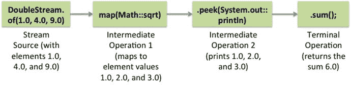
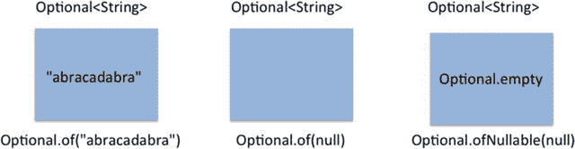
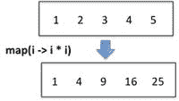
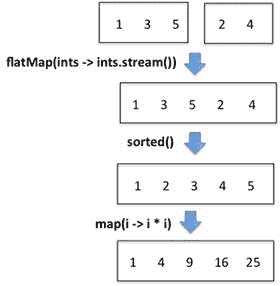

# 六、Java 流 API

  
| 认证目标 |
| --- |
| 开发代码以使用 peek()和 map()方法从对象中提取数据，包括 map()方法的原始版本 |
| 使用流类的搜索方法搜索数据，包括 findFirst、findAny、anyMatch、allMatch、noneMatch |
| 开发使用可选类的代码 |
| 开发使用流数据方法和计算方法的代码 |
| 使用流 API 对集合进行排序 |
| 使用 collect 方法将结果保存到集合中，使用 Collectors 类将数据分组/分区 |
| 在流 API 中使用 flatMap()方法 |

在本章中，我们将讨论 Java 8 中对 Java 库最重要的补充:stream API。流 API 是`java.util.stream`包的一部分。本章的重点是这个包中的关键接口:`Stream<T>`接口(及其原始类型版本)。在这一章中，我们还将讨论诸如`Optional`和`Collectors`这样的职业。

我们已经在第四章(泛型和集合)中介绍了 stream API。stream API 广泛使用了内置的函数式接口，这些接口是我们在前一章讨论的`java.util.function`包的一部分([第 5 章](05.html))。所以，我们假设你在看本章之前已经看过这两章了。

## 从流中提取数据

  
| 认证目标 |
| --- |
| 开发代码以使用 peek()和 map()方法从对象中提取数据，包括 map()方法的原始版本 |

让我们从一个简单的例子开始:

```java
long count = Stream.of(1, 2, 3, 4, 5).map(i -> i * i).count();

System.out.printf("The stream has %d elements", count);
```

这段代码打印了:

```java
The stream has 5 elements
```

该流中的`map()`操作将作为参数传递的给定 lambda 函数应用于流的元素。在这种情况下，它对流中的元素求平方。`count()`方法返回值 5——您在一个变量中捕获它并在控制台上打印出来。但是你如何检查在这段代码中应用中间操作`map()`的结果呢？为此，您可以使用`peek()`方法:

```java
long count = Stream.of(1, 2, 3, 4, 5)

.map(i -> i * i)

.peek(i -> System.out.printf("%d ", i))

.count();

System.out.printf("%nThe stream has %d elements", count);
```

这段代码打印出来

```java
1 4 9 16 25

The stream has 5 elements
```

这个例子还说明了如何将中间操作链接在一起。这是可能的，因为中间操作返回流。

现在，让我们在调用`map()`方法之前添加另一个`peek()`方法，以了解它是如何工作的:

```java
Stream.of(1, 2, 3, 4, 5)

.peek(i -> System.out.printf("%d ", i))

.map(i -> i * i)

.peek(i -> System.out.printf("%d ", i))

.count();
```

这段代码打印出来

```java
1 1 2 4 3 9 4 16 5 25
```

从这个输出可以看出，流管道正在逐个处理元素。每个元素都映射到它的正方形。`peek()`方法帮助我们理解流中正在处理什么，而不分发它。

`peek()`方法主要用于调试目的。它有助于我们理解元素在管道中是如何转换的。不要在产品代码中使用它。

你可以在`Stream<T>`的原始版本中使用`map()`和`peek()`方法；然后下面的代码片段使用了一个`DoubleStream`:

`DoubleStream.``of`T2】

`.map(Math::``sqrt`T2】

`.peek(System.``out`T2】

```java
.sum();
```

此代码在控制台上的不同行中打印出 1.0、2.0 和 3.0。图 [6-1](#Fig1) 直观地显示了该流管道中的源、中间操作和终端操作。



图 6-1。

A stream pipeline with source, intermediate operations and terminal operation

## 从流中搜索数据

  
| 认证目标 |
| --- |
| 使用流类的搜索方法搜索数据，包括 findFirst、findAny、anyMatch、allMatch、noneMatch |

在`Stream`界面中，以单词`Match`结尾的方法和以单词`find`开头的方法对于从流中搜索数据很有用(表 [6-1](#Tab1) )。如果您在流中寻找匹配给定条件的元素，您可以使用匹配操作，例如`anyMatch()`、`allMatch()`和`noneMatch()`。这些方法返回一个布尔值。对于搜索操作`findFirst()`和`findAny()`，匹配元素可能不在`Stream`中，所以它们返回`Optional<T>`(我们将在下一节讨论`Optional<T>`)。

表 6-1。

Important Match and Find Methods in the `Stream` Interface

  
| 方法名称 | 简短描述 |
| --- | --- |
| `boolean anyMatch(Predicate<? super T> check)` | 如果流中有任何元素匹配给定的谓词，则返回 true。如果流为空或者没有匹配的元素，则返回 false。 |
| `boolean allMatch(Predicate<? super T> check)` | 仅当流中的所有元素都匹配给定的谓词时，才返回 true。如果流是空的，不计算谓词，则返回 true！ |
| `boolean noneMatch(Predicate<? super T> check)` | 仅当流中没有任何元素与给定谓词匹配时，才返回 true。如果流是空的，不计算谓词，则返回 true！ |
| `Optional<T> findFirst()` | 返回流中的第一个元素；如果流中没有元素，它返回一个空的`Optional<T>`对象。 |
| `Optional<T> findAny()` | 从流中返回一个元素；如果流中没有元素，它返回一个空的`Optional<T>`对象。 |

与流为空时返回 false 的 anyMatch()方法不同，allMatch()和 noneMatch()方法在流为空时返回 true！

下面是一个简单的程序，演示了如何使用`anyMatch()`、`allMatch()`和`noneMatch()`方法(清单 [6-1](#FPar1) )。

Listing 6-1\. MatchUse.java

```java
import java.util.stream.IntStream;

public class MatchUse {

public static void main(String []args) {

// Average temperatures in Concordia, Antarctica in a week in October 2015

boolean anyMatch

= IntStream.of(-56, -57, -55, -52, -48, -51, -49).anyMatch(temp -> temp > 0);

System.out.println("anyMatch(temp -> temp > 0): " + anyMatch);

boolean allMatch

= IntStream.of(-56, -57, -55, -52, -48, -51, -49).allMatch(temp -> temp > 0);

System.out.println("allMatch(temp -> temp > 0): " + allMatch);

boolean noneMatch

= IntStream.of(-56, -57, -55, -52, -48, -51, -49).noneMatch(temp -> temp > 0);

System.out.println("noneMatch(temp -> temp > 0): " + noneMatch);

}

}
```

该程序打印:

```java
anyMatch(temp -> temp > 0): false

allMatch(temp -> temp > 0): false

noneMatch(temp -> temp > 0): true
```

因为所有给定的温度都是负值，`anyMatch()`和`allMatch()`方法返回 false，而`noneMatch()`返回 true。

`findFirst()`和`findAny()`方法对于在流中搜索元素很有用。这里有一个使用`findFirst()`方法的程序(列表 [6-2](#FPar2) )。

Listing 6-2\. FindFirstUse1.java

```java
import java.lang.reflect.Method;

import java.util.Arrays;

import java.util.Optional;

import java.util.stream.Stream;

public class FindFirstUse1 {

public static void main(String []args) {

Method[] methods = Stream.class.getMethods();

Optional<String> methodName = Arrays.stream(methods)

.map(method -> method.getName())

.filter(name -> name.endsWith("Match"))

.sorted()

.findFirst();

System.out.println("Result: " + methodName.orElse("No suitable method found"));

}

}
```

该程序打印:

```java
Result: allMatch
```

在这个程序中，我们使用反射获得了`Stream`本身的方法列表。然后，使用`map()`方法，我们获得方法名的列表，检查名称是否以字符串“Match”结尾，对这些方法进行排序，并返回第一个找到的方法。如果我们正在寻找任何以“匹配”结尾的方法名，那么我们可以使用`findAny()`方法来代替。

为什么`java.util.function`包同时有`findFirst()`和`findAny()`方法？在并行流中，`findAny()`比`findFirst()`用起来更快(我们在[第 11 章](11.html)中讨论并行流)。

清单 [6-3](#FPar3) 有一个流，它有许多温度值，都是双精度值。使用`findFirst()`，我们寻找任何大于 0 的温度。程序将打印什么？

Listing 6-3\. FindFirstUse2.java

```java
import java.util.OptionalDouble;

import java.util.stream.DoubleStream;

public class FindFirstUse2 {

public static void main(String []args) {

OptionalDouble temperature = DoubleStream.of(-10.1, -5.4, 6.0, -3.4, 8.9, 2.2)

.filter(temp -> temp > 0)

.findFirst();

System.out.println("First matching temperature > 0 is " + temperature.getAsDouble());

}

}
```

该程序打印:

```java
First matching temperature > 0 is 6.0
```

在这个双精度值流中，`filter()`方法过滤元素`10.1`和`-5.4`，因为条件`temp > 0`为假。对于元素 6.0，`filter()`方法评估条件为真，并且`findFirst()`返回该元素。注意，这个流管道中的其余元素被忽略了:元素 8.9 和 2.2 也满足条件`temp > 0`，但是流管道被关闭，因为`findFirst()`方法已经返回值 6.0。换句话说，像`findFirst()`这样的搜索方法就是短路。一旦确定了结果，就不会处理流中的其余元素。

用于搜索元素的“匹配”和“查找”方法本质上是“短路”。什么是短路？一旦找到结果，评估就停止(并且不评估其余部分)。您已经熟悉了运算符& &和||“短路”的名称。例如，在表达式((s！= null) & & (s.length() > 0))，如果字符串 s 为 null，则条件(s！= null)计算结果为 false 因此，表达式的结果为 false。在这种情况下，不计算剩余的表达式(s.length() > 0)。

在清单 [6-2](#FPar2) 和 [6-3](#FPar3) 中，我们使用了`Optional`和`OptionalDouble`类；现在让我们来讨论这两个类。

## 选修课

  
| 认证目标 |
| --- |
| 开发使用可选类的代码 |

类`java.util.Optional`是值的持有者，该值可以是`null`。在`java.util.stream`包的类中有许多方法返回`Optional`值。现在让我们看一个例子。

考虑这种方法:

```java
public static void selectHighestTemperature(Stream<Double> temperatures) {

System.out.println(temperatures.max(Double::compareTo));

}
```

下面是对此方法的调用:

```java
selectHighestTemperature(Stream.of(24.5, 23.6, 27.9, 21.1, 23.5, 25.5, 28.3));
```

该代码打印:

```java
Optional[28.3]
```

`Stream`中的`max()`方法将一个`Comparator`作为参数，并返回一个`Optional<T>:`

```java
Optional<T> max(Comparator<? super T> comparator);
```

为什么用`Optional<T>`而不是返回类型`T`？这是因为`max()`方法可能无法找到最大值——例如，考虑一个空流:

```java
selectHighestTemperature(Stream.of());
```

现在，这段代码打印出来:

```java
Optional.empty
```

要从`Optional`获取值，可以使用`isPresent()`和`get()`方法，如下所示:

```java
public static void selectHighestTemperature(Stream<Double> temperatures) {

Optional<Double> max = temperatures.max(Double::compareTo);

if(max.isPresent()) {

System.out.println(max.get());

}

}
```

编写一个`if`条件是繁琐的(并且不是函数式的)，所以可以使用`ifPresent`方法来编写简化的代码:

```java
max.ifPresent(System.out::println);
```

`Optional`中的这个`ifPresent()`方法以一个`Consumer<T>`作为参数。你也可以使用像`orElse()`和`orElseThrow()`这样的方法，我们将在讨论如何创建`Optional`对象之后讨论这些方法。

### 创建可选对象

有许多方法可以创建`Optional`对象。创建`Optional`对象的一种方法是在`Optional`类中使用工厂方法，如下所示:

```java
Optional<String> empty = Optional.empty();
```

也可以在`Optional`类中使用`of()`:

```java
Optional<String> nonEmptyOptional = Optional.of("abracadabra");
```

但是，您不能将`null`传递给`Optional.of()`方法，如:

```java
Optional<String> nullStr = Optional.of(null);

System.out.println(nullStr);

// crashes with a NullPointerException
```

这将导致抛出一个`NullPointerException`。如果你想创建一个有`null`值的`Optional`对象，那么你可以使用`ofNullable()`方法:

```java
Optional<String> nullableStr = Optional.ofNullable(null);

System.out.println(nullableStr);

// prints: Optional.empty
```

图 [6-2](#Fig2) 将`nonEmptyOptional`、`nullStr`和`nullableStr`所指向的`Optional<String>`对象形象化表示。



图 6-2。

Representation of three Optional<String> objects

### 可选流

你也可以把`Optional`看作一个可以有零个元素或者一个元素的流。所以你可以在这个流上应用诸如`map()`、`filter()`和`flatMap()`操作的方法！怎么有用？下面是一个例子(列表 [6-4](#FPar4) ):

Listing 6-4\. OptionalStream.java

```java
import java.util.Optional;

public class OptionalStream {

public static void main(String []args) {

Optional<String> string = Optional.of("  abracadabra  ");

string.map(String::trim).ifPresent(System.out::println);

}

}
```

该程序打印:

```java
abracadabra
```

当这些操作失败时，您可以使用`orElse()`或`orElseThrow()`方法(例如，底层的`Optional`具有空值)，如下所示:

```java
Optional<String> string = Optional.ofNullable(null);

System.out.println(string.map(String::length).orElse(-1));
```

这段代码输出-1，因为变量`string`是保存`null`的`Optional`变量，因此`orElse()`方法执行并返回-1。或者，您可以使用`orElseThrow()`方法抛出一个异常:

```java
Optional<String> string = Optional.ofNullable(null);

System.out.println(string.map(String::length).orElseThrow(IllegalArgumentException::new));
```

这段代码抛出了一个`IllegalArgumentException`。当你处理从一个函数返回的`Optional`对象，而你不知道`Optional`对象包含什么的时候，在一个`Optional`对象上调用`map()`、`flatMap()`或`filter()`这样的方法是很有用的。

### 可选的原始版本

在我们之前讨论的代码中，我们同时使用了`Stream<Double>`和`Optional<Double>`类型:

```java
public static void selectHighestTemperature(Stream<Double> temperatures) {

Optional<Double> max = temperatures.max(Double::compareTo);

if(max.isPresent()) {

System.out.println(max.get());

}

}
```

最好用`DoubleStream`和`OptionalDouble`，分别是`Stream<T>`和`Optional<T>`的`double`的原语类型版本。(另外两个可用的原语类型版本用于`int`和`long`，分别命名为`OptionalInt`和`OptionalLong`。)所以，这段代码可以重写为:

```java
public static void selectHighestTemperature(DoubleStream temperatures) {

OptionalDouble max = temperatures.max();

max.ifPresent(System.out::println);

}
```

当用下面的调用调用时，

```java
selectHighestTemperature(DoubleStream.of(24.5, 23.6, 27.9, 21.1, 23.5, 25.5, 28.3));
```

我们得到控制台上正确显示的最大值:

```java
28.3
```

类似于返回`Optional<T>`的`max()`方法`Stream<T>`,`DoubleStream`中的`max()`方法返回一个`OptionalDouble`。

## 流数据方法和计算方法

  
| 认证目标 |
| --- |
| 开发使用流数据方法和计算方法的代码 |

`Stream<T>`接口有数据和计算方法`count()`、`min()`和`max()`。`min()`和`max()`方法将一个`Comparator`对象作为参数并返回一个`Optional<T>`。这里有一个使用这些方法的例子(清单 [6-5](#FPar5) )。

Listing 6-5\. WordsCalculation.java

```java
import java.util.Arrays;

public class WordsCalculation {

public static void main(String []args) {

String[] string = "you never know what you have until you clean your room".split(" ");

System.out.println(Arrays.stream(string).min(String::compareTo).get());

}

}
```

该程序打印:

```java
clean
```

因为`min()`方法需要一种方法来比较流中的元素，所以我们在这个程序中传递了`String::compareTo`方法引用。由于`min()`返回一个`Optional<T>`，我们使用了`get()`方法来获得结果字符串。由于`String::compareTo`按字典顺序比较两个字符串，我们得到单词“clean”作为结果。

下面是修改后的代码片段，它不是按字典顺序而是根据字符串的长度来比较字符串:

```java
Comparator<String> lengthCompare = (str1, str2) -> str1.length() - str2.length();

System.out.println(Arrays.stream(string).min(lengthCompare).get());
```

有了这个改变，程序打印出“you ”,因为它是给定的`string`中长度最小的单词。

在`Stream<T>`接口的原始版本中提供了额外的数据和计算方法，如`sum()`和`average()`。表 [6-2](#Tab2) 列出了我们在本节讨论的`IntStream`接口中的重要方法。

表 6-2。

Important Data and Calculation Methods in `IntStream` Interface

  
| 方法 | 简短描述 |
| --- | --- |
| `int sum()` | 返回流中元素的总和；如果流为空，则为 0。 |
| `long count()` | 返回流中元素的数量；如果流为空，则为 0。 |
| `OptionalDouble average()` | 返回流中元素的平均值；如果流为空，则为空的`OptionalDouble`值。 |
| `OptionalInt min()` | 返回流中的最小整数值；如果流为空，则为空的`OptionalInt`值。 |
| `OptionalInt max()` | 返回流中的最大整数值；如果流为空，则为空的`OptionalInt`值。 |
| `IntSummaryStatistics summaryStatistics()` | 返回一个具有`sum`、`count`、`average`、`min`和`max`值的`IntSummaryStatistics`对象。 |

`LongStream`和`DoubleStream`接口的方法与本表中为`IntStream`列出的方法相似(表 [6-2](#Tab2) )。下面是一个使用它们的简单程序(清单 [6-6](#FPar6) )。

Listing 6-6\. WordStatistics.java

```java
import java.util.IntSummaryStatistics;

import java.util.regex.Pattern;

public class WordStatistics {

public static void main(String []args) {

String limerick = "There was a young lady named Bright " +

"who traveled much faster than light " +

"She set out one day " +

"in a relative way " +

"and came back the previous night ";

IntSummaryStatistics wordStatistics =

Pattern.compile(" ")

.splitAsStream(limerick)

.mapToInt(word -> word.length())

.summaryStatistics();

System.out.printf(" Number of words = %d \n Sum of the length of the words = %d \n" +

" Minimum word size = %d \n Maximum word size %d \n " +

" Average word size = %f \n", wordStatistics.getCount(),

wordStatistics.getSum(), wordStatistics.getMin(),

wordStatistics.getMax(), wordStatistics.getAverage());

}

}
```

该程序打印:

```java
Number of words = 28

Sum of the length of the words = 115

Minimum word size = 1

Maximum word size 8

Average word size = 4.107143
```

在使用`Pattern`类中的`splitAsStream()`方法将单词分割成一个流之后，这个程序调用`mapToInt()`方法将单词转换成它们的长度。为什么用`mapToInt()`而不是`map()`的方法？`map()`方法返回一个`Stream`，但是我们想要在流中的底层元素上执行计算。接口没有执行计算的方法，但是它的原始类型版本有数据和计算方法。因此，我们称返回`IntStream`的`mapToInt()`方法:`IntStream`有许多有用的数据和计算方法(列于表 [6-2](#Tab2) )。我们已经在`IntStream`上调用了`summaryStatistics()`方法。最后，我们在返回的`IntSummaryStatistics`对象上调用了各种方法，如`sum()`和`average()`来总结对给定打油诗中使用的单词的计算。

也可以直接调用`IntStream`中提供的`sum()`和`average()`等方法，如:

```java
IntStream.of(10, 20, 30, 40).sum();
```

这些方法比使用`reduce()`方法的等效方法更简洁:

```java
IntStream.of(10, 20, 30, 40).reduce(0, ((sum, val) -> sum + val));
```

为什么 stream API 提供了`reduce()`方法，而我们可以使用像`sum()`这样更简洁，更方便使用，也更易读的方法？

答案是`reduce()`是一个一般化的方法:当你想对 stream 元素执行重复操作来计算一个结果时，可以使用它。考虑 10 的阶乘。我们没有像`IntStream`中的`sum()`那样的方法可以帮助我们将所有的值相乘。因此，我们可以在这种情况下使用`reduce()`方法:

```java
// factorial of 5

System.out.println(IntStream.rangeClosed(1, 5).reduce((x, y) -> (x * y)).getAsInt());

// prints: 120
```

实际上，`IntStream`的`sum()`方法是通过调用`reduce()`方法(在`IntPipeline`类中)在内部实现的:

```java
@Override

public final int sum() {

return reduce(0, Integer::sum);

}
```

在这种情况下，`sum()`方法通过将方法引用`Integer::sum`作为第二个参数传递给`reduce()`方法来实现。

归约操作(又名“归约器”)可以是隐式的，也可以是显式的。`IntStream`中的`sum()`、`min()`和`max()`等方法就是隐式归约器的例子。当我们在代码中直接使用`reduce()`方法时，我们使用的是显式归约器。我们可以将隐式归约器转换为等价的显式归约器。

## 使用流 API 对集合进行排序

  
| 认证目标 |
| --- |
| 使用流 API 对集合进行排序 |

在[第 4 章](04.html)(关于泛型和集合)中，我们讨论了如何使用`Comparator`和`Comparable`接口对集合进行排序。流简化了对集合进行排序的任务。下面是一个用字典式比较对字符串进行排序的程序(清单 [6-7](#FPar7) )。

Listing 6-7\. SortingCollection.java

```java
import java.util.Arrays;

import java.util.List;

public class SortingCollection {

public static void main(String []args) {

List words =
```

`Arrays.``asList`T2】

```java
words.stream().distinct().sorted().forEach(System.out::println);

}

}
```

该程序打印:

```java
brain

but

follow

heart

take

with

you

your
```

在这段代码中，`words`是一个类型为`List`的集合。我们首先使用`stream()`方法从列表中获取一个流，然后调用`distinct()`方法删除重复项(单词“your”在集合中重复出现)。之后，我们称之为`sorted()`法。

`sorted()`方法按照元素的“自然顺序”对它们进行排序；`sorted()`方法要求流中的元素实现`Comparable`接口。如何以其他顺序对元素进行排序？为此，您可以调用以`Comparator`作为参数的重载排序方法:

```java
Stream<T> sorted(Comparator<? super T> comparator)
```

这里(清单 [6-8](#FPar8) )是早期程序(在清单 [6-7](#FPar7) 中)的修改版本，它根据字符串的长度对元素进行排序。

Listing 6-8\. SortByLength.java

```java
import java.util.Arrays;

import java.util.List;

import java.util.Comparator;

public class SortByLength {

public static void main(String []args) {

List words =

Arrays.asList("follow your heart but take your brain with you".split(" "));

Comparator<String> lengthCompare = (str1, str2) -> str1.length() - str2.length();

words.stream().distinct().sorted(lengthCompare).forEach(System.out::println);

}

}
```

该程序打印:

```java
but

you

your

take

with

heart

brain

follow
```

在这个输出中，单词根据单词的长度进行排序。“心”这个词出现在“脑”之前，尽管它们的长度相同。那么，如果我们想先把单词按长度排序，然后再把同样长度的单词按自然顺序排序呢？为此，您可以使用`Comparator`接口中提供的`thenComparing()`默认方法(列表 [6-9](#FPar9) )。

Listing 6-9\. SortByLengthThenNatural.java

```java
import java.util.Arrays;

import java.util.Comparator;

import java.util.List;

public class SortByLengthThenNatural {

public static void main(String []args) {

List words =
```

`Arrays.``asList`T2】

```java
Comparator<String> lengthCompare = (str1, str2) -> str1.length() - str2.length();

words.stream()

.distinct()

.sorted(lengthCompare.thenComparing(String::compareTo))
```

`.forEach(System.``out`T2】

```java
}

}
```

该程序打印:

```java
but

you

take

with

your

brain

heart

follow
```

如果我们想颠倒这个顺序呢？幸运的是，在 Java 8 中,`Comparator`接口已经通过许多有用的默认和静态方法得到了增强。添加的一个这样的方法是`reversed()`，您可以利用它(清单 [6-10](#FPar10) )。

Listing 6-10\. SortByLengthThenNaturalReversed.java

```java
import java.util.Arrays;

import java.util.Comparator;

import java.util.List;

public class SortByLengthThenNaturalReversed {

public static void main(String []args) {

List words =

Arrays.asList("follow your heart but take your brain with you".split(" "));

Comparator<String> lengthCompare = (str1, str2) -> str1.length() - str2.length();

words.stream()

.distinct()

.sorted(lengthCompare.thenComparing(String::compareTo).reversed())

.forEach(System.out::println);

}

}
```

该程序打印:

```java
follow

heart

brain

your

with

take

you

but
```

## 将结果保存到集合

  
| 认证目标 |
| --- |
| 使用 collect 方法将结果保存到集合中，使用 Collectors 类将数据分组/分区 |

`Collectors`类具有支持将元素收集到集合中的任务的方法。您可以使用`toList()`、`toSet()`、`toMap()`和`toCollection()`等方法从流中创建一个集合。下面是一个简单的例子，它从一个流中创建一个`List`并返回它(清单 [6-11](#FPar11) )。这段代码使用了`Stream`的`collect()`方法和`Collectors`类的`toList()`方法。

Listing 6-11\. CollectorsToList.java

```java
import java.util.stream.Collectors;

import java.util.regex.Pattern;

import java.util.List;

public class CollectorsToList {

public static void main(String []args) {

String frenchCounting = "un:deux:trois:quatre";

List gmailList = Pattern.compile(":")

.splitAsStream(frenchCounting)

.collect(Collectors.toList());

gmailList.forEach(System.out::println);

}

}

The collect() method in Stream takes a Collector as an argument:

<R, A> R collect(Collector<? super T, A, R> collector);
```

在这段代码中，我们使用了 Collectors 类中的`toList()`方法将流中的元素收集到一个列表中。

这里有一个使用`Collectors.toSet()`方法的例子(列表 [6-12](#FPar12) ):

Listing 6-12\. CollectorsToSet.java

```java
import java.util.Arrays;

import java.util.Set;

import java.util.stream.Collectors;

public class CollectorsToSet {

public static void main(String []args) {

String []roseQuote = "a rose is a rose is a rose".split(" ");

Set words = Arrays.stream(roseQuote).collect(Collectors.toSet());

words.forEach(System.out::println);

}

}
```

该程序打印:

```java
a

rose

is
```

这段代码将字符串中的给定句子转换成单词流。在`collect()`方法中调用的`Collectors.toSet()`方法将单词收集到一个`Set`中。由于 a `Set`删除了重复项，这个程序只将单词“a”、“rose”和“is”打印到控制台。

就像`Lists`和`Sets`一样，你也可以从流中创建`Maps`。下面是一个从字符串流中创建一个`Map`的程序(列表 [6-13](#FPar13) )。

Listing 6-13\. CollectorsToMap.java

```java
import java.util.Map;

import java.util.stream.Collectors;

import java.util.stream.Stream;

public class CollectorsToMap {

public static void main(String []args) {

Map<String, Integer> nameLength = Stream.of("Arnold", "Alois", "Schwarzenegger")

.collect(Collectors.toMap(name -> name, name -> name.length()));

nameLength.forEach((name, len) -> System.out.printf("%s - %d \n", name, len));

}

}
```

该程序打印:

```java
Alois - 5

Schwarzenegger - 14

Arnold - 6
```

`Collectors.toMap()`方法有两个参数——第一个是键，第二个是值。这里，我们使用流本身中的元素作为键，字符串的长度作为值。你有没有注意到字符串“阿诺德”、“阿洛伊斯”和“施瓦辛格”在流中的顺序没有保留？这是因为`Map`没有保持元素的插入顺序。

在这段代码中，注意我们使用了`name -> name`:

```java
Collectors.toMap(name -> name, name -> name.length())
```

我们可以通过传递`Function.identity()`来简化它，比如:

```java
Collectors.toMap(Function.identity(), name -> name.length())
```

回想一下`Function`接口中的`identity()`方法返回它接收到的参数(在[第 5 章](05.html)中讨论)。

如果您想使用一个特定的集合——比如说`TreeSet`——来聚合来自`collect()`方法的元素，该怎么办呢？为此，您可以使用`Collections.toCollection()`方法，并将`TreeSet`的构造函数引用作为参数传递(清单 [6-14](#FPar14) )。

Listing 6-14\. CollectorsToTreeSet.java

```java
import java.util.Arrays;

import java.util.Set;

import java.util.TreeSet;

import java.util.stream.Collectors;

public class CollectorsToTreeSet {

public static void main(String []args) {

String []roseQuote = "a rose is a rose is a rose".split(" ");

Set words = Arrays.stream(roseQuote).collect(Collectors.toCollection(TreeSet::new));

words.forEach(System.out::println);

}

}
```

该程序打印:

```java
a

is

rose
```

记住，`TreeSet`对元素排序，因此输出是有序的。

您还可以根据某些标准对流中的元素进行分组(清单 [6-15](#FPar15) )。

Listing 6-15\. GroupStringsByLength.java

```java
import java.util.Arrays;

import java.util.List;

import java.util.Map;

import java.util.stream.Collectors;

import java.util.stream.Stream;

public class GroupStringsByLength {

public static void main(String []args) {

String []string= "you never know what you have until you clean your room".split(" ");

Stream<String> distinctWords = Arrays.stream(string).distinct();

Map<Integer, List<String>> wordGroups =

distinctWords.collect(Collectors.groupingBy(String::length));

wordGroups.forEach(

(count, words) -> {

System.out.printf("word(s) of length %d %n", count);

words.forEach(System.out::println);

});

}

}
```

该程序打印:

```java
word(s) of length 3

you

word(s) of length 4

know

what

have

your

room

word(s) of length 5

never

until

clean
```

`Collectors`类中的`groupingBy()`方法将一个`Function`作为参数。它使用函数的结果返回一个`Map`。`Map`对象由匹配元素的`Function`和`List`返回的值组成。

如果你想把较长的单词和较小的单词分开呢？为此，您可以使用`Collectors`类中的`partitioningBy()`方法(清单 [6-16](#FPar16) )。分区方法以一个`Predicate`作为参数。

Listing 6-16\. PartitionStrings.java

```java
import java.util.Arrays;

import java.util.List;

import java.util.Map;

import java.util.stream.Collectors;

import java.util.stream.Stream;

public class PartitionStrings {

public static void main(String []args) {

String []string= "you never know what you have until you clean your room".split(" ");
```

`Stream<String> distinctWords = Arrays.``stream`T2】

```java
Map<Boolean, List<String>> wordBlocks =
```

`distinctWords.collect(Collectors.``partitioningBy`T2】

`System.``out`T2】

`System.``out`T2】

```java
}

}
```

该程序打印:

```java
Short words (len <= 4): [you, know, what, have, your, room]

Long words (len > 4): [never, until, clean]
```

在`partitioningBy()`方法中，我们已经给出了条件`str -> str.length() > 4`。现在，结果将被分成两部分:一部分包含针对此条件评估为 true 的元素，另一部分评估为 false。在这种情况下，我们使用了`partitioningBy()`方法将单词分为小单词(带有`length <= 4`的单词)和长单词(带有`length > 4`的单词)。

方法`groupingBy()`和`partitioningBy()`有什么不同？`groupingBy()`方法采用一个分类函数(类型为`Function`)，并基于分类函数返回输入元素及其匹配条目(并将结果组织在一个`Map<K, List<T>>`)。`partitioningBy()`方法将一个`Predicate`作为参数，并根据给定的`Predicate`将条目分类为真和假(并将结果组织在一个`Map<Boolean, List<T>>`中)。

## 在流中使用平面图方法

  
| 认证目标 |
| --- |
| 在流 API 中使用 flatMap()方法 |

在前面的程序中，我们在调用`split()`方法后发现字符串中有不同的单词:

```java
String []string= "you never know what you have until you clean your room".split(" ");
```

`Stream<String> distinctWords = Arrays.``stream`T2】

如果我们想在句子中找到不同的(独特的)字符呢？这个代码怎么样，有用吗？

```java
String []string= "you never know what you have until you clean your room".split(" ");

Arrays.stream(string)

.map(word -> word.split(""))

.distinct()

.forEach(System.out::print);
```

这段代码打印出类似这样的乱码:

```java
Ljava.lang.String;@5f184fc6[Ljava.lang.String;@3feba861[Ljava.lang.String;@5b480cf9[
```

为什么呢？因为`word.split()`返回一个`String[]`并且`distinct()`删除重复的引用。因为流中的元素是类型`String[]`，所以`forEach()` prints 调用默认的`toString()`实现来打印一些人类不可读的东西。

解决这个问题的一个方法是在`word.split("")`上再次使用`Arrays.stream()`，并将结果流转换成单独的条目(即“展平”流)，如:`flatMap(word -> Arrays.stream(word.split("")))`。经过这一修改，下面是打印句子中唯一字符的程序(清单 [6-17](#FPar17) )。

Listing 6-17\. UniqueCharacters.java

```java
import java.util.Arrays;

public class UniqueCharacters {

public static void main(String []args) {

String []string= "you never know what you have until you clean your room".split(" ");

Arrays.stream(string)

.flatMap(word -> Arrays.stream(word.split("")))

.distinct()

.forEach(System.out::print);

}

}
```

该程序可以正确打印:

```java
younevrkwhatilcm
```

让我们讨论一个例子，它清楚地说明了`map()`和`flatMap()`方法之间的区别(清单 [6-18](#FPar18) 和 [6-19](#FPar19) )。

Listing 6-18\. UsingMap.java

```java
import java.util.Arrays;

import java.util.List;

public class UsingMap {

public static void main(String []args) {

List<Integer> integers = Arrays.asList(1, 2, 3, 4, 5);

integers.stream()

.map(i -> i * i)

.forEach(System.out::println);

}

}
```

该程序打印:

```java
1

4

9

16

25
```

在这个程序中，我们有一个值为 1 到 5 的`List<Integer>`。既然有了`Integer`个元素，就可以直接调用`map()`方法，将元素转换成它们的平方值(见图 [6-3](#Fig3) )。



图 6-3。

The map() method transforms elements in a stream

现在，如果我们有一个`List<Integer>`的`List`，事情就变得困难了，如清单 [6-19](#FPar19) 所示。

Listing 6-19\. UsingFlatMap.java

```java
import java.util.Arrays;

import java.util.List;

public class UsingFlatMap {

public static void main(String []args) {

List<List<Integer>> intsOfInts = Arrays.asList(

Arrays.asList(1, 3, 5),

Arrays.asList(2, 4));

intsOfInts.stream()

.flatMap(ints -> ints.stream())

.sorted()

.map(i -> i * i)

.forEach(System.out::println);

}

}
```

该程序的输出与之前的程序相同(列表 [6-18](#FPar18) )。它还打印值 1 到 5 的平方。

在这个程序中，我们有一个变量`intsOfInts`，它是`List<Integer>`的一个`List`。当你在`intsOfInts`上调用`stream()`方法时，元素的类型会是什么？会是`List<Integer>`。我们如何处理`List<Integer>`中的元素？为此，一种方法是对它的每个元素调用`stream()`方法。为了将这些流转换成`Integer`元素，我们调用`flatMap()`方法。在调用了`flatMap()`之后，我们有了一个`Integer`的流。我们现在可以执行像`sorted()`和`map()`这样的操作来处理或转换这些元素。图 [6-4](#Fig4) 直观显示了`Stream`中`map()`与`flatMap()`方法的区别。



图 6-4。

The flatMap() method flattens the streams

`flatMap()`方法像`map()`方法一样对元素进行操作。然而，`flatMap()`将每个元素映射到一个平面流中得到的流变平。

## 摘要

让我们简要回顾一下本章中每个认证目标的要点。请在参加考试之前阅读它。

开发代码以使用 peek()和 map()方法从对象中提取数据，包括 map()方法的原始版本

*   `peek()`方法对于调试很有用:它帮助我们理解元素在管道中是如何转换的。
*   您可以使用`map()`方法转换(或者只是提取)流中的元素

使用流类的搜索方法搜索数据，包括 findFirst、findAny、anyMatch、allMatch、noneMatch

*   您可以使用`allMatch()`、`noneMatch()`和`anyMatch()`方法匹配流中的给定谓词。与流为空时返回 false 的`anyMatch()`方法不同，`allMatch()`和`noneMatch()`方法在流为空时返回 true。
*   您可以使用`findFirst()`和`findAny()`方法在流中寻找元素。在并行流的情况下，`findAny()`方法比`findFirst()`方法更快。
*   “`match`”和“`find`”方法“短路”:一旦找到结果，求值就停止，流的其余部分不求值。

开发使用可选类的代码

*   当流中没有条目并且调用了 max 等操作时，Java 8 中采用的(更好的)方法是返回`Optional`值，而不是返回`null`或抛出异常。
*   `int`、`long`和`double`的`Optional<T>`的原始类型版本分别为`OptionalInteger`、`OptionalLong`和`OptionalDouble`。

开发使用流数据方法和计算方法的代码

*   `Stream<T>`接口有数据和计算方法`count()`、`min()`和`max()`；当调用这些`min()`和`max()`方法时，需要传递一个`Comparator`对象作为参数。
*   流接口的原始类型版本有以下数据和计算方法:`count()`、`sum()`、`average()`、`min()`、`max()`。
*   `IntStream`、`LongStream`和`DoubleStream`中的`summaryStatistics()`方法具有计算流中元素的计数、总和、平均值、最小值和最大值的方法。

使用流 API 对集合进行排序

*   对集合进行排序的一种方式是从集合中获取一个流，并对该流调用`sorted()`方法。`sorted()`方法按照自然顺序对流中的元素进行排序(它要求流元素实现`Comparable`接口)。
*   当您想要对流中的元素进行排序而不是自然顺序时，您可以将一个`Comparator`对象传递给`sorted()`方法。
*   在 Java 8 中，`Comparator`接口已经通过许多有用的静态或默认方法得到了增强，比如`thenComparing()`和`reversed()`方法。

使用 collect 方法将结果保存到集合中，使用 Collectors 类将数据分组/分区

*   `Collectors`类的`collect()`方法具有支持将元素收集到集合中的任务的方法。
*   `Collectors`类提供了诸如`toList()`、`toSet()`、`toMap()`和`toCollection()`之类的方法来从流中创建集合。
*   您可以使用`Collectors.groupingBy()`方法将流中的元素分组，并将分组标准(以`Function`的形式给出)作为参数传递。
*   您可以使用`Collectors`类中的`partition()`方法，根据条件(作为`Predicate`给出)来分离流中的元素。。

使用流 API 的 flatMap()方法

*   `Stream`中的`flatMap()`方法将每个元素映射到一个平面流中所产生的流变平。

Question TimeChoose the best option based on this code segment: `"abracadabra".chars().distinct().peek(ch -> System.` `out` `.printf("%c ", ch)).sorted();` It prints: “a b c d r”   It prints: “a b r c d”   It crashes by throwing a `java.util.IllegalFormatConversionException`   This code segment terminates normally without printing any output in the console     Choose the best option based on this program: `import java.util.function.IntPredicate;` `import java.util.stream.IntStream;` `public class MatchUse {`     `public static void main(String []args) {`         `IntStream temperatures = IntStream.of(-5, -6, -7, -5, 2, -8, -9);`         `IntPredicate positiveTemperature = temp -> temp > 0;   // #1`         `if(temperatures.anyMatch(positiveTemperature)) {       // #2`              `int temp = temperatures`                               `.filter(positiveTemperature)`                               `.findAny()`                               `.getAsInt();                    // #3`             `System.out.println(temp);`         `}`     `}` `}` This program results in a compiler error in line marked with comment #1   This program results in a compiler error in line marked with comment #2   This program results in a compiler error in line marked with comment #3   This program prints: 2   This program crashes by throwing `java.lang.IllegalStateException`     Choose the best option based on this program: `import java.util.stream.Stream;` `public class AllMatch {`     `public static void main(String []args) {`         `boolean result = Stream.of("do", "re", "mi", "fa", "so", "la", "ti")`                 `.filter(str -> str.length() > 5)       // #1`                 `.peek(System.out::println)             // #2`                 `.allMatch(str -> str.length() > 5);    // #3`         `System.out.println(result);`     `}` `}` This program results in a compiler error in line marked with comment #1   This program results in a compiler error in line marked with comment #2   This program results in a compiler error in line marked with comment #3   This program prints: false   This program prints the strings “do”, “re”, “mi”, “fa”, “so”, “la”, “ti”, and “false” in separate lines   This program prints: true     Choose the best option based on this program: `import java.util.*;` `class Sort {`     `public static void main(String []args) {`         `List<String> strings = Arrays.asList("eeny ", "meeny ", "miny ", "mo ");`         `Collections.sort(strings, (str1, str2) -> str2.compareTo(str1));`         `strings.forEach(string -> System.out.print(string));`     `}` `}` Compiler error: improper lambda function definition   This program prints: eeny meeny miny mo   This program prints: mo miny meeny eeny   This program will compile fine, and when run, will crash by throwing a runtime exception.     Choose the best option based on this program: `import java.util.regex.Pattern;` `import java.util.stream.Stream;` `public class SumUse {`     `public static void main(String []args) {`         `Stream<String> words = Pattern.compile(" ").splitAsStream("a bb ccc");`         `System.out.println(words.map(word -> word.length()).sum());`     `}` `}` Compiler error: Cannot find symbol “sum” in interface Stream<Integer>   This program prints: 3   This program prints: 5   This program prints: 6   This program crashes by throwing `java.lang.IllegalStateException`     Choose the best option based on this program: `import java.util.OptionalInt;` `import java.util.stream.IntStream;` `public class FindMax {`      `public static void main(String args[]) {`          `maxMarks(IntStream.of(52,60,99,80,76));            // #1`      `}`      `public static void maxMarks(IntStream marks) {`                 `OptionalInt max = marks.max();              // #2`              `if(max.ifPresent()) {                          // #3`                      `System.out.print(max.getAsInt());`              `}`      `}` `}` This program results in a compiler error in line marked with comment #1   This program results in a compiler error in line marked with comment #2   This program results in a compiler error in line marked with comment #3   This program prints: 99     Choose the best option based on this program: `import java.util.Optional;` `import java.util.stream.Stream;` `public class StringToUpper {`      `public static void main(String args[]){`          `Stream.of("eeny ","meeny ",null).forEach(StringToUpper::toUpper);`      `}`      `private static void toUpper(String str) {`          `Optional <String> string = Optional.ofNullable(str);`          `System.out.print(string.map(String::toUpperCase).orElse("dummy"));`      `}` `}` This program prints:  EENY MEENY dummy   This program prints:  EENY MEENY DUMMY   This program prints:  EENY MEENY null   This program prints:  Optional[EENY] Optional[MEENY] Optional[dummy]   This program prints:  Optional[EENY] Optional[MEENY] Optional[DUMMY]    

答案:

D. This code segment terminates normally without printing any output in the console. A stream pipeline is lazily evaluated. Since there is no terminal operation provided (such as `count()`, `forEach()`, `reduce()`, or `collect())`, this pipeline is not evaluated and hence the `peek()` method does not print any output to the console.   E. This program crashes by throwing `java.lang.IllegalStateException` A stream once used–i.e., once “consumed”–cannot be used again. In this program, `anyMatch()` is a terminal operation. Hence, once `anyMatch()` is called, the stream in `temperatures` is considered “used” or “consumed”. Hence, calling `findAny()` terminal operation on `temperatures` results in the program throwing `java.lang.IllegalStateException`.   F. This program prints: true The predicate `str -> str.length() > 5` returns `false` for all the elements because the length of each string is 2\. Hence, the `filter()` method results in an empty stream and the `peek()` method does not print anything. The `allMatch()` method returns `true` for an empty stream and does not evalute the given predicate. Hence this program prints `true`.   C. This program prints: mo miny meeny eeny This is a proper definition of a lambda expression. Since the second argument of `Collections.sort()` method takes the functional interface `Comparator` and a matching lambda expression is passed in this code. Note that second argument is compared with the first argument in the lambda expression `(str1, str2) -> str2.compareTo(str1)`. For this reason, the comparison is performed in descending order.   A. Compiler error: Cannot find symbol “sum” in interface `Stream<Integer>` Data and calculation methods such as `sum()` and `average()` are not available in the `Stream<T>` interface; they are available only in the primitive type versions `IntStream`, `LongStream`, and `DoubleStream`. To create an `IntStream`, one solution is to use `mapToInt()` method instead of `map()` method in this program. If `mapToInt()` were used, this program would compile without errors, and when executed, it will print 6 to the console.   C. This program results in a compiler error in line marked with comment #3 The `ifPresent()` method in `Optional` takes a `Consumer<T>` as the argument. This program uses `ifPresent()` without passing an argument and hence it results in a compiler error. If the method `isPresent()` were used instead of `ifPresent()` in this program, it will compile cleanly and print 99 on the console.   A. This program prints: EENY MEENY dummy Note that the variable `string` points to `Optional.ofNullable(str)`. When the element null is encountered in the stream, it cannot be converted to uppercase and hence the `orElse()` method executes to return the string “dummy”. In this program, if `Optional.of(str)` were used instead of `Optional.ofNullable(str)` the program would have resulted in throwing a `NullPointerException`.