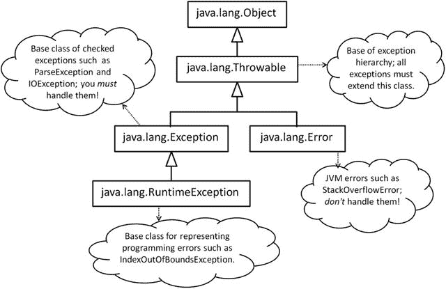
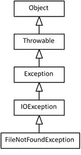
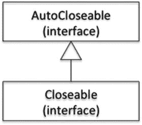
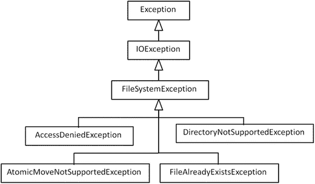
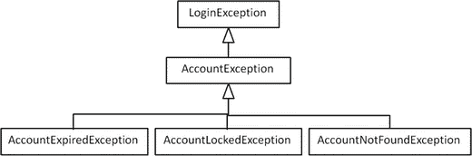

# 七、异常和断言

  
| 认证目标 |
| --- |
| 使用 try-catch 和 throw 语句 |
| 使用 catch、multi-catch 和 finally 子句 |
| 将自动关闭资源与 try-with-resources 语句一起使用 |
| 创建自定义异常和可自动关闭的资源 |
| 使用断言测试不变量 |

在这一章中，你将详细了解 Java 对异常处理的支持。OCAJP 8 级考试(OCPJP 8 级考试的先决条件)将异常处理的基础知识作为考试主题。因此，我们假设您已经熟悉用于异常处理的基本语法和异常类型。在这一章中，你将学习如何提供 try、catch、multi-catch 和 finally block。您还将了解最近添加的语言特性，例如 try-with-resources 和 multi-catch 语句。接下来，您将学习如何定义自己的异常类(自定义异常)。最后，我们将讨论断言的相关主题，并教你如何在你的程序中使用它们。本章中的许多编程示例利用 I/O 函数([第 9 章](09.html)和[第 10 章](10.html))来说明异常处理的概念。

## Throwable 及其子类

在 Java 中，抛出的对象应该是类`Throwable`或其子类之一的实例(`Throwable`是 Java 中异常层次结构的顶点类)。像`throw`语句、`throws`子句和`catch`子句这样的异常处理构造只处理`Throwable`及其子类。您需要详细了解`Throwable`的三个重要子类:`Error`、`Exception`和`RuntimeException`类。图 [7-1](#Fig1) 提供了这些类的高级概述。



图 7-1。

Java’s exception hierarchy

下面是对扩展了`Throwable`类的三个重要类的简要描述:

*   类型为`Exception`的异常被称为检查异常。如果代码可以抛出一个`Exception`，您必须使用 catch 块来处理它，或者声明该方法抛出该异常，强制该方法的调用者处理该异常。
*   `RuntimeException`是`Exception`类的派生类。从此类派生的异常称为未检查异常。处理未检查的异常是可选的。如果您在方法中编写的代码段会引发未检查的异常，则不一定要捕获该异常或在该方法的 throws 子句中声明该异常。
*   当 JVM 在程序中检测到严重的异常情况时，它会引发类型为`Error`的异常。类型`Error`的异常表示程序中的异常情况。捕捉这个异常并试图继续执行和假装什么都没发生是没有意义的。这样做实在是不好的做法！

现在，让我们开始讨论如何抛出和捕捉异常。

### 抛出异常

  
| 认证目标 |
| --- |
| 使用 try-catch 和 throw 语句 |

清单 [7-1](#FPar1) 是一个非常简单的编程示例，其中您希望将作为命令行参数键入的文本回显给用户。假设用户必须键入一些文本作为要回应的命令行参数，否则您需要通知用户“错误情况”

Listing 7-1\. Echo.java

```java
// A simple program without exception handling code

class Echo {

public static void main(String []args) {

if(args.length == 0) {

// no arguments passed – display an error to the user

System.out.println("Error: No input passed to echo command… ");

System.exit(-1);

}

else {

for(String str : args) {

// command-line arguments are separated and passed as an array

// print them by adding a space between the array elements

System.out.print(str + " ");

}

}

}

}
```

在这种情况下，您使用一个`println()`语句在控制台中打印错误。这是一个简单的程序，错误发生在`main()`方法中，所以错误处理很容易。在这种情况下，您可以在将错误信息打印到控制台后终止程序。然而，如果您在一个复杂的应用中深入函数调用，您需要一种更好的方法来指示“异常情况”已经发生，然后通知调用者该情况。此外，您通常需要从错误状态中恢复，而不是终止程序。因此，您需要能够“处理”一个异常，或者在调用堆栈中进一步“再抛出”该异常，以便调用者可以处理该异常。(我们将在本章的后面再讨论这个重新抛出异常的主题。)目前，您将修改清单 [7-1](#FPar1) 中的程序来抛出一个异常，而不是打印一条错误消息(在一个单独的程序`Echo1.java)`中)，如下所示:

```java
if(args.length == 0) {

// no arguments passed - throw an exception

throw new IllegalArgumentException("No input passed to echo command");

}
```

`args.length == 0`的`if`条件内的这个程序块是该程序中唯一需要更改的部分。注意抛出异常的语法:关键字`throw`后跟异常对象。这里您使用了已经在 Java 库中定义的`IllegalArgumentException`。在本章的后面，你将看到如何定义你自己的异常。

现在，如果您在命令行中没有传递任何参数的情况下运行这个程序，程序将抛出一个`IllegalArgumentException`:

```java
Exception in thread "main" java.lang.IllegalArgumentException: No input passed to echo command

at Echo1.main(Echo1.java:5)
```

由于这个异常没有处理程序，这个未被捕获的异常终止了程序。在这种情况下，您显式地抛出了一个异常。当您编写一些代码或调用 Java APIs 时，也可能会抛出异常。现在我们来看一个例子。

### 未处理的异常

考虑清单 [7-2](#FPar2) 中的程序，它试图读取用户在控制台中键入的整数值，并将读取的整数打印回控制台。为了从控制台读取一个整数，您使用了在`java.util.Scanner`类中提供的`nextInt()`方法。要实例化`Scanner`类，您需要传入`System.in`，这是对系统输入流的引用。

Listing 7-2\. ScanInt1.java

```java
// A simple progam to accept an integer from user

import java.util.Scanner;

class ScanInt1 {

public static void main(String [] args) {

System.out.println("Type an integer in the console: ");

Scanner consoleScanner = new Scanner(System.in);

System.out.println("You typed the integer value: " + consoleScanner.nextInt());

}

}
```

当您运行此程序并在控制台中键入一个整数，比如 10，程序会正常工作并成功地将该整数打印出来。

```java
D:\> java ScanInt1

Type an integer in the console:

10

You typed the integer value: 10
```

但是，如果您(或程序的用户)错误地键入了字符串“ten”而不是整数值“10”怎么办？程序将在抛出如下异常后终止:

```java
D:\> java ScanInt1

Type an integer in the console:

ten

Exception in thread "main" java.util.InputMismatchException

at java.util.Scanner.throwFor(Scanner.java:909)

at java.util.Scanner.next(Scanner.java:1530)

at java.util.Scanner.nextInt(Scanner.java:2160)

at java.util.Scanner.nextInt(Scanner.java:2119)

at ScanInt.main(ScanInt1.java:7)
```

如果你读了`nextInt()`的文档，你会看到这个方法可以抛出`InputMismatchException` -"如果下一个令牌不匹配`Integer`正则表达式，或者超出范围。"在这个简单的程序中，假设您(或用户)将总是按预期键入整数值，当假设失败时，将抛出一个异常。如果一个程序抛出了一个异常，并且它没有被处理，那么在抛出一个堆栈跟踪之后，程序将会异常终止，就像这里显示的那样。

堆栈跟踪显示在控件到达引发异常的语句之前调用的方法列表(带有行号)。作为一名程序员，您会发现跟踪控制流对于调试程序和修复导致该异常的问题非常有用。

那么，你如何处理这种情况呢？您需要将这段代码放在 try 和 catch 块中，然后处理异常。

#### Try 和 Catch 语句

  
| 认证目标 |
| --- |
| 使用 catch、multi-catch 和 finally 子句 |

Java 提供了`try`和`catch`关键字来处理您编写的代码中可能抛出的任何异常。清单 [7-3](#FPar3) 是清单 [7-2](#FPar2) 程序的改进版本。

Listing 7-3\. ScanInt2.java

```java
// A simple progam to accept an integer from user in normal case,

// otherwise prints an error message

import java.util.Scanner;

import java.util.InputMismatchException;

class ScanInt2 {

public static void main(String [] args) {

System.out.println("Type an integer in the console: ");

Scanner consoleScanner = new Scanner(System.in);

try {

System.out.println("You typed the integer value: " + consoleScanner.nextInt());

} catch(InputMismatchException ime) {

// nextInt() throws InputMismatchException in case anything

// other than an integer is typed in the console; so handle it

System.out.println("Error: You typed some text that is not an integer value…");

}

}

}
```

如果在输入中键入了有效整数以外的任何内容，该程序会向用户打印一条可读的错误消息。

```java
D:\> java ScanInt2

Type an integer in the console:

ten

Error: You typed some text that is not an integer value…
```

现在让我们来分析这段代码。后面跟有`try`关键字的代码块限制了代码段，您预计可能会抛出一些异常。如果从`try`块抛出任何异常，Java 运行时将搜索匹配的处理程序(稍后我们将更详细地讨论)。在这种情况下，出现了一个`InputMismatchException`的异常处理程序，它与抛出的异常类型完全相同。这个完全匹配的 catch 处理程序可以在 try 块之外以关键字`catch`开头的块的形式获得，并且这个 catch 块被执行。在 catch 块中，您捕获了异常，所以您在这里处理异常。你提供了一个人类可读的错误字符串，而不是抛出一个原始的堆栈跟踪(正如你在清单 [7-2](#FPar2) 中的早期程序中所做的)，所以你为程序提供了一个优雅的退出。

##### 多抓块

在清单 [7-2](#FPar2) 中，您使用了一个`Scanner`对象从控制台读取一个整数。注意，你也可以使用一个`Scanner`对象来读取一个字符串(参见清单 [7-4](#FPar4) )。

Listing 7-4\. ScanInt3.java

```java
// A program that scans an integer from a given string

import java.util.Scanner;

import java.util.InputMismatchException;

class ScanInt3 {

public static void main(String [] args) {

String integerStr = "100";

System.out.println("The string to scan integer from it is: " + integerStr);

Scanner consoleScanner = new Scanner(integerStr);

try {

System.out.println("The integer value scanned from string is: " +

consoleScanner.nextInt());

} catch(InputMismatchException ime) {

// nextInt() throws InputMismatchException in case

// anything other than an integeris provided in the string

System.out.println("Error: Cannot scan an integer from the given string");

}

}

}
```

该程序打印以下内容:

```java
The string to scan integer from it is: 100

The integer value scanned from string is: 100
```

如果您修改清单 [7-4](#FPar4) 中的程序，使字符串包含一个非整数值，如

```java
String integerStr = "hundred";
```

try 块将抛出一个`InputMismatchException`，它将在 catch 块中处理，您将得到以下输出:

```java
The string to scan integer from it is: hundred

Error: Cannot scan an integer from the given string
```

现在，如果您修改清单 [7-4](#FPar4) 中的程序，使字符串包含一个空字符串，如

```java
String integerStr = "";
```

为此，`nextInt()`会抛出一个`NoSuchElementException`，这个程序没有处理，所以这个程序会崩溃。

```java
The string to scan integer from it is:

Exception in thread "main" java.util.NoSuchElementException

at java.util.Scanner.throwFor(Scanner.java:907)

at java.util.Scanner.next(Scanner.java:1530)

at java.util.Scanner.nextInt(Scanner.java:2160)

at java.util.Scanner.nextInt(Scanner.java:2119)

at ScanInt3.main(ScanInt.java:11)
```

此外，如果您查看 JavaDoc for `Scanner.nextInt()`方法，您会发现它也可以抛出一个`IllegalStateException`(如果在一个已经关闭的`Scanner`对象上调用`nextInt()`方法，就会抛出这个异常)。因此，让我们为`InputMismatchException`、`NoSuchElementException`和`IllegalStateException`提供捕捉处理程序(参见清单 [7-5](#FPar5) )。

Listing 7-5\. ScanInt4.java

```java
// A program that scans an integer from a given string

import java.util.Scanner;

import java.util.InputMismatchException;

import java.util.NoSuchElementException;

class ScanInt4 {

public static void main(String [] args) {

String integerStr = "";

System.out.println("The string to scan integer from it is: " + integerStr);

Scanner consoleScanner = new Scanner(integerStr);

try {

System.out.println("The integer value scanned from string is: " +

consoleScanner.nextInt());

} catch(InputMismatchException ime) {

System.out.println("Error: Cannot scan an integer from the given string");

} catch(NoSuchElementException nsee) {

System.out.println("Error: Cannot scan an integer from the given string");

} catch(IllegalStateException ise) {

System.out.println("Error: nextInt() called on a closed Scanner object");

}

}

}
```

以下是运行该程序时的输出:

```java
The string to scan integer from it is:

Error: Cannot scan an integer from the given string
```

正如您在输出中看到的，由于字符串是空的，`NoSuchElementException`被抛出。它在这个异常的 catch 处理程序中被捕获，catch 块中提供的代码被执行以导致一个优雅的退出。

请注意，您是如何通过堆叠它们来提供多个 catch 处理程序的:您提供了特定的(即派生类型)异常处理程序，然后是更通用的(即基本类型)异常处理程序。如果在基本异常类型之后提供派生异常类型，则会出现编译器错误。你可能还不知道，但是`NoSuchElementException`是`InputMismatchException`的基类！看看当您试图颠倒`InputMismatchException`和`NoSuchElementException`的 catch 处理程序的顺序时会发生什么。

```java
try {

System.out.println("The integer value scanned from string is: "

+ consoleScanner.nextInt());

} catch(NoSuchElementException nsee) {

System.out.println("Error: Cannot scan an integer from the given string");

} catch(InputMismatchException ime) {

System.out.println("Error: Cannot scan an integer from the given string");

}
```

这段代码将导致以下编译器错误:

```java
ScanInt4.java:14: error: exception InputMismatchException has already been caught

} catch(InputMismatchException ime) {

^

1 error
```

提供多个 catch 处理程序时，先处理特定异常，再处理一般异常。如果在基类异常处理程序之后提供派生类异常捕获处理程序，您的代码将不会编译。

##### 多抓块

Java 提供了一个名为 multi-catch blocks 的特性，您可以在其中组合多个 catch 处理程序。让我们使用这个特性来组合`NoSuchElementException`和`IllegalStateException`的 catch 子句(参见清单 [7-6](#FPar6) ):

Listing 7-6\. ScanInt5.java

```java
// A program that illustrates multi-catch blocks

import java.util.Scanner;

import java.util.NoSuchElementException;

class ScanInt5 {

public static void main(String [] args) {

String integerStr = "";

System.out.println("The string to scan integer from it is: " + integerStr);

Scanner consoleScanner = new Scanner(integerStr);

try {

System.out.println("The integer value scanned from string is: " +

consoleScanner.nextInt());

} catch(NoSuchElementException | IllegalStateException multie) {

System.out.println("Error: An error occured while attempting to scan the integer");

}

}

}
```

注意如何使用这里的`| (OR)`操作符(对整数值执行逐位`OR`操作的操作符)将 catch 处理程序组合在一起，以组合`NoSuchElementException`和`IllegalStateException`的 catch 子句。

与组合的`NoSuchElementException`和`IllegalStateException`的 catch 子句不同，您不能组合`NoSuchElementException`和`InputMismatchException`的 catch 子句。正如我们已经讨论过的，`NoSuchElementException`是`InputMismatchException`的基类，你不能在多重捕获块中同时捕获它们。如果您尝试编译这样一个多重捕获子句，您将得到以下编译器错误:

```java
ScanInt5.java:11: error: Alternatives in a multi-catch statement cannot be related by subclassing

} catch(InputMismatchException | NoSuchElementException exception) {

^
```

那么还有什么选择呢？当您需要这样的异常捕获处理程序，其中一个异常是另一个异常类的基类时，只为基类提供捕获处理程序就足够了(因为基类捕获处理程序将在派生类异常发生时处理它)。

在 multi-catch 块中，不能为共享基类和派生类关系的两个异常组合 catch 处理程序。对于不共享父子关系的异常，只能组合 catch 处理程序。

如何知道合并异常处理块好还是堆叠好？这是一个设计选择，您必须考虑以下几个方面:(a)抛出异常的原因是相似的还是不同的？(b)处理代码相似还是不同？如果两个问题你都回答“差不多”，不如合并；如果你对这两个问题中的任何一个说“不一样”，那么还是分开来说比较好。

清单 [7-6](#FPar6) 具体情况如何？是组合还是分离`InputMismatchException`和`IllegalStateException`异常的处理程序更好？您可以看到两个 catch 块的异常处理是相同的。但是这两个异常的原因是相当不同的。`InputMismatchException`抛出无效输入被传递(例如，我们前面讨论的“百”)。在调用了`Scanner`上的`close()`方法之后，当您调用`nextInt()`方法时，`IllegalStateException`会因为编程错误而被抛出。因此，在这种情况下，将这两个异常的处理程序分开是更好的设计选择。

##### 一般捕获处理程序

您是否注意到，当您使用与 I/O 操作相关的 API 时，会抛出许多异常？我们刚刚讨论过，为了调用`Scanner`类的一个方法`nextInt()`，您需要处理三个异常:`InputMismatchException`、`NoSuchElementException`和`IllegalStateException`。如果您继续处理像这样的特定异常，那么在您运行程序时，可能会也可能不会导致异常情况，您的大部分代码将由 try-catch 代码块组成！“处理所有其他异常”有没有更好的说法？是的，您可以提供一个通用的异常处理程序。

下面的代码片段只显示了清单 [7-4](#FPar4) 中的类`ScanInt3`的 try-catch 块，增强了一个通用异常处理程序:

```java
try {

System.out.println("You typed the integer value: " + consoleScanner.nextInt());

} catch(InputMismatchException ime) {

// if something other than integer is typed, we'll get this exception, so handle it

System.out.println("Error: You typed some text that is not an integer value…");

} catch(Exception e) {

// catch IllegalStateException here which is unlikely to occur…

System.out.println("Error: Encountered an exception and could not read an integer from the console… ");

}
```

这段代码为类型`Exception`的基本异常提供了一个 catch 处理程序。因此，如果 try 块抛出除了`InputMismatchException`之外的任何异常，并且该异常是`Exception`类的派生类，这个通用的 catch 处理程序将处理它。推荐的做法是捕捉特定的异常，然后提供一个通用的异常处理程序，以确保所有其他异常也得到处理。

##### 释放资源

您是否注意到我们在清单 [7-2](#FPar2) 、 [7-3](#FPar3) 和 [7-4](#FPar4) 中讨论的程序有资源泄漏(因为我们打开了一个`Scanner`对象但没有关闭它)？单词“resource”是指从底层操作系统获取一些系统资源的任何类，例如网络、文件、数据库和其他句柄。但是你怎么知道哪些课需要停课呢？答案是，如果一个类实现了`java.io.Closeable`，那么你必须调用那个类的`close()`方法；否则，将会导致资源泄漏。

垃圾收集器(GC)只负责释放内存资源。如果您正在使用任何获取系统资源的类，那么您有责任通过调用该对象上的`close()`方法来释放它们。

`ScanInt6`(清单 [7-7](#FPar7) )在其`main()`方法中调用`Scanner`对象的`close()`方法；您希望缩短代码，所以您将使用一个通用的异常处理程序来处理所有可能在 try 块中抛出的异常。

Listing 7-7\. ScanInt6.java

```java
import java.util.Scanner;

class ScanInt6 {

public static void main(String [] args) {

System.out.println("Type an integer in the console: ");

Scanner consoleScanner = new Scanner(System.in);

try {

System.out.println("You typed the integer value: " + consoleScanner.nextInt());

System.out.println("Done reading the text… closing the Scanner");

consoleScanner.close();

} catch(Exception e) {

// call all other exceptions here …

System.out.println("Error: Encountered an exception and could not read an integer from the console… ");

System.out.println("Exiting the program - restart and try the program again!");

}

}

}
```

让我们看看这个程序是否有效。

```java
D:\> java ScanInt6

Type an integer in the console:

10

You typed the integer value: 10

Done reading the text… closing the Scanner
```

因为程序打印了`"Done reading the text… closing the Scanner"`，并且正常完成了执行，所以可以假设语句`consoleScanner.close()` `;`已经执行成功。如果抛出异常会发生什么？

```java
D:\> java ScanInt6

Type an integer in the console:

ten

Error: Encountered an exception and could not read an integer from the console…

Exiting the program - restart and try the program again!
```

从输出中可以看到，程序没有打印`"Done reading the text… closing the Scanner"`，所以语句`consoleScanner.close();`没有执行。你能如何修理它？一种方法是在 catch 块中调用`consoleScanner.close()`,就像这样:

```java
try {

System.out.println("You typed the integer value: " + consoleScanner.nextInt());

System.out.println("Done reading the text… closing the Scanner");

consoleScanner.close();

} catch(Exception e) {

// call all other exceptions here …

consoleScanner.close();

System.out.println("Error: Encountered an exception and could not read an integer from the console… ");

System.out.println("Exiting the program - restart and try the program again!");

}
```

这种解决方案可行，但并不优雅。您知道您可以有多个 catch 块，并且您必须在所有 catch 块中提供对`consoleScanner.close();`的调用！有没有更好的释放资源的方法？是的，你可以在一个`finally`块中使用发布资源(参见清单 [7-8](#FPar8) )。

Listing 7-8\. ScanInt7.java

```java
import java.util.Scanner;

class ScanInt7 {

public static void main(String [] args) {

System.out.println("Type an integer in the console: ");

Scanner consoleScanner = new Scanner(System.in);

try {

System.out.println("You typed the integer value: " + consoleScanner.nextInt());

} catch(Exception e) {

// call all other exceptions here …

System.out.println("Error: Encountered an exception and could not read an integer from the console… ");

System.out.println("Exiting the program - restart and try the program again!");

} finally {

System.out.println("Done reading the integer… closing the Scanner");

consoleScanner.close();

}

}

}
```

在这种情况下，在 catch 块之后提供了一个`finally`块。无论异常是否发生，这个 finally 块都将被执行。所以，`finally`块是调用`Scanner`对象上的`close()`方法的好地方，以确保这个资源总是被释放。

如果你在一个方法内部调用`System.exit()`，它将异常终止程序。因此，如果调用方法有一个 finally 块，它将不会被调用，资源可能会泄漏。由于这个原因，调用`System.exit()`来终止一个程序是一个糟糕的编程实践。

现在，让我们看看在程序正常完成(即没有抛出异常)和程序在抛出异常后终止的情况下，扫描器是否关闭。

```java
D:\> java ScanInt7

Type an integer in the console:

10

You typed the integer value: 10

Done reading the integer… closing the Scanner

D:\> java ScanInt7

Type an integer in the console:

ten

Error: Encountered an exception and could not read an integer from the console…

Exiting the program - restart and try the program again!

Done reading the integer… closing the Scanner
```

是的，不管是否抛出异常，都会调用语句`"Done reading the integer… closing the Scanner"`。请注意，您可以在没有`catch`块的情况下，在`try`块之后直接有一个`finally`块；虽然这个特性很少使用，但它是一个有用的特性。

注意:`finally`块总是被执行，不管`try`块中的代码是否抛出异常。考虑下面的方法。它会向调用者返回 true 还是 false？

```java
boolean returnTest() {

try {

return true;

}

finally {

return false;

}

}
```

这个方法将总是返回 false，因为`finally`总是被调用，尽管它是不直观的。事实上，如果您使用`"-Xlint"`选项，您将得到这个编译器警告:“finally 子句不能正常完成。”(注意，你可以有一个`try`块，后面跟着`catch`块或`finally`块，或者两个块都跟着。)

### 抛出条款

方法可以抛出检查过的异常；子句 throw 在方法签名中指定了这些检查过的异常。在`throws`子句中，您列出了一个方法可能抛出的检查过的异常。为什么我们需要抛出条款？通过查看 throws 子句，您可以清楚地了解该方法可以抛出什么异常。理解检查异常是理解 throws 子句的先决条件。由于我们已经在前一节异常类型中讨论了检查异常，现在我们将讨论 throws 子句。

让我们试着读取当前目录中名为`integer.txt`的文件中存储的一个整数。有一个`Scanner`类的重载构造函数，它接受一个`File`对象作为输入，所以让我们试着使用它。清单 [7-9](#FPar9) 显示了程序。有用吗？

Listing 7-9\. ThrowsClause1.java

```java
import java.io.File;

import java.util.Scanner;

class ThrowsClause1 {

public static void main(String []args) {

System.out.println("Reading an integer from the file 'integer.txt': ");

Scanner consoleScanner = new Scanner(new File("integer.txt"));

System.out.println("You typed the integer value: " + consoleScanner.nextInt());

}

}
```

这段代码将导致编译器错误`"unreported exception FileNotFoundException; must be caught or declared to be thrown"`。如果您查看这个`Scanner`方法的声明，您会看到一个 throws 子句:

```java
public Scanner(File source) throws FileNotFoundException {
```

因此，任何调用这个构造函数的方法都应该要么处理这个异常，要么添加一个 throws 子句来声明该方法可以抛出这个异常。向`main()`方法添加一个 throws 子句；参见清单 [7-10](#FPar10) 。

Listing 7-10\. ThrowsClause2.java

```java
import java.io.File;

import java.io.FileNotFoundException;

import java.util.Scanner;

class ThrowsClause2 {

public static void main(String []args) throws FileNotFoundException {

System.out.println("Reading an integer from the file 'integer.txt': ");

Scanner consoleScanner = new Scanner(new File("integer.txt"));

System.out.println("You typed the integer value: " + consoleScanner.nextInt());

}

}
```

如果您运行这个程序，并且没有名为`integer.txt`的文件，程序将在抛出这个异常后崩溃:

```java
Reading an integer from the file 'integer.txt':

Exception in thread "main" java.io.FileNotFoundException: integer.txt (The system cannot find the file specified)

at java.io.FileInputStream.open(Native Method)

at java.io.FileInputStream.<init>(FileInputStream.java:138)

at java.util.Scanner.<init>(Scanner.java:656)

at ThrowsClause2.main(ThrowsClause2.java:7)
```

现在让我们将`main()`方法中的代码提取到一个名为`readIntFromFile()`的新方法中。您已经将它定义为一个实例方法，所以您还创建了一个`ThrowsClause3`类的对象来从`main()`方法中调用这个方法。由于`readIntFromFile()`内部的代码可以抛出一个`FileNotFoundException`，它必须要么引入一个 catch 处理程序来处理这个异常，要么在其 throws 子句中声明这个异常(参见清单 [7-11](#FPar11) )。

Listing 7-11\. ThrowsClause3.java

```java
import java.io.File;

import java.io.FileNotFoundException;

import java.util.Scanner;

class ThrowsClause3 {

// since this method does not handle FileNotFoundException,

// the method must declare this exception in the throws clause

public int readIntFromFile() throws FileNotFoundException {

Scanner consoleScanner = new Scanner(new File("integer.txt"));

return consoleScanner.nextInt();

}

// since readIntFromFile() throws FileNotFoundException and main() does not handle

// it, the main() method declares this exception in its throws clause

public static void main(String []args) throws FileNotFoundException {

System.out.println("Reading an integer from the file 'integer.txt': ");

System.out.println("You typed the integer value: "

+ new ThrowsClause3().readIntFromFile());

}

}
```

在清单 [7-10](#FPar10) 和 [7-11](#FPar11) 中，程序的行为保持不变。然而，清单 [7-11](#FPar11) 显示了`main()`方法也必须声明如何在其 throws 子句中抛出`FileNotFoundException`(否则，程序将无法编译)。

#### 方法重写和 Throws 子句

当一个可重写的方法有一个 throws 子句时，在重写该方法时有许多事情要考虑。考虑清单 [7-12](#FPar12) 中的程序，它实现了一个名为`IntReader`的接口。这个接口声明了一个名为`readIntFromFile()`的方法，其中的 throws 子句列出了一个`FileNotFoundException`。

Listing 7-12\. ThrowsClause4.java

```java
import java.io.File;

import java.io.FileNotFoundException;

import java.io.IOException;

import java.util.Scanner;

// This interface is meant for implemented by classes that would read an integer from a file

interface IntReader {

int readIntFromFile() throws IOException;

}

class ThrowsClause4 implements IntReader {

// implement readIntFromFile with the same throws clause

// or a more specific throws clause

public int readIntFromFile() throws FileNotFoundException {

Scanner consoleScanner = new Scanner(new File("integer.txt"));

return consoleScanner.nextInt();

}

// main method elided in this code since the focus here is to understand

// issues related to overriding when throws clause is present

}
```

在这段代码中，您可以观察到一些重要的事实:

*   可以为接口中声明的方法声明 throws 子句；事实上，您也可以为在抽象类中声明的抽象方法提供 throws 子句。
*   The method declared in the `IntReader` interface declares to throw `IOException`, which is a more general exception than a `FileNotFoundException` (Figure [7-2](#Fig2)). While implementing a method, it is acceptable to either provide the throws clause listing the same exception type as the base method or a more specific type than the base method. In this case, the `readIntFromFile()` method lists a more specific exception (`FileNotFoundException`) in its throws clause against the more general exception of `IOException` listed in the throws clause of the base method declared in the `IntReader` interface.

    

    图 7-2。

    Class hierarchy of FileNotFoundException

如果你试着改变 throws 条款呢？有许多方法可以更改 overriding 方法中的 throws 子句，包括:

Listing more general checked exceptions to throw.   Listing more checked exceptions in addition to the given checked exception(s) in the base method.  

如果您尝试这些情况中的任何一种，您都会得到一个编译器错误。例如，如果提供比基类中指定的更一般的异常，将导致编译器错误。

如果被重写的方法不抛出任何已检查的异常，或者如果抛出，它提供一个 try-catch 块，则可以选择不在被重写的方法中使用 throws 子句指定任何异常。

总而言之，基类方法的 throws 子句是它提供给该方法的调用方的契约:它规定调用方应该处理列出的异常或在其 throws 子句中声明这些异常。当重写基方法时，派生方法也应该遵守该协定。基方法的调用方只准备处理基方法中列出的异常，因此重写方法不能引发更一般的异常或除列出的已检查异常之外的异常。

但是，请注意，关于派生类方法的 throws 子句应该遵循基方法的 throws 子句的约定的讨论仅限于检查异常。与基类方法的 throws 子句相比，仍可以在协定中添加或移除未检查的异常。例如，考虑以下情况:

```java
public int readIntFromFile() throws IOException, NoSuchElementException {

Scanner consoleScanner = new Scanner(new File("integer.txt"));

return consoleScanner.nextInt();

}
```

这是一个可接受的 throws 子句，因为`NoSuchElementException`可以从`readIntFromFile()`方法中抛出。这个异常是一个未检查的异常，当`nextInt()`方法不能从文件中读取整数时抛出。这是一种常见的情况，例如，如果您有一个名为`integer.txt;`的空文件，试图从该文件中读取一个整数将导致这个异常。

@Throws Tag

使用`@throws` JavaDoc 标签(或者它的同义词`@exception`标签)来记录一个方法可能抛出(未检查的或者检查的)异常的具体情况或者情况是一个好的实践。下面是提供`@throws`标签的格式和一个例子:

```java
@throws exception-name    description-text

@throws IllegalStateException if this scanner is closed
```

此标记只能用于方法和构造函数。

下面是`Scanner`类中`nextInt()`方法的 JavaDoc 注释示例:

```java
/**

* Scans the next token of the input as an <tt>int</tt>.

*

* <p> An invocation of this method of the form

* <tt>nextInt()</tt> behaves in exactly the same way as the

* invocation <tt>nextInt(radix)</tt>, where <code>radix</code>

* is the default radix of this scanner.

*

* @return the <tt>int</tt> scanned from the input
```

`*` `@throws InputMismatchException`

```java
*         if the next token does not match the <i>Integer</i>

*         regular expression, or is out of range
```

`*``@throws NoSuchElementException`T2】

`*``@throws``IllegalStateException`T3】

```java
*/

public int nextInt() {

return nextInt(defaultRadix);

}
```

注意`InputMismatchException`、`NoSuchElementException`和`IllegalStateException`的`@throws`标签。当一个方法可以抛出多个异常时，它们按照惯例按字母顺序列出(就像本例中一样)。

### 要记住的要点

以下是关于 throws 语句的一些值得注意的要点，可能对你参加 OCPJP 八级考试有所帮助:

*   如果一个方法没有 throws 子句，并不意味着它不能抛出任何异常；这只是意味着它不能抛出任何检查过的异常。
*   静态初始化块不能抛出任何已检查的异常。为什么呢？请记住，静态初始化块是在加载类时调用的，因此没有办法处理调用程序中抛出的异常。此外，没有办法在 throws 子句中声明被检查的异常(因为它们是块，而不是方法)。
*   非静态初始化块可能会引发检查过的异常；然而，所有的构造函数都应该在它们的 throws 子句中声明这些异常。为什么呢？编译器在其代码生成阶段合并非静态初始化块和构造函数的代码，因此构造函数的 throws 子句可用于声明非静态初始化块可能引发的检查异常。
*   重写方法在 throws 子句中声明的检查异常不能多于基方法的 throws 子句中声明的异常列表。为什么呢？基方法的调用方只能看到该方法的 throws 子句中给出的异常列表，并将在其代码中声明或处理这些检查过的异常(仅此而已)。
*   重写方法可以声明比基方法的 throws 子句中列出的异常更具体的异常；换句话说，您可以在重写方法的 throws 子句中声明派生异常。
*   如果一个方法在两个或多个接口中声明，并且如果该方法在 throws 子句中声明抛出不同的异常，则该方法实现应该列出所有这些异常。

#### 链接和重新引发异常

您可以捕捉异常，将它们包装成更一般的异常，并在调用堆栈中将其抛出。当您捕获一个异常并创建一个更一般的异常时，您可以保留对原始异常的引用；这被称为异常链接。

```java
catch(LowLevelException lle) {

// wrap the low-level exception to a higher-level exception;

// also, chain the original exception to the newly thrown exception

throw new HighLevelException(lle);

}
```

链接异常对于调试非常有用。当您得到一个一般的异常时，您可以检查是否有一个连锁的较低级别的异常，并尝试理解为什么会发生那个较低级别的异常。

## 用资源尝试

  
| 认证目标 |
| --- |
| 将自动关闭资源与 try-with-resources 语句一起使用 |

Java 程序员很容易忘记释放资源，即使是在 finally 块中。此外，如果您正在处理多个资源，记住在 finally 块中调用`close()`方法是很繁琐的。Try-with-resources 特性(在 Java 7 中引入)将有助于简化您的工作。清单 [7-13](#FPar14) 利用了这一特点；它是清单 [7-8](#FPar8) 的改进版本，清单 7-8 明确地调用了 close，如在`consoleScanner.close()`中。

Listing 7-13\. TryWithResources1.java

```java
import java.util.Scanner;

class TryWithResources1 {

public static void main(String [] args) {

System.out.println("Type an integer in the console: ");

try(Scanner consoleScanner = new Scanner(System.in)) {

System.out.println("You typed the integer value: " + consoleScanner.nextInt());

} catch(Exception e) {

// catch all other exceptions here …

System.out.println("Error: Encountered an exception and could not read an integer from the console… ");

System.out.println("Exiting the program - restart and try the program again!");

}

}

}
```

请务必仔细查看 try-with-resources 块的语法。

```java
try(Scanner consoleScanner = new Scanner(System.in)) {
```

在这个语句中，您已经获得了在`try`关键字之后，但是在`try`块之前的括号内的资源。此外，在示例中，您没有提供 finally 块。Java 编译器会在内部将这个 try-with-resources 块翻译成 try-finally 块(当然，编译器会保留您提供的 catch 块)。您可以在 try-with-resources 块中获取多个资源。这种资源获取语句必须用分号分隔。

您能提供不带任何显式 catch 或 finally 块的 try-with-resources 语句吗？没错。请记住，try 块可以与 catch 块、finally 块或两者都关联。try-with-resources 语句块在内部扩展为 try-finally 块。因此，您可以提供一个没有显式 catch 或 finally 块的 try-with-resources 语句。清单 [7-14](#FPar15) 使用了一个没有任何显式 catch 或 finally 块的 try-with-resources 语句。

Listing 7-14\. TryWithResources2.java

```java
import java.util.Scanner;

class TryWithResources2 {

public static void main(String [] args) {

System.out.println("Type an integer in the console: ");

try(Scanner consoleScanner = new Scanner(System.in)) {

System.out.println("You typed the integer value: " + consoleScanner.nextInt());

}

}

}
```

尽管可以创建一个没有任何显式 catch 或 finally 的 try-with-resources 语句，但这并不意味着您应该这样做！例如，由于这段代码没有 catch 块，如果您键入一些无效的输入，程序将会崩溃。

```java
D:\> java TryWithResources2

Type an integer in the console:

ten

Exception in thread "main" java.util.InputMismatchException

at java.util.Scanner.throwFor(Scanner.java:864)

at java.util.Scanner.next(Scanner.java:1485)

at java.util.Scanner.nextInt(Scanner.java:2117)

at java.util.Scanner.nextInt(Scanner.java:2076)

at TryWithResources2.main(TryWithResources2.java:7)
```

因此，try-with-resources 语句的好处是，它不必显式地提供 finally 块，从而简化了您的工作。但是，您仍然需要提供必要的 catch 块。

注意，对于可用于 try-with-resources 语句的资源，该资源的类必须实现`java.lang.AutoCloseable`接口。这个接口声明了一个名为`close()`的方法。除了资源尝试特性，`AutoCloseable`接口也被引入到 Java 7 中，该接口由`Closeable`接口的基础接口组成。这是为了确保现有的资源类与 try-with-resources 语句无缝协作。换句话说，您可以将所有旧的流类与 try-with-resources 一起使用，因为它们实现了`AutoCloseable`接口。



图 7-3。

Closeabe Interface extends AutoCloseable Interface

### 关闭多个资源

在 try-with-resources 语句中可以使用多个资源。下面是利用 try-with-resources 语句从给定的文本文件创建 zip 文件的代码片段:

```java
// buffer is the temporary byte buffer used for copying data

// from one stream to another stream

byte [] buffer = new byte[1024];

// these stream constructors can throw FileNotFoundException

try (ZipOutputStream zipFile = new ZipOutputStream(new FileOutputStream(zipFileName));

FileInputStream fileIn = new FileInputStream(fileName)) {

zipFile.putNextEntry(new ZipEntry(fileName));         // putNextEntry can throw

// IOException

int lenRead = 0; // the variable to keep track of number of bytes sucessfully read

// copy the contents of the input file into the zip file

while((lenRead = fileIn.read(buffer)) > 0) {        // read can throw IOException

zipFile.write(buffer, 0, lenRead);              // write can throw IOException

}

// the streams will be closed automatically because they are within try-with-

// resources statement

}
```

在这段代码中，`buffer`是一个字节数组。该数组是临时存储，用于将原始数据从一个流复制到另一个流。在 try-with-resources 语句中，您打开了两个流:`ZipOutputStream`用于写入 zip 文件，而`FileInputStream`用于读取文本文件。(注意:在`java.util.zip`包中提供了对 zip(和 jar)文件的 API 支持。)您希望读取输入文本文件，将其压缩，并将条目放入压缩文件中。为了将文件/目录条目放入 zip 文件，`ZipOutputStream`类提供了一个名为`putNextEntry()`的方法，该方法将一个`ZipEntry`对象作为参数。语句`zipFile.putNextEntry(new ZipEntry(fileName));`将名为`fileName`的文件条目放入`zipFile`中。

为了读取文本文件的内容，可以使用`FileInputStream`类中的`read()`方法。`read()`方法将`buffer`数组作为参数。每次迭代要读取的数据量(即要读取的“数据块大小”)由传递的数组的大小给出；这段代码是 1024 字节。`read()`方法返回它读取的字节数，如果没有更多的数据要读取，它返回-1。在写入 zip 文件之前，`while`循环检查读取是否成功(使用> 0 条件)。

为了将数据写入 zip 文件，可以使用`ZipOutputStream`类中的`write()`方法。`write()`方法有三个参数:第一个参数是数据缓冲区；第二个参数是数据缓冲区中的起始偏移量(它是 0，因为您总是从缓冲区的起始处读取)；第三个是要写入的字节数。

现在我们进入主要讨论。请注意如何在 try 块中打开两个资源，并用分号分隔这两个资源获取语句。您没有显式的 finally 块来释放资源，因为编译器会自动在 finally 块中插入对这两个流的`close`方法的调用。

清单 [7-15](#FPar16) 是一个完整的程序，它利用这段代码来说明如何使用 try-with-resources 语句来自动关闭多个流。

Listing 7-15\. ZipTextFile.java

```java
import java.util.*;

import java.util.zip.*;

import java.io.*;

// class ZipTextFile takes the name of a text file as input and creates a zip file

// after compressing that text file.

class ZipTextFile {

public static final int CHUNK = 1024; // to help copy chunks of 1KB

public static void main(String []args) {

if(args.length == 0) {

System.out.println("Pass the name of the file in the current directory to be zipped as an argument");

System.exit(-1);

}

String fileName = args[0];

// name of the zip file is the input file name with the suffix ".zip"

String zipFileName = fileName + ".zip";

byte [] buffer = new byte[CHUNK];

// these constructors can throw FileNotFoundException

try (ZipOutputStream zipFile = new ZipOutputStream(new FileOutputStream(zipFileName));

FileInputStream fileIn = new FileInputStream(fileName)) {

// putNextEntry can throw IOException

zipFile.putNextEntry(new ZipEntry(fileName));

int lenRead = 0; // variable to keep track of number of bytes

// successfully read

// copy the contents of the input file into the zip file

while((lenRead = fileIn.read(buffer)) > 0) {

// both read and write methods can throw IOException

zipFile.write (buffer, 0, lenRead);

}

// the streams will be closed automatically because they are

// within try-with-resources statement

}

// this can result in multiple exceptions thrown from the try block;

// use "suppressed exceptions" to get the exceptions that were suppressed!

catch(Exception e) {

System.out.println("The caught exception is: " + e);

System.out.print("The suppressed exceptions are: ");

for(Throwable suppressed : e.getSuppressed()) {

System.out.println(suppressed);

}

}

}

}
```

我们已经讨论过 try-with-resources 块。我们没有讨论的是被抑制的异常。在 try-with-resources 语句中，可能会抛出多个异常；例如，一个在 try 块中，一个在 catch 块中，另一个在 finally 块中。但是，只能捕获一个异常，因此其他异常将被列为隐藏的异常。从一个给定的异常对象中，您可以使用方法`getSuppressed()`来获得被抑制的异常的列表。

### 要记住的要点

以下是一些关于“用资源尝试”的有趣观点，将对你参加 OCPJP 八级考试有所帮助:

*   不能在 try-with-resources 语句体中为 try-with-resources 中声明的资源变量赋值。这是为了确保在 try-with-resources 头中获得的相同资源在 finally 块中被释放。
*   在 try-with-resources 语句中显式关闭资源是一个常见的错误。请记住，try-with-resources 扩展到调用 finally 块中的`close()`方法，因此如果您显式提供一个`close()`方法，扩展后的代码将会对`close()`方法进行两次调用。考虑以下代码:`try(Scanner consoleScanner = new Scanner(System.in)) {` `System.out.println("You typed the integer value: " + consoleScanner.nextInt());` `consoleScanner.close();` `// explicit call to close() method - remember that try-with-resources` `// statement will also expand to calling close() in finally method;` `// hence this will result in call to close() method in Scanner twice!` `}`
*   `Scanner`类中的`close()`方法的文档说明，如果 scanner 对象已经关闭，那么再次调用该方法将没有任何效果。所以，在这种情况下你是安全的。然而，一般来说，你不能期望所有的资源都实现了一个可以安全调用两次的`close()`方法。因此，在 try-with-resource 语句中显式调用`close()`方法是一种不好的做法。

## 自定义异常

  
| 认证目标 |
| --- |
| 创建自定义异常和可自动关闭的资源 |

在大多数情况下，抛出 Java 库中已经提供的异常就足够了。例如，如果您正在检查传递给一个公共函数的参数的有效性，并且发现它们为空或者超出了预期的范围，那么您可以抛出一个`IllegalArgumentException`。然而，对于大多数重要的应用，您有必要开发自己的异常类(自定义异常)来指示异常情况。

如何定义自定义异常？有两个选项:您可以根据需要扩展`Exception`或`RuntimeException`类。

如果您想要强制您的自定义异常的用户处理该异常，那么您可以从`Exception`类扩展您的异常类——这将使您的自定义异常成为一个检查异常。

如果你想给你的自定义异常的用户一些灵活性，并让你的异常的用户来决定他们是否要处理这个异常，你可以从`RuntimeException`类中派生出你的异常。

因此，您需要决定是通过从`Exception`类还是`RuntimeException`类扩展来使您的自定义异常成为检查异常还是未检查异常。

为自定义异常扩展`Throwable`或`Error`类怎么样？`Throwable`类太普通了，不能作为你的异常的基类，所以不推荐。`Error`类是为 JVM 可能抛出的致命异常(如`StackOverflowError`)保留的，所以不建议将它作为异常的基类。

自定义异常应该扩展`Exception`或`RuntimeException`类。通过扩展`Throwable`或`Error`类来创建定制异常是一种不好的做法。

对于从基类扩展，您需要了解基类提供了哪些方法。在这种情况下，您希望通过扩展`Exception`或`RuntimeException`类来创建一个定制异常。由于`Exception`类是`RuntimeException`类的基类，所以知道`Exception`类的成员就足够了。表 [7-1](#Tab1) 列出了`Exception`类的重要方法(包括构造函数)。

表 7-1。

Important Methods and Constructors of the Exception Class

  
| 成员 | 简短描述 |
| --- | --- |
| `Exception()` | `Exception`类的默认构造函数，没有关于异常的附加(或详细)信息。 |
| `Exception(String)` | 构造函数，它将有关构造函数的详细信息字符串作为参数。 |
| `Exception(String, Throwable)` | 除了作为参数的详细信息字符串之外，这个异常构造函数还将异常的原因(这是另一个异常)作为参数。 |
| `Exception(Throwable)` | 将异常原因作为参数的构造函数。 |
| `String getMessage()` | 返回详细消息(在创建异常时作为字符串传递)。 |
| `Throwable getCause()` | 返回异常的原因(如果有，否则返回 null)。 |
| `Throwable[] getSuppressed()` | 以数组形式返回隐藏的异常(通常在使用 try-with-resources 语句时导致)的列表。 |
| `void printStackTrace()` | 将堆栈跟踪(即带有相关行号的方法调用列表)打印到控制台(标准错误流)。如果异常的原因(是另一个异常对象)在异常中可用，那么也将打印该信息。此外，如果有任何隐藏的异常，也会打印出来。 |

为了演示如何创建自己的异常类，假设您想要创建一个名为`InvalidInputException`的定制异常。当您试图读取输入(在本例中是读取一个整数)时，如果它失败了，您想抛出这个`InvalidInputException`。清单 7-16 通过扩展`RuntimeException`类定义了这个异常类。

Listing 7-16\. InvalidInputException.java

```java
// a custom "unchecked exception" that is meant to be thrown

// when the input provided by the user is invalid

class InvalidInputException extends RuntimeException {

// default constructor

public InvalidInputException() {

super();

}

// constructor that takes the String detailed information we pass while

// raising an exception

public InvalidInputException(String str) {

super(str);

}

// constructor that remembers the cause of the exception and

// throws the new exception

public InvalidInputException(Throwable originalException) {

super(originalException);

}

// first argument takes detailed information string created while

// raising an exception

// and the second argument is to remember the cause of the exception

public InvalidInputException(String str, Throwable originalException) {

super(str, originalException);

}

}
```

在这个`InvalidInputException`类中，您没有引入任何新的字段，但是如果需要，您可以添加任何字段。这也是一个简单的自定义异常，其中构造函数简单地调用同一构造函数类型的基类版本。类`CustomExceptionTest`(见清单 [7-17](#FPar18) )展示了如何利用这个自定义异常。

Listing 7-17\. CustomExceptionTest.java

```java
import java.util.Scanner;

import java.util.NoSuchElementException;

// class for testing the custom exception InvalidInputException

class CustomExceptionTest {

public static int readIntFromConsole() {

Scanner consoleScanner = new Scanner(System.in);

int typedInt = 0;

try {

typedInt = consoleScanner.nextInt();

} catch(NoSuchElementException nsee) {

System.out.println("Wrapping up the exception and throwing it…");

throw new InvalidInputException("Invalid integer input typed in console", nsee);

} catch(Exception e) {

// call all other exceptions here …

System.out.println("Error: Encountered an exception and could not read an integer from the console… ");

}

return typedInt;

}

public static void main(String [] args) {

System.out.println("Type an integer in the console: ");

try {

System.out.println("You typed the integer value: " + readIntFromConsole());

} catch(InvalidInputException iie) {

System.out.println("Error: Invalid input in console… ");

System.out.println("The current caught exception is of type: " + iie);

System.out.println("The originally caught exception is of type: " +

iie.getCause());

}

}

}
```

在阅读代码的讨论之前，先编译并运行这个程序。

```java
D:\> java CustomExceptionTest

Type an integer in the console:

one

Wrapping up the exception and throwing it…

Error: Invalid input in console…

The current caught exception is of type: InvalidInputException: Invalid integer input typed in console

The originally caught exception is of type: java.util.InputMismatchException
```

在这段代码中，就像 Java 库中已经定义的任何其他异常一样使用`InvalidInputException`。您正在捕捉从`main()`方法中的`readIntFromConsole()`方法抛出的`InvalidInputException InputMismatchException (which extends InvalidInputException`(为其提供了捕捉处理程序)。下面的语句调用了`InvalidInputException`的`toString()`方法:

```java
System.out.println("The current caught exception is of type: " + iie);
```

您没有覆盖`toString()`方法，所以`InvalidInputException`类从`RuntimeException`基类继承了`toString()`方法的默认实现。这个默认的`toString()`方法打印抛出的异常的名称(`InvalidInputException`)，它还包括创建异常对象时传递的详细信息字符串(`"Invalid integer input typed in console"`)。`main()`方法中的最后一条语句是获取异常的原因。

```java
System.out.println("The originally caught exception is of type: " + iie.getCause());
```

由于`InvalidInputException`的原因是`InputMismatchException`，这个异常名作为全限定名`java.util.InputMismatchException`打印在控制台上。你可以认为`InputMismatchException`导致`InvalidInputException;`这两个异常被称为链式异常。

## 断言

  
| 认证目标 |
| --- |
| 使用断言测试不变量 |

在创建应用时，你会假设很多事情。然而，经常发生的是假设不成立，导致错误的条件。`assert`语句用于检查或测试你对程序的假设。

关键字`assert`为 Java 中的断言提供支持。每个断言语句都包含一个布尔表达式。如果布尔表达式的结果为真，就意味着假设为真，所以什么都不会发生。然而，如果布尔结果为假，那么您对程序的假设不再成立，并且抛出一个`AssertionError`。记住`Error`类和它的派生类指出了严重的运行时错误，不应该被处理。同样，如果抛出一个`AssertionError`，最好的做法是不要捕捉异常，让程序终止。之后，您需要检查为什么假设不成立，然后修复程序。

有许多原因使你应该在程序中添加断言。一个原因是它有助于及早发现问题；当你在程序中检查你的假设时，当任何一个假设失败时，你立即知道在哪里寻找问题和修复什么。此外，当其他程序员阅读您的带有断言的代码时，他们会更好地理解代码，因为您使用断言来明确您的假设。

### 断言语句

Java 中的断言语句有两种形式:

```java
assert booleanExpression;

assert booleanExpression : "Detailed error message string";
```

如果在 assert 语句中使用了非布尔表达式，则会出现编译器错误。清单 [7-18](#FPar19) 包含断言的第一个例子。

Listing 7-18\. AssertionExample1.java

```java
class AssertionExample1 {

public static void main(String []args) {

int i = -10;

if(i < 0) {

// if negative value, convert into positive value

i = -i;

}

System.out.println("the value of i is: " + i);

// at this point the assumption is that i cannot be negative;

// assert this condition since its an assumption that will always hold

assert (i >= 0) : "impossible: i is negative!";

}

}
```

在这个程序中，您正在检查 I 的值是否< 0；您正在使用表达式–I 将其转换为正值。一旦条件检查 if(i < 0)完成，I 的值不能为负，或者那是你的假设。这样的假设可以用 assert 语句来断言。下面是 assert 语句:

```java
assert (i >= 0) : "impossible: i is negative!";
```

如果布尔表达式(i >= 0)的计算结果为真，程序将正常运行。但是，如果计算结果为 false，程序将通过抛出一个`AssertionError`而崩溃。让我们检查一下这种行为(您需要使用`–ea`标志在运行时启用断言；我们一会儿将讨论更多关于这个标志的内容)。

```java
D:\>java -ea AssertionExample1

the value of i is: 10
```

是的，这个程序成功执行，没有抛出任何异常。

有没有一个 I 值使条件不成立？有，有！如果 I 的值是整数的最小可能值，那么它不能被转换成正值。为什么？记住整数的范围是-2 <sup>31</sup> 到 2<sup>31</sup>–1，所以整数值 I 的值为-2147483648 到 2147483647。换句话说，正值 2147483648 不在整数范围内。因此，如果`i`的值是-2147483648，那么表达式`-i`将溢出并再次得到值-2147483648。因此，你的假设是不正确的。

在清单 7-26 中，将 I 的值改为一个整数的最小值，如下所示:

```java
int i = Integer.MIN_VALUE;
```

现在，试着运行这个程序。

```java
D:\> java -ea AssertionExample1

the value of i is: -2147483648

Exception in thread "main" java.lang.AssertionError: impossible: i is negative!

at AssertionExample1.main(AssertionExample1.java:12)
```

在这个输出中，注意断言是如何失败的。应用崩溃是因为程序抛出了`AssertionError`，而且没有处理程序，所以程序终止。

从考试的角度来看，需要记住的重要一点是，断言在运行时是默认禁用的；要在运行时启用断言，请使用`an -ea`开关(或其更长形式的`-enableasserts`)。要在运行时禁用断言，请使用一个`-da`开关。如果运行时默认禁用断言，那么`-da`开关有什么用？有很多用途。例如，如果你想为一个给定的包中的所有类启用断言，并想禁用该包中特定类的断言，那么一个`-da`开关就很有用。表 [7-2](#Tab2) 列出了重要的命令行参数及其含义。请注意，您不需要重新编译程序来启用或禁用断言；调用 JVM 时，只需使用命令行参数来启用或禁用它们。

表 7-2。

Important Command-Line Arguments for Enabling/Disabling Assertions

  
| 命令行参数 | 简短描述 |
| --- | --- |
| `-ea` | 默认情况下启用断言(系统类除外)。 |
| `-ea:<class name>` | 为给定的类名启用断言。 |
| `-ea:<package name>…` | 在给定包<package name="">的所有成员中启用断言。</package> |
| `-ea:…` | 在给定的未命名包中启用断言。 |
| `-esa` | `-enablesystemsassertions`的简称；在系统类中启用断言。这个选项很少使用。 |
| `-da` | 默认情况下禁用断言(系统类除外)。 |
| `-da:<class name>` | 禁用给定类名的断言。 |
| `-da:<package name>…` | 禁用给定包<package name="">的所有成员中的断言。</package> |
| `-da:…` | 禁用给定未命名包中的断言。 |
| `-dsa` | `-disablesystemsassertions`的简称；禁用系统类中的断言。这个选项很少使用。 |

## 摘要

让我们简要回顾一下本章中每个认证目标的要点。请在参加考试之前阅读它。

使用 try-catch 和 throw 语句

*   当 try 块抛出异常时，JVM 从方法调用链中的 catch 处理程序列表中寻找匹配的 catch 处理程序。如果没有找到匹配的处理程序，该未处理的异常将导致应用崩溃。
*   在提供多个异常处理程序(堆栈式 catch 处理程序)时，应该在提供通用异常处理程序之前提供特定的异常处理程序。
*   您可以使用`printStackTrace()`和`getStackTrace()`等方法以编程方式访问堆栈跟踪，这些方法可以在任何异常对象上调用。

使用 catch、multi-catch 和 finally 子句

*   一个 try 块可以有多个 catch 处理程序。如果两个或多个异常的原因相似，处理代码也相似，可以考虑合并处理程序，使之成为一个 multi-catch 块。
*   catch 块应该处理异常或重新引发异常。通过捕捉异常而什么都不做来隐藏或吞下异常，这确实是一种不好的做法。
*   您可以包装一个异常，并将其作为另一个异常抛出。这两个异常成为链式异常。从抛出的异常中，可以得到异常的原因。
*   无论 try 块是成功执行还是导致异常，finally 块中的代码都将被执行。

将自动关闭资源与 try-with-resources 语句一起使用

*   忘记通过显式调用`close()`方法来释放资源是一个常见的错误。您可以使用 try-with-resources 语句来简化代码并自动关闭资源。
*   您可以在 try-with-resources 语句中自动关闭多个资源。这些资源需要在 try-with-resources 语句头中用分号分隔。
*   如果 try 块抛出异常，而 finally 块也抛出异常，那么 finally 块中抛出的异常将作为隐藏异常添加到从 try 块中抛出的异常中，并传递给调用方。

创建自定义异常和可自动关闭的资源

*   建议您从`Exception`或`RuntimeException`类中派生自定义异常。
*   方法的 throws 子句是其派生类中的重写方法应该遵守的契约的一部分。
*   重写方法可以提供与基方法的 throws 子句相同的 throw 子句，或者提供比基方法的 throws 子句更具体的 throws 子句。
*   与基方法的 throws 子句相比，重写方法不能提供更通用的 throws 子句，也不能声明引发附加的检查异常。
*   对于在 try-with-resources 语句中可用的资源，该资源的类必须实现`java.lang.AutoCloseable`接口并定义`close()`方法。

使用断言测试不变量

*   断言是程序中的条件检查，应该用于显式检查编写程序时所做的假设。
*   `assert`语句有两种形式:一种采用一个`Boolean`参数，另一种采用一个额外的字符串参数。
*   如果 assert 参数中给出的`Boolean`条件失败(即评估为 false)，程序将在抛出`AssertionError`后终止。当程序抛出一个`AssertionError`时，捕捉并恢复是不可取的。
*   默认情况下，断言在运行时是禁用的。在调用 JVM 时，可以使用命令行参数`–ea`(用于启用断言)和`–da`(用于禁用断言)及其变体。

Question Time!Consider the following class hierarchy from the package `java.nio.file` and answer the question.



In the following class definitions, the base class `Base` has the method `foo()` that throws a `FileSystemException`; the derived class `Deri` extending the class `Base` overrides the `foo()` definition. `class Base {`     `public void foo() throws FileSystemException {`         `throw new FileSystemException("");`     `}` `}` `class Deri extends Base {`     `/* provide foo definition here */` `}` Which of the following overriding definitions of the `foo()` method in the `Deri` class are compatible with the base class `foo()` method definition? Choose ALL the `foo()` method definitions that could compile without errors when put in the place of the comment: /* provide foo definition here */ `A.` `public void foo() throws IOException {`     `super.foo();` `}` `B.` `public void foo() throws AccessDeniedException {`      `throw new AccessDeniedException("");` `}` `C.` `public void foo() throws FileSystemException, RuntimeException {`      `throw new NullPointerException();` `}` `D.` `public void foo() throws Exception {`      `throw new NullPointerException();` `}`   Consider the following program: `class ChainedException {`     `public static void foo() {`         `try {`             `throw new ArrayIndexOutOfBoundsException();`          `} catch(ArrayIndexOutOfBoundsException oob) {`              `RuntimeException re = new RuntimeException(oob);`              `re.initCause(oob);`              `throw re;`          `}`      `}`      `public static void main(String []args) {`          `try {`              `foo();`          `} catch(Exception re) {`              `System.out.println(re.getClass());`          `}`      `}` `}` When executed, this program prints which of the following? `class java.lang.RuntimeException`   `class java.lang.IllegalStateException`   `class java.lang.Exception`   `class java.lang.ArrayIndexOutOfBoundsException`     Consider the following program: `class ExceptionTest {`     `public static void foo() {`         `try {`             `throw new ArrayIndexOutOfBoundsException();`          `} catch(ArrayIndexOutOfBoundsException oob) {`              `throw new Exception(oob);`          `}`      `}`      `public static void main(String []args) {`          `try {`              `foo();`          `} catch(Exception re) {`              `System.out.println(re.getCause());`          `}`      `}` `}` Which one of the following options correctly describes the behavior of this program? `java.lang.Exception`   `java.lang.ArrayIndexOutOfBoundsException`   `class java.lang.IllegalStateException`   This program fails with compiler error(s)     Consider the following program: `import java.io.FileNotFoundException;` `import java.sql.SQLException;` `class MultiCatch {`      `public static void fooThrower() throws FileNotFoundException {`          `throw new FileNotFoundException();`      `}`      `public static void barThrower() throws SQLException {`          `throw new SQLException();`      `}`      `public static void main(String []args) {`          `try {`              `fooThrower();`              `barThrower();`          `} catch(FileNotFoundException || SQLException multie) {`              `System.out.println(multie);`          `}`      `}` `}` Which one of the following options correctly describes the behavior of this program? This program prints the following: `java.io.FileNotFoundException`   This program prints the following: `java.sql.SQLException`   This program prints the following: `java.io.FileNotFoundException || java.sql.SQLException`   This program fails with compiler error(s)     Consider the following class hierarchy from the package `javax.security.auth.login` and answer the questions.



  Which of the following handlers that makes use of multi-catch exception handler feature will compile without errors? `catch (AccountException | LoginException exception)`   `catch (AccountException | AccountExpiredException exception)`   `catch (AccountExpiredException | AccountNotFoundException exception)`   `catch (AccountExpiredException exception1 | AccountNotFoundException exception2)`     Consider the following code segment, which makes use of this exception hierarchy: `try {`     `LoginException le = new AccountNotFoundException();`     `throw (Exception) le;` `}` `catch (AccountNotFoundException anfe) {`      `System.out.println("In the handler of AccountNotFoundException");` `}` `catch (AccountException ae) {`      `System.out.println("In the handler of AccountException");` `}` `catch (LoginException le) {`      `System.out.println("In the handler of LoginException");` `}` `catch (Exception e) {`      `System.out.println("In the handler of Exception");` `}` When executed, which of the following statements will this code segment print? In the handler of `AccountNotFoundException`   In the handler of `AccountException`   In the handler of `LoginException`   In the handler of `Exception`     Consider the following program: `import java.sql.SQLException;` `class CustomSQLException extends SQLException {}` `class BaseClass {`      `void foo() throws SQLException {`          `throw new SQLException();` `}` `}` `class DeriClass extends BaseClass {`      `public void foo() throws CustomSQLException {           // LINE A`          `throw new CustomSQLException();` `}` `}` `class EHTest {`      `public static void main(String []args) {`          `try {`              `BaseClass base = new DeriClass();`              `base.foo();`          `} catch(Exception e) {`              `System.out.println(e);` `}` `}` `}` Which one of the following options correctly describes the behavior of this program? The program prints the following: `SQLException`   The program prints the following: `CustomSQLException`   The program prints the following: `Exception`   When compiled, the program will result in a compiler error in line marked with comment Line A due to incompatible throws clause in the overridden `foo` method     Consider the following program: `class EHBehavior {`      `public static void main(String []args) {`          `try {`              `int i = 10/0; // LINE A`              `System.out.print("after throw -> ");`          `} catch(ArithmeticException ae) {`              `System.out.print("in catch -> ");`              `return;`          `} finally {`              `System.out.print("in finally -> ");` `}`          `System.out.print("after everything");` `}` `}` Which one of the following options best describes the behavior of this program? The program prints the following: in catch -> in finally -> after everything   The program prints the following: after throw -> in catch -> in finally -> after everything   The program prints the following: in catch -> after everything   The program prints the following: in catch -> in finally ->   When compiled, the program results in a compiler error in line marked with comment in LINE A for divide-by-zero     Consider the following program: `import java.util.Scanner;` `class AutoCloseableTest {`      `public static void main(String []args) {`          `try (Scanner consoleScanner = new Scanner(System.in)) {`              `consoleScanner.close(); // CLOSE`              `consoleScanner.close();` `}` `}` `}` Which one of the following statements is correct? This program terminates normally without throwing any exceptions   This program throws an `IllegalStateException`   This program throws an `IOException`   This program throws an `AlreadyClosedException`   This program results in a compiler error in the line marked with the comment `CLOSE`     Consider the following program: `class AssertionFailure {`      `public static void main(String []args) {`          `try {`              `assert false;`          `} catch(RuntimeException re) {`              `System.out.println("RuntimeException");`          `} catch(Exception e) {`              `System.out.println("Exception");`          `} catch(Error e) {        // LINE A`              `System.out.println("Error" + e);`          `} catch(Throwable t) {`              `System.out.println("Throwable");` `}` `}` `}` This program is invoked from the command line as follows: `java AssertionFailure` Choose one of the following options describes the behavior of this program: Compiler error at line marked with comment LINE A   Prints "RuntimeException" in console   Prints "Exception"   Prints "Error"   Prints "Throwable"   Does not print any output on console     Consider the following program: `import java.io.*;` `class ExceptionTest {`      `public static void thrower() throws Exception {`          `try {`              `throw new IOException();`          `} finally {`              `throw new FileNotFoundException();` `}` `}`      `public static void main(String []args) {`          `try {`              `thrower();`          `} catch(Throwable throwable) {`              `System.out.println(throwable);` `}` `}` `}` When executed, this program prints which one of the following? java.io.IOException   java.io.FileNotFoundException   java.lang.Exception   java.lang.Throwable    

答案:

Options B and C In option A and D, the throws clause declares to throw exceptions `IOException` and `Exception` respectively, which are more general than the `FileSystemException`, so they are not compatible with the base method definition. In option B, the `foo()` method declares to throw `AccessDeniedException`, which is more specific than `FileSystemException`, so it is compatible with the base definition of the `foo()` method. In option C, the throws clause declares to throw `FileSystemException`, which is the same as in the base definition of the `foo()` method. Additionally it declares to throw `RuntimeException`, which is not a checked exception, so the definition of the `foo()` method is compatible with the base definition of the `foo()` method.   B. class `java.lang.IllegalStateException` In the expression `new RuntimeException(oob);`, the exception object `oob` is already chained to the `RuntimeException` object. The method `initCause()` cannot be called on an exception object that already has an exception object chained during the constructor call. Hence, the call `re.initCause(oob);` results `in initCause()` throwing an `IllegalStateException`.   D. This program fails with compiler error(s) The `foo()` method catches `ArrayIndexOutOfBoundsException` and chains it to an `Exception` object. However, since `Exception` is a checked exception, it must be declared in the throws clause of `foo()`. Hence this program results in this compiler error: `ExceptionTest.java:6: error: unreported exception Exception; must be caught or declared to be thrown`         `throw new Exception(oob);` `^` `1 error`   D. This program fails with compiler error(s) For multi-catch blocks, the single pipe (|) symbol needs to be used and not double pipe (||), as provided in this program. Hence this program will fail with compiler error(s).   C. catch (`AccountExpiredException` | `AccountNotFoundException` exception) For A and B, the base type handler is provided with the derived type handler, hence the multi-catch is incorrect. For D, the exception name exception1 is redundant and will result in a syntax error. C is the correct option and this will compile fine without errors.   A. In the handler of `AccountNotFoundException` In this code, the created type of the exception is `AccountNotFoundException`. Though the exception object is stored in the variable of type `LoginException` and then type-casted to `Exception`, the dynamic type of the exception remains the same, which is `AccountNotFoundException`. When looking for a catch handler, the Java runtime looks for the exact handler based on the dynamic type of the object. Since it is available immediately as the first handler, this exactly matching catch handler got executed.   B. The program prints the following: `CustomSQLException` The exception thrown is `CustomSQLException` object from the overridden `foo` method in `DeriClass`. Note that `SQLException` is a checked exception since it extends the Exception class. Inside the `BaseClass`, the `foo` method lists `SQLException` in its throws clause. In the `DeriClass`, the overridden `foo` method lists `CustomSQLException` in its throws clause: it is acceptable to have a more restrictive exception throws clause in a derived class. Hence, the given program compiles successfully and prints `CustomSQLException`.   D. The program prints the following: in catch -> in finally -> The statement `println("after throw -> ");` will never be executed since the line marked with the comment LINE A throws an exception. The catch handles `ArithmeticException`, so `println("in catch -> ");` will be executed. Following that, there is a return statement, so the function returns. But before the function returns, the finally statement should be called, hence the statement `println("in finally -> ");` will get executed. So, the statement `println("after everything");` will never get executed.   A. This program terminates normally without throwing any exceptions The try-with-resources statement internally expands to call the `close()` method in the finally block. If the resource is explicitly closed in the try block, then calling `close()` again does not have any effect. From the description of the `close()` method in the `AutoCloseable` interface: “Closes this stream and releases any system resources associated with it. If the stream is already closed, then invoking this method has no effect.”   F. Does not print any output on the console By default, assertions are disabled. If `-ea` (or the `-enableassertions` option to enable assertions), then the program would have printed "`Error`" since the exception thrown in the case of assertion failure is `java.lang.AssertionError`, which is derived from the `Error` class.   B. `java.io.FileNotFoundException` If both the try block and finally block throw exceptions, the exception thrown from the try block will be ignored. Hence, the method `thrower()` throws a `FileNotFoundException`. The dynamic type of the variable throwable is `FileNotFoundException`, so the program prints that type name.