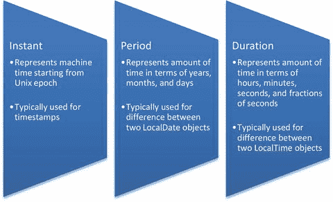

# 八、使用 JavaSE8 日期/时间 API

  
| 认证目标 |
| --- |
| 使用 LocalDate、LocalTime、LocalDateTime、Instant、Period 和 Duration 创建和管理基于日期和基于时间的事件，包括将日期和时间组合到单个对象中 |
| 跨时区处理日期和时间，并管理夏令时带来的更改，包括日期和时间值的格式 |
| 使用 Instant、Period、Duration 和 TemporalUnit 定义、创建和管理基于日期和基于时间的事件 |

新的 Java 日期和时间 API 在`java.time`包中提供。Java 8 中的这个新 API 取代了支持日期和时间相关功能的旧类，例如作为`java.util`包的一部分提供的`Date`、`Calendar`和`TimeZone`类。

Java 8 已经有了早期 Java 的`Date`和`Calendar`等类，为什么还要引入新的日期和时间 API？主要原因是不方便的 API 设计。例如，`Date`类既有日期又有时间；如果只需要时间信息而不需要与日期相关的信息，则必须将与日期相关的值设置为零。这些课程的某些方面也不直观。例如，在`Date`构造函数中，日期值的范围是 1 到 31，而月份值的范围是 0 到 11(不是 1 到 12)！此外，`java.util.Date`和`SimpleDateFormatter`还有许多与并发相关的问题，因为它们不是线程安全的。

Java 8 在新引入的`java.time`包中为日期和时间相关的功能提供了很好的支持。这个包中的大多数类都是不可变的和线程安全的。本章说明了如何使用这个包中的重要类和接口，包括`LocalDate`、`LocalTime`、`LocalDateTime`、`Instant`、`Period`、`Duration`和`TemporalUnit`。您还将学习如何使用时区和夏令时，以及如何设置日期和时间值的格式。

API 包含了流畅接口的概念:它的设计方式使得代码可读性更强，也更容易使用。因此，这个包中的类有许多静态方法(其中许多是工厂方法)。此外，这些类中的方法遵循一个通用的命名约定(例如，它们使用前缀`plus`和`minus`来加减日期或时间值)。

## 理解 java.time 中的重要类

  
| 认证目标 |
| --- |
| 使用 LocalDate、LocalTime、LocalDateTime、Instant、Period 和 Duration 创建和管理基于日期和基于时间的事件，包括将日期和时间组合到单个对象中 |
| 使用 Instant、Period、Duration 和 TemporalUnit 定义、创建和管理基于日期和基于时间的事件 |

`java.time`包由四个子包组成:

*   `java.time.temporal`—访问日期/时间字段和单位
*   `java.time.format`—格式化日期/时间对象的输入和输出
*   `java.time.zone`—处理时区
*   `java.time.chrono`—支持日本和泰国日历等日历系统

本章仅关注考试目标所涵盖的日期/时间主题。让我们从学习使用`LocalDate`、`LocalTime`、`LocalDateTime`、`Instant`、`Period`和`Duration`类开始。

### 使用 LocalDate 类

`java.time.` `LocalDate`表示没有时间或时区的日期。`LocalDate`在 ISO-8601 日历系统中以年-月-日格式(YYYY-MM-DD)表示:例如，2015-10-26。

Java 8 日期和时间 API 使用 ISO 8601 作为默认的日历格式。在这种国际公认的格式中，日期和时间值从最大到最小的时间单位排序:年、月/周、日、小时、分钟、秒和毫秒/纳秒。

这里有一个使用`LocalDate`的例子:

```java
LocalDate today = LocalDate.now();

System.out.println("Today's date is: " + today);
```

当我们运行该代码时，它打印出以下内容:

```java
Today's date is: 2015-10-26
```

`LocalDate.now()`方法基于默认时区，使用系统时钟获取当前日期。您可以通过显式指定日、月和年组件来获得一个`LocalDate`对象:

```java
LocalDate newYear2016 = LocalDate.of(2016, 1, 1);

System.out.println("New year 2016: " + newYear2016);
```

该代码打印以下内容:

```java
New year 2016: 2016-01-01
```

这个代码怎么样？

```java
LocalDate valentinesDay = LocalDate.of(2016, 14, 2);

System.out.println("Valentine's day is on: " + valentinesDay);
```

它抛出一个异常:

```java
Exception in thread "main" java.time.DateTimeException: Invalid value for MonthOfYear

(valid values 1 - 12): 14
```

在这种情况下，`month`和`dayOfMonth`参数值互换。`LocalDate`的`of()`方法声明如下:

```java
LocalDate of(int year, int month, int dayOfMonth)
```

为了避免犯这个错误，可以使用重载版本`LocalDate.of(int year, Month month, int day)`。第二个参数`java.time.Month`是一个枚举，表示一年中的 12 个月。如果互换日期和月份参数，就会出现编译器错误。下面是使用此枚举的改进版本:

```java
LocalDate valentinesDay = LocalDate.of(2016, Month.FEBRUARY, 14);

System.out.println("Valentine's day is on: " + valentinesDay);
```

这段代码打印出来

```java
Valentine's day is on: 2016-02-14
```

`LocalDate`类有一些方法，你可以用它们在当前的`LocalDate`对象上增加或减少日、周、月或年。例如，假设你的签证在 180 天后到期。以下是显示到期日期的代码段(假设今天的日期是 2015-10-26 `)`:

```java
long visaValidityDays = 180L;

LocalDate currDate = LocalDate.now();

System.out.println("My Visa expires on: " + currDate.plusDays(visaValidityDays));
```

这段代码显示了以下内容:

```java
My Visa expires on: 2016-04-23
```

除了`plusDays()`方法，`LocalDate`还提供了`plusWeeks()`、`plusMonths()`和`plusYears()`方法，以及用于减法的方法:`minusDays()`、`minusWeeks()`、`minusMonths()`和`minusYears()`。表 [8-1](#Tab1) 列出了你需要知道的`LocalDate`类中的更多方法(这个表提到了像`ZoneId`这样的类——它们将在本章后面讨论)。

表 8-1。

Important Methods in the `LocalDate` Class

   
| 方法 | 简短描述 | 示例代码 |
| --- | --- | --- |
| `LocalDate now(Clock clock)` `LocalDate now(ZoneId zone)` | 使用传递的`clock`或`zone`参数返回带有当前日期的`LocalDate`对象 | `// assume today's date is 26 Oct 2015``LocalDate.now(Clock.systemDefaultZone());``// returns current date as 2015-10-26``LocalDate.now(ZoneId.of("Asia/Kolkata"));``// returns current date as 2015-10-26``LocalDate.now(ZoneId.of("Asia/Tokyo"));`T6】 |
| `LocalDate ofYearDay(int year, int dayOfYear)` | 从作为参数传递的`year`和`dayOfYear`中返回`LocalDate` | `LocalDate.ofYearDay(2016,100);` `// returns date as 2016-04-09` |
| `LocalDate parse(CharSequence dateString)` | 从作为参数传递的`dateString`中返回`LocalDate` | `LocalDate.parse("2015-10-26");``// returns a LocalDate corresponding``// to the passed string argument; hence it`T3】 |
| `LocalDate ofEpochDay(Long epochDay)` | 通过将天数添加到纪元开始日(纪元开始于 1970 年)来返回`LocalDate` | `LocalDate.ofEpochDay(10);` `// returns 1970-01-11;` |

### 使用 LocalTime 类

除了`LocalTime`表示没有日期或时区的时间之外，`java.time.LocalTime`类与`LocalDate`类似。时间采用 ISO-8601 日历系统格式:`HH:MM:SS.nanosecond`。`LocalTime`和`LocalDate`都使用系统时钟和默认时区。

下面是一个使用`LocalTime`的例子:

```java
LocalTime currTime = LocalTime.now();

System.out.println("Current time is: " + currTime);
```

当我们执行它时，它打印了以下内容:

```java
Current time is: 12:23:05.072
```

如上所述，`LocalTime`使用系统时钟及其默认时区。要基于特定的时间值创建不同的时间对象，可以使用`LocalTime`类的重载`of()`方法:

```java
System.out.println(LocalTime.of(18,30));

// prints: 18:30
```

`LocalTime`提供了许多有用的方法，可以用来加减小时、分钟、秒和纳秒。例如，假设从现在起 6.5 小时后您有一个会议，您想要找到确切的会议时间。这里有一段代码:

```java
long hours = 6;

long minutes = 30;

LocalTime currTime = LocalTime.now();

System.out.println("Current time is: " + currTime);

System.out.println("My meeting is at: " + currTime.plusHours(hours).plusMinutes(minutes));
```

这段代码显示了以下内容:

```java
Current time is: 12:29:13.624

My meeting is at: 18:59:13.624
```

除了`plusHours()`，`LocalTime`还支持`plusMinutes()`，`plusSeconds()`，`plusNanos()`方法；同样，对于减法，它支持`minusHours()`、`minusMinutes()`、`minusNanos()`和`minusSeconds()`。表 [8-2](#Tab2) 列出了`LocalTime`类中的一些重要方法。

表 8-2。

Important Methods in the `LocalTime` Class

   
| 方法 | 简短描述 | 示例代码 |
| --- | --- | --- |
| `LocalTime now(Clock clock)` `LocalTime now(ZoneId zone)` | 使用传递的`clock`或`zone`参数返回带有当前时间的`LocalTime`对象 | `LocalTime.now(Clock.systemDefaultZone())``// returns current time as 18:30:35.744``LocalDate.now(ZoneId.of("Asia/Tokyo");`T3】 |
| `LocalTime ofSecondOfDay(long daySeconds)` | 从作为参数传递的`daySeconds`中返回`LocalTime`(注意，一天 24 小时有 86，400 秒) | `LocalTime.ofSecondOfDay(66620);``// returns 18:30:20 because`T2】 |
| `LocalTime parse(CharSequence timeString)` | 从作为参数传递的`dateString`中返回`LocalTime` | `LocalTime.parse("18:30:05");``// returns a LocalTime object``// corresponding to the given String`T3】 |

### 使用 LocalDateTime 类

类别`java.time.` `LocalDateTime`表示没有时区的日期和时间。您可以将`LocalDateTime`视为`LocalTime`和`LocalDate`类的逻辑组合。日期和时间格式使用 ISO-8601 日历系统:`YYYY-MM-DD HH:MM:SS.nanosecond`。

下面是一个打印今天的日期和当前时间的简单示例:

```java
LocalDateTime currDateTime = LocalDateTime.now();

System.out.println("Today's date and current time is: " + currDateTime);
```

当我们运行这段代码时，它打印出以下内容:

```java
Today's date and current time is: 2015-10-29T21:04:36.376
```

在这个输出中，注意字符 T 代表时间，它分隔了日期和时间部分。使用系统时钟及其默认时区获取当前日期和时间。

`java.time`包中的很多类，包括`LocalDate`、`LocalTime`、`LocalDateTime`，都支持`isAfter()`和`isBefore()`方法进行比较:

```java
LocalDateTime christmas = LocalDateTime.of(2015, 12, 25, 0, 0);

LocalDateTime newYear = LocalDateTime.of(2016, 1, 1, 0, 0);

System.out.println("New Year 2016 comes after Christmas 2015? "+newYear.isAfter(christmas));
```

该代码打印以下内容:

```java
New Year 2016 comes after Christmas 2015? true
```

您可以分别使用`toLocalDate()`和`toLocalTime()`方法从给定的`LocalDateTime`对象中获取`LocalDate`和`LocalTime`对象:

```java
LocalDateTime dateTime = LocalDateTime.now();

System.out.println("Today's date and current time: " + dateTime);

System.out.println("The date component is:  " + dateTime.toLocalDate());

System.out.println("The time component is: " + dateTime.toLocalTime());
```

当我们执行这段代码时，它打印出来

```java
Today's date and current time: 2015-11-04T13:19:10.497

The date component is:  2015-11-04

The time component is: 13:19:10.497
```

与表 [8-1](#Tab1) 和 [8-2](#Tab2) 中列出的方法类似，`LocalDateTime`有`now()`、`of()`、`parse()`等方法。同样，类似于`LocalDate`和`LocalTime`，这个类也提供了加减年、月、日、小时、分钟、秒和纳秒的方法。为避免重复，这里不再列出这些方法。

### 使用即时类

假设您想要跟踪一个 Java 应用的执行，或者将应用事件存储在一个文件中。出于这些目的，您需要获得时间戳值，您可以使用`java.time.Instant`类来实现。瞬时值开始于 1970 年 1 月 1 日 00:00:00 小时(称为 Unix 纪元)。

`Instant`类在内部使用一个`long`变量，该变量保存从 Unix 纪元开始以来的秒数:`1970-01-01T00:00:00Z`(出现在这个纪元之前的值被视为负值)。此外，`Instant`使用一个整数变量来存储每秒经过的纳秒数。清单 [8-1](#FPar1) 中的程序使用了`Instant`类。

Listing 8-1\. `UsingInstant.java`

```java
import java.time.Instant;

public class UsingInstant {

public static void main(String args[]){

// prints the current timestamp with UTC as time zone

Instant currTimeStamp = Instant.now();

System.out.println("Instant timestamp is: "+ currTimeStamp);

// prints the number of seconds as Unix timestamp from epoch time

System.out.println("Number of seconds elapsed: " + currTimeStamp.getEpochSecond());

// prints the Unix timestamp in milliseconds

System.out.println("Number of milliseconds elapsed: " + currTimeStamp.toEpochMilli());

}

}
```

执行时，它会打印以下内容:

```java
Instant timestamp is: 2015-11-02T03:16:04.502Z

Number of seconds elapsed: 1446434164

Number of milliseconds elapsed: 1446434164502
```

`LocalDateTime`和`Instant`有什么区别？这里有一个例子可以说明:

```java
LocalDateTime localDateTime = LocalDateTime.now();

Instant instant = Instant.now();

System.out.println("LocalDateTime is: " + localDateTime + " \nInstant is: " + instant);
```

当我们执行此操作时，它打印了以下内容:

`LocalDateTime is: 2015-11-02T` `17:21:11.402`

`Instant is: 2015-11-02T` `11:51:11.404Z`

如你所见，`LocalDateTime`打印的时间值与`Instant`的结果不同。为什么呢？因为我们生活在亚洲/加尔各答时区，与格林威治时间相差+05:30 小时。`LocalDateTime`使用默认时区，但`Instant`没有。

### 使用 Period 类

`java.time.Period`类用于根据年、月和日来测量时间量。假设你买了一些很贵的药，想在过期前用完。你可以通过下面的方法知道它什么时候到期:

```java
LocalDate manufacturingDate = LocalDate.of(2016, Month.JANUARY, 1);

LocalDate expiryDate = LocalDate.of(2018, Month.JULY, 18);

Period expiry = Period.between(manufacturingDate, expiryDate);

System.out.printf("Medicine will expire in: %d years, %d months, and %d days (%s)\n",

expiry.getYears(), expiry.getMonths(), expiry.getDays(), expiry);
```

这段代码显示了以下内容:

```java
Medicine will expire in: 2 years, 6 months, and 17 days (P2Y6M17D)
```

这个例子使用了`Period.between()`方法，该方法将两个`LocalDate`值作为参数，并返回一个`Period`。这个程序使用方法`getYears()`、`getMonths()`和`getDays()`(这三个方法返回一个`int`值)，它们分别返回给定期间的年数、月数和天数。`Period`的`toString()`方法打印值`P2Y6M17D`。在该字符串中，字符`P`、`Y`、`M`和`D`分别代表周期、年、月和日。

从`Period`开始，您可以使用`plusYears()`、`plusMonths()`、`plusDays()`、`minusYears()`、`minusMonths()`和`minusDays()`的方法增加或减少年、月和日。表 [8-3](#Tab3) 列出了这个类中的其他重要方法。

表 8-3。

Important Methods in the `Period` Class

   
| 方法 | 简短描述 | 示例代码 |
| --- | --- | --- |
| `Period of(int years, int months, int days)` | 基于给定的参数返回一个`Period`对象 | `LocalDate christmas = LocalDate.of(2015, 12, 25);``System.out.println(``Period.between(LocalDate.now(), christmas));`T3】 |
| `Period ofWeeks(int unit)``Period ofDays(int unit)``Period ofMonths(int unit)`T3】 | 基于参数中的单位返回一个`Period`对象 | `Period.ofWeeks(2)` `// returns P14D` `Period.ofDays(15)` `// returns P15D` `Period.ofMonths(6)` `// returns P6M` `Period.ofYears(4)` `// returns P4Y` |
| `Period parse(CharSequence string)` | 从作为参数传递的`string`中返回一个`Period` | `Period.parse("P4Y6M15D");` `// returns P4Y6M15D` |

Java 8 日期和时间 API 区分了人类和计算机使用日期和时间相关信息的方式。例如，`Instant`类表示一个 Unix 时间戳，并在内部使用`long`和`int`变量。`Instant`人类不太容易读懂或使用这些值，因为该类不支持与日、月、小时等相关的方法(相比之下，`Period`类支持这些方法)。

### 使用持续时间类

我们之前讨论过`Period`类——它用年、月和日来表示时间。`Duration`相当于`Period`的时间。`Duration`类用小时、分钟、秒等表示时间。适用于测量机器时间或使用`Instance`物体时。类似于`Instance`类，`Duration`类将秒部分存储为`long`值，并将纳秒存储为`int`值。

说你想在今晚午夜祝你最好的朋友贝基生日快乐。你可以通过下面的方法来确定需要多少小时:

```java
LocalDateTime comingMidnight =

LocalDateTime.of(LocalDate.now().plusDays(1), LocalTime.MIDNIGHT);

LocalDateTime now = LocalDateTime.now();

Duration between = Duration.between(now, comingMidnight);

System.out.println(between);
```

该代码打印以下内容:

```java
PT7H13M42.003S
```

这个例子使用了`LocalDateTime`类中`of()`方法的重载版本:`LocalDateTime of(LocalDate, LocalTime)`。`LocalDate.now()`调用返回当前日期，但是您需要给这个值加上一天，这样您就可以使用`LocalTime.MIDNIGHT`来表示即将到来的午夜。`Duration`中的`between()`方法接受两个时间值——在本例中是两个`LocalDateTime`对象。当我们执行这个程序时，时间是 16:46:17；从那时到午夜是 7 小时 13 分 42 秒。这由`toString()`输出、`Period` : `PT7H13M42.003S`指示。前缀`PT`表示周期时间，`H`表示小时，`M`表示分钟，`S`表示秒。

表 [8-4](#Tab4) 列出了`Duration`类的一些重要方法。`TemporalUnit`和`ChronoUnit`将在本章后面讨论。



图 8-1。

Summary of the `Instant`, `Period`, and `Duration` classes

表 8-4。

Important Methods in the `Duration` Class

   
| 方法 | 简短描述 | 示例代码 |
| --- | --- | --- |
| `Duration of(long number, TemporalUnit unit)``Duration ofDays(long unit)``Duration ofHours(long unit)``Duration ofMinutes(long unit)``Duration ofSeconds(long unit)``Duration ofMillis(long unit)`T6】 | 以指定格式返回给定数字的`Duration`对象，根据参数中给定的单位返回`Duration` | `Duration.of(3600, ChronoUnit.MINUTES) // returns "PT60H"``Duration.ofDays(4)``// returns "PT96H"``Duration.ofHours(2)``// returns "PT2H"``Duration.ofMinutes(15)``// returns "PT15M"``Duration.ofSeconds(30)``//returns "PT30S"``Duration.ofMillis(120)``// returns "PT0.12S"``Duration.ofNanos(120)``// returns "PT0.00000012S"` |
| `Duration parse(CharSequence string)` | 从作为参数传递的`string`中返回一个`Period` | `Duration.parse("P2DT10H30M")``// returns a Duration object`T2】 |

## 使用 TemporalUnit 接口

`TemporalUnit`接口是`java.time.temporal`包的一部分。它表示日期或时间单位，如秒、小时、天、月、年等。枚举`java.time.temporal.ChronoUnit`实现了这个接口。与其使用常数值，不如使用它们的等价枚举值。为什么？因为在`ChronoUnit`中使用枚举值会产生更可读的代码；此外，你不太可能犯错误。

清单 [8-2](#FPar2) 打印枚举值，无论它们是基于日期还是基于时间，以及持续时间。

Listing 8-2\. `ChronoUnitValues.java`

```java
import java.time.temporal.ChronoUnit;

public class ChronoUnitValues {

public static void main(String []args) {

System.out.println("ChronoUnit DateBased TimeBased Duration");

System.out.println("---------------------------------------");

for(ChronoUnit unit : ChronoUnit.values()) {

System.out.printf("%10s \t %b \t\t %b \t\t %s %n",

unit, unit.isDateBased(), unit.isTimeBased(), unit.getDuration());

}

}

}
```

结果如下:

```java
ChronoUnit       DateBased       TimeBased      Duration

--------------------------------------- --------------------

Nanos       false           true           PT0.000000001S

Micros       false           true           PT0.000001S

Millis       false           true           PT0.001S

Seconds       false           true           PT1S

Minutes       false           true           PT1M

Hours       false           true           PT1H

HalfDays       false           true           PT12H

Days       true            false          PT24H

Weeks       true            false          PT168H

Months       true            false          PT730H29M6S

Years       true            false          PT8765H49M12S

Decades       true            false          PT87658H12M

Centuries       true            false          PT876582H

Millennia       true            false          PT8765820H

Eras       true            false          PT8765820000000H

Forever       false           false          PT2562047788015215H30M7.999999999S
```

`java.time`包中的众多方法都以`TemporalUnit`为自变量。例如，考虑一下`Duration`类中的`of()`方法:

```java
Duration of(long amount, TemporalUnit unit)
```

因为`ChronoUnit`枚举实现了`TemporalUnit`接口，所以您可以传递一个`ChronoUnit`枚举值作为该构造函数的第二个参数:

```java
System.out.println(Duration.of(1, ChronoUnit.MINUTES).getSeconds());

// prints: 60

System.out.println(Duration.of(1, ChronoUnit.HOURS).getSeconds());

// prints:3600

System.out.println(Duration.of(1, ChronoUnit.DAYS).getSeconds());

// prints: 86400
```

从这个例子中可以看出，`ChronoUnit`帮助您处理时间单位值，如秒、分、小时，以及日期值，如日、月和年。

## 处理时区和夏令时

  
| 认证目标 |
| --- |
| 跨时区处理日期和时间，并管理夏令时带来的更改，包括日期和时间值的格式 |

前一节讨论了`java.time`包中的一些重要类。本节讨论如何跨时区处理日期和时间、处理夏令时以及设置日期和时间值的格式。

### 使用时区相关的类

为了跨时区处理日期和时间，您需要了解三个与时区相关的重要类:`ZoneId`、`ZoneOffset`和`ZonedDateTime`。现在我们来讨论一下。

#### 使用 ZoneId 类

在`java.time`包中，`java.time.ZoneId`类代表时区。时区通常使用格林威治标准时间(GMT，也称为 UTC/格林威治时间)的偏移量来标识。

例如，我们生活在印度，而印度唯一的时区是亚洲/加尔各答(使用这种地区/城市格式给出时区)。此代码打印时区:

```java
System.out.println("My zone id is: " + ZoneId.systemDefault());
```

对于我们的时区，它打印如下:

```java
My zone id is: Asia/Kolkata
```

您可以通过调用`ZoneId`中的静态方法`getAvailableZoneIds()`获得时区列表，该方法返回一个`Set<String>`:

```java
Set<String> zones = ZoneId.getAvailableZoneIds();

System.out.println("Number of available time zones is: " + zones.size());

zones.forEach(System.out::println);
```

结果如下:

```java
Number of available time zones is: 589

Asia/Aden

America/Cuiaba

// rest of the output elided...
```

您可以将这些时区标识符中的任何一个传递给`of()`方法来创建相应的`ZoneId`对象，如

```java
ZoneId AsiaKolkataZoneId = ZoneId.of("Asia/Kolkata");
```

#### 使用 ZoneOffset 类

`ZoneId`标识时区，如`Asia/Kolkata`。另一个类`ZoneOffset`，代表相对于 UTC/格林威治的时区偏移量。例如，时区 ID“亚洲/加尔各答”相对于 UTC/格林威治的时区偏移量为+05:30(加 5 小时 30 分钟)。`ZoneOffset`类扩展了`ZoneId`类。我们将在下一节讨论一个使用`ZoneOffset`的例子。

#### 使用 ZonedDateTime 类

在 Java 8 中，如果只想处理日期、时间或时区，可以分别使用`LocalDate`、`LocalTime`或`ZoneId`。如果您希望日期、时间和时区这三者都包含在内，该怎么办呢？为此，您可以使用`ZonedDateTime`类:

```java
LocalDate currentDate = LocalDate.now();

LocalTime currentTime = LocalTime.now();

ZoneId myZone = ZoneId.systemDefault();

ZonedDateTime zonedDateTime = ZonedDateTime.of(currentDate, currentTime, myZone);

System.out.println(zonedDateTime);
```

结果如下:

```java
2015-11-05T11:38:40.647+05:30[Asia/Kolkata]
```

这段代码使用了重载的静态方法`ZonedDateTime of(LocalDate, LocalTime, ZoneID)`。

给定一个`LocalDateTime`，你可以用一个`ZoneId`得到一个`ZonedDateTime`对象:

```java
LocalDateTime dateTime = LocalDateTime.now();

ZoneId myZone = ZoneId.systemDefault();

ZonedDateTime zonedDateTime = dateTime.atZone(myZone);
```

为了说明这些不同时区相关类之间的转换，下面的代码段创建了一个`ZoneId`对象，将时区信息添加到一个`LocalDateTime`对象中以获得一个`ZonedDateTime`对象，最后从`ZonedDateTime`中获得时区偏移量:

```java
ZoneId myZone = ZoneId.of("Asia/Kolkata");

LocalDateTime dateTime = LocalDateTime.now();

ZonedDateTime zonedDateTime = dateTime.atZone(myZone);

ZoneOffset zoneOffset = zonedDateTime.getOffset();

System.out.println(zoneOffset);
```

它打印以下内容:

```java
+05:30
```

假设你在新加坡，日期是 2016 年 1 月 1 日，时间是早上 6:00，在和住在奥克兰(新西兰)的朋友通话之前，你想了解一下新加坡和奥克兰的时差。清单 [8-3](#FPar3) 展示了一个使用`ZoneId`、`ZonedDateTime`和`Duration`类的程序，以说明如何一起使用这些类。

Listing 8-3\. `TimeDifference.java`

```java
import java.time.LocalDateTime;

import java.time.Month;

import java.time.ZoneId;

import java.time.ZonedDateTime;

import java.time.Duration;

public class TimeDifference {

public static void main(String[] args) {

ZoneId singaporeZone = ZoneId.of("Asia/Singapore");

ZonedDateTime dateTimeInSingapore = ZonedDateTime.of(

LocalDateTime.of(2016, Month.JANUARY, 1, 6, 0), singaporeZone);

ZoneId aucklandZone = ZoneId.of("Pacific/Auckland");

ZonedDateTime sameDateTimeInAuckland =

dateTimeInSingapore.withZoneSameInstant(aucklandZone);

Duration timeDifference = Duration.between(

dateTimeInSingapore.toLocalTime(),

sameDateTimeInAuckland.toLocalTime());

System.out.printf("Time difference between %s and %s zones is %d hours",

singaporeZone, aucklandZone, timeDifference.toHours());

}

}
```

结果如下:

```java
Time difference between Asia/Singapore and Pacific/Auckland zones is 5 hours
```

这个程序创建了两个`ZoneId`:一个用于新加坡，另一个用于奥克兰。在用给定的日期和时间为新加坡时区创建了一个`ZonedDateTime`对象之后，通过调用`ZonedDateTime`类的`withZoneSameInstant()`方法，您得到了奥克兰的等效的`ZonedDateTime`对象。要找到以小时为单位的时差，可以使用`Duration`的`Duration.between()`方法和`toHours()`方法。

### 应对夏令时

因为季节变化，一年中的日照量不会保持不变。例如，夏天有更多的日光。使用夏令时(DST)时，时钟会提前或推迟一小时，以充分利用日光。俗话说，“春去秋来”——春天开始时，时钟通常会提前一个小时，秋天开始时，时钟会推迟一个小时:

```java
ZoneId kolkataZone = ZoneId.of("Asia/Kolkata");

Duration kolkataDST = kolkataZone.getRules().getDaylightSavings(Instant.now());

System.out.printf("Kolkata zone DST is: %d hours %n", kolkataDST.toHours());

ZoneId aucklandZone = ZoneId.of("Pacific/Auckland");

Duration aucklandDST = aucklandZone.getRules().getDaylightSavings(Instant.now());

System.out.printf("Auckland zone DST is: %d hours", aucklandDST.toHours());
```

以下是结果(2015 年 11 月 5 日执行时):

```java
Kolkata zone DST is: 0 hours

Auckland zone DST is: 1 hours
```

调用`zoneId.getRules().getDaylightSavings(Instant.now());`根据当时 DST 是否有效返回一个`Duration`对象。如果`Duration.isZero()`为假，DST 在该区域有效；否则，就不是。在本例中，加尔各答时区不采用夏令时，但奥克兰时区采用+1 小时的夏令时。

## 格式化日期和时间

当用日期和时间编程时，你经常需要用不同的格式打印它们。此外，您可能需要阅读不同格式的日期/时间信息。要读取或打印各种格式的日期和时间值，可以使用`java.time.format`包中的`DateTimeFormatter`类。

`DateTimeFormatter`类提供了许多用于格式化日期和时间值的预定义常量。以下是一些这样的预定义格式化程序的列表(带有示例输出值):

*   `ISO_DATE` (2015-11-05)
*   `ISO_TIME` (11:25:47.624)
*   `RFC_1123_DATE_TIME`(从而，2015 年 11 月 5 日上午 11:27:22 +0530)
*   `ISO_ZONED_DATE_TIME`(2015-11-05t 11:30:33.49+05:30[亚洲/加尔各答])

下面是一个简单的例子，它使用了类型为`DateTimeFormatter`的预定义的`ISO_TIME`:

```java
LocalTime wakeupTime = LocalTime.of(6, 0, 0);

System.out.println("Wake up time: " + DateTimeFormatter.ISO_TIME.format(wakeupTime));
```

这印刷了以下内容:

```java
Wake up time: 06:00:00
```

如果您想使用自定义格式而不是任何预定义的格式，该怎么办？为此，您可以使用`DateTimeFormatter`类中的`ofPattern()`方法:

```java
DateTimeFormatter customFormat = DateTimeFormatter.ofPattern("dd MMM yyyy");

System.out.println(customFormat.format(LocalDate.of(2016, Month.JANUARY, 01)));
```

结果如下:

```java
01 Jan 2016
```

使用字母对日期或时间的格式进行编码，以形成日期或时间模式字符串。通常这些字母在模式中重复出现。

在日期和时间的格式字符串中使用时，大写和小写字母可以有相似或不同的含义。在尝试使用这些字母之前，请仔细阅读这些模式的 Javadoc。比如在 dd-MM-yy 中，MM 指的是月；但是，在 dd-mm-yy 中，mm 指的是分钟！

前面的代码段给出了一个创建自定义日期格式的简单示例。类似的字母可用于创建自定义日期和时间模式字符串。以下是创建日期模式的重要字母及其含义的列表(带有示例):

*   `G`(时代:BC，AD)
*   `y`(纪元年份:2015 年 15 月)
*   `Y`(以周为单位的年份:2015 年 15 月)
*   `M`(月:11 日、11 月、11 月)
*   `w`(一年中的第 13 周)
*   `W`(月中的星期:2)
*   `E`(一周中的日名:星期日、星期日)
*   `D`(一年中的第 256 天)
*   `d`(一月中的第几天:13)

清单 [8-4](#FPar4) 中的程序使用简单和复杂的模式字符串来创建定制的日期格式。

Listing 8-4\. `CustomDatePatterns.java`

```java
import java.time.LocalDateTime;

import java.time.format.DateTimeFormatter;

public class CustomDatePatterns {

public static void main(String []args) {

// patterns from simple to complex ones

String [] dateTimeFormats = {

"dd-MM-yyyy", /* d is day (in month), M is month, y is year */

"d '('E')' MMM, YYYY", /*E is name of the day (in week), Y is year*/

"w'th week of' YYYY", /* w is the week of the year */

"EEEE, dd'th' MMMM, YYYY" /*E is day name in the week */

};

LocalDateTime now = LocalDateTime.now();

for(String dateTimeFormat : dateTimeFormats) {

System.out.printf("Pattern \"%s\" is %s %n", dateTimeFormat,

DateTimeFormatter.ofPattern(dateTimeFormat).format(now));

}

}

}
```

结果如下:

```java
Pattern "dd-MM-yyyy" is 05-11-2015

Pattern "d '('E')' MMM, YYYY" is 5 (Thu) Nov, 2015

Pattern "w'th week of' YYYY" is 45th week of 2015

Pattern "EEEE, dd'th' MMMM, YYYY" is Thursday, 05th November, 2015
```

如您所见，重复的字母导致条目的形式更长。例如，当您使用`E`(这是一周中的某一天的名称)时，结果是“Thu”，而使用`EEEE`则打印完整形式的日期名称，即“星期四”。

另一个需要注意的重要事情是如何在给定的模式字符串中打印文本。为此，您使用单引号分隔的文本，由`DateTimeFormatter`按原样打印。比如`'('E')'`打印“(Wed)”。如果您给出了一个不正确的模式，或者忘记使用单引号将文本与模式字符串中的模式字母分开，那么您会因为传递了一个“非法模式”而得到一个`DateTimeParseException`

现在，让我们看一个创建定制时间模式字符串的类似例子。以下是定义自定义时间模式的重要字母列表:

*   `a`(文本标记上午/下午标记)
*   `H`(小时:取值范围 0-23)
*   `k`(小时:取值范围 1–24)
*   `K`(上午/下午的小时:取值范围 0-11)
*   `h`(上午/下午的小时:取值范围 1-12)
*   `m`(分钟
*   `s`(第二次)
*   `S`(几分之一秒)
*   `z`(时区:通用时区格式)

有关更多字母及其描述，请参见`DateTimeFormatter`类的 Javadoc。清单 [8-5](#FPar5) 展示了一个使用简单和复杂模式字符串创建定制时间格式的程序。

Listing 8-5\. `CustomTimePatterns.java`

```java
import java.time.LocalTime;

import java.time.format.DateTimeFormatter;

// Using examples, illustrates how to use "pattern strings" for creating custom time formats

class CustomTimePatterns {

public static void main(String []args) {

// patterns from simple to complex ones

String [] timeFormats = {

"h:mm",          /* h is hour in am/pm (1-12), m is minute */

"hh 'o''clock'", /* '' is the escape sequence to print a single quote */

"H:mm a",        /* H is hour in day (0-23), a is am/pm*/

"hh:mm:ss:SS",   /* s is seconds, S is milliseconds */

"K:mm:ss a"      /* K is hour in am/pm(0-11) */

};

LocalTime now = LocalTime.now();

for(String timeFormat : timeFormats) {

System.out.printf("Time in pattern \"%s\" is %s %n", timeFormat,

DateTimeFormatter.ofPattern(timeFormat).format(now));

}

}

}
```

结果如下:

```java
Time in pattern "h:mm" is 12:27

Time in pattern "hh 'o''clock'" is 12 o'clock

Time in pattern "H:mm a" is 12:27 PM

Time in pattern "hh:mm:ss:SS" is 12:27:10:41

Time in pattern "K:mm:ss a" is 0:27:10 PM
```

注意基于所使用的模式字符串，输出是如何不同的。

## 航班旅行示例

让我们看一个例子，它使用了到目前为止所涉及的许多类。假设你需要赶 2016 年 1 月 1 日早上 6:00 从新加坡出发的航班，航班需要 10 个小时到达新西兰奥克兰。你能知道到达奥克兰的时间吗？清单 [8-6](#FPar6) 中的程序解决了这个问题。

Listing 8-6\. `FlightTravel.java`

```java
import java.time.Month;

import java.time.ZoneId;

import java.time.ZonedDateTime;

import java.time.LocalDateTime;

import java.time.format.DateTimeFormatter;

public class FlightTravel {

public static void main(String[] args) {

DateTimeFormatter dateTimeFormatter =

DateTimeFormatter.ofPattern("dd MMM yyyy hh.mm a");

// Leaving on 1st Jan 2016, 6:00am from "Singapore"

ZonedDateTime departure = ZonedDateTime.of(

LocalDateTime.of(2016, Month.JANUARY, 1, 6, 0),

ZoneId.of("Asia/Singapore"));

System.out.println("Departure: " + dateTimeFormatter.format(departure));

// Arrival on the same day in 10 hours in "Auckland"

ZonedDateTime arrival =

departure.withZoneSameInstant(ZoneId.of("Pacific/Auckland"))

.plusHours(10);

System.out.println("Arrival: " + dateTimeFormatter.format(arrival));

}

}
```

结果如下:

```java
Departure: 01 Jan 2016 06.00 AM

Arrival: 01 Jan 2016 09.00 PM
```

## 摘要

让我们简要回顾一下本章中每个认证目标的要点。请在参加考试之前阅读它。

使用 LocalDate、LocalTime、LocalDateTime、Instant、Period 和 Duration 创建和管理基于日期和基于时间的事件，包括将日期和时间组合到单个对象中

*   Java 8 日期和时间 API 使用 ISO 8601 作为默认的日历格式。
*   `java.time.LocalDate`类表示没有时间或时区的日期；`java.time.LocalTime`类表示没有日期和时区的时间；`java.time.LocalDateTime`类表示没有时区的日期和时间。
*   `java.time.Instant`类表示一个 Unix 时间戳。
*   `java.time.Period`用于以年、月和日来度量时间。
*   `java.time.Duration`类用小时、分钟、秒和秒的分数来表示时间。

跨时区处理日期和时间，并管理夏令时带来的更改，包括日期和时间值的格式

*   `ZoneId`标识一个时区；`ZoneOffset`表示相对于 UTC/格林威治的时区偏移量。
*   `ZonedDateTime`提供对所有三个方面的支持:日期、时间和时区。
*   在不同时区工作时，您必须考虑夏令时(DST)。
*   `java.time.format.DateTimeFormatter`类支持读取或打印不同格式的日期和时间值。
*   `DateTimeFormatter`类提供了用于格式化日期和时间值的预定义常量(如`ISO_DATE`和`ISO_TIME`)。
*   使用区分大小写的字母对日期或时间的格式进行编码，用`DateTimeFormatter`类形成日期或时间模式字符串。

使用 Instant、Period、Duration 和 TemporalUnit 定义、创建和管理基于日期和基于时间的事件

*   枚举`java.time.temporal.ChronoUnit`实现了`java.time.temporal.TemporalUnit`接口。
*   `TemporalUnit`和`ChronoUnit`都处理时间单位值，如秒、分和小时，以及日期值，如日、月和年。

Question TimeChoose the correct option based on this code segment: `LocalDate babyDOB = LocalDate.of(2015, Month.FEBRUARY, 20);` `LocalDate now = LocalDate.of(2016, Month.APRIL, 10);` `System.out.println(Period.between(now, babyDOB).getYears()); // PERIOD_CALC` The code segment results in a compiler error in the line marked with the comment `PERIOD_CALC`   The code segment throws a `DateTimeException`   The code segment prints: `1`   The code segment prints: `-1`     Which one of the following classes is best suited for storing timestamp values of application events in a file? `java.time.ZoneId` class   `java.time.ZoneOffset` class   `java.time.Instant` class   `java.time.Duration` class   `java.time.Period` class     Given this code segment `ZoneId zoneId = ZoneId.of("Asia/Singapore");` `ZonedDateTime zonedDateTime =`         `ZonedDateTime.of(LocalDateTime.now(), zoneId);` `System.out.println(zonedDateTime.getOffset());` assume that the time-offset value for the Asia/Singapore time zone from UTC/Greenwich is +08:00\. Choose the correct option. This code segment results in throwing `DateTimeException`   This code segment results in throwing `UnsupportedTemporalTypeException`   The code segment prints: `Asia/Singapore`   The code segment prints: `+08:00`   This code segment prints: `+08:00` [`Asia/Singapore]`     Choose the correct option based on this code segment: `DateTimeFormatter dateFormat = DateTimeFormatter.ISO_DATE;      // DEF` `LocalDate dateOfBirth = LocalDate.of(2015, Month.FEBRUARY, 31);` `System.out.println(dateFormat.format(dateOfBirth));             // USE` The program gives a compiler error in the line marked with the comment `DEF`   The program gives a compiler error in the line marked with the comment `USE`   The code segment prints: `2015-02-31`   The code segment prints: `2015-02-03`   This code segment throws `java.time.DateTimeException` with the message `"Invalid date 'FEBRUARY 31'"`     Consider this code segment: `DateTimeFormatter formatter =`         `DateTimeFormatter.ofPattern("EEEE", Locale.US);` `System.out.println(formatter.format(LocalDateTime.now()));` Which of the following outputs matches the string pattern `"EEEE"` given in this code segment? F   Friday   Sept   September    

答案:

The code segment prints: `-1` Here are the arguments to the `between()` method in the `Period` class: `Period between(LocalDate startDateInclusive, LocalDate endDateExclusive)` The first argument is the start and the second argument is the end, and hence the call `Period.between(now, babyDOB)` results in -1 (not +1).   C. `Instant` class The `Instant` class stores the number of seconds elapsed since the start of the Unix epoch (1970-01-01T00:00:00Z). The `Instant` class is suitable for storing a log of application events in a file as timestamp values. The `ZoneId` and `ZoneOffset` classes are related to time zones and hence are unrelated to storing timestamp values. The `Duration` class is for time-based values in terms of quantity of time (such as seconds, minutes, and hours). The `Period` class is for date-based values such as years, months, and days.   D. The code segment prints: `+08:00` Given a `ZonedDateTime` object, the `getOffset()` method returns a `ZoneOffset` object that corresponds to the offset of the time zone from UTC/Greenwich. Given that the time-offset value for the Asia/Singapore zone from UTC/Greenwich is +08:00, the `toString()` method of `ZoneOffset` prints the string “+08:00” to the console.   E. This code segment throws `java.time.DateTimeException` with the message `"Invalid date 'FEBRUARY 31'"`. The date value 31 passed in the call `LocalDate.of(2015, 2,` 3`1);` is invalid for the month February, and hence the `of()` method in the `LocalDate` class throws `DateTimeException`. One of the predefined values in `DateTimeFormatter` is `ISO_DATE`. Hence, it does not result in a compiler error for the statement marked with the comment `DEF`. The statement marked with the comment `USE` compiles without errors because it is the correct way to use the `format()` method in the `DateTimeFormatter` class.   B. Friday `E` is the day name in the week; the pattern `"EEEE"` prints the name of the day in its full format. “Fri” is a short form that would be printed by the pattern `"E"`, but `"EEEE`" prints the day of the week in full form: for example, “Friday”. Because the locale is `Locale.US`, the result is printed in English. The output “Sept” or “September” is impossible because `E` refers to the name in the week, not in a month.