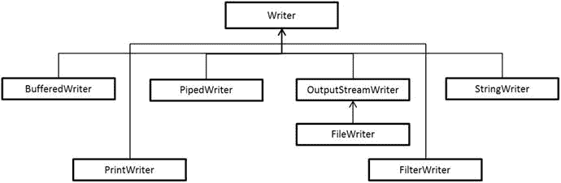
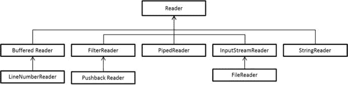
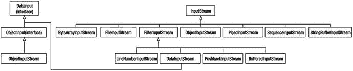

# 九、Java I/O 基础知识

  
| 认证目标 |
| --- |
| 从控制台读取和写入数据 |
| 在 java.io 包中使用 BufferedReader、BufferedWriter、File、FileReader、FileWriter、FileInputStream、FileOutputStream、ObjectOutputStream、ObjectInputStream 和 PrintWriter |

在本章中，我们将向您介绍 Java I/O 编程的基础知识。我们将讨论两个主题:如何从控制台读写数据，然后如何使用(文件)流读写数据。

java.io 和 java.nio 包中提供了对文件操作的支持。在本章的开始部分，我们将只关注 java.io 包；稍后，我们将关注使用流读写数据，但不关注 java.io 包中提供的其他特性。java.nio 包为文件 I/O 提供了全面的支持，我们将在第 10 章中介绍。

## 从控制台读取和写入控制台

  
| 认证目标 |
| --- |
| 从控制台读取和写入数据 |

对于控制台的读写，可以使用标准的输入、输出和错误流，或者使用`Console`类。现在让我们来讨论这两种方法。

### 了解标准流

`java.lang.System`类中的公共静态字段`in`、`out`和`err`分别代表标准输入、输出和错误流。`System.in`为`java.io.InputStream`型`System.out`和`System.err`为`java.io.PrintStream`型。

下面是一个从控制台读取并打印一个整数的编程示例(清单 [9-1](#FPar1) ):

Listing 9-1\. Read.java

```java
import java.io.IOException;

class Read {

public static void main(String []args) {

System.out.print("Type a character: ");

int val = 0;

try {

// the return type of read is int, but it returns a byte value!

val = System.in.read();

} catch(IOException ioe) {

System.err.println("Cannot read input " + ioe);

System.exit(-1);

}

System.out.println("You typed: " + val);

}

}
```

以下是该程序的运行示例:

```java
D:\> $ java Read

Type a character: 5

You typed: 53
```

`read`方法的返回类型是`int`，但是它返回一个范围在 0 到 255 之间的`byte`值(是的，它是不直观的)。因此，对于输入 5，程序打印其 ASCII 值 53。`read`方法“阻塞”(即等待)用户输入；如果读取时发生 I/O 异常，该方法抛出一个`IOException`。

这个程序演示了所有三个流的使用——`System.in`用于从控制台获取输入，`System.out`用于打印读取的整数值，`System.err`用于在发生 I/O 异常时发出错误。

重载的`read`方法本质上是低级的，以字节为单位工作。读取其他类型的输入，如`Strings`需要与`Reader`或`Scanner`类一起使用，如:

```java
BufferedReader br = new BufferedReader(new InputStreamReader(System.in));

String str = br.readLine();

// or use java.util.Scanner, as in:

Scanner scanner = new Scanner(System.in);

String str = scanner.next();
```

我们将在本章后面讨论更多关于`Reader`和`Scanner`类的内容。

#### 重新分配标准流

标准流在 JVM 启动时初始化。有时，通过重新分配来重定向标准流是很有用的。方法`System.setIn`接受一个`InputStream`对象，方法`System.setOut`和`System.setError`接受`PrintStream`对象作为参数。下面是一个代码片段，它通过将`System.out`流重新分配给一个输出文本文件，将标准输出捕获到一个文件中:

```java
import java.io.*;

class StreamTest {

public static void main(String []args ){

try{

PrintStream ps = new PrintStream("log.txt");

System.setOut(ps);

System.out.println("Test output to System.out");

} catch(Exception ee){

ee.printStackTrace();

}

}

}
```

当您执行这段代码时，程序将创建一个名为“log.txt”的文件，并在该文件中打印字符串“Test output to System.out”。

重定向流在许多情况下都很有用。例如，为了进行测试，您可能希望从文本文件中读取输入，而不是从控制台中读取。您可以通过将标准输入流重定向到文本文件来实现这一点。同样，您可能希望将错误流重新分配给文本文件，以便将所有错误消息存储在日志文件中。您可以通过调用`System.setErr`方法来实现这一点。

### 了解控制台类

使用`Console`类有助于从控制台读取数据和将数据写入控制台。注意，这里的“控制台”一词指的是字符输入设备(通常是键盘)和字符显示设备(通常是屏幕显示器)。您可以使用`System.console()`方法获得对控制台的引用；如果 JVM 不与任何控制台相关联，这个方法将返回`null`。

您的第一个练习是实现一个简单的`Echo`命令，当您运行这个程序时，它打印出作为输入的文本行(清单 [9-2](#FPar2) )。

Listing 9-2\. Echo.java

```java
import java.io.Console;

// simple implementation of Echo command

class Echo {

public static void main(String []args) {

// get the System console object

Console console = System.console();

if(console == null) {

System.err.println("Cannot retrieve console object - are you running your application from an IDE? Exiting the application … ");

System.exit(-1); // terminate the application

}

// read a line and print it through printf

console.printf(console.readLine());

}

}
```

下面是程序对于不同输出的行为(在第一次运行中，我们键入“hello world”作为输入，在第二次运行中，我们终止程序):

```java
D:\>java Echo

hello world

hello world

D:\>java Echo

^Z

Exception in thread "main" java.lang.NullPointerException

at java.util.regex.Matcher.getTextLength(Matcher.java:1234)

… [this part of the stack trace elided to save space]

at Echo.main(Echo.java:14)
```

对于普通的文本输入，这个程序工作得很好。如果您键入 no input 并尝试用^z 或^d (Ctrl+Z 或 Ctrl+D 组合键)终止程序，那么程序不会收到任何输入，因此`readLine()`方法返回 null 当`printf`接受一个空参数时，它抛出一个`NullReferenceException`。

请注意，您是从命令行运行这个程序的。如果从命令行调用 JVM 而不重定向输入或输出流，方法`System.console()`将成功，因为 JVM 将与控制台(通常是键盘和显示屏)相关联。如果 JVM 是由 IDE 间接调用的，或者如果 JVM 是从后台进程调用的，那么方法调用`System.console()`将失败并返回`null`。例如，如果您从 IntelliJ IDEA 或 Eclipse IDEs 运行，`System.console()`将通过返回 null 而失败。

如果 JVM 是由 IDE 间接调用的，或者如果 JVM 是从后台进程调用的，那么方法调用`System.console()`将失败并返回 null。

表 [9-1](#Tab1) 中列出了`Console`类中可用的一些重要方法。

表 9-1。

Important Methods in the Console Class

  
| 方法 | 简短描述 |
| --- | --- |
| `Reader reader()` | 返回与此`Console`对象相关联的`Reader`对象；可以通过这个返回的引用执行读取操作。 |
| `PrintWriter writer()` | 返回与此`Console`对象相关联的`PrintWriter`对象；可以通过这个返回的引用执行写操作。 |
| `String readLine()` | 读取一行文本`String`(这个返回的 string 对象不包含任何行终止字符)；如果失败，则返回 null(例如，用户在控制台中按下了 Ctrl+Z 或 Ctrl+D) |
| `String readLine(String fmt, Object… args)` | 与`readLine()`方法相同，但是它首先打印字符串`fmt`。 |
| `char[] readPassword()` | 读取密码文本并以 char 数组的形式返回；此方法禁用回显，因此当用户键入密码时，控制台中不会显示任何内容。 |
| `char[] readPassword(String fmt,` `Object… args)` | 与`readPassword()`方法相同，但是在读取密码字符串之前，它首先打印作为格式字符串参数给出的字符串。 |
| `Console format(String fmt, Object… args)` | 将格式化字符串(基于`fmt`字符串和传递的`args`的值创建)写入控制台。 |
| `Console printf(String fmt, Object… args)` | 将格式化字符串(基于`fmt`字符串和传递的`args`的值创建)写入控制台。这个`printf`方法与`format`方法相同:这是一个“方便的方法”——方法`printf`和格式说明符为大多数 C/C++程序员所熟悉，因此除了 format 方法之外还提供了这个方法。 |
| `void flush()` | 刷新控制台对象缓冲区中仍待打印的任何数据。 |

### 使用控制台类格式化输出

`Console`类支持方法`printf()`和`format()`中的格式化 I/O，加上重载方法`readPassword()`和`readLine()`。我们现在将讨论使用方法`printf()`(以及类似的`format()`方法)的格式化输出，稍后讨论`readPassword()`和`readLine()`方法。

方法`printf()`使用字符串格式化标志来格式化字符串。它非常类似于 C 编程语言库中提供的`printf()`函数。`printf()`方法的第一个参数是一个格式字符串。格式字符串可以包含字符串文字和格式说明符。实际参数在格式字符串之后传递。如果传递的格式不正确，这个方法会抛出`IllegalFormatException`。

格式说明符是字符串格式概念的关键。它们定义了特定数据类型及其格式(如对齐和宽度)的占位符。`printf()`方法的其余参数是变量(或文字),它们提供实际数据来填充格式说明符序列中的占位符。

让我们讨论一个何时以及为什么需要使用格式说明符的详细例子。假设您想打印一个足球运动员的表格，其中包含他们的姓名、比赛场次、得分和每场比赛的进球数信息。但是，有一些限制:

*   你想把玩家的名字印在左边(左对齐)。
*   您需要为玩家的名字指定至少 15 个字符。
*   您希望在距制表位一定距离处打印每一列。
*   您希望在每场比赛的进球数信息中只指定一个精确点。

清单 [9-3](#FPar3) 展示了如何实现这一点。

Listing 9-3\. FormattedTable.java

```java
// This program demonstrates the use of format specifiers in printf

import java.io.Console;

class FormattedTable {

void line(Console console) {

console.printf("------------------------------------------------------------\n");

}

void printHeader(Console console) {

console.printf("%-15s \t %s \t %s \t %s \n", "Player", "Matches", "Goals", "Goals per match");

}

void printRow(Console console, String player, int matches, int goals) {

console.printf("%-15s \t %5d \t\t %d \t\t %.1f \n", player, matches, goals,

((float)goals/(float)matches));

}

public static void main(String[] str) {

FormattedTable formattedTable = new FormattedTable();

Console console = System.console();

if(console != null) {

formattedTable.line(console);

formattedTable.printHeader(console);

formattedTable.line(console);

formattedTable.printRow(console, "Demando", 100, 122);

formattedTable.printRow(console, "Mushi", 80, 100);

formattedTable.printRow(console, "Peale", 150, 180);

formattedTable.line(console);

}

}

}
```

该程序产生以下输出:

```java
-----------------------------------------------------------------------------------

Player                   Matches         Goals      Goals per match

-----------------------------------------------------------------------------------

Demando                    100           122             1.2

Mushi                       80           100             1.3

Peale                      150           180             1.2

-----------------------------------------------------------------------------------
```

让我们分析一下在`printRow()`方法- `"%-15s \t %5d \t\t %d \t\t %.1f \n"`中指定的格式字符串

*   格式字符串的第一部分是`"%-15s"`。这里，表达式以`%`开始，这表示格式说明符字符串的开始。
*   下一个符号是`'-'`，用来使字符串左对齐。数字`"15"`指定字符串的宽度，最后`"s"`的数据类型说明符指示输入数据类型为`String`。
*   下一个格式说明符字符串是`"%5d"`，表示它需要一个最少显示 5 位数的整数。
*   最后一个格式说明符字符串是`"%.1f"`，它需要一个浮点数，显示一个精确数字。
*   所有格式说明符字符串都用一个或多个`"\t"s`(制表位)分隔，以便在列之间留出空间。

现在让我们讨论一下`printf()`方法中格式说明符的模板:

```java
%[argument_index][flags][width][.precision]datatype_specifier
```

*   正如您所看到的，每个格式说明符都以`%`符号开始，后跟参数索引、标志、宽度和精度信息，并以数据类型说明符结束。在这个字符串中，参数索引、标志、宽度和精度信息是可选的，而`%`符号和数据类型说明符是必需的。
*   参数索引是指参数在参数列表中的位置；它是一个后跟$的整数，如 1$和 2$分别代表第一个和第二个参数。
*   标志是指定对齐和填充字符等特征的单字符符号。例如，标志`"-"`指定左对齐，而`"0"`用前导零填充数字。
*   宽度说明符指示最终格式化字符串中将跨越的最小字符数。如果输入数据短于指定的宽度，则默认情况下会用空格填充。如果输入数据大于指定的宽度，则完整的数据会显示在输出中，而不会被修剪。
*   精度字段指定输出中的精度位数。这个可选字段对于浮点数特别有用。
*   Finally, the data type specifier indicates the type of expected input data. The field is a placeholder for the specified input data. Table [9-2](#Tab2) provides a list of commonly used data type specifiers.

    表 9-2。

    Commonly Used Data Type Specifiers

      
    | 标志 | 描述 |
    | --- | --- |
    | %b | 布尔代数学体系的 |
    | %c | 性格；角色；字母 |
    | %d | 十进制整数(带符号) |
    | %e | 科学格式的浮点数 |
    | %f | 十进制格式的浮点数 |
    | %g | 十进制或科学格式的浮点数(取决于作为参数传递的值) |
    | %h | 传递的参数的 Hashcode |
    | %n | 行分隔符(换行符) |
    | %o | 格式化为八进制值的整数 |
    | %s | 线 |
    | %t | 日期/时间 |
    | %x | 格式化为十六进制值的整数 |

注意，关于`printf()`的讨论适用于`Console`类中的`format()`方法。实际上，`printf`只是在内部调用了`format`方法:

```java
// code from java.io.Console.java

public Console printf(String format, Object … args) {

return format(format, args);

}
```

### 要记住的要点

以下几点可能对你的 OCPJP 八级考试有用:

*   如果没有指定任何字符串格式说明符，`printf()`方法将不会打印给定参数中的任何内容！
*   只有在使用格式说明符字符串指定宽度时，`"-"`和`0"`这样的标志才有意义。
*   也可以打印格式字符串中的`%`字符；然而，你需要为它使用一个转义序列。在格式说明符字符串中，`%`是一个转义字符，这意味着您需要使用`%%`来打印单个`%`。
*   您可以使用参数索引功能(一个整数值后跟一个$符号)通过索引位置显式引用参数。例如，以下打印“world hello”，因为参数的顺序颠倒了:`console.printf("%2$s %1$s %n", "hello", "world");` `// $2 refers to the second argument ("world") and` `// $1 refers to the first argument ("hello")`
*   格式字符串中的 console 是有效的`Console`对象，下面的代码段打印“10 a 12”:`console.printf("%d %<x %<o", 10);``// 10 – the decimal value, a – the hexadecimal value of 10, and``// 12 – the octal value of 10`
*   如果您没有提供格式字符串所期望的输入数据类型，那么您可以得到一个`IllegalFormatConversionException`。例如，如果您在您的`printRow()`方法实现中提供一个字符串而不是一个期望的整数，您将得到下面的异常:`Exception in thread "main" java.util.IllegalFormatConversionException:` `d != java.lang.String`

### 使用控制台类获取输入

您可以使用`Console`类中提供的重载方法`readPassword()`和`readLine()`从控制台获取输入。在这些方法中，第一个参数是格式说明符字符串，后面的参数是将传递给格式说明符字符串的值。这两个方法返回从控制台读取的字符数据。`readLine()`和`readPassword()`方法有什么区别？主要区别在于`readPassword()`不在控制台中显示输入的字符串(明显的原因是不显示密码)，而`readLine()`显示您在控制台中输入的内容。另一个微小的区别是`readLine()`方法返回一个`String`，而`readPassword()`返回一个`char`数组(参见清单 [9-4](#FPar4) )。

Listing 9-4\. Login.java

```java
import java.io.Console;

import java.util.Arrays;

// code to illustrate the use of readPassword method

class Login {

public static void main(String []args) {

Console console = System.console();

if(console != null) {

String userName = null;

char[] password = null;

userName = console.readLine("Enter your username: ");

// typed characters for password will not be displayed in the screen

password = console.readPassword("Enter password: ");

// password is a char[]: convert it to a String first

// before comparing contents

if(userName.equals("scrat") && new String(password).equals("nuts")) {

// we're hardcoding username and password here for

// illustration, don't do such hardcoding in pratice!

console.printf("login successful!");

}

else {

console.printf("wrong user name or password");

}

// "empty" the password since its use is over

Arrays.fill(password, ' ');

}

}

}
```

下面是运行该程序的一个实例，键入正确的用户名和密码:

```java
D:\>java Login

Enter your username: scrat

Enter password:

login successful!
```

请注意，键入密码时，控制台中没有显示任何内容。为什么这个程序中提供了语句`Arrays.fill(password, ' ');`？建议在读取密码字符串使用完毕后将其“清空”;这里你使用`Array`的`fill()`方法来达到这个目的。这是一种安全的编程实践，可以避免恶意读取程序数据来发现密码字符串。事实上，与返回一个`String`的`readLine()`方法不同，`readPassword()`方法返回一个 char 数组。使用 char 数组，一旦验证了密码，就可以清空它并从内存中删除密码文本的痕迹；对于垃圾回收的`String`对象，这不像使用 char 数组那么简单。

## 使用流读写文件

  
| 认证目标 |
| --- |
| 在 java.io 包中使用 BufferedReader、BufferedWriter、File、FileReader、FileWriter、FileInputStream、FileOutputStream、ObjectOutputStream、ObjectInputStream 和 PrintWriter |

什么是流？流是有序的数据序列。Java 根据流来处理输入和输出。例如，当你从一个二进制文件中读取一个字节序列时，你是从一个输入流中读取；类似地，当您将一个字节序列写入一个二进制文件时，您正在写入一个输出流。请注意我们是如何从二进制文件中读取或写入字节的，但是从文本文件中读取或写入字符呢？与其他语言和操作系统类似，Java 在处理文本和二进制数据方面有所不同。在深入研究流和从文件中读取或写入数据之前，您必须首先理解字符流和字节流之间的区别，这对于理解本章的其余部分是必不可少的。

Java 8 中引入的 streams API(在第 6 章中介绍)不同于我们在本章中讨论的 I/O 流。

### 字符流和字节流

考虑一下 Java 源文件和编译器生成的类文件之间的区别。Java 源文件的扩展名为“”。java ”,旨在供人类以及编译器等编程工具阅读。但是，Java 类文件的扩展名为“”。类”并且不打算被人类阅读；它们应该由低级工具处理，比如 JVM(Windows 中的可执行 java.exe)和 Java 反汇编程序(Windows 中的可执行 javap.exe)。

> A text file is a human-readable file containing text (or characters); Binary files are machine-readable or low-level data storage.

自然，你如何解释文本文件和二进制文件是不同的。例如，在文本文件中，您可以解释从文件中读取的数据，并区分制表符、空白字符、换行符等。然而，你不能像那样处理来自二进制文件的数据；都是低级的价值观。再举一个例子，考虑一个用文本编辑器(如 Windows 中的记事本)创建的. txt 文件；它包含人类可读的文本。现在，考虑把你的照片存储在. bmp 或者。jpeg 文件；这些文件肯定不是人类可读的。它们旨在通过照片编辑或图像处理软件进行处理，文件包含一些预先确定的低级格式的数据。

`java.io`包有支持字符流和字节流的类。您可以将字符流用于基于文本的 I/O。字节流用于基于数据的 I/O。用于读取和写入的字符流分别称为读取器和写入器(由抽象类 Reader 和 Writer 表示)。用于读写的字节流分别称为输入流和输出流(由 InputStream 和 OutputStream 的抽象类表示)。表 [9-3](#Tab3) 总结了字符流和字节流的区别，供你快速参考。

表 9-3。

Differences Between Character Streams and Byte Streams

  
| 字符流 | 字节流 |
| --- | --- |
| 用于读写基于字符或文本的 I/O，如文本文件、文本文档、XML 和 HTML 文件。 | 用于读取或写入二进制数据 I/O，如可执行文件、映像文件和低级文件格式的文件，如`.zip`、`.class`、`.obj`和`.exe`。 |
| 处理的数据是 16 位 Unicode 字符。 | 处理的数据是字节(即 8 位数据单位)。 |
| 输入和输出字符流分别称为读取器和写入器。 | 输入和输出字节流分别简称为输入流和输出流。 |
| `java.io`包中的`Reader`和`Writer`的抽象类及其派生类提供了对字符流的支持。 | `InputStream`和`OutputStream`的抽象类以及它们在`java.io`包中的派生类提供了对字节流的支持。 |

如果你试图在需要字符流的时候使用字节流，反之亦然，你会在你的程序中得到一个讨厌的惊喜。例如，位图(`.bmp`)图像文件必须使用字节流进行处理；如果你尝试使用字符流，你的程序将无法工作。所以不要混淆溪流！

### 字符流

在本节中，您将探索字符流的 I/O。您将学习如何读写文本文件，以及一些可选特性，如缓冲以加速 I/O。对于读写文本文件，您可以分别使用从`Reader`和`Writer`抽象类派生的类。对于角色流，图 [9-1](#Fig1) 显示了重要的`Reader`类，表 [9-4](#Tab4) 提供了这些类的简短描述。图 [9-2](#Fig2) 显示了重要的`Writer`类，表 [9-5](#Tab5) 提供了这些类的简短描述。请注意，在这一章中，我们将只涉及这个类层次中的几个重要的类。

表 9-5。

Important Classes Deriving from the Writer Class

  
| 类别名 | 简短描述 |
| --- | --- |
| `StringWriter` | 在字符串缓冲区中收集输出的字符流，可用于创建`string`。 |
| `OutputStreamWriter` | 这个类是字符流和字节流之间的桥梁。 |
| `FileWriter` | 为编写字符文件提供支持的`OutputStreamWriter`的派生类。 |
| `PipedWriter` | `PipedReader`和`PipedWriter`类形成一对，用于“管道化”字符流中字符的读/写。 |
| `FilterWriter` | 流的抽象基类，支持将数据作为字符写入字符流时对数据应用的过滤操作。 |
| `PrintWriter` | 支持将字符格式化打印到输出字符流。 |
| `BufferedWriter` | 向基础字符流添加缓冲，这样就不需要为每个读写操作访问基础文件系统。 |



图 9-2。

Important classes deriving from the Writer class

表 9-4。

Important Classes Deriving from the Reader Class

  
| 类别名 | 简短描述 |
| --- | --- |
| `StringReader` | 在`string`上操作的字符流。 |
| `InputStreamReader` | 这个类是字符流和字节流之间的桥梁。 |
| `FileReader` | 为读取字符文件提供支持的`InputStreamReader`的派生类。 |
| `PipedReader` | `PipedReader`和`PipedWriter`类形成一对“管道化”的字符读/写。 |
| `FilterReader` | 流的抽象基类，支持在从流中读取字符时对数据应用过滤操作。 |
| `PushbackReader` | `FilterReader`的派生类，允许将读取的字符推回到流中。 |
| `BufferedReader` | 向基础字符流添加缓冲，这样就不需要为每个读写操作访问基础文件系统。 |
| `LineNumberReader` | 从底层字符流中读取字符时跟踪行号的`BufferedReader`的派生类。 |



图 9-1。

Important classes deriving from the Reader class

#### 读取文本文件

类读取流中的内容，并尝试将它们解释为字符，如制表符、文件尾和换行符。清单 [9-5](#FPar5) 实现了 Windows 中`type`命令的简化版本(Linux/Unix/Mac 中类似的命令是`cat`命令)。`type`命令显示作为命令行参数传递的文件内容。

Listing 9-5\. Type.java

```java
import java.io.FileNotFoundException;

import java.io.FileReader;

import java.io.IOException;

// implements a simplified version of "type" command provided in Windows given

// a text file name(s) as argument, it prints the content of the text file(s) on console

class Type {

public static void main(String []files) {

if(files.length == 0) {

System.err.println("pass the name of the file(s) as argument");

System.exit(-1);

}

// process each file passed as argument

for(String file : files) {

// try opening the file with FileReader

try (FileReader inputFile = new FileReader(file)) {

int ch = 0;

// while there are characters to fetch, read, and print the

// characters when EOF is reached, read() will return -1,

// terminating the loop

while( (ch = inputFile.read()) != -1) {

// ch is of type int - convert it back to char

// before printing

System.out.print( (char)ch );

}

} catch (FileNotFoundException fnfe) {

// the passed file is not found …

System.err.printf("Cannot open the given file %s ", file);

}

catch(IOException ioe) {

// some IO error occurred when reading the file …

System.err.printf("Error when processing file %s… skipping it", file);

}

// try-with-resources will automatically release FileReader object

}

}

}
```

对于一个示例文本文件，下面是 Windows 中的`type`命令和我们的`Type`程序的输出:

```java
D:\> type SaturnMoons.txt

Saturn has numerous icy moons in its rings. Few large moons of Saturn are - Mimas, Enceladus, Tethys, Dione, Rhea, Titan, Iapetus, and Hyperion.

D:\> java Type SaturnMoons.txt

Saturn has numerous icy moons in its rings. Few large moons of Saturn are - Mimas, Enceladus, Tethys, Dione, Rhea, Titan, Iapetus, and Hyperion.
```

它像预期的那样工作。在这个程序中，您正在实例化`FileReader`类，并传递要打开的文件的名称。如果没有找到文件，FileReader 构造函数将抛出一个`FileNotFoundException`。

文件打开后，使用`read()`方法获取底层文件中的字符。你在一个字符一个字符地阅读。或者，可以使用`readLine()`等方法逐行读取。

注意，`read()`方法返回一个 int 而不是一个`char`——这是因为当`read()`到达文件尾(EOF)时，它返回-1，这在 char 的范围之外。因此，`read()`方法返回一个 int 来表示已经到达了文件的末尾，您应该停止尝试从底层流中读取更多的字符。

在这个程序中，你只读取一个文本文件；现在，您将尝试读取和写入一个文本文件。

#### 读取和写入文本文件

在前面读取文本文件的例子(清单 [9-5](#FPar5) )中，您创建了如下的字符流:

```java
FileReader inputFile = new FileReader(file);
```

这使用非缓冲 I/O，与缓冲 I/O 相比效率较低。换句话说，直接传递读取字符，而不是使用临时(内部)缓冲区，这将加速 I/O。要以编程方式使用缓冲 I/O，您可以将`FileReader`引用传递给`BufferedReader`对象，如下所示:

```java
BufferedReader inputFile = new BufferedReader(new FileReader(file));
```

同理，也可以使用`BufferedWriter`进行缓冲输出。(在字节流的情况下，你可以使用`BufferedInputStream`和`BufferedOutputStream`，我们将在本章后面讨论)。

现在，您将使用缓冲 I/O 来读取和写入文本文件。清单 [9-6](#FPar6) 包含了 Windows 中`copy`命令的简化版本。

Listing 9-6\. Copy.java

```java
import java.io.BufferedReader;

import java.io.BufferedWriter;

import java.io.FileNotFoundException;

import java.io.FileReader;

import java.io.FileWriter;

import java.io.IOException;

// implements a simplified version of "copy" command provided in Windows

// syntax: java Copy SrcFile DstFile

// copies ScrFile to DstFile; over-writes the DstFile if it already exits

class Copy {

public static void main(String []files) {

if(files.length != 2) {

System.err.println("Incorrect syntax. Correct syntax: Copy SrcFile DstFile");

System.exit(-1);

}

String srcFile = files[0];

String dstFile = files[1];

// try opening the source and destination file

// with FileReader and FileWriter

try (BufferedReader inputFile = new BufferedReader(new FileReader(srcFile));

BufferedWriter outputFile = new BufferedWriter(new FileWriter(dstFile))) {

int ch = 0;

// while there are characters to fetch, read the characters from

// source stream and write them to the destination stream

while( (ch = inputFile.read()) != -1) {

// ch is of type int - convert it back to char before

// writing it

outputFile.write( (char)ch );

}

// no need to call flush explicitly for outputFile - the close()

// method will first call flush before closing the outputFile stream

} catch (FileNotFoundException fnfe) {

// the passed file is not found …

System.err.println("Cannot open the file " + fnfe.getMessage());

}

catch(IOException ioe) {

// some IO error occurred when reading the file …

System.err.printf("Error when processing file; exiting … ");

}

// try-with-resources will automatically release FileReader object

}

}
```

我们先检查一下这个程序是否有效。将这个 Java 源程序本身(`Copy.java`)复制到另一个文件(`DuplicateCopy.java`)。您可以使用 Windows 中提供的`fc`(文件比较)命令(或 Linux/Unix/Mac 中的`diff`命令)来确保原始文件和复制文件的内容是相同的，以确保程序正确运行。

```java
D:\> java Copy Copy.java DuplicateCopy.java

D:\> fc Copy.java DuplicateCopyjava

Comparing files Copy.java and DuplicateCopy.java

FC: no differences encountered
```

是的，它工作正常。如果给它一个不存在的源文件名呢？

```java
D:\> java Copy Cpy.java DuplicateCopyjava

Cannot open the file Cpy.java (The system cannot find the file specified)
```

您键入了`Cpy.java`而不是`Copy.java`，程序终止，并显示一条可读的错误消息，这是意料之中的。

这个程序是这样工作的。在 try-with-resources 语句中，您打开了`srcFile`进行读取，打开了`dstFile`进行写入。您想使用缓冲的 I/O，所以您将`FileReader`和`FileWriter`分别传递给了`BufferedReader`和`BufferedWriter`。

```java
try (BufferedReader inputFile = new BufferedReader(new FileReader(srcFile));

BufferedWriter outputFile = new BufferedWriter(new FileWriter(dstFile)))
```

您正在使用 try-with-resources 语句(在第 7 章的[中讨论过)，在关闭流之前，`BufferedWriter`的`close()`方法将首先调用`flush()`方法。](07.html)

当你在程序中使用缓冲的 I/O 时，在你想确保所有未决的字符或数据都被刷新(即写入底层文件)的地方显式调用`flush()`方法是个好主意。

#### “标记化”文本

在最后两个例子中(清单 [9-5](#FPar5) 和 [9-6](#FPar6) ，您只是读取或写入文本文件。但是，在现实世界的程序中，您可能希望在读取或写入文件时执行一些处理。例如，您可能希望寻找某些模式，搜索某些特定的字符串，用一个字符序列替换另一个字符序列，过滤掉特定的单词，或者以某种方式格式化输出。为此，您可以使用现有的 API，比如正则表达式和`Scanner`。

举例来说，假设您想要列出给定文本文件中的所有单词，并删除所有不必要的空格、标点符号等。此外，您需要按字母顺序打印结果单词。要解决这个问题，您可以使用一个`Scanner`并传递您想要匹配或定界的正则表达式(参见清单 [9-7](#FPar7) )。

Listing 9-7\. Tokenize.java

```java
import java.io.FileNotFoundException;

import java.io.FileReader;

import java.util.Scanner;

import java.util.Set;

import java.util.TreeSet;

// read the input file and convert it into "tokens" of words;

// convert the words to same case (lower case), remove duplicates, and print the words

class Tokenize {

public static void main(String []args) {

// read the input file

if(args.length != 1) {

System.err.println("pass the name of the file to be read as an argument");

System.exit(-1);

}

String fileName = args[0];

// use a TreeSet<String> which will automatically sort the words

// in alphabetical order

Set<String> words = new TreeSet<>();

try ( Scanner tokenizingScanner = new Scanner(new FileReader(fileName)) ) {

// set the delimiter for text as non-words (special characters,

// white-spaces, etc), meaning that all words other than punctuation

// characters, and white-spaces will be returned

tokenizingScanner.useDelimiter("\\W");

while(tokenizingScanner.hasNext()) {

String word = tokenizingScanner.next();

if(!word.equals("")) { // process only non-empty strings

// convert to lowercase and then add to the set

words.add(word.toLowerCase());

}

}

// now words are in alphabetical order without duplicates,

// print the words separating them with tabs

for(String word : words) {

System.out.print(word + '\t');

}

} catch (FileNotFoundException fnfe) {

System.err.println("Cannot read the input file - pass a valid file name");

}

}

}
```

让我们看看它是否有效:

```java
D:\> type limerick.txt

There was a young lady of Niger

Who smiled as she rode on a tiger.

They returned from the ride

With the lady inside

And a smile on the face of the tiger.

D:\> java Tokenize limerick.txt

a      and    as      face    from    inside  lady   niger   of     on     returned  ride

rode   she    smile   smiled  the     there   they   tiger   was    who    with      young
```

是的，它确实工作正常。现在让我们看看这个程序做什么。程序首先使用一个`FileReader`打开文件，并将其传递给`Scanner`对象。程序用`useDelimiter("\\W");`为`Scanner`设置分隔符，非单词的“\W”匹配，所以任何非单词字符都将成为分隔符。(注意，您正在设置分隔符，而不是您想要匹配的模式)。该程序利用一个`TreeSet<String>`来存储读取的字符串。程序从底层流中读取单词，检查它是否为非空字符串，并将字符串的小写版本添加到`TreeSet`。由于数据结构是一个`TreeSet`，所以它删除了重复项(记住一个`TreeSet`是-a `Set`，它不允许重复)。此外，它还是一个有序的数据结构，这意味着它维护了插入值的“排序”，在本例中是按字母顺序排列的`Strings`。因此，程序正确地打印出包含一首打油诗的给定文本文件中的单词。

### 字节流

在本节中，您将探索字节流的 I/O。您将首先学习如何读写数据文件，以及如何对对象进行流式处理，将它们存储在文件中，然后读回它们。`OutputStream`的类及其派生类如图 [9-3](#Fig3) 所示；`InputStream`及其派生类如图 [9-4](#Fig4) 所示。



图 9-4。

Important classes deriving from the InputStream abstract class


图 9-3。

Important classes deriving from the OutputStream abstract class

表 [9-6](#Tab6) 总结了`InputStream`和`OutputStream`的重要类别。

表 9-6。

Important Classes Deriving from the InputStream and OutputStream Classes

  
| 类别名 | 简短描述 |
| --- | --- |
| `PipedInputStream, PipedOutputStream` | `PipedInputStream`和`PipedOutputStream`创建可发送和接收数据的通信通道。`PipedOutputStream`发送数据，`PipedInputStream`接收信道上发送的数据。 |
| `FileInputStream, FileOutputStream` | `FileInputStream`从文件中接收字节流，`FileOutputStream`将字节流写入文件。 |
| `FilterInputStream, FilterOutputStream` | 这些过滤后的流用于向普通流添加功能。使用`FilterInputStream`可以过滤`InputStream`的输出。使用`FilterOutputStream`可以过滤`OutputStream`的输出。 |
| `BufferedInputStream, BufferedOutputStream` | 向输入流添加缓冲能力。`BufferedOutputStream`给输出流增加缓冲能力。 |
| `PushbackInputStream` | 作为`FilterInputStream`的子类，它为输入流增加了“推回”功能。 |
| `DataInputStream, DataOutputStream` | `DataInputStream`可用于从输入流中读取 java 原始数据类型。`DataOutputStream`可用于将 Java 原始数据类型写入输出流。 |

#### 读取字节流

字节流用于处理不包含人类可读文本的文件。例如，一个 Java 源文件有人类可读的内容，但是一个`".class"`文件没有。一个`".class"`文件意味着由 JVM 处理，因此您必须使用字节流来处理`".class"`文件。

一个`".class"`文件的内容以特定的文件格式编写，在 Java 虚拟机(JVM)的规范中有描述。不用担心；您不会理解这种复杂的文件格式，但您只需检查它的“幻数”每种文件格式都有一个神奇的数字，用于快速检查文件格式。比如”。MZ”是 Windows 中`.exe`文件的幻数(或者更确切地说，是幻串)。类似地，`".class"`文件有一个幻数`"0xCAFEBABE"`，写为十六进制值。这些幻数通常被写成可变长度文件格式的前几个字节。

为了理解字节流是如何工作的，您只需检查给定的文件是否以幻数“0xCAFEBABE”开头(清单 [9-8](#FPar8) )。如果是这样，它可能是一个有效的`".class"`文件；如果不是，那肯定不是`".class"`文件。

Listing 9-8\. ClassFileMagicNumberChecker.java

```java
import java.io.FileInputStream;

import java.io.FileNotFoundException;

import java.io.IOException;

import java.util.Arrays;

// check if the passed file is a valid .class file or not.

// note that this is an elementary version of a checker that checks if the given file

// is a valid file that is written according to the JVM specification

// it checks only the magic number

class ClassFileMagicNumberChecker {

public static void main(String []args) {

if(args.length != 1) {

System.err.println("Pass a valid file name as argument");

System.exit(-1);

}

String fileName = args[0];

// create a magicNumber byte array with values for four bytes in 0xCAFEBABE

// you need to have an explicit down cast to byte since

// the hex values like 0xCA are of type int

byte []magicNumber = {(byte) 0xCA, (byte)0xFE, (byte)0xBA, (byte)0xBE};

try (FileInputStream fis = new FileInputStream(fileName)) {

// magic number is of 4 bytes –

// use a temporary buffer to read first four bytes

byte[] u4buffer = new byte[4];

// read a buffer full (4 bytes here) of data from the file

if(fis.read(u4buffer) != -1) { // if read was successful

// the overloaded method equals for two byte arrays

// checks for equality of contents

if(Arrays.equals(magicNumber, u4buffer)) {

System.out.printf("The magic number for passed file %s matches that of

a .class file", fileName);

}

else {

System.out.printf("The magic number for passed file %s does not match

that of a .class file", fileName);

}

}

} catch(FileNotFoundException fnfe) {

System.err.println("file does not exist with the given file name ");

} catch(IOException ioe) {

System.err.println("an I/O error occurred while processing the file");

}

}

}
```

我们先来看看通过传递源码(。`java`)文件和`".class"`文件为同一程序。

```java
D:> java ClassFileMagicNumberChecker ClassFileMagicNumberChecker.java

The magic number for passed file ClassFileMagicNumberChecker.java does not match that of a .class file

D:\> java ClassFileMagicNumberChecker ClassFileMagicNumberChecker.class

The magic number for passed file ClassFileMagicNumberChecker.class matches that of a .class file
```

是的，它有效。类`InputStream`和`OutputStream`构成了字节流层次结构的基础。您执行文件 I/O，因此以一个`FileInputStream`打开给定的文件。您需要检查前四个字节，所以在临时缓冲区中读取四个字节。您需要将该缓冲区的内容与字节序列 0xCA、0xFE、0xBA 和 0xBE 进行比较。如果这两个数组的内容不相等，那么传递的文件就不是一个`".class"`文件。

在这个程序中，您使用一个`FileInputStream`直接操纵底层字节流。如果在读取大量字节时需要加速程序，可以使用缓冲输出流，如

```java
BufferedInputStream bis = new BufferedInputStream(new FileInputStream(fileName));
```

与这些输入流类似，您可以使用输出流将一个字节序列写入数据文件。你可以使用`FileOutputStream`和`BufferedOutputStream`来实现。

看了这个程序，你不觉得读取一个四字节的数组，比较字节数组的内容很别扭(而不是直接比较一个整数的内容)吗？换句话说，`0xCAFEBABE`是一个整数值，您可以将这个值作为一个整数值直接读取，并与读取的整数值进行比较。为此，您需要使用数据流，它提供了像`readInt()`这样的方法，我们现在将讨论这些方法。

#### 数据流

为了理解如何用字节流写或读，让我们写一个简单的程序，该程序将常量值写到数据文件中，然后从数据文件中读取常量值(参见清单 [9-9](#FPar9) )。为了使问题简单，您将只以下列原始类型值的形式编写 0 到 9 的值:`byte`、`short`、`int`、`long`、`float`和`double`。

Listing 9-9\. DataStreamExample.java

```java
import java.io.DataInputStream;

import java.io.DataOutputStream;

import java.io.FileInputStream;

import java.io.FileNotFoundException;

import java.io.FileOutputStream;

import java.io.IOException;

// A simple class to illustrate data streams; write constants 0 and 1 in different

// data type values into a file and read the results back and print them

class DataStreamExample {

public static void main(String []args) {

// write some data into a data file with hard-coded name "temp.data"

try (DataOutputStream dos =

new DataOutputStream(new FileOutputStream("temp.data"))) {

// write values 1 to 10 as byte, short, int, long, float and double

// omitting boolean type because an int value cannot

// be converted to boolean

for(int i = 0; i < 10; i++) {

dos.writeByte(i);

dos.writeShort(i);

dos.writeInt(i);

dos.writeLong(i);

dos.writeFloat(i);

dos.writeDouble(i);

}

} catch(FileNotFoundException fnfe) {

System.err.println("cannot create a file with the given file name ");

System.exit(-1); // don't proceed – exit the program

} catch(IOException ioe) {

System.err.println("an I/O error occurred while processing the file");

System.exit(-1); // don't proceed – exit the program

}

// the DataOutputStream will auto-close, so don't have to worry about it

// now, read the written data and print it to console

try (DataInputStream dis = new DataInputStream(new FileInputStream("temp.data"))) {

// the order of values to read is byte, short, int, long, float and

// double since we've written from 0 to 10,

// the for loop has to run 10 times

for(int i = 0; i < 10; i++) {

// %d is for printing byte, short, int or long

// %f, %g, or %e is for printing float or double

// %n is for printing newline

System.out.printf("%d %d %d %d %g %g %n",

dis.readByte(),

dis.readShort(),

dis.readInt(),

dis.readLong(),

dis.readFloat(),

dis.readDouble());

}

} catch(FileNotFoundException fnfe) {

System.err.println("cannot create a file with the given file name ");

} catch(IOException ioe) {

System.err.println("an I/O error occurred while processing the file");

} // the DataOutputStream will auto-close, so don't have to worry about it

}

}
```

首先，让我们通过执行程序来看看它是否有效。

```java
D:> java DataStreamExample

0 0 0 0 0.000000 0.000000

1 1 1 1 1.000000 1.000000

2 2 2 2 2.000000 2.000000

3 3 3 3 3.000000 3.000000

4 4 4 4 4.000000 4.000000

5 5 5 5 5.000000 5.000000

6 6 6 6 6.000000 6.000000

7 7 7 7 7.000000 7.000000

8 8 8 8 8.000000 8.000000

9 9 9 9 9.000000 9.000000
```

是的，它有效。如前所述，数据文件的内容是不可读的。在本例中，您将值 0 到 9 作为各种原始类型值写入名为`temp.data`的临时文件 write 中。如果您尝试打开此数据文件并查看其内容，您将无法识别或理解其中包含的内容。以下是其内容的一个示例:

```java
D:>type temp.data

☺ ☺   ☺       ☺?Ç  ?       ☻ ☻  ☻       ☻@   @

♥ ♥   ♥       ♥@@         ♦  ♦    ♦        ♦@Ç        ♣ ♣   ♣        ♣@á  @¶
```

`@L         A   @`α`@L         A   @`

```java
A  @"
```

文件`temp.data`的类型化内容看起来像垃圾值，因为像整数值 0 或 9 这样的原始类型值是以字节存储的。然而，Windows 中的`type`命令(或者 Linux/Unix/Mac 中的`cat`命令)试图将这些字节转换成人类可读的字符，因此输出没有任何意义。只有当我们知道存储在文件中的数据的格式并根据该格式读取它时，数据才有意义。

现在让我们回到程序上来，看看它是如何工作的。程序在运行程序的当前目录中使用名为`temp.data`的硬编码文件写入数据文件。这个程序首先写入数据，因此它将文件作为输出流打开。第一个 try 块中的以下语句是什么意思？

```java
DataOutputStream dos = new DataOutputStream(new FileOutputStream("temp.data"))
```

可以用`OutputStream`和它的派生类`FileOutputStream`直接执行二进制 I/O，但是要处理原始类型值之类的数据格式，就需要使用`DataOutputStream`，它充当底层`FileOutputStream`的包装器。所以，您在这里使用了`DataOutputStream`，它提供了`writeByte`和`writeShort`等方法。您可以使用这些方法将基本类型值 0 到 9 写入数据文件。请注意，您不必显式关闭流，因为您在 try-with-resources 语句中打开了`DataOutputStream`，因此将自动调用`dos`引用上的`close()`方法。`close()`方法也刷新底层流；这个`close()`方法也将关闭对`FileOutputStream`的底层引用。

一旦文件被写入，就可以用类似的方式读取数据文件。你打开一个`FileInputStream`，用一个`DataInputStream`把它包起来。您从流中读取数据，并在控制台中打印出来。您使用了格式说明符，如`%d`(这是一种用于打印整型值(如`byte`、`short`、`int`或`long`)的通用格式说明符)，以及用于打印类型为`float`或`double`的浮点值的`%f`、`%g`或`%e`说明符；`%n`用于打印换行符。

在这个程序中，您编写和读取了原始类型值。那么引用类型的对象呢，比如对象、地图等等？读写对象是通过对象流实现的，我们现在将讨论对象流。

#### 写入和读取对象流

假设您正在创建一个在线电子商务网站。您可以选择将包含在对象中的数据(如客户和购买请求)写入 RDBMS(我们将在第 12 章的[中介绍 JDBC)。或者，您可以将对象直接存储在平面文件中，而不是将数据存储在 RDBMS 中:在这种情况下，您必须知道如何将对象读写到流中。类`ObjectInputStream`和`ObjectOutputStream`支持读写程序中使用的 Java 对象。](12.html)

清单 [9-10](#FPar10) 包含了一个简单的例子，将`Map`数据结构的内容写入一个文件，并读回它，以说明使用类`ObjectInputStream`和`ObjectOutputStream`来读取或写入对象。你把最近三任美国总统的详细资料储存在这张地图里。

Listing 9-10\. ObjectStreamExample.java

```java
import java.io.FileInputStream;

import java.io.FileNotFoundException;

import java.io.FileOutputStream;

import java.io.IOException;

import java.io.ObjectInputStream;

import java.io.ObjectOutputStream;

import java.util.HashMap;

import java.util.Map;

// A simple class to illustrate object streams: fill a data structure, write it to a

// temporary file and read it back and print the read data structure

class ObjectStreamExample {

public static void main(String []args) {

Map<String, String> presidentsOfUS = new HashMap<>();

presidentsOfUS.put("Barack Obama", "2009 to --, Democratic Party, 56th term");

presidentsOfUS.put("George W. Bush", "2001 to 2009, Republican Party, 54th and 55th terms");

presidentsOfUS.put("Bill Clinton", "1993 to 2001, Democratic Party, 52nd and 53rd terms");

try (ObjectOutputStream oos =

new ObjectOutputStream(new FileOutputStream("object.data"))) {

oos.writeObject(presidentsOfUS);

} catch(FileNotFoundException fnfe) {

System.err.println("cannot create a file with the given file name ");

} catch(IOException ioe) {

System.err.println("an I/O error occurred while processing the file");

} // the ObjectOutputStream will auto-close, so don't have to worry about it

try (ObjectInputStream ois =

new ObjectInputStream(new FileInputStream("object.data"))) {

Object obj = ois.readObject();

// first check if obj is of type Map

if(obj != null && obj instanceof Map) {

Map<?, ?> presidents = (Map<?, ?>) obj;

System.out.println("President name \t Description");

for(Map.Entry<?, ?> president : presidents.entrySet()) {

System.out.printf("%s \t %s %n", president.getKey(),

president.getValue());

}

}

} catch(FileNotFoundException fnfe) {

System.err.println("cannot create a file with the given file name ");

} catch(IOException ioe) {

System.err.println("an I/O error occurred while processing the file");

} catch(ClassNotFoundException cnfe) {

System.err.println("cannot recognize the class of the object - is the file

corrupted?");

}

}

}
```

在讨论程序如何工作之前，我们先检查一下它是否工作。

```java
D:\> java ObjectStreamExample

President name   Description

Barack Obama     2009 to --, Democratic Party, 56th term

Bill Clinton     1993 to 2001, Democratic Party, 52nd and 53rd terms

George W. Bush   2001 to 2009, Republican Party, 54th and 55th terms
```

序列化过程使用内容描述(称为元数据)转换内存中对象的内容。当对象引用其他对象时，序列化机制也会将它们作为序列化字节的一部分。如果您尝试打开保存对象的文件，您将无法读取这些先序列化后保存的对象。例如，如果你试图读取`object.data`文件，你会看到许多不可读的字符。

现在，让我们回到程序，看看它是如何工作的。在这个程序中，你用最近三任美国总统的详细信息填充`HashMap`容器。然后，按如下方式打开输出流:

```java
ObjectOutputStream oos = new ObjectOutputStream(new FileOutputStream("object.data"))
```

`FileOutputStream`在当前目录下打开一个名为`object.data`的临时文件。`ObjectOutputStream`是这个底层`FileOutputStream`的包装器。在这个 try-with-resources 块中，只有一条语句`oos.writeObject(presidentsOfUS)`，它将对象写入`object.data`文件。

读取对象比编写对象需要更多的工作。`ObjectInputStream`中的`readObject()`方法返回一个`Object`类型。你需要把它转换回`Map<String, String>`。在将其向下转换为这个特定类型之前，您要检查`obj`是否属于类型`Map`。注意，您不必检查它是否是`Map<String, String>`，因为这些泛型类型在称为`type erasure`的过程中丢失了。因此，我们对泛型类型参数使用通配符，如:`Map<?, ?> presidents = (Map<?, ?>) obj`。一旦向下转换成功，就可以读取该对象中内容的值。参见[第 4 章](04.html)泛型和集合中关于类型擦除和通配符的讨论。

## 要记住的要点

以下是值得注意的几点，可能对你参加 OCPJP 八级考试有所帮助:

*   当你使用缓冲流时，你应该在完成数据传输后调用`flush()`。内部缓冲区可能保存了一些数据，一旦您调用`flush()`，这些数据将被清除并发送到目的地。但是，流上的方法`close()`会自动调用`flush()`。
*   您可能已经注意到您可以组合流对象。您可以创建一个接受`FileInputStream`对象的`BufferedInputStream`对象。这样，一个流的输出被链接到过滤的流。这是以期望的方式定制流的重要、有用和漂亮的方式。
*   如果想自定义序列化的流程，可以实现`readObject()`和`writeObject()`。请注意，这两个方法都是私有方法，这意味着您没有重写或重载这些方法。JVM 检查这些方法的实现，并调用它们而不是通常的方法。这听起来很奇怪，但这就是在 JVM 中实现序列化过程定制的方式。

## 摘要

让我们简要回顾一下本章中每个认证目标的要点。请在参加考试之前阅读它。

从控制台读取和写入数据

*   `java.lang.System`类中的公共静态字段`in`、`out`和`err`分别代表标准输入、输出和错误流。`System.in`为`java.io.InputStream`型`System.out`和`System.err`为`java.io.PrintStream`型。
*   您可以通过调用方法`System.setIn`、`System.setOut`和`System.setError`来重定向标准流。
*   您可以使用`System.console()`方法获得对控制台的引用；如果 JVM 不与任何控制台相关联，此方法将失败并返回 null。
*   `Console-`支持格式化 I/O 中提供了许多方法。您可以使用`Console`类中的`printf()`和`format()`方法来打印格式化文本；重载的`readLine()`和`readPassword()`方法将格式字符串作为参数。
*   格式说明符的模板是:`%[flags][width][.precision]datatype_specifier`每个格式说明符以%符号开始，后面是标志、宽度和精度信息，以数据类型说明符结束。在格式字符串中，标志、宽度和精度信息是可选的，但%符号和数据类型说明符是必需的。
*   使用`readPassword()`方法读取安全字符串，如密码。建议使用`Array`的`fill()`方法将读入字符数组的密码“清空”(避免恶意访问键入的密码)。

在 java.io 包中使用 BufferedReader、BufferedWriter、File、FileReader、FileWriter、FileInputStream、FileOutputStream、ObjectOutputStream、ObjectInputStream 和 PrintWriter

*   java.io 包中有支持字符流和字节流的类。
*   您可以将字符流用于基于文本的 I/O。字节流用于基于数据的 I/O。
*   用于读取和写入的字符流分别称为读取器和写入器(由抽象类 Reader 和 Writer 表示)。
*   用于读写的字节流分别称为输入流和输出流(由 InputStream 和 OutputStream 的抽象类表示)。
*   您应该只使用字符流来处理文本文件(或人类可读的文件)，使用字节流来处理数据文件。如果你尝试使用一种类型的流而不是另一种，你的程序将不会像你预期的那样工作；即使它偶然工作，你也会得到讨厌的错误。所以不要混淆不同的流，为手头的特定任务使用正确的流。
*   对于字节流和字符流，都可以使用缓冲。缓冲区类是作为底层流的包装类提供的。在执行批量 I/O 操作时，使用缓冲可以加快 I/O 的速度。
*   对于处理具有原始数据类型和字符串的数据，可以使用数据流。
*   您可以使用对象流(ObjectInputStream 和 ObjectOutputStream 类)从内存中读取对象并将其写入文件，反之亦然。

Question TimeConsider the following code segment: `OutputStream os = new FileOutputStream("log.txt");` `System.setErr(new PrintStream(os)); // SET SYSTEM.ERR` `System.err.println("Error");` Which one of the following statements is true regarding this code segment? The line with comment SET SYSTEM.ERR will not compile and will result in a compiler error.   The line with comment SET SYSTEM.ERR will result in throwing a runtime exception since `System.err` cannot be programmatically redirected.   The program will print the text “Error” in console since `System.err` by default sends the output to console.   This code segment redirects the `System.err` to the `log.txt` file and will write the text “Error” to that file.     Which one of the following options correctly reads a line of string from the console? `BufferedReader br = new BufferedReader(System.in);` `String str = br.readLine();`   `BufferedReader br =` `new BufferedReader(new InputStreamReader(System.in));` `String str = br.readLine();`   `InputStreamReader isr =` `new InputStreamReader (new BufferedReader(System.in));` `String str = isr.readLine();`   `String str = System.in.readLine();` `String str;` `System.in.scanf(str);`     Consider the following code snippet: `console.printf("%d %1$x %1$o", 16);` Assuming that `console` is a valid `Console` object, what will it print? This program crashes after throwing an `IllegalFormatException`   This program crashes after throwing `ImproperFormatStringException`   This program prints: 16 16 16   This program prints: 16 10 20     There are two kinds of streams in the java.io package: character streams (i.e., those deriving from Reader and Writer interfaces) and byte streams (i.e., those deriving from InputStream and OutputStream). Which of the following statements is true regarding the differences between these two kinds of streams? In character streams, data is handled in terms of bytes; in byte streams, data is handled in terms of Unicode characters.   Character streams are suitable for reading or writing to files such as executable files, image files, and files in low-level file formats such as .zip, .class, and .jag.   Byte streams are suitable for reading or writing to text-based I/O such as documents and text, XML, and HTML files.   Byte streams are meant for handling binary data that is not human-readable; character streams are meant for human-readable characters.     Consider the following code snippet: `USPresident usPresident = new USPresident("Barack Obama", "2009 to --", 56);` `try (ObjectOutputStream oos =` `new ObjectOutputStream(new FileOutputStream("USPresident.data"))) {`      `oos.writeObject(usPresident);`      `usPresident.setTerm(57);`      `oos.writeObject(usPresident);` `}` If you deserialize the object and print the field `term` (`term` is declared as `int` and is not a `transient`), what will it print? 56   57   null   Compiler error   Runtime exception     Consider the following code segment: `FileInputStream findings = new FileInputStream("log.txt");` `DataInputStream dataStream = new DataInputStream(findings);` `BufferedReader br = new BufferedReader(new InputStreamReader(dataStream));` `String line;` `while ((line = br.readLine()) != null) {`         `System.out.println(line);` `}` `br.close();` Which TWO options are true regarding this code segment? `br.close()` statement will close only the `BufferedReader` object, and `findings` and `dataStream` will remain unclosed.   The `br.close()` statement will close the `BufferedReader` object and the underlying stream objects referred by `findings` and `dataStream`.   The `readLine()` method invoked in the statement `br.readLine()` can throw an `IOException`; if this exception is thrown, `br.close()` will not be called, resulting in a resource leak.   The `readLine()` method invoked in the statement `br.readLine()` can throw an `IOException`; however, there will not be any resource leaks since Garbage Collector collects all resources.   In this code segment, no exceptions can be thrown calling `br.close()`, so there is no possibility of resource leaks.    

答案:

D. This code segment redirects the `System.err` to the `log.txt` file and will write the text “Error” to that file. Note that you can redirect the `System.err` programmatically using the `setErr()` method. `System.err` is of type `PrintStream`, and the `System.setErr()` method takes a `PrintStream` as an argument. Once the error stream is set, all writes to `System.err` will be redirected to it. Hence, this program will create `log.txt` with the text “Error” in it.   B. `BufferedReader br =`         `new BufferedReader(new InputStreamReader(System.in));` `String str = br.readLine();` This is the right way to read a line of a string from the console where you pass a System.in reference to InputStreamReader and pass the returning reference to BufferedReader. From the BufferedReader reference, you can call the readLine`()` method to read the string from the console.   D. This program prints: 16 10 20 In the format specifier, “1$” refers to first argument, which is 16 in this printf statement. Hence “%1$x” prints the hexadecimal value of 16, which is 10\. Further, “%1$o” prints the octal value of 16, which is 20\. Hence the output “16 10 20” from this program.   D. Byte streams are meant for handling binary data that is not human readable; character streams are for human-readable characters. In character streams, data is handled in terms of Unicode characters, whereas in byte streams, data is handled in terms of bytes. Byte streams are suitable for reading or writing to files such as executable files, image files, and files in low-level file formats such as .zip, .class, and .jar. Character streams are suitable for reading or writing to text-based I/O such as documents and text, XML, and HTML files.   A. 56 Yes, it will print 56 even though you changed the term using its setter to 57 and serialized again. At the time of serialization, JVM checks for the duplicate object; if an object is already serialized then JVM do not serialize the object again; instead, JVM stores a reference to the serialized object.   Options B and C. The `br.close()` statement will close the `BufferedReader` object and the underlying stream objects referred to by `findings` and `dataStream`. The `readLine()` method invoked in the statement `br.readLine()` can throw an `IOException`; if this exception is thrown, `br.close()` will not be called, resulting in a resource leak. Note that Garbage Collector will only collect unreferenced memory resources; it is the programmer’s responsibility to ensure that all other resources such as stream objects are released.