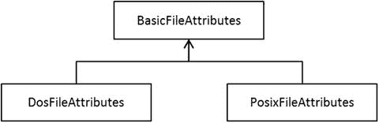

# 十、Java 文件 NIO.2

 
| 认证目标 |
| --- |
| 使用路径接口操作文件和目录路径 |
| 使用 Files 类来检查、读取、删除、复制、移动和管理文件或目录的元数据 |
| 将流 API 与 NIO.2 一起使用 |

Java 提供了一组丰富的 API，可以用来操作文件和目录。Java 7 引入了一组称为 NIO.2 的 I/O API，提供了执行与文件系统相关的操作的便捷方式。在 Java 8 中，你可以在 NIO.2 中使用 Stream API(在第 6 章的[中讨论过)](06.html)

前一章介绍了 I/O 基础知识；您学习了如何从控制台读取和写入，以及如何使用流读取和写入文件。在本章中，您将学习如何使用`Path`界面对文件和目录路径进行操作。您还将学习使用`Files`类执行各种文件操作，比如创建、移动、复制和删除。最后，您将看到如何在 NIO.2 中使用流 API。本章使用了`java.util.function`包中的函数式接口和`java.util.stream`包中的流 API，我们假设您在阅读本章之前已经阅读了[第 3 章](03.html)、[第 4 章](04.html)、[第 5 章](05.html)和[第 6 章](06.html)。

我们给出了文件和目录路径，假设您使用的是 Windows 机器。如果您在 Linux、Mac OS 或任何其他平台上，您可能需要对路径名进行一些小的更改，以便程序能够在您的机器上运行。

## 使用路径接口

  
| 认证目标 | 使用路径接口操作文件和目录路径 |

文件系统通常形成一棵树。文件系统从包含文件和目录(目录在 Windows 中也称为文件夹)的根目录开始。每个目录又可以有子目录或保存文件。要定位一个文件，您只需要把从根目录到包含该文件的直接目录的目录放在一起，加上一个文件分隔符，后跟文件名。例如，如果`myfile.txt`文件驻留在`mydocs`目录中，而后者驻留在根目录`C:\`中，那么文件的路径就是`C:\mydocs\myfile.txt`。每个文件都有一个唯一的路径来定位它(除了符号链接)。

路径可以是从根元素开始的绝对路径(比如`C:\mydocs\myfile.txt`)。另一方面，路径可以被指定为相对路径。当你试图编译一个 Java 程序时，你会写出类似于`javac programFileName.jav`a；此示例指定了相对于当前选定目录的 Java 源文件路径，因此这是一个相对路径。您需要一个引用路径(比如本例中的当前目录路径)来解释相对路径。

在继续之前，我们先来谈谈符号链接。符号链接就像指向实际文件的指针或引用。一般来说，符号链接对应用是透明的，这意味着操作是直接在文件上执行的，而不是在链接上执行的(当然，特定于符号链接的操作除外)。

接口是路径的编程抽象。path 对象包含构成由`Path`对象表示的文件/目录的完整路径的目录和文件的名称；`Path`抽象提供了提取路径元素、操作它们和添加它们的方法。稍后您会看到，几乎所有访问文件/目录以获取有关它们的信息或操纵它们的方法都使用了`Path`对象。表 [10-1](#Tab1) 总结了该接口中的重要方法。

表 10-1。

Important Methods in the `Path` Interface

  
| 方法 | 描述 |
| --- | --- |
| `Path getRoot()` | 返回一个代表给定路径根的`Path`对象，如果路径没有根，则返回 null。 |
| `Path getFileName()` | 返回给定路径的文件名或目录名。请注意，文件/目录名是给定路径中的最后一个元素或名称。 |
| `Path getParent()` | 返回代表给定路径的父对象的`Path`对象，如果该路径不存在父组件，则返回 null。 |
| `int getNameCount()` | 返回给定路径中文件/目录名的数量；如果给定路径代表根，则返回 0。 |
| `Path getName(int index)` | 返回第 I 个文件/目录名；索引 0 从离根最近的名称开始。 |
| `Path subpath(int beginIndex, int endIndex)` | 返回属于此`Path`对象的一部分的`Path`对象；返回的`Path`对象的名字从`beginIndex`开始，到索引`endIndex - 1`的元素结束。换句话说，`beginIndex`包含该索引中的名称，不包含`endIndex`中的名称。如果`beginIndex`是> =元素个数，或者`endIndex <= beginIndex`，或者`endIndex` >元素个数，这个方法可能会抛出`IllegalArgumentException`。 |
| `Path normalize()` | 删除路径中的冗余元素，如`.`(表示当前目录的点符号)和`..`(表示父目录的双点符号)。 |
| `Path resolve(Path other)` `Path resolve(String other)` | 根据给定路径解析路径。例如，此方法可以将给定路径与另一个路径组合起来，并返回结果路径。 |
| `Boolean isAbsolute()` | 如果给定路径是绝对路径，则返回 true 否则返回 false(例如，当给定路径是相对路径时)。 |
| `Path startsWith(String path)` `Path startsWith(Path path)` | 如果这个`Path`对象以给定的`path`开始，则返回 true，否则返回 false。 |
| `Path toAbsolutePath()` | 返回绝对路径。 |

### 获取路径信息

让我们创建一个`Path`对象，并检索与该对象相关的基本信息。清单 [10-1](#FPar1) 展示了如何创建一个`Path`对象并获取关于它的信息。

Listing 10-1\. `PathInfo1.java`

```java
import java.nio.file.Path;

import java.nio.file.Paths;

// Class to illustrate how to use Path interface and its methods

public class PathInfo1 {

public static void main(String[] args) {

// create a Path object by calling static method get() in Paths class

Path testFilePath = Paths.get("D:\\test\\testfile.txt");

// retrieve basic information about path

System.out.println("Printing file information: ");

System.out.println("\t file name: " + testFilePath.getFileName());

System.out.println("\t root of the path: " + testFilePath.getRoot());

System.out.println("\t parent of the target: " + testFilePath.getParent());

// print path elements

System.out.println("Printing elements of the path: ");

for(Path element : testFilePath) {

System.out.println("\t path element: " + element);

}

}

}
```

该程序打印以下内容:

```java
Printing file information:

file name: testfile.txt

root of the path: D:\

parent of the target: D:\test

Printing elements of the path:

path element: test

path element: testfile.txt
```

输出是不言自明的。让我们来看看这个程序:

*   首先，使用`Paths`类的`get()`方法创建一个`Path`实例。`get()`方法期望一个代表路径的`string`作为输入。这是创建一个`Path`对象最简单的方法。
*   请注意，您在`Paths.get("D:\\test\\testfile.txt")`中使用了转义字符(`\`)。在路径中，如果你给了`D:\test`，那么`\t`就意味着一个制表符，当你运行程序时你会得到一个`java.nio.file.InvalidPathException`。确保在路径字符串中提供必要的转义字符。
*   使用`Path`对象的`getFilename()`方法提取由这个`Path`对象表示的文件名。
*   您还可以使用`getRoot()`来获取`Path`对象的根元素，使用`getParent()`来获取目标文件的父目录。
*   使用一个`for`循环迭代路径中的元素。或者，您可以使用`getNameCount()`来获得路径中元素或名称的数量，使用`getName(index)`来逐个迭代和访问元素/名称。

让我们试试另一个例子。它探索了一个`Path`对象的一些有趣的方面，比如如何从一个相对路径获得一个绝对路径，以及如何规范化一个路径。在看这个例子之前，您需要首先理解它使用的方法:

*   `The` `toUri()`方法从路径中返回 URI(可以从浏览器打开的路径)。
*   `The` `toAbsolutePath()`方法从给定的相对路径中返回绝对路径。如果输入路径已经是绝对路径，则该方法返回相同的对象。
*   `normalize()`方法在输入路径上执行标准化。换句话说，它从`Path`对象中删除了不必要的符号(如`.`和`..`)。
*   `toRealPath()`是一个有趣的方法。它从输入路径对象返回一个绝对路径(如`toAbsolutepath()`)。它也使路径正常化(如在`normalize()`)。此外，如果链接选项选择得当，它可以解析符号链接。但是，目标文件/目录必须存在于文件系统中，这不是其他`Path`方法的先决条件。

清单 [10-2](#FPar2) 展示了这个例子。假设文件名`Test`在您的文件系统中不存在。

Listing 10-2\. `PathInfo2.java`

```java
import java.io.IOException;

import java.nio.file.LinkOption;

import java.nio.file.Path;

import java.nio.file.Paths;

// To illustrate important methods such as normalize(), toAbsolutePath(), and toRealPath()

class PathInfo2 {

public static void main(String[] args) throws IOException {

// get a path object with relative path

Path testFilePath = Paths.get(".\\Test");

System.out.println("The file name is: " + testFilePath.getFileName());

System.out.println("Its URI is: " + testFilePath.toUri());

System.out.println("Its absolute path is: " + testFilePath.toAbsolutePath());

System.out.println("Its normalized path is: " + testFilePath.normalize());

// get another path object with normalized relative path

Path testPathNormalized = Paths.get(testFilePath.normalize().toString());

System.out.println("Its normalized absolute path is: " +

testPathNormalized.toAbsolutePath());

System.out.println("Its normalized real path is: " +

testFilePath.toRealPath (LinkOption.NOFOLLOW_LINKS));

}

}
```

在我们的机器上，该代码打印了以下内容:

```java
The file name is: Test

Its URI is: file:///D:/OCPJP/programs/NIO2/./Test

Its absolute path is: D:\OCPJP\programs\NIO2\.\Test

Its normalized path is: Test

Its normalized absolute path is: D:\OCPJP\programs\NIO2\Test

Exception in thread "main" java.nio.file.NoSuchFileException: D:\OCPJP\programs\NIO2\Test

at sun.nio.fs.WindowsException.translateToIOException(WindowsException.java:79)

[... stack trace elided ...]

at PathInfo2.main(PathInfo2.java:16)
```

根据运行该程序的目录，目录路径会有所不同。这个程序使用相对路径实例化一个`Path`对象。方法`getFileName()`返回目标文件名，正如您在上一个例子中看到的。`getUri()`方法返回可用于浏览器的 URI，`toAbsolutePath()`方法返回给定相对路径的绝对路径。(注意，我们正在执行来自`D:/OCPJP/programs/NIO2/`文件夹的程序；因此，它成为当前的工作目录，并出现在绝对路径和 URI。)

您调用`normalize()`方法来删除路径中的冗余符号，因此它删除了前导点。(在很多操作系统中，`.`【单点符号】代表当前目录，`..`【双点】代表父目录。)然后使用规范化输出实例化另一个`Path`对象，并再次打印绝对路径。最后，您尝试调用`toRealpath();`，但是，您得到一个异常(`NoSuchFileException`)。为什么呢？因为，你还没有在当前工作目录下创建`Test`目录。

现在，让我们在`D:/OCPJP/programs/NIO2/`目录中创建一个`Test`目录，并再次运行这个例子。我们得到了以下输出:

```java
The file name is: Test

Its URI is: file:///D:/OCPJP/programs/NIO2/./Test/

Its absolute path is: D:\OCPJP\programs\NIO2\.\Test

Its normalized path is: Test

Its normalized absolute path is: D:\OCPJP\programs\NIO2\Test

Its normalized real path is: D:\OCPJP\programs\NIO2\Test
```

现在对`toRealPath()`的最后一次调用工作正常，并返回绝对规范化路径。

`Path`提供了许多其他有用的方法，包括之前在表 [10-1](#Tab1) 中列出的那些方法。例如，下面是如何使用`resolve()`方法:

```java
Path dirName = Paths.get("D:\\OCPJP\\programs\\NIO2\\");

Path resolvedPath = dirName.resolve("Test");

System.out.println(resolvedPath);
```

这段代码显示了以下内容:

```java
D:\OCPJP\programs\NIO2\Test
```

这个`resolve()`方法认为给定的路径是一个目录，并将传递的路径与其连接(解析),如下所示。

`java.io.File`类中的`toPath()`方法返回`Path`对象；这个方法是在 Java 7 中添加的。同样，您可以使用`Path`接口中的`toFile()`方法来获得一个`File`对象。

### 比较两条路径

`Path`接口提供了两种方法来比较两个`Path`对象:`equals()`和`compareTo()`。`equals()`方法检查`two Path`对象的相等性并返回一个`Boolean`值，而`compareTo()`逐字符比较两个`Path`对象并返回一个整数:0，如果两个`Path`对象相等；如果此路径在字典上小于参数路径，则为负整数；如果该路径在字典上大于参数路径，则为正整数。清单 [10-3](#FPar3) 包含了一个演示这些方法的小程序。

Listing 10-3\. `PathCompare1.java`

```java
import java.nio.file.Path;

import java.nio.file.Paths;

// illustrates how to use compareTo and equals and also shows

// the difference between the two methods

class PathCompare1 {

public static void main(String[] args) {

Path path1 = Paths.get("Test");

Path path2 = Paths.get("D:\\OCPJP\\programs\\NIO2\\Test");

// comparing two paths using compareTo() method

System.out.println("(path1.compareTo(path2) == 0) is: "

+ (path1.compareTo(path2) == 0));

// comparing two paths using equals() method

System.out.println("path1.equals(path2) is: " + path1.equals(path2));

// comparing two paths using equals() method with absolute path

System.out.println("path2.equals(path1.toAbsolutePath()) is "

+ path2.equals(path1.toAbsolutePath()));

}

}
```

有意地，一个路径是相对路径，另一个是绝对路径。假设您执行这个程序的当前目录是`D:\\OCPJP\\programs\\NIO2\\Test`。你能猜出程序的输出吗？

内容如下:

```java
(path1.compareTo(path2) == 0) is: false

path1.equals(path2) is: false

path2.equals(path1.toAbsolutePath()) is true
```

让我们一步一步地检查这个程序:

*   它首先使用`compareTo()`方法比较两个路径，逐字符比较路径并返回一个整数。在这种情况下，因为一个路径是相对路径，另一个是绝对路径，所以您首先会得到一条消息，指出这两个路径不相等。
*   然后使用`equals()`比较两条路径。结果是一样的，这意味着即使两个`Path`对象指向同一个文件/目录，`equals()`也有可能返回 false。您需要确保两个路径都是绝对路径。
*   在下一步中，您将相对路径转换为绝对路径，然后使用`equals()`比较它们。这一次两条路径都匹配。

即使两个`Path`对象指向同一个文件/目录，也不能保证`equals()`方法会返回 true。您需要确保两者都是绝对的和规范化的路径，以便路径的相等比较成功。

## 使用文件类

  
| 认证目标 | 使用 Files 类来检查、读取、删除、复制、移动和管理文件或目录的元数据 |

上一节讨论了如何创建一个`Path`实例并从中提取有用的信息。在本节中，您将使用`Path`对象来操作文件/目录。Java 7 提供了一个`Files`类(在`java.nio.file`包中),可以用来对文件或目录执行各种与文件相关的操作。注意`Files`是一个实用类，这意味着它是一个带有私有构造函数的最终类，并且只包含静态方法。所以你可以通过调用它提供的静态方法来使用`Files`类，比如`copy()`来复制文件。这个类提供了广泛的功能。您可以创建目录、文件或符号链接。创建流，如目录流、字节通道和输入/输出流；检查文件的属性；遍历文件树；并执行文件操作，如读、写、复制和删除。表 [10-2](#Tab2) 提供了`Files`类中重要方法的示例。

表 10-2。

Some Important Methods in the `Files` Class

  
| 方法 | 描述 |
| --- | --- |
| `Path createDirectory(Path dirPath, FileAttribute<?>... dirAttrs)` `Path createDirectories(Path dir, FileAttribute<?>... attrs)` | 创建一个由`dirPath`给出的文件，并设置由`dirAttributes`给出的属性。可能会抛出一个异常，比如`FileAlreadyExistsException`或者`UnsupportedOperationException`(比如文件属性不能按照`dirAttrs`给的那样设置)。`createDirectory`和`createDirectories`的区别在于`createDirectories`会创建由`dirPath`给出的中间目录，如果它们还不存在的话。 |
| `Path createTempFile(Path dir, String prefix, String suffix, FileAttribute<?>... attrs)` | 在由`dir`给出的目录中用给定的前缀、后缀和属性创建一个临时文件。 |
| `Path createTempDirectory(Path dir, String prefix, FileAttribute<?>... attrs)` | 在由`dir`指定的路径中用给定的前缀和目录属性创建一个临时目录。 |
| `Path copy(Path source, Path target, CopyOption... options)` | 将文件从源复制到目标。`CopyOption`可以是 REPLACE_EXISTING，COPY_ATTRIBUTES，或者 NOFOLLOW_LINKS。可以抛出`FileAlreadyExistsException`之类的异常。 |
| `Path move(Path source, Path target, CopyOption... options)` | 类似于`copy`操作，但是源文件被删除。如果源和目标在同一个目录中，这是一个文件重命名操作。 |
| `boolean isSameFile(Path path, Path path2)` | 检查两个`Path`对象是否定位同一个文件。 |
| `boolean exists(Path path, LinkOption... options)` | 检查给定路径中是否存在文件/目录；可以指定`LinkOption.NOFOLLOW_LINKS`不跟随符号链接。 |
| `Boolean isRegularFile(Path path, LinkOption...)` | 如果由`path`表示的文件是常规文件，则返回 true。 |
| `Boolean isSymbolicLink(Path path)` | 如果由`path`表示的文件是一个符号链接，则返回 true。 |
| `Boolean isHidden(Path path)` | 如果由`path`表示的文件是隐藏文件，则返回 true。 |
| `long size(Path path)` | 返回由`path`表示的文件的大小，以字节为单位。 |
| `UserPrincipal getOwner(Path path, LinkOption...), Path setOwner(Path path, UserPrincipal owner)` | 获取/设置文件的所有者。 |
| `FileTime getLastModifiedTime(Path path, LinkOption...), Path setLastModifiedTime(Path path, FileTime time)` | 获取/设置指定文件的上次修改时间。 |
| `Object getAttribute(Path path, String attribute, LinkOption...), Path setAttribute(Path path, String attribute, Object value, LinkOption...)` | 获取/设置指定文件的指定属性。 |

### 检查文件属性和元数据

在前面关于`Path`接口的部分中，您试图判断两个路径是否指向同一个文件(参见清单 [10-3](#FPar3) )。有另一种方法可以发现同样的事情:您可以使用来自`Files`类的`isSameFile()`方法。清单 [10-4](#FPar4) 展示了如何做到这一点。

Listing 10-4\. `PathCompare2.java`

```java
import java.io.IOException;

import java.nio.file.Files;

import java.nio.file.Path;

import java.nio.file.Paths;

// illustrates how to use Files class to compare two paths

class PathCompare2 {

public static void main(String[] args) throws IOException {

Path path1 = Paths.get("Test");

Path path2 = Paths.get("D:\\OCPJP\\programs\\NIO2\\Test");

System.out.println("Files.isSameFile(path1, path2) is: "

+ Files.isSameFile(path1, path2));

}

}
```

假设您的计算机上存在目录 D:\ \ OCPJP \ \程序\ \ NIO2 \ \测试。该程序打印以下内容:

```java
Files.isSameFile(path1, path2) is: true
```

在这种情况下，路径`D:\OCPJP\programs\NIO2\`中有`Test`目录，所以代码工作正常。

如果给定的路径中不存在`Test`文件/目录，就会得到一个`NoSuchFileException`。但是，如何判断给定路径上是否存在文件/目录呢？`Files`类提供了`exists()`方法来做到这一点。您还可以使用来自`Files`类的`isDirectory()`方法来区分文件和目录。清单 [10-5](#FPar5) 使用了这些方法。

Listing 10-5\. `PathExists.java`

```java
import java.nio.file.Files;

import java.nio.file.LinkOption;

import java.nio.file.Path;

import java.nio.file.Paths;

class PathExists {

public static void main(String[] args) {

Path path = Paths.get(args[0]);

if(Files.exists(path, LinkOption.NOFOLLOW_LINKS)) {

System.out.println("The file/directory " + path.getFileName() + " exists");

// check whether it is a file or a directory

if(Files.isDirectory(path, LinkOption.NOFOLLOW_LINKS)) {

System.out.println(path.getFileName() + " is a directory");

}

else {

System.out.println(path.getFileName() + " is a file");

}

}

else {

System.out.println("The file/directory " + path.getFileName()

+ " does not exist");

}

}

}
```

这个程序从命令行接受一个文件/目录名，并创建一个`Path`对象。然后，使用来自`Files`类的`exists()`方法来找出文件/目录是否存在。`exists()`方法的第二个参数是 link option，用于指定是否跟随符号链接；在这种情况下，您没有跟踪符号链接。如果与输入路径相关联的文件/目录存在，那么使用`Files`类的`isDirectory()`方法检查输入路径指示的是文件还是目录。

我们用两个不同的命令行参数运行这个程序，得到了下面的输出(假设`PathExists.java`存储在目录`D:\OCPJP\programs\NIO2\src`中):

```java
D:\OCPJP\programs\NIO2\src>java PathExists PathExists.java

The file/directory PathExists.java exists

PathExists.java is a file

D:\OCPJP\programs\NIO2\src>java PathExists D:\OCPJP\

The file/directory OCPJP exists

OCPJP is a directory

D:\OCPJP\programs\NIO2\src>java PathExists D:\

The file/directory null exists

null is a directory
```

在这个输出中，您可能已经注意到了根目录名(在本例中是 Windows 中的驱动器名)作为参数给出时的行为。根目录名是一个目录，但是如果路径是根目录名的话,`path.getFileName()`返回 null 这就是结果。

基于您的凭据，现有文件可能不允许您读取、写入或执行。您可以检查程序以编程方式读取、写入或执行的能力。`Files`类提供了方法`isReadable()`、`isWritable()`和`isExecutable()`来实现这一点。清单 [10-6](#FPar6) 使用了这些方法:为这个程序创建一个名为`readonly.txt`的文件，其权限是可读可执行但不可写。

Listing 10-6\. FilePermissions.java

```java
import java.nio.file.Files;

import java.nio.file.Path;

import java.nio.file.Paths;

class FilePermissions {

public static void main(String[] args) {

Path path = Paths.get(args[0]);

System.out.printf( "Readable: %b, Writable: %b, Executable: %b ",

Files.isReadable(path), Files.isWritable(path), Files.isExecutable(path));

}

}
```

让我们用两个不同的输入来执行这个程序。以下是输出:

```java
D:\OCPJP\programs\NIO2\src>java FilePermissions readonly.txt

Readable: true, Writable: false, Executable: true

D:\OCPJP\programs\NIO2\src>java FilePermissions FilePermissions.java

Readable: true, Writable: true, Executable: true
```

对于`readonly.txt`文件，权限是可读和可执行的，但不可写。文件`FilePermissions.java`拥有所有三种权限:可读、可写和可执行。

您可以使用许多其他方法来获取文件属性。让我们使用`getAttribute()`方法来获取文件的一些属性。该方法接受可变数量的参数:一个`Path`对象、一个属性名和链接选项(参见清单 [10-7](#FPar7) )。

Listing 10-7\. `FileAttributes.java`

```java
import java.io.IOException;

import java.nio.file.Files;

import java.nio.file.LinkOption;

import java.nio.file.Path;

import java.nio.file.Paths;

class FileAttributes {

public static void main(String[] args) {

Path path = Paths.get(args[0]);

try {

Object object = Files.getAttribute(path, "creationTime",

LinkOption.NOFOLLOW_LINKS);

System.out.println("Creation time: " + object);

object = Files.getAttribute(path, "lastModifiedTime", LinkOption.NOFOLLOW_LINKS);

System.out.println("Last modified time: " + object);

object = Files.getAttribute(path, "size", LinkOption.NOFOLLOW_LINKS);

System.out.println("Size: " + object);

object = Files.getAttribute(path, "dos:hidden", LinkOption.NOFOLLOW_LINKS);

System.out.println("isHidden: " + object);

object = Files.getAttribute(path, "isDirectory", LinkOption.NOFOLLOW_LINKS);

System.out.println("isDirectory: " + object);

} catch (IOException e) {

e.printStackTrace();

}

}

}
```

让我们首先通过给出这个程序的名字来执行这个程序，然后看看会发生什么:

```java
D:\> java FileAttributes FileAttributes.java

Creation time: 2012-10-06T10:20:10.34375Z

Last modified time: 2012-10-06T10:21:54.859375Z

Size: 914

isHidden: false

isDirectory: false
```

这个例子中棘手的部分是`getAttribute()`方法的第二个参数。您需要提供正确的属性名来提取相关的值。应该以`view:attribute`格式指定期望的字符串，其中`view`是`FileAttributeView`的类型，`attribute`是`view`支持的属性的名称。如果没有指定`view`，则假定为`basic`。在这种情况下，您指定属于一个基本视图的所有属性，除了来自`dos`视图的一个属性。如果没有指定正确的视图名，就会得到一个`UnsupportedOperationException`；如果你弄乱了属性名，你会得到一个`IllegalArgumentException`。

例如，如果您键入 size 而不是 size，您将得到以下异常:

```java
Exception in thread "main" java.lang.IllegalArgumentException: 'sized' not recognized

[...stack trace elided...]
```

现在，您知道了如何使用`getAttribute()`方法读取与文件相关的元数据。然而，如果您想要读取许多属性，为每个属性调用`getAttribute()`可能不是一个好主意(从性能的角度来看)。在这种情况下，Java 7 提供了一个解决方案:一个 API——`readAttributes()`——一次性读取属性。API 有两种风格:

```java
Map<String,Object> readAttributes(Path path, String attributes, LinkOption... options)

<A extends BasicFileAttributes> A readAttributes(Path path, Class<A> type, LinkOption... options)
```

第一个方法返回一个属性-值对的`Map`,并接受可变长度的参数。`attributes`参数是关键参数，您可以在其中指定想要检索的内容。该参数类似于您在`getAttribute()`方法中使用的参数；但是，这里可以指定一个属性列表，也可以使用星号(`*`)来指定所有属性。例如，使用`*`表示默认`FileAttributeView`的所有属性，如`BasicFileAttributes`(指定为基本档案属性)。再比如`dos:*`，指 dos 文件属性的所有属性。

第二种方法使用通用语法([第 4 章](04.html))。这里的第二个参数从`BasicFileAttributes`层次结构中获取一个类，稍后将对此进行讨论。该方法从`BasicFileAttributes`层次结构中返回一个实例。

文件属性层次结构如图 [10-1](#Fig1) 所示。`BasicFileAttributes`是派生`DosFileAttributes`和`PosixFileAttributes`的基础接口。注意这些属性接口是在`java.nio.file.attribute`包中提供的。



图 10-1。

The hierarchy of `BasicFileAttributes`

如你所见，`BasicFileAttributes`接口定义了所有通用平台支持的基本属性。但是，特定的平台定义了自己的文件属性，这些属性由`DosFileAttributes`和`PosixFileAttributes`捕获。您可以指定这些接口中的任何一个来检索相关的文件属性。清单 [10-8](#FPar8) 包含一个使用`BasicFileAttributes`获取文件所有属性的程序。

Listing 10-8\. `FileAttributes2.java`

```java
import java.io.IOException;

import java.nio.file.Files;

import java.nio.file.Path;

import java.nio.file.Paths;

import java.nio.file.attribute.BasicFileAttributes;

class FileAttributes2 {

public static void main(String[] args) {

Path path = Paths.get(args[0]);

try {

BasicFileAttributes fileAttributes =

Files.readAttributes(path, BasicFileAttributes.class);

System.out.println("File size: " + fileAttributes.size());

System.out.println("isDirectory: " + fileAttributes.isDirectory());

System.out.println("isRegularFile: " + fileAttributes.isRegularFile());

System.out.println("isSymbolicLink: " + fileAttributes.isSymbolicLink());

System.out.println("File last accessed time: " + fileAttributes.lastAccessTime());

System.out.println("File last modified time: " +

fileAttributes.lastModifiedTime());

System.out.println("File creation time: " + fileAttributes.creationTime());

} catch (IOException e) {

e.printStackTrace();

}

}

}
```

以下是该程序的一些示例输出:

```java
D:\>java FileAttributes2 FileAttributes2.java

File size: 904

isDirectory: false

isRegularFile: true

isSymbolicLink: false

File last accessed time: 2012-10-06T10:28:29.0625Z

File last modified time: 2012-10-06T10:28:22.4375Z

File creation time: 2012-10-06T10:26:39.1875Z
```

您使用`readAttribute()`方法和`BasicFileAttributes`来检索基本的文件属性。类似地，您可以分别使用`DosFileAttributes`和`PosixFileAttributes`在 DOS 或 Unix 环境中检索与文件相关的属性。

### 复制文件

现在让我们试着将一个文件/目录从一个位置复制到另一个位置。这个任务很容易完成:只需调用`Files.copy()`将文件从源复制到目标。下面是这个方法的签名:

```java
Path copy(Path source, Path target, CopyOption... options)
```

清单 [10-9](#FPar9) 使用这种方法编写了一个简单的文件复制程序。

Listing 10-9\. `FileCopy.java`

```java
import java.io.IOException;

import java.nio.file.Files;

import java.nio.file.Path;

import java.nio.file.Paths;

public class FileCopy {

public static void main(String[] args) {

if(args.length != 2){

System.out.println("usage: FileCopy <source-path> <destination-path>");

System.exit(1);

}

Path pathSource = Paths.get(args[0]);

Path pathDestination = Paths.get(args[1]);

try {

Files.copy(pathSource, pathDestination);

System.out.println("Source file copied successfully");

} catch (IOException e) {

e.printStackTrace();

}

}

}
```

让我们执行它，看看它是否有效。

```java
D:\> java FileCopy FileCopy.java Backup.java

Source file copied successfully
```

是的，起作用了。尝试使用相同的参数再次运行它:

```java
D:\OCPJP\programs\NIO2\src>java FileCopy FileCopy.java Backup.java

java.nio.file.FileAlreadyExistsException: Backup.java

at sun.nio.fs.WindowsFileCopy.copy(Unknown Source)

[...stack trace elided...]
```

哎呀！发生了什么事？当您第二次尝试复制文件时，您会得到一个`FileAlreadyExistsException`,因为目标文件已经存在。如果你想覆盖现有的文件呢？解决方案:您需要告诉`copy()`方法您想要覆盖一个现有的文件。在清单 [10-9](#FPar9) 中，将`copy()`修改如下:

```java
Files.copy(pathSource, pathDestination, StandardCopyOption.REPLACE_EXISTING);
```

您指定一个额外的参数(因为`copy()`方法支持可变参数)来告诉该方法您想要覆盖一个已经存在的文件。运行这个程序，看看它是否工作:

```java
D:\>java FileCopy FileCopy.java Backup.java

Source file copied successfully

D:\>java FileCopy FileCopy.java Backup.java

Source file copied successfully
```

是的，它有效。现在，尝试将文件复制到新目录:

```java
D:\OCPJP\programs\NIO2\src>java FileCopy FileCopy.java bak\Backup.java

java.nio.file.NoSuchFileException: FileCopy.java -> bak\Backup.java

[...stack trace elided ...]
```

这里，您试图将一个文件复制回一个不存在的目录。所以，你得到了`NoSuchFileException`。不仅仅是给定的目录，路径上的所有中间目录都必须存在，这样`copy()`方法才能成功。

指定路径上的所有目录(除了最后一个，如果你正在复制一个目录)必须存在，以避免`NoSuchFileException`。

如果你试着复制一个目录呢？它可以工作，但是记住它只会复制顶层目录，而不会复制该目录中包含的文件/目录。

如果使用`copy()`方法复制一个目录，它不会复制源目录中包含的文件/目录；您需要显式地将它们复制到目标文件夹。

### 移动文件

移动文件类似于复制文件；为此，您可以使用`Files.move()`方法。此方法的签名如下:

```java
Path move(Path source, Path target, CopyOption... options)
```

清单 10-10 包含了一个使用这种方法的小程序。注意，一旦`move()`方法成功执行，源文件就不再存在。

Listing 10-10\. `FileMove.java`

```java
import java.io.IOException;

import java.nio.file.Files;

import java.nio.file.Path;

import java.nio.file.Paths;

import java.nio.file.StandardCopyOption;

public class FileMove {

public static void main(String[] args) {

if(args.length != 2){

System.out.println("usage: FileMove <source-path> <destination-path>");

System.exit(-1);

}

Path pathSource = Paths.get(args[0]);

Path pathDestination = Paths.get(args[1]);

try {

Files.move(pathSource, pathDestination, StandardCopyOption.REPLACE_EXISTING);

System.out.println("Source file moved successfully");

} catch (IOException e) {

e.printStackTrace();

}

}

}
```

这个程序是这样执行的(假设当前目录中存在一个名为`text.txt`的文件):

```java
D:\OCPJP\programs\NIO2\src> java FileMove text.txt newtext.txt

Source file moved successfully
```

以下是对`move()`方法的一些观察:

*   像`copy()`方法一样，`move()`方法不会覆盖现有的目标文件，除非您使用`REPLACE_EXISTING`指定它应该这样做。
*   如果移动符号链接，则移动的是链接本身，而不是链接的目标文件。需要注意的是，在`copy()`的情况下，如果你指定一个符号链接，链接的目标被复制，而不是链接本身。
*   如果移动目录不需要移动包含的文件/目录，则可以移动非空目录。例如，将一个目录从一个物理驱动器移动到另一个可能不成功(将抛出一个`IOException`)。如果移动目录成功，那么所有包含的文件/目录也会被移动。
*   您可以使用`ATOMIC_MOVE`复制选项将`move()`指定为原子操作。当您指定原子移动时，可以确保移动成功完成或源继续存在。如果`move()`作为非原子操作执行，并且在执行过程中失败，那么两个文件的状态都是未知和未定义的。

### 删除文件

`Files`类提供了一个`delete()`方法来删除一个文件/目录/符号链接。清单 [10-11](#FPar11) 包含一个删除指定文件的简单程序。

Listing 10-11\. `FileDelete.java`

```java
import java.io.IOException;

import java.nio.file.Files;

import java.nio.file.Path;

import java.nio.file.Paths;

public class FileDelete {

public static void main(String[] args) {

if(args.length != 1){

System.out.println("usage: FileDelete <source-path>");

System.exit(1);

}

Path pathSource = Paths.get(args[0]);

try {

Files.delete(pathSource);

System.out.println("File deleted successfully");

} catch (IOException e) {

e.printStackTrace();

}

}

}
```

它在执行时打印以下内容:

```java
D:\> java FileDelete log.txt

File deleted successfully
```

使用`Files.delete()`方法时有几点需要记住。在目录的情况下，应该在空目录上调用`delete()`方法；否则，该方法将失败。在符号链接的情况下，删除的是链接，而不是链接的目标文件。您要删除的文件必须存在；否则你会得到一个`NoSuchFileException`。如果您静默删除一个文件，并且不想被这个异常所困扰，那么您可以使用`deleteIfExists()`方法，如果文件不存在，它不会报错，如果文件存在，它会删除文件。此外，如果文件是只读的，某些平台可能会阻止您删除该文件。

#### 要记住的要点

记住这些要点，帮助你通过 OCPJP 八级考试。

*   不要混淆`File`和`Files`，以及`Paths`的路径:它们是不同的。`File`是一个旧类(Java 4 ),表示文件/目录路径名，而`Files`是 Java 7 中引入的一个实用类，对 I/O API 有全面的支持。`Path`接口表示一个文件/目录路径，并定义了一个有用的方法列表。然而，`Paths`类是一个只提供两种方法的实用程序类(都是为了获取`Path`对象)。
*   由`Path`对象表示的文件或目录可能不存在。除了像`toRealPath()`这样的方法之外，`Path`中的方法不需要为`Path`对象提供底层文件或目录。
*   您学习了如何对文件/目录执行复制。但是，没有必要只对两个文件/目录执行复制。您可以从一个`InputStream`获取输入并写入一个文件，或者您可以从一个文件获取输入并复制到一个`OutputStream`。这里可以使用`copy(InputStream, Path, CopyOptions...)`和`copy(Path, OutputStream, CopyOptions...)`两种方法。

## 在 NIO.2 中使用流 API

  
| 认证目标 | 将流 API 与 NIO.2 一起使用 |

Java 8 中对 JDK 的大量增强简化了使用 NIO.2 的编程。本节讨论 Java 8 中对`java.nio`包的一些重要增强。

### 在 Files 类中使用 list()方法

让我们首先使用 Java 8 中添加的`Files.list()`方法来列出当前目录中的所有文件(参见清单 [10-12](#FPar12) )。在底层，它使用了一个`DirectoryStream`，因此必须调用`close()`方法来释放 I/O 资源。这个程序使用带有自动关闭流的`try-with-resources`语句的流。

Listing 10-12\. `ListFiles.java`

```java
import java.nio.file.Files;

import java.nio.file.Path;

import java.nio.file.Paths;

import java.io.IOException;

import java.util.stream.Stream;

class ListFiles {

public static void main(String []args) throws IOException {
```

`try(Stream<Path> entries = Files.``list``(Paths.``get`T4】

`entries.forEach(System.``out`T2】

```java
}

}

}
```

它打印了当前目录中的文件:

```java
./ListFiles.class

./ListFiles.java

... (rest of the output elided)
```

`list()`方法声明如下:

```java
static Stream<Path> list(Path dir) throws IOException
```

因为`list()`方法返回一个`Stream`，所以您可以使用`Stream`接口中提供的众多方法中的任何一种，包括`map()`、`filter()`、`findFirst()`、`findAny()`、`distinct()`、`sorted()`、`allMatch()`、`noneMatch()`和`anyMatch()`。

这段代码是清单 [10-12](#FPar12) 的修改版本，它打印文件的绝对路径:

```java
Files.list(Paths.get("."))

.map(path -> path.toAbsolutePath())

.forEach(System.out::println);
```

结果如下:

```java
D:\OCPJP\NIO2\src\ListFiles.class

D:\OCPJP\NIO2\src\ListFiles.java

... (rest of the output elided)
```

注意，`list()`方法不会递归地遍历给定的`Path`中的条目。要递归地遍历目录，可以使用`Files.walk()`方法:

```java
Files.walk(Paths.get(".")).forEach(System.out::println);
```

`Files.walk()`方法是一个重载方法:

```java
static Stream<Path> walk(Path path, FileVisitOption... options) throws IOException

static Stream<Path> walk(Path path, int maxDepth, FileVisitOption... options) throws IOException
```

`FileVisitOption`有一个枚举值:`FileVisitOption.FOLLOW_LINKS`。你可以把它传递给`walk()`方法。您还可以指定`maxDepth`:递归遍历目录条目的嵌套层次的限制(参见清单 [10-13](#FPar13) )。

Listing 10-13\. `CountEntriesRecur.java`

```java
import java.nio.file.FileVisitOption;

import java.nio.file.Files;

import java.nio.file.Path;

import java.nio.file.Paths;

import java.io.IOException;

import java.util.stream.Stream;

class CountEntriesRecur {

public static void main(String []args) throws IOException {

try(Stream<Path> entries =

Files.walk(Paths.get("."), 4, FileVisitOption.FOLLOW_LINKS)) {

long numOfEntries = entries.count();

System.out.printf("Found %d entries in the current path", numOfEntries);

}

}

}
```

在我们的机器上，这个程序打印了以下内容:

```java
Found 179 entries in the current path
```

这段代码将嵌套深度限制为 4，作为`Files.walk()`方法的第二个参数。

最后，让我们使用`Files.` `find()`方法列出符合给定条件的文件(列出 [10-14](#FPar14) )。

Listing 10-14\. `FindFiles.java`

```java
import java.nio.file.Files;

import java.nio.file.Path;

import java.nio.file.Paths;

import java.io.IOException;

import java.nio.file.attribute.BasicFileAttributes;

import java.util.function.BiPredicate;

import java.util.stream.Stream;

class FindFiles {

public static void main(String []args) throws IOException {

BiPredicate<Path, BasicFileAttributes> predicate = (path, attrs)

-> attrs.isRegularFile() && path.toString().endsWith("class");

try(Stream<Path> entries = Files.find(Paths.get("."), 4, predicate)) {

entries.limit(100).forEach(System.out::println);

}

}

}
```

这个程序打印长输出，所以这里不给出。

这个例子在`Stream<Path>`对象上使用了`limit()`方法来限制从`Files.find()`方法返回时处理的条目数量。`find()`方法将开始搜索的路径、要搜索的最大深度、`BiPredicate`和可选的`FileVisitOption`作为参数:

```java
static Stream<Path> find(Path path, int maxDepth, BiPredicate<Path,BasicFileAttributes>

matcher, FileVisitOption... options) throws IOException
```

在这个例子中，您正在寻找以扩展名`class`结尾的文件，并且您将条目的数量限制为 100。

### 使用 Files 类中的 lines()方法

`Files.lines()`是一种非常方便的读取文件内容的方法:

```java
static Stream<String> lines(Path path)
```

在内部，它使用一个`Reader`，因此在使用后必须关闭。您使用清单 [10-15](#FPar15) 中的`try-with-resources`来打印文件名作为参数传递的文件的内容。

Listing 10-15\. `Type.java`

```java
import java.io.IOException;

import java.nio.file.Paths;

import java.nio.file.Files;

import java.util.Arrays;

import java.util.stream.Stream;

// implements a simplified version of "type" command provided in Windows;

// given a text file name(s) as argument, it prints the content of the file(s)

class Type {

private static void processFile(String file) {
```

`try(Stream<String> lines = Files.``lines``(Paths.``get`T4】

`lines.forEach(System.``out`T2】

```java
} catch (IOException ioe) {
```

`System.``err`T2】

`System.``exit`T2】

```java
}

}

public static void main(String[] files) throws IOException {

if (files.length == 0) {
```

`System.``err`T2】

`System.``exit`T2】

```java
}

// process each file passed as argument
```

`Arrays.``stream``(files).forEach(Type::``processFile`T4】

```java
}

}
```

这段代码比你在 IO 基础章节中看到的版本要简洁得多(在[第 9 章](09.html)中列出了 [9-5](09.html#FPar5) )。

## 摘要

让我们简要回顾一下本章中每个认证目标的要点。请在参加考试前阅读这一部分。

使用路径接口操作文件和目录路径

*   一个`Path`对象是一个表示文件/目录路径的编程抽象。
*   您可以使用`Paths`类的`get()`方法获得`Path`的实例。
*   `Path`提供了两种比较`Path`对象的方法:`equals()`和`compareTo()`。即使两个`Path`对象指向同一个文件/目录，也不能保证`equals()`方法返回 true。

使用 Files 类来检查、读取、删除、复制、移动和管理文件或目录的元数据

*   您可以使用`Files`类的`exists()`方法来检查文件是否存在。
*   `Files`类提供了方法`isReadable()`、`isWritable()`和`isExecutable()`来分别检查程序以编程方式读取、写入和执行的能力。
*   您可以使用`getAttributes()`方法检索文件的属性。
*   您可以使用`Files`类的`readAttributes()`方法来批量读取文件属性。
*   `copy()`方法可用于将文件从一个位置复制到另一个位置。类似地，`move()`方法将文件从一个位置移动到另一个位置。
*   复制时，指定路径上的所有目录(除了最后一个，如果您正在复制一个目录)必须存在，以避免出现`NoSuchFileException`。
*   使用`delete()`方法删除文件；使用`deleteIfExists()`方法删除一个存在的文件。

将流 API 与 NIO.2 一起使用

*   `Files.list()`方法返回一个`Stream<Path>`。它不会递归地遍历给定的`Path`中的目录。
*   `Files.walk()`方法通过从给定的`Path;`的一个重载版本中递归遍历条目来返回一个`Stream<Path>`，您也可以传递这种遍历的最大深度，并提供`FileVisitOption.FOLLOW_LINKS`作为第三个选项。
*   `Files.find()`方法通过递归遍历来自给定`Path;`的条目返回一个`Stream<Path>`，它还将最大搜索深度、一个`BiPredicate`和一个可选的`FileVisitOption`作为参数。
*   `Files.lines()`是一种非常方便的读取文件内容的方法。它返回一个`Stream<String>`。

Question TimeConsider the following program: `import java.nio.file.*;` `public class PathInfo {`         `public static void main(String[] args) {`                 `Path aFilePath = Paths.get("D:\\directory\\file.txt");                // FILEPATH`                 `while(aFilePath.iterator().hasNext()) {`                         `System.out.println("path element: " + aFilePath.iterator().next());`                 `}`         `}` `}` Assume that the file `D:\directory\file.txt` exists in the underlying file system. Which one of the following options correctly describes the behavior of this program? The program gives a compiler error in the line marked with the comment `FILEPATH` because the checked exception `FileNotFoundException` is not handled.   The program gives a compiler error in the line marked with the comment `FILEPATH` because the checked exception `InvalidPathException` is not handled.   The program gets into an infinite loop, printing “path element: directory” forever.   The program prints the following: `path element: directory` `path element: file.txt`     Consider the following program: `import java.nio.file.*;` `class SubPath {`         `public static void main(String []args) {`                 `Path aPath = Paths.get("D:\\OCPJP\\programs\\..\\NIO2\\src\\.\\SubPath.java");`                 `aPath = aPath.normalize();`                 `System.out.println(aPath.subpath(2, 3));`         `}` `}` This program prints the following: `..`   `src`   `NIO2`   `NIO2\src`   `..\NIO2`     Consider the following program: `import java.nio.file.*;` `import java.io.IOException;` `class PathExists {`         `public static void main(String []args) throws IOException {`                 `Path aFilePath = Paths.get("D:\\directory\\file.txt");`                 `System.out.println(aFilePath.isAbsolute());`         `}` `}` Assuming that the file D:\\directory\\file.txt does not exist, what will be the behavior of this program? This program prints `false`.   This program prints `true`.   This program crashes by throwing a `java.io.IOException`.   This program crashes by throwing a `java.nio.file.NoSuchFileException`.     Given this code segment (assume that necessary `import` statements are provided in the program that contains this code segment) `Stream<String> lines = Files.` `lines` `(Paths.` `get` `("./text.txt"))` `// line n1` If a file named text.txt exists in the current directory in which you are running this code segment, which one of the following statements will result in printing the first line of the file’s contents? `lines.limit(1).forEach(System.out::println);`   `lines.forEach(System.out::println);`   `lines.println();`   `lines.limit(1).println();`   `lines.forEach(1);`     Consider the following code segment: `try(Stream<Path> entries = Files.find(Paths.get("."), 4, predicate)) {`      `entries.forEach(System.out::println);` `}` Which one of the following is a valid definition of the variable predicate that can be used in this code segment? `BiPredicate<Path, BasicFileAttributes> predicate = (path, attrs) -> true;`   `Predicate<Path> predicate = (path) -> true`   `Predicate<BasicFileAttributes> predicate = (attrs) -> attrs.isRegularFile();`   `Predicate predicate = FileVisitOption.FOLLOW_LINKS;`    

答案:

C. The program gets into an infinite loop, printing “path element: directory” forever. In the `while` loop, you use `iterator()` to get a temporary iterator object. So, the call to `next()` on the temporary variable is lost, and the `while` loop gets into an infinite loop. In other words, the following loop terminates after printing the directory and `file.txt` parts of the path: `Iterator<Path> paths = aFilePath.iterator();` `while(paths.hasNext()) {`     `System.out.println("path element: " + paths.next());` `}` Option A is wrong because the `Paths.get` method does not throw `FileNotFoundException`. Option B is wrong because `InvalidPathException` is a `RuntimeException`. Also, even if the file path does not exist in the underlying file system, this exception will not be thrown when the program is executed. Option D is wrong because the program gets into an infinite loop.   B. src The `normalize()` method removes redundant name elements in the given path, so after the call to the `normalize()` method, the `aPath` value is `D:\OCPJP\NIO2\src\SubPath.java`. The `subpath(int beginIndex, int endIndex)` method returns a path based on the values of `beginIndex` and `endIndex`. The name that is closest to the root has index 0; note that the root itself (in this case, `D:\`) is not considered an element in the path. Hence, the name elements “OCPJP”, “NIO2”, “src”, and “SubPath.java” are in index positions 0, 1, 2, and 3, respectively. Note that `beginIndex` is the index of the first element, inclusive of that element; `endIndex` is the index of the last element, exclusive of that element. Hence, the subpath is `src`, which is at index position 2 in this path.   B. This program prints: true To use methods such as `isAbsolute()`, the actual file need not exist. Because the path represents an absolute path (and not a relative path), this program prints true.   A. `lines.limit(1).forEach(System.out::println);` The `limit(1)` method truncates the result to one line; and the `forEach()` method, when passed with the `System.out::println` method reference, prints that line to the console. Option B prints all the lines in the given file and thus is the wrong answer. The code segments given in the other three options will result in compiler errors.   A. `BiPredicate<Path, BasicFileAttributes> predicate = (path, attrs) -> true;` The `find()` method takes the path to start searching from, the maximum depth to search, a `BiPredicate`, and an optional `FileVisitOption` as arguments: `static Stream<Path> find(Path path, int maxDepth, BiPredicate<Path,BasicFileAttributes>` `matcher, FileVisitOption... options) throws IOException` Option A provides a definition of `BiPredicate` and hence it is the correct answer. Using the other options will result in a compiler error.