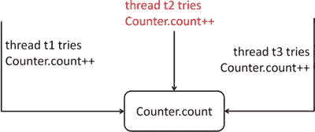
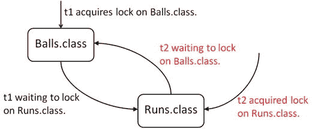
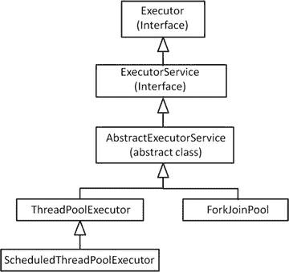
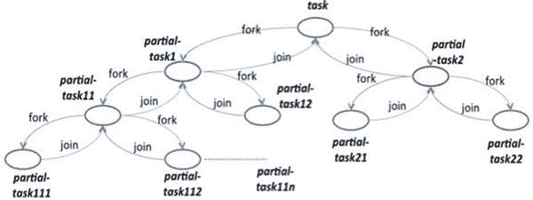

# 十一、Java 并发

 
| 认证目标 |
| --- |
| 使用 Runnable、Callable 创建工作线程，并使用 ExecutorService 并发执行任务 |
| 识别死锁、饥饿、活锁和竞争条件中潜在的线程问题 |
| 使用 synchronized 关键字和 java.util.concurrent.atomic 包来控制线程执行的顺序 |
| 使用 java.util.concurrent 集合和类，包括 CyclicBarrier 和 CopyOnWriteArrayList |
| 使用并行 Fork/Join 框架 |
| 使用并行流，包括缩减、分解、合并流程、管道和性能 |

随着多核处理器的广泛使用，并发性变得越来越重要。concurrency 这个词的拉丁语词根是“一起运行”的意思在编程中，可以让多个线程在一个程序中并行运行，同时执行不同的任务。正确使用时，并发可以提高应用的性能和响应能力，因此它是一个强大而有用的特性。在本章中，我们互换使用多线程和并发这两个术语。

从一开始，Java 就以低级线程管理、锁、同步和并发 API 的形式支持并发。从 5.0 开始，Java 也在其`java.util.concurrent`包中支持高级并发 API。从 8.0 版本开始，随着并行流的引入，Java 获得了对并发性更好的支持。

OCPJP 8 考试目标涵盖了与并发性相关的广泛主题，包括创建工作线程和使用并行流的不同方式。在你的考试中，你会从这个题目中想到很多问题。为此，我们将在本章详细讨论 Java 的并发支持。

## 创建线程以并发执行任务

  
| 认证目标 |   |
| --- | --- |
| 使用 Runnable、Callable 创建工作线程，并使用 ExecutorService 并发执行任务 |   |

`Thread`和`Object`类以及`Runnable`接口为 Java 中的并发性提供了必要的支持。`Thread`类有对多线程有用的`run()`、`start()`和`sleep()`等方法(表 [11-1](#Tab1) 列出了`Thread`类中的重要方法)。`Object`类有像`wait()`和`notify()`这样支持并发的方法。因为 Java 中的每个类都是从`Object`类派生的，所以所有的对象都有一些基本的多线程能力。例如，你可以在 Java 中获取任何对象的锁(使用`synchronized`关键字，我们将在本章后面讨论)。然而，要创建一个线程，这个来自`Object`的基本支持是没有用的。为此，一个类应该扩展`Thread`类或者实现`Runnable`接口。`Thread`和`Runnable`都在`java.lang`包中，所以你不必为了写多线程程序而显式导入这些类。

表 11-1。

Important Methods in the `Thread` Class

   
| 方法 | 方法类型 | 简短描述 |
| --- | --- | --- |
| `Thread currentThread()` | 静态法 | 返回对当前线程的引用。 |
| `String getName()` | 实例方法 | 返回当前线程的名称。 |
| `int getPriority()` | 实例方法 | 返回当前线程的优先级值。 |
| `void join(),``void join(long),`T2】 | 重写的实例方法 | 调用另一个线程上的 join 的当前线程等待，直到另一个线程完成。您可以选择以毫秒为单位给出超时时间(在`long`中给出)，或者以毫秒和纳秒为单位给出超时时间(在`long`和`int`中给出)。 |
| `void run()` | 实例方法 | 一旦你启动了一个线程(使用`start()`方法)，当线程准备执行时`run()`方法将被调用。 |
| `void setName(String)` | 实例方法 | 将线程的名称更改为参数中的给定名称。 |
| `void setPriority(int)` | 实例方法 | 将线程的优先级设置为给定的参数值。 |
| `void sleep(long)` `void sleep(long, int)` | 过载的静态方法 | 让当前线程休眠给定的毫秒数(在`long`中给出)或给定的毫秒数和纳秒数(在`long`和`int`中给出)。 |
| `void start()` | 实例方法 | 启动线程；JVM 调用线程的`run()`方法。 |
| `String toString()` | 实例方法 | 返回线程的字符串表示形式；该字符串包含线程的名称、优先级和组。 |

### 创建线程

现在让我们使用`Thread`类和`Runnable`接口创建线程。我们将在本章后面讨论如何使用`Callable`和`ExecutorService`创建工作线程。

#### 通过扩展`Thread`类创建线程

要扩展`Thread`类，您需要覆盖`run()`方法。如果你不覆盖`run()`方法，默认的`Thread`类中的`run()`方法将被调用，这没有任何作用。要覆盖`run()`方法，需要将其声明为`public`；它没有参数，有一个`void`返回类型；换句话说，应该声明为`public void run()`。

您可以通过调用`Thread`类的对象上的`start()`方法来创建一个线程(清单 [11-1](#FPar1) )。当 JVM 调度线程时，它会将线程转移到可运行状态，然后执行`run()`方法。当`run()`方法完成执行并返回时，线程将终止。

Listing 11-1\. MyThread.java

```java
class MyThread extends Thread {

public void run() {

try {
```

`sleep` `(1000);`

```java
}

catch (InterruptedException ex) {

ex.printStackTrace();

// ignore the InterruptedException - this is perhaps the one of the

// very few of the exceptions in Java which is acceptable to ignore

}
```

`System.``out`T2】

```java
}

public static void main(String args[])  {

Thread myThread = new MyThread();

myThread.start();
```

`System.``out`T2】

`Thread.``currentThread`T2】

```java
}

}
```

该程序打印以下内容:

```java
In main(); thread name is: main

In run(); thread name is: Thread-0
```

在这个例子中，`MyThread`类扩展了`Thread`类。你已经覆盖了这个类中的`run()`方法。这个`run()`方法将在线程运行时被调用。在`main()`函数中，您创建了一个新线程，并使用`start()`方法启动它。一个重要的注意事项:不要直接调用`run()`方法。相反，您使用`start()`方法启动线程；JVM 自动调用`run()`方法。

要打印线程的名称，可以使用实例方法`getName()`，它返回一个`String`。因为`main()`是一个静态方法，所以你不能访问`this`引用。因此，您可以使用`Thread`类中的静态方法`currentThread()`获得当前线程名称(返回一个`Thread`对象)。现在您可以对返回的对象调用`getName`。稍后您会看到，`main()`方法也是作为一个线程执行的！但是，在`run()`方法内部，您可以直接调用`getName()`方法:`MyThread`扩展了`Thread`，因此所有基类成员在`MyThread`中也是可用的。

#### 通过实现`Runnable`接口创建线程

创建线程的另一种方法是实现`Runnable`接口。`Thread`类本身实现了`Runnable`接口。`Runnable`接口声明了一个唯一的方法`run()`。因此，当您实现`Runnable`接口时，您需要定义`run()`方法。记住`Runnable`没有声明`start()`方法。那么，如果实现了`Runnable`接口，如何创建线程呢？`Thread`有一个重载的构造函数，它接受一个`Runnable`对象作为参数。清单 [11-2](#FPar2) 实现了`Runnable`接口并创建了一个`Thread`。

Listing 11-2\. RunnableImpl.java

```java
class RunnableImpl implements Runnable {

public void run() {
```

`System.``out`T2】

`Thread.``currentThread`T2】

```java
}

public static void main(String args[]) throws Exception {

Thread myThread = new Thread(new RunnableImpl());

myThread.start();
```

`System.``out`T2】

`Thread.``currentThread`T2】

```java
}

}
```

该程序打印:

```java
In main(); thread name is: main

In run(); thread name is: Thread-0
```

你在这个程序中实现了`run()`方法。但是，要获得字符串的名称，必须遵循迂回路线，用`Thread.currentThread().getName()`获得线程名称。在`main()`方法中，要创建一个线程，你必须将`RunnableImpl`类的对象传递给`Thread`构造函数。`start()`方法启动线程，JVM 稍后调用线程的`run()`方法。

### 用`synchronized`关键字进行线程同步

  
| 认证目标 |   |
| --- | --- |
| 使用 synchronized 关键字和 java.util.concurrent.atomic 包来控制线程执行的顺序 |   |

Java 的`synchronized`关键字有助于线程同步。您可以以两种形式使用它:同步块和同步方法。为什么我们需要使用`synchronized`关键字？以避免竞态条件的问题。现在让我们来讨论这个话题。

#### 竞赛条件

线程共享内存，它们可以并发地修改数据。由于修改可以在没有安全措施的情况下同时进行，这可能导致不直观的结果。

当两个或多个线程试图访问一个变量，而其中一个想要修改它时，就会出现一个称为竞争条件的问题(也称为数据竞争或竞争危险)。清单 [11-3](#FPar3) 显示了一个竞争条件的例子。

Listing 11-3\. RaceCondition.java

```java
// This class exposes a publicly accessible counter

// to help demonstrate race condition problem

class Counter {
```

`public static long``count`T2】

```java
}

// This class implements Runnable interface

// Its run method increments the counter three times

class UseCounter implements Runnable {

public void increment() {

// increments the counter and prints the value

// of the counter shared between threads
```

`Counter.``count`T2】

`System.``out``.print(Counter.``count`T4】

```java
}

public void run() {

increment();

increment();

increment();

}

}

// This class creates three threads

public class RaceCondition {

public static void main(String args[]) {

UseCounter c = new UseCounter();

Thread t1 = new Thread(c);

Thread t2 = new Thread(c);

Thread t3 = new Thread(c);

t1.start();

t2.start();

t3.start();

}

}
```

在这个程序中，有一个包含静态变量`count`的`Counter`类。在`UseCounter`类的`run()`方法中，通过调用`increment()`方法将`count`递增三次。您在`RaceCondition`类的`main()`函数中创建三个线程并启动它。随着线程的运行和计数器的递增，您希望程序按顺序打印 1 到 9。但是，当您运行这个程序时，它确实打印了 9 个整数值，但是输出看起来像垃圾！在一次示例运行中，我们得到了这些值:

```java
3  3  5  6  3  7  8  4  9
```

请注意，每次运行该程序时，这些值通常会有所不同；当我们再运行两次时，我们得到了这些输出:

```java
3  3  5  6  3  4  7  8  9

3  3  3  6  7  5  8  4  9
```

那么，问题是什么呢？

表达式`Counter.count++`是一个写操作，下一个`System.out.print`语句对`Counter.count`有一个读操作。当三个线程执行时，它们中的每一个都有值`Counter.count`的本地副本，并且当它们用`Counter.count++`更新`counter`时，它们不需要立即在主存储器中反映该值(参见图 [11-1](#Fig1) )。在`Counter.count`的下一次读取操作中，打印`Counter.count`的本地值。



图 11-1。

Threads t1, t2, and t3 trying to change Counter.count, causing a race condition

因此，这个程序受到竞争条件问题的困扰。为了避免这个问题，您需要确保单个线程一起执行写和读操作(原子地)。通常被多个线程访问和修改的代码段称为临界段。为了避免竞争条件问题，您需要确保临界区一次只由一个线程执行。

你是怎么做到的？通过使用关键字`synchronized`获取对象上的锁，我们现在将讨论这一点。一次只有一个线程可以获得对象上的锁，并且只有该线程可以执行受锁保护的代码块(即临界区)。在那之前，其他线程必须等待。

#### 同步块

在 synchronized 块中，使用关键字`synchronized`作为引用变量，并在其后跟随一个代码块。线程必须获得同步变量的锁才能进入该块；当块的执行完成时，线程释放锁。例如，如果代码块在一个非静态方法中，您可以获取一个对`this`引用的锁:

```java
synchronized(this) {

// code segment guarded by the mutex lock

}
```

如果在 synchronized 块中抛出了一个异常怎么办？锁会被打开吗？是的，不管这个块是完全执行还是抛出异常，锁都会被 JVM 自动释放。使用同步块，您只能在引用变量上获得锁。如果使用基本类型，将会出现编译器错误。

让我们通过在`increment()`方法中添加一个同步块来解决清单 [11-3](#FPar3) 中的竞争条件问题，如下所示:

```java
// within the UseCounter class

public void increment() {

// increments the counter and prints the value

// of the counter shared between threads

synchronized(this) {

Counter.count++;

System.out.print(Counter.count + "  ");

}

}
```

随着这一改变，程序打印正确增加的值`count`:

```java
1  2  3  4  5  6  7  8  9
```

在`increment()`方法中，在读取和写入`Counter.count`之前，您获得了对`this`引用的锁定。因此，不可能有多个线程同时执行这些语句。因为只有一个线程可以获得锁并执行“临界区”代码块，所以在给定时间，计数器只增加一个线程；结果，程序正确地打印出值 1 到 9。如果没有`synchronized`块，三个不同的线程将自由地修改变量，因此您将无法正确地打印出值 1 到 9(因为我们前面讨论过的竞争条件问题)。

#### 同步方法

一个完整的方法可以声明为`synchronized`。在这种情况下，当调用声明为 synchronized 的方法时，会在调用该方法的对象上获得一个锁，当该方法返回到调用方时，该锁会被释放。这里有一个例子:

```java
public synchronized void assign(int i) {

val = i;

}
```

现在`assign()`方法是一个同步的方法。如果您调用`assign()`方法，它将隐式获取对`this`引用的锁，然后执行语句`val = i;`。如果其他线程已经获得了锁，会发生什么呢？就像同步块一样，如果线程不能获得锁，它将被阻塞，线程将等待直到锁可用。

如果您将整个方法体包含在一个`synchronized(this)`块中，那么一个同步方法相当于一个同步块。因此，使用同步块的等效`assign()`方法是，

```java
public void assign(int i) {

synchronized(this) {

val = i;

}

}
```

您可以声明同步的静态方法。但是，获得锁的引用变量是什么呢？记住静态方法没有隐式的`this`引用。静态同步方法获取`class`对象上的锁。每个类都与一个`Class`类型的对象相关联，您可以使用`ClassName.class`语法来访问它。例如，

```java
class SomeClass {

private static int val;

public static synchronized void assign(int i) {

val = i;

}

// more members ...

}
```

在这种情况下，`assign`方法在被调用时获得了对`SomeClass.class`对象的锁定。现在，使用同步块的等效`assign()`方法可以写成

```java
class SomeClass {

private static int val;

public static void assign(int i) {

synchronized(SomeClass.class) {

val = i;

}

}

// more members ...

}
```

不能声明同步的构造函数；这将导致编译器错误。例如，对于

```java
class Synchronize {

public synchronized Synchronize() { /* constructor body */}

// more methods

}
```

您会得到以下错误:

```java
Synchronize.java:2: modifier synchronized not allowed here

public synchronized Synchronize() { /* constructor body */}
```

为什么不能声明构造函数同步？JVM 确保在给定的时间点只有一个线程可以调用构造函数调用(对于特定的构造函数)。因此，没有必要声明一个同步的构造函数。但是，如果您愿意，可以在构造函数中使用同步块。

让我们回到清单 [11-3](#FPar3) 中的`RaceCondition`例子。`UseCounter`类中的`increment()`方法也可以被重写为同步方法:

```java
// declaring the increment synchronized instead of using

// a synchronized statement for a block of code inside the method

public synchronized void increment() {

Counter.count++;

System.out.print(Counter.count + "  ");

}
```

该程序打印:

```java
1  2  3  4  5  6  7  8  9
```

程序正确地打印出预期的输出。

初学者通常会误解同步块获得了代码块的锁。实际上，获得锁的是一个对象，而不是一段代码。获得的锁将一直保持到该块中的所有语句执行完毕。

## 线程问题

  
| 认证目标 |   |
| --- | --- |
| 识别死锁、饥饿、活锁和竞争条件中潜在的线程问题 |   |

线程中的并发编程充满了陷阱和问题。我们已经在前一节讨论了不使用锁时发生的竞争情况。在本节中，让我们讨论另外三个线程问题:死锁、饥饿和活锁。

### 僵局

获取和使用锁是很棘手的，这会导致很多问题。其中一个困难的(也是常见的)问题就是死锁。当锁定线程导致线程无法继续执行，从而无限期等待其他线程终止时，就会出现死锁。比方说，一个线程获取资源`r1`上的锁，并等待获取另一个资源`r2`上的锁。同时，假设有另一个线程已经获得了`r2`，正在等待获得对`r1`的锁。在另一个线程释放锁之前，任何一个线程都不能继续执行，而这是永远不会发生的——所以它们陷入了死锁。清单 [11-4](#FPar4) 展示了这种情况是如何发生的(使用板球比赛中的例子)。

Listing 11-4\. DeadLock.java

```java
// Balls class has a globally accessible data member to hold the number of balls thrown

class Balls {

public static long balls = 0;

}

// Runs class has a globally accessible data member to hold the number of runs scored

class Runs {

public static long runs = 0;

}

// Counter class has two methods – IncrementBallAfterRun and IncrementRunAfterBall.

// For demonstrating deadlock, we call these two methods in the run method, so that

// locking can be requested in opposite order in these two methods

class Counter implements Runnable {

// this method increments runs variable first and then increments the balls variable

// since these variables are accessible from other threads,

// we need to acquire a lock before processing them

public void IncrementBallAfterRun() {

// since we're updating runs variable first, first lock the Runs.class

synchronized(Runs.class) {

// lock on Balls.class before updating balls variable

synchronized(Balls.class) {

Runs.runs++;

Balls.balls++;

}

}

}

public void IncrementRunAfterBall() {

// since we're updating balls variable first; so first lock Balls.class

synchronized(Balls.class) {

// acquire lock on Runs.class before updating runs variable

synchronized(Runs.class) {

Balls.balls++;

Runs.runs++;

}

}

}

public void run() {

// call these two methods which acquire locks in different order

// depending on thread scheduling and the order of lock acquision,

// a deadlock may or may not arise

IncrementBallAfterRun();

IncrementRunAfterBall();

}

}

public class DeadLock {

public static void main(String args[]) throws InterruptedException {

Counter c = new Counter();

// create two threads and start them at the same time

Thread t1 = new Thread(c);

Thread t2 = new Thread(c);

t1.start();

t2.start();

System.out.println("Waiting for threads to complete execution...");

t1.join();

t2.join();

System.out.println("Done.");

}

}
```

如果您执行这个程序，程序可能会运行良好，也可能会死锁而永远不会终止(这个程序中死锁的发生取决于线程的调度方式)。

```java
D:\> java DeadLock

Waiting for threads to complete execution...

Done.

D:\> java DeadLock

Waiting for threads to complete execution...

[deadlock – user pressed ctrl + c to terminate the program]

D:\> java DeadLock

Waiting for threads to complete execution...

Done.
```

在这个例子中，有两个类，`Balls`和`Runs`，它们的静态成员分别叫做`balls`和`runs`。`Counter`类有两个方法，`IncrementBallAfterRun()`和`IncrementRunAfterBall()`。他们以相反的顺序获取`Balls.class`和`Runs.class`上的锁。`run()`方法连续调用这两个方法。`Dead`类中的`main()`方法创建两个线程并启动它们。

当线程`t1`和`t2`执行时，它们调用方法`IncrementBallAfterRun`和`IncrementRunAfterBall`。在这些方法中，以相反的顺序获得锁。可能发生的情况是，`t1`在`Runs.class`获得一个锁，然后等待在`Balls.class`获得一个锁。同时，`t2`可能已经获得了`Balls.class`，现在将等待获得对`Runs.class`的锁定。因此，这个程序会导致死锁(图 11-2)。

不能保证每次执行这个程序都会导致死锁。为什么呢？您永远不知道线程执行的顺序以及获取和释放锁的顺序。正因如此，这样的问题就被说成是非确定性的，这样的问题是无法一致重现的。

有不同的策略来处理死锁，例如死锁预防、避免或检测。出于考试目的，以下是您需要了解的关于死锁的知识:



图 11-2。

Deadlock between threads t1 and t2

*   死锁可能在多重锁的上下文中出现。
*   如果以相同的顺序获得多个锁，则不会发生死锁；但是，如果您以不同的顺序获取它们，那么可能会出现死锁。
*   死锁(就像其他多线程问题一样)是非确定性的；您无法始终如一地重现死锁。

避免获取多个锁。如果您想要获得多个锁，请确保它们在任何地方都以相同的顺序获得，以避免死锁。

### 活锁

为了帮助理解活锁，让我们考虑一个类比。假设有两辆机器人汽车被编程为自动在道路上行驶。有一种情况，两辆机器人车到达一座窄桥的两个相对端。这座桥太窄了，一次只能有一辆汽车通过。机器人汽车被编程为等待另一辆汽车首先通过。当两辆车试图同时进入大桥时，可能会发生以下情况:每辆车开始进入大桥，注意到另一辆车也试图这样做，然后倒车！请注意，汽车一直向前和向后移动，因此看起来好像它们做了很多工作，但没有一辆车取得进展。这种情况称为活锁。

考虑两个线程`t1`和`t2`。假设线程`t1`做出了改变，而线程`t2`撤销了该改变。当线程`t1`和`t2`都工作时，看起来好像做了很多工作，但是没有进展。这种情况称为线程中的活锁。

活锁和死锁的相似之处在于进程“挂起”，程序永远不会终止。然而，在死锁中，线程停留在相同的状态，等待其他线程释放共享资源；在活锁中，线程不断执行任务，进程状态不断变化，但应用作为一个整体并没有进展。

### 锁饥饿

考虑这样一种情况，其中许多线程被分配了不同的优先级(从最低优先级 1 到最高优先级 10，这是 Java 中线程优先级的范围)。当锁可用时，线程调度器将优先考虑高优先级线程，而不是低优先级线程。如果有许多高优先级线程想要获得锁，并且长时间持有锁，那么低优先级线程什么时候有机会获得锁呢？换句话说，在低优先级线程长时间“饥饿”的情况下，试图获取锁被称为锁饥饿。

有许多技术可用于检测或避免线程问题，如活锁和饥饿，但它们不在 OCPJP 8 考试的范围内。从考试的角度来看，你应该知道我们在本章已经讨论过的不同种类的线程问题。

## 使用 java.util.concurrent.atomic 包

  
| 认证目标 |   |
| --- | --- |
| 使用 synchronized 关键字和 java.util.concurrent.atomic 包来控制线程执行的顺序 |   |

`java.util.concurrent`包有两个子包:`java.util.concurrent.atomic`和`java.util.concurrent.locks`。在本节中，我们从 OCPJP 8 考试的角度讨论`java.util.concurrent.atomic`包中的原子变量。

您经常可以看到获取和释放锁来实现基本/简单操作的代码，比如增加变量、减少变量等等？(在本章前面讨论`synchronized`关键字时，我们已经看到了一个增加整数变量的例子。)为这种原始操作获取和释放锁是没有效率的。在这种情况下，Java 以原子变量的形式提供了一种有效的替代方法。

下面是这个包中的一些类及其简短描述的列表:

*   `AtomicBoolean`:可原子更新的`Boolean`值。
*   `AtomicInteger`:可原子更新的`int`值；从`Number`类继承而来。
*   `AtomicIntegerArray`:一个`int`数组，其中的元素可以自动更新。
*   `AtomicLong`:可原子更新的`long`值；继承自`Number`类。
*   `AtomicLongArray`:一个`long`数组，其中的元素可以自动更新。
*   类型 v 的可原子更新的对象引用。
*   `AtomicReferenceArray<E>`:一个可原子更新的数组，可以保存类型`E` ( `E`指元素的基本类型)的对象引用。

只有`AtomicInteger`和`AtomicLong`从`Number`类扩展，而`AtomicBoolean`没有。`java.util.concurrent.atomic`子包中的所有其他类都直接继承自`Object`类。

在`java.util.concurrency.atomic`子包中的类中，`AtomicInteger`和`AtomicLong`是最重要的。表 [11-2](#Tab2) 列出了`AtomicInteger`类中的重要方法。(`AtomicLong`的方法与此类似。)

表 11-2。

Important Methods in the AtomicInteger Class

  
| 方法 | 简短描述 |
| --- | --- |
| `AtomicInteger()` | 创建一个初始值为 0 的`AtomicInteger`实例。 |
| `AtomicInteger(int initVal)` | 创建一个初始值为`initVal`的`AtomicInteger`实例。 |
| `int get()` | 返回此对象中保存的整数值。 |
| `void set(int newVal)` | 将该对象中保存的整数值重置为`newVal`。 |
| `int getAndSet(int newValue)` | 返回保存在该对象中的当前`int`值，并将保存在该对象中的值设置为`newVal`。 |
| `boolean compareAndSet(int expect, int update)` | 将该对象的`int`值与`expect`值进行比较，如果它们相等，则将该对象的`int`值设置为`update`值。 |
| `int getAndIncrement()` | 返回此对象中整数值的当前值，并递增此对象中的整数值。类似于`i++`的行为，其中`i`是一个`int`。 |
| `int getAndDecrement()` | 返回此对象中整数值的当前值，并递减此对象中的整数值。类似于`i--`的行为，其中`i`是一个`int`。 |
| `int getAndAdd(int delta)` | 返回保存在此对象中的整数值，并将给定的增量值与整数值相加。 |
| `int incrementAndGet()` | 递增此对象中整数值的当前值，并返回该值。类似于`++i`的行为，其中`i`是一个`int`。 |
| `int decrementAndGet()` | 递减此对象中的当前整数值，并返回该值。类似于`--i`的行为，其中`i`是一个`int`。 |
| `int addAndGet(int delta)` | 将`delta`值与该对象中整数的当前值相加，并返回该值。 |
| `int intValue() long longValue() float floatValue() double doubleValue()` | 转换对象的当前`int`值，并将其作为`int`、`long`、`float`或`double`值返回。 |

让我们尝试一个例子来理解如何使用`AtomicInteger`或`AtomicLong`。假设您有一个公共的计数器值，所有线程都可以访问它。如何安全地更新或访问这个公共计数器值，而不引入竞争条件问题(本章前面已经讨论过)？显然，您可以使用`synchronized`关键字来确保临界区(修改计数器值的代码)在给定的时间点只被一个线程访问。临界截面将非常小，如

```java
public void run() {

synchronized(SharedCounter.class) {

SharedCounter.count++;

}

}
```

然而，这段代码效率很低，因为它每次获取和释放锁只是为了增加`count`的值。或者，如果您将`count`声明为`AtomicInteger`或`AtomicLong`(以合适的为准)。像 AtomicInteger 这样的类不使用锁；相反，它们在内部使用可变变量和一种称为比较和设置(CAS)的底层机制。出于这个原因，使用 AtomicInteger 和相关类比使用使用`synchronized`关键字的锁更快。

清单 [11-5](#FPar5) 展示了如何在实践中使用`AtomicLong`。

Listing 11-5\. AtomicVariableTest.java

```java
import java.util.concurrent.atomic.AtomicInteger;

// Class to demonstrate how mutating "normal" (i.e., thread unsafe) integers

// and mutating "atomic" (i.e., thread safe) integers are different:

// Mutating a shared Integer object without locks can result in a race condition;

// however, mutating a shared AtomicInteger will not result in a race conditiond.

class Counter {
```

`public static Integer``integer`T2】

`public static AtomicInteger``atomicInteger`T2】

```java
}

class AtomicVariableTest {

static class Incrementer extends Thread {

public void run() {
```

`Counter.``integer`T2】

`Counter.``atomicInteger`T2】

```java
}

}

static class Decrementer extends Thread {

public void run() {
```

`Counter.``integer`T2】

`Counter.``atomicInteger`T2】

```java
}

}

public static void main(String []args) throws InterruptedException {

Thread incremeterThread[] = new Incrementer[1000];

Thread decrementerThread[] = new Decrementer[1000];

for(int i = 0; i < 1000; i++) {

incremeterThread[i] = new Incrementer();

decrementerThread[i] = new Decrementer();

incremeterThread[i].start();

decrementerThread[i].start();

}

for(int i = 0; i < 1000; i++) {

incremeterThread[i].join();

decrementerThread[i].join();

}
```

`System.``out`T2】

`Counter.``integer``, Counter.``atomicInteger`T4】

```java
}

}
```

实际输出取决于线程调度。在不同的运行中，它打印了以下输出:

```java
Integer value = -2 AtomicInteger value = 0

Integer value = 2 AtomicInteger value = 0

Integer value = -1 AtomicInteger value = 0

Integer value = -1 AtomicInteger value = 0

Integer value = 0 AtomicInteger value = 0
```

我们来分析一下这个程序。`Counter`类有两个数据成员——一个类型为`Integer`,另一个类型为`AtomicInteger`——具有相同的初始值 0。

有两个`Thread`类。`Incrementer`类有增加`Integer`和`AtomicInteger`值的`run()`方法。另一方面，`Decrementer`类有减少`Integer`和`AtomicInteger`值的`run()`方法。

在这个输出中，注意递增`Integer`对象可能会导致一个竞争条件:在递增和递减相同次数后，`Integer`或`AtomicInteger`的最终值应该总是 0——如果不是这样，我们就有一个竞争条件。从输出中可以观察到，有时对于`Integer`对象它是 0(意味着没有竞争条件)，但大多数时候它不等于 0(意味着它有竞争条件)。然而，对于`AtomicInteger`，结果总是零(意味着它没有竞争条件)。换句话说，这个程序表明在没有任何锁的情况下操作一个`AtomicInteger`值是安全的。

## 使用 java.util.concurrent 集合

  
| 认证目标 |   |
| --- | --- |
| 使用 java.util.concurrent 集合和类，包括 CyclicBarrier 和 CopyOnWriteArrayList |   |

在`java.util.concurrent`包中有许多类和接口为并发编程提供高级 API。在这一节中，我们将主要讨论这个包中提供的同步器类。接下来，我们将简要介绍一下`java.util.concurrent`包中提供的重要并发集合类。

您已经理解了底层并发结构，比如使用`synchronized`关键字和使用`Runnable`接口来创建线程。在共享资源需要被多个线程访问的情况下，对共享资源的访问和修改需要被保护。

当您使用`synchronized`关键字时，您使用互斥体在线程之间同步，以实现安全的共享访问。线程还经常需要协调它们的执行来完成更大的更高级别的任务。可以为线程同步构建更高级别的抽象。这些用于同步两个或多个线程的活动的高级抽象被称为同步器。同步器在内部利用现有的低级 API 进行线程协调。

`java.util.concurrent`库中提供的同步器及其用途如下:

*   一个`Semaphore`控制对共享资源的访问。信号量维护一个计数器来指定信号量控制的资源数量。
*   允许一个或多个线程等待倒计时完成。
*   `Exchanger`类用于在两个线程之间交换数据。当两个线程需要相互同步并不断交换数据时，该类非常有用。
*   `CyclicBarrier`帮助提供一个同步点，线程可能需要在一个预定义的执行点等待，直到所有其他线程到达该点。
*   当几个独立的线程必须分阶段工作来完成一项任务时,`Phaser`是一个有用的特性。

OCPJP 8 考试的目标只涵盖了`CyclicBarrier`类，我们将在本节中借助一个例子来讨论它。

### 栅栏

在并发编程的许多情况下，线程可能需要在预定义的执行点等待，直到所有其他线程都到达该点。`CyclicBarrier`帮助提供这样一个同步点；该类中的重要方法见表 [11-3](#Tab3) 。

表 11-3。

Important Methods in the CyclicBarrier Class

  
| 方法 | 简短描述 |
| --- | --- |
| `CyclicBarrier(int numThreads)` | 用指定的等待线程数创建一个`CyclicBarrier`对象。如果`numThreads`为负或零，抛出`IllegalArgumentException`。 |
| `CyclicBarrier(int parties, Runnable barrierAction)` | 与前面的构造函数相同；当到达障碍时，此构造函数还接受线程进行调用。 |
| `int await() int await(long timeout, TimeUnit unit)` | 阻塞，直到指定数量的线程在此屏障上调用了`await`()为止。方法返回该线程的到达索引。如果线程在等待其他线程时被中断，这个方法可以抛出一个`InterruptedException`,或者如果由于某种原因(例如，另一个线程超时或中断)屏障被破坏，这个方法可以抛出一个`BrokenBarrierException`。重载方法将超时期限作为附加选项；如果在超时期限内没有到达所有其他线程，这个重载版本抛出一个`TimeoutException`。 |
| `boolean isBroken()` | 如果屏障被破坏，则返回 true。如果屏障中至少有一个线程被中断或超时，或者如果屏障操作未能引发异常，则该屏障被破坏。 |
| `void reset()` | 将屏障重置为初始状态。如果有任何线程在等待这个屏障，它们将抛出`BrokenBarrier`异常。 |

清单 [11-6](#FPar6) 是利用`CyclicBarrier`类的一个例子。

Listing 11-6\. CyclicBarrierTest.java

```java
import java.util.concurrent.CyclicBarrier;

import java.util.concurrent.BrokenBarrierException;

// The run() method in this thread should be called only when

// four players are ready to start the game

class MixedDoubleTennisGame extends Thread {

public void run() {
```

`System.``out`T2】

```java
}

}

// This thread simulates arrival of a player.

// Once a player arrives, he/she should wait for other players to arrive

class Player extends Thread {

CyclicBarrier waitPoint;

public Player(CyclicBarrier barrier, String name) {

this.setName(name);

waitPoint = barrier;

this.start();

}

public void run() {
```

`System.``out`T2】

```java
try {

waitPoint.await(); // await for all four players to arrive

} catch(BrokenBarrierException | InterruptedException exception) {
```

`System.``out`T2】

```java
+ exception);

}

}

}

// Creates a CyclicBarrier object by passing the number of threads and the thread to run

// when all the threads reach the barrier

class CyclicBarrierTest {

public static void main(String []args) {

// a mixed-double tennis game requires four players;

// so wait for four players

// (i.e., four threads) to join to start the game
```

`System.``out`T2】

```java
+ "As soon as four players arrive, game will start");

CyclicBarrier barrier = new CyclicBarrier(4, new MixedDoubleTennisGame());

new Player(barrier, "G I Joe");

new Player(barrier, "Dora");

new Player(barrier, "Tintin");

new Player(barrier, "Barbie");

}

}
```

该程序打印以下内容:

```java
Reserving tennis court

As soon as four players arrive, game will start

Player Dora is ready

Player G I Joe is ready

Player Tintin is ready

Player Barbie is ready

All four players ready, game starts

Love all...
```

现在让我们看看这个程序是如何工作的。在`main()`方法中，您创建了一个`CyclicBarrier`对象。构造函数接受两个参数:要等待的线程数量，以及当所有线程都到达屏障时要调用的线程。在这种情况下，您有四个玩家要等待，因此您创建了四个线程，每个线程代表一个玩家。`CyclicBarrier`构造函数的第二个参数是`MixedDoubleTennisGame`对象，因为这个线程代表游戏，一旦四个玩家都准备好了，游戏就会开始。

在每个`Player`线程的`run()`方法中，调用`CyclicBarrier`对象的`await()`方法。一旦`CyclicBarrier`对象的等待线程数达到 4，就会调用`MixedDoubleTennisGame`中的`run()`方法。

### 并发收款

`java.util.concurrent`包提供了许多类，它们是`java.util`包中集合框架类提供的线程安全等价类。例如，`java.util.concurrent.ConcurrentHashMap`是`java.util.HashMap`的并发等价物。这两个容器的主要区别在于，您需要用`HashMap`显式地同步插入和删除，而这种同步内置在`ConcurrentHashMap`中。如果你知道如何使用`HashMap`，你就知道如何隐式地使用`ConcurrentHashMap`。从 OCPJP 8 考试的角度来看，你只需要对表 [11-4](#Tab4) 中的类有一个整体的了解，所以我们不会深究如何利用这些类的细节。我们将只涵盖一个使用`CopyOnWriteArrayList`的详细例子。

表 11-4。

Some Concurrent Collection Classes/Interfaces in the java.util.concurrent Package

  
| 类别/接口 | 简短描述 |
| --- | --- |
| `BlockingQueue` | 这个接口扩展了`Queue`接口。在`BlockingQueue`中，如果队列是空的，它等待(即阻塞)一个元素被插入，如果队列是满的，它等待一个元素被从队列中移除。 |
| `ArrayBlockingQueue` | 这个类提供了基于固定大小数组的`BlockingQueue`接口的实现。 |
| `LinkedBlockingQueue` | 这个类提供了一个基于链表的接口实现。 |
| `DelayQueue` | 这个类实现了`BlockingQueue`，由类型为`Delayed`的元素组成。只有在延迟期过后，才能从该队列中检索元素。 |
| `PriorityBlockingQueue` | 相当于`java.util.PriorityQueue`，但是实现了`BlockingQueue`接口。 |
| `SynchronousQueue` | 这个类实现了`BlockingQueue`。在这个容器中，一个线程的每个`insert`()等待(阻塞)另一个线程的相应的`remove`()，反之亦然。 |
| `LinkedBlockingDeque` | 该类实现了插入和移除操作可能阻塞的地方的`BlockingDeque`；使用链表来实现。 |
| `ConcurrentHashMap` | 类似于`Hashtable`，但是具有安全的并发访问和更新。 |
| `ConcurrentSkipListMap` | 类似于`TreeMap`，但是提供安全的并发访问和更新。 |
| `ConcurrentSkipListSet` | 类似于`TreeSet`，但是提供安全的并发访问和更新。 |
| `CopyOnWriteArrayList` | 类似于`ArrayList`，但提供安全的并发访问。当容器被修改时，它会创建一个基础数组的新副本。 |
| `CopyOnWriteArraySet` | 一个`Set`实现，但是提供安全的并发访问，并使用`CopyOnWriteArrayList`实现。当容器被修改时，它会创建一个基础数组的新副本。 |

#### CopyOnWriteArrayList 类

`ArrayList`和`CopyOnWriteArrayList`都实现了`List`接口。`ArrayList`和`CopyOnWriteArrayList`主要有三个区别:

*   `ArrayList`不是线程安全的，但是`CopyOnWriteArrayList`是线程安全的。这意味着，在多线程执行的环境中使用`ArrayList`是不安全的(特别是当一些线程修改容器时)，但是在这种环境中使用`CopyOnWriteArrayList`是安全的。
*   当一个线程正在访问`ArrayList`时，如果另一个线程修改了`ArrayList`，那么`ArrayList`中的方法如`remove()`、`add()`和`set()`方法会抛出`java.util.ConcurrentModificationException`。然而，在`CopyOnWriteArrayList`中从多个线程执行这些操作是安全的，因此像`remove()`、`add()`和`set()`这样的方法不会抛出这个异常。怎么做？所有的活动迭代器仍然可以访问容器的未修改版本，因此它们不受影响；如果您试图在修改后创建一个迭代器，您将获得修改后的容器的迭代器。
*   您可以通过在一个`List`对象上调用`Iterator()`方法来获得一个迭代器。如果您在底层容器被修改时调用`remove()`方法，您可能会得到一个`ConcurrentModificationException`。然而，你不能在`CopyOnWriteArrayList`的`Iterator`上调用`remove()`方法:它总是抛出`UnsupportedOperationException`。

即使在不使用多线程的环境中，`CopyOnWriteArrayList`的行为有时也很有用。例如，清单 [11-7](#FPar7) 显示了迭代器执行时被修改的`ArrayList`。

Listing 11-7\. ModifyingList.java

```java
import java.util.ArrayList;

import java.util.Iterator;

import java.util.List;

public class ModifyingList {

public static void main(String []args) {

List<String> aList = new ArrayList<>();

aList.add("one");

aList.add("two");

aList.add("three");

Iterator listIter = aList.iterator();

while(listIter.hasNext()) {

System.out.println(listIter.next());

aList.add("four");

}

}

}
```

这个程序因抛出`java.util.ConcurrentModificationException`而崩溃。为什么？因为`ArrayList`的迭代器是快速失效的；当它遍历容器中的元素时，如果检测到底层容器发生了变化，就会抛出`ConcurrentModificationException`而失败。当一个线程修改底层容器，而另一个线程遍历容器的元素时，这种行为在并发上下文中很有用。

当迭代发生时，您可以使用`CopyOnWriteArrayList`对底层容器进行这样的更改。清单 [11-8](#FPar8) 是清单 [11-7](#FPar7) 的修改版本。这个版本用了一个`CopyOnWriteArrayList`。

Listing 11-8\. COWList.java

```java
import java.util.Iterator;

import java.util.List;

import java.util.concurrent.CopyOnWriteArrayList;

public class COWList {

public static void main(String []args) {

List<String> aList = new CopyOnWriteArrayList<>();

aList.add("one");

aList.add("two");

aList.add("three");

Iterator listIter = aList.iterator();

while(listIter.hasNext()) {

System.out.println(listIter.next());

aList.add("four");

}

}

}
```

现在程序没有崩溃，它打印:

```java
one

two

three
```

注意，添加了三次的元素“four”没有作为输出的一部分打印出来。这是因为迭代器仍然可以访问包含三个元素的原始(未修改的)容器。如果你创建一个新的迭代器并访问元素，你会发现新元素已经被添加到`aList`中。

## 使用可调用和执行服务接口

  
| 认证目标 |   |
| --- | --- |
| 使用 Runnable、Callable 创建工作线程，并使用 ExecutorService 并发执行任务 |   |

您可以通过创建`Thread`对象来直接在应用中创建和管理线程。然而，如果你想抽象出多线程编程的底层细节，你可以利用`Executor`接口。

图 [11-3](#Fig3) 显示了`Executor`层次中的重要类和接口。在这一节中，您将重点关注使用`Executor`和`ExecutorService`接口。我们将在本章的后面讨论`ForkJoinPool`。



图 11-3。

Important Classes/Interfaces in the Executor hierarchy

### 执行者

`Executor`是一个只声明一个方法的接口:`void execute(Runnable)`。这本身看起来可能不是一个重要的接口，但是它的派生类(或接口)，比如`ExecutorService, ThreadPoolExecutor`和`ForkJoinPool`，支持有用的功能。我们将在本章后面更详细地讨论`Executor`的一些派生类。现在，查看清单 [11-9](#FPar9) 中的一个简单的`Executor`接口示例，了解如何实现这个接口并在实践中使用它。

Listing 11-9\. ExecutorTest.java

```java
import java.util.concurrent.Executor;

// This Task class implements Runnable, so its a Thread object

class Task implements Runnable {

public void run() {
```

`System.``out`T2】

```java
}

}

// This class implements Executor interface and should override execute(Runnable) method.

// We provide an overloaded execute method with an additional argument 'times' to create and

// run the threads for given number of times

class RepeatedExecutor implements Executor {

public void execute(Runnable runnable) {

new Thread(runnable).start();

}

public void execute(Runnable runnable, int times) {
```

`System.``out`T2】

```java
times);

for(int i = 0; i < times; i++) {

execute(runnable);

}

}

}

// This class spawns a Task thread and explicitly calls start() method.

// It also shows how to execute a Thread using Executor

class ExecutorTest {

public static void main(String []args) {

Runnable runnable = new Task();
```

`System.``out`T2】

```java
Thread thread = new Thread(runnable);

thread.start();

RepeatedExecutor executor = new RepeatedExecutor();

executor.execute(runnable, 3);

}

}
```

下面是这个程序的输出:

```java
Calling Task.run() by directly creating a Thread

Calling Task.run()

Calling Task.run() 3 times thro' Executor.execute()

Calling Task.run()

Calling Task.run()

Calling Task.run()
```

在这个程序中，有一个通过提供`run()`方法的定义来实现`Runnable`的`Task`类。类`RepeatedExecutor`通过提供`execute(Runnable)`方法的定义来实现`Executor`接口。

`Runnable`和`Executor`在提供单一实现方法的意义上是相似的。在这个定义中，你可能已经注意到`Executor`本身不是一个线程，你必须创建一个`Thread`对象来执行在`execute()`方法中传递的`Runnable`对象。然而，`Runnable`和`Executor`的主要区别在于`Executor`旨在抽象线程是如何执行的。例如，根据`Executor`的实现，`Executor`可以调度一个线程在某个时间运行，或者在某个延迟时间后执行该线程。

在这个程序中，您已经用一个额外的参数重载了`execute()`方法，以创建和执行线程一定的次数。在`main()`方法中，首先创建一个`Thread`对象并调度它运行。之后，实例化`RepeatedExecutor`来执行线程三次。

### 可调用和可执行服务

`Callable`是一个只声明一个方法的接口:`call()`。它的全称是`V call() throws Exception`。它表示需要由线程完成的任务。一旦任务完成，它将返回值。出于某种原因，如果`call()`方法无法执行或失败，它会抛出一个`Exception`。

要使用`Callable`对象执行任务，首先要创建一个线程池。线程池是可以执行任务的线程的集合。使用`Executors`实用程序类创建一个线程池。这个类提供了获取线程池、线程工厂等实例的方法。

`ExecutorService`接口扩展了`Executor`接口，提供了终止线程和产生`Future`对象等服务。某些任务可能需要相当长的执行时间才能完成。因此，当您向 executor 服务提交任务时，您会得到一个`Future`对象。

`Future`表示包含由线程在未来返回的值的对象(即，一旦线程在“未来”终止，它就返回该值)。您可以使用`Future`类中的`isDone()`方法来检查任务是否完成，然后使用`get()`方法来获取任务结果。如果在任务未完成时直接调用`get()`方法，该方法会一直阻塞，直到任务完成并返回可用的值。

这里有一个简单的例子来看看这些类是如何一起工作的(清单 [11-10](#FPar10) )。

Listing 11-10\. CallableTest.java

```java
import java.util.concurrent.Callable;

import java.util.concurrent.ExecutorService;

import java.util.concurrent.Future;

import java.util.concurrent.Executors;

// Factorial implements Callable so that it can be passed to a ExecutorService

// and get executed as a task.

class Factorial implements Callable<Long> {

long n;

public Factorial(long n) {

this.n = n;

}

public Long call() throws Exception {

if(n <= 0) {

throw new Exception("for finding factorial, N should be > 0");

}

long fact = 1;

for(long longVal = 1; longVal <= n; longVal++) {

fact *= longVal;

}

return fact;

}

}

// Illustrates how Callable, Executors, ExecutorService, and Future are related;

// also shows how they work together to execute a task

class CallableTest {

public static void main(String []args) throws Exception {

// the value for which we want to find the factorial

long N = 20;

// get a callable task to be submitted to the executor service

Callable<Long> task = new Factorial(N);

// create an ExecutorService with a fixed thread pool having one thread

ExecutorService es = Executors.newSingleThreadExecutor();

// submit the task to the executor service and store the Future object

Future<Long> future = es.submit(task);

// wait for the get() method that blocks until the computation is complete.

System.out.printf("factorial of %d is %d", N, future.get());

// done. shutdown the executor service since we don't need it anymore

es.shutdown();

}

}
```

该程序打印以下内容:

```java
factorial of 20 is 2432902008176640000
```

在这个程序中，您有一个实现了`Callable`的`Factorial`类。因为任务是计算一个数字`N`的阶乘，所以任务需要返回一个结果。您使用`Long`类型作为阶乘值，因此您实现了`Callable<Long>`。在`Factorial`类中，您定义了实际执行任务的`call()`方法(这里的任务是计算给定数字的阶乘)。如果给定值`N`为负或零，则不执行任务并向调用者抛出一个异常。否则，您将从 1 循环到`N`并找到阶乘值。

在`CallableTest`类中，首先创建一个`Factorial`类的实例。然后，您需要执行这个任务。为了简单起见，通过调用`Executors`类中的`newSingleThreadExecutor()`方法，可以得到一个单线程执行器。请注意，您可以使用其他方法，如`newFixedThreadPool(nThreads)`，根据您需要的并行级别创建一个多线程的线程池。

一旦您获得了一个`ExecutorService`，您就提交任务来执行。`ExecutorService`抽象出任务何时执行、任务如何分配给线程等细节。当你调用`submit(task)`方法时，你得到了对`Future<Long>`的引用。从这个未来的引用中，您可以调用`get()`方法在完成任务后获取结果。如果当您调用`future.get()`时任务仍在执行，这个`get()`方法将阻塞，直到任务执行完成。一旦执行完成，您需要通过调用`shutdown()`方法来手动释放`ExecutorService`。

## 使用并行 Fork/Join 框架

  
| 认证目标 |   |
| --- | --- |
| 使用并行 Fork/Join 框架 |   |

`java.util.concurrent`包中的 Fork/Join 框架有助于简化并行代码的编写。该框架是`ExecutorService`接口的一个实现，提供了一个易于使用的并发平台，以便利用多个处理器。这个框架对于建模分治问题非常有用。这种方法适用于可以递归划分并在较小规模上计算的任务；然后合并计算结果。将任务分成更小的任务是分叉，将更小任务的结果合并是连接。

Fork/Join 框架使用工作窃取算法:当一个`worker`线程完成了它的工作并且空闲时，它从其他仍在忙于做一些工作的线程那里获取(或“窃取”)工作。最初，您会觉得使用 Fork/Join 是一项复杂的任务。然而，一旦你熟悉了它，你会意识到它在概念上是容易的，并且它极大地简化了你的工作。关键是递归地将任务细分成更小的块，这些块可以由单独的线程处理。

简而言之，Fork/Join 算法设计如下:

```java
forkJoinAlgorithm() {

fork (split) the tasks;

join the tasks;

compose the results;

}
```

以下是这些步骤如何工作的伪代码:

```java
doRecursiveTask(input) {

if (the task is small enough to be handled by a thread) {

compute the small task;

if there is a result to return, do so

}

else {

divide (i.e., fork) the task into two parts

call compute() on first task, join() on second task, return combined results

}

}
```

图 [11-4](#Fig4) 显示了任务如何被递归地细分成更小的任务，以及部分结果如何被组合。如图所示，一个任务被分割成两个子任务，然后每个子任务又被分割成两个子任务，依此类推，直到每个分割的子任务可被每个线程计算。一旦一个线程完成了计算，它就返回与其他结果相结合的结果；以这种方式，所有的计算结果被组合回来。



图 11-4。

The Fork/Join Framework Uses Divide-and-Conquer to Complete the Task

### Fork/Join 框架中有用的类

下面的类在 Fork/Join 框架中扮演着重要的角色:`ForkJoinPool`、`ForkJoinTask`、`RecursiveTask`和`RecursiveAction`。让我们更详细地考虑这些类。

*   `ForkJoinPool` is the most important class in the Fork/Join framework. It is a thread pool for running fork/join tasks and it executes an instance of `ForkJoinTask`. It executes tasks and manages their lifecycle. Table [11-5](#Tab5) lists the important methods belonging to this abstract class.

    表 11-5。

    Important Methods in the ForkJoinPool Class

      
    | 方法 | 简短描述 |
    | --- | --- |
    | 见执行(forkointask>任务) | 异步执行给定的任务。 |
    | <t>T 调用(forkjointtask<t>任务)</t></t> | 执行给定的任务并返回计算结果。 |
    | <t>列表 <future>> invokeAll(集合 extends Callable<t>>任务)</t></future></t> | 执行所有给定的任务，并在所有任务完成后返回未来对象的列表。 |
    | 布尔值被终止() | 如果所有任务都已完成，则返回 true。 |
    | int getparallelism()int getpoosize()long getstealcount()int get active thread count() | 这些是状态检查方法。 |
    | <t>forkointask<t>提交(安静<t>任务】<t>forkointask<t>提交(forkointask<t>任务)>提交(Runnable 任务)<t>forkointask<t>提交(Runnable 任务，T result)</t></t></t></t></t></t></t></t> | 这些方法正在执行提交的任务。重载版本接受不同类型的任务；返回任务对象或未来对象。 |

*   `ForkJoinTask<V>`是一个轻量级的类似线程的实体，代表一个定义了`fork()`和`join()`等方法的任务。表 [11-6](#Tab6) 列出了这个类的重要方法。

表 11-6。

Important Methods in the ForkJoinTask Class

  
| 方法 | 简短描述 |
| --- | --- |
| `boolean cancel(boolean mayInterruptIfRunning)` | 尝试取消任务的执行。 |
| `ForkJoinTask<V> fork()` | 异步执行任务。 |
| `V join()` | 当计算完成时，返回计算结果。 |
| `V get()` | 返回计算结果；如果计算未完成，则等待。 |
| `V invoke()` `static <T extends ForkJoinTask<?>> Collection<T> invokeAll(Collection<T> tasks)` | 开始执行提交的任务；等待计算完成，并返回结果。 |
| `boolean isCancelled()` | 如果任务被取消，则返回`true`。 |
| `boolean isDone()` | 如果任务完成，则返回`true`。 |

*   `RecursiveTask<V>`是可以在`ForkJoinPool`中运行的任务；`compute()`方法返回类型 v 的值。它继承自`ForkJoinTask`。
*   `RecursiveAction`是可以在`ForkJoinPool`中运行的任务；它的`compute()`方法执行任务中的实际计算步骤。它类似于`RecursiveTask`，但不返回值。

### 使用 Fork/Join 框架

让我们确定如何在解决问题时使用 Fork/Join 框架。以下是使用该框架的步骤:

*   首先检查问题是否适合 Fork/Join 框架。记住:Fork/Join 框架并不适合所有类型的任务。如果您的问题符合以下描述，此框架是合适的:
    *   这个问题可以被设计成一个递归任务，任务可以被细分成更小的单元，结果可以组合在一起。
    *   细分的任务是独立的，并且可以单独计算，而不需要在计算过程中任务之间的通信。(当然，在计算结束后，您需要将它们连接在一起。)
*   如果您想要解决的问题可以递归建模，那么定义一个扩展`RecursiveTask`或`RecursiveAction`的任务类。如果任务返回结果，从`RecursiveTask`扩展；否则从`RecursiveAction`开始延伸。
*   在新定义的任务类中覆盖`compute()`方法。如果任务足够小，可以执行，`compute()`方法实际执行任务；或者将任务分成子任务并调用它们。子任务可以通过`invokeAll()`或`fork()`方法调用(当子任务返回值时使用`fork()`)。使用`join()`方法获得计算结果(如果您之前使用了`fork()`方法)。
*   如果从子任务计算，合并结果。
*   然后实例化`ForkJoinPool`，创建一个`task`类的实例，并在`ForkJoinPool`实例上使用`invoke()`方法开始执行任务。
*   就这样——你完成了。

现在让我们试着解决如何对 1 求和的问题..其中 N 是一个大数字。你可以使用 Fork/Join 框架来解决这个问题(清单 [11-11](#FPar11) )。

Listing 11-11\. SumOfNUsingForkJoin.java

```java
import java.util.concurrent.RecursiveTask;

import java.util.concurrent.ForkJoinPool;

// This class illustrates how we can compute sum of 1..N numbers using fork/join framework.

// The range of numbers are divided into half until the range can be handled by a thread.

// Once the range summation completes, the result gets summed up together.

class SumOfNUsingForkJoin {

private static long N = 1000_000; // one million - we want to compute sum

// from 1 .. one million

private static final int NUM_THREADS = 10;

// number of threads to create for

// distributing the effort

// This is the recursive implementation of the algorithm; inherit from RecursiveTask

// instead of RecursiveAction since we're returning values.

static class RecursiveSumOfN extends RecursiveTask<Long> {

long from, to;

// from and to are range of values to sum-up

public RecursiveSumOfN(long from, long to) {

this.from = from;

this.to = to;

}

// the method performs fork and join to compute the sum if the range

// of values can be summed by a threadremember that we want to divide

// the summation task equally among NUM_THREADS) then, sum the range

// of numbers from..to  using a simple for loop;

// otherwise, fork the range and join the results

public Long compute() {

if( (to - from) <= N/NUM_THREADS) {

// the range is something that can be handled

// by a thread, so do summation

long localSum = 0;

// add in range 'from' .. 'to' inclusive of the value 'to'

for(long i = from; i <= to; i++) {

localSum += i;

}

System.out.printf("\tSum of value range %d to %d is %d %n",

from, to, localSum);

return localSum;

}

else {

// no, the range is too big for a thread to handle,

// so fork the computation

// we find the mid-point value in the range from..to

long mid = (from + to)/2;

System.out.printf("Forking computation into two ranges: " +

// determine the computation for first half

// with the range from..mid

RecursiveSumOfN firstHalf = new RecursiveSumOfN(from, mid);

// now, fork off that task

firstHalf.fork();

// determine the computation for second half

// with the range mid+1..to

RecursiveSumOfN secondHalf

= new RecursiveSumOfN(mid + 1, to);

long resultSecond = secondHalf.compute();

// now, wait for the first half of computing sum to

// complete, once done, add it to the remaining part

return firstHalf.join() + resultSecond;

}

}

}

public static void main(String []args) {

// Create a fork-join pool that consists of NUM_THREADS

ForkJoinPool pool = new ForkJoinPool(NUM_THREADS);

// submit the computation task to the fork-join pool

long computedSum = pool.invoke(new RecursiveSumOfN(0, N));

// this is the formula sum for the range 1..N

long formulaSum = (N * (N + 1)) / 2;

// Compare the computed sum and the formula sum

System.out.printf("Sum for range 1..%d; computed sum = %d, " +

"formula sum = %d %n", N, computedSum, formulaSum);

}

}
```

该程序打印以下内容:

```java
Forking computation into two ranges: 0 to 500000 and 500000 to 1000000

Forking computation into two ranges: 500001 to 750000 and 750000 to 1000000

Forking computation into two ranges: 0 to 250000 and 250000 to 500000

Forking computation into two ranges: 500001 to 625000 and 625000 to 750000

Forking computation into two ranges: 750001 to 875000 and 875000 to 1000000

Forking computation into two ranges: 500001 to 562500 and 562500 to 625000

Forking computation into two ranges: 625001 to 687500 and 687500 to 750000

Forking computation into two ranges: 0 to 125000 and 125000 to 250000

Forking computation into two ranges: 250001 to 375000 and 375000 to 500000

Sum of value range 562501 to 625000 is 37109406250

Forking computation into two ranges: 0 to 62500 and 62500 to 125000

Sum of value range 687501 to 750000 is 44921906250

Forking computation into two ranges: 250001 to 312500 and 312500 to 375000

Forking computation into two ranges: 750001 to 812500 and 812500 to 875000

Sum of value range 250001 to 312500 is 17578156250

Forking computation into two ranges: 875001 to 937500 and 937500 to 1000000

Sum of value range 750001 to 812500 is 48828156250

Sum of value range 812501 to 875000 is 52734406250

Sum of value range 312501 to 375000 is 21484406250

Forking computation into two ranges: 125001 to 187500 and 187500 to 250000

Sum of value range 625001 to 687500 is 41015656250

Forking computation into two ranges: 375001 to 437500 and 437500 to 500000

Sum of value range 187501 to 250000 is 13671906250

Sum of value range 62501 to 125000 is 5859406250

Sum of value range 500001 to 562500 is 33203156250

Sum of value range 437501 to 500000 is 29296906250

Sum of value range 125001 to 187500 is 9765656250

Sum of value range 875001 to 937500 is 56640656250

Sum of value range 0 to 62500 is 1953156250

Sum of value range 937501 to 1000000 is 60546906250

Sum of value range 375001 to 437500 is 25390656250

Sum for range 1..1000000; computed sum = 500000500000, formula sum = 500000500000
```

我们来分析一下这个程序是如何工作的。在这个程序中，您希望计算范围 1 中的值的总和..1,000,000.为了简单起见，您决定使用十个线程来执行任务。类`RecursiveSumOfN`扩展了`RecursiveTask<Long>`。在`RecursiveTask<Long>`中，您使用`<Long>`，因为每个子范围中的数字之和是一个`Long`值。此外，您选择了`RecursiveTask<Long>`而不是普通的`RecursiveAction`，因为每个子任务都返回一个值。如果子任务没有返回值，可以使用`RecursiveAction`来代替。

在`compute()`方法中，您决定是计算范围的总和还是使用以下条件进一步细分任务:

```java
(to - from) <= N/NUM_THREADS)
```

您在这个计算中使用这个“阈值”。换句话说，如果值的范围在任务可以处理的阈值内，那么您执行计算；否则，你递归地将任务分成两部分。您使用一个简单的`for`循环来查找该范围内的值的总和。在另一种情况下，您划分范围的方式类似于您在二分搜索法算法中划分范围的方式:对于范围`from .. to`，您找到中点并创建两个子范围`from .. mid`和`mid + 1 .. to`。一旦您调用了`fork()`，您就等待第一个任务完成总和的计算，并为后半部分的计算生成另一个任务。

在`main()`方法中，您创建一个`ForkJoinPool`,线程数由`NUM_THREADS`给出。您将任务提交到 fork/join 池，并获得 1 的计算总和..1,000,000.现在，您还可以使用公式计算 N 个连续数字的总和。

从程序的输出中，您可以观察到任务是如何被细分为子任务的。您还可以从输出中验证计算的总和与从公式中计算的总和是否相同，这表明您对子范围求和的任务划分是正确的。

在这个程序中，您任意假设要使用的线程数量是 10 个。这是为了简化这个程序的逻辑。确定阈值的一个更好的方法是用数据长度除以可用处理器的数量。换句话说，

`threshold value` `= (data length size) / (number of available processors);`

如何以编程方式获得可用处理器的数量？为此，您可以使用方法`Runtime.getRuntime().availableProcessors())`。

在清单 [11-11](#FPar11) 中，你用了`RecursiveTask`；但是，如果任务没有返回值，那么您应该使用`RecursiveAction`。如果你用`RecursiveAction`而不是`RecursiveTask`，程序会有一些不同。一个变化是你需要从`RecursiveAction`扩展任务类。同样，`compute()`方法不返回任何东西。另一个变化是您需要使用`invokeAll()`方法来提交要执行的子任务。最后，一个明显的变化是，您需要在`compute()`方法中执行搜索，而不是在前面的情况中进行求和。

## 要记住的要点

为你的 OCPJP 八级考试记住这些要点:

*   使用基本的并发结构，如`start()`和`join()`，可以实现 Fork/Join 框架所提供的功能。然而，Fork/Join 框架抽象了许多底层细节，因此更易于使用。此外，使用 Fork/Join 框架比在较低级别处理线程更有效。此外，使用`ForkJoinPool`可以有效地管理线程，性能比传统的线程池好得多。出于所有这些原因，我们鼓励您使用 Fork/Join 框架。
*   Fork/Join 框架中的每个`worker`线程都有一个工作队列，使用一个`Deque`来实现。每次创建新任务(或子任务)时，它都被推到自己队列的前面。当一个任务完成了一个任务，并执行了一个与另一个尚未完成的任务的连接时，它很聪明。线程从队列头弹出一个新任务，开始执行而不是休眠(为了等待另一个任务完成)。事实上，如果一个线程的队列是空的，那么这个线程从属于另一个线程的队列尾部弹出一个任务。这只不过是一个偷工减料的算法。
*   显而易见的是，为两个子任务调用`fork()`(如果你要分成两个子任务),并调用两次`join()`。这是正确的——但效率低下。为什么呢？嗯，基本上你正在创建比有用的更多的并行任务。在这种情况下，原始线程将等待其他两个任务完成，考虑到任务创建成本，这是低效的。这就是为什么你一次调用`fork()`而第二次调用`compute()`的原因。
*   `fork()`和`join()`调用的放置非常重要。例如，让我们假设您按以下顺序进行调用:`first.fork();` `resultFirst = first.join();` `resultSecond = second.compute();`这种用法是两个任务的串行执行，因为第二个任务仅在第一个任务完成后才开始执行。因此，它甚至比它的顺序版本效率更低，因为这个版本还包括任务创建的成本。要点:注意你的 fork/join 调用的位置。
*   使用 Fork/Join 框架时，性能并不总是有保证的。我们前面提到的原因之一是 fork/join 调用的位置。

## 使用并行流

  
| 认证目标 |   |
| --- | --- |
| 使用并行流，包括缩减、分解、合并流程、管道和性能 |   |

流可以是顺序的，也可以是并行的。当我们讨论流 API 时(在第 6 章中的[，我们只讨论了顺序流。在本节中，让我们讨论并行流。](06.html)

什么是平行流？并行流将元素分成多个块，用不同的线程处理每个块，并且(如果必要的话)组合来自这些线程的结果以评估最终结果。

在上一节中，我们讨论了 fork/join 框架:通过递归地将任务分割成子任务来执行任务，然后并行执行子任务。并行流在内部使用这个 fork/join 框架。流程步骤应该由无状态和独立的任务组成。

这是一个从 1 到 N 计算素数的例子。用于检查一个给定的数是否是直截了当的逻辑是，我们检查是否有任何数可以从 2 到 N/2 整除。当然，我们可以简化逻辑来加速计算，但我们的目标是展示并行流是如何工作的，所以我们保留了使用这个简单的逻辑来检查给定的数是否是质数。首先，让我们看看这个程序的顺序版本(清单 [11-12](#FPar12) )。

Listing 11-12\. PrimeNumbers.java

```java
import java.util.stream.LongStream;

class PrimeNumbers {

private static boolean isPrime(long val) {

for(long i = 2; i <= val/2; i++) {

if((val % i) == 0) {

return false;

}

}

return true;

}

public static void main(String []args) {

long numOfPrimes = LongStream.rangeClosed(2, 100_000)

.filter(PrimeNumbers::isPrime)

.count();

System.out.println(numOfPrimes);

}

}
```

该程序打印:

```java
9592
```

这个程序正确地报告了 100，000 之前有 9，592 个质数。当我们对它进行计时时，运行时间为 2.510 秒(在我的配有 2.4 GHz 英特尔酷睿 i5 双核处理器的机器上)。

并行计算非常容易:我们必须调用`LongStream`接口中提供的`parallel()`方法。有此变化的代码段是:

```java
long numOfPrimes = LongStream.rangeClosed(2, 100_000)

.parallel()

.filter(PrimeNumbers::isPrime)

.count();

System.out.println(numOfPrimes);
```

由于对`parallel()`的调用，流变成了并行流，要执行的工作被拆分并分派给 fork/join 池中可用的线程来执行。当并行执行素数个数的计算时，现在花费的时间减少到 1.235 秒。与在顺序流中执行计算花费的 2.510 秒相比，这几乎是花费时间的一半。

如果对比使用 fork/join 框架的代码的复杂度(查看清单 [11-9](#FPar9) 中的代码示例)，使用并行流的代码非常简单:我们所要做的只是在流中调用`parallel()`方法！

当你调用`Collection`类的`stream()`方法时，你将得到一个连续的流。当你调用`Collection`类的`parallelStream()`方法时，你会得到一个并行流。

您可以通过调用`isParallel()`方法来检查流是顺序的还是并行的。下面是一段简单的代码，演示了如何在流中使用 is 方法:

```java
System.out.println(IntStream.range(1, 10).filter(i -> (i % 2) == 0).isParallel());
```

这段代码显示:false。为什么呢？因为底层流(默认情况下)是顺序的，因此`isParallel()`方法返回`false`。这段代码怎么样？

```java
List<Integer> ints = Arrays.asList(1, 2, 3, 4, 5);

System.out.println(ints.parallelStream().filter(i -> (i % 2) == 0).isParallel());
```

因为底层流是并行的(因为`parallelStream()`方法调用)，所以`isParallel()`方法返回`true`。

您可以通过调用`parallel()`方法将顺序流转换为并行流；类似地，您可以通过调用`sequential()`方法将并行流转换为顺序流。

这段代码会输出什么？

```java
List<Integer> ints = Arrays.asList(1, 2, 3, 4, 5);

System.out.println(ints.parallelStream().filter(i -> (i % 2) == 0).sequential().isParallel());
```

这段代码显示:false。为什么呢？虽然创建的流是一个并行流，但是对`sequential()`方法的调用使得流是连续的。因此，调用`isParallel()`打印`false`。

### 执行正确的缩减

为了正确使用并行流，重要的是不要依赖全局状态。换句话说，计算应该没有“副作用”。为了给出错误使用流的例子，这里有一个例子(清单 [11-13](#FPar13) )。

Listing 11-13\. StringSplitAndConcatenate.java

```java
import java.util.Arrays;

class StringConcatenator {

public static String result = "";

public static void concatStr(String str) {

result = result + " " + str;

}

}

class StringSplitAndConcatenate {

public static void main(String []args) {

String words[] = "the quick brown fox jumps over the lazy dog".split(" ");

Arrays.stream(words).forEach(StringConcatenator::concatStr);

System.out.println(StringConcatenator.result);

}

}
```

该程序打印:

```java
the quick brown fox jumps over the lazy dog
```

在这个程序中，我们将拆分字符串`"the quick brown fox jumps over the lazy dog"`中的单词，然后再次组合。为了组合单词，我们使用一个全局变量结果，并通过在流的`forEach()`方法中传递`StringConcatenator::concatStr()`方法引用来修改它。因为底层流是一个顺序流，所以我们似乎不会遇到麻烦，并且我们能够正确地重建字符串。然而，这里有一个程序的修改版本，它通过调用`parallel()`将流转换为并行流。

`Arrays.stream(words).``parallel()`T2】

这一个变化，我们得到了乱码字符串！当我们运行这个程序时，它打印出:

```java
quick the fox brown lazy dog the jumps
```

当我们再次运行它时，它打印出来:

```java
fox quick the jumps lazy dog
```

很明显，当我们使用`parallel()`方法时，出现了严重的问题。发生什么事了？

当流是并行的时，任务被分成多个子任务，不同的线程执行它。对`forEach(StringConcatenator::concatStr)`的调用现在访问了`StringConcatenator`类中的全局可访问变量 result。因此，这个程序存在一个竞争条件问题(在本章前面已经讨论过)。我们如何解决这个问题？我们需要摆脱修改全局状态，并保持减少局部化。我们可以使用`reduce()`方法来代替，如清单 [11-14](#FPar14) 所示。请记住，当您想要在流元素上执行重复操作来计算结果时，可以在流上使用`reduce()`方法。

Listing 11-14\. CorrectStringSplitAndConcatenate.java

```java
import java.util.Arrays;

import java.util.Optional;

class CorrectStringSplitAndConcatenate {

public static void main(String []args) {

String words[] = "the quick brown fox jumps over the lazy dog".split(" ");

Optional<String> originalString =

(Arrays.stream(words).parallel().reduce((a, b) -> a + " " + b));

System.out.println(originalString.get());

}

}
```

该程序可以正确打印:

```java
the quick brown fox jumps over the lazy dog
```

如果您移除或保留`parallel()`方法(这并不重要)，这个程序将正确地连接单词以打印原始字符串，因为我们已经正确地使用了 reduce 操作，而不依赖于全局状态变化。

### 并行流和性能

使用并行流的一个重要注意事项是:并行流的性能并不总是比顺序流好。只有当操作是在大量元素上执行的，操作的计算开销很大，并且数据结构是可有效拆分的，您才会看到并行流的性能提高；否则，并行流的执行速度可能会比顺序流慢！

默认情况下，fork/join 线程池的线程数通常等于机器中的处理器数。您可以使用这个调用:`Runtime.getRuntime().availableProcessors()`获得您机器中的处理器数量。这个默认配置对于并行流的大多数使用来说已经足够好了。或者，您可以使用`ForkJoinPool`中的`getParallelism()`方法检查默认并行度:

```java
System.out.println(ForkJoinPool.commonPool().getParallelism());

// it printed 3 in my machine
```

`getParallelism()`方法从系统属性`java.util.concurrent.ForkJoinPool.common.parallelism`中获取值。您可以使用`System.setProperty`方法来修改这个系统属性的值(清单 [11-15](#FPar15) )。

Listing 11-15\. Parallelism.java

```java
import java.util.concurrent.ForkJoinPool;

public class Parallelism {

public static void main(String []args) {

System.setProperty("java.util.concurrent.ForkJoinPool.common.parallelism", "8");

System.out.println(ForkJoinPool.commonPool().getParallelism());

}

}
```

当执行时，这个程序打印:8。使用`System.setProperty()`的另一种方法是在调用 JVM 时，通过将它作为 JVM 参数传递来设置该属性，如下所示:

```java
java -Djava.util.concurrent.ForkJoinPool.common.parallelism=8 GetParallelism
```

## 摘要

让我们简要回顾一下本章中每个认证目标的要点。请在参加考试之前阅读它。

使用 Runnable、Callable 创建工作线程，并使用 ExecutorService 并发执行任务

*   您可以通过实现`Runnable`接口或扩展`Thread`类来创建支持多线程的类。
*   始终实现`run()`方法。在`Thread`中默认的`run()`方法什么都不做。
*   在代码中直接调用`start()`方法，而不是`run()`方法。(让 JVM 调用`run()`方法。)
*   `Callable`接口代表一个需要由线程完成的任务。一旦任务完成，一个`Callable`实现的`call()`方法就会返回值。
*   `Executor`层次抽象了多线程编程的底层细节，并提供了高层用户友好的并发结构。

识别死锁、饥饿、活锁和竞争条件中潜在的线程问题

*   对资源的并发读取和写入可能会导致竞争条件问题。
*   您必须使用线程同步(即锁)来访问共享值并避免竞争情况。Java 提供了线程同步特性，以提供对共享资源的受保护访问——即同步块和同步方法。
*   使用锁会带来死锁等问题。当死锁发生时，进程将挂起，并且永远不会终止。
*   当两个线程以相反的顺序获取锁时，通常会发生死锁。当一个线程获得了一个锁并等待另一个锁时，另一个线程获得了另一个锁并等待第一个锁被释放。因此，没有取得任何进展，程序死锁。
*   当一个线程所做的更改被另一个线程重复撤消时，两个线程都很忙，但是应用作为一个整体没有进展；这种情况称为活锁。
*   低优先级线程长时间“饥饿”试图获取锁的情况称为锁饥饿。

使用 synchronized 关键字和 java.util.concurrent.atomic 包来控制线程执行的顺序

*   在 synchronized 块中，使用 synchronized 关键字作为引用变量，并在其后跟随一个代码块。线程必须获得同步变量的锁才能进入该块；当块的执行完成时，线程释放锁。
*   Java 以原子变量的形式提供了一种有效的替代方法，在这种情况下，只需要获取和释放一个锁就可以对变量执行基本操作。
*   锁确保一次只有一个线程访问共享资源。
*   为在基元类型上执行操作而执行锁定和解锁是低效的。更好的选择是使用`java.util.concurrent.atomic`包中提供的原子变量，包括`AtomicBoolean`、`AtomicInteger`、`AtomicIntegerArray`、`AtomicLong`、`AtomicLongArray`、`AtomicReference<V>`和`AtomicReferenceArray<E>`。

使用 java.util.concurrent 集合和类，包括 CyclicBarrier 和 CopyOnWriteArrayList

*   `Semaphore`控制对一个或多个共享资源的访问。
*   `CountDownLatch`允许线程等待倒计时完成。
*   `Exchanger`支持两个线程之间交换数据。
*   `Phaser`用于支持同步屏障。
*   `CyclicBarrier`允许线程在预定义的执行点等待。
*   `java.util.concurrent`包提供了许多类，它们是`java.util`包中集合框架类提供的线程安全等价类；例如，`java.util.concurrent.ConcurrentHashMap`是`java.util.HashMap`的并发等价物。
*   `CopyOnWriteArrayList`类似于`ArrayList`，但是提供安全的并发访问。当您修改一个`CopyOnWriteArrayList`时，会创建一个底层数组的新副本。

使用并行 Fork/Join 框架

*   Fork/Join 框架是一种以相当好的并行性执行程序的可移植方法。
*   该框架是`ExecutorService`接口的一个实现，提供了一个易于使用的并发平台，以便利用多个处理器。
*   这个框架对于建模分治问题非常有用。
*   Fork/Join 框架使用工作窃取算法:当一个工作线程完成其工作并空闲时，它从仍在忙于做某些工作的其他线程那里获取(或“窃取”)工作。
*   工作窃取技术以最小的同步成本实现了良好的负载平衡线程管理。
*   `ForkJoinPool`是 Fork/Join 框架中最重要的类。它是一个用于运行 fork/join 任务的线程池——它执行一个`ForkJoinTask`实例。它执行任务并管理它们的生命周期。
*   `ForkJoinTask<V>`是一个轻量级的类似线程的实体，代表一个定义了`fork()`和`join()`等方法的任务。

使用并行流，包括缩减、分解、合并流程、管道和性能

*   并行流将元素分成多个块，用不同的线程处理每个块，并且(如果必要的话)组合来自这些线程的结果以评估最终结果。
*   当您调用`Collection`类的`stream()`方法时，您将获得一个顺序流。当你调用`Collection`类的`parallelStream()`方法时，你会得到一个并行流。
*   并行流在内部使用 fork/join 框架。为了正确使用并行流，流程步骤应该由无状态和独立的任务组成。
*   您可以通过调用`parallel()`方法将顺序流转换为并行流；类似地，您可以通过调用`sequential()`方法将并行流转换为顺序流。
*   您可以通过调用`isParallel()`方法来检查流是顺序的还是并行的。

Q0075estion TimeHere is a class named PingPong that extends the Thread class. Which of the following PingPong class implementations correctly prints “ping” from the worker thread and then prints “pong” from the main thread? `class PingPong extends Thread {`     `public void run() {`         `System.out.println("ping ");`     `}`     `public static void main(String []args)  {`         `Thread pingPong = new PingPong();`         `System.out.print("pong");`     `}`     `}`   `class PingPong extends Thread {`      `public void run() {`          `System.out.println("ping ");`      `}`      `public static void main(String []args)  {`          `Thread pingPong = new PingPong();`          `pingPong.run();`          `System.out.print("pong");`      `}` `}`   `class PingPong extends Thread {`     `public void run() {`         `System.out.println("ping");`    `}`     `public static void main(String []args)  {`         `Thread pingPong = new PingPong();`         `pingPong.start();`         `System.out.println("pong");`     `}` `}`   `class PingPong extends Thread {`     `public void run() {`         `System.out.println("ping");`     `}`     `public static void main(String []args) throws InterruptedException{`         `Thread pingPong = new PingPong();`         `pingPong.start();`         `pingPong.join();`         `System.out.println("pong");`     `}` `}`     You’ve written an application for processing tasks. In this application, you’ve separated the critical or urgent tasks from the ones that are not critical or urgent. You’ve assigned high priority to critical or urgent tasks. In this application, you find that the tasks that are not critical or urgent are the ones that keep waiting for an unusually long time. Since critical or urgent tasks are high priority, they run most of the time. Which one of the following multi-threading problems correctly describes this situation? Deadlock   Starvation   Livelock   Race condition     Which of the following two definitions of Sync (when compiled in separate files) will compile without errors? `class Sync {`     `public synchronized void foo() {}` `}`   `abstract class Sync {`     `public synchronized void foo() {}` `}`   `abstract class Sync {`     `public abstract synchronized void foo();` `}`   `interface Sync {`     `public synchronized void foo();` `}`     Consider the following program: `import java.util.concurrent.atomic.*;` `class AtomicIntegerTest {`      `static AtomicInteger ai = new AtomicInteger(10);`      `public static void check() {`          `assert (ai.intValue() % 2) == 0;`      `}`      `public static void increment() {`          `ai.incrementAndGet();`      `}`      `public static void decrement() {`          `ai.getAndDecrement();`      `}`      `public static void compare() {`          `ai.compareAndSet(10, 11);`      `}`      `public static void main(String []args) {`          `increment();`          `decrement();`          `compare();`          `check();`          `System.out.println(ai);`      `}` `}` The program is invoked as follows: `java -ea AtomicIntegerTest` What is the expected output of this program? It prints 11   It prints 10   It prints 9   It crashes throwing an `AssertionError`     Which one of the following options correctly makes use of Callable that will compile without any errors? `import java.util.concurrent.Callable;` `class CallableTask implements Callable {`     `public int call() {`         `System.out.println("In Callable.call()");`         `return 0;`     `}` `}`   `import java.util.concurrent.Callable;` `class CallableTask extends Callable {`     `public Integer call() {`         `System.out.println("In Callable.call()");`         `return 0;`     `}` `}`   `import java.util.concurrent.Callable;` `class CallableTask implements Callable<Integer> {`     `public Integer call() {`         `System.out.println("In Callable.call()");`         `return 0;`     `}` `}`   `import java.util.concurrent.Callable;` `class CallableTask implements Callable<Integer> {`     `public void call(Integer i) {`         `System.out.println("In Callable.call(i)");`     `}` `}`     Choose the correct option based on this program: `import java.util.concurrent.*;` `import java.util.*;` `class COWArrayListTest {`     `public static void main(String []args) {`         `ArrayList<Integer> aList =`                         `new CopyOnWriteArrayList<Integer>(); // LINE A`         `aList.addAll(Arrays.asList(10, 20, 30, 40));`         `System.out.println(aList);`     `}` `}` When executed the program prints the following: [10, 20, 30, 40].   When executed the program prints the following: `CopyOnWriteArrayList.class`.   The program does not compile and results in a compiler error in line marked with comment `LINE A`.   When executed the program throws a runtime exception `ConcurrentModificationException`.   When executed the program throws a runtime exception `InvalidOperationException`.     Which one of the following methods return a Future object? The overloaded `replace()` methods declared in the `ConcurrentMap` interface   The `newThread()` method declared in the `ThreadFactory` interface   The overloaded `submit()` methods declared in the `ExecutorService` interface   The `call()` method declared in the `Callable` interface    

答案:

D. `class PingPong extends Thread {`      `public void run() {`          `System.out.println("ping");`      `}`      `public static void main(String []args) throws InterruptedException{`          `Thread pingPong = new PingPong();`          `pingPong.start();`          `pingPong.join();`          `System.out.println("pong");`      `}` `}` The `main` thread creates the worker thread and waits for it to complete (which prints “ping”). After that it prints “pong”. So, this implementation correctly prints “ping pong”. Why are the other options wrong? Option a) The `main()` method creates the worker thread, but doesn’t start it. So, the code given in this option only prints “pong”. Option b) The program always prints “ping pong”, but it is misleading. The code in this option directly calls the `run()` method instead of calling the `start()` method. So, this is a single threaded program: both “ping” and “pong” are printed from the main thread. Option c) The `main` thread and the `worker` thread execute independently without any coordination. (Note that it does not have a call to `join()` in the `main` method.) So, depending on which thread is scheduled first, you can get “ping pong” or “pong ping” printed.   B. Starvation The situation in which low-priority threads keep waiting for a long time to acquire the lock and execute the code in critical sections is known as starvation.   A. and B. Abstract methods (in abstract classes or interfaces) cannot be declared `synchronized`, hence the options C and D are incorrect.   D. It crashes throwing an `AssertionError`. The initial value of `AtomicInteger` is 10\. Its value is incremented by 1 after calling `incrementAndGet()`. After that, its value is decremented by 1 after calling `getAndDecrement()`. The method `compareAndSet`(10, 11) checks if the current value is 10, and if so sets the atomic integer variable to value 11\. Since the assert statement checks if the atomic integer value `% 2` is zero (that is, checks if it is an even number), the assert fails and the program results in an `AssertionError`.   C. `import java.util.concurrent.Callable;` `class CallableTask implements Callable<Integer> {`      `public Integer call() {`          `System.out.println("In Callable.call()");`          `return 0;`      `}` `}` The `Callable` interface is defined as follows: `public interface Callable<V> {`      `V call() throws Exception;` `}` In option A), the `call()` method has the return type `int`, which is incompatible with the return type expected for overriding the `call` method and so will not compile. In option B), the `extends` keyword is used, which will result in a compiler (since `Callable` is an interface, the `implements` keyword should be used). Option C) correctly defines the `Callable` interface providing the type parameter <`Integer`>. The same type parameter `Integer` is also used in the return type of the `call()` method that takes no arguments, so it will compile without errors. In option D), the return type of `call()` is `void` and the `call()` method also takes a parameter of type `Integer`. Hence, the method declared in the interface `Integer call()` remains unimplemented in the `CallableTask` class, so the program will not compile.   C. The program does not compile and results in a compiler error in the line marked with comment LINE A. The class `CopyOnWriteArrayList` does not inherit from `ArrayList`, so an attempt to assign a `CopyOnWriteArrayList` to an `ArrayList` reference will result in a compiler error. Note that the `ArrayList` suffix in the class named `CopyOnWriteArrayList` could be misleading as these two classes do not share an IS-A relationship.   C. The overloaded `submit()` methods declared in `ExecutorService` interface Option A) The overloaded `replace()` methods declared in the `ConcurrentMap` interface remove an element from the map and return the success status (a Boolean value) or the removed value. Option B) The `newThread()` is the only method declared in the `ThreadFactory` interface and it returns a `Thread` object as the return value. Option C) The `ExecutorService` interface has overloaded `submit()` method that takes a task for execution and returns a Future representing the pending results of the task. Option D) The `call()` method declared in `Callable` interface returns the result of the task it executed.