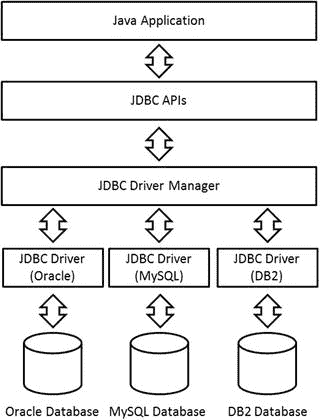
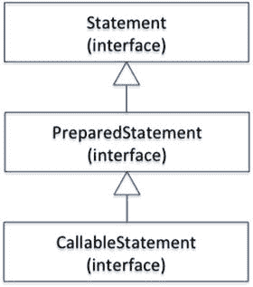
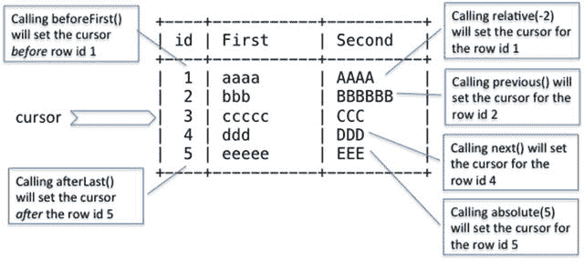
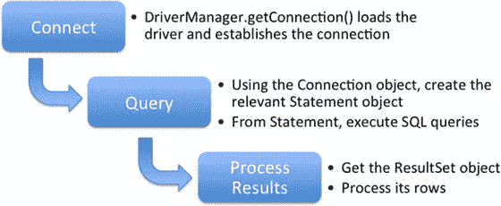

# 十二、使用 JDBC 构建数据库应用

 
| 认证目标 |
| --- |
| 描述构成 JDBC API 核心的接口，包括驱动程序、连接、语句和结果集接口，以及它们与提供者实现的关系 |
| 确定使用 DriverManager 类连接到数据库所需的组件，包括 JDBC URL |
| 提交查询并从数据库中读取结果，包括创建语句、返回结果集、遍历结果以及正确关闭结果集、语句和连接 |

JDBC (Java 数据库连接)是一个重要的 Java API，它定义了客户端如何访问数据库。因此，在构建大规模企业 Java 解决方案时，这一点至关重要。

概括地说，与数据库交互包括以下步骤:

Establish a connection to a database.   Execute SQL queries to retrieve, create, or modify tables in the database.   Close the connection to the database.  

Java 提供了一组 API(JDBC)来执行数据库的这些活动。您可以使用 JDBC 建立与数据库的连接，执行 SQL 查询，并关闭与数据库的连接。JDBC 的好处是你不用为一个特定的数据库写程序。JDBC 在 Java 程序和使用的数据库类型之间创建了一个松散的耦合。例如，数据库建立连接的方式可能不同(API 名称可能不同，等等)。JDBC 隐藏了这些数据库的所有异构性，并提供了一组可以用来与所有类型的数据库进行交互的 API。注意，JDBC 只支持关系数据库，比如 MySQL、Oracle、Microsoft SQL 和 DB2。它不支持 MongoDB 和 Neo4j 等新一代数据库(也称为 NoSQL 数据库)。

从 OCPJP 8 考试的角度来看，你应该知道如何使用 JDBC 连接到数据库，并执行数据库操作，如插入、更新和创建数据库实体。您还应该知道如何提交查询和从数据库中读取结果，以及如何正确地释放数据库资源。

JDBC 类和接口是包`java.sql.*`和`javax.sql.*`的一部分。本章假设您已经熟悉 SQL 查询，并且对数据库概念有一些基本的了解。本章介绍了 JDBC 4.2，它是 Java SE 8 版本的一部分。

## JDBC 简介

  
| 认证目标 |   |
| --- | --- |
| 描述构成 JDBC API 核心的接口，包括驱动程序、连接、语句和结果集接口，以及它们与提供者实现的关系 |   |

让我们看看 JDBC 的重要组件，以及这些组件如何协同工作来实现与数据库的无缝集成。JDBC 的简化架构如图 [12-1](#Fig1) 所示。Java 应用使用 JDBC API 与数据库进行交互。JDBC API 与 JDBC 驱动程序管理器交互，透明地连接不同类型的数据库并执行各种数据库活动。JDBC 驱动程序管理器使用各种 JDBC 驱动程序连接到它们特定的 DBMSs。

JDBC 车手和车手经理在实现 JDBC 目标的过程中发挥着关键作用。JDBC 驱动程序是专门为与各自的 DBMSs 交互而设计的。驱动程序管理器是 JDBC 驱动程序的目录，它维护着可用数据源及其驱动程序的列表。驱动程序管理器选择合适的驱动程序与各自的 DBMS 通信。它可以管理连接到各自数据源的多个并发驱动程序。

从图中可以看出，异构交互的复杂性被委托给了 JDBC 驱动程序管理器和 JDBC 驱动程序。JDBC API 对应用开发人员隐藏了底层细节和相关的复杂性。



图 12-1。

JDBC architecture

### 设置数据库

在开始探索 JDBC API 及其用法之前，您必须设置一个要使用的数据库。在开始编写 JDBC 程序之前，需要正确配置数据库。你可以使用任何数据库。本章中的例子使用 MySQL 来解释 JDBC API 的各个方面，因为这个数据库是免费的并且可以广泛获得。本节展示了在您的机器上设置 MySQL 数据库的步骤，假设您使用的是 Windows(如果您使用的是不同的操作系统，步骤会略有不同):

Download the latest MySQL installer from the MySQL download page ( [`www.mysql.com/downloads/mysql`](http://www.mysql.com/downloads/mysql) ).   Invoke the MySQL installer, and follow all the steps shown by the installation wizard. Keep the default values, and complete the installation. The installer asks you to provide a root/admin password; remember it, because it’s used in the examples.   Invoke the MySQL command-line client (in our case, it is MySQL 5.5 Command Line Client, shown on the Start menu). You see a MySQL prompt once you provide the root/admin password.  

以下代码建立了一个数据库并创建了两条记录:

```java
Enter password: ********

Welcome to the MySQL monitor. Commands end with ; or \g.

Your MySQL connection id is 1

Server version: 5.5.27 MySQL Community Server (GPL)

Copyright (c) 2000, 2011, Oracle and/or its affiliates. All rights reserved.

Oracle is a registered trademark of Oracle Corporation and/or its affiliates. Other names may be trademarks of their respective owners.

Type 'help;' or '\h' for help. Type '\c' to clear the current input statement.

mysql> /* Let's create a database for our use.*/

mysql> create database addressBook;

Query OK, 1 row affected (0.01 sec)

mysql> /* Now, let's create a table in this database and insert two records for our use later. */

mysql> use addressBook;

Database changed

mysql> create table contact (id int not null auto_increment, firstName varchar(30) Not null, lastName varchar(30), email varchar(30), phoneNo varchar(13), primary key (id));

Query OK, 0 rows affected (0.20 sec)

mysql> insert into contact values (default, 'Michael', 'Taylor', 'michael@abc.com', '+919876543210');

Query OK, 1 row affected (0.10 sec)

mysql> insert into contact values (default, 'William', 'Becker', 'william@abc.com', '+449876543210');

Query OK, 1 row affected (0.03 sec)

mysql> select * from contact;

+----+-----------+----------+-----------------+---------------+

| id | firstName | lastName | email           | phoneNo       |

+----+-----------+----------+-----------------+---------------+

|  1 | Michael   | Taylor   | michael@abc.com | +919876543210 |

|  2 | William   | Becker   | william@abc.com | +449876543210 |

+----+-----------+----------+-----------------+---------------+

2 rows in set (0.00 sec)

mysql> /* That's it. Our database is ready to use now.*/
```

## 连接到数据库

本节讨论如何以编程方式连接到数据库。首先简单介绍一下`Connection`界面。

### 连接接口

`java.sql`包的`Connection`接口表示从应用到数据库的连接。它是应用和数据库通信的通道。表 [12-1](#Tab1) 列出了`Connection`界面中的重要方法。所有这些方法都抛出`SQLException` s，所以在表中没有提到。

表 12-1。

Important Methods in the Connection Interface

  
| 方法 | 描述 |
| --- | --- |
| `Statement createStatement()` | 创建一个可用于向数据库发送 SQL 语句的`Statement`对象。 |
| `PreparedStatement prepareStatement(String sql)` | 创建一个可以包含 SQL 语句的`PreparedStatement`对象。SQL 语句可以有 IN 参数；它们可能包含`?`符号，这些符号用作占位符，以便稍后传递实际值。 |
| `CallableStatement prepareCall(String sql)` | 创建一个用于调用数据库中存储过程的`CallableStatement`对象。SQL 语句可以有`IN`或`OUT`参数；它们可能包含`?`符号，这些符号用作占位符，用于稍后传递实际值。 |
| `DatabaseMetaData getMetaData()` | 获取`DataBaseMetaData`对象。这些元数据包含数据库模式信息、表信息等，当您不知道底层数据库时，这尤其有用。 |
| `Clob createClob()` | 返回一个`Clob`对象(`Clob`是接口的名称)。字符大对象(CLOB)是 SQL 中的内置类型；它可以用来在数据库表的行中存储列值。 |
| `Blob createBlob()` | 返回一个`Blob`对象(`Blob`是接口的名称)。二进制大型对象(BLOB)是 SQL 中的内置类型；它可以用来在数据库表的行中存储列值。 |
| `void setSchema(String schema)` | 当传递模式名时，将这个`Connection`对象设置为要访问的数据库模式。 |
| `String getSchema()` | 返回与此`Connection`对象关联的数据库的架构名称；如果没有与之相关联的模式，则返回`null`。 |

### 使用 DriverManager 连接到数据库

  
| 认证目标 |   |
| --- | --- |
| 确定使用 DriverManager 类连接到数据库所需的组件，包括 JDBC URL |   |

与数据库通信的第一步是在应用和数据库服务器之间建立连接。建立连接需要了解数据库 URL，所以我们现在就来讨论一下。

以下是 JDBC 网址的一般格式:

```java
jdbc:<subprotocol>:<subname>
```

URL 字符串的一个例子是`jdbc:mysql://localhost:3306/`:

*   所有数据库管理系统都一样。
*   `<subprotocol>`因每个 DBMS 而异，在本例中为`mysql`。有时它包括供应商名称(在本例中不存在)。
*   `<subname>`的格式取决于数据库，但是它的一般格式是`//<server>:<port>/database. <server>`取决于您托管数据库的位置。每个 DBMS 使用一个特定的`<port>`号(在 MySQL 中是 3306)。最后，提供数据库名称

这里还有几个例子:

```java
jdbc:postgresql://localhost/test

jdbc:oracle://127.0.0.1:44000/test

jdbc:microsoft:sqlserver://himalaya:1433
```

现在，让我们编写一个简单的应用来获取连接(参见清单 [12-1](#FPar1) )。

Listing 12-1\. `DbConnect.java`

```java
import java.sql.Connection;

import java.sql.DriverManager;

// The class attempts to acquire a connection with the database

class DbConnect {

public static void main(String[] args) {

// URL points to JDBC protocol: mysql subprotocol;

// localhost is the address of the server where we installed our

// DBMS (i.e. on local machine) and 3306 is the port on which

// we need to contact our DBMS

String url = "jdbc:mysql://localhost:3306/";

// we are connecting to the addressBook database we created earlier

String database = "addressBook";

// we login as "root" user with password "mysql123"

String userName = "root";

String password = "mysql123";

try (Connection connection = DriverManager.getConnection

(url + database, userName, password)){

System.out.println("Database connection: Successful");

} catch (Exception e) {

System.out.println("Database connection: Failed");

e.printStackTrace();

}

}

}
```

让我们一步一步地分析程序:

The URL `jdbc:mysql://localhost:3306/` indicates that `jdbc` is the protocol and `mysql` is a subprotocol; `localhost` is the address of the server where we installed our DBMS (the local machine), and `3306` is the port on which to contact the DBMS. (Note that this port number is different when you use some other database. We used the default port number provided by the MySQL database, which can be changed if required. Additionally, if you are using another database, the subprotocol also changes.) You need to use the `addressBook` database with `root` credentials.   You can get a connection object by invoking the `DriverManager.getConnection()` method. The method expects the URL of the database along with a database name, username, and password.   You need to close the connection before exiting the program. This example uses a `try-with-resources` statement; hence the `close()` method for the `connection` is automatically called.   If anything goes wrong, you get an exception. In that case, the program prints the exception’s stack trace.  

继续运行程序。以下是输出:

```java
Database connection: Failed

java.sql.SQLException: No suitable driver found for jdbc:mysql://localhost:3306/addressBook

at java.sql.DriverManager.getConnection(DriverManager.java:604)

at java.sql.DriverManager.getConnection(DriverManager.java:221)

at DbConnect.main(DbConnect.java:16)
```

哎呀！为什么会有这个`SQLException`？当您尝试使用 JDBC 连接到数据库时，`DriverManager`会搜索 MySQL 驱动程序。你需要明确地安装相关的驱动程序——它们不是 JDK 的一部分。

您可以从 MySQL 的下载页面( [`http://dev.mysql.com/downloads/connector/j`](http://dev.mysql.com/downloads/connector/j) )下载连接器。不要忘记将连接器的路径添加到`CLASSPATH`中。如果连接器名称是`mysql-connector-java-5.1.21-bin.jar`，存储在`C:\mysql-connector-java-5.1.21`中，那么将`c:\ mysql-connector-java-5.1.21\mysql-connector-java-5.1.21-bin.jar`添加到`CLASSPATH`中。

忘记在`CLASSPATH`环境变量中添加 jar 的路径是一个常见的错误。在这种情况下，JDBC API 将无法定位 JDBC 驱动程序，并将抛出一个异常。记住，输入 jar 的路径是不够的:在调用 JVM 时，您需要添加 jar 名称以及到`CLASSPATH`变量的完整路径，或者用`–cp`命令传递 jar 文件的路径。

更新`CLASSPATH`变量，然后重试。您可能会得到另一个异常:

```java
Database connection: Failed

java.sql.SQLException: Access denied for user 'root'@'localhost' (using password: YES)

at com.mysql.jdbc.SQLError.createSQLException(SQLError.java:1074)

[... rest of the stack trace elided ...]
```

这个程序给出了用户名“root”和密码“mysql123”。如果您已经将 root 用户密码设置为其他密码，您将会得到这个异常，并显示消息“拒绝用户访问”有两种方法可以解决这个问题。第一种方法是改变程序给出你的密码，而不是这个程序用的“mysql123”。第二种方法是重置数据库中的密码。对于 MySQL，您可以为用户“root”重置密码，如下所示:

```java
UPDATE mysql.user SET Password=PASSWORD('mysql123') WHERE User='root';

FLUSH PRIVILEGES;
```

以下是程序成功运行时的输出:

```java
Database connection: Successful
```

当您看到这个输出时，这意味着您能够与数据库建立连接。如果你想尝试本章余下的程序，你应该让这个程序在你的系统中工作；您需要建立一个连接来查询或更新数据库。

你已经看到了两个从 JDBC API 抛出的`SQLException`的例子。当你得到一个`SQLException`时，你很少能在程序中做任何事情来恢复它。在真实的应用中，您可以将其包装为更高级别的异常，并将其重新抛出给调用组件。为了节省本章代码段的空间，我们打印异常的堆栈跟踪，并在程序中忽略它。

#### 了解驱动程序管理器类

`DriverManager`类帮助建立程序(用户)和 JDBC 驱动程序之间的连接。该类还跟踪不同的数据源和 JDBC 驱动程序。因此，不需要显式加载 JDBC 驱动程序:`DriverManager`搜索合适的驱动程序，如果找到，当您调用`getConnection()`方法时自动加载它。清单 [12-1](#FPar1) 包含以下代码，用于在不显式加载 JDBC 驱动程序时获取连接(在`try-with-resources`语句中给出):

```java
Connection connection = DriverManager.getConnection(url + database, userName, password);
```

驱动程序管理器还管理连接到各自数据源的多个并发驱动程序。表 [12-2](#Tab2) 列出了`DriverManager`类中提供的其他重要方法，包括`getConnection()`的重载版本。

表 12-2。

Important Methods in the `DriverManager` Class

  
| 方法 | 描述 |
| --- | --- |
| `static Connection getConnection(String url)``static Connection getConnection(String url, Properties info)`T2】 | 给定数据库 URL，尝试建立连接。此外，您可以直接作为`String`参数或通过`Properties`文件提供用户名和密码等信息。如果不能建立连接，这个方法抛出一个`SQLException`。 |
| `static Driver getDriver(String url)` | 搜索已注册的 JDBC 驱动程序列表，如果找到，返回与数据库 URL 匹配的适当的`Driver`对象。 |
| `static void registerDriver(Driver driver)` | 添加到`DriverManager`中已注册的`Driver`对象列表。 |
| `static void deregisterDriver(Driver driver)` | 从`DriverManager`中已注册的`Driver`对象列表中注销驱动程序 |

使用`getDriver()`方法，您可以通过传递数据库 URL 来加载驱动程序:

```java
String url = "jdbc:mysql://localhost:3306/";

Driver driver = DriverManager.getDriver(url);

System.out.println(driver.getClass().getName());
```

这段代码打印了`com.mysql.jdbc.Driver`—这是 MySQL JDBC 驱动程序的完全限定名，并且`DriverManager`能够加载它。从这个`Driver`对象，您可以通过调用`connect()`方法并传递数据库 URL 和可选的`Properties`文件引用来建立连接:

```java
Connection connection = driver.connect(url, /*properties = */ null);
```

在`Properties`文件中，您可以提供用户名和密码以及任何其他详细信息。

## 查询和更新数据库

  
| 认证目标 |   |
| --- | --- |
| 提交查询并从数据库中读取结果，包括创建语句、返回结果集、遍历结果以及正确关闭结果集、语句和连接 |   |

一旦建立了到所需数据库的连接，就可以对它执行各种操作。常见的操作被缩写为 CRUD(创建、读取、更新、删除)。您可以使用`SELECT` SQL 语句读取数据，并使用`INSERT`、`UPDATE`和`DELETE`修改数据库。JDBC 提供了两个支持查询的重要接口:`Statement`和`ResultSet`。接下来的两个小节将讨论这些接口。

### 语句接口

顾名思义，`Statement`是一个 SQL 语句，可以用来将 SQL 语句与连接的数据库进行通信，并从数据库接收结果。您可以使用`Statement`形成 SQL 查询，并使用`Statement`接口(或其派生接口之一)中提供的 API 来执行它。`Statement`有三种口味:`Statement`、`PreparedStatement`、`CallableStatement`；这些显示在图 [12-2](#Fig2) 中的继承层次中。



图 12-2。

The `Statement` interface and its subinterfaces

对于给定的情况，您如何从这三个`Statement`界面中进行选择？让我们来看看不同之处:

*   `Statement`:向数据库发送不带任何参数的 SQL 语句。对于典型的用途，您需要使用这个接口。您可以在`Connection`接口中使用`createStatement()`方法创建一个`Statement`的实例。
*   `PreparedStatement`:表示可以使用`IN`参数定制的预编译 SQL 语句。通常，它比一个`Statement`对象更有效率；因此，它用于提高性能，尤其是当一条 SQL 语句被执行多次时。通过调用`Connection`接口中的`preparedStatement()`方法，可以得到`PreparedStatement`的一个实例。
*   `CallableStatement`:执行存储过程。`CallableStatement`实例可以处理`IN`以及`OUT`和`INOUT`参数。您需要调用`Connection`接口中的`prepareCall()`方法来获取该类的一个实例。

一旦创建了适当的`Statement`对象，就可以执行 SQL 语句了。`Statement`接口提供了三种执行方法:`executeQuery()`、`executeUpdate()`和`execute()`。如果您的 SQL 语句是一个`SELECT`查询，使用`executeQuery()`方法，它返回一个`ResultSet`(将在下一节讨论)。当您想要使用`INSERT`、`UPDATE`或`DELETE`语句更新数据库时，您应该使用`executeUpdate()`方法，该方法返回一个反映更新的行数的整数。如果不知道 SQL 语句的类型，可以使用`execute()`方法，它可能返回多个结果集或多个更新计数，或者两者的组合。从 OCPJP 8 考试的角度，你需要了解`Statement`接口及其派生接口(见表 [12-3](#Tab3) )。本章的其余部分使用`Statement`接口。

表 12-3。

Important Methods of the `Statement` Interface

  
| 方法 | 描述 |
| --- | --- |
| `boolean execute(String sql)` | 执行给定的 SQL 查询。如果查询产生了一个`ResultSet`，这个方法返回 true。您可以通过调用`getResultSet()`方法来检索`ResultSet`对象。如果 SQL 查询没有结果或者有更新计数，则此方法返回 false。您可以使用`getUpdateCount()`方法来获取更新计数。在极少数情况下，该方法可能会返回多个`ResultSets`；在这种情况下，可以调用`getMoreResults()`方法。 |
| `ResultSet executeQuery(String sql)` | 执行查询并返回`ResultSet`对象作为结果。如果没有结果，该方法不返回`null`；相反，当调用`next()`方法时，返回的`ResultSet`对象将返回 false。 |
| `int executeUpdate(String sql)` | 执行`CREATE`、`INSERT`、`UPDATE`或`DELETE` SQL 查询。它返回更新的行数(如果没有结果，则返回零，比如使用`CREATE`语句)。 |
| `Connection getConnection()` | 返回用来创建`Statement`对象的`Connection`对象。 |
| `void close()` | 关闭与此`Statement`对象相关联的数据库和其他 JDBC 资源。在已经关闭的`Statement`对象上调用`close()`没有任何效果。 |

根据 SQL 语句的类型选择相关的`execute`方法。记住每个`execute`方法返回不同的输出。方法`executeQuery()`返回一个`ResultSet`，`executeUpdate()`返回一个更新计数，`execute()`方法可能返回多个`ResultSet`或多个更新计数，或者两者的组合。

### 结果集接口

关系数据库包含表。每个表都有一组由列表示的属性(由表建模的对象的属性)；行是包含这些属性值的记录。查询数据库时，会产生表格数据:包含查询所请求的列的一定数量的行。这种表格数据被称为结果集。结果集是一个包含列标题和查询所请求的相关值的表。

`A` resultset 维护一个指向当前行的光标。您一次只能读取一行，因此您必须更改光标的位置来读取/导航整个结果集。最初，光标被设置在第一行之前。您需要在 resultset 上调用`next()`方法，将光标位置向前移动一行。此方法返回一个布尔值；因此，您可以在一个`while`循环中使用它来迭代整个结果集。表 [12-4](#Tab4) 显示了`ResultSet`支持的其他移动光标的方法。

表 12-4。

Useful `ResultSet` Methods to Move the Cursor

  
| 方法 | 描述 |
| --- | --- |
| `void beforeFirst()` | 将光标设置在结果集的第一行之前。 |
| `void afterLast()` | 将光标设置在结果集的最后一行之后。 |
| `boolean absolute(int rowNumber)` | 将光标设置到请求的行号(表中的绝对位置，而不是相对于当前位置)。 |
| `boolean relative(int rowNumber)` | 将光标设置到相对于当前位置的所请求的行号。`rowNumber`可以是正值，也可以是负值:正值相对于当前位置向前移动，负值相对于当前位置向后移动。 |
| `boolean next()` | 将光标设置到结果集的下一行。 |
| `boolean previous()` | 将光标设置到结果集的前一行。 |

图 [12-3](#Fig3) 举例说明了这些方法。该图有 5 行，光标指向 ID 为 3 的行。如果调用`beforeFirst()`，光标会移动到行 ID 1 之前的位置。如果调用`afterLast()`，光标会移动到行 ID 5 之后的位置。如果您调用`relative(-2)`，因为当前位置在第 3 行，光标向后移动两个位置，指向第 1 行的位置。调用`previous()`和`next()`将光标分别移动到行 ID 为 2 和行 ID 为 4 的位置。最后，调用`absolute(5)`将光标移动到行 ID 为 5 的位置。



图 12-3。

Moving the cursor by calling `ResultSet` methods

`ResultSet`还提供了一组方法来读取当前行中所需列的值。通常，这些方法有两种风格:第一种风格接受列号作为输入，第二种风格接受列名作为输入。例如，读取`double`值的方法有`double getDouble(int columnNumber)`和`double getDouble(String columnName)`。同样，`ResultSet`为所有基本类型提供了`get()`方法。

类似地，`ResultSet`提供了一组方法来更新所选行中所需列的值。这些方法也有两种变体:`void updateXXX(int columnNumber, XXX x)`和`void updateXXX(String columnName, XXX x)`，其中`update`方法是为表示为`XXX`的各种数据类型定义的。

### 查询数据库

现在，您已经知道了用于在数据库上执行简单 SQL 查询的所有必要接口:`Connection`、`Statement`和`ResultSet`。图 [12-4](#Fig4) 显示了建立数据库连接、执行 SQL 查询和处理结果的高级步骤。



图 12-4。

Connecting to, querying, and processing results from a database

让我们查询一个数据库并打印输出。回想一下，您在这个数据库中创建了一个名为`addressBook`的数据库和一个名为`contact`的表，并在表中插入了两行。假设您想要打印表格内容；清单 [12-2](#FPar2) 和 [12-3](#FPar3) 包含这样做的程序

Listing 12-2\. `DbConnector.java`

```java
import java.sql.Connection;

import java.sql.DriverManager;

import java.sql.SQLException;

// Utility class with method connectToDb() that will be used by other programs in this chapter

public class DbConnector {

public static Connection connectToDb() throws SQLException {

String url = "jdbc:mysql://localhost:3306/";

String database = "addressBook";

String userName = "root";

String password = "mysql123";

return DriverManager.getConnection(url + database, userName, password);

}

}
```

Listing 12-3\. `DbQuery` `.java`

```java
import java.sql.Connection;

import java.sql.Statement;

import java.sql.ResultSet;

import java.sql.SQLException;

// Program to illustrate how to query a database

class DbQuery {

public static void main(String[] args) {

// Get connection, execute query, get the result set

// and print the entries from the result rest

try (Connection connection = DbConnector.connectToDb();

Statement statement = connection.createStatement();

ResultSet resultSet = statement.executeQuery("SELECT * FROM contact")){

System.out.println("ID \tfName \tlName \temail \t\tphoneNo");

while (resultSet.next()) {

System.out.println(resultSet.getInt("id") + "\t"

+ resultSet.getString("firstName") + "\t"

+ resultSet.getString("lastName") + "\t"

+ resultSet.getString("email") + "\t"

+ resultSet.getString("phoneNo"));

}

}

catch (SQLException sqle) {

sqle.printStackTrace();

System.exit(-1);

}

}

}
```

该程序的输出如下:

```java
ID      fName          lName           email                         phoneNo

1       Michael        Taylor          michael@abc.com         +919876543210

2       William        Becker          william@abc.com         +449876543210
```

让我们一步一步地看看这段代码中发生了什么:

*   在`main()`方法中，有一个`try-with-resources`语句。第一条语句是对程序中定义的`connectToDb()`方法的调用。`connectToDb()`方法只是连接到数据库(在上一个例子中可以看到),如果成功就返回一个`Connection`对象。
*   下一条语句从`connection`创建一个`Statement`对象。
*   `Statement`对象现在用于执行一个查询。您想要获取`contact`表中的所有列；因此，您将`SELECT * FROM contact`写成一个 SQL 查询。使用`Statement`对象的`executeQuery()`方法执行查询。查询的结果存储在一个`ResultSet`对象中。
*   `ResultSet`对象用于打印获取的数据。您读取当前行中的所有列值，并对`ResultSet`对象中的每一行执行同样的操作。
*   因为您已经在一个`try-with-resources`语句中创建了`Connection`、`Statement`和`ResultSet`对象，所以没有必要在这些资源上显式调用`close()`。然而，如果您没有使用`try-with-resources`，您需要在`finally`块中显式地释放它们。

这里，您使用列名来读取相关的值。您可以使用列号来做同样的工作。下面是在`while`循环中使用列号的修改代码:

```java
while (resultSet.next()) {

System.out.println(resultSet.getInt(1)

+ "\t" + resultSet.getString(2)

+ "\t" + resultSet.getString(3)

+ "\t" + resultSet.getString(4)

+ "\t" + resultSet.getString(5));

}
```

这段代码产生的结果与上一个示例完全相同。然而，重要的是要注意这里的列索引从 1 开始，而不是从 0 开始。

`ResultSet`对象中的列索引从 1 开始，而不是从 0 开始。

当按列索引引用列时，如果按大于总列数的索引引用列，则会出现异常。例如，如果您将上一个示例中使用的列索引之一更改为 6，则会出现以下异常:

```java
java.sql.SQLException: Column Index out of range, 6 > 5.

at com.mysql.jdbc.SQLError.createSQLException(SQLError.java:1074)

[... this part of the stack trace elided ...]

at DbQuery.main(DbQuery.java:18)
```

请务必提供正确的列索引。

在本例中，您知道列数以及列中的数据类型。如果您既不知道每行的列数，也不知道列中的数据类型，该怎么办？在这种情况下，首先需要在返回一个`ResultMetaData`对象的`ResultSet`对象上调用`getMetaData()`方法；在`ResultMetaData`对象上，您可以使用`getColumnCount()`方法来获取列计数。当您不知道列条目的数据类型时，您可以在`ResultSet`对象上使用`getObject()`方法。您可以将列索引传递给`getObject()`来获取相应列中的值。下面是使用这些方法的修改后的代码:

```java
// from resultSet metadata, find out how many columns there are

// and then read the column entries

int numOfColumns = resultSet.getMetaData().getColumnCount();

while (resultSet.next()) {

// remember that the column index starts from 1 not 0

for(int i = 1; i <= numOfColumns; i++) {

// since we do not know the data type of the column, we use getObject()

System.out.print(resultSet.getObject(i) + "\t");

}

System.out.println("");

}
```

该程序的输出是

```java
ID      fName          lName           email                         phoneNo

1       Michael        Taylor          michael@abc.com         +919876543210

2       William        Becker          william@abc.com         +449876543210
```

让我们做另一个练习。这一次，您只想打印名字与“Michael”匹配的记录的名字和电子邮件地址(参见清单 [12-4](#FPar4) )。

Listing 12-4\. `DbQuery4.java`

```java
import java.sql.Connection;

import java.sql.Statement;

import java.sql.ResultSet;

import java.sql.SQLException;

class DbQuery4 {

public static void main(String[] args) throws SQLException {

try (Connection connection = DbConnector.connectToDb();

Statement statement = connection.createStatement();

ResultSet resultset = statement.executeQuery("SELECT firstName, email FROM contact WHERE firstName=\"Michael\"")) {

System.out.println("fName \temail");

while (resultset.next()){

System.out.println(resultset.getString("firstName") + "\t"

+ resultset.getString("email"));

}

} catch (SQLException e) {

e.printStackTrace();

System.exit(-1);

}

}

}
```

该程序打印以下内容:

```java
fName   email

Michael michael@abc.com
```

### 更新数据库

现在让我们更新数据库。有两种方法可以做到这一点:可以使用 SQL 查询直接更新数据库，或者可以使用 SQL 查询获取结果集，然后更改它和数据库。JDBC 支持这两种方法。让我们专注于检索结果集并修改它和数据库。

为了修改结果集和数据库，`ResultSet`类为每种数据类型提供了一组更新方法。还有其他的支持方法，比如`updateRow()`和`deleteRow()`，让任务更简单。是时候动手了:假设您的`addressBook`数据库中的一个联系人更改了他们的电话号码，您需要使用 JDBC 程序更新数据库中的电话号码(参见清单 [12-5](#FPar5) )。

Listing 12-5\. `DbUpdate.java`

```java
import java.sql.Connection;

import java.sql.Statement;

import java.sql.ResultSet;

import java.sql.SQLException;

// To illustrate how we can update a database

class DbUpdate {

public static void main(String[] args) throws SQLException {

try (Connection connection = DbConnector.connectToDb();

Statement statement = connection.createStatement();

ResultSet resultSet = statement.executeQuery("SELECT * FROM contact WHERE firstName=\"Michael\"")) {

// first fetch the data and display it before the update operation

System.out.println("Before the update");

System.out.println("id \tfName \tlName \temail \t\tphoneNo");

while (resultSet.next()) {

System.out.println(resultSet.getInt("id") + "\t"

+ resultSet.getString("firstName") + "\t"

+ resultSet.getString("lastName") + "\t"

+ resultSet.getString("email") + "\t"

+ resultSet.getString("phoneNo"));

}

// now update the resultset and display the modified data

resultSet.absolute(1);

resultSet.updateString("phoneNo", "+919976543210");

System.out.println("After the update");

System.out.println("id \tfName \tlName \temail \t\tphoneNo");

resultSet.beforeFirst();

while (resultSet.next()) {

System.out.println(resultSet.getInt("id") + "\t"

+ resultSet.getString("firstName") + "\t"

+ resultSet.getString("lastName") + "\t"

+ resultSet.getString("email") + "\t"

+ resultSet.getString("phoneNo"));

}

} catch (SQLException e) {

e.printStackTrace();

System.exit(-1);

}

}

}
```

让我们一步一步地找出程序的本质:

*   您使用`DbConnector.connectToDb()`方法建立连接。
*   在创建了一个`Statement`对象之后，您在数据库上执行一个查询来查找与 Michael 相关联的记录。(为了简单起见，假设结果集将只包含一条记录。)
*   您打印检索到的记录。
*   使用`absolute()`方法将光标移动到`ResultSet`对象的第一行；然后你用`updateString(`方法更新电话号码。
*   最后，打印修改后的结果集。

这看起来很简单。执行程序并查看它打印的内容:

```java
Before the update

id      fName   lName   email           phoneNo

1       Michael Taylor  michael@abc.com +919876543210

com.mysql.jdbc.NotUpdatable: Result Set not updatable.(...rest of the text elided)

at com.mysql.jdbc.ResultSetImpl.updateString(ResultSetImpl.java:8618)

at com.mysql.jdbc.ResultSetImpl.updateString(ResultSetImpl.java:8636)

at DbUpdate.main(DbUpdate.java:34)
```

糟糕——程序在抛出异常后崩溃了！发生了什么事？

您正试图更新不可更新的`ResultSet`对象。为了在结果集和数据库中进行更新，您需要使这个结果集可更新。您可以通过创建一个合适的`Statement`对象来实现这一点；在调用`createStatement()`方法时，您可以传递输入，比如您是想要对变化敏感的可滚动结果集还是可更新结果集。

对清单 [12-5](#FPar5) 中对`createStatement()`的调用做如下修改:

```java
Statement statement = connection.createStatement(ResultSet.TYPE_SCROLL_SENSITIVE, ResultSet.CONCUR_UPDATABLE);
```

现在运行更改后的程序，看看它是否工作:

```java
Before the update

id      fName   lName   email           phoneNo

1       Michael Taylor  michael@abc.com +919876543210

After the update

id      fName   lName   email           phoneNo

1       Michael Taylor  michael@abc.com +919876543210
```

很好，程序没有导致异常。但是请等待—电话号码没有更新！发生了什么事？更新后你忘了一个至关重要的声明:`updateRow()`方法。每次使用适当的`updateXXX()`方法对结果集进行更改时，都需要调用`updateRow()`来确保数据库中的所有值都得到更新。做出这个改变，然后再试一次(见清单 [12-6](#FPar6) )。

Listing 12-6\. `DbUpdate2.java`

```java
import java.sql.Connection;

import java.sql.Statement;

import java.sql.ResultSet;

import java.sql.SQLException;

// To illustrate how we can update a database

class DbUpdate2 {

public static void main(String[] args) throws SQLException {

try (Connection connection = DbConnector.connectToDb();

// create a statement from which the created ResultSets

// are "scroll sensitive" as well as "updatable"

Statement statement = connection.createStatement(ResultSet.TYPE_SCROLL_SENSITIVE, ResultSet.CONCUR_UPDATABLE);

ResultSet resultSet = statement.executeQuery("SELECT * FROM contact WHERE firstName=\"Michael\"")) {

// first fetch the data and display it before the update operation

System.out.println("Before the update");

System.out.println("id \tfName \tlName \temail \t\tphoneNo");

while (resultSet.next()) {

System.out.println(resultSet.getInt("id") + "\t"

+ resultSet.getString("firstName") + "\t"

+ resultSet.getString("lastName") + "\t"

+ resultSet.getString("email") + "\t"

+ resultSet.getString("phoneNo"));

}

// now update the resultset and display the modified data

resultSet.absolute(1);

resultSet.updateString("phoneNo", "+919976543210");

// reflect those changes back to the database

// by calling updateRow() method

resultSet.updateRow();

System.out.println("After the update");

System.out.println("id \tfName \tlName \temail \t\tphoneNo");

resultSet.beforeFirst();

while (resultSet.next()) {

System.out.println(resultSet.getInt("id") + "\t"

+ resultSet.getString("firstName") + "\t"

+ resultSet.getString("lastName") + "\t"

+ resultSet.getString("email") + "\t"

+ resultSet.getString("phoneNo"));

}

} catch (SQLException e) {

e.printStackTrace();

System.exit(-1);

}

}

}
```

修订后的程序打印以下内容:

```java
Before the update

id      fName   lName   email           phoneNo

1       Michael Taylor  michael@abc.com +919876543210

After the update

id      fName   lName   email           phoneNo

1       Michael Taylor  michael@abc.com +919976543210
```

它运行良好。现在您已经知道了更新数据库中的行所需的要求和步骤。

修改行内容后总是调用`updateRow`；否则，您将丢失更改。

接下来，在结果集和数据库中插入一条记录怎么样？尝试清单 [12-7](#FPar7) 中所示的例子。

Listing 12-7\. `DbInsert.java`

```java
import java.sql.Connection;

import java.sql.Statement;

import java.sql.ResultSet;

import java.sql.SQLException;

// To illustrate how to insert a row in a resultset and in the database

class DbInsert {

public static void main(String[] args) throws SQLException {

try (Connection connection = DbConnector.connectToDb();

Statement statement = connection.createStatement(

ResultSet.TYPE_SCROLL_SENSITIVE, ResultSet.CONCUR_UPDATABLE);

ResultSet resultSet =

statement.executeQuery("SELECT * FROM contact")) {

System.out.println("Before the insert");

System.out.println("id \tfName \tlName \temail \t\tphoneNo");

while (resultSet.next()){

System.out.println(resultSet.getInt("id") + "\t"

+ resultSet.getString("firstName") + "\t"

+ resultSet.getString("lastName") + "\t"

+ resultSet.getString("email") + "\t"

+ resultSet.getString("phoneNo"));

}

resultSet.moveToInsertRow();

resultSet.updateString("firstName", "John");

resultSet.updateString("lastName", "K.");

resultSet.updateString("email", "john@abc.com");

resultSet.updateString("phoneNo", "+19753186420");

resultSet.insertRow();

System.out.println("After the insert");

System.out.println("id \tfName \tlName \temail \t\tphoneNo");

resultSet.beforeFirst();

while (resultSet.next()){

System.out.println(resultSet.getInt("id") + "\t"

+ resultSet.getString("firstName") + "\t"

+ resultSet.getString("lastName") + "\t"

+ resultSet.getString("email") + "\t"

+ resultSet.getString("phoneNo"));

}

} catch (SQLException e) {

e.printStackTrace();

}

}

}
```

这个例子中发生了什么？打印完当前记录后，调用`moveToInsertRow()`方法。该方法将游标设置为新记录，并为插入行准备结果集(它创建一个缓冲区来保存列值)。之后，您使用`updateString()`来修改新添加的行中的每个列值。最后，调用`insertRow()`将新行插入结果集和数据库。这里需要注意的一件重要事情是，您需要为每一列提供正确类型的值。此外，如果列值不能留空，则不能将列留空(不提供任何值)。在这两种违规情况下，你可能会得到一个`SQLException`。

让我们看看这个程序输出了什么:

```java
Before the insert

id      fName   lName   email           phoneNo

1       Michael Taylor  michael@abc.com +919976543210

2       William Becker  william@abc.com +449876543210

After the insert

id      fName   lName   email           phoneNo

1       Michael Taylor  michael@abc.com +919976543210

2       William Becker  william@abc.com +449876543210

3       John    K.      john@abc.com    +19753186420
```

看起来不错！现在让我们尝试另一个操作:从数据库中删除一条记录。看看清单 [12-8](#FPar8) 中的程序。

Listing 12-8\. `DbDelete.java`

```java
import java.sql.Connection;

import java.sql.Statement;

import java.sql.ResultSet;

import java.sql.SQLException;

// To illustrate how to delete a row in a resultset and in the database

class DbDelete {

public static void main(String[] args) throws SQLException {

try (Connection connection = DbConnector.connectToDb();

Statement statement = connection.createStatement(

ResultSet.TYPE_SCROLL_SENSITIVE, ResultSet.CONCUR_UPDATABLE);

ResultSet resultSet1 = statement.executeQuery

("SELECT * FROM contact WHERE firstName=\"John\"")) {

if(resultSet1.next()){

// delete the first row

resultSet1.deleteRow();

}

resultSet1.close();

// now fetch again from the database

try (ResultSet resultSet2 = statement.executeQuery("SELECT * FROM contact")) {

System.out.println("After the deletion");

System.out.println("id \tfName \tlName \temail \t\tphoneNo");

while (resultSet2.next()){

System.out.println(resultSet2.getInt("id") + "\t"

+ resultSet2.getString("firstName") + "\t"

+ resultSet2.getString("lastName") + "\t"

+ resultSet2.getString("email") + "\t"

+ resultSet2.getString("phoneNo"));

}

}

} catch (SQLException e) {

e.printStackTrace();

System.exit(-1);

}

}

}
```

这个程序简单地选择一个合适的行来删除，并在当前选择的行上调用`deleteRow()`方法。下面是程序的输出:

```java
After the deletion

id      fName   lName   email           phoneNo

1       Michael Taylor  michael@abc.com +919976543210

2       William Becker  william@abc.com +449876543210
```

这个程序运行良好，正确地删除了这个人的名字是 John 的行。

您可能记得您在数据库中创建了一个名为`contact`的表。当时，您从 MySQL 命令提示符下创建了这个表。使用 JDBC 程序可以完成同样的任务。让我们以编程方式在数据库中创建一个名为`familyGroup`的新表(参见清单 [12-9](#FPar9) )。

Listing 12-9\. `DbCreateTable.java`

```java
import java.sql.Connection;

import java.sql.Statement;

import java.sql.SQLException;

class DbCreateTable {

public static void main(String[] args) {

try (Connection connection = DbConnector.connectToDb();

Statement statement = connection.createStatement()){

// use CREATE TABLE SQL statement to

// create table familyGroup

statement.executeUpdate("CREATE TABLE familyGroup (id int not null auto_increment, nickName varchar(30) not null, primary key(id));");

System.out.println("Table created successfully");

}

catch (SQLException sqle) {

sqle.printStackTrace();

System.exit(-1);

}

}

}
```

该程序打印以下内容:

```java
Table created successfully
```

该计划正在按预期运行。像前面一样，连接到数据库并获取`Statement`对象。然后，使用`executeUpdate()`方法发出一条 SQL 语句。使用 SQL 语句，您声明需要创建一个名为`familyGroup`的表以及两列:`id`和`nickName`。此外，您声明应该将`id`视为主键。就是这样；SQL 语句在数据库中创建一个新表。

当您传递一个有语法错误的 SQL 语句时会发生什么？例如，如果您将“TABLE”拼错为“TABL ”,则会出现以下异常:

```java
com.mysql.jdbc.exceptions.jdbc4.MySQLSyntaxErrorException: You have an error in your SQL syntax; check the manual that corresponds to your MySQL server version for the right syntax to use near 'TABL familyGroup (id int not null auto_increment, nickName varchar(30) not null,' at line 1
```

传递正确的 SQL 语句(没有语法错误)是您的责任。

### 要记住的要点

以下是一些可能对你的 OCPJP 八级考试有帮助的要点:

*   `ResultSet`中的`boolean absolute(int)`方法将光标移动到那个`ResultSet`对象中传递的行号。如果行号为正，则从`ResultSet`对象的开头移动到该位置；如果行号为负，则从`ResultSet`对象的末尾移动到该位置。假设`ResultSet`对象中有十个条目。调用`absolute(3`)将光标移动到第三行。调用`absolute(`-`bs)`将光标移动到第八行。如果给出超出范围的值，光标会移动到开头或结尾。
*   在一个`ResultSet`对象中，调用`absolute(1)`相当于调用`first()`，调用`absolute(-1)`相当于调用`last()`。
*   您可以在`ResultSet`方法中使用列名或列索引。您使用的索引是`ResultSet`对象的索引，而不是数据库表中的列号。
*   如果`Statement`对象被关闭、重新执行或检索下一组结果，则`Statement`对象关闭当前的`ResultSet`对象。这意味着没有必要用一个`ResultSet`对象显式调用`close()`；然而，一旦处理完对象，调用`close()`是一个很好的做法。
*   您可以使用`ResultSet`对象的列名，而不用担心大小写:`getXXX()`方法接受不区分大小写的列名来检索相关的值。
*   考虑这样一种情况，在一个`ResultSet`对象中有两列同名。如何使用列名检索关联的值？如果使用列名来检索值，它总是指向与给定名称匹配的第一列。因此，在这种情况下，您必须使用列索引来检索与这两列相关联的值。
*   您可能还记得，`PreparedStatement`接口继承自`Statement`。然而，`PreparedStatement`覆盖了所有的`execute`方法。例如，`executeUpdate()`的行为可能不同于它的基方法。
*   您可以取消使用方法`cancelRowUpdates()`所做的任何更新。但是，必须在调用`updateRow()`之前调用这个方法。在所有其他情况下，它对行没有影响。
*   连接到数据库时，您需要指定正确的用户名和密码。如果提供的用户名或密码不正确，您会得到一个`SQLException`。

## 摘要

让我们简要回顾一下本章中每个认证目标的要点。请在参加考试前阅读这一部分。

确定使用 DriverManager 类连接到数据库所需的组件，包括 JDBC URL

*   JDBC 隐藏了所有 DBMSs 的异构性，并提供了一组 API 来与所有类型的数据库进行交互。异构交互的复杂性被委托给 JDBC 驱动程序管理器和 JDBC 驱动程序。
*   `DriverManager`类中的`getConnection()`方法有三个参数:URL 字符串、用户名字符串和密码字符串。
*   URL 的语法(需要指定它来获得`Connection`对象)是`jdbc: <subprotocol>:<subname>`。
*   如果 JDBC API 不能定位 JDBC 驱动程序，它抛出一个`SQLException.`如果驱动程序的 jar 可用，它们需要被包含在类路径中以使 JDBC API 能够定位驱动程序。

描述构成 JDBC API 核心的接口，包括驱动程序、连接、语句和结果集接口，以及它们与提供者实现的关系

*   `java.sql.Connection`接口提供了应用和数据库通信的通道。
*   JDBC 支持两类查询和更新:`Statement`和`Resultset`。
*   `Statement`是一个 SQL 语句，可用于将 SQL 语句传递给连接的数据库，并从数据库接收结果。有三种类型的`Statement`:
    *   `Statement`:向数据库发送不带任何参数的 SQL 语句
    *   `PreparedStatement`:表示可以使用`IN`参数定制的预编译 SQL 语句
    *   `CallableStatement`:执行存储过程；可以处理`IN`以及`OUT`和`INOUT`参数
*   结果集是一个带有列标题和查询所请求的相关值的表。

提交查询并从数据库中读取结果，包括创建语句、返回结果集、遍历结果以及正确关闭结果集、语句和连接

*   一个`ResultSet`对象保持一个指向当前行的光标。最初，光标被设置在第一行之前；调用`next()`方法将光标位置前移一行。
*   `ResultSet`对象中的列索引从 1 开始(不是从 0 开始)。
*   修改结果集中的行内容后，需要调用`updateRow()`；否则，对`ResultSet`对象所做的更改将会丢失。
*   您可以使用`try-with-resources`语句自动关闭资源(`Connection`、`ResultSet`和`Statement`)。

Question TimeWhich one of the given options is not correct with respect to the driver manager belonging to the JDBC architecture? A driver manager maintains a list of available data sources and their drivers.   A driver manager chooses an appropriate driver to communicate to the respective DBMS.   A driver manager ensures the atomic properties of a transaction.   A driver manager manages multiple concurrent drivers connected to their respective data sources.     Consider the following code segment. Assume that the connection object is valid and the `statement.executeQuery()` method successfully returns a `ResultSet` object with a few rows in it: `Statement statement = connection.createStatement();` `ResultSet resultSet = statement.executeQuery("SELECT * FROM contact"));` `int numOfColumns = resultSet.getMetaData().getColumnCount();` `while (resultSet.next()) {`      `// traverse the columns by index values`      `for(int i = 0; i < numOfColumns; i++) {`              `// since we do not know the data type of the column, we use getObject()`             `System.out.print(resultSet.getObject(i) + "\t");`      `}`      `System.out.println("");` `}` Which of the following statements is true regarding this code segment? The code segment will successfully print the contents of the rows in the `ResultSet` object.   The looping header is wrong. To traverse all the columns, it should be `for(int i = 0; i <= numOfColumns; i++) {`   The looping header is wrong. To traverse all the columns, it should be `for(int i = 1; i <= numOfColumns; i++) {`   The looping header is wrong. To traverse all the columns, it should be `for(int i = 1; i < numOfColumns; i++) {`     Consider this program, and choose the best option describing its behavior (assume that the connection is valid): `try (Statement statement = connection.createStatement();`       `ResultSet resultSet = statement.executeQuery("SELECT * FROM contact")){`       `System.out.println(resultSet.getInt("id") + "\t"`           `+ resultSet.getString("firstName") + "\t"`           `+ resultSet.getString("lastName") + "\t"`           `+ resultSet.getString("email") + "\t"`           `+ resultSet.getString("phoneNo"));` `}` `catch (SQLException sqle) {`       `System.out.println("SQLException");` `}` This program will print the following: `SQLException`.   This program will print the first row from `contact`.   This program will print all the rows from `contact`.   This program will report compiler errors.     Which two of the following statements are true regarding `Statement` and its derived types? `Statement` can handle SQL queries with `IN`, `OUT`, and `INOUT` parameters.   `PreparedStatement` is used to execute stored procedures.   You can get an instance of `PreparedStatement` by calling the `preparedStatement()` method in the `Connection` interface.   `CallableStatement` extends the `PreparedStatement` class; `PreparedStatement` in turn extends the `Statement` class.   The `Statement` interface and its derived interfaces implement the `AutoCloseable` interface, hence `Statement` objects can be used with the `try-with-resources` statement.     Which one of the following statements is a correct way to instantiate a `Statement` object? `Statement statement = connection.getStatement();`   `Statement statement = connection.createStatement();`   `Statement statement = connection.newStatement();`   `Statement statement = connection.getStatementInstance();`     Consider the following code snippet: `try(ResultSet resultSet = statement.executeQuery("SELECT * FROM contact")) {`         `// Stmt #1`         `resultSet.updateString("firstName", "John");`         `resultSet.updateString("lastName", "K.");`         `resultSet.updateString("email", "john@abc.com");`         `resultSet.updateString("phoneNo", "+19753186420");`         `// Stmt #2`         `// rest of the code elided` `}` Assume that `resultSet` and `statement` are legitimate instances of the `ResultSet` and `Statement` interfaces, respectively. Which one of the following statements is correct with respect to Stmt #1 and Stmt #2 for successfully inserting a new row? Replacing Stmt #1 with `resultSet.moveToInsertRow()` will make the program work.   Replacing Stmt #1 with `resultSet.insertRow()` will make the program work.   Replacing Stmt #1 with `resultSet.moveToInsertRow()` and Stmt #2 with `resultSet.insertRow()` will make the program work.   Replacing Stmt #1 with `resultSet.insertRow()` and Stmt #2 with `resultSet.moveToInsertRow()` will make the program work.     Which one of the following statements is true with respect to `ResultSet?` Calling `absolute(1)` on a `ResultSet` instance is equivalent to calling `first()`, and calling `absolute(-1)` is equivalent to calling `last()`.   Calling `absolute(0)` on a `ResultSet` instance is equivalent to calling `first()`, and calling `absolute(-1)` is equivalent to calling `last()`.   Calling `absolute(-1)` on a `ResultSet` instance is equivalent to calling `first()`, and calling `absolute(0)` is equivalent to calling `last()`.   Calling `absolute(1)` on a `ResultSet` instance is equivalent to calling `first()`, and calling `absolute(0)` is equivalent to calling `last()`.     Consider the following code snippet. Assume that `DbConnector.connectToDb()` returns a valid `Connection` object and that the `contact` table has an entry with the value “Michael” in the `firstName` column: `ResultSet resultSet = null;` `try (Connection connection = DbConnector.connectToDb()) {`      `Statement statement = connection.createStatement();`      `resultSet = statement.executeQuery("SELECT * FROM contact WHERE firstName LIKE 'M%'"); // #LINE1` `}` `while (resultSet.next()){     //#LINE2`       `// print the names by calling resultSet.getString("firstName"));` `}` This program results in a compiler error in the statement marked with comment `#LINE1`.   This program results in a compiler error in the statement marked with comment `#LINE2`.   This program crashes by throwing an `SQLException`.   This program crashes by throwing a `NullPointerException`.   This program prints `firstName` column values that start with the character “M”.    

答案:

C. A driver manager ensures the atomic properties of a transaction. The other three options A, B, and D are true. A driver manager maintains a list of available data sources and their drivers. Given a database URL, the driver manager chooses an appropriate driver to communicate with the respective DBMS. Further, a driver manager manages multiple concurrent drivers connected to their respective data sources. However, it is not responsible for maintaining atomicity properties when performing transactions.   C. The looping header is wrong. To traverse all the columns, it should be `for(int i = 1; i <= numOfColumns; i++) {` Given N columns in a table, the valid column indexes are from 1 to N, not 0 to N - 1.   A. This program will print the following: `SQLException`. The statement `while (resultSet.next())` is missing.   The correct options are C and E. You can get an instance of `PreparedStatement` by calling the `preparedStatement()` method in the `Connection` interface. The `Statement` interface and its derived interfaces implement the `AutoCloseable` interface, so `Statement` objects can be used with the `try-with-resources` statement. The other three options A, B, and D are incorrect for the following reasons: A: `Statement` objects can be used for SQL queries that have no parameters. Only a `CallableStatement` can handle `IN`, `OUT`, and `INOUT` parameters. B: `PreparedStatement` is used for precompiled SQL statements. The `CallableStatement` type is used for stored procedures. D: `CallableStatement` implements the `PreparedStatement` interface. `PreparedStatement` in turn implements the `Statement i`nterface. Further, these three types are interfaces, not classes.   B. `Statement statement = connection.createStatement();`   C. Replacing Stmt #1 with `resultSet.moveToInsertRow()`; and Stmt #2 with `resultSet.insertRow()`; will make the program work. You need to call the `moveToInsertRow()` method in order to insert a new row: this method prepares the resultset for creating a new row. Once the row is updated, you need to call `insertRow()` to insert the row into the resultset and the database.   A. Calling `absolute(1)` on a `ResultSet` instance is equivalent to calling `first()`, and calling `absolute(-1)` is equivalent to calling `last()`.   C. This program crashes by throwing a `SQLException`. The `try-with-resources` block is closed before the `while` statement executes. Calling `resultSet.next()` results in making a call on the closed `ResultSet` object. Hence, this program results in throwing a `SQLException` (“Operation not allowed after ResultSet closed”).