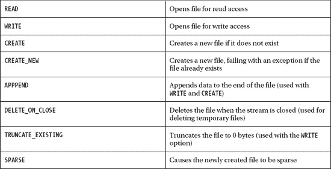
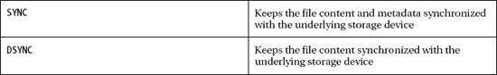
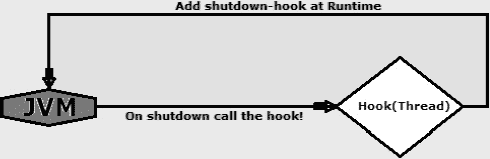

# 四、文件和目录

现在您已经知道了如何使用`Path`类指向文件或目录，您已经准备好学习如何完成管理文件和目录的最常见任务，比如创建、读取、写入、移动、删除等等。NIO.2 附带了一组全新的方法来完成这些任务，其中大部分都可以在`java.nio.file.Files`类中找到。

本章首先探索一些专门检查`Path`是否可读、可写、可执行、常规或隐藏的方法。这些检查使您能够在应用写或读之类的操作之前，确定正在处理的文件或目录的类型。然后这一章将重点放在目录操作上，向您展示如何列出、创建和读取目录。您将看到如何列出文件系统的根目录，使用诸如`createDirectory()`和`createTempDirectory()`的方法创建目录，编写目录过滤器，以及使用`newDirectoryStream()`方法列出目录的内容。熟悉目录操作后，您将探索文件操作，如读、写、创建和打开文件。正如您将看到的，有许多文件 I/O 方法可供选择。在本章中，您将看到缓冲和非缓冲流的工作方法，将通道方法的讨论留到下一章，在下一章中，您将看到 NIO 的真正威力。本章以众所周知的删除、复制和移动操作结束。

这些任务中的每一个都有详细的介绍，正如您将看到的，许多方面都是从以前的 Java 6“重新设计”的，但是您也将认识到许多来自`java.io.File`类的介绍方法。

### 文件和目录的检查方法

`Files`类提供了一组`is`*方法，您可以使用这些方法在实际操作文件或目录之前执行各种检查。其中一些方法在前面的章节中已经介绍过了，其余的在这里介绍。建议利用这些方法，因为它们非常有助于帮助您避免应用中的异常或其他奇怪行为。例如，在尝试将文件移动到另一个位置之前，最好先检查该文件是否存在。同样，在尝试读取文件之前，检查文件是否可以读取也是一个好主意。这些检查中的一些也可以通过元数据属性来执行，正如你在[第二章](02.html#ch2)中看到的。*

 *#### 检查文件或目录是否存在

正如您在前面章节中所知道的，即使映射的文件或目录实际上并不存在，`Path`实例也是完全有效的。此外，语法`Path`方法在这种情况下可以成功应用，因为它们不操作文件或目录本身。但是在某些时候，知道一个文件或目录是否存在是非常重要的，这就是为什么`Files`类为这种类型的检查提供了以下两种方法:

*   `exists()`:检查文件是否存在
*   `notExists()`:检查文件是否不存在

这两种方法都接收两个参数，表示要测试的文件的路径和指示如何处理符号链接的选项。如果文件存在，`exists()`方法返回`true`，否则返回`false`(文件不存在或无法执行检查)。

以下代码片段检查文件`AEGON.txt`是否存在于`C:\rafaelnadal\tournaments\2009`目录中(在我们假设的目录结构中，该文件存在):

```java
Path path = FileSystems.getDefault().getPath("C:/rafaelnadal/tournaments/2009","AEGON.txt");
…
boolean path_exists = Files.exists(path, new LinkOption[]{LinkOption.NOFOLLOW_LINKS});
```

如果您只需要在文件不存在的情况下采取行动，那么调用`notExists()`方法，如果文件不存在，该方法返回`true`，否则返回`false`(文件存在或者无法执行检查):

```java
Path path = FileSystems.getDefault().getPath("C:/rafaelnadal/tournaments/2009",
"AEGON.txt");
…
boolean path_notexists = Files.notExists(path, new LinkOption[]{LinkOption.NOFOLLOW_LINKS});
```

 **注意**如果两种方法都应用于同一个`Path`，并且都返回`false`，则无法进行检查。例如，如果应用不能访问文件，那么状态是未知的，两种方法都返回`false`。从这里，很容易得出结论，文件/目录的存在状态可以是:存在、不存在或未知。在检查该状态后，结果立即过期，因为存在的文件可以在检查后立即删除，因此结果必须立即“过期”。如果此方法指示文件存在，则不能保证后续访问会成功。此外，如果这些方法之一没有读取文件的权限，可能会抛出一个`SecurityException`。

 **注意** `!Files.exists(…)`不等同于`Files.notExists(…)`，`notExists()`方法不是`exists()`方法的补充。

#### 检查文件可访问性

在访问文件之前，另一个好的做法是使用`isReadable()`、`isWritable()`和`isExecutable()`方法检查其可访问性级别。在您传递了要验证的`Path`之后，这些方法将分别检查它是否是可读的`Path`(文件存在，JVM 有权限打开它进行读取)、可写的`Path`(文件存在，JVM 有权限打开它进行写入)、可执行的`Path`(文件存在，JVM 有权限执行它)。

此外，您可以通过调用`isRegularFile()`方法来检查`Path`是否指向常规文件。*常规文件*是没有特殊特征的文件(它们不是符号链接、目录等。)并包含真实数据，如文本或二进制文件。`isReadable()`、`isWritable()`、`isExecutable()`和`isRegularFile()`都返回布尔值:`true`如果文件存在并且可读、可写、可执行和正常，或者`false`如果文件不存在，读取、写入、执行和正常访问将被拒绝，因为 JVM 没有足够的权限，或者无法确定访问。

将这些方法放入检查`C:\rafaelnadal\tournaments\2009`目录中的`AEGON.txt`文件的可访问性的代码片段中(该文件必须存在)，如下所示:

```java
Path path = FileSystems.getDefault().getPath("C:/rafaelnadal/tournaments/2009","AEGON.txt");

boolean is_readable = Files.isReadable(path);
boolean is_writable = Files.isWritable(path);
boolean is_executable = Files.isExecutable(path);
boolean is_regular = Files.isRegularFile(path, LinkOption.NOFOLLOW_LINKS);

if ((is_readable) && (is_writable) && (is_executable) && (is_regular)) {
     System.out.println("The checked file is accessible!");
} else {
     System.out.println("The checked file is not accessible!");
}
```

或者，您可以使用这个较短的版本:

```java
boolean is_accessible = Files.isRegularFile(path) & Files.isReadable(path) &  
                        Files.isExecutable(path) & Files.isWritable(path);
if (is_accessible) {
    System.out.println("The checked file is accessible!");
} else {
    System.out.println("The checked file is not accessible!");
}
```

 **注意**前面的例子通过对一个`Path`应用所有四种方法来检查可访问性，但是你可以根据你需要获得的可访问性级别以不同的方式组合这四种方法。例如，您可能不关心`Path`是否可写，在这种情况下，您可以排除这个检查。

 **注意**即使这些方法确认了可访问性，也不能保证文件可以被访问。原因在于一个众所周知的软件错误，名为“检查时间到使用时间”(TOCTTOU，发音为“TOCK too”)，这意味着在检查和使用检查结果之间的时间内，系统可能会发生不同类型的变化。Unix 爱好者可能熟悉这个概念，但是它也适用于任何其他系统。

#### 检查两条路径是否指向同一个文件

在前一章中，你看到了如何检查一个符号链接和一个目标是否指向同一个文件。使用`isSameFile()`方法可以执行的另一个常见测试是检查两个以不同方式表达的`Path`是否指向同一个文件。例如，一个相对的`Path`和一个绝对的`Path`可能指向同一个文件，即使这不是很明显。调用`isSameFile()`方法将在下面的代码片段中揭示这一点，它以三种不同的方式表达了到`MutuaMadridOpen.txt`文件的路径(该文件必须存在于`C:\rafaelnadal\tournaments\2009 directory`中):

```java
Path path_1 = FileSystems.getDefault().getPath("C:/rafaelnadal/tournaments/2009",
                                                                     "MutuaMadridOpen.txt");
Path path_2 = FileSystems.getDefault().getPath("/rafaelnadal/tournaments/2009",
                                                                     "MutuaMadridOpen.txt");
Path path_3 = FileSystems.getDefault().getPath("/rafaelnadal/tournaments/dummy/../2009",
                                                                     "MutuaMadridOpen.txt");
try {
    boolean is_same_file_12 = Files.isSameFile(path_1, path_2);
    boolean is_same_file_13 = Files.isSameFile(path_1, path_3);
    boolean is_same_file_23 = Files.isSameFile(path_2, path_3);

    System.out.println("is same file 1&2 ? " + is_same_file_12);
    System.out.println("is same file 1&3 ? " + is_same_file_13);
    System.out.println("is same file 2&3 ? " + is_same_file_23);
} catch (IOException e) {
    System.err.println(e);
}
```

输出如下所示:

* * *

```java
is same file 1&2 ? true

is same file 1&3 ? true

is same file 2&3 ? true
```

* * *

#### 检查文件可见性

如果你需要找出一个文件是否被隐藏，你可以调用`Files.isHidden()`方法。记住“隐藏”的概念是依赖于平台/提供商的，你只需要通过`Path`检查并得到`true`或`false`响应。下面的代码片段检查`MutuaMadridOpen.txt`文件是否是隐藏文件(该文件必须存在于`C:\rafaelnadal\tournaments\2009`目录中):

```java
Path path = FileSystems.getDefault().getPath("C:/rafaelnadal/tournaments/2009",
                                                                       "MutuaMadridOpen.txt");
…
try {
    boolean is_hidden = Files.isHidden(path);
    System.out.println("Is hidden ? " + is_hidden);
} catch (IOException e) {
    System.err.println(e);
}
```

### 创建和读取目录

谈到创建和读取目录，NIO.2 在`Files`类中提供了一组专用方法。在本节中，您将了解如何列出文件系统根目录、创建目录(包括临时目录)、列出目录的内容，以及编写和使用目录过滤器。

#### 列出文件系统根目录

在 Java 6 中，文件系统根目录被提取为一组`File`对象。从 Java 7 开始，NIO.2 将文件系统根目录作为`Path`对象的`Iterable`来获取。这个`Iterable`由`getRootDirectories()`方法返回，如下所示:

```java
Iterable<Path> dirs = FileSystems.getDefault().getRootDirectories();
for (Path name : dirs) {
     System.out.println(name);
}
```

可能的输出如下:

* * *

```java
C:\

D:\

E:\
```

* * *

你可以很容易地从`Iterable`进入一个数组，如下所示:

`Iterable<Path> dirs = FileSystems.getDefault().getRootDirectories();
ArrayList<Path> list = new ArrayList<Path>();
for (Path name : dirs) {
     // System.out.println(name);` `     list.add(name);
}
Path[] arr = new Path[list.size()];
list.toArray(arr);

for(Path path : arr) {
    System.out.println(path);
}`

如果您需要将文件系统根目录提取为一个数组`File`，请使用 Java 6 解决方案:

```java
File[] roots = File.listRoots();
for (File root : roots) {
     System.out.println(root);
}
```

#### 创建新目录

创建一个新目录是一个常见的任务，可以通过调用`Files.createDirectory()`方法来完成。这个方法获取要创建的目录(`Path`)和一个可选的文件属性列表(`FileAttribute<?>`)，以便在创建时自动设置。它返回创建的目录。下面的代码片段使用默认属性在`C:\rafaelnadal\tournaments`目录下创建一个名为`\2010`的新目录(该目录必须不存在):

```java
Path newdir = FileSystems.getDefault().getPath("C:/rafaelnadal/tournaments/2010/");
…
try {
    Files.createDirectory(newdir);
} catch (IOException e) {
    System.err.println(e);
}
```

您可以在创建时添加一组属性，如下面的示例代码片段所示，它在具有特定权限的 POSIX 文件系统上创建一个新目录:

```java
Path newdir = FileSystems.getDefault().getPath("/home/rafaelnadal/tournaments/2010/");
…
Set<PosixFilePermission> perms = PosixFilePermissions.fromString("rwxr-x---");
FileAttribute<Set<PosixFilePermission>> attr = PosixFilePermissions.asFileAttribute(perms);
try {
    Files.createDirectory(newdir, attr);
} catch (IOException e) {
       System.err.println(e);
}
```

 **注意**如果目录存在，那么`createDirectory()`方法会抛出异常。

有时你需要创建不止一个目录。例如，您可能需要创建一系列分层目录，如`\statistics\win\prizes`。您可以调用一系列`createDirectory()`方法，或者更优雅地使用`Files.createDirectories()`方法，这将在一次调用中创建目录序列；根据需要，从上到下创建目录，将`\statistics`作为相对根，`\prizes`作为最后一片叶子。目录序列作为一个`Path`实例传递，在创建目录时可以自动设置文件属性列表，也可以不设置。以下代码片段显示了如何在`C:\rafaelnadal`目录下创建一系列分层目录:

```java
Path newdir= FileSystems.getDefault().getPath("C:/rafaelnadal/", "statistics/win/prizes");
…
try {
    Files.createDirectories(newdir);
} catch (IOException e) {
    System.err.println(e);
}
```

 **注意**如果目录序列中已经存在一个或多个目录，那么`createDirectories()`方法不会抛出异常，而只是“跳转”该目录并进入下一个目录。这种方法在创建一些目录后可能会失败，但不是全部。

#### 列出目录的内容

使用目录和文件通常涉及为了不同的目的循环目录的内容。NIO.2 通过一个名为`DirectoryStream`的可迭代流提供了这个工具，这是一个实现`Iterable`的接口。通过`Files.newDirectoryStream()`方法可以直接访问目录流，该方法获取目录的`Path`并返回一个新的打开的目录流。

##### 列举全部内容

以下代码片段将以链接、文件、子目录和隐藏文件的形式返回目录的全部内容(列出的目录是`C:\rafaelnadal\tournaments\2009`):

```java
Path path = Paths.get("C:/rafaelnadal/tournaments/2009");

//no filter applied
System.out.println("\nNo filter applied:");
try (DirectoryStream<Path> ds = Files.newDirectoryStream(path)) {
     for (Path file : ds) {
          System.out.println(file.getFileName());
     }
}catch(IOException e) {
   System.err.println(e);
}
```

一个可能的输出如下(这是`C:\rafaelnadal\tournaments\2009 directory`的全部内容):

* * *

```java
No filter applied:

AEGON.txt

BNP.txt

MutuaMadridOpen.txt

supershot.bmp

Tickets.zip

TournamentsCalendar.xls

Videos

…
```

* * *

##### 通过应用 Glob 模式列出内容

有时，您可能需要仅列出符合特定标准的内容，这需要对目录内容应用过滤器。通常，您只需要提取名称与特定模式匹配的文件和子目录。NIO.2 将这种特殊模式定义为内置的 glob 过滤器。根据 NIO.2 文档，glob 模式只是一个与其他字符串匹配的字符串——在本例中是目录和文件名。因为这是一种模式，所以它必须遵守一些规则，如下所示:

*   `*`:表示(匹配)任意数量的字符，包括无。
*   `**`:类似于`*`，但是跨越了目录的界限。
*   `?`:精确表示(匹配)一个字符。
*   `{}`:表示由逗号分隔的子模式的集合。例如，`{A,B,C}`匹配 A、B 或 c。
*   `[]`:传达一组单个字符或一系列字符(如果有连字符的话)。一些常见的例子包括:
    *   `[0-9]`:匹配任意数字
    *   `[A-Z]`:匹配任何大写字母
    *   `[a-z,A-Z]`:匹配任何大写或小写字母
    *   `[12345]`:匹配 1、2、3、4 或 5 中的任意一个
*   方括号内，`*`、`?`、`\`匹配自己。
*   其他所有字符都匹配自己。
*   为了匹配`*`、`?`或其他特殊字符，您可以使用反斜杠字符`\`对它们进行转义。例如，`\\`匹配单个反斜杠，`\?`匹配问号。

既然您已经知道了如何构建 glob 模式，那么是时候引入`newDirectoryStream()`方法了，该方法将`Path`获取到目录并应用 glob 过滤器。以下示例将从`C:\rafaelnadal\tournaments\2009`目录中提取所有 PNG、JPG 和 BMP 类型的文件(不管它们的名称如何):

```java
Path path = Paths.get("C:/rafaelnadal/tournaments/2009");
…
//glob pattern applied
System.out.println("\nGlob pattern applied:");
try (DirectoryStream<Path> ds = Files.newDirectoryStream(path, "*.{png,jpg,bmp}")) {
     for (Path file : ds) {
          System.out.println(file.getFileName());
     }
} catch (IOException e) {
    System.err.println(e);
}
```

输出如下所示:

* * *

```java
Glob pattern applied:

supershot.bmp
```

* * *

##### 通过应用用户定义的过滤器来列出内容

如果 glob 模式不能满足您的需求，那么是时候编写您自己的过滤器了。这是一个简单的任务，需要实现`DirectoryStream.Filter<T>`接口，它只有一个名为`accept()`的方法。根据您的实现，接受或拒绝一个`Path`。例如，以下代码片段只接受最终结果中的目录:

```java
Path path = Paths.get("C:/rafaelnadal/tournaments/2009");
…
//user-defined filter - only directories are accepted
DirectoryStream.Filter<Path> dir_filter = new DirectoryStream.Filter<Path>() {

public boolean accept(Path path) throws IOException {
      return (Files.isDirectory(path, NOFOLLOW_LINKS));
  }
};
```

接下来，创建的过滤器作为参数传递给`newDirectoryStream()`方法:

`System.out.println("\nUser defined filter applied:");` `try (DirectoryStream<Path> ds = Files.newDirectoryStream(path, dir_filter)) {
for (Path file : ds) {
      System.out.println(file.getFileName());
     }
} catch (IOException e) {
    System.err.println(e);
}`

输出如下所示:

* * *

```java
User defined filter applied:

videos
```

* * *

下表列出了一组常用的过滤器:

*   仅接受大于 200KB 的文件/目录的过滤器:`DirectoryStream.Filter<Path> size_filter = new DirectoryStream.Filter<Path>() {

    public boolean accept(Path path) throws IOException {
         return (Files.size(path) > 204800L);
      }
    };`
*   仅接受当天修改的文件的过滤器:`DirectoryStream.Filter<Path> time_filter = new DirectoryStream.Filter<Path>() {

    public boolean accept(Path path) throws IOException {
         long currentTime = FileTime.fromMillis(System.currentTimeMillis()).to(TimeUnit.DAYS);
         long modifiedTime = ((FileTime) Files.getAttribute(path, "basic:lastModifiedTime",
                                                           NOFOLLOW_LINKS)).to(TimeUnit.DAYS);
         if (currentTime == modifiedTime) {
                 return true;
            }

        return false;
      }
    };`
*   仅接受隐藏文件/目录的过滤器:`DirectoryStream.Filter<Path> hidden_filter = new DirectoryStream.Filter<Path>() {

    public boolean accept(Path path) throws IOException {
         return (Files.isHidden(path));
      }
    };`

### 创建、读取和写入文件

对文件最常见的操作可能包括创建、读取和/或写入操作。NIO.2 附带了许多专用方法，用于以不同的复杂性和性能级别执行这些操作，从常用的小文件方法(将所有字节读入字节数组很方便的情况)到高级功能的方法，如文件锁定和内存映射 I/O。本节从小文件的方法开始，以缓冲和非缓冲流的方法结束。

一个*流*代表一个输入源或一个输出目的地(它可以是从磁盘文件到内存数组的任何东西)。流支持不同种类的数据，如字符串、字节、原始数据类型、本地化字符和对象。在无缓冲流中，每个读或写请求都由底层操作系统直接处理，而在缓冲流中，数据是从称为*缓冲区*的内存区域读取的；并且只有当缓冲区为空时才调用本地输入 API。类似地，缓冲的输出流将数据写入缓冲区，并且仅当缓冲区已满时才调用本机输出 API。当一个缓冲区没有等待它被填满就被写出来时，我们说这个缓冲区被*刷新*。

#### 使用标准开放选项

从 NIO.2 开始，专用于创建、读取和写入动作(或任何其他涉及打开文件的动作)的方法支持可选参数`OpenOption`，该参数配置如何打开或创建文件。实际上，`OpenOption`是来自`java.nio.file`包的一个接口，它有两个实现:`LinkOption`类(还记得众所周知的`NOFOLLOW_LINKS`枚举常量)和`StandardOpenOption`类，后者定义了以下枚举:





在您看了创建一个新文件之后，这些常量中的一些将在接下来的部分中显示。

#### 创建新文件

创建新文件是一个常见的任务，可以通过调用`Files.createFile()`方法来完成。这个方法获取要创建的文件(`Path`)和一个可选的文件属性列表(`FileAttribute<?>`)，以便在创建时自动设置。它返回创建的文件。下面的代码片段在`C:\rafaelnadal\tournaments\2010`目录(该目录必须存在)中创建一个名为`SonyEricssonOpen.txt`的新文件，该文件具有默认属性(最初，该文件必须不存在；否则将抛出`FileAlreadyExistsException`异常):

```java
Path newfile = FileSystems.getDefault().
                           getPath("C:/rafaelnadal/tournaments/2010/SonyEricssonOpen.txt");
…
try {
    Files.createFile(newfile);
} catch (IOException e) {
    System.err.println(e);
}
```

您可以在创建时添加一组属性，如下面的代码片段所示。这段代码在具有特定权限的 POSIX 文件系统上创建一个新文件。

```java
Path newfile = FileSystems.getDefault().
               getPath("/home/rafaelnadal/tournaments/2010/SonyEricssonOpen.txt");

Set<PosixFilePermission> perms = PosixFilePermissions.fromString("rw-------");
FileAttribute<Set<PosixFilePermission>> attr = PosixFilePermissions.asFileAttribute(perms);
try {
    Files.createFile(newfile, attr);
} catch (IOException e) {
    System.err.println(e);
}
```

您很快就会看到，这不是创建新文件的唯一方法。

#### 编写小文件

NIO.2 为编写小型二进制/文本文件提供了一个优雅的解决方案。该功能通过两种`Files.write()`方法提供。这两种方法都打开文件进行写入(如果文件不存在，这可能涉及到创建文件)，或者最初将现有的常规文件截断为 0 字节大小。在所有字节或行都被写入后，该方法关闭文件(即使发生 I/O 错误或异常，它也会关闭文件)。简而言之，这个方法就像`CREATE`、`TRUNCATE_EXISTING`和`WRITE`选项存在一样——当然，当没有指定其他选项时，这是默认适用的。

##### 使用 write()方法写入字节

将字节写入文件可以通过`Files.write()`方法完成。此方法获取文件的路径、包含要写入的字节的字节数组以及指定如何打开文件的选项。它返回写入文件的路径。

下面的代码片段用默认的打开选项(文件名为`ball.png`，将被写入`C:\rafaelnadal\photos`目录)写一个字节数组(代表一个小网球图片):

```java
Path ball_path = Paths.get("C:/rafaelnadal/photos", "ball.png");
…
byte[] ball_bytes = new byte[]{
(byte)0x89,(byte)0x50,(byte)0x4e,(byte)0x47,(byte)0x0d,(byte)0x0a,(byte)0x1a,(byte)0x0a,
(byte)0x00,(byte)0x00,(byte)0x00,(byte)0x0d,(byte)0x49,(byte)0x48,(byte)0x44,(byte)0x52,
(byte)0x00,(byte)0x00,(byte)0x00,(byte)0x10,(byte)0x00,(byte)0x00,(byte)0x00,(byte)0x10,
(byte)0x08,(byte)0x02,(byte)0x00,            
…
(byte)0x49,(byte)0x45,(byte)0x4e,(byte)0x44,(byte)0xae,(byte)0x42,(byte)0x60,(byte)0x82
};

try {
    Files.write(ball_path, ball_bytes);
} catch (IOException e) {
    System.err.println(e);
}
```

现在，如果你检查相应的路径，你会发现一个代表网球的小图片。

而且，如果你需要写文本(`String`)并且你想使用这个方法，那么把文本转换成一个字节数组如下(文件名是`wiki.txt`，创建于`C:\rafaelnadal\wiki`):

```java
Path rf_wiki_path = Paths.get("C:/rafaelnadal/wiki", "wiki.txt");
…
String rf_wiki = "Rafael \"Rafa\" Nadal Parera (born 3 June 1986) is a Spanish professional
tennis " + "player and a former World No. 1\. As of 29 August 2011 (2011 -08-29)[update], he is
ranked No. 2 " + "by the Association of Tennis Professionals (ATP). He is widely regarded as
one of the greatest players " + "of all time; his success on clay has earned him the nickname
\"The King of Clay\", and has prompted " + "many experts to regard him as the greatest clay
court player of all time. Some of his best wins are:";

try {
    byte[] rf_wiki_byte = rf_wiki.getBytes("UTF-8");
    Files.write(rf_wiki_path, rf_wiki_byte);
} catch (IOException e) {
    System.err.println(e);
}
```

即使这可行，使用下面描述的`write()`方法将文本写入文件也容易得多。

##### 用 write()方法书写线条

将行写入文件可以通过使用`Files.write()`方法来完成(一个“行”是一个字符序列)。在每一行之后，这个方法追加平台的行分隔符(`line.separator`系统属性)。该方法获取文件的路径、char 序列上的 iterable 对象、用于编码的字符集以及指定文件打开方式的选项。它返回写入文件的路径。

下面的代码片段将一些行写入一个文件(实际上，它将一些行附加到前面部分创建的文件`wiki.txt`的末尾):

```java
Path rf_wiki_path = Paths.get("C:/rafaelnadal/wiki", "wiki.txt");
…
Charset charset = Charset.forName("UTF-8");
ArrayList<String> lines = new ArrayList<>();
lines.add("\n");
lines.add("Rome Masters - 5 titles in 6 years");
lines.add("Monte Carlo Masters - 7 consecutive titles (2005-2011)");
lines.add("Australian Open - Winner 2009");
lines.add("Roland Garros - Winner 2005-2008, 2010, 2011");
lines.add("Wimbledon - Winner 2008, 2010");
lines.add("US Open - Winner 2010");

try {
    Files.write(rf_wiki_path, lines, charset, StandardOpenOption.APPEND);
} catch (IOException e) {
    System.err.println(e);
}
```

#### 阅读小文件

NIO.2 提供了一种快速读取小字节/文本文件的方法。该工具通过`Files.readAllBytes()`和`Files.readAllLines()`方法提供。这些方法将整个文件的字节或行分别读入一次读取，并在文件被读取或发生 I/O 错误或异常后为您打开和关闭流。

##### 使用 readAllBytes()方法读取

`Files.readAllBytes()`方法将整个文件读入一个字节数组，而`Files.readAllLines()`方法将整个文件读入一个`String`的集合(如下一节所述)。关注`readAllBytes()`方法，下面的代码片段将先前创建的`ball.png`二进制文件(该文件必须存在)读入一个字节数组(文件路径作为参数传递):

```java
Path ball_path = Paths.get("C:/rafaelnadal/photos", "ball.png");
…
try {
    byte[] ballArray = Files.readAllBytes(ball_path);            
} catch (IOException e) {
    System.out.println(e);
}
```

如果您想确保返回的字节数组包含图片，您可以运行(作为测试)下面的代码片段，它将字节写入同一目录中名为`bytes_to_ball.png`的文件中:

```java
…
Files.write(ball_path.resolveSibling("bytes_to_ball.png"), ballArray);
…
```

或者你也可以如下使用`ImageIO`。行`ImageIO.write()`将把您的`bufferedImage`数据作为 PNG 类型的文件写入您的磁盘，并将它存储在`C:\rafaelnadal\photos`目录中。

```java
BufferedImage bufferedImage = ImageIO.read(new ByteArrayInputStream(ballArray));
ImageIO.write(bufferedImage, "png", (ball_path.resolveSibling("bytes_to_ball.png")).toFile());
```

`readAllBytes()`方法也可以读取文本文件。这一次，字节数组应该被转换为`String`，如下例所示(您可以使用任何适合您的文本文件的字符集):

```java
Path wiki_path = Paths.get("C:/rafaelnadal/wiki", "wiki.txt");
…
try {
    byte[] wikiArray = Files.readAllBytes(wiki_path);
    String wikiString = new String(wikiArray, "ISO-8859-1");
    System.out.println(wikiString);
} catch (IOException e) {
    System.out.println(e);
}
```

 **注意**如果文件太大(大于 2GB)，那么数组的大小无法分配，会抛出`OutOfMemory`错误。这取决于 JVM 上的`Xmx`参数:对于 32 位 JVM，它不能大于 2GB(但默认情况下通常会更小，256MB，这取决于平台)。对于 64 位 JVM 来说，它可以大得多——可能有几十亿字节。

##### 使用 readAllLines()方法读取

在前面的例子中，您看到了如何通过`readAllBytes()`方法读取文本文件。一个更方便的解决方案是使用`readAllLines()`方法，因为该方法将读取整个文件并返回一个`String`的`List`，可以很容易地如下循环(将文件的`Path`和用于解码的字符集传递给该方法):

`Path wiki_path = Paths.get("C:/rafaelnadal/wiki", "wiki.txt");
…
Charset charset = Charset.forName("ISO-8859-1");
try {
    List<String> lines = Files.readAllLines(wiki_path, charset);
    for (String line : lines) {
         System.out.println(line);
    }
} catch (IOException e) {` `    System.out.println(e);
}`

根据官方文件，该方法将以下内容识别为行终止符:

*   `\u000D`后接`\u000A`:回车后接换行
*   `\u000A`:换行
*   `\u000D`:回车

#### 使用缓冲流

在大多数操作系统中，读取或写入数据的系统调用是一项开销很大的操作。缓冲区可以通过在缓冲的方法和操作系统之间提供一个内存空间来解决这个问题。在调用本机 API 之前，这些方法从操作系统和应用之间的缓冲区获取数据或将数据放入缓冲区，这提高了应用的效率，因为它减少了系统调用的数量-仅当缓冲区满或空时才访问磁盘，这取决于它是写操作还是读操作。NIO.2 提供了两种通过缓冲区读写文件的方法:分别是`Files.newBufferedReader()`和`Files.newBufferedWriter()`。这两种方法都获得一个`Path`实例，并返回一个旧的 JDK 1.1 `BufferedReader`或`BufferedWriter`实例。

##### 使用 newBufferedWriter()方法

`newBufferedWriter()`方法获取文件的路径、用于编码的字符集和指定文件打开方式的选项。它返回一个新的默认缓冲写入器(这是一个特定于`java.io`的`BufferedWriter`)。该方法打开文件进行写入(如果文件不存在，这可能涉及到创建文件)，或者最初将现有的常规文件截断为 0 字节大小。简而言之，该方法就像`CREATE`、`TRUNCATE_EXISTING`和`WRITE`选项一样(当没有指定其他选项时，这是默认适用的)。

下面的代码片段使用一个缓冲区将数据追加到先前创建的`wiki.txt`文件中(该文件存在；您应该在`C:\rafaelnadal\wiki`目录中找到它):

```java
Path wiki_path = Paths.get("C:/rafaelnadal/wiki", "wiki.txt");
…
Charset charset = Charset.forName("UTF-8");
String text = "\nVamos Rafa!";
try (BufferedWriter writer = Files.newBufferedWriter(wiki_path, charset,
                                                                 StandardOpenOption.APPEND)) {
     writer.write(text);
} catch (IOException e) {
     System.err.println(e);
}
```

##### 使用 newBufferedReader()方法

`newBufferedReader()`方法可用于通过缓冲区读取文件。方法获取文件的路径和用于将字节解码为字符的字符集。它返回一个新的默认缓冲读取器(这是一个特定于`java.io`的`BufferedReader`)。

下面的代码片段使用 UTF-8 字符集读取`wiki.txt`文件:

```java
Path wiki_path = Paths.get("C:/rafaelnadal/wiki", "wiki.txt");
…
Charset charset = Charset.forName("UTF-8");
try (BufferedReader reader = Files.newBufferedReader(wiki_path, charset)) {
     String line = null;
     while ((line = reader.readLine()) != null) {
             System.out.println(line);
     }
} catch (IOException e) {
     System.err.println(e);
}
```

如果您按照前面几节中的示例并创建了整个`wiki.txt`文件，那么前面的代码将输出以下内容:

* * *

```java
Rafael "Rafa" Nadal Parera (born 3 June 1986) is a Spanish professional tennis player and a
former World No. 1\. As of 29 August 2011 (2011 -08-29)[update], he is ranked No. 2 by the
Association of Tennis Professionals (ATP). He is widely regarded as one of the greatest
players of all time; his success on clay has earned him the nickname "The King of Clay", and
has prompted many experts to regard him as the greatest clay court player of all time. Some
of his best wins are:

Rome Masters - 5 titles in 6 years

Monte Carlo Masters - 7 consecutive titles (2005-2011)

Australian Open - Winner 2009

Roland Garros - Winnner 2005-2008, 2010, 2011

Wimbledon - Winner 2008, 2010

US Open - Winner 2010

Vamos Rafa!
```

* * *

#### 使用无缓冲流

非缓冲流可以通过新的 NIO.2 方法获得，既可以逐字使用，也可以使用`java.io` API 提供的包装习惯用法转换成缓冲流。无缓冲流方法有`Files.newInputStream()`(从文件中读取的输入流)和`Files.newOutputStream()`(写入文件的输出流)。

##### 使用 newOutputStream()方法

`newOutputStream()`方法获取文件的路径和指定如何打开文件的选项。它返回一个新的默认线程安全的非缓冲流，可以用来向文件写入字节(这是一个特定于`java.io`的`OutputStream`)。该方法打开文件进行写入(如果文件不存在，这可能涉及到创建文件)，或者最初将现有的常规文件截断为 0 字节大小。简而言之，该方法就像`CREATE`、`TRUNCATE_EXISTING`和`WRITE`选项一样(当没有指定其他选项时，这是默认适用的)。

以下代码片段将把文本行“球拍:Babolat AeroPro Drive GT”写入文件`C:\rafaelnadal\equipment\racquet.txt`(该文件最初并不存在，但由于没有指定选项，它将被自动创建):

```java
Path rn_racquet = Paths.get("C:/rafaelnadal/equipment", "racquet.txt");
String racquet = "Racquet: Babolat AeroPro Drive GT";

byte data[] = racquet.getBytes();
try (OutputStream outputStream = Files.newOutputStream(rn_racquet)) {
     outputStream.write(data);
} catch (IOException e) {
     System.err.println(e);
}
```

此外，如果您决定使用缓冲流而不是前面的代码是一个更好的主意，建议使用基于`java.io` API 的转换，如下面的代码所示，它将文本“String: Babolat RPM Blast 16”附加到文件`racquet.txt`(该文件必须存在):

```java
Path rn_racquet = Paths.get("C:/rafaelnadal/equipment", "racquet.txt");
String string = "\nString: Babolat RPM Blast 16";

try (OutputStream outputStream = Files.newOutputStream(rn_racquet, StandardOpenOption.APPEND);
     BufferedWriter writer = new BufferedWriter(new OutputStreamWriter(outputStream))) {
      writer.write(string);
} catch (IOException e) {
     System.err.println(e);
}
```

##### 使用 newInputStream()方法

`newInputStream()`方法获取要打开的文件的路径和指定如何打开文件的选项。它返回一个新的默认线程安全的非缓冲流，可以用来从文件中读取字节(这是一个特定于`java.io`的`InputStream`)。方法打开文件进行读取；如果没有选项，则相当于用`READ`选项打开文件。

以下代码片段读取文件`racquet.txt`的内容(该文件必须存在):

`Path rn_racquet = Paths.get("C:/rafaelnadal/equipment", "racquet.txt");
…
int n;    
try (InputStream in = Files.newInputStream(rn_racquet)) {
     while ((n = in.read()) != -1) {
       System.out.print((char)n);                
    }
} catch (IOException e) {` `    System.err.println(e);
}`

正如您可能已经从`java.io` API 中了解到的那样，`InputStream`类还提供了一个`read()`方法，用于填充 byte 类型的缓冲数组。因此，您可以修改前面的代码，如下所示(请记住，您仍然在处理一个无缓冲的流):

```java
Path rn_racquet = Paths.get("C:/rafaelnadal/equipment", "racquet.txt");
…
int n;    
byte[] in_buffer = new byte[1024];
try (InputStream in = Files.newInputStream(rn_racquet)) {
     while ((n = in.read(in_buffer)) != -1) {
            System.out.println(new String(in_buffer));
     }
} catch (IOException e) {
     System.err.println(e);
}
```

 **注意**调用`read(in_buffer)`方法和调用`read(in_buffer,0,in_buffer.length)`方法是一回事。

此外，您可以通过与`java.io` API 交互操作，将非缓冲流转换为缓冲流。下面的示例与前面的示例效果相同，但效率更高:

```java
Path rn_racquet = Paths.get("C:/rafaelnadal/equipment", "racquet.txt");
…
try (InputStream in = Files.newInputStream(rn_racquet);
     BufferedReader reader = new BufferedReader(new InputStreamReader(in))) {
     String line = null;
     while ((line = reader.readLine()) != null) {
             System.out.println(line);
     }
} catch (IOException e) {
     System.err.println(e);
}
```

过去的三个示例将具有相同的输出:

* * *

```java
Racquet: Babolat AeroPro Drive GT

String: Babolat RPM Blast 16
```

* * *

### 创建临时目录和文件

临时目录是存储临时文件的目录。临时目录的位置取决于操作系统。在 Windows 中，临时目录是通过 TEMP 环境变量设置的，通常是`C:\Temp`、`%Windows%\Temp`，或者是`Local Settings\Temp`中的每个用户一个临时目录。在 Linux/Unix 中，全局临时目录是`/tmp`和`/var/tmp`。

#### 创建临时目录

在 NIO.2 中，可以用`createTempDirectory()`方法创建一个临时目录。在默认操作系统位置创建一个临时目录可以通过调用带有两个参数的`createTempDirectory()`方法来完成:一个用于生成目录名的前缀字符串(可以是`null`)和一个可选的文件属性列表，在创建目录时自动设置。以下代码片段创建了两个临时目录，一个带前缀，一个不带前缀:

```java
String tmp_dir_prefix = "nio_";
try {
    //passing null prefix
    Path tmp_1 = Files.createTempDirectory(null);
    System.out.println("TMP: " + tmp_1.toString());

    //set a prefix
    Path tmp_2 = Files.createTempDirectory(tmp_dir_prefix);
    System.out.println("TMP: " + tmp_2.toString());
} catch (IOException e) {
    System.err.println(e);
}
```

以下是可能的输出:

* * *

```java
TMP: C:\Users\Leo\AppData\Local\Temp\3238630399269555448

TMP: C:\Users\Leo\AppData\Local\Temp\nio_1097550355199661257
```

* * *

 **注意**如果不知道临时目录的默认位置是什么，可以使用下面的代码:

```java
//output: C:\Users\Leo\AppData\Local\Temp\
String default_tmp = System.getProperty("java.io.tmpdir");
System.out.println(default_tmp);
```

更进一步，您可以通过调用另一个`createTempDirectory()`方法来指定创建临时目录的默认目录。除了临时目录前缀和可选的属性列表，这个方法还获得了一个代表临时目录的默认目录的`Path`。以下示例在`C:\rafaelnadal\tmp`目录中创建一个临时目录:

```java
Path basedir = FileSystems.getDefault().getPath("C:/rafaelnadal/tmp/");
String tmp_dir_prefix = "rafa_";
…
try {
    //create a tmp directory in the base dir
    Path tmp = Files.createTempDirectory(basedir, tmp_dir_prefix);
    System.out.println("TMP: " + tmp.toString());
} catch (IOException e) {
    System.err.println(e);
}
```

以下是可能的输出:

* * *

```java
TMP: C:\rafaelnadal\tmp\rafa_1753327229539718259
```

* * *

##### 使用关机挂钩删除临时目录

大多数操作系统会自动删除临时目录(如果没有，您可以使用几种清理软件中的一种)。但是，有时您可能需要以编程方式控制删除过程。方法只做了一半的工作，因为删除是你的责任。为此，您可以附加一个*关闭挂钩*机制，一个用于执行任何资源清理或保存的运行时机制，这些必须在 JVM 关闭之前发生。这个钩子可以作为 Java `Thread`来实现。当钩子在关机时被 JVM 执行时，`Thread`的`run()`方法将被执行。图 4-1 中的[显示了一个漂亮而简单的关断钩流程设计。](#fig_4_1)



***图 4-1** 。关机挂钩*的简单流程设计

将[图 4-1](#fig_4_1) 中所示的图放入代码行中，提供如下框架代码:

`Runtime.getRuntime().addShutdownHook(new Thread() {

@Override
public void run() {` `  System.out.println("Shutdown-hook activated ...");

  //… here, cleanup/save resources

  System.out.println("Shutdown-hook successfully executed ...");
  }
});`

 **注意**注意添加一个关闭挂钩作为`Thread`到`Runtime`可以作为一个匿名的内部类来完成，就像前面的代码一样，或者作为一个单独的类来实现`Runnable`或者扩展`Thread`。

当 JVM 关闭时，shutdown-hook 是删除临时目录的一个很好的解决方案，但是，您可能知道，如果目录不是空的，就不能删除它；因此，您需要遍历临时目录的内容，并在删除临时目录本身之前删除每个条目。至此，您已经知道如何向下遍历一个目录的内容，所以现在假设您的临时目录只包含临时文件(在许多实际情况下都是如此)和其他空的临时目录。在本书的后面，你将看到如何实现递归操作来浏览层次结构的所有级别。

以下示例将上一节中列出目录内容的代码与 shutdown-hook 结合在一起:

`final Path basedir = FileSystems.getDefault().getPath("C:/rafaelnadal/tmp/");
final String tmp_dir_prefix = "rafa_";

try {
//create a tmp directory in the base dir
final Path tmp_dir = Files.createTempDirectory(basedir, tmp_dir_prefix);

Runtime.getRuntime().addShutdownHook(new Thread() {

@Override
public void run() {
  System.out.println("Deleting the temporary folder ...");

  try (DirectoryStream<Path> ds = Files.newDirectoryStream(tmp_dir)) {
       for (Path file : ds) {
               Files.delete(file);
       }

   Files.delete(tmp_dir);

   } catch (IOException e) {
       System.err.println(e);
   }

   System.out.println("Shutdown-hook completed...");
}` `});

//simulate some I/O operations over the temporary file by sleeping 10 seconds
//when the time expires, the temporary file is deleted            
Thread.sleep(10000);
//operations done

} catch (IOException | InterruptedException e) {
    System.err.println(e);
}`

 **注意**前面的例子使用了一个`Thread.sleep()`方法在临时目录的创建时间和 JVM 关闭时间之间添加一个延迟。显然，代替它的是，您将提供使用临时目录的业务逻辑，该临时目录是为作业创建的。

##### 使用 deleteOnExit()方法删除临时目录

删除临时目录的另一个解决方案是调用`deleteOnExit()`方法。这个方法在`java.io.File`类中可用(不特定于 NIO.2 ),它将在 JVM 关闭时删除传递的文件或目录。因为必须为每个临时文件或目录调用此方法，所以它被认为是最没有吸引力的选择，因为它将为每个临时实体消耗内存。

 **注意**如果你的系统长时间处于活动状态或者在短时间内创建了许多临时文件或目录，那么使用`deleteOnExit()`是个坏主意！在选择使用`deleteOnExit()`之前，要考虑到它会使用大量的内存，直到 JVM 终止才会释放。

以下代码片段向您展示了如何使用`deleteOnExit()`:

`Path basedir = FileSystems.getDefault().getPath("C:/rafaelnadal/tmp/");
String tmp_dir_prefix = "rafa_";

try {
    //create a tmp directory in the base dir
    Path tmp_dir = Files.createTempDirectory(basedir, tmp_dir_prefix);

    File asFile = tmp_dir.toFile();
    asFile.deleteOnExit();

    //simulate some I/O operations over the temporary file by sleeping 10 seconds
    //when the time expires, the temporary file is deleted            
    //EACH CREATED TEMPORARY ENTRY SHOULD BE REGISTERED FOR DELETE ON EXIT
    Thread.sleep(10000);` `    //operations done

} catch (IOException | InterruptedException e) {
   System.err.println(e);
}`

 **注意**因为`deleteOnExit()`适用于`File`实例，而不是`Path`，所以需要通过调用`Path.toFile()`方法将`Path`转换为`File`。

#### 创建临时文件

这一节将详细介绍临时文件以及 NIO.2 处理这些文件的方法。在实际应用中，临时文件通常会提供非常有用的帮助。当您需要在应用或应用执行之外使用的非缩进文件时，它们非常有用。在 Java 中称为“工作文件”，它们可以放在从应用中选择的任何目录中，或者放在由 Java 属性`java.io.tmpdir`返回的默认位置中。

在 NIO.2 中，可以用`createTempFile()`方法创建一个临时文件。在默认的操作系统位置创建一个临时文件可以通过调用带有三个参数的`createTempFile()`方法来完成:一个前缀字符串连接在文件名前面(可以是`null`)，一个后缀字符串连接在文件名后面(可以是`null`)；缺省值是`.tmp`，以及创建文件时自动设置的可选文件属性列表。以下代码片段创建了两个临时文件，一个没有前缀和后缀，另一个具有指定的前缀和后缀:

```java
String tmp_file_prefix = "rafa_";
String tmp_file_sufix=".txt";

try {
    //passing null prefix/suffix
    Path tmp_1 = Files.createTempFile(null,null);
    System.out.println("TMP: " + tmp_1.toString());

    //set a prefix and a suffix
    Path tmp_2 = Files.createTempFile(tmp_file_prefix, tmp_file_sufix);
    System.out.println("TMP: " + tmp_2.toString());

} catch (IOException e) {
    System.err.println(e);
}
```

输出将是操作系统默认位置中的两个空临时文件:

* * *

```java
TMP: C:\Users\Leo\AppData\Local\Temp\6873427319542945524.tmp

TMP: C:\Users\Leo\AppData\Local\Temp\rafa_6168226983257408796.txt
```

* * *

 **注意**如果不知道临时文件的默认位置是什么，可以使用下面的代码:

```java
//output: C:\Users\Leo\AppData\Local\Temp\
String default_tmp = System.getProperty("java.io.tmpdir");
```

更进一步，您可以通过调用另一个`createTempFile()`方法来指定创建临时文件的默认目录。除了临时文件的前缀和后缀以及可选的属性列表，这个方法还获得了一个代表临时文件的默认目录的`Path`。下面是一个在`C:\rafaelnadal\tmp`目录下创建临时文件的例子:

```java
Path basedir = FileSystems.getDefault().getPath("C:/rafaelnadal/tmp");
String tmp_file_prefix = "rafa_";
String tmp_file_sufix=".txt";

try {
    Path tmp_3 = Files.createTempFile(basedir, tmp_file_prefix, tmp_file_sufix);
    System.out.println("TMP: " + tmp_3.toString());
} catch (IOException e) {
    System.err.println(e);
}
```

输出将是`C:\rafaelnadal\tmp`目录中的一个空临时文件:

* * *

```java
TMP: C:\rafaelnadal\tmp\rafa_512352743612949417.txt
```

* * *

##### 使用关机挂钩删除临时文件

临时文件只是一个简单的文件，直到您确定它确实是临时的，这意味着自动机制必须定期或在指定的时间删除临时文件。shutdown-hook 机制在本章前面的“使用 Shutdown-Hook 删除临时目录”一节中已经介绍过了这种机制对于临时文件也是一样的，所以我们将跳过这里的演示，直接看代码示例。

下面的代码片段将在`C:\rafaelnadal\tmp`目录中创建一个临时文件，等待 10 秒钟(模拟一些文件使用)，并在 JVM 通过 shutdown-hook 机制关闭时删除该文件:

`Path basedir = FileSystems.getDefault().getPath("C:/rafaelnadal/tmp");
String tmp_file_prefix = "rafa_";
String tmp_file_sufix = ".txt";

try {
    final Path tmp_file = Files.createTempFile(basedir, tmp_file_prefix, tmp_file_sufix);

    Runtime.getRuntime().addShutdownHook(new Thread() {`  `@Override
    public void run() {
    System.out.println("Deleting the temporary file ...");

    try {
        Files.delete(tmp_file);
    } catch (IOException e) {
        System.err.println(e);
    }

    System.out.println("Shutdown hook completed...");
  }
});

//simulate some I/O operations over the temporary file by sleeping 10 seconds
//when the time expires, the temporary file is deleted            
Thread.sleep(10000);
//operations done

} catch (IOException | InterruptedException e) {
    System.err.println(e);
}`

 **注意**前面的代码使用了一个`Thread.sleep()`方法在临时文件的创建时间和 JVM 关闭时间之间添加一个延迟。显然，代替它的是，您将为创建临时文件的作业提供使用临时文件的业务逻辑。

##### 用 deleteOnExit()方法删除临时文件

删除临时文件的另一个解决方案是调用`deleteOnExit()`方法。这种机制在前面的“使用 deleteOnExit()方法删除临时目录”一节中有详细介绍，对于临时文件也是如此，所以我们在这里将跳过它，直接看代码示例。

下面的代码片段将在`C:\rafaelnadal\tmp`目录中创建一个临时文件，等待 10 秒钟(模拟一些文件使用)，并在 JVM 通过`deleteOnExit()`机制关闭时删除它:

`Path basedir = FileSystems.getDefault().getPath("C:/rafaelnadal/tmp");
String tmp_file_prefix = "rafa_";
String tmp_file_sufix = ".txt";

try {
    final Path tmp_file = Files.createTempFile(basedir, tmp_file_prefix, tmp_file_sufix);

    File asFile = tmp_file.toFile();
    asFile.deleteOnExit();

    //simulate some I/O operations over the temporary file by sleeping 10 seconds` `    //when the time expires, the temporary file is deleted
    Thread.sleep(10000);
    //operations done

} catch (IOException | InterruptedException e) {
    System.err.println(e);
}`

 **注意**因为`deleteOnExit()`适用于`File`实例，而不是`Path`，所以需要通过调用`Path.toFile()`方法将`Path`转换为`File`。

##### 用 DELETE_ON_CLOSE 删除临时文件

删除临时文件的一个巧妙的解决方案是使用`DELETE_ON_CLOSE`选项。顾名思义，这个选项在流关闭时删除文件。例如，下面的代码片段使用`createTempFile()`方法在`C:\rafaelnadal\tmp`目录中创建一个临时文件，并使用显式指定的`DELETE_ON_CLOSE`为其打开一个流，因此当流关闭时，该文件应该被删除:

```java
Path basedir = FileSystems.getDefault().getPath("C:/rafaelnadal/tmp");
String tmp_file_prefix = "rafa_";
String tmp_file_sufix = ".txt";
Path tmp_file = null;

try {
    tmp_file = Files.createTempFile(basedir, tmp_file_prefix, tmp_file_sufix);
} catch (IOException e) {
    System.err.println(e);
}

try (OutputStream outputStream = Files.newOutputStream(tmp_file,
                                      StandardOpenOption.DELETE_ON_CLOSE);
     BufferedWriter writer = new BufferedWriter(new OutputStreamWriter(outputStream))) {

     //simulate some I/O operations over the temporary file by sleeping 10 seconds
     //when the time expires, the temporary file is deleted            
     Thread.sleep(10000);
     //operations done
} catch (IOException | InterruptedException e) {
     System.err.println(e);
}
```

此外，即使不调用`createTempFile()`方法，也可以模拟一个临时文件。只需定义一个文件名，并结合使用`DELETE_ON_CLOSE`选项和`CREATE`选项，如下面的代码片段所示(效果与前面的示例相同):

`String tmp_file_prefix = "rafa_";
String tmp_file_sufix = ".txt";` `Path tmp_file = null;

tmp_file = FileSystems.getDefault().getPath("C:/rafaelnadal/tmp", tmp_file_prefix +
                                                                "temporary" + tmp_file_sufix);

try (OutputStream outputStream = Files.newOutputStream(tmp_file, StandardOpenOption.CREATE,
                                                          StandardOpenOption.DELETE_ON_CLOSE);
     BufferedWriter writer = new BufferedWriter(new OutputStreamWriter(outputStream))) {

     //simulate some I/O operations over the temporary file by sleeping 10 seconds
     //when the time expires, the temporary file is deleted            
     Thread.sleep(10000);
     //operations done
} catch (IOException | InterruptedException e) {
     System.err.println(e);
}`

#### 删除、复制和移动目录和文件

删除、复制和移动是对文件和目录最常用的三种操作。NIO.2 提供了专门的方法来支持这些操作的不同方法。正如您将在本节中看到的，它们中的大多数来自于`Files`类。

##### 删除文件和目录

NIO.2 提供了两种删除文件或目录的方法，`Files.delete()`和`Files.deleteIfExits()`。两者都采用单个参数表示要删除的`Path`，但是`Files.delete()`返回 void，而`Files.deleteIfExits()`返回一个布尔值表示删除过程的成功或失败。`delete()`方法尝试删除传递的`Path`，如果失败，抛出以下异常之一:`NoSuchFileException`(如果传递的`Path`不存在)、`DirectoryNotEmptyException`(如果传递的`Path`是一个不为空的目录)、`IOException`(如果发生 I/O 错误)，或者`SecurityException`(如果删除的访问被拒绝)。

以下代码片段从`C:\rafaelnadal\photos\`目录中删除文件`rafa_1.jpg`(该文件必须存在):

```java
Path path = FileSystems.getDefault().getPath("C:/rafaelnadal/photos", "rafa_1.jpg");

//delete the file
try {
     Files.delete(path);
} catch (NoSuchFileException | DirectoryNotEmptyException | IOException |
         SecurityException e) {
     System.err.println(e);
}
```

顾名思义，`Files.deleteIfExists()`方法只删除存在的文件，这意味着如果文件因为不存在而无法删除，那么返回的布尔值将是`false`(而不是抛出`NoSuchFileException`异常)。当您有多个线程删除文件，并且您不想仅仅因为一个线程先这么做就抛出异常时，这很有用。记住前面的代码刚刚删除了`rafa_1.jpg`文件，下面的代码将返回`false`:

```java
try {
    boolean success = Files.deleteIfExists(path);
    System.out.println("Delete status: " + success);
} catch (DirectoryNotEmptyException | IOException | SecurityException e) {
    System.err.println(e);
}
```

 **注意**如果删除的资源是一个目录，那么它一定是空的。删除整个目录内容(可能包含其他目录、文件等)是一项通常作为递归操作实现的任务。该操作在第 5 章的[中介绍。](05.html#ch5)

 **注意**如果文件是符号链接，那么删除的是符号链接本身，而不是链接的最终目标。

##### 复制文件和目录

在 NIO.2 中，复制文件和目录是小菜一碟。它提供了三个`Files.copy()`方法来完成这项任务，并提供了一组选项来控制复制过程——这些方法采用由这些选项表示的一个`varargs`参数。这些选项在`StandardCopyOption`和`LinkOption`菜单下提供，如下所示:

*   `REPLACE_EXISTING`:如果复制的文件已经存在，那么它被替换(在非空目录的情况下，抛出`FileAlreadyExistsException`)。当处理一个符号链接时，链接的目标是*而不是*复制的；仅复制链接。
*   `COPY_ATTRIBUTES`:复制文件及其关联属性(至少支持复制`lastModifiedTime`属性)。
*   `NOFOLLOW_LINKS`:符号链接不应该跟随。

如果您不熟悉枚举类型，那么您应该知道它们可以按如下方式导入到应用中。这些被称为*静态导入*，可以导入任何静态字段或方法，而不仅仅是来自枚举类型的字段(例如来自`java.lang.Math`的方法)。

```java
import static java.nio.file.StandardCopyOption.REPLACE_EXISTING;
import static java.nio.file.StandardCopyOption.COPY_ATTRIBUTES;
import static java.nio.file.LinkOption.NOFOLLOW_LINKS;
```

 **注意**默认情况下，复制符号链接时，复制的是该链接的目标。仅复制链接本身可以通过`REPLACE_EXISTING`和`NOFOLLOW_LINKS`选项完成。而且，不需要复制文件属性。

 **警告**试图复制一个非空的目录会导致一个空的目录。这是一个通常以递归操作实现的任务，正如你将在[第 5 章](05.html#ch5)中看到的。此外，复制文件不是原子操作，这意味着即使目标文件不完整或属性没有完全复制，也会抛出`IOException`异常并中止复制。

###### 在两个路径之间复制

通常，当您复制文件时，您需要一个源路径(复制自)和一个目标路径(复制到)。基于这个简单的例子，NIO.2 提供了一个`Files.copy()`方法，该方法获取要复制的文件的路径、目标文件的路径以及一组用于控制复制过程的选项。它返回目标文件的路径。如果未指定选项，则仅当目标文件不存在并且不是符号链接时，复制才会成功结束。否则，除非源和目标不同，否则将抛出异常(方法`isSameFile()`返回`true`)。

下面的代码片段将文件`draw_template.txt`从`C:\rafaelnadal\grandslam\AustralianOpen`复制到`C:\rafaelnadal\grandslam\USOpen`(该文件必须存在)。它替换现有文件，将源的属性复制到目标，并且不遵循链接。

```java
Path copy_from = Paths.get("C:/rafaelnadal/grandslam/AustralianOpen", "draw_template.txt");
Path copy_to= Paths.get("C:/rafaelnadal/grandslam/USOpen",copy_from.getFileName().toString());

try {

    Files.copy(copy_from, copy_to, REPLACE_EXISTING, COPY_ATTRIBUTES, NOFOLLOW_LINKS);

} catch (IOException e) {
    System.err.println(e);
}
```

###### 从输入流复制到文件

当您需要将输入流中的所有字节复制到一个文件中时，您可以调用`Files.copy()`方法来获取要读取的输入流、文件的路径以及一组用于控制复制过程的选项。它返回读取或写入的字节数。默认情况下，如果目标文件已经存在或者是符号链接，复制将失败。

下面的代码片段将通过输入流将文件`draw_template.txt`从`C:\rafaelnadal\grandslam\AustralianOpen`复制到`C:\rafaelnadal\grandslam\Wimbledon`(该文件必须存在)。它将替换现有文件。

```java
Path copy_from = Paths.get("C:/rafaelnadal/grandslam/AustralianOpen", "draw_template.txt");
Path copy_to = Paths.get("C:/rafaelnadal/grandslam/Wimbledon", "draw_template.txt");

try (InputStream is = new FileInputStream(copy_from.toFile())) {

     Files.copy(is, copy_to, REPLACE_EXISTING);

} catch (IOException e) {
     System.err.println(e);
}
```

可以用其他方式提取输入流。例如，以下代码片段将从 Internet URL 获取输入流(仅当文件不存在时，它才会将 URL 指示的图片复制到`C:\rafaelnadal\photos`目录):

```java
Path copy_to = Paths.get("C:/rafaelnadal/photos/rafa_winner_2.jpg");
URI u = URI.create("https://lh6.googleusercontent.com/--
                        udGIidomAM/Tl8KTbYd34I/AAAAAAAAAZw/j2nH24PaZyM/s800/rafa_winner.jpg");

try (InputStream in = u.toURL().openStream()) {

     Files.copy(in, copy_to);

} catch (IOException e) {
     System.err.println(e);
}
```

 **注意**强烈建议您在发生 I/O 错误后立即关闭输入流。

###### 从文件复制到输出流

当您需要将文件中的所有字节复制到输出流中时，您可以调用`Files.copy()`方法来获取文件的路径和要写入的输出流。它将返回读取或写入的字节数。

下面的代码片段将文件`draw_template.txt`从`C:\rafaelnadal\grandslam\AustralianOpen`复制到`C:\rafaelnadal\grandslam\RolandGarros`。目标文件表示为输出流(如果目标文件存在，将被替换)。

`Path copy_from = Paths.get("C:/rafaelnadal/grandslam/AustralianOpen", "draw_template.txt");
Path copy_to = Paths.get("C:/rafaelnadal/grandslam/RolandGarros", "draw_template.txt");

try (OutputStream os = new FileOutputStream(copy_to.toFile())) {

     Files.copy(copy_from, os);`  `} catch (IOException e) {
     System.err.println(e);
}`

 **注意**强烈建议您在发生 I/O 错误后立即关闭输出流。

##### 移动文件和目录

在本节中，您将看到如何使用`Files.move()`方法移动文件和目录。此方法获取要移动的文件的路径、目标文件的路径以及控制移动过程的一组选项。这些选项在`StandardCopyOption`枚举下提供，在此列出:

*   `REPLACE_EXISTING`:如果目标文件已经存在，则仍然执行移动，并替换目标。处理符号链接时，符号链接被替换，但它指向的内容不受影响。
*   `ATOMIC_MOVE`:文件移动将作为一个原子操作来执行，这保证了任何监视文件目录的进程都将访问一个完整的文件。

同样，这些枚举类型可以像这样导入到应用中:

```java
import static java.nio.file.StandardCopyOption.REPLACE_EXISTING;
import static java.nio.file.StandardCopyOption.ATOMIC_MOVE;
```

默认情况下(没有显式指定选项时)，`move()`方法尝试将文件移动到目标文件，如果目标文件存在则失败(`FileAlreadyExistsException`被抛出)，除非源和目标是同一个文件(`isSameFile()`方法返回`true`)，在这种情况下该方法无效。

 **注意**默认情况下，移动符号链接时，移动的是符号链接本身，而不是那个链接的目标。

 **注意**`move()`方法也可以用来移动空目录。试图移动一个非空的目录通常是一个递归复制操作，正如你在[第五章](05.html#ch5)中看到的。然而，如果不需要移动目录中的条目，也可以移动非空的目录。在某些情况下，目录包含创建目录时创建的特殊文件(如链接)的条目，如果目录只包含这些条目，则认为它是空的。

下面的代码片段试图将名为`rafa_2.jpg`(该文件必须存在)的文件从`C:\rafaelnadal`移动到`C:\rafaelnadal\photos`。如果目标已经存在，那么它将被替换，因为指定了`REPLACE_EXISITING`选项。

```java
Path movefrom = FileSystems.getDefault().getPath("C:/rafaelnadal/rafa_2.jpg");
Path moveto = FileSystems.getDefault().getPath("C:/rafaelnadal/photos/rafa_2.jpg");

try {
    Files.move(movefrom, moveto, StandardCopyOption.REPLACE_EXISTING);
} catch (IOException e) {
    System.err.println(e);
}
```

您可以通过使用`Path.resolve()`方法跳过对`moveto`路径中的文件名进行硬编码(更多详细信息，请参见[第 1 章](01.html#ch1))。使用这种方法，您可以通过直接从`movefrom`路径中提取文件名来移动文件(在测试这段代码之前，不要忘记恢复`C:\rafaelnadal`中的`rafa_2.jpg`文件):

```java
Path movefrom = FileSystems.getDefault().getPath("C:/rafaelnadal/rafa_2.jpg");
Path moveto_dir = FileSystems.getDefault().getPath("C:/rafaelnadal/photos");

try {
    Files.move(movefrom, moveto_dir.resolve(movefrom.getFileName()),
                                                         StandardCopyOption.REPLACE_EXISTING);
} catch (IOException e) {
    System.err.println(e);
}
```

#### 重命名文件

最后，通过一个小技巧，您可以使用`Files.move()`和`Path.resolveSibling()`方法重命名文件。下面的代码片段在`C:\rafaelnadal\photos`目录中将文件`rafa_2.jpg`重命名为`rafa_renamed_2.jpg`。如果您已经测试了前面的代码，那么`rafa_2.jpg`应该出现在这个目录中。

```java
Path movefrom = FileSystems.getDefault().getPath("C:/rafaelnadal/photos/rafa_2.jpg");

try {
    Files.move(movefrom, movefrom.resolveSibling("rafa_2_renamed.jpg"),
                                                         StandardCopyOption.REPLACE_EXISTING);
} catch (IOException e) {
    System.err.println(e);
}
```

### 总结

本章一开始探索了一些专门检查`Path`是否可读、可写、常规或隐藏的方法。然后重点讨论了目录操作以及如何列出、创建和读取目录。您看到了如何列出文件系统根目录，如何使用`createDirectory()`和`createTempDirectory()`等方法创建目录，如何编写目录过滤器，以及如何使用`newDirectoryStream()`方法列出目录的内容。本章还探讨了文件操作，比如读、写、创建和打开文件。如您所见，有大量的文件 I/O 方法可供选择(针对缓冲和非缓冲流)。本章以众所周知的删除、复制和移动操作结束。*