# 七、随机访问文件

在前面的章节中，我们已经按顺序探索了文件。可以顺序浏览的文件称为*顺序文件*。在本章中，你将看到使用非顺序(随机)访问文件内容的优点。允许随机访问其内容的文件被称为*随机访问文件(RAFs* )。顺序文件更常用，因为它们易于创建，但是 RAF 更灵活，并且可以更快地找到它们的数据。

使用 RAF，您可以打开文件，查找特定位置，并读取或写入该文件。在你打开 RAF 之后，你可以通过使用一个记录号以随机的方式读取或写入它，或者你可以添加到文件的开头或结尾，因为你知道文件中有多少记录。RAF 允许您读取单个字符、读取一个字节块或一行、替换文件的一部分、添加行、删除行等等，并允许您以随机的方式执行所有这些操作。

Java 7 (NIO.2)引入了一个全新的接口来使用 RAFs。它的名字叫`SeekableByteChannel`，在`java.nio.channels`包中有售。它扩展了旧的`ByteChannel`接口，并代表一个字节通道，该通道保持当前位置并允许修改该位置。此外，Java 7 通过实现这个接口并一次性提供 RAF 和`FileChannel`功能，改进了众所周知的`FileChannel`类。通过简单的造型，我们可以将一个`SeekableByteChannel`转换成一个`FileChannel`。

本章广泛使用了`java.nio.ByteBuffer`类，所以我们将从它的一个简短概述开始。我们将继续详细介绍`SeekableByteChannel`与应用的接口，这些应用将随机读写文件以完成不同类型的常见任务。然后，您将看到如何获得具有 RAF 功能的`FileChannel`,并探索`FileChannel`提供的主要功能，例如将文件的一个区域直接映射到内存中以实现更快的访问，锁定文件的一个区域，以及在不影响通道当前位置的情况下从绝对位置读取和写入字节。本章结尾是一个基准测试应用，它将帮助您确定使用`FileChannel`功能复制文件的最快方法，而不是其他常见的方法，如`Files.copy()`，缓冲流等等。

### byte buffer 概述

缓冲区本质上是一个数组(通常是字节数组，但也可以使用其他类型的数组——`Buffer`接口提供了`ByteBuffer`、`CharBuffer`、`IntBuffer`、`ShortBuffer`、`LongBuffer`、`FloatBuffer`和`DoubleBuffer`，用于保存一些要写入或刚刚读取的数据。

NIO 中缓冲区的两个最重要的组件是属性和祖先方法，下面将依次讨论。

#### ByteBuffer 属性

以下是缓冲区的基本属性:

*   *Limit* :当从一个缓冲区写入时，Limit 指定还有多少数据要获取。当你读入一个缓冲区时，这个限制指定了还有多少空间可以存放数据。
*   *Position*:Position 记录你读了或写了多少数据。它指定下一个字节将进入或来自哪个数组元素。缓冲区的位置永远不会是负的，也永远不会大于它的限制。
*   *容量*:容量指定一个缓冲区可以存储的最大数据量。限制永远不能大于容量。

 **注意**作为不变量，这三个性质尊重以下关系:0 ≤位置≤极限≤容量。

例如，假设一个缓冲器有 6 字节的容量，如图 7-1 所示。


***图 7-1。** Java 缓冲区表示(一)*

在起点，极限和容量相等(极限不能大于容量，但反过来是完全正常的)，并被设置为一个虚拟槽(在我们的例子中，槽号为 7)，如图[图 7-2](#fig_7_2) 所示。

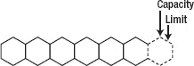

***图 7-2** Java 缓冲区表示(b)*

 **注意**在某些情况下，初始限制可能是 0，也可能是其他值，这取决于缓冲区的类型及其构造方式。

同样，在起始点，位置被设置为 0(槽 1，如图 7-3 中的[所示)——一个读或写字节将访问位置 0。](#fig_7_3)

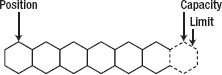

***图 7-3** Java 缓冲区表示(c)*

接下来，假设我们将 2 个字节的数据读入缓冲区。这 2 个字节的数据从位置 0 开始进入缓冲区。因此，前两个字节被填充，位置转到第三个字节，如图[图 7-4](#fig_7_4) 所示。

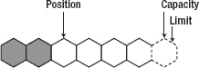

***图 7-4** Java 缓冲区表示(d)*

继续第二次读取，另外 3 个字节进入缓冲区。位置增加到 5(槽 6)，如图[图 7-5](#fig_7_5) 所示。

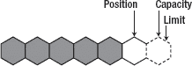

***图 7-5** Java 缓冲区表示(e)*

此时，假设我们不再读入缓冲区，而是想从缓冲区写入。为此，我们首先需要在写入任何字节之前调用`flip()`方法。这会将限制设置到当前位置，并将位置设置为 0。翻转后，缓冲器出现如图[图 7-6](#fig_7_6) 所示。

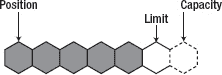

***图 7-6** Java 缓冲区表示(f)*

假设我们从缓冲区写入 3 个字节。由于位置为 0，前 3 个字节被写入，位置移动到 3(槽 4)，如图[图 7-7](#fig_7_7) 所示。限制和容量保持不变。

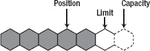

***图 7-7** Java 缓冲区表示(g)*

接下来我们再写 2 个字节，位置前移至槽 6，如图[图 7-8](#fig_7_8)；限制和容量保持不变。

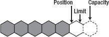

***图 7-8** Java 缓冲区表示(h)*

我们可能还想完成另外两个操作。继续参照[图 7-8](#fig_7_8) ，我们可能想要倒带缓冲区或清除缓冲区。倒带缓冲区(调用`rewind()`方法)将为重新读取缓冲区已经包含的数据做准备——限制保持不变，位置设置为 0。清空缓冲区(调用`clear()`方法)将重置缓冲区以接收更多字节(数据不会被删除)—限制设置为容量，位置设置为 0。[图 7-9](#fig_7_9) 显示了`clear()`方法的效果，[图 7-10](#fig_7_10) 显示了`rewind()`方法的效果。


***图 7-9** Java 缓冲区表示(一)*

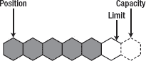

***图 7-10** Java 缓冲区表示(j)*

此外，一个缓冲区保存一个*标记*。这是调用`reset()`方法时其位置将被重置的索引。标记并不总是确定的，但它永远不会是负数，也永远不会大于位置。如果标记被定义，那么当位置或限制被调整到小于标记的值时，它被丢弃。如果标记没有定义，那么调用`reset()`方法会导致抛出一个`InvalidMarkException`。

 **注**将标记插入关系中得到以下结果:0 ≤标记≤位置≤极限≤容量。

#### ByteBuffer 祖先方法

`ByteBuffer`提供了一套访问数据的`get()`和`put()`方法。由于它们非常直观，我将在此简单列出。更多详情，请查阅`[http://download.oracle.com/javase/7/docs/api/index.html](http://download.oracle.com/javase/7/docs/api/index.html)`和`[http://download.oracle.com/javase/7/docs/index.html](http://download.oracle.com/javase/7/docs/index.html)`的官方文件。

```java
public abstract byte get()
public ByteBuffer get(byte[] dst)
public ByteBuffer get(byte[] dst, int offset, int length)
public abstract byte get(int index)

public abstract ByteBuffer put(byte b)
public final ByteBuffer put(byte[] src)
public ByteBuffer put(byte[] src, int offset, int length)
public ByteBuffer put(ByteBuffer src)
public abstract ByteBuffer put(int index, byte b)
```

除了`get()`和`put()`方法，`ByteBuffer`还有额外的方法来读取和写入不同类型的值，如下所示:

```java
public abstract char getChar()
public abstract char getChar(int index)
public abstract double getDouble()
public abstract double getDouble(int index)
public abstract float getFloat()
public abstract float getFloat(int index)
public abstract int getInt()
public abstract int getInt(int index)
public abstract long getLong()
public abstract long getLong(int index)
public abstract short getShort()
public abstract short getShort(int index)

public abstract ByteBuffer putChar(char value)
public abstract ByteBuffer putChar(int index, char value)
public abstract ByteBuffer putDouble(double value)
public abstract ByteBuffer putDouble(int index, double value)
public abstract ByteBuffer putFloat(float value)
public abstract ByteBuffer putFloat(int index, float value)
public abstract ByteBuffer putInt(int value)
public abstract ByteBuffer putInt(int index, int value)
public abstract ByteBuffer putLong(int index, long value)
public abstract ByteBuffer putLong(long value)
public abstract ByteBuffer putShort(int index, short value)
public abstract ByteBuffer putShort(short value)
```

一个字节缓冲区可以是直接的，也可以是非直接的。JVM 将在直接缓冲区上执行本机 I/O 操作。直接缓冲区通过使用`allocateDirect()`方法创建，而非直接缓冲区通过使用`allocate()`方法创建。

此时你已经有了足够的关于`ByteBuffer`的信息来理解下面的应用。(要深入了解`ByteBuffer`，请访问网上的专门教程。)因此，我们暂时抛开`ByteBuffer`，进入本章的主题`SeekableByteChannel`界面。下一节将向您介绍通道，并将它们与缓冲区联系起来。

### 渠道概述

在*面向流的 I/O* 系统中，输入流产生 1 字节的数据，输出流消耗 1 字节的数据——这样的系统通常相当慢。相比之下，在一个*面向块的 I/O* 系统中，输入/输出流一步就产生或消耗一个数据块。

通道类似于流，但有一些不同:

*   虽然流通常是单向的(读或写)，但通道支持读和写。
*   通道可以异步读写。
*   通道总是读取或写入缓冲区。发送到通道的所有数据必须首先放在缓冲区中。从通道读取的任何数据都被读入缓冲区。

### 使用 SeekableByteChannel 接口对文件进行随机访问

新的`SeekableByteChannel`接口通过实现通道上位置的概念来提供对 RAF 的支持。我们可以从通道中读取或向通道中写入一个`ByteBuffer`，获取或设置当前位置，并将连接到通道的实体截断到指定的维度。以下方法与这些功能相关(更多详情可在`[http://download.oracle.com/javase/7/docs/api/index.html](http://download.oracle.com/javase/7/docs/api/index.html)`的官方文件中获得):

*   `position()`:返回通道的当前位置(非负)。
*   `position(long)`:将通道的位置设置为指定的`long`(非负)。将位置设置为大于当前大小的值是合法的，但不会改变实体的大小。
*   `truncate(long)`:将连接到通道的实体截断到指定的长度。
*   `read(ByteBuffer)`:从通道读取字节到缓冲区。
*   `write(ByteBuffer)`:将字节从缓冲区写入通道。
*   `size()`:返回该通道连接的实体的当前大小。

获取`SeekableByteChannel`的实例可以通过`Files`类的两个方法完成，名为`newByteChannel()`。第一个(最简单的)`newByteChannel()`方法接收要打开或创建的文件的路径和一组指定如何打开文件的选项。`StandardOpenOption`枚举常量在[第 4 章](04.html#ch4)章节“使用标准打开选项”中有所描述，但为了便于参考，在此重复这些常量:

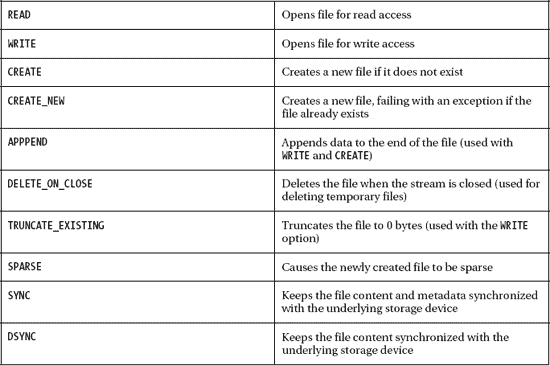

第二个`newByteChannel()`方法接收要打开或创建的文件的路径，一组指定如何打开文件的选项，以及可选的，创建文件时自动设置的文件属性列表。

这两种方法都打开或创建一个文件，返回`SeekableByteChannel`来访问该文件。

#### 使用 SeekableByteChannel 读取文件

关注第一个`newByteChannel()`方法，我们得到一个用于读取路径`C:\rafaelnadal\grandslam\RolandGarros\story.txt`的`SeekableByteChannel`(文件必须存在):

`…
Path path = Paths.get("C:/rafaelnadal/grandslam/RolandGarros", "story.txt");
…
try (SeekableByteChannel seekableByteChannel = Files.newByteChannel(path,
                                                         EnumSet.of(StandardOpenOption.READ))) {` `…
} catch (IOException ex) {
   System.err.println(ex);
}`

例如，下面的应用将使用一个`ByteBuffer`读取并显示`story.txt`的内容(该文件必须存在)。我选择了 12 字节的缓冲区，但也可以随意使用其他大小的缓冲区。

```java
import java.io.IOException;
import java.nio.ByteBuffer;
import java.nio.channels.SeekableByteChannel;
import java.nio.charset.Charset;
import java.nio.file.Files;
import java.nio.file.Path;
import java.nio.file.Paths;
import java.util.EnumSet;
import java.nio.file.StandardOpenOption;

public class Main {

 public static void main(String[] args) {

  Path path = Paths.get("C:/rafaelnadal/grandslam/RolandGarros", "story.txt");

  //read a file using SeekableByteChannel
  try (SeekableByteChannel seekableByteChannel = Files.newByteChannel(path,
                                                       EnumSet.of(StandardOpenOption.READ))) {

   ByteBuffer buffer = ByteBuffer.allocate(12);            
   String encoding = System.getProperty("file.encoding");
   buffer.clear();

   while (seekableByteChannel.read(buffer) > 0) {
         buffer.flip();
         System.out.print(Charset.forName(encoding).decode(buffer));
         buffer.clear();                
   }
  } catch (IOException ex) {
    System.err.println(ex);
  }
 }
}
```

输出应该类似于以下内容:

* * *

```java
Rafa Nadal produced another masterclass of clay-court tennis to win his fifth French Open
title ...
```

* * *

#### 用 SeekableByteChannel 写文件

用`SeekableByteChannel`写文件需要使用`WRITE`选项。此外，如果我们想在写作前清理现有的内容，我们可以添加如下的`TRUNCATE_EXISTING`选项。在这里，我们截断了`story.txt`，并准备写它(T4 文件必须存在)。

```java
…
Path path = Paths.get("C:/rafaelnadal/grandslam/RolandGarros", "story.txt");
…
try (SeekableByteChannel seekableByteChannel = Files.newByteChannel(path,
                EnumSet.of(StandardOpenOption.WRITE, StandardOpenOption.TRUNCATE_EXISTING))) {
…
} catch (IOException ex) {
   System.err.println(ex);
}
```

例如，下面的应用将使用一个`ByteBuffer`截断并在`story.txt`中写入一些文本(在这种情况下，文件已经存在；如果它不存在，那么我们将添加`CREATE`或`CREATE_NEW`和`WRITE`选项，并去掉`TRUNCATE_EXISTING`选项，因为文件反正是空的)。

```java
import java.io.IOException;
import java.nio.ByteBuffer;
import java.nio.channels.SeekableByteChannel;
import java.nio.file.Files;
import java.nio.file.Path;
import java.nio.file.Paths;
import java.nio.file.StandardOpenOption;
import java.util.EnumSet;

public class Main {

 public static void main(String[] args) {

   Path path = Paths.get("C:/rafaelnadal/grandslam/RolandGarros", "story.txt");

   //write a file using SeekableByteChannel
   try (SeekableByteChannel seekableByteChannel = Files.newByteChannel(path,
                EnumSet.of(StandardOpenOption.WRITE, StandardOpenOption.TRUNCATE_EXISTING))) {

    ByteBuffer buffer = ByteBuffer.wrap("Rafa Nadal produced another masterclass of clay-court
                                   tennis to win his fifth French Open title ...".getBytes());

    int write = seekableByteChannel.write(buffer);
    System.out.println("Number of written bytes: " + write);

    buffer.clear();
   } catch (IOException ex) {
     System.err.println(ex);
   }
 }
}
```

当你写一个文件时，有一些常见的情况涉及到组合打开选项:

*   要写入一个存在的文件，在开始时，使用`WRITE`
*   要写入一个存在的文件，在最后，使用`WRITE`和`APPEND`
*   要写入一个存在的文件并在写入前清理其内容，使用`WRITE`和`TRUNCATE_EXISTING`
*   要写入一个不存在的文件，使用`CREATE`(或`CREATE_NEW`)和`WRITE`

#### 可查找的字节通道和文件属性

以下代码片段(为 Unix 和其他 POSIX 文件系统编写)创建了一个具有一组特定文件权限的文件。这段代码在`home\rafaelnadal\email`目录中创建文件`email.txt`,如果它已经存在，则追加到该文件中。创建的`email.txt`文件对所有者具有读写权限，对组具有只读权限。

`import java.io.IOException;
import java.nio.ByteBuffer;
import java.nio.channels.SeekableByteChannel;
import java.nio.file.Files;
import java.nio.file.Path;
import java.nio.file.Paths;
import java.nio.file.StandardOpenOption;
import java.nio.file.attribute.FileAttribute;
import java.nio.file.attribute.PosixFilePermission;
import java.nio.file.attribute.PosixFilePermissions;
import java.util.EnumSet;
import java.util.Set;

public class Main {

 public static void main(String[] args) {

 Path path = Paths.get("home/rafaelnadal/email", "email.txt");
 ByteBuffer buffer = ByteBuffer.wrap("Hi Rafa, I want to congratulate you for the amazing
                                                      match that you played ... ".getBytes());

 //create the custom permissions attribute for the email.txt file
 Set<PosixFilePermission> perms = PosixFilePermissions.fromString("rw-r------");
 FileAttribute<Set<PosixFilePermission>> attr = PosixFilePermissions.asFileAttribute(perms);

 //write a file using SeekableByteChannel
 try (SeekableByteChannel seekableByteChannel = Files.newByteChannel(path,
                    EnumSet.of(StandardOpenOption.CREATE, StandardOpenOption.APPEND), attr)) {

  int write = seekableByteChannel.write(buffer);
  System.out.println("Number of written bytes: " + write);

 } catch (IOException ex) {
   System.err.println(ex);` ` }

 buffer.clear();
 }
}`

#### 使用旧的 ReadableByteChannel 接口读取文件

新的`SeekableByteChannel`接口基于旧的接口`ReadableByteChannel`(代表读取字节的通道；一次只能有一个线程读取)和`WritableByteChannel`(代表一个写字节的通道；一次只能有一个线程可以写),这是从 JDK 1.4 开始在 NIO 中提供的。这两个接口是`SeekableByteChannel`的超级接口。由于它们之间的这种关系，我们可以使用旧的`ReadableByteChannel`接口和新的`Files.newByteChannel()`方法，如下所示，其中我们读取现有的`story.txt`文件的内容:

```java
import java.io.IOException;
import java.nio.ByteBuffer;
import java.nio.channels.ReadableByteChannel;
import java.nio.charset.Charset;
import java.nio.file.Files;
import java.nio.file.Path;
import java.nio.file.Paths;

public class Main {

 public static void main(String[] args) {

  Path path = Paths.get("C:/rafaelnadal/grandslam/RolandGarros", "story.txt");

  //read a file using ReadableByteChannel
  try (ReadableByteChannel readableByteChannel = Files.newByteChannel(path)) {

   ByteBuffer buffer = ByteBuffer.allocate(12);
   buffer.clear();

   String encoding = System.getProperty("file.encoding");

   while (readableByteChannel.read(buffer) > 0) {
          buffer.flip();                
          System.out.print(Charset.forName(encoding).decode(buffer));
          buffer.clear();                
   }
  } catch (IOException ex) {
     System.err.println(ex);
  }
 }
}
```

如您所见，不需要指定`READ`选项。

#### 用旧的 WritableByteChannel 接口写文件

我们也可以将旧的`WritableByteChannel`接口与新的`Files.newByteChannel()`方法结合起来，如下所示，其中我们将一些文本添加到`story.txt`中:

```java
import java.io.IOException;
import java.nio.ByteBuffer;
import java.nio.channels.WritableByteChannel;
import java.nio.file.Files;
import java.nio.file.Path;
import java.nio.file.Paths;
import java.nio.file.StandardOpenOption;
import java.util.EnumSet;
public class Main {

public static void main(String[] args) {

 Path path = Paths.get("C:/rafaelnadal/grandslam/RolandGarros", "story.txt");

 //write a file using WritableByteChannel
 try (WritableByteChannel writableByteChannel = Files.newByteChannel(path,
                           EnumSet.of(StandardOpenOption.WRITE, StandardOpenOption.APPEND))) {

  ByteBuffer buffer = ByteBuffer.wrap("Vamos Rafa!".getBytes());

  int write = writableByteChannel.write(buffer);
  System.out.println("Number of written bytes: " + write);

  buffer.clear();

  } catch (IOException ex) {
    System.err.println(ex);
  }
 }
}
```

即使我们使用了一个`WritableByteChannel`，我们仍然需要显式地指定`WRITE`选项。`APPEND`选项是可选的，特定于前面的例子。

#### 玩弄 SeekableByteChannel 的立场

现在您已经知道如何使用`SeekableByteChannel`读写整个文件，您已经准备好发现如何在指定的通道(实体)位置执行相同的操作。为此，我们将在一组四个例子中利用`position()`和`position(long)`方法，意在让你熟悉 RAF 概念。请记住，不带参数的`position()`方法返回当前的通道(实体)位置，而`position(long)`方法通过计算从通道(实体)开始的字节数来设置通道(实体)的当前位置。第一个位置是 0，最后一个有效位置是通道(实体)大小。

##### 例 1:从不同位置读一个字符

我们从一个简单的例子开始，它从文本文件的第一、中间和最后位置读取一个字符。文件是`MovistarOpen.txt`，它位于`C:\rafaelnadal\tournaments\2009`目录中。

`import java.io.IOException;
import java.nio.ByteBuffer;
import java.nio.channels.SeekableByteChannel;
import java.nio.charset.Charset;
import java.nio.file.Files;
import java.nio.file.Path;
import java.nio.file.Paths;
import java.nio.file.StandardOpenOption;
import java.util.EnumSet;

public class Main {

 public static void main(String[] args) {

  Path path = Paths.get("C:/rafaelnadal/tournaments/2009", "MovistarOpen.txt");
  ByteBuffer buffer = ByteBuffer.allocate(1);
  String encoding = System.getProperty("file.encoding");

  try (SeekableByteChannel seekableByteChannel = (Files.newByteChannel(path,
                                                      EnumSet.of(StandardOpenOption.READ)))) {

   //the initial position should be 0 anyway
   seekableByteChannel.position(0);

   System.out.println("Reading one character from position: " +
                                                              seekableByteChannel.position());
   seekableByteChannel.read(buffer);
   buffer.flip();
   System.out.print(Charset.forName(encoding).decode(buffer));
   buffer.rewind();

   //get into the middle
   seekableByteChannel.position(seekableByteChannel.size()/2);

   System.out.println("\nReading one character from position: " +
                                                              seekableByteChannel.position());
   seekableByteChannel.read(buffer);
   buffer.flip();
   System.out.print(Charset.forName(encoding).decode(buffer));
   buffer.rewind();

   //get to the end
   seekableByteChannel.position(seekableByteChannel.size()-1);

   System.out.println("\nReading one character from position: " +
                                                              seekableByteChannel.position());
   seekableByteChannel.read(buffer);` `   buffer.flip();
   System.out.print(Charset.forName(encoding).decode(buffer));
   buffer.clear();

  } catch (IOException ex) {
   System.err.println(ex);
  }        
 }
}`

前面的应用将产生以下输出:

* * *

```java
Reading one character from position: 0

T

Reading one character from position: 181

n

Reading one character from position: 361

.
```

* * *

##### 例 2:在不同的位置书写字符

接下来，我们将尝试写入特定位置。假设`MovistarOpen.txt`文件有以下默认内容:

```java
The Movistar Open moved to Santiago from Viña del Mar in 2010\. It is the first clay-court
tournament of the ATP World Tour season and also the opening leg of the four-tournament swing
through Latin America, aptly coined the "Golden Swing" in honour of top Chileans and Olympic
Gold medalists Fernando Gonsales and Nicolas Massu. Gonzalez is a four-time champion.
```

我们希望完成两项任务:首先，在前面的文本末尾添加一些文本，其次，将“Gonsales”替换为“Gonzalez ”,因为 Fernando 的姓在第一个实例中被拼错了。下面是应用:

`import java.io.IOException;
import java.nio.ByteBuffer;
import java.nio.channels.SeekableByteChannel;
import java.nio.file.Files;
import java.nio.file.Path;
import java.nio.file.Paths;
import java.nio.file.StandardOpenOption;
import java.util.EnumSet;

public class Main {`  `public static void main(String[] args) {

  Path path = Paths.get("C:/rafaelnadal/tournaments/2009", "MovistarOpen.txt");
  ByteBuffer buffer_1 = ByteBuffer.wrap("Great players participate in our tournament, like:
              Tommy Robredo, Fernando Gonzalez, Jose Acasuso or Thomaz Bellucci.".getBytes());
  ByteBuffer buffer_2 = ByteBuffer.wrap("Gonzalez".getBytes());

  try (SeekableByteChannel seekableByteChannel = (Files.newByteChannel(path,
                                                     EnumSet.of(StandardOpenOption.WRITE)))) {

   //append some text at the end
   seekableByteChannel.position(seekableByteChannel.size());

   while (buffer_1.hasRemaining()) {
          seekableByteChannel.write(buffer_1);
   }

   //replace "Gonsales" with "Gonzalez"
   seekableByteChannel.position(301);

   while (buffer_2.hasRemaining()) {
          seekableByteChannel.write(buffer_2);
   }

   buffer_1.clear();
   buffer_2.clear();

  } catch (IOException ex) {
    System.err.println(ex);
  }
 }
}`

如果一切正常，新的`MovistarOpen.txt`内容应该如下所示:

```java
The Movistar Open moved to Santiago from Viña del Mar in 2010\. It is the first clay-court
tournament of the ATP World Tour season and also the opening leg of the four-tournament swing
through Latin America, aptly coined the "Golden Swing" in honour of top Chileans and Olympic
Gold medalists Fernando Gonzalez and Nicolas Massu. Gonzalez is a four-time champion. Great
players participate in our tournament, like: Tommy Robredo, Fernando Gonzalez, Jose Acasuso or
Thomaz Bellucci.
```

##### 例 3:从头到尾复制一个文件的一部分

转到一个新的应用，我们下一步想把一部分文本从一个文件的开头复制到同一个文件的结尾。例如，我们将使用`HeinekenOpen.txt`文件(位于`C:\rafaelnadal\tournaments\2009`目录中)，该文件包含以下内容:

```java
The Pride Of New Zealand
The Heineken Open is the biggest men's professional sporting event in New Zealand, held in...
```

我们想把“新西兰的骄傲”这句话抄在最后，就像这样:

```java
The Pride Of New Zealand
The Heineken Open is the biggest men's professional sporting event in New Zealand, held in...
The Pride Of New Zealand
```

以下应用完成了这项任务:

```java
import java.io.IOException;
import java.nio.ByteBuffer;
import java.nio.channels.SeekableByteChannel;
import java.nio.file.Files;
import java.nio.file.Path;
import java.nio.file.Paths;
import java.nio.file.StandardOpenOption;
import java.util.EnumSet;

public class Main {

 public static void main(String[] args) {

  Path path = Paths.get("C:/rafaelnadal/tournaments/2009", "HeinekenOpen.txt");        

  ByteBuffer copy = ByteBuffer.allocate(25);
  copy.put("\n".getBytes());

  try (SeekableByteChannel seekableByteChannel = (Files.newByteChannel(path,
                            EnumSet.of(StandardOpenOption.READ, StandardOpenOption.WRITE)))) {

   int nbytes;
   do {
      nbytes = seekableByteChannel.read(copy);
   } while (nbytes != -1 && copy.hasRemaining());

   copy.flip();            

   seekableByteChannel.position(seekableByteChannel.size());
   while (copy.hasRemaining()) {
          seekableByteChannel.write(copy);
   }

   copy.clear();

  } catch (IOException ex) {
    System.err.println(ex);
  }
 }
}
```

##### 例 4:用截断功能替换文件部分

在本例中，我们将截断一个文件，并在截断的文本中添加新的文本。我们将使用`BrasilOpen.txt`文件(在`C:\rafaelnadal\tournaments\2009`目录中找到)，该文件包含以下内容:

```java
Brasil Open At Forefront Of Green Movement
The Brasil Open, the second stop of the four-tournament Latin American swing, is held in an
area renowned for its lush natural beauty and stunning beaches. From this point forward ...
```

我们希望截断文件内容，以删除“从现在开始...”的文本并在其位置追加新文本。以下是解决方案:

```java
import java.io.IOException;
import java.nio.ByteBuffer;
import java.nio.channels.SeekableByteChannel;
import java.nio.file.Files;
import java.nio.file.Path;
import java.nio.file.Paths;
import java.nio.file.StandardOpenOption;
import java.util.EnumSet;

public class Main {

 public static void main(String[] args) {

  Path path = Paths.get("C:/rafaelnadal/tournaments/2009", "BrasilOpen.txt");

  ByteBuffer buffer = ByteBuffer.wrap("The tournament has taken a lead in environmental
conservation efforts, with highlights including the planting of 500 trees to neutralise carbon
emissions and providing recyclable materials to local children for use in craft
work.".getBytes());

  try (SeekableByteChannel seekableByteChannel = (Files.newByteChannel(path,
                            EnumSet.of(StandardOpenOption.READ, StandardOpenOption.WRITE)))) {

   seekableByteChannel.truncate(200);

   seekableByteChannel.position(seekableByteChannel.size()-1);
   while (buffer.hasRemaining()) {
          seekableByteChannel.write(buffer);
   }

   buffer.clear();

  } catch (IOException ex) {
    System.err.println(ex);
  }
 }
}
```

该应用的效果是对`BrasilOpen.txt`文件的如下修改:

```java
Brasil Open At Forefront Of Green Movement
The Brasil Open, the second stop of the four-tournament Latin American swing, is held in an
area renowned for its lush natural beauty and stunning beaches. The tournament has taken a
lead in environmental conservation efforts, with highlights including the planting of 500
trees to neutralise carbon emissions and providing recyclable materials to local children for
use in craft work.
```

这一组例子应该有助于您理解如何随机访问文件内容。接下来，我们将把`SeekableByteChannel`接口转换为`FileChannel`,让我们可以访问更高级的特性。

### 使用文件通道

`FileChannel`是在 Java 4 中引入的，但最近它被更新以实现新的`SeekableByteChannel`接口，结合它们的力量以实现更大的能力。`SeekableByteChannel`提供了随机访问文件功能，而`FileChannel`提供了强大的高级功能，例如将文件的一个区域直接映射到内存中，以便更快地访问和锁定文件的一个区域。

为一个`Path`获取一个`FileChannel`可以通过两个新的`FileChannel.open()`方法来完成。这两种方法都能够为给定的`Path`打开或创建一个文件，并返回一个新的通道。第一种(最简单的)方法接收要打开或创建的文件的路径，以及一组指定如何打开文件的选项。第二种方法接收要打开或创建的文件的路径、一组指定如何打开文件的选项，以及(可选)在创建文件时自动设置的文件属性列表。

例如，以下代码为指定路径获取具有读/写功能的文件通道:

```java
Path path = Paths.get("…");
…
try (FileChannel fileChannel = (FileChannel.open(path, EnumSet.of(
                                       StandardOpenOption.READ, StandardOpenOption.WRITE)))) {
…
} catch (IOException ex) {
  System.err.println(ex);
}
```

将`SeekableByteChannel`显式转换为`FileChannel`可以替代前面的代码:

```java
Path path = Paths.get("…");
…
try (FileChannel fileChannel = (FileChannel)(Files.newByteChannel(path,
                              EnumSet.of(StandardOpenOption.READ, StandardOpenOption.WRITE)))) {
…
} catch (IOException ex) {
  System.err.println(ex);
}
```

现在，`fileChannel`实例可以访问由`SeekableByteChannel`和`FileChannel`提供的方法。

#### 将通道的文件区域直接映射到内存中

最棒的`FileChannel`功能之一是能够将通道文件的一个区域直接映射到内存中。这要归功于`FileChannel.map()`方法，它获得以下三个参数:

*   `mode`:将一个区域映射到内存有三种方式可以完成:`MapMode.READ_ONLY` ( *只读*映射；写尝试会抛出`ReadOnlyBufferException`、`MapMode.READ_WRITE` ( *读/写*映射；结果缓冲区中的变化可以传播到文件，并且可以从映射相同文件的其他程序中看到)，或者`MapMode.PRIVATE` ( *写时复制*映射；结果缓冲区中的更改不能传播到文件，并且在其他程序中不可见)。
*   `position`:映射的区域从文件中指定的位置开始(非负)。
*   `size`:表示映射区域的大小(`0` ≤ `size` ≤ `Integer.MAX_VALUE`)。

 **注意**只有打开读的通道才能映射为只读，只有打开读写的通道才能映射为读/写或私有。

`map()`方法将返回一个实际代表提取区域的`MappedByteBuffer`。这用以下三个方法扩展了`ByteBuffer`，更多细节可以在`[http://download.oracle.com/javase/7/docs/api/index.html](http://download.oracle.com/javase/7/docs/api/index.html)`的官方文档中找到:

*   `force()`:强制将转换后的缓冲区传播到原始文件
*   `load()`:将缓冲内容加载到物理内存中
*   `isLoaded()`:验证缓冲区内容是否在物理内存中

下一个应用为文件`BrasilOpen.txt`(位于`C:\rafaelnadal\tournaments\2009`中)获得一个新的通道，并在`READ_ONLY`模式下将其全部内容映射到一个字节缓冲区中。为了测试操作是否成功完成，以下是字节缓冲区内容的打印输出:

`import java.io.IOException;
import java.nio.CharBuffer;
import java.nio.MappedByteBuffer;
import java.nio.channels.FileChannel;
import java.nio.charset.CharacterCodingException;
import java.nio.charset.Charset;
import java.nio.charset.CharsetDecoder;
import java.nio.file.Path;
import java.nio.file.Paths;
import java.nio.file.StandardOpenOption;
import java.util.EnumSet;

public class Main {`  `public static void main(String[] args) {

   Path path = Paths.get("C:/rafaelnadal/tournaments/2009", "BrasilOpen.txt");
   MappedByteBuffer buffer = null;

   try (FileChannel fileChannel = (FileChannel.open(path,
                                                      EnumSet.of(StandardOpenOption.READ)))) {

     buffer = fileChannel.map(FileChannel.MapMode.READ_ONLY, 0, fileChannel.size());

   } catch (IOException ex) {
     System.err.println(ex);
   }

   if (buffer != null) {
       try {
           Charset charset = Charset.defaultCharset();
           CharsetDecoder decoder = charset.newDecoder();
           CharBuffer charBuffer = decoder.decode(buffer);
           String content = charBuffer.toString();
           System.out.println(content);

           buffer.clear();
       } catch (CharacterCodingException ex) {
         System.err.println(ex);
       }
    }
  }
}`

如果一切正常，您应该看到`BrasilOpen.txt`内容输出到控制台。

#### 锁定频道的文件

文件锁定是一种限制访问文件或其他数据的机制，以确保两个或更多用户不能同时修改同一个文件。这防止了经典的*调解更新*场景。通常，当第一个用户访问该文件时，该文件被锁定，并保持锁定(可以读取，但不能修改)，直到该用户完成该文件。

文件锁定的确切行为取决于平台。在某些平台上，文件锁定是建议性的(如果应用不检查文件锁定，任何应用都可以访问文件)，而在其他平台上，它是强制性的(文件锁定阻止任何应用访问文件)。

我们可以通过 NIO API 利用 Java 应用中的文件锁定。但是，不能保证文件锁定机制总是按您预期的那样工作。底层操作系统支持或有时错误的实现可能会影响预期的行为。请记住以下几点:

*   “文件锁代表整个 Java 虚拟机持有。它们不适合控制同一虚拟机内多个线程对文件的访问。(Java 平台 SE 7 官方文档，http://download . Oracle . com/javase/7/docs/API/Java/nio/channels/file lock . html。)
*   Windows 会为您锁定目录和其他结构，因此如果另一个进程打开了文件，删除、重命名或写操作将会失败。因此，在系统锁之上创建 Java 锁将会失败。
*   Linux 内核管理一组被称为*咨询锁定机制*的功能。此外，您可以使用强制锁在内核级别强制锁定。因此，在使用 Java 锁时，请记住这一点。

`FileChannel`类提供了四种文件锁定方法:两种`lock()`方法和两种`tryLock()`方法。`lock()`方法阻塞应用，直到可以检索到所需的锁，而`tryLock()`方法不阻塞应用，如果文件已经被锁定，则返回`null`或抛出异常。有一个`lock()` / `tryLock()`方法用于检索该通道文件上的排他锁，还有一个方法用于检索该通道文件的某个区域上的锁——该方法还允许共享锁。

为了演示文件锁定，我们来看两个应用。第一个在向一个名为`vamos.txt`(在`C:\rafaelnadal\email`下)的文件中写入一些文本时锁定该文件 2 分钟。在此期间，第二个应用将尝试写入同一文件。如果文件成功锁定了 2 分钟，那么第二个应用将抛出一个`java.io.IO.Exception`，并输出如下消息:

* * *

```java
The process cannot access the file because another process has locked a portion of the file.
```

* * *

这是第一个应用:

`import java.io.IOException;
import java.nio.ByteBuffer;
import java.nio.channels.FileChannel;
import java.nio.channels.FileLock;
import java.nio.file.Path;
import java.nio.file.Paths;
import java.nio.file.StandardOpenOption;
import java.util.EnumSet;

public class Main {

 public static void main(String[] args) {

   Path path = Paths.get("C:/rafaelnadal/email", "vamos.txt");
   ByteBuffer buffer = ByteBuffer.wrap("Vamos Rafa!".getBytes());

   try (FileChannel fileChannel = (FileChannel.open(path, EnumSet.of(StandardOpenOption.READ,
                                                                StandardOpenOption.WRITE)))) {

    // Use the file channel to create a lock on the file.
    // This method blocks until it can retrieve the lock.
    FileLock lock = fileChannel.lock();

     // Try acquiring the lock without blocking. This method returns
     // null or throws an exception if the file is already locked.
     //try {
        //    lock = fileChannel.tryLock();` `     //} catch (OverlappingFileLockException e) {
         // File is already locked in this thread or virtual machine
     //}

     if (lock.isValid()) {

         System.out.println("Writing to a locked file ...");
         try {
             Thread.sleep(60000);
             } catch (InterruptedException ex) {
               System.err.println(ex);
             }
         fileChannel.position(0);
         fileChannel.write(buffer);
         try {
             Thread.sleep(60000);
         } catch (InterruptedException ex) {
           System.err.println(ex);
         }
      }

      // Release the lock
      lock.release();

      System.out.println("\nLock released!");

     } catch (IOException ex) {
       System.err.println(ex);
     }
  }
}`

运行前面的应用，并在最多 2 分钟内并行启动下面的应用:

`import java.io.IOException;
import java.nio.ByteBuffer;
import java.nio.channels.FileChannel;
import java.nio.file.Path;
import java.nio.file.Paths;
import java.nio.file.StandardOpenOption;
import java.util.EnumSet;

public class Main {

 public static void main(String[] args) {

   Path path = Paths.get("C:/rafaelnadal/email", "vamos.txt");
   ByteBuffer buffer = ByteBuffer.wrap("Hai Hanescu !".getBytes());

   try (FileChannel fileChannel = (FileChannel.open(path, EnumSet.of(StandardOpenOption.READ,
                                                                StandardOpenOption.WRITE)))) {`  `fileChannel.position(0);
     fileChannel.write(buffer);

   } catch (IOException ex) {
     System.err.println(ex);
   }
 }
}`

你应该会发现第二个应用只有在锁被释放后，也就是 2 分钟后才能写入`vamos.txt`。

#### 使用 FileChannel 复制文件

`FileChannel`提供了几种复制文件的方法。您可以使用直接或非直接`ByteBuffer`的`FileChannel`，使用`FileChannel.transferTo()`或`FileChannel.transferFrom()`，或使用`FileChannel.map()`。

##### 使用 FileChannel 和直接或非直接字节缓冲区复制文件

要复制带有`FileChannel`和直接或非直接`ByteBuffer`的文件，我们需要一个通道用于源文件，一个通道用于目标文件，以及一个直接或非直接`ByteBuffer`。例如，下面的代码片段将使用 4KB 的直接文件`ByteBuffer`将文件`Rafa Best Shots.mp4`(位于`C:\rafaelnadal\tournaments\2009\videos`目录中)复制到`C:\`根目录:

`…
final Path copy_from = Paths.get("C:/rafaelnadal/tournaments/2009/
                                                             videos/Rafa Best Shots.mp4");
final Path copy_to = Paths.get("C:/Rafa Best Shots.mp4");
int bufferSizeKB = 4;
int bufferSize = bufferSizeKB * 1024;
…
System.out.println("Using FileChannel and direct buffer ...");
try (FileChannel fileChannel_from = (FileChannel.open(copy_from,
                      EnumSet.of(StandardOpenOption.READ)));
     FileChannel fileChannel_to = (FileChannel.open(copy_to,
                      EnumSet.of(StandardOpenOption.CREATE_NEW, StandardOpenOption.WRITE)))) {          

     // Allocate a direct ByteBuffer
     ByteBuffer bytebuffer = ByteBuffer.allocateDirect(bufferSize);

     // Read data from file into ByteBuffer
     int bytesCount;
     while ((bytesCount = fileChannel_from.read(bytebuffer)) > 0) {
             //flip the buffer which set the limit to current position, and position to 0            
             bytebuffer.flip();
             //write data from ByteBuffer to file
             fileChannel_to.write(bytebuffer);
             //for the next read
             bytebuffer.clear();` `     }
} catch (IOException ex) {
  System.err.println(ex);
}
…`

要使用非直接`ByteBuffer`，只需更换线路即可

```java
     ByteBuffer bytebuffer = ByteBuffer.allocateDirect(bufferSize);
```

用下面一行:

```java
     ByteBuffer bytebuffer = ByteBuffer.allocate(bufferSize);
```

##### 使用 FileChannel.transferTo()或 FileChannel.transferFrom()复制文件

`FileChannel.transferTo()`将字节从一个通道的文件传输到给定的可写字节通道。您选择位置、要传输的最大字节数和目标通道，`FileChannel.transferTo()`返回传输的字节数。下面的例子转移了`Rafa Best Shots.mp4`的全部内容:

```java
…
System.out.println("Using FileChannel.transferTo method ...");
try (FileChannel fileChannel_from = (FileChannel.open(copy_from,
                      EnumSet.of(StandardOpenOption.READ)));
     FileChannel fileChannel_to = (FileChannel.open(copy_to,
                      EnumSet.of(StandardOpenOption.CREATE_NEW, StandardOpenOption.WRITE)))) {

            fileChannel_from.transferTo(0L, fileChannel_from.size(), fileChannel_to);

} catch (IOException ex) {
  System.err.println(ex);
}
…
```

或者，您可以使用`FileChannel.transferFrom()`将字节从给定的可读字节通道传输到该通道的文件中。为此，请通过替换以下行来修改前面的代码

```java
          fileChannel_from.transferTo(0L, fileChannel_from.size(), fileChannel_to);
```

用下面一行:

```java
          fileChannel_to.transferFrom(fileChannel_from, 0L, (int) fileChannel_from.size());
```

##### 使用 FileChannel.map()复制文件

在本章的前面，您已经看到了如何使用`MappedByteBuffer`将通道文件的一个区域映射到内存中。在本节中，我们推断这个例子复制了`Rafa Best Shots.mp4`内容:

`…
System.out.println("Using FileChannel.map method ...");
try (FileChannel fileChannel_from = (FileChannel.open(copy_from,` `                      EnumSet.of(StandardOpenOption.READ)));
     FileChannel fileChannel_to = (FileChannel.open(copy_to,
                      EnumSet.of(StandardOpenOption.CREATE_NEW, StandardOpenOption.WRITE)))) {

     MappedByteBuffer buffer = fileChannel_from.map(FileChannel.MapMode.READ_ONLY, 0,
                                                                     fileChannel_from.size());

     fileChannel_to.write(buffer);
     buffer.clear();

} catch (IOException ex) {
  System.err.println(ex);
}
…`

##### 基准测试文件通道拷贝功能

在前三节中，您看到了使用`FileChannel`功能复制文件的不同方式。Java 还提供了另一套复制文件的解决方案，包括使用`Files.copy()`方法或者缓冲/非缓冲流和一个字节数组。你应该选择哪一个？这是一个很难回答的问题，它的答案取决于很多因素。本节重点介绍一个因素，即速度，因为快速完成拷贝任务可以提高工作效率，在某些情况下，这对成功至关重要。因此，本节实现了一个应用，该应用比较以下每种解决方案为每个拷贝花费的时间:

*   `FileChannel`和非直达`ByteBuffer`
*   `FileChannel`和直接`ByteBuffer`
*   `FileChannel.transferTo()`
*   `FileChannel.transferFrom()`
*   `FileChannel.map()`
*   使用缓冲流和字节数组
*   使用无缓冲流和字节数组
*   `Files.copy()` ( `Path`至`Path`、`InputStream`至`Path`、`Path`至`OutputStream`)

测试在以下条件下进行:

*   复制的文件类型:MP4 视频(文件名为`Rafa Best Shots.mp4`，初始位置在`C:\rafaelnadal\tournaments\2009\videos`
*   复制文件大小:58.3MB
*   测试的缓冲区大小:4KB、16KB、32KB、64KB、128KB、256KB 和 1024KB
*   机器:移动 AMD Sempron 处理器 3400 + 1.80 GHz，1.00GB 内存，32 位操作系统，Windows 7 旗舰版
*   测量类型:使用`System.nanoTime()`方法
*   仅在三次被忽略的连续运行后捕获时间；忽略前三次运行以获得趋势。第一次运行总是比后续运行慢。

接下来列出了该应用，可以在本书页面的源代码下载部分获得:

`import java.nio.MappedByteBuffer;
import java.io.OutputStream;
import java.io.InputStream;
import java.io.BufferedInputStream;
import java.io.BufferedOutputStream;
import java.io.File;
import java.io.FileInputStream;
import java.io.FileOutputStream;
import java.io.IOException;
import java.nio.ByteBuffer;
import java.nio.channels.FileChannel;
import java.nio.file.Files;
import java.nio.file.Path;
import java.nio.file.Paths;
import java.nio.file.StandardOpenOption;
import java.util.EnumSet;
import static java.nio.file.LinkOption.NOFOLLOW_LINKS;

public class Main {

 public static void deleteCopied(Path path){

  try {
      Files.deleteIfExists(path);
  } catch (IOException ex) {
    System.err.println(ex);
  }

 }

 public static void main(String[] args) {

 final Path copy_from = Paths.get("C:/rafaelnadal/tournaments/2009/videos/
                                                                        Rafa Best Shots.mp4");
 final Path copy_to = Paths.get("C:/Rafa Best Shots.mp4");
 long startTime, elapsedTime;
 int bufferSizeKB = 4; //also tested for 16, 32, 64, 128, 256 and 1024
 int bufferSize = bufferSizeKB * 1024;

 deleteCopied(copy_to);

 //FileChannel and non-direct buffer
 System.out.println("Using FileChannel and non-direct buffer ...");
 try (FileChannel fileChannel_from = (FileChannel.open(copy_from,
                      EnumSet.of(StandardOpenOption.READ)));` `FileChannel fileChannel_to = (FileChannel.open(copy_to,
                      EnumSet.of(StandardOpenOption.CREATE_NEW, StandardOpenOption.WRITE)))) {

      startTime = System.nanoTime();

      // Allocate a non-direct ByteBuffer
      ByteBuffer bytebuffer = ByteBuffer.allocate(bufferSize);

      // Read data from file into ByteBuffer
      int bytesCount;
      while ((bytesCount = fileChannel_from.read(bytebuffer)) > 0) {
       //flip the buffer which set the limit to current position, and position to 0            
       bytebuffer.flip();
       //write data from ByteBuffer to file
       fileChannel_to.write(bytebuffer);
       //for the next read
       bytebuffer.clear();
      }

      elapsedTime = System.nanoTime() - startTime;
      System.out.println("Elapsed Time is " + (elapsedTime / 1000000000.0) + " seconds");
 } catch (IOException ex) {
   System.err.println(ex);
 }

 deleteCopied(copy_to);

 //FileChannel and direct buffer
 System.out.println("Using FileChannel and direct buffer ...");
 try (FileChannel fileChannel_from = (FileChannel.open(copy_from,
                      EnumSet.of(StandardOpenOption.READ)));
      FileChannel fileChannel_to = (FileChannel.open(copy_to,
                      EnumSet.of(StandardOpenOption.CREATE_NEW, StandardOpenOption.WRITE)))) {

      startTime = System.nanoTime();

      // Allocate a direct ByteBuffer
      ByteBuffer bytebuffer = ByteBuffer.allocateDirect(bufferSize);

      // Read data from file into ByteBuffer
      int bytesCount;
      while ((bytesCount = fileChannel_from.read(bytebuffer)) > 0) {
       //flip the buffer which set the limit to current position, and position to 0            
       bytebuffer.flip();
       //write data from ByteBuffer to file
       fileChannel_to.write(bytebuffer);
       //for the next read
       bytebuffer.clear();
      }

      elapsedTime = System.nanoTime() - startTime;
      System.out.println("Elapsed Time is " + (elapsedTime / 1000000000.0) + " seconds");` `} catch (IOException ex) {
   System.err.println(ex);
 }

 deleteCopied(copy_to);

 //FileChannel.transferTo()
 System.out.println("Using FileChannel.transferTo method ...");
 try (FileChannel fileChannel_from = (FileChannel.open(copy_from,
                      EnumSet.of(StandardOpenOption.READ)));
      FileChannel fileChannel_to = (FileChannel.open(copy_to,
                      EnumSet.of(StandardOpenOption.CREATE_NEW, StandardOpenOption.WRITE)))) {

      startTime = System.nanoTime();

      fileChannel_from.transferTo(0L, fileChannel_from.size(), fileChannel_to);

      elapsedTime = System.nanoTime() - startTime;
      System.out.println("Elapsed Time is " + (elapsedTime / 1000000000.0) + " seconds");
 } catch (IOException ex) {
   System.err.println(ex);
 }

 deleteCopied(copy_to);

 //FileChannel.transferFrom()
 System.out.println("Using FileChannel.transferFrom method ...");
 try (FileChannel fileChannel_from = (FileChannel.open(copy_from,
                      EnumSet.of(StandardOpenOption.READ)));
      FileChannel fileChannel_to = (FileChannel.open(copy_to,
                      EnumSet.of(StandardOpenOption.CREATE_NEW, StandardOpenOption.WRITE)))) {

      startTime = System.nanoTime();

      fileChannel_to.transferFrom(fileChannel_from, 0L, (int) fileChannel_from.size());

      elapsedTime = System.nanoTime() - startTime;
      System.out.println("Elapsed Time is " + (elapsedTime / 1000000000.0) + " seconds");
 } catch (IOException ex) {
   System.err.println(ex);
 }

 deleteCopied(copy_to);

 //FileChannel.map
 System.out.println("Using FileChannel.map method ...");
 try (FileChannel fileChannel_from = (FileChannel.open(copy_from,
                      EnumSet.of(StandardOpenOption.READ)));
      FileChannel fileChannel_to = (FileChannel.open(copy_to,
                      EnumSet.of(StandardOpenOption.CREATE_NEW, StandardOpenOption.WRITE)))) {

      startTime = System.nanoTime();`  `MappedByteBuffer buffer = fileChannel_from.map(FileChannel.MapMode.READ_ONLY,
                                                                  0, fileChannel_from.size());

      fileChannel_to.write(buffer);
      buffer.clear();

      elapsedTime = System.nanoTime() - startTime;
      System.out.println("Elapsed Time is " + (elapsedTime / 1000000000.0) + " seconds");
} catch (IOException ex) {
  System.err.println(ex);
}

deleteCopied(copy_to);

//Buffered Stream I/O
System.out.println("Using buffered streams and byte array ...");
File inFileStr = copy_from.toFile();
File outFileStr = copy_to.toFile();
try (BufferedInputStream in = new BufferedInputStream(new FileInputStream(inFileStr));
     BufferedOutputStream out = new BufferedOutputStream(new FileOutputStream(outFileStr))) {

     startTime = System.nanoTime();

     byte[] byteArray = new byte[bufferSize];
     int bytesCount;
     while ((bytesCount = in.read(byteArray)) != -1) {
             out.write(byteArray, 0, bytesCount);
     }

     elapsedTime = System.nanoTime() - startTime;
     System.out.println("Elapsed Time is " + (elapsedTime / 1000000000.0) + " seconds");
} catch (IOException ex) {
  System.err.println(ex);
}

deleteCopied(copy_to);

System.out.println("Using un-buffered streams and byte array ...");
try (FileInputStream in = new FileInputStream(inFileStr);
     FileOutputStream out = new FileOutputStream(outFileStr)) {

     startTime = System.nanoTime();

     byte[] byteArray = new byte[bufferSize];
     int bytesCount;
     while ((bytesCount = in.read(byteArray)) != -1) {
             out.write(byteArray, 0, bytesCount);
     }

     elapsedTime = System.nanoTime() - startTime;
     System.out.println("Elapsed Time is " + (elapsedTime / 1000000000.0) + " seconds");` `} catch (IOException ex) {
  System.err.println(ex);
}

deleteCopied(copy_to);

System.out.println("Using Files.copy (Path to Path) method ...");
try {
    startTime = System.nanoTime();

    Files.copy(copy_from, copy_to, NOFOLLOW_LINKS);

    elapsedTime = System.nanoTime() - startTime;
    System.out.println("Elapsed Time is " + (elapsedTime / 1000000000.0) + " seconds");
} catch (IOException e) {
  System.err.println(e);
}

deleteCopied(copy_to);

System.out.println("Using Files.copy (InputStream to Path) ...");
try (InputStream is = new FileInputStream(copy_from.toFile())) {

    startTime = System.nanoTime();

    Files.copy(is, copy_to);

    elapsedTime = System.nanoTime() - startTime;
    System.out.println("Elapsed Time is " + (elapsedTime / 1000000000.0) + " seconds");
} catch (IOException e) {
  System.err.println(e);
}

deleteCopied(copy_to);

System.out.println("Using Files.copy (Path to OutputStream) ...");
try (OutputStream os = new FileOutputStream(copy_to.toFile())) {

     startTime = System.nanoTime();

     Files.copy(copy_from, os);

     elapsedTime = System.nanoTime() - startTime;
     System.out.println("Elapsed Time is " + (elapsedTime / 1000000000.0) + " seconds");
 } catch (IOException e) {
   System.err.println(e);
 }
 }
}`

这个应用的输出很难进行分类，因为涉及的数字太多了，所以我绘制了一些数据，以便让您更清楚地看到几次比较的结果，如下面几节中的图所示。这些图中的 Y 轴是以秒表示的估计时间，X 轴是所用缓冲区的大小(或运行次数，跳过前三次运行后)。

###### 文件通道和非直接缓冲区与文件通道和直接缓冲区

如[图 7-11](#fig_7_11) 所示，似乎对于小于 256KB 的缓冲区，非直接缓冲区要快得多，而对于大于 256KB 的缓冲区，直接缓冲区略快(参见[图 7-11](#fig_7_11) )。

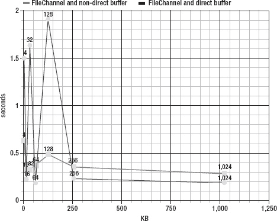

***图 7-11** 文件通道和非直接缓冲区对比文件通道和直接缓冲区*

###### filechannel . transferto()诉 filechannel . transferfrom()诉 FileChannel.map()

如图 7-12 中的[所示，看起来`transferTo()`和`transferFrom()`在连续七次运行后几乎相同，而`FileChannel.map()`是最慢的解决方案。](#fig_7_12)

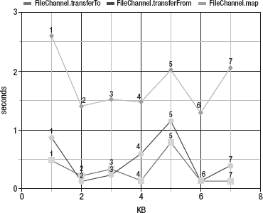

***图 7-12**【filechannel . transfer()诉 filechannel . transferfrom()诉 FileChannel.map()*

###### 三种不同的 Files.copy()方法

如图[图 7-13](#fig_7_13) 所示，最快的`Files.copy()`方法是`Path`到`Path`，其次是`Path`到`OutputStream`，最后是`InputStream`到`Path`。

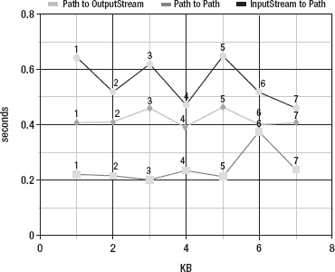

**图 7-13** Files.copy()方法

###### FileChannel 和非直接缓冲区与 FileChannel.transferTo()与路径到路径

作为最终测试，我们从上述三张图中取出最快的结果，并将它们放在图 7-14 中。由于我们没有指定`FileChannel.transferTo()`和`Path`到`Path`的缓冲区大小，我们将七次运行的平均时间作为参考。如你所见，`Files.copy()`和`Path`到`Path`似乎是复制文件最快的解决方案。

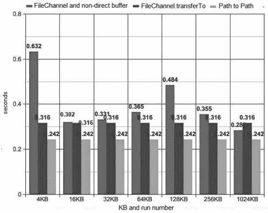

***图 7-14** 带非直接缓冲区的文件通道与文件通道. transferTo()与路径到路径的路径*

### 总结

这一章从简单概述`ByteBuffer`类开始，它通常与`SeekableByteChannel`和`FileChannel`一起使用。接下来详细介绍了`SeekableByteChannel`与应用的接口，这些应用将随机读写文件以完成不同类型的常见任务。然后，您看到了如何获得具有 RAF 功能的`FileChannel`，并发现了`FileChannel`提供的主要功能，包括将文件的一个区域直接映射到内存中以实现更快的访问，锁定文件的一个区域，以及在不影响通道当前位置的情况下从绝对位置读取和写入字节。本章以一个基准测试应用结束，该应用试图通过将`FileChannel`的功能与其他常用方法进行比较来确定复制文件的最快方法，例如`Files.copy()`，使用缓冲流和字节数组，以及使用非缓冲流和字节数组。