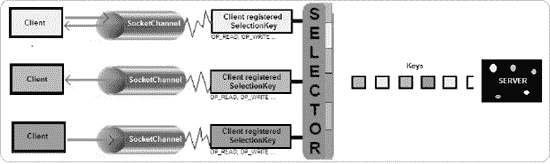
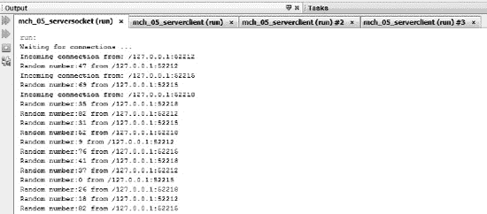
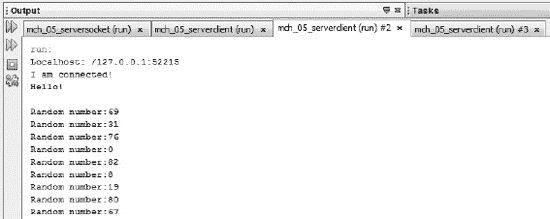
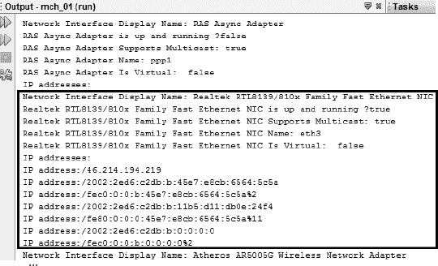

# 八、套接字 API

互联网诞生于 20 世纪 50 年代和 60 年代。几年后，大约在 80 年代，*套接字*的概念在 BSD(Berkeley Software Distribution——一种 Unix 变体)上被引入，用于使用互联网协议(IP)的进程之间的通信。几年后，在 1996 年，JDK 1.0 将套接字的概念带到了编程世界，作为易于使用和跨平台的网络通信模型。最后，程序员现在可以创建网络应用，而无需对网络通信进行多年的研究。Java 开发人员只需简单了解几个主题，如 IP、IP 地址、端口和 Java 网络，就可以编写一个简单的网络应用。

IP 将所有通信分成从源到目的地分别处理的*个数据包*(数据块)——没有交付保证。在 IP 之上，我们还有其他常见的协议，如 TCP(传输控制协议)和 UDP(用户数据报协议)(本章的应用利用了这些协议)，在这些协议之上，我们还有更多，包括 HTTP、TELNET、DNS 等等。套接字利用 IP 进行机器之间的通信，因此 Java 网络应用可以使用它们预定义的协议与现有的服务器“对话”。

在互联网上，每台机器都可以通过一个数字标签来识别，这个数字标签被称为 *IP 地址*。每个 Java 开发人员都应该知道我们处理两种类型的 IP 地址:IPv4(用 32 位表示，例如 124.32.45.23)和 IPv6(用 128 位表示，例如 2607:f0d 0:1002:0051:0000:0000:0000:0000:0004)。而且，要知道 IP 地址被组织成 A、B、C、D、e 类是很重要的，由于我们对 D 类 IP 地址特别感兴趣，假设 IPv4s 地址在 224.0.0.1 和 239.255.255.255 之间变化，表示组播组。另外，记住地址 127.0.0.1 是为*本地主机*地址保留的。

集中在端口上，TCP/UDP 端口的范围在 0 到 65535 之间，它们在 Java 中用整数表示。某些类型的服务器通常位于某些端口上:例如，如果您连接到一台主机的端口 80，您可能会发现一个 HTTP 服务器。在端口 21 上，你可以期待一个 FTP 服务器，在端口 23 上，一个 Telnet 服务器，在端口 119 上，一个 NNTP 服务器，等等。因此，选择端口时要谨慎；确保不要干扰其他进程，并且保持在适当的范围内。

每个概念都有专门的书籍，但是对于创建 Java 客户机/服务器应用来说，这些信息已经足够了。在客户机/服务器模型中，服务器运行在主机上，监听端口，以接收来自网络上的客户机甚至同一台机器的连接请求。客户端使用 IP 地址(主机名)和端口来定位服务器，而服务器根据每个客户端的请求为其提供服务。在连接过程中，客户端通过一个本地端口号向服务器标识自己，该端口号可以由内核显式设置或分配—一个套接字绑定到这个本地端口号，以便在连接过程中使用(我们说客户端*将*绑定到一个本地端口号)。接受之后，服务器获得一个绑定到新的本地端口号的新套接字，并将其远程端点设置为客户端的地址和端口——它需要一个新的端口号，以便可以继续侦听原始端口上的连接请求。一旦通信建立，数据可以在套接字之间来回传递，直到通信被故意关闭或意外中断。

我们可以得出结论，对于 Java 来说，套接字是服务器程序和它的客户端程序之间的双向软件端点，或者更一般地说，是在网络上运行的参与双向通信的两个程序之间的双向软件端点。一个*端点*是 IP 地址和端口号的组合。

Java 在 JDK 1.0 中引入了对套接字的支持，但是随着时间的推移，版本与版本之间的事情已经发生了变化。跳到 Java 7，NIO.2 通过用新方法更新现有的类和添加新的接口/类来编写基于 TCP/UDP 的应用，改进了这种支持。首先，NIO.2 引入了一个名为`NetworkChannel`的接口，它为所有网络通道类提供了方法公共——任何实现这个接口的通道都是网络套接字的通道。专用于同步套接字通道的主要类`ServerSocketChannel`、`SocketChannel`和`DatagramChannel`实现了这个接口，它提供了绑定和返回本地地址的方法，以及通过新的`SocketOption<T>`接口和`StandardSocketOptions`类设置和获取套接字选项的方法。该接口的方法和直接添加到类中的方法(用于检查连接状态、获取远程地址和关闭)将使您不必调用`socket()`方法。

NIO.2 还引入了`MulticastChannel`接口作为`NetworkChannel.`的子接口，顾名思义，`MulticastChannel`接口映射了一个支持 IP 组播的网络通道。请记住，`MulticastChannel`仅由数据报通道`DatagramChannel`的*实现*。当加入一个组播组时，你会得到一个*成员密钥*，这是一个代表组播组成员的令牌。通过成员资格密钥，您可以阻止/解除阻止来自不同地址的数据报、删除成员资格、获取为其创建成员资格密钥的频道和/或多播组，等等。

 **注**关于 Java 通道的简要概述，请看看第七章的[的“通道简要概述”一节。此外，为了理解 Java 缓冲区是如何工作的，可以考虑“字节缓冲区概述”一节。](07.html#ch7)

### 网络渠道概述

在本节中，我们将对`NetworkChannel`方法进行一个简短的概述。这个接口代表了一个网络套接字的通道，并附带了一组用于所有套接字的五个通用方法。我们在这里介绍它们，因为它们在接下来的部分会非常有用。

我们将从`bind()`方法开始，它将通道的套接字绑定到一个本地地址。更准确地说，该方法将在套接字和本地地址之间建立关联，本地地址通常被显式指定为一个`InetSocketAddress`实例(该类用 IP(或主机名)和端口表示套接字地址，并扩展了抽象的`SocketAddress`类)。如果我们将 null 传递给`bind()`方法，也可以自动分配本地地址。此方法用于将服务器套接字通道、套接字通道和数据报套接字通道与本地机器绑定。它将返回当前频道:

```java
NetworkChannel bind(SocketAddress local) throws IOException
```

`NetworkChannel`可以通过调用`getLocalAddress()`方法提取绑定地址。如果通道的套接字未绑定，则它返回 null:

```java
SocketAddress getLocalAddress() throws IOException
```

#### 插座选项

`NetworkChannel`剩下的三个方法处理当前通道支持的套接字选项。与套接字关联的套接字选项由`SocketOption<T>`接口表示。目前，NIO.2 通过 StandardSocketOptions 类中的一组标准选项来实现这个接口。它们在这里:

*   `IP_MULTICAST_IF`:该选项用于指定面向数据报套接字发送多播数据报所使用的网络接口(`NetworkInterface`)；如果是`null`，那么操作系统将选择输出接口(如果有的话)。默认为`null`，但是可以在 socket 绑定后设置该选项的值。当我们讨论发送数据报时，您将看到如何找出您的机器上有哪些多播接口。
*   `IP_MULTICAST_LOOP`:这个选项的值是一个布尔值，它控制多播数据报的*回送*(这取决于操作系统)。作为应用编写人员，您必须决定是否希望您发送的数据返回到您的主机。默认情况下，这是`TRUE`，但是该选项的值可以在套接字绑定后设置。
*   `IP_MULTICAST_TTL`:该选项的值是一个 0 到 255 之间的整数，代表面向数据报套接字发出的组播包的*生存时间*。如果没有另外指定，多播数据报以默认值 1 发送，以防止它们被转发到本地网络之外。通过这个选项，我们可以控制多播数据报的范围。默认情况下，该值设置为 1，但是该选项的值可以在套接字绑定后设置。
*   `IP_TOS`:该选项的值是一个整数，表示套接字发送的 IP 数据包中服务类型(ToS)八位字节的值——该值的解释因网络而异。目前，这仅适用于 IPv4，默认情况下，其值通常为 0。套接字绑定后，可以随时设置选项的值。
*   `SO_BROADCAST`:该选项的值为布尔值，表示是否允许发送广播数据报(特定于发送到 IPv4 广播地址的面向数据报的套接字)。默认为`FALSE`，但该选项的值可以随时设置。
*   `SO_KEEPALIVE`:该选项的值是一个布尔值，表示连接是否应该保持活动状态。默认设置为`FALSE`，但该选项的值可以随时设置。
*   `SO_LINGER`:该选项的值是一个整数，以秒为单位表示超时(*逗留时间间隔*)。当试图通过`close()`方法关闭阻塞模式套接字时，它将在传输未发送的数据(没有为非阻塞模式定义)之前等待逗留间隔的持续时间。默认情况下，它是一个负值，这意味着此选项被禁用。该选项的值可以随时设置，最大值取决于操作系统。
*   `SO_RCVBUF`:该选项的值是一个整数，表示套接字*接收缓冲区*——网络实现使用的输入缓冲区——的字节大小。默认情况下，该值取决于操作系统，但可以在套接字绑定或连接之前设置。根据操作系统的不同，该值可以在套接字绑定后更改。不允许负值。
*   `SO_SNDBUF`:该选项的值是一个整数，表示套接字*发送缓冲区*的字节大小——网络实现使用的输出缓冲区。默认情况下，该值取决于操作系统，但可以在套接字绑定或连接之前设置。根据操作系统的不同，该值可以在套接字绑定后更改。不允许负值。
*   `SO_REUSEADDR`:该选项的值是一个整数，表示地址是否可以重用。当我们希望多个程序绑定到同一个地址时，这在数据报多播中非常有用。在面向流的套接字的情况下，当先前的连接处于`TIME_WAIT`状态时，套接字可以被绑定到一个地址—`TIME_WAIT`意味着操作系统已经接收到关闭套接字的请求，但是等待来自客户端的可能的延迟通信。默认情况下，该选项的值依赖于操作系统，但是可以在套接字绑定或连接之前进行设置。
*   `TCP_NODELAY`:该选项的值是一个启用/禁用 Nagle 算法的整数(有关 Nagle 算法的更多信息，请参见`[http://en.wikipedia.org/wiki/Nagle%27s_algorithm](http://en.wikipedia.org/wiki/Nagle%27s_algorithm)`)。默认为`FALSE`，但可以随时设置。

现在，设置和获取选项可以通过`NetworkChannel.getOption()`和`NetworkChannel.setOption()`方法来完成:

```java
<T> T getOption(SocketOption<T> name) throws IOException
<T> NetworkChannel setOption(SocketOption<T> name, T value) throws IOException
```

检索特定通道(网络套接字)的支持选项可以通过调用该通道上的`NetworkChannel.supportedOptions()`方法来完成:

```java
Set<SocketOption<?>> supportedOptions()
```

### 编写 TCP 服务器/客户端应用

编写 TCP 教程远不是我们的目标，因为这是一个文档丰富的大主题，并且涉及许多技术概念和方面，但是我们将给出一个快速的概述。TCP 类似于电话连接，它通过套接字在两个端点之间建立连接，并且套接字在整个通信期间保持打开。TCP 的主要功能是提供点对点通信机制。一台机器上的一个进程与另一台机器上或同一台机器内的另一个进程通信。唯一的 TCP 连接由五个元素标识:服务器的 IP 地址和端口、客户端的 IP 地址和端口以及协议(TCP/IP、UDP 等。).服务器监听一个端口，并且可以同时与许多客户端通话。TCP 提供了许多涉及数据分组的优点(例如，优于 UDP)。TCP 负责许多重要的任务，包括将数据分成数据包、缓冲数据、跟踪丢失的数据包(用于重新发送丢失或乱序的数据包)以及根据应用处理能力控制数据传输的速度。而且，TCP 支持以字节数组或使用流的形式发送数据，这在 Java 中非常流行。

#### 阻塞与非阻塞机制

当您决定编写一个 Java TCP 服务器/客户端应用时，您必须考虑您是需要编写一个阻塞应用还是非阻塞应用。这个决定很重要，因为实现是不同的，而且复杂性可能也很关键。

阻塞机制的主要特征是假定在完全接收到 I/O 之前，给定的线程不能再做任何事情，这在某些情况下可能需要一段时间——应用的流被阻塞，因为方法不会立即返回。另一方面，非阻塞机制会立即对 I/O 请求进行排队，并将控制权返回给应用流(方法会立即返回)。请求将由内核稍后处理。

从 Java 开发人员的角度来看，您还必须考虑这些机制所涉及的复杂程度。非阻塞机制实现起来比阻塞机制复杂得多，但是它们允许您获得更高的性能和可伸缩性。

 **注意**非阻塞机制*不同于*异步机制(尽管这经常被争论，取决于你问谁)。例如，在非阻塞环境中，如果不能快速返回答案，API 会立即返回一个错误，并且不做任何其他事情，而在异步环境中，API 总是立即返回，并开始在后台努力为您的请求提供服务。换句话说，使用非阻塞机制，函数不会在堆栈上等待，而使用异步机制，在调用离开堆栈后，工作可以代表函数调用继续进行。异步更熟悉并行(如线程)，而非阻塞通常指轮询。

自 NIO 以来，阻塞和非阻塞模式都已经实现，但是我们将尝试用新的 NIO.2 特性来增加代码的趣味。

在接下来的部分中，我们将开发这两种类型的应用。让我们从使用阻塞机制的简单方法开始。

#### 编写阻塞的 TCP 服务器

为了更好地理解如何完成这项任务，最简单的方法是遵循一组简单的步骤，并在讨论结束时将代码块粘在一起。我们想开发一个单线程阻塞的 TCP 服务器，它将把从它那里得到的所有信息反馈给客户端。实现这一点的许多步骤也可以转移到其他阻塞 TCP 服务器。

##### **创建新的服务器套接字通道**

第一步包括为面向流的监听套接字创建一个可选择的通道，这要感谢`java.nio.channels.ServerSocketChannel`类，它可以安全地供多个并发线程使用。更准确地说，这个任务是通过`ServerSocketChannel.open()`方法完成的，如下所示:

```java
ServerSocketChannel serverSocketChannel = ServerSocketChannel.open();
```

请记住，新创建的服务器套接字通道没有绑定或连接。绑定和连接将在接下来的步骤中完成。

您可以通过调用`ServerSocketChannel.isOpen()`方法来检查服务器套接字是否已经打开或者已经成功打开，该方法返回相应的`Boolean`值:

```java
if (serverSocketChannel.isOpen()) {
    ...
}
```

##### 配置阻塞机制

如果服务器套接字通道已经成功打开，就该指定阻塞机制了。为此，我们调用接收一个`boolean`值的`ServerSocketChannel.configureBlocking()`方法。如果我们传递 true，那么将使用阻塞机制；如果我们通过`false`，那么非阻塞机制将被使用:

```java
serverSocketChannel.configureBlocking(true);
```

注意，这个方法返回一个`SelectableChannel`对象，它代表一个可以通过`Selector`复用的通道。这在我们处于非阻塞模式时很有用；因此我们暂时忽略它。

##### **设置服务器套接字通道选项**

这是一个可选步骤。没有必需的选项(您可以使用缺省值)，但是我们将显式地设置几个选项来向您展示如何做到这一点。更准确地说，一个服务器套接字通道支持两个选项:`SO_RCVBUF and SO_REUSEADDR.`我们将对它们都进行设置，如下所示:

```java
serverSocketChannel.setOption(StandardSocketOptions.SO_RCVBUF, 4 * 1024);
serverSocketChannel.setOption(StandardSocketOptions.SO_REUSEADDR, true);
```

您可以通过调用继承的方法`supportedOptions()`找到服务器套接字通道支持的选项:

```java
Set<SocketOption<?>> options = serverSocketChannel.supportedOptions();
for(SocketOption<?> option : options) System.out.println(option);
```

##### 绑定服务器套接字通道

此时，我们可以将通道的套接字绑定到本地地址，并配置套接字来侦听连接。为此，我们称之为新的`ServerSocketChannel.bind()`方法(该方法在前面的“网络通道概述”一节中介绍过)。我们的服务器将在本地主机(127.0.0.1)，端口 5555(任意选择)上等待传入的连接:

```java
final int DEFAULT_PORT = 5555;
final String IP = "127.0.0.1";
serverSocketChannel.bind(new InetSocketAddress(IP, DEFAULT_PORT));
```

另一种常见的方法是创建一个`InetSocketAddress`对象，不指定 IP 地址，只指定端口(有一个构造函数)。在这种情况下，IP 地址是*通配符*T3】地址，端口号是指定值。通配符地址是一个特殊的本地 IP 地址，只能在绑定操作中使用*，通常表示“任何”:*

*`serverSocketChannel.bind(new InetSocketAddress(DEFAULT_PORT));`

 **警告**当您使用 IP 通配符地址时，请注意避免任何不必要的复杂情况，如果您有多个具有独立 IP 地址的网络接口，可能会出现这种情况。在这种情况下，如果您不确定如何顺利完成，建议将套接字绑定到特定的网络地址，而不是使用通配符。

此外，还有一个`bind()`方法接收地址以绑定套接字和最大数量的挂起连接:

```java
public abstract ServerSocketChannel bind(SocketAddress local,int pc) throws IOException
```

如果我们将 null 传递给`bind()`方法，也可以自动分配本地地址。还可以通过调用从`NetworkChannel`接口继承的`ServerSocketChannel.getLocalAddress()`方法找出绑定的本地地址。如果服务器套接字通道尚未绑定，则返回 null。

```java
System.out.println(serverSocketChannel.getLocalAddress());
```

##### 接受连接

在打开和绑定之后，我们最终到达验收里程碑。由于我们处于阻塞模式，接受连接将阻塞应用，直到有新的连接可用或发生 I/O 错误。我们通过调用`ServerSocketChannel.accept()`方法来表示对接受新连接的不耐烦。当新连接可用时，该方法返回新连接的客户端套接字通道(或简称为套接字通道)。这是`SocketChannel`类的一个实例，代表面向流的连接套接字的可选通道。

```java
SocketChannel socketChannel = serverSocketChannel.accept();
```

 **注意**试图为一个未绑定的服务器套接字通道调用`accept()`方法会抛出一个`NotYetBoundException`异常。

一旦我们接受了一个新的连接，我们就可以通过调用`SocketChannel.getRemoteAddress()`方法找到远程地址。这个方法是 Java 7 (NIO.2)中的新方法，它返回这个通道的套接字所连接的远程地址:

```java
System.out.println("Incoming connection from: " + socketChannel.getRemoteAddress());
```

##### 通过连接传输数据

此时，服务器和客户端可以通过连接传输数据。它们可以发送和接收映射为字节数组的不同种类的数据包，或者使用流和标准的 Java 文件 I/O 机制。实现传输(发送/接收)是一个灵活且特定于实现的过程，因为它涉及许多方面。例如，对于我们的服务器，我们选择使用`ByteBuffers`,并且我们记住这是一个 echo 服务器——它从客户端读取的就是它写回的。下面是传输代码片段:

```java
ByteBuffer buffer = ByteBuffer.allocateDirect(1024);
...
while (socketChannel.read(buffer) != -1) {

       buffer.flip();

       socketChannel.write(buffer);

       if (buffer.hasRemaining()) {
           buffer.compact();
           } else {
                  buffer.clear();
           }
}
```

`SocketChannel`类为`ByteBuffers.`提供了一组`read()/write()`方法，因为它们非常直观，我们将只列出它们:

*   从这个通道读取一个字节序列到给定的缓冲区。这些方法返回读取的字节数(可以是零)，或者如果通道已经到达流尾，则返回–1:`public abstract int read(ByteBuffer dst) throws IOException
    public final long read(ByteBuffer[] dsts) throws IOException
    public abstract long read(ByteBuffer[] dsts, int offset, int length) throws IOException`
*   从给定的缓冲区向该通道写入一个字节序列。这些方法返回写入的字节数；可以为零:`public abstract int write(ByteBuffer src) throws IOException
    public final long write(ByteBuffer[] srcs) throws IOException
    public abstract long write(ByteBuffer[] srcs, int offset, int length) throws IOException`

###### 使用流代替缓冲区

如你所知，通道和缓冲区是非常好的朋友，但是如果你决定用 streams 代替`(InputStream and OutputStream)`，那么你需要使用下面的代码；一旦获得了 I/O 流，就可以进一步探索标准的 Java 文件 I/O 机制。

```java
InputStream in = socketChannel.socket().getInputStream();
OutputStream out = socketChannel.socket().getOutputStream();
```

###### 关闭 I/O 连接

通过调用新的 NIO.2 `SocketChannel.shutdownInput()`或`SocketChannel.shutdownOutput()`方法，可以在不关闭通道的情况下关闭 I/O 连接。关闭输入(或读取)连接将通过返回流结束指示符–1 来拒绝任何进一步的读取尝试。关闭输出(或写)连接将通过抛出一个`ClosedChannelException`异常来拒绝任何写尝试。

```java
//shut down connection for reading
socketChannel.shutdownInput();

//shut down connection for writing
socketChannel.shutdownOutput();
```

如果您想在不关闭通道的情况下拒绝读/写尝试，这些方法非常有用。使用下面的代码可以检查某个连接当前是否因 I/O 而关闭:

```java
boolean inputdown = socketChannel.socket().isInputShutdown();
boolean outputdown = socketChannel.socket().isOutputShutdown();
```

##### 关闭频道

当一个通道变得无用时，它必须被关闭。为此，您可以调用`SocketChannel.close()`方法(这不会关闭服务器来监听传入的连接，它只是关闭一个客户端的通道)和/或`ServerSocketChannel.close()`方法(这将关闭服务器来监听传入的连接；其他客户端将无法再定位该服务器)。

```java
serverSocketChannel.close();
socketChannel.close();
```

或者，我们可以通过将代码放入 Java 7 *的 try-with-resources* 特性来关闭这些资源——这是可能的，因为`ServerSocketChannel`和`SocketChannel`类实现了`AutoCloseable`接口。使用此功能将确保资源自动关闭。如果您不熟悉 *try-with-resources* 特性，请查看`[http://download.oracle.com/javase/tutorial/essential/exceptions/tryResourceClose.html](http://download.oracle.com/javase/tutorial/essential/exceptions/tryResourceClose.html)`。

##### 将所有这些放入 Echo 服务器

现在我们已经拥有了创建 echo 服务器所需的一切。将前面的块放在一起，添加必要的导入和意大利面条代码，等等，将为我们提供下面的 echo 服务器:

```java
import java.io.IOException;
import java.net.InetSocketAddress;
import java.net.StandardSocketOptions;
import java.nio.ByteBuffer;
import java.nio.channels.ServerSocketChannel;
import java.nio.channels.SocketChannel;

public class Main {

 public static void main(String[] args) {

  final int DEFAULT_PORT = 5555;
  final String IP = "127.0.0.1";

  ByteBuffer buffer = ByteBuffer.allocateDirect(1024);

  //create a new server socket channel
  try (ServerSocketChannel serverSocketChannel = ServerSocketChannel.open()) {

       //continue if it was successfully created
       if (serverSocketChannel.isOpen()) {

           //set the blocking mode
           serverSocketChannel.configureBlocking(true);
           //set some options
           serverSocketChannel.setOption(StandardSocketOptions.SO_RCVBUF, 4 * 1024);
           serverSocketChannel.setOption(StandardSocketOptions.SO_REUSEADDR, true);
           //bind the server socket channel to local address
           serverSocketChannel.bind(new InetSocketAddress(IP, DEFAULT_PORT));

           //display a waiting message while ... waiting clients
           System.out.println("Waiting for connections ...");

           //wait for incoming connections
           while(true){
            try (SocketChannel socketChannel = serverSocketChannel.accept()) {
                System.out.println("Incoming connection from: " +
                                                            socketChannel.getRemoteAddress());

                //transmitting data
                while (socketChannel.read(buffer) != -1) {

                       buffer.flip();

                       socketChannel.write(buffer);

                       if (buffer.hasRemaining()) {
                           buffer.compact();
                       } else {
                           buffer.clear();
                       }
                }
            } catch (IOException ex) {                    
            }
           }

       } else {
         System.out.println("The server socket channel cannot be opened!");
       }
  } catch (IOException ex) {
    System.err.println(ex);
  }
}
}
```

#### 编写阻塞 TCP 客户端

没有客户端的服务器有什么用？我们不想找出这个问题的答案，所以让我们为我们的 echo 服务器开发一个客户机。假设以下场景:客户机连接到我们的服务器，发送一个“Hello！”消息，然后继续发送 0 到 100 之间的随机数，直到生成数字 50。当生成数字 50 时，客户端停止发送并关闭通道。服务器将回显(写回)它从客户端读取的所有内容。现在我们有了一个场景，让我们看看实现它的步骤。

##### 创建新的套接字通道

第一步是为面向流的连接套接字创建一个可选通道。这是通过`java.nio.channels.SocketChannel`类完成的，它对于多个并发线程来说是安全的。更准确地说，这个任务是通过`SocketChannel.open()`方法完成的，如下所示:

```java
SocketChannel socketChannel = SocketChannel.open();
```

请记住，新创建的套接字通道没有连接。在单个镜头中创建和连接一个套接字通道需要调用`SocketChannel.open(SocketAddress)`方法。正如我们将要讨论的，也可以分两步完成。

您可以通过调用`SocketChannel.isOpen()`方法来检查服务器套接字是否已经打开或者已经成功打开，该方法返回相应的`Boolean`值:

```java
if (socketChannel.isOpen()) {
    ...
}
```

##### 配置阻塞机制

如果套接字通道已经成功打开，就该指定阻塞机制了。我们将传递真值，因为我们想要激活阻塞机制:

```java
socketChannel.configureBlocking(true);
```

##### 设置套接字通道选项

一个插座通道支持以下选项:`SO_RCVBUF`、`SO_LINGER`、`IP_TOS`、`SO_OOBINLINE`、`SO_REUSEADDR`、`TCP_NODELAY`、`SO_KEEPALIVE`、`SO_SNDBUF`。其中一些如下所示:

```java
socketChannel.setOption(StandardSocketOptions.SO_RCVBUF, 128 * 1024);
socketChannel.setOption(StandardSocketOptions.SO_SNDBUF, 128 * 1024);
socketChannel.setOption(StandardSocketOptions.SO_KEEPALIVE, true);
socketChannel.setOption(StandardSocketOptions.SO_LINGER, 5);
```

您可以通过调用继承的方法`supportedOptions()`找到服务器套接字通道支持的选项:

```java
Set<SocketOption<?>> options = socketChannel.supportedOptions();
for(SocketOption<?> option : options) System.out.println(option);
```

##### 连接通道的插座

打开套接字通道(并可选地绑定它)后，您应该连接到远程地址(服务器端地址)。由于我们处于阻塞模式，连接到远程地址将阻塞应用，直到新的连接可用或发生 I/O 错误。通过调用`SocketChannel.connect()`方法并向其传递远程地址作为`InetSocketAddress`的一个实例来表明连接的意图，如下所示(记住我们的 echo 服务器运行在 127.0.0.1，端口 5555 上):

```java
final int DEFAULT_PORT = 5555;
final String IP = "127.0.0.1";
socketChannel.connect(new InetSocketAddress(IP, DEFAULT_PORT));
```

该方法返回一个代表成功连接尝试的`boolean`值。您可以使用这个布尔值来检查连接的可用性，直到通过这个连接发送/接收数据包。此外，同样的检查可以通过调用`SocketChannel.isConnected()`方法来完成，如下所示:

```java
if (socketChannel.isConnected()) {
    ...
}
```

 **注意**显然，在现实世界中，在应用中硬编码 IP 地址被认为是一种不好的做法。在这种情况下，客户端将只能与服务器在同一台机器上运行，这在某种程度上违背了远程通信的目的。在您的情况下，客户端可能使用服务器的主机名，而不是 IP 地址(可能通过 DNS 配置)。IP 地址经常变化，有时甚至通过 DHCP 动态分配。

##### 通过连接传输数据

连接已经建立，所以我们可以开始传输数据包。下面的代码发送“Hello！”消息，然后发送随机数，直到生成数字 50。我们使用了`ByteBuffer`、`CharBuffer`和`SocketChannel`类的`read()/write()`方法(我们之前在开发服务器端代码时已经列出了这些方法，所以您应该已经熟悉了):

```java
ByteBuffer buffer = ByteBuffer.allocateDirect(1024);
ByteBuffer helloBuffer = ByteBuffer.wrap("Hello !".getBytes());
ByteBuffer randomBuffer;
CharBuffer charBuffer;
Charset charset = Charset.defaultCharset();
CharsetDecoder decoder = charset.newDecoder();
...
socketChannel.write(helloBuffer);

while (socketChannel.read(buffer) != -1) {

       buffer.flip();

       charBuffer = decoder.decode(buffer);
       System.out.println(charBuffer.toString());

       if (buffer.hasRemaining()) {
           buffer.compact();
       } else {
           buffer.clear();
       }

       int r = new Random().nextInt(100);
       if (r == 50) {
           System.out.println("50 was generated! Close the socket channel!");
           break;
       } else {
           randomBuffer = ByteBuffer.wrap("Random number:"
                                           .concat(String.valueOf(r)).getBytes());
           socketChannel.write(randomBuffer);
       }
}
```

##### 关闭频道

当一个通道变得无用时，它必须被关闭。为此，您可以调用`SocketChannel.close()`，客户端将与服务器断开连接:

```java
socketChannel.close();
```

同样，Java 7 try-with-resources 特性可用于自动关闭。

##### 将所有这些放入客户端

现在我们拥有了创建客户所需的一切。将所有需要的元素放在一起将为我们提供以下客户:

```java
import java.io.IOException;
import java.net.InetSocketAddress;
import java.net.StandardSocketOptions;
import java.nio.ByteBuffer;
import java.nio.CharBuffer;
import java.nio.channels.SocketChannel;
import java.nio.charset.Charset;
import java.nio.charset.CharsetDecoder;
import java.util.Random;

public class Main {

 public static void main(String[] args) {

  final int DEFAULT_PORT = 5555;
  final String IP = "127.0.0.1";

  ByteBuffer buffer = ByteBuffer.allocateDirect(1024);
  ByteBuffer helloBuffer = ByteBuffer.wrap("Hello !".getBytes());
  ByteBuffer randomBuffer;
  CharBuffer charBuffer;
  Charset charset = Charset.defaultCharset();
  CharsetDecoder decoder = charset.newDecoder();

  //create a new socket channel
  try (SocketChannel socketChannel = SocketChannel.open()) {

       //continue if it was successfully created
       if (socketChannel.isOpen()) {                

           //set the blocking mode
           socketChannel.configureBlocking(true);
           //set some options
           socketChannel.setOption(StandardSocketOptions.SO_RCVBUF, 128 * 1024);
           socketChannel.setOption(StandardSocketOptions.SO_SNDBUF, 128 * 1024);
           socketChannel.setOption(StandardSocketOptions.SO_KEEPALIVE, true);
           socketChannel.setOption(StandardSocketOptions.SO_LINGER, 5);
           //connect this channel's socket
           socketChannel.connect(new InetSocketAddress(IP, DEFAULT_PORT));

           //check if the connection was successfully accomplished
           if (socketChannel.isConnected()) {

               //transmitting data
               socketChannel.write(helloBuffer);

               while (socketChannel.read(buffer) != -1) {

                      buffer.flip();

                      charBuffer = decoder.decode(buffer);
                      System.out.println(charBuffer.toString());

                      if (buffer.hasRemaining()) {
                          buffer.compact();
                      } else {
                          buffer.clear();
                      }

                      int r = new Random().nextInt(100);
                      if (r == 50) {
                          System.out.println("50 was generated! Close the socket channel!");
                          break;
                      } else {
                          randomBuffer = ByteBuffer.wrap("Random number:".
                                                        concat(String.valueOf(r)).getBytes());
                          socketChannel.write(randomBuffer);
                      }
                }

           } else {
             System.out.println("The connection cannot be established!");
           }
       } else {
         System.out.println("The socket channel cannot be opened!");
       }
  } catch (IOException ex) {
    System.err.println(ex);
  }
 }
}
```

#### 测试阻塞回显应用

测试应用是一项简单的任务。首先，启动服务器，等待直到您看到消息“正在等待连接...”。继续启动客户端并检查输出。以下是一些可能的服务器输出:

* * *

```java
Waiting for connections ...

Incoming connection from: /127.0.0.1:49911
```

* * *

下面是一些可能的客户端输出:

* * *

```java
Hello !

Random number:71

Random number:60

Random number:22

Random number:4

Random number:60

Random number:13

...

50 was generated! Close the socket channel!
```

* * *

#### 编写一个非阻塞的 TCP 客户机/服务器应用

在我们开始开发之前，让我们对非阻塞 API 做一个简短的概述，它从 NIO 开始就可用了，所以它对您来说不应该是全新的。记住这一点，我们不会对你可能已经知道的事情进行过多的描述。

非阻塞套接字模式就是允许在通道上进行 I/O 操作，而不阻塞使用它的进程。故事从阻塞应用开始:服务器端是开放的，绑定到一个本地地址，并从客户端接收请求，客户端显然是开放的，连接到远程地址，并向服务器发送请求。

当所有非阻塞技术的主要实体——`java.nio.channels.Selector`类出现时，事情开始变得疯狂。一个`Selector`是通过一个无参数的`open()`方法创建的`(Selector`在 Java 7 中没有被修改)。基本上，这个类能够识别一个或多个通道何时可用于数据传输，并序列化请求以帮助服务器满足其客户端(它监视每个记录的套接字通道)。

此外，`Selector`在一个线程中处理多个套接字的 I/O 读/写操作，这要归功于一个被称为*多路复用的概念——*这解决了为每个套接字连接分配一个线程的问题。在 API 术语中，`Selector`是`java.nio.channels.SelectableChannels`的*多路复用器*，它可以通过`register()`方法注册(在`ServerSocketChannel`和`SocketChannel`类中可用，它们是`SelectableChannel)`的间接子类，通过解除`Selector`分配给通道的资源来取消注册)。

##### 使用 SelectionKey 类

如果你还在正轨上，那我们再深入一点！每次用`Selector`注册通道时，它都通过`java.nio.channels.SelectionKey`类的一个实例来表示，这些实例被称为*选择*T5】键— Java 7 不修改这个类。可以把键想象成选择器用来对客户机请求进行排序的助手——每个助手(键)代表一个客户机子请求，包含识别客户机和请求类型(连接、读、写等)的信息。).注册时，我们指出了选择器，通常还指出了结果键的兴趣集(兴趣集标识了由`Selector`监控的键通道的操作)。密钥有四种可能的类型:

*   `SelectionKey.OP_ACCEPT` ( *可接受*):关联的客户端请求连接(通常在服务器端创建，用于指示客户端需要连接)。
*   `SelectionKey.OP_CONNECT` ( *可连接*):服务器接受连接(通常在客户端创建)。
*   `SelectionKey.OP_READ` ( *可读*):表示读操作。
*   `SelectionKey.OP_WRITE` ( *可写*):表示写操作。

选择器负责维护三组选择键:

*   `key-set`:包含代表该选择器当前频道注册的按键
*   `selected-key`:包含一组键，使得每个键的通道被检测到准备好用于在先前的选择操作期间在该键的兴趣组中识别的至少一个操作
*   `cancelled-key`:包含已取消但频道尚未注销的按键集合

 **注意**在新创建的选择器中，三个集合都是空的。选择器本身对于多个并发线程来说是安全的，但是它们的键集却不安全。

当战场上发生一些事情时，选择器醒来并创建相应的键(`SelectionKey`类的实例)。每个键保存关于发出请求的应用和请求类型(尝试/接受连接和读/写操作)的信息。

选择器等待进入无限循环的连接(等待选择器上记录的事件)。通常`Selector.select()`方法是循环中的第一行，它阻塞应用，直到至少选择了一个通道，调用了选择器的`Selector.wakeup()`方法，或者中断了当前线程——无论哪一个先发生。(此外，还有一个“`select()`超时”方法，以及一个名为`selectNow().`的非阻塞方法)

`Selector`等待客户机尝试连接，当这种情况发生时，服务器应用获得选择器创建的密钥。对于每个键，它检查类型(通过显式调用键上迭代器的`remove()`方法，从集合中删除每个处理过的键——这将防止相同的键再次出现)。这里搜索可接受的键，当`SelectionKey.isAcceptable()`方法返回 true 时，服务器通过调用`accept()`方法定位客户端套接字通道，将其设置为非阻塞，并使用`OP_READ and/or OP_WRITE`选项将其注册到选择器。

此时，客户端套接字通道注册到选择器以进行读/写操作。为了保持这种趋势，当客户端在套接字通道上写入数据时，选择器将告诉服务器有一些数据要读取——为此，`SelectionKey.isReadable()`方法返回 true。如果客户端试图从服务器读取数据，过程是类似的，但是服务器改为写入数据，并且`SelectionKey.isWritable()`方法返回`true`。

[图 8-1](#fig_8_1) 显示了一个无阻塞流程图。



***图 8-1。**选择器基础无阻塞流动。*

所以，服务器已经准备好了！

 **注意**在非阻塞模式下，I/O 操作传输的字节可能比请求的少(部分读或写)，或者可能根本没有字节。

##### 使用选择器的方法

接下来，我们将回顾本节中调用的方法，以及接下来概述的其他一些方法(以下大部分描述摘自官方的 Java 7 Javadoc)。

*   `Selector.open()`:创建一个新的选择器。
*   `Selector.select()`:通过执行阻止选择操作来选择一组按键。
*   `Selector.select(t)`:与选择相同，但仅在指定的毫秒内执行阻塞。如果时间到了，但没有可供选择的内容，则返回 0。
*   `Selector.selectNow()`:与 select 相同，但具有非阻塞选择操作。如果没有可供选择的内容，它将返回 0。
*   `Selector.selectedKeys()`:返回该选择器选择的按键集合为 Set < SelectionKey >。
*   `Selector.keys()`:返回该选择器的按键设置为 Set < SelectionKey >。
*   `Selector.wakeup()`:使尚未返回的第一次选择操作立即返回。
*   `SelectionKey.isValid()`:检查密钥是否有效。如果键被取消、其通道被关闭或其选择器被关闭，则该键无效。
*   `SelectionKey.isReadable()`:测试该键的通道是否可以读取。
*   `SelectionKey.isWritable()`:测试该键的通道是否准备好写入。
*   `SelectionKey.isAcceptable()`:测试这个键的通道是否准备好接受新的套接字连接。
*   `SelectionKey.isConnectable()`:测试该按键的通道是否已经完成或者未能完成其套接字连接操作。
*   `SelectionKey.cancel()`:请求取消该键的通道与其选择器的注册。
*   `SelectionKey.interestOps()`:检索该键的兴趣集。
*   `SelectionKey.interestOps(t)`:将该键的兴趣集设置为给定值。
*   `SelectionKey.readyOps()`:检索该键的就绪操作设置。

此外，`ServerSocketChannel`和`SocketChannel`包含`register()`方法，用于向给定的选择器注册当前频道并返回选择键。它获得选择器、结果键的兴趣集和结果键的附件(可能为空)。

```java
public final SelectionKey register(Selector s,int p,Object a) throws ClosedChannelException
```

##### 编写服务器

基于这些方法和前面的讨论，我们编写了下面的非阻塞 echo 服务器(对每个步骤都进行了注释，以帮助您更好地理解):

```java
import java.io.IOException;
import java.net.InetSocketAddress;
import java.net.StandardSocketOptions;
import java.nio.ByteBuffer;
import java.nio.channels.SelectionKey;
import java.nio.channels.Selector;
import java.nio.channels.ServerSocketChannel;
import java.nio.channels.SocketChannel;
import java.util.ArrayList;
import java.util.HashMap;
import java.util.Iterator;
import java.util.List;
import java.util.Map;

public class Main {

 private Map<SocketChannel, List<byte[]>> keepDataTrack = new HashMap<>();
 private ByteBuffer buffer = ByteBuffer.allocate(2 * 1024);

 private void startEchoServer() {

  final int DEFAULT_PORT = 5555;

  //open Selector and ServerSocketChannel by calling the open() method
  try (Selector selector = Selector.open();
       ServerSocketChannel serverSocketChannel = ServerSocketChannel.open()) {

       //check that both of them were successfully opened
       if ((serverSocketChannel.isOpen()) && (selector.isOpen())) {

            //configure non-blocking mode
            serverSocketChannel.configureBlocking(false);

            //set some options
            serverSocketChannel.setOption(StandardSocketOptions.SO_RCVBUF, 256 * 1024);
            serverSocketChannel.setOption(StandardSocketOptions.SO_REUSEADDR, true);

            //bind the server socket channel to port
            serverSocketChannel.bind(new InetSocketAddress(DEFAULT_PORT));

            //register the current channel with the given selector  
            serverSocketChannel.register(selector, SelectionKey.OP_ACCEPT);

            //display a waiting message while ... waiting!
            System.out.println("Waiting for connections ...");

            while (true) {
                   //wait for incomming events
                   selector.select();

                   //there is something to process on selected keys
                   Iterator keys = selector.selectedKeys().iterator();

                   while (keys.hasNext()) {
                          SelectionKey key = (SelectionKey) keys.next();

                          //prevent the same key from coming up again
                          keys.remove();

                          if (!key.isValid()) {
                              continue;
                          }

                          if (key.isAcceptable()) {
                              acceptOP(key, selector);
                          } else if (key.isReadable()) {
                              this.readOP(key);
                          } else if (key.isWritable()) {
                              this.writeOP(key);
                          }
                   }
            }
       } else {
         System.out.println("The server socket channel or selector cannot be opened!");
       }

  } catch (IOException ex) {
    System.err.println(ex);
  }
 }

 //isAcceptable returned true
 private void acceptOP(SelectionKey key, Selector selector) throws IOException {

  ServerSocketChannel serverChannel = (ServerSocketChannel) key.channel();
  SocketChannel socketChannel = serverChannel.accept();
  socketChannel.configureBlocking(false);

  System.out.println("Incoming connection from: " + socketChannel.getRemoteAddress());

  //write a welcome message
  socketChannel.write(ByteBuffer.wrap("Hello!\n".getBytes("UTF-8")));

  //register channel with selector for further I/O
  keepDataTrack.put(socketChannel, new ArrayList<byte[]>());
  socketChannel.register(selector, SelectionKey.OP_READ);
  }

  //isReadable returned true
  private void readOP(SelectionKey key) {

   try {
       SocketChannel socketChannel = (SocketChannel) key.channel();

       buffer.clear();

       int numRead = -1;
       try {
           numRead = socketChannel.read(buffer);
       } catch (IOException e) {
         System.err.println("Cannot read error!");
       }

       if (numRead == -1) {
           this.keepDataTrack.remove(socketChannel);
           System.out.println("Connection closed by: " + socketChannel.getRemoteAddress());
           socketChannel.close();
           key.cancel();
           return;
       }

       byte[] data = new byte[numRead];
       System.arraycopy(buffer.array(), 0, data, 0, numRead);
       System.out.println(new String(data, "UTF-8") + " from " +      
                                                        socketChannel.getRemoteAddress());

       // write back to client
       doEchoJob(key, data);

   } catch (IOException ex) {
     System.err.println(ex);
   }
 }

 //isWritable returned true
 private void writeOP(SelectionKey key) throws IOException {

  SocketChannel socketChannel = (SocketChannel) key.channel();

  List<byte[]> channelData = keepDataTrack.get(socketChannel);
  Iterator<byte[]> its = channelData.iterator();

  while (its.hasNext()) {
         byte[] it = its.next();
         its.remove();
         socketChannel.write(ByteBuffer.wrap(it));
  }

  key.interestOps(SelectionKey.OP_READ);
 }

 private void doEchoJob(SelectionKey key, byte[] data) {

  SocketChannel socketChannel = (SocketChannel) key.channel();
  List<byte[]> channelData = keepDataTrack.get(socketChannel);
  channelData.add(data);

  key.interestOps(SelectionKey.OP_WRITE);
 }

 public static void main(String[] args) {
  Main main = new Main();
  main.startEchoServer();
 }
}
```

##### 编写客户端

关注客户端，结构几乎是相同的，只有一些不同:

*   首先，用`SelectionKey.OP_CONNECT`选项注册客户机套接字通道，因为客户机希望在服务器接受连接时得到选择器的通知。
*   第二，客户端不会无限尝试连接，因为服务器可能不是活动的；因此，带有超时的`Selector.select()`方法对它来说是合适的(500 到 1000 毫秒的超时将完成这项工作)。
*   第三，客户端必须检查密钥是否可连接(即`SelectionKey.isConnectable()`方法是否返回`true`)。如果这个键是可连接的，它会在一个条件语句中混合使用套接字通道`isConnectionPending()`和`finishConnect()`方法来关闭挂起的连接。当您需要判断这个通道上是否正在进行连接操作时，调用`SocketChannel.isConnectionPending()`方法，该方法返回一个`Boolean`值。此外，通过`SocketChannel.finishConnect()`方法可以完成连接插座通道的过程。

最后，客户机为 I/O 操作做好了准备。我们重现了阻塞客户机/服务器应用中的相同场景:客户机连接到我们的服务器并发送一个“Hello！”消息，然后继续发送 0 到 100 之间的随机数，直到生成数字 50。生成 50 时，客户端停止发送并关闭通道。服务器将回显(写回)它从客户端读取的所有内容。

```java
import java.io.IOException;
import java.net.StandardSocketOptions;
import java.nio.ByteBuffer;
import java.nio.CharBuffer;
import java.nio.channels.SelectionKey;
import java.nio.channels.Selector;
import java.nio.channels.SocketChannel;
import java.nio.charset.Charset;
import java.nio.charset.CharsetDecoder;
import java.util.Iterator;
import java.util.Random;
import java.util.Set;

public class Main {

 public static void main(String[] args) {

  final int DEFAULT_PORT = 5555;
  final String IP = "127.0.0.1";

  ByteBuffer buffer = ByteBuffer.allocateDirect(2 * 1024);
  ByteBuffer randomBuffer;
  CharBuffer charBuffer;

  Charset charset = Charset.defaultCharset();
  CharsetDecoder decoder = charset.newDecoder();

  //open Selector and ServerSocketChannel by calling the open() method
  try (Selector selector = Selector.open();
       SocketChannel socketChannel = SocketChannel.open()) {

       //check that both of them were successfully opened
       if ((socketChannel.isOpen()) && (selector.isOpen())) {                

            //configure non-blocking mode
            socketChannel.configureBlocking(false);
            //set some options

            socketChannel.setOption(StandardSocketOptions.SO_RCVBUF, 128 * 1024);
            socketChannel.setOption(StandardSocketOptions.SO_SNDBUF, 128 * 1024);
            socketChannel.setOption(StandardSocketOptions.SO_KEEPALIVE, true);

            //register the current channel with the given selector
            socketChannel.register(selector, SelectionKey.OP_CONNECT);

            //connect to remote host
            socketChannel.connect(new java.net.InetSocketAddress(IP, DEFAULT_PORT));

            System.out.println("Localhost: " + socketChannel.getLocalAddress());

            //waiting for the connection
            while (selector.select(1000) > 0) {

                   //get keys
                   Set keys = selector.selectedKeys();
                   Iterator its = keys.iterator();

                   //process each key
                   while (its.hasNext()) {
                          SelectionKey key = (SelectionKey) its.next();

                          //remove the current key
                          its.remove();

                          //get the socket channel for this key
                          try (SocketChannel keySocketChannel=(SocketChannel) key.channel()) {

                               //attempt a connection
                               if (key.isConnectable()) {

                                   //signal connection success
                                   System.out.println("I am connected!");

                                   //close pending connections
                                   if (keySocketChannel.isConnectionPending()) {
                                       keySocketChannel.finishConnect();
                                   }

                                   //read/write from/to server
                                   while (keySocketChannel.read(buffer) != -1) {

                                          buffer.flip();

                                          charBuffer = decoder.decode(buffer);
                                          System.out.println(charBuffer.toString());

                                          if (buffer.hasRemaining()) {
                                              buffer.compact();
                                          } else {
                                              buffer.clear();

                                          }

                                          int r = new Random().nextInt(100);
                                          if (r == 50) {
                                              System.out.println("50 was generated! Close
                                                                    the socket channel!");
                                              break;
                                          } else {
                                            randomBuffer = ByteBuffer.wrap("Random number:"  
                                             .concat(String.valueOf(r)).getBytes("UTF-8"));
                                            keySocketChannel.write(randomBuffer);
                                            try {
                                                Thread.sleep(1500);
                                            } catch (InterruptedException ex) {                                            
                                            }
                                          }
                                   }
                               }
                          } catch (IOException ex) {
                            System.err.println(ex);
                          }
                   }
            }
       } else {
         System.out.println("The socket channel or selector cannot be opened!");
       }
  } catch (IOException ex) {
    System.err.println(ex);
  }

  }
}
```

##### 测试无阻塞回显应用

测试应用是一项简单的任务。首先，启动服务器，等待直到您看到消息“正在等待连接…”继续启动一组客户机并检查输出。[图 8-2](#fig_8_2) 显示了一个运行服务器和三个客户端实例的例子。



*图 8-2。非阻塞服务器回显应用输出。*

[图 8-3](#fig_8_3) 显示了客户端 2 的输出。



*图 8-3。非阻塞客户端回显应用输出*

请记住，即使它看起来像一个多线程应用，这也是一个基于多路复用技术的单线程应用。

### 编写 UDP 服务器/客户端应用

既然 TCP 已经有了它的辉煌时刻，现在是 UDP 引起我们注意的时候了。UDP 建立在 IP 之上，有几个重要的特征。首先，包的大小被限制在单个 IP 包所能容纳的数量内——最多 65507 字节；这是 65535 字节的 IP 数据包大小减去 20 字节的最小 IP 报头，再减去 8 字节的 UDP 报头。此外，每个数据包都是独立的，被单独处理(没有数据包知道其他数据包)。此外，数据包可以以任何顺序到达，其中一些可能会在发送者不知情的情况下丢失，或者它们到达的速度比处理速度快或慢——不能保证以特定的顺序发送/接收数据，也不能保证发送的数据会被接收到。

由于发送方无法跟踪数据包的路由，每个数据包都封装了远程 IP 地址和端口。如果说 TCP 像一部电话，那么 UDP 就像一封信。发送方将接收方地址(远程 IP 和端口)和发送方地址(本地 IP 和端口)写在信封(UDP 包)上，将信件(要发送的数据)放入信封，然后发送信件。他不知道这封信是否会到达收信人那里。此外，较新的信可能比旧的信到达得快，而信可能根本就不会到达——这些信彼此并不知道。请记住，TCP 用于高可靠性的数据传输，而 UDP 用于低开销的传输。通常，在可靠性不重要但速度重要的应用中使用 UDP。当顺序不重要并且您不需要将所有消息发送到另一台机器时，UDP 非常适合从一个系统向另一个系统发送消息。

在下一节中，我们将编写一个基于 UDP 的单线程阻塞客户机/服务器应用。我们将从服务器端开始。

#### 编写 UDP 服务器

为了帮助您理解，我们将把开发过程分成几个独立的步骤，并将 NIO.2 旨在提高性能和简化开发的特性放在前面。同样，我们将编写一个 echo 服务器和一个客户机，向它发送一些文本并接收它的返回。

##### 创建面向服务器数据报的套接字通道

编写客户机/服务器 UDP 应用的整个过程涉及到`java.nio.channels.DatagramChannel`类，它代表面向数据报套接字的线程安全可选通道。因此，我们将通过创建一个新的`DatagramChannel`来启动我们的服务器，这可以通过调用 NIO.2 `DatagramChannel.open()`方法来完成。这个方法得到一个称为*协议* *族*参数的参数，它实际上是一个`java.net.ProtocolFamily`对象。这个接口是 NIO.2 中的新特性，它代表了一系列通信协议——目前它有一个名为`java.net.StandardProtocolFamily`的实现，并定义了两个枚举常量:

*   `StandardProtocolFamily.INET`IP 版本 4 (IPv4)
*   `StandardProtocolFamily.INET6`IP 版本 6 (IPv6)

因此，我们可以为 IPv4 创建一个面向服务器数据报的套接字，如下所示:

```java
DatagramChannel datagramChannel = DatagramChannel.open(StandardProtocolFamily.INET);
```

旧的 NIO 无参数`DatagramChannel.open()`方法仍然可用，并且可以使用，因为它没有被废弃。但是在这种情况下，通道套接字的`ProtocolFamily`依赖于平台(配置),因此是未指定的。

您可以通过调用`DatagramChannel.isOpen()`方法来检查面向数据报的套接字通道是否已经打开或者已经成功打开，该方法返回相应的`Boolean`值:

```java
if (datagramChannel.isOpen()) {
    ...
}
```

可以用同样的方式创建和检查面向客户端数据报的套接字通道。

##### 设置面向数据报的套接字通道选项

面向数据报的套接字通道支持以下选项(尽管大多数情况下可以使用默认值):`SO_REUSEADDR`、`SO_BROADCAST`、`IP_MULTICAST_LOOP`、`SO_SNDBUF`、`IP_MULTICAST_TTL`、`IP_TOS`、`IP_MULTICAST_IF`和`SO_RCVBUF`。例如，我们可以将网络实施使用的输入和输出缓冲区设置如下:

```java
datagramChannel.setOption(StandardSocketOptions.SO_RCVBUF, 4 * 1024);
datagramChannel.setOption(StandardSocketOptions.SO_SNDBUF, 4 * 1024);
```

注意，您可以通过调用继承的方法`supportedOptions()`找到面向数据报的套接字通道的支持选项:

```java
Set<SocketOption<?>> options = datagramChannel.supportedOptions();
for(SocketOption<?> option : options) System.out.println(option);
```

##### 绑定面向数据报的套接字通道

此时，我们可以将通道的套接字绑定到本地地址，并配置套接字来侦听连接。为此，我们称之为新的`DatagramChannel.bind()`方法(该方法在前面的“网络通道概述”一节中介绍过)。我们的服务器将在本地主机(127.0.0.1)，端口 5555(任意选择)上等待传入的连接:

```java
final int LOCAL_PORT = 5555;
final String LOCAL_IP = "127.0.0.1";
datagramChannel.bind(new InetSocketAddress(LOCAL_IP, LOCAL_PORT));
```

也可以使用通配符地址:

```java
datagramChannel.bind(new InetSocketAddress(LOCAL_PORT));
```

如果我们将 null 传递给`bind()`方法，也可以自动分配本地地址。还可以通过调用从`NetworkChannel`接口继承的`ServerSocketChannel.getLocalAddress()`方法找出绑定的本地地址。如果服务器套接字通道尚未绑定，则返回 null。

```java
System.out.println(serverSocketChannel.getLocalAddress());
```

##### 传输数据包

此时，我们的服务器已经准备好接收和发送数据包。由于 UDP 是一种无连接的网络协议，您不能像从其他通道那样默认读写一个`DatagramChannel`——稍后，您将看到如何通过 UDP 建立连接。相反，你使用`DatagramChannel.send()`和`DatagramChannel.receive()`方法发送和接收数据包。

当您发送一个包时，您向`send()`方法传递一个`ByteBuffer`,它包含珍贵的数据和远程地址(服务器或客户机的，取决于谁在发送)。根据官方文档，这是如何工作的(参见`[http://download.oracle.com/javase/7/docs/api/)](http://download.oracle.com/javase/7/docs/api/))`:

> *如果该通道处于非阻塞模式，并且底层输出缓冲区中有足够的空间，或者如果该通道处于阻塞模式，并且有足够的空间可用，那么给定缓冲区中的剩余字节将作为单个数据报传输到给定的目标地址。这个方法可以在任何时候调用。但是，如果另一个线程已经在这个通道上启动了写操作，那么这个方法的调用将被阻塞，直到第一个操作完成。如果这个通道的套接字没有绑定，那么这个方法将首先使套接字绑定到一个自动分配的地址，就像通过调用带有参数`null`的`bind()`方法一样。*

该方法将返回发送的字节数。

当您接收到一个包时，您向`receive()`方法传递数据报将被传输到的缓冲区(`ByteBuffer`)。同样，根据文档，它是这样工作的(参见`[http://download.oracle.com/javase/7/docs/api/](http://download.oracle.com/javase/7/docs/api/)`):

> *如果一个数据报立即可用，或者如果该通道处于阻塞模式并且最终有一个数据报可用，那么该数据报被复制到给定的字节缓冲区，并且其源地址被返回。如果该通道处于非阻塞模式，并且数据报不立即可用，则该方法立即返回 null。这个方法可以在任何时候调用。但是，如果另一个线程已经在这个通道上启动了一个读操作，那么这个方法的调用将被阻塞，直到第一个操作完成。如果这个通道的套接字没有绑定，那么这个方法将首先使套接字绑定到一个自动分配的地址，就像通过调用带有参数`null`的`bind()`方法一样。*

该方法将返回数据报的源地址，或者如果该通道处于非阻塞模式并且没有数据报立即可用，则返回`null`。远程地址可用于找出向何处发送应答包。

另外，可以通过调用`DatagramChannel.getRemoteAddress()`方法找出远程地址。这个方法是 Java 7 (NIO.2)中的新方法，它返回这个通道的套接字所连接的远程地址——记住，对于 UDP 无连接的情况，这个方法返回`null`:

```java
System.out.println("Connected to: " + datagramChannel.getRemoteAddress());
```

我们的数据报回显服务器将以阻塞模式(默认)在无限循环中监听传入的数据包，当数据包到达时，它将从中提取远程地址和数据。数据根据远程地址发送回来:

```java
final int MAX_PACKET_SIZE = 65507;
ByteBuffer echoText = ByteBuffer.allocateDirect(MAX_PACKET_SIZE);
...
while (true) {

       SocketAddress clientAddress = datagramChannel.receive(echoText);

       echoText.flip();
       System.out.println("I have received " + echoText.limit() + " bytes from " +
                                        clientAddress.toString() + "! Sending them back ...");
       datagramChannel.send(echoText, clientAddress);
       echoText.clear();
}
```

##### 关闭数据报通道

当数据报通道变得无用时，必须将其关闭。为此，您可以调用`DatagramChannel.close()`方法:

```java
datagramChannel.close();
```

同样，Java 7 的 try-with-resources 特性可以用于自动关闭。

##### 将所有内容放入服务器

现在我们已经拥有了创建服务器所需的一切。将前面的所有信息放在一起，我们将得到以下服务器:

```java
import java.io.IOException;
import java.net.InetSocketAddress;
import java.net.SocketAddress;
import java.net.StandardProtocolFamily;
import java.nio.channels.DatagramChannel;
import java.net.StandardSocketOptions;
import java.nio.ByteBuffer;
import java.nio.channels.ClosedChannelException;

public class Main {

public static void main(String[] args) {
  final int LOCAL_PORT = 5555;
  final String LOCAL_IP = "127.0.0.1";  //modify this to your local IP      
  final int MAX_PACKET_SIZE = 65507;

  ByteBuffer echoText = ByteBuffer.allocateDirect(MAX_PACKET_SIZE);

  //create a new datagram channel
  try (DatagramChannel datagramChannel = DatagramChannel.open(StandardProtocolFamily.INET)) {

       //check if the channel was successfully opened
       if (datagramChannel.isOpen()) {

           System.out.println("Echo server was successfully opened!");
           //set some options
           datagramChannel.setOption(StandardSocketOptions.SO_RCVBUF, 4 * 1024);
           datagramChannel.setOption(StandardSocketOptions.SO_SNDBUF, 4 * 1024);
           //bind the channel to local address
           datagramChannel.bind(new InetSocketAddress(LOCAL_IP, LOCAL_PORT));
           System.out.println("Echo server was binded on:"+datagramChannel.getLocalAddress());
           System.out.println("Echo server is ready to echo ...");

           //transmitting data packets
           while (true) {

                  SocketAddress clientAddress = datagramChannel.receive(echoText);

                  echoText.flip();
                  System.out.println("I have received " + echoText.limit() + " bytes from " +
                                        clientAddress.toString() + "! Sending them back ...");
                  datagramChannel.send(echoText, clientAddress);
                  echoText.clear();
           }
       } else {
         System.out.println("The channel cannot be opened!");
       }
  } catch (Exception ex) {
           if (ex instanceof ClosedChannelException) {
               System.err.println("The channel was unexpected closed ...");
           }
           if (ex instanceof SecurityException) {
               System.err.println("A security exception occured ...");
           }
           if (ex instanceof IOException) {
               System.err.println("An I/O error occured ...");
           }

           System.err.println("\n" + ex);
  }
 }
}
```

#### 编写无连接 UDP 客户端

编写无连接的 UDP 客户端类似于编写 UDP 服务器。在以与前面相同的方式创建了一个新的`DatagramChannel`并设置了您需要的任何选项之后，您就可以开始发送和接收数据包了。面向客户端数据报的套接字通道不必绑定到本地地址，因为服务器将从每个收到的数据包中提取 IP 地址和端口，换句话说，它知道客户端住在哪里。此外，如果这个通道的套接字没有绑定，那么`send()`和`receive()`方法将首先使套接字(客户端或服务器)绑定到一个自动分配的地址，就像通过调用带有参数`null`的`bind()`方法一样。但是请记住，如果服务器端是自动绑定的(不是显式绑定的)，那么客户端应该知道所选择的地址(或者更准确地说，知道所选择的 IP 地址和端口)。如果服务器发送第一个数据分组，反之亦然。

我们的客户知道服务器的地址是 127.0.0.1，端口是 5555；因此，它发送第一个数据包，并从中接收答案。这是代码:

```java
import java.io.IOException;
import java.net.InetSocketAddress;
import java.net.StandardProtocolFamily;
import java.nio.channels.DatagramChannel;
import java.net.StandardSocketOptions;
import java.nio.ByteBuffer;
import java.nio.CharBuffer;
import java.nio.channels.ClosedChannelException;
import java.nio.charset.Charset;
import java.nio.charset.CharsetDecoder;

public class Main {

public static void main(String[] args) throws IOException {

  final int REMOTE_PORT = 5555;
  final String REMOTE_IP = "127.0.0.1"; //modify this accordingly if you want to test remote
  final int MAX_PACKET_SIZE = 65507;

  CharBuffer charBuffer = null;
  Charset charset = Charset.defaultCharset();
  CharsetDecoder decoder = charset.newDecoder();
  ByteBuffer textToEcho = ByteBuffer.wrap("Echo this: I'm a big and ugly server!".getBytes());
  ByteBuffer echoedText = ByteBuffer.allocateDirect(MAX_PACKET_SIZE);

  //create a new datagram channel
  try (DatagramChannel datagramChannel = DatagramChannel.open(StandardProtocolFamily.INET)) {

       //check if the channel was successfully opened
       if (datagramChannel.isOpen()) {

           //set some options
           datagramChannel.setOption(StandardSocketOptions.SO_RCVBUF, 4 * 1024);
           datagramChannel.setOption(StandardSocketOptions.SO_SNDBUF, 4 * 1024);

           //transmitting data packets
           int sent = datagramChannel.send(textToEcho,
                                           new InetSocketAddress(REMOTE_IP, REMOTE_PORT));
           System.out.println("I have successfully sent "+sent+ " bytes to the Echo Server!");

           datagramChannel.receive(echoedText);

           echoedText.flip();
           charBuffer = decoder.decode(echoedText);
           System.out.println(charBuffer.toString());
           echoedText.clear();

       } else {
         System.out.println("The channel cannot be opened!");

       }
  } catch (Exception ex) {
    if (ex instanceof ClosedChannelException) {
        System.err.println("The channel was unexpected closed ...");
    }
    if (ex instanceof SecurityException) {
        System.err.println("A security exception occured ...");
    }
    if (ex instanceof IOException) {
        System.err.println("An I/O error occured ...");
    }

    System.err.println("\n" + ex);
  }
 }
}
```

#### 测试 UDP 无连接回显应用

测试应用是一项简单的任务。首先，启动服务器并等待，直到您看到以下消息:

```java
Echo server was successfully opened!
Echo server was binded on: /127.0.0.1:5555
Echo server is ready to echo ...
```

然后启动客户机并检查输出。以下是 UDP 服务器的一些可能输出:

* * *

```java
Echo server was successfully opened!

Echo server was binded on: /127.0.0.1:5555

Echo server is ready to echo ...

I have received 37 bytes from /127.0.0.1:49155! Sending them back ...
```

* * *

下面是一些可能的 UDP 客户端输出:

* * *

```java
I have successfully sent 37 bytes to the Echo Server!

Echo this: I'm a big and ugly server!
```

* * *

 **注意**完成测试后不要忘记手动停止 UDP 服务器！

#### 编写连接的 UDP 客户端

如果你想使用`DatagramChannel.read()`和`DatagramChannel.write()`方法(基于`ByteBuffer` s)，而不是`send()`和`receive()`，你需要写一个连接的 UDP 客户端。在连接客户端的场景中，通道的套接字被配置为只从/向给定的远程*对等*地址接收/发送数据报。连接建立后，数据包可能无法从任何其他地址接收/发送到任何其他地址。面向数据报的套接字保持连接，直到它被显式断开或关闭。

这种类型的客户端必须显式调用`DatagramChannel.connect()`方法，并向其传递服务器端远程地址，如下所示:

```java
final int REMOTE_PORT = 5555;
final String REMOTE_IP = "127.0.0.1";
datagramChannel.connect(new InetSocketAddress(REMOTE_IP, REMOTE_PORT));
```

注意，与`SocketChannel.connect()`方法不同，这种方法实际上并不通过网络发送/接收任何数据包，因为 UDP 是一种无连接协议——这种方法返回非常快，并且不会阻塞应用。这里不需要一个`finishConnect()`或者`isConnectionPending()`方法。此方法可以在任何时候调用，因为它不会影响调用时已经在进行的读/写操作。如果这个通道的套接字没有被绑定，那么这个方法将首先导致套接字被绑定到一个自动分配的地址，就像调用带有参数`null`的`bind()`方法一样。

您可以通过调用`DatagramChannel.isConnected()`方法来检查连接状态。将返回一个相应的`boolean`值(如果该通道的套接字打开并连接，则返回`true`):

```java
if (datagramChannel.isConnected()) {
    ...
}
```

以下应用是我们的 UDP echo 服务器的 UDP 连接客户端。它连接到远程地址，并使用`read()` / `write()`方法传输数据:

```java
import java.io.IOException;
import java.net.InetSocketAddress;
import java.net.StandardProtocolFamily;
import java.nio.channels.DatagramChannel;
import java.net.StandardSocketOptions;
import java.nio.ByteBuffer;
import java.nio.CharBuffer;
import java.nio.channels.ClosedChannelException;
import java.nio.charset.Charset;
import java.nio.charset.CharsetDecoder;

public class Main {

public static void main(String[] args) throws IOException {

  final int REMOTE_PORT = 5555;
  final String REMOTE_IP = "127.0.0.1"; //modify this accordingly if you want to test remote
  final int MAX_PACKET_SIZE = 65507;

  CharBuffer charBuffer = null;
  Charset charset = Charset.defaultCharset();

  CharsetDecoder decoder = charset.newDecoder();
  ByteBuffer textToEcho = ByteBuffer.wrap("Echo this: I'm a big and ugly server!".getBytes());
  ByteBuffer echoedText = ByteBuffer.allocateDirect(MAX_PACKET_SIZE);

  //create a new datagram channel
  try (DatagramChannel datagramChannel = DatagramChannel.open(StandardProtocolFamily.INET)) {

       //set some options
       datagramChannel.setOption(StandardSocketOptions.SO_RCVBUF, 4 * 1024);
       datagramChannel.setOption(StandardSocketOptions.SO_SNDBUF, 4 * 1024);

       //check if the channel was successfully opened
       if (datagramChannel.isOpen()) {

           //connect to remote address
           datagramChannel.connect(new InetSocketAddress(REMOTE_IP, REMOTE_PORT));

           //check if the channel was successfully connected
           if (datagramChannel.isConnected()) {

               //transmitting data packets
               int sent = datagramChannel.write(textToEcho);
               System.out.println("I have successfully sent "+sent
                                                             +" bytes to the Echo Server!");

               datagramChannel.read(echoedText);

               echoedText.flip();
               charBuffer = decoder.decode(echoedText);
               System.out.println(charBuffer.toString());
               echoedText.clear();

           } else {
             System.out.println("The channel cannot be connected!");
           }
       } else {
         System.out.println("The channel cannot be opened!");
       }
  } catch (Exception ex) {
    if (ex instanceof ClosedChannelException) {
        System.err.println("The channel was unexpected closed ...");
    }
    if (ex instanceof SecurityException) {
        System.err.println("A security exception occured ...");
    }
    if (ex instanceof IOException) {
        System.err.println("An I/O error occured ...");
    }

    System.err.println("\n" + ex);
  }
 }
}

The well-known read()/write() methods are available in DatagramChannel:
```

*   将字节序列从该通道读入给定的缓冲区。这些方法返回读取的字节数(可以是零)，如果通道已经到达流的末尾，则返回–1:`public abstract int read(ByteBuffer dst) throws IOException
    public final long read(ByteBuffer[] dsts) throws IOException
    public abstract long read(ByteBuffer[] dsts, int offset, int length) throws IOException`
*   从给定的缓冲区向该通道写入一个字节序列。这些方法返回写入的字节数；可以为零:`public abstract int write(ByteBuffer src) throws IOException
    public final long write(ByteBuffer[] srcs) throws IOException
    public abstract long write(ByteBuffer[] srcs, int offset, int length) throws IOException`

#### 测试 UDP 连接回显应用

测试应用是一项简单的任务。首先，启动服务器，等待看到以下消息:

* * *

```java
Echo server was successfully opened!

Echo server was binded on: /127.0.0.1:5555

Echo server is ready to echo ...
```

* * *

然后启动客户机并检查输出。UDP 服务器输出如下所示:

* * *

```java
Echo server was successfully opened!

Echo server was binded on: /127.0.0.1:5555

Echo server is ready to echo ...

I have received 37 bytes from /127.0.0.1:57374! Sending them back ...
```

* * *

下面是 UDP 客户端的输出:

* * *

```java
I have successfully sent 37 bytes to the Echo Server!

Echo this: I'm a big and ugly server!
```

* * *

#### 组播

你可能已经熟悉了术语*多播*。但是，如果你不是，让我们对这个概念有一个简短的概述。没有学术上的描述和定义，可以把多播看作是广播的互联网版本。例如，电视台从一个信号源广播信号，但信号可以到达信号区域内的每个人，只有那些没有合适设备或拒绝接收信号的人才能接收不到信号。

在计算机世界中，电视台可以被翻译成一个主节点或机器，它将数据报传播到一组目的主机。这要归功于*多播传输服务*，它在一次呼叫中将数据报从一个源发送到多个接收者——这与*单播传输服务*相反，后者专用于基于点对点连接的高级网络协议，需要复制单播来将相同的数据发送到多个点(实际上，它将数据的副本发送到每个点)。

多播引入了代表数据报接收者的组的概念。组由 D 类 IP 地址标识(多播组 IPv4 地址在 224.0.0.1 和 239.255.255.255 之间)。当一个新的接收者(客户端)想要加入一个多播组时，它需要通过相应的 IP 地址连接到该组，并监听传入的数据报。

许多现实生活中的案例可以基于多播进行编程，例如在线会议、新闻发布、广告、电子邮件组和数据共享管理。

接下来，我们将讨论 NIO.2 对多播的贡献。

##### 组播频道概述

NIO.2 附带了一个新的接口，用于映射支持 IP 多播的网络通道。这是`java.nio.channels.MulticastChannel`界面。在 API 层，这是本章前面介绍的`NetworkChannel`接口的子接口，它由一个类实现:T2 类。

基本上，它定义了两个`join()`方法和一个`close()`方法。聚焦于`join()`方法，这里有一个简短的概述:

*   第一个`join()`方法由想要加入多播组以接收传入数据报的客户端调用。我们需要传递该组的 IP 地址和加入该组的网络接口(您将很快看到如何检查您的机器是否有支持多播的网络接口)。如果指示的组被成功加入，该方法返回一个`MembershipKey`实例。这是 NIO.2 中的新特性，它是一个代表 ip 多播组成员资格的令牌(见下一节)。`MembershipKey join(InetAddress g, NetworkInterface i) throws IOException`
*   第二种`join()`方法也用于加入多播组。然而，在这种情况下，我们指出了一个源地址，组成员可以从该源地址开始接收数据报。成员资格是*累积的*，这意味着该方法可以用同一个组和接口再次调用，以接收由其他源地址发送到该组的数据报。`MembershipKey join(InetAddress g, NetworkInterface i, InetAddress s) throws IOException`

 **注意**一个组播通道可以加入几个组播组，包括多个接口上的同一个组。

`close()`方法用于删除成员资格(如果加入了任何组)并关闭通道。

##### 会员密钥概述

当您加入一个多播组时，您会得到一个成员密钥，该密钥可用于在该组内执行不同种类的操作。最常见的如下所示:

*   *阻塞/解除阻塞*:您可以通过调用`block()`方法并传递源地址来阻塞从特定来源发送的数据报。而且，您可以通过使用相同的地址调用`unblock()`方法来解锁被阻塞的源。
*   *Get group* :通过调用无参数的`group()`方法，可以获得为其创建成员密钥的组播组的源地址。这个方法返回一个`InetAddress`对象。
*   *获取通道*:您可以通过调用无参数方法`channel()`来获取为其创建这个成员键的通道。这个方法返回一个`MulticastChannel`对象。
*   *获取源地址*:如果成员键是特定于源的(只接收来自特定源地址的数据报)，您可以通过调用无参数`sourceAddress()`方法来获取源地址。这个方法返回一个`InetAddress`对象。
*   *获取网络接口*:您可以通过调用无参数`networkInterface()`方法来获取为其创建该成员密钥的网络接口。这个方法返回一个`NetworkInterface`对象。
*   *检查有效性*:您可以通过调用`isValid()`方法来检查成员资格是否有效。这个方法返回一个`boolean`值。
*   *Drop* :您可以通过调用无参数`drop()`方法来删除成员资格(通道将不再接收发送到该组的任何数据报)。

成员资格密钥在创建时有效，并且在使用`drop()`方法删除成员资格或关闭通道之前一直有效。

##### 网络接口概述

`NetworkInterface`类代表一个*网络接口*，它由一个名称和分配给该接口的 IP 地址列表组成。它用于标识多播组加入的本地接口。例如，以下代码将返回在您的计算机上找到的所有网络接口的信息:

```java
import java.net.InetAddress;
import java.net.NetworkInterface;
import java.util.Enumeration;

public class Main {

public static void main(String argv[]) throws Exception {

  Enumeration enumInterfaces = NetworkInterface.getNetworkInterfaces();
  while (enumInterfaces.hasMoreElements()) {
     NetworkInterface net = (NetworkInterface) enumInterfaces.nextElement();
     System.out.println("Network Interface Display Name: " + net.getDisplayName());
     System.out.println(net.getDisplayName() + " is up and running ?" + net.isUp());
     System.out.println(net.getDisplayName()+" Supports Multicast: "+net.supportsMulticast());
     System.out.println(net.getDisplayName() + " Name: " + net.getName());
     System.out.println(net.getDisplayName() + " Is Virtual:  " + net.isVirtual());
     System.out.println("IP addresses:");
     Enumeration enumIP = net.getInetAddresses();
     while (enumIP.hasMoreElements()) {
        InetAddress ip = (InetAddress) enumIP.nextElement();
        System.out.println("IP address:" + ip);
     }
  }
 }
}
```

该应用将返回在您的机器上找到的所有网络接口，并为每个接口呈现其*显示名称*(描述网络设备的人类可读的`String`)和*名称*(用于标识网络接口的真实名称)。此外，还会检查每个网络接口，看它是否支持多播，是否是虚拟的(子接口)，以及是否已启动并正在运行。

[图 8-4](#fig_8_4) 显示了我的机器上的输出片段。帧接口是用于测试多播应用的接口，其名称为 eth3，稍后将在客户端/服务器多播应用中用于指示该接口。



***图 8-4。**找出本地接口。*

##### 编写 UDP 组播服务器

在本节中，我们将编写一个 UDP 多播服务器，它向组发送包含服务器上当前日期和时间的数据报。这将每 10 秒钟重复一次。既然我们已经有了一些编写 UDP 客户端/服务器应用的经验，就没有必要一步一步地重复整个过程。我们将只指出将普通的 UDP 客户机/服务器应用转换成 UDP 多播客户机/服务器应用的主要区别。

我们通过调用`open()`方法创建一个新的`DatagramChannel`对象来开始开发过程。接下来，我们设置两个重要的选项，`IP_MULTICAST_IF`和`SO_REUSEADDR`。第一个将指示本例中使用的 IP 多播数据报的网络接口，第二个应在绑定套接字之前启用，这是允许组的多个成员绑定到同一地址所必需的:

```java
NetworkInterface networkInterface = NetworkInterface.getByName("eth3");
...
datagramChannel.setOption(StandardSocketOptions.IP_MULTICAST_IF, networkInterface);
datagramChannel.setOption(StandardSocketOptions.SO_REUSEADDR, true);
```

接下来，我们通过调用`bind()`方法将通道的套接字绑定到本地地址:

```java
final int DEFAULT_PORT = 5555;
datagramChannel.bind(new InetSocketAddress(DEFAULT_PORT));
```

最后，我们准备数据报传输代码。因为我们每 10 秒钟向组发送一次服务器日期和时间，所以我们需要一个无限循环，其中包含 10 秒钟的睡眠时间和对`send()`方法的调用。多播组 IP 地址被任意选择为 225.4.5.6，它由一个`InetAddress`对象映射:

```java
final int DEFAULT_PORT = 5555;
final String GROUP = "225.4.5.6";
ByteBuffer datetime;
...
while (true) {

       //sleep for 10 seconds
       try {
           Thread.sleep(10000);
       } catch (InterruptedException ex) {}

       System.out.println("Sending data ...");
       datetime = ByteBuffer.wrap(new Date().toString().getBytes());
       datagramChannel.send(datetime, new  
                            InetSocketAddress(InetAddress.getByName(GROUP), DEFAULT_PORT));
       datetime.flip();
}
```

将所有内容放在一起将产生以下应用:

```java
import java.io.IOException;
import java.net.InetAddress;
import java.net.InetSocketAddress;
import java.net.NetworkInterface;
import java.net.StandardProtocolFamily;
import java.nio.channels.DatagramChannel;
import java.net.StandardSocketOptions;
import java.nio.ByteBuffer;
import java.util.Date;

public class Main {

 public static void main(String[] args) {

  final int DEFAULT_PORT = 5555;
  final String GROUP = "225.4.5.6";
  ByteBuffer datetime;

  //create a new channel
  try (DatagramChannel datagramChannel = DatagramChannel.open(StandardProtocolFamily.INET)) {

       //check if the channel was successfully created
       if (datagramChannel.isOpen()) {

           //get the network interface used for multicast
           NetworkInterface networkInterface = NetworkInterface.getByName("eth3");

           //set some options

           datagramChannel.setOption(StandardSocketOptions.IP_MULTICAST_IF, networkInterface);        
           datagramChannel.setOption(StandardSocketOptions.SO_REUSEADDR, true);                

           //bind the channel to the local address
           datagramChannel.bind(new InetSocketAddress(DEFAULT_PORT));
           System.out.println("Date-time server is ready ... shortly I'll start sending ...");

           //transmitting datagrams
           while (true) {

                  //sleep for 10 seconds
                  try {
                      Thread.sleep(10000);
                  } catch (InterruptedException ex) {}

                  System.out.println("Sending data ...");
                  datetime = ByteBuffer.wrap(new Date().toString().getBytes());
                  datagramChannel.send(datetime, new
                               InetSocketAddress(InetAddress.getByName(GROUP), DEFAULT_PORT));
                  datetime.flip();
           }
       } else {
         System.out.println("The channel cannot be opened!");
       }
  } catch (IOException ex) {
    System.err.println(ex);
  }
 }
}
```

##### 编写 UDP 组播客户端

UDP 组播客户端的代码与服务器几乎相同，只是有一些不同。首先，您可能想要检查远程地址是否实际上是一个多播地址——这可以通过调用返回一个`boolean`的`InetAddress.isMulticastAddress()`方法来实现。其次，因为这是一个客户端，它必须通过调用两个`join()`方法之一来加入这个组。数据报传输代码仅适用于从 UDP 多播服务器接收数据报。以下应用是一种可能的客户端实现:

```java
import java.io.IOException;
import java.net.InetAddress;
import java.net.InetSocketAddress;
import java.net.NetworkInterface;
import java.net.StandardProtocolFamily;
import java.nio.channels.DatagramChannel;
import java.net.StandardSocketOptions;
import java.nio.ByteBuffer;
import java.nio.CharBuffer;
import java.nio.channels.MembershipKey;
import java.nio.charset.Charset;
import java.nio.charset.CharsetDecoder;

public class Main {

 public static void main(String[] args) {

  final int DEFAULT_PORT = 5555;
  final int MAX_PACKET_SIZE = 65507;
  final String GROUP = "225.4.5.6";

  CharBuffer charBuffer = null;
  Charset charset = Charset.defaultCharset();
  CharsetDecoder decoder = charset.newDecoder();
  ByteBuffer datetime = ByteBuffer.allocateDirect(MAX_PACKET_SIZE);

  //create a new channel
  try (DatagramChannel datagramChannel = DatagramChannel.open(StandardProtocolFamily.INET)) {

       InetAddress group = InetAddress.getByName(GROUP);
       //check if the group address is multicast
       if (group.isMulticastAddress()) {
           //check if the channel was successfully created
           if (datagramChannel.isOpen()) {
               //get the network interface used for multicast
               NetworkInterface networkInterface = NetworkInterface.getByName("eth3");

               //set some options
               datagramChannel.setOption(StandardSocketOptions.SO_REUSEADDR, true);
               //bind the channel to the local address
               datagramChannel.bind(new InetSocketAddress(DEFAULT_PORT));
               //join the multicast group and get ready to receive datagrams
               MembershipKey key = datagramChannel.join(group, networkInterface);

               //wait for datagrams
               while (true) {

                      if (key.isValid()) {

                          datagramChannel.receive(datetime);
                          datetime.flip();
                          charBuffer = decoder.decode(datetime);
                          System.out.println(charBuffer.toString());
                          datetime.clear();
                      } else {
                        break;
                      }
               }

           } else {
             System.out.println("The channel cannot be opened!");
           }
       } else {
         System.out.println("This is not  multicast address!");

       }

  } catch (IOException ex) {
    System.err.println(ex);
  }
 }
}
```

##### 阻塞和解除阻塞数据报

有时加入多播组会给你带来不想要的数据报(原因与此无关)。您可以通过调用`MembershipKey.block()`方法并向其传递发送方的`InetAddress`来阻止从发送方接收数据报。此外，通过调用`MembershipKey.unblock()`方法并向其传递同一个`InetAddress`，您可以解除对同一个发送方的阻止，并再次开始从其接收数据报。通常，您会处于以下两种情况之一:

*   您有一个想要加入的发件人地址列表。假设地址存储在一个`List`中，你可以循环它并分别连接每个地址，如下所示:`List<InetAddress> like = ...;
    DatagramChannel datagramChannel =...;

    if(!like.isEmpty()){
        for(InetAddress source: like){
            datagramChannel.join(*group*, *network_interface*, source);
        }
    }`
*   您有一个不想加入的发件人地址列表。假设地址存储在一个`List`中，那么你可以循环它，分别阻塞每个地址，如下所示:`List<InetAddress> dislike = ...;
    DatagramChannel datagramChannel =...;

    MembershipKey key = datagramChannel.join(*group*, *network_interface*);

    if(!dislike.isEmpty()){
       for(InetAddress source: dislike){
           key.block(source);
       }
    }`

#### 测试 UDP 组播应用

测试应用是一项简单的任务。首先，启动多播服务器，等待看到以下消息:

* * *

```java
Date-time server is ready ... shortly I'll start sending ..
```

* * *

然后启动客户机并检查输出。以下是 UDP 多播服务器的一些输出示例:

* * *

```java
Date-time server is ready ... shortly I'll start sending ...

Sending data ...

Sending data ...

Sending data ...

Sending data ...

Sending data ...
```

* * *

以下是 UDP 客户端输出(客户端在几分钟后启动):

* * *

```java
Sat Oct 08 09:40:09 GMT+02:00 2011

Sat Oct 08 09:40:19 GMT+02:00 2011
```

* * *

对这个例子进行一些测试将会揭示一些问题。当服务器启动时，它发送数据报，而不知道是否有任何客户端正在侦听这些数据报。此外，它不知道客户端何时加入或离开组。另一方面，客户端在加入组时开始接收数据报，但不知道服务器是否因为任何原因而停止发送。如果服务器脱机，客户端仍在等待，当服务器再次联机并开始发送时，它将再次接收。如果您的情况需要更多的控制，尝试解决这些问题可能是一个有趣的练习。此外，您可能希望试验线程、阻塞/非阻塞模式和无连接/连接特性，以便为您的多播应用增加更多的灵活性和性能。

### 总结

本章讲述了用于创建 TCP/UDP 客户端/服务器应用的 NIO.2 特性。如前所述，NIO.2 通过用新方法更新现有的类，并为编写这样的应用添加新的接口/类，改进了这种支持。

这一章从`NetworkChannel`接口开始，它为所有网络通道类提供了公共方法。它还涵盖了专用于同步套接字通道的主要类:`ServerSocketChannel`、`SocketChannel`和`DatagramChannel`。它还讨论了`MulticastChannel`接口——映射支持 IP 多播的网络通道的`NetworkChannel`子接口。最后，您看到了如何编写单线程阻塞/非阻塞 TCP 客户机/服务器应用、单线程阻塞 UDP 客户机/服务器应用和单线程多播 UDP 客户机/服务器应用。*