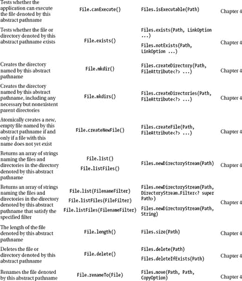
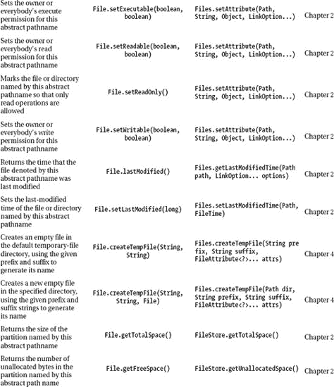
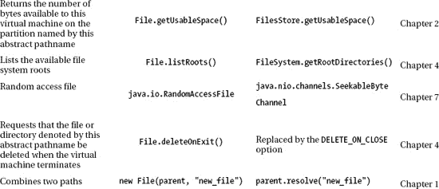

# 十、要记住的重要事情

本章的第一部分提供了一些值得了解的信息，或者至少是听说过的信息。这些信息不适合前面的任何章节，你可能不会很快使用它，但它可能有一天会有所帮助。涵盖了以下主题:

*   重构`java.io.File`代码
*   使用 ZIP 文件系统提供程序
*   关于自定义文件系统提供程序的注意事项

我们用书中介绍和使用的一组 NIO.2 里程碑方法来结束这一章(以及这本书)。每当你需要快速提醒或概述这些方法时，你可以很容易地翻阅这本书的最后几页。

### 重构 java.io.File 代码

如果你已经开发了几个基于`java.io.File`的应用，那么你应该熟悉这个类最常见的方法。但是，如果您已经开发了许多基于`java.io.File`的应用，那么您不仅应该熟悉它的方法，还应该熟悉它的方法的缺点。例如，许多这些方法在失败时不会抛出异常，没有对符号链接的真正支持，元数据访问效率低下，跨平台的文件重命名不一致，一些方法不可伸缩，等等——所有这些对许多高级 Java 开发人员来说应该听起来很熟悉，对初级开发人员来说可能很可怕。

虽然低年级学生将会轻快地跳到 Java 7(它修复了这些缺点，是这个领域的一股新鲜空气)，但高年级学生必须花一些宝贵的时间来重构现有代码，以支持 Java 7(或者更准确地说，`java.nio.file`类)。

重构`java.io.File`代码的第一个里程碑可以认为是通过`java.io.File.toPath()`方法将`File`对象转换为`java.nio.file.Path`对象:

```java
File file ...;
Path path_from_file = file.toPath();
```

转换后，您可以利用`Path`功能。

然而，尽管这是最简单的解决方案，但它可能并不总能满足您的需求。有时，您需要重写文件 I/O 代码并将代码与`java.nio.file`类对齐，为此，您可以使用两个 API 之间的一一对应关系。表 1-1 显示了这种对应关系。








该表将使您的代码从 Java 5 或 6 到 Java 7 的转换更加容易。

### 使用 ZIP 文件系统提供商

遵照 NIO.2，文件系统涉及到能够管理和访问文件系统对象的容器的一般概念。文件系统对象通常是文件存储(例如，在 Windows 上我们通常有`C:, D:`和`E:`文件存储，我们称它们为分区)，但它也可以是目录或文件。

基于这种方法，NIO.2 API 在 Java 7 中引入了开发可用于管理文件系统对象的定制文件系统提供者的能力。此外，它提供了一个定制文件系统提供者的实现——*ZIP 文件系统提供者(ZFSP)*——可以按原样使用，和/或可以作为开发其他定制文件系统提供者的灵感来源。ZFSP 将 ZIP/JAR 文件视为一个文件系统，并提供操作文件内容的能力。ZFSP 为每个 ZIP/JAR 文件创建一个文件系统。

在这一节中，您将看到如何使用 ZFSP 创建一个 ZIP 文件系统(`C:\rafaelnadal\tournaments\2009\Tickets.zip`归档文件将成为一个 ZIP 文件系统),并从`C:\rafaelnadal\tournaments\2009\`目录中的新 ZIP 文件系统中复制一个名为`AEGONTickets.png`的文件作为`AEGONTicketsCopy.png.`

首先，我们创建一个简单的`HashMap`，它包含 ZFSP 创建的 ZIP 文件系统的可配置属性。目前，有两种属性可以配置:

*   `create`:该值可以是`true`或`false`，但类型为`java.lang.String`。如果该值为 true，ZFSP 将创建一个新的 ZIP 文件(如果该文件不存在)。
*   `encoding`:该值为一个`java.lang.String`，表示编码方案(如 UTF-8、US-ASCII、ISO-8859-1 等)。).UTF-8 是默认值。

因此，我们可以指出 ZIP 文件存在，并且需要的编码是 ISO-8859-1，如下所示:

```java
Map<String, String> env = new HashMap<>();
env.put("create", "false");
env.put("encoding", "ISO-8859-1");
```

为了创建一个新的 ZIP 文件系统或获取对现有系统的引用，我们使用了`java.nio.file.FileSystems`类的工厂方法。通过指定 ZIP/JAR 文件的路径来创建 ZIP 文件系统。这可以通过使用在`java.net.JarURLConnection`类中定义的 JAR URL 语法来实现:

```java
URI uri = URI.create("jar:file:/C:/rafaelnadal/tournaments/2009/Tickets.zip");
FileSystem ZipFS = FileSystems.newFileSystem(uri, env);
```

此外，还有两种方法可以完成这一步:

```java
public static FileSystem newFileSystem(Path path, ClassLoader loader) throws IOException
public static FileSystem newFileSystem(URI uri, Map<String,?> env, ClassLoader loader) throws
IOException
```

现在我们有了一个 ZIP 文件系统的实例，我们可以调用`java.nio.file.FileSystem`和`java.nio.file.Path`类的方法来执行操作，比如复制、移动和重命名文件，以及修改文件属性。我们想从档案中复制出`AEGONTickets.png`条目。下面的代码将为我们完成这项工作:

`import java.io.IOException;
import java.net.URI;
import java.nio.file.FileSystem;
import java.nio.file.FileSystems;
import java.nio.file.Files;
import java.nio.file.Path;
import java.nio.file.Paths;
import java.util.HashMap;
import java.util.Map;

public class Main {

 public static void main(String[] args) throws IOException {

   //set zip file system properties
   Map<String, String> env = new HashMap<>();
   env.put("create", "false");
   env.put("encoding", "ISO-8859-1");

   //locate file system with java.net.JarURLConnection
   URI uri = URI.create("jar:file:/C:/rafaelnadal/tournaments/2009/Tickets.zip");

   try (FileSystem ZipFS = FileSystems.newFileSystem(uri, env)) {
        Path fileInZip = ZipFS.getPath("/AEGONTickets.png");
        Path fileOutZip = Paths.get("C:/rafaelnadal/tournaments/2009/AEGONTicketsCopy.png");

      //copy AEGONTickets.png outside the archive
      Files.copy(fileInZip, fileOutZip);` `      System.out.println("The file was successfully copied!");
      }
   }
}`

如果一切正常，那么您将会看到下面的消息，并且文件`AEGONTicketsCopy.png`应该存在于`C:\rafaelnadal\tournaments\2009`目录中。

* * *

```java
The file was successfully copied!
```

* * *

### 开发定制文件系统提供商的考虑事项

在上一节中，您看到了如何使用自定义文件系统提供程序。如果您决定尝试编写自己的自定义文件系统提供程序，那么考虑本节中列出的注意事项是一个好主意。首先，您必须知道支持这种尝试的主类是`java.nio.file.spi.FileSystemProvider.`，一个定制的文件系统提供者将实现这个类作为`java.nio.file.FileSystem`实例的工厂。文件系统提供商由 URI 方案标识，例如`file`、`jar`、`memory`或`cd`，文件系统的 URI 具有与文件系统提供商的 URI 方案相匹配的 URI 方案。

因此，实现自定义文件系统提供程序需要编写至少两个类，并记住一组必需的步骤。

#### 创建自定义文件系统提供程序类

您可以按照以下步骤创建这样一个类:

1.  扩展`java.nio.file.spi.FileSystemProvider`类。
2.  为提供者定义一个 URI 方案(`getScheme()`方法应该返回这个 URI 方案)。
3.  创建内部缓存，用于管理提供者创建的文件系统。
4.  实现`newFileSystem()`和`getFileSystem()`方法，用于创建文件系统和检索对现有文件系统的引用。
5.  实现`newFileChannel()`或`newAsyncronousFileChannel()`方法，该方法返回一个`FileChannel`对象，该对象允许在文件系统中读取或写入文件。

#### 创建自定义文件系统类

按照以下步骤创建这样一个类:

1.  扩展`java.nio.file.FileSystem`类。
2.  根据您的需要实现文件系统的方法(您可能需要定义根的数量、读/写访问、文件存储等。).

要了解更多细节，您可能需要仔细查看官方文档，网址为`[http://download.oracle.com/javase/7/docs/technotes/guides/io/fsp/filesystemprovider.html](http://download.oracle.com/javase/7/docs/technotes/guides/io/fsp/filesystemprovider.html)`。

### 有用的方法

我们几乎已经完成了 NIO.2 的旅程。这最后一节介绍了一些有用的方法，可以在任何 NIO.2 应用中帮助您。

#### 默认文件系统

您已经在本书中多次看到了如何获取默认文件系统，但是我们把它放在这里，以便您在忘记时可以轻松地访问这些信息。获取默认文件系统是通过`FileSystems.getDefault()`方法完成的:

```java
FileSystem fs = FileSystems.getDefault();
```

#### 文件存储

获得文件系统文件存储是本书中另一个广泛讨论的主题，但是为了快速提醒，请到这里来。下面是所需的代码:

```java
for (FileStore store: FileSystems.getDefault().getFileStores()) {
   ...
}
```

#### 文件的路径

下面是获取文件路径的方法:

```java
Path path = Paths.get("...");
Path path = FileSystems.getDefault().getPath("...");
Path path = Paths.get(URI.create("file:///..."));
Path path = Paths.get(System.getProperty("user.home"), "...");
```

#### 路径字符串分隔符

如您所知，路径字符串分隔符是操作系统相关的。要检索默认文件系统的`Path`字符串分隔符，您可以使用以下方法之一:

```java
String separator = File.separator;
String separator = FileSystems.getDefault().getSeparator();
```

### 总结

在本章中，你学习了如何将基于`java.io.File`类的代码转换成基于`java.nio.file.Path`类的代码。此外，您还学习了如何使用 ZIP 文件系统提供程序，以及一些关于创建自定义文件系统提供程序的信息。这一章(和这本书)以书中最常用的代码片段结尾。