# 一、Java 的不同面貌：创建一个 Java 9 开发工作站

欢迎来到专业 Java 9 游戏开发书。在第一章中，我将讨论 Java 的各种版本，这些版本目前仍被用于为 Android 等开源平台以及基于 WebKit 的开源浏览器(如 Google Chrome、Mozilla Firefox、Apple Safari 和 Opera)开发软件应用。在了解了从 JDK 1.6(也称为 Java 6)到 JDK 1.9(最近发布为 Java 9)的 Java 版本之后，需要使用哪些版本来开发这些流行平台的各种版本。我们还需要详细了解如何创建一个专业的 Java 9 软件开发工作站，以便在本书的剩余部分使用。这将包括其他软件，如新媒体内容制作软件包，这些软件包可以与您的 Java 软件开发包一起用于创建游戏和物联网(IoT)应用。

工作站的核心将是 Java 8 SDK 或软件开发工具包，也称为 JDK 或 Java 开发工具包，或者是 2017 年推出的新 Java 9 JDK，比 Java 8 更加模块化，但具有相同的类和方法来创建游戏或物联网用户体验。这个事实将允许我们在本书的过程中安全地关注 Java 8 和 Java 9。这是因为，就我们的目的而言，这些基本上是相同的，允许我们关注最新的 Java APIs，而不是您正在使用的 Java 版本。事实上，由于我们将重点讨论 Java 的多媒体 API，通常称为 JavaFX，所以您在本书中学到的内容也可以用 Java 7 编码！Android 最近升级到 Java 7 和 Java 8 兼容(从 Java 6)。

我们还将为您设置 NetBeans 9.0 IDE 或集成开发环境，这将使 Java 8 或 9 游戏的编码变得更加容易。预计在 2017 年第四季度 Java 9 发布后会使用 NetBeans 9，因为 NetBeans 9 IDE 将进行重大升级，以适应 Java 9 的新模块化特性，并允许您混合功能模块，为任何类型的应用开发创建自定义 Java 包集合(API 版本)。

配置好 Java JDK 和 NetBeans IDE 后，我们将为您安装最新的开源新媒体内容创建软件包，包括用于数字成像的 GIMP、用于数字插图的 InkScape、用于数字视频编辑或特殊效果的 DaVinci Resolve、用于数字音频编辑的 Audacity、用于特殊效果和 3D 的 Fusion、用于业务和项目管理的 Open Office 4 Suite、用于 3D 建模、纹理、动画、渲染、粒子系统、流体动力学或特殊效果的 Blender，以及用于虚拟星球的 Terragen 4。

在本章的最后，我甚至会推荐一些其他的专业级软件包，你应该考虑将它们添加到我们将在本章中创建的专业游戏开发工作站中。这样，当我们完成第一章的时候，你将拥有一个对你的企业非常有价值的生产资源。希望仅这第一章就值得你为这整本书所付出的，因为你可以花 500 美元购买一个强大的 64 位工作站，并在几个小时内使它价值五位数！

我们还将讨论新的 Java 9 内容生产工作站的一些硬件要求和注意事项。最后，请注意，本书中的 Java 代码在 Java 8 IDE(或集成开发环境)中也能很好地工作，所以本书可以很容易地被称为专业 Java 8 游戏开发书！

## Java 二分法:在各种平台上使用的版本

有许多不同版本的 Java 仍然被广泛用于许多不同流行平台的开发，包括用于 32 位 Android 的 Java 6(Android 的版本 1.x、2.x、3.x 和 4.x 是 32 位的)，以及用于早期 64 位 Android 版本(5.0、5.1 和 6.0)的 Java 7，用于最新 Android 版本(7.0、7.1.2、8.0)的 Java 8，以及用于 Windows 10 操作系统、Ubuntu Linux 操作系统(和其他 Linux)的 Java 9

值得注意的是，Java 有三个主要版本；Java ME 或 Micro Edition 针对嵌入式设备进行了优化，Java SE 或 Standard Edition 用于“客户端”以及移动消费电子设备和 iTV 设备，Java EE 或 Enterprise Edition 可被视为“服务器端”范例，因为大型企业计算环境通常是基于服务器的，而不是“对等的”(纯客户端，除了客户端-服务器交互之外，还可能有客户端-客户端交互)。

于 2006 年 12 月发布的 Java 6(十多年前)仍然被广泛用于与 Eclipse IDE 一起为所有 32 位版本的 Android 开发应用，从版本 1.0 到版本 4.4。这是因为这是谷歌最初指定用于开发 32 位 Android 应用的 Java 版本，当时 Android 1.0 于 2008 年 9 月发布。值得注意的是，Google 使用 Open Java 项目创建了 Java 6 的自定义版本，但这不会影响编程 API，因为如果您在 NetBeans IDE 或 IntelliJ IDEA 中使用 Java 6，而不是使用 Eclipse IDE，这些类、方法和接口的功能仍然相同。

当谷歌将 Android 升级到 64 位 Linux 内核时，在 Android 5.x 中，使用了基于 IntelliJ 的 Android Studio IDEA，他们升级到使用 Java 7，Java 7 也有 64 位版本。Java 7 于 2011 年 7 月发布。因此，如果您正在为高级平台开发 Android 5-6 应用，如 Android Wear，这在 Apress 的 my Pro Android Wearables (2015)标题中有所介绍，或者 Android TV 或 Android Auto，在 Apress 的 Android Apps for Absolute 初学者(2017)标题中有所介绍，您将希望利用 Java 7。JavaFX 8 和 JavaFX 9 中的 JavaFX 8 引擎也被移植到 Java 7 中；然而 Java 7 今年退役了。Android 还在用 Java 6，7，8。

在撰写本书时，Java 8 是 Java SE 的最新版本，此外，它还具有强大的 JavaFX 8.0 多媒体引擎，该引擎也与 Java 7 兼容，尽管 JavaFX 8.0 APIs 在 Android APIs 中还没有得到本机支持。然而，开发 JavaFX 8 或 9 应用在 Android 操作系统和 iOS 平台上运行是可能的，这使得这本书对我们的读者更有价值！Java 8 支持所有流行的浏览器，Android 7、7.1.2 和 8.0，以及所有四种流行的操作系统，包括 Windows 7、8.1 和 10，所有 Linux 发行版、Macintosh OS/X 和 Oracle 的 Open Solaris。Java 8 于 2014 年 3 月发布，增加了一个名为 Lambda Expressions 的强大新功能，我们将在本书中介绍，因为这是一种编写更紧凑代码的方式，通常也更高效地处理多处理器(和多线程)。

Java 9 是 Java 的下一个主要版本。Java 9 于 2017 年 9 月 22 日发布。Java 语言开发人员正在改造的 Java 9 中的主要新特性是使 Java 9 语言 API 模块化。这将允许 Java 9 开发者在“模块”(代码库)中“混合和匹配”特性，并创建他们自己的定制的、优化的 Java 版本。对于定制开发环境或定制应用，这些定制 Java 版本将完全按照开发人员需要的方式工作。截至本书发布时，NetBeans 9 仍在开发中。

作为游戏开发人员，或者物联网开发人员，这意味着您可以创建几个游戏开发定制 Java 版本级别，或者几个定制物联网开发 Java 版本级别。从 Java 7 版本开始，如果需要的话，添加 Lambda 表达式(一种编码快捷方式，我们将在后面介绍)来创建 Java 8 版本，或者打包成定制模块(Java 9 中的一个新特性)来为所有流行的 OS 平台创建 Java 9 版本。如果您使用 JavaFX 多媒体/游戏引擎，Java 8 和 Java 9 APIs 中都有最新的 JavaFX 特性。

我想向读者指出，他们可以优化他们的游戏程序逻辑，以跨越几个版本的 Java，优化 Java 7 (Android 5 或 6)到 Java 8 (Android 7，8 和现代操作系统)到 2017 年 9 月 22 日在图书发行前问世的 Java 9 版本。这也可以在不做任何重大代码更改的情况下完成，因为除了使用 Lambda 表达式之外，核心 JavaFX 游戏处理逻辑存在于所有这些 Java 版本中。

## Java 开发工作站:必需的硬件

为了从我们将在本章过程中安装的所有专业开源软件中获得最佳效果，您将需要一个强大的 64 位工作站，运行付费操作系统，如 Windows 10 或 OSX，或免费操作系统，如 Ubuntu LTS 17。我在几个工作站上使用 Windows 10，在几个工作站上使用 Ubuntu LTS 17.10。你还需要一个大显示器，最好是高清的(1920 x 1080)或者 UHD 的(3840 x 2160)。如果你算一下，一台 UHD 显示器是四个高清显示器在一个边框里，UHD 显示器现在是 300 到 500 美元。我在感恩节大减价时花了 250 美元买了一个。我使用的高清尺寸从 32 英寸到 43 英寸不等，UHD 尺寸从 44 英寸到 55 英寸不等，像素密度很小。

一台计算机工作站应该配备(包含)至少 8GB 的 DDR3 系统内存(16GB 或 32GB 的系统内存会更好)。该存储器应以 1333、1600、1866 或 2133 兆赫的时钟速度循环。尖端系统通常配备以 2400 兆赫时钟速度运行的 DDR4 系统内存。DDR4 内存还配有 16GB DIMMS，因此您可以在工作站主板上安装 48GB、64GB 或 128GB 内存。我会为运行 Fusion 9、DaVinci Resolve 14、Blender 2.8、JavaFX 9 或其他 i3D 制作软件的工作站这样做。

系统内存运行得越快，计算机处理数据的速度就越快，CPU 获得所需处理数据的速度也就越快。这就把我们带到了进行处理的工作站的“大脑”或 CPU/GPU。同样的概念也成立；64 位 CPU 每秒可以处理的指令越多，您在更短的时间内完成的任务就越多，您的 i3D 应用执行给定功能的速度就越快。

如今，几乎所有 64 位工作站都将配备多核处理器，通常称为 CPU 或中央处理器。流行的 CPU 包括 AMD 锐龙(四核、六核或八核)、9590(八核或八核)或更昂贵的英特尔 i7，它有四核、六核、八核和十核版本。像 AMD 锐龙一样，英特尔 i7 的每个内核都有两个线程，因此对于一个操作系统来说，这些处理器看起来像 8、12、16 或 20 个内核的处理器，这就是它们比 AMD FX 9590 系列处理器更贵的原因。我使用 AMD 锐龙或英特尔 i7 处理器，这取决于应用。例如，Android Studio 3 针对英特尔硬件架构进行了优化，在 AMD FX CPU 上模拟 Android 虚拟设备(AVD)的速度不够快，无法顺利进行开发和测试。

为了存储数据，你还需要一个硬盘驱动器。现在的电脑通常配备 1TB 的硬盘，你甚至可以得到 2TB、3TB、4TB、6TB 或 8TB 硬盘的工作站。如果您正在处理具有 UHD 或 4K 屏幕分辨率的游戏(或 3D、电影、特效或视频素材)，请选择 3GB 或 4GB 型号。如果您希望您的系统快速引导(启动)，并快速将软件加载到内存中，请确保将 SSD(固态硬盘)作为您的主要(C:\ for Windows，或 C:/ for Linux)硬盘分配。这些硬盘比传统的 1tb 硬盘更贵，但你只需要 64GB 或 128GB 来存放你的操作系统和软件。我有一个 256GB 的固态硬盘，512GB 的固态硬盘和 768GB 的固态硬盘也变得更加实惠。

具有这些功能的工作站基本上已经成为商品，价格在 500 美元到 750 美元之间，可以在沃尔玛或百思买购买，或者在网上的 [`www.PriceWatch.com`](http://www.PriceWatch.com) 购买，在那里你可以比较我在本章这一节提到的任何组件的市场价格。如果你是 Java 9 游戏开发的新手，如果你还没有合适的工作站，去沃尔玛或 PriceWatch.com，购买你负担得起的 3D 多核(购买 4、6 或 8 核)64 位计算机，运行 Windows 10 或 Ubuntu LTS 17，至少有 8、16 或 32g 的 DDR3 系统内存。你还需要一个相当大的硬盘驱动器，至少 750GB，甚至 1.5TB 或 2TB 的硬盘驱动器，以及 AMD(镭龙)或 nVidia (GeForce)的 3D GPU，用于 JavaFX 9 以及 Fusion、Blender 和 DaVinci Resolve 的实时 i3D 渲染。

在本章的剩余部分中，我将假设您刚刚购买了一台经济实惠的 64 位工作站，我们将完全从头开始创建一个 premiere Java 9 游戏和物联网开发工作站！如果你已经有一个现有的游戏开发工作站，我将包括一个简短的部分，向你展示如何从 Windows 中删除过时的 Java 开发软件，以便我们都可以从头开始。

## 为 Java 9 游戏开发准备一个工作站

假设您已经有一个专业级工作站用于新媒体内容开发和游戏开发，您可能需要移除过时的 JDK 或 IDE，以确保您拥有最新的软件。在本节中，您要做的第一件事是确保您已经删除了任何过时的 Java 版本，如 Java 6 或 Java 7，以及任何过时的 NetBeans 版本，如 NetBeans 6 或 NetBeans 7。这包括从工作站卸载(移除或完全删除)过时的 Java 开发软件版本。我不得不在我的一个四核 AMD 工作站上这样做，以便为 NetBeans 9.0 IDE 开发 Java 9 和 JavaFX 9 应用和游戏腾出空间，因此本节中的屏幕截图显示了 Windows 7 操作系统。您将通过使用操作系统软件管理实用程序来实现这一点。在 Windows 上，这是“程序和功能”实用程序。这可以在 Windows 控制面板下找到，在图 [1-1](#Fig1) 的中间一列(第七行)以蓝色突出显示。

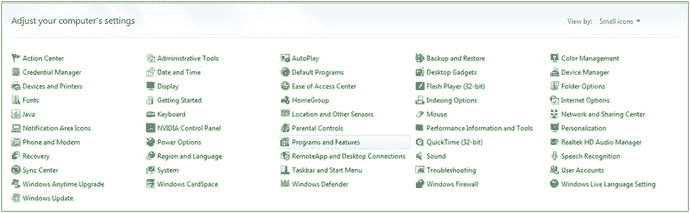

图 1-1。

Use the Programs and Features utility icon to uninstall or change programs on your computer workstation

如果您有一个全新的工作站，您将不必删除任何以前的软件。对于 Linux 和 Mac 来说，有类似的软件安装和卸载工具，如果你碰巧正在使用这些操作系统的话。由于大多数开发人员使用的是 64 位版本的 Windows 7、8.1 或 10，因此本书只使用 64 位操作系统平台。

值得注意的是，Java 9 现在只有 64 位版本，所以你必须有一个 64 位的工作站，正如我在本书的前一节中所指出的(事实上，现在你甚至不能买一台新的 32 位计算机)。

自定义 Windows 操作系统“chrome”(窗口 UI 元素)、桌面和已安装软件包的方式是通过 Windows 控制面板及其 50 多个实用程序图标。其中之一是程序和功能图标(在 Windows 版本 7 到 10 中)，在图 [1-1](#Fig1) 中可以看到它被选中为蓝色。

请注意，在早期版本的 Windows (Vista 或 XP)中，此程序实用程序图标的标签会有所不同，如:添加或删除程序。它仍然以同样的方式工作，选择软件，右键单击，并删除旧版本。我不建议使用过时的 Vista 或 XP，因为高级 Java 9 JDKs 和 ide 不再支持它们。

对于以前版本的 Windows，单击此程序和功能链接，或双击图标，并启动该实用程序。向下滚动，查看您的工作站上是否安装了任何旧版本的 Java 开发工具(Java 5、Java 6 或 Java 7)。请注意，如果您有一个全新的工作站，您应该会发现系统上没有预装的 Java 或 NetBeans 版本。如果您找到它们，请将系统退回，因为它以前可能被使用过。

如图 [1-2](#Fig2) 所示，在我的 Windows 7 开发工作站上，我安装了一个旧版本的 Java 8u131，占用了 442 兆的硬盘空间，安装于 2017 年 4 月 22 日。这用于运行 NetBeans 9 的“Alpha”版本，该版本在 Java 8 上运行。要删除一个软件，通过点击选择它(它会变成蓝色)，或者点击图 [1-2](#Fig2) 顶部所示的卸载按钮，或者你也可以右击(蓝色)软件包(删除)选项，并从出现的上下文菜单中选择卸载。

我在屏幕截图中留下了工具提示:“卸载”，这样你就可以看到，如果你将鼠标“悬停”在程序和功能实用程序中的任何东西上，它会告诉你该特定功能的用途。

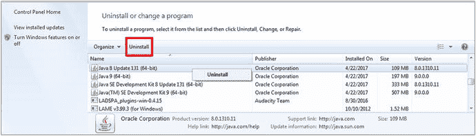

图 1-2。

Select versions of Java older than Java 9 and click the Uninstall option at the top, or right-click and uninstall

单击卸载按钮后，该实用程序将删除旧版本的 Java 8。首先删除较小版本的 Java 8(非 JDK ),然后删除较大版本(完整 JDK ),因为需要完整 JDK 来删除较小的 JDK 以及任何旧版本的 NetBeans。如果要删除 NetBeans IDE，您需要安装 Java 8，因为 NetBeans IDE 是用 Java 编写的，需要安装 Java JDK 才能卸载。

一旦去掉完整的 Java 8 JDK，就只剩下 Java 9 的(Alpha)版本(如果你是我，写这本书的话，就是这样)，如图 [1-3](#Fig3) 所示，标注为 9.0.0.0 版本。如果您想保留您的旧 Java 项目文件，请确保备份您的 Java 项目文件文件夹，如果您还没有这样做的话。确保您定期备份工作站的硬盘驱动器，以便不会丢失任何 3D、内容制作和编码工作。

我移除了 Java 9 JDK 软件的任何 Alpha 或 Beta 版本，方法是再次点击它(它会变成蓝色)，然后或者点击图 [1-3](#Fig3) 顶部的卸载按钮，或者你也可以右键单击蓝色软件包(移除)选项，并从上下文相关菜单(通过右键单击打开)中选择卸载。

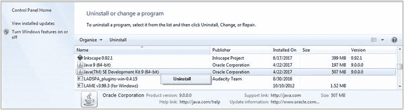

图 1-3。

Select Alpha versions of Java 9, and click the Uninstall option at the top, or, right-click, and select Uninstall

现在，我已经从我的工作站上删除了 Java 的过时版本，我将从互联网上获取最新的 Java 9 开发工具包(JDK)版本，并将其安装在我的 Windows content development 工作站上。

## 下载并安装 Oracle Java 9 JDK

既然已经从您的工作站中删除了 Java 的过时版本，那么您需要上网并访问 Oracle 网站来获取最新的 Java 9 开发 JDK 和 IDE，因为毕竟这是一本专业的 Java 9 游戏开发书籍。在我写这本书的时候，我将向你展示如何使用直接下载的 URL 来做到这一点，以及它们现在的位置。如果这些链接已经更改，只需使用谷歌搜索“Java 9 JDK 下载”该下载目前位于甲骨文技术网，如图 [1-4](#Fig4) 中屏幕截图的顶部所示。

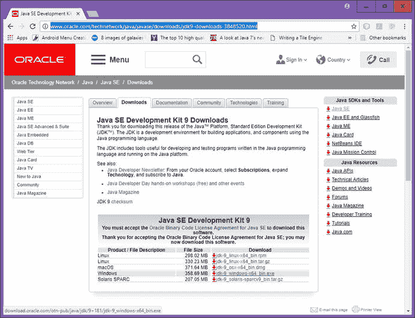

图 1-4。

The JDK9 Download link at oracle.com/technetwork/java/javase/downloads/jdk9-downloads-3848520.htm

在下载用于 64 位 Windows 的 360 兆字节 JDK9 安装程序文件之前，您需要单击“Accept License Agreement”选项旁边的单选按钮，该选项位于下载表的左上角。

一旦您接受本许可协议，五个特定于操作系统的链接将被激活使用，包括 Linux、Mac OS/X、Windows (7 到 10)和 Solaris。确保下载的 Java JDK 软件与您的操作系统相匹配。如您所见，现在只有 64 位(或 x64)版本可用于 64 位系统。

要启动下载的 JDK9 安装程序，请右键单击该文件，并使用管理员权限(或在 Linux 上作为超级用户)以管理员身份运行来安装它。接受六个对话框中的默认设置，如图 [1-5](#Fig5) 所示。

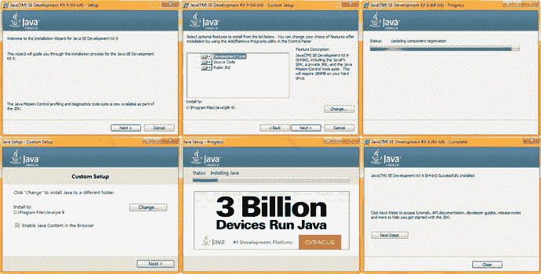

图 1-5。

Install the Java 9 JDK on the workstation, accepting the default settings in the six Java 9 installation dialogs

如果你想检查你的系统上是否安装了 Java 9，只需使用与图 [1-1](#Fig1) 到 [1-3](#Fig3) 中相同的控制面板实用程序。如图 [1-6](#Fig6) 所示，Java 9.0 的真实版本(不是 alpha 版本)现在安装在我的系统上，大小为 763 兆字节，在我的情况下，安装于 2017 年 10 月 7 日。

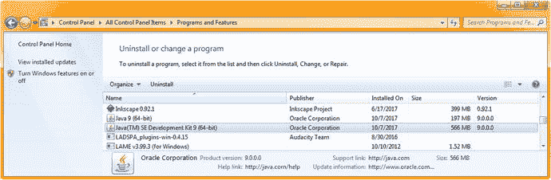

图 1-6。

Find the JDK-for the latest (currently 9.0.1) Java 9 version and make sure it is installed

接下来，让我们安装 Java 8，它目前用于运行 NetBeans 8.2(您可能已经在使用该 IDE 进行开发)，并且目前也用于运行 NetBeans 9.0 IDE (beta)，我在本书中使用了该 IDE，因为最终 Java 9 和 NetBeans 9 将一起用于开发 Java 9 游戏。在过渡期间，NetBeans 9.0 在 Java 8 上运行，所以我添加了一两节来介绍它是如何工作的，以供可能使用这种配置的早期读者使用。

## 下载并安装 Oracle Java 8 JDK

你可能想知道为什么我们现在正在下载 Java 8 的最新版本(目前更新 152 ),因为这是一本 Java 9 游戏本。原因是尽管 Java 9 JDK 于 9 月份发布，但 NetBeans 9 IDE 版本仍处于测试阶段(我写这本书时它仍处于 alpha 阶段)，这意味着 NetBeans 9(测试版)仍运行在 Java 8 之上，这是由于 Java 9 中模块的复杂性(这意味着程序员仍在模块化 NetBeans 9，以便它将在 Java 9 中编码)。一旦 NetBeans 9 发布，它很可能会直接运行在 Java 9 JDK 之上。有一种方法可以访问 Oracle Tech Network 上的一个网页，该网页同时链接到 Java 8u144 和 Java 9.0，位于 URL[www.oracle.com/technetwork/java/javase/overview/index.html](http://www.oracle.com/technetwork/java/javase/overview/index.html)，如图 [1-7](#Fig7) 所示。两个 JDK 的下载链接都位于网页的最底部，所以只需单击 Java SE 8 update 144 JDK(已经升级到 8u152)的下载链接。

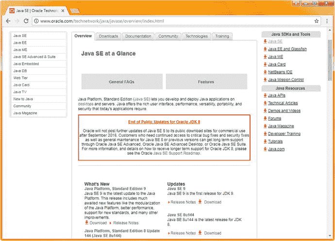

图 1-7。

The Oracle Tech Network Java SE Overview webpage, which has links to Java 9 JDK as well as to Java 8u144

正如你所看到的，在网页的中间也有一个红色的甲骨文 JDK 8 警告的公共更新。Java 8 没有太多的 bug，毕竟它已经经历了超过 144 次的更新，非常稳定！从某种意义上说，Java 9 是一种重写，因为它已经被重新模块化，所以所有 API 类和包(到模块中)的“连接”都被重做，这就是为什么 NetBeans 9(用 Java 编码)没有与 Java 9 同时完成(编码和调试)。Java 和 NetBeans 的早期版本同时(或接近同时)发布，并有 NetBeans 捆绑包下载(在图 [1-8](#Fig8) 的顶部显示了 NetBeans 8.2，通过右侧的下载图标)。

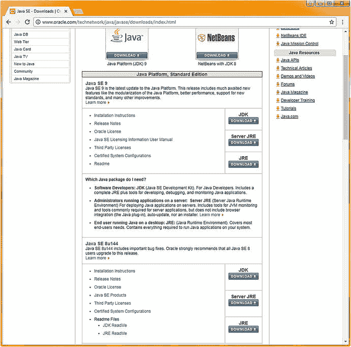

图 1-8。

The Oracle Tech Network Java SE Download webpage which has links to Java 8u144 JDK at the very bottom

图 [1-8](#Fig8) 中的 Java SE 下载页面是上一页的下载链接将带您进入的页面。在页面底部，您会找到 Java SE 8u144 部分，其中有三个下载按钮。最上面的第一个按钮写着 JDK。这是您想要单击以开始 JDK 8u144 下载的按钮。这将把你带到 Oracle . com/tech network/Java/javase/downloads/JDK 8-downloads-2133151 . html 的页面，如图 [1-9](#Fig9) 所示。

单击接受许可证单选按钮以启用所有下载链接，然后单击适用于您的操作系统版本的链接。

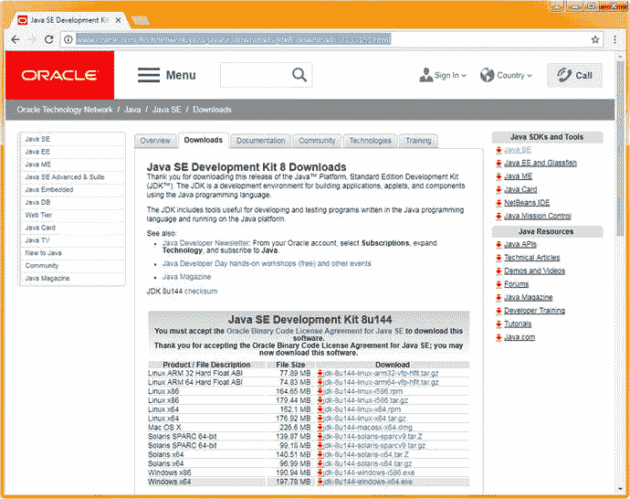

图 1-9。

The JDK8 Download link at oracle.com/technetwork/java/javase/downloads/jdk8-downloads-2133151.htm

注意，对于 Java 8，有 32 位(i586)和 64 位(x64)版本，以及 ARM CPU 版本，这给了我们十几个选择。为您的操作系统选择 64 位版本，以匹配您为 Java 9.0 安装的版本。

现在，我们可以安装 NetBeans 9.0 集成开发环境(简称 IDE)，它将使用我们刚刚安装的 Java 8 运行时引擎(JRE)来运行 Java 代码，这些代码将为您创建 NetBeans 9 IDE。

因为 NetBeans 9 正在从 Oracle 过渡到 Apache，所以目前实际上有两个代码存储库。首先，我将向您展示我在写书时使用的服务器，它由 Oracle 托管，其次，我将向您展示由 Apache 托管的服务器，它使用了一个名为 Jenkins 的测试版存储库，还有一个到 GIT 的链接，如果您愿意，您可以从零开始构建 NetBeans IDE。最终还会有一个 Java 9 和 NetBeans 9 的“捆绑包”作为单一安装。这当然是最简单也是最需要的，但是目前还不存在，所以我将介绍构建和安装 NetBeans 9.0 的更高级的方法，因为它还没有完成。目前这使得安装变得复杂，但是我对此无能为力，只能提供所有这些额外的信息，以便您可以在最终的 NetBeans 9 on Java 9 捆绑包发布之前，为 Java 9 和 JavaFX 9 开发安装并运行 NetBeans 9.0。就 Pro Java 9 游戏开发而言，这给了你一个领先他人的开始。

## 安装 Oracle NetBeans 9.0(开发)IDE

由于 NetBeans 9 仍在开发中，我将向您展示我是如何从 Oracle 获得 NetBeans 9 发行版的，并在下一节中展示普通公众最终将如何从 Apache 获得 NetBeans 9 IDE。通过这种方式，您将了解下载和安装 NetBeans 9 的所有方法。Oracle 存储库(在软件正式转移到 Apache 之前将一直存在)位于 bits.netbeans.org/download/trunk/nightly/latest/，看起来像大家都熟悉的原始 NetBeans 下载页面，如图 [1-10](#Fig10) 所示。我建议使用该软件最简单(最小)的 Java SE 版本，因为它包括我们在本书中涉及的三个 API(NetBeans、Java 和 JavaFX)。单击第一个下载(免费，97MB)按钮，开始 NetBeans 下载过程。

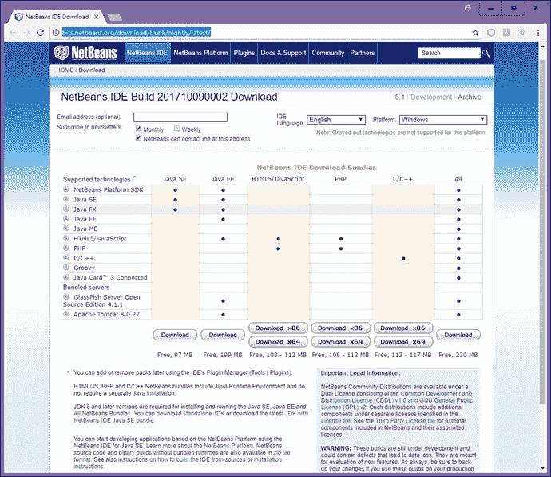

图 1-10。

The Oracle NetBeans 9.0 IDE download page located at bits.netbeans.org/download/trunk/nightly/latest/

一旦这个安装文件下载完毕，右击它，选择以管理员身份运行(Linux 上的超级用户)，你会看到第一个欢迎对话框，在六个对话框截图的左上角，如图 [1-11](#Fig11) 所示。

单击“下一步”按钮开始默认(完全)安装，您将看到 NetBeans IDE 9 许可协议对话框，如图 [1-11](#Fig11) 中上部所示。选择“我接受许可协议中的条款”复选框(用红色圈出)，然后单击“下一步”按钮，前进到 NetBeans IDE 编译安装对话框，如图 [1-11](#Fig11) 右侧所示。第三个对话框指定了 Program Files 目录中的安装位置，还指定了用于 Java 开发的 JDK。请注意，NetBeans 9 足够聪明，可以选择 Java 9 而不是 Java 8(您已经安装了 Java 9 和 Java 8，因为您可以在任何给定的工作站上安装多个 Java 版本)，并定义您将为哪个版本的 Java 开发游戏(以前必须在 NetBeans 中手动设置)。保持默认设置，点击下一步按钮进入总结对话框，如图 [1-11](#Fig11) 左下方所示。确保选中“检查更新”,以便 NetBeans 9 会自动更新自身。

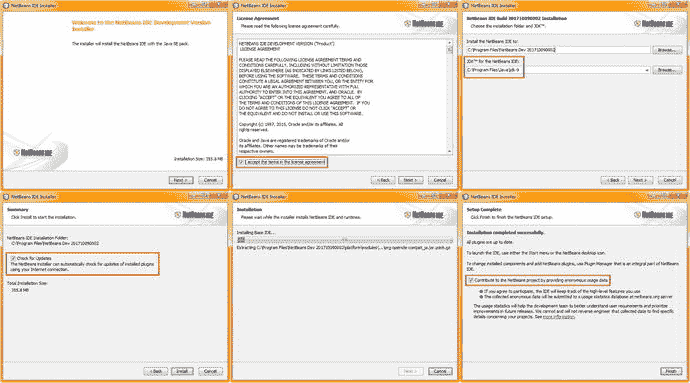

图 1-11。

Accept the terms of the license agreement, click the Next button (left) and do the same for JUnit (right)

单击“安装”按钮后，NetBeans 将安装基本 IDE，如图 [11-1](11.html#Fig1) 中底部的对话框所示，通过进度条和下面的解压缩文件文本向您显示它正在做什么。设置完成后，您将看到“设置完成”对话框，该对话框将为您提供“通过提供匿名使用数据为 NetBeans 项目做贡献”复选框选项我选择了这个选项，以帮助 NetBeans 开发人员。

我们将在第一章中安装各种游戏开发和游戏素材开发软件包，最后一步是通过启动软件来测试安装，以确保它能够运行。

这是通过在您的桌面(双击桌面图标以启动它们)或任务栏(称为快速启动图标，只需单击即可启动)中找到软件图标并启动软件来完成的。在 NetBeans 9 IDE 的情况下，结果应该类似于左侧的图 [1-12](#Fig12) 。

要确认 NetBeans 9 是如何设置的，请使用关于菜单序列的帮助➤，它位于图 [1-12](#Fig12) 的右侧，显示了您的产品版本、正在使用的 Java JDK 版本、正在使用的 Java 运行时环境(JRE )( JRE 是 JDK 安装的一部分)来运行 NetBeans 9.0、正在使用的操作系统以及用户目录位置和缓存目录位置。如果您在安装此 IDE 的后续版本时遇到问题，请尝试删除这两个文件(即删除\dev 文件夹)，因为它们包含以前 NetBeans 安装的信息，这可能会误导下一次 NetBeans 安装。

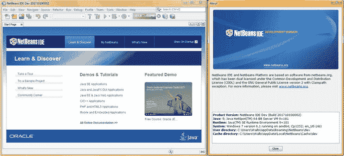

图 1-12。

Launch NetBeans using the Desktop or Quick Launch (Silver Cube), and make sure the software will launch

接下来，我将向您展示如何以及在哪里安装 Apache NetBeans 产品，因为在某个时间点，NetBeans 9.0 将完成从 Oracle 到 Apache 的转移(就像 Open Office 一样)。我不确定这将在何时发生，可能在 2018 年的某个时候，但我不能等那么久来发布这本书，所以我将简单地向您展示您可以获得 NetBeans 9.0 的所有不同方法。注意，如果您想在 Java 8 的基础上使用 8.2，这也很好，因为 JavaFX 8(和 JavaFX 9)类(API)没有改变。这是因为 Java 9(和 NetBeans 9)的重点只是将模块引入工作流并使 IDE 工作，所以 JavaFX 被单独留下，重点是 Java 的其他部分(正如您将看到的，JavaFX 是 Java 多媒体/游戏引擎)。

## 安装 Apache NetBeans 9(开发)IDE

接下来，我们将了解用于 NetBeans 的 Apache Jenkins 和 GIT 存储库，在当前正在进行的传输完成后，软件将在这里“着陆”。Apache Jenkins 的 NetBeans 站点位于 https://builds.apache.org/job/incubator-netbeans-windows/，是一个所谓的“孵化器”站点。孵化器用于孵化鸡蛋，因此这里的推论是，在“孵化”NetBeans 9 on Java 9 捆绑包之前，这是您可以在 NetBeans 9 IDE 软件仍处于开发阶段时获得它的地方。你可以在图 [1-13](#Fig13) 中看到 Apache Jenkins 网站此时的样子(这有可能会改变)。如你所见，它有很多选项。

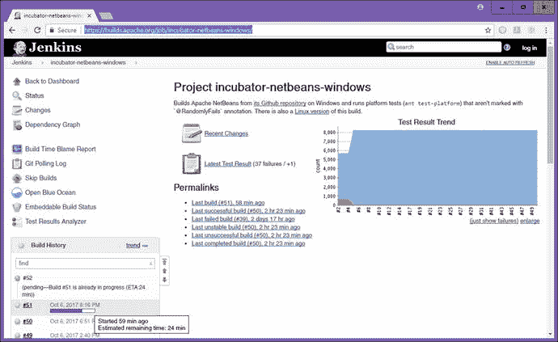

图 1-13。

Apache Jenkins' NetBeans is located at [`https://builds.apache.org/job/incubator-netbeans-windows/`](https://builds.apache.org/job/incubator-netbeans-windows/)

Jenkins 的左上方有 Jenkins 软件孵化器功能导航链接，因此您可以返回到仪表板(主页)，获得开发状态，查看构建之间的更改，查看依赖关系图，获得构建时责任报告，查看 GIT 轮询日志，获得嵌入式构建状态，查看测试结果分析器，跳过构建并打开 Blue Ocean。Blue Ocean 是一个免费的、开源的、持续更新的工具，它让你感觉你是软件开发团队的一员。

下面是构建历史。这是一个包含构建的窗格，在构建时，带有进度条、构建时间和完成估计。如果你点击其中的一个版本(如果已经完成)，它会打开另一个窗口(browser 选项卡),显示该版本的详细信息和下载链接。如图 [1-14](#Fig14) 所示。

要下载其中一个 ZIP 文件，请右键单击该文件，并使用“另存为”功能，将该 ZIP 文件保存在硬盘上要从中解压缩 NetBeans 9 的位置(目录/文件夹)。请注意，这是一种不同于安装程序的方法。exe 或。msi)将采取，因为安装程序会将文件与其他已安装的应用一起放入 Program Files 文件夹，并将创建桌面图标和任务栏快速启动图标。

有人告诉我，Linux 版本也可以在 Windows 下运行，但是在某些时候，Mac OS/X、Linux 和 Windows 可能会有不同的版本。我还在开发人员列表中添加了一个请求，请求建立一个 Ubuntu LTS Linux 17 PPA 存储库，以便 Ubuntu LTS 可以自动更新 NetBeans 9.0 IDE，几乎不需要最终用户干预。如果你还没有看过 Ubuntu LTS 17.10 或 18.04，你可能想现在就看；你会惊讶于 Ubuntu Linux (Debian，另一个主要的 Linux 发行版是 Fedora)相对于 OSX 或 Windows 已经走了多远。

一旦你解压 NetBeans 9(我把我的文件夹命名为 NetBeans-9-Build ),进入/bin(二进制)文件夹，右键单击 netbeans64.exe，并使用 Run as Administrator。在启动品牌屏幕和加载进度条之后，您将看到一个许可协议对话框，您必须接受(同意)该对话框才能启动 IDE 软件。

图 1-14。

Click a version to get a build page, shown is builds.apache.org/job/incubator-netbeans-linux/74/

接下来，让我们去下载十几个最流行的(免费的)开源新媒体内容开发软件包，这样您就拥有了 Pro Java 9 游戏开发业务最终需要的所有强大的专业工具。这代表了数以万计的(你的货币是美元，我的是美元)付费软件包，所以这第一章最终会对所有读者变得相当有价值。

之后，我将告诉你一些我在工作站上使用的其他令人印象深刻的开源软件，这样，如果你想在本章结束之前组装最终的软件开发工作站，你可以这样做，以硬件(和操作系统)的成本创建一个非常有价值的内容制作工作站。

## 安装新媒体内容制作软件

JavaFX 9 支持许多新媒体元素的“类型”,我称之为“素材”, Java FX 9 是 Java 9 的新媒体“引擎”,因此您将使用它作为专业 Java 9 游戏开发的基础。在本章的剩余部分，您将安装领先的开源软件的主要新媒体类型包括:SVG 数字插图、数字图像合成、数字音频编辑、数字视频编辑、VFX 或视觉效果、3D 建模和动画、虚拟世界创建、角色动画、歌曲创作、数字音频采样、办公效率(是的，您还必须销售您的游戏)等等。

### 下载并安装 InkScape for SVG 数字插图

由于 JavaFX 支持 Adobe Illustrator 和 Freehand 等数字插图软件包中常用的 2D 或“矢量”技术，我们将下载并安装流行的开源数字插图软件包 InkScape，该软件包最近在版本控制方面从 0.48 大幅提升到 0.92，并具有专业功能。InkScape 可用于 Linux、Windows 和 Macintosh 操作系统，就像我们将在本章安装的所有软件包一样，因此读者可以使用他们喜欢的任何平台来开发游戏。如果您想了解更多关于数字插图和 SVG 的知识，可以看看来自 Apress 的数字插图基础知识。

要在互联网上找到 InkScape 软件包，请使用谷歌搜索引擎，并输入 InkScape。访问网站，点击左上方的下载菜单或右边的下载图标，如图 [1-15](#Fig15) 所示。下载图标将代表您正在使用的操作系统，由网站代码自动检测，该代码会轮询您的系统正在使用的操作系统，并通过单击自动为您提供正确的版本。

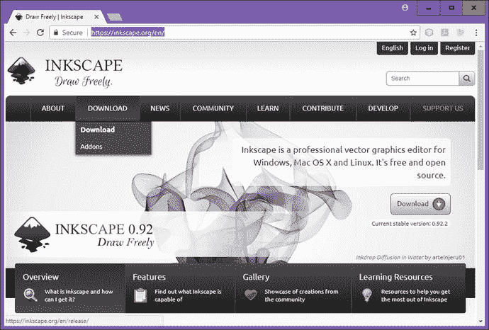

图 1-15。

Google the word InkScape, go to the inkscape.org website, click on the download icon, or download menu

下载 InkScape 软件后，右键单击文件名，并以管理员身份运行，在您的工作站上安装该软件。如果您愿意，可以使用本章前面使用的程序和功能实用程序来卸载以前的 Inkscape 版本。

安装软件后，在任务栏上创建一个快速启动图标，这样只需单击鼠标即可启动 InkScape。接下来，您将安装一个名为 GIMP 的流行数字图像软件包，它允许您使用 JPEG、PNG、WebP 或 GIF 数字图像格式为游戏创建“光栅”或基于像素的艺术作品。

### 下载并安装 GIMP 进行数字图像合成

因为 JavaFX 还支持利用“光栅”图像技术的 2D 图像，该技术将图像表示为像素阵列。这是付费数字图像合成软件包中使用的内容，如 Adobe Photoshop 和 Corel Painter。我们将下载并安装流行的开源数字图像编辑和合成软件包“Gimp”GIMP 适用于 Linux、Windows、Solaris、FreeBSD 和 Macintosh 操作系统。如果你想了解更多关于数字图像合成的知识，看看来自 Apress 的数字图像合成基础知识。要在互联网上找到 GIMP 软件，使用谷歌搜索，并输入 GIMP。网站如图 [1-16](#Fig16) 所示。

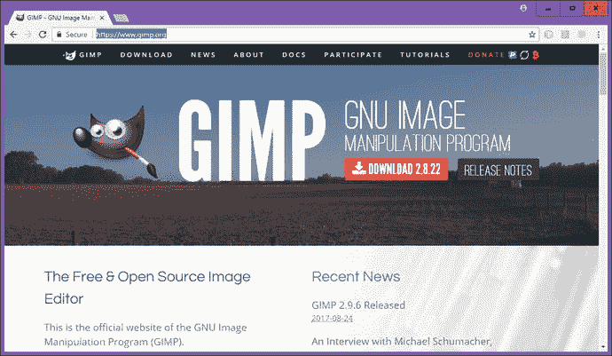

图 1-16。

Google Search GIMP; go to gimp.org; click the Download link for 2.8.22, or for 2.10 (currently 2.9.6 beta)

单击 Download 链接(或右键单击，并在单独的选项卡中打开它)，并单击 Download GIMP 2.8.22(或更高的版本，如新的 2.10 或 3.0 版本，目前正在测试 2.9.6，很快将是 2.9.8)，它代表您正在使用的操作系统。

下载页面会自动检测你用的是什么 OS，给你正确的 OS 版本；就我而言，我在 Windows7、Windows 10 和 Ubuntu LTS Linux 17.04 上使用 GIMP，因为我在我的每一个工作站上都安装了它。不用说，开源软件比付费软件包有更多的优势。

下载完软件后，安装最新版本的 GIMP，然后为您的工作站任务栏创建一个快速启动图标，就像您为 InkScape 所做的那样。

接下来，我们将安装一个强大的数字音频编辑和特效软件包 Audacity。

### 下载并安装 Audacity 进行数字音频编辑

JavaFX 支持利用数字音频技术的 2D(和 3D)数字音频。数字音频通过采集数字音频“样本”来表示模拟音频数字音频内容通常使用诸如 Cakewalk Sonar 的数字音频合成和序列器软件包来创建。如果您想了解更多关于数字音频编辑的知识，请查看来自 Apress 的《数字音频编辑基础》一书。在本节中，我们将下载并安装流行的开源数字音频编辑和优化软件包“Audacity”Audacity 可用于 Linux、Windows 和 Macintosh 操作系统。要在互联网上找到 Audacity 软件包，请使用 Google 搜索引擎，并输入 Audacity，这会显示 Audacity 团队网站。进入该网站，如左上方图 [1-17](#Fig17) 所示。点击下载 Audacity 链接(或使用下载菜单)并点击 Audacity for Windows(或您正在使用的操作系统版本)。我也在 Ubuntu Linux LTS OS 17.04 上使用 Audacity 2.1.3。

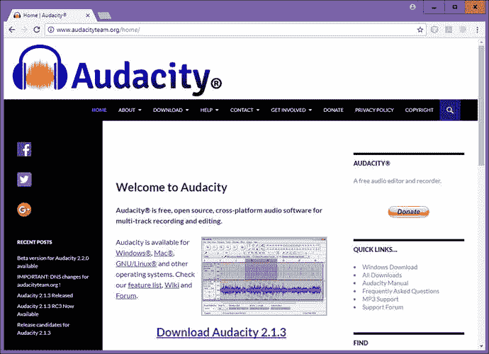

图 1-17。

Google the word Audacity, go to audacityteam.org, and click a Download Audacity link matching your OS

下载并安装 Audacity 的最新版本，目前是 2.1.3，并为您的工作站任务栏创建快速启动图标，就像您为 InkScape 和 GIMP 所做的那样。当你读到这篇文章时，Audacity 2.2.0 可能已经发布了，它增加了新的用户界面设计和许多很酷的新数字音频编辑、合成和增音功能。

接下来，您将安装一个专业的非线性数字视频编辑和“颜色计时”(也称为颜色校正)软件包，用于故事片，该软件包最近从 12.5 版升级到 14 版，名为 Black Magic Design DaVinci Resolve。仅仅在一两年前，这个软件包曾经要花费数千美元！

### 下载并安装用于数字视频的 DaVinci Resolve 14

JavaFX 9 支持数字视频，它利用了基于“光栅”像素的动态视频技术。这将视频表示为一系列帧，每个帧包含一个基于像素阵列的数字图像。数字视频素材通常是使用数字视频编辑和色彩计时软件包(如 AfterEffects 和 EditShare LightWorks)创建的。在本节中，我们将下载并安装最新版本的开源数字视频编辑软件 DaVinci Resolve 14。该软件包适用于 Windows 10、Mac OSX 和 Ubuntu Linux 以及其他发行版。要找到达芬奇密码，使用谷歌搜索并输入达芬奇密码。点击中间如图 [1-18](#Fig18) 所示的下载按钮，或者滚动到页面底部，点击免费下载按钮。

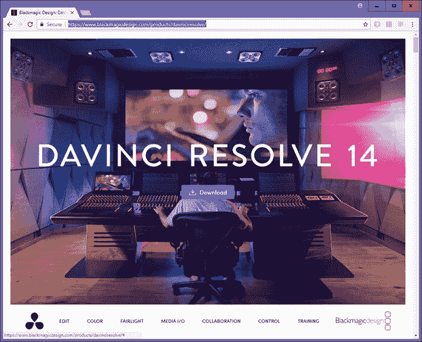

图 1-18。

Google the word DaVinci Resolve; go to BlackMagicDesign.com webpage; click on the Download button

安装软件，并为任务栏创建一个快速启动图标，就像您对所有其他软件所做的那样。如果你想了解更多关于数字视频编辑的知识，可以看看来自 Apress 的数字视频编辑基础知识。接下来，我们将安装一个高级特效，3D 建模和动画，以及 VR 包，名为 BlackMagic Fusion。

### 下载并安装 Blackmagic Fusion 以获得视觉效果

JavaFX 还支持特效管道，因为所有的新媒体类型都可以使用 Java 9 代码无缝地组合在一起。SFX 同时利用基于“光栅”像素的运动视频技术、静态图像合成、数字音频、3D、i3D 和 SVG 数字插图，因此与 3D 建模和动画一样先进。BlackMagicDesign 的 Fusion 曾经是一个付费软件包，直到它被开源。有一个专业版以前要 999 美元现在要 299 美元！如果你是认真的多媒体，购买这个！

您首先必须在`BlackMagicDesign.com`网站上注册，才能下载和使用该软件。该软件包适用于 Linux、Windows 10 和 Macintosh 操作系统。要在互联网上找到 Fusion，使用谷歌搜索引擎并输入 Fusion 9，你将被指引到图 [1-19](#Fig19) 所示的地方。单击代表您正在使用的操作系统的下载按钮。此下载页面将自动检测您使用的操作系统；在我的情况下，Windows。

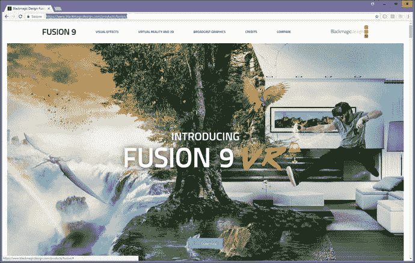

图 1-19。

Google the word Fusion 9; go to the blackmagicdesign.com download page; click on the download button

在 BlackMagicDesign.com 网站上注册，如果你还没有这样做，一旦你被批准，你就可以下载并安装 Fusion 9 的最新版本。安装软件，并为任务栏创建一个快速启动图标，就像您对其他软件所做的那样。如果你想详细了解融合，Apress.com 最近有一本名为《VFX 基础》的书，该书更详细地介绍了融合和视觉效果合成管道。

接下来，我们将安装一个名为 Blender 的 3D 建模和动画包。

### 下载并安装用于 3D 建模和动画的 Blender

JavaFX 最近支持在 JavaFX 环境之外创建的 3D 新媒体素材，这意味着您将能够使用第三方软件包(如 Autodesk 3D Studio Max 或 Maya 和 NewTek Lightwave)创建 3D 模型、纹理和动画。在本节中，我们将下载并安装流行的开源 3D 建模和动画软件包“Blender”Blender 可用于 Linux、Windows 和 Macintosh 操作系统，因此读者可以使用任何他们喜欢的操作系统平台来创建和优化 3D 模型、3D 纹理映射和 3D 动画，以用于他们的 Java 9 和 JavaFX 9 游戏。

要在互联网上找到 Blender 软件，使用谷歌搜索引擎并输入 Blender，如图 [1-20](#Fig20) 所示。点击正确的下载链接下载并安装 Blender，然后创建快速启动图标。

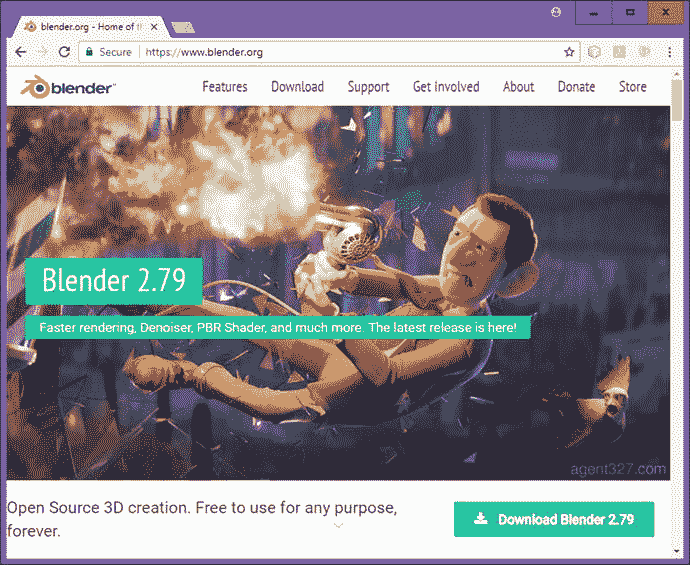

图 1-20。

Google the words Blender 3D, go to [`www.blender.org`](http://www.blender.org) and click on the blue Download Blender 2.79 button

### 下载并安装用于 3D 地形或世界创建的 Terragen

另一个令人印象深刻的(免费的，对于基础版本，或者如果你在教育行业)3D 世界生成软件包是英国 Planetside Software 的 Terragen 4.1。你可以在 Planetside.co.uk 下载基本版，也可以加入他们的论坛。我也在我的几本 Android 应用开发书籍中使用过这个软件，所以我知道它在多媒体应用、交互式电视或 iTV 以及游戏等项目中使用效果很好。它也被专业电影制作人使用，因为它的质量水平非常原始。由于我们在本书中涉及 3D，您可能希望了解 Terragen，因为它价格实惠，并且被电视制片人和电影工作室使用。要在互联网上找到 Terragen 软件，请使用谷歌搜索引擎并输入 Terragen 4.1。点击链接，将弹出 Planetside 软件网站，如图 [1-21](#Fig21) 所示。

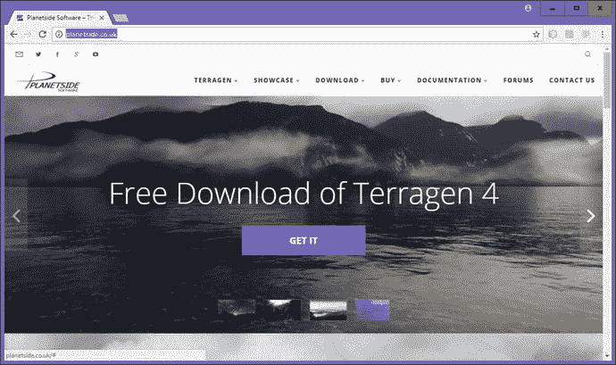

图 1-21。

Google the word Terragen; go to the planetside.co.uk website; click on a blue GET IT button to download

单击 GET IT download 链接下载并安装 Terragen，然后为该软件创建一个快速启动图标。如果你喜欢这个 3D 软件，一定要升级到软件的专业版，这是非常实惠的。

### 下载并安装 Daz Studio Pro 以制作角色动画

对于专业的 3D 角色建模和动画，如果有机会的话，一定要看看位于 daz3d.com 的 DAZ 3D 公司的 3D 软件包。DAZ Studio PRO 目前的版本是 4.9，没错，是免费的！你必须登录并注册，就像你为黑魔法设计软件所做的那样，但这只是一个小小的代价！这个网站上还有一个免费的 3D 建模软件包叫做 Hexagon。DAZ 3D 网站上最贵的软件是 Carrara(150 美元)或 Carrara Pro(285 美元)。DAZ 工作室的大部分收入来自销售各种类型的角色模型，所以去看看他们吧，因为他们是 3D 内容(虚拟)世界中不可忽视的力量！

要在互联网上找到 Daz Studio Pro 软件，使用谷歌搜索引擎并键入 Daz Studio Pro 5 下载。该链接会将您带到 daz3d.com/daz_studio 页面，如图 [1-22](#Fig22) 所示。点击下载链接下载并安装最新版本的 Daz Studio Pro，然后创建您的快速启动图标。

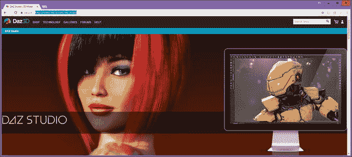

图 1-22。

Google the words Daz Studio Pro, go to [`www.daz3d.com`](http://www.daz3d.com) , and download the latest version of Daz Studio

## 其他开源新媒体软件包

我在新媒体内容制作业务中也使用了大量其他专业水平的开源软件包。我想让你知道其中的一些会很好，以防你没有听说过它们。这些将为您在本章中构建的新媒体制作工作站增加更多功能和多样性。值得注意的是，在进行所有这些大量下载和安装的过程中，您已经为自己节省了数千美元(或您的本地货币单位)，这些钱本来可以花在类似的付费内容制作软件包上。我想我的座右铭可以说是:“第一次就做对，并确保一直做下去”，所以我将继续向您介绍其他一些免费的，甚至是一些更易于使用(不是免费的，但非常实惠)的新媒体内容制作软件包，我通常在我的 3D 内容制作工作站上安装这些软件包。

除了过去价格接近六位数的 DaVinci Resolve 软件包之外，开源软件的最佳价值之一是一个商业生产力软件套件，它在 Oracle 收购 Sun Microsystems 后被收购，然后成为开源软件。Oracle 将其 OpenOffice 软件套件转移到流行的 Apache 开源项目，就像他们目前对 NetBeans 9 所做的一样。

Open Office 4.3 是一个完整的办公效率软件套件，其中包含六个成熟的商务效率软件包！由于您的内容制作代理实际上是一个成熟的企业，您可能应该了解办公软件，因为这是一个非常可靠的开源软件产品。您可以在:`OpenOffice.org`找到它，这个流行的商业软件包已经被像您这样精明的专业人士下载了超过一亿次，所以，这不是一个玩笑，正如他们所说的那样！

对于用户界面(UI)设计原型，Evolus.vn 提供了一个名为 Pencil 2.0.6 的免费软件包，允许您在用 Java、Android 或 HTML5 创建用户界面设计之前，轻松地制作用户界面设计原型。该软件位于`pencil.evolus.vn`，可用于 Linux 发行版、Windows 7 和 8.1 以及 Macintosh OS/X。

对 Audacity 2 数字音频编辑软件的一个很好的补充是 Rosegarden MIDI sequencing 和 music composition and scoring 软件，它可以用于音乐创作，并打印出音乐出版的结果乐谱。Rosegarden 目前正在从 Linux 移植到 Windows。请注意，功能最全的版本是针对 Linux 的，如图 [1-23](#Fig23) 所示。可以使用谷歌搜索或者在`RoseGardenMusic.com`找到它，目前它的版本是 17.04(与 LTS 的 Ubuntu 相同)。这就是通常所说的“千载难逢的两次”版本。

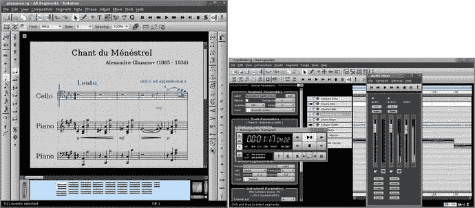

图 1-23。

Rosegarden is a MIDI, music scoring, and notation program for Linux which is being ported to Windows 10

另一个令人印象深刻的音频、MIDI 和声音设计软件包叫做 Qtractor，这是一个基于硬盘驱动器的音频采样器、编辑器和声音设计软件包，如图 [1-24](#Fig24) 所示。因此，如果你运行的是 Linux 操作系统，一定要谷歌搜索、下载并安装这个专业级数字音频合成软件包，你可以在 SourceForge 的`Qtractor.SourceForge.net` URL 网址找到它。

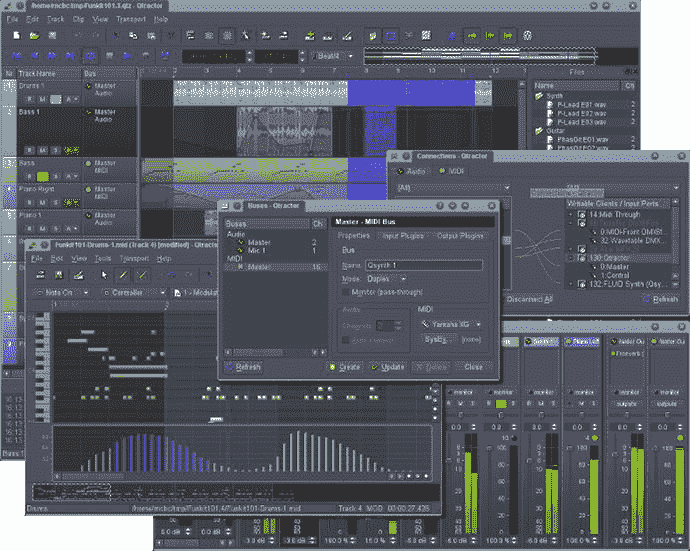

图 1-24。

Qtractor, the hard disk based digital audio editing software for Linux

另一个令人印象深刻的免费 3D 建模和动画软件是 Caligari TrueSpace 7.61，当它由 Caligari Corporation(后来被微软收购)的罗曼·奥曼迪开发时，曾经花费近 1000 美元，你可以在多个网站上找到它，只需在谷歌上搜索 Caligari TrueSpace 3D。

另一个你应该看看的 3D 渲染软件是 POVRay。POV 代表“视觉暂留”，该软件被称为“光线跟踪器”，是一种高级渲染引擎，可与任何 3D 建模和动画软件包配合使用，使用高级光线跟踪渲染算法生成令人印象深刻的 3D 场景。最新版本可在 [`www.povray.org`](http://www.povray.org) 网站上找到。它是 3.7，最新版本是 64 位，并且是多核(多线程)兼容的，可以免费下载，这就是我在这里告诉你的原因。

另一个专为 POVRay 设计的时尚 3D 建模软件包是 Bishop 3D。该软件可以用来创建自定义的 3D 对象，然后可以导入到 POVRay(然后导入到 JavaFX)中，以便在您的 pro Java 游戏中使用。最新版本是适用于 Windows 7 或 10 的 1.0.5.2。该软件可以在 [`www.bishop3d.com`](http://www.bishop3d.com) 上找到，最新版本是 8MB 下载，目前可以免费下载。

另一个你应该看看的免费 3D 细分建模软件是 Wings3D。这个软件可以用来创建 3D 对象，然后导入 JavaFX 在你的游戏中使用。最新版本是 2.1.5，于 2016 年 12 月发布，适用于 Windows 10、Macintosh OS/X 和 Ubuntu Linux。该软件可以在`wings3d.com`上找到，最新版本为 64 位，下载容量为 16MB，目前可以免费下载。

接下来我将向你展示我是如何在任务栏上组织一些基本的操作系统工具和开源软件的。在接下来的几章中，我们将开始学习使用新媒体素材背后的原理，之后，我们将学习如何使用 NetBeans 9 创建 JavaFX 9 项目，然后，在我们开始学习有关强大的 JavaFX 9.0 多媒体游戏引擎的细节之前，我们将在下一章中学习 Java 编程语言。

## 在任务栏区域组织快速启动图标

有一些操作系统实用程序，如计算器、文本编辑器(在 Windows 中称为记事本)和文件管理器(在 Windows 中称为资源管理器)，我在任务栏中保留了快速启动图标，因为它们在编程和新媒体内容开发工作流程中经常使用。我还在我的任务栏上保留了各种新媒体开发、编程和办公效率应用作为快速启动图标，如图 [1-25](#Fig25) 所示，其中显示了十几个应用，包括我们刚刚安装的所有应用(按安装顺序排列)，以及其他一些应用，包括 OpenOffice 4.3、DAZ Studio Professional 4.9 和 Bryce Professional 7.1。

图 1-25。

Make Taskbar Quick Launch Icons for key system utilities, NetBeans 9 and new media production software

有几种方法可以创建这些快速启动图标；您可以将程序直接从“开始”菜单拖放到任务栏上，或者右键单击桌面上或资源管理器文件管理器中的图标，然后选择“固定到任务栏”上下文菜单选项。一旦图标出现在任务栏中，你可以简单地通过向左或向右拖动来改变它们的位置。

恭喜你！您刚刚创建了您的新媒体 Java 游戏和物联网开发工作站，该工作站经过了高度优化，将允许您创建您的客户可以想象的任何新媒体 Java 游戏或物联网项目！

## 摘要

在第一章中，您确保自己拥有开发创新 Java 游戏或物联网项目所需的一切，包括最新版本的 Java 9、JavaFX 9.0、NetBeans 9 和所有最新的开源新媒体软件。这包括获得最新的 Java 9 JDK 和 NetBeans 9 IDE 软件，然后我们安装 Java 9 和 NetBeans 9。在那之后，你为一群专业的、开源的、新媒体内容工具做了同样的事情。