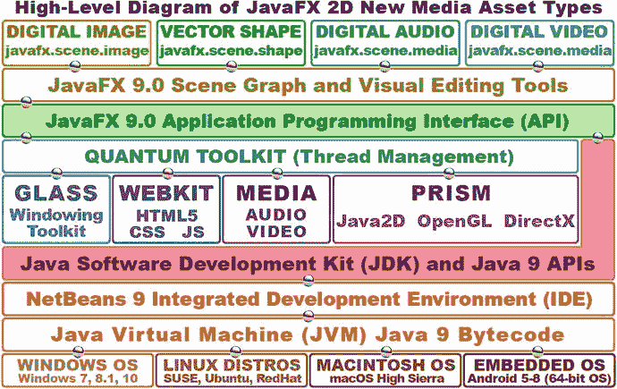
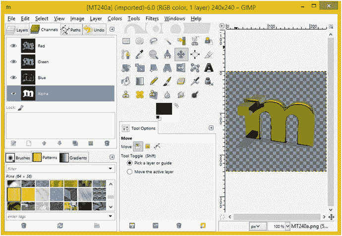
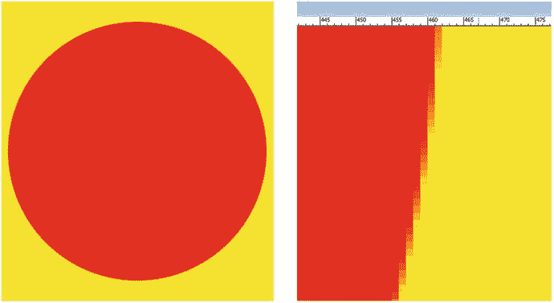
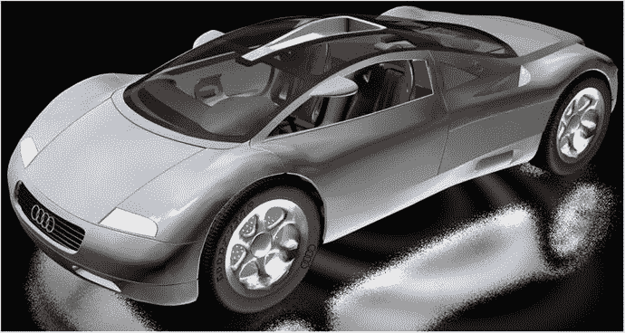
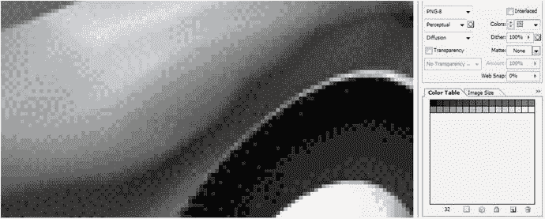
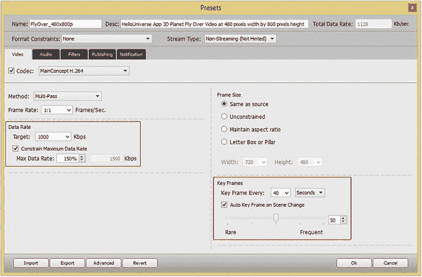
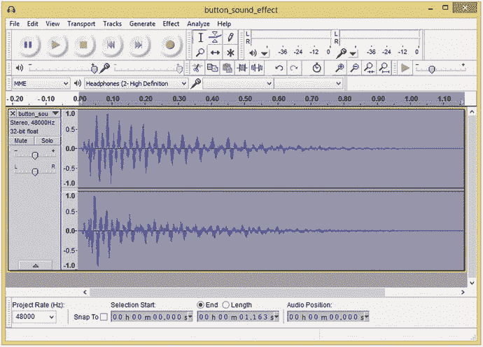

# 二、内容创作导论：2D 新媒体素材基础

由于上一章的介绍，现在您已经有了一个专业的 Java 游戏和物联网开发工作站，让我们直接进入并了解大多数新媒体内容开发软件包所基于的基本 2D 内容开发概念和原则。Blender 是个例外，它基于更高级的 3D 内容开发，我们将在下一章讨论。在我们开始学习 Java、NetBeans 和 JavaFX 之前，我们需要先介绍这些基础多媒体材料，因为 JavaFX 多媒体引擎为使用可缩放矢量图形(SVG)的数字插图提供了令人难以置信的支持；使用光栅(位图)图像格式(如 PNG、JPEG 或 GIF)的数字成像；使用 MP3、MPEG4 AAC、WAV 或 AIFF (PCM)等音频格式的数字音频，以及使用 JavaFX 内部渲染引擎的 3D。我假设您不会创建基于文本的游戏，而是创建交互式新媒体应用，所以我想先介绍一些与编码无关的主题。一旦我们开始使用 NetBeans、Java 和 JavaFX APIs 编码，我们将永远不会停止编码。

在本章中，您将详细了解 JavaFX 支持的每种 2D 新媒体内容类型背后的概念，包括数字插图(矢量)、数字图像(光栅)、数字视频(运动)和数字音频(波形)。我们这样做是为了让你掌握基础知识，能够使用你在第 [1](01.html) 章下载并安装的免费开源多媒体内容制作工具进行游戏设计。

我想介绍的第一件事是数字图像的基本新媒体素材类型，因为它将被用作许多其他新媒体素材类型的基本输入素材。例如，您的数字视频只是一系列随时间快速播放的数字图像，以创建一种运动错觉。您的 2D 矢量插图素材可以使用 JavaFX ImagePattern 类填充数字图像数据，您的 3D 矢量素材可以将数字图像素材用于着色器和纹理贴图，我们将在第 [3](03.html) 章中对此进行介绍，包括高级 3D 内容创建和用于实现这些 3D 内容元素的相关 JavaFX 包和类。

接下来，我将介绍数字视频的概念、技术和“行话”，包括帧、帧速率、比特率以及其他添加第四维时间的概念，从而将静态数字图像素材制作成动画数字视频素材。这些概念也与动画有关，包括 2D 动画和 3D 动画。我们将在第 [3](03.html) 章讨论 2D 矢量和 3D 矢量概念，因为它们密切相关。

最后，我们将看看数字音频的概念；数字音频与数字视频密切相关，因为它可以包含在数字视频文件格式中。数字音频也可以独立存在，因此我们还将介绍 JavaFX 中的数字音频格式支持，以及数字音频素材数据足迹优化工作流程。因此，我们将在本章涵盖所有 2D (X，Y 数据表示)新媒体形式，2D 矢量插图除外，它与 3D 矢量渲染密切相关，我们将在第 [3](03.html) 章的第一部分涵盖。

## 游戏设计素材:新媒体内容概念

让你的游戏内容变得专业并在视觉上让你的客户满意的最强大的工具之一是你在第 [1](01.html) 章下载并安装的多媒体制作软件。在我深入阅读本书之前，我需要花一些时间向您提供关于 Java 通过 JavaFX 多媒体引擎支持的四种主要类型的新媒体素材的基础知识。这些包括数字图像，用于精灵，背景图像和 2D 动画；向量形状，用于 2D 插图、碰撞检测、2D 形状、路径和曲线；数字音频，用于音效、旁白和背景音乐；和数字视频，在游戏中用于动画背景循环(天空中飞翔的鸟，飘动的云，等等。)和高度优化的视频播放。正如你在图 [2-1](#Fig1) 中看到的，这四个 2D 流派，或者区域，都是使用 JavaFX 场景图安装在你的游戏中的。还有一个新的媒体领域，我想称之为交互式 3D (i3D)。i3D 为 Java 8 和 9 带来了实时 3D 渲染，我们将在下一章介绍 OpenGL ES。

图 2-1。

How 2D or audio new media assets are implemented in Scene Graph using JavaFX 9, Java 9, and NetBeans 9

因为在您能够在 Java 游戏设计(或编程)管道中创建或正确实现这些新媒体元素之前，您需要有一个技术基础，所以我将对四个新媒体领域中的每一个领域的核心概念进行回顾。仅有的两个在概念上相关的是 2D 动画和数字视频，因为它们都涉及到使用第四维度的时间和帧，所以我将把它们放在一起讨论。由于数字音频也涉及到时间的第四维度，我将用数字音频的概念来结束；最后，我们将快速了解数字内容优化，以便您的专业 Java 游戏和物联网项目紧凑且下载快速。

## 数字成像概念:分辨率、色深、Alpha、图层

JavaFX 支持最流行的数字图像文件(数据)格式，这给了我们游戏设计者极大的灵活性。由于 JavaFX 8 API 现在是 Java 8 和 9 的一部分，这意味着 Java 也支持这些图像格式。其中一些数字图像格式已经存在了几十年，如 CompuServe 图形信息格式(GIF)或广泛使用的联合图像专家组(JPEG)格式。一些 JavaFX 数字图像格式更加现代；例如，便携式网络图形(PNG，发音为“ping”)是我们将在游戏中使用的文件格式，因为它可以产生最高的质量水平，并支持图像合成，我们将很快了解这一点。Java 支持的所有这些主流数字图像文件格式在 HTML5 浏览器中也受支持，由于 Java 应用可以在 HTML 应用或网站中使用，这确实是一个非常合乎逻辑的协同作用！如果需要更广泛的数字图像文件格式支持，也可以使用名为 ImageJ 的第三方数字图像库。

最古老的格式是一种称为 CompuServe GIF 的无损数字图像文件格式。之所以称之为无损，是因为它不会丢弃(丢失)任何源图像数据来实现压缩结果。GIF 压缩算法不像 PNG 格式那样精细(不像 PNG 格式那样强大)，GIF 只支持索引颜色，这是它获得压缩的方式(文件更小)。在这一部分的后面，我们将详细了解颜色深度(索引色与真彩色)。如果你所有的游戏图像资源都是使用 GIF 格式创建的，你就可以在你的 Java 游戏中毫无问题地使用它们，而不是低效的图像压缩和有限的图像合成能力。

Java 通过 JavaFX 支持的最流行的数字图像格式是 JPEG。JPEG 使用“真彩色”色深，而不是索引色深。稍后我们将讨论色彩理论和色彩深度。JPEG 使用所谓的有损数字图像压缩。这是因为压缩算法会“丢弃”图像数据，以便获得更小的文件大小。这个图像数据就永远丢失了，除非你聪明点，把原来的 raw 图像保存下来！

如果您在压缩后放大 JPEG 图像，您会看到变色或脏污的区域，而这些区域在原始图像中是不存在的。在数字成像行业中，图像中的退化区域被称为压缩伪像。这只会发生在有损图像压缩中，在 JPEG(和 MPEG)压缩中很常见。

我推荐您在专业 Java 游戏中使用的数字图像格式是可移植网络图形文件格式。PNG 有两个真彩色文件版本；一个名为 PNG24，不能用于图像合成，另一个名为 PNG32，带有一个用于定义透明度的 alpha 通道，我们将在稍后介绍。还有一个索引(最多 256；可以更少)彩色版的 PNG 格式，称为 PNG8。

我为你的游戏推荐 PNG 的原因是因为它有一个不错的图像压缩算法，并且是一种无损图像格式。这意味着 PNG 有很好的图像质量以及合理的数据压缩效率，这将使你的游戏发行文件更小。PNG32 格式的真正力量在于它能够使用透明度和抗锯齿(通过其 alpha 通道)与其他游戏图像进行合成。

### 数字图像分辨率和长宽比:定义您的图像大小和形状

您可能知道，数字图像是由二维(2D)像素阵列组成的。Pixels 是图片(pix)元素(els)的缩写。图像中的像素数量由其分辨率表示，分辨率是图像宽度(或 W，有时称为 x 轴)和高度(或 H，有时称为 y 轴)维度中的像素数量。图像的像素越多，分辨率就越高。这与数码相机的工作原理类似，因为图像捕捉设备(通常是相机的电荷耦合器件(CCD)，用于捕捉图像数据)中的像素越多，可以实现的图像质量就越高。

要计算图像像素的总数，请将宽度像素乘以高度像素。例如，一个宽 VGA 800x480 图像将包含 384，000 个像素，正好是 1MB 的 3/8。这就是你如何找到你的图像的大小，包括使用的千字节(或兆字节)和显示屏上的高度和宽度。

使用图像纵横比来指定数字图像素材的形状。纵横比是数字图像的宽高比，定义了正方形(1:1 纵横比)或矩形(也称为宽屏)数字图像形状。具有 2:1(宽屏)宽高比的显示器，例如 2160x1080 分辨率，已经广泛应用。

1:1 纵横比的显示器或图像总是完美的正方形，2:2 或 3:3 纵横比的图像也是如此。例如，物联网开发人员可能会在智能手表上看到这个长宽比。值得注意的是，定义图像或显示屏形状的是这两个宽度和高度数字之间的比率，或者 X 和 Y 变量，而不是实际的数字本身。实际数字定义了屏幕的分辨率或总像素阵列能力。

纵横比应该始终表示为纵横比冒号两边可以达到(减少)的最小数字对。如果你在高中时注意学习最小公分母，那么长宽比对你来说很容易计算。我通常通过继续将冒号的每一边除以 2 来计算长宽比。例如，如果您采用 SXGA 1280x1024 分辨率，则 1280x1024 的一半是 640x512，而 640x512 的一半是 320x256。320x256 的一半是 160x128，一半是 80x64，一半是 40x32，一半是 20x16。20x16 的一半是 10x8，而其中的一半给你 SXGA 5:4 的长宽比。

### 数字图像色彩理论和色彩深度:定义精确的图像像素颜色

每个数字图像像素的颜色值可以由三种不同颜色(红色、绿色或蓝色(RGB ))的量来定义，这三种颜色在每个像素中以不同的量存在。消费电子显示屏利用加色，即每个 RGB 颜色通道的光波长相加在一起，以创建 1680 万个不同的颜色值。在 LCD、LED 或有机发光二极管显示器中使用加色。它与印刷中使用的减色法相反。为了向您展示不同的结果，在减色模式下，将红色与绿色(油墨)混合将产生紫色，而在加色模式下，将红色与绿色(浅色)混合将产生鲜艳的黄色。加色可以提供比减色更宽的颜色范围。

为每个像素保存的每个红色、绿色和蓝色值有 256 个亮度级别。这允许您设置 8 位数据值范围，或 0 到 255，控制每个红色、绿色和蓝色值的颜色亮度变化。该数据使用十六进制记数法表示，从最小值零(#00 或关，全黑或黑色)到最大值 255 (#FF 或全开，或贡献最大 RGB 颜色，形成白色)。

用于表示支持的数字图像像素颜色数量的位数被称为图像的颜色深度，并使用“2 的幂”,就像 3D 用于纹理映射一样，我们将在下一章讨论这一点。因此，PNG8 图像使用 256 种颜色，PNG7 使用一半的颜色(128)，PNG6 使用一半的颜色(64)，PNG5 使用一半的颜色(32)，因此 PNG 4 使用 16，PNG3 使用 8，PNG2 使用 4，PNG1 使用 2，或黑白(开或关)。通常，您会希望使用完整的 256 色，因为 JavaFX 仅支持 PNG8、PNG4 或 PNG1，所以如果您要使用索引彩色影像，请使用 PNG8。

数字成像行业中常用的颜色深度包括 8 位、16 位、24 位和 32 位。我将在这里概述常见的，以及它们的格式。最低色深存在于 8 位索引的彩色图像中。这些具有最多 256 个颜色值，并使用 GIF 和 PNG8 图像格式来保存这种索引颜色类型的数据。

中等色深图像将采用 16 位色深，因此将包含 65，536 种颜色(按 256 乘以 256 计算),并且受 TARGA (TGA)和标记图像文件格式(TIFF)数字图像格式支持。如果您想在 Java 8 游戏中使用除 GIF、JPEG 和 PNG 之外的数字图像格式，请导入 ImageJ 库。

真彩色色深图像将采用 24 位色深，因此将包含超过 1600 万种颜色。计算方法是 256 乘以 256 乘以 256，等于 16，777，216 种颜色。支持 24 位颜色深度的文件格式包括 JPEG(或 JPG)、PNG、BMP、XCF、PSD、TGA、TIFF 和 WebP。JavaFX 支持其中的三种:JPEG、PNG24 (24 位)和 PNG32 (32 位)。使用真彩色深度 24 位或 32 位影像将为您提供最高水平的质量。这就是为什么我一直建议你在 Java 9 游戏和物联网项目中使用 PNG24 或 PNG32 格式。

接下来，让我们看看如何通过使用 PNG32 图像的 alpha 通道来表现图像的透明度。

### 数字图像合成:对图层使用 Alpha 通道和透明度

接下来，让我们看看如何使用 alpha 通道定义数字图像像素透明度值，以及如何使用这些值为 Java 游戏实时合成数字图像。合成是将多个数字影像层无缝融合在一起的过程。正如你所想象的，这对于游戏设计和开发来说是一个非常重要的概念。当您想要在显示器上创建一个看起来像是单个图像(或动画)但实际上是(多个)合成图像层的无缝集合的图像时，合成非常有用。您想要设置图像或动画合成的主要原因之一是，通过将每个元素放在不同的层上，允许对这些图像中的各种元素进行编程控制。

要实现这一点，您需要有一个 alpha 通道透明度值，您可以利用它来精确地控制该像素与它下面的其他层上相同 X，Y 图像位置中的像素的混合。在数字成像软件中，每个图像层的透明度值通过使用棋盘图案来表示，您可以在图 [2-2](#Fig2) 的右侧看到。

图 2-2。

Showing the checkerboard representation of transparent pixels in an image, as well as the RGBA channels

在 GIMP 的左边你可以看到 Alpha 层，我选择的是蓝色。它包含 MindTaffy 徽标的透明度值。GIMP 通道调色板是我选择向您显示这些颜色和 alpha 通道(红色、绿色、蓝色、alpha)的选项卡，它为每个层分别保存这些颜色(和 Alpha)通道，允许您对每个图像复合层中的每个像素进行难以置信的控制。

像其他 RGB 通道一样，alpha 通道有 256 个级别，但这些值不是红色、绿色或蓝色，而是透明度级别。在 Java 编程中，alpha 通道由十六进制表示中的前两个槽表示，以#AARRGGBB 数据值格式描述。我们将在下一节详细介绍这一点。Alpha 加颜色通道 ARGB 数据值利用八个槽(32 位)数据，而不是 24 位图像中使用的六个数据槽(#RRGGBB)，这可以被认为是具有零(无)alpha 通道数据的 32 位图像。

因此，24 位(PNG24)图像没有 alpha 通道，不会用于合成，除非它是合成层堆栈中的背景(底部)图像板。另一方面，PNG32 影像将用作 PNG24(背景板)影像之上的合成层，或者用作 z 顺序较低的 PNG32 合成层之上的合成层，这些合成层将需要其 alpha 通道功能，以便通过这些 alpha 通道透明度值显示图像合成中需要某种透明度(或不透明度)的某些像素位置。

数字图像 alpha 通道和图像合成的概念是如何影响 Java 游戏设计的？你一定在想！主要优势是能够将游戏画面、精灵、投射物和背景图形元素分解成多个组件层。这样做的原因是为了能够将 Java 编程逻辑(或 JavaFX 或 SVG 特效)应用于单个图形图像元素，以控制游戏画面的各个部分。如果没有 2D 合成方法，你将无法单独控制游戏组件，因为对大多数设备来说，逐个像素的处理过于密集。

图像合成的另一部分，称为混合模式，也是专业图像合成功能的重要因素。JavaFX 混合模式是通过使用包含 BlendMode 常量值的 Blend 类来应用的，该常量值位于 javafx.scene.effect 子包中，我们将在本书的后面部分介绍该子包。这个 JavaFX blend effect 类为 Java 游戏开发人员提供了许多与 Photoshop 或 GIMP 为数字图像制作人员提供的图像合成模式相同的模式。这将 Java 和 JavaFX 变成了一个强大的图像合成引擎，就像 GIMP 一样，混合算法可以在非常灵活的级别上进行控制，使用自定义的 Java 代码。一些 JavaFX 混合模式常量包括 ADD、SCREEN、OVERLAY、DARKEN、LIGHT、MULTIPLY、DIFFERENCE、EXCLUSION、SRC_ATOP、SRC_OVER、SOFT_LIGHT、HARD_LIGHT、COLOR_BURN 和 COLOR_DODGE 常量。

### 在 Java 游戏逻辑中表示颜色和 Alpha:使用十六进制记数法

现在，您已经知道了什么是色深和 alpha 通道，并且在任何给定的数字图像中，颜色和透明度是通过使用四种不同的 alpha、红色、绿色和蓝色(ARGB)图像通道的组合来表示的，现在重要的是，作为程序员，我们应该如何在 Java 和 JavaFX 中表示这四种 ARGB 图像颜色和透明度通道值。

在 Java 编程语言中，颜色和 alpha 不仅用于 2D 数字图像，通常称为位图图像，还用于 2D 插图，通常称为矢量图像。颜色和透明度值也经常在许多不同的颜色设置选项中使用。例如，您可以为 JavaFX Stage、场景、布局容器(如 StackPane)、矢量形状填充或 UI 控件设置背景色(或透明度值),以及其他内容，如 3D 素材特征。我们将在以后的章节中讨论 3D 和 JavaFX。

在 Java 和 JavaFX API 中，不同级别的 ARGB 颜色强度值用十六进制表示。十六进制，或简称为“hex ”,是基于原始的 16 进制计算机符号。这在很久以前被用来表示 16 位数据值。与更常见的从 0 到 9 计数的 Base10 不同，Base16 记数法从 0 到 F 计数，其中 F 表示 15 的 Base10 值(0 到 15 产生 16 个数据值)。

Java 中的十六进制值总是以 0 和 x 开头，所以白色的 24 位颜色值应该是这样的:0xFFFFFF。这个十六进制颜色值代表 Java 的颜色。白色常数，不使用 alpha 通道。白色的 32 位颜色值看起来像 0xFFFFFFFF，alpha 通道数据完全不透明。带有透明 alpha 通道的白色，可能根本不是白色，而是“透明的”，使用十六进制编码如下:0x00FFFFFF。我在 Java 代码中一般用 0x00000000 来表示一个清晰(透明)的 alpha+颜色值。

24 位十六进制表示中的每个槽代表一个 16 进制值，因此要获得每种 RGB 颜色所需的 256 个值需要 2 个槽，因为 16 乘以 16 等于 256。因此，要使用十六进制表示法表示 24 位图像，我们需要在 0x 后面有六个槽来保存这六个十六进制数据值(每个数据对表示 256 个级别的值)。如果乘以 16×16×16×16×16×16，您应该得到 16，777，216 种颜色，这些颜色可以通过使用 24 位来寻址，也称为真彩色数字图像数据。

十六进制数据槽以下列格式表示 RGB 值:0xRRGGBB。对于 Java 常量颜色。白色，十六进制颜色数据值表示中的所有红色、绿色和蓝色通道都处于全(最大颜色值)亮度设置。如果你把所有这些颜色相加，你将得到白光。

黄色表示红色和绿色通道打开，蓝色通道关闭，因此颜色的十六进制表示法。因此，黄色将为 0xFFFF00，其中红色和绿色通道槽完全打开(FF，或 255 Base10 数据值)，蓝色通道槽完全关闭(00，或零值)。

ARGB 值的八个十六进制数据槽将保存以下格式的数据:0xAARRGGBB。因此，对于颜色。白色，十六进制颜色数据值表示中的所有阿尔法、红色、绿色和蓝色通道将处于它们的最大亮度(或不透明度)，并且阿尔法通道是完全不透明的，即不透明的，如 FF 值所表示的。因此，颜色为 32 位十六进制值。白色常数将是 0xFFFFFFFF。

100%透明的 alpha 通道可以由设置为零的 alpha 槽来表示，从而创建“清晰”的图像。因此，您可以使用 0x00000000 和 0x00FFFFFF 之间的任何数据值来表示透明图像像素值。重要的是要注意，如果 alpha 通道值等于此完全透明度级别，那么将包含在其他六个(RGB)十六进制数据值槽中的 16，777，216 个颜色值将无关紧要，因为该像素将被评估为不存在，因为它是透明的，因此不会在最终图像或动画合成图像中合成，所以它的颜色是没有意义的(根本无关紧要)。

### 数字图像对象遮罩:使用 Alpha 通道合成游戏精灵

alpha 通道在游戏设计中的主要应用之一是遮蔽图像或动画(图像系列)的区域，以便它可以在游戏图像合成场景中用作游戏精灵。蒙版是从数字图像中“剪切”出主题的过程，以便可以使用 alpha 通道透明度值将主题放在自己的图层上。这是使用数字成像软件包完成的，如图 [2-2](#Fig2) 所示。

数字图像合成软件包，如 Photoshop 或 GIMP 功能工具，用于遮罩和图像合成。如果不进行有效的遮罩，就无法进行有效的图像合成，因此对于希望将图形元素(如图像精灵和精灵动画)集成到游戏设计中的游戏设计师来说，这是一个需要掌握的重要领域。数字图像蒙版技术已经存在很长时间了！

可以使用专业的蓝屏(或绿屏)背景以及可以自动提取精确颜色值来创建蒙版的计算机软件，自动为您完成蒙版。这个遮罩被转换成 alpha 通道(透明度)信息(数据)。还可以通过使用数字图像软件、通过结合各种锐化和模糊算法使用算法选择工具之一来手动进行遮罩。

在本书的过程中，我们将会使用通用的开源软件包，比如 GIMP，来学习很多关于这个工作过程的知识。掩蔽可能是一个复杂的工作过程，完全掌握这个过程可能需要跨越几个章节，而不是试图将所有内容放入书中的一个章节(这一章)。本章旨在向您展示我们在书中所承担的工作流程的基础知识。

遮罩过程的一个关键考虑因素是在被遮罩的对象(主题)周围获得平滑、清晰的边缘。这是为了当你将一个被遮罩的物体(在本书中，它将是一个游戏精灵)放入(覆盖)新的背景图像中时，它将看起来像是在第一个地方被拍摄的一样(就像它在视频中一样)。

成功做到这一点的关键在于像素选择工作过程，这涉及到使用数字图像软件选择工具，如 GIMP 中的剪刀工具或 Photoshop 中的魔棒工具。这些必须以正确的方式(顺序)使用才能完全有效。使用正确的选择工作流程至关重要！

例如，如果您想要遮罩的对象周围有统一颜色的区域(可能您是对着蓝屏拍摄的)，您将使用具有适当阈值设置的魔棒工具来选择除对象之外的所有内容。然后反转选择，这将为您提供包含该对象的选择集。通常，正确的工作流程包括逆向处理某些事情。其他选择工具包含复杂的算法，可以查看像素之间的颜色变化。这些对于边缘检测是有用的，我们可以将其用于其他选择方法。

### 平滑数字图像合成:使用抗锯齿平滑图像边缘

抗锯齿是一种流行的数字图像合成技术，其中数字图像中位于不同颜色的两个区域之间的边缘上的两种相邻颜色沿着该边缘混合在一起。这将有助于在缩小图像时使边缘看起来更平滑(更少锯齿)。这样做是为了“欺骗”观众的眼睛看到更平滑的边缘，并消除所谓的图像锯齿。抗锯齿通过使用平均颜色值提供了令人印象深刻的结果，该平均颜色值仅使用需要变得更平滑的边缘上的几个彩色像素。所谓平均颜色值，我指的是某个颜色范围，它是沿着图像锯齿状边缘聚集在一起的两种颜色之间的一部分。这只需要半打左右的中间色。我创造了一个例子来展示我所说的。参见图 [2-3](#Fig3) 。

图 2-3。

A red circle composited on a yellow background (left) and a zoomed-in view (right) showing anti-aliasing

正如你所看到的，我在一个图层上创建了一个清晰的红色圆圈，在背景图层上叠加了一个黄色填充。我放大了红色圆圈形状的边缘，拍了另一张截图，并把它放在缩小的圆圈的右边。这显示了从黄橙色到橙色到红橙色抗锯齿颜色值的范围，正好在圆与背景相遇的边缘处的红色和黄色之间。

值得注意的是，JavaFX 引擎将使用 Java2D 软件渲染器或硬件渲染的 i3D，使用 Prism 引擎(可以使用 OpenGL 或 DirectX ),针对背景颜色和背景图像消除 2D 形状和 3D 对象的锯齿。您仍将负责正确合成，也就是说，通过有效地使用 alpha 通道为您的多层影像提供抗锯齿，这一点我们在本章前面已经了解过。

### 数字图像数据优化:使用压缩、索引颜色和抖动

影响数字图像压缩的因素有很多，您可以使用一些基本的技术以较小的数据占用量获得较高质量的结果。这是优化数字图像的主要目标；为您的应用(在本例中是一个游戏)获得尽可能小的数据占用空间，同时获得最高质量的视觉效果。我们将从对数据足迹影响最大的几个方面入手，研究这些方面对任何给定数字图像的数据足迹优化有何贡献。有趣的是，这些类似于我们在成像这一节到目前为止所涉及的数字成像概念的顺序。

影响最终数字图像素材文件大小的最关键因素，我喜欢称之为数据足迹，将是像素数或数字图像的分辨率。这是合乎逻辑的，因为需要存储每个像素，以及包含在其三个(24 位)或四个(32 位)通道中的颜色和 alpha 值。在保持图像清晰的同时，图像分辨率越小，生成的文件也就越小。

对于 24 位 RBG 图像或 32 位 ARGB 图像，原始(或未压缩)图像大小的计算方法是宽度乘以高度乘以 3，宽度乘以高度乘以 4。例如，未压缩的真彩色 24 位 VGA 图像将具有 640 乘以 480 乘以 3，等于 921，600 字节的原始(raw)未压缩数字图像数据。要确定此原始 VGA 图像中的千字节数，您需要将 921，600 除以 1024(千字节中的字节数)，这将在真彩色 VGA 图像中得到 900 KB 的数据。

通过优化数字影像分辨率来优化原始(未压缩)图像大小非常重要。这是因为一旦图像从游戏应用文件解压缩到系统内存中，这就是它将要占用的内存量，因为图像将使用 24 位(RGB)或 32 位(ARGB)表示法逐个像素地存储在内存中。这是我在游戏开发中使用 PNG24 和 PNG32 而不是索引颜色(GIF 或 PNG8)的原因之一，因为如果操作系统要将颜色转换为 24 位颜色“空间”，那么出于质量原因，我们应该利用 24 位颜色空间，并处理(接受)稍大的应用文件大小。

图像颜色深度是压缩图像的数据足迹的第二个最重要的因素，因为图像中的像素数乘以一个(8 位)、两个(16 位)、三个(24 位)或四个(32 位)颜色数据通道。这种小文件大小是 8 位索引彩色图像仍然被广泛使用的原因，尤其是使用 GIF 图像格式。

如果用于构成图像的颜色变化不太大，索引彩色图像可以模拟真彩色图像。索引彩色影像仅使用 8 位数据(256 种颜色)来定义图像像素颜色，使用多达 256 种最佳选择颜色的调色板，而不是 3 个 RGB 颜色通道或 4 个 ARGB 颜色通道，每个通道包含 256 种颜色级别。同样，重要的是要注意，在通过压缩将 24 位图像转换为 8 位图像之后，一旦在系统内存中解压缩并转换回游戏所用的 24 位 RGB 或 ARGB 数据模型(系统内存外使用的表示)，您就只能使用原始 16.8M 颜色中的潜在(最多)256 种颜色了！这就是为什么我提倡使用 PNG24 或 PNG32 图像，而不是 JavaFX 也支持的 gif 或 PNG1 (1 色)、PNG2 (4 色)、PNG4 (16 色)和 PNG8 (256 色)图像。

根据任何给定的 24 位源图像中使用的颜色数量，使用 256 种颜色来表示最初包含 16，777，216 种颜色的图像可能会导致一种称为条带的效果。这是在结果(来自压缩)256(或更少)调色板中相邻颜色之间的转换不是渐进的，因此看起来不是平滑的颜色渐变。索引的彩色图像有一个视觉校正条带的选项，称为抖动。

抖动是一种算法过程，沿着图像中任何相邻颜色之间的边缘创建点图案，以欺骗眼睛认为使用了第三种颜色。抖动将为您提供 65，536 种颜色(256x256)的最大感知量，但只有当这 256 种颜色中的每一种都与其他(不同)256 种颜色中的一种相邻时，才会出现这种情况(这是必要的)。尽管如此，您仍然可以看到创建额外颜色的潜力，并且您会对索引颜色格式在某些压缩场景中(对于某些图像)可以达到的效果感到惊讶。

让我们拍摄一张真彩色图像，如图 [2-4](#Fig4) 所示，并将其保存为 PNG5 索引彩色图像格式，向您展示这种抖动效果。需要注意的是，尽管在 Android 和 HTML5 中支持 PNG5，但在 JavaFX 中不支持，所以如果您自己做这个练习，请选择 PNG1 (2)、PNG2 (4)、PNG4 (16)或完整 PNG8 (256)颜色选项！

图 2-4。

This is a true-color PNG24 image created with Autodesk 3ds Max that we are going to compress as PNG5

我们将看看奥迪 3D 图像中驾驶员侧后挡泥板上的抖动效果，因为它包含一个我们将应用此抖动效果的灰色渐变。您可以在图 [2-4](#Fig4) 中看到 24 位源数字图像。

有趣的是，8 位索引彩色图像允许使用少于 256 种的最大颜色。这通常是为了进一步减少影像的数据足迹。例如，仅使用 32 种颜色就可以获得良好效果的图像实际上是一个 5 位图像，从技术上来说，它被称为 PNG5，尽管这种格式本身通常被称为用于索引颜色使用级别的 PNG8。请记住，JavaFX 只支持 PNG4 (16 色)或 PNG8 (256 色)，因此对于 Java 游戏中的这个图像，您应该使用 PNG8 或 256 色。

我将使用 Photoshop 将这张索引色 PNG5 图像(如图 [2-5](#Fig5) 所示)设置为使用 5 位颜色(32 色)，以便您可以清楚地看到这种抖动效果。正如你所看到的，在图 [5-4](05.html#Fig4) 左侧的 Photoshop 图像预览区域，抖动算法在相邻颜色之间创建点图案，以便创建额外的颜色。

图 2-5。

Setting dithering to the Diffusion algorithm and 32 colors (5-bit color) with 100 percent dithering for PNG5 output

另外，请注意，您可以设置使用抖动的百分比。我经常选择 0%或 100%的设置；但是，您可以在这两个极值之间的任何位置微调抖动效果，以微调生成的文件大小，因为这些抖动点图案会引入更多数据来压缩和增加文件大小。

您还可以在抖动算法之间进行选择，因为您可能已经猜到，这些不同的抖动效果是通过使用最终与索引文件格式压缩兼容(受其支持)的抖动算法以数学方式创建的，索引文件格式压缩使用调色板来保存用于像素的颜色值。

我使用扩散抖动，这给了不规则形状的梯度一个平滑的效果，就像在汽车挡泥板上看到的那样。您也可以使用更随机的“噪波”选项，或更不随机的“图案”选项。扩散选项通常给出最好的结果，这就是为什么我在使用索引颜色时使用它(这并不经常)。

正如你所想象的，抖动会将数据模式添加到你的图像中。这些更难压缩。这是因为图像中的平滑区域(如渐变或填充区域)通常更容易被这些压缩算法压缩，而尖锐的过渡(抗锯齿边缘)或随机像素图案通常是由抖动产生的，或者可能是由例如带有不合格 CCD 的相机的“噪声”产生的。

因此，应用抖动选项总是会增加几个百分点的数据占用空间。请务必检查应用和不应用抖动(在“导出”对话框中选择)的结果文件大小，以查看这是否值得它提供的改进的视觉效果。请注意，索引彩色 PNG 图像也有一个透明度选项复选框，但 PNG8 图像中使用的 alpha 通道只有 1 位(开/关)，而不是 PNG32 中的 8 位。

到目前为止，我们了解到的最后一个可以增加图像数据量的概念是添加 alpha 通道来定义合成的透明度。这是因为添加 alpha 通道会给正在压缩的图像添加另一个 8 位颜色通道(更准确地说，是透明度或 alpha 通道)。如果您需要一个 alpha 通道来定义图像的透明度，很可能是为了支持未来的合成需求，例如将图像用作游戏精灵，在这方面没有太多的选择，所以包括 alpha 通道。

如果您的 alpha 通道包含全零(即，使用全黑填充颜色，这会将您的图像定义为完全透明)，或者如果您的 alpha 通道包含全白填充颜色，会将您的图像定义为完全不透明或背景板)，您实际上(在实际使用中)定义了一个不包含任何有用的 alpha 数据值的 alpha 通道。因此，需要移除未使用的 alpha 通道，并且需要将不透明图像定义为 PNG24 而不是 PNG32，以节省数据占用空间。

最后，大多数用于遮罩数字图像 RGB 层中的对象的 alpha 通道应该能够很好地压缩。这是因为它们主要是白色(不透明)和黑色(透明)的区域，沿着两种颜色之间的边缘有一些中等灰度值，以消除蒙版的锯齿(见图 [2-2](#Fig2) )。这些灰色区域包含 alpha 通道中的消除锯齿透明度值，这将始终为您提供图像的 RGB 图层中的对象与任何背景颜色或可能在它后面使用的背景图像之间的平滑边缘过渡。实质上，alpha 通道中的反走样为您提供了 alpha 通道所服务的对象的实时合成，因为您可以将视频放在它的后面，在背景板中，alpha 反走样将实时保证视频的每一帧上具有不同边缘颜色混合的平滑边缘结果。

其原因是，由于 alpha 通道图像蒙版使用 8 位透明度渐变，范围从白色到黑色，并定义透明度级别而不是颜色，这应该被视为每像素混合，或不透明度强度值。因此，alpha 通道中包含的遮罩中每个对象的边缘上的中等灰度值将用于基本上平均对象边缘和任何目标背景的颜色，无论背景板可能包含什么颜色值、图像资源、插图资源、动画资源或视频资源。

这为可能使用的任何目标背景提供了实时抗锯齿，即使您的对象是静态对象，因为 alpha 通道提供的抗锯齿甚至可以使用动画背景。

## 数字视频或动画:帧、帧速率、循环、方向

有趣的是，我们刚刚谈到的数字图像的所有概念同样适用于数字视频和 2D 动画，因为这两种第四维(基于时间的)新媒体格式都使用数字图像作为其内容的基础。数字视频和 2D 动画一样，通过引入一种叫做帧的东西，将数字成像扩展到了时间的第四维度。数字视频和动画由有序的帧序列组成，这些帧随着时间的推移快速显示，以产生运动的幻觉，使图像栩栩如生。

术语帧来自电影工业，即使在今天，电影帧也是通过电影放映机以每秒 24 帧(通常缩写为 24 FPS)的帧速率放映的。这就产生了运动的错觉。由于数字视频和动画都是由包含数字图像的帧的集合组成的，所以当涉及到内存数据占用优化工作过程(对于动画素材)和数字视频文件大小数据占用优化工作过程时，以每秒帧数表示的帧速率的概念也是非常重要的。在 JavaFX 中，您将很快了解到，动画的这个属性存储在动画对象的 rate 变量中。

关于动画对象或数字视频素材中的帧的优化概念非常类似于关于图像中的像素(数字图像的分辨率)的优化概念；用的越少越好！这是因为动画或视频中使用的帧数会使所使用的系统内存和所使用的每一帧的文件大小数据量成倍增加。在数码视频中，不仅每帧(图像)的分辨率会极大地影响文件大小，在“压缩设置”对话框中指定的每秒帧数或帧速率也会影响文件大小。在本章的前面，我们了解到，如果我们将图像中的像素数量乘以其颜色通道的数量，我们将获得图像的原始数据足迹。对于动画或数字视频，我们现在将这个数字再乘以需要使用的总帧数，以便创建一个运动的幻觉。

因此，如果我们的游戏有一个动画 VGA (RGB)背景板(请记住，每帧是 900KB ),它使用五帧来创建运动的幻觉，我们使用 900KB 乘以五，或 4500KB(或 4.5MB)的系统内存来保存该动画。当然，这对于一个背景来说占用了太多的内存，这就是为什么我们将使用静态背景和精灵覆盖来在不到一兆字节的时间里达到同样的最终效果。数字视频的计算稍有不同；和数字视频一样，你有成百上千的帧。对于数字视频，您可以将原始图像数据大小乘以每秒帧数(帧速率)，这是数字视频设置的回放速率(此帧速率值在压缩过程中指定)，然后将结果乘以视频文件中包含的内容持续时间的总秒数。

继续前面使用的 VGA 示例，您现在知道一个 24 位 VGA 映像有 900KB。这使得下一步的计算变得非常容易。数字视频通常以 30 FPS 的速度运行，因此在屏幕上播放之前，系统内存中一秒钟的标清(SD 或 VGA)原始(未压缩)数字视频将是 30 个图像帧，每个图像帧为 900KB，总内存数据量为 27000KB，约为 27MB！

您可以看到为什么拥有 MPEG-4 H.264 AVC 格式这样的数字视频压缩文件格式是极其重要的，这种格式可以显著压缩数字视频所产生的大量原始数据。

JavaFX 多媒体包使用最令人印象深刻的视频压缩编解码器之一(codec 代表 COde-DECode ),它在 HTML5 和 Android 中也受支持:前面提到的 MPEG-4 H.264 高级视频编解码器(AVC)。这种跨越当今三大“开放平台”(Java、HTML5 和 Android)的“交叉开放平台支持”对于开发人员素材优化来说极其方便，因为一个数字视频素材可以跨 Java、JavaFX、HTML5 和 Android 应用使用。如果没有安装 H.264，JavaFX 引擎中还包含一个“本地”数字视频编解码器，称为 VP6。接下来，在深入探讨数字音频之前，我将介绍数字视频素材压缩和数据占用优化的基础知识。然后，在下一章，我们将进入 3D 的复杂性，这样你就对游戏中的新媒体元素有了一个完整的基础理解。

### 数字视频压缩概念:比特率、数据流、标清、高清和 UHD

让我们从商业视频中使用的主要或标准分辨率开始。这些也恰好是常见的消费电子设备屏幕分辨率，可能是因为如果显示屏像素分辨率与屏幕上“全屏”播放的视频像素分辨率匹配，将会出现零“缩放”，这可能会导致缩放伪像。在 HDTV 或高清出现之前，视频被称为标清(SD ),使用 480 像素的标准像素垂直分辨率。VGA 是标清分辨率，720 x480 可以称为宽标清分辨率。高清(HD)视频有两种分辨率，1280×720，我称之为伪高清，1920×1080，业界称之为真高清。这两种高清分辨率都具有 16:9 的宽高比，用于电视机和 iTV 电视机、智能手机、平板电脑、电子书阅读器和游戏机。现在还有一款 UHD 分辨率为 4096×2160 像素的产品。IMAX 分辨率为 4096 x 4096，因此 UHD 在水平方向(即 x 轴方向)拥有 IMAX 分辨率，这非常令人印象深刻，因为消费者现在只需 1000 美元就可以在他们的客厅拥有 IMAX！

视频流是一个比分辨率更复杂的概念，因为它涉及到在大范围内播放视频数据，例如 Java 游戏应用和远程视频数据服务器之间的视频数据，这些服务器将保存您潜在的大量数字视频素材。流媒体是复杂的，因为运行 Java 游戏应用的设备将与远程数据服务器实时通信，在视频播放时接收视频数据包！这就是为什么它被称为流；因为视频通过互联网从视频服务器流入硬件设备。MPEG-4 H.264 AVC 格式编解码器(编码器-解码器对)支持视频流。

本节中我们需要介绍的最后一个概念是比特率的概念。比特率是视频压缩过程中使用的关键设置；比特率代表您的目标带宽或数据管道大小，每秒钟能够容纳一定数量的比特流。您的比特率设置还应该考虑任何给定的支持 Java 的设备中存在的 CPU 处理能力，这使得您的数字视频的数据优化更具挑战性。幸运的是，如今大多数设备都配备了双核或四核 CPU！

这样做的原因是，一旦这些位通过数据管道传输，它们也需要被处理并显示在设备屏幕上。因此，数字视频素材的比特率不仅需要针对带宽进行优化，还需要考虑 CPU 处理能力的变化。一些单核 CPU 可能无法在不丢帧的情况下解码高分辨率、高比特率的数字视频素材。如果你的目标是旧的或更便宜的消费电子设备，比如第三世界国家使用的设备，请确保优化低比特率视频素材。

### 数字视频数据足迹优化:视频编解码器的重要设置

正如您在上一节中了解到的，数字视频资源是使用称为编解码器的软件实用程序进行压缩的。视频编解码器有两个“方面”:一方面编码视频数据流，另一方面解码视频数据流。视频解码器将成为使用它的操作系统、平台(JavaFX)或浏览器的一部分。解码器主要针对速度进行了优化，因为回放的平滑度是一个关键问题，编码器也进行了优化，以减少其生成的数字视频素材的数据占用量。因此，编码过程可能需要更长的时间，这取决于工作站包含多少个处理核心。大多数数字视频内容制作工作站应该支持八个处理器内核，比如我的 64 位 AMD 八核工作站。

编解码器(编码器端)类似于插件，因为它们可以安装到不同的数字视频编辑软件包中，以便能够对不同的数字视频资源文件格式进行编码。由于 Java 和 JavaFX 9 本身支持 ON2 VP6 格式和 MPEG4，如果安装了它，您需要确保您使用的数字视频软件包支持使用这些数字视频文件格式之一对数字视频进行编码。

需要注意的是，不止一家软件制造商生产 MPEG4 编码软件，因此就编码速度和文件大小而言，将会有不同的 MPEG4 H.264 AVC 编解码器产生不同(更好或更差)的结果。我更喜欢 MainConcept H.264 编解码器。一个专业的解决方案是 Sorenson Squeeze Pro，它支持 ON2 VP6，如果你想制作专业的数字视频，我强烈推荐你使用它。

我将在图 [2-6](#Fig6) 中向您展示 Sorenson Squeeze Pro 的数字视频压缩设置(预设)对话框，然后我们将在本章本节的剩余部分讨论一些重要的设置。

图 2-6。

Digital video compression Presets dialog for the Sorenson Squeeze Pro digital video compression utility

还有一个名为 EditShare LightWorks 14 的开源解决方案，计划在 2018 年前原生支持开源编解码器的输出。目前，我将不得不为这本书使用 Squeeze Pro 11，直到 2018 年的某个时候 EditShare LightWorks 14 添加对 JavaFX(以及 HTML5 和 Android)的编解码器支持。优化数字视频数据文件大小(设置压缩设置)时，有大量变量会直接影响数字视频数据的占用空间。我将按照它们影响视频文件大小的顺序来讨论这些问题，从影响最大到影响最小，以便您知道调整哪些参数来获得您想要的结果。

与数字图像压缩一样，视频每帧的分辨率或像素数是开始优化过程的最佳位置。如果您的用户使用 1024x640 或 1280x720 的智能手机、电子阅读器或平板电脑，那么您不需要使用 1920 x 1080 分辨率的真高清来获得数字视频素材的良好视觉效果。有了今天的超精细密度(小点距)显示器，你可以将一个 1280 的视频放大 33%，而且看起来相当不错。这种情况的例外可能是高清或 UHD(通常称为 4K iTV)游戏，目标是 iTV 设置；对于这些 65 到 96 英寸的大屏幕场景，您可能希望使用 1920x1080 分辨率的行业标准真高清。

假设数字视频本身的实际秒数无法缩短，下一级优化将是每秒视频使用的帧数(或 FPS)。这就是所谓的帧速率，不要将视频标准帧速率设置为 30 FPS，如图 [2-6](#Fig6) 的左上角所示，设置为 1:1，或者每个源帧压缩一帧，而是考虑使用 24 FPS 的电影标准帧速率，甚至 20 FPS 的多媒体标准帧速率。您甚至可以使用 15 FPS 的帧速率，这是视频标准 30 FPS 的一半，这相当于图 [2-6](#Fig6) 所示的帧速率字段的 1:2 设置，这取决于内容内的移动量(和速度)。请注意，15 FPS 的数据量是 30 FPS 的一半(编码的数据量减少了 100%)。对于某些视频内容，这将回放(看起来)与 30 FPS 的内容相同。测试的唯一方法是尝试不同的帧速率设置，并在视频优化(编码)过程中观察结果。

获得较小数据占用空间的下一个最佳设置是您为编解码器设置的比特率。这显示在图 [2-6](#Fig6) 的左侧，用红色圈出。比特率等同于应用的压缩量，因此设定了数字视频数据的质量水平。值得注意的是，您可以简单地使用 30 FPS、1920 分辨率的高清视频，并指定低比特率上限。如果您这样做，结果看起来就不会像您第一次尝试使用较低的帧速率和(或)较低的分辨率进行压缩，同时使用较高(质量)的比特率设置时那样专业。这方面没有固定的经验法则，因为每个数字视频素材都包含 100%不同且唯一的数据(从编解码器算法的角度来看)。

获得更小数据足迹的第二个最有效设置是关键帧的数量，编解码器使用它对您的数字视频资源进行采样。该设置在图 [2-6](#Fig6) 的右侧用红色圈出。视频编解码器通过查看每一帧，然后对接下来几帧中的任何像素变化进行编码来应用压缩，因此编解码器算法不必对视频数据流中的每一帧进行编码。这就是为什么会说话的头部视频比每个像素都在每帧上移动的视频(如摄像机平移的视频)编码更好。

关键帧是编解码器中的设置，它强制编解码器不时对视频数据资源进行新的采样。关键帧通常有一个自动设置，允许编解码器决定采样多少个关键帧，还有一个手动设置，允许您指定关键帧采样的频率，通常是每秒特定次数或整个视频时间长度(总帧数)的特定次数。

一些编解码器设置对话框具有质量或清晰度设置(滑块)，用于控制压缩前应用到视频帧的模糊量。如果您不知道这个技巧，对您的图像或视频应用轻微的模糊(这通常是不可取的)可以实现更好的压缩，因为图像中的尖锐过渡(尖锐边缘)比柔和过渡更难编码(这需要更多的数据来重现)。也就是说，我会将质量(或清晰度)滑块保持在 85%和 100%的质量水平之间，然后尝试使用我们在此讨论的其他变量来减少数据占用空间，例如降低分辨率、帧速率或比特率。

最终，对于任何给定的数字视频数据素材，您都需要对许多变量进行微调，以实现最佳的数据占用优化。请务必记住，每个数字视频资源与数字视频编解码器“看起来”不同(数学上)。由于这个原因，不可能有可以被开发来实现任何给定压缩结果的标准设置。也就是说，随着时间的推移，调整各种设置的经验最终会让您对需要更改的各种设置有更好的感觉，以获得想要的最终结果。

## 数字音频概念:振幅、频率、样本、波形

你们这些音响发烧友已经知道声音是通过在空气中发送声波脉冲而产生的。数字音频很复杂；部分复杂性来自于需要将使用扬声器纸盆创建的“模拟”音频技术与数字音频编解码器连接起来。模拟扬声器通过脉冲产生声波。我们的耳朵以完全相反的方式接收模拟音频，捕捉和接收那些空气脉冲或不同波长的振动，然后将它们转换回我们大脑可以处理的“数据”。这就是我们“听到”声波的方式；然后，我们的大脑将不同的音频声波频率解释为不同的音符或音调。

声波根据每个声波的频率产生不同的音调。宽的或不常见的(长的)波产生低的(低音)音调，而更频繁的(短的)波长产生更高的(高音)音调。有趣的是，不同频率的光会产生不同的颜色，所以模拟声音(音频)和模拟光(颜色)之间有密切的相关性。您很快就会看到，数字图像(和视频)与数字音频之间还有许多其他相似之处，它们将贯穿到您的数字新媒体内容制作中。

声波的音量由声波的振幅或波的高度(或大小)决定。因此，如果你在 2D 观察，声波的频率等于声波在 x 轴上的间距，振幅等于声波在 y 轴上的高度。

声波可以独特地成形，允许声波“搭载”各种音效。“纯”或基线类型的声波称为正弦波，这是您在高中三角学中使用正弦、余弦和正切数学函数学到的。熟悉音频合成的人都知道，在声音设计中还可以使用其他类型的声波，例如看起来像锯子边缘的锯齿波(因此得名)或仅使用直角整形的脉冲波，这种波可以产生即时的开/关声音，并转化为合成数字音频的脉冲(或突发)。

甚至在声音设计中使用随机波形(如噪声)来获得“尖锐”的声音效果。通过使用最近获得的关于数据足迹优化的知识，您可能已经确定，声波(以及一般的新媒体数据)中出现的“混乱”或噪声越多，编解码器就越难压缩它们。因此，由于数据中的混乱，更复杂的声波将导致更大的数字音频文件。

### 将模拟音频转换为数字音频数据:采样、精度和高清音频

将模拟音频(声波)转换为数字音频数据的过程称为采样。如果你在音乐行业工作，你可能听说过一种叫做采样器的键盘(甚至是架装式设备)。采样是将模拟音频波分割成片段的过程，以便您可以使用数字音频格式将波形存储为数字音频数据。这将一个无限精确的模拟声波转换成离散的数字数据，也就是 0 和 1。使用的 0 和 1 越多，无限精确(原始)模拟声波的再现就越精确。被采样的音频声波的每个数字段被称为样本，因为它在那个精确的时间点对声波进行采样。样本精度决定了用于再现模拟声波的 0 和 1 的数量，因此样本的精度取决于用于定义每个波切片高度的数据量。图 [2-7](#Fig7) 显示了我使用 Audacity 采样的一个按钮音效，使用 32 位浮点采样精度和 48 kHz 采样速率，我们将在接下来讨论。

图 2-7。

Stereo sample of button sound effect in Audacity using 32-bit float sample accuracy and 48kHz sample rate

就像数字成像一样，这种采样精度被称为分辨率，或者更准确地说(没有双关语)，采样分辨率。采样分辨率通常用 8 位、12 位、16 位、24 位或 32 位分辨率来定义。Java 游戏大多利用 8 位分辨率来实现效果，如清晰度不太重要的爆炸，使用 12 位分辨率来实现清晰的语音对话和更重要的音频效果素材，并可能使用 CD 质量的 16 位分辨率来实现背景音乐或需要展现原始音频质量的音频元素。

在数字成像和数字视频中，分辨率以像素数来量化，而在数字音频中，分辨率以使用多少位数据来定义每个模拟音频样本来量化。就像数字成像一样(像素越多，质量越好)，样本分辨率越高，声音再现越好。因此，更高的采样分辨率，使用更多的数据来再现给定的声波样本，将产生更高的音频回放质量，代价是更大的数据足迹。这就是为什么 16 位音频(通常称为 CD 音质音频)听起来比 8 位音频更好的原因。根据所涉及的音频，12 位可能是一个很好的折衷方案。

在数字音频领域，消费电子行业有一种新型 24 位音频样本，称为高清音频。高清数字音频广播电台使用 24 位采样分辨率。每个音频样本或声波片段可能包含高达 16，777，216 位的声波采样分辨率，尽管很少使用所有这些位。

一些新的硬件设备现在支持高清音频，例如你在广告中看到的智能手机，具有“高清质量”的音频。这意味着他们有 24 位音频硬件。如今，个人电脑和笔记本电脑以及游戏机和独立电视也标配了 24 位音频播放硬件，因此支持高质量的音频。

需要注意的是，对于 Java 9 游戏来说，HD 音频可能不是必需的，除非您的游戏是面向音乐的，并且使用了高质量的音乐，在这种情况下，您可以通过 WAVE 文件格式使用 HD 音频样本。

除了数字音频采样分辨率，我们还有数字音频采样频率。这是在一秒钟的采样时间帧内，以特定采样分辨率采集的样本数量。在数字图像编辑中，采样频率类似于数字图像中包含的颜色数量。采样频率也可以称为采样率。您可能对术语 CD 音质音频很熟悉，它被定义为使用 16 位采样分辨率和 44.1 kHz 采样速率。这需要 44，100 个样本，每个样本包含 16 位的样本分辨率，即这 44，100 个样本中包含 65，536 位的音频数据。通过将采样比特率乘以采样频率，再乘以音频片段中的秒数，可以计算出音频文件中的原始数据。你可以看到这可能是一个巨大的数字！音频编解码器在优化采样声波数据方面非常出色，数据占用空间非常小，音质损失非常小。

因此，我们在数字成像和数字视频中的权衡同样存在于数字音频中。我们包含的数据越多，我们获得的结果质量就越高！然而，这总是以更大的数据占用为代价。在视觉媒体中，数据足迹的数量是使用颜色深度、像素来定义的，在数字视频和动画的情况下，还使用帧来定义。在数字音频媒体中，它由采样分辨率和采样速率共同定义。数字音频行业目前最常见的采样率包括 8kHz、11.25 kHz、22.5kHz、32kHz、44.1kHz、48kHz、96kHz、192kHz，甚至 384kHz。

我们将在游戏中使用较低的采样率，如 8kHz、22kHz 和 32kHz，经过精心优化，这些采样率可以产生高质量的音效和街机音乐。这些速率对于采样任何“基于语音的”数字音频也是最佳的，例如电影对白或电子书旁白音轨。较高的采样率允许音频再现展现剧院音质，但大多数游戏并不需要。

### 数字音频素材回放:强制音频回放与流式音频

就像数字视频数据一样，数字音频数据可以被捕获，保存在应用分发文件中(在 Java 中，这是一个 JAR 文件)；或者，可以使用远程数据服务器流式传输数字音频。与数字视频类似，流式数字音频数据的优势在于它可以减少应用文件的数据占用空间，就像流式数字视频数据一样。缺点是可靠性。许多相同的概念同样适用于音频和视频。流式音频将节省数据空间，因为您不必在 JAR 文件中包含所有繁重的新媒体数字音频数据，所以如果您计划编写自动点唱机应用，您可能需要考虑流式传输您的数字音频数据。否则，请尝试优化您的数字音频数据，以便您可以将它(受控)包含在 JAR 文件中。这样，当应用的用户需要时，它总是可用的！

流式数字音频的缺点是，如果用户的连接(或音频数据服务器)中断，您的数字音频文件可能无法始终呈现给您的最终用户使用您的游戏应用播放和收听。数字音频数据的可靠性和可用性是在“流式音频数据与捕获式数字音频数据”权衡的另一方面要考虑的关键因素。同样的权衡也适用于数字视频素材。

就像数字视频一样，流式传输数字音频的一个主要概念是数字音频数据的比特率。正如您在上一节中了解到的，该比特率是在压缩过程中定义的。与数字视频一样，需要支持较低比特率带宽的数字音频文件将对音频数据进行更多压缩，这将导致质量下降。这些将在更多的设备上更平滑地传输(回放),因为可以更容易地快速传输和处理更少的位。

### JavaFX 中的数字音频素材:数字音频编解码器和数据格式支持

JavaFX 中的数字音频编解码器比数字视频编解码器多得多，因为只有两种视频编解码器，即 MPEG-4 H.264 AVC 或 ON2 VP6。JavaFX 音频支持包括 MP3 (MPEG3)文件、Windows Wave(脉冲编码调制[PCM]音频)WAV 文件、MP4(或 M4A) MPEG-4 AAC 音频和 Apple 的 AIFF (PCM)文件格式。JavaFX 支持的最常见的音频格式是 MP3 数字音频文件格式。MP3 数字音频文件格式受欢迎的原因是因为它具有良好的压缩比和质量比，并得到广泛支持。

MP3 将是一种可接受的数字音频格式，用于 Java 游戏或物联网应用，只要您使用最佳的编码工作流程获得最高的质量水平。值得注意的是，MP3 是一种有损音频文件格式，就像 JPEG 用于数字图像一样，其中一些音频数据以及一些原始音频样本质量在压缩过程中被丢弃，以后无法恢复。

JavaFX 有两种无损音频压缩编解码器，称为 AIFF 和 WAVE。您可能熟悉这些数字音频格式，因为它们是分别用于 Apple 和 Microsoft Windows 操作系统的原始音频格式。这些文件使用 PCM 音频，这是无损的，在这种情况下，因为没有应用任何压缩！脉码调制指的是它所保持的数据格式。

PCM 音频通常用于 CD-ROM 内容以及电话应用。这是因为 PCM Wave 音频是一种未压缩的数字音频格式，它没有应用于数据流的 CPU 密集型压缩算法；因此，解码(CPU 数据处理)对于电话设备或 CD 播放器来说不是问题。

因此，当我们开始将数字音频素材压缩成这些不同的文件格式时，我们将使用 PCM 作为我们的基准文件格式。我们不仅可以看到 PCM (Wave)和 MP3 或 MP4 音频压缩结果之间的差异，从而了解我们对 JAR 文件进行了多少数据占用优化，更重要的是，我们可以看到我们的采样分辨率和采样频率优化将如何影响用于游戏音频效果的系统内存。即使我们使用 MP3 或 MP4 格式，在音频素材可以与`AudioClip`类一起使用之前，它仍然必须被解压缩到内存中，并在 Java 游戏中用作声音效果。

由于 Wave 或 AIFF 文件不会有任何质量损失，因为也不需要解压缩，这种脉冲编码调制数据可以直接从 JAR 文件放入系统内存！这使得 PCM audio 非常适合持续时间短(0.1 到 1 秒)的游戏音效，并且可以高度优化，使用 8 位和 12 位采样分辨率以及 8kHz、22kHz 或 32kHz 采样频率。最终，对于任何给定的数字音频数据，要找出 JavaFX 支持的哪种音频格式具有最佳的数字音频压缩结果，唯一真正的方法是用我们知道受支持且高效的主要编解码器对您的数字音频进行编码。当我们在游戏中添加音频时，我们将在第 [21](21.html) 章中经历这一工作过程，并将观察使用相同源音频样本的不同格式之间的相对数据足迹结果。然后，我们将听取音频播放质量，以便我们可以作出我们的最终质量文件大小的决定。这是开发 JavaFX 数字音频素材所需的工作流程，可用于专业 Java 游戏开发工作流程。

JavaFX 还支持流行的 MPEG-4 高级音频编码(AAC)编解码器。这种数字音频数据可以包含在 MPEG4 容器(`.mp4`、`.m4a`、`.m4v`)或文件扩展名中，并且都可以使用所有操作系统来回放。值得注意的是，JavaFX 不包含 MPEG-4 解码器，而是支持所谓的“多媒体容器”。这意味着它使用主机操作系统的 MPEG-4 解码器进行解码。

出于这个原因，并且因为在线听力研究已经得出结论，MP3 比 MP4 格式具有更好的质量(对于音乐)，我们将使用 MP3 音频文件格式用于更长形式的音频(游戏背景音乐循环)，我们将通过`Media`和`MediaPlayer`类来使用。我们将使用 PCM Wave 音频格式的短格式音频(游戏声音效果，如枪声、铃声、叫喊声、咕哝声、笑声、欢呼声等类似的一秒钟或更短的数字音频素材)，我们将通过 JavaFX 慷慨提供的`AudioClip`数字音频排序引擎(类)使用它。

### 数字音频优化:从 CD 质量的音频开始，向后工作

优化您的数字音频素材以便在市场上最广泛的硬件设备上播放，将比优化您的数字视频或数字图像(以及动画)更容易。这是因为目标屏幕分辨率和显示器宽高比的差异要比硬件设备之间的数字音频播放硬件支持的差异大得多(具有 24 位高清音频播放硬件兼容性的新硬件可能例外)。所有硬件都可以很好地播放数字音频素材，因此音频优化是一个“一个音频素材影响所有设备”的场景，而对于视觉(视频、图像、动画)部分，您可以看到从 4096x2160 像素(4K iTV 电视机)到 320x320 像素(翻盖手机和智能手表)的显示屏。

重要的是要记住，用户的耳朵不能感知数字音频的质量差异，而用户的眼睛可以感知数字图像、2D 动画或数字视频的质量差异。一般来说，在所有硬件设备中，有三个主要的数字音频支持“最佳点”,您应该将它们作为 Java 游戏音频支持的目标。

通过使用 8 kHZ、11.25 kHz 或 22.5 kHz 采样速率以及 8 位或 12 位采样分辨率，较低质量的音频(如短旁白轨道、人物惊呼或短时声音效果)可以获得非常高的质量。中等质量的音频，如长旁白轨道、长持续时间声音效果、循环背景(称为:环境)音频等，可以通过使用 22.5 kHz 或 32 kHz 采样速率以及 12 位或 16 位采样分辨率来达到非常高的质量水平。

高质量的音频素材，如音乐，应该进行优化，以接近 CD 质量的音频，并使用 32 kHz 或 44.1 kHz 的采样速率，以及 16 位数据采样分辨率。对于这种音频频谱的超高端高清质量音频，可以使用 48 kHz 采样速率和 24 位数字音频数据采样分辨率。还有一个未命名的“中间某处”高端音频规范，使用 48 kHz 采样率和 16 位数据采样分辨率，这恰好是杜比 THX 用于其高端音频体验技术的标准。这是在《星球大战》的电影院里使用的。

最终，它归结为从数字音频数据足迹优化工作过程中出现的质量到文件大小的结果，这可以产生一些惊人的结果。因此，在所有这些硬件设备上优化您的数字音频素材的初始工作流程是创建 44.1 kHz 或 48 kHz 的“基线”16 位素材，然后使用 JavaFX 支持的不同格式优化(压缩)它们。一旦工作流程完成，您就可以看到哪些数字音频素材提供了最小的数据占用空间，以及最高质量的数字音频回放。之后，您可以将 48 kHz 或 44.1 kHz 数据降至 32 kHz，先用 16 位分辨率保存，再用 12 位分辨率保存。之后，重新打开原始 48 kHz 数据，下采样至 22.5 kHz 采样频率，并使用 16 位或 12 位分辨率导出该数据，等等。我们将在本书后面的第 [21 章](21.html)中执行这个工作过程，这样你就可以体验音频工作过程。

您将使用开源的 Audacity 2.1.3 数字音频编辑和工程软件包来执行这个工作过程。您在第 [1](01.html) 章下载并安装了这个软件包，理想情况下，您安装了所有这些免费的 VST、奈奎斯特、LV2 和 LADSPA 插件，以及用于 AC3、AMR-NB、M4A 和 WMA 音频格式的 LAME MPEG3 编码器和 FFMPEG 编码器。如果您还没有这样做的话，您会希望这样做，这样您就拥有了适用于您的 Java 工作站的绝对最强大的数字音频编辑和工程套件。

如果你还没有这样做，也不想现在做，在我们学习如何使用`AudioClip`、`Media`和`MediaPlayer`类将数字音频元素添加到你的 Java 9 游戏环境的那一章，我会告诉你如何做。这真的很简单。您所要做的就是下载这些插件，并将它们放在主 Audacity 软件安装文件夹下的正确插件文件夹中，这样添加效果就不难了。

## 摘要

在第二章中，我们仔细研究了一些更重要的 2D 新媒体概念，我们将在我们的 pro Java 游戏和物联网开发工作流程中使用这些概念，以便您对 JavaFX 8 support 已将其添加到您的 Java 9 环境中的这些 2D 多媒体素材有一个坚实的基础知识。请注意，Java 和 JavaFX 版本是不同步的，例如 Java 6 使用 JavaFX 1.x，Java 7 使用 JavaFX 2.x。它们更接近于同步版本，因为 Java 8 使用 JavaFX 8，但是 Java 9 的重点是模块化语言，而不是 JavaFX 9，所以目前 Java 9 平台可能使用 JavaFX 8 技术。

我首先介绍了最重要和最基础的 2D 新媒体概念，因为它们与 Java FX 8 有关，Java FX 8 是 Java 8 和 Java 9 的新媒体引擎，也与 Android、iOS、Windows、Linux OS 和 HTML5 开发有关。对于游戏开发人员来说，理解新媒体概念与 Java 9 和 JavaFX 编码实践一样重要，因为新媒体使您的游戏更加身临其境、引人入胜和视觉刺激。如果你想深入了解这些新媒体话题，我在 [`www.apress.com`](http://www.apress.com) 有一系列新媒体“基础”书籍。每本书都特别关注一个新媒体领域(音频、视频、VFX、插图、绘画等)。).

由于 3D 要复杂得多，我把这些基础信息留到了第三章；我想把这本书的章节保持在合理的长度，以便最佳地消化所有这些技术信息。3D 和 i3D 新媒体素材明显不同于 2D 和 i2D 新媒体素材，因为这些素材为已经很复杂的 scratch 新媒体内容创作增加了全新的维度、深度数据和 z 轴。这有助于将基本的 2D(面积)数学转化为向量或矩阵代数(学士水平到硕士或博士水平)；因此，3D 比 2D 复杂一个数量级。

我们还研究了一些相当先进的数字成像概念、JavaFX 支持的格式、技术和数据占用优化。这些信息将允许您从您在专业 Java 游戏或物联网应用中使用的每个像素中提取最大效用和性能。

您了解了所有关于像素、分辨率以及纵横比如何定义图像、动画或视频的形状的知识，还了解了颜色深度、图层、通道以及 alpha 通道透明度如何允许您实现图像合成管道。您学习了如何使用十六进制表示法定义颜色以及 alpha 通道透明度值。我们研究了先进的数字成像概念，如遮罩、抖动、抗锯齿、混合和转换模式。

接下来，我们研究了时间的第四维度，并了解了如何将帧、帧速率和比特率与我们在“数字成像”一节中学到的概念结合起来，为我们的新媒体素材添加运动，从而创建 2D 动画或数字视频。我们研究了不同的格式和编码它们的编解码器，并研究了一些将编辑和编码数字视频的软件包，如 DaVinci Resolve、Lightworks 和 Sorenson Squeeze。

最后，我们看了数字音频，了解了采样频率和采样分辨率，JavaFX 支持的 MP3 和 PCM 音频格式，以及如何使用这些编解码器来优化数字音频，以使用最少的系统内存。我们研究了如何为我们的 pro Java 9 游戏和物联网应用获得最小的数据占用空间，同时仍然将高质量的产品放入游戏和应用商店。

在下一章中，我们将了解 3D 和 i3D 的概念、原理、格式、优化和工作流程，我们将在您的 pro Java 9 游戏和物联网应用中使用它们。当我们查看诸如 3D 角色建模、骨骼、装配和动画、粒子系统、物理系统(物理力)、流体动力学、视觉效果(VFX)和特殊效果(SFX)、纹理映射、着色器和 UVW 映射坐标等内容时，您将感受到 3D 相对于 2D 新媒体素材有多复杂。