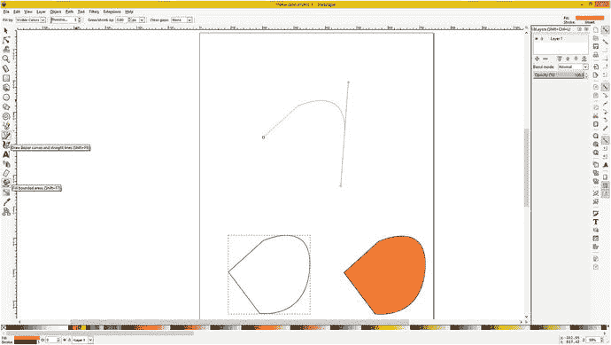
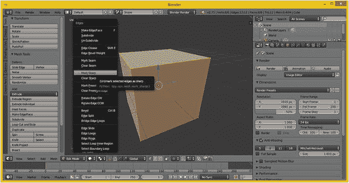
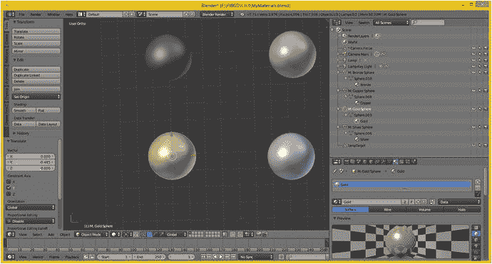
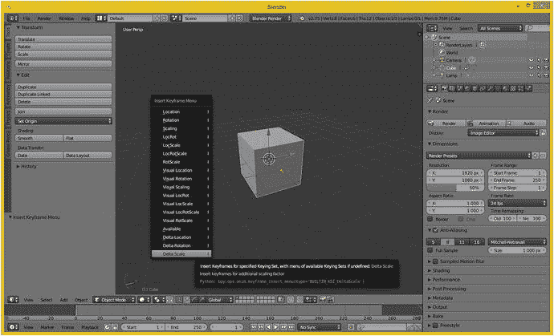
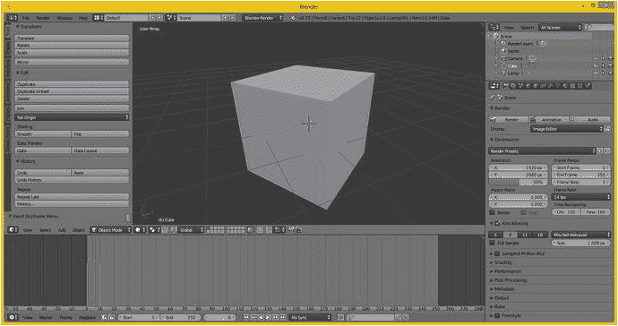

# 三、高级 3D 内容渲染：3D 素材概念和原则

现在，您已经了解了 2D 新媒体开源内容开发软件包(GIMP、Lightworks、Audacity 和 DaVinci Resolve)所基于的 2D(光栅和音频)内容开发概念和原则，我们将在本章中通过了解 Inkscape (2D 矢量或形状)、Blender (3D 矢量或多边形)和 Fusion (2D 和 3D 视觉效果)来结束对新媒体素材的学习。我们之所以在本章而不是在 2D 内容章节中介绍 Inkscape 2D，是因为我们可以使用关于 2D 矢量图形如何工作的基本概念作为 2D 矢量图形和 3D 矢量图形之间的概念桥梁。这是因为 3D 向量的工作方式就像 2D 向量在 2D X 和 Y 维度中的工作方式一样，只是在 3D X、Y 和 Z 维度中。出于这个原因，我们将从学习 Inkscape 2D 矢量插图或数字插图开始本章，这样我们就可以建立在 2D 矢量知识的基础上，然后学习更复杂的 3D 矢量图形软件包。

我首先介绍顶点(点)和样条线(连接点的直线或曲线)的基本概念，因为它们为 2D 形状或 3D 几何图形提供了基础。这很重要，因为这是你决定成为 2D 矢量插画师或 3D 矢量建模师(或者两者都是)的基础。使用顶点和样条线可以成为一个完整的职业，所以一定要掌握前几节。

接下来，我们将进入你如何把一个空的 2D 形状或者一个 3D 线框变成一个立体的东西。这是通过对 2D 形状使用颜色填充、渐变或图案填充(这些也可以用于 3D 模型)以及对 3D 几何图形使用纹理贴图来完成的。纹理贴图使用 UVW 贴图将 2D 纹理贴图定位到 3D 几何体上。

在我们涵盖了适用于 2D 和 3D 空间的所有概念之后，我们可以进入只在 3D 中遇到的事物。其中包括 3D 渲染，这是将 3D 模型转换为 3D 图像的过程，3D 模型具有 3D 几何图形以及附有 3D UVW 纹理映射坐标的 2D 纹理映射。我把 3D 图像称为静态 3D，因为 3D 技术被用来制作不移动的图像，因此是静态的或固定的。还有 3D 动画，其特点是运动，很像数字视频，以及交互式 3D (i3D)，其中编程逻辑嵌入在 3D 对象或场景层次中，这是 3D 的最高级。

动画进入第四维时间，就像数字视频一样，3D 动画为 3D 新媒体素材开发工作流程增加了另一层复杂性。3D 动画就像数字视频一样利用关键帧，因此所有这些相同的概念都适用，例如帧速率；它还有一些其他概念，如 JavaFX 支持的运动曲线，它可以改变加速和减速的速率，为 3D 动画和 JavaFX 中的 2D 动画提供逼真的运动，因为它们是独立的功能。

交互式 3D 包括将代码插入到称为场景图的对象层次结构中，场景图以分层格式保存资源、代码和其他元素。场景图是在 Amiga 时代由 3D 软件包发明的。开创这种设计和开发方法的 3D 软件包是 Realsoft OY 的 Real 3D，今天称为 Realsoft 3D。幸运的是，JavaFX 9 还具有广泛的场景图形 API，这使它非常适合创建交互式 3D 和交互式 2D 游戏以及物联网应用。

## 互动 2D 素材:2D 矢量内容概念

还有一种类型的 2D 素材，我们没有在第 [2](02.html) 章中详细介绍，因为它的概念与 3D 直接相关，所以我决定从逻辑上把这一信息放在本章的开头，以便信息更好地流动。2D 和 3D 在顶点和样条线的使用上非常相似，我们将在接下来学习。2D 使用 X，Y 维度，这是一个平面(或平面区域，如果你愿意)，三维使用 X，Y，Z 维度(这是一个立方体区域，如果你愿意)。

因此，在本节中，我们将了解如何在 2D 空间中放置点或顶点，然后使用直线或曲线样条将它们连接在一起，并用纯色、颜色渐变或平铺图像图案填充闭合形状，从而创建 2D 矢量插图。JavaFX 9 提供了大量支持这些 2D 元素的 2D 类，以及一个用于导入所有这些 2D 数据元素的`SVGPath`类，如果您选择使用 Inkscape 的话。

您将使用 JavaFX APIs 在 Java 中使用的 2D 素材或对象通常被称为形状，尽管它们在技术上也是几何图形，因为形状本身就是几何图形！通常在行业中，3D 被称为 3D 几何，2D 被称为 2D 形状。2D 和 3D 素材的基础都是从空间中称为顶点的点开始的。这些是用(直)线或(非直)曲线连接的。接下来我们来看看这些。

### 平面上的点:2D 顶点、模型参考原点、枢轴点、虚拟点

现在不要激动——这不是《飞机上的蛇》的续集；这只是一个关于 2D 形状的基础的讨论，它像 3D 模型一样，是基于空间中的点。因为 2D 空间由一个 X，Y 平面组成，我们在一个 2D 平面上放置点。空间中的每个点在专业术语中称为顶点，因为这毕竟是 Pro Java 9 游戏开发。您可以在平面 X，Y 空间中使用这些顶点来创建 2D 形状，也可以在立方体 X，Y，Z 空间中创建 3D 几何体，我们将在本章稍后介绍。

我给这一节加副标题“平面上的点”的原因是因为顶点是用 2D 平面上的 X，Y 网格放置在 2D 空间中的，并且是在 3D 空间的 X，Y，Z 立方体区域中。这个 2D 网格的原点位于 0，0。通常这是屏幕的左上角，对于 3D 立方体区域，该参考原点将位于 0，0，0。

对于 2D 形状和 3D 对象，此原点可以重新定位，因此不同的包将从平面或立方体的不同角引用此网格。稍后您将在 JavaFX 中看到这一点，Java FX 有不同的引用坐标的方式。该平面或立方体区域内的另一个参考点用于 2D 或 3D 对象的旋转，称为轴心点。

例如，如果您希望锤子 2D 形状(或 3D 模型)在手柄末端附近旋转，就像它在现实生活中旋转一样，您可以通过将枢轴从 2D(或 3D)建模空间中的默认(中心)位置向下移动到锤子手柄的末端来实现这一点。对于这个应用，枢轴点将成为该对象轴的中心。枢轴点是素材需要如何旋转的参考原点，而网格(空间)原点将提供如何相对于彼此定位这些点的参考。因此，旋转算法将使用建模网格原点以及枢轴点位置。这些通常是不同的点坐标；然而，在某些情况下，它们可能是同一点。

原点和枢轴都使用轴来表示空间中的点。这个轴可以移动，在 3D 软件中看起来像一个星形，在 2D 软件中看起来像一个加号。事实上，轴实际上是 2D 形状或 3D 几何图形中的一个独立对象，它甚至可以像其他 2D 或 3D 对象元素一样，使用 JavaFX 和 Java 代码来创建与形状或几何图形如何随时间旋转相关的特殊效果。还有一个“虚拟点”，用于特殊效果和高级应用，非常类似于枢轴，但用于其他目的，也用轴来表示。在本书的后面，你会看到这个轴元素对于 Java 游戏是多么重要。

### 连接 2D 点:矢量线和样条曲线连接你的 2D 顶点

由于顶点在数学上是无限小的，这使得这些小点基本上是不可见的，你需要将它们连接起来，以制作一些你可以可视化的东西。最简单的体现是直线，称为矢量(在 3D 渲染中有时也称为光线)。向量从一个顶点开始向外投影，直到碰到第二个顶点，第二个顶点定义了向量的方向。矢量本身是直的，所以它被认为是直线，而不是曲线。正如你将要看到的，曲线在数学上比直线复杂得多。

由于我们经常想要一条无限平滑的曲线作为我们的 2D 形状或 3D 几何的一部分，我们将需要使用一种不同类型的数学构造，称为样条。样条曲线无限光滑的原因是因为它是一种使用数学方程定义的曲率，对于所有计算机程序员(鉴于本 Pro Java 9 游戏开发书的专业性质，我希望是所有人)，可以通过使用较小的数字(如使用浮点数而不是整数)来提高其分辨率。

大多数类型的样条的数学基础被称为贝塞尔曲线，它是以数学家皮埃尔·艾蒂安·贝塞尔的名字命名的，皮埃尔·艾蒂安·贝塞尔是 1910 年至 1999 年间的法国工程师。Pierre 是 3D 实体、几何建模和物理建模领域的创始人之一，也是表示曲线的专业领域的领导者，尤其是在 CAD CAM 和 3D 系统方面。贝塞尔曲线有几种数学格式，包括三次或二次贝塞尔曲线，它们是使用不同类型的数学方程定义的，这些方程定义了如何构造每条曲线。

这些曲线中最简单的是线性贝塞尔曲线，它可用于创建直线(矢量)射线，并且仅使用两个控制点来定义曲线。如果您可以仅使用线性贝塞尔曲线定义形状，您的游戏或物联网应用将使用更少的处理和内存。这是因为需要处理的控制点更少。正如你在图 [3-1](#Fig1) 的顶部所看到的，Inkscape 使用蓝色绘制控制点及其手柄。如果你想在 Inkscape 中试试这个，点击图 [3-1](#Fig1) 左侧所示的样条/直线工具，点击创建一个点，点击其他地方的第二个点添加一条直线，然后点击第三个点并拖动创建一条曲线！一旦你掌握了窍门，这就相当容易了；也就是说，事实是，你在本书中学到的一切都需要大量的练习才能达到专业水平。

图 3-1。

Creating an open shape in Inkscape using vectors and splines, closing that shape, and then filling the shape

要调整线性贝塞尔曲线的曲率，可以移动刚添加的顶点的两个手柄。如果你想要一条直线，只要点击添加顶点，直线就会把它们连接起来。另一方面，如果您想要制作一条曲线，请向下单击以添加顶点，并在单击鼠标的同时(按住鼠标)，拖出贝塞尔曲线控制点手柄。

第二种最复杂的贝塞尔曲线是二次贝塞尔曲线，以用于描述它的二次数学算法的类型命名。二次贝塞尔曲线有三个控制点，而不是两个，因此它需要更多的处理，但通过使用控制柄对“调整”曲线的曲率提供了更多的控制。

最复杂的是三次贝塞尔曲线，以用于描述它的三次数学算法的类型命名，它有四个控制点，而不是三个，因此它的处理更加密集，但同样，它对调整曲线的曲率提供了更多的控制。

在 Adobe Illustrator 中，控制点被细分为使用手柄和锚点。用于影响曲率的控制柄位置是控制柄。锚点是描述贝塞尔曲线开始和结束位置的顶点。Inkscape 对锚点使用了不同的术语，称之为节点。

还有一种称为 NURBS 或非均匀有理 B 样条的 3D 建模方法，它与贝塞尔样条表示法相关，但针对 3D X，Y，Z 空间的使用进行了优化。NURBS 更复杂，并且允许创建平滑、有机的 3D 几何图形表示。迈克尔·吉布森的 3D 灵感时刻是真正负担得起的 NURBS 建模工具之一，仅售 295 美元；它基于原始的 SGI Alias 波前 NURBS 建模 API。

### 填充形状内部:颜色填充、渐变和图案

如果使用这些顶点和样条线(或矢量/线)创建的 2D 形状是闭合的，那么它们可以填充各种东西，如纯色、颜色渐变或平铺图像图案。这显示在图 [3-1](#Fig1) 的底部。要闭合曲线，请绘制最终的矢量(直线)或样条(曲线)，直到鼠标光标位于起始顶点上，当该顶点发生变化时(在 Inkscape 中，它会从黑色变为红色)，向下单击以创建闭合的形状。要填充您刚刚在 Inkscape 中关闭的形状，请单击填充工具，它与样条线/线条工具及其工具提示一起显示在左侧，然后单击底部色板上的颜色，用该颜色填充所选形状。

Inkscape 和 JavaFX 使用的 2D 矢量图形文件格式是可缩放矢量图形(SVG ),所以如果您保存您的 Inkscape 项目，它将使用`.svg`扩展名，例如`ProjectName.svg`。如果你想了解更多关于 SVG 的知识，可以看看 Apress.com 的数字插图基础。接下来让我们看看 i3D 媒体素材，Java 8 和 9 使用 JavaFX 9 新媒体引擎完全支持这些素材。

## 交互式 3D 资源:3D 矢量内容概念

最高级类型的多媒体素材是交互式 3D 矢量对象，可以使用 Java 和 JavaFX API(类和方法)或使用这种方法与 3D 建模包(如第 [1](01.html) 章中讨论的那些)或 3D 动画包(如 Autodesk 3ds Max，这是我从其第一个版本开始使用的；3D Studio DOS 或者 Blender，已经接近类似水平的专业功能)。i3D 素材由 3D 矢量几何图形组成，使用 2D 光栅图像进行表面处理(我们在第 [2](02.html) 章中了解到)，并在其模型和场景层次结构中包含编程逻辑，这将使它们变得栩栩如生。

在本章的这一节，我们将学习 3D 物体如何从网格到表面模型。我们还将在本章中查看动画、运动曲线、对象层次、轴放置、虚拟对象、粒子系统、流体动力学、头发和毛发动力学、刚体动力学、软体动力学、布料动力学、绳索动力学以及相关的 3D 主题。如你所见，3D 是迄今为止最复杂、最有趣的新媒体类型。

通过使用场景图形对象层次结构内部的编程逻辑，可以进一步使这些 3D 对象具有交互性，场景图形对象层次结构定义了 3D 对象的每个部分将做什么，并且是 JavaFX 9 的一个组成部分。让我们从头开始。我将向您展示 3D 素材从 3D 几何体到 3D 模型、3D 层次结构再到 3D 对象的各种属性。这是最复杂的多媒体，也是 HTML5(使用 WebGL2)、Android 8(使用 Vulkan)以及 Java 8 和 JavaFX 中最不常见的新媒体素材类型。

### 3D 的基础:网格的几何学

与 2D 形状新媒体元素一样，3D 新媒体元素的最低层是顶点以及这些顶点之间的连接。在 3D 中，你仍然有顶点，但是它们之间的连接变得有点复杂。在 2D 中，顶点、向量(射线或直线)和它们之间的样条线(曲线)是空的(未填充的)、封闭的形状或开放的形状，它们不能被填充，因为它们是开放的，并且会溢出。3D 几何图形之间的连接(在纹理映射之前，在 3D 行业中有时被称为网格或线框，因为这是 3D 几何图形在纹理映射或蒙皮之前的样子)，被称为顶点之间的“边”和边之间的“面”。

#### 空间中的点:三维顶点的原点

就像 2D 顶点(在 Illustrator 中称为锚点，在 Inkscape 中称为节点)一样，顶点是 3D 几何和有机(NURBS、Catmull-Rom 样条线和散列面片)建模的基础。顶点定义模型的基础结构(无论是边还是样条)在 3D 空间中的位置，在 3D 中，顶点数据可以保存表面颜色数据、法线数据、UVW 纹理映射数据和顶点 XYZ 位置数据。熟悉 3D 扫描仪的人可能会熟悉点云这个术语，所以顶点仍然是我们在 3D 行业所做的一切的基础。

对于 Java 8 和 9 编码，JavaFX 9 有一个`VertexFormat`类，可以保存顶点数据，包括你的顶点位置，法线信息(我们很快会涉及法线)，以及 UVW 纹理映射坐标。因此，您可以通过使用 Java 代码为 Java 9 游戏或物联网应用放置顶点，也可以使用 3D 建模器，如 Daz Hexagon、MoI 3D 或 Nevercenter SILO，或者 3D 建模和动画包，如 Blender 或 Autodesk 3ds Max。

#### 连接 3D 顶点:边桥接 3D 顶点

大多数 3D 几何图形使用称为边的东西来连接两个顶点。一条边是一个矢量或直线，所以它看起来像 3D 空间中剃刀的边缘。形成一个多边形需要三条或更多的边，这是我们接下来要讲的。建模三维几何图形时，可以选择顶点、边、多边形或整个对象。

如果您已经使用更高级的基于样条的建模范式创建了 3D 几何体，例如使用 MoI 3D 的 NURBS、使用 SILO 2 的四边形(仅 160 美元)或使用 Animation:Master 的散列面片(仅 80 美元)，您将需要将这些格式抽取为多边形或三角形，这将在接下来进行介绍。抽取过程将这些范例中使用的无限平滑的曲线变成了直边的集合。这是使用抽取(平滑度)数值因子(滑块或设置)完成的，该因子通常在文件导出函数中提供，该函数将样条线建模格式从基于曲线的建模器输出到多边形几何模型格式。

#### 创建曲面:三条边形成多边形，四条边形成四边形

将三条边以三角形的形式放在一起后，您就有了一个多边形，它可以作为一个表面来承载皮肤或纹理，使 3D 数据看起来更真实。多边形有时被称为三角形、三角形或面形，一些建模者使用被称为“四边形”的正方形多边形如果您的渲染引擎像 JavaFX 和它的`TriangleMesh`类一样需要三角形，您可以将四边形抽取成三角形。在这种情况下，抽取算法相当简单，因为它只是在四边形曲面的两个对角之间插入一条边，从而创建两个角度特征相等(镜像)的三角形。最佳三角形来自正方形多边形，并且具有 45-45-90 度的拐角角度配置。经验法则是，三角形越均匀(正方形)，渲染得越好，而“狭长”或长而细的三角形可能会导致渲染瑕疵，但通常不会。

一旦你有了一个表面(通常是一个三角形，如图 [3-2](#Fig2) 所示)，基本立方体上的面是四边形，并且你已经定义了它的法线(我们接下来会了解)，那么你就可以应用纹理贴图了。我们将在本章的下一个主要部分讨论纹理映射。还有另一个与相邻多边形或面相关的原则，叫做平滑组，我们将在讨论完曲面法线后再来看看。因此，至少，一个表面(多边形，三角形，四边形，面)将拥有一个法线，一个或多个纹理贴图，和一个平滑组。

图 3-2。

Use the “Display face normals as lines” button to show direction normals for each quad face as light blue lines

#### 指定表面朝向的方向:表面法线的概念

如果你知道如何在你的 3D 软件中打开“显示法线”功能，你可以看到面表面的法线，它将显示为一条从面的中心出来的线，正如你在图 [3-2](#Fig2) 中看到的浅蓝色。

Blender 2.8 中也有用于显示顶点法线的切换(按钮)，顶点法线从顶点指向外，因此对于该模型，顶点法线从立方体的角(45 度)对角指向外，这与面法线的结果完全相反，面法线从面(曲面，四边形)的中心出来，指向直上(90 度，直上，像摩天大楼一样)。正如你在图 [3-2](#Fig2) 中看到的，显示的两条法线实际上与 x 轴(红色)和 y 轴(绿色)对齐，它们与立方体成 90 度相交。

轴向导位于 3D 编辑模式视图的左下角，它也显示在 Blender UI 左下角的 XYZ 轴向导下。这个表面法线的功能相当简单；它告诉渲染引擎表面面向哪个方向。在这种情况下，这个立方体将渲染为一个立方体，无论你给它什么纹理(皮肤)来着色。同样的逻辑也适用于顶点法线；它将显示渲染引擎处理 3D 几何图形的哪一侧进行表面渲染。

如果这个立方体几何体中的法线指向内部而不是外部，那么立方体在渲染时将完全不可见。在 3D 软件中有一个翻转法线操作(算法),用于通用地反转模型的法线方向(所有法线翻转 180 度)。这将在渲染场景时使用，渲染场景时导入的对象不可见。

当 3D 导入工具将导入的 3D 几何体的法线指向(翻转)错误的方向时，或者当其他 3D 工具的导出器将法线导出到错误的方向(相对于导入法线的软件)时，会出现翻转的法线。这在你的 3D 工作流程中是很常见的，所以如果你要经常在 3D 或者 i3D 中工作的话，至少要使用几次翻转法线功能。

如果你需要一些东西(比如一座房子)，其中的 3D 几何体必须从外部和内部渲染，这在 i3D(比如虚拟世界)中很常见，你必须创建双面的几何体，尤其是面。然后你需要应用一个双面纹理贴图和 UVW 贴图，我们将在本章的下一节讨论 3D 纹理贴图的概念和技术时涉及到。

值得注意的是，对于 i3D，具有双面纹理的双面几何图形需要更多的渲染引擎处理，并且渲染是基于用户对交互式 3D 环境、世界或模拟的探索而实时实现的，因此 JavaFX 将同时导航、处理和渲染 i3D 场景，这需要大量的处理器周期才能顺利完成，因此数据优化非常重要。

虽然可以在 JavaFX 中为顶点指定法线，但是法线通常是基于每个面指定的。这就是为什么`VertexFormat`类有两种格式的原因。一个支持定义一次法线的多边形的位置和纹理，因为使用三个顶点定义法线不如只使用一个面有效，另一个是当你想使用顶点而不是多边形定义法线时的`VertexFormat`数据格式。

#### 平滑曲面:使用平滑组使多边形看起来像样条曲线

你可能见过被渲染为实体(而不是线框)的 3D 模型，但看起来仍然像是被凿过的；也就是说，您可以看到渲染的多边形(面)就像它们是平面一样。在这种情况下，渲染引擎关闭了平滑。如果在启用平滑的情况下进行渲染，这种效果会消失，几何体看起来就像预期的那样，无限平滑，就像是使用样条线创建的，而实际上是使用多边形。让渲染引擎进行平滑会更有效，因此有一个称为平滑组的东西，它应用于每个面，告诉渲染器何时在两个面之间进行平滑，何时不进行平滑，这就留下了通常称为接缝的部分。平滑组使用简单的整数。如果数字在面的每一侧都匹配(对于该边相对侧的每个相邻面)，则渲染为平滑过渡(颜色渐变)。如果数字不同，它将呈现为一条接缝；也就是说，该边清晰可见，因为该边每一侧的颜色渐变是不同的(颜色渐变在两个面上不是无缝的，也称为多边形)。

在某些 3D 软件包中，例如 Autodesk 3D Studio Max，您可以在用户界面中看到该平滑组编号模式，并且可以实际选择每个边旁边使用的(整数)编号。您也可以选择边两侧的数字，这是一种更复杂的方法，但为 3D 建模师提供了更精确的平滑控制。

在 Blender 等其他工具中，编号是隐藏的，平滑组功能是通过使用“标记接缝”、“清除接缝”、“标记锐化”和“清除锐化”等命令来“显示”的。这些命令可以在 Blender Edges 菜单中找到，如图 [3-3](#Fig3) 的左侧所示，其中标记锐化选项显示为淡蓝色。

图 3-3。

Set edge smoothing in Blender using the Edges menu (Ctrl-E when in Edit Mode) command called Mark Seam or Mark Sharp

在 Blender 中，一些 3D 建模者(人，而不是软件)会犯错误，试图通过实际分割 3D 几何图形本身的边缘来暴露其 3D 几何图形中的接缝或锐边，这将实现这种视觉效果，但也可能在 3D 几何图形拓扑优化工作过程中引起问题。如果您熟悉映射中使用的术语拓扑，拓扑非常相似，指的是如何构建 3D 几何图形，以及如何渲染，因为渲染引擎是“基于数学的”，就像 3D 几何图形一样。

3D 模型的拓扑是 3D 几何图形的构造，即顶点、边和面相对于彼此放置的位置，或者是基于样条的有机 3D 模型的构造，其中放置了控制点、控制柄和类似的基于样条的拓扑(以及它们的放置顺序)。换句话说，3D 建模是复杂的！

通过使用 Blender 中的“标记接缝”或“标记锐边”修改器，可以避免分割几何体边来实现接缝。这些特定的混合器修改器实际上是基于平滑组的，因此实现了这种平滑(或边缝)效果，而不会实际影响 3D 几何体拓扑。

Blender 修改器在渲染之前应用，因此不会影响基础 3D 几何体的实际数学拓扑。Blender 修改器始终是一种更灵活的 3D 内容创建方法，因为它在渲染引擎级别应用平滑(或任何其他所需的效果)，而不是在 3D 几何体拓扑级别，使 3D 网格保持完整。就像在 Pro Java 9 游戏开发(和物联网设计)中的任何事情一样，如果你能实现预期的效果和最终结果，越简单越好，因为越简单就意味着处理器开销越少。

### 蒙皮你的三维模型:2D 纹理映射概念

完成 3D 几何图形(3D 模型的基础)后，您可以对其应用纹理贴图，为 3D 模型创建实体外观，并为其添加细节和特殊效果，使其外观越来越逼真。如果您想知道 3D 几何图形和 3D 模型之间的区别，3D 几何图形只是网格或线框，而 3D 模型可以(应该)应用纹理贴图。如果您购买第三方 3D 模型，您希望它们看起来像您渲染它们时的样子，而不仅仅是纯灰色，这是在没有应用任何纹理映射(和没有顶点颜色)信息的情况下渲染的模型的样子。事实上，你会在网上找到的一些 3D 模型(免费或付费)甚至没有应用平滑组，所以你会有一些面，一些平滑，一些纹理到不同层次的细节。有些甚至可能翻转了法线，甚至不会出现在 3D 场景中，直到您对它们应用翻转法线操作或修改器。通常，您必须对任何预先存在的模型进行额外的建模、平滑和纹理映射工作，而不是从头开始创建。我通常尝试从头开始创建一切，因此我可以控制并熟悉底层的 3D 几何拓扑，以及如何将我的平滑组、UVW 贴图坐标、着色器和纹理贴图应用于模型。我们将在本节中讨论所有这些内容。

#### 纹理贴图基础:概念，通道，阴影，效果和 UVW 坐标

纹理映射与正确创建几何拓扑一样复杂；事实上，3D 的每一个领域都同样复杂，这就是为什么 3D 是迄今为止最复杂的新媒体类型，也是为什么 3D 故事片雇佣艺术家来专门关注(工作)和处理我们在本章中看到的每一个领域。纹理映射是 3D 建模中能够使用 2D 矢量或 2D 光栅图像资源的主要领域之一。

值得注意的是，3D 纹理映射还有一个更复杂的领域，也称为纹理，它使用 3D 纹理算法，通常称为体积纹理，来创建贯穿 3D 对象的纹理效果，就好像它是一个实心的而不是空心的(这里是双面的)3D 对象。

纹理映射背后的基本概念是采用 2D 素材，例如我们在上一章中了解到的素材，并将这些 2D 素材应用到 3D 几何体的表面。这是通过使用 UVW 或 3D 映射坐标来实现的，以显示您希望 2D 图像(平面)如何定向或投影到您的 3D 几何表面拓扑上。现在，我想让你迅速从书上抬起头来，对听得见的人喊道:“我真的需要将这个样条拓扑抽取为多边形拓扑，以便我可以使用 UVW 纹理映射坐标将着色器应用到生成的几何体上，并将这个 3D 模型导出到我的 JavaFX 场景图形层次中。”然后继续阅读，就像什么都没有发生过一样，即使你刚刚向每个人展示了你的互动多媒体制作天才。

您可以使用纹理通道将多个纹理贴图添加到 3D 几何体的表面，纹理通道类似于您在 2D 图像合成软件中使用的图层。JavaFX 目前支持四个最重要的纹理通道:漫反射纹理贴图(基本的 ARGB 颜色值)，镜面纹理贴图(表面有光泽或暗淡)，照明纹理贴图(也称为发光贴图)，以及凹凸纹理贴图。

3D 软件包支持其他纹理贴图通道类型，以获得额外的纹理贴图效果。为了能够将这些引入 JavaFX，您必须使用一个称为烘焙的过程。烘焙纹理贴图包括将所有尚不支持的纹理通道渲染到一个单一的漫反射纹理贴图中，因为这是 JavaFX 8 和 9 支持的。这与您在更高级的 3D 动画包中获得的视觉效果非常相似。

正如你在图 [3-4](#Fig4) 中看到的，Blender 2.8 也使用场景图，就像大多数现代 3D 软件包一样，JavaFX 也提供这种场景图功能；我们将在第八章[中讲述它。球体几何体和纹理贴图在场景图形层次中组合在一起，这是我为您展开的。](08.html)

图 3-4。

Using a Scene Graph (right) to apply a gold texture map and shader (bottom) to a sphere object in Blender

随着时间的推移，理想情况下，JavaFX 9 将添加更多的纹理通道支持，并为开发人员提供更多关于 3D 新媒体资源使用的视觉灵活性，因为透明区域(不透明贴图)和表面细节(法线贴图)是关于高级纹理映射支持的两个最重要的区域。这些最终需要使用 JavaFX API 添加到 Java 中，以便开发人员能够为 Java 游戏创建逼真的 i3D 模型。

纹理通道的集合和控制这些通道相互关系的任何代码，以及它们相对于彼此如何合成、应用和渲染，称为着色器定义。着色器在 3D 行业中也通常被称为材质。在本章的下一节，我们将讨论着色器和着色器语言，因为这是 3D 和 i3D 游戏开发的另一个专门而复杂的领域。我还在我的书《VFX 基础》(Apress，2016)中使用开源 Fusion 8.2.1 详细介绍了着色器构造。

最后，一旦在着色器中定义了纹理，您将需要将这些 2D 素材定向到您的 3D 几何图形，这是通过使用纹理映射坐标来完成的，通常通过称为 UVW 映射的东西来完成，在我们继续进行第四维和动画之前，我们也将在它自己的特定部分中进行介绍。

#### 纹理贴图设计:着色器通道和着色器语言

着色器设计本身就是一种艺术形式；成千上万的着色器艺术家在 3D 电影、游戏和电视节目中工作，确保用于“着色”或“蒙皮”3D 几何图形的着色器使最终的 3D 模型看起来尽可能真实，这通常是 3D 的目标，以取代更昂贵的摄像机拍摄(和重拍)。

基本着色器由一系列 2D 矢量形状、2D 光栅图像或体积纹理组成，保存在不同类型的通道中，这些通道应用不同类型的效果，如漫反射(颜色)、镜面反射(光泽)、发光(照明)、凹凸(地形)、法线(高度)、不透明度(透明度)和环境(环境)贴图。体积着色器本质上也是 3D 的，因此不使用 2D 图像作为输入，而是使用复杂的算法定义来产生穿过 3D 对象的 3D 着色器，这就是为什么它被称为体积着色器。这些 3D 体积着色器也可以设置动画，并可以根据它们在 3D 空间中的位置来更改颜色和透明度。

在此基础上，高级着色器语言(如 Open GL 着色器语言(GLSL))使用代码来指定这些通道如何相互关联，如何应用或处理这些通道中包含的数据，以及如何基于复杂因素(如时间、方向或 3D 空间中的位置)在这些通道中提供其他更复杂的数据应用。着色器的复杂特性也意味着着色器的渲染时处理更加耗时，并且处理周期越长，着色器就变得越复杂。所需的处理器周期通常很昂贵，因为复杂的着色器能够产生照片级的真实效果。

这可能是 JavaFX 9.0 目前支持四种基本(也是最容易处理的)着色器的主要原因。随着硬件变得更加强大(你会在更多的消费电子产品中看到六核、八核和十核 CPU)，JavaFX 可能会添加最后两个重要的着色器通道:不透明度(或透明度映射)和法线映射。

#### 纹理贴图方向:纹理贴图投影类型和 UVW 坐标

将 2D 纹理贴图通道中的细节特征(尤其是基本的漫反射颜色通道)与 3D 几何体正确对齐是非常重要的，否则在渲染时会出现一些非常奇怪或至少视觉上不正确的结果。这需要在 3D X，Y，Z 空间中完成，特别是对于体积纹理和 2D 纹理，以定义它们如何投影到或包围 3D 几何图形。

最简单的方法之一是应用纹理贴图的投影类型和相关设置，这将自动为你设置 UVW 贴图的数值。这些 UVW 地图坐标值将定义 2D 影像平面如何映射到 3D 空间中的 3D 几何上，这是 2D 空间和 3D 空间之间的一种桥梁，并且可以手动设置或调整 UVW 浮点值以微调您的视觉效果。

其中最简单的是平面投影，您可以将它想象为好像您的纹理贴图在 3D 对象的前面，并且您用灯光穿过它，因此它看起来像漫反射纹理贴图中的颜色在 3D 对象上。平面投影对于计算机来说是最简单的处理方式，因此如果您能够获得专业 Java 游戏或物联网应用所需的结果，请使用它。但是，它通常用于静态渲染的 3D 影像，因为一旦您将(相机)移动到 3D 模型的侧面，这种类型的投影贴图就不会提供照片级的真实效果。

相机投影类似于平面投影。相机投影将您的纹理从相机镜头(100%平行于镜头)投影到 3D 对象表面，就像幻灯机一样。这可以用于在场景中投影视频背景，以便您可以在它们面前建模或最终制作 3D 素材的动画。如果相机移动，相机投影与镜头前部保持平行。这有时被称为广告牌模式(或投影)。

下一个最简单的是圆柱投影，它比纹理贴图从一个方向到 3D 对象的(固有的)2D 平面投影提供了更多的纹理贴图的 3D 应用。一个圆柱体将围绕你的对象，在上下(z 轴)维度上，将图像投射到你的对象周围！所以，如果你绕着它走，在另一个维度上会有独特的纹理细节，这是平面投影所不能提供的。

一种更复杂的投影叫做球面投影。这提供了比从 X 和 Y 方向沿着 Z 维度将纹理贴图圆柱投影到 3D 对象上更完整的 3D 纹理贴图应用。球形投影试图处理所有三个(X，Y，Z)轴投影方向。

与球形投影类似的是立方体投影，它类似于立方体格式的六个平面投影；这给出了类似于球形投影的结果。将立方投影应用于 3D 对象时，对象的面会根据多边形法线的方向或与面的接近程度指定给立方纹理贴图的特定面。然后使用平面投影方法从立方体纹理贴图的每个面投影纹理，或者对于一些 3D 软件包可能使用球形投影贴图。

如果使用体积纹理，空间投影是三维 UVW 纹理投影，它通过 3D 对象的体积进行投影。它通常与需要内部结构的材质(如木材、大理石、海绵、玛瑙等)的程序纹理或体积纹理一起使用。如果使 3D 对象变形或变换相对于 3D 对象的纹理映射坐标，将会显示体积或程序纹理的不同部分。

还有一个更简单的纹理贴图叫做 UV 贴图(没有 W 维度)。这将纹理应用于二维，而不是三维，并且更容易处理，因为它的数据更少。我们可能会使用 3D 软件在 JavaFX 外部映射我们的 3D 模型，然后使用模型导入器将已经纹理映射的 3D 对象导入到 Java 中，因为从 JavaFX 8 开始，一些更高级的 3D 映射支持的类尚未添加到 JavaFX API 中。

### 为 3D 模型设置动画:关键帧、运动曲线和 IK

创建 3D 几何体并使用着色器和贴图坐标对其进行纹理贴图后，您可能希望使其以某种方式移动，例如飞行飞机模型。您在第 [2](02.html) 章中学到的关于数字视频素材和 2D 动画素材的概念同样适用于 3D 动画。

#### 线性动画:轨迹、关键帧、循环和范围

最简单的 3D 动画类型，和 2D 动画一样，是线性动画，它适合许多类型的动画。图 [3-5](#Fig5) 显示了如何在 Blender 2.8 中使用插入关键帧菜单向立方体对象添加关键帧。

图 3-5。

Using the Insert Keyframe Menu in Blender 2.8 with a Cube object selected to add a Delta Scale keyframe

键盘上的 I 热键用于访问此插入关键帧菜单，并选择立方体对象。大多数 3D 软件包都有通常所说的轨迹编辑器，允许您向轨迹添加关键帧和运动曲线。每个轨迹将与一个 3D 模型相关，如果您的 3D 模型使用子组件分组，那么将有组和子组以及组或子组内的单个组件的轨迹。

线性动画使用的处理能力最少，因此效率最高。如果可以使用线性动画来实现动画目标，请尽可能使用最少数量的轨迹和最少数量的关键帧，因为这将使用最少的系统内存。

如果动画运动是重复的，使用无缝循环而不是长距离。一个无缝运动循环比包含同一运动的多个副本的长范围占用的内存少。对于线性动画来说，使用循环是一个很好的优化原则。接下来，让我们看看一些更复杂的动画类型，包括非线性动画(在一条直线上，具有均匀间隔的关键帧)以及角色动画和程序动画，这些动画用于刚体或软体物理(物理)模拟、布料动力学、头发和毛发动力学、粒子系统和流体动力学等。

#### 非线性动画:运动路径和运动曲线

更复杂类型的非线性动画不太规则，通常看起来更真实，尤其是在涉及人体运动和简单物理模拟的情况下，它将为动画 3D 对象或元素(层次结构中的子对象)实现移动路径。JavaFX 有一个`Path`类，可以用作你自己的复杂动画或游戏精灵运动的运动路径。为了给沿该路径的运动增加更多的复杂性，可以使用运动曲线，以便运动本身可以加速或减速，模拟重力和摩擦等情况。使用这些运动曲线可视化表示的数学算法被称为插值器，JavaFX 有一个`Interpolator`类，包含各种最标准的(如果有效使用，仍然非常强大)运动曲线算法。

非线性不规则运动关键帧的一个很好的例子是一个橡胶球在弯曲的道路上反弹。道路的弯曲路径将使用您的运动路径来确保球停留在道路曲率上，并且球地板符合道路的坡度(角度)。球的反弹将使用运动曲线，有时也称为运动插值器，以使每次反弹看起来更真实，因为它在空间中的运动随着时间的推移而加速和减速。在这种情况下，这将控制你的球对地面的反应。

图 [3-6](#Fig6) 显示了屏幕底部的 Blender 时间线编辑器；您可以看到两个旋转关键帧显示为垂直黄线，当前帧设置显示为垂直绿线。

图 3-6。

The Blender 2.8 Timeline Editor , with two keyframes at frame 0 and frame 10, and the current frame 6 setting

包含许多交互元素的复杂物理模拟无法使用关键帧来完成，尽管如果您有大量时间，理论上是可行的；然而，这是无利可图的(不值得你浪费时间)。就像将运动曲线应用于关键帧回放利用插值算法一样，程序动画算法更进一步，不仅影响关键帧的计时，还影响关键帧数据本身(X、Y、Z 数据、旋转数据、缩放数据等)。).

因为程序动画是以算法的形式出现的，所以它非常有效，因为一旦算法被创建，它就可以被一次又一次地使用，而不需要额外的工作。这些程序动画算法在 3D 中创建了许多特殊效果类型，包括刚体动力学和软体动力学(物理模拟)、绳索和链条动力学、布料动力学、头发和毛皮动力学、粒子系统、流体动力学、肌肉和皮肤弯曲动力学、对口型动力学和面部表情动力学。我们将在稍后介绍程序动画，因为我们在这一章的每一节都是从较低级的概念发展到较高级的概念。

接下来让我们概括一下角色动画；这是 JavaFX 可能支持的下一种动画类型，因为 JavaFX 导入程序支持导入更复杂类型的 3D 数据，包括高级类型的动画，如角色动画。

#### 角色动画:骨骼、肌肉、皮肤、正向和反向运动学

更复杂的动画类型是角色动画，角色动画制作人是 3D 电影、游戏或电视内容制作团队中最受欢迎的职位之一。角色动画涉及许多复杂的层，包括为角色的骨骼设置“骨骼”层次，使用反向运动学来控制骨骼(角色)的运动，将肌肉附加到骨骼并定义它们如何弯曲，将肌肉附加到皮肤，甚至添加衣服和布料动态以穿着角色。在 3D 角色动画中，事情以与现实生活中非常相似的方式完成，以便逼真地模拟现实生活，这通常是 3D、i3D 和 VR 试图做的事情。

因此，使用角色动画来模拟生物就像不使用直接编码的动画一样复杂，正如你现在所知道的，这被称为程序动画。

在角色动画的最底层，你有骨骼；骨骼使用反向运动学算法，告诉骨骼它的运动范围(旋转)，这样你就不会像《驱魔人》中那样肘部弯曲或头部旋转！你猜对了，骨骼以层次结构连接成骨架。该骨架是您稍后为角色设置动画(关键帧)的对象。您还可以通过将肌肉和皮肤附加到骨骼来模拟肌肉和皮肤，并定义骨骼运动将如何为角色弯曲肌肉和拉伸皮肤。正如您可能想象的那样，设置所有这些是一个复杂的过程；这是角色动画的一个领域，叫做索具。如果你需要添加服装，有一个新的 3D 领域叫做 cloth dynamics，它定义了服装在风中如何移动、起皱和吹动，还有类似的程序动画算法，旨在增加真实感。接下来让我们看看这个，以及其他一些类似的高级程序动画和模拟 FX 算法。

#### 程序动画:物理，流体或布料动力学，粒子系统，头发

最复杂的动画类型是程序动画，因为它需要使用代码来完成，编写计算 3D 向量和矩阵以及物理和流体动力学方程的代码与游戏编程代码一样复杂，如果不是更复杂的话(取决于游戏的复杂性)。在 3D 包中，这种编码通常使用 C++、Python 或 Java 来完成，而 Pro Java 9 游戏开发中的程序化 3D 动画将通过使用 Java 9 APIs 和 JavaFX 8 APIs 的组合来完成。程序化是最复杂但也是最强大的 3D 动画类型，这也是为什么程序化动画程序员是目前 3D 电影、游戏、物联网和互动电视(iTV)行业中另一个更受欢迎的 3D 职位空缺的原因。

3D 建模和动画包中有许多“功能”,如 Blender 或 3D Studio Max，它们实际上是程序动画算法插件，向用户展示用户界面以指定参数，这些参数将在程序动画应用于 3D 模型或复杂的 3D 模型层次(通过使用 3D 软件或 JavaFX 场景图创建，如图 [3-4](#Fig4) 右侧所示的场景图)时控制程序动画的结果。我们刚刚讨论了一个复杂的骨骼-装配-肌肉-皮肤角色模型层次，可以将 cloth dynamics 应用于该层次，以使服装在 3D 角色奔跑、战斗、驾驶、跳舞等时逼真地移动。

程序动画算法控制的功能(其中许多包括真实世界物理模拟支持)的示例通常添加到高级 3D 动画软件包中，包括 3D 粒子系统、流体动力学、布料动力学、绳索动力学、毛发动力学、软体动力学和刚体动力学。

### JavaFX 3D 支持:几何图形、动画和场景包

JavaFX 中有三个顶级包，包含对 2D 和 3D 新媒体资源类型的所有支持。javafx.geometry 包使用 Point2D 和 Point3D 类支持低级 3D 几何构造，例如顶点，使用 Bounds 和 BoundingBox 类支持区域。javafx.animation 包使用时间轴、关键帧、关键值和插值器类支持时间轴、关键帧和运动曲线等低级动画构造。javafx.scene 包包含了许多嵌套包，我喜欢称之为子包，包括用于 2D 或 3D 形状构造的 javafx.scene.shape，如 Mesh、TriangleMesh 和 MeshView 类；javafx.scene.transform 包支持 2D 和 3D 变换，包括旋转、缩放、剪切和变换类；javafx.scene.paint 包包含着色类，如 Material 和 PhongMaterial 类；以及 javafx.scene.media 包(MediaPlayer 和 MediaView 类)。

#### JavaFX API 3D 建模支持:点、多边形、网格、变换、着色

我将把 JavaFX 3D 素材支持分成两个图，一个用于静态 3D(渲染图像)，一个用于动态 3D (3D 动画)。Interactive 3D 将使用 JavaFX 3D 的所有功能以及一些 Java API 功能。第一个图，图 [3-7](#Fig7) ，展示了 JavaFX 包支持的四个主要领域。对于创建可用于静态 3D 影像的 3D 模型，以及用于动画 3D 的其他 JavaFX APIs 和用于交互式 3D 游戏、物联网应用和 3D 模拟的 Java APIs，这些都非常重要。

图 3-7。

High-level diagram of JavaFX 3D modeling asset support for geometry, shape, transform, and texture map

`javafx.geometry`包包含 Java 和 JavaFX 中所有 3D 或 2D 几何图形的基础，即顶点(点)和空间(边界)。`Point2D`类支持顶点(2D 空间中的一个点)和向量(2D 空间中从一个点发出的一条线)表示。一个`Point3D`类也支持顶点(3D 空间中的一个点)和向量(3D 空间中从一个点发出的一条线)表示。`Bounds`超类表示 JavaFX 场景图节点及其包含的对象的边界。`Bounds`超类的`BoundingBox`子类包含场景图形节点对象在 2D 或 3D 空间中的边界的更专业的表示。

`javafx.scene.shape`包包含用于创建 3D 几何图形的`Mesh`、`MeshView`和`TriangleMesh`对象(类)，而`javafx.scene.transform`包包含用于将 3D 空间变换应用到 3D 空间中的 3D 几何图形的旋转、缩放、剪切和变换对象(类)。javafx.scene.paint 包包含 Material 和 PhongMaterial 对象(类),允许您使用不同的着色器算法在 javafx 中对 3D 对象进行纹理处理。接下来，让我们仔细看看 JavaFX API 为我们提供了什么来支持第四维时间，以便我们可以为您的 Pro Java 9 游戏(或物联网应用或 3D 模拟)添加 3D 动画功能。

#### JavaFX API 3D 动画支持:时间轴、关键帧、键值、插值器

正如您可能想象的那样，在 JavaFX 中实现 2D 和 3D 矢量动画的大多数关键类(没有双关语)都存储在 javafx.animation 包中，如图 [3-8](#Fig8) 所示。例外情况是 Camera 超类及其两个子类 PerspectiveCamera(透视投影)和 ParallelCamera(正交投影)。时间轴对象(类)保存动画定义，动画定义由关键帧对象(类)组成，关键帧对象又由包含实际变换指令数据的 KeyValue 对象组成。一个关键帧对象可以保存一个 KeyValue 对象数组，因此一个关键帧可以保存几个不同的 KeyValue 转换数据对象。还有一个插值器类，它包含许多高级算法，用于将运动曲线应用到时间轴对象内部的关键帧对象。目前支持的插值算法包括离散或离散时间插值、EASE_IN 和 EASE_OUT 以及 EASE_BOTH(缓入缓出)和线性直线(均匀间隔)插值，这显然是处理强度最低的。

图 3-8。

High-level diagram of JavaFX 3D animation support , showing javafx.animation and javafx.scene packages

现在你已经对 2D 矢量插图和三维矢量渲染和动画概念有了一个坚实的(三维)概述，在我们进入第 [4](04.html) 章的游戏理论、概念、优化等之前，我们将稍微休息一下。

## 摘要

在第三章中，我们仔细研究了一些与 2D 矢量插图和 3D 矢量渲染、纹理和动画相关的更重要的新媒体概念，您将在您的专业 Java 游戏开发工作流程中使用这些概念，以便您提前掌握这些内容的基础知识。

我从介绍 2D 矢量图形概念开始，这些概念也适用于 3D 矢量图形，包括顶点(顶点或点)、矢量(射线或直线)和样条(带控制手柄的曲线)。我们还研究了如何用纯色、颜色渐变或平铺图像图案填充这些 2D 形状。

然后，我们在这些概念的基础上，带您进入 3D 矢量图形，在那里我们学习了多边形、三角形、四边形、面和边，所有这些都与顶点结合在一起，创建 3D 几何图形。我们研究了如何使用纹理贴图、UVW 贴图和投影贴图使 3D 几何线框(也称为网格对象)看起来立体，以及如何将所有这些以材质或着色器的形式结合在一起。

接下来，我们看了 3D 动画，它比 2D 动画或数字视频复杂得多，因为在高端，它包括角色动画、程序动画和算法特效，其中包括物理模拟数学和控制大量粒子等内容，这些内容产生强大的基于代码的动画系统，如群集模拟、头发和毛皮动力学、群体模拟、流体动力学、布料动力学、软体和刚体动力学。在下一章，我们将看看游戏设计流派。

最后，我们看了 JavaFX 9 APIs，我们将在本书中使用它来实现我们在本章中学到的所有 3D 概念和原理。当我们实现 Java 9 游戏的组件时，我们将详细研究这些。

在下一章，我们将全面了解游戏理论和与创建游戏相关的概念，使用 Java 9 和新媒体素材来实现我们的游戏设计和游戏目标。