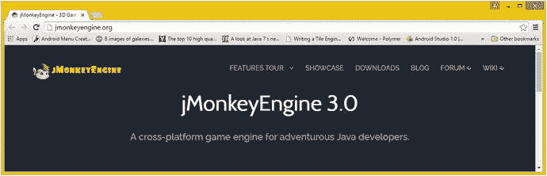
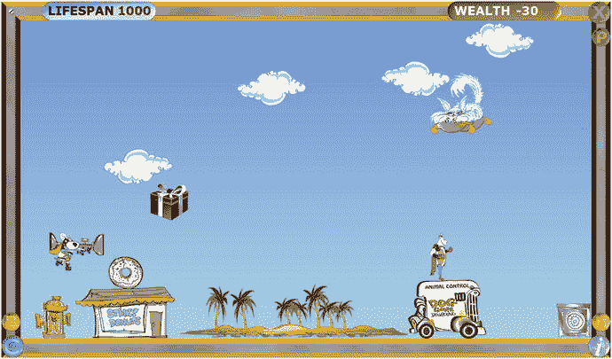

# 四、游戏设计导论：游戏设计概念、类型、引擎和技术

让我们在前两章中学到的新媒体素材知识的基础上，看看如何利用这些强大的像素、帧、样本和向量来创建 pro Java 9 游戏和物联网应用，以及为什么(或为什么不)在某些类型的 pro Java 9 游戏开发类型和场景中使用它们。我们将了解高级游戏概念、基本游戏设计风格和游戏设计优化概念，以及适用于 Java 平台的开源游戏引擎，包括 JBox2D、JBullet、Jinngine 和 Dyn4J 等物理引擎，以及 LWJGL 和 JMonkey 等 3D 游戏引擎。

我想介绍的第一件事是静态(固定)与动态(实时)的基本概念，因为它适用于游戏类型、游戏设计以及游戏优化。我已经在第 [2](02.html) (图像对音频-视频)和第 [3](03.html) (渲染 3D 对 3D 动画对交互式 3D)章节中介绍了静态(图像，渲染静态 3D 图像)对动态(数字视频，2D 和 3D 动画，交互式 3D，数字音频)的概念。这个简单的概念是对游戏类型进行分类的好方法，也是游戏优化的基本原则，正如你将看到的。在这一章中，我们将对游戏设计，新媒体的引入，以及不同的游戏设计方法和策略在内存占用和 CPU 处理周期上的花费有一个高层次的概述。

为什么这很重要，为什么我们在本书的第一部分中“预先思考”所有这些游戏设计因素，是因为您应该希望您的游戏能够在用于玩游戏的所有不同平台和消费电子设备上流畅地运行，即使这些设备采用单核处理器。如今单核处理器实际上非常罕见。入门级消费电子设备现在具有双核(双处理器)、四核(四处理器)、六核(六处理器)或八核(八处理器)CPU。流畅游戏的反面会被归类为生硬或不流畅的游戏，这不是一个好的用户体验(UX)。用户体验源于用户界面设计、游戏概念、新媒体素材和代码优化的结合，以及每个用户对你的游戏设计感兴趣和好奇的程度。

接下来我将介绍游戏设计和开发的不同方面或组成部分。这些包括游戏设计和开发的概念、技术和“行话”,我想确保你能跟上速度。这些主题包括 2D 精灵、3D 模型、人工智能、层、级别、碰撞检测、物理模拟、背景板动画、游戏逻辑、游戏设计、用户界面以及类似的游戏设计和开发方面，这些都可以被视为游戏“组件”，因为每一个都为专业的 Java 9 游戏添加了不同的属性和功能。最后，我将介绍您可以设计和开发的不同类型或流派的游戏，只是为了让您的左右脑同时工作，然后我将探讨一些技术问题以及素材和代码优化考虑因素，了解这些流派之间的差异。

## 高级概念:静态与动态游戏

我想从一个高层次的概念开始，它涉及到我将在本章中讨论的所有内容，从您可以创建的游戏类型到游戏的优化，再到您的 JavaFX 场景图的构建。我们在第 [2](02.html) 章和第 [3](03.html) 章中看到了这个概念，我们将在下一章中再看一遍，届时我们将看到固定的或静态的不变的 Java 常量与动态的、实时变化的 Java 变量的概念。类似地，JavaFX 场景图中的用户界面设计可以是静态的(固定的或不可移动的)或动态的(动画的、可拖动的或可换肤的)，这意味着您可以更改 UI 外观以适应您的个人喜好。

这些概念在游戏设计和开发中如此重要的原因是因为你的游戏引擎，你将设计来“运行”或“渲染”你的游戏，将需要不断地检查(处理)你的游戏的动态部分，看看它们是否已经改变，因此需要一个响应。响应需要处理，并且需要执行(处理)Java 代码来更新分数、移动游戏板位置、播放动画帧、改变游戏角色的状态、计算碰撞检测、计算物理、应用游戏逻辑等等。每个游戏周期(JavaFX 中称为脉冲)上的这些动态检查要求(和随后的处理)会更新，以确保变量、位置、状态、动画、碰撞、物理等符合您的 Java 游戏引擎逻辑，并且可以真正累加。这就是为什么在你的游戏设计中静态和动态的平衡是重要的；在某些时候，处理所有这些工作的处理器可能会过载，从而降低游戏速度。

这种增强游戏动态的所有实时、每脉冲检查过载的结果是，游戏运行的帧速率可能会降低。没错，就像数字视频和动画一样，游戏也有帧率，但游戏帧率是基于你的编程逻辑的效率。游戏的帧率越低，游戏性就变得越不流畅，至少对于街机游戏这样的动态、实时游戏是如此。游戏的流畅程度与用户体验的“无缝”程度有关。

因此，静态与动态的概念对于游戏设计的每个方面都非常重要，并且使得某些类型的游戏比其他类型的游戏更容易获得更好的用户体验。我们将在本章的下一节讨论不同类型的游戏，但是正如你所想象的，棋盘游戏本质上更“静态”，而街机游戏本质上更“动态”。也就是说，有一些游戏优化方法，我们将在本书中讨论，可以使游戏保持动态(看起来好像有很多正在进行)，当从 CPU 的处理角度来看，真正正在进行的事情，从处理角度来看，变得可管理。这是游戏设计的众多技巧之一，说到底，都是关于以这样或那样的方式优化。

我在 Android (Java)编程书籍中涉及的最重要的静态与动态设计问题之一是使用 XML 的 UI 设计(静态设计)与使用 Java 的 UI 设计(动态设计)。Android 平台将允许使用 XML 而不是 Java 来完成 UI 设计，以便非程序员(设计者)可以为应用进行前端设计。JavaFX 允许通过使用 JavaFX 标记语言(FXML)来完成完全相同的事情。

为此，您必须创建 FXML JavaFX 应用，正如您在第 [6 章](06.html)中在 NetBeans 9 中创建游戏应用时所看到的那样。该选项将`javafx.fxml`包和类添加到您的应用中，允许您使用 FXML 设计 UI，然后让您的 Java 编程逻辑“膨胀”它们，以便设计成为 JavaFX UI 对象。需要注意的是，使用 FXML 会在应用开发和编译过程中增加另一层处理器开销，包括 FXML 标记及其翻译(和处理)。出于这个原因，并且因为，归根结底，这是一本专业的 Java 9 游戏开发书，而不是 FXML 标记标题，所以在本书中，我将重点介绍如何使用 Java 9 和 JavaFX APIs 做所有事情，而不是使用 FXML 做事情。

在任何情况下，我关于使用 XML(或 FXML)创建 UI 设计的观点是，这种 XML 方法可以被视为“静态的”，因为设计是预先使用 XML 创建的，并在编译时使用 Java 进行“膨胀”。Java 膨胀方法使用设计者提供的 FXML 设计来创建场景图，该场景图基于使用 FXML 定义的 UI 设计结构填充有 JavaFX UI 对象。静态 UI 被设计为固定的，为游戏玩家处理用户界面，当你的游戏被加载时，它被一次性放入内存。

### 游戏优化:平衡静态元素与动态

游戏优化归结为平衡不需要实时处理的静态元素和需要持续处理的动态元素。过多的动态处理，尤其是在不需要的时候，会让你的游戏变得不稳定或生硬。这就是为什么游戏编程是一种艺术形式；它需要“平衡”，以及伟大的人物，故事情节，创造力，幻想，预期，准确性，最后，优化。

例如，表 [4-1](#Tab1) 描述了在动态游戏中优化不同游戏组件的一些注意事项。正如你所看到的，游戏中有很多地方可以优化，使处理器的工作负载大大减少。如果这些主要的动态游戏处理区域中有任何一个因为处理器宝贵的“每帧周期数”而“失控”，都会极大地影响游戏的用户体验。我们将进入游戏术语(精灵，碰撞检测，物理模拟等。)在本章的下一节。

表 4-1。

Some Aspects of Gameplay That Can Be Optimized

  
| 玩游戏方面 | 基本优化原则 |
| --- | --- |
| 精灵位置(移动) | 移动精灵尽可能多的像素，同时仍然实现平滑的运动外观 |
| 精灵动画 | 最大限度地减少需要循环的帧数，以创建流畅的动画效果 |
| 冲突检出 | 仅在必要时检查屏幕上对象之间的碰撞(非常接近) |
| 物理模拟 | 尽量减少场景中需要进行物理计算的对象数量 |
| 群体/人群模拟 | 最大限度地减少需要循环的成员数量，以创造一种人群或羊群的假象 |
| 粒子系统 | 最大限度地减少粒子的复杂性和制造错觉所需的粒子数量 |
| 相机动画(3D) | 尽量减少相机动画，除非它是游戏不可或缺的一部分(绝对需要) |
| 背景动画 | 最小化动画背景区域，使整个背景看起来是动画，但实际上不是 |
| 数字视频解码 | 尽量减少数字视频的使用，除非它是游戏不可或缺的一部分(绝对需要) |
| 游戏性(或人工智能)逻辑 | 尽可能高效地设计/编写游戏逻辑、模拟或人工智能 |
| 记分板更新 | 通过绑定更新记分板，并将显示更新减少到最大每秒一次 |
| 用户界面设计 | 使用静态用户界面设计，这样脉冲事件就不会用于 UI 元素定位 |

考虑所有这些游戏内存和 CPU 处理优化问题将使你的专业 Java 9 游戏设计和 Java 编码，确实是一个相当棘手的努力。不用说，很多投入到专业 Java 9 游戏中。

值得注意的是，其中一些共同作用，给玩家创造了一种错觉；例如，精灵动画将创建角色奔跑、跳跃或飞行的幻觉，但如果不将该代码与精灵定位(运动)代码相结合，就无法实现幻觉的真实性。要微调幻像，可能需要调整动画的速度(帧速率)和移动的距离(每帧移动的像素)。我喜欢称这些调整为微调。调整意味着手动插入数据值，以获得最真实的最终结果。游戏开发是一个迭代的过程；尽管你可能试图坐下来预先设计你的游戏，然后创建新的媒体素材并编写 Java 代码，但修改是不可避免的。

在本书中，我们将会深入到专业 Java 游戏设计和开发的许多领域，但是为了在这里更详细地阐明这些，当我们在考虑这些因素时，如果你可以移动游戏元素(主要玩家精灵，投射精灵，敌人精灵，背景图像，3D 模型)更多的像素和更少的次数，你将会节省处理周期。需要处理时间的是移动的部分，而不是距离(移动了多少像素)。类似地，对于动画，实现令人信服的动画所需的帧越少，保存帧所需的内存就越少。同样的原则也适用于数字视频数据的处理，无论您的数字视频素材是捕获的(包含在 JAR 文件中)还是来自远程服务器的流。无论您是否在传输数据，解码数字视频帧都是处理器密集型的，并且会占用游戏其他组件的宝贵 CPU 周期，这可能也需要大量处理。

同样重要的是要记住，我们在优化内存使用和处理器周期，这两者是相辅相成的。使用的存储单元越少，处理器检索数据的努力就越少，因为一次一个存储地址地读取和处理存储单元；要处理的地址越少，意味着正在进行的处理越少。因此，内存优化也应被视为一种处理周期优化。

有了群集、群体动力学和粒子系统效果，当使用像这样的处理密集型特效时，需要处理的元素更少，每个元素的复杂性更低，这将很快增加。这些类型的基于粒子的特效为任何游戏、电影或电视剧添加了大量“哇”的因素，但也需要实时处理大量数据，这可能是处理密集型的。我们将在第 5 章[中讨论数组。](05.html)

检测碰撞是许多不同游戏类型的游戏编程逻辑的另一个主要部分，例如街机游戏、棋盘游戏和虚拟现实游戏，例如第一人称射击游戏。不盲目检查(处理)游戏元素之间的碰撞是非常重要的。请确保排除不在“游戏中”(在屏幕上)或不活动、彼此不靠近或永远不会相互碰撞的游戏资源(静态元素)。正如您可能想象的那样，冲突检测考虑、优化和编程本身就是艺术形式，关于这个主题的书籍已经有很多了，所以请客观地看待这个有趣的主题，并自己研究它，尤其是如果您对创建可能会发生大量冲突的 Pro Java 9 游戏感兴趣的话。

为物理模拟计算自然力是处理器最密集的，像碰撞一样，许多书籍都写了物理编程的每个单独领域，包括刚体或软体动力学，布料动力学，绳索动力学，头发和毛皮(实际上是连接的圆柱体粒子系统)，以及流体动力学或驾驶动力学(用于驾驶游戏)。如果这些类型的物理模拟中的任何一种都没有经过精心的编码和优化，那么根据游戏玩家在他们玩游戏的消费电子硬件中拥有多少处理器内核，整个游戏用户体验可能会陷入停滞。

### 2D 与 3D 渲染:幕后的静态与动态

静态 3D 游戏，例如国际象棋，其中游戏棋盘是静态的，除非你将一个游戏棋子移动到棋盘上的新位置，否则游戏棋盘可能看起来是静态的；然而，由于它们利用 3D 实时渲染来创建虚拟现实环境，因此“在引擎盖下”系统可能会忙于实时渲染几何图形、照明、相机和材质，这取决于您如何在场景图形中设计所有这些元素以及如何设置 Java 游戏处理逻辑。正如我们在第 [3](03.html) 章中看到的，3D 新媒体素材的性质比 2D 新媒体素材复杂一个数量级，同样的事情也适用于 3D 游戏和 2D 游戏。2D 游戏确实有一个“渲染”元素，称为双缓冲，下一帧在显示在屏幕上之前在内存中合成。然而，3D 渲染实际上是创建像素颜色和 alpha 值，而不是简单地在 X，Y 位置组织它们。3D 渲染基于 3D 几何图形、变换、材质、着色器、贴图坐标、灯光位置和相机位置，从头开始创建像素颜色值和 X、Y 位置。

接下来，让我们更详细地了解一下专业 Java 游戏设计方面和一些核心游戏概念的考虑事项，并了解一下适用于所有游戏类型的一些核心优化原则。

## 游戏组件:2D、3D、碰撞、物理和人工智能

让我们来看看为了能够构建一个游戏，你需要理解的各种游戏设计概念、方面和组件，以及我们可以使用哪些 Java(或 JavaFX)包和类来实现游戏性的这些方面，我喜欢称之为游戏性设计和开发的组件。这些可能包括游戏元素本身，在游戏行业中通常称为 2D 游戏的精灵或 3D 游戏的模型，以及处理引擎，我们将自己编码或导入预先存在的 Java 代码库，如人工智能、物理模拟、粒子系统、反向运动学或碰撞检测。我将花一些时间来介绍这些组件，为什么它们适用于一个专业的 Java 游戏，以及如果你决定使用这些游戏组件时应该记住的一些优化注意事项。

### 2D 精灵:街机风格游戏的基础

让我们从最古老的电子游戏形式之一的基础开始，街机游戏。被称为精灵的 2D 素材定义了我们的主角，用来伤害主角的投射物，主角收集的宝物，以及发射这些投射物的敌人。精灵是 2D 图形元素，可以是静态的(固定的，单个图像)或动态的(动画，几个图像的无缝循环)。精灵可以是矢量(形状)或光栅(基于图像)资源。如果它们是基于图像的，它们通常是 PNG32 并带有 alpha 通道，以便它们可以在游戏设计的其余部分上实时合成，并使结果看起来像是数字视频，也就是说，就像是用相机拍摄并在屏幕上播放，而不是根据游戏玩家的输入(通常是游戏控制器、键盘按键或 iTV 遥控器)实时合成。

一个精灵将根据指示游戏如何运行的编程逻辑在屏幕上移动。精灵需要与场景图形中的背景图像和其他游戏元素以及其他玩家的精灵合成，因此用于创建精灵的 PNG32 图形需要支持透明背景。这也是为什么我讨论了遮蔽 2D 物体的主题——在你的游戏中用作精灵。

这也是为什么我在第二章中向你介绍了阿尔法通道透明度的概念，因为我们需要用精灵来达到同样的最终效果，这样我们才能在游戏中获得无缝的视觉体验。我们将在本书的后面介绍如何使用 GIMP 创建使用 alpha 通道的图形，这样你就可以创建专业级的精灵，与你的游戏图形无缝合成。

由于 3D 模型都在同一个渲染空间中，3D 渲染引擎会为您处理这个透明度因素，如果您使用 3D 模型而不是 2D 精灵，您不必担心游戏的每个 3D 组件都有 alpha 通道。接下来让我们看看 3D 模型，作为对这一点的跟进。

### 3D 模型:游戏角色扮演风格的基础

一种较新的电子游戏形式涉及实时渲染的虚拟世界，这要归功于 OpenGL ES 3 和 Vulkan 等实时渲染平台的出现，这些平台用于 Android、HTML5、JavaFX 和 DirectX (DirectX 用于 Xbox 和 Windows 等微软产品)。3D 模型提供了更加灵活、先进和逼真的游戏，因为它们将所有其他新媒体类型(除了数字音频)结合成一个；因为纹理、材质和着色器可以使用数字图像和数字视频；因为 3D 几何网格对象可以使用它们的实际几何来计算与实际对象的碰撞，并且是在三维空间而不是二维空间。此外，3D 素材可以对多种灯光和摄像机做出实时反应，您可以通过 i3D 获得一个更加强大的游戏设计环境，尽管从数学和 Java 编码的角度来看更加复杂。

由于 3D 和 i3D 非常复杂，因此有大量的优化考虑因素，例如优化网格(几何体)，这是一个称为低多边形建模的过程，它涉及到少量使用点、边和面，然后使用平滑组来提供平滑的曲率，这也可以通过添加更多几何体来实现。在第 [2](02.html) 章中，我还提到了一些优化原则，比如使用更少的像素，更低的色深，以及更少的通道用于纹理贴图，也就是图像。同样，对于 3D 动画，在第 [2](02.html) 章中，我介绍了一些用于动画数据的优化原则，这类似于数字视频，例如使用更少的像素、更少的帧、更低的色深和更少的通道，以及更简单的插值算法。

3D 和 i3D 游戏的另一个优化与用于照亮虚拟世界的灯光数量有关。灯光计算往往很昂贵，以至于大多数游戏引擎，包括 JavaFX，都将允许的灯光数量限制在 8 个或更少。可以使用的灯光对象越少，渲染引擎需要进行的计算就越少，游戏运行的帧速率就越高(越快)。

同样的考虑也适用于 3D 动画软件中的相机。例如，当渲染到胶片时，可以根据需要渲染尽可能多的场景摄影机视图，而不会(实时)影响处理器。当消费电子设备处理 3D 时(相对于工作站的大规模渲染场)，最大限度地减少摄像机的数量变得非常重要，因为每个摄像机都输出相当于未压缩的原始数字视频数据流。在这种情况下，您有一个 3D 渲染引擎实时生成另一个未压缩的 2D 动画(视频)资源，这再次占用了您的大量处理能力，因此仅当您的游戏绝对需要实时平视显示器(HUD)时才使用它，例如，用于实时第二游戏视角。

### 碰撞检测:游戏素材交互的基础

对于某些类型的游戏来说，游戏性的另一个重要组成部分或方面是碰撞检测，因为如果你的游戏元素只是在屏幕上飞过彼此，并且当它们相互接触或“相交”时从未做过任何酷的事情，那么你真的不会有一个很好的游戏！想象一下没有任何碰撞检测的弹球游戏或台球！一旦你添加了一个由相交逻辑处理例程组成的碰撞检测引擎，你的游戏将能够通过处理它们的几何组成部分(通常是边、线、曲线或它们的边界(`BoundingBox`)的相交来确定任何 2D 矢量精灵或 3D 模型何时相互接触或重叠。

碰撞检测将调用(即触发)相关的游戏逻辑处理例程，这些例程将确定当任何给定的 2D 精灵或 3D 模型(如投射物和主要角色)相交时会发生什么。例如，当投射物与主角相交时，伤害点可能会增加，生命力指数可能会降低，或者可能会启动垂死挣扎动画。另一方面，如果一个宝物与一个主要角色相交(也就是说，被一个主要角色拾起)，力量或能力点可能会增加，生命力指数可能会增加，或者“我找到了”庆祝动画可能会开始。

正如你所看到的，根据你正在创建的游戏类型，游戏的碰撞检测引擎很可能是你游戏背后的基础设计元素之一，除了你的 i2D 精灵或 i3D 模型，它们代表了你的角色，投射物，宝藏，敌人，障碍和道具本身，这就是为什么我以这个顺序介绍这些。一旦检测到碰撞，通常你的物理模拟代码会被触发，向游戏玩家显示物体在碰撞后需要如何相互反应。接下来让我们来看看。

### 物理模拟:游戏真实感的基础

另一个重要的组成部分，或者说属性，是真实世界的物理模拟。像 JavaFX `Interpolator`类提供的重力、摩擦、反弹、阻力、风、加速、减速和运动曲线以及类似的力的添加，都将在已经非常逼真的精灵、同步动画序列、场景背景和高度精确的碰撞检测的基础上增加额外的真实感。

重力、摩擦力、阻力和风是在 Java 代码中模拟或调整 2D 精灵或 3D 模型运动的最简单的因素。我在我的书《Java 8 游戏开发入门》(Apress，2014)的结尾提到了这一点。反弹类似于运动曲线中加速和减速的数学计算，可用于模拟单次反弹，但不能模拟物理模拟的反弹衰减。

你可以编写自己的 Java 方法来将物理学应用到你的专业 Java 游戏中，或者你可以使用第三方 Java 库，这些库可以在 SourceForge、GitHub 或`code.google.com`等网站上获得。我将介绍一些用于 2D 和 3D 游戏引擎、2D 和 3D 物理模拟引擎、2D 和 3D 碰撞检测引擎、正向和反向运动学引擎等的库。我将在本章的下一个主要部分介绍这一点，以防万一你想在你的专业 Java 游戏或物联网应用中使用这些，而不是编写你自己的。

有趣的是，我将在本章的“Java 引擎:游戏、物理和逆运动学”部分介绍的大多数开源第三方物理引擎不仅实现了物理模拟，还实现了碰撞检测。这是因为这两件事在现实生活中紧密联系在一起。为了很好地处理碰撞，物理模拟需要无缝集成到代码中。在现实生活中，碰撞之前和之后都涉及物理学，这些引擎寻求重新创建现实生活中(完全可信)的实现结果。请注意，从 Java 9 开始，为了在新的 Java 9 模块系统中正确使用，这些产品需要进行“模块化”。

### 人工智能:游戏逻辑的基础

最后，您可以添加到游戏中的最专有的属性或逻辑结构(Java 代码)是自定义游戏逻辑，它使您的游戏在市场上真正独一无二。这种人工智能(AI)编程逻辑应该保持在自己的 Java 类和方法中，与物理模拟或碰撞检测代码分开。毕竟，Java 使模块化变得容易，这种游戏智能就像是你的职业 Java 游戏的裁判。它监督玩家，对手，障碍，宝藏，得分，处罚，等等，确保游戏体验每次对每个人都是一样的！这与体育赛事或比赛中裁判的职能相同。

有针对 Java 的第三方 AI 引擎；然而，我建议在这个领域，你可以从头开始编写你的游戏逻辑代码，以便它与你的用户界面(UI)代码、你的评分引擎代码、你的动画引擎代码、你的演员(精灵或模型)运动代码以及你的碰撞处理代码集成，这是任何第三方 AI 规则引擎都无法做到的。

当你开始把所有这些游戏组件加在一起，它开始让游戏更可信，也更专业。一个伟大游戏的关键目标之一是“暂停信仰”，这简单地意味着你的玩家百分之百地“买入”前提、角色、目标和游戏性。这是任何内容制作人，无论是电影制作人、电视剧制作人、作者、歌曲作者、游戏程序员还是应用开发人员，都追求的目标。如今，游戏具有与任何其他内容分发类型相同的创收能力，如果不是更多的话，并且您可以直接向公众分发它们，而无需电影工作室、唱片制作人或电视网络等中间人。这是最重要的部分，因为您将获得“70%您，30%商店”的分成，而不是“70%经销商，30%您”的分成！

## Java 引擎:游戏、物理和逆运动学

有许多开源的第三方游戏引擎，物理和碰撞引擎，人工智能引擎，甚至反向(或正向)运动学(IK)引擎都可以很容易地在互联网上找到。大多数都在 SourceForge 或 GitHub 或`code.google.com`上，使用基本的谷歌搜索就能找到。大多数都是 JAR 格式的。

### 游戏引擎:JMonkey 和轻量级 Java 游戏库

LWJGL 是一个开源的跨平台 Java 库，对于 3D 图形(OpenGL)、3D 音频(OpenAL)和并行计算(OpenCL)应用的开发非常有用(图 [4-1](#Fig1) )。API 访问是直接的、高性能的，而且还被包装在适合 Java 生态系统的类型安全层中。其他高级 3D 游戏引擎也可能使用 LWJGL。

图 4-1。

The Lightweight Java Game Library 3 is an open source Java game library compatible with Java and JavaFX

JMonkey 也是一个免费的开源游戏引擎，面向想要创作 i3D 游戏的 Java 游戏开发者(图 [4-2](#Fig2) )。该软件完全用 Java 编程，旨在提供广泛的可访问性和快速部署。

图 4-2。

jMonkeyEngine 3.0 is an open source cross-platform game engine compatible with Java and JavaFX

值得注意的是，我将向您展示如何仅使用 Java (8 或 9)和 JavaFX 8 或 9 创建游戏，因为这正是本书的内容:使用并学习原生 Java APIs(其中一个是 JavaFX)来制作游戏或物联网应用。在我们开始之前，我想让您了解两个领先的 Java 游戏平台。

### 物理和碰撞引擎:Jbox2D，JBullet，Dyn4j，Jinngine

有许多第三方物理引擎也支持碰撞检测，因此您可以使用这些碰撞物理代码库中的任何一个将碰撞和物理同时添加到您的游戏中，只需将 JAR 文件导入到您的项目中并调用适当的 API 即可。

Jbox2D 是 Box2D C++物理引擎在 Java 中使用的“端口”或重新编码。Box2D 是一个开源的、基于 C++的物理和碰撞引擎，用于模拟 i2D (X，Y)空间中的刚体动力学。Box2D 由 Erin Catto 开发，在 zlib 许可下发布，不需要正式的使用确认；但是，如果您使用 C++ Box2D 中的 Jbox2D API 端口，建议您在您的 pro Java 游戏中使用 Box2D。

JBullet 是用于 Java 的 Bullet 2.7 3D C++物理引擎的部分端口。Bullet 2.87 是一个开源的 C++物理和碰撞引擎，用于模拟 3D (X，Y，Z)空间中的刚体动力学。子弹碰撞检测和物理库是由 Advanced Micro Devices 开发的，也称为 AMD。如果您想了解更多信息，可以在 [`http://bulletphysics.org`](http://bulletphysics.org) 找到。JBullet 是在 zlib 许可下发布的，不需要正式的使用确认。但是，如果您使用来自 Bullet 2.7 C++物理引擎的 JBullet API 部分端口，建议您在您的 pro Java 游戏中使用 JBullet。

图 [4-3](#Fig3) 所示的 dyn4j 引擎是一个兼容 Java 6 和 7 的 2D 碰撞检测和物理引擎，这意味着它可以与本书中涉及的 Java 8 和 9 版本一起工作。Dyn4j 被设计为稳定、可扩展、优化(快速)且相对易于使用。Dyn4j 可免费用于商业用途，也可用于非商业用途。它是由它的作者 William Bittle 根据 BSD 许可模型授权的。

图 4-3。

Dyn4j is an open source, 2D collision detection and physics engine that is available under the BSD license

Jinngine 是一个用 Java 编写的开源轻量级 3D 物理引擎，它为您提供实时碰撞，以及实时物理计算功能。用户可以通过调用 API 函数来指定几何图形、关节和参数，从而设置和模拟物理。摩擦是通过实现一个近似的共隆摩擦定律来模拟的。这个物理引擎只专注于碰撞和物理，没有渲染功能，并且使用基于速度的算法方法构建，该方法使用高效的 NCP 解算器进行求解。您可以使用 jinngine 作为您的物理引擎，也可以使用该引擎的其他组件，就像它是一个 Java 代码库一样，例如，如果您只想实现碰撞检测，或者如果您只想利用接触点生成功能。接下来，让我们看看反向运动学，或 IK 引擎，它在角色动画中用于定义骨骼结构及其关节运动限制。

### 反向运动学和机器人引擎:JRoboOp 和 JavaFX-IK

JRoboOp 是一个开源的 Java 库(包),设计用于 IK 机器人模拟和 3D 机器人模型的可视化。该引擎模拟机器人反向运动学以及机器人动力学，并基于名为 ROBOOP 的 C++库。这个库是由蒙特利尔理工大学的 Richard Gourdeau 开发的，它与 Java 5 和更高版本以及 JavaFX 1.3 和更高版本兼容，这意味着它可以很好地与我们将在本书中讨论的 Java 7、Java 8、JavaFX 9 和 Java 9 版本一起工作。这个包是在 GNU 公共许可证(GPL)下发布的。

JavaFX-IK 库是大约两年前专门为 JavaFX 创建的，可以在 GitHub 的 [`https://github.com/netopyr/javafx-ik`](https://github.com/netopyr/javafx-ik) 下载。它是在 Apache 许可证 2.0 版下授权的。IK 软件由德国弗莱堡的高级软件工程师 Michael Heinrichs 创建，它允许您使用骨骼对象在 JavaFX 场景图形中创建骨骼对象结构。

接下来，让我们看看可以创建的不同类型的游戏，以及这些游戏在应用精灵、碰撞检测、物理模拟和游戏 AI 逻辑等核心游戏组件方面有何不同。

## 游戏类型:益智游戏、棋盘游戏、街机游戏、射击游戏或虚拟现实游戏

就像我们在这一章中讨论的其他东西一样，游戏本身也可以用“静态对动态”的方法来分类。静态游戏不受“处理器限制”，因为它们往往是“基于回合”的，而不是“基于手眼协调”的，所以从某种意义上说，它们更容易顺利工作，因为只有游戏“规则”的编程逻辑和吸引人的图形需要到位和调试。一个重要的机会也存在于开发新类型的游戏类型，这些游戏类型以前所未见的创造性方式使用静态和动态游戏的混合组合。我自己也在研究其中的一些！

### 静态游戏:策略、知识、记忆和棋盘游戏

由于这是一本专业的 Java 游戏编程书籍，我将从这个重要的(对游戏开发而言)静态与动态的角度出发，将游戏分为三个独立的类别(静态、动态和混合)是一个非常巧妙的方法。先来涵盖静态(固定图形)，回合制游戏。这些游戏包括“基于移动”或“回合制”的游戏，如棋盘游戏、益智游戏、知识游戏、记忆游戏和策略游戏，所有这些游戏的受欢迎程度和可销售性都不容小觑，尤其是在家庭游戏中。并非所有的游戏客户都是青少年男性，这类游戏也最有可能被用于寓教于乐，这是一个时下流行的词，教育和娱乐融合在一起，以进一步推动教育部分的成功。缺乏有趣、有效的教育内容游戏，因此这是一个重要的游戏商机。

关于静态游戏，需要记住的重要一点是，它们可以像动态游戏一样有趣。静态游戏本质上具有明显更少的处理开销，因为它们不必为了实现流畅、专业的游戏而达到 60 FPS 的实时处理目标。这是因为游戏的本质不是基于连续的运动，而是基于做出正确的战略行动。当轮到你的时候，你就会移动，这就是为什么这些类型的静态游戏通常被称为基于移动的游戏。

静态游戏中可能会涉及到一些基本的“碰撞检测”形式，即哪些游戏棋子被移动到了游戏棋盘或游戏面上的哪个位置。然而，对于静态游戏，不存在冲突检测使处理器过载的危险，因为游戏板的其余部分是静态的，只有一个棋子在特定玩家的回合中被有策略地移动。一旦确定碰撞的过程完成，就不需要(实时)碰撞检测，直到下一轮由单人玩家(在单人游戏中)或对手(在多人游戏中)进行。

策略游戏的处理逻辑更多的是基于策略逻辑的编程，在给定正确的移动顺序的情况下，允许玩家实现给定的最终“胜利”,而动态游戏编程逻辑更多地关注游戏精灵之间发生的冲突。动态游戏侧重于分数，分数是通过躲避射弹、寻找宝藏、降落目标、杀死敌人以及完成这些类型的关卡目标来获得的，以便进入下一个关卡，玩家可以获得更高的分数。

具有大量相关规则集的复杂策略游戏，例如国际象棋，甚至可能具有比动态游戏功能复杂得多的编程逻辑例程。然而，由于代码的执行没有那么时间敏感，因此无论平台和 CPU 多么强大，最终的游戏都将是流畅的，因为玩家愿意等待游戏来验证移动的有效性并在适当的情况下得分。当然，游戏规则集逻辑必须完美无缺，这种类型的游戏才能被视为真正的专业游戏。因此，最终，不管是静态的还是动态的游戏，至少是伟大的游戏，都很难编写代码，尽管原因大相径庭。接下来让我们来看看动态游戏，这种游戏往往有很高的知名度，吸引年轻玩家，而且往往是个人玩的，而不是团体、学生或家庭玩的。

### 动态游戏:街机、射击、平台和动作游戏

动态游戏可以被称为动作游戏或街机游戏，并且包括显示屏上的大量运动。这些高度动态的游戏几乎总是涉及射击，例如第一人称射击游戏(例如《毁灭战士》和《半条命》)以及第三人称射击游戏(生化危机和侠盗猎车手)，或者偷窃东西或躲避可怕的东西。动作运动游戏，例如足球、英式足球、棒球、篮球、高尔夫和曲棍球，在动态游戏类型中也非常流行，并且它们几乎总是使用真实感、3D 虚拟世界或虚拟现实游戏模拟环境来创建。驾驶游戏是这种类型的另一个化身，也倾向于使用实时 i3D 游戏渲染技术为驾驶者提供超现实的驾驶模拟。

还有障碍课程导航范例，如在平台游戏如大金刚、吃豆人或超级马里奥兄弟中常见的。平台游戏往往是街机游戏，这是典型的 2D 或 2.5D，这是所谓的等距。街机游戏 ZAXXON 是 2D 等轴游戏的一个很好的例子，看起来像 3D 或 Tempest，其中几何形状爬上几何井，玩家从边上向下射击，以防止攀爬的形状到达顶部。

值得注意的是，任何类型的游戏都可以使用 2D 或 3D 图形资源制作，甚至可以使用 2D 和 3D 资源的组合制作，这是 JavaFX 9.0 所允许的，我称之为混合。

### 混合游戏:创造性地利用 JavaFX 的机会

从 JavaFX 场景图形素材的角度来看，混合游戏将是一个同时使用 2D 和 3D 素材的游戏，其中大部分我们在第 [2](02.html) 和 [3](03.html) 章中介绍过。还有另一种类型的混合，它可以跨越不同的游戏类型，这一点我们在前一节中已经介绍过了。有这么多受欢迎的游戏类型，总是有一个极好的机会通过使用混合游戏方式来创建一个全新的游戏类型。例如，想象一下从静态(战略)游戏类型(如棋盘游戏)中提取一些特征，并添加动态(动作)游戏类型的元素。这方面的一个很好的例子是国际象棋，当棋子进入对方的棋盘方格时，它们会战斗到死。

在我开始 Java 8 游戏开发时(Apress，2014)，我使用 JavaFX 8.0 创建了一个混合游戏引擎，它支持平台游戏、射击游戏和寻宝游戏的属性。正如你在图 [4-4](#Fig4) 中看到的，在那本书中创建的 BagelToons InvinciBagel 游戏引擎，我在那里介绍了 i2D 游戏的开发，具有通常在不同类型的 2D 游戏中发现的元素，包括超级英雄、敌人、射击、宝藏、障碍、藏身处、建筑、汽车、景观、魔毯猫、安全破解、食物等等。

图 4-4。

My i2D game development book called Beginning Java 8 Games Development covers using sprites to develop games

简而言之，Java 的定位是允许游戏开发者交付先锋的混合游戏，包含 2D 和 3D 素材，以及高质量的 16 位 48 kHz 和 24 位 48 kHz 数字音频。凭借一点点创造力和你在本书过程中积累的知识，你应该能够完成以前从未做过的事情。对于混合游戏将受益的领域来说尤其如此，例如教育领域(教育娱乐)和工作场所(业务流程游戏化)。这是因为 Java 广泛用于操作系统和浏览器，以及 64 位平台，如 Android 5 - 8，这些平台在消费电子产品中拥有大多数市场份额和制造商追随者。也就是说，需要指出的是，JavaFX(还)不适合具有高清或 UHD 高帧速率的 i3D VR 实时 3D 渲染游戏，比如那些使用 C++为 PlayStation 或 Xbox 等定制游戏主机创建的游戏。

## 摘要

在第四章中，我们仔细研究了一些更重要的游戏设计概念，我们将在我们的专业 Java 游戏开发工作流程中使用这些概念，这样你就可以在本书的第一部分提前了解这些东西的基础知识。

我首先介绍了静态与动态的关键概念，以及它们对游戏设计和游戏优化的重要性，因为如果游戏优化不是游戏设计、开发和优化过程中的一个持续考虑因素，过多的动态会使旧的单核甚至双核 CPU 过载。

接下来，您了解了游戏设计和开发的一些关键组件，如精灵位置、精灵动画、碰撞检测、物理模拟、群集或群体动力学、粒子系统、背景动画、相机动画、数字视频流、用户界面设计、评分引擎和游戏 AI 逻辑。

我们看了这些如何应用于静态游戏，即没有连续运动的游戏，如基于移动的策略游戏、棋盘游戏、谜题、知识游戏和记忆游戏，然后看了这些如何应用于动态游戏，即使用连续运动的游戏，如平台游戏、街机游戏、第一人称射击游戏、第三人称射击游戏、驾驶游戏、体育游戏、科幻游戏和类似的游戏，其中大量利用了 3D 实时渲染以及各种类型的物理系统和粒子系统模拟。

我们还看了一些最流行的第三方游戏引擎，物理(和碰撞)引擎，和反向运动学引擎。我们看了一些不同类型的游戏，以及它们的特点，这样你就可以发挥你的创造力，思考你想创建什么类型的专业 Java 游戏。

在下一章中，我们将看一看 Java 编程语言，并复习或入门，以确保每个人都了解 Java 编程语言 API 组件，如包、类、接口、方法、常量、变量、修饰符等。