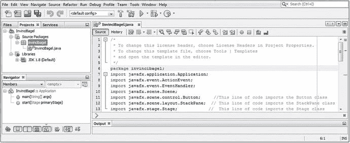
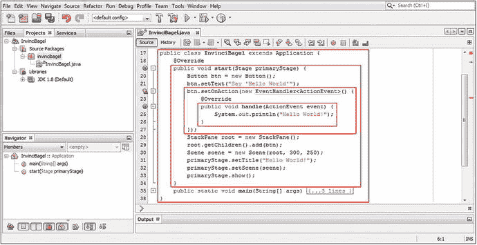
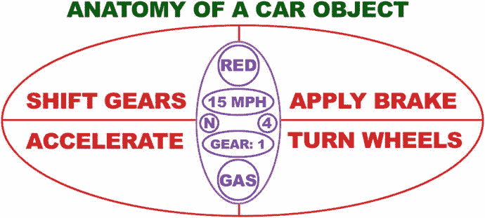
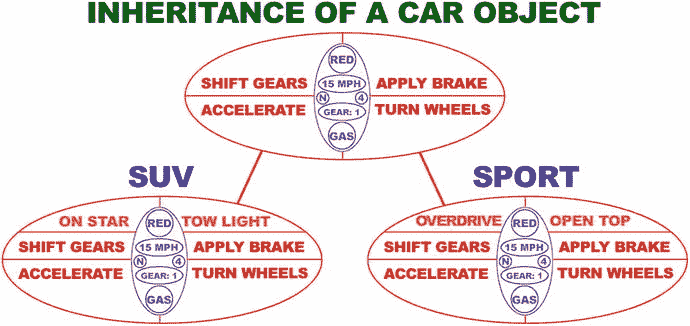

# 五、Java 入门：Java 概念和原理介绍

让我们通过回顾 Java 编程语言背后的核心编程语言概念和原则，来确保我们所有的读者都在第 [5](05.html) 章的同一页上。重要的是，我们用这一章来给我们的读者一个 Java“入门”或全面的概述，并且在一章中简明地回顾编程语言。您在本书第一章中安装的 Java 9 JDK(和 JRE)将成为您的专业 Java 游戏和物联网应用以及 NetBeans 9 IDE 的基础。(我们将在下一章介绍 NetBeans，这样您就可以看到您将用来编写 Java 9 游戏或物联网应用的 IDE 如何作为代码编辑器和应用测试工具。)

我们将在本章中讨论的大多数核心 Java 结构和原则都可以追溯到 Java 编程语言的很久以前，大部分可以追溯到 Java 5(1.5)或 Java 6 (1.6)。我们还将介绍 Java 7 (1.7)和 Java 8 (1.8)(最新版本)中添加的功能，以及计划在 2017 年第三季度发布的 Java 9 (1.9)中的新功能。这些版本的 Java 在数十亿台设备上使用。Java 6 用于 32 位 Android 2.x、3.x 和 4.x 操作系统和应用；64 位 Android 5.x 和 6 操作系统及应用中使用 Java 7；Java 8 用于 Android 7 到 8，以及流行的操作系统(包括微软 Windows、苹果 Macintosh、Open Solaris 和大量流行的 Linux 发行版，如 SUSE、Ubuntu、Mint、Fedora 和 Debian)；Java 9 现在已经面向大众发布了。

随着本书的深入，您当然会学到 Java 8 的新的高级概念，如 Lambda 表达式，以及 Java 8 和 Java 9 组件，如 JavaFX 多媒体引擎。本章将涵盖最基本的 Java 编程语言概念、技术和原则，涵盖目前在计算机、iTV 和手持设备上广泛使用的五个主要 Java 版本。

我们将从最简单的概念开始，逐步深入到更难的概念，因此我们将从 Java 的最高级别开始，即 API 及其模块，然后逐步深入到这些模块中 Java 编程结构的“实际操作”部分，包括包、类、接口、方法、常量和变量。

在进入 Java 的结构部分(如包、类和方法)之前，您将了解一下 Java 语法，包括什么是 Java 关键字，如何界定 Java 编程结构，以及如何在 Java 代码中添加函数注释。然后，我们将介绍应用编程接口(API)的顶级概念，什么是包，以及如何导入和使用作为 API 一部分的 Java 包提供的现有代码，以及如何创建包含您自己的游戏和物联网应用代码的自定义 Java 包。

您将看到保存在 Java 包中的构造，这些构造被称为 Java 类。您将了解类包含的方法、变量和常数；关于什么是超类和子类；以及什么是嵌套类和内部类以及如何使用它们。最后，您将了解 Java 对象以及它们如何构成面向对象编程(OOP)的基础。您将了解什么是构造函数方法，以及它如何使用一种特殊的方法创建 Java 对象，这种方法与包含它的类同名。

## 编写 Java 语法:注释和代码分隔符

关于编写 Java 语法，您需要马上理解几件事情。语法控制着 Java 如何“解析”关于编程语言的东西。解析代码语法可以让 Java 理解你想对你的编程逻辑做什么。理解主要的语法规则很重要，因为它们允许 Java 编译器理解你是如何构造 Java 代码的。Java 编译是 Java 编程过程的一部分，JDK 编译器(程序)将 Java 代码转换成字节码。这由安装在最终用户计算机系统上的 JRE Java 运行时引擎执行(运行)。这个 Java 编译器需要知道你的代码中哪些部分是 Java 编程逻辑，哪些部分是对自己的注释(或者对你项目编程团队其他成员的注释)；Java 代码块开始和结束的位置；在这些 Java 代码块中，您的 Java 编程语句或指令开始和结束的地方。一旦编译器明白了这一点，它就可以解析语句，并把它们从代码转换成字节码。

让我们从评论开始，因为这个话题是最容易把握的。向 Java 代码添加注释有两种方法:单行或行内注释，可以放在每一行 Java 代码逻辑之后；多行或块注释，可以放在一行 Java 代码或一个 Java 代码块(Java 代码结构)之前(或之后)。

单行注释用于添加关于一行 Java 代码或一条 Java 编程语句正在做什么的注释。这个注释解释了那行 Java 代码在您的整个代码结构中要完成什么。Java 中的单行注释将以双正斜杠字符序列开始。例如，如果你想在你将在第 [6](06.html) 章创建的 BoardGame bootstrap 代码中注释你的一个 import 语句，你可以在代码行后添加两个正斜杠。这是您的 Java 代码行经过单行注释后的样子；在 NetBeans 右下角的图 [5-1](#Fig1) 中也有显示:



图 5-1。

Multiline comments (first five lines of code at the top) and single-line comments (last three lines of code at the bottom)

```java
import javafx.stage.Stage; // This line of code imports Stage class from JavaFX.stage package

```

让我们也看看多行注释，显示在图 [5-1](#Fig1) 的顶部，在`package invincibagel`语句的上方，我们将在本章的下一节学习。如您所见，块注释的处理方式不同，使用星号旁边的单个正斜杠开始注释，与此相反，使用星号然后使用单个正斜杠结束多行注释(这种注释也称为块注释)。这是在你的职业 Java 游戏中添加短(单行)或长(多行)注释的两种方式。

需要注意的是，不能“嵌套”多行注释。简单地使用一个更大的多行注释！

如果你想知道，这个 InvinciBagel 项目是我在《Java 8 游戏开发入门》一书中教读者如何创建的 i2D 街机游戏，这本书是我为一个介绍使用 Java 8 和 JavaFX 8 开发 i2D 游戏的出版社写的。那本书中的所有原则都适用于 Pro Java 9 游戏开发，所以我在这里使用这些代码。

我通常将单行注释排成一行，看起来相当有序。块注释的 Java 惯例是将星号排成一行，在开始注释分隔符中有一个星号，在结束注释分隔符中有一个星号。这显示在 NetBeans 中 InvinciBagel.java 代码编辑器选项卡顶部的图 [5-1](#Fig1) 中。

还有第三种类型的注释，称为 Javadoc 注释，在本书的专业 Java 游戏开发中不会用到，因为代码是用来创建游戏的，不会向公众发布。如果您打算编写一个 Java 游戏引擎，供其他人用来创建游戏，这就是您使用 Javadoc 注释向您的 pro Java 游戏引擎添加文档的时候了。JDK 有一个 Javadoc 工具，用于处理 Javadoc 注释并将它们添加到 NetBeans 9 IDE 中。Javadoc 注释类似于多行注释，但它使用两个星号字符来创建 Javadoc 注释的开始分隔符，正如我在这里所做的:

```java
/** This is an example of the Java Documentation (Javadoc) type of Java code commenting
     This is a type of comment that will automatically generate your Java documentation!

*/

```

如果您想在 Java 语句或编程结构的正中间插入一个注释，作为一名专业的 Java 游戏开发人员，您绝对不应该这样做，您应该使用多行注释格式，如下所示:

```java
import  /* This line of code imports the Stage class */  javafx.stage.Stage;

```

这不会产生任何错误，但是会让你的代码读者感到困惑，所以不要用这种方式注释代码。但是，下面使用单行注释格式对此进行注释的方式会产生错误:

```java
import  // This line of code will not successfully import the Stage class  javafx.stage.Stage;

```

这是因为编译器将只看到单词 import，因为该单行注释解析到行尾，而多行注释使用块注释分隔符序列(星号和正斜杠)专门结束。出于这个原因，Java 编译器会对第二个未正确注释的代码抛出一个错误，实质上是问“导入什么？”因为不能导入任何东西，所以必须从 Java 包中导入一个 Java 类。

正如 Java 编程语言使用双正斜杠和斜杠-星号对来分隔 Java 代码中的注释一样，还有一些其他关键字符用于分隔 Java 编程语句，以及分隔整个 Java 程序逻辑块。我经常称 Java 代码块为代码结构。

分号字符在 Java(所有版本)中用于分隔 Java 编程语句，如图 [5-1](#Fig1) 所示的 package 和 import 语句。Java 编译器所做的是寻找一个 Java 关键字，该关键字开始一个 Java 语句，然后将该关键字之后的所有内容作为该 Java 代码语句的一部分，直到它到达分号字符，这是您告诉 Java 编译器“我完成了该 Java 语句的编码”的方式例如，在你的 Java 应用的顶部声明你的 Java 包，你可以使用 Java 包关键字，你的包的名字，然后一个分号字符，如下所示(如图 [5-1](#Fig1) ):

```java
package invincibagel;

```

我们将在下一节讨论 API 和包，以及如何使用 import 语句访问它们。导入语句也用分号字符分隔(也如图 [5-1](#Fig1) 所示)。import 语句以 import 关键字、要导入的包和类开始，最后是分号分隔符，如下面的 Java 编程语句所示:

```java
import javafx.application.Application;

```

接下来我们应该看看花括号{…}。像多行注释分隔符一样，花括号具有一个左{花括号，它界定(或向编译器显示)一组 Java 语句的开始，以及一个右}花括号，它界定(或向编译器显示)一组 Java 编程语句的结束。花括号允许您将 Java 编程语句嵌套在其他 Java 结构中。在本书中，我们将会经常讨论嵌套 Java 结构。

正如你在图 [5-2](#Fig2) 中看到的，用这些花括号分隔的 Java 代码块可以相互嵌套(包含)，允许更复杂的 Java 代码结构。图 [5-2](#Fig2) 显示了你的类中第一个(最外面的)使用花括号的代码块。里面是你的`start()`方法，里面是你的。setOnAction()方法调用，其中有一个 handle()方法定义。随着本章的进行，我们将看看所有这些 Java 代码都做了什么。我现在想让你想象的是，这些花括号是如何允许你的方法(和类)定义它们自己的代码块(结构)的，每个代码块都是一个更大的 Java 结构的一部分，最大的 Java 结构是 InvinciBagel 类。每个左花括号都有一个匹配的右花括号，还要注意代码的缩进，这样最里面的 Java 代码结构向右缩进得最远。每个 Java 代码块都缩进了额外的四个字符或空格。如您所见，该类没有缩进(零)，start()方法在。setOnAction()方法在中是八个空格，handle()方法在中是十二个空格。请注意，NetBeans 9 会为您缩进每个 Java 代码结构。



图 5-2。

Nested Java code blocks for InvinciBagel class, start method, setOnAction method, and the handle method

请注意，每个红色方块中的嵌套 Java 代码以花括号开始，以花括号结束。现在，您已经熟悉了各种 Java 代码注释方法，以及 Java 编程语句需要如何定界(包括单独的和作为 Java 代码块)，接下来您将了解各种 Java 代码结构。您将看到如何使用它们，它们能为您的应用和游戏做些什么，以及为了实现您的 Java 编程结构使用了哪些重要的 Java 关键字。

## Java 包:按函数组织 Java API

在编程平台的最高级别，如 Google 的 32 位 Android 4(使用 Java SE 6)、64 位 Android 5(使用 Java SE 7)或当前的 Oracle Java SE 平台(最近发布为 Java SE 9)，有一个包含类、接口、方法和常数的包集合，它们共同形成了应用编程接口(API)。应用(在本例中是游戏)开发人员可以使用这个 Java 代码集合(在本例中是 Java 9 API)来创建跨许多操作系统、平台和消费电子设备(如计算机、笔记本电脑、上网本、平板电脑、高清和 UHD iTV 电视机、电子书阅读器和智能手机)的专业级软件。

要安装给定版本的 API 级别，您需要安装它的软件开发工具包(SDK)。Java SDK 有一个特殊的名字，Java 开发工具包(JDK)。熟悉 Android 开发(Android 实际上是 Linux 操作系统之上的 Java)的人都知道，每次添加一些新特性时，都会发布不同的 API 级别。这是因为运行 Android 的硬件设备增加了需要支持的新硬件功能，而不是因为谷歌想每隔几个月发布一个新的 SDK。Android 在短短几年内发布了超过 26 个不同的 API 级别，而 Java SE 在十多年里只发布了 9 个。目前，在数十亿台消费电子设备中，只有四个 Java API 级别(Java 6、7、8 和 9)在积极使用。

Java 6 与 Eclipse 的 ADT IDE 一起用于开发 32 位 Android(版本 1.5 到 4.4)，Java 7 与 Android Studio 一起用于开发 64 位 Android(版本 5.x、6、7.x)，Java 8 与 IntelliJ IDE 一起用于开发 Android Studio 3.0，Java 9 跨 Windows、Macintosh、Linux 和 OpenSolaris 操作系统使用。我有三个不同的工作站，分别针对 Java API 平台和 IDE 软件包进行了优化，这样我就可以同时为 32 位 Android 设备(Java 6)、Android 5 到 6 (Java 7)、HTML5 和 Android 7 到 8 (Java 8)以及 JavaFX 9 (Java 9)开发应用。幸运的是，你可以在 [`www.PriceWatch.com`](http://www.pricewatch.com) 花几百块钱得到一个强大的 Windows 10 或者 Ubuntu LTS 18 六核(或者八核)64 位 pro Java 9 游戏开发工作站。

除了 API 级别(您安装并正在使用的 SDK)，Java 编程语言中最高级别的结构是一个包。Java 包使用 package 关键字在 Java 代码的顶部声明您自己的应用包。正如你将在第 [6](06.html) 章中看到的，这需要是声明的第一行代码而不是注释(并且在本章前面的图 [5-1](#Fig1) 中显示)。只能有一个包声明并且只能声明一个包，而且必须是第一个 Java 语句！您将在第 [6 章](06.html)中使用的 NetBeans 9 中的新项目系列对话框将为您创建您的包，并根据您希望在应用中执行的操作导入您需要使用的其他包。在我们的例子中，这些将是 JavaFX 9 包，因此我们可以利用 JavaFX 新媒体引擎。Java 9 进一步将包分组为模块，这些模块被添加到主 Java 程序逻辑之外的应用中。

正如您可能已经从名称中确定的那样，Java 包捆绑了您将在本章中学习或复习的所有 Java 编程结构。这些包括与您的应用相关的类、接口和方法，因此 gameboard 包将包含您的所有代码，以及您为使用代码而导入的所有代码，这是创建、编译和运行您的棋盘游戏所需要的。接下来我们将研究导入的概念和 Java import 关键字，因为它与包的概念密切相关。

Java 包对于组织和包含您自己的所有应用代码很有用，但是对于组织和包含 SDK(API)的 Java 代码更有用，您将利用这些代码和您自己的 Java 编程逻辑来创建您的专业 Java 游戏或物联网应用。从 Java 9 开始，Java 包现在将由功能模块来组织，我们将在本章末尾介绍这些功能模块，因为模块不会影响你的 Java 游戏编程逻辑；它们只是在一个高层次上组织事情，允许您优化您的发行版，以便您可以为您的 Java 游戏发行版获得最小的下载量，以供您的目标游戏终端用户使用。

通过使用 Java import 关键字，您可以使用作为您正在开发的 API 的一部分的任何类，该关键字与您想要使用的包和类一起被称为 import 语句。这个 import 语句以 import 关键字开始，接下来是包和类引用路径(完整的专有名称)，然后需要使用分号终止该语句。如图 [5-1](#Fig1) 所示，用于从 javafx.event 包中导入 JavaFX EventHandler 类的导入语句应该如下所示:

```java
import javafx.event.EventHandler;

```

import 语句通知 Java 编译器，它需要将指定的外部包放入您的包中(将它导入到您的包中)，因为您将使用 import 关键字引用的类中的方法(和常量)，以及它存储在哪个包中。如果您在自己的 Java 9 类中使用一个类、方法或接口，比如您将在第 [6](06.html) 章中创建的 BoardGame 类，并且您没有通过使用 import 语句声明该类，Java 9 编译器将抛出一个错误。这是因为它无法定位或引用要在您的包中使用的类，因此它无法导入该功能。

## Java 类:模块化游戏的 Java 结构

包级别下的第二大 Java 编程结构是 Java 类级别，正如您在 import 语句中看到的那样，它引用包含类的包和类本身。就像一个包组织所有相关的类一样，一个类组织所有相关的方法、变量和常量，有时还包括其他嵌套类，我们将在本章的下一节讨论这些。

Java 类可用于在功能组织的下一个逻辑级别组织您的 Java 代码，因此，您的类将包含为游戏应用添加特定功能的 Java 代码构造。这些包括方法、变量、常量、嵌套类或内部类，所有这些都将在本章中介绍。

Java 类也可以用来创建 Java 对象，我们将在了解类、嵌套类、方法和数据字段之后讨论这些。Java 对象是使用 Java 类构造的。它们与 Java 类以及该类的构造函数方法同名，这一点我们将在本章稍后介绍。

正如你在图 [5-2](#Fig2) 中看到的，你使用 Java class 关键字和你的类名来声明你的类。你也可以用 Java 修饰关键字作为声明的开头，我们将在本章的后面介绍。Java 修饰符关键字总是放在 Java class 关键字之前，使用以下格式:

```java
<Java modifier keywords here> class <your custom class name goes here>

```

Java 类的一个强大特性是，它们可以用来模块化您的 Java 游戏代码，这样您的核心游戏应用特性就可以成为一个高级类的一部分，可以对该类进行子类化，以创建该类的更专业的版本。用 Java 类层次术语来说，一旦一个类被用来创建一个子类，它就变成了超类。一个类通常会使用 Java extends 关键字子类化另一个超类。

使用 Java extends 关键字告诉编译器，您希望将超类的能力和功能添加(扩展)到您的类中，一旦使用了这个“extends”关键字，该类就变成了子类。子类“扩展”了它所扩展的超类所提供的核心功能。要扩展类定义以包含超类，可以使用以下格式添加(或扩展，没有双关的意思)现有的 Java 类声明:

```java
<Java modifier keywords here> class <your class name here> extends <superclass name here>

```

当您使用您的类扩展一个超类时，该类成为该超类的子类，您可以在您的子类中使用该超类的所有特性(嵌套类、内部类、方法、构造函数、变量和常量)。您可以做到这一点，而不必在类的主体中显式地重写(重新编码)这些 Java 构造，这将是多余的(并且是无组织的),因为您的类扩展了超类，使其成为您的类的一部分。我们将在本章的下一节讨论嵌套类和内部类，以防你想知道它们是什么。

您的类的主体在花括号内编码(图 [5-2](#Fig2) 中外部的红色框)，它跟在您的类和 javafx.application.Application 超类(在这种特殊情况下)声明之后。这就是为什么你要先学习或复习 Java 语法；您在此基础上构建了类声明，然后是包含类定义(变量、常量、方法、构造函数、嵌套类、内部类)结构的 Java 语法。

注意图 [5-2](#Fig2) 中 InvinciBagel 类从 JavaFX 应用包中扩展了 Application 超类。这样做为 InvinciBagel 类提供了托管或运行 JavaFX 8 应用所需的一切。这个 JavaFX 8 应用类所做的是“构造”您的应用对象，以便它可以使用系统内存，调用。init()方法(初始化任何可能需要初始化的东西)，并调用。start()方法，如图 [5-2](#Fig2) (第二个红框中)。这个。start()方法是放置 Java 代码语句的地方，这些语句最终将被用来“启动”(即启动或运行)InvinciBagel i2D arcade game Java 8 应用。这款 Java 8 的游戏也将在 Java 9 下运行，无需修改。

当最终用户使用完 i2D InvinciBagel Java 应用时，应用类使用 Application()构造函数方法创建的应用对象将调用它的。stop()方法并从系统内存中移除您的应用。这将释放内存空间，供最终用户用于其他用途。我们将很快进入方法、构造器和对象，因为我们正在从高级包和类构造进展到较低级的方法和对象构造，这样我们就可以在前进的过程中从高级概述到较低级来处理学习过程。您可能想知道 Java 类是否可以相互嵌套。也就是说，Java 类可以包含其他 Java 类吗？答案是肯定的，他们可以。接下来让我们仔细看看 Java 嵌套类的概念。

### 嵌套类:存在于其他类中的 Java 类

Java 中的嵌套类是定义在另一个 Java 类内部的类。嵌套类是嵌套在其中的类的一部分，这种嵌套意味着这两个类打算以某种方式一起使用。嵌套类有两种类型:静态嵌套类，通常简称为嵌套类；非静态嵌套类，通常称为内部类。

静态嵌套类，我称之为嵌套类，用于创建包含它们的类所使用的实用程序，有时只是用来包含包含它们的类所使用的常量。开发 Android 应用的人都熟悉嵌套类，因为它们在 Android API 中非常常用，要么用于保存实用方法，要么用于包含 Android 常量，这些常量用于定义屏幕密度设置、动画运动插值曲线类型、对齐常量和用户界面元素缩放设置等。在第 [4](04.html) 章中，我们讨论了与游戏相关的静态概念，对于代码来说，这具有相同的含义。Java 常量可以被认为是固定的，或者不能被改变。

嵌套类使用 Java 中通常所说的点标记法，以便“脱离”其主(或父)包含类来引用嵌套类。比如大师级。NestedClass 将是引用格式，它将用于使用或通过其主类(包含类)名称引用嵌套类，这里使用泛型类类型名称。如果您创建了 SplashScreen 嵌套类来绘制 Java 棋盘游戏的闪屏，那么它将在 Java 代码中被引用为 board game。SplashScreen 通过使用 Java 点符号语法。

作为一个例子，让我们看看 JavaFX 应用类，它包含参数嵌套类。这个嵌套类封装或包含您可以为 JavaFX 应用设置的参数。因此，这个应用。参数嵌套类将是与应用类相同的 javafx.application 包的一部分，并且如果使用 import 语句，将被引用为 Java FX . Application . Application . parameters。

类似地，构造函数方法(我们将很快学习构造函数方法)将被写成应用。Parameters()，因为构造函数方法必须与包含它们的类同名。除非您正在编写供其他开发人员使用的代码，这是最常使用嵌套类的地方，如 JavaFX 应用类或 Android 8 操作系统中的许多嵌套类(实用程序或常量提供者),否则您更有可能使用非静态嵌套类。这些非静态嵌套类通常被称为 Java 游戏的内部类。

一个嵌套类，技术上称为静态嵌套类，是使用 static 关键字(修饰符)来声明的，这一点你将在本章的后面部分学到。所以，如果你要创造棋盘游戏。SplashScreen 嵌套类、BoardGame 类和 SplashScreen 嵌套类声明类似于以下代码:

```java
public class BoardGame extends Application {
    static class SplashScreen {
        // The Java code that creates and displays your splashscreen is in here
    }
}

```

需要注意的是，如果您使用 import Java FX . Application . Application . Parameters(作为示例)来导入嵌套类，您可以在此时引用您的类中的嵌套类，只需使用参数类名，而不必使用完整的类名“path ”,该类名显示了您的类的代码如何通过其父类到达使用应用的嵌套类。参数(类名。NestedClassName)引用。

正如你将在本书中多次看到的，方法也可以用点符号来访问。因此，不使用类名。如果使用 import 语句导入这个嵌套类，只需使用 NestedClassName.MethodName 即可。这是因为 import 语句已经用于建立这个嵌套类的完整“引用路径”,通过它的包含类，所以您不必这样做。

接下来，让我们看看非静态嵌套类，它们通常被称为内部类。

### 内部类:不同类型的非静态嵌套类

Java 内部类也是嵌套类，但是它们不是在 class 关键字和类名之前使用 static 关键字修饰符声明的，这就是它们被称为“非静态”嵌套类的原因。因此，任何在另一个不使用 static (keyword)修饰符的类内部的类声明在 Java 中都被称为内部类。Java 中有三种类型的内部类:成员类、本地类和匿名类。在本节中，我们将详细讨论这些内部类类型之间的区别，以及它们是如何实现的。

像嵌套类一样，成员类是在包含类(父类)的主体中定义的。您可以在包含类的体中的任何地方声明成员类。当您想要访问属于包含类的数据字段(变量或常量)和方法，而不必提供数据字段或方法(类名)的路径(通过点标记)时，您可能想要声明一个成员类。数据字段或类名。方法)。成员类可以被认为是不使用 Java static modifier 关键字的嵌套类。

嵌套类是通过其包含类或“顶级”类引用的，使用静态嵌套类的点标记路径，成员类由于不是静态的，所以是“特定于实例的”，这意味着使用该类创建的对象(实例)可以彼此不同(一个对象是一个类的唯一“实例”)，而静态(固定)嵌套类将只有一个不变的版本。例如，私有内部类只能由包含它的父类使用。编码为私有类的 SplashScreen 内部类如下所示:

```java
public class BoardGame extends Application {
    private class SplashScreen {
        // The Java code that creates and displays your splashscreen is in here
    }
}

```

因为它被声明为 private，所以它是供我们自己的应用使用的(特别是包含类的使用)。因此，这不是供其他类、应用或开发人员使用的实用程序或常量类。您也可以在不使用 private access 修饰符关键字的情况下声明您的内部类，类似于下面的 Java 编程结构:

```java
public class BoardGame extends Application {
    class SplashScreen {
        // The Java code that creates and displays your splashscreen is in here
    }
}

```

这种级别的访问控制称为包或包私有，是应用于任何类、接口、方法或数据字段的“默认”访问控制级别，声明时没有使用其他 Java 访问控制修饰符关键字(public、protected 或 private)。这种类型的内部类不仅可以被顶级类或包含类访问，还可以被包含该类的包中的任何其他类成员访问。这是因为包含类被声明为“public”，而内部类被声明为“package private”如果希望内部类在包外可用，可以使用下面的 Java 代码结构将其声明为 public:

```java
public class BoardGame extends Application {
    public class SplashScreen {
        // The Java code that creates and displays your splashscreen is in here
    }
}

```

您还可以声明一个内部类来保护，这意味着它可以被父类或包含类的任何子类访问。在我们讲述了 Java 方法和 Java 变量之后，我们将进入 Java 修饰符。

如果您在不是类的低级 Java 编程结构(如方法或迭代控制(通常称为循环)结构)中声明了一个类，从技术上来说，它被称为局部类。这个局部类只在代码块内部可见，因此它不允许使用(或者说不允许使用)类修饰符，比如 static、public、protected 或 private。

局部类的用法类似于局部变量，只是它是一个更复杂的 Java 编码结构，而不是一个简单的局部使用的数据字段值。这在游戏中并不常用，因为你通常希望你的游戏被“功能性地”划分成功能类，这些功能类中的方法和变量显然有不同的用途和原因，以保持使用 Java 的组织或封装来清晰地定义游戏设计和处理的复杂性。从第 [6](06.html) 章开始，我们将在整本书的每一章中设计不同的游戏功能组件。通过这种方式，我们最大限度地利用 Java 的特性来创建游戏设计。

最后，还有一种叫做匿名类的内部类。匿名类是没有任何类名的局部类。您可能会比本地类更频繁地遇到匿名类。这是因为程序员通常不命名他们的本地类(使它们成为匿名类)。本地类包含的逻辑只在本地声明中使用，因此，这些类实际上不需要名字，因为它们只在 Java 代码块内部被引用。

## Java 方法:核心逻辑函数 Java 构造

在类内部，通常有方法和这些方法使用的数据字段(变量或常量)。因为我们要从外部结构到内部结构，或者从顶层结构到底层结构，所以接下来我们将讨论方法。在其他编程语言中，方法有时被称为函数，您可以看到。图 [5-2](#Fig2) 中的 start()方法，展示了该方法如何保存创建基本 Java 游戏应用的编程逻辑。该方法中的编程逻辑使用 Java 编程语句创建舞台和场景，在 StackPane 中的屏幕上放置一个按钮，并定义事件处理逻辑，以便在单击按钮时，引导 Java 代码将一些“Hello World”文本写入 NetBeans 9 IDE 输出区域。

### 声明方法:修饰符、返回类型和方法名

方法声明以访问控制修饰符关键字开始，可以是 public、protected、private 或 package private(这是通过根本不使用任何访问控制修饰符关键字来指定的)。如图 [5-2](#Fig2) 所示，你的。start()方法已使用公共访问控制修饰符声明。我们将在本章后面更详细地讨论访问修饰符关键字。

在这个访问控制修饰符之后，您需要声明该方法的返回类型。这是该方法在被调用后将返回的数据类型。自从。start()方法执行设置操作，但不返回任何特定类型的值，它使用 void 返回类型，这表示该方法执行任务，但不向调用实体返回任何结果数据。在这种情况下，调用实体是 JavaFX 应用类，因为。start()方法是关键方法之一(其他方法是。停止()和。init()方法)，它控制着 i3D BoardGame JavaFX 应用的生命周期阶段。

在返回类型之后，您将提供您的方法名称，按照惯例(编程规则)，该名称应该以小写字母(或单词，最好是动词)开头，任何后续的(内部)单词(名词或形容词)都应该以大写字母开头。例如，显示闪屏的方法将被命名为。showSplashScreen()或。displaySplashScreen()和，因为它执行某些操作但不返回值，所以将使用以下代码进行声明:

```java
public void displaySplashScreen() { method Java code to display splashscreen goes in here }

```

如果您需要传递参数，这些参数是命名的数据值，需要在方法体(花括号内的部分)中进行操作，这些参数放在附加到方法名的括号内。在图 [5-2](#Fig2) 中。bootstrap HelloWorld JavaFX 应用的 start()方法使用以下 Java 方法声明语法接收一个名为 primaryStage 的 Stage 对象:

```java
public void start(Stage primaryStage) { bootstrap Java code to start Application goes in here }

```

您可以使用数据类型和参数名称对来提供任意多的参数，每对之间用逗号分隔。方法也可以没有参数，在这种情况下，参数括号是空的，左括号和右括号紧挨着；这就是我在本书中写方法名的方式，这样你就知道它们是方法。我在方法名前面使用了点号(符号),后面使用了括号字符，比如。开始()或。stop()等等，这样你就知道我引用的是一个 Java 方法。

定义您的方法的编程逻辑将包含在方法的“主体”中，正如您已经了解的，主体在定义方法开始和结束的花括号中。方法中的 Java 编程逻辑可以包括变量声明、程序逻辑语句、迭代控制结构和迭代循环等，所有这些我们都将在本书中用来创建我们的 Java 游戏。

### 重载方法:提供唯一的参数列表

Java 中还有另一个适用于方法的概念，在我继续之前，我将在本节中介绍它，这就是重载 Java 方法。重载 Java 方法特指使用相同的方法名，但使用不同的参数列表配置。重载意味着如果你定义了不止一个同名的方法，Java 编译器将能够判断出使用哪个重载的方法。

Java 编译器通过查看参数数据类型以及它们被传递给被调用方法的顺序来区分重载方法。然后，Java 编译器使用参数列表的唯一性作为各种类型的指纹，来辨别要使用哪个同名的方法(具有相同的名称)。因此，为了使 Java 方法重载特性能够正确工作，您的参数列表配置必须彼此完全不同。

在本书的过程中，我们将学习如何使用和如何编写 Java 方法，从介绍 NetBeans 9 的第 [6](06.html) 章开始，一直到本书的结尾，所以我在这里不打算花太多时间在它们上面，只是定义它们是什么以及它们在 Java 类中如何声明和使用的基本规则。

### 构造器方法:将 Java 类转换成 Java 对象

在本章的这一节，我将详细介绍一种特殊类型的 Java 方法，称为构造函数方法。这是一种特殊类型的方法，可用于创建(构造)Java 对象，我们将在本章稍后介绍，在我们介绍了可用于创建、定义和连接这些 Java 对象的所有不同类型的 Java 语法和编程结构之后。Java 对象恰好是面向对象编程(OOP)的基础，所以我们将在这里看一下构造器方法；在本章后面讨论 Java 对象本身之前，理解这一点是很重要的。因为我们在本节中讨论方法，所以这是研究构造函数最合理的地方，因为构造函数方法有时被资深 Java 游戏开发人员(简称为)调用，而您正在成为这样的开发人员。

#### 创建 Java 对象:调用类构造函数方法

一个 Java 类可以包含一个与该类同名的构造函数方法，并且可以使用该类创建 Java 对象。构造函数方法使用它的 Java 类作为蓝图，在系统内存中创建该类的实例，从而创建 Java 对象。构造函数方法总是返回一个 Java 对象，因此不使用其他方法通常使用的任何其他 Java 返回类型(void、String、float、int、byte 等。).我们将在本章后面讨论这些 Java 返回类型。因为您正在创建一个新的 Java 对象，所以应该使用 Java new 关键字调用构造函数方法。

您可以在图 [5-2](#Fig2) 的第 20、28 和 30 行中的引导 JavaFX 代码中看到这样的例子。这些行是通过使用以下对象声明、命名和创建 Java 代码结构分别创建 Button、StackPane 和 Scene 对象的地方，如下所示:

```java
<Java class name> <object instance name> =

                             new <Java constructor method name><parameter list><semicolon>

```

以这种方式声明 Java 对象的原因是因为每个 Java 对象都是一个 Java 类的实例，在一个 Java 语句中使用类名、正在构造的对象名、Java new 关键字和该类的构造函数方法名(以及参数，如果有的话),该语句以分号字符结束。

以当前 Java 代码第 20 行中的按钮对象创建为例，您使用 equals“运算符”左侧的 Java 语句部分告诉 Java 语言编译器，您想要使用 JavaFX 按钮类作为对象蓝图来创建名为 btn 的按钮类型对象。这“声明”了按钮类(对象类型)并给它一个惟一的名称。(在本章的稍后部分，我们将很快介绍操作符。)

因此，创建对象的第一部分称为对象声明。创建 Java 对象的第二部分称为对象实例化，这部分对象创建过程可以在 equals 操作符的右边看到，它涉及一个构造函数方法和 Java new 关键字。

实例化 Java 对象的方法是调用或利用 Java new 关键字和对象构造器方法调用。因为这发生在 equals 操作符的右侧，所以对象实例化的结果被放入声明的对象中，该对象位于 Java 语句的左侧。当我们在本章后面讨论操作符时，你会看到，这就是等于操作符的作用，它是一个有用的操作符。

这就完成了声明(类名)、命名(对象名)、创建(使用 new 关键字)、配置(使用构造函数方法)和加载(使用 equals 操作符)您自己的定制 Java 对象的过程。

值得注意的是，这个过程的声明和实例化部分可以使用单独的 Java 代码行进行编码。例如，按钮对象实例化(图 [5-2](#Fig2) ，第 20 行)可以编码如下:

```java
Button btn;          // Declare a Button object named btn
btn = new Button();  //  Instantiate btn object using Java new keyword and Button() constructor

```

这一点非常重要，因为以这种方式编写对象创建代码允许您在类的顶部声明一个对象，其中类内部使用或访问这些对象的每个方法都可以“看到”该对象。在 Java 中，除非使用修饰符声明，否则对象或数据字段只在声明它的 Java 编程结构(类或方法)中可见，我们将在下面讨论。

如果在类内部声明一个对象，因此在类中包含的所有方法之外，类中的所有方法都可以访问(查看和使用)该对象。类似地，在一个方法中声明的任何东西对该方法来说都是“局部的”,只对该方法的其他“成员”是“可见的”,这意味着该方法范围内的所有 Java 语句都在{…}分隔符内。如果您想在类中实现这个单独的对象声明，在。start()方法，在当前的 BoardGame 类中，您的类的前几行 Java 代码将变成如下 Java 编程逻辑:

```java
public class BoardGame extends Application {
     Button btn;

     @Override
     public void start(Stage primaryStage) {
        btn = new Button();

        btn.setText("Say 'Hello World'");
        // other programming statements continue here
     }
}

```

当对象声明和实例化被分开时，可以根据可见性的需要将它们放在方法的内部(或外部)。在前面的代码中，BoardGame 类的其他方法可以调用前面显示的 btn.setText()方法调用，而 Java 编译器不会“抛出”错误。图 [5-2](#Fig2) 中按钮对象的声明方式，只有。start()方法可以“看到”对象，所以只有。start()方法可以实现 btn.setText()方法调用。

#### 创建构造器方法:设计和编码 Java 对象结构

构造函数方法是一种特殊类型的方法，用于在系统内存中创建对象。这与其他方法有很大的不同(如果您使用不同的编程语言，您习惯于将它们称为函数)。Java 中的非构造方法用于执行某种复杂的计算或某种形式的封装(模块化)处理。constructor 方法用于在内存中创建 Java 对象，而不是执行其他一些编程功能，Java new 关键字与 constructor 方法的结合使用就证明了这一点，constructor 方法在内存中创建该唯一类类型的新 Java 对象。因此，构造函数方法将定义一个独特类型的 Java 对象的内部结构。如果希望在实例化 Java 对象的同时配置它，可以定义构造函数方法参数列表，以允许调用实体用特定(自定义)数据值填充对象结构。这样，您可以通过在构造函数的参数列表中传递不同的属性来创建不同类型的对象。

在这一节中，我们将创建几个示例构造函数方法，向您展示关于如何创建构造函数方法的基础知识以及它通常包含的内容。假设您正在为游戏创建一个对象。您可以使用以下 Java 代码结构声明一个公共 BoardGame()构造函数方法，例如:

```java
public BoardGame() {
    int     healthIndex = 1000;     // Defines units of Health

    int     scoreIndex  = 0;       //  Defines units of Scoring

    int     boardIndex  = 0;      //   Current Game Board Location

    boolean turnActive  = false; //    Flag showing if current turn

}

```

使用`BoardGame playerName = new BoardGame();`构造函数方法调用调用的构造函数方法创建了一个名为 playerName 的 BoardGame 游戏玩家对象。该对象具有 1000 单位的生命值，没有当前分数，因为该对象在游戏板的第一个方块上，并且当前没有移动，因为当前没有轮到他们。

接下来，让我们探索一下重载这个构造函数方法的概念，我们在前面已经学过了，并创建另一个构造函数方法，它具有允许我们在创建 BoardGame 对象的同时定义 healthIndex 和 turnActive 变量的参数。构造函数方法如下所示:

```java
public BoardGame(int startingHealthIndex, boolean isTurnActive) {
    int healthIndex = startingHealthIndex;

    int scoreIndex;
    int boardIndex;
    boolean turnActive = isTurnActive;

}

```

在这个版本中，我仍然将 scoreIndex 和 boardIndex 变量初始化为零，这是一个整数值的默认值，所以我不必在这段代码中使用 lifeIndex = 0 或 hitsIndex = 0，只是为了向您展示编写这两个语句的可选方法。由于 Java 编程语言支持方法重载，如果您使用`BoardGame playerOne = new BoardGame(1250, true);`方法调用来实例化一个 BoardGame 对象，将会使用正确的构造函数方法来创建该对象。这个名为 playerOne 的 BoardGame 对象的健康指数为 1250 个健康单位，得分为零，位于第一个游戏棋盘位置，目前轮到他们了。

Java 关键字`this`可用于访问使用构造函数方法创建的数据字段。例如，在对象的代码中，this . startinghealthindex = value；将该对象自己的内部数据字段设置为您指定的值。您还可以使用 this()在同一个类构造中调用另一个构造函数方法。

您可以拥有任意多的(重载的)构造函数方法，只要它们都是 100%唯一的。这意味着重载的构造函数必须有不同的参数列表配置，包括参数列表长度(参数的数量)、顺序和/或不同的参数列表类型(不同的数据类型)。正如您所看到的，正是您的参数列表(参数数量、参数数据类型和参数顺序)允许 Java 编译器区分您的重载方法。

## Java 变量和常量:数据字段中的值

下一层，从 API 到包到类到方法，是在这些 Java 类和方法中操作的实际数据值。在 Java 中，这被称为数据字段。数据保存在称为字段的东西中，就像在数据库设计中一样。Java 数据字段可以是动态的，也可以是可变的，这就是为什么它们通常被称为“变量”，并且可以在 Java 游戏或物联网应用的操作过程中发生变化。或者，它们可以是静态的(固定的)，这使得数据是永久的，在这种情况下，它将被称为常数。常量是一种特殊类型的变量，我们将在下一节中讨论，因为在 Java 编程语言中正确地声明一个常量比声明一个 Java 变量要复杂(高级)一些。

就 Java 行话(约定)而言，在类的顶部声明的变量被称为成员变量、字段或数据字段，尽管所有的变量和常量都可以被认为是基本级别的数据字段。

在方法或其他低级 Java 编程结构(嵌套在类或方法中)内部声明的变量称为局部变量，因为它只能在用花{…}括号分隔的编程结构内部局部“看到”或使用。最后，在方法声明、构造函数方法定义或方法调用的参数列表区域内传递的变量被称为参数，这并不奇怪。

变量是保存 Java 对象或软件属性的数据字段，在软件执行过程中，这些属性会发生变化。正如你所想象的，这对于游戏编程来说尤其重要。最简单的变量声明形式可以通过使用一个 Java 数据类型关键字以及您希望在 Java 程序逻辑中用于该特定变量的名称来实现。在上一节的构造函数方法中，我们声明了一个名为 scoreIndex 的整数变量来保存你的对象在游戏过程中累积的分数。我们定义了变量数据类型，并使用以下 Java 变量声明编程语句对其进行命名:

```java
int scoreIndex; // This could be coded as: int scoreIndex = 0; (default integer value is zero)

```

正如您在上一节构造函数方法中看到的，您可以使用 equals 运算符将变量初始化为一个初始值，以及一个与声明的数据类型相匹配的数据值。这里有一个例子:

```java
boolean turnActive = false; // Could be: boolean turnActive; (default boolean value is false)

```

此 Java 语句声明了一个布尔数据类型变量，并将其命名为 turnActive，位于 equals 运算符的左侧，然后将声明的变量设置为 false 值，这表示该玩家的回合未激活。这类似于对象的声明和实例化，只是 Java new 关键字和构造函数方法被数据值本身所取代，因为现在声明的是变量(数据字段),而不是创建的对象。我们将在本章的下一节讨论不同的数据类型(我们已经讨论过整数、布尔和对象)。

你也可以在变量声明中使用 Java 修饰符关键字，我将在本章的下一节向你展示如何声明一个不可变的变量，也称为常量，它在内存中是固定的或锁定的，不能以任何方式改变或更改，所以它保持不变，你猜对了。

我们将在下一节常量之后的小节中讨论 Java 访问修饰符关键字，因为它们与所有 Java 构造都相关。所以，现在我几乎已经完成了从最大的 Java 构造(或包)到最小的(或数据字段)的讨论，我们将开始讨论那些适用于 Java 所有级别(类、方法、数据字段)的主题。这些 Java 概念的复杂性会随着我们阅读 Java 初级章节的结束而增加，因为我想从更简单的高级概念开始，然后深入到更复杂的低级概念。在本章的最后，我们还将介绍如何使用新的 Java 9 模块特性来打包您的 Java 项目以供分发，这将允许您优化您的 Pro Java 9 游戏的数据占用，并使其更加安全。Java 9 应该在这本书向公众发布的同时发布，所以我把这本书变成了一本 Java 9 的书。Java 8 游戏开发入门书中的所有内容仍然适用于 Java 9 开发。

### 在内存中固定数据值:在 Java 中定义数据常量

如果您已经熟悉计算机编程，您会知道通常需要数据字段总是包含相同的数据值，并且在应用的运行周期中不会改变。这些被称为常量，使用 Java 访问修饰符关键字的特殊组合来定义或声明，这些关键字用于固定内存中的内容，使它们不能被更改。还有一些 Java 修饰符关键字将限制(或取消限制)对象实例，或者对 Java 类或包内部或外部的某些类的访问。我们将在本章的下一节详细讨论这些，包括 Java 修饰符关键字。

要将 Java 变量声明为“fixed”，必须使用 Java 的 final 修饰符关键字。Final 和你父母说某事是最终的意思是一样的；它固定在一个地方，是生活的事实，永远不会改变。因此，创建常数的第一步是在声明中的数据类型关键字前面添加这个 final 关键字。

声明 Java 常量(以及其他编程语言中的常量)时的惯例是使用大写字符，每个单词之间带有下划线，这表示代码中的常量。

如果我们想为你的游戏创建屏幕宽度和屏幕高度常量，你可以这样做:

```java
final int SCREEN_HEIGHT_PIXELS = 480;

final int SCREEN_WIDTH_PIXELS = 640;

```

还有一个“空白”final，它是一个非静态的 final 变量，其初始化将被推迟到您的构造函数方法体。同样重要的是要注意，每个对象都有自己的非静态最终变量的副本。

如果您希望由您的类的构造函数方法创建的所有对象能够“看到”并使用该常量，您还必须在最终的修饰符关键字之前添加 Java static modifier 关键字，如下所示:

```java
static final int SCREEN_HEIGHT_PIXELS = 480;

static final int SCREEN_WIDTH_PIXELS = 640;

```

如果您希望只有您的类和由该类创建的对象能够看到这些常量，您可以在 static modifier 关键字前面使用 Java private modifier 关键字来声明这些常量，使用以下代码:

```java
private static final int SCREEN_HEIGHT_PIXELS = 480;

private static final int SCREEN_WIDTH_PIXELS = 640;

```

如果您希望任何 Java 类，甚至那些在您的包之外的类(即任何其他人的 Java 类)，能够看到这些常量，您可以使用下面的 Java 代码在 static modifier 关键字之前使用 Java public modifier 关键字来声明这些常量:

```java
public static final int SCREEN_HEIGHT_PIXELS = 480;

public static final int SCREEN_WIDTH_PIXELS = 640;

```

正如您所看到的，声明常量比声明一个简单的变量在您的类中使用要详细得多。接下来，我们应该更深入地了解一下 Java 的访问修饰符关键字，因为它们允许您控制一些事情(比如对类、方法、常量和变量的访问，允许您锁定 Java 代码结构以防被修改)，以及类似的相当复杂的高级 Java 代码控制概念。

现在您已经理解了主要的 Java 编程逻辑构造或结构，您已经准备好学习(或回顾)更复杂的语言特性，比如修饰符、运算符、数据类型和语句。

## Java 修饰符关键字:访问控制等等

Java 修饰符关键字是保留的 Java 关键字，用于修改到目前为止您已经了解(复习过)的 Java 编程结构的主要类型内部的代码或数据结构的访问控制、可见性或寿命(在应用执行期间，某些内容在内存中存在多长时间)。修饰符关键字是在 Java 代码结构的“外部”和“头部”(开头)上“声明”或使用的第一个 Java 保留字，因为结构的 Java 逻辑(至少对于类和方法来说)包含在大括号{…}分隔符内，这些分隔符位于类关键字和类名之后，或者方法名和参数列表之后。修饰符关键字出现在所有这些关键字之前，可以与 Java 类、方法、数据字段(变量和常量)以及 Java 接口一起使用，我们将在稍后讨论这些。

正如您在图 [5-2](#Fig2) 底部看到的。main()方法，它是由 NetBeans 9 为 BoardGame 类定义创建的(它使用了我们将在下面介绍的 public 修饰符)，您可以使用多个 Java 修饰符关键字。那个。main()方法首先使用一个公共修饰符关键字，这是访问控制修饰符关键字，然后它使用一个静态修饰符关键字，这是非访问控制修饰符关键字。接下来让我们讨论 Java 访问控制修饰符，之后，我们将讨论更复杂的非访问控制修饰符。随着 Java 9 中由 Java 模块特性提供的额外安全保护，这些访问控制修饰符变得更加重要，Java 模块特性控制您的包和 API 是如何捆绑和分发的。

### 访问控制修饰符:公共、受保护、包或私有

让我们先讨论访问控制修饰符，因为它们首先在任何非访问控制修饰符关键字和任何返回类型关键字之前声明；它们在概念上也更容易理解。有四种访问控制修饰符级别可以应用于任何 Java 编程结构。如果您没有声明任何访问控制修饰符关键字，那么一个“默认”的包私有访问控制级别将被应用于该 Java 代码结构，这允许它对您的 Java 包内的任何 Java 编程结构“可见”，从而可供其使用。在这种情况下，这将是棋盘游戏包。

其他三个 Java 访问控制修改级别都有自己的访问控制修饰符关键字，包括 public、private 和 protected 关键字。这些都是根据它们所做的事情而恰当命名的，所以您可能已经对如何应用它们来公开共享您的代码或者保护它不被公开使用有了一个相当好的想法，但是为了确保万无一失，让我们在这里详细地讨论其中的每一个。如您所知，访问控制和安全性一样，是目前 Java 软件的重要问题，无论是在代码内部还是外部，这就是 Java 9 增加模块的原因。我们将从最少的访问控制(安全性)开始，首先是公共访问控制修饰符。

#### Java 公共修饰符:独立于实例存在的变量或方法

Java 公共访问修饰符关键字可以被类、方法、构造函数、数据字段(变量和常量)和接口使用。如果您将某个东西声明为 public，它就可以被公众访问。这意味着它可以在任何其他包中被任何其他类导入和使用，只要它是在模块中导出的。本质上，这意味着您的代码可以在任何使用 Java 9 语言创建的软件中使用。正如您将在 Java 和 JavaFX 编程平台(API)中使用的类中看到的，public 关键字最常用于开源编程 Java 平台或用于创建定制应用(包括游戏)的包。

值得注意的是，如果您试图访问和利用的公共类存在于您自己的包之外的另一个包中(在我们的例子中，您自己的包将被命名为 boardgame)，那么您将需要使用 Java import 关键字来创建一个 import 语句，以便能够利用该公共类。这就是为什么，在本书结束时，你会在你的 JavaFXGame.java 课程的顶端有几十个重要的陈述。您将利用代码库中预先存在的 Java 和 JavaFX 类，这些类已经通过使用公共访问控制修饰符关键字进行了编码、测试、优化和公开，以便您可以创建利用 Java APIs 的 pro Java 9 游戏和物联网应用。

由于 Java 中的类继承，公共类中的所有公共方法和公共变量都将被该类的子类继承(一旦被子类化，就成为超类)。你可以在 Invincibagel 类关键字前面看到一个公共访问控制修饰符关键字的例子，如图 [5-2](#Fig2) 所示。

#### Java Protected 修饰符:变量和方法允许子类访问

Java protected access modifier 关键字可由数据字段(变量和常量)和方法(包括构造函数方法)使用，但不能由类或接口使用。我们将在本章后面讨论 Java 接口。protected 关键字允许超类中的变量、方法和构造函数只能被其他包(如 boardgame 包)中该超类的子类访问，或者被包含这些受保护成员的类(Java 构造)的同一个包中的任何类访问。使用这个访问控制修饰符就像给原始 Java 代码上了一把锁；要使用原始代码(更不用说添加代码并修改其预期用途)，您必须扩展或继承受保护的类，然后您可以覆盖它的方法。

因此，这个访问修饰符关键字本质上保护了一个类中的方法或变量，该类旨在(希望)通过被其他开发人员子类化(扩展)而被用作超类。除非您拥有这个包，其中定义了这些受保护的 Java 构造(您没有)，否则您必须扩展这个超类并创建自己的子类实现，以便能够利用这些受保护的方法和变量。

您可能想知道什么时候会有人想要这样做并像这样保护 Java 代码结构？当你在设计一个更大的项目时，比如 Android 操作系统 API，你通常会希望不直接使用最高层的方法和变量，或者直接在类外使用，或者直接在类内使用。

在这种情况下，当其他人正在使用您的代码结构时，您宁愿您的原始 Java 代码在一个单独定义的、开发人员编码的子类结构中使用。这“隔离”了超类代码，因此它将直接保持不变，在某种意义上，保证了原始的方法、字段和意图被维护，因为它们是 Java 代码作者(包所有者)最初想要的，防止其他人的修改。这确保了你的 API 和它的超类永远作为一个“蓝图”供其他 Java 9 开发者用来创建他们自己的(Android，JavaFX 等)。)游戏、商业实用工具和物联网应用。

您可以通过保护方法和变量构造不被直接使用来实现这种直接使用的预防，这样它们就只成为其他类中更详细实现的蓝图，而不能被直接使用。本质上，保护一个方法或变量会将它变成一个蓝图，或者“实现路线图”

#### Java 私有修饰符:允许本地访问的字段、方法或构造函数

Java private access control 修饰符关键字可以由数据字段(变量或常量)和方法使用，包括构造函数方法和接口，但不能由类使用。我们将在本章后面讨论 Java 接口。private access control 关键字允许类中的变量、方法和构造函数只能在该类内部被访问，从 Java 9 开始，现在允许使用私有接口。这个私有访问控制关键字允许 Java 实现一个称为封装的概念，其中一个类(以及使用该类创建的对象)可以封装自己，可以说对外部 Java 世界隐藏了它的“内部”。这种封装在 Java 9 中通过使用模块得到了进一步的增强，我们将在本章的末尾讨论这一点。封装的 OOP 概念可用于允许团队创建(和调试)他们自己的类和对象。这样，其他人的 Java 代码都无法破解存在于类内部的代码，因为它的方法、变量、常量、接口和构造函数都是私有的。封装还可以用来保护代码和资源(素材)不被公众访问。

这个访问修饰符关键字本质上是将类中的方法或变量“私有化”,这样它们就只能在该类中本地使用，或者由该类的构造函数方法创建的对象使用。除非您拥有包含这些私有 Java 构造的类，否则您无法访问或利用这些方法或数据字段。这是 Java 中最严格的访问控制级别。如果从类内部访问私有变量的公共方法称为公共方法，则可以在类外部访问声明为私有的变量。get()方法调用被声明为 public，因此提供了通过该公共方法访问私有变量或常量中的数据的路径(或门道)。

#### Java 包私有修饰符:包中的变量、方法或类

如果没有声明 Java 访问控制修饰符关键字，那么默认访问控制级别(也称为包私有访问控制级别)将应用于该 Java 构造(类、方法、数据字段、构造器或接口)。这意味着这些打包的私有 Java 构造对于包含它们的 Java 包中的任何其他 Java 类都是可见的或可用的。这种包私有级别的访问控制最容易应用于您的类、接口、方法、构造函数、常量和变量，因为它是作为默认操作应用的，只需在 Java 构造之前不显式声明任何 Java 访问控制修饰符关键字。

您将在自己的专业 Java 游戏和物联网应用编程中大量使用这种默认的包私有访问控制级别，因为通常您会在自己的包中创建自己的应用，供用户在 Java 9 新的增强安全性 Java 模块系统(Project Jigsaw)的完整、编译和可执行状态下使用。

从 Java 9 开始，您还将把您的包安装到一个核心 JavaFX 模块中，可能是 javafx.media 或 javafx.graphics。正如您将在本章的最后一节看到的，正确使用 public 和 private 关键字将允许您充分利用 Java 9 的新模块功能。我们将在本章结束时详细介绍模块，在我们介绍了 Java 的许多早期版本中存在的所有其他核心 Java 编程语言特性之后，这些特性今天仍在 Java 6 (32 位 Android)、Java 7 (64 位 Android 5 到 6)和 Java 8 (64 位 Android 7 到 8 和当前版本的 Java，直到 Java 9 在 2017 年最后一个季度发布)中使用。

但是，如果您正在开发游戏引擎供其他游戏开发者使用，那么您很可能最终会更多地使用我们在本节中讨论的其他三个访问控制修饰符关键字，以便您能够精确地控制其他人如何实现您的游戏引擎的 Java 代码结构。接下来，让我们看看非访问控制修饰符关键字，这在智力上更具挑战性！

### 非访问控制修饰符:Final、Static 和 Abstract

不专门为 Java 构造提供访问控制特性的 Java 修饰符关键字被称为非访问控制修饰符关键字。这些包括经常使用的 static、final 和 abstract 修饰符关键字，以及不经常使用的 synchronized 和 volatile 修饰符关键字，它们用于更高级的线程控制，我将在这个专业级编程标题的后面介绍。我将在这一节中介绍这些关键字，这样，如果您在此之前在 Java 编程中遇到它们，您就会知道它们的含义。

我将按照复杂性的顺序介绍这些概念，从开发人员最容易理解的到面向对象编程开发人员最难理解的。面向对象编程就像冲浪，看起来很难，直到你练习了很多次，然后突然有一天你就明白了。

#### Java Final 修饰符:不能修改变量引用、方法或类

我们已经看到了最后一个修饰符关键字，因为它用于声明一个常量和一个静态关键字。最终数据字段变量可以初始化(设置)一次。final 引用变量是一种特殊类型的 Java 变量，它包含对内存中某个对象的引用，不能被更改(重新分配)来引用不同的对象。然而，保存在(最终)被引用对象内部的数据是可以更改的，因为只有对对象本身的引用才是最终的引用变量，它实际上是使用 Java final 关键字“锁定”的。

使用 final 修饰符关键字也可以“锁定”Java 方法。当一个 Java 方法被设为“final”时，这意味着如果包含该方法的 Java 类被子类化，那么这个最终的方法就不能在子类的主体中被覆盖或修改。这实质上“锁定”了方法代码结构内部的内容。例如，如果您想要。JavaFXGame 类的 start()方法(如果它曾经被子类化过的话)总是做与 JavaFXGame 超类相同的事情(准备 JavaFX 登台环境)，您应该这样做:

```java
public class JavaFXGame extends Application {
     Button btn;
     @Override
     public final void start(Stage primaryStage) {
        btn = new Button();                          // other Java statements can be added
     }
}

```

这将防止任何子类(公共类 JavaFXGame3D 扩展 JavaFXGame)对 JavaFXGame 游戏引擎(JavaFX)的初始设置进行任何更改。start()方法适用于你的游戏应用，你将在第 [7](07.html) 和 [8](08.html) 章看到，涵盖了 JavaFX 9 多媒体引擎。使用 final modifier 关键字声明的类不能被扩展(也称为子类)，从而锁定该类以防将来被使用。

#### Java 静态修饰符:独立于实例存在的变量或方法

正如您已经看到的，static 关键字可以与 final 关键字结合使用来创建一个常量。static 关键字用于创建 Java 构造(方法或变量),这些构造独立存在，或者位于使用定义静态变量或静态方法的类创建的任何对象实例之外。类中的静态变量将强制该类的所有实例共享该变量中的数据。在其他编程语言中，这通常被称为全局变量，由代码创建的任何东西都可以访问和共享。

类似地，静态方法也将存在于该类的实例化对象之外，并将由所有这些对象共享。静态方法不会引用自身“外部”的变量，例如实例化对象的变量。

通常，静态方法将从其声明类中引用其局部或静态变量和常数，还将使用该方法的参数列表接受变量。然后，它将提供基于这些参数的处理或计算，并使用方法自身的静态或局部常量或变量以及编程逻辑。

由于 static 是一个应用于类实例的概念，因此本质上比任何类本身都要低，因此 Java 类不会使用 static nonaccess control 修饰符关键字来声明。

#### Java 抽象修饰符:要扩展或实现的类或方法

Java abstract modifier 关键字与保护实际代码的关系比与运行时放入内存的代码(对象实例和变量等)的关系更大。abstract 关键字允许您指定如何将代码用作超类，也就是说，一旦它被扩展，如何在子类中实现它。因此，abstract modifier 关键字只适用于类和方法，而不适用于数据字段(变量和常量)，因为这些数据结构保存值，而不是代码(编程逻辑)构造。

使用 abstract modifier 关键字声明的类不能被实例化，它只能用作超类(蓝图)来创建(扩展)其他类。因为 final 类不能被扩展，所以在类级别上，不能同时使用 final 和 abstract 修饰符关键字。如果一个类包含任何使用 abstract 修饰符关键字声明的方法，那么该类本身必须声明为抽象类。然而，抽象类不必包含任何抽象方法。

使用 abstract modifier 关键字声明的方法是声明用于子类但没有当前实现的方法。这意味着它的“方法体”中没有 Java 代码，如你所知，在 Java 中是用花括号描述的。任何扩展抽象类的子类都必须实现所有这些抽象方法，除非该子类随后也被声明为抽象的，在这种情况下，抽象方法被传递到下一个子类级别以最终实现。

#### Java Volatile 修饰符:对数据字段的高级多线程控制

Java volatile modifier 关键字在开发多线程应用时使用，但在 Java 9 游戏开发中不打算这样做，因为您希望对游戏进行足够好的优化，以便它只使用 JavaFX 线程。volatile 修饰符的作用是告诉运行应用的 Java 虚拟机(JVM)将声明为 volatile 的数据字段(变量或常量)的私有(线程的)副本与系统内存中该变量的主副本合并。

易失性与运行的应用的可见性属性相关联。当一个变量被声明为 volatile 时，写操作将影响变量的主存副本，因此在任何 CPU 或内核上运行的任何线程都将观察到这种变化。当一个变量没有被声明为 volatile 时，写操作将被写入到一个缓存的副本中，因此只有做出改变的线程能够观察到这个改变。只有在 Java 9 游戏绝对需要时才使用 volatile。

这类似于 static modifier 关键字，区别在于静态变量(数据字段)由多个对象实例共享，而可变数据字段(变量或常量)由多个线程共享。

#### Java Synchronized 修饰符:对方法的高级多线程控制

Java synchronized 修饰符关键字也用于开发多线程应用，在本书中，我们不会为 Java 9 游戏开发引擎这样做。synchronized 修饰符的作用是告诉运行应用的 Java 虚拟机(JVM ),声明为 synchronized 的方法一次只能被一个线程访问。这个概念类似于数据库访问中的 synchronized 概念，所以不会有数据记录访问冲突。因此，synchronized modifier 关键字还可以防止访问您的方法(在系统内存中)的线程之间的冲突，方法是一次“序列化”一个方法的访问，这样就不会发生多个线程同时访问内存中的一个方法(冲突)的情况。synchronized 关键字与正在运行的应用的可见性和互斥性属性相关联。许多多线程场景不需要互斥，只需要可见性，因此在这些情况下使用 synchronized 关键字而不是 volatile 关键字会被认为是矫枉过正(与优化相反)。

现在我们已经介绍了主要的 Java 构造(类、方法和字段)和基本修饰符(公共、私有、受保护、静态、最终、抽象等)。)关键词，让我们来看看花括号:{ }现在，学习用于创建 Java 编程逻辑的工具，这些逻辑将最终定义您的 pro Java 9 游戏。

## Java 数据类型:在应用中定义数据类型

因为我们已经讨论了变量和常量，所以您已经遇到了一些 Java 数据类型。让我们进入下一个主题，因为对于我们目前从容易理解到更难的主题的进展来说，这还不算太高级！Java 中有两种主要的数据类型分类:原始数据类型，如果您使用过不同的编程语言，这可能是您最熟悉的；引用(对象)数据类型，如果您使用过另一种面向对象的编程语言，例如 LISP、Python、Objective-C、Ruby、Groovy、Modula、Object COBOL、ColdFusion、C++和 C# (C Sharp 和。NET)。

### 原始数据类型:字符、数字和布尔值

Java 编程语言中有八种原始数据类型，如表 [5-1](#Tab1) 所示。我们将在本书中使用这些来创建我们的 JavaFXGame i3D Java 9 游戏，所以我现在不打算深入讨论其中的每一个，只是说布尔数据通常在游戏中用于保存“标志”或“开关”(开/关)，char 数据通常用于包含 Unicode 字符或用于创建更复杂的 String 对象(本质上是一个 char 数组)，其余的数据用于保存不同大小和分辨率的数值。整数值保存整数，而浮点值保存分数(小数点值)。

为变量的“作用域”或使用范围使用正确的数值数据类型是很重要的，因为正如你在表 [5-1](#Tab1) 中看到的，大数值数据类型可以比小数值数据类型多使用八倍的内存。请注意，布尔数据值可以比长整型或双精度型数值小 64 倍，因此设计 Java 9 游戏来利用大量的布尔值可能是一种令人难以置信的内存优化技术。不要使用任何超过你完成游戏处理目标绝对需要的数值分辨率，因为内存是一种宝贵的资源。

表 5-1。

Primitive Data Types in Java 9 Along with Their Default Values, Size in Memory, Definition, and Numeric Range

     
| 数据类型 | 默认 | 二进制大小 | 定义 | 范围 |
| --- | --- | --- | --- | --- |
| 布尔 | 错误的 | 1 位(或 1 字节 8 位) | true 或 false 值 | 0 到 1(假或真) |
| 茶 | \u0000 | 16 位 | Unicode 字符 | \u0000 到\ uffff |
| 字节 | Zero | 8 位 | 有符号整数值 | -128 到 127(总共 256 个值) |
| 短的 | Zero | 16 位 | 有符号整数值 | -32768 到 32767(总共 65，536 个值) |
| （同 Internationalorganizations）国际组织 | Zero | 32 位 | 有符号整数值 | -2147483648 转 2147483647 |
| 长的 | Zero | 64 位 | 有符号整数值 | -9223372036854775808 转 922337203685 |
| 漂浮物 | Zero | 32 位 | IEEE 754 浮点值 | 1.4E-45 至 3.4028235E+38 |
| 两倍 | Zero | 64 位 | IEEE 754 浮点值 | 4.9E-324 至 1.7976931348623157E+308 |

接下来，让我们看一下引用数据类型，之所以这样命名，是因为它们引用内存中更复杂的数据结构，如对象和数组，这两者都包含更复杂的数据结构，这些数据结构要么保存复杂的数据和方法子结构(对象)，要么保存更广泛的数据列表(数组)。在数据类型后面的部分，我将从逻辑上介绍 Java 操作符，它们“操作”这些 Java 数据结构。

### 引用数据类型:对象和数组

面向对象编程(OOP)语言也有引用数据类型，它在内存中提供对另一个包含更复杂数据结构的结构的引用，如对象或数组。这些更复杂的数据结构是使用代码创建的。在 Java 中，这是一个类。有一种或另一种类型的 Java 数组类创建数据数组(像简单的数据库)，以及任何 Java 类中的构造函数方法，甚至是您创建的自定义类，它们可以在内存中创建对象结构，其中可以包含 Java 代码(方法)以及数据(字段)。

因为引用数据类型是对内存位置的引用，所以默认值总是 null，这意味着对象还没有被创建，因为没有引用。由于存在不同的数组和数据集类，数组也是引用对象，但由于它们是由类构造函数方法创建的，所以它们实际上是对象。底线是引用数据类型是使用类创建的，并且总是一种或另一种类型的对象，在内存中被引用。通常这种引用是静态的和/或最终的，因此存储位置是固定的，从而优化了存储器的使用。接下来，让我们看一下 Java 操作符，它们被用来对我们刚刚讨论过的不同 Java 数据类型进行操作(也就是说，对它们执行操作)。

## Java 操作符:操纵应用中的数据

在这一节中，我们将介绍 Java 编程语言中一些最常用的操作符，尤其是那些对游戏编程最有用的操作符。这些包括算术运算符，用于数学表达式；关系运算符，用于确定关系(等于、不等于、大于、小于等)。)在数据值之间；逻辑运算符，用于布尔逻辑；赋值运算符，它执行算术运算，并在一次紧凑运算中将值赋给另一个变量(运算符)；以及条件运算符，也称为三元运算符，它根据真或假(布尔)计算的结果为变量赋值。

还有概念上更高级的按位运算符，用于在二进制数据(零和一)级别执行运算，其应用超出了本书的范围。二进制数据的使用在 JavaFX 游戏编程中不像其他更主流类型的运算符那样常见，在本书中，您将使用每种运算符来完成您的专业 Java 游戏和物联网应用逻辑中的各种编程目标。

### Java 算术运算符:基础数学

Java 算术运算符是专业 Java 游戏编程中最常用的运算符，尤其是在动态动作类游戏中，游戏中的事物在屏幕上以精确、高度受控的像素数量移动。不要低估简单的算术运算符，就像在 OOP 语言的框架中一样。使用 Java 结构可以创建复杂得多的数学方程，例如方法，这些方法利用 Java 提供的其他强大工具利用这些基本算术运算符，我们将在本章中回顾(学习)这些工具。

表 [5-2](#Tab2) 中所示的算术运算符中，您可能不太熟悉的是模数运算符，它将在除法运算完成后返回余数(剩余的部分);和递增或递减运算符，分别从一个值中加 1 或减 1。这些运算符有时用于实现您的计数器逻辑。计数器(使用递增和递减操作符)最初用于循环，我们将在下一节中介绍它；然而，递增和递减运算符在游戏设计中也非常有用，用于计分、寿命损失、游戏棋子移动和类似的线性数字级数。

表 5-2。

Java Arithmetic Operators, Their Operation Type, and a Description of That Arithmetic Operation

   
| 操作员 | 操作 | 描述 |
| --- | --- | --- |
| 加号+ | 添加 | 运算符将运算符两边的操作数相加 |
| 减- | 减法 | 运算从左操作数中减去右操作数 |
| 相乘* | 增加 | 运算符将运算符两边的操作数相乘 |
| 划分/ | 分开 | 运算将左操作数除以右操作数 |
| 模数% | 剩余物 | 运算将左操作数除以右操作数，返回余数 |
| 增量++ | 添加一个 | 增量运算会将操作数的值增加 1 |
| 减量- | 减去一 | 减量操作会将操作数的值减一 |

要实现算术运算符，请将希望接收算术运算结果的数据字段(变量)放在等号赋值运算符的左侧(我们也将在本章的这一节讨论赋值运算符)，将希望执行算术运算的变量放在等号的右侧。下面是一个添加 X 和 Y 变量并将结果赋给 z 变量的示例:

```java
Z = X + Y;   // Using the Addition Operator

```

如果你想从 X 中减去 Y，你应该用减号而不是加号，如果你想把 X 和 Y 值相乘，你应该用星号而不是加号。如果你想用 X 除以 Y，你应该使用一个正斜杠字符，而不是加号。如果你想得到 X 除以 Y 的余数，你可以使用一个百分号。下面是这些基本算术运算在代码中的样子:

```java
Z = X - Y;    // Subtraction    Operator
Z = X * Y;   //  Multiplication Operator
Z = X / Y;  //   Division       Operator
Z = X % Y; //    Modulus        Operator

```

如果您的 Java 代码涉及被零(0)除，您应该小心。将整数除以 0 将导致算术异常。将浮点值除以 0 将得到+无穷大、-无穷大或 NaN。在游戏开发环境中，您可能会遇到这种情况，您必须重新设计您的编程逻辑，以确保这些情况不会干扰您的游戏。

在本书中，你会经常用到这些算术运算符，所以在你完成游戏之前，你会得到一些很好的练习。接下来让我们更仔细地看看关系运算符，因为有时您会想要比较值，而不是精确地计算值。

### Java 关系运算符:进行比较

在某些情况下，Java 关系运算符可用于在两个变量之间或变量和常量之间进行逻辑比较。这些你从初中开始应该也很熟悉了，它们包括等于、不等于、大于、小于、大于等于、小于等于。大于使用箭头的开放端(人字形)，因为开放跨度大于封闭跨度，小于使用箭头的封闭端(人字形)，因为封闭跨度小于开放跨度。这是一个很好的视觉观察方式。当您这样做时，您可以立即看到在关系运算符 X > Y 中，X 大于 Y。在 Java 中，等于关系运算符在被比较的数据字段之间并排使用两个等号，并在等号之前使用一个感叹号来表示不等于，如表 [5-3](#Tab3) 所示，该表显示了关系运算符以及每个运算符的示例和描述。

表 5-3。

Java Relational Operators, an Example Where A=10 and B=20, and a Description of the Relational Operation

   
| 操作员 | 例子 | 描述 |
| --- | --- | --- |
| == | 不正确 | 两个操作数的比较:如果它们相等，那么条件等于真 |
| ！= | (答！= B)为真 | 两个操作数的比较:如果它们不相等，则条件等于真 |
| > | 不正确 | 两个操作数的比较:如果左操作数大于右操作数，则等于真 |
| < | (A < B)为真 | 两个操作数的比较:如果左操作数小于右操作数，则等于真 |
| >= | (A >= B)不正确 | 比较两个操作数:如果左操作数大于或等于右操作数等于真 |
| <= | (A <= B)为真 | 比较两个操作数:如果左操作数小于或等于右操作数，则等于真 |

大于符号是向右的箭头，小于符号是向左的箭头。它们用在等号前，分别创建大于或等于和小于或等于关系运算符，如表 [5-3](#Tab3) 底部所示。

这些关系运算符返回布尔值 true 或 false。因此，它们也在 Java 的控制(循环)结构中被大量使用，也在游戏编程逻辑中被用来控制游戏将采取的路径(结果)。例如，假设您想要确定游戏板的左边缘在哪里，以便当游戏块 3D 对象被移动到左边时不会从板上掉下来。使用这种关系比较:

```java
boolean gameBoardEdge = false;      // boolean variable gameBoardEdge initialized to be false
gameBoardEdge = (GamePieceX <= 0); //  boolean gameBoardEdge set to TRUE if left side reached

```

请注意，我使用了< =小于或等于(是的，Java 也支持负数)，因此，如果游戏棋子已经越过了屏幕的左侧(x=0)，gameBoardEdge 布尔标志将被设置为 true 值，游戏移动编程逻辑可以通过改变移动方向(因此游戏棋子不会从游戏棋盘上掉落)或完全停止移动(因此游戏棋子停在边缘)来处理这种情况。

在本书中，你将会接触到大量的关系操作符，因为它们在创建游戏逻辑时非常有用，所以我们很快就会从中获得很多乐趣。接下来让我们来看看逻辑运算符，这样我们就可以处理布尔集合并分组比较，这对游戏也很重要。

### Java 逻辑操作符:处理组和对立面

Java 逻辑运算符有点类似于布尔运算(并集、交集等)。)因为它们将布尔值相互比较，然后基于这些比较做出决定。Java 逻辑运算符将允许您确定两个布尔变量是否持有相同的值，这被称为 AND 运算，或者一个布尔变量是否与另一个不同，这被称为 or 运算。还有第三个逻辑运算符，称为 NOT 运算符，它将反转任何比较的布尔操作数的值，甚至反转没有比较的布尔操作数的值，如果你只是想在游戏编程逻辑中翻转开关或反转布尔标志。正如您可能已经猜到的，AND 运算符使用两个 AND 符号，就像这样:&&。OR 运算符使用两个竖线，就像这样:||。NOT 运算符使用感叹号，就像这样:！。所以，如果我说我不是在开玩笑，我会写！开玩笑(嘿，那会是一件很棒的程序员 t 恤)。表 [5-4](#Tab4) 显示了 Java 逻辑操作符，每一个都有一个例子，还有一个简短的描述。

表 5-4。

Java Logical Operators, an Example Where A=true and B=false, and a Description of the Logical Operation

   
| 操作员 | 例子 | 描述: |
| --- | --- | --- |
| && | (A && B)是假的 | 当两个操作数都为真值时，逻辑 AND 运算符等同于真。 |
| &#124;&#124; | (A &#124;&#124; B)是真的 | 当任一操作数为真值时，逻辑 OR 运算符等同于真。 |
| ！ | ！(A && B)是真的 | 逻辑 NOT 运算符会反转应用它的运算符(或集合)的逻辑状态。 |

让我们使用逻辑运算符来增强我在上一节中使用的游戏逻辑示例，以确定当玩家移动游戏棋子时(也就是说，当轮到他们时)，他们是否从游戏棋盘上掉了下来(移动到边缘之外)。

修改后的代码将包含一个逻辑 AND 运算符，如果 gameBoardEdge = true 且 turnActive = true，该运算符会将 fellOffBoard 布尔变量设置为 true 值。确定这一点的 Java 代码将类似于以下 Java 语句:

```java
boolean gameBoardEdge = false;     // boolean variable gameBoardEdge is initialized to be false
gameBoardEdge = (GamePieceX < 0);  // boolean gameBoardEdge set TRUE if past (before) left side

fellOffBoard = (gameBoardEdge && turnActive) // It's your turn, but you fell off the left edge!

```

现在，您已经开始练习声明和初始化变量，并使用关系和逻辑运算符来确定游戏棋子的回合、边界和位置。接下来，我们来看看 Java 赋值操作符。

### Java 赋值运算符:将结果赋给变量

Java 赋值运算符将赋值运算符右侧的逻辑结构中的值赋给赋值运算符左侧的变量。最常见的赋值运算符也是 Java 编程语言中最常用的运算符，即等号运算符。等号运算符可以以任何算术运算符为前缀，以创建也执行算术运算的赋值运算符，如表 [5-5](#Tab5) 所示。当变量本身将成为等式的一部分时，这允许创建“更密集”的编程语句。因此，不必写出 C = C+A；，可以简单的用 C+= A；并获得相同的最终结果。在我们的游戏逻辑设计中，我们会经常使用这个赋值操作符快捷键。

表 5-5。

Java Assignment Operators, What That Assignment Is Equal to in Code, and a Description of the Operator

   
| 操作员 | 例子 | 描述 |
| --- | --- | --- |
| = | C=A+B | 基本赋值运算符:将右侧操作数的值赋给左侧操作数 |
| += | C+=A 等于 C=C+A | 加法赋值运算符:将右操作数加到左操作数上；将结果放入左操作数 |
| -= | 等于 C=C-A | 子赋值运算符:从左操作数中减去右操作数；将结果放入左操作数 |
| *= | C*=A 等于 C=C*A | MULT 赋值:右操作数和左操作数相乘；将结果放入左操作数 |
| /= | C/=A 等于 C=C/A | DIV 赋值运算符:左操作数除以右操作数；导致左操作数 |
| %= | C%=A 等于 C=C%A | 模赋值:左操作数除以右操作数；将余数放入左操作数 |

最后，我们要看看条件运算符，它也允许我们编写强大的游戏逻辑。

### Java 条件运算符:如果为真，则设置一个值，如果为假，则设置另一个值

Java 语言还有一个条件运算符，它可以计算一个条件，并根据该条件的解析为您进行变量赋值，只需使用一个紧凑的编程结构。条件运算符的通用 Java 编程语句格式始终采用以下基本格式:

```java
Variable = (evaluated expression) ? Set this value if TRUE : Set this value if FALSE ;

```

因此，在等号的左边，您有一个变量，它将根据等号右边的内容而变化(将被设置),这与您在本节中学到的内容一致。

在等号的右边，有一个计算表达式。例如，“x 等于 3”，然后你有一个问号字符。然后是两个数值，用冒号分隔开，最后，条件操作符语句用分号结束。如果希望在 x 等于 3 时将变量 y 的值设置为 25，而在 x 不等于 3 时将其值设置为 10，则可以使用以下 Java 编程逻辑编写条件运算符编程语句:

```java
y = (x == 3) ? 25 : 10 ;

```

需要注意的是，在。和之后:必须与等于运算符另一侧的数据变量类型一致。例如，您不能指定以下内容:

```java
int x = (y > z) ? "abc" : 20;

```

接下来，我们将看看 Java 逻辑控制结构，它利用了您刚刚学习的操作符。

## Java 条件控制:循环还是决策

正如您刚才看到的，许多 Java 操作符，尤其是条件操作符，可以具有相当复杂的程序逻辑结构，并使用很少的 Java 编程代码字符提供大量的处理能力。Java 还有几个更复杂的条件控制结构，一旦你为 Java 设置了做出这些决定的条件，它可以自动为你做出决定或者自动为你执行重复的任务。您还可以通过编写通常称为 Java 逻辑控制结构的代码来执行这些重复的任务。

在本章的这一节，我们将首先看一看决策控制结构，如 Java Switch-Case 结构和 If-Then-Else 结构，然后我们将看一看 Java 的循环控制结构，包括 For、While 和 Do-While 迭代(循环)控制结构。

### 决策控制结构:开关盒和 If - Else

一些最强大的 Java 逻辑控制结构，特别是当涉及到专业 Java 游戏开发时，是那些允许你定义游戏决策的结构，当你的游戏应用运行时，你希望你的游戏程序逻辑为你作出决策。其中一个称为开关，提供逐案“平面”决策矩阵，另一个称为 if-else，提供级联决策树，评估“如果这样，就这样，如果不这样，就这样，如果不这样，就这样，如果不这样，就这样，如果都不这样，就这样。”这两者都可以用来创建一种评估结构，在这种结构中，事物按照您希望的顺序和方式进行评估。

让我们从 Java switch 语句开始，它使用 Java switch 关键字和这个决策树顶部的一个表达式。在决策树内部，switch 构造使用 Java case 关键字为 switch 语句表达式求值的每个结果提供 Java 语句块。如果表达式求值没有使用 switch 语句结构内(即花括号{}内)的这些情况，则可以提供一个 Java default 关键字和一个 Java 语句代码块，以便在这些情况都没有被调用时执行您想要的操作。

切换情况决策树编程构造的一般格式如下所示:

```java
switch(expression) {
    case value1 :
        programming statement one;
        programming statement two;
        break;

    case value2 :
        programming statement one;
        programming statement two;
        break;

    default :
        programming statement one;
        programming statement two;
}

```

case 语句中使用的变量可以是五种 Java 数据类型之一:char(字符)、byte、short、string 或 int(整数)。您通常希望在每个 case 语句代码块的末尾提供 Java break 关键字，至少在需要“排他地”切换值的用例中，并且对于每次调用 switch 语句，只有一个值是可行的(或允许的)。

默认语句不需要使用任何 break 关键字。

如果您没有在每个 case 逻辑块中提供 Java break 关键字，则可以通过 switch 语句在同一个过程中对多个 case 语句进行求值。这将在表达式求值树从顶部(第一个 case 代码块)到底部(最后一个 case 代码块或默认关键字代码块)的过程中完成。

这样做的意义在于，您可以根据 case 语句的求值顺序以及是否将 break 关键字放在任何给定 case 语句代码块的末尾，来创建一些相当复杂的决策树。

假设你想在你的游戏中决定当游戏角色移动时(行走、跳跃、跳舞等)游戏角色移动动画的名称。).游戏人物动画例程(方法)将基于游戏人物在移动时所做的事情来调用，例如行走(W)、跳跃(J)、跳舞(D)或空闲(I)。假设这些“状态”保存在 char 类型的名为 gpState 的数据字段中，该字段保存一个字符。你的 switch-case 代码构造使用这些游戏棋子状态指示器来调用一个正确的方法，一旦已经进行了一个回合，并且需要进行移动。这应该类似于下面的 Java 伪代码(原型代码):

```java
switch(gpState) {           // Evaluate gpState char, execute case code blocks accordingly
    case 'W' :
        gamePieceWalking(); // Java method controlling Walk sequence if GamePiece is walking

        break;
    case 'J' :
        gamePieceJumping(); // Java method controlling Jump sequence if GamePiece is jumping

        break;
    case 'D' :
        gamePieceDancing(); // Java method controlling Dance sequence if GamePiece is dancing

        break;
    default :
        gamePieceIdle();   // Java method controlling processing if a GamePiece is idle

```

这个 switch -case 逻辑结构在 switch()语句的求值部分内对 gpState char 变量求值(注意，它使用了 Java 方法结构)，然后为游戏中行走、跳跃和跳舞的每种状态提供一个 case 逻辑块。它还实现了空闲状态的默认逻辑块。这是最符合逻辑的设置方式，因为游戏角色通常是空闲的，除非轮到该用户。

因为一个游戏棋子不能同时空闲、行走、奔跑和跳舞，所以我需要使用 break 关键字来使这个决策树的每个分支对其他分支(状态)是唯一的(互斥的)。

switch-case 决策结构通常被认为比 if-else 决策结构更高效、更快速，if-else 决策结构仅使用 if 关键字进行简单评估，如下所示:

```java
if(expression == true) {
    programming statement one;
    programming statement two;
}

```

您还可以添加一个 else 关键字，使这个决策结构评估在布尔变量(true 或 false 条件)评估为 false 而不是 true 时需要执行的语句，这使这个结构更强大(也更有用)。这种通用编程结构将如下所示:

```java
if(expression == true) {
    programming statement one;
    programming statement two;
} else {                         // Execute this code block if (expression == false)
    programming statement one;
    programming statement two;
}

```

还可以嵌套 if-else 结构，从而创建 if-{else if}-{else if}-else{}结构。如果这些结构嵌套得太深，那么您可能想要切换到使用 switch-case 结构，这并不是双关语。这个结构会变得越来越高效，相对于嵌套的 if-case 结构，你的 if-else 嵌套越深。下面是一个例子，说明我之前为 BoardGame 游戏编写的 switch-case 语句如何转化为 Java 编程结构中的嵌套 if-else 决策结构:

```java
if(gpState = 'W') {
    gamePieceWalking();
} else if(gpState = 'J') {
      gamePieceJumping();
  } else if(gpState = 'D') {
        gamePieceDancing();
    } else {
          gamePieceIdle();
      }

```

正如您所看到的，这个 if-else 决策树结构与我们之前创建的 switch-case 非常相似，只是决策代码结构相互嵌套，而不是包含在一个“平面”结构中。作为一般的经验法则，对于一值和二值评估，我会使用 if 和 if-else，对于三值或更多值评估场景，我会使用 switch-case。我在涉及 Android 的书籍中广泛使用了开关盒结构，例如面向绝对初学者的 Android 应用(Apress，2017 年)和 Pro Android 可穿戴设备(Apress，2015 年)。

接下来，让我们看看 Java 中广泛使用的其他类型的条件控制结构，即“循环”或迭代编程结构。这些迭代条件结构将允许您通过使用 for 循环执行任何编程语句块预定的次数，或者通过使用 while 或 do-while 循环直到实现 Java 编程目标。

正如你所想象的，这些迭代控制结构对你的游戏控制逻辑非常有用。

### 循环控制结构:While、Do - While 和 For 循环

尽管决策树类型的控制结构被遍历了固定的次数(除非遇到 break [switch-case]或 resolved expression [if-else],否则遍历一次),但循环控制结构会随着时间的推移不断执行，这对于 while 和 do-while 结构来说有点危险，因为如果不小心使用编程逻辑，可能会生成无限循环！for 循环结构执行循环定义中指定的有限数量的循环，我们将在本章的这一节中看到。

让我们从有限循环开始，先讨论 for 循环。Java for 循环使用以下通用格式:

```java
for(initialization; boolean expression; update equation) {
    programming statement one;
    programming statement two;
}

```

括号内 for 循环求值区域的三个部分用分号分隔，每个部分都包含一个编程构造。第一个是变量声明和初始化，第二个是布尔表达式求值，第三个是显示如何在每次循环中递增循环的更新方程。

如果你想在棋盘上对角移动游戏棋子 40 个像素，你的 for 循环如下:

```java
for (int x; x < 40; x = x + 1) { // Note: the x = x + 1 statement could also be coded as x++
    gamePieceX++;  // Note: gamePieceX++ could be coded gamePieceX = gamePieceX + 1;
    gamePieceY++;  // Note: gamePieceY++ could be coded gamePieceY = gamePieceY + 1;
}

```

另一方面，while(或 do-while)类型的循环不在有限数量的处理周期内执行，而是使用以下结构执行循环内部的语句，直到满足条件:

```java
while (boolean expression)  {
    programming statement one;
    programming statement two;
    expression incrementation;
}

```

使用 while 循环结构编写将游戏块移动 40 个像素的 for 循环，如下所示:

```java
int x = 0;

while(x < 40) {
    invinciBagelX++;
    invinciBagelY++;
    x++;
}

```

do-while 循环和 while 循环之间的唯一区别是，在 do-while 循环中，循环逻辑编程语句在求值之前执行，而不是像在 while 循环中那样在求值之后执行。因此，前面的示例将使用 do- while 循环编程结构编写，该结构在花括号内有一个 Java 编程逻辑结构，在 Java do 关键字之后，在右花括号之后有 while 语句，编码如下:

```java
int x = 0;

do {
    invinciBagelX++;
    invinciBagelY++;
    x++;
   }

while(x < 40);

```

您还应该注意，对于 do {…} while(…)；构造中，while 求值语句(以及整个 do-while 编程构造)需要以分号结束，而 while(…){…}结构则不需要。

如果您希望确保 while 循环结构中的编程逻辑至少执行一次，请使用 do-while，因为求值是在循环逻辑执行之后执行的。如果您想确保循环内部的逻辑只在求值成功之后或任何时候执行(这是编写代码的更安全的方式)，请使用 while 循环结构。

## Java 对象:在 Java 中使用 OOP 虚拟现实

我把最好的留到最后，Java 对象，是因为它们可以用一种或另一种方式构造，使用我在这一章中已经介绍过的所有概念，也因为它们是面向对象编程(OOP)语言的基础，在这里是 Java 7、8 和 9。java 编程语言中的一切都基于 Java 语言的 Object 超类(我喜欢称之为 master 类)，它在 java.lang 包中，因此它的 import 语句将引用 java.lang.Object，这是 Java 对象类的完整路径名。所有其他 Java 类都是使用这个类创建的，或者说是子类化的，因为 Java 中的所有东西都是对象。

注意，您的 Java 编译器会自动为您导入这个 java.lang 包！Java 对象是用来“虚拟化”现实的，它允许你在日常生活中看到的对象(或者，在你的游戏中，你根据自己的想象创建的对象)被逼真地模拟。这是通过使用数据字段(变量和常量)和你在本章中学到的方法来完成的。这些 Java 编程结构将组成对象特征或属性(常量)、状态(变量)和行为(方法)。

Java 类构造将组织每个对象定义(常量、变量和方法),并将产生该对象的一个实例。它通过使用设计和定义对象的类的构造函数方法，以及通过使用在本章中学到的各种 Java 关键字和编程构造来实现这一点。在这一节中，我将向您介绍如何做到这一点，我想如果您是 Java 9 的新手，您会发现这非常有趣。

思考 Java 对象的一种方式是把它们当成名词，即存在于自身之中的事物(对象)!使用方法创建的对象行为类似于动词，即名词可以做的事情。举个例子，让我们考虑一下我们生活中最受欢迎的东西:汽车。我们完全可以把这辆车作为游戏的一部分或者作为棋盘游戏的另一个组成部分加入到我们的棋盘游戏中。

接下来让我们定义汽车对象属性。一些特性或属性不会改变，并保存在常量中，可定义如下:

*   颜色(糖果苹果红)
*   发动机类型(燃气、柴油、氢气、丙烷或电动)
*   传动系统类型(2WD 或 4WD)

一些实时改变、定义汽车并保存在变量中的状态可以定义如下:

*   方向(北、南、东或西)
*   速度(每小时 15 英里)
*   档位设置(1、2、3、4 或 5)

以下是汽车应该能够做的一些事情，即汽车的行为，定义为方法:

*   加速
*   变速
*   刹车
*   转动轮子
*   打开音响
*   用前灯
*   使用转向灯

你明白了。现在停止幻想你的新游戏，让我们回到学习物体上来！

图 [5-3](#Fig3) 展示了 Java 对象结构，以这辆车为例。它显示了汽车的特征或属性，这些特征或属性对于定义汽车对象和可用于汽车对象的行为至关重要。



图 5-3。

The anatomy of a car GamePiece object, with methods encapsulating variables or constants inside a class

这些属性和行为将为外界定义一辆汽车，就像您的 pro Java 9 游戏应用对象将为您的 Java 9 和 JavaFX 9 游戏应用所做的那样。

对象可以像您希望的那样复杂，Java 对象也可以在其对象结构或对象层次结构中嵌套或包含其他 Java 对象。一个对象层次结构就像一个树形结构，当你沿着树形结构向上(或向下)移动时，有一个主干、分支，然后是子分支，非常类似于 JavaFX 或 3D 软件场景图，你可以在第 [3](03.html) 章中看到(在图 [3-4](03.html#Fig4) 的右边)。

您每天使用的层次结构的一个很好的例子是多级目录或文件夹结构，它位于您计算机的硬盘驱动器上。

硬盘上的目录或文件夹将包含其他目录或文件夹，这些目录或文件夹又可以包含其他目录和文件夹，从而允许创建复杂的组织层次结构。

你会注意到，在现实生活中，物体可以由其他物体组成。例如，一个汽车引擎对象由数百个离散的对象组成，这些对象共同作用，使引擎对象作为一个整体工作。

这种从简单对象中构造更复杂对象的方法也可以在 OOP 语言中实现，其中复杂的 Java 对象层次结构可以包含其他 Java 对象。这些 Java 对象中的许多可能是使用预先存在的或以前开发的 Java 代码创建的，这是模块化编程的目标之一。

作为练习，您应该练习识别您周围房间中的不同复杂对象，然后将它们的定义或描述分解为状态(可变状态或恒定特征)以及行为(对象可以或将要做的事情)和对象及子对象层次。

这是一个很好的练习，因为这是您最终需要开始思考的方式，以便在更大的 Java 编程语言框架内使用 JavaFX 引擎在专业的面向对象游戏编程工作中获得更大的成功。

### 编码对象:将对象设计转化为 Java 代码

为了进一步说明这一点，让我们为汽车对象示例构造一个基本类。要创建一个 Car 类，可以使用 Java 关键字 class，后跟您正在编写的新类的自定义名称，然后是包含您的 Java 代码类定义的花括号。通常放入类中的第一件事(在大括号{}内)是数据字段(变量)。这些变量将保存汽车对象的状态或特征。在这种情况下，您将有六个数据字段，它们将定义汽车的当前档位、当前速度、当前方向、燃料类型、颜色和传动系统(两轮或四轮驱动)，如前面为该汽车对象指定的那样。因此，有了图 [5-3](#Fig3) 中的六个变量，汽车类的定义最初看起来会像这样:

```java
class Car {
    int speed = 15;
    int gear = 1;
    int drivetrain = 4;
    String direction = "N";
    String color = "Red";
    String fuel = "Gas";
}

```

注意这个例子是如何在它们自己的行上隔开花括号:{ }，以及缩进某些行。这是 Java 编程惯例，这样您就可以更容易、更清楚地将包含在花括号内的 Java 类结构中的代码结构可视化，类似于 Java 9 代码结构的“鸟瞰图”。

由于我们使用等号为所有这些变量指定了一个起始值，请记住这些变量都将包含这个缺省值或起始数据值。这些初始数据值将在构造时被设置(在系统内存中)为汽车对象的默认值，因为它们被设置为你的类的“起始”变量数据值。

Java 类定义文件的下一部分将包含您的方法。Java 方法将定义您的 Car 对象将如何运行，也就是说，它将如何“操作”您在保存 Car 对象当前“操作状态”的类的顶部定义的变量方法“调用”将调用变量状态更改，方法也可以将数据值“返回”给“调用”或“调用”该方法的实体，如已成功更改的数据值，甚至是某个等式的结果。

例如，应该有一种方法允许您通过将对象的档位变量或属性设置为不同的值来换档。此方法将被声明为 void，因为它执行一个函数，但不返回任何函数。在这个汽车类和汽车对象定义的例子中，我们将有四个方法，如图 [5-3](#Fig3) 所示。

那个。shiftGears()方法会将汽车对象的 gear 属性设置为传递到。shiftGears()方法。您应该允许将一个整数传递给该方法，以允许“用户错误”，就像您在现实世界中驾驶汽车时，用户可能会意外地从第一档换到第四档一样。

```java
void shiftGears (int newGear) {
        gear = newGear;
}

```

那个。accelerateSpeed()方法获取你的对象速度状态变量，然后将你的加速因子加到该速度变量上，这将导致你的对象加速。这是通过获取对象的当前速度设置或状态，并向其添加加速因子，然后将该加法操作的结果设置回原始速度变量，以便对象的速度状态现在包含新的(加速的)速度值。

```java
void accelerateSpeed (int acceleration) {
        speed = speed + acceleration;
}

```

那个。applyBrake()方法获取对象的速度状态变量，并从当前速度中减去一个制动因子，从而使对象减速或制动。这是通过获取对象的当前速度设置并从中减去制动系数，然后将相减的结果设置回原始速度变量来完成的，这样对象的速度状态现在包含更新的(减速的)制动值。

```java
void applyBrake (int brakingFactor) {
        speed = speed - brakingFactor;
}

```

那个。turnWheel()方法很简单，很像。shiftGears()方法，只不过它使用一个字符串值 N、S、E 或 W 来控制汽车转弯的方向。什么时候。使用转轮(“W”)时，汽车对象将向左转。什么时候。使用 turn wheel(“E”)时，汽车将向右转，当然，假设汽车对象当前正在向北行驶，根据其默认的方向设置，它是向北行驶的。

```java
void turnWheel (String newDirection) {
        direction = newDirection;
}

```

使 Car 对象函数进入类内部的方法在变量声明之后，如下所示:

```java
class Car {
    int speed = 15;
    int gear = 1;
    int drivetrain = 4;
    String direction = "N";
    String color = "Red";
    String fuel = "Gas";

    void shiftGears (int newGear) {
        gear = newGear;
    }

    void accelerateSpeed (int acceleration) {
        speed = speed + acceleration;
    }

    void applyBrake (int brakingFactor) {
        speed = speed - brakingFactor;
    }

    void turnWheel (String newDirection) {
        direction = newDirection;
    }
}

```

这个 Car 类将允许您定义一个 Car 对象，即使您没有明确包含 Car()构造函数方法，我们将在接下来讨论这个方法。这就是为什么你的变量设置将成为你的汽车对象的默认值。但是，最好编写自己的构造函数方法，这样您就可以完全控制对象的创建，并且不必将变量预先初始化为某个值。因此，您要做的第一件事是不定义变量声明，删除等号和初始数据值，如下所示:

```java
class Car {
    String name;

    int speed;
    int gear;
    int drivetrain;
    String direction;
    String color;
    String fuel;
    public Car (String carName) {
        name = carName;

        speed = 15;
        gear = 1;
        drivetrain = 4;
        direction = "N";
        color = "Red";
        fuel = "Gas";
    }
}

```

相反，Car()构造函数方法本身将设置数据值，作为 Car 对象的构造和配置的一部分。如您所见，我添加了一个字符串名称变量来保存汽车对象的名称(carName 参数)。

Java 构造函数方法与常规的 Java 方法有许多不同之处。首先，它不会使用任何数据返回类型，比如 void 和 int，因为它是用来创建一个 Java 对象而不是执行一个函数的。它不返回 nothing (void 关键字)或 number (int 或 float 关键字),而是返回 java.lang.Object 类型的对象。注意，每个需要创建 java 对象的类都有一个与类同名的构造函数，因此构造函数是一种方法类型，它的名称可以(并且应该总是)以大写字母开头。正如我提到的，如果您没有编写构造函数，Java 编译器会为您创建一个！

构造函数方法和任何其他方法之间的另一个区别是，构造函数需要利用公共访问控制修饰符，而不能使用任何非访问控制修饰符。如果您想知道如何修改前面的 Car()构造函数方法，比方说，如果您不仅想使用构造函数方法命名 Car 对象，还想使用重载的 Car()构造函数方法调用来定义它的速度、方向和颜色，您可以通过使用以下代码为构造函数创建一个更长的参数列表来实现这个更高级的目标:

```java
class Car {
    String name;
    int speed;
    int gear;
    int drivetrain;
    String direction;
    String color;
    String fuel;
    public Car (String carName, int carSpeed, String carDirection, String carColor) {
        name = carName;
        speed = carSpeed;
        gear = 1;
        drivetrain = 4;
        direction = carDirection;
        color = carColor;
        fuel = "Gas";
    }
}

```

这里需要注意的是，只要包含非公共构造函数的类不需要从它们的包之外实例化，构造函数方法就可以不使用 public 关键字来声明。如果您想使用 this()编写一个调用另一个构造函数的构造函数，您也可以这样做。比如 Car()可能会执行构造函数方法调用 this("myCar "，10，1，4，" N "，" red ")；这将是合法的 Java 代码。

要使用重载的 Car()类构造函数和 Java new 关键字创建一个新的 Car 对象，可以使用如下 Java 代码:

```java
Car carOne = new Car();                          // Creates a Car object using default values
Car carTwo = new Car("Herbie", 25, "W", "Blue"); // Creates a customized Car object

```

构造对象的语法类似于声明变量，但也使用 Java new 关键字:

*   定义对象类型汽车。
*   给汽车对象起一个名字(carOne，carTwo 等。)可以在 Java 代码类中引用。
*   使用默认的 Car()构造函数方法创建通用或默认的 Car 对象，或者…
*   使用具有不同值参数的重载汽车(名称、速度、方向、颜色)构造函数。

使用这些 Car 对象调用 Car 对象方法需要使用一种叫做点符号的东西，这种符号用于将 Java 结构相互链接或引用。一旦 Java 对象被声明、命名和实例化，您就可以“脱离它”调用方法例如，这可以使用以下 Java 代码来完成:

```java
 objectName.methodName(parameter list variable);

```

因此，要切换到第三档，对于名为 carOne 的汽车对象，您可以使用以下 Java 编程语句:

```java
carOne.shiftGears(3);

```

这“调用”或“调用”了。shiftGears()方法“关闭”carOne Car 对象，并“忽略”gear 参数，该参数包含一个整数值 3，然后将其放入 newGear 变量中，该变量由。shiftGears()方法内部代码，用于更改汽车对象实例的齿轮属性，设置一个新值 3。

Java 点符号将 Java 方法调用“连接”到 Java 对象实例，然后 Java 对象实例调用或“调用”该 Java 对象实例的方法。仔细想想，Java 的工作方式是符合逻辑的，也是很酷的。

## 扩展 Java 对象结构:Java 继承

Java 还支持开发不同类型的增强类(以及相应的对象)。这是通过使用一种叫做继承的面向对象技术来实现的。继承是指可以使用原始超类对更专门化的类(更独特定义的对象)进行子类化；在这种情况下，应该是汽车。继承过程如图 [5-4](#Fig4) 所示。一旦一个类通过“子类化”被用于继承，它就成为超类。最终，在链的最顶端只能有一个超类，但是可以有无限数量的子类。所有子类都从超类继承方法和字段。Java 中这方面的终极例子是 java.lang.Object 超类(我有时称之为 master 类)，它用于创建 Java 9 中的所有其他类。



图 5-4。

The inheritance of a Car object superclass will allow you to create an SUV Car object and a Sport Car object

作为使用 Car 类继承的一个例子，您可以从 Car 类中“继承”Suv 类，使用 Car 类作为超类。这是使用 Java extends 关键字来创建 Suv 类定义的，该关键字扩展了 Car 类定义。除了扩展适用于所有类型汽车对象的所有属性(常数)、状态(变量)和行为(方法)之外，这个 SUV 类将只定义那些适用于 Suv 类型汽车对象的附加属性(常数)、状态(变量)和行为(方法)。这是 Java extends 关键字为这个子类化(继承)操作提供的功能，这是 Java 9 OOP 语言中代码模块化的一个更重要和有用的特性。您可以在图 [5-4](#Fig4) 中直观地看到这种模块化，每个子类的附加汽车功能以橙色添加。这是组织代码的好方法！

Suv 汽车对象子类可能有额外的。onStarCall()和。定义的 turnTowLightOn()方法，除了继承通常的汽车对象操作方法之外，还允许汽车对象换挡、加速、踩刹车、转动方向盘。

类似地，您也可以生成第二个子类，称为 Sport 类，它创建跑车对象。这些可能包括。activateOverdrive()方法来提供更快的齿轮传动。openTop()方法放下活顶。要使用超类创建子类，可以通过在类声明中使用 Java extends 关键字从超类扩展子类。因此，Java 类结构看起来就像这样:

```java
class Suv extends Car {
    void applyBrake (int brakingFactor) {
         super.applyBrake(brakingFactor);
         speed = speed - brakingFactor;
    }
}

```

这扩展了 Suv 对象，使其能够访问(本质上是包含)Car 对象所具有的所有数据字段和方法。这使得开发人员只需关注新的或不同的数据字段和方法，这些数据字段和方法与 Suv 对象和常规或“主”汽车对象定义的区别相关。

要从您正在编码的子类中引用超类的方法之一，您可以使用 Java super 关键字。例如，在新的 Suv 类中，您可能想要使用 Car 超类。applyBrake()方法，然后将一些特定于 Suv 的附加功能应用于制动器。你称汽车为物体的。通过在 Java 代码中使用 super.applyBrake()来调用 applyBrake()方法。前面显示的 Java 代码将为 Car 对象的。applyBrake()方法，在 Suv 对象内部。applyBrake()方法，方法是使用这个 super 关键字来访问汽车对象的。applyBrake()方法，然后添加附加逻辑，使 brakingFactor 应用两次。这为 SUV 对象提供了两倍于标准汽车的制动力，这是 Suv 所需要的。

这个 Java 代码使 Suv 的制动力加倍的原因是因为 SUV 对象的。applyBrake()方法首先调用汽车对象的。使用 Suv 子类中的一行 Java 代码从 Car 超类中调用 applyBrake()方法。applyBrake()方法。接下来的 Java 代码行通过再次应用 brakingFactor 来增加速度变量，使您的 SUV 对象的刹车功能加倍。

## Java 接口:定义类使用模式

在许多 Java 应用中，Java 类必须符合特定的使用模式。有一种专门的 Java 构造，称为接口，可以实现该接口，以便应用开发人员确切地知道如何实现这些 Java 类，包括提醒开发人员正确实现类需要方法。定义一个接口将允许您的类通知使用该类的其他开发人员，为了正确利用您的 Java 类的基础结构，您的类的行为(哪些 Java 方法)必须被实现。

接口本质上规定了类和开发社区的其余部分之间的编程契约。通过实现 Java 接口，Java 编译器可以在构建时强制执行契约。如果一个类“声明”要实现一个公共接口，那么在该类成功编译之前，由该 Java 接口定义“定义”的所有方法都必须出现在实现该接口的类的源代码中。

当在复杂的、基于 Java 的编程框架(如 Android uses)中工作时，接口尤其有用，开发人员利用这些框架在 Java 类上构建应用，Google Android OS 开发团队成员专门为此编写了 Java 类。Java 接口应该像路线图一样使用，向开发人员展示如何最好地实现和利用由另一个 Java 编程结构中的 Java 类提供的 Java 代码结构。

基本上，Java 接口保证给定类中的所有方法将作为一个互通的、相互依赖的集体编程结构一起实现，保证实现该功能集体所需的任何单个函数不会被无意中遗漏。一个类“呈现”给使用 Java 语言的其他开发人员的这个公共接口使得使用该类更加可预测，并允许开发人员在编程结构和目标中安全地使用该类，其中特定最终使用模式的类适合于他们的实现。从 Java 9 开始，你也可以定义私有接口在你的应用内部使用。

下面是一个 ICar 接口，它强制所有的汽车实现这个接口中定义的所有方法。这些方法必须实现并存在，即使它们没有被使用，也就是说，花括号内没有代码。这也保证了 Java 应用的其余部分知道每个 Car 对象可以执行所有这些行为，因为实现 ICar 接口为所有 Car 对象定义了一个公共接口。对于当前 Car 类中的那些方法，实现 ICar 公共接口的方式如下:

```java
public interface ICar {
    void shiftGears (int newGear);
    void accelerateSpeed (int acceleration);
    void applyBrake (int brakingFactor);
    void turnWheel (String newDirection);
}

```

要实现一个接口，您需要使用 Java implements 关键字，如下所示，然后像以前一样定义所有的方法，只是现在除了 void 返回数据类型之外，还必须使用公共访问控制修饰符来声明这些方法。因此，您将在 void 关键字之前添加 public 关键字，这将允许其他 Java 类能够调用这些方法，即使这些类在不同的包中。毕竟这是一个公共接口，任何开发者(或者更准确地说，任何类)都应该能够访问它。下面是您的 Car 类应该如何通过使用 Java implements 关键字来实现这个 ICar 接口:

```java
class Car implements ICar {
    String name = "Generic";
    int speed = 15;
    int gear = 1;
    int drivetrain = 4;
    String direction = "N";
    String color = "Red";
    String fuel = "Gas  ";

    public void shiftGears (int newGear) {
        gear = newGear;
    }
    public void accelerateSpeed (int acceleration) {
        speed = speed + acceleration;
    }
    public void applyBrake (int brakingFactor) {
        speed = speed - brakingFactor;
    }
    public void turnWheel (String newDirection) {
        direction = newDirection;
    }
}

```

Java 接口不能使用任何其他 Java 访问控制修饰符关键字，因此它不能声明为 private(在 Java 9 之前)或 protected。需要注意的是，只有那些在接口定义中声明的方法才需要实现。我在类定义顶部的数据字段是可选的。在这个例子中，这些是为了显示它与 Car 类是并行的，我之前没有使用接口就声明了 Car 类。除了使用 implements 关键字之外，没有太大的区别，只是实现一个接口告诉 Java 编译器检查并确保开发人员包含了使 Car 类正常工作的所有必要方法。

## Java 9 的新特性:模块化和拼图项目

您可能想知道为什么我最后才讨论 Java 9 和它的新模块，这有几个原因，在我们讨论 Java 9 的新特性之前，我将首先解释一下。Java 9 中的任何新特性都不会影响您的游戏代码，这很好，因为您可以在 Java 6、Java 7 和 Java 8 中编写相同的基本 Java 游戏代码；这意味着你的游戏可以在还没有使用 Java 9 的地方运行，而且可能在一段时间内都不会。由于 32 位 Android 使用 Java 6，64 位 Android 使用 Java 7 (Android 5 和 6)和 Java 8 (Android 7、8 和更高版本)，这意味着您可以用 Java 编写跨越十年平台的游戏逻辑。由于 Java 9 比原计划于 2015 年第四季度发布的版本晚了几年，我不得不使用 Java 8 为这本书开发代码，这本书与 Java 9 同时发布。幸运的是，Jigsaw 项目(Java 9 的主要特性)影响了编程语言的模块化，而不是模块内部的代码，这与 Java 8 和 JavaFX 8 是一样的。因此，出于本书的目的，即编写专业 Java 游戏逻辑，Java 8 和 Java 9 之间没有重大变化。一个游戏是否使用 Java 9 特性模块化并不影响性能(游戏性)，只影响它的分布，所以我在本章的最后讨论这个模块化特性，因为它是关于游戏性能最不重要的 Java 方面。

我确实想在 Java 中包含这些模块，因为从 Java 9 开始，模块现在是一个核心特性，尽管它们只影响专业 Java 游戏的打包，而不影响游戏实际上是如何编码和优化内存和处理器使用的。

### Java 9 模块的定义:包的集合

Java 9 的定义特性是 JEP 200(模块化 JDK)，它代表 JDK 增强提案 200。这是 JEP 201(模块化源代码)、JEP 220(模块化运行时)、JEP 260(封装 API)和 JEP 261(模块系统)之上的“伞式”JEP，它们封装了实现模块化 JDK (JEP 200)需要完成的内容。

目前，Java 8 和 JavaFX 8.0 就像是两种不同的编程语言合二为一。因此，Java 9 JDK 首先要模块化的是 JavaFX 8(现在改名为 JavaFX 9)，因为这是你要用来创建游戏的，我们将在这一节详细讨论。如果您是企业(业务应用)Java 9 开发人员，这个 Java 9 模块系统将允许您排除所有“繁重的”JavaFX API 库、包、类等等。然而，这把刀也有反作用，所以如果你只打算开发一个 i2D 或 i3D Java 游戏，你只需要声明并包含 javafx.graphics 模块，你的游戏发行包(模块)不需要包含游戏不需要的过多的其他 Java APIs，因为它只关注图形和事件处理(屏幕上的多媒体视觉效果以及它们如何与玩家交互)。

Java 模块包含 Java 包的集合，因此 Java 模块在当前存在的 Java 包-类-方法-变量层次结构之上添加了另一个层次结构级别。一个 Java 包只能属于一个模块，并且不能在模块之间拆分 Java 包。这使得包的组织对于您自己的游戏和 JavaFX 来说更加重要，Java FX 在 Java 9 中已经被组织成包和模块。我们将在本章的后半部分学习这一点。

Java 包允许您按功能组织，而模块允许您按特性组织。这允许数据(和代码)足迹优化。例如，我们不会在我们的 Pro Java 9 游戏中使用 JavaFX Swing、标准 UI 控件、FXML 或 WebKit 因此，我们不需要在发行版中包含这些代码模块。

### Java 模块的属性:显式、自动或未命名

创建 Java 模块有三种方式:显式、隐式和匿名。开发人员通过指定一个`module-info.java`文件来有意创建一个显式模块，该文件定义了显式模块中的其他模块和包。显式模块定义了需求:输入(所需的 API 包)和导出:输出(已发布的包)。导出的包对 Java 环境是可见的，因此可以被执行。仅要求(输入或读取包)模块定义文件中指定的包可以被该模块访问(利用)。在本章的这一节，我将在稍后向你展示这个定义的格式。

如果开发人员没有提供一个`module-info.java`文件，并且如果它在一个不包含`module-info.java`定义文件的模块路径上找到一个 JAR 文件，那么 Java 9 环境也可以创建一个隐式模块，也称为自动模块，因此 Java 9 环境会自动为 JAR 文件的内容创建一个隐式模块。在这种情况下，它将自动导出所有需要的包，要求(输入或读取)所有需要的模块，并包括任何未命名的模块，我们将在接下来讨论。

最后，Java 9 环境还可以通过在类路径上添加不在 JAR 文件中并且没有开发人员提供的`module-info.java`文件的类来创建一个未命名的模块。这使得 Java 9 环境可以容纳较旧的 Java 6 到 8 项目，方法是将它们制作成未命名的模块，这样它们仍然可以在 Java 9 环境中运行，即使它们是在还不存在`module-info.java`的 Java 早期版本中创建的。显式模块不能要求未命名的模块，这意味着旧版本 Java 软件的开发者必须创建一个`module-info.java`定义文件来将他们的软件带入 Java 9 模块化领域。

如果应用的主类在未命名的模块中，那么所有的默认模块都将被加载以确保 Java 9 应用能够运行，而模块化的好处(减少发行版的数据占用)将会丧失。如果你用运行你的 Pro Java 9 游戏所需的最少的包定义了一个`module-info.java`文件，那么 javapackager 实用程序将能够为你生成一个只包含所需模块的捆绑应用。

### Java 9 模块层次结构的一个例子:JavaFX 模块

由于 JavaFX 是 Oracle 模块化的第一个 API，也是我们将需要用来创建 Pro Java 9 游戏的原生 Java 多媒体 API，因此使用它作为模块如何工作的示例是有意义的，这同时将向我们展示 JavaFX 是如何模块化的，以及我们可能需要为我们自己的 Java 9 模块定义文件“要求”(输入)哪些 JavaFX 模块。使用 Java 9 模块，JavaFX 可以直接链接到 JDK 的“映像”中，不需要引用外部 JFXRT。JAR 文件。JFXSWT 等第三方 jar。JAR 将成为自动模块。这个 JFXSWT。JAR 将被重命名为 JAVAFX-SWT。JAR for Java 9，这样当自动模块使用 JAR 文件派生其名称时，它将变成 JAVAFX.SWT。

Java 9 运行时环境(JRE)包含七个 JavaFX 模块，您可以根据需要在自己的游戏模块中“要求”这些模块。您需要的这些资源越少，游戏的数据和内存占用就越优化，就有越多的系统资源可以满足您的游戏处理需求。

表 [5-6](#Tab6) 向您展示了新的 JavaFX 模块层次结构，哪些模块(基本和图形)是任何 JavaFX 使用所必需的，以及哪些非基本和非图形 JavaFX 模块需要其他 JavaFX 模块。

表 5-6。

Seven Core JavaFX Modules Contained in the Java 9 Runtime Environment for Use in New Media Applications

    
| 模块名 | 必需的？ | 用于 | 必需的 JavaFX 8 模块 |
| --- | --- | --- | --- |
| javafx.base | 是 | 事件、实用程序、Beans、集合 | 无(这是一个基础 JavaFX 库) |
| javafx.graphics | 是 | 舞台、图像、几何图形、动画 | javafx.base |
| javafx.controls | 不 | 用户界面控制模块 | javafx.graphics (require 也将导入 base) |
| javafx.media | 是 | 音频/视频媒体播放器模块 | javafx.graphics |
| javafx.fxml | 不 | JavaFX 标记语言模块 | javafx.graphics |
| javafx.swing | 不 | Java Swing 兼容性模块 | javafx.graphics |
| javafx.web | 不 | WebKit 支持模块 | javafx.controls，javafx.media，javafx.graphics |

例如，Java FX . web(WebKit API web engine)将需要 javafx.controls(用于音频和视频传输条用户界面元素的 UI 元素)、javafx.media(音频或视频回放编解码器支持)和 javafx.graphics(应用、舞台、场景、几何图形、图像、形状、画布、效果、文本和动画支持)。

由于模块化应用需要在那个`module-info.java`文件中列出依赖关系，让我们看看如何在 JavaFX 中查找使用 WebKit 支持 API 的应用。下面是`module-info.java`的语法:

```java
module myWebKitApp.app { requires javafx.web; }

```

您可能想知道为什么在`module-info.java`文件的`module myWebKitApp.app { … } module use`声明中没有明确要求 javafx.web 模块要求的那些其他模块，人们可能会怀疑这些模块看起来应该更像这样:

```java
module myWebKitApp.app      {
   requires javafx.base;
   requires javafx.graphics;
   requires javafx.controls;
   requires javafx.media;
   requires javafx.web;
}

```

这是因为链下游模块所需的模块是作为语法的一部分自动导入的。因此，如果我们创建一个不使用“固定”UI 元素(在 JavaFX 中称为控件)或 WebKit、FXML 或 Java Swing 的 JavaFX 游戏，我们可以只使用基本、图形和媒体模块。

因为 javafx.graphics 模块需要 javafx.base，而 javafx.media 模块需要 javafx.graphics，所以您只需在一行代码中编写整个模块声明 Java 文件，如下所示:

```java
module ProJava9GamesDevelopment.app { requires javafx.media; }

```

在这三个 JavaFX 模块(base、graphics 和 media)之间，您拥有 Java 9 中游戏所需的一切，只要您制作自己的用户界面元素控制图形，这是游戏开发中的标准做法。在本书的课程中，我们将会看到这些核心模块中包含了哪些包、类和方法。当我介绍一个给定的包和类时，我会让你知道它是哪个模块的一部分。

### Java 9 模块的目的:安全、强大的封装

多年来最大的抱怨之一是 Java 不像其他平台那样安全，这阻止了它作为数字内容分发渠道的广泛使用。喜欢所有的分发格式(Kindle，Android，HTML5 等。)，安全的 DRM 也是需要的，并且在明年即将推出，但是 API 本身的内部安全性也是一个需要特别在 Java 中解决的问题，正如您将在本节中看到的，Java 9 Modules 强封装规则将通过阻止对 Java 内部 API 以及私有封装的访问来实现这一点。

Java 9 之前的应用必须模块化，以使用前面讨论的`module-info.java`定义文件“锁定它们”。只有显式导出的包才可见；用于创建应用的内部 API 将不再可见(可访问)。试图访问未显式导出的包中的任何类型都将引发错误。高级程序员将无法使用反射调用. setAccessible()方法来强制访问。对于测试，目前有一个命令行开关，允许访问非导出包。这将被称为- add-exports，应该仅在绝对必要时使用。

导出的包中的安全性也增加了，因为现在只有使用公共访问控制修饰符声明的类型才是可访问的。试图访问未使用公共访问控制声明的显式导出包中的任何类型都会引发错误。程序员将无法使用反射调用. setAccessible()方法来强制访问。为了测试，目前有一个命令行开关允许访问非公共类型。正如您可能已经猜到的，这将被称为- add-exports-private，应该只在绝对必要时使用。

强封装允许您有选择地只支持或公开 API 的部分(模块)。在这种情况下，我们使用 JavaFX API，我将在本书中向您展示如何仅使用两个核心 JavaFX 包(基础和图形)和 MediaPlayer(媒体)包，以及高度优化的新媒体资源来创建一个健壮的 i3D 游戏。我们将不需要包括“沉重的”WebKit (web)、Swing (swing)、FXML (fxml)或 UI (controls)包，这些包将减少分发文件数据占用空间，并增加这个 Pro Java 9 游戏的安全性。您访问(要求)的每个模块将列出其公开导出的包，并且您的公共类和方法将是 API 的一部分。

### 创建 Pro Java 9 游戏模块:使用 Exports 关键字

让我们继续看看如何设置我们将使用 JavaFX API 创建的 Java 9 游戏，方法是看我们如何使用 exports 关键字将您的 BoardGame 包添加到我们将用来创建游戏的 Java(Java FX)API 的其余部分。JavaFX launcher 将构造您的应用子类的一个实例，它将被称为 BoardGame 或类似的东西。你可以在图 [5-4](#Fig4) 中看到，这是在 Java 8 游戏开发初期创建的 InvinciBagel i2D 游戏。您可以使用 exports 关键字和包名称以及 to 关键字和模块名称，将包含此应用子类的包导出到 javafx.graphics 模块(包含将构成此游戏的大多数包和类)。下面是 Java 代码:

```java
module BoardGame.app  {
       requires javafx.media;
       exports  boardgame.pkg to javafx.graphics;
}

```

需要注意的是，如果您使用 FXML，它允许非程序员设计 UI 布局，这将需要 javafx.fxml 模块，该模块需要能够访问您的私有变量和方法。这将需要在您的`module-info.java`声明文件中包含 exports private 关键字字符串，如下所示:

```java
module BeginnerBoardGame.app  {
       requires javafx.media;
       requires javafx.fxml;

       exports private beginnerboardgame.pkg to javafx.fxml;
}

```

我们在这本专业的 Java 9 游戏开发书中没有使用 FXML，因为我们将使用 Java 和外部新媒体内容开发应用做所有事情，就像专业的 Java 9 游戏开发人员一样。这将使您的应用更加安全和紧凑，因为使用 FXML 的库在大小和范围上都是巨大的；使用 CSS、HTML5 和 JavaScript 的库(javafx.web)以及使用通用用户界面控件或小部件集合的库(javafx.swing 和 javafx.controls)也是如此。

### 资源封装:进一步的模块安全措施

Java 9 模块性不仅包括 Java 代码，还包括应用资源，在 Java 9 游戏中，包括音频、视频、图像、矢量(SVG)和动画资源。您可能知道，通过这些文件格式可以像通过文本文件格式一样容易地破坏安全性。阻止 Java 在 web、电子邮件、应用、电子书或 iTV 设备中起飞的唯一问题是安全性问题，看起来 Oracle 决心很快解决这个问题。Java 的另一个问题是一个巨大的 Java 运行时的部署和这个运行时的许多不同版本。新的模块特性将允许开发者优化他们的发行版，只包含需要的 Java 组件。

使用`java.lang.Class`类封装资源，并且只能使用`Class.getResource()`方法检索资源。从 Java 9 开始，不像以前的 Java 版本那样有`ClassLoader.getResource()`方法调用访问。

您也不能再使用 URL 来访问类中的资源，因此/path/name/voiceover.mp3 将不再有效。这再次使 Java 9 发行版更加安全。其他一些模块仍然允许 URL 访问，比如 javafx.web 和 Java FX . media；然而，我们将使用捕获的(即 JAR 内部的)媒体素材，并且我们不打算通过不需要 javafx.web (WebKit API)模块来将我们的游戏向互联网开放。包含资源的包必须是可访问的(导出的),以便资源“可见”并且不隐藏在公众视野之外。这是通过您的`exports boardgame.pkg to javafx.graphics;`行代码完成的。由于 javafx.media 也依赖于 javafx.graphics，`exports boardgame.pkg to javafxmedia;`也应该可以工作，因为你的模块需求链是从 Java FX . media➤Java FX . graphics➤Java FX . base 开始的，如表 [5-6](#Tab6) 所示。

如果您想将您的新媒体和设计素材外部化(对于我的 Android 和 Java 9 开发，我从来不这样做)，有几个 JavaFX APIs 仍然接受 URL 对象或使用字符串 URL 值指定的 URL。其中包括 CSS(Java FX . web 中的级联样式表)；FXML(JavaFX . FXML 中的 Java FX 标记语言)；图像、音频和视频素材(javafx.media 和 Java FX . graphics)；以及 HTML 和 JavaScript(WebKit WebEngine Java FX . web)。

## 摘要

在第五章中，我们回顾了 Java 编程语言中一些更重要的概念和结构。当然，我不可能在一章中涵盖 Java 的所有内容，所以我坚持使用本书中你将用来创建游戏的关键概念、构造和关键字。大多数 Java 书籍都有 1000 页或更多，所以如果你想真正深入纯 Java，我推荐 Apress 的 Pro Java 编程书籍。当然，随着本书的深入，我们将学习更多关于 Java 的知识，以及 JavaFX 9.0 引擎的类。

我们首先通过查看 Java 的语法(包括 Java 注释和分隔符)来了解 Java 的高级视图，然后我们了解了什么是应用编程接口(API)。我们还学习了 Java API 包含的 Java 包。

接下来，我们讨论了 Java 类，包括嵌套类和内部类，因为这些 Java 包包含 Java 类。我们了解到 Java 类有一个构造函数方法，可以用来实例化类中的对象。

Java 的下一层是方法，就像你在其他编程语言中熟悉的函数一样，我们看到了一种必需的 Java 方法，叫做构造函数方法。

接下来，我们看了 Java 如何使用字段或数据字段来表示数据，我们还看了不同类型的数据字段，如常量(固定数据字段)和变量(或可以改变值的数据字段)。

之后，我们仔细查看了 Java 访问控制修饰符关键字，包括 public、private 和 protected 访问控制关键字，然后我们查看了 nonaccess 修饰符关键字，包括 final、static、abstract、volatile 和 synchronized nonaccess control 修饰符关键字。

在我们介绍完基本的代码结构以及如何修改它们来完成我们想要它们做的事情之后，我们看了主要的 Java 数据类型，比如 boolean、char、byte、int、float、short、long 和 double，然后我们看了用于处理这些数据类型或将这些数据类型“桥接”到我们的编程逻辑的 Java 操作符。我们研究了用于数值的算术运算符、用于布尔值的逻辑运算符、用于数据值之间关系的关系运算符、允许我们建立任何条件变量赋值的条件运算符，以及允许我们为变量赋值(或在变量之间赋值)的赋值运算符。

接下来，我们看了 Java 逻辑控制结构，包括决策(我喜欢称之为决策树)控制结构和循环，或者迭代逻辑控制结构。我们学习了 Java switch-case 结构、if-else 结构、for 循环结构和 do-while 循环结构。

接下来，我们看了 Java 对象，学习了如何使用 Java 类、方法和构造器方法定义对象属性、状态和行为，我们看了 Java OOP 语言的继承和公共 Java 接口概念，学习了如何使用 Java 代码实现这些概念。

最后，我们看了 Java 9 中添加的 Java 模块，并通过 JavaFX API(第一个模块化的主要 Java API)的例子学习了如何定义模块层次结构和模块类型。我们了解了 Java 9 模块的优点，以及这是重新设计 Java 语言以获得公众对该语言的期望和我们一直期待的安全级别的一个重要步骤。

在下一章中，我们将在本书的剩余部分探讨 NetBeans 9 集成开发环境(IDE)以及如何为您的游戏开发创建基础(项目和核心 API)。