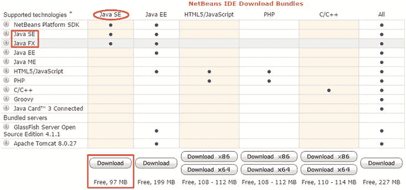
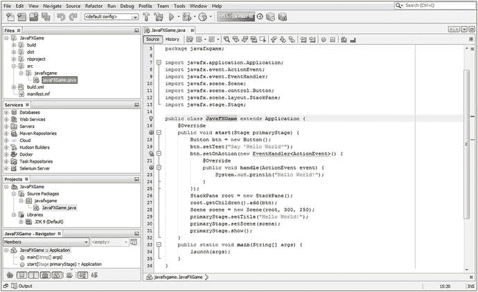
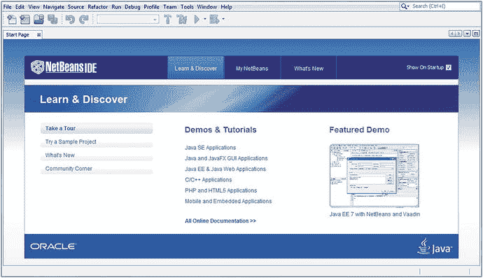
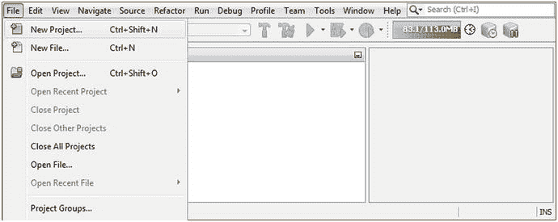
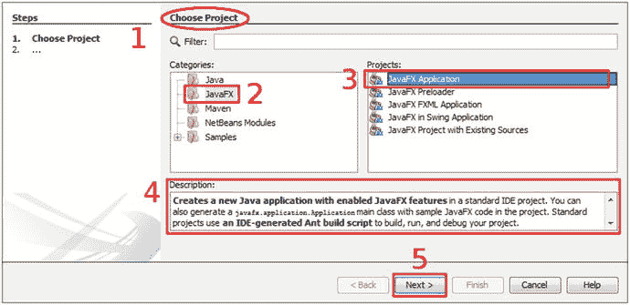
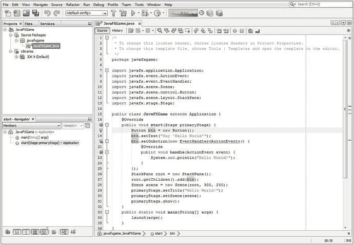
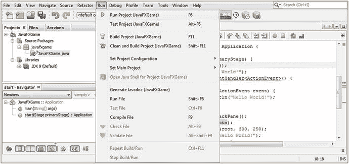
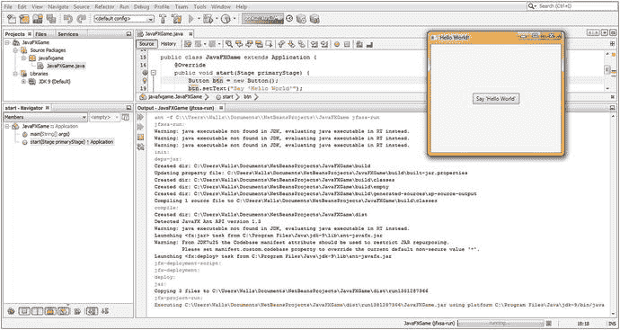

# 六、设置 Java 9 IDE：NetBeans 9 简介

让我们从第 [6](06.html) 章开始，了解 NetBeans 9 集成开发环境(IDE)的重要特性和特征，因为它是您将用来创建专业 Java 9 游戏和物联网应用的主要软件。尽管 Java 9 JDK 是您的专业 Java 9 游戏以及 NetBeans 9 IDE 的基础，但我们将从学习 NetBeans 开始我们的 Java 游戏编码之旅，NetBeans 是您的 Java 游戏项目的“前端”(或窗口，通过它您可以查看和工作)。

NetBeans 9 是 Java 9 JDK 的官方 IDE，因此，它将是您在本书中使用的。这并不是说你不能使用另一个 IDE，比如 Eclipse 或 IntelliJ，它们分别是 32 位 Android 4.4 和 64 位 Android Studio 3.0 的官方 IDE。我更喜欢将 NetBeans 9 用于我的新媒体应用，将游戏开发用于我的 Java 9 和 JavaFX 游戏以及物联网应用软件开发编程范例。

这不仅是因为 NetBeans 9 可以集成第三方插件，如 Gluon 的 JavaFX Scene Builder，还因为它是一个 HTML5+CSS4+JS IDE，我通常使用 Java 9、JavaFX、Android 4.4 和 Android 8.0 为我的客户创建我设计的所有东西，也使用 HTML5。我这样做是为了让内容可以在封闭的、专有的操作系统和平台上运行，这些操作系统和平台到目前为止还没有命名。正如你们大多数人所知，我更喜欢开放(源代码)软件和平台，正如你们可能在第 [1](01.html) 章中观察到的那样，因为它们“天生”是开放的，可免费用于商业用途，广泛可用，受到 99%的主要制造商的支持，并且不需要批准过程。或者我只为一个特定的硬件平台或一个操作系统发布应用。

值得注意的是，NetBeans 9 支持许多其他流行的编程语言，例如 C、C++、Groovy 和 PHP。我使用 NetBeans 9 进行 HTML、CSS 和 JavaScript 网站和应用开发，因为 NetBeans 正在迅速成为一流的 Java、JavaFX 和 HTML5 应用开发环境。

我们要做的第一件事是看一下 NetBeans 版本 9 中的新增功能。NetBeans 8.2 于 2016 年第四季度发布，大约在 Java 8 发布一年半之后。这种版本号同步并非巧合，因为 NetBeans 8.0 是在 Java 8 之后发布的，而 NetBeans 9 很可能会在 2017 年第四季度 Java 9 之后发布。在本章中，我们将了解为什么您希望使用 NetBeans 9，而不是旧版本的 NetBeans。

我们接下来要做的事情是了解 NetBeans 9 IDE 的各种属性，这些属性使它成为 Pro Java 9 游戏开发的宝贵工具。在这本书的过程中，我们将会看到它为你提供的所有令人惊奇的特性；在本章中，您将无法获得其中一些功能的实际操作经验，因为我们还需要开始创建您的游戏，并因此将引导代码库或应用基础结构放置到位，以便您可以真正体验这些 NetBeans 9 IDE 功能。

因此，在本章的后半部分，您将学习如何使用 NetBeans 9 创建 Java 9 和 JavaFX 9 项目。这样，您就可以通过创建一个真实世界的 i3D 棋盘游戏，开始稳步前进，并使您的 Pro Java 9 游戏开发成为现实，您将在本书的过程中开发该游戏。

## NetBeans 9 的新特性:Java 9 模块集成

NetBeans 9 是该软件在稳定版 8.2 之后的下一个主要修订版，现在集成了 Java 9 模块系统、Java 9 运行时版(JRE)和 JUnit Java 测试套件，因此这些不必单独下载。如果您正在下载 NetBeans 9 for HTML5+CSS+JS、PHP 或 C++，您不再需要下载 JDK 或 JRE。这可以在 NetBeans IDE 下载包页面上看到，如图 [6-1](#Fig1) 所示，这也是为什么有针对 HTML5/JS、PHP 和 C/C++的 32 位(x86)或 64 位(x64)预编译 NetBeans 9 版本的原因。



图 6-1。

The Java SE Edition NetBeans download bundle contains the NetBeans platform, Java SE, and JavaFX SDKs

也就是说，如果您使用任何其他版本(Java SE、Java EE 或 All ),就像本书一样，JRE 不包括在内。这是因为您将下载 JDK，正如您在第 [1](01.html) 章中所做的那样，以便能够使用这些 Java SE(或 EE，对于大公司而言)版本，正如您已经看到的，JRE 包含在下载和安装过程中。NetBeans 9 还支持 Apache Ant 和 Maven 存储库的最新版本。在本章的剩余部分，我将介绍自 2014 年第一季度 NetBeans 版发布以来的一些新功能。我将使用子部分对它们进行分类，并根据相关主题为读者进行组织。

### Java 9 支持:模块、Ant、Java Shell、多版本

NetBeans 9 将与 Java 9 同时发布，因此它的主要目标是支持 Java SE 9 版本的所有特性和功能。这将包括新的 Java 9 模块特性，这将提高安全性，并使开发者能够优化他们的 Java 9 游戏发行版的数据足迹。这将包括基于 Ant 和基于 Maven 的 Java 9 项目，因此 Ant 和 Maven 构建系统将被升级以支持 Java 9 模块。

Java 9 SE 应用项目最初将支持单模块开发(包括所有模块)以及支持多模块开发的新项目类型，因此您可以挑选 Java 9 模块。我们最终将只使用几个核心 JavaFX 模块(base、graphics 和 media ),这样我们的发行版数据占用空间将会显著减少，但我们将在本书的最后完成，因为这是一个更高级的主题。

Apache Ant 正在更新，以获得对 JDK 9 的支持，涵盖基本的 Ant 任务，并且当 NetBeans 9 在 JDK 9 上运行或 JDK 9 被设置为您项目的 Java 平台时，Java 9 SE 发行版中的所有工具都将正确工作。NetBeans Profiler 现在可以与 JDK 9 应用协同工作，Java shell 支持以及与 NetBeans 9 IDE 的集成已经添加到 NetBeans 9 项目的每个级别。NetBeans 9 及其集成的 Java 9 支持现在可以正确处理多版本 JAR 文件。

最后，NetBeans 9 项目将很快转移到 Apache 上。该提案可在 [`https://wiki.apache.org/incubator/NetBeansProposal`](https://wiki.apache.org/incubator/NetBeansProposal) 进行审核。该提案涵盖了这一变化将如何影响 NetBeans 9 版本。在 NetBeans 9.0 和 9.0.1 版本中，将会迁移源代码、错误、构建作业和相关服务。

### IDE 用户体验:更多信息和智能编码

NetBeans 8.1 引入了一个改进的代码导航窗格，它现在可以区分游戏的 Java 方法所包含的超类或接口，以及方法名及其返回类型。代码补全(我们将在本章的下一个主要部分中介绍)在 NetBeans 8.1(以及 8.2 和 9 等更高版本)的几乎所有方面都得到了显著改进，包括改进了最相关的 Java 代码插入项的预选、改进了前缀自动补全、改进了子词自动补全以及改进了 Java 枚举值的自动补全。

### Java 代码分析:完全重新设计的 Java 分析套件

NetBeans 在 8.1 版中对其 Java 代码分析套件进行了全面的检查，包括简化的分析器设置、无需预先设置的新的单击式 Java 代码分析，以及只需选中代码分析结果旁边的复选框即可选择方法或类进行详细分析的能力。附加到正在运行的进程的能力有所提高，并且选定的 PID 会被记住以供后续会话使用。新特性包括监控 CPU 利用率、从分析的应用中转储线程的能力、在 CPU 分析视图中显示所选线程的合并结果的能力，以及改进的实时应用分析视图。

其他新的评测器功能包括 CPU 评测结果中的实时正向和实时反向调用树、系统内存评测结果中的实时分配树，以及在评测会话期间简化的设置调整。

该 NetBeans 分析引擎是 8.1(及更高版本)ide 中改进最多的，包括连接到正在运行的进程时显著加快的连接速度，对当前分析方法的传出调用的限制，以及为某些预选类分析系统内存性能的能力。所有这些都将有助于优化 Pro Java 9 游戏开发，因为游戏需要最高性能。

profiler 用户界面(UI)现在变得更加完美和专业，具有一个统一的分析窗口，在一个可定制的托管视图中包含所有操作、设置和结果。有一个单独的快照窗口窗格，您可以使用它来管理持久性分析数据。

还有一个全新的、100%重新实现的 profiler 表和树表区域，它提供了具有本机外观的分析外观，允许开发人员无缝集成代码开发和优化。

与 NetBeans IDE 的其余部分的分析器集成也有了很大的改进；此外，还有一个更加完美的 profile 菜单，添加了一个名为 Attach to Project 的新操作，并且在代码导航器中添加了 Profile 类和 Profile 方法操作。在本书的后面，当我们需要在 Java 9 游戏中实现系统内存和 CPU 优化时，我们将会看到 NetBeans 9 Profiler。

## NetBeans 9 的主要属性:智能 IDE

在本节中，我将向您全面介绍 NetBeans 9 的所有强大功能，以便您了解安装在开发工作站上的这个 IDE 工具有多强大，以及掌握它的所有功能有多重要，这样您就可以作为一名专业的 Java 9 游戏或物联网应用开发人员来运用所有这些功能。IDE 是您使用 JavaFX APIs 编写的 Java 9 代码和您的计算机之间的接口；它允许您可视化您的代码，将其组织成逻辑方法，在您的计算机上测试它，分析它相对于您的系统内存和处理器周期的最佳运行情况，并将其打包以便通过网站在互联网上分发，或者作为 Windows、OS/X、Linux 或 OpenSolaris 的独立应用用于桌面计算机，甚至作为 Android OS 或 Tizen OS 的嵌入式设备应用。理想情况下，iOS、Opera OS 和 Chrome OS 也将在 2018 年前支持 Java 9 应用，因为 Android 和 Tizen 已经在 Linux 内核之上的 Java(Android OS)和 Linux 内核之上的 html 5(ti Zen OS)平台上占据了最大的市场份额。

### NetBeans 9 是智能的:将您的代码编辑放在 Hyperdrive 中

虽然 IDE 确实非常类似于文字处理器，只是针对创建模块化代码结构而不是编写业务文档进行了优化，但是 NetBeans 9 这样的集成开发环境在开发人员的编程工作过程中提供的帮助要比文字处理器在作者的写作和文档创作工作过程中提供的帮助大得多。文字处理器主要用于使用桌面出版功能格式化文本以使其看起来像样，纠正拼写错误，以及纠正语法和句子结构。

例如，您的文字处理器不会对您为业务编写的内容提出实时建议，而 NetBeans 9 IDE 会在您实时编写代码时查看您正在编写的内容，并在您创建代码时帮助您完成 Java 代码语句和 Java 代码结构的编写。因此，NetBeans 9.0 可以说比工作处理器具有更高的人工智能商数，如 Microsoft Office、Corel WordPerfect、Apache Open Office 或 Ubuntu Libre Office current feature。

NetBeans 要做的事情之一是为您完成 Java 代码行，以及对代码语句应用颜色以突出不同类型的构造(类、方法、变量、常量、数组、引用)，如图 [6-2](#Fig2) 所示。NetBeans 将应用行业标准代码缩进，使 Java 代码更易于阅读，无论是对您自己还是对您的 Pro Java 9 游戏和物联网应用开发团队的其他成员。



图 6-2。

NetBeans includes Files, Services, Projects, Navigator, and Output Panes (left top to bottom) as well as a Java editor

NetBeans 还将提供匹配或缺失的代码结构元素，如括号、冒号和分号，以便您在创建复杂、深度嵌套或异常密集的编程结构时不会迷路。当我把你从 Java Game Developer 带到 Pro Java 9 Game Developer 时，你将创建具有这些特征的高级 Java 构造，随着你在本书中 Java 代码复杂性的进步，我将肯定指出当我们在你的游戏中实现它时，密集、复杂或深度嵌套的 Java 8 和 Java 9 代码。

NetBeans 还可以提供引导代码，例如我们将在本章稍后创建的 JavaFX 游戏应用引导代码，因为我知道您急于开始创建您的 Pro Java 9 游戏。NetBeans 9 提供了您可以填写和自定义的代码模板、编码提示和技巧以及代码重构工具。随着您的 Java 9 代码变得越来越复杂，它成为代码重构的逻辑候选者，这可以使代码更容易理解，更容易升级，并且更高效。NetBeans 还可以自动重构您的代码。

如果您想知道什么是代码重构，它是改变现有计算机代码的结构，使其更有效或更具可伸缩性，而不改变其外部行为(即，它完成了什么)。例如，NetBeans 可以采用传统的 Java 7 代码，并通过实现 Java 8 中引入的 Lambda 表达式来提高效率。

NetBeans 9 还将提供一种或另一种类型的弹出帮助器对话框，其中包含方法、常量、资源引用(在本书中编写 Pro Java 9 游戏时，您将了解所有这些内容)，甚至是关于如何构造 Java 语句的建议。例如，NetBeans 9 会建议何时使用 Java 8 Lambda 表达式来简化代码并兼容多线程。

### NetBeans 9 是可扩展的:用多种语言编辑代码

你的文字处理器不能做的另一件事是允许你给它增加功能，NetBeans 9 可以用它的插件架构做到这一点。描述这种类型的体系结构的术语是可扩展的，这意味着，如果需要，它可以扩展以包括附加的特性。例如，如果您想扩展 NetBeans 9 以允许您用 Python 编程，您可以这样做。NetBeans 9 也可以以这种方式支持 COBOL 或 BASIC 等较老的语言，尽管由于目前大多数流行的消费电子设备都使用 Java、XML、JavaScript、SVG 和 HTML5，我不太确定为什么有人愿意花时间这样做。我谷歌了一下，发现有人在 NetBeans 中用 Python 和 COBOL 编程，所以有现实证明这个 IDE 确实是可扩展的。

可能是因为其可扩展性，NetBeans 9 IDE 支持许多流行的编程语言，包括客户端的 C、C++、Java SE、Javadoc、JavaScript、XML、HTML5 和 CSS，以及服务器端的 PHP、Groovy、Java EE 和 Java Server Pages (JSP)。客户端软件在终端用户持有或使用的设备上运行(在 iTV 机的情况下)，而服务器端软件在某处的服务器上远程运行，并且当软件在服务器上运行时，通过因特网或类似网络与终端用户对话。

客户端软件将更高效，因为它位于运行它的硬件设备的本地，并且因此它更具可伸缩性，因为不涉及经历任何过载的服务器。随着越来越多的人在任何给定的时间点使用服务器端软件，服务器过载总是会发生。您创建的 Java SE 9 和 JavaFX 游戏或物联网交付物往往位于客户端，在网站中交付并使用网站，但也可以通过 JNLP 下载在客户端使用，或者下载 JAR 或针对给定操作系统平台编译的可执行文件。

### NetBeans 9 是高效的:有组织的项目管理工具

显然，项目管理功能在任何主流 IDE 中都必须非常强大，NetBeans 9 包含了大量的项目管理功能，这些功能允许您以多种不同的分析方式查看您的专业 Java 游戏开发项目及其相应的文件以及这些文件之间的相互关系。有六种主要的项目管理视图或窗格，可以用来观察项目中各种类型的相互关系。图 [6-2](#Fig2) 显示了 bootstrap pro Java 9 游戏开发 JavaFX 项目，我们将在本章稍后创建该项目。

图 [6-2](#Fig2) 显示了为这个新项目打开的六个主要项目管理窗格或窗口，这样你就可以准确地看到它们将向你展示什么。一个优秀的编程 IDE 需要能够管理可以变得非常庞大的项目，包括超过一百万行代码，并且包含在项目文件夹层次结构中的数百个文件夹中。这可能涉及数千个文本(Java 9 代码)文件，以及数百个文件形式的新媒体素材，有些是基于文本的(SVG、XML)，有些是二进制数据格式的(JPEG、MPEG)。

“项目”窗格显示构成 Java 9 游戏项目的 Java 源代码包、库和模块。这可以在图 [6-2](#Fig2) 的左下方看到。顶部的窗格是文件窗格，显示硬盘上的项目文件夹及其文件层次结构。

下面的服务窗格显示了数据库、服务器、存储库、Docker 和构建主机，以便在项目中使用它们。这些主要是服务器端技术，这些技术通常用于大型开发团队，所以我们不打算详细讨论这些，因为这是一本为单人游戏设计者编写的书。

项目窗格应该始终保持打开，在 ide 的左侧，从图 [6-7](#Fig7) 开始，您将在本章的所有图中看到。“项目”窗格或窗口为您提供了 Java 9 游戏项目中所有项目源代码和资源(内容)的主要访问点。文件窗格不仅显示项目文件夹和文件层次结构，还显示每个文件中的数据、JavaFX 新媒体素材和 Java 9 代码层次结构。

“导航”窗格显示在 NetBeans IDE 底部的“文件”、“项目”和“服务”窗格下面，它显示了 Java 代码结构中存在的关系。在本例中，这是 JavaFXGame 类。start()方法，而。main()方法，我们将在第 [7](07.html) 章中学习，在我们学习了所有关于 NetBeans 9 IDE 的知识以及如何使用它来创建一个名为 JavaFXGame 的 Java 9 游戏项目之后，我们将很快完成这个项目。

### NetBeans 9 是 UI 设计友好的:用户界面设计工具

NetBeans 9 的可扩展插件功能支持许多平台的 design-your-UI 拖放设计工具，包括 Java SE、Java EE、Java ME、JavaFX 和 Swing，以及 C、C++、PHP、HTML5 和 CSS4。NetBeans 9 支持为您编写应用 UI 代码的可视编辑器，因此您所要做的就是使屏幕上的可视内容看起来像您希望它在游戏应用中的样子。由于游戏使用 JavaFX 新媒体游戏引擎，NetBeans 支持 Gluon JavaFX Scene Builder Kit，这是一种高级 JavaFX 用户界面设计可视化(拖放)编辑器。

由于 JavaFX 具有 PRISM 游戏引擎以及 3D(使用 OpenGL ES 或嵌入式系统)支持，因此我们将主要关注本书的 i3D，因为我在《Java 8 游戏开发入门》(Apress，2014)中已经介绍过 i2D。这本书的假设是，读者将希望构建最先进的专业 Java 游戏，这将等同于利用 JavaFX 引擎的 3D 和 i3D，Java FX 引擎现在是 Java 8 和 9 的一部分(以及 Lambda 表达式)。最有效的方法是使用 Java 代码，而不是拖放式代码生成器。

开发 pro Java 9 游戏的最快方法是利用 Java 和 JavaFX 环境慷慨提供的高级代码和编程结构，供您在创建尖端应用时使用。在这种情况下，这将是 pro Java 游戏，其中包含强大的新媒体元素，如 2D 矢量、3D 矢量、数字音频、视频和数字图像，这些元素组合在一起成为一个统一的 2D 和 3D 混合内容创建管道。

### NetBeans 9 对 Bug 不友好:用调试器消除 Bug

每一种计算机编程语言都有一个普遍的假设，即一个“bug”，或者没有完全按照您的要求运行的代码，其对编程项目的负面影响会随着问题得不到解决的时间越长而越大。正因如此，可以说这些虫子一“出生”就需要被“压扁”。NetBeans 9 有大量的错误查找代码分析工具，可以使用集成的 NetBeans 调试器来访问这些工具。NetBeans 9 还支持与第三方 Find Bugs 3.0.1 项目的集成，该项目可以在 SourceForge.net 上找到，如果你想下载单机版，可以在`findbugs.sourceforge.net`找到。

这些工具将我们在本章本节开始时讨论的实时“键入时”代码纠正和编码效率工具提升到高级调试的下一个级别。

您的 Java 代码不会变得那么复杂，直到本书的稍后部分，所以当我们需要在后面的章节中使用这些高级工具时，当您的知识库更高级时，我们将会介绍它们是如何工作的。

### NetBeans 9 是一个速度狂:用分析器优化你的代码

NetBeans 还有一个称为 Profiler 的东西，这是 NetBeans IDE 在 8.1 版中彻底改进的领域之一，正如我在前面的“NetBeans 代码分析”一节中指出的那样。NetBeans Profiler 工具会在 Java 8 或 Java 9 代码实际运行时查看这些代码，并告诉您它使用内存和 CPU 周期的效率。这种剖析分析将允许您优化代码，并使其更有效地使用关键系统资源，如线程、系统内存和处理周期。这对于 Pro Java 9 游戏开发来说非常重要，因为分析复杂的游戏可以帮助您在嵌入式系统上优化游戏的“流畅度”，与普通的六核和八核 CPU 相比，嵌入式系统不是很强大(例如，在单核或双核 CPU 上)，或者在使用双核或四核 CPU 的不太强大的计算机系统上。

这个分析器是一个动态的软件分析工具，因为它在 Java 代码运行时查看您的代码，而 FindBugs 代码分析工具可以说是一个静态的软件分析工具，因为它只是在编辑器中查看您的代码，而不是“编译”并运行在系统内存中。因为我已经在第 4 章[中讨论了静态和动态的重要性，所以你知道动态处理对于你的职业 Java 游戏开发工作过程来说是多么强大和 CPU 密集型。同样的考虑也适用于实时调试。NetBeans 调试器还允许您在代码运行时逐句通过代码，因此该工具可以被视为“混合体”，它跨越了静态(编辑)和动态(执行)代码分析模式之间的鸿沟。](04.html)

为 Pro Java 9 游戏及其 JavaFX PRISM 引擎创建项目基础后，在本章的下一节中，如果您喜欢使用 IDE 顶部的 Profile 菜单，可以运行 Profiler。然而，如果你这样做，你根本看不到什么，因为 Hello World bootstrap 应用实际上什么都不做。

因此，在添加实时渲染的 3D 素材等内容时，我们将进入 NetBeans Profiler。在本章中，我将尽量让您“提前”了解 NetBeans 9 的这些关键功能，而不需要使用很多页面，这样您就可以轻松使用该软件，并且在本书的过程中，当 IDE 相关的任何内容(有时是字面意思)出现时，您不会感到惊讶或“措手不及”。

事不宜迟，让我们启动 NetBeans 9 并创建您的基于引导 JavaFX API 的 pro Java 9 游戏项目，这样我们就可以在本章中对您的 Pro Java 9 游戏进行一些 Java 9 和 JavaFX 编程。

## 创建 Pro Java 9 游戏项目:JavaFXGame

让我们言归正传，为您将在本书的课程中创建的 pro Java 9 游戏创建一个项目基础，以便您在本书的每一章中都朝着您的最终目标前进。我将在本书的过程中向您展示如何创建一个原创游戏，以便您看到创建一个不存在的游戏所涉及的过程，而不是大多数游戏编程书籍复制市场上已经存在的游戏或将素材拖放到预建的游戏引擎中。为了开始 Java 8 游戏开发(Apress，2014)，我得到了我的客户的许可，允许读者在这本书的过程中看到创建 i2D InvinciBagel 游戏的过程。对于这本书，我将创建 i3D 棋盘游戏引擎，用于我自己的`iTVboardgame.com`网站。

单击任务栏上的快速启动图标，或者双击桌面上的图标以启动 NetBeans 9，您将看到 NetBeans 9 启动屏幕。此屏幕会显示一个进度条，告诉您如何配置 NetBeans 9 IDE 以供使用。这包括将 IDE 的各种组件加载到计算机的系统内存中，以便在 pro Java 9 游戏开发过程中可以流畅地实时使用 IDE。

将 NetBeans 9 IDE 加载到系统内存后，初始 NetBeans 9 起始页将显示在您的显示屏上，如图 [6-3](#Fig3) 所示。单击“起始页”选项卡右侧的 x。这将关闭此介绍页(选项卡)，并显示 NetBeans 9 IDE，如图 [6-4](#Fig4) 左侧所示。



图 6-3。

Close the Start Page tab (upper left) by clicking the x on the right side of the tab to reveal NetBeans 9 IDE

这将显示我称之为“原始”的 IDE，IDE 中没有活动的项目。现在好好享受吧，我们很快就会为你的项目组件在这个 IDE 中填充窗口(我称之为浮动调色板窗格，因为整个 IDE 都在我称之为窗口的地方)。你可以在图 [6-4](#Fig4) 中看到这个空 IDE 的一部分，没有太多可看的，因为目前只有顶部菜单和快捷图标，也在 IDE 的顶部，目前没有太多其他可见的。

如果您想知道，您退出的起始页仅在您第一次启动 NetBeans IDE 时显示，但是如果您希望以后打开此起始页选项卡，以便您可以浏览演示和教程部分，您可以这样做！要随时打开此起始页，您可以使用 NetBeans 9.x 帮助菜单，然后选择起始页子菜单。我通常会表示一个菜单序列，如帮助➤开始菜单，只是为了你将来的参考。如果你在本书后面看到这样的结构，它是嵌套子菜单的级联菜单序列。

在 NetBeans 9.0 IDE 中，您要做的第一件事是创建一个新的 JavaFXGame Java 项目。为此，我们将使用 NetBeans 9.0 新项目系列对话框。这是我在上一节中谈到的一个有用的 Java 编程特性，它使用正确的 JavaFX 库创建您的引导项目。main()和。start()方法、java 语句和 import 语句，所有这些都将在下一章中学习。点击你的 NetBeans 9 IDE 左上角的文件菜单，如图 [6-4](#Fig4) 所示，然后选择新建项目菜单项，恰好是第一个菜单项。



图 6-4。

Use the File ➤ New Project menu sequence (upper left) to open the NetBeans 9 New Project series of dialogs

请注意，在新项目菜单项的右侧，列出了一个 Ctrl+Shift+N 快捷键组合，以防您想记住它。

如果您想要使用此键盘快捷键来调用新的项目系列对话框，请按住键盘上的 Ctrl 和 Shift 键(同时按住)，并在按住它们的同时，按下 N 键。这将做同样的事情选择文件➤新项目菜单序列用你的鼠标。

系列中的第一个对话框是选择项目对话框，显示在图 [6-5](#Fig5) 的右侧。因为您将在游戏中使用强大的 JavaFX 新媒体引擎，所以在左侧的类别选择器窗格中，从所有编程语言类别的列表中选择 JavaFX 类别，对于步骤 2，该类别标有红色数字 2。



图 6-5。

Use the Choose Project dialog to specify a JavaFX Application for your Pro Java Game

接下来，从右侧标有红色数字 3 的项目选择器窗格中选择 JavaFX Application，执行步骤 3。我们选择这个是因为你的 pro Java 9 游戏将是一种 JavaFX API 应用。您可以在描述窗格(显示为红色数字 4)中阅读每个项目类型的描述，最后单击下一步按钮前进到下一个对话框，在图 [6-5](#Fig5) 中显示为红色数字 5。

请记住，Oracle 决定将 JavaFX API(当时是库，现在是模块)集成到 Java 7 和 Java 8 中，因此 JavaFX 游戏现在只是一个 Java 游戏，而在 Java 7 之前(在 Java 6 中)，JavaFX 2.0 是它自己独立的编程语言！JavaFX 引擎(您将在下一章中了解更多)必须完全重新编码为 Java 7(和 Java 8) API 或库集合(现在在 Java 9 中它变成了模块)，才能成为 Java 9 编程语言的无缝集成组件。

JavaFX API 将取代 Abstract Windowing Toolkit (AWT)和 Swing (UI 元素),尽管这些旧的 UI 设计库仍然可以在 Java 项目中使用，但它们通常只由遗留(旧的)Java 代码使用，因此这些项目仍然可以在 Java 1.02、2、3、4、5、6、7、8 和 9 下编译和运行。您将编译并运行这个新的基于 JavaFX API 的项目，该项目是您在本章的这一节中创建的，因此您将看到 JavaFX 正在 Java 9 下运行。JavaFX 的当前版本是 9，因为 Oracle 使版本号与 Java 9 相匹配，然而，这些类与我在 Java 8 游戏开发入门书中使用的是相同的。

请注意，在其他窗格下面有一个描述窗格，它会告诉您所选择的内容。在这种情况下，这将是一个启用了 JavaFX 特性的新 Java 应用，其中“enabled”意味着 JavaFX 9 API 库将通过一系列 import 语句包含(并启动)在 Java 应用项目的类和方法中，您将很快在代码中看到这一点。您将在第 [7](07.html) 章中了解所有这些 Java 9 和 JavaFX 9 代码的作用，这将涵盖 JavaFX 9 及其许多用户界面设计和多媒体相关特性。

点击 Next 按钮，进入新 Java 项目系列对话框中的下一个对话框，即名称和位置对话框，如图 [6-6](#Fig6) 所示。该对话框允许您使用项目位置和项目文件夹数据字段设置应用项目名称，该名称将用于创建类名和包名，以及您希望项目存储在硬盘上的位置，这些也在图 [6-6](#Fig6) 中显示。


图 6-6。

Name the project JavaFXGame, and leave all other naming conventions the way NetBeans set them

将项目命名为 JavaFXGame，保留默认的项目位置、项目文件夹、JavaFX 平台，并完全按照 NetBeans 为您配置的方式创建应用类设置，因为此 NetBeans 对话框将根据项目名称自动为您实现所有的类和包命名约定。

完成后，您可以单击“完成”按钮，这将告诉 NetBeans 9 为您创建 JavaFX 游戏应用，并在 NetBeans 9 IDE 中打开它，以便您可以开始使用它并了解 JavaFX API。

让 NetBeans 9.0 按照应该的方式为您做事情通常是一个好主意。如图 [6-6](#Fig6) 所示，NetBeans 使用该对话框中的项目位置和项目文件夹数据字段为用户文件夹和文档子文件夹创建逻辑`C:\Users\Walls\Documents\NetBeansProjects\JavaFXGame`文件夹。

对于项目文件夹数据字段，NetBeans 将(逻辑上)创建名为 JavaFXGame 的子文件夹。这将位于 NetBeansProjects 文件夹下，就像是您自己创建的一样，只有 NetBeans 9 为您完成了这项工作。

对于 JavaFX 平台选择下拉列表，NetBeans 9 默认为最新的 Java 9 JDK，也称为 JDK 1.9，具有最新的 JavaFX API(现在是 Java 7、8 和 9 语言的集成部分)。

在这一点上，我们不打算实现一个定制的预加载器项目，尽管如果我有时间和剩余的页数，我可能会在本书的后面部分重新讨论这个问题。因此，请不要选中此选项，这样您就可以学习自己创建这个预加载器 Java 9 项目代码，而不是让 NetBeans 9 为您完成。

因为您没有创建共享库的多个应用，所以不要选中使用专用文件夹存储库复选框，最后，确保正确配置了创建应用类。Java 9 类应该命名为 JavaFXGame，应该包含在 javafxgame 包中。

在这个配置中，包路径和类名将是`javafxgame.JavaFXGame`。这将跟在 PackageName 后面。ClassName Java 类和包名范例、camelCase 大小写和路径，使用点符号句点字符将包名连接到类名的头部，显示它保存的位置。

在第 [7](07.html) 章中，我将查看图 [6-7](#Fig7) 中所示的 Java 代码的一些基本组件，因为在本章中，我们将主要关注 NetBeans 9.0 IDE 及其特性，在第 [7](07.html) 章中，我们将完全专注于 JavaFX 编程语言，然后在第 [8](08.html) 章中，我们将讨论场景图。

如图 [6-7](#Fig7) 所示，NetBeans 已经写好了 package 语句，7 条 JavaFX API package import 语句，以及`public class JavaFXGame extends Application`声明；子类化你的 JavaFXGame 类，使用一个 JavaFX `Application`超类，创建一个启动`public void start(Stage primaryStage)`的方法，创建一个. main()方法来管理你的主 JavaFX 线程`public static void main(String[] args)`。

如图 [6-7](#Fig7) 所示，NetBeans 9 将重要的 Java 编程语句关键字着色，将关键字用蓝色表示，字符串对象用橙色表示，内部 Java 和系统引用用绿色表示，注释用灰色表示。NetBeans 9 IDE 插入的有关 Java 9 代码的警告和建议用黄色标出，而阻止编译可执行文件(JAR)的 Java 9 编码错误用红色标出。

第 20 行还显示 NetBeans 提供了将按钮对象事件处理转换为 Lambda 表达式的功能，方法是给它加黄色下划线(警告:这可以转换为 Java 8 Lambda 表达式)。



图 6-7。

Examine the bootstrap JavaFX code NetBeans created for you, based on the Name and Location dialog

如果您愿意，也可以更改这些颜色，但是我建议您使用 Oracle NetBeans 9 和更早版本实现的行业标准编码颜色，因为这些颜色已经随着时间的推移变得标准化了。

在运行此引导代码以确保 NetBeans 9 为您编写的引导 Java 9 代码能够正常工作之前，您需要将此代码编译为可执行格式，以便使用系统内存运行。NetBeans 9 还为您管理编译和运行过程，即使这些操作实际上利用了 Java 开发工具包(JDK)提供的实用程序。

接下来，我们来看看如何使用 NetBeans 9 完成这一任务，使用 NetBeans 9 的“运行”菜单，其中包含运行、测试、构建、清理、编译、检查、验证、生成 JavaDoc 以及其他与运行相关的 Java 编译功能。

## 在 NetBeans 9 中编译一个 Pro Java 9 游戏项目

为了向您展示如何在运行和测试 Java 游戏代码之前编译它，我在这里向您展示了一步一步的工作过程，这样您就可以接触到编译/构建/运行/测试 Java 代码测试过程的每一步。点击 Run 菜单和 Run Project (JavaFXGame) (first)菜单项，构建、编译并运行您的 Java 9 和 JavaFX 代码，如图 [6-8](#Fig8) 所示。您也可以使用 F6 快捷键，如菜单项选择右侧所示。现在您的项目已经准备好进行测试了！



图 6-8。

Use Run ➤ Run Project (JavaFXGame) to build and run the project to make sure the NetBeans IDE is working

图 [6-9](#Fig9) 显示了 NetBeans 9.0 构建/编译/运行进度条，该进度条在编译期间将始终出现在 NetBeans 9.0 IDE 的右下角。还显示了输出窗格，最大化以便我们可以看到 Ant 构建过程做了什么，我们将在本章的下一节中更详细地了解它。

这里需要注意的是，只要您使用文件➤保存菜单序列或 Ctrl-S 键盘快捷键，NetBeans 9.0 就会编译您的项目代码，因此，如果您在创建引导代码后立即使用了 NetBeans IDE 的保存功能，您就不需要执行此编译过程，我刚刚向您演示了如何手动执行此过程，因为此过程会在您每次保存 Java 游戏项目时自动完成。

图 [6-9](#Fig9) 中还显示了输出窗格或窗口正上方的。Java 代码编辑窗格或窗口中的 start()方法。左边是一个减号图标，周围有一个正方形。这应该用于折叠或隐藏该方法的内容。只需单击代码编辑窗口左侧的减号图标即可。

减号图标将变成加号图标，以便折叠的代码块可以“展开”(取消折叠)。现在，我们已经了解了如何在 NetBeans 9 中编译项目，以及如何在 JavaFXGame.java 项目的代码中折叠和展开逻辑方法代码块(Java 类的逻辑功能组件)的视图，是时候运行这些代码了，看看它是否有效。如果是这样的话，我们可以进入第 7 章，开始学习 JavaFX API 以及它给 Java 9 编程环境带来的新的媒体开发能力。

## 在 NetBeans 9 中运行您的专业 Java 游戏项目

既然您已经创建并编译了使用 JavaFX game 项目的引导 Java 9，那么是时候运行或执行引导代码了，看看它能做什么。正如您已经了解到的，您可以使用 NetBeans 顶部的“运行➤”“运行项目”菜单序列来访问“运行项目”菜单项，或者如图 [6-9](#Fig9) 左上角所示，您可以使用看起来像绿色视频传输播放按钮的快捷图标。如果你把鼠标放在上面，你会得到一个浅黄色的工具提示，显示一个运行项目(JavaFXGame) (F6)弹出帮助信息。在编写 Java 9 和 Android Studio 书籍时，我通常会使用较长的菜单序列，而不是快捷图标，这样做只是为了更彻底。这向读者显示了 IDE 菜单系统中所有东西的位置，所以所有东西都被包含了。如果还没有，现在就运行新的 JavaFXGame 应用。一旦运行了编译好的 Java 9 和 JavaFX 代码，就会在 NetBeans IDE 上打开一个窗口，在其中运行您的软件，如图 [6-9](#Fig9) 右侧所示。目前它使用流行的 Hello World 示例应用。



图 6-9。

Drag up the separator bar to reveal the Output area of the IDE (running application seen at right)

在 Java 9 代码编辑窗格和代码编辑器窗格底部的输出选项卡之间的分隔线上方单击并按住鼠标左键，向上拖动分隔线，调整相对窗口空间的大小。该空间在 JavaFXGame.java 代码编辑窗格和输出 JavaFXGame 信息窗格之间共享。做这个调整大小的操作将会显示你的输出标签和它的编译信息内容，如图 [6-9](#Fig9) 所示。

这个 Output 选项卡将包含 NetBeans 9 的不同类型的输出，例如编译操作输出、运行操作输出(如图 [6-9](#Fig9) 所示)、探查器操作输出(我们将在本书后面的内容中对其进行分析)，甚至是您的应用本身的输出(我们将在这里查看)。

你可能已经注意到，在图 [6-7](#Fig7) 中，你的 bootstrap Java 和 JavaFX 应用的代码在第 23 行使用了一个绿色的`System.` `out` `.println("Hello World!");` Java 语句，所以如果你想看到你当前运行的应用打印到输出窗格(这就是 out 的意思，通常被称为输出控制台)，你可以在你的 IDE 上当前运行的 Hello World 应用中点击“Hello World”按钮。

一旦你点击按钮，就会出现“你好，世界！”应该出现在 Output 选项卡中的红色文本下，表示它正在执行 JavaFXGame.jar 文件。JAR 文件是 Java 归档文件(J 代表 Java，AR 代表归档文件),是 Java 9 应用可用的可分发格式之一。

编译过程的一部分涉及到创建这个文件，所以如果编译后的版本可以工作，那么当所有的应用设计、编程、测试和优化完成后，您就可以准备好发布 JAR 文件了。

JAR 文件不包含您实际的 JavaFX 代码，而是一个压缩的、加密的“Java bytestream”版本的应用，JRE 可以执行和运行它(就像 NetBeans 9 现在所做的那样)。JavaFXGame.jar 文件前面的“路径”告诉您 NetBeans 9 将 jar 文件编译到硬盘上的哪个位置，以及它当前从哪个位置访问它以便能够运行它。在我的系统上，这个位置如下:

```java
C:\Users\Walls\Documents\NetBeansProjects\JavaFXGame\dist\run1381287366\JavaFXGame.jar

```

让我们看看其他一些输出选项卡文本，以便了解 NetBeans 是如何运行项目的 JAR 文件的。首先使用`ant -f source-path jfxsarun`调用 Ant 构建系统，由于在 JDK 中找不到 Java 可执行文件，所以它会在运行时中找到一个。然后它初始化(init:)，并在 JAR Dependencies (deps-jar:)部分创建一个`\build`目录并更新 build-JAR-properties 文件。然后创建`\build\classes`、`\build\empty`和`\build\generated-sources\ap-source-output`目录。然后，Ant 会将项目编译到`\build\classes`目录，如果构建(编译)成功(没有错误)，Ant 会创建`\dist`发行文件夹，并将 JAR 文件存放在那里。

然后 Ant 使用 JavaFX Ant API 启动`ant-javafx.jar`并部署 JavaFX API，将 JavaFX JAR 文件复制到一个`\dist\run1381287366`文件夹中。最后，Ant 使用`jfx-project-run:`运行 JavaFX 项目，执行 Java 9 和 JavaFX 代码，这相当于运行(和测试)它，如 NetBeans 9 IDE 顶部所示。

Ant 是创建 JAR 文件的“构建引擎”或构建工具，如果您愿意，还可以在 NetBeans 中使用其他构建引擎，如 Maven 和 Gradle，因为正如您现在所知道的，NetBeans 是可扩展的。由于 Ant 可以追溯到最早，并且是“遗留”构建系统，我们将在本书的过程中使用它。

## 摘要

在第六章中，我们介绍了 NetBeans 9“官方”集成开发环境(IDE ),它将作为 Java 9 游戏开发工作流程的基础和主要工具。这是因为这个 IDE 是您编写、编译、运行、测试和调试 Java 9(和 JavaFX API)代码的地方，也是您的新媒体(图像、音频、视频、3D 几何、纹理、字体、形状等)的地方。)使用 NetBeansProject 文件夹及其子文件夹存储和引用素材。我们首先概括介绍了 NetBeans 9 及其新功能，如 Java 9 模块支持，以及 NetBeans 8、8.1 和 8.2 中添加的一些最新的传统功能。这些强大的特性使 NetBeans 9.0 成为 Java 9 的官方 IDE。这些特性将帮助程序员第一次快速、高效、有效地开发 Pro Java 9 游戏代码。在这个概述之后，我们使用新的项目系列对话框和 JavaFX 应用引导 Java 代码模板创建了一个 Pro Java 9 游戏项目。

我们浏览了新的➤ Java 应用系列对话框，并为我们的游戏创建了一个 JavaFX 框架，这将允许我们使用新的媒体素材。之后，我们了解了如何使用 NetBeans 9 编译(构建和运行)应用，以及如何使用 NetBeans 运行应用。我们查看了 Output 选项卡以及它如何用于编译器输出，并查看了 Ant 构建过程，以了解它如何将 Java 9 与其 JavaFX APIs 结合起来。

在下一章中，我们将浏览 JavaFX 编程语言，如果你愿意的话，可以称为“JavaFX 初级读本”，并检查 JavaFX 引导应用中的 JavaFX 代码(如图 [6-7](#Fig7) 所示),这样你就会知道这个 JavaFX 代码在做什么。我们还将研究全面的 JavaFX API 的模块化组件。