# 七、JavaFX 9 简介：JavaFX 新媒体引擎概述

在第 [7 章](07.html)中，让我们以您在前两章中复习的 Java 9 编程语言和 NetBeans 9 IDE 的知识为基础；我们将详细回顾构成 JavaFX 9 新媒体引擎的功能、组件和核心类。这个 JavaFX 9 新媒体 UI 和 UX API 是使用在第 [6](06.html) 章中看到的`javafx`包添加到 Java 中的，当时你创建了 bootstrap pro Java 9 游戏应用。之前的 JavaFX 8 API 是随 Java 8 发布的，也兼容 Java 7，以及 Android 和 iOS。JavaFX 软件包对游戏编程非常重要，因为它们包含了游戏编程需要使用的高级新媒体类，包括使用场景图将场景组件组织成层次结构的类、用户界面布局和设计的类、2D 数字插图(称为矢量图形)的类，以及数字图像(称为光栅图形)、2D 动画(矢量和光栅)、数字视频、数字音频、3D 渲染、网页渲染引擎(WebKit)等的类。我们将在这一章中触及所有这些，这样你就知道 JavaFX 已经作为一个 API 被添加到 Java 中，你可以为 Java 9 游戏做些什么了。

在本书的早期深入 API 细节概述的基本原理是激发您大脑的创造性，以便您可以开始思考 JavaFX 新媒体引擎功能如何支持您的专业 Java 游戏概念和设计。您不仅需要知道 JavaFX 可以为您的游戏开发做些什么，而且所有的 API 类都是相互关联的，因此您需要了解 JavaFX 新媒体引擎的各个组件是如何组合在一起的。JavaFX 使用一组复杂的 API 来实现令人难以置信的“前端”功能，我喜欢称之为引擎。这是因为它为实现用户界面(UI)和用户体验(UX)带来了内在的力量，使您的专业 Java 游戏和物联网应用“获胜”。因此，请耐心听我解释这些“基础”章节，它们涵盖了如何掌握您的 IDE (NetBeans 9)、您的基础编程语言(Java 9)和新的媒体引擎(JavaFX 8)，后者现在是一个集成的 Java 平台 API，并且在浏览器支持、功能和受欢迎程度方面都在快速增长。

在本章中，您将回顾 JavaFX QUANTUM toolkit、PRISM 渲染技术、WebKit web 引擎、GLASS windowing 技术、JavaFX 媒体引擎、JavaFX 场景图和 JavaFX API。

一旦你看到 JavaFX 是如何在最高层次上组合在一起的，就像你在 Java 9 的第 [5](05.html) 章中所做的那样，你将会看到一些你将会用来构建专业 Java 游戏的关键类。其中包括节点，以及以下内容:组、场景、舞台、布局、控制、堆栈面板、形状、几何体、媒体、图像、摄像机、效果、画布、绘画和动画。我们已经在第 6 章[中看过 JavaFX 应用类；我们将继续学习这个类，以及可用于构建复杂多媒体项目(如游戏)的各种类。](06.html)

最后，您将深入查看您在第 [6](06.html) 章中生成的引导 JavaFX 应用代码，并了解 Java。main()方法和 JavaFX。start()方法使用 Stage()构造函数方法创建 primaryStage Stage 对象，并在其中使用 scene()构造函数方法创建一个名为 Scene 的场景对象。您将看到如何使用 Stage 类中的方法来设置场景、标题舞台和展示舞台。您将学习如何创建和使用 StackPane 和 Button 类对象，以及如何向按钮添加 EventHandler。

## JavaFX 概述:从场景图到操作系统

正如我在涉及新媒体的第 [2](02.html) 和第 [3](03.html) 章中所做的那样，我想从 JavaFX 的最高层次开始，也就是场景图。这是在图 [2-1](02.html#Fig7) 和图 [3-7](03.html#Fig7) 中最顶层显示的新媒体素材类型的右下一层。JavaFX API 的场景图 Java 代码也可以通过使用 Gluon 拖放式 JavaFX 场景构建器来构建，该构建器可以集成到 NetBeans 9 中，正如您在第 [6](06.html) 章中所了解的那样，也可以作为独立使用。因为这是专业 Java 9 游戏开发，我们将会看到如何“临时编码”所有这些场景结构。

如图 [7-1](#Fig1) 所示，JavaFX 场景图架构位于 JavaFX API 之上，JavaFX API 是 JavaFX 包的集合，如 javafx.scene 或 javafx.application，它最终允许您构建场景图并设计 Java FX 新媒体作品。在这种情况下，它将是一个专业的 Java 游戏。请注意，JavaFX API 不仅连接(在此图中使用钢轴承来表示桥)到它上面的场景图架构，还连接到它下面的 Java API 及其 JavaFX Quantum 工具包。如您所见，Java JDK(和 API)将 JavaFX 新媒体引擎连接到 NetBeans 9 和 JVM。JVM 允许 Java 在 Java 当前支持的各种平台以及未来(原生支持)的平台(如 Android 8 和 iOS)上分发你的 Pro Java 游戏。

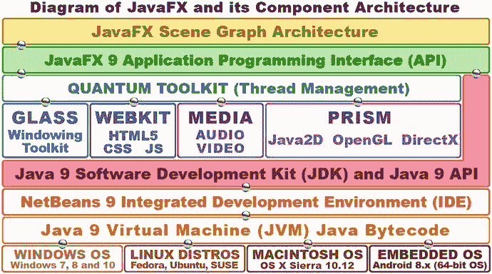

图 7-1。

JavaFX Component Architecture from Scene Graph at the top down through Java, NetBeans, JVM, and OSs

连接到 JavaFX API 的 Quantum toolkit 将我接下来要谈到的所有强大的新媒体相关引擎捆绑在一起。Quantum toolkit 处理所有这些引擎的线程管理，以便您的游戏代码(位于 JavaFX 主线程上)和游戏的新媒体素材(音频、视频、3D 矢量、2D 矢量)位于自己的线程上(A/V 使用专用线程，WebKit、窗口或 3D 渲染也是如此)，可以通过双核、四核、六核和八核 CPU 上的独立线程(或进程)使用独立的处理器，这些处理器在当今的计算机和嵌入式消费电子设备中非常常见。我已经展示了新媒体引擎，它们非常重要，足以在图 [7-1](#Fig1) 的第四层中拥有自己的线程。

Glass Windowing Toolkit 控制 JavaFX 的窗口管理。它负责控制显示中的任何离散区域，如舞台或弹出窗口，如对话框。Glass 还管理事件处理队列，并将事件传递给 JavaFX 进行处理，它还设置计时器，这一点您将在本书稍后进入游戏时了解，以及 pulse 毫秒如何控制游戏的计时。

在图 [7-1](#Fig1) 中间可以看到，还有一个 WebKit 引擎和一个媒体播放器引擎。这些也由 Quantum toolkit 管理。WebKit 引擎可以呈现 HTML5、CSS3/4 和 JavaScript 内容。这意味着您可以创建在 JavaFX 游戏中无缝运行的 web 内容。媒体播放器媒体播放引擎卸载(处理)数字音频和数字视频素材的播放、UI 控制和导航。

Quantum toolkit 下面最重要的新媒体引擎是 Prism 引擎，我喜欢称之为“PRISM 游戏引擎”，因为它使用 Java2D 渲染 2D 内容，如果用户使用 Windows 7、8 或 10 平台，则使用 OpenGL (Macintosh、Linux 或嵌入式操作系统)或 DirectX 渲染 3D 内容。我在一些生产工作站上使用 Windows 7.2 和 10。Windows XP 和 Vista 支持已停止，因为大多数计算机和消费电子设备现在都支持 64 位(Windows XP 是 32 位的，只能处理 3.24 GB 的内存)。

PRISM 所做的是“桥接”主要操作系统平台以及消费电子嵌入式设备上的强大游戏引擎(DirectX 和 OpenGL)，以便 JavaFX 可以将复杂的渲染任务处理从 nVidia (GeForce)、AMD(镭龙)、ARM、高通或英特尔“卸载”到 GPU 硬件。这使得 JavaFX/Java 游戏速度更快，并允许游戏使用更少的 CPU 处理能力来将游戏资源渲染到屏幕上。这反过来允许更多的 CPU 处理能力用于游戏逻辑，如人工智能或碰撞检测。在我们掌握了 JavaFX 引擎的特性及其场景图层次和架构之后，我们将在本书的下两章，JavaFX 初级读本和关于场景图设计的第 [8](08.html) 章中进入游戏设计的这些领域。

值得注意的是，游戏开发人员不需要了解 Quantum(线程)、Glass(窗口)或 Prism(渲染)引擎的内部工作原理，就可以利用它们强大的新媒体功能。在本书中，您将重点关注顶层场景图架构，以及该图的 JavaFX 和 Java API 级别。您还将涉及 NetBeans 9 IDE 级别，我们刚刚在第 [6](06.html) 章中讨论了这一级别，但是我们还将在本书的剩余部分中更详细地探讨它的特性。

就图 [7-1](#Fig1) 中图表的较低层而言，NetBeans 9.0 将为每个操作系统平台生成一个 Java 字节码文件，该文件可由定制 JVM 或 Java 9 虚拟机读取。这个 JVM，如图 [7-1](#Fig1) 底部所示，可以通过下载 Java 9 Java 运行时引擎(JRE)为任何给定的操作系统平台安装，你已经在第 [1](01.html) 章中遇到过，当你把它作为你的 Java 9 JDK 安装的一部分安装时。

这个 JVM 层允许你的游戏作为应用安装在所有流行的操作系统平台上，也可以安装在嵌入式设备上，这些设备也将支持 JavaFX。您还应该将您的 pro Java 游戏生成为一个可以嵌入到网站中的 Java“applet ”,甚至有一个部署模型，可以将应用从网站拖到桌面上，然后安装为一个完整的 Java 游戏应用。

在 iOS 8 和 Android 8 上已经有一个用于运行 JavaFX 应用的工作进程，尽管这种支持还不是“原生的”，所以 JavaFX 应用还不能直接在这些操作系统中运行。如果你对这方面的最新信息感兴趣，只需谷歌“Android 上的 JavaFX”或“iOS 上的 JavaFX”，你可以打赌，到 2018 年，Android OS、iOS、黑莓和 Tizen OS 设备将“原生”运行 JavaFX 应用。这将允许您使用这个 Java 和 JavaFX 动态组合“一次编码，随处运行”!我所说的原生是指，有一天你将能够使用 JetBrains IntelliJ 2017 Android Studio 直接将 Java(和 JavaFX engine)应用导出到 Android 8，或者导出到 iOS 或 Tizen OS，甚至可能使用 NetBeans 9 直接导出到 Android 8。这将增加 NetBeans 9 目前对 Windows、Mac、Open Solaris 和 Linux 发行版的支持。

Note

JetBrains IntelliJ IDEA 现在是用于创建 64 位 Android 8 应用的官方 IDE。这个 IDE 在我的 Android Apps for Absolute 初学者(Apress，2017)中有所涉及，其中涉及使用 Java 8 使用 IntelliJ IDEA 开发 64 位 Android 5 到 8 应用。IntelliJ 也包含在我的 Pro Android 可穿戴设备中(Apress，2015)。我预计到 2018 年底，Java 9 还将支持可穿戴设备和设备。

让我们从图 [7-1](#Fig1) 所示的图的顶部开始，看看 JavaFX 场景图和 javafx.scene 包，它使用 16 个强大而有用的 Java 类在 JavaFX API 中实现场景图。

## JavaFX 场景包:16 个 Java 场景类

在我们的高级概述之后，我想做的第一件事是看看最重要的 JavaFX 包之一，javafx.scene 包。正如你在第 [2](02.html) 和 [3](03.html) 章中看到的，JavaFX 包不止一个。正如你在图 [6-7](06.html#Fig7) 顶部看到的，你的 JavaFXGame.java 应用已经在使用四个不同的 JavaFX 包了。javafx.scene 包包含 16 个强大的 Java 类(记住 javafx 是用原生 Java 重新编码的)，包括 Camera、ParallelCamera 和 PerspectiveCamera、Cursor 和 ImageCursor、LightBase、PointLight 和 AmbientLight，以及场景图形类(节点、父节点、组、场景和子场景)和一些实用程序类，如图 [7-2](#Fig2) 所示。如您所见，我已经对这 16 个 javafx.scene 包类进行了逻辑分组。我在此图的场景图部分中使用了场景类，因为使用此场景类创建的场景对象将包含使用其他四个节点、父、组和子场景场景场景图相关类及其子类创建的场景图对象。在这一章的后面，我们将会详细介绍所有这些场景图类。


图 7-2。

The Java javafx.scene package and 16 core Scene Graph, Scene Utility, Lighting, Camera, and Cursor classes

JavaFX 的场景图架构类从最高级别的节点超类开始，连同其父类、子场景子类和父类的组子类，我们将在本书的后面使用它们来创建我们的游戏场景图层次。这些核心节点类用于创建游戏的 JavaFX 场景图形层次，并用于组织和分组使用 JavaFX 媒体素材和图形设计包创建的对象，这些包包含在 javafx.media 和 javafx.graphics Java 9 模块中。

有三个场景工具类，正如我所说的，它们允许您在任何时候拍摄场景或其任何场景图形节点的快照(如截图)，以及打开或关闭场景抗锯齿，如果您在场景中使用 3D 基本体(使用数学而不是网格定义的几何体)。javafx.scene 包中的另一半(八个)类用于场景照明、场景摄影机和场景的光标控制。

在我们创建游戏时，我们将在以后的章节中讨论这些 javafx.scene 类，在此之前，我们将了解用于创建、分组、管理和操纵 javafx 场景内容的场景图形类。因此，我将覆盖 javafx.scene 包的类，如图 [7-2](#Fig2) 所示，从图的左侧移动到图的右侧，按照您可能最经常使用的类到最不经常使用的类的顺序。也就是说，所有这些类(可能除了快照)对 i3D 游戏都非常重要。

### JavaFX 场景类:定义维度和背景颜色

javafx.scene 包中的两个主要类是 scene 类和 Node 类。我们将在下一节中介绍 Node 类及其父类、组类和子场景子类，因为这些类及其子类(如 JavaFXGame 类中使用的 StackPane 类)可用于在 JavaFX 中实现场景图架构。此外，在某种意义上，在我的图 7-2 和 [7-3](#Fig3) 中，节点类及其子类可以被视为在场景类的“下面”，尽管节点类不是场景类的子类。事实上，节点(场景图)类及其子类，或者更确切地说，使用这些类创建的对象，实际上包含在场景对象本身内部，就像在现实生活的舞台作品中按场景分组一样。出于这个原因，我们将首先看看如何使用 Scene 类及其 Scene()构造函数方法为 JavaFX 应用创建场景对象。这一节将为你在第 [5 章](05.html)中学到的关于重载构造函数方法的内容提供一个很好的强化，因为创建一个场景对象需要几种不同的方法。

这个场景类用于创建场景对象，使用 Scene()构造函数方法。这需要一至五个参数，取决于您选择使用六个重载构造函数方法中的哪一个。其中包括以下构造函数方法，这些方法具有六种不同的重载参数列表数据字段配置:

```java
Scene(Parent root)
Scene(Parent root, double width, double height)
Scene(Parent root, double width, double height, boolean depthBuffer)
Scene(Parent root, double width, double height, boolean depthBuffer, SceneAntialiasing aAlias)
Scene(Parent root, double width, double height, Paint fill)
Scene(Parent root, Paint fill)

```

图 [6-7](06.html#Fig7) 和第 28 行的 Java 代码中所示的当前 bootstrap Java 和 JavaFX 代码中使用的构造函数是第二个构造函数，到目前为止，它的结构(调用)如下:

```java
Scene scene = new Scene(root, 300, 250);

```

如果您想给场景添加黑色背景色，您可以使用第五个使用颜色的重载构造函数方法。Color 类中的 BLACK 常量(这是一个 Paint 对象，因为 Color 是 Paint 子类)作为填充数据，在本例中是 fillColor。这可以通过使用以下 Scene()对象构造函数方法调用来完成:

```java
Scene scene = new Scene(root, 300, 250, Color.BLACK);

```

请注意，根对象是一个父子类，称为 StackPane 类，它是使用 StackPane()构造函数方法创建的，在 Scene()构造函数方法调用上面两行，使用了下面一行 Java 代码:

```java
StackPane root = new StackPane(); // StackPane subclassed from Parent; so Parent root node type

```

正如您所看到的，任何类都可以在构造函数中使用，只要它是为该构造函数参数位置(数据)声明(必需)的对象(类)类型的子类。这就是为什么我们能够在我们的参数列表中使用 Color 和 StackPane 对象，因为它们分别具有来自 Paint 和 Parent 类的超类起源。

如果您想知道布尔 depthBuffer 参数是什么，它用于 i3D 场景组件。由于这些场景组件是 3D 的，并且具有深度(除了 2D 的“X”和“Y”组件之外，还有一个“Z”组件)，因此如果要创建 3D 场景或组合 2D 和 3D 场景组件，则需要包含此参数并将其设置为 true 值。最后，如果您想知道第四个构造函数方法的参数列表中传递的 SceneAntialiasing 对象(和类)是什么，它为 3D 场景组件提供了实时平滑。因此，对于我们将需要的 3D 场景对象，构造函数方法调用将如下所示:

```java
Scene 3Dscene = new Scene(root, 300, 250, true, true);

```

### JavaFX 场景图:使用父节点组织场景

Scene Graph 并不是 JavaFX 独有的，现在可以在许多新媒体内容创建软件包中看到，例如 3D、数字音频、声音设计、数字视频和特效。场景图是内容数据结构的可视化表示，类似于倒置的树，根节点在顶部，分支节点和叶节点从根节点出来。我第一次看到场景图方法进行场景设计是在我使用芬兰 RealSoft OY 的一个名为 Real3D 的 Amiga 4000 软件包进行 3D 建模、渲染和动画制作的时候。从那时起，这种方法被大量的 3D、数字视频和特效软件包复制，现在是 JavaFX 组织场景内容的方式。出于这个原因，你们中的许多人可能对这种设计范例很熟悉，因此也很适应。场景图数据结构不仅允许您构建、组织和设计 JavaFX 场景及其内容，而且如果您正确设置了场景图，它还允许您将不透明度、状态、事件处理程序、变换和特殊效果应用于场景图层次的整个逻辑分支。图 [7-3](#Fig3) 显示了一个基本的场景图树，根节点在顶部，根节点下面是分支节点和叶子节点。

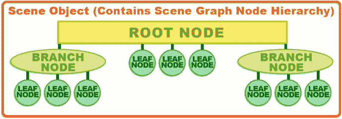

图 7-3。

JavaFX Scene Graph hierarchy, starting with the root node and progressing to branch nodes and leaf nodes

根节点是最顶端的节点，这就是为什么它被称为根，即使它在顶部，而不是在底部，就像植物生命世界中的根一样。根节点没有父节点，也就是说，在场景图形层次中，它上面没有任何东西。根节点本身是其下的分支节点和叶节点的父节点。

场景图树中第二个最强大(也是最复杂)的结构称为分支节点，它使用 javafx.scene.Parent 类作为其超类，并且可以包含子类，这是合乎逻辑的，因为它扩展了一个名为 Parent 的类。分支节点可以包含其他分支节点，以及“叶”节点，因此它可以用于创建一些非常复杂和非常强大的场景图层次结构(或场景图架构)。

层次结构中的最后一级是“叶”节点，叶节点是分支的末端。因此，叶节点可以没有子节点。重要的是要注意叶节点可以直接脱离根节点，如图 [7-3](#Fig3) 所示。可以通过使用父类、组类或子场景类来创建分支节点，如图 [7-2](#Fig2) 所示，或者使用它们的任何子类，例如 WebView、Region、Pane 或 StackPane 类。

位于分支最末端的对象(即叶节点)的示例包括 JavaFX 类(实例化为对象),这些类可以使用参数进行配置。示例包括形状、文本或控件。这些是设计或内容组件，因此没有设计任何子组件(子对象),因此根据其类函数设计的性质，它们本质上必须位于树和分支的末端。

因此，叶节点将始终包含一个 JavaFX 类，该类没有从父类或从组、区域或子场景类中子类化(扩展),并且其本身也没有被专门设计为在 JavaFX 场景图层次结构中包含任何子元素(子对象)。

父类的三个子类可以用作分支节点。这些包括用于分组子(叶节点)对象的 Group 类，以便不透明度、变换和特殊效果可以同时应用于组节点；Region 类，用于对 2D 的子对象(叶节点)进行分组以形成屏幕布局，如果您愿意，可以使用 CSS3 对其进行样式化；WebView 类，用于管理 WebEngine 类，它在 WebView 中呈现 HTML5、JS 和 CSS 内容。

### JavaFX 场景内容:灯光，摄像机，光标，动作！

接下来，让我们看看图 [7-2](#Fig2) 中间列出的八个类，它们提供了一些强大的多媒体工具来控制你的应用的光标，以及为你的 2D 和 3D JavaFX 应用提供定制的灯光特效和定制的相机功能。在这种情况下，这可能是游戏，但也可能是电子书或 iTV 节目或任何需要 JavaFX 为 Java 9 APIs 提供的强大新媒体功能的物联网。

图 [7-2](#Fig2) 中间部分列出的更一般化的类(光标、光源、相机)是父类，更专门化的类(图像光标、点光源、平行相机等。)后面列出的是这些父类的子类。除了 LightBase 类，这似乎是显而易见的！

正如您可能已经猜到的(正确)，JavaFX Cursor 类可用于控制在任何给定时间使用的应用光标图形(箭头、手、闭合的手、张开的手、调整大小、移动、文本、等待、无)。ImageCursor 子类可用于定义和提供基于图像的自定义光标，使用自定义光标图像中的 X 和 Y 位置来定义其“单击点”(也称为光标的“热点”)的位置。

LightBase 类及其 PointLight 和 AmbientLight 子类可用于照亮场景。这些类主要用于 3D 场景，它们需要在游戏运行的任何平台上具有 3D 功能，这在当今并不是一个真正的问题，因为大多数主要的 CPU 制造商也制造(包括)GPU。此外，值得注意的是，如果渲染游戏的硬件平台上没有 GPU，Prism 游戏引擎将使用 3D 处理模拟来模拟 3D 环境(GPU)。这被称为软件渲染。

如果设置正确，您也可以在 2D 游戏中使用这些照明类，或者在“混合”2D 和 3D 游戏中使用照明，由于 JavaFX 支持它，我们也将在本书的稍后部分研究这一点。

Camera 类及其 ParallelCamera 和 PerspectiveCamera 子类可用于拍摄或录制场景，并可用于 3D、2D 和混合游戏应用。其中两个相机类 camera 和 ParallelCamera 不要求运行 JavaFX 应用(在本例中为游戏)的平台上具备 3D (GPU)功能。在 3D 软件中，平行相机视图有时称为正交投影。

Camera 类的子类提供了两种不同的专门类型的相机。ParallelCamera 类可用于渲染场景，无需任何深度透视校正，这在 3D 行业中称为正交投影。这意味着这个类非常适合用于 2D 场景(和 2D 游戏)。

PerspectiveCamera 类提供了一个用于 3D 场景的复杂得多的相机，它将支持 3D 查看量。与 LightBase 类及其子类一样，PerspectiveCamera 类将需要运行 pro Java 9 游戏(或物联网应用)的硬件平台(称为目标平台)的 3D 功能。

PerspectiveCamera 类具有 fieldOfView 属性(state 或 property)。这可以用来改变你的观看音量，就像一个真正的相机变焦镜头可以，当你从广角放大到变焦。fieldOfView 属性的默认设置是 30 度的锐角。如果你还记得高中的几何课，你可以通过向下看相机的 y 轴(上下方向)来想象这个视野。如你所料，确实有。getFieldOfView()和。setFieldOfView(double)方法调用来控制此摄像机类属性。

接下来，让我们仔细看看场景实用程序类。在此之后，我们将进一步了解九个 javafx.scene 子包中的一些，如 javafx.scene.text、javafx.scene.image、javafx.scene.shape 和 javafx.scene.layout。

### JavaFX 场景工具:场景快照和反走样

最后，我们应该快速查看一下图 [7-2](#Fig2) 右侧显示的三个实用程序类，因为它们可以用来提高用户设备屏幕上的场景输出质量(使用抗锯齿)，以及为用户(社交媒体共享)或游戏逻辑提供屏幕捕捉功能。

让我们先把 SceneAntialiasing 类解决掉。你在第 2 章[中学习了抗锯齿，我向你展示了它如何使用一种算法来平滑两种不同颜色交汇处的锯齿边缘，通常是在图像合成的对角线或圆形区域。图像合成是将两个独立的图像分层放置，形成一个合成图像。有时，这两个(或更多)图像层中的图像分量之间的不同边缘需要被平滑。平滑(反走样)是需要的，这样最终的图像合成看起来就像一个无缝的图像，这是艺术家或游戏设计师的意图。有趣的是，我们已经使用 StackPane 类(窗格是层)在 JavaFXGame 应用中实现了 JavaFX“层引擎”。“层堆栈”图像合成方法在游戏以及 Photoshop 或 GIMP 等软件中很常见。](02.html)

SceneAntialiasing 类的作用是为 3D 场景提供抗锯齿处理(算法),以便它们可以在场景的 2D 背景上合成，无论这是默认颜色。白色或任何其他颜色值，2D 图像(创建混合的 2D 和 3D 应用)，或任何其他东西，如数字视频。scene anialiasing 类允许您将静态 scene anialiasing 数据字段设置为 DISABLED(关闭抗锯齿)或 BALANCED(打开抗锯齿)值。平衡选项提供了质量和性能的平衡，这意味着设备硬件提供的处理能力越强，处理的抗锯齿质量越高。

接下来让我们看看 SnapshotParameters 类(object)，它用于设置(包含)一个渲染属性参数，该参数将由 SnapshotResult 类(object)使用。这些参数包括将使用哪种类型的相机(平行或透视)对象，用于 3D 的 depthBuffer 是打开的(对于 3D 为 true)还是关闭的(对于 2D 为 false)，用于包含结果快照图像数据的 Paint 对象，用于包含任何变换数据的 Transform 对象，以及用于定义要渲染的视口区域的 Rectangle2D 对象。这将是快照尺寸和屏幕上快照结果左上角设置的 X，Y 位置。

这个 SnapshotResult 类(更重要的是使用这个类创建的对象)包含生成的快照图像数据、请求的参数和场景图中的源节点。因此，这个类支持的三个方法是显而易见的:一个. getImage()方法将获取快照图像，一个. getSource()方法将获取源节点，一个. getSnapshotParameters()方法将获取快照参数。

## 场景子包:九个与场景相关的包

你可能会想“咻！javafx.scene 包概述中包含了很多内容！”事实上，核心 javafx.scene 包中有许多类，涵盖场景创建、场景图形组织和场景实用程序，如照明、相机、光标、屏幕截图(“sceneshots”)和设置实用程序。javafx.scene 包中还有很多，我称之为“子包”,它们是 javafx.scene 包下面的包，使用另一个包名(描述)的另一个点来引用。事实上，还有 9 个 javafx.scene 包，正如你在表 [7-1](#Tab1) 中看到的，它们涵盖了画布绘制、纹理绘制、特效、UI 布局、数字成像、事件处理、文本和字体、形状(2D 和 3D 几何)、2D 和 3D 变换等内容。在本章中，我们将会看到所有这些 javafx.scene 子包类和概念，并且在本书的课程中会用到它们中的许多。本章的这一节将更详细地介绍 javafx.scene 子包，您将在游戏开发中使用的许多功能都可以在这些子包中找到。这就是为什么我给你一个 JavaFX 提供的概述，以便它在一个地方完成，我们可以使用 JavaFX 9 APIs 开始 Pro Java 9 游戏编码，并使用所有这些多媒体功能来创建游戏体验。

表 7-1。

The Nine Second-Level JavaFX Scene Subpackages with Primary Function and Description of the Functional Classes

   
| 包名 | 功能 | 包装内容和功能描述 |
| --- | --- | --- |
| javafx.scene .画布 | 直接绘图 | 为自定义绘图图面提供 Canvas 类(和 Canvas 对象) |
| javafx.scene.effect | 特技 | 特殊效果类:发光，混合，开花，阴影，反射，运动模糊 |
| javafx.scene.image | 数字成像 | 数字图像类:图像、图像视图、可写图像、像素格式 |
| javafx.scene.input | 事件处理 | 提供与将用户输入获取到 JavaFX 应用相关的类 |
| javafx.scene.layout | UI 布局 | 用户界面布局容器类:TilePane、GridPane、FlowPane 等。 |
| javafx.scene.paint | 纹理(油漆) | 油漆类:油漆，颜色，线性梯度，径向梯度，停止，材料等。 |
| javafx.scene.shape | 几何学 | 2D 和 3D 几何类:网格，形状，Shape3D，圆，线，路径，弧等。 |
| javafx.scene.text | 文本和字体 | 提供文本呈现和字体呈现类:textFlow、Text、font 等。 |
| javafx.scene.transform | 转换 | 提供变换类:变换，仿射，旋转，缩放，剪切，平移 |

让我们从包含最少类的包开始，先把它们去掉。尽管该表按字母顺序列出了子包，但第一个包 javafx.scene.canvas 包含两个类:一个用于创建 canvas 对象的 Canvas 类和一个用于控制在画布上绘图的调用的 GraphicsContext 类。

下一个子包 javafx.scene.effect 包含特殊效果类。这些对于 pro Java 9 游戏开发非常有用，所以这是我将在本节中详细介绍的子包之一。

javafx.scene.image 子包用于在 javafx 中实现数字影像，它包含 imageView、Image、WritableImage、PixelFormat 和 WritablePixelFormat 类。ImageView 类是您通常用来保存数字图像素材的类，如果您想进行更高级的(算法)基于像素的数字图像创建，更高级的 PixelFormat 类允许您逐个像素地创建数字图像。

javafx.scene.input 子包包含用于从 javafx 应用的用户获取输入的类，包括鼠标和键盘输入、手势、触摸屏、滚动、缩放或滑动输入、剪贴板内容以及其他类型的输入。使用事件处理功能处理输入和动作，在本书中将会详细介绍这些功能，并且您已经在您的 Pro JavaFX 9 应用中体验过这些功能，如您的 bootstrap Java 9 代码的第 20 行到第 25 行所示(如图 [6-7](06.html#Fig7) )。

javafx.scene.layout 子包包含用于创建用户界面设计布局的类，也可用于您的屏幕布局设计。这些布局类包括控制和管理背景、添加边框和设置边框样式的类，并提供 UI 窗格管理类，如 StackPane、GridPane、TilePane、FlowPane 和 AnchorPane。这些 Pane 子类为 JavaFX 中的 UI 控件提供了自动屏幕布局算法。Background 类提供了屏幕背景实用程序，Border 类提供了屏幕边框实用程序，可用于为用户界面屏幕添加图形。

javafx.scene.paint 子包包含一个 Stop 类；Paint 超类和 Color、ImagePattern、LinearGradient 和 RadialGradient 子类；以及 3D Material 超类及其 PhongMaterial 子类。熟悉 3D 内容制作的人会认识这种 Phong 着色器算法，它允许不同的表面外观(塑料、橡胶等)。)待模拟。这些 Material 和 PhongMaterial 类需要 i3D 功能才能在回放硬件上成功运行，就像 SceneAntialiasing、PerspectiveCamera 和 LightBase 类和子类一样。这些都需要 GPU 硬件加速或者软件渲染。

抽象 paint 类创建绘制对象的子类，Color 类为这些对象着色(用颜色填充它们)，LinearGradient 和 RadialGradient 是用颜色渐变填充对象的 Paint 子类，Stop 类允许您定义渐变颜色在渐变内部的开始和停止位置，这就是它的名称的来源。最后，还有您的 ImagePattern 类，它可以用可平铺的图像模式填充 Shape 对象，这对游戏非常有用。

javafx.scene.shape 子包包含 2D 几何(通常称为形状)和 3D 几何(通常称为网格)的类。Mesh 超类及其 TriangleMesh 子类处理 3D 几何，Shape3D 超类及其 Box、Sphere、Cylinder 和 MeshView 子类也是如此。形状超类有更多的子类(12)；这些是 2D 几何元素，包括圆弧、圆、三次曲线、四次曲线、椭圆、直线、路径、多边形、折线、矩形和 SVGPath 类。还有“路径”支持，这是由 PathElement 超类及其 ArcTo、ClosePath、CubicCurveTo、HLineTo、LineTo、MoveTo、QuadCurveTo 和 VLineTo 子类提供的被定义为“开放”形状的路径(我喜欢称它为“样条线”,因为我是 3D 建模师),这些子类允许您绘制样条曲线来创建自己的自定义可缩放矢量图形(SVG)形状。

javafx.scene.text 子包包含用于将文本形状和字体渲染到场景中的类。这包括 Font 类，用于使用除 JavaFX“系统”字体之外的任何字体，还包括 Text 类，用于创建一个文本节点，该节点将使用该字体显示文本值。还有一个专门的布局容器类，称为 TextFlow，用于“流动”文本，就像你在文字处理器中看到的那样。

javafx.scene.transform 子包包含用于渲染 2D 和 3D 空间变换的类，例如 transform 超类的 Scale、Rotate、Shear、Translate 和 Affine (3D rotation)子类。这些可以应用于场景图中的任何节点对象。这允许你的场景图中的任何东西(文本，用户界面控件，形状，网格，图像，媒体等。)以您喜欢的任何方式进行转换，这为 JavaFX 游戏开发人员在转换事物时提供了大量的创造力。如果你想知道，平移是整个物体的线性运动。剪切是 2D 平面上两个不同方向的线性运动，或者是 2D 平面的另一部分固定时的一个方向的运动。想象一下，移动一个平面的顶部，而底部保持不动，那么正方形就变成了平行四边形，或者向不同的方向移动同一平面(正方形)的顶部和底部。

既然我们已经查看了 javafx.scene 包及其相关子包中大量重要且有用的类(对象),那么让我们看看其他 18 个顶级 javafx 包，了解 JavaFX 为应用开发提供的其他关键功能，当然，我们将重点关注那些可用于游戏开发的功能，这是我们在本章中一直在做的，并将在整本书中继续做的。

## javafx.graphics 模块:18 个多媒体包

有 18 个顶级 javafx.graphics 模块包是最常用的包(除了核心 javafx.base 模块包)。它们遵循 javafx.packagename 名称格式(不是 javafx.graphics.packagename)。其中一些，比如 scene 和 css，也有子包级别。我们在前面的九个 javafx.scene 包及其子包中看到了这一点，所以我们在这里就不看了。javafx.graphics 模块是创建 Pro Java 9 游戏的三个关键模块之一，另外两个是 javafx.base 和 javafx.media。由于表 [7-2](#Tab2) 中包含了九个 javafx.graphics 模块包，这实质上意味着从 JavaFX API 模块的角度来看，javafx.graphics 模块总共有 18 个包类别，如表 [7-1](#Tab1) 中列出的九个。从 JavaFX 8 开始，Oracle 的 JavaFX 9 开发团队对这些模块包进行了重组，以实现更好的模块化(功能优化)。例如，如果你的 3D 游戏不需要音频或视频，你可以只使用基本和图形模块。由于我们需要音频，我们将使用基本、图形和媒体模块，或者七个 JavaFX API 模块中的三个(JavaFX API 包代码立即减少了 57%)。我想给你一个 javafx.graphics 模块包中这 18 个功能区域的概述，如表 [7-1](#Tab1) 和 [7-2](#Tab2) 所示，并仔细看看每个图形区域(矢量、光栅、动画、CSS)将做什么。

表 7-2。

javafx.graphics Module Top-Level (Nonscene) Packages, with Primary Functions and Description of Function

   
| 包名 | 功能 | 包装内容描述 |
| --- | --- | --- |
| javafx.animation | 动画 | 类:动画计时器、时间轴、过渡、插值器、关键帧、键值 |
| javafx .应用 | 应用 | 提供应用(初始化、启动、停止方法)、预加载程序、参数、平台 |
| javafx.concurrent | 穿线 | 提供线程类:Task、Service、ScheduledService、WorkerStateEvent |
| javafx.css | 半铸钢ˌ钢性铸铁(Cast Semi-Steel) | 提供与在 JavaFX 中实现级联样式表(CSS)相关的类 |
| javafx.css.converter | 半铸钢ˌ钢性铸铁(Cast Semi-Steel) | 提供与在 JavaFX 中实现 CSS 相关的类 |
| javafx.geometry | 3D 几何图形 | 提供 3D 几何图形 |
| javafx.print | 印刷 | 提供打印 |
| javafx.scene | 场景控制 | 与场景创建、组织和控制相关的类(见表 [7-1](#Tab1) |
| javafx.stage | 舞台创作 | 提供舞台创作 |

其中一些我们已经介绍过了，比如 javafx.application 包，我们在第 [6](06.html) 章中已经了解过了，还有 javafx.scene 包及其子包，我们在上一节中已经介绍过了。

表 [7-2](#Tab2) 中的第一个包是 javafx.animation 包。因为动画对 Java 游戏很重要，所以让我们在本章的下一节讨论它。我还将介绍 javafx.geometry 和 javafx.stage，因为 Java 9 游戏所需的表 [7-2](#Tab2) 中的核心包是动画、应用、几何、场景和 stage。

### 游戏的 JavaFX 动画:使用 javafx.animation 类

javafx.animation 包包含 animation 超类和 Timeline、AnimationTimer、Interpolator、KeyFrame 和 KeyValue 类。它还包含了 transition 超类和十个 Transition 子类，所有这些我们都将在本章的这一节中介绍，因为动画是 pro Java 9 游戏开发的一个重要设计元素。由于 JavaFX 9 API 的存在，这些动画类已经为我们编写好了，所以我们所要做的就是正确地使用这些类来为游戏添加动画。您将在这些类上花费大量时间，所以我将详细介绍每一个类，以便您了解每个类是如何工作的，哪些类可以协同工作，以及您需要哪些类来实现您自己的 Java 9 游戏逻辑解决方案。

#### JavaFX Animation 类:JavaFX 中动画对象的基础

Animation 类(更准确地说是 Animation 对象)为 JavaFX 中的动画提供了核心功能。Animation 类包含两个(重载的)Animation()构造函数方法。它们包括`Animation()`和`Animation(double targetFramerate)`，它们将在内存中创建动画对象，该对象将从包含其他子对象的高级对象中控制您的动画及其回放特征和生命周期。

动画类包含。play()方法。playFrom(cuePoint)或。playFrom(持续时间)方法和. playFromStart()方法。这些方法用于开始播放动画对象。还有就是。pause()方法可以暂停动画播放，而. stop()方法可以停止动画播放。有。jumpTo(持续时间)和。跳转到动画中预定义位置的 jumpTo(cuePoint)方法。

您可以使用 rate 属性设置动画播放速度(有些人称之为帧速率或 FPS)。cycleCount 属性(变量)允许您指定动画循环的次数，delay 属性允许您指定动画开始前的延迟时间。如果动画正在循环，此延迟属性将指定循环之间使用的延迟时间，这可用于创建一些逼真的效果。

通过将 cycleCount 属性或特性(变量)设置为不确定，然后使用 autoReverse 属性(设置为 false)可以指定无缝动画循环，或者通过为 autoReverse 属性指定 true 值可以使用 pong(来回)动画循环。如果希望动画只播放一次，而不是无限循环，也可以将 cycleCount 设置为一个数值，如 1。

有一个用于设置动画播放速率属性的. setRate()方法，一个用于设置延迟属性的. setDelay()方法，以及。setCycleCount()和。用于控制循环特性的 setCycleDuration()方法。可以想象，也有类似的。get()方法来“获取”这些动画对象变量的当前设置值(或属性、特性、参数、特征；不过，你更喜欢看你的数据领域是好的)。

使用用 ActionEvent 对象加载的 onFinished 属性，可以指定动画完成回放时要执行的动作。这将在动画到达每个循环的结尾时执行，正如您可以想象的，在专业 Java 游戏中使用这一特殊功能可以触发一些非常强大的东西。

您可以随时“轮询”只读变量(属性),以查找每个动画对象的状态、当前时间、当前速率、周期更新和总持续时间。例如，可以使用 currentTime 属性查看动画播放周期中任何时间点的播放头(帧指针)位置。

##### JavaFX Timeline 类:JavaFX 属性时间轴管理的动画子类

JavaFX Timeline 类是 JavaFX Animation 超类的一个子类，因此它的继承层次结构如下所示，从 Java master class Java . lang . object 开始，向下一直到 Timeline 类:

```java
> java.lang.Object
  > javafx.animation.Animation
    > javafx.animation.Timeline

```

时间轴对象可用于定义一种特殊的动画对象，它由对象类型为 WritableValue 的 JavaFX 值(属性)组成。所有 JavaFX 属性的类型都是 WritableValue，所以这个类可以用来制作 JavaFX 中任何东西的动画，这意味着您可以用它来做的事情仅限于您的想象。

时间轴动画是使用 KeyFrame 对象定义的，通过前面提到的 KeyFrame 类创建。毫不奇怪，这个关键帧类允许您创建和管理位于时间轴对象内部的关键帧对象。熟悉动画的人都知道，关键帧为对象或数据值的动画中的不同点设置不同的插值数据值，以创建平滑的移动。

关键帧对象将始终由时间轴对象根据时间变量(使用 KeyFrame.time 访问)和要设置动画的属性进行处理，这些属性使用关键帧对象的值进行定义，并使用 KeyFrame.values 变量进行访问。

请务必注意，您需要在开始运行时间轴对象之前设置关键帧对象，因为您不能在正在运行的时间轴对象中更改关键帧对象。这是因为一旦启动，它就被放入系统内存。如果您想以任何方式更改正在运行的时间轴对象中的关键帧对象，请先停止时间轴对象，然后对关键帧进行更改，然后重新启动时间轴对象。这将把时间轴对象及其修改后的关键帧对象以及它们的新值重新加载到内存中。

您将在本书中使用的插值器类根据时间轴方向在时间轴对象中插入这些关键帧对象。插值是根据开始值和结束值创建中间帧或“补间”帧的过程。如果您想知道方向是如何推断的，它保存在 Animation 超类的 rate 属性和只读 currentRate 属性中，Animation 超类是扩展 Timeline 子类的一部分。

反转 rate 属性的值(即使其为负值)将反转(切换)播放方向，读取 currentRate 属性时也适用相同的原则(负值表示反向或向后)。最后，KeyValue 类(对象)用于保存每个关键帧对象中的数据值。一个关键帧对象存储多个(根据需要)KeyValue 对象，每个数据值使用一个 KeyValue 对象。

##### JavaFX 过渡类:用于过渡和特效应用的动画子类

JavaFX Transition 类是 JavaFX Animation 超类的子类，因此其继承层次结构如下所示，从名为 java.lang.Object 的 Java 主类开始，向下发展到 Transition 类:

```java
> java.lang.Object
  > javafx.animation.Animation
    > javafx.animation.Transition

```

transition 类是一个公共抽象类，因此，它只能用于(子类化或扩展)创建 Transition 子类。事实上，已经为你创建了十个这样的子类来创建你自己的过渡特效。其中包括 SequentialTransition、FadeTransition、FillTransition、PathTransition、PauseTransition、RotateTransition、ScaleTransition、TranslateTransition、ParallelTransition 和 StrokeTransition 类。这些子类的 Java 9 类继承层次结构如下所示:

```java
> java.lang.Object
  > javafx.animation.Animation
    > javafx.animation.Transition
      > javafx.animation.PathTransition

```

作为动画的子类，过渡类包含了动画的所有功能。你可能最终会直接使用这十个自定义过渡类，因为它们提供了你可能想要使用的不同类型的过渡(淡入淡出、填充、基于路径、基于笔画、旋转、缩放、移动或平移等)。).随着本书的进展，我们将学习如何使用其中的一些，所以我将继续学习 AnimationTimer 类。

#### JavaFX AnimationTimer 类:帧处理、纳秒和脉冲

JavaFX AnimationTimer 类不是 JavaFX Animation 超类的子类，因此它的继承层次结构如下所示；它以名为 java.lang.Object 的 Java 主类开始，以 AnimationTimer 结束:

```java
> java.lang.Object
  > javafx.animation.AnimationTimer

```

这意味着 AnimationTimer 类是专门为 JavaFX 提供 AnimationTimer 功能的临时代码，它与 Animation(或 Timeline 或 Transition)类或子类没有任何关系。因此，如果您想将该类与占用 javafx.animation 包的 Animation、Interpolator、KeyFrame 和 KeyValue 类组合在一起，则该类的名称可能会有些误导。它和这些类没有任何关系！这个类允许你实现自己的动画(或游戏引擎)定时器，并自己编写代码！在 Java 8 游戏开发入门中，我展示了如何为 i2D 游戏做这件事。

这个 AnimationTimer 类也被声明为公共抽象类，就像 Transition 类一样。因为它是一个抽象类，所以只能用来(子类化或扩展)创建 AnimationTimer 子类。与 Transition 类不同，它没有为您创建的子类；您必须从头开始创建自己的 AnimationTimer 子类。

AnimationTimer 类看似简单，因为它只有一个您必须“覆盖”或替换的方法，该方法包含在公共抽象类中。handle()方法。该方法包含您希望在 JavaFX 引擎的舞台和场景处理周期的每一帧上执行的编程逻辑，它被优化为以 60 FPS(每秒 60 帧)播放，这恰好非常适合游戏。JavaFX 使用脉冲系统，该系统基于新的 Java 纳秒时间单位(Java 7 之前的版本使用毫秒)。

##### JavaFX 脉冲同步:JavaFX 场景图形元素的异步处理

JavaFX 脉冲是一种定时或同步事件，它同步您为 Pro Java 9 游戏或物联网应用创建的任何给定场景图结构中包含的元素的状态。JavaFX 中的脉冲系统由 Glass Windowing Toolkit 管理。Pulse 使用高分辨率(纳秒)计时器，Java 程序员也可以使用从 Java 7 开始引入的 System.nanoTime()方法来使用这些计时器。

JavaFX 中的脉冲管理系统被“封顶”或“节流”到 60 FPS。这是一种优化，因此我们前面讨论的所有 JavaFX 线程都有足够的“处理空间”来做它们需要做的事情。根据您在 pro Java 9 游戏逻辑中所做的事情，JavaFX 应用将自动生成多达三个线程。一个基本的业务应用可能只使用主要的 JavaFX 线程，但是一个 i3D 游戏也会产生 Prism 渲染线程，如果 pro Java 9 游戏也使用音频和/或视频(通常会这样)，它也会产生一个媒体播放线程，如果它还实现了一个社交媒体接口或元素，它也会产生 WebKit 渲染线程。因此，正如您将看到的，健壮的 Java 9 游戏将需要仔细的处理器时间管理。

在我们的游戏开发过程中，我们将使用音频、2D、3D，可能还有视频，所以我们的 JavaFX 游戏应用肯定会是多线程的！正如您将看到的，JavaFX 被设计为能够创建具有多线程和纳秒计时功能以及 i3D PRISM 渲染硬件支持的游戏。

当场景图中发生变化时，例如 UI 控件定位、CSS 样式定义或动画正在播放，会安排一个脉冲事件，并最终“触发”该事件以同步场景图中元素的状态。JavaFX 游戏设计的诀窍是优化脉冲事件，使它们专注于游戏逻辑(动画、碰撞检测)。出于这个原因，对于 pro Java 9 游戏，您会希望最小化脉冲引擎需要处理的非 ameplay 更改(UI 控制位置、样式更改)。您将通过为静态设计系统使用场景图来实现这一点，也就是说，设计固定的视觉元素(UI、背景图像等)。)不被脉冲引擎改变。这将保存“脉冲”用于动画或互动游戏的动态元素。

我的意思是，你将使用场景图来设计你的游戏结构，但不会使用动态编程逻辑通过场景图实时操纵静态设计节点(UI、背景、装饰)，因为需要使用 pulse 系统来执行这些 UI 更新，我们很可能需要这些实时处理事件来用于我们的 Pro Java 9 游戏处理。又来了:静态对动态的游戏设计。

JavaFX pulse 系统允许开发人员异步或无序地处理事件，并在纳秒级上调度任务。接下来，我们将看看如何使用. handle()方法在脉冲中调度代码。

##### 利用 JavaFX 脉冲引擎:扩展 AnimationTimer 超类以生成脉冲事件

扩展 AnimationTimer 类是让 JavaFX pulse 引擎在其处理的每个脉冲上处理 Java 代码的一个好方法。您的实时游戏编程逻辑将放在您的。handle(long now)方法，可以通过使用另外两个 AnimationTimer 方法随意启动和停止。开始()和。停止()。

那个。开始()和。stop()方法是从 AnimationTimer 超类调用的，尽管这两个方法也可以被覆盖；只需确保最终在被覆盖的代码方法中调用 super.start()和 super.stop()。如果将它作为内部类添加到当前 JavaFX public void 中，其代码结构可能如下所示。start()方法结构(可以参考图 [6-7](06.html#Fig7) ，提醒一下):

```java
public void start(Stage primaryStage) {
    Button btn = new Button;
    btn.setText("Say 'Hello World'");
    btn.setOnAction(new EventHandler<ActionEvent>() {
        @Override
        public void handle(ActionEvent event) {
            System.out.println("Hello World!);
        }
    }
    new AnimationTimer() {
        @Override
        public void handle(long now) {
            // Program logic that gets processed on every pulse which JavaFX processes
        }
    }.start();

            // Rest of start() method code regarding Stage and Scene objects is in here
}

```

前面的编程逻辑展示了如何“动态地”构造 AnimationTimer 内部类，以及 Java 点链接是如何工作的，因为对 AnimationTimer 超类的. start()方法调用被附加到新的 AnimationTimer()构造函数的末尾。在一条语句中，有 AnimationTimer 创建(new 关键字)、声明(构造函数方法)和执行(链接到 AnimationTimer 对象构造的 start()方法调用)。

如果您想为游戏逻辑的核心部分(如碰撞检测)创建一个更复杂的 AnimationTimer 实现，将游戏计时逻辑放入它自己的(自定义)AnimationTimer 子类而不是内部类中会是一个更好的方法(也就是说，一个更好的 pro Java 9 游戏设计)。如果您要创建多个 AnimationTimer 子类，以便可以实现自定义脉冲事件处理，这一点尤其正确。您可以同时运行多个 AnimationTimer 子类，但是我建议您不要忘乎所以，不要使用太多的 AnimationTimer 子类，而是优化您的 Java 代码，只使用一个。

要使用 Java `extends`关键字结合 AnimationTimer 超类来创建您自己的名为`BoardGamePulseEngine`的 AnimationTimer 类，请实现此 AnimationTimer 类定义和这些必需的 AnimationTimer 超类方法来创建您的“空”JavaFX pulse board 游戏逻辑计时引擎。

```java
public class BoardGamePulseEngine extends AnimationTimer {
    @Override
    public void handle(long now) {   // Program logic here that gets processed on every pulse
    }
    @Override
    public void start() {
        super.start();
    }
    @Override
    public void stop() {
        super.stop();
    }
}

```

在我们学习了 Java 9、NetBeans 9、JavaFX 9 和 SceneGraph 的基础知识之后，我们将在本书的后面创建动画代码(第[章第 8](08.html) )。本章中的代码示例只是向您展示如何实现这些 JavaFX 动画的示例。接下来，让我们来看看 JavaFX Stage 类，在这里我将向您展示一些代码，以使您的 JavaFX 环境透明，这样您的游戏就可以悬浮在操作系统桌面上，这是 Windows 中一种称为“无窗口 ActiveX 控件”的效果，它允许您创建虚拟的 i3D 对象。

### JavaFX 屏幕和窗口控件:使用 javafx.stage 类

javafx.stage 包包含可被视为“顶级”的类，javafx 应用使用这些类的显示。在你的用例中，这是 pro Java 9 游戏。这个阶段是游戏的“顶层”,因为它向应用的最终用户展示了游戏的场景。在 Stage 对象中有 Scene 对象，在这些对象中有 SceneGraph 节点对象，它们包含组成 Java 9 游戏或 Java 9 IoT 应用的元素。因此，JavaFX Stage 对象是您将在 Java 9 游戏中使用的最高级对象。

另一方面，从操作系统的角度来看，这个包中的类可以被认为是提供低级服务的。这些选项包括 Stage、Screen、Window、WindowEvent、PopupWindow、Popup、DirectoryChooser 和 FileChooser，以及 FileChooser。ExtensionFilter 嵌套类。这些类将用于连接设备显示硬件、操作系统窗口管理、文件管理和目录(文件夹)管理功能。这是因为 Stage 类(对象)向 OS 请求这些功能，而不是使用 Java 或 JavaFX APIs 来实际实现它们，所以 OS 实际上是在您的 Java 9 游戏或 Java 9 IoT 应用请求 OS 提供这些 OS 前端实用程序时产生这些服务。

如果您想获得运行 JavaFX 应用的硬件设备所使用的显示硬件的描述，您将需要使用 Screen 类。该类通过提供一个. getScreens()方法来支持多屏幕(第二个屏幕是常见的行业术语)方案，该方法可以访问 ObservableList 对象(一个允许侦听器跟踪发生的更改的列表对象)，该对象将包含一个包含所有当前可用屏幕的列表数组。有一个“主”屏幕，可以使用。getPrimary()方法调用。您可以通过使用. getDpi()方法调用来获取当前屏幕硬件的物理分辨率。也有。getBounds()和。getVisualBounds()方法调用可用的分辨率。

JavaFX 最终用户可以使用 Window 超类及其 Stage 和 PopupWindow 子类与您的应用进行交互。这是使用名为 primaryStage 的 Stage 对象完成的，该对象被传递到。start()方法(见图 [5-2](05.html#Fig2) )或使用弹出窗口(对话框、工具提示、上下文菜单、通知等)。)子类，如 Popup 或 PopupControl 对象。

您可以使用 Stage 类在 JavaFX 应用编程逻辑中创建辅助阶段。主 Stage 对象始终由 JavaFX 平台使用公共 void start(Stage primaryStage)方法调用来构造(正如您已经在 NetBeans 9 创建的引导 JavaFX 9 应用的第 [6](06.html) 章中看到的)。所有 JavaFX Stage 对象都必须使用主 JavaFX 应用线程来构造，并在其中进行修改，这一点我在前面讨论脉冲事件处理时已经讨论过。由于阶段相当于运行它的操作系统平台上的一个窗口，因此某些属性是只读的，需要在操作系统级别进行控制。这些是布尔属性(变量)，它们包括 alwaysOnTop、全屏、图标化和最大化。

所有 Stage 对象都有一个 StageStyle 属性和一个 Modality 属性，可以使用常量进行设置。stageStyle 常量包括 StageStyle。装饰，舞台风格。无装饰，舞台风格。透明，舞台风格。统一的舞台风格。实用常数。设备常量包括设备。无，模态。应用模态和模态。WINDOW_MODAL 常量。在我们讨论完 javafx.stage 包之后，在下一节中，我将向您展示如何使用这个 StageStyle 属性和透明常数来做一些真正令人印象深刻的事情，这些属性和常数将使您的基于 javafx 的 Java 9 游戏和物联网应用与市场上的其他应用区别开来。

Popup 类可用于从头开始创建自定义弹出通知，甚至自定义游戏组件。或者，您可以使用 PopupControl 类及其 ContextMenu 和 Tooltip 子类来提供预定义的(即针对您自己的实现预编码的)JavaFX 图形用户界面(GUI)控件。

DirectoryChooser 和 FileChooser 类支持将标准 OS 文件选择和目录导航对话框传递到 JavaFX 应用中。文件选择器。ExtensionFilter 嵌套类提供了一个实用程序，用于根据文件类型(文件扩展名)过滤将出现在 FileChooser 对话框中的文件。

接下来，让我们将您当前的 JavaFXGame 应用的 Stage 对象提升一个层次，并向您展示如何使您的 Java 9 (JavaFX 9)游戏成为无窗口(浮动)应用！这是 JavaFX 9 众多令人印象深刻的特性之一，您可以在您的 Pro Java 9 游戏开发管道中加以利用。

### 使用 JavaFX Stage 对象:创建浮动的无窗口应用

让我们将 JavaFXGame 应用的 primaryStage Stage 对象(由我们的`.start(Stage primaryStage)`方法构造函数创建)设置为透明的，这样 HelloWorld 按钮(UI 控件)就可以浮动在您的操作系统桌面上(或者在本例中，浮动在 NetBeans 9 的顶部)。这是 JavaFX 可以做的事情，你很少看到利用，它将允许你创建 i3D 游戏，看起来“浮动”在你的用户的操作系统桌面上。对于 i3D 虚拟对象，至少在 Windows 7、8 和 10 操作系统上，这将被称为“无窗口 ActiveX 控件”移除窗口“chrome”或装饰在其他高级操作系统(如 Linux 和 Mac)中也应该得到支持，并且有一个程序调用来确定这种“使用 alpha 通道(透明)移除除我的内容之外的所有内容”功能是否到位，因此您可以实现纯色或背景图像的后备计划。这个很酷的小技巧(我想我会在书的开头向你展示一些很酷很强大的东西)部分是通过使用 StageStyle 实现的。透明常数，您刚刚了解了它与。Stage 类中的 initStyle()方法。StageStyle 是一个“helper”类，填充了 stage(或 OS 窗口，最终)装饰常数，其中一个是透明的。我们将使用的后备是未修饰的(一个正常的操作系统窗口)。

#### 添加 StageStyle 常量:使用。initStyle(StageStyle style)方法调用

如图 [7-4](#Fig4) 所示，我在 Java 9 代码中添加了新的第 26 行(用浅蓝色突出显示)，并键入 primaryStage 阶段对象名；然后我点击句点键，将一个 Java 点链插入到我想要使用的方法中。此时，NetBeans 9 将打开一个弹出的方法选择器帮助器对话框(实际上更像是一个选择器 UI)；寻找。initStyle(StageStyle style)方法，如图 [7-4](#Fig4) 所示。单击该方法会以蓝色选中它，双击它会将其插入到您的代码中。接下来，我们将对方法的参数做同样的事情，使用相同的工作过程，允许(或诱使)NetBeans 9 为您进行 Java 编码工作。

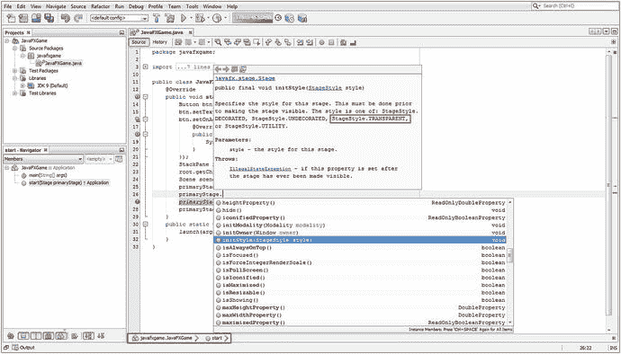

图 7-4。

Call an .initStyle() method off of the primaryStage Stage object, using dot notation to invoke a helper menu

正如您在图 [7-4](#Fig4) 中看到的，我在 NetBeans 9 helper 中单击了 initStyle(StageStyle style)选项，这将在您正在编写的代码行上方显示一个 Javadoc 窗口，其中包含有关该方法的文档。您可以使用这种方法来了解一个对象支持哪些方法，方法是键入对象名，按句点键，然后选择每个方法来查看它的作用。

如图 [7-5](#Fig5) 所示，Stage 对象是使用`.start(Stage primaryStage)`方法调用声明创建的，并使用。setTitle()，。initStyle()，。setScene()，最后是。中的 show()方法调用。start()方法结构。

现在，我将在 Java 9 代码中保留一个. setTitle()方法调用，但是请记住，一旦这个无窗口的应用处理开始工作，这个标题就是窗口 chrome(标题栏 UI 元素)的一部分。一旦这些都消失了(包括标题栏)，标题属性的设置将成为一个争论点。

如果您在应用开发工作流程的这个阶段关注内存优化，那么您应该删除它。setTitle()方法调用，因为 Title 属性会占用内存空间，而且由于使用了 StageStyle，甚至看不到它。StageStyle(实际上是窗口样式)属性的透明常数。

在里面。initStyle()方法类型，键入所需的 StageStyle 类(对象)和句点，以调出下一个帮助器选择器。这次是常量选择器，如图 [7-5](#Fig5) 所示。选择透明选项，读取上面的 Javadoc 信息，然后双击它以完成代码语句，该语句应如下所示:

```java
primaryStage.initStyle(StageStyle.TRANSPARENT); // Insert StageStyle Class TRANSPARENT Constant

```

正如您在 Javadoc 信息弹出窗口的图 [7-5](#Fig5) 中所看到的，将自动为要取消装饰的透明窗口(舞台)装饰样式编码一个回退(降级)方法。它的特点是背景颜色为白色，并且仍然移除了标准的操作系统窗口镶边(标题栏、最小化、最大化、关闭、调整大小等)。).接下来，让我们测试我们的代码，看看按钮现在是否悬浮在它后面的任何东西上(在这种情况下，这是 NetBeans)。

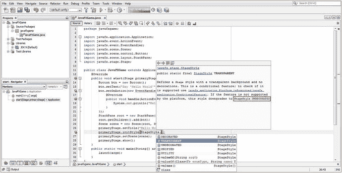

图 7-5。

Type StageStyle and a period in the method parameter area to pop up a constant selector NetBeans helper

接下来使用运行图标(或运行菜单)并运行应用。正如您在图 [7-6](#Fig6) 中看到的，我们试图实现的并没有成功，窗口的 chrome 元素消失了，但是透明度值并不明显。

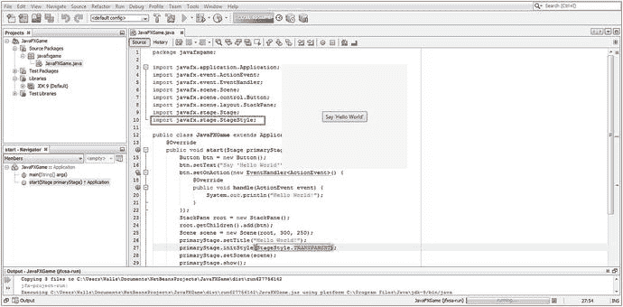

图 7-6。

Run Project to see if the Stage object is transparent; clearly there is an object set to off-white background color

正如您所看到的，有一个灰白色值(用于 iTV set 应用，因为一些 iTV set 不支持 255，255，255 白色)与 NetBeans 9 用于其代码编辑器窗格的 255，255，255 白色形成鲜明对比。

在您的处理管道中，一定还有其他东西尚未使用透明度值定义您的舞台背景。透明度使用十六进制值 0x00000000 来定义，这表示所有 aarggbb(Alpha、红色、绿色、蓝色)透明度和颜色值都被关闭。您需要开始将应用中的 JavaFX 组件视为层(目前有 Stage、Scene、StackPane、Button)。

在本书的第 [2](02.html) 章中，您学习了数字成像概念，如色深、alpha 通道、图层、混合、抖动，以及所有与处理 2D 平面中的像素相关的有趣技术信息。

接下来，我们应该尝试设置这个透明值的是从 Stage 开始的 JavaFX 场景图层次中的下一级，它包含场景图本身。下一个最顶层的组件，正如你在本章中学到的，是场景对象，它也有一个背景颜色值参数或属性。

因此，下一步是尝试使用十六进制值 0x00000000 或 Java 9 Color 类常量将该属性设置为零不透明度和颜色，这将实现完全相同的目标。

您的场景类(对象)不像 Stage 类(对象)那样具有透明的样式常量，因此您必须使用不同的方法和常量，以不同的方式将场景对象的背景设置为透明值。您应该意识到的一件事是，JavaFX 中所有将自身写入屏幕的东西都会以某种方式支持透明性。这允许 JavaFX 应用中的多层合成。

如果您查看 Scene 类文档，您会注意到有一个. setFill(颜色值)方法接受一个颜色(类或对象)值，所以接下来让我们尝试一下。如图 [7-7](#Fig7) 所示，我调用了。使用一个`scene.setFill();`方法从名为 Scene 的场景对象中设置 Fill()方法，NetBeans 让我从下拉帮助器中选择该方法。

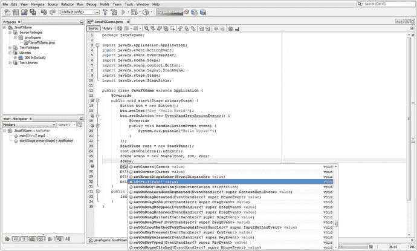

图 7-7。

Add a new line of code and type in the scene’s Scene object and a period to invoke a method helper selector

选择并双击`.setFill(Paint value)`方法，然后在参数区域键入 Java 9 颜色类名(颜色是 Paint 的子类)。接下来，键入句点，调出 Java 9 Color helper 类中包含的常数，如图 [7-8](#Fig8) 所示，找到并选择一个透明常数。正如您在 Javadoc 帮助器窗格中看到的，ARGB 颜色值是期望的#00000000。

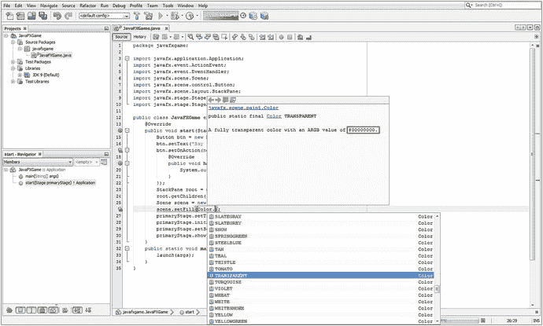

图 7-8。

Type the Color class name and period in the parameter area, and find and select a TRANSPARENT constant

再次运行应用，查看透明度是否显示出来。如图 [7-9](#Fig9) 所示，它仍然不透明。由于我们使用 StackPane 对象来实现 BoardGame 应用中的层，这是我们需要尝试设置透明度值的下一个级别。JavaFX 使用 Color 类常量来确定其所有 UI 对象的默认背景颜色值。如果我是 JavaFX 9 团队的一员，我会主张将它改为彩色。透明常数，但当然，这可能会让新用户感到困惑，因为 alpha 通道和合成层是高级概念和主题，这就是为什么它们在本 pro Java 9 游戏开发书的第 [2](02.html) 章的开头，涵盖了数字图像合成和相关概念。请注意，在图 [7-9](#Fig9) 中，NetBeans 已经为您导入了 Java Color 类，因为您在`scene.setFill(Color.TRANSPARENT);` Java 语句中使用了它。

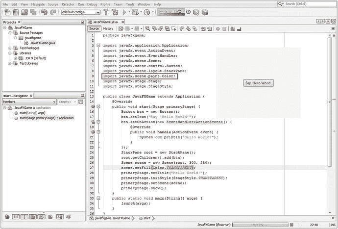

图 7-9。

Set the Scene object fill color to TRANSPARENT, and notice that NetBeans codes a Color class import statement

javafx.scene.layout.StackPane 类是 javafx.scene.layout.Region 类的子类，该类有一个. setBackground()方法来设置背景(类或对象)值。同样，必须有一个透明的值常量可用，或类似的东西，如背景。空，因为您需要始终将背景值设置为透明，特别是对于 pro Java 9 游戏设计，您需要灵活性来实现高级 2D 和 3D 合成和渲染管道。这种对透明性的支持也适用于 Android UI 容器。

有趣的是，事情并不总是像我们在 Java 编程中希望的那样简单和一致，因为我们已经使用了三个不同的方法调用，传递了三个自定义对象类型，到目前为止，实现了完全相同的最终结果(为设计元素安装了透明的背景色/图像板):。initStyle(StageStyle 对象)。setFill(颜色对象)，以及。setBackground(背景对象)。这一次，您将使用另一个名为 EMPTY 的背景类(对象)常量来调用. setBackground(背景值)方法。

一旦使用`root.setBackground(Background.EMPTY);` Java 语句调用名为 root 的 StackPane 对象的方法，NetBeans 9 将帮助您找到常数。这一次更容易作为背景。空常数恰好是。setBackground()方法调用。如果您想查看所有后台助手类常量，请键入 root.setBackground(Background。进入 NetBeans 9，并查看出现在“常量”弹出帮助器选择器窗格中的结果。

如图 [7-10](#Fig10) 所示，NetBeans 9 提供了一个方法选择器下拉菜单，一旦您选择并双击。setBackground(背景值)方法，NetBeans 9 将为您编写代码语句，自动插入默认的空常量，该常量使用点标记法从背景类中调用。正如您将在红色的图 [7-11](#Fig11) 中看到的，NetBeans 还会在 Java 类的顶部编写后台类的导入语句。

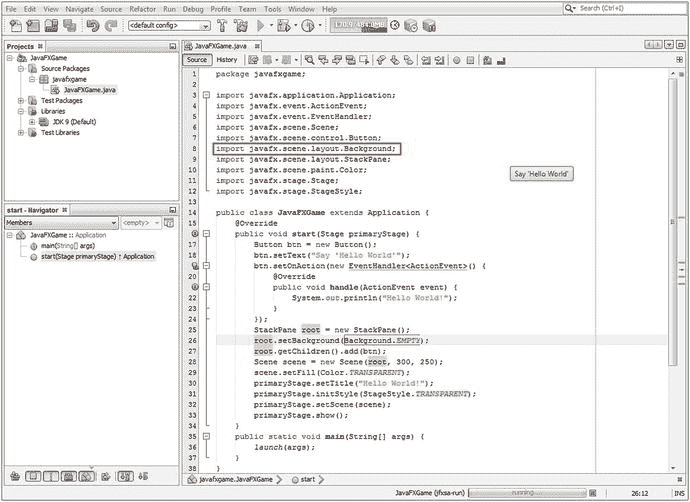

图 7-11。

The transparency now goes through all objects (layers), and the button is now rendered on the OS directly

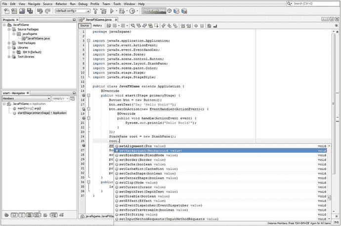

图 7-10。

Add a line of code after the root StackPane object, type root and a period, and select setBackground()

现在，您可以通过运行项目工作流程(通过“运行”菜单或 NetBeans IDE 左上角的绿色 play transport 图标)再次测试您的无窗口(透明)JavaFX 应用版本。

正如您在图 [7-11](#Fig11) 中所看到的，我们现在已经实现了我们的目标，在 NetBeans IDE Java 代码编辑窗格的顶部只显示了按钮对象，这是正在运行的 Java 代码窗口下的下一个应用。下面是操作系统桌面。

您还可以看到 NetBeans 添加了您的后台类导入语句以及九行 StackPane (root)和 Scene (scene)对象 Java 9 代码，我们添加这些代码是为了使最终结果出现在图 [7-11](#Fig11) 的第 25 至 33 行中。一定要理解这些物体的创造过程，以及它们是如何相互链接，或者“连接”的，正如我喜欢称之为的那样，成为不可阻挡的功能交织。理解 Java 9 编程语句的顺序几乎和 Java 9 语句本身的构造一样重要。

例如，在编写第 25 行代码之前，不能编写第 28 行代码，在第 25 行中，实例化了根 StackPane 对象，这样就可以用它来创建场景的 scene 对象。

我在 NetBeans 9 中单击了根对象，以告诉 IDE 向我显示该对象在类中的用法，正如您将在图 [7-11](#Fig11) 中看到的，在 Java 9 代码中使用黄色突出显示跟踪该对象。随着你的 pro Java 9 游戏代码变得越来越复杂，这个很酷的特性变得越来越重要。正如我在第 [6](06.html) 章中提到的，我们将在本书的许多章节中讨论方便的 NetBeans 9 特性。

最后一个测试是确保我们的 JavaFX 应用在操作系统桌面上是透明的。将 NetBeans 9 IDE 拖到一边，并在桌面背景图像的顶部看到您的按钮 UI 元素，您可以在图 [7-12](#Fig12) 中看到它现在工作正常。

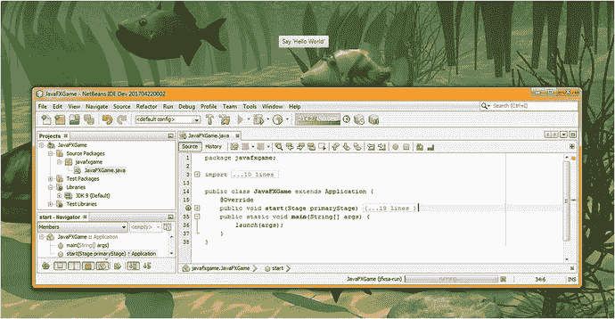

图 7-12。

The JavaFX application seamlessly composited on top of the Windows 7 OS desktop's wallpaper

您还可以看到代码工作时的折叠和展开图标(代码左侧的加号和减号图标)。我已经关闭(折叠)了。start()方法并打开了。main()方法。单击减号将关闭。main()方法，单击加号图标将打开导入语句和。start()方法代码体。

我关闭了 import 语句块。start()方法代码块向您展示了该类的五个主要区域:javafxgame 包声明、导入语句块、JavaFXGame 应用子类声明以及任何 JavaFX 9 游戏(或 IoT)应用所需的两个主要方法，它们是。开始()和。main()。

使用 2D、3D 和 alpha 通道，可以使用这种 StageStyle 创建一些非常酷的应用。透明功能，所以我想我应该在本书的早期向您展示这一点，以便我可以在 JavaFX“概述”一章中获得一些关于增强您的 JavaFX IoT 应用和 pro Java games 编码体验的很酷的技巧和提示。定义一个游戏或 i3D 虚拟物体，让它悬浮在操作系统桌面上，这是一种罕见的视觉冲击效果。

现在，我们已经从回顾与 pro Java 9 游戏开发最直接相关的所有 JavaFX 9 APIs 中获得了一个有趣的编码休息，让我们回到您可能想要了解的关于交互性、UI 设计、图表、音频或视频媒体素材以及关于与互联网和社交媒体平台的接口的其他 JavaFX 模块、包和类产品。我们还将简要介绍一些您不会使用的 API！

现在我们已经看了 javafx.stage 包，接下来让我们看看 javafx.geometry 包。

### JavaFX 边界和尺寸:使用 javafx.geometry 类

尽管术语“几何”在技术上适用于 2D 和 3D 素材，但它们包含在 javafx.scene.shape 包中，我们在本章前面已经介绍过。javafx.geometry 包更像是一个“实用程序”包，包含从头开始构建 2D 或 3D 构造的基础类。因此，该包包含 Bounds 超类及其 BoundingBox 子类等类，以及 Insets、Point2D、Point3D、Dimension2D 和 Rectangle2D 几何内容创建实用程序类。这个 javafx.geometry 包中的所有这些类，除了 BoundingBox 类，都是直接从 java.lang.Object master 类扩展而来的，这意味着它们都是为提供点(也称为顶点)、矩形、尺寸、边界和插入(内部边界)而开发的(从头开始编码),用作 Java 9 游戏的几何实用程序。

Point2D 和 Point3D 类(最终是对象)分别保存 2D 平面上 2D 点的 X，Y 坐标，或者 3D 空间中 3D 点的 X，Y，Z 坐标。这些点对象最终将用于构建更复杂的 2D 或 3D 结构，由点的集合组成，如 2D 路径或 3D 网格。Point2D 和 Point3D 构造函数方法调用没有重载，它们分别使用以下标准格式:

```java
Point2D(double X, double Y)

Point3D(double X, double Y, double Z)

```

Rectangle2D 类(对象)可用于定义一个矩形 2D 区域，通常称为“平面”，并且在图形编程中有许多用途，正如您所想象的那样。

Rectangle2D 对象在矩形的左上角有一个起点，使用 X 和 Y 坐标位置以及尺寸(宽乘高)来指定。Rectangle2D 对象的构造函数方法具有以下标准格式，并且未被重载:

```java
Rectangle2D(double minX, double minY, double width, double height)

```

还有一个 Dimension2D 类(object ),它只指定宽度和高度维度，并不使用 X，Y 位置在屏幕上放置维度(这会使它成为一个矩形)。其构造方法如下:

```java
Dimension2D(double width, double height)

```

Insets 类(object)类似于 Dimension2D 类，因为它不提供插入的位置值，但提供基于上、下、左、右偏移距离的矩形插入区域的偏移。Insets 方法实际上是重载的，因此您可以使用以下代码指定等距插入或自定义插入:

```java
Insets(double topRightBottomLeft)

Insets(double top, double right, double bottom, double left)

```

Bounds 类是一个公共抽象类，永远不会是一个对象，而是一个创建节点边界类的蓝图，比如它的 BoundingBox 子类。Bounds 超类也允许一个负值，用来表示一个边界区域是空的(可以认为它是空的，或者未使用的)。BoundingBox 类使用以下(重载)构造函数方法创建 2D(第一个构造函数)或 3D(第二个构造函数)BoundingBox 对象:

```java
BoundingBox(double minX, double minY, double width, double height)

BoundingBox(double minX, double minY, double minZ, double width, double height, double depth)

```

接下来，让我们看看 JavaFX 中的事件和动作事件处理，因为这为您的游戏增加了交互性。

### 游戏的 JavaFX 输入控件:使用 javafx.event 类

由于游戏本质上是交互式的，接下来让我们看看 javafx.event 包，因为它为我们提供了事件超类及其 ActionEvent 子类，用于处理动作事件，例如 UI 元素使用或动画关键帧处理事件使用。因为您将在 pro Java 9 游戏(或物联网应用)中使用 ActionEvent，所以我将在这里查看它的跨包(Java 到 JavaFX)类继承层次结构，因为这也将向您展示 JavaFX Event 类的起源。这是可能的，因为 JavaFX API 是 Java API 的一部分(在 Java API 之下)。

```java
Java.lang.Object
  > java.util.EventObject
    > javafx.event.Event

      > javafx.event.ActionEvent

```

JavaFXGame 应用已经通过 EventHandler 接口及其。handle()方法，您将实现该方法来告诉 Java 应用如何处理该事件，该事件一旦发生就是一个 ActionEvent(编程术语被触发)。这个。然后，handle()方法“捕捉”被触发的事件，并根据这个“主体”内部的 Java 9 编程逻辑对其进行处理。handle()方法。

正如你从第 5 章中所知道的，Java 接口是一种提供空方法的类型，这些方法被声明使用，但是还不包含任何 Java 构造。未实现的方法在使用时需要由 Java 程序员来实现。这个 Java 接口只定义了需要实现哪些方法；在这种情况下，它是一个“处理”ActionEvent 的方法，以便以某种方式处理该事件。

值得注意的是，Java 接口定义了一个需要编码的方法，但并没有为您编写方法代码，因此它是一个“路线图”,指示您必须做些什么来完成现有的编程结构，或者与现有的编程结构进行交互。在这种情况下，这是一个用于处理 ActionEvent 对象的 Java 编程结构，或者更准确地说，是一个用于在 action event 被触发后处理它们的编程结构。

与本 JavaFX 新媒体引擎概述章节中涵盖的所有内容一样，在应用这些 JavaFX 9 编程结构、JavaFX 场景图构造和新媒体素材设计概念的过程中，您将很快深入了解如何使用这些包、类、嵌套类、接口、方法、常量和数据字段(变量)的细节。

### JavaFX UI 元素:使用 javafx.scene.control 类

javafx.scene.control 包和 javafx.scene.chart 包在 javafx.controls 模块中，我们接下来将介绍这两个包。这个包包含了所有的用户界面控件(在 Android 中它们被称为“widgets”，我喜欢称它们为 UI“elements”)类，比如 Alert、Button、Cell、CheckBox、ChoiceDialog、ContextMenu、control、DatePicker、ColorPicker、Label、ProgressBar、Slider、Label、RadioButton、ScrollBar 和 TextField。由于 javafx.scene.control 中有 100 多个类，我甚至不打算在这里一一介绍，因为关于这个 Java 9 模块可以写一整本书。如果您想回顾这些类，只需使用 Google 或在 Oracle Java 网站上参考 javafx.control 模块，您就可以连续几天仔细阅读这些类的功能。对于这个模块，“reference”是一个关键词，因为当你需要实现一个给定的 UI 元素时，你需要单独地引用这个包和它的类。我将尝试使用我自己的 3D UI 元素和代码来创建本书中的 i3D 游戏，这样我就不必在发行版中包含这个 javafx.controls 模块，从而节省了在发行版中包含 100 多个控件类(更不用说十几个图表类)的开销，这些控件类甚至都没有被利用。

### JavaFX 业务图表:使用 javafx.scene.chart 类

javafx.scene.chart 包位于具有预定义 UI 控件(UI 元素)的 javafx.controls 模块中。这个包包含了业务图表类，比如 Chart、ScatterChart、StackedAreaChart、XYChart、PieChart、LineChart、BarChart、StackedBarChart、AreaChart、BubbleChart 等等，用于业务应用，这是完全不同的一本书，所以在本书中我们不会涉及图表。事实上，对于我的游戏，我将使用 3D UI 方法，这将意味着我根本不需要包括 javafx.controls 模块(大量的类)，这意味着我的游戏模块将只需要包括 javafx.base、javafx.media 和 javafx.graphics，使发行版的下载量大大减少(base 只有 10 个包，media 有 9 个，而 graphics 有 18 个，正如您在本章中所看到的)。

### JavaFX 媒体控件:使用 javafx.scene.media 类

javafx.scene.media 包包含在 javafx.media 模块中，其中包含用于播放音频和视频媒体资源的类，包括 media、MediaPlayer 和 MediaView 类，以及 AudioClip、AudioEqualizer、EqualizerBand、Track、VideoTrack 和 SubtitleTrack 类。媒体类(或对象)引用或包含音频或视频媒体素材，MediaPlayer 播放该素材，MediaView(尤其是在视频的情况下)显示数字音频或视频媒体素材以及用于媒体回放的传输。

我们将在本书稍后为您的 pro Java 9 游戏添加数字音频音效时使用 AudioClip 类，只要我们使用该模块的数字音频部分，如果我们必须将它包含在您的应用(模块)发行版中，我们也可以利用数字视频素材(视频类)功能。

### JavaFX Web 渲染:使用 javafx.scene.web 类

javafx.scene.web 包包含在 javafx.web 模块中，其中包含用于在场景中渲染 web (Internet)资源的类。这个包包含一组类，包括 WebEngine、WebView、WebEvent、WebHistory 和 HTMLEditor。正如您可能想象的那样，WebEngine 类(嘿，有人称这些算法为引擎)执行在 JavaFX 场景中显示 HTML5、CSS3、CSS4 和 JavaScript 的处理，WebView 创建节点以在 JavaFX 场景图中显示 WebEngine 输出。WebHistory 类(最终是对象)保存从 web 引擎实例化到从内存中删除的互联网“会话”，这是访问过的网页的历史，而 WebEvent 类将 JavaScript web 事件处理与 JavaFX 9 事件处理“连接”起来。我们不会将 javafx.web 模块用于我们将在本书的课程中创建的 i3D 游戏，因为我将重点关注可用于提供视觉上最专业的 i3D 游戏效果的核心 API。

### 其他 JavaFX 包:Print、FXML、Beans 和 Swing

在阅读完 JavaFX 概述章节之前，您应该仔细看看其他几个 JavaFX 包，因为这些包包含您可能希望在专业 Java 游戏开发中使用的类，但它们提供了更专业的功能，如打印、使用第三方 Java 代码、使用 AWT 和 Swing 等较旧的 UI 范例，以及使用 XML(特别是 FXML)将 UI 设计卸载给非程序员。这些 API 包括 javafx.print 包(javafx.graphics 模块)、javafx.fxml 包(javafx.fxml 模块)、javafx.beans 包(javafx.base 模块)和 javafx.embed.swing 包(javafx.swing 模块)。除非您的项目有特殊的需求，否则您不太可能在您的 Java 游戏设计和开发工作过程中使用这些。其中最明显的是 javafx.print，用于允许打印机与您的 pro Java 9 游戏一起工作。如果您需要使用旧的 Swing UI 元素，有一个 javafx.swing 模块可以实现这一点，但会给 Java 9 游戏发行版增加更大的数据量。javafx.beans 包将允许您使用 Java Beans(第三方或附加类)，javafx.fxml 模块将允许您使用 Java Fxml，这种 XML 语言允许用户界面和图形设计卸载到 XML，而不是 Java 编码。这使得不熟悉 Java 的设计者也可以参与游戏项目。Android 操作系统和 Android Studio IDE 也使用这种方法，它们使用 XML 来完成许多顶级设计任务，因此设计人员不必是程序员。

## 摘要

在第七章中，您了解了 JavaFX 9 API 中一些最重要的包、概念、组件、类、构造函数、常量和变量(属性、参数、数据字段)。这是一个令人印象深刻的包含 36 个包的 7 个 Java 9 模块的集合，我使用表格简洁地概述了其中的许多模块，然后逐一介绍了它们。我这样做是因为本章中概述的大多数(如果不是全部)包和类最终会以某种方式用于新媒体、2D、3D 和混合 2D+3D pro Java 9 游戏开发。当我说全面概述时，我的意思是让我们看看在 Java 9 下使用 JavaFX 9 开发游戏所需的一切。

当然，我无法在一章中涵盖 JavaFX 9 API 中的每个功能类，所以我首先概述了图 [7-1](#Fig1) 中的 JavaFX API 新媒体引擎，以及它如何与上面的 JavaFX 场景图以及这些 API 下面的 Java FX API、NetBeans 9 和目标操作系统集成。您的 Java 9 游戏发行版和操作系统是通过 Java 虚拟机(JVM)连接起来的。这为 JavaFX 提供了跨众多流行平台和消费电子设备的扩展操作系统支持，从智能手机到平板电脑到 iTV 电视机，以及所有基于流行 WebKit 引擎的主流 web 浏览器(Chrome、Firefox 和 Opera)。

通过查看构成 JavaFX 引擎的结构，包括 JavaFX 场景图、JavaFX APIs、Quantum、Prism、Glass、WebKit 和媒体播放器引擎，您对 JavaFX 有了一个高层次的技术了解。您了解了这些多线程、渲染、窗口、媒体和 web 引擎是如何与 Java 9 APIs 和 JDK 以及 NetBeans 9 及其生成的 JVM 字节码进行交互的，NetBeans 9 及其生成的 JVM 字节码受当前运行在从 96 英寸 UHD iTV 电视机到 4 英寸智能手机等十几种不同消费电子设备类型之上的各种操作系统平台的支持。

我讲述了 JavaFX 的核心概念，例如使用 JavaFX 场景图和 JavaFX 脉冲事件系统，我们将在本书的整个过程中利用它们来创建一个 pro Java 9 游戏，从下一章开始，我们将开始设计游戏，并讲述如何使用 JavaFX 场景图来开发处理层次结构。

我深入研究了一些用于 pro Java 9 游戏设计的关键 JavaFX 包、子包和类，如应用、场景、形状、效果、布局、控制、媒体、图像、舞台、动画、几何、事件、fxml 和 web，以及它们相关的 Java 9 模块、包、子包、类和子类。在某些情况下，我甚至讨论了它们的接口、嵌套(助手)类和数据常量。

您在这篇 JavaFX 9 API 评论中休息了一下，向 JavaFXGame 应用添加了一些代码，使它成为一个“无窗口”的应用，能够“漂浮”在任何流行的 OS 桌面上。您了解了如何通过使用十六进制设置为 0x00000000 的 alpha 通道或使用表示 100% alpha 透明度的等效常数(如 Color)来使 Stage、Scene 和 StackPane 对象的背景属性透明。透明，舞台风格。TRANSPARENT，或者 Background.EMPTY .你也看到了 Group (Node)类和 object 本来就有一个透明的背景；当您将场景图形的顶级节点从堆栈面板更改为组(更好的顶级节点)时，根本不需要设置组背景透明度。

我不得不在本章中使用 NetBeans 9 IDE、Java 9 编程语言和 JavaFX 9 API 进行一些工作，这样我们就可以开始逐渐添加越来越多的代码，直到(很快)剩余的章节完全编码，因为所有这些基础材料，包括新媒体素材设计、API、IDE、游戏概念、JVM、UI、UX、3D 渲染引擎、2D 回放引擎、WebKit、静态与动态、游戏优化等等。 已经在你们的头脑中牢牢地就位，因为在本书的整个过程中，你们需要建立在这些先进知识的基础上。

在下一章中，您将看到 JavaFX 9 场景图。您将开始构建您在本章中学到的场景图形结构，并开始构建游戏的基础，包括用于启动游戏的按钮元素的 UI“面板”。我还会解释你的游戏规则，显示高分，给出制作学分，并包括法律免责声明。我知道您急于开始构建您的 pro Java 9 游戏基础设施，您将在下一章开始认真地做这件事，创建自定义方法并使用 JavaFX APIs 添加新的 Java 代码，开始为您的 JavaFXGame 类创建顶层。实际上，通过学习如何在 JavaFX 9 场景图形层(应用到场景到组到堆栈面板到 VBox 到按钮)内部(并通过它们)实现透明性，您在本章中已经开始做了一些工作。